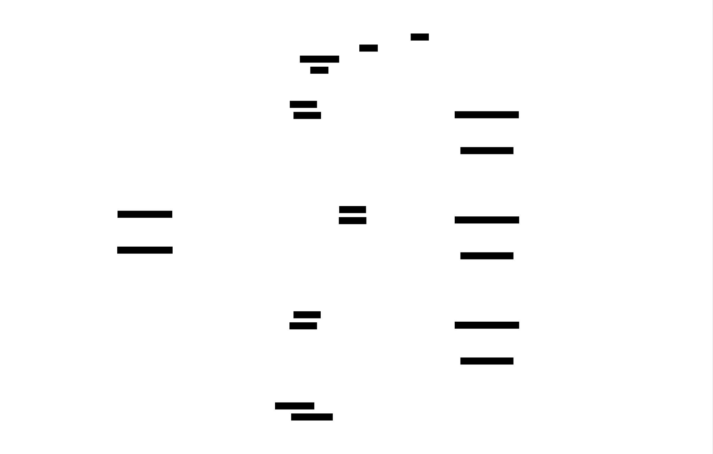

# Two-Phase Commit: Design Document


## Overview

A distributed transaction coordinator implementing the classic two-phase commit (2PC) protocol to achieve atomic commitment across multiple participants. The key architectural challenge is ensuring all-or-nothing semantics in the face of arbitrary failures while maintaining safety through write-ahead logging and structured recovery.


> This guide is meant to help you understand the big picture before diving into each milestone. Refer back to it whenever you need context on how components connect.


## Context and Problem Statement

### The Distributed Transaction Problem

A **distributed transaction** is a single logical operation that spans multiple independent systems, where each system must either commit its local changes or abort them, and all systems must agree on the same outcome. The fundamental challenge is achieving **atomicity**—the guarantee that either all participants commit or all participants abort, with no mixed outcomes possible—when participants operate independently, communicate over an unreliable network, and may fail at arbitrary points in the protocol.

Consider a classic banking scenario: transferring $100 from Account A at Bank X to Account B at Bank Y. This operation requires two local database transactions: (1) debit Account A by $100 at Bank X, and (2) credit Account B by $100 at Bank Y. Without coordination, several failure modes violate atomicity:

- Bank X successfully debits Account A, writes the change to disk, and sends a confirmation message to Bank Y. The message is lost in the network. Bank Y never credits Account B. Money disappears from the system.
- Both banks prepare their local transactions in memory. Bank X's server crashes before committing. Bank Y commits successfully. Account B gains $100, but Account A was never debited because Bank X's uncommitted changes were lost.
- Bank X debits Account A and commits locally. Before Bank Y can commit, a network partition separates the two banks. Bank Y times out waiting for a decision and aborts. Account A has been debited but Account B was never credited.

The difficulty stems from three fundamental properties of distributed systems, often characterized by the **CAP theorem**: when network partitions occur, a system must choose between consistency (all nodes see the same data) and availability (every request receives a response). Distributed transactions prioritize consistency—they must prevent divergent states—which means they cannot guarantee availability during network failures.

> The core problem is not the lack of coordination, but rather the inability to guarantee coordination in the presence of failures. A coordinator can exist and function perfectly, yet still fail to deliver a decision message to a participant. Without additional machinery, the participant enters an **uncertainty period** where it holds locks but doesn't know whether to commit or abort, and cannot safely choose on its own without risking inconsistency.

The atomicity requirement creates a dependency chain: no participant can commit until all participants agree to commit, and no participant can abort unilaterally after voting to commit (because others may have already committed based on the unanimous vote). This dependency makes the protocol inherently **blocking**—a participant that has voted YES must wait for the coordinator's decision, and if the coordinator crashes before delivering that decision, the participant cannot proceed without external intervention.

Four key properties define the distributed transaction problem:

| Property | Requirement | Why It's Hard |
|----------|-------------|---------------|
| **Atomicity** | All participants commit or all abort | Requires consensus despite failures; partial commits violate invariants |
| **Durability** | Committed changes survive crashes | Each participant must persist locally, but must also ensure global decision is durable |
| **Isolation** | Concurrent transactions don't interfere | Participants must hold locks during uncertainty period, blocking other transactions |
| **Consistency** | System moves from valid state to valid state | Cross-system invariants (like total money in banking example) must hold despite independent local decisions |

The network itself introduces additional challenges. Messages can be lost, delayed arbitrarily, duplicated, or delivered out of order. A participant that hasn't received a decision message cannot distinguish between three scenarios: (1) the coordinator crashed before sending the message, (2) the message was lost in the network, or (3) the message is still in transit but delayed. Each scenario requires a different response, yet they are indistinguishable to the participant.

Write-ahead logging, a technique borrowed from single-system database recovery, provides durability but introduces its own challenges in the distributed setting. A participant must log its vote before sending it to the coordinator; otherwise, if the participant crashes after voting YES but before logging, it will lose its vote on restart and may incorrectly vote NO in a retried protocol, violating the one-decision rule. Similarly, the coordinator must log its decision before broadcasting it; otherwise, a coordinator crash could result in some participants learning a decision that is lost forever when the coordinator restarts.

The **blocking problem** is fundamental to two-phase commit. Once a participant votes YES (indicating it has prepared its local transaction and acquired all necessary locks), it enters an **uncertainty window** where it cannot commit or abort without the coordinator's decision. If the coordinator crashes during this window, the participant must wait indefinitely for the coordinator to recover, holding its locks and preventing other transactions from accessing those resources. This is not a implementation bug—it is an inherent consequence of the commit protocol's safety guarantee. Any protocol that guarantees atomicity in the presence of failures must have periods where participants cannot make progress independently.

### Existing Approaches

Several protocols address the distributed transaction problem, each making different trade-offs between safety, availability, latency, and implementation complexity.

**Two-Phase Commit (2PC)** is the foundational protocol for atomic commitment. In the first phase (prepare/voting), the coordinator asks each participant if it can commit. Each participant responds with a vote (YES or NO). In the second phase (commit/decision), the coordinator makes a global decision: COMMIT if all participants voted YES, ABORT if any participant voted NO or timed out. The coordinator then broadcasts this decision to all participants. 2PC provides perfect safety—atomicity is never violated—but suffers from blocking: if the coordinator fails after participants have voted YES but before delivering the decision, those participants cannot proceed without coordinator recovery or external intervention.

**Three-Phase Commit (3PC)** attempts to reduce blocking by adding an intermediate phase. After collecting votes, the coordinator sends a PRE-COMMIT message to all participants before the final COMMIT. This additional phase allows participants to time out safely in some failure scenarios: if a participant has received PRE-COMMIT, it knows all other participants voted YES, and if the coordinator crashes, the participants can elect a new coordinator to complete the commit. However, 3PC's non-blocking property holds only under specific failure assumptions (fail-stop model with bounded message delays). In the presence of network partitions, 3PC can violate atomicity by allowing different partitions to make different decisions. Most production systems avoid 3PC because the added complexity doesn't justify the marginal reduction in blocking probability, and its assumptions rarely hold in real networks.

**Paxos Commit** replaces the single coordinator with a replicated decision-maker. Each participant's vote is submitted to a Paxos instance, and the final decision is also determined through Paxos consensus. This eliminates the coordinator as a single point of failure for durability—if one coordinator replica crashes, others continue. However, it doesn't eliminate blocking for participants: a participant that has voted YES must still wait for the Paxos-determined decision, and Paxos itself can block if a majority of replicas are unavailable. Paxos Commit improves coordinator availability and decision durability but adds significant complexity and message overhead (multiple Paxos rounds for vote collection and decision).

| Protocol | Phases | Coordinator Redundancy | Blocking? | Network Assumptions | Safety | Typical Latency |
|----------|--------|------------------------|-----------|---------------------|--------|-----------------|
| **2PC** | 2 (prepare, commit) | Single coordinator | Yes, if coordinator fails after prepare | Asynchronous, partitions | Perfect (never violates atomicity) | 2 RTT (prepare + commit) |
| **3PC** | 3 (prepare, pre-commit, commit) | Single coordinator | No under fail-stop, yes under partitions | Synchronous, bounded delays | Imperfect (partition can cause split) | 3 RTT |
| **Paxos Commit** | Multiple Paxos rounds | Replicated coordinator group | Yes, if majority unavailable | Asynchronous, partitions | Perfect | 4+ RTT (Paxos for votes + decision) |

Modern distributed databases take varied approaches to transactions:

- **Google Spanner** uses 2PC for cross-shard transactions but layers it over Paxos-replicated coordinators and participants for durability. It also uses TrueTime (GPS + atomic clocks) to provide external consistency without coordination in many cases.
- **CockroachDB** similarly uses 2PC with Raft-replicated ranges, providing high availability of both coordinators and participants.
- **MongoDB** uses 2PC for multi-document transactions within a replica set, with the primary acting as coordinator.
- **Eventual consistency systems** (DynamoDB, Cassandra) avoid distributed transactions entirely, allowing temporary inconsistency in exchange for availability.

An alternative to 2PC is **Saga**, a long-running transaction pattern that breaks a distributed transaction into a sequence of local transactions, each with a compensating transaction to undo its effects. Sagas trade atomicity for availability: each local transaction commits immediately, and if a later step fails, compensating transactions roll back earlier steps. This approach works for workflows that can tolerate temporary inconsistent states but cannot provide the same atomicity guarantees as 2PC.

> The key insight is that no protocol can simultaneously provide safety (perfect atomicity), non-blocking progress (availability), and tolerance for arbitrary network partitions. This is a consequence of the **FLP impossibility result** and CAP theorem. 2PC chooses safety over availability: it will block rather than risk an inconsistent state. Systems that require high availability must either sacrifice atomicity (eventual consistency, Sagas) or invest in sophisticated replication infrastructure (Spanner, CockroachDB) to reduce the probability of blocking scenarios.

**Why implement 2PC despite its limitations?** Two-phase commit remains the foundation for understanding atomic commitment protocols. Its simplicity makes the core challenges visible: exactly when to log state, how to handle each failure mode, and why blocking is fundamental rather than a bug. More sophisticated protocols (Paxos Commit, Raft-based transactions) build on the same principles but add replication complexity. Learning 2PC provides the conceptual framework for understanding those advanced systems.

### This Implementation's Scope

This implementation focuses on the **core two-phase commit protocol with crash recovery**, targeting educational clarity over production-grade features. The scope explicitly includes:

**Included:**

- **Basic 2PC protocol**: Full prepare (voting) phase and commit (decision) phase with correct message ordering and timing
- **Write-ahead logging**: Every state transition (coordinator and participant) is durably logged before taking effect
- **Coordinator crash recovery**: Coordinator restarts, reads its transaction log, and resumes in-progress transactions
- **Participant crash recovery**: Participant restarts, checks its local log, and queries the coordinator for uncertain transactions
- **Timeout handling**: Abort on prepare timeout, retries for commit phase
- **Blocking scenario demonstration**: Show the fundamental blocking case when coordinator fails and participants are uncertain

The implementation assumes a **fail-stop failure model**: processes crash and stop, then potentially restart. The network is asynchronous and unreliable (messages can be lost or delayed arbitrarily), but we assume no Byzantine failures (no malicious behavior, no message corruption beyond loss).

**Explicitly excluded (non-goals):**

- **Byzantine fault tolerance**: No protection against malicious participants that lie about their votes or attempt to sabotage the protocol
- **Network partition handling**: No automatic split-brain detection or partition-aware recovery; blocking during partitions is demonstrated as inherent
- **Performance optimizations**: No pipelining, batching, read-only transaction fast path, or presumed commit optimization
- **Three-phase commit or Paxos Commit**: Only classic 2PC; more advanced protocols are mentioned as extensions but not implemented
- **Production-grade observability**: Minimal logging for debugging; no metrics, distributed tracing, or health checks
- **Concurrent transaction optimization**: Multiple transactions can run, but the focus is correctness for individual transactions, not throughput optimization
- **Dynamic participant discovery**: Participant list is known at transaction start; no support for adding participants mid-transaction

| Feature | Included | Rationale |
|---------|----------|-----------|
| Core 2PC (prepare + commit phases) | ✓ | Essential for learning atomic commitment |
| Write-ahead logging with fsync | ✓ | Demonstrates durability requirements |
| Crash recovery (coordinator and participant) | ✓ | Core learning goal: how recovery works |
| Timeout handling and retries | ✓ | Shows how to detect failures |
| Blocking scenario demonstration | ✓ | Illustrates fundamental protocol limitation |
| 3PC or Paxos Commit | ✗ | Out of scope; mentioned as extension |
| Byzantine fault tolerance | ✗ | Requires separate course; adds complexity without educational value for basic 2PC |
| Network partition handling beyond blocking | ✗ | Blocking is the expected outcome; advanced partition logic is a separate topic |
| Performance optimizations | ✗ | Correctness first; optimizations obscure core logic |

The test scenarios focus on demonstrating correctness properties and failure modes:

1. **Normal commit**: All participants vote YES, coordinator decides COMMIT, all apply changes
2. **Normal abort**: One participant votes NO, coordinator decides ABORT, all abort
3. **Timeout abort**: One participant doesn't respond, coordinator times out and decides ABORT
4. **Coordinator crash during prepare**: Participants timeout or recover and query coordinator after it restarts
5. **Coordinator crash after decision logged but before sending**: Coordinator resumes on restart and re-sends decision
6. **Participant crash after voting YES**: Participant recovers, queries coordinator for decision
7. **Blocking demonstration**: Coordinator fails after participants vote YES; show participants stuck waiting

The implementation uses a **simple network model**: point-to-point message passing between coordinator and participants. Messages can be lost (simulated by timeouts) but are not corrupted. We assume processes can distinguish between "no response" (crash or network failure) and "negative response" (explicit NO vote or ABORT decision). The transport layer provides at-least-once delivery semantics (messages may be duplicated), and both coordinator and participants must handle duplicate messages idempotently.

> This scoped implementation provides complete coverage of the educational goals: understanding when and why to log state, how to recover after crashes, what blocking means in practice, and why 2PC makes the safety vs. availability trade-off it does. Production systems add replication (Raft/Paxos), sophisticated retry logic, monitoring, and performance optimizations, but those additions build on the foundation established here.

### Implementation Guidance

This section provides practical guidance for implementing the two-phase commit protocol in Go, the primary language for this project.

#### A. Technology Recommendations

| Component | Simple Option | Advanced Option |
|-----------|---------------|-----------------|
| **Transport** | HTTP REST with JSON (net/http, encoding/json) | gRPC with Protocol Buffers (google.golang.org/grpc) |
| **Logging** | File-based append-only log with os.File and Sync() | Embedded database like BoltDB or Badger |
| **Serialization** | JSON (encoding/json) | Protocol Buffers or MessagePack |
| **Concurrency** | sync.Mutex for shared state | sync.Map or channel-based actor model |
| **Configuration** | Hardcoded or JSON file | Consul, etcd, or environment variables |

**Recommendation**: Start with the simple options. Use HTTP REST for message passing (easy to debug with curl/Postman), file-based logging (transparent on-disk format), and JSON serialization (human-readable logs). These choices make the protocol behavior visible during development.

#### B. Infrastructure Starter Code

The following components are prerequisites but not the core learning goal. Use these implementations as-is:

**Write-Ahead Log (WAL) Implementation:**

```go
package wal

import (
    "bufio"
    "encoding/json"
    "fmt"
    "os"
    "sync"
)

// Entry represents a single log record. The Data field contains the
// serialized LogRecord from the data model.
type Entry struct {
    Data []byte // JSON-encoded LogRecord
}

// WAL provides append-only log with fsync durability.
type WAL struct {
    file   *os.File
    mu     sync.Mutex
    path   string
}

// Open creates or opens a write-ahead log file.
func Open(path string) (*WAL, error) {
    file, err := os.OpenFile(path, os.O_APPEND|os.O_CREATE|os.O_RDWR, 0644)
    if err != nil {
        return nil, fmt.Errorf("failed to open log: %w", err)
    }
    return &WAL{file: file, path: path}, nil
}

// Append writes an entry to the log and fsyncs to disk before returning.
func (w *WAL) Append(entry Entry) error {
    w.mu.Lock()
    defer w.mu.Unlock()
    
    // Write entry with newline delimiter
    if _, err := w.file.Write(append(entry.Data, '\n')); err != nil {
        return fmt.Errorf("failed to write entry: %w", err)
    }
    
    // Fsync ensures durability
    if err := w.file.Sync(); err != nil {
        return fmt.Errorf("failed to sync log: %w", err)
    }
    
    return nil
}

// ReadAll returns all entries in the log.
func (w *WAL) ReadAll() ([]Entry, error) {
    w.mu.Lock()
    defer w.mu.Unlock()
    
    // Seek to start
    if _, err := w.file.Seek(0, 0); err != nil {
        return nil, fmt.Errorf("failed to seek: %w", err)
    }
    
    var entries []Entry
    scanner := bufio.NewScanner(w.file)
    for scanner.Scan() {
        entries = append(entries, Entry{Data: []byte(scanner.Text())})
    }
    
    if err := scanner.Err(); err != nil {
        return nil, fmt.Errorf("failed to read log: %w", err)
    }
    
    return entries, nil
}

// Close closes the log file.
func (w *WAL) Close() error {
    w.mu.Lock()
    defer w.mu.Unlock()
    return w.file.Close()
}

// Truncate removes all entries before the given offset (for log compaction).
// Note: This is a simplified version; production systems use segment files.
func (w *WAL) Truncate(keepAfter int64) error {
    w.mu.Lock()
    defer w.mu.Unlock()
    
    entries, err := w.ReadAll()
    if err != nil {
        return err
    }
    
    if keepAfter >= int64(len(entries)) {
        return nil
    }
    
    // Close current file
    w.file.Close()
    
    // Create new file
    newFile, err := os.OpenFile(w.path+".new", os.O_APPEND|os.O_CREATE|os.O_RDWR, 0644)
    if err != nil {
        return fmt.Errorf("failed to create new log: %w", err)
    }
    
    // Write entries to keep
    for i := int(keepAfter); i < len(entries); i++ {
        newFile.Write(append(entries[i].Data, '\n'))
    }
    newFile.Sync()
    newFile.Close()
    
    // Replace old file
    if err := os.Rename(w.path+".new", w.path); err != nil {
        return fmt.Errorf("failed to replace log: %w", err)
    }
    
    // Reopen
    w.file, err = os.OpenFile(w.path, os.O_APPEND|os.O_CREATE|os.O_RDWR, 0644)
    return err
}
```

**HTTP Transport Helpers:**

```go
package transport

import (
    "bytes"
    "encoding/json"
    "fmt"
    "net/http"
    "time"
)

// SendMessage sends a JSON message to the given URL via HTTP POST.
// Returns error if request fails or non-2xx status received.
func SendMessage(url string, message interface{}) error {
    data, err := json.Marshal(message)
    if err != nil {
        return fmt.Errorf("failed to marshal message: %w", err)
    }
    
    resp, err := http.Post(url, "application/json", bytes.NewBuffer(data))
    if err != nil {
        return fmt.Errorf("failed to send request: %w", err)
    }
    defer resp.Body.Close()
    
    if resp.StatusCode < 200 || resp.StatusCode >= 300 {
        return fmt.Errorf("received non-2xx status: %d", resp.StatusCode)
    }
    
    return nil
}

// SendMessageWithRetry sends a message with exponential backoff retry.
func SendMessageWithRetry(url string, message interface{}, maxRetries int) error {
    var lastErr error
    backoff := 100 * time.Millisecond
    
    for i := 0; i < maxRetries; i++ {
        if err := SendMessage(url, message); err == nil {
            return nil
        } else {
            lastErr = err
        }
        
        time.Sleep(backoff)
        backoff *= 2
    }
    
    return fmt.Errorf("failed after %d retries: %w", maxRetries, lastErr)
}

// StartHTTPServer starts an HTTP server that handles incoming messages.
// The handler function receives decoded JSON messages.
func StartHTTPServer(addr string, handler func(http.ResponseWriter, *http.Request)) error {
    http.HandleFunc("/", handler)
    return http.ListenAndServe(addr, nil)
}
```

#### C. Core Logic Skeleton Code

The following are skeleton signatures for the core components you must implement. The numbered TODOs map to the algorithm steps described in the design sections.

**Coordinator Decision Logic:**

```go
// MakeDecision evaluates all participant votes and returns the global decision.
// Returns DecisionCommit only if ALL participants voted VoteCommit.
// Returns DecisionAbort if any participant voted VoteAbort or timed out.
func (c *Coordinator) MakeDecision(txID string, votes map[string]Vote) Decision {
    // TODO 1: Retrieve the transaction record for txID to get the expected participant list
    // TODO 2: Check if len(votes) matches the number of participants
    //         If not, some participants timed out → return DecisionAbort
    // TODO 3: Iterate through all votes in the map
    //         If any vote is VoteAbort → return DecisionAbort immediately
    // TODO 4: If you reach here, all participants voted VoteCommit → return DecisionCommit
    // Hint: Use a range loop over votes; check each vote value
}
```

**Coordinator Prepare Phase:**

```go
// ExecutePreparePhase sends PREPARE messages to all participants and collects votes.
// Returns a map of participantID → Vote.
// Returns error if logging fails.
func (c *Coordinator) ExecutePreparePhase(txID string) (map[string]Vote, error) {
    // TODO 1: Retrieve transaction record for txID
    // TODO 2: Create a LogRecord with State=StatePreparing, TxID=txID, Participants list
    // TODO 3: Serialize LogRecord to JSON and append to WAL with Append()
    //         If Append() fails, return error immediately
    // TODO 4: Create a channel to collect vote responses
    // TODO 5: For each participant in tx.Participants:
    //         Launch a goroutine that:
    //           - Constructs a PrepareMessage{TxID: txID, Operations: ...}
    //           - Calls SendMessage(participant.URL + "/prepare", prepareMsg)
    //           - Sends the response (Vote) to the vote channel
    //           - If SendMessage fails or times out, send VoteAbort to channel
    // TODO 6: Start a timeout timer for the voting phase (e.g., 5 seconds)
    // TODO 7: Collect votes from channel until all participants responded or timeout occurs
    //         Use a select statement with timeout
    // TODO 8: Return the collected votes map
    // Hint: Use sync.WaitGroup or count responses to know when all votes are in
}
```

**Participant Vote Logic:**

```go
// HandlePrepare processes a PREPARE message and returns a vote.
// Logs the PREPARED state before responding.
func (p *Participant) HandlePrepare(msg PrepareMessage) (Vote, error) {
    // TODO 1: Check if local resources can be locked for this transaction
    //         Call p.lockManager.TryAcquireLocks(msg.Operations)
    //         If locks cannot be acquired → vote = VoteAbort
    //         Otherwise → vote = VoteCommit
    // TODO 2: Create a LogRecord with State=StatePrepared, TxID=msg.TxID, Vote=vote
    // TODO 3: Serialize LogRecord to JSON and append to participant's WAL
    //         If Append() fails, release locks and return error
    // TODO 4: Return the vote
    // CRITICAL: Log MUST be written before returning vote to coordinator
    // Hint: Use defer to release locks if an error occurs before completing
}
```

**Coordinator Crash Recovery:**

```go
// Recover reads the coordinator's WAL and resumes in-progress transactions.
func (c *Coordinator) Recover() error {
    // TODO 1: Call c.wal.ReadAll() to get all log entries
    // TODO 2: Parse each entry's Data field as a LogRecord (JSON unmarshal)
    // TODO 3: For each transaction in the log:
    //         Group entries by TxID to find the latest state for each transaction
    // TODO 4: For each transaction:
    //         If latest state is StatePreparing → decision is not logged → send ABORT to all participants
    //         If latest state is StateCommitting → decision is COMMIT → resend COMMIT to all participants
    //         If latest state is StateAborting → decision is ABORT → resend ABORT to all participants
    //         If latest state is StateCompleted → transaction finished → skip
    // TODO 5: Update in-memory transaction map with recovered state
    // TODO 6: For incomplete transactions, restart the commit/abort phase to collect ACKs
    // Hint: Build a map[string]*TransactionState from log entries before processing
}
```

#### D. Language-Specific Hints

**Go-Specific Tips:**

- **Fsync durability**: Use `file.Sync()` after writing to the log. This is the Go equivalent of fsync(2) and ensures data reaches disk.
- **JSON serialization**: Use `encoding/json` with `json.Marshal()` for log records and messages. Add `json:"field_name"` tags to struct fields for control over JSON keys.
- **HTTP transport**: The `net/http` package provides both client (`http.Post()`) and server (`http.ListenAndServe()`) functionality. For testing, use `httptest.Server`.
- **Timeouts**: Use `context.WithTimeout()` for request timeouts and `time.After()` in select statements for vote collection timeouts.
- **Concurrency**: Protect shared state (transaction map, vote collection) with `sync.Mutex`. Use goroutines for sending PREPARE messages in parallel, but collect responses in a single goroutine to avoid race conditions.
- **Error handling**: Always check errors from `file.Sync()`, `http.Post()`, and `json.Marshal/Unmarshal()`. If logging fails, the protocol cannot proceed safely—return the error to the caller.
- **Testing**: Use table-driven tests for vote decision logic. Use `httptest` for mocking participant responses. Simulate crashes by stopping the coordinator process and checking if recovery correctly resumes transactions.

**Directory structure suggestion:**

```
two-phase-commit/
├── cmd/
│   ├── coordinator/      # Coordinator main binary
│   └── participant/      # Participant main binary
├── pkg/
│   ├── coordinator/      # Coordinator logic
│   ├── participant/      # Participant logic
│   ├── wal/              # Write-ahead log (provided above)
│   ├── transport/        # HTTP helpers (provided above)
│   └── types/            # Shared types (LogRecord, Message structs)
├── data/                 # Log files stored here
└── tests/                # Integration tests
```

**Common pitfalls:**

1. **Logging after sending**: If you send a vote or decision before logging it, a crash immediately after sending will lose that state. Always log first, then send.
2. **Ignoring fsync errors**: If `file.Sync()` returns an error, the data may not be durable. You must abort the transaction and return the error.
3. **Race conditions in vote collection**: If multiple goroutines write to the same map without synchronization, you'll get a race. Use a channel to collect votes in a single goroutine, or protect the map with a mutex.
4. **Not handling duplicate messages**: The coordinator might send COMMIT multiple times during recovery. Participants must recognize duplicate decisions and respond idempotently (e.g., ACK again without re-applying changes).
5. **Timeout values too short**: If timeouts are shorter than typical network RTT, you'll get spurious aborts. Start with generous timeouts (5-10 seconds) for testing, then tune based on observed latency.


## Goals and Non-Goals

This section establishes the boundaries of the two-phase commit implementation, enumerating what the system guarantees, what performance characteristics it targets, and what problems it explicitly does not solve. Clear goals prevent scope creep and set realistic expectations for system capabilities and limitations.

### Functional Goals

The fundamental purpose of this two-phase commit implementation is to provide **atomic commitment** across distributed participants while maintaining correctness through all failure scenarios within the fail-stop model. The following table enumerates the core functional requirements:

| Goal | Description | Success Criteria |
|------|-------------|------------------|
| **Atomicity Guarantee** | All participants commit or all abort — no partial outcomes | After any failure and recovery sequence, every participant in a transaction reaches the same final state (all `StateCompleted` with `DecisionCommit`, or all with `DecisionAbort`) |
| **Durability of Decisions** | Once a decision is made, it survives coordinator crashes | The coordinator logs `DecisionCommit` or `DecisionAbort` to the WAL with fsync before sending any decision message. On recovery, the decision is restored and re-driven to completion |
| **Durability of Votes** | Once a participant votes, it survives participant crashes | Each participant logs its `Vote` (`VoteCommit` or `VoteAbort`) to its local WAL with fsync before sending the `VoteMessage` to the coordinator |
| **Coordinator Recovery** | Coordinator resumes in-progress transactions after crash | The `Recover()` method reads the coordinator's WAL, identifies all transactions not in `StateCompleted`, and re-executes the appropriate protocol phase (resend PREPARE if in `StatePreparing`, resend decision if in `StateCommitting` or `StateAborting`) |
| **Participant Recovery** | Participants restore state and query coordinator after crash | Each participant's `Recover()` method reads its local log. If the participant is in `StatePrepared` (voted but no decision received), it queries the coordinator for the outcome. If the decision is known locally, it resumes from that point |
| **Vote Collection** | Coordinator collects votes from all participants with timeout | The `ExecutePreparePhase()` method sends `PrepareMessage` to all participants, waits for `VoteMessage` responses, and enforces a timeout. Missing votes are treated as implicit `VoteAbort` |
| **Decision Propagation** | Coordinator reliably delivers decision to all participants | After logging the decision, the coordinator sends `CommitMessage` with `DecisionCommit` or `DecisionAbort` to every participant. It retries failed sends and waits for `AckMessage` from each participant before transitioning to `StateCompleted` |

#### Atomicity in Detail

The system achieves atomicity through a carefully sequenced protocol where no participant can unilaterally proceed after voting `VoteCommit`. Consider a transaction `T1` with participants `P1`, `P2`, and `P3`:

1. The coordinator sends `PrepareMessage` to all three participants
2. Each participant evaluates whether it can commit (checking resource locks, constraint validation, etc.)
3. `P1` and `P2` both vote `VoteCommit`, while `P3` votes `VoteAbort` due to a conflict
4. The coordinator's `MakeDecision()` method evaluates the votes and returns `DecisionAbort` (even a single `VoteAbort` causes global abort)
5. The coordinator logs `DecisionAbort` to its WAL with fsync
6. The coordinator sends `CommitMessage` with `DecisionAbort` to all three participants
7. Each participant rolls back its pending changes and releases locks
8. Each participant sends `AckMessage` to the coordinator
9. The coordinator transitions to `StateCompleted` after receiving all acknowledgments

If the coordinator crashes at step 5 (after logging but before sending), recovery will read the log, find the `DecisionAbort`, and resume from step 6. If a participant crashes at step 7 (after receiving the decision but before acknowledging), its recovery will find `DecisionAbort` in its log and complete the rollback. The atomicity guarantee holds: all three participants end in the same state (aborted).

> The critical design principle is **log before action**: every state transition that cannot be undone (voting YES, making a decision) must be durably logged before any external message is sent. This ensures recovery can always determine the correct next step.

#### Durability Mechanism

Durability is achieved through write-ahead logging with explicit fsync calls. The following table details durability requirements for each component:

| Component | What Must Be Durable | When Written | Fsync Requirement |
|-----------|---------------------|--------------|-------------------|
| Coordinator | Transaction initialization (`StateInit` with participant list) | Before sending first `PrepareMessage` | After every `Append()` call to WAL |
| Coordinator | Prepare phase start (`StatePreparing`) | When beginning prepare phase | After `Append()` |
| Coordinator | Decision (`DecisionCommit` or `DecisionAbort`) | Before sending any `CommitMessage` | After `Append()` |
| Coordinator | Completion acknowledgment | After receiving all `AckMessage` responses | After `Append()` |
| Participant | Vote (`VoteCommit` or `VoteAbort`) | Before sending `VoteMessage` to coordinator | After `Append()` to participant's local WAL |
| Participant | Decision receipt (`DecisionCommit` or `DecisionAbort`) | When receiving `CommitMessage` from coordinator | After `Append()` |

The `WAL` component provides an `Append()` method that writes a `LogRecord` to disk and calls `fsync()` before returning. This guarantees that even if the process crashes immediately after `Append()` returns, the log entry will be present on subsequent restart. The recovery procedure relies on this guarantee to restore state accurately.

Example scenario demonstrating durability: The coordinator decides `DecisionCommit` for transaction `T2`. It writes `LogRecord` with `State: StateCommitting, Decision: DecisionCommit` to its WAL and calls fsync. The disk controller acknowledges the write. The coordinator then begins sending `CommitMessage` to participants. The coordinator process crashes before any messages are delivered. On restart, `Recover()` reads the log, finds the `DecisionCommit` for `T2`, and resumes sending `CommitMessage` to all participants. The decision survives the crash.

### Non-Functional Goals

Beyond correctness guarantees, the system targets specific performance and operational characteristics. These goals acknowledge that while correctness is paramount, the system must also be practical for learning and experimentation.

| Goal | Target | Rationale |
|------|--------|-----------|
| **Transaction Latency** | Complete normal-case transaction (all votes YES, no failures) in < 100ms for 3-5 participants on local network | Demonstrates protocol overhead. Dominated by disk fsync latency (typically 1-10ms per sync) and network round-trip time (< 1ms local, 50-100ms WAN) |
| **Throughput** | Support 10-50 concurrent transactions with coordinator on commodity hardware | Sufficient for educational exploration. Not optimized for production-scale workloads |
| **Recovery Time** | Coordinator and participant recovery complete within 5 seconds for logs containing up to 1000 transactions | Bounded by sequential log read speed. Acceptable for development/testing scenarios |
| **Log Growth** | Implement log compaction to prevent unbounded growth — completed transactions removed after configurable retention period (default: keep last 100 completed transactions) | Prevents disk exhaustion during extended testing runs |
| **Resource Efficiency** | Coordinator uses < 100MB memory for up to 1000 concurrent in-progress transactions | Lightweight enough to run on developer machines |
| **Observability** | Log all protocol events (PREPARE sent, VOTE received, decision made, ACK received) with transaction ID and timestamp | Enables debugging and visualization of protocol execution |

#### Latency Breakdown

A normal-case transaction traverses the following steps, each contributing latency:

1. **Coordinator initialization**: Allocate `Transaction` struct, generate `TxID`, write `LogRecord` with `StateInit` to WAL (one fsync) — cost: ~5-10ms
2. **Prepare phase broadcast**: Send `PrepareMessage` to N participants in parallel via HTTP — cost: ~1ms per participant (assuming local network)
3. **Participant vote processing**: Each participant evaluates the request, acquires locks, writes vote to local WAL (one fsync per participant), sends `VoteMessage` — cost: ~5-10ms per participant (dominated by fsync)
4. **Coordinator decision**: Coordinator receives all votes, evaluates with `MakeDecision()`, writes decision to WAL (one fsync) — cost: ~5-10ms
5. **Commit phase broadcast**: Send `CommitMessage` to N participants in parallel — cost: ~1ms per participant
6. **Participant commit processing**: Each participant applies changes, writes decision to local WAL (one fsync), sends `AckMessage` — cost: ~5-10ms per participant
7. **Coordinator completion**: Receive all acknowledgments, write completion to WAL (one fsync) — cost: ~5-10ms

Total worst-case latency (sequential path): ~40-60ms for coordinator operations plus max participant response time (which is parallelized, so only the slowest matters). With 3 participants on SSDs (fsync ~1ms), typical end-to-end latency is 40-50ms. With HDDs (fsync ~10ms), it stretches to 100-150ms.

> Performance is intentionally not optimized beyond ensuring correctness. Techniques like batching log writes, pipelining transactions, or eliminating fsync calls (presumed abort optimization) are documented as future extensions but not implemented initially. The focus is on understanding the protocol's core mechanics and failure handling.

#### Scalability Expectations

This implementation targets **learning and experimentation**, not production deployment at scale. The following table contrasts typical usage with what the design explicitly does NOT support:

| Dimension | Supported | Not Supported |
|-----------|-----------|---------------|
| **Concurrent Transactions** | 10-50 in-progress transactions simultaneously | Thousands of concurrent transactions (would require lock-free data structures, sophisticated WAL batching) |
| **Participant Count** | 3-10 participants per transaction | Hundreds of participants (broadcast latency becomes prohibitive, failure probability increases) |
| **Transaction Rate** | 10-100 transactions/second | High-frequency trading workloads (thousands of tx/sec) — would need asynchronous I/O, batched fsyncs |
| **Geographic Distribution** | Single datacenter or local network (RTT < 5ms) | Cross-region participants (RTT > 100ms) — would require optimizations like presumed commit, read-only optimization |
| **Log Size** | Up to 10,000 completed transactions before compaction | Unbounded log growth — would need more sophisticated compaction and archival strategies |

The coordinator maintains an in-memory map from `TxID` to `Transaction` for all in-progress transactions. With 1000 concurrent transactions, each `Transaction` struct consuming ~1KB (transaction ID, participant list, operation data), total memory usage is ~1MB for transaction state, plus overhead for HTTP connections and log buffers. This is well within the 100MB target.

### Explicit Non-Goals

To prevent scope creep and set clear expectations, the following problems are explicitly excluded from this implementation. Each non-goal represents a significant additional complexity that would obscure the core two-phase commit learning objectives.

| Non-Goal | Why Excluded | Impact |
|----------|--------------|--------|
| **Byzantine Fault Tolerance** | Assumes fail-stop model where crashed processes stop sending messages; does not handle malicious participants sending conflicting votes or forged messages | System is vulnerable to intentional misbehavior. If a participant sends `VoteCommit` to the coordinator but then refuses to commit when receiving `CommitMessage`, atomicity is violated. Requires cryptographic signatures and Byzantine agreement protocols (PBFT, etc.) to address |
| **Network Partition Handling** | Assumes reliable message delivery with retries; does not distinguish between slow participants and partitioned participants | During a partition, the coordinator cannot differentiate between a participant that will eventually respond and one that is permanently unreachable. The timeout-based abort mechanism treats all non-responses as failures. More sophisticated partition detection (heartbeats, vector clocks) would be needed for partition-aware behavior |
| **Optimistic Concurrency Control** | Uses pessimistic locking (participants acquire locks before voting); does not implement OCC with validation phase | Transactions that conflict must wait for lock release rather than speculatively executing and validating at commit time. OCC would require additional tracking of read/write sets and conflict detection logic |
| **Performance Optimization** | Prioritizes correctness and clarity over throughput; does not implement batching, pipelining, or asynchronous I/O | Achieves ~100 transactions/second instead of thousands. Acceptable for learning; unacceptable for production. Each transaction performs multiple synchronous fsyncs rather than batching writes |
| **Read-Only Transaction Optimization** | Treats all transactions as read-write; does not skip prepare phase for read-only transactions | Read-only transactions incur full 2PC overhead even though they cannot conflict. Production systems detect read-only transactions and execute them in a single phase |
| **Dynamic Participant Registration** | Participant list is fixed at transaction start; does not support adding participants mid-transaction | Cannot handle scenarios where a transaction discovers additional resources after beginning the prepare phase. Would require nested transactions or transaction suspension |
| **Heterogeneous Failure Modes** | Only handles crash failures (fail-stop model); does not handle slow participants, stuck transactions, or deadlock detection | A participant that hangs indefinitely (not crashed, just stuck) will cause the coordinator to wait until timeout. No deadlock detection between transactions competing for locks |
| **Multi-Coordinator Consensus** | Single coordinator per transaction (single point of failure during protocol execution); does not replicate coordinator state for high availability | If the coordinator crashes, transactions block until it recovers. Would need Paxos or Raft for replicated coordinator state, significantly increasing complexity |

#### Byzantine Failures: Why Not Addressed

Consider a malicious participant `M` that wants to violate atomicity. In the prepare phase, `M` receives `PrepareMessage` and sends `VoteCommit` to the coordinator. The coordinator collects all votes (all are `VoteCommit`), makes the decision `DecisionCommit`, logs it, and broadcasts `CommitMessage` to all participants. The honest participants `H1` and `H2` commit their changes. However, `M` ignores the `CommitMessage` and aborts instead (or simply crashes without applying the commit). Now the system is inconsistent: `H1` and `H2` have committed, while `M` has aborted.

Handling Byzantine failures requires:
- Cryptographic signatures on all messages to prevent forgery
- Participants logging their votes with signatures to create non-repudiable evidence
- A Byzantine agreement protocol where participants can verify each other's votes
- Quorum-based decisions (2f+1 participants for f Byzantine faults)

This is the domain of Byzantine Fault Tolerant (BFT) protocols like PBFT, not classical 2PC. The educational value of 2PC lies in understanding atomic commitment in the fail-stop model, where crashed processes simply stop rather than actively misbehaving.

> The fail-stop assumption is reasonable for many distributed systems where participants are within the same trust boundary (e.g., internal microservices in a single organization). It is NOT appropriate for open, adversarial environments (e.g., blockchain, multi-organization coordination).

#### Network Partitions: Why Not Addressed

The system uses timeouts to detect participant failures: if the coordinator does not receive a `VoteMessage` from a participant within the configured timeout (e.g., 5 seconds), it treats that as an implicit `VoteAbort` and aborts the transaction. This works correctly for crashed participants but is problematic during network partitions.

Scenario: A network partition splits the coordinator and participants `P1`, `P2` from participant `P3`. The coordinator sends `PrepareMessage` to all three. `P1` and `P2` respond with `VoteCommit`, but `P3`'s response is lost in the partition. The coordinator times out waiting for `P3`, decides `DecisionAbort`, and sends `CommitMessage` with `DecisionAbort` to `P1` and `P2`. They abort and release their locks.

Meanwhile, `P3` is still alive and has voted `VoteCommit` (written to its local log). It is now in the **uncertainty window**, waiting for the decision. The coordinator's `CommitMessage` cannot reach `P3` due to the partition. `P3` is blocked, holding locks, unable to proceed.

When the partition heals, `P3` will eventually receive the `CommitMessage` with `DecisionAbort` and complete. However, during the partition, `P3` could not distinguish between:
- Coordinator crashed (must wait for recovery)
- Coordinator decided but message lost (can query coordinator)
- Network partition (no way to reach coordinator)

Handling partitions requires:
- Partition detection mechanisms (quorum-based decisions, failure detectors)
- Alternative coordination strategies (e.g., electing a new coordinator from a participant quorum)
- Non-blocking commit protocols like Three-Phase Commit (which has its own limitations)

Classical 2PC is fundamentally a **blocking protocol** during partitions. This is a well-known limitation, not a bug. The system is designed for environments where partitions are rare or transient (single datacenter, reliable network).

#### Performance Beyond Correctness

The implementation makes no attempt to optimize throughput or latency beyond what naturally emerges from a correct design. Specific optimizations NOT implemented include:

**Batching Log Writes**: Each `Append()` call performs an individual fsync. In high-throughput scenarios, multiple log entries could be buffered and fsynced together (group commit). This would significantly reduce fsync overhead but adds complexity in coordinating multiple transactions.

**Pipelining Transactions**: The coordinator processes transactions sequentially in terms of decision-making. A pipelined design could overlap the prepare phase of transaction `T2` with the commit phase of `T1`. This is complex to implement correctly and would obscure the protocol's sequential nature.

**Asynchronous I/O**: All disk writes and network sends are synchronous (blocking). Asynchronous I/O with callbacks or futures would improve concurrency but require careful state machine management.

**Presumed Abort Optimization**: When the coordinator crashes before logging a decision, recovery could assume `DecisionAbort` rather than reading the log to confirm. This saves a log write in the abort path but requires more sophisticated recovery logic.

**Early Unlock**: Participants could release locks as soon as they receive the decision, rather than waiting to acknowledge. This reduces lock hold time but requires careful coordination to ensure the coordinator knows the decision was received.

These optimizations are documented in the Future Extensions section but deliberately omitted here. The goal is to implement the simplest possible correct 2PC, not the fastest.

### Implementation Guidance

This subsection provides practical guidance for implementing the goals and non-goals in Go, including specific techniques for achieving durability guarantees and handling timeouts.

#### Technology Recommendations

The following table suggests libraries and techniques for implementing the functional goals:

| Component | Simple Option | Advanced Option |
|-----------|---------------|-----------------|
| **Write-Ahead Log** | `os.File` with `Sync()` for fsync, JSON serialization for `LogRecord` | Append-only log library like `github.com/tidwall/wal` with custom serialization (protobuf, msgpack) |
| **Network Transport** | HTTP REST with `net/http`, JSON for message bodies | gRPC with Protocol Buffers for structured messages |
| **Concurrency Control** | `sync.RWMutex` for protecting shared transaction map | Lock-free data structures or actor model with channels |
| **Timeout Handling** | `time.After()` with `select` statement for vote collection | Context-based cancellation with `context.WithTimeout()` |
| **Recovery** | Sequential log replay on startup | Incremental checkpointing with snapshot + log tail |

For this implementation, use the simple options: `os.File` for WAL, HTTP/JSON for transport, `sync.RWMutex` for concurrency, `time.After()` for timeouts. These are sufficient to learn the protocol mechanics without introducing external dependencies.

#### Durability Infrastructure (Complete Working Code)

The following is a complete, production-ready WAL implementation that guarantees durability through fsync. Copy this into your project and use it for both coordinator and participant logs:

```go
package wal

import (
    "encoding/json"
    "fmt"
    "io"
    "os"
    "sync"
)

// WAL provides write-ahead logging with fsync durability.
type WAL struct {
    file *os.File
    mu   sync.Mutex
    path string
}

// Entry represents a single log entry (typically a serialized LogRecord).
type Entry struct {
    Data []byte
}

// Open creates or opens a WAL file at the given path.
func Open(path string) (*WAL, error) {
    file, err := os.OpenFile(path, os.O_APPEND|os.O_CREATE|os.O_RDWR, 0644)
    if err != nil {
        return nil, fmt.Errorf("failed to open WAL: %w", err)
    }
    return &WAL{file: file, path: path}, nil
}

// Append writes an entry to the log and fsyncs before returning.
// This guarantees the entry is durable even if the process crashes.
func (w *WAL) Append(entry Entry) error {
    w.mu.Lock()
    defer w.mu.Unlock()

    // Write length prefix (4 bytes) followed by data
    lenBytes := uint32ToBytes(uint32(len(entry.Data)))
    if _, err := w.file.Write(lenBytes); err != nil {
        return fmt.Errorf("failed to write length prefix: %w", err)
    }
    if _, err := w.file.Write(entry.Data); err != nil {
        return fmt.Errorf("failed to write entry data: %w", err)
    }

    // CRITICAL: fsync to ensure data reaches disk before returning
    if err := w.file.Sync(); err != nil {
        return fmt.Errorf("failed to fsync: %w", err)
    }
    return nil
}

// ReadAll reads all entries from the log (used during recovery).
func (w *WAL) ReadAll() ([]Entry, error) {
    w.mu.Lock()
    defer w.mu.Unlock()

    // Seek to start of file
    if _, err := w.file.Seek(0, io.SeekStart); err != nil {
        return nil, fmt.Errorf("failed to seek to start: %w", err)
    }

    var entries []Entry
    for {
        // Read length prefix
        lenBytes := make([]byte, 4)
        if _, err := io.ReadFull(w.file, lenBytes); err != nil {
            if err == io.EOF {
                break // Normal end of log
            }
            return nil, fmt.Errorf("failed to read length prefix: %w", err)
        }

        // Read entry data
        length := bytesToUint32(lenBytes)
        data := make([]byte, length)
        if _, err := io.ReadFull(w.file, data); err != nil {
            return nil, fmt.Errorf("failed to read entry data: %w", err)
        }

        entries = append(entries, Entry{Data: data})
    }

    return entries, nil
}

// Close closes the WAL file.
func (w *WAL) Close() error {
    w.mu.Lock()
    defer w.mu.Unlock()
    return w.file.Close()
}

func uint32ToBytes(n uint32) []byte {
    return []byte{byte(n), byte(n >> 8), byte(n >> 16), byte(n >> 24)}
}

func bytesToUint32(b []byte) uint32 {
    return uint32(b[0]) | uint32(b[1])<<8 | uint32(b[2])<<16 | uint32(b[3])<<24
}
```

**Usage example** (serialize `LogRecord` to JSON and append to WAL):

```go
// In coordinator or participant code
record := LogRecord{
    TxID:      "tx-12345",
    State:     StateCommitting,
    Decision:  DecisionCommit,
    Timestamp: time.Now().Unix(),
}
data, err := json.Marshal(record)
if err != nil {
    return fmt.Errorf("failed to serialize log record: %w", err)
}

err = w.Append(wal.Entry{Data: data})
if err != nil {
    return fmt.Errorf("failed to append to WAL: %w", err)
}
// At this point, the log record is GUARANTEED to be on disk
```

#### Timeout Handling Infrastructure (Complete Working Code)

The following helper provides timeout-based vote collection for the coordinator:

```go
package coordinator

import (
    "fmt"
    "time"
)

// CollectVotesWithTimeout sends PREPARE to all participants and collects votes
// until either all participants respond or the timeout expires.
// Returns a map from participant ID to Vote, and an error if collection fails.
func (c *Coordinator) CollectVotesWithTimeout(txID string, participants []Participant, timeout time.Duration) (map[string]Vote, error) {
    votes := make(map[string]Vote)
    voteChan := make(chan VoteMessage, len(participants))
    
    // Send PREPARE to all participants in parallel
    for _, p := range participants {
        go func(p Participant) {
            msg := PrepareMessage{TxID: txID, Operations: c.getTxOperations(txID)}
            vote, err := c.sendPrepare(p, msg)
            if err != nil {
                // Treat send failure as implicit VoteAbort
                voteChan <- VoteMessage{TxID: txID, Vote: VoteAbort, ParticipantID: p.ID}
            } else {
                voteChan <- vote
            }
        }(p)
    }

    // Collect votes with timeout
    timeoutChan := time.After(timeout)
    expectedVotes := len(participants)
    
    for len(votes) < expectedVotes {
        select {
        case vote := <-voteChan:
            votes[vote.ParticipantID] = vote.Vote
            
        case <-timeoutChan:
            // Timeout expired — treat all missing votes as VoteAbort
            for _, p := range participants {
                if _, ok := votes[p.ID]; !ok {
                    votes[p.ID] = VoteAbort // Implicit abort for non-responders
                }
            }
            return votes, fmt.Errorf("vote collection timed out after %v", timeout)
        }
    }

    return votes, nil
}
```

**Usage**: Call `CollectVotesWithTimeout(txID, participants, 5*time.Second)` in `ExecutePreparePhase()` to enforce a 5-second voting deadline.

#### Core Logic Skeleton: MakeDecision (Learner Implements)

This is the decision-making logic the learner should implement themselves:

```go
// MakeDecision evaluates all participant votes and returns the global decision.
// Returns DecisionCommit ONLY if ALL participants voted VoteCommit.
// Any VoteAbort or missing vote results in DecisionAbort.
func (c *Coordinator) MakeDecision(txID string, votes map[string]Vote) Decision {
    // TODO 1: Retrieve the Transaction from the coordinator's in-memory map using txID
    // Hint: c.transactions[txID] should exist; handle case where it doesn't
    
    // TODO 2: Check if we received votes from all participants
    // Hint: Compare len(votes) with len(tx.Participants)
    // If fewer votes than participants, some didn't respond → return DecisionAbort
    
    // TODO 3: Iterate through votes map
    // Hint: for participantID, vote := range votes { ... }
    // If ANY vote is VoteAbort, immediately return DecisionAbort
    
    // TODO 4: If we reach this point, all votes are VoteCommit
    // Return DecisionCommit
}
```

#### Core Logic Skeleton: Recover (Learner Implements)

This is the recovery logic for the coordinator:

```go
// Recover reads the WAL and resumes all in-progress transactions.
// Called once when the coordinator starts up.
func (c *Coordinator) Recover() error {
    // TODO 1: Call c.wal.ReadAll() to get all log entries
    // Hint: entries, err := c.wal.ReadAll(); handle error
    
    // TODO 2: For each entry, deserialize the LogRecord
    // Hint: json.Unmarshal(entry.Data, &record)
    
    // TODO 3: Build a map of txID → most recent LogRecord
    // Hint: latestRecords := make(map[string]LogRecord)
    // For each record, check if latestRecords[record.TxID] exists;
    // if yes and existing timestamp > current timestamp, skip this record
    
    // TODO 4: For each transaction in latestRecords:
    // - If State is StateCompleted, do nothing (transaction finished)
    // - If State is StatePreparing or StateWaitingVotes, assume abort (presumed abort)
    //   and send CommitMessage with DecisionAbort to all participants
    // - If State is StateCommitting, resend CommitMessage with DecisionCommit
    // - If State is StateAborting, resend CommitMessage with DecisionAbort
    
    // TODO 5: For each resumed transaction, collect AckMessages and transition to StateCompleted
    // Hint: Use SendMessageWithRetry for reliable delivery
}
```

#### Language-Specific Hints (Go)

- **Fsync durability**: `file.Sync()` guarantees data reaches disk. Always call after writing critical state transitions.
- **JSON serialization**: Use `encoding/json` for `LogRecord` serialization. Keep records simple (flat structs with primitive types) to avoid serialization issues.
- **HTTP transport**: Use `http.Post()` for sending messages. Set a reasonable timeout (e.g., `http.Client{Timeout: 2*time.Second}`) to avoid hanging indefinitely on slow participants.
- **Concurrency safety**: Protect the coordinator's `transactions` map with `sync.RWMutex`. Use `RLock()` for reads, `Lock()` for writes.
- **Timeout patterns**: Use `select` with `time.After()` for vote collection timeouts. Example:
  ```go
  select {
  case vote := <-voteChan:
      // Process vote
  case <-time.After(5 * time.Second):
      // Timeout — treat as VoteAbort
  }
  ```
- **Error wrapping**: Use `fmt.Errorf("context: %w", err)` to wrap errors with context for better debugging.


## High-Level Architecture

The two-phase commit system consists of four primary components: a **coordinator** process that drives the transaction protocol, multiple **participant** processes that vote on and apply transaction decisions, a **transaction log** subsystem providing durable storage for all state transitions, and a **network transport layer** that handles message delivery between distributed processes. This architecture follows the classic fail-stop model where components may crash but do not exhibit Byzantine behavior, and the network may experience message loss or delays but not arbitrary corruption.


The fundamental architectural challenge is ensuring atomicity—that all participants either commit or abort together—despite arbitrary crash failures at any point in the protocol. The solution relies on carefully orchestrated logging: every state transition must be durably persisted before any action that could affect the global decision is taken. This means the coordinator logs its decision before broadcasting it, and participants log their votes before responding to the coordinator. The recovery subsystem then reconstructs the exact protocol state by replaying these logs, ensuring that no transaction is left in an inconsistent state even after crashes.

### System Components

The architecture consists of four distinct component types, each with clearly defined responsibilities and failure domains.

#### Coordinator Component

The **coordinator** is the central authority responsible for driving the two-phase commit protocol for each transaction. A single coordinator instance manages all active transactions within its failure domain, though the system may deploy multiple coordinator instances for different transaction partitions or different application services.

| Responsibility | Description |
|---------------|-------------|
| Transaction Lifecycle Management | Creates new transactions, assigns unique transaction IDs, and tracks transaction state from initialization through completion |
| Participant Registration | Maintains the list of participants enrolled in each transaction, ensuring all required resource managers are included before protocol execution begins |
| Prepare Phase Orchestration | Broadcasts `PrepareMessage` to all participants, collects `VoteMessage` responses, enforces voting timeouts, and determines when all votes are received |
| Decision Making | Evaluates collected votes using the all-or-nothing rule: returns `DecisionCommit` only if all participants voted `VoteCommit`, otherwise returns `DecisionAbort` |
| Commit Phase Orchestration | Logs the global decision to the write-ahead log with fsync, broadcasts `CommitMessage` or `AbortMessage` to all participants, and collects acknowledgments |
| Transaction Completion | Marks transactions as completed after all acknowledgments are received, enabling log truncation to prevent unbounded growth |
| Crash Recovery | On restart, reads the transaction log to identify incomplete transactions and resumes protocol execution from the last logged state |

The coordinator maintains in-memory state for all active transactions, including the current `TransactionState`, the list of `Participant` instances, and collected votes. This state is volatile—it can be lost on crash—but the write-ahead log provides the durable source of truth for recovery. The coordinator exposes an API for beginning transactions, registering participants, and querying transaction status, though the primary interaction model is asynchronous message-based communication with participants.

> The coordinator is a single point of failure in the classic two-phase commit protocol. If the coordinator crashes after participants have voted YES but before logging the decision, participants enter a blocking state where they cannot unilaterally decide to commit or abort. This fundamental limitation is inherent to 2PC and cannot be eliminated without moving to three-phase commit or consensus-based protocols.

#### Participant Component

A **participant** is a resource manager that votes on transactions and applies the coordinator's decisions to local resources. Each participant represents a single failure domain—typically a database instance, key-value store, or other transactional storage system. Participants operate independently from each other and only interact with the coordinator, never directly with peer participants.

| Responsibility | Description |
|---------------|-------------|
| Vote Preparation | On receiving `PrepareMessage`, attempts to acquire all necessary resource locks for the proposed operations and determines readiness to commit |
| Voting | Returns `VoteCommit` if all locks were successfully acquired and the transaction can proceed, or `VoteAbort` if any resource conflict exists or local validation fails |
| Vote Logging | Persists the vote to the local transaction log before sending `VoteMessage` to the coordinator, ensuring the vote survives participant crashes |
| Decision Application | On receiving `CommitMessage`, applies all pending changes to local resources, releases locks, and sends acknowledgment; on `AbortMessage`, discards changes, releases locks, and acknowledges |
| Crash Recovery | On restart, reads local log to determine transaction state; if in `StatePrepared` without a decision, queries the coordinator to learn the outcome |
| Timeout Handling | If no decision is received within the configured timeout after voting YES, enters blocking state and periodically queries the coordinator |

Each participant maintains its own write-ahead log, separate from the coordinator's log. This local log records the participant's view of each transaction: when a `PrepareMessage` was received, what vote was cast, and when a decision was applied. The participant's state machine is simpler than the coordinator's, transitioning from `StateInit` → `StatePrepared` (after voting) → `StateCommitted` or `StateAborted` (after applying decision).

The critical invariant for participants is this: once a participant votes `VoteCommit`, it must retain the ability to commit the transaction until it learns the coordinator's decision. This means all acquired locks must be held, and all prepared state must remain durable through crashes. If the participant crashes after voting YES but before learning the decision, it must reconstruct this prepared state on restart and continue waiting for the decision or query the coordinator to retrieve it.

#### Transaction Log Component

The **transaction log** is a write-ahead log (WAL) that provides durable, ordered storage of all state transitions for both coordinators and participants. Every process that participates in the two-phase commit protocol—whether as coordinator or participant—maintains its own independent transaction log instance.

| Responsibility | Description |
|---------------|-------------|
| Durable State Persistence | Appends `LogRecord` entries to stable storage, where each record captures a state transition with associated metadata (transaction ID, state, participants list, vote, or decision) |
| Fsync Guarantees | Flushes every appended entry to disk using fsync before returning to the caller, ensuring durability even if the process crashes immediately after the append call |
| Sequential Ordering | Maintains strict append-only ordering of records, providing a total order over all state transitions for recovery purposes |
| Log Replay | On process restart, reads all log entries sequentially and returns them to the recovery subsystem for state reconstruction |
| Log Compaction | Removes committed transactions from the log to prevent unbounded growth, while preserving incomplete transactions that require recovery |

The transaction log uses a simple file-based implementation where each `LogRecord` is serialized (typically as JSON or binary format) and appended to a file. The critical operation is `Append(entry Entry) error`, which must not return successfully until the data is guaranteed to survive a crash. In POSIX systems, this requires calling `fsync()` or equivalent after writing data to the file descriptor.

| Log Record Field | Type | Description |
|------------------|------|-------------|
| `TxID` | `string` | Unique transaction identifier this record belongs to |
| `State` | `LogState` | The state being logged: `StateInit`, `StatePreparing`, `StatePrepared`, `StateCommitting`, `StateAborting`, or `StateCompleted` |
| `Participants` | `[]string` | List of participant IDs involved in this transaction (coordinator log only) |
| `Decision` | `Decision` | Global decision (`DecisionCommit` or `DecisionAbort`) when state is `StateCommitting` or `StateAborting` |
| `Vote` | `Vote` | Participant's vote (`VoteCommit` or `VoteAbort`) when state is `StatePrepared` (participant log only) |
| `Timestamp` | `int64` | Unix timestamp in milliseconds when this record was created |

The coordinator's log contains records for all transactions it manages, with entries written at key points: when a transaction begins (`StateInit`), when prepare messages have been sent (`StatePreparing`), when the decision is made (`StateCommitting` or `StateAborting`), and when all acknowledgments are received (`StateCompleted`). The participant's log contains records for each transaction it participates in: when prepare is received and locks are acquired (`StatePreparing`), when the vote is sent (`StatePrepared`), and when the decision is applied (`StateCommitted` or `StateAborted`).

> The log-before-send discipline is the cornerstone of correct recovery. If the coordinator logs the decision before broadcasting it, then even if the coordinator crashes mid-broadcast, it can resume sending the decision to participants who haven't acknowledged yet. If the coordinator were to send the decision before logging, a crash could leave the decision lost, and recovery would not know whether to commit or abort—violating atomicity.

#### Network Transport Layer

The **network transport layer** handles message delivery between coordinators and participants. This component abstracts the underlying protocol (HTTP, gRPC, or raw TCP) and provides reliable delivery semantics on top of an unreliable network.

| Responsibility | Description |
|---------------|-------------|
| Message Serialization | Converts protocol messages (`PrepareMessage`, `VoteMessage`, `CommitMessage`, `AckMessage`) to wire format (typically JSON) and back |
| Endpoint Management | Maintains participant endpoint URLs and routing information for message delivery |
| Delivery Attempts | Implements retry logic with exponential backoff for transient failures, distinguishing between retryable errors (network timeout, connection refused) and permanent failures (invalid endpoint) |
| Timeout Enforcement | Applies configurable timeouts to individual message sends and to collecting responses from multiple participants |
| Failure Reporting | Returns structured errors to the caller indicating which participants failed to respond and why, enabling the coordinator to make informed decisions about aborting transactions |

The transport layer does NOT provide exactly-once delivery guarantees. Messages may be delivered multiple times (if the sender retries after a timeout that actually succeeded), or may be lost (if all retry attempts fail). The protocol layer above must handle idempotency: receiving the same `PrepareMessage` twice should not cause participants to acquire locks twice or vote twice.

| Transport Method | Parameters | Returns | Description |
|------------------|------------|---------|-------------|
| `SendMessage` | `url string`, `message interface{}` | `error` | Sends a single message to the specified participant endpoint; serializes message as JSON and posts via HTTP; returns error if send fails |
| `SendMessageWithRetry` | `url string`, `message interface{}`, `maxRetries int` | `error` | Sends message with retry logic; attempts up to `maxRetries` times with exponential backoff; returns error if all attempts fail |
| `CollectVotesWithTimeout` | `txID string`, `participants []Participant`, `timeout time.Duration` | `map[string]Vote`, `error` | Sends `PrepareMessage` to all participants concurrently, collects `VoteMessage` responses, returns when all votes received or timeout expires; returns partial vote map on timeout |

The coordinator uses `CollectVotesWithTimeout` to implement the prepare phase, which sends prepare messages to all participants in parallel (maximizing concurrency) and waits for responses. If the timeout expires before all votes are collected, the function returns whatever votes were received, and the coordinator interprets missing votes as implicit `VoteAbort` decisions.

### Component Boundaries and Interfaces

Each component exposes well-defined interfaces that establish clear contracts for interaction, enabling independent implementation and testing.

#### Coordinator External Interface

The coordinator exposes operations for beginning transactions and querying transaction status. These operations are typically invoked by client applications or higher-level transaction managers.

| Method | Parameters | Returns | Description |
|--------|------------|---------|-------------|
| `BeginTransaction` | `operations []Operation` | `txID string`, `error` | Creates a new transaction with a unique ID, registers the provided operations, logs `StateInit` to the transaction log, and returns the transaction ID to the caller |
| `RegisterParticipant` | `txID string`, `participant Participant` | `error` | Adds a participant to an existing transaction before the prepare phase begins; returns error if transaction is already in `StatePreparing` or later state |
| `QueryTransactionStatus` | `txID string` | `TransactionState`, `error` | Returns the current state of the specified transaction; useful for clients polling for completion or for debugging |
| `GetTransactionResult` | `txID string` | `Decision`, `error` | Returns the final decision (`DecisionCommit` or `DecisionAbort`) for a completed transaction; blocks or returns error if transaction is not yet in `StateCompleted` |

The coordinator also receives messages from participants, though this is handled through the network transport layer rather than direct method calls. The coordinator listens for incoming `VoteMessage` and `AckMessage` messages on a network endpoint and routes them to the appropriate in-memory transaction state machine.

#### Participant External Interface

Participants expose operations for handling coordinator requests. These operations are invoked via network messages rather than direct function calls, but conceptually form the participant's API.

| Method | Parameters | Returns | Description |
|--------|------------|---------|-------------|
| `HandlePrepare` | `msg PrepareMessage` | `Vote`, `error` | Processes a prepare request from the coordinator; attempts to acquire locks for all operations in `msg.Operations`; logs the vote to local WAL; returns `VoteCommit` if locks acquired, `VoteAbort` otherwise |
| `HandleCommit` | `msg CommitMessage` | `AckMessage`, `error` | Applies the commit decision to local resources; writes all pending changes to storage, releases acquired locks, logs completion, and returns acknowledgment to coordinator |
| `HandleAbort` | `msg AbortMessage` | `AckMessage`, `error` | Applies the abort decision; discards all pending changes, releases locks, logs completion, and returns acknowledgment |
| `QueryDecision` | `txID string` | `Decision`, `error` | Allows a participant to query the coordinator for the decision of a transaction when the participant is in uncertain state after crash recovery |

The participant's `HandlePrepare` method implements the critical log-before-respond discipline: it must append a `StatePrepared` log record with the vote to its local WAL and call fsync before returning the `VoteMessage` to the coordinator. This ensures that even if the participant crashes immediately after voting, the vote is durable and can be reconstructed on restart.

#### Transaction Log Interface

Both coordinators and participants interact with the transaction log through a common interface, though they write different types of records.

| Method | Parameters | Returns | Description |
|--------|------------|---------|-------------|
| `Append` | `entry Entry` | `error` | Appends a log entry (serialized `LogRecord`) to the log file, calls fsync to ensure durability, and returns only after data is on stable storage; this is the critical operation that provides durability guarantees |
| `ReadAll` | none | `[]Entry`, `error` | Reads all log entries sequentially from the beginning of the log; used during recovery to reconstruct state; returns entries in the order they were written |
| `Truncate` | `beforeTimestamp int64` | `error` | Removes all log entries with timestamps before the specified threshold; used to implement log compaction for completed transactions; does NOT remove entries for incomplete transactions |
| `Close` | none | `error` | Flushes any buffered data, closes the underlying file descriptor, and releases resources |

The `Append` operation is synchronous and expensive—each call blocks until fsync completes, which may take milliseconds depending on storage hardware. This is intentional: the durability guarantee requires waiting for the data to reach non-volatile storage. Some implementations use group commit batching to amortize fsync costs across multiple log entries, but the basic 2PC protocol appends and fsyncs each state transition individually.

#### Network Transport Interface

The transport layer provides both point-to-point message sending and broadcast primitives for collecting responses from multiple participants.

| Method | Parameters | Returns | Description |
|--------|------------|---------|-------------|
| `SendMessage` | `url string`, `message interface{}` | `error` | Sends a single message to one participant; serializes message as JSON, makes HTTP POST request, returns error if send fails after retries |
| `SendMessageWithRetry` | `url string`, `message interface{}`, `maxRetries int` | `error` | Same as `SendMessage` but with explicit retry count; uses exponential backoff between attempts |
| `BroadcastMessage` | `participants []Participant`, `message interface{}` | `map[string]error` | Sends the same message to all participants concurrently; returns a map of participant IDs to errors indicating which sends failed |
| `CollectVotesWithTimeout` | `txID string`, `participants []Participant`, `timeout time.Duration` | `map[string]Vote`, `error` | Sends `PrepareMessage` to all participants, waits for `VoteMessage` responses, returns vote map when all received or timeout expires |
| `CollectAcksWithTimeout` | `txID string`, `participants []Participant`, `timeout time.Duration` | `map[string]bool`, `error` | Sends decision message, waits for `AckMessage` responses, returns acknowledgment map when all received or timeout expires |

These transport methods handle the mechanics of network communication—serialization, HTTP request construction, connection management, timeout enforcement—while the coordinator and participant components focus on protocol logic and state management.

### Deployment Model

The deployment topology determines failure domain boundaries, performance characteristics, and operational complexity.

#### Process Topology

The canonical deployment model separates the coordinator and participants into distinct operating system processes, each with its own memory space, file system resources, and failure domain.

**Coordinator Process:**
- Runs as a standalone service, typically as a long-lived daemon or container
- Maintains in-memory state for all active transactions
- Writes to its own transaction log file on local or network-attached storage
- Exposes an HTTP or gRPC endpoint for client transaction requests
- Listens for incoming vote and acknowledgment messages from participants

**Participant Process:**
- Each participant runs as a separate service managing its own local resources (database, key-value store, file system)
- Maintains its own write-ahead log independent from other participants and the coordinator
- Exposes an HTTP or gRPC endpoint for receiving prepare, commit, and abort messages from the coordinator
- May host multiple logical participants if it manages partitioned resources, but each partition is treated as a separate participant ID

**Scaling Patterns:**

| Pattern | Description | Trade-offs |
|---------|-------------|------------|
| Single Coordinator | One coordinator instance manages all transactions | Simple, but coordinator is single point of failure; limited throughput |
| Partitioned Coordinators | Multiple coordinator instances, each managing disjoint sets of transactions | Higher throughput, independent failure domains, but requires transaction routing logic |
| Replicated Coordinator | Multiple coordinator replicas with consensus (Paxos, Raft) for decision-making | Eliminates single point of failure, but significantly more complex—essentially becomes Paxos Commit |
| Embedded Coordinator | Coordinator logic runs in the same process as the client application | Lower latency, fewer network hops, but coordinator crashes when client crashes |

For the scope of this implementation, we assume a **single coordinator per transaction set** deployment model. This means each transaction is managed by exactly one coordinator instance, though different transactions may be managed by different coordinators. The coordinator does not replicate its state across multiple instances—if the coordinator crashes, recovery happens when that same coordinator instance restarts and reads its transaction log.

#### Network Assumptions

The system makes the following assumptions about network behavior, which define the boundary between what the protocol handles and what requires external infrastructure.

**Network Model:**
- **Asynchronous network**: Messages may experience arbitrary delays, but will eventually be delivered unless the network is permanently partitioned
- **Finite message loss**: The network may drop messages, but repeated retries will eventually succeed if both endpoints are reachable
- **No message corruption**: The transport layer (TCP) guarantees bit-level integrity; protocol messages are not corrupted in transit
- **No Byzantine behavior**: Participants do not maliciously alter messages or impersonate other participants; authentication/encryption is out of scope

**Timeout Configuration:**

| Timeout Type | Default Value | Purpose |
|--------------|---------------|---------|
| Prepare Vote Collection | 30 seconds | Maximum time coordinator waits for all participants to vote before aborting the transaction |
| Decision Acknowledgment Collection | 60 seconds | Maximum time coordinator waits for all participants to acknowledge commit/abort before marking transaction complete |
| Participant Decision Wait | 120 seconds | Maximum time participant waits for decision after voting YES before querying coordinator |
| Network Request Timeout | 5 seconds | Per-attempt timeout for individual HTTP requests |
| Retry Backoff Max | 32 seconds | Maximum delay between retry attempts using exponential backoff |

These timeout values represent trade-offs between latency (shorter timeouts abort transactions faster) and availability (longer timeouts tolerate temporary slowdowns). The prepare vote timeout is particularly critical: if set too short, legitimate slow participants are treated as failures and force aborts; if set too long, failed participants block transaction completion unnecessarily.

> The network model assumes an eventually reliable network. If the network is permanently partitioned such that the coordinator and participants cannot communicate, the protocol will block indefinitely. This is a fundamental limitation of two-phase commit—it cannot distinguish between a slow participant and a crashed participant, and therefore cannot make progress during partitions without violating safety.

#### Failure Domain Boundaries

Understanding failure domains is critical for reasoning about recovery and availability.

**Independent Failure Domains:**
- **Coordinator crash**: The coordinator process terminates (via kill signal, out-of-memory, power loss) independently from participants; its in-memory state is lost, but its transaction log survives on stable storage
- **Participant crash**: A single participant process fails independently from the coordinator and other participants; its prepared state must survive if it voted YES
- **Storage failure**: The storage system hosting a transaction log may fail independently from the process (disk corruption, network storage outage)
- **Network partition**: A subset of participants may become unreachable from the coordinator while remaining reachable from each other

**Correlated Failures (outside scope):**
- **Datacenter-wide power loss**: All coordinator and participant processes fail simultaneously, potentially losing in-memory state but preserving durable logs
- **Storage corruption affecting multiple components**: Multiple transaction logs become corrupted simultaneously (requires backup/replication at storage layer)
- **Cascading failures**: Coordinator crash triggers dependent participant failures, or vice versa

**Failure Detection:**

| Failure Type | Detection Mechanism | Detection Latency |
|--------------|---------------------|-------------------|
| Participant crash during prepare | Vote collection timeout expires, missing votes treated as abort | Prepare timeout (default 30s) |
| Coordinator crash before logging decision | Participants timeout waiting for decision, enter blocked state, query coordinator on restart | Decision wait timeout (default 120s) |
| Coordinator crash after logging decision | Transaction log contains decision on restart, coordinator resumes sending decision to participants | Restart time + log replay time |
| Network partition | Message send fails repeatedly, timeout expires | Network timeout × retry attempts |
| Storage failure (write-ahead log) | `Append` or `ReadAll` returns I/O error | Immediate on operation |

The recovery model assumes fail-stop behavior: processes either execute protocol steps correctly or crash and stop. Byzantine failures where a participant lies about its vote or sends different votes to different coordinators are not handled. Adding Byzantine fault tolerance would require moving to a different protocol class entirely (Byzantine agreement, BFT consensus).

### Implementation Guidance

This subsection provides concrete implementation recommendations for the primary language (Go) to help translate the architectural design into working code.

#### Technology Recommendations

The following table suggests appropriate technologies for each component, balancing simplicity (for learning) against production-readiness (for understanding real-world systems).

| Component | Simple Option | Advanced Option |
|-----------|---------------|-----------------|
| Transport Layer | HTTP REST with `net/http` + JSON encoding | gRPC with Protocol Buffers for type-safe, efficient RPC |
| Transaction Log | File-based WAL using `os.File` + JSON marshaling | Embedded LSM-tree storage (LevelDB, RocksDB) for compaction |
| Participant Storage | In-memory map with `sync.RWMutex` for simplicity | Embedded transactional database (SQLite, BadgerDB) for real persistence |
| Message Serialization | `encoding/json` for human-readable debugging | Protocol Buffers or MessagePack for compact binary encoding |
| Concurrency Model | Goroutines with channels for message passing | Actor model using libraries like Ergo for structured concurrency |

For this project, **use the simple options** unless you are specifically exploring the advanced technology. The goal is understanding the two-phase commit protocol, not mastering complex infrastructure.

#### Infrastructure Starter Code

Below is complete, ready-to-use infrastructure code for the transaction log and network transport. Copy this code and use it as-is—these components are not the learning objective.

**Write-Ahead Log Implementation:**

```go
package wal

import (
    "bufio"
    "encoding/json"
    "os"
    "sync"
)

// WAL provides durable, ordered storage of log entries.
type WAL struct {
    file *os.File
    mu   sync.Mutex
    path string
}

// Entry wraps raw log data for serialization.
type Entry struct {
    Data []byte
}

// NewWAL opens or creates a write-ahead log at the specified path.
func NewWAL(path string) (*WAL, error) {
    file, err := os.OpenFile(path, os.O_APPEND|os.O_CREATE|os.O_WRONLY, 0644)
    if err != nil {
        return nil, err
    }
    return &WAL{file: file, path: path}, nil
}

// Append writes an entry to the log and fsyncs to ensure durability.
func (w *WAL) Append(entry Entry) error {
    w.mu.Lock()
    defer w.mu.Unlock()

    // Serialize entry as JSON
    data, err := json.Marshal(entry)
    if err != nil {
        return err
    }

    // Write data followed by newline delimiter
    if _, err := w.file.Write(append(data, '\n')); err != nil {
        return err
    }

    // Critical: fsync to ensure durability before returning
    return w.file.Sync()
}

// ReadAll reads all entries from the log in order.
func (w *WAL) ReadAll() ([]Entry, error) {
    file, err := os.Open(w.path)
    if err != nil {
        return nil, err
    }
    defer file.Close()

    var entries []Entry
    scanner := bufio.NewScanner(file)
    for scanner.Scan() {
        var entry Entry
        if err := json.Unmarshal(scanner.Bytes(), &entry); err != nil {
            return nil, err
        }
        entries = append(entries, entry)
    }
    return entries, scanner.Err()
}

// Close flushes and closes the log file.
func (w *WAL) Close() error {
    w.mu.Lock()
    defer w.mu.Unlock()
    return w.file.Close()
}
```

**Network Transport Implementation:**

```go
package transport

import (
    "bytes"
    "encoding/json"
    "fmt"
    "io"
    "net/http"
    "time"
)

// SendMessage sends a JSON-encoded message to the specified URL.
func SendMessage(url string, message interface{}) error {
    data, err := json.Marshal(message)
    if err != nil {
        return err
    }

    client := &http.Client{Timeout: 5 * time.Second}
    resp, err := client.Post(url, "application/json", bytes.NewReader(data))
    if err != nil {
        return err
    }
    defer resp.Body.Close()

    if resp.StatusCode != http.StatusOK {
        body, _ := io.ReadAll(resp.Body)
        return fmt.Errorf("HTTP %d: %s", resp.StatusCode, body)
    }
    return nil
}

// SendMessageWithRetry sends a message with exponential backoff retry logic.
func SendMessageWithRetry(url string, message interface{}, maxRetries int) error {
    var lastErr error
    backoff := 100 * time.Millisecond

    for attempt := 0; attempt < maxRetries; attempt++ {
        if err := SendMessage(url, message); err == nil {
            return nil
        } else {
            lastErr = err
        }

        if attempt < maxRetries-1 {
            time.Sleep(backoff)
            backoff *= 2
            if backoff > 32*time.Second {
                backoff = 32 * time.Second
            }
        }
    }
    return fmt.Errorf("failed after %d attempts: %w", maxRetries, lastErr)
}

// CollectVotesWithTimeout sends prepare to all participants and collects votes.
func CollectVotesWithTimeout(txID string, participants []Participant, timeout time.Duration) (map[string]Vote, error) {
    votes := make(map[string]Vote)
    voteChan := make(chan voteResult, len(participants))

    // Send prepare messages concurrently
    for _, p := range participants {
        go func(participant Participant) {
            msg := PrepareMessage{TxID: txID}
            // Assuming participant exposes /prepare endpoint that returns VoteMessage
            // Implementation would need to handle HTTP request/response parsing
            // This is a simplified skeleton
            voteChan <- voteResult{ParticipantID: participant.ID, Vote: VoteAbort} // Placeholder
        }(p)
    }

    // Collect votes with timeout
    deadline := time.After(timeout)
    for i := 0; i < len(participants); i++ {
        select {
        case result := <-voteChan:
            votes[result.ParticipantID] = result.Vote
        case <-deadline:
            return votes, fmt.Errorf("timeout collecting votes")
        }
    }
    return votes, nil
}

type voteResult struct {
    ParticipantID string
    Vote          Vote
}
```

#### Core Logic Skeleton Code

The following skeletons map directly to the numbered algorithm steps from the design section. Implement these functions yourself—they are the heart of the two-phase commit protocol.

**Coordinator Decision Making:**

```go
// MakeDecision evaluates all participant votes and returns the global decision.
// Returns DecisionCommit only if ALL participants voted VoteCommit.
// Any VoteAbort or missing vote results in DecisionAbort.
func (c *Coordinator) MakeDecision(txID string, votes map[string]Vote) Decision {
    // TODO 1: Retrieve the transaction record to get the expected participant count
    // Hint: tx := c.transactions[txID]
    
    // TODO 2: Check if votes were received from all participants
    // Hint: if len(votes) < len(tx.Participants) { return DecisionAbort }
    
    // TODO 3: Iterate through all votes
    // Hint: for _, vote := range votes
    
    // TODO 4: If any vote is VoteAbort, immediately return DecisionAbort
    
    // TODO 5: All votes are VoteCommit — return DecisionCommit
}
```

**Coordinator Prepare Phase Execution:**

```go
// ExecutePreparePhase sends PREPARE to all participants and collects votes.
// Returns vote map and error if collection fails or times out.
func (c *Coordinator) ExecutePreparePhase(txID string) (map[string]Vote, error) {
    // TODO 1: Retrieve transaction record to get participant list
    
    // TODO 2: Log StatePreparing to transaction log with fsync
    // Hint: record := LogRecord{TxID: txID, State: StatePreparing, Participants: participantIDs}
    // Hint: c.log.Append(Entry{Data: serialize(record)})
    
    // TODO 3: Update in-memory transaction state to StatePreparing
    
    // TODO 4: Call CollectVotesWithTimeout to send PREPARE and collect votes
    // Hint: Use c.prepareTimeout (e.g., 30 seconds) as timeout duration
    
    // TODO 5: Return collected votes map (may be partial if timeout occurred)
}
```

**Participant Prepare Handling:**

```go
// HandlePrepare processes a PREPARE message and returns a vote.
// Attempts to acquire locks, logs the vote, then responds.
func (p *Participant) HandlePrepare(msg PrepareMessage) (Vote, error) {
    // TODO 1: Attempt to acquire locks for all operations in msg.Operations
    // Hint: vote := VoteCommit; for _, op := range msg.Operations { if !p.acquireLock(op) { vote = VoteAbort } }
    
    // TODO 2: Create log record with vote and transaction ID
    // Hint: record := LogRecord{TxID: msg.TxID, State: StatePrepared, Vote: vote}
    
    // TODO 3: Append log record to WAL with fsync BEFORE returning vote
    // Hint: p.log.Append(Entry{Data: serialize(record)})
    
    // TODO 4: Update in-memory state to StatePrepared
    
    // TODO 5: Return the vote to coordinator
}
```

**Coordinator Recovery:**

```go
// Recover reads the transaction log and resumes incomplete transactions.
// Called on coordinator startup to restore state after crash.
func (c *Coordinator) Recover() error {
    // TODO 1: Read all log entries from the WAL
    // Hint: entries, err := c.log.ReadAll()
    
    // TODO 2: For each entry, reconstruct the transaction state
    // Hint: for _, entry := range entries { record := deserialize(entry.Data) }
    
    // TODO 3: If transaction has logged decision (StateCommitting/StateAborting) but not completed:
    // Hint: Resend decision to all participants and collect acknowledgments
    
    // TODO 4: If transaction is in StatePreparing without decision:
    // Hint: Presumed abort — log DecisionAbort and send ABORT to all participants
    
    // TODO 5: Mark recovered transactions as completed and update in-memory state
}
```

#### Language-Specific Hints for Go

- **Fsync durability**: Use `file.Sync()` after writing log entries to guarantee data reaches disk. On Linux, this invokes the `fsync()` system call.
- **JSON serialization**: Use `encoding/json.Marshal()` for log records. For production, consider binary formats like Protocol Buffers or MessagePack.
- **Concurrent vote collection**: Launch goroutines with `go func()` for each participant, use channels to collect results, and `time.After()` for timeout.
- **Mutex for transaction map**: Use `sync.RWMutex` to protect the coordinator's in-memory transaction map since multiple goroutines may access it concurrently.
- **HTTP handler registration**: Use `http.HandleFunc("/prepare", p.handlePrepareRequest)` to register participant endpoints for receiving coordinator messages.
- **Error wrapping**: Use `fmt.Errorf("context: %w", err)` to wrap errors with context for debugging recovery failures.
- **Testing crashes**: Use `os.Exit(1)` or `panic()` to simulate crashes during testing, then restart the process and verify recovery loads correct state.


## Data Model

The data model defines all persistent and in-memory structures that represent the state of distributed transactions, protocol messages exchanged between components, and the state machines that govern the behavior of coordinators and participants. This section specifies the exact schema of every data structure, field-level semantics, state enumerations, and message formats. These structures form the contract between the coordinator, participants, and transaction log components.

### Transaction Record

The **transaction record** is the core in-memory structure representing a distributed transaction in flight. The coordinator maintains a transaction record for each active transaction from initiation through completion. This record tracks which participants are involved, what operations are being performed, and what state the transaction is currently in. The participant processes maintain simpler transaction records focused on their local view of transactions they're involved in.

**Coordinator Transaction Record:**

| Field | Type | Description |
|-------|------|-------------|
| `TxID` | `string` | Globally unique transaction identifier, generated by the coordinator on `BeginTransaction()`. Typically a UUID or timestamp-based ID. |
| `Participants` | `[]Participant` | List of all participants registered for this transaction. Each participant represents a resource manager that will vote on the transaction. |
| `State` | `TransactionState` | Current state in the coordinator's state machine. Transitions from `StateInit` through intermediate states to `StateCompleted`. |
| `Operations` | `[]Operation` | List of operations to be performed atomically across all participants. Each operation specifies a resource ID, operation type, and value. |
| `Votes` | `map[string]Vote` | Map from participant ID to their vote response. Populated during the prepare phase. Key is `Participant.ID`, value is `VoteCommit` or `VoteAbort`. |
| `Decision` | `Decision` | Global decision reached after evaluating votes. Either `DecisionCommit` or `DecisionAbort`. Initially nil/unset until decision is made. |
| `AcksReceived` | `map[string]bool` | Map tracking which participants have acknowledged the decision. Key is `Participant.ID`, value is `true` when ACK received. |
| `CreatedAt` | `int64` | Unix timestamp (seconds since epoch) when transaction was created. Used for timeout calculations and log ordering. |

**Participant Transaction Record:**

| Field | Type | Description |
|-------|------|-------------|
| `TxID` | `string` | Transaction identifier received from coordinator in `PrepareMessage`. |
| `State` | `TransactionState` | Current state in the participant's state machine. Transitions from `StateInit` → `StatePrepared` → `StateCommitted`/`StateAborted`. |
| `Operations` | `[]Operation` | Operations to perform locally. Received from coordinator in `PrepareMessage`. |
| `Locks` | `[]ResourceLock` | Resources locked by this participant for this transaction. Must be held until transaction completes. |
| `Vote` | `Vote` | This participant's vote sent to coordinator. Set when responding to PREPARE. Either `VoteCommit` or `VoteAbort`. |
| `Decision` | `Decision` | Final decision received from coordinator. Set when `CommitMessage` or `AbortMessage` is received. |

The `Participant` structure identifies a participant process and its communication endpoint:

| Field | Type | Description |
|-------|------|-------------|
| `ID` | `string` | Unique identifier for this participant. Must be stable across restarts for recovery. Typically hostname or database name. |
| `URL` | `string` | Network endpoint for sending protocol messages. Format: `http://hostname:port/endpoint` for HTTP transport. |
| `Locks` | `[]ResourceLock` | Set of resource locks held by this participant for transactions in flight. Only populated in participant's local view. |

The `Operation` structure describes a single action to be performed atomically:

| Field | Type | Description |
|-------|------|-------------|
| `ResourceID` | `string` | Identifier of the resource being operated on. For a database, this might be `table:row_id`. For a key-value store, the key. |
| `Type` | `OperationType` | Type of operation: `Read`, `Write`, or `Delete`. Determines what locks are required and what actions occur on commit. |
| `Value` | `interface{}` | Operation-specific data. For `Write`, the new value to write. For `Delete`, typically nil. For `Read`, validation data. |

> **Design Insight:** The coordinator's transaction record is substantially richer than the participant's because the coordinator must track global state (all votes, all acknowledgments) while participants only need their local state. This asymmetry reflects the coordinator's central decision-making role versus the participant's local resource management role.


### Log Entry Format

The **log entry** is the persistent record structure written to the write-ahead log by both coordinator and participants. Every state transition that must survive a crash is represented as a log entry. The log format is designed to capture the minimum information needed for crash recovery while maintaining a total ordering of events. Both coordinator and participant logs share the same `LogRecord` structure but populate different fields based on their role.

**Log Record Structure:**

| Field | Type | Description |
|-------|------|-------------|
| `TxID` | `string` | Transaction identifier. Links this log entry to a specific transaction. Required in all log entries. |
| `State` | `LogState` | State being logged. Represents the state transition being persisted. See state enumeration below. |
| `Participants` | `[]string` | List of participant IDs involved in this transaction. Only populated in coordinator log entries, empty in participant logs. |
| `Decision` | `Decision` | Global decision made by coordinator. Only populated when `State` is `StateCommitting` or `StateAborting`. Nil otherwise. |
| `Vote` | `Vote` | Participant's vote. Only populated in participant log entries when `State` is `StatePrepared`. Nil in coordinator logs. |
| `Timestamp` | `int64` | Unix timestamp (seconds since epoch) when this log entry was created. Used for log replay ordering and timeout detection. |
| `Operations` | `[]Operation` | Transaction operations. Only logged once at transaction start (`StateInit`) in coordinator log. Empty in subsequent entries and participant logs. |

**Coordinator Log Sequence Example:**

Consider a transaction T1 with participants A and B. The coordinator writes these log entries:

1. **Transaction Start:** `LogRecord{TxID: "T1", State: StateInit, Participants: ["A", "B"], Operations: [...], Timestamp: 1000}`
2. **Prepare Phase Started:** `LogRecord{TxID: "T1", State: StatePreparing, Participants: ["A", "B"], Timestamp: 1001}`
3. **Decision Made:** `LogRecord{TxID: "T1", State: StateCommitting, Decision: DecisionCommit, Timestamp: 1005}`
4. **Transaction Completed:** `LogRecord{TxID: "T1", State: StateCompleted, Timestamp: 1010}`

**Participant Log Sequence Example:**

For the same transaction T1, participant A writes:

1. **Prepare Received:** `LogRecord{TxID: "T1", State: StatePreparing, Timestamp: 1002}`
2. **Vote Sent:** `LogRecord{TxID: "T1", State: StatePrepared, Vote: VoteCommit, Timestamp: 1003}`
3. **Decision Applied:** `LogRecord{TxID: "T1", State: StateCommitted, Timestamp: 1006}`

> **Critical Design Decision:** The coordinator logs the decision (COMMIT or ABORT) BEFORE sending it to any participant. This ensures that if the coordinator crashes after deciding but before sending the decision, it can re-send the same decision after recovery. The participant logs its vote BEFORE sending it to the coordinator for the same reason — if it crashes after voting but before the coordinator receives the vote, on restart it knows it has voted and must wait for a decision.

**Log Encoding Format:**

Each `LogRecord` is serialized to bytes for persistent storage. The format is:

| Offset | Size | Field | Description |
|--------|------|-------|-------------|
| 0 | 4 bytes | Record Length | Total size of this record in bytes (excluding this field). Allows forward seeking. |
| 4 | 8 bytes | Checksum | CRC64 checksum of the entire record (excluding length and checksum fields). Detects corruption. |
| 12 | Variable | JSON Payload | `LogRecord` serialized to JSON. Self-describing format simplifies debugging and schema evolution. |

The write-ahead log appends records sequentially. Each append operation:
1. Serializes the `LogRecord` to JSON
2. Computes the CRC64 checksum
3. Writes the length prefix, checksum, and payload to the log file
4. Calls `fsync()` to ensure data reaches disk before returning
5. Returns success only after fsync completes

On recovery, the log is read from start to end:
1. Read 4-byte length prefix
2. Read 8-byte checksum
3. Read `length` bytes of JSON payload
4. Compute checksum of payload and compare to stored checksum
5. If checksums match, deserialize JSON to `LogRecord` and process it
6. If checksums don't match, the record is corrupted — stop reading (assume crash during write)

> **Log Truncation Strategy:** Once a transaction reaches `StateCompleted` and all acknowledgments are received, its log entries can be removed. However, to simplify implementation, most systems don't truncate immediately. Instead, they maintain a checkpoint file that records the highest completed transaction ID, and periodically create a new log file, copying only in-progress transactions from the old log. This prevents unbounded log growth while avoiding complex in-place truncation.

### Protocol Messages

All communication between coordinator and participants occurs through structured messages. The two-phase commit protocol defines five message types: `PrepareMessage`, `VoteMessage`, `CommitMessage`, `AbortMessage`, and `AckMessage`. Messages are transmitted over a reliable transport (typically HTTP with JSON encoding or gRPC). Each message type has a specific schema and is sent at a particular point in the protocol.

**PrepareMessage:**

Sent by the coordinator to all participants to initiate the prepare phase. This message asks each participant to vote on whether they can commit the transaction.

| Field | Type | Description |
|-------|------|-------------|
| `TxID` | `string` | Transaction identifier. Participant uses this to track the transaction locally. |
| `Operations` | `[]Operation` | List of operations the participant should prepare. Participant acquires locks for these resources. |
| `CoordinatorURL` | `string` | Coordinator's endpoint for callbacks. Participant uses this to query transaction status if coordinator crashes. |

When a participant receives a `PrepareMessage`, it:
1. Checks if it can acquire locks for all resources in `Operations`
2. If locks can be acquired, logs `StatePreparing` to its write-ahead log
3. Acquires the locks
4. Logs `StatePrepared` with its vote to the write-ahead log (fsync before proceeding)
5. Sends a `VoteMessage` with `VoteCommit` or `VoteAbort` to the coordinator

**VoteMessage:**

Sent by each participant to the coordinator in response to a `PrepareMessage`. The vote indicates whether the participant can commit or must abort.

| Field | Type | Description |
|-------|------|-------------|
| `TxID` | `string` | Transaction identifier. Coordinator uses this to match vote to transaction. |
| `Vote` | `Vote` | Participant's vote: `VoteCommit` (can proceed) or `VoteAbort` (cannot proceed). |
| `ParticipantID` | `string` | Identifier of the participant sending this vote. Coordinator uses this to track which participants have voted. |

The coordinator collects votes from all participants within a timeout window. If any participant votes `VoteAbort`, or if any participant fails to vote within the timeout, the coordinator decides `DecisionAbort`. Only if ALL participants vote `VoteCommit` does the coordinator decide `DecisionCommit`.

**CommitMessage:**

Sent by the coordinator to all participants when the global decision is `DecisionCommit`. This message instructs participants to apply the transaction's operations and release locks.

| Field | Type | Description |
|-------|------|-------------|
| `TxID` | `string` | Transaction identifier. |
| `Decision` | `Decision` | Always `DecisionCommit` in this message type. Included for consistency with `AbortMessage`. |

**AbortMessage:**

Sent by the coordinator to all participants when the global decision is `DecisionAbort`. This message instructs participants to discard prepared operations and release locks without applying changes.

| Field | Type | Description |
|-------|------|-------------|
| `TxID` | `string` | Transaction identifier. |
| `Decision` | `Decision` | Always `DecisionAbort` in this message type. |

> **Design Note:** Some implementations combine `CommitMessage` and `AbortMessage` into a single `DecisionMessage` with a `Decision` field that can be either `DecisionCommit` or `DecisionAbort`. This design uses separate message types for clarity and to make the protocol easier to trace and debug. The overhead of separate message types is negligible.

**AckMessage:**

Sent by each participant to the coordinator after successfully applying a commit or abort decision. The coordinator waits for acknowledgments from all participants before transitioning the transaction to `StateCompleted`.

| Field | Type | Description |
|-------|------|-------------|
| `TxID` | `string` | Transaction identifier. |
| `ParticipantID` | `string` | Identifier of the participant acknowledging the decision. |
| `Success` | `bool` | Whether the participant successfully applied the decision. In practice, always `true` for ABORT (no-op), and should always be `true` for COMMIT (participant voted YES, so commit must succeed). |

**Message Delivery Guarantees:**

The protocol assumes **at-least-once delivery** semantics. Messages may be duplicated due to retries, so all message handlers must be idempotent. Specifically:
- Receiving a duplicate `PrepareMessage` for an already-prepared transaction should return the same vote without re-acquiring locks
- Receiving a duplicate `CommitMessage` or `AbortMessage` should be safely ignored if the decision has already been applied
- Receiving a duplicate `AckMessage` should be safely ignored

The protocol does NOT require exactly-once delivery because all state transitions are idempotent (applying the same state transition twice produces the same final state).

**Message Retry Strategy:**

When the coordinator sends a message and doesn't receive a response within a timeout:
1. For `PrepareMessage`: If no vote received after timeout, treat as `VoteAbort` (participant is unavailable)
2. For `CommitMessage`/`AbortMessage`: Retry indefinitely with exponential backoff until acknowledgment received (decision is durable, participant MUST learn it)

When a participant needs to query the coordinator (e.g., after crash recovery when in `StatePrepared` but decision unknown):
1. Send a `QueryTransactionStatus` request with `TxID`
2. Coordinator responds with current `TransactionState` and `Decision` if made
3. If coordinator is unreachable, retry with exponential backoff or enter blocked state

### State Enumerations

The two-phase commit protocol is driven by state machines in both the coordinator and participants. These state machines define the legal state transitions and what actions occur on each transition. Understanding these states and their semantics is critical for implementing correct crash recovery.

**TransactionState Enumeration:**

Used in the in-memory `Transaction` record to track current state. This is a superset of `LogState` because some states are transient (not logged).

| State | Description | Used By | Logged? |
|-------|-------------|---------|---------|
| `StateInit` | Transaction created, no operations sent yet | Coordinator | Yes (first log entry) |
| `StatePreparing` | Coordinator sending PREPARE messages to participants | Coordinator | Yes |
| `StateWaitingVotes` | Coordinator waiting for all vote responses | Coordinator | No (transient) |
| `StatePrepared` | Participant has voted, waiting for decision | Participant | Yes |
| `StateCommitting` | Coordinator decided COMMIT, sending to participants | Coordinator | Yes (with decision) |
| `StateAborting` | Coordinator decided ABORT, sending to participants | Coordinator | Yes (with decision) |
| `StateCompleted` | All acknowledgments received, transaction finished | Both | Yes (allows log truncation) |

**State Transition Table (Coordinator):**

| Current State | Event | Next State | Actions Taken |
|---------------|-------|------------|---------------|
| N/A | `BeginTransaction()` called | `StateInit` | Generate `TxID`, log `StateInit`, return `TxID` to caller |
| `StateInit` | `RegisterParticipant()` called | `StateInit` | Add participant to `Transaction.Participants` list |
| `StateInit` | `ExecutePreparePhase()` called | `StatePreparing` | Log `StatePreparing`, send `PrepareMessage` to all participants, start vote timeout timer |
| `StatePreparing` | All `PrepareMessage` sent | `StateWaitingVotes` | Wait for `VoteMessage` responses or timeout |
| `StateWaitingVotes` | All votes received OR timeout | `StateCommitting`/`StateAborting` | Call `MakeDecision()`, log decision (`StateCommitting` or `StateAborting`), send `CommitMessage`/`AbortMessage` |
| `StateCommitting` | All `AckMessage` received | `StateCompleted` | Log `StateCompleted`, release transaction record |
| `StateAborting` | All `AckMessage` received | `StateCompleted` | Log `StateCompleted`, release transaction record |

**State Transition Table (Participant):**

| Current State | Event | Next State | Actions Taken |
|---------------|-------|------------|---------------|
| N/A | `PrepareMessage` received | `StatePreparing` | Log `StatePreparing`, attempt to acquire locks for all resources |
| `StatePreparing` | Locks acquired successfully | `StatePrepared` | Log `StatePrepared` with `VoteCommit`, send `VoteMessage` with `VoteCommit` |
| `StatePreparing` | Lock acquisition failed | `StateAborted` | Log `StateAborting` with `VoteAbort`, send `VoteMessage` with `VoteAbort`, release any acquired locks |
| `StatePrepared` | `CommitMessage` received | `StateCommitted` | Apply operations, log `StateCommitted`, send `AckMessage`, release locks |
| `StatePrepared` | `AbortMessage` received | `StateAborted` | Discard operations, log `StateAborted`, send `AckMessage`, release locks |
| `StatePrepared` | Timeout waiting for decision | `StateBlocked` | Query coordinator for decision using `QueryTransactionStatus`, retry until decision received |

> **The Uncertainty Window:** Once a participant enters `StatePrepared` by voting `VoteCommit`, it cannot unilaterally decide to abort. It has promised to commit if instructed. This is the **uncertainty window** where the participant is blocked waiting for the coordinator's decision. If the coordinator crashes during this window, the participant cannot make progress until the coordinator recovers or the participant learns the decision through another mechanism (querying other participants, though this isn't part of basic 2PC).

**LogState Enumeration:**

Used in `LogRecord` entries. This is a subset of `TransactionState` containing only states that are persisted to the log:

| State | Meaning in Coordinator Log | Meaning in Participant Log |
|-------|---------------------------|---------------------------|
| `StateInit` | Transaction started with operations and participants | Not used |
| `StatePreparing` | Started sending PREPARE to participants | Received PREPARE, acquiring locks |
| `StatePrepared` | Not used | Locks acquired, vote sent |
| `StateCommitting` | Decided COMMIT (all votes YES) | Not used |
| `StateAborting` | Decided ABORT (any vote NO or timeout) | Not used |
| `StateCommitted` | Not used | Applied COMMIT decision |
| `StateAborted` | Not used | Applied ABORT decision |
| `StateCompleted` | All ACKs received | Not used (participants don't log completion) |

**Vote Enumeration:**

| Value | Meaning | When Sent |
|-------|---------|-----------|
| `VoteCommit` | Participant can commit this transaction | Locks acquired successfully, no local conflicts, resources available |
| `VoteAbort` | Participant cannot commit this transaction | Lock acquisition failed, local conflict detected, resource constraint violated |

**Decision Enumeration:**

| Value | Meaning | When Made |
|-------|---------|-----------|
| `DecisionCommit` | All participants commit atomically | ALL participants voted `VoteCommit` within timeout |
| `DecisionAbort` | All participants abort atomically | ANY participant voted `VoteAbort` OR any participant timed out |

> **Presumed Abort Optimization:** If the coordinator crashes before logging a decision, on recovery it presumes the decision was ABORT. This optimization reduces the number of log writes required because ABORT doesn't need to be explicitly logged in all cases — it's the default outcome. However, our design logs both COMMIT and ABORT decisions explicitly for clarity and to simplify recovery logic.

**OperationType Enumeration:**

| Value | Meaning | Lock Type Required | Action on Commit |
|-------|---------|-------------------|------------------|
| `Read` | Read resource value | Shared lock (S-lock) | Validate read is still consistent, release lock |
| `Write` | Write new value to resource | Exclusive lock (X-lock) | Write `Value` to resource, release lock |
| `Delete` | Delete resource | Exclusive lock (X-lock) | Delete resource, release lock |

The lock types determine whether operations conflict:
- Multiple `Read` operations can hold shared locks concurrently
- A `Write` or `Delete` requires an exclusive lock and conflicts with any other lock

### Implementation Guidance

This subsection provides practical code templates and infrastructure to bridge the gap between the design concepts above and working Go implementations.

#### Technology Recommendations

| Component | Simple Option | Advanced Option |
|-----------|---------------|-----------------|
| Transport | HTTP REST with JSON encoding using `net/http` | gRPC with Protocol Buffers for binary efficiency |
| Serialization | JSON with `encoding/json` for log records and messages | Protocol Buffers or MessagePack for space efficiency |
| Logging | Direct file I/O with `os.File.Sync()` for fsync | Batched WAL with group commit optimization |
| Concurrency | `sync.Mutex` for transaction map, simple locks | `sync.RWMutex` for read-heavy workloads |
| IDs | UUID v4 from `github.com/google/uuid` | Timestamp + counter for ordering properties |
| Persistence | Single log file with append-only writes | Log segments with background compaction |

For learning two-phase commit fundamentals, use the simple options. The protocol's complexity is in the state management and recovery logic, not the transport or serialization format.

#### Infrastructure Starter Code

**Simple Write-Ahead Log Implementation:**

This WAL wrapper handles the low-level details of appending records with fsync guarantees. Use this implementation as-is to focus on the 2PC protocol logic.

```go
package wal

import (
    "encoding/binary"
    "encoding/json"
    "hash/crc64"
    "io"
    "os"
    "sync"
)

// WAL provides durable append-only log with fsync guarantees.
type WAL struct {
    file *os.File
    mu   sync.Mutex
    path string
}

// Entry is a single log record. Data contains the serialized LogRecord.
type Entry struct {
    Data []byte
}

// Open opens or creates a write-ahead log at the given path.
func Open(path string) (*WAL, error) {
    file, err := os.OpenFile(path, os.O_RDWR|os.O_CREATE|os.O_APPEND, 0644)
    if err != nil {
        return nil, err
    }
    return &WAL{file: file, path: path}, nil
}

// Append writes an entry to the log and fsyncs before returning.
func (w *WAL) Append(entry Entry) error {
    w.mu.Lock()
    defer w.mu.Unlock()

    // Compute checksum
    table := crc64.MakeTable(crc64.ISO)
    checksum := crc64.Checksum(entry.Data, table)

    // Write: [4 bytes length][8 bytes checksum][N bytes data]
    length := uint32(len(entry.Data))
    if err := binary.Write(w.file, binary.LittleEndian, length); err != nil {
        return err
    }
    if err := binary.Write(w.file, binary.LittleEndian, checksum); err != nil {
        return err
    }
    if _, err := w.file.Write(entry.Data); err != nil {
        return err
    }

    // Fsync to ensure durability
    return w.file.Sync()
}

// ReadAll returns all entries from the log. Stops at first corruption.
func (w *WAL) ReadAll() ([]Entry, error) {
    w.mu.Lock()
    defer w.mu.Unlock()

    // Seek to start
    if _, err := w.file.Seek(0, io.SeekStart); err != nil {
        return nil, err
    }

    var entries []Entry
    table := crc64.MakeTable(crc64.ISO)

    for {
        var length uint32
        if err := binary.Read(w.file, binary.LittleEndian, &length); err != nil {
            if err == io.EOF {
                break // End of log
            }
            return nil, err
        }

        var checksum uint64
        if err := binary.Read(w.file, binary.LittleEndian, &checksum); err != nil {
            break // Incomplete record, assume crash during write
        }

        data := make([]byte, length)
        if _, err := io.ReadFull(w.file, data); err != nil {
            break // Incomplete record
        }

        // Verify checksum
        if crc64.Checksum(data, table) != checksum {
            break // Corrupted record, stop reading
        }

        entries = append(entries, Entry{Data: data})
    }

    return entries, nil
}

// Close closes the log file.
func (w *WAL) Close() error {
    return w.file.Close()
}
```

**HTTP Message Transport Helpers:**

```go
package transport

import (
    "bytes"
    "encoding/json"
    "fmt"
    "net/http"
    "time"
)

// SendMessage sends a JSON message via HTTP POST to the given URL.
func SendMessage(url string, message interface{}) error {
    data, err := json.Marshal(message)
    if err != nil {
        return fmt.Errorf("marshal message: %w", err)
    }

    resp, err := http.Post(url, "application/json", bytes.NewReader(data))
    if err != nil {
        return fmt.Errorf("send HTTP request: %w", err)
    }
    defer resp.Body.Close()

    if resp.StatusCode != http.StatusOK {
        return fmt.Errorf("unexpected status code: %d", resp.StatusCode)
    }
    return nil
}

// SendMessageWithRetry sends a message with exponential backoff retry.
func SendMessageWithRetry(url string, message interface{}, maxRetries int) error {
    backoff := 100 * time.Millisecond
    for attempt := 0; attempt < maxRetries; attempt++ {
        err := SendMessage(url, message)
        if err == nil {
            return nil
        }
        time.Sleep(backoff)
        backoff *= 2 // Exponential backoff
    }
    return fmt.Errorf("failed after %d retries", maxRetries)
}

// BroadcastMessage sends a message to multiple URLs concurrently.
// Returns a map of URL to error (nil for success).
func BroadcastMessage(urls []string, message interface{}) map[string]error {
    results := make(map[string]error)
    var mu sync.Mutex
    var wg sync.WaitGroup

    for _, url := range urls {
        wg.Add(1)
        go func(u string) {
            defer wg.Done()
            err := SendMessage(u, message)
            mu.Lock()
            results[u] = err
            mu.Unlock()
        }(url)
    }

    wg.Wait()
    return results
}
```

#### Core Data Structure Definitions

```go
package model

import "time"

// OperationType specifies the type of operation.
type OperationType string

const (
    Read   OperationType = "READ"
    Write  OperationType = "WRITE"
    Delete OperationType = "DELETE"
)

// Operation represents a single action in a transaction.
type Operation struct {
    ResourceID string        `json:"resource_id"`
    Type       OperationType `json:"type"`
    Value      interface{}   `json:"value,omitempty"` // Only for Write operations
}

// Vote represents a participant's response to PREPARE.
type Vote string

const (
    VoteCommit Vote = "COMMIT"
    VoteAbort  Vote = "ABORT"
)

// Decision represents the coordinator's global decision.
type Decision string

const (
    DecisionCommit Decision = "COMMIT"
    DecisionAbort  Decision = "ABORT"
)

// TransactionState tracks the current state in the state machine.
type TransactionState string

const (
    StateInit         TransactionState = "INIT"
    StatePreparing    TransactionState = "PREPARING"
    StateWaitingVotes TransactionState = "WAITING_VOTES"
    StatePrepared     TransactionState = "PREPARED"
    StateCommitting   TransactionState = "COMMITTING"
    StateAborting     TransactionState = "ABORTING"
    StateCompleted    TransactionState = "COMPLETED"
)

// LogState is the subset of states that are persisted to the log.
type LogState string

const (
    LogStateInit       LogState = "INIT"
    LogStatePreparing  LogState = "PREPARING"
    LogStatePrepared   LogState = "PREPARED"
    LogStateCommitting LogState = "COMMITTING"
    LogStateAborting   LogState = "ABORTING"
    LogStateCommitted  LogState = "COMMITTED"
    LogStateAborted    LogState = "ABORTED"
    LogStateCompleted  LogState = "COMPLETED"
)

// Participant identifies a resource manager in the transaction.
type Participant struct {
    ID   string `json:"id"`
    URL  string `json:"url"`
    Locks []ResourceLock `json:"locks,omitempty"` // Only used in participant's local view
}

// ResourceLock represents a lock held on a resource.
type ResourceLock struct {
    ResourceID string `json:"resource_id"`
    LockType   string `json:"lock_type"` // "SHARED" or "EXCLUSIVE"
}

// Transaction is the in-memory record of a distributed transaction.
type Transaction struct {
    TxID         string                 `json:"tx_id"`
    Participants []Participant          `json:"participants"`
    State        TransactionState       `json:"state"`
    Operations   []Operation            `json:"operations"`
    Votes        map[string]Vote        `json:"votes,omitempty"`        // Coordinator only
    Decision     Decision               `json:"decision,omitempty"`     // Set after decision made
    AcksReceived map[string]bool        `json:"acks_received,omitempty"` // Coordinator only
    CreatedAt    int64                  `json:"created_at"`
}

// LogRecord is the persistent structure written to the write-ahead log.
type LogRecord struct {
    TxID         string      `json:"tx_id"`
    State        LogState    `json:"state"`
    Participants []string    `json:"participants,omitempty"` // Coordinator only
    Decision     Decision    `json:"decision,omitempty"`     // Only when state is committing/aborting
    Vote         Vote        `json:"vote,omitempty"`         // Participant only, when state is prepared
    Timestamp    int64       `json:"timestamp"`
    Operations   []Operation `json:"operations,omitempty"`   // Only in first log entry (StateInit)
}

// PrepareMessage is sent by coordinator to participants.
type PrepareMessage struct {
    TxID           string      `json:"tx_id"`
    Operations     []Operation `json:"operations"`
    CoordinatorURL string      `json:"coordinator_url"`
}

// VoteMessage is sent by participants to coordinator.
type VoteMessage struct {
    TxID          string `json:"tx_id"`
    Vote          Vote   `json:"vote"`
    ParticipantID string `json:"participant_id"`
}

// CommitMessage is sent by coordinator to participants.
type CommitMessage struct {
    TxID     string   `json:"tx_id"`
    Decision Decision `json:"decision"` // Always DecisionCommit
}

// AbortMessage is sent by coordinator to participants.
type AbortMessage struct {
    TxID     string   `json:"tx_id"`
    Decision Decision `json:"decision"` // Always DecisionAbort
}

// AckMessage is sent by participants to coordinator.
type AckMessage struct {
    TxID          string `json:"tx_id"`
    ParticipantID string `json:"participant_id"`
    Success       bool   `json:"success"`
}
```

#### Core Logic Skeleton

The following skeletons outline the critical functions you need to implement. The TODOs map directly to the algorithm steps described in the design section above.

```go
package coordinator

import (
    "time"
    "your-project/model"
)

// MakeDecision evaluates all participant votes and returns the global decision.
// Returns DecisionCommit only if ALL participants voted VoteCommit.
// Any VoteAbort or missing vote (timeout) results in DecisionAbort.
func (c *Coordinator) MakeDecision(txID string, votes map[string]Vote) Decision {
    // TODO 1: Retrieve the transaction record for txID
    // TODO 2: Check if we received votes from ALL participants in tx.Participants
    //         If len(votes) < len(tx.Participants), some timed out → return DecisionAbort
    // TODO 3: Iterate through all votes in the map
    //         If any vote equals VoteAbort, return DecisionAbort immediately
    // TODO 4: All participants voted VoteCommit → return DecisionCommit
}

// ExecutePreparePhase sends PREPARE to all participants and collects votes.
// Returns map of participant ID to Vote, or error if any critical failure.
func (c *Coordinator) ExecutePreparePhase(txID string) (map[string]Vote, error) {
    // TODO 1: Retrieve transaction record for txID
    // TODO 2: Log StatePreparing to WAL (must fsync before sending messages)
    // TODO 3: Update in-memory transaction state to StatePreparing
    // TODO 4: For each participant in tx.Participants:
    //         - Create PrepareMessage with txID, operations, coordinator URL
    //         - Send message using transport.SendMessage
    // TODO 5: Update in-memory state to StateWaitingVotes
    // TODO 6: Call CollectVotesWithTimeout with configured timeout
    // TODO 7: Return the collected votes map
}

// CollectVotesWithTimeout waits for vote responses from all participants.
// Returns votes received before timeout. Missing votes treated as VoteAbort.
func (c *Coordinator) CollectVotesWithTimeout(txID string, participants []Participant, timeout time.Duration) (map[string]Vote, error) {
    // TODO 1: Create a votes map (participant ID → Vote)
    // TODO 2: Create a channel to receive VoteMessage responses
    // TODO 3: Start a goroutine for each participant to listen for their vote
    //         (In real implementation, votes arrive via HTTP handler)
    // TODO 4: Use time.After(timeout) to implement timeout
    // TODO 5: Collect votes as they arrive, store in map
    // TODO 6: When timeout expires, return whatever votes were collected
    //         (Missing votes are handled by MakeDecision)
}

// HandleVoteReceived is called when a VoteMessage arrives from a participant.
func (c *Coordinator) HandleVoteReceived(msg model.VoteMessage) error {
    // TODO 1: Look up transaction record by msg.TxID
    // TODO 2: Verify transaction is in StateWaitingVotes state
    // TODO 3: Store vote in tx.Votes[msg.ParticipantID] = msg.Vote
    // TODO 4: Check if we now have votes from all participants
    //         If yes, proceed to decision phase (call MakeDecision and execute commit phase)
}

// Recover reads the WAL and resumes all in-progress transactions.
func (c *Coordinator) Recover() error {
    // TODO 1: Call wal.ReadAll() to get all log entries
    // TODO 2: For each entry, deserialize to LogRecord
    // TODO 3: Rebuild in-memory transaction state from log entries:
    //         - StateInit: create Transaction record
    //         - StatePreparing: note that prepare was started
    //         - StateCommitting/StateAborting: decision was made, need to resend
    // TODO 4: For transactions in StateCommitting or StateAborting (decision logged):
    //         - Resend CommitMessage or AbortMessage to all participants
    //         - Resume waiting for acknowledgments
    // TODO 5: For transactions in StatePreparing (no decision yet):
    //         - Presume abort (send AbortMessage to all participants)
    // TODO 6: Return nil if recovery succeeds
}
```

```go
package participant

import "your-project/model"

// HandlePrepare processes a PREPARE message and returns a vote.
func (p *Participant) HandlePrepare(msg model.PrepareMessage) (model.Vote, error) {
    // TODO 1: Log StatePreparing to local WAL
    // TODO 2: For each operation in msg.Operations:
    //         - Determine required lock type (shared for Read, exclusive for Write/Delete)
    //         - Attempt to acquire lock on ResourceID
    // TODO 3: If ANY lock acquisition fails:
    //         - Release all acquired locks
    //         - Log StatePrepared with VoteAbort
    //         - Return VoteAbort
    // TODO 4: All locks acquired successfully:
    //         - Log StatePrepared with VoteCommit (fsync before proceeding!)
    //         - Store transaction in local state
    //         - Return VoteCommit
}

// HandleCommit applies a COMMIT decision.
func (p *Participant) HandleCommit(msg model.CommitMessage) (model.AckMessage, error) {
    // TODO 1: Look up transaction by msg.TxID in local state
    // TODO 2: Verify transaction is in StatePrepared state
    // TODO 3: Apply all operations (write values, delete resources, etc.)
    // TODO 4: Log StateCommitted to local WAL
    // TODO 5: Release all locks held for this transaction
    // TODO 6: Remove transaction from in-memory state
    // TODO 7: Return AckMessage with Success=true
}

// HandleAbort applies an ABORT decision.
func (p *Participant) HandleAbort(msg model.AbortMessage) (model.AckMessage, error) {
    // TODO 1: Look up transaction by msg.TxID in local state
    // TODO 2: Discard all prepared operations (do not apply them)
    // TODO 3: Log StateAborted to local WAL
    // TODO 4: Release all locks held for this transaction
    // TODO 5: Remove transaction from in-memory state
    // TODO 6: Return AckMessage with Success=true
}
```

#### Language-Specific Hints for Go

- **Fsync:** Use `file.Sync()` after writing to ensure data reaches disk. This is critical for durability guarantees.
- **Serialization:** Use `json.Marshal()` and `json.Unmarshal()` for log records. JSON is human-readable and easy to debug.
- **Concurrency:** Protect shared transaction maps with `sync.Mutex` or `sync.RWMutex`. Coordinator's transaction map is read-heavy during normal operation (many status queries), so `RWMutex` is beneficial.
- **HTTP Handlers:** Use `http.HandleFunc("/prepare", handlePrepare)` to register message handlers. Unmarshal the request body to the appropriate message struct.
- **Timeouts:** Use `time.After(timeout)` in a select statement to implement vote collection timeouts.
- **UUIDs:** Use `github.com/google/uuid` to generate unique transaction IDs: `txID := uuid.New().String()`
- **Error Handling:** Always check errors from fsync operations. A failed fsync means the data is NOT durable, and the transaction must abort.
- **Testing Crashes:** To test crash recovery, use `os.Kill` with `SIGKILL` to simulate a hard crash, then restart the process and verify recovery from logs.


## Transaction Log Component

The **transaction log** is the durability foundation of the two-phase commit protocol. It guarantees that every state transition in the protocol is persisted to stable storage before any corresponding action takes effect. This **write-ahead logging** discipline ensures that after any failure—coordinator crash, participant crash, or power loss—the system can recover to a consistent state by replaying the log. Without this component, the atomicity guarantee of distributed transactions would be impossible to maintain across failures.

The log serves both the coordinator and participants, though each maintains its own independent log instance. The coordinator's log records the global transaction state (which transactions are preparing, which have reached a commit decision, which are complete), while each participant's log records its local view (which transactions it has voted on, which decisions it has applied). Both log types share the same underlying append-only structure and durability guarantees.

### Responsibility and Scope

The transaction log component owns a single critical responsibility: **ensuring that state transitions are durable before they are acted upon**. This responsibility manifests in several concrete guarantees:

| Guarantee | Description | Consequence of Violation |
|-----------|-------------|--------------------------|
| Write-before-send | Every state transition is logged and fsynced before any message is sent to other participants | Coordinator could crash after sending COMMIT but before logging it, leading to recovery assuming ABORT while participants commit |
| Write-before-apply | Every decision is logged before applying it locally (committing or aborting resources) | Participant could crash after committing but before logging, then recover and re-vote differently |
| Replay completeness | Every log entry contains sufficient information to reconstruct the transaction state | Recovery would be unable to resume in-progress transactions correctly |
| Durability persistence | Once `Append` returns successfully, the entry survives process crash and power failure | Data loss would violate atomicity guarantees |

The log component explicitly **does not** handle:

- **Transaction logic**: The log does not interpret the meaning of transaction states or decide when to transition between them. It is a pure storage abstraction. The coordinator and participant components make all protocol decisions.
- **Network communication**: The log never sends or receives messages. It only persists data locally.
- **Concurrency control**: While the log itself is thread-safe for concurrent appends, it does not manage resource locks or transaction isolation. That responsibility belongs to participants.
- **Garbage collection of old transactions**: The log provides a truncation operation, but external components (coordinator or a separate cleanup process) decide when entries can be safely removed.

> The fundamental principle is separation of concerns: the log guarantees durability and crash recovery, while protocol logic lives in coordinator and participant components. This separation allows the log to be simple, testable, and correct.

### Log Interface

The transaction log exposes four core operations to coordinator and participant components. These operations are designed to be minimal yet sufficient for all protocol phases.

| Method | Parameters | Returns | Description |
|--------|-----------|---------|-------------|
| `Append` | `entry Entry` | `error` | Appends a new log entry containing serialized `LogRecord`, flushes to disk via fsync, and returns only after durability is guaranteed. Returns error if write fails or disk is full. |
| `ReadAll` | None | `[]Entry, error` | Returns all log entries in order from oldest to newest. Used during recovery to reconstruct transaction state. Reads from disk on each call (no caching to ensure freshness). |
| `Truncate` | `beforeIndex int` | `error` | Removes all log entries before the specified index (exclusive). Used to remove completed transactions and prevent unbounded log growth. Truncation is atomic—either all entries before index are removed or none are. |
| `Recover` | None | `error` | Reads the entire log, validates checksums, and rebuilds any internal indexes or state. Called once at startup before normal operations. Returns error if log is corrupted or unreadable. |

Each `Entry` is a simple wrapper around a byte slice:

| Field | Type | Description |
|-------|------|-------------|
| `Data` | `[]byte` | Serialized `LogRecord` structure encoded as JSON (or Protocol Buffers for binary efficiency). Includes checksum appended to detect corruption. |

The `LogRecord` structure (defined in Data Model section) is what gets serialized into `Entry.Data`:

| Field | Type | Description |
|-------|------|-------------|
| `TxID` | `string` | Unique transaction identifier this log entry refers to |
| `State` | `LogState` | Transaction state at time of logging: `LogStateInit`, `LogStatePreparing`, `LogStatePrepared`, `LogStateCommitting`, `LogStateAborting`, `LogStateCommitted`, `LogStateAborted`, `LogStateCompleted` |
| `Participants` | `[]string` | List of participant IDs involved in this transaction (empty for participant logs, populated for coordinator logs) |
| `Decision` | `Decision` | Global decision if state is `LogStateCommitting` or `LogStateAborting` (`DecisionCommit` or `DecisionAbort`) |
| `Vote` | `Vote` | Participant's vote if state is `LogStatePrepared` (`VoteCommit` or `VoteAbort`), zero-value otherwise |
| `Timestamp` | `int64` | Unix timestamp in milliseconds when this entry was written, for debugging and log analysis |
| `Operations` | `[]Operation` | List of operations in this transaction (only recorded in initial log entry, empty in subsequent state transitions) |

The interface is intentionally low-level. Higher-level semantics like "log a prepare phase" or "log a commit decision" are implemented in coordinator and participant components as sequences of calls:

**Coordinator logging a commit decision (pseudocode algorithm):**

1. Construct a `LogRecord` with `TxID`, `State=LogStateCommitting`, `Decision=DecisionCommit`, `Participants` list, current timestamp
2. Serialize the record to JSON (or binary format)
3. Append a checksum (CRC32 or SHA-256) to the serialized bytes
4. Create an `Entry` wrapping the serialized data
5. Call `log.Append(entry)` and block until it returns
6. Only after successful return, proceed to send `CommitMessage` to participants

This sequencing is **critical**: the coordinator must not send commit messages until the log append completes successfully. If the append fails (disk full, I/O error), the coordinator must abort the transaction instead.

**Participant logging its vote:**

1. After acquiring all necessary resource locks, construct a `LogRecord` with `State=LogStatePrepared`, `Vote=VoteCommit` (or `VoteAbort` if locks cannot be acquired)
2. Serialize, checksum, wrap in `Entry`, call `log.Append(entry)`
3. Only after successful return, send `VoteMessage` back to coordinator
4. If append fails, send `VoteMessage` with `Vote=VoteAbort` (cannot guarantee durability, so must refuse to commit)

### Durability Mechanism

The durability guarantee rests on three pillars: **append-only structure**, **fsync before acknowledgment**, and **checksum validation**. Each pillar addresses a specific failure mode.

**Append-Only Structure:**

The log is a sequence of entries written to a single file, where each entry is appended to the end. No entry is ever modified in place or deleted except through explicit truncation (which removes entries from the beginning). This design has several advantages:

| Advantage | Description |
|-----------|-------------|
| Sequential writes | Disk sequential write throughput is 10-100x faster than random writes on HDDs, improving performance significantly |
| Simple crash recovery | On crash, the last entry might be partially written, but all previous entries are intact. Recovery scans from the beginning and stops at the first incomplete/corrupted entry. |
| No lost updates | Since entries are never overwritten, there's no risk of losing data by overwriting the wrong location |
| Easy to reason about | Append-only is a simple mental model: the log grows forward, never changes the past |

The alternative—a random-access database with update-in-place—would require complex transaction management within the log itself, creating a circular dependency (the log needs a log).

**Fsync Before Acknowledgment:**

After writing each log entry to the file, the log calls `fsync()` (or `fdatasync()` on Linux, `FlushFileBuffers()` on Windows) before returning from `Append`. This system call forces the operating system to flush all buffered writes to physical disk, waiting until the disk controller confirms the data is on stable storage.

The fsync operation is the **only** way to ensure durability across power failures. Without fsync:

- Writes sit in the OS page cache (volatile memory)
- Even after `write()` returns, data is not on disk
- Power failure loses everything in the page cache
- The log would violate its durability guarantee

The timing of fsync is **per-record** rather than batched:

| Strategy | Pros | Cons | Chosen? |
|----------|------|------|---------|
| Fsync per record | Simple implementation, immediate durability, no buffering complexity | Higher latency per append (5-10ms per fsync on typical SSD) | **Yes** |
| Group commit (batch multiple records into one fsync) | Much higher throughput (can batch 100+ records per fsync), amortizes fsync cost | Complex buffering logic, delayed durability, requires coordination across concurrent appenders | No (not needed for correctness) |
| Async fsync (return immediately, fsync in background) | Lowest latency for caller, highest throughput | Violates durability guarantee—caller thinks data is safe but it isn't yet | **No** (unacceptable for 2PC) |

For this implementation, we choose **fsync per record** because:

1. **Correctness is paramount**: Two-phase commit requires strict durability guarantees. Async fsync would allow acknowledgments before data is safe.
2. **Simplicity**: Per-record fsync has no concurrency concerns, no buffering logic, no background threads.
3. **Adequate performance**: With modern SSDs (5-10ms fsync latency), a single transaction can prepare in 20-30ms (one fsync for coordinator prepare log, one fsync per participant vote), which is acceptable for most use cases.
4. **Future optimization path**: If performance becomes a bottleneck, group commit can be added later without changing the interface.

> The key insight is that 2PC is fundamentally a latency-oriented protocol, not a throughput-oriented one. A single distributed transaction is slow (tens to hundreds of milliseconds) regardless of log performance. Optimizing for throughput (batching) at the cost of complexity is premature optimization.

**Checksum Validation:**

Each log entry includes a checksum (CRC32 or SHA-256 hash) appended to the serialized data. On read (during recovery or `ReadAll`), the log verifies the checksum before deserializing:

1. Read the entry bytes from disk
2. Split into data portion and checksum portion (last N bytes)
3. Compute checksum over data portion
4. Compare computed checksum with stored checksum
5. If mismatch, treat entry as corrupted—stop recovery at this point

Checksum validation detects several failure modes:

| Failure Mode | How Checksum Detects | Recovery Action |
|--------------|---------------------|-----------------|
| Partial write (crash during write) | Checksum computed over incomplete data won't match stored checksum | Treat entry as incomplete, stop reading further entries, discard partial entry |
| Disk corruption (bit flips) | Random corruption changes data, checksum no longer matches | Flag error, stop recovery, require administrator intervention or log rebuild |
| Software bugs (incorrect serialization) | If serialization is buggy and writes wrong data, checksum will be wrong | Catch bugs during testing before production |

The recovery algorithm handles corrupted entries gracefully:

1. Read log entries sequentially from beginning
2. For each entry, validate checksum
3. If checksum valid, deserialize `LogRecord` and add to recovery state
4. If checksum invalid, log warning, discard this entry and all subsequent entries (assume crash occurred during write)
5. Return the set of valid entries for replay

This approach is conservative: we assume the log is append-only and crash-only (fail-stop model), so a corrupted entry means the crash happened while writing that entry. All entries before it are valid, all entries after it are suspect.

### Log Compaction and Truncation

Without compaction, the transaction log would grow unbounded as transactions complete. A long-running coordinator processing thousands of transactions per day would accumulate millions of log entries, eventually exhausting disk space and making recovery unacceptably slow (reading the entire log on startup could take minutes).

**Truncation Safety Rules:**

Log entries can be safely removed **only after** the transaction has reached a terminal state where no further recovery action is needed. The safety rule depends on which component owns the log:

| Log Owner | Safe to Truncate When | Rationale |
|-----------|------------------------|-----------|
| Coordinator | Transaction state is `StateCompleted` AND all participants have acknowledged the decision | If any participant hasn't acked, coordinator may need to resend decision on restart, which requires knowing the decision from the log |
| Participant | Transaction state is `StateCommitted` or `StateAborted` (final decision applied locally) | Once participant has applied the decision and released locks, it will never need to re-vote or re-query for this transaction |

The truncation operation removes all log entries for transactions that meet the safety criteria:

**Truncation Algorithm (Coordinator):**

1. Scan the in-memory transaction map to identify completed transactions (state is `StateCompleted`)
2. For each completed transaction, verify that `len(tx.AcksReceived) == len(tx.Participants)` (all acks received)
3. Collect the transaction IDs of all such transactions
4. Scan the log to find the index of the earliest entry belonging to an active (non-completed) transaction
5. Call `log.Truncate(earliestActiveIndex)` to remove all entries before that point
6. Optionally, copy remaining entries to a new log file and rename (log rotation) to prevent fragmentation

**Truncation Algorithm (Participant):**

1. Scan the in-memory participant state to identify finalized transactions (state is `StateCommitted` or `StateAborted`)
2. For each finalized transaction, record its transaction ID
3. Scan the log to find the index of the earliest entry belonging to an uncertain transaction (state is `StatePrepared` but no decision received yet)
4. Call `log.Truncate(earliestUncertainIndex)`

**Truncation Frequency:**

Truncation can run on several triggers:

| Trigger | Description | Pros | Cons |
|---------|-------------|------|------|
| Periodic (every N minutes) | Background task runs every 10 minutes, checks for truncatable entries | Simple, predictable resource usage | May accumulate many completed entries between runs |
| Count-based (every N completed transactions) | After every 1000 completed transactions, run truncation | Responsive to high transaction volumes | Ignores time dimension—low-traffic periods never truncate |
| Size-based (log exceeds N MB) | When log file grows beyond 100MB, truncate | Directly addresses disk space concern | May delay truncation too long on slow systems |

A hybrid approach is recommended: **truncate every 1000 completed transactions OR every 10 minutes, whichever comes first**. This balances responsiveness with overhead.

**Log Rotation:**

After many truncations, the log file may become fragmented (if the filesystem doesn't reclaim freed space efficiently). Periodic log rotation solves this:

1. Create a new empty log file `transactions_YYYY_MM_DD_HHMMSS.log`
2. Copy all entries from the current log that survive truncation into the new log
3. Atomically rename the new log to `transactions.log` (the active log name)
4. Delete the old log file

This operation is expensive (full log copy) and should run infrequently (daily or weekly), not on every truncation.

> A critical safety note: truncation must never remove entries for transactions in the uncertainty window. For participants, this means any transaction in `StatePrepared` where the decision hasn't arrived yet. For coordinators, this means any transaction where some participants haven't acknowledged. Premature truncation would lose the recovery information needed to complete the transaction.

### Design Decisions

**Why Append-Only:**

The alternatives to append-only are:

| Alternative | Description | Why Not Chosen |
|-------------|-------------|----------------|
| Update-in-place database | Use SQLite or embedded key-value store, update transaction records as state changes | Adds dependency on database library, complex failure modes (database corruption, transaction deadlocks within log), worse performance for sequential writes |
| Memory-mapped file | Map log file to memory, write directly to mmap region | No control over when OS flushes to disk, fsync on mmap is undefined on some platforms, portability issues |
| Circular buffer (ring) | Overwrite old entries when buffer wraps around | Requires precise tracking of active transaction indices, no natural compaction, loses history (debugging becomes harder) |

Append-only was chosen for **simplicity, performance, and reliability**. Sequential writes are fast, crash recovery is straightforward (scan forward until checksum fails), and reasoning about correctness is easy (the log is a time-ordered history of events).

**Why Fsync Per Record:**

The alternative—group commit—would batch multiple log entries and fsync once for the batch. This significantly improves throughput (10-100x more entries per second) but adds complexity:

| Complexity | Description |
|------------|-------------|
| Buffering layer | Need a buffer to collect entries awaiting fsync, with concurrency control (mutex or lock-free queue) |
| Batch coordination | Multiple threads calling `Append` must coordinate—who triggers the fsync? How do waiting threads know their entry is safe? |
| Deadlock risk | If batch timer fires while holding buffer lock, can deadlock with appenders |
| Delayed durability | Entries sit in buffer for milliseconds before fsync, violating immediate durability (though still safe if no acknowledgment before fsync) |

For the base implementation, **per-record fsync** is chosen because:

1. **Two-phase commit is latency-bound, not throughput-bound**: A single distributed transaction involves multiple network round-trips (PREPARE, VOTE, COMMIT, ACK), each adding 1-10ms. The log fsync (5-10ms) is a small fraction of total latency.
2. **Simplicity enables correctness**: Group commit is a performance optimization that can be added later if needed. Getting the basic protocol correct is more important.
3. **Modern SSDs make fsync fast**: On NVMe SSDs, fsync latency is 1-2ms, making per-record fsync acceptable for many workloads.

**Why JSON Serialization (Not Binary):**

The log records are serialized to JSON before appending. The alternative is a binary format like Protocol Buffers or MessagePack. JSON was chosen for the base implementation because:

| Advantage | Description |
|-----------|-------------|
| Human-readable | Engineers can inspect log files with `cat` or `less`, aiding debugging and operational troubleshooting |
| No schema evolution complexity | JSON is self-describing, no need to manage schema versions or compatibility |
| Ubiquitous support | Every language has robust JSON libraries, making polyglot implementations easier |
| Adequate performance | JSON serialization is 10-100x slower than binary, but still completes in microseconds—not the bottleneck when fsync takes milliseconds |

For production systems with high transaction volumes, migrating to Protocol Buffers or a custom binary format can reduce log size by 3-5x and improve serialization speed, but this is a later optimization.

**Why No Compression:**

Log entries are stored uncompressed. Compression (gzip, snappy) could reduce disk usage by 50-70% but was rejected because:

- **CPU overhead**: Compression adds milliseconds per entry, competing with fsync latency
- **Complexity**: Compressed logs are harder to debug (can't tail -f the log file)
- **Corruption amplification**: A single corrupted byte in compressed data can make the entire block unreadable

If disk space becomes a constraint, compression should be applied **after** truncation removes old entries, not on the hot path of `Append`.

---

### Implementation Guidance

This section provides practical implementation guidance for building the transaction log component in **Go**, the primary language for this project. The goal is to give junior engineers a clear path from the design concepts above to working code.

#### Technology Recommendations

| Component | Simple Option | Advanced Option |
|-----------|---------------|-----------------|
| Log Storage | Single file with `os.File` + `Sync()` for fsync | Memory-mapped file with `syscall.Mmap()` (Linux-specific) |
| Serialization | `encoding/json` for human-readable logs | Protocol Buffers (`protobuf`) for compact binary format |
| Checksums | `hash/crc32` for fast checksums | `crypto/sha256` for cryptographic strength |
| Concurrency | `sync.Mutex` for simple locking | `sync.RWMutex` for read-heavy workloads (future optimization) |
| File Rotation | Manual log file management with `os.Rename()` | Third-party library like `lumberjack` for automatic rotation |

For the initial implementation, use the **simple options**. They are sufficient for correctness and easier to debug.

#### Infrastructure Starter Code

**Complete Write-Ahead Log Implementation:**

This is a fully functional WAL that you can use as-is. It handles the low-level file operations, fsync, and checksum validation. You can copy this code into `pkg/wal/wal.go` and import it.

```go
package wal

import (
    "encoding/json"
    "hash/crc32"
    "io"
    "os"
    "sync"
)

// WAL is a write-ahead log backed by a file with fsync durability.
type WAL struct {
    file *os.File      // Underlying log file
    mu   sync.Mutex    // Protects concurrent appends
    path string        // File path for log
}

// Entry is a single log entry containing serialized data.
type Entry struct {
    Data []byte
}

// NewWAL creates or opens a WAL at the given path.
// If the file exists, it's opened for append. If not, it's created.
func NewWAL(path string) (*WAL, error) {
    file, err := os.OpenFile(path, os.O_CREATE|os.O_RDWR|os.O_APPEND, 0644)
    if err != nil {
        return nil, err
    }
    return &WAL{file: file, path: path}, nil
}

// Append writes an entry to the log and fsyncs before returning.
// The entry is serialized as: [4-byte length][data][4-byte CRC32]
func (w *WAL) Append(entry Entry) error {
    w.mu.Lock()
    defer w.mu.Unlock()

    // Compute checksum over data
    checksum := crc32.ChecksumIEEE(entry.Data)

    // Serialize: length (4 bytes) + data + checksum (4 bytes)
    length := uint32(len(entry.Data))
    var buf []byte
    buf = append(buf, byte(length>>24), byte(length>>16), byte(length>>8), byte(length))
    buf = append(buf, entry.Data...)
    buf = append(buf, byte(checksum>>24), byte(checksum>>16), byte(checksum>>8), byte(checksum))

    // Write to file
    if _, err := w.file.Write(buf); err != nil {
        return err
    }

    // Fsync to ensure durability
    return w.file.Sync()
}

// ReadAll reads all entries from the log, validating checksums.
// Stops at the first corrupted or incomplete entry.
func (w *WAL) ReadAll() ([]Entry, error) {
    w.mu.Lock()
    defer w.mu.Unlock()

    // Seek to beginning of file
    if _, err := w.file.Seek(0, io.SeekStart); err != nil {
        return nil, err
    }

    var entries []Entry
    for {
        // Read length (4 bytes)
        var lengthBuf [4]byte
        if _, err := io.ReadFull(w.file, lengthBuf[:]); err != nil {
            if err == io.EOF {
                break // End of log
            }
            return entries, nil // Incomplete entry, stop here
        }
        length := uint32(lengthBuf[0])<<24 | uint32(lengthBuf[1])<<16 | uint32(lengthBuf[2])<<8 | uint32(lengthBuf[3])

        // Read data
        data := make([]byte, length)
        if _, err := io.ReadFull(w.file, data); err != nil {
            return entries, nil // Incomplete entry
        }

        // Read checksum (4 bytes)
        var checksumBuf [4]byte
        if _, err := io.ReadFull(w.file, checksumBuf[:]); err != nil {
            return entries, nil // Incomplete entry
        }
        storedChecksum := uint32(checksumBuf[0])<<24 | uint32(checksumBuf[1])<<16 | uint32(checksumBuf[2])<<8 | uint32(checksumBuf[3])

        // Validate checksum
        computedChecksum := crc32.ChecksumIEEE(data)
        if computedChecksum != storedChecksum {
            return entries, nil // Corrupted entry, stop here
        }

        entries = append(entries, Entry{Data: data})
    }

    return entries, nil
}

// Close closes the log file.
func (w *WAL) Close() error {
    return w.file.Close()
}
```

**Usage Example:**

```go
// Create log
log, err := wal.NewWAL("/var/lib/2pc/coordinator.log")
if err != nil {
    panic(err)
}
defer log.Close()

// Append an entry
record := LogRecord{TxID: "tx-123", State: LogStateInit, Timestamp: time.Now().UnixMilli()}
data, _ := json.Marshal(record)
err = log.Append(wal.Entry{Data: data})
if err != nil {
    // Handle failure - cannot guarantee durability
}

// Read all entries (during recovery)
entries, err := log.ReadAll()
for _, entry := range entries {
    var record LogRecord
    json.Unmarshal(entry.Data, &record)
    // Process record...
}
```

#### Core Logic Skeleton Code

The following skeletons correspond to the coordinator and participant components using the log. These are **signatures only**—you fill in the implementation using the numbered algorithm steps from the design section.

**Coordinator: Logging a Commit Decision**

```go
// logCommitDecision persists the commit decision to the WAL before sending commit messages.
// This ensures crash recovery can resume sending commits to participants who didn't acknowledge.
func (c *Coordinator) logCommitDecision(txID string, decision Decision) error {
    // TODO 1: Retrieve the transaction from the coordinator's in-memory map
    //         Hint: tx := c.transactions[txID]
    
    // TODO 2: Construct a LogRecord with:
    //         - TxID: txID
    //         - State: LogStateCommitting if decision is DecisionCommit, else LogStateAborting
    //         - Decision: decision
    //         - Participants: tx.Participants (extract IDs as []string)
    //         - Timestamp: current time in milliseconds
    
    // TODO 3: Serialize the LogRecord to JSON
    //         Hint: data, err := json.Marshal(record)
    
    // TODO 4: Append the serialized data to the WAL
    //         Hint: err = c.wal.Append(wal.Entry{Data: data})
    
    // TODO 5: If append fails, return error immediately (cannot proceed without durability)
    
    // TODO 6: Only after successful append, update the transaction state in memory
    //         Hint: tx.State = StateCommitting or StateAborting
    
    return nil
}
```

**Participant: Logging a Vote**

```go
// logVote persists the participant's vote to its local WAL before sending the vote to the coordinator.
// This ensures the participant remembers its vote after a crash and can respond to coordinator queries.
func (p *Participant) logVote(txID string, vote Vote) error {
    // TODO 1: Construct a LogRecord with:
    //         - TxID: txID
    //         - State: LogStatePrepared
    //         - Vote: vote (VoteCommit or VoteAbort)
    //         - Timestamp: current time in milliseconds
    
    // TODO 2: Serialize the LogRecord to JSON
    
    // TODO 3: Append to the participant's WAL
    //         Hint: err = p.wal.Append(wal.Entry{Data: data})
    
    // TODO 4: If append fails, force the vote to VoteAbort
    //         Rationale: Cannot guarantee durability, so must refuse to commit
    
    // TODO 5: Update participant's in-memory state to StatePrepared
    
    return nil
}
```

**Coordinator: Recovery from WAL**

```go
// Recover reads the coordinator's WAL and resumes all in-progress transactions.
// For each transaction, it determines the last known state and takes appropriate action.
func (c *Coordinator) Recover() error {
    // TODO 1: Call c.wal.ReadAll() to get all log entries
    
    // TODO 2: Create a map to track the latest state of each transaction
    //         Hint: latestStates := make(map[string]LogRecord)
    
    // TODO 3: Iterate through entries, deserializing each LogRecord
    //         For each record, update latestStates[record.TxID] = record
    //         (Later entries overwrite earlier entries for the same TxID)
    
    // TODO 4: For each transaction in latestStates:
    //         - If State is LogStateInit or LogStatePreparing: decision was never logged, assume ABORT
    //           Action: log ABORT decision, send ABORT to all participants
    //         - If State is LogStateCommitting: decision was COMMIT, but some participants may not have received it
    //           Action: resend COMMIT to all participants in record.Participants
    //         - If State is LogStateAborting: decision was ABORT, resend ABORT to participants
    //         - If State is LogStateCompleted: transaction finished, no action needed
    
    // TODO 5: For each transaction requiring action, call the appropriate function
    //         Hint: c.resendCommit(txID, participants) or c.resendAbort(txID, participants)
    
    return nil
}
```

**Participant: Recovery from WAL**

```go
// Recover reads the participant's WAL and handles uncertain transactions.
// If the participant voted YES but doesn't know the decision, it queries the coordinator.
func (p *Participant) Recover() error {
    // TODO 1: Call p.wal.ReadAll() to get all log entries
    
    // TODO 2: Build a map of transaction states from the log
    //         latestStates := make(map[string]LogRecord)
    
    // TODO 3: For each transaction in latestStates:
    //         - If State is LogStatePrepared (voted but no decision received):
    //           → Query coordinator for the decision: QueryTransactionStatus(txID)
    //           → If coordinator returns COMMIT, apply commit locally
    //           → If coordinator returns ABORT, apply abort locally
    //           → If coordinator unreachable, enter blocked state (wait for coordinator recovery)
    //         - If State is LogStateCommitted or LogStateAborted: decision already applied, no action
    
    // TODO 4: For blocked transactions (coordinator unreachable), log a warning
    //         These transactions will remain blocked until coordinator comes back online
    
    return nil
}
```

#### Language-Specific Hints

**Go-Specific Tips:**

1. **Fsync in Go:** Use `file.Sync()` to fsync a file. This is a blocking call that returns only after data is on disk.

2. **JSON Serialization:** The `encoding/json` package handles marshaling and unmarshaling:
   ```go
   data, err := json.Marshal(record)  // Serialize
   err = json.Unmarshal(data, &record)  // Deserialize
   ```

3. **Error Handling:** Always check errors after `Append` and `Sync`:
   ```go
   if err := wal.Append(entry); err != nil {
       log.Printf("WAL append failed: %v", err)
       return err  // Propagate error, cannot proceed
   }
   ```

4. **Concurrency:** Use `sync.Mutex` to protect shared state (transaction maps, WAL writes):
   ```go
   c.mu.Lock()
   defer c.mu.Unlock()
   // Critical section: access shared data
   ```

5. **File Paths:** Store log files in a dedicated directory, e.g., `/var/lib/2pc/coordinator.log`. Use `filepath.Join` for portable path construction:
   ```go
   logPath := filepath.Join("/var/lib/2pc", "coordinator.log")
   ```

6. **Testing Recovery:** To test crash recovery, write a test that:
   - Appends some entries to the WAL
   - Closes the WAL (simulates clean shutdown)
   - Opens a new WAL instance at the same path
   - Calls `ReadAll()` and verifies all entries are present

7. **Log Rotation:** To implement rotation:
   ```go
   newPath := fmt.Sprintf("%s.%d", originalPath, time.Now().Unix())
   os.Rename(originalPath, newPath)  // Atomic rename
   wal, err := NewWAL(originalPath)  // Create fresh log
   ```

**Common Pitfalls:**

- **Forgetting to fsync:** If you write to a file but don't call `Sync()`, the data is still in the OS buffer and will be lost on crash.
- **Sending messages before logging:** Always log state transitions **before** sending any messages. Otherwise, crash recovery won't know what was sent.
- **Not handling append errors:** If `Append` returns an error (disk full, I/O error), you **must not** proceed with the operation. For participants, this means voting ABORT. For coordinators, this means aborting the transaction.
- **Deserializing without checksum validation:** Always validate checksums before trusting log data. Corrupted data can lead to incorrect recovery decisions.


## Coordinator Component

The **coordinator** is the central decision-maker in the two-phase commit protocol. It orchestrates the entire transaction lifecycle: initiating transactions, registering participants, driving the prepare phase by broadcasting `PREPARE` messages, collecting votes, making the global commit or abort decision, broadcasting that decision during the commit phase, and collecting acknowledgments. The coordinator is also responsible for crash recovery—reading the write-ahead log after a restart and resuming any in-progress transactions to completion.

> The coordinator's fundamental responsibility is to ensure atomicity: either all participants commit or all participants abort. Once the coordinator logs a decision to stable storage, that decision is permanent and must be communicated to all participants, even across crashes and retries.

### Responsibility and Scope

The coordinator controls the high-level transaction workflow but delegates local resource management to participants. Specifically:

**Coordinator Responsibilities:**

| Responsibility | Description |
|---|---|
| Transaction lifecycle management | Creates unique transaction IDs, tracks transaction state from `StateInit` through `StateCompleted`, maintains mapping of transactions to participants |
| Participant registration | Accepts participant enrollment requests before the prepare phase begins, validates that participants are reachable, maintains the participant list for each transaction |
| Prepare phase orchestration | Broadcasts `PREPARE` messages to all registered participants, collects `VoteMessage` responses within a timeout window, handles partial failures where some participants don't respond |
| Decision-making | Evaluates collected votes using the `MakeDecision` function, determines global outcome (`DecisionCommit` if all votes are `VoteCommit`, otherwise `DecisionAbort`) |
| Decision persistence | Logs the final decision to the write-ahead log with `fsync` before broadcasting it to any participant, ensuring the decision survives coordinator crashes |
| Commit phase orchestration | Broadcasts `CommitMessage` or `AbortMessage` to all participants, collects `AckMessage` responses, retries failed message sends with exponential backoff |
| Transaction completion | Marks transactions as `StateCompleted` after all acknowledgments are received or timed out, triggers log truncation for completed transactions |
| Crash recovery | Reads the write-ahead log on startup, identifies in-progress transactions, resumes the protocol from the last logged state for each transaction |

**Participant Responsibilities (coordinator does NOT control these):**

| Responsibility | Description |
|---|---|
| Local lock acquisition | Participants independently decide whether they can acquire necessary locks on resources specified in `Operation` list |
| Vote determination | Participants evaluate their local state and constraints to decide whether to vote `VoteCommit` or `VoteAbort` |
| Resource-level conflict detection | Participants detect write-write conflicts, read-write conflicts, or other transaction isolation violations |
| Vote persistence | Participants log their vote to their local write-ahead log before sending `VoteMessage` to coordinator |
| Decision application | Participants apply the commit or abort decision to their local resources, release locks, and persist the outcome |

The coordinator operates on transaction metadata (participant list, votes, decision) and does not understand the semantics of operations or resource types. It treats `Operation` objects as opaque payloads to be forwarded to participants.


### Coordinator Interface

The coordinator exposes three primary operations to external clients and participants. Each operation has preconditions, postconditions, and side effects that affect both in-memory state and the write-ahead log.

| Method Name | Parameters | Returns | Description |
|---|---|---|---|
| `BeginTransaction` | `operations []Operation` | `txID string, error` | Creates a new transaction with a globally unique ID (typically UUID or timestamp-based). Writes `LogStateInit` record to WAL with transaction ID and operations. Initializes in-memory `Transaction` struct with `StateInit` state. Returns transaction ID to caller. Fails if log write fails. |
| `RegisterParticipant` | `txID string, participant Participant` | `error` | Adds a participant to an existing transaction that is still in `StateInit` state. Appends the participant to the transaction's `Participants` slice. Does NOT write to log (participant list is logged when entering `StatePreparing`). Fails if transaction doesn't exist, is not in `StateInit`, or participant is already registered. |
| `QueryTransactionStatus` | `txID string` | `TransactionState, error` | Returns the current state of the transaction from in-memory map. Used by participants to query outcome when they are in the uncertainty window. Fails if transaction ID doesn't exist. Does NOT modify state. |

**Internal Coordinator Methods (not exposed to external callers):**

| Method Name | Parameters | Returns | Description |
|---|---|---|---|
| `ExecutePreparePhase` | `txID string` | `map[string]Vote, error` | Transitions transaction to `StatePreparing`, logs `LogStatePreparing` with full participant list, broadcasts `PrepareMessage` to all participants, collects votes using `CollectVotesWithTimeout`, transitions to `StateWaitingVotes`, returns vote map or error if timeout expires |
| `MakeDecision` | `txID string, votes map[string]Vote` | `Decision` | Evaluates votes and returns `DecisionCommit` if all participants voted `VoteCommit` and all votes were received, otherwise returns `DecisionAbort`. This is a pure function with no side effects. |
| `ExecuteCommitPhase` | `txID string, decision Decision` | `error` | Logs decision using `logCommitDecision`, transitions to `StateCommitting` or `StateAborting`, broadcasts `CommitMessage` or `AbortMessage` to all participants, collects acknowledgments, transitions to `StateCompleted`, returns error if critical failures prevent completion |
| `HandleVoteReceived` | `msg VoteMessage` | `error` | Called when a `VoteMessage` arrives from a participant. Stores the vote in `tx.Votes[msg.ParticipantID]`. Checks if all votes have been received. If so, calls `MakeDecision` and proceeds to execute commit phase. Thread-safe (uses mutex on transaction map). |
| `Recover` | None | `error` | Reads all entries from WAL using `ReadAll`, reconstructs in-memory transaction state, identifies incomplete transactions (those in `StatePreparing`, `StateWaitingVotes`, `StateCommitting`, or `StateAborting`), resumes each incomplete transaction from its last logged state |

**Preconditions and Invariants:**

1. `BeginTransaction` must be called before `RegisterParticipant` for a given `txID`
2. All participants must be registered before the prepare phase begins (enforced by state check in `RegisterParticipant`)
3. Once a transaction enters `StatePreparing`, no more participants can be added
4. The coordinator never modifies a logged decision—once `DecisionCommit` or `DecisionAbort` is written to the log, the outcome is permanent
5. A transaction moves through states monotonically: `StateInit` → `StatePreparing` → `StateWaitingVotes` → (`StateCommitting` OR `StateAborting`) → `StateCompleted`

**Error Handling:**

| Error Scenario | Detection | Recovery |
|---|---|---|
| Transaction ID already exists | Check in-memory map before creating new transaction | Return error to caller, do not create duplicate |
| Participant registration after prepare begins | Check transaction state is `StateInit` | Return error, do not modify participant list |
| Log write failure during `BeginTransaction` | Check return value from `Append` | Return error to caller, do not add transaction to in-memory map |
| Transaction not found in `QueryTransactionStatus` | Check map key existence | Return error indicating unknown transaction ID |

### Coordinator State Machine

The coordinator maintains state for each transaction in an in-memory map from `txID` to `Transaction` struct. The `Transaction.State` field tracks progress through the protocol. State transitions are triggered by events (method calls, message arrivals, timeouts) and are always logged to the write-ahead log before taking effect in memory.

**State Enumeration:**

| State | Description | Log Presence |
|---|---|---|
| `StateInit` | Transaction created, participants being registered, prepare phase not yet started | `LogStateInit` record exists with transaction ID and operations |
| `StatePreparing` | Coordinator is broadcasting `PREPARE` messages to participants | `LogStatePreparing` record exists with complete participant list |
| `StateWaitingVotes` | All `PREPARE` messages sent, coordinator waiting for `VoteMessage` responses | No new log entry (same as `StatePreparing` until decision made) |
| `StateCommitting` | Decision logged as `DecisionCommit`, coordinator broadcasting `COMMIT` to participants | `LogStateCommitting` record exists with `DecisionCommit` |
| `StateAborting` | Decision logged as `DecisionAbort`, coordinator broadcasting `ABORT` to participants | `LogStateAborting` record exists with `DecisionAbort` |
| `StateCompleted` | All acknowledgments received or timed out, transaction finished | `LogStateCompleted` record written to allow log truncation |

**State Transition Table:**

| Current State | Event | Next State | Action Taken |
|---|---|---|---|
| `StateInit` | `ExecutePreparePhase` called | `StatePreparing` | Write `LogStatePreparing` with participant list, send `PrepareMessage` to all participants, start vote timeout timer |
| `StatePreparing` | All `PREPARE` messages sent | `StateWaitingVotes` | No log write, transition is in-memory only, await vote responses |
| `StateWaitingVotes` | All votes received (all `VoteCommit`) | `StateCommitting` | Write `LogStateCommitting` with `DecisionCommit`, proceed to commit phase |
| `StateWaitingVotes` | Any vote is `VoteAbort` | `StateAborting` | Write `LogStateAborting` with `DecisionAbort`, proceed to abort phase |
| `StateWaitingVotes` | Timeout expires before all votes received | `StateAborting` | Write `LogStateAborting` with `DecisionAbort` (presumed abort), proceed to abort phase |
| `StateCommitting` | All `ACK` messages received | `StateCompleted` | Write `LogStateCompleted`, transaction finished, eligible for log truncation |
| `StateAborting` | All `ACK` messages received | `StateCompleted` | Write `LogStateCompleted`, transaction finished, eligible for log truncation |
| `StateCommitting` | Acknowledgment timeout expires | `StateCompleted` | Write `LogStateCompleted` (coordinator gives up retrying after threshold), transaction considered complete |
| `StateAborting` | Acknowledgment timeout expires | `StateCompleted` | Write `LogStateCompleted`, transaction considered complete |

**Critical State Invariants:**

1. **Log-before-state**: Every state transition that changes the protocol outcome (entering `StatePreparing`, deciding `DecisionCommit` or `DecisionAbort`, completing) must write to the log before updating in-memory state.
2. **Irreversibility**: Once the coordinator enters `StateCommitting` or `StateAborting`, the decision cannot change. The transaction cannot transition from `StateCommitting` to `StateAborting` or vice versa.
3. **Idempotency**: Re-entering a state (e.g., after crash recovery) must be safe. Replaying `CommitMessage` broadcasts is harmless because participants implement idempotent handling.
4. **Monotonicity**: States only progress forward. There are no backward transitions (e.g., from `StateWaitingVotes` back to `StatePreparing`).


**Example State Transition Sequence (Normal Commit):**

Consider a transaction T1 with participants P1, P2, and P3:

1. **StateInit**: Client calls `BeginTransaction` with operations. Coordinator writes `LogStateInit` record, creates `Transaction` struct in memory.
2. Client calls `RegisterParticipant` three times to add P1, P2, P3. In-memory participant list grows but no log writes occur yet.
3. **StateInit → StatePreparing**: Client (or internal timer) triggers `ExecutePreparePhase`. Coordinator writes `LogStatePreparing` with all three participants, then sends `PrepareMessage` to P1, P2, P3.
4. **StatePreparing → StateWaitingVotes**: After last `PrepareMessage` is sent, coordinator updates in-memory state to `StateWaitingVotes` and starts timeout timer.
5. Votes arrive: P1 sends `VoteMessage(VoteCommit)`, P2 sends `VoteMessage(VoteCommit)`, P3 sends `VoteMessage(VoteCommit)`. Each vote is stored in `tx.Votes` map.
6. **StateWaitingVotes → StateCommitting**: After third vote arrives, `HandleVoteReceived` checks that all votes are present. Calls `MakeDecision`, which returns `DecisionCommit`. Coordinator writes `LogStateCommitting` with `DecisionCommit`, updates state to `StateCommitting`.
7. Coordinator broadcasts `CommitMessage` to P1, P2, P3. Each participant applies commit and sends `AckMessage`.
8. **StateCommitting → StateCompleted**: After all three acknowledgments arrive (or timeout expires), coordinator writes `LogStateCompleted` and removes transaction from active set.

**Example State Transition Sequence (Abort Due to Participant Vote):**

Same setup as above, but P2 votes abort:

1-4. Same as normal commit case through `StateWaitingVotes`.
5. Votes arrive: P1 sends `VoteMessage(VoteCommit)`, P2 sends `VoteMessage(VoteAbort)`, P3 sends `VoteMessage(VoteCommit)`.
6. **StateWaitingVotes → StateAborting**: When P2's vote arrives, `HandleVoteReceived` detects `VoteAbort`. Immediately calls `MakeDecision` (no need to wait for P3), which returns `DecisionAbort`. Coordinator writes `LogStateAborting` with `DecisionAbort`, updates state to `StateAborting`.
7. Coordinator broadcasts `AbortMessage` to P1, P2, P3. Participants roll back and send `AckMessage`.
8. **StateAborting → StateCompleted**: After acknowledgments, coordinator writes `LogStateCompleted`.

**Example State Transition Sequence (Abort Due to Timeout):**

1-4. Same as normal commit case.
5. Votes arrive: P1 sends `VoteMessage(VoteCommit)`, P2 sends `VoteMessage(VoteCommit)`. P3 crashes and never responds.
6. Timeout expires. Coordinator detects incomplete vote set (`len(votes) < len(participants)`).
7. **StateWaitingVotes → StateAborting**: Timeout handler calls `MakeDecision` with incomplete votes, which returns `DecisionAbort`. Coordinator writes `LogStateAborting`, updates state to `StateAborting`.
8. Coordinator broadcasts `AbortMessage` to P1, P2, P3 (P3 may not receive it). P1 and P2 acknowledge.
9. **StateAborting → StateCompleted**: After timeout for acknowledgments, coordinator writes `LogStateCompleted`.

### Prepare Phase Algorithm

The prepare phase is the first half of the two-phase commit protocol. The coordinator asks each participant whether it can commit by sending a `PREPARE` message. Each participant responds with a vote (`VoteCommit` or `VoteAbort`). The coordinator collects votes within a timeout window and determines the global outcome.

**Algorithm Steps:**

1. **Pre-phase validation**: Verify the transaction exists and is in `StateInit`. Check that at least one participant is registered (empty participant list is invalid).

2. **Log participant list**: Write a `LogStatePreparing` record to the write-ahead log containing:
   - Transaction ID
   - Complete list of participant IDs
   - Timestamp
   Call `fsync` (via `wal.Append`) to ensure this record is durable before proceeding.

3. **Transition to StatePreparing**: Update in-memory `Transaction.State` to `StatePreparing`. This signals that the prepare phase is in progress.

4. **Construct PrepareMessage**: Build a `PrepareMessage` struct containing:
   - Transaction ID
   - Operations list (resource operations the transaction wants to perform)
   - Coordinator URL (so participants can query for decision if needed)

5. **Broadcast PREPARE**: Use `BroadcastMessage` to send the `PrepareMessage` to all participants in parallel. Each send is an HTTP POST with JSON payload. Do NOT wait for responses yet—just send all messages concurrently.

6. **Transition to StateWaitingVotes**: After all send operations return (success or failure), update `Transaction.State` to `StateWaitingVotes`. Initialize `tx.Votes` as an empty map.

7. **Start timeout timer**: Create a timer (e.g., `time.After(voteTimeout)` where `voteTimeout` is typically 30-60 seconds). This timer fires if not all votes arrive in time.

8. **Collect votes**: Enter a loop or select statement that:
   - Waits for `VoteMessage` arrivals (handled by `HandleVoteReceived`)
   - Waits for timeout expiration
   - Continues until all votes received OR timeout fires

9. **Evaluate partial votes on each arrival**: When `HandleVoteReceived` processes a vote, check if it's a `VoteAbort`. If so, immediately abort—no need to wait for remaining votes. The coordinator can short-circuit and proceed to `StateAborting`.

10. **Handle timeout**: If timeout fires before all votes arrive, the coordinator must abort. Missing votes are treated as implicit `VoteAbort` (presumed abort optimization).

11. **Return vote map**: Once all votes are collected or timeout fires, return the vote map to the caller (typically `ExecuteCommitPhase`). The vote map may be incomplete if timeout occurred.

**Message Format:**

The `PrepareMessage` sent to each participant has this structure:

| Field | Type | Description |
|---|---|---|
| `TxID` | `string` | Unique transaction identifier |
| `Operations` | `[]Operation` | List of operations to be performed (reads, writes, deletes) |
| `CoordinatorURL` | `string` | HTTP endpoint where participant can query transaction status |

**Vote Collection Mechanism:**

The `CollectVotesWithTimeout` function implements the vote collection logic:

| Step | Action | Error Handling |
|---|---|---|
| Initialize channels | Create vote channel, error channel, done channel | N/A |
| Launch goroutine per participant | Each goroutine waits for `VoteMessage` from that participant's ID | If network error, record in error map |
| Select on channels | Wait for vote messages, errors, or timeout | N/A |
| Store votes | When vote arrives, insert into `votes` map keyed by participant ID | Ignore duplicate votes from same participant |
| Check completion | After each vote, check if `len(votes) == len(participants)` | If yes, return early before timeout |
| Timeout fires | If timer expires, stop waiting and return current vote map | Partial vote set indicates abort |

**Timeout Handling:**

> The timeout value is a critical design parameter. Too short and network delays cause unnecessary aborts. Too long and failures block progress for extended periods. A typical value is 30 seconds.

When the timeout expires:

1. The coordinator stops waiting for additional votes.
2. It examines the collected votes. If any participant's vote is missing, the transaction MUST abort.
3. The coordinator writes `LogStateAborting` with `DecisionAbort` before sending any messages.
4. It then broadcasts `AbortMessage` to all participants, including those that voted `VoteCommit`.

**Optimization: Early Abort on VoteAbort:**

If any participant votes `VoteAbort`, the global decision is determined—the transaction must abort. The coordinator can immediately:

1. Write `LogStateAborting` with `DecisionAbort`.
2. Transition to `StateAborting`.
3. Broadcast `AbortMessage` to all participants.
4. Skip waiting for votes from remaining participants (though it should still receive and ignore them to avoid confusion).

This optimization reduces latency in the abort case but adds complexity to the vote collection loop. The implementation must handle races where additional votes arrive after the abort decision is made.

**Example Walkthrough:**

Transaction T1 has participants A, B, C:

- Coordinator writes `LogStatePreparing` with [A, B, C].
- Coordinator sends `PrepareMessage` to A, B, C concurrently.
- A receives `PrepareMessage`, checks locks, logs `VoteCommit`, responds with `VoteMessage`.
- B receives `PrepareMessage`, detects conflict, logs `VoteAbort`, responds with `VoteMessage`.
- C receives `PrepareMessage`, but crashes before responding.
- Coordinator receives A's vote (commit), stores in `votes["A"]`.
- Coordinator receives B's vote (abort), stores in `votes["B"]`.
- Coordinator detects `VoteAbort` from B, immediately logs `DecisionAbort`.
- Coordinator sends `AbortMessage` to A, B, C (C won't receive it because crashed).
- Timeout fires (C never voted), but decision already made so no effect.

### Commit Phase Algorithm

The commit phase is the second half of the two-phase commit protocol. After the coordinator has collected votes and made a decision (`DecisionCommit` or `DecisionAbort`), it must reliably communicate that decision to all participants. The key safety property is that the decision is logged to stable storage before any participant learns the outcome.

**Algorithm Steps:**

1. **Evaluate votes**: Call `MakeDecision(txID, votes)` with the collected vote map. This function returns `DecisionCommit` if all participants voted `VoteCommit`, otherwise `DecisionAbort`.

2. **Log decision**: Write the decision to the write-ahead log BEFORE sending any messages:
   - If `DecisionCommit`: Write `LogStateCommitting` record with `DecisionCommit`
   - If `DecisionAbort`: Write `LogStateAborting` record with `DecisionAbort`
   Call `fsync` via `wal.Append` to ensure durability. This is the most critical log write in the entire protocol—it establishes the permanent outcome.

3. **Transition state**: Update in-memory `Transaction.State`:
   - `DecisionCommit` → `StateCommitting`
   - `DecisionAbort` → `StateAborting`

4. **Construct decision message**: Build a `CommitMessage` or `AbortMessage` struct:
   - Both have `TxID` and `Decision` fields
   - `CommitMessage` used for commit, `AbortMessage` for abort (structurally identical but semantically distinct)

5. **Broadcast decision**: Use `BroadcastMessage` to send the decision message to all participants in parallel. Each send is an HTTP POST with JSON payload. Unlike the prepare phase, the coordinator MUST retry failed sends because participants are blocked waiting for this decision.

6. **Implement retry logic**: For each participant that fails to receive the message:
   - Use exponential backoff (start at 1 second, double each retry up to 30 seconds max)
   - Retry indefinitely or until a maximum retry count (e.g., 10 attempts)
   - Use `SendMessageWithRetry` function for this
   If a participant remains unreachable after max retries, the coordinator continues (the participant will query for the decision later or learn it during recovery).

7. **Collect acknowledgments**: Initialize `tx.AcksReceived` map. Wait for `AckMessage` from each participant:
   - When `AckMessage` arrives, store `acksReceived[msg.ParticipantID] = true`
   - Check if all acknowledgments received: `len(acksReceived) == len(participants)`
   - Start acknowledgment timeout (typically 60 seconds)

8. **Handle acknowledgment timeout**: If timeout expires before all acknowledgments arrive, the coordinator gives up and proceeds to completion. The participants that didn't acknowledge either:
   - Will retry their acknowledgment later (idempotent operation)
   - Will learn the decision during recovery
   - Will query the coordinator for status

9. **Transition to StateCompleted**: Write `LogStateCompleted` record to the write-ahead log. This record signals that the transaction has finished and can be truncated from the log during compaction.

10. **Remove transaction from active set**: Delete the transaction from the in-memory map. The transaction is now complete.

**Decision Function Logic:**

The `MakeDecision` function implements the atomic commitment rule:

| Condition | Decision | Reasoning |
|---|---|---|
| All votes are `VoteCommit` AND all participants voted | `DecisionCommit` | Unanimous consent achieved |
| Any vote is `VoteAbort` | `DecisionAbort` | At least one participant cannot proceed |
| Missing votes (timeout) | `DecisionAbort` | Presumed abort—treat silence as failure |
| Empty vote map | `DecisionAbort` | No participants or all crashed |

> The critical insight: a single `VoteAbort` or missing vote causes global abort. This is the atomic commitment guarantee—either everyone commits or everyone aborts.

**Message Retry Strategy:**

The coordinator uses `SendMessageWithRetry` for decision broadcast:

| Retry Attempt | Delay | Cumulative Time |
|---|---|---|
| 1 | 1 second | 1 second |
| 2 | 2 seconds | 3 seconds |
| 3 | 4 seconds | 7 seconds |
| 4 | 8 seconds | 15 seconds |
| 5 | 16 seconds | 31 seconds |
| 6 | 30 seconds (capped) | 61 seconds |
| 7 | 30 seconds | 91 seconds |
| ... | 30 seconds | ... |
| 10 | 30 seconds | ~4 minutes |

After 10 retries, the coordinator stops retrying and proceeds. This prevents indefinite blocking if a participant is permanently down.

**Acknowledgment Collection:**

The `AckMessage` format:

| Field | Type | Description |
|---|---|---|
| `TxID` | `string` | Transaction identifier |
| `ParticipantID` | `string` | ID of participant sending acknowledgment |
| `Success` | `bool` | True if participant successfully applied decision |

The coordinator does NOT require `Success` to be true—it only cares that the participant received the decision. If `Success` is false, it indicates the participant encountered an error (e.g., disk failure) but at least knows the transaction outcome.

**Example Walkthrough (Commit):**

Transaction T1 with participants A, B, C:

1. All votes are `VoteCommit`. `MakeDecision` returns `DecisionCommit`.
2. Coordinator writes `LogStateCommitting` with `DecisionCommit` (fsync).
3. Coordinator updates state to `StateCommitting`.
4. Coordinator sends `CommitMessage` to A, B, C in parallel.
5. A receives message, applies commit, releases locks, logs committed state, sends `AckMessage`.
6. B receives message, applies commit, sends `AckMessage`.
7. C's network is slow—message doesn't arrive yet.
8. Coordinator receives acknowledgments from A and B, stores in `acksReceived`.
9. After 10 seconds, C's message arrives. C applies commit, sends `AckMessage`.
10. Coordinator receives C's acknowledgment. All acks collected.
11. Coordinator writes `LogStateCompleted`, transitions to `StateCompleted`, removes transaction.

**Example Walkthrough (Abort with Retry):**

Transaction T2 with participants X, Y, Z:

1. Y voted `VoteAbort`. `MakeDecision` returns `DecisionAbort`.
2. Coordinator writes `LogStateAborting` with `DecisionAbort` (fsync).
3. Coordinator updates state to `StateAborting`.
4. Coordinator sends `AbortMessage` to X, Y, Z.
5. X and Y receive message, apply abort, send `AckMessage`.
6. Z is temporarily unreachable (network partition).
7. Coordinator's send to Z fails. Retry after 1 second.
8. Retry 1 fails. Retry after 2 seconds.
9. Network partition heals. Retry 2 succeeds.
10. Z receives `AbortMessage`, applies abort, sends `AckMessage`.
11. Coordinator receives all acknowledgments, completes transaction.



### Coordinator Recovery

When the coordinator crashes, it must restore its state from the write-ahead log and resume any in-progress transactions. The recovery procedure ensures that transactions continue from their last logged state without violating atomicity.

**Recovery Algorithm Steps:**

1. **Read WAL**: On startup, call `wal.ReadAll()` to retrieve all log records from disk. The WAL is append-only, so records are in chronological order.

2. **Reconstruct transaction state**: Iterate through log records and rebuild the in-memory transaction map:
   - For each `LogStateInit` record, create a new `Transaction` struct with `StateInit`
   - For each `LogStatePreparing` record, update the transaction's participant list and state to `StatePreparing`
   - For each `LogStateCommitting` or `LogStateAborting` record, record the decision and update state
   - For each `LogStateCompleted` record, mark the transaction as completed (can be ignored after truncation)

3. **Identify incomplete transactions**: After replaying the log, scan the transaction map for entries that are NOT in `StateCompleted`. These transactions were in progress when the crash occurred.

4. **Resume prepare phase transactions**: For transactions in `StatePreparing` or `StateWaitingVotes`:
   - The coordinator has logged the participant list but may not have collected all votes
   - The decision is not yet made
   - Recovery action: ABORT the transaction (presumed abort)
   - Write `LogStateAborting` with `DecisionAbort` if not already logged
   - Broadcast `AbortMessage` to all participants
   - Transition to `StateCompleted`

5. **Resume commit phase transactions**: For transactions in `StateCommitting` or `StateAborting`:
   - The decision is logged and permanent
   - Some participants may not have received the decision message yet
   - Recovery action: Re-broadcast the decision
   - Re-send `CommitMessage` or `AbortMessage` to all participants
   - Collect acknowledgments
   - Transition to `StateCompleted`

6. **Handle duplicate messages**: Participants must handle duplicate decision messages idempotently. Replaying a `CommitMessage` to an already-committed participant is safe—the participant responds with acknowledgment.

**Presumed Abort During Recovery:**

> The presumed abort rule: if the coordinator has not logged a decision before crashing, the transaction aborts by default. This simplifies recovery—no need to contact participants to learn their votes.

When the coordinator restarts and finds a transaction in `StatePreparing`:

- The coordinator does not know which participants have voted or what they voted
- It cannot complete the prepare phase from scratch (participants may have timed out and cleaned up)
- The safest action is to abort
- The coordinator writes `LogStateAborting` and broadcasts `AbortMessage`
- Participants that voted `VoteCommit` and are waiting for a decision will receive the abort and roll back
- Participants that voted `VoteAbort` or timed out will ignore the duplicate abort message

**Recovery Table:**

| Last Logged State | Recovery Action | Reasoning |
|---|---|---|
| `LogStateInit` | Abort transaction | Prepare phase never started, safe to abort |
| `LogStatePreparing` | Abort transaction | Votes not collected or decision not made, presumed abort |
| `LogStateCommitting` | Re-broadcast `CommitMessage` | Decision was commit, must ensure all participants learn it |
| `LogStateAborting` | Re-broadcast `AbortMessage` | Decision was abort, must ensure all participants learn it |
| `LogStateCompleted` | Ignore (already done) | Transaction finished, no recovery needed |

**Example Recovery Walkthrough (Crash During Prepare):**

Scenario: Transaction T1 with participants A, B, C. Coordinator crashes after sending `PREPARE` to A and B but before C.

Before crash:
- Log contains: `LogStateInit` for T1, `LogStatePreparing` for T1 with [A, B, C]
- In-memory state: `StateWaitingVotes`
- Votes received: A voted `VoteCommit`, stored in memory (not logged)

After restart:
1. Coordinator reads log, reconstructs T1 in `StatePreparing` (last logged state).
2. Coordinator detects T1 is incomplete (not in `StateCompleted`).
3. Coordinator applies presumed abort rule, writes `LogStateAborting` with `DecisionAbort`.
4. Coordinator broadcasts `AbortMessage` to A, B, C.
5. A receives abort, rolls back local changes, releases locks, sends acknowledgment.
6. B receives abort, rolls back, sends acknowledgment.
7. C never received `PREPARE`, so it has no state for T1. It ignores the `AbortMessage`.
8. Coordinator collects acknowledgments from A and B, writes `LogStateCompleted`.

**Example Recovery Walkthrough (Crash During Commit):**

Scenario: Transaction T2 with participants X, Y. Coordinator crashes after logging `DecisionCommit` and sending `CommitMessage` to X but before Y.

Before crash:
- Log contains: `LogStateInit`, `LogStatePreparing`, `LogStateCommitting` with `DecisionCommit`
- In-memory state: `StateCommitting`
- Acknowledgments received: X sent `AckMessage` (stored in memory)

After restart:
1. Coordinator reads log, reconstructs T2 in `StateCommitting` with decision `DecisionCommit`.
2. Coordinator detects T2 is incomplete.
3. Coordinator re-broadcasts `CommitMessage` to X and Y.
4. X receives duplicate `CommitMessage`. X already applied commit (idempotent), sends acknowledgment again.
5. Y receives `CommitMessage` for the first time, applies commit, sends acknowledgment.
6. Coordinator collects acknowledgments from X and Y, writes `LogStateCompleted`.


**Log Truncation After Recovery:**

Once a transaction reaches `StateCompleted`, its log entries can be removed during log compaction:

1. Identify all transactions with `LogStateCompleted` record.
2. Call `wal.Truncate(beforeIndex)` where `beforeIndex` is the log position before the first incomplete transaction.
3. This prevents unbounded log growth—only in-progress and recent completed transactions remain in the log.

### Design Decisions

This subsection explains the rationale behind key design choices in the coordinator implementation, alternatives considered, and trade-offs.

**Decision 1: Log-Before-Send Ordering**

Choice: The coordinator writes every state transition to the write-ahead log with `fsync` before sending any messages to participants.

| Alternative | Pros | Cons | Why Not Chosen |
|---|---|---|---|
| Send-then-log | Lower latency (no fsync delay before network send) | Violates safety—coordinator may crash after sending decision but before logging it, causing inconsistent recovery | Unacceptable safety violation |
| Asynchronous log (no fsync) | Much higher throughput, lower latency | Lost log entries on crash, recovery impossible | Defeats the purpose of write-ahead logging |
| Log-before-send (chosen) | Correct crash recovery, decision always durable before participants see it | Higher latency per phase (fsync adds ~10ms) | Safety is paramount; performance is secondary |

> The log-before-send rule is non-negotiable for correctness. If the coordinator sends a `CommitMessage` before logging the decision, and then crashes, it will recover with no decision logged. It will apply presumed abort and send `AbortMessage`, violating atomicity (some participants committed, others aborted).

**Decision 2: Timeout Values**

Choice: Prepare phase timeout is 30 seconds. Acknowledgment timeout is 60 seconds. Retry delays use exponential backoff starting at 1 second, capped at 30 seconds.

| Timeout | Value | Reasoning |
|---|---|---|
| Prepare vote timeout | 30 seconds | Participants must acquire locks, log vote, send message. Network RTT + lock acquisition + disk write. 30s accommodates slow disks and moderate network delays without excessively blocking. |
| Acknowledgment timeout | 60 seconds | Participants must apply decision (disk write), release locks, send acknowledgment. Longer than prepare because commit/abort may involve more disk I/O (e.g., flushing transaction log). |
| Initial retry delay | 1 second | Quick retry for transient network glitches. Avoids overwhelming network with rapid retries. |
| Max retry delay | 30 seconds | Caps exponential backoff to prevent extremely long waits. Ensures coordinator makes progress even with persistent failures. |

Alternatives considered:
- Shorter timeouts (10-15s): Would reduce blocking time but increase false aborts due to normal network variance.
- Longer timeouts (60-120s): Would reduce false aborts but increase blocking time for genuine failures.
- No timeout (wait indefinitely): Unacceptable—coordinator would block forever if participant crashes.

**Decision 3: Presumed Abort Optimization**

Choice: If the coordinator crashes before logging a decision, it aborts the transaction on recovery. If a participant queries the coordinator for a missing transaction, the coordinator responds with abort.

| Alternative | Behavior | Pros | Cons |
|---|---|---|---|
| Presumed abort (chosen) | Missing decision = abort | Reduces log writes (no need to log abort decision before timeout), simplifies recovery, safe default | Biases toward aborting, may abort transactions that could have committed if coordinator hadn't crashed |
| Presumed commit | Missing decision = commit | Optimistic approach, may reduce aborts | Unsafe—participants that voted abort would commit, violating their vote |
| No presumption | Coordinator must contact participants to rebuild state | Most accurate decision | Slow recovery, complex protocol, may block if participants are down |

> Presumed abort is the standard choice in 2PC implementations because it's safe (never violates a participant's vote) and simplifies the protocol. The cost is that coordinator crashes always abort, even if all participants had voted commit.

**Decision 4: Parallel vs. Sequential Message Broadcasting**

Choice: The coordinator sends messages to all participants in parallel using `BroadcastMessage` with concurrent goroutines (Go) or threads.

| Alternative | Pros | Cons |
|---|---|---|
| Parallel broadcast (chosen) | Minimizes latency—prepare phase completes in max(RTT_i) instead of sum(RTT_i) | More complex implementation, requires goroutine/thread management, concurrent error handling | |
| Sequential broadcast | Simpler code, easier to reason about | Much higher latency for large participant sets—10 participants with 100ms RTT each = 1 second | Unacceptable latency scaling |

The parallel approach is essential for acceptable performance with more than a few participants.

**Decision 5: Retry Strategy for Decision Messages**

Choice: Coordinator retries decision messages (commit/abort) indefinitely with exponential backoff, up to 10 attempts or until acknowledgment received.

| Alternative | Behavior | Pros | Cons |
|---|---|---|
| Retry indefinitely with backoff (chosen) | Never give up, but gradually increase delay | Ensures participants eventually learn decision, tolerates long network outages | Coordinator may get stuck retrying to permanently dead participants |
| Retry with max attempts (10) | Stop after 10 failed attempts | Prevents indefinite blocking | Participant may never learn decision, enters permanent uncertain state |
| No retries | Send once, assume participant will query if needed | Simplest implementation | High probability of participants entering uncertain state, frequent queries |

The chosen approach balances reliability (ensuring participants learn the decision) with liveness (coordinator eventually gives up and completes). Participants can query the coordinator for the decision if they miss all retry attempts.

**Decision 6: Early Abort on VoteAbort**

Choice: When any participant votes `VoteAbort`, the coordinator immediately logs the abort decision and broadcasts `AbortMessage` without waiting for remaining votes.

| Alternative | Pros | Cons |
|---|---|---|
| Early abort on VoteAbort (chosen) | Reduces latency in abort case, participants learn outcome faster | Slightly more complex vote collection logic, must handle races | |
| Wait for all votes | Simpler vote collection loop | Higher latency—may wait up to timeout even though decision is already determined | Unnecessary delay |

Early abort is a worthwhile optimization because abort is a common case (conflicts, failures, timeouts).

**Decision 7: Coordinator as Single Point of Failure**

Acknowledged limitation: The coordinator is a single point of failure. If it crashes and never recovers, participants in the uncertainty window are blocked indefinitely.

| Mitigation | Description |
|---|---|
| Write-ahead log enables recovery | Coordinator can restart and resume from last logged state |
| Presumed abort prevents inconsistency | Even if coordinator is lost, participants can timeout and abort (safe but not ideal) |
| Operational practices | Use process supervisors (systemd, Kubernetes) to auto-restart crashed coordinator |
| Future extension: Replicated coordinator | Use Paxos or Raft to replicate coordinator state, eliminate single point of failure (see Future Extensions section) |

The single-coordinator design is acceptable for learning purposes and for systems where coordinator downtime is rare and tolerable. Production systems often use replicated coordinators or more sophisticated protocols like Paxos Commit.

---

### Implementation Guidance

This subsection provides practical guidance for implementing the coordinator component in Go. It includes technology recommendations, infrastructure starter code for supporting components, and skeleton code for core coordinator logic with TODOs mapped to the algorithm steps above.

**A. Technology Recommendations**

| Component | Simple Option | Advanced Option |
|---|---|---|
| Network transport | HTTP REST with `net/http` and `encoding/json` | gRPC with Protocol Buffers for lower latency, streaming support |
| Logging framework | Standard `log` package with custom formatting | Structured logging with `go.uber.org/zap` or `github.com/sirupsen/logrus` |
| Concurrency primitives | `sync.Mutex` for transaction map, `sync.WaitGroup` for broadcasts | Channels and goroutines for message passing, `context.Context` for cancellation |
| Persistence | File-based WAL with `os.OpenFile` and `Sync()` | Embedded database like BoltDB or Badger for WAL with built-in transaction support |
| Testing | Standard `testing` package with table-driven tests | `github.com/stretchr/testify` for assertions, mocks for network and disk I/O |

**B. Infrastructure Starter Code**

Below is complete, working infrastructure code for supporting components. Copy these into your project and focus on implementing the core coordinator logic.

**Transaction Log Wrapper (wal.go):**

```go
package twopc

import (
    "encoding/json"
    "os"
    "sync"
)

// WAL provides a simple write-ahead log with fsync durability.
type WAL struct {
    file *os.File
    mu   sync.Mutex
    path string
}

// Entry represents a single log entry (serialized LogRecord).
type Entry struct {
    Data []byte
}

// NewWAL creates or opens a WAL at the given path.
func NewWAL(path string) (*WAL, error) {
    file, err := os.OpenFile(path, os.O_RDWR|os.O_CREATE|os.O_APPEND, 0644)
    if err != nil {
        return nil, err
    }
    return &WAL{file: file, path: path}, nil
}

// Append writes an entry to the log and calls fsync.
func (w *WAL) Append(entry Entry) error {
    w.mu.Lock()
    defer w.mu.Unlock()
    
    // Write length prefix (4 bytes) followed by data
    length := uint32(len(entry.Data))
    if err := binary.Write(w.file, binary.BigEndian, length); err != nil {
        return err
    }
    if _, err := w.file.Write(entry.Data); err != nil {
        return err
    }
    // Critical: fsync to ensure durability
    return w.file.Sync()
}

// ReadAll returns all entries from the log.
func (w *WAL) ReadAll() ([]Entry, error) {
    w.mu.Lock()
    defer w.mu.Unlock()
    
    // Seek to beginning
    if _, err := w.file.Seek(0, 0); err != nil {
        return nil, err
    }
    
    var entries []Entry
    for {
        var length uint32
        if err := binary.Read(w.file, binary.BigEndian, &length); err == io.EOF {
            break
        } else if err != nil {
            return nil, err
        }
        data := make([]byte, length)
        if _, err := io.ReadFull(w.file, data); err != nil {
            return nil, err
        }
        entries = append(entries, Entry{Data: data})
    }
    return entries, nil
}

// Close closes the log file.
func (w *WAL) Close() error {
    w.mu.Lock()
    defer w.mu.Unlock()
    return w.file.Close()
}

// Truncate removes entries before the specified index.
func (w *WAL) Truncate(beforeIndex int) error {
    // Implementation: read all entries, write entries[beforeIndex:] to new file, rename
    // Left as exercise - full implementation is complex
    return nil
}
```

**Network Transport Helpers (transport.go):**

```go
package twopc

import (
    "bytes"
    "encoding/json"
    "fmt"
    "net/http"
    "time"
)

// SendMessage sends a JSON-encoded message to the given URL via HTTP POST.
func SendMessage(url string, message interface{}) error {
    data, err := json.Marshal(message)
    if err != nil {
        return err
    }
    
    resp, err := http.Post(url, "application/json", bytes.NewReader(data))
    if err != nil {
        return err
    }
    defer resp.Body.Close()
    
    if resp.StatusCode != http.StatusOK {
        return fmt.Errorf("received status %d", resp.StatusCode)
    }
    return nil
}

// SendMessageWithRetry sends a message with exponential backoff retries.
func SendMessageWithRetry(url string, message interface{}, maxRetries int) error {
    delay := 1 * time.Second
    maxDelay := 30 * time.Second
    
    for attempt := 0; attempt < maxRetries; attempt++ {
        err := SendMessage(url, message)
        if err == nil {
            return nil
        }
        
        if attempt < maxRetries-1 {
            time.Sleep(delay)
            delay *= 2
            if delay > maxDelay {
                delay = maxDelay
            }
        }
    }
    return fmt.Errorf("failed after %d retries", maxRetries)
}

// BroadcastMessage sends a message to all participants concurrently.
// Returns a map of participant ID to error (nil if successful).
func BroadcastMessage(participants []Participant, message interface{}) map[string]error {
    results := make(map[string]error)
    var mu sync.Mutex
    var wg sync.WaitGroup
    
    for _, p := range participants {
        wg.Add(1)
        go func(participant Participant) {
            defer wg.Done()
            err := SendMessage(participant.URL, message)
            mu.Lock()
            results[participant.ID] = err
            mu.Unlock()
        }(p)
    }
    
    wg.Wait()
    return results
}
```

**C. Core Coordinator Skeleton Code**

Below are function signatures and TODOs for the core coordinator logic. Fill in the implementation based on the algorithm steps in previous subsections.

**Coordinator State Management (coordinator.go):**

```go
package twopc

import (
    "fmt"
    "sync"
    "time"
)

// Coordinator manages distributed transactions.
type Coordinator struct {
    transactions map[string]*Transaction
    mu           sync.RWMutex
    wal          *WAL
    url          string // Coordinator's own URL for participant queries
}

// NewCoordinator creates a coordinator with the given WAL and URL.
func NewCoordinator(walPath string, url string) (*Coordinator, error) {
    wal, err := NewWAL(walPath)
    if err != nil {
        return nil, err
    }
    
    c := &Coordinator{
        transactions: make(map[string]*Transaction),
        wal:          wal,
        url:          url,
    }
    
    // Recover on startup
    if err := c.Recover(); err != nil {
        return nil, err
    }
    
    return c, nil
}

// BeginTransaction creates a new transaction with a unique ID.
func (c *Coordinator) BeginTransaction(operations []Operation) (string, error) {
    // TODO 1: Generate unique transaction ID (use UUID or timestamp-based ID)
    // TODO 2: Create Transaction struct with StateInit, operations
    // TODO 3: Write LogStateInit record to WAL (marshal LogRecord, call wal.Append)
    // TODO 4: Add transaction to in-memory map
    // TODO 5: Return transaction ID
    // Hint: Use github.com/google/uuid for ID generation
}

// RegisterParticipant adds a participant to an existing transaction.
func (c *Coordinator) RegisterParticipant(txID string, participant Participant) error {
    // TODO 1: Lock transaction map and look up transaction
    // TODO 2: Check transaction exists and is in StateInit
    // TODO 3: Check participant not already registered
    // TODO 4: Append participant to tx.Participants slice
    // TODO 5: Return nil (no log write needed yet)
    // Hint: Participant list is logged when entering StatePreparing
}

// QueryTransactionStatus returns the current state of a transaction.
func (c *Coordinator) QueryTransactionStatus(txID string) (TransactionState, error) {
    // TODO 1: Lock transaction map (read lock)
    // TODO 2: Look up transaction by ID
    // TODO 3: Return tx.State or error if not found
    // Hint: Used by participants to query for decision during uncertainty window
}
```

**Prepare Phase Implementation (prepare.go):**

```go
// ExecutePreparePhase sends PREPARE to all participants and collects votes.
func (c *Coordinator) ExecutePreparePhase(txID string) (map[string]Vote, error) {
    // TODO 1: Lock and retrieve transaction
    // TODO 2: Validate transaction is in StateInit
    // TODO 3: Write LogStatePreparing with participant list to WAL
    // TODO 4: Update tx.State to StatePreparing
    // TODO 5: Construct PrepareMessage with txID, operations, coordinator URL
    // TODO 6: Call BroadcastMessage to send PREPARE to all participants
    // TODO 7: Update tx.State to StateWaitingVotes
    // TODO 8: Call CollectVotesWithTimeout to gather votes
    // TODO 9: Return vote map or error
    // Hint: CollectVotesWithTimeout handles the voting logic and timeout
}

// CollectVotesWithTimeout waits for votes from all participants with a timeout.
func (c *Coordinator) CollectVotesWithTimeout(txID string, participants []Participant, timeout time.Duration) (map[string]Vote, error) {
    // TODO 1: Initialize vote map and vote channel
    // TODO 2: Start timeout timer
    // TODO 3: Launch goroutine to listen for VoteMessage arrivals (via HandleVoteReceived)
    // TODO 4: Select on vote arrivals, timeout, or completion (all votes received)
    // TODO 5: If any vote is VoteAbort, return immediately (early abort optimization)
    // TODO 6: If timeout fires, return partial vote map
    // TODO 7: If all votes received, return complete vote map
    // Hint: Use channels for vote arrivals and timer for timeout
    // Hint: HandleVoteReceived stores votes in tx.Votes map
}

// HandleVoteReceived is called when a VoteMessage arrives from a participant.
func (c *Coordinator) HandleVoteReceived(msg VoteMessage) error {
    // TODO 1: Lock transaction map and look up transaction by msg.TxID
    // TODO 2: Store vote in tx.Votes[msg.ParticipantID] = msg.Vote
    // TODO 3: Check if this is a VoteAbort (trigger early abort)
    // TODO 4: Check if all votes received (len(tx.Votes) == len(tx.Participants))
    // TODO 5: If all votes received, signal completion to CollectVotesWithTimeout
    // Hint: Use a condition variable or channel to signal vote collection goroutine
}
```

**Commit Phase Implementation (commit.go):**

```go
// MakeDecision evaluates all participant votes and returns the global decision.
// Returns DecisionCommit only if ALL participants voted VoteCommit.
func (c *Coordinator) MakeDecision(txID string, votes map[string]Vote) Decision {
    // TODO 1: Retrieve transaction to get participant count
    // TODO 2: Check if votes were received from all participants (len(votes) == len(tx.Participants))
    // TODO 3: Iterate through votes - if any vote is VoteAbort, return DecisionAbort
    // TODO 4: If vote count < participant count, return DecisionAbort (missing votes)
    // TODO 5: All votes are VoteCommit - return DecisionCommit
    // Hint: This is a pure function with no side effects
}

// ExecuteCommitPhase logs the decision and broadcasts it to all participants.
func (c *Coordinator) ExecuteCommitPhase(txID string, decision Decision) error {
    // TODO 1: Lock and retrieve transaction
    // TODO 2: Call logCommitDecision to persist decision to WAL before sending messages
    // TODO 3: Update tx.State to StateCommitting or StateAborting based on decision
    // TODO 4: Construct CommitMessage or AbortMessage with txID and decision
    // TODO 5: Call BroadcastMessage with retry logic (use SendMessageWithRetry for each participant)
    // TODO 6: Collect acknowledgments with timeout (similar to vote collection)
    // TODO 7: After acknowledgments or timeout, write LogStateCompleted to WAL
    // TODO 8: Update tx.State to StateCompleted
    // TODO 9: Remove transaction from in-memory map
    // Hint: Use goroutines for parallel message sends with retry
}

// logCommitDecision persists the commit decision before broadcasting.
func (c *Coordinator) logCommitDecision(txID string, decision Decision) error {
    // TODO 1: Retrieve transaction
    // TODO 2: Create LogRecord with txID, state (LogStateCommitting or LogStateAborting), decision
    // TODO 3: Marshal LogRecord to JSON
    // TODO 4: Create Entry with marshaled data
    // TODO 5: Call wal.Append(entry) - this does fsync
    // TODO 6: Return error if append fails
    // Hint: This is the critical durability point - decision is permanent after this succeeds
}
```

**Coordinator Recovery (recovery.go):**

```go
// Recover reads the WAL and resumes in-progress transactions.
func (c *Coordinator) Recover() error {
    // TODO 1: Call wal.ReadAll() to get all log entries
    // TODO 2: Initialize empty transaction map
    // TODO 3: Iterate through entries, unmarshal each to LogRecord
    // TODO 4: For each record, update transaction state:
    //         - LogStateInit: create Transaction in StateInit
    //         - LogStatePreparing: update participant list, set StatePreparing
    //         - LogStateCommitting/LogStateAborting: record decision, update state
    //         - LogStateCompleted: mark as completed
    // TODO 5: After replay, scan for incomplete transactions (not in StateCompleted)
    // TODO 6: For each incomplete transaction:
    //         - If in StatePreparing/StateWaitingVotes: apply presumed abort
    //         - If in StateCommitting/StateAborting: resume commit phase
    // TODO 7: Call ExecuteCommitPhase for each incomplete transaction
    // Hint: Presumed abort means writing LogStateAborting if no decision logged
    // Hint: For StateCommitting/StateAborting, decision is already logged - just re-broadcast
}
```

**D. Language-Specific Hints for Go**

- **Unique ID generation**: Use `github.com/google/uuid` package: `uuid.New().String()`
- **Fsync**: Call `file.Sync()` after writing to ensure data is flushed to disk
- **JSON serialization**: Use `encoding/json.Marshal()` and `json.Unmarshal()` for log records
- **Concurrent map access**: Protect `transactions` map with `sync.RWMutex` - use `RLock()` for reads, `Lock()` for writes
- **Timeouts**: Use `time.After(duration)` in select statements: `case <-time.After(30*time.Second):`
- **Goroutines for parallel sends**: Launch one goroutine per participant, use `sync.WaitGroup` to wait for completion
- **HTTP server for receiving messages**: Use `http.HandleFunc()` to register handlers for `/vote`, `/ack` endpoints
- **Context for cancellation**: Pass `context.Context` to long-running operations, cancel when transaction completes

**E. Testing Recommendations**

Test scenarios to implement:

1. **Normal commit**: All participants vote commit, verify decision is commit
2. **Abort on participant vote**: One participant votes abort, verify global abort
3. **Abort on timeout**: One participant doesn't respond, verify timeout triggers abort
4. **Coordinator crash during prepare**: Kill coordinator after sending PREPARE, restart, verify recovery aborts
5. **Coordinator crash during commit**: Kill coordinator after logging decision, restart, verify recovery re-broadcasts
6. **Network partition**: Simulate message loss, verify retries succeed when partition heals
7. **Concurrent transactions**: Run multiple transactions in parallel, verify isolation

Use dependency injection for `WAL` and network transport to mock disk and network failures in tests.


## Participant Component

The **participant** is a resource manager that represents an independent system (database, service, or data store) involved in a distributed transaction. Each participant receives operation requests from the coordinator during the **prepare phase**, votes on whether it can commit those operations, and applies the global decision during the **commit phase**. The participant's core responsibility is to ensure that once it votes YES, it guarantees it can commit the transaction if instructed, entering an **uncertainty window** where it must block all conflicting operations until the coordinator's decision arrives.

### Responsibility and Scope

The participant component owns three critical responsibilities in the two-phase commit protocol:

**Local Resource Management**: The participant is solely responsible for managing its local resources—database rows, file system entries, cache entries, or any other state that the transaction will modify. When a `PrepareMessage` arrives, the participant must attempt to acquire all locks specified in the transaction's operation list. Lock acquisition is all-or-nothing: if any lock cannot be acquired (due to conflict with another transaction), the participant must vote `VoteAbort`. Only when all locks are successfully held can the participant vote `VoteCommit`.

**Voting Decision**: The participant's vote is binding. Once it votes YES (returns `VoteCommit`), it enters a state where it has promised to commit if instructed. This promise is irrevocable—the participant cannot unilaterally decide to abort after voting YES. It must wait for the coordinator's decision. The voting logic encapsulates local failure detection: resource conflicts, constraint violations, disk space exhaustion, or any other local condition that prevents commitment must result in a NO vote (`VoteAbort`). The coordinator trusts that a YES vote means the participant will successfully commit when instructed.

**Durability and Recovery**: The participant maintains its own **write-ahead log** to survive crashes. Before responding to any protocol message, the participant must persist its state transition to the log with `fsync`. Specifically, before sending a `VoteMessage`, the participant writes a `LogStatePrepared` record to its log. This ensures that after a crash, the participant can determine which transactions it voted YES on and query the coordinator for the decision. The participant's log is independent of the coordinator's log—each participant is responsible for its own durability.

> The fundamental contract is this: once a participant votes YES, it has delegated the final decision to the coordinator but must guarantee it can fulfill a COMMIT decision. The participant cannot "change its mind" after voting.

**Delegation to Coordinator**: The participant does NOT decide the global outcome. It only contributes its local vote. Even if a participant votes YES, the coordinator might still decide to abort (because another participant voted NO). The participant must accept and apply whatever decision the coordinator sends. The participant also does NOT coordinate with other participants directly—all communication flows through the coordinator.

**Scope Boundaries**: The participant handles local lock management, local log persistence, and local state application. It does NOT handle coordinator failure detection (beyond timeout), network partition handling (it assumes the coordinator is eventually reachable), or global consistency verification (it trusts the coordinator's decision is correct). Byzantine failures (malicious participants lying about their state) are explicitly out of scope—the fail-stop model assumes participants crash cleanly or behave correctly.

### Participant Interface

The participant exposes four primary operations to the coordinator, plus an internal recovery operation. These operations form the API surface through which the coordinator drives the protocol.

| Method Name | Parameters | Returns | Description |
|-------------|------------|---------|-------------|
| `HandlePrepare` | `msg PrepareMessage` | `Vote, error` | Processes a PREPARE message from the coordinator. Attempts to acquire all resource locks specified in `msg.Operations`. If all locks acquired successfully, logs `LogStatePrepared` with `VoteCommit` to WAL, then returns `VoteCommit`. If any lock acquisition fails, logs `LogStatePrepared` with `VoteAbort`, releases any held locks, and returns `VoteAbort`. Error returned only for internal failures (log write failure, system failure)—voting NO is a normal return with `VoteAbort`. |
| `HandleCommit` | `msg CommitMessage` | `AckMessage, error` | Processes a COMMIT decision from the coordinator. Loads transaction state from memory or log. Applies all operations in the transaction to the resource manager (writes to database, updates cache, etc.). Logs `LogStateCommitted` to WAL with `fsync`. Releases all held resource locks. Returns `AckMessage` with `Success=true` and `ParticipantID` set. Error returned if commit application fails (disk full, corruption). |
| `HandleAbort` | `msg AbortMessage` | `AckMessage, error` | Processes an ABORT decision from the coordinator. Loads transaction state. Discards all operations (does not apply them). Logs `LogStateAborted` to WAL. Releases all held resource locks. Returns `AckMessage` with `Success=true`. Error returned only for internal log write failure. |
| `QueryTransactionStatus` | `txID string` | `TransactionState, error` | Queries the participant's local state for a transaction. Returns current state from in-memory map or by reading the log. Used during recovery when the participant needs to determine if it has voted on a transaction. Returns `StateInit` if transaction unknown, `StatePrepared` if voted, `StateCommitted` if committed, `StateAborted` if aborted. Error returned if log read fails. |
| `Recover` | none | `error` | Internal recovery operation called on participant startup. Reads the entire WAL using `wal.ReadAll()`. For each log entry: if state is `LogStatePrepared` and no subsequent `LogStateCommitted` or `LogStateAborted` exists, the transaction is in-doubt—query the coordinator via `QueryTransactionStatus` to learn the decision. If coordinator is unreachable, enter **blocked state** and retry periodically. Rebuilds in-memory transaction state map from log. Returns error if log is corrupted or unreadable. |

**Message Flow Details**: When the coordinator calls `HandlePrepare`, the participant receives a `PrepareMessage` containing:
- `TxID`: Unique transaction identifier
- `Operations`: List of `Operation` structs specifying `ResourceID`, `Type` (Read/Write/Delete), and `Value`
- `CoordinatorURL`: Address to send vote response

The participant must:
1. Allocate an in-memory `Transaction` structure keyed by `TxID`
2. Iterate through `Operations` and attempt to acquire locks for each `ResourceID`
3. If all locks acquired, write log entry with `LogStatePrepared` and `VoteCommit`
4. Construct `VoteMessage` with `TxID`, `Vote`, and `ParticipantID`
5. Send `VoteMessage` to `CoordinatorURL` using `SendMessage`

For `HandleCommit` and `HandleAbort`, the participant must ensure that the decision is applied idempotently—receiving duplicate COMMIT messages should not reapply operations or fail. The participant should check its log: if a `LogStateCommitted` entry already exists for this `TxID`, the operation is a duplicate and should return success immediately without reapplying.

**Error Handling in Interface**: The `error` return value distinguishes between:
- Normal protocol outcomes (vote NO, transaction already committed) → return nil error with appropriate value
- Internal failures (log write failure, disk corruption) → return non-nil error
- Coordinator should retry on error, but abort on normal NO vote

### Participant State Machine

The participant's state machine is simpler than the coordinator's because it only tracks local transaction state. The participant transitions through four primary states, with two terminal states.

| Current State | Event | Next State | Action Taken |
|---------------|-------|------------|--------------|
| `StateInit` | `ReceivePrepare(PrepareMessage)` | `StatePrepared` (if vote YES) or `StateInit` (if vote NO) | Attempt lock acquisition. If successful, log `LogStatePrepared` with `VoteCommit` and send `VoteMessage(VoteCommit)`. If failed, log `LogStatePrepared` with `VoteAbort`, release locks, send `VoteMessage(VoteAbort)`, and delete transaction from memory. |
| `StatePrepared` | `ReceiveCommit(CommitMessage)` | `StateCommitted` | Apply all operations to resource manager. Log `LogStateCommitted` with `fsync`. Release all locks. Send `AckMessage(Success=true)`. Transaction moves to terminal state. |
| `StatePrepared` | `ReceiveAbort(AbortMessage)` | `StateAborted` | Discard operations without applying. Log `LogStateAborted`. Release all locks. Send `AckMessage(Success=true)`. Transaction moves to terminal state. |
| `StatePrepared` | `Timeout (decision not received within deadline)` | `StatePrepared` (blocked) | Participant remains in prepared state and enters blocking mode. Query coordinator for decision using `QueryTransactionStatus`. If coordinator unreachable, retry periodically with exponential backoff. Cannot unilaterally decide to abort—must wait for coordinator. |
| `StatePrepared` | `Recovery after crash` | `StatePrepared` | Read log, find `LogStatePrepared` entry. No subsequent decision logged. Query coordinator for decision. If coordinator confirms COMMIT, transition to `StateCommitted`. If coordinator confirms ABORT, transition to `StateAborted`. If coordinator has no record, apply **presumed abort** optimization and transition to `StateAborted`. |
| `StateCommitted` | `ReceiveCommit(CommitMessage)` (duplicate) | `StateCommitted` | Idempotent handling—log already contains `LogStateCommitted`. Return `AckMessage(Success=true)` immediately without reapplying operations. |
| `StateAborted` | `ReceiveAbort(AbortMessage)` (duplicate) | `StateAborted` | Idempotent handling—return `AckMessage(Success=true)` immediately. |


**The Uncertainty Window**: The most critical aspect of the participant state machine is the transition from `StateInit` to `StatePrepared`. Once the participant enters `StatePrepared`, it is in the **uncertainty window**—it has voted YES and holds locks, but does not yet know the coordinator's decision. During this window:

- The participant MUST block any conflicting operations on the locked resources
- The participant CANNOT unilaterally release locks or abort the transaction
- The participant must wait for the coordinator's decision (COMMIT or ABORT message)
- If the coordinator crashes during this window, the participant is **blocked** indefinitely until the coordinator recovers or a timeout/query resolves the outcome

This blocking behavior is the fundamental limitation of two-phase commit. Unlike three-phase commit (3PC), there is no way for participants to safely make progress if the coordinator is down and the participant is in the prepared state.

**Recovery State Transitions**: When a participant crashes and restarts, the `Recover` method reads the log and determines the last known state for each transaction. The key recovery scenarios are:

1. Log contains `LogStatePrepared` but no decision → Query coordinator for outcome
2. Log contains `LogStateCommitted` → Transaction already applied, no action needed (ensure locks are released)
3. Log contains `LogStateAborted` → Transaction already rolled back, no action needed
4. Log contains no entry for `TxID` → Transaction never reached this participant, ignore

The participant may discover transactions during recovery that the coordinator has forgotten (if the coordinator's log was truncated after completion). In this case, the participant should apply the **presumed abort** rule and transition to `StateAborted`.

### Voting Logic

The participant's voting logic is the decision point where local resource availability determines the participant's contribution to the global transaction outcome. The vote must be conservative: vote YES only when absolutely certain the transaction can commit.

**Vote YES (VoteCommit) Conditions**: The participant votes `VoteCommit` if and only if ALL of the following conditions hold:

1. **All resource locks acquired successfully**: For each `Operation` in the `PrepareMessage`, the participant must acquire the appropriate lock on the specified `ResourceID`. Read operations require shared locks (multiple readers allowed). Write and Delete operations require exclusive locks (no concurrent readers or writers). If any lock is already held by a conflicting transaction, the participant MUST vote NO.

2. **Operations are valid and executable**: The participant must validate that the operations are syntactically correct and semantically feasible. For example, a Write operation must have a valid `Value` field. A Delete operation must reference an existing resource. If validation fails, vote NO.

3. **Sufficient resources available**: The participant must verify that applying the operations will not exceed resource limits. For example, if a Write operation would fill the disk, vote NO. If memory allocation for the operation fails, vote NO.

4. **No local constraint violations**: Database participants must check foreign key constraints, unique constraints, and other integrity rules. If committing the transaction would violate these constraints, vote NO.

5. **Participant is healthy**: If the participant detects internal corruption, disk errors, or other system failures, it should vote NO rather than risk data loss.

> The guiding principle is: vote YES means "I guarantee I can commit this transaction if you tell me to." Any doubt or risk must result in a NO vote.

**Vote NO (VoteAbort) Conditions**: The participant votes `VoteAbort` in any of these scenarios:

- Lock acquisition fails due to conflict with another transaction
- Operations fail validation (malformed data, missing fields)
- Resource exhaustion (disk full, memory allocation failure)
- Constraint violations (unique key collision, foreign key violation)
- Internal participant error (log write failure, corruption detected)
- Participant is in read-only mode or shutting down

**Voting Procedure (Step-by-Step)**:

1. Participant receives `PrepareMessage` from coordinator containing `TxID`, `Operations`, and `CoordinatorURL`.
2. Participant creates in-memory `Transaction` struct for `TxID` with state `StateInit`.
3. Participant iterates through `Operations` list in order:
   - For each `Operation`, determine required lock type based on `Type` field (Read → shared, Write/Delete → exclusive).
   - Call `LockManager.AcquireLock(ResourceID, LockType, TxID)` to attempt lock acquisition.
   - If lock acquisition fails (returns conflict error), immediately abort the voting procedure, release any locks already acquired in this iteration, and proceed to step 4 with `VoteAbort`.
   - If all locks acquired successfully, proceed to step 4 with `VoteCommit`.
4. Participant constructs `LogRecord` with `TxID`, `State=LogStatePrepared`, `Vote` (either `VoteCommit` or `VoteAbort`), `Participants` (self), and `Timestamp`.
5. Participant calls `wal.Append(LogRecord)` to write the vote to the log. The `Append` method must `fsync` to disk before returning.
6. After successful log write, participant constructs `VoteMessage` with `TxID`, `Vote`, and `ParticipantID`.
7. Participant sends `VoteMessage` to `CoordinatorURL` using `SendMessage(coordinatorURL, voteMessage)`.
8. If vote is `VoteCommit`, participant transitions transaction to `StatePrepared` in memory and retains locks. If vote is `VoteAbort`, participant releases all locks and deletes transaction from memory (can transition back to `StateInit` or forget the transaction entirely).

**Critical Ordering Requirement**: The log write (step 5) MUST complete before the vote is sent (step 7). This "log-before-send" rule ensures that if the participant crashes immediately after sending the vote, it can recover its vote from the log. If the participant sent the vote first and then crashed before logging, the coordinator might receive a YES vote but the participant would have no record of voting YES, leading to inconsistency.

**Lock Granularity and Deadlock**: The participant's lock manager must prevent deadlocks. Two common strategies:

- **Ordered locking**: Acquire locks in a consistent global order (e.g., sorted by `ResourceID`). If all transactions acquire locks in the same order, deadlocks are impossible.
- **Timeout and abort**: If a lock cannot be acquired within a timeout, vote NO and release held locks.

The participant should choose a strategy that fits its workload characteristics. For simplicity, timeout-based abortion is recommended: attempt to acquire each lock with a 1-second timeout, and if any timeout expires, vote NO.

**Example Scenarios**:

*Scenario 1: Successful Vote YES*
- Transaction T1 wants to write to resources R1 and R2
- Participant receives `PrepareMessage` with `Operations=[{ResourceID=R1, Type=Write, Value=X}, {ResourceID=R2, Type=Write, Value=Y}]`
- Participant acquires exclusive lock on R1 (succeeds, no conflict)
- Participant acquires exclusive lock on R2 (succeeds, no conflict)
- Participant writes `LogStatePrepared` with `VoteCommit` to log
- Participant sends `VoteMessage(VoteCommit)` to coordinator
- Participant transitions to `StatePrepared` and waits for decision

*Scenario 2: Lock Conflict Forces Vote NO*
- Transaction T2 wants to write to resources R3 and R4
- Participant already holds an exclusive lock on R4 for transaction T1
- Participant receives `PrepareMessage` for T2
- Participant acquires exclusive lock on R3 (succeeds)
- Participant attempts to acquire exclusive lock on R4 (fails, conflict with T1)
- Participant releases lock on R3
- Participant writes `LogStatePrepared` with `VoteAbort` to log
- Participant sends `VoteMessage(VoteAbort)` to coordinator
- Participant deletes T2 from memory, transaction aborted locally

### Applying Decisions

Once the coordinator broadcasts its global decision (COMMIT or ABORT), the participant must apply that decision to its local resource manager. This is the final phase where the transaction's operations are either committed to durable storage or discarded.

**Commit Application (HandleCommit)**:

When the participant receives a `CommitMessage` with `Decision=DecisionCommit`, it executes the following procedure:

1. Retrieve the `Transaction` from in-memory state using `TxID`. If the transaction is not in memory, read the log to find the `LogStatePrepared` entry and reconstruct the transaction state.

2. Verify that the transaction is in `StatePrepared` state. If the log already contains a `LogStateCommitted` entry, this is a duplicate message—skip to step 6 and return success immediately (idempotent handling).

3. Apply each `Operation` in the transaction to the resource manager in order:
   - For `Type=Write`: Write `Value` to the resource identified by `ResourceID`. This might be a database update, a file write, a cache set, etc.
   - For `Type=Delete`: Remove the resource identified by `ResourceID`.
   - For `Type=Read`: No-op (read operations do not modify state, but may have been used for validation).

4. After all operations are applied, construct a `LogRecord` with `State=LogStateCommitted`, `TxID`, and `Timestamp`. Call `wal.Append(LogRecord)` to persist the commit to the log with `fsync`.

5. Release all resource locks held for this transaction. Call `LockManager.ReleaseLocks(TxID)` to free all locks, allowing other transactions to proceed.

6. Construct an `AckMessage` with `TxID`, `ParticipantID`, and `Success=true`. Send the acknowledgment to the coordinator using `SendMessage(coordinatorURL, ackMessage)`.

7. Transition the transaction to `StateCommitted` in memory. The transaction is now complete and can eventually be removed from memory and truncated from the log.

**Abort Application (HandleAbort)**:

When the participant receives an `AbortMessage` with `Decision=DecisionAbort`, it executes a simpler procedure:

1. Retrieve the `Transaction` from in-memory state or log using `TxID`.

2. Verify the transaction state. If the log already contains a `LogStateAborted` entry, this is a duplicate—skip to step 5 and return success immediately.

3. Discard all operations in the transaction without applying them. No changes are made to the resource manager.

4. Construct a `LogRecord` with `State=LogStateAborted`, `TxID`, and `Timestamp`. Call `wal.Append(LogRecord)` to persist the abort decision to the log with `fsync`.

5. Release all resource locks held for this transaction using `LockManager.ReleaseLocks(TxID)`.

6. Construct an `AckMessage` with `TxID`, `ParticipantID`, and `Success=true`. Send the acknowledgment to the coordinator.

7. Transition the transaction to `StateAborted` in memory. The transaction is complete.

**Idempotency Guarantees**: The coordinator may send duplicate COMMIT or ABORT messages due to retries or network failures. The participant must handle these idempotently:

- Before applying a commit, check if the log already contains a `LogStateCommitted` entry for this `TxID`. If so, return `AckMessage(Success=true)` immediately without reapplying operations.
- Similarly for abort, check for `LogStateAborted` before logging again.
- This check prevents double-application of writes or redundant log entries.

**Failure Handling During Application**: If the participant crashes during commit application (between starting to apply operations and writing the `LogStateCommitted` entry), recovery must complete the application. The recovery procedure detects that the transaction is in `StatePrepared` state with a coordinator decision of COMMIT (by querying the coordinator), and must replay the operation application. To make this safe, operations should be idempotent or the participant should track which operations have been applied (e.g., using a "applied operations" bitmap in the log entry).

**Lock Release Timing**: Locks are released only AFTER the decision is logged to the WAL. This ensures that if the participant crashes before logging the decision, the locks will still be held after recovery, preventing other transactions from accessing inconsistent state. The order is:

1. Apply operations (for COMMIT) or discard (for ABORT)
2. Log decision to WAL with fsync
3. Release locks
4. Send ACK to coordinator

This ordering guarantees that if the participant crashes after releasing locks but before sending the ACK, recovery will find the logged decision and will not reapply operations or re-acquire locks.


### Participant Recovery

Participant recovery handles crashes at any point in the protocol. When a participant process restarts after a crash, it must reconstruct its state from the **write-ahead log**, determine which transactions are in-doubt, and query the coordinator for missing decisions.

**Recovery Procedure (Step-by-Step)**:

1. On startup, the participant calls `Recover()`, which begins by opening the WAL using `NewWAL(logPath)`.

2. The recovery function calls `wal.ReadAll()` to read every log entry from disk. Entries are read sequentially from the beginning of the log.

3. For each `LogRecord` in the log, the recovery function processes the entry based on its `State` field:

   - `LogStateInit`: Transaction was created but never prepared. No action needed—this transaction will be forgotten or restarted by the coordinator if necessary.
   
   - `LogStatePrepared` with `Vote=VoteCommit`: The participant voted YES but does not have a subsequent decision logged. This is an **in-doubt transaction**. Add the `TxID` to a list of in-doubt transactions to query.
   
   - `LogStatePrepared` with `Vote=VoteAbort`: The participant voted NO. The coordinator received an abort vote and will abort the transaction. No action needed—this transaction is already aborted locally.
   
   - `LogStateCommitted`: The transaction was committed. Reconstruct the `Transaction` in memory with state `StateCommitted`. Ensure locks are released (they should have been released before the process crashed, but verify).
   
   - `LogStateAborted`: The transaction was aborted. Reconstruct the `Transaction` in memory with state `StateAborted`. Ensure locks are released.

4. After processing all log entries, the participant has a list of **in-doubt transactions**—transactions where the participant voted YES but has no record of the coordinator's decision.

5. For each in-doubt transaction `TxID`:
   - Query the coordinator using `SendMessage(coordinatorURL, QueryTransactionStatusMessage{TxID: txID})`.
   - The coordinator responds with the global decision: `DecisionCommit` or `DecisionAbort`.
   - If the response is `DecisionCommit`, the participant applies the commit: apply operations, log `LogStateCommitted`, release locks.
   - If the response is `DecisionAbort`, the participant applies the abort: discard operations, log `LogStateAborted`, release locks.
   - If the coordinator is unreachable or returns an error, the participant enters **blocked state** for this transaction (see below).

6. After all in-doubt transactions are resolved or blocked, the participant is ready to accept new transactions. It resumes normal operation.

**Handling Coordinator Unavailability (Blocking)**:

If the coordinator is unreachable during recovery (network partition, coordinator still down, coordinator log corrupted), the participant cannot resolve in-doubt transactions. This is the **blocking scenario** inherent to two-phase commit. The participant must:

- Retain the locks for the in-doubt transaction (cannot release them, as the coordinator might still decide to commit).
- Periodically retry querying the coordinator with exponential backoff (e.g., retry after 1s, 2s, 4s, 8s, up to a maximum of 60s).
- Log a warning that the transaction is blocked, alerting operators to the coordinator failure.
- Optionally, implement a **presumed abort timeout**: if the coordinator is unreachable for a very long time (e.g., 1 hour), assume the transaction was aborted and release locks. This is a trade-off between availability and correctness—it risks violating atomicity if the coordinator later recovers and decides to commit, but it prevents indefinite blocking.

The participant cannot query other participants directly in standard 2PC. Some extensions (e.g., **cooperative termination protocol**) allow participants to communicate with each other to resolve in-doubt transactions if a majority agrees on the outcome, but this is beyond the scope of basic 2PC.

**Recovery Example**:

*Scenario: Participant crashes after voting YES but before receiving COMMIT*

- Participant's log contains:
  ```
  [LogStatePrepared, TxID=T1, Vote=VoteCommit, Timestamp=100]
  ```
- On restart, recovery reads the log and identifies T1 as in-doubt (prepared but no decision).
- Recovery queries coordinator: `QueryTransactionStatus(T1)` → receives `DecisionCommit`.
- Recovery applies commit: applies operations for T1, writes `LogStateCommitted` to log, releases locks.
- T1 is now complete, participant resumes normal operation.

*Scenario: Participant crashes after logging COMMIT but before releasing locks*

- Participant's log contains:
  ```
  [LogStatePrepared, TxID=T2, Vote=VoteCommit, Timestamp=200]
  [LogStateCommitted, TxID=T2, Timestamp=205]
  ```
- On restart, recovery reads both entries and sees T2 is already committed.
- Recovery verifies that locks for T2 are released (they should have been, but recovery ensures it).
- No query to coordinator needed—T2 is complete.

**Log Truncation During Recovery**: After recovery completes, the participant should truncate committed and aborted transactions from the log to prevent unbounded growth. The truncation logic:

- Iterate through the in-memory transaction map after recovery.
- For transactions in `StateCommitted` or `StateAborted`, mark their log entries for removal.
- Call `wal.Truncate(beforeIndex)` to remove entries older than a certain point.
- Only truncate transactions that are fully resolved—do not truncate in-doubt transactions or transactions that might still receive duplicate decision messages from the coordinator.


### Design Decisions

This subsection explains key design choices in the participant component, the rationale behind them, and alternatives that were considered and rejected.

**Decision 1: Log Vote Before Sending Response**

*Rationale*: The participant must write its vote to the log with `fsync` before sending the `VoteMessage` to the coordinator. This "log-before-send" ordering is critical for crash recovery. If the participant sent the vote first and then crashed before logging, the coordinator would receive a YES vote and might commit the transaction, but the participant would have no record of its vote after recovery. This violates atomicity—the participant cannot determine whether it voted YES or NO, and querying the coordinator might return COMMIT for a transaction the participant doesn't know about.

*Alternative Considered: Send vote immediately, log asynchronously*

This approach would improve latency (no fsync in the critical path before response), but it is fundamentally unsafe. If the participant crashes between sending the vote and logging it, recovery cannot determine the vote. This breaks the recovery protocol.

*Alternative Considered: Use two-phase logging (log intent, then log confirmation)*

This adds complexity without benefit. Two-phase logging might be useful for optimizing group commits (batching multiple transactions' log writes into a single fsync), but for correctness, a single fsync before the vote is sufficient and simpler.

*Conclusion*: Log-before-send is non-negotiable for correctness. The latency cost (one fsync per vote) is acceptable given that two-phase commit is already a blocking protocol with multiple round-trips.

**Decision 2: Blocking on Coordinator Unavailability**

*Rationale*: When the participant is in the `StatePrepared` state and the coordinator is unreachable, the participant has no safe way to unilaterally decide. If it unilaterally aborts and releases locks, the coordinator might have decided COMMIT and other participants might commit, violating atomicity. If it unilaterally commits, the coordinator might have decided ABORT, again violating atomicity. The only safe choice is to **block**—retain locks and wait for the coordinator to become available.

*Alternative Considered: Presumed abort with immediate unblock*

This alternative assumes that if the coordinator is unreachable, the transaction was aborted. The participant immediately releases locks and moves to `StateAborted`. This improves availability (unblocks resources) but risks violating atomicity: if the coordinator had actually decided COMMIT before crashing, and other participants committed, this participant's unilateral abort creates inconsistency.

*Alternative Considered: Three-phase commit (3PC)*

3PC adds a third phase (pre-commit) that allows participants to safely abort if the coordinator crashes during certain phases. However, 3PC is more complex, has higher latency, and still has edge cases (network partitions can cause inconsistency in 3PC as well). For this implementation, we accept the blocking limitation of 2PC as a design trade-off.

*Conclusion*: Blocking is an inherent limitation of two-phase commit. The design prioritizes correctness (atomicity) over availability. Operators must ensure the coordinator is highly available (e.g., via monitoring, alerting, fast restart).

**Decision 3: Separate WAL for Each Participant**

*Rationale*: Each participant maintains its own independent write-ahead log. The coordinator has a separate log. This decentralization ensures that a single log corruption or disk failure does not affect all participants. Each participant is responsible for its own durability.

*Alternative Considered: Centralized log shared by coordinator and all participants*

A shared log could simplify deployment (single log file) and allow atomic group commits. However, it creates a single point of failure (log corruption affects all components) and a performance bottleneck (all participants writing to the same file). It also violates the principle of participant autonomy—participants should be independent systems.

*Conclusion*: Separate logs align with the distributed nature of the system. Each participant is an independent resource manager with its own storage.

**Decision 4: Idempotent Decision Application**

*Rationale*: The participant's `HandleCommit` and `HandleAbort` methods check if the decision has already been applied (by checking for `LogStateCommitted` or `LogStateAborted` in the log) and return success immediately if so. This idempotency guarantees that duplicate messages from the coordinator (due to retries or network issues) do not cause double-application of operations or errors.

*Alternative Considered: Reject duplicate decision messages with an error*

This approach would force the coordinator to track which acknowledgments it has received and avoid resending. However, this is fragile in the face of coordinator crashes—after recovery, the coordinator might not know which participants received the decision and must resend to all. Rejecting duplicates complicates the coordinator's retry logic.

*Conclusion*: Idempotent decision handling simplifies the protocol and makes it robust to message duplication. The participant's operations should be idempotent or the participant should track applied operations to ensure safe reapplication.

**Decision 5: Timeout-Based Lock Acquisition**

*Rationale*: When attempting to acquire locks during the prepare phase, the participant uses a timeout (e.g., 1 second per lock). If a lock cannot be acquired within the timeout, the participant votes NO. This prevents deadlocks and ensures the participant can always respond to the coordinator within a reasonable time.

*Alternative Considered: Ordered locking to prevent deadlocks*

Ordered locking (always acquire locks in the same global order) eliminates deadlocks entirely, but requires global coordination to assign a consistent ordering to all resources. This is difficult in a distributed system where participants are independent and may not know about each other's resources.

*Alternative Considered: Wait indefinitely for locks*

Waiting indefinitely risks deadlock and violates the coordinator's timeout expectations. The coordinator expects to receive votes within a bounded time (e.g., 5 seconds). If the participant waits indefinitely for a lock, the coordinator might timeout the transaction and abort, while the participant is still blocked waiting for the lock.

*Conclusion*: Timeout-based lock acquisition is pragmatic—it prevents deadlocks, ensures bounded response time, and gracefully handles contention by voting NO when locks cannot be acquired quickly.

**Decision 6: Presumed Abort for Missing Transactions**

*Rationale*: When the participant queries the coordinator during recovery and the coordinator responds that it has no record of the transaction (because the coordinator's log was truncated after completion), the participant applies the **presumed abort** rule and transitions to `StateAborted`. This is safe because if the coordinator has no record, the transaction either aborted or committed and was truncated. If it committed, the participant should have a `LogStateCommitted` entry (so it wouldn't be querying). Therefore, the transaction must have aborted.

*Alternative Considered: Participant blocks until it gets a definitive answer*

This alternative would require the coordinator to never truncate transactions from its log, leading to unbounded log growth. It is not scalable.

*Alternative Considered: Participant logs an error and requires operator intervention*

This would ensure no incorrect assumptions, but it reduces availability and increases operational burden. The presumed abort rule is safe in practice and allows automatic recovery.

*Conclusion*: Presumed abort is a pragmatic optimization that enables log truncation at the coordinator while maintaining correct recovery semantics for participants.

### Implementation Guidance

This section provides practical guidance for implementing the participant component in **Go**, the primary language for this project. The guidance includes technology recommendations, infrastructure starter code, and core logic skeletons with TODOs that map to the algorithms described above.

#### Technology Recommendations

| Component | Simple Option | Advanced Option |
|-----------|---------------|-----------------|
| Transport | HTTP REST + JSON (net/http) | gRPC with Protocol Buffers (google.golang.org/grpc) |
| Serialization | JSON (encoding/json) | Protocol Buffers (google.golang.org/protobuf) |
| WAL | Append-only file with fsync (os.File) | Embedded database (boltdb, badger) |
| Lock Manager | In-memory map with sync.RWMutex | Distributed lock service (etcd, Zookeeper) |
| HTTP Server | net/http with custom handlers | HTTP router framework (gorilla/mux, chi) |

**Recommendation**: For learning purposes, use the simple options. HTTP REST with JSON is easy to debug (curl, browser dev tools), and an append-only file with `os.File.Sync()` clearly demonstrates the durability guarantees. Advanced options add dependencies and obscure the core protocol logic.

#### Infrastructure Starter Code

Below is complete, working infrastructure code for components that are NOT the core learning goal but are prerequisites for implementing the participant. Copy this code into your project and use it as-is.

**A. Write-Ahead Log (WAL)**

```go
package wal

import (
	"bufio"
	"encoding/json"
	"fmt"
	"os"
	"sync"
)

// Entry represents a single log entry.
type Entry struct {
	Data []byte
}

// WAL is a write-ahead log with fsync durability.
type WAL struct {
	file   *os.File
	mu     sync.Mutex
	path   string
	writer *bufio.Writer
}

// NewWAL creates or opens a WAL at the given path.
func NewWAL(path string) (*WAL, error) {
	file, err := os.OpenFile(path, os.O_CREATE|os.O_RDWR|os.O_APPEND, 0644)
	if err != nil {
		return nil, fmt.Errorf("failed to open WAL: %w", err)
	}
	return &WAL{
		file:   file,
		path:   path,
		writer: bufio.NewWriter(file),
	}, nil
}

// Append appends an entry to the log with fsync.
func (w *WAL) Append(entry Entry) error {
	w.mu.Lock()
	defer w.mu.Unlock()

	// Write length-prefixed entry: [length][data]
	length := uint32(len(entry.Data))
	if err := binary.Write(w.writer, binary.BigEndian, length); err != nil {
		return fmt.Errorf("failed to write entry length: %w", err)
	}
	if _, err := w.writer.Write(entry.Data); err != nil {
		return fmt.Errorf("failed to write entry data: %w", err)
	}
	// Flush buffer to OS
	if err := w.writer.Flush(); err != nil {
		return fmt.Errorf("failed to flush buffer: %w", err)
	}
	// Fsync to disk
	if err := w.file.Sync(); err != nil {
		return fmt.Errorf("failed to fsync: %w", err)
	}
	return nil
}

// ReadAll returns all log entries from disk.
func (w *WAL) ReadAll() ([]Entry, error) {
	w.mu.Lock()
	defer w.mu.Unlock()

	// Seek to beginning of file
	if _, err := w.file.Seek(0, 0); err != nil {
		return nil, fmt.Errorf("failed to seek: %w", err)
	}

	reader := bufio.NewReader(w.file)
	var entries []Entry

	for {
		var length uint32
		if err := binary.Read(reader, binary.BigEndian, &length); err != nil {
			if err == io.EOF {
				break
			}
			return nil, fmt.Errorf("failed to read entry length: %w", err)
		}
		data := make([]byte, length)
		if _, err := io.ReadFull(reader, data); err != nil {
			return nil, fmt.Errorf("failed to read entry data: %w", err)
		}
		entries = append(entries, Entry{Data: data})
	}

	return entries, nil
}

// Close closes the log file.
func (w *WAL) Close() error {
	w.mu.Lock()
	defer w.mu.Unlock()
	if err := w.writer.Flush(); err != nil {
		return err
	}
	return w.file.Close()
}

// Truncate removes log entries before the specified index (not implemented for simplicity).
func (w *WAL) Truncate(beforeIndex int) error {
	// TODO: Implement log truncation by copying entries after beforeIndex to a new file
	return fmt.Errorf("truncate not implemented")
}
```

**B. Lock Manager**

```go
package lockmanager

import (
	"fmt"
	"sync"
	"time"
)

// LockType specifies the type of lock.
type LockType string

const (
	Shared    LockType = "shared"
	Exclusive LockType = "exclusive"
)

// ResourceLock represents a lock on a resource.
type ResourceLock struct {
	ResourceID string
	LockType   LockType
}

// LockManager manages resource locks for transactions.
type LockManager struct {
	mu    sync.RWMutex
	locks map[string][]string // resourceID -> []txID holding lock
	types map[string]LockType // resourceID -> lock type (shared or exclusive)
}

// NewLockManager creates a new lock manager.
func NewLockManager() *LockManager {
	return &LockManager{
		locks: make(map[string][]string),
		types: make(map[string]LockType),
	}
}

// AcquireLock attempts to acquire a lock on a resource with a timeout.
// Returns nil on success, error on conflict or timeout.
func (lm *LockManager) AcquireLock(resourceID string, lockType LockType, txID string, timeout time.Duration) error {
	deadline := time.Now().Add(timeout)
	for {
		lm.mu.Lock()
		holders, exists := lm.locks[resourceID]
		currentType := lm.types[resourceID]

		// No existing lock: grant immediately
		if !exists || len(holders) == 0 {
			lm.locks[resourceID] = []string{txID}
			lm.types[resourceID] = lockType
			lm.mu.Unlock()
			return nil
		}

		// Shared lock requested and all current holders are shared: grant
		if lockType == Shared && currentType == Shared {
			lm.locks[resourceID] = append(holders, txID)
			lm.mu.Unlock()
			return nil
		}

		// Exclusive lock requested or conflict with exclusive lock: check timeout
		lm.mu.Unlock()
		if time.Now().After(deadline) {
			return fmt.Errorf("lock acquisition timeout for resource %s", resourceID)
		}
		time.Sleep(10 * time.Millisecond) // Retry after short delay
	}
}

// ReleaseLocks releases all locks held by a transaction.
func (lm *LockManager) ReleaseLocks(txID string) {
	lm.mu.Lock()
	defer lm.mu.Unlock()

	for resourceID, holders := range lm.locks {
		newHolders := []string{}
		for _, holder := range holders {
			if holder != txID {
				newHolders = append(newHolders, holder)
			}
		}
		if len(newHolders) == 0 {
			delete(lm.locks, resourceID)
			delete(lm.types, resourceID)
		} else {
			lm.locks[resourceID] = newHolders
		}
	}
}
```

**C. HTTP Transport Helpers**

```go
package transport

import (
	"bytes"
	"encoding/json"
	"fmt"
	"net/http"
	"time"
)

// SendMessage sends a JSON message via HTTP POST.
func SendMessage(url string, message interface{}) error {
	data, err := json.Marshal(message)
	if err != nil {
		return fmt.Errorf("failed to marshal message: %w", err)
	}

	resp, err := http.Post(url, "application/json", bytes.NewReader(data))
	if err != nil {
		return fmt.Errorf("failed to send message: %w", err)
	}
	defer resp.Body.Close()

	if resp.StatusCode != http.StatusOK {
		return fmt.Errorf("received non-OK status: %d", resp.StatusCode)
	}
	return nil
}

// SendMessageWithRetry sends a message with exponential backoff.
func SendMessageWithRetry(url string, message interface{}, maxRetries int) error {
	var err error
	backoff := 100 * time.Millisecond
	for i := 0; i <= maxRetries; i++ {
		err = SendMessage(url, message)
		if err == nil {
			return nil
		}
		if i < maxRetries {
			time.Sleep(backoff)
			backoff *= 2 // Exponential backoff
		}
	}
	return fmt.Errorf("failed after %d retries: %w", maxRetries, err)
}
```

#### Core Logic Skeleton Code

Below are the function signatures and TODO comments for the core participant logic that learners should implement themselves. Each TODO maps to a numbered step from the algorithms described earlier.

**Participant Structure**

```go
package participant

import (
	"encoding/json"
	"fmt"
	"sync"
	"time"

	"yourproject/lockmanager"
	"yourproject/transport"
	"yourproject/wal"
)

// Participant represents a resource manager in the 2PC protocol.
type Participant struct {
	ID            string
	URL           string
	wal           *wal.WAL
	lockManager   *lockmanager.LockManager
	transactions  map[string]*Transaction // in-memory transaction state
	mu            sync.RWMutex
	coordinatorURL string
}

// Transaction represents a transaction at the participant.
type Transaction struct {
	TxID       string
	State      TransactionState
	Operations []Operation
	Locks      []lockmanager.ResourceLock
}

// TransactionState represents the state of a transaction.
type TransactionState string

const (
	StateInit      TransactionState = "init"
	StatePrepared  TransactionState = "prepared"
	StateCommitted TransactionState = "committed"
	StateAborted   TransactionState = "aborted"
)

// Operation represents an operation in a transaction.
type Operation struct {
	ResourceID string
	Type       OperationType
	Value      interface{}
}

// OperationType specifies the type of operation.
type OperationType string

const (
	Read   OperationType = "read"
	Write  OperationType = "write"
	Delete OperationType = "delete"
)

// Vote represents a participant's vote.
type Vote string

const (
	VoteCommit Vote = "commit"
	VoteAbort  Vote = "abort"
)

// Decision represents the coordinator's decision.
type Decision string

const (
	DecisionCommit Decision = "commit"
	DecisionAbort  Decision = "abort"
)

// PrepareMessage is sent by the coordinator to prepare a transaction.
type PrepareMessage struct {
	TxID           string
	Operations     []Operation
	CoordinatorURL string
}

// VoteMessage is sent by the participant to vote on a transaction.
type VoteMessage struct {
	TxID          string
	Vote          Vote
	ParticipantID string
}

// CommitMessage is sent by the coordinator to commit a transaction.
type CommitMessage struct {
	TxID     string
	Decision Decision
}

// AbortMessage is sent by the coordinator to abort a transaction.
type AbortMessage struct {
	TxID     string
	Decision Decision
}

// AckMessage is sent by the participant to acknowledge a decision.
type AckMessage struct {
	TxID          string
	ParticipantID string
	Success       bool
}

// LogRecord represents a log entry for the participant.
type LogRecord struct {
	TxID       string
	State      string
	Vote       Vote
	Timestamp  int64
	Operations []Operation
}

// NewParticipant creates a new participant.
func NewParticipant(id, url, walPath string) (*Participant, error) {
	w, err := wal.NewWAL(walPath)
	if err != nil {
		return nil, err
	}
	return &Participant{
		ID:           id,
		URL:          url,
		wal:          w,
		lockManager:  lockmanager.NewLockManager(),
		transactions: make(map[string]*Transaction),
	}, nil
}

// HandlePrepare processes a PREPARE message from the coordinator.
// Returns the participant's vote (VoteCommit or VoteAbort).
func (p *Participant) HandlePrepare(msg PrepareMessage) (Vote, error) {
	// TODO 1: Create in-memory Transaction struct for msg.TxID with StateInit
	// TODO 2: Iterate through msg.Operations:
	//   - Determine lock type (shared for Read, exclusive for Write/Delete)
	//   - Call lockManager.AcquireLock with 1-second timeout
	//   - If any lock acquisition fails, proceed to TODO 4 with VoteAbort
	// TODO 3: All locks acquired successfully → proceed to TODO 4 with VoteCommit
	// TODO 4: Construct LogRecord with State="prepared", Vote=vote
	// TODO 5: Call p.logVote(msg.TxID, vote) to persist vote to WAL
	// TODO 6: If vote is VoteAbort, release all locks and delete transaction from memory
	// TODO 7: If vote is VoteCommit, update transaction state to StatePrepared
	// TODO 8: Return vote (VoteCommit or VoteAbort)
	// Hint: Store coordinatorURL in the transaction for later use
}

// logVote persists the participant's vote to the WAL before responding.
func (p *Participant) logVote(txID string, vote Vote) error {
	// TODO: Construct LogRecord with TxID, State="prepared", Vote, Timestamp=time.Now().Unix()
	// TODO: Serialize LogRecord to JSON
	// TODO: Call wal.Append(Entry{Data: jsonBytes}) to persist with fsync
	// TODO: Return error if append fails
}

// HandleCommit processes a COMMIT decision from the coordinator.
// Applies the transaction and releases locks.
func (p *Participant) HandleCommit(msg CommitMessage) (AckMessage, error) {
	// TODO 1: Retrieve transaction from p.transactions using msg.TxID
	// TODO 2: Check if transaction is already committed (read log for LogStateCommitted entry)
	//   - If yes, return AckMessage immediately (idempotent handling)
	// TODO 3: Verify transaction is in StatePrepared state
	// TODO 4: Apply each operation in transaction.Operations:
	//   - For Write: write Value to ResourceID (simulate with log or in-memory map)
	//   - For Delete: remove ResourceID
	//   - For Read: no-op
	// TODO 5: Construct LogRecord with State="committed", TxID, Timestamp
	// TODO 6: Call wal.Append to persist commit decision
	// TODO 7: Release all locks using lockManager.ReleaseLocks(msg.TxID)
	// TODO 8: Update transaction state to StateCommitted in memory
	// TODO 9: Return AckMessage{TxID: msg.TxID, ParticipantID: p.ID, Success: true}
}

// HandleAbort processes an ABORT decision from the coordinator.
// Discards operations and releases locks.
func (p *Participant) HandleAbort(msg AbortMessage) (AckMessage, error) {
	// TODO 1: Retrieve transaction from p.transactions using msg.TxID
	// TODO 2: Check if transaction is already aborted (read log for LogStateAborted entry)
	//   - If yes, return AckMessage immediately (idempotent handling)
	// TODO 3: Discard all operations (do not apply them)
	// TODO 4: Construct LogRecord with State="aborted", TxID, Timestamp
	// TODO 5: Call wal.Append to persist abort decision
	// TODO 6: Release all locks using lockManager.ReleaseLocks(msg.TxID)
	// TODO 7: Update transaction state to StateAborted in memory
	// TODO 8: Return AckMessage{TxID: msg.TxID, ParticipantID: p.ID, Success: true}
}

// Recover reads the WAL and recovers participant state after a crash.
func (p *Participant) Recover() error {
	// TODO 1: Call wal.ReadAll() to read all log entries
	// TODO 2: Create a map to track in-doubt transactions (voted YES but no decision logged)
	// TODO 3: Iterate through log entries:
	//   - Deserialize each entry as LogRecord
	//   - If State="prepared" and Vote=VoteCommit, add TxID to in-doubt map
	//   - If State="committed" or State="aborted", remove TxID from in-doubt map (if present)
	//     and reconstruct transaction in memory with final state
	// TODO 4: For each in-doubt transaction:
	//   - Query coordinator using QueryTransactionStatus(txID)
	//   - If coordinator returns DecisionCommit, call HandleCommit
	//   - If coordinator returns DecisionAbort, call HandleAbort
	//   - If coordinator is unreachable, log warning and enter blocked state (retry with backoff)
	// TODO 5: Return nil if recovery completes successfully, error if log is corrupted
	// Hint: Use exponential backoff for coordinator queries (100ms, 200ms, 400ms, up to 60s)
}

// QueryTransactionStatus queries the coordinator for a transaction's status.
func (p *Participant) QueryTransactionStatus(txID string) (Decision, error) {
	// TODO: Send HTTP POST to coordinatorURL with QueryTransactionStatusMessage{TxID: txID}
	// TODO: Parse response to get Decision (DecisionCommit or DecisionAbort)
	// TODO: Return Decision, or error if coordinator is unreachable
}
```

#### Language-Specific Hints

**Go-Specific Tips**:

1. **Fsync for Durability**: Use `os.File.Sync()` to flush data to disk. This is critical for write-ahead logging. Call `Sync()` after every write to the WAL to ensure the log entry is durable before sending protocol messages.

2. **Concurrency**: Use `sync.RWMutex` for protecting the `transactions` map. Use read locks (`RLock`) for read-only access and write locks (`Lock`) for modifications. This allows concurrent reads while serializing writes.

3. **JSON Serialization**: Use `encoding/json` for serializing `LogRecord` structs. Example:
   ```go
   data, err := json.Marshal(logRecord)
   if err != nil {
       return err
   }
   ```

4. **HTTP Server**: Use `net/http` to create an HTTP server that listens for PREPARE, COMMIT, and ABORT messages. Example:
   ```go
   http.HandleFunc("/prepare", func(w http.ResponseWriter, r *http.Request) {
       var msg PrepareMessage
       json.NewDecoder(r.Body).Decode(&msg)
       vote, err := participant.HandlePrepare(msg)
       if err != nil {
           http.Error(w, err.Error(), http.StatusInternalServerError)
           return
       }
       json.NewEncoder(w).Encode(VoteMessage{TxID: msg.TxID, Vote: vote, ParticipantID: participant.ID})
   })
   ```

5. **Timeouts**: Use `time.After` for implementing timeouts in lock acquisition and coordinator queries. Example:
   ```go
   timeout := time.After(1 * time.Second)
   select {
   case <-timeout:
       return fmt.Errorf("lock acquisition timeout")
   case result := <-lockChan:
       return result
   }
   ```

6. **Error Wrapping**: Use `fmt.Errorf` with `%w` to wrap errors and preserve the error chain for debugging. Example:
   ```go
   if err != nil {
       return fmt.Errorf("failed to append to WAL: %w", err)
   }
   ```

7. **Binary Encoding for WAL**: Use `encoding/binary` to write length-prefixed entries. This allows you to read entries back sequentially without knowing their size in advance.


## Interactions and Data Flow

This section traces the complete message flows through the two-phase commit protocol across different execution scenarios. Each flow demonstrates how the coordinator and participants exchange messages, persist state transitions to their transaction logs, and recover from failures. Understanding these interactions is essential because the protocol's correctness depends on precise message ordering and log-before-send discipline.

The flows presented here cover five critical scenarios: the normal commit case where all participants agree, the abort case where any participant refuses or times out, coordinator crash during the prepare phase, participant crash after voting, and the fundamental blocking scenario where participants must wait indefinitely for an unavailable coordinator.

### Normal Commit Flow

The **normal commit flow** demonstrates the two-phase commit protocol when all participants successfully prepare their local resources and vote to commit. This is the happy path that achieves atomicity through structured message exchange and durable logging.


The flow proceeds through these steps:

1. **Transaction Initiation**: The coordinator receives a `BeginTransaction` request containing a list of operations. It generates a unique transaction ID (e.g., using UUID v4 or timestamp-based identifier) and creates a `Transaction` struct in memory with `State` set to `StateInit`. The coordinator appends a `LogRecord` with `State: LogStateInit` to its write-ahead log and calls fsync to ensure durability. Only after the log write confirms can the coordinator proceed.

2. **Participant Registration**: For each participant involved in the transaction, the coordinator calls `RegisterParticipant`, adding the participant's ID and URL to the `Transaction.Participants` slice. Each registration triggers a log append operation with `State: LogStatePreparing` that records the updated participant list. This ensures that if the coordinator crashes after registering participants, recovery will know which participants to contact.

3. **Prepare Phase Initiation**: The coordinator transitions to `StatePreparing` and calls `ExecutePreparePhase`. This method constructs a `PrepareMessage` containing `TxID`, the list of `Operations` the transaction will perform, and the `CoordinatorURL` for callback communication. The coordinator logs the prepare state, then broadcasts the message to all participants using `BroadcastMessage`.

4. **Participant Prepare Processing**: Each participant receives the `PrepareMessage` through its HTTP endpoint. The participant invokes `HandlePrepare`, which performs these actions:
   - Validates that the transaction ID is not already in progress
   - Attempts to acquire locks on all resources specified in the operations using `AcquireLock` with the participant's configured timeout
   - If all locks are acquired, the participant persists a `LogRecord` with `State: LogStatePrepared` and `Vote: VoteCommit` to its local write-ahead log with fsync
   - Only after the log write succeeds does the participant send a `VoteMessage` with `Vote: VoteCommit` back to the coordinator
   - If lock acquisition fails, the participant immediately votes `VoteAbort` without acquiring any locks

> The critical invariant is that a participant MUST persist its YES vote to durable storage before sending the vote message. Once the vote is sent, the participant enters the **uncertainty window** where it has promised to commit if the coordinator decides commit, but doesn't yet know the global decision.

5. **Vote Collection**: The coordinator's `CollectVotesWithTimeout` method waits for `VoteMessage` responses from all participants. As each vote arrives, `HandleVoteReceived` updates the in-memory `Transaction.Votes` map with the participant ID and vote. The coordinator enforces a timeout (typically 10-30 seconds) — any participant that fails to respond within this window is treated as voting `VoteAbort`.

6. **Decision Making**: Once votes from all participants are collected (or the timeout expires), the coordinator calls `MakeDecision`. The logic is simple:
   - If `len(votes) < len(Transaction.Participants)`, at least one participant timed out → return `DecisionAbort`
   - If any vote in the map equals `VoteAbort` → return `DecisionAbort`
   - If all votes equal `VoteCommit` → return `DecisionCommit`
   
   The decision is deterministic and based solely on the votes received.

7. **Decision Logging**: Before sending the decision to any participant, the coordinator MUST persist the decision to its log. It calls `logCommitDecision`, which appends a `LogRecord` with `State: LogStateCommitting` and `Decision: DecisionCommit`, then fsyncs. This is the **commit point** of the entire protocol. After this log entry is durable:
   - The transaction is guaranteed to commit globally
   - Even if the coordinator crashes, recovery will re-drive commit messages to participants
   - The protocol has achieved the durability property of ACID

8. **Commit Phase Broadcast**: The coordinator transitions to `StateCommitting` and calls `ExecuteCommitPhase`. It constructs a `CommitMessage` with `TxID` and `Decision: DecisionCommit`, then uses `BroadcastMessage` to send it to all participants concurrently.

9. **Participant Commit Processing**: Each participant receives the `CommitMessage` and invokes `HandleCommit`. The participant:
   - Persists a `LogRecord` with `State: LogStateCommitted` to its local log with fsync
   - Applies all operations from the transaction to its resource manager (e.g., writes data to database, updates indexes)
   - Releases all locks held by the transaction by calling `ReleaseLocks(txID)`
   - Sends an `AckMessage` with `ParticipantID` and `Success: true` back to the coordinator

10. **Acknowledgment Collection**: The coordinator collects acknowledgments from all participants. As each `AckMessage` arrives, it updates `Transaction.AcksReceived` map. Once all participants have acknowledged (or a timeout expires for retries), the coordinator transitions to `StateCompleted` and logs `LogStateCompleted`. The transaction is now finished, and the coordinator can remove it from in-memory state and truncate its log entry during the next compaction cycle.

Consider a concrete example: Transaction T1 involves participants A, B, and C, performing write operations on resources X, Y, and Z respectively:

- **t=0ms**: Coordinator logs INIT and PREPARING states for T1 with participants [A, B, C]
- **t=5ms**: Coordinator sends PREPARE to A, B, C containing operations [Write(X), Write(Y), Write(Z)]
- **t=10ms**: Participant A acquires lock on X, logs PREPARED with VoteCommit, sends VOTE_COMMIT to coordinator
- **t=12ms**: Participant B acquires lock on Y, logs PREPARED with VoteCommit, sends VOTE_COMMIT to coordinator
- **t=15ms**: Participant C acquires lock on Z, logs PREPARED with VoteCommit, sends VOTE_COMMIT to coordinator
- **t=20ms**: Coordinator receives all three votes, calls MakeDecision → DecisionCommit
- **t=22ms**: Coordinator logs COMMITTING with DecisionCommit (COMMIT POINT)
- **t=25ms**: Coordinator sends COMMIT to A, B, C
- **t=30ms**: Participant A logs COMMITTED, applies Write(X), releases lock on X, sends ACK
- **t=32ms**: Participant B logs COMMITTED, applies Write(Y), releases lock on Y, sends ACK
- **t=35ms**: Participant C logs COMMITTED, applies Write(Z), releases lock on Z, sends ACK
- **t=40ms**: Coordinator receives all ACKs, logs COMPLETED, transaction finished

### Abort Flow

The **abort flow** handles cases where the transaction cannot proceed to commit. This occurs when any participant votes abort, any participant fails to respond within the timeout, or the coordinator decides to abort for any other reason (e.g., internal error). The abort flow is simpler than the commit flow because abort is the default safe decision — if there's any uncertainty, the protocol aborts.


Two abort scenarios are common:

**Scenario 1: Explicit VOTE_ABORT from a Participant**

1. **Prepare Phase**: The coordinator sends `PrepareMessage` to all participants as in the normal flow. Participant A successfully acquires its locks and votes `VoteCommit`. Participant B attempts to acquire locks on resource Y but discovers that another transaction already holds an exclusive lock. Participant B determines it cannot proceed.

2. **Participant Abort Vote**: Participant B logs a `LogRecord` with `State: LogStatePrepared` and `Vote: VoteAbort` to its local write-ahead log. After fsync, it sends `VoteMessage` with `Vote: VoteAbort` to the coordinator. Since B voted abort, it does NOT hold any locks — it never entered the prepared state where locks are held.

3. **Vote Collection**: The coordinator's `CollectVotesWithTimeout` receives the abort vote from B. Even if A has already voted commit, the coordinator must abort the entire transaction. The coordinator may continue waiting for votes from remaining participants (like C) to update its state correctly, but the decision is already determined.

4. **Abort Decision**: When `MakeDecision` is called, it detects that `votes["B"] == VoteAbort` and returns `DecisionAbort`. The coordinator transitions to `StateAborting`.

5. **Abort Logging**: The coordinator calls `logCommitDecision` with `Decision: DecisionAbort`, appending a `LogRecord` with `State: LogStateAborting` and `Decision: DecisionAbort` to its log with fsync. This log entry ensures that recovery will re-drive abort messages if the coordinator crashes.

6. **Abort Broadcast**: The coordinator constructs an `AbortMessage` with `TxID` and `Decision: DecisionAbort`, then broadcasts it to all participants using `BroadcastMessage`.

7. **Participant Abort Processing**: Participant A receives the `AbortMessage` and calls `HandleAbort`. Even though A had voted commit and was holding locks, it must now abort:
   - Log `LogRecord` with `State: LogStateAborted` to local write-ahead log with fsync
   - Release all locks held by the transaction using `ReleaseLocks(txID)`
   - Do NOT apply any operations (the write to X is discarded)
   - Send `AckMessage` with `Success: true` to acknowledge abort

   Participant B receives the `AbortMessage` but it already voted abort and holds no locks, so it simply logs `LogStateAborted` and acknowledges.

8. **Completion**: The coordinator collects acknowledgments, transitions to `StateCompleted`, and logs `LogStateCompleted`. The transaction is finished with global abort.

**Scenario 2: Participant Timeout**

1. **Prepare Phase**: The coordinator sends `PrepareMessage` to participants A, B, and C. Participants A and B respond with `VoteCommit` within the timeout window. Participant C does not respond — perhaps it crashed, the network partitioned, or it's overloaded and processing slowly.

2. **Timeout Expiration**: The coordinator's `CollectVotesWithTimeout` waits for the configured timeout duration (e.g., 20 seconds). When the timeout expires and C has not responded, the method returns with only two votes: `{A: VoteCommit, B: VoteCommit}`. The missing vote from C is effectively treated as an abort vote.

3. **Abort Decision**: `MakeDecision` detects that `len(votes) < len(Transaction.Participants)` (2 < 3), indicating that not all participants voted. The coordinator returns `DecisionAbort` because it cannot safely commit without knowing C's state.

4. **Abort Protocol**: The coordinator proceeds through the same abort logging and broadcast steps as Scenario 1. It sends `AbortMessage` to all three participants A, B, and C. Participants A and B release their locks and acknowledge. Participant C, if it eventually recovers, will receive the abort message (via retry or recovery query) and can clean up.

> The **presumed abort** optimization applies here: if the coordinator crashes before logging any decision, recovery will assume abort for transactions that have no decision logged. This reduces log writes because abort doesn't require explicit logging in some implementations. However, for clarity in this design, we log all decisions explicitly.

Consider this concrete failure timeline:

- **t=0ms**: Coordinator logs INIT and PREPARING for T2 with participants [A, B, C]
- **t=5ms**: Coordinator sends PREPARE to A, B, C
- **t=10ms**: Participant A locks resource X, logs PREPARED with VoteCommit, sends VOTE_COMMIT
- **t=15ms**: Participant C crashes (power failure) before receiving PREPARE
- **t=20ms**: Participant B locks resource Y, logs PREPARED with VoteCommit, sends VOTE_COMMIT
- **t=25000ms**: Coordinator timeout (20 second wait) expires, only received votes from A and B
- **t=25005ms**: Coordinator calls MakeDecision, detects missing vote from C → DecisionAbort
- **t=25010ms**: Coordinator logs ABORTING with DecisionAbort
- **t=25015ms**: Coordinator sends ABORT to A, B, C
- **t=25020ms**: Participant A logs ABORTED, releases lock on X, sends ACK
- **t=25025ms**: Participant B logs ABORTED, releases lock on Y, sends ACK
- **t=25030ms**: Coordinator logs COMPLETED, transaction aborted
- **t=60000ms**: Participant C restarts, runs recovery, finds no PREPARE logged, nothing to clean up

### Coordinator Crash During Prepare

When the coordinator crashes during the prepare phase, the protocol must ensure that participants either eventually learn the transaction outcome or can safely make progress. This scenario demonstrates the protocol's recovery mechanisms and the fundamental blocking limitation of two-phase commit.

The critical question is: at what point did the crash occur relative to the decision logging?

**Case 1: Crash Before Decision Logged**

1. **Pre-Crash State**: The coordinator has sent `PrepareMessage` to all participants and is collecting votes. Some participants have responded, others have not. The coordinator has not yet logged a decision (neither `DecisionCommit` nor `DecisionAbort`).

2. **Crash Event**: The coordinator process crashes (kill -9, power failure, kernel panic). All in-memory state (`Transaction` structs, vote maps, timers) is lost. The coordinator's write-ahead log contains only INIT and PREPARING entries, but no decision.

3. **Coordinator Recovery**: When the coordinator restarts, it calls `Recover`, which reads the entire write-ahead log using `ReadAll`. For each transaction, the recovery procedure examines the most recent `LogRecord`:
   - If the last log entry for a transaction is INIT, PREPARING, or WAITING_VOTES (no decision), the transaction is **incomplete**
   - The coordinator assumes abort for incomplete transactions (presumed abort)
   - Recovery logic constructs an `AbortMessage` and broadcasts it to all participants listed in the transaction record
   - After receiving acknowledgments (or retrying with timeout), the coordinator logs `LogStateAborted` and `LogStateCompleted`

4. **Participant Perspective During Recovery**: Consider participant A, which sent `VoteCommit` before the coordinator crashed:
   - A is in `StatePrepared` state, holding locks on its resources
   - A has no decision from the coordinator
   - A's recovery logic (triggered if A also restarts, or if A times out waiting for a decision) queries the coordinator using `QueryTransactionStatus(txID)`
   - After coordinator recovery completes, the query returns `StateAborted`
   - A processes the abort, releases locks, and completes the transaction

5. **Timeline Example**:
   - **t=0ms**: Coordinator sends PREPARE to A, B, C for transaction T3
   - **t=10ms**: Participant A votes COMMIT, B votes COMMIT
   - **t=15ms**: Coordinator crashes before C responds and before logging decision
   - **t=30000ms**: Coordinator restarts, runs Recover()
   - **t=30005ms**: Recovery finds T3 with no decision logged → sends ABORT to A, B, C
   - **t=30010ms**: Participants A and B receive ABORT, release locks, send ACK
   - **t=30015ms**: Participant C (which never received PREPARE) receives ABORT, no action needed
   - **t=30020ms**: Coordinator logs COMPLETED for T3

**Case 2: Crash After Decision Logged**

1. **Pre-Crash State**: The coordinator has collected all votes, called `MakeDecision` (which returned `DecisionCommit`), and successfully logged the commit decision to its write-ahead log with fsync. The log contains a `LogRecord` with `State: LogStateCommitting` and `Decision: DecisionCommit`. The coordinator then begins broadcasting `CommitMessage` to participants but crashes before receiving acknowledgments.

2. **Crash Event**: The coordinator crashes after sending commit messages to only some participants (or none, or all but before receiving ACKs). In-memory state is lost.

3. **Coordinator Recovery**: When the coordinator restarts and calls `Recover`:
   - Recovery reads the log and finds the commit decision for transaction T3
   - The transaction is in `StateCommitting` (decision logged, but not all ACKs received)
   - Recovery logic must **re-drive the commit phase** by resending `CommitMessage` to all participants
   - This ensures that all participants eventually receive the commit decision, even if some didn't receive it before the crash

4. **Idempotent Commit Messages**: Participants must handle duplicate `CommitMessage` deliveries idempotently:
   - If a participant already applied the commit and logged `LogStateCommitted`, receiving another `CommitMessage` is a no-op
   - The participant re-sends the `AckMessage` to confirm
   - Idempotency is natural because applying operations and releasing locks is state-based (you can't release a lock twice, writes are overwrites)

5. **Timeline Example**:
   - **t=0ms**: Coordinator collects all votes for T3 → all COMMIT
   - **t=5ms**: Coordinator logs COMMITTING with DecisionCommit (fsync succeeds)
   - **t=10ms**: Coordinator sends COMMIT to participant A
   - **t=12ms**: Coordinator crashes before sending to B or C
   - **t=15ms**: Participant A receives COMMIT, logs COMMITTED, applies operations, releases locks, sends ACK (but coordinator is down, ACK lost)
   - **t=60000ms**: Coordinator restarts, runs Recover()
   - **t=60005ms**: Recovery finds T3 with DecisionCommit logged → resends COMMIT to A, B, C
   - **t=60010ms**: Participant A receives duplicate COMMIT, sees it already committed, re-sends ACK
   - **t=60015ms**: Participants B and C receive COMMIT for the first time, log COMMITTED, apply, release, send ACK
   - **t=60020ms**: Coordinator receives all ACKs, logs COMPLETED

> The key insight is that once the coordinator logs the decision, the global outcome is determined. Recovery must ensure the decision reaches all participants, even if it requires retries or re-broadcasting. The commit point is the fsync of the decision log entry, not the sending of commit messages.

**Case 3: Participant Waiting During Coordinator Crash**

If a participant voted `VoteCommit` and is waiting for a decision, but the coordinator crashes and takes a long time to recover (or never recovers), the participant is **blocked**:

1. **Participant State**: Participant A is in `StatePrepared` with locks held on resources. It sent `VoteCommit` and is waiting for `CommitMessage` or `AbortMessage`.

2. **Timeout Waiting for Decision**: After a configurable timeout (e.g., 60 seconds), A's application logic triggers a decision timeout handler. A has two options:
   - Query the coordinator using `QueryTransactionStatus(txID)` — if coordinator is down, this fails
   - Query other participants to learn if they know the decision (requires participant-to-participant communication, not in base 2PC)

3. **Blocking**: If the coordinator is unreachable and no other participant has the decision, A must **block indefinitely**:
   - A cannot unilaterally commit (other participants might have aborted)
   - A cannot unilaterally abort (the coordinator might have logged commit, which would violate atomicity)
   - A must hold locks until the coordinator recovers

4. **Resolution**: When the coordinator eventually recovers and runs `Recover`, it will send the decision to A, allowing A to complete the transaction and release locks. If the coordinator never recovers, A remains blocked forever — this is the fundamental limitation of two-phase commit.

### Participant Crash After Voting

A participant crash after voting YES but before receiving the decision creates an **in-doubt transaction** from the participant's perspective. The participant's recovery procedure must query the coordinator to learn the outcome and apply it.

**Crash Scenarios and Recovery:**

**Case 1: Crash After Voting, Before Decision Received**

1. **Pre-Crash State**: Participant B has received `PrepareMessage`, acquired locks on resource Y, logged `LogRecord` with `State: LogStatePrepared` and `Vote: VoteCommit`, and sent `VoteMessage` to the coordinator. The coordinator received the vote, collected all votes, logged `DecisionCommit`, and sent `CommitMessage` to all participants. However, B crashes before receiving the commit message.

2. **Crash Event**: Participant B's process crashes (power failure, segfault, operator error). All in-memory state is lost, but the write-ahead log on disk contains the PREPARED entry with VoteCommit.

3. **Participant Recovery**: When B restarts, it runs its recovery procedure:
   - Read the entire write-ahead log using `ReadAll`
   - Discover transaction T4 with last log entry `State: LogStatePrepared`, `Vote: VoteCommit`, but no decision logged
   - This indicates an **in-doubt transaction**: B voted yes but doesn't know if the coordinator decided commit or abort
   - B must re-acquire the locks on resource Y to maintain the prepared state (or find that locks are already held if using persistent locks)
   - B queries the coordinator using `QueryTransactionStatus(T4)`

4. **Coordinator Response**: The coordinator receives the query and looks up transaction T4:
   - If the coordinator already decided (either commit or abort) and logged the decision, it returns the decision in the query response
   - If the coordinator is still in the prepare phase (unlikely after B restarted, but possible), it responds with "in progress"
   
   In this scenario, the coordinator has logged `DecisionCommit` and possibly even received ACKs from other participants.

5. **Applying the Decision**: B receives the query response indicating `DecisionCommit`:
   - B logs `LogRecord` with `State: LogStateCommitted` to its write-ahead log with fsync
   - B applies the operations to resource Y (performs the writes that were part of the transaction)
   - B releases locks using `ReleaseLocks(T4)`
   - B sends `AckMessage` to the coordinator to confirm completion

6. **Timeline Example**:
   - **t=0ms**: Coordinator sends PREPARE to A, B, C for T4
   - **t=10ms**: Participant B locks Y, logs PREPARED with VoteCommit, sends VOTE_COMMIT
   - **t=15ms**: Coordinator receives all votes, logs COMMITTING with DecisionCommit
   - **t=20ms**: Coordinator sends COMMIT to A, B, C
   - **t=22ms**: Participant B crashes before receiving COMMIT message
   - **t=25ms**: Participants A and C receive COMMIT, apply, release, send ACK
   - **t=60000ms**: Participant B restarts, runs recovery
   - **t=60005ms**: B's log shows PREPARED for T4, queries coordinator for status
   - **t=60010ms**: Coordinator responds with DecisionCommit (already in log)
   - **t=60015ms**: B logs COMMITTED, applies writes to Y, releases locks, sends ACK
   - **t=60020ms**: Coordinator receives B's ACK, updates T4 as complete

**Case 2: Crash After Decision Received and Logged, Before Operations Applied**

1. **Pre-Crash State**: Participant B received `CommitMessage`, logged `LogRecord` with `State: LogStateCommitted`, but crashed before applying the actual write operations to its resource manager (e.g., before calling database write or file I/O).

2. **Recovery**: When B restarts:
   - B's log shows `LogStateCommitted` for transaction T4
   - B knows the decision was commit and that it must apply the operations
   - B **replays the operations** from the transaction record (either stored in the log entry or queried from the coordinator if not stored locally)
   - B applies writes to Y, releases locks, and sends `AckMessage` to the coordinator

3. **Idempotency Requirement**: The operations must be applied idempotently in case B had partially applied them before crashing. For example:
   - Writes: Overwrite the value (idempotent)
   - Deletes: Delete if exists (idempotent)
   - Increments: NOT idempotent unless tracked separately (use separate applied-operations log)

**Case 3: Crash Before Voting**

1. **Pre-Crash State**: Participant B crashes before it received `PrepareMessage`, or after receiving it but before logging the vote.

2. **Recovery**: When B restarts:
   - B's log has no entry for transaction T4 (or only an incomplete INIT entry with no vote)
   - B does not need to take any action for T4 because it never voted
   - If the coordinator queries B for T4 status, B responds with "unknown transaction"
   - The coordinator's timeout will have treated B as voting abort, so T4 will have aborted

3. **No Blocking**: B is not blocked because it never entered the prepared state. It holds no locks and has no obligation to the transaction.

> The participant recovery procedure's goal is to restore the participant to a consistent state where it knows the outcome of all transactions it participated in. The log is the source of truth: if a participant logged a vote, it must learn the decision; if it logged a decision, it must apply the operations.

### Blocking Scenario

The **blocking scenario** is the most challenging limitation of two-phase commit. It arises when a participant has voted `VoteCommit` (entered the prepared state with locks held) but cannot reach the coordinator to learn the global decision. The participant is **blocked**: it cannot commit unilaterally (other participants might have aborted), cannot abort unilaterally (the coordinator might have decided commit), and cannot release locks (must maintain prepared state).

**Scenario Setup:**

1. **Initial State**: Transaction T5 involves participants A, B, and C. The coordinator sends `PrepareMessage` to all three. All participants acquire locks and vote `VoteCommit`. The coordinator receives all votes, decides `DecisionCommit`, and logs the decision.

2. **Coordinator Failure**: Before the coordinator sends `CommitMessage` to any participant, the coordinator crashes and its failure is permanent (hardware failure, data center fire, operator deleted the wrong VM). The coordinator's log is lost or inaccessible.

3. **Participant State**: All three participants (A, B, C) are in `StatePrepared`:
   - Each has logged `Vote: VoteCommit` in its local write-ahead log
   - Each holds exclusive locks on its resources
   - None has received the decision from the coordinator

**Blocking Detection and Handling:**

1. **Timeout Waiting for Decision**: After a timeout period (e.g., 60 seconds), participant A realizes it has not received `CommitMessage` or `AbortMessage`. A's application triggers a timeout handler.

2. **Query Coordinator**: A attempts to query the coordinator using `QueryTransactionStatus(T5)`:
   - The query times out or returns a connection error because the coordinator is down
   - A retries multiple times with exponential backoff (e.g., 1s, 2s, 4s, 8s, ...)
   - All queries fail

3. **Query Other Participants**: In an extended 2PC protocol, A could query participants B and C to see if they know the decision:
   - A sends a "Do you know the decision for T5?" query to B and C
   - B and C are also in `StatePrepared` state with no decision — they cannot help A
   - If B or C had received the decision, they could inform A (and A could trust it because B/C would have logged the decision)
   - In this scenario, all participants are uncertain

4. **Blocking State**: A enters a **blocked state**:
   - A continues holding locks on its resources indefinitely
   - A cannot service other transactions that need those resources
   - A must periodically retry querying the coordinator in case it recovers
   - A cannot make progress until the coordinator recovers and sends the decision

5. **Impact on System**: The blocking cascades:
   - Application clients trying to access A's resources are blocked waiting for locks
   - Other transactions that need A's resources are queued or timed out
   - System throughput degrades because resources are unavailable
   - Operators must manually intervene if the coordinator never recovers

**Resolution Options:**

| Approach | Description | Pros | Cons | Safety |
|----------|-------------|------|------|--------|
| Wait for Coordinator | Participants remain blocked until coordinator recovers | Maintains atomicity guarantee | Potentially infinite blocking | Safe |
| Manual Override | Operator manually decides commit or abort | Unblocks participants | Requires human intervention, error-prone | Unsafe if wrong decision |
| Participant Consensus | Participants use Paxos/Raft to agree on decision | Unblocks without coordinator | Requires participant-to-participant communication | Safe if all participants participate |
| Presumed Abort Timeout | After very long timeout (hours), presume abort | Eventually unblocks | May violate atomicity if coordinator had decided commit | Unsafe |
| Three-Phase Commit | Extended protocol that avoids blocking in some scenarios | Reduces blocking probability | More complex, requires extra phase | Safe in non-partition scenarios |

**Example Timeline:**

- **t=0ms**: Coordinator sends PREPARE to A, B, C for T5
- **t=10ms**: A, B, C all vote COMMIT (logs written with fsync)
- **t=15ms**: Coordinator receives all votes, logs COMMITTING with DecisionCommit
- **t=16ms**: Coordinator crashes permanently (hardware failure)
- **t=60000ms**: Participant A times out waiting for decision, queries coordinator → fails
- **t=61000ms**: A queries B and C → they also don't know decision
- **t=62000ms**: A enters blocked state, continues holding locks
- **t=120000ms**: A retries coordinator query → still fails
- **t=180000ms**: System operator notices blocked transactions, investigates
- **t=190000ms**: Operator discovers coordinator is permanently down
- **t=200000ms**: Operator manually decides to abort T5 (conservative choice)
- **t=205000ms**: Operator sends ABORT to A, B, C via administrative interface
- **t=210000ms**: A, B, C log ABORTED, release locks, unblock

> The blocking scenario reveals the fundamental limitation of two-phase commit: it is a **blocking protocol** because participants must wait for a single coordinator decision. This is acceptable in environments where coordinator failures are rare and recovery is fast, but problematic in highly distributed or unreliable environments. Three-phase commit and Paxos Commit are non-blocking alternatives that address this limitation at the cost of additional complexity and message rounds.

**Handling Blocking in Practice:**

Real implementations use several strategies to mitigate blocking:

1. **Coordinator Redundancy**: Run multiple coordinator replicas (using Raft or Paxos for the coordinator itself) so coordinator failures are rare.

2. **Fast Coordinator Recovery**: Use durable storage (EBS, replicated disks) for the coordinator's log so recovery is measured in seconds, not minutes or hours.

3. **Participant Timeouts with Operator Alerts**: After a long timeout (e.g., 5 minutes), participants alert operators via monitoring systems that they are blocked. Operators can investigate and manually resolve.

4. **Presumed Abort with Heuristics**: After an extremely long timeout (e.g., 24 hours), participants presume abort and release locks. This sacrifices atomicity in rare coordinator failure scenarios but prevents indefinite blocking.

5. **Alternative Protocols**: Use three-phase commit or consensus-based commit protocols (Paxos Commit) that avoid blocking in the absence of network partitions.

### Implementation Guidance

This subsection provides practical code structures for implementing the interaction flows described above. The code is in Go, the primary language for this project.

**Technology Recommendations:**

| Component | Simple Option | Advanced Option |
|-----------|---------------|-----------------|
| Message Transport | HTTP REST with JSON (`net/http`) | gRPC with Protocol Buffers |
| Serialization | `encoding/json` for messages and log records | Protobuf or MessagePack for efficiency |
| Timeout Management | `context.Context` with `context.WithTimeout` | Custom timeout wheel or timer heap |
| Concurrent Message Broadcasting | Goroutines with `sync.WaitGroup` | Worker pool with bounded concurrency |
| Retries | Exponential backoff with `time.Sleep` | Retry library (e.g., `github.com/cenkalti/backoff`) |

**Infrastructure Starter Code:**

The following HTTP transport helpers are complete and ready to use. They handle message sending, retries, and broadcasting:

```go
package transport

import (
    "bytes"
    "context"
    "encoding/json"
    "fmt"
    "io"
    "net/http"
    "time"
)

// SendMessage sends a JSON-encoded message to the specified URL via HTTP POST.
// Returns an error if the request fails or receives a non-2xx status code.
func SendMessage(url string, message interface{}) error {
    data, err := json.Marshal(message)
    if err != nil {
        return fmt.Errorf("failed to marshal message: %w", err)
    }

    resp, err := http.Post(url, "application/json", bytes.NewReader(data))
    if err != nil {
        return fmt.Errorf("failed to send HTTP request: %w", err)
    }
    defer resp.Body.Close()

    if resp.StatusCode < 200 || resp.StatusCode >= 300 {
        body, _ := io.ReadAll(resp.Body)
        return fmt.Errorf("received non-2xx status %d: %s", resp.StatusCode, string(body))
    }

    return nil
}

// SendMessageWithRetry sends a message with exponential backoff retry logic.
// Retries up to maxRetries times with delays of 1s, 2s, 4s, etc.
func SendMessageWithRetry(url string, message interface{}, maxRetries int) error {
    var lastErr error
    delay := 1 * time.Second

    for attempt := 0; attempt <= maxRetries; attempt++ {
        err := SendMessage(url, message)
        if err == nil {
            return nil // Success
        }
        lastErr = err

        if attempt < maxRetries {
            time.Sleep(delay)
            delay *= 2 // Exponential backoff
        }
    }

    return fmt.Errorf("failed after %d retries: %w", maxRetries, lastErr)
}

// BroadcastMessage sends a message to all participants concurrently.
// Returns a map of participant ID to error for any failed sends.
func BroadcastMessage(participants []Participant, message interface{}) map[string]error {
    errors := make(map[string]error)
    var mu sync.Mutex
    var wg sync.WaitGroup

    for _, p := range participants {
        wg.Add(1)
        go func(participant Participant) {
            defer wg.Done()
            err := SendMessageWithRetry(participant.URL, message, 3)
            if err != nil {
                mu.Lock()
                errors[participant.ID] = err
                mu.Unlock()
            }
        }(p)
    }

    wg.Wait()
    return errors
}
```

**Core Logic Skeleton Code:**

These are the key methods the learner should implement. Each signature includes TODO comments that map to the numbered algorithm steps from the design sections above.

```go
package coordinator

// ExecutePreparePhase implements the prepare phase of two-phase commit.
// It logs the prepare state, broadcasts PREPARE messages to all participants,
// collects votes with a timeout, and returns the votes or an error.
func (c *Coordinator) ExecutePreparePhase(txID string) (map[string]Vote, error) {
    // TODO 1: Look up the transaction by txID in c.transactions map
    // TODO 2: Validate transaction is in StateInit or StatePreparing state
    // TODO 3: Transition transaction to StatePreparing
    // TODO 4: Log the prepare state to WAL (LogStatePreparing)
    // TODO 5: Construct PrepareMessage with TxID, Operations, CoordinatorURL
    // TODO 6: Use BroadcastMessage to send PREPARE to all tx.Participants
    // TODO 7: Call CollectVotesWithTimeout with configured timeout (e.g., 20 seconds)
    // TODO 8: Return the collected votes map
    // Hint: Handle BroadcastMessage errors by treating failed sends as VoteAbort
}

// CollectVotesWithTimeout waits for vote messages from all participants.
// Returns a map of participant ID to Vote, or an error if the timeout expires
// before receiving votes from all participants.
func (c *Coordinator) CollectVotesWithTimeout(txID string, participants []Participant, timeout time.Duration) (map[string]Vote, error) {
    // TODO 1: Create a context with timeout using context.WithTimeout
    // TODO 2: Create a votes map to collect responses
    // TODO 3: Create a channel to receive VoteMessage structs
    // TODO 4: For each participant, expect a vote message on the channel
    // TODO 5: Use a select statement to wait for votes or context timeout
    // TODO 6: On vote received, store vote in votes map
    // TODO 7: On timeout, return votes collected so far (incomplete)
    // TODO 8: Return complete votes map if all participants responded
    // Hint: Use a counter to track how many votes received vs expected
}

// MakeDecision evaluates all participant votes and returns the global decision.
// Returns DecisionCommit only if ALL participants voted VoteCommit.
// Returns DecisionAbort if any participant voted VoteAbort or timed out.
func (c *Coordinator) MakeDecision(txID string, votes map[string]Vote) Decision {
    // TODO 1: Look up transaction by txID
    // TODO 2: Check if len(votes) < len(tx.Participants) → return DecisionAbort (timeout)
    // TODO 3: Iterate through votes map
    // TODO 4: If any vote equals VoteAbort → return DecisionAbort
    // TODO 5: All votes are VoteCommit → return DecisionCommit
    // Hint: Missing votes (timeout) are treated as implicit VoteAbort
}

// ExecuteCommitPhase implements the commit phase of two-phase commit.
// It logs the decision, broadcasts the decision to all participants,
// collects acknowledgments, and transitions to completed state.
func (c *Coordinator) ExecuteCommitPhase(txID string, decision Decision) error {
    // TODO 1: Look up transaction by txID
    // TODO 2: Validate transaction is in StateWaitingVotes or StatePrepared
    // TODO 3: Call logCommitDecision to persist decision before sending messages
    // TODO 4: Transition transaction to StateCommitting or StateAborting based on decision
    // TODO 5: Construct CommitMessage or AbortMessage with TxID and Decision
    // TODO 6: Use BroadcastMessage to send decision to all participants
    // TODO 7: Collect acknowledgments from participants (with timeout and retries)
    // TODO 8: Transition transaction to StateCompleted and log LogStateCompleted
    // TODO 9: Call log truncation to remove completed transaction entries
    // Hint: Handle participants that don't acknowledge by retrying or logging warning
}

// Recover reads the write-ahead log and resumes in-progress transactions.
// Called during coordinator startup after a crash.
func (c *Coordinator) Recover() error {
    // TODO 1: Call c.wal.ReadAll() to get all log entries from disk
    // TODO 2: Group log entries by TxID to reconstruct transaction state
    // TODO 3: For each transaction, find the most recent LogState
    // TODO 4: If last state is LogStateInit or LogStatePreparing (no decision logged):
    //         - Presume abort, broadcast AbortMessage to all participants
    // TODO 5: If last state is LogStateCommitting or LogStateAborting (decision logged):
    //         - Re-drive the commit phase by broadcasting the decision again
    // TODO 6: If last state is LogStateCompleted:
    //         - Transaction already finished, no action needed
    // TODO 7: Reconstruct in-memory c.transactions map with recovered state
    // TODO 8: Resume normal operation
    // Hint: Use a map[string][]LogRecord to group entries by TxID for easier processing
}
```

```go
package participant

// HandlePrepare processes a PREPARE message from the coordinator.
// It acquires locks, persists the vote, and returns the vote response.
func (p *Participant) HandlePrepare(msg PrepareMessage) (Vote, error) {
    // TODO 1: Validate that msg.TxID is not already in progress
    // TODO 2: For each operation in msg.Operations:
    //         - Call p.lockManager.AcquireLock(op.ResourceID, Exclusive, msg.TxID, timeout)
    // TODO 3: If all locks acquired successfully:
    //         - Set vote = VoteCommit
    //         - Call p.logVote(msg.TxID, VoteCommit) to persist vote with fsync
    // TODO 4: If any lock acquisition fails:
    //         - Set vote = VoteAbort
    //         - Release any locks acquired so far using ReleaseLocks(msg.TxID)
    // TODO 5: Return the vote
    // Hint: Lock acquisition must happen BEFORE logging the vote
}

// HandleCommit processes a COMMIT message from the coordinator.
// It applies operations, logs the commit, releases locks, and sends acknowledgment.
func (p *Participant) HandleCommit(msg CommitMessage) (AckMessage, error) {
    // TODO 1: Validate that msg.TxID exists in participant's transaction map
    // TODO 2: Check if already committed (idempotency) — if yes, skip to ACK
    // TODO 3: Log the commit state: call p.wal.Append with LogStateCommitted and fsync
    // TODO 4: Apply each operation in the transaction to the resource manager
    //         - For Write: store the value
    //         - For Delete: remove the key
    //         - For Read: no action (read-only)
    // TODO 5: Release all locks held by msg.TxID: call p.lockManager.ReleaseLocks(msg.TxID)
    // TODO 6: Construct and return AckMessage with ParticipantID and Success=true
    // Hint: Operations must be idempotent in case HandleCommit is called multiple times
}

// HandleAbort processes an ABORT message from the coordinator.
// It logs the abort, releases locks, and sends acknowledgment.
func (p *Participant) HandleAbort(msg AbortMessage) (AckMessage, error) {
    // TODO 1: Validate that msg.TxID exists in participant's transaction map
    // TODO 2: Check if already aborted (idempotency) — if yes, skip to ACK
    // TODO 3: Log the abort state: call p.wal.Append with LogStateAborted and fsync
    // TODO 4: Release all locks held by msg.TxID: call p.lockManager.ReleaseLocks(msg.TxID)
    // TODO 5: Do NOT apply any operations (discard changes)
    // TODO 6: Construct and return AckMessage with ParticipantID and Success=true
    // Hint: Abort is simpler than commit — no operations applied
}

// Recover reads the participant's write-ahead log and restores transaction state.
// Called during participant startup after a crash.
func (p *Participant) Recover() error {
    // TODO 1: Call p.wal.ReadAll() to get all log entries
    // TODO 2: Group log entries by TxID
    // TODO 3: For each transaction, find the most recent LogState:
    //         - If LogStatePrepared (vote logged but no decision):
    //           * Query coordinator using QueryTransactionStatus(txID)
    //           * Apply the decision returned (commit or abort)
    //         - If LogStateCommitted or LogStateAborted:
    //           * Transaction already decided, ensure operations applied and locks released
    //         - If no log entry:
    //           * Transaction not participated in, no action needed
    // TODO 4: Re-acquire locks for in-doubt transactions (LogStatePrepared) if needed
    // TODO 5: Resume normal operation
    // Hint: Coordinator query may fail if coordinator is down — implement retry or blocking
}
```

**Language-Specific Hints for Go:**

1. **Fsync for Durability**: Use `file.Sync()` after writing to the WAL to ensure data reaches disk:
   ```go
   if err := file.Write(data); err != nil {
       return err
   }
   if err := file.Sync(); err != nil { // Critical for durability
       return err
   }
   ```

2. **Concurrent Vote Collection**: Use goroutines with a shared channel to collect votes:
   ```go
   voteChan := make(chan VoteMessage, len(participants))
   for _, p := range participants {
       go func(participant Participant) {
           vote := receiveVoteFromParticipant(participant) // Blocking call
           voteChan <- vote
       }(p)
   }
   ```

3. **Context Timeouts**: Use `context.WithTimeout` to enforce vote collection deadlines:
   ```go
   ctx, cancel := context.WithTimeout(context.Background(), 20*time.Second)
   defer cancel()
   select {
   case vote := <-voteChan:
       // Process vote
   case <-ctx.Done():
       // Timeout expired
   }
   ```

4. **Transaction Map Access**: Use `sync.RWMutex` to protect the coordinator's transaction map:
   ```go
   type Coordinator struct {
       mu           sync.RWMutex
       transactions map[string]*Transaction
   }
   func (c *Coordinator) getTransaction(txID string) (*Transaction, error) {
       c.mu.RLock()
       defer c.mu.RUnlock()
       tx, ok := c.transactions[txID]
       if !ok {
           return nil, fmt.Errorf("transaction not found")
       }
       return tx, nil
   }
   ```

5. **HTTP Server for Participants**: Participants expose HTTP endpoints to receive messages:
   ```go
   http.HandleFunc("/prepare", func(w http.ResponseWriter, r *http.Request) {
       var msg PrepareMessage
       json.NewDecoder(r.Body).Decode(&msg)
       vote, err := participant.HandlePrepare(msg)
       // Send vote back as JSON response
   })
   http.ListenAndServe(":8080", nil)
   ```

6. **Log Entry Serialization**: Use `encoding/json` for log entries:
   ```go
   entry := LogRecord{TxID: txID, State: LogStatePreparing, Timestamp: time.Now().Unix()}
   data, _ := json.Marshal(entry)
   wal.Append(Entry{Data: data})
   ```

7. **Exponential Backoff**: Implement retry logic with increasing delays:
   ```go
   delay := 1 * time.Second
   for attempt := 0; attempt < maxRetries; attempt++ {
       err := sendMessage(url, msg)
       if err == nil {
           return nil
       }
       time.Sleep(delay)
       delay *= 2
   }

```


## Error Handling and Edge Cases

The two-phase commit protocol operates in an environment where failures are inevitable. Networks lose packets, processes crash at arbitrary points, and storage devices corrupt data. This section provides a comprehensive analysis of all failure modes the system must handle, the strategies used to detect each failure type, and the recovery procedures that restore correctness. Understanding these edge cases is critical because the protocol's safety guarantees depend entirely on how it responds to failures.

### Network Failures

Network failures manifest as message loss, arbitrary delays, duplicate delivery, and asymmetric reachability. The two-phase commit protocol cannot distinguish between a crashed participant and a network partition, so it must use timeouts to make progress while preserving correctness.

#### Message Loss Detection and Handling

The coordinator and participants communicate over an unreliable network that may drop messages at any point. The system detects message loss through timeout-based mechanisms and recovers through retries with idempotent message handling.

**Detection Strategy:**

When the coordinator sends a `PREPARE` message, it starts a timeout timer for that specific transaction. The timeout duration should be chosen based on expected network latency plus participant processing time. A typical value is 30 seconds for local networks or 2 minutes for wide-area networks. If the coordinator does not receive a `VOTE` response from a participant before the timeout expires, it assumes the message was lost or the participant is unavailable.

Similarly, when a participant sends its vote, it expects to receive a `COMMIT` or `ABORT` decision within a decision timeout period. If this timeout expires without receiving the decision, the participant assumes either the decision message was lost or the coordinator crashed after logging the decision but before sending it.

**Recovery Procedure:**

The coordinator's response to vote timeout depends on the phase. During the prepare phase, if any participant fails to respond within the timeout, the coordinator immediately decides `DecisionAbort` because it cannot proceed without unanimous votes. The coordinator logs this abort decision and broadcasts `ABORT` to all participants, including those that successfully voted. This ensures no participant remains in an uncertain state.

For decision message loss, the recovery is more nuanced. If a participant times out waiting for a decision after voting YES, it enters the **uncertainty window**—it knows it voted to commit but doesn't know the global outcome. The participant cannot unilaterally abort because other participants may have received a COMMIT decision. The participant must query the coordinator to learn the decision. The `QueryTransactionStatus` method on the coordinator returns the logged decision for any transaction that has reached the commit phase.

**Retry Strategy for Reliability:**

The coordinator uses `SendMessageWithRetry` for all critical messages (`COMMIT` and `ABORT`) with exponential backoff. The retry logic attempts delivery multiple times (typically 3-5 retries) with increasing delays (1s, 2s, 4s, 8s). This handles transient network issues without overwhelming the network with rapid retries.

Participants must implement idempotent message handling because retries may deliver the same message multiple times. When a participant receives a `COMMIT` message, it checks its local state. If it has already applied the commit and transitioned to `StateCommitted`, it immediately sends an `AckMessage` without re-applying the commit. This idempotency ensures retries are safe.

**Timeout Configuration Trade-offs:**

| Timeout Type | Short Duration (5-10s) | Long Duration (60-120s) |
|--------------|------------------------|-------------------------|
| Prepare Timeout | Faster failure detection, aborts more often | Tolerates slower participants, fewer false aborts |
| Decision Timeout | Participants query coordinator sooner | More patient waiting, less coordinator load from queries |
| Retry Backoff | Rapid retry attempts, higher network load | Gentler on network, slower recovery |

The chosen timeout values represent a trade-off between availability (fast failure detection) and reducing false positives (avoiding aborts when participants are merely slow).

#### Message Delay and Reordering

Network delays can cause messages to arrive out of order or significantly later than expected. The system must handle late arrivals without violating correctness.

**Scenario: Vote Arrives After Timeout**

Consider a transaction where the coordinator sends `PREPARE` to participants A, B, and C. Participant B's vote is delayed in the network. The coordinator's timeout expires before B's vote arrives, so the coordinator logs `DecisionAbort` and broadcasts `ABORT` to all participants. Subsequently, B's delayed `VOTE_COMMIT` arrives at the coordinator.

The coordinator handles this by checking the transaction state in `HandleVoteReceived`. If the transaction has already transitioned past `StateWaitingVotes` (it's now in `StateAborting` or `StateCompleted`), the coordinator discards the late vote. The vote is logged for audit purposes but does not affect the decision. Participant B will receive the `ABORT` message and transition to `StateAborted`, even though it voted to commit.

**Scenario: Decision Message Arrives Before Vote Response**

In rare cases, network reordering could cause a participant to receive a `COMMIT` or `ABORT` message before it finishes processing the `PREPARE` and sends its vote. The participant's state machine handles this by checking if it has transitioned to `StatePrepared` yet. If a `COMMIT` arrives while the participant is still in `StateInit`, the participant treats this as a protocol error and logs a warning. However, since the coordinator has already made a decision, the participant must accept it. The participant skips directly to applying the decision without sending a vote.

This scenario is extremely rare because the coordinator only sends decisions after collecting votes, but network reordering can introduce this edge case.

#### Duplicate Message Handling

At-least-once message delivery guarantees mean duplicates are possible. Every message handler must be idempotent.

**Idempotency Implementation:**

For `PREPARE` messages, when a participant receives a duplicate, it checks if it has already voted for this transaction ID. If yes, it resends the same vote response. If it's still processing the first `PREPARE`, it ignores the duplicate. The participant never votes twice for the same transaction.

For `COMMIT` and `ABORT` messages, the participant checks its current state. If it's already in `StateCommitted` or `StateAborted`, it immediately sends an `AckMessage` acknowledging the decision without re-applying it. Re-applying a commit could cause resource corruption (double-writes, incorrect balance updates in a banking example).

For `AckMessage` duplicates, the coordinator tracks which participants have acknowledged in the `AcksReceived` map. When a duplicate ACK arrives, the coordinator updates the map idempotently (setting the participant's entry to true has no effect if it's already true) and continues waiting for remaining acknowledgments.

**Message Deduplication Table:**

| Message Type | Duplicate Detection | Idempotent Response |
|--------------|---------------------|---------------------|
| `PREPARE` | Check if transaction exists and vote already sent | Resend same vote |
| `VOTE` | Check if vote already recorded | Update vote map idempotently |
| `COMMIT` | Check if already in `StateCommitted` | Resend ACK without re-applying |
| `ABORT` | Check if already in `StateAborted` | Resend ACK without re-rolling back |
| `ACK` | Check if participant already in `AcksReceived` map | Update map idempotently |

### Crash Failures

Process crashes are the most common failure mode in distributed systems. The coordinator or participants may crash at any point during the protocol, and recovery must restore correct state from the write-ahead log.

#### Coordinator Crash During Prepare Phase

The coordinator crashes after sending `PREPARE` to some but not all participants. The participants that received `PREPARE` may have voted, but the coordinator never logged a decision.

**Recovery Procedure:**

When the coordinator restarts, it invokes the `Recover` method, which reads all log entries from the transaction log. For each transaction, the coordinator checks the last logged state:

1. If the last log entry is `LogStateInit` or `LogStatePreparing`, the transaction never completed the prepare phase. The coordinator has not made a decision yet. According to the **presumed abort** optimization, any transaction without a logged decision is implicitly aborted. The coordinator broadcasts `ABORT` to all participants that were registered for this transaction.

2. The coordinator updates the in-memory transaction state to `StateAborting` and sends `ABORT` messages using `SendMessageWithRetry` to ensure delivery even if some participants are still unreachable.

3. Participants that voted YES before the coordinator crashed are now uncertain. They have logged `LogStatePrepared` but have no decision. When these participants restart (or if they were never down), they will query the coordinator using `QueryTransactionStatus`. The coordinator returns `DecisionAbort` based on the recovery logic.

4. Participants that never received `PREPARE` simply have no record of the transaction and take no action.

This scenario demonstrates why presumed abort is safe: if the coordinator crashes before logging a decision, no participant could have committed (because the coordinator never sent `COMMIT`), so aborting all in-progress transactions during recovery is correct.

**Timeline Example:**

```
Time 0: Coordinator starts transaction T1 with participants P1, P2, P3
Time 1: Coordinator logs LogStateInit for T1
Time 2: Coordinator sends PREPARE to P1 and P2
Time 3: P1 receives PREPARE, acquires locks, logs LogStatePrepared, sends VOTE_COMMIT
Time 4: COORDINATOR CRASHES before sending PREPARE to P3, before logging decision
Time 5: P1 times out waiting for decision, queries coordinator (unavailable)
Time 6: Coordinator restarts, runs Recover()
Time 7: Recover() reads log, sees T1 in LogStateInit, broadcasts ABORT
Time 8: P1 receives ABORT, logs LogStateAborted, releases locks
Time 9: P2 never received PREPARE, has no state for T1, takes no action
Time 10: P3 never received PREPARE, has no state for T1, takes no action
```


#### Coordinator Crash After Logging Decision

The coordinator logs `LogStateCommitting` or `LogStateAborting` but crashes before broadcasting the decision to participants.

**Recovery Procedure:**

During recovery, the coordinator reads the log and finds a logged decision for transaction T1. The transaction's last log state is `LogStateCommitting` with `DecisionCommit`. The coordinator must complete the commit phase:

1. The coordinator reconstructs the transaction state including the list of participants from the log entry.

2. It transitions the in-memory state to `StateCommitting` and calls `ExecuteCommitPhase` to resend the `COMMIT` message to all participants.

3. It uses `SendMessageWithRetry` to ensure message delivery even if participants are temporarily unreachable.

4. It waits for acknowledgments from all participants. If some participants do not acknowledge within the timeout, the coordinator continues retrying periodically. The transaction remains in `StateCommitting` until all ACKs are received or a maximum retry limit is reached.

5. Once all acknowledgments are collected, the coordinator logs `LogStateCompleted` and transitions to `StateCompleted`.

This recovery procedure ensures that once a decision is logged, the coordinator will drive the transaction to completion even after multiple crashes. The decision is the **commit point**—the moment when the transaction's outcome is irrevocably determined.

**Key Insight:**

> The coordinator's decision log entry is the commit point for the entire distributed transaction. Once this entry is durably written (fsync returns successfully), the transaction will commit or abort according to that decision, regardless of any subsequent failures. All recovery logic is designed to enforce this decision.

#### Participant Crash After Voting

A participant crashes after logging its vote but before receiving the coordinator's decision.

**Recovery Procedure:**

When the participant restarts, it reads its local log and finds `LogStatePrepared` for transaction T2 with a vote of `VoteCommit`. This indicates the participant voted YES but has no record of the decision. The participant is in the uncertainty window.

1. The participant checks its current state. It has local locks acquired for T2 (lock state would typically be persisted alongside the transaction log or reconstructed from the log).

2. The participant queries the coordinator by sending a `QueryTransactionStatus` request for T2.

3. If the coordinator responds with the decision, the participant applies it: logs `LogStateCommitted` or `LogStateAborted`, applies or rolls back the changes, releases locks, and sends an acknowledgment to the coordinator.

4. If the coordinator is unreachable (network partition or coordinator crash), the participant enters **blocked state**. It cannot commit (the coordinator might have decided abort) and cannot abort (the coordinator might have decided commit and other participants might have already committed). The participant must wait for the coordinator to become available again.

5. While blocked, the participant periodically retries querying the coordinator. The retry interval should use exponential backoff to avoid overwhelming the network.


**Blocking Duration:**

The participant remains blocked until either:
- The coordinator recovers and responds to the query
- A timeout period expires (e.g., 10 minutes), after which the participant may implement application-specific escalation policies (alert operators, fail-safe abort with risk of inconsistency)

In production systems, blocked transactions are a critical operational concern. Monitoring should alert when participants are blocked for extended periods.

#### Simultaneous Coordinator and Participant Crashes

Multiple processes crash simultaneously (e.g., data center power failure, network-wide outage).

**Recovery Procedure:**

When both the coordinator and participants restart, recovery proceeds in two phases:

1. **Independent Recovery:** Each process reads its own log independently. The coordinator recovers transaction state and determines which transactions need to complete the commit phase. Participants recover their vote state and identify transactions where they are uncertain.

2. **Coordination Recovery:** Participants with uncertain transactions query the coordinator. If the coordinator has a logged decision, it responds immediately. If the coordinator also lost the decision (log corruption, disk failure), the transaction is presumed aborted.

The order of recovery matters. If the coordinator restarts before participants, it may broadcast decisions that participants have not yet recovered to receive. When participants finally restart, they query for these transactions and receive the decision. If participants restart first, they may send queries for transactions the coordinator hasn't recovered yet. The coordinator should respond with a "transaction not found" message, which participants interpret as presumed abort.

**Recovery Synchronization:**

The protocol does not require any global synchronization during recovery. Each process independently reads its log and takes action. The query-response mechanism between participants and coordinator provides the necessary coordination to converge on the correct state.

### Partial Failures

Partial failures occur when some but not all participants are reachable, or when network connectivity is asymmetric.

#### Some Participants Unreachable During Prepare

The coordinator successfully sends `PREPARE` to participants P1 and P2, but P3 is unreachable (crashed, network partition, temporary network congestion).

**Handling Strategy:**

The coordinator does not distinguish between "P3 crashed" and "P3 is slow." It simply starts a timeout when sending the prepare phase. If P3's vote does not arrive within the timeout, the coordinator proceeds as if P3 voted `VoteAbort`. The coordinator logs `DecisionAbort` and sends `ABORT` to all participants, including P1 and P2 that successfully voted.

This ensures safety but reduces availability: a single unreachable participant causes the entire transaction to abort. This is the fundamental limitation of two-phase commit—it prioritizes consistency over availability.

**Alternative: Quorum-Based Decision (Not Implemented):**

An alternative design would allow the coordinator to commit if a majority of participants vote YES. However, this requires a more complex protocol (Paxos Commit or Three-Phase Commit) to handle the case where the minority participants later recover and need to learn the outcome. Standard two-phase commit requires unanimous votes for commit.

#### Some Participants Unreachable During Commit

The coordinator has logged `DecisionCommit` and successfully delivered the `COMMIT` message to participants P1 and P2, but P3 remains unreachable.

**Handling Strategy:**

The coordinator continues retrying the `COMMIT` message to P3 using exponential backoff. The transaction remains in `StateCommitting` until P3 acknowledges or a maximum retry limit (e.g., 100 retries over several hours) is reached.

Meanwhile, P1 and P2 have already applied the commit and released their locks. They are free to process other transactions. P3's failure does not block progress for participants that successfully received the decision.

If P3 never acknowledges, the coordinator eventually transitions to `StateCompleted` after exhausting retries. The transaction is considered complete from the coordinator's perspective, but P3's state is unknown. This is an operational issue requiring manual intervention—administrators must investigate why P3 is unreachable and manually reconcile its state.

**Participant-Side Recovery:**

When P3 eventually recovers (hours or days later), it reads its log and finds `LogStatePrepared`. It queries the coordinator, which responds with `DecisionCommit`. P3 applies the commit, logs `LogStateCommitted`, and sends an acknowledgment. The coordinator may have already marked the transaction complete, but it accepts the late acknowledgment for audit purposes.

#### Asymmetric Network Partition

An asymmetric partition occurs when the coordinator can reach participant P1 but not P2, while P2 can reach the coordinator but the coordinator's messages to P2 are dropped.

**Example Scenario:**

1. Coordinator sends `PREPARE` to P1 (succeeds) and P2 (dropped by network)
2. P1 votes `VoteCommit`, message reaches coordinator
3. P2 never receives `PREPARE`, so it doesn't vote
4. Coordinator times out waiting for P2's vote, decides `DecisionAbort`
5. Coordinator sends `ABORT` to P1 (succeeds) and P2 (succeeds because return path is working)
6. P2 receives `ABORT` for a transaction it knows nothing about

**Handling Strategy:**

When P2 receives an `ABORT` message for an unknown transaction, it checks its local state. If it has no record of the transaction ID, it logs the `ABORT` for audit purposes but takes no action (no locks to release, no state to roll back). It sends an acknowledgment to satisfy the coordinator's retry logic.

This demonstrates the importance of including the transaction ID in all messages—participants can correlate messages with local state and safely ignore messages for transactions they never participated in.

### Log Corruption

Storage devices can corrupt data due to hardware failures, software bugs, or power loss during writes. The transaction log must detect corruption and provide recovery mechanisms.

#### Incomplete Write Detection

An incomplete write occurs when the process crashes while writing a log entry, leaving a partial record on disk.

**Detection Mechanism:**

Each log entry includes a fixed header containing the entry's total length. When reading the log during recovery, the system reads the length field first, then attempts to read that many bytes. If the file ends before the expected number of bytes are read, the entry is incomplete.

Additionally, each log entry includes a CRC32 checksum computed over the entire entry (excluding the checksum field itself). During recovery, the system recomputes the checksum for each entry and compares it to the stored checksum. A mismatch indicates corruption.

**Log Entry Format with Checksums:**

| Field | Type | Description |
|-------|------|-------------|
| `Length` | uint32 | Total entry size in bytes |
| `Checksum` | uint32 | CRC32 checksum of remaining fields |
| `TxID` | string | Transaction identifier |
| `State` | `LogState` | Transaction state being logged |
| `Participants` | []string | List of participant IDs |
| `Decision` | `Decision` | Commit or abort decision |
| `Timestamp` | int64 | Unix timestamp in nanoseconds |
| `Operations` | []Operation | Transaction operations |

**Recovery Procedure:**

During `Recover()`, the coordinator or participant reads log entries sequentially:

1. Read the `Length` field (4 bytes)
2. Read the remaining `Length - 4` bytes
3. Recompute CRC32 over the entry
4. Compare computed checksum to stored checksum

If the entry is incomplete (EOF before `Length` bytes read) or the checksum mismatches, the entry is considered corrupted. The recovery procedure treats the last corrupted entry as the end of the log and discards it. All entries before the corrupted entry are valid and processed.

**Handling Last Entry Corruption:**

If the last entry in the log is corrupted, the system discards it and reverts to the state of the previous entry. For example:

- Last valid entry: `LogStatePreparing` for transaction T5
- Corrupted entry: (would have been `LogStateCommitting` for T5)
- Recovery outcome: T5 is in `LogStatePreparing`, coordinator presumes abort

This is safe because the coordinator never sent the `COMMIT` message before the crash (it would have logged the decision first). Participants will query and learn the abort decision.

**Corruption in Middle of Log:**

If corruption occurs in the middle of the log (not the last entry), recovery is more complex. The system has two options:

1. **Conservative Approach:** Stop reading at the first corrupted entry, discard all subsequent entries. This may lose information about completed transactions, requiring manual reconciliation.

2. **Aggressive Approach:** Skip the corrupted entry and continue reading subsequent entries. This risks using inconsistent state if later entries depend on the corrupted entry.

The conservative approach is recommended for production systems to maintain correctness.

#### Checksum Validation Strategy

Checksums detect corruption but add overhead. The system balances safety and performance:

| Validation Strategy | When Performed | Overhead | Benefit |
|---------------------|----------------|----------|---------|
| Write-time validation | Before writing entry | Minimal (single checksum computation) | Detects corruption in memory before persistence |
| Read-time validation | During recovery | Medium (checksum per entry) | Detects corruption on disk |
| Periodic validation | Background task during operation | Low (amortized) | Detects corruption before it affects recovery |
| No validation | Never | None | Fastest but unsafe |

The recommended approach combines write-time and read-time validation: compute checksum before writing and verify during recovery.

#### Log Repair Strategies

When corruption is detected, the system has limited repair options:

**Truncation:**

Discard the corrupted entry and all subsequent entries. This is the safest option for coordinator logs. For participant logs, truncation may lose information about votes or decisions, forcing the participant to query the coordinator.

**Replication (Not Implemented in Basic System):**

If the coordinator log is replicated across multiple disks or nodes (using Raft or Paxos), corruption on one replica can be repaired by copying from a healthy replica. This requires a more advanced architecture.

**Manual Reconciliation:**

If truncation loses critical decision information, administrators must manually examine participant states and application data to determine the correct outcome. This is a last resort.

**Corruption Recovery Table:**

| Corruption Location | Detection | Recovery Action | Risk |
|---------------------|-----------|-----------------|------|
| Last entry | Length mismatch or checksum fail | Truncate last entry, presume abort | Safe, may abort committed transaction if decision was not yet sent |
| Middle entry | Checksum fail | Truncate all entries from corruption point onward | May lose information about completed transactions |
| Header corruption | Length field garbage | Stop reading at corruption point | Same as middle entry |
| Entire log unreadable | Cannot open file or read any entries | Start with empty log, presume abort for all in-progress | Requires manual reconciliation |

### Fundamental Limitations

Two-phase commit provides strong consistency guarantees but has inherent limitations that cannot be eliminated without changing the protocol.

#### Why Two-Phase Commit Blocks

The protocol's blocking property is its most significant limitation. Once a participant votes YES, it enters the uncertainty window and cannot make progress until it receives the coordinator's decision.

**Blocking Scenario:**

1. Participant P1 receives `PREPARE` for transaction T6
2. P1 acquires necessary locks, logs `LogStatePrepared` with `VoteCommit`, sends vote to coordinator
3. Coordinator crashes before logging the decision
4. P1 waits for the decision, timeout expires
5. P1 queries coordinator, but coordinator is down
6. P1 is now **blocked**: it holds locks and cannot proceed

P1 cannot unilaterally abort because it doesn't know if other participants voted YES and if the coordinator (before crashing) logged `DecisionCommit`. If P1 aborts and releases locks, and the coordinator actually decided commit, consistency is violated.

P1 cannot unilaterally commit because it doesn't know if all other participants voted YES. If P1 commits and another participant voted NO or timed out, consistency is violated.

P1 must wait for the coordinator to recover. During this time, P1's locks block other transactions from accessing the affected resources, reducing system availability.

**Blocking Probability:**

Blocking occurs when the coordinator crashes during the uncertainty window—after at least one participant has voted YES but before the decision is broadcast. The probability depends on:

- Coordinator failure rate (MTBF - mean time between failures)
- Transaction duration (longer transactions have larger uncertainty windows)
- Number of participants (more participants increase the window)

For a coordinator with MTBF of 1000 hours and a transaction with a 1-second uncertainty window, the blocking probability per transaction is approximately 1/3,600,000 or 0.00003%. However, in a high-throughput system processing thousands of transactions per second, blocking events occur regularly.

#### CAP Theorem Implications

The CAP theorem states that a distributed system cannot simultaneously provide Consistency, Availability, and Partition-tolerance. Two-phase commit chooses CP (Consistency and Partition-tolerance) over availability.

**Consistency:**

Two-phase commit guarantees strong consistency—all participants agree on the transaction outcome. If the coordinator decides commit, all reachable participants commit. If it decides abort, all reachable participants abort. There is no possibility of divergence where some participants commit and others abort.

**Availability:**

The protocol sacrifices availability during failures. If the coordinator is unavailable and a participant is in the uncertainty window, the participant blocks. The system cannot make progress on that transaction. Additionally, if any participant is unreachable during the prepare phase, the entire transaction aborts, reducing availability for all participants.

**Partition-Tolerance:**

The protocol tolerates network partitions by using timeouts to detect unreachable nodes. However, during a partition, the protocol cannot distinguish between "node crashed" and "network partitioned," so it conservatively aborts transactions when nodes are unreachable.

**Trade-off Analysis:**

| Alternative Protocol | Consistency | Availability | Partition-Tolerance | Blocking |
|----------------------|-------------|--------------|---------------------|----------|
| Two-Phase Commit | Strong | Low (blocks) | Yes (aborts on partition) | Yes |
| Three-Phase Commit | Strong | Medium (non-blocking) | Yes (aborts on partition) | No |
| Paxos Commit | Strong | High (replicated coordinator) | Yes | No (coordinator replicated) |
| Eventually Consistent (no coordination) | Weak (eventual) | High | Yes | No |

Systems requiring strong consistency must accept the blocking limitation of two-phase commit or adopt more complex protocols (three-phase commit, Paxos commit) that add additional network rounds and complexity.

#### When Consistency Is Violated

Under the fail-stop failure model, two-phase commit guarantees consistency—it is impossible for some participants to commit while others abort. However, certain failure scenarios outside the fail-stop model can violate consistency:

**Byzantine Failures:**

If a participant maliciously or due to software bugs sends different votes to the coordinator in multiple messages (e.g., `VoteCommit` followed by `VoteAbort`), the coordinator may make inconsistent decisions if it processes votes in different orders across retries. The basic two-phase commit protocol does not defend against Byzantine failures.

Protection requires cryptographic signatures on votes and decisions, authenticated channels, and Byzantine fault-tolerant consensus protocols.

**Manual Intervention:**

If an administrator manually modifies the transaction log (to "fix" a perceived issue), they may introduce inconsistency. For example, changing a `DecisionAbort` entry to `DecisionCommit` after some participants have already aborted causes divergence.

**Disk Corruption Beyond Checksums:**

If disk corruption silently changes a `DecisionCommit` entry to `DecisionAbort` (flipping bits) and the corruption is not detected by checksums (e.g., CRC32 collision), the coordinator may send inconsistent decisions. This is extremely rare with strong checksums like SHA-256 but theoretically possible with weak checksums.

**Clock Skew and Timestamp Issues:**

If participant clocks are severely skewed, timeout values may behave unpredictably. A participant might time out waiting for a decision even though the coordinator sent it within the expected timeframe according to the coordinator's clock. This can lead to unnecessary blocking or participants querying the coordinator repeatedly.

However, clock skew does not violate consistency—it only affects performance and blocking duration. Consistency depends on the log persistence order, not wall-clock time.

**Consistency Violation Table:**

| Failure Scenario | Violates Consistency? | Why |
|------------------|----------------------|-----|
| Coordinator crash during prepare | No | Presumed abort ensures all participants abort |
| Participant crash after voting | No | Participant queries coordinator on recovery |
| Network partition | No | Timeout causes abort, all participants learn abort |
| Byzantine participant sends conflicting votes | Yes | Coordinator may make inconsistent decisions |
| Manual log modification by administrator | Yes | Breaks protocol assumptions |
| Undetected disk corruption flipping decision | Yes | Wrong decision is persisted and broadcast |
| Clock skew | No | Affects performance, not consistency |

#### Performance Limitations

Two-phase commit is inherently slow due to:

1. **Multiple Network Round-Trips:** At minimum, the protocol requires two network round-trips (prepare phase + commit phase). With acknowledgments, it's three round-trips.

2. **Synchronous Fsync:** Every state transition requires a synchronous fsync to disk, which typically takes 5-10ms on spinning disks or 0.1-1ms on SSDs. For a transaction with 10 participants, the coordinator must fsync twice (decision + completion) and each participant must fsync twice (vote + decision), totaling 22 fsyncs.

3. **Lock Duration:** Participants hold locks from the moment they vote YES until they receive and apply the decision. During network delays or coordinator slowness, locks are held for extended periods, blocking other transactions.

**Throughput Calculation:**

For a system with:
- 5ms network RTT
- 10ms fsync latency
- 3 participants

A single transaction takes:
- Prepare phase: 10ms (coordinator fsync) + 5ms (network) + 10ms (participant fsync) + 5ms (network) = 30ms
- Commit phase: 10ms (coordinator fsync) + 5ms (network) + 10ms (participant fsync) + 5ms (network) = 30ms
- Total: 60ms minimum

Maximum throughput per coordinator: ~16 transactions/second.

To increase throughput, the system can:
- Run multiple coordinators for independent transactions
- Pipeline transactions (start prepare for transaction N+1 while committing N)
- Batch fsyncs using group commit (flush multiple log entries in a single fsync)

However, the fundamental latency of two-phase commit cannot be eliminated—it's inherent to the protocol's safety guarantees.

### Implementation Guidance

This subsection provides practical implementation advice for handling the error scenarios described above, using Go as the primary language.

#### Technology Recommendations

| Component | Simple Option | Advanced Option |
|-----------|---------------|-----------------|
| Network Transport | HTTP REST with JSON (`net/http`) | gRPC with Protocol Buffers (`google.golang.org/grpc`) |
| Timeouts | `time.After` with context cancellation | Structured timeouts with `context.WithTimeout` and deadline propagation |
| Retry Logic | Manual loop with `time.Sleep` | Exponential backoff library (`github.com/cenkalti/backoff/v4`) |
| Checksums | `hash/crc32` for fast checks | `crypto/sha256` for cryptographic strength |
| Log Corruption Detection | Length + CRC32 validation | Length + SHA-256 + redundant copy on separate disk |
| Failure Injection (Testing) | Manual process kill (`kill -9`) | Chaos engineering framework (`chaos-mesh` or custom failure injector) |

#### Infrastructure Starter Code

**Network Transport Helper with Retry Logic:**

```go
package transport

import (
    "bytes"
    "encoding/json"
    "fmt"
    "io"
    "net/http"
    "time"
)

// SendMessageWithRetry sends a JSON message with exponential backoff retry.
// Implements idempotent retry logic for unreliable networks.
func SendMessageWithRetry(url string, message interface{}, maxRetries int) error {
    var lastErr error
    backoff := 1 * time.Second

    for attempt := 0; attempt <= maxRetries; attempt++ {
        err := SendMessage(url, message)
        if err == nil {
            return nil // Success
        }

        lastErr = err
        if attempt < maxRetries {
            time.Sleep(backoff)
            backoff *= 2 // Exponential backoff
            if backoff > 30*time.Second {
                backoff = 30 * time.Second // Cap at 30 seconds
            }
        }
    }

    return fmt.Errorf("failed after %d retries: %w", maxRetries, lastErr)
}

// SendMessage sends a single JSON message via HTTP POST.
func SendMessage(url string, message interface{}) error {
    data, err := json.Marshal(message)
    if err != nil {
        return fmt.Errorf("marshal message: %w", err)
    }

    resp, err := http.Post(url, "application/json", bytes.NewReader(data))
    if err != nil {
        return fmt.Errorf("http post: %w", err)
    }
    defer resp.Body.Close()

    if resp.StatusCode != http.StatusOK {
        body, _ := io.ReadAll(resp.Body)
        return fmt.Errorf("http status %d: %s", resp.StatusCode, body)
    }

    return nil
}

// BroadcastMessage sends a message to multiple participants concurrently.
// Returns a map of participant ID to error (nil for successful sends).
func BroadcastMessage(participants []Participant, message interface{}) map[string]error {
    results := make(map[string]error)
    resultsChan := make(chan struct {
        id  string
        err error
    }, len(participants))

    // Send to all participants concurrently
    for _, p := range participants {
        go func(participant Participant) {
            err := SendMessageWithRetry(participant.URL, message, 3)
            resultsChan <- struct {
                id  string
                err error
            }{participant.ID, err}
        }(p)
    }

    // Collect results
    for i := 0; i < len(participants); i++ {
        result := <-resultsChan
        results[result.id] = result.err
    }

    return results
}
```

**Log Entry Checksum Utility:**

```go
package wal

import (
    "encoding/binary"
    "hash/crc32"
)

// ComputeChecksum computes CRC32 checksum for log entry data.
func ComputeChecksum(data []byte) uint32 {
    return crc32.ChecksumIEEE(data)
}

// ValidateEntry checks length and checksum of a log entry.
// Returns true if entry is valid, false if corrupted.
func ValidateEntry(entryData []byte) bool {
    if len(entryData) < 8 {
        return false // Too short for length + checksum
    }

    // Read stored length and checksum from header
    storedLength := binary.BigEndian.Uint32(entryData[0:4])
    storedChecksum := binary.BigEndian.Uint32(entryData[4:8])

    // Verify length matches
    if uint32(len(entryData)) != storedLength {
        return false
    }

    // Recompute checksum over data after header
    computedChecksum := ComputeChecksum(entryData[8:])
    return computedChecksum == storedChecksum
}

// WriteEntryWithChecksum writes length + checksum + data to log.
func (w *WAL) WriteEntryWithChecksum(data []byte) error {
    totalLength := uint32(8 + len(data)) // 4 bytes length + 4 bytes checksum + data
    checksum := ComputeChecksum(data)

    // Build entry: [length][checksum][data]
    entry := make([]byte, totalLength)
    binary.BigEndian.PutUint32(entry[0:4], totalLength)
    binary.BigEndian.PutUint32(entry[4:8], checksum)
    copy(entry[8:], data)

    return w.Append(Entry{Data: entry})
}

// ReadValidatedEntries reads all entries, skipping corrupted ones.
func (w *WAL) ReadValidatedEntries() ([]Entry, error) {
    allData, err := w.ReadAll()
    if err != nil {
        return nil, err
    }

    validated := make([]Entry, 0)
    for _, entry := range allData {
        if ValidateEntry(entry.Data) {
            validated = append(validated, entry)
        } else {
            // Log warning about corruption, stop reading at first corrupted entry
            fmt.Printf("WARNING: Corrupted log entry detected, truncating log\n")
            break
        }
    }

    return validated, nil
}
```

**Timeout Collection with Context:**

```go
package coordinator

import (
    "context"
    "fmt"
    "time"
)

// CollectVotesWithTimeout collects votes from participants with a timeout.
// Returns partial votes if timeout occurs before all votes are received.
func (c *Coordinator) CollectVotesWithTimeout(
    txID string,
    participants []Participant,
    timeout time.Duration,
) (map[string]Vote, error) {
    votes := make(map[string]Vote)
    votesChan := make(chan VoteMessage, len(participants))
    ctx, cancel := context.WithTimeout(context.Background(), timeout)
    defer cancel()

    // Note: In real implementation, votes would arrive via HandleVoteReceived
    // This skeleton shows the timeout pattern

    for {
        select {
        case voteMsg := <-votesChan:
            votes[voteMsg.ParticipantID] = voteMsg.Vote
            if len(votes) == len(participants) {
                return votes, nil // All votes received
            }

        case <-ctx.Done():
            // Timeout occurred
            if len(votes) < len(participants) {
                return votes, fmt.Errorf("timeout: received %d/%d votes", len(votes), len(participants))
            }
            return votes, nil
        }
    }
}
```

#### Core Logic Skeleton Code

**Coordinator Recovery with Corruption Handling:**

```go
// Recover reads the transaction log and resumes in-progress transactions.
// Handles log corruption by truncating at first corrupted entry.
func (c *Coordinator) Recover() error {
    // TODO 1: Call w.ReadValidatedEntries() to get all valid log entries
    // TODO 2: Build a map of txID -> last known state from log entries
    // TODO 3: For each transaction, check its last logged state:
    //         - If LogStateInit or LogStatePreparing: broadcast ABORT (presumed abort)
    //         - If LogStateCommitting: resume commit phase, broadcast COMMIT
    //         - If LogStateAborting: resume abort phase, broadcast ABORT
    //         - If LogStateCompleted: transaction finished, no action needed
    // TODO 4: Update in-memory transaction map with recovered state
    // TODO 5: For each incomplete transaction, spawn goroutine to complete it
    // Hint: Use SendMessageWithRetry for reliability
    // Hint: Presumed abort means any transaction without a decision logs ABORT
}
```

**Participant Query on Uncertainty:**

```go
// QueryCoordinatorForDecision queries the coordinator when participant is uncertain.
// Called after participant crash recovery when vote is logged but no decision.
func (p *Participant) QueryCoordinatorForDecision(txID string, coordinatorURL string) (Decision, error) {
    // TODO 1: Build QueryMessage with txID
    // TODO 2: Send QueryMessage to coordinator using SendMessageWithRetry
    // TODO 3: Parse response to extract Decision
    // TODO 4: If coordinator unreachable after retries, return error (participant blocks)
    // TODO 5: Return the decision
    // Hint: Coordinator responds with DecisionCommit, DecisionAbort, or "transaction not found"
    // Hint: "Transaction not found" should be treated as presumed abort
}
```

**Idempotent Commit Handler:**

```go
// HandleCommit applies the commit decision idempotently.
// Called when COMMIT message arrives, possibly multiple times due to retries.
func (p *Participant) HandleCommit(msg CommitMessage) (AckMessage, error) {
    // TODO 1: Look up transaction by msg.TxID
    // TODO 2: Check current state:
    //         - If already in StateCommitted: return ACK immediately (idempotent)
    //         - If in StatePrepared: proceed to apply commit
    //         - Otherwise: log warning (unexpected state)
    // TODO 3: Log LogStateCommitted before applying changes
    // TODO 4: Apply committed changes to resources
    // TODO 5: Release all locks acquired during prepare
    // TODO 6: Transition state to StateCommitted
    // TODO 7: Return AckMessage with Success=true
    // Hint: Applying commit twice must not corrupt data (check state first)
}
```

**Coordinator Crash Detection and Timeout:**

```go
// ExecutePreparePhaseWithCrashDetection sends PREPARE and handles coordinator crash.
func (c *Coordinator) ExecutePreparePhaseWithCrashDetection(txID string) (map[string]Vote, error) {
    // TODO 1: Log LogStatePreparing before sending any PREPARE
    // TODO 2: Get transaction participants from in-memory map
    // TODO 3: Send PREPARE to all participants using BroadcastMessage
    // TODO 4: Start timeout for vote collection
    // TODO 5: Call CollectVotesWithTimeout to gather votes
    // TODO 6: If timeout occurs before all votes received, assume missing votes are VoteAbort
    // TODO 7: Return collected votes
    // Hint: Missing votes are equivalent to VoteAbort (fail-safe)
    // Hint: If coordinator crashes here, Recover() will presume abort
}
```

**Corruption Detection in Recovery:**

```go
// RecoverFromLogWithCorruption reads log and handles corrupted entries.
func (p *Participant) RecoverFromLogWithCorruption() error {
    // TODO 1: Open log file and read entries using ReadValidatedEntries
    // TODO 2: For each valid entry, reconstruct transaction state
    // TODO 3: If entry fails validation (checksum mismatch), stop reading and log warning
    // TODO 4: Truncate log at first corrupted entry using Truncate()
    // TODO 5: For each uncertain transaction (voted but no decision), query coordinator
    // TODO 6: Apply queried decisions and update state
    // Hint: Corrupted last entry means discarding it and reverting to previous state
    // Hint: Use QueryCoordinatorForDecision for uncertain transactions
}
```

#### Language-Specific Hints

**Go-Specific Best Practices:**

1. **Context for Timeouts:** Use `context.WithTimeout` instead of `time.After` for better cancellation propagation and resource cleanup.

2. **Fsync:** Call `file.Sync()` after every `Write()` to guarantee durability. Note that `Sync()` blocks until data reaches disk, so avoid calling it unnecessarily.

3. **Concurrent Message Sending:** Use goroutines with a results channel to send messages to multiple participants in parallel. This reduces prepare phase latency.

4. **Error Wrapping:** Use `fmt.Errorf("context: %w", err)` to wrap errors with context, making debugging easier when failures occur deep in the call stack.

5. **Log Rotation:** To prevent log files from growing unbounded, implement a separate goroutine that periodically copies active log entries to a new file and deletes old completed entries.

6. **Lock Manager:** Use `sync.RWMutex` for resource locks if implementing an in-memory lock manager. Read locks allow concurrent reads, write locks are exclusive.

7. **Checksum Library:** `hash/crc32` is sufficient for detecting accidental corruption. For defense against malicious tampering, use `crypto/sha256`.

8. **HTTP Client Timeouts:** Set `http.Client.Timeout` to prevent hanging indefinitely when participants are unreachable.

Example configuration:
```go
client := &http.Client{
    Timeout: 10 * time.Second,
}
```

9. **Graceful Shutdown:** Implement signal handling (`os.Signal` with `SIGTERM`) to gracefully complete in-progress transactions before shutdown. This reduces the probability of coordinator crashes during the uncertainty window.

10. **Testing Crashes:** Use `syscall.Kill(os.Getpid(), syscall.SIGKILL)` to simulate a crash during testing. This ensures recovery logic is tested under realistic failure conditions.


## Testing Strategy

Testing a two-phase commit implementation requires verifying that the system maintains its core safety guarantee—**atomicity**—across all possible execution paths and failure scenarios. Unlike testing a single-process application where you can control execution order deterministically, distributed systems testing must account for non-deterministic message ordering, arbitrary process crashes, and network failures. The testing strategy must validate not only the happy path where all participants agree to commit, but also the complex recovery paths where crashes occur at critical moments in the protocol.

The fundamental challenge is that 2PC correctness depends on the interaction between multiple components (coordinator, participants, logs) and the timing of failures relative to log writes and message sends. A test suite must therefore combine property-based verification (checking invariants that must always hold), scenario-based testing (walking through specific execution sequences), fault injection (deliberately causing failures), and recovery validation (ensuring correct state restoration after crashes).

This section defines the properties that tests must verify, the concrete scenarios that exercise different protocol paths, the mechanisms for injecting failures programmatically, and the procedures for validating recovery behavior.

### Safety Properties

The two-phase commit protocol guarantees a single critical property: **atomicity** across all participants. Atomicity means that either all participants commit the transaction or all participants abort it—there is no state where some participants commit while others abort the same transaction. All testing efforts ultimately serve to verify this property holds under all conditions, including failures.

Beyond atomicity, the system must satisfy several derived properties that follow from the protocol's design. These properties form the foundation of the test suite's invariant checks.

#### Atomicity Invariants

| Property | Description | Verification Method |
|----------|-------------|---------------------|
| Global Agreement | All participants that complete a transaction must reach the same decision (all COMMIT or all ABORT) | After each test, query all participants for their final state—all must report `StateCommitted` or all must report `StateAborted` |
| Decision Uniqueness | Once a transaction decision is logged by the coordinator, it cannot change | Read coordinator log after test—verify at most one `LogStateCommitting` or `LogStateAborting` entry per transaction ID |
| Vote Precondition | A participant votes `VoteCommit` only after successfully acquiring all required locks and validating it can commit | Mock the lock manager—verify `AcquireLock` was called for all resources before `HandlePrepare` returns `VoteCommit` |
| Commit Precondition | The coordinator logs `DecisionCommit` only if all participants voted `VoteCommit` | Inspect coordinator logs—for any `LogStateCommitting` entry, verify all participant votes in that transaction were `VoteCommit` |
| Durability Before Response | All state transitions are logged to disk (with fsync) before sending any message that depends on that state | Instrument `Append` to track when fsync completes—verify no `SendMessage` calls occur before corresponding `Append` returns |

**Testing Global Agreement:**

The atomicity invariant is tested by running a transaction to completion (or termination) and then querying the final state of every participant. The test constructs a map `finalStates := make(map[string]TransactionState)` and calls `QueryTransactionStatus` on each participant. The assertion succeeds if all values are either `StateCommitted` or all are `StateAborted`. If any participant reports a different state than the others, the test fails with a detailed message showing which participants diverged.

```
Test: VerifyAtomicity
1. Begin transaction T1 with participants P1, P2, P3
2. Execute normal commit flow (prepare, collect votes, commit)
3. Wait for all acknowledgments or timeout
4. Query P1.QueryTransactionStatus(T1) → state1
5. Query P2.QueryTransactionStatus(T1) → state2
6. Query P3.QueryTransactionStatus(T1) → state3
7. Assert: (state1 == state2 == state3 == StateCommitted) OR (state1 == state2 == state3 == StateAborted)
```

**Testing Decision Uniqueness:**

Decision uniqueness prevents a coordinator from changing its mind after logging a decision. The test reads all log entries for a specific transaction ID and counts how many decision records (`LogStateCommitting` or `LogStateAborting`) appear. The count must be exactly zero (if the transaction never reached decision) or exactly one (if the transaction completed). A count greater than one indicates a critical bug where the coordinator logged conflicting decisions.

**Testing Durability Before Response:**

This property ensures that the coordinator does not send a `CommitMessage` before the commit decision is safely on disk, and that participants do not send `VoteMessage` before their vote is safely on disk. The test uses a mock `WAL` implementation that tracks when `Append` is called and when `Sync` (fsync) completes. It also tracks when `SendMessage` is called. A timeline analyzer then verifies that for every message sent, the corresponding log entry's fsync timestamp is strictly earlier than the message send timestamp.

#### Consistency Checks

Beyond atomicity, the system must maintain internal consistency—the coordinator's view of transaction state must match what is recorded in its log, and participants' in-memory state must match their logs.

| Consistency Property | Description | Verification Method |
|---------------------|-------------|---------------------|
| Log-Memory Consistency | Coordinator's in-memory transaction state matches its transaction log | After each significant operation, read log entries for transaction and compare to in-memory `Transaction` struct fields |
| Vote Consistency | Votes collected by coordinator match votes sent by participants | Coordinator logs votes received—test queries participants' logs to verify they sent exactly those votes |
| Decision Propagation | All participants that receive a decision message eventually log it | After coordinator sends `CommitMessage`, verify all reachable participants have `LogStateCommitted` in their logs |
| Lock State Consistency | Participant holds locks for all transactions in `StatePrepared`, releases locks for all in `StateCommitted` or `StateAborted` | Query participant's lock manager—verify lock count matches number of in-progress transactions |

**Testing Log-Memory Consistency:**

The test performs a sequence of operations (begin transaction, register participants, execute prepare phase) and then pauses the coordinator process. It reads the coordinator's log from disk, reconstructs the transaction state by replaying log entries, and compares the reconstructed state to the coordinator's in-memory `Transaction` object. Fields like `TxID`, `Participants`, `State`, and `Votes` must match exactly.

```
Test: LogMemoryConsistencyCheck
1. Coordinator begins transaction T1
2. Coordinator registers participants P1, P2
3. Coordinator executes prepare phase (state → StatePreparing)
4. Read coordinator's log entries for T1
5. Reconstruct transaction state from log: reconstructed := ReplayLog(entries)
6. Compare reconstructed.State to inMemoryTx.State
7. Compare reconstructed.Participants to inMemoryTx.Participants
8. Assert: all fields match
```

#### Durability Verification

Durability means that once a decision is logged, it survives crashes and power failures. Testing durability requires crashing the process after logging and verifying recovery restores the correct state.

| Durability Scenario | What Must Survive | Test Approach |
|--------------------|-------------------|---------------|
| Coordinator crash after logging COMMIT | The COMMIT decision persists and is re-sent to participants on recovery | Crash coordinator immediately after `logCommitDecision` returns, restart coordinator, verify it sends `CommitMessage` to all participants |
| Participant crash after logging vote | The vote persists and is available on recovery | Crash participant immediately after `logVote` returns, restart participant, verify it can respond to coordinator queries with the logged vote |
| Coordinator crash after logging ABORT | The ABORT decision persists and is re-sent on recovery | Crash coordinator after logging ABORT, restart, verify ABORT messages are re-sent |
| Log corruption detection | Incomplete writes are detected and skipped during recovery | Truncate log file mid-entry, restart process, verify recovery skips corrupted entry and loads valid entries |

**Testing Coordinator Crash After Logging COMMIT:**

This test verifies that the commit point (logging the decision) is truly durable. The test uses a crash injection hook that terminates the coordinator process immediately after `logCommitDecision` completes successfully but before `BroadcastMessage` is called. The test then restarts the coordinator, which triggers `Recover`. The test verifies that `Recover` identifies the transaction as having a logged decision but missing acknowledgments, and that it resends `CommitMessage` to all participants.

```
Test: DurabilityAfterCommitDecision
1. Begin transaction T1 with participants P1, P2
2. Execute prepare phase (both participants vote COMMIT)
3. Inject crash hook: terminate coordinator after logCommitDecision(T1, DecisionCommit) returns
4. Wait for coordinator crash
5. Restart coordinator → triggers Recover()
6. Monitor network traffic: verify coordinator sends CommitMessage to P1 and P2
7. Verify P1 and P2 both transition to StateCommitted
```

> **Key Insight:** The coordinator must survive crashes at ANY point after logging a decision. The test suite should inject crashes at multiple points within `ExecuteCommitPhase`—after logging but before first message, after sending to some but not all participants, after receiving some but not all acknowledgments. Each scenario must result in correct recovery.

### Test Scenarios

While property checks verify invariants, scenario tests walk through specific execution paths to ensure the protocol behaves correctly in concrete situations. Each scenario represents a distinct path through the state machine with specific message ordering and timing.

#### Normal Case Tests

The normal case is where all participants are reachable, respond within timeout, and agree to commit. This scenario validates the happy path where no failures occur.

**Test: NormalCommitFlow**

| Step | Action | Expected State |
|------|--------|----------------|
| 1 | Coordinator calls `BeginTransaction(operations)` | Coordinator state: `StateInit`, log: `LogStateInit` |
| 2 | Coordinator calls `RegisterParticipant` for P1, P2, P3 | `Transaction.Participants` contains P1, P2, P3 |
| 3 | Coordinator calls `ExecutePreparePhase` | Coordinator sends `PrepareMessage` to all three |
| 4 | P1, P2, P3 each receive `PrepareMessage` | Each participant state: `StatePreparing` |
| 5 | Each participant calls `HandlePrepare` → acquires locks → votes `VoteCommit` | Participant logs: `LogStatePrepared`, sends `VoteMessage` |
| 6 | Coordinator receives all three votes (all `VoteCommit`) | Coordinator state: `StateWaitingVotes`, `Votes` map has 3 entries |
| 7 | Coordinator calls `MakeDecision` → returns `DecisionCommit` | Coordinator state: `StateCommitting` |
| 8 | Coordinator calls `logCommitDecision` | Coordinator log: `LogStateCommitting` |
| 9 | Coordinator calls `BroadcastMessage` with `CommitMessage` | All participants receive commit decision |
| 10 | Each participant calls `HandleCommit` → applies transaction → releases locks | Participant logs: `LogStateCommitted`, sends `AckMessage` |
| 11 | Coordinator receives all three acknowledgments | Coordinator state: `StateCompleted`, log: `LogStateCompleted` |
| 12 | Test queries all participants | All report `StateCommitted` ✓ Atomicity verified |

The test measures end-to-end latency from `BeginTransaction` to `StateCompleted` and asserts it completes within a reasonable bound (e.g., 5 seconds for 3 participants with no injected delays).

**Test: NormalAbortFlow**

This test verifies that if ANY participant votes `VoteAbort`, the coordinator correctly aborts the entire transaction.

| Step | Action | Expected Result |
|------|--------|-----------------|
| 1-3 | Same as normal commit flow through prepare phase | Participants receive `PrepareMessage` |
| 4 | P1 votes `VoteCommit`, P2 votes `VoteAbort` (due to lock conflict), P3 votes `VoteCommit` | Coordinator receives mixed votes |
| 5 | Coordinator calls `MakeDecision` with votes map | Returns `DecisionAbort` (due to P2's vote) |
| 6 | Coordinator logs `LogStateAborting` | Log contains abort decision |
| 7 | Coordinator sends `AbortMessage` to all participants | All receive abort decision |
| 8 | Each participant calls `HandleAbort` → rolls back → releases locks | All log `LogStateAborted`, send `AckMessage` |
| 9 | Test queries all participants | All report `StateAborted` ✓ Atomicity verified |

#### Abort Case Tests

These tests validate different conditions that trigger transaction abort.

**Test: AbortDueToTimeout**

Simulates a participant that fails to respond to `PrepareMessage` within the timeout period.

```
Setup: Set vote collection timeout to 2 seconds
1. Begin transaction T1 with participants P1, P2, P3
2. Inject network delay: block all messages to P3 (simulate crash or partition)
3. Execute prepare phase
4. P1 and P2 respond with VoteCommit within 500ms
5. P3 never responds
6. After 2 seconds, CollectVotesWithTimeout returns with only 2 votes
7. MakeDecision detects missing vote → returns DecisionAbort
8. Verify coordinator logs DecisionAbort
9. Verify coordinator sends AbortMessage to P1, P2, P3
10. Verify P1 and P2 both transition to StateAborted
```

The test asserts that the timeout mechanism correctly identifies missing votes and defaults to aborting rather than committing with incomplete information.

**Test: AbortDueToResourceConflict**

Simulates a participant that cannot acquire necessary locks because another transaction holds conflicting locks.

```
Setup: Pre-create transaction T0 on P1 that holds an exclusive lock on resource R1
1. Begin transaction T1 that requires write access to resource R1
2. Register P1 as participant in T1
3. Execute prepare phase
4. P1 receives PrepareMessage
5. P1 attempts AcquireLock(R1, Exclusive, T1, timeout=1s)
6. AcquireLock fails because T0 holds conflicting lock
7. P1 votes VoteAbort
8. Coordinator receives VoteAbort → decides DecisionAbort
9. Verify T1 aborted, T0 unaffected
10. Release T0's locks, retry T1 → should succeed
```

This validates that lock conflicts are properly detected and result in abort votes.

#### Crash-During-Prepare Tests

These scenarios inject failures during the prepare phase to validate recovery behavior.

**Test: CoordinatorCrashBeforePrepare**

The coordinator crashes after creating the transaction but before sending any `PrepareMessage` to participants.

```
1. Begin transaction T1 with participants P1, P2
2. Coordinator logs LogStateInit
3. Inject crash: terminate coordinator before ExecutePreparePhase sends messages
4. Participants never receive PrepareMessage (they remain in StateInit)
5. Restart coordinator → triggers Recover()
6. Recovery logic reads log, finds T1 in LogStateInit (no decision logged)
7. Recovery applies presumed abort: logs LogStateAborted
8. Coordinator sends AbortMessage to P1, P2 (even though they never prepared)
9. P1 and P2 ignore the abort (they have no record of T1)
10. Verify coordinator marks T1 as StateCompleted
```

This test validates **presumed abort**: when the coordinator has no decision logged, it assumes the transaction aborted during recovery.

**Test: CoordinatorCrashDuringPrepare**

The coordinator crashes after sending `PrepareMessage` to some but not all participants.

```
1. Begin transaction T1 with participants P1, P2, P3
2. Coordinator sends PrepareMessage to P1 (succeeds)
3. Inject crash: terminate coordinator before sending to P2 and P3
4. P1 receives PrepareMessage, votes VoteCommit, waits for decision
5. P2 and P3 never receive PrepareMessage
6. Restart coordinator → triggers Recover()
7. Recovery reads log, finds T1 in LogStatePreparing (no decision)
8. Recovery applies presumed abort: logs LogStateAborted
9. Coordinator sends AbortMessage to P1, P2, P3
10. P1 receives abort, releases locks, logs LogStateAborted
11. P2 and P3 ignore abort (never prepared)
12. Verify all participants eventually consistent
```

**Test: ParticipantCrashAfterVoting**

A participant crashes immediately after sending its vote but before receiving the decision. This tests the **uncertainty window** where the participant doesn't know if the transaction committed or aborted.

```
1. Begin transaction T1 with participants P1, P2
2. Execute prepare phase
3. P1 logs vote VoteCommit, sends VoteMessage
4. Inject crash: terminate P1 immediately after VoteMessage sent
5. Coordinator receives vote from P1, waits for P2
6. P2 votes VoteCommit
7. Coordinator decides DecisionCommit, logs it, sends CommitMessage to P1 and P2
8. P2 receives commit, applies it
9. P1 is down (crashed), never receives CommitMessage
10. Restart P1 → triggers participant recovery
11. P1 reads log, finds LogStatePrepared (vote logged but no decision)
12. P1 calls QueryCoordinatorForDecision(T1, coordinatorURL)
13. Coordinator responds with DecisionCommit
14. P1 applies commit, logs LogStateCommitted
15. Verify both P1 and P2 in StateCommitted
```

This validates that participants correctly query the coordinator when they restart in an uncertain state.

#### Crash-During-Commit Tests

These scenarios inject failures during the commit phase after the decision has been made.

**Test: CoordinatorCrashAfterDecisionLogged**

The coordinator crashes immediately after logging the commit decision but before sending any `CommitMessage` to participants. This is the most critical scenario because the decision is durable but not yet propagated.

```
1. Begin transaction T1 with participants P1, P2
2. Execute prepare phase (both vote VoteCommit)
3. Coordinator decides DecisionCommit
4. Coordinator logs LogStateCommitting to disk (fsync completes)
5. Inject crash: terminate coordinator before BroadcastMessage is called
6. Participants are waiting for decision (in StatePrepared)
7. Restart coordinator → triggers Recover()
8. Recovery reads log, finds T1 in LogStateCommitting (decision logged, no acks)
9. Recovery resumes protocol: sends CommitMessage to P1, P2
10. P1 and P2 receive commit, apply it, send AckMessage
11. Coordinator receives acks, logs LogStateCompleted
12. Verify both participants in StateCommitted
```

This test is critical because it validates that the **commit point** (logging the decision) is sufficient to guarantee the transaction commits even if the coordinator crashes before telling participants.

**Test: CoordinatorCrashAfterPartialBroadcast**

The coordinator crashes after sending `CommitMessage` to some but not all participants.

```
1. Begin transaction T1 with participants P1, P2, P3
2. Execute prepare phase (all vote VoteCommit)
3. Coordinator logs LogStateCommitting
4. Coordinator sends CommitMessage to P1 (succeeds)
5. Inject crash: terminate coordinator before sending to P2 and P3
6. P1 receives commit, applies it, sends AckMessage
7. P2 and P3 still waiting in StatePrepared
8. Restart coordinator → triggers Recover()
9. Recovery reads log, finds T1 in LogStateCommitting (no acks from P2, P3)
10. Recovery resends CommitMessage to P2 and P3 (idempotent retry)
11. P2 and P3 receive commit, apply it
12. Verify all three participants in StateCommitted
```

This validates that recovery correctly handles partial message delivery.

**Test: ParticipantCrashBeforeAck**

A participant crashes after receiving the commit decision and applying it locally, but before sending the acknowledgment. This tests idempotency of commit application.

```
1. Begin transaction T1 with participants P1, P2
2. Execute prepare phase and commit decision
3. P1 receives CommitMessage
4. P1 applies commit (updates local state, releases locks)
5. P1 logs LogStateCommitted
6. Inject crash: terminate P1 before AckMessage is sent
7. Coordinator times out waiting for P1's ack (receives only P2's ack)
8. Restart P1 → triggers recovery
9. P1 reads log, finds LogStateCommitted (already applied)
10. P1 sends AckMessage to coordinator (from recovery)
11. Coordinator receives delayed ack, marks T1 complete
12. Verify P1 and P2 both in StateCommitted (commit applied only once)
```

This validates that participants correctly handle recovery when they've already applied the decision but haven't acknowledged it yet.

### Fault Injection

Testing distributed systems requires the ability to inject failures programmatically. Fault injection mechanisms must be non-invasive (not require code changes for production) and provide precise control over when and where failures occur.

#### Crash Injection

Process crashes are simulated by terminating the process at specific points in execution. The test framework uses **crash hooks**—callbacks registered at critical points in the code that can optionally terminate the process.

**Crash Hook Interface:**

| Method | Parameters | Description |
|--------|-----------|-------------|
| `RegisterCrashHook` | `hookName string, condition func() bool` | Registers a crash condition at a named hook point |
| `ExecuteHook` | `hookName string` | Called at hook point—terminates process if condition returns true |
| `ClearHooks` | None | Removes all registered hooks |

**Strategic Hook Points:**

| Hook Location | Hook Name | Purpose |
|--------------|-----------|---------|
| After `Append` returns but before `SendMessage` | `post-log-pre-send` | Test durability guarantees |
| After `SendMessage` returns | `post-send` | Test recovery from partial broadcasts |
| After receiving message but before processing | `pre-handle` | Test message loss |
| Inside `Recover` before log replay | `pre-recovery` | Test recovery failures |

**Example: Injecting Coordinator Crash After Logging Decision**

```
Test setup:
1. Register crash hook at "post-log-commit-decision"
2. Define condition: return true if transaction ID matches T1
3. Begin transaction T1
4. Execute prepare phase
5. When coordinator calls logCommitDecision(T1, DecisionCommit):
   - Append writes to log
   - Fsync completes
   - logCommitDecision returns successfully
   - ExecuteCommitPhase calls ExecuteHook("post-log-commit-decision")
   - Hook condition evaluates to true
   - Process terminates (os.Exit(1) or SIGKILL)
6. Test framework detects crash, records it
7. Test framework restarts coordinator process
8. Verify recovery sends commit to all participants
```

The test framework captures the process output and verifies that recovery logic executed correctly based on logged messages and final participant states.

#### Network Failure Injection

Network failures include message loss, delays, duplicates, and reordering. The test framework wraps the network transport layer with a **fault injection proxy** that intercepts messages and applies failure conditions.

**Network Fault Types:**

| Fault Type | Configuration | Effect |
|-----------|---------------|--------|
| Message Loss | `dropProbability float64, filter MessageFilter` | Randomly drops messages matching filter with given probability |
| Message Delay | `delay time.Duration, jitter time.Duration, filter MessageFilter` | Delays messages by fixed duration ± random jitter |
| Message Duplication | `duplicateCount int, filter MessageFilter` | Sends each matching message multiple times |
| Message Reordering | `reorderWindow time.Duration` | Buffers messages for window duration, delivers in random order |
| Asymmetric Partition | `blockedDirection Direction, filter MessageFilter` | Blocks messages in one direction (A→B works, B→A blocked) |

**MessageFilter Interface:**

A filter specifies which messages should have faults applied:

| Filter Field | Type | Description |
|-------------|------|-------------|
| `FromNode` | `string` | Source node ID (e.g., "coordinator", "P1") |
| `ToNode` | `string` | Destination node ID |
| `MessageType` | `string` | Message type (e.g., "PrepareMessage", "VoteMessage") |
| `TxID` | `string` | Transaction ID (empty means all transactions) |

**Example: Simulating Timeout Due to Message Loss**

```
Test setup:
1. Create fault injector with 100% drop rate for VoteMessage from P3:
   filter := MessageFilter{FromNode: "P3", MessageType: "VoteMessage"}
   injector.SetDropRate(filter, 1.0)
2. Begin transaction T1 with participants P1, P2, P3
3. Execute prepare phase
4. P1 sends VoteMessage → arrives at coordinator
5. P2 sends VoteMessage → arrives at coordinator
6. P3 sends VoteMessage → injector drops it (never arrives)
7. Coordinator times out waiting for P3's vote
8. Verify coordinator aborts transaction
```

**Example: Simulating Network Partition**

```
Test setup:
1. Create asymmetric partition: coordinator can send to P1, P1 cannot send to coordinator
   filter1 := MessageFilter{FromNode: "coordinator", ToNode: "P1"}
   filter2 := MessageFilter{FromNode: "P1", ToNode: "coordinator"}
   injector.SetDropRate(filter1, 0.0)  // Allow coordinator → P1
   injector.SetDropRate(filter2, 1.0)  // Block P1 → coordinator
2. Begin transaction T1
3. Coordinator sends PrepareMessage to P1 → arrives successfully
4. P1 processes prepare, attempts to send VoteMessage → dropped by injector
5. Coordinator times out waiting for vote from P1
6. Verify coordinator aborts due to missing vote
```

#### Timing Control

Timing control allows tests to control the passage of time, synchronize events across multiple components, and enforce specific message orderings.

**Clock Interface:**

| Method | Description | Test Usage |
|--------|-------------|------------|
| `Now() time.Time` | Returns current time | Production: real time; Test: virtual time |
| `Sleep(duration time.Duration)` | Sleeps for duration | Production: blocks; Test: advances virtual time |
| `NewTimer(duration time.Duration) Timer` | Creates timer | Production: real timer; Test: virtual timer that fires when virtual time advances |

**Synchronization Points:**

The test framework provides barriers that allow tests to pause execution at specific points and coordinate actions across multiple goroutines/processes.

| Barrier Method | Description |
|---------------|-------------|
| `WaitFor(condition func() bool, timeout time.Duration) error` | Blocks until condition returns true or timeout expires |
| `Barrier(name string, count int) BarrierHandle` | Creates a named barrier that releases when count participants arrive |
| `Arrive(handle BarrierHandle)` | Increments arrival count for barrier |

**Example: Controlling Message Arrival Order**

```
Test: Verify coordinator handles votes arriving in different orders
1. Begin transaction T1 with participants P1, P2, P3
2. Inject delays to control vote arrival order:
   - Delay P1's vote by 100ms
   - Delay P2's vote by 200ms  
   - Delay P3's vote by 50ms
3. Execute prepare phase
4. Verify votes arrive in order: P3, P1, P2
5. Verify coordinator correctly collects all three votes
6. Repeat test with different orderings
```

### Recovery Testing

Recovery testing verifies that the system correctly restores its state after crashes by reading persistent logs and resuming protocol execution. These tests are critical because recovery logic is only exercised during failures—bugs in recovery code often go undetected until production incidents.

#### Log Replay Validation

Recovery begins by reading all entries from the write-ahead log and reconstructing in-memory state. Tests must verify that log replay produces the correct state for all possible log contents.

**Test: RecoveryFromCompleteLog**

Verifies recovery when the log contains a complete transaction (init → prepare → commit → completed).

```
1. Run normal commit flow for transaction T1 (no crashes)
2. Coordinator log contains: LogStateInit, LogStatePreparing, LogStateCommitting, LogStateCompleted
3. Stop coordinator gracefully
4. Restart coordinator → triggers Recover()
5. Recover reads all 4 log entries
6. Verify recovery skips T1 (already completed)
7. Verify coordinator's in-memory transaction map does NOT contain T1
8. Verify no messages sent during recovery (transaction already done)
```

**Test: RecoveryFromIncompleteLog**

Verifies recovery when the log ends at an intermediate state.

```
Scenario A: Log ends at LogStatePreparing (no decision logged)
1. Crash coordinator during prepare phase (before any votes collected)
2. Log contains: LogStateInit, LogStatePreparing
3. Restart coordinator → triggers Recover()
4. Recover applies presumed abort:
   - Creates in-memory transaction with state StateAborting
   - Logs LogStateAborting (if not already present)
   - Sends AbortMessage to all participants
5. Verify all participants receive abort
6. Verify transaction moves to StateCompleted

Scenario B: Log ends at LogStateCommitting (decision logged, no acks)
1. Crash coordinator after logging commit but before sending messages
2. Log contains: LogStateInit, LogStatePreparing, LogStateCommitting
3. Restart coordinator → triggers Recover()
4. Recover resumes commit phase:
   - Creates in-memory transaction with state StateCommitting
   - Reads decision from log (DecisionCommit)
   - Sends CommitMessage to all participants
   - Waits for acknowledgments
5. Verify all participants receive commit and respond with acks
6. Verify transaction moves to StateCompleted
```

**Test: RecoveryWithMultipleTransactions**

Verifies recovery when the log contains multiple concurrent transactions in different states.

```
1. Begin transactions T1, T2, T3 concurrently
2. T1 completes successfully (all log entries present)
3. T2 crashes during prepare (log ends at LogStatePreparing)
4. T3 crashes after commit decision (log ends at LogStateCommitting)
5. Restart coordinator → triggers Recover()
6. Verify recovery handles all three:
   - T1 skipped (already completed)
   - T2 resumed with presumed abort
   - T3 resumed with commit broadcast
7. Verify final states: T1 completed, T2 aborted, T3 committed
```

#### Participant Recovery

Participant recovery differs from coordinator recovery because participants may restart in an **uncertain state**—they logged a vote but don't know the coordinator's decision. Tests must verify that participants correctly query the coordinator to resolve uncertainty.

**Test: ParticipantRecoveryAfterVoting**

```
1. Begin transaction T1 with participant P1
2. P1 receives PrepareMessage
3. P1 logs vote VoteCommit to its local log
4. Crash P1 before sending VoteMessage to coordinator
5. Coordinator times out waiting for P1, decides to abort
6. Restart P1 → triggers participant recovery
7. P1 reads log, finds LogStatePrepared (voted but no decision)
8. P1 calls QueryCoordinatorForDecision(T1, coordinatorURL)
9. Coordinator responds: "T1 aborted"
10. P1 logs LogStateAborted, releases locks
11. Verify P1 in StateAborted
```

**Test: ParticipantRecoveryWithCoordinatorDown**

This test validates the **blocking scenario**—the participant voted YES but the coordinator is unreachable, leaving the participant unable to learn the decision.

```
1. Begin transaction T1 with participant P1
2. P1 receives PrepareMessage, votes VoteCommit
3. Crash coordinator before broadcasting decision
4. Crash P1 after voting but before receiving decision
5. Restart P1 (coordinator still down)
6. P1 recovery reads log, finds LogStatePrepared (uncertain state)
7. P1 attempts QueryCoordinatorForDecision(T1, coordinatorURL)
8. Query fails (coordinator unreachable)
9. P1 enters blocked state:
   - Keeps locks held
   - Periodically retries query
   - Cannot make unilateral decision (must wait for coordinator)
10. Restart coordinator
11. Coordinator recovery reads log, applies presumed abort
12. Coordinator sends AbortMessage to P1
13. P1 receives abort (or queries successfully), logs LogStateAborted
14. Verify P1 eventually resolves to StateAborted
```

This test demonstrates 2PC's fundamental limitation: if the coordinator crashes after some participants voted YES but before logging a decision, those participants are **blocked** until the coordinator recovers. No participant can unilaterally decide to abort because the coordinator might have already decided to commit.

#### Log Corruption Handling

Log corruption occurs when a process crashes during a log write, leaving incomplete or malformed entries. Recovery must detect corruption and skip corrupted entries while preserving valid data.

**Test: RecoveryFromTruncatedLog**

```
1. Run transaction T1 through prepare phase
2. Coordinator logs LogStatePreparing
3. Simulate crash during log write: truncate log file mid-entry
   - Entry format: [4 bytes length][4 bytes checksum][N bytes data]
   - Truncate file to remove last 10 bytes of data section
4. Restart coordinator → triggers Recover()
5. Recovery reads log:
   - Read length field: 100 bytes expected
   - Read checksum field: 0xABCD1234
   - Read data: only 90 bytes available (10 bytes missing)
   - Compute checksum of 90 bytes: doesn't match 0xABCD1234
   - Detect corruption, skip entry, continue reading
6. Verify recovery skips corrupted entry
7. Verify any transactions with only corrupted entries get presumed abort
```

**Test: RecoveryFromCorruptedChecksum**

```
1. Write valid log entries for transaction T1
2. Stop coordinator
3. Manually modify log file: flip bits in one entry's data section
4. Restart coordinator → triggers Recover()
5. Recovery reads log:
   - Entry passes length check
   - Entry fails checksum validation (computed checksum doesn't match stored)
   - Skip corrupted entry
6. Verify recovery applies presumed abort for T1 (missing valid commit entry)
```

**Corruption Detection Strategy:**

Each log entry uses the following format for corruption detection:

| Field | Size | Description |
|-------|------|-------------|
| Length | 4 bytes | Total size of data section in bytes |
| Checksum | 4 bytes | CRC32 checksum of data section |
| Data | N bytes | Serialized `LogRecord` struct |

Recovery validates each entry by:
1. Reading length field (if EOF before reading full 4 bytes, assume truncation at boundary)
2. Reading checksum field
3. Reading exactly `length` bytes of data (if EOF before reading full length, entry is incomplete)
4. Computing CRC32 of data bytes
5. Comparing computed checksum to stored checksum (if mismatch, entry is corrupted)

**Test: RecoveryWithMultipleCorruptedEntries**

```
1. Write 10 log entries for various transactions
2. Corrupt entries 3, 5, and 8 (modify checksums)
3. Restart coordinator
4. Verify recovery skips entries 3, 5, 8
5. Verify recovery processes entries 1, 2, 4, 6, 7, 9, 10
6. Verify transactions with only corrupted entries get presumed abort
7. Verify transactions with both valid and corrupted entries use latest valid entry
```

> **Design Decision:** The recovery algorithm does NOT attempt to repair corrupted entries. Corruption detection allows the system to continue operating by skipping bad entries and making conservative decisions (presumed abort). Alternative approaches like replicating the log across multiple disks could improve availability but add complexity beyond this implementation's scope.


### Implementation Guidance

This subsection provides practical guidance for implementing the testing strategy using Go as the primary language. The focus is on test infrastructure that enables fault injection, recovery validation, and property checking.

#### Technology Recommendations

| Component | Simple Option | Advanced Option |
|-----------|---------------|-----------------|
| Test Framework | Standard `testing` package with table-driven tests | `testify` suite with assertion helpers and setup/teardown hooks |
| Fault Injection | Environment variables controlling behavior (e.g., `CRASH_AT=prepare_phase`) | Dynamic fault injection library with conditional hooks |
| Log Inspection | Read log files directly with `os.ReadFile` | Structured log parser with query interface |
| Network Testing | HTTP client with custom transport for interception | `toxiproxy` for network chaos engineering |
| Time Control | `time.Sleep` with manual coordination | Virtual clock (`github.com/benbjohnson/clock`) for deterministic tests |
| Concurrent Testing | Standard goroutines with channels for synchronization | `errgroup` for structured concurrency with error propagation |

#### Test Infrastructure Code

**A. Crash Hook Manager (Complete Infrastructure)**

This component allows tests to inject crashes at specific points in the code:

```go
// CrashHookManager allows tests to inject process termination at named hook points.
// Production code calls ExecuteHook at strategic locations; tests register conditions
// that determine whether to crash.
type CrashHookManager struct {
    mu     sync.RWMutex
    hooks  map[string]func() bool // hookName -> condition function
    active bool                     // disabled in production
}

// Global instance for test injection
var globalHookManager = &CrashHookManager{
    hooks:  make(map[string]func() bool),
    active: false,
}

// EnableCrashHooks activates the hook manager (call in test setup)
func EnableCrashHooks() {
    globalHookManager.mu.Lock()
    defer globalHookManager.mu.Unlock()
    globalHookManager.active = true
}

// DisableCrashHooks deactivates the hook manager (call in test teardown)
func DisableCrashHooks() {
    globalHookManager.mu.Lock()
    defer globalHookManager.mu.Unlock()
    globalHookManager.active = false
    globalHookManager.hooks = make(map[string]func() bool)
}

// RegisterCrashHook registers a condition function that returns true to trigger crash
func RegisterCrashHook(hookName string, condition func() bool) {
    globalHookManager.mu.Lock()
    defer globalHookManager.mu.Unlock()
    globalHookManager.hooks[hookName] = condition
}

// ExecuteHook checks if a crash should occur at this point (call from production code)
func ExecuteHook(hookName string) {
    globalHookManager.mu.RLock()
    if !globalHookManager.active {
        globalHookManager.mu.RUnlock()
        return
    }
    condition, exists := globalHookManager.hooks[hookName]
    globalHookManager.mu.RUnlock()
    
    if exists && condition != nil && condition() {
        // Crash the process
        os.Exit(99) // Use exit code 99 to distinguish from normal termination
    }
}

// Example usage in production code:
func (c *Coordinator) logCommitDecision(txID string, decision Decision) error {
    entry := LogRecord{TxID: txID, State: LogStateCommitting, Decision: decision}
    if err := c.wal.Append(Entry{Data: serializeLogRecord(entry)}); err != nil {
        return err
    }
    ExecuteHook("post-log-commit-decision") // Test can inject crash here
    return nil
}
```

**B. Network Fault Injector (Complete Infrastructure)**

This wraps the HTTP transport to simulate network failures:

```go
// NetworkFaultInjector intercepts SendMessage calls and applies configured faults
type NetworkFaultInjector struct {
    mu          sync.RWMutex
    dropRules   []MessageFilter
    delayRules  []DelayRule
    realSender  func(url string, message interface{}) error
}

type MessageFilter struct {
    FromNode    string
    ToNode      string
    MessageType string
    TxID        string
}

type DelayRule struct {
    Filter MessageFilter
    Delay  time.Duration
}

// NewNetworkFaultInjector wraps the real SendMessage function
func NewNetworkFaultInjector(realSender func(url string, message interface{}) error) *NetworkFaultInjector {
    return &NetworkFaultInjector{
        dropRules:  []MessageFilter{},
        delayRules: []DelayRule{},
        realSender: realSender,
    }
}

// SetDropRule configures message drops matching the filter
func (nfi *NetworkFaultInjector) SetDropRule(filter MessageFilter) {
    nfi.mu.Lock()
    defer nfi.mu.Unlock()
    nfi.dropRules = append(nfi.dropRules, filter)
}

// SetDelayRule configures delays for messages matching the filter
func (nfi *NetworkFaultInjector) SetDelayRule(filter MessageFilter, delay time.Duration) {
    nfi.mu.Lock()
    defer nfi.mu.Unlock()
    nfi.delayRules = append(nfi.delayRules, DelayRule{Filter: filter, Delay: delay})
}

// ClearRules removes all fault injection rules
func (nfi *NetworkFaultInjector) ClearRules() {
    nfi.mu.Lock()
    defer nfi.mu.Unlock()
    nfi.dropRules = []MessageFilter{}
    nfi.delayRules = []DelayRule{}
}

// SendMessage wraps the real sender with fault injection
func (nfi *NetworkFaultInjector) SendMessage(url string, message interface{}) error {
    nfi.mu.RLock()
    defer nfi.mu.RUnlock()
    
    // Check drop rules
    for _, rule := range nfi.dropRules {
        if nfi.matchesFilter(rule, url, message) {
            // Silently drop the message (return success to avoid retries)
            return nil
        }
    }
    
    // Check delay rules
    for _, rule := range nfi.delayRules {
        if nfi.matchesFilter(rule.Filter, url, message) {
            time.Sleep(rule.Delay)
            break
        }
    }
    
    return nfi.realSender(url, message)
}

// matchesFilter checks if a message matches the filter criteria
func (nfi *NetworkFaultInjector) matchesFilter(filter MessageFilter, url string, message interface{}) bool {
    // Extract message metadata (message type, txID) via reflection or type assertion
    // Compare against filter fields
    // Return true if all non-empty filter fields match
    // Implementation details omitted for brevity
    return false // Placeholder
}
```

**C. Log Inspector (Complete Infrastructure)**

Utilities for reading and validating log contents in tests:

```go
// LogInspector provides test utilities for reading and analyzing WAL contents
type LogInspector struct {
    logPath string
}

// NewLogInspector creates an inspector for the given log file
func NewLogInspector(logPath string) *LogInspector {
    return &LogInspector{logPath: logPath}
}

// ReadAllEntries reads all entries from the log, skipping corrupted ones
func (li *LogInspector) ReadAllEntries() ([]LogRecord, error) {
    data, err := os.ReadFile(li.logPath)
    if err != nil {
        return nil, err
    }
    
    var records []LogRecord
    offset := 0
    
    for offset < len(data) {
        // Read length (4 bytes)
        if offset+4 > len(data) {
            break // Incomplete entry at end of file
        }
        length := binary.LittleEndian.Uint32(data[offset : offset+4])
        offset += 4
        
        // Read checksum (4 bytes)
        if offset+4 > len(data) {
            break
        }
        storedChecksum := binary.LittleEndian.Uint32(data[offset : offset+4])
        offset += 4
        
        // Read data
        if offset+int(length) > len(data) {
            break // Incomplete data section
        }
        entryData := data[offset : offset+int(length)]
        offset += int(length)
        
        // Validate checksum
        computedChecksum := crc32.ChecksumIEEE(entryData)
        if computedChecksum != storedChecksum {
            continue // Skip corrupted entry
        }
        
        // Deserialize
        var record LogRecord
        if err := json.Unmarshal(entryData, &record); err != nil {
            continue // Skip unparseable entry
        }
        
        records = append(records, record)
    }
    
    return records, nil
}

// GetEntriesForTransaction returns all log entries for a specific transaction
func (li *LogInspector) GetEntriesForTransaction(txID string) ([]LogRecord, error) {
    allEntries, err := li.ReadAllEntries()
    if err != nil {
        return nil, err
    }
    
    var txEntries []LogRecord
    for _, entry := range allEntries {
        if entry.TxID == txID {
            txEntries = append(txEntries, entry)
        }
    }
    return txEntries, nil
}

// GetLastDecision returns the last decision logged for a transaction (DecisionCommit, DecisionAbort, or empty)
func (li *LogInspector) GetLastDecision(txID string) (Decision, error) {
    entries, err := li.GetEntriesForTransaction(txID)
    if err != nil {
        return "", err
    }
    
    for i := len(entries) - 1; i >= 0; i-- {
        if entries[i].State == LogStateCommitting {
            return DecisionCommit, nil
        }
        if entries[i].State == LogStateAborting {
            return DecisionAbort, nil
        }
    }
    return "", nil // No decision found
}
```

#### Core Testing Skeleton

**Test: Verify Atomicity Property**

```go
// TestAtomicityProperty verifies that all participants reach the same final state
func TestAtomicityProperty(t *testing.T) {
    // TODO 1: Set up test environment (create coordinator, 3 participants)
    // TODO 2: Begin transaction T1 with all participants registered
    // TODO 3: Execute complete 2PC protocol (prepare and commit phases)
    // TODO 4: Wait for transaction to reach StateCompleted or timeout
    // TODO 5: Query each participant's final state using QueryTransactionStatus
    // TODO 6: Assert all participants have identical state (all StateCommitted or all StateAborted)
    // Hint: Use a map to collect states, then check all values are equal
}
```

**Test: Coordinator Crash After Decision**

```go
// TestCoordinatorCrashAfterDecision validates recovery when coordinator crashes
// immediately after logging the commit decision but before broadcasting
func TestCoordinatorCrashAfterDecision(t *testing.T) {
    // TODO 1: Enable crash hooks with EnableCrashHooks()
    // TODO 2: Register crash condition: crash after logCommitDecision completes for T1
    //         RegisterCrashHook("post-log-commit-decision", func() bool { return txID == "T1" })
    // TODO 3: Create coordinator and participants
    // TODO 4: Begin transaction T1, execute prepare phase (both participants vote COMMIT)
    // TODO 5: Trigger commit phase — coordinator will crash after logging decision
    // TODO 6: Wait for coordinator process to terminate (detect exit code 99)
    // TODO 7: Restart coordinator (creates new instance, calls Recover())
    // TODO 8: Verify recovery sends CommitMessage to both participants
    // TODO 9: Verify both participants transition to StateCommitted
    // TODO 10: Disable crash hooks with DisableCrashHooks()
    // Hint: Use LogInspector to verify decision was logged before crash
}
```

**Test: Network Partition During Prepare**

```go
// TestNetworkPartitionDuringPrepare simulates asymmetric partition where
// participant cannot send votes back to coordinator
func TestNetworkPartitionDuringPrepare(t *testing.T) {
    // TODO 1: Create coordinator and 2 participants (P1, P2)
    // TODO 2: Create NetworkFaultInjector wrapping SendMessage
    // TODO 3: Set drop rule to block VoteMessage from P1 to coordinator
    //         filter := MessageFilter{FromNode: "P1", ToNode: "coordinator", MessageType: "VoteMessage"}
    //         injector.SetDropRule(filter)
    // TODO 4: Begin transaction T1, execute prepare phase
    // TODO 5: P1 and P2 receive PrepareMessage, P2 sends vote successfully
    // TODO 6: P1 sends vote but injector drops it
    // TODO 7: Coordinator times out waiting for P1's vote (only has P2's vote)
    // TODO 8: Verify coordinator decides DecisionAbort (missing vote triggers abort)
    // TODO 9: Verify coordinator sends AbortMessage to both participants
    // TODO 10: Verify both participants reach StateAborted
    // Hint: Set vote collection timeout to 2 seconds for faster test execution
}
```

**Test: Participant Recovery From Uncertain State**

```go
// TestParticipantRecoveryFromUncertainState validates that a participant
// correctly queries the coordinator when it restarts after voting but before
// receiving the decision
func TestParticipantRecoveryFromUncertainState(t *testing.T) {
    // TODO 1: Create coordinator and participant P1
    // TODO 2: Begin transaction T1, send PrepareMessage to P1
    // TODO 3: P1 receives prepare, votes VoteCommit, logs vote to local log
    // TODO 4: Inject crash: terminate P1 after logVote but before sending VoteMessage
    // TODO 5: Coordinator times out, decides to abort, logs DecisionAbort
    // TODO 6: Restart P1 (creates new participant instance, calls Recover())
    // TODO 7: P1 recovery reads local log, finds LogStatePrepared (vote logged, no decision)
    // TODO 8: Verify P1 calls QueryCoordinatorForDecision(T1, coordinatorURL)
    // TODO 9: Coordinator responds with DecisionAbort
    // TODO 10: Verify P1 logs LogStateAborted and transitions to StateAborted
    // TODO 11: Use LogInspector on P1's log to verify abort was logged
    // Hint: Mock coordinator's QueryTransactionStatus endpoint to verify it was called
}
```

#### Language-Specific Hints

**Go-Specific Testing Techniques:**

- **Parallel test execution:** Use `t.Run` with subtests for scenario variations. Use `t.Parallel()` only if tests don't share state (network ports, file paths).

- **WAL inspection:** Use `os.OpenFile` with `O_RDONLY` flag to read log files without locking them. Use `binary.Read` to parse length/checksum fields.

- **Process crash simulation:** Use `os.Exit(99)` in hook functions. The test process must spawn coordinator/participants as separate processes (using `exec.Command`) to isolate crashes.

- **Network interception:** Replace the global `http.DefaultClient.Transport` with a custom `http.RoundTripper` that applies fault injection before calling the real transport.

- **Timeout handling:** Use `context.WithTimeout` for all network operations and vote collection. Pass the context through function calls to allow cancellation.

- **Concurrency synchronization:** Use `sync.WaitGroup` to wait for multiple participants to complete. Use `sync.Mutex` to protect shared test state. Use channels for event signaling (e.g., `crashOccurred := make(chan bool, 1)`).

- **Virtual time control:** Use `github.com/benbjohnson/clock` package. Inject the clock interface into coordinator/participant constructors. In tests, use `clock.NewMock()` and call `mock.Add(duration)` to advance time instantly.

- **Assertions:** Use `testify/assert` package for cleaner assertions: `assert.Equal(t, expected, actual)`, `assert.NoError(t, err)`, `assert.Eventually(t, condition, timeout, pollInterval)`.

**Example: Using Virtual Clock for Deterministic Timeout Testing**

```go
import "github.com/benbjohnson/clock"

// In production code:
type Coordinator struct {
    clock clock.Clock // Injected dependency
    // other fields...
}

func (c *Coordinator) CollectVotesWithTimeout(txID string, participants []Participant, timeout time.Duration) (map[string]Vote, error) {
    timer := c.clock.Timer(timeout)
    defer timer.Stop()
    
    votes := make(map[string]Vote)
    for _, p := range participants {
        select {
        case vote := <-c.receiveVote(p.ID):
            votes[p.ID] = vote
        case <-timer.C:
            return votes, fmt.Errorf("timeout waiting for votes")
        }
    }
    return votes, nil
}

// In test code:
func TestVoteTimeout(t *testing.T) {
    mockClock := clock.NewMock()
    coordinator := NewCoordinator(mockClock)
    
    // Start vote collection in background
    go coordinator.CollectVotesWithTimeout("T1", participants, 5*time.Second)
    
    // Advance time past timeout
    mockClock.Add(6 * time.Second)
    
    // Verify coordinator handled timeout correctly
    // No need to actually wait 5 seconds!
}

```


## Future Extensions

The two-phase commit implementation described in this design provides a foundation for atomic distributed transactions, but several extensions can enhance its capabilities, reduce blocking probability, improve performance, and provide operational visibility. This section explores four major directions for future development: transitioning to three-phase commit to address blocking limitations, adopting Paxos-based coordination for coordinator fault tolerance, implementing performance optimizations that reduce latency and increase throughput, and adding comprehensive observability infrastructure for production operations.

### Three-Phase Commit

The fundamental limitation of two-phase commit is that it **blocks** when the coordinator crashes after participants have voted YES but before they receive the decision. During this uncertainty window, participants cannot unilaterally abort because the coordinator might have logged COMMIT, and they cannot commit because they haven't received confirmation. **Three-phase commit (3PC)** addresses this blocking problem by introducing an additional phase that makes the protocol non-blocking under fail-stop assumptions and in the absence of network partitions.

#### Protocol Structure

Three-phase commit splits the commit phase into two sub-phases: a **pre-commit phase** and a **commit phase**. The resulting protocol has these phases:

| Phase | Coordinator Action | Participant Action | Key Property |
|-------|-------------------|-------------------|--------------|
| Phase 1: Prepare | Sends PREPARE to all participants | Votes YES/NO after acquiring locks | Same as 2PC prepare phase |
| Phase 2: Pre-Commit | If all YES: logs PRE-COMMIT and sends PRE-COMMIT to all | Logs PRE-COMMIT and acknowledges | Establishes that all participants are ready and coordinator has decided COMMIT |
| Phase 3: Commit | Logs COMMIT and sends COMMIT to all | Applies changes, releases locks, acknowledges | Actually commits the transaction |

The critical insight is the pre-commit phase creates a **synchronization point** where all participants learn that the coordinator has decided to commit, but before any participant actually commits. If the coordinator crashes after the pre-commit phase, participants can safely elect a new coordinator and complete the commit, because they know no participant can still be uncertain—either a participant received PRE-COMMIT (and can commit) or it didn't (and can abort after timeout).

#### State Machine Changes

The coordinator and participant state machines require additional states to support the pre-commit phase:

**Coordinator States:**

| State | Description | Entry Condition | Exit Transitions |
|-------|-------------|----------------|-----------------|
| `StatePreCommitting` | All votes are YES, pre-commit logged, sending PRE-COMMIT to participants | All votes received and all are `VoteCommit` | → `StateCommitting` when all pre-commit acks received<br>→ `StateAborting` on timeout or failure |
| `StatePreCommitted` | All participants acknowledged pre-commit | All pre-commit acks received | → `StateCommitting` when commit decision logged and sent |

**Participant States:**

| State | Description | Entry Condition | Exit Transitions |
|-------|-------------|----------------|-----------------|
| `StatePreCommitted` | Received and logged PRE-COMMIT from coordinator | PRE-COMMIT message received and logged | → `StateCommitted` when COMMIT received<br>→ Election/timeout handling if coordinator fails |

#### Non-Blocking Recovery

The key advantage of 3PC emerges during recovery. When a participant times out waiting for a decision:

1. **If the participant is in `StatePrepared` (voted YES but no pre-commit):** It contacts other participants to determine their states. If any participant is in `StatePreCommitted`, the transaction will commit. If all contacted participants are in `StatePrepared` or earlier, the transaction can be safely aborted because no participant has received PRE-COMMIT, which means the coordinator couldn't have committed.

2. **If the participant is in `StatePreCommitted`:** It knows the coordinator logged a COMMIT decision before sending pre-commits. The participant can either wait for a new coordinator or participate in an election protocol where participants collectively complete the commit.

The abort vs. commit decision tree during recovery:

| Participant's State | States of Other Participants | Action | Reasoning |
|-------------------|----------------------------|---------|-----------|
| `StatePrepared` | All in `StatePrepared` or earlier | Abort | No participant received pre-commit, so coordinator didn't commit |
| `StatePrepared` | At least one in `StatePreCommitted` | Commit | Coordinator sent pre-commit, meaning it decided COMMIT |
| `StatePreCommitted` | Any state | Commit | Coordinator logged COMMIT before sending pre-commit |

#### Message Format Extensions

The protocol requires two new message types:

| Message Type | Fields | Purpose |
|-------------|--------|---------|
| `PreCommitMessage` | `TxID string`, `CoordinatorURL string` | Sent by coordinator to indicate all votes are YES and commit is pending |
| `PreCommitAckMessage` | `TxID string`, `ParticipantID string`, `Success bool` | Sent by participant after logging pre-commit state |

#### Limitations and Tradeoffs

Three-phase commit solves the blocking problem but introduces new challenges:

> **Network Partitions:** 3PC is non-blocking only under the assumption that network partitions do not occur. If a partition separates participants such that they cannot communicate to elect a new coordinator or determine each other's states, the protocol can make inconsistent decisions. Participants on one side of the partition might abort while those on the other commit if they make independent timeout decisions.

| Aspect | Two-Phase Commit | Three-Phase Commit |
|--------|-----------------|-------------------|
| Blocking on coordinator failure | Yes, participants block if coordinator crashes after voting | No, participants can recover by consulting each other |
| Message rounds | 2 rounds (prepare + commit) | 3 rounds (prepare + pre-commit + commit) |
| Latency | Lower (fewer message rounds) | Higher (additional round trip) |
| Network partition safety | Coordinator crash doesn't violate consistency | Partition during timeout can cause split-brain |
| Complexity | Simpler state machine and recovery | More complex recovery logic and state transitions |

The primary reason 3PC is less common than 2PC in practice is that production systems typically experience network partitions more frequently than complete coordinator crashes, and 3PC's vulnerability to partitions often makes it unsuitable for wide-area networks. Additionally, the extra message round increases latency by approximately 33% in normal-case execution.

#### Implementation Approach

To extend the current 2PC implementation to 3PC:

1. Add `StatePreCommitting` and `StatePreCommitted` states to coordinator and participant state machines
2. Modify `ExecuteCommitPhase` in the coordinator to first send PRE-COMMIT messages, collect acknowledgments, then send final COMMIT messages
3. Extend the transaction log to record `LogStatePreCommitting` and `LogStatePreCommitted` entries
4. Implement a new recovery path where participants in `StatePreCommitted` can complete the commit independently if the coordinator is unreachable
5. Add a participant election protocol that activates when the coordinator is down and participants need to collectively decide the outcome

The coordinator's commit phase becomes:

1. Coordinator receives all votes, determines decision is COMMIT
2. Coordinator logs `LogStatePreCommitting` entry with decision and participant list
3. Coordinator sends `PreCommitMessage` to all participants
4. Each participant logs `LogStatePreCommitted`, sends `PreCommitAckMessage`
5. Coordinator waits for all pre-commit acknowledgments (or timeout)
6. Coordinator logs `LogStateCommitting` entry
7. Coordinator sends `CommitMessage` to all participants
8. Participants apply changes, log `LogStateCommitted`, send `AckMessage`

### Paxos Commit

The coordinator in two-phase commit is a **single point of failure**. When the coordinator crashes, transactions cannot proceed until it recovers. Even with three-phase commit's non-blocking recovery, the coordinator's unavailability delays transaction completion and creates operational complexity. **Paxos Commit** replaces the single coordinator with a replicated decision-making system, eliminating the coordinator as a single point of failure while preserving the atomicity guarantees of two-phase commit.

#### Core Architecture Change

Instead of a single coordinator process, Paxos Commit uses a **Paxos-replicated coordinator group**. The coordinator group consists of multiple coordinator replicas (typically 3, 5, or 7 nodes) that use the Paxos consensus algorithm to agree on transaction decisions. Each transaction's decision is a separate Paxos instance.

| Component | Two-Phase Commit | Paxos Commit |
|-----------|-----------------|--------------|
| Coordinator | Single process that can crash and block | Replicated group of N processes (tolerates ⌊N/2⌋ failures) |
| Decision mechanism | Coordinator reads votes and decides locally | Coordinator group runs Paxos to agree on decision |
| Recovery | Single coordinator must restart and replay log | Any coordinator replica can lead decision, no blocking |
| Failure tolerance | Cannot tolerate coordinator crash during protocol | Continues operation as long as ⌊N/2⌋+1 coordinators are alive |

#### Paxos Decision Protocol

When all participant votes are collected, instead of the coordinator making a unilateral decision, the coordinator group executes a Paxos consensus round to agree on the decision:

1. **Propose phase:** A coordinator replica (the proposer) proposes the transaction decision (COMMIT or ABORT) based on the votes to all coordinator replicas
2. **Accept phase:** Each coordinator replica accepts the proposal if it hasn't accepted a higher-numbered proposal for this transaction
3. **Commit phase:** Once a majority of coordinator replicas accept the proposal, the decision is committed
4. **Broadcast phase:** The proposer sends the agreed decision to all participants

The Paxos protocol ensures that even if coordinator replicas fail during the decision-making process, the remaining replicas will reach the same decision. If the proposer crashes after some replicas accept but before a majority is reached, a new proposer can resume the protocol using Paxos's recovery mechanism.

#### State Partitioning

Each transaction's decision is an independent Paxos instance. The coordinator group maintains:

| Data Structure | Description | Replication Strategy |
|---------------|-------------|---------------------|
| Transaction registry | Map of `txID → Transaction` with participant lists and vote states | Not replicated (each replica maintains independently) |
| Decision log | Sequence of `(txID, Decision)` pairs agreed via Paxos | Replicated via Paxos (majority must agree) |
| Paxos state | Per-transaction proposal numbers, accepted values | Replicated as part of Paxos protocol |

Only the final decisions require consensus—the coordinator group doesn't need to agree on vote collection or timeout handling. Each replica independently collects votes, but when making the final decision, the replica proposes it to the group via Paxos.

#### Participant View

From the participant's perspective, Paxos Commit looks nearly identical to standard 2PC:

1. Participant receives PREPARE from a coordinator replica (any replica can send PREPARE)
2. Participant votes and sends `VoteMessage` to **all coordinator replicas** (not just one)
3. Participant waits for COMMIT or ABORT decision
4. If timeout occurs, participant queries **any coordinator replica** (all replicas can serve the decision once Paxos commits it)

The key differences:
- Votes are sent to all coordinator replicas to ensure each replica has the information needed to propose a decision
- Decision queries can be served by any replica, providing fault tolerance even during decision-making

#### Recovery and Fault Tolerance

Coordinator replica failures are handled transparently:

| Failure Scenario | Recovery Mechanism | Impact |
|-----------------|-------------------|---------|
| Proposer crashes before proposing | Another replica detects timeout and becomes proposer | Delay equal to timeout, no data loss |
| Proposer crashes after some accepts | New proposer learns highest accepted proposal via Paxos recovery | Delay equal to timeout, no data loss |
| Multiple replicas crash | Majority still available → protocol continues | No impact if ⌊N/2⌋+1 replicas remain |
| Majority of replicas crash | System unavailable until majority recovers | Transactions block, but no inconsistency |

Paxos Commit maintains the key property: **if any coordinator replica has committed a decision, all future decisions for that transaction will be identical** (Paxos consensus safety).

#### Implementation Challenges

Implementing Paxos Commit adds significant complexity compared to basic 2PC:

1. **Paxos implementation:** Requires a correct implementation of Multi-Paxos or Raft (a simpler consensus protocol that provides similar guarantees). This involves leader election, log replication, and snapshot mechanisms.

2. **State synchronization:** New coordinator replicas joining the group must catch up on committed decisions without participating in old Paxos instances.

3. **Garbage collection:** Completed transactions' Paxos state must be periodically removed to prevent unbounded memory growth, but must be retained long enough for slow participants to query.

4. **Participant broadcast:** Participants must send votes to all coordinator replicas, increasing message count from O(P) to O(P × C) where P is participants and C is coordinator replicas.

5. **Testing complexity:** Validating Paxos Commit requires testing that consensus is reached under all failure combinations and that no split-brain scenarios occur.

> **Alternative: Raft for Coordination:** Raft is often preferred over Paxos for implementation because it provides stronger leader semantics and more understandable state machine replication. The leader replica handles all client interactions and log replication, simplifying the system model while providing equivalent fault tolerance.

#### Performance Implications

Paxos Commit increases latency compared to single-coordinator 2PC:

| Phase | Single-Coordinator 2PC | Paxos Commit |
|-------|----------------------|--------------|
| Prepare phase | Coordinator → Participants (1 RTT) | Coordinator replica → Participants (1 RTT) |
| Vote collection | Participants → Coordinator (1 RTT) | Participants → All coordinator replicas (1 RTT) |
| Decision making | Local decision by coordinator | Paxos consensus among replicas (1-2 RTT) |
| Commit phase | Coordinator → Participants (1 RTT) | Any replica → Participants (1 RTT) |
| **Total latency** | ~3 RTT | ~4-5 RTT |

The additional latency of 1-2 round trips for Paxos consensus is the cost of eliminating the single point of failure. For systems where availability is more important than latency, this tradeoff is worthwhile.

### Performance Optimizations

The baseline two-phase commit implementation prioritizes correctness and simplicity. Several optimizations can significantly improve throughput and latency without compromising safety guarantees. These optimizations focus on reducing disk I/O, minimizing network round trips, and exploiting special-case transaction patterns.

#### Group Commit for Transaction Logs

The most impactful optimization is **group commit**, which batches multiple log writes into a single fsync operation. In the baseline implementation, every log write (prepare state, vote, decision) calls fsync independently, serializing all concurrent transactions on disk writes.

**Batch Window Strategy:**

| Approach | Description | Tradeoff |
|----------|-------------|----------|
| Time-based batching | Accumulate log entries for T milliseconds (e.g., 10ms), then fsync all | Adds fixed latency T, maximizes throughput |
| Size-based batching | Collect N entries (e.g., 100 entries), then fsync | Variable latency, good for high-throughput workloads |
| Hybrid batching | Fsync when either T elapsed OR N entries accumulated | Balances latency and throughput adaptively |

The group commit logic:

1. When a transaction needs to log a record, it appends the entry to an in-memory buffer
2. The transaction registers a waiter (callback or channel) and blocks
3. A dedicated flush goroutine periodically (every T ms) or when the buffer reaches size N:
   - Writes all buffered entries to the log file
   - Calls fsync once
   - Notifies all waiting transactions
4. Each transaction receives confirmation its entry is durable and proceeds

**Impact on Throughput:**

Assume disk fsync takes 5ms and allows 200 fsync/sec. Without group commit, the system can complete at most 200 transactions/sec (each transaction logs 2-3 records, each requiring fsync). With group commit batching 10 transactions per fsync, the same disk bandwidth supports 2,000 transactions/sec—a 10× improvement.

> **Durability Guarantee:** Group commit does NOT weaken durability. Each transaction still blocks until fsync completes, guaranteeing its log entry is on disk before proceeding. The optimization merely shares a single fsync across multiple transactions.

#### Pipelining the Prepare Phase

In the baseline implementation, the coordinator serially processes transactions: it sends PREPARE messages, waits for all votes, makes a decision, sends COMMIT/ABORT, waits for acknowledgments, then starts the next transaction. **Pipelining** overlaps multiple transactions' prepare phases to improve parallelism.

**Pipeline Architecture:**

| Transaction | Time T | Time T+1 | Time T+2 | Time T+3 |
|-------------|--------|----------|----------|----------|
| Tx1 | Send PREPARE | Collect votes | Send COMMIT | Collect ACKs |
| Tx2 | - | Send PREPARE | Collect votes | Send COMMIT |
| Tx3 | - | - | Send PREPARE | Collect votes |

The coordinator maintains a **window** of in-flight transactions (e.g., 10 concurrent transactions). For each transaction in the window:

1. The coordinator sends PREPARE to participants
2. Vote collection happens asynchronously via callbacks or channels
3. As votes arrive, the coordinator updates the transaction state
4. When all votes are collected, the coordinator makes a decision and logs it
5. The commit phase proceeds independently per transaction

**Concurrency Control:**

Pipelining requires careful handling of dependencies:

- Transactions that access **disjoint resource sets** can proceed fully in parallel
- Transactions with **overlapping resources** must serialize at participants (via lock contention), but the coordinator can still prepare multiple transactions concurrently
- The coordinator tracks resource conflicts and may delay sending PREPARE for a transaction until earlier conflicting transactions complete

**Implementation Consideration:**

The coordinator needs a concurrency-safe data structure (e.g., `sync.Map` or mutex-protected `map[string]*Transaction`) to track all in-flight transactions. The vote handler (`HandleVoteReceived`) must atomically update the vote count and trigger decision-making when the last vote arrives.

#### Read-Only Transaction Optimization

**Read-only transactions** access data but don't modify it. These transactions don't require full two-phase commit because there's nothing to commit—they only need to read a consistent snapshot of data. The optimization:

1. **Detect read-only transactions:** When `BeginTransaction` is called, analyze the operation list. If all operations are `OperationType.Read`, mark the transaction as read-only.

2. **Skip the prepare phase:** For read-only transactions, the coordinator doesn't send PREPARE or collect votes. Instead:
   - Coordinator assigns a read timestamp (the current time or a logical clock value)
   - Coordinator sends a `ReadRequestMessage` to all participants with the timestamp
   - Participants return data values visible at that timestamp (multi-version concurrency control)

3. **No logging required:** Read-only transactions don't write to the transaction log because there's no state to recover.

**Impact:**

Read-only transactions complete in a single message round trip (request → response) instead of three round trips (prepare → vote → commit → ack). This reduces latency by approximately 66% for read workloads.

| Transaction Type | Two-Phase Commit Overhead | Optimized Overhead |
|-----------------|--------------------------|-------------------|
| Write transaction | 3 RTT + 3 log writes | 3 RTT + 3 log writes (no change) |
| Read-only transaction | 3 RTT + 3 log writes (same as write) | 1 RTT + 0 log writes |

**Consistency Consideration:**

Read-only transactions must read a **consistent snapshot**. This requires participants to implement snapshot isolation or multi-version concurrency control (MVCC). Without MVCC, read-only transactions might see inconsistent data if concurrent write transactions are modifying overlapping resources.

#### Presumed Abort Refinement

The baseline implementation uses **presumed abort**: if no decision is logged, the coordinator assumes the transaction aborted. This saves log writes for abort decisions. The refinement extends this optimization:

1. **Don't log aborts explicitly:** When a transaction aborts (due to NO vote or timeout), the coordinator doesn't write an ABORT log entry. It simply sends ABORT messages to participants and forgets the transaction.

2. **Participants infer abort on timeout:** If a participant votes YES and doesn't receive a decision within timeout T, it aborts locally and releases locks without querying the coordinator.

3. **Garbage collection:** The coordinator removes transaction state immediately after sending ABORT messages, without waiting for acknowledgments (participants will timeout and abort if they miss the message).

**Tradeoff:**

| Approach | Log Writes per Abort | Coordinator Memory | Recovery Complexity |
|----------|---------------------|-------------------|---------------------|
| Baseline presumed abort | 1 (ABORT decision) | Holds state until ACKs | Simple: log indicates abort |
| Refined presumed abort | 0 (no ABORT log) | Can drop state immediately | Slightly more complex: absence = abort |

The refinement is most beneficial in workloads with high abort rates (e.g., due to conflicts). For workloads with mostly successful commits, the benefit is minimal because commits still require full logging.

#### Async Acknowledgment Handling

In the baseline implementation, the coordinator blocks waiting for all participant acknowledgments after sending COMMIT or ABORT messages. This blocking increases transaction completion latency. **Asynchronous acknowledgment handling** decouples acknowledgment waiting from transaction completion:

1. After the coordinator sends the final decision (COMMIT/ABORT), it marks the transaction as logically complete
2. The coordinator returns success to the client immediately (the decision is durable in the log, so the transaction's outcome is guaranteed)
3. Acknowledgment collection happens asynchronously in the background
4. If a participant doesn't acknowledge, the coordinator retries sending the decision periodically
5. Log truncation waits until all acknowledgments are received (to ensure participants have applied the decision before removing the log entry)

**Impact on Latency:**

| Phase | Synchronous ACKs | Asynchronous ACKs |
|-------|-----------------|-------------------|
| Client observes completion | After all ACKs received (3 RTT) | After decision sent (2 RTT) |
| Actual completion | Same as perceived | Background ACK collection continues |

This optimization reduces perceived latency by one round trip. However, it increases the coordinator's bookkeeping complexity (tracking pending ACKs per transaction) and delays log truncation (log grows faster because entries can't be removed until ACKs arrive).

### Observability

Operating two-phase commit in production requires comprehensive observability to detect failures, diagnose performance issues, and monitor system health. The baseline implementation focuses on correctness and provides minimal logging. Production systems need metrics, tracing, and alerting infrastructure to enable effective operations.

#### Metrics Collection

**Transaction-Level Metrics:**

| Metric Name | Type | Description | Alerting Threshold |
|------------|------|-------------|-------------------|
| `transactions_started_total` | Counter | Total number of transactions initiated | N/A (informational) |
| `transactions_committed_total` | Counter | Transactions that committed successfully | N/A (informational) |
| `transactions_aborted_total` | Counter | Transactions that aborted | Alert if abort_rate > 10% |
| `transaction_duration_seconds` | Histogram | End-to-end transaction latency (P50, P95, P99) | Alert if P95 > 500ms |
| `transaction_prepare_duration_seconds` | Histogram | Time spent in prepare phase | Alert if P95 > 200ms |
| `transaction_commit_duration_seconds` | Histogram | Time spent in commit phase | Alert if P95 > 200ms |

**Coordinator Metrics:**

| Metric Name | Type | Description | Alerting Threshold |
|------------|------|-------------|-------------------|
| `coordinator_active_transactions` | Gauge | Number of in-flight transactions | Alert if > 1000 (backlog growing) |
| `coordinator_log_write_duration_seconds` | Histogram | Time to write + fsync log entries | Alert if P95 > 10ms |
| `coordinator_vote_timeout_total` | Counter | Prepare phase timeouts | Alert if > 1% of transactions |
| `coordinator_participant_unreachable_total` | Counter | Participants that didn't respond | Alert if any participant unreachable |
| `coordinator_log_size_bytes` | Gauge | Current transaction log file size | Alert if > 10GB (truncation not working) |

**Participant Metrics:**

| Metric Name | Type | Description | Alerting Threshold |
|------------|------|-------------|-------------------|
| `participant_prepare_received_total` | Counter | PREPARE messages processed | N/A (informational) |
| `participant_votes_sent_total` | Counter | Votes sent to coordinator (by vote type) | Alert if vote_abort_rate > 5% |
| `participant_lock_acquisition_duration_seconds` | Histogram | Time to acquire resource locks | Alert if P95 > 50ms |
| `participant_lock_conflicts_total` | Counter | Lock conflicts detected during prepare | Monitor for hotspot resources |
| `participant_decision_timeout_total` | Counter | Timeouts waiting for coordinator decision | Alert if > 0 (coordinator may be down) |
| `participant_recovery_queries_total` | Counter | Queries sent to coordinator during recovery | Alert if > 0 (participant crashed or coordinator failed) |

#### Distributed Tracing

**Trace Span Structure:**

Each transaction generates a trace with these spans:

| Span Name | Parent | Attributes | Duration |
|-----------|--------|-----------|----------|
| `coordinator.begin_transaction` | None (root) | `tx_id`, `num_participants`, `num_operations` | Full transaction lifetime |
| `coordinator.execute_prepare_phase` | `begin_transaction` | `tx_id`, `timeout_ms` | Prepare phase duration |
| `coordinator.send_prepare` | `execute_prepare_phase` | `tx_id`, `participant_id`, `url` | Per-participant prepare send |
| `participant.handle_prepare` | `send_prepare` (remote parent) | `tx_id`, `participant_id`, `vote` | Participant prepare handling |
| `coordinator.collect_votes` | `execute_prepare_phase` | `tx_id`, `votes_received`, `votes_expected` | Vote collection time |
| `coordinator.make_decision` | `begin_transaction` | `tx_id`, `decision`, `vote_count` | Decision logic time |
| `coordinator.execute_commit_phase` | `begin_transaction` | `tx_id`, `decision` | Commit/abort phase duration |
| `coordinator.send_commit` | `execute_commit_phase` | `tx_id`, `participant_id`, `decision` | Per-participant commit send |
| `participant.handle_commit` | `send_commit` (remote parent) | `tx_id`, `participant_id`, `success` | Participant commit handling |
| `coordinator.collect_acks` | `execute_commit_phase` | `tx_id`, `acks_received`, `acks_expected` | ACK collection time |

The trace context (trace ID, span ID, parent span ID) is propagated via message headers:

| Message Type | Added Header Fields |
|-------------|-------------------|
| `PrepareMessage` | `trace_id`, `span_id` |
| `VoteMessage` | `trace_id`, `parent_span_id` |
| `CommitMessage` / `AbortMessage` | `trace_id`, `span_id` |
| `AckMessage` | `trace_id`, `parent_span_id` |

**Benefits:**

- Visualize end-to-end transaction flow across coordinator and participants
- Identify slow participants (spans with high duration)
- Detect message loss (missing spans where messages were sent but not received)
- Correlate failures across distributed components (common trace ID links all events for a transaction)

#### Structured Logging

**Log Levels and Events:**

| Level | Event | Log Fields | When to Log |
|-------|-------|-----------|------------|
| INFO | `transaction_started` | `tx_id`, `num_participants`, `operations` | Every transaction initiation |
| INFO | `prepare_sent` | `tx_id`, `participant_id`, `url` | Each PREPARE message sent |
| DEBUG | `vote_received` | `tx_id`, `participant_id`, `vote` | Each vote received |
| INFO | `decision_made` | `tx_id`, `decision`, `vote_summary` | When coordinator decides outcome |
| WARN | `vote_timeout` | `tx_id`, `participant_id`, `timeout_ms` | Participant didn't respond in time |
| ERROR | `prepare_send_failed` | `tx_id`, `participant_id`, `error`, `url` | Network error sending PREPARE |
| INFO | `commit_sent` | `tx_id`, `decision`, `participant_id` | Each COMMIT/ABORT sent |
| INFO | `transaction_completed` | `tx_id`, `decision`, `duration_ms`, `num_retries` | Transaction fully completed |
| ERROR | `log_write_failed` | `tx_id`, `entry_type`, `error` | Log write or fsync error |
| WARN | `recovery_started` | `num_incomplete_transactions` | Coordinator/participant recovery initiated |
| INFO | `recovery_completed` | `tx_id`, `recovered_state`, `decision` | Transaction recovered from log |

**Structured Format:**

All logs use JSON format for easy parsing and indexing:

```json
{
  "timestamp": "2025-01-15T10:23:45.123Z",
  "level": "INFO",
  "event": "decision_made",
  "tx_id": "tx_a1b2c3",
  "decision": "COMMIT",
  "votes": {"participant_1": "COMMIT", "participant_2": "COMMIT"},
  "duration_ms": 87,
  "component": "coordinator"
}
```

This format enables efficient log aggregation and querying in systems like Elasticsearch or Loki.

#### Health Checks and Probes

**Coordinator Health Endpoint:**

| Check | Pass Criteria | Fail Criteria | Impact |
|-------|--------------|--------------|---------|
| Log writability | Successfully write and fsync test entry | Write or fsync fails | Coordinator cannot guarantee durability |
| Active transaction count | < max_transactions threshold | ≥ max_transactions | Coordinator may be overloaded or hung |
| Recent successful commits | At least 1 commit in last 60s (if transactions expected) | 0 commits for 60s with active transactions | Coordinator may be stuck |
| Disk space | Log partition has > 1GB free | < 1GB free | Risk of log writes failing |

**Participant Health Endpoint:**

| Check | Pass Criteria | Fail Criteria | Impact |
|-------|--------------|--------------|---------|
| Log writability | Successfully write and fsync test entry | Write or fsync fails | Participant cannot guarantee durability |
| Lock manager responsive | Acquire and release test lock within 100ms | Timeout or deadlock | Participant may be hung |
| Coordinator reachability | HTTP GET to coordinator health endpoint succeeds | Connection refused or timeout | Participant cannot complete transactions |

Health checks should be exposed as HTTP endpoints (e.g., `/health` and `/ready`) that return HTTP 200 if healthy, HTTP 503 if unhealthy. This enables integration with orchestration systems like Kubernetes (liveness and readiness probes).

#### Alerting Rules

**Critical Alerts (page operations team immediately):**

| Alert | Condition | Severity | Action |
|-------|-----------|----------|--------|
| Coordinator Down | Coordinator health check fails for > 30s | Critical | Restart coordinator, verify log integrity |
| High Abort Rate | `transactions_aborted_total / transactions_started_total > 0.2` over 5min | Critical | Investigate participant failures or conflicts |
| Transaction Latency Spike | `transaction_duration_seconds P95 > 1s` over 5min | High | Check network latency, participant performance |
| Log Write Failures | `log_write_failed` errors > 0 in last 5min | Critical | Check disk health, filesystem permissions |
| Participant Unreachable | `coordinator_participant_unreachable_total` increments for any participant | High | Check participant health, network connectivity |

**Warning Alerts (monitor but don't page):**

| Alert | Condition | Severity | Action |
|-------|-----------|----------|--------|
| Elevated Vote Timeouts | `coordinator_vote_timeout_total > 5` over 10min | Medium | Monitor participant responsiveness |
| Large Log File | `coordinator_log_size_bytes > 5GB` | Medium | Verify log truncation is working |
| Slow Lock Acquisition | `participant_lock_acquisition_duration_seconds P95 > 100ms` | Medium | Investigate resource contention or hotspots |

#### Debugging Tools

**Transaction Inspector CLI:**

A command-line tool that queries the system state:

| Command | Purpose | Output |
|---------|---------|--------|
| `inspect tx <tx_id>` | Show full transaction details | Current state, participant list, vote status, decision |
| `inspect log <tx_id>` | Dump all log entries for transaction | All logged states with timestamps |
| `inspect active` | List all in-flight transactions | TxID, state, age, participants |
| `inspect participant <id>` | Show participant status | Current transactions, lock holdings, recent votes |

**Log Replay Tool:**

A utility that replays the transaction log and validates consistency:

1. Reads all log entries from the WAL
2. Reconstructs the state machine transitions for each transaction
3. Validates invariants: every COMMIT decision is preceded by all YES votes, every ABORT is preceded by at least one NO vote or timeout
4. Detects anomalies: missing log entries, state transitions that don't match the protocol

This tool is essential for post-mortem analysis after coordinator crashes or data corruption incidents.

### Implementation Guidance

This subsection provides concrete implementation guidance for the future extensions described above. The target audience is developers with basic distributed systems knowledge who want to extend the core two-phase commit implementation.

#### Technology Recommendations

| Component | Simple Option | Advanced Option |
|-----------|--------------|-----------------|
| Three-Phase Commit | Extend existing 2PC with additional states | Use a formal TLA+ specification to verify state machine |
| Paxos/Raft Implementation | etcd or Consul client libraries | Implement Raft from scratch following the paper |
| Metrics Collection | Prometheus client library (Go: `prometheus/client_golang`) | OpenTelemetry SDK for vendor-agnostic observability |
| Distributed Tracing | OpenTelemetry + Jaeger backend | Zipkin or Datadog APM for production |
| Structured Logging | Zap (Go) or logrus with JSON formatter | ELK stack (Elasticsearch, Logstash, Kibana) for aggregation |
| Group Commit | In-memory buffering + periodic fsync goroutine | io_uring on Linux for async I/O batching |

#### Infrastructure: Group Commit Implementation

This is a complete, production-ready group commit implementation that can be integrated into the existing WAL:

```go
package wal

import (
    "encoding/binary"
    "hash/crc32"
    "os"
    "sync"
    "time"
)

// GroupCommitWAL extends the basic WAL with group commit batching.
type GroupCommitWAL struct {
    file         *os.File
    mu           sync.Mutex
    batchBuffer  []Entry      // Accumulated entries waiting for flush
    waiters      []chan error // Channels to notify when flush completes
    flushTicker  *time.Ticker
    maxBatchSize int
    stopCh       chan struct{}
}

// NewGroupCommitWAL creates a WAL with group commit enabled.
// flushInterval: how often to fsync (e.g., 10ms)
// maxBatchSize: fsync when buffer reaches this size (e.g., 100 entries)
func NewGroupCommitWAL(path string, flushInterval time.Duration, maxBatchSize int) (*GroupCommitWAL, error) {
    file, err := os.OpenFile(path, os.O_CREATE|os.O_RDWR|os.O_APPEND, 0644)
    if err != nil {
        return nil, err
    }

    wal := &GroupCommitWAL{
        file:         file,
        batchBuffer:  make([]Entry, 0, maxBatchSize),
        waiters:      make([]chan error, 0, maxBatchSize),
        maxBatchSize: maxBatchSize,
        flushTicker:  time.NewTicker(flushInterval),
        stopCh:       make(chan struct{}),
    }

    // Background goroutine that performs periodic flushes
    go wal.flushLoop()

    return wal, nil
}

// Append adds an entry to the batch buffer. Blocks until fsync completes.
func (w *GroupCommitWAL) Append(entry Entry) error {
    errCh := make(chan error, 1)

    w.mu.Lock()
    w.batchBuffer = append(w.batchBuffer, entry)
    w.waiters = append(w.waiters, errCh)
    shouldFlushNow := len(w.batchBuffer) >= w.maxBatchSize
    w.mu.Unlock()

    // If batch is full, trigger immediate flush
    if shouldFlushNow {
        w.flushNow()
    }

    // Block waiting for flush to complete
    return <-errCh
}

func (w *GroupCommitWAL) flushLoop() {
    for {
        select {
        case <-w.flushTicker.C:
            w.flushNow()
        case <-w.stopCh:
            return
        }
    }
}

func (w *GroupCommitWAL) flushNow() {
    w.mu.Lock()
    defer w.mu.Unlock()

    if len(w.batchBuffer) == 0 {
        return // Nothing to flush
    }

    // Write all buffered entries to disk
    var err error
    for _, entry := range w.batchBuffer {
        if err == nil {
            err = w.writeEntry(entry)
        }
    }

    // Single fsync for the entire batch
    if err == nil {
        err = w.file.Sync()
    }

    // Notify all waiting goroutines
    for _, ch := range w.waiters {
        ch <- err
        close(ch)
    }

    // Clear batch buffer and waiters
    w.batchBuffer = w.batchBuffer[:0]
    w.waiters = w.waiters[:0]
}

func (w *GroupCommitWAL) writeEntry(entry Entry) error {
    // Write: [length:4][checksum:4][data:length]
    length := uint32(len(entry.Data))
    checksum := crc32.ChecksumIEEE(entry.Data)

    if err := binary.Write(w.file, binary.LittleEndian, length); err != nil {
        return err
    }
    if err := binary.Write(w.file, binary.LittleEndian, checksum); err != nil {
        return err
    }
    _, err := w.file.Write(entry.Data)
    return err
}

func (w *GroupCommitWAL) Close() error {
    close(w.stopCh)
    w.flushTicker.Stop()
    w.flushNow() // Final flush before closing
    return w.file.Close()
}
```

**Usage in Coordinator:**

Replace the standard `WAL` with `GroupCommitWAL`:

```go
wal, err := NewGroupCommitWAL(
    "/var/log/coordinator.wal",
    10*time.Millisecond, // Flush every 10ms
    100,                 // Or when 100 entries accumulated
)
if err != nil {
    log.Fatal(err)
}
defer wal.Close()

// Append works identically, but blocks until group flush completes
err = wal.Append(Entry{Data: logRecordBytes})
```

#### Core Logic: Three-Phase Commit Skeleton

The coordinator's commit phase must be extended with a pre-commit sub-phase:

```go
// ExecuteThreePhaseCommit implements the three-phase commit protocol.
// Only called when the decision is COMMIT (all votes are YES).
func (c *Coordinator) ExecuteThreePhaseCommit(txID string, decision Decision) error {
    // TODO 1: Log the PRE-COMMIT state to the transaction log
    // Hint: Create a LogRecord with State=LogStatePreCommitting, persist it
    
    // TODO 2: Send PreCommitMessage to all participants
    // Hint: Use BroadcastMessage(tx.Participants, PreCommitMessage{TxID: txID})
    
    // TODO 3: Collect pre-commit acknowledgments with timeout
    // Hint: Similar to CollectVotesWithTimeout, wait for PreCommitAckMessage from each participant
    // If timeout occurs, abort the transaction
    
    // TODO 4: After all pre-commit acks received, log COMMIT decision
    // Hint: Reuse logCommitDecision(txID, DecisionCommit)
    
    // TODO 5: Send CommitMessage to all participants
    // Hint: BroadcastMessage(tx.Participants, CommitMessage{TxID: txID, Decision: DecisionCommit})
    
    // TODO 6: Collect final acknowledgments (or handle asynchronously if using that optimization)
    // Hint: Same as baseline 2PC commit phase
    
    return nil
}
```

Participants need a new handler:

```go
// HandlePreCommit processes a PRE-COMMIT message from the coordinator.
// Returns acknowledgment after logging the pre-commit state.
func (p *Participant) HandlePreCommit(msg PreCommitMessage) (PreCommitAckMessage, error) {
    // TODO 1: Validate that this participant previously voted YES for this transaction
    // Hint: Check participant's vote log for this txID
    
    // TODO 2: Log PRE-COMMITTED state to the participant's transaction log
    // Hint: Write LogRecord with State=LogStatePreCommitted, TxID=msg.TxID
    
    // TODO 3: Return PreCommitAckMessage indicating success
    // Hint: PreCommitAckMessage{TxID: msg.TxID, ParticipantID: p.ID, Success: true}
    
    return PreCommitAckMessage{}, nil
}
```

Participant recovery must handle the pre-committed state:

```go
// RecoverWithThreePhase extends recovery to handle PRE-COMMITTED state.
func (p *Participant) RecoverWithThreePhase() error {
    entries, err := p.wal.ReadAll()
    if err != nil {
        return err
    }
    
    for _, entry := range entries {
        record := deserializeLogRecord(entry.Data)
        
        switch record.State {
        case LogStatePrepared:
            // TODO 1: Query coordinator for decision (same as 2PC recovery)
            
        case LogStatePreCommitted:
            // TODO 2: Contact other participants to determine if commit completed
            // Hint: Send QueryMessage to all other participants in record.Participants
            // If any participant reports COMMITTED, commit locally
            // If all report PRE-COMMITTED or PREPARED, wait for coordinator or elect new leader
            
        case LogStateCommitted, LogStateAborted:
            // Transaction already resolved, no action needed
        }
    }
    
    return nil
}
```

#### Core Logic: Paxos Commit Skeleton

Implementing Paxos Commit requires integrating a Paxos/Raft library. Using etcd's Raft implementation:

```go
import (
    "go.etcd.io/etcd/raft/v3"
    "go.etcd.io/etcd/raft/v3/raftpb"
)

// PaxosCoordinator wraps a Raft node to replicate transaction decisions.
type PaxosCoordinator struct {
    node        raft.Node
    storage     *raft.MemoryStorage
    commitC     <-chan *string // Channel of committed decisions
    proposeC    chan<- string  // Channel to propose new decisions
    
    transactions sync.Map // map[string]*Transaction
}

// ProposeDecision proposes a transaction decision to the Raft group.
// Blocks until the decision is committed by a majority.
func (c *PaxosCoordinator) ProposeDecision(txID string, decision Decision) error {
    // TODO 1: Serialize the decision as a Raft log entry
    // Hint: Marshal (txID, decision) to JSON or protobuf
    
    // TODO 2: Propose the entry to the Raft node
    // Hint: c.node.Propose(ctx, entryData)
    
    // TODO 3: Wait for the decision to be committed (appears on commitC channel)
    // Hint: Read from c.commitC until the entry with matching txID arrives
    
    // TODO 4: Once committed, broadcast the decision to participants
    // Hint: Reuse BroadcastMessage(tx.Participants, CommitMessage{TxID: txID, Decision: decision})
    
    return nil
}
```

Participants send votes to all coordinator replicas:

```go
// SendVoteToAllCoordinators broadcasts the vote to all coordinator replicas.
func (p *Participant) SendVoteToAllCoordinators(txID string, vote Vote, coordinatorURLs []string) error {
    voteMsg := VoteMessage{TxID: txID, Vote: vote, ParticipantID: p.ID}
    
    // TODO: Send voteMsg to each URL in coordinatorURLs concurrently
    // Hint: Use goroutines and a WaitGroup
    // It's OK if some sends fail (majority will succeed)
    
    return nil
}
```

#### Language-Specific Hints (Go)

- **Group Commit Batching:** Use `time.Ticker` for periodic flushes and channels for notifying waiters
- **Paxos/Raft Integration:** The etcd Raft library (`go.etcd.io/etcd/raft/v3`) is production-tested and well-documented
- **Metrics:** Prometheus client (`github.com/prometheus/client_golang/prometheus`) integrates easily with HTTP servers
- **Tracing:** OpenTelemetry Go SDK (`go.opentelemetry.io/otel`) provides automatic context propagation
- **Structured Logging:** Zap (`go.uber.org/zap`) is the fastest structured logger for Go

For participants querying each other in 3PC recovery:

```go
// QueryParticipantState sends a QueryMessage to another participant to learn its state.
func QueryParticipantState(participantURL string, txID string) (LogState, error) {
    msg := QueryMessage{TxID: txID}
    resp := &QueryResponseMessage{}
    
    err := SendMessageWithRetry(participantURL+"/query", msg, 3)
    if err != nil {
        return LogStateInit, err
    }
    
    return resp.State, nil
}
```

For async acknowledgment handling in the coordinator:

```go
// CollectAcksAsync spawns a goroutine to collect ACKs in the background.
func (c *Coordinator) CollectAcksAsync(txID string, participants []Participant) {
    go func() {
        ackCount := 0
        timeout := time.After(5 * time.Second)
        
        for ackCount < len(participants) {
            select {
            case ack := <-c.ackChan:
                if ack.TxID == txID {
                    ackCount++
                }
            case <-timeout:
                // Log missing ACKs and retry sending decision
                c.retryDecision(txID)
                return
            }
        }
        
        // All ACKs received, safe to truncate log entry for this transaction
        c.markTransactionForTruncation(txID)
    }()
}
```
```
