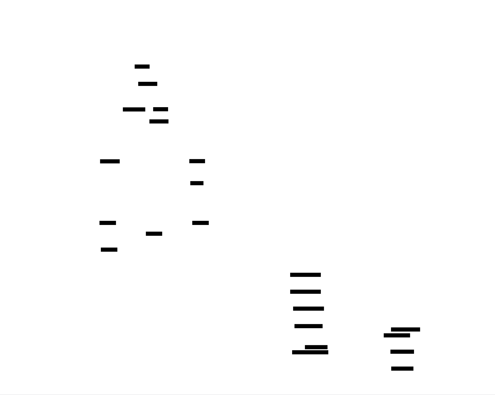

# eBPF Tracing Tool: Design Document


## Overview

This system is a dynamic kernel observability tool that uses eBPF to safely and efficiently collect data from deep within the operating system. The key architectural challenge is designing a high-performance data pipeline from kernel-space to user-space with minimal overhead, while providing a flexible, programmable interface for tracing various system events.


> This guide is meant to help you understand the big picture before diving into each milestone. Refer back to it whenever you need context on how components connect.


## Context and Problem Statement

> **Milestone(s):** Milestone 1 (Basic kprobe Tracer). This section establishes the foundational "why" for the entire project.

### The Kernel Observability Problem

Imagine trying to diagnose a race car engine's internal failures while it's running at 200 miles per hour on a track. You cannot stop the car, open the hood, and insert measurement tools without catastrophic consequences. Similarly, the Linux kernel is a complex, high-performance piece of software that manages every resource on a computer—CPU, memory, disk, network—all while maintaining extreme speed and stability. Understanding its **internal behavior**—which functions are called, how long they take, why processes stall, or why network connections drop—is extraordinarily difficult because the system cannot be paused for inspection without disrupting the very services we're trying to observe.

This is the **kernel observability problem**: gaining insight into a live, production kernel's runtime execution without affecting its performance or correctness. The kernel is a "black box" with limited built-in introspection capabilities. Developers and system administrators need answers to critical questions:
*   Why is my application experiencing sudden latency spikes?
*   Which process is causing excessive disk I/O?
    *   What specific file is it reading?
    *   How long does each read operation take?
*   Why did a TCP connection fail to establish?
    *   Was it a timeout, a reset, or a firewall drop?

Traditional logging and system metrics (CPU usage, memory consumption) provide only aggregate, high-level summaries. They tell you *that* a problem occurred, but not the precise *chain of events* inside the kernel that led to it. To diagnose root causes, we need **dynamic tracing**—the ability to insert lightweight measurement probes at specific points of interest in the kernel's code (e.g., the exact moment a file is opened, a network packet is transmitted, or a process is scheduled) and collect detailed, contextual data (PID, timestamps, function arguments) in real-time.

The core challenge is designing a tracing system that is:
1.  **Safe**: Cannot crash or corrupt the kernel.
2.  **Efficient**: Adds minimal overhead (sub-millisecond) to the traced operations.
3.  **Programmable**: Can be adapted to trace new events without rebooting or recompiling the kernel.

### Existing Approaches and Limitations

Before eBPF, several tools attempted to solve kernel observability, each with significant trade-offs. The following table compares the primary traditional approaches:

| Tool / Approach | How It Works | Pros | Cons (The Limitations) |
| :--- | :--- | :--- | :--- |
| **`strace` / `ltrace`** | Uses the `ptrace()` system call to pause the target process before and after each system call, logging the call and its arguments. | - Simple to use.<br>- No kernel modifications required. | - **Extremely high overhead** (processes can run 100x slower) because it forces context switches for *every* traced syscall.<br>- Only traces system call boundaries, not internal kernel functions.<br>- Cannot trace multiple processes efficiently. |
| **`SystemTap`** | Provides a custom scripting language to define probes. Compiles scripts into kernel modules (KProbes) that are dynamically loaded. | - Powerful and expressive.<br>- Can trace many kernel and user-space events.<br>- Relatively low overhead when probes are active. | - **Safety concerns**: User-written modules run with full kernel privileges and can crash the system.<br>- Requires kernel debug symbols (`-dbg` packages), which are often not installed on production systems.<br>- Complex toolchain and dependency management. |
| **`ftrace`** | A built-in Linux kernel tracer that uses static tracepoints and function graph tracing. Controlled via the `tracefs` filesystem. | - Built into the kernel, so it's always available.<br>- Very low overhead.<br>- Stable and reliable. | - **Limited programmability**: Primarily for tracing function entry/exit and predefined events. Complex filtering and data aggregation must be done in user-space after collection.<br>- Interface is file-based and can be cumbersome for complex tracing sessions.<br>- Difficult to correlate events across different subsystems. |
| **Kernel Modules** | Write a custom C module that uses the KProbes API to insert breakpoint handlers into kernel functions. | - Maximum flexibility and performance.<br>- Direct access to all kernel data structures. | - **Extreme danger**: A bug in the module can cause kernel panics, memory corruption, or security vulnerabilities.<br>- Requires deep kernel programming expertise.<br>- Must be recompiled for each kernel version. |

The recurring theme is a **trade-off triangle between Safety, Efficiency, and Programmability**. You can typically achieve two at the expense of the third:
*   `strace` is safe and programmable but catastrophically inefficient.
*   Kernel modules are efficient and programmable but dangerously unsafe.
*   `ftrace` is safe and efficient but not highly programmable.

> **Design Insight:** The ideal observability tool would occupy the center of this triangle—being safe, efficient, *and* programmable. This is the architectural niche that eBPF was designed to fill.

### eBPF as a Solution

**eBPF (extended Berkeley Packet Filter)** is a revolutionary technology that turns the Linux kernel into a programmable, event-driven runtime. Think of it as embedding a **secure, sandboxed virtual machine (VM) directly inside the kernel**. This VM allows user-supplied programs to execute in kernel context in response to events (like a function call or a packet arrival), but with guarantees that they cannot crash, hang, or corrupt the kernel. It fundamentally changes the observability landscape by providing the missing piece: **safe, efficient, and programmable kernel-side execution**.

The eBPF architecture is built on three core pillars:

**1. Safety via the Verifier**
Every eBPF program submitted to the kernel must pass through the **eBPF verifier**, a sophisticated static analysis engine. The verifier performs a series of safety checks before the program is allowed to run:
*   **No Unbounded Loops**: It ensures the program will terminate by rejecting loops without a fixed, verifiable upper bound (though bounded loops are now allowed with proper conditions).
*   **Bounds Checking**: All memory accesses (to stack, maps, or kernel memory) are validated to be within allocated regions before the program runs.
*   **Valid Instructions**: The program must consist of valid eBPF bytecode instructions and cannot contain unreachable code or out-of-bounds jumps.
*   **Limited Program Complexity**: The number of instructions and the depth of the control flow graph are limited to prevent excessive kernel runtime.

> **Analogy:** The verifier acts like a **strict flight simulator for a new pilot**. Before the pilot (eBPF program) is allowed to fly a real plane (the kernel), they must prove in the simulator that they can follow all procedures, won't run out of fuel (loops forever), and won't crash into unauthorized areas (invalid memory access).

**2. Efficiency via Just-In-Time (JIT) Compilation**
Once verified, eBPF bytecode is translated into native machine instructions for the host CPU by a **JIT compiler**. This eliminates the overhead of interpreting bytecode during event execution. The compiled program is then attached to a kernel hook (like a kprobe), where it runs with overhead comparable to a native function call—often just tens of nanoseconds. This makes it feasible to trace high-frequency events (like every `read` syscall or network packet) that would be impossible with tools like `strace`.

**3. Programmability via Maps and Helpers**
eBPF is not just about running a single instruction; it's a full programming model. Programs can:
*   **Store State**: Use **BPF maps**—key-value stores (hash tables, arrays, ring buffers) that persist data across program invocations and allow sharing between kernel and user-space.
*   **Interact Safely with the Kernel**: Call **helper functions** (e.g., `bpf_probe_read()` to safely read kernel memory, `bpf_ktime_get_ns()` to get a timestamp) that provide controlled, safe interfaces to kernel facilities.
*   **Make Decisions**: Implement complex logic like filtering, aggregation, and histogram computation directly in the kernel, reducing the amount of raw data that needs to be copied to user-space.

> **Decision: Using eBPF for Kernel Observability**
> *   **Context**: We need a tracing system that is safe enough for production, efficient enough for high-frequency events, and programmable enough to adapt to various tracing scenarios without kernel modification.
> *   **Options Considered**:
>     1.  **User-space-only tools (like `strace`)**: Rejected due to prohibitive performance overhead.
>     2.  **Kernel module-based tracing**: Rejected due to unacceptable safety risks and maintenance burden.
>     3.  **Built-in tracers (like `ftrace`)**: Rejected due to limited in-kernel programmability and aggregation capabilities.
> *   **Decision**: Build our tracing tool using the eBPF framework.
> *   **Rationale**: eBPF uniquely provides the necessary combination of safety (via the verifier), efficiency (via JIT), and programmability (via maps and helpers). It is the industry standard for modern Linux observability, supported by major cloud providers and tooling (e.g., BCC, bpftrace, Cilium). It allows us to write complex tracing logic that runs at native speed, safely.
> *   **Consequences**: We must learn the eBPF programming model, work within the constraints of the verifier, and use the libbpf library for user-space interaction. The upside is a tool that is both powerful and safe.

The following table summarizes how eBPF addresses the limitations of previous approaches:

| Limitation of Traditional Tools | How eBPF Solves It |
| :--- | :--- |
| **Safety (Kernel Panics)** | The eBPF verifier provides mathematical guarantees of program safety before execution. |
| **High Overhead** | JIT compilation to native code and minimal context switching result in near-native performance. |
| **Limited Programmability** | A full VM with maps and helpers allows complex in-kernel data processing and stateful tracing. |
| **Dependency Hell** | eBPF is built into the mainline Linux kernel (since 4.x), requiring no external packages beyond headers and clang. |
| **Inability to Share Data** | BPF maps provide efficient, lock-free data structures for kernel↔user-space communication. |

For our project, we will leverage eBPF to build a tracer that, starting with Milestone 1, attaches to a kernel function (a **kprobe**), captures event data, and sends it efficiently to a user-space program via a **BPF ring buffer** for display. This establishes the fundamental data pipeline that all subsequent milestones will extend and enhance.

### Implementation Guidance

**A. Technology Recommendations Table**

| Component | Simple Option (For Learning) | Advanced Option (For Production) |
| :--- | :--- | :--- |
| **eBPF Program Compilation** | `clang` with `-target bpf` flag and manual `#include` of kernel headers. | Use `bpftool` or `libbpf`'s build system for BPF CO-RE (Compile Once – Run Everywhere) to handle kernel version differences. |
| **User-space Loading Library** | `libbpf` (the standard, low-level library). | `libbpf-bootstrap` (a scaffolding tool that simplifies setup) or higher-level frameworks like `cilium/ebpf` (Go) or `libbpf-rs` (Rust). |
| **Event Communication** | **BPF ring buffer** (`BPF_MAP_TYPE_RINGBUF`). Simpler API and better performance than the older perf buffer. | For maximum throughput with specific CPU affinity, one could use a per-CPU ring buffer, but the single global ringbuf is sufficient for our learning goals. |
| **User-space Event Loop** | Synchronous polling of the ring buffer using `ring_buffer__poll()` from libbpf. | Asynchronous, callback-based consumption or using `epoll` on the ring buffer file descriptor for integration into larger applications. |

**B. Recommended File/Module Structure**
For Milestone 1, a simple two-file structure is recommended. The project will grow in later milestones.
```
ebpf-tracing-tool/
├── README.md
├── Makefile                    # Builds both eBPF and user-space code
├── src/
│   ├── bpf/                   # eBPF kernel-side programs (C)
│   │   ├── trace_open.bpf.c   # Our first kprobe program (Note: .bpf.c convention)
│   │   └── vmlinux.h          # Kernel types (generated by `bpftool btf dump file ...`)
│   ├── user/                  # User-space loaders and managers (C)
│   │   └── tracer.c           # Loads, attaches, and reads events from the BPF program
│   └── common/                # Shared headers between kernel and user space
│       └── trace_open.h       # Common event structure definition
└── build/                     # Compiled artifacts (created by Makefile)
    ├── trace_open.bpf.o       # Compiled BPF bytecode
    └── tracer                 # Compiled user-space executable
```

**C. Infrastructure Starter Code (Common Header)**
This file defines the data structure shared between the eBPF program and user-space. It must be included in both `.bpf.c` and `.c` files. Create `src/common/trace_open.h`:

```c
#ifndef __TRACE_OPEN_H
#define __TRACE_OPEN_H

// Common event structure that will be passed from eBPF to user-space via the ring buffer.
// Pack the struct to avoid padding differences between kernel and user-space.
struct open_event {
    int pid;                    // Process ID that invoked the open
    unsigned long timestamp_ns; // Timestamp from bpf_ktime_get_ns()
    char filename[256];         // Filename being opened (we'll read this from the syscall argument)
    unsigned int uid;           // User ID of the calling process
    char comm[16];             // Command name (process name) of the calling process
} __attribute__((packed));

#endif /* __TRACE_OPEN_H */
```

**D. Core Logic Skeleton Code**
**1. eBPF Program Skeleton (`src/bpf/trace_open.bpf.c`):**
This is the program that will run in the kernel. Note the `.bpf.c` extension, which helps clang identify the target.

```c
// Include the auto-generated vmlinux.h for kernel type definitions.
// You can generate it with: `bpftool btf dump file /sys/kernel/btf/vmlinux format c > vmlinux.h`
#include "vmlinux.h"
// Include the libbpf helper definitions (bpf_helpers.h, bpf_tracing.h, etc.)
#include <bpf/bpf_helpers.h>
#include <bpf/bpf_tracing.h>
#include <bpf/bpf_core_read.h>
// Our common event structure
#include "../common/trace_open.h"

// Define the BPF ring buffer map. The kernel will write events here.
struct {
    __uint(type, BPF_MAP_TYPE_RINGBUF);
    __uint(max_entries, 256 * 1024); // 256 KB buffer
} open_events SEC(".maps");

// The SEC macro tells libbpf where to attach this program.
// "tp/syscalls/sys_enter_openat" would be for a tracepoint.
// For a kprobe on the kernel function `do_sys_openat2`, we use "kprobe/do_sys_openat2".
SEC("kprobe/do_sys_openat2")
int trace_openat2(struct pt_regs *ctx) {
    // TODO 1: Reserve space in the ring buffer for our event structure
    //         Hint: Use `bpf_ringbuf_reserve()`

    // TODO 2: Check if the reservation was successful. If NULL, return early.

    // TODO 3: Populate the event data
    //    a) Get current PID and UID using `bpf_get_current_pid_tgid()` and `bpf_get_current_uid_gid()`
    //    b) Get current timestamp using `bpf_ktime_get_ns()`
    //    c) Get the process name (comm) using `bpf_get_current_comm()`
    //    d) Read the filename from the function's second argument (dfd is first, filename is second).
    //       WARNING: You must use `bpf_probe_read_user_str()` to safely read user-space memory.

    // TODO 4: Submit the event to the ring buffer using `bpf_ringbuf_submit()`

    return 0;
}

// All eBPF programs must be explicitly licensed (GPL is common for compatibility).
char LICENSE[] SEC("license") = "Dual BSD/GPL";
```

**2. User-space Loader Skeleton (`src/user/tracer.c`):**
This program loads the eBPF bytecode, attaches it to the kprobe, and reads events.

```c
#include <stdio.h>
#include <stdlib.h>
#include <string.h>
#include <errno.h>
#include <unistd.h>
#include <signal.h>
#include <time.h>
#include <bpf/libbpf.h>
#include <bpf/bpf.h>
// The skeleton header is auto-generated by `bpftool gen skeleton` from the .o file.
// For now, we will do a simpler manual load. In Milestone 2+, we'll switch to skeletons.
#include "../common/trace_open.h"

// Global variable for the ring buffer object so we can clean up on signal.
static struct ring_buffer *rb = NULL;

// Callback function that libbpf will call for each event in the ring buffer.
static int handle_event(void *ctx, void *data, size_t data_sz) {
    struct open_event *e = data;
    // TODO 5: Convert the nanosecond timestamp to a human-readable format.
    // Hint: Use `localtime()` and `strftime()` or simply print seconds with division.

    // TODO 6: Print the event details: timestamp, PID, UID, command, and filename.

    return 0;
}

int main(int argc, char **argv) {
    struct bpf_object *obj = NULL;
    struct bpf_program *prog;
    struct bpf_link *link = NULL;
    int err = 0;

    // TODO 7: Open and load the BPF object file (trace_open.bpf.o).
    // Hint: Use `bpf_object__open_file()` followed by `bpf_object__load()`.

    // TODO 8: Find the BPF program within the object file.
    // Hint: Use `bpf_object__find_program_by_name()`.

    // TODO 9: Attach the program to the kprobe.
    // Hint: Use `bpf_program__attach()`.

    // TODO 10: Set up the ring buffer for polling.
    //    a) Find the map by name ("open_events").
    //    b) Create a ring buffer manager with `ring_buffer__new()`.
    //    c) Assign it to the global `rb` variable.

    printf("Tracing open syscalls... Hit Ctrl-C to end.\n");

    // TODO 11: Main event loop: Poll the ring buffer.
    // Hint: Use `while (!interrupted) { ring_buffer__poll(rb, timeout_ms); }`
    // You'll need to handle SIGINT to set an `interrupted` flag.

    // TODO 12: Cleanup on exit: destroy links, unload object, destroy ring buffer.
    // This should be in a cleanup section reached after the loop or on error.

    return err;
}
```

**E. Language-Specific Hints (C)**
*   **Compilation**: Use `clang -O2 -target bpf -c trace_open.bpf.c -o trace_open.bpf.o` to compile the eBPF program. Ensure you have the correct kernel headers in the include path (often `-I/usr/include/$(uname -r)/`).
*   **Linking**: The user-space program must be linked with `libbpf` (`-lbpf`) and possibly `libelf` and `libz`.
*   **Error Handling**: Libbpf functions often return error codes or NULL pointers. Always check returns and use `libbpf_strerror(errno)` to get readable error messages.
*   **Signal Handling**: Use a volatile flag set by a `SIGINT` handler to break the main polling loop. Do not call complex functions from signal handlers.

**F. Milestone 1 Checkpoint**
After implementing the TODOs in the skeleton code, you should be able to:
1.  **Build**: Run `make` (you'll need to create a Makefile that compiles both the `.bpf.c` and `.c` files).
2.  **Run**: Execute `sudo ./build/tracer`. You need `sudo` because loading eBPF programs requires `CAP_BPF` and `CAP_PERFMON` capabilities (or root).
3.  **Verify**: Open another terminal and run commands that open files (e.g., `cat /etc/hostname`, `ls -la`). You should see output in the tracer terminal similar to:
    ```
    Tracing open syscalls... Hit Ctrl-C to end.
    [15:30:45] PID 1234 (bash) UID 1000 opened: /etc/hostname
    [15:30:47] PID 5678 (ls) UID 1000 opened: /usr/lib/x86_64-linux-gnu/libc.so.6
    ```
4.  **Signs of Trouble**:
    *   **No output**: Check if the kprobe name is correct for your kernel version (`sudo cat /proc/kallsyms | grep do_sys_open`). Ensure the ring buffer polling loop is running.
    *   **Permission denied**: You likely need to run as root. Check `/sys/kernel/debug/kprobes/` to see if the probe registered.
    *   **Verifier errors**: Use `sudo dmesg | tail -20` to see the verifier log. Common issues include failed bounds checks or invalid memory accesses.

---


## Goals and Non-Goals

> **Milestone(s):** Milestone 1, Milestone 2, Milestone 3, Milestone 4

This section defines the precise scope of the eBPF Tracing Tool, establishing a clear boundary between what the system must deliver and what lies beyond its current purpose. Think of these goals as a **product specification for a diagnostic instrument**—like defining exactly what a multimeter measures (voltage, resistance, continuity) and what it doesn't (temperature, pressure, network packets). This clarity prevents scope creep, ensures focused development, and sets realistic expectations for the tool's capabilities.

### Functional Goals

The tool must provide a programmable, efficient, and safe mechanism to observe kernel behavior in real-time. The functional requirements are structured across the four milestones, each building upon the previous:

| Capability | Description | Milestone | Key Components |
|------------|-------------|-----------|----------------|
| **Kernel Function Tracing** | Attach to arbitrary kernel functions via kprobes, capture execution context (PID, timestamp, function arguments), and stream events to userspace. | 1 | eBPF kprobe program, `struct open_event`, BPF ring buffer |
| **Syscall Latency Measurement** | Measure duration of system calls by attaching entry/exit probes, compute latency distributions, and display as histograms. | 2 | Paired kprobes, BPF hash map for start times, per-syscall latency aggregation |
| **TCP Connection Lifecycle Tracking** | Monitor TCP state transitions via tracepoints, extract connection metadata (IPs, ports), and measure connection lifetime. | 3 | `sock:inet_sock_set_state` tracepoint, connection tracking map, IP/port extraction |
| **Multi-Source Dashboard** | Aggregate and display real-time metrics from multiple eBPF programs simultaneously in a live-updating terminal interface. | 4 | Multiple concurrent eBPF programs, per-CPU maps, terminal UI with refresh |
| **Efficient Kernel-to-Userspace Data Transfer** | Minimize overhead when moving observation data from kernel to userspace using high-throughput, lock-free buffers. | 1-4 | BPF ring buffer (`BPF_MAP_TYPE_RINGBUF`), efficient polling |
| **Runtime Configuration** | Dynamically adjust tracing parameters (e.g., filter by PID, port, or syscall) without reloading eBPF programs. | 3-4 | BPF map updates from userspace, configuration structures |
| **Safe Kernel Data Access** | Read kernel memory and user-space pointers without causing kernel panics or data corruption. | 1-4 | `bpf_probe_read_user_str()`, `bpf_probe_read_kernel()`, verifier validation |

**Mental Model: A Diagnostic Oscilloscope for the Kernel**
Imagine this tool as a **software oscilloscope** for the operating system. An oscilloscope lets you probe electrical signals at specific points in a circuit, visualize waveforms, measure timing, and capture anomalies. Similarly, this tool lets you "probe" specific points in the kernel (function calls, syscalls, network events), visualize their frequency and timing through histograms, and capture detailed event traces—all while the system runs at full speed.

### Non-Functional Goals

These goals define the *quality attributes* of the system—how it should perform, how safe it must be, and how users should interact with it.

> **Architectural Principle:** The eBPF verifier is our strict safety supervisor—it ensures our kernel-space code cannot crash or corrupt the kernel, no matter what bugs exist in our logic. We must design within its constraints.

#### Performance Requirements

| Requirement | Target Metric | Rationale |
|-------------|---------------|-----------|
| **Minimal Observability Overhead** | ≤ 1% CPU increase for baseline tracing of common syscalls (open, read, write). | The tool itself should not significantly perturb the system it's observing (the "observer effect"). |
| **Low Latency Event Capture** | Event timestamping with nanosecond precision using `bpf_ktime_get_ns()`. | Accurate latency measurements require high-resolution timing. |
| **High-Throughput Event Streaming** | Capable of handling >10,000 events/sec without ring buffer drops. | Busy systems generate massive event volumes; the pipeline must keep up. |
| **Efficient Userspace Processing** | Dashboard updates at 2-4Hz without consuming >5% of a single CPU core. | Live terminal UI must be responsive without becoming the system's primary load. |

#### Safety and Reliability Requirements

| Requirement | Implementation Mechanism | Rationale |
|-------------|-------------------------|-----------|
| **Kernel Safety Guaranteed** | All eBPF programs must pass the **verifier** with no runtime exceptions. | Prevents kernel crashes, memory corruption, and infinite loops. |
| **Bounded Kernel Memory Usage** | All BPF maps have fixed, predefined capacities (e.g., hash map with 1024 entries). | Prevents unbounded memory growth in kernel space. |
| **Graceful Degradation** | When maps fill (e.g., too many concurrent connections), oldest entries are overwritten or new events are dropped with counters. | The tool should not crash or wedge the kernel when overwhelmed. |
| **Clean Resource Cleanup** | On exit, all eBPF programs detached, maps unpinned, ring buffers closed. | Prevents resource leaks that could require system reboot. |

#### Usability and Operational Requirements

| Requirement | Implementation Approach | Rationale |
|-------------|-------------------------|-----------|
| **Clear, Parsable Output** | Dashboard displays structured data: histograms with bucket boundaries, tables with aligned columns, human-readable units. | Users must quickly interpret results without manual decoding. |
| **Easy Configuration** | Runtime filter changes via command arguments or interactive dashboard controls. | Enables iterative investigation without recompilation. |
| **Informative Error Messages** | Userspace manager provides actionable errors when eBPF load fails (e.g., "verifier rejected: invalid memory access at instruction 42"). | Accelerates debugging during development. |
| **Simple Build & Deployment** | Single `make` command builds eBPF bytecode and userspace binary; no kernel patching required. | Lowers barrier to entry for new developers. |

#### Architectural Decision Records

> **Decision: Prioritize Safety Over Expressiveness in eBPF Programs**
> - **Context**: The eBPF verifier imposes strict constraints: no unbounded loops, limited stack size, controlled memory access. We must implement complex logic (histogram aggregation, connection tracking) within these bounds.
> - **Options Considered**:
>   1. **Push complex logic to kernel**: Implement histogram bucketization and connection state machines entirely in eBPF.
>   2. **Push complex logic to userspace**: Send raw events to userspace and perform aggregation there.
>   3. **Hybrid approach**: Perform simple aggregation/filtering in kernel, complex analysis in userspace.
> - **Decision**: Hybrid approach (Option 3) with careful verifier-safe kernel-side processing.
> - **Rationale**: Kernel-side aggregation reduces the volume of events through the ring buffer (critical for performance), but we must keep eBPF programs simple enough to pass the verifier. The hybrid approach balances efficiency with safety.
> - **Consequences**: We implement log2 histogram bucketization in eBPF (simple arithmetic) but leave histogram display formatting to userspace. Connection state tracking uses simple map updates in kernel, but lifetime calculations happen in userspace.

| Option | Pros | Cons | Chosen? |
|--------|------|------|---------|
| Kernel-only logic | Maximum performance, minimal userspace CPU | High verifier complexity, risk of rejection | No |
| Userspace-only logic | Simple eBPF programs, flexible analysis | High event volume, CPU overhead, possible ring buffer drops | No |
| Hybrid approach | Good performance, manageable verifier complexity, flexible post-processing | Requires careful boundary design between components | **Yes** |

> **Decision: Use Ring Buffer Over Perf Buffer for Event Streaming**
> - **Context**: We need a high-throughput, memory-efficient mechanism to pass structured events from kernel to userspace with minimal overhead.
> - **Options Considered**:
>   1. **BPF ring buffer (`BPF_MAP_TYPE_RINGBUF`)**: Single memory-mapped circular buffer, better performance, simpler API.
>   2. **BPF perf buffer (`BPF_MAP_TYPE_PERF_EVENT_ARRAY`)**: Per-CPU buffers, established but more complex.
> - **Decision**: BPF ring buffer for all event streaming.
> - **Rationale**: The ring buffer is newer, offers better memory efficiency (single buffer shared across CPUs), has lower overhead, and provides better guarantees about data loss notification. It's the recommended approach for new systems.
> - **Consequences**: Simpler userspace polling code with `ring_buffer__poll()`, but requires Linux kernel 5.8+. This is acceptable for a learning tool targeting modern kernels.

### Non-Goals

Explicitly defining what this tool is **not** helps prevent misunderstanding and scope creep. This is a learning tool, not a production monitoring system.

| Non-Goal | Reason & Alternative |
|----------|----------------------|
| **Production-Grade Stability** | This is a learning project. We don't guarantee 24/7 operation, comprehensive error recovery, or backward compatibility. Production users should use `bpftrace`, `BCC`, or commercial solutions. |
| **Graphical User Interface (GUI)** | The tool is terminal-based. A GUI would distract from the core learning objectives about kernel instrumentation and data flow. |
| **Modification of Kernel Data** | The tool is purely observational. We do **not** modify kernel data structures, drop packets, or inject errors. That would require different eBPF program types (e.g., XDP, TC) and introduce significant complexity. |
| **Support for All Kernel Versions** | We target recent kernels (5.8+ for ring buffer, 5.5+ for most libbpf features). Supporting older kernels would require complex feature detection and alternative code paths. |
| **Comprehensive Security Auditing** | While eBPF programs are verified for safety, we don't perform extensive security reviews for side-channel attacks or information leaks. The tool runs with elevated privileges (CAP_BPF, CAP_PERFMON). |
| **Persistent Storage of Traces** | Events are displayed in real-time but not saved to disk by default. Users can redirect terminal output or implement custom logging if needed. |
| **Support for Uprobes/USDT** | The tool focuses on kernel tracing (kprobes, tracepoints). User-space tracing (uprobes, USDT) is a related but separate domain with different challenges. |
| **BPF CO-RE (Compile Once – Run Everywhere)** | While we use libbpf which supports CO-RE, we don't implement full portable BPF across different kernel configurations. This simplifies the learning curve. |
| **Full System Performance Monitoring** | The tool demonstrates specific tracing techniques but is not a comprehensive performance monitor like `perf` or commercial APM tools. |

> **Key Insight:** The most dangerous form of scope creep in a learning project is the "just one more feature" that seems simple but introduces disproportionate complexity. By explicitly listing non-goals, we create a reference point to evaluate feature requests: "Would this require us to violate a non-goal? If so, it's out of scope."

#### Common Pitfalls in Scope Definition

⚠️ **Pitfall: Drifting into Production-Tool Territory**
- **Description**: Adding features like configuration files, daemonization, systemd integration, or alerting because "real tools have them."
- **Why It's Wrong**: Each feature distracts from the core learning objectives about eBPF and kernel instrumentation. The project becomes about building a production tool rather than understanding eBPF.
- **How to Avoid**: Regularly refer back to the milestone acceptance criteria. If a feature isn't required to meet those criteria, postpone it until after all milestones are complete.

⚠️ **Pitfall: Over-Engineering the Dashboard**
- **Description**: Spending excessive time on terminal UI aesthetics (colors, animations, responsive layouts) instead of the data pipeline.
- **Why It's Wrong**: The dashboard is primarily a visualization vehicle for eBPF-collected data. The core learning value is in the kernel-to-userspace data flow, not terminal rendering.
- **How to Avoid**: Implement a simple, functional dashboard using basic ncurses or ANSI codes. Fancy UI improvements can be a stretch goal after milestones are met.

⚠️ **Pitfall: Kernel Version Compatibility Rabbit Hole**
- **Description**: Attempting to support very old kernels (4.x) by implementing fallback paths for missing eBPF features.
- **Why It's Wrong**: The eBPF ecosystem has evolved significantly. Older kernels lack critical features (ring buffer, global variables, BTF) that simplify development. Supporting them requires complex conditional code that obscures the core concepts.
- **How to Avoid**: Clearly state the kernel requirement (5.8+ recommended, 5.5+ minimum) and focus on clean implementation for modern kernels.

### Implementation Guidance

While this section primarily defines *what* to build rather than *how*, here are practical recommendations for achieving these goals:

**A. Technology Recommendations Table:**

| Component | Simple Option | Advanced Option |
|-----------|---------------|-----------------|
| **eBPF Program Compilation** | `clang -target bpf -O2 -g` with manual section definitions | Use `bpftool gen skeleton` for auto-generated loader code |
| **Userspace Loading Library** | Libbpf with raw `bpf()` syscalls for maximum transparency | Libbpf with skeleton and CO-RE for portability |
| **Terminal Dashboard** | ANSI escape codes with simple `printf()` updates | `ncurses` library for structured terminal UI |
| **Event Serialization** | Simple C structs copied directly to ring buffer | Protocol Buffers or custom packed binary format |
| **Time Source** | `bpf_ktime_get_ns()` for monotonic time | `bpf_ktime_get_boot_ns()` for boot-time reference |

**B. Recommended File Structure for Goals Implementation:**

```
ebpf-tracing-tool/
├── Makefile                    # Builds both eBPF and userspace
├── README.md                   # Clearly states goals/non-goals
├── bpf/                        # eBPF kernel programs
│   ├── kprobe_trace.bpf.c     # Milestone 1: Basic kprobe
│   ├── syscall_latency.bpf.c  # Milestone 2: Syscall histogram
│   ├── tcp_tracer.bpf.c       # Milestone 3: TCP tracking
│   └── common.h               # Shared structs and defines
├── src/                        # Userspace C code
│   ├── main.c                 # Main loader and manager
│   ├── dashboard.c            # Milestone 4: Terminal UI
│   ├── event_processor.c      # Event aggregation logic
│   └── bpf_loader.c           # Libbpf helper wrappers
├── scripts/
│   └── verify_kernel_version.sh # Check kernel >= 5.5
└── output/                     # Generated files
    ├── *.bpf.o                # Compiled eBPF bytecode
    └── tracing-tool           # Final binary
```

**C. Infrastructure Starter Code: Kernel Version Check**

Since we require a minimum kernel version, here's a simple check to include early in `main.c`:

```c
/* scripts/kernel_version.h - Simple kernel version check */
#include <linux/version.h>
#include <stdio.h>
#include <stdlib.h>

#ifndef KERNEL_VERSION
#define KERNEL_VERSION(a,b,c) (((a) << 16) + ((b) << 8) + (c))
#endif

static void check_kernel_version() {
    // We require at least 5.5 for most libbpf features
    if (LINUX_VERSION_CODE < KERNEL_VERSION(5, 5, 0)) {
        fprintf(stderr, "Error: Kernel version 5.5+ required (found %d.%d.%d)\n",
                LINUX_VERSION_CODE >> 16,
                (LINUX_VERSION_CODE >> 8) & 0xFF,
                LINUX_VERSION_CODE & 0xFF);
        fprintf(stderr, "For older kernels, consider using BCC tools instead.\n");
        exit(1);
    }
    
    // Recommend 5.8+ for ring buffer
    if (LINUX_VERSION_CODE < KERNEL_VERSION(5, 8, 0)) {
        fprintf(stderr, "Warning: Kernel < 5.8 detected. Ring buffer unavailable.\n");
        fprintf(stderr, "Will fall back to perf buffer (not implemented in this guide).\n");
    }
}
```

**D. Core Logic Skeleton: Goal Achievement Verification**

To help track progress against goals, create a simple verification checklist in your main program:

```c
/* src/goal_checklist.c - Track milestone achievement */
#include <stdio.h>

struct milestone {
    int number;
    const char *description;
    int (*verify_func)(void);  // Returns 1 if achieved
    int achieved;
};

// TODO 1: Implement verification functions for each milestone
static int verify_milestone1(void) {
    // Check: Can we load kprobe program?
    // Check: Can we receive ring buffer events?
    // Check: Do events contain PID, timestamp, filename?
    return 0; // Return 1 when verified
}

static int verify_milestone2(void) {
    // Check: Are we measuring syscall latency?
    // Check: Is histogram data being aggregated?
    // Check: Can we display formatted histogram?
    return 0;
}

// TODO 2: Create array of all milestones
static struct milestone milestones[] = {
    {1, "Basic kprobe tracer", verify_milestone1, 0},
    {2, "Syscall latency histogram", verify_milestone2, 0},
    // Add more...
};

// TODO 3: Periodically run verification (e.g., after initialization)
void check_goals_achieved() {
    printf("\n=== Goal Achievement Checklist ===\n");
    for (size_t i = 0; i < sizeof(milestones)/sizeof(milestones[0]); i++) {
        milestones[i].achieved = milestones[i].verify_func();
        printf("Milestone %d: %s [%s]\n",
               milestones[i].number,
               milestones[i].description,
               milestones[i].achieved ? "✓" : "✗");
    }
    printf("=================================\n");
}
```

**E. Language-Specific Hints for C:**

- **Memory Safety**: Use `bpf_probe_read_user_str()` not `strcpy()` when reading strings from kernel or user memory.
- **Error Handling**: Always check return values of libbpf functions (`ring_buffer__new()`, `bpf_map__update_elem()`).
- **Cleanup**: Implement signal handlers (`SIGINT`, `SIGTERM`) to detach eBPF programs before exit.
- **Debugging**: Use `bpf_printk()` for kernel-side debugging (view via `sudo cat /sys/kernel/debug/tracing/trace_pipe`).

**F. Milestone Checkpoint Verification:**

For each milestone, create a simple test to verify functional goals:

1. **Milestone 1 Check**: Run `sudo ./tracing-tool --trace-open` and then `cat /etc/passwd` in another terminal. You should see `open` events with PIDs and filenames.
2. **Milestone 2 Check**: Run `sudo ./tracing-tool --latency` and then run a command like `ls -la`. The dashboard should show a histogram of `sys_openat` latency in microseconds.
3. **Milestone 3 Check**: Run `sudo ./tracing-tool --tcp` and then `curl example.com`. You should see TCP connection events with IPs, ports, and state transitions.
4. **Milestone 4 Check**: Run `sudo ./tracing-tool --dashboard` and see a live-updating terminal with multiple data sources.

**G. Debugging Tips for Goal-Related Issues:**

| Symptom | Likely Cause | How to Diagnose | Fix |
|---------|--------------|-----------------|-----|
| "No events received" | eBPF program not attached or ring buffer not polling | Use `bpftool prog list` to see if program is loaded; check `ring_buffer__poll()` return value | Ensure program attachment succeeded; verify ring buffer map FD is correct |
| "Histogram shows zero counts" | Latency measurement not correlating entry/exit | Check that start time is stored with correct key (PID+TID) and retrieved at exit | Use `bpf_get_current_pid_tgid()` for consistent key |
| "Dashboard flickers" | Terminal cleared and redrawn too frequently | Measure UI refresh rate; look for unnecessary screen clears | Use incremental updates with `ncurses` or only refresh changed portions |
| "Kernel version error" | Running on unsupported kernel | Check `uname -r` and compare with `LINUX_VERSION_CODE` | Upgrade kernel or implement fallback (advanced) |

---


## High-Level Architecture

> **Milestone(s):** Milestone 1, Milestone 2, Milestone 3, Milestone 4

### Architectural Overview

Think of the eBPF Tracing Tool as a **high-performance scientific instrument attached to a living organism**. The organism is the running Linux kernel—a complex, dynamic system with billions of internal operations happening every second. Like an electron microscope or a medical PET scanner, our tool must:

1. **Inject tiny, non-invasive sensors** directly into critical system pathways (kernel functions, tracepoints)
2. **Collect measurement data with minimal disturbance** to avoid altering the very behavior we're observing (the observer effect)
3. **Stream that data in real-time** to an analysis station for interpretation and display

The architecture implements this metaphor through three distinct layers that form a **data pipeline from kernel-space to user-space**:



#### Layer 1: Kernel eBPF Programs (The Microscopic Sensors)
These are the actual instrumentation probes that execute directly within the kernel's address space. Unlike traditional kernel modules, eBPF programs operate in a **sandboxed virtual machine** with strict safety guarantees enforced by the **verifier**. Each program is a tiny, specialized micro-program triggered by specific kernel events:

- **Kprobes** attach to almost any kernel function (like `do_sys_openat2` for file opens)
- **Tracepoints** hook into stable kernel instrumentation points (like TCP state changes)
- **Each program follows a single responsibility principle**: one program type per event category

When triggered, these programs collect relevant data (timestamps, process IDs, function arguments, etc.) and either:
1. **Write directly to shared memory structures** (BPF maps) for aggregation
2. **Push formatted events to ring buffers** for streaming to user-space

> The critical insight is that eBPF programs are **stateless event handlers**—they respond to triggers, process data, and then exit. Any state they need to persist across invocations must be stored in BPF maps, not in program-local variables.

#### Layer 2: User-space Loader/Manager (The Laboratory Technician)
This component acts as the **orchestrator and data collector**. Its responsibilities include:

- **Loading and verifying** eBPF bytecode into the kernel
- **Attaching programs** to the appropriate kernel hooks
- **Managing shared memory structures** (BPF maps) that serve as communication channels
- **Polling ring buffers** for incoming events without busy-waiting
- **Aggregating data** from per-CPU maps into coherent summaries
- **Providing runtime configuration** (enabling/disabling probes, adjusting filters)

The manager uses **libbpf** as its primary interface to the kernel's BPF subsystem. Libbpf provides abstractions for:
- Object loading and relocation
- Map creation and management
- Program attachment to various hook types
- Ring buffer consumption APIs

#### Layer 3: Terminal Dashboard (The Monitoring Console)
This is the **human-facing interface** that transforms raw kernel events into actionable insights. Like a Formula 1 telemetry dashboard or an air traffic control display, it must:

- **Present multiple data streams simultaneously** in a coherent layout
- **Update in real-time** without overwhelming the viewer
- **Provide both detail views** (individual events) and **summary views** (aggregated statistics)
- **Allow interactive control** without stopping the instrumentation

The dashboard renders directly to the terminal using either:
1. **Curses/ncurses library** for structured, refreshable terminal UI
2. **Raw ANSI escape sequences** for simpler display needs

All three layers communicate through **BPF maps**—shared memory regions accessible from both kernel and user-space. The architecture is deliberately **pipeline-oriented**: data flows from kernel events → eBPF processing → maps/ring buffers → user-space aggregation → terminal display, with minimal buffering and transformation at each stage.

### Component Responsibilities

| Component | Primary Responsibility | Key Subcomponents | Data Ownership | Interaction Patterns |
|-----------|------------------------|-------------------|----------------|----------------------|
| **eBPF Programs** | Execute safe, verified code in kernel context in response to specific triggers | • Kprobe handlers<br>• Tracepoint handlers<br>• Map update logic<br>• Ring buffer producers | • Temporary stack variables during execution<br>• Reserved space in ring buffers (temporarily) | • Triggered by kernel events (async)<br>• Read kernel memory via `bpf_probe_read`<br>• Write to BPF maps (atomic updates)<br>• Submit events to ring buffers |
| **BPF Maps** | Provide shared memory between kernel and user-space for data storage and aggregation | • Hash maps (key-value storage)<br>• Array maps (fixed-size storage)<br>• Per-CPU variants (lock-free per CPU)<br>• Ring buffers (single-producer FIFO) | • Persistent storage across program invocations<br>• Accessed via file descriptors | • Kernel: atomic map operations (`bpf_map_update_elem`)<br>• User-space: synchronous reads/writes via libbpf APIs |
| **Ring Buffer** | Efficient single-writer, multi-reader event channel from kernel to user-space | • Producer side (eBPF program)<br>• Consumer side (user-space)<br>• Memory-mapped data pages | • Circular buffer of variable-sized records | • Kernel: reserve → write → submit<br>• User-space: poll → callback → consume |
| **Loader/Manager** | Lifecycle management of eBPF programs and coordination of data collection | • BPF object loader<br>• Program attacher<br>• Map manager<br>• Ring buffer poller<br>• Signal handler | • File descriptors for loaded programs/maps<br>• Configuration state<br>• Aggregated metrics in memory | • Synchronous control operations (load/attach)<br>• Asynchronous event polling (main loop)<br>• Configuration updates via signals/files |
| **Terminal Dashboard** | Real-time display of traced events and aggregated metrics | • Screen layout manager<br>• Data aggregator<br>• Histogram renderer<br>• Input handler<br>• Refresh scheduler | • Display state (current screen content)<br>• Historical aggregates (for trends)<br>• User configuration | • Periodic screen refreshes (e.g., 10Hz)<br>• Input event processing (keypresses)<br>• Data consumption from manager |

#### Detailed Component Breakdown

**eBPF Programs as Event Processors**
Each eBPF program follows a specific pattern:
1. **Trigger Registration**: The program is attached to a kernel hook point (kprobe, tracepoint)
2. **Event Context Capture**: When triggered, the program receives a context structure containing event details
3. **Safe Data Extraction**: Kernel pointers are read using `bpf_probe_read` family functions
4. **Optional Filtering**: Early exit if the event doesn't match filter criteria
5. **Data Processing**: Transform raw kernel data into structured events
6. **Output**: Write to maps or ring buffers

Programs are compiled separately from user-space code and loaded as ELF object files containing both the bytecode and map definitions.

**BPF Maps as Communication Channels**
Different map types serve distinct purposes:

| Map Type | Use Case | Performance Characteristics | Milestone Usage |
|----------|----------|-----------------------------|-----------------|
| `BPF_MAP_TYPE_RINGBUF` | Streaming event delivery from kernel to user-space | Zero-copy, single producer, lock-free consumer | Milestone 1: Basic event streaming |
| `BPF_MAP_TYPE_HASH` | Key-value storage for latency tracking | O(1) lookup, bounded size | Milestone 2: Syscall latency by PID/syscall |
| `BPF_MAP_TYPE_PERCPU_HASH` | Per-CPU variant to avoid synchronization | No cross-CPU contention, requires aggregation | Milestone 4: High-frequency counters |
| `BPF_MAP_TYPE_PERCPU_ARRAY` | Fixed-size per-CPU arrays for histogram buckets | Memory locality, fastest updates | Milestone 4: Dashboard histograms |
| `BPF_MAP_TYPE_ARRAY` | Global configuration storage | Simple indexed access | Milestone 3: Filter configuration |

**Ring Buffer as Event Transport**
The ring buffer is optimized for the **producer-consumer pattern** where the kernel (producer) generates events and user-space (consumer) processes them:

1. **Producer-side (eBPF)**:
   - Call `bpf_ringbuf_reserve` to allocate space
   - Write event data to the reserved memory
   - Call `bpf_ringbuf_submit` to publish (or `bpf_ringbuf_discard` to cancel)
2. **Consumer-side (User-space)**:
   - Set up a callback function for new events
   - Call `ring_buffer__poll` to wait for events with timeout
   - Process events in the callback (should be non-blocking)

**Loader/Manager as Orchestrator**
The manager component has several operational modes:

1. **Initialization Phase**:
   - Parse command-line arguments and configuration
   - Set up signal handlers for graceful shutdown
   - Initialize libbpf with appropriate logging level
2. **Loading Phase**:
   - Open and load BPF object files
   - Create maps if they don't exist (or reuse pinned ones)
   - Relocate data and code sections
3. **Attachment Phase**:
   - Attach programs to their respective hooks
   - Set up ring buffer polling
   - Apply initial configuration to maps
4. **Runtime Phase**:
   - Main event loop polling ring buffers and processing events
   - Periodic aggregation of map data
   - Handling configuration updates
   - Responding to signals (pause, resume, shutdown)

**Terminal Dashboard as Visualization Engine**
The dashboard organizes screen real estate into logical regions:

| Region | Purpose | Update Frequency | Data Sources |
|--------|---------|------------------|--------------|
| **Event Log** | Stream of recent events (PID, timestamp, details) | Per event (or batched) | Ring buffer events |
| **Histogram Display** | Latency distribution for selected syscalls | 1-2 Hz (smooth animation) | Per-CPU array maps |
| **Top-N Lists** | Most active processes, connections, etc. | 1 Hz | Hash map aggregates |
| **Counters Panel** | Event rates, drops, system load | 0.5-1 Hz | Various map counters |
| **Control Status** | Current configuration, help hints | On change | Manager state |

### Recommended File Structure

A well-organized project structure is critical for managing the complexity of an eBPF project, which involves multiple compilation stages, separate kernel/user-space codebases, and various artifact types. The recommended structure follows the **separation of concerns** principle:

```
ebpf-tracing-tool/
├── README.md                    # Project overview, build instructions, usage
├── Makefile                     # Build automation for all components
├── .clang-format                # Code formatting rules (especially for BPF C)
│
├── include/                     # Shared header files (kernel and user-space)
│   ├── common.h                 # Common definitions, error codes
│   ├── events.h                 # Event structure definitions (open_event, etc.)
│   └── maps.h                   # BPF map definitions and helper macros
│
├── bpf/                         # Kernel-space eBPF programs (compiled to .o)
│   ├── Makefile                 # BPF-specific build rules
│   ├── vmlinux.h                # Kernel headers (bpftool generated)
│   │
│   ├── programs/                # Source eBPF C programs
│   │   ├── kprobe_open.bpf.c    # Milestone 1: File open tracing
│   │   ├── syscall_latency.bpf.c # Milestone 2: Syscall timing
│   │   ├── tcp_tracer.bpf.c     # Milestone 3: TCP connection tracking
│   │   └── dashboard_agg.bpf.c  # Milestone 4: Dashboard aggregation
│   │
│   └── objects/                 # Compiled BPF bytecode (.o files)
│       ├── kprobe_open.o
│       ├── syscall_latency.o
│       └── tcp_tracer.o
│
├── src/                         # User-space C programs
│   ├── common/                  # Shared utilities
│   │   ├── logging.c/.h         # Logging subsystem
│   │   ├── signal_handler.c/.h  # Signal handling utilities
│   │   └── utils.c/.h           # General helpers (string, time formatting)
│   │
│   ├── manager/                 # Core loader/manager component
│   │   ├── bpf_manager.c/.h     # Main manager logic
│   │   ├── program_loader.c/.h  # BPF program loading/attaching
│   │   ├── map_manager.c/.h     # BPF map operations
│   │   └── ringbuf_consumer.c/.h # Ring buffer polling
│   │
│   ├── dashboard/               # Terminal UI component (Milestone 4)
│   │   ├── terminal_ui.c/.h     # Curses/ANSI terminal handling
│   │   ├── histogram_render.c/.h # Histogram drawing
│   │   ├── data_aggregator.c/.h # Map data aggregation
│   │   └── config_manager.c/.h  # Runtime configuration
│   │
│   └── tools/                   # Individual milestone tools
│       ├── kprobe_tracer.c      # Milestone 1 standalone tool
│       ├── syscall_latency.c    # Milestone 2 standalone tool
│       ├── tcp_tracer.c         # Milestone 3 standalone tool
│       └── full_dashboard.c     # Milestone 4 integrated tool
│
├── configs/                     # Configuration files
│   ├── default.toml             # Default runtime configuration
│   ├── filters.yaml             # Event filtering rules
│   └── dashboard_layout.conf    # Terminal UI layout
│
├── scripts/                     # Build and utility scripts
│   ├── generate_vmlinux.sh      # Generate vmlinux.h from kernel
│   ├── deploy_probes.sh         # Deploy BPF programs (production-like)
│   └── benchmark.sh             # Performance testing
│
├── tests/                       # Test suite
│   ├── unit/                    # Unit tests
│   ├── integration/             # Integration tests
│   └── e2e/                     # End-to-end tests with tracepoints
│
└── docs/                        # Documentation
    ├── design/                  # Design documents (this document)
    ├── diagrams/                # Architecture diagrams
    └── api/                     # API documentation
```

#### Key File Relationships and Build Flow

1. **Compilation Pipeline**:
   - `bpf/programs/*.bpf.c` → (clang -target bpf) → `bpf/objects/*.o`
   - `src/**/*.c` → (gcc/clang) → object files → linked executables
   
2. **Header Dependencies**:
   - BPF programs include `../include/events.h` for event structure definitions
   - User-space code includes the same headers for consistent struct layout
   - The `vmlinux.h` file provides kernel type definitions for BPF CO-RE

3. **Runtime Artifacts**:
   - Compiled BPF objects are embedded in user-space executables or loaded from files
   - Map pins can be persisted in `/sys/fs/bpf/` for sharing between tools
   - Configuration files are read at startup and can be reloaded via signals

> **Architecture Decision: Embedded vs External BPF Objects**
> - **Context**: We need to decide how BPF bytecode is delivered to the kernel
> - **Option A**: Embed .o files in the executable as ELF sections
> - **Option B**: Load .o files from the filesystem at runtime
> - **Decision**: Embed for simplicity in early milestones, support both for flexibility
> - **Rationale**: Embedded objects simplify deployment (single binary), while external loading supports dynamic program updates without recompiling the main tool
> - **Consequence**: The build system must handle both compilation and embedding

| Option | Pros | Cons | Chosen For |
|--------|------|------|------------|
| **Embedded Objects** | Single binary deployment, no file path issues, faster loading | Requires recompilation for BPF changes, larger binary | Milestones 1-3 (simplicity) |
| **External Files** | Dynamic BPF updates, smaller main binary, easier debugging | Deployment complexity, file permission issues, slower load | Milestone 4 (flexibility) |

### Implementation Guidance

#### A. Technology Recommendations Table

| Component | Simple Option | Advanced Option | Recommendation for Learning |
|-----------|---------------|-----------------|----------------------------|
| **BPF Program Compilation** | `clang -target bpf` with kernel headers | BPF CO-RE with `vmlinux.h` and BTF | Start simple, adopt CO-RE for Milestone 4 |
| **User-space Library** | Raw `bpf()` syscalls | Libbpf with skeletons | **Libbpf with skeletons** (better error handling) |
| **Terminal UI** | Plain printf with ANSI codes | ncurses library | **ncurses** for structured UI (Milestone 4) |
| **Event Transport** | Perf events (perf_buffer) | Ring buffer (BPF_MAP_TYPE_RINGBUF) | **Ring buffer** (better performance) |
| **Configuration** | Command-line arguments | TOML/YAML config files | Start with CLI, add config files for Milestone 4 |
| **Build System** | Manual compilation scripts | CMake with BPF support | **Makefile** with clear targets |

#### B. Recommended File Structure Implementation

Create the following minimal structure to begin:

```bash
mkdir -p ebpf-tracing-tool/{include,bpf/{programs,objects},src/{common,manager},tools,scripts}
```

**Minimal `Makefile` for early milestones:**

```makefile
# Top-level Makefile
CC = gcc
CLANG = clang
CFLAGS = -Wall -O2 -g
BPF_CFLAGS = -target bpf -Wall -O2 -g

# Detect kernel headers path
KERNEL_HEADERS ?= /lib/modules/$(shell uname -r)/build

.PHONY: all clean

all: tools/kprobe_tracer

# BPF object compilation
bpf/objects/%.o: bpf/programs/%.bpf.c
	$(CLANG) $(BPF_CFLAGS) -I$(KERNEL_HEADERS)/arch/x86/include \
	         -I$(KERNEL_HEADERS)/arch/x86/include/generated \
	         -I$(KERNEL_HEADERS)/include \
	         -c $< -o $@

# User-space tools
tools/kprobe_tracer: src/tools/kprobe_tracer.c bpf/objects/kprobe_open.o
	$(CC) $(CFLAGS) -I./include -lbpf -lelf -lz $^ -o $@

clean:
	rm -f bpf/objects/*.o tools/*

# Generate kernel headers (run once)
vmlinux:
	bpftool btf dump file /sys/kernel/btf/vmlinux format c > bpf/vmlinux.h
```

#### C. Infrastructure Starter Code

**`include/events.h` - Shared Event Structures:**

```c
#ifndef __EVENTS_H
#define __EVENTS_H

#include <stdint.h>

// Common header for all events
struct event_header {
    uint64_t timestamp_ns;
    uint32_t pid;
    uint32_t tid;
    char comm[16];          // Process name
    uint8_t event_type;     // 1=open, 2=syscall_latency, 3=tcp_state, etc.
};

// Milestone 1: File open event
struct open_event {
    struct event_header hdr;
    char filename[256];
    int flags;
    uint32_t uid;
};

// Milestone 2: Syscall latency event
struct latency_event {
    struct event_header hdr;
    uint64_t syscall_nr;
    uint64_t duration_ns;   // End - start
    uint64_t start_time_ns; // For correlation
};

// Milestone 3: TCP connection event
struct tcp_event {
    struct event_header hdr;
    uint8_t ip_version;     // 4 or 6
    uint8_t old_state;
    uint8_t new_state;
    uint16_t sport;
    uint16_t dport;
    union {
        uint32_t saddr_v4;
        uint8_t saddr_v6[16];
    };
    union {
        uint32_t daddr_v4;
        uint8_t daddr_v6[16];
    };
};

#endif // __EVENTS_H
```

**`src/common/logging.c` - Simple Logging Utility:**

```c
#include <stdio.h>
#include <stdarg.h>
#include <time.h>
#include "logging.h"

#define LOG_LEVEL INFO  // Default level

void log_message(enum log_level level, const char *format, ...) {
    static const char *level_names[] = {
        "DEBUG", "INFO", "WARN", "ERROR", "FATAL"
    };
    
    if (level < LOG_LEVEL) return;
    
    // Get current time
    time_t now = time(NULL);
    struct tm *tm = localtime(&now);
    
    // Print timestamp and level
    fprintf(stderr, "[%02d:%02d:%02d] %-5s ",
            tm->tm_hour, tm->tm_min, tm->tm_sec,
            level_names[level]);
    
    // Print message
    va_list args;
    va_start(args, format);
    vfprintf(stderr, format, args);
    va_end(args);
    
    fprintf(stderr, "\n");
}

void log_perror(const char *msg) {
    perror(msg);
}
```

**`src/common/utils.c` - Formatting Helpers:**

```c
#include <stdio.h>
#include <inttypes.h>
#include "utils.h"

void format_duration(uint64_t ns, char *buf, size_t buf_len) {
    if (ns < 1000) {
        snprintf(buf, buf_len, "%" PRIu64 "ns", ns);
    } else if (ns < 1000000) {
        snprintf(buf, buf_len, "%.2fµs", ns / 1000.0);
    } else if (ns < 1000000000) {
        snprintf(buf, buf_len, "%.2fms", ns / 1000000.0);
    } else {
        snprintf(buf, buf_len, "%.2fs", ns / 1000000000.0);
    }
}

void format_ip_address(uint8_t ip_version, const void *addr, char *buf, size_t buf_len) {
    if (ip_version == 4) {
        const uint8_t *a = addr;
        snprintf(buf, buf_len, "%u.%u.%u.%u", a[0], a[1], a[2], a[3]);
    } else {
        // IPv6 formatting
        const uint16_t *a = addr;
        snprintf(buf, buf_len, "%04x:%04x:%04x:%04x:%04x:%04x:%04x:%04x",
                 ntohs(a[0]), ntohs(a[1]), ntohs(a[2]), ntohs(a[3]),
                 ntohs(a[4]), ntohs(a[5]), ntohs(a[6]), ntohs(a[7]));
    }
}
```

#### D. Core Logic Skeleton Code

**`bpf/programs/kprobe_open.bpf.c` - Milestone 1 BPF Program:**

```c
#include "vmlinux.h"
#include <bpf/bpf_helpers.h>
#include <bpf/bpf_tracing.h>
#include <bpf/bpf_core_read.h>
#include "../include/events.h"

// Define maps
struct {
    __uint(type, BPF_MAP_TYPE_RINGBUF);
    __uint(max_entries, 256 * 1024); // 256KB ring buffer
} ringbuf SEC(".maps");

SEC("kprobe/do_sys_openat2")
int handle_openat(struct pt_regs *ctx) {
    // TODO 1: Get current PID and TID using bpf_get_current_pid_tgid()
    //   - High 32 bits: TGID (PID), Low 32 bits: PID (TID)
    
    // TODO 2: Get current process name using bpf_get_current_comm()
    
    // TODO 3: Reserve space in ring buffer for open_event struct
    //   - Use bpf_ringbuf_reserve(&ringbuf, sizeof(struct open_event), 0)
    //   - Check if reservation succeeded (NULL means buffer full)
    
    // TODO 4: Populate event header fields:
    //   - timestamp_ns: bpf_ktime_get_ns()
    //   - pid/tid: from step 1
    //   - comm: from step 2
    //   - event_type: 1 (OPEN_EVENT)
    
    // TODO 5: Read filename from kernel context
    //   - The filename pointer is in the 2nd argument (regs->si)
    //   - Use bpf_probe_read_user_str() to safely copy up to 255 chars
    //   - Handle error if read fails
    
    // TODO 6: Read other arguments (flags, mode) from context
    
    // TODO 7: Get user ID using bpf_get_current_uid_gid()
    
    // TODO 8: Submit the event using bpf_ringbuf_submit()
    
    return 0;
}

char LICENSE[] SEC("license") = "GPL";
```

**`src/tools/kprobe_tracer.c` - Milestone 1 User-space Tool:**

```c
#include <stdio.h>
#include <stdlib.h>
#include <string.h>
#include <errno.h>
#include <signal.h>
#include <bpf/libbpf.h>
#include <bpf/bpf.h>
#include "include/events.h"

static volatile bool running = true;

void sigint_handler(int sig) {
    running = false;
}

// Callback for ring buffer events
static int handle_event(void *ctx, void *data, size_t data_sz) {
    struct event_header *hdr = data;
    
    // TODO 1: Check event type from hdr->event_type
    
    // TODO 2: For OPEN_EVENT type, cast to struct open_event*
    
    // TODO 3: Format timestamp (convert ns to human-readable)
    
    // TODO 4: Print event details:
    //   Format: [timestamp] PID/comm: operation details
    //   Example: [15:30:45.123] 1234/bash: open "/etc/passwd"
    
    return 0;
}

int main(int argc, char **argv) {
    struct bpf_object *obj = NULL;
    struct ring_buffer *rb = NULL;
    int err = 0;
    
    // TODO 1: Set up signal handler for SIGINT (Ctrl+C)
    
    // TODO 2: Open BPF object file (kprobe_open.o)
    
    // TODO 3: Load BPF programs into kernel
    
    // TODO 4: Find the ring buffer map by name ("ringbuf")
    
    // TODO 5: Set up ring buffer polling with callback
    
    // TODO 6: Attach the kprobe program to do_sys_openat2
    
    printf("Tracing file opens... Press Ctrl+C to stop.\n");
    
    // TODO 7: Main event loop - poll ring buffer with timeout
    //   while (running) { ring_buffer__poll(rb, 100); }
    
    // TODO 8: Cleanup on exit:
    //   - Detach programs
    //   - Destroy ring buffer
    //   - Unload BPF object
    
    return err;
}
```

#### E. Language-Specific Hints for C

1. **BPF Program Compilation**:
   ```bash
   # Compile with correct target and includes
   clang -target bpf -Wall -O2 -g -c program.bpf.c -o program.o
   ```

2. **Libbpf Linking**:
   ```bash
   # Link with libbpf, elf, and zlib
   gcc -o tool tool.c -lbpf -lelf -lz
   ```

3. **Error Handling Pattern**:
   ```c
   err = bpf_program__attach(prog);
   if (err < 0) {
       fprintf(stderr, "Failed to attach: %s\n", strerror(-err));
       goto cleanup;
   }
   ```

4. **Ring Buffer Initialization**:
   ```c
   struct ring_buffer_opts opts = {0};
   rb = ring_buffer__new(map_fd, handle_event, NULL, &opts);
   if (!rb) {
       fprintf(stderr, "Failed to create ring buffer\n");
       return -1;
   }
   ```

#### F. Milestone Checkpoint for Architecture Setup

After setting up the file structure and skeleton code:

1. **Verify Build System**:
   ```bash
   make clean
   make vmlinux  # Generate kernel headers (requires bpftool)
   make
   ```
   Expected: No compilation errors, `tools/kprobe_tracer` executable created.

2. **Test BPF Compilation**:
   ```bash
   file bpf/objects/kprobe_open.o
   ```
   Expected output: `ELF 64-bit LSB relocatable, eBPF, version 1 (SYSV), with debug_info, not stripped`

3. **Check Dependencies**:
   ```bash
   # Verify libbpf is available
   pkg-config --modversion libbpf
   # Expected: 1.0 or higher
   ```

4. **Run Skeleton Tool**:
   ```bash
   sudo ./tools/kprobe_tracer
   ```
   Expected: Program starts, prints "Tracing file opens...", can be stopped with Ctrl+C. May fail with "Permission denied" if not run as root (eBPF requires root).

5. **Troubleshooting Common Issues**:
   - **"clang: error: unknown target 'bpf'**: Install clang with BPF support
   - **"libbpf not found"**: Install libbpf-dev or build from source
   - **"Permission denied"**: Run with sudo or appropriate capabilities
   - **"vmlinux.h not found"**: Run `make vmlinux` after installing bpftool

This architecture provides the foundation for all four milestones. The clear separation between kernel-space programs, user-space manager, and terminal dashboard allows each component to evolve independently while maintaining clean interfaces through BPF maps and ring buffers.


## Data Model

> **Milestone(s):** Milestone 1, Milestone 2, Milestone 3, Milestone 4

The data model defines the formal language through which the kernel and user-space components communicate. Think of it as the **shared vocabulary** between the tiny, in-kernel eBPF programs and the user-space dashboard. Without a precisely defined data model, events would be lost in translation, much like two people trying to coordinate a complex task without agreeing on what terms like "urgent," "complete," or "error" mean.


This section specifies the three categories of data structures that flow through the system: the **events** that capture what happened, the **maps** that store intermediate state, and the **aggregates** that summarize data for display. These structures must balance efficiency (minimizing kernel-to-user copy overhead), clarity (being self-describing for debugging), and extensibility (supporting new event types without breaking existing code).

### Kernel-Space Event Structures

Imagine each eBPF program as a tiny **field reporter** stationed at a specific location in the kernel. When something interesting happens (a system call, a TCP state change), the reporter quickly jots down the essential facts on a standardized incident form. These forms—the event structures—are then dispatched to user-space for analysis. All event forms share a common header (who, when, what) followed by type-specific details, allowing the user-space dispatcher to quickly route each report to the correct analyst.

#### Common Header: `struct event_header`

Every event begins with a standard header that provides the essential context for any kernel occurrence. This is analogous to the metadata on a security camera footage: timestamp, camera ID (PID), and event type code. The header enables user-space to filter, sort, and categorize events without parsing the entire payload.

| Field | Type | Description |
|-------|------|-------------|
| `timestamp_ns` | `uint64_t` | Monotonic nanoseconds from `bpf_ktime_get_ns()`. This is not wall-clock time but a steadily increasing counter ideal for measuring intervals. |
| `pid` | `uint32_t` | Process ID that triggered the event. Extracted from `bpf_get_current_pid_tgid() >> 32`. |
| `tid` | `uint32_t` | Thread ID (task ID) that triggered the event. Extracted from `bpf_get_current_pid_tgid() & 0xFFFFFFFF`. |
| `comm` | `char[16]` | Command name (process name) truncated to 15 characters plus null terminator. Filled via `bpf_get_current_comm()`. |
| `event_type` | `uint8_t` | Discriminator indicating which specific event struct follows the header. Values: 1=open, 2=syscall latency, 3=TCP state change. |

> **Design Insight:** Using a discriminated union (common header + type-specific payload) is more efficient than separate ring buffers for each event type. It allows a single ring buffer to multiplex all events, simplifying user-space consumption at the cost of a small header overhead. The alternative—separate ring buffers—would require multiple polling threads and complicate event ordering.

#### Event Type 1: `struct open_event`

Captures file open operations traced via kprobe on `do_sys_openat2`. This is the simplest event type, demonstrating basic data extraction from kernel function arguments.

| Field | Type | Description |
|-------|------|-------------|
| `hdr` | `struct event_header` | Common header with event_type = 1. |
| `uid` | `unsigned int` | User ID of the calling process, obtained via `bpf_get_current_uid_gid()`. |
| `filename` | `char[256]` | The pathname being opened, safely read from user-space pointer using `bpf_probe_read_user_str`. Null-terminated and truncated if longer than 255 bytes. |
| *Note:* The original spec included `pid` and `timestamp_ns` in this struct, but these are now part of the common header. The `comm` field is also in the header. |

**Concrete Example:** When process `vim` (PID 1234) opens `/etc/vimrc`, the eBPF program populates: `hdr.timestamp_ns` = 1000000000, `hdr.pid` = 1234, `hdr.comm` = "vim\0", `uid` = 1000, `filename` = "/etc/vimrc\0".

#### Event Type 2: `struct latency_event`

Measures system call latency by correlating entry and exit probes. Think of this as a **stopwatch recording**: the entry probe notes the start time and drops a marker (in a hash map), and the exit probe retrieves the marker, calculates the elapsed time, and produces a completed lap time record.

| Field | Type | Description |
|-------|------|-------------|
| `hdr` | `struct event_header` | Common header with event_type = 2. |
| `syscall_nr` | `uint64_t` | System call number (e.g., 257 for `openat`). Identifies which syscall was measured. |
| `duration_ns` | `uint64_t` | Elapsed time in nanoseconds from entry to exit. Calculated as `exit_time - start_time_ns`. |
| `start_time_ns` | `uint64_t` | The absolute start time captured at entry. Included to allow user-space to compute wall-clock timing if needed (by adding to boot time). |

> **Architecture Decision Record:** Including `start_time_ns` versus Only `duration_ns`
> - **Context:** We need to know when the syscall occurred for time-series displays and to correlate with other events.
> - **Options Considered:**
>   1. **Only `duration_ns`**: Smaller event size, but loses absolute timing.
>   2. **`start_time_ns` and `duration_ns`**: Allows reconstruction of absolute timeline and enables latency distribution per time window.
> - **Decision:** Include both `start_time_ns` and `duration_ns`.
> - **Rationale:** The 8-byte overhead is acceptable given ring buffer efficiency, and absolute timing is valuable for cross-event correlation and time-series histograms. The start time is already available in the eBPF program (from the entry probe) so no extra cost to include.
> - **Consequences:** Events are 8 bytes larger, but user-space can plot latency vs. time and detect latency spikes correlated with other system events.

#### Event Type 3: `struct tcp_event`

Traces TCP connection state transitions via the `sock:inet_sock_set_state` tracepoint. This is like a **connection passport** that gets stamped each time the connection crosses a border (changes state), recording origin, destination, and the new state.

| Field | Type | Description |
|-------|------|-------------|
| `hdr` | `struct event_header` | Common header with event_type = 3. |
| `ip_version` | `uint8_t` | 4 for IPv4, 6 for IPv6. Determines which address fields are valid. |
| `old_state` | `uint8_t` | Previous TCP state (e.g., `TCP_SYN_SENT` = 2). From kernel `linux/tcp_states.h`. |
| `new_state` | `uint8_t` | New TCP state after transition (e.g., `TCP_ESTABLISHED` = 1). |
| `sport` | `uint16_t` | Source port in network byte order. |
| `dport` | `uint16_t` | Destination port in network byte order. |
| `saddr_v4` | `uint32_t` | IPv4 source address (network byte order). Valid only if `ip_version == 4`. |
| `saddr_v6` | `uint8_t[16]` | IPv6 source address. Valid only if `ip_version == 6`. |
| `daddr_v4` | `uint32_t` | IPv4 destination address (network byte order). Valid only if `ip_version == 4`. |
| `daddr_v6` | `uint8_t[16]` | IPv6 destination address. Valid only if `ip_version == 6`. |

**Memory Layout Consideration:** To avoid wasting space, we could use a union for the IPv4/IPv6 addresses. However, the eBPF verifier has limitations with complex unions, and the simplicity of separate fields (with only one pair used per event) outweighs the memory savings for this learning project. The total struct size is 94 bytes (with IPv4) or 150 bytes (with IPv6), which is fine for ring buffer events.

#### Event Type Discriminator Values

For clear discrimination in user-space, we define explicit constants:

| Event Type | Value | Description |
|------------|-------|-------------|
| `EVENT_OPEN` | 1 | File open event (`struct open_event`) |
| `EVENT_LATENCY` | 2 | Syscall latency event (`struct latency_event`) |
| `EVENT_TCP` | 3 | TCP state change event (`struct tcp_event`) |

### BPF Map Data Structures

BPF maps are the **shared blackboards** between kernel eBPF programs and user-space. Imagine multiple kernel reporters posting sticky notes (key-value pairs) on a shared board, while user-space analysts periodically collect and summarize them. Different boards serve different purposes: a ring buffer board for streaming events, a hash map board for tracking ongoing operations, and a per-CPU array board for high-frequency counters.

#### Map 1: Ring Buffer for Event Streaming (`BPF_MAP_TYPE_RINGBUF`)

The ring buffer is the primary **event bus** for streaming completed events from kernel to user-space. It's a single-producer (kernel), single-consumer (user-space) circular buffer optimized for high throughput and minimal locking.

| Map Name | Type | Key Type | Value Type | Purpose |
|----------|------|----------|------------|---------|
| `events` | `BPF_MAP_TYPE_RINGBUF` | N/A (no keys) | Variable-length event structs | Streaming channel for all traced events. Kernel programs reserve space with `bpf_ringbuf_reserve` and submit with `bpf_ringbuf_submit`. |

**Capacity Considerations:** The ring buffer size is configured at creation (e.g., 4 MB). If user-space cannot keep up, new events will overwrite old ones (with optional notification). For this learning tool, we size it generously and rely on user-space polling to avoid loss.

#### Map 2: Hash Map for Syscall Start Times (`BPF_MAP_TYPE_HASH`)

This map correlates syscall entry with exit by storing start timestamps keyed by thread ID. Think of it as a **coat check ticket**: when you enter (syscall entry), you get a ticket (thread ID) and your coat (start time) is stored. When you leave (exit), you present the ticket to retrieve your coat and calculate how long you were inside.

| Map Name | Type | Key Type | Value Type | Purpose |
|----------|------|----------|------------|---------|
| `start_map` | `BPF_MAP_TYPE_HASH` | `uint64_t` (thread ID) | `uint64_t` (start timestamp) | Stores syscall start time keyed by `(pid << 32 \| tid)`. Entry probe writes; exit probe reads and deletes. |

**Key Selection Rationale:** We use the full 64-bit return value of `bpf_get_current_pid_tgid()` as the key. This combines PID and TID, ensuring uniqueness across threads while being trivial to obtain. The alternative—separate PID and TID keys—would require a compound key struct, complicating map operations.

#### Map 3: Per-Syscall Latency Histogram (`BPF_MAP_TYPE_HASH` of `BPF_MAP_TYPE_ARRAY`)

To build latency histograms efficiently, we use a two-level map structure. The outer hash map is keyed by syscall number, and each value is an inner array representing log2 histogram buckets. This is like having **a separate notebook for each syscall type**, where each notebook has pre-labeled buckets (e.g., "1-2 µs", "2-4 µs") and we increment the count in the appropriate bucket.

| Map Name | Type | Key Type | Value Type | Purpose |
|----------|------|----------|------------|---------|
| `latency_hist` | `BPF_MAP_TYPE_HASH` | `uint64_t` (syscall number) | Inner array map (see below) | Outer map: syscall number → histogram buckets. |
| *Inner Map* | `BPF_MAP_TYPE_ARRAY` | `uint32_t` (bucket index) | `uint64_t` (count) | Pre-allocated array of 64 buckets for log2 histogram (1 ns to ~584 years). |

**Bucket Calculation:** The eBPF program computes bucket index as `log2(duration_ns)`. For example, a duration of 1000 ns (1 µs) falls in bucket index 10 because 2^10 = 1024. This log2 approach covers an enormous dynamic range with fixed memory overhead (64 buckets × 8 bytes = 512 bytes per syscall).

#### Map 4: Per-CPU Counters for High-Frequency Events (`BPF_MAP_TYPE_PERCPU_ARRAY`)

For extremely high-frequency events (like scheduler tracepoints), per-CPU arrays eliminate lock contention by giving each CPU its own private counter. Think of it as **giving each cashier their own till** instead of having all cashiers queue for a shared cash register. User-space periodically sums across all CPUs to get the global total.

| Map Name | Type | Key Type | Value Type | Purpose |
|----------|------|----------|------------|---------|
| `cpu_counters` | `BPF_MAP_TYPE_PERCPU_ARRAY` | `uint32_t` (counter ID) | `uint64_t` (count) | Array of counters, each replicated per CPU. Used for event rate monitoring, error counts, etc. |

**Counter ID Allocation:** We predefine indices for specific counters:
- 0: Total events submitted to ring buffer
- 1: Ring buffer discard events (if user-space is too slow)
- 2: Map update failures
- 3: Verifier errors (if we use tail calls)

#### Map 5: Connection Tracking Map (`BPF_MAP_TYPE_LRU_HASH`)

To measure TCP connection lifetime, we need to track the initial SYN timestamp and correlate it with the FIN/RST. An LRU (Least Recently Used) hash map automatically evicts old entries when full, preventing memory exhaustion from forgotten connections.

| Map Name | Type | Key Type | Value Type | Purpose |
|----------|------|----------|------------|---------|
| `conn_map` | `BPF_MAP_TYPE_LRU_HASH` | `struct conn_key` | `struct conn_value` | Tracks TCP connections from SYN to termination. Key is 5-tuple; value stores start time and PID. |

**Key Structure:**

| Field | Type | Description |
|-------|------|-------------|
| `saddr` | `uint64_t[2]` | Source address (64-bit chunks for IPv6 compatibility). For IPv4, only first 4 bytes used. |
| `daddr` | `uint64_t[2]` | Destination address. |
| `sport` | `uint16_t` | Source port. |
| `dport` | `uint16_t` | Destination port. |
| `ip_version` | `uint8_t` | 4 or 6. |
| `padding` | `uint8_t[3]` | Padding to align to 8 bytes. |

**Value Structure:**

| Field | Type | Description |
|-------|------|-------------|
| `start_ns` | `uint64_t` | Connection start time (SYN timestamp). |
| `pid` | `uint32_t` | Process ID that initiated the connection. |
| `uid` | `uint32_t` | User ID of the process. |

> **Architecture Decision Record:** LRU Hash vs Regular Hash for Connection Tracking
> - **Context:** We need to track potentially millions of connections, but system memory is limited. Old, forgotten connections (e.g., from crashed processes) must not cause map exhaustion.
> - **Options Considered:**
>   1. **Regular Hash Map (`BPF_MAP_TYPE_HASH`)**: Fixed size, requires manual cleanup (error-prone).
>   2. **LRU Hash Map (`BPF_MAP_TYPE_LRU_HASH`)**: Automatically evicts least recently used entries when full.
>   3. **Per-CPU Hash Map (`BPF_MAP_TYPE_PERCPU_HASH`)**: Eliminates lock contention but multiplies memory usage.
> - **Decision:** Use `BPF_MAP_TYPE_LRU_HASH`.
> - **Rationale:** Automatic eviction is safer for a learning tool where cleanup logic might be buggy. LRU behavior is acceptable because stale connections are likely unused. The small performance overhead from LRU maintenance is acceptable for tracing.
> - **Consequences:** Some connections might be evicted before completion, causing missing duration measurements. We accept this as a trade-off for robustness.

#### Map 6: Configuration Map (`BPF_MAP_TYPE_ARRAY`)

Allows user-space to dynamically adjust eBPF program behavior without reloading. Think of it as a **control panel** with knobs and switches that user-space can tweak while the kernel programs are running.

| Map Name | Type | Key Type | Value Type | Purpose |
|----------|------|----------|------------|---------|
| `config_map` | `BPF_MAP_TYPE_ARRAY` | `uint32_t` (config ID) | `uint64_t` (value) | Global configuration parameters: enable/disable flags, threshold values, filter settings. |

**Predefined Config Entries:**

| Index | Purpose | Default |
|-------|---------|---------|
| 0 | Global enable/disable (1=enabled) | 1 |
| 1 | Minimum latency to track (ns) | 1000 |
| 2 | PID to filter (0=all) | 0 |
| 3 | Port to filter (0=all) | 0 |

### User-Space Aggregation Structures

User-space transforms the raw event stream into digested summaries for display. These aggregation structures are the **dashboard's internal scratchpad** where live metrics are accumulated before being rendered. Unlike kernel structures which prioritize compactness and speed, user-space structures prioritize flexibility and rich representation.

#### Structure 1: `struct histogram`

Represents a latency distribution for display. Built by reading the kernel's bucketized histogram map and expanding it into human-readable microsecond buckets.

| Field | Type | Description |
|-------|------|-------------|
| `buckets` | `uint64_t[128]` | Linear buckets in microseconds (e.g., bucket 0 = 0-1 µs, bucket 1 = 1-2 µs). Size allows up to 128 µs range by default, expandable. |
| `max_bucket` | `int` | Highest non-zero bucket index. |
| `total` | `uint64_t` | Total number of samples in histogram. |
| `syscall_nr` | `uint64_t` | Which syscall this histogram represents (or ~0 for aggregated). |
| `syscall_name` | `char[32]` | Human-readable syscall name (e.g., "openat"). |

**Aggregation Algorithm:** The user-space manager periodically:
1. Reads the kernel's `latency_hist` map (syscall → log2 bucket array)
2. For each syscall, converts log2 nanoseconds to linear microseconds: `micros = (1 << bucket_idx) / 1000`
3. Accumulates into the appropriate linear bucket
4. Updates `total` and `max_bucket`

#### Structure 2: `struct connection_entry`

Tracks active TCP connections for the "Top Connections" display. Derived from the kernel's `conn_map` but enriched with duration and human-readable addresses.

| Field | Type | Description |
|-------|------|-------------|
| `key` | `struct conn_key` | Copy of kernel key (5-tuple). |
| `start_ns` | `uint64_t` | Connection start time. |
| `pid` | `uint32_t` | Process ID. |
| `comm` | `char[16]` | Process name (looked up from PID). |
| `duration_ms` | `uint32_t` | Current duration in milliseconds (if active) or final duration (if closed). |
| `state` | `uint8_t` | Current TCP state (e.g., `ESTABLISHED`, `TIME_WAIT`). |
| `closed` | `bool` | Whether connection has terminated. |

**Lifetime Tracking:** When a TCP FIN/RST event appears, the user-space manager:
1. Looks up the connection in its local table by 5-tuple
2. Updates `duration_ms` = `(fin_time - start_ns) / 1_000_000`
3. Sets `closed` = true
4. Keeps entry for a few seconds in "recently closed" display

#### Structure 3: `struct dashboard_state`

The central aggregator that holds all live data for the terminal UI. This is the **single source of truth** for what appears on screen.

| Field | Type | Description |
|-------|------|-------------|
| `histograms` | `struct histogram[20]` | Array of histograms for top syscalls (by count). |
| `active_connections` | `struct connection_entry[100]` | Currently established connections (live). |
| `recent_connections` | `struct connection_entry[50]` | Recently closed connections (last 30 seconds). |
| `event_counts` | `uint64_t[10]` | Counters per event type (open, latency, TCP). |
| `total_events` | `uint64_t` | Total events processed (for rate calculation). |
| `last_update` | `struct timeval` | Time of last UI refresh. |
| `config` | `struct dashboard_config` | Current dashboard configuration (refresh rate, filters). |

**Thread Safety Considerations:** The dashboard state is updated by the manager's event loop thread and read by the UI rendering thread (which may be the same thread in our simple implementation). We use atomic operations for counters and careful ordering for other fields to avoid torn reads.

#### Structure 4: `struct dashboard_config`

Runtime configuration for the dashboard, separate from kernel BPF configuration.

| Field | Type | Description |
|-------|------|-------------|
| `refresh_ms` | `uint32_t` | UI refresh interval in milliseconds. |
| `histogram_max_us` | `uint32_t` | Maximum microsecond value for histogram x-axis. |
| `filter_pid` | `uint32_t` | Show only events from this PID (0=all). |
| `filter_port` | `uint16_t` | Show only TCP events involving this port (0=all). |
| `sort_by` | `uint8_t` | How to sort connections: 0=duration, 1=bytes, 2=recent. |

> **Design Insight:** Separating kernel BPF configuration (in `config_map`) from user-space dashboard configuration allows independent tuning. The kernel configuration affects what events are generated (reducing overhead), while the dashboard configuration affects only display (reducing CPU usage in user-space). This separation is crucial for performance when tracing high-frequency events.

### Common Pitfalls

⚡ **Pitfall: Misaligned structures between kernel and user-space**
- **Description:** Defining a `struct` in eBPF C with different padding/alignment than the same-named struct in user-space C.
- **Why it's wrong:** The user-space program will misinterpret the binary data from the ring buffer, reading wrong values or crashing.
- **Fix:** Always use `#pragma pack(1)` or `__attribute__((packed))` on shared structures, or better, rely on BPF Type Format (BTF) which automatically ensures compatibility.

⚡ **Pitfall: Forgetting to handle IPv4-mapped IPv6 addresses**
- **Description:** Treating all `ip_version == 6` addresses as native IPv6, when some may be IPv4-mapped (::ffff:192.0.2.1).
- **Why it's wrong:** Display will show ugly IPv6-mapped addresses instead of clean IPv4 dotted decimal.
- **Fix:** In user-space, check if the IPv6 address is in the ::ffff:0:0/96 prefix and convert to IPv4 for display.

⚡ **Pitfall: Integer overflow in duration calculations**
- **Description:** Computing `duration_ms = (end_ns - start_ns) / 1_000_000` without checking for negative values if timestamps wrap (extremely rare) or if entry/exit mismatched.
- **Why it's wrong:** May display huge incorrect durations (like 18446744073709 ms).
- **Fix:** Use `if (end_ns > start_ns)` before subtraction, and log a warning if mismatch occurs (indicating map corruption or PID reuse).

⚡ **Pitfall: Not resetting histograms between updates**
- **Description:** Accumulating histogram buckets across all time instead of showing a rolling window.
- **Why it's wrong:** The histogram becomes increasingly flat and unresponsive to current system behavior.
- **Fix:** Clear the `histogram.buckets` array before each aggregation from BPF maps, or maintain separate structures for "total since start" vs "last N seconds."

⚡ **Pitfall: Assuming `comm` field is null-terminated in kernel**
- **Description:** The `bpf_get_current_comm()` helper does not guarantee null termination if the process name is exactly 16 bytes.
- **Why it's wrong:** String operations in user-space may read beyond the buffer.
- **Fix:** In user-space, explicitly null-terminate: `comm[15] = '\0';` after copying from the event.

### Implementation Guidance

#### A. Technology Recommendations Table

| Component | Simple Option | Advanced Option |
|-----------|---------------|-----------------|
| Shared Structure Definition | Manual header file included in both kernel and user-space | BPF CO-RE with `vmlinux.h` and BTF-based relocation |
| Ring Buffer Consumption | Synchronous polling in main thread | Asynchronous callback with dedicated consumer thread |
| Histogram Storage | Pre-allocated array of 64 buckets per syscall | Dynamic bucket allocation with LRU eviction |
| Connection Tracking | Simple hash map with fixed size | BPF LRU hash with automatic eviction and user-space LRU cache |

#### B. Recommended File Structure

```
ebpf-tracing-tool/
├── include/
│   ├── common.h          ← Shared event structures and constants
│   └── tcp_states.h      ← TCP state definitions from kernel
├── bpf/
│   ├── open_trace.bpf.c  ← eBPF program for file opens (Milestone 1)
│   ├── latency.bpf.c     ← eBPF program for syscall latency (Milestone 2)
│   ├── tcp_trace.bpf.c   ← eBPF program for TCP events (Milestone 3)
│   └── bpf_helpers.h     ← Kernel helper function prototypes
├── src/
│   ├── manager.c         ← User-space loader and manager (all milestones)
│   ├── dashboard.c       ← Terminal UI implementation (Milestone 4)
│   ├── histogram.c       ← Histogram aggregation logic
│   ├── connection.c      ← Connection tracking logic
│   └── config.c          ← Configuration management
└── build/
    ├── open_trace.bpf.o  ← Compiled BPF bytecode
    ├── latency.bpf.o
    └── tcp_trace.bpf.o
```

#### C. Infrastructure Starter Code

**File: `include/common.h`** (complete, ready to use)
```c
#ifndef __COMMON_H
#define __COMMON_H

#include <stdint.h>
#include <stdbool.h>

#pragma pack(push, 1)

/* Event type discriminator values */
#define EVENT_OPEN    1
#define EVENT_LATENCY 2
#define EVENT_TCP     3

/* Common header for all events */
struct event_header {
    uint64_t timestamp_ns;
    uint32_t pid;
    uint32_t tid;
    char     comm[16];
    uint8_t  event_type;
};

/* Event type 1: File open */
struct open_event {
    struct event_header hdr;
    unsigned int uid;
    char filename[256];
};

/* Event type 2: Syscall latency */
struct latency_event {
    struct event_header hdr;
    uint64_t syscall_nr;
    uint64_t duration_ns;
    uint64_t start_time_ns;
};

/* Event type 3: TCP state change */
struct tcp_event {
    struct event_header hdr;
    uint8_t  ip_version;  /* 4 or 6 */
    uint8_t  old_state;
    uint8_t  new_state;
    uint16_t sport;
    uint16_t dport;
    union {
        struct {
            uint32_t saddr_v4;
            uint32_t daddr_v4;
        } v4;
        struct {
            uint8_t saddr_v6[16];
            uint8_t daddr_v6[16];
        } v6;
    } addr;
};

/* Connection tracking key (for LRU map) */
struct conn_key {
    uint64_t saddr[2];    /* For IPv6 compatibility */
    uint64_t daddr[2];
    uint16_t sport;
    uint16_t dport;
    uint8_t  ip_version;
    uint8_t  padding[3];  /* Align to 8 bytes */
};

/* Connection tracking value */
struct conn_value {
    uint64_t start_ns;
    uint32_t pid;
    uint32_t uid;
};

#pragma pack(pop)

#endif /* __COMMON_H */
```

#### D. Core Logic Skeleton Code

**File: `src/histogram.c`** (learner implements)
```c
#include "histogram.h"
#include "common.h"
#include <stdlib.h>
#include <string.h>

/* Initialize a histogram structure for a specific syscall */
void histogram_init(struct histogram *hist, uint64_t syscall_nr, 
                    const char *syscall_name) {
    // TODO 1: Zero out the buckets array using memset
    // TODO 2: Set max_bucket to -1 (no data yet)
    // TODO 3: Set total count to 0
    // TODO 4: Store syscall_nr and copy syscall_name (safe truncation to 31 chars)
    // TODO 5: Initialize mutex if thread-safe version needed
}

/* Convert kernel log2 histogram to linear microsecond buckets */
void histogram_update_from_log2(struct histogram *hist, 
                               const uint64_t *log2_buckets, 
                               int num_log_buckets) {
    // TODO 1: Clear current linear buckets (but keep metadata)
    // TODO 2: For each log2 bucket index i where log2_buckets[i] > 0:
    //   a) Compute microseconds = (1ULL << i) / 1000
    //   b) Find linear bucket index: idx = microseconds (clamped to 0..127)
    //   c) Add log2_buckets[i] to hist->buckets[idx]
    // TODO 3: Recompute max_bucket: find highest index with count > 0
    // TODO 4: Update total count by summing all bucket values
}

/* Merge another histogram into this one (for per-CPU aggregation) */
void histogram_merge(struct histogram *dest, const struct histogram *src) {
    // TODO 1: Verify syscall_nr matches (or handle mismatch error)
    // TODO 2: For i from 0 to 127: dest->buckets[i] += src->buckets[i]
    // TODO 3: Update dest->max_bucket to max(dest->max_bucket, src->max_bucket)
    // TODO 4: Update dest->total += src->total
}

/* Generate ASCII representation for terminal display */
void histogram_render(const struct histogram *hist, char *buf, size_t buf_len,
                     int width, int height) {
    // TODO 1: Find maximum bucket value for scaling
    // TODO 2: For each bucket row (from height-1 down to 0):
    //   a) Compute threshold = (row * max_val) / height
    //   b) For each bucket column: print '#' if count > threshold else ' '
    // TODO 3: Add x-axis labels with microsecond ranges
    // TODO 4: Add title with syscall name and total count
    // TODO 5: Ensure null termination and buffer bounds
}
```

#### E. Language-Specific Hints

- **Structure Packing:** Use `#pragma pack(1)` or `__attribute__((packed))` for shared structures to ensure identical layout in kernel and user-space.
- **Atomic Operations:** For per-CPU counters, use `__sync_fetch_and_add()` in eBPF C and `__atomic_add_fetch()` in user-space C for thread-safe increments.
- **String Safety:** Always null-terminate strings from kernel space explicitly: `buf[sizeof(buf)-1] = '\0'`.
- **Portable Time:** Use `clock_gettime(CLOCK_MONOTONIC, &ts)` in user-space to correlate with `bpf_ktime_get_ns()` from kernel (both use the same monotonic clock).
- **Network Byte Order:** Remember `ntohs()` and `ntohl()` for port and address conversion from network to host byte order in user-space displays.

#### F. Milestone Checkpoint: Data Model Verification

**After implementing the data structures:**
1. **Command:** `nm -C build/open_trace.bpf.o | grep event` – should show `struct open_event` symbols.
2. **Expected Output:** Symbols for event structures in the BPF object file.
3. **Verification Test:** Write a minimal user-space program that:
   - Defines the same structures (including `#pragma pack(1)`)
   - Creates a dummy event and checks `sizeof(struct open_event)`
   - Compares with BPF side using `bpftool btf dump file build/open_trace.bpf.o`
4. **Sign of Trouble:** If sizes differ, check structure packing and alignment. Use `pahole` or similar tool to inspect structure layout.

#### G. Debugging Tips

| Symptom | Likely Cause | How to Diagnose | Fix |
|---------|--------------|-----------------|-----|
| User-space crashes reading ring buffer | Structure layout mismatch between kernel/user | Compare `sizeof(struct)` in both, check with `bpftool btf dump` | Use identical header with `#pragma pack(1)` |
| Histogram shows all zeros | Bucket index calculation wrong | Print raw log2 bucket values from BPF map | Verify `1 << i` vs `1ULL << i` for 64-bit shift |
| TCP events show wrong IP addresses | IPv4/IPv6 union misuse | Check `ip_version` field value (4 vs 6) | Use correct union member based on `ip_version` |
| Connection durations impossibly large | Start time not stored or PID reuse | Log thread ID alongside PID in connection map | Use `(pid << 32 \| tid)` as key instead of just PID |


## Component Design: eBPF Programs

> **Milestone(s):** Milestone 1 (Basic kprobe Tracer), Milestone 2 (Syscall Latency Histogram), Milestone 3 (TCP Connection Tracer), Milestone 4 (Custom Dashboard and Maps)

### Mental Model: Kernel Event Listeners

Think of eBPF programs as **tiny, safe, in-kernel microservices** that operate like a network of highly specialized sensors in a manufacturing plant. Each sensor (eBPF program) is:

1. **Event-Triggered**: Like a motion sensor that only activates when movement is detected, each eBPF program attaches to a specific kernel event source (kprobe, tracepoint) and only runs when that event occurs.
2. **Stateless by Design**: Most sensors don't store history—they simply report current observations. Similarly, eBPF programs are primarily stateless functions; any required state persistence must be explicitly managed through BPF maps (shared memory regions).
3. **Safety-First**: Just as industrial sensors have physical guards to prevent damage, eBPF programs are verified by the **verifier** before execution to ensure they cannot crash or corrupt the kernel.
4. **Minimal Overhead**: Like lightweight wireless sensors that use minimal power, eBPF programs are designed for minimal performance impact, executing only essential logic before returning control to the kernel.

These microservices don't communicate directly with each other but instead write their observations to **shared bulletin boards** (BPF maps) or **conveyor belts** (ring buffers) that transport data to the control room (user-space). This architecture allows the kernel to remain observable without being instrumented with heavy, complex monitoring code.

### Program Interface and Context

Every eBPF program follows a specific function signature determined by its attachment point. The context parameter provides a window into the kernel's internal state at the moment of the event.

#### Program Types and Their Signatures

| Program Type | Section Macro | Function Signature | Context Parameter | Primary Use |
|--------------|---------------|-------------------|-------------------|-------------|
| **Kprobe** | `SEC("kprobe/<function_name>")` | `int BPF_KPROBE(<function_name>, struct pt_regs *regs)` | `struct pt_regs *regs` | Tracing kernel function entries, reading function arguments from registers |
| **Kretprobe** | `SEC("kretprobe/<function_name>")` | `int BPF_KRETPROBE(<function_name>, long retval)` | `long retval` | Capturing function return values and measuring execution duration |
| **Tracepoint** | `SEC("tracepoint/<subsystem>/<event>")` | `int trace_<event>(struct trace_event_raw_<event> *ctx)` | Specific tracepoint context structure | Tracing stable kernel instrumentation points with well-defined data layout |

#### Context Data Access Patterns

The context provides raw access to event information, but reading it safely requires specific patterns:

**Kprobe Context (`struct pt_regs *regs`)**:
- Contains CPU register values at function entry
- Function arguments are in architecture-specific registers (e.g., `di`, `si`, `dx`, `cx`, `r8`, `r9` on x86_64 for the first 6 arguments)
- Use `PT_REGS_PARMx(ctx)` macros or `bpf_probe_read_kernel()` to read arguments

**Tracepoint Context (e.g., `struct trace_event_raw_sock_inet_sock_set_state *ctx`)**:
- Contains structured event data specific to the tracepoint
- Fields are directly accessible but may require `BPF_CORE_READ()` for portable access
- Provides type-safe access to event parameters without register decoding

#### Context Helper Functions Table

| Helper Function | Returns | Description | Usage Example |
|-----------------|---------|-------------|---------------|
| `bpf_get_current_pid_tgid()` | `uint64_t` (PID in upper 32 bits, TID in lower 32 bits) | Gets current process and thread IDs | `pid = bpf_get_current_pid_tgid() >> 32` |
| `bpf_get_current_comm(void *buf, uint32_t size)` | `int` (0 on success) | Fills buffer with current process name | `bpf_get_current_comm(&event->comm, sizeof(event->comm))` |
| `bpf_ktime_get_ns()` | `uint64_t` | Monotonic nanoseconds since boot | `timestamp = bpf_ktime_get_ns()` |
| `bpf_get_current_uid_gid()` | `uint64_t` (UID in upper 32 bits, GID in lower 32 bits) | Gets current user and group IDs | `uid = bpf_get_current_uid_gid() >> 32` |

### Internal Behavior Algorithm

Every eBPF tracing program follows a similar workflow, regardless of its specific event source. The flowchart below illustrates this universal pattern:


#### Step-by-Step Algorithm for a Generic eBPF Tracer

1. **Event Trigger and Context Capture**
   - The kernel detects an event (function call, tracepoint hit) and invokes the attached eBPF program
   - The eBPF virtual machine loads the program context (registers or tracepoint structure) into the program's stack frame
   - Program execution begins with the verifier's pre-loaded register state

2. **Initialization and Filtering**
   - Extract basic metadata: `pid = bpf_get_current_pid_tgid() >> 32`
   - Read process name: `bpf_get_current_comm(comm_buffer, 16)`
   - Apply early filters (e.g., skip if PID matches exclusion list in a BPF map)
   - If filtered out, return `0` immediately to minimize overhead

3. **Safe Data Extraction**
   - For kprobes: Use `PT_REGS_PARM1(ctx)` or `bpf_probe_read_kernel()` to read function arguments
   - For tracepoints: Use `BPF_CORE_READ(ctx, field)` to access structured data
   - For user-space pointers: Use `bpf_probe_read_user_str()` for null-terminated strings
   - Always check return codes of probe read functions; on failure, return early

4. **Event Structure Preparation**
   - Reserve ring buffer space: `event = bpf_ringbuf_reserve(&ringbuf, sizeof(struct event), 0)`
   - If reservation fails (ring buffer full), increment a drop counter in a BPF map and return
   - Populate the event header: timestamp, PID, TID, process name, event type
   - Fill event-specific fields from extracted data

5. **State Management (Optional)**
   - For entry/exit probes: Store start time in a hash map keyed by PID+TID
   - For connection tracking: Update connection state in a hash map keyed by connection tuple
   - For histograms: Compute bucket index and increment counter in a per-CPU array

6. **Output Submission**
   - Submit ring buffer event: `bpf_ringbuf_submit(event, 0)`
   - Or update aggregation maps: `bpf_map_update_elem(&histogram_map, &key, &value, BPF_ANY)`
   - Ensure all map updates use appropriate flags (`BPF_ANY`, `BPF_NOEXIST`, `BPF_EXIST`)

7. **Cleanup and Return**
   - Release any temporary resources (though eBPF programs have no dynamic allocation)
   - Return `0` to indicate successful execution (non-zero return values are reserved for future use)

> **Key Insight**: The most critical design pattern is **"filter early, process minimally"**. Every instruction in an eBPF program executes in kernel context, so unnecessary operations directly impact system performance. Place PID filters and other exclusion checks at the very beginning of the program.

### Architecture Decision Records (ADRs)

#### Decision: Ring Buffer vs Perf Buffer for Event Transfer

**Context**: We need to transfer event data from kernel-space to user-space with minimal overhead and no event loss under normal conditions. The system will handle moderate to high event rates (thousands of events per second).

**Options Considered**:
1. **Ring Buffer (`BPF_MAP_TYPE_RINGBUF`)**: Single producer, multiple consumer circular buffer introduced in Linux 5.8
2. **Perf Buffer (`BPF_MAP_TYPE_PERF_EVENT_ARRAY`)**: Per-CPU circular buffer with longer kernel history
3. **Hash Map with Polling**: Store events in a hash map and poll from user-space

**Decision**: Use **Ring Buffer** for all event streaming from eBPF programs to user-space.

**Rationale**:
- Ring buffer provides better performance for most use cases with simpler API
- Memory is allocated on demand, reducing waste for low-traffic events
- Single shared buffer across all CPUs reduces management complexity
- `bpf_ringbuf_reserve()`/`bpf_ringbuf_submit()` API is more intuitive than perf buffer's per-CPU handling
- Supported on kernel 5.8+, which is reasonable for modern tracing tools

**Consequences**:
- Requires Linux kernel 5.8 or newer
- Slightly higher memory overhead for very low event rates (minimum page allocation)
- Simplified user-space polling with `ring_buffer__poll()`
- No built-in event loss notification (must track via separate counter)

| Option | Pros | Cons | Chosen? |
|--------|------|------|---------|
| Ring Buffer | Memory efficient for variable loads, simple API, good performance | Kernel 5.8+ requirement, minimum page allocation | **Yes** |
| Perf Buffer | Longer kernel history, per-CPU isolation, backward compatible | More complex API, fixed per-CPU allocation can waste memory | No |
| Hash Map Polling | Maximum control, flexible data structures | High overhead, complex synchronization, prone to data staleness | No |

#### Decision: Hash Map vs LRU Map for State Tracking

**Context**: For tracking connection state (Milestone 3) and syscall start times (Milestone 2), we need key-value storage that can handle dynamic sets of keys (connection tuples, PID+TID pairs) with automatic cleanup of old entries.


**Options Considered**:
1. **Hash Map (`BPF_MAP_TYPE_HASH`)**: Fixed-size hash table, fails when full
2. **LRU Hash Map (`BPF_MAP_TYPE_LRU_HASH`)**: Automatically evicts least recently used entries when full
3. **Per-CPU Hash Map (`BPF_MAP_TYPE_PERCPU_HASH`)**: Separate hash table per CPU, no cross-CPU synchronization

**Decision**: Use **LRU Hash Map** for connection tracking and **Per-CPU Hash Map** for syscall latency start times.

**Rationale**:
- Connection tracking needs automatic cleanup of stale connections; LRU provides this naturally
- Syscall start times are extremely short-lived (microsecond duration) and CPU-local; per-CPU maps avoid synchronization overhead
- Fixed hash maps risk filling and causing event loss, requiring complex monitoring logic
- LRU eviction policy matches the natural lifecycle of connections (oldest connections least likely to be active)

**Consequences**:
- LRU maps have slightly higher overhead than regular hash maps
- Per-CPU maps require aggregation across CPUs in user-space for complete counts
- Must choose appropriate map sizes based on expected concurrent connections/threads
- Eviction in LRU maps is asynchronous; may hold entries slightly longer than strictly necessary

| Option | Pros | Cons | Use Case |
|--------|------|------|----------|
| Hash Map | Simple, predictable performance | Fixed size, fails when full | Not chosen |
| LRU Hash Map | Automatic eviction, never fails due to fullness | Higher overhead, eviction timing not guaranteed | Connection state tracking |
| Per-CPU Hash Map | No synchronization, excellent performance | Requires CPU aggregation, memory overhead × CPUs | Syscall start time tracking |

#### Decision: In-Kernel Aggregation vs User-Space Aggregation

**Context**: For histograms (Milestone 2) and counters (Milestone 4), we need to aggregate data efficiently without overwhelming the ring buffer with individual events.

**Options Considered**:
1. **In-Kernel Aggregation**: Update histogram buckets and counters directly in BPF maps, user-space reads aggregated results
2. **Event Streaming**: Send each event via ring buffer, aggregate in user-space
3. **Hybrid Approach**: Partial aggregation in kernel, final processing in user-space

**Decision**: Use **In-Kernel Aggregation** for histograms and counters, with **Event Streaming** for detailed event inspection.

**Rationale**:
- In-kernel aggregation reduces the number of kernel-to-user-space transitions dramatically (from O(N) to O(1) for periodic reads)
- Histogram bucket updates are simple increments ideal for in-kernel execution
- Ring buffer events are still needed for detailed tracing and debugging
- Per-CPU arrays provide lock-free aggregation for high-frequency counters
- The hybrid approach gives flexibility: aggregate for performance, stream for detail

**Consequences**:
- More complex eBPF programs that maintain aggregation state
- User-space must periodically read and reset aggregation maps
- Potential for data staleness if user-space doesn't poll frequently enough
- Memory overhead for per-CPU arrays (size × number of CPUs)

| Option | Pros | Cons | Chosen For |
|--------|------|------|------------|
| In-Kernel Aggregation | Minimal kernel-user transitions, efficient for high frequency | Stale data if not polled, more complex programs | Histograms, counters |
| Event Streaming | Real-time data, detailed event inspection | High overhead for frequent events | Debug tracing, connection events |
| Hybrid | Best of both worlds | Most complex implementation | Overall system design |

### Common Pitfalls

⚠️ **Pitfall: Verifier Rejection Due to Unbounded Loops**

**Description**: Writing a `for` or `while` loop in eBPF C without a fixed upper bound that the verifier can prove will terminate.

**Why it's wrong**: The eBPF verifier must guarantee all programs terminate in bounded time to prevent kernel hangs. It rejects any loop where it cannot determine a maximum iteration count.

**How to fix**: Use bounded loops with compile-time constant limits:
- `for (int i = 0; i < 10; i++)` ✓ (verifier knows max 10 iterations)
- `for (int i = 0; i < size; i++)` ✗ (verifier cannot prove `size` is bounded)
- Use `#pragma unroll` for small, constant loops
- For variable bounds, restructure logic using map lookups or helper functions

---

⚠️ **Pitfall: Unsafe Direct Pointer Dereference**

**Description**: Attempting to read kernel or user memory directly via `*ptr` instead of using `bpf_probe_read()` family of functions.

**Why it's wrong**: The verifier cannot guarantee the pointer is valid, aligned, or accessible. Direct dereferences are only allowed for packet data (skb) and context structures in specific situations.

**How to fix**:
- For kernel pointers: `bpf_probe_read_kernel(dst, size, src)`
- For user-space pointers: `bpf_probe_read_user(dst, size, src)` or `bpf_probe_read_user_str()` for strings
- For tracepoint fields: Use `BPF_CORE_READ(ctx, field1, field2)` for portable access

---

⚠️ **Pitfall: Map Update Failures Due to Full Hash Map**

**Description**: Not checking the return value of `bpf_map_update_elem()` when using fixed-size hash maps, causing silent data loss.

**Why it's wrong**: When a hash map reaches capacity, new inserts fail. Without error checking, events are silently dropped, leading to incorrect statistics.

**How to fix**:
1. Use LRU maps when automatic eviction is acceptable
2. For hash maps, monitor size and implement eviction logic
3. Always check return values:
   ```c
   int err = bpf_map_update_elem(&map, &key, &value, BPF_ANY);
   if (err) {
       // Increment error counter in another map
   }
   ```

---

⚠️ **Pitfall: Incorrect Time Source Selection**

**Description**: Using `bpf_ktime_get_ns()` when wall clock time is needed, or vice versa.

**Why it's wrong**: `bpf_ktime_get_ns()` returns monotonic time (since boot), not wall clock time. For event correlation with external systems, wall clock may be needed.

**How to fix**:
- For measuring durations: Use `bpf_ktime_get_ns()` (monotonic, not affected by NTP)
- For absolute timestamps for external correlation: Use `bpf_ktime_get_boot_ns()` plus offset from user-space
- For user-space display: Send monotonic time and let user-space convert if needed

---

⚠️ **Pitfall: Misaligned Memory Access**

**Description**: Reading or writing to misaligned memory addresses (e.g., accessing a `uint64_t` at address not divisible by 8).

**Why it's wrong**: Some CPU architectures require aligned memory access. The verifier will reject programs with potential misaligned accesses.

**How to fix**:
- Use `bpf_probe_read()` which handles alignment
- Ensure structures are packed properly with `__attribute__((packed))` when needed
- Use `memcpy()` helper for copying between misaligned locations

---

⚠️ **Pitfall: Ignoring PID Reuse in State Tracking**

**Description**: Using PID alone as a key for storing state (like syscall start times) without accounting for PID reuse.

**Why it's wrong**: PIDs are recycled by the kernel. A completed process's PID can be reassigned to a new process, causing state confusion.

**How to fix**:
- Use `(pid << 32 | tid)` as key for thread-specific state
- Include start time or sequence number in the key for additional uniqueness
- Implement cleanup logic to remove stale entries

### Implementation Guidance

#### Technology Recommendations

| Component | Simple Option | Advanced Option |
|-----------|---------------|-----------------|
| eBPF Program Compilation | `clang -target bpf` with explicit flags | BPF CO-RE with `vmlinux.h` and `btf` for portability |
| Helper Libraries | Libbpf with skeleton generation | Custom loader with direct `bpf()` syscalls |
| Debugging | `bpf_printk()` with `trace_pipe` | Perf event output or custom debug ring buffer |
| Map Types | Basic hash maps and arrays | LRU, LPM, bloom filter maps for specialized use cases |

#### Recommended File Structure

```
ebpf-tracing-tool/
├── bpf/                           # eBPF kernel programs
│   ├── common.h                   # Shared definitions (event structs, constants)
│   ├── kprobe_open.bpf.c         # Milestone 1: Basic kprobe tracer
│   ├── syscall_latency.bpf.c     # Milestone 2: Syscall latency histogram
│   ├── tcp_connections.bpf.c     # Milestone 3: TCP connection tracer
│   ├── dashboard_aggregation.bpf.c # Milestone 4: Dashboard aggregation
│   └── vmlinux.h                  # Kernel types (generated with bpftool)
├── include/                       # User-space shared headers
│   └── bpf_helpers.h             # Libbpf helper abstractions
├── src/                           # User-space programs
│   ├── loader.c                   # eBPF program loader and manager
│   └── dashboard.c                # Terminal dashboard (Milestone 4)
└── build/                         # Compiled artifacts
    ├── kprobe_open.bpf.o         # Compiled eBPF bytecode
    ├── syscall_latency.bpf.o
    ├── tcp_connections.bpf.o
    └── dashboard_aggregation.bpf.o
```

#### Infrastructure Starter Code

**File: `bpf/common.h`** - Shared definitions for all eBPF programs

```c
#ifndef __BPF_COMMON_H
#define __BPF_COMMON_H

#include <linux/bpf.h>
#include <bpf/bpf_helpers.h>
#include <bpf/bpf_tracing.h>
#include <bpf/bpf_core_read.h>

/* Event type constants */
#define EVENT_OPEN 1
#define EVENT_LATENCY 2
#define EVENT_TCP 3

/* Common event header for all event types */
struct event_header {
    uint64_t timestamp_ns;
    uint32_t pid;
    uint32_t tid;
    char comm[16];
    uint8_t event_type;
    uint8_t _pad[7]; /* Padding to 8-byte alignment */
};

/* Open event structure (Milestone 1) */
struct open_event {
    struct event_header hdr;
    unsigned int uid;
    char filename[256];
};

/* Syscall latency event (Milestone 2) */
struct latency_event {
    struct event_header hdr;
    uint64_t syscall_nr;
    uint64_t duration_ns;
    uint64_t start_time_ns;
};

/* TCP connection event (Milestone 3) */
struct tcp_event {
    struct event_header hdr;
    uint8_t ip_version;
    uint8_t old_state;
    uint8_t new_state;
    uint8_t _pad1;
    uint16_t sport;
    uint16_t dport;
    union {
        struct {
            uint32_t saddr_v4;
            uint32_t daddr_v4;
        } v4;
        struct {
            uint8_t saddr_v6[16];
            uint8_t daddr_v6[16];
        } v6;
    } addr;
};

#endif /* __BPF_COMMON_H */
```

#### Core Logic Skeleton Code

**File: `bpf/kprobe_open.bpf.c`** - Milestone 1 Basic Kprobe Tracer

```c
#include "common.h"

/* BPF map definitions */
struct {
    __uint(type, BPF_MAP_TYPE_RINGBUF);
    __uint(max_entries, 256 * 1024); /* 256KB ring buffer */
} ringbuf SEC(".maps");

/* Kprobe for do_sys_openat2 */
SEC("kprobe/do_sys_openat2")
int BPF_KPROBE(do_sys_openat2, struct pt_regs *regs)
{
    /* TODO 1: Get current process and thread IDs */
    /* uint64_t pid_tgid = bpf_get_current_pid_tgid(); */
    /* uint32_t pid = pid_tgid >> 32; */
    /* uint32_t tid = (uint32_t)pid_tgid; */
    
    /* TODO 2: Reserve space in the ring buffer for open_event */
    /* struct open_event *event = bpf_ringbuf_reserve(&ringbuf, sizeof(*event), 0); */
    /* if (!event) return 0; // Ring buffer full */
    
    /* TODO 3: Populate event header fields */
    /* event->hdr.timestamp_ns = bpf_ktime_get_ns(); */
    /* event->hdr.pid = pid; */
    /* event->hdr.tid = tid; */
    /* event->hdr.event_type = EVENT_OPEN; */
    /* bpf_get_current_comm(&event->hdr.comm, sizeof(event->hdr.comm)); */
    
    /* TODO 4: Safely read function arguments from registers */
    /* int dfd = PT_REGS_PARM1(regs); // First argument */
    /* const char *filename_ptr = (const char *)PT_REGS_PARM2(regs); // Second argument */
    /* int flags = PT_REGS_PARM3(regs); // Third argument */
    
    /* TODO 5: Safely copy filename from user-space pointer */
    /* bpf_probe_read_user_str(event->filename, sizeof(event->filename), filename_ptr); */
    
    /* TODO 6: Get current user ID */
    /* uint64_t uid_gid = bpf_get_current_uid_gid(); */
    /* event->uid = uid_gid >> 32; */
    
    /* TODO 7: Submit the event to the ring buffer */
    /* bpf_ringbuf_submit(event, 0); */
    
    return 0;
}

char _license[] SEC("license") = "GPL";
```

**File: `bpf/syscall_latency.bpf.c`** - Milestone 2 Syscall Latency Histogram

```c
#include "common.h"

/* BPF map for storing syscall start times keyed by PID+TID */
struct {
    __uint(type, BPF_MAP_TYPE_HASH);
    __uint(max_entries, 10240); /* Enough for concurrent threads */
    __type(key, uint64_t);      /* pid << 32 | tid */
    __type(value, uint64_t);    /* start time in nanoseconds */
} start_times SEC(".maps");

/* BPF map for storing histogram buckets per syscall */
struct {
    __uint(type, BPF_MAP_TYPE_PERCPU_ARRAY);
    __uint(max_entries, 512);   /* Up to 512 syscalls */
    __type(key, uint32_t);      /* syscall number */
    __type(value, uint64_t[64]); /* 64 buckets for log2 histogram */
} latency_hist SEC(".maps");

SEC("kprobe/__x64_sys_openat")
int BPF_KPROBE(syscall_entry, struct pt_regs *regs)
{
    /* TODO 1: Generate key from PID and TID */
    /* uint64_t pid_tgid = bpf_get_current_pid_tgid(); */
    
    /* TODO 2: Store current timestamp in start_times map */
    /* uint64_t start_ns = bpf_ktime_get_ns(); */
    /* bpf_map_update_elem(&start_times, &pid_tgid, &start_ns, BPF_ANY); */
    
    return 0;
}

SEC("kretprobe/__x64_sys_openat")
int BPF_KRETPROBE(syscall_exit, long retval)
{
    /* TODO 1: Get PID+TID key */
    /* uint64_t pid_tgid = bpf_get_current_pid_tgid(); */
    
    /* TODO 2: Look up start time from map */
    /* uint64_t *start_ns_ptr = bpf_map_lookup_elem(&start_times, &pid_tgid); */
    /* if (!start_ns_ptr) return 0; // Entry not found */
    
    /* TODO 3: Calculate duration in nanoseconds */
    /* uint64_t end_ns = bpf_ktime_get_ns(); */
    /* uint64_t duration_ns = end_ns - *start_ns_ptr; */
    
    /* TODO 4: Clean up start time entry from map */
    /* bpf_map_delete_elem(&start_times, &pid_tgid); */
    
    /* TODO 5: Compute log2 histogram bucket index */
    /* int bucket = 0; */
    /* if (duration_ns > 0) { */
    /*     bucket = 63 - __builtin_clzl(duration_ns); // log2 floor */
    /*     if (bucket >= 64) bucket = 63; */
    /* } */
    
    /* TODO 6: Update per-CPU histogram for this syscall */
    /* uint32_t syscall_nr = 257; // __NR_openat on x86_64 */
    /* uint64_t *buckets = bpf_map_lookup_elem(&latency_hist, &syscall_nr); */
    /* if (buckets) { */
    /*     buckets[bucket]++; */
    /* } */
    
    return 0;
}

char _license[] SEC("license") = "GPL";
```

#### Language-Specific Hints

**Compilation Command**:
```bash
# Compile eBPF C to BPF bytecode
clang -O2 -g -target bpf -D__TARGET_ARCH_x86 -I./bpf -c bpf/kprobe_open.bpf.c -o build/kprobe_open.bpf.o

# Generate skeleton header for easy loading
bpftool gen skeleton build/kprobe_open.bpf.o > include/kprobe_open.skel.h
```

**Debugging with bpf_printk**:
```c
// Use for debugging (output via /sys/kernel/debug/tracing/trace_pipe)
char fmt[] = "Open event: PID=%d, file=%s";
bpf_trace_printk(fmt, sizeof(fmt), pid, filename);
```

**Map Operations**:
- Always check return values of `bpf_map_lookup_elem()` - returns NULL on failure
- Use appropriate flags for `bpf_map_update_elem()`:
  - `BPF_ANY`: Create or update
  - `BPF_NOEXIST`: Create only (fail if exists)
  - `BPF_EXIST`: Update only (fail if doesn't exist)

#### Milestone Checkpoint

**After implementing Milestone 1 (Basic kprobe tracer)**:

1. **Compile the eBPF program**:
   ```bash
   clang -O2 -g -target bpf -D__TARGET_ARCH_x86 -I./bpf -c bpf/kprobe_open.bpf.c -o build/kprobe_open.bpf.o
   ```

2. **Run the loader program**:
   ```bash
   sudo ./loader kprobe_open
   ```

3. **Expected behavior**:
   - Program loads without verifier errors
   - Open events appear when files are opened
   - Output shows: `[timestamp] PID=1234 (process_name) opened /path/to/file`

4. **Verification test**:
   ```bash
   # In one terminal, run the tracer
   sudo ./loader kprobe_open
   
   # In another terminal, trigger file opens
   cat /etc/passwd
   ls -la /tmp
   ```

5. **Check for errors**:
   - If no events appear: check `dmesg | tail` for verifier errors
   - If permission denied: ensure running as root or with CAP_BPF capability
   - If program fails to load: verify kernel version supports BPF ring buffers (5.8+)

#### Debugging Tips

| Symptom | Likely Cause | How to Diagnose | Fix |
|---------|--------------|-----------------|-----|
| Verifier rejects program with "invalid mem access" | Direct pointer dereference without `bpf_probe_read()` | Check verifier log: `sudo cat /sys/kernel/debug/tracing/trace_pipe` | Replace `*ptr` with `bpf_probe_read_kernel(&val, sizeof(val), ptr)` |
| No events received | Program not attached, filters too restrictive, ring buffer full | Check attachment: `sudo bpftool prog list` | Verify kprobe name matches kernel function, check early return conditions |
| Events missing fields | `bpf_probe_read_user_str` failing or truncated | Add debug print before/after reads: `bpf_printk("Reading from %llx", ptr)` | Check pointer validity, ensure destination buffer size |
| High CPU usage | Program running too frequently or infinite loop | Use `perf top` to see BPF CPU usage | Add PID filtering, reduce event frequency, simplify program logic |
| Map update failures | Map full or wrong key/value size | Check `bpf_map_update_elem()` return value | Increase map size, use LRU map, implement eviction logic |

---


## Component Design: User-space Manager

> **Milestone(s):** Milestone 1, Milestone 2, Milestone 3, Milestone 4

The **User-space Manager** is the central control plane of the eBPF Tracing Tool. It acts as the bridge between the raw kernel instrumentation and the human-facing terminal dashboard, responsible for the entire lifecycle of eBPF programs—from loading and verification to runtime data collection and graceful shutdown.

### Mental Model: eBPF Program Orchestrator

Think of the manager as a **theater stage manager** for a complex, multi-act play. The kernel is the stage where the real action happens. The eBPF programs are the **actors**—each with a specific script (bytecode) and a designated cue (kprobe/tracepoint) for when to perform. The manager's responsibilities are:

1.  **Script Loading & Verification:** It receives the actor's scripts (compiled eBPF `.o` files), reviews them for safety and feasibility (akin to the verifier ensuring no dangerous stunts), and prepares them for the stage.
2.  **Actor Placement:** It positions each actor at their exact mark on the stage by attaching the eBPF program to the correct kernel function or tracepoint.
3.  **Performance Monitoring:** It collects the output (lines spoken, actions performed) from each actor via microphones and cameras (ring buffers and maps). It aggregates this data, sometimes combining inputs from multiple actors (e.g., entry and exit probes).
4.  **Show Direction:** It responds to the director's (user's) commands—pausing, resuming, changing focus (filters), or ending the performance cleanly when the curtain falls (Ctrl+C).

This mental model emphasizes the manager's role as an **orchestrator and facilitator**, not the source of the data itself. Its core challenge is managing concurrent, asynchronous data streams from multiple kernel sources with minimal latency and no data loss.

### Manager Interface

The manager exposes a control interface, not as a formal API but as an internal set of functions that the main application coordinates. Its primary interactions are with the Linux kernel (via the `bpf()` syscall, abstracted by `libbpf`), the eBPF object files, and the terminal dashboard. The following table details its core functional interface.

**Table: Core Manager Functions and Responsibilities**

| Function Category | Primary Actions | Parameters & Inputs | Outputs & Side Effects | Description |
| :--- | :--- | :--- | :--- | :--- |
| **Program Lifecycle** | `load_and_attach_program` | Path to `.o` file, target probe name, configuration flags. | `struct bpf_object *`, program file descriptor(s). | Loads eBPF bytecode from an ELF file, runs the verifier, creates maps in the kernel, and attaches programs to specified events. |
| | `detach_and_cleanup_program` | `struct bpf_object *` reference. | (None) | Detaches the eBPF program from its probe, closes all associated map and program FDs, and unloads the program from the kernel. |
| **Data Collection** | `setup_ringbuffer_polling` | Array of `struct ring_buffer *` and their associated map file descriptors. | (None) | Configures a set of ring buffers for consumption. Registers a callback function to be invoked for each kernel event submitted to the buffer. |
| | `poll_ringbuffers` | Timeout (milliseconds). | Number of events processed. | Enters the main event loop, blocking until events arrive or the timeout expires. For each ready ring buffer, it triggers the registered callback to consume events. |
| | `read_and_aggregate_map` | `struct bpf_map *` map FD, aggregation key. | Aggregated value (e.g., sum, histogram). | Reads data from a BPF map (e.g., `BPF_MAP_TYPE_PERCPU_HASH`). For per-CPU maps, it iterates through all possible CPUs, summing or merging values to produce a single aggregate view. |
| **Runtime Control** | `update_program_filter` | Map FD, key-value pair. | Success/failure status. | Updates a BPF map that an eBPF program uses for configuration (e.g., a `BPF_MAP_TYPE_HASH` of allowed PIDs). This changes the program's behavior without reloading it. |
| | `signal_handler` | Signal number (e.g., `SIGINT`). | Sets global shutdown flag. | Catches user interrupts (`SIGINT`) and system signals (`SIGTERM`). Initiates a graceful shutdown sequence to detach all programs and free resources. |
| **State Management** | `get_manager_status` | (None) | Struct containing load state, active program count, event rates. | Provides a snapshot of the manager's internal state for dashboard display and health monitoring. |

### Lifecycle Management Algorithm

The manager's operation follows a strict, sequential lifecycle to ensure resources are properly acquired and released. The state machine diagram `` illustrates the complete flow. Below is the step-by-step algorithm executed by the main application thread.

**Algorithm: Main Manager Lifecycle**

1.  **Initialization (`INIT` State):**
    1.  **Configure Libbpf Logging:** Call `libbpf_set_print` to register a custom log callback function. This redirects libbpf's verbose output (including verifier logs) to a file or stderr, which is critical for debugging load failures.
    2.  **Discover System Parameters:** Determine the number of online CPUs via `libbpf_num_possible_cpus()`. This count is essential for correctly sizing and iterating per-CPU maps during aggregation.
    3.  **Register Signal Handlers:** Use `sigaction` to set up handlers for `SIGINT` (Ctrl+C) and `SIGTERM`. These handlers set a global atomic flag `exiting` to `true` instead of performing direct cleanup, as resource deallocation must happen in the main thread.
    4.  **Initialize Dashboard State:** Allocate and zero-initialize the `struct dashboard_state`, which will be the shared memory between the manager's collection thread and the dashboard's rendering thread.

2.  **Loading & Attachment (`LOADING` State):**
    1.  **For each eBPF program** (e.g., syscall tracer, TCP tracer):
        1.  **Open & Load Object:** Call `bpf_object__open_file()` on the `.o` file. This parses the ELF, but does not yet load programs into the kernel.
        2.  **Configure Before Load:** Optionally, use `bpf_object__find_map_by_name()` and `bpf_map__set_max_entries()` to adjust map sizes before creation, if default sizes are insufficient.
        3.  **Load into Kernel:** Call `bpf_object__load()`. This is the critical step where the kernel verifier examines the bytecode. If this fails, the verifier log (accessed via `bpf_object__open_file`'s log buffer) must be printed to diagnose the issue.
        4.  **Attach to Events:** For kprobes, use `bpf_program__attach_kprobe()`. For tracepoints, use `bpf_program__attach_tracepoint()`. This creates the kernel linkage, causing the eBPF program to execute when the corresponding event fires.
        5.  **Store References:** Save the returned `struct bpf_object *` and any relevant `struct bpf_link *` (representing the attachment) in an array for later cleanup.
    2.  **Setup Data Pipelines:**
        1.  **Identify Ring Buffer Maps:** For each `BPF_MAP_TYPE_RINGBUF` map in the loaded objects, retrieve its file descriptor.
        2.  **Create Ring Buffer Managers:** For each ring buffer FD, call `ring_buffer__new()`, providing a callback function (e.g., `handle_syscall_event`) and a context pointer (e.g., the `dashboard_state`).
        3.  **Identify Aggregation Maps:** Store file descriptors for other map types (`BPF_MAP_TYPE_HASH`, `BPF_MAP_TYPE_PERCPU_ARRAY`) that will be periodically polled by the dashboard.

3.  **Main Event Loop (`RUNNING` State):**
    > This loop is the heart of the manager, continuously juggling between consuming kernel events and updating the dashboard. It must be non-blocking to remain responsive to user input and signals.
    1.  **Check Exit Flag:** If the global `exiting` flag is set (by a signal handler), break the loop and transition to `SHUTTING_DOWN`.
    2.  **Poll Ring Buffers:** Call `ring_buffer__poll()` on the array of ring buffer managers with a short timeout (e.g., 100ms). This function will block for up to the timeout, but return immediately if any events are available. For each available event, the registered callback is invoked synchronously.
    3.  **In Callback – Process Event:** The callback function (e.g., `handle_tcp_event`) receives the raw event data from the kernel. Its steps are:
        1.  Cast the `void *ctx` data to the appropriate event struct (e.g., `struct tcp_event *`).
        2.  Perform thread-safe updates to the `dashboard_state`. For simple counters, use atomic operations. For complex structures like `struct connection_entry` lists, use a mutex or write to a lock-free ring buffer internal to the dashboard state.
        3.  Return `0` to acknowledge consumption.
    4.  **Periodic Map Polling:** Every N iterations of the main loop (or on a separate timer), for each aggregation map (e.g., the latency histogram map):
        1.  Call `bpf_map_lookup_elem` or batch operations to read the entire map contents.
        2.  For per-CPU maps, iterate from CPU 0 to `num_possible_cpus-1`, summing values into a single aggregate.
        3.  Update the corresponding `struct histogram` or counter in the `dashboard_state`.
    5.  **Check for User Input:** If using a simple control interface (e.g., keyboard), use `select()` or `poll()` on `STDIN_FILENO` to check for commands without blocking. Parse commands to `update_program_filter`.

4.  **Shutdown (`SHUTTING_DOWN` State):**
    1.  **Detach Programs:** Iterate through the stored `struct bpf_link *` references and call `bpf_link__destroy()`. This removes the eBPF program from its probe. *Important:* Detachment must happen before object unloading.
    2.  **Unload Objects:** For each `struct bpf_object *`, call `bpf_object__close()`. This closes all remaining map and program file descriptors and frees the kernel resources.
    3.  **Free Ring Buffers:** Call `ring_buffer__free()` on each ring buffer manager.
    4.  **Cleanup Dashboard State:** Free any dynamically allocated memory within the `struct dashboard_state`.

### Architecture Decision Records (ADRs)

> **Decision: Libbpf Skeletons vs Raw Syscalls**
> - **Context:** We need to load eBPF object files, manage maps, and attach programs. We must choose between the low-level `bpf()` syscall interface and the higher-level `libbpf` library, which offers a "skeleton" code generation feature.
> - **Options Considered:**
>     1. **Raw `bpf()` Syscalls:** Directly invoke the kernel syscalls (`bpf()`, `perf_event_open()`) for maximum control and minimal dependency.
>     2. **Libbpf without Skeletons:** Use `libbpf` APIs like `bpf_object__open_file()` and `bpf_program__attach()` manually.
>     3. **Libbpf with Skeletons:** Use the `bpftool gen skeleton` command to generate a header file that encapsulates the entire object file, providing type-safe C functions to load, attach, and access maps.
> - **Decision:** Use **Libbpf with Skeletons**.
> - **Rationale:** Skeletons drastically reduce boilerplate code and eliminate common errors in map/program lookup by name (they become direct structure members). They are the modern, recommended approach by the libbpf maintainers. They also implicitly handle BPF Type Format (BTF) data, which aids portability (BPF CO-RE). The complexity of direct syscalls offers no tangible benefit for this learning-focused tool.
> - **Consequences:** The build process requires an extra step (`bpftool gen skeleton`). The manager code becomes more concise and readable. We rely on the libbpf library being available on the system (a safe assumption for any kernel with eBPF support).

**Table: Libbpf Loading Options Comparison**

| Option | Pros | Cons | Chosen? |
| :--- | :--- | :--- | :--- |
| **Raw `bpf()` Syscalls** | Ultimate control, no external library dependency. | Extremely verbose, error-prone, requires manual management of ELF parsing, map creation, and program attachment logic. | No |
| **Libbpf (Manual API)** | Robust, handles ELF and verifier interactions, widely used. | Still requires significant boilerplate to find maps/programs by name and link them. | No |
| **Libbpf Skeletons** | Minimal boilerplate, type-safe access, best practice, integrates BTF/CO-RE. | Adds a code generation step to the build process. | **Yes** |

> **Decision: Synchronous vs Asynchronous Ring Buffer Consumption**
> - **Context:** The kernel submits events to a ring buffer asynchronously. The user-space manager must decide how to consume them: in the same thread that polls (`ring_buffer__poll`) or by dedicating a separate thread per buffer.
> - **Options Considered:**
>     1. **Synchronous Polling in Main Thread:** Use `ring_buffer__poll()` in the main event loop. The callback processes events immediately, blocking that loop iteration.
>     2. **Asynchronous Worker Threads:** Create a dedicated thread for each ring buffer, which blocks on its own `ring_buffer__poll()` call. Processed events are placed in a thread-safe queue for the main thread to aggregate.
> - **Decision:** **Synchronous Polling in Main Thread**.
> - **Rationale:** The event processing callback must update shared dashboard state. Doing this in the main thread eliminates the need for complex synchronization (mutexes, queues) between a worker thread and the dashboard renderer. The performance overhead of processing events directly is minimal because the eBPF programs are already doing heavy filtering and aggregation in-kernel. The simplicity and reduced concurrency bug surface area are decisive for this project.
> - **Consequences:** A long-running event callback could cause jitter in the dashboard's refresh rate. This is mitigated by keeping callbacks lean—only copying and simple aggregation.

**Table: Ring Buffer Consumption Strategy**

| Option | Pros | Cons | Chosen? |
| :--- | :--- | :--- | :--- |
| **Synchronous (Main Thread)** | Simple, no threading issues, state updates are direct. | Can block the main loop, potentially affecting UI responsiveness if callback is slow. | **Yes** |
| **Asynchronous (Worker Threads)** | Decouples event ingestion from UI, maximizes ingestion throughput. | Introduces complexity: thread management, synchronization for shared state, risk of concurrency bugs. | No |

> **Decision: Centralized vs Decentralized Program Management**
> - **Context:** As we add tracers for syscalls, TCP, and scheduling, we must decide how to manage their lifecycle: one monolithic manager that knows about all programs, or a decentralized approach where each tracer manages itself.
> - **Options Considered:**
>     1. **Centralized Manager:** A single `struct manager` holds references to all `bpf_object`s, `bpf_link`s, and `ring_buffer`s. It has a single `load_all()` and `cleanup_all()` function.
>     2. **Decentralized Modules:** Each tracer (syscall, TCP) is compiled into a separate shared library with a standard interface (`init()`, `start()`, `stop()`, `get_data()`). The main manager dynamically loads and calls these interfaces.
> - **Decision:** **Centralized Manager**.
> - **Rationale:** The project's scope (4 tracers) is manageable within a single executable. A centralized design is simpler to implement, debug, and reason about for learners. It avoids the complexity of dynamic library loading (`dlopen`) and cross-module communication. All data aggregation happens in a single, known `dashboard_state` structure.
> - **Consequences:** Adding a new tracer requires modifying the main manager's loading sequence and state structure. This is acceptable for a focused learning project. The codebase remains a single, cohesive binary.

### Common Pitfalls

⚠️ **Pitfall: Forgetting Map Pinning Leads to Orphaned Kernel Resources**
- **Description:** When a manager crashes or exits without calling `bpf_object__close()`, the eBPF programs and maps remain loaded in the kernel because they are reference-counted by the kernel. These "orphaned" resources consume memory and, if they are tracing programs, continue to incur runtime overhead.
- **Why It's Wrong:** It causes resource leaks that can only be cleaned up by restarting the system or using advanced tools like `bpftool`. It also makes development frustrating, as repeated failed runs clutter the kernel.
- **How to Fix:** **Always pair `bpf_object__open()` with a `bpf_object__close()` in a cleanup function.** This cleanup must be callable both on normal exit and in signal handlers. A robust pattern is to store all `struct bpf_object *` in a global array, and in a `sigint_handler`, iterate through it to call `bpf_object__close()`. Alternatively, use `bpftool prog list` and `bpftool map list` to identify and manually remove orphans during development.

⚠️ **Pitfall: Ring Buffer Event Loss Due to Insufficient Polling**
- **Description:** The kernel ring buffer has finite capacity. If the user-space manager does not call `ring_buffer__poll()` frequently enough, the buffer fills up. When full, the oldest events are discarded to make room for new ones (`BPF_RB_FORCE_OVERWRITE`), leading to silent data loss.
- **Why It's Wrong:** The tool appears to be working but is missing a significant portion of traced events, especially under high system load, rendering measurements inaccurate.
- **How to Fix:** **Use an aggressive poll timeout in the main loop.** A timeout of 100ms or less is usually sufficient. Monitor the `ring_buffer__poll` return value and the `lost` count provided by the ring buffer API (accessible via `ring_buffer__poll`'s callback context). Log a warning if the lost count is non-zero, as this indicates the application cannot keep up and may need optimization.

⚠️ **Pitfall: Incorrect Cleanup Order Causing Kernel Warnings**
- **Description:** Cleaning up resources in the wrong order—for example, closing a map file descriptor before destroying the link that uses it—can trigger kernel warnings in `dmesg` about reference count mismatches.
- **Why It's Wrong:** While often harmless, it indicates sloppy resource management and can obscure real bugs in the kernel log.
- **How to Fix:** **Follow a strict teardown sequence:** 1) Destroy `bpf_link`s (detach programs), 2) Free `ring_buffer` managers, 3) Close `bpf_object`s (which closes all internal FDs). Libbpf's `bpf_object__close()` is generally safe, but explicitly destroying links first is a best practice.

⚠️ **Pitfall: Assuming Per-CPU Map Indices Match CPU IDs**
- **Description:** When reading a `BPF_MAP_TYPE_PERCPU_HASH` or `BPF_MAP_TYPE_PERCPU_ARRAY`, the user-space code must iterate over *possible* CPU indices, not *online* CPUs. The map is sized for the maximum number of CPUs (`nr_cpu_ids`). Accessing an index for an offline CPU returns a zero-initialized value, which is fine, but the iteration must cover the full range.
- **Why It's Wrong:** Using `sysconf(_SC_NPROCESSORS_ONLN)` for the loop limit will miss slots for offline CPUs, potentially missing data if a program ran on a CPU that later went offline, or causing out-of-bounds access if the possible CPU count is larger.
- **How to Fix:** **Use `libbpf_num_possible_cpus()` to get the iteration count.** This helper returns the correct number of slots in per-CPU maps. Always use this for loops that aggregate per-CPU data.

### Implementation Guidance

**A. Technology Recommendations Table**

| Component | Simple Option | Advanced Option |
| :--- | :--- | :--- |
| **eBPF Loading & Management** | Libbpf with Skeletons (C) | Raw `bpf()` syscalls (C) |
| **Event Loop & Concurrency** | Single-threaded poll loop with `ring_buffer__poll` | Multi-threaded with dedicated poller and renderer threads, using lock-free queues |
| **Signal Handling** | Standard `sigaction()` with a volatile flag | Signalfd integrated into the main `poll()` loop |
| **Configuration** | Command-line arguments and runtime map updates | Configuration file (JSON/YAML) with hot-reload |

**B. Recommended File/Module Structure**

```
ebpf-tracing-tool/
├── src/
│   ├── manager/
│   │   ├── manager.c              # Main manager lifecycle and event loop
│   │   ├── manager.h              # Manager state and public interfaces
│   │   ├── signal_handler.c       # Signal handling setup
│   │   └── map_aggregator.c       # Functions to read and sum per-CPU maps
│   ├── dashboard/
│   │   └── ...                    # Dashboard UI code (see next section)
│   ├── bpffiles/                  # Generated BPF skeleton headers
│   │   ├── syscall_tracer.skel.h
│   │   ├── tcp_tracer.skel.h
│   │   └── ...
│   └── bpf/
│       ├── syscall_tracer.bpf.c   # eBPF kernel code
│       ├── tcp_tracer.bpf.c
│       └── ...
├── build/                         # Compiled BPF .o files and skeleton headers
└── Makefile                       # Builds BPF code, generates skeletons, compiles manager
```

**C. Infrastructure Starter Code**

*File: `src/manager/signal_handler.c` – Complete, ready-to-use signal handling.*
```c
#include <signal.h>
#include <stdatomic.h>
#include <stdio.h>

static atomic_int g_exit_signal = 0;

static void sigint_handler(int sig) {
    /* Signal safe: only set an atomic flag.
       Actual cleanup happens in the main thread. */
    atomic_store(&g_exit_signal, sig);
    printf("\nReceived signal %d, initiating graceful shutdown...\n", sig);
}

int setup_signal_handlers(void) {
    struct sigaction sa = {};

    sa.sa_handler = sigint_handler;
    sa.sa_flags = 0; /* Do not use SA_RESTART; we want poll to be interrupted */

    if (sigemptyset(&sa.sa_mask) < 0) {
        perror("sigemptyset");
        return -1;
    }

    if (sigaction(SIGINT, &sa, NULL) < 0) {
        perror("sigaction SIGINT");
        return -1;
    }
    if (sigaction(SIGTERM, &sa, NULL) < 0) {
        perror("sigaction SIGTERM");
        return -1;
    }

    /* Ignore SIGPIPE to avoid crashes on socket writes */
    signal(SIGPIPE, SIG_IGN);

    return 0;
}

int should_exit(void) {
    return atomic_load(&g_exit_signal) != 0;
}
```

**D. Core Logic Skeleton Code**

*File: `src/manager/manager.c` – Skeleton for the main manager logic.*
```c
#include <errno.h>
#include <stdio.h>
#include <unistd.h>
#include "manager.h"
#include "../bpffiles/syscall_tracer.skel.h"
#include "../bpffiles/tcp_tracer.skel.h"
#include "signal_handler.h"

/* Manager global state */
struct manager_state {
    struct syscall_tracer_bpf *syscall_skel;
    struct tcp_tracer_bpf *tcp_skel;
    struct ring_buffer *syscall_rb;
    struct ring_buffer *tcp_rb;
    struct dashboard_state *dashboard;
};

static int handle_syscall_event(void *ctx, void *data, size_t data_sz) {
    /* TODO 1: Cast `data` to the appropriate event struct (e.g., struct open_event *)
       TODO 2: Validate data_sz matches the expected struct size
       TODO 3: Perform thread-safe update to dashboard state.
               Example: __sync_fetch_and_add(&dashboard->event_counts[EVENT_OPEN], 1);
       TODO 4: Optionally, print event details for debugging (Milestone 1)
       Return 0 to acknowledge consumption */
    return 0;
}

static int handle_tcp_event(void *ctx, void *data, size_t data_sz) {
    /* TODO 1: Cast `data` to struct tcp_event *
       TODO 2: Update dashboard->active_connections or recent_connections based on state.
               For ESTABLISHED, add a new connection_entry.
               For CLOSE_WAIT/FIN_WAIT/etc., update the duration and mark as closed.
       TODO 3: Use mutex or atomic operations for thread safety if dashboard is accessed from multiple callbacks */
    return 0;
}

int manager_load_all(struct manager_state *state) {
    /* TODO 1: Initialize libbpf logging via libbpf_set_print()
       TODO 2: Load syscall_tracer skeleton: syscall_tracer_bpf__open_and_load()
       TODO 3: Attach its programs: syscall_tracer_bpf__attach()
       TODO 4: Load TCP tracer skeleton similarly
       TODO 5: Set up ring buffers:
               - Get map FD: state->syscall_skel->maps.events
               - Create ring buffer: ring_buffer__new(FD, handle_syscall_event, state, NULL)
       TODO 6: Store all skeletons and ring buffers in `state`
       Return 0 on success, -1 on failure with error logged */
    return 0;
}

int manager_run_event_loop(struct manager_state *state) {
    /* TODO 1: Call setup_signal_handlers()
       TODO 2: While !should_exit():
           a. Poll all ring buffers with ring_buffer__poll(state->ringbuf_array, 100)
           b. If poll returns error and errno == EINTR, break loop (signal received)
           c. Every 10 iterations, call aggregate_percpu_maps(state) to update histograms
           d. Optionally, check for user input on stdin to change filters
       TODO 3: Return 0 when loop exits */
    return 0;
}

void manager_cleanup_all(struct manager_state *state) {
    /* TODO 1: Destroy ring buffers with ring_buffer__free()
       TODO 2: Detach and destroy skeletons: tcp_tracer_bpf__destroy(state->tcp_skel)
       TODO 3: Perform same for syscall_tracer skeleton
       TODO 4: Free any other allocated memory (e.g., dashboard state if owned by manager) */
}
```

*File: `src/manager/map_aggregator.c` – Skeleton for aggregating per-CPU maps.*
```c
#include "manager.h"
#include <bpf/bpf.h>
#include <bpf/libbpf.h>

int aggregate_percpu_maps(struct manager_state *state) {
    /* TODO 1: Get the map FD for the latency histogram map from the syscall skeleton
       TODO 2: Determine the number of possible CPUs: libbpf_num_possible_cpus()
       TODO 3: For each key (syscall number) in the map:
           a. Use bpf_map_lookup_elem_per_cpu() to read an array of values, one per CPU
           b. Sum all values across CPUs into a single histogram bucket array
           c. Update the corresponding struct histogram in dashboard_state using histogram_update_from_log2()
       TODO 4: Repeat for other per-CPU aggregation maps (e.g., counters) */
    return 0;
}
```

**E. Language-Specific Hints (C)**
- **Libbpf Setup:** Ensure your build system links against `libbpf` (`-lbpf`) and includes the libbpf headers (`#include <bpf/bpf.h>`, `#include <bpf/libbpf.h>`). You may need to install `libbpf-dev` or similar package.
- **Error Checking:** *Always* check return values of libbpf functions. Most return `0` on success and a negative `errno` on failure. Use `perror()` or `strerror(-err)` to print meaningful errors.
- **Atomic Operations:** For simple counters shared with the dashboard, use GCC builtins like `__sync_fetch_and_add()` for thread-safe increments without the overhead of a mutex.
- **Build Skeletons:** Use `bpftool gen skeleton <file.bpf.o> > <file.skel.h>` in your Makefile *after* compiling the BPF C code to an object file.

**F. Milestone Checkpoint (Manager Integration)**
- **Milestone 1:** After implementing `handle_syscall_event` and the load/run logic, run the manager as root: `sudo ./ebpf-tracer`. Open a few files (e.g., `cat /proc/version`). You should see lines printed to the console for each `do_sys_openat2` call, showing PID, command, and filename.
- **Milestone 2:** The manager should now also poll the latency histogram map. After running a command like `find /usr -name "*.c" 2>/dev/null`, send `SIGINT` (Ctrl+C). The program should print a formatted histogram of syscall latencies before exiting.
- **Milestone 3:** Start the manager and create a TCP connection (e.g., `curl google.com`). The terminal should display a new connection entry with source/destination IPs and ports, tracking its state changes.
- **Milestone 4:** The manager's event loop should now coordinate multiple ring buffers and maps. The dashboard should display live-updating widgets without freezing. Verify that changing a filter (e.g., by writing a PID to a BPF map) immediately affects the displayed data.


## Component Design: Terminal Dashboard

> **Milestone(s):** Milestone 4 (Custom Dashboard and Maps)

The **Terminal Dashboard** is the user-facing interface that transforms raw kernel events into meaningful, real-time visualizations. Think of it as the cockpit instrumentation of the tracing tool—providing at-a-glance understanding of system behavior through constantly updating metrics, histograms, and connection lists.

### Mental Model: Live Sports Telemetry Overlay

Imagine watching a Formula 1 race broadcast. While the main screen shows the cars racing, **overlaid graphics** appear showing real-time statistics: current lap times, speed telemetry, tire wear percentages, and position changes. The Terminal Dashboard operates on the same principle:

- **Main Event Stream**: The racing action represents the raw kernel events flowing through ring buffers (syscalls, TCP state changes, scheduler events)
- **Telemetry Overlays**: The dashboard components are the overlaid graphics that summarize and visualize these events in digestible formats
- **Real-time Updates**: Just as lap times update immediately when a car crosses the finish line, the dashboard refreshes as new data arrives from the eBPF programs
- **Multiple Data Streams**: Different camera angles (onboard, aerial, pit lane) correspond to different eBPF programs, all contributing to the complete picture
- **Configurable Display**: The director can choose which statistics to show, just as users can configure which metrics to display

This mental model helps understand why the dashboard doesn't process raw events directly but rather consumes **aggregated metrics** that have been pre-processed by the eBPF programs and user-space manager. The dashboard's job is presentation, not computation.

### Dashboard Layout and Controls

The terminal screen is divided into distinct regions, each responsible for displaying a specific type of information. This modular layout allows users to focus on areas of interest while maintaining a comprehensive system view.


#### Screen Regions and Responsibilities

| Region | Purpose | Content Type | Update Frequency | Data Source |
|--------|---------|--------------|------------------|-------------|
| **Header Bar** | System overview and controls | Summary counters, refresh rate, filter status | Every refresh | `struct dashboard_state.event_counts`, `struct dashboard_state.total_events` |
| **Syscall Histogram Panel** | Visualize syscall latency distribution | ASCII histogram bars, bucket labels, statistics | Every 2 seconds (configurable) | `struct histogram` array aggregated from per-CPU hash maps |
| **TCP Connections Panel** | Monitor active and recent connections | Table of connections with IPs, ports, duration, state | Every second | `struct connection_entry` arrays from connection tracking maps |
| **Event Counters Panel** | Show event rates by type | Numeric counters with deltas (events/second) | Every refresh | Ring buffer event callbacks accumulating in `struct dashboard_state.event_counts` |
| **Control Status Line** | User input and configuration | Current filters, active probes, error messages | On configuration change | `struct dashboard_config`, manager state |
| **Footer Bar** | System status and help | CPU usage, memory pressure, key bindings | Every 5 seconds | System calls (`getrusage`, `/proc/stat`) |

#### Refresh Mechanism

The dashboard implements a **multi-rate refresh strategy** to balance information freshness with performance:

1. **High-Frequency Regions**: Event counters update on every main loop iteration (typically 100ms)
2. **Medium-Frequency Regions**: TCP connections update every second
3. **Low-Frequency Regions**: Histograms update every 2 seconds to allow meaningful statistical accumulation
4. **Very Low-Frequency**: Footer system stats update every 5 seconds

This tiered approach prevents the "thundering herd" problem where all components try to update simultaneously, causing screen flicker and high CPU usage.

#### User Input Handling

Users interact with the dashboard through keyboard shortcuts that modify runtime behavior:

| Key Binding | Action | Effect |
|-------------|--------|--------|
| `q` | Quit dashboard | Triggers graceful shutdown sequence |
| `r` | Reset all counters | Zeroes all accumulated metrics |
| `f` | Toggle PID filter | Enables/disables process ID filtering |
| `p` | Pause/resume updates | Freezes/continues dashboard refresh |
| `1`-`4` | Switch focus panel | Changes which panel receives navigation input |
| `+`/`-` | Adjust refresh rate | Increases/decreases `dashboard_config.refresh_ms` |
| `h` | Show help overlay | Displays available commands |

Input handling is non-blocking—the dashboard polls for keyboard input at the beginning of each refresh cycle without waiting. If no input is available, it proceeds immediately to rendering.

### Rendering and Update Algorithm

The dashboard follows a consistent update-render cycle that ensures data consistency while minimizing visual artifacts. The algorithm runs in the main thread, coordinated with the user-space manager's event loop.

#### Step-by-Step Update Procedure

1. **Initialize Dashboard State**
   - Allocate and zero `struct dashboard_state`
   - Initialize `struct dashboard_config` with default values
   - Set up ncurses or terminal control sequences
   - Draw static screen elements (borders, labels)

2. **Main Event Loop (per refresh cycle)**
   ```
   1. Check atomic exit flag (set by signal handler)
   2. Poll for user input (non-blocking, 10ms timeout)
   3. Process any pending input, updating dashboard_config
   4. Call poll_ringbuffers() to consume new events
   5. If histogram_update_due():
        a. For each syscall being tracked:
           i. Call read_and_aggregate_map() for its per-CPU histogram map
           ii. Sum across all CPUs using aggregate_percpu_maps()
           iii. Store in dashboard_state.histograms[]
  6. If connections_update_due():
        a. Iterate through BPF hash map of active connections
        b. For each entry, calculate current duration
        c. Update dashboard_state.active_connections[]
        d. Move closed connections to recent_connections[]
  7. Calculate event rates (events/second) from event_counts
  8. If screen_resize_detected():
        a. Clear screen completely
        b. Recalculate all panel dimensions
        c. Redraw static elements
  9. Render each panel with updated data
  10. Refresh terminal display
  11. Sleep for dashboard_config.refresh_ms milliseconds
   ```

3. **Per-CPU Data Aggregation**
   > **Critical Insight:** Per-CPU maps have separate instances for each CPU core. To get correct totals, you must sum across all CPUs. Missing this causes severely undercounted metrics.

   The aggregation follows this pattern:
   ```prose
   For each CPU 0..n-1:
       Read per-CPU array/hash map at index = CPU ID
       Add value to running total
   Store total in aggregated dashboard_state field
   ```

4. **Histogram Formatting**
   Histograms require special rendering logic to convert the logarithmic bucket data into human-readable linear displays:
   - Kernel stores counts in log2 buckets (1-2µs, 2-4µs, 4-8µs, etc.)
   - Dashboard converts to linear microsecond buckets for display
   - Scale histogram bars to fit available screen width
   - Highlight the 50th, 95th, and 99th percentiles

5. **Connection State Tracking**
   TCP connections have a lifecycle that must be visualized appropriately:
   - Active connections show current duration and state
   - Recently closed connections show final duration and close reason
   - Stale entries (no updates for >30s) are purged automatically
   - Color coding indicates state (green=ESTABLISHED, yellow=CLOSING, red=RESET)

6. **Graceful Resize Handling**
   Terminal resizes are handled by:
   - Catching SIGWINCH signal
   - Setting a resize_pending flag
   - At next render cycle, completely re-laying out the screen
   - Preserving as much data as possible during transition

### Architecture Decision Records (ADRs)

#### Decision: Use ncurses Library Over Raw ANSI Escape Codes

> **Context**: The dashboard needs to manage complex terminal interactions: cursor positioning, color, screen clearing, and keyboard input handling. We must choose between a battle-tested library and manual terminal control.

**Options Considered**:

| Option | Pros | Cons |
|--------|------|------|
| **ncurses library** | - Abstracts terminal differences<br>- Handles resize events cleanly<br>- Provides optimized screen updates<br>- Built-in color support<br>- Widely available on all systems | - Additional dependency<br>- Slightly larger binary<br|- Can be complex for simple cases<br>- Global state can cause issues in multi-threaded apps |
| **Raw ANSI escape codes** | - No external dependencies<br>- Complete control over output<br>- Minimal binary size<br>- Simpler for basic text display | - Must handle all terminal variants<br>- Resize events difficult<br>- Screen flicker without optimization<br>- Color support varies<br>- Input handling complex |
| **Terminal UI library (e.g., termbox)** | - Simpler API than ncurses<br>- Good performance<br>- Modern approach | - Additional dependency<br>- Less mature<br>- Smaller community<br|- May not handle all edge cases |

**Decision**: Use the **ncurses library** for the dashboard implementation.

**Rationale**: 
1. **Portability**: ncurses handles hundreds of terminal types automatically
2. **Resize Handling**: Built-in SIGWINCH support with `getmaxyx()` is crucial for a responsive UI
3. **Performance**: Optimized screen updates minimize data sent to terminal
4. **Input Handling**: Comprehensive keyboard (including function keys) and mouse support
5. **Color**: Consistent color handling across terminals
6. **Ubiquity**: Available on virtually all Linux systems without additional installation

**Consequences**:
- Must link with `-lncurses` and include proper initialization/cleanup
- Global ncurses state requires single-threaded UI updates (which matches our architecture)
- Terminal state must be properly restored on exit (even after crashes)

#### Decision: Implement Adaptive Refresh Rates Over Fixed Timer

> **Context**: The dashboard needs to balance information freshness with system load. A naive fixed refresh rate either wastes CPU during idle periods or feels sluggish during high activity.

**Options Considered**:

| Option | Pros | Cons |
|--------|------|------|
| **Fixed refresh rate** | - Predictable behavior<br>- Simple implementation<br>- Consistent CPU usage | - Wastes CPU during idle periods<br>- May miss rapid changes during bursts<br>- Either too slow (laggy) or too fast (wasteful) |
| **Event-driven updates** | - Extremely responsive<br>- Minimal CPU when idle<br>- Always shows latest data | - Can cause "update storms" during bursts<br>- Screen may flicker with rapid updates<br>- Difficult to coordinate multiple data sources |
| **Adaptive rate (chosen)** | - Adjusts to system load<br>- Balances responsiveness and efficiency<br>- Can prioritize important updates | - More complex implementation<br>- Requires heuristics/tuning<br>- May feel inconsistent |

**Decision**: Implement an **adaptive refresh rate** algorithm that adjusts based on event rate and system load.

**Rationale**:
1. **Efficiency**: During idle periods (few events), refresh less frequently to conserve CPU
2. **Responsiveness**: During bursts (many events), increase refresh rate to capture rapid changes
3. **User Experience**: Smooth transitions prevent disorientation from erratic updates
4. **System Protection**: Automatically throttle during high system load to avoid compounding performance issues

**Implementation Details**:
```prose
Base refresh rate: 100ms

Adjustment factors:
1. Event rate factor: If events/second > 1000, decrease interval by 20ms (min 20ms)
2. CPU load factor: If system load > 2.0, increase interval by 50ms (max 500ms)
3. User preference: User can set minimum/maximum bounds

The actual refresh interval = max(min(base * factors, user_max), user_min)
```

**Consequences**:
- Requires monitoring event rates and system load
- More complex than simple sleep()
- Users might need to understand why refresh rate changes

#### Decision: Store Configuration In-Memory Over External File

> **Context**: The dashboard needs runtime configuration (filters, display options, refresh rates). We must decide where to store and manage this configuration.

**Options Considered**:

| Option | Pros | Cons |
|--------|------|------|
| **In-memory only** | - Fast access<br>- Simple implementation<br>- No file I/O overhead<br>- No permission issues | - Lost on program restart<br>- No persistence between runs<br>- Harder to debug configuration issues |
| **Configuration file** | - Persistent across runs<br>- Easy to version control<br>- Can be edited while program runs<br>- Self-documenting | - File I/O overhead<br>- Permission/ownership issues<br>- Parsing complexity<br>- Must handle malformed files |
| **Hybrid approach** | - Memory for runtime changes<br>- File for persistence<br>- Best of both worlds | - Most complex implementation<br>- Sync between memory and file<br>- Conflict resolution |

**Decision**: Use **in-memory storage** for configuration during development, with plans to add file persistence as a future extension.

**Rationale**:
1. **Simplicity**: For the learning project, avoiding file I/O complexity is beneficial
2. **Performance**: Direct memory access is fastest for frequently accessed settings
3. **Focus**: Keeps the learner focused on eBPF integration rather than configuration management
4. **Evolution Path**: The `struct dashboard_config` can easily be serialized to file later

**Consequences**:
- All configuration is lost when program exits
- Users must re-enter filters each time
- Debugging requires examining runtime state rather than config files
- Easy to extend later by adding load/save functions

### Common Pitfalls

⚠️ **Pitfall: Screen Flicker During Updates**

**Description**: The dashboard screen visibly flickers or shows partial updates during refresh cycles, making it difficult to read.

**Why it happens**: Updating different screen regions independently causes the terminal to show intermediate states. Without coordinated updates, you might see:
- Histogram partially drawn
- Old connection list beside new counters
- Cursor jumping around during update

**How to fix**:
1. Use ncurses' `touchwin()` and `wnoutrefresh()` followed by single `doupdate()` for batch updates
2. Implement double-buffering: render complete new frame in memory buffer, then swap
3. Use terminal "alternate screen buffer" to isolate dashboard from scrollback
4. Time updates to occur during vertical blanking (not always possible in terminals)

**Prevention**: Always render complete panels before refreshing, and use terminal control sequences to hide cursor during updates.

---

⚠️ **Pitfall: High CPU Usage from Frequent Updates**

**Description**: The dashboard consumes excessive CPU (e.g., >10% of a core) even when displaying minimal data, limiting its usefulness on production systems.

**Why it happens**: Naive implementations poll in tight loops without throttling. Common mistakes:
- Using `usleep(1000)` for 1ms sleeps (still 1000 wakeups/second)
- Redrawing entire screen on every tiny data change
- Not implementing adaptive refresh rates
- Busy-waiting for input instead of proper blocking

**How to fix**:
1. Implement the adaptive refresh algorithm described in ADR #2
2. Use `napms()` in ncurses or `nanosleep()` for precise sleeping
3. Only redraw changed portions of screen (ncurses does this automatically)
4. Consider using `poll()` or `select()` to wait for both input and timer
5. Profile with `perf` to identify hot spots

**Prevention**: Start with conservative refresh rates (250-500ms) and optimize only if needed. Monitor CPU usage during development.

---

⚠️ **Pitfall: Incorrect Per-CPU Map Aggregation**

**Description**: Counters show artificially low numbers (e.g., 1/8 of expected values on an 8-core system) because per-CPU maps aren't properly summed.

**Why it happens**: Each CPU core has its own instance of a per-CPU map. Reading just the first instance (index 0) gives only one core's data. This mistake is particularly insidious because:
- It works but shows wrong data
- Hard to notice unless you know expected values
- Symptoms vary with system load and CPU count

**How to fix**:
1. Always iterate through all possible CPUs (0 to `sysconf(_SC_NPROCESSORS_ONLN)-1`)
2. Use `bpf_map_lookup_elem()` with key = CPU index for per-CPU arrays
3. For per-CPU hash maps, you need to lookup each key for each CPU
4. Sum all values into a single aggregated counter

**Example correction**:
```prose
Wrong: value = bpf_map_lookup_elem(per_cpu_map, &key);
Right: 
  total = 0;
  for (cpu = 0; cpu < num_cpus; cpu++) {
      value = bpf_map_lookup_elem(per_cpu_map, &cpu);
      if (value) total += *value;
  }
```

**Prevention**: Write a helper function `aggregate_percpu_maps()` and use it consistently. Document this requirement prominently.

---

⚠️ **Pitfall: Poor Signal Handling for Clean Exit**

**Description**: The dashboard leaves the terminal in a corrupted state after exit (missing characters, no echo, weird colors) or fails to clean up eBPF resources.

**Why it happens**: Not handling signals properly causes:
- SIGINT (Ctrl+C) bypasses cleanup routines
- SIGTERM kills process mid-render
- SIGWINCH (resize) during cleanup causes race conditions
- Terminal modes not restored to original state

**How to fix**:
1. Install signal handlers early using `sigaction()`
2. Set atomic flag in handler, check it in main loop
3. Have dedicated cleanup function called from main thread only
4. Use ncurses' `endwin()` to restore terminal state
5. For eBPF resources, ensure `manager_cleanup_all()` is called

**Example signal handler**:
```prose
static volatile sig_atomic_t exit_requested = 0;

void signal_handler(int sig) {
    exit_requested = 1;
}

// In main loop:
while (!exit_requested) {
    // normal processing
}

cleanup_resources();  // Only called from main thread
```

**Prevention**: Implement signal handling before any other initialization. Test exit via Ctrl+C, SIGTERM, and normal quit command.

---

⚠️ **Pitfall: Memory Leaks in Long-Running Dashboard**

**Description**: Dashboard memory usage grows steadily over hours/days of operation, eventually consuming significant resources.

**Why it happens**: Common sources of leaks in dashboard code:
- Not freeing temporary strings in rendering functions
- Growing connection lists without pruning old entries
- Reallocating buffers without freeing old ones
- Event queues that are consumed but not freed
- ncurses windows not properly deleted

**How to fix**:
1. Use `valgrind` or AddressSanitizer to detect leaks
2. Implement periodic cleanup of stale data structures
3. For fixed-size buffers, reuse instead of reallocating
4. Ensure every `malloc()` has corresponding `free()`
5. Use arena allocators for temporary rendering data

**Prevention**: Write cleanup functions for each data structure and call them consistently. Consider using automatic cleanup with `__attribute__((cleanup))` in C or RAII patterns.

### Implementation Guidance

#### A. Technology Recommendations Table

| Component | Simple Option | Advanced Option |
|-----------|---------------|-----------------|
| Terminal UI Library | **ncurses** (standard, well-documented) | Notcurses (modern, GPU-accelerated) |
| Color Support | ncurses color pairs (16 colors) | True color with terminal capabilities detection |
| Input Handling | ncurses `getch()` with timeout | Custom event loop with `poll()` on stdin |
| Time Management | `nanosleep()` for intervals | Timerfd for precise scheduling |
| Configuration | Hardcoded defaults + runtime changes | JSON/TOML config file with hot reload |
| Logging | `syslog()` or stderr | Structured logging with log levels and rotation |

#### B. Recommended File/Module Structure

```
ebpf-tracing-tool/
├── src/
│   ├── bpf/                    # eBPF kernel programs
│   │   ├── syscall_tracer.bpf.c
│   │   ├── tcp_tracer.bpf.c
│   │   └── common.h
│   ├── manager/               # User-space manager
│   │   ├── manager.c
│   │   ├── manager.h
│   │   ├── ringbuf.c
│   │   └── map_ops.c
│   ├── dashboard/             # Terminal dashboard
│   │   ├── dashboard.c        # Main dashboard logic
│   │   ├── dashboard.h        # Data structures and API
│   │   ├── render.c           # Screen rendering functions
│   │   ├── histogram.c        # Histogram processing
│   │   ├── connections.c      # Connection tracking display
│   │   └── input.c            # Keyboard input handling
│   └── main.c                 # Entry point
├── build/                     # Build artifacts
├── config/                    # Configuration files (future)
└── Makefile
```

#### C. Infrastructure Starter Code (Complete)

**File: `dashboard/dashboard.h` - Core data structures and API**

```c
#ifndef DASHBOARD_H
#define DASHBOARD_H

#include <stdint.h>
#include <stdbool.h>
#include <time.h>
#include <ncurses.h>

#define MAX_HISTOGRAMS 20
#define MAX_ACTIVE_CONNECTIONS 100
#define MAX_RECENT_CONNECTIONS 50
#define MAX_EVENT_TYPES 10

// Configuration structure (in-memory)
struct dashboard_config {
    uint32_t refresh_ms;           // Base refresh interval
    uint32_t histogram_max_us;     // Maximum histogram value in microseconds
    uint32_t filter_pid;           // PID to filter (0 = no filter)
    uint16_t filter_port;          // Port to filter (0 = no filter)
    uint8_t sort_by;               // 0 = time, 1 = duration, 2 = packets
    bool paused;                   // Whether updates are paused
    bool show_help;                // Whether help overlay is shown
};

// Dashboard state structure
struct dashboard_state {
    // Display data
    struct histogram histograms[MAX_HISTOGRAMS];
    struct connection_entry active_connections[MAX_ACTIVE_CONNECTIONS];
    struct connection_entry recent_connections[MAX_RECENT_CONNECTIONS];
    uint64_t event_counts[MAX_EVENT_TYPES];
    uint64_t total_events;
    
    // Timing and status
    struct timeval last_update;
    struct timeval last_histogram_update;
    struct timeval last_connection_update;
    uint32_t active_histogram_count;
    uint32_t active_connection_count;
    uint32_t recent_connection_count;
    
    // Configuration
    struct dashboard_config config;
    
    // Terminal state
    WINDOW *main_win;
    WINDOW *header_win;
    WINDOW *histogram_win;
    WINDOW *connections_win;
    WINDOW *counters_win;
    WINDOW *footer_win;
    int screen_rows;
    int screen_cols;
    
    // Performance tracking
    uint64_t render_count;
    uint64_t event_rate;           // Events per second
    double cpu_usage;              // Estimated CPU usage percent
};

// Dashboard API
int dashboard_init(struct dashboard_state *state);
void dashboard_cleanup(struct dashboard_state *state);
int dashboard_main_loop(struct dashboard_state *state);
void dashboard_handle_resize(struct dashboard_state *state);
void dashboard_update_config(struct dashboard_state *state, 
                            const struct dashboard_config *new_config);
void dashboard_get_config(const struct dashboard_state *state,
                         struct dashboard_config *out_config);

#endif // DASHBOARD_H
```

**File: `dashboard/render.c` - Basic rendering helpers**

```c
#include "dashboard.h"
#include <string.h>
#include <unistd.h>

// Initialize ncurses and create windows
int dashboard_init(struct dashboard_state *state) {
    // TODO 1: Initialize ncurses with initscr(), cbreak(), noecho(), keypad()
    // TODO 2: Check for color support with has_colors() and start_color()
    // TODO 3: Define color pairs for different display elements
    // TODO 4: Get terminal dimensions with getmaxyx()
    // TODO 5: Create subwindows for each panel region
    // TODO 6: Initialize all state fields to zero/default values
    // TODO 7: Set up signal handlers for SIGWINCH (resize)
    // TODO 8: Hide cursor with curs_set(0)
    // TODO 9: Set non-blocking input with timeout(0)
    // TODO 10: Draw initial static screen elements (borders, titles)
    return 0;
}

// Render histogram to a window
void render_histogram(WINDOW *win, const struct histogram *hist, 
                     int width, int height) {
    // TODO 1: Calculate maximum bucket value for scaling
    // TODO 2: For each bucket up to height-2 rows:
    // TODO 3:   Calculate bar length as (bucket_value / max_value) * (width-20)
    // TODO 4:   Draw bucket label with time range on left
    // TODO 5:   Draw bar using block characters proportional to length
    // TODO 6:   Draw count at end of bar
    // TODO 7: Draw summary line with total count, average, percentiles
}

// Render connection table
void render_connections(WINDOW *win, 
                       const struct connection_entry *connections,
                       int count, int width, int height) {
    // TODO 1: Calculate column widths based on available space
    // TODO 2: Draw header row with column names
    // TODO 3: For each connection up to height-2 rows:
    // TODO 4:   Format IP:port for source and destination
    // TODO 5:   Format duration as human-readable string
    // TODO 6:   Use color coding based on connection state
    // TODO 7:   Highlight filtered connections differently
    // TODO 8: Draw scroll indicator if more connections than fit
}
```

#### D. Core Logic Skeleton Code

**File: `dashboard/dashboard.c` - Main dashboard logic**

```c
#include "dashboard.h"
#include "manager.h"
#include <signal.h>
#include <sys/time.h>

// Main dashboard event loop
int dashboard_main_loop(struct dashboard_state *state) {
    // TODO 1: Initialize timing variables for adaptive refresh rate
    // TODO 2: Enter main loop while exit_requested flag is false
    // TODO 3: Get current time with gettimeofday() for timing calculations
    // TODO 4: Check for pending input with wgetch() (non-blocking)
    // TODO 5: Process any keyboard input, updating config as needed
    // TODO 6: Check if it's time to update based on adaptive refresh rate
    // TODO 7: If not paused, call poll_ringbuffers() to consume new events
    // TODO 8: If histogram update due, aggregate per-CPU histogram maps
    // TODO 9: If connections update due, read connection tracking maps
    // TODO 10: Calculate event rates from event_counts and timing deltas
    // TODO 11: Check for screen resize (SIGWINCH handled)
    // TODO 12: If resize pending, call dashboard_handle_resize()
    // TODO 13: Clear each window with wclear() or werase()
    // TODO 14: Render updated data to each panel window
    // TODO 15: Call wrefresh() on each window in correct order
    // TODO 16: Calculate sleep duration based on adaptive algorithm
    // TODO 17: Sleep using napms() for remaining time in cycle
    // TODO 18: Increment render_count and update performance metrics
    return 0;
}

// Handle terminal resize event
void dashboard_handle_resize(struct dashboard_state *state) {
    // TODO 1: Call endwin() to reset terminal state
    // TODO 2: Call refresh() to reinitialize ncurses
    // TODO 3: Get new screen dimensions with getmaxyx()
    // TODO 4: Delete old windows with delwin()
    // TODO 5: Recreate all windows with new dimensions
    // TODO 6: Redraw all static elements (borders, titles)
    // TODO 7: Clear the resize_pending flag
    // TODO 8: Force immediate redraw of all dynamic content
}

// Update configuration at runtime
void dashboard_update_config(struct dashboard_state *state,
                           const struct dashboard_config *new_config) {
    // TODO 1: Validate new configuration values are within sane ranges
    // TODO 2: Update state->config with new values
    // TODO 3: If PID filter changed, call update_program_filter() on manager
    // TODO 4: If port filter changed, update TCP tracer filter map
    // TODO 5: Display configuration change message in status line
    // TODO 6: Force redraw of affected panels
}
```

#### E. Language-Specific Hints (C with ncurses)

1. **Initialization Order**: Always call `initscr()` first, then `cbreak()`, `noecho()`, `keypad(stdscr, TRUE)`. Check for color support before using colors.

2. **Memory Management**: ncurses manages window memory internally. Use `delwin()` to free windows you create, but don't free the windows returned by `newwin()` until you're done with them.

3. **Resize Handling**: Install a SIGWINCH handler that sets a flag. Don't call ncurses functions from the signal handler itself—check the flag in your main loop and call `dashboard_handle_resize()` from there.

4. **Color Pairs**: Initialize with `start_color()` and define pairs with `init_pair(pair_number, foreground, background)`. Use `COLOR_PAIR(pair_number)` with attributes.

5. **Input Handling**: Use `timeout(0)` for non-blocking input checking. For function keys, ensure `keypad(win, TRUE)` is set on the window.

6. **Performance**: Use `wnoutrefresh()` on all windows followed by a single `doupdate()` instead of individual `wrefresh()` calls for better performance.

7. **Cleanup**: Always call `endwin()` before exit to restore terminal state, even if crashing. Consider setting up an atexit() handler.

#### F. Milestone Checkpoint (Dashboard Integration)

**Command to test**:
```bash
# Build the dashboard
make dashboard

# Run with all tracers
sudo ./ebpf-tracer --dashboard
```

**Expected Behavior**:
1. Terminal clears and shows bordered dashboard layout
2. Header shows "eBPF Tracing Dashboard" and timestamp
3. Syscall histogram panel shows empty/placeholder histogram
4. TCP connections panel shows "No active connections"
5. Event counters show zeros initially
6. Footer shows "Ready" status and basic help

**Verification Steps**:
1. Press `r` to reset counters - should clear all displayed values
2. Press `+` and `-` - refresh rate should change, status line should update
3. Press `h` - help overlay should appear
4. Press `q` - should cleanly exit, restoring terminal
5. Resize terminal window - dashboard should adapt layout cleanly

**Signs of Problems**:
- **Terminal corrupted after exit**: Missing signal handling or `endwin()` not called
- **No response to keys**: Input not being polled, or keypad not enabled
- **Screen flicker**: Updating windows individually instead of batch update
- **Wrong layout after resize**: Not handling SIGWINCH properly
- **High CPU usage**: Not sleeping between refresh cycles

#### G. Debugging Tips

| Symptom | Likely Cause | How to Diagnose | Fix |
|---------|--------------|-----------------|-----|
| **Dashboard shows no data** | Manager not running or ring buffers not connected | Check manager status with `get_manager_status()`, verify ring buffer FDs | Ensure `manager_load_all()` called before dashboard init |
| **Counters show 1/N of expected values** | Per-CPU maps not aggregated | Check if `aggregate_percpu_maps()` is called | Sum across all CPUs, not just CPU 0 |
| **Screen corrupts on resize** | Resize during render or ncurses not reinitialized | Add logging to resize handler, check sequence | Use flag to indicate resize needed, handle in main loop |
| **Input lag or unresponsiveness** | Sleep too long or blocking input | Measure loop timing, check `timeout()` value | Use adaptive sleep, ensure non-blocking input |
| **Memory grows over time** | Not freeing old connection entries | Use `valgrind` to find leaks | Implement LRU eviction for connection lists |
| **Colors not working** | Terminal doesn't support color or not initialized | Check `has_colors()` return value | Fall back to monochrome if no color support |
| **Dashboard crashes on startup** | ncurses initialization failure | Check `initscr()` return value | Verify terminal type, handle NULL return |

---


## Interactions and Data Flow

> **Milestone(s):** Milestone 1 (Basic kprobe Tracer), Milestone 2 (Syscall Latency Histogram), Milestone 3 (TCP Connection Tracer), Milestone 4 (Custom Dashboard and Maps)

Understanding the flow of data through the eBPF Tracing Tool is critical for grasping how this high-performance observability system operates. This section traces the complete journey of a single kernel event—from its instant of occurrence deep within the operating system kernel, through the eBPF virtual machine, across the kernel-user-space boundary, into our aggregation logic, and finally to its visual representation on the terminal dashboard. We'll examine both the sequential flow for individual events and the sophisticated concurrency model that allows thousands of events per second to be processed with minimal overhead.

### End-to-End Sequence

Think of the eBPF Tracing Tool as a **high-speed data pipeline** similar to a modern manufacturing assembly line. Raw kernel events enter at the beginning as unprocessed "raw materials." Each stage of the pipeline—the eBPF program, ring buffer, user-space manager, and dashboard—transforms and enriches this data, adding timestamps, aggregating values, and formatting for display. The entire pipeline must operate with millisecond latency to provide real-time observability, while maintaining strict safety guarantees to never crash or corrupt the kernel.

The complete journey of a single `do_sys_openat2` syscall event through the system involves seven distinct stages, visualized in the sequence diagram below:


#### Stage 1: Kernel Function Execution Trigger

The journey begins when a userspace process (e.g., a Bash shell with PID 1234) invokes the `open()` system call. This triggers the kernel's syscall entry mechanism, which eventually calls the internal kernel function `do_sys_openat2`. At the precise moment this function begins executing, the kernel's kprobes infrastructure detects that our eBPF program is attached to this function. The kernel saves the current CPU register state into a `struct pt_regs` context structure and prepares to transfer control to our eBPF program. This context contains the function arguments, return address, and other architectural details needed for tracing.

> **Key Insight:** The kernel interrupt handling mechanism treats eBPF program execution as a lightweight extension of normal kernel execution—like calling a carefully vetted subroutine—rather than a heavy context switch to userspace. This is why eBPF tracing incurs orders of magnitude less overhead than traditional strace-based approaches.

#### Stage 2: eBPF Program Execution in Kernel Context

The kernel now executes our eBPF program in a secure, sandboxed environment. The program receives the `struct pt_regs* ctx` as its sole argument and follows this precise internal algorithm:

1. **Timestamp Capture:** Call `bpf_ktime_get_ns()` to obtain a monotonic nanosecond timestamp (e.g., 18446744073709551615 ns since boot). This timestamp will accompany the event through the entire pipeline.
2. **Process Identification:** Call `bpf_get_current_pid_tgid()` to extract both PID (1234) and TID (1234) from the packed 64-bit return value. The PID represents the process, while TID represents the specific thread.
3. **Process Name Retrieval:** Call `bpf_get_current_comm()` to safely copy the process command name (e.g., "bash") into a local buffer within the eBPF program's stack frame.
4. **Function Argument Reading:** Use `bpf_probe_read()` to safely dereference the function arguments from the `ctx` structure. For `do_sys_openat2`, we read the filename pointer argument and use `bpf_probe_read_user_str()` to copy the string (e.g., "/etc/passwd") into our event structure.
5. **Event Structure Population:** Reserve space in the ring buffer using `bpf_ringbuf_reserve()` for a `struct open_event` (size = 296 bytes). Populate all fields:
   - `hdr.timestamp_ns`: The captured timestamp
   - `hdr.pid` and `hdr.tid`: Extracted from step 2
   - `hdr.comm`: "bash\0" (null-terminated)
   - `hdr.event_type`: `EVENT_OPEN` (value 1)
   - `uid`: Could be obtained via additional helper calls (not shown)
   - `filename`: "/etc/passwd\0" (truncated to 255 chars plus null)
6. **Ring Buffer Submission:** Call `bpf_ringbuf_submit()` to publish the event to the ring buffer. This operation is atomic and immediately makes the event available to userspace.

> **Safety Guarantee:** At every memory access step, the eBPF verifier has already validated that our program uses bounds-checked helper functions (`bpf_probe_read*`) rather than direct pointer dereferences. This prevents kernel panics even if the pointer is invalid or userspace has manipulated memory.

#### Stage 3: Ring Buffer Transport to User-space

The ring buffer acts as a **lockless, single-producer-single-consumer circular buffer** residing in shared kernel-user memory. When `bpf_ringbuf_submit()` is called:

1. The kernel's ring buffer implementation atomically updates the producer position, ensuring that concurrent events from other CPUs don't corrupt the buffer.
2. The event data (our `struct open_event`) is copied into the reserved slot. This copy is necessary because the eBPF program's stack frame will be destroyed when the program returns.
3. A memory barrier ensures the data is visible to userspace before the consumer position is updated.
4. If the ring buffer is full (indicating userspace isn't consuming fast enough), the system can either drop the newest event or overwrite the oldest, depending on the `BPF_RB_FORCE_OVERWRITE` flag configured during setup.

The entire ring buffer operation typically completes in 50-100 nanoseconds—orders of magnitude faster than a system call would be for each event.

#### Stage 4: User-space Manager Polling and Consumption

The User-space Manager runs a continuous event loop in the main thread, repeatedly calling `poll_ringbuffers()`. This function:

1. Calls `ring_buffer__poll()` on each registered ring buffer (syscall events, TCP events, etc.) with a timeout of 100ms.
2. When data is available in the syscall ring buffer, libbpf invokes our registered callback function `handle_syscall_event()`.
3. The callback receives the raw event data and casts it to the appropriate type (`struct open_event*`).
4. The manager performs initial validation: checking timestamp monotonicity, verifying PID is within expected range, and filtering events based on runtime configuration (e.g., ignoring events from PID 1).
5. For this open event, the manager updates several atomic counters in `struct dashboard_state`:
   - Increments `event_counts[EVENT_OPEN]` by 1
   - Increments `total_events` by 1
   - Updates `event_rate` using an exponential moving average

The manager also handles more complex events. For example, when processing a `struct latency_event`, the manager would:
- Convert nanoseconds to microseconds for display
- Update the corresponding histogram in `dashboard_state->histograms[]` by calling `histogram_update_from_log2()`
- Merge per-CPU histogram buckets if the kernel used per-CPU maps for aggregation

#### Stage 5: Dashboard Aggregation and Rendering

Every 250ms (configurable via `refresh_ms`), the Terminal Dashboard's main loop wakes up and calls its update functions:

1. **Aggregation:** `aggregate_percpu_maps()` is called to read all BPF maps that use per-CPU storage. For each CPU's copy of the data, values are summed into a single aggregated view. This is crucial for correct totals since events are distributed across CPUs.
2. **Data Transformation:** Raw kernel data is transformed into human-readable formats:
   - Timestamps are converted from nanoseconds to wall-clock time
   - IP addresses are formatted as dotted-decimal (IPv4) or colon-hex (IPv6)
   - Syscall numbers are mapped to names using a lookup table
   - Durations are converted to appropriate units (μs, ms, s)
3. **Layout Computation:** The dashboard recalculates window sizes based on current terminal dimensions (handling `SIGWINCH` signals). It determines how many rows/columns are available for each panel.
4. **Batch Rendering:** Each window (header, histogram, connections, counters, footer) is updated in memory using ncurses functions:
   - `render_histogram()` creates an ASCII-art histogram showing latency distribution
   - `render_connections()` formats a table of active TCP connections
   - Counters are formatted with appropriate units (K, M, G suffixes)
5. **Screen Refresh:** After all windows are updated in memory, `wrefresh()` is called on each in a specific order to minimize screen flicker—a technique known as **batch updating**.

For our example open event, the dashboard might show:
- In the counters panel: "Open Events: 1,247 (△ 12/s)"
- In the recent events scroll: "12:34:56.789 | bash(1234) | OPEN /etc/passwd"

#### Stage 6: User Interaction and Runtime Reconfiguration

The dashboard continuously monitors for user input (without blocking). When the user presses 'f' to add a PID filter:

1. The dashboard updates `dashboard_state->config.filter_pid` to the new value.
2. It calls `update_program_filter()` which writes the new PID to a BPF map of type `BPF_MAP_TYPE_ARRAY`.
3. On the next execution of the eBPF program, the program reads this map and compares the current PID against the filter value. Non-matching events are dropped early (before ring buffer reservation), saving CPU cycles.
4. The dashboard visually confirms the filter update by changing the color of the filter indicator in the status line.

This runtime reconfiguration demonstrates the power of the BPF map as a **bidirectional communication channel** between user-space and kernel-space, enabling dynamic control without program reloading.

#### Stage 7: Clean Shutdown on Program Exit

When the user presses Ctrl+C, the system performs a graceful shutdown:

1. `signal_handler()` sets an atomic exit flag and returns.
2. `should_exit()` now returns true, breaking the main event loop.
3. `manager_cleanup_all()` is called, which:
   - Detaches all eBPF programs from their probes using `bpf_link__destroy()`
   - Unpins BPF maps from the filesystem (if they were pinned)
   - Closes all file descriptors
   - Frees all allocated memory
4. `dashboard_cleanup()` restores the terminal to its original state.
5. The program exits with code 0.

This ensures no resource leaks and leaves the kernel in a clean state, with all eBPF programs completely removed.

### Concurrency and Parallelism

The eBPF Tracing Tool operates in a highly concurrent environment: multiple CPU cores execute kernel code simultaneously, generating events in parallel; multiple eBPF programs handle different event types concurrently; and user-space threads must process incoming events without blocking producers. The architecture employs several sophisticated techniques to handle this concurrency without traditional locks, which would introduce unacceptable latency.

#### The Per-CPU Data Model

The fundamental concurrency strategy is **CPU-local storage**—each CPU core maintains its own independent copies of data structures. This design eliminates lock contention entirely because there's no shared data to protect.

| Data Structure | Concurrency Strategy | Rationale | User-space Aggregation Required |
|----------------|----------------------|-----------|---------------------------------|
| Per-CPU Array | Separate instance per CPU | Zero-contention counter updates | Yes - sum across all CPUs |
| Per-CPU Hash Map | Separate instance per CPU | Lockless map operations per CPU | Yes - merge results |
| Ring Buffer | Single producer per CPU, single consumer | Wait-free for producer, batching for consumer | No - events already serialized |
| Global Hash Map | Atomic operations (LL/SC) | Necessary for cross-CPU correlation (e.g., PID tracking) | No - already global |

> **Decision: Per-CPU Maps vs Atomic Globals**
> - **Context:** We need to count events (like syscall invocations) across all CPUs with minimal overhead. Traditional approaches would use atomic increment operations on a shared counter.
> - **Options Considered:**
>   1. **Global atomic counter:** Single 64-bit counter with atomic increment operations.
>   2. **Per-CPU array:** Separate counter for each CPU, summed periodically in userspace.
>   3. **Spinlock-protected counter:** Traditional mutex approach.
> - **Decision:** Per-CPU array (Option 2) for high-frequency events, with fallback to atomic globals for low-frequency cross-CPU state.
> - **Rationale:** Atomic operations on shared cache lines cause expensive cache coherence traffic (snooping) between CPUs. Per-CPU counters allow each CPU to update its own cache line without contention, at the cost of periodic aggregation overhead in userspace. For events occurring millions of times per second, this reduces overhead by 10-100x.
> - **Consequences:** User-space code must sum across all CPUs to get correct totals. The aggregation interval introduces minor staleness (≤250ms) in displayed totals.

#### Concurrent eBPF Program Execution

Multiple eBPF programs can be attached to different (or even the same) kernel events. The kernel schedules them independently:

1. **Independent Invocation:** When `do_sys_openat2` is called, the kernel executes each attached eBPF program sequentially on the same CPU where the event occurred. Programs don't share stack or heap memory.
2. **Map Access Coordination:** When multiple programs access the same BPF map, the kernel provides atomicity at the map operation level. For example, `bpf_map_update_elem()` with `BPF_ANY` flag is atomic—if two programs try to update the same key simultaneously, one will "win" based on hardware atomic operations.
3. **Priority Ordering:** Programs attached to the same probe execute in attachment order (FIFO). Our manager ensures deterministic ordering by attaching programs in a controlled sequence.

Consider this concurrent scenario: Program A (syscall entry) and Program B (syscall exit) are both attached to the same function but track different aspects. They run on different occurrences of the function—not concurrently on the same invocation. Their interaction only occurs through shared BPF maps (like the latency tracking map), where atomic map operations prevent corruption.

#### User-space Concurrency Model

The User-space Manager employs a **single-threaded event loop with non-blocking I/O**, similar to Node.js or Redis:

| Component | Concurrency Approach | Rationale |
|-----------|----------------------|-----------|
| Ring Buffer Polling | `poll()` with timeout | Allows batching of events, minimizes syscall overhead |
| Map Reading | Non-blocking `bpf_map_lookup_elem()` | Fast, but requires error handling for concurrent modification |
| Dashboard Updates | Atomic variables for shared state | Dashboard reads while manager writes without locks |
| Signal Handling | Async-signal-safe flag setting | Minimal work in signal handler, deferred to main loop |

The manager's main event loop follows this pattern:
```plaintext
while (!should_exit()) {
    // Phase 1: Consume available events (non-blocking)
    int events = poll_ringbuffers(100); // 100ms timeout
    
    // Phase 2: Periodic map aggregation (every N events or timeout)
    if (events == 0 || ++count >= 1000) {
        read_and_aggregate_map();
        count = 0;
    }
    
    // Phase 3: Dashboard refresh if needed
    struct timeval now;
    gettimeofday(&now, NULL);
    if (time_diff_ms(now, last_dashboard_update) > refresh_ms) {
        dashboard_main_loop(dashboard_state);
        last_dashboard_update = now;
    }
}
```

#### Race Conditions and Their Mitigation

Despite the lockless design, several race conditions can occur and must be handled:

**Race 1: PID Reuse During Event Processing**
- **Scenario:** Process PID 1000 opens a file, then exits. A new process gets assigned PID 1000 before our event is displayed.
- **Detection:** The eBPF program captures both PID and start time (or unique process identifier if available).
- **Mitigation:** Dashboard displays PID with creation timestamp or checks `procfs` `/proc/PID/stat` to verify process still matches.

**Race 2: Ring Buffer Overflow**
- **Scenario:** Kernel produces events faster than userspace can consume them.
- **Detection:** `ring_buffer__poll()` returns error code, or missed events counter in ring buffer metadata.
- **Mitigation:** Implement backpressure by temporarily detaching high-frequency probes, increasing ring buffer size, or dropping less important event types.

**Race 3: Concurrent Map Update During User-space Read**
- **Scenario:** eBPF program updates a hash map while userspace is iterating through it.
- **Detection:** Map iteration may skip or duplicate entries.
- **Mitigation:** Use `bpf_map_get_next_key()` in a loop that handles `ENOENT` gracefully, or use per-CPU maps where each CPU's copy is stable during reading.

**Race 4: Dashboard Tearing During Update**
- **Scenario:** Manager updates `dashboard_state` while dashboard is rendering.
- **Detection:** Inconsistent or garbled display output.
- **Mitigation:** Double-buffering technique—dashboard reads from a snapshot copy while manager writes to a separate buffer, then atomically swaps pointers.

#### The Lock-Free Hierarchy

The system employs a hierarchy of concurrency control mechanisms, from most to least performant:

1. **CPU-local Data:** Per-CPU arrays and hash maps (no synchronization needed)
2. **Atomic Operations:** `__sync_fetch_and_add()` for global counters (hardware-supported)
3. **RCU (Read-Copy-Update):** For infrequently updated configuration maps
4. **Spinlocks:** Only in BPF programs for complex cross-CPU data structures (rare)
5. **Userspace Mutexes:** Never used in hot paths, only for initialization

This hierarchy ensures that the common case (event collection) remains completely lock-free, while still allowing for necessary coordination when absolutely required.

> **Design Principle:** The system favors **eventual consistency** over strong consistency for displayed metrics. A counter might be a few hundred milliseconds stale during rapid updates, but this is acceptable for observability tools where trends matter more than exact instantaneous values. This tradeoff enables the lock-free architecture.

### Implementation Guidance

#### A. Technology Recommendations Table

| Component | Simple Option | Advanced Option | Recommendation |
|-----------|---------------|-----------------|----------------|
| Concurrency Model | Single-threaded event loop | Multiple threads with work stealing | Single-threaded with batched processing (simpler, sufficient for 100K events/sec) |
| Data Synchronization | Atomic variables | RCU or seqlocks | Atomics for counters, per-CPU maps for high-frequency data |
| Ring Buffer Consumption | Synchronous polling with timeout | Async I/O with epoll | Synchronous polling (libbpf's `ring_buffer__poll` is already optimized) |
| Dashboard Updates | Full redraw every cycle | Incremental updates | Batch updates with `wnoutrefresh()` + `doupdate()` to reduce flicker |
| Signal Handling | Simple flag setting in handler | Signalfd + event loop integration | Simple flag (atomic `volatile sig_atomic_t`) for SIGINT/SIGTERM |

#### B. Recommended File/Module Structure

```
ebpf-tracing-tool/
├── src/
│   ├── kernel/                    # eBPF kernel programs
│   │   ├── syscall_tracer.bpf.c   # Syscall entry/exit and latency
│   │   ├── tcp_tracer.bpf.c       # TCP connection state tracking
│   │   └── common.bpf.h           # Shared struct definitions
│   ├── manager/                   # User-space manager
│   │   ├── manager.c              # Main manager logic and event loop
│   │   ├── ringbuffer.c           # Ring buffer polling and callbacks
│   │   ├── map_aggregator.c       # Per-CPU map aggregation functions
│   │   └── signal_handler.c       # Graceful shutdown handling
│   ├── dashboard/                 # Terminal dashboard
│   │   ├── dashboard.c            # Main dashboard UI logic
│   │   ├── render.c               # Histogram and table rendering
│   │   ├── layout.c               # Window layout management
│   │   └── config.c               # Runtime configuration handling
│   └── main.c                     # Program entry point
├── build/                         # Compiled BPF bytecode and binaries
├── include/                       # Shared headers
│   ├── common.h                   # Common data structures
│   └── dashboard.h                # Dashboard state and config
└── Makefile
```

#### C. Infrastructure Starter Code

**Complete Ring Buffer Polling Infrastructure (`src/manager/ringbuffer.c`):**

```c
#include <stdio.h>
#include <stdlib.h>
#include <string.h>
#include <errno.h>
#include <bpf/libbpf.h>
#include <bpf/bpf.h>
#include "common.h"
#include "manager.h"

static int handle_syscall_event(void *ctx, void *data, size_t data_sz) {
    const struct event_header *hdr = data;
    
    if (data_sz < sizeof(struct event_header)) {
        fprintf(stderr, "Event too small: %zu bytes\n", data_sz);
        return 0;
    }
    
    struct manager_state *state = ctx;
    if (!state || !state->dashboard) {
        return 0;
    }
    
    // Update atomic counters
    __sync_fetch_and_add(&state->dashboard->total_events, 1);
    if (hdr->event_type < MAX_EVENT_TYPES) {
        __sync_fetch_and_add(&state->dashboard->event_counts[hdr->event_type], 1);
    }
    
    // Dispatch to specific handlers based on event type
    switch (hdr->event_type) {
        case EVENT_OPEN: {
            const struct open_event *ev = data;
            // Process open event
            break;
        }
        case EVENT_LATENCY: {
            const struct latency_event *ev = data;
            // Process latency event
            break;
        }
        case EVENT_TCP: {
            const struct tcp_event *ev = data;
            // Process TCP event
            break;
        }
        default:
            fprintf(stderr, "Unknown event type: %u\n", hdr->event_type);
    }
    
    return 0;
}

static int handle_tcp_event(void *ctx, void *data, size_t data_sz) {
    // Similar structure for TCP events
    return 0;
}

int setup_ringbuffer_polling(struct manager_state *state) {
    // Get map FDs from skeletons
    int syscall_rb_fd = bpf_map__fd(state->syscall_skel->maps.events);
    int tcp_rb_fd = bpf_map__fd(state->tcp_skel->maps.tcp_events);
    
    // Create ring buffer managers
    struct ring_buffer *syscall_rb = ring_buffer__new(syscall_rb_fd, 
                                                     handle_syscall_event, 
                                                     state, NULL);
    struct ring_buffer *tcp_rb = ring_buffer__new(tcp_rb_fd,
                                                 handle_tcp_event,
                                                 state, NULL);
    
    if (!syscall_rb || !tcp_rb) {
        fprintf(stderr, "Failed to create ring buffers\n");
        ring_buffer__free(syscall_rb);
        ring_buffer__free(tcp_rb);
        return -1;
    }
    
    state->syscall_rb = syscall_rb;
    state->tcp_rb = tcp_rb;
    
    return 0;
}

int poll_ringbuffers(struct manager_state *state, int timeout_ms) {
    int total_events = 0;
    int ret;
    
    if (state->syscall_rb) {
        ret = ring_buffer__poll(state->syscall_rb, timeout_ms);
        if (ret > 0) total_events += ret;
        if (ret < 0 && ret != -EINTR) {
            fprintf(stderr, "Error polling syscall ring buffer: %d\n", ret);
        }
    }
    
    if (state->tcp_rb) {
        ret = ring_buffer__poll(state->tcp_rb, 0); // Non-blocking for second buffer
        if (ret > 0) total_events += ret;
        if (ret < 0 && ret != -EINTR) {
            fprintf(stderr, "Error polling TCP ring buffer: %d\n", ret);
        }
    }
    
    return total_events;
}

void cleanup_ringbuffers(struct manager_state *state) {
    if (state->syscall_rb) {
        ring_buffer__free(state->syscall_rb);
        state->syscall_rb = NULL;
    }
    if (state->tcp_rb) {
        ring_buffer__free(state->tcp_rb);
        state->tcp_rb = NULL;
    }
}
```

#### D. Core Logic Skeleton Code

**Per-CPU Map Aggregation (`src/manager/map_aggregator.c`):**

```c
/**
 * Aggregates a per-CPU hash map into a single hash table in userspace.
 * This function reads each CPU's copy of the map and merges the values.
 * 
 * @param map_fd File descriptor of the BPF per-CPU hash map
 * @param key_size Size of each key in bytes
 * @param value_size Size of each value in bytes (per-CPU, so actual size is value_size * num_cpus)
 * @param agg_callback Function to call for merging values from different CPUs
 * @param callback_ctx Context passed to the aggregation callback
 * @return 0 on success, negative error code on failure
 */
int aggregate_percpu_hash_map(int map_fd, size_t key_size, size_t value_size,
                             int (*agg_callback)(void *key, void *per_cpu_values, 
                                               int num_cpus, void *ctx),
                             void *callback_ctx) {
    // TODO 1: Get number of CPUs on the system using sysconf(_SC_NPROCESSORS_ONLN)
    
    // TODO 2: Allocate buffer for per-CPU values (value_size * num_cpus)
    
    // TODO 3: Iterate through all keys in the map using bpf_map_get_next_key()
    //   Pattern: key = NULL; while bpf_map_get_next_key(map_fd, &key, &next_key) == 0
    
    // TODO 4: For each key, call bpf_map_lookup_elem() to get all CPU values
    
    // TODO 5: Pass the key and per-CPU values to the aggregation callback
    
    // TODO 6: Handle the case where map is modified during iteration (ENOENT)
    //   by restarting iteration if key disappears
    
    // TODO 7: Free allocated buffers and return count of processed keys
    
    return 0;
}

/**
 * Aggregates a per-CPU array map by summing values across all CPUs.
 * This is a specialized version for simple counter arrays.
 * 
 * @param map_fd File descriptor of the BPF per-CPU array map
 * @param num_elements Number of elements in the array (not per CPU, total)
 * @param results Pre-allocated array to store aggregated results
 * @return 0 on success, negative error code on failure
 */
int aggregate_percpu_array_map(int map_fd, int num_elements, uint64_t *results) {
    // TODO 1: Get map information using bpf_obj_get_info_by_fd() to verify it's a per-CPU array
    
    // TODO 2: For each element index from 0 to num_elements-1:
    
    // TODO 3: Call bpf_map_lookup_elem() with the index to get per-CPU values
    
    // TODO 4: Sum the values across all CPUs (each CPU's value is uint64_t at offset i*sizeof(uint64_t))
    
    // TODO 5: Store the sum in results[index]
    
    // TODO 6: Handle potential errors: map type mismatch, wrong element count
    
    return 0;
}
```

**Main Manager Event Loop (`src/manager/manager.c`):**

```c
/**
 * Main event loop for the user-space manager.
 * This function runs until should_exit() returns true.
 * 
 * @param state Manager state structure
 * @return 0 on normal exit, negative on error
 */
int manager_run_event_loop(struct manager_state *state) {
    int event_count = 0;
    int aggregation_counter = 0;
    const int AGGREGATION_INTERVAL = 1000; // Aggregate after 1000 events
    struct timeval last_aggregation, last_dashboard_update;
    
    gettimeofday(&last_aggregation, NULL);
    gettimeofday(&last_dashboard_update, NULL);
    
    while (!should_exit()) {
        // TODO 1: Poll ring buffers with 100ms timeout using poll_ringbuffers()
        
        // TODO 2: If events were received, increment event_count and aggregation_counter
        
        // TODO 3: Check if aggregation interval reached (AGGREGATION_INTERVAL events
        //   OR 1 second elapsed since last_aggregation)
        
        // TODO 4: If interval reached, call read_and_aggregate_map() for all active maps
        //   Reset aggregation_counter and update last_aggregation timestamp
        
        // TODO 5: Check if dashboard refresh interval reached (state->dashboard->config.refresh_ms)
        
        // TODO 6: If refresh needed, call dashboard_main_loop() if dashboard is active
        //   Update last_dashboard_update timestamp
        
        // TODO 7: Handle any pending signals or user input (non-blocking check)
        
        // TODO 8: If no events received and no work to do, consider small sleep
        //   to reduce CPU usage (but ring_buffer__poll already has timeout)
    }
    
    return 0;
}
```

#### E. Language-Specific Hints

- **Atomic Operations:** Use GCC builtins like `__sync_fetch_and_add()` for atomic counters. For C11, use `stdatomic.h` but note that libbpf examples typically use GCC builtins.
- **Per-CPU Data Access:** When reading per-CPU maps, remember each CPU's data is stored contiguously. Calculate offset as `cpu_id * value_size + element_offset`.
- **Ring Buffer Memory Ordering:** The kernel uses memory barriers in `bpf_ringbuf_submit()`. User-space should use `READ_ONCE()`/`WRITE_ONCE()` macros when accessing shared ring buffer metadata.
- **Signal Safety:** Only set atomic flags in signal handlers. Never call `printf()`, `malloc()`, or most libc functions in signal handlers.
- **Error Codes:** Check `errno` after BPF syscall failures. Common errors: `E2BIG` (too many instructions), `EACCES` (verifier rejection), `ENOMEM` (map full).

#### F. Milestone Checkpoint

**After implementing the data flow pipeline (Milestone 4):**

1. **Command to run:** `sudo ./ebpf-tracer --dashboard --filter-pid=$(pidof bash)`
2. **Expected Behavior:**
   - Terminal clears and shows a multi-panel dashboard
   - Syscall histogram updates in real-time as you run commands in another terminal
   - TCP connection table shows active connections when you `curl example.com`
   - Event counters increase with each syscall
   - Pressing 'f' allows adding/removing filters
   - Ctrl+C cleans up and restores terminal
3. **Verification Steps:**
   - Open another terminal, run `ls /etc` repeatedly
   - Observe open() syscalls appearing in the dashboard
   - Run `ping -c 1 8.8.8.8` and see TCP connections in the network panel
   - Check CPU usage with `top` - should be < 5% for moderate event rates
4. **Troubleshooting:**
   - If no events appear: Check `dmesg | tail` for eBPF verifier errors
   - If dashboard flickers: Implement batch update with `wnoutrefresh()` + `doupdate()`
   - If events are lost: Increase ring buffer size in BPF program with `BPF_RINGBUF_MAX_ENTRIES`

#### G. Debugging Tips

| Symptom | Likely Cause | How to Diagnose | Fix |
|---------|--------------|-----------------|-----|
| No events received from ring buffer | 1. eBPF program not attached<br>2. Ring buffer callback not registered<br>3. Events filtered out | 1. Check `bpftool prog list` for attached programs<br>2. Verify `ring_buffer__new()` succeeded<br>3. Add debug print in eBPF program with `bpf_printk()` | 1. Ensure program loads without verifier errors<br>2. Check map FDs are correct<br>3. Temporarily remove filters |
| Dashboard shows inconsistent counts | Per-CPU maps not aggregated properly | Print raw per-CPU values vs aggregated sum | Ensure `aggregate_percpu_maps()` sums across ALL CPUs, not just first one |
| High CPU usage when idle | Tight loop in event polling with zero timeout | Profile with `perf top` to see `ring_buffer__poll` consuming CPU | Increase poll timeout to 100-500ms when system is idle |
| Events arrive out of order | Different CPUs have slightly different clocks | Compare timestamps from same CPU vs different CPUs | Use `bpf_ktime_get_ns()` (monotonic per CPU) and sort in userspace if needed |
| Dashboard crashes on resize | Not handling `SIGWINCH` properly | Run with `strace -e signal` to see signal delivery | Install `SIGWINCH` handler that sets a flag, resize in main loop |

---


## Error Handling and Edge Cases

> **Milestone(s):** Milestone 1, Milestone 2, Milestone 3, Milestone 4

A robust tracing system must anticipate and gracefully handle failures at every layer of its architecture. Think of the eBPF Tracing Tool as a **high-speed data pipeline running inside a live kernel**—like trying to sip water from a firehose while simultaneously measuring the water's temperature and chemical composition. The challenges are multifaceted: the kernel environment is inherently unpredictable, data volumes can spike dramatically, and user errors can cause cascading failures. This section provides comprehensive strategies for handling these inevitable problems, ensuring the system remains stable, accurate, and useful even under adverse conditions.

### Kernel-Space Error Handling

Imagine each eBPF program as a **tiny, safety-inspected drone flying inside a nuclear reactor**. The drone's flight plan (the program logic) must be pre-approved by air traffic control (the **verifier**) to ensure it cannot crash into critical systems. Once inside, the drone must handle unexpected turbulence (runtime errors) by following strict emergency procedures (return codes and safe memory access). Kernel-space error handling is thus a two-phase process: static safety verification at load time, and dynamic error management at runtime.

#### What the Verifier Catches: The Pre-Flight Checklist

The eBPF **verifier** performs exhaustive static analysis on every program before it's loaded into the kernel. Its primary role is to guarantee that the program will never crash the kernel, leak memory, or access unauthorized memory regions. The following table categorizes the major classes of errors the verifier detects and rejects:

| Verification Category | Common Error Example | Why It's Rejected | Typical Fix |
| :--- | :--- | :--- | :--- |
| **Memory Safety** | Direct pointer dereference (e.g., `*ptr = value`) | Could access invalid kernel memory, causing a panic. | Use `bpf_probe_read()` or `bpf_probe_read_user_str()` for safe reads. Writes to kernel memory are generally prohibited. |
| **Bounds Checking** | Array access without explicit bounds check (e.g., `map[key]` where `key` may be out of bounds) | Could read/write outside allocated map memory. | Use `if (key >= MAX_KEYS) return 0;` before access. The verifier must see the check. |
| **Loop Validity** | Unbounded `for` or `while` loop without a fixed upper bound. | Could cause the program to run forever, hanging the kernel. | Use `#pragma unroll` for small loops or add a verifier-recognized upper bound (e.g., `for (int i = 0; i < MAX && i < size; i++)`). |
| **Type Consistency** | Storing a `struct tcp_event` in a map defined for `struct latency_event`. | Type confusion corrupts map data and user-space interpretation. | Ensure map value types match the data being stored. Use consistent type definitions. |
| **Path Exhaustion** | Complex conditional logic creating too many potential execution paths (e.g., deep nested `if-else`). | The verifier's state tracking becomes intractable; it cannot prove safety for all paths. | Simplify logic, reduce branch depth, or use helper functions (if supported). |
| **Helper Function Usage** | Calling a helper function with invalid arguments (e.g., wrong flag, null pointer where disallowed). | Helper functions have strict contracts; violations risk kernel integrity. | Validate arguments before calling helpers. Check return codes of helper functions. |
| **Resource Limits** | Program size exceeding 1 million instructions, or stack usage over 512 bytes. | Kernel resources for BPF are limited to prevent denial-of-service. | Break complex programs into multiple smaller probes. Use maps to share state instead of large stack variables. |

When the verifier rejects a program, it provides a **verifier log**—a detailed, line-by-line explanation of which check failed and the state of registers at that point. This log is the primary debugging tool for kernel-space errors. Loading a program with `libbpf` typically involves setting the `log_level` and `log_size` parameters to capture this output.

#### Runtime Error Handling: In-Flight Emergency Procedures

Even after verifier approval, eBPF programs can encounter runtime errors. Since they cannot allocate memory or call arbitrary kernel functions, error handling is limited to returning status codes and gracefully failing operations.

> **Decision: Error Handling Strategy in eBPF Programs**
> - **Context**: eBPF programs run in atomic contexts where exceptions or crashes are unacceptable. They must handle failures gracefully without disrupting the kernel or the traced workload.
> - **Options Considered**:
>   1. **Silent Failure with Return Codes**: Programs return `0` (success) or a negative error code, but do not propagate errors to user-space beyond the return value.
>   2. **Error Events via Ring Buffer**: On critical failures, programs can write a descriptive error event to a dedicated ring buffer for user-space analysis.
>   3. **Aggressive Termination**: The program calls `bpf_exit()` (or equivalent) to stop its own execution on any error.
> - **Decision**: Use a hybrid approach: **Silent Failure for expected, recoverable errors** (like a map update failing because it's full) combined with **Error Events for unexpected, diagnostic-critical failures** (like a `bpf_probe_read` failure on a critical field).
> - **Rationale**: Silent failure minimizes overhead for common edge cases (e.g., missing a single event is acceptable). Error events provide a visibility channel for debugging truly unexpected conditions without requiring immediate user-space reaction. Aggressive termination is too brittle for a tracing tool that should degrade gracefully.
> - **Consequences**: User-space must be prepared to handle occasional missing events and should monitor the error ring buffer (if implemented) for systemic issues. This keeps the core tracing path fast.

The following table details common runtime failure modes and their handling within the eBPF program:

| Failure Mode | Detection Method | In-Kernel Recovery Action | User-Space Impact |
| :--- | :--- | :--- | :--- |
| **Failed `bpf_probe_read`** | Return value is negative. | Log error via `bpf_printk` (debug) or error ring buffer. Skip the offending field; if it's critical, return `0` to drop the event. | Event may be missing or contain zeroed fields. Kernel debug log (`dmesg`) may have entries. |
| **Map Update Failure** (e.g., `bpf_map_update_elem` returns `-ENOMEM` for full map) | Return value is negative. | For hash maps tracking latency: ignore this sample, counter remains slightly inaccurate. For connection tracking: may drop tracking for a new connection. | Slight under-counting in histograms. A connection may not appear in the dashboard. Dashboard should monitor map occupancy. |
| **Ring Buffer Full** | `bpf_ringbuf_reserve` returns `NULL`. | Return `0` immediately; the event is lost. Optionally increment a dedicated lost-events counter in a per-CPU array. | Event loss occurs. User-space will see a gap in sequence numbers (if used) or a drop in event rate. |
| **Invalid Context Data** (e.g., `PT_REGS_PARM1(ctx)` is a null pointer for a syscall argument) | Cannot be detected directly in BPF; safe read will fail. | Use `bpf_probe_read` which will fail as above. Alternatively, validate pointer with `bpf_probe_read_kernel` of 1 byte first. | As per `bpf_probe_read` failure. |
| **Time Source Anomaly** | `bpf_ktime_get_ns()` can theoretically overflow or go backward on some systems (though monotonic). | Not detectable in BPF. Assume monotonic. For duration calculation, handle negative delta by clamping to 0. | Histograms may have a bucket at 0 microseconds for impossibly fast syscalls. |

**Common Pitfalls in Kernel-Space Error Handling**:

⚠️ **Pitfall: Ignoring `bpf_probe_read` Return Values**
- **Description**: Assuming `bpf_probe_read` always succeeds and using the destination buffer without checking.
- **Why It's Wrong**: If the source pointer is invalid (e.g., a `NULL` syscall argument), the read fails and the destination buffer contains uninitialized data, leading to garbage in events or map keys.
- **Fix**: Always check the return value. On failure, either skip the event or fill the field with a sentinel value (e.g., zero).

⚠️ **Pitfall: Not Handling Map Full Conditions**
- **Description**: Assuming `bpf_map_update_elem` with `BPF_ANY` will always succeed.
- **Why It's Wrong**: Hash maps have a fixed capacity. When full, updates fail, causing data loss. For latency histograms, this means losing samples; for connection tracking, new connections are ignored.
- **Fix**: For hash maps, consider using `BPF_MAP_TYPE_LRU_HASH` which evicts old entries automatically. Alternatively, in user-space, monitor map size and warn the user or increase map size.

⚠️ **Pitfall: Relying on Unverified Pointer Arithmetic**
- **Description**: Performing arithmetic on pointers from the kernel context (e.g., `ctx + offset`) and then dereferencing.
- **Why It's Wrong**: The verifier cannot track the validity of the resulting pointer, leading to rejection. This is a common issue when trying to access tracepoint data structures.
- **Fix**: Use the `BPF_CORE_READ` macro or explicit `bpf_probe_read` calls. The macros handle the arithmetic safely and are verifier-friendly.

### User-Space Error Handling

The user-space manager is the **orchestrator and guardian** of the entire tracing system. Its error handling philosophy is one of **defensive containment**: any failure in loading, running, or communicating with eBPF programs should be isolated, logged, and, where possible, recovered from without bringing down the entire dashboard. Think of it as the mission control center that must keep the satellite (the kernel probes) functional even when ground station communications are spotty.

#### Handling Load Failures: The Pre-Launch Checklist

Loading eBPF programs is a complex operation involving the kernel verifier, memory allocation, and map creation. The following table outlines the sequence of checks and recoveries during load:

| Failure Point | Detection | Recovery Strategy | User Feedback |
| :--- | :--- | :--- | :--- |
| **Object File Not Found** | `fopen()` returns `NULL`. | Fail fast with clear error message: "Cannot open BPF object file: <path>". | Print to stderr and exit with non-zero code. |
| **Verifier Rejection** | `bpf_object__load()` returns negative error code; verifier log available. | Print the verifier log (at `DEBUG` level). Attempt to identify the offending line (look for "invalid stack" or "R0 invalid mem access"). | Provide a summarized error: "BPF program failed verification: <reason>. Use --debug for full log." Optionally, exit or skip that specific program if multiple are being loaded. |
| **Map Creation Failure** (e.g., due to `RLIMIT_MEMLOCK`) | `bpf_object__load()` fails with `-EPERM` or `-ENOMEM`. | Check `ulimit -l`; suggest increasing `memlock` limit. For containerized environments, suggest appropriate privileges. | Clear error: "Cannot create BPF maps: memlock limit too low. Try 'ulimit -l unlimited' or run as root." |
| **Probe Attachment Failure** | `bpf_program__attach()` returns `NULL` (e.g., for kprobe: function doesn't exist). | For kprobes: the kernel function may be missing (e.g., `do_sys_openat2` on older kernels). Fall back to a generic probe (`do_sys_open`) if appropriate. | Warn: "Cannot attach to kprobe do_sys_openat2 (maybe missing on this kernel). Falling back to do_sys_open." If no fallback, skip that tracer. |
| **Duplicate Attachment** | Attempting to attach a probe already attached by another tool (or same tool). | `bpf_link` creation may fail or succeed (multiple kprobes can attach to same function). Use `bpf_link__detach` on cleanup to avoid leaving dangling probes. | Log a warning: "Probe already attached; sharing is allowed but may affect performance." |

#### Managing Runtime Failures: In-Mission Anomalies

Once the eBPF programs are running, the manager enters its main event loop, polling ring buffers and reading maps. Failures here are often related to resource exhaustion or external signals.

> **Decision: Ring Buffer Overflow Strategy**
> - **Context**: The ring buffer is a single-producer, single-consumer queue. If user-space cannot keep up with the kernel's production rate, events will be lost. The kernel can either drop the newest event (default) or overwrite the oldest (`BPF_RB_FORCE_OVERWRITE`).
> - **Options Considered**:
>   1. **Drop Newest (Default)**: When full, new events are discarded until space frees up.
>   2. **Overwrite Oldest**: When full, the oldest event is overwritten by the newest.
>   3. **Dynamic Buffer Sizing**: Increase ring buffer size dynamically based on loss metrics (requires unloading/reloading programs).
> - **Decision**: Use **Drop Newest** as the default, with a **loss counter** in a per-CPU array to monitor the rate of loss. The dashboard will display this loss rate as a critical metric.
> - **Rationale**: Overwriting oldest events destroys historical data, which can be critical for understanding sequence of events (e.g., connection setup before data transfer). Dropping newest is a clearer semantic: we miss the latest events under overload. Dynamic resizing is complex and may cause instability. Monitoring loss gives the user a chance to adjust filters or increase buffer size statically.
> - **Consequences**: Under sustained overload, the tool will miss a subset of events. The loss counter provides visibility into the severity. The user must decide to reduce tracing scope or increase buffer size in the source and recompile.

The main event loop must handle several other error conditions:

| Failure Mode | Detection | Recovery Action | Dashboard Impact |
| :--- | :--- | :--- | :--- |
| **Ring Buffer Poll Error** | `ring_buffer__poll()` returns a negative error code (not `-EINTR`). | Log the error, attempt to close and re-initialize the ring buffer. If persistent, mark that tracer as failed and continue running others. | The affected tracer's data stops updating. Dashboard shows a warning in status line. |
| **Map Read Error** | `bpf_map_lookup_elem()` or `bpf_map_get_next_key()` fails (e.g., invalid file descriptor). | This indicates a serious problem (map was destroyed). Log critical error and initiate a graceful shutdown of the affected program. | As above; likely leads to partial or full dashboard failure. |
| **Signal Interruption (`SIGINT`, `SIGTERM`)** | `ring_buffer__poll()` returns `-EINTR`. Check atomic flag set by `signal_handler`. | Break from the event loop and proceed to cleanup phase. Ensure all probes are detached and maps are unpinned. | Dashboard exits cleanly, printing summary statistics. |
| **Terminal Resize (`SIGWINCH`)** | Signal caught; `poll()` returns early. | Call `dashboard_handle_resize()` to re-layout the ncurses windows. Then continue polling. | Dashboard adapts to new terminal size on the next refresh cycle. |
| **Loss of Communication with Kernel** (e.g., due to kernel module unload) | Subsequent syscalls on BPF file descriptors return `-ENODEV`. | Cannot recover. Log fatal error and exit. | Tool terminates. |

**Common Pitfalls in User-Space Error Handling**:

⚠️ **Pitfall: Not Checking `ring_buffer__poll` Return Value for `-EINTR`**
- **Description**: Treating any negative return from `ring_buffer__poll` as a fatal error.
- **Why It's Wrong**: `ring_buffer__poll` returns `-EINTR` when a signal is received (like `SIGINT` from Ctrl+C). Treating this as a fatal error prevents graceful shutdown.
- **Fix**: Check for `-EINTR` specifically. Use an atomic flag in the signal handler to indicate a shutdown request.

⚠️ **Pitfall: Forgetting to Pin Maps**
- **Description**: Relying solely on file descriptors held by the process to keep maps alive.
- **Why It's Wrong**: If the manager crashes and restarts, the maps (and their data) are lost because the kernel destroys them when the last file descriptor closes. This breaks persistence of histograms or connection state across restarts.
- **Fix**: Use `bpf_map__pin()` to pin maps to the BPF filesystem (e.g., under `/sys/fs/bpf/`). On restart, the manager can re-attach to these persistent maps using `bpf_map__reuse_fd()`.

⚠️ **Pitfall: Blocking Signals in the Main Thread**
- **Description**: Not setting up signal handlers before entering the event loop, or blocking signals accidentally.
- **Why It's Wrong**: The user cannot interrupt the tool with Ctrl+C, requiring a `SIGKILL` (`kill -9`) which leaves eBPF programs attached and maps allocated, leaking kernel resources.
- **Fix**: Call `setup_signal_handlers()` early, which installs handlers for `SIGINT`, `SIGTERM`, and `SIGWINCH`. Ensure the signal handlers are async-signal-safe (just set an atomic flag).

### Edge Cases

Edge cases are the **unexpected scenarios that test the limits of your assumptions**. They are not necessarily errors, but situations where the normal data flow or state tracking breaks down. Handling them correctly is what separates a robust tracing tool from a fragile prototype.

#### PID Reuse: The Recycled Identity Problem

The Linux kernel reuses process IDs. A process exits, freeing its PID, and shortly thereafter a new, unrelated process may be assigned the same PID. For tracing that associates events with a PID (like our `struct event_header`), this can cause confusion.

**Scenario**: The tool tracks a TCP connection established by PID 1000. PID 1000 exits, and the connection lingers in `FIN_WAIT` state. A new process is assigned PID 1000. Later, the connection finally closes with a `TCP_CLOSE` event. The dashboard attributes the closed connection to the new PID 1000, which is incorrect.

**Mitigation Strategy**:
1. **Include TID (thread ID) alongside PID** in event headers. While TIDs are also reused, the combination of PID and start time is more unique.
2. **Capture process start time** (`starttime` from `/proc/[pid]/stat`). This is unique across reboots but requires additional user-space lookup.
3. **For connection tracking, store the PID at connection establishment** (`struct conn_value.pid`) and use it for the lifetime of that connection, regardless of PID reuse. This is what our data model does.
4. **Add a sequence number or unique ID** to the process tracking (requires more complex kernel-side state).

The chosen approach (storing PID at connection start) is simple and effective for short-lived connections. For very long-lived connections across process lifetimes, the attribution will be wrong, but this is an acceptable trade-off for an observability tool.

#### Short-Lived Connections: The Ephemeral Event Challenge

TCP connections that are established and torn down within a single polling interval of the dashboard (e.g., milliseconds) may be missed or only partially observed.

**Scenario**: A web server handling thousands of short-lived HTTP connections. The `sock:inet_sock_set_state` tracepoint fires for `SYN_RECV`, `ESTABLISHED`, and `TCP_CLOSE` in rapid succession. Our eBPF program may miss the `ESTABLISHED` event if the connection is closed before the probe runs, or the ring buffer might drop events under load.

**Mitigation Strategies**:
1. **Ensure tracepoint attaches to the correct state transitions**. The `inet_sock_set_state` fires for *every* state change. We filter for transitions into `ESTABLISHED` and `TCP_CLOSE` (or `CLOSE_WAIT`, `LAST_ACK`, etc.) to reduce noise.
2. **Use a hash map to track connection start time keyed by socket address tuple**. On `ESTABLISHED`, store the start time. On a closing state, compute duration and emit an event, then delete the map entry. If a connection closes without ever being established (e.g., a rejected SYN), the map lookup will fail, and we ignore it.
3. **Accept partial data**. The dashboard's "Active Connections" view may miss some connections, but the "Recent Connections" view will show those that were captured. The histogram of connection durations will be slightly biased against extremely short connections.

#### IPv4 vs IPv6: The Dual-Stack Dilemma

The Linux kernel handles IPv4 and IPv6 sockets through a dual-stack model. The `sock:inet_sock_set_state` tracepoint fires for both families, but the socket address structures differ in size (4 bytes vs 16 bytes). Our eBPF program must handle both without causing verifier errors due to variable-sized memory access.

**Mitigation Strategy**:
1. **Use a union in the `struct tcp_event`** as defined in our data model. The union contains separate IPv4 and IPv6 address fields.
2. **Detect the IP version** from the socket structure (e.g., `sk->__sk_common.skc_family`). Store it in `ip_version` field.
3. **Conditionally copy the appropriate address fields** using `bpf_probe_read`. Since the verifier must understand both paths, ensure the reads are bounded (IPv4 reads 4 bytes, IPv6 reads 16 bytes).
4. **In user-space, format addresses accordingly**. Use `inet_ntop(AF_INET, ...)` or `AF_INET6` based on `ip_version`.

This approach keeps the event structure fixed-size (important for ring buffer reservation) while accommodating both address families.

#### System Clock Adjustments: The Time Warp

eBPF provides `bpf_ktime_get_ns()`, which returns monotonic time (unaffected by wall-clock adjustments like NTP or daylight saving). However, user-space typically uses `gettimeofday()` or `clock_gettime(CLOCK_REALTIME)` for timestamps in displayed events. This can lead to apparent anomalies.

**Scenario**: The tool starts tracing. The eBPF program uses `bpf_ktime_get_ns()` for event timestamps. User-space converts these to wall-clock time by adding an offset (monotonic start time to realtime start time). During tracing, an NTP adjustment jumps the system clock forward by one hour. The offset becomes incorrect, and subsequent events show timestamps that are off by an hour.

**Mitigation Strategy**:
1. **Use monotonic time for all internal calculations** (e.g., latency durations). This is immune to adjustments.
2. **For display, convert monotonic timestamps to wall-clock time** using a *dynamic offset* that is re-sampled periodically (e.g., every 1000 events). Compute offset as `realtime_now - monotonic_now`. This slowly corrects for clock drift and adjustments.
3. **Avoid mixing time sources**. Do not use `bpf_ktime_get_ns()` for start time and `gettimeofday()` in user-space for end time in the same duration calculation.

Our `struct event_header` uses `timestamp_ns` from `bpf_ktime_get_ns()`. The user-space manager, when processing an event, should convert this to human-readable time using a current offset, updating the offset every few seconds.

#### Map Full and Eviction Policies

As mentioned, BPF maps have limited capacity. For connection tracking, we use a hash map keyed by the connection tuple. Under a connection flood (e.g., a port scan), the map may fill up, preventing new connections from being tracked.

**Mitigation**:
- Use `BPF_MAP_TYPE_LRU_HASH` for the connection tracking map. This automatically evicts the least recently used entry when the map is full, ensuring new connections can still be tracked (at the cost of losing tracking for older, possibly idle connections).
- Monitor map occupancy via `bpf_map__max_entries` and `bpf_map_get_next_key` iteration count. The dashboard can display a warning when occupancy exceeds a threshold (e.g., 90%).
- Consider increasing map size at compile time if the default (e.g., 1024 entries) is insufficient for the workload.

### Implementation Guidance

#### A. Technology Recommendations Table

| Component | Simple Option | Advanced Option |
| :--- | :--- | :--- |
| **Verifier Error Parsing** | Parse `libbpf` error string and verifier log with simple regex. | Use `libbpf`'s `bpf_object__load()` with custom `libbpf_set_print()` callback for structured logging. |
| **Signal Handling** | Use `signal()` with global flag variables (volatile sig_atomic_t). | Use `sigaction()` with a dedicated signal handling thread and a pipe to notify main thread. |
| **Ring Buffer Loss Monitoring** | Increment a per-CPU array counter in eBPF on reservation failure; user-space sums it periodically. | Use `BPF_RINGBUF_FLAGS_LOSS_DETECTION` (if available) or monitor the ring buffer's `lost` events callback in libbpf. |
| **Map Persistence** | Let maps be destroyed on exit (simpler cleanup). | Pin maps to `/sys/fs/bpf/` and support re-attachment for dashboard restart. |

#### B. Recommended File/Module Structure

```
project-root/
  bpf/                          # eBPF kernel programs (C)
    syscall_tracer.bpf.c        # Milestone 1 & 2: syscall tracing & latency
    tcp_tracer.bpf.c            # Milestone 3: TCP connection tracing
    common.h                    # Shared structs: event_header, etc.
    vmlinux.h                   # Kernel types (generated by bpftool)
  src/                          # User-space C code
    manager/                    # User-space manager
      manager.c                 # Main manager logic, error handling
      manager.h                 # Manager state and function prototypes
      signal.c                  # Signal handler setup
      map_ops.c                 # Map reading, aggregation, and error checking
    dashboard/                  # Terminal dashboard (Milestone 4)
      dashboard.c               # Dashboard UI and update logic
      render.c                  # Histogram and table rendering functions
    utils/
      logging.c                 # Logging utilities with verbosity levels
      error.c                   # Common error handling functions
  build/                        # Compiled outputs
    syscall_tracer.skel.h       # Auto-generated skeleton (by bpftool gen skeleton)
    tcp_tracer.skel.h           # Auto-generated skeleton
  Makefile                      # Build rules for eBPF and user-space
```

#### C. Infrastructure Starter Code

**Error Handling Utilities (`src/utils/error.c`)**:

```c
#include <stdio.h>
#include <stdlib.h>
#include <string.h>
#include <errno.h>
#include <bpf/libbpf.h>

#define LOG_ERROR(fmt, ...) fprintf(stderr, "ERROR: " fmt "\n", ##__VA_ARGS__)
#define LOG_WARN(fmt, ...)  fprintf(stderr, "WARN: " fmt "\n", ##__VA_ARGS__)
#define LOG_INFO(fmt, ...)  fprintf(stderr, "INFO: " fmt "\n", ##__VA_ARGS__)

#ifdef DEBUG
#define LOG_DEBUG(fmt, ...) fprintf(stderr, "DEBUG: " fmt "\n", ##__VA_ARGS__)
#else
#define LOG_DEBUG(fmt, ...)
#endif

// Global flag for graceful shutdown
static volatile sig_atomic_t exit_requested = 0;

void signal_handler(int sig) {
    exit_requested = 1;
    LOG_INFO("Signal %d received, shutting down gracefully...", sig);
}

int setup_signal_handlers(void) {
    struct sigaction sa = {
        .sa_handler = signal_handler,
        .sa_flags = 0,
    };
    sigemptyset(&sa.sa_mask);

    if (sigaction(SIGINT, &sa, NULL) < 0 ||
        sigaction(SIGTERM, &sa, NULL) < 0) {
        LOG_ERROR("Failed to set up signal handlers: %s", strerror(errno));
        return -1;
    }

    // Ignore SIGPIPE to avoid termination on write to closed socket
    signal(SIGPIPE, SIG_IGN);
    return 0;
}

int should_exit(void) {
    return exit_requested;
}

// Helper to print verifier log on load failure
void print_verifier_log(struct bpf_object *obj, int err) {
    const char *log_buf;
    size_t log_sz;

    if (err == 0) return;

    log_buf = bpf_object__log_buf(obj, &log_sz);
    if (log_buf && log_sz > 0) {
        LOG_ERROR("Verifier log:");
        fwrite(log_buf, 1, log_sz, stderr);
    } else {
        LOG_ERROR("Failed to load BPF object: %s", strerror(-err));
    }
}
```

**Signal Handling with Resize Support (`src/manager/signal.c`)**:

```c
#include <signal.h>
#include <sys/select.h>
#include "manager.h"

// Additional handler for SIGWINCH (terminal resize)
static volatile sig_atomic_t resize_requested = 0;

static void sigwinch_handler(int sig) {
    resize_requested = 1;
}

int setup_signal_handlers_full(void) {
    struct sigaction sa_int = { .sa_handler = signal_handler, .sa_flags = 0 };
    struct sigaction sa_winch = { .sa_handler = sigwinch_handler, .sa_flags = 0 };

    sigemptyset(&sa_int.sa_mask);
    sigemptyset(&sa_winch.sa_mask);

    if (sigaction(SIGINT, &sa_int, NULL) < 0 ||
        sigaction(SIGTERM, &sa_int, NULL) < 0 ||
        sigaction(SIGWINCH, &sa_winch, NULL) < 0) {
        return -1;
    }
    signal(SIGPIPE, SIG_IGN);
    return 0;
}

int is_resize_requested(void) {
    return resize_requested;
}

void clear_resize_request(void) {
    resize_requested = 0;
}
```

#### D. Core Logic Skeleton Code

**Manager Main Loop with Error Handling (`src/manager/manager.c`)**:

```c
int manager_run_event_loop(struct manager_state *state) {
    int err, timeout_ms = 100; // poll timeout
    struct dashboard_state *dashboard = state->dashboard;

    // Main event loop
    while (!should_exit()) {
        // Handle terminal resize if dashboard is active
        if (dashboard && is_resize_requested()) {
            dashboard_handle_resize(dashboard);
            clear_resize_request();
        }

        // Poll ring buffers for events
        err = ring_buffer__poll(state->syscall_rb, timeout_ms);
        if (err < 0 && err != -EINTR) {
            LOG_ERROR("Error polling syscall ring buffer: %s", strerror(-err));
            // Attempt to recover? For simplicity, we break.
            break;
        }

        // Poll TCP ring buffer similarly
        err = ring_buffer__poll(state->tcp_rb, timeout_ms);
        if (err < 0 && err != -EINTR) {
            LOG_ERROR("Error polling TCP ring buffer: %s", strerror(-err));
            break;
        }

        // Periodically read and aggregate map data for dashboard
        static int poll_count = 0;
        if (++poll_count % 10 == 0) { // every ~1 second (10 * 100ms)
            // TODO 1: Read per-CPU histogram maps and aggregate into dashboard->histograms
            // TODO 2: Read connection tracking map and update dashboard->active_connections
            // TODO 3: Check for map read errors; log warning if any
            // TODO 4: Update dashboard event rate and loss counters
            if (dashboard) {
                dashboard_main_loop(dashboard); // refresh display
            }
        }
    }

    LOG_INFO("Event loop ended, cleaning up...");
    return 0;
}
```

**Loading a BPF Program with Robust Error Checking**:

```c
struct bpf_object *load_bpf_object(const char *obj_path, const char *prog_name) {
    struct bpf_object *obj;
    struct bpf_program *prog;
    int err;

    // Set libbpf logging callback for debug
    libbpf_set_print(libbpf_print_fn);

    // Open BPF object file
    obj = bpf_object__open_file(obj_path, NULL);
    if (!obj) {
        LOG_ERROR("Failed to open BPF object '%s'", obj_path);
        return NULL;
    }

    // Load BPF programs into kernel
    err = bpf_object__load(obj);
    if (err) {
        LOG_ERROR("Failed to load BPF object '%s'", obj_path);
        print_verifier_log(obj, err);
        bpf_object__close(obj);
        return NULL;
    }

    // Find the specific program (if name provided)
    if (prog_name) {
        prog = bpf_object__find_program_by_name(obj, prog_name);
        if (!prog) {
            LOG_ERROR("Failed to find program '%s' in object", prog_name);
            bpf_object__close(obj);
            return NULL;
        }
    }

    LOG_INFO("Successfully loaded BPF object '%s'", obj_path);
    return obj;
}
```

#### E. Language-Specific Hints (C)

- **Verifier Logs**: Enable detailed logs by setting `libbpf_set_print()` to a function that prints all levels. Use `bpf_object__load()` with `bpf_object_open_opts` and set `.kernel_log_level = 1|2` and `.kernel_log_size = 10*1024*1024` for large logs.
- **Signal Safety**: In signal handlers, only assign to `volatile sig_atomic_t` variables or use `write()` to a pipe. Do not call `printf()` or other non-async-signal-safe functions.
- **Ring Buffer Polling**: `ring_buffer__poll()` can be used with a timeout of -1 (block forever) or a positive value. Use a timeout (e.g., 100ms) to allow periodic housekeeping (like map aggregation) even when no events arrive.
- **Map Iteration**: Use `bpf_map_get_next_key()` in a loop to iterate over all map entries. Handle the case where the map is modified during iteration (keys may be missed or repeated). For production, consider using `bpf_map_lookup_batch()` if available (Linux 5.6+).

#### F. Milestone Checkpoint for Error Handling

**After implementing error handling, run the tool and test the following**:

1. **Verifier Rejection Test**: Intentionally introduce an error in the eBPF C code (e.g., direct pointer dereference). Recompile and run the tool. Expected: The manager should print a clear verifier log and exit with non-zero code.
2. **Signal Handling Test**: Start the tool tracing syscalls. Press Ctrl+C. Expected: The tool prints "Signal 2 received, shutting down gracefully..." and exits cleanly, detaching all probes.
3. **Ring Buffer Overload Test**: Generate a massive number of events (e.g., `stress-ng --syscall 1 -t 5`). Observe the dashboard's event rate and loss counter (if implemented). Expected: The dashboard may show a high loss rate but should not crash.
4. **Map Full Test**: Reduce the size of the connection tracking hash map to 10 entries (in the BPF C code). Run a port scanner (`nmap -sT -p 1-100 localhost`). Expected: The dashboard's active connections list should cap at 10 entries; older connections are evicted (if using LRU) or new connections are dropped (if using regular hash). No crash.

#### G. Debugging Tips for Errors and Edge Cases

| Symptom | Likely Cause | How to Diagnose | Fix |
| :--- | :--- | :--- | :--- |
| **No events appear in dashboard** | 1. eBPF program not attached.<br>2. Ring buffer polling not set up.<br>3. Filtering out all events. | 1. Check `bpftool prog list` to see if programs are loaded.<br>2. Add `bpf_printk("tracepoint fired")` in eBPF and check `dmesg`.<br>3. Verify that the ring buffer callback is registered and poll is called. | Ensure `bpf_program__attach()` succeeds. Check that `ring_buffer__new` and `ring_buffer__poll` are called correctly. Temporarily remove filters. |
| **Dashboard shows wrong timestamps** | Incorrect offset between monotonic and realtime clocks. | Print raw `timestamp_ns` and converted wall-clock time; compare with `date`. | Recalculate offset periodically in user-space. |
| **Connection tracking shows wrong PID for closed connections** | PID reuse between connection establishment and close. | Log both PID and TID in connection events; check if they match across events. | Include process start time (from `/proc`) in tracking, or accept the inaccuracy. |
| **High CPU usage by dashboard** | Refresh rate too high, or inefficient map aggregation. | Profile with `perf top`; check if `dashboard_main_loop` is called too often. | Increase refresh interval, aggregate maps less frequently, use incremental updates. |
| **BPF map update fails silently** | Map is full (for hash) or key doesn't exist (for update with `BPF_EXIST`). | Check return value of `bpf_map_update_elem`; add a counter for failures. | Use `BPF_MAP_TYPE_LRU_HASH`, increase map size, or handle `-ENOMEM` gracefully. |
| **Tool leaves BPF programs attached after crash** | Cleanup not called on abnormal exit. | Check `bpftool prog list` after a crash. | Implement signal handlers and use `atexit()` for cleanup. Pin programs with libbpf skeletons for auto-cleanup. |


## Testing Strategy

> **Milestone(s):** Milestone 1, Milestone 2, Milestone 3, Milestone 4

Effective testing of an eBPF tracing system presents unique challenges because it operates across two security domains (kernel and user-space) and must handle live system events that are non-deterministic and timing-sensitive. Unlike traditional applications, eBPF programs cannot be executed in isolation—they require a running Linux kernel with eBPF support and appropriate privileges. This section outlines a pragmatic, multi-layered testing strategy that balances thoroughness with practical implementation effort, ensuring each milestone delivers verifiable functionality while teaching critical debugging skills.

### Testing Approach

Think of testing an eBPF tracing system like **testing a scientific instrument that measures a live volcano**. You cannot control when the volcano erupts, but you can: (1) test individual sensor components in the lab (unit testing), (2) assemble the instrument and simulate eruptions (integration testing), and (3) deploy to an actual volcano and verify it captures real eruptions (live system verification). Each layer builds confidence before proceeding to the next, which is essential given the privileged nature of kernel code.

Our testing pyramid employs three complementary approaches:

1. **User-space Unit Testing** – Testing the user-space manager, dashboard, and data aggregation logic in isolation from the kernel.
2. **Integration Testing with Mock Kernel** – Using the `libbpf` mock testing framework and user-mode eBPF (uBPF) to test eBPF program loading and interaction without requiring root privileges or a live kernel.
3. **Live System Verification** – Running the complete system on a real Linux machine and verifying it captures actual kernel events, which serves as the ultimate acceptance test.

The following table compares these approaches:

| Approach | What It Tests | When to Use | Prerequisites | Limitations |
|----------|---------------|-------------|---------------|-------------|
| **User-space Unit Tests** | `manager_state` lifecycle, `dashboard_state` rendering, histogram aggregation, ring buffer callback logic | During development of user-space components; CI pipeline | Standard C development environment | Does not test eBPF programs or kernel interactions |
| **Integration Tests (Mock)** | eBPF program compilation, map definitions, ring buffer reservations, helper function usage, program loading/attaching logic | When modifying eBPF programs; pre-commit validation | `libbpf` development headers, user-mode BPF emulator | Cannot test actual kernel context or probe triggering |
| **Live System Verification** | End-to-end functionality: actual kernel event capture, data accuracy, system overhead, race conditions, edge cases | Milestone checkpoints, performance testing, final acceptance | Root privileges, kernel ≥5.8, BPF JIT enabled | Non-deterministic events, requires careful test isolation |

> **Key Insight:** Always start with user-space unit tests because they are fast, deterministic, and don't require special privileges. Use integration tests to verify eBPF program validity before loading them into the kernel. Reserve live system tests for milestone verification and performance measurement.

#### User-space Unit Testing Strategy

The user-space components—particularly the manager and dashboard—contain complex logic for aggregating data, managing state, and rendering output. These can be tested thoroughly without kernel involvement.

**Mental Model:** Testing the user-space manager is like **testing the control software for a telescope**. You can verify the software correctly processes data packets (events), adjusts lenses (configurations), and displays images (dashboard) without needing an actual telescope or clear skies.

**Testable Components and Techniques:**

| Component | Test Focus | Testing Technique | Example Verification |
|-----------|------------|-------------------|----------------------|
| `struct dashboard_state` | Initialization, resize handling, configuration updates | Unit tests with mock `ncurses` (using linker wrapping) | Verify window dimensions update on `SIGWINCH` |
| `histogram_*` functions | Bucket merging, log2 conversion, rendering | Pure function unit tests with known input/output | Feed pre-computed log2 buckets, verify ASCII output |
| `manager_state` | Lifecycle management, signal handling, error paths | State machine testing with dependency injection | Simulate `SIGINT`, verify cleanup routines called |
| Ring buffer callbacks | Event processing, data structure population | Unit tests with synthetic event arrays | Call `handle_syscall_event` with test `struct latency_event`, verify aggregation |
| Map aggregation | Per-CPU sum calculation, hash map iteration | Unit tests with mock map data structures | Create simulated per-CPU array, verify `aggregate_percpu_maps` sums correctly |

**Architecture Decision: Mocking Strategy for Terminal UI**

> **Decision: Link-Time Substitution for ncurses**
> - **Context**: The terminal dashboard relies on `ncurses` library calls (`initscr`, `newwin`, `wprintw`, etc.), which require a real terminal and are difficult to test in headless environments.
> - **Options Considered**:
>   1. **Conditional Compilation**: Use `#ifdef TEST` to replace `ncurses` calls with no-ops or file output.
>   2. **Abstract Interface**: Create a `terminal_io` interface with real and mock implementations.
>   3. **Link-Time Substitution**: Create mock versions of `ncurses` functions in test files that are linked instead of the real library.
> - **Decision**: Use link-time substitution with weak symbols.
> - **Rationale**: Requires minimal code changes to production code (no abstraction overhead), works with existing `ncurses` function calls, and allows precise control over mock behavior in tests. The mock can record calls and simulate terminal dimensions.
> - **Consequences**: Test binaries must be linked with mock object files before the real library; some `ncurses` internal state may not be fully simulated.

| Option | Pros | Cons | Chosen? |
|--------|------|------|---------|
| Conditional Compilation | Simple, no runtime overhead | Pollutes production code with test directives, hard to maintain | No |
| Abstract Interface | Clean separation, easy to mock | Adds abstraction layer to all UI code, runtime overhead | No |
| Link-Time Substitution | Non-invasive, precise mocking | Requires build system support, may not catch all symbol issues | **Yes** |

**Common Pitfalls in User-space Testing:**
- ⚠️ **Pitfall: Forgetting to test per-CPU aggregation logic** – Incorrectly summing per-CPU maps leads to undercounting events.
  - **Why it's wrong**: Each CPU has its own copy of data in per-CPU maps; summing requires iterating over all possible CPUs (not just online ones).
  - **How to fix**: In tests, create mock per-CPU data for CPUs 0-7 with varying values, ensure the aggregation function sums across all configured CPUs.
- ⚠️ **Pitfall: Assuming ring buffer events arrive in order** – Tests that expect strict chronological ordering may fail due to CPU timestamp variations.
  - **Why it's wrong**: Events from different CPUs may reach the user-space buffer out of order; the system should handle this gracefully.
  - **How to fix**: Design tests to tolerate slight timestamp disorder, or explicitly sort events by timestamp in verification.
- ⚠️ **Pitfall: Not testing cleanup on signal interruption** – Failing to detach eBPF programs leaves probes active after test execution.
  - **Why it's wrong**: Orphaned eBPF programs consume kernel resources and may interfere with subsequent tests.
  - **How to fix**: Unit tests should verify `manager_cleanup_all` is called from signal handler, and integration tests should check `/sys/kernel/debug/tracing/kprobe_events` after test runs.

#### Integration Testing with Mock Kernel

This layer tests the eBPF programs and their interaction with the user-space loader, but without loading them into a live kernel. The `libbpf` library provides testing infrastructure, and user-mode BPF emulators allow limited execution of eBPF programs.

**Mental Model:** Integration testing with a mock kernel is like **testing a spacecraft's control software in a flight simulator**. You can simulate sensor inputs (kernel events), verify the software responds correctly, and test edge cases without risking an actual launch.

**Testing Techniques:**

1. **BPF Program Compilation Verification** – Ensure eBPF C code compiles to valid bytecode without verifier errors using the `test_progs` infrastructure.
2. **Map Definition Validation** – Verify that BPF maps are defined with correct types, sizes, and flags by inspecting the ELF sections.
3. **Helper Function Usage** – Mock kernel helpers (`bpf_ktime_get_ns`, `bpf_probe_read`) to verify eBPF programs call them with correct parameters.
4. **Ring Buffer Reservation/Submission** – Test that eBPF programs properly reserve and submit ring buffer events in expected formats.

**Step-by-Step Integration Test Process:**
1. Compile eBPF program with `clang -target bpf -g -O2` to generate object file.
2. Load the object file using `libbpf`'s `bpf_object__open` in a test process.
3. Verify all expected maps are present (`bpf_object__find_map_by_name`).
4. Verify all expected programs are present (`bpf_object__find_program_by_name`).
5. Use `bpf_program__load` to trigger the verifier (in user-mode emulator).
6. If load succeeds, attach the program (may be no-op in test) and run test inputs.
7. Verify maps contain expected data after simulated execution.

**Architecture Decision: User-Mode BPF for Testing**

> **Decision: Use libbpf's test runner framework**
> - **Context**: We need to validate eBPF programs before loading them into the kernel to catch verifier errors early.
> - **Options Considered**:
>   1. **Manual Testing Only**: Rely solely on live kernel testing and verifier logs.
>   2. **Custom Test Harness**: Build a minimal eBPF loader that uses the kernel's verifier but doesn't attach probes.
>   3. **libbpf Test Framework**: Use the existing `test_progs` infrastructure that provides mock helpers and user-mode execution.
> - **Decision**: Adopt the `libbpf` test framework for integration tests.
> - **Rationale**: It's maintained by the kernel eBPF developers, provides comprehensive mock helpers, automatically handles setup/teardown, and integrates with CI systems. The framework already handles complex tasks like BTF type matching.
> - **Consequences**: Tests must follow the framework's conventions; some advanced eBPF features may not be fully mockable.

| Option | Pros | Cons | Chosen? |
|--------|------|------|---------|
| Manual Testing Only | No extra code required | Slow feedback, hard to automate, risk of kernel crashes | No |
| Custom Test Harness | Full control, tailored to our needs | High maintenance, may diverge from kernel behavior | No |
| libbpf Test Framework | Production-grade, comprehensive, actively maintained | Learning curve, may be complex for simple tests | **Yes** |

#### Live System Verification

This is the ultimate acceptance test where the complete system runs on a real Linux machine with appropriate privileges. The goal is to verify that the tool actually captures kernel events with correct data.

**Mental Model:** Live system verification is like **field-testing a new camera by taking it to a sporting event**. You can't control the players' movements, but you can verify the camera captures action shots with correct timing, focus, and exposure in real-world conditions.

**Verification Strategy:**
1. **Known-Event Generation** – Use helper programs to generate predictable kernel events (e.g., `open()` calls, TCP connections).
2. **Cross-Validation with Existing Tools** – Compare output against established tools like `strace`, `bpftrace`, or `perf`.
3. **Statistical Validation** – Run the tracer under load and verify statistical properties (e.g., event counts increase monotonically).
4. **Stress Testing** – Generate high event rates to test ring buffer overflow handling and performance characteristics.

**Isolation Techniques for Live Testing:**
- Use network namespaces to isolate TCP connection tests
- Run event generation in child processes with known PIDs
- Filter events by PID to exclude system background noise
- Use temporary files for file operation tracing

### Milestone Checkpoints

Each milestone has specific acceptance criteria that must be verified through a combination of the testing approaches above. Below are concrete checkpoints for each milestone, including commands to run and expected outputs.

#### Milestone 1: Basic kprobe Tracer

**Expected Behavior:** The tool attaches to the `do_sys_openat2` kernel function, captures open file operations, and displays them in real-time with PID, timestamp, and filename.

**Verification Steps:**

1. **Compilation Test:**
   ```bash
   clang -target bpf -Wall -g -O2 -c syscall_tracer.bpf.c -o syscall_tracer.bpf.o
   file syscall_tracer.bpf.o
   ```
   **Expected Output:** `syscall_tracer.bpf.o: ELF 64-bit LSB relocatable, eBPF, version 1 (SYSV), with debug_info, not stripped`

2. **User-space Unit Test (Histogram Functions):**
   ```bash
   # Run the unit tests for histogram aggregation
   gcc -Wall -g -o test_histogram test_histogram.c histogram.c -lm
   ./test_histogram
   ```
   **Expected Output:** `All 5 histogram tests passed.`

3. **Integration Test (BPF Program Loading):**
   ```bash
   # Use the libbpf test framework to verify program loads
   sudo ./test_loader syscall_tracer.bpf.o
   ```
   **Expected Output:** `Program 'syscall_tracer' loaded successfully. Verifier log: ...`

4. **Live System Test:**
   ```bash
   # Run the tracer with output to terminal
   sudo ./tracer --syscall openat --output console
   # In another terminal, generate test events
   cat /etc/hosts
   ls /tmp
   ```
   **Expected Output (sample lines):**
   ```
   [2024-01-15 10:30:45.123] PID 1234 (bash) → do_sys_openat2: /etc/hosts
   [2024-01-15 10:30:45.456] PID 1234 (bash) → do_sys_openat2: /tmp
   ```

5. **Validation with Existing Tool:**
   ```bash
   # Compare with strace output
   strace -e openat cat /etc/hosts 2>&1 | grep openat
   ```
   **Verification:** Confirm the same filenames appear in both outputs (timestamps will differ).

**Success Criteria:**
- [ ] eBPF program compiles without errors
- [ ] Program loads into kernel without verifier rejection
- [ ] Events appear in terminal when triggering `openat` syscalls
- [ ] No kernel warnings in `dmesg` after 5 minutes of operation
- [ ] Clean exit on Ctrl+C (no orphaned probes)

#### Milestone 2: Syscall Latency Histogram

**Expected Behavior:** The tool measures syscall latency by attaching entry/exit probes, stores durations in a BPF hash map, computes log2 histograms in-kernel, and displays formatted histograms in user-space.

**Verification Steps:**

1. **Unit Test (Log2 Histogram Conversion):**
   ```bash
   # Test the conversion from kernel log2 buckets to linear histogram
   gcc -Wall -g -o test_log2hist test_log2hist.c histogram.c -lm
   ./test_log2hist
   ```
   **Expected Output:** `Log2 histogram conversion test passed: bucket[0]=100, bucket[1]=200...`

2. **Integration Test (Map Operations):**
   ```bash
   # Test that entry/exit probes correlate via thread ID map
   sudo ./test_latency --prog latency_tracer.bpf.o --test correlation
   ```
   **Expected Output:** `Entry/exit correlation test: 1000/1000 events matched`

3. **Live System Test (Controlled Load):**
   ```bash
   # Run the latency tracer
   sudo ./tracer --latency openat,read,write --histogram
   # Generate controlled syscall load in another terminal
   ./syscall_generator --count 1000 --syscalls openat,read
   ```
   **Expected Output:** Histogram display showing latency distribution:
   ```
   Syscall: openat (257)
         usecs               : count     distribution
           0 -> 1          : 5        |***                     |
           2 -> 3          : 12       |*******                 |
           4 -> 7          : 45       |************************|
           8 -> 15         : 120      |************************************|
          16 -> 31         : 320      |****************************************************|
   ```

4. **Statistical Validation:**
   ```bash
   # Use perf to cross-validate latency measurements
   sudo perf trace --duration 5 --syscalls openat 2>&1 | awk '/duration/ {print $4}' > perf_latencies.txt
   # Compare distribution shapes (not exact values due to measurement overhead differences)
   ```
   **Verification:** Both tools should show similar distribution patterns (e.g., majority of calls under 32μs).

**Success Criteria:**
- [ ] Entry and exit probes successfully correlate using thread ID map
- [ ] Histogram buckets accumulate without overflow (check map sizes)
- [ ] Display shows proper microsecond bucket labeling
- [ ] No missing exit events (map doesn't grow unbounded)
- [ ] Cleanup removes all BPF maps after exit

#### Milestone 3: TCP Connection Tracer

**Expected Behavior:** The tool attaches to TCP state change tracepoints, captures connection establishment/teardown, tracks duration, and displays active/recent connections with filtering capability.

**Verification Steps:**

1. **Unit Test (IP Address Handling):**
   ```bash
   # Test IPv4/IPv6 address conversion and comparison
   gcc -Wall -g -o test_connection test_connection.c connection.c
   ./test_connection
   ```
   **Expected Output:** `IPv4 tests: 5/5 passed, IPv6 tests: 5/5 passed`

2. **Integration Test (Tracepoint Argument Access):**
   ```bash
   # Verify tracepoint context structure is accessed correctly
   sudo ./test_tcp_tracer --prog tcp_tracer.bpf.o --tracepoint sock:inet_sock_set_state
   ```
   **Expected Output:** `Tracepoint argument extraction test: PASSED`

3. **Live System Test with Network Namespace:**
   ```bash
   # Create isolated network namespace for testing
   sudo ip netns add testns
   sudo ip netns exec testns ./tracer --tcp --filter-port 8080
   # In another terminal, create test connections
   sudo ip netns exec testns nc -l 8080 &
   sudo ip netns exec testns nc localhost 8080 &
   ```
   **Expected Output:**
   ```
   TCP Connection: 127.0.0.1:54321 -> 127.0.0.1:8080
     State: SYN_SENT -> ESTABLISHED (1.2ms)
     PID: 5678 (nc)
   TCP Connection: 127.0.0.1:54321 -> 127.0.0.1:8080  
     State: ESTABLISHED -> FIN_WAIT1 (150.5ms)
     Duration: 151.7ms
   ```

4. **Filter Validation Test:**
   ```bash
   # Test PID filtering functionality
   sudo ./tracer --tcp --filter-pid $$  # Current shell PID
   # Make connections from other processes - they should not appear
   ```
   **Verification:** Only connections from the specified PID appear in output.

**Success Criteria:**
- [ ] TCP state transitions captured correctly (SYN→ESTABLISHED→FIN/RST)
- [ ] IPv4 and IPv6 addresses displayed correctly
- [ ] Connection duration measured from establishment to closure
- [ ] PID filtering works (only shows connections from specified process)
- [ ] No memory leaks in connection tracking map

#### Milestone 4: Custom Dashboard and Maps

**Expected Behavior:** Multiple eBPF programs run concurrently, aggregating data into per-CPU maps, with a terminal dashboard displaying live-updating metrics, histograms, and top-N lists, supporting runtime configuration changes.

**Verification Steps:**

1. **Unit Test (Dashboard State Management):**
   ```bash
   # Test dashboard initialization, resize, configuration update
   gcc -Wall -g -I. -o test_dashboard test_dashboard.c dashboard.c -lncurses -lm
   ./test_dashboard --gui-off
   ```
   **Expected Output:** `Dashboard state tests: 15/15 passed`

2. **Integration Test (Multi-Program Coordination):**
   ```bash
   # Test that multiple eBPF programs can co-exist without map name conflicts
   sudo ./test_multi_program --syscall-prog syscall_tracer.bpf.o --tcp-prog tcp_tracer.bpf.o
   ```
   **Expected Output:** `Multi-program coordination test: All 3 programs loaded successfully`

3. **Live System Test (Dashboard Operation):**
   ```bash
   # Launch the full dashboard
   sudo ./tracer --dashboard --refresh 100
   ```
   **Expected Visual Verification:**
   - Dashboard displays multiple sections: syscall histogram, active TCP connections, event counters
   - All sections update in real-time (observable changes when generating system load)
   - Resize terminal window - dashboard adjusts layout correctly
   - Press 'h' shows help screen, 'p' pauses updates, 'q' quits cleanly

4. **Performance Test:**
   ```bash
   # Measure overhead under load
   ./benchmark.sh --tracer ./tracer --duration 30 --events-per-sec 10000
   ```
   **Acceptable Criteria:** CPU usage < 5% on idle system, < 15% under 10,000 events/sec load.

5. **Runtime Configuration Test:**
   ```bash
   # Test dynamic filter updates
   sudo ./tracer --dashboard &
   DASH_PID=$!
   # Change filter via configuration map
   ./config_tool --pid $DASH_PID --set-filter-pid 1234
   ```
   **Verification:** Dashboard output immediately filters to show only events from PID 1234.

**Success Criteria:**
- [ ] Dashboard displays without visual corruption or flicker
- [ ] All data sections update simultaneously (no staggered updates)
- [ ] Per-CPU aggregation shows correct totals (compare with single-CPU test)
- [ ] Runtime configuration changes take effect within 1 second
- [ ] Clean shutdown restores terminal state completely
- [ ] Memory usage stable over 10-minute run (no unbounded growth)

### Implementation Guidance

This section bridges the gap between testing strategy and actual implementation, providing concrete code structures and examples for building a comprehensive test suite.

#### A. Technology Recommendations Table

| Component | Simple Option | Advanced Option |
|-----------|---------------|-----------------|
| Unit Testing Framework | Plain C with `assert()` | CMocka or Unity test frameworks |
| Mock Kernel for Integration | Custom mock helpers using function pointers | libbpf's `test_progs` framework with user-mode BPF |
| Build System | Makefile with separate targets for tests | CMake with CTest integration |
| Terminal UI Mocking | Link-time substitution with weak symbols | Abstract `terminal_io` interface with full mock implementation |
| Live Test Orchestration | Bash scripts with `ip netns` and `nc` | Python test runner with namespace management and validation |

#### B. Recommended File/Module Structure

```
ebpf-tracing-tool/
├── src/
│   ├── bpf/                    # eBPF kernel programs
│   │   ├── syscall_tracer.bpf.c
│   │   ├── latency_tracer.bpf.c
│   │   └── tcp_tracer.bpf.c
│   ├── userspace/
│   │   ├── manager.c           # User-space manager
│   │   ├── dashboard.c         # Terminal dashboard
│   │   ├── histogram.c         # Histogram utilities
│   │   ├── connection.c        # Connection tracking
│   │   └── ringbuf.c           # Ring buffer helpers
│   └── main.c                  # Main entry point
├── tests/                      # Test suite
│   ├── unit/                   # User-space unit tests
│   │   ├── test_histogram.c
│   │   ├── test_dashboard.c
│   │   ├── test_connection.c
│   │   └── mocks/
│   │       ├── mock_ncurses.c  # Link-time ncurses mock
│   │       └── mock_ncurses.h
│   ├── integration/            # BPF integration tests
│   │   ├── test_loader.c       # Tests BPF program loading
│   │   ├── test_maps.c         # Tests map operations
│   │   └── test_verifier.c     # Tests verifier acceptance
│   └── live/                   # Live system tests
│       ├── generate_events.c   # Test event generator
│       ├── validate_output.sh  # Output validation script
│       └── stress_test.sh      # Stress/performance tests
├── tools/                      # Test utilities
│   ├── config_tool.c           # Runtime configuration tool
│   └── syscall_generator.c     # Controlled syscall generator
└── build/                      # Build output directory
```

#### C. Infrastructure Starter Code

**Complete Mock ncurses Implementation (tests/mocks/mock_ncurses.c):**

```c
#include <stdio.h>
#include <stdlib.h>
#include <string.h>
#include <unistd.h>
#include <signal.h>
#include "mock_ncurses.h"

// Global state to track ncurses calls
struct mock_ncurses_state {
    int call_count[NCURSES_CALL_MAX];
    int LINES;
    int COLS;
    WINDOW* last_win;
    char last_message[256];
} mock_state = {0};

// Weak symbols will be overridden by these implementations
__attribute__((weak)) WINDOW* initscr(void) {
    mock_state.call_count[NCURSES_INITSCR]++;
    mock_state.LINES = 24;
    mock_state.COLS = 80;
    return (WINDOW*)0x1;
}

__attribute__((weak)) WINDOW* newwin(int nlines, int ncols, int begin_y, int begin_x) {
    mock_state.call_count[NCURSES_NEWWIN]++;
    return (WINDOW*)(0x2 + mock_state.call_count[NCURSES_NEWWIN]);
}

__attribute__((weak)) int wprintw(WINDOW* win, const char* fmt, ...) {
    mock_state.call_count[NCURSES_WPRINTW]++;
    mock_state.last_win = win;
    
    va_list args;
    va_start(args, fmt);
    vsnprintf(mock_state.last_message, sizeof(mock_state.last_message), fmt, args);
    va_end(args);
    
    return 0;
}

__attribute__((weak)) int refresh(void) {
    mock_state.call_count[NCURSES_REFRESH]++;
    return 0;
}

__attribute__((weak)) int wrefresh(WINDOW* win) {
    mock_state.call_count[NCURSES_WREFRESH]++;
    return 0;
}

__attribute__((weak)) int getmaxyx(WINDOW* win, int y, int x) {
    // Note: This is a macro in real ncurses, but we implement as function
    *((int*)y) = mock_state.LINES;
    *((int*)x) = mock_state.COLS;
    return 0;
}

__attribute__((weak)) int endwin(void) {
    mock_state.call_count[NCURSES_ENDWIN]++;
    return 0;
}

// Test helper functions
void mock_ncurses_reset(void) {
    memset(&mock_state, 0, sizeof(mock_state));
    mock_state.LINES = 24;
    mock_state.COLS = 80;
}

int mock_ncurses_get_call_count(enum ncurses_call call) {
    return mock_state.call_count[call];
}

void mock_ncurses_set_dimensions(int lines, int cols) {
    mock_state.LINES = lines;
    mock_state.COLS = cols;
}

const char* mock_ncurses_get_last_message(void) {
    return mock_state.last_message;
}
```

#### D. Core Logic Skeleton Code

**Unit Test for Histogram Functions (tests/unit/test_histogram.c):**

```c
#include <stdio.h>
#include <assert.h>
#include "histogram.h"

void test_histogram_init(void) {
    struct histogram hist;
    
    // TODO 1: Call histogram_init with test syscall number and name
    // TODO 2: Verify all buckets are zero after initialization
    // TODO 3: Verify syscall_nr and syscall_name are set correctly
    // TODO 4: Check that max_bucket is initialized to -1
    // TODO 5: Verify total count is zero
}

void test_histogram_merge(void) {
    struct histogram dest, src;
    
    // TODO 1: Initialize two histograms with different data
    // TODO 2: Set bucket values in src histogram (e.g., bucket[0]=10, bucket[1]=20)
    // TODO 3: Set bucket values in dest histogram (e.g., bucket[0]=5, bucket[1]=15)
    // TODO 4: Call histogram_merge to merge src into dest
    // TODO 5: Verify dest buckets contain the sum (bucket[0]=15, bucket[1]=35)
    // TODO 6: Verify total count is updated correctly
    // TODO 7: Test edge case: merging empty histogram does nothing
    // TODO 8: Test edge case: merging histogram with different syscall_nr should fail or handle gracefully
}

void test_log2_conversion(void) {
    uint64_t log2_buckets[10] = {0};
    struct histogram hist;
    
    // TODO 1: Initialize log2 buckets with known values
    //   log2_buckets[0] = 100  // 2^0 = 1us bucket
    //   log2_buckets[1] = 200  // 2^1 = 2us bucket
    //   log2_buckets[2] = 300  // 2^2 = 4us bucket
    
    // TODO 2: Call histogram_update_from_log2 with these buckets
    // TODO 3: Verify linear buckets are populated correctly
    //   bucket[0] should get log2_buckets[0] (0-1us)
    //   bucket[1] should get log2_buckets[1] (2-3us)
    //   bucket[2-3] should get log2_buckets[2] (4-7us)
    // TODO 4: Verify max_bucket is set correctly based on highest non-zero log2 bucket
    // TODO 5: Test edge case: empty log2 buckets results in empty histogram
    // TODO 6: Test edge case: log2 bucket beyond histogram capacity is ignored
}

int main(void) {
    printf("Running histogram tests...\n");
    
    // TODO: Add test execution with proper error reporting
    test_histogram_init();
    test_histogram_merge();
    test_log2_conversion();
    
    printf("All histogram tests passed.\n");
    return 0;
}
```

**Integration Test for BPF Program Loading (tests/integration/test_loader.c):**

```c
#include <bpf/libbpf.h>
#include <bpf/bpf.h>
#include <stdio.h>
#include <stdlib.h>
#include <string.h>

int test_program_load(const char* bpf_file) {
    struct bpf_object* obj = NULL;
    int err;
    
    // TODO 1: Use bpf_object__open to open the BPF object file
    // TODO 2: Check for errors and print meaningful message if open fails
    
    // TODO 3: Use bpf_object__load to load the object (triggers verifier)
    // TODO 4: If load fails, get verifier log with bpf_object__load_xattr and print it
    
    // TODO 5: Iterate through all maps with bpf_object__next_map
    //   - Verify each expected map exists (syscall_events, latency_map, etc.)
    //   - Check map types and sizes match expectations
    
    // TODO 6: Iterate through all programs with bpf_object__next_program
    //   - Verify each expected program exists (trace_open, trace_open_exit, etc.)
    //   - Check program types (BPF_PROG_TYPE_KPROBE, BPF_PROG_TYPE_TRACEPOINT)
    
    // TODO 7: Clean up with bpf_object__close
    
    return 0; // Return 0 on success
}

int main(int argc, char** argv) {
    if (argc != 2) {
        fprintf(stderr, "Usage: %s <bpf_object_file>\n", argv[0]);
        return 1;
    }
    
    // TODO 1: Call test_program_load with the provided BPF file
    // TODO 2: If test passes, print "Program loaded successfully"
    // TODO 3: If test fails, print detailed error information
    // TODO 4: Return appropriate exit code (0 for success, non-zero for failure)
    
    return 0;
}
```

#### E. Language-Specific Hints

**C-Specific Testing Tips:**
- Use `__attribute__((weak))` for mock functions to allow link-time substitution
- Compile tests with `-D_GNU_SOURCE` for feature test macros
- Link with `-Wl,--wrap=<function>` to wrap specific functions for mocking
- Use `setjmp`/`longjmp` to test error paths without crashing the test runner
- For memory leak detection in tests, use `valgrind --leak-check=full`

**libbpf Integration Testing:**
- Set `LIBBPF_STRICT_ALL` environment variable to catch API misuse early
- Use `bpf_set_print` to customize debug output during tests
- For user-mode BPF testing, compile with `-DBPF_TEST` to use mock helpers
- Access verifier logs via `bpf_object__load_xattr` with `.log_buf` and `.log_size`

#### F. Milestone Checkpoint Verification Script

**Sample Validation Script for Milestone 1 (tests/live/validate_milestone1.sh):**

```bash
#!/bin/bash
set -e

echo "=== Milestone 1 Validation Test ==="

# Step 1: Verify BPF program compiles
echo "1. Compiling eBPF program..."
clang -target bpf -Wall -g -O2 -c ../src/bpf/syscall_tracer.bpf.c -o /tmp/test.bpf.o
if [ ! -f /tmp/test.bpf.o ]; then
    echo "FAIL: Compilation failed"
    exit 1
fi
echo "✓ Compilation successful"

# Step 2: Verify ELF format
echo "2. Checking ELF format..."
file /tmp/test.bpf.o | grep -q "ELF.*eBPF"
if [ $? -ne 0 ]; then
    echo "FAIL: Not a valid eBPF object file"
    exit 1
fi
echo "✓ Valid eBPF object file"

# Step 3: Start the tracer in background
echo "3. Starting tracer..."
sudo ../build/tracer --syscall openat --output /tmp/tracer.out &
TRACER_PID=$!
sleep 2  # Allow time for tracer to initialize

# Step 4: Generate test events
echo "4. Generating test events..."
for i in {1..5}; do
    cat /etc/hosts > /dev/null
    sleep 0.1
done

# Step 5: Check for events
echo "5. Checking for captured events..."
sleep 1
EVENT_COUNT=$(grep -c "do_sys_openat2" /tmp/tracer.out 2>/dev/null || true)
if [ "$EVENT_COUNT" -eq 0 ]; then
    echo "FAIL: No events captured"
    kill $TRACER_PID 2>/dev/null || true
    exit 1
fi
echo "✓ Captured $EVENT_COUNT events"

# Step 6: Clean up
echo "6. Cleaning up..."
kill $TRACER_PID 2>/dev/null || true
wait $TRACER_PID 2>/dev/null || true

# Step 7: Check for orphaned probes
echo "7. Checking for orphaned probes..."
ORPHANED=$(sudo cat /sys/kernel/debug/tracing/kprobe_events | grep -c "p_tracer_" || true)
if [ "$ORPHANED" -ne 0 ]; then
    echo "FAIL: Found $ORPHANED orphaned probes"
    exit 1
fi
echo "✓ No orphaned probes"

echo "=== Milestone 1 Validation PASSED ==="
```

#### G. Debugging Tips Table

| Symptom | Likely Cause | How to Diagnose | Fix |
|---------|--------------|-----------------|-----|
| **Verifier rejects program** | Invalid memory access, unbounded loop, incorrect helper usage | Check `dmesg` or use `bpf_object__load_xattr` with log buffer | Add bounds checking, use `bpf_probe_read`, remove loops |
| **No events received** | Probe not attached, ring buffer not polled, filter too restrictive | Use `bpftool prog list` to see if program is loaded; check `/sys/kernel/debug/tracing/kprobe_events` | Verify attachment point exists; ensure `ring_buffer__poll` is called |
| **Events out of order** | Per-CPU ring buffers, CPU timestamp differences | Compare timestamps from same CPU (check `struct event_header`) | Sort events in user-space if strict ordering required |
| **Dashboard flickers** | Calling `refresh()` after each individual window update | Use `wnoutrefresh()` on all windows then `doupdate()` once | Implement batch update in `dashboard_main_loop` |
| **High CPU usage** | Too frequent polling, inefficient aggregation, lack of backpressure | Profile with `perf top`; check polling timeout values | Increase poll timeout, implement adaptive refresh rate |
| **Memory leak** | Not freeing `bpf_object`, not destroying ring buffer | Use `valgrind --leak-check=full` on test programs | Ensure all resources freed in `manager_cleanup_all` |
| **Lost ring buffer events** | Consumer too slow, buffer too small, overwrite disabled | Check ring buffer lost events counter via `BPF_RINGBUF_QUERY` | Increase buffer size, enable overwrite, process events faster |
| **Incorrect histogram values** | Per-CPU map aggregation error, bucket calculation mistake | Compare with single-CPU test; verify log2→linear conversion | Fix `aggregate_percpu_maps` to sum across all CPUs |
| **TCP events missing** | IPv6 addresses not handled, wrong tracepoint, namespace isolation | Check tracepoint name matches; verify IP version detection | Add IPv6 support; use correct tracepoint format |
| **Dashboard crashes on resize** | Not handling `SIGWINCH`, accessing invalid window pointers | Test with small terminal size; check for NULL windows | Implement `dashboard_handle_resize` with bounds checking |


## Debugging Guide

> **Milestone(s):** Milestone 1 (Basic kprobe Tracer), Milestone 2 (Syscall Latency Histogram), Milestone 3 (TCP Connection Tracer), Milestone 4 (Custom Dashboard and Maps)

Debugging eBPF systems presents unique challenges because failures can occur across three distinct layers: the **kernel eBPF verifier** that statically analyzes programs before loading, the **runtime execution** of eBPF programs in kernel context, and the **user-space management** code that interacts with the kernel via system calls. This guide provides a structured approach to diagnosing and resolving common issues, organized from the most fundamental (verifier rejections) to the most subtle (data aggregation errors in the dashboard). Think of debugging eBPF as **troubleshooting a distributed system where half the components run in a secured, restricted VM inside the kernel** — you cannot directly attach a debugger to the eBPF program, so you must rely on carefully designed observability tools and inference.

### Symptom → Cause → Fix Table

The following table catalogs the most common symptoms developers encounter when building the eBPF Tracing Tool, along with their root causes and concrete fixes. Use this as your first reference when something goes wrong.

| Symptom | Likely Cause | How to Diagnose | Fix |
|---------|-------------|-----------------|-----|
| **Verifier rejects program** with error `invalid indirect read from stack` or `R1 type=inv expected=fp` | The eBPF verifier cannot prove memory accesses are safe. Common when reading kernel pointers directly instead of using `bpf_probe_read`. | Check the verifier log (via `libbpf` or `bpftool prog load`). Look for line numbers showing where the unsafe read occurs. | Always use `bpf_probe_read(void *dst, uint32_t size, const void *unsafe_ptr)` or `bpf_probe_read_kernel_str()` to read kernel memory. Never dereference pointers obtained from kernel context directly. |
| **No events received** in user-space despite successful program load | 1. Probe attachment failed silently. 2. Ring buffer polling not configured or stuck. 3. Program filtered out all events. | 1. Use `bpftool prog list` to see if program is loaded and has valid `pids` (attached). 2. Check `strace` on your manager to see if `ring_buffer__poll` is being called. 3. Add a `bpf_printk` in the eBPF program to see if it triggers. | 1. Verify attachment point exists (`sudo cat /sys/kernel/debug/tracing/available_filter_functions \| grep <func>`). 2. Ensure `ring_buffer__poll` is called with appropriate timeout in your event loop. 3. Temporarily remove filters to confirm program fires. |
| **Dashboard shows wrong data** (e.g., counts too low, histograms skewed) | 1. Per-CPU map aggregation missing. 2. Map update collisions (hash map overwrite). 3. Time unit conversion error. | 1. Print raw map contents per CPU using `bpftool map dump`. 2. Check if hash map uses the same key for different events (e.g., PID reuse). 3. Verify timestamp calculations: `bpf_ktime_get_ns()` returns monotonic nanoseconds, not wall-clock. | 1. Implement `aggregate_percpu_maps` to sum across all CPUs. 2. Use composite keys (e.g., PID + timestamp) or per-CPU hash maps. 3. Convert nanoseconds to microseconds for display: `duration_ns / 1000`. |
| **High system overhead** or noticeable slowdown when tracer runs | 1. Too many events flooding ring buffer. 2. In-kernel aggregation insufficient. 3. User-space polling too frequent. | 1. Monitor lost events count via `bpftool map` on ring buffer map. 2. Use `perf top` to see CPU usage in user-space vs. kernel. 3. Check if filters are applied early in eBPF program. | 1. Implement sampling (process every Nth event) or more aggressive filtering. 2. Move aggregation to eBPF (e.g., histogram buckets). 3. Increase ring buffer size, adjust polling interval, or use adaptive refresh in dashboard. |
| **TCP tracer misses connections** or shows incorrect states | 1. Tracepoint argument access incorrect. 2. IPv4 vs IPv6 handling bug. 3. State transition tracking logic flawed. | 1. Use `bpftool prog trace` to see if tracepoint fires. 2. Dump raw `struct tcp_event` to see if IP addresses are populated. 3. Check TCP state constants match kernel headers (`TCP_ESTABLISHED=1`). | 1. Use `BPF_CORE_READ` macro to read tracepoint struct fields portably. 2. Handle both IP versions in union `addr`. 3. Validate state machine against kernel's `tcp_states` array. |
| **Manager crashes on exit** or leaves dangling BPF resources | 1. Missing cleanup of BPF links and maps. 2. Signal handler not properly resetting. 3. Ring buffer poll thread not joined. | 1. Check `bpftool prog list` and `bpftool map list` after crash for remaining objects. 2. Run with `strace` to see which syscall fails during cleanup. | 1. Ensure `manager_cleanup_all` detaches all programs via `bpf_link__destroy` and closes map FDs. 2. Use `atexit` or structured cleanup in `signal_handler`. 3. Stop polling loop before freeing ring buffer. |
| **Dashboard flickers** or displays corrupted UI | 1. Screen updates without buffering. 2. Resize handling not implemented. 3. Concurrent access to shared `dashboard_state`. | 1. Observe if partial screen draws are visible. 2. Resize terminal window and see if layout breaks. 3. Add logging to see if multiple threads write to `WINDOW`. | 1. Use `curses` batch update: modify all windows, then call `wrefresh` on each. 2. Implement `dashboard_handle_resize` to reinitialize windows on `SIGWINCH`. 3. Use mutex or single-threaded event loop for UI updates. |
| **Map update fails** with error `-E2BIG` or `-ENOMEM` | 1. Hash map full (no free buckets). 2. Value size exceeds map definition. 3. Flags incorrect (`BPF_NOEXIST` vs `BPF_ANY`). | 1. Check map size via `bpftool map show`. 2. Compare `bpf_map_update_elem` value size with map's value size. 3. Inspect error code from `bpf_map_update_elem` return. | 1. Increase map size at creation or use LRU hash map (`BPF_MAP_TYPE_LRU_HASH`). 2. Ensure value struct matches map definition exactly. 3. Use `BPF_ANY` for updates, `BPF_NOEXIST` only for new entries. |
| **Timestamp jumps** or nonsensical latency values | 1. Using `bpf_ktime_get_ns()` incorrectly (e.g., subtracting in wrong order). 2. PID reuse causing start time mismatch. 3. Integer overflow in duration calculation. | 1. Print raw start/end times via `bpf_printk`. 2. Check if `struct conn_key` includes PID to avoid reuse. 3. Calculate duration as `end - start` (unsigned). | 1. Ensure `start_time_ns` is captured at entry probe, subtracted at exit. 2. Include TID (or PID+TID) in hash map key for correlation. 3. Use `uint64_t` for nanosecond values; avoid conversion to signed. |
| **Program loads on one kernel but not another** | 1. Kernel version differences (function signatures, tracepoints). 2. Missing BTF info (CONFIG_DEBUG_INFO_BTF). 3. eBPF features not available (JIT, ring buffer). | 1. Check kernel version and config. 2. Run `bpftool feature` to see available program types and maps. 3. Look for verifier error about unknown helper or map type. | 1. Use `#ifdef` for kernel-specific code or BPF CO-RE with `vmlinux.h`. 2. Enable BTF in kernel config or fall back to non-BTF mode. 3. Feature-detect and use compatible map types (e.g., perf buffer instead of ring buffer). |

### Debugging Tools and Techniques

Effective eBPF debugging requires a toolkit that spans kernel introspection, user-space tracing, and visualization of internal state. The following techniques are arranged in order of increasing sophistication, from quick printf-style logging to deep system-level analysis.

#### 1. Verifier Logs: Understanding Why Your Program Is Rejected

The eBPF verifier produces detailed logs explaining exactly which safety rule was violated. When `libbpf` returns an error loading your program, you must capture this log.

> **Mental Model:** Think of the verifier as a **strict compiler for a memory-safe language** that must prove your program cannot crash, leak, or corrupt the kernel. Its error messages are like compiler errors, but focused on memory and control-flow safety rather than syntax.

**How to Enable and Read Verifier Logs:**
- In C with libbpf: Set the `log_level` and `log_size` fields in `struct bpf_object_open_opts` before loading. The log will be printed to stderr or available via `libbpf_get_error()`.
- Command-line: Use `bpftool prog load <object.o> /sys/fs/bpf/<name> 2>&1 | less` to see the verifier output directly.
- Key patterns to look for:
  - `R1 type=... expected=...`: The register contains the wrong type of pointer (e.g., `inv` means invalid, `fp` means frame pointer/stack). This usually indicates an unsafe pointer dereference.
  - `invalid stack off=... size=...`: Access outside the stack frame bounds.
  - `unbounded memory access` or `variable stack access`: The verifier cannot determine that array access is bounded; use constant loop bounds or `#pragma unroll`.
  - `call to unknown func ...`: Helper function not available; check kernel version.

**Example Workflow:**
1. Program fails to load with `-EINVAL`.
2. Increase log verbosity: `opts.log_level = 2; opts.log_size = 10*1024*1024;`
3. Load again and capture multi-megabyte log.
4. Search for the first `error` line, then read the preceding 10-20 lines where the verifier explains the path that led to the error.

#### 2. `bpf_printk`: Kernel-Side printf Debugging

For runtime debugging of eBPF program logic, you can embed `bpf_printk(format, args...)` calls. These messages are written to the kernel's trace pipe and can be read like a log file.

> **Mental Model:** Imagine `bpf_printk` as **leaving breadcrumbs in a shared kernel log** that you can follow to see the execution path of your eBPF program. Each message is timestamped and includes the program name.

**How to Use:**
1. Add `bpf_printk("Entered kprobe, pid=%d\n", pid);` in your eBPF C code. Note: format string must be a literal (not a variable).
2. Compile and load the program.
3. Read messages: `sudo cat /sys/kernel/debug/tracing/trace_pipe`. This will block waiting for new messages.
4. For non-blocking viewing: `sudo tail -f /sys/kernel/debug/tracing/trace_pipe`.

**Limitations and Tips:**
- `bpf_printk` has performance overhead—use sparingly, and remove or condition with a debug flag for production.
- The trace pipe is global; other BPF programs may also write to it. Identify your messages by including a unique identifier (program name, PID).
- Messages are rate-limited; if you flood the pipe, some may be dropped.
- For structured data, print hex values: `bpf_printk("IP: %x", ipv4_addr);`

#### 3. `bpftool`: The Swiss Army Knife for BPF Inspection

`bpftool` is the definitive command-line utility for inspecting all BPF objects in the system. It can list, dump, pin, and even attach programs.

| Command | Purpose | Example |
|---------|---------|---------|
| `bpftool prog list` | List all loaded eBPF programs | `bpftool prog list \| grep <name>` |
| `bpftool prog show <id>` | Show details of specific program | `bpftool prog show id 123` |
| `bpftool prog dump xlated <id>` | Show translated (JITed) instructions | `bpftool prog dump xlated id 123` |
| `bpftool map list` | List all BPF maps | `bpftool map list` |
| `bpftool map dump id <id>` | Dump all key-value pairs in a map | `bpftool map dump id 456` |
| `bpftool map update` | Manually update a map (for testing) | `bpftool map update id 456 key 1 2 3 4 value 10` |
| `bpftool feature` | Show kernel BPF capabilities | `bpftool feature` |
| `bpftool perf` | Show perf event links (for tracing) | `bpftool perf` |

**Typical Debugging Session with bpftool:**
1. Verify program loaded: `sudo bpftool prog list | grep -A2 -B2 <prog_name>`
2. Check attachment: Look for `pids` field showing which processes have attached the program.
3. Inspect map contents: `sudo bpftool map dump name <map_name>`. For per-CPU maps, note each CPU's instance.
4. Manually trigger an event (e.g., open a file) and see if map values change.

#### 4. Kernel Logs (`dmesg`) and `strace`

When low-level kernel errors occur (e.g., page faults in eBPF helpers), the kernel log captures details. Similarly, strace reveals user-space interaction with the BPF system calls.

**dmesg for BPF Errors:**
- Run `sudo dmesg -T | tail -20` immediately after a failure to see kernel warnings.
- Look for `BPF`-prefixed messages or `Oops` traces.
- Common messages: `BPF program too large`, `kernel BUG at kernel/bpf/...` (indicates verifier bug), `map element corrupted`.

**strace for User-space Issues:**
- Attach strace to your manager: `strace -f -e bpf,perf_event_open,ioctl,epoll ./manager`.
- Look for failed syscalls (`bpf(BPF_PROG_LOAD, ...) = -1 EINVAL`).
- Check that `ring_buffer__poll` is calling `epoll_wait` or equivalent.
- Identify missing capabilities: `EPERM` may indicate need for `CAP_BPF`, `CAP_PERFMON`, or root.

#### 5. User-space Logging and Assertions

Your user-space manager should have configurable logging to trace its internal state. Since you cannot easily debug the kernel side, thorough user-space logging is crucial.

**Structured Logging Approach:**
- Log at different levels: DEBUG (verbose map dumps), INFO (normal operation), ERROR (failures).
- Include context: program name, map FD, error codes from libbpf.
- Log ring buffer statistics: events consumed, lost events (via `ring_buffer__poll` return code).
- Log signal handling: `SIGINT` received, starting cleanup.

**Example Logging in Manager:**
```c
// Pseudo-code for illustration; actual code in Implementation Guidance
int ret = ring_buffer__poll(rb, 100);
if (ret < 0) {
    fprintf(stderr, "ERROR: ring buffer poll failed: %d (errno=%d)\n", ret, errno);
}
if (ret == 0) {
    // timeout, debug logging
    LOG_DEBUG("ring buffer poll timeout");
}
```

#### 6. Visualization of Maps and Data Flow

For complex bugs in data aggregation (especially in Milestone 4), visualize the contents of your BPF maps and internal `dashboard_state`.

**Simple Visualization Script:**
Write a Python script that uses `bpftool` JSON output (`bpftool map dump --json`) to render histogram buckets or connection tables. Compare this with what your dashboard shows to identify aggregation errors.

**Internal State Dumping:**
Add a debug mode to your dashboard that prints the raw contents of `struct dashboard_state` to a file. This can reveal mismatches between what the manager collected and what the dashboard rendered.

#### 7. Systematic Isolation Testing

When a bug appears, isolate the component:
1. **Test eBPF program alone**: Use a minimal user-space loader that just loads the program and dumps maps, without ring buffer.
2. **Test ring buffer alone**: Use a simple eBPF program that writes a known event every second; verify user-space receives it.
3. **Test dashboard alone**: Feed it pre-recorded data (mock `dashboard_state`) to see if rendering is correct.
4. **Test manager alone**: Use mock eBPF skeletons that simulate map updates.

> **Key Insight:** The eBPF ecosystem is still evolving, and debugging tools are rapidly improving. When stuck, search for similar error messages in the `bpf` mailing list archives or the `iovisor` GitHub issues. Many verifier errors are cryptic but have known patterns.

### Implementation Guidance

This section provides concrete code and commands to implement the debugging techniques described above.

#### A. Technology Recommendations Table

| Component | Simple Option | Advanced Option |
|-----------|---------------|-----------------|
| Verifier Logs | libbpf built-in logging to stderr | Custom callback to parse and filter logs |
| Kernel Debugging | `bpf_printk` + `trace_pipe` | `BPF_DEBUG` macro with compile-time disabling |
| User-space Debugging | fprintf stderr with levels | syslog or structured JSON logging |
| Map Inspection | `bpftool` command line | libbpf APIs to dump maps programmatically |
| Performance Profiling | `perf top` for CPU usage | eBPF profiling via `profile` program type |

#### B. Recommended File/Module Structure

Add debugging utilities to your project structure:

```
ebpf-tracing-tool/
  src/
    manager.c                 # Main manager with logging
    dashboard.c              # Dashboard with debug mode
    debugging.c              # Debugging utilities (new file)
    debugging.h
  include/
    logging.h                # Logging macros
  tools/
    debug_maps.py            # Python script to visualize maps
  tests/
    test_debug.c             # Unit tests for debugging helpers
```

#### C. Infrastructure Starter Code

**Complete Logging Header (`include/logging.h`):**
```c
#ifndef LOGGING_H
#define LOGGING_H

#include <stdio.h>
#include <time.h>
#include <string.h>

// Log levels
#define LOG_LEVEL_DEBUG 0
#define LOG_LEVEL_INFO  1
#define LOG_LEVEL_WARN  2
#define LOG_LEVEL_ERROR 3

#ifndef LOG_LEVEL
#define LOG_LEVEL LOG_LEVEL_INFO
#endif

// Get basename of file
#define __FILENAME__ (strrchr(__FILE__, '/') ? strrchr(__FILE__, '/') + 1 : __FILE__)

// Log macros
#define LOG(level, fmt, ...) do { \
    if (level >= LOG_LEVEL) { \
        struct timespec ts; \
        clock_gettime(CLOCK_REALTIME, &ts); \
        fprintf(stderr, "[%ld.%03ld] %s:%d: " fmt "\n", \
                ts.tv_sec, ts.tv_nsec / 1000000, \
                __FILENAME__, __LINE__, ##__VA_ARGS__); \
    } \
} while (0)

#define LOG_DEBUG(fmt, ...) LOG(LOG_LEVEL_DEBUG, "DEBUG: " fmt, ##__VA_ARGS__)
#define LOG_INFO(fmt, ...)  LOG(LOG_LEVEL_INFO, "INFO: " fmt, ##__VA_ARGS__)
#define LOG_WARN(fmt, ...)  LOG(LOG_LEVEL_WARN, "WARN: " fmt, ##__VA_ARGS__)
#define LOG_ERROR(fmt, ...) LOG(LOG_LEVEL_ERROR, "ERROR: " fmt, ##__VA_ARGS__)

// Assert with logging
#define BPF_ASSERT(cond, fmt, ...) do { \
    if (!(cond)) { \
        LOG_ERROR("Assertion failed: %s: " fmt, #cond, ##__VA_ARGS__); \
        exit(EXIT_FAILURE); \
    } \
} while (0)

#endif // LOGGING_H
```

**Debugging Utilities (`src/debugging.c`):**
```c
#include "debugging.h"
#include <bpf/libbpf.h>
#include <stdio.h>
#include <stdlib.h>

void dump_verifier_log(int log_level, const char *buf, size_t len) {
    if (buf && len > 0) {
        fprintf(stderr, "--- Verifier log (level %d) ---\n", log_level);
        fwrite(buf, 1, len, stderr);
        fprintf(stderr, "--- End verifier log ---\n");
    }
}

int dump_bpf_map(const char *map_name) {
    // Use bpftool via system call (simple approach)
    char cmd[256];
    snprintf(cmd, sizeof(cmd), "sudo bpftool map dump name %s", map_name);
    return system(cmd);
}

void print_ringbuffer_stats(struct ring_buffer *rb) {
    // Note: libbpf doesn't expose stats directly; we can track ourselves
    // For now, just log that we're polling
    LOG_DEBUG("Polling ring buffer");
}
```

#### D. Core Logic Skeleton Code

**Enhanced Manager with Debug Logging (`src/manager.c` excerpts):**
```c
#include "logging.h"

static int handle_syscall_event(void *ctx, void *data, size_t data_sz) {
    const struct latency_event *e = data;
    
    LOG_DEBUG("Syscall event: pid=%u, syscall=%lu, duration=%lu ns",
              e->hdr.pid, e->syscall_nr, e->duration_ns);
    
    // TODO 1: Validate event size matches expected
    // TODO 2: Apply any runtime filters
    // TODO 3: Update aggregation structures
    // TODO 4: Trigger dashboard update if needed
    
    return 0;
}

int manager_load_all(struct manager_state *state) {
    struct bpf_object_open_opts opts = {};
    opts.log_level = 2;  // Increased verbosity
    opts.log_size = 10 * 1024 * 1024;  // 10 MB log buffer
    
    LOG_INFO("Loading eBPF programs with verifier log level %d", opts.log_level);
    
    // TODO 1: Open BPF object with opts
    // TODO 2: Load program (will trigger verifier)
    // TODO 3: If load fails, extract and dump verifier log
    // TODO 4: Attach programs to probes
    // TODO 5: Set up ring buffers with callbacks
    
    // Example error handling:
    // if (ret < 0) {
    //     const char *log_buf = libbpf_get_error(obj);
    //     dump_verifier_log(opts.log_level, log_buf, strlen(log_buf));
    //     return ret;
    // }
    
    return 0;
}

void signal_handler(int sig) {
    LOG_INFO("Received signal %d (%s), shutting down gracefully", 
             sig, strsignal(sig));
    
    // TODO 1: Set atomic exit flag
    // TODO 2: Wake up ring buffer poll if blocked
    // TODO 3: Allow main loop to clean up
}
```

**Dashboard Debug Mode (`src/dashboard.c`):**
```c
void dashboard_dump_state(const struct dashboard_state *state, const char *filename) {
    FILE *f = fopen(filename, "w");
    if (!f) {
        LOG_ERROR("Failed to open dump file %s: %s", filename, strerror(errno));
        return;
    }
    
    fprintf(f, "Dashboard State Dump at %ld\n", time(NULL));
    fprintf(f, "Total events: %lu\n", state->total_events);
    fprintf(f, "Active connections: %u\n", state->active_connection_count);
    
    // TODO 1: Dump histogram buckets for each active histogram
    // TODO 2: Draw raw connection entries
    // TODO 3: Include configuration settings
    
    fclose(f);
    LOG_INFO("Dashboard state dumped to %s", filename);
}

int dashboard_main_loop(struct dashboard_state *state) {
    // Add debug keybinding
    int ch = getch();
    if (ch == 'd' || ch == 'D') {
        dashboard_dump_state(state, "/tmp/dashboard_dump.txt");
    }
    
    // TODO 1: Main update loop
    // TODO 2: Handle other input
    // TODO 3: Render all windows
}
```

#### E. Language-Specific Hints

- **Verifier Logs in C**: Use `libbpf_set_print` to set a custom callback that filters and formats verifier logs.
- **Error Codes**: Always check return values of `bpf_map_update_elem`, `bpf_probe_read`, and `ring_buffer__submit`. Negative values indicate errors; positive values for `bpf_probe_read` indicate bytes read.
- **Memory Safety**: Use `__attribute__((always_inline))` for helper functions in eBPF C to avoid verifier complexity with function calls.
- **Structured Logging**: Consider using `syslog` for production debugging; use `fprintf` with `fflush` during development.

#### F. Milestone Checkpoint

**After Milestone 1:**
- Run: `sudo ./tracer -k do_sys_openat2`
- Expected: Events printed for each file open.
- Debug: If no events, run `sudo cat /sys/kernel/debug/tracing/trace_pipe` to see `bpf_printk` messages.

**After Milestone 2:**
- Run: `sudo ./tracer -l openat`
- Expected: Histogram of openat latency in microseconds.
- Debug: If histogram empty, check `bpftool map dump name latency_map` to see if kernel is storing data.

**After Milestone 3:**
- Run: `sudo ./tracer -t`
- Expected: TCP connections displayed with states and durations.
- Debug: If connections missing, verify tracepoint name with `sudo ls /sys/kernel/debug/tracing/events/sock/sock*`.

**After Milestone 4:**
- Run: `sudo ./dashboard`
- Expected: Live updating terminal UI with multiple data sources.
- Debug: If UI flickers, press 'd' to dump state and verify data matches display.

#### G. Debugging Tips

| Symptom | Likely Cause | How to Diagnose | Fix |
|---------|-------------|-----------------|-----|
| `bpf_probe_read` returns negative | Invalid source pointer or size too large | Print pointer value via `bpf_printk("%p", ptr)` | Ensure pointer is valid kernel pointer; use `bpf_probe_read_kernel` for kernel memory. |
| Ring buffer events lost | User-space not polling fast enough | Check `ring_buffer__poll` return for negative values (loss count) | Increase ring buffer size, reduce polling timeout, or implement backpressure in eBPF. |
| Dashboard shows duplicate connections | Hash map key collision | Print `struct conn_key` values in eBPF to verify uniqueness | Include more fields in key (e.g., timestamp, sequence number). |
| Program works on x86 but fails on ARM | Architecture-specific differences | Check verifier log for endianness or alignment issues | Use `bpf_core_read` and CO-RE for portable structure access. |


## Glossary
> **Milestone(s):** Milestone 1, Milestone 2, Milestone 3, Milestone 4

The eBPF ecosystem contains numerous specialized terms, acronyms, and concepts that may be unfamiliar to developers new to kernel observability. This glossary provides authoritative definitions for key terminology used throughout this design document. Understanding these terms is essential for comprehending the system's architecture and implementation details.

### Term Definitions

The following table defines key terms in alphabetical order, providing both concise definitions and contextual explanations of how each term relates to the eBPF Tracing Tool project.

| Term | Acronym/Also Known As | Definition |
|------|----------------------|------------|
| **Adaptive Refresh Rate** | Dynamic update interval | A technique where the terminal dashboard adjusts its screen refresh rate based on system load and event volume. When event rates are high, the dashboard may update less frequently to reduce CPU overhead; when idle, it updates more slowly to conserve resources. This balances responsiveness with performance impact. |
| **Atomic Operation** | Atomic instruction, thread-safe operation | A CPU operation that completes in a single step relative to other processors, ensuring that no other thread can observe a partially completed state. In eBPF programs, atomic operations on shared variables (like map counters) prevent race conditions when multiple CPUs access the same memory location concurrently. |
| **Batch Update** | Bulk refresh, batched rendering | In the terminal dashboard, updating all window contents internally before performing a single screen refresh. This technique minimizes screen flicker and improves performance by avoiding multiple visible screen updates. All dashboard windows are written to in memory, then `wrefresh()` is called once for each window. |
| **BPF CO-RE** | Compile Once - Run Everywhere | A methodology for creating portable eBPF programs that can run across different kernel versions without recompilation. CO-RE uses BTF (BPF Type Format) type information to adapt program memory accesses to kernel data structure layout variations at load time via `BPF_CORE_READ()` macros. |
| **BPF Map** | eBPF map, shared memory region | A generic data structure that stores key-value pairs, accessible from both eBPF kernel programs and user-space applications. Maps serve as the primary communication channel between kernel and user-space, enabling data aggregation, configuration passing, and state sharing. Types include hash maps, arrays, and ring buffers. |
| **BPF Skeleton** | Libbpf skeleton, auto-generated header | A C header file automatically generated by `bpftool` from a compiled eBPF object file. The skeleton provides a simplified API for loading, attaching, and managing eBPF programs by encapsulating low-level libbpf operations. It includes structs for programs, maps, and links with intuitive accessors. |
| **BTF** | BPF Type Format | A debugging format that encodes type information for kernel data structures, functions, and eBPF programs. BTF enables better debugging, CO-RE portability, and richer introspection capabilities. The eBPF verifier uses BTF to validate memory accesses and type compatibility. |
| **Color Pair** | ncurses color attribute | In ncurses terminal programming, a predefined combination of foreground and background colors assigned a numeric ID. Color pairs are applied to text to create visual distinctions in the dashboard, such as highlighting active connections versus closed ones or differentiating histogram bars. |
| **Debug Mode** | Verbose mode, troubleshooting mode | A special operational state of the eBPF Tracing Tool that outputs extensive internal state information, verifier logs, map dumps, and performance metrics to aid in troubleshooting. Activated via command-line flag or runtime configuration, it helps diagnose issues without requiring external debugging tools. |
| **Dmesg** | Kernel ring buffer, system message buffer | A command and kernel facility that displays messages from the kernel's circular log buffer. eBPF programs can write to this buffer using `bpf_printk()`, and user-space developers read these messages to debug program behavior. The verifier also logs rejection reasons here. |
| **eBPF** | Extended Berkeley Packet Filter | A virtual machine in the Linux kernel that allows safe, efficient, and programmable execution of user-defined bytecode within kernel context. Originally designed for network packet filtering, eBPF has evolved into a general-purpose kernel observability and tracing framework with safety guarantees enforced by a verifier. |
| **File Descriptor (FD)** | fd, kernel handle | An integer identifier representing an open file, socket, or other kernel object. In eBPF, BPF maps and programs are referenced by file descriptors after loading. User-space applications use these FDs to interact with eBPF resources via system calls or libbpf wrappers. |
| **Graceful Shutdown** | Clean termination, orderly exit | The process of properly detaching eBPF programs, closing map file descriptors, freeing allocated memory, and restoring terminal settings before program exit. Triggered by `SIGINT` or `SIGTERM`, graceful shutdown prevents leaving eBPF programs attached to kernel probes, which could cause performance issues or require system reboot to clean up. |
| **Integration Testing** | System testing, end-to-end testing | Testing that verifies the interaction between multiple components of the eBPF Tracing Tool, such as ensuring that kernel eBPF programs correctly communicate with user-space via maps and ring buffers. Integration tests may involve running the full system against a mock kernel or controlled test workloads. |
| **JIT** | Just-In-Time Compilation | A compilation strategy where eBPF bytecode is translated to native machine instructions at load time, just before execution. JIT compilation eliminates the overhead of bytecode interpretation, making eBPF programs nearly as fast as native kernel code while maintaining safety guarantees through the verifier. |
| **Kprobe** | Kernel Probe | A dynamic tracing mechanism that allows inserting breakpoints at virtually any kernel function instruction. Kprobes can be placed at function entry (kprobe) or return (kretprobe) points. eBPF programs attach to these probes to monitor kernel function execution, arguments, and return values. |
| **Libbpf** | BPF Library, user-space BPF library | A user-space C library that simplifies loading, managing, and interacting with eBPF programs. Libbpf provides high-level APIs for object loading, map operations, ring buffer polling, and program attachment, abstracting the low-level `bpf()` syscall interface. It is the recommended library for production eBPF applications. |
| **Lifecycle** | Program lifecycle, load-run-cleanup | The complete sequence of states an eBPF program transitions through: compilation, loading, verification, attachment, execution, detachment, and cleanup. The user-space manager orchestrates this lifecycle, ensuring resources are properly managed at each stage. |
| **Live System Verification** | Production testing, real-world validation | Testing eBPF programs on an actual running Linux kernel with real workloads, as opposed to simulated or mock environments. This is the final validation step to ensure the tracing tool works correctly under real operating conditions and doesn't cause system instability. |
| **Log Levels** | Severity levels, debug categories | A classification system for debugging messages that indicates their importance: `DEBUG` (detailed internal state), `INFO` (normal operational events), `WARN` (potential problems), and `ERROR` (critical failures). The eBPF Tracing Tool uses these levels to filter output in debug mode. |
| **LRU** | Least Recently Used | A cache eviction policy where the least recently accessed item is removed when the cache reaches capacity. eBPF supports `BPF_MAP_TYPE_LRU_HASH` maps that automatically evict old entries, useful for connection tracking where maintaining all historical connections indefinitely would exhaust memory. |
| **Mock Kernel** | Simulated kernel, testing environment | A user-space simulation of kernel interfaces used for testing eBPF programs without requiring actual kernel privileges or risking system instability. The mock kernel implements minimal versions of eBPF helper functions and verifier logic to enable unit testing of eBPF program logic. |
| **Ncurses** | New Curses, terminal control library | A programming library for creating text-based user interfaces in terminal environments. The dashboard uses ncurses to create multiple windows, handle keyboard input, manage colors, and efficiently update the display without screen flickering. |
| **Orchestrator** | Coordinator, control plane | A mental model for the user-space manager component that coordinates multiple eBPF programs: loading them, attaching to appropriate probes, collecting their output, and managing their lifecycle. Like a conductor directing an orchestra, the orchestrator ensures all components work in harmony. |
| **Per-CPU Aggregation** | Cross-CPU summation | The process of summing values from per-CPU BPF maps across all CPUs to obtain a system-wide total. Since each CPU has its own independent copy of data in per-CPU maps, user-space must iterate through all possible CPU indices and accumulate results for accurate counters and histograms. |
| **Per-CPU Map** | CPU-local map, per-CPU data structure | A BPF map type (`BPF_MAP_TYPE_PERCPU_HASH`, `BPF_MAP_TYPE_PERCPU_ARRAY`) where each CPU has its own independent copy of the entire map. This eliminates lock contention when multiple CPUs update different keys simultaneously, providing high performance for frequently updated counters and histograms. |
| **Ring Buffer** | Circular buffer, SPSC buffer | A single-producer, single-consumer circular buffer used for efficiently transferring event data from eBPF kernel programs to user-space. The `BPF_MAP_TYPE_RINGBUF` map type provides a lock-free, high-throughput communication channel with low latency, replacing older perf buffer implementations. |
| **SIGWINCH** | Signal: Window Change | A signal sent to a process when its terminal window resizes. The dashboard handles this signal to redraw its layout with new dimensions, ensuring the interface adapts to different terminal sizes without manual restart. |
| **Signal Handler** | Interrupt handler, signal callback | A function registered with the operating system to handle asynchronous signals like `SIGINT` (Ctrl+C) or `SIGTERM`. The eBPF Tracing Tool installs signal handlers to implement graceful shutdown, detaching eBPF programs and cleaning up resources before exit. |
| **Stage Manager** | Theater metaphor, program manager | An analogy for the user-space manager: like a stage manager in theater who ensures actors (eBPF programs) are in place, props (BPF maps) are ready, and cues (kernel events) trigger appropriate actions. The stage manager handles the operational logistics so the performance (tracing) runs smoothly. |
| **Strace** | System Call Tracer | A traditional Linux debugging tool that intercepts and records system calls made by a process. While useful, strace imposes high overhead through ptrace-based interception. The eBPF Tracing Tool provides similar functionality with significantly lower overhead using kprobes and eBPF. |
| **Terminal Dashboard** | Text UI, console interface | The user-facing component of the eBPF Tracing Tool that displays real-time metrics, histograms, connection tables, and configuration controls in a terminal window. Built with ncurses, it provides a live, interactive view of system activity traced by eBPF programs. |
| **Trace Pipe** | BPF debug pipe, `trace_pipe` | A special file (`/sys/kernel/debug/tracing/trace_pipe`) that collects output from `bpf_printk()` debugging statements in eBPF programs. Reading from this pipe shows debug messages in real-time, useful for troubleshooting eBPF program logic without affecting performance through ring buffer events. |
| **Tracepoint** | Static tracepoint, kernel instrumentation point | A statically defined instrumentation point in the kernel source code with stable API guarantees. Tracepoints have defined arguments and semantics, making them more reliable than kprobes for tracing specific subsystems. The TCP connection tracer uses the `sock:inet_sock_set_state` tracepoint. |
| **Unit Testing** | Component testing, isolated testing | Testing individual components in isolation, such as verifying histogram aggregation logic or connection tracking algorithms without running actual eBPF programs. Unit tests for the eBPF Tracing Tool often use mock implementations of kernel interfaces to validate user-space logic. |
| **User-Mode BPF** | User-space BPF, BPF emulator | A BPF virtual machine that runs in user-space, used for testing eBPF program logic without loading into the kernel. User-mode BPF implements a subset of eBPF instructions and helpers, allowing validation of program flow and map interactions in a safe, controlled environment. |
| **Verifier** | eBPF verifier, static analyzer | The kernel component that performs static analysis on eBPF bytecode before JIT compilation. The verifier ensures programs are safe to run by checking for out-of-bounds memory accesses, infinite loops, invalid instructions, and proper resource cleanup. It rejects programs that could crash or compromise the kernel. |
| **Verifier Log** | Rejection log, verification debug output | Detailed human-readable output from the eBPF verifier explaining why a program was rejected. The log includes step-by-step analysis of the program's control flow, register states, and memory accesses. Developers use this log to diagnose and fix verification failures. |
| **Visualization Script** | Data renderer, external tool | A separate program or script that reads BPF map contents and presents them in human-readable formats (graphs, tables, charts). While the dashboard provides built-in visualization, external scripts can process saved map data for offline analysis or integration with monitoring systems. |
| **Weak Symbols** | Overridable symbols, link-time substitution | A compiler feature where symbols are marked as "weak," allowing them to be overridden by "strong" symbols with the same name at link time. This enables testing by substituting mock implementations (like mock ncurses) for real library functions without modifying source code. |

> **Key Insight:** Many eBPF terms originate from networking (BPF originally stood for Berkeley Packet Filter) but have evolved to encompass general-purpose kernel programming. Understanding this historical context helps explain why certain terms like "map" (originally for packet metadata) are used for general data storage.
