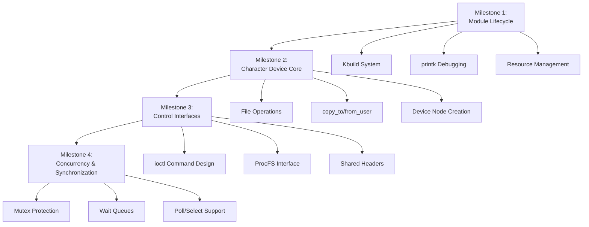

# Linux Character Device Driver: Design Document


## Overview

This document describes the design of a loadable Linux kernel module that implements a simple character device driver with a `/dev` interface. The key architectural challenge is safely managing data and concurrency across the kernel/user-space boundary, which requires careful handling of memory, synchronization primitives, and driver lifecycle.


> This guide is meant to help you understand the big picture before diving into each milestone. Refer back to it whenever you need context on how components connect.


> **Milestone(s):** Milestone 1, Milestone 2, Milestone 3, Milestone 4 (foundational concepts)

## Context and Problem Statement

### The Kernel as a Secure Building

Think of the Linux operating system as a highly secure government building. This building has two distinct zones with strict access controls between them.

The **userspace zone** (outside the building) is where all regular applications run. This zone is chaotic and unpredictable - thousands of programs with varying levels of trust compete for resources. Any application can crash without bringing down the entire system, much like a protest outside the building doesn't shut down government operations. Applications communicate with each other through well-defined channels, but they have limited direct access to critical resources.

The **kernel-space zone** (inside the building) is the secure core where privileged operations happen. This is where the operating system's core services run: managing memory, scheduling processes, controlling hardware, and enforcing security policies. The kernel has complete access to all system resources, including physical memory, CPU registers, and hardware devices. A single mistake here can crash the entire system, much like a fire in the building's control room would halt all government functions.

Between these two zones stands a **security checkpoint** with specific, controlled entrances: the **system call interface**. Each system call (`read`, `write`, `open`, `ioctl`, etc.) is like a designated checkpoint where userspace applications can request kernel services. When an application calls `write()` on a file, it's like submitting a form at the checkpoint - the application waits while security (the kernel) verifies the request, processes it according to strict rules, and returns a result.

The security guards at these checkpoints are various kernel subsystems. The **Virtual File System (VFS)** guards file operations, ensuring every `read()` or `write()` follows the proper protocol. The **process scheduler** determines which application gets CPU time. The **memory manager** controls what memory each application can access. These subsystems work together to maintain system stability and security.

> **Design Insight:** The fundamental rule of kernel programming is **"Thou shalt not trust userspace."** Any pointer, buffer, or value coming from userspace must be treated as potentially malicious or erroneous. The kernel must validate everything before using it, and must never crash or leak information regardless of what userspace sends.

Within this secure building, **device drivers** serve as specialized interpreters for hardware components. They translate generic system calls into specific hardware commands. When you type on a keyboard, the keyboard driver receives electrical signals and translates them into character data that applications can read. When you save a file, the storage driver translates file system requests into specific commands for your SSD or hard drive.

Our project focuses on building a particular type of driver: a **character device driver**. This driver doesn't control physical hardware but creates a virtual conduit for data between userspace and kernel-space. It's like installing a secure message passing system within the building - applications can deposit messages (write) and retrieve messages (read) through controlled interfaces, with the kernel managing the storage and access rules.

### The Core Challenge: Safe and Concurrent Access

The specific problem we're solving has two interconnected dimensions that make kernel programming fundamentally different from userspace programming:

**Dimension 1: The Kernel/User Boundary Problem**
When data moves between userspace and kernel-space, it crosses a fundamental architectural boundary with different memory spaces, privilege levels, and validation requirements. The kernel cannot directly access userspace memory pointers because:
- Userspace pointers are virtual addresses in the application's address space, not the kernel's
- Userspace memory might be swapped out, invalid, or deliberately malicious
- Direct access would bypass security checks and could crash the system

Similarly, the kernel cannot directly expose its internal memory to userspace because:
- Kernel memory contains sensitive system data and other processes' information
- Applications might accidentally or maliciously corrupt kernel data structures
- Different memory protection mechanisms apply (kernel memory is not swappable)

The solution requires careful **copying and validation** at the boundary. Every byte transferred must be explicitly copied between address spaces using special kernel functions that handle the translation and validation automatically.

**Dimension 2: The Concurrency Problem**
Unlike most userspace programs that handle one request at a time, the kernel is inherently **concurrent**. Multiple processes can simultaneously:
- Open the same device file
- Read from the device while another process is writing to it
- Issue control commands (`ioctl`) while data transfers are happening
- Be interrupted by hardware interrupts that might need to access the same data structures

This creates classic synchronization problems:
- **Data races**: Two processes writing to the same buffer location without coordination
- **Starvation**: One process monopolizing access while others wait indefinitely
- **Deadlock**: Multiple processes waiting for each other in a circular dependency
- **Priority inversion**: A high-priority process waiting for a low-priority process

The kernel solves these problems with **synchronization primitives** (mutexes, spinlocks, semaphores) and **wait queues** (for blocking operations). However, these must be used correctly:
- Some locks can sleep (mutexes), while others cannot (spinlocks)
- The wrong lock type in the wrong context can deadlock the entire system
- Locking too much reduces performance; locking too little causes data corruption

> **Design Insight:** Kernel code must be **reentrant** and **thread-safe** by design. Every function must assume it can be interrupted at any point and resumed later, possibly with other threads executing the same code on different data.

The table below summarizes the key differences between kernel-space and userspace programming that our driver must handle:

| Aspect | Userspace Programming | Kernel-space Programming | Implications for Our Driver |
|--------|----------------------|--------------------------|----------------------------|
| **Memory Access** | Direct access to process memory, can allocate/free at will | Cannot directly access userspace memory; kernel memory is non-swappable | Must use `copy_to_user()`/`copy_from_user()` for all data transfers |
| **Error Handling** | Process crashes on severe errors; can be restarted | Kernel panic on severe errors; crashes entire system | Must validate all inputs, never dereference invalid pointers, handle all error paths |
| **Concurrency Model** | Typically single-threaded or explicit threading | Always concurrent - interrupts, multiple processes, SMP | Every data structure must be protected with appropriate locks |
| **Debugging** | Can use debuggers, printf, core dumps | Limited to `printk()`, system logs, special debugging tools | Must include extensive logging with appropriate log levels |
| **Libraries** | Full standard C library available | Limited to kernel API; no floating point, limited memory allocation | Must use kernel functions (`kmalloc()`, `kfree()`) instead of `malloc()`/`free()` |
| **Execution Context** | Always in process context | Can be in process context or interrupt context | Must know context to choose correct synchronization primitives |
| **Module Lifecycle** | Program starts, runs, exits | Module loads, devices can be opened/closed many times, module unloads | Must clean up all resources on module exit, handle reference counting |

**Our Specific Implementation Challenge:**
We're building a character device driver that provides:
1. A `/dev/` interface that userspace programs can open, read, write, and close
2. An internal buffer that stores data written from userspace
3. Control interfaces (`ioctl` and `/proc`) for configuration and monitoring
4. Safe concurrent access for multiple readers and writers

The core data flow problem is illustrated in the following sequence:

1. **Userspace Process A** calls `write(fd, "hello", 5)` on our device
2. The system call enters the kernel through the VFS layer
3. VFS routes the call to our driver's `write` handler
4. Our handler must:
   - Validate the userspace pointer and length
   - Copy "hello" from userspace to kernel-space using `copy_from_user()`
   - Acquire a lock to protect the buffer from concurrent access
   - Store the data in our internal buffer
   - Release the lock
   - Wake up any processes waiting to read from an empty buffer
   - Return success/failure to userspace
5. Meanwhile, **Userspace Process B** might be calling `read()` on the same device
6. Our `read` handler must:
   - Check if data is available in the buffer
   - If empty, put the process to sleep on a wait queue (blocking read)
   - When woken (by the write above), acquire the lock
   - Copy data from kernel buffer to userspace using `copy_to_user()`
   - Release the lock
   - Return the number of bytes read

This seemingly simple flow involves nearly every challenging aspect of kernel programming: crossing the kernel/user boundary, synchronization, sleeping/waking processes, and proper error handling.

### Existing Approaches and Learning Path

Linux provides several mechanisms for kernel/userspace communication, each suited to different use cases. Understanding why we chose a character device driver requires comparing the alternatives:

| Interface | Primary Use Case | Data Model | Complexity | Why Not for Our Project |
|-----------|------------------|------------|------------|--------------------------|
| **Character Device (`/dev/`)** | Stream-oriented I/O, hardware abstraction | Byte stream, sequential access | Medium | **Chosen** - Perfect for learning fundamental driver concepts |
| **Block Device** | Disk storage, filesystems | Block-oriented, random access | High | Too complex, requires request queue handling |
| **Network Device** | Network interfaces | Packet-oriented, protocol stacks | High | Different API, requires networking stack integration |
| **SysFS (`/sys/`)** | Device configuration, attributes | Key-value pairs, hierarchical | Low-Medium | Not for bulk data transfer, read/write semantics different |
| **DebugFS (`/debug/`)** | Debugging information | Arbitrary files, often human-readable | Low | Not for production interfaces, may not be available |
| **ProcFS (`/proc/`)** | Process information, system statistics | Mixed (text, binary) | Medium | We'll use it for statistics, but not as primary interface |
| **Netlink Sockets** | Kernel ↔ userspace messaging | Message-based, bidirectional | Medium-High | Socket programming required, different paradigm |
| **Memory-mapped I/O (`mmap`)** | High-performance data sharing | Direct memory access | High | Advanced topic, bypasses copy overhead but more complex |

**Why a Character Device Driver is the Ideal Learning Vehicle:**

1. **Historical Significance**: Character devices represent the original Unix device model. Understanding them provides insight into decades of Unix/Linux design philosophy.

2. **Comprehensive Coverage**: Implementing a character device driver requires learning:
   - Module initialization and cleanup (Milestone 1)
   - File operations and the VFS layer (Milestone 2)
   - Kernel/userspace data transfer
   - Device node creation and management
   - Control interfaces (`ioctl`) (Milestone 3)
   - Synchronization and concurrency (Milestone 4)
   - Process sleeping/waking (wait queues)
   - Multiple interfaces (`/proc`, `ioctl`, file ops)

3. **Practical Foundation**: The skills transfer directly to:
   - Real hardware drivers (USB, serial, input devices)
   - Virtual devices (VPN interfaces, encryption devices)
   - Kernel services that expose device-like interfaces

4. **Progressive Complexity**: The character device API allows starting simple (basic read/write) and gradually adding complexity (ioctl, proc interface, concurrency) in clearly separated milestones.

**The Learning Progression Through Milestones:**

Our project follows a carefully sequenced learning path:



**Alternative Approaches We Considered and Rejected:**

> **Decision: Character Device vs. SysFS for Configuration**
> - **Context**: We need both data transfer (read/write) and configuration (buffer size, statistics). SysFS is commonly used for device attributes.
> - **Options Considered**:
>   1. Pure character device with `ioctl` for all control
>   2. Hybrid approach: character device for data, SysFS for attributes
>   3. Pure SysFS with binary file operations
> - **Decision**: Pure character device with `ioctl` and `/proc` interface
> - **Rationale**: 
>   - `ioctl` provides structured, type-safe command interface
>   - `/proc` interface is simpler to implement than SysFS for read-only statistics
>   - Keeping all interfaces in one driver file simplifies learning
>   - Real-world drivers often use multiple interfaces (char device + SysFS + debugfs)
> - **Consequences**: 
>   - Learners must understand multiple interface paradigms
>   - More code to write and test
>   - Better preparation for real driver development

| Option | Pros | Cons | Why Rejected |
|--------|------|------|--------------|
| **Pure Character Device** | Single interface to learn, consistent model | All control through `ioctl` can become complex | **Chosen** - Best for learning fundamentals |
| **Character + SysFS** | Proper separation of data vs. control, modern Linux practice | Two different APIs to learn, more complex initialization | Too advanced for initial learning |
| **Pure ProcFS** | Simple file operations, good for read-mostly data | Poor for binary data transfer, not standard for devices | Doesn't teach standard device driver patterns |
| **Netlink Sockets** | Bidirectional, flexible messaging | Completely different paradigm from device drivers | Wouldn't teach device driver concepts |

**The Evolution of Linux Driver Models:**

It's important to understand that our simple character device represents the foundation upon which more advanced driver models are built:

1. **Legacy Model (What we're implementing)**: Direct registration with `register_chrdev()`, manual device node creation
2. **Device Model (Modern approach)**: Integration with the kernel's device model, automatic discovery, power management
3. **Platform Devices**: For embedded systems with device tree description
4. **USB/PCI Drivers**: Bus-specific driver frameworks with hotplug support

Our project intentionally starts with the legacy model because:
- It exposes the fundamental operations without framework abstractions
- The concepts map directly to the `file_operations` structure
- Learners understand what frameworks later automate
- Most educational resources use this model

> **Design Principle**: Learn the fundamentals before the abstractions. Understanding how `copy_to_user()` works at a basic level makes you appreciate why driver frameworks exist and what problems they solve.

**Common Misconceptions About Kernel Programming:**

1. **"Kernel programming is just C programming"** - While the language is C, the environment, constraints, and APIs are completely different. There's no standard library, memory management is manual and constrained, and concurrency is ever-present.

2. **"If it compiles, it works"** - Kernel modules can compile cleanly but crash the system when loaded. Testing requires careful staging and recovery plans.

3. **"Userspace debugging techniques work in kernel"** - No interactive debuggers (usually), no `printf()` (use `printk()` with levels), core dumps are system crashes.

4. **"Concurrency is an advanced topic"** - In the kernel, concurrency is fundamental. Even a simple driver with no explicit threading must handle multiple processes accessing it simultaneously.

Our project structure directly addresses these misconceptions by:
- Starting with module lifecycle (Milestone 1) to learn the kernel build and loading process
- Progressing to data transfer (Milestone 2) with proper boundary crossing
- Adding control interfaces (Milestone 3) to learn kernel/userspace API design
- Finally addressing concurrency (Milestone 4) as a fundamental requirement

The following diagram shows where our driver fits in the overall Linux architecture:


As shown, our character device driver sits between userspace applications and kernel subsystems. It interacts with:
- **VFS (Virtual File System)**: For file operations (`open`, `read`, `write`, `ioctl`)
- **ProcFS**: For our statistics interface
- **Kernel Memory Management**: For buffer allocation
- **Process Scheduler**: For wait queue management

This positioning makes it an ideal vehicle for understanding the complete kernel ecosystem while focusing on manageable, incremental milestones.


## Goals and Non-Goals
> **Milestone(s):** Milestone 1, Milestone 2, Milestone 3, Milestone 4 (overarching objectives)

This section establishes clear boundaries for the driver project by explicitly defining what we aim to build (Goals) and what we deliberately exclude (Non-Goals). These boundaries ensure the project remains focused on its educational purpose while managing complexity for intermediate learners. Understanding these constraints prevents scope creep and helps learners focus on core kernel programming concepts without being overwhelmed by peripheral concerns.

### Functional Goals (What it must do)

The driver must implement a complete character device driver that serves as a pedagogical tool for understanding kernel/user-space interaction, device driver architecture, and concurrency management in the Linux kernel. These goals are organized into four progressive milestones, each building upon the previous to create a fully functional driver.

| Goal Category | Specific Requirements | Corresponding Milestone | Educational Purpose |
|---------------|----------------------|-------------------------|---------------------|
| **Module Lifecycle Management** | 1. Compile as loadable kernel module using Kbuild system<br>2. Clean initialization and cleanup with `module_init`/`module_exit`<br>3. Register proper metadata: `MODULE_LICENSE("GPL")`, `MODULE_AUTHOR`, `MODULE_DESCRIPTION`<br>4. Visible via `modinfo` command<br>5. Clean unloading without resource leaks | Milestone 1 | Teaches kernel module architecture, build system, and resource management lifecycle |
| **Character Device Interface** | 1. Dynamic device number allocation via `alloc_chrdev_region`<br>2. Automatic `/dev` node creation using `class_create` and `device_create`<br>3. Complete `struct file_operations` with `open`, `release`, `read`, `write` handlers<br>4. Safe user/kernel data transfer via `copy_to_user`/`copy_from_user`<br>5. Persistent kernel buffer for data storage between operations | Milestone 2 | Demonstrates character device registration, VFS integration, and boundary-crossing data transfer |
| **Control and Monitoring Interfaces** | 1. Custom `ioctl` commands defined with `_IOR`/`_IOW` macros in shared header<br>2. `unlocked_ioctl` handler implementing buffer resize, clear, and status queries<br>3. `/proc` filesystem entry displaying device statistics and configuration<br>4. Userspace test program exercising all control interfaces | Milestone 3 | Teaches kernel-user communication beyond basic read/write and ProcFS integration |
| **Concurrent Access Safety** | 1. Mutex-protected buffer access for thread-safe read/write operations<br>2. Blocking read via wait queue (`wait_event_interruptible`/`wake_up_interruptible`)<br>3. `poll`/`select` support implementing `poll` file operation<br>4. Stress testing with multiple concurrent readers/writers without data corruption | Milestone 4 | Introduces kernel synchronization primitives and asynchronous I/O patterns |

Beyond these technical requirements, the driver must fulfill specific educational objectives that transform it from a mere code exercise into a learning tool:

1. **Demonstrate Safe Boundary Crossing**: Every interaction between user-space and kernel-space must model proper safety practices—never dereferencing user pointers directly, always checking `copy_to/from_user` return values, and validating all inputs from untrusted user-space.

2. **Illustrate Kernel Concurrency Patterns**: The driver must showcase realistic synchronization scenarios that kernel developers encounter: sleeping locks for operations that may block, proper wait queue usage for event-driven I/O, and correct `poll` implementation for multiplexed I/O.

3. **Model Clean Resource Management**: From module loading to unloading, the driver must demonstrate the "reverse order" cleanup principle—freeing resources in the exact opposite order of allocation—to prevent resource leaks that could taint the kernel or require a reboot.

4. **Provide Debuggable Failure Modes**: The implementation should include clear error paths with descriptive `printk` messages (using appropriate log levels like `KERN_INFO` and `KERN_ERR`) that help learners diagnose issues through `dmesg` output.

5. **Serve as Reference Architecture**: The code structure should be modular enough that learners can extract patterns for their own future driver projects, with clear separation between device registration, I/O operations, control interfaces, and synchronization.

The following table maps each functional goal to specific kernel APIs and concepts that learners will master:

| Kernel Concept | APIs Used | Learning Outcome |
|----------------|-----------|------------------|
| **Module Lifecycle** | `module_init`, `module_exit`, `printk`, `MODULE_*` macros | Understanding how kernel modules integrate with the running kernel |
| **Device Registration** | `alloc_chrdev_region`, `cdev_init`, `cdev_add`, `class_create`, `device_create` | Dynamic device number assignment and automatic device node creation |
| **File Operations** | `struct file_operations`, `open`, `release`, `read`, `write` handlers | VFS integration and file operation dispatch |
| **User/Kernel Transfer** | `copy_to_user`, `copy_from_user`, `access_ok` | Safe memory access across privilege boundaries |
| **Ioctl Interface** | `unlocked_ioctl`, `_IOR`/`_IOW`/`_IOWR` macros | Device-specific control command implementation |
| **ProcFS Integration** | `proc_create`, `struct proc_ops`, `single_open` | Exporting driver information via virtual filesystem |
| **Synchronization** | `mutex_lock`/`mutex_unlock`, `DEFINE_MUTEX` | Protecting shared data from concurrent access |
| **Wait Queues** | `wait_event_interruptible`, `wake_up_interruptible`, `DECLARE_WAIT_QUEUE_HEAD` | Implementing blocking I/O with sleep/wake mechanisms |
| **Poll/Select** | `poll` file operation, `poll_wait`, mask bits (`POLLIN`, `POLLRDNORM`) | Supporting asynchronous event notification |

### Non-Goals (What it explicitly does NOT do)

Deliberate exclusion of certain features is as important as inclusion for a focused learning project. These non-goals prevent scope creep and ensure learners concentrate on core kernel programming concepts without being sidetracked by advanced or peripheral topics.

| Non-Goal Category | Specific Exclusions | Rationale for Exclusion |
|-------------------|---------------------|-------------------------|
| **Hardware Interaction** | 1. No physical hardware device control<br>2. No interrupt handling (IRQs)<br>3. No DMA operations<br>4. No memory-mapped I/O (MMIO)<br>5. No power management (suspend/resume) | Hardware drivers introduce platform-specific complexities, interrupt context constraints, and device-specific knowledge requirements that would distract from core kernel programming concepts. This driver is purely software-based. |
| **Production-Grade Robustness** | 1. No support for hotplugging (device insertion/removal at runtime)<br>2. No fine-grained error recovery beyond basic cleanup<br>3. No performance optimization (zero-copy, ring buffers)<br>4. No comprehensive security auditing or exploit mitigation<br>5. No support for `mmap` or advanced memory management | Production drivers require extensive error handling, security hardening, and performance optimizations that would obscure the educational focus on fundamental patterns. |
| **Advanced Kernel Features** | 1. No integration with Device Tree or ACPI<br>2. No sysfs (`/sys`) interface for device attributes<br>3. No debugfs interface for debugging<br>4. No netlink socket communication<br>5. No kernel thread creation or workqueues | These advanced interfaces would introduce additional complexity without contributing to the core learning objectives of character device drivers and basic synchronization. |
| **System-Wide Integration** | 1. No udev rule creation for automatic node permissions<br>2. No integration with systemd or init systems<br>3. No support for multiple device instances (minor numbers)<br>4. No namespace or container awareness<br>5. No integration with kernel events or notifications | System integration aspects are important for production drivers but represent a different layer of complexity than core kernel programming. |
| **User-Space Libraries** | 1. No companion userspace library (lib) for simplified access<br>2. No automatic test suite or continuous integration setup<br>3. No graphical monitoring tools or dashboards<br>4. No shell completion or CLI helper utilities | While useful in production, these would shift focus from kernel programming to userspace application development. |

The driver also explicitly avoids certain implementation patterns that, while common in production, would complicate the learning experience:

> **Design Principle: Simplicity Over Completeness**  
> This driver prioritizes clear, pedagogical code over feature completeness. Every line of code should serve an educational purpose, demonstrating a specific kernel concept without unnecessary abstraction or optimization that would obscure the core learning.

**Why No Hardware Interaction?**  
Real hardware drivers require understanding device datasheets, interrupt controllers, DMA controllers, and platform-specific constraints. These topics deserve their own dedicated learning path. Our pure-software driver eliminates these variables, allowing learners to focus on kernel APIs and patterns without hardware debugging complications.

**Why Not Production-Grade?**  
Production drivers require handling dozens of edge cases: power management events, surprise device removal, malicious user input, resource exhaustion, and performance under heavy load. While important, these concerns would triple the code size and obscure the fundamental patterns. Learners should first master the basics before tackling production hardening.

**Why Exclude Advanced Interfaces?**  
Sysfs, debugfs, netlink, and Device Tree each have their own complex APIs and conventions. Including them would fragment the learning focus. After mastering character devices and ProcFS, learners can apply similar patterns to these other interfaces in future projects.

**Educational Boundary Enforcement**  
The non-goals create a "sandbox" where learners can safely experiment with kernel programming without being overwhelmed. For example:

1. **No hardware dependencies** means the driver works on any Linux system (virtual or physical) without special hardware.
2. **No production requirements** means we can use simple linear buffers instead of optimized ring buffers, making the code easier to understand.
3. **No advanced features** means we can use the simpler `single_open` style for ProcFS instead of the more complex `seq_file` interface, reducing cognitive load.

These constraints mirror how kernel programming is often taught: starting with software-only drivers before progressing to hardware control, and focusing on correctness before optimization.

### Implementation Guidance

While this section primarily defines requirements rather than implementation, learners should use these goals and non-goals as a checklist throughout development. The following table provides a quick reference for what to include and what to avoid:

| ✅ **DO Implement** | ❌ **DO NOT Implement** |
|-------------------|-------------------------|
| `copy_to_user`/`copy_from_user` for all boundary crossings | Direct dereferencing of user-space pointers |
| Mutex protection for all buffer operations | Spinlocks for operations that may sleep |
| Wait queues for blocking read when empty | Busy-wait loops polling buffer state |
| Proper error checking and cleanup in `module_exit` | Ignoring allocation failures or cleanup |
| Shared header file for `ioctl` command definitions | Hard-coded magic numbers for `ioctl` commands |
| `/proc` entry showing buffer size, usage statistics | Complex sysfs attributes or debugfs entries |
| `poll` support with `POLLIN`/`POLLRDNORM` events | Full `mmap` implementation or shared memory |
| Kernel log messages at appropriate levels (`KERN_INFO`, `KERN_ERR`) | Console output or userspace logging libraries |

For project structure, organize code according to these boundaries:

```
simplechardev/
├── Makefile                    # Kbuild system for module compilation
├── simplechardev.c             # Main driver implementation
├── simplechardev.h             # Shared ioctl definitions (user/kernel)
└── test_simplechardev.c       # Userspace test program (optional)
```

This minimal structure reflects the project's focused scope—no separate directories for hardware abstraction, no complex build systems, and no extensive test frameworks. The simplicity allows learners to see the complete picture of a character device driver without organizational overhead.

---


## High-Level Architecture

> **Milestone(s):** Milestone 1, Milestone 2, Milestone 3, Milestone 4 (architectural foundation for all components)

This section provides a bird's-eye view of the driver's internal architecture and its position within the broader Linux kernel ecosystem. Before diving into implementation details, it's crucial to understand how the driver's components fit together and interact with kernel subsystems. Think of the driver as a small business operating within a large industrial park (the kernel). This business has a reception desk (`Character Device Core`) that handles customer interactions, a storage room (`I/O Buffer`) for holding data, a manager (`Synchronization Manager`) who coordinates access to prevent chaos, an administrative office (`Module Lifecycle Manager`) that handles permits and licenses, and a public dashboard (`Proc/Control Interface`) displaying operational statistics. Each component has specific responsibilities and communicates through well-defined protocols enforced by the park's regulations (kernel APIs).


### Component Overview and Responsibilities

The driver decomposes into five logical components, each addressing a distinct aspect of the device driver problem space. This separation follows the **Single Responsibility Principle** adapted for kernel programming: each component manages one type of resource or handles one category of operations. This modular design makes the code easier to understand, test, and extend while aligning with Linux kernel conventions.

| Component | Primary Responsibility | Key Kernel Subsystems Interacted With | Key Data Structures Owned |
|-----------|------------------------|---------------------------------------|----------------------------|
| **Module Lifecycle Manager** | Handle driver initialization and cleanup, registering/unregistering with the kernel. | Kernel module loader, device number registry, sysfs | `struct mydevice_data` (global instance), `dev_t` (device number), `struct class*` |
| **Character Device Core** | Implement file operations (open, read, write, release) that userspace applications invoke via system calls. | Virtual File System (VFS), device model, memory management | `struct file_operations`, `struct cdev`, kernel buffer pointer |
| **I/O Buffer** | Store data written from userspace and provide it for reads, managing memory allocation and bounds. | Kernel memory allocator (`kmalloc`/`kfree`) | Linear buffer (void*), buffer size (size_t) |
| **Synchronization Manager** | Coordinate concurrent access from multiple processes, implement blocking reads, and support poll/select. | Kernel locking API, wait queue subsystem, poll mechanism | `struct mutex`, `struct wait_queue_head_t` |
| **Proc/Control Interface** | Provide monitoring and control via `ioctl` system calls and `/proc` filesystem entries. | `ioctl` dispatch, proc filesystem | `struct proc_ops`, `ioctl` command definitions |

#### Mental Model: The Driver as a Library with Controlled Access
Imagine a public library (the driver) where patrons (userspace processes) can store and retrieve messages. The **Module Lifecycle Manager** is the library's founding charter—it establishes the library's existence, obtains an official address (major/minor number), and registers with the city (kernel). The **Character Device Core** is the front desk staff—they handle check-ins (open), accept donations of books (write), lend books (read), and process check-outs (release). The **I/O Buffer** is the library's shelves—a finite space where books (data) are stored linearly. The **Synchronization Manager** is the librarian enforcing rules—only one patron can rearrange shelves at a time (mutex), and patrons waiting for new books must sit in a waiting area (wait queue) until notified. The **Proc/Control Interface** is the library's administrative office and public bulletin board—authorized staff can issue commands to resize shelves or clear inventory (`ioctl`), while any visitor can view statistics like total books stored (`/proc` entry).

#### Component Interactions and Data Flow
When a userspace program calls `write()` on `/dev/mychardev`, the interaction flows through these components sequentially:
1. **VFS Layer** receives the system call and routes it to our driver's registered `file_operations.write` handler (Character Device Core).
2. **Character Device Core** validates parameters, then requests the **Synchronization Manager** to acquire the mutex protecting the buffer.
3. With the lock held, the Core uses `copy_from_user` to transfer data from userspace into the **I/O Buffer**.
4. After transfer, the Core notifies the **Synchronization Manager** to wake up any processes sleeping on the wait queue (blocked readers).
5. The **Synchronization Manager** releases the mutex, and control returns up the chain.

Similarly, when the module is loaded with `insmod`, the **Module Lifecycle Manager** executes first, allocating resources and registering the character device, which in turn creates the `/dev` node through kernel's device model. The `/proc` entry created by the **Proc/Control Interface** exists independently but reads statistics from the shared `struct mydevice_data`.

> **Architectural Insight:** The driver follows a **stateful singleton** pattern. A single instance of `struct mydevice_data` contains all driver state (buffer, locks, device identifiers). This instance is globally accessible within the module but not exposed to other kernel modules. This design simplifies resource management because all cleanup can be performed by the Module Lifecycle Manager during module exit by freeing this one structure.

#### ADR: Monolithic Module vs. Multiple Source Files

**Decision: Single Source File for Core Logic with Separate Header for Shared Definitions**

- **Context:** We must organize code for a learning-focused kernel module that demonstrates multiple concepts (device registration, file operations, ioctl, synchronization). The module is relatively small (~500 lines), but we need to share `ioctl` command definitions between kernel and userspace.
- **Options Considered:**
  1. **Single C file:** Place all code in one `.c` file for simplicity.
  2. **Multiple C files:** Split components (lifecycle, char device, proc) into separate `.c` files for modularity.
  3. **Core C file + shared header:** Keep driver logic in one `.c` file but separate `ioctl` definitions into a shared header used by both kernel module and userspace test program.
- **Decision:** Option 3 (Core C file + shared header).
- **Rationale:** 
  - **Learning Clarity:** Beginners benefit from seeing the complete driver flow in one file without cross-file navigation.
  - **Kernel Convention:** Many simple drivers in Linux source tree use single-file organization.
  - **Shared Definitions Necessity:** `ioctl` command numbers and data structures must be identical in kernel and userspace; a shared header ensures consistency without duplication.
  - **Build Simplicity:** Single source file requires minimal `Makefile` complexity.
- **Consequences:**
  - **Positive:** Easy to trace code execution; straightforward compilation; clear separation of interface (header) and implementation.
  - **Negative:** File may become long; components are not physically isolated (though logically separated via functions).
  - **Mitigation:** Use clear section comments and logical grouping of functions by component.

| Option | Pros | Cons | Chosen? |
|--------|------|------|---------|
| Single C file | Simplest build, all code visible in one place | Can become monolithic, harder to navigate for very large drivers | No |
| Multiple C files | Better modularity, separation of concerns | Increased build complexity, more cross-file references for learners | No |
| Core C + shared header | Balances simplicity with interface separation, mandatory for shared ioctl definitions | Still single implementation file | **Yes** |

### Recommended File and Module Structure

The physical layout of the project mirrors the logical decomposition while keeping the build process straightforward for learners. Following standard Linux kernel driver conventions, we place the module build configuration in a `Makefile` that invokes the kernel build system, and we separate userspace testing tools into their own directory.

#### Directory and File Layout
```
project-root/
│
├── Makefile                    # Kbuild Makefile for kernel module compilation
├── chardev.c                   # Main driver implementation (all components)
├── chardev.h                   # Shared header with ioctl definitions, structs
├── userspace/
│   ├── Makefile               # Simple Makefile for userspace test programs
│   ├── test_ioctl.c           # Test program for ioctl commands
│   └── test_concurrent.c      # Stress test for concurrent access
└── README.md                  # Project documentation
```

#### File Responsibilities Table
| File | Purpose | Key Contents | Used By |
|------|---------|--------------|---------|
| `Makefile` (root) | Invoke kernel build system to compile module | `obj-m += chardev.o`, Kbuild variables | Developer building module |
| `chardev.c` | Implement all driver components | `module_init`/`exit`, `file_operations`, `proc_ops`, buffer management, mutex/waitqueue | Kernel module (`insmod`) |
| `chardev.h` | Define shared constants and structures | `ioctl` command macros (`MYDEV_IOCTL_*`), `struct mydevice_data` declaration | `chardev.c` and userspace test programs |
| `userspace/Makefile` | Compile userspace test programs with `gcc` | Standard compilation rules | Developer testing driver |
| `userspace/test_ioctl.c` | Demonstrate `ioctl` commands | Includes `chardev.h`, calls `ioctl()` with various commands | Manual testing of Milestone 3 |
| `userspace/test_concurrent.c` | Stress test concurrent reads/writes | Creates multiple processes performing simultaneous operations | Validation of Milestone 4 |

#### ADR: In-Tree vs. Out-of-Tree Module Build

**Decision: Build as Out-of-Tree Module Using Installed Kernel Headers**

- **Context:** The driver is a learning project not intended for inclusion in the main Linux kernel source tree. We need a build method that works on standard Linux distributions without requiring the full kernel source.
- **Options Considered:**
  1. **In-tree build:** Place driver source within the Linux kernel source tree and build using the kernel's top-level Makefile.
  2. **Out-of-tree with full kernel source:** Require the entire kernel source code, building against a specific source tree.
  3. **Out-of-tree with kernel headers:** Use only the installed kernel headers (typically `/lib/modules/$(uname -r)/build`) to compile.
- **Decision:** Option 3 (Out-of-tree with kernel headers).
- **Rationale:**
  - **Practicality:** Most developers have kernel headers installed via distribution packages (e.g., `linux-headers-$(uname -r)`), not the full multi-gigabyte kernel source.
  - **Standard Practice:** This is the recommended approach for third-party kernel modules in Linux distributions.
  - **Version Matching:** Using headers for the running kernel ensures compatibility with the exact kernel ABI.
- **Consequences:**
  - **Positive:** Minimal disk footprint; leverages distribution packaging; matches real-world driver development.
  - **Negative:** Cannot build for kernels other than the running one without installing additional header packages.
  - **Mitigation:** The `Makefile` uses `$(uname -r)` to detect current kernel version; developers can override `KERNELDIR` variable for cross-compilation.

| Option | Pros | Cons | Chosen? |
|--------|------|------|---------|
| In-tree build | Accesses full kernel build infrastructure, easier upstreaming | Requires entire kernel source, not practical for learning project | No |
| Out-of-tree with full source | More control over kernel configuration | Still requires full kernel source, large download | No |
| Out-of-tree with headers | Lightweight, matches real-world module development | Limited to installed kernel versions | **Yes** |

#### Component-to-File Mapping
The logical components described earlier map to sections within `chardev.c` through function groupings and data structure ownership:

- **Module Lifecycle Manager:** `init_module()` (or `mydevice_init()`) and `cleanup_module()` (or `mydevice_exit()`) functions, plus global `struct mydevice_data *dev_data`.
- **Character Device Core:** `struct file_operations mydevice_fops` with handlers `mydevice_open()`, `mydevice_read()`, `mydevice_write()`, `mydevice_release()`.
- **I/O Buffer:** Fields within `struct mydevice_data`: `void *buffer`, `size_t size`, managed by helper functions `buffer_alloc()`, `buffer_free()`.
- **Synchronization Manager:** Mutex and wait queue operations within read/write handlers, plus `mydevice_poll()` handler.
- **Proc/Control Interface:** `mydevice_ioctl()` handler and `/proc` file operations via `struct proc_ops`.

> **Design Principle:** While components are logically separate, they share the same `struct mydevice_data` instance. This centralizes state management and ensures all components have consistent view of device state. The mutex within this structure protects access across all components that touch the buffer.

### Implementation Guidance

This subsection provides concrete starting points for implementing the architectural structure described above. The guidance assumes the primary language is C and follows Linux kernel programming conventions.

#### A. Technology Recommendations Table

| Component | Simple Option (Recommended for Learning) | Advanced Option (For Further Exploration) |
|-----------|------------------------------------------|------------------------------------------|
| Build System | Kbuild with external module Makefile | DKMS (Dynamic Kernel Module Support) for automatic rebuild on kernel updates |
| Memory Allocation | `kmalloc()` + `kfree()` for simple buffer | `vmalloc()` for large buffers (>1 page), or slab allocator for many objects |
| Synchronization | `mutex` + `wait_queue_head_t` | `rw_semaphore` for reader/writer pattern, or RCU for read-mostly data |
| Proc Interface | `proc_create()` with `proc_ops` using `single_open` | Full `seq_file` interface for large outputs, or debugfs for debugging data |
| Userspace Testing | Simple C programs with `open()`/`read()`/`write()`/`ioctl()` | Python scripts using `ctypes` or `fcntl`, or automated test suite with kernel CI |

#### B. Recommended File/Module Structure (Expanded)

Create the following files with the initial content shown below. This structure implements the architectural decisions and provides a scaffold for each milestone.

**Project Root `Makefile`:**
```makefile
# Kbuild syntax for out-of-tree kernel module building
obj-m += chardev.o

# Kernel headers location (adjust if cross-compiling)
KERNELDIR ?= /lib/modules/$(shell uname -r)/build
PWD := $(shell pwd)

all:
	$(MAKE) -C $(KERNELDIR) M=$(PWD) modules

clean:
	$(MAKE) -C $(KERNELDIR) M=$(PWD) clean

install: all
	sudo insmod chardev.ko

uninstall:
	sudo rmmod chardev

# Userspace test programs
userspace:
	$(MAKE) -C userspace

.PHONY: all clean install uninstall userspace
```

**Main Driver Header `chardev.h`:**
```c
#ifndef _CHARDEV_H_
#define _CHARDEV_H_

#include <linux/ioctl.h>  // For _IOR, _IOW macros

// Define a magic number for our ioctl commands
// This should be unique to avoid conflicts with other drivers
#define MYDEVICE_IOC_MAGIC 'k'

// IOCTL command definitions
// RESIZE: takes new buffer size as integer argument
#define MYDEVICE_IOCTL_RESIZE _IOW(MYDEVICE_IOC_MAGIC, 0, int)
// CLEAR: no argument, just clear buffer
#define MYDEVICE_IOCTL_CLEAR _IO(MYDEVICE_IOC_MAGIC, 1)
// GET_SIZE: returns current buffer size
#define MYDEVICE_IOCTL_GET_SIZE _IOR(MYDEVICE_IOC_MAGIC, 2, int)
// GET_MAX_CAPACITY: returns maximum allowed buffer size
#define MYDEVICE_IOCTL_GET_MAX_CAPACITY _IOR(MYDEVICE_IOC_MAGIC, 3, int)

// Maximum buffer size limit (safety measure)
#define MAX_BUFFER_SIZE (1024 * 1024)  // 1MB

// Device name for /dev and proc entries
#define DEVICE_NAME "mychardev"

#endif  // _CHARDEV_H_
```

**Main Driver Implementation `chardev.c` Skeleton:**
```c
// SPDX-License-Identifier: GPL-2.0
/*
 * Simple character device driver for educational purposes
 * Implements a kernel buffer accessible via /dev/mychardev
 */

#include <linux/module.h>
#include <linux/fs.h>
#include <linux/cdev.h>
#include <linux/device.h>
#include <linux/slab.h>
#include <linux/uaccess.h>
#include <linux/mutex.h>
#include <linux/wait.h>
#include <linux/poll.h>
#include <linux/proc_fs.h>
#include <linux/seq_file.h>

#include "chardev.h"  // Our shared header

// --- Module Lifecycle Manager Component ---

// Global device data structure (singleton instance)
struct mydevice_data {
    void *buffer;           // I/O Buffer: kernel memory for stored data
    size_t size;            // I/O Buffer: current allocated size
    size_t data_len;        // I/O Buffer: amount of valid data stored
    struct mutex mutex;     // Synchronization Manager: mutual exclusion lock
    wait_queue_head_t read_wait; // Synchronization Manager: queue for blocking reads
    struct cdev cdev;       // Character Device Core: kernel's char device structure
    dev_t dev_num;          // Module Lifecycle: device major/minor number
    struct class *dev_class; // Module Lifecycle: sysfs class for device creation
    struct device *dev;     // Module Lifecycle: actual device instance
};

static struct mydevice_data *dev_data = NULL;

// TODO 1: Implement module initialization function
// Responsibilities:
// 1. Allocate dev_data with kmalloc
// 2. Initialize mutex and wait queue
// 3. Allocate initial buffer (e.g., 4KB)
// 4. Register character device region with alloc_chrdev_region
// 5. Create sysfs class and device node
// 6. Set up cdev structure with file_operations
static int __init mydevice_init(void)
{
    int result = 0;
    printk(KERN_INFO "mydevice: Initializing driver\n");
    // TODO: Fill with implementation from Milestone 1 and 2
    return result;
}

// TODO 2: Implement module cleanup function
// Responsibilities:
// 1. Remove /proc entry if created
// 2. Destroy device node and class
// 3. Unregister character device region
// 4. Free buffer memory
// 5. Free dev_data structure
static void __exit mydevice_exit(void)
{
    printk(KERN_INFO "mydevice: Cleaning up driver\n");
    // TODO: Fill with implementation from Milestone 1 and 2
}

// --- Character Device Core Component ---

// TODO 3: Implement file_operations methods
// open: simple increment of module usage count
static int mydevice_open(struct inode *inode, struct file *filp)
{
    // TODO: Fill with implementation from Milestone 2
    return 0;
}

// release: decrement module usage count
static int mydevice_release(struct inode *inode, struct file *filp)
{
    // TODO: Fill with implementation from Milestone 2
    return 0;
}

// read: copy data from kernel buffer to userspace
// Must handle:
// - Blocking when buffer empty (use wait_event_interruptible)
// - Partial reads (return less than count)
// - Proper offset management
static ssize_t mydevice_read(struct file *filp, char __user *buf, 
                            size_t count, loff_t *f_pos)
{
    ssize_t retval = 0;
    // TODO: Fill with implementation from Milestone 2 and 4
    return retval;
}

// write: copy data from userspace to kernel buffer
// Must handle:
// - Buffer capacity limits
// - Waking up sleeping readers after write
static ssize_t mydevice_write(struct file *filp, const char __user *buf,
                             size_t count, loff_t *f_pos)
{
    ssize_t retval = 0;
    // TODO: Fill with implementation from Milestone 2 and 4
    return retval;
}

// poll: support for select()/poll() system calls
static __poll_t mydevice_poll(struct file *filp, poll_table *wait)
{
    __poll_t mask = 0;
    // TODO: Fill with implementation from Milestone 4
    return mask;
}

// Define the file_operations structure linking handlers
static const struct file_operations mydevice_fops = {
    .owner = THIS_MODULE,
    .open = mydevice_open,
    .release = mydevice_release,
    .read = mydevice_read,
    .write = mydevice_write,
    .poll = mydevice_poll,
    .unlocked_ioctl = mydevice_ioctl,  // Defined in Control Interface
    // .llseek = no_llseek,  // Optional: device doesn't support seek
};

// --- Control Interface Component ---

// TODO 4: Implement ioctl handler
// Responsibilities:
// 1. Use switch statement on cmd argument
// 2. Handle MYDEVICE_IOCTL_RESIZE: validate size, realloc buffer
// 3. Handle MYDEVICE_IOCTL_CLEAR: reset data_len to 0
// 4. Handle MYDEVICE_IOCTL_GET_SIZE: return current buffer size
// 5. Handle MYDEVICE_IOCTL_GET_MAX_CAPACITY: return MAX_BUFFER_SIZE
// 6. For invalid commands, return -ENOTTY
static long mydevice_ioctl(struct file *filp, unsigned int cmd, unsigned long arg)
{
    long retval = 0;
    // TODO: Fill with implementation from Milestone 3
    return retval;
}

// TODO 5: Implement /proc file operations
// proc_show: display device statistics when /proc/mychardev is read
static int mydevice_proc_show(struct seq_file *m, void *v)
{
    // TODO: Fill with implementation from Milestone 3
    // Example: seq_printf(m, "Buffer size: %zu\n", dev_data->size);
    return 0;
}

static int mydevice_proc_open(struct inode *inode, struct file *file)
{
    return single_open(file, mydevice_proc_show, NULL);
}

static const struct proc_ops mydevice_proc_fops = {
    .proc_open = mydevice_proc_open,
    .proc_read = seq_read,
    .proc_lseek = seq_lseek,
    .proc_release = single_release,
};

// Module metadata
MODULE_LICENSE("GPL");
MODULE_AUTHOR("Your Name");
MODULE_DESCRIPTION("Simple character device driver for learning");
MODULE_VERSION("0.1");

// Register init/exit functions
module_init(mydevice_init);
module_exit(mydevice_exit);
```

**Userspace Test Program `userspace/test_ioctl.c` Skeleton:**
```c
#include <stdio.h>
#include <stdlib.h>
#include <fcntl.h>
#include <unistd.h>
#include <sys/ioctl.h>
#include <string.h>
#include "../chardev.h"  // Shared header with ioctl definitions

int main(int argc, char *argv[])
{
    int fd = open("/dev/" DEVICE_NAME, O_RDWR);
    if (fd < 0) {
        perror("Failed to open device");
        return 1;
    }
    
    // TODO: Test various ioctl commands
    // 1. GET_SIZE to see initial size
    // 2. RESIZE to change buffer size
    // 3. WRITE some data
    // 4. READ back data
    // 5. CLEAR buffer
    // 6. GET_MAX_CAPACITY to see limit
    
    close(fd);
    return 0;
}
```

#### C. Infrastructure Starter Code

For components that are prerequisites but not core learning goals, here is complete helper code that can be added to `chardev.c`:

**Buffer Management Helpers (I/O Buffer Component):**
```c
// Allocate or resize the internal buffer
static int buffer_resize(struct mydevice_data *dev, size_t new_size)
{
    void *new_buf;
    
    if (new_size > MAX_BUFFER_SIZE) {
        printk(KERN_ERR "mydevice: Requested size %zu exceeds maximum %d\n",
               new_size, MAX_BUFFER_SIZE);
        return -EINVAL;
    }
    
    new_buf = kmalloc(new_size, GFP_KERNEL);
    if (!new_buf) {
        printk(KERN_ERR "mydevice: Failed to allocate buffer of size %zu\n",
               new_size);
        return -ENOMEM;
    }
    
    // Copy existing data (up to minimum of old and new size)
    if (dev->buffer) {
        size_t copy_len = (dev->data_len < new_size) ? dev->data_len : new_size;
        memcpy(new_buf, dev->buffer, copy_len);
        dev->data_len = copy_len;  // Truncate if buffer shrunk
        kfree(dev->buffer);
    } else {
        dev->data_len = 0;
    }
    
    dev->buffer = new_buf;
    dev->size = new_size;
    printk(KERN_INFO "mydevice: Buffer resized to %zu bytes\n", new_size);
    return 0;
}

// Initialize buffer with default size
static int buffer_init(struct mydevice_data *dev, size_t initial_size)
{
    dev->buffer = NULL;
    dev->size = 0;
    dev->data_len = 0;
    return buffer_resize(dev, initial_size);
}

// Free buffer memory
static void buffer_cleanup(struct mydevice_data *dev)
{
    if (dev->buffer) {
        kfree(dev->buffer);
        dev->buffer = NULL;
        dev->size = 0;
        dev->data_len = 0;
    }
}
```

#### D. Core Logic Skeleton Code

For the core components learners should implement themselves, here are detailed TODO skeletons mapping to the architectural responsibilities:

**Module Initialization Detailed TODOs:**
```c
static int __init mydevice_init(void)
{
    int result = 0;
    dev_t dev = 0;
    
    printk(KERN_INFO "mydevice: Initializing driver\n");
    
    // TODO 1.1: Allocate dev_data with kzalloc (zero-initialized)
    // Hint: Use GFP_KERNEL flag, check for NULL
    
    // TODO 1.2: Initialize mutex with mutex_init()
    
    // TODO 1.3: Initialize wait queue with init_waitqueue_head()
    
    // TODO 1.4: Allocate initial buffer (e.g., 4096 bytes) using buffer_init()
    
    // TODO 1.5: Allocate device numbers with alloc_chrdev_region()
    // - Use &dev for first device number
    // - Base minor = 0, count = 1
    // - Device name = DEVICE_NAME
    // - Check return value
    
    // TODO 1.6: Initialize cdev structure with cdev_init()
    // - Link to mydevice_fops
    // - Add to system with cdev_add()
    
    // TODO 1.7: Create device class with class_create()
    // - THIS_MODULE as owner
    // - Name = DEVICE_NAME "_class"
    
    // TODO 1.8: Create device node with device_create()
    // - Use created class, parent = NULL, devt = dev
    // - Device data = dev_data
    // - Name = DEVICE_NAME
    
    // TODO 1.9: Create /proc entry with proc_create()
    // - Name = DEVICE_NAME
    // - Mode = 0444 (read-only)
    // - Link to mydevice_proc_fops
    
    // TODO 1.10: On any failure, clean up already-allocated resources
    // in reverse order (implement goto error handling pattern)
    
    return result;
}
```

#### E. Language-Specific Hints (Kernel C)

1. **Error Codes:** Always return negative `errno` values (e.g., `-ENOMEM`, `-EINVAL`) from kernel functions called by userspace system calls. The VFS will convert these to `-1` return with appropriate `errno` in userspace.

2. **Memory Allocation:** Use `GFP_KERNEL` for allocations that can sleep (in process context). Never use `GFP_KERNEL` in interrupt context or while holding a spinlock.

3. **Print Debugging:** Use `printk` with appropriate log levels: `KERN_INFO` for normal messages, `KERN_ERR` for errors. View output with `dmesg -w` to watch in real-time.

4. **User Memory Access:** Always use `copy_to_user()` and `copy_from_user()`—never dereference userspace pointers directly. Check return values (0 = success, >0 = number of bytes NOT copied).

5. **Module Parameters:** Consider adding `module_param()` macros later to allow configuration via `insmod chardev.ko buffer_size=8192`.

#### F. Milestone Checkpoint

After implementing the high-level architecture with the skeleton code:

1. **Build Verification:**
   ```bash
   make  # Should output: CC [M]  chardev.o; Building modules, [OK]
   ```

2. **Module Info Check:**
   ```bash
   modinfo chardev.ko
   ```
   Expected output shows correct license, author, description.

3. **Load Test:**
   ```bash
   sudo insmod chardev.ko
   dmesg | tail -5
   ```
   Should show "mydevice: Initializing driver" and no error messages.

4. **Device Node Creation:**
   ```bash
   ls -la /dev/mychardev
   ```
   Should show character device with major/minor numbers.

5. **Proc Entry Verification:**
   ```bash
   cat /proc/mychardev
   ```
   Should show buffer statistics (once implemented).

If any step fails, check `dmesg` for kernel error messages—they often provide specific failure reasons like "Cannot allocate memory" or "Device or resource busy".

#### G. Debugging Tips

| Symptom | Likely Cause | How to Diagnose | Fix |
|---------|--------------|-----------------|-----|
| `insmod` fails with "Unknown symbol in module" | Missing module license or dependency | `dmesg | tail` shows which symbol is missing | Ensure `MODULE_LICENSE("GPL")` is declared |
| `/dev/mychardev` not created | Device creation failed in init | Check `dmesg` for "device_create failed" | Verify `class_create()` succeeded before `device_create()` |
| Write succeeds but read returns 0 | Buffer not being filled or read offset wrong | Add `printk` in read/write to trace data flow | Ensure `data_len` is updated on write and read updates offset |
| Multiple processes cause system hang | Deadlock in mutex usage | Add debug prints before/after mutex_lock/unlock | Check for double-locking or missing unlock on error paths |
| `ioctl` returns `-1` with `errno=22` (EINVAL) | Invalid ioctl command number mismatch | Compare command numbers in kernel and userspace headers | Ensure `chardev.h` is identical in kernel and userspace builds |


## Data Model
> **Milestone(s):** Milestone 2, Milestone 3, Milestone 4 (data structures and ioctl definitions)

This section defines the fundamental building blocks that represent the driver's internal state and the contract for communication with user-space applications. In kernel programming, data structures must be carefully designed to ensure thread safety, proper memory management, and clear boundaries between kernel and user space. The data model serves as the "source of truth" for what the driver can do and how it maintains its state across multiple concurrent accesses.

### Kernel-Side Data Structures

**Mental Model: The Driver's Filing Cabinet**

Think of the driver's internal data as a specialized filing cabinet in a shared office (the kernel). Each drawer (data structure field) holds specific types of information, and there are rules about who can open which drawers and when. The main cabinet, `struct mydevice_data`, contains everything the driver needs to operate: a drawer for storing data (buffer), a lock to prevent two people from accessing the cabinet simultaneously (mutex), a waiting area for people expecting new documents (wait queue), and identification tags so the office manager (kernel) knows which cabinet is which (device identifiers). This cabinet exists only in the secured office area (kernel space) and cannot be directly accessed from the public area (user space).

The primary data structure, `struct mydevice_data`, encapsulates the complete state of a single device instance. Since this driver follows the **singleton pattern** (one device instance), a single global instance of this structure manages all operations. The structure must be allocated and initialized during module loading and cleaned up during module unloading.

| Field Name | Type | Description |
|------------|------|-------------|
| `buffer` | `void*` | Pointer to dynamically allocated kernel memory that stores data written from user space. Acts as a simple linear buffer where data is appended at the end and read from the beginning. |
| `size` | `size_t` | Total capacity of the buffer in bytes. This represents the maximum amount of data the buffer can hold at any time, set during initialization and potentially changed via `ioctl` resize operations. |
| `data_len` | `size_t` | Current number of valid bytes stored in the buffer. This tracks how much of the buffer's capacity is actually occupied with data available for reading. When `data_len` is 0, the buffer is empty; when equal to `size`, the buffer is full. |
| `mutex` | `struct mutex` | Mutual exclusion lock that protects all accesses to the buffer and related fields (`buffer`, `size`, `data_len`). Ensures that only one thread (or process) can modify the buffer state at a time, preventing data corruption from concurrent writes or simultaneous read/write operations. |
| `read_wait` | `struct wait_queue_head_t` | Wait queue head where reader processes can sleep when the buffer is empty. When a process tries to read but `data_len` is 0, it adds itself to this queue and sleeps until a writer adds data and wakes it up. |
| `cdev` | `struct cdev` | Embedded character device structure that links our driver to the kernel's character device subsystem. Contains pointers to our `file_operations` functions and is registered with the kernel via `cdev_add`. |
| `dev_num` | `dev_t` | Combined device number (major and minor) assigned during `alloc_chrdev_region`. The major number identifies our driver type, while the minor number (always 0 for our singleton) identifies this specific device instance. |
| `dev_class` | `struct class*` | Pointer to the device class created via `class_create`. Used by the kernel's `sysfs` to expose device information in `/sys/class/`. |
| `device` | `struct device*` | Pointer to the device instance created via `device_create`. This triggers the automatic creation of the device node in `/dev/` (e.g., `/dev/mychardev`). |


**State Transitions and Buffer Management**

The buffer operates as a simple linear storage with three primary states, which can be modeled as a state machine:

| Current State | Event | Next State | Actions Taken |
|---------------|-------|------------|---------------|
| **EMPTY** (`data_len == 0`) | Write successful (bytes > 0) | **PARTIALLY_FILLED** | Increment `data_len` by written bytes, wake up any sleeping readers on `read_wait` |
| **EMPTY** | Read attempted | **EMPTY** (unchanged) | Reader process sleeps on `read_wait` (blocking), returns 0 if non-blocking |
| **PARTIALLY_FILLED** (`0 < data_len < size`) | Write successful | **PARTIALLY_FILLED** or **FULL** | Increment `data_len`, if `data_len` reaches `size`, transition to FULL |
| **PARTIALLY_FILLED** | Read successful | **PARTIALLY_FILLED** or **EMPTY** | Decrement `data_len` by read bytes, if `data_len` becomes 0, transition to EMPTY |
| **FULL** (`data_len == size`) | Write attempted | **FULL** (unchanged) | Write returns `-ENOSPC` (no space), writer may block or return immediately |
| **FULL** | Read successful | **PARTIALLY_FILLED** | Decrement `data_len` by read bytes, wake up any sleeping writers (if we implement blocking write) |

**Relationship Between Structures**

The `struct mydevice_data` serves as the central hub connecting all driver components. The `cdev` field links to the VFS layer when file operations occur—when a user-space process opens `/dev/mychardev`, the kernel finds our `cdev`, which points to our `file_operations` functions, and passes the `struct mydevice_data` as the `private_data` in the `struct file`. The `mutex` protects concurrent access to the buffer, while the `read_wait` enables synchronization between readers and writers. The `dev_class` and `device` fields connect to the device model, creating the user-visible interface in `/dev/`.

**Memory Lifetime and Ownership**

The `buffer` pointer owns a dynamically allocated memory region via `kmalloc`. Its lifetime is tied to the module: allocated in `mydevice_init` (or on first resize), potentially reallocated during resize operations, and freed in `mydevice_exit`. The `size` field tracks the current allocation size, while `data_len` tracks how much is actually in use. All other fields (mutex, wait queue, cdev) are initialized during module init and cleaned up during exit.

> **Design Insight:** Using a single structure that contains all driver state (`struct mydevice_data`) is crucial for kernel programming. It provides a clear ownership model (the module owns this structure), simplifies error cleanup (one structure to free), and enables safe concurrent access (one mutex protecting all related data). This pattern is standard in Linux device drivers.

### User-Space Ioctl Command Format

**Mental Model: The Driver's Remote Control**

Imagine the `ioctl` interface as a specialized remote control for our device. Each button on the remote (ioctl command) performs a specific action: one button resizes the buffer, another clears it, and others query status information. The remote communicates with the device using a predefined protocol (command numbers and data structures) that both sides understand. User-space applications "press buttons" by calling `ioctl()` with the right command code and optional parameters, and the driver executes the corresponding action and returns results.

The `ioctl` interface requires careful definition to ensure compatibility between kernel and user space. We define a shared header file (e.g., `mydevice.h`) that contains command numbers and any data structures used for parameter passing. This header is included by both the kernel module and user-space test programs.

> **Decision: Centralized ioctl Command Definitions**
> - **Context**: `ioctl` commands must be uniquely identified by numbers that both kernel and user space agree upon. We need a consistent way to define these commands that prevents collisions and ensures type safety.
> - **Options Considered**: 
>   1. **Hard-coded numbers in both places**: Define the same numeric constants separately in kernel and user code.
>   2. **Shared header file with macros**: Create a single header file that uses Linux's `_IO*` macros, included by both kernel and user programs.
> - **Decision**: Use a shared header file with properly constructed `ioctl` commands using the standard Linux macros (`_IOR`, `_IOW`, `_IOWR`).
> - **Rationale**: The shared header ensures consistency and prevents subtle bugs where kernel and user space disagree on command numbers. The standard macros incorporate direction (read/write) and data size, providing compile-time checks and documentation. This is the established Linux driver pattern.
> - **Consequences**: User-space programs must include this header; any changes to command definitions require recompilation of both kernel module and user programs.

**Ioctl Command Number Construction**

Linux `ioctl` commands are 32-bit numbers divided into fields:
- **Direction** (bits 30-31): Whether data flows from user to kernel (`_IOW`), kernel to user (`_IOR`), both (`_IOWR`), or none (`_IO`).
- **Size** (bits 16-29): Size of the data argument passed.
- **Type** (bits 8-15): "Magic number" unique to our driver, preventing collisions with other drivers.
- **Number** (bits 0-7): The specific command within our driver.

We define our magic number and commands as follows:

| Constant | Value/Definition | Purpose |
|----------|------------------|---------|
| `MYDEVICE_IOC_MAGIC` | `'k'` (ASCII character) | Unique magic number for our driver (chosen from unallocated range). |
| `MYDEVICE_IOCTL_GET_SIZE` | `_IOR(MYDEVICE_IOC_MAGIC, 1, size_t)` | Command to get current buffer size (data flows from kernel to user). |
| `MYDEVICE_IOCTL_GET_MAX_CAPACITY` | `_IOR(MYDEVICE_IOC_MAGIC, 2, size_t)` | Command to get maximum allowed buffer size (1MB). |
| `MYDEVICE_IOCTL_CLEAR` | `_IO(MYDEVICE_IOC_MAGIC, 3)` | Command to clear buffer (no data argument). |
| `MYDEVICE_IOCTL_RESIZE` | `_IOW(MYDEVICE_IOC_MAGIC, 4, size_t)` | Command to resize buffer (data flows from user to kernel). |

**Data Structures for Parameter Passing**

For commands that transfer data (`_IOR`, `_IOW`, `_IOWR`), we use standard C types. The `size_t` type is used for size-related operations, but we must be careful about its size differences between kernel and user space (both are typically 64-bit on modern systems, but we should use `__kernel_size_t` in the shared header for portability). For more complex drivers, custom structures would be defined here.

**Maximum Buffer Size Limitation**

We define `MAX_BUFFER_SIZE` as `(1024 * 1024)` (1 MiB) to prevent users from accidentally requesting excessive kernel memory. This protects the system from denial-of-service attacks where a malicious user might try to allocate huge buffers.

**Ioctl Command Semantics**

Each command has specific behavior and error conditions:

| Command | User-Space Argument | Kernel Action | Success Return | Error Conditions |
|---------|---------------------|---------------|----------------|------------------|
| `MYDEVICE_IOCTL_GET_SIZE` | Pointer to `size_t` | Copies `dev->size` to user pointer | 0 | `-EFAULT` if `copy_to_user` fails |
| `MYDEVICE_IOCTL_GET_MAX_CAPACITY` | Pointer to `size_t` | Copies `MAX_BUFFER_SIZE` to user pointer | 0 | `-EFAULT` if `copy_to_user` fails |
| `MYDEVICE_IOCTL_CLEAR` | None (ignored) | Sets `dev->data_len = 0` | 0 | None (always succeeds) |
| `MYDEVICE_IOCTL_RESIZE` | `size_t` new_size | Reallocates buffer to new size (if ≤ `MAX_BUFFER_SIZE`) | 0 | `-EINVAL` if new_size > `MAX_BUFFER_SIZE`, `-ENOMEM` if allocation fails, `-EFAULT` if `copy_from_user` fails |

**Example User-Space Usage**

A user-space program would use these commands like:
```c
#include "mydevice.h"
int fd = open("/dev/mychardev", O_RDWR);
size_t current_size;
ioctl(fd, MYDEVICE_IOCTL_GET_SIZE, &current_size);
```

### Common Pitfalls: Data Model

⚠️ **Pitfall: Uninitialized mutex or wait queue**
- **Description**: Forgetting to initialize the mutex with `mutex_init()` or the wait queue with `init_waitqueue_head()` before using them.
- **Why it's wrong**: An uninitialized mutex or wait queue leads to undefined behavior, often causing immediate kernel panics or deadlocks when first accessed.
- **Fix**: Always initialize synchronization primitives in the module's initialization function before any concurrent access is possible.

⚠️ **Pitfall: Incorrect buffer size tracking**
- **Description**: Mismanaging the relationship between `size` (capacity) and `data_len` (used bytes), such as allowing `data_len` to exceed `size` or not updating `data_len` after operations.
- **Why it's wrong**: This can cause buffer overflows (writing past allocated memory) or incorrect behavior where reads return wrong data or hang indefinitely.
- **Fix**: Always update `data_len` atomically with buffer operations, and check boundaries before any read/write.

⚠️ **Pitfall: Wrong ioctl command numbering**
- **Description**: Using arbitrary numbers for ioctl commands without the proper `_IOR`/`_IOW` macros, or using the same command number for different operations.
- **Why it's wrong**: Command number collisions can cause the wrong handler to execute; incorrect direction/size encoding can cause memory corruption or failed copies.
- **Fix**: Always use the standard macros with a unique magic number, and document each command clearly in the shared header.

⚠️ **Pitfall: Assuming size_t is same size in kernel and user space**
- **Description**: Using `size_t` in shared header without considering that kernel and user space might compile with different definitions (though rare on same architecture).
- **Why it's wrong**: If sizes differ, `copy_to_user`/`copy_from_user` may copy wrong amount of data, causing corruption.
- **Fix**: Use `__kernel_size_t` in shared headers or explicitly use fixed-width types like `uint64_t`.

### Implementation Guidance

**A. Technology Recommendations Table**

| Component | Simple Option | Advanced Option |
|-----------|---------------|-----------------|
| Buffer Storage | Linear `kmalloc` buffer with separate `size`/`data_len` | Circular buffer with head/tail pointers for better performance |
| Ioctl Interface | Standard `_IOR`/`_IOW` macros with `size_t` parameters | Complex structures with versioning and capability flags |
| State Tracking | Simple `data_len` counter | Bitmask flags for buffer states (EMPTY, FULL, etc.) |

**B. Recommended File/Module Structure**

```
project-root/
  Makefile                    # Kbuild makefile
  mychardev.c                 # Main driver implementation
  mychardev.h                 # Shared header for ioctl definitions (included by kernel AND user)
  test_mychardev.c            # Userspace test program
```

**C. Infrastructure Starter Code**

**File: `mychardev.h`** (shared header)
```c
#ifndef MYCHARDEV_H
#define MYCHARDEV_H

#include <linux/ioctl.h>  // For _IOR, _IOW, etc.
#include <linux/types.h>  // For __kernel_size_t

/* Magic number for our ioctl commands */
#define MYDEVICE_IOC_MAGIC 'k'

/* Maximum buffer size (1 MiB) */
#define MAX_BUFFER_SIZE (1024 * 1024)

/* 
 * Sizes of arguments for ioctl commands.
 * We use __kernel_size_t which is the kernel's size_t type,
 * ensuring consistency between kernel and user space.
 */
typedef __kernel_size_t mydevice_size_t;

/* 
 * IOCTL command definitions.
 * Format: _IOR/_IOW/_IO(magic, number, datatype)
 */
#define MYDEVICE_IOCTL_GET_SIZE _IOR(MYDEVICE_IOC_MAGIC, 1, mydevice_size_t)
#define MYDEVICE_IOCTL_GET_MAX_CAPACITY _IOR(MYDEVICE_IOC_MAGIC, 2, mydevice_size_t)
#define MYDEVICE_IOCTL_CLEAR _IO(MYDEVICE_IOC_MAGIC, 3)
#define MYDEVICE_IOCTL_RESIZE _IOW(MYDEVICE_IOC_MAGIC, 4, mydevice_size_t)

/* Ensure unique command numbers - add new ones sequentially */
#define MYDEVICE_IOCTL_MAXNR 4  /* Highest command number we use */

#endif /* MYCHARDEV_H */
```

**D. Core Logic Skeleton Code**

**In `mychardev.c`:**
```c
/* 
 * Main device state structure.
 * All device instance data is contained here.
 */
struct mydevice_data {
    void *buffer;                   /* Kernel buffer for stored data */
    size_t size;                    /* Total capacity of buffer */
    size_t data_len;                /* Current data length in buffer */
    struct mutex mutex;             /* Mutex for buffer protection */
    wait_queue_head_t read_wait;    /* Wait queue for blocking reads */
    struct cdev cdev;               /* Character device structure */
    dev_t dev_num;                  /* Device number (major+minor) */
    struct class *dev_class;        /* Device class for sysfs */
    struct device *device;          /* Device instance for /dev */
};

/* Global device instance (singleton) */
static struct mydevice_data mydevice;

/*
 * Initialize the device buffer.
 * Called during module initialization and buffer resize.
 * Returns 0 on success, negative error code on failure.
 */
static int buffer_init(struct mydevice_data *dev, size_t initial_size)
{
    /* TODO 1: Check if initial_size is valid (non-zero, ≤ MAX_BUFFER_SIZE) */
    /* TODO 2: Allocate memory with kmalloc using GFP_KERNEL flag */
    /* TODO 3: If allocation succeeds, update dev->buffer and dev->size */
    /* TODO 4: Initialize dev->data_len to 0 (empty buffer) */
    /* TODO 5: Return 0 on success, -ENOMEM on allocation failure */
}

/*
 * Clean up the device buffer.
 * Called during module cleanup and buffer resize (before reallocation).
 */
static void buffer_cleanup(struct mydevice_data *dev)
{
    /* TODO 1: Check if dev->buffer is not NULL */
    /* TODO 2: Free the buffer memory with kfree */
    /* TODO 3: Set dev->buffer to NULL and dev->size to 0 */
    /* TODO 4: Reset dev->data_len to 0 */
}

/*
 * Resize the device buffer.
 * Called from ioctl handler with mutex already held.
 * Returns 0 on success, negative error code on failure.
 */
static int buffer_resize(struct mydevice_data *dev, size_t new_size)
{
    /* TODO 1: Validate new_size (must be ≤ MAX_BUFFER_SIZE, > 0) */
    /* TODO 2: If new_size equals current dev->size, return 0 (no-op) */
    /* TODO 3: Allocate new buffer with kmalloc */
    /* TODO 4: If allocation fails, return -ENOMEM */
    /* TODO 5: Copy existing data from old buffer to new buffer (up to min(dev->data_len, new_size)) */
    /* TODO 6: Update dev->data_len to reflect copied amount (might be truncated if new_size smaller) */
    /* TODO 7: Free old buffer with kfree */
    /* TODO 8: Update dev->buffer and dev->size */
    /* TODO 9: Return 0 on success */
}
```

**E. Language-Specific Hints**

1. **Kernel memory allocation**: Always use `kmalloc` with `GFP_KERNEL` for buffers that may sleep (our case), or `GFP_ATOMIC` for interrupt context. Remember to check return value for NULL.
2. **Size types**: Use `size_t` for buffer sizes within the kernel module, but convert to/from `mydevice_size_t` (from shared header) when communicating with user space.
3. **Structure initialization**: For the global `mydevice` instance, use `= {0}` to ensure all pointers are NULL before initialization.
4. **Error codes**: Return negative `errno` values (e.g., `-ENOMEM`, `-EINVAL`) from functions that may fail.

**F. Milestone Checkpoint**

After implementing the data structures:
1. **Compilation test**: Run `make` to ensure the module compiles without errors. The shared header should compile in both kernel context (as part of the module) and user context (when included in test program).
2. **Structure verification**: Use `modinfo` to check module information, then load with `insmod`. Check `dmesg` for any initialization errors.
3. **Ioctl header test**: Create a simple user-space program that includes `mychardev.h` and prints the values of the ioctl constants. Compile with `gcc -o test_header test_header.c` to verify the header works in user space.

**Expected behavior**: Module loads without errors; header file compiles in both kernel and user space; ioctl command numbers are consistent.

**Signs of trouble**: 
- Compilation errors about unknown types in `mychardev.h`: Likely missing proper kernel headers inclusion guard.
- Module fails to load with "Invalid argument": Possible uninitialized mutex or wait queue causing panic during initialization.

**G. Debugging Tips**

| Symptom | Likely Cause | How to Diagnose | Fix |
|---------|--------------|-----------------|-----|
| Kernel panic on first read/write | Uninitialized mutex or wait queue | Check `dmesg` for backtrace showing mutex/wait queue functions | Call `mutex_init()` and `init_waitqueue_head()` in `mydevice_init()` |
| Buffer appears corrupted after resize | Incorrect data copying during resize | Add `printk` to show old/new sizes and data_len before/after copy | Ensure you copy only `min(old_data_len, new_size)` bytes |
| ioctl returns "Invalid argument" (`EINVAL`) | Wrong command number or size | Compare command number in user program with kernel definition using `printk` | Ensure shared header is identical in kernel and user builds |
| Buffer size shows wrong value after resize | Not updating dev->size field | Add debug prints in resize function showing dev->size changes | Update dev->size after successful reallocation |


## Component: Module Lifecycle Manager

> **Milestone(s):** Milestone 1

This component is the kernel module's entry and exit point. It manages the driver's birth and death within the running kernel, securing all necessary resources during initialization and releasing them during cleanup. Its design ensures the driver can be loaded and unloaded dynamically without affecting the stability of the operating system.

### Mental Model: The Driver's Birth and Death Certificate

Imagine the Linux kernel as a highly secure, constantly running industrial facility. A **kernel module** is like a specialized piece of equipment (our driver) that you want to install into this facility to add new functionality. The **Module Lifecycle Manager** is the formal process for getting this equipment certified, connected to the facility's power and control systems, and later, for decommissioning it safely.

-   **Loading (`insmod`)**: This is the installation and certification process. You submit your equipment's blueprints (the compiled module) to the facility's management (the kernel). The `module_init` function is your equipment's startup routine, which must:
    1.  **Request an official equipment ID**: Ask the facility for a unique device number (`alloc_chrdev_region`) so your device can be identified in the `/dev` directory.
    2.  **Connect to the control panel**: Register your device's operational manual (`file_operations`) with the facility's Virtual File System (VFS), so user programs know how to interact with it.
    3.  **Install the user-facing interface**: Create an accessible control panel (the `/dev/mychardev` node) using `device_create`, so users can issue commands.
    4.  **Allocate private workspace**: Secure a private memory area (`kmalloc`) for the driver's internal data buffer.
    5.  **Announce successful installation**: Log a message (`printk`) to the facility's central log (`dmesg`) confirming the driver is operational.

-   **Unloading (`rmmod`)**: This is the decommissioning process. The `module_exit` function is the meticulous shutdown checklist, which must **reverse every single action** performed during initialization in the exact opposite order:
    1.  **Remove the user-facing interface**: Dismantle the control panel (`device_destroy` and `class_destroy`).
    2.  **Disconnect from the control panel**: Unregister the operational manual (`cdev_del`).
    3.  **Return the equipment ID**: Release the unique device number (`unregister_chrdev_region`).
    4.  **Clean up the private workspace**: Free the allocated memory (`kfree`).
    5.  **Announce decommissioning**: Log a final message confirming the driver has been cleanly removed.

Forgetting any step in the cleanup process is like leaving your equipment plugged in and taking up space after your contract ends—it leads to resource leaks and can destabilize the entire facility (kernel). The golden rule is: **for every `alloc`, `create`, or `register` in `init`, there must be a corresponding `free`, `destroy`, or `unregister` in `exit`**.

### ADR: Dynamic vs. Static Device Number Allocation

> **Decision: Use `alloc_chrdev_region` for Dynamic Major Number Allocation**

-   **Context**: Character devices in Linux are identified by a major number (device type) and minor number (device instance). The driver must obtain a unique major number to create its `/dev` node. The kernel provides two primary methods: requesting a specific, static number or asking the kernel to assign one dynamically.
-   **Options Considered**:
    1.  **Static allocation with `register_chrdev`**: The driver requests a specific, well-known major number (e.g., 240). This is simple but prone to conflicts if another driver or module is already using that number.
    2.  **Dynamic allocation with `alloc_chrdev_region`**: The driver asks the kernel to assign an available major number from a pool. The driver then uses this assigned number.
-   **Decision**: We will use dynamic allocation via `alloc_chrdev_region`.
-   **Rationale**:
    -   **Conflict Avoidance**: This is the primary reason for an educational, out-of-tree module. Learners may run the module on various systems where static numbers could be occupied. Dynamic allocation guarantees a free number, preventing load failures.
    -   **Modern Practice**: The older `register_chrdev` function registers a single major number for all 256 minor numbers and uses a global `file_operations` structure. The newer `alloc_chrdev_region` and `cdev_init` API is more flexible and is the recommended approach for new drivers, allowing for better structure encapsulation.
    -   **Scalability**: It naturally supports the potential future extension of creating multiple device instances (multiple minor numbers) under the same dynamically allocated major number.
-   **Consequences**:
    -   The `/dev` node's name will be tied to a major number that changes each time the module is loaded (unless manually specified via module parameters, which is out of scope). This requires using `class_create` and `device_create` to automatically create the node with the correct, dynamically assigned number.
    -   The assigned major number must be communicated to userspace (via `printk` or `/proc/devices`) so the user knows which `/dev` node was created.

**Comparison of Allocation Methods**

| Option | Pros | Cons | Chosen? |
| :--- | :--- | :--- | :--- |
| **Static (`register_chrdev`)** | Simple API, predictable major number. | High risk of conflict with other drivers, less flexible, older API. | ❌ |
| **Dynamic (`alloc_chrdev_region`)** | Guarantees a free major number, avoids conflicts, modern and flexible API. | Major number changes per load, requires sysfs (`class_create`) for automatic `/dev` node creation. | ✅ |

### Common Pitfalls: Module Lifecycle

1.  ⚠️ **Pitfall: Forgetting `MODULE_LICENSE("GPL")`**
    -   **Description**: Omitting or incorrectly specifying the module license macro.
    -   **Why it's wrong**: The kernel will be marked as "tainted," which restricts the module's access to certain kernel symbols and may trigger warnings in the logs. Support from the kernel community may also be withheld for tainted kernels. For our learning module, using `"GPL"` is standard and expected.
    -   **How to fix**: Always include `MODULE_LICENSE("GPL");` near the top of your `.c` file, alongside `MODULE_AUTHOR` and `MODULE_DESCRIPTION`.

2.  ⚠️ **Pitfall: Resource Leak on Initialization Failure**
    -   **Description**: The `mydevice_init` function fails partway through (e.g., `kmalloc` returns `NULL`) but does not properly roll back resources already allocated (e.g., a successfully allocated device number).
    -   **Why it's wrong**: This leaves kernel resources permanently allocated until the system reboots. Repeated failed loads will exhaust these resources.
    -   **How to fix**: Implement a **stepwise cleanup** on any error path. Use `goto` statements to a common error handling label that performs cleanup in reverse order of acquisition. This pattern is standard and idiomatic in kernel code.

3.  ⚠️ **Pritfall: Kernel Version Mismatch**
    -   **Description**: Compiling the module against kernel headers that do not match the version of the currently running kernel.
    -   **Why it's wrong**: Kernel APIs change between versions. A module compiled for one version may use functions or data structures that don't exist or behave differently in another, leading to immediate crashes or subtle bugs.
    -   **How to fix**: Always build your module on the same system where it will run. The `Makefile` should use `$(shell uname -r)` to automatically target the running kernel's headers (typically in `/lib/modules/$(shell uname -r)/build`).

4.  ⚠️ **Pitfall: Incorrect `printk` Usage**
    -   **Description**: Using `printk` like `printf`, forgetting the log level macro (e.g., `KERN_INFO`), or expecting automatic newlines.
    -   **Why it's wrong**: Messages without a log level default to `KERN_DEFAULT`, which might not appear in `dmesg` depending on the console log level. Also, `printk` does not automatically append a newline; you must include `\n` in the format string.
    -   **How to fix**: Always prefix your format string with a log level macro, and end with `\n`. For example: `printk(KERN_INFO "mymodule: Initialized successfully.\n");`.

5.  ⚠️ **Pitfall: Ignoring Return Values of Initialization Functions**
    -   **Description**: Not checking the return value of functions like `alloc_chrdev_region`, `cdev_add`, or `device_create`.
    -   **Why it's wrong**: These functions can fail (e.g., out of memory, device number exhaustion). Ignoring the error leaves the module in an inconsistent state, often leading to a crash later.
    -   **How to fix**: Check every return value that indicates an error (typically a negative integer or a `NULL` pointer). Propagate the error back to the caller of `module_init` (by returning the error code) to cause module loading to fail cleanly.

### Implementation Guidance

This section provides the foundational code and structure to achieve Milestone 1: a loadable "Hello World" module that sets up the skeleton for the character device driver.

**A. Technology Recommendations Table**

| Component | Simple Option (Recommended for Learning) | Advanced Option |
| :--- | :--- | :--- |
| **Build System** | Standard `Kbuild` `Makefile` | Out-of-tree kernel module build system (kbuild) with `dkms` for distribution |
| **Kernel APIs** | Classic `file_operations`, `proc_ops` | Newer `file_operations` without `.owner`, `seq_file` for `/proc` |
| **Memory Allocation** | `kmalloc`/`kfree` with `GFP_KERNEL` | `devm_kmalloc` for managed resources (more complex setup) |

**B. Recommended File/Module Structure**

Create the following directory and file structure. This keeps the project organized from the start.

```
mydevice_driver/
├── Makefile                    # Kbuild Makefile to compile the module
├── mydevice.c                  # Main driver source file (all components start here)
└── README.md                   # Project notes (optional)
```

**C. Infrastructure Starter Code**

The following is a complete, compilable kernel module for Milestone 1. It includes the core lifecycle functions, error handling, and logging. Copy this into `mydevice.c`.

```c
// SPDX-License-Identifier: GPL-2.0
/*
 * mydevice.c - A simple loadable kernel module (LKM) skeleton for a character device.
 *
 * This module demonstrates the basic lifecycle: init and exit.
 * It will be extended in later milestones to implement a full character device.
 */

#include <linux/init.h>
#include <linux/module.h>
#include <linux/kernel.h>       // For printk, KERN_INFO
#include <linux/fs.h>           // For alloc_chrdev_region, register_chrdev
#include <linux/slab.h>         // For kmalloc, kfree
#include <linux/device.h>       // For class_create, device_create
#include <linux/cdev.h>         // For cdev_init, cdev_add

/* Define our internal device data structure (simplified for Milestone 1) */
struct mydevice_data {
    // These fields will be used in later milestones
    // void *buffer;
    // size_t size;
    // struct mutex mutex;
    // wait_queue_head_t read_wait;

    // Device identification and kernel structures (introduced now)
    dev_t dev_num;              // Major and minor device number
    struct cdev cdev;           // The kernel's character device structure
    struct class *dev_class;    // Sysfs class for udev/auto device node creation
    struct device *device;      // The actual device instance in sysfs
};

static struct mydevice_data *mydevice_dev;

/* Module metadata */
MODULE_LICENSE("GPL");
MODULE_AUTHOR("Your Name Here");
MODULE_DESCRIPTION("A simple character device driver for learning");
MODULE_VERSION("0.1");

/* Forward declarations for file operations (to be implemented in Milestone 2) */
/*
static int mydevice_open(struct inode *inode, struct file *filp);
static int mydevice_release(struct inode *inode, struct file *filp);
static ssize_t mydevice_read(struct file *filp, char __user *buf, size_t count, loff_t *f_pos);
static ssize_t mydevice_write(struct file *filp, const char __user *buf, size_t count, loff_t *f_pos);
*/

/* The file_operations structure will be populated in Milestone 2 */
static struct file_operations mydevice_fops = {
    .owner = THIS_MODULE,
    // .open = mydevice_open,
    // .release = mydevice_release,
    // .read = mydevice_read,
    // .write = mydevice_write,
};

/**
 * mydevice_init - Module initialization function.
 * Called when the module is loaded with 'insmod'.
 *
 * Returns 0 on success, a negative error code on failure.
 */
static int __init mydevice_init(void)
{
    int retval = 0;

    printk(KERN_INFO "mydevice: Initialization started.\n");

    /* 1. Allocate memory for our device instance data */
    mydevice_dev = kmalloc(sizeof(struct mydevice_data), GFP_KERNEL);
    if (!mydevice_dev) {
        printk(KERN_ERR "mydevice: Failed to allocate device data.\n");
        retval = -ENOMEM;
        goto err_no_mem;
    }
    memset(mydevice_dev, 0, sizeof(struct mydevice_data));

    /* 2. Dynamically allocate a major device number and a range of minors */
    retval = alloc_chrdev_region(&mydevice_dev->dev_num, 0, 1, DEVICE_NAME);
    if (retval < 0) {
        printk(KERN_ERR "mydevice: Failed to allocate device number. Error %d\n", retval);
        goto err_alloc_region;
    }
    printk(KERN_INFO "mydevice: Allocated device major %d, minor %d.\n",
           MAJOR(mydevice_dev->dev_num), MINOR(mydevice_dev->dev_num));

    /* 3. Create a device class in sysfs. This allows udev to create /dev node automatically. */
    mydevice_dev->dev_class = class_create(THIS_MODULE, DEVICE_NAME "_class");
    if (IS_ERR(mydevice_dev->dev_class)) {
        retval = PTR_ERR(mydevice_dev->dev_class);
        printk(KERN_ERR "mydevice: Failed to create device class. Error %d\n", retval);
        goto err_class_create;
    }

    /* 4. Initialize the cdev structure and link it to our file_operations. */
    cdev_init(&mydevice_dev->cdev, &mydevice_fops);
    mydevice_dev->cdev.owner = THIS_MODULE;

    /* 5. Add the character device to the kernel, making it live. */
    retval = cdev_add(&mydevice_dev->cdev, mydevice_dev->dev_num, 1);
    if (retval < 0) {
        printk(KERN_ERR "mydevice: Failed to add cdev to the system. Error %d\n", retval);
        goto err_cdev_add;
    }

    /* 6. Create the device node in /dev automatically.
     *    The node will appear as /dev/mychardev.
     */
    mydevice_dev->device = device_create(mydevice_dev->dev_class, NULL, mydevice_dev->dev_num, NULL, DEVICE_NAME);
    if (IS_ERR(mydevice_dev->device)) {
        retval = PTR_ERR(mydevice_dev->device);
        printk(KERN_ERR "mydevice: Failed to create the device node. Error %d\n", retval);
        goto err_device_create;
    }

    printk(KERN_INFO "mydevice: Module loaded successfully. Device node is /dev/%s.\n", DEVICE_NAME);
    return 0; // Success

/* Error handling: Clean up in reverse order of allocation */
err_device_create:
    cdev_del(&mydevice_dev->cdev);
err_cdev_add:
    class_destroy(mydevice_dev->dev_class);
err_class_create:
    unregister_chrdev_region(mydevice_dev->dev_num, 1);
err_alloc_region:
    kfree(mydevice_dev);
    mydevice_dev = NULL;
err_no_mem:
    printk(KERN_ERR "mydevice: Module initialization failed.\n");
    return retval;
}

/**
 * mydevice_exit - Module cleanup function.
 * Called when the module is unloaded with 'rmmod'.
 */
static void __exit mydevice_exit(void)
{
    printk(KERN_INFO "mydevice: Starting cleanup.\n");

    /* 1. Destroy the device node (removes /dev/mychardev) */
    if (mydevice_dev && mydevice_dev->device) {
        device_destroy(mydevice_dev->dev_class, mydevice_dev->dev_num);
    }

    /* 2. Remove the cdev from the system */
    if (mydevice_dev) {
        cdev_del(&mydevice_dev->cdev);
    }

    /* 3. Destroy the device class */
    if (mydevice_dev && mydevice_dev->dev_class) {
        class_destroy(mydevice_dev->dev_class);
    }

    /* 4. Release the device number region */
    if (mydevice_dev) {
        unregister_chrdev_region(mydevice_dev->dev_num, 1);
    }

    /* 5. Free the device instance memory */
    kfree(mydevice_dev);
    mydevice_dev = NULL;

    printk(KERN_INFO "mydevice: Module unloaded successfully.\n");
}

/* Register the init and exit functions with the kernel */
module_init(mydevice_init);
module_exit(mydevice_exit);
```

**D. Core Logic Skeleton Code**

The main logic for Milestone 1 is fully provided above. The following `Makefile` is required to build the module. Place it in the same directory as `mydevice.c`.

```makefile
# Kbuild Makefile for the mydevice kernel module
obj-m += mydevice.o

# Define the device name (used in the C code)
EXTRA_CFLAGS += -DDEVICE_NAME=\"mychardev\"

# Path to the kernel build directory (adjust if needed)
KDIR ?= /lib/modules/$(shell uname -r)/build

# Default target: build the module
all:
	$(MAKE) -C $(KDIR) M=$(PWD) modules

# Clean target: remove generated files
clean:
	$(MAKE) -C $(KDIR) M=$(PWD) clean

# Installation target (optional, for later use)
install:
	sudo insmod mydevice.ko

# Removal target (optional, for later use)
uninstall:
	sudo rmmod mydevice
```

**E. Language-Specific Hints (C / Kernel)**

-   **Kernel Logging**: Always use `printk` for logging inside the kernel. Remember the log level macros (`KERN_INFO`, `KERN_ERR`). You can view the output with `sudo dmesg` or `journalctl -k`.
-   **Error Codes**: Kernel functions return negative error codes (e.g., `-ENOMEM` for out of memory). Your functions should do the same. `0` typically indicates success.
-   **Memory Allocation**: Use `kmalloc(size, GFP_KERNEL)` for normal, sleepable allocations. Always check for `NULL` return. Use `kfree()` to free.
-   **Goto for Error Handling**: The `goto` statement is standard and preferred for centralized error cleanup in the kernel. It leads to cleaner code than nested `if` statements.

**F. Milestone Checkpoint: Verification Steps for Milestone 1**

After writing the code above and saving it as `mydevice.c` with the accompanying `Makefile`, follow these steps to verify correct implementation:

1.  **Compile the module**:
    ```bash
    make
    ```
    Expected: The build should complete without errors, producing a `mydevice.ko` file.

2.  **Check module information**:
    ```bash
    modinfo mydevice.ko
    ```
    Expected: Output should show the license ("GPL"), author, description, and version you set with the `MODULE_*` macros.

3.  **Load the module**:
    ```bash
    sudo insmod mydevice.ko
    ```
    Expected: The command should return silently (no error). If there is an error (e.g., "insmod: ERROR: could not insert module"), check the next step.

4.  **Verify loading in kernel log**:
    ```bash
    sudo dmesg | tail -10
    ```
    Expected: You should see messages similar to:
    ```
    [ 1234.567890] mydevice: Initialization started.
    [ 1234.567891] mydevice: Allocated device major 246, minor 0.
    [ 1234.567892] mydevice: Module loaded successfully. Device node is /dev/mychardev.
    ```
    Note the allocated major number (e.g., 246).

5.  **Check if device node was created**:
    ```bash
    ls -l /dev/mychardev
    ```
    Expected: The file `/dev/mychardev` should exist. Its permissions might be `crw-------` and the major number should match the one printed in `dmesg`.

6.  **Check kernel modules list**:
    ```bash
    lsmod | grep mydevice
    ```
    Expected: The `mydevice` module should be listed.

7.  **Unload the module**:
    ```bash
    sudo rmmod mydevice
    ```
    Expected: The command should return silently.

8.  **Verify cleanup in kernel log**:
    ```bash
    sudo dmesg | tail -5
    ```
    Expected: You should see:
    ```
    [ 1234.678901] mydevice: Starting cleanup.
    [ 1234.678902] mydevice: Module unloaded successfully.
    ```

9.  **Confirm device node is removed**:
    ```bash
    ls -l /dev/mychardev 2>&1
    ```
    Expected: The command should report "No such file or directory".

If all steps pass, you have successfully completed Milestone 1. The driver skeleton is ready to have its character device operations implemented in the next milestone.

---


## Component: Character Device Core

> **Milestone(s):** Milestone 2

This component implements the core functionality that transforms our kernel module into an accessible device. It handles the direct interaction between user-space applications and the kernel module through the `/dev` interface, enabling programs to read from and write to our device as if it were a file.

### Mental Model: The Device as a Shared Notebook

Imagine a public library with a single, large notebook at the reference desk. This notebook represents our device's buffer. Library patrons (user-space processes) can approach the desk to perform two main actions:

1. **Write a message:** A patron can write text into the notebook. The librarian (the kernel) ensures they write neatly within the notebook's boundaries and don't overwrite other messages without permission. They hand their written note to the librarian, who carefully copies it into the next available space in the notebook.
2. **Read a message:** A patron can ask to read what's in the notebook. If the notebook is empty, the librarian asks the patron to wait in a designated waiting area (a wait queue) until another patron writes something. Once data is available, the librarian copies text from the notebook and hands the copy to the reading patron.

The librarian enforces strict rules:
- **Only one patron at the desk:** The librarian uses a "Now Serving" ticket (a mutex) to ensure only one patron is interacting with the notebook at any time, preventing jumbled or corrupted messages.
- **No original notes leave the library:** Patrons never handle the original notebook. The librarian only works with copies (`copy_from_user`, `copy_to_user`). This protects the kernel's internal data.
- **The notebook has finite pages:** The notebook has a maximum capacity. If it's full, writing patrons must wait until space is freed by reading patrons.

This mental model captures the essence of a character device: a shared, sequential data store with controlled access, managed by the kernel acting as a gatekeeper between untrusted user-space and protected kernel-space.

### ADR: Simple Linear Buffer vs. Circular Buffer

> **Decision: Use a Simple Linear Buffer for Initial Implementation**
> - **Context**: We need a storage mechanism within the kernel to hold data written from user-space and serve it back to readers. The buffer must support sequential access, concurrent modification, and have clear full/empty states.
> - **Options Considered**:
>   1. **Simple linear buffer**: A contiguous block of kernel memory (`kmalloc`) with a fixed capacity. Data is written starting at offset 0 and read from offset 0. Once data is read, the buffer is effectively "consumed" and must be cleared or overwritten from the beginning.
>   2. **Circular buffer (ring buffer)**: A fixed-size buffer where the read and write pointers wrap around. This allows continuous reading and writing without needing to clear the buffer, providing better throughput for sustained data flow.
>   3. **Linked list of pages**: A dynamically sized buffer composed of linked kernel pages, allowing growth without contiguous memory constraints but with increased complexity.
> - **Decision**: We will implement a simple linear buffer for Milestone 2.
> - **Rationale**: The primary goal is educational clarity, not maximum performance. A linear buffer has simpler state management (just `data_start`, `data_end` or `data_size`), making it easier to reason about concurrency, blocking conditions, and buffer state transitions. It directly maps to the "shared notebook" mental model where data is written and then consumed. Implementing a circular buffer adds complexity with wrap-around logic, modulo arithmetic, and handling the case where a read or write operation spans the buffer boundary, which can obscure the core concepts of kernel/user data transfer and synchronization.
> - **Consequences**: 
>   - **Positive**: Simplified implementation and debugging; clear full/empty states; straightforward `read`/`write` semantics.
>   - **Negative**: Lower throughput for continuous data streams; after a read, the buffer becomes empty and cannot hold historical data; requires explicit clearing or management of buffer position.
>   - **Mitigation**: This decision is scoped to Milestone 2. In Milestone 3, we will add an `ioctl` command to clear the buffer, and in future extensions, the buffer strategy could be upgraded to circular.

| Option | Pros | Cons | Chosen? |
|--------|------|------|---------|
| **Simple Linear Buffer** | Simple state logic, easy to debug, clear full/empty semantics, maps directly to learning objectives | Inefficient for continuous data, requires manual clearing, data is consumed on read | **Yes** (for Milestone 2) |
| **Circular Buffer** | Efficient for continuous read/write, no need to clear buffer automatically, common in production drivers | More complex implementation, wrap-around logic, harder to debug for learners | No |
| **Linked List of Pages** | Dynamic size, no contiguous memory requirement, scales well | High complexity, memory fragmentation, overhead of page management | No |

### Common Pitfalls: User/Kernel Boundary

Crossing the boundary between user-space and kernel-space is fraught with subtle dangers. The kernel must never blindly trust pointers or data from user-space, as they could be malicious, invalid, or point to unmapped memory. Here are the critical pitfalls to avoid:

⚠️ **Pitfall: Directly Dereferencing User-Space Pointers**
- **What happens**: Using `*` operator or array indexing on a pointer passed from user-space (e.g., the `buf` argument in `mydevice_write`).
- **Why it's wrong**: User-space pointers are virtual addresses in the user process's address space. They are meaningless in the kernel's address context. Dereferencing them will cause a page fault, crashing the kernel (a "oops" or kernel panic).
- **How to fix**: Always use the dedicated kernel functions `copy_from_user` (to copy data *from* user-space *into* kernel memory) and `copy_to_user` (to copy data *from* kernel memory *to* user-space). These functions perform safe translation and handle invalid pointers gracefully by returning a non-zero error code.

⚠️ **Pitfall: Not Checking Return Values of copy_to/from_user**
- **What happens**: Calling `copy_from_user(kernel_buf, user_buf, count)` but ignoring its return value.
- **Why it's wrong**: These functions can fail if the user pointer is invalid, points to unmapped memory, or if only part of the requested range is accessible. A failure means the copy was incomplete. Ignoring this leads to using uninitialized kernel buffer data or returning incorrect data to user-space.
- **How to fix**: Always check if the return value is 0 (success). If not, return `-EFAULT` to user-space to indicate a bad address. For example: `if (copy_from_user(...)) { return -EFAULT; }`

⚠️ **Pitfall: Incorrect Return Values from read/write Handlers**
- **What happens**: The `mydevice_read` function returns the number of bytes the user requested (`count`) regardless of how much data is actually available.
- **Why it's wrong**: The `read` system call contract expects the return value to be the number of bytes *actually transferred* to user-space. Returning a larger value tells the user program it received data it didn't, causing buffer overruns or reading garbage. Conversely, returning 0 indicates EOF (end-of-file), which for a character device typically means no data is available *at this moment*.
- **How to fix**: Return the actual number of bytes copied via `copy_to_user`. If no data is available and it's a non-blocking read, return `-EAGAIN`. If it's a blocking read, put the process to sleep (see Milestone 4). Return 0 only when at the true end of the data stream (which for our simple device might only happen after a buffer clear).

⚠️ **Pitfall: Forgetting to Update the File Position**
- **What happens**: The `read`/`write` handlers ignore the `loff_t *f_pos` parameter.
- **Why it's wrong**: The `f_pos` tracks the current position in the "file" for sequential access. For our simple sequential device, a `read` should consume data starting at the current position. If we don't update `*f_pos`, subsequent reads will return the same data repeatedly.
- **How to fix**: After successfully transferring `n` bytes, increment `*f_pos += n`. For our linear buffer model, we typically read from the beginning and reset the buffer (or position) after a complete read. The exact semantics depend on your design; you might choose to treat each `read` as consuming all available data and resetting the buffer to empty, in which case `f_pos` might not be used meaningfully.

⚠️ **Pitfall: Not Handling Partial Reads/Writes Due to Buffer Limits**
- **What happens**: A user requests to write 4096 bytes, but our kernel buffer has only 1024 bytes free.
- **Why it's wrong**: The driver should not silently truncate the data. The `write` system call expects either to transfer all requested bytes or return an error. If we only copy 1024 bytes and return 1024, the user program might think the entire write succeeded when it didn't.
- **How to fix**: Check if the operation can be completed in full given the buffer's current state (e.g., free space for write, available data for read). If not, you have two options: 1) Return `-ENOSPC` (no space) or `-EAGAIN` for a non-blocking operation, or 2) Transfer as much as possible (partial I/O) and return that count. The Linux convention for character devices often allows partial transfers; document your driver's behavior clearly. For simplicity in Milestone 2, we can implement partial transfers: write up to the free space, read up to the available data.

### Implementation Guidance

#### A. Technology Recommendations Table
| Component | Simple Option (Milestone 2) | Advanced Option (Future) |
|-----------|-----------------------------|--------------------------|
| **Buffer Storage** | Linear `kmalloc` buffer with fixed capacity | Circular buffer or `vmalloc` for large sizes |
| **Device Number** | Dynamic allocation with `alloc_chrdev_region` | Static major number (requires coordination) |
| **/dev Node Creation** | Automatic via `class_create`/`device_create` | Manual `mknod` or udev rules |
| **Concurrency (Milestone 4)** | Single mutex for all operations | Fine-grained locking (read/write locks) |

#### B. Recommended File/Module Structure
After implementing this component, your project directory should look like:
```
mydevice-driver/
├── Makefile                      # Kbuild Makefile
├── mydevice.c                    # Main driver source (Module Lifecycle + Char Device Core)
├── mydevice.h                    # Shared header (for ioctl, coming in Milestone 3)
└── test_user.c                   # Userspace test program (to be written)
```
For now, `mydevice.c` will contain both the module lifecycle functions (from previous section) and the character device core implementation.

#### C. Infrastructure Starter Code: The Device Instance Structure
We need a central structure to hold all state for our device. This is a singleton (one instance) for our driver. Add this to `mydevice.c`:

```c
#include <linux/fs.h>
#include <linux/cdev.h>
#include <linux/device.h>
#include <linux/slab.h>           // For kmalloc/kfree
#include <linux/uaccess.h>        // For copy_to/from_user

#define DEVICE_NAME "mychardev"
#define BUFFER_SIZE 1024          // Initial buffer size

// Per-device instance data structure
struct mydevice_data {
    dev_t dev_num;                // Major & minor number
    struct cdev cdev;             // Character device structure
    struct class *dev_class;      // Device class for sysfs
    struct device *device;        // Device node
    
    // Buffer management (Milestone 2)
    char *buffer;                 // Linear data buffer
    size_t buffer_size;           // Total capacity
    size_t data_size;             // Current amount of data stored
    // Note: We'll add mutex and wait_queue in Milestone 4
};

static struct mydevice_data *mydevice_dev; // Global device instance
```

#### D. Core Logic Skeleton Code

**1. File Operations Structure**
Define the `file_operations` structure that maps system calls to our handler functions. Place this after the structure definition:

```c
static const struct file_operations mydevice_fops = {
    .owner = THIS_MODULE,
    .open = mydevice_open,
    .release = mydevice_release,
    .read = mydevice_read,
    .write = mydevice_write,
    // .unlocked_ioctl will be added in Milestone 3
    // .poll will be added in Milestone 4
};
```

**2. Open and Release Handlers**
Implement the simple open and release methods. The `open` handler is called when a user-space process opens `/dev/mychardev`. The `release` handler is called when the last reference to the file is closed.

```c
static int mydevice_open(struct inode *inode, struct file *filp)
{
    // TODO 1: Get pointer to our device data from inode->i_cdev
    // Hint: Use container_of(inode->i_cdev, struct mydevice_data, cdev)
    
    // TODO 2: Store the device data pointer in filp->private_data for access in other handlers
    
    // TODO 3: Optional: Increment module usage count with try_module_get(THIS_MODULE)
    
    printk(KERN_INFO DEVICE_NAME ": Device opened\n");
    return 0; // Success
}

static int mydevice_release(struct inode *inode, struct file *filp)
{
    // TODO 1: Optional: Decrement module usage count with module_put(THIS_MODULE)
    
    printk(KERN_INFO DEVICE_NAME ": Device closed\n");
    return 0;
}
```

**3. Write Handler**
Implement the write handler to copy data from user-space into our kernel buffer.

```c
static ssize_t mydevice_write(struct file *filp, const char __user *buf,
                              size_t count, loff_t *f_pos)
{
    struct mydevice_data *dev = filp->private_data;
    size_t free_space;
    size_t to_copy;
    
    // TODO 1: Calculate free space in buffer: free_space = dev->buffer_size - dev->data_size
    
    // TODO 2: Determine how many bytes we can copy: to_copy = min(count, free_space)
    // Hint: Use min_t(size_t, count, free_space) for type-safe min
    
    // TODO 3: If to_copy is 0, return -ENOSPC (No space left) or 0 (partial write convention)
    
    // TODO 4: Copy data from user-space to end of our buffer
    // copy_from_user(dev->buffer + dev->data_size, buf, to_copy)
    
    // TODO 5: Check copy_from_user return value. If non-zero, return -EFAULT
    
    // TODO 6: Update dev->data_size to reflect new data
    
    // TODO 7: Update *f_pos (optional, depending on your semantics)
    
    // TODO 8: Return number of bytes actually written (to_copy)
    
    printk(KERN_INFO DEVICE_NAME ": Wrote %zu bytes\n", to_copy);
    return to_copy;
}
```

**4. Read Handler**
Implement the read handler to copy data from our kernel buffer to user-space.

```c
static ssize_t mydevice_read(struct file *filp, char __user *buf,
                             size_t count, loff_t *f_pos)
{
    struct mydevice_data *dev = filp->private_data;
    size_t available;
    size_t to_copy;
    
    // TODO 1: Calculate available data: available = dev->data_size
    
    // TODO 2: Determine how many bytes we can copy: to_copy = min(count, available)
    
    // TODO 3: If to_copy is 0, return 0 (EOF/no data) - we'll make this blocking in Milestone 4
    
    // TODO 4: Copy data from beginning of buffer to user-space
    // copy_to_user(buf, dev->buffer, to_copy)
    
    // TODO 5: Check copy_to_user return value. If non-zero, return -EFAULT
    
    // TODO 6: Remove copied data from buffer by shifting remaining data forward
    // memmove(dev->buffer, dev->buffer + to_copy, dev->data_size - to_copy)
    
    // TODO 7: Update dev->data_size to reflect removed data
    
    // TODO 8: Update *f_pos (optional)
    
    // TODO 9: Return number of bytes actually read (to_copy)
    
    printk(KERN_INFO DEVICE_NAME ": Read %zu bytes\n", to_copy);
    return to_copy;
}
```

**5. Buffer Management Helpers**
Add helper functions to initialize and clean up the buffer:

```c
static int buffer_init(struct mydevice_data *dev, size_t initial_size)
{
    // TODO 1: Allocate buffer memory with kmalloc
    // dev->buffer = kmalloc(initial_size, GFP_KERNEL);
    
    // TODO 2: Check if allocation succeeded (NULL means failure)
    
    // TODO 3: Initialize buffer_size and data_size
    
    // TODO 4: Optional: Zero the buffer with memset
    
    return 0;
}

static void buffer_cleanup(struct mydevice_data *dev)
{
    // TODO 1: Free buffer memory with kfree
    
    // TODO 2: Set buffer pointer to NULL and sizes to 0
}
```

**6. Enhanced Module Initialization**
Update your `mydevice_init` function (from the previous section) to set up the character device:

```c
static int __init mydevice_init(void)
{
    int ret;
    
    // TODO 1: Allocate device instance structure with kzalloc
    
    // TODO 2: Initialize buffer with buffer_init(dev, BUFFER_SIZE)
    
    // TODO 3: Allocate device numbers with alloc_chrdev_region
    
    // TODO 4: Initialize cdev structure with cdev_init(&dev->cdev, &mydevice_fops)
    
    // TODO 5: Add cdev to system with cdev_add
    
    // TODO 6: Create device class with class_create
    
    // TODO 7: Create device node with device_create
    
    // TODO 8: Store dev in global pointer
    
    printk(KERN_INFO DEVICE_NAME ": Module loaded with major number %d\n",
           MAJOR(dev->dev_num));
    return 0;
    
error:
    // TODO 9: Clean up any resources allocated in reverse order on failure
    return ret;
}
```

Update `mydevice_exit` to clean up the character device:

```c
static void __exit mydevice_exit(void)
{
    // TODO 1: If device exists, remove device node with device_destroy
    
    // TODO 2: Destroy class with class_destroy
    
    // TODO 3: Remove cdev with cdev_del
    
    // TODO 4: Unregister device numbers with unregister_chrdev_region
    
    // TODO 5: Clean up buffer with buffer_cleanup
    
    // TODO 6: Free device instance structure with kfree
    
    printk(KERN_INFO DEVICE_NAME ": Module unloaded\n");
}
```

#### E. Language-Specific Hints

- **Error Codes**: In kernel space, errors are returned as negative integers. Common ones: `-ENOMEM` (out of memory), `-EFAULT` (bad address), `-ENOSPC` (no space), `-EINVAL` (invalid argument). Include `<linux/errno.h>`.
- **Pointer Annotations**: Use `__user` to annotate user-space pointers in function signatures. This documents the pointer's origin and triggers sparse (a Linux kernel code checker) warnings if misused.
- **Size Types**: Use `size_t` for buffer sizes and byte counts, `ssize_t` for signed sizes (return values that can be negative for errors).
- **printk Format Specifiers**: For `size_t`, use `%zu`; for `loff_t` (file position), use `%lld` with explicit casting to `long long`.

#### F. Milestone Checkpoint

After implementing the character device core:

1. **Build and Load**:
   ```bash
   make
   sudo insmod mydevice.ko
   dmesg | tail
   ```
   Expected output should show the module loaded with a major number and device created.

2. **Verify Device Node**:
   ```bash
   ls -l /dev/mychardev
   ```
   Should show a character device file with the dynamically assigned major number.

3. **Test Basic Write/Read**:
   ```bash
   echo "Hello, kernel!" | sudo tee /dev/mychardev
   sudo cat /dev/mychardev
   ```
   Expected: "Hello, kernel!" printed to terminal. Check `dmesg` for "Wrote X bytes" and "Read X bytes" messages.

4. **Test Partial Writes**:
   ```bash
   # Write more data than buffer can hold (if buffer is 1024 bytes)
   dd if=/dev/urandom bs=2048 count=1 | sudo tee /dev/mychardev >/dev/null
   dmesg | tail
   ```
   Should show a write of at most 1024 bytes (or your `BUFFER_SIZE`).

**Signs of Trouble**:
- `insmod` fails: Check `dmesg` for error messages. Common issues: missing symbols (forgot to implement a required function), permission issues.
- `/dev/mychardev` not created: Verify `device_create` succeeded. Check if the `dev` class appears in `/sys/class/`.
- Write succeeds but read returns nothing: Check your buffer management logic. Ensure `data_size` is updated correctly and `memmove` works properly.
- Permission denied when accessing `/dev/mychardev`: The device node gets default permissions. Use `sudo` or fix permissions with `sudo chmod 666 /dev/mychardev`.

#### G. Debugging Tips

| Symptom | Likely Cause | How to Diagnose | Fix |
|---------|--------------|-----------------|-----|
| Kernel panic/oops when writing to device | Direct dereference of user-space pointer | Look at oops message in `dmesg` - it will show the faulting instruction | Use `copy_from_user` instead of direct access |
| `write()` returns success but no data appears in buffer | `copy_from_user` failure not checked | Add `printk` before and after `copy_from_user`, check return value | Handle `copy_from_user` errors, return `-EFAULT` |
| `read()` returns 0 immediately even after writing data | `data_size` not updated or buffer logic error | Add `printk` to show `data_size` in read/write handlers | Ensure `data_size` is incremented on write and decremented on read |
| Device node not created in `/dev` | `device_create` failed or class not created | Check return value of `class_create` and `device_create`, check `dmesg` | Ensure proper error handling in init function |
| Multiple opens corrupt data | No concurrency protection (Milestone 4 issue) | Not applicable yet, but will be fixed in Milestone 4 with mutex | Implement mutex locking in all buffer access paths |

Remember: The character device core establishes the fundamental data path. Get this working correctly before adding the more advanced features in subsequent milestones.


## Component: Control Interface (ioctl and proc)

> **Milestone(s):** Milestone 3

This component extends the character device driver beyond simple read and write operations, providing a dedicated control plane for configuration, monitoring, and management. While the device file `/dev/mychardev` serves as the **data plane** for byte stream I/O, the `ioctl` interface and the `/proc` filesystem entry form the **control plane**, allowing userspace programs to query device state, modify parameters, and perform administrative actions. The core architectural challenge is designing a safe, well-defined protocol that crosses the kernel-user boundary without introducing security vulnerabilities or system instability, while providing intuitive access to internal driver state.

### Mental Model: The Driver's Control Panel and Dashboard

Imagine the device driver as a complex piece of industrial machinery in a factory. The `/dev/mychardev` file is the **conveyor belt** where raw materials (data bytes) are placed and retrieved. The `ioctl` interface, then, is the **control panel** attached to this machinery—a series of labeled buttons, dials, and switches that allow an operator to change the machine's operating mode, adjust its speed, or clear a jam. Each button (`ioctl` command) performs a specific, privileged action that you wouldn't (or couldn't) do by just putting items on the conveyor belt.

The `/proc/mychardev_stats` entry, in this analogy, is the **real-time dashboard** mounted on the factory wall. It doesn't accept commands; instead, it displays continuously updated metrics: how many items have passed through the conveyor belt today, the current capacity of the buffer, whether the safety lock (mutex) is engaged, and how many operators are waiting for items to arrive. Anyone can glance at this dashboard to understand the machinery's health and performance without interrupting its operation.

This separation of concerns is critical in kernel design. The `ioctl` interface uses the **command-argument** paradigm: a numeric command (`MYDEVICE_IOCTL_CLEAR`) is sent, optionally with a parameter (like a new buffer size), and the kernel executes the associated handler. The `/proc` interface uses the **file-as-information** paradigm: reading the virtual file triggers a callback that generates a textual report of current state. Both are mediated by the Virtual File System (VFS), but they serve distinct purposes: control versus observation.

### ADR: Raw procfs vs. seq_file Interface

> **Decision: Use `proc_ops` with `single_open` for the /proc interface**

- **Context**: We need to expose device statistics and configuration information via the `/proc` filesystem. The traditional `/proc` interface in the Linux kernel has evolved, with the older `file_operations`-based model being deprecated in favor of the `seq_file` interface for multi-page output and the newer `proc_ops` structure. We must choose an implementation that is educationally accessible while being functionally correct and forward-compatible.

- **Options Considered**:
  1. **Raw `proc_create` with `file_operations` (Deprecated)**: The classic method using a custom `read` function that manages offsets and partial reads manually.
  2. **`seq_file` Interface**: The recommended, more complex interface that handles iteration, page-sized output, and formatting automatically.
  3. **`proc_ops` with `single_open`**: A simplified wrapper around `seq_file` that uses the `single_open` helper for cases where the entire output fits in a single kernel buffer (typically one page, 4KB).

- **Decision**: We will implement the `/proc` entry using the `proc_ops` structure with the `single_open` helper function and a custom `mydevice_proc_show` callback. This method provides a balance between simplicity for learners and adherence to modern kernel APIs.

- **Rationale**:
  - **Educational Clarity**: The `single_open` method requires implementing only one show function (`mydevice_proc_show`) that prints all information at once, avoiding the complexity of the `seq_file` iterator (`start`, `next`, `stop`, `show`). This allows learners to focus on the data being presented rather than the mechanics of multi-page output.
  - **Modern API**: Using `proc_ops` is the current non-deprecated method (since kernel 5.6+), avoiding warnings and ensuring compatibility. The `single_open` helper is a standard, well-documented pattern.
  - **Adequate Capacity**: Our device statistics (buffer size, data size, lock status) will easily fit within a single page (4KB). The `seq_file` interface's primary advantage—handling large, multi-page outputs—is not needed for this project's scope.

- **Consequences**:
  - **Positive**: Simplified code with fewer callbacks to implement and debug. The `single_open` method automatically handles `lseek` correctly and manages the single buffer.
  - **Negative**: If the output were to grow beyond one page (very unlikely for our use case), the read would be truncated. For future expansion into more detailed statistics, we might need to migrate to the full `seq_file` interface.
  - **Maintenance**: The code will be compatible with current and future kernels while avoiding deprecation warnings.

| Option | Pros | Cons | Chosen? |
|--------|------|------|---------|
| Raw `file_operations` | Direct control over read/offset logic, traditional learning example | Deprecated API, error-prone manual offset management, not forward-compatible | No |
| Full `seq_file` Interface | Handles multi-page output elegantly, standard for complex /proc files | Steeper learning curve, requires four callbacks to implement | No |
| `proc_ops` with `single_open` | Modern API, simple single-callback implementation, automatic offset handling | Output limited to single page, less flexible for future expansion | **Yes** |

### Common Pitfalls: ioctl and procfs

Implementing control interfaces is deceptively tricky. The following pitfalls are common for developers new to kernel programming and can lead to subtle bugs, security issues, or system crashes.

⚠️ **Pitfall 1: Incorrect ioctl Command Numbering**
- **Description**: Defining `ioctl` command numbers arbitrarily (e.g., `#define MY_CLEAR 1`) without using the standard `_IO`, `_IOR`, `_IOW`, `_IOWR` macros, or choosing a magic number that conflicts with other drivers.
- **Why it's wrong**: The kernel uses the command number to verify the direction (read/write) and size of the data argument. Arbitrary numbers can collide with other drivers' commands, leading to unintended behavior. The macros encode a unique 8-bit "magic number," a sequential command number, the data size, and the direction bits.
- **Fix**: Always use the macros with a unique magic character (e.g., `'k'`), and define commands in a shared header. Example: `#define MYDEVICE_IOCTL_CLEAR _IO('k', 3)`.

⚠️ **Pitfall 2: Missing Size Argument in _IOR/_IOW Macros**
- **Description**: Forgetting to include the size of the data type as the third argument to `_IOR(type, nr, size)` or `_IOW(type, nr, size)`.
- **Why it's wrong**: The kernel uses this size to perform automatic validation on 32-bit/64-bit compatibility (using the `_IOC_SIZE` macro). If omitted, the kernel cannot verify that the userspace argument is the correct size, potentially causing memory corruption or information leaks.
- **Fix**: Always pass the `sizeof()` the data type being transferred. Example: `_IOR(MYDEVICE_IOC_MAGIC, 1, size_t)` for a command that returns a `size_t`.

⚠️ **Pitfall 3: Dereferencing User Pointer Directly in ioctl**
- **Description**: Treating the `arg` parameter in `mydevice_ioctl` as a kernel pointer and directly reading or writing through it (e.g., `*(int *)arg = value;`).
- **Why it's wrong**: The `arg` pointer is a **userspace address**. Direct dereferencing will cause a kernel oops (page fault) because kernel code cannot access user memory directly. All data transfer must go through `copy_to_user` or `copy_from_user`.
- **Fix**: For input arguments, use `copy_from_user(&kernel_var, (void __user *)arg, sizeof(kernel_var))`. For output, use `copy_to_user((void __user *)arg, &kernel_var, sizeof(kernel_var))`.

⚠️ **Pitfall 4: Mishandling Partial Reads in /proc Callbacks (Raw Method)**
- **Description**: When using the deprecated raw `proc_read` function, not correctly updating the file position offset (`*off`) and returning the correct number of bytes copied, leading to infinite loops or truncated output when `cat`-ing the file.
- **Why it's wrong**: The VFS may call the read callback multiple times for a single `read()` system call, each time with an increased buffer offset. If the function always returns the full data from the start, the output will be repeated. If it doesn't update `*off` correctly, the read may never finish.
- **Fix**: This is precisely why we avoid the raw method. With `single_open`, the `seq_file` layer handles all offset and partial read logic automatically. Our `mydevice_proc_show` function simply prints everything once.

⚠️ **Pitfall 5: Not Checking copy_to/from_user Return Values in ioctl**
- **Description**: Ignoring the return value of `copy_to_user` or `copy_from_user` (which indicates number of bytes NOT copied) and assuming the copy succeeded.
- **Why it's wrong**: These functions can fail if the userspace pointer is invalid (e.g., NULL, points to unmapped memory, or is in a protected region). Failure should be propagated to userspace as an error (`-EFAULT`).
- **Fix**: Always check: `if (copy_to_user(...)) { return -EFAULT; }`.

⚠️ **Pitfall 6: Forgetting to Acquire the Mutex in ioctl Handlers**
- **Description**: Performing operations on the shared device buffer (like resizing or clearing) in the `ioctl` handler without first acquiring the device's mutex, while concurrent `read`/`write` operations may also be accessing the buffer.
- **Why it's wrong**: This creates a race condition. For example, a `buffer_resize` could reallocate the buffer while a `read` is copying data out, leading to use-after-free, corruption, or crashes.
- **Fix**: Protect all `ioctl` commands that touch shared state with `mutex_lock(&dev->lock)` and `mutex_unlock(&dev->lock)`. Consider the lock ordering if multiple locks are involved (though we only have one).

### Implementation Guidance

This subsection provides concrete code skeletons and organizational advice to implement the control interface. The primary language is C, targeting the Linux kernel API.

#### A. Technology Recommendations Table

| Component | Simple Option (Recommended) | Advanced Option |
|-----------|----------------------------|-----------------|
| **Ioctl Interface** | `unlocked_ioctl` with `_IO*` macros and a shared header | `compat_ioctl` for 32-bit userspace on 64-bit kernels |
| **Proc Filesystem** | `proc_ops` with `single_open`/`single_release` | Full `seq_file` interface with iterator callbacks |
| **Command Definitions** | Central header file included by both kernel and userspace | Dynamically assigned ioctl numbers via kernel registration |

#### B. Recommended File/Module Structure

Extend the existing project structure to separate interface definitions and add the userspace test program.

```
project-root/
├── mychardev.c              # Main driver source (add ioctl & proc handlers here)
├── mychardev.h              # Shared header with ioctl command definitions
├── Makefile                 # Kbuild makefile
├── test_ioctl.c             # Userspace test program for ioctl commands
└── README.md
```

The shared header `mychardev.h` is critical—it must be includable by both kernel code (under `#ifdef __KERNEL__`) and userspace C programs. This ensures command numbers and data structures are in sync.

#### C. Infrastructure Starter Code: Shared Header File

Create `mychardev.h` with the following complete code. This file bridges kernel and userspace.

```c
#ifndef MYCHARDEV_H
#define MYCHARDEV_H

#include <linux/ioctl.h>  /* For _IO* macros used in kernel */
#include <linux/types.h>  /* For size_t in kernel mode */

/* 
 * The 'magic' number for our ioctl commands.
 * Choose a unique character (8 bits) not used by other drivers.
 * See Documentation/ioctl/ioctl-number.rst in kernel sources.
 */
#define MYDEVICE_IOC_MAGIC 'k'

/* 
 * Define the ioctl commands.
 * _IOR(type, nr, size): defines a read command (data from kernel->user)
 * _IOW(type, nr, size): defines a write command (data from user->kernel)
 * _IO(type, nr):        defines a command with no data transfer
 */
#define MYDEVICE_IOCTL_GET_SIZE _IOR(MYDEVICE_IOC_MAGIC, 1, size_t)
#define MYDEVICE_IOCTL_GET_MAX_CAPACITY _IOR(MYDEVICE_IOC_MAGIC, 2, size_t)
#define MYDEVICE_IOCTL_CLEAR _IO(MYDEVICE_IOC_MAGIC, 3)
#define MYDEVICE_IOCTL_RESIZE _IOW(MYDEVICE_IOC_MAGIC, 4, size_t)

/* 
 * The maximum allowed buffer size to prevent excessive memory allocation.
 * Define it here so userspace knows the limit.
 */
#define MAX_BUFFER_SIZE (1024 * 1024) /* 1 MiB */

#endif /* MYCHARDEV_H */
```

**Note for kernel compilation**: When this header is included in the kernel module, `size_t` will resolve to the kernel's `size_t` (typically `unsigned long`). In userspace, it resolves to the standard C library's `size_t`. This is acceptable as long as both are the same width (which they are on most platforms). For maximum portability, we could use `__kernel_size_t` and provide a userspace typedef, but for simplicity we assume `size_t` matches.

#### D. Core Logic Skeleton Code

**1. Adding ioctl Handler to `file_operations`**

In `mychardev.c`, update the `struct file_operations` to include the `unlocked_ioctl` handler (and compat_ioctl if you want 32-bit support).

```c
static const struct file_operations mydevice_fops = {
    .owner = THIS_MODULE,
    .open = mydevice_open,
    .release = mydevice_release,
    .read = mydevice_read,
    .write = mydevice_write,
    .unlocked_ioctl = mydevice_ioctl,
    // .compat_ioctl = mydevice_ioctl, // Optional for 32-bit compatibility
};
```

**2. Implementing `mydevice_ioctl`**

Add the handler function. Note the careful locking and user copy operations.

```c
#include "mychardev.h"  /* Our shared definitions */
#include <linux/slab.h>  /* For krealloc */

static long mydevice_ioctl(struct file *filp, unsigned int cmd, unsigned long arg)
{
    struct mydevice_data *dev = filp->private_data;
    int ret = 0;
    size_t new_size;
    size_t __user *user_arg = (size_t __user *)arg;

    /* TODO 1: Check that the ioctl command's magic number matches ours.
     * Hint: Use _IOC_TYPE(cmd) to extract the magic number and compare.
     * If mismatch, return -ENOTTY (not our command).
     */

    /* TODO 2: Acquire the device mutex to protect shared buffer state.
     * Hint: mutex_lock(&dev->lock);
     */

    switch (cmd) {
    case MYDEVICE_IOCTL_GET_SIZE:
        /* TODO 3: Copy the current data size (dev->data_size) to userspace.
         * Use copy_to_user(user_arg, &dev->data_size, sizeof(size_t)).
         * If copy fails, set ret = -EFAULT.
         */
        break;

    case MYDEVICE_IOCTL_GET_MAX_CAPACITY:
        /* TODO 4: Copy the current buffer capacity (dev->buffer_size) to userspace.
         * Similar to GET_SIZE.
         */
        break;

    case MYDEVICE_IOCTL_CLEAR:
        /* TODO 5: Clear the buffer: set dev->data_size = 0.
         * Also, wake up any readers that might be waiting for data? (No, they wait for data, not emptiness).
         * Consider if you need to wake up writers waiting for space? (Not implemented in this design).
         */
        break;

    case MYDEVICE_IOCTL_RESIZE:
        /* TODO 6: Copy the requested new size from userspace.
         * Use copy_from_user(&new_size, user_arg, sizeof(size_t)).
         * If copy fails, set ret = -EFAULT and break.
         */

        /* TODO 7: Validate new_size: must be > 0 and <= MAX_BUFFER_SIZE.
         * If invalid, set ret = -EINVAL and break.
         */

        /* TODO 8: Call buffer_resize(dev, new_size) (to be implemented).
         * If resize fails, set ret = -ENOMEM.
         */
        break;

    default:
        /* TODO 9: Command not recognized. Set ret = -ENOTTY.
         * This handles commands with our magic number but unknown nr.
         */
        break;
    }

    /* TODO 10: Release the device mutex.
     * Hint: mutex_unlock(&dev->lock);
     */

    return ret;
}
```

**3. Implementing `buffer_resize` Helper**

This function, called from the ioctl handler, must safely resize the internal buffer while preserving existing data.

```c
static int buffer_resize(struct mydevice_data *dev, size_t new_size)
{
    char *new_buffer;

    /* TODO 1: Allocate new buffer with kmalloc, using GFP_KERNEL flag.
     * Hint: new_buffer = kmalloc(new_size, GFP_KERNEL);
     * If allocation fails, return -ENOMEM.
     */

    /* TODO 2: Copy existing data from old buffer to new buffer.
     * Only copy up to min(dev->data_size, new_size) bytes.
     * Use memcpy(new_buffer, dev->buffer, copy_size).
     */

    /* TODO 3: Update dev->data_size to the copied size (cannot exceed new capacity).
     * Hint: dev->data_size = min(dev->data_size, new_size);
     */

    /* TODO 4: Free the old buffer using kfree(dev->buffer). */

    /* TODO 5: Assign the new buffer and new size to the device structure.
     * dev->buffer = new_buffer;
     * dev->buffer_size = new_size;
     */

    /* TODO 6: Print a debug message via printk(KERN_INFO "buffer resized to %zu\n", new_size). */

    return 0; /* Success */
}
```

**4. Creating the /proc Entry**

Add to your `mydevice_init` function to create the proc entry, and clean up in `mydevice_exit`.

```c
#include <linux/proc_fs.h>

static struct proc_dir_entry *mydevice_proc_entry;

static int mydevice_proc_show(struct seq_file *m, void *v)
{
    struct mydevice_data *dev = m->private;

    /* TODO 1: Acquire the device mutex to read consistent state.
     * Hint: mutex_lock(&dev->lock);
     */

    /* TODO 2: Use seq_printf to output statistics, one line per metric.
     * Example:
     * seq_printf(m, "Buffer capacity: %zu bytes\n", dev->buffer_size);
     * seq_printf(m, "Data stored: %zu bytes\n", dev->data_size);
     * seq_printf(m, "Maximum allowed size: %d bytes\n", MAX_BUFFER_SIZE);
     * seq_printf(m, "Device major number: %d\n", MAJOR(dev->dev_num));
     * seq_printf(m, "Device minor number: %d\n", MINOR(dev->dev_num));
     */

    /* TODO 3: Release the device mutex.
     * Hint: mutex_unlock(&dev->lock);
     */

    return 0;
}

static int mydevice_proc_open(struct inode *inode, struct file *file)
{
    /* TODO 1: Use single_open() to associate the show function with the file.
     * single_open(file, mydevice_proc_show, NULL);
     * But we need to pass the device data. How to get it?
     * We can use a global pointer or PDE_DATA(inode). Let's use a global.
     * Declare: extern struct mydevice_data *mydevice_dev; (defined in main file)
     * Then: return single_open(file, mydevice_proc_show, mydevice_dev);
     */
}

static const struct proc_ops mydevice_proc_ops = {
    .proc_open = mydevice_proc_open,
    .proc_read = seq_read,
    .proc_lseek = seq_lseek,
    .proc_release = single_release,
};

/* In mydevice_init, after device creation: */
static int __init mydevice_init(void)
{
    /* ... existing initialization ... */

    /* Create /proc entry */
    mydevice_proc_entry = proc_create("mychardev_stats", 0444, NULL, &mydevice_proc_ops);
    if (!mydevice_proc_entry) {
        pr_err("Failed to create /proc entry\n");
        /* Handle error: unregister device and class */
        return -ENOMEM;
    }

    return 0;
}

/* In mydevice_exit: */
static void __exit mydevice_exit(void)
{
    proc_remove(mydevice_proc_entry);
    /* ... existing cleanup ... */
}
```

**5. Userspace Test Program**

Create `test_ioctl.c` to verify the ioctl interface works correctly from userspace.

```c
#include <stdio.h>
#include <stdlib.h>
#include <fcntl.h>
#include <unistd.h>
#include <sys/ioctl.h>
#include <string.h>
#include "mychardev.h"  /* Shared header */

int main(void)
{
    int fd;
    size_t size, capacity;

    fd = open("/dev/mychardev", O_RDWR);
    if (fd < 0) {
        perror("Failed to open /dev/mychardev");
        exit(EXIT_FAILURE);
    }

    /* Get current data size */
    if (ioctl(fd, MYDEVICE_IOCTL_GET_SIZE, &size) < 0) {
        perror("ioctl GET_SIZE failed");
    } else {
        printf("Current data size: %zu bytes\n", size);
    }

    /* Get buffer capacity */
    if (ioctl(fd, MYDEVICE_IOCTL_GET_MAX_CAPACITY, &capacity) < 0) {
        perror("ioctl GET_MAX_CAPACITY failed");
    } else {
        printf("Buffer capacity: %zu bytes\n", capacity);
    }

    /* Clear the buffer */
    printf("Clearing buffer...\n");
    if (ioctl(fd, MYDEVICE_IOCTL_CLEAR) < 0) {
        perror("ioctl CLEAR failed");
    }

    /* Resize buffer to 2048 bytes */
    size_t new_size = 2048;
    printf("Resizing buffer to %zu bytes...\n", new_size);
    if (ioctl(fd, MYDEVICE_IOCTL_RESIZE, &new_size) < 0) {
        perror("ioctl RESIZE failed");
    } else {
        printf("Resize successful.\n");
    }

    close(fd);
    return 0;
}
```

#### E. Language-Specific Hints

- **Kernel vs. Userspace Headers**: The shared header `mychardev.h` will be included in both contexts. Use `#ifdef __KERNEL__` to conditionally include kernel-specific headers (like `<linux/ioctl.h>`) versus userspace headers (like `<sys/ioctl.h>`). However, since our commands are defined using kernel macros, we can just always include `<linux/ioctl.h>` and rely on userspace having a compatible definition (often available via `linux/ioctl.h` or manually defining the macros). A simpler approach is to copy the macro definitions directly into the header if portability is a concern.
- **`size_t` in ioctl**: The `size` argument in `_IOR` expects a type name, but `size_t` is a typedef. The macro works fine because it uses `sizeof(type)`. However, ensure the kernel and userspace agree on the width of `size_t` (usually they do).
- **Error Codes**: Familiarize yourself with kernel error codes: `-EFAULT` (bad address), `-ENOTTY` (invalid ioctl command), `-EINVAL` (invalid argument), `-ENOMEM` (out of memory). Return these negative numbers from your ioctl handler; the VFS will convert them to positive `errno` values for userspace.
- **Procfs Permissions**: The mode `0444` in `proc_create` means read-only for all users. Use `0644` if you later add a write callback. Always restrict permissions to the minimum necessary.

#### F. Milestone Checkpoint

After implementing the ioctl handler and /proc entry:

1. **Compile and load the module**:
   ```
   make
   sudo insmod mychardev.ko
   ```
   Check `dmesg` for success messages and note the assigned major number.

2. **Verify `/proc` entry exists**:
   ```
   cat /proc/mychardev_stats
   ```
   Expected output: lines showing buffer capacity (initially 1024), data size (0), max size (1048576), and major/minor numbers.

3. **Run the userspace test program** (compile with `gcc -o test_ioctl test_ioctl.c`):
   ```
   sudo ./test_ioctl
   ```
   Expected output:
   ```
   Current data size: 0 bytes
   Buffer capacity: 1024 bytes
   Clearing buffer...
   Resizing buffer to 2048 bytes...
   Resize successful.
   ```

4. **Verify resize via `/proc`**:
   ```
   cat /proc/mychardev_stats
   ```
   Should now show "Buffer capacity: 2048 bytes".

5. **Test error conditions**:
   - Run `ioctl` with an invalid command (should return `-1` with `errno=ENOTTY`).
   - Attempt to resize to a size > `MAX_BUFFER_SIZE` (should return `-1` with `errno=EINVAL`).

If any step fails, check `dmesg` for kernel error messages. Common issues: forgetting to implement the `buffer_resize` function, incorrect mutex locking, or misdefined ioctl commands.

#### G. Debugging Tips

| Symptom | Likely Cause | How to Diagnose | Fix |
|---------|--------------|-----------------|-----|
| `ioctl` returns `-1` with `errno=25` (`ENOTTY`) | Command number not recognized by driver (magic number mismatch or command not in switch) | Check `dmesg` for messages. Use `strace ./test_ioctl` to see the exact `ioctl` call and command number. Verify the command definitions in the header match those in the driver's switch statement. | Ensure `MYDEVICE_IOC_MAGIC` is the same in header and driver. Check that the command number (e.g., `1` for `GET_SIZE`) matches the `_IOR` macro's second argument. |
| `ioctl` returns `-1` with `errno=14` (`EFAULT`) | `copy_to_user` or `copy_from_user` failed due to invalid userspace pointer | The test program likely passes a bad address. Ensure the userspace program passes a valid pointer (e.g., address of a stack variable). In the driver, verify you are using `copy_*_user` correctly and checking return values. | In userspace, check that `&size` is a valid address. In kernel, ensure you cast `arg` to `(void __user *)`. |
| `/proc/mychardev_stats` shows garbled numbers or kernel oops | Race condition: reading `/proc` while buffer is being resized, or missing mutex protection | Add `printk` in `mydevice_proc_show` before and after lock acquisition. Check `dmesg` for "BUG: sleeping function called from invalid context" if you use a sleeping lock in atomic context (not applicable here). | Ensure `mydevice_proc_show` acquires `dev->lock` before accessing any device fields. |
| Buffer resize fails silently (no error but capacity unchanged) | `buffer_resize` not implemented or not called, or `new_size` validation fails | Add debug `printk` in each branch of the ioctl switch and in `buffer_resize`. Check `dmesg` for these messages. | Implement `buffer_resize` function and ensure it's called from the `MYDEVICE_IOCTL_RESIZE` case. Verify `new_size` is within `[1, MAX_BUFFER_SIZE]`. |
| `cat /proc/mychardev_stats` hangs indefinitely | Deadlock in `/proc` show function (e.g., double lock acquisition) | Check if `mydevice_proc_show` calls a function that also tries to acquire the same mutex. Look for `mutex_lock` without matching `mutex_unlock`. | Ensure lock acquisition is paired with release on all code paths, including error returns. Avoid calling functions that lock the same mutex. |

---


## Component: Concurrency and Synchronization Manager

> **Milestone(s):** Milestone 4

This component transforms the driver from a simple, single-user device into a robust system that can safely handle concurrent access from multiple processes. It manages the kernel's most powerful concurrency primitives—mutexes, wait queues, and poll/select notification—to prevent data corruption and provide predictable behavior when multiple userspace programs read and write simultaneously. Think of this as the driver's "traffic control center," coordinating access to shared resources without deadlocks or race conditions.

### Mental Model: The Queue at the Library Desk

Imagine a public library with a single reference desk where patrons can write messages into a communal notebook and read messages left by others. This notebook represents the driver's internal buffer. Without rules, chaos ensues: two people writing simultaneously might overwrite each other, someone reading while another writes might see garbled text, and someone trying to read from an empty notebook just wastes time.

Now introduce a librarian (the kernel driver) who implements three key systems:

1. **The "One-at-a-Time" Ticket (Mutex)**: The librarian issues a single ticket that grants exclusive access to the notebook. Any patron wanting to read or write must first obtain this ticket. If someone else has it, they wait patiently in their seat (the process sleeps). This prevents simultaneous modifications and ensures each operation sees a consistent state. The ticket is returned immediately after the operation so others can use it.

2. **The Waiting Line for Readers (Wait Queue)**: When the notebook is empty, readers have nothing to do. Instead of constantly asking "Is there data yet?" (busy-waiting), they take a numbered ticket and sit in a designated waiting area (the wait queue). When a writer adds new data to the notebook, the librarian announces "Data available!" and calls the next number in line, waking up exactly one waiting reader. This is efficient and polite.

3. **The "Ready-to-Serve" Light (Poll/Select)**: Some patrons prefer not to wait idly. They want to know in advance if the notebook has data or has space for writing. The librarian installs a status light with two bulbs: "Data Available to Read" and "Space Available to Write." Patrons can glance at this light (via `poll()` or `select()`) and only approach the desk when it shows what they need. This enables efficient I/O multiplexing where a single program can monitor multiple notebooks (file descriptors) simultaneously.

This mental model clarifies why we need synchronization: kernel data structures exist in a shared, preemptible environment where multiple execution contexts (processes, interrupts) can access them concurrently. The mutex provides mutual exclusion, the wait queue enables efficient blocking, and poll support enables non-blocking readiness checking.

### ADR: Mutex vs. Spinlock for Buffer Protection

> **Decision: Use a Mutex (`struct mutex`) for Buffer Protection Instead of a Spinlock**
> - **Context**: Our driver's `read` and `write` handlers perform operations that may sleep—specifically, `copy_to_user`, `copy_from_user`, and `wait_event_interruptible`. These functions can block the current process if the required user memory is paged out or if we voluntarily sleep on a wait queue. The locking primitive must accommodate this sleeping behavior.
> - **Options Considered**:
>     1. **Mutex (`struct mutex`, `mutex_lock()`)**: A sleeping lock that yields the CPU when contested.
>     2. **Spinlock (`spinlock_t`, `spin_lock()`)**: A busy-wait lock that loops continuously until acquired.
>     3. **Reader-Writer Semaphore (`struct rw_semaphore`)**: Allows multiple concurrent readers or a single writer.
> - **Decision**: We will use a standard mutex (`struct mutex`) initialized with `mutex_init()` and protected with `mutex_lock()`/`mutex_unlock()`.
> - **Rationale**:
>     - **Sleep Safety**: Mutexes are explicitly designed for contexts where the holder may sleep. Spinlocks cannot be held across operations that might sleep (doing so can deadlock the entire system if the scheduler preempts the lock holder).
>     - **Simplicity**: For our single-buffer model with relatively short critical sections, the overhead of a reader-writer lock is unnecessary. A mutex provides straightforward exclusive access.
>     - **Performance Characteristics**: Critical sections in our driver (copying data, updating buffer metadata) are sufficiently short that spinlock overhead might be acceptable, but the risk of accidentally sleeping while holding the lock (e.g., in future code changes) outweighs any micro-optimization benefit.
> - **Consequences**:
>     - **Positive**: Code remains simple and safe against common sleeping-in-atomic-context errors. The mutex automatically handles process scheduling when blocked.
>     - **Negative**: Slightly higher overhead than a spinlock due to scheduling costs, but this is negligible for a character device. Only one reader or writer can access the buffer at a time, even if multiple concurrent reads would be safe (a trade-off we accept for simplicity).

| Option | Pros | Cons | Chosen? |
|--------|------|------|---------|
| **Mutex** | Safe for sleeping contexts; simple API; automatic scheduling of waiters | Higher overhead than spinlock for very short critical sections; exclusive access only (no reader concurrency) | **Yes** |
| **Spinlock** | Very low overhead for nano-second critical sections; can be used in interrupt context | **Cannot sleep while held** – deadly if used with `copy_to_user` or wait queues; wastes CPU while spinning | No |
| **Reader-Writer Semaphore** | Allows multiple concurrent readers; still sleeping-safe | More complex API; potential writer starvation if readers are continuous; overkill for our simple buffer | No |

This decision directly influences the fields in our `struct mydevice_data`: we include a `lock` field of type `struct mutex`, not `spinlock_t`.

### Common Pitfalls: Kernel Synchronization

Kernel concurrency is notoriously subtle. Here are the most common mistakes when implementing this component, why they're dangerous, and how to avoid them.

#### ⚠️ **Pitfall: Sleeping While Holding a Spinlock**
- **Description**: Calling a function that may sleep (like `copy_to_user`, `kmalloc` with `GFP_KERNEL`, or `wait_event_interruptible`) while holding a spinlock.
- **Why It's Wrong**: Spinlocks are used in atomic contexts (like interrupt handlers) where sleeping is illegal. If you sleep while holding a spinlock, the scheduler might never run the process that will release it, causing a system deadlock. The kernel will emit a "scheduling while atomic" oops.
- **Fix**: Use a mutex for locks that protect operations that may sleep. If you must use a spinlock (e.g., in an interrupt handler), ensure all functions called within the critical section are non-sleeping (use `GFP_ATOMIC` for allocations).

#### ⚠️ **Pitfall: Forgetting to Unlock on Error Paths**
- **Description**: Acquiring a mutex at the start of a function but returning early on an error condition (e.g., `copy_to_user` fails) without releasing the mutex.
```c
mutex_lock(&dev->lock);
if (copy_to_user(...)) {
    return -EFAULT; // BUG: mutex still held!
}
mutex_unlock(&dev->lock);
```
- **Why It's Wrong**: The mutex remains locked forever, causing all subsequent calls to hang indefinitely on `mutex_lock`. This deadlock is often subtle because it only triggers when a specific error occurs.
- **Fix**: Use `goto` labels for centralized cleanup or ensure every return path has a corresponding unlock. The pattern is:
```c
mutex_lock(&dev->lock);
if (error) {
    mutex_unlock(&dev->lock);
    return err;
}
mutex_unlock(&dev->lock);
```

#### ⚠️ **Pitfall: Incorrect Wait Queue Usage Without Condition Re-check**
- **Description**: Using `wait_event_interruptible(wq, condition)` but not re-checking the condition after being woken up before proceeding.
- **Why It's Wrong**: The Linux kernel has **spurious wakeups**—processes can be awakened from wait queues even when the condition isn't true (e.g., due to signals). If you assume the condition holds and proceed to read from an empty buffer, you'll get invalid data.
- **Fix**: Always use `wait_event_interruptible` in a loop that re-tests the condition. The macro itself implements this loop, but if you manually manipulate wait queues with `prepare_to_wait`/`finish_wait`, you must loop.

#### ⚠️ **Pitfall: Missing Memory Barriers in Lock-Free Code**
- **Description**: Assuming that writes to shared variables are immediately visible to other CPUs without explicit memory ordering directives.
- **Why It's Wrong**: Modern CPUs reorder memory operations for performance. Without proper barriers, one CPU might see stale data even after a lock is released, leading to race conditions.
- **Fix**: When using locks (mutex/spinlock), the lock/unlock operations include implicit memory barriers. **Do not attempt lock-free programming** in this learning driver; always use the provided synchronization primitives.

#### ⚠️ **Pitfall: Incorrect Poll Mask Return**
- **Description**: The `poll` file operation returns the wrong event mask bits (e.g., returning `POLLIN` when the buffer is empty) or forgetting to call `poll_wait`.
- **Why It's Wrong**: Userspace `select()`/`poll()` calls will report incorrect readiness, causing busy-waiting or missing available data. Forgetting `poll_wait` means the driver won't wake up the waiting process when conditions change.
- **Fix**: Return `POLLIN | POLLRDNORM` only when `data_size > 0`. Return `POLLOUT | POLLWRNORM` only when there's free space (`buffer_size - data_size > 0`). Always call `poll_wait(file, &dev->waitq, wait)` to register the wait queue.

#### ⚠️ **Pitfall: Priority Inversion in Lock Usage**
- **Description**: A high-priority process waiting for a mutex held by a low-priority process that itself isn't scheduled due to CPU contention.
- **Why It's Wrong**: In real-time systems, this can cause deadlines to be missed. While less critical for our simple driver, it's a fundamental concurrency design flaw.
- **Fix**: The Linux mutex implementation uses priority inheritance (`CONFIG_RT_MUTEXES`) to mitigate this automatically. For our purposes, just keep critical sections short to minimize hold time.

The diagram  shows the Synchronization Manager's position between the Character Device Core and the I/O Buffer, intercepting all access attempts to enforce safe concurrency.

### Implementation Guidance

#### A. Technology Recommendations Table

| Component | Simple Option | Advanced Option |
|-----------|---------------|-----------------|
| **Exclusive Lock** | `struct mutex` with `mutex_lock()`/`mutex_unlock()` | `struct rw_semaphore` for reader/writer differentiation |
| **Blocking I/O** | `wait_event_interruptible()` with a single wait queue | Multiple wait queues for readers and writers separately |
| **Poll/Select** | Implement `.poll` in `file_operations` returning simple masks | Full `epoll` support with `struct file_operations` `.poll` and `.release` that manages epoll contexts |
| **Concurrency Testing** | Shell script with background `dd` processes | Custom userspace stress test with `pthreads` and fault injection |

#### B. Recommended File/Module Structure

The concurrency components are integrated into the existing driver files:
```
project/
├── mychardev.c          # Main driver (add mutex, waitq, poll here)
├── mychardev.h          # Shared header (ioctl commands, struct definitions)
├── Makefile             # Kbuild Makefile
└── test_concurrent.c    # Userspace test program for Milestone 4
```

#### C. Infrastructure Starter Code

First, update the `struct mydevice_data` in `mychardev.h` to include synchronization fields:

```c
// In mychardev.h
#ifndef MYCHARDEV_H
#define MYCHARDEV_H

#include <linux/ioctl.h>

#define MYDEVICE_IOC_MAGIC 'k'
#define MYDEVICE_IOCTL_GET_SIZE _IOR(MYDEVICE_IOC_MAGIC, 1, size_t)
#define MYDEVICE_IOCTL_GET_MAX_CAPACITY _IOR(MYDEVICE_IOC_MAGIC, 2, size_t)
#define MYDEVICE_IOCTL_CLEAR _IO(MYDEVICE_IOC_MAGIC, 3)
#define MYDEVICE_IOCTL_RESIZE _IOW(MYDEVICE_IOC_MAGIC, 4, size_t)

#define DEVICE_NAME "mychardev"
#define BUFFER_SIZE 1024
#define MAX_BUFFER_SIZE (1024*1024) // 1 MiB

#endif
```

```c
// In mychardev.c - updated struct definition
struct mydevice_data {
    dev_t dev_num;                 // Device number (major+minor)
    struct cdev cdev;              // Character device structure
    struct class *dev_class;       // Device class for /dev/node
    struct device *device;         // Device instance
    
    // Buffer and data management
    char *buffer;                  // Linear buffer for data storage
    size_t buffer_size;            // Total capacity of buffer
    size_t data_size;              // Current amount of data in buffer
    
    // CONCURRENCY FIELDS (Milestone 4)
    struct mutex lock;             // Mutex for buffer protection
    wait_queue_head_t waitq;       // Wait queue for blocking read
};
```

#### D. Core Logic Skeleton Code

**1. Initializing Synchronization Primitives in `mydevice_init()`:**

```c
static int __init mydevice_init(void)
{
    struct mydevice_data *dev;
    int err;
    
    // ... existing allocation and device registration code ...
    
    // Initialize buffer (existing)
    err = buffer_init(dev, BUFFER_SIZE);
    if (err) {
        // cleanup...
        return err;
    }
    
    // MILESTONE 4: Initialize synchronization primitives
    mutex_init(&dev->lock);                    // Initialize mutex
    init_waitqueue_head(&dev->waitq);          // Initialize wait queue
    
    printk(KERN_INFO DEVICE_NAME ": module loaded with mutex and waitq\n");
    return 0;
}
```

**2. Updated `mydevice_write()` with Mutex Protection:**

```c
static ssize_t mydevice_write(struct file *filp, const char __user *buf,
                              size_t count, loff_t *f_pos)
{
    struct mydevice_data *dev = filp->private_data;
    ssize_t retval = 0;
    
    // MILESTONE 4: Protect buffer access with mutex
    mutex_lock(&dev->lock);
    
    // Check if buffer has enough space
    if (dev->data_size + count > dev->buffer_size) {
        // No space - truncate write to available space
        count = dev->buffer_size - dev->data_size;
        if (count == 0) {
            retval = -ENOSPC;  // Buffer full
            goto out_unlock;
        }
    }
    
    // Copy data from userspace
    if (copy_from_user(dev->buffer + dev->data_size, buf, count)) {
        retval = -EFAULT;
        goto out_unlock;
    }
    
    // Update buffer state
    dev->data_size += count;
    retval = count;  // Return number of bytes written
    
    // MILESTONE 4: Wake up any readers waiting for data
    wake_up_interruptible(&dev->waitq);
    
out_unlock:
    mutex_unlock(&dev->lock);
    return retval;
}
```

**3. Blocking `mydevice_read()` with Wait Queue:**

```c
static ssize_t mydevice_read(struct file *filp, char __user *buf,
                             size_t count, loff_t *f_pos)
{
    struct mydevice_data *dev = filp->private_data;
    ssize_t retval = 0;
    
    // MILESTONE 4: Wait for data to become available (interruptible sleep)
    // This loop handles spurious wakeups by re-checking condition
    if (wait_event_interruptible(dev->waitq, dev->data_size > 0)) {
        // Interrupted by signal before data arrived
        return -ERESTARTSYS;
    }
    
    mutex_lock(&dev->lock);
    
    // Read at most the available data
    if (count > dev->data_size) {
        count = dev->data_size;
    }
    
    // Copy data to userspace
    if (copy_to_user(buf, dev->buffer, count)) {
        retval = -EFAULT;
        goto out_unlock;
    }
    
    // Remove read data from buffer (simple linear buffer - shift remaining data)
    // TODO 1: Move remaining data to the front of the buffer
    // memmove(dev->buffer, dev->buffer + count, dev->data_size - count);
    
    // TODO 2: Update data_size after the read
    // dev->data_size -= count;
    
    retval = count;  // Return number of bytes read
    
out_unlock:
    mutex_unlock(&dev->lock);
    return retval;
}
```

**4. Implementing the `poll` File Operation:**

```c
static __poll_t mydevice_poll(struct file *filp, poll_table *wait)
{
    struct mydevice_data *dev = filp->private_data;
    __poll_t mask = 0;
    
    // MILESTONE 4: Register wait queue for poll notifications
    poll_wait(filp, &dev->waitq, wait);
    
    mutex_lock(&dev->lock);
    
    // TODO 1: Check if data is available for reading
    // if (dev->data_size > 0) {
    //     mask |= POLLIN | POLLRDNORM;  // Readable
    // }
    
    // TODO 2: Check if space is available for writing
    // if (dev->data_size < dev->buffer_size) {
    //     mask |= POLLOUT | POLLWRNORM; // Writable
    // }
    
    mutex_unlock(&dev->lock);
    return mask;
}
```

**5. Updated `file_operations` Structure:**

```c
static struct file_operations fops = {
    .owner = THIS_MODULE,
    .open = mydevice_open,
    .release = mydevice_release,
    .read = mydevice_read,
    .write = mydevice_write,
    .unlocked_ioctl = mydevice_ioctl,
    // MILESTONE 4: Add poll support
    .poll = mydevice_poll,
};
```

**6. Concurrency-Aware `ioctl` Handler Updates:**

```c
static long mydevice_ioctl(struct file *filp, unsigned int cmd, unsigned long arg)
{
    struct mydevice_data *dev = filp->private_data;
    int err = 0;
    
    // MILESTONE 4: Protect ioctl operations with mutex
    mutex_lock(&dev->lock);
    
    switch (cmd) {
        case MYDEVICE_IOCTL_GET_SIZE:
            // TODO: Copy dev->data_size to userspace
            break;
            
        case MYDEVICE_IOCTL_CLEAR:
            // TODO: Clear buffer and wake up waiters if needed
            // dev->data_size = 0;
            // wake_up_interruptible(&dev->waitq);
            break;
            
        case MYDEVICE_IOCTL_RESIZE:
            // TODO: Call buffer_resize with mutex held
            // err = buffer_resize(dev, (size_t)arg);
            break;
            
        default:
            err = -ENOTTY;  // Unknown ioctl command
    }
    
    mutex_unlock(&dev->lock);
    return err;
}
```

**7. Userspace Test Program for Concurrency (`test_concurrent.c`):**

```c
#include <stdio.h>
#include <stdlib.h>
#include <fcntl.h>
#include <unistd.h>
#include <string.h>
#include <sys/select.h>
#include <pthread.h>
#include <errno.h>

#define DEVICE_PATH "/dev/mychardev"

void *writer_thread(void *arg) {
    int fd = open(DEVICE_PATH, O_WRONLY);
    if (fd < 0) {
        perror("writer open");
        return NULL;
    }
    
    char msg[] = "Hello from thread!\n";
    for (int i = 0; i < 10; i++) {
        write(fd, msg, strlen(msg));
        usleep(100000); // 100ms between writes
    }
    
    close(fd);
    return NULL;
}

void *reader_thread(void *arg) {
    int fd = open(DEVICE_PATH, O_RDONLY);
    if (fd < 0) {
        perror("reader open");
        return NULL;
    }
    
    char buf[256];
    for (int i = 0; i < 10; i++) {
        int n = read(fd, buf, sizeof(buf)-1);
        if (n > 0) {
            buf[n] = '\0';
            printf("Reader got: %s", buf);
        }
        usleep(150000); // 150ms between reads
    }
    
    close(fd);
    return NULL;
}

int main() {
    pthread_t writers[2], readers[2];
    
    // Create multiple writer and reader threads
    for (int i = 0; i < 2; i++) {
        pthread_create(&writers[i], NULL, writer_thread, NULL);
        pthread_create(&readers[i], NULL, reader_thread, NULL);
    }
    
    // Wait for all threads
    for (int i = 0; i < 2; i++) {
        pthread_join(writers[i], NULL);
        pthread_join(readers[i], NULL);
    }
    
    printf("Concurrency test completed.\n");
    return 0;
}
```

#### E. Language-Specific Hints

- **Mutex Initialization**: Always initialize mutexes with `mutex_init()` before use. Static initialization is also possible with `DEFINE_MUTEX(mutexname)`.
- **Wait Queue Usage**: Use `wait_event_interruptible()` for sleep that can be interrupted by signals (recommended). Use `wait_event()` for uninterruptible sleep (dangerous, can cause hung processes).
- **Poll Implementation**: The `poll_table` pointer `wait` must be passed to `poll_wait()` even if you don't store it. This registers the wait queue with the poll mechanism.
- **Error Codes**: Return `-ERESTARTSYS` when a wait is interrupted by a signal; the VFS will automatically restart the system call if appropriate.
- **Memory Ordering**: When accessing shared variables outside locks (e.g., in `poll` before taking the lock), consider using `READ_ONCE()`/`WRITE_ONCE()` macros to prevent compiler optimizations from causing issues.

#### F. Milestone Checkpoint

After implementing Milestone 4:

1. **Compile and Load**: `sudo insmod mychardev.ko`
2. **Check dmesg for initialization**: `dmesg | tail` should show "module loaded with mutex and waitq"
3. **Test blocking read**: In one terminal: `sudo cat /dev/mychardev` (will block)
4. **Test wakeup**: In another terminal: `echo "test" | sudo tee /dev/mychardev`
   - The `cat` should immediately output "test" and exit
5. **Test concurrent access**: Compile and run the test program: `gcc -pthread test_concurrent.c -o test_concurrent && sudo ./test_concurrent`
   - Expected: No crashes, all threads complete, output shows interleaved reads and writes
6. **Test poll/select**: Write a small program that uses `select()` on the device file descriptor
   - Should show readable when data is present, writable when space available

#### G. Debugging Tips

| Symptom | Likely Cause | How to Diagnose | Fix |
|---------|--------------|-----------------|-----|
| **System hangs on `read()`** | Deadlock: mutex held but not released on error path | Add `printk` before/after each `mutex_lock`/`mutex_unlock`; check for early returns without unlock | Ensure all error paths release the mutex; use `goto` cleanup pattern |
| **`read()` returns 0 immediately even though no data** | Wait queue not being used or condition not rechecked | Check if `wait_event_interruptible` is called; add `printk` to see if read proceeds without waiting | Ensure `wait_event_interruptible` surrounds the buffer-empty check |
| **Multiple readers get same data repeatedly** | Buffer not being cleared/advanced after read | Check the buffer management in `mydevice_read`; data should be removed after copying to user | Implement proper buffer shifting with `memmove` |
| **`select()` always shows ready even when empty** | `poll` returning wrong mask bits | Add `printk` in `mydevice_poll` showing mask calculation; check condition logic | Ensure mask only includes `POLLIN` when `data_size > 0` |
| **Writer threads starve** | Readers hold mutex too long or buffer never fills | Check critical section duration; add timing `printk` statements | Shorten lock hold time; consider fairness or reader/writer locks |
| **Module can't be unloaded (`rmmod` hangs)** | Processes sleeping in wait queue holding reference | Check `lsmod` for usage count; `sudo lsof /dev/mychardev` shows open handles | Ensure all processes close device file; wait queue should be interruptible |

The diagram  illustrates how the `lock` and `waitq` fields integrate into the `struct mydevice_data`, protecting access to the `buffer` and its metadata. The sequence diagram  shows the precise flow of lock acquisition, buffer modification, wait queue wakeup, and lock release during concurrent operations.


## Interactions and Data Flow

> **Milestone(s):** Milestone 2, Milestone 3, Milestone 4 (integration of all components into cohesive workflows)

This section traces the concrete pathways through which userspace actions translate into kernel operations and how multiple processes interact safely with the device driver. Understanding these flows is critical for debugging and reasoning about the system's behavior under both normal and concurrent usage.

### Sequence of Operations: From User Command to Kernel Action

Think of the driver as a **well-trained receptionist in a government office**. Userspace applications are citizens submitting forms (data) or requesting information. The receptionist follows a strict, documented procedure for each type of request: they validate the request, check internal records (the buffer), update logs (statistics), and provide a receipt (return value). Every citizen interaction follows a predictable sequence through different department desks (kernel subsystems).

The following tables detail the step-by-step journeys for key operations, showing exactly which kernel functions are called in response to specific userspace commands.

#### Module Loading and Device Node Creation

When an administrator runs `sudo insmod mychardev.ko`, the following sequence unfolds:

| Step | Actor | Action | Kernel Function Called | Key Data Structure Modified |
|------|-------|--------|------------------------|-----------------------------|
| 1 | Userspace | Execute `insmod` system call | `init_module()` (syscall) | N/A |
| 2 | Kernel | Locate module file, validate headers | `load_module()` | `struct module` |
| 3 | Kernel | Call module's initialization function | `mydevice_init()` | Global `struct mydevice_data dev_data` |
| 4 | Driver | Allocate device number range | `alloc_chrdev_region(&dev_data.dev_num, ...)` | `dev_data.dev_num` |
| 5 | Driver | Initialize character device | `cdev_init(&dev_data.cdev, &mydevice_fops)` | `dev_data.cdev` |
| 6 | Driver | Add device to system | `cdev_add(&dev_data.cdev, ...)` | VFS device table |
| 7 | Driver | Create device class | `class_create(THIS_MODULE, DEVICE_NAME)` | `dev_data.dev_class` |
| 8 | Driver | Create `/dev` node | `device_create(dev_data.dev_class, ...)` | `/dev/mychardev` inode |
| 9 | Driver | Initialize synchronization | `mutex_init(&dev_data.lock)`, `init_waitqueue_head(&dev_data.waitq)` | `dev_data.lock`, `dev_data.waitq` |
| 10 | Driver | Allocate buffer | `buffer_init(&dev_data, BUFFER_SIZE)` | `dev_data.buffer`, `dev_data.buffer_size` |
| 11 | Kernel | Return success to userspace | `printk(KERN_INFO "mydevice: loaded")` | Kernel log |

> **Key Insight:** Module loading is a **one-time setup** that establishes the infrastructure (device numbers, VFS registration, `/dev` node) that enables all future file operations. Failure at any step must trigger complete rollback of previous steps.

#### Writing Data to the Device

When a userspace program executes `echo "Hello" > /dev/mychardev`, the following flow occurs:

1. **System Call Entry**: The `write()` system call is invoked with file descriptor pointing to `/dev/mychardev`, buffer containing "Hello", and count of 5 bytes.
2. **VFS Routing**: The Virtual File System examines the inode's `file_operations` pointer and dispatches to `mydevice_write()`.
3. **Parameter Validation**: The driver checks that `count` doesn't exceed available buffer space (`dev_data.buffer_size - dev_data.data_size`).
4. **Lock Acquisition**: `mutex_lock(&dev_data.lock)` is called to ensure exclusive access to the buffer.
5. **Boundary Check**: If buffer would overflow, returns `-ENOSPC` after releasing mutex.
6. **Data Transfer**: `copy_from_user(dev_data.buffer + dev_data.data_size, user_buf, count)` copies 5 bytes from userspace.
7. **State Update**: `dev_data.data_size` is incremented by 5.
8. **Wake Sleepers**: `wake_up_interruptible(&dev_data.waitq)` alerts any processes blocked in `mydevice_read()`.
9. **Lock Release**: `mutex_unlock(&dev_data.lock)` allows other operations to proceed.
10. **Return to Userspace**: Returns 5 (bytes written) to the `write()` system call.


#### Reading Data from the Device (Blocking)

When `cat /dev/mychardev` is executed and the buffer contains data:

1. **System Call Entry**: The `read()` system call is invoked with file descriptor, userspace buffer, and maximum count.
2. **VFS Routing**: Dispatched to `mydevice_read()` via `file_operations`.
3. **Lock Acquisition**: `mutex_lock(&dev_data.lock)` for exclusive buffer access.
4. **Data Availability Check**: Since `dev_data.data_size > 0`, proceed immediately.
5. **Transfer Calculation**: Determine transfer size as `min(count, dev_data.data_size)`.
6. **Data Copy**: `copy_to_user(user_buf, dev_data.buffer, transfer_size)` copies data to userspace.
7. **Buffer Update**: If partial read, remaining data is shifted with `memmove()` and `dev_data.data_size` is decremented.
8. **Lock Release**: `mutex_unlock(&dev_data.lock)`.
9. **Return**: Returns number of bytes copied (e.g., 5).

When the buffer is **empty** and a blocking read occurs:

1. Steps 1-3 proceed identically.
2. **Empty Buffer Detection**: `dev_data.data_size == 0` triggers wait queue logic.
3. **Sleep Preparation**: `mutex_unlock(&dev_data.lock)` is called (must release before sleeping).
4. **Condition Wait**: `wait_event_interruptible(dev_data.waitq, dev_data.data_size > 0)` puts process to sleep.
5. **Signal or Data Arrival**: Process wakes either from signal (returns `-ERESTARTSYS`) or when writer calls `wake_up_interruptible()`.
6. **Re-acquire Lock**: Upon waking, `mutex_lock(&dev_data.lock)` is called again.
7. **Re-check Condition**: Buffer is verified non-empty (protects against spurious wakeups).
8. **Proceed with Transfer**: Normal read operations continue from step 5 above.

#### Ioctl Command Execution

When a userspace program calls `ioctl(fd, MYDEVICE_IOCTL_RESIZE, &new_size)`:

| Step | Action | Key Considerations |
|------|--------|-------------------|
| 1 | System call entry with command number and argument | VFS validates file descriptor |
| 2 | VFS routes to `mydevice_ioctl()` | Command number checked against supported set |
| 3 | Driver validates `cmd` using `_IOC_TYPE()` macros | Ensures magic number matches |
| 4 | For `MYDEVICE_IOCTL_RESIZE`: copy argument from userspace | `copy_from_user(&size, arg, sizeof(size_t))` |
| 5 | Acquire mutex: `mutex_lock(&dev_data.lock)` | Prevent concurrent buffer modification |
| 6 | Validate new size (1 ≤ size ≤ MAX_BUFFER_SIZE) | Return `-EINVAL` if invalid |
| 7 | Call `buffer_resize(&dev_data, size)` | Allocates new buffer, copies old data, frees old |
| 8 | Release mutex: `mutex_unlock(&dev_data.lock)` | |
| 9 | Return 0 (success) or negative error code | Error codes propagate to userspace `errno` |

### Concurrent Access Flow

Imagine the device as a **single photocopier in a busy office** with a formal queue system. The mutex is the "in use" sign on the copier door—only one person can use it at a time. The wait queue is the line of people waiting for documents to copy. When someone finishes (writer), they notify the next person in line (wake reader). When the paper tray is refilled (buffer resized via ioctl), the maintenance person must wait for the current user to finish.

#### Concurrent Read and Write Scenario

Consider two processes: Process A writing "DataA" and Process B reading simultaneously.

**Initial State**: Buffer empty, mutex unlocked.

| Time | Process A (Writer) | Process B (Reader) | Buffer State | Mutex State | Wait Queue |
|------|-------------------|-------------------|--------------|-------------|------------|
| T1 | Calls `write()` | Calls `read()` | Empty | Unlocked | Empty |
| T2 | `mutex_lock()` succeeds | `mutex_lock()` blocks | Empty | Locked (A) | Empty |
| T3 | `copy_from_user()` copies "DataA" | Sleeps waiting for lock | "DataA" (5B) | Locked (A) | Empty |
| T4 | Updates `data_size=5` | Still sleeping | "DataA" (5B) | Locked (A) | Empty |
| T5 | `wake_up_interruptible()` | Woken by wake-up | "DataA" (5B) | Locked (A) | Wakes B |
| T6 | `mutex_unlock()` | Attempts `mutex_lock()` | "DataA" (5B) | Unlocked | Empty |
| T7 | Returns success (5) | `mutex_lock()` succeeds | "DataA" (5B) | Locked (B) | Empty |
| T8 | | `copy_to_user()` copies "DataA" | "DataA" (5B) | Locked (B) | Empty |
| T9 | | Updates `data_size=0` | Empty | Locked (B) | Empty |
| T10 | | `mutex_unlock()` | Empty | Unlocked | Empty |
| T11 | | Returns 5 bytes | Empty | Unlocked | Empty |

> **Critical Synchronization Pattern:** The writer releases the mutex **before** calling `wake_up_interruptible()`. This ensures the woken reader can immediately acquire the mutex without contention, reducing "thundering herd" effects.

#### Multiple Readers and Writers

With three processes (Writer1, Writer2, Reader1) operating concurrently:

**State Transition Table**:

| Event | Triggering Process | Buffer Before | Mutex Holder | Wait Queue | Buffer After | Action Taken |
|-------|-------------------|---------------|--------------|------------|--------------|--------------|
| 1 | Writer1 `write("W1")` | Empty | None | Empty | "W1" | Locks mutex, writes, wakes queue (empty), unlocks |
| 2 | Writer2 `write("W2")` | "W1" | Writer2 | Empty | "W1W2" | Locks, writes, wakes, unlocks |
| 3 | Reader1 `read()` (blocking) | "W1W2" | Reader1 | Empty | "" | Locks, reads both strings, wakes (none), unlocks |
| 4 | Reader1 `read()` again | Empty | None | Empty | Empty | Locks, sees empty, unlocks, sleeps on waitq |
| 5 | Writer1 `write("New")` | Empty | Writer1 | [Reader1] | "New" | Locks, writes, wakes Reader1, unlocks |
| 6 | Reader1 (woken) | "New" | Reader1 | Empty | Empty | Re-acquires lock, reads, unlocks |

**Priority Inversion Avoidance**: Since `mutex_lock()` doesn't implement priority inheritance in all kernel configurations, a high-priority reader could be blocked by a low-priority writer holding the mutex. Our simple driver accepts this limitation, but production drivers might use `mutex_lock_interruptible()` with careful signal handling.

#### Poll/Select Operation Flow

When a userspace program calls `poll()` or `select()` on the device file descriptor:

1. **System Call Entry**: `poll()` system call invoked with file descriptor and events mask.
2. **VFS Routing**: Dispatched to `mydevice_poll()` via `file_operations`.
3. **Wait Registration**: `poll_wait(file, &dev_data.waitq, wait)` adds the process to the device's wait queue for future notifications.
4. **Event Mask Calculation**:
   - If `dev_data.data_size > 0`: set `mask |= POLLIN | POLLRDNORM` (readable)
   - If `dev_data.data_size < dev_data.buffer_size`: set `mask |= POLLOUT | POLLWRNORM` (writable)
5. **Return Mask**: Immediate return of event mask—**does not sleep**.
6. **Later Wake-up**: When a writer adds data, `wake_up_interruptible(&dev_data.waitq)` wakes all processes registered via `poll_wait()`.
7. **Re-evaluation**: The `poll()` system call re-invokes `mydevice_poll()` for woken processes, which now returns updated mask.

**Key Difference from Blocking Read**: `poll()` never sleeps in the driver; it only registers interest. The actual sleeping happens in the `poll()` system call implementation, which waits for **any** of the monitored file descriptors to become ready.

#### Proc Filesystem Read Operation

When a user reads `/proc/mychardev_stats`:

1. **File Open**: VFS calls `mydevice_proc_open()`, which calls `single_open()` with `mydevice_proc_show` as callback.
2. **Read Request**: For each read chunk, VFS calls `seq_read()` (via `proc_ops`).
3. **Callback Invocation**: `mydevice_proc_show()` is called with seq_file context.
4. **Data Collection** (under mutex protection):
   - `mutex_lock(&dev_data.lock)`
   - Capture: `data_size`, `buffer_size`, read/write statistics
   - `mutex_unlock(&dev_data.lock)`
5. **Formatting**: `seq_printf(m, "Buffer: %zu/%zu bytes\n", data_size, buffer_size)`
6. **Iteration**: `single_open()` automatically handles partial reads and file offsets.
7. **Completion**: Returns 0 when all data is output.

> **Design Insight:** The `/proc` interface uses a **read-once snapshot** model. Concurrent modifications during read may show slightly inconsistent statistics, but each individual read returns a self-consistent snapshot taken under mutex protection.

### Implementation Guidance

#### A. Technology Recommendations Table

| Component | Simple Option | Advanced Option |
|-----------|---------------|-----------------|
| Sequence Tracing | `printk()` at function entry/exit | Dynamic debug (`dynamic_debug.ko`) with conditional compilation |
| Concurrency Testing | Manual shell scripts with `dd` and `&` | Kernel thread stress test using `kthread_create()` |
| Flow Visualization | Manual diagramming | SystemTap or BPF tracing for actual flow observation |

#### B. Recommended File/Module Structure

```
project-root/
  Makefile                    # Kbuild makefile
  mychardev.c                 # Main driver implementation (all components)
  mychardev.h                 # Shared ioctl definitions (userspace + kernel)
  test_mychardev.c            # Userspace test program
  scripts/
    stress_test.sh            # Concurrent access stress test
```

#### C. Infrastructure Starter Code

**Complete Userspace Test Program Skeleton** (to be placed in `test_mychardev.c`):

```c
#include <stdio.h>
#include <stdlib.h>
#include <fcntl.h>
#include <unistd.h>
#include <sys/ioctl.h>
#include <string.h>
#include "mychardev.h"  // Shared header with ioctl definitions

int main(int argc, char **argv) {
    int fd = open("/dev/mychardev", O_RDWR);
    if (fd < 0) {
        perror("open");
        return 1;
    }
    
    // Test write
    char *msg = "Test message";
    ssize_t written = write(fd, msg, strlen(msg));
    printf("Write returned: %zd\n", written);
    
    // Test read
    char buf[256];
    ssize_t read_bytes = read(fd, buf, sizeof(buf));
    printf("Read returned: %zd\n", read_bytes);
    if (read_bytes > 0) {
        buf[read_bytes] = '\0';
        printf("Data: %s\n", buf);
    }
    
    // Test ioctl
    size_t current_size;
    if (ioctl(fd, MYDEVICE_IOCTL_GET_SIZE, &current_size) == 0) {
        printf("Current buffer size: %zu\n", current_size);
    }
    
    close(fd);
    return 0;
}
```

#### D. Core Logic Skeleton Code

**Flow Tracing Helper Function** (to add to driver for debugging):

```c
// Add to mychardev.c for debugging data flows
#ifdef DEBUG_FLOWS
#define FLOW_TRACE(fmt, ...) printk(KERN_DEBUG "FLOW %s: " fmt, __func__, ##__VA_ARGS__)
#else
#define FLOW_TRACE(fmt, ...) do {} while (0)
#endif

// Example usage in mydevice_write:
static ssize_t mydevice_write(struct file *filp, const char __user *buf,
                              size_t count, loff_t *f_pos) {
    FLOW_TRACE("ENTER: count=%zu, pos=%lld\n", count, *f_pos);
    
    // TODO 1: Validate parameters (count > 0, buf not NULL)
    // TODO 2: Acquire mutex with mutex_lock(&dev_data.lock)
    // TODO 3: Calculate available space: avail = buffer_size - data_size
    // TODO 4: If count > avail, release mutex and return -ENOSPC
    // TODO 5: Copy data with copy_from_user(dev_data.buffer + data_size, buf, count)
    // TODO 6: Check copy_from_user return value; if error, release mutex and return -EFAULT
    // TODO 7: Update data_size += actual_copied
    // TODO 8: Release mutex with mutex_unlock(&dev_data.lock)
    // TODO 9: Wake any waiting readers: wake_up_interruptible(&dev_data.waitq)
    // TODO 10: Return number of bytes actually written
    
    FLOW_TRACE("EXIT: returning %zd\n", retval);
    return retval;
}
```

#### E. Language-Specific Hints

1. **Flow Control**: Use `switch` statements in `mydevice_ioctl()` for command dispatch, not `if-else` chains.
2. **Error Propagation**: Always return negative error codes (e.g., `-EINVAL`) from kernel functions; VFS converts these to `-1` with appropriate `errno` in userspace.
3. **Concurrency Primitives**: Remember `mutex_lock()` can sleep; never call it in interrupt context or with spinlocks held.
4. **Wait Queue Pattern**: The standard pattern is:
   ```c
   mutex_unlock(&lock);
   wait_event_interruptible(waitq, condition);
   mutex_lock(&lock);
   ```

#### F. Milestone Checkpoint

After implementing all flows, test with:

```bash
# Load module
sudo insmod mychardev.ko
dmesg | tail  # Should show initialization messages

# Test write-read flow
echo "Test123" > /dev/mychardev
cat /dev/mychardev  # Should output "Test123"

# Test concurrent access
bash scripts/stress_test.sh  # Should run without hangs or corruption

# Check /proc interface
cat /proc/mychardev_stats  # Should show buffer statistics
```

**Expected Output in dmesg** (with `DEBUG_FLOWS` enabled):
```
[ 1234.567890] FLOW mydevice_write: ENTER: count=7, pos=0
[ 1234.567891] FLOW mydevice_write: EXIT: returning 7
[ 1234.567892] FLOW mydevice_read: ENTER: count=4096, pos=0
[ 1234.567893] FLOW mydevice_read: EXIT: returning 7
```

#### G. Debugging Tips

| Symptom | Likely Cause | How to Diagnose | Fix |
|---------|--------------|-----------------|-----|
| Write hangs forever | Mutex deadlock (forgot unlock in error path) | Add `printk()` before/after each lock operation | Ensure every error path has `mutex_unlock()` |
| Read returns 0 immediately when data exists | `copy_to_user()` failing | Check return value of `copy_to_user()` | Validate userspace buffer is writable |
| Multiple readers get same data | Not advancing buffer pointer after read | Check buffer management after successful read | Update buffer state (shift data or update pointer) |
| `poll()` returns immediately even when no data | Not calling `poll_wait()` | Verify `mydevice_poll()` calls `poll_wait(file, &dev_data.waitq, wait)` | Add missing `poll_wait()` call |
| Concurrent write/read causes corruption | Missing mutex in resize operation | Check `buffer_resize()` is called under mutex | Acquire mutex before `buffer_resize()` |


## Error Handling and Edge Cases

> **Milestone(s):** Milestone 2, Milestone 3, Milestone 4 (error handling spans all user-facing operations and concurrency scenarios)

This section defines how the driver detects, reports, and recovers from failures and unusual conditions. In kernel programming, robust error handling is critical—a single unchecked error can crash the entire system, corrupt data, or create security vulnerabilities. Unlike user-space applications where crashes are contained, kernel failures have system-wide consequences.

### Error Detection and Recovery Strategy

> **Mental Model: The Defensive Guard at the Bridge**  
> Think of the kernel as a secure fortress with bridges (system calls) connecting it to userland. Our driver is a guard stationed at one bridge. A good guard must: (1) **inspect every traveler** (validate all inputs), (2) **have clear protocols** (consistent error codes) for turning away problematic travelers, and (3) **clean up after disturbances** (release resources) without abandoning their post or damaging the bridge. The guard never assumes travelers are well-behaved—they actively verify credentials and intentions before allowing passage.

Our error handling philosophy follows three core principles:

1. **Fail Fast During Initialization**: If the driver cannot acquire essential resources (memory, device numbers) during module loading, it must clean up any partially acquired resources and refuse to load, returning an appropriate error code to `insmod`. A partially initialized driver in the kernel is dangerous.

2. **Propagate Meaningful Errors to User-Space**: When a system call (read, write, ioctl) fails, the driver must return a negative error code that the Virtual File System (VFS) translates into a standard `errno` value (like `-ENOMEM` for out-of-memory). User-space applications see these as `errno` values (positive after `-` sign inversion) and can respond appropriately.

3. **Maintain Internal Consistency**: Even when operations fail, the driver must leave its internal data structures in a consistent state. This typically involves careful ordering of operations and proper cleanup in error paths using `goto` labels—a common kernel pattern for rolling back multi-step initialization.

The table below maps common failure scenarios to their detection methods and recovery actions:

| Failure Mode | Detection Method | Recovery Action | Error Propagation |
|--------------|------------------|-----------------|-------------------|
| Memory allocation failure (kmalloc) | `kmalloc` returns `NULL` | Return `-ENOMEM`; release any locks held before returning | To caller (user-space gets `errno=12`) |
| Invalid user-space pointer | `copy_from_user`/`copy_to_user` returns non-zero (bytes not copied) | Return `-EFAULT`; no data corruption occurs | To caller (user-space gets `errno=14`) |
| Buffer full during write | Check `dev->data_size == dev->buffer_size` | Return `-ENOSPC` (no space left) | To caller (user-space gets `errno=28`) |
| Buffer empty during read | Check `dev->data_size == 0` | Block (if O_NONBLOCK not set) or return `-EAGAIN` | To caller (user-space gets `errno=11` if non-blocking) |
| Invalid ioctl command | Switch statement default case | Return `-ENOTTY` (not a typewriter) | To caller (user-space gets `errno=25`) |
| Signal interruption while sleeping | `wait_event_interruptible` returns non-zero | Return `-ERESTARTSYS` (system call should be restarted) | To VFS, which may restart the call |
| Concurrent removal during operation | Check device state flag after acquiring lock | Return `-ENODEV` (no such device) | To caller (user-space gets `errno=19`) |

> **Decision: Defensive Validation Over Optimistic Assumptions**
> - **Context**: Kernel code must assume user-space data and behavior can be malicious or buggy. We need to decide how thoroughly to validate inputs.
> - **Options Considered**:
>   1. **Minimal validation**: Trust that userspace follows documented behavior, checking only critical safety issues (pointer validity).
>   2. **Comprehensive validation**: Check all parameters for bounds, alignment, and semantic correctness before any side effects.
>   3. **Layered validation**: Validate safety-critical issues immediately (pointers), defer semantic checks (buffer sizes) until after acquiring locks.
> - **Decision**: Use layered validation (option 3).
> - **Rationale**: Safety must come first—invalid pointers can crash the kernel, so they're checked before any operation. Semantic checks (like buffer bounds) happen after acquiring the mutex to avoid TOCTOU (Time-Of-Check-Time-Of-Use) races. This balances safety with performance.
> - **Consequences**: Slightly more complex code flow but prevents both security vulnerabilities and race conditions. The mutex acquisition might fail if the device is being removed, which we also handle.

### Specific Edge Cases and Handling

#### 1. Buffer Full and Empty Conditions
The driver's linear buffer has three fundamental states, as shown in the state diagram:


| Current State | Event | Next State | Actions Taken | Error Handling |
|---------------|-------|------------|---------------|----------------|
| EMPTY | Write request with `count > 0` | PARTIALLY_FILLED | Copy data, update `data_size`, wake waiters | If `count > buffer_size`: copy only `buffer_size` bytes, return `-ENOSPC` |
| EMPTY | Read request | EMPTY | Return `0` (EOF) if non-blocking; block if O_NONBLOCK not set | If O_NONBLOCK set: return `-EAGAIN` |
| PARTIALLY_FILLED | Write request | PARTIALLY_FILLED or FULL | Copy available space, update `data_size` | If remaining space < `count`: copy partial, return bytes copied (not error) |
| PARTIALLY_FILLED | Read request | PARTIALLY_FILLED or EMPTY | Copy available data, shift remaining data, update `data_size` | Always succeeds (returns bytes read) |
| FULL | Write request | FULL | Return `-ENOSPC` immediately | Check O_NONBLOCK: same behavior (error) |
| FULL | Read request | PARTIALLY_FILLED | Copy data, shift remaining, update `data_size`, wake waiters | Always succeeds |

The key insight: **write operations may perform partial transfers** when the buffer is nearly full. The driver copies as much as fits, returns the number of bytes actually written (not an error), and lets user-space retry with remaining data if needed. This follows Unix convention (like writing to a pipe).

#### 2. Invalid ioctl Commands and Arguments
The `ioctl` interface is particularly vulnerable to invalid inputs because it bypasses standard VFS validation. Our dispatch logic follows this flowchart:


Specific edge cases:

| Edge Case | Detection | Handling | Rationale |
|-----------|-----------|----------|-----------|
| Unknown command number | Switch default case | Return `-ENOTTY` | Standard Linux convention for invalid ioctl |
| Invalid buffer size (0 or >MAX_BUFFER_SIZE) | Check in `MYDEVICE_IOCTL_RESIZE` handler | Return `-EINVAL` | Prevents degenerate allocations |
| Misaligned or invalid user pointer for _IOR/_IOWR | `copy_to_user` fails | Return `-EFAULT` | Same protection as read/write |
| Size mismatch between command definition and actual argument | Compile-time checking via `_IOR` macros | N/A (compile-time) | Type safety through kernel macros |

#### 3. Process Termination While Sleeping on Wait Queue
When a process calls `read()` on an empty buffer with blocking enabled, it sleeps in `wait_event_interruptible`. If the process receives a fatal signal (SIGKILL) or is terminated:

1. **Detection**: `wait_event_interruptible` returns `-ERESTARTSYS` if interrupted by any signal.
2. **Handling**: The `mydevice_read` function checks the return value:
   - If `-ERESTARTSYS`: Return that value to VFS
   - VFS will then check if the signal should restart the system call or return `-EINTR` to user-space
3. **Cleanup**: The wait queue mechanism automatically removes the process from the queue when it wakes up (by signal or data arrival).

> **Critical Insight**: The condition in `wait_event_interruptible(dev->waitq, dev->data_size > 0)` MUST be rechecked after waking, because **spurious wakeups** can occur (kernel scheduler may wake processes for other reasons). Our implementation loops: `while (dev->data_size == 0) { wait_event_interruptible(...); }`.

#### 4. Concurrent Module Removal During Operations
A rare but critical scenario: `rmmod` is called while user-space processes have the device file open and are actively reading/writing.

1. **Detection**: The module exit function sets a "shutting down" flag and waits for operations to complete.
2. **Handling in Operations**: Each handler function checks the flag after acquiring the mutex:
   ```c
   mutex_lock(&dev->lock);
   if (dev->is_shutting_down) {
       mutex_unlock(&dev->lock);
       return -ENODEV;
   }
   ```
3. **Cleanup Coordination**: The `mydevice_exit` function:
   - Sets `is_shutting_down = true`
   - Calls `synchronize_rcu()` to wait for existing readers
   - Acquires mutex to ensure no new operations start
   - Releases all resources

#### 5. Poll/Select with Multiple Events
The `poll` handler must correctly report which events are possible:

| Event Condition | Reported Mask | Notes |
|-----------------|---------------|-------|
| Data available for reading (`dev->data_size > 0`) | `POLLIN | POLLRDNORM` | Standard readable events |
| Space available for writing (`dev->data_size < dev->buffer_size`) | `POLLOUT | POLLWRNORM` | Standard writable events |
| Device in error state (should not happen) | `POLLERR` | Not used in our simple driver |
| Device hung up (removed) | `POLLHUP` | Set if `dev->is_shutting_down` is true |

**Edge Case**: What if both read and write are possible? The handler must return `POLLIN | POLLOUT`. The kernel `poll` implementation combines multiple wait queues correctly.

#### 6. Memory Allocation Failure During Buffer Resize
When handling `MYDEVICE_IOCTL_RESIZE`:

1. **Strategy**: Allocate new buffer before freeing old (if allocation fails, original data preserved).
2. **Steps**:
   1. Validate requested size
   2. `kmalloc` new buffer (with `GFP_KERNEL`)
   3. If `NULL`, return `-ENOMEM`
   4. Acquire mutex, copy old data (up to min(old_size, new_size))
   5. Free old buffer, update pointer and size
   6. Release mutex
3. **Atomicity**: The mutex ensures no read/write sees intermediate state (partially copied data).

#### 7. Partial Read/Write with Signal Interruption
If `copy_to_user` or `copy_from_user` is interrupted by a signal after copying some bytes:

1. **Kernel Behavior**: The copy functions may return less than requested count if a signal arrives.
2. **Our Handling**: We treat partial success as success—return the number of bytes actually copied.
3. **Rationale**: This matches standard Linux filesystem semantics. User-space must check return value and retry if needed.

⚠️ **Pitfall: Assuming copy_to_user is All-or-Nothing**  
Some developers assume `copy_to_user` either succeeds completely or fails completely. In reality, it can return a value between 0 and `count` if interrupted. Always check for `> 0` as success, not `== 0`.

#### 8. 32/64-bit User-Space Compatibility
When user-space passes pointer arguments to `ioctl`:

1. **Issue**: A 32-bit application on 64-bit kernel uses different pointer sizes.
2. **Solution**: The `compat_ioctl` handler (not implemented in our learning driver) would be needed for production.
3. **Our Simplification**: We assume same architecture for learning, but note this limitation.

### Common Pitfalls in Error Handling

⚠️ **Pitfall: Forgetting to Unlock Mutex on Error Paths**  
**Description**: Acquiring a mutex then returning an error without unlocking.
**Why Wrong**: Creates permanent deadlock—no subsequent operations can acquire the mutex.
**Fix**: Use `goto` labels for cleanup:
```c
mutex_lock(&dev->lock);
if (error) {
    mutex_unlock(&dev->lock);
    return error;
}
```
Better pattern:
```c
mutex_lock(&dev->lock);
result = operation();
if (result < 0) {
    goto out_unlock;
}
// success path
out_unlock:
mutex_unlock(&dev->lock);
return result;
```

⚠️ **Pitfall: Not Checking copy_to_user Return Value**  
**Description**: Assuming `copy_to_user` always succeeds.
**Why Wrong**: User-space pointer may be invalid, causing kernel oops if dereferenced.
**Fix**: Always check and return `-EFAULT` on failure:
```c
if (copy_to_user(buf, dev->buffer, count) != 0) {
    return -EFAULT;
}
```

⚠️ **Pitfall: Returning 0 from Read at EOF Without Blocking**  
**Description**: When buffer is empty, `read` returns 0 immediately even without O_NONBLOCK.
**Why Wrong**: User-space expects blocking read to wait for data (standard file behavior).
**Fix**: Implement proper blocking with wait queue:
```c
if (dev->data_size == 0) {
    if (filp->f_flags & O_NONBLOCK) {
        return -EAGAIN;
    }
    wait_event_interruptible(dev->waitq, dev->data_size > 0);
    // Re-check condition after wakeup (spurious wakeups)
}
```

⚠️ **Pitfall: Ignoring wait_event_interruptible Return Value**  
**Description**: Not checking why the wait returned.
**Why Wrong**: Signal interruption looks like data arrival, may cause incorrect behavior.
**Fix**: Check return value and propagate `-ERESTARTSYS`:
```c
int err = wait_event_interruptible(dev->waitq, dev->data_size > 0);
if (err) {
    return err; // -ERESTARTSYS
}
```

### Implementation Guidance

**Technology Recommendations Table:**

| Component | Simple Option (Learning) | Advanced Option (Production) |
|-----------|--------------------------|------------------------------|
| Error Propagation | Return negative errno values | Add detailed `printk` with `KERN_ERR` for debugging |
| Resource Cleanup | `goto` labels with rollback | Reference counting with `kref` |
| Signal Handling | Basic `-ERESTARTSYS` return | Full signal masking and restart logic |
| Concurrency Safety | Single mutex for all operations | Fine-grained locking (read/write locks) |

**Recommended Error Handling Infrastructure:**

While the core driver implements error handling directly, these helper patterns ensure consistency:

1. **Standardized Cleanup Pattern** for initialization:
```c
static int __init mydevice_init(void)
{
    int ret = 0;
    
    // Step 1: Allocate device numbers
    ret = alloc_chrdev_region(&mydevice.devt, 0, 1, DEVICE_NAME);
    if (ret < 0) {
        printk(KERN_ERR "Failed to allocate device number\n");
        goto fail_region;
    }
    
    // Step 2: Create device class  
    mydevice.class = class_create(THIS_MODULE, DEVICE_NAME "_class");
    if (IS_ERR(mydevice.class)) {
        ret = PTR_ERR(mydevice.class);
        printk(KERN_ERR "Failed to create device class\n");
        goto fail_class;
    }
    
    // ... more initialization
    
    return 0;  // Success
    
fail_class:
    unregister_chrdev_region(mydevice.devt, 1);
fail_region:
    return ret;  // Propagate error
}
```

2. **Error Code Translation Table** for user-space understanding:

| Kernel Return Value | User-Space errno | Meaning | Typical Cause |
|--------------------|------------------|---------|---------------|
| `-ENOMEM` (-12) | `ENOMEM` (12) | Out of memory | `kmalloc` failed |
| `-EFAULT` (-14) | `EFAULT` (14) | Bad address | Invalid user pointer |
| `-EINVAL` (-22) | `EINVAL` (22) | Invalid argument | Bad ioctl parameter |
| `-ENOSPC` (-28) | `ENOSPC` (28) | No space left | Buffer full |
| `-EAGAIN` (-11) | `EAGAIN` (11) | Try again | Non-blocking I/O would block |
| `-ENOTTY` (-25) | `ENOTTY` (25) | Not a typewriter | Unknown ioctl command |

**Core Logic Skeleton with Error Handling TODOs:**

```c
static ssize_t mydevice_read(struct file *filp, char __user *buf,
                             size_t count, loff_t *f_pos)
{
    struct mydevice_data *dev = filp->private_data;
    ssize_t retval = 0;
    size_t available;
    
    // TODO 1: Validate input parameters
    //   - Check if buf is NULL (shouldn't happen but be safe)
    //   - Check if count is 0 (legal, return 0)
    
    // TODO 2: Acquire mutex for buffer access
    //   - Use mutex_lock(&dev->lock)
    //   - Consider checking dev->is_shutting_down after acquiring lock
    
    // TODO 3: Handle empty buffer condition
    //   - If dev->data_size == 0:
    //        a) If O_NONBLOCK set in filp->f_flags, set retval = -EAGAIN, goto out_unlock
    //        b) Otherwise, wait for data with wait_event_interruptible
    //        c) Check wait return: if non-zero, set retval = that value, goto out_unlock
    //        d) Loop back to check data_size again (spurious wakeup protection)
    
    // TODO 4: Calculate how much data we can actually read
    //   - available = min(count, dev->data_size)
    //   - If available == 0, set retval = 0, goto out_unlock (shouldn't happen with wait)
    
    // TODO 5: Copy data to user-space with proper error handling
    //   - retval = copy_to_user(buf, dev->buffer, available)
    //   - If retval > 0, then (retval) bytes failed to copy
    //   - actually_copied = available - retval
    //   - If actually_copied == 0 and retval != 0, set retval = -EFAULT, goto out_unlock
    //   - If actually_copied > 0, proceed with partial success
    
    // TODO 6: Update buffer state on successful copy
    //   - memmove remaining data to front of buffer
    //   - Update dev->data_size -= actually_copied
    //   - Wake up writers (wake_up_interruptible(&dev->waitq))
    //   - Set retval = actually_copied (positive value)
    
out_unlock:
    // TODO 7: Release mutex
    //   - mutex_unlock(&dev->lock)
    //   - Return retval (may be positive count, 0, or negative error)
    
    return retval;
}

static long mydevice_ioctl(struct file *filp, unsigned int cmd,
                           unsigned long arg)
{
    struct mydevice_data *dev = filp->private_data;
    long retval = 0;
    
    // TODO 1: Handle each command in switch statement
    switch (cmd) {
    case MYDEVICE_IOCTL_GET_SIZE:
        // TODO 2: Copy simple value to user-space
        //   - Check copy_to_user for -EFAULT
        break;
        
    case MYDEVICE_IOCTL_RESIZE:
        // TODO 3: Validate new_size from user-space
        //   - Copy from user-space first (copy_from_user)
        //   - Check if 0 < new_size <= MAX_BUFFER_SIZE
        //   - If invalid, set retval = -EINVAL
        //   - Allocate new buffer before acquiring lock
        //   - If allocation fails, set retval = -ENOMEM
        //   - Acquire mutex, copy data, swap buffers, free old
        //   - Handle partial copy (data may shrink)
        break;
        
    case MYDEVICE_IOCTL_CLEAR:
        // TODO 4: Simple clear operation
        //   - Acquire mutex
        //   - Set dev->data_size = 0
        //   - Wake up writers (buffer now empty)
        //   - Release mutex
        break;
        
    default:
        // TODO 5: Unknown command
        //   - Set retval = -ENOTTY
        break;
    }
    
    return retval;
}
```

**Language-Specific Hints for Kernel C:**

1. **Error Code Constants**: Use standard kernel error codes from `<linux/errno.h>` (negative values). Never return positive error values.

2. **Pointer Validation**: For user-space pointers, only use `copy_to_user`/`copy_from_user`. Never dereference directly.

3. **Memory Allocation Errors**: `kmalloc` returns `NULL` on failure, not an error code. Convert to `-ENOMEM`.

4. **Class/Device Creation Errors**: `IS_ERR()` and `PTR_ERR()` macros handle pointer errors from functions like `class_create`.

5. **Wait Queue Returns**: `wait_event_interruptible` returns negative if interrupted, 0 if condition met. Check both cases.

**Milestone Checkpoint for Error Handling:**

After implementing error handling, test with these scenarios:

1. **Buffer Full Error**: 
   ```
   $ dd if=/dev/zero of=/dev/mychardev bs=2048 count=1000
   dd: writing to '/dev/mychardev': No space left on device
   ```
   Check `dmesg` for `printk` message about buffer full.

2. **Invalid Pointer Test** (requires test program):
   ```c
   // In userspace test program
   char *bad_ptr = (char *)0x12345;  // Invalid address
   write(fd, bad_ptr, 10);           // Should return -1, errno = EFAULT
   ```

3. **Signal Interruption**:
   ```bash
   $ cat /dev/mychardev &  # Starts blocking read
   $ kill -INT %1          # Send interrupt signal
   # Should see cat terminated with no data
   ```

4. **Concurrent Access Stress Test**:
   ```bash
   # Multiple writers trying to fill buffer
   for i in {1..10}; do
       (echo "Writer $i" > /dev/mychardev && echo "Writer $i succeeded") &
   done
   # Some should get ENOSPC, others succeed
   ```

**Debugging Tips for Error Conditions:**

| Symptom | Likely Cause | How to Diagnose | Fix |
|---------|--------------|-----------------|-----|
| Module loads but `/dev/mychardev` not created | Class or device creation failed | Check `dmesg` for error messages after `class_create` or `device_create` | Verify permissions, check `IS_ERR()` return values |
| Write returns `-1` with `errno=14` (EFAULT) | Invalid user-space pointer | Add `printk` before `copy_from_user` to log pointer value | User-space test program bug |
| Read blocks forever even when data is written | Wait queue not woken up | Add `printk` in write after `wake_up_interruptible` | Ensure wakeup is called after updating `data_size` |
| `ioctl` returns `-1` with `errno=25` (ENOTTY) | Command number mismatch | Compare command definitions in kernel and user-space header | Ensure same `_IOR`/`_IOW` macros with same parameters |
| System becomes unresponsive during `rmmod` | Module exit waiting for operations | Add `printk` in each handler to see if called during shutdown | Implement `is_shutting_down` flag check in handlers |

---


## Testing Strategy

> **Milestone(s):** Milestone 1, Milestone 2, Milestone 3, Milestone 4 (verification and validation of all functionality)

This section provides a comprehensive plan for verifying the correctness of the character device driver throughout its development lifecycle. Testing kernel modules presents unique challenges: you cannot simply run them in a debugger like userspace programs, crashes can affect the entire system, and many issues manifest as subtle data corruption or deadlocks under concurrent access. Our strategy employs a **progressive verification approach**—each milestone builds upon the verified functionality of the previous one—using a combination of simple command-line tools, custom test programs, and systematic stress testing. Think of testing a kernel module like **testing the structural integrity of a building**: you start with the foundation (module loading), then test each floor (device operations), then stress-test with simulated occupancy (concurrent access), and finally inspect safety systems (error handling).

### Milestone Verification Checkpoints

This table provides specific, actionable verification steps for each milestone. Each checkpoint assumes you have successfully completed the implementation steps from the corresponding milestone and have the module compiled. The "Expected Output" column shows what you should see when running the commands; deviations indicate implementation issues that need debugging.

| Milestone | Verification Step | Command to Run | Expected Output / Behavior | What This Verifies |
|-----------|-------------------|----------------|----------------------------|---------------------|
| **1: Hello World Module** | 1.1 Compile module | `make` | Successful compilation with no errors, generating `mychardev.ko` | Kbuild system is correctly configured and kernel headers are available |
| | 1.2 Check module info | `modinfo mychardev.ko` | Shows `license: GPL`, `author: [Your Name]`, `description: Simple character device driver` | Module metadata is properly declared with `MODULE_LICENSE`, `MODULE_AUTHOR`, `MODULE_DESCRIPTION` |
| | 1.3 Load module | `sudo insmod mychardev.ko` | No output on success (errors print to terminal) | Module initialization (`mydevice_init`) executes without errors |
| | 1.4 Verify loading in kernel log | `dmesg \| tail -5` | Contains lines: `[timestamp] mychardev: module loaded successfully, major=xxx` | `printk` with `KERN_INFO` works; module registers itself with kernel |
| | 1.5 Check kernel module list | `lsmod \| grep mychardev` | Shows `mychardev` with a reference count (probably 0) | Module is present in the running kernel's module list |
| | 1.6 Unload module | `sudo rmmod mychardev` | No output on success | Module cleanup (`mydevice_exit`) executes without errors |
| | 1.7 Verify unloading in kernel log | `dmesg \| tail -5` | Contains line: `[timestamp] mychardev: module unloaded` | Module cleans up resources properly and leaves no trace |
| **2: Character Device Driver** | 2.1 Load module (fresh) | `sudo insmod mychardev.ko` | No errors; check `dmesg` for major number allocation | Dynamic device number allocation via `alloc_chrdev_region` succeeds |
| | 2.2 Verify device node creation | `ls -l /dev/mychardev` | Shows `crw------- 1 root root major,minor date /dev/mychardev` | `class_create` and `device_create` automatically created `/dev` node |
| | 2.3 Write data to device | `echo -n "test data" \| sudo tee /dev/mychardev` | Prints "test data" to terminal (from `tee`) | `mydevice_write` handler successfully copies data from userspace to kernel buffer |
| | 2.4 Read data back | `sudo cat /dev/mychardev` | Outputs "test data" exactly as written | `mydevice_read` handler successfully copies data from kernel buffer to userspace |
| | 2.5 Verify partial read | `echo -n "1234567890" \| sudo tee /dev/mychardev && sudo head -c 5 /dev/mychardev` | Outputs first 5 bytes: "12345" | `read` correctly handles partial transfers and updates file position |
| | 2.6 Verify EOF behavior | Run `sudo cat /dev/mychardev` twice | First: outputs remaining data ("67890"); Second: outputs nothing (returns 0) | `read` returns 0 at end-of-file, preventing infinite loops |
| | 2.7 Check buffer persistence | Write, then read, then write again, then read all | Second read returns only the second write's data | Buffer is cleared after complete read (simple linear buffer behavior) |
| **3: ioctl and proc Interface** | 3.1 Load module | `sudo insmod mychardev.ko` | As before | All previous functionality remains intact |
| | 3.2 Compile test program | `gcc -o test_ioctl test_ioctl.c` | No errors | Shared header file (`mydevice.h`) is correct and accessible |
| | 3.3 Test `MYDEVICE_IOCTL_GET_SIZE` | `sudo ./test_ioctl get_size` | Prints: `Buffer size: 1024 bytes` | `ioctl` handler correctly returns current buffer size |
| | 3.4 Test `MYDEVICE_IOCTL_GET_MAX_CAPACITY` | `sudo ./test_ioctl get_max` | Prints: `Max capacity: 1048576 bytes` | `ioctl` returns the `MAX_BUFFER_SIZE` constant |
| | 3.5 Test `MYDEVICE_IOCTL_CLEAR` | Write data, run `sudo ./test_ioctl clear`, then read | Read returns nothing (buffer empty) | `ioctl` clear command resets buffer and `data_size` to 0 |
| | 3.6 Test `MYDEVICE_IOCTL_RESIZE` | `sudo ./test_ioctl resize 2048` then `get_size` | New size: `2048 bytes` | Buffer resizes successfully, preserving existing data up to new size |
| | 3.7 Verify `/proc` entry | `cat /proc/mychardev_stats` | Shows multi-line stats: `Device: mychardev`, `Buffer size: 2048`, `Data stored: 0`, etc. | `proc_create` and `mydevice_proc_show` correctly display device state |
| | 3.8 Test invalid ioctl | `sudo ./test_ioctl invalid` | Program prints error: `ioctl: Invalid argument` (errno 22) | Driver returns `-EINVAL` for unknown commands |
| **4: Concurrent Access and Locking** | 4.1 Load module | `sudo insmod mychardev.ko` | As before | All previous functionality remains intact |
| | 4.2 Test blocking read (empty buffer) | In terminal A: `sudo cat /dev/mychardev` (hangs) | Process blocks (does not return) | `wait_event_interruptible` puts process to sleep when buffer empty |
| | 4.3 Wake blocked reader | In terminal B: `echo -n "wake up" \| sudo tee /dev/mychardev` | Terminal A immediately outputs "wake up" and exits | `wake_up_interruptible` correctly wakes sleeping reader |
| | 4.4 Test non-blocking read | `sudo cat /dev/mychardev & sleep 1; echo -n "data" \| sudo tee /dev/mychardev; wait` | Output: "data" (background cat completes) | Blocking behavior works as expected with process management |
| | 4.5 Test `poll`/`select` readiness | Write a small test program that uses `select()` on device | Program reports device as writable immediately, readable only after write | `mydevice_poll` returns correct mask bits (`POLLOUT` always, `POLLIN` when data available) |
| | 4.6 Simple concurrency test | Two parallel writes: `(echo -n "AAA" \| sudo tee /dev/mychardev & echo -n "BBB" \| sudo tee /dev/mychardev & wait)` then read | Read output is either "AAA" or "BBB" (not mixed) | Mutex protects buffer from concurrent writes corrupting data |
| | 4.7 Verify mutex prevents race | Use the concurrency stress test script (below) | No kernel panics, no corrupted output (all reads get consistent data) | Locking correctly serializes access to shared buffer |

> **Key Insight:** Kernel testing is iterative and observational. You're not writing unit tests that run in isolation but rather **observing the system's behavior** through its external interfaces (`/dev`, `/proc`, kernel log). Success is defined by the driver behaving predictably according to Unix file semantics and Linux driver conventions.

### Concurrency Stress Test

Concurrency bugs are among the most insidious in kernel programming because they may only surface under specific timing conditions that are difficult to reproduce. Our stress test simulates **multiple readers and writers accessing the device simultaneously** to expose race conditions, deadlocks, and data corruption. Think of this as **stress-testing a bridge with synchronized heavy traffic**: we want to ensure the structure (mutexes) holds, traffic flows (no deadlocks), and no vehicles collide (data remains consistent).

**Test Design Principles:**
1. **Reproducibility:** Use fixed data patterns to easily detect corruption.
2. **Duration:** Run for sufficient time (10-30 seconds) to increase probability of race conditions.
3. **Monitoring:** Watch kernel log for error messages and system for lockups.
4. **Cleanup:** Ensure all background processes are terminated after test.

**Stress Test Script (`stress_test.sh`):**
This shell script launches multiple writer and reader processes that operate on the device concurrently. Writers write distinct patterns, readers verify they receive uncorrupted data.

```bash
#!/bin/bash
# stress_test.sh - Concurrent access stress test for mychardev driver
set -e

DEVICE="/dev/mychardev"
TEST_DURATION=10  # seconds
NUM_WRITERS=3
NUM_READERS=3

echo "=== Starting concurrency stress test for $DEVICE ==="
echo "Test duration: $TEST_DURATION seconds"
echo "Writers: $NUM_WRITERS, Readers: $NUM_READERS"

# Clear buffer initially
sudo ./test_ioctl clear > /dev/null 2>&1 || true

# Start writer processes
echo "Starting writer processes..."
for i in $(seq 1 $NUM_WRITERS); do
    (
        writer_id=$i
        end_time=$(( $(date +%s) + $TEST_DURATION ))
        while [ $(date +%s) -lt $end_time ]; do
            # Each writer writes its unique pattern repeatedly
            pattern="Writer${writer_id}_$(date +%s%N)"
            echo -n "$pattern" | sudo tee $DEVICE > /dev/null 2>&1
            # Small random delay to desynchronize
            sleep 0.$(( RANDOM % 3 ))
        done
    ) &
    WRITER_PIDS="$WRITER_PIDS $!"
done

# Start reader processes  
echo "Starting reader processes..."
for i in $(seq 1 $NUM_READERS); do
    (
        reader_id=$i
        end_time=$(( $(date +%s) + $TEST_DURATION ))
        while [ $(date +%s) -lt $end_time ]; do
            # Read whatever is available (may block)
            data=$(sudo cat $DEVICE 2>/dev/null || true)
            if [ -n "$data" ]; then
                # Basic validation: data should not be empty and should contain writer pattern
                # In a full test, you would verify structure, but we just check non-empty
                echo "Reader$reader_id read ${#data} bytes"
                # Optional: check pattern matches expected format
                # if [[ ! "$data" =~ ^Writer[0-9]+_[0-9]+$ ]]; then
                #     echo "ERROR: Corrupted data: $data" >&2
                # fi
            fi
        done
    ) &
    READER_PIDS="$READER_PIDS $!"
done

# Let test run for duration
echo "Test running for $TEST_DURATION seconds..."
sleep $TEST_DURATION

# Cleanup: kill all background processes
echo "Cleaning up background processes..."
kill $WRITER_PIDS $READER_PIDS 2>/dev/null || true
wait 2>/dev/null

# Final buffer state
echo "=== Test complete ==="
echo "Final buffer contents:"
sudo cat $DEVICE 2>/dev/null | od -c | head -20
echo "Check dmesg for errors (should be none):"
dmesg | tail -10 | grep -E "mychardev|BUG|WARNING|Oops"
```

**Expected Outcome of Stress Test:**
1. **No kernel crashes or panics** - The system remains stable throughout.
2. **No error messages in `dmesg`** related to our driver (except normal loading/unloading).
3. **All processes complete** or are cleanly terminated after test duration.
4. **Readers report consistent data** - No "corrupted data" messages if validation is enabled.
5. **Final buffer contains valid data** - The `od` output shows ASCII characters from writer patterns, not garbage.

**Interpreting Test Results:**
- **System hangs completely:** Likely a deadlock in mutex or wait queue usage (e.g., locking mutex twice in same process).
- **`dmesg` shows "BUG: scheduling while atomic":** Sleeping (like `mutex_lock`) in atomic context incorrectly.
- **Data corruption (mixed patterns):** Insufficient protection of buffer during concurrent writes/reads.
- **Readers starve (never read):** `wake_up_interruptible` not called after writes, or condition checking incorrect.
- **"Invalid opcode" or kernel oops:** Memory corruption, likely from buffer overflows or use-after-free.

**Enhanced Test with Ioctl Operations:**
For more comprehensive testing, extend the script to include concurrent `ioctl` operations (resize, clear) mixed with reads and writes. This tests the interaction between control operations and data operations. Add a fourth set of processes that randomly issue `ioctl` commands while reads and writes are happening.

> **Design Insight:** Concurrency testing is probabilistic—passing the stress test once doesn't guarantee absence of bugs, but **repeated failures indicate definite problems**. Run the test multiple times, especially on SMP (multi-core) systems where race conditions are more likely to surface.

### Implementation Guidance

While the main testing strategy uses external observation, you may want to create structured test programs for more systematic verification. This guidance provides a **test program template** for Milestone 3's `ioctl` interface and tips for implementing the stress test.

#### A. Technology Recommendations Table

| Component | Simple Option | Advanced Option |
|-----------|---------------|-----------------|
| Userspace Testing | Custom C programs using standard file I/O and `ioctl` | Python test scripts using `ctypes` or `pyioctl` for rapid prototyping |
| Concurrency Testing | Bash script with background processes (`&`, `wait`) | Dedicated multithreaded C program with precise timing control |
| Result Validation | Manual inspection of output and `dmesg` | Automated parsing of kernel log with expected pattern matching |
| Long-running Tests | Loop shell commands with `sleep` | Systemtap or BPF tracing to monitor internal driver state |

#### B. Recommended File/Module Structure for Testing

```
project-root/
  Makefile                    # Builds kernel module and test programs
  mychardev.c                 # Main driver implementation
  mychardev.h                 # Shared header with ioctl definitions
  test_ioctl.c                # Userspace test program for milestone 3
  stress_test.sh              # Concurrency stress test script (bash)
  test_poll.c                 # Test program for poll/select functionality
  README.md                   # Includes testing instructions
```

#### C. Infrastructure Starter Code: Test Ioctl Program

Here is a **complete, ready-to-use** test program for verifying the `ioctl` interface (Milestone 3). This program exercises all defined `ioctl` commands with proper error handling.

```c
// test_ioctl.c - Userspace test program for mychardev ioctl interface
#include <stdio.h>
#include <stdlib.h>
#include <string.h>
#include <unistd.h>
#include <fcntl.h>
#include <sys/ioctl.h>
#include <errno.h>
#include "mychardev.h"  // Shared header with ioctl definitions

int main(int argc, char *argv[]) {
    int fd;
    size_t size;
    int ret;
    
    if (argc < 2) {
        fprintf(stderr, "Usage: %s <command> [args]\n", argv[0]);
        fprintf(stderr, "Commands:\n");
        fprintf(stderr, "  get_size           - get current buffer size\n");
        fprintf(stderr, "  get_max            - get maximum buffer capacity\n");
        fprintf(stderr, "  clear              - clear buffer contents\n");
        fprintf(stderr, "  resize <new_size>  - resize buffer (bytes)\n");
        return 1;
    }
    
    // Open the device
    fd = open("/dev/mychardev", O_RDWR);
    if (fd < 0) {
        perror("Failed to open /dev/mychardev");
        return 1;
    }
    
    // Dispatch command
    if (strcmp(argv[1], "get_size") == 0) {
        ret = ioctl(fd, MYDEVICE_IOCTL_GET_SIZE, &size);
        if (ret < 0) {
            perror("ioctl GET_SIZE failed");
            close(fd);
            return 1;
        }
        printf("Buffer size: %zu bytes\n", size);
    }
    else if (strcmp(argv[1], "get_max") == 0) {
        ret = ioctl(fd, MYDEVICE_IOCTL_GET_MAX_CAPACITY, &size);
        if (ret < 0) {
            perror("ioctl GET_MAX_CAPACITY failed");
            close(fd);
            return 1;
        }
        printf("Max capacity: %zu bytes\n", size);
    }
    else if (strcmp(argv[1], "clear") == 0) {
        ret = ioctl(fd, MYDEVICE_IOCTL_CLEAR);
        if (ret < 0) {
            perror("ioctl CLEAR failed");
            close(fd);
            return 1;
        }
        printf("Buffer cleared\n");
    }
    else if (strcmp(argv[1], "resize") == 0) {
        if (argc < 3) {
            fprintf(stderr, "Usage: %s resize <new_size_in_bytes>\n", argv[0]);
            close(fd);
            return 1;
        }
        size = atoi(argv[2]);
        ret = ioctl(fd, MYDEVICE_IOCTL_RESIZE, &size);
        if (ret < 0) {
            perror("ioctl RESIZE failed");
            fprintf(stderr, "Error code: %d\n", errno);
            close(fd);
            return 1;
        }
        printf("Buffer resized to %zu bytes\n", size);
    }
    else {
        fprintf(stderr, "Unknown command: %s\n", argv[1]);
        close(fd);
        return 1;
    }
    
    close(fd);
    return 0;
}
```

#### D. Core Logic Skeleton: Poll Test Program

For testing the `poll`/`select` functionality (Milestone 4), here's a skeleton test program you can complete:

```c
// test_poll.c - Test poll/select on the character device
#include <stdio.h>
#include <stdlib.h>
#include <unistd.h>
#include <fcntl.h>
#include <poll.h>

int main() {
    int fd;
    struct pollfd pfd;
    int ret;
    
    // TODO 1: Open device /dev/mychardev with O_RDWR | O_NONBLOCK
    // (non-blocking mode allows poll to return immediately)
    
    // TODO 2: Initialize pollfd structure
    // - Set fd to the device file descriptor
    // - Set events to POLLIN | POLLOUT (interested in both read and write readiness)
    
    printf("Polling device for events...\n");
    
    // TODO 3: Call poll() with timeout of 3000 milliseconds (3 seconds)
    // - Handle errors (return -1)
    // - Handle timeout (return 0)
    
    // TODO 4: Check revents field after poll returns
    // - If POLLIN is set: print "Device is readable"
    // - If POLLOUT is set: print "Device is writable"
    // - If POLLERR is set: print "Error condition on device"
    // - If POLLHUP is set: print "Hang up occurred"
    
    // TODO 5: Demonstrate blocking behavior
    // - First poll on empty buffer (should NOT have POLLIN)
    // - Write some data to device
    // - Poll again (should NOW have POLLIN)
    
    // TODO 6: Close device and exit
    
    return 0;
}
```

#### E. C-Specific Testing Hints

1. **Compile test programs:** Use `gcc -o test_ioctl test_ioctl.c` with the kernel header in include path.
2. **Run as root:** All device access requires superuser privileges; use `sudo` or run test as root.
3. **Check error codes:** Kernel functions return negative error numbers; in userspace, `errno` is set.
4. **Clean up between tests:** Unload and reload module (`rmmod; insmod`) to get fresh state.
5. **Use `strace` for debugging:** `strace -e trace=ioctl,read,write ./test_ioctl get_size` shows system calls.

#### F. Milestone Checkpoint Verification

After implementing each milestone, run the corresponding verification steps from the table above. For quick validation, use this **summary checklist**:

- **Milestone 1:** Module loads/unloads cleanly, appears in `lsmod`, shows info with `modinfo`.
- **Milestone 2:** Can write to `/dev/mychardev` and read back same data; device node has correct permissions.
- **Milestone 3:** `test_ioctl` program works for all commands; `/proc/mychardev_stats` shows current state.
- **Milestone 4:** Blocking read works (hangs until data written); stress test runs without crashes.

#### G. Debugging Tips for Testing

| Symptom | Likely Cause | How to Diagnose | Fix |
|---------|--------------|-----------------|-----|
| Module fails to load with "Invalid module format" | Kernel version mismatch between headers and running kernel | Run `uname -r` and compare with `Makefile` `KERNELDIR` | Install correct kernel headers or adjust `Makefile` |
| Write succeeds but read returns nothing | Buffer not preserved between operations or `data_size` not updated | Add `printk` in write handler to show buffer contents and size | Ensure `data_size` is incremented on write and not reset prematurely |
| System hangs on `cat /dev/mychardev` (empty buffer) | `wait_event_interruptible` condition never becomes true or wakeup not called | Check `printk` in write to confirm `wake_up_interruptible` is called | Verify condition uses correct variables; call wakeup after changing condition |
| `ioctl` returns `-1` with `errno=22` (EINVAL) | Incorrect command number or size mismatch in `_IOR`/`_IOW` macros | Compare command numbers in kernel and userspace headers | Ensure identical macro definitions; check third argument (size) matches data type |
| Concurrent test shows mixed data from different writers | Missing or incorrect mutex protection around buffer operations | Add `printk` showing thread/process ID during buffer access | Protect ALL buffer accesses (read/write/resize) with same mutex |
| `poll` always returns `POLLOUT` but never `POLLIN` | `poll` handler not calling `poll_wait` on read wait queue or incorrect condition | Check `mydevice_poll` calls `poll_wait(&dev->waitq, ...)` | Add wait queue for read readiness; return `POLLIN` when `data_size > 0` |
| Memory leak shown in `dmesg` on unload | Resources not freed in `mydevice_exit` (class, device, buffer, cdev) | Review cleanup function against initialization in reverse order | Implement complete cleanup: `device_destroy`, `class_destroy`, `cdev_del`, `unregister_chrdev_region`, `buffer_cleanup` |
| "Kernel tainted" warning in `dmesg` | Missing or non-GPL module license | Check `MODULE_LICENSE("GPL")` is present | Add proper license declaration at end of module |

Remember: **Testing kernel code requires patience and careful observation.** Always check `dmesg` after each test, reload the module frequently to get a clean state, and consider using a virtual machine for development to avoid crashing your main system.


## Debugging Guide

> **Milestone(s):** Milestone 1, Milestone 2, Milestone 3, Milestone 4 (debugging is essential throughout development)

Developing kernel modules presents unique debugging challenges compared to userspace programming. You cannot use a standard debugger like GDB on the running kernel without specialized setups, and mistakes can crash the entire system. This guide provides a practical, symptom-based approach to diagnosing common problems in your character device driver using the tools available to kernel developers: **kernel logging (`printk` and `dmesg`)**, inspection of kernel interfaces (`/proc`, `/sys`), and userspace tracing (`strace`). The goal is to build a systematic methodology for isolating bugs at the kernel-user boundary and within concurrent kernel code.

### Symptom → Cause → Diagnosis → Fix Table

The following table catalogs frequent issues encountered during the development of each milestone. Use it as a first response when your driver behaves unexpectedly.

| Symptom | Likely Cause | Diagnosis Steps | Fix |
| :--- | :--- | :--- | :--- |
| **Module fails to load** with `insmod: ERROR: could not insert module: Invalid parameters` or a kernel `Oops`/panic immediately on load. | 1. Missing or incorrect `MODULE_LICENSE`. <br> 2. Kernel symbol version mismatch (building against wrong headers). <br> 3. Bug in `mydevice_init()` causing a NULL dereference or resource allocation failure. | 1. Check `dmesg` for `module license 'unspecified' taints kernel`. <br> 2. Run `modinfo mymodule.ko` to verify license and dependencies. <br> 3. Look for specific error messages from `printk` in your init function. <br> 4. Verify kernel version with `uname -r` matches the headers used for building (`/lib/modules/$(uname -r)/build`). | 1. Add `MODULE_LICENSE("GPL")` (or a compatible license). <br> 2. Ensure your Makefile uses `$(shell uname -r)` for the kernel build path. <br> 3. Add defensive `printk(KERN_ERR ...)` statements at each stage of `mydevice_init()` and implement proper rollback on error (undoing allocations in reverse order). |
| **Write succeeds (returns byte count) but a subsequent read returns 0 (EOF) or empty data.** | 1. `mydevice_write` does not correctly update the buffer's `data_size` or write position. <br> 2. The `read` handler's logic for `copy_to_user` fails silently (e.g., invalid userspace pointer). <br> 3. Concurrent access corrupting buffer metadata (Milestone 4). | 1. Add `printk` in `mydevice_write` to log the received `count` and the new `data_size`. <br> 2. Check the return value of `copy_to_user` in `mydevice_read`; if non-zero, it indicates bytes NOT copied. <br> 3. Inspect `/proc/mychardev` stats (if implemented) to see the reported `data_size`. <br> 4. Test with a single process, eliminating concurrency. | 1. Ensure `mydevice_write` correctly adds to `data_size` (up to `buffer_size`) and that `mydevice_read` uses a separate `read_position` or correctly reduces `data_size` after reading. <br> 2. Always check and propagate the error return from `copy_to_user` (return `-EFAULT`). <br> 3. Verify mutex locks in `read`/`write` cover all metadata updates. |
| **System hangs indefinitely when a process calls `read()` on the empty device.** | 1. Blocking `read` implemented with `wait_event_interruptible` but the wakeup condition (`data_size > 0`) is never satisfied, or the wakeup call (`wake_up_interruptible`) is missing. <br> 2. Deadlock: the mutex is held when calling `wait_event_interruptible`. | 1. Check `dmesg` for any related messages. Send a SIGINT (Ctrl+C) to the reading process; if it exits, the wait was interruptible. <br> 2. Add `printk` in the write handler to confirm `wake_up_interruptible` is called. <br> 3. Review lock ordering: `wait_event_interruptible` must be called *after* releasing the mutex (the macro handles this internally). | 1. Ensure `wake_up_interruptible(&dev->waitq)` is called in `mydevice_write` after new data is placed in the buffer. <br> 2. Use `wait_event_interruptible(dev->waitq, (dev->data_size > 0) );` correctly. The condition is re-evaluated after wakeup; ensure no other path can leave `data_size` at 0 incorrectly. <br> 3. Do not call `mutex_lock` before `wait_event_interruptible`; the macro releases the lock while sleeping and re-acquires it upon waking. |
| **`ioctl` returns `-1` with userspace `errno=22` (`EINVAL`).** | 1. Incorrect `ioctl` command number definition mismatch between kernel and userspace header. <br> 2. Wrong size specified in the `_IOR`/`_IOW` macro versus the actual data type passed. <br> 3. The `ioctl` handler returns `-EINVAL` for an unrecognized command or invalid argument. | 1. Compare the command numbers in the shared header file used by both kernel module and userspace test program. Use `printf("%x\n", cmd)` in userspace and `printk` in the kernel to see the actual value. <br> 2. Verify the `size` argument in the macro matches the size of the data type (e.g., `sizeof(size_t)`). <br> 3. Check the `switch(cmd)` in `mydevice_ioctl` for a default case that returns `-EINVAL`. | 1. Ensure the `MYDEVICE_IOC_MAGIC` character and numeric command values are identical in both header files. <br> 2. Use `_IOW(MYDEVICE_IOC_MAGIC, 4, size_t)` for a command that writes a `size_t` from userspace. <br> 3. In the kernel handler, validate `arg` (e.g., ensure a requested buffer size is within `MAX_BUFFER_SIZE`) before using it. |
| **`cat /proc/mychardev` shows corrupted data, partial output, or causes a kernel warning.** | 1. The `/proc` read callback (`mydevice_proc_show`) does not handle the offset mechanism correctly for multiple `read` system calls. <br> 2. Using a simple `proc_ops` with `proc_read` but not managing the single-buffer approach properly. <br> 3. Accessing device data without proper locking (concurrent modification while generating proc output). | 1. Observe if multiple `cat` commands produce different outputs. <br> 2. Check `dmesg` for `WARNING: at fs/proc/generic.c:...` related to procfs. <br> 3. Test with concurrent `write` operations while reading `/proc`. | 1. For simplicity, use `single_open` and `single_release` with a `show` function that generates the entire output at once. This avoids offset management. <br> 2. In the `show` function, acquire the device mutex (`mutex_lock(&dev->lock)`) before reading `buffer_size`, `data_size`, etc., and release it before returning. <br> 3. Ensure `mydevice_proc_show` returns 0 on success (not the number of bytes printed). |
| **Concurrent reads and writers cause data corruption (repeated/missing bytes) or a kernel crash.** | 1. Missing or incomplete mutual exclusion around the shared buffer and its metadata (`data_size`). <br> 2. Race condition between checking a condition (e.g., `buffer full`) and acting on it. <br> 3. Incorrect use of a spinlock where a mutex is required (or vice versa). | 1. Reproduce with a stress test script (multiple `dd` commands). <br> 2. Add extensive `printk` logging within critical sections (be aware this changes timing). <br> 3. Look for `"BUG: scheduling while atomic"` or lockdep warnings in `dmesg`. | 1. Ensure every access to `dev->buffer`, `dev->data_size`, and `dev->read_position` (if used) is protected by `mutex_lock(&dev->lock)`. <br> 2. Re-check conditions after acquiring the lock. For example, after acquiring the lock in `write`, verify `(dev->buffer_size - dev->data_size) >= count` before proceeding. <br> 3. Use `mutex` (not spinlock) for all operations as `copy_to/from_user` and `wait_event` can sleep. |
| **`poll` or `select` on the device file descriptor always returns "readable" even when the buffer is empty.** | 1. The `poll` handler (`mydevice_poll`) returns a mask with `POLLIN` unconditionally, without checking the actual device state. <br> 2. Forgetting to call `poll_wait` to register the wait queue with the poll table. | 1. Write a small userspace test program that uses `poll` and prints the returned `revents`. <br> 2. Check the `mydevice_poll` implementation: it should check `if (dev->data_size > 0)` before setting `POLLIN`. | 1. Implement `mydevice_poll` as: call `poll_wait(file, &dev->waitq, wait);`, then set `mask = 0; if (dev->data_size > 0) mask |= POLLIN; if (dev->data_size < dev->buffer_size) mask |= POLLOUT; return mask;`. <br> 2. Ensure `poll_wait` is called for the same wait queue (`dev->waitq`) that `write` uses to wake up readers. |

### Kernel-Specific Debugging Techniques

Debugging in kernel space requires a different toolbox. You cannot casually attach a debugger or rely on userspace core dumps. Instead, you become a detective interpreting the kernel's own logging and introspection interfaces.

#### Mental Model: The Kernel's Black Box Flight Recorder
Imagine the running kernel as an airplane in flight. You, the developer on the ground, cannot step inside while it's flying. Instead, you rely on its **flight data recorder** (`printk` messages streamed to `dmesg`) and periodic **maintenance telemetry** (the `/proc` and `/sys` filesystems). When a problem occurs, you "recover the black box" (`dmesg`) and analyze the recorded events leading up to the failure. This passive observation, combined with targeted "probe" messages you insert (`printk`), forms the primary debugging methodology.

#### 1. Mastery of `printk` and `dmesg`
The `printk` function is your most vital tool. It writes messages to a circular kernel log buffer, which you can read using the `dmesg` command.

> **Key Insight:** `printk` messages have **log levels** (`KERN_EMERG`, `KERN_ALERT`, `KERN_CRIT`, `KERN_ERR`, `KERN_WARNING`, `KERN_NOTICE`, `KERN_INFO`, `KERN_DEBUG`). The console's current log level determines which messages appear on the console immediately (e.g., during a panic). Always specify a level: `printk(KERN_INFO "Device opened\n");`. The special `pr_info`, `pr_err`, etc., macros can be used as shorthand.

| Technique | Command/Action | Purpose & Interpretation |
| :--- | :--- | :--- |
| **View the entire kernel log** | `sudo dmesg` or `sudo dmesg | tail -50` | See all recorded kernel messages since boot. Useful for finding crash reports and your debug output. |
| **Follow logs in real-time** | `sudo dmesg -w` or `sudo tail -f /var/log/kern.log` (on some distros) | Watch messages appear as they are generated, excellent for observing the sequence of operations. |
| **Clear the log buffer** | `sudo dmesg -C` | Start with a clean slate before reproducing an issue. Caution: this discards all previous messages. |
| **Add strategic debug prints** | In code: `printk(KERN_DEBUG "%s: count=%zu, data_size=%zu\n", __func__, count, dev->data_size);` | Trace the flow and values inside your functions. Use `__func__` to automatically include the function name. |
| **Control console log level** | `echo 8 > /proc/sys/kernel/printk` (sets console log level to `KERN_DEBUG`, showing all messages) | Force important debug messages to appear on the console immediately, not just in the buffer. |

**Common `printk` Pitfalls:**
- **Forgetting the log level:** `printk("hello")` defaults to `KERN_DEFAULT`, which may not appear in `dmesg` depending on configuration. Always use an explicit level.
- **Excessive logging:** Flooding the log buffer can overwrite critical messages and slow down the system. Use `KERN_DEBUG` for high-volume traces and conditionally compile them out later.
- **Format specifier mismatches:** Using `%d` for a `size_t` (which is `%zu`) or `%p` for a structure can cause garbled output or crashes. For kernel pointers, use `%pK` for security or `%p` for raw addresses.

#### 2. Inspecting Kernel Subsystems via `/proc` and `/sys`
The kernel exposes a wealth of information through virtual filesystems. These provide a live view of the system's state without needing custom debug code.

| Interface | Path | Information Relevant to Our Driver |
| :--- | :--- | :--- |
| **Loaded Modules** | `/proc/modules` | Lists all loaded kernel modules, their memory usage, and reference counts. Verify your module is present and not accumulating references (which would prevent `rmmod`). |
| **Registered Character Devices** | `/proc/devices` | Shows the major numbers and names of registered character (and block) devices. Look for your device name (`mychardev`) and its dynamically assigned major number. |
| **Device Nodes** | `ls -l /dev/` | Check if your device node (e.g., `/dev/mychardev`) exists and has the correct major/minor number (matching `/proc/devices`). Verify permissions. |
| **Kernel Taint Status** | `/proc/sys/kernel/tainted` | A non-zero value indicates the kernel is "tainted" (e.g., by a non-GPL module, an out-of-tree module, or a hardware error). This affects the supportability of kernel bug reports. |

**Understanding Kernel Taint:**
> A tainted kernel is one that has encountered a condition that could make it difficult to support (e.g., loading a proprietary module). The taint value is a bitmask. You can decode it using `scripts/decodecode` in the kernel source or by looking at the second field in `/proc/modules` (marked `P` for proprietary, `O` for out-of-tree, etc.). If your module lacks `MODULE_LICENSE("GPL")`, it will taint the kernel, which might restrict access to certain GPL-only symbols and cause your module to fail to load if it depends on them.

#### 3. Using `strace` to Trace Userspace Interactions
While `strace` is a userspace tool, it's invaluable for understanding how your userspace test program interacts with your driver through system calls. It shows you the exact `open`, `read`, `write`, `ioctl`, and `close` calls made, along with their arguments and return values.

| Command | Purpose |
| :--- | :--- |
| `strace ./userspace_test 2>&1 | less` | Trace all system calls made by the test program. Look for the sequence of operations on your device file descriptor. |
| `strace -e trace=ioctl ./userspace_test` | Filter to show only `ioctl` calls. You can see the `cmd` and `arg` values passed, helping verify they match kernel expectations. |
| `strace -o trace.log ./userspace_test` | Save the full trace to a file for detailed analysis. |

**Interpreting `strace` output for driver bugs:**
- If a system call returns `-1`, `strace` shows the `errno` (e.g., `EINVAL (22)`). This directly tells you the error code returned by your driver's handler.
- You can verify that the arguments (like buffer addresses and counts) match what your driver expects.
- If a `read` or `write` call blocks indefinitely, `strace` will hang, confirming the issue is in the kernel's blocking logic.

#### 4. Handling Kernel Oops and Panics
An "Oops" is a kernel error that allows the system to continue running, often with a corrupted state. A "panic" is a fatal error that halts the system. Both produce a detailed message in `dmesg`.

**When you encounter an Oops:**
1. **Capture the entire output** from `dmesg`. The most important part is the **call trace** (stack trace) and the **instruction pointer** (`RIP` or `EIP`).
2. **Look for the offending module.** The trace will show function names. If your module functions are listed (e.g., `mydevice_write+0x50/0x120`), the bug is in your code.
3. **Decode the addresses.** You can use the `addr2line` tool from your kernel build to map the offset (`0x50`) within the function to a source line: `addr2line -e mymodule.ko 0x50`. This requires the module to be built with debug symbols (`CONFIG_DEBUG_INFO` in the kernel config and `-g` in your Makefile's `CFLAGS`).

> **Design Insight:** Always build your module with debug symbols (`EXTRA_CFLAGS += -g`) during development. This doesn't affect performance in the loadable module but dramatically improves the usefulness of Oops messages and allows use of tools like `kgdb` if you set up kernel debugging.

### Implementation Guidance

This section provides concrete code and commands to implement an effective debugging strategy for your driver.

#### A. Technology Recommendations Table
| Component | Simple Option | Advanced Option |
| :--- | :--- | :--- |
| **Kernel Logging** | `printk` with `KERN_DEBUG` level and `dmesg` viewing. | Dynamic debug (`dynamic_debug.ko`) to enable/verbose debug prints at runtime via `/sys/kernel/debug/dynamic_debug/control`. |
| **Tracing System Calls** | `strace` for userspace program tracing. | `perf trace` for lower-overhead system-wide tracing, or kernel `ftrace` for tracing within the kernel. |
| **Memory Error Detection** | Careful code review and `printk`. | Use `CONFIG_DEBUG_KMEMLEAK` in the kernel to detect memory leaks, or `CONFIG_KASAN` (KernelAddressSANitizer) for out-of-bounds and use-after-free detection (requires a custom kernel build). |
| **Locking Validation** | Manual review of mutex coverage. | Enable `CONFIG_DEBUG_MUTEXES` and `CONFIG_PROVE_LOCKING` in the kernel to get runtime warnings for lock misuse and potential deadlocks. |

#### B. Recommended File/Module Structure for Debugging
Place debug utilities and shared definitions in appropriate files to keep your main driver code clean.
```
project/
  mychardev.c          # Main driver source
  mychardev.h          # Shared ioctl definitions (used by kernel and userspace)
  Makefile             # Kbuild Makefile
  test/                # Userspace test programs
    test_basic.c       # Simple read/write test
    test_ioctl.c       # ioctl command test
    test_concurrent.c  # Concurrency stress test
```

#### C. Infrastructure Starter Code: A Simple Debug Macro
Add this to the top of your `mychardev.c` (after includes) to easily toggle debug prints. This is more flexible than commenting out `printk` statements.
```c
// mychardev.c - Add near the top after includes
#ifdef DEBUG
#define mydev_dbg(fmt, ...) \
    printk(KERN_DEBUG DEVICE_NAME ": %s: " fmt, __func__, ##__VA_ARGS__)
#else
#define mydev_dbg(fmt, ...) do {} while (0)
#endif

#define mydev_info(fmt, ...) \
    printk(KERN_INFO DEVICE_NAME ": " fmt, ##__VA_ARGS__)
#define mydev_err(fmt, ...) \
    printk(KERN_ERR DEVICE_NAME ": ERROR: " fmt, ##__VA_ARGS__)
```
In your Makefile, you can add `-DDEBUG` to `EXTRA_CFLAGS` to enable the debug prints:
```makefile
# To enable debug, add -DDEBUG
EXTRA_CFLAGS += -DDEBUG
```

#### D. Core Logic Skeleton Code: Adding Debug to Critical Functions
Here’s how to instrument the `mydevice_write` function with the debug macro. Apply similar patterns to other handlers.
```c
static ssize_t mydevice_write(struct file *filp, const char __user *buf,
                              size_t count, loff_t *f_pos)
{
    struct mydevice_data *dev = filp->private_data;
    ssize_t retval = 0;
    size_t space_available;

    mydev_dbg("entry: count=%zu, data_size=%zu\n", count, dev->data_size);

    if (mutex_lock_interruptible(&dev->lock))
        return -ERESTARTSYS;

    space_available = dev->buffer_size - dev->data_size;
    mydev_dbg("space_available=%zu\n", space_available);

    if (space_available == 0) {
        mydev_dbg("buffer full, returning -ENOSPC\n");
        retval = -ENOSPC;
        goto out_unlock;
    }

    if (count > space_available)
        count = space_available;

    if (copy_from_user(dev->buffer + dev->data_size, buf, count)) {
        mydev_err("copy_from_user failed\n");
        retval = -EFAULT;
        goto out_unlock;
    }

    dev->data_size += count;
    mydev_dbg("new data_size=%zu\n", dev->data_size);
    retval = count;

    // Wake up any waiting readers
    wake_up_interruptible(&dev->waitq);
    mydev_dbg("woke up waitq\n");

out_unlock:
    mutex_unlock(&dev->lock);
    mydev_dbg("exit: returning %zd\n", retval);
    return retval;
}
```

#### E. Language-Specific Hints: C and Kernel
- **Kernel `printk` Format Specifiers:** Use `%zu` for `size_t`, `%zd` for `ssize_t`, `%p` for pointers, `%llu` for `unsigned long long`. For `dev_t` (major/minor), use `MAJOR(dev_num)` and `MINOR(dev_num)`.
- **Compiler Attributes:** Use `__attribute__((unused))` on function parameters that you don't use (e.g., in `open` or `release`) to silence compiler warnings.
- **Include Debug Symbols:** In your Makefile, add `-g` to `CFLAGS` to embed debug information. This allows `addr2line` to work after an Oops.
    ```makefile
    ccflags-y += -g
    ```

#### F. Milestone Debugging Checkpoint
After each milestone, run these diagnostic commands to verify fundamental health before proceeding.

| Milestone | Command to Run | Expected Output / Healthy Sign |
| :--- | :--- | :--- |
| **1 (Load/Unload)** | `sudo insmod mychardev.ko; sudo rmmod mychardev; dmesg | tail -5` | Shows your `mydevice_init` and `mydevice_exit` `printk` messages without errors or warnings. |
| **2 (Char Device)** | `ls -l /dev/mychardev` | The device file exists with major/minor numbers matching an entry in `/proc/devices`. `cat /proc/devices \| grep mychardev` shows the major number. |
| **3 (ioctl/proc)** | `sudo ./test/test_ioctl; cat /proc/mychardev` | The test program runs without `ioctl` errors (`errno`). The `/proc` entry displays current buffer size and data size. |
| **4 (Concurrency)** | `sudo ./test/test_concurrent 2>&1 | grep -i error` | No output (no errors). The system does not hang or crash. Multiple `dmesg` entries show interleaved reads and writes from different processes. |

#### G. Debugging Tips: Beyond the Basics
If you encounter a particularly stubborn issue:

| Symptom | Likely Cause | How to Diagnose | Fix |
| :--- | :--- | :--- | :--- |
| **Module cannot be removed with `rmmod`** (`rmmod: ERROR: Module mychardev is in use`) | The device file is still open by a userspace process, or the module's reference count hasn't dropped to zero. | Run `sudo lsof /dev/mychardev` to see which processes have it open. Check `/proc/modules` for the module's reference count. | Ensure all test programs close the file descriptor. In `mydevice_release`, ensure you're not leaking a reference (e.g., improper `filp->private_data` management). |
| **Kernel panic with NULL pointer dereference in your driver** | Accessing a member of a `struct mydevice_data` pointer that is `NULL`. | The Oops message will show the exact instruction. Look for lines in your code where you dereference `dev` without checking. | In `mydevice_open`, ensure `filp->private_data` is set correctly. In all handlers, verify `private_data` is not `NULL` (though VFS should ensure this). |
| **Data corruption only under heavy load** | Race condition due to incomplete critical section or incorrect wait/wake logic. | Add fine-grained `printk` inside and outside the mutex lock. Use a script to run many concurrent operations and capture the `dmesg` log, then look for impossible sequences. | Extend the scope of the mutex lock to cover the entire sequence of checking condition and modifying data (the "check-then-act" pattern must be atomic). |

By methodically applying these techniques, you can systematically isolate and resolve the unique challenges of kernel driver development, transforming inscrutable system hangs and crashes into understandable, fixable software bugs.


## Future Extensions

> **Milestone(s):** Milestone 1, Milestone 2, Milestone 3, Milestone 4 (building upon completed foundations for advanced learning)

This section explores potential enhancements to the character device driver project that go beyond the core requirements. These extensions represent natural progression paths for deepening your understanding of Linux kernel programming, exploring alternative design patterns, and tackling more complex problems that real-world drivers face. Each suggestion includes a mental model to build intuition, an architecture decision framework for considering trade-offs, and implementation considerations to guide your exploration.

### Potential Enhancements

The completed driver implements a functional character device with proper concurrency handling, but real-world drivers often require more sophisticated features. These extensions allow you to explore specific kernel subsystems and design patterns in greater depth while building upon the existing codebase.

#### Enhancement 1: Circular Buffer Implementation

**Mental Model: The Endless Scroll**
Think of the current linear buffer as a fixed-length whiteboard where writing starts at the beginning and erasing happens from the beginning. When the board fills, you must either erase everything (clear operation) or get a bigger board (resize operation). A circular buffer transforms this into a continuous scroll—like an endless tape loop where new data overwrites old data automatically when the loop completes, creating a rolling window of the most recent data without requiring manual clearing or resizing.

**Implementation Considerations:**
Replacing the simple linear buffer with a circular buffer fundamentally changes how data is stored and accessed. Instead of tracking just `data_size`, you'll need read and write position indices that wrap around the buffer boundaries. This requires modifications to the `mydevice_read` and `mydevice_write` functions to handle wrap-around scenarios and properly calculate available space and data.

> **Decision: Fixed-Size Circular Buffer vs. Dynamic Circular Buffer**
> - **Context**: The driver currently uses a resizable linear buffer, but many real-world devices (like audio interfaces or network packet capture) benefit from fixed-size circular buffers that provide consistent performance and memory usage.
> - **Options Considered**:
>   1. **Fixed-size circular buffer**: Pre-allocated buffer with constant size, overwriting oldest data when full
>   2. **Dynamic circular buffer**: Buffer that can resize while preserving the circular nature and data
>   3. **Hybrid approach**: Fixed-size buffer with configurable size at module load time via module parameters
> - **Decision**: Start with a fixed-size circular buffer for simplicity and predictable behavior
> - **Rationale**: Fixed-size buffers eliminate allocation overhead during operation, prevent fragmentation, and simplify concurrency control. They also model many hardware devices that have fixed memory regions.
> - **Consequences**: Userspace must handle the case where writes may overwrite unread data; the driver will need to track overwrite counts or provide notification mechanisms.

**Required Modifications to Data Structures:**
| Field Name | Type | Description |
|------------|------|-------------|
| `read_pos` | `size_t` | Current read position index within the circular buffer |
| `write_pos` | `size_t` | Current write position index within the circular buffer |
| `overwrite_count` | `unsigned long` | Number of times data has been overwritten due to buffer wrap |
| `is_circular` | `bool` | Flag indicating circular buffer mode is active |

**Circular Buffer State Transitions:**
| Current State | Event | Next State | Action Taken |
|---------------|-------|------------|--------------|
| EMPTY | Write N bytes | PARTIAL | `write_pos += N`, notify wait queue |
| PARTIAL | Write M bytes where `(write_pos + M) % buffer_size > write_pos` | PARTIAL | `write_pos = (write_pos + M) % buffer_size` |
| PARTIAL | Write M bytes causing wrap-around | PARTIAL | `write_pos = (write_pos + M) % buffer_size`, increment `overwrite_count` |
| PARTIAL | Read K bytes where `(read_pos + K) % buffer_size > read_pos` | PARTIAL/EMPTY | `read_pos = (read_pos + K) % buffer_size`, if `read_pos == write_pos` transition to EMPTY |
| PARTIAL | Read causing wrap-around | PARTIAL | `read_pos = (read_pos + K) % buffer_size` |

**Implementation Steps:**
1. Modify `buffer_init` to initialize `read_pos` and `write_pos` to 0
2. Update `mydevice_write` to:
   - Calculate available space considering the circular nature
   - Handle the case where a write needs to be split across the buffer end
   - Update `write_pos` with wrap-around using modulo arithmetic
   - Increment `overwrite_count` when `write_pos` passes `read_pos`
3. Update `mydevice_read` to:
   - Calculate available data considering `read_pos` and `write_pos` positions
   - Handle reads that cross the buffer boundary
   - Update `read_pos` with proper wrap-around
4. Adjust `mydevice_ioctl` to support new commands for circular buffer statistics
5. Update `/proc` interface to show circular buffer-specific metrics

**New Ioctl Commands for Circular Buffer:**
| Command Name | Macro | Description |
|--------------|-------|-------------|
| `MYDEVICE_IOCTL_GET_OVERWRITES` | `_IOR(MYDEVICE_IOC_MAGIC, 5, unsigned long)` | Retrieve count of data overwrites |
| `MYDEVICE_IOCTL_SET_CIRCULAR_MODE` | `_IOW(MYDEVICE_IOC_MAGIC, 6, int)` | Enable/disable circular buffer mode (1=enabled, 0=linear) |
| `MYDEVICE_IOCTL_GET_AVAILABLE_SPACE` | `_IOR(MYDEVICE_IOC_MAGIC, 7, size_t)` | Get free space in circular buffer |

#### Enhancement 2: mmap Support for Zero-Copy Data Access

**Mental Model: The Shared Memory Window**
Currently, data transfer between userspace and kernelspace requires explicit copying through `copy_to_user` and `copy_from_user`. Imagine this as passing physical documents through a security checkpoint where each page must be inspected and copied. Adding `mmap` support creates a transparent window—like a two-way mirror—where userspace can directly read and write kernel memory without copying, dramatically improving performance for large data transfers.

**Architecture Decision: Whole Buffer Mapping vs. Partial Mapping**
| Option | Pros | Cons | Recommended Approach |
|--------|------|------|---------------------|
| **Map entire buffer** | Simple implementation, consistent memory region | Wastes virtual address space, exposes unused buffer areas | Good starting point for learning |
| **Map only used portion** | Efficient virtual memory usage | Requires remapping as buffer grows, complex boundary handling | Advanced implementation |
| **Multiple mapping regions** | Allows different processes to map different sections | Significantly more complex synchronization | For specialized use cases |

**Implementation Requirements:**
The `mmap` operation requires adding a `mmap` handler to the `struct file_operations`. The handler will use `remap_pfn_range` or `vm_insert_page` to map the kernel buffer pages into the calling process's address space. Special considerations include:
- Ensuring proper synchronization when userspace directly accesses kernel memory
- Handling page alignment requirements
- Managing reference counting to prevent use-after-free during module unload

**Memory Protection Considerations:**
| Protection Flag | Kernel Action | Use Case |
|-----------------|---------------|----------|
| `PROT_READ` | Map pages as read-only | Userspace only needs to read device data |
| `PROT_WRITE` | Map pages as writable | Userspace needs to write to device buffer |
| `PROT_EXEC` | Should be denied (return `-EINVAL`) | Execution from device buffer is unsafe |

**Implementation Steps:**
1. Add `mydevice_mmap` function to `struct file_operations`
2. Implement `mydevice_mmap` to:
   - Validate requested protection flags and mapping size
   - Calculate the starting page frame for the buffer
   - Call `remap_pfn_range` to create the mapping
3. Add reference counting to `struct mydevice_data` to track active mappings
4. Modify `mydevice_exit` to wait for all mappings to be released before freeing the buffer
5. Consider adding `MYDEVICE_IOCTL_GET_PHYS_ADDR` command for advanced users who want to manage their own mappings

**Potential Issues and Solutions:**
| Issue | Cause | Solution |
|-------|-------|----------|
| Page alignment errors | Buffer not page-aligned | Use `kmalloc` with `GFP_KERNEL | __GFP_ZERO` and `get_order` for proper alignment |
| Concurrent modification | Userspace writes via mmap while kernel writes via `mydevice_write` | Use `atomic_t` counters or finer-grained locking |
| Module unload race | Process accessing mapped memory after module unloaded | Implement `is_shutting_down` flag and reference counting |

#### Enhancement 3: Multiple Device Instances and Dynamic Minor Numbers

**Mental Model: The Device Factory**
Currently, the driver creates a single device instance—like a factory that produces exactly one type of widget. Enhancing it to support multiple instances transforms it into a factory that can produce many independent widgets, each with its own buffer and state. This allows multiple applications to use their own private device instances without interfering with each other.

**Design Approaches Comparison:**
| Approach | Implementation Complexity | Resource Usage | Flexibility |
|----------|---------------------------|----------------|-------------|
| **Static array of devices** | Simple, fixed maximum instances | Wastes memory for unused instances | Limited by compile-time constant |
| **Linked list of devices** | Moderate, dynamic creation/destruction | Efficient memory usage | Unlimited instances (subject to memory) |
| **IDR (ID Radix Tree)** | Complex, kernel-provided ID management | Efficient for sparse instance numbers | Best for large, sparse instance spaces |

> **Decision: Linked List for Dynamic Instance Management**
> - **Context**: The driver needs to support creation of multiple independent device instances, potentially at runtime via ioctl or module parameters.
> - **Options Considered**:
>   1. **Static array**: Simple but wastes resources and has fixed limits
>   2. **Linked list**: Dynamic, memory-efficient, but requires manual management
>   3. **IDR with hash table**: Most scalable but highest complexity
> - **Decision**: Implement linked list for manageable complexity with good dynamic behavior
> - **Rationale**: Linked lists are a fundamental kernel data structure with predictable behavior. They allow dynamic growth without predefined limits while being understandable for educational purposes.
> - **Consequences**: Requires careful locking for list operations, must handle cleanup of all instances during module exit.

**Enhanced Data Model for Multiple Instances:**
| Structure Name | Fields | Purpose |
|----------------|--------|---------|
| `struct mydevice_instance` | `struct list_head list`, `struct mydevice_data data`, `int instance_id` | Represents one device instance |
| `struct mydevice_global` | `struct list_head instances`, `struct mutex instances_lock`, `int next_instance_id` | Global state for managing all instances |

**Instance Management Operations:**
| Operation | Function | Description |
|-----------|----------|-------------|
| Create instance | `mydevice_create_instance(minor_num)` | Allocates and initializes new instance, adds to global list |
| Destroy instance | `mydevice_destroy_instance(instance_id)` | Removes instance from list, frees resources |
| Find instance | `mydevice_find_instance(minor_num)` | Searches list for instance matching minor number |
| List all instances | `mydevice_list_instances()` | Iterates through list (for `/proc` interface) |

**Device Node Naming Scheme:**
| Minor Number | Device Node | Instance ID |
|--------------|-------------|-------------|
| 0 | `/dev/mychardev0` | Primary instance (backward compatible) |
| 1 | `/dev/mychardev1` | Secondary instance |
| 2 | `/dev/mychardev2` | Tertiary instance |
| ... | ... | ... |

**Implementation Steps:**
1. Refactor `struct mydevice_data` to remove singleton assumptions
2. Create `struct mydevice_instance` wrapper with list head and instance ID
3. Implement global instance list with protection mutex
4. Modify `mydevice_open` to identify which instance based on minor number
5. Add `MYDEVICE_IOCTL_CREATE_INSTANCE` and `MYDEVICE_IOCTL_DESTROY_INSTANCE` commands
6. Update `/proc` interface to show all instances and their statistics
7. Ensure `mydevice_exit` cleans up all instances

**Concurrency Considerations:**
- Use a global mutex (`instances_lock`) to protect the instance list
- Each instance has its own buffer mutex for local operations
- `mydevice_open` must find the instance before incrementing its reference count

#### Enhancement 4: Device Tree Integration for Hardware Configuration

**Mental Model: The Architectural Blueprint**
Currently, the driver configuration (buffer size, device name) is hardcoded or set via ioctl at runtime. Device Tree integration provides an architectural blueprint that the kernel reads at boot time—like a building plan that specifies where electrical outlets go, what materials to use, and how rooms connect. This allows the same driver binary to work with different hardware configurations without code changes.

**Device Tree vs. Traditional Configuration Methods:**
| Method | When Used | Advantages | Disadvantages |
|--------|-----------|------------|---------------|
| **Compile-time constants** | Simple software-only drivers | Simple, no runtime overhead | Requires recompilation for changes |
| **Module parameters** | Loadable modules with user-configurable options | Flexible at module load time | Not discoverable, manual configuration |
| **Platform data** | Embedded systems with board files | Board-specific configuration | Not portable across architectures |
| **Device Tree** | Modern ARM, PowerPC, RISC-V systems | Hardware description separate from driver, portable | Complex syntax, parser overhead |

**Example Device Tree Node:**
```dts
mychardev: mychardev@1000 {
    compatible = "custom,mychardev-1.0";
    reg = <0x1000 0x1000>;          // MMIO region
    buffer-size = <0x4000>;         // 16KB buffer
    circular-mode;                  // Enable circular buffer
    instance-count = <2>;           // Create 2 instances
    status = "okay";
};
```

**Driver Modifications for Device Tree Support:**
1. Add `of_match_table` to declare compatible strings
2. Implement probe function to parse Device Tree properties
3. Map `reg` regions for memory-mapped I/O (if simulating hardware)
4. Use parsed properties to configure buffer size and operation mode

**Device Tree Property Mapping:**
| DT Property | Kernel Data Type | Driver Field | Default Value |
|-------------|------------------|--------------|---------------|
| `buffer-size` | `u32` | `buffer_size` | `BUFFER_SIZE` (1024) |
| `circular-mode` | Boolean flag | `is_circular` | `false` |
| `instance-count` | `u32` | Number of instances to create | 1 |
| `reg` | `struct resource` | For MMIO simulation (optional) | N/A |

**Implementation Steps:**
1. Add `#include <linux/of.h>` and `#include <linux/of_device.h>`
2. Define `of_device_id` table with compatible strings:
   ```c
   static const struct of_device_id mychardev_of_match[] = {
       { .compatible = "custom,mychardev-1.0" },
       { },
   };
   MODULE_DEVICE_TABLE(of, mychardev_of_match);
   ```
3. Implement `mydevice_probe` function to:
   - Parse Device Tree properties using `of_property_read_u32`
   - Allocate and initialize device instances based on configuration
   - Map MMIO regions if `reg` property exists
4. Register platform driver structure
5. Update Kbuild to compile conditionally based on `CONFIG_OF`

**Simulating Hardware for Learning:**
Since this is an educational project without real hardware, you can simulate memory-mapped I/O by:
1. Using `ioremap` on a dummy physical address (ensure it's not in use)
2. Implementing simple register read/write operations that manipulate the software buffer
3. Adding interrupt simulation using a kernel timer to trigger simulated data arrival

**Advanced Extension: Platform Driver Integration**
Transform the driver into a full platform driver that can be bound to Device Tree nodes:
1. Create `struct platform_driver` with probe, remove, and driver fields
2. Use `platform_get_resource` to get memory regions
3. Handle power management callbacks (`suspend`, `resume`)
4. Support multiple platform devices through Device Tree

#### Enhancement 5: SysFS Interface for Runtime Configuration

**Mental Model: The Control Knobs and Dials**
While `/proc` provides a read-oriented dashboard for monitoring, SysFS offers writable control knobs and dials—like the control panel of a machine where operators can adjust settings while it's running. Each SysFS attribute represents a single controllable parameter with defined access permissions.

**SysFS vs. ProcFS vs. Ioctl Comparison:**
| Interface | Best For | Access Pattern | Example Use |
|-----------|----------|----------------|-------------|
| **Ioctl** | Complex operations with structured data | Programmatic, binary data | `ioctl(fd, RESIZE_BUFFER, &new_size)` |
| **ProcFS** | Human-readable status information | Read-mostly, text format | `cat /proc/mychardev/stats` |
| **SysFS** | Simple parameter access (one value per file) | Read/write, text format | `echo 8192 > /sys/class/mychardev/mychardev0/buffer_size` |

**SysFS Attribute Design:**
| Attribute Name | Permission | Data Type | Description |
|----------------|------------|-----------|-------------|
| `buffer_size` | `0644` (root can write) | Decimal integer | Current buffer size in bytes |
| `data_size` | `0444` (read-only) | Decimal integer | Amount of data currently stored |
| `mode` | `0644` | String ("linear" or "circular") | Buffer operating mode |
| `overwrites` | `0444` | Decimal integer | Count of data overwrites (circular mode) |
| `reset` | `0200` (write-only) | Write "1" to clear buffer | Clear all data in buffer |

**Implementation Steps:**
1. Add SysFS attribute declarations using `DEVICE_ATTR_RW`, `DEVICE_ATTR_RO`, `DEVICE_ATTR_WO` macros
2. Implement show/store functions for each attribute
3. Create attribute group and register with device class
4. Ensure proper locking in store functions (use existing mutex)
5. Add error handling for invalid input values

**Example SysFS Store Function:**
```c
static ssize_t buffer_size_store(struct device *dev,
                                 struct device_attribute *attr,
                                 const char *buf, size_t count)
{
    struct mydevice_data *mydata = dev_get_drvdata(dev);
    unsigned long new_size;
    int err;
    
    err = kstrtoul(buf, 10, &new_size);
    if (err)
        return err;
    
    if (new_size > MAX_BUFFER_SIZE || new_size == 0)
        return -EINVAL;
    
    mutex_lock(&mydata->lock);
    err = buffer_resize(mydata, new_size);
    mutex_unlock(&mydata->lock);
    
    return err ? err : count;
}
```

#### Enhancement 6: Advanced Synchronization with Read-Write Locks

**Mental Model: The Library with Multiple Reading Rooms**
The current mutex implementation is like a library with a single room that only one person can enter at a time. Read-write locks transform this into a library with a reading room that allows multiple readers simultaneously but only one writer at a time—like allowing many people to read books concurrently but only one person to reorganize the shelves.

**When to Use Read-Write Locks:**
| Scenario | Current Mutex | Read-Write Lock | Benefit |
|----------|---------------|-----------------|---------|
| Many concurrent readers | Readers serialize | All readers proceed concurrently | Higher throughput for read-heavy workloads |
| Frequent writes | Appropriate | Writers still serialize | No benefit, adds overhead |
| Mixed workload | Simple, predictable | Allows reads during writes | Moderate improvement |

> **Decision: Selective Read-Write Lock Implementation**
> - **Context**: The driver currently uses a single mutex for all buffer operations, which may limit performance in read-heavy scenarios.
> - **Options Considered**:
>   1. **Replace mutex with read-write lock**: Simple substitution but may not benefit write-heavy workloads
>   2. **Fine-grained locking with multiple mutexes**: Complex but allows more parallelism
>   3. **Read-copy-update (RCU)**: Advanced technique for extremely read-heavy cases
> - **Decision**: Implement optional read-write lock mode selectable via ioctl
> - **Rationale**: This allows comparison between mutex and read-write lock performance while maintaining backward compatibility. The educational value of implementing both is high.
> - **Consequences**: More complex code, need to handle mode switching safely, potential for writer starvation if not configured properly.

**Implementation Strategy:**
1. Add `rwlock_t` or `struct rw_semaphore` to `struct mydevice_data`
2. Create `use_rwlock` flag to select locking mode
3. Implement helper functions that use appropriate locking based on mode:
   ```c
   void mydevice_lock_read(struct mydevice_data *mydata) {
       if (mydata->use_rwlock)
           down_read(&mydata->rw_sem);
       else
           mutex_lock(&mydata->lock);
   }
   ```
4. Add `MYDEVICE_IOCTL_SET_LOCKING_MODE` command
5. Update all code paths to use the appropriate lock/unlock helpers

**Performance Measurement:**
Add statistics to track lock contention:
| Metric | Measurement Method | Use Case |
|--------|-------------------|----------|
| Read lock acquisitions | Atomic counter incremented in `mydevice_lock_read` | Compare mutex vs. rwlock throughput |
| Write lock acquisitions | Atomic counter in `mydevice_lock_write` | Measure write frequency |
| Contention count | `lockstat` kernel infrastructure or custom timing | Identify bottlenecks |

#### Enhancement 7: Asynchronous I/O (AIO) Support

**Mental Model: The Restaurant with Order Tickets**
Current blocking I/O is like a restaurant where each customer must wait at the counter until their order is ready. Asynchronous I/O transforms this into a system where customers submit order tickets and can do other things while waiting—they're notified when their order is complete. This allows a single application to manage multiple concurrent I/O operations without threads.

**Linux AIO Mechanisms Comparison:**
| Mechanism | Interface | Complexity | Best For |
|-----------|-----------|------------|----------|
| **Kernel AIO** | `io_submit`, `io_getevents` | High | High-performance servers, database systems |
| **POSIX AIO** | `aio_read`, `aio_write` | Moderate | Portable asynchronous I/O |
| **epoll with O_NONBLOCK** | `epoll_ctl`, non-blocking file descriptors | Low to moderate | Mixed synchronous/asynchronous patterns |

**Implementing `aio_read` and `aio_write`:**
1. Add `aio_read` and `aio_write` handlers to `struct file_operations`
2. Implement completion callback mechanism using `kiocb` structure
3. Use work queues or kernel threads to process requests asynchronously
4. Ensure proper synchronization with existing buffer operations

**Example AIO Read Implementation Outline:**
```c
static ssize_t mydevice_aio_read(struct kiocb *iocb, struct iov_iter *iter)
{
    struct mydevice_data *mydata = iocb->ki_filp->private_data;
    ssize_t ret;
    
    mutex_lock(&mydata->lock);
    if (mydata->data_size == 0) {
        // Queue for asynchronous completion
        INIT_WORK(&iocb->ki_wait.work, mydevice_aio_complete_read);
        queue_work(mydata->aio_wq, &iocb->ki_wait.work);
        mutex_unlock(&mydata->lock);
        return -EIOCBQUEUED;
    }
    
    // Synchronous completion if data available
    ret = mydevice_read_copy(mydata, iter);
    mutex_unlock(&mydata->lock);
    
    if (ret > 0)
        iocb->ki_complete(iocb, ret, 0);
    
    return ret;
}
```

**Integration with Existing Infrastructure:**
- Modify wait queue to notify both blocking readers and AIO completions
- Create dedicated work queue for AIO operations
- Add reference counting to ensure AIO operations complete before module unload

### Implementation Guidance

> **Note**: These extensions are presented as independent learning paths. Choose one based on your interests and implement it incrementally, testing each change thoroughly before proceeding to the next.

#### A. Technology Recommendations Table
| Component | Simple Option | Advanced Option |
|-----------|---------------|-----------------|
| **Circular Buffer** | Fixed-size circular buffer with simple wrap-around | Dynamic circular buffer with configurable watermark levels |
| **mmap Support** | Whole-buffer mapping with read-only access | Partial mapping with configurable protection flags |
| **Multiple Instances** | Static array of instances (compile-time limit) | Linked list with dynamic creation/destruction via ioctl |
| **Device Tree** | Basic property parsing for configuration | Full platform driver with power management and interrupt simulation |
| **SysFS Interface** | Read-only attributes for statistics | Read-write attributes with validation and change notification |
| **Synchronization** | Mutex for all operations | Read-write locks with performance counters |
| **Asynchronous I/O** | epoll with non-blocking mode | Full kernel AIO support with completion queues |

#### B. Recommended File Structure for Extensions
```
project-root/
  ├── mychardev.c              # Main driver (existing)
  ├── mychardev.h              # Shared header (existing)
  ├── test_userspace.c         # Test program (existing)
  ├── Makefile                 # Build file (existing)
  ├── circular-buffer-example/ # Optional: Circular buffer extension
  │   ├── circular.c           # Circular buffer implementation
  │   └── circular.h           # Circular buffer interface
  ├── mmap-example/            # Optional: mmap extension
  │   └── mmap-impl.c          # mmap handler implementation
  ├── multi-instance-example/  # Optional: Multiple instances
  │   └── instance-mgr.c       # Instance management code
  └── device-tree-example/     # Optional: Device Tree support
      ├── mychardev.dts        # Example Device Tree source
      └── dt-probe.c           # Device Tree probe function
```

#### C. Infrastructure Starter Code: Circular Buffer Helper

For the circular buffer extension, here's a complete helper module you can integrate:

```c
/* circular-buffer.h - Circular buffer helper interface */
#ifndef CIRCULAR_BUFFER_H
#define CIRCULAR_BUFFER_H

#include <linux/types.h>
#include <linux/mutex.h>

struct circular_buffer {
    char *data;
    size_t size;
    size_t read_pos;
    size_t write_pos;
    unsigned long overwrite_count;
    struct mutex lock;
};

/* Initialize a circular buffer */
int circular_buffer_init(struct circular_buffer *cb, size_t size);

/* Clean up a circular buffer */
void circular_buffer_cleanup(struct circular_buffer *cb);

/* Get amount of data available to read */
size_t circular_buffer_data_available(const struct circular_buffer *cb);

/* Get free space available for writing */
size_t circular_buffer_free_space(const struct circular_buffer *cb);

/* Write data to circular buffer, returns bytes written */
size_t circular_buffer_write(struct circular_buffer *cb, 
                             const char *user_buf, 
                             size_t count);

/* Read data from circular buffer, returns bytes read */
size_t circular_buffer_read(struct circular_buffer *cb,
                            char *user_buf,
                            size_t count);

/* Clear the circular buffer */
void circular_buffer_clear(struct circular_buffer *cb);

/* Resize circular buffer, preserving data if possible */
int circular_buffer_resize(struct circular_buffer *cb, size_t new_size);

#endif /* CIRCULAR_BUFFER_H */
```

#### D. Core Logic Skeleton: mmap Handler Implementation

```c
/* In mychardev.c, add to file_operations */
static const struct file_operations mychardev_fops = {
    .owner = THIS_MODULE,
    .open = mydevice_open,
    .release = mydevice_release,
    .read = mydevice_read,
    .write = mydevice_write,
    .unlocked_ioctl = mydevice_ioctl,
    .poll = mydevice_poll,
    .mmap = mydevice_mmap,  /* NEW: Add mmap handler */
};

/* Skeleton for mmap implementation */
static int mydevice_mmap(struct file *filp, struct vm_area_struct *vma)
{
    struct mydevice_data *mydata = filp->private_data;
    unsigned long offset = vma->vm_pgoff << PAGE_SHIFT;
    unsigned long size = vma->vm_end - vma->vm_start;
    unsigned long pfn;
    int ret;
    
    /* TODO 1: Check if mapping request is valid */
    /* - Ensure offset is 0 (we only map from buffer start) */
    /* - Ensure size doesn't exceed buffer size */
    /* - Check protection flags (deny PROT_EXEC) */
    
    /* TODO 2: Calculate physical page frame number for buffer */
    /* - Use virt_to_phys on buffer address */
    /* - Convert to page frame number (pfn = phys >> PAGE_SHIFT) */
    
    /* TODO 3: Map pages into userspace */
    /* - Call remap_pfn_range with vma, vma->vm_start, pfn, size, vma->vm_page_prot */
    /* - Handle return value (0 on success, negative error on failure) */
    
    /* TODO 4: Update reference counting */
    /* - Increment mapping count to prevent premature buffer free */
    /* - Consider using vma->vm_ops for open/close notifications */
    
    return ret;
}
```

#### E. Language-Specific Hints for Kernel C

1. **Memory Barriers**: When implementing circular buffers, use appropriate memory barriers (`smp_rmb()`, `smp_wmb()`) to ensure read/write positions are visible in the correct order on SMP systems.

2. **Page Alignment**: For mmap, ensure your buffer is page-aligned by using `__get_free_pages` or `kmalloc` with alignment constraints rather than simple `kmalloc`.

3. **Reference Counting**: Use `kref` or `refcount_t` for managing object lifetimes with multiple references (mmap mappings, AIO operations).

4. **Work Queues**: For AIO implementations, create a dedicated workqueue with `alloc_workqueue` rather than using the shared system workqueue to avoid priority inversion.

5. **Device Tree Parsing**: Use `of_property_read_*` functions which return error codes rather than `of_get_property` followed by manual parsing.

#### F. Milestone Checkpoint for Extensions

After implementing any extension, verify with these tests:

| Extension | Test Command | Expected Result |
|-----------|--------------|-----------------|
| **Circular Buffer** | `echo "test" > /dev/mychardev0; cat /dev/mychardev0` | Should return "test" immediately |
| **Circular Buffer** | Write more data than buffer size, then read | Should get most recent data (oldest overwritten) |
| **mmap Support** | `sudo dd if=/dev/mychardev0 of=/dev/null bs=4096 count=1` | Should succeed without copy_to_user overhead |
| **Multiple Instances** | `echo "instance1" > /dev/mychardev0; echo "instance2" > /dev/mychardev1` | Each instance maintains separate data |
| **Device Tree** | Boot with Device Tree containing mychardev node | Driver should auto-configure based on DT properties |
| **SysFS** | `cat /sys/class/mychardev/mychardev0/buffer_size` | Should show current buffer size in decimal |

#### G. Debugging Tips for Extensions

| Symptom | Likely Cause | How to Diagnose | Fix |
|---------|--------------|-----------------|-----|
| **mmap segfault** | Buffer not page-aligned | Check `virt_to_phys` return value | Use `get_zeroed_page` or aligned allocation |
| **Circular buffer data corruption** | Race condition between read_pos/write_pos updates | Add memory barriers between position updates | Use `smp_store_release` and `smp_load_acquire` |
| **Multiple instances interfere** | Global variables still used | Search for non-instance-specific variables | Move all state to `struct mydevice_instance` |
| **Device Tree properties ignored** | Wrong compatible string | Check kernel log for probe failures | Ensure `compatible` string matches driver table |
| **SysFS permission denied** | Wrong attribute permissions | Check `mode` parameter in `DEVICE_ATTR_*` | Use appropriate permission macros |
| **AIO operation hangs** | Completion not called | Add `printk` to completion callback | Ensure `ki_complete` is called on all code paths |

---


## Glossary

> **Milestone(s):** Milestone 1, Milestone 2, Milestone 3, Milestone 4 (foundational vocabulary for all concepts)

This section defines key technical terms, acronyms, and Linux kernel-specific vocabulary used throughout this design document. Understanding these terms is essential for navigating the Linux kernel programming ecosystem and implementing the character device driver.

### Terms and Definitions

| Term | Definition |
|------|------------|
| **alloc_chrdev_region** | A kernel function that dynamically allocates a range of character device numbers (major/minor pairs) from the kernel's available pool, avoiding conflicts with statically assigned numbers. Returns the starting device number in a `dev_t`. |
| **Blocking I/O** | Input/output operations that cause the calling process to sleep (wait) until data becomes available for reading or space becomes available for writing. Contrasts with non-blocking I/O, which returns immediately with whatever data is available or an error. |
| **Character Device** | A type of Linux device that handles data as a stream of bytes (like a serial port or terminal), as opposed to block devices that handle data in fixed-size blocks. Accessed through file operations like `read()`, `write()`, and `ioctl()` via a file in `/dev`. |
| **class** | In the Linux device model, a grouping of devices with similar characteristics or functions. Created with `class_create()`, it appears in sysfs (`/sys/class/`) and enables automatic device node creation in `/dev` via `udev` or `mdev`. |
| **class_create** | Kernel function that creates a device class object in sysfs. This class is used by `device_create()` to automatically create device nodes when the driver registers a device. |
| **copy_from_user** | Kernel function that safely copies data from user-space memory to kernel-space memory. It validates the user-space pointer, handles page faults, and returns the number of bytes that could not be copied (0 on success). Critical for security—never dereference user pointers directly. |
| **copy_to_user** | Kernel function that safely copies data from kernel-space memory to user-space memory. Like `copy_from_user`, it validates the destination pointer and handles faults, returning the number of bytes not copied. |
| **Critical Section** | A segment of code that accesses shared resources (data structures, hardware registers) and must be executed by only one thread or process at a time to prevent race conditions. Protected by synchronization primitives like mutexes or spinlocks. |
| **cdev** | Kernel structure (`struct cdev`) representing a character device internally. Initialized with `cdev_init()` and added to the system with `cdev_add()`, it links a device number with its `file_operations` handlers. |
| **cdev_add** | Function that registers a `cdev` structure with the kernel, making the character device operational and reachable through its device number. |
| **cdev_init** | Function that initializes a `cdev` structure, associating it with a `file_operations` structure that defines the driver's handlers for system calls. |
| **dev_t** | Kernel data type that holds a device number, combining major and minor numbers into a single 32-bit value (12 bits for major, 20 bits for minor in modern kernels). Functions like `MAJOR()` and `MINOR()` extract components. |
| **device_create** | Kernel function that creates a device node in `/dev` and corresponding entries in sysfs. It associates a device number (`dev_t`) with a class, creating the interface userspace applications use to access the device. |
| **Device Node** | A special file in the `/dev` directory that provides an interface to a device driver. Applications perform file operations (`open`, `read`, `write`, `ioctl`, `close`) on this node, which the kernel routes to the appropriate driver. |
| **Device Tree** | A data structure and language for describing hardware, used primarily on embedded systems (ARM, PowerPC, RISC-V). The kernel reads the Device Tree at boot to discover hardware configuration without hardcoded platform data. |
| **dmesg** | Command-line utility that displays the kernel's ring buffer of log messages (including those from `printk`). Essential for debugging kernel modules, as it shows initialization messages, errors, and debug output. |
| **Error Propagation** | The practice of returning appropriate error codes (negative errno values) from kernel functions to user-space system calls. The kernel's VFS translates these negative values to positive `errno` values for the C library. |
| **errno** | In userspace, a global variable that holds the error number from the last failed system call. In kernel space, error codes are negative integers (e.g., `-EINVAL` for invalid argument) that the VFS converts to positive `errno` values. |
| **file_operations** | A kernel structure (`struct file_operations`) containing function pointers that implement the driver's handling of system calls like `open`, `read`, `write`, `release`, `ioctl`, and `poll`. The driver initializes this structure with its handler functions. |
| **Flight Data Recorder** | Analogy for the kernel's logging system (`printk` and `dmesg`). Like an airplane's black box, it continuously records kernel events and messages, which can be reviewed after crashes or unexpected behavior to diagnose what happened. |
| **GFP_KERNEL** | Flag passed to memory allocation functions like `kmalloc()` indicating normal kernel memory allocation that may sleep (schedule other processes) while waiting for memory. Used in process context, not interrupt context. |
| **insmod** | Command to insert (load) a kernel module into the running kernel. Triggers the module's initialization function (declared with `module_init`). Requires root privileges. |
| **ioctl** (I/O Control) | A system call and device operation that provides a device-specific command interface for configuration, control, and status queries beyond standard read/write. Commands are defined using `_IOR`, `_IOW`, `_IOWR` macros. |
| **Kbuild** | The Linux kernel build system. It uses `Makefile`s with special syntax to build kernel modules against the currently running kernel's headers, handling dependencies and architecture specifics. |
| **Kernel Module** | A loadable piece of object code that extends the Linux kernel's functionality at runtime. Modules can be loaded with `insmod` and unloaded with `rmmod`, allowing dynamic addition of drivers, filesystems, or other features without rebooting. |
| **Kernel Taint** | A state where the kernel marks itself as "tainted" because a non-GPL or problematic module has been loaded, hardware reported a machine check error, or other issues occurred. A tainted kernel may restrict use of debugging symbols and is often unsupported for bug reports. |
| **Linear Buffer** | A contiguous memory block where data is stored sequentially from the start. When full, no more data can be written until space is freed by reading. Simple to implement but less flexible than a circular buffer for streaming data. |
| **Magic Number** | In the context of `ioctl`, a unique byte value used to identify a family of commands and prevent collisions between unrelated drivers. Defined as the first argument to `_IOR`, `_IOW`, `_IOWR` macros (e.g., `'k'` for our driver). |
| **Major Number** | The first component of a device number, identifying the device driver type. Historically assigned statically (e.g., 3 for IDE disks), but modern drivers often use `alloc_chrdev_region` for dynamic allocation to avoid conflicts. |
| **Memory Barrier** | A CPU instruction that enforces ordering constraints on memory operations, ensuring that reads and writes before the barrier complete before those after the barrier. Critical for correct synchronization on multi-processor systems. |
| **Minor Number** | The second component of a device number, identifying a specific instance of a device managed by a driver with a given major number. A single driver can manage multiple devices with the same major number but different minor numbers. |
| **modinfo** | Command that displays information embedded in a kernel module file (`.ko`), such as author, description, license, parameters, and dependencies. Reads metadata declared with `MODULE_AUTHOR`, `MODULE_DESCRIPTION`, etc. |
| **Module Lifecycle** | The sequence of states a kernel module undergoes: built, loaded (initialization), active (handling operations), and unloaded (cleanup). Managed by `module_init` and `module_exit` functions. |
| **mutex** (Mutual Exclusion Lock) | A kernel synchronization primitive that allows only one thread of execution to hold it at a time. Threads attempting to acquire a held mutex sleep until it's released. Used for protecting critical sections in process context where sleeping is allowed. |
| **O_NONBLOCK** | A file status flag set with `open()` or `fcntl()` that causes subsequent I/O operations on the file descriptor to be non-blocking. If data isn't available for read or space for write, the call returns immediately with `EAGAIN` instead of sleeping. |
| **Oops** | A kernel error condition where the kernel detects an internal inconsistency (like dereferencing a NULL pointer) but attempts to continue running. An Oops generates a diagnostic message with a stack trace in the kernel log but may leave the system in an unstable state. |
| **Out-of-Tree Module** | A kernel module built outside the official kernel source tree, typically using the running kernel's headers. This project builds an out-of-tree module, as opposed to drivers integrated into the main kernel source. |
| **Page Frame Number (PFN)** | The index of a physical page in system memory. Used in memory mapping operations to specify which physical pages should be mapped into a process's virtual address space. |
| **Panic** | A fatal kernel error that halts the system entirely, often with a diagnostic message. Unlike an Oops, a panic stops execution to prevent further corruption, usually requiring a reboot. |
| **Partial Transfer** | When a `read()` or `write()` system call completes successfully but transfers fewer bytes than requested. For example, a read might return only 100 bytes when 1024 were requested because only 100 were available in the device buffer. Drivers must handle this correctly. |
| **Platform Driver** | A kernel driver model for devices that are discovered via a platform bus (often representing embedded SOC-integrated peripherals). Uses `of_match_table` for Device Tree matching and a `probe` function for initialization. |
| **POLLIN / POLLOUT** | Bitmask values returned by a driver's `poll` handler indicating that the device is readable (`POLLIN`) or writable (`POLLOUT`). Used by the `select()` and `poll()` system calls to monitor multiple file descriptors for I/O readiness. |
| **Priority Inversion** | A scheduling problem where a high-priority task is blocked waiting for a resource held by a low-priority task, which in turn is preempted by medium-priority tasks, causing indefinite blocking of the high-priority task. Solved in the kernel with priority inheritance for mutexes. |
| **printk** | The kernel's equivalent of `printf()`, used for logging messages at various severity levels (e.g., `KERN_INFO`, `KERN_ERR`). Messages go to the kernel log buffer and can be viewed with `dmesg`. Does not automatically append newlines. |
| **proc_create** | Kernel function that creates a file in the `/proc` filesystem, associating it with a `proc_ops` structure of handler functions. Provides a simple interface for exporting driver statistics and configuration to userspace. |
| **ProcFS** (Proc Filesystem) | A virtual filesystem mounted at `/proc` that provides a window into kernel internals, exposing process information, system configuration, and driver statistics through files and directories. Our driver creates an entry here for status monitoring. |
| **proc_ops** | Structure (`struct proc_ops`) defining the operations for a `/proc` file, similar to `file_operations` but optimized for procfs. Includes handlers for `proc_open`, `proc_read`, `proc_write`, `proc_lseek`, and `proc_release`. |
| **probe function** | In device driver models (like platform or PCI), the function called by the kernel when a device is discovered and matched to a driver. Responsible for initializing the device, allocating resources, and registering it with appropriate subsystems. |
| **Race Condition** | A bug where the correctness of a program depends on the relative timing of uncontrollable events (like thread scheduling or hardware interrupts). Multiple threads accessing shared data without proper synchronization can cause data corruption or crashes. |
| **Reference Count** | A counter associated with a kernel object (like a `struct file` or `struct inode`) that tracks how many entities are currently using it. When the count drops to zero, the object can be safely freed. Prevents use-after-free errors. |
| **remap_pfn_range** | Kernel function that maps physical memory (identified by page frame numbers) into a process's virtual address space, typically used to implement the `mmap` operation for device drivers that support direct memory access. |
| **Resource Leak** | A bug where a kernel module fails to release allocated resources (memory, device numbers, sysfs entries) during cleanup or error paths, causing gradual exhaustion of system resources across multiple load/unload cycles. |
| **rmmod** | Command to remove (unload) a kernel module from the running kernel. Triggers the module's cleanup function (declared with `module_exit`). Fails if the module is in use (reference count > 0). |
| **Rollback** | The practice of undoing partial initialization steps when an error occurs during module loading. For example, if `device_create` fails after `alloc_chrdev_region` succeeded, the driver must release the device number before returning the error. |
| **seq_file** | A kernel interface that simplifies the implementation of `/proc` files that produce more than one page of output. Handles iterative reading, page boundaries, and offset management automatically, preferred over raw `proc_read` for complex outputs. |
| **Shutdown Coordination** | Ensuring that all ongoing operations (like sleeping reads) complete or are gracefully terminated before the module unloads. May involve setting a `is_shutting_down` flag and waking wait queues to abort sleeping processes. |
| **Signal Interruption** | When a system call is interrupted by the delivery of a signal to the process. The system call returns `-ERESTARTSYS` internally, which the VFS translates to restarting the call or returning `-EINTR` to userspace depending on signal handling settings. |
| **Singleton Pattern** | A design pattern where only one instance of a particular structure or module exists in the system. Our driver uses this pattern for the main device instance, though the design could be extended to support multiple instances. |
| **single_open** | A helper function for creating simple `/proc` files that produce a single page of static content. Takes a `show` function that prints the entire output at once, simplifying the `proc_ops` implementation compared to `seq_file`. |
| **SMP** (Symmetric Multi-Processing) | A system architecture where two or more identical processors (cores) share the same memory and are controlled by a single operating system. Requires careful synchronization to avoid race conditions on shared data structures. |
| **Spinlock** | A busy-wait synchronization primitive used in kernel contexts where sleeping is not allowed (like interrupt handlers). The thread repeatedly checks the lock in a loop until it becomes available, consuming CPU but guaranteeing low latency. |
| **Spurious Wakeup** | When a process sleeping on a wait queue is awakened even though the condition it was waiting for isn't true. Can happen due to signals or broad wake-up calls. Correct code must re-check the condition after waking, typically in a loop. |
| **State Machine** | A computational model where the system can be in one of a finite number of states, and transitions between states occur in response to events. Our device buffer can be modeled as a state machine with EMPTY, PARTIALLY_FILLED, and FULL states. |
| **strace** | A userspace diagnostic tool that traces system calls and signals made by a process. Useful for debugging driver interactions by showing the sequence of `open`, `read`, `write`, `ioctl`, and `close` calls and their return values/errors. |
| **SysFS** (Sys Filesystem) | A virtual filesystem mounted at `/sys` that exports kernel object hierarchies (devices, drivers, classes) as directories and files. Used by udev for device node management and by tools like `lsmod` and `lspci`. |
| **TOCTOU** (Time-Of-Check-Time-Of-Use) | A race condition where the state of a resource (like buffer size) is checked at one time but used at a later time after it may have changed. For example, checking `data_size > 0` then copying data without holding a lock could lead to reading stale data if another thread clears the buffer in between. |
| **VFS** (Virtual File System) | A kernel abstraction layer that provides a uniform interface for filesystem operations, regardless of the underlying filesystem or device type. Our driver's `file_operations` are called by the VFS in response to system calls on our device node. |
| **virt_to_phys** | Kernel function that converts a kernel virtual address to its corresponding physical address. Used in low-level memory mapping operations, but note that for DMA or user mapping, more complex methods are often required due to memory fragmentation. |
| **Wait Queue** | A kernel data structure (`wait_queue_head_t`) that allows processes to sleep until a condition becomes true. Processes call `wait_event_interruptible()` to sleep, and the driver calls `wake_up_interruptible()` to awaken them when data arrives or space becomes available. |
| **Work Queue** | A kernel mechanism for deferring work to be processed later by kernel threads. Useful for splitting lengthy operations from interrupt handlers or for executing tasks in process context where sleeping is allowed. |
