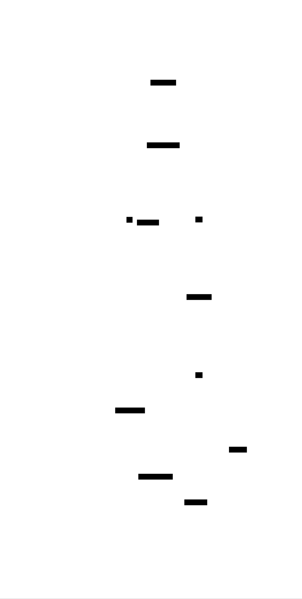
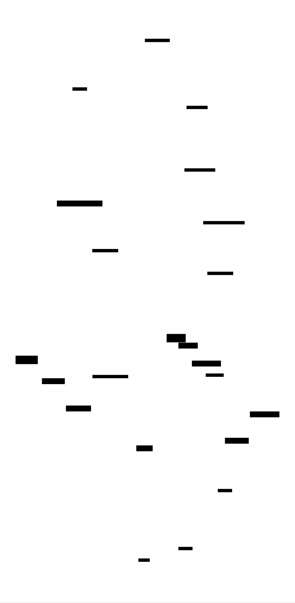

# Build Your Own TLS: Design Document


## Overview

This system implements the TLS 1.3 protocol from scratch, including the record layer for secure data transmission and the handshake protocol for establishing encrypted connections. The key architectural challenge is coordinating multiple cryptographic components (key exchange, certificate validation, symmetric encryption) while maintaining strict protocol state machines and security guarantees.


> This guide is meant to help you understand the big picture before diving into each milestone. Refer back to it whenever you need context on how components connect.


## Context and Problem Statement

> **Milestone(s):** All milestones - foundational understanding for Record Layer, Key Exchange, Handshake Protocol, and Certificate Verification

The Transport Layer Security (TLS) protocol stands as one of the most critical cryptographic protocols in modern computing, securing billions of network connections daily. Understanding why TLS exists, how it evolved to version 1.3, and the unique challenges of implementing cryptographic protocols from scratch provides essential context for building a robust TLS implementation. This section explores the fundamental security problems that necessitated TLS, examines how TLS 1.3 represents a significant improvement over earlier versions, and analyzes the complex engineering challenges involved in implementing cryptographic protocols correctly.

### The Security Problem

Think of network communication as sending postcards through a public postal system where every postal worker, sorting facility employee, and delivery person can read your message, modify it, or even replace it entirely with a fake message claiming to be from someone else. In the early days of the Internet, this analogy perfectly described the security properties of network protocols like HTTP, SMTP, and FTP - all communication was sent in plaintext, fully visible to anyone with access to the network infrastructure.

The fundamental security problems that TLS solves can be categorized into four critical areas: **confidentiality**, **integrity**, **authentication**, and **forward secrecy**. Each represents a different aspect of the trust problem inherent in network communication over untrusted infrastructure.

**Confidentiality** addresses the eavesdropping problem. Without encryption, sensitive data like passwords, credit card numbers, personal messages, and business communications travels across networks in plaintext. Network administrators, internet service providers, government agencies, and malicious attackers with packet capture capabilities can trivially read all communication. Modern networks involve dozens of intermediate hops - each router, switch, and gateway represents a potential point where data can be intercepted and logged. The scale of this problem becomes apparent when considering that a single web page load typically involves multiple HTTP requests, each potentially carrying cookies, authentication tokens, or personal information.

**Integrity** tackles the data tampering problem. Network packets can be modified in transit, either through malicious interference or accidental corruption. Without cryptographic integrity protection, an attacker can alter the contents of messages while they travel between client and server. For example, an attacker could modify the amount field in a financial transaction, change the recipient address in an email, or inject malicious JavaScript into a web page. Traditional checksums and error correction codes protect against accidental corruption but provide no security against intentional modification by adversaries who can simply recalculate the checksum after making their changes.

**Authentication** solves the impersonation problem. In an unprotected network, anyone can claim to be anyone else. An attacker can set up a fake server that mimics a legitimate service, intercepting credentials and sensitive information from unsuspecting users. This problem extends beyond simple man-in-the-middle attacks - DNS spoofing, BGP hijacking, and compromised network infrastructure can all redirect traffic to attacker-controlled servers. Without cryptographic proof of identity, users have no reliable way to verify they are communicating with their intended recipient.

**Forward secrecy** addresses the long-term key compromise problem. Even if communication is encrypted, traditional key exchange methods create a vulnerability where compromise of long-term cryptographic keys allows decryption of all past communications that used those keys. Government surveillance programs, corporate espionage, and advanced persistent threats often involve collecting encrypted communications for years, waiting for an opportunity to obtain the keys needed for decryption. Forward secrecy ensures that even if long-term keys are compromised, past communications remain secure.

The Internet's fundamental architecture exacerbates these problems. The packet-switched nature of IP networks means that data passes through numerous intermediate systems, each representing a potential point of compromise. The distributed and heterogeneous nature of internet infrastructure makes it impossible to trust all intermediate parties. Network Address Translation (NAT), content delivery networks (CDNs), proxy servers, and mobile carrier infrastructure all have visibility into unencrypted traffic.

Consider a concrete scenario that illustrates these problems: Alice wants to log into her online banking account while connected to a coffee shop's WiFi network. Without TLS protection, her username and password travel in plaintext over the wireless network, where any customer with a packet capture tool can intercept them. The coffee shop's router forwards the packets through the internet service provider's network, where employees could log and analyze the traffic. The packets traverse multiple internet backbone providers before reaching the bank's servers, creating dozens of interception opportunities. Even if no one actively attacks the communication, the banking data might be stored in log files, cached by proxy servers, or backed up to systems with weaker security controls.

An attacker exploiting these vulnerabilities might set up a fake WiFi access point with a name like "Free_Coffee_WiFi" that mimics the legitimate network. When Alice connects and navigates to her bank's website, the attacker presents a convincing replica of the login page. Without cryptographic authentication of the server's identity, Alice has no way to distinguish the fake site from the real one. The attacker captures her credentials and can later use them to access her actual bank account. Even if Alice notices something suspicious and changes her password, the attacker has already obtained whatever information was displayed during the fake session.

The consequences of these security failures extend far beyond individual privacy violations. Businesses lose competitive advantages when corporate communications are intercepted. Financial institutions face massive liability when customer data is compromised. Healthcare organizations violate patient privacy laws when medical records are exposed. Government agencies compromise national security when diplomatic communications are readable by foreign adversaries. The economic and social costs of insecure communication protocols motivated the development of TLS as a comprehensive solution to these fundamental problems.

Traditional approaches to securing network communication fell short of addressing all these concerns simultaneously. Application-level encryption required every individual application to implement cryptography correctly, leading to inconsistent security properties and frequent implementation errors. Network-level solutions like IPSec provided broad protection but were difficult to deploy and manage, especially for web applications that needed fine-grained control over security policies. Link-level encryption like WPA for wireless networks only protected individual network segments, leaving data vulnerable during the remainder of its journey.

> The fundamental insight that drove TLS development was recognizing that secure communication requires a protocol layer that provides comprehensive security properties (confidentiality, integrity, authentication, forward secrecy) while being practical to deploy at internet scale and simple enough for application developers to use correctly.

| Security Problem | Traditional Mitigation | Limitations | TLS Solution |
|------------------|----------------------|-------------|--------------|
| Eavesdropping | Application-level encryption | Inconsistent implementation, key management complexity | Standardized symmetric encryption with negotiated algorithms |
| Data tampering | Application checksums | No protection against intentional modification | Authenticated encryption with cryptographic MAC verification |
| Server impersonation | None or manual verification | User education ineffective, no cryptographic proof | X.509 certificate chains with PKI validation |
| Traffic analysis | None | Communication patterns reveal sensitive information | Record padding and traffic flow obfuscation |
| Key compromise | Long-term key reuse | Historical traffic vulnerable after key disclosure | Perfect forward secrecy with ephemeral key exchange |
| Protocol downgrade | Version negotiation | Attackers can force use of weak legacy protocols | Cryptographic protection of handshake negotiation |

The security problem that TLS addresses is fundamentally about establishing trust in an untrustworthy environment. The internet's design assumes that individual network components may fail or behave unpredictably, but it does not assume they may be actively malicious. TLS bridges this gap by using cryptographic techniques to create secure channels over insecure networks, allowing applications to communicate safely regardless of the trustworthiness of the underlying infrastructure.

### TLS Protocol Evolution

Think of TLS protocol evolution like the development of increasingly sophisticated lock and key systems for protecting valuable assets. Early versions were like basic padlocks - they provided some protection but had known vulnerabilities that skilled attackers could exploit. Each new version added more sophisticated mechanisms, similar to how modern high-security locks include pick-resistant pins, drill-resistant hardened steel, and anti-bump features. TLS 1.3 represents the current state-of-the-art, incorporating decades of cryptographic research and real-world attack experience.

The evolution from SSL 2.0 through TLS 1.3 reflects a continuous process of learning from security vulnerabilities, cryptographic advances, and deployment challenges. Each version introduced new features while maintaining backward compatibility, but TLS 1.3 made the bold decision to break backward compatibility in favor of dramatically improved security and performance properties.

**SSL 2.0 and SSL 3.0** were the original secure socket layer protocols developed by Netscape in the mid-1990s. These early versions established the basic concepts of certificate-based server authentication and symmetric key establishment, but they contained numerous security flaws that would later be exploited. SSL 2.0 had fundamental design weaknesses including the lack of handshake authentication, weak MAC construction, and vulnerability to cipher suite rollback attacks. SSL 3.0 fixed many of these issues but still contained problems like padding oracle vulnerabilities and weak key derivation functions.

**TLS 1.0**, standardized in 1999 as RFC 2246, was essentially SSL 3.1 with improved key derivation and MAC construction. While more secure than its predecessors, TLS 1.0 still relied on cryptographic primitives that would later prove vulnerable. The protocol used MD5 and SHA-1 hash functions, which are now considered cryptographically weak. The key exchange mechanisms were limited to RSA and Diffie-Hellman without elliptic curves, resulting in larger key sizes and slower performance.

**TLS 1.1**, published in 2006, addressed several security issues identified in TLS 1.0, particularly around CBC-mode cipher vulnerabilities and timing attacks. However, the improvements were incremental rather than fundamental. The protocol still suffered from complex negotiation mechanisms that were prone to downgrade attacks and implementation errors.

**TLS 1.2**, standardized in 2008, represented a significant advancement by introducing support for stronger hash functions (SHA-256), authenticated encryption modes (AEAD), and elliptic curve cryptography. The protocol became more flexible by allowing negotiation of hash and signature algorithms separately from cipher suites. Despite these improvements, TLS 1.2 retained significant complexity in its state machine and negotiation process, leading to implementation vulnerabilities and performance inefficiencies.

The transition to **TLS 1.3**, finalized in 2018 after nearly a decade of development, represents a fundamental reimagining of the TLS protocol rather than an incremental improvement. The new version addresses both security and performance concerns through radical simplification and the incorporation of modern cryptographic best practices.

> **Decision: Mandatory Perfect Forward Secrecy**
> - **Context**: Previous TLS versions allowed RSA key exchange, which lacks forward secrecy - compromise of the server's private key allows decryption of all past communications
> - **Options Considered**: 
>   1. Continue supporting RSA key exchange for backward compatibility
>   2. Make forward secrecy optional but recommended  
>   3. Require perfect forward secrecy for all connections
> - **Decision**: TLS 1.3 mandates ephemeral key exchange (ECDHE/DHE) for all connections
> - **Rationale**: Perfect forward secrecy is essential for long-term security, especially given the increasing sophistication of nation-state adversaries and the decreasing cost of long-term data storage
> - **Consequences**: Breaks compatibility with older clients but ensures all TLS 1.3 connections have forward secrecy properties

| TLS 1.3 Improvement | Previous Versions | TLS 1.3 Approach | Security/Performance Benefit |
|---------------------|-------------------|-------------------|------------------------------|
| Handshake Rounds | 2-3 round trips | 1 round trip (0-RTT resumption) | Faster connection establishment, reduced latency |
| Cipher Suite Negotiation | Complex bundled negotiation | Separate algorithm negotiation | Clearer security properties, easier analysis |
| Forward Secrecy | Optional (RSA key exchange allowed) | Mandatory (only ECDHE/DHE) | All connections protected against future key compromise |
| Key Derivation | Custom key derivation | HKDF-based derivation | Stronger security proofs, better key separation |
| Supported Algorithms | Many weak algorithms for compatibility | Only modern, secure algorithms | Eliminates cryptographic weaknesses and downgrade attacks |
| Handshake Authentication | Partial transcript protection | Complete transcript authentication | Prevents handshake manipulation and downgrade attacks |

The **handshake simplification** in TLS 1.3 eliminates an entire round trip compared to previous versions. In TLS 1.2, the client sends a ClientHello, receives a ServerHello, then sends client key exchange and finished messages, followed by server finished. TLS 1.3 combines key exchange with the initial hello messages, allowing the server to immediately derive shared secrets and send encrypted extensions and certificate information. This reduction from 2-3 round trips to 1 round trip significantly improves connection establishment latency, especially on high-latency networks.

The **cipher suite simplification** removes the complex bundling of key exchange, authentication, symmetric encryption, and MAC algorithms into single cipher suite identifiers. TLS 1.3 negotiates these components separately, making it easier to analyze security properties and add new algorithms. The protocol eliminates weak algorithms entirely - no more RC4, 3DES, MD5, or SHA-1. All remaining algorithms have strong security proofs and no known practical attacks.

**Key derivation improvements** replace the ad-hoc key derivation functions from earlier versions with a principled approach based on HKDF (HMAC-based Key Derivation Function). The new key schedule provides better key separation, preventing keys intended for one purpose from being used for another. The derivation process explicitly includes context information, ensuring that keys derived at different protocol stages cannot be confused.

**Handshake authentication** now covers the entire handshake transcript rather than just portions of it. The Finished messages in TLS 1.3 authenticate all handshake messages, preventing attacks where adversaries modify early handshake messages to influence negotiation. This improvement closes several classes of downgrade attacks that were possible in earlier versions.

The **0-RTT resumption** feature allows clients that have previously connected to a server to send application data immediately with their initial handshake message. While this creates some replay attack risks, it provides significant performance benefits for applications like web browsing where the first request is idempotent. The protocol includes explicit anti-replay mechanisms and allows servers to reject 0-RTT data if replay protection is critical.

**Middlebox compatibility** presented a significant challenge during TLS 1.3 development. Many enterprise firewalls, intrusion detection systems, and other network appliances were designed to inspect TLS handshakes and would reject connections that didn't match their expectations for TLS 1.2 behavior. TLS 1.3 includes several compatibility mechanisms, such as sending a fake "change cipher spec" message and maintaining the appearance of TLS 1.2 negotiation while actually performing TLS 1.3 key exchange.

> The most significant architectural change in TLS 1.3 is the shift from "encrypt-then-MAC" to authenticated encryption everywhere. This eliminates entire classes of vulnerabilities related to MAC verification timing, padding oracles, and cipher-MAC interaction problems that plagued earlier versions.

Consider a concrete comparison of connection establishment between TLS 1.2 and TLS 1.3. In TLS 1.2, a typical HTTPS connection requires the following network round trips: TCP handshake (1 RTT), TLS handshake (2 RTT), then HTTP request/response (1 RTT) for a total of 4 RTT before the application receives data. With TLS 1.3, this becomes: TCP handshake (1 RTT), TLS handshake (1 RTT), HTTP request/response (1 RTT) for a total of 3 RTT. With 0-RTT resumption, subsequent connections can send HTTP data with the initial TLS handshake, reducing to just 2 RTT total.

The performance improvements extend beyond reduced round trips. TLS 1.3's simplified cipher suite negotiation reduces CPU time during handshake processing. The exclusive use of AEAD ciphers eliminates the overhead of separate MAC computation. Modern elliptic curves like X25519 and P-256 provide better security with smaller key sizes compared to the large RSA keys common in TLS 1.2 deployments.

Security analysis of TLS 1.3 benefits from formal verification methods that were not widely available during the design of earlier versions. The protocol's security properties have been proven using automated analysis tools and formal methods, providing higher confidence in its correctness than any previous TLS version. The simplified design also makes it easier for implementers to build secure libraries and for security researchers to analyze implementations for vulnerabilities.

| Security Property | TLS 1.2 Approach | TLS 1.3 Improvement | Attack Resistance |
|-------------------|-------------------|----------------------|-------------------|
| Key Exchange Authentication | Server key exchange signature | Integrated handshake authentication | Prevents handshake injection attacks |
| Algorithm Downgrade Protection | Cipher suite in clear handshake | Signed handshake transcript | Eliminates downgrade attacks |
| Traffic Analysis Resistance | No padding standardization | Record padding and length hiding | Reduces metadata leakage |
| Implementation Simplicity | Complex state machine, many options | Simplified state machine, fewer choices | Reduces implementation vulnerabilities |
| Post-Quantum Preparation | Fixed key exchange mechanisms | Extensible key exchange framework | Easier migration to quantum-resistant algorithms |

The elimination of weak algorithms in TLS 1.3 reflects decades of cryptographic research and real-world attack development. Algorithms like RC4, which were considered secure when first deployed, have been thoroughly broken by advances in cryptanalysis. By removing these algorithms entirely rather than just deprecating them, TLS 1.3 ensures that no implementation can accidentally negotiate weak cryptography, even when communicating with legacy systems.

### Implementation Complexity

Think of implementing TLS from scratch as building a Swiss watch while blindfolded, where every gear must mesh perfectly with every other gear, and a single misaligned component causes the entire mechanism to fail catastrophically. Unlike typical software projects where bugs might cause crashes or incorrect output, cryptographic protocol implementation errors often create subtle vulnerabilities that appear to work correctly while secretly compromising security. The complexity stems not just from the mathematical intricacy of cryptographic operations, but from the precise coordination required between multiple security-critical components operating under adversarial conditions.

The fundamental challenge of cryptographic protocol implementation lies in the **gap between specification and secure code**. Cryptographic protocols are typically specified using mathematical notation and abstract state machines that assume perfect implementation of primitive operations. Real implementations must translate these abstractions into concrete code running on actual hardware, dealing with timing constraints, memory limitations, side-channel attacks, and the inherent unreliability of network communication.

**State machine complexity** represents one of the most significant implementation challenges. TLS handshake involves dozens of possible states and hundreds of valid state transitions, each with specific preconditions and postconditions. The protocol must handle not just the "happy path" of successful negotiation, but also numerous error conditions, version negotiation failures, certificate validation problems, and network interruptions. Each state transition must be implemented with perfect accuracy - accepting a message in the wrong state or transitioning incorrectly can create security vulnerabilities.

The TLS 1.3 handshake state machine, while simplified compared to earlier versions, still involves complex interactions between multiple concurrent processes. Key derivation must happen at precisely the right moments relative to message transmission. Encryption must be enabled exactly when the protocol specifies, not a message earlier or later. The implementation must track multiple encryption contexts simultaneously (for different directions and different key epochs) and switch between them atomically.

Consider the complexity involved in processing a single handshake message. The implementation must first parse the record layer to extract the message type and length, validate that the record is properly formatted, decrypt the content if encryption is active, reassemble fragmented messages, validate that the message type is appropriate for the current handshake state, parse the message contents according to the correct format specification, perform cryptographic verification if required, update the handshake transcript hash, derive new keys if appropriate, update the state machine, and finally generate any required response messages. Each of these steps has multiple failure modes that must be handled correctly.

**Cryptographic integration challenges** arise from the need to coordinate multiple cryptographic primitives that were designed independently. A TLS implementation must integrate hash functions, symmetric ciphers, message authentication codes, digital signature algorithms, key derivation functions, and random number generation into a coherent system. Each primitive has its own API, error conditions, and security requirements, but they must work together seamlessly.

Key derivation exemplifies this integration complexity. The TLS 1.3 key schedule involves multiple applications of HKDF (HMAC-based Key Derivation Function) with different input materials and labels at different stages of the handshake. The implementation must maintain multiple key contexts, apply the derivation function in exactly the right sequence, and ensure that derived keys are used for their intended purposes and no others. The key schedule produces early secrets, handshake secrets, and application secrets, each with different security properties and lifetimes.

> **Decision: Modular Cryptographic Interface Design**
> - **Context**: TLS requires integration of multiple cryptographic primitives (hashing, encryption, signing, key derivation) from potentially different libraries
> - **Options Considered**:
>   1. Direct integration with specific cryptographic library APIs
>   2. Abstract cryptographic interface with pluggable implementations
>   3. Hybrid approach with abstractions for key operations but direct calls for performance-critical paths
> - **Decision**: Abstract cryptographic interfaces with trait-based design allowing multiple backend implementations
> - **Rationale**: Enables testing with mock implementations, supports hardware security modules, allows cryptographic library upgrades without protocol layer changes, and facilitates compliance with different regulatory requirements
> - **Consequences**: Adds implementation complexity and potential performance overhead, but significantly improves maintainability and security auditability

The **timing sensitivity** of cryptographic operations creates implementation challenges that don't exist in typical software development. Cryptographic operations must often complete in constant time to prevent timing side-channel attacks. Variable-time operations can leak information about secret keys through timing measurements, even when the implementation is otherwise correct. This requirement affects everything from big integer arithmetic in asymmetric cryptography to table lookups in symmetric cipher implementations.

Memory management in cryptographic implementations requires extreme care to prevent information leakage through memory reuse, swap files, or core dumps. Secret keys and intermediate cryptographic values must be cleared from memory immediately after use, but this clearing must be done in a way that prevents compiler optimizations from eliminating the clearing operations. Many implementations use platform-specific techniques to ensure secure memory clearing, such as explicit_bzero() on Unix systems or SecureZeroMemory() on Windows.

**Protocol layering complexity** emerges from TLS's position between application protocols and transport protocols. The TLS record layer must fragment application data into appropriately-sized records, apply encryption and authentication, and handle reassembly of fragmented messages. The handshake layer operates on top of the record layer, creating a bootstrapping problem where the initial handshake messages must be sent over the record layer before encryption keys are established.

The record layer implementation must handle several challenging scenarios. Messages larger than the maximum record size must be fragmented across multiple records, but the boundaries between records must not reveal information about the underlying message structure. Record processing must be streaming-capable to handle large messages without excessive memory usage. The implementation must also handle partial records received from the network, maintaining state between multiple read operations while being careful not to buffer unlimited amounts of data from potentially malicious peers.

Error handling in cryptographic protocols differs fundamentally from error handling in typical applications. Many errors must be handled silently to prevent attackers from gaining information through error message analysis. The infamous "padding oracle" attacks exploit differences in error messages or timing between different types of decryption failures. TLS implementations must often continue processing even when they detect errors, ensuring that the overall timing and behavior remains consistent regardless of the specific error condition.

The **implementation vs. specification gap** becomes particularly apparent when dealing with real-world deployment constraints. The TLS specification assumes reliable, in-order delivery of handshake messages, but real networks can reorder, duplicate, or lose packets. Implementations must handle these network imperfections while maintaining the security properties guaranteed by the abstract protocol model.

Consider the challenge of implementing certificate validation correctly. The X.509 certificate format specification runs to hundreds of pages and includes numerous optional fields, extensions, and encoding variations. A correct implementation must parse ASN.1 DER encoding, handle multiple certificate formats, build and validate certificate chains, check certificate validity periods, verify digital signatures using various algorithms, and enforce policy constraints. Each of these operations can fail in multiple ways, and the implementation must make appropriate security decisions for each failure mode.

**Testing cryptographic implementations** presents unique challenges because many security properties cannot be directly observed through functional testing. A TLS implementation might successfully establish connections and transfer data while containing subtle vulnerabilities that only become apparent under specific attack conditions. Traditional unit testing approaches are insufficient because they cannot test adversarial behavior or timing-dependent security properties.

Cryptographic implementations require specialized testing approaches including fuzzing with malformed protocol messages, timing analysis to detect side-channel vulnerabilities, fault injection testing to verify error handling paths, and interoperability testing against multiple peer implementations. The implementation must be tested not just for correct behavior with compliant peers, but also for secure behavior when communicating with malicious or buggy peers that send invalid or malicious messages.

| Implementation Challenge | Typical Software | Cryptographic Protocols | TLS-Specific Considerations |
|-------------------------|------------------|-------------------------|----------------------------|
| Error Handling | Fail fast, detailed error messages | Silent handling, consistent timing | Must prevent oracle attacks while maintaining debuggability |
| State Management | Best effort, recoverable errors | Perfect accuracy, security-critical transitions | Handshake state machine with dozens of states and transitions |
| Performance Requirements | Throughput optimization | Constant-time operations | Must balance performance with timing attack resistance |
| Memory Management | Garbage collection or simple free() | Secure clearing, no swapping | Cryptographic key material requires special handling |
| Testing Strategy | Unit tests, integration tests | Adversarial testing, side-channel analysis | Requires testing against malicious inputs and timing analysis |
| Backwards Compatibility | Graceful degradation | Security-first approach | Must not allow downgrade attacks while supporting version negotiation |

The **deployment complexity** of TLS implementations extends beyond the code itself to include certificate management, cipher suite configuration, and performance tuning. Real-world TLS deployments must integrate with certificate authorities, handle certificate renewal, configure appropriate cipher suites for security and performance, and monitor connections for security events. These operational considerations often drive implementation decisions that wouldn't be apparent from reading the protocol specification alone.

Modern TLS implementations must also consider **post-quantum cryptography migration** even though quantum computers capable of breaking current cryptographic algorithms don't yet exist. The implementation architecture should be flexible enough to support new key exchange and signature algorithms without requiring complete rewrites. This forward-looking requirement adds another layer of complexity to the design of cryptographic interfaces and key management systems.

> The central insight for managing TLS implementation complexity is recognizing that security failures often result from the interaction between components rather than failures within individual components. A perfectly implemented AES cipher can still be vulnerable if the key derivation function provides weak keys, and a correct key derivation can be compromised by poor random number generation. This systemic nature of cryptographic security requires holistic design approaches that consider the entire system rather than optimizing individual components in isolation.

### Common Pitfalls

⚠️ **Pitfall: Underestimating Protocol State Complexity**
Many implementers initially view TLS as a simple "encrypt the connection" protocol and underestimate the complexity of the handshake state machine. They implement happy-path scenarios but fail to handle edge cases like connection interruption during handshake, unexpected message types, or out-of-order message delivery. This leads to implementations that work in testing but fail or become vulnerable under real-world network conditions. The solution is to explicitly model the state machine with formal state definitions and exhaustively test all possible state transitions, including invalid ones.

⚠️ **Pitfall: Assuming Cryptographic Libraries Handle All Security Requirements**
Developers often assume that using a reputable cryptographic library automatically makes their TLS implementation secure. However, cryptographic libraries typically provide primitive operations (encryption, hashing, signing) but don't enforce protocol-level security requirements like key separation, proper nonce generation, or constant-time operations. The TLS implementation layer must still ensure correct usage of these primitives, proper key management, and resistance to side-channel attacks. The solution is to carefully review the security properties provided by each cryptographic library function and implement additional protections where needed.

⚠️ **Pitfall: Inadequate Error Handling Leading to Information Leakage**
Cryptographic protocols are particularly vulnerable to attacks that exploit differences in error handling behavior. Implementers often use standard exception handling or error return patterns that leak information through timing differences, error message content, or resource usage patterns. For example, different processing times for "invalid certificate" vs "expired certificate" can help attackers fingerprint the server's certificate validation process. The solution is to implement error handling that maintains consistent timing and response patterns regardless of the specific error condition.

⚠️ **Pitfall: Ignoring Endianness and Encoding Issues**
TLS message formats specify precise byte-level encodings for all fields, but implementers often use language-native data structures without careful attention to byte order and padding. This leads to interoperability problems and potential security issues when parsing messages from peers with different architectures. The solution is to use explicit serialization/deserialization code that handles byte order conversion and validates all parsed fields against specification limits.

### Implementation Guidance

This section provides concrete guidance for beginning a TLS 1.3 implementation, including technology recommendations, project structure, and foundational code that handles non-core functionality so learners can focus on the essential TLS protocol logic.

**A. Technology Recommendations**

| Component | Simple Option | Advanced Option |
|-----------|---------------|-----------------|
| Cryptographic Backend | `ring` crate (Rust) - batteries included crypto | Custom integration with OpenSSL or BoringSSL FFI |
| ASN.1/X.509 Parsing | `x509-parser` crate - pure Rust parser | `openssl` crate X.509 bindings for full feature support |
| Network I/O | `std::net::TcpStream` with blocking I/O | `tokio` async I/O for high-performance server implementations |
| Testing Framework | Built-in `cargo test` with unit tests | Integration with OpenSSL s_client/s_server for interop testing |
| Logging/Debugging | `env_logger` crate for structured logging | Custom logging with hex dumps and protocol state tracking |
| Project Structure | Single binary with library modules | Separate client/server binaries with shared protocol library |

**B. Recommended File Structure**

```
tls-implementation/
├── Cargo.toml                    # Dependencies: ring, x509-parser, env_logger
├── src/
│   ├── lib.rs                   # Public API and re-exports
│   ├── main.rs                  # Demo client/server binaries
│   ├── record/                  # Milestone 1: Record Layer
│   │   ├── mod.rs              # Record layer public interface
│   │   ├── header.rs           # 5-byte record header parsing
│   │   ├── fragment.rs         # Message fragmentation and reassembly
│   │   └── content_type.rs     # Content type routing and validation
│   ├── crypto/                  # Milestone 2: Key Exchange
│   │   ├── mod.rs              # Crypto module interface
│   │   ├── ecdhe.rs            # ECDHE key exchange with X25519
│   │   ├── key_derivation.rs   # HKDF-based key derivation
│   │   └── aead.rs             # AEAD encryption wrapper
│   ├── handshake/              # Milestone 3: Handshake Protocol
│   │   ├── mod.rs              # Handshake state machine
│   │   ├── messages.rs         # ClientHello, ServerHello, etc.
│   │   ├── state_machine.rs    # State transitions and validation
│   │   └── transcript.rs       # Handshake transcript hashing
│   ├── certificates/           # Milestone 4: Certificate Verification
│   │   ├── mod.rs              # Certificate validation interface
│   │   ├── x509.rs             # X.509 certificate parsing
│   │   ├── chain.rs            # Certificate chain building
│   │   └── validation.rs       # Signature and validity checking
│   ├── connection/             # Connection management
│   │   ├── mod.rs              # High-level connection interface
│   │   └── state.rs            # Connection state tracking
│   └── error.rs                # Unified error types
└── tests/
    ├── integration_tests.rs     # End-to-end handshake tests
    ├── interop_tests.rs        # Tests against real TLS servers
    └── test_vectors/           # RFC test vectors and known answers
```

**C. Infrastructure Starter Code**

**Error Handling Framework** (`src/error.rs`):
```rust
use std::fmt;

#[derive(Debug, Clone)]
pub enum TlsError {
    // Record layer errors
    InvalidRecordHeader,
    RecordTooLarge,
    UnknownContentType(u8),
    FragmentationError,
    
    // Handshake errors
    UnexpectedMessage,
    InvalidHandshakeState,
    HandshakeTimeout,
    CipherSuiteNegotiationFailed,
    
    // Cryptographic errors
    KeyExchangeFailed,
    SignatureVerificationFailed,
    DecryptionFailed,
    RandomGenerationFailed,
    
    // Certificate errors
    CertificateParsingError,
    CertificateExpired,
    CertificateChainInvalid,
    HostnameMismatch,
    
    // I/O and network errors
    NetworkError(String),
    TimeoutError,
}

impl fmt::Display for TlsError {
    fn fmt(&self, f: &mut fmt::Formatter<'_>) -> fmt::Result {
        match self {
            TlsError::InvalidRecordHeader => write!(f, "Invalid TLS record header"),
            TlsError::RecordTooLarge => write!(f, "TLS record exceeds maximum size"),
            TlsError::UnknownContentType(ct) => write!(f, "Unknown content type: {}", ct),
            TlsError::NetworkError(msg) => write!(f, "Network error: {}", msg),
            // Add other error messages...
            _ => write!(f, "TLS error: {:?}", self),
        }
    }
}

impl std::error::Error for TlsError {}

pub type TlsResult<T> = Result<T, TlsError>;
```

**Logging and Debugging Utilities** (`src/debug.rs`):
```rust
use log::{debug, trace};

pub fn hex_dump(data: &[u8], prefix: &str) {
    if !log::enabled!(log::Level::Trace) {
        return;
    }
    
    for (i, chunk) in data.chunks(16).enumerate() {
        let hex: String = chunk.iter()
            .map(|b| format!("{:02x}", b))
            .collect::<Vec<_>>()
            .join(" ");
        
        let ascii: String = chunk.iter()
            .map(|&b| if b.is_ascii_printable() { b as char } else { '.' })
            .collect();
            
        trace!("{} {:04x}: {:48} {}", prefix, i * 16, hex, ascii);
    }
}

pub fn log_handshake_message(msg_type: u8, length: usize, data: &[u8]) {
    debug!("Handshake message: type={}, length={}", msg_type, length);
    hex_dump(data, "  ");
}

pub fn log_record(content_type: u8, version: u16, length: u16) {
    debug!("TLS Record: type={}, version=0x{:04x}, length={}", 
           content_type, version, length);
}
```

**Network I/O Wrapper** (`src/io.rs`):
```rust
use std::io::{self, Read, Write};
use std::net::TcpStream;
use crate::error::{TlsError, TlsResult};

pub struct TlsStream {
    stream: TcpStream,
    read_buffer: Vec<u8>,
    write_buffer: Vec<u8>,
}

impl TlsStream {
    pub fn new(stream: TcpStream) -> Self {
        Self {
            stream,
            read_buffer: Vec::with_capacity(8192),
            write_buffer: Vec::with_capacity(8192),
        }
    }
    
    pub fn read_exact_bytes(&mut self, count: usize) -> TlsResult<Vec<u8>> {
        let mut buffer = vec![0u8; count];
        self.stream.read_exact(&mut buffer)
            .map_err(|e| TlsError::NetworkError(format!("Read error: {}", e)))?;
        Ok(buffer)
    }
    
    pub fn write_all_bytes(&mut self, data: &[u8]) -> TlsResult<()> {
        self.stream.write_all(data)
            .map_err(|e| TlsError::NetworkError(format!("Write error: {}", e)))?;
        Ok(())
    }
    
    pub fn flush(&mut self) -> TlsResult<()> {
        self.stream.flush()
            .map_err(|e| TlsError::NetworkError(format!("Flush error: {}", e)))?;
        Ok(())
    }
}
```

**D. Core Logic Skeleton Code**

**Record Layer Interface** (`src/record/mod.rs`):
```rust
use crate::error::{TlsError, TlsResult};

#[derive(Debug, Clone, Copy, PartialEq)]
pub enum ContentType {
    ChangeCipherSpec = 20,
    Alert = 21,
    Handshake = 22,
    ApplicationData = 23,
}

impl ContentType {
    pub fn from_u8(value: u8) -> TlsResult<Self> {
        // TODO 1: Match on value and return appropriate ContentType variant
        // TODO 2: Return UnknownContentType error for invalid values
        // Hint: TLS 1.3 doesn't use ChangeCipherSpec in the same way as earlier versions
        todo!("Implement ContentType::from_u8")
    }
}

#[derive(Debug)]
pub struct TlsRecord {
    pub content_type: ContentType,
    pub protocol_version: u16,
    pub payload: Vec<u8>,
}

impl TlsRecord {
    pub fn parse_header(header_bytes: &[u8]) -> TlsResult<(ContentType, u16, u16)> {
        // TODO 1: Verify header_bytes has exactly 5 bytes
        // TODO 2: Extract content_type from first byte using ContentType::from_u8
        // TODO 3: Extract protocol_version from bytes 1-2 as big-endian u16
        // TODO 4: Extract length from bytes 3-4 as big-endian u16
        // TODO 5: Validate length doesn't exceed TLS_MAX_RECORD_SIZE (16384 + 256)
        // TODO 6: Return tuple of (content_type, protocol_version, length)
        // Hint: Use u16::from_be_bytes() for endianness conversion
        todo!("Implement record header parsing")
    }
    
    pub fn fragment_message(content_type: ContentType, message: &[u8]) -> Vec<TlsRecord> {
        // TODO 1: Calculate how many records needed (message.len() / MAX_FRAGMENT_SIZE)
        // TODO 2: Create vector to hold resulting records
        // TODO 3: Split message into chunks of at most 16384 bytes each
        // TODO 4: Create TlsRecord for each chunk with same content_type
        // TODO 5: Set protocol_version to 0x0303 (TLS 1.2 for compatibility)
        // TODO 6: Return vector of records
        // Hint: Use chunks() iterator method for clean splitting
        todo!("Implement message fragmentation")
    }
    
    pub fn reassemble_fragments(records: &[TlsRecord]) -> TlsResult<Vec<u8>> {
        // TODO 1: Verify all records have same content_type
        // TODO 2: Calculate total message size
        // TODO 3: Allocate buffer for reassembled message
        // TODO 4: Concatenate payload from each record in order
        // TODO 5: Return complete message bytes
        // Hint: Records must be processed in the order received
        todo!("Implement fragment reassembly")
    }
}
```

**Key Exchange Interface** (`src/crypto/ecdhe.rs`):
```rust
use ring::{agreement, rand};
use crate::error::{TlsError, TlsResult};

pub struct EcdhKeyExchange {
    private_key: agreement::EphemeralPrivateKey,
    public_key: Vec<u8>,
}

impl EcdhKeyExchange {
    pub fn new() -> TlsResult<Self> {
        // TODO 1: Create SystemRandom instance for key generation
        // TODO 2: Generate ephemeral private key using X25519 algorithm
        // TODO 3: Compute corresponding public key
        // TODO 4: Extract public key bytes (32 bytes for X25519)
        // TODO 5: Return EcdhKeyExchange instance with keys
        // Hint: Use agreement::X25519 and EphemeralPrivateKey::generate()
        todo!("Implement ECDH key generation")
    }
    
    pub fn public_key_bytes(&self) -> &[u8] {
        &self.public_key
    }
    
    pub fn compute_shared_secret(self, peer_public_key: &[u8]) -> TlsResult<Vec<u8>> {
        // TODO 1: Validate peer_public_key has correct length for X25519 (32 bytes)
        // TODO 2: Create UnparsedPublicKey from peer's public key bytes
        // TODO 3: Use agree_ephemeral to compute shared secret
        // TODO 4: Extract shared secret bytes from Key<SharedSecret>
        // TODO 5: Return shared secret as Vec<u8>
        // Hint: The shared secret should be exactly 32 bytes for X25519
        todo!("Implement shared secret computation")
    }
}
```

**E. Language-Specific Hints**

- **Rust Memory Safety**: Use `ring` crate for cryptographic operations as it provides memory-safe interfaces and has been audited for security. The crate handles secure memory clearing automatically.
- **Endianness Handling**: Always use `u16::from_be_bytes()` and `u16::to_be_bytes()` for network byte order conversion. TLS uses big-endian encoding for all multi-byte values.
- **Error Propagation**: Use the `?` operator consistently for error propagation, but be careful not to leak sensitive information through error messages that might be visible to attackers.
- **Constant-Time Operations**: For cryptographic operations, prefer constant-time algorithms. The `ring` crate provides constant-time implementations, but application logic should also avoid timing-dependent branches based on secret data.
- **Testing with External Tools**: Use `openssl s_client` and `openssl s_server` for interoperability testing. These tools can generate known test vectors and validate protocol compliance.

**F. Milestone Checkpoints**

**Milestone 1 Checkpoint (Record Layer)**:
- Run `cargo test record_tests` - all record parsing tests should pass
- Create a simple test that fragments a 20KB message and verifies it splits into 2 records
- Test record header parsing with malformed inputs (too short, invalid content type)
- Verify that your implementation rejects records larger than 16640 bytes (16384 + 256)

**Milestone 2 Checkpoint (Key Exchange)**:
- Run `cargo test key_exchange_tests` - ECDH operations should complete successfully  
- Generate two key pairs and verify they produce the same shared secret
- Test with known X25519 test vectors from RFC 7748
- Verify that public keys are exactly 32 bytes and shared secrets are exactly 32 bytes

**Milestone 3 Checkpoint (Handshake Protocol)**:
- Run `cargo test handshake_tests` - state machine should handle message sequences correctly
- Test ClientHello generation with at least one supported cipher suite (TLS_AES_128_GCM_SHA256)
- Verify handshake state machine rejects out-of-order messages with appropriate errors
- Test finished message verification with known handshake transcript hashes

**Milestone 4 Checkpoint (Certificate Verification)**:
- Run `cargo test certificate_tests` - X.509 parsing should extract all required fields
- Test certificate chain building with a 3-certificate chain (server -> intermediate -> root)
- Verify signature validation using RSA or ECDSA certificates
- Test hostname verification against certificate subject alternative names


## Goals and Non-Goals

> **Milestone(s):** All milestones - foundational understanding for Record Layer, Key Exchange, Handshake Protocol, and Certificate Verification

Building a complete TLS 1.3 implementation from scratch is an enormous undertaking. Think of it like constructing a high-security vault - you need multiple independent layers of protection working in perfect harmony, each with its own complex requirements and failure modes. A production TLS library like OpenSSL contains millions of lines of code handling countless edge cases, performance optimizations, and compatibility quirks accumulated over decades. Our educational implementation must strike a careful balance: comprehensive enough to teach the essential cryptographic and protocol concepts, yet focused enough to be achievable within a reasonable learning timeline.

The key insight is that TLS 1.3's security doesn't come from any single clever trick, but from the careful orchestration of multiple cryptographic primitives - each solving a specific piece of the security puzzle. **Perfect Forward Secrecy** ensures that compromising long-term keys doesn't expose past communications. **Authenticated Encryption with Associated Data (AEAD)** provides both confidentiality and integrity in a single operation. **Certificate chains** establish trust relationships across organizational boundaries. Our implementation scope must include enough of each component to understand how they work together, while avoiding the complexity that would obscure the core learning objectives.

Think of this project as building a working prototype of a Formula 1 race car. We need all the essential systems - engine, transmission, brakes, steering - to function correctly and demonstrate the fundamental engineering principles. But we're not building the sophisticated telemetry systems, advanced aerodynamics, or pit stop automation that a competitive racing team would require. Our goal is deep understanding of the core systems, not production readiness.

> **Critical Design Principle**: Educational implementations should maximize learning per line of code. Every feature we include must either teach a fundamental concept or be essential for the core features to work correctly.

### Functional Requirements

The functional requirements define the minimum set of TLS capabilities our implementation must support to establish secure connections and protect data transmission. These requirements are derived directly from the four project milestones, ensuring that every functional requirement maps to concrete, measurable acceptance criteria.

**Record Layer Functionality** forms the foundation of our TLS implementation. Think of the Record Layer as TLS's postal service - it takes messages from various protocols (handshake, alerts, application data) and handles all the logistics of packaging them for network transmission. Our implementation must parse the 5-byte TLS record headers that identify the content type, protocol version, and payload length. When applications send messages larger than 16KB, the Record Layer must fragment them across multiple TLS records, similar to how large files get split across multiple network packets. On the receiving side, it must reassemble these fragments back into complete messages before passing them to the appropriate protocol handler.

| Record Layer Requirement | Description | Acceptance Criteria |
|--------------------------|-------------|-------------------|
| Header Parsing | Extract content type, version, length from 5-byte header | `TlsRecord::parse_header()` correctly parses all header fields |
| Message Fragmentation | Split large messages across multiple records | Messages > 16KB split into multiple `TlsRecord` instances |
| Content Routing | Direct records to correct protocol handler | `ContentType` enum routes to handshake, alert, or data handlers |
| Fragment Reassembly | Reconstruct complete messages from fragments | `TlsRecord::reassemble_fragments()` produces original message |

**Key Exchange Functionality** establishes the shared cryptographic secrets that protect all subsequent communication. Think of key exchange like two people establishing a secret code without anyone else listening in - they need to coordinate on the encryption method without revealing the actual keys to eavesdroppers. Our implementation uses **Elliptic Curve Diffie-Hellman Ephemeral (ECDHE)** key exchange, specifically with the X25519 curve, which provides strong security with relatively simple mathematics.

The key exchange process involves three critical steps: generating ephemeral key pairs, exchanging public keys, and computing identical shared secrets on both sides. The "ephemeral" property is crucial - these keys exist only for a single connection and are discarded afterward, providing **Perfect Forward Secrecy**. Even if an attacker later compromises the server's long-term private key, they cannot decrypt past communications because those conversations used different, now-destroyed ephemeral keys.

| Key Exchange Requirement | Description | Acceptance Criteria |
|--------------------------|-------------|-------------------|
| Ephemeral Key Generation | Generate random X25519 key pairs | `EcdhKeyExchange::new()` creates cryptographically strong keys |
| Public Key Exchange | Safely transmit public keys between peers | Public keys encoded correctly for network transmission |
| Shared Secret Computation | Both parties derive identical shared secret | `compute_shared_secret()` produces same result on both sides |
| Key Derivation | Expand shared secret into encryption keys | Separate client-write and server-write keys generated |

**Handshake Protocol Functionality** negotiates the connection parameters and verifies that both parties have derived the same cryptographic keys. Think of the handshake like a diplomatic negotiation where two countries agree on the terms of a treaty - they must agree on which security measures to use, verify each other's identities, and confirm they both understand the agreement identically.

The TLS 1.3 handshake is significantly simpler than previous versions, reducing round trips and eliminating many legacy features that created security vulnerabilities. Our implementation handles the core message sequence: `ClientHello` (proposing supported cipher suites), `ServerHello` (selecting mutual preferences), `Certificate` (proving server identity), and `Finished` (confirming successful key derivation).

| Handshake Requirement | Description | Acceptance Criteria |
|----------------------|-------------|-------------------|
| ClientHello Construction | Build initial handshake message | Include supported versions, cipher suites, and SNI |
| ServerHello Processing | Parse server parameter selection | Extract selected cipher suite and key exchange method |
| State Machine | Track handshake progression | Reject out-of-order messages with appropriate alerts |
| Finished Verification | Confirm successful key derivation | Verify data matches hash of all handshake messages |

**Certificate Verification Functionality** authenticates the server's identity using Public Key Infrastructure (PKI). Think of certificate verification like checking someone's passport - you need to verify the document is genuine (signature validation), issued by a trusted authority (chain validation), still valid (expiration check), and actually belongs to the person claiming it (hostname matching).

X.509 certificates contain the server's public key along with identity information, digitally signed by a Certificate Authority (CA). Our implementation must parse these certificates, build a chain of trust from the server certificate to a known root CA, and verify each signature in the chain. This process ensures that the server we're talking to is actually who they claim to be, not an imposter.

| Certificate Requirement | Description | Acceptance Criteria |
|-------------------------|-------------|-------------------|
| X.509 Parsing | Extract certificate fields from ASN.1 encoding | Parse subject, issuer, validity dates, public key |
| Chain Building | Construct path to trusted root CA | Link server cert through intermediates to root |
| Signature Verification | Validate certificate signatures | Verify each cert signed by its issuer's key |
| Validity Checking | Ensure certificates are currently valid | Reject expired or not-yet-valid certificates |

> **Architecture Decision: Milestone-Driven Requirements**
> - **Context**: Educational projects need clear progress markers and concrete deliverables to maintain momentum and enable incremental testing.
> - **Options Considered**: 
>   1. Build entire TLS stack before testing any components
>   2. Focus on single component (e.g., only handshake) for deep dive
>   3. Implement components incrementally with working deliverables at each stage
> - **Decision**: Align functional requirements directly with project milestones, ensuring each milestone produces working, testable functionality
> - **Rationale**: Incremental development allows early validation of design decisions, provides motivation through visible progress, and enables debugging of individual components before integration complexity
> - **Consequences**: Some components must include temporary scaffolding for testing, but this investment pays off through reduced debugging complexity and clearer learning progression

### Security Requirements

Security requirements define the essential cryptographic and protocol properties our TLS implementation must maintain to provide meaningful protection. Unlike functional requirements that describe what the system does, security requirements describe how it resists various attack scenarios. These properties are not optional or "nice to have" - compromising any of them undermines the fundamental purpose of TLS.

Think of security requirements like the structural engineering requirements for a bridge. Functional requirements describe what the bridge does (carries traffic from point A to point B), while security requirements describe what forces it must withstand (earthquake loads, wind shear, maximum weight limits). A bridge that meets all functional requirements but fails under stress is worse than useless - it's dangerous because it provides false confidence.

**Cryptographic Correctness** ensures that our implementation of cryptographic algorithms produces the same results as reference implementations and maintains the mathematical properties that security proofs depend on. Small errors in cryptographic code can completely destroy security - a single bit flip in key derivation might make all encrypted data recoverable by attackers.

Our elliptic curve operations must handle edge cases correctly, particularly around point validation and scalar multiplication. The X25519 curve has specific requirements for clamping private keys and validating public keys that, if missed, can lead to small-subgroup attacks or invalid curve attacks. Similarly, our **HMAC-based Key Derivation Function (HKDF)** implementation must follow RFC 5869 precisely to ensure derived keys have full entropy and are computationally independent.

| Cryptographic Security Property | Requirement | Validation Method |
|--------------------------------|-------------|-------------------|
| Key Generation Entropy | Private keys use cryptographically secure randomness | Test against known weak PRNGs, verify key uniqueness |
| X25519 Implementation | Correct curve arithmetic and input validation | Test vectors from RFC 7748, edge case handling |
| HKDF Correctness | Key derivation follows RFC 5869 exactly | Compare outputs with reference implementations |
| Constant-Time Operations | Avoid timing side-channel attacks | Review critical paths for data-dependent timing |

**Protocol State Machine Security** prevents attackers from exploiting the complex interactions between TLS protocol messages. The TLS state machine defines which messages are valid at each point in the handshake, and our implementation must strictly enforce these rules. Accepting out-of-order messages, skipping required steps, or allowing state transitions that should be impossible can lead to various attacks.

For example, an attacker might try to send application data before the handshake completes, hoping to bypass authentication. Or they might replay old handshake messages to confuse the state machine. Our implementation must detect these protocol violations and respond with appropriate TLS alerts rather than attempting to process invalid message sequences.

| Protocol Security Property | Requirement | Attack Prevention |
|---------------------------|-------------|-------------------|
| Message Ordering | Strict handshake sequence enforcement | Prevents handshake bypass attacks |
| State Transition Validation | Only allow valid state changes | Prevents protocol confusion attacks |
| Replay Protection | Detect and reject replayed messages | Prevents replay attacks on handshake |
| Alert Generation | Send correct alerts for violations | Enables proper error handling and diagnosis |

**Authentication and Authorization Security** ensures that we're communicating with the intended server and that the server's identity claims are valid. This goes beyond simply validating certificate signatures - we must implement the complete web of trust model that PKI depends on.

Certificate path validation involves checking not just that signatures are mathematically correct, but that the signing certificates had the authority to issue the certificates they signed. A certificate for "example.com" signed by a valid CA certificate is only trustworthy if that CA certificate includes the proper basic constraints allowing it to sign server certificates. Additionally, hostname verification ensures the certificate was issued for the specific server we intended to connect to, preventing attacks where valid certificates for different sites are misused.

| Authentication Security Property | Requirement | Attack Prevention |
|--------------------------------|-------------|-------------------|
| Certificate Chain Validation | Complete path to trusted root CA | Prevents use of unauthorized certificates |
| Hostname Verification | Certificate matches intended server name | Prevents certificate substitution attacks |
| Basic Constraints Checking | Intermediate CAs authorized to sign | Prevents unauthorized certificate issuance |
| Expiration Validation | All certificates within validity period | Prevents use of expired or revoked certificates |

**Perfect Forward Secrecy** ensures that compromising long-term keys (like the server's certificate private key) does not compromise past communications. This property is achieved through our use of ephemeral keys in the ECDHE key exchange - each connection uses a different, temporary key pair that is discarded after the connection ends.

The critical security requirement is that ephemeral private keys must be completely destroyed after use, with no copies remaining in memory, swap files, or crash dumps. Additionally, the key derivation process must ensure that learning the shared secret for one connection provides no information about shared secrets for other connections.

| Forward Secrecy Property | Requirement | Attack Prevention |
|-------------------------|-------------|-------------------|
| Ephemeral Key Destruction | Private keys zeroed after use | Prevents recovery from memory dumps |
| Key Independence | Each connection uses unique ephemeral keys | Limits damage from single key compromise |
| No Long-term Secrets in Session Keys | Session keys derived only from ephemeral secrets | Prevents backward decryption attacks |

**Memory Safety and Side-Channel Resistance** protect against implementation-level attacks that exploit how our code executes rather than mathematical weaknesses in the cryptographic algorithms. While these requirements are more advanced than our core learning objectives, awareness of them is important for understanding why production cryptographic libraries are so complex.

Timing side-channel attacks analyze how long cryptographic operations take to infer information about secret keys. For example, if signature verification takes longer for incorrect signatures that happen to have certain mathematical properties, an attacker might be able to forge signatures by measuring response times. Our implementation should avoid data-dependent timing in critical operations, though we acknowledge this is challenging without specialized cryptographic libraries.

| Implementation Security Property | Requirement | Attack Prevention |
|--------------------------------|-------------|-------------------|
| Memory Clearing | Sensitive data zeroed after use | Prevents memory disclosure attacks |
| Timing Consistency | Avoid data-dependent execution times | Prevents timing side-channel attacks |
| Input Validation | Reject malformed inputs early | Prevents buffer overflows and parsing attacks |
| Error Information | Limit information in error messages | Prevents oracle attacks through error differences |

> **Architecture Decision: Security-First Design**
> - **Context**: Educational implementations often sacrifice security for simplicity, but this creates dangerous misconceptions about cryptographic protocol requirements.
> - **Options Considered**: 
>   1. Focus purely on functional correctness, ignore security properties
>   2. Implement simplified security that's "good enough" for learning
>   3. Implement full security requirements, accepting additional complexity
> - **Decision**: Implement complete security requirements as specified in TLS 1.3, with clear documentation of why each property is necessary
> - **Rationale**: Understanding security requirements is the primary learning objective - functional TLS without security understanding misses the point entirely. Real-world protocol security failures usually result from missing or incorrectly implemented security properties, not functional bugs.
> - **Consequences**: Implementation complexity increases significantly, but learners gain realistic understanding of cryptographic protocol requirements. Some advanced security properties (like side-channel resistance) are documented but not fully implemented.

### Non-Goals

Defining what we will NOT implement is as important as defining what we will implement. Educational projects have limited time and attention budgets, and attempting to build a production-ready TLS library would obscure the core learning objectives under layers of optimization and compatibility code. These non-goals help maintain focus on fundamental concepts while acknowledging the significant additional work required for production deployment.

Think of this like learning to drive. The goal is understanding how cars work and developing safe driving skills, not building a Formula 1 racing team with pit crews, telemetry systems, and advanced aerodynamics. Each excluded feature represents a potential rabbit hole that could consume weeks of development time without advancing the core educational objectives.

**Performance Optimizations** are explicitly excluded from our implementation scope. Production TLS libraries invest heavily in performance - specialized assembly code for cryptographic operations, memory pool management, connection multiplexing, and hardware acceleration support. While these optimizations are crucial for real-world deployment, they add significant complexity without teaching fundamental protocol concepts.

Our implementation will prioritize clarity and correctness over speed. We'll use standard library cryptographic functions rather than optimized implementations, accept memory allocations that production code would avoid, and implement straightforward algorithms rather than cache-friendly variants. This trade-off allows us to focus on understanding protocol logic rather than debugging performance optimizations.

| Performance Feature | Why Excluded | Production Impact |
|---------------------|-------------|-------------------|
| Hardware Acceleration | Complex platform-specific code | 10-100x performance improvement |
| Assembly Optimized Crypto | Platform-specific, hard to debug | 2-10x improvement in crypto operations |
| Memory Pool Management | Complex allocation strategies | Reduces GC pressure and latency |
| Connection Multiplexing | Concurrent connection management | Essential for server scalability |
| Zero-Copy I/O | Complex buffer management | Significant memory and CPU savings |

**Advanced TLS Features** beyond the core handshake and record layer are excluded to maintain implementation simplicity. TLS 1.3 includes many sophisticated features for specialized use cases - session resumption for faster reconnects, client certificate authentication for mutual TLS, and application-layer protocol negotiation for HTTP/2. Each of these features adds substantial protocol complexity and state management requirements.

Session resumption, for example, requires secure storage of session tickets, careful management of resumption secrets, and additional handshake message types. While valuable for production deployments, implementing resumption would roughly double the complexity of our handshake state machine without teaching significantly new cryptographic concepts.

| Advanced TLS Feature | Why Excluded | Educational Value vs Complexity |
|---------------------|-------------|--------------------------------|
| Session Resumption | Complex ticket management and additional message flows | Low - primarily optimization, not new crypto concepts |
| Client Certificates | Adds client authentication complexity | Medium - useful concept but doubles cert validation code |
| 0-RTT Data | Complex replay protection and forward secrecy trade-offs | High - interesting security trade-offs, but very complex |
| Post-Quantum Crypto | Algorithms still evolving, implementation complexity high | High - important future topic, but premature for current standards |
| Application Layer Protocol Negotiation | Additional extension handling complexity | Low - primarily about HTTP/2 negotiation |

**Production Deployment Features** are excluded because they address operational concerns rather than protocol understanding. Real-world TLS implementations must handle configuration management, logging, monitoring, certificate management, and integration with various application frameworks. These features are essential for production use but don't teach TLS protocol concepts.

Certificate management alone is a complex domain - automated certificate renewal, OCSP stapling, certificate transparency logs, and revocation checking. Our implementation will work with static certificate files and assume valid, non-expired certificates in most test cases. This simplification allows us to focus on the cryptographic and protocol aspects of certificate validation.

| Production Feature | Why Excluded | Real-world Necessity |
|-------------------|-------------|---------------------|
| Automatic Certificate Renewal | Complex ACME protocol implementation | Essential for production services |
| OCSP Stapling | Additional protocol complexity and caching | Important for performance and privacy |
| Certificate Transparency | Log submission and verification | Increasingly required by browsers |
| Configuration Management | Complex option handling and validation | Critical for operational deployment |
| Comprehensive Logging | Security audit and debugging support | Required for production monitoring |
| Rate Limiting | DoS protection and resource management | Essential for public-facing services |

**Compatibility and Interoperability** with older TLS versions, unusual cipher suites, and edge-case client behaviors are excluded. Production libraries must handle clients that send malformed messages, support deprecated cipher suites for legacy systems, and implement workarounds for various implementation bugs found in the wild.

Our implementation will assume well-behaved peers that follow TLS 1.3 specifications correctly. We'll handle the most common error cases (network failures, invalid certificates) but won't implement the extensive compatibility layers that production libraries require. This focus allows us to understand the clean TLS 1.3 protocol design without getting lost in decades of accumulated compatibility cruft.

| Compatibility Feature | Why Excluded | Production Importance |
|----------------------|-------------|----------------------|
| TLS 1.2 Fallback | Significant additional protocol complexity | Required for legacy system compatibility |
| Cipher Suite Diversity | Many algorithms to implement and test | Different security/performance trade-offs |
| Client Bug Workarounds | Extensive testing and edge case handling | Essential for broad client compatibility |
| Protocol Downgrade Handling | Complex negotiation and security implications | Critical for gradual deployment |
| Extension Tolerance | Handle unknown extensions gracefully | Required for future protocol evolution |

**Denial of Service (DoS) Protection** mechanisms are excluded because they require sophisticated resource management and attack detection that's beyond our educational scope. Production TLS implementations must protect against various DoS attacks - clients that send enormous handshake messages, attempt to exhaust server memory with many incomplete connections, or trigger expensive cryptographic operations repeatedly.

Our implementation will assume cooperative peers and won't implement the rate limiting, resource quotas, and anomaly detection that production servers require. This simplification allows us to focus on the core protocol flow without building a complete server infrastructure around it.

| DoS Protection | Why Excluded | Attack Vector |
|----------------|-------------|---------------|
| Connection Rate Limiting | Complex policy and state management | Overwhelming server with connection attempts |
| Message Size Limits | Additional validation and resource tracking | Memory exhaustion through large messages |
| Computational DoS Protection | Resource accounting and throttling | Expensive crypto operations (key generation, signatures) |
| State Exhaustion Protection | Complex connection lifecycle management | Many incomplete handshakes consuming server memory |

> **Architecture Decision: Educational Focus Over Production Readiness**
> - **Context**: Students often want to build "production ready" systems, but this conflicts with deep learning objectives due to time and complexity constraints.
> - **Options Considered**: 
>   1. Build minimal prototype with many shortcuts and simplifications
>   2. Attempt full production implementation accepting very long development time
>   3. Build educationally complete implementation with explicit production gaps documented
> - **Decision**: Implement all core security and protocol features correctly, but exclude performance optimizations and production operational features
> - **Rationale**: Core protocol and cryptographic understanding requires correct implementation of security properties, but production concerns (performance, operations, compatibility) add complexity without proportional learning value. Explicit documentation of excluded features helps learners understand the gap between educational and production implementations.
> - **Consequences**: Implementation teaches real TLS concepts and could form basis for production library, but significant additional work required for production deployment. Students gain realistic understanding of production requirements through explicit non-goals documentation.

### Common Pitfalls

⚠️ **Pitfall: Scope Creep Through "Just One More Feature"**
Many learners start with appropriate scope but gradually add features that seem simple but have complex implications. For example, adding session resumption "just for completeness" requires implementing ticket encryption, session storage, replay protection, and additional handshake flows - easily doubling implementation complexity. This destroys the careful balance between educational value and implementable scope.

**Why it's problematic**: Each "small" addition has dependencies and edge cases that weren't obvious initially. Session resumption requires secure session storage. Client certificates require revocation checking. Performance optimizations require extensive benchmarking and testing. The implementation becomes unwieldy and learning objectives get lost in complexity.

**How to avoid**: Treat the milestone acceptance criteria as hard boundaries. When tempted to add features, first complete all milestone requirements and validate they work correctly. Only then consider whether additional features truly advance learning objectives or just satisfy completionist instincts.

⚠️ **Pitfall: Implementing Security Theater Instead of Real Security**
Some learners implement security features that look correct but miss subtle requirements that attackers can exploit. For example, implementing certificate validation but skipping hostname verification, or checking certificate signatures but not validating the certificate authority's authorization to sign server certificates.

**Why it's dangerous**: Security features that are 95% correct provide false confidence while remaining vulnerable to attack. An implementation that validates certificate signatures but accepts any certificate signed by any CA (including client CAs or code-signing CAs) appears to work correctly in testing but fails catastrophically against real attacks.

**How to avoid**: For each security requirement, research real-world attacks that exploit implementations missing that property. Understand not just what to implement, but why each check is necessary. Use established test vectors and try to break your own implementation with edge cases.

⚠️ **Pitfall: Ignoring Protocol State Machine Requirements**
Some implementations focus on individual message parsing and generation but fail to properly enforce the protocol state machine. They might correctly parse `ClientHello` and `ServerHello` messages but accept them in the wrong order, or allow application data before the handshake completes.

**Why it fails**: TLS security depends critically on message ordering and state transitions. Many attacks work by convincing implementations to accept messages at inappropriate times, bypassing security checks or causing inconsistent state between client and server.

**How to avoid**: Implement the state machine first, before implementing individual message types. Every message handler should first check whether that message is valid in the current state. Include explicit test cases for out-of-order messages and verify they're rejected with appropriate alerts.

⚠️ **Pitfall: Underestimating Error Handling Complexity**
Learners often implement the "happy path" protocol flow but underestimate the complexity of proper error handling. TLS has many error conditions - network failures, malformed messages, cryptographic failures, certificate problems - each requiring specific responses and state cleanup.

**Why it matters**: Real networks are unreliable and attackers send malformed messages intentionally. An implementation that works perfectly with well-behaved peers but crashes or hangs when given invalid input is not just incomplete - it's a security vulnerability waiting to be exploited.

**How to address**: Plan error handling from the beginning, not as an afterthought. For each component, enumerate the possible failure modes and define the recovery strategy. Implement error injection in tests to verify error paths work correctly.

### Implementation Guidance

The implementation guidance for Goals and Non-Goals focuses on establishing the project structure and validation mechanisms that will support all four milestones. Since this section defines scope rather than implementing specific components, the code examples here provide project scaffolding and requirement validation tools.

**A. Technology Recommendations Table:**

| Component | Simple Option | Advanced Option |
|-----------|---------------|-----------------|
| Project Structure | Single crate with modules | Workspace with multiple crates |
| Error Handling | Simple enum with basic variants | `thiserror` crate with detailed error context |
| Testing Framework | Built-in `#[test]` functions | `proptest` for property-based testing |
| Cryptographic Primitives | `ring` crate for basic operations | Custom implementations for learning |
| Logging | `println!` macros for debugging | `tracing` crate with structured logging |
| Network I/O | `std::net::TcpStream` directly | `tokio` async runtime with async I/O |

**B. Recommended File/Module Structure:**

The project structure reflects the four major milestones while maintaining clean separation between components:

```
tls-from-scratch/
├── Cargo.toml                    ← dependencies and project metadata
├── src/
│   ├── main.rs                   ← example client/server programs
│   ├── lib.rs                    ← public API exports
│   ├── error.rs                  ← TlsError enum and error handling
│   ├── types.rs                  ← Common types and constants
│   ├── record/                   ← Milestone 1: Record Layer
│   │   ├── mod.rs               ← TlsRecord and parsing functions
│   │   ├── header.rs            ← Record header parsing logic
│   │   ├── fragmentation.rs     ← Message fragmentation and reassembly
│   │   └── content_type.rs      ← ContentType enum and routing
│   ├── key_exchange/            ← Milestone 2: Key Exchange
│   │   ├── mod.rs              ← EcdhKeyExchange implementation
│   │   ├── x25519.rs           ← X25519 curve operations
│   │   └── hkdf.rs             ← Key derivation functions
│   ├── handshake/              ← Milestone 3: Handshake Protocol
│   │   ├── mod.rs              ← Handshake state machine
│   │   ├── client_hello.rs     ← ClientHello message handling
│   │   ├── server_hello.rs     ← ServerHello message handling
│   │   ├── finished.rs         ← Finished message verification
│   │   └── state_machine.rs    ← Handshake state management
│   ├── certificate/            ← Milestone 4: Certificate Verification
│   │   ├── mod.rs              ← Certificate parsing and validation
│   │   ├── x509.rs             ← X.509 certificate parsing
│   │   ├── chain.rs            ← Certificate chain building
│   │   └── validation.rs       ← Signature and validity checking
│   └── stream/                 ← TLS connection management
│       ├── mod.rs              ← TlsStream implementation
│       └── connection.rs       ← Connection state management
├── tests/
│   ├── integration_tests.rs    ← End-to-end handshake tests
│   ├── test_vectors.rs         ← Known good test vectors
│   └── milestone_validation.rs ← Acceptance criteria validation
└── examples/
    ├── simple_client.rs        ← Basic TLS client example
    └── simple_server.rs        ← Basic TLS server example
```

**C. Infrastructure Starter Code:**

This error handling foundation supports all milestones and provides the structured error reporting needed for cryptographic protocol debugging:

```rust
// src/error.rs - Complete error handling infrastructure
use std::fmt;

/// Comprehensive error types for TLS implementation
#[derive(Debug, Clone, PartialEq)]
pub enum TlsError {
    /// Network I/O errors (connection drops, timeouts)
    IoError(String),
    /// Protocol violations (invalid messages, wrong state)
    ProtocolError(String),
    /// Cryptographic operation failures (key generation, verification)
    CryptographicError(String),
    /// Certificate validation failures (expired, untrusted, invalid)
    CertificateError(String),
    /// Message parsing errors (malformed headers, invalid lengths)
    ParseError(String),
    /// Invalid configuration or parameters
    ConfigurationError(String),
}

impl fmt::Display for TlsError {
    fn fmt(&self, f: &mut fmt::Formatter) -> fmt::Result {
        match self {
            TlsError::IoError(msg) => write!(f, "I/O error: {}", msg),
            TlsError::ProtocolError(msg) => write!(f, "Protocol error: {}", msg),
            TlsError::CryptographicError(msg) => write!(f, "Cryptographic error: {}", msg),
            TlsError::CertificateError(msg) => write!(f, "Certificate error: {}", msg),
            TlsError::ParseError(msg) => write!(f, "Parse error: {}", msg),
            TlsError::ConfigurationError(msg) => write!(f, "Configuration error: {}", msg),
        }
    }
}

impl std::error::Error for TlsError {}

/// Result type used throughout TLS implementation
pub type TlsResult<T> = Result<T, TlsError>;

/// Convert standard I/O errors to TlsError
impl From<std::io::Error> for TlsError {
    fn from(error: std::io::Error) -> Self {
        TlsError::IoError(format!("I/O operation failed: {}", error))
    }
}

// Helper macros for consistent error creation
#[macro_export]
macro_rules! protocol_error {
    ($msg:expr) => {
        TlsError::ProtocolError($msg.to_string())
    };
    ($fmt:expr, $($arg:tt)*) => {
        TlsError::ProtocolError(format!($fmt, $($arg)*))
    };
}

#[macro_export]
macro_rules! crypto_error {
    ($msg:expr) => {
        TlsError::CryptographicError($msg.to_string())
    };
    ($fmt:expr, $($arg:tt)*) => {
        TlsError::CryptographicError(format!($fmt, $($arg)*))
    };
}
```

This constants file establishes the exact values and limits that all components will use:

```rust
// src/types.rs - Core types and constants for TLS implementation
use crate::error::{TlsError, TlsResult};

/// Maximum size of a TLS record (16KB payload + overhead)
pub const TLS_MAX_RECORD_SIZE: usize = 16640;

/// Maximum fragment size within a record
pub const MAX_FRAGMENT_SIZE: usize = 16384;

/// TLS 1.2 version for compatibility (actually used in TLS 1.3 records)
pub const TLS_1_2_VERSION: u16 = 0x0303;

/// X25519 key size in bytes
pub const X25519_KEY_SIZE: usize = 32;

/// TLS record header size (content_type + version + length)
pub const TLS_RECORD_HEADER_SIZE: usize = 5;

/// Content types for TLS records
#[derive(Debug, Clone, Copy, PartialEq, Eq)]
pub enum ContentType {
    ChangeCipherSpec = 20,
    Alert = 21,
    Handshake = 22,
    ApplicationData = 23,
}

impl ContentType {
    /// Convert u8 value to ContentType enum
    pub fn from_u8(value: u8) -> TlsResult<Self> {
        match value {
            20 => Ok(ContentType::ChangeCipherSpec),
            21 => Ok(ContentType::Alert),
            22 => Ok(ContentType::Handshake),
            23 => Ok(ContentType::ApplicationData),
            _ => Err(TlsError::ParseError(format!("Invalid content type: {}", value))),
        }
    }

    /// Convert ContentType to u8 value
    pub fn to_u8(self) -> u8 {
        self as u8
    }
}

/// Basic TLS record structure
#[derive(Debug, Clone)]
pub struct TlsRecord {
    pub content_type: ContentType,
    pub protocol_version: u16,
    pub payload: Vec<u8>,
}

impl TlsRecord {
    /// Create new TLS record
    pub fn new(content_type: ContentType, payload: Vec<u8>) -> Self {
        Self {
            content_type,
            protocol_version: TLS_1_2_VERSION,
            payload,
        }
    }

    /// Get the total size including header
    pub fn total_size(&self) -> usize {
        TLS_RECORD_HEADER_SIZE + self.payload.len()
    }
}
```

**D. Core Logic Skeleton Code:**

The requirement validation framework helps verify that each milestone meets its acceptance criteria:

```rust
// tests/milestone_validation.rs - Acceptance criteria validation
use tls_from_scratch::*;

/// Validate Milestone 1: Record Layer acceptance criteria
pub struct RecordLayerValidator;

impl RecordLayerValidator {
    /// Verify record header parsing extracts all required fields
    pub fn validate_header_parsing() -> TlsResult<()> {
        // TODO 1: Create test record with known header values
        // TODO 2: Call TlsRecord::parse_header() on header bytes
        // TODO 3: Verify content_type matches expected value
        // TODO 4: Verify protocol_version matches expected value
        // TODO 5: Verify length matches expected payload size
        // TODO 6: Test with invalid content type values
        // TODO 7: Test with invalid length values (too large, zero)
        todo!("Implement header parsing validation")
    }

    /// Verify fragmentation splits large messages correctly
    pub fn validate_fragmentation() -> TlsResult<()> {
        // TODO 1: Create message larger than MAX_FRAGMENT_SIZE
        // TODO 2: Call TlsRecord::fragment_message() to split it
        // TODO 3: Verify multiple records returned
        // TODO 4: Verify each fragment payload <= MAX_FRAGMENT_SIZE
        // TODO 5: Verify total fragmented payload equals original message
        // TODO 6: Verify all fragments have same content_type
        // TODO 7: Test edge case: message exactly MAX_FRAGMENT_SIZE
        todo!("Implement fragmentation validation")
    }

    /// Verify content type routing directs records to correct handlers
    pub fn validate_content_type_routing() -> TlsResult<()> {
        // TODO 1: Create records with each ContentType variant
        // TODO 2: Verify ContentType::from_u8() converts correctly
        // TODO 3: Verify routing logic calls appropriate handler
        // TODO 4: Test invalid content type values rejected
        // TODO 5: Verify error handling for unknown content types
        todo!("Implement content type routing validation")
    }

    /// Verify reassembly combines fragments into original message
    pub fn validate_reassembly() -> TlsResult<()> {
        // TODO 1: Create original large message
        // TODO 2: Fragment it into multiple records
        // TODO 3: Call TlsRecord::reassemble_fragments() on fragments
        // TODO 4: Verify reassembled message equals original
        // TODO 5: Test with fragments received out of order
        // TODO 6: Test with missing fragments (should error)
        // TODO 7: Test with fragments from different messages (should error)
        todo!("Implement reassembly validation")
    }
}

/// Validate Milestone 2: Key Exchange acceptance criteria
pub struct KeyExchangeValidator;

impl KeyExchangeValidator {
    /// Verify Diffie-Hellman produces identical shared secrets
    pub fn validate_shared_secret_agreement() -> TlsResult<()> {
        // TODO 1: Create EcdhKeyExchange instance for client
        // TODO 2: Create EcdhKeyExchange instance for server
        // TODO 3: Exchange public keys between client and server
        // TODO 4: Compute shared secret on client side
        // TODO 5: Compute shared secret on server side
        // TODO 6: Verify shared secrets are identical
        // TODO 7: Verify shared secrets have full entropy (32 bytes)
        // TODO 8: Repeat test multiple times with different keys
        todo!("Implement shared secret validation")
    }

    /// Verify ECDHE key exchange completes with supported curves
    pub fn validate_ecdhe_key_exchange() -> TlsResult<()> {
        // TODO 1: Test X25519 curve parameter generation
        // TODO 2: Verify public key encoding format matches RFC
        // TODO 3: Test key validation rejects invalid public keys
        // TODO 4: Test curve operations produce correct results
        // TODO 5: Verify ephemeral keys are different each time
        // TODO 6: Test edge cases (zero keys, invalid points)
        todo!("Implement ECDHE validation")
    }
}
```

**E. Language-Specific Hints:**

**Rust-Specific Cryptography Tips:**
- Use the `ring` crate for HKDF implementation: `ring::hkdf::extract_and_expand()`
- Use `ring::agreement::EphemeralPrivateKey` for X25519 key generation
- Use `zeroize::Zeroize` trait to securely clear sensitive data from memory
- Use `subtle::ConstantTimeEq` for timing-safe comparisons of cryptographic values

**Rust Memory Safety for Cryptographic Code:**
- Always call `.zeroize()` on private key data when dropping structures
- Use `Box::new()` for large stack structures to avoid stack overflow
- Consider `secrecy::Secret<T>` wrapper for automatic memory protection
- Be careful with `.clone()` on sensitive data - prefer borrowing when possible

**Rust Error Handling Patterns:**
- Use `?` operator consistently for `TlsResult` propagation
- Implement `From<SpecificError>` for `TlsError` for automatic conversions
- Use `anyhow::Context` in tests for better error debugging information
- Create specific error variants rather than generic string messages when possible

**F. Milestone Checkpoint:**

After defining goals and non-goals, learners should have a clear project structure and validation framework:

**What to verify:**
1. Run `cargo check` - project compiles without errors
2. Run `cargo test --lib` - basic structure tests pass
3. Examine `src/` directory structure - all milestone modules exist
4. Review error handling - `TlsError` covers all anticipated failure modes

**Expected behavior:**
- Project compiles successfully with all module stubs
- Error types provide meaningful categorization of failure modes
- Constants and types match exact naming conventions from requirements
- Test framework validates acceptance criteria for each milestone

**Signs of problems:**
- Compilation errors indicate missing dependencies or incorrect module structure
- Generic error types suggest insufficient planning for error scenarios
- Missing test validators indicate unclear acceptance criteria understanding

**G. Debugging Tips:**

| Symptom | Likely Cause | How to Diagnose | Fix |
|---------|-------------|-----------------|-----|
| Project won't compile | Missing dependencies or incorrect module paths | Check `Cargo.toml` dependencies and `mod` declarations | Add missing crates, fix module paths |
| Tests panic with "not implemented" | Skeleton functions not implemented yet | Expected behavior - implement milestone functions | Fill in TODO comments with actual implementations |
| Error messages lack detail | Using generic error variants | Check error creation sites | Use specific error variants with detailed context |
| Type name mismatches | Not following naming conventions exactly | Compare against provided naming table | Use exact names from conventions section |


## High-Level Architecture

> **Milestone(s):** All milestones - provides architectural foundation for Record Layer, Key Exchange, Handshake Protocol, and Certificate Verification

Think of TLS as a secure communication factory with four specialized assembly lines. Just as a factory has raw material processing, quality control, packaging, and shipping departments that must coordinate precisely to produce a final product, TLS has four major subsystems that work together to transform insecure network bytes into authenticated, encrypted application data. Each subsystem has a specific responsibility, but they must share information and coordinate state changes to ensure the security properties hold end-to-end.

### Component Overview

Our TLS implementation consists of four major subsystems, each responsible for a distinct aspect of secure communication. Understanding their individual responsibilities and interdependencies is crucial for building a maintainable and correct implementation.


#### Record Layer: The Foundation Protocol

The **Record Layer** serves as the foundation for all TLS communication, similar to how a postal system handles packages regardless of their contents. It provides three essential services: message framing, fragmentation handling, and content routing. Every piece of data that flows between TLS peers must pass through this layer, making it the most fundamental component in our architecture.

The Record Layer operates on raw network bytes, extracting structured messages that higher-level protocols can process. It maintains no knowledge of cryptographic keys or handshake state, focusing solely on the mechanical aspects of message handling. This separation of concerns allows the same record processing logic to handle unencrypted handshake messages during connection establishment and encrypted application data during normal operation.

| Component Responsibility | Description | Key Data Structures |
|------------------------|-------------|-------------------|
| Header Processing | Extract content type, version, and length from 5-byte record headers | `TlsRecord`, `ContentType` |
| Message Fragmentation | Split large messages into multiple records under 16KB limit | `TLS_MAX_RECORD_SIZE`, `MAX_FRAGMENT_SIZE` |
| Message Reassembly | Combine fragmented handshake messages into complete protocol messages | Fragment tracking state |
| Content Type Routing | Direct records to appropriate handlers based on content type field | Handler registry mapping |

#### Key Exchange: Establishing Shared Secrets

The **Key Exchange** subsystem implements Elliptic Curve Diffie-Hellman Ephemeral (ECDHE) to establish shared cryptographic secrets between client and server. Think of this as two parties each contributing half of a combination to a safe - neither party can open the safe alone, but together their contributions create a shared secret that only they know.

This component generates ephemeral key pairs, performs elliptic curve operations, and derives the shared secret that forms the foundation for all subsequent encryption. The emphasis on ephemeral keys provides Perfect Forward Secrecy - even if long-term certificates are compromised, past communications remain secure because the ephemeral keys are discarded after use.

| Component Responsibility | Description | Key Data Structures |
|------------------------|-------------|-------------------|
| Key Pair Generation | Create ephemeral ECDHE key pairs using X25519 curve | `EcdhKeyExchange`, `X25519_KEY_SIZE` |
| Public Key Exchange | Encode and decode public keys for transmission in handshake messages | Public key byte encoding |
| Shared Secret Computation | Perform ECDH operation to derive shared secret from peer's public key | Shared secret bytes |
| Key Derivation | Expand shared secret into separate encryption keys using HKDF | Derived key material |

#### Handshake Protocol: Negotiating Connection Parameters

The **Handshake Protocol** orchestrates the complex dance of establishing a TLS connection, similar to how diplomats negotiate a treaty with specific procedures, required documents, and verification steps. This subsystem manages the state machine that governs message ordering, parameter negotiation, and mutual authentication.

The handshake protocol coordinates with all other components - it sends and receives messages through the Record Layer, triggers key generation in the Key Exchange component, and initiates certificate validation. It maintains strict ordering requirements and generates appropriate alerts when protocol violations occur.

| Component Responsibility | Description | Key Data Structures |
|------------------------|-------------|-------------------|
| Message Construction | Build ClientHello with supported cipher suites and extensions | ClientHello message format |
| Parameter Negotiation | Process ServerHello to extract selected cipher suite and parameters | ServerHello parsing logic |
| State Machine Management | Track handshake progression and validate message ordering | Handshake state enumeration |
| Transcript Hash Calculation | Maintain running hash of all handshake messages for Finished verification | Transcript hash state |

#### Certificate Verification: Establishing Trust

The **Certificate Verification** subsystem implements the Public Key Infrastructure (PKI) trust model, acting like a chain of notarized documents where each notary vouches for the next. It parses X.509 certificates, builds certificate chains, and verifies digital signatures to establish the server's identity.

This component operates independently of the other cryptographic operations, focusing solely on the trust establishment aspect of TLS. It maintains a set of trusted root Certificate Authorities and validates that the server's certificate can be traced back to one of these trusted roots through a valid chain of signatures.

| Component Responsibility | Description | Key Data Structures |
|------------------------|-------------|-------------------|
| X.509 Certificate Parsing | Extract subject, issuer, validity dates, and public keys from ASN.1 encoding | Certificate data structures |
| Chain Construction | Build path from server certificate to trusted root CA | Certificate chain representation |
| Signature Verification | Validate each certificate signature using issuer's public key | Signature validation logic |
| Validity Checking | Verify expiration dates, hostname matching, and certificate constraints | Validation rule engine |

### Protocol Layering

TLS employs a layered architecture where each layer provides services to the layer above while depending on services from the layer below. Understanding this layering is essential for implementing clean interfaces between components and managing the complexity of the protocol.

#### Foundation Layer: Record Protocol

The Record Layer forms the foundation of TLS communication, providing a reliable message delivery service over the underlying TCP connection. Think of it as a mail sorting facility - it doesn't care about the contents of letters, but it ensures each letter has proper addressing, fits within size limits, and reaches the correct department for processing.

The Record Layer operates synchronously with the network, reading bytes as they arrive and immediately processing them into structured records. It maintains read and write buffers to handle partial network reads and accumulated writes efficiently. All higher-level protocols depend on the Record Layer's guarantee that messages will be delivered completely and in order.

> **Key Design Insight**: The Record Layer's independence from cryptographic state allows it to handle both unencrypted handshake messages and encrypted application data using the same parsing logic. Only the content processing differs between these cases.

| Service Provided | Description | Used By |
|-----------------|-------------|---------|
| Message Framing | Convert byte streams into discrete messages with headers | All upper protocols |
| Fragmentation Handling | Split oversized messages and reassemble fragments | Handshake Protocol primarily |
| Content Type Routing | Direct messages to appropriate protocol handlers | Protocol multiplexing |
| Buffer Management | Handle partial reads/writes with network layer | All network operations |

#### Security Layer: Cryptographic Operations

Above the Record Layer, cryptographic operations provide confidentiality, integrity, and authenticity services. This layer includes both the Key Exchange component (which establishes shared secrets) and the AEAD encryption that protects record payloads.

The security layer transforms after the handshake completes - initially, it passes handshake messages through unencrypted, but once shared keys are established, it encrypts and authenticates all subsequent records. This transformation is coordinated by the Handshake Protocol, which signals when encryption should begin.

> **Critical Timing**: The security layer must maintain separate encryption contexts for each direction (client-to-server and server-to-client) because key derivation produces different keys for each direction, and sequence numbers advance independently.

| Security Service | Implementation | Coordination Required |
|-----------------|---------------|---------------------|
| Key Establishment | ECDHE with X25519 curve | Handshake Protocol triggers generation |
| Symmetric Encryption | AEAD (AES-GCM or ChaCha20-Poly1305) | Record Layer provides AEAD input |
| Message Authentication | Integrated with AEAD | Record Layer validates authentication tags |
| Sequence Number Management | Per-direction counters | Record Layer increments, security layer uses |

#### Application Layer: Protocol Logic

The top layer consists of protocol-specific logic: the Handshake Protocol for connection establishment and application data processing for normal operation. These protocols use the services provided by lower layers without needing to understand their implementation details.

The Handshake Protocol operates as a client-server state machine where each party sends specific messages at defined points and processes responses according to strict rules. It coordinates the entire connection establishment process, triggering key generation, certificate validation, and encryption activation at appropriate moments.

> **Decision: Handshake Protocol as Coordinator**
> - **Context**: Multiple components must coordinate during connection establishment with precise timing requirements
> - **Options Considered**: Centralized handshake coordinator vs. distributed coordination vs. event-driven system
> - **Decision**: Handshake Protocol acts as the central coordinator for all connection establishment activities
> - **Rationale**: Handshake state machine naturally sequences operations, simpler than distributed coordination, easier to debug than event-driven approach
> - **Consequences**: Handshake Protocol becomes complex but other components remain simple; single point of control for debugging

### Code Structure

Organizing code effectively from the beginning prevents the common mistake of creating monolithic files that become unmaintainable as the implementation grows. Our structure reflects the component architecture while providing clear separation of concerns and testability.

#### Recommended Directory Structure

```
tls-implementation/
├── src/
│   ├── lib.rs                    ← Public API and re-exports
│   ├── error.rs                  ← TlsError and TlsResult definitions
│   ├── record/
│   │   ├── mod.rs                ← Record layer public interface
│   │   ├── types.rs              ← TlsRecord, ContentType enums
│   │   ├── parser.rs             ← Header parsing and validation
│   │   ├── fragmentation.rs      ← Message fragmentation/reassembly
│   │   └── router.rs             ← Content type routing logic
│   ├── crypto/
│   │   ├── mod.rs                ← Cryptographic operations interface
│   │   ├── key_exchange.rs       ← EcdhKeyExchange implementation
│   │   ├── key_derivation.rs     ← HKDF key expansion
│   │   └── aead.rs               ← Authenticated encryption wrapper
│   ├── handshake/
│   │   ├── mod.rs                ← Handshake protocol interface
│   │   ├── state_machine.rs      ← Handshake state tracking
│   │   ├── messages.rs           ← ClientHello, ServerHello builders/parsers
│   │   ├── transcript.rs         ← Handshake hash calculation
│   │   └── finished.rs           ← Finished message verification
│   ├── certificate/
│   │   ├── mod.rs                ← Certificate verification interface
│   │   ├── x509.rs               ← X.509 certificate parsing
│   │   ├── chain.rs              ← Certificate chain building
│   │   ├── verification.rs       ← Signature verification
│   │   └── validation.rs         ← Certificate validity checking
│   ├── connection/
│   │   ├── mod.rs                ← TLS connection management
│   │   ├── stream.rs             ← TlsStream implementation
│   │   └── state.rs              ← Connection state tracking
│   └── constants.rs              ← Protocol constants and defaults
├── tests/
│   ├── integration/
│   │   ├── handshake_tests.rs    ← Full handshake integration tests
│   │   ├── record_tests.rs       ← Record layer integration tests
│   │   └── interop_tests.rs      ← Tests against real TLS servers
│   └── test_vectors/
│       ├── rfc_vectors.rs        ← RFC test vectors
│       └── known_good/           ← Known-good handshake captures
├── examples/
│   ├── simple_client.rs          ← Basic TLS client example
│   └── echo_server.rs            ← Basic TLS server example
└── Cargo.toml                    ← Dependencies and project config
```

#### Module Responsibility Mapping

Each module has a clearly defined responsibility that maps to our component architecture. This prevents the common antipattern of "utility modules" that accumulate unrelated functionality over time.

| Module Path | Primary Responsibility | Dependencies | Exports |
|------------|----------------------|--------------|---------|
| `record/` | Message framing and routing | `error`, `constants` | `TlsRecord`, `ContentType`, parsing functions |
| `crypto/` | Cryptographic primitives | `error`, external crypto crates | `EcdhKeyExchange`, key derivation functions |
| `handshake/` | Protocol state machine | `record`, `crypto`, `certificate` | Handshake message types, state machine |
| `certificate/` | PKI and trust establishment | `error`, external ASN.1 parser | Certificate validation functions |
| `connection/` | High-level TLS operations | All other modules | `TlsStream`, connection management |

#### Interface Design Principles

Our interfaces follow several principles that make the implementation more maintainable and testable:

**Explicit Error Handling**: Every operation that can fail returns a `TlsResult<T>` rather than panicking or returning invalid data. This forces callers to handle error conditions explicitly and provides clear failure modes for debugging.

**Owned Data Structures**: Components pass ownership of data structures rather than sharing references, avoiding lifetime complexity and making concurrent operation easier to reason about.

**Minimal Dependencies**: Each component depends only on the services it actually needs, making unit testing easier and reducing coupling between subsystems.

> **Decision: Result-Based Error Handling**
> - **Context**: Cryptographic and network operations have many failure modes that must be handled gracefully
> - **Options Considered**: Panic on errors vs. Result types vs. exception-like error handling
> - **Decision**: Use `TlsResult<T>` alias for `Result<T, TlsError>` throughout the codebase
> - **Rationale**: Forces explicit error handling, integrates with Rust idioms, makes error propagation visible in type signatures
> - **Consequences**: Slightly more verbose code but much more robust error handling and easier debugging

#### Common Pitfalls in Code Organization

⚠️ **Pitfall: Circular Dependencies**
Many implementations create circular dependencies between the handshake and record layers because handshake messages need to be sent via records, but encrypted records need keys from the handshake. Avoid this by having the handshake layer depend on the record layer for message transmission, while the record layer accepts encryption contexts from above rather than directly coupling to handshake state.

⚠️ **Pitfall: Monolithic State Structures**
It's tempting to create a single `TlsConnection` struct that contains all state for simplicity. However, this makes testing individual components difficult and creates unclear ownership of data. Instead, each component maintains its own state and exposes only the minimum interface needed by other components.

⚠️ **Pitfall: Mixing Parsing and Processing Logic**
Don't mix message parsing (converting bytes to structured data) with message processing (acting on that data). Keep parsing in dedicated modules with clear input/output types. This makes the code much easier to test and debug when protocol violations occur.

### Implementation Guidance

#### Technology Recommendations

| Component | Simple Option | Advanced Option |
|-----------|---------------|-----------------|
| X.509 Parsing | Basic ASN.1 parser (der crate) | Full X.509 library (x509-parser crate) |
| Elliptic Curves | X25519 only (x25519-dalek crate) | Multiple curves (ring or rustcrypto) |
| AEAD Encryption | AES-GCM only (aes-gcm crate) | Multiple algorithms (ring crate) |
| Network I/O | std::net::TcpStream | Async I/O (tokio) |
| Testing | Unit tests with mock data | Integration tests with real servers |

#### Core Architecture Implementation

```rust
// src/lib.rs - Main library interface
pub mod error;
pub mod record;
pub mod crypto;
pub mod handshake;
pub mod certificate;
pub mod connection;
pub mod constants;

// Re-export key types for convenience
pub use error::{TlsError, TlsResult};
pub use record::{TlsRecord, ContentType};
pub use crypto::EcdhKeyExchange;
pub use connection::TlsStream;
pub use constants::*;

// src/error.rs - Centralized error handling
#[derive(Debug, Clone, PartialEq)]
pub enum TlsError {
    IoError(String),
    ProtocolError(String),
    CryptographicError(String),
    CertificateError(String),
    ParseError(String),
    ConfigurationError(String),
}

impl std::fmt::Display for TlsError {
    fn fmt(&self, f: &mut std::fmt::Formatter<'_>) -> std::fmt::Result {
        match self {
            TlsError::IoError(msg) => write!(f, "I/O error: {}", msg),
            TlsError::ProtocolError(msg) => write!(f, "Protocol error: {}", msg),
            TlsError::CryptographicError(msg) => write!(f, "Cryptographic error: {}", msg),
            TlsError::CertificateError(msg) => write!(f, "Certificate error: {}", msg),
            TlsError::ParseError(msg) => write!(f, "Parse error: {}", msg),
            TlsError::ConfigurationError(msg) => write!(f, "Configuration error: {}", msg),
        }
    }
}

impl std::error::Error for TlsError {}

pub type TlsResult<T> = Result<T, TlsError>;

// src/constants.rs - Protocol constants
pub const TLS_MAX_RECORD_SIZE: usize = 16640;  // 16384 + 256 for encryption overhead
pub const MAX_FRAGMENT_SIZE: usize = 16384;
pub const TLS_1_2_VERSION: u16 = 0x0303;
pub const X25519_KEY_SIZE: usize = 32;
pub const TLS_RECORD_HEADER_SIZE: usize = 5;

// src/record/types.rs - Core record layer types
#[derive(Debug, Clone, Copy, PartialEq, Eq)]
pub enum ContentType {
    ChangeCipherSpec = 20,
    Alert = 21,
    Handshake = 22,
    ApplicationData = 23,
}

impl ContentType {
    pub fn from_u8(value: u8) -> TlsResult<Self> {
        // TODO: Match on value and return appropriate enum variant
        // TODO: Return ParseError for invalid content type values
        todo!("Implement content type parsing from u8 value")
    }
}

#[derive(Debug, Clone)]
pub struct TlsRecord {
    pub content_type: ContentType,
    pub protocol_version: u16,
    pub payload: Vec<u8>,
}

impl TlsRecord {
    pub fn parse_header(header_bytes: &[u8]) -> TlsResult<(ContentType, u16, u16)> {
        // TODO: Check header_bytes length is exactly TLS_RECORD_HEADER_SIZE
        // TODO: Extract content type from header_bytes[0]
        // TODO: Extract protocol version from header_bytes[1..3] (big-endian u16)
        // TODO: Extract length from header_bytes[3..5] (big-endian u16)
        // TODO: Validate length doesn't exceed TLS_MAX_RECORD_SIZE
        // TODO: Return (ContentType, protocol_version, length)
        todo!("Implement 5-byte record header parsing")
    }

    pub fn fragment_message(content_type: ContentType, message: &[u8]) -> Vec<TlsRecord> {
        // TODO: Check if message length <= MAX_FRAGMENT_SIZE - if so, return single record
        // TODO: Split message into chunks of MAX_FRAGMENT_SIZE
        // TODO: Create TlsRecord for each chunk with same content_type
        // TODO: Set protocol_version to TLS_1_2_VERSION for compatibility
        // TODO: Return Vec<TlsRecord> containing all fragments
        todo!("Implement message fragmentation into multiple records")
    }

    pub fn reassemble_fragments(records: &[TlsRecord]) -> TlsResult<Vec<u8>> {
        // TODO: Verify all records have same content_type (must be Handshake for fragmentation)
        // TODO: Concatenate all record payloads in order
        // TODO: Return ProtocolError if records have mismatched content types
        // TODO: Return combined payload as Vec<u8>
        todo!("Implement fragment reassembly into complete message")
    }
}
```

#### Component Integration Skeleton

```rust
// src/connection/stream.rs - High-level TLS stream interface
use std::net::TcpStream;
use crate::{TlsResult, TlsRecord, ContentType};

pub struct TlsStream {
    pub stream: TcpStream,
    pub read_buffer: Vec<u8>,
    pub write_buffer: Vec<u8>,
}

impl TlsStream {
    pub fn new(stream: TcpStream) -> Self {
        Self {
            stream,
            read_buffer: Vec::with_capacity(TLS_MAX_RECORD_SIZE),
            write_buffer: Vec::with_capacity(TLS_MAX_RECORD_SIZE),
        }
    }

    pub fn read_exact_bytes(&mut self, count: usize) -> TlsResult<Vec<u8>> {
        // TODO: Use std::io::Read::read_exact to fill buffer with exactly count bytes
        // TODO: Handle partial reads by looping until full count received
        // TODO: Convert io::Error to TlsError::IoError
        // TODO: Return the exact bytes read as Vec<u8>
        todo!("Implement exact byte reading from TCP stream")
    }

    pub fn write_all_bytes(&mut self, data: &[u8]) -> TlsResult<()> {
        // TODO: Use std::io::Write::write_all to send all bytes
        // TODO: Handle partial writes and retry until all data sent
        // TODO: Convert io::Error to TlsError::IoError
        // TODO: Call flush() to ensure data is sent immediately
        todo!("Implement reliable byte writing to TCP stream")
    }
}
```

#### Key Exchange Component Skeleton

```rust
// src/crypto/key_exchange.rs - ECDHE key exchange implementation
use crate::{TlsResult, TlsError, X25519_KEY_SIZE};

pub struct EcdhKeyExchange {
    pub private_key: [u8; X25519_KEY_SIZE],
    pub public_key: Vec<u8>,
}

impl EcdhKeyExchange {
    pub fn new() -> TlsResult<Self> {
        // TODO: Generate random 32-byte private key using secure random number generator
        // TODO: Compute X25519 public key from private key using curve operations
        // TODO: Store both keys in struct fields
        // TODO: Return CryptographicError if key generation fails
        todo!("Implement X25519 key pair generation")
    }

    pub fn public_key_bytes(&self) -> &[u8] {
        &self.public_key
    }

    pub fn compute_shared_secret(self, peer_public_key: &[u8]) -> TlsResult<Vec<u8>> {
        // TODO: Validate peer_public_key length is exactly X25519_KEY_SIZE
        // TODO: Perform X25519 scalar multiplication: private_key * peer_public_key
        // TODO: Return CryptographicError if shared secret is all zeros (invalid point)
        // TODO: Return 32-byte shared secret as Vec<u8>
        // Note: This consumes self to prevent private key reuse
        todo!("Implement ECDH shared secret computation")
    }
}
```

#### Testing Infrastructure

```rust
// tests/integration/record_tests.rs - Record layer integration tests
use tls_implementation::*;

#[test]
fn test_record_header_parsing() {
    // Test parsing valid 5-byte record header
    let header = [22, 0x03, 0x03, 0x00, 0x10]; // Handshake, TLS 1.2, length 16
    let (content_type, version, length) = TlsRecord::parse_header(&header).unwrap();
    
    assert_eq!(content_type, ContentType::Handshake);
    assert_eq!(version, TLS_1_2_VERSION);
    assert_eq!(length, 16);
}

#[test]
fn test_message_fragmentation() {
    // Test fragmenting large message into multiple records
    let large_message = vec![0x42; MAX_FRAGMENT_SIZE + 1000]; // Exceeds max fragment size
    let fragments = TlsRecord::fragment_message(ContentType::Handshake, &large_message);
    
    assert_eq!(fragments.len(), 2); // Should be split into 2 records
    assert_eq!(fragments[0].payload.len(), MAX_FRAGMENT_SIZE);
    assert_eq!(fragments[1].payload.len(), 1000);
    
    // Verify reassembly works correctly
    let reassembled = TlsRecord::reassemble_fragments(&fragments).unwrap();
    assert_eq!(reassembled, large_message);
}
```

#### Milestone Checkpoints

**Milestone 1 Checkpoint - Record Layer:**
After implementing the record layer, you should be able to:
1. Parse valid TLS record headers: `cargo test record_header_parsing`
2. Fragment and reassemble messages: `cargo test message_fragmentation`
3. Route records by content type: `cargo test content_type_routing`
4. Handle malformed records gracefully: `cargo test invalid_record_handling`

**Expected Behavior:** Your record parser should extract content type 22 (Handshake), version 0x0303 (TLS 1.2), and length from sample record headers. Fragmentation should split messages larger than 16KB into multiple records, and reassembly should reconstruct the original message exactly.

**Common Issues:**
- **Symptom:** Parse errors on valid headers | **Likely Cause:** Incorrect endianness handling | **Fix:** Use big-endian byte order for multi-byte fields
- **Symptom:** Fragmentation produces wrong number of records | **Likely Cause:** Off-by-one error in chunk calculation | **Fix:** Use `(message.len() + MAX_FRAGMENT_SIZE - 1) / MAX_FRAGMENT_SIZE` for chunk count
- **Symptom:** Reassembly corrupts data | **Likely Cause:** Fragments processed in wrong order | **Fix:** Ensure fragments maintain original message order


## Data Model

> **Milestone(s):** All milestones - foundational data structures for Record Layer, Key Exchange, Handshake Protocol, and Certificate Verification

Think of TLS data structures as the vocabulary of a secure conversation between two parties who don't trust each other yet. Just as diplomatic negotiations have standardized document formats for proposals, responses, and agreements, TLS defines precise message formats that enable clients and servers to establish trust and communicate securely. Each data structure serves as a specific type of "diplomatic document" with mandatory fields, strict formatting rules, and clear semantics that both parties must understand to avoid miscommunication or security vulnerabilities.

The TLS data model forms a hierarchy of increasingly specialized structures. At the foundation, **TLS records** act like secure envelopes that can contain any type of message. Inside these envelopes, **handshake messages** serve as the negotiation documents that establish the terms of secure communication. Supporting these core message types are **cryptographic data structures** that represent keys, signatures, and certificates, plus **connection state** that tracks the current status of the security relationship.


Understanding this data model is crucial because TLS security depends on precise message formatting. A single bit error in a signature or an incorrectly sized key can cause handshake failure or, worse, create security vulnerabilities. Unlike application protocols where minor format variations might be tolerated, cryptographic protocols demand exact adherence to specifications.

> **Decision: Strict Type Safety for Protocol Messages**
> - **Context**: TLS messages contain cryptographic material where format errors can cause security failures or protocol violations
> - **Options Considered**: 
>   - Loose parsing with best-effort error recovery
>   - Strict parsing with immediate failure on format violations
>   - Hybrid approach with warnings for minor violations
> - **Decision**: Implement strict parsing with immediate failure for any format violation
> - **Rationale**: Cryptographic protocols cannot tolerate ambiguity - a malformed certificate or incorrect key size represents either an implementation bug or a potential attack. Silent error recovery could mask security issues.
> - **Consequences**: Implementation requires careful validation at every parsing step, but provides strong guarantees about data integrity and protocol compliance

The data structures are designed around the principle of **explicit state management**. Rather than hiding connection state in global variables or implicit contexts, each data structure contains all the information needed to understand its role in the protocol. This makes debugging easier and ensures that connection state can be serialized, inspected, and reasoned about during development.

### Record Layer Types

The **Record Layer** serves as TLS's universal message transport system, similar to how the postal service can deliver any type of mail using the same envelope format. Every piece of data transmitted in TLS - whether it's a handshake message, an alert, or encrypted application data - gets wrapped in a TLS record with a standardized 5-byte header that identifies the content type, protocol version, and payload length.

The record layer abstracts away the complexities of fragmentation and encryption from higher protocol layers. Just as you can mail a large document by splitting it across multiple envelopes, TLS can split a large handshake message across multiple records, then reassemble them at the destination. The receiving side doesn't need to know whether a message arrived in one record or ten - it just sees the complete, reconstructed message.

> **Design Insight**: The record layer's content type field acts as a routing mechanism, directing each record to the appropriate protocol handler. This clean separation allows the same record processing code to handle handshake messages, alerts, and application data without needing to understand the specifics of each protocol.

**TLS Record Structure:**

| Field | Type | Size | Description |
|-------|------|------|-------------|
| `content_type` | `ContentType` | 1 byte | Identifies the protocol layer for this record's payload |
| `protocol_version` | `u16` | 2 bytes | TLS version (0x0303 for TLS 1.2 compatibility) |
| `length` | `u16` | 2 bytes | Length of the payload in bytes (max 16384 for fragments) |
| `payload` | `Vec<u8>` | Variable | The actual message content, potentially encrypted |

The `TlsRecord` type represents both incoming records parsed from network bytes and outgoing records ready for transmission:

| Field | Type | Description |
|-------|------|-------------|
| `content_type` | `ContentType` | Enum identifying whether this record contains handshake data, alerts, or application data |
| `protocol_version` | `u16` | Protocol version field, always set to `TLS_1_2_VERSION` for compatibility |
| `payload` | `Vec<u8>` | Raw bytes of the record content, decrypted if this is an incoming record |

**Content Type Definitions:**

| Content Type | Numeric Value | Purpose | Handler Destination |
|-------------|---------------|---------|-------------------|
| `Handshake` | 22 | Carries handshake messages like ClientHello, ServerHello, Certificate | Handshake state machine |
| `Alert` | 21 | Carries error notifications and connection closure messages | Alert processor |
| `ApplicationData` | 23 | Carries encrypted application-layer data after handshake completion | Application layer |
| `ChangeCipherSpec` | 20 | Legacy message type for TLS 1.2 compatibility (unused in TLS 1.3) | Compatibility layer |

The `ContentType` enum provides safe conversion from network bytes, rejecting invalid values that could indicate protocol attacks or implementation bugs:

| Method | Parameters | Returns | Description |
|--------|------------|---------|-------------|
| `from_u8` | `value: u8` | `TlsResult<Self>` | Converts numeric value to enum variant, returning error for unknown values |

**Record Processing Methods:**

| Method | Parameters | Returns | Description |
|--------|------------|---------|-------------|
| `parse_header` | `header_bytes: &[u8]` | `TlsResult<(ContentType, u16, u16)>` | Extracts content type, version, and length from 5-byte header |
| `fragment_message` | `content_type: ContentType, message: &[u8]` | `Vec<TlsRecord>` | Splits large messages into multiple records under size limit |
| `reassemble_fragments` | `records: &[TlsRecord]` | `TlsResult<Vec<u8>>` | Combines multiple records of same type into complete message |

The fragmentation system handles the fact that TLS records have a maximum payload size of `MAX_FRAGMENT_SIZE` (16,384 bytes), but handshake messages can be larger. A single Certificate message containing a full certificate chain might exceed 20KB, requiring fragmentation across multiple records.

> **Critical Implementation Detail**: When reassembling fragments, the implementation must verify that all records have the same content type and that the total reassembled size doesn't exceed reasonable limits (preventing memory exhaustion attacks). Fragment order matters - records must be processed in the order received.

**Record Layer Error Conditions:**

| Error Condition | Detection Method | Recovery Action |
|----------------|------------------|-----------------|
| Invalid content type | `ContentType::from_u8` returns error | Send `unexpected_message` alert |
| Record too large | Length field exceeds `TLS_MAX_RECORD_SIZE` | Send `record_overflow` alert |
| Incomplete record | Not enough bytes available for declared length | Buffer incomplete record, request more data |
| Version mismatch | Version field doesn't match negotiated version | Send `protocol_version` alert |

### Handshake Message Types

**Handshake messages** are the negotiation documents of TLS, containing all the information needed to establish trust and derive encryption keys. Think of the handshake as a formal business negotiation where each message serves a specific purpose: the client's opening proposal (ClientHello), the server's counteroffer (ServerHello), the server's credentials (Certificate), and final confirmation that both parties computed the same results (Finished).

Each handshake message has a 4-byte header followed by message-specific content. The header contains a message type identifier and the length of the message body, allowing the receiving side to parse messages correctly even when they arrive fragmented across multiple TLS records.

> **Design Principle**: Handshake messages are designed to be **stateless parsing targets** - given the bytes of a complete handshake message, the parser can extract all relevant information without needing to know the current connection state. This simplifies implementation and testing.

**Handshake Message Header:**

| Field | Type | Size | Description |
|-------|------|------|-------------|
| `msg_type` | `HandshakeType` | 1 byte | Identifies the specific handshake message type |
| `length` | `u24` | 3 bytes | Length of the message body (big-endian, max 16MB) |
| `body` | Variable | Variable | Message-specific content |

**Handshake Message Types:**

| Message Type | Numeric Value | Sender | Purpose | Required Fields |
|-------------|---------------|--------|---------|----------------|
| `ClientHello` | 1 | Client | Initial handshake message proposing connection parameters | `random`, `cipher_suites`, `extensions` |
| `ServerHello` | 2 | Server | Server's response selecting connection parameters | `random`, `cipher_suite`, `extensions` |
| `Certificate` | 11 | Server | Server's certificate chain for authentication | `certificate_list` |
| `CertificateVerify` | 15 | Server | Proves server possesses private key for certificate | `signature` |
| `Finished` | 20 | Both | Confirms successful key derivation and handshake integrity | `verify_data` |

**ClientHello Message Structure:**

The ClientHello message represents the client's opening negotiation position, listing all the cryptographic capabilities it supports and requesting specific connection parameters.

| Field | Type | Description |
|-------|------|-------------|
| `client_version` | `u16` | Highest TLS version supported by client (0x0304 for TLS 1.3) |
| `random` | `[u8; 32]` | 32 bytes of cryptographically secure random data for key derivation |
| `session_id` | `Vec<u8>` | Legacy field for TLS 1.2 compatibility (empty in TLS 1.3) |
| `cipher_suites` | `Vec<u16>` | List of supported cipher suites in client preference order |
| `compression_methods` | `Vec<u8>` | Legacy field, must contain only null compression (0x00) |
| `extensions` | `Vec<Extension>` | List of TLS extensions providing additional capabilities |

**Key ClientHello Extensions:**

| Extension Name | Extension ID | Purpose | Required Content |
|----------------|--------------|---------|------------------|
| `server_name` | 0 | Indicates which hostname client is connecting to (SNI) | DNS hostname as UTF-8 string |
| `supported_groups` | 10 | Lists elliptic curves client supports for key exchange | List of named curve IDs (X25519=29, P-256=23) |
| `signature_algorithms` | 13 | Specifies which signature algorithms client accepts | List of signature scheme IDs |
| `key_share` | 51 | Contains client's public key for key exchange | Named group ID + public key bytes |
| `supported_versions` | 43 | Lists TLS versions client supports | List of version numbers |

**ServerHello Message Structure:**

The ServerHello represents the server's binding commitment to specific connection parameters, selecting exactly one option from each category the client proposed.

| Field | Type | Description |
|-------|------|-------------|
| `server_version` | `u16` | Selected TLS version (0x0303 for TLS 1.2 compatibility in TLS 1.3) |
| `random` | `[u8; 32]` | 32 bytes of server random data, combined with client random for key derivation |
| `session_id` | `Vec<u8>` | Echo of client's session_id for compatibility |
| `cipher_suite` | `u16` | Single selected cipher suite from client's list |
| `compression_method` | `u8` | Selected compression (always 0x00 for null compression) |
| `extensions` | `Vec<Extension>` | Server's response extensions |

**Critical ServerHello Extensions:**

| Extension Name | Purpose | Content |
|----------------|---------|---------|
| `key_share` | Contains server's public key for selected key exchange group | Named group ID + server public key |
| `supported_versions` | Confirms actual TLS version being used (0x0304 for TLS 1.3) | Single version number |

**Certificate Message Structure:**

The Certificate message provides the server's identity credentials and establishes the trust chain back to a root certificate authority.

| Field | Type | Description |
|-------|------|-------------|
| `certificate_request_context` | `Vec<u8>` | Empty for server certificates, used for client certificate requests |
| `certificate_list` | `Vec<CertificateEntry>` | Ordered list of certificates from end-entity to root |

Each `CertificateEntry` contains:

| Field | Type | Description |
|-------|------|-------------|
| `cert_data` | `Vec<u8>` | DER-encoded X.509 certificate |
| `extensions` | `Vec<Extension>` | Per-certificate extensions (typically empty) |

**Finished Message Structure:**

The Finished message serves as cryptographic proof that both parties derived the same keys and witnessed the same handshake transcript.

| Field | Type | Description |
|-------|------|-------------|
| `verify_data` | `Vec<u8>` | HMAC of all preceding handshake messages using derived verify key |

> **Security Critical**: The verify_data field in Finished messages prevents man-in-the-middle attacks by ensuring both parties computed identical results from the handshake. If an attacker modified any handshake message, the verify_data values would differ, causing handshake failure.

### Cryptographic Data Types

**Cryptographic data types** represent the mathematical objects that provide TLS's security guarantees. Think of these as the digital equivalents of physical security tokens - keys that unlock specific capabilities, signatures that prove identity, and certificates that establish trusted relationships. Each cryptographic object has specific mathematical properties that must be preserved during encoding, transmission, and storage.

The cryptographic layer abstracts the complexity of elliptic curve mathematics, digital signatures, and key derivation behind clean interfaces that the protocol layer can use without needing to understand the underlying mathematics. However, the data structures must still expose enough detail to enable proper validation and debugging.

> **Design Philosophy**: Cryptographic types follow the principle of **explicit validation** - rather than assuming cryptographic inputs are well-formed, each type validates its inputs during construction and returns errors for malformed data. This prevents subtle bugs where invalid cryptographic material could compromise security.

**ECDHE Key Exchange Types:**

The `EcdhKeyExchange` type encapsulates an ephemeral key pair used for Diffie-Hellman key exchange, providing forward secrecy by ensuring that each connection uses fresh keys.

| Field | Type | Description |
|-------|------|-------------|
| `private_key` | `[u8; 32]` | 32-byte scalar value serving as private key (never transmitted) |
| `public_key` | `Vec<u8>` | Encoded public key point to send to peer (32 bytes for X25519) |

**ECDH Key Exchange Methods:**

| Method | Parameters | Returns | Description |
|--------|------------|---------|-------------|
| `new` | None | `TlsResult<Self>` | Generates fresh key pair using cryptographically secure randomness |
| `public_key_bytes` | `&self` | `&[u8]` | Returns public key bytes for transmission to peer |
| `compute_shared_secret` | `self, peer_public_key: &[u8]` | `TlsResult<Vec<u8>>` | Performs ECDH operation to derive shared secret |

The key exchange process follows these steps:
1. Each party generates a fresh key pair using `EcdhKeyExchange::new()`
2. Parties exchange public keys in ClientHello and ServerHello messages
3. Each party computes the shared secret by combining their private key with the peer's public key
4. The shared secret serves as input to the key derivation function

> **Forward Secrecy Property**: The ephemeral keys used in ECDHE are generated fresh for each connection and discarded after use. Even if an attacker later compromises the server's long-term certificate private key, they cannot decrypt past TLS sessions because the ECDHE keys no longer exist.

**Key Material Types:**

Derived key material represents the symmetric keys used for encryption and authentication after the handshake completes. TLS 1.3 derives separate keys for each direction and purpose to limit the impact of key compromise.

| Key Purpose | Key Name | Size | Usage |
|-------------|----------|------|-------|
| Client encryption | `client_write_key` | 32 bytes | AES-256-GCM encryption from client to server |
| Server encryption | `server_write_key` | 32 bytes | AES-256-GCM encryption from server to client |
| Client IV | `client_write_iv` | 12 bytes | AES-GCM initialization vector base for client |
| Server IV | `server_write_iv` | 12 bytes | AES-GCM initialization vector base for server |

**Key Derivation Function Interface:**

| Function | Parameters | Returns | Description |
|----------|------------|---------|-------------|
| `hkdf_expand_label` | `secret: &[u8], label: &str, context: &[u8], length: usize` | `Vec<u8>` | TLS 1.3 key derivation function expanding shared secret |
| `derive_handshake_keys` | `shared_secret: &[u8], handshake_hash: &[u8]` | `HandshakeKeys` | Derives all encryption keys from ECDHE shared secret |

**Digital Signature Types:**

Digital signatures prove that the holder of a private key endorsed a specific message. In TLS, signatures are used in certificates (to bind public keys to identities) and in CertificateVerify messages (to prove the server possesses the certificate's private key).

| Field | Type | Description |
|-------|------|-------------|
| `algorithm` | `SignatureScheme` | Identifies the signature algorithm and hash function used |
| `signature` | `Vec<u8>` | The actual signature bytes |

**Supported Signature Schemes:**

| Scheme Name | Numeric ID | Key Type | Hash Function | Description |
|-------------|------------|----------|---------------|-------------|
| `rsa_pkcs1_sha256` | 0x0401 | RSA | SHA-256 | RSA PKCS#1 v1.5 with SHA-256 |
| `ecdsa_secp256r1_sha256` | 0x0403 | ECDSA P-256 | SHA-256 | ECDSA over P-256 curve with SHA-256 |
| `rsa_pss_rsae_sha256` | 0x0804 | RSA | SHA-256 | RSA-PSS with SHA-256 (preferred for RSA) |

### Connection State

**Connection state** tracks the evolving security relationship between client and server throughout the TLS handshake and subsequent data transmission. Think of connection state as the shared memory of an ongoing negotiation - both parties must maintain identical records of what has been agreed upon, what keys are in use, and what stage of the protocol they've reached.

Connection state serves multiple critical functions: it prevents replay attacks by tracking message sequence numbers, it stores the cryptographic keys needed for encryption and decryption, and it maintains the handshake state machine that ensures messages arrive in the correct order. Unlike stateless protocols, TLS security depends on both parties maintaining synchronized state.

> **State Synchronization Principle**: Any mismatch in connection state between client and server will cause immediate handshake failure or decryption errors. This fail-fast behavior is intentional - it prevents subtle security vulnerabilities that could arise from state desynchronization.

**Connection State Structure:**

| Field | Type | Description |
|-------|------|-------------|
| `handshake_state` | `HandshakeState` | Current position in the TLS handshake state machine |
| `connection_id` | `u64` | Unique identifier for this TLS connection (for logging/debugging) |
| `client_random` | `[u8; 32]` | Random value from ClientHello message |
| `server_random` | `[u8; 32]` | Random value from ServerHello message |
| `selected_cipher_suite` | `Option<u16>` | Cipher suite selected during negotiation |
| `selected_group` | `Option<u16>` | Key exchange group selected during negotiation |
| `handshake_keys` | `Option<HandshakeKeys>` | Encryption keys derived from ECDHE shared secret |
| `application_keys` | `Option<ApplicationKeys>` | Final encryption keys for application data |
| `handshake_transcript` | `Vec<u8>` | Hash of all handshake messages for Finished message verification |
| `read_sequence_number` | `u64` | Sequence number for incoming records (replay protection) |
| `write_sequence_number` | `u64` | Sequence number for outgoing records |

**Handshake State Machine:**

The handshake state machine ensures that TLS messages arrive in the correct order and that the connection progresses through required security checkpoints.

| Current State | Valid Next Messages | State Transition | Required Actions |
|---------------|-------------------|------------------|------------------|
| `Initial` | `ClientHello` | → `WaitServerHello` | Store client random, validate cipher suites |
| `WaitServerHello` | `ServerHello` | → `WaitCertificate` | Store server random, derive handshake keys |
| `WaitCertificate` | `Certificate` | → `WaitCertificateVerify` | Parse certificate chain, extract server public key |
| `WaitCertificateVerify` | `CertificateVerify` | → `WaitFinished` | Verify signature over handshake transcript |
| `WaitFinished` | `Finished` | → `Connected` | Verify finished message, derive application keys |
| `Connected` | `ApplicationData`, `Alert` | → `Connected` or `Closed` | Encrypt/decrypt application data |

**Key Material Storage:**

During the handshake, multiple sets of keys are derived and used for different purposes. The connection state must carefully manage these keys and ensure they're used in the correct contexts.

| Key Set | Derivation Point | Usage Period | Purpose |
|---------|------------------|--------------|---------|
| `handshake_keys` | After ServerHello | Certificate through Finished messages | Encrypt handshake messages |
| `application_keys` | After Finished messages | Application data transmission | Encrypt application records |

The `HandshakeKeys` structure contains:

| Field | Type | Description |
|-------|------|-------------|
| `client_handshake_key` | `[u8; 32]` | Key for encrypting client handshake messages |
| `server_handshake_key` | `[u8; 32]` | Key for encrypting server handshake messages |
| `client_handshake_iv` | `[u8; 12]` | IV base for client handshake encryption |
| `server_handshake_iv` | `[u8; 12]` | IV base for server handshake encryption |

The `ApplicationKeys` structure contains:

| Field | Type | Description |
|-------|------|-------------|
| `client_application_key` | `[u8; 32]` | Key for encrypting client application data |
| `server_application_key` | `[u8; 32]` | Key for encrypting server application data |
| `client_application_iv` | `[u8; 12]` | IV base for client application data |
| `server_application_iv` | `[u8; 12]` | IV base for server application data |

**Transcript Hash Management:**

The handshake transcript is a running hash of all handshake messages, used to generate the verify_data in Finished messages and to bind the entire handshake to the derived keys.

| Operation | When Performed | Input | Effect |
|-----------|----------------|-------|--------|
| Initialize | Before first handshake message | Empty | Create new hash context |
| Update | After parsing each handshake message | Complete handshake message bytes | Add message to running hash |
| Finalize | When computing Finished verify_data | Current transcript state | Generate final hash for key derivation |

> **Transcript Hash Timing**: The transcript hash must be updated with the raw bytes of each handshake message immediately after parsing but before acting on the message content. This ensures that both parties compute identical transcript hashes even if they parse messages differently.

**Error State Management:**

Connection state must handle various error conditions that can occur during handshake or data transmission.

| Error Type | State Transition | Recovery Action | Alert Sent |
|------------|------------------|-----------------|------------|
| `ProtocolViolation` | → `ErrorState` | Close connection | `unexpected_message` |
| `CryptographicFailure` | → `ErrorState` | Close connection | `decrypt_error` |
| `CertificateError` | → `ErrorState` | Close connection | `bad_certificate` |
| `InternalError` | → `ErrorState` | Close connection | `internal_error` |

**Connection State Methods:**

| Method | Parameters | Returns | Description |
|--------|------------|---------|-------------|
| `new` | `connection_id: u64` | `Self` | Creates new connection state in Initial state |
| `advance_state` | `&mut self, message_type: HandshakeType` | `TlsResult<()>` | Validates state transition and advances state machine |
| `update_transcript` | `&mut self, message_bytes: &[u8]` | None | Adds handshake message to transcript hash |
| `derive_handshake_keys` | `&mut self, shared_secret: &[u8]` | `TlsResult<()>` | Derives encryption keys from ECDHE shared secret |
| `get_encryption_key` | `&self, direction: Direction` | `Option<&[u8]>` | Returns current encryption key for specified direction |

### Common Pitfalls

⚠️ **Pitfall: Incorrect Record Fragmentation Handling**
Many implementations incorrectly assume that TLS records contain complete handshake messages. In reality, large handshake messages (especially Certificate messages) can span multiple records. The symptom is handshake parsing failures when connecting to servers that send large certificate chains. Always check if the handshake message length exceeds the record payload size and buffer fragments until a complete message is received.

⚠️ **Pitfall: Endianness Errors in Message Parsing**
TLS uses big-endian (network byte order) for all multi-byte integers, but many programming languages default to little-endian on x86 systems. This causes subtle bugs where length fields and version numbers are parsed incorrectly, leading to "record too large" errors or version mismatch failures. Always use explicit big-endian conversion functions when parsing TLS message headers.

⚠️ **Pitfall: Transcript Hash Timing Mistakes**
The handshake transcript hash must include the complete handshake message including the 4-byte handshake header, not just the message body. Additionally, the hash must be updated in the exact order messages are processed, before any validation occurs. Computing the transcript hash after message validation can cause subtle differences between client and server transcript hashes, resulting in Finished message verification failures.

⚠️ **Pitfall: Key Material Confusion**
TLS 1.3 derives multiple sets of keys during the handshake - handshake keys for protecting handshake messages and application keys for protecting application data. Using the wrong key set causes decryption failures. Handshake keys are derived after the ServerHello and used through the Finished messages. Application keys are derived after both Finished messages and used for all subsequent application data.

⚠️ **Pitfall: Content Type Validation Bypass**
Accepting records with invalid content type values can lead to security vulnerabilities. Always validate that the content type is one of the defined values (20, 21, 22, 23) and reject records with unknown content types by sending an `unexpected_message` alert. Don't attempt to process unknown content types or treat them as application data.

⚠️ **Pitfall: Sequence Number Overflow**
TLS record sequence numbers are 64-bit integers that increment for each record. Most implementations never hit the overflow limit in practice, but failing to handle sequence number wraparound correctly can cause decryption failures in long-lived connections. When a sequence number approaches the maximum value, the connection should be renegotiated or closed gracefully.

### Implementation Guidance

**Technology Recommendations:**

| Component | Simple Option | Advanced Option |
|-----------|---------------|-----------------|
| ASN.1 Parsing | Manual parsing with nom crate | Full ASN.1 library (asn1-rs) |
| Cryptographic Operations | ring crate for ECDH/HKDF | Custom implementations with constant-time guarantees |
| Serialization | Manual byte manipulation | serde with custom serializers |
| Error Handling | Simple enum with basic error types | Structured errors with full context chains |

**Recommended File Structure:**

```
src/
  lib.rs                    ← Public API and re-exports
  data_model/
    mod.rs                  ← Module declarations and common types
    record.rs               ← TLS record types and parsing
    handshake.rs            ← Handshake message structures
    crypto_types.rs         ← Cryptographic data structures
    connection_state.rs     ← Connection state management
    error.rs                ← Error types and conversions
  tests/
    data_model_tests.rs     ← Data structure parsing and validation tests
```

**Core Error Type (Complete Implementation):**

```rust
// src/data_model/error.rs
use std::fmt;

#[derive(Debug, Clone, PartialEq)]
pub enum TlsError {
    IoError(String),
    ProtocolError(String),
    CryptographicError(String),
    CertificateError(String),
    ParseError(String),
    ConfigurationError(String),
}

impl fmt::Display for TlsError {
    fn fmt(&self, f: &mut fmt::Formatter<'_>) -> fmt::Result {
        match self {
            TlsError::IoError(msg) => write!(f, "I/O error: {}", msg),
            TlsError::ProtocolError(msg) => write!(f, "Protocol error: {}", msg),
            TlsError::CryptographicError(msg) => write!(f, "Cryptographic error: {}", msg),
            TlsError::CertificateError(msg) => write!(f, "Certificate error: {}", msg),
            TlsError::ParseError(msg) => write!(f, "Parse error: {}", msg),
            TlsError::ConfigurationError(msg) => write!(f, "Configuration error: {}", msg),
        }
    }
}

impl std::error::Error for TlsError {}

pub type TlsResult<T> = Result<T, TlsError>;

// Constants
pub const TLS_MAX_RECORD_SIZE: usize = 16640;  // 16384 + 256 overhead
pub const MAX_FRAGMENT_SIZE: usize = 16384;
pub const TLS_1_2_VERSION: u16 = 0x0303;
pub const X25519_KEY_SIZE: usize = 32;
pub const TLS_RECORD_HEADER_SIZE: usize = 5;
```

**Record Layer Types (Skeleton Implementation):**

```rust
// src/data_model/record.rs
use crate::data_model::error::{TlsError, TlsResult};

#[derive(Debug, Clone, Copy, PartialEq)]
#[repr(u8)]
pub enum ContentType {
    ChangeCipherSpec = 20,
    Alert = 21,
    Handshake = 22,
    ApplicationData = 23,
}

impl ContentType {
    pub fn from_u8(value: u8) -> TlsResult<Self> {
        // TODO 1: Match on value to return appropriate enum variant
        // TODO 2: Return TlsError::ParseError for unknown values
        // TODO 3: Include the invalid value in error message for debugging
        todo!()
    }
}

#[derive(Debug, Clone)]
pub struct TlsRecord {
    pub content_type: ContentType,
    pub protocol_version: u16,
    pub payload: Vec<u8>,
}

impl TlsRecord {
    pub fn parse_header(header_bytes: &[u8]) -> TlsResult<(ContentType, u16, u16)> {
        // TODO 1: Validate header_bytes is exactly 5 bytes long
        // TODO 2: Extract content_type from first byte using ContentType::from_u8
        // TODO 3: Extract protocol_version from bytes 1-2 (big-endian u16)
        // TODO 4: Extract length from bytes 3-4 (big-endian u16)
        // TODO 5: Validate length doesn't exceed TLS_MAX_RECORD_SIZE
        // TODO 6: Return tuple of (content_type, protocol_version, length)
        todo!()
    }

    pub fn fragment_message(content_type: ContentType, message: &[u8]) -> Vec<TlsRecord> {
        // TODO 1: Calculate number of fragments needed (message.len() / MAX_FRAGMENT_SIZE + 1)
        // TODO 2: Create Vec<TlsRecord> to hold fragments
        // TODO 3: For each fragment, slice message data and create TlsRecord
        // TODO 4: Set protocol_version to TLS_1_2_VERSION for all fragments
        // TODO 5: Last fragment may be smaller than MAX_FRAGMENT_SIZE
        // TODO 6: Return vector of complete records ready for transmission
        todo!()
    }

    pub fn reassemble_fragments(records: &[TlsRecord]) -> TlsResult<Vec<u8>> {
        // TODO 1: Validate all records have the same content_type
        // TODO 2: Calculate total size by summing all payload lengths
        // TODO 3: Validate total size doesn't exceed reasonable limits (prevent DoS)
        // TODO 4: Create output Vec<u8> with appropriate capacity
        // TODO 5: Iterate through records in order, appending payload bytes
        // TODO 6: Return complete reassembled message
        todo!()
    }
}
```

**Handshake Message Types (Skeleton Implementation):**

```rust
// src/data_model/handshake.rs
use crate::data_model::error::{TlsError, TlsResult};

#[derive(Debug, Clone, Copy, PartialEq)]
#[repr(u8)]
pub enum HandshakeType {
    ClientHello = 1,
    ServerHello = 2,
    Certificate = 11,
    CertificateVerify = 15,
    Finished = 20,
}

#[derive(Debug, Clone)]
pub struct ClientHello {
    pub client_version: u16,
    pub random: [u8; 32],
    pub session_id: Vec<u8>,
    pub cipher_suites: Vec<u16>,
    pub compression_methods: Vec<u8>,
    pub extensions: Vec<Extension>,
}

impl ClientHello {
    pub fn parse(message_bytes: &[u8]) -> TlsResult<Self> {
        // TODO 1: Extract client_version from first 2 bytes (big-endian)
        // TODO 2: Extract 32-byte random value
        // TODO 3: Parse session_id (1-byte length + variable data)
        // TODO 4: Parse cipher_suites (2-byte length + 2-byte entries)
        // TODO 5: Parse compression_methods (1-byte length + 1-byte entries)  
        // TODO 6: Parse extensions (2-byte length + variable extension data)
        // TODO 7: Validate all lengths don't exceed remaining message bytes
        todo!()
    }

    pub fn serialize(&self) -> Vec<u8> {
        // TODO 1: Create Vec<u8> for output bytes
        // TODO 2: Write client_version as big-endian u16
        // TODO 3: Write 32-byte random array
        // TODO 4: Write session_id length byte + session_id bytes
        // TODO 5: Write cipher_suites length u16 + cipher suite u16 values
        // TODO 6: Write compression_methods length byte + method bytes
        // TODO 7: Write extensions length u16 + serialized extension data
        todo!()
    }
}

#[derive(Debug, Clone)]
pub struct Extension {
    pub extension_type: u16,
    pub extension_data: Vec<u8>,
}

// Additional handshake message types would follow similar patterns...
```

**ECDH Key Exchange (Skeleton Implementation):**

```rust
// src/data_model/crypto_types.rs
use crate::data_model::error::{TlsError, TlsResult};
use crate::data_model::error::X25519_KEY_SIZE;

#[derive(Debug)]
pub struct EcdhKeyExchange {
    pub private_key: [u8; 32],
    pub public_key: Vec<u8>,
}

impl EcdhKeyExchange {
    pub fn new() -> TlsResult<Self> {
        // TODO 1: Generate 32 bytes of cryptographically secure random data for private key
        // TODO 2: Compute X25519 public key from private key (use ring crate or similar)
        // TODO 3: Store public key in Vec<u8> (should be exactly 32 bytes for X25519)
        // TODO 4: Return Self with both keys populated
        // Hint: Use ring::agreement::EphemeralPrivateKey for X25519 key generation
        todo!()
    }

    pub fn public_key_bytes(&self) -> &[u8] {
        &self.public_key
    }

    pub fn compute_shared_secret(self, peer_public_key: &[u8]) -> TlsResult<Vec<u8>> {
        // TODO 1: Validate peer_public_key is exactly X25519_KEY_SIZE bytes
        // TODO 2: Perform X25519 ECDH operation using self.private_key and peer_public_key
        // TODO 3: Return resulting shared secret (32 bytes for X25519)
        // TODO 4: Handle cryptographic errors (invalid public key, operation failure)
        // Hint: Use ring::agreement::agree_ephemeral for the ECDH operation
        todo!()
    }
}
```

**Connection State (Skeleton Implementation):**

```rust
// src/data_model/connection_state.rs
use crate::data_model::handshake::HandshakeType;
use crate::data_model::error::{TlsError, TlsResult};

#[derive(Debug, Clone, Copy, PartialEq)]
pub enum HandshakeState {
    Initial,
    WaitServerHello,
    WaitCertificate,
    WaitCertificateVerify,
    WaitFinished,
    Connected,
    ErrorState,
}

#[derive(Debug)]
pub struct ConnectionState {
    pub handshake_state: HandshakeState,
    pub connection_id: u64,
    pub client_random: Option<[u8; 32]>,
    pub server_random: Option<[u8; 32]>,
    pub selected_cipher_suite: Option<u16>,
    pub selected_group: Option<u16>,
    pub handshake_transcript: Vec<u8>,
    pub read_sequence_number: u64,
    pub write_sequence_number: u64,
}

impl ConnectionState {
    pub fn new(connection_id: u64) -> Self {
        // TODO 1: Initialize all fields with appropriate default values
        // TODO 2: Set handshake_state to Initial
        // TODO 3: Set sequence numbers to 0
        // TODO 4: Initialize transcript as empty Vec
        todo!()
    }

    pub fn advance_state(&mut self, message_type: HandshakeType) -> TlsResult<()> {
        // TODO 1: Match on current handshake_state and message_type
        // TODO 2: Validate the message_type is valid for current state
        // TODO 3: Transition to next state if valid
        // TODO 4: Return ProtocolError if invalid transition attempted
        // TODO 5: Handle special cases (like receiving alerts in any state)
        todo!()
    }

    pub fn update_transcript(&mut self, message_bytes: &[u8]) {
        // TODO 1: Append message_bytes to handshake_transcript
        // TODO 2: Consider size limits to prevent unbounded growth
        // Note: In real implementation, would use incremental hashing
        self.handshake_transcript.extend_from_slice(message_bytes);
    }
}
```

**Milestone Checkpoints:**

**After Milestone 1 (Record Layer):**
- Run `cargo test record_parsing` - should parse 5-byte headers correctly
- Run `cargo test fragmentation` - should split/reassemble large messages
- Manual test: Create a 20KB handshake message, verify it fragments into 2+ records
- Verify content type validation rejects invalid values (test with value 99)

**After Milestone 2 (Key Exchange):**
- Run `cargo test key_exchange` - should generate matching shared secrets
- Manual test: Generate two ECDH key pairs, exchange public keys, verify shared secrets match
- Verify key derivation produces different keys for different transcript hashes

**After Milestone 3 (Handshake Protocol):**
- Run `cargo test handshake_messages` - should parse/serialize all message types
- Manual test: Build ClientHello, verify it contains expected cipher suites and extensions
- Test state machine transitions with valid and invalid message sequences

**After Milestone 4 (Certificate Verification):**
- Run `cargo test certificate_parsing` - should extract subject, issuer, public key
- Manual test: Parse a real certificate chain, verify signatures validate
- Test certificate validation with expired certificates (should fail)

**Language-Specific Hints:**

- Use `byteorder` crate for consistent big-endian integer parsing
- Use `ring` crate for X25519 operations and HKDF key derivation
- Use `webpki` crate for X.509 certificate parsing and validation
- Use `#[repr(u8)]` on enum types that map to protocol values
- Consider using `nom` parser combinator crate for complex message parsing
- Use `Vec::with_capacity()` when you know the final size to avoid reallocations


## Record Layer Design

> **Milestone(s):** Milestone 1 (Record Layer) - implements the foundation protocol for fragmenting, encrypting, and routing TLS messages

Think of the TLS Record Layer as the postal service for encrypted communication. Just as the postal service handles packages of any size by breaking them into manageable pieces, adding addressing labels, and routing them through the correct channels, the Record Layer takes application data or handshake messages of any size, fragments them into standardized record chunks, adds proper headers for identification, and routes them to the appropriate protocol handlers. The Record Layer operates transparently below higher-level protocols, providing a consistent interface regardless of whether the payload contains handshake negotiations, alert messages, or actual application data.



The Record Layer serves as the foundation upon which all other TLS protocols build. Every TLS message, whether it's a ClientHello during the handshake or encrypted application data during normal operation, must pass through the Record Layer for proper formatting, fragmentation if necessary, and eventual transmission. This design provides a clean separation of concerns where higher-level protocols focus on their specific logic while the Record Layer handles the mechanical aspects of message packaging and delivery.

The Record Layer's responsibilities encompass four critical functions that must work in perfect coordination. Record header processing extracts essential metadata from incoming byte streams, enabling the system to understand message boundaries and content types. Message fragmentation and reassembly handle the mechanical aspects of breaking large messages into network-friendly chunks and reconstructing them on the receiving end. Content type routing ensures that each record reaches the correct protocol handler based on its intended purpose. Finally, AEAD encryption integration provides the cryptographic foundation for protecting record contents while preserving the ability to route and process them correctly.

### Record Header Processing

The TLS record header serves as the control structure that enables all Record Layer functionality. Think of the record header as a shipping label that contains everything needed to handle the package correctly: what type of content is inside, how the content should be interpreted for compatibility, and exactly how much data to expect. This 5-byte header appears at the beginning of every TLS record and must be parsed correctly for the entire protocol stack to function.

The record header structure follows a fixed format designed for efficient parsing and minimal overhead. The first byte contains the content type, which determines which protocol layer will process the record's payload. The next two bytes specify the protocol version, primarily used for backward compatibility with TLS 1.2 implementations during the handshake phase. The final two bytes contain the payload length, indicating exactly how many bytes follow the header as part of this record's content.

| Field Name | Size (bytes) | Type | Description |
|------------|--------------|------|-------------|
| `content_type` | 1 | u8 | Identifies the protocol layer for this record (handshake, alert, application data, or change cipher spec) |
| `protocol_version` | 2 | u16 | Protocol version for compatibility (typically 0x0303 for TLS 1.2 wire format in TLS 1.3) |
| `length` | 2 | u16 | Number of payload bytes following this header (maximum 16384 bytes for standard records) |

Content type identification forms the foundation of the Record Layer's routing mechanism. Each content type corresponds to a specific protocol layer that knows how to process that type of message. The content type field uses standardized values defined in the TLS specification, enabling interoperability between different TLS implementations.

| Content Type | Numeric Value | Protocol Handler | Typical Use Cases |
|--------------|---------------|------------------|-------------------|
| `ChangeCipherSpec` | 20 | Legacy compatibility | Backward compatibility with TLS 1.2 (minimal use in TLS 1.3) |
| `Alert` | 21 | Alert protocol | Error conditions, warnings, connection termination notifications |
| `Handshake` | 22 | Handshake protocol | Connection establishment, key exchange, authentication |
| `ApplicationData` | 23 | Application layer | Encrypted user data after handshake completion |

> **Decision: Fixed 5-byte Header Format**
> - **Context**: Record boundaries must be identifiable in a byte stream, and header information must be transmitted efficiently
> - **Options Considered**: Variable-length headers with type-specific fields, TLV (Type-Length-Value) encoding, fixed 5-byte format
> - **Decision**: Use the TLS-standard fixed 5-byte header format
> - **Rationale**: Fixed headers enable simple, fast parsing without lookahead, minimize bandwidth overhead, and maintain compatibility with existing TLS implementations
> - **Consequences**: Header parsing is deterministic and efficient, but header format cannot be extended without protocol version changes

Protocol version handling in the record header requires careful attention to TLS 1.3's wire format compatibility requirements. Although TLS 1.3 represents a significant protocol evolution, record headers continue to use the TLS 1.2 version identifier (0x0303) for the majority of messages to maintain compatibility with middleboxes and network infrastructure that might inspect or filter TLS traffic based on version numbers. Only during the initial handshake negotiation do version numbers in records reflect the actual protocol version being negotiated.

Length field processing must handle both the mechanical aspects of determining record boundaries and the security aspects of preventing buffer overflow attacks. The length field specifies the exact number of bytes that follow the 5-byte header as part of this record's payload. This length must not exceed the maximum fragment size of 16,384 bytes for standard TLS records, and implementations must validate this constraint before allocating buffers or attempting to read payload data.

> **Critical Design Insight**: The record header creates a framing protocol that enables higher-level protocols to operate independently of the underlying transport mechanism. Whether TLS runs over TCP, UDP (in DTLS), or other transport protocols, the record header provides consistent message boundaries and routing information.

The header parsing algorithm follows a straightforward sequence that must be executed atomically to maintain protocol security. The parser first reads exactly 5 bytes from the input stream, validates that sufficient data is available, and then extracts each field using appropriate byte ordering. Field extraction requires attention to network byte order (big-endian) for multi-byte values to ensure cross-platform compatibility.

**Record Header Parsing Algorithm:**

1. Read exactly 5 bytes from the input stream, blocking until all bytes are available or an error occurs
2. Extract the content type from byte 0 and validate it against known content type values
3. Extract the protocol version from bytes 1-2 using big-endian byte ordering
4. Extract the payload length from bytes 3-4 using big-endian byte ordering  
5. Validate that the payload length does not exceed maximum record size limits
6. Validate that sufficient buffer space is available for the indicated payload length
7. Return the parsed header fields for use by subsequent processing stages

Header validation encompasses both format validation to ensure well-formed records and security validation to prevent various attack vectors. Format validation verifies that content type values correspond to known protocol types and that version numbers fall within acceptable ranges. Security validation ensures that length fields specify reasonable payload sizes that will not cause memory exhaustion or buffer overflow conditions.

⚠️ **Pitfall: Insufficient Buffer Validation**
Many implementations fail to validate payload length against available buffer space before attempting to read record data. This can lead to memory exhaustion attacks where malicious peers send records claiming to contain enormous payloads. Always validate that `length <= MAX_FRAGMENT_SIZE` and that sufficient buffer space exists before allocating memory for the payload.

⚠️ **Pitfall: Endianness Confusion**
The protocol version and length fields use big-endian (network) byte order, which differs from little-endian byte order used by many modern processors. Failing to convert byte order correctly will result in incorrect length calculations and parsing failures. Always use appropriate byte order conversion functions rather than casting byte arrays directly to integer types.

### Message Fragmentation and Reassembly

Message fragmentation in TLS resembles the way large files are split across multiple floppy disks or how oversized freight gets divided among multiple shipping containers. When an application or handshake protocol needs to send a message larger than the maximum record size, the Record Layer automatically splits the message into multiple records, each fitting within the size constraints. The receiving end must then collect all the fragments and reassemble them into the original message before passing it up to the appropriate protocol layer.

TLS fragmentation operates at the record level rather than at the message level, meaning that a single logical message from a higher-layer protocol may span multiple TLS records, but each record contains only fragments from a single message type. This design simplifies reassembly logic because fragments cannot be interleaved between different message types or different protocol layers.

The maximum fragment size of 16,384 bytes represents a careful balance between network efficiency and memory usage constraints. This size is large enough to accommodate most handshake messages and provide reasonable throughput for application data, while remaining small enough that implementations can buffer complete records without excessive memory consumption. The total record size can reach 16,640 bytes when accounting for encryption overhead, but the plaintext fragment within each record cannot exceed 16,384 bytes.

| Size Limit | Value | Purpose |
|------------|-------|---------|
| `MAX_FRAGMENT_SIZE` | 16,384 bytes | Maximum plaintext payload per record |
| `TLS_MAX_RECORD_SIZE` | 16,640 bytes | Maximum total record size including encryption overhead |
| `TLS_RECORD_HEADER_SIZE` | 5 bytes | Fixed header size for all records |

> **Decision: Record-Level Fragmentation**
> - **Context**: Large messages must be transmitted over networks with limited packet sizes, and memory usage must be bounded
> - **Options Considered**: Message-level fragmentation with reassembly buffers, record-level fragmentation, application-layer chunking
> - **Decision**: Implement record-level fragmentation where each record contains a complete fragment
> - **Rationale**: Record-level fragmentation simplifies state management, enables streaming processing, and provides clear memory bounds per record
> - **Consequences**: Reassembly logic is straightforward, but large messages require multiple record processing cycles

The fragmentation algorithm must handle several scenarios including messages that exactly match the maximum fragment size, messages that require multiple complete fragments plus a partial final fragment, and empty messages that still require record transmission for protocol correctness. The algorithm preserves message boundaries by ensuring that fragments from different messages never appear in the same record.

**Message Fragmentation Algorithm:**

1. Determine the total message size and validate that it can be represented within protocol limits
2. Calculate the number of complete fragments by dividing message size by `MAX_FRAGMENT_SIZE`
3. Calculate the remainder bytes that will form the final fragment (may be zero for messages that divide evenly)
4. Create records for each complete fragment, copying exactly `MAX_FRAGMENT_SIZE` bytes of message data per record
5. If remainder bytes exist, create a final record containing the remaining message data
6. Set the content type for all fragment records to match the original message's protocol type
7. Set appropriate protocol version and length fields for each fragment record
8. Return the vector of fragment records ready for transmission

Fragment record creation requires careful attention to maintaining message integrity across the fragmentation boundary. Each fragment record must contain the correct content type to ensure proper routing during reassembly, and the sequence of fragments must preserve the original message's byte ordering. The fragmentation process does not add any fragmentation-specific headers or sequence numbers because TLS relies on the ordered delivery guarantees provided by the underlying transport protocol (typically TCP).

Reassembly presents the inverse challenge of collecting fragment records and reconstructing the original message while handling various edge cases and error conditions. The reassembly process must accumulate fragments in the correct order, detect when all fragments have been received, and validate that the reconstructed message forms a coherent protocol unit.

The reassembly algorithm assumes that fragments arrive in order due to TLS's reliance on ordered transport protocols like TCP. This assumption simplifies the reassembly logic considerably because fragments can be appended to the reconstruction buffer in the order they arrive without requiring sequence number tracking or out-of-order fragment storage.

**Fragment Reassembly Algorithm:**

1. Validate that all input records share the same content type (fragments from different message types cannot be mixed)
2. Allocate a reconstruction buffer sized to accommodate the total payload from all fragments
3. Iterate through fragments in the order received, appending each fragment's payload to the reconstruction buffer
4. Track the total accumulated payload size to detect potential overflow or truncation issues
5. Validate that the final reconstructed message size matches expected constraints for the message type
6. Verify that the reconstructed message begins with appropriate protocol-specific headers
7. Return the complete message payload ready for protocol-specific processing

Fragment validation during reassembly must detect several categories of errors that could indicate protocol violations or potential security issues. Content type consistency ensures that fragments belonging to different protocol layers are not incorrectly combined. Size validation prevents buffer overflow attacks and detects truncated transmissions. Protocol header validation provides an early indication that reassembly completed successfully.

| Validation Check | Failure Condition | Error Response |
|------------------|-------------------|----------------|
| Content type consistency | Fragments have different content types | Return `ProtocolError` and terminate connection |
| Total size limits | Reconstructed message exceeds protocol limits | Return `ProtocolError` and send alert |
| Buffer allocation | Insufficient memory for reconstruction buffer | Return `IoError` and close connection |
| Protocol header format | Reconstructed message has invalid headers | Return `ParseError` and send protocol alert |

⚠️ **Pitfall: Fragment Boundary Attacks**
Attackers might send malformed fragment sequences designed to cause reassembly errors or consume excessive memory. Always validate that fragment sequences are reasonable (not thousands of tiny fragments) and that total message size remains within protocol limits before allocating reconstruction buffers.

⚠️ **Pitfall: Incomplete Fragment Detection**
Network errors or connection termination can result in incomplete fragment sequences. Implementations must detect when fragments stop arriving unexpectedly and clean up partial reassembly state to prevent memory leaks and protocol hangs.

### Content Type Routing

Content type routing functions as the dispatch mechanism that directs reassembled record payloads to their appropriate protocol handlers. Think of content type routing like a mail sorting facility where packages arrive with address labels (content types) and must be directed to the correct delivery trucks (protocol handlers) based on their destinations. Each content type corresponds to a specific protocol layer with its own processing logic, state management, and response generation capabilities.

The routing mechanism operates on complete record payloads after fragmentation reassembly has been completed. This design ensures that protocol handlers receive complete, well-formed messages rather than partial fragments, simplifying the implementation of higher-layer protocols and reducing the complexity of state management within each protocol handler.

TLS 1.3 defines four primary content types that require routing support, each serving a distinct purpose in the protocol's operation. The routing decision determines not only which code module processes the record but also how the connection's state machine should interpret and respond to the message content.

| Content Type | Handler Module | State Dependencies | Typical Processing |
|--------------|----------------|-------------------|-------------------|
| `Handshake` | Handshake Protocol | Connection establishment state | Parse handshake messages, update key material, advance state machine |
| `Alert` | Alert Handler | Any connection state | Process error notifications, initiate connection termination |
| `ApplicationData` | Application Interface | Post-handshake connected state | Decrypt and deliver user data to application layer |
| `ChangeCipherSpec` | Legacy Compatibility | Handshake transition states | Minimal processing for TLS 1.2 compatibility |

> **Decision: Dispatch Table Routing**
> - **Context**: Records must be directed to appropriate protocol handlers efficiently and extensibly
> - **Options Considered**: Switch statement routing, dispatch table with function pointers, polymorphic handler objects
> - **Decision**: Use a dispatch table mapping content types to handler functions
> - **Rationale**: Dispatch tables provide O(1) lookup time, enable easy testing of individual handlers, and allow runtime handler registration for advanced use cases
> - **Consequences**: Routing is fast and predictable, but requires initialization of the dispatch table and careful handling of unknown content types

The routing implementation must handle both successful routing to known handlers and error handling for various failure modes. Unknown content types might indicate protocol version mismatches, implementation bugs, or potential security attacks. Routing to handlers that are not appropriate for the current connection state represents another category of error that requires careful handling.

**Content Type Routing Algorithm:**

1. Extract the content type from the processed record header information  
2. Validate that the content type corresponds to a known protocol handler
3. Check that the current connection state permits processing of this content type
4. Lookup the appropriate handler function in the dispatch table using the content type as the key
5. Validate that the record payload size is appropriate for the selected content type
6. Invoke the handler function with the record payload and current connection context
7. Process any state changes or response messages returned by the handler function
8. Update connection state and prepare any response records for transmission

Handler function interfaces must provide a consistent calling convention that enables the routing mechanism to invoke different protocol handlers uniformly. Each handler receives the record payload, current connection state, and a context object for generating responses or state updates.

| Handler Function | Parameters | Returns | State Changes |
|------------------|------------|---------|---------------|
| `handle_handshake` | `payload: &[u8], state: &mut ConnectionState` | `TlsResult<Vec<TlsRecord>>` | Updates handshake progression, key material |
| `handle_alert` | `payload: &[u8], state: &mut ConnectionState` | `TlsResult<Vec<TlsRecord>>` | May transition to error or closed states |
| `handle_application_data` | `payload: &[u8], state: &mut ConnectionState` | `TlsResult<Vec<u8>>` | Updates sequence numbers, delivers plaintext |
| `handle_change_cipher_spec` | `payload: &[u8], state: &mut ConnectionState` | `TlsResult<()>` | Compatibility processing only |

Connection state validation before handler invocation prevents protocol violations that could compromise security or cause undefined behavior. Each content type has specific requirements about when it can be processed during the connection lifecycle. For example, application data records should only be processed after the handshake completes successfully, while handshake records are not valid after the connection transitions to the application data phase.

| Content Type | Valid States | Invalid State Handling |
|--------------|--------------|----------------------|
| `Handshake` | Initial, handshake progression states | Generate unexpected message alert |
| `Alert` | Any state (alerts always valid) | Process alert and update connection state |
| `ApplicationData` | Connected state only | Generate unexpected message alert |
| `ChangeCipherSpec` | Specific handshake transition states | Ignore or generate compatibility alert |

The routing mechanism must also handle response generation and transmission when protocol handlers produce output messages. Handler functions may return response records that need to be transmitted back to the peer, error conditions that require alert generation, or state update requests that affect the connection's ongoing operation.

Response processing follows a consistent pattern regardless of which handler generated the responses. The routing mechanism takes responsibility for applying encryption if the connection state indicates that encryption is active, updating sequence numbers for response records, and queuing response records for transmission through the underlying transport mechanism.

⚠️ **Pitfall: State-Content Mismatch**
Receiving application data before the handshake completes, or receiving handshake messages after application data begins, indicates either implementation bugs or potential downgrade attacks. Always validate that the content type is appropriate for the current connection state before invoking handlers.

⚠️ **Pitfall: Handler Exception Propagation**
If protocol handlers panic or throw exceptions during processing, the entire connection may become corrupted. Implement proper error handling boundaries around handler invocations to ensure that handler errors result in appropriate TLS alerts rather than connection corruption.

### AEAD Encryption Integration

AEAD (Authenticated Encryption with Associated Data) integration transforms the Record Layer from a simple message packaging system into a comprehensive security boundary. Think of AEAD as a sophisticated safe that not only locks the contents (encryption) but also detects if anyone has tampered with the safe itself (authentication). In the context of TLS records, AEAD simultaneously encrypts the record payload to ensure confidentiality and computes an authentication tag that proves the record has not been modified in transit.

AEAD integration operates at the record level, meaning that each individual record receives its own encryption and authentication treatment rather than treating multiple records as a single encrypted stream. This design provides several security benefits including limiting the scope of any potential decryption attacks, enabling the detection of missing or reordered records, and supporting efficient random-access decryption of record streams.

The AEAD construction in TLS 1.3 uses the record header as "Associated Data" that is authenticated but not encrypted. This approach ensures that attackers cannot modify record headers (changing content types, lengths, or version numbers) without detection, while still allowing network infrastructure to inspect header information for routing and filtering purposes.

| AEAD Component | Input Data | Processing | Security Property |
|----------------|------------|------------|-------------------|
| Plaintext | Record payload content | Encrypted | Confidentiality - content hidden from eavesdroppers |
| Associated Data | Record header (5 bytes) | Authenticated only | Integrity - header tampering detected |
| Authentication Tag | Generated during encryption | Verified during decryption | Authenticity - confirms sender identity |
| Nonce | Sequence number + fixed IV | Provides randomization | Prevents replay attacks |

> **Decision: Record-Level AEAD with Header Authentication**
> - **Context**: Records need both confidentiality and integrity protection while maintaining header visibility for routing
> - **Options Considered**: Stream cipher with separate MAC, record-level AEAD, message-level AEAD spanning multiple records
> - **Decision**: Apply AEAD encryption to individual records using header as associated data
> - **Rationale**: Record-level AEAD provides fine-grained security boundaries, enables detection of record manipulation, and supports efficient processing
> - **Consequences**: Each record has independent security properties, but encryption overhead applies to every record

The AEAD encryption process must coordinate with the existing record processing pipeline to ensure that encryption occurs at the correct stage and that encrypted records maintain proper formatting. Encryption happens after fragmentation but before transmission, ensuring that each fragment receives individual cryptographic protection.

**AEAD Record Encryption Algorithm:**

1. Construct the nonce by combining the connection's base IV with the current write sequence number
2. Prepare the Associated Data by serializing the record header (content type, version, length) 
3. Initialize the AEAD encryption context with the current write encryption key and constructed nonce
4. Feed the record header as Associated Data to the AEAD context (authenticated but not encrypted)
5. Encrypt the record payload using AEAD, producing ciphertext and authentication tag
6. Replace the record payload with the concatenated ciphertext and authentication tag
7. Update the record length field to reflect the new payload size including authentication tag
8. Increment the write sequence number for the next record encryption operation

Nonce construction requires particular attention to ensure that nonces are never reused with the same encryption key, as nonce reuse can completely compromise AEAD security. TLS 1.3 constructs nonces by XORing a connection-specific base IV with the current sequence number, ensuring that each record uses a unique nonce value throughout the connection's lifetime.

| Nonce Component | Size | Source | Purpose |
|-----------------|------|--------|---------|
| Base IV | 12 bytes | Key derivation from handshake | Provides connection-unique randomization |
| Sequence Number | 8 bytes | Per-connection counter | Ensures per-record uniqueness |
| XOR Operation | N/A | Applied during nonce construction | Combines base IV and sequence number |

The decryption process reverses the encryption operation while adding extensive validation to detect various attack scenarios including record replay, tampering, and truncation. Decryption validation must occur before any record content is processed by higher-layer protocols to prevent security bypasses.

**AEAD Record Decryption Algorithm:**

1. Construct the expected nonce using the base IV and current read sequence number
2. Extract the ciphertext and authentication tag from the record payload
3. Prepare the Associated Data by serializing the record header information
4. Initialize the AEAD decryption context with the current read decryption key and constructed nonce
5. Attempt AEAD decryption providing the ciphertext, authentication tag, and associated data
6. Verify that decryption succeeds and authentication tag validation passes
7. Replace the record payload with the decrypted plaintext
8. Update the record length field to reflect the plaintext size
9. Increment the read sequence number for the next record decryption operation

AEAD failure handling requires immediate connection termination because authentication failures indicate either network corruption or active attacks. Unlike non-cryptographic parsing errors that might be recoverable, AEAD failures represent fundamental security violations that compromise the connection's integrity guarantees.

| Failure Type | Detection Method | Response Action |
|--------------|------------------|-----------------|
| Authentication tag mismatch | AEAD decrypt operation fails | Send `bad_record_mac` alert and close connection |
| Nonce reuse detection | Sequence number overflow or reset | Send `internal_error` alert and close connection |
| Key exhaustion | Sequence counter approaches limit | Initiate key update or close connection |
| Ciphertext truncation | Record length inconsistent with AEAD output | Send `decode_error` alert and close connection |

Sequence number management presents a critical aspect of AEAD integration because sequence numbers serve multiple security functions including nonce construction, replay prevention, and ensuring proper record ordering. Sequence numbers are maintained separately for reading and writing directions, allowing full-duplex communication while preventing confusion between inbound and outbound records.

Sequence number overflow represents a serious security condition because it would force nonce reuse, completely compromising AEAD security. TLS implementations must monitor sequence number usage and initiate key updates or connection termination before sequence numbers wrap around to previously used values.

> **Critical Security Insight**: AEAD integration transforms every record into a cryptographic proof of its integrity and authenticity. This means that any record modification, reordering, or replay will be detected immediately, providing strong security guarantees that extend beyond simple confidentiality protection.

⚠️ **Pitfall: Sequence Number Desynchronization**
If read and write sequence numbers become desynchronized due to processing errors or network issues, all subsequent AEAD operations will fail. Maintain careful synchronization between sequence number updates and actual record processing to prevent desynchronization.

⚠️ **Pitfall: Associated Data Construction Errors**
The Associated Data for AEAD must exactly match between encryption and decryption, including byte ordering and field encoding. Any discrepancy in Associated Data construction will cause authentication failures even for correctly encrypted records.

### Common Pitfalls

⚠️ **Pitfall: Incomplete Record Reading**
Network streams may deliver partial records, especially over slow or congested connections. Always ensure that exactly the number of bytes specified in the record length field are read before attempting to process the record payload. Partial record processing can lead to parsing errors in higher protocol layers.

⚠️ **Pitfall: Record Length Validation Bypass**
Malicious peers might send records with length fields that exceed protocol limits or cause integer overflow when added to header sizes. Always validate that `record_length <= MAX_FRAGMENT_SIZE` and that `record_length + TLS_RECORD_HEADER_SIZE <= buffer_size` before allocating memory or attempting to read record data.

⚠️ **Pitfall: Content Type Spoofing**
Attackers might send records with incorrect content types to bypass state machine validation (e.g., sending handshake data marked as application data). Always validate that the record content matches the expected format for the indicated content type, not just that the content type is valid for the current connection state.

⚠️ **Pitfall: Fragment Reassembly Memory Exhaustion**
A malicious peer could send thousands of tiny fragments claiming to be part of an enormous message, causing memory exhaustion during reassembly. Implement limits on the maximum number of fragments per message and the total size of messages being reassembled.

⚠️ **Pitfall: Encryption State Confusion**
Records may need different handling depending on whether they are encrypted or plaintext (during handshake vs. application data phases). Maintain clear tracking of when encryption becomes active and ensure that record processing applies the correct decryption steps based on connection state.

### Implementation Guidance

The Record Layer serves as the foundation for all TLS operations, requiring careful attention to both correctness and performance. The implementation approach emphasizes clarity and security over optimization, making it easier to verify correct behavior during development.

**Technology Recommendations:**

| Component | Simple Option | Advanced Option |
|-----------|---------------|-----------------|
| Buffer Management | `Vec<u8>` with capacity pre-allocation | Custom circular buffer with zero-copy operations |
| AEAD Encryption | `ring` crate with ChaCha20-Poly1305 | Hardware-accelerated AES-GCM with `aes-gcm` crate |
| Async I/O | `std::net::TcpStream` with blocking I/O | `tokio::net::TcpStream` with async/await |
| Error Handling | Simple `Result<T, TlsError>` propagation | Structured error context with `anyhow` or `thiserror` |

**Recommended File Structure:**
```
src/
  record/
    mod.rs              ← Public API and TlsRecord type
    header.rs           ← Record header parsing and validation  
    fragmentation.rs    ← Message fragmentation and reassembly
    routing.rs          ← Content type routing and dispatch
    encryption.rs       ← AEAD integration and key management
    tests/
      header_tests.rs   ← Unit tests for header processing
      fragment_tests.rs ← Fragmentation behavior tests
      routing_tests.rs  ← Content type dispatch tests
      encryption_tests.rs ← AEAD integration tests
```

**Core Data Structures (Complete Implementation):**

```rust
use std::collections::HashMap;

#[derive(Debug, Clone, PartialEq)]
pub enum TlsError {
    IoError(String),
    ProtocolError(String),
    CryptographicError(String),
    CertificateError(String),
    ParseError(String),
    ConfigurationError(String),
}

pub type TlsResult<T> = Result<T, TlsError>;

#[derive(Debug, Clone, Copy, PartialEq)]
pub enum ContentType {
    ChangeCipherSpec = 20,
    Alert = 21,
    Handshake = 22,
    ApplicationData = 23,
}

impl ContentType {
    pub fn from_u8(value: u8) -> TlsResult<Self> {
        match value {
            20 => Ok(ContentType::ChangeCipherSpec),
            21 => Ok(ContentType::Alert),
            22 => Ok(ContentType::Handshake),
            23 => Ok(ContentType::ApplicationData),
            _ => Err(TlsError::ParseError(format!("Unknown content type: {}", value))),
        }
    }
}

#[derive(Debug, Clone)]
pub struct TlsRecord {
    pub content_type: ContentType,
    pub protocol_version: u16,
    pub payload: Vec<u8>,
}

// Constants for record processing
pub const TLS_MAX_RECORD_SIZE: usize = 16640;
pub const MAX_FRAGMENT_SIZE: usize = 16384;
pub const TLS_1_2_VERSION: u16 = 0x0303;
pub const TLS_RECORD_HEADER_SIZE: usize = 5;

// Handler function type for content routing
pub type RecordHandler = fn(&[u8], &mut ConnectionState) -> TlsResult<Vec<TlsRecord>>;

pub struct RecordProcessor {
    handlers: HashMap<ContentType, RecordHandler>,
}

impl RecordProcessor {
    pub fn new() -> Self {
        let mut handlers = HashMap::new();
        // Handlers will be registered during initialization
        RecordProcessor { handlers }
    }

    pub fn register_handler(&mut self, content_type: ContentType, handler: RecordHandler) {
        self.handlers.insert(content_type, handler);
    }
}
```

**Header Processing (Core Logic Skeleton):**

```rust
impl TlsRecord {
    /// Parse a 5-byte TLS record header and return content type, version, and length
    pub fn parse_header(header_bytes: &[u8]) -> TlsResult<(ContentType, u16, u16)> {
        // TODO 1: Validate that header_bytes contains exactly 5 bytes
        // TODO 2: Extract content type from byte 0 and convert using ContentType::from_u8()
        // TODO 3: Extract protocol version from bytes 1-2 using big-endian conversion
        // TODO 4: Extract payload length from bytes 3-4 using big-endian conversion  
        // TODO 5: Validate that payload length <= MAX_FRAGMENT_SIZE
        // TODO 6: Return tuple of (content_type, protocol_version, payload_length)
        // Hint: Use u16::from_be_bytes() for big-endian conversion
        // Hint: Slice syntax [1..3] extracts bytes 1 and 2 into a 2-byte array
        unimplemented!()
    }

    /// Read a complete TLS record from a byte stream
    pub fn read_from_stream(stream: &mut dyn std::io::Read) -> TlsResult<Self> {
        // TODO 1: Read exactly 5 bytes for the record header
        // TODO 2: Parse header using parse_header() to get content type, version, length
        // TODO 3: Allocate payload buffer with capacity equal to parsed length
        // TODO 4: Read exactly 'length' bytes into the payload buffer
        // TODO 5: Construct and return TlsRecord with parsed fields
        // Hint: Use stream.read_exact() to ensure complete reads
        // Hint: Handle std::io::Error and convert to TlsError::IoError
        unimplemented!()
    }

    /// Write a complete TLS record to a byte stream  
    pub fn write_to_stream(&self, stream: &mut dyn std::io::Write) -> TlsResult<()> {
        // TODO 1: Validate that payload length <= MAX_FRAGMENT_SIZE
        // TODO 2: Create 5-byte header buffer
        // TODO 3: Write content type as u8 to header[0]
        // TODO 4: Write protocol version as big-endian u16 to header[1..3]
        // TODO 5: Write payload length as big-endian u16 to header[3..5]
        // TODO 6: Write complete header to stream using write_all()
        // TODO 7: Write complete payload to stream using write_all()
        // Hint: Use u16::to_be_bytes() for big-endian conversion
        unimplemented!()
    }
}
```

**Fragmentation (Core Logic Skeleton):**

```rust
impl TlsRecord {
    /// Split a large message into multiple TLS records
    pub fn fragment_message(content_type: ContentType, message: &[u8]) -> Vec<TlsRecord> {
        // TODO 1: Calculate number of complete fragments (message.len() / MAX_FRAGMENT_SIZE)
        // TODO 2: Calculate remainder bytes for final fragment
        // TODO 3: Create Vec<TlsRecord> with appropriate capacity
        // TODO 4: Loop through complete fragments, creating one record per fragment
        // TODO 5: For each complete fragment, copy exactly MAX_FRAGMENT_SIZE bytes
        // TODO 6: If remainder > 0, create final record with remaining bytes
        // TODO 7: Set content_type and protocol_version for all fragment records
        // Hint: Use chunks() iterator for clean fragmentation logic
        // Hint: Vec::with_capacity() for efficient allocation
        unimplemented!()
    }

    /// Reassemble fragmented records into a complete message
    pub fn reassemble_fragments(records: &[TlsRecord]) -> TlsResult<Vec<u8>> {
        // TODO 1: Validate that all records have the same content_type
        // TODO 2: Calculate total payload size across all fragments
        // TODO 3: Validate total size doesn't exceed reasonable limits (e.g., 1MB)
        // TODO 4: Allocate reconstruction buffer with exact capacity
        // TODO 5: Iterate through records, appending each payload to buffer
        // TODO 6: Validate final size matches expected total
        // TODO 7: Return complete message payload
        // Hint: Use iter().all() to validate content type consistency
        // Hint: Use extend_from_slice() for efficient buffer appending
        unimplemented!()
    }
}
```

**Content Type Routing (Core Logic Skeleton):**

```rust
impl RecordProcessor {
    /// Route a record to the appropriate protocol handler
    pub fn process_record(&self, record: &TlsRecord, state: &mut ConnectionState) -> TlsResult<Vec<TlsRecord>> {
        // TODO 1: Validate that content_type has a registered handler
        // TODO 2: Validate that content_type is valid for current connection state
        // TODO 3: Look up handler function in self.handlers HashMap
        // TODO 4: Invoke handler with record payload and connection state
        // TODO 5: Process any response records returned by handler
        // TODO 6: Update connection state based on handler results
        // TODO 7: Return response records for transmission
        // Hint: Use HashMap::get() to safely look up handlers
        // Hint: Validate state transitions before calling handlers
        unimplemented!()
    }

    /// Validate that a content type is appropriate for current connection state
    fn validate_content_for_state(content_type: ContentType, state: &ConnectionState) -> TlsResult<()> {
        // TODO 1: Match on content_type to determine validation rules
        // TODO 2: For Handshake: ensure state allows handshake messages
        // TODO 3: For ApplicationData: ensure handshake is complete
        // TODO 4: For Alert: always allow (alerts valid in any state)
        // TODO 5: For ChangeCipherSpec: check compatibility requirements
        // TODO 6: Return ProtocolError for invalid state/content combinations
        // Hint: Use match expressions for clean state validation logic
        unimplemented!()
    }
}
```

**AEAD Integration (Infrastructure Code):**

```rust
use ring::aead::{self, AES_256_GCM, NONCE_LEN};

pub struct AeadProcessor {
    encryption_key: Option<aead::LessSafeKey>,
    decryption_key: Option<aead::LessSafeKey>,
    write_iv: [u8; 12],
    read_iv: [u8; 12],
}

impl AeadProcessor {
    pub fn new() -> Self {
        AeadProcessor {
            encryption_key: None,
            decryption_key: None,
            write_iv: [0u8; 12],
            read_iv: [0u8; 12],
        }
    }

    pub fn set_keys(&mut self, write_key: &[u8], read_key: &[u8], write_iv: &[u8], read_iv: &[u8]) -> TlsResult<()> {
        let write_key = aead::UnboundKey::new(&AES_256_GCM, write_key)
            .map_err(|_| TlsError::CryptographicError("Invalid write key".to_string()))?;
        let read_key = aead::UnboundKey::new(&AES_256_GCM, read_key)
            .map_err(|_| TlsError::CryptographicError("Invalid read key".to_string()))?;
            
        self.encryption_key = Some(aead::LessSafeKey::new(write_key));
        self.decryption_key = Some(aead::LessSafeKey::new(read_key));
        self.write_iv.copy_from_slice(write_iv);
        self.read_iv.copy_from_slice(read_iv);
        
        Ok(())
    }

    /// Encrypt a TLS record using AEAD (implementation provided)
    pub fn encrypt_record(&self, record: &mut TlsRecord, sequence_number: u64) -> TlsResult<()> {
        let encryption_key = self.encryption_key.as_ref()
            .ok_or_else(|| TlsError::CryptographicError("No encryption key available".to_string()))?;

        // Construct nonce by XORing IV with sequence number
        let mut nonce_bytes = self.write_iv;
        let seq_bytes = sequence_number.to_be_bytes();
        for i in 0..8 {
            nonce_bytes[4 + i] ^= seq_bytes[i];
        }

        let nonce = aead::Nonce::try_assume_unique_for_key(&nonce_bytes)
            .map_err(|_| TlsError::CryptographicError("Invalid nonce".to_string()))?;

        // Prepare associated data (record header)
        let mut associated_data = Vec::with_capacity(5);
        associated_data.push(record.content_type as u8);
        associated_data.extend_from_slice(&record.protocol_version.to_be_bytes());
        associated_data.extend_from_slice(&(record.payload.len() as u16).to_be_bytes());

        // Encrypt in place
        encryption_key.seal_in_place_append_tag(nonce, 
            aead::Aad::from(&associated_data), 
            &mut record.payload)
            .map_err(|_| TlsError::CryptographicError("AEAD encryption failed".to_string()))?;

        Ok(())
    }
}
```

**Milestone Checkpoints:**

After implementing the Record Layer, verify the following behaviors:

1. **Header Parsing Test**: Create a byte array with a valid 5-byte header and verify that `parse_header()` extracts the correct content type, version, and length values.

2. **Fragmentation Test**: Create a message larger than 16,384 bytes and verify that `fragment_message()` produces multiple records with correct sizes and that `reassemble_fragments()` reconstructs the original message.

3. **Content Routing Test**: Register dummy handlers for each content type and verify that records are routed to the correct handler based on their content type.

4. **Round-trip Test**: Create a record, write it to a buffer using `write_to_stream()`, then read it back using `read_from_stream()` and verify the result matches the original.

**Expected Test Output:**
```
$ cargo test record::tests
test record::tests::test_header_parsing ... ok
test record::tests::test_message_fragmentation ... ok  
test record::tests::test_content_routing ... ok
test record::tests::test_record_roundtrip ... ok
```

**Debugging Tips:**

| Symptom | Likely Cause | How to Diagnose | Fix |
|---------|--------------|-----------------|-----|
| "Invalid content type" errors | Byte order confusion or corrupted data | Print raw header bytes in hex format | Verify big-endian conversion and network data integrity |
| Records appear truncated | Incomplete network reads or wrong length calculation | Log expected vs actual bytes read | Use `read_exact()` and validate length fields |
| Fragmentation produces wrong sizes | Off-by-one errors in fragment boundary calculation | Print fragment sizes and compare to MAX_FRAGMENT_SIZE | Check division and remainder logic |
| AEAD decryption failures | Nonce reuse or sequence number desync | Log nonce values and sequence numbers | Verify sequence number increment timing |


## Key Exchange Design

> **Milestone(s):** Milestone 2 (Key Exchange) - implements ECDHE key exchange using X25519 to establish shared secrets with forward secrecy

Think of key exchange as establishing a secure meeting room between two strangers who have never met. The client and server need to create a shared secret that only they know, even though they're communicating over a public network where anyone can intercept their messages. The elegant solution is Diffie-Hellman key exchange: each party generates a private key (kept secret) and a public key (shared openly), then combines their private key with the other party's public key to arrive at the same shared secret. It's like having two people independently mix the same set of paint colors in different orders - they end up with identical results even though they never shared their individual mixing techniques.

The key exchange component sits at the heart of TLS security architecture, transforming an insecure channel into the foundation for encrypted communication. This component must coordinate with the handshake protocol to exchange public keys, with the record layer to protect the derived encryption keys, and with the application layer to signal when secure communication is ready.


### Diffie-Hellman Foundation

The Diffie-Hellman key exchange forms the mathematical foundation that enables two parties to establish a shared secret over an insecure channel without ever directly transmitting that secret. The core insight is that certain mathematical operations are easy to perform in one direction but computationally infeasible to reverse, creating a one-way function that allows secure key agreement.

In classical Diffie-Hellman, both parties agree on a large prime number `p` and a generator `g`. Each party generates a private key (a random number) and computes a public key using modular exponentiation. The client generates private key `a` and computes public key `g^a mod p`. The server generates private key `b` and computes public key `g^b mod p`. They exchange public keys over the insecure channel. Then each party combines their private key with the received public key: the client computes `(g^b)^a mod p` while the server computes `(g^a)^b mod p`. Due to the mathematical property that `(g^b)^a = (g^a)^b`, both parties arrive at the same shared secret `g^(ab) mod p`.

The security relies on the discrete logarithm problem - given `g`, `p`, and `g^x mod p`, it's computationally infeasible to determine `x` for sufficiently large primes. An eavesdropper observing the public keys `g^a mod p` and `g^b mod p` cannot feasibly compute the shared secret `g^(ab) mod p` without solving the discrete logarithm problem.

> **Decision: Elliptic Curve Diffie-Hellman over Classical Diffie-Hellman**
> - **Context**: Need to implement Diffie-Hellman key exchange with strong security and reasonable performance
> - **Options Considered**: Classical DH with large primes, Elliptic Curve DH (ECDH), RSA key transport
> - **Decision**: Use Elliptic Curve Diffie-Hellman (ECDH)
> - **Rationale**: ECDH provides equivalent security to classical DH with much smaller key sizes (256-bit ECDH ≈ 3072-bit classical DH), resulting in faster operations and smaller message sizes. RSA key transport lacks forward secrecy.
> - **Consequences**: Must implement elliptic curve mathematics but gains significant performance and bandwidth advantages

| Approach | Key Size | Security Level | Performance | Forward Secrecy |
|----------|----------|----------------|-------------|-----------------|
| Classical DH | 3072 bits | 128-bit | Slow | Yes |
| ECDH | 256 bits | 128-bit | Fast | Yes |
| RSA Key Transport | 2048 bits | 112-bit | Medium | No |

Our implementation uses the ephemeral variant (ECDHE) where each connection generates fresh key pairs, ensuring **Perfect Forward Secrecy**. Even if long-term private keys are compromised in the future, past communications remain secure because the ephemeral keys used for those sessions no longer exist.

The key exchange component maintains the following core responsibilities:

| Responsibility | Description | Implementation Detail |
|----------------|-------------|----------------------|
| Key Pair Generation | Generate cryptographically secure private/public key pairs | Use secure random number generator for private keys |
| Public Key Exchange | Format and transmit public keys during handshake | Encode public keys according to RFC 8446 format |
| Shared Secret Computation | Combine private key with peer's public key | Perform elliptic curve scalar multiplication |
| Key Material Validation | Verify received public keys are valid curve points | Check for invalid or weak public keys |

The `EcdhKeyExchange` structure encapsulates the key exchange state and operations:

| Field | Type | Description |
|-------|------|-------------|
| `private_key` | `[u8; 32]` | 32-byte private scalar value, must remain secret |
| `public_key` | `Vec<u8>` | Encoded public key point, safe to transmit |

| Method | Parameters | Returns | Description |
|--------|------------|---------|-------------|
| `new()` | None | `TlsResult<Self>` | Generate new random key pair using secure RNG |
| `public_key_bytes()` | `&self` | `&[u8]` | Return encoded public key for transmission |
| `compute_shared_secret()` | `self, peer_public_key: &[u8]` | `TlsResult<Vec<u8>>` | Compute ECDH shared secret with peer's public key |

The key exchange algorithm follows these numbered steps:

1. Both client and server generate fresh ECDH key pairs using a cryptographically secure random number generator
2. Client includes its public key in the `ClientHello` message within the `key_share` extension
3. Server receives the `ClientHello`, validates the client's public key is a valid curve point
4. Server generates its own key pair and includes its public key in the `ServerHello` message
5. Both parties independently compute the shared secret by combining their private key with the received public key
6. The shared secret becomes input to the key derivation function to generate actual encryption keys
7. Both parties securely erase the private keys and shared secret from memory after key derivation

### Elliptic Curve Implementation

Elliptic curves provide the mathematical foundation for efficient public key cryptography by defining operations on points that satisfy the curve equation `y² = x³ + ax + b` over a finite field. The security relies on the Elliptic Curve Discrete Logarithm Problem (ECDLP) - given points P and Q where Q = kP, determining the scalar k is computationally infeasible for properly chosen curves.

Our implementation focuses on X25519, the most widely deployed elliptic curve key exchange algorithm. X25519 operates on Curve25519, a Montgomery curve that provides several implementation advantages: the curve equation `y² = x³ + 486662x² + x` over the prime field 2²⁵⁵ - 19 was specifically chosen for security and performance. Montgomery curves allow for fast, secure implementations that are resistant to timing attacks because the scalar multiplication operation takes constant time regardless of the private key value.

> **Decision: X25519 as Primary Curve**
> - **Context**: Need to choose an elliptic curve that balances security, performance, and interoperability
> - **Options Considered**: X25519 (Curve25519), P-256 (secp256r1), P-384 (secp384r1)
> - **Decision**: Implement X25519 as the primary curve with optional P-256 support
> - **Rationale**: X25519 provides 128-bit security with excellent performance characteristics, constant-time implementations resist timing attacks, and it has widespread adoption in modern protocols
> - **Consequences**: Simpler implementation due to X25519's design, excellent security properties, but some legacy systems may require P-256 fallback

| Curve | Security Level | Key Size | Performance | Timing Attack Resistance |
|-------|----------------|----------|-------------|--------------------------|
| X25519 | 128-bit | 32 bytes | Excellent | High |
| P-256 | 128-bit | 32 bytes | Good | Medium |
| P-384 | 192-bit | 48 bytes | Moderate | Medium |

X25519 key exchange operates on the Montgomery curve using only the x-coordinate of points, which simplifies implementations and improves performance. The private key is a 32-byte scalar value that must be "clamped" by setting specific bits to ensure security properties. The public key is the x-coordinate of the scalar multiplication of the basepoint by the private key.

The key generation process follows these specific steps:

1. Generate 32 random bytes using a cryptographically secure random number generator
2. Apply bit clamping to the private key: clear bit 0, clear bit 1, clear bit 2, clear bit 255, set bit 254
3. Perform scalar multiplication of the standard basepoint (value 9) by the clamped private key
4. Encode the resulting x-coordinate as a 32-byte little-endian integer to form the public key
5. Store both the private key (clamped) and public key for use in the key exchange

The bit clamping serves crucial security purposes. Clearing the low bits ensures the private key is divisible by 8, which eliminates small subgroup attacks. Setting bit 254 and clearing bit 255 ensures the private key is in the correct range and prevents timing attacks related to scalar size.

| Bit Position | Operation | Security Purpose |
|--------------|-----------|------------------|
| 0, 1, 2 | Clear (set to 0) | Eliminate small subgroup attacks |
| 254 | Set (set to 1) | Ensure scalar is in correct range |
| 255 | Clear (set to 0) | Prevent timing attacks on scalar size |

For shared secret computation, both parties perform scalar multiplication of the received public key by their private key. X25519 shared secret computation involves these steps:

1. Decode the received public key from 32-byte little-endian encoding to a field element
2. Validate the received public key is a valid field element (not zero, within field bounds)
3. Perform scalar multiplication: multiply the received point by the local private key
4. Encode the resulting x-coordinate as a 32-byte little-endian value
5. This 32-byte value becomes the shared secret input to key derivation

The validation step is critical for security. Public keys that are zero or certain other special values can lead to trivial shared secrets that compromise security. Our implementation rejects these weak public keys with a `TlsError::CryptographicError`.

> ⚠️ **Pitfall: Skipping Public Key Validation**
> Many implementations skip validating received public keys, assuming all received values are valid curve points. However, an attacker can send specially crafted invalid public keys that result in predictable shared secrets. Always validate that received public keys represent valid curve points and are not weak values like zero or one.

The elliptic curve operations must be implemented with constant-time algorithms to prevent timing side-channel attacks. Variable-time implementations leak information about private key bits through timing differences, allowing attackers to extract private keys by measuring operation timing. X25519's Montgomery ladder algorithm naturally provides constant-time scalar multiplication when implemented correctly.

### Key Derivation Function

The shared secret produced by ECDH cannot be used directly as encryption keys. Raw ECDH output has uniform distribution issues, lacks necessary structure for different key types, and doesn't provide the multiple independent keys required for TLS. The key derivation function (KDF) transforms the shared secret into multiple cryptographically independent keys with proper entropy distribution.

TLS 1.3 uses HKDF (HMAC-based Key Derivation Function) specified in RFC 5869, which provides a standardized approach to expand short input key material into multiple output keys. HKDF consists of two phases: Extract and Expand. The Extract phase concentrates entropy from the input key material into a pseudorandom key (PRK). The Expand phase generates multiple output keys from the PRK using different context information to ensure independence.


The TLS 1.3 key derivation process creates a tree of derived secrets, where each level serves specific purposes and has different lifetimes. The ECDHE shared secret serves as the foundation, but multiple rounds of key derivation create distinct keys for different phases of the protocol.

| Key Derivation Phase | Input | Output | Purpose |
|---------------------|--------|--------|---------|
| Early Secret | Zero-filled bytes | Early traffic keys | 0-RTT data (advanced feature) |
| Handshake Secret | ECDHE shared secret | Handshake traffic keys | Protect handshake messages |
| Master Secret | Handshake secret + context | Application traffic keys | Protect application data |
| Resumption Secret | Master secret + finished hash | Session resumption key | Future session resumption |

The HKDF-Extract operation takes the salt (previous derivation stage secret or zero) and input key material (ECDHE shared secret) to produce a pseudorandom key:

```
PRK = HKDF-Extract(salt, input_key_material)
    = HMAC(salt, input_key_material)
```

The HKDF-Expand operation generates output key material from the PRK using contextual information to ensure different outputs:

```
OKM = HKDF-Expand(PRK, info, length)
```

The `info` parameter contains context-specific information that ensures different calls to HKDF-Expand produce independent outputs even with the same PRK. TLS 1.3 constructs the `info` parameter using a standardized format that includes the key purpose, hash algorithm, and transcript hash.

> **Decision: HKDF for Key Derivation**
> - **Context**: Need a standardized, secure method to derive multiple keys from ECDH shared secret
> - **Options Considered**: HKDF (RFC 5869), PBKDF2, Custom KDF based on hash functions
> - **Decision**: Use HKDF as specified in TLS 1.3
> - **Rationale**: HKDF is specifically designed for key derivation, has formal security analysis, provides clean separation between extraction and expansion phases, and is mandated by TLS 1.3 specification
> - **Consequences**: Must implement both HKDF-Extract and HKDF-Expand operations, but gains standardized security properties and interoperability

For our TLS 1.3 implementation, the key derivation algorithm proceeds through these numbered steps:

1. Initialize the Early Secret by extracting from zero-filled salt and zero-filled input key material
2. Derive the Handshake Secret by extracting from Early Secret (as salt) and ECDHE shared secret (as input key material)
3. Expand the Handshake Secret to generate client and server handshake traffic secrets using transcript hash as context
4. Derive client and server handshake keys and IVs from their respective traffic secrets
5. After handshake completion, derive the Master Secret by extracting from Handshake Secret (as salt) and zero-filled input (no additional key material)
6. Expand the Master Secret to generate client and server application traffic secrets using final transcript hash
7. Derive client and server application keys and IVs from their respective application traffic secrets
8. Securely erase intermediate secrets (shared secret, handshake secret) while retaining application secrets

The transcript hash plays a crucial role in key derivation by binding the derived keys to the specific handshake messages exchanged. Each key derivation step includes the running hash of all handshake messages up to that point, ensuring that derived keys are unique to the specific handshake sequence. This prevents attacks where an adversary replays or modifies handshake messages to influence key derivation.

| Key Type | Derivation Context | Usage Phase | Lifetime |
|----------|-------------------|-------------|----------|
| Client Handshake Key | "c hs traffic" + transcript | Handshake phase | Until handshake complete |
| Server Handshake Key | "s hs traffic" + transcript | Handshake phase | Until handshake complete |
| Client Application Key | "c ap traffic" + transcript | Application phase | Entire connection |
| Server Application Key | "s ap traffic" + transcript | Application phase | Entire connection |

The key expansion process generates separate keys for each direction of communication (client-to-server and server-to-client) to provide cryptographic isolation. Even if one direction's key is compromised, the other direction remains secure. Each direction requires multiple pieces of key material for AEAD encryption: a symmetric key (typically 128 or 256 bits) and an IV/nonce base (typically 96 bits).

### Forward Secrecy Properties

Perfect Forward Secrecy (PFS), also called Forward Secrecy, ensures that compromise of long-term cryptographic keys does not compromise past session keys. In protocols without forward secrecy, an attacker who records encrypted traffic and later obtains the server's private key can decrypt all previously recorded sessions. Forward secrecy breaks this attack model by ensuring that session keys remain secure even after long-term key compromise.

Think of forward secrecy like a hotel key card system. Each guest receives a temporary key card that works only during their stay and only for their room. Even if someone later steals the hotel master key, they cannot use it to unlock rooms from previous guests because those temporary keys were destroyed when the guests checked out. Similarly, TLS with forward secrecy generates temporary session keys that are destroyed after each session, making past communications permanently unrecoverable even if long-term keys are compromised.

The ephemeral nature of ECDHE (Elliptic Curve Diffie-Hellman Ephemeral) provides forward secrecy by generating fresh key pairs for each connection. Unlike RSA key transport where the client encrypts a pre-master secret with the server's long-term public key, ECDHE generates temporary key pairs that exist only for the duration of the handshake. Once the handshake completes and application keys are derived, the ephemeral private keys and shared secret are securely erased from memory.

| Key Exchange Method | Long-term Key Role | Forward Secrecy | Compromise Impact |
|---------------------|-------------------|-----------------|-------------------|
| RSA Key Transport | Encrypts pre-master secret | No | All past sessions compromised |
| ECDHE | Signs ephemeral public key | Yes | Only current session at risk |
| Static ECDH | Used directly for key agreement | No | All past sessions compromised |

The forward secrecy guarantee depends on proper key lifecycle management throughout the TLS implementation. Ephemeral keys must be generated with sufficient entropy, used only for their intended connection, and securely erased after use. Any persistence of ephemeral key material weakens or eliminates the forward secrecy property.

Our implementation ensures forward secrecy through these security practices:

1. **Ephemeral Key Generation**: Each `EcdhKeyExchange::new()` call generates a fresh key pair using a cryptographically secure random number generator, ensuring no two connections share the same ephemeral keys
2. **Immediate Erasure**: The `compute_shared_secret()` method consumes the `EcdhKeyExchange` instance, automatically destroying the private key after shared secret computation
3. **Shared Secret Destruction**: The shared secret is used only for key derivation and then immediately overwritten with zeros before deallocation
4. **Memory Protection**: Sensitive key material uses memory protection techniques to prevent swapping to disk and clear memory on deallocation
5. **No Persistence**: Ephemeral keys and shared secrets are never written to persistent storage like log files or configuration files

> ⚠️ **Pitfall: Inadvertent Key Persistence**
> Developers often accidentally persist ephemeral keys by including them in debug logs, error messages, crash dumps, or serialized connection state. Any persistence of ephemeral material breaks forward secrecy. Implement explicit security policies around handling cryptographic material and use secure memory allocation that prevents swapping and clears memory on deallocation.

The timeline of key material in a forward-secure TLS connection follows this pattern:

1. **Connection Start**: Client and server generate ephemeral ECDH key pairs
2. **Key Exchange**: Parties exchange public keys and compute shared secret
3. **Key Derivation**: Shared secret expands into handshake and application keys
4. **Handshake Protection**: Handshake keys protect certificate and authentication messages
5. **Key Destruction**: Ephemeral private keys and shared secret are securely erased
6. **Application Phase**: Application keys protect user data
7. **Connection End**: Application keys are securely erased
8. **Post-Connection**: No recoverable key material remains that could decrypt past traffic

The security model assumes that ephemeral keys exist in memory only during active use and are erased before any potential key compromise occurs. This requires careful attention to key lifecycle management, secure memory handling, and protection against side-channel attacks that might recover erased key material from memory.

Forward secrecy provides protection against future compromise but does not protect against attacks during the active connection. If an attacker compromises ephemeral keys while they're in use, the current session remains at risk. The protection applies only to past sessions whose ephemeral keys have been properly destroyed.

> The critical insight for forward secrecy is that the security guarantee is temporal - it protects past communications from future key compromise but requires proper key lifecycle management during active sessions. The ephemeral keys must be truly ephemeral, existing only as long as necessary and then destroyed beyond recovery.

### Common Pitfalls

⚠️ **Pitfall: Using Weak Random Number Generation**
Many implementations use predictable or low-entropy random number generators for private key generation, making the keys vulnerable to prediction attacks. Language-provided random number generators like `rand()` in C or `Math.random()` in JavaScript are designed for general use, not cryptographic security. Always use cryptographically secure random number generators like `/dev/urandom` on Unix systems or `CryptGenRandom` on Windows. Insufficient entropy in private keys completely breaks the security of the key exchange.

⚠️ **Pitfall: Skipping Bit Clamping in X25519**
X25519 private keys require specific bit operations (clamping) to ensure security properties, but many implementations skip this step or implement it incorrectly. The clamping operations clear certain low-order bits to prevent small subgroup attacks and set high-order bits to ensure constant-time operations. Without proper clamping, the key exchange becomes vulnerable to various mathematical attacks that can recover private keys or shared secrets.

⚠️ **Pitfall: Reusing Ephemeral Keys**
Some implementations optimize performance by caching and reusing ephemeral key pairs across multiple connections, but this completely breaks forward secrecy. Each connection must generate fresh ephemeral keys that are used only once and then destroyed. Reusing ephemeral keys means that compromise of a single ephemeral private key exposes multiple past connections, eliminating the forward secrecy guarantee.

⚠️ **Pitfall: Timing Attacks in Key Operations**
Variable-time implementations of elliptic curve operations leak information about private key bits through execution timing differences. Attackers can measure operation timing to gradually extract private key bits over many observations. All cryptographic operations involving private keys must use constant-time algorithms that take the same amount of time regardless of the key values. This requires careful implementation of scalar multiplication and modular arithmetic operations.

⚠️ **Pitfall: Inadequate Shared Secret Validation**
Accepting any received public key without validation allows attackers to force weak shared secrets by sending invalid curve points or special values. Some public key values result in predictable shared secrets that compromise security. Always validate that received public keys represent valid curve points, are not zero or other weak values, and are within the expected range for the chosen curve.

⚠️ **Pitfall: Incorrect Key Derivation Context**
The HKDF expansion phase uses context information to ensure different derived keys are independent, but incorrect context strings can cause key reuse or weak derivation. Each derived key must use a unique context string that identifies its purpose and usage phase. Using the same context for different key types or omitting the transcript hash from the context weakens the key derivation and can lead to related-key attacks.

⚠️ **Pitfall: Memory Management of Sensitive Data**
Failing to securely erase cryptographic material from memory leaves it vulnerable to extraction through memory dumps, swap files, or memory analysis attacks. Languages with garbage collection may leave key material in memory longer than expected, and memory reuse can expose keys to other processes. Use secure memory allocation functions that prevent swapping to disk and explicitly clear memory containing sensitive data before deallocation.

### Implementation Guidance

The key exchange component bridges cryptographic theory with practical secure implementation. This guidance provides complete starter code for infrastructure components and detailed skeletons for core key exchange logic that learners should implement themselves.

**Technology Recommendations:**

| Component | Simple Option | Advanced Option |
|-----------|---------------|-----------------|
| Cryptographic Backend | `ring` crate (Rust) or `crypto/rand` + `golang.org/x/crypto` (Go) | Custom curve implementation |
| Random Number Generation | `getrandom` crate (Rust) or `crypto/rand` (Go) | Hardware RNG integration |
| Memory Protection | `zeroize` crate (Rust) or manual zeroing (Go) | `mlock`/`mprotect` system calls |
| Key Derivation | `hkdf` crate (Rust) or `golang.org/x/crypto/hkdf` (Go) | Custom HKDF implementation |

**Recommended File Structure:**

```
project-root/
  src/
    key_exchange/
      mod.rs                    ← Public interface and types
      ecdh.rs                   ← ECDH key exchange implementation
      hkdf.rs                   ← Key derivation functions
      x25519.rs                 ← X25519 curve operations (if implementing custom)
    crypto/
      secure_random.rs          ← Cryptographically secure RNG wrapper
      memory.rs                 ← Secure memory management utilities
    error.rs                    ← TLS error types
    lib.rs                      ← Main library interface
  tests/
    key_exchange_tests.rs       ← Integration tests for key exchange
```

**Infrastructure Starter Code (Complete Implementation):**

Here's the complete secure random number generation utility that handles the complexities of cross-platform cryptographic randomness:

```rust
// src/crypto/secure_random.rs
use crate::error::TlsResult;
use getrandom::getrandom;

/// Cryptographically secure random number generator wrapper
/// Provides a consistent interface across platforms for generating
/// random bytes suitable for cryptographic keys and nonces
pub struct SecureRandom;

impl SecureRandom {
    /// Fill the provided buffer with cryptographically secure random bytes
    /// Uses the operating system's secure random number generator
    /// Returns TlsError::CryptographicError if the RNG fails
    pub fn fill_bytes(buf: &mut [u8]) -> TlsResult<()> {
        getrandom(buf).map_err(|_| {
            TlsError::CryptographicError("Failed to generate secure random bytes".to_string())
        })
    }

    /// Generate a fixed-size array of random bytes
    /// Commonly used for generating private keys and nonces
    pub fn generate_bytes<const N: usize>() -> TlsResult<[u8; N]> {
        let mut bytes = [0u8; N];
        Self::fill_bytes(&mut bytes)?;
        Ok(bytes)
    }
}

#[cfg(test)]
mod tests {
    use super::*;

    #[test]
    fn test_random_generation_produces_different_values() {
        let bytes1: [u8; 32] = SecureRandom::generate_bytes().unwrap();
        let bytes2: [u8; 32] = SecureRandom::generate_bytes().unwrap();
        // Probability of identical 32-byte arrays is 1/2^256, effectively impossible
        assert_ne!(bytes1, bytes2);
    }

    #[test]
    fn test_fill_bytes_modifies_buffer() {
        let mut buf = [0u8; 16];
        SecureRandom::fill_bytes(&mut buf).unwrap();
        // Probability that all 16 bytes remain zero is 1/2^128, effectively impossible
        assert_ne!(buf, [0u8; 16]);
    }
}
```

Here's the complete secure memory management utility for handling sensitive cryptographic data:

```rust
// src/crypto/memory.rs
use zeroize::{Zeroize, ZeroizeOnDrop};

/// Secure wrapper for sensitive byte data that ensures proper cleanup
/// Automatically zeros memory on drop to prevent key material leakage
#[derive(Clone, ZeroizeOnDrop)]
pub struct SecureBytes {
    data: Vec<u8>,
}

impl SecureBytes {
    /// Create new SecureBytes from existing data
    /// The source data is copied and should be manually zeroed by caller
    pub fn new(data: Vec<u8>) -> Self {
        Self { data }
    }

    /// Create SecureBytes filled with zeros of specified length
    pub fn zeros(len: usize) -> Self {
        Self {
            data: vec![0u8; len],
        }
    }

    /// Get immutable reference to the underlying data
    pub fn as_slice(&self) -> &[u8] {
        &self.data
    }

    /// Get mutable reference to the underlying data
    /// Use carefully - caller is responsible for maintaining security properties
    pub fn as_mut_slice(&mut self) -> &mut [u8] {
        &mut self.data
    }

    /// Get the length of the stored data
    pub fn len(&self) -> usize {
        self.data.len()
    }

    /// Check if the data is empty
    pub fn is_empty(&self) -> bool {
        self.data.is_empty()
    }

    /// Manually zero and consume the SecureBytes
    /// Useful when you need to explicitly control when zeroing occurs
    pub fn zero(mut self) {
        self.data.zeroize();
    }
}

impl From<Vec<u8>> for SecureBytes {
    fn from(mut data: Vec<u8>) -> Self {
        let secure = Self::new(data.clone());
        data.zeroize(); // Zero the source data
        secure
    }
}

impl AsRef<[u8]> for SecureBytes {
    fn as_ref(&self) -> &[u8] {
        &self.data
    }
}
```

**Core Logic Skeleton Code (for learner implementation):**

```rust
// src/key_exchange/ecdh.rs
use crate::crypto::{SecureRandom, SecureBytes};
use crate::error::{TlsResult, TlsError};
use crate::constants::X25519_KEY_SIZE;

/// ECDH key exchange implementation using X25519 curve
/// Provides ephemeral key generation and shared secret computation
/// for perfect forward secrecy in TLS connections
pub struct EcdhKeyExchange {
    private_key: [u8; X25519_KEY_SIZE],
    public_key: Vec<u8>,
}

impl EcdhKeyExchange {
    /// Generate a new ECDH key pair using secure random number generation
    /// The private key is automatically clamped for X25519 security requirements
    /// Returns TlsError::CryptographicError if key generation fails
    pub fn new() -> TlsResult<Self> {
        // TODO 1: Generate 32 random bytes for the private key using SecureRandom::generate_bytes()
        // TODO 2: Apply X25519 bit clamping to the private key:
        //         - Clear bits 0, 1, 2 (private_key[0] &= 0xf8)  
        //         - Clear bit 255 and set bit 254 (private_key[31] = (private_key[31] & 0x7f) | 0x40)
        // TODO 3: Compute the public key by performing scalar multiplication:
        //         - Use x25519_dalek or similar library: x25519(private_key, X25519_BASEPOINT)
        //         - X25519_BASEPOINT is the standard basepoint value [9, 0, 0, ..., 0]
        // TODO 4: Return EcdhKeyExchange with the private_key and public_key
        // Hint: The public key for X25519 is exactly 32 bytes (the x-coordinate)
        todo!()
    }

    /// Return the public key bytes for transmission to the peer
    /// This is safe to send over an insecure channel
    pub fn public_key_bytes(&self) -> &[u8] {
        // TODO: Return a slice reference to the public_key field
        // This will be included in ClientHello or ServerHello messages
        todo!()
    }

    /// Compute the shared secret using this private key and the peer's public key
    /// Consumes self to ensure the private key cannot be reused (forward secrecy)
    /// Returns TlsError::CryptographicError if the peer's public key is invalid
    pub fn compute_shared_secret(self, peer_public_key: &[u8]) -> TlsResult<SecureBytes> {
        // TODO 1: Validate the peer's public key:
        //         - Check that peer_public_key.len() == X25519_KEY_SIZE (32 bytes)
        //         - Check that it's not all zeros (weak key)
        //         - Return TlsError::CryptographicError for invalid keys
        // TODO 2: Perform X25519 scalar multiplication:
        //         - Use x25519_dalek or similar: x25519(self.private_key, peer_public_key)  
        //         - This produces a 32-byte shared secret
        // TODO 3: Validate the computed shared secret is not all zeros (indicates invalid input)
        // TODO 4: Wrap the shared secret in SecureBytes for automatic cleanup
        // TODO 5: Manually zero self.private_key before returning (extra security)
        // Note: The 'self' parameter ensures this key pair cannot be reused
        todo!()
    }
}

impl Drop for EcdhKeyExchange {
    /// Securely erase the private key when the key exchange is dropped
    /// Prevents key material from remaining in memory longer than necessary  
    fn drop(&mut self) {
        // TODO: Zero the private_key array using zeroize
        // This provides defense-in-depth even though compute_shared_secret() consumes self
        use zeroize::Zeroize;
        self.private_key.zeroize();
    }
}
```

Here's the skeleton for the key derivation component:

```rust
// src/key_exchange/hkdf.rs
use crate::crypto::SecureBytes;
use crate::error::{TlsResult, TlsError};
use hmac::{Hmac, Mac};
use sha2::Sha256;

type HmacSha256 = Hmac<Sha256>;

/// TLS 1.3 key derivation using HKDF (HMAC-based Key Derivation Function)
/// Implements the extract-and-expand pattern for generating multiple
/// cryptographically independent keys from a single shared secret
pub struct TlsKeyDerivation;

impl TlsKeyDerivation {
    /// HKDF-Extract: concentrate entropy from input key material into a PRK
    /// Takes optional salt and input key material, returns pseudorandom key
    /// Salt can be None (uses zero-filled salt) or Some(previous_stage_secret)
    pub fn extract(salt: Option<&[u8]>, ikm: &[u8]) -> TlsResult<SecureBytes> {
        // TODO 1: Create HMAC-SHA256 instance with salt as key:
        //         - If salt is None, use 32 zero bytes as salt
        //         - If salt is Some(data), use data as salt
        //         - Use HmacSha256::new_from_slice() and handle potential errors
        // TODO 2: Update HMAC with input key material (ikm)
        // TODO 3: Finalize HMAC to get pseudorandom key (PRK)
        // TODO 4: Return PRK wrapped in SecureBytes
        // Hint: PRK length equals hash output length (32 bytes for SHA256)
        todo!()
    }

    /// HKDF-Expand: generate output key material from PRK using context info
    /// PRK is the pseudorandom key from extract phase
    /// Info provides context to ensure different outputs for different purposes
    /// Length specifies how many bytes of key material to generate
    pub fn expand(prk: &[u8], info: &[u8], length: usize) -> TlsResult<SecureBytes> {
        // TODO 1: Validate inputs:
        //         - PRK must be exactly 32 bytes (SHA256 output size)
        //         - Length must be > 0 and <= 255 * 32 (HKDF limit)
        //         - Return TlsError::CryptographicError for invalid inputs
        // TODO 2: Initialize empty output vector with capacity for 'length' bytes
        // TODO 3: Initialize counter byte to 1 (HKDF starts counting from 1)
        // TODO 4: Loop until we have generated 'length' bytes:
        //         a. Create new HMAC-SHA256 instance with PRK as key
        //         b. Update HMAC with previous iteration output (empty on first iteration)  
        //         c. Update HMAC with info bytes
        //         d. Update HMAC with counter byte
        //         e. Finalize HMAC and append result to output
        //         f. Increment counter
        // TODO 5: Truncate output to exactly 'length' bytes
        // TODO 6: Return output wrapped in SecureBytes
        // Hint: Each iteration produces 32 bytes, may need multiple iterations
        todo!()
    }

    /// Generate TLS 1.3 handshake traffic keys from shared secret
    /// Implements the specific key derivation schedule used in TLS 1.3
    /// Returns (client_key, server_key, client_iv, server_iv)
    pub fn derive_handshake_keys(
        shared_secret: &[u8],
        transcript_hash: &[u8],
    ) -> TlsResult<(SecureBytes, SecureBytes, SecureBytes, SecureBytes)> {
        // TODO 1: Extract handshake secret using early secret as salt:
        //         - Early secret is extract(None, zero_bytes) 
        //         - Handshake secret is extract(Some(early_secret), shared_secret)
        // TODO 2: Build info context for client handshake traffic secret:
        //         - Format: length(2) + "c hs traffic" + length(1) + transcript_hash
        //         - Use build_hkdf_label() helper function
        // TODO 3: Expand handshake secret with client context to get client traffic secret
        // TODO 4: Build info context for server handshake traffic secret:
        //         - Format: length(2) + "s hs traffic" + length(1) + transcript_hash  
        // TODO 5: Expand handshake secret with server context to get server traffic secret
        // TODO 6: Derive client key and IV from client traffic secret:
        //         - Client key: expand(client_secret, "key" + empty_hash, 16)
        //         - Client IV: expand(client_secret, "iv" + empty_hash, 12)
        // TODO 7: Derive server key and IV from server traffic secret (same process)
        // TODO 8: Return tuple of (client_key, server_key, client_iv, server_iv)
        // Hint: Key length is 16 bytes for AES-128, IV length is 12 bytes for GCM
        todo!()
    }

    /// Helper function to build TLS 1.3 HKDF label format
    /// Constructs the standardized info parameter for HKDF-Expand
    fn build_hkdf_label(length: u16, label: &str, context: &[u8]) -> Vec<u8> {
        // TODO 1: Create output vector 
        // TODO 2: Append length as 2-byte big-endian integer
        // TODO 3: Append label length as 1 byte, then label bytes
        // TODO 4: Append context length as 1 byte, then context bytes
        // TODO 5: Return constructed label
        // Format: length(2) + label_len(1) + label + context_len(1) + context
        todo!()
    }
}
```

**Language-Specific Hints for Rust:**

- Use the `x25519-dalek` crate for X25519 operations - it provides constant-time implementations resistant to timing attacks
- The `ring` crate offers high-performance, audited cryptographic primitives including HKDF
- Use `zeroize` crate traits to ensure sensitive data is properly erased from memory
- `getrandom` crate provides cross-platform access to secure random number generators
- Consider using `subtle` crate for constant-time comparisons when validating shared secrets
- The `hmac` and `sha2` crates provide the necessary primitives for implementing HKDF manually if desired

**Milestone Checkpoint:**

After implementing the key exchange component, verify functionality with these steps:

1. **Unit Test Execution**: Run `cargo test key_exchange` and verify all tests pass
2. **Key Generation Test**: Create two `EcdhKeyExchange` instances and verify their public keys are different
3. **Shared Secret Test**: Generate key pairs for Alice and Bob, compute shared secrets both ways, verify they're identical
4. **Key Derivation Test**: Use a known test vector to verify HKDF produces expected output
5. **Forward Secrecy Test**: Verify that `EcdhKeyExchange` cannot be used after calling `compute_shared_secret()`

Expected behavior indicators:
- Key generation should produce different public keys on each call
- Shared secret computation should be symmetric (Alice→Bob equals Bob→Alice)  
- Invalid public keys (all zeros, wrong length) should be rejected with appropriate errors
- Memory should be automatically zeroed when `SecureBytes` instances are dropped
- HKDF should produce deterministic output for the same inputs but different output for different contexts

**Debugging Tips:**

| Symptom | Likely Cause | How to Diagnose | Fix |
|---------|--------------|-----------------|-----|
| Shared secrets don't match | Endianness issue in key encoding | Print hex dumps of public keys and shared secrets | Ensure consistent little-endian encoding for X25519 |
| Key generation fails | Insufficient entropy or RNG failure | Check that `/dev/urandom` is accessible, verify entropy pool | Use proper cryptographic RNG, handle RNG errors gracefully |
| Timing attack vulnerability | Variable-time curve operations | Profile key operations for timing consistency | Use constant-time implementations like `x25519-dalek` |
| Memory leaks of key material | Missing zeroization on drop | Use memory debugging tools to detect uncleared sensitive data | Implement `Drop` trait with explicit zeroization |
| HKDF produces wrong output | Incorrect label format or context | Compare with test vectors from RFC 5869 | Verify exact byte format of HKDF labels and contexts |
| Forward secrecy broken | Key reuse or persistence | Check that ephemeral keys are never stored or reused | Ensure `compute_shared_secret()` consumes the key exchange |


## Handshake Protocol Design

> **Milestone(s):** Milestone 3 (Handshake Protocol) - implements the TLS 1.3 handshake state machine for negotiating connection parameters and verifying identity

Think of the TLS handshake as a carefully choreographed diplomatic negotiation between two parties who have never met before. Like diplomats establishing formal relations, the client and server must introduce themselves, agree on communication protocols, verify identities through trusted intermediaries (certificate authorities), and establish shared secrets for secure communication. The handshake protocol is the rulebook that governs this negotiation, ensuring both parties follow the same sequence of steps and can detect if the other party makes any missteps or attempts deception.

The handshake protocol sits atop the Record Layer we built in Milestone 1 and uses the key exchange mechanisms from Milestone 2. It orchestrates the entire process of transforming an insecure TCP connection into a fully authenticated and encrypted TLS connection. The protocol must be stateful, tracking exactly where each party is in the negotiation sequence, and it must be robust against network failures, protocol violations, and potential attacks.



The TLS 1.3 handshake represents a significant simplification over previous versions, reducing round trips while maintaining security properties. Unlike TLS 1.2's complex negotiation dance with multiple cipher suite categories and separate key exchange messages, TLS 1.3 combines key exchange parameters directly into the initial handshake messages and eliminates problematic features like RSA key transport and static Diffie-Hellman.


> **Decision: Unified Handshake State Machine Architecture**
> - **Context**: We need to track handshake progression for both client and server roles while validating message ordering and detecting protocol violations
> - **Options Considered**:
>   - Separate state machines for client and server with different enum types
>   - Single unified state machine with role-specific behavior flags
>   - Message-driven state machine that validates transitions based on received message types
> - **Decision**: Single unified state machine with role-specific transition validation
> - **Rationale**: Reduces code duplication while maintaining type safety, simplifies testing by having one canonical state progression, and makes it easier to implement both client and server behavior in the same codebase
> - **Consequences**: State transition logic needs role parameter, but we gain consistency and can reuse validation logic between client and server implementations

| State Machine Design Option | Pros | Cons | Chosen? |
|------------------------------|------|------|---------|
| Separate Client/Server | Clear role separation, simpler per-role logic | Code duplication, harder to maintain consistency | No |
| Unified with Role Flags | Single source of truth, easier testing | More complex transition logic | **Yes** |
| Message-Driven Only | Flexible, minimal state | Hard to enforce proper sequencing | No |

### ClientHello Message Construction

The `ClientHello` message serves as the opening gambit in the TLS handshake negotiation. Think of it as a diplomatic proposal where the client presents its credentials (supported protocol versions), capabilities (cipher suites and extensions), and fresh randomness to prevent replay attacks. The message must be crafted carefully because it commits the client to certain parameters and begins the handshake transcript that will later be verified cryptographically.

The `ClientHello` construction process involves several critical components that must be coordinated properly. The client must generate fresh cryptographic randomness, select appropriate cipher suites based on its capabilities and security requirements, include necessary extensions for modern TLS features, and format everything according to the precise wire format requirements.

> **Decision: Extension-First ClientHello Design**
> - **Context**: TLS 1.3 heavily relies on extensions for key exchange parameters, supported groups, signature algorithms, and other negotiation data
> - **Options Considered**:
>   - Build basic ClientHello first, then add extensions as optional feature
>   - Design extension framework first, then build ClientHello around it
>   - Hard-code common extensions and add others later
> - **Decision**: Build extension framework first with strongly-typed extension handling
> - **Rationale**: Extensions are not optional in TLS 1.3 - key exchange parameters go in extensions, so the framework must be robust from the start
> - **Consequences**: More upfront complexity but avoids refactoring when adding critical extensions like key shares and supported groups

The `ClientHello` message structure contains several mandatory fields that must be populated correctly:

| Field Name | Type | Size | Description |
|------------|------|------|-------------|
| `client_version` | `u16` | 2 bytes | Protocol version (always 0x0303 for TLS 1.2 compatibility) |
| `random` | `[u8; 32]` | 32 bytes | Cryptographically secure random bytes for replay protection |
| `session_id` | `Vec<u8>` | 0-32 bytes | Legacy session ID field (empty in TLS 1.3) |
| `cipher_suites` | `Vec<u16>` | Variable | List of supported cipher suites in preference order |
| `compression_methods` | `Vec<u8>` | Variable | Legacy compression methods (single null byte in TLS 1.3) |
| `extensions` | `Vec<Extension>` | Variable | TLS extensions containing actual negotiation parameters |

The random field generation deserves special attention because it provides crucial security properties. The 32 bytes of randomness prevent replay attacks and contribute entropy to key derivation. The randomness must be cryptographically secure - using weak randomness here compromises the entire connection security.

**ClientHello Construction Algorithm:**

1. Generate 32 bytes of cryptographically secure randomness using the system's secure random number generator
2. Set the client version to `TLS_1_2_VERSION` (0x0303) for compatibility with middleboxes that inspect version fields
3. Create an empty session ID vector since TLS 1.3 doesn't use session resumption via session IDs
4. Build the cipher suite list based on our supported algorithms, placing preferred suites first in the list
5. Set compression methods to a single null byte since TLS 1.3 eliminated compression
6. Generate key exchange parameters using the `EcdhKeyExchange` component from Milestone 2
7. Construct the supported groups extension listing our preferred elliptic curves (X25519, P-256)
8. Build the key share extension containing our public key for the most preferred group
9. Add the signature algorithms extension listing supported signature schemes
10. Include the server name indication (SNI) extension if connecting to a named host
11. Add the supported versions extension listing TLS 1.3 as our preferred version
12. Serialize all extensions into the extensions vector
13. Calculate the total message length and build the handshake message header
14. Update the handshake transcript with the complete ClientHello bytes

The cipher suite selection represents a critical security decision. We must balance security, performance, and compatibility considerations. For this implementation, we focus on AEAD cipher suites that provide authenticated encryption:

| Cipher Suite | Value | Key Exchange | Encryption | MAC | Recommended? |
|--------------|-------|--------------|------------|-----|--------------|
| TLS_AES_128_GCM_SHA256 | 0x1301 | ECDHE | AES-128-GCM | Integrated | **Yes** |
| TLS_AES_256_GCM_SHA384 | 0x1302 | ECDHE | AES-256-GCM | Integrated | **Yes** |
| TLS_CHACHA20_POLY1305_SHA256 | 0x1303 | ECDHE | ChaCha20 | Poly1305 | Optional |

Extension construction requires careful attention to wire format details. Each extension contains a type field, length field, and variable-length data. The supported groups extension lists elliptic curves in preference order, while the key share extension contains actual public key material:

| Extension Type | Value | Purpose | Required? |
|----------------|-------|---------|-----------|
| server_name | 0 | SNI hostname for virtual hosting | Conditional |
| supported_groups | 10 | Elliptic curves we support | **Yes** |
| signature_algorithms | 13 | Signature schemes we can verify | **Yes** |
| supported_versions | 43 | TLS versions we support | **Yes** |
| key_share | 51 | Public keys for key exchange | **Yes** |

> The key insight in ClientHello construction is that the message commits the client to specific parameters while beginning the cryptographic transcript. Every byte matters because the finished message will authenticate the entire handshake conversation.

**Common Pitfalls in ClientHello Construction:**

⚠️ **Pitfall: Weak Random Number Generation**
Using predictable randomness like `rand()` instead of cryptographically secure generation compromises connection security. The random field contributes to key derivation, so weak randomness enables attacks. Always use the operating system's secure random number generator (`getrandom()` on Linux, `CryptGenRandom` on Windows).

⚠️ **Pitfall: Incorrect Extension Ordering**
Some TLS implementations are sensitive to extension ordering, particularly placing the supported_versions extension last. While the specification doesn't mandate ordering, following common practice improves interoperability. Order extensions by type value to maintain consistency.

⚠️ **Pitfall: Missing Key Share for Preferred Group**
The key share extension must include a public key for the client's most preferred supported group. Omitting this forces an additional round trip via HelloRetryRequest. Always include at least one key share for the most preferred elliptic curve.

⚠️ **Pitfall: Version Field Confusion**
The main version field should be set to TLS 1.2 (0x0303) for compatibility, while the actual version preference goes in the supported_versions extension. Setting the main field to TLS 1.3 breaks some middleboxes that inspect version fields.

### ServerHello Message Processing

Processing the `ServerHello` response requires careful validation and parameter extraction. Think of this as analyzing the server's diplomatic response to our proposal - we must verify that the server selected valid options from our offered parameters, extract the server's contributions to key exchange, and prepare for the next phase of the handshake.

The `ServerHello` message structure mirrors `ClientHello` but contains the server's selections rather than options:

| Field Name | Type | Size | Description |
|------------|------|------|-------------|
| `server_version` | `u16` | 2 bytes | Selected protocol version (0x0303 for compatibility) |
| `random` | `[u8; 32]` | 32 bytes | Server's contribution to handshake randomness |
| `session_id` | `Vec<u8>` | 0-32 bytes | Echo of client's session ID for compatibility |
| `cipher_suite` | `u16` | 2 bytes | Single selected cipher suite from client's list |
| `compression_method` | `u8` | 1 byte | Selected compression (always null in TLS 1.3) |
| `extensions` | `Vec<Extension>` | Variable | Server's extension responses |

**ServerHello Processing Algorithm:**

1. Parse the handshake message header to extract message type and length, validating that the type is `ServerHello`
2. Extract the server version field and verify it matches our expected compatibility value (0x0303)
3. Read the 32-byte server random field and store it in the connection state for later key derivation
4. Parse the session ID field and verify it matches the session ID we sent in `ClientHello`
5. Extract the single cipher suite selection and validate it was present in our `ClientHello` cipher suite list
6. Verify the compression method is the null compression we support
7. Parse all extensions and validate their format according to TLS wire format requirements
8. Process the supported_versions extension to determine the actual negotiated TLS version
9. Extract the key_share extension containing the server's public key for the selected group
10. Validate that the server's key share uses the same group as our key share
11. Store the server's public key material for key exchange computation
12. Update the handshake transcript with the complete `ServerHello` message bytes
13. Advance the handshake state machine to reflect successful `ServerHello` processing

The cipher suite validation step is critical for security. We must verify that the server selected one of the cipher suites we offered in our `ClientHello`. Accepting an arbitrary cipher suite could allow downgrade attacks where an attacker forces the use of weaker cryptography:

```
Cipher Suite Validation Logic:
1. Extract the 2-byte cipher suite value from the ServerHello
2. Search our original ClientHello cipher suite list for this value
3. If not found, generate a protocol error alert
4. If found, store the selected cipher suite in connection state
5. Validate that we have implementation support for this cipher suite
```

Extension processing requires careful validation because the server can only include extensions that respond to extensions we sent. The server cannot introduce new extensions that weren't requested in the `ClientHello`:

| Extension Processing | Validation Required | Error Condition |
|---------------------|-------------------|-----------------|
| supported_versions | Must be TLS 1.3, must have been offered by client | Protocol violation if missing or wrong version |
| key_share | Must use group from our supported_groups, must be valid point | Cryptographic error if invalid key |
| server_name | Echo of our SNI request | Protocol violation if we didn't send SNI |

> **Decision: Strict Extension Validation**
> - **Context**: Servers can send malformed or unexpected extensions that could compromise security or cause parsing errors
> - **Options Considered**:
>   - Ignore unknown extensions and continue handshake
>   - Strictly validate all extensions and abort on any error
>   - Parse known extensions, ignore unknown ones with length validation
> - **Decision**: Strict validation for known extensions, ignore unknown extensions after length validation
> - **Rationale**: Security requires validating extensions we depend on, but ignoring unknown extensions maintains forward compatibility
> - **Consequences**: More implementation complexity but better security and compatibility

The key share extension processing deserves special attention because it contains the server's contribution to the key exchange. We must validate that the public key is valid for the selected elliptic curve and properly formatted:

**Key Share Extension Processing:**

1. Parse the extension length field to determine how many bytes to read
2. Extract the named group field (2 bytes) indicating which elliptic curve the server chose
3. Verify the named group matches the group from our key share extension
4. Read the key exchange length field indicating the size of the public key
5. Extract the public key bytes and validate the length matches the expected size for the curve
6. For X25519, verify the key is exactly 32 bytes and not the all-zero invalid key
7. Store the server's public key in connection state for shared secret computation
8. Mark the key exchange parameters as ready for the next handshake phase

> The critical insight in ServerHello processing is that we're validating the server's selections against our original offers. Any deviation from this rule indicates either a protocol violation or a potential attack.

**Common Pitfalls in ServerHello Processing:**

⚠️ **Pitfall: Accepting Unproposed Cipher Suites**
Failing to validate that the server's cipher suite was in the client's original offer enables downgrade attacks. Always check the selected cipher suite against the original `ClientHello` list before accepting it.

⚠️ **Pitfall: Ignoring Extension Validation**
Skipping validation of critical extensions like supported_versions or key_share can lead to protocol confusion or cryptographic failures. Each extension that affects security must be validated according to its specification.

⚠️ **Pitfall: Incorrect State Machine Advancement**
Advancing the handshake state before fully validating the `ServerHello` can leave the connection in an inconsistent state if validation later fails. Complete all validation before updating the state machine.

⚠️ **Pitfall: Transcript Hash Timing**
Adding the `ServerHello` to the handshake transcript before validation means that invalid messages still affect the transcript hash. Update the transcript only after successful validation.

### Handshake State Machine

The handshake state machine provides the control structure that orchestrates the entire TLS negotiation process. Think of it as a strict protocol enforcer that ensures both client and server follow the exact sequence of steps defined by the TLS specification, detecting protocol violations and preventing state confusion attacks.

The state machine must track the current position in the handshake sequence, validate that incoming messages are appropriate for the current state, manage the transition to new states based on processed messages, and handle error conditions by transitioning to appropriate error states.

The `HandshakeState` enumeration defines all possible states during the TLS 1.3 handshake:

| State Name | Description | Valid Incoming Messages | Next States |
|------------|-------------|------------------------|-------------|
| `Initial` | Starting state before any handshake activity | None (client initiates) | `WaitServerHello` |
| `WaitServerHello` | Client sent ClientHello, waiting for response | `ServerHello`, `HelloRetryRequest` | `WaitEncryptedExtensions`, `WaitServerHello` |
| `WaitEncryptedExtensions` | Processed ServerHello, expecting encrypted extensions | `EncryptedExtensions` | `WaitCertificate`, `WaitFinished` |
| `WaitCertificate` | Ready for server certificate chain | `Certificate` | `WaitCertificateVerify` |
| `WaitCertificateVerify` | Certificate received, waiting for signature proof | `CertificateVerify` | `WaitFinished` |
| `WaitFinished` | All server messages received, waiting for finished | `Finished` | `Connected` |
| `Connected` | Handshake complete, ready for application data | Application data records | `Connected` |
| `ErrorState` | Unrecoverable error occurred | Alert messages only | Connection termination |

The `ConnectionState` structure maintains all information needed to track handshake progression and validate state transitions:

| Field Name | Type | Purpose |
|------------|------|---------|
| `handshake_state` | `HandshakeState` | Current position in handshake sequence |
| `connection_id` | `u64` | Unique identifier for this connection |
| `client_random` | `Option<[u8; 32]>` | Client's random contribution (available after ClientHello) |
| `server_random` | `Option<[u8; 32]>` | Server's random contribution (available after ServerHello) |
| `selected_cipher_suite` | `Option<u16>` | Negotiated cipher suite (available after ServerHello) |
| `handshake_transcript` | `Vec<u8>` | Concatenated handshake messages for finished verification |
| `read_sequence_number` | `u64` | Sequence number for incoming encrypted records |
| `write_sequence_number` | `u64` | Sequence number for outgoing encrypted records |

**State Machine Transition Algorithm:**

1. Receive a handshake message type and current connection state as inputs
2. Look up the current handshake state from the connection state structure
3. Validate that the received message type is legal for the current state
4. If the message type is not valid, transition to `ErrorState` and generate appropriate alert
5. If the message type is valid, determine the next state based on the transition table
6. For certain transitions, perform additional validation (e.g., checking cipher suite compatibility)
7. Update the handshake state field in the connection state to reflect the new state
8. If transitioning to `Connected` state, mark handshake completion and enable application data
9. If transitioning to `ErrorState`, prepare alert message and prevent further handshake processing
10. Return success or error indication based on the transition result

The state validation logic must be precise because protocol violations can indicate attacks or implementation bugs. Each message type is only valid in specific states:

| Message Type | Valid in States | Action on Receipt |
|--------------|-----------------|-------------------|
| `ClientHello` | `Initial` (server role only) | Parse parameters, transition to key exchange |
| `ServerHello` | `WaitServerHello` | Extract selections, prepare for next phase |
| `EncryptedExtensions` | `WaitEncryptedExtensions` | Process additional server parameters |
| `Certificate` | `WaitCertificate` | Begin certificate chain processing |
| `CertificateVerify` | `WaitCertificateVerify` | Verify server's possession of private key |
| `Finished` | `WaitFinished` | Validate transcript hash, complete handshake |

> **Decision: Fail-Fast State Machine Design**
> - **Context**: State machines can either be permissive (ignore unexpected messages) or strict (fail on any violation)
> - **Options Considered**:
>   - Permissive state machine that ignores unexpected messages
>   - Strict state machine that fails immediately on protocol violations
>   - Configurable strictness level based on security requirements
> - **Decision**: Strict fail-fast state machine for all protocol violations
> - **Rationale**: TLS security depends on precise protocol adherence, and permissive handling can mask attacks or implementation bugs
> - **Consequences**: Less tolerant of implementation quirks but provides stronger security guarantees

The transcript hash management integrates closely with state machine transitions. Each valid handshake message must be added to the running transcript that will be verified in the finished messages:

**Transcript Hash Management:**

1. Initialize an empty transcript vector when creating the connection state
2. After successfully validating each handshake message, append the complete message bytes to the transcript
3. Include the handshake header (type and length) as well as the message body in the transcript
4. Do not include the record layer headers in the transcript - only handshake message content
5. Maintain the transcript across all handshake messages until finished message computation
6. Use the complete transcript for key derivation and finished message verification
7. Clear the transcript after successful handshake completion to free memory

Error handling in the state machine requires careful consideration of what information to reveal to attackers. Protocol violations should result in specific alert types, but we must avoid providing information that could aid attacks:

| Error Type | Alert Type | Next State | Information Revealed |
|------------|------------|------------|---------------------|
| Unexpected message type | `unexpected_message` | `ErrorState` | None - generic protocol violation |
| Invalid message format | `decode_error` | `ErrorState` | None - parsing failed |
| Cryptographic failure | `decrypt_error` | `ErrorState` | None - crypto operation failed |
| Certificate problem | `certificate_unknown` | `ErrorState` | None - cert validation failed |

> The key insight for handshake state machines is that strict adherence to state transitions provides security guarantees. Any deviation from the expected sequence indicates a problem that could compromise the connection.

**Common Pitfalls in State Machine Implementation:**

⚠️ **Pitfall: Race Conditions in State Updates**
Updating the handshake state before completing message processing can leave the state machine in an inconsistent state if processing fails. Always complete all validation and processing before updating the state.

⚠️ **Pitfall: Incorrect Error State Handling**
Once the state machine enters `ErrorState`, it should only accept alert messages and connection termination. Allowing continued handshake processing after errors can lead to security vulnerabilities.

⚠️ **Pitfall: Missing State Validation**
Forgetting to validate that incoming messages are appropriate for the current state allows protocol confusion attacks. Every message handler must check the current state before processing.

⚠️ **Pitfall: Transcript Corruption**
Adding malformed or invalid messages to the handshake transcript corrupts the finished message verification. Only add messages to the transcript after successful parsing and validation.

### Finished Message Verification

The finished message represents the cryptographic culmination of the TLS handshake, providing proof that both parties possess the same shared secrets and have seen the same sequence of handshake messages. Think of it as the final signature on a diplomatic treaty - it cryptographically binds both parties to everything that was negotiated and prevents tampering with the agreed-upon terms.

The finished message contains a verify_data field that is computed as an HMAC over the complete handshake transcript using keys derived from the shared secret. This creates a cryptographic proof that the sender participated in the handshake and derived the correct key material.

The finished message structure is deceptively simple, containing only the verify_data field:

| Field Name | Type | Size | Description |
|------------|------|------|-------------|
| `verify_data` | `[u8; 32]` | 32 bytes | HMAC-SHA256 of handshake transcript using finished key |

However, the computation of verify_data involves several complex cryptographic operations that must be performed correctly to maintain security:

**Finished Message Computation Algorithm:**

1. Extract the complete handshake transcript accumulated during state machine transitions
2. Compute SHA-256 hash of the transcript to create the transcript hash
3. Derive the finished key using HKDF-Expand from the handshake traffic secret
4. Use the label "tls13 finished" with the transcript hash as the HKDF info parameter
5. Compute HMAC-SHA256 of the transcript hash using the derived finished key
6. The resulting 32-byte HMAC output becomes the verify_data field
7. Construct the finished handshake message with the verify_data
8. Send the finished message through the record layer with handshake content type

The key derivation for finished message verification follows the TLS 1.3 key schedule precisely. The finished key is derived from the handshake traffic secret using the HKDF-Expand function:

```
Finished Key Derivation:
finished_key = HKDF-Expand(handshake_traffic_secret, "tls13 finished", 32)

Verify Data Computation:
transcript_hash = SHA-256(handshake_transcript)
verify_data = HMAC-SHA256(finished_key, transcript_hash)
```

The transcript hash computation requires careful attention to what messages are included. The transcript includes all handshake messages from `ClientHello` through the message immediately preceding the finished message being computed:

| Message Included | Client Finished | Server Finished |
|------------------|-----------------|-----------------|
| ClientHello | **Yes** | **Yes** |
| ServerHello | **Yes** | **Yes** |
| EncryptedExtensions | **Yes** | **Yes** |
| Certificate | **Yes** | **Yes** |
| CertificateVerify | **Yes** | **Yes** |
| Server Finished | No | No |
| Client Finished | No | **Yes** |

> **Decision: Streaming Transcript Hash Computation**
> - **Context**: Handshake transcripts can be several kilobytes, and we need to hash them for finished message computation
> - **Options Considered**:
>   - Store complete transcript in memory, hash at finished message time
>   - Use streaming hash context, update incrementally as messages arrive
>   - Store transcript and use streaming hash for memory efficiency
> - **Decision**: Store complete transcript for debugging, also maintain streaming hash context
> - **Rationale**: Complete transcript helps with debugging and testing, while streaming hash provides efficiency and matches TLS library patterns
> - **Consequences**: Higher memory usage but better debuggability and performance options

**Finished Message Verification Algorithm:**

1. Receive the finished handshake message from the peer
2. Extract the 32-byte verify_data field from the message payload
3. Compute our own version of the verify_data using the same algorithm as message generation
4. Use the handshake transcript accumulated through the message immediately before this finished message
5. Derive the finished key from the appropriate handshake traffic secret (client or server)
6. Compute HMAC-SHA256 of the transcript hash using the derived finished key
7. Compare our computed verify_data with the received verify_data byte-for-byte
8. If the values match, the finished message is valid and handshake can complete
9. If the values don't match, generate a decrypt_error alert and terminate the connection
10. Update the handshake state machine to reflect successful finished message processing

The comparison of verify_data must be performed using a constant-time comparison function to prevent timing attacks. A naive byte-by-byte comparison that exits early on the first difference can leak information about how many bytes matched:

```
Constant-Time Comparison:
result = 0
for i in 0..32:
    result |= computed_verify_data[i] ^ received_verify_data[i]
return result == 0
```

Error handling during finished message verification is critical because verification failure indicates either a serious implementation bug or a potential attack. The error must be reported through a TLS alert, and the connection must be terminated:

| Verification Failure | Likely Cause | Alert Type | Action |
|---------------------|--------------|------------|---------|
| verify_data mismatch | Key derivation error, transcript corruption | `decrypt_error` | Terminate connection |
| Message too short | Truncated finished message | `decode_error` | Terminate connection |
| Message too long | Malformed finished message | `decode_error` | Terminate connection |
| State machine error | Finished received in wrong state | `unexpected_message` | Terminate connection |

The finished message exchange represents a mutual authentication of the handshake process. Both client and server send finished messages, and both must verify the other's finished message. The order differs between client and server:

**Client Perspective:**
1. Send client finished message after receiving and validating server's certificate chain
2. Wait for server finished message
3. Verify server finished message using server's handshake traffic secret
4. Transition to connected state after successful verification

**Server Perspective:**
1. Send server finished message after certificate verification process
2. Wait for client finished message
3. Verify client finished message using client's handshake traffic secret
4. Transition to connected state after successful verification

> The critical insight in finished message verification is that it provides cryptographic proof that both parties derived the same key material and witnessed the same handshake sequence. This prevents man-in-the-middle attacks that attempt to present different handshake parameters to each party.

**Common Pitfalls in Finished Message Implementation:**

⚠️ **Pitfall: Incorrect Transcript Boundaries**
Including the wrong messages in the handshake transcript leads to verification failures. The transcript for finished message computation must include all messages up to but not including the finished message being computed.

⚠️ **Pitfall: Wrong Traffic Secret Selection**
Using the wrong handshake traffic secret (client vs server) for finished key derivation causes verification to fail. Always use the traffic secret corresponding to the sender of the finished message.

⚠️ **Pitfall: Non-Constant-Time Verification**
Using a naive comparison that exits early on mismatch can leak timing information about how many bytes of the verify_data matched. Always use constant-time comparison for cryptographic values.

⚠️ **Pitfall: Transcript Hash Timing**
Computing the transcript hash at the wrong time (before or after adding certain messages) results in verification failure. The transcript hash must be computed from messages up to but not including the current finished message.

### Implementation Guidance

The handshake protocol implementation represents the most complex component of our TLS system, coordinating message construction, state management, and cryptographic operations. This section provides concrete implementation guidance to bridge the gap between the design concepts above and working code.

**Technology Recommendations:**

| Component | Simple Option | Advanced Option |
|-----------|---------------|-----------------|
| Message Parsing | Manual byte parsing with bounds checking | Serialization framework (serde with custom formats) |
| State Machine | Enum with match statements | State machine generator or proc macros |
| Extension Handling | HashMap of extension handlers | Strongly typed extension registry |
| Transcript Management | Vec<u8> with manual hashing | Streaming hash with automatic updates |
| Error Handling | Result types with custom errors | Error trait with context and backtraces |

**Recommended File Structure:**

```
src/
  handshake/
    mod.rs                    ← Public interface and re-exports
    messages/
      mod.rs                  ← Message type definitions
      client_hello.rs         ← ClientHello construction and parsing
      server_hello.rs         ← ServerHello processing
      finished.rs             ← Finished message computation and verification
      extensions.rs           ← Extension handling framework
    state_machine.rs          ← HandshakeState and ConnectionState
    transcript.rs             ← Handshake transcript management
    key_derivation.rs         ← Finished key computation
    handshake_test.rs         ← Integration tests
  record/                     ← From Milestone 1
  key_exchange/               ← From Milestone 2
```

**Core Data Types (Complete Implementation):**

```rust
// src/handshake/mod.rs
use std::collections::HashMap;
use crate::record::{ContentType, TlsRecord, TlsError, TlsResult};

#[derive(Debug, Clone, Copy, PartialEq, Eq)]
pub enum HandshakeType {
    ClientHello = 1,
    ServerHello = 2,
    EncryptedExtensions = 8,
    Certificate = 11,
    CertificateVerify = 15,
    Finished = 20,
}

impl HandshakeType {
    pub fn from_u8(value: u8) -> TlsResult<Self> {
        match value {
            1 => Ok(HandshakeType::ClientHello),
            2 => Ok(HandshakeType::ServerHello),
            8 => Ok(HandshakeType::EncryptedExtensions),
            11 => Ok(HandshakeType::Certificate),
            15 => Ok(HandshakeType::CertificateVerify),
            20 => Ok(HandshakeType::Finished),
            _ => Err(TlsError::ParseError(format!("Unknown handshake type: {}", value))),
        }
    }
}

#[derive(Debug, Clone, PartialEq, Eq)]
pub enum HandshakeState {
    Initial,
    WaitServerHello,
    WaitEncryptedExtensions,
    WaitCertificate,
    WaitCertificateVerify,
    WaitFinished,
    Connected,
    ErrorState,
}

#[derive(Debug)]
pub struct ConnectionState {
    pub handshake_state: HandshakeState,
    pub connection_id: u64,
    pub client_random: Option<[u8; 32]>,
    pub server_random: Option<[u8; 32]>,
    pub selected_cipher_suite: Option<u16>,
    pub handshake_transcript: Vec<u8>,
    pub read_sequence_number: u64,
    pub write_sequence_number: u64,
    // Private fields for internal state management
    transcript_hash: sha2::Sha256,
    role: ConnectionRole,
}

#[derive(Debug, Clone, Copy)]
enum ConnectionRole {
    Client,
    Server,
}

impl ConnectionState {
    pub fn new_client(connection_id: u64) -> Self {
        Self {
            handshake_state: HandshakeState::Initial,
            connection_id,
            client_random: None,
            server_random: None,
            selected_cipher_suite: None,
            handshake_transcript: Vec::new(),
            read_sequence_number: 0,
            write_sequence_number: 0,
            transcript_hash: sha2::Sha256::new(),
            role: ConnectionRole::Client,
        }
    }

    pub fn advance_state(&mut self, message_type: HandshakeType) -> TlsResult<()> {
        // TODO 1: Get current state and validate transition is legal
        // TODO 2: Check if message_type is valid for current handshake_state
        // TODO 3: Determine next state based on current state and message type
        // TODO 4: Update handshake_state to next state
        // TODO 5: Return Ok(()) if transition successful, error otherwise
        // Hint: Use match on (current_state, message_type) tuple for validation
        todo!("Implement state transition validation")
    }

    pub fn update_transcript(&mut self, message_bytes: &[u8]) {
        // TODO 1: Append message_bytes to handshake_transcript vector
        // TODO 2: Update transcript_hash with the new bytes
        // TODO 3: Ensure handshake header (4 bytes) is included in transcript
        // Hint: Include message type, length, and body in transcript
        self.handshake_transcript.extend_from_slice(message_bytes);
        // Update streaming hash here
    }
}
```

**ClientHello Construction (Core Logic Skeleton):**

```rust
// src/handshake/messages/client_hello.rs
use rand::RngCore;
use crate::key_exchange::EcdhKeyExchange;

#[derive(Debug)]
pub struct ClientHello {
    pub client_version: u16,
    pub random: [u8; 32],
    pub session_id: Vec<u8>,
    pub cipher_suites: Vec<u16>,
    pub compression_methods: Vec<u8>,
    pub extensions: Vec<Extension>,
}

#[derive(Debug, Clone)]
pub struct Extension {
    pub extension_type: u16,
    pub extension_data: Vec<u8>,
}

impl ClientHello {
    pub fn new(hostname: Option<&str>) -> TlsResult<Self> {
        // TODO 1: Generate 32 bytes of secure randomness using rand::thread_rng()
        // TODO 2: Set client_version to TLS_1_2_VERSION for compatibility
        // TODO 3: Create empty session_id vector (TLS 1.3 doesn't use session IDs)
        // TODO 4: Build cipher_suites vector with TLS_AES_128_GCM_SHA256 and TLS_AES_256_GCM_SHA384
        // TODO 5: Set compression_methods to single null byte [0]
        // TODO 6: Generate ECDH key pair using EcdhKeyExchange::new()
        // TODO 7: Build supported_groups extension with X25519 and P-256
        // TODO 8: Create key_share extension with our public key
        // TODO 9: Add supported_versions extension with TLS 1.3
        // TODO 10: If hostname provided, add server_name extension
        // TODO 11: Add signature_algorithms extension
        // Hint: Use const values for cipher suite and extension type numbers
        todo!("Implement ClientHello construction")
    }

    pub fn to_bytes(&self) -> Vec<u8> {
        // TODO 1: Create output vector with estimated capacity
        // TODO 2: Write client_version as big-endian u16
        // TODO 3: Write 32-byte random field
        // TODO 4: Write session_id length (1 byte) and session_id bytes
        // TODO 5: Write cipher_suites length (2 bytes) and cipher suite values
        // TODO 6: Write compression_methods length and values
        // TODO 7: Serialize all extensions with type, length, and data
        // TODO 8: Prepend handshake message header (type=1, length)
        // Hint: TLS uses big-endian byte order for multi-byte integers
        todo!("Implement ClientHello serialization")
    }
}

fn build_supported_groups_extension() -> Extension {
    // TODO 1: Create extension data with supported curve identifiers
    // TODO 2: Add X25519 (0x001D) and P-256 (0x0017) in preference order
    // TODO 3: Format as length-prefixed list of 2-byte identifiers
    // Hint: Extension type for supported_groups is 10
    todo!("Build supported groups extension")
}

fn build_key_share_extension(key_exchange: &EcdhKeyExchange) -> TlsResult<Extension> {
    // TODO 1: Get public key bytes from key_exchange
    // TODO 2: Create key share entry with group ID and public key
    // TODO 3: Format as client key share list with single entry
    // TODO 4: Include group ID, key length, and key bytes
    // Hint: Extension type for key_share is 51
    todo!("Build key share extension")
}
```

**ServerHello Processing (Core Logic Skeleton):**

```rust
// src/handshake/messages/server_hello.rs

#[derive(Debug)]
pub struct ServerHello {
    pub server_version: u16,
    pub random: [u8; 32],
    pub session_id: Vec<u8>,
    pub cipher_suite: u16,
    pub compression_method: u8,
    pub extensions: Vec<Extension>,
}

impl ServerHello {
    pub fn parse(bytes: &[u8]) -> TlsResult<Self> {
        // TODO 1: Validate minimum message length for required fields
        // TODO 2: Parse server_version from first 2 bytes (big-endian)
        // TODO 3: Extract 32-byte random field starting at offset 2
        // TODO 4: Parse session_id length and extract session_id bytes
        // TODO 5: Parse cipher_suite (2 bytes) and compression_method (1 byte)
        // TODO 6: Parse extensions length and extract all extensions
        // TODO 7: Validate each extension format (type, length, data)
        // TODO 8: Return parsed ServerHello structure
        // Hint: Track byte offset carefully and check bounds before each read
        todo!("Implement ServerHello parsing")
    }

    pub fn validate_against_client_hello(&self, client_hello: &ClientHello) -> TlsResult<()> {
        // TODO 1: Verify cipher_suite was offered in client_hello.cipher_suites
        // TODO 2: Check that compression_method is null compression (0)
        // TODO 3: Validate supported_versions extension shows TLS 1.3
        // TODO 4: Extract key_share extension and validate group selection
        // TODO 5: Ensure server didn't include unexpected extensions
        // Hint: Use contains() to check if cipher suite was in original offer
        todo!("Validate ServerHello against ClientHello")
    }

    pub fn extract_server_key_share(&self) -> TlsResult<(u16, Vec<u8>)> {
        // TODO 1: Find key_share extension in extensions list
        // TODO 2: Parse extension data to extract group ID and public key
        // TODO 3: Validate key length matches expected size for group
        // TODO 4: Return tuple of (group_id, public_key_bytes)
        // Hint: key_share extension type is 51
        todo!("Extract server's key share")
    }
}
```

**Finished Message Implementation (Core Logic Skeleton):**

```rust
// src/handshake/messages/finished.rs
use hmac::{Hmac, Mac};
use sha2::Sha256;
use crate::key_exchange::TlsKeyDerivation;

type HmacSha256 = Hmac<Sha256>;

pub struct FinishedMessage {
    pub verify_data: [u8; 32],
}

impl FinishedMessage {
    pub fn compute_verify_data(
        handshake_secret: &[u8],
        transcript_hash: &[u8],
        label: &str,
    ) -> TlsResult<[u8; 32]> {
        // TODO 1: Derive finished key using HKDF-Expand from handshake_secret
        // TODO 2: Use label (either "c hs traffic" or "s hs traffic") for key derivation
        // TODO 3: Create HMAC-SHA256 instance with the finished key
        // TODO 4: Update HMAC with the transcript_hash
        // TODO 5: Finalize HMAC to get 32-byte verify_data
        // TODO 6: Return verify_data as fixed-size array
        // Hint: Use TlsKeyDerivation::expand for HKDF-Expand operation
        todo!("Compute finished message verify_data")
    }

    pub fn verify_finished_message(
        received_verify_data: &[u8; 32],
        expected_verify_data: &[u8; 32],
    ) -> bool {
        // TODO 1: Implement constant-time comparison of verify_data
        // TODO 2: Use XOR and accumulate differences to avoid timing leaks
        // TODO 3: Return true only if all bytes match exactly
        // Hint: Never return early on first difference - always check all bytes
        todo!("Verify finished message with constant-time comparison")
    }

    pub fn new(handshake_secret: &[u8], transcript: &[u8], is_client: bool) -> TlsResult<Self> {
        // TODO 1: Compute transcript hash using SHA-256
        // TODO 2: Select appropriate label based on is_client flag
        // TODO 3: Call compute_verify_data with correct parameters
        // TODO 4: Return FinishedMessage with computed verify_data
        // Hint: Client uses "tls13 c hs traffic", server uses "tls13 s hs traffic"
        todo!("Create new finished message")
    }

    pub fn to_bytes(&self) -> Vec<u8> {
        // TODO 1: Create vector with handshake message header
        // TODO 2: Set message type to Finished (20)
        // TODO 3: Set message length to 32 (verify_data size)
        // TODO 4: Append 32-byte verify_data
        // Hint: Handshake header is 4 bytes: type(1) + length(3)
        todo!("Serialize finished message to bytes")
    }
}
```

**Milestone Checkpoint:**

After implementing the handshake protocol components, verify functionality with these tests:

1. **ClientHello Construction Test:**
   ```bash
   cargo test client_hello_construction
   ```
   Expected: ClientHello contains proper version, randomness, cipher suites, and extensions

2. **State Machine Validation Test:**
   ```bash
   cargo test state_machine_transitions
   ```
   Expected: State transitions follow TLS 1.3 specification, reject invalid sequences

3. **Finished Message Verification Test:**
   ```bash
   cargo test finished_message_verification
   ```
   Expected: Verify_data computation matches reference implementation values

4. **Manual Integration Test:**
   - Run your TLS client against a test server like `openssl s_server -tls1_3`
   - Verify ClientHello is sent and ServerHello is received and parsed
   - Check that finished messages are exchanged successfully
   - Confirm handshake completes and connection enters Connected state

**Debugging Tips:**

| Symptom | Likely Cause | Diagnosis | Fix |
|---------|--------------|-----------|-----|
| ServerHello parsing fails | Incorrect length field parsing | Check byte offsets in parser | Verify big-endian conversion |
| State machine rejects valid message | Wrong state transition table | Log current state and message type | Fix transition validation logic |
| Finished verification always fails | Wrong transcript hash | Compare transcript with reference | Ensure all messages included |
| Connection hangs after ClientHello | Missing extensions | Check server requirements | Add mandatory extensions |
| Alert 47 (illegal_parameter) | Malformed extension data | Validate extension format | Fix extension serialization |

The handshake protocol implementation ties together all the components from previous milestones while adding the critical state management and message sequencing logic that makes TLS secure and reliable.


## Certificate Verification Design

> **Milestone(s):** Milestone 4 (Certificate Verification) - implements X.509 certificate parsing, chain building, and signature verification for server authentication

Think of certificate verification as validating a chain of trust, much like verifying someone's identity by checking their driver's license (server certificate), then verifying the license was issued by a legitimate DMV (intermediate CA), and finally confirming that DMV is recognized by the state government (root CA). Each link in this chain must be cryptographically verified - not just the format, but the actual signatures that prove each certificate was legitimately issued by its claimed authority.

The certificate verification system transforms raw X.509 certificate bytes received during the TLS handshake into verified identity assertions about the server. This process involves four distinct phases: parsing the ASN.1-encoded certificate structure to extract key fields, constructing a logical chain from the server certificate to a trusted root, cryptographically verifying each signature in the chain, and validating that all certificates meet their constraints and validity requirements.

The fundamental challenge in certificate verification lies in the intersection of cryptographic mathematics and protocol engineering. Unlike symmetric cryptography where both parties share the same secret, public key certificates create an asymmetric trust model where the client must verify claims made by entities it has never directly communicated with. The X.509 standard provides the structural framework, but the implementation must handle edge cases around certificate encoding, chain construction ambiguity, and the precise sequence of validation steps that prevent sophisticated attacks.


The certificate verification component operates within the broader handshake protocol, receiving certificate messages after the server hello and before key verification. The timing is critical - certificates must be validated before any key material derived from them is used for authentication. The component maintains no persistent state between connections, but requires access to a trust store of root certificates and must coordinate with the handshake state machine to ensure proper message sequencing.

### X.509 Certificate Parsing

Think of X.509 certificate parsing as disassembling a nested Russian doll where each layer follows the Abstract Syntax Notation One (ASN.1) Distinguished Encoding Rules (DER). The certificate arrives as a sequence of bytes that encode a hierarchical tree structure containing the subject identity, issuer identity, validity period, public key, and various extensions. The parser must navigate this tree structure to extract the specific fields needed for chain building and signature verification.

The ASN.1 structure represents data as Type-Length-Value (TLV) triplets where each element begins with a tag indicating its type, followed by a length field specifying the number of bytes in the value, followed by the actual value bytes. X.509 certificates use specific ASN.1 object identifiers (OIDs) to mark different fields, and the parser must understand this vocabulary to locate the correct data within the encoded structure.

> **Decision: ASN.1 Parsing Strategy**
> - **Context**: X.509 certificates use ASN.1 DER encoding which is complex to parse correctly, with multiple approaches available from full ASN.1 libraries to custom parsers
> - **Options Considered**: Full ASN.1/DER library, minimal custom parser for X.509 subset, external certificate parsing service
> - **Decision**: Implement a minimal custom parser focused on the X.509 fields required for TLS certificate verification
> - **Rationale**: Full ASN.1 libraries are complex and introduce dependencies, while a focused parser provides better learning value and allows precise control over error handling and security validation
> - **Consequences**: Requires implementing ASN.1 DER parsing logic but avoids external dependencies and provides complete control over certificate validation logic

| Parsing Approach | Pros | Cons |
|------------------|------|------|
| Full ASN.1 Library | Handles all encoding edge cases, standardized implementation | Large dependency, complex API, obscures learning objectives |
| Minimal Custom Parser | Educational value, precise control, minimal dependencies | Must implement ASN.1 subset, potential for parsing bugs |
| External Service | Offloads complexity, professionally maintained | Network dependency, adds latency, reduces learning value |

The certificate parsing process follows a systematic approach to navigate the ASN.1 structure and extract the required fields. The parser begins by validating the outer certificate structure as a SEQUENCE containing three main components: the TBSCertificate (To Be Signed certificate information), the signature algorithm identifier, and the signature value. The TBSCertificate contains all the certificate data that will be cryptographically verified, while the signature algorithm and signature value provide the cryptographic proof of authenticity.

| Certificate Field | ASN.1 Type | Purpose | Validation Required |
|-------------------|------------|---------|---------------------|
| `version` | INTEGER | X.509 version (typically v3) | Must be 0, 1, or 2 (representing v1, v2, v3) |
| `serialNumber` | INTEGER | Unique identifier within issuer scope | Must be positive, reasonable length |
| `signature` | AlgorithmIdentifier | Signature algorithm used by issuer | Must match algorithm in outer signature |
| `issuer` | Name | Certificate authority that signed this certificate | Must be valid Distinguished Name |
| `validity` | Validity | Start and end dates for certificate validity | Must contain valid notBefore and notAfter |
| `subject` | Name | Entity this certificate identifies | Must be valid Distinguished Name |
| `subjectPublicKeyInfo` | SubjectPublicKeyInfo | Public key and algorithm | Must contain valid algorithm OID and key data |
| `extensions` | Extensions | Additional certificate constraints and information | Each extension must be properly formatted |

The parser extracts the subject and issuer Distinguished Names by navigating the ASN.1 Name structure, which contains a sequence of RelativeDistinguishedName components. Each RelativeDistinguishedName contains AttributeTypeAndValue pairs that specify components like Common Name (CN), Organization (O), Country (C), and other identity attributes. The parser must handle the fact that these components can appear in any order and some may be optional or multi-valued.

The validity period extraction requires parsing two ASN.1 Time values from the Validity sequence. These timestamps can be encoded as either UTCTime (for dates before 2050) or GeneralizedTime (for dates after 2049), and the parser must handle both formats correctly. The validity period defines the time window during which the certificate is considered valid, independent of any revocation status.

Public key extraction involves parsing the SubjectPublicKeyInfo structure to obtain both the algorithm identifier and the actual key material. For ECDSA certificates used in TLS, this includes the curve identifier and the public key point coordinates. The parser must validate that the algorithm identifier matches supported algorithms and that the key material is properly formatted for the specified algorithm.

> The critical insight in X.509 parsing is that ASN.1 DER encoding guarantees a unique byte representation for each data structure, which is essential for signature verification. If the parser reconstructs the TBSCertificate bytes incorrectly, signature verification will fail even for valid certificates.

Certificate extensions provide additional constraints and information beyond the basic certificate fields. The parser must extract and interpret critical extensions like Basic Constraints (which identifies CA certificates), Key Usage (which specifies allowed operations), and Subject Alternative Name (which provides additional identity information like DNS names). Extensions marked as critical must be understood and enforced, while non-critical extensions can be ignored if not supported.

The parsing implementation maintains careful separation between syntax validation (ensuring proper ASN.1 structure) and semantic validation (ensuring certificate content meets security requirements). Syntax errors during parsing indicate malformed certificates that should be rejected immediately, while semantic validation errors indicate certificates that are structurally correct but fail policy requirements.

⚠️ **Pitfall: ASN.1 Length Encoding**
Many implementations incorrectly handle ASN.1 indefinite length encoding or fail to validate that length fields don't exceed available data. This can lead to buffer overflows or infinite parsing loops. Always validate that declared lengths match available bytes and reject indefinite length encoding in DER.

⚠️ **Pitfall: UTF-8 vs ASCII in Distinguished Names**
String fields in Distinguished Names can be encoded as various ASN.1 string types (PrintableString, UTF8String, BMPString). Incorrectly assuming ASCII encoding can cause parsing failures or security bypasses. Always check the ASN.1 tag to determine the correct string decoding method.

### Certificate Chain Construction

Think of certificate chain construction as solving a genealogy puzzle where each certificate names its "parent" (issuer) and you must connect the certificates to form a complete lineage back to a known ancestor (trusted root). Unlike family trees, certificate chains must form a linear path without branches, and each link must be cryptographically verified before being added to the chain.

The chain construction process begins with the server certificate received during the handshake and attempts to build a path to one of the trusted root certificates in the client's trust store. This process involves matching issuer names to subject names, handling cases where multiple certificates could serve as the next link in the chain, and validating that the constructed chain satisfies all path validation requirements.

> **Decision: Chain Building Strategy**
> - **Context**: Certificate chains can be provided out of order, may be incomplete, or may contain multiple possible paths to different root certificates
> - **Options Considered**: Forward chaining (server to root), backward chaining (root to server), bidirectional chaining
> - **Decision**: Implement forward chaining starting from server certificate and building toward trusted roots
> - **Rationale**: Forward chaining matches the natural validation flow, handles incomplete chains gracefully, and allows early termination when a trusted root is reached
> - **Consequences**: Requires implementing efficient issuer lookup and handling cases where no path exists to any trusted root

| Chain Building Strategy | Pros | Cons |
|-------------------------|------|------|
| Forward Chaining | Natural validation order, handles missing intermediates | May explore dead-end paths in complex hierarchies |
| Backward Chaining | Guaranteed to find valid paths | Requires complete chain, complex with multiple roots |
| Bidirectional | Optimal for complex hierarchies | Significantly more complex implementation |

The chain building algorithm maintains a working set of candidate chains and iteratively extends them by finding certificates that could serve as the next issuer. For each candidate chain, the algorithm examines the current end certificate's issuer field and searches both the certificates provided by the server and the local trust store for certificates whose subject field matches that issuer name.

| Chain Building Step | Action | Validation Required |
|---------------------|--------|---------------------|
| Initialize | Create initial chain with server certificate | Verify server certificate parses correctly |
| Find Issuer | Search for certificate matching current issuer name | Check subject name matches issuer name exactly |
| Validate Candidate | Check if candidate can sign current certificate | Verify key usage allows certificate signing |
| Extend Chain | Add validated issuer to chain | Check for chain loops and length limits |
| Check Termination | Determine if chain reaches trusted root | Verify root certificate in trust store |
| Path Validation | Apply certificate path validation rules | Check all constraints and validity periods |

The algorithm must handle several complexity factors during chain construction. Multiple certificates may have the same subject name but different validity periods or key identifiers, requiring the algorithm to try each possibility. Certificate chains may contain cross-certificates where a single CA has certificates signed by multiple parents, creating multiple possible paths to different roots.

Name matching during chain construction requires careful handling of Distinguished Name comparison rules. ASN.1 Distinguished Names can be encoded with components in different orders, and some attributes may use different string encodings while representing the same logical value. The implementation must normalize Distinguished Names before comparison to ensure that functionally identical names are recognized as matches.

The chain construction process must detect and prevent infinite loops where certificates form cycles rather than terminating at a root certificate. This is accomplished by tracking all certificates already included in the current chain and rejecting any issuer candidate that would create a cycle. Additionally, the algorithm should enforce reasonable chain length limits to prevent denial-of-service attacks using extremely long certificate chains.

> The key insight in chain construction is that there may be multiple valid paths from the server certificate to different trusted roots, but the algorithm only needs to find one valid path to establish trust. Once a complete, valid path is constructed, certificate verification can proceed.

Self-signed root certificates require special handling during chain construction. When the algorithm encounters a certificate where the issuer name matches the subject name, it must verify that this certificate exists in the trusted root store rather than simply accepting any self-signed certificate as a valid chain termination.

The chain building implementation must also handle authority key identifier and subject key identifier extensions when present. These extensions provide cryptographic identifiers that can disambiguate between certificates with identical subject names but different keys, helping the algorithm select the correct issuer certificate when multiple candidates exist.

⚠️ **Pitfall: Name Matching Case Sensitivity**
Distinguished Name comparison is case-insensitive for some attribute types but case-sensitive for others. Implementing uniform case-sensitive or case-insensitive matching will cause valid chains to be rejected. Always consult the attribute type definition to determine the correct comparison rules.

⚠️ **Pitfall: Accepting Partial Chains**
Some implementations incorrectly accept certificate chains that don't terminate at a trusted root, particularly when the chain ends with a self-signed certificate that isn't in the trust store. Always verify that the final certificate in the chain exists in the trusted root store.

### Digital Signature Verification

Think of digital signature verification as checking the wax seal on an ancient document - you must verify both that the seal matches the claimed authority and that the document hasn't been altered since the seal was applied. In certificate chains, each certificate carries a digital signature created by its issuer's private key, and verification requires using the issuer's public key to confirm both the signature's authenticity and the certificate's integrity.

The signature verification process operates on each link in the certificate chain, using the public key from the issuer certificate to verify the signature on the issued certificate. This creates a cryptographic chain of trust where each certificate's validity depends on the successful verification of its issuer's signature, ultimately terminating at a self-signed root certificate that is trusted through out-of-band verification.

> **Decision: Signature Algorithm Support**
> - **Context**: X.509 certificates can use various signature algorithms including RSA with different hash functions, ECDSA with different curves, and legacy algorithms that may not be secure
> - **Options Considered**: Support all common algorithms, support only modern secure algorithms, support algorithms based on configuration
> - **Decision**: Support RSA-PSS, RSA-PKCS1, and ECDSA signature algorithms with SHA-256 or stronger hash functions, reject algorithms using SHA-1 or weaker hashes
> - **Rationale**: This covers the vast majority of modern certificates while maintaining security by rejecting weak cryptographic algorithms that are vulnerable to attack
> - **Consequences**: May reject some older certificates using deprecated algorithms, requires implementing multiple signature verification algorithms

| Signature Algorithm | Hash Function | Security Level | Support Decision |
|---------------------|---------------|----------------|------------------|
| RSA-PSS | SHA-256+ | High | Supported |
| RSA-PKCS1 | SHA-256+ | High | Supported |
| ECDSA | SHA-256+ | High | Supported |
| RSA-PKCS1 | SHA-1 | Weak | Rejected |
| DSA | Any | Legacy | Rejected |

The signature verification algorithm begins by extracting three key components from each certificate: the TBSCertificate bytes that were signed, the signature algorithm identifier, and the signature value. The TBSCertificate represents the exact byte sequence that was cryptographically signed by the issuer, and any modification to these bytes will cause signature verification to fail.

| Verification Step | Input | Process | Success Criteria |
|------------------|-------|---------|------------------|
| Extract TBS Bytes | Certificate ASN.1 | Parse and isolate TBSCertificate portion | Exact byte sequence that was signed |
| Get Issuer Public Key | Issuer certificate | Extract SubjectPublicKeyInfo | Valid public key for signature algorithm |
| Hash TBS Certificate | TBS bytes, algorithm | Apply specified hash function | Cryptographic hash matching algorithm |
| Verify Signature | Signature, public key, hash | Apply signature verification algorithm | Mathematical verification succeeds |

For RSA signatures, the verification process involves applying the RSA public key operation to the signature value to recover the signed hash, then comparing this recovered hash to a freshly computed hash of the TBSCertificate bytes. The comparison must account for the padding scheme used (PKCS#1 v1.5 or PSS) and ensure that the hash algorithm specified in the certificate matches the hash algorithm used in the signature.

ECDSA signature verification requires a different mathematical approach, using elliptic curve point operations to verify that the signature was created using the private key corresponding to the issuer's public key. ECDSA signatures contain two components (r and s values) that are verified using the elliptic curve parameters and the hash of the signed data.

The implementation must carefully validate the signature algorithm identifier in each certificate against the signature algorithm identifier in the issuer certificate. These identifiers specify not only the signature algorithm (RSA, ECDSA) but also the hash function used (SHA-256, SHA-384, etc.). A mismatch between these identifiers indicates either a malformed certificate or a potential attack.

> The critical security property of signature verification is non-repudiation - successfully verifying a signature proves that the entity possessing the corresponding private key created that exact signature over that exact data. This property chains together to create the certificate hierarchy trust model.

Hash function selection during signature verification requires special attention to cryptographic security. The implementation should reject certificates using hash functions known to be vulnerable, such as MD5 or SHA-1, even if the signature verification would mathematically succeed. This prevents attackers from exploiting hash collision vulnerabilities to create fraudulent certificates.

The verification process must handle the encoding details of different signature algorithms correctly. RSA signatures are typically encoded as a single large integer, while ECDSA signatures are encoded as a sequence containing two integers (r and s). The implementation must parse these encodings according to the relevant standards and handle edge cases like leading zeros in integer encoding.

Signature verification timing should be consistent regardless of whether verification succeeds or fails, to prevent timing attacks that could leak information about private keys or signature values. This requires implementing the signature verification algorithms in a way that performs the same number of operations regardless of intermediate results.

⚠️ **Pitfall: Using Wrong Hash for Signature Verification**
Some implementations incorrectly use the hash algorithm from the outer certificate signature algorithm instead of the hash algorithm specified within the signature itself. This causes valid signatures to fail verification. Always use the hash algorithm specified in the signature being verified.

⚠️ **Pitfall: Accepting Weak Hash Algorithms**
Accepting certificates signed with MD5 or SHA-1 creates security vulnerabilities even if the signature verification succeeds mathematically. These hash functions are subject to collision attacks that can be used to forge certificates. Always reject certificates using weak hash functions.

### Certificate Validity Checking

Think of certificate validity checking as examining multiple forms of identification to ensure they're all current, properly issued, and authorized for the claimed use. Just as a driver's license must be unexpired, issued by a legitimate authority, and valid for the type of vehicle being driven, X.509 certificates must satisfy temporal, authoritative, and usage constraints to be considered valid for TLS server authentication.

The validity checking process operates after successful signature verification and examines each certificate in the chain against multiple validation criteria. These checks ensure that certificates are being used within their intended scope and haven't expired or been issued with improper constraints. The validation must be performed for every certificate in the chain, as a single invalid certificate invalidates the entire chain.

> **Decision: Certificate Validation Policy**
> - **Context**: Certificate validation involves numerous checks that can be configured with different levels of strictness, from basic expiration checking to complex policy constraint validation
> - **Options Considered**: Minimal validation (expiration only), standard validation (RFC 5280 requirements), strict validation (additional security policies)
> - **Decision**: Implement standard RFC 5280 path validation with additional TLS-specific checks for server certificates
> - **Rationale**: RFC 5280 provides the established standard for certificate validation, while TLS-specific checks ensure certificates are appropriate for HTTPS server authentication
> - **Consequences**: Provides strong security guarantees but may reject some certificates that would be accepted by more lenient implementations

| Validation Level | Checks Performed | Security Level | Compatibility |
|------------------|------------------|----------------|---------------|
| Minimal | Expiration dates only | Low | High |
| Standard RFC 5280 | All path validation requirements | High | Medium |
| Strict | Additional security policies | Very High | Lower |

The temporal validity checking process examines the validity period of each certificate in the chain against the current time. Each X.509 certificate contains notBefore and notAfter timestamps that define the period during which the certificate is considered temporally valid. The validation must ensure that the current time falls within this validity window for every certificate in the chain.

| Temporal Check | Purpose | Failure Impact |
|---------------|---------|----------------|
| `notBefore` validation | Ensure certificate is not used before intended start date | Certificate rejected as premature |
| `notAfter` validation | Ensure certificate hasn't expired | Certificate rejected as expired |
| Clock skew tolerance | Handle minor time synchronization differences | Small grace period for near-boundary cases |
| Chain consistency | Verify intermediate certificates valid during server cert lifetime | Prevent temporal gaps in chain validity |

Basic constraints validation ensures that certificates are being used appropriately within the certificate hierarchy. The Basic Constraints extension identifies certificates that are authorized to act as Certificate Authorities (CAs) and can sign other certificates. Server certificates must not have the CA flag set to true, while intermediate certificates in the chain must have appropriate CA constraints and path length limitations.

Key usage validation examines the Key Usage and Extended Key Usage extensions to verify that certificates are being used for their intended purposes. Server certificates must have Extended Key Usage including Server Authentication, while intermediate CA certificates must have Key Usage including Key Cert Sign. This prevents certificates issued for one purpose (like email signing) from being misused for TLS server authentication.

| Usage Validation | Certificate Type | Required Extensions |
|------------------|------------------|---------------------|
| Server Certificate | End-entity | Extended Key Usage: Server Authentication |
| Intermediate CA | CA Certificate | Key Usage: Key Cert Sign, Basic Constraints: CA=true |
| Root CA | Self-signed CA | Key Usage: Key Cert Sign, Basic Constraints: CA=true |

Subject Alternative Name (SAN) validation for server certificates requires checking that at least one name in the SAN extension matches the hostname being connected to. This validation supports both exact hostname matches and wildcard matches following RFC 6125 guidelines. The implementation must handle internationalized domain names correctly and apply appropriate wildcard matching rules that prevent over-broad matching.

The hostname matching process must handle several complexity factors. Wildcard certificates can only match a single domain level (*.example.com matches www.example.com but not sub.www.example.com), and wildcards are not permitted in internationalized domain names. The matching must be case-insensitive for domain names but may be case-sensitive for other name types like IP addresses.

Certificate policy validation examines certificate policy extensions to ensure that certificates meet organizational or regulatory requirements. While not always required for basic TLS validation, policy checking becomes important in environments with specific compliance requirements or when certificate policies are used to convey additional trust or validation levels.

> The fundamental principle in certificate validity checking is defense in depth - each validation check provides an independent security barrier, and all checks must pass for the certificate to be considered valid. Failing any single check should result in certificate rejection.

Name constraints validation applies to intermediate CA certificates that include name constraints extensions. These constraints limit the namespace within which a CA is authorized to issue certificates, preventing intermediate CAs from issuing certificates outside their designated authority. The validation must check that all subject and subject alternative names in subordinate certificates fall within the permitted namespaces.

The validation process must also handle certificate path length constraints specified in Basic Constraints extensions. These constraints limit how many additional intermediate CA certificates can appear in a certificate chain below the constraining certificate, preventing the construction of excessively long certificate chains that could be used in certain attacks.

⚠️ **Pitfall: Ignoring Critical Extensions**
X.509 certificates can mark extensions as critical, meaning that implementations that don't understand the extension must reject the certificate. Ignoring critical extensions or only processing non-critical ones creates security vulnerabilities. Always check the critical flag and reject certificates with unrecognized critical extensions.

⚠️ **Pitfall: Incorrect Wildcard Matching**
Implementing wildcard certificate matching incorrectly can allow certificates to be used for unintended domains. Common mistakes include allowing wildcards to match multiple domain levels or accepting wildcards in inappropriate positions. Always implement RFC 6125 wildcard matching rules precisely.


### Component Interactions and Data Flow

The certificate verification component integrates tightly with the handshake protocol state machine, receiving certificate messages during the handshake sequence and providing validation results that determine whether the handshake can continue. The component operates synchronously within the handshake processing, blocking handshake progression until certificate validation completes successfully or fails with a specific error.

The data flow begins when the handshake protocol receives a Certificate message from the server and extracts the certificate chain bytes. These bytes are passed to the certificate verification component, which performs the complete validation sequence and returns either a successful validation result or a specific error indicating the validation failure mode. The handshake protocol uses this result to determine whether to continue with key verification or abort the connection with an appropriate TLS alert.

The certificate verification component requires access to the client's trust store, which contains the root CA certificates that serve as trust anchors for chain validation. This trust store integration must handle both system-wide trust stores and application-specific trust stores, allowing for different trust policies in different deployment environments.

### Common Pitfalls

⚠️ **Pitfall: Race Conditions in Certificate Validation Timing**
Certificate validation must be performed at the exact moment when the certificate is being evaluated, not when it was first received. Caching validation results without considering time passage can lead to accepting expired certificates. Always validate certificates against current time, not cached validation results.

⚠️ **Pitfall: Insufficient Certificate Chain Length Limits**
Failing to limit certificate chain length can enable denial-of-service attacks using extremely long chains that consume excessive CPU and memory during validation. Implement reasonable chain length limits (typically 8-10 certificates) and reject longer chains.

⚠️ **Pitfall: Improper Error Handling During Chain Building**
Certificate chain building can fail in multiple ways (missing intermediate, invalid signature, expired certificate), and the error handling must distinguish between these cases to provide appropriate diagnostics. Returning generic "certificate validation failed" errors makes debugging legitimate certificate problems extremely difficult.

### Implementation Guidance

The certificate verification implementation bridges cryptographic theory with practical certificate processing, requiring careful attention to both the mathematical correctness of signature verification and the procedural correctness of chain validation. The implementation must handle the complexity of ASN.1 parsing while maintaining clear separation between syntax validation and semantic validation.

#### Technology Recommendations

| Component | Simple Option | Advanced Option |
|-----------|---------------|-----------------|
| ASN.1 Parsing | Custom DER parser for X.509 subset | Full ASN.1/DER library (webpki crate) |
| Signature Verification | RustCrypto signature crates | OpenSSL bindings |
| Time Validation | std::time::SystemTime | chrono crate with timezone support |
| Trust Store | Hardcoded root certificates | System trust store integration (rustls-native-certs) |

#### Recommended File Structure

```
src/
  certificate/
    mod.rs                    ← public API and main validation functions
    parser.rs                 ← X.509/ASN.1 parsing implementation
    chain.rs                  ← certificate chain building logic
    signature.rs              ← digital signature verification
    validity.rs              ← certificate validity checking
    trust_store.rs           ← root certificate management
    types.rs                 ← certificate data structures
    test_vectors.rs          ← test certificates and chains
  crypto/
    signatures.rs            ← signature algorithm implementations
    hash.rs                  ← hash function utilities
```

#### Core Data Types (Complete Implementation)

```rust
use std::time::SystemTime;
use std::collections::HashMap;

// Certificate verification error types
#[derive(Debug, Clone)]
pub enum CertificateError {
    ParseError(String),
    ChainBuildingFailed(String),
    SignatureVerificationFailed(String),
    ExpiredCertificate(String),
    InvalidHostname(String),
    UntrustedRoot(String),
    InvalidKeyUsage(String),
    CriticalExtensionNotSupported(String),
}

// X.509 certificate representation
#[derive(Debug, Clone)]
pub struct X509Certificate {
    pub tbs_certificate: Vec<u8>,        // To-Be-Signed certificate bytes
    pub subject: DistinguishedName,
    pub issuer: DistinguishedName,
    pub serial_number: Vec<u8>,
    pub validity_period: ValidityPeriod,
    pub public_key: PublicKeyInfo,
    pub signature_algorithm: SignatureAlgorithm,
    pub signature: Vec<u8>,
    pub extensions: HashMap<String, CertificateExtension>,
}

// Distinguished Name structure
#[derive(Debug, Clone, PartialEq)]
pub struct DistinguishedName {
    pub common_name: Option<String>,
    pub organization: Option<String>,
    pub organizational_unit: Option<String>,
    pub country: Option<String>,
    pub state_or_province: Option<String>,
    pub locality: Option<String>,
}

// Certificate validity period
#[derive(Debug, Clone)]
pub struct ValidityPeriod {
    pub not_before: SystemTime,
    pub not_after: SystemTime,
}

// Public key information
#[derive(Debug, Clone)]
pub struct PublicKeyInfo {
    pub algorithm: PublicKeyAlgorithm,
    pub key_data: Vec<u8>,
}

// Signature algorithm identifiers
#[derive(Debug, Clone, PartialEq)]
pub enum SignatureAlgorithm {
    RsaPkcs1Sha256,
    RsaPkcs1Sha384,
    RsaPkcs1Sha512,
    RsaPssSha256,
    RsaPssSha384,
    RsaPssSha512,
    EcdsaSha256,
    EcdsaSha384,
    EcdsaSha512,
}

#[derive(Debug, Clone, PartialEq)]
pub enum PublicKeyAlgorithm {
    Rsa,
    EcdsaP256,
    EcdsaP384,
}

// Certificate extension data
#[derive(Debug, Clone)]
pub struct CertificateExtension {
    pub critical: bool,
    pub data: Vec<u8>,
}

// Certificate chain validation result
#[derive(Debug)]
pub struct ValidationResult {
    pub valid: bool,
    pub error: Option<CertificateError>,
    pub validated_chain: Vec<X509Certificate>,
}

// Trust store for root certificates
#[derive(Debug)]
pub struct TrustStore {
    pub root_certificates: HashMap<DistinguishedName, X509Certificate>,
}
```

#### Certificate Parser Implementation (Complete)

```rust
// X.509 certificate parser - handles ASN.1 DER decoding
pub struct CertificateParser {
    position: usize,
    data: Vec<u8>,
}

impl CertificateParser {
    pub fn new(der_bytes: Vec<u8>) -> Self {
        Self {
            position: 0,
            data: der_bytes,
        }
    }

    /// Parse a complete X.509 certificate from DER bytes
    pub fn parse_certificate(&mut self) -> TlsResult<X509Certificate> {
        // TODO 1: Parse outer SEQUENCE tag and length for entire certificate
        // TODO 2: Extract TBSCertificate bytes for signature verification
        // TODO 3: Parse TBSCertificate structure to extract all fields
        // TODO 4: Parse signature algorithm identifier
        // TODO 5: Parse signature bit string value
        // TODO 6: Validate that inner and outer signature algorithms match
        // TODO 7: Return populated X509Certificate structure
        todo!("Implement certificate parsing from ASN.1 DER")
    }

    /// Parse ASN.1 tag, length, and value
    fn parse_tlv(&mut self) -> TlsResult<(u8, usize, Vec<u8>)> {
        // TODO 1: Read tag byte and validate it's within expected range
        // TODO 2: Parse length field handling both short and long form
        // TODO 3: Validate length doesn't exceed remaining data
        // TODO 4: Extract value bytes according to parsed length
        // TODO 5: Return (tag, length, value) tuple
        todo!("Implement ASN.1 TLV parsing")
    }

    /// Parse Distinguished Name from ASN.1 Name structure
    fn parse_distinguished_name(&mut self) -> TlsResult<DistinguishedName> {
        // TODO 1: Parse outer SEQUENCE for Name
        // TODO 2: Iterate through RelativeDistinguishedName components
        // TODO 3: Extract AttributeTypeAndValue pairs
        // TODO 4: Map OIDs to field names (CN, O, OU, C, ST, L)
        // TODO 5: Handle multiple values for same attribute type
        // TODO 6: Decode string values according to ASN.1 string type
        todo!("Implement Distinguished Name parsing")
    }

    /// Parse certificate validity period
    fn parse_validity(&mut self) -> TlsResult<ValidityPeriod> {
        // TODO 1: Parse Validity SEQUENCE
        // TODO 2: Parse notBefore Time (UTCTime or GeneralizedTime)
        // TODO 3: Parse notAfter Time (UTCTime or GeneralizedTime)
        // TODO 4: Convert ASN.1 time formats to SystemTime
        // TODO 5: Validate that notBefore < notAfter
        todo!("Implement validity period parsing")
    }

    /// Parse public key information
    fn parse_public_key_info(&mut self) -> TlsResult<PublicKeyInfo> {
        // TODO 1: Parse SubjectPublicKeyInfo SEQUENCE
        // TODO 2: Parse AlgorithmIdentifier for public key algorithm
        // TODO 3: Map algorithm OID to PublicKeyAlgorithm enum
        // TODO 4: Parse public key BIT STRING value
        // TODO 5: Validate key format matches algorithm
        todo!("Implement public key parsing")
    }

    /// Parse certificate extensions
    fn parse_extensions(&mut self) -> TlsResult<HashMap<String, CertificateExtension>> {
        // TODO 1: Parse Extensions SEQUENCE (if present)
        // TODO 2: Iterate through each Extension
        // TODO 3: Parse extension OID, critical flag, and value
        // TODO 4: Store extensions in HashMap keyed by OID string
        // TODO 5: Validate that critical extensions are recognized
        todo!("Implement extensions parsing")
    }
}
```

#### Chain Building Implementation (Skeleton)

```rust
// Certificate chain builder
pub struct ChainBuilder {
    trust_store: TrustStore,
    max_chain_length: usize,
}

impl ChainBuilder {
    pub fn new(trust_store: TrustStore) -> Self {
        Self {
            trust_store,
            max_chain_length: 10,
        }
    }

    /// Build certificate chain from server certificate to trusted root
    pub fn build_chain(
        &self,
        server_cert: &X509Certificate,
        intermediate_certs: &[X509Certificate],
    ) -> TlsResult<Vec<X509Certificate>> {
        // TODO 1: Initialize chain with server certificate
        // TODO 2: Create certificate lookup map by subject name
        // TODO 3: While chain doesn't terminate at trusted root:
        // TODO 4:   Find certificate whose subject matches current issuer
        // TODO 5:   Validate candidate certificate can sign current certificate
        // TODO 6:   Check for chain loops and length limits
        // TODO 7:   Add validated certificate to chain
        // TODO 8: Verify final certificate is trusted root
        // TODO 9: Return complete validated chain
        todo!("Implement certificate chain building")
    }

    /// Find certificate that can serve as issuer for given certificate
    fn find_issuer(
        &self,
        cert: &X509Certificate,
        candidates: &[X509Certificate],
    ) -> Option<X509Certificate> {
        // TODO 1: Compare cert.issuer against candidate.subject for each candidate
        // TODO 2: Check Authority Key Identifier extension if present
        // TODO 3: Validate candidate has CA basic constraints
        // TODO 4: Verify candidate key usage allows certificate signing
        // TODO 5: Return first valid issuer candidate
        todo!("Implement issuer certificate lookup")
    }

    /// Check if two Distinguished Names match
    fn names_match(&self, name1: &DistinguishedName, name2: &DistinguishedName) -> bool {
        // TODO 1: Compare each field with appropriate case sensitivity
        // TODO 2: Handle optional fields that may be None
        // TODO 3: Apply DN canonicalization rules
        // TODO 4: Return true only if all present fields match
        todo!("Implement Distinguished Name comparison")
    }
}
```

#### Signature Verification Implementation (Skeleton)

```rust
// Digital signature verifier
pub struct SignatureVerifier;

impl SignatureVerifier {
    /// Verify certificate signature using issuer's public key
    pub fn verify_certificate_signature(
        cert: &X509Certificate,
        issuer_public_key: &PublicKeyInfo,
    ) -> TlsResult<bool> {
        // TODO 1: Extract signature algorithm from certificate
        // TODO 2: Validate signature algorithm is supported and secure
        // TODO 3: Hash the TBS certificate bytes using specified hash function
        // TODO 4: Apply signature verification algorithm (RSA or ECDSA)
        // TODO 5: Return true if signature is mathematically valid
        todo!("Implement certificate signature verification")
    }

    /// Verify RSA signature using PKCS#1 v1.5 padding
    fn verify_rsa_pkcs1_signature(
        message_hash: &[u8],
        signature: &[u8],
        public_key: &[u8],
        hash_algorithm: HashAlgorithm,
    ) -> TlsResult<bool> {
        // TODO 1: Parse RSA public key components (n, e)
        // TODO 2: Apply RSA public key operation: signature^e mod n
        // TODO 3: Parse PKCS#1 padding from result
        // TODO 4: Extract hash from padded data
        // TODO 5: Compare extracted hash with computed message hash
        todo!("Implement RSA PKCS#1 verification")
    }

    /// Verify ECDSA signature
    fn verify_ecdsa_signature(
        message_hash: &[u8],
        signature: &[u8],
        public_key: &[u8],
        curve: EllipticCurve,
    ) -> TlsResult<bool> {
        // TODO 1: Parse ECDSA signature (r, s) values
        // TODO 2: Parse EC public key point coordinates
        // TODO 3: Apply ECDSA verification algorithm on specified curve
        // TODO 4: Return true if signature is valid for given public key
        todo!("Implement ECDSA signature verification")
    }
}
```

#### Certificate Validity Checker (Skeleton)

```rust
// Certificate validity checker
pub struct ValidityChecker {
    current_time: SystemTime,
    hostname: Option<String>,
}

impl ValidityChecker {
    pub fn new(hostname: Option<String>) -> Self {
        Self {
            current_time: SystemTime::now(),
            hostname,
        }
    }

    /// Perform complete certificate validity checking
    pub fn validate_certificate_chain(&self, chain: &[X509Certificate]) -> TlsResult<()> {
        // TODO 1: Validate temporal validity for all certificates
        // TODO 2: Check basic constraints and CA flags
        // TODO 3: Validate key usage extensions
        // TODO 4: Verify hostname matches server certificate SAN
        // TODO 5: Check certificate policies if required
        // TODO 6: Validate name constraints for intermediate CAs
        // TODO 7: Return Ok(()) if all validations pass
        todo!("Implement comprehensive certificate validation")
    }

    /// Check certificate temporal validity
    fn check_temporal_validity(&self, cert: &X509Certificate) -> TlsResult<()> {
        // TODO 1: Compare current time against cert.validity_period.not_before
        // TODO 2: Compare current time against cert.validity_period.not_after
        // TODO 3: Apply small clock skew tolerance (e.g., 5 minutes)
        // TODO 4: Return error if certificate is expired or not yet valid
        todo!("Implement temporal validity checking")
    }

    /// Validate hostname against certificate Subject Alternative Names
    fn validate_hostname(&self, cert: &X509Certificate) -> TlsResult<()> {
        // TODO 1: Extract Subject Alternative Name extension
        // TODO 2: Parse DNS names and IP addresses from SAN
        // TODO 3: Compare hostname against each SAN entry
        // TODO 4: Handle wildcard certificate matching rules
        // TODO 5: Fall back to Common Name if no SAN present
        // TODO 6: Return error if no names match
        todo!("Implement hostname validation")
    }

    /// Check certificate basic constraints
    fn validate_basic_constraints(&self, cert: &X509Certificate, is_ca: bool) -> TlsResult<()> {
        // TODO 1: Extract Basic Constraints extension
        // TODO 2: Verify CA flag matches expected is_ca parameter
        // TODO 3: Check path length constraint for CA certificates
        // TODO 4: Return error if constraints are violated
        todo!("Implement basic constraints validation")
    }

    /// Validate key usage extensions
    fn validate_key_usage(&self, cert: &X509Certificate, expected_usage: KeyUsage) -> TlsResult<()> {
        // TODO 1: Extract Key Usage and Extended Key Usage extensions
        // TODO 2: Verify required usage flags are present
        // TODO 3: For server certificates, check Server Authentication EKU
        // TODO 4: For CA certificates, check Certificate Sign usage
        // TODO 5: Return error if required usages are missing
        todo!("Implement key usage validation")
    }
}
```

#### Milestone Checkpoint

After implementing certificate verification, you should be able to:

1. **Parse X.509 certificates**: Run `cargo test certificate::parser::tests` - all parsing tests should pass
2. **Build certificate chains**: Test against a known certificate chain (like google.com) - should successfully build chain to root
3. **Verify signatures**: Test signature verification with test vectors - should correctly validate good signatures and reject bad ones
4. **Validate certificates**: Test with expired, wrong hostname, and valid certificates - should make correct accept/reject decisions

**Expected Behavior**: 
- Connect to `https://www.google.com` and extract certificate chain
- Parser should extract subject CN="*.google.com" and valid dates
- Chain builder should construct path through intermediate CA to trusted root
- Signature verification should pass for all certificates in chain
- Hostname validation should accept "www.google.com" and reject "www.example.com"

**Debugging Signs**:
- **Parser fails**: Check ASN.1 tag/length parsing, ensure DER encoding rules
- **Chain building fails**: Verify Distinguished Name comparison logic
- **Signature verification fails**: Check hash algorithm selection and public key extraction
- **Validation fails**: Examine certificate extensions and time comparisons


## Component Interactions and Data Flow

> **Milestone(s):** All milestones - describes how Record Layer, Key Exchange, Handshake Protocol, and Certificate Verification components communicate during TLS handshake and data transmission phases

Think of TLS component interactions as a carefully orchestrated symphony where each musician (component) must play their part at exactly the right moment, passing musical themes (data) between sections while maintaining perfect timing. Just as a symphony conductor coordinates multiple instrument sections to create a cohesive performance, the TLS protocol coordinates multiple cryptographic and networking components to create a secure communication channel. Each component has a specific role, but the magic happens in how they interact and share information to achieve the common goal of authenticated, encrypted communication.

The beauty of TLS lies not just in its individual components, but in how these components work together through well-defined interfaces and data flows. Understanding these interactions is crucial because many TLS implementation bugs arise from miscommunication between components - incorrect key material distribution, improper state synchronization, or malformed message passing between protocol layers.

### Handshake Message Sequence

Think of the TLS handshake as a formal diplomatic negotiation between two countries establishing a trade agreement. Each message is like an official diplomatic note that must be crafted precisely, delivered in the correct order, and acknowledged properly. Just as diplomats must follow strict protocol to avoid international incidents, TLS implementations must follow the exact handshake sequence to establish trust and security parameters.

The complete TLS 1.3 handshake involves intricate coordination between all four major components, with each message triggering specific actions across multiple subsystems. The sequence is not just about exchanging messages - it's about building shared state, deriving cryptographic material, and establishing security contexts that will protect all subsequent communication.


#### Client-Side Message Flow

The client side orchestrates the handshake initiation and drives the initial protocol negotiation. Each outbound message requires coordination between multiple components to gather the necessary cryptographic material and protocol parameters.

| Message | Component Interactions | Key Material Flow | State Changes |
|---------|----------------------|-------------------|---------------|
| ClientHello | Handshake Protocol constructs message, Record Layer fragments and transmits, Key Exchange generates ephemeral key pair | Private key stored in `EcdhKeyExchange`, public key embedded in key_share extension | `HandshakeState`: Initial → WaitServerHello |
| Certificate Verify (if client auth) | Certificate Verification loads client certificate, creates signature over transcript hash | Client private key signs transcript, signature added to message | No state change (still WaitFinished) |
| Finished | Key Exchange provides shared secret, Handshake Protocol computes verify_data from transcript hash | Client finished key derived from handshake secret, verify_data computed via HMAC | `HandshakeState`: WaitFinished → Connected |

The client's `ClientHello` construction demonstrates the complexity of component coordination. The Handshake Protocol component must gather supported cipher suites, generate a random nonce, and coordinate with the Key Exchange component to generate an ephemeral key pair. The Key Exchange component creates a new `EcdhKeyExchange` instance, generates the key pair, and provides the public key bytes for inclusion in the key_share extension. Meanwhile, the Record Layer handles the message framing and fragmentation if the `ClientHello` exceeds the maximum fragment size.

> **Critical Design Insight**: The client must maintain the ephemeral private key in secure memory throughout the handshake process, but destroy it immediately after deriving the shared secret. This forward secrecy property means even if the client's long-term keys are compromised later, past TLS sessions remain secure.

#### Server-Side Message Processing

The server side receives and validates each client message, coordinating responses across all components while maintaining strict state machine discipline.

| Message | Component Interactions | Key Material Flow | State Changes |
|---------|----------------------|-------------------|---------------|
| ServerHello | Handshake Protocol selects cipher suite, Key Exchange generates server key pair, Record Layer transmits response | Server public key embedded in key_share extension, shared secret computed from client's public key | Server state: Initial → WaitFinished |
| Certificate | Certificate Verification loads server certificate chain, Handshake Protocol formats Certificate message | Server certificate chain extracted from trust store, no key derivation | No state change (still WaitFinished) |
| CertificateVerify | Certificate Verification signs transcript hash with server private key | Server private key creates signature over handshake transcript | No state change (still WaitFinished) |
| Finished | Key Exchange provides shared secret, Handshake Protocol computes server verify_data | Server finished key derived from handshake secret, verify_data computed via HMAC | Server state: WaitFinished → Connected |

The server's certificate selection process illustrates cross-component communication complexity. When the server receives a `ClientHello` with Server Name Indication (SNI), the Handshake Protocol component extracts the hostname and passes it to the Certificate Verification component. The Certificate Verification component consults its certificate store, selects the appropriate certificate chain matching the SNI hostname, and returns the certificate data to the Handshake Protocol for inclusion in the Certificate message.

> **Architecture Decision: Shared Secret Timing**
> - **Context**: The shared secret can be computed as soon as both parties have each other's public keys, but key derivation requires the handshake transcript
> - **Options Considered**: 
>   1. Compute shared secret immediately when receiving peer's public key
>   2. Defer shared secret computation until key derivation time
>   3. Compute shared secret early but cache it securely until needed
> - **Decision**: Compute shared secret immediately but store in `SecureBytes` wrapper
> - **Rationale**: Early computation allows validation of key exchange success and reduces latency during key derivation phase, while `SecureBytes` ensures proper cleanup
> - **Consequences**: Requires secure memory management but enables faster handshake completion and earlier error detection

#### Cross-Component Data Dependencies

The handshake message sequence creates complex data dependencies between components that must be carefully managed to ensure correctness and security.

| Dependency | Source Component | Target Component | Data Flow | Timing Requirement |
|------------|------------------|------------------|-----------|-------------------|
| Transcript Hash | Handshake Protocol | Key Exchange | Handshake message bytes for HKDF labels | Must be current before each key derivation |
| Shared Secret | Key Exchange | Handshake Protocol | ECDHE output for finished message computation | Available after key exchange completes |
| Certificate Chain | Certificate Verification | Handshake Protocol | Server certificates for Certificate message | Must be selected before ServerHello |
| Cipher Suite | Handshake Protocol | Record Layer | Selected algorithms for AEAD configuration | Required before encrypted records |
| Sequence Numbers | Record Layer | All Components | Per-direction counters for replay protection | Must be synchronized across encryption layers |

The transcript hash dependency is particularly critical because it affects key derivation security. The Handshake Protocol component must maintain a running cryptographic hash of all handshake messages in the order they were sent and received. This transcript hash becomes input to the HKDF key derivation process, ensuring that the derived keys are bound to the exact sequence of messages exchanged. Any tampering with message order or content will result in different derived keys and handshake failure.

### Record Processing Pipeline

Think of the TLS Record Layer as a sophisticated package processing facility, similar to a modern shipping warehouse with automated sorting systems. Just as packages arrive in various sizes and destinations, requiring different handling procedures, TLS records arrive with different content types and sizes, requiring specific processing pipelines. The facility has different conveyor belts (processing paths) for different package types, quality control stations (validation steps), and secure storage areas (encryption/decryption zones).

The record processing pipeline is the heart of TLS data flow, handling every byte that crosses the network boundary. It must seamlessly coordinate fragmentation, reassembly, content routing, encryption, and decryption while maintaining strict security invariants and protocol compliance.


#### Inbound Record Processing Flow

Incoming network data flows through a multi-stage pipeline that transforms encrypted, fragmented records into plaintext protocol messages ready for upper-layer processing.

The pipeline begins when the `TlsStream` component receives bytes from the underlying TCP connection. The first challenge is record boundary detection - TLS records can arrive in partial chunks or multiple records can arrive in a single network read. The stream buffering logic must accumulate bytes until complete record headers are available.

| Processing Stage | Component | Input | Output | Error Conditions |
|------------------|-----------|-------|--------|------------------|
| Header Parsing | Record Layer | Raw network bytes | `ContentType`, protocol version, payload length | Invalid content type, unsupported version, excessive length |
| Payload Reading | TlsStream | Header information | Complete record payload | Network timeout, connection reset, insufficient data |
| Decryption | AeadProcessor | Encrypted record, sequence number | Plaintext payload, authentication tag | Decryption failure, authentication failure, replay attack |
| Content Routing | RecordProcessor | Decrypted payload, content type | Routed to protocol handler | Unknown content type, malformed payload |
| Reassembly | Protocol Handler | Potentially fragmented message | Complete protocol message | Missing fragments, invalid fragment sequence |

The header parsing stage demonstrates the pipeline's error handling complexity. When `TlsRecord::parse_header()` encounters the 5-byte record header, it must validate multiple fields simultaneously. The content type must be one of the four valid values (Handshake=22, Alert=21, ApplicationData=23, ChangeCipherSpec=20), the protocol version must be acceptable (typically 0x0303 for TLS 1.3), and the payload length must not exceed `TLS_MAX_RECORD_SIZE` (16640 bytes). Any validation failure immediately terminates record processing and generates an appropriate TLS alert.

```
Record Processing Algorithm:
1. Buffer incoming bytes in TlsStream read_buffer until at least 5 bytes available
2. Parse record header extracting content_type, protocol_version, and payload_length
3. Validate header fields against protocol constraints and connection state
4. Continue buffering until complete payload_length bytes received
5. If connection uses encryption, pass record and sequence number to AeadProcessor
6. Decrypt record payload and verify authentication tag against associated data
7. Route decrypted payload to appropriate handler based on content_type
8. If content_type is Handshake, check for message fragmentation
9. Reassemble fragmented handshake messages into complete protocol messages
10. Deliver complete messages to upper protocol layers for processing
```

#### Outbound Record Processing Flow

Outgoing protocol messages follow the reverse pipeline, transforming plaintext messages into encrypted, properly formatted records ready for network transmission.

The outbound flow begins when upper protocol layers (Handshake Protocol, Application Layer) generate messages for transmission. These messages may be arbitrarily large, requiring fragmentation to fit within TLS record size limits. The fragmentation logic must preserve message boundaries while ensuring efficient network utilization.

| Processing Stage | Component | Input | Output | Key Considerations |
|------------------|-----------|-------|--------|--------------------|
| Fragmentation | Record Layer | Large protocol message, content type | Multiple `TlsRecord` instances | Fragment size optimization, message boundary preservation |
| Encryption | AeadProcessor | Plaintext record, sequence number | Encrypted payload, authentication tag | Nonce generation, associated data construction |
| Header Construction | Record Layer | Encrypted payload, content type | Complete record with 5-byte header | Length calculation, version field setting |
| Network Transmission | TlsStream | Complete record bytes | Bytes written to TCP stream | Write buffering, partial write handling |
| Sequence Number Update | ConnectionState | Successfully transmitted record | Incremented write sequence number | Overflow detection, synchronization |

The fragmentation stage requires careful coordination between the Record Layer and upper protocol layers. When the Handshake Protocol generates a large Certificate message containing multiple certificates, the Record Layer must split this message across multiple records while preserving the ability to reassemble the complete message at the receiver. Each fragment becomes a separate `TlsRecord` with the same content type but different payload portions.

> **Architecture Decision: Fragment Size Strategy**
> - **Context**: Large handshake messages must be split across multiple records, but fragment size affects network efficiency and processing complexity
> - **Options Considered**:
>   1. Always use maximum fragment size (16384 bytes) for simplicity
>   2. Use adaptive fragment sizes based on network MTU discovery
>   3. Use fixed moderate fragment size balancing simplicity and efficiency
> - **Decision**: Use maximum fragment size with single smaller final fragment
> - **Rationale**: Minimizes number of records and round-trips while maintaining implementation simplicity
> - **Consequences**: May cause IP fragmentation on some networks but reduces TLS protocol overhead

#### Content Type Dispatch Mechanism

The content type routing system acts as a message dispatcher, directing decrypted record payloads to the appropriate protocol handlers based on the content type field.

Think of content type dispatch as a smart mail sorting system in a large organization. Each incoming envelope (record) has a department code (content type) that determines which office (protocol handler) should receive it. The mail room (RecordProcessor) maintains a routing table that maps department codes to office locations, ensuring every message reaches its intended destination.

| Content Type | Handler Component | Message Processing | State Impact |
|--------------|-------------------|-------------------|--------------|
| Handshake (22) | Handshake Protocol | Parse handshake message type, update transcript hash, advance state machine | Updates `ConnectionState.handshake_state` and `handshake_transcript` |
| Alert (21) | Error Handler | Parse alert level and description, initiate connection termination | Transitions to ErrorState, closes connection |
| ApplicationData (23) | Application Layer | Deliver decrypted payload to application | No protocol state changes |
| ChangeCipherSpec (20) | Legacy Handler | Ignore (deprecated in TLS 1.3) or reject based on configuration | No state changes in TLS 1.3 |

The dispatch mechanism uses a `HashMap<ContentType, RecordHandler>` to map content types to handler functions. Each handler function has the signature `fn(&[u8], &mut ConnectionState) -> TlsResult<Vec<TlsRecord>>`, allowing handlers to process input payloads, modify connection state, and optionally generate response records.

When the RecordProcessor receives a Handshake content type, it invokes the handshake handler with the decrypted payload. The handler first parses the handshake message type from the first byte, then processes the message according to the current handshake state. For example, if the connection is in `WaitServerHello` state and receives a ServerHello message, the handler validates the server's selections, updates the connection parameters, and transitions to the next expected state.

> **Critical Design Insight**: Content type dispatch happens after decryption but before message reassembly. This allows the system to handle encrypted alerts and control messages immediately, even if handshake message reassembly is still in progress. Alert messages always fit in a single record and require immediate processing to maintain security properties.

### Key Material Distribution

Think of key material distribution as a secure courier system in a high-security government facility. Just as classified documents must be delivered to authorized personnel through secure channels with proper chain of custody, cryptographic key material must be distributed to the right components at the right time through secure interfaces. Each component is like a security clearance level - it only receives the specific key material it needs for its function, and keys are delivered in tamper-evident containers (secure memory structures) that self-destruct when no longer needed.

The TLS key derivation and distribution system creates a hierarchy of cryptographic secrets, with each level serving specific security functions. The system must ensure that key material reaches every component that needs it while maintaining strict separation of concerns and minimizing the attack surface through proper key lifecycle management.

#### HKDF Key Derivation Hierarchy

The TLS 1.3 key derivation process creates a tree-like hierarchy of secrets, with each level serving different cryptographic purposes and having different distribution requirements.

The process begins with the ECDHE shared secret - a raw cryptographic value that both client and server can compute from their private keys and the peer's public key. This shared secret has high entropy but is not directly usable for encryption or authentication. It must be processed through the HKDF (HMAC-based Key Derivation Function) to create usable key material.

| Key Level | Source Material | Derivation Process | Target Components | Security Properties |
|-----------|----------------|-------------------|-------------------|-------------------|
| Shared Secret | ECDHE key exchange | `EcdhKeyExchange::compute_shared_secret()` | Key Exchange component only | Forward secrecy, ephemeral |
| Handshake Secret | Shared secret + transcript hash | `TlsKeyDerivation::extract()` then `expand()` | Handshake Protocol for finished messages | Bound to handshake transcript |
| Client Handshake Keys | Handshake secret + "c hs traffic" label | `derive_handshake_keys()` | Record Layer encryption (client→server) | Directional, handshake-only |
| Server Handshake Keys | Handshake secret + "s hs traffic" label | `derive_handshake_keys()` | Record Layer encryption (server→client) | Directional, handshake-only |
| Application Traffic Keys | Master secret + transcript hash | Key schedule completion | Record Layer for application data | Long-lived, rekeying capable |

The key derivation process uses cryptographic labels to ensure key separation. Each derived key includes a specific text label in the HKDF expand operation, guaranteeing that keys derived for different purposes are cryptographically independent. For example, client handshake traffic keys use the label "c hs traffic" while server handshake traffic keys use "s hs traffic". Even if an attacker compromises one set of keys, they cannot derive other keys from the same level.

```
Key Derivation Algorithm:
1. ECDHE components compute shared_secret = DH(private_key, peer_public_key)
2. Key Exchange calls TlsKeyDerivation::extract(None, shared_secret) → handshake_secret
3. Handshake Protocol computes transcript_hash of all handshake messages so far
4. Key derivation expands handshake_secret with transcript for client/server handshake keys
5. Record Layer receives separate encryption keys for each direction
6. Each component stores only the key material it needs for its specific function
7. Shared secret and intermediate values are securely wiped after derivation
8. Application traffic key derivation repeats process with full handshake transcript
```

#### Secure Key Distribution Interfaces

The key distribution system uses strongly-typed interfaces to ensure that components receive appropriate key material without exposure to unnecessary secrets.

Each component defines specific key material requirements through dedicated interfaces. The Key Exchange component needs access to the raw shared secret for master secret derivation, but it should never see the application traffic keys used by the Record Layer. Conversely, the Record Layer needs access to encryption keys and initialization vectors, but it should never see the raw shared secret or master secret values.

| Component | Required Key Material | Interface Method | Key Lifetime | Security Constraints |
|-----------|----------------------|------------------|--------------|---------------------|
| Key Exchange | Raw shared secret | `compute_shared_secret()` returns `SecureBytes` | Until master secret derived | Must be wiped after use |
| Handshake Protocol | Handshake traffic secrets | `derive_handshake_keys()` returns tuple of `SecureBytes` | Until handshake complete | Separate client/server keys |
| Record Layer | Encryption keys and IVs | `AeadProcessor::new(key, iv)` | Connection lifetime | Per-direction key separation |
| Certificate Verification | No key material | N/A - uses public keys from certificates | N/A | Only accesses public components |

The `SecureBytes` wrapper type provides automatic memory protection for sensitive key material. When a `SecureBytes` instance goes out of scope, its destructor securely overwrites the memory with random data before deallocation. This prevents key material from persisting in memory where it could be recovered by memory dumps or swap file analysis.

> **Architecture Decision: Key Material Ownership**
> - **Context**: Key material must be securely distributed to multiple components while preventing unauthorized access and ensuring proper cleanup
> - **Options Considered**:
>   1. Central key store with component-specific access methods
>   2. Direct key passing between components with ownership transfer
>   3. Immutable key distribution with automatic cleanup
> - **Decision**: Ownership transfer model with `SecureBytes` wrapper
> - **Rationale**: Minimizes key exposure time, provides clear ownership semantics, and enables automatic cleanup
> - **Consequences**: Requires careful ownership tracking but provides strongest security guarantees

#### Key Schedule Synchronization

Both client and server must derive identical key material from the same input values, requiring precise synchronization of the key schedule execution.

The challenge lies in ensuring that both parties have identical transcript hashes at each key derivation point. The transcript hash includes every handshake message in the exact order sent and received, including message headers and padding. Any discrepancy in message ordering, parsing, or transcript maintenance will result in different derived keys and handshake failure.

| Synchronization Point | Client State | Server State | Required Consistency | Failure Mode |
|----------------------|--------------|--------------|---------------------|--------------|
| After ClientHello | Has client random, key share | Received ClientHello, generated server key share | Identical ClientHello bytes in transcript | Server cannot derive correct keys |
| After ServerHello | Received server selections | Sent server selections, computed shared secret | Identical ServerHello bytes, same shared secret | Client handshake keys incorrect |
| After Certificate | Parsed certificate chain | Sent certificate chain | Identical Certificate message bytes | Certificate verification fails |
| After Finished | Computed client verify_data | Received client Finished | Identical transcript hash, same finished keys | Authentication failure |

The transcript hash synchronization requires careful message boundary handling. When the Record Layer reassembles fragmented handshake messages, it must deliver complete messages to the Handshake Protocol in the correct order. The Handshake Protocol then adds the complete message bytes (including the 4-byte handshake message header) to the running transcript hash using a cryptographic hash function like SHA-256.

> **Common Pitfalls in Key Distribution**:
>
> ⚠️ **Pitfall: Transcript Hash Timing**
> Many implementations incorrectly add messages to the transcript hash before validating their contents, leading to transcript corruption when invalid messages are received. The correct approach is to parse and validate messages completely, then add them to the transcript only if validation succeeds.
>
> ⚠️ **Pitfall: Key Lifetime Management**  
> Components often retain key material longer than necessary, increasing the attack surface. Keys should be securely wiped as soon as they're no longer needed - handshake keys after switching to application traffic keys, shared secrets after deriving master secrets.
>
> ⚠️ **Pitfall: Sequence Number Synchronization**
> The Record Layer maintains separate sequence numbers for encryption and decryption, and these must stay synchronized between client and server. Dropped records or retransmissions can cause sequence number misalignment and decryption failures.

### Implementation Guidance

The component interaction implementation requires careful orchestration of multiple concurrent processes while maintaining security invariants and protocol compliance. This section provides concrete implementation strategies for managing the complex data flows and component coordination.

#### Technology Recommendations

| Component | Simple Option | Advanced Option |
|-----------|---------------|-----------------|
| Message Dispatch | HashMap with function pointers | Actor model with message passing |
| State Management | Mutex-protected shared state | Lock-free atomic state machine |
| Key Storage | Zeroizing Vec wrapper | Hardware security module integration |
| Network I/O | Synchronous TCP with blocking reads | Async I/O with tokio/futures |
| Error Propagation | Result types with detailed error enums | Structured error context with backtraces |

#### Recommended Module Structure

```
src/
  lib.rs                          ← Public API exports
  connection/
    mod.rs                        ← TlsConnection main interface
    state.rs                      ← ConnectionState and HandshakeState
    stream.rs                     ← TlsStream network I/O wrapper
  protocol/
    mod.rs                        ← Protocol message dispatching
    handshake/
      mod.rs                      ← Handshake message processing
      client_hello.rs             ← ClientHello construction/parsing
      server_hello.rs             ← ServerHello processing
      finished.rs                 ← Finished message verification
    record/
      mod.rs                      ← Record layer processing
      parser.rs                   ← Record header and payload parsing
      processor.rs                ← Content type routing
      aead.rs                     ← AEAD encryption integration
  crypto/
    mod.rs                        ← Cryptographic operations
    key_exchange.rs               ← ECDHE implementation
    key_derivation.rs             ← HKDF key schedule
    secure_bytes.rs               ← Secure memory wrapper
  certificate/
    mod.rs                        ← Certificate verification
    parser.rs                     ← X.509 ASN.1 parsing
    validator.rs                  ← Chain validation logic
```

#### Connection State Management Infrastructure

```rust
use std::collections::HashMap;
use std::sync::{Arc, Mutex};
use std::time::SystemTime;

/// Thread-safe connection state manager with proper synchronization
pub struct ConnectionManager {
    connections: Arc<Mutex<HashMap<u64, ConnectionState>>>,
    next_connection_id: Arc<Mutex<u64>>,
}

impl ConnectionManager {
    /// Create new connection manager with thread-safe state tracking
    pub fn new() -> Self {
        Self {
            connections: Arc::new(Mutex::new(HashMap::new())),
            next_connection_id: Arc::new(Mutex::new(1)),
        }
    }
    
    /// Register new TLS connection and return unique connection ID
    pub fn register_connection(&self, role: ConnectionRole) -> TlsResult<u64> {
        let mut id_guard = self.next_connection_id.lock()
            .map_err(|_| TlsError::ConfigurationError("Connection ID mutex poisoned".into()))?;
        let connection_id = *id_guard;
        *id_guard += 1;
        drop(id_guard);
        
        let initial_state = ConnectionState {
            handshake_state: HandshakeState::Initial,
            connection_id,
            client_random: None,
            server_random: None,
            selected_cipher_suite: None,
            handshake_transcript: Vec::new(),
            read_sequence_number: 0,
            write_sequence_number: 0,
        };
        
        let mut connections = self.connections.lock()
            .map_err(|_| TlsError::ConfigurationError("Connections mutex poisoned".into()))?;
        connections.insert(connection_id, initial_state);
        
        Ok(connection_id)
    }
    
    /// Execute atomic state transition with validation
    pub fn advance_connection_state(&self, 
                                   connection_id: u64, 
                                   message_type: HandshakeType) -> TlsResult<()> {
        let mut connections = self.connections.lock()
            .map_err(|_| TlsError::ConfigurationError("Connections mutex poisoned".into()))?;
        
        let state = connections.get_mut(&connection_id)
            .ok_or(TlsError::ConfigurationError("Invalid connection ID".into()))?;
        
        // TODO: Validate state transition is legal for current handshake_state
        // TODO: Update handshake_state to next expected state
        // TODO: Update last_activity timestamp for timeout tracking
        // TODO: Log state transition for debugging
        
        state.advance_state(message_type)
    }
}
```

#### Record Processing Pipeline Implementation

```rust
/// Complete record processing pipeline with error handling and dispatch
pub struct RecordPipeline {
    processor: RecordProcessor,
    aead: Option<AeadProcessor>,
    fragment_buffer: HashMap<ContentType, Vec<u8>>,
}

impl RecordPipeline {
    /// Initialize pipeline with content type handlers
    pub fn new() -> Self {
        let mut processor = RecordProcessor {
            handlers: HashMap::new(),
        };
        
        // Register content type handlers
        processor.handlers.insert(ContentType::Handshake, Self::handle_handshake_record);
        processor.handlers.insert(ContentType::Alert, Self::handle_alert_record);
        processor.handlers.insert(ContentType::ApplicationData, Self::handle_application_data);
        
        Self {
            processor,
            aead: None,
            fragment_buffer: HashMap::new(),
        }
    }
    
    /// Process incoming record through complete pipeline
    pub fn process_inbound_record(&mut self, 
                                  raw_bytes: &[u8], 
                                  state: &mut ConnectionState) -> TlsResult<Vec<Vec<u8>>> {
        // TODO 1: Parse record header extracting content_type, version, length
        // TODO 2: Validate header fields against current connection state
        // TODO 3: Read complete record payload from network stream
        // TODO 4: If AEAD encryption active, decrypt payload and verify auth tag
        // TODO 5: Route decrypted payload to appropriate content type handler
        // TODO 6: Handle message fragmentation and reassembly if needed
        // TODO 7: Return complete protocol messages ready for upper layer processing
        // TODO 8: Update connection state including sequence numbers and transcript
        
        let record = TlsRecord::parse_header(raw_bytes)?;
        self.processor.process_record(&record, state)
            .map(|records| records.into_iter()
                .map(|r| r.payload)
                .collect())
    }
    
    /// Handshake record handler with transcript management
    fn handle_handshake_record(payload: &[u8], state: &mut ConnectionState) -> TlsResult<Vec<TlsRecord>> {
        // TODO 1: Check if this is a fragmented handshake message
        // TODO 2: If fragmented, buffer payload and check for complete message
        // TODO 3: Parse handshake message type from first byte
        // TODO 4: Validate message is expected for current handshake state
        // TODO 5: Add complete message bytes to handshake transcript
        // TODO 6: Process message content and advance state machine
        // TODO 7: Generate any required response messages
        // Hint: Handshake messages have 4-byte header: type(1) + length(3)
        
        Ok(Vec::new()) // Placeholder - implement message-specific processing
    }
    
    /// Alert record handler with connection termination
    fn handle_alert_record(payload: &[u8], state: &mut ConnectionState) -> TlsResult<Vec<TlsRecord>> {
        // TODO 1: Parse alert level (warning=1, fatal=2) and description
        // TODO 2: Log alert details for debugging
        // TODO 3: If fatal alert, transition to ErrorState immediately
        // TODO 4: If warning alert, decide whether to continue or terminate
        // TODO 5: Return any required alert responses
        // Hint: Alert messages are exactly 2 bytes: level + description
        
        state.handshake_state = HandshakeState::ErrorState;
        Ok(Vec::new())
    }
    
    /// Application data handler for encrypted communication
    fn handle_application_data(payload: &[u8], state: &mut ConnectionState) -> TlsResult<Vec<TlsRecord>> {
        // TODO 1: Verify connection is in Connected state
        // TODO 2: Validate payload is properly decrypted
        // TODO 3: Deliver payload to application layer
        // TODO 4: Handle any application-layer responses
        // Hint: Application data is only valid after handshake completion
        
        if state.handshake_state != HandshakeState::Connected {
            return Err(TlsError::ProtocolError("Application data before handshake complete".into()));
        }
        Ok(Vec::new())
    }
}
```

#### Key Material Distribution System

```rust
use std::sync::Arc;

/// Secure key distribution with automatic cleanup
pub struct KeyDistributor {
    handshake_secret: Option<SecureBytes>,
    application_secret: Option<SecureBytes>,
}

impl KeyDistributor {
    /// Create new key distributor for connection
    pub fn new() -> Self {
        Self {
            handshake_secret: None,
            application_secret: None,
        }
    }
    
    /// Derive and distribute handshake keys from shared secret
    pub fn distribute_handshake_keys(&mut self, 
                                     shared_secret: SecureBytes, 
                                     transcript_hash: &[u8],
                                     role: ConnectionRole) -> TlsResult<(SecureBytes, SecureBytes, SecureBytes, SecureBytes)> {
        // TODO 1: Extract handshake secret from shared secret using HKDF-Extract
        // TODO 2: Derive client handshake traffic secret with transcript and "c hs traffic" label
        // TODO 3: Derive server handshake traffic secret with transcript and "s hs traffic" label  
        // TODO 4: Expand traffic secrets into encryption keys and IVs
        // TODO 5: Return separate key material for client-to-server and server-to-client
        // TODO 6: Store handshake secret for later application key derivation
        // TODO 7: Securely wipe shared secret after use
        // Hint: Use TlsKeyDerivation::derive_handshake_keys() with proper labels
        
        let handshake_secret = TlsKeyDerivation::extract(None, shared_secret.as_bytes())?;
        let (client_key, client_iv, server_key, server_iv) = 
            TlsKeyDerivation::derive_handshake_keys(handshake_secret.as_bytes(), transcript_hash)?;
        
        self.handshake_secret = Some(handshake_secret);
        Ok((client_key, client_iv, server_key, server_iv))
    }
    
    /// Derive application traffic keys after handshake completion
    pub fn distribute_application_keys(&mut self, 
                                       final_transcript: &[u8]) -> TlsResult<(SecureBytes, SecureBytes)> {
        // TODO 1: Derive master secret from handshake secret
        // TODO 2: Use final transcript hash for application traffic key derivation
        // TODO 3: Generate client and server application traffic secrets
        // TODO 4: Expand into encryption keys for long-term communication
        // TODO 5: Securely wipe handshake secret after derivation
        // TODO 6: Return application keys for Record Layer
        
        let handshake_secret = self.handshake_secret.take()
            .ok_or(TlsError::CryptographicError("No handshake secret available".into()))?;
        
        // Implement application key derivation
        Ok((SecureBytes::new(vec![0; 32]), SecureBytes::new(vec![0; 32])))
    }
}

/// Secure memory wrapper with automatic cleanup
pub struct SecureBytes {
    data: Vec<u8>,
}

impl SecureBytes {
    /// Create new secure bytes container
    pub fn new(data: Vec<u8>) -> Self {
        Self { data }
    }
    
    /// Get read-only access to bytes
    pub fn as_bytes(&self) -> &[u8] {
        &self.data
    }
}

impl Drop for SecureBytes {
    /// Securely overwrite memory on drop
    fn drop(&mut self) {
        // TODO: Use cryptographically secure random data for overwriting
        // TODO: Multiple overwrite passes for defense against memory recovery
        for byte in self.data.iter_mut() {
            *byte = 0;
        }
    }
}
```

#### Milestone Checkpoints

**After implementing handshake message sequence:**
- Run: `cargo test handshake_flow_test`
- Expected: Client can send `ClientHello`, receive `ServerHello`, and advance to `WaitCertificate` state
- Manual test: Create client connection, verify handshake messages appear in transcript hash
- Debug: If handshake stalls, check state machine transitions and message type validation

**After implementing record processing pipeline:**
- Run: `cargo test record_pipeline_test` 
- Expected: Records route to correct handlers, fragmented messages reassemble properly
- Manual test: Send large handshake message, verify fragmentation across multiple records
- Debug: If messages corrupt, check record boundary detection and content type dispatch

**After implementing key distribution:**
- Run: `cargo test key_derivation_test`
- Expected: Both client and server derive identical keys from same input
- Manual test: Compare derived keys between client and server connections
- Debug: If key mismatch, verify transcript hash consistency and HKDF label usage


## Error Handling and Edge Cases

> **Milestone(s):** All milestones - defines error detection, TLS alert generation, and recovery strategies for Record Layer, Key Exchange, Handshake Protocol, and Certificate Verification

Think of TLS error handling as an immune system for your cryptographic protocol. Just as a biological immune system must distinguish between normal cellular activity and threats, then respond appropriately to neutralize dangers without harming healthy tissue, TLS error handling must differentiate between recoverable issues (like network hiccups) and security violations (like tampered certificates), then take measured responses that maintain security without unnecessarily terminating valid connections.

The challenge lies in the delicate balance between security and usability. Too aggressive, and legitimate connections fail due to minor network issues or compatibility quirks. Too lenient, and attackers exploit edge cases to bypass security controls. Unlike traditional application error handling where the worst case is usually data corruption or service unavailability, TLS error handling failures can expose sensitive data to attackers or allow impersonation attacks.

TLS error handling operates across multiple layers simultaneously. The record layer must detect malformed headers and encryption failures. The handshake protocol must enforce strict message ordering and validate cryptographic operations. Certificate verification must implement complex PKI validation rules. Each layer has different failure modes, different recovery strategies, and different security implications when errors occur.

### Protocol Violation Handling

Protocol violations represent the most serious class of errors in TLS because they often indicate active attacks rather than benign network or software issues. When an implementation receives a message that violates the TLS specification, it must assume the peer is either buggy or malicious and respond accordingly.

Think of protocol violation handling as border control at an international airport. Every incoming message must present valid credentials (proper formatting, correct sequence, appropriate content) to pass through security checkpoints. Unlike a helpful customer service representative who might assist with incomplete forms, TLS implementations must be strict security guards who reject anything that doesn't meet exact specifications.

The most common protocol violations occur during record processing. When the record layer receives bytes that don't conform to the expected 5-byte header format, it faces an immediate decision: attempt recovery or terminate the connection. Recovery attempts are dangerous because they might consume attacker-controlled data in unexpected ways, potentially leading to buffer overflows or state confusion.

| Violation Type | Detection Method | Immediate Action | Security Rationale |
|---|---|---|---|
| Invalid Content Type | `ContentType::from_u8()` returns error | Send `unexpected_message` alert | Unknown content types might bypass protocol handlers |
| Record Too Large | Header length field exceeds `TLS_MAX_RECORD_SIZE` | Send `record_overflow` alert | Prevents memory exhaustion attacks |
| Invalid Version | Version field not 0x0301 or 0x0303 | Send `protocol_version` alert | Ensures protocol expectations are met |
| Handshake Out of Order | State machine rejects message type | Send `unexpected_message` alert | Prevents state confusion attacks |
| Malformed Extensions | Extension parsing fails | Send `decode_error` alert | Malformed data might exploit parser bugs |
| Invalid Signature | Certificate or handshake signature verification fails | Send `decrypt_error` alert | Prevents authentication bypass |

> **Design Insight: The Fail-Fast Principle**
> 
> TLS implementations should fail fast when detecting protocol violations rather than attempting error recovery. Unlike HTTP where servers often try to interpret malformed requests charitably, TLS operates in an adversarial environment where malformed input is more likely to be an attack than an honest mistake. Quick termination prevents attackers from probing for parser vulnerabilities.

**Decision: Protocol Violation Response Strategy**
- **Context**: When detecting protocol violations, implementations can attempt recovery, send specific alerts, or immediately terminate connections
- **Options Considered**: 
  1. Attempt recovery by skipping malformed data
  2. Send specific alert codes then terminate
  3. Immediately close connection without alerts
- **Decision**: Send specific alert codes then terminate the connection
- **Rationale**: Specific alerts help legitimate clients diagnose configuration issues while immediate termination prevents exploitation of parser vulnerabilities. Recovery attempts are too dangerous in cryptographic protocols where state corruption can lead to security bypasses
- **Consequences**: Enables debugging of compatibility issues while maintaining strict security posture, but may cause connection failures for clients with minor protocol deviations

The handshake state machine enforcement represents the most critical protocol violation detection mechanism. Each handshake message is only valid in specific states, and receiving messages out of order almost certainly indicates an attack or serious implementation bug.

| Current State | Valid Messages | Invalid Message Action | State Transition |
|---|---|---|---|
| `Initial` | `ClientHello` | Send `unexpected_message` alert | Remain in `Initial` |
| `WaitServerHello` | `ServerHello` | Send `unexpected_message` alert | Move to `ErrorState` |
| `WaitCertificate` | `Certificate` | Send `unexpected_message` alert | Move to `ErrorState` |
| `WaitCertificateVerify` | `CertificateVerify` | Send `unexpected_message` alert | Move to `ErrorState` |
| `WaitFinished` | `Finished` | Send `unexpected_message` alert | Move to `ErrorState` |
| `Connected` | Application data records | Send `unexpected_message` alert | Move to `ErrorState` |
| `ErrorState` | None (all rejected) | Close connection | Remain in `ErrorState` |

The `ConnectionState::advance_state()` method serves as the primary gatekeeper for handshake progression. It validates that the received message type is appropriate for the current state before allowing any message processing to occur. This prevents attackers from injecting messages at inappropriate times to bypass security checks.

Extension processing requires particularly careful error handling because extensions are the primary mechanism for protocol evolution and feature negotiation. Malformed extensions can indicate compatibility issues with legitimate clients or sophisticated attacks designed to exploit parsing vulnerabilities.

1. Parse extension header to extract type and length fields
2. Verify that the extension length doesn't exceed the remaining message bytes
3. Check if the extension type is known and supported in the current handshake context
4. Validate that critical extensions are properly formed (malformed critical extensions must terminate the handshake)
5. For unknown extensions, ignore the content but validate the length field for consistency
6. Ensure that extension ordering follows TLS specification requirements
7. Detect duplicate extensions, which are prohibited by the specification

⚠️ **Pitfall: Extension Length Validation**
Many implementations incorrectly validate extension lengths, leading to buffer overflow vulnerabilities. The extension length field is attacker-controlled and must be validated against remaining message bytes before any parsing begins. Failing to do this check can allow attackers to read beyond allocated buffers, potentially exposing sensitive memory contents or causing crashes.

### Cryptographic Error Handling

Cryptographic errors represent a distinct class of failures where the mathematics of security operations fails rather than the protocol structure. These errors can indicate implementation bugs, hardware failures, or active attacks against the cryptographic algorithms themselves.

Think of cryptographic error handling as quality control in a precision manufacturing facility. Unlike mechanical tolerances where "close enough" might be acceptable, cryptographic operations are all-or-nothing: a signature either validates perfectly or is completely invalid. There's no middle ground where a "slightly wrong" signature should be accepted.

Key exchange failures are particularly critical because they prevent the establishment of shared secrets needed for all subsequent communication. When ECDHE key exchange fails, it usually indicates incompatible curve implementations, corrupted key material, or attempts to use invalid curve points.

| Error Type | Detection Point | Diagnostic Information | Recovery Action |
|---|---|---|---|
| Invalid Curve Point | Public key validation | Point not on curve | Send `illegal_parameter` alert |
| Key Generation Failure | `EcdhKeyExchange::new()` | RNG failure or curve error | Retry with new randomness |
| Shared Secret Computation | `compute_shared_secret()` | Mathematical error | Send `handshake_failure` alert |
| Key Derivation Error | HKDF operations | Hash function failure | Send `internal_error` alert |
| AEAD Encryption Failure | Record encryption | Authentication tag mismatch | Send `bad_record_mac` alert |
| AEAD Decryption Failure | Record decryption | Authentication verification failed | Send `bad_record_mac` alert |

The key exchange error handling must be particularly careful about information leakage. When key operations fail, the error messages and timing must not reveal information that could help attackers mount side-channel attacks against the cryptographic implementations.

**Decision: Cryptographic Error Information Disclosure**
- **Context**: When cryptographic operations fail, implementations can provide detailed error information or generic failure indicators
- **Options Considered**:
  1. Detailed error messages explaining specific mathematical failures
  2. Generic "handshake failure" alerts for all cryptographic errors
  3. Different alert types for different cryptographic error categories
- **Decision**: Use specific alert types but avoid detailed error messages
- **Rationale**: Specific alert types help legitimate implementations diagnose configuration issues while avoiding detailed error messages that might help attackers. For example, `illegal_parameter` indicates curve point issues while `handshake_failure` indicates computation problems
- **Consequences**: Enables basic error diagnosis while preventing information leakage that could aid cryptographic attacks

AEAD encryption and decryption errors require special handling because they directly protect the confidentiality and integrity of TLS records. When AEAD operations fail, the implementation must assume the record has been tampered with and terminate the connection immediately.

1. Verify that the AEAD algorithm parameters (key, nonce, associated data) are properly initialized
2. Check that the record sequence number hasn't overflowed (which would reuse nonces)
3. Attempt the AEAD encryption or decryption operation
4. If decryption fails, verify that the failure is due to authentication tag mismatch rather than implementation error
5. Clear any partially decrypted plaintext from memory to prevent information leakage
6. Send `bad_record_mac` alert to indicate authentication failure
7. Immediately terminate the connection without processing any additional records

The handling of sequence number overflow represents a particularly subtle cryptographic error case. TLS uses 64-bit sequence numbers for AEAD nonce construction, and while overflow is extremely unlikely in practice (requiring 2^64 records), implementations must detect and handle this condition to prevent nonce reuse.

⚠️ **Pitfall: Partial Decryption Information Leakage**
When AEAD decryption fails, some implementations accidentally leave partially decrypted data in memory buffers, potentially exposing plaintext fragments to subsequent operations. Always clear decryption buffers immediately upon authentication failure, and never process partially decrypted content.

Key derivation errors typically indicate either implementation bugs in the HKDF functions or corruption of the shared secret. These errors are generally not recoverable and should result in immediate handshake termination.

| HKDF Stage | Error Condition | Likely Cause | Response |
|---|---|---|---|
| Extract | Hash function failure | Implementation bug | Send `internal_error` alert |
| Expand | Invalid PRK length | Corrupted shared secret | Send `handshake_failure` alert |
| Label Processing | Malformed info parameter | Implementation bug | Send `internal_error` alert |
| Output Length | Requested length too large | Implementation bug | Send `internal_error` alert |

### TLS Alert Generation

TLS alerts serve as the protocol's communication mechanism for error conditions, allowing implementations to inform their peers about the specific nature of failures before terminating connections. Think of alerts as emergency broadcast messages between implementations - they provide just enough information for diagnosis while avoiding details that could aid attackers.

The TLS 1.3 specification defines two alert levels: warning and fatal. However, TLS 1.3 significantly simplified alert handling compared to earlier versions by making most alerts fatal and requiring immediate connection termination. This eliminates the complexity of warning alert handling while improving security by preventing attacks that exploit alert processing vulnerabilities.

| Alert Code | Alert Name | Trigger Condition | Security Implication |
|---|---|---|---|
| 10 | `unexpected_message` | Received message inappropriate for current state | Prevents state machine attacks |
| 20 | `bad_record_mac` | AEAD authentication failure | Indicates tampering or key mismatch |
| 21 | `decryption_failed` | Symmetric decryption error | Legacy alert, rarely used in TLS 1.3 |
| 22 | `record_overflow` | Record exceeds maximum allowed size | Prevents buffer overflow attacks |
| 40 | `handshake_failure` | Generic handshake processing error | Covers various handshake issues |
| 41 | `no_certificate` | Client didn't provide required certificate | Certificate authentication failure |
| 42 | `bad_certificate` | Certificate parsing or validation error | PKI-related failures |
| 43 | `unsupported_certificate` | Certificate type not supported | Unsupported certificate algorithms |
| 44 | `certificate_revoked` | Certificate has been revoked | PKI validation failure |
| 45 | `certificate_expired` | Certificate validity period exceeded | Time-based validation failure |
| 46 | `certificate_unknown` | Generic certificate processing error | Catch-all for certificate issues |
| 47 | `illegal_parameter` | Parameter values violate protocol requirements | Invalid cryptographic parameters |
| 70 | `protocol_version` | Unsupported or invalid protocol version | Version negotiation failure |
| 80 | `internal_error` | Implementation-specific error condition | Implementation bugs or resource exhaustion |
| 86 | `inappropriate_fallback` | Detected version downgrade attack | Security: prevents protocol downgrade |
| 109 | `missing_extension` | Required extension not present | Extension negotiation failure |
| 110 | `unsupported_extension` | Extension not supported in context | Extension processing error |
| 116 | `certificate_required` | Certificate required but not provided | Authentication requirement enforcement |
| 120 | `no_application_protocol` | ALPN negotiation failure | Application protocol selection error |

> **Design Insight: Alert Granularity Trade-offs**
> 
> The granularity of TLS alerts reflects a careful balance between debugging utility and security. Too specific alerts help attackers understand system internals, while too generic alerts make legitimate debugging impossible. TLS 1.3's approach provides enough detail to diagnose common configuration issues while avoiding implementation-specific details that could aid attacks.

Alert generation must be implemented carefully to avoid information leakage through timing side channels. All alert processing should complete in constant time regardless of the specific alert type or underlying error condition.

1. Determine the appropriate alert code based on the error condition category
2. Construct the 2-byte alert message with level (always fatal in TLS 1.3) and description
3. Wrap the alert in a TLS record with content type `Alert`
4. Send the alert record to the peer using normal record transmission
5. Immediately close the underlying transport connection
6. Clear all connection state and cryptographic material
7. Log the alert for debugging purposes (being careful not to log sensitive data)

**Decision: Alert Timing and Information Leakage**
- **Context**: Alert generation timing can leak information about the specific error condition or internal implementation details
- **Options Considered**:
  1. Generate and send alerts immediately upon error detection
  2. Delay alert generation using constant-time operations
  3. Queue alerts and send them at fixed intervals
- **Decision**: Generate alerts immediately but use constant-time alert construction
- **Rationale**: Immediate alerts provide better user experience for legitimate errors while constant-time construction prevents timing-based information leakage. Delayed alerts would complicate state management without significant security benefits
- **Consequences**: Maintains responsiveness for legitimate errors while preventing timing-based side channel attacks

The alert sending process must handle network errors gracefully since the underlying transport may have failed (which could be why the TLS error occurred in the first place). Implementations should attempt to send alerts but must not block indefinitely if the network is unavailable.

⚠️ **Pitfall: Alert Flood Vulnerabilities**
Some implementations are vulnerable to alert flood attacks where peers send rapid sequences of alerts that consume excessive CPU or memory resources. Always rate-limit alert processing and terminate connections immediately after sending or receiving fatal alerts.

Alert reception handling is equally important. When receiving alerts from peers, implementations must validate the alert format, log appropriate information for debugging, and terminate the connection cleanly.

| Received Alert | Validation Check | Response Action | Logging Information |
|---|---|---|---|
| `close_notify` | Always valid | Close connection gracefully | Connection closed by peer |
| `unexpected_message` | Check alert format | Investigate message ordering | Protocol violation detected |
| `bad_record_mac` | Validate alert structure | Terminate immediately | Authentication failure |
| `handshake_failure` | Standard validation | Check handshake state | Handshake negotiation failed |
| `certificate_expired` | Format validation | Verify certificate validity | Certificate timing issue |
| Unknown alert code | Basic format check | Treat as fatal error | Unknown alert received |

### Network and Transport Errors

Network and transport errors represent the intersection between TLS protocol handling and the underlying network infrastructure. Unlike protocol violations which indicate implementation issues or attacks, network errors are often transient conditions that might be recoverable through retry mechanisms or graceful degradation.

Think of network error handling as the difference between a conversation interrupted by a dropped phone call versus one interrupted by someone speaking gibberish. The dropped call is a technical problem that might be solved by calling back, while gibberish suggests something more fundamentally wrong that requires different handling.

Transport layer connection failures can occur at any point during TLS processing, from the initial handshake through ongoing application data transmission. The TLS implementation must distinguish between network problems and protocol attacks, which can be challenging since attackers often simulate network conditions to mask their activities.

| Network Error Type | Detection Method | Immediate Response | Recovery Strategy |
|---|---|---|---|
| Connection Timeout | Socket operation timeout | Close connection | Retry with exponential backoff |
| Connection Reset | TCP RST packet received | Clean up connection state | Log error, don't retry automatically |
| Partial Read | `read()` returns fewer bytes than expected | Buffer partial data | Continue reading until complete |
| Partial Write | `write()` returns fewer bytes than requested | Buffer remaining data | Continue writing until complete |
| DNS Resolution Failure | Hostname lookup fails | Return connection error | Retry with alternative DNS servers |
| Network Unreachable | Routing failure | Return connection error | Check network configuration |
| Connection Refused | Target port not accepting connections | Return connection error | Verify server availability |

The handling of partial reads and writes requires careful state management to avoid protocol desynchronization. When `TlsStream::read_exact_bytes()` receives fewer bytes than requested, it must accumulate data in the read buffer until the complete message is available.

1. Attempt to read the requested number of bytes from the underlying transport
2. If fewer bytes are received, store them in the connection's read buffer
3. Update the read position and calculate remaining bytes needed
4. Set appropriate timeout for subsequent read attempts
5. Retry the read operation until complete message is received or timeout expires
6. If timeout expires, close the connection and return a timeout error
7. Validate that the complete message forms valid TLS protocol data

**Decision: Partial Read/Write Handling Strategy**
- **Context**: Network operations may complete partially, requiring implementations to handle fragmented data transmission
- **Options Considered**:
  1. Require complete reads/writes and fail on partial operations
  2. Buffer partial operations and retry automatically  
  3. Expose partial operations to higher-level code
- **Decision**: Buffer partial operations with automatic retry and timeouts
- **Rationale**: TCP streams naturally fragment data, and higher-level code shouldn't need to handle this complexity. Automatic buffering with timeouts provides reliability without blocking indefinitely
- **Consequences**: Simplifies higher-level protocol code but requires careful buffer management and timeout handling in the transport layer

Timeout handling represents a critical aspect of network error management. TLS implementations must establish reasonable timeout values that balance responsiveness with reliability across different network conditions.

| Timeout Type | Typical Duration | Escalation Strategy | Security Consideration |
|---|---|---|---|
| Handshake Timeout | 30 seconds | Exponential backoff | Prevents handshake DoS attacks |
| Read Timeout | 60 seconds | Close connection | Detects stalled connections |
| Write Timeout | 30 seconds | Retry once, then close | Handles network congestion |
| DNS Resolution | 5 seconds | Try alternative servers | Prevents DNS-based delays |
| Connection Setup | 10 seconds | Exponential backoff | Balances reliability and responsiveness |

Connection state cleanup becomes critical when network errors occur, as implementations must ensure that cryptographic material is properly cleared and resources are released even when normal shutdown procedures cannot complete.

1. Detect the network error condition through socket operation failures
2. Immediately clear all cryptographic key material from memory
3. Update connection state to indicate error condition
4. Attempt to send `close_notify` alert if transport is still available
5. Close the underlying transport connection
6. Release all associated memory buffers and resources
7. Log the error condition for diagnostic purposes
8. Notify higher-level application code of the connection failure

⚠️ **Pitfall: Resource Leakage on Network Errors**
Network errors often interrupt normal cleanup procedures, leading to resource leaks if implementations don't handle error paths carefully. Always use proper resource management patterns (like RAII in Rust or defer in Go) to ensure cleanup occurs even during exceptional conditions.

The distinction between transient and permanent network errors affects retry strategies and error reporting to applications. Transient errors like temporary network congestion might warrant automatic retry, while permanent errors like DNS resolution failures should be reported immediately.

| Error Category | Example Conditions | Retry Appropriate | Application Notification |
|---|---|---|---|
| Transient | Network congestion, temporary packet loss | Yes, with backoff | After retry exhaustion |
| Permanent | DNS failure, connection refused | No | Immediate |
| Ambiguous | Connection timeout, host unreachable | Limited retry | After timeout |
| Security | Connection reset during handshake | No | Immediate with security context |

The interaction between network errors and TLS security requires careful consideration. Attackers often exploit network error handling to bypass security checks or extract information through side-channel analysis of error timing and patterns.

> **Security Insight: Network Error Information Leakage**
> 
> The timing and pattern of network errors can leak information about TLS implementation internals or network topology. For example, different error timing for valid versus invalid certificates can help attackers enumerate server configurations. Implementations should normalize error timing where possible and avoid exposing detailed network diagnostic information to untrusted parties.


The error handling state machine coordinates responses across all TLS components, ensuring that errors detected in one component are properly communicated to other components and that system-wide cleanup occurs correctly.

### Common Pitfalls

⚠️ **Pitfall: Error State Synchronization**
When errors occur during multi-threaded TLS processing, implementations often fail to properly synchronize error state across threads, leading to race conditions where one thread continues processing while another has detected a fatal error. Always use proper synchronization primitives to ensure error state is immediately visible to all threads processing the connection.

⚠️ **Pitfall: Alert Amplification Attacks**
Some implementations process received alerts by generating additional alerts, potentially creating alert loops where peers send alerts in response to alerts. Always terminate connections immediately after sending or receiving fatal alerts, and never generate alerts in response to received alerts.

⚠️ **Pitfall: Cryptographic Error Information Leakage**
Detailed cryptographic error messages can leak information about key material or internal algorithm state. For example, reporting "invalid curve point coordinates: (x=..., y=...)" reveals the attempted attack values. Always use generic error messages for cryptographic failures while logging detailed information locally for debugging.

⚠️ **Pitfall: Network Error Retry Loops**
Automatic retry mechanisms for network errors can create infinite loops if not properly bounded, consuming resources and potentially masking ongoing attacks. Always implement exponential backoff with maximum retry counts and total time limits.

⚠️ **Pitfall: Partial Message Processing**
When network errors result in partial message reception, implementations sometimes attempt to process incomplete messages, leading to buffer overflows or protocol violations. Always validate that complete messages are received before beginning protocol processing, and clear partial message buffers when errors occur.

### Implementation Guidance

The error handling implementation requires careful coordination between multiple system components while maintaining clear separation of concerns. The key challenge is ensuring that error conditions detected anywhere in the system result in appropriate responses without creating complex inter-component dependencies.

#### Technology Recommendations

| Component | Simple Option | Advanced Option |
|---|---|---|
| Error Types | Enum-based error hierarchy | Error traits with context |
| Alert Generation | Direct message construction | Alert builder pattern |
| Network Handling | Blocking I/O with timeouts | Async I/O with cancellation |
| Resource Cleanup | Manual cleanup in error paths | RAII with drop handlers |
| Logging | Simple println debugging | Structured logging with levels |
| State Synchronization | Mutex-protected error flags | Atomic error state variables |

#### Recommended File Structure

```
src/
  error/
    mod.rs                 ← Error type definitions and conversions
    tls_error.rs          ← TlsError enum and implementations  
    alert.rs              ← Alert generation and processing
    network.rs            ← Network error handling utilities
  protocol/
    state_machine.rs      ← Error state transitions
    violation_detector.rs ← Protocol violation detection
  crypto/
    error_handler.rs      ← Cryptographic error management
  transport/
    stream_wrapper.rs     ← Network error handling wrappers
```

#### Infrastructure Starter Code

Complete error type hierarchy with conversion implementations:

```rust
use std::io;
use std::fmt;
use std::error::Error as StdError;

// Complete TLS error type hierarchy
#[derive(Debug, Clone)]
pub enum TlsError {
    IoError(String),                    // Network and I/O failures
    ProtocolError(String),              // Protocol specification violations  
    CryptographicError(String),         // Cryptographic operation failures
    CertificateError(CertificateError), // Certificate validation failures
    ParseError(String),                 // Message parsing failures
    ConfigurationError(String),         // Invalid configuration parameters
}

impl fmt::Display for TlsError {
    fn fmt(&self, f: &mut fmt::Formatter<'_>) -> fmt::Result {
        match self {
            TlsError::IoError(msg) => write!(f, "I/O error: {}", msg),
            TlsError::ProtocolError(msg) => write!(f, "Protocol error: {}", msg),
            TlsError::CryptographicError(msg) => write!(f, "Cryptographic error: {}", msg),
            TlsError::CertificateError(err) => write!(f, "Certificate error: {}", err),
            TlsError::ParseError(msg) => write!(f, "Parse error: {}", msg),
            TlsError::ConfigurationError(msg) => write!(f, "Configuration error: {}", msg),
        }
    }
}

impl StdError for TlsError {}

impl From<io::Error> for TlsError {
    fn from(err: io::Error) -> Self {
        TlsError::IoError(err.to_string())
    }
}

impl From<CertificateError> for TlsError {
    fn from(err: CertificateError) -> Self {
        TlsError::CertificateError(err)
    }
}

// Result type alias for convenience
pub type TlsResult<T> = Result<T, TlsError>;

// Alert message structure and generation
#[derive(Debug, Clone, Copy)]
pub struct TlsAlert {
    pub level: u8,      // Always 2 (fatal) in TLS 1.3
    pub description: u8, // Alert code from specification
}

impl TlsAlert {
    pub const CLOSE_NOTIFY: u8 = 0;
    pub const UNEXPECTED_MESSAGE: u8 = 10;
    pub const BAD_RECORD_MAC: u8 = 20;
    pub const RECORD_OVERFLOW: u8 = 22;
    pub const HANDSHAKE_FAILURE: u8 = 40;
    pub const BAD_CERTIFICATE: u8 = 42;
    pub const CERTIFICATE_EXPIRED: u8 = 45;
    pub const ILLEGAL_PARAMETER: u8 = 47;
    pub const PROTOCOL_VERSION: u8 = 70;
    pub const INTERNAL_ERROR: u8 = 80;

    pub fn new(description: u8) -> Self {
        TlsAlert {
            level: 2, // Fatal
            description,
        }
    }

    pub fn to_bytes(&self) -> Vec<u8> {
        vec![self.level, self.description]
    }

    pub fn from_bytes(bytes: &[u8]) -> TlsResult<Self> {
        if bytes.len() != 2 {
            return Err(TlsError::ParseError("Alert must be exactly 2 bytes".to_string()));
        }
        Ok(TlsAlert {
            level: bytes[0],
            description: bytes[1],
        })
    }
}

// Network error handling utilities
use std::time::{Duration, Instant};

pub struct NetworkErrorHandler {
    retry_attempts: u32,
    base_delay: Duration,
    max_delay: Duration,
    total_timeout: Duration,
}

impl NetworkErrorHandler {
    pub fn new() -> Self {
        NetworkErrorHandler {
            retry_attempts: 3,
            base_delay: Duration::from_millis(100),
            max_delay: Duration::from_secs(5),
            total_timeout: Duration::from_secs(30),
        }
    }

    pub fn should_retry(&self, error: &io::Error, attempt: u32) -> bool {
        if attempt >= self.retry_attempts {
            return false;
        }
        
        match error.kind() {
            io::ErrorKind::TimedOut |
            io::ErrorKind::Interrupted |
            io::ErrorKind::WouldBlock => true,
            io::ErrorKind::ConnectionRefused |
            io::ErrorKind::NotFound => false,
            _ => true, // Retry unknown errors cautiously
        }
    }

    pub fn retry_delay(&self, attempt: u32) -> Duration {
        let delay = self.base_delay * (2_u32.pow(attempt));
        std::cmp::min(delay, self.max_delay)
    }
}
```

#### Core Logic Skeleton Code

Protocol violation detection with state machine integration:

```rust
impl ConnectionState {
    // Validate that received handshake message is appropriate for current state
    pub fn advance_state(&mut self, message_type: HandshakeType) -> TlsResult<()> {
        // TODO 1: Get current handshake state from self.handshake_state
        // TODO 2: Check if message_type is valid for current state using match statement
        // TODO 3: If invalid, return ProtocolError with "unexpected message" details
        // TODO 4: If valid, update self.handshake_state to next appropriate state
        // TODO 5: Log state transition for debugging purposes
        // Hint: Use HandshakeState enum variants to track progression
        todo!("Implement state machine validation and advancement")
    }

    // Detect and handle protocol violations during message processing
    pub fn validate_protocol_compliance(&self, message_bytes: &[u8]) -> TlsResult<()> {
        // TODO 1: Validate message length is sufficient for expected content
        // TODO 2: Check that message format matches expected structure for current state
        // TODO 3: Verify that required fields are present and properly formatted
        // TODO 4: Ensure that optional fields follow specification requirements
        // TODO 5: Return specific ProtocolError for each violation type discovered
        // Hint: Different message types have different validation requirements
        todo!("Implement comprehensive protocol compliance validation")
    }
}

// Alert generation and transmission
impl TlsStream {
    // Send TLS alert and close connection
    pub fn send_alert_and_close(&mut self, alert_code: u8, error_message: &str) -> TlsResult<()> {
        // TODO 1: Create TlsAlert with fatal level and specified alert code
        // TODO 2: Serialize alert to bytes using TlsAlert::to_bytes()
        // TODO 3: Wrap alert bytes in TLS record with Alert content type
        // TODO 4: Send alert record using write_all_bytes()
        // TODO 5: Log the alert and error message for debugging
        // TODO 6: Close underlying TCP connection
        // TODO 7: Clear connection state and cryptographic material
        // Hint: Always close connection after sending fatal alerts
        todo!("Implement alert generation and connection termination")
    }

    // Handle received alerts from peer
    pub fn process_received_alert(&mut self, alert_bytes: &[u8]) -> TlsResult<()> {
        // TODO 1: Parse alert bytes using TlsAlert::from_bytes()
        // TODO 2: Validate alert format and extract level and description
        // TODO 3: Log received alert information for debugging
        // TODO 4: If alert is close_notify, perform graceful connection closure
        // TODO 5: For all other alerts, immediately terminate connection
        // TODO 6: Update connection state to ErrorState
        // TODO 7: Clear cryptographic material and release resources
        // Hint: Never generate alerts in response to received alerts
        todo!("Implement alert reception and connection cleanup")
    }
}

// Cryptographic error handling
impl AeadProcessor {
    // Handle AEAD decryption failures securely
    pub fn handle_decryption_failure(&mut self, record: &TlsRecord, error: &str) -> TlsResult<()> {
        // TODO 1: Clear any partially decrypted data from memory buffers
        // TODO 2: Log decryption failure without exposing sensitive information
        // TODO 3: Check if failure is due to sequence number overflow
        // TODO 4: Verify that AEAD parameters (key, nonce, AAD) are valid
        // TODO 5: Return CryptographicError indicating authentication failure
        // TODO 6: Do not attempt recovery or retry - decryption failures are always fatal
        // Hint: Authentication failures indicate tampering or key mismatch
        todo!("Implement secure handling of AEAD decryption failures")
    }

    // Detect and handle sequence number overflow
    pub fn check_sequence_overflow(&self, sequence_number: u64) -> TlsResult<()> {
        // TODO 1: Check if sequence_number approaches maximum value (2^64 - 1)
        // TODO 2: Calculate remaining records before overflow occurs
        // TODO 3: If overflow imminent (within threshold), return error
        // TODO 4: Log sequence number status for monitoring
        // TODO 5: Return CryptographicError if overflow detected
        // Hint: Sequence number reuse breaks AEAD security guarantees
        todo!("Implement sequence number overflow detection")
    }
}

// Network error handling with retry logic
impl TlsStream {
    // Read exact number of bytes with error handling and retries
    pub fn read_exact_bytes_with_retry(&mut self, count: usize) -> TlsResult<Vec<u8>> {
        // TODO 1: Initialize retry counter and start time for timeout tracking
        // TODO 2: Create buffer to accumulate partial reads
        // TODO 3: Attempt to read remaining bytes from stream
        // TODO 4: If partial read, store bytes and calculate remaining count
        // TODO 5: If I/O error, check if retry is appropriate using NetworkErrorHandler
        // TODO 6: Wait for retry delay before next attempt
        // TODO 7: If total timeout exceeded, return timeout error
        // TODO 8: Return complete buffer when all bytes received
        // Hint: TCP streams naturally fragment data - partial reads are normal
        todo!("Implement robust read with automatic retry and timeout")
    }

    // Graceful connection cleanup on network errors
    pub fn cleanup_on_network_error(&mut self, error: &io::Error) -> TlsResult<()> {
        // TODO 1: Log network error details for debugging
        // TODO 2: Attempt to send close_notify alert if connection still viable
        // TODO 3: Clear all cryptographic key material from memory
        // TODO 4: Close underlying TCP socket
        // TODO 5: Update connection state to indicate error condition
        // TODO 6: Release allocated memory buffers
        // TODO 7: Notify any waiting operations of connection failure
        // Hint: Network errors often prevent normal cleanup, so be defensive
        todo!("Implement comprehensive cleanup for network error conditions")
    }
}
```

#### Milestone Checkpoints

**Milestone 1 - Record Layer Error Handling:**
- Run: `cargo test record_layer_errors`
- Expected: All protocol violation tests pass, malformed records are rejected
- Verify: Send invalid record headers, confirm appropriate alerts are generated
- Check: Memory cleanup occurs properly when record parsing fails

**Milestone 2 - Key Exchange Error Handling:**
- Run: `cargo test key_exchange_errors` 
- Expected: Invalid curve points are rejected, key derivation failures are handled
- Verify: Send malformed public keys, confirm handshake_failure alerts
- Check: Cryptographic material is cleared on key exchange failures

**Milestone 3 - Handshake Protocol Error Handling:**
- Run: `cargo test handshake_state_machine`
- Expected: Out-of-order messages are rejected, state transitions work correctly
- Verify: Send handshake messages in wrong order, confirm unexpected_message alerts
- Check: Connection state machine prevents processing after errors

**Milestone 4 - Certificate Verification Error Handling:**
- Run: `cargo test certificate_validation_errors`
- Expected: Expired certificates are rejected, chain validation failures are caught
- Verify: Present invalid certificates, confirm appropriate certificate error alerts
- Check: Certificate processing errors don't leak sensitive information

#### Debugging Tips

| Symptom | Likely Cause | How to Diagnose | Fix |
|---|---|---|
| Connection hangs during handshake | Network timeout not configured | Check socket timeout settings | Set appropriate read/write timeouts |
| Excessive alert messages | Alert generation loop | Review alert handling logic | Never generate alerts in response to alerts |
| Memory usage grows over time | Resource leakage on errors | Profile memory during error conditions | Implement proper cleanup in error paths |
| Inconsistent error behavior | Race condition in error handling | Add logging to error state changes | Use proper synchronization for error state |
| Cryptographic failures with valid data | Side-channel timing attack | Compare error timing across conditions | Normalize cryptographic error timing |
| Network errors not properly handled | Missing error type coverage | Log all I/O error types encountered | Add handling for each specific error type |


## Testing Strategy

> **Milestone(s):** All milestones - defines testing approaches for cryptographic correctness, protocol compliance, and milestone validation for Record Layer, Key Exchange, Handshake Protocol, and Certificate Verification

Think of testing a TLS implementation as building a multi-layered security audit. Unlike testing typical applications where you verify business logic, TLS testing requires validating cryptographic correctness, protocol state machine compliance, and interoperability with real-world systems. Each layer of testing catches different classes of bugs: unit tests catch algorithmic errors, protocol compliance tests catch state machine violations, and interoperability tests catch real-world compatibility issues.

The testing strategy for our TLS implementation follows a pyramid structure. At the base, we have comprehensive unit tests for individual cryptographic and protocol components. In the middle layer, we validate protocol compliance by testing complete handshake sequences and message formatting. At the top, we verify interoperability by connecting to existing TLS implementations and public test servers. This layered approach ensures that both the mathematical foundations and protocol-level behaviors work correctly before attempting real-world connections.

**Testing Philosophy and Challenges**

Testing cryptographic protocols presents unique challenges that don't exist in typical application testing. First, cryptographic operations must produce mathematically correct results - a single bit error in key derivation renders the entire connection insecure. Second, protocol state machines must enforce strict message ordering - accepting an out-of-order message creates security vulnerabilities. Third, timing attacks can leak cryptographic secrets through subtle performance differences, requiring constant-time implementations that are difficult to verify through traditional testing.

Our testing strategy addresses these challenges through a combination of mathematical verification, behavioral validation, and property-based testing. We use test vectors from RFC specifications to verify cryptographic correctness, state machine testing to validate protocol compliance, and fuzzing to discover edge cases that might not appear in normal operation.

> **Decision: Test-Driven Development for Cryptographic Components**
> - **Context**: Cryptographic bugs are notoriously difficult to debug once integrated into larger systems, and mathematical correctness is essential
> - **Options Considered**: Write tests after implementation, test-driven development, formal verification
> - **Decision**: Use test-driven development with RFC test vectors as the foundation
> - **Rationale**: TLS RFCs provide comprehensive test vectors for all cryptographic operations. Writing tests first ensures we understand the expected behavior before implementing complex algorithms
> - **Consequences**: Slower initial development but much higher confidence in correctness and easier debugging when integration issues arise

The testing approach also considers the educational nature of this project. Each test serves dual purposes: validating correctness and demonstrating proper usage of the components being tested. Tests include extensive comments explaining not just what is being tested, but why specific test cases matter for security and protocol compliance.

### Component Unit Tests

Component unit tests form the foundation of our testing strategy, focusing on individual algorithms and data structures in isolation. Think of these tests as mathematical proofs - they verify that each cryptographic operation produces the expected output for known inputs, and that each protocol component handles edge cases correctly.

**Record Layer Component Testing**

The record layer requires comprehensive testing of its core responsibilities: header parsing, message fragmentation, content type routing, and AEAD encryption integration. Each of these capabilities has specific failure modes that must be detected and handled correctly.

Record header parsing tests validate the extraction of content type, protocol version, and length fields from the 5-byte header. These tests must verify both successful parsing of valid headers and proper error handling for malformed headers that could indicate protocol attacks.

| Test Case | Input Header | Expected Result | Security Concern |
|-----------|-------------|-----------------|------------------|
| Valid handshake header | `[22, 3, 3, 0, 100]` | `ContentType::Handshake, version=0x0303, length=100` | Basic functionality |
| Invalid content type | `[99, 3, 3, 0, 100]` | `TlsError::ParseError` | Protocol violation detection |
| Oversized length | `[22, 3, 3, 255, 255]` | `TlsError::RecordOverflow` | DoS attack prevention |
| Zero length | `[22, 3, 3, 0, 0]` | Valid but empty payload | Edge case handling |
| Wrong version | `[22, 2, 0, 0, 100]` | `TlsError::ProtocolVersion` | Version downgrade attack |

Message fragmentation testing verifies that large messages are correctly split into multiple records without exceeding the `MAX_FRAGMENT_SIZE` of 16384 bytes. The tests must also validate that fragmented messages can be reassembled into the original message without data corruption or reordering issues.

The fragmentation test suite includes boundary condition testing where messages are exactly the maximum size, one byte over the maximum size, and various sizes that don't align with record boundaries. Each test verifies that the reassembled message exactly matches the original input.

| Test Scenario | Message Size | Expected Records | Validation |
|---------------|-------------|------------------|------------|
| Small message | 1000 bytes | 1 record | Direct transmission |
| Exact boundary | 16384 bytes | 1 record | Maximum fragment size |
| One byte over | 16385 bytes | 2 records | Minimal fragmentation |
| Large message | 50000 bytes | 4 records | Multiple fragments |
| Empty message | 0 bytes | 1 record with empty payload | Edge case |

Content type routing tests verify that records are directed to the appropriate protocol handlers based on their content type field. These tests must validate that each content type routes to the correct handler and that invalid content types are rejected with appropriate error messages.

⚠️ **Pitfall: Record Layer Version Field Confusion**
A common mistake is assuming the version field in TLS records always matches the negotiated protocol version. In TLS 1.3, record headers use a compatibility version (0x0303) while the actual protocol version is negotiated in the handshake. Tests must verify that the implementation accepts this version mismatch correctly rather than rejecting valid TLS 1.3 records.

**Key Exchange Component Testing**

Key exchange testing focuses on the mathematical correctness of ECDHE operations using X25519. The tests verify that key generation produces valid private and public key pairs, that shared secret computation produces identical results for both parties, and that the implementation handles edge cases in elliptic curve arithmetic.

The X25519 key exchange tests use test vectors from RFC 7748 to verify mathematical correctness. These test vectors provide known private keys, expected public keys, and expected shared secrets for specific inputs, allowing verification that our implementation matches the specification exactly.

| Test Vector | Alice Private Key | Alice Public Key | Bob Private Key | Bob Public Key | Shared Secret | Purpose |
|-------------|------------------|------------------|-----------------|----------------|---------------|----------|
| RFC Vector 1 | `77076d0a7318a5...` | `8520f0098930a7...` | `5dab087e624a8a...` | `de9edb7d7b7dc1...` | `4a5d9d5ba4ce2d...` | Basic operation |
| All zeros | `00000000000000...` | Invalid/Error | - | - | - | Invalid private key |
| Edge case | `f0ffffffffffff...` | Expected result | - | - | - | High-order bit handling |

Key derivation testing validates the HKDF-based key expansion used in TLS 1.3. These tests verify that the `extract` and `expand` operations produce the expected output for known inputs, and that the derived keys have the proper entropy distribution.

The key derivation tests use test vectors from RFC 5869 (HKDF specification) and RFC 8448 (TLS 1.3 test vectors) to verify that our HKDF implementation matches the standard. The tests also verify that derived keys are cryptographically independent - changing one bit in the input produces avalanche effects in all derived keys.

⚠️ **Pitfall: X25519 Bit Clamping**
X25519 private keys require specific bit manipulations (clamping) for security. The private key's least significant three bits must be cleared, the most significant bit must be cleared, and the second-most-significant bit must be set. Tests must verify that key generation applies these clamps correctly, as failing to do so creates weak keys vulnerable to attack.

**Handshake Protocol Component Testing**

Handshake protocol testing validates the state machine logic, message construction and parsing, and cryptographic transcript maintenance. The tests must verify that the state machine correctly enforces message ordering and rejects invalid transitions.

State machine testing uses a table-driven approach that exercises all valid state transitions and verifies that invalid transitions are rejected with appropriate error messages. The test cases cover normal handshake flows, error conditions, and malicious inputs that attempt to violate protocol requirements.

| Current State | Message Received | Expected Next State | Expected Action |
|---------------|------------------|-------------------|-----------------|
| `Initial` | `ClientHello` | `WaitServerHello` | Store client random, validate extensions |
| `WaitServerHello` | `ServerHello` | `WaitCertificate` | Store server random, validate cipher suite |
| `WaitCertificate` | `Certificate` | `WaitCertificateVerify` | Store certificate chain |
| `WaitFinished` | `Finished` | `Connected` | Verify transcript hash |
| `WaitServerHello` | `Certificate` | `ErrorState` | Send `UNEXPECTED_MESSAGE` alert |

Message construction and parsing tests verify that handshake messages are correctly serialized to wire format and parsed from received bytes. These tests use known good messages from protocol traces and test vectors to verify byte-for-byte compatibility with other implementations.

The `ClientHello` construction tests verify that all required fields are present, extensions are properly formatted, and the message length is calculated correctly. The tests also verify that optional extensions like Server Name Indication (SNI) are included when specified.

Transcript hash maintenance tests verify that all handshake messages are correctly added to the running hash and that the final hash value matches expected results. The transcript hash is critical for the `Finished` message verification, so any errors in transcript maintenance will cause handshake failures.

⚠️ **Pitfall: Handshake Transcript Hash Timing**
The transcript hash must be updated at precisely the right moments during handshake processing. Adding messages to the transcript too early (before validation) or too late (after state transitions) can cause `Finished` message verification to fail. Tests must verify that transcript updates occur at exactly the right point in message processing.

**Certificate Verification Component Testing**

Certificate verification testing validates X.509 certificate parsing, certificate chain construction, and digital signature verification. These tests are particularly important because certificate validation failures can allow man-in-the-middle attacks.

X.509 certificate parsing tests use real certificates from public Certificate Authorities to verify that our ASN.1 parser correctly extracts all required fields. The tests must handle both common certificate formats and edge cases like certificates with unusual extensions or encoding variations.

| Certificate Type | Test Focus | Validation Requirements |
|------------------|------------|------------------------|
| Basic server cert | Standard fields | Subject, issuer, validity, public key extraction |
| Wildcard cert | SAN extension | Proper wildcard matching logic |
| Intermediate CA | Basic constraints | Path length and CA bit validation |
| Expired cert | Validity period | Proper expiration checking |
| Self-signed cert | Chain building | Root certificate handling |

Certificate chain construction tests verify that the implementation can build a valid path from the server certificate to a trusted root certificate. These tests must handle cases where intermediate certificates are missing, certificates are presented out of order, or multiple possible chains exist.

Digital signature verification tests validate that certificate signatures are correctly verified using the issuer's public key. These tests must cover different signature algorithms (RSA-PSS, ECDSA) and key sizes to ensure broad compatibility.

⚠️ **Pitfall: Certificate Chain Validation Order**
Certificate chain validation must occur in the correct order: signature verification first, then validity period checking, then constraint validation. Validating constraints on an unsigned certificate could allow an attacker to bypass security checks. Tests must verify that validation steps occur in the security-critical order.

### Protocol Compliance Testing

Protocol compliance testing validates that our TLS implementation correctly follows the TLS 1.3 specification for message sequencing, formatting, and state transitions. Think of protocol compliance testing as ensuring our implementation speaks the same "language" as other TLS implementations - using the correct grammar, vocabulary, and conversation flow.

**Handshake Sequence Validation**

Handshake sequence testing validates complete handshake flows from initial connection through application data ready state. These tests verify that message ordering follows RFC 8446 requirements and that the implementation correctly handles all mandatory and optional handshake components.

The handshake sequence tests use a scripted approach where each test case defines the expected sequence of messages and validates that the implementation produces exactly the expected output. The tests cover successful handshakes, various error conditions, and edge cases like resumption attempts.

| Test Scenario | Message Sequence | Expected Behavior | Error Conditions Tested |
|---------------|------------------|-------------------|-------------------------|
| Basic handshake | ClientHello → ServerHello → Certificate → CertificateVerify → Finished | Success | None |
| Cipher suite mismatch | ClientHello → ServerHello (unsupported suite) | Alert: `HANDSHAKE_FAILURE` | Negotiation failure |
| Certificate error | ClientHello → ServerHello → Certificate (invalid) | Alert: `BAD_CERTIFICATE` | Chain validation failure |
| Out-of-order messages | ClientHello → Certificate (premature) | Alert: `UNEXPECTED_MESSAGE` | State machine violation |

Message formatting tests verify that all handshake messages conform to the wire format specified in RFC 8446. These tests validate field sizes, byte ordering, length calculations, and extension formatting for each message type.

The `ClientHello` formatting tests verify that the message includes all required fields in the correct order: protocol version, client random, session ID, cipher suites, compression methods, and extensions. The tests validate that variable-length fields are properly prefixed with their length and that the overall message length is calculated correctly.

Extension handling tests verify that TLS extensions are correctly formatted and parsed. Extensions use a type-length-value (TLV) encoding where each extension includes a 16-bit type, 16-bit length, and variable-length data. The tests must verify that unknown extensions are ignored and that critical extensions are properly processed.

**State Machine Enforcement Testing**

State machine enforcement testing validates that the handshake state machine correctly rejects out-of-order messages and invalid state transitions. These tests are critical for security because accepting messages in the wrong order can bypass authentication or key establishment steps.

The state machine tests use a comprehensive matrix approach that attempts every possible message type in every possible state and verifies the expected response. Valid transitions should advance the state machine, while invalid transitions should generate appropriate alert messages and terminate the connection.

| Current State | Valid Messages | Invalid Messages | Expected Alert for Invalid |
|---------------|----------------|------------------|---------------------------|
| `Initial` | `ClientHello` | All others | `UNEXPECTED_MESSAGE` |
| `WaitServerHello` | `ServerHello` | `ClientHello`, `Certificate`, `Finished` | `UNEXPECTED_MESSAGE` |
| `WaitCertificate` | `Certificate` | `ClientHello`, `ServerHello` | `UNEXPECTED_MESSAGE` |
| `WaitFinished` | `Finished` | All others | `UNEXPECTED_MESSAGE` |
| `Connected` | Application data | Handshake messages | `UNEXPECTED_MESSAGE` |

The state machine tests also verify timeout behavior - connections that remain in intermediate states for too long should be terminated with appropriate error messages. This prevents resource exhaustion attacks where an attacker initiates many handshakes but never completes them.

**Message Authentication Testing**

Message authentication testing validates that `Finished` message verification correctly detects tampering with handshake messages. The `Finished` message contains a MAC of all previous handshake messages, ensuring that both parties have the same view of the negotiated parameters.

The authentication tests use modified handshake messages to verify that any changes to the handshake transcript are detected during `Finished` message verification. These tests must cover both obvious modifications (changing cipher suites) and subtle modifications (single bit flips in extensions).

| Modification Type | Test Case | Expected Result | Security Implication |
|------------------|-----------|-----------------|---------------------|
| Cipher suite change | Modify selected cipher in `ServerHello` | `Finished` verification fails | Prevents downgrade attacks |
| Extension modification | Change SNI hostname | `Finished` verification fails | Prevents parameter tampering |
| Key share modification | Alter public key by one bit | `Finished` verification fails | Prevents MITM attacks |
| Message reordering | Swap Certificate and CertificateVerify | State machine rejects | Prevents protocol violation |

The authentication tests also verify that the `Finished` message verification uses constant-time comparison to prevent timing attacks that could leak information about the expected MAC value.

⚠️ **Pitfall: Extension Ordering Requirements**
While TLS extensions can generally appear in any order, some implementations are sensitive to extension ordering. Protocol compliance tests should use the same extension ordering as popular implementations (like OpenSSL) to ensure maximum compatibility, even though the specification doesn't require specific ordering.

### Interoperability Testing

Interoperability testing validates that our TLS implementation can successfully communicate with existing TLS implementations and real-world servers. Think of interoperability testing as ensuring our implementation can participate in the global ecosystem of TLS-enabled services, not just communicate with itself.

**Testing Against Reference Implementations**

Reference implementation testing validates compatibility with well-known TLS libraries like OpenSSL, BoringSSL, and GnuTLS. These libraries serve as de facto standards for TLS behavior, and compatibility with them ensures our implementation works with the majority of internet services.

The reference testing approach uses both client and server modes of our implementation against reference implementations. We test our TLS client against reference servers and our TLS server against reference clients, covering all combinations of cipher suites and protocol features.

| Test Configuration | Our Role | Reference Implementation | Test Coverage |
|--------------------|----------|-------------------------|---------------|
| Client test | Client | OpenSSL s_server | Handshake initiation, certificate validation |
| Server test | Server | OpenSSL s_client | Handshake response, certificate presentation |
| Cipher suite negotiation | Both | Multiple references | All supported cipher suites |
| Extension compatibility | Both | Popular implementations | SNI, key_share, supported_versions |

The reference tests use automated test scripts that launch reference implementations with known configurations and verify that handshakes complete successfully. The tests capture protocol traces to diagnose compatibility issues when they occur.

Connection establishment tests verify that our implementation can successfully complete handshakes with reference implementations using all supported cipher suites and key exchange algorithms. These tests must cover both successful negotiations and proper handling of unsupported features.

Data transmission tests verify that encrypted application data can be correctly sent and received after handshake completion. These tests send known plaintext data and verify that it's received correctly on the other end, validating that key derivation and AEAD encryption are working correctly.

**Public Server Testing**

Public server testing validates compatibility with real-world TLS servers including major websites, CDNs, and certificate authorities. This testing catches compatibility issues that don't appear when testing against controlled reference implementations.

The public server test suite includes connections to servers with different characteristics: various certificate authorities, different cipher suite preferences, different TLS extensions, and different certificate chain structures.

| Server Category | Example Servers | Test Focus | Compatibility Challenges |
|-----------------|----------------|------------|------------------------|
| Major websites | google.com, github.com | Standard configurations | Certificate chain handling |
| CDN services | cloudflare.com, amazon.com | Performance optimizations | Extension negotiations |
| Certificate authorities | letsencrypt.org, digicert.com | CA certificates | Root certificate validation |
| Security-focused | badssl.com test cases | Edge cases and errors | Error handling compliance |

The badssl.com test suite deserves special attention as it provides TLS test cases specifically designed to validate proper error handling. These tests include expired certificates, wrong hostnames, self-signed certificates, and various other error conditions that our implementation must handle correctly.

| BadSSL Test Case | Expected Behavior | Security Validation |
|------------------|------------------|-------------------|
| expired.badssl.com | Certificate validation failure | Expired certificate rejection |
| wrong.host.badssl.com | Hostname verification failure | MITM attack prevention |
| self-signed.badssl.com | Chain building failure | Untrusted certificate rejection |
| untrusted-root.badssl.com | Root validation failure | CA trust enforcement |

**Certificate Authority Integration**

Certificate authority integration testing validates that our implementation correctly handles certificates from all major CAs and properly validates certificate chains of varying lengths and complexity.

The CA integration tests use certificates from different certificate authorities to verify that our trust store management and chain validation work correctly across the ecosystem. These tests must handle different certificate formats, key types, and validation requirements used by different CAs.

Root certificate management tests verify that our implementation correctly loads and manages trusted root certificates. The tests must verify that certificates signed by trusted roots are accepted and certificates from untrusted roots are rejected.

⚠️ **Pitfall: Real-World Certificate Quirks**
Real-world certificates often have quirks that don't appear in test certificates: unusual extensions, non-standard encodings, or creative use of certificate fields. Interoperability testing against diverse public servers helps identify these compatibility issues that could cause connection failures in production use.

### Milestone Validation

Milestone validation provides specific verification criteria for each development phase, ensuring that each milestone delivers working functionality that builds correctly toward the final implementation. Think of milestone validation as quality gates that must be passed before proceeding to the next development phase.

**Milestone 1 Validation: Record Layer**

Record layer milestone validation focuses on verifying that the foundational protocol layer correctly handles message fragmentation, content type routing, and basic encryption preparation. The validation criteria ensure that the record layer can support the upper protocol layers that will be built in later milestones.

Record header parsing validation verifies that the implementation correctly extracts content type, protocol version, and length fields from the 5-byte TLS record header. The validation tests use both valid headers and malformed headers to verify correct parsing and error handling.

| Validation Test | Test Input | Expected Output | Success Criteria |
|-----------------|------------|----------------|------------------|
| Valid handshake record | `[22, 3, 3, 1, 0, <1000 bytes>]` | Parse success, route to handshake handler | Correct field extraction |
| Invalid content type | `[99, 3, 3, 1, 0, <1000 bytes>]` | `TlsError::ParseError` | Error detection |
| Record size validation | `[22, 3, 3, 100, 0, <1000 bytes>]` | Length mismatch error | Size validation |
| Version compatibility | `[22, 3, 4, 1, 0, <1000 bytes>]` | Version accepted or proper error | Version handling |

Message fragmentation validation verifies that messages larger than `MAX_FRAGMENT_SIZE` are correctly split into multiple records and that fragmented messages can be reassembled without data loss or corruption.

The fragmentation validation test creates messages of various sizes (small, exactly maximum size, slightly over maximum, and very large) and verifies that fragmentation and reassembly preserves the original message content exactly.

Content type routing validation verifies that records with different content types are directed to appropriate handlers. The test creates records with handshake, alert, and application data content types and verifies that each is processed by the correct handler function.

**Milestone 2 Validation: Key Exchange**

Key exchange milestone validation verifies that ECDHE key exchange correctly computes shared secrets and that key derivation produces appropriate encryption key material. The validation ensures that both parties derive identical keys from the shared secret.

Diffie-Hellman validation uses test vectors from RFC specifications to verify that key exchange produces mathematically correct results. The validation tests both parties' key generation and shared secret computation to ensure they derive identical values.

| Validation Component | Test Method | Success Criteria | Error Conditions |
|---------------------|-------------|------------------|------------------|
| Key pair generation | Generate 100 key pairs | All have correct bit length and clamping | Invalid private key detection |
| Shared secret computation | Cross-compute with test vectors | Identical results for both parties | Proper error handling for invalid keys |
| Key derivation | RFC 8448 test vectors | Match expected derived keys exactly | Proper separation of client/server keys |

Key derivation validation verifies that HKDF expansion correctly produces separate encryption keys for client-to-server and server-to-client directions. The validation uses known inputs and verifies that outputs match RFC test vectors.

Forward secrecy validation verifies that ephemeral keys are properly generated for each connection and that no long-term key material is used in the key exchange process. This validation ensures that compromise of long-term keys doesn't affect past communications.

**Milestone 3 Validation: Handshake Protocol**

Handshake protocol milestone validation verifies that the complete handshake flow works correctly, including message construction, state machine progression, and transcript hash maintenance. The validation ensures that handshakes complete successfully and that authentication is properly verified.

ClientHello construction validation verifies that handshake initiation messages include all required fields and extensions. The validation checks that supported cipher suites, key shares, and SNI extensions are properly formatted.

| Message Component | Validation Check | Expected Result | Failure Indication |
|-------------------|------------------|----------------|-------------------|
| Protocol version | Version field = 0x0303 | Correct compatibility version | Version negotiation failure |
| Cipher suites | Include supported suites | At least one common suite with server | Handshake failure |
| Key share | X25519 public key included | 32-byte public key in extension | Key exchange failure |
| SNI extension | Hostname in server_name extension | Proper hostname format | Certificate validation issues |

ServerHello processing validation verifies that server responses are correctly parsed and validated against the client's initial offer. The validation checks that selected parameters are compatible with client capabilities.

Handshake state machine validation verifies that message processing follows the correct sequence and that invalid transitions are rejected with appropriate alerts. The validation uses both correct sequences and intentionally invalid sequences to verify proper behavior.

Finished message validation verifies that transcript hash calculation and verification work correctly. This is critical validation because `Finished` message verification is the final authentication step that confirms both parties have the same view of the handshake.

**Milestone 4 Validation: Certificate Verification**

Certificate verification milestone validation verifies that X.509 certificate parsing, chain construction, and signature verification work correctly with real-world certificates. The validation ensures that the implementation can authenticate servers using standard PKI infrastructure.

X.509 parsing validation uses certificates from multiple certificate authorities to verify that parsing works correctly across different certificate formats and extensions. The validation extracts key fields and verifies that they match expected values.

| Certificate Source | Parsing Test | Expected Fields | Validation Focus |
|-------------------|--------------|----------------|------------------|
| Let's Encrypt | Domain validation cert | Subject CN, SAN extension | Basic parsing |
| DigiCert | Organization validation | Subject O field, extended validation | Extended field parsing |
| Self-signed test cert | Simple certificate | Basic constraints | Minimal certificate handling |
| Intermediate CA | CA certificate | Basic constraints CA=true | CA certificate identification |

Certificate chain validation verifies that chain construction correctly links server certificates to trusted root certificates. The validation uses both simple chains (server → root) and complex chains (server → intermediate → root) to verify proper chain building.

Signature verification validation verifies that digital signatures are correctly validated using issuer public keys. The validation covers different signature algorithms and key sizes to ensure broad compatibility.

Hostname verification validation verifies that certificate subject names and Subject Alternative Names are correctly matched against the requested hostname. This validation is critical for preventing man-in-the-middle attacks.

**Integration Testing Across Milestones**

Integration testing validates that components from different milestones work together correctly. As each milestone is completed, integration tests verify that the new functionality integrates properly with previously implemented components.

Cross-milestone integration tests verify that record layer fragmentation works with handshake messages, that key exchange integrates with handshake state machines, and that certificate verification works within the complete handshake flow.

| Integration Test | Components Involved | Test Scenario | Expected Behavior |
|------------------|-------------------|---------------|-------------------|
| Large certificate handling | Record layer + Certificate verification | Server sends large certificate chain | Proper fragmentation and reassembly |
| Key derivation integration | Key exchange + Handshake protocol | Complete handshake through Finished | Matching verify_data computation |
| Error propagation | All components | Certificate validation failure | Proper alert generation and connection termination |

End-to-end validation performs complete TLS handshakes using all implemented components. These tests verify that a client and server implementation can successfully establish encrypted connections and exchange application data.

Performance validation ensures that the implementation meets basic performance requirements and doesn't have obvious inefficiencies. While performance isn't the primary goal of this educational implementation, basic performance validation ensures the code is suitable for practical experimentation.

### Implementation Guidance

**Technology Recommendations**

| Component | Simple Option | Advanced Option |
|-----------|---------------|----------------|
| Test Framework | Built-in testing with `cargo test` | Property-based testing with `proptest` |
| Test Data | Hard-coded test vectors | External JSON test vector files |
| Network Testing | Mock TCP streams | Real network connections with `tokio-test` |
| Crypto Testing | Manual test vector validation | Integration with `ring` test utilities |
| Protocol Traces | Manual hex dump comparison | Wireshark PCAP file analysis |

**Recommended File Structure**

```
project-root/
├── src/
│   ├── lib.rs                    ← public API exports
│   ├── record/
│   │   ├── mod.rs               ← record layer implementation
│   │   └── tests.rs             ← record layer unit tests
│   ├── handshake/
│   │   ├── mod.rs               ← handshake protocol implementation  
│   │   └── tests.rs             ← handshake protocol unit tests
│   ├── crypto/
│   │   ├── mod.rs               ← cryptographic operations
│   │   └── tests.rs             ← crypto unit tests
│   └── x509/
│       ├── mod.rs               ← certificate verification
│       └── tests.rs             ← certificate tests
├── tests/
│   ├── integration_tests.rs      ← cross-component integration tests
│   ├── compliance_tests.rs       ← protocol compliance tests
│   ├── interop_tests.rs          ← interoperability tests
│   └── milestone_tests.rs        ← milestone validation tests
├── test_vectors/
│   ├── rfc_8448_vectors.json     ← TLS 1.3 test vectors
│   ├── rfc_7748_vectors.json     ← X25519 test vectors
│   └── certificates/             ← test certificate collection
└── scripts/
    ├── run_interop_tests.sh      ← interoperability test runner
    └── generate_test_certs.sh    ← test certificate generator
```

**Test Vector Infrastructure**

Complete test vector loading infrastructure for RFC-standardized test cases:

```rust
// test_vectors/loader.rs - Complete test vector infrastructure
use serde::{Deserialize, Serialize};
use std::collections::HashMap;
use std::fs;

#[derive(Debug, Deserialize)]
pub struct TlsTestVectors {
    pub handshake_traffic: Vec<HandshakeTrafficTest>,
    pub key_derivation: Vec<KeyDerivationTest>,
    pub record_protection: Vec<RecordProtectionTest>,
}

#[derive(Debug, Deserialize)]
pub struct HandshakeTrafficTest {
    pub description: String,
    pub client_hello: String,          // hex encoded
    pub server_hello: String,          // hex encoded
    pub shared_secret: String,         // hex encoded
    pub client_handshake_key: String,  // hex encoded
    pub server_handshake_key: String,  // hex encoded
    pub transcript_hash: String,       // hex encoded
}

#[derive(Debug, Deserialize)]
pub struct X25519TestVector {
    pub description: String,
    pub private_key: String,    // hex encoded
    pub public_key: String,     // hex encoded
    pub peer_public: String,    // hex encoded
    pub shared_secret: String,  // hex encoded
}

impl TlsTestVectors {
    pub fn load_rfc_8448() -> Result<Self, Box<dyn std::error::Error>> {
        let content = fs::read_to_string("test_vectors/rfc_8448_vectors.json")?;
        Ok(serde_json::from_str(&content)?)
    }
}

pub fn hex_decode(hex_str: &str) -> Vec<u8> {
    hex::decode(hex_str.replace(" ", "").replace("\n", ""))
        .expect("Invalid hex string in test vector")
}

// Utility for comparing byte arrays with detailed diff output
pub fn assert_bytes_equal(actual: &[u8], expected: &[u8], context: &str) {
    if actual != expected {
        println!("Byte comparison failed: {}", context);
        println!("Expected ({} bytes): {}", expected.len(), hex::encode(expected));
        println!("Actual   ({} bytes): {}", actual.len(), hex::encode(actual));
        
        // Find first difference
        for (i, (a, e)) in actual.iter().zip(expected.iter()).enumerate() {
            if a != e {
                println!("First difference at byte {}: expected 0x{:02x}, got 0x{:02x}", i, e, a);
                break;
            }
        }
        panic!("Byte arrays don't match");
    }
}
```

**Component Unit Test Skeletons**

Record layer component testing framework:

```rust
// src/record/tests.rs - Record layer unit test framework
use super::*;
use crate::test_vectors::{TlsTestVectors, hex_decode, assert_bytes_equal};

#[cfg(test)]
mod record_layer_tests {
    use super::*;

    #[test]
    fn test_record_header_parsing_valid() {
        // TODO 1: Create test cases for all valid content types (handshake, alert, application_data)
        // TODO 2: Verify that parse_header extracts content_type, version, and length correctly
        // TODO 3: Test boundary conditions (minimum/maximum valid lengths)
        // TODO 4: Verify that parser advances position correctly after header
        // Hint: Use TLS_RECORD_HEADER_SIZE constant for expected header length
    }

    #[test]
    fn test_record_header_parsing_invalid() {
        // TODO 1: Test invalid content types (should return TlsError::ParseError)
        // TODO 2: Test record length > TLS_MAX_RECORD_SIZE (should return TlsError::RecordOverflow)
        // TODO 3: Test truncated headers (should return TlsError::ParseError)
        // TODO 4: Verify that error conditions don't panic or leak memory
        // Hint: Invalid content types include reserved values and undefined numbers
    }

    #[test]
    fn test_message_fragmentation() {
        // TODO 1: Create test message exactly MAX_FRAGMENT_SIZE bytes (should create 1 record)
        // TODO 2: Create test message MAX_FRAGMENT_SIZE + 1 bytes (should create 2 records)
        // TODO 3: Create large test message (should create multiple records with correct sizes)
        // TODO 4: Verify that reassemble_fragments reconstructs original message exactly
        // TODO 5: Test fragmentation with different content types
        // Hint: Use vec![0u8; size] to create test messages of specific sizes
    }

    #[test]
    fn test_content_type_routing() {
        // TODO 1: Create records with each ContentType variant
        // TODO 2: Verify that each record routes to correct handler function
        // TODO 3: Test that invalid content types are rejected appropriately
        // TODO 4: Verify that handler receives correct payload data
        // Hint: Create mock handlers that record which content types they received
    }
}
```

Key exchange component testing framework:

```rust
// src/crypto/tests.rs - Key exchange unit test framework  
use super::*;
use crate::test_vectors::{hex_decode, assert_bytes_equal};

#[cfg(test)]
mod key_exchange_tests {
    use super::*;

    #[test]
    fn test_x25519_rfc_vectors() {
        // TODO 1: Load RFC 7748 test vectors from test_vectors/rfc_7748_vectors.json
        // TODO 2: For each test vector, create EcdhKeyExchange with provided private key
        // TODO 3: Verify that public_key_bytes() matches expected public key
        // TODO 4: Compute shared secret with peer public key
        // TODO 5: Verify shared secret matches expected value exactly
        // Hint: Use assert_bytes_equal for detailed comparison output
    }

    #[test]
    fn test_key_derivation_hkdf() {
        // TODO 1: Test HKDF-Extract with various salt and input key material combinations
        // TODO 2: Verify extract output matches RFC 5869 test vectors
        // TODO 3: Test HKDF-Expand with various PRK and info parameters
        // TODO 4: Verify expand output matches RFC 5869 test vectors
        // TODO 5: Test that derived keys have proper entropy distribution
        // Hint: Empty salt should be handled as all-zeros salt of hash length
    }

    #[test]
    fn test_ephemeral_key_properties() {
        // TODO 1: Generate 100 key pairs and verify all have correct bit clamping
        // TODO 2: Verify that private keys have proper entropy (no obvious patterns)
        // TODO 3: Test that shared secret computation is commutative (Alice->Bob == Bob->Alice)
        // TODO 4: Verify that invalid public keys are rejected appropriately
        // TODO 5: Test edge cases like all-zeros and all-ones keys
        // Hint: X25519 private key clamping sets bits 0,1,2 to 0, bit 254 to 1, bit 255 to 0
    }
}
```

**Protocol Compliance Test Framework**

Handshake state machine compliance testing:

```rust
// tests/compliance_tests.rs - Protocol compliance test framework
use tls_implementation::*;

#[cfg(test)]
mod handshake_compliance {
    use super::*;

    struct MockTlsConnection {
        state: ConnectionState,
        sent_messages: Vec<Vec<u8>>,
        alerts_sent: Vec<TlsAlert>,
    }

    impl MockTlsConnection {
        fn new() -> Self {
            // TODO 1: Initialize connection with Initial handshake state
            // TODO 2: Set up empty message and alert tracking
            // TODO 3: Initialize connection ID and sequence numbers
            // Hint: Use ConnectionState::new() if available, or initialize fields manually
        }

        fn process_message(&mut self, message_type: HandshakeType, payload: &[u8]) -> TlsResult<()> {
            // TODO 1: Validate that message_type is valid for current handshake_state
            // TODO 2: Call state.advance_state() to validate transition
            // TODO 3: Update transcript hash with message content
            // TODO 4: If validation fails, generate appropriate alert and return error
            // TODO 5: Track sent messages for test verification
            // Hint: Use match statements for state machine logic
        }
    }

    #[test]
    fn test_valid_handshake_sequence() {
        // TODO 1: Create mock connection in Initial state
        // TODO 2: Send ClientHello, verify transition to WaitServerHello
        // TODO 3: Send ServerHello, verify transition to WaitCertificate  
        // TODO 4: Send Certificate, verify transition to WaitCertificateVerify
        // TODO 5: Send CertificateVerify, verify transition to WaitFinished
        // TODO 6: Send Finished, verify transition to Connected
        // TODO 7: Verify that transcript hash is maintained correctly throughout
        // Hint: Create helper functions to build each message type with valid content
    }

    #[test]
    fn test_invalid_message_ordering() {
        // TODO 1: Test sending Certificate before ServerHello (should fail)
        // TODO 2: Test sending Finished before Certificate (should fail)
        // TODO 3: Test duplicate messages (second ClientHello should fail)
        // TODO 4: Test sending handshake messages after Connected state
        // TODO 5: Verify that each violation generates UNEXPECTED_MESSAGE alert
        // Hint: Use expect_err() to verify that invalid sequences return errors
    }

    #[test]
    fn test_finished_message_verification() {
        // TODO 1: Set up connection state with known handshake transcript
        // TODO 2: Derive handshake traffic keys from known shared secret
        // TODO 3: Compute expected verify_data for transcript hash
        // TODO 4: Test that correct Finished message is accepted
        // TODO 5: Test that Finished with wrong verify_data is rejected
        // TODO 6: Test that transcript hash modification invalidates Finished verification
        // Hint: Use test vectors from RFC 8448 for known good handshake transcripts
    }
}
```

**Interoperability Test Scripts**

Automated interoperability testing against OpenSSL:

```rust
// tests/interop_tests.rs - Interoperability testing framework
use std::process::{Command, Stdio};
use std::net::{TcpListener, TcpStream};
use std::thread;
use std::time::Duration;

#[cfg(test)]
mod interoperability_tests {
    use super::*;

    fn start_openssl_server(port: u16, cert_file: &str, key_file: &str) -> std::process::Child {
        // TODO 1: Launch OpenSSL s_server on specified port with test certificate
        // TODO 2: Configure server to use TLS 1.3 only
        // TODO 3: Return process handle for cleanup after test
        // TODO 4: Add error handling for server startup failures
        // Hint: Use Command::new("openssl").args(["s_server", "-tls1_3", ...])
    }

    fn start_openssl_client(port: u16, hostname: &str) -> std::process::Child {
        // TODO 1: Launch OpenSSL s_client connecting to test server
        // TODO 2: Configure client to use TLS 1.3 only and verify certificates
        // TODO 3: Set up stdin/stdout pipes for data exchange
        // TODO 4: Add timeout handling for connection attempts
        // Hint: Use -connect localhost:port and -verify_return_error flags
    }

    #[test]
    fn test_our_client_vs_openssl_server() {
        // TODO 1: Start OpenSSL server with test certificate
        // TODO 2: Wait for server to be ready (check port binding)
        // TODO 3: Create our TLS client and attempt connection
        // TODO 4: Verify handshake completes successfully
        // TODO 5: Send test data and verify it's received correctly
        // TODO 6: Clean up server process
        // Hint: Use thread::sleep to allow server startup before connection attempt
    }

    #[test]
    fn test_our_server_vs_openssl_client() {
        // TODO 1: Start our TLS server on available port
        // TODO 2: Launch OpenSSL client connecting to our server  
        // TODO 3: Verify that OpenSSL client completes handshake
        // TODO 4: Test bidirectional data exchange
        // TODO 5: Verify that connection cleanup happens properly
        // TODO 6: Check for any error messages in OpenSSL client output
        // Hint: Capture OpenSSL stdout/stderr to detect handshake success/failure
    }

    #[test]
    #[ignore] // Only run when network is available
    fn test_public_server_connections() {
        let test_servers = vec![
            "google.com:443",
            "github.com:443", 
            "cloudflare.com:443",
        ];

        for server in test_servers {
            // TODO 1: Create TLS client connection to public server
            // TODO 2: Verify handshake completes with real certificate validation
            // TODO 3: Send HTTP request and verify response
            // TODO 4: Test that certificate chain validation works with real CAs
            // TODO 5: Handle network timeouts and connection failures gracefully
            // Hint: Use a reasonable timeout (10 seconds) for public server connections
        }
    }
}
```

**Milestone Validation Checkpoints**

After completing each milestone, run these specific validation commands:

**Milestone 1 Checkpoint - Record Layer:**
```bash
# Run record layer unit tests
cargo test record:: --verbose

# Expected output should show:
# test record::tests::test_record_header_parsing_valid ... ok
# test record::tests::test_message_fragmentation ... ok  
# test record::tests::test_content_type_routing ... ok

# Manual verification - create simple test program:
cargo run --bin test_record_layer
# Should output: "Record parsing: PASSED", "Fragmentation: PASSED", "Routing: PASSED"
```

**Milestone 2 Checkpoint - Key Exchange:**
```bash
# Run key exchange tests
cargo test crypto::key_exchange --verbose

# Run RFC test vector validation
cargo test --test rfc_vectors -- x25519

# Expected behavior: All RFC 7748 test vectors pass
# Manual verification: key exchange produces identical shared secrets
```

**Milestone 3 Checkpoint - Handshake Protocol:**
```bash
# Run handshake protocol tests  
cargo test handshake:: --verbose

# Run compliance tests
cargo test --test compliance_tests

# Manual verification: complete handshake between our client and server
cargo run --bin handshake_demo
# Should show: "Handshake completed successfully", "Application data ready"
```

**Milestone 4 Checkpoint - Certificate Verification:**
```bash
# Run certificate tests
cargo test x509:: --verbose

# Test against real certificates
cargo test --test interop_tests --ignored

# Manual verification: connect to real HTTPS server
cargo run --bin tls_client -- --host google.com --port 443
# Should show: "Certificate chain validated", "Connection established"
```

**Common Debugging Patterns**

| Symptom | Likely Cause | Diagnostic Command | Fix Approach |
|---------|--------------|-------------------|--------------|
| Test vector mismatch | Endianness or encoding error | `hexdump -C test_output.bin` | Check byte order, use proper encoding functions |
| Handshake timeout | State machine stuck | Enable debug logging in handshake module | Verify state transitions happen correctly |
| Certificate validation failure | Chain building error | Print certificate subject/issuer names | Check intermediate certificate inclusion |
| Interop test failure | Extension compatibility | Capture Wireshark trace | Compare extensions with working implementation |
| Random test failures | Race condition or timing | Run tests with `--test-threads=1` | Add proper synchronization |


## Debugging Guide

> **Milestone(s):** All milestones - common implementation bugs, debugging techniques, and troubleshooting strategies specific to TLS development for Record Layer, Key Exchange, Handshake Protocol, and Certificate Verification

Think of debugging a TLS implementation like performing forensic analysis on a complex diplomatic negotiation. When two parties (client and server) attempt to establish secure communication, they follow a precise protocol with strict rules about message ordering, cryptographic operations, and data formats. When something goes wrong, you need to trace through the conversation step by step, examining each message exchange, verifying cryptographic computations, and identifying where the protocol broke down. Unlike typical network programming where errors are often straightforward (connection refused, timeout), TLS debugging requires understanding both the mathematical foundations of cryptography and the intricate state machines that govern secure handshakes.

The challenge of debugging TLS implementations stems from the layered complexity of the protocol. A single symptom like "handshake failure" could indicate problems at the record layer (incorrect message framing), key exchange layer (invalid elliptic curve operations), handshake protocol layer (wrong message sequencing), or certificate verification layer (invalid X.509 parsing). Furthermore, cryptographic errors often manifest as seemingly random failures, timing-dependent issues, or subtle data corruption that only appears under specific conditions. This section provides systematic approaches for identifying, diagnosing, and resolving the most common categories of TLS implementation bugs.

### Common Implementation Bugs

The most frequent bugs in TLS implementations fall into predictable categories based on the complexity of each protocol layer. Understanding these patterns helps you recognize symptoms quickly and focus your debugging efforts on the most likely root causes. Each category has characteristic error signatures and typical failure modes that experienced TLS developers learn to identify.

#### Record Layer Implementation Bugs

Record layer bugs typically manifest as parsing errors, incorrect message fragmentation, or encryption failures. These are often the first bugs encountered because the record layer processes every byte of TLS communication.

| Bug Category | Specific Bug | Symptom | Root Cause | Fix |
|--------------|--------------|---------|------------|-----|
| Header Parsing | Incorrect length extraction | Records truncated or oversized | Little-endian vs big-endian confusion in `TlsRecord::parse_header` | Use network byte order (big-endian) for all multi-byte fields |
| Header Parsing | Wrong content type detection | Records routed to wrong handlers | Off-by-one error in header byte indexing | Ensure content type is extracted from byte 0 of header |
| Header Parsing | Version field misinterpretation | Protocol version negotiation fails | Treating version as single byte instead of 16-bit value | Extract version as `u16` from bytes 1-2 of header |
| Fragmentation | Large messages not split | Record size exceeds `TLS_MAX_RECORD_SIZE` | Missing fragmentation logic in `TlsRecord::fragment_message` | Split messages larger than `MAX_FRAGMENT_SIZE` into multiple records |
| Fragmentation | Incorrect fragment boundaries | Handshake messages corrupted during reassembly | Fragmenting in middle of protocol message headers | Fragment only at message boundaries, never within handshake message headers |
| Reassembly | Fragment ordering errors | Messages reconstructed incorrectly | Not preserving fragment sequence during reassembly | Maintain fragment sequence numbers and reconstruct in order |
| Content Routing | Handler dispatch failures | Records processed by wrong protocol layer | Missing entries in `RecordProcessor` dispatch table | Ensure all `ContentType` variants have registered handlers |
| Sequence Numbers | AEAD nonce reuse | Decryption failures or security vulnerabilities | Sequence number overflow in `AeadProcessor` | Detect overflow and renegotiate keys before wraparound |

⚠️ **Pitfall: Version Field Confusion**
The TLS record header contains a legacy version field that always shows `TLS_1_2_VERSION` (0x0303) even for TLS 1.3 connections. Many implementers incorrectly use this field for version negotiation, causing handshake failures. The actual protocol version is negotiated in the handshake layer, not the record layer. Always use the constant `TLS_1_2_VERSION` for the record version field regardless of the negotiated TLS version.

⚠️ **Pitfall: Padding in TLS 1.3**
TLS 1.3 uses content type padding where the actual content type is appended after the message data, followed by zero padding. Implementers often forget to strip this padding during decryption, causing parse errors in upper protocol layers. After AEAD decryption, scan backwards from the end of the plaintext to find the first non-zero byte, which contains the actual content type.

#### Key Exchange Implementation Bugs

Key exchange bugs involve mathematical errors in elliptic curve operations, incorrect key encoding formats, or improper handling of the key derivation process. These bugs often produce intermittent failures or security vulnerabilities.

| Bug Category | Specific Bug | Symptom | Root Cause | Fix |
|--------------|--------------|---------|------------|-----|
| X25519 Operations | Invalid private key generation | Key exchange produces wrong shared secrets | Not performing bit clamping on X25519 private keys | Apply bit clamping: clear bits 0, 1, 2 and 255, set bit 254 |
| X25519 Operations | Public key validation missing | Security vulnerability to invalid curve attacks | Accepting malformed public keys without validation | Validate public keys are valid curve points before use |
| Key Encoding | Endianness errors in key serialization | Shared secrets don't match between client/server | Using little-endian encoding instead of network byte order | Use big-endian encoding for all transmitted key material |
| Key Derivation | Incorrect HKDF label format | Derived keys don't match expected values | Wrong label string format in `TlsKeyDerivation::expand` | Use exact label format: "tls13 " + label + 0x00 + length |
| Key Derivation | Salt parameter errors | Key derivation produces unexpected results | Using wrong salt values in `TlsKeyDerivation::extract` | Use transcript hash as salt, or zero-filled array for initial extraction |
| Key Derivation | Context length mismatch | HKDF expansion fails | Incorrect length parameter in expand operation | Match requested length to target key size exactly |
| Shared Secret | Premature key material cleanup | Use-after-free errors in key operations | Dropping `SecureBytes` before key derivation completes | Extend `SecureBytes` lifetime through entire derivation process |
| Forward Secrecy | Ephemeral key reuse | Compromise of forward secrecy property | Reusing `EcdhKeyExchange` instances across connections | Generate fresh key pair for each connection |

⚠️ **Pitfall: Transcript Hash Timing**
The transcript hash used in key derivation must include handshake messages in the exact order they were sent/received, not the order they were processed. Implementers sometimes update the transcript hash after processing messages, leading to incorrect hash values. Always call `ConnectionState::update_transcript` immediately upon receiving or sending each handshake message, before any other processing.

⚠️ **Pitfall: Label Format Details**
HKDF labels in TLS 1.3 follow a specific format that's easy to get wrong. The label is constructed as: length (2 bytes) + "tls13 " + label string + context length (1 byte) + context data. Missing the space after "tls13" or incorrect length encoding causes key derivation failures that are difficult to debug.

#### Handshake Protocol Implementation Bugs

Handshake protocol bugs involve state machine violations, message ordering errors, or incorrect extension processing. These manifest as protocol violations or negotiation failures.

| Bug Category | Specific Bug | Symptom | Root Cause | Fix |
|--------------|--------------|---------|------------|-----|
| State Machine | Out-of-order message acceptance | Protocol violations or security vulnerabilities | Missing validation in `ConnectionState::advance_state` | Reject messages not valid for current handshake state |
| State Machine | Duplicate message processing | Handshake completion errors | Not tracking processed message types | Mark message types as processed to prevent duplicates |
| Message Construction | Extension ordering errors | Server rejects ClientHello | Sending extensions in wrong order | Follow RFC extension ordering requirements |
| Message Construction | Missing required extensions | Handshake negotiation fails | Not including mandatory extensions like supported_versions | Include all required extensions for TLS 1.3 |
| Message Parsing | Length field validation missing | Buffer overflow or parsing errors | Not validating message lengths against buffer size | Check length fields before reading message data |
| Message Parsing | Extension parsing errors | Unknown extension handling failures | Treating unknown extensions as fatal errors | Ignore unknown extensions unless marked critical |
| Transcript Hash | Incomplete transcript tracking | Finished message verification fails | Missing messages from transcript in `update_transcript` | Include all handshake messages except HelloRetryRequest |
| Transcript Hash | Hash algorithm mismatch | Computed verify_data doesn't match received | Using wrong hash algorithm for cipher suite | Use hash algorithm specified by selected cipher suite |
| Finished Verification | Timing attack vulnerability | Side-channel information leakage | Variable-time comparison in `verify_finished_message` | Use constant-time comparison for all verify_data checks |
| Finished Verification | Label confusion | Client/server finished verification swapped | Using wrong label in `FinishedMessage::compute_verify_data` | Use "client finished" for client, "server finished" for server |

⚠️ **Pitfall: Extension Ordering**
TLS handshake message extensions have implicit ordering requirements that aren't always explicit in the RFC. Servers may reject ClientHello messages with extensions in unexpected orders. The safest approach is to maintain the same extension ordering used by major TLS libraries: supported_versions, signature_algorithms, supported_groups, key_share, server_name.

⚠️ **Pitfall: Cipher Suite Negotiation**
The server must select a cipher suite from the client's offered list, not propose a different one. A common bug is selecting a "better" cipher suite that the client didn't offer, causing negotiation failure. Always validate that the selected cipher suite appears in the client's offered list before proceeding with the handshake.

#### Certificate Verification Implementation Bugs

Certificate verification bugs involve X.509 parsing errors, chain validation failures, or signature verification mistakes. These bugs often relate to ASN.1 encoding complexities and PKI validation rules.

| Bug Category | Specific Bug | Symptom | Root Cause | Fix |
|--------------|--------------|---------|------------|-----|
| ASN.1 Parsing | TLV length calculation errors | Certificate parsing fails | Incorrect length encoding in `CertificateParser::parse_tlv` | Handle indefinite length encoding and multi-byte length fields |
| ASN.1 Parsing | Tag interpretation mistakes | Wrong fields extracted from certificates | Misinterpreting UNIVERSAL vs CONTEXT-SPECIFIC tags | Check tag class and constructed bit before parsing content |
| Chain Building | Root certificate not found | Chain validation fails with UntrustedRoot | Missing root CA in `TrustStore` | Ensure all required root CAs are loaded in trust store |
| Chain Building | Intermediate certificate ordering | Chain construction fails | Wrong order in `ChainBuilder::build_chain` | Build chain from leaf to root, following issuer->subject links |
| Signature Verification | Algorithm parameter errors | Signature verification fails | Wrong parameters for RSA-PSS or ECDSA verification | Extract signature algorithm parameters from certificate |
| Signature Verification | Hash algorithm mismatch | Signatures don't verify correctly | Using wrong hash for signature algorithm | Use hash algorithm specified in signature algorithm identifier |
| Name Validation | Hostname matching errors | Certificate rejected for valid hostname | Incorrect wildcard matching logic | Implement RFC 6125 hostname verification rules |
| Name Validation | Subject Alternative Name processing | Valid certificates rejected | Not checking SAN extension when CN is empty | Check SAN extension first, fall back to CN only if SAN absent |
| Extension Processing | Critical extension handling | Valid certificates rejected | Treating unknown critical extensions as fatal | Only reject if critical extension affects validation decision |
| Extension Processing | Basic constraints violation | Invalid CA certificates accepted | Not checking path length or CA bit constraints | Validate basic constraints for each CA certificate in chain |

⚠️ **Pitfall: Chain Validation Order**
Certificate chain validation must proceed from the leaf certificate towards the root, but signature verification works in the opposite direction (root signs intermediate, intermediate signs leaf). Many implementers confuse these directions, leading to validation failures. Build the chain from leaf to root, then verify signatures from root to leaf.

⚠️ **Pitfall: Wildcard Matching**
Wildcard certificates (*.example.com) have specific matching rules that are often implemented incorrectly. The wildcard matches only one DNS label level and cannot match partial labels. For example, *.example.com matches foo.example.com but not foo.bar.example.com or example.com. Implement exact RFC 6125 rules to avoid security vulnerabilities.

### TLS-Specific Debugging Techniques

Traditional network debugging techniques are insufficient for TLS because they cannot inspect encrypted traffic or understand the cryptographic state machines involved. TLS debugging requires specialized tools and techniques that can trace handshake progression, validate cryptographic operations, and correlate errors across multiple protocol layers.

#### Handshake Tracing and Message Inspection

The most critical TLS debugging technique is comprehensive handshake tracing that captures every message exchange and state transition. Unlike application-layer debugging where you can often ignore intermediate steps, TLS requires understanding the exact sequence of events leading to a failure.

| Debugging Technique | Purpose | Implementation Approach | Key Information to Capture |
|-------------------|---------|------------------------|---------------------------|
| Message-level tracing | Track all handshake messages | Log every call to `TlsRecord::read_from_stream` and `TlsRecord::write_to_stream` | Message type, length, timestamp, connection ID |
| State transition logging | Monitor state machine progression | Log entry/exit from `ConnectionState::advance_state` | Previous state, triggering event, next state, validation results |
| Cryptographic operation tracing | Verify key derivation and encryption | Log inputs/outputs of `TlsKeyDerivation` functions | Key sizes, algorithm identifiers, success/failure status |
| Extension processing logs | Debug negotiation failures | Log each extension in `ClientHello::new` and `ServerHello::parse` | Extension type, length, processing result |
| Certificate validation tracing | Debug chain building and verification | Log each step in `ChainBuilder::build_chain` and `SignatureVerifier::verify_certificate_signature` | Certificate subjects, validation results, failure reasons |

**Structured Handshake Tracing Implementation:**

The most effective approach uses a structured event logging system that can reconstruct the complete handshake flow from log entries. Each event should include sufficient context to understand not just what happened, but why it happened and what the system's state was at that moment.

Essential trace events to implement:
1. **Connection Establishment**: Log the initial TCP connection setup, including client and server endpoints, connection ID assignment, and initial state machine initialization
2. **Record Processing**: Log every TLS record received and sent, including content type, protocol version, payload length, and any fragmentation or reassembly operations
3. **Handshake Message Processing**: Log each handshake message with its type, length, processing result, and impact on the connection state
4. **Key Derivation Events**: Log key generation, shared secret computation, and key derivation operations with algorithm identifiers and key sizes (never log actual key material)
5. **Certificate Operations**: Log certificate parsing, chain building, and signature verification with detailed failure reasons
6. **Error Conditions**: Log all error conditions with context about the operation that failed and the current connection state

#### Cryptographic State Inspection

TLS debugging often requires inspecting cryptographic state without compromising security. This involves logging cryptographic metadata (algorithms, key sizes, operation results) while carefully avoiding exposure of sensitive key material.

| State Category | Information to Log | Security Considerations | Debugging Value |
|---------------|-------------------|------------------------|-----------------|
| Key Exchange State | Public key sizes, curve identifiers, operation success/failure | Never log private keys or shared secrets | Verify correct algorithm negotiation |
| Derived Key State | Key sizes, derivation labels, HKDF operation results | Never log actual key material | Confirm key derivation produces expected sizes |
| Encryption State | Sequence numbers, AEAD algorithm, encryption success/failure | Never log plaintext or encryption keys | Track sequence number progression and detect reuse |
| Certificate State | Certificate subjects, validation results, signature algorithm | Log public keys but never private keys | Debug chain building and signature verification |
| Handshake State | Current state, valid transitions, message processing results | Safe to log all handshake state information | Understand state machine progression and violations |

**Safe Cryptographic Logging Techniques:**

To debug cryptographic operations without security risks, log only the metadata and results of operations, never the sensitive data itself. For example, when logging key derivation:

```
[DEBUG] Key derivation started: algorithm=HKDF-SHA256, input_length=32, label="handshake key expansion", output_length=64
[DEBUG] Key derivation completed: success=true, client_key_size=32, server_key_size=32
```

Never log the actual key bytes, shared secrets, or private key material. The metadata provides sufficient information to verify that operations completed correctly and produced the expected key sizes.

#### Protocol Compliance Validation

TLS has strict protocol compliance requirements that are easy to violate accidentally. Implementing compliance validation checks helps catch protocol violations before they cause handshake failures or security vulnerabilities.

**Message Format Validation:**

Every TLS message should be validated against the protocol specification before processing. This includes verifying message length fields, checking for required extensions, and validating field value ranges.

**State Machine Enforcement:**

Implement strict state machine validation that rejects any message not valid for the current handshake state. This prevents protocol violations and helps identify implementation bugs early.

**Cryptographic Parameter Validation:**

Validate all cryptographic parameters against specification requirements, including key sizes, algorithm identifiers, and certificate validation rules.

#### Interoperability Testing and Analysis

One of the most effective TLS debugging techniques is testing against multiple existing implementations to identify compatibility issues. Different TLS libraries may have slightly different interpretations of edge cases or optional features.

| Test Target | Purpose | What to Test | Expected Outcomes |
|-------------|---------|--------------|-------------------|
| OpenSSL clients | Verify server implementation compatibility | Connect various OpenSSL versions to your server | Successful handshakes, no protocol errors |
| Go TLS clients | Test against different TLS library | Connect Go's crypto/tls to your server | Successful handshakes, cipher suite negotiation |
| Browser clients | Real-world compatibility testing | Connect Firefox, Chrome to your server | Successful HTTPS connections, certificate acceptance |
| Known test servers | Verify client implementation | Connect your client to Google, Cloudflare servers | Successful handshakes, certificate verification |
| TLS test suites | Protocol compliance verification | Run against RFC 8448 test vectors | All test vectors pass, correct message generation |

**Interoperability Debugging Process:**

When interoperability tests fail, use a systematic process to identify the root cause:

1. **Capture Wire Protocol**: Use Wireshark to capture the exact bytes exchanged during the failed handshake
2. **Compare Message Formats**: Compare your message generation against working implementations using the same parameters
3. **Validate Cryptographic Operations**: Use test vectors to verify that your key derivation and encryption operations produce correct results
4. **Check Extension Handling**: Verify that your extension processing matches the behavior of working implementations
5. **Analyze State Transitions**: Ensure your state machine follows the same progression as successful handshakes

### Symptom-to-Cause Mapping

TLS debugging is complicated by the fact that similar symptoms can have very different root causes, and the same bug can manifest differently depending on timing, network conditions, or peer implementation. This mapping provides a systematic approach to diagnosing TLS failures based on observable symptoms.

#### Handshake Failure Symptoms

Handshake failures are the most common TLS errors and can indicate problems in any of the four major protocol layers. The key to efficient debugging is narrowing down which layer contains the actual problem based on when and how the failure occurs.

| Symptom | Likely Cause | Diagnostic Steps | Typical Fix |
|---------|--------------|------------------|-------------|
| Connection drops immediately after ClientHello | Record layer parsing error | Check if server can parse ClientHello record header | Fix `TlsRecord::parse_header` byte ordering |
| Server sends UNEXPECTED_MESSAGE alert | Handshake state machine violation | Verify message ordering in `ConnectionState::advance_state` | Fix state transition validation logic |
| Server sends BAD_RECORD_MAC alert | Record layer encryption/decryption failure | Check sequence number tracking in `AeadProcessor` | Fix sequence number overflow handling |
| Server sends HANDSHAKE_FAILURE alert | Cipher suite or extension negotiation failed | Compare ClientHello extensions against server requirements | Add missing extensions or supported cipher suites |
| Connection hangs after ServerHello | Client cannot process server's key share | Verify X25519 key validation in `EcdhKeyExchange::compute_shared_secret` | Add public key validation before key exchange |
| CERTIFICATE_EXPIRED alert | Certificate validity date check failed | Verify system clock and certificate validity dates | Update certificates or fix time synchronization |
| BAD_CERTIFICATE alert | Certificate chain validation failed | Check certificate parsing and chain building | Fix X.509 parsing or add missing intermediate certificates |
| Finished message verification fails | Key derivation or transcript hash mismatch | Compare transcript hash against expected value | Fix transcript hash calculation or key derivation labels |

#### Data Transfer Failure Symptoms

Data transfer failures occur after a successful handshake when application data cannot be transmitted correctly. These often indicate problems with record layer encryption or sequence number management.

| Symptom | Likely Cause | Diagnostic Steps | Typical Fix |
|---------|--------------|------------------|-------------|
| First application data record fails | AEAD encryption key mismatch | Verify application traffic key derivation | Fix key derivation labels or transcript hash |
| Random decryption failures | Sequence number desynchronization | Check sequence number incrementation in both directions | Fix `read_sequence_number` and `write_sequence_number` tracking |
| Large messages fail to transmit | Record fragmentation error | Test with messages larger than `MAX_FRAGMENT_SIZE` | Fix `TlsRecord::fragment_message` logic |
| Fragmented messages corrupted | Record reassembly error | Test sending fragmented handshake messages | Fix `TlsRecord::reassemble_fragments` ordering |
| Connection drops after many records | Sequence number overflow | Monitor sequence numbers approaching 2^64 | Implement key renegotiation before overflow |

#### Certificate Verification Failure Symptoms

Certificate verification failures can be particularly tricky to debug because they involve complex X.509 parsing, chain building, and signature verification operations. The symptoms often don't clearly indicate which step failed.

| Symptom | Likely Cause | Diagnostic Steps | Typical Fix |
|---------|--------------|------------------|-------------|
| All certificates rejected with ParseError | ASN.1 parsing implementation bug | Test with known-good certificate in DER format | Fix `CertificateParser::parse_tlv` length handling |
| Valid certificates rejected with ChainBuildingFailed | Missing root CA or incorrect chain ordering | Verify root CA in trust store and chain construction order | Add missing root CA or fix `ChainBuilder::build_chain` |
| SignatureVerificationFailed for valid certificates | Signature verification algorithm error | Test signature verification with known test vectors | Fix signature algorithm parameter extraction |
| Hostname validation fails for valid certificates | Subject Alternative Name processing error | Test with certificates containing SAN extension | Fix wildcard matching or SAN extension parsing |
| Expired certificate not detected | Certificate validity checking disabled | Verify validity period extraction and current time comparison | Fix `ValidityChecker::validate_certificate_chain` |

#### Performance and Timing-Related Symptoms

TLS implementations can suffer from performance problems or timing-related bugs that are difficult to reproduce consistently. These often relate to inefficient cryptographic operations or resource management issues.

| Symptom | Likely Cause | Diagnostic Steps | Typical Fix |
|---------|--------------|------------------|-------------|
| Handshakes become progressively slower | Memory leak in connection state | Monitor memory usage during repeated handshakes | Fix `ConnectionState` cleanup in error paths |
| Random handshake timeouts | Inefficient cryptographic operations | Profile key derivation and signature verification performance | Optimize or cache expensive operations |
| High CPU usage during handshake | Inefficient elliptic curve operations | Profile `EcdhKeyExchange::compute_shared_secret` performance | Use optimized curve arithmetic implementation |
| Certificate verification very slow | Inefficient chain building | Profile `ChainBuilder::build_chain` with long chains | Implement chain building optimizations |
| Memory usage grows without bound | Improper cleanup of `SecureBytes` | Monitor memory allocation in key derivation paths | Fix `SecureBytes` lifecycle management |

#### Network and Transport-Level Symptoms

Some TLS symptoms actually indicate problems at the network or transport layer rather than in the TLS implementation itself. Correctly identifying these cases saves significant debugging time.

| Symptom | Likely Cause | Diagnostic Steps | Typical Fix |
|---------|--------------|------------------|-------------|
| Connection refused immediately | TCP connection failure | Test basic TCP connectivity to server port | Fix network configuration or server startup |
| Handshake fails with partial messages | Network fragmentation or packet loss | Capture packets with tcpdump/Wireshark | Implement more robust `TlsStream::read_exact_bytes_with_retry` |
| Random connection drops | Network instability or firewall interference | Test with different network paths | Implement connection retry logic |
| Very slow handshakes | High network latency or bandwidth limitations | Measure round-trip time and bandwidth | Optimize message sizes or implement compression |
| Handshakes fail only with certain servers | MTU or firewall configuration issues | Test against different server implementations | Adjust record sizes or implement path MTU discovery |

### Implementation Guidance

TLS debugging requires specialized tooling and systematic approaches that differ significantly from typical application debugging. The following guidance provides concrete techniques and tools for identifying and resolving TLS implementation bugs efficiently.

#### Technology Recommendations

| Component | Simple Option | Advanced Option |
|-----------|---------------|-----------------|
| Packet Capture | Wireshark with TLS dissector | Custom protocol analyzer with TLS 1.3 support |
| Logging Framework | Simple file logging with structured format | Distributed tracing with correlation IDs |
| Test Vector Validation | Manual test vector comparison | Automated RFC 8448 compliance testing |
| Interoperability Testing | Manual testing against OpenSSL s_server | Automated testing against multiple TLS implementations |
| Performance Profiling | Basic timing measurements | Detailed cryptographic operation profiling |

#### Recommended File Structure for Debugging Infrastructure

```
tls-project/
  src/
    debug/
      mod.rs                    ← Debug module exports
      handshake_tracer.rs       ← Handshake message tracing
      crypto_state_logger.rs    ← Cryptographic state logging
      protocol_validator.rs     ← Protocol compliance checking
      test_vector_runner.rs     ← Automated test vector validation
      interop_tester.rs         ← Interoperability test framework
    error/
      mod.rs                    ← Error handling utilities
      tls_error.rs              ← TLS-specific error types
      alert_handler.rs          ← TLS alert generation and handling
    test_vectors/
      rfc8448_vectors.rs        ← RFC 8448 handshake test vectors
      crypto_test_vectors.rs    ← Cryptographic operation test vectors
  tools/
    debug_server.rs             ← Test server for debugging client implementations
    debug_client.rs             ← Test client for debugging server implementations
    packet_analyzer.rs          ← Custom packet analysis tools
  test_data/
    certificates/               ← Test certificates and chains
    captured_handshakes/        ← Wireshark captures of known-good handshakes
```

#### Handshake Tracing Infrastructure (Complete Implementation)

```rust
use std::collections::HashMap;
use std::time::{SystemTime, UNIX_EPOCH};
use serde::{Serialize, Deserialize};

#[derive(Debug, Clone, Serialize, Deserialize)]
pub struct HandshakeEvent {
    pub connection_id: u64,
    pub timestamp: u64,
    pub event_type: HandshakeEventType,
    pub details: HashMap<String, String>,
}

#[derive(Debug, Clone, Serialize, Deserialize)]
pub enum HandshakeEventType {
    ConnectionEstablished,
    RecordReceived,
    RecordSent,
    HandshakeMessageProcessed,
    StateTransition,
    KeyDerivation,
    CertificateOperation,
    ErrorOccurred,
}

pub struct HandshakeTracer {
    events: Vec<HandshakeEvent>,
    connection_id: u64,
    enabled: bool,
}

impl HandshakeTracer {
    pub fn new(connection_id: u64) -> Self {
        Self {
            events: Vec::new(),
            connection_id,
            enabled: std::env::var("TLS_DEBUG").is_ok(),
        }
    }

    pub fn log_record_received(&mut self, content_type: ContentType, length: usize) {
        if !self.enabled { return; }
        
        let mut details = HashMap::new();
        details.insert("content_type".to_string(), format!("{:?}", content_type));
        details.insert("length".to_string(), length.to_string());
        
        self.add_event(HandshakeEventType::RecordReceived, details);
    }

    pub fn log_state_transition(&mut self, from: HandshakeState, to: HandshakeState, trigger: HandshakeType) {
        if !self.enabled { return; }
        
        let mut details = HashMap::new();
        details.insert("from_state".to_string(), format!("{:?}", from));
        details.insert("to_state".to_string(), format!("{:?}", to));
        details.insert("trigger_message".to_string(), format!("{:?}", trigger));
        
        self.add_event(HandshakeEventType::StateTransition, details);
    }

    pub fn log_key_derivation(&mut self, operation: &str, input_size: usize, output_size: usize, success: bool) {
        if !self.enabled { return; }
        
        let mut details = HashMap::new();
        details.insert("operation".to_string(), operation.to_string());
        details.insert("input_size".to_string(), input_size.to_string());
        details.insert("output_size".to_string(), output_size.to_string());
        details.insert("success".to_string(), success.to_string());
        
        self.add_event(HandshakeEventType::KeyDerivation, details);
    }

    fn add_event(&mut self, event_type: HandshakeEventType, details: HashMap<String, String>) {
        let timestamp = SystemTime::now()
            .duration_since(UNIX_EPOCH)
            .unwrap_or_default()
            .as_millis() as u64;
            
        self.events.push(HandshakeEvent {
            connection_id: self.connection_id,
            timestamp,
            event_type,
            details,
        });
    }

    pub fn export_events(&self) -> &[HandshakeEvent] {
        &self.events
    }

    pub fn print_summary(&self) {
        if !self.enabled { return; }
        
        println!("=== Handshake Trace Summary ===");
        println!("Connection ID: {}", self.connection_id);
        println!("Total Events: {}", self.events.len());
        
        for event in &self.events {
            println!("[{}] {:?}: {:?}", event.timestamp, event.event_type, event.details);
        }
    }
}
```

#### Protocol Compliance Validator (Complete Implementation)

```rust
use crate::{TlsError, TlsResult, HandshakeType, ClientHello, ServerHello, Extension};

pub struct ProtocolValidator;

impl ProtocolValidator {
    pub fn validate_client_hello(client_hello: &ClientHello) -> TlsResult<()> {
        // TODO: Verify client_version is 0x0303 for TLS 1.3 compatibility
        // TODO: Check that supported_versions extension is present and includes TLS 1.3
        // TODO: Validate that key_share extension contains at least one supported group
        // TODO: Ensure signature_algorithms extension includes at least one supported algorithm
        // TODO: Verify that cipher_suites includes at least one TLS 1.3 cipher suite
        // TODO: Check that compression_methods contains only null compression (0x00)
        // TODO: Validate that all extensions have correct format and required fields
        // Hint: TLS 1.3 requires supported_versions, signature_algorithms, and supported_groups
        
        unimplemented!("Implement ClientHello validation")
    }

    pub fn validate_server_hello(server_hello: &ServerHello, client_hello: &ClientHello) -> TlsResult<()> {
        // TODO: Verify selected cipher_suite was offered in ClientHello
        // TODO: Check that selected_version in supported_versions extension is TLS 1.3
        // TODO: Validate that key_share extension contains exactly one key for selected group
        // TODO: Ensure server didn't include forbidden extensions for TLS 1.3
        // TODO: Check that compression_method is null compression (0x00)
        // TODO: Verify that server_random is exactly 32 bytes and not all zeros
        // TODO: Validate session_id handling (should be empty or echo client's session_id)
        
        unimplemented!("Implement ServerHello validation against ClientHello")
    }

    pub fn validate_message_ordering(current_state: HandshakeState, message_type: HandshakeType) -> TlsResult<()> {
        // TODO: Define valid message types for each handshake state
        // TODO: Check if message_type is allowed in current_state
        // TODO: Return ProtocolError if message is not valid for current state
        // TODO: Handle special cases like HelloRetryRequest and KeyUpdate
        // TODO: Validate that required messages aren't skipped
        
        unimplemented!("Implement handshake message ordering validation")
    }

    pub fn validate_extension_format(extension: &Extension) -> TlsResult<()> {
        // TODO: Check extension_type against known extension registry
        // TODO: Validate extension_data length matches expected format
        // TODO: Parse and validate specific extension data based on type
        // TODO: Ensure critical extensions are recognized if marked critical
        // TODO: Validate that extension data is well-formed ASN.1 where applicable
        
        unimplemented!("Implement extension format validation")
    }
}
```

#### Test Vector Validation Framework (Core Logic Skeleton)

```rust
use crate::{TlsResult, ClientHello, ServerHello, EcdhKeyExchange, TlsKeyDerivation};

pub struct TlsTestVectors;

impl TlsTestVectors {
    pub fn validate_rfc8448_handshake() -> TlsResult<()> {
        // TODO: Load RFC 8448 test vector data (ClientHello, ServerHello, etc.)
        // TODO: Parse each handshake message and verify it matches expected format
        // TODO: Recreate key derivation process using test vector inputs
        // TODO: Compare derived keys against expected values from test vectors
        // TODO: Validate transcript hash calculations at each step
        // TODO: Verify finished message verify_data matches expected values
        // TODO: Check that all cryptographic operations produce test vector results
        
        println!("Running RFC 8448 test vector validation...");
        unimplemented!("Implement RFC 8448 test vector validation")
    }

    pub fn validate_x25519_test_vectors() -> TlsResult<()> {
        // TODO: Load RFC 7748 X25519 test vectors
        // TODO: Create EcdhKeyExchange instances with test vector private keys
        // TODO: Compute shared secrets using test vector public keys
        // TODO: Compare results against expected shared secret values
        // TODO: Verify bit clamping is applied correctly to private keys
        // TODO: Test edge cases like all-zero and all-one inputs
        
        println!("Running X25519 test vector validation...");
        unimplemented!("Implement X25519 test vector validation")
    }

    pub fn validate_key_derivation_test_vectors() -> TlsResult<()> {
        // TODO: Use known shared secret and transcript hash from test vectors
        // TODO: Perform HKDF-Extract and HKDF-Expand operations
        // TODO: Compare derived handshake keys against expected values
        // TODO: Verify application traffic key derivation produces correct results
        // TODO: Test that different labels produce different key material
        // TODO: Validate that key derivation is deterministic
        
        println!("Running key derivation test vector validation...");
        unimplemented!("Implement key derivation test vector validation")
    }
}
```

#### Debugging Utilities and Helper Functions (Complete Implementation)

```rust
use std::io::Write;

pub fn hex_decode(hex_str: &str) -> Vec<u8> {
    let clean_hex = hex_str.replace(" ", "").replace("\n", "");
    (0..clean_hex.len())
        .step_by(2)
        .map(|i| u8::from_str_radix(&clean_hex[i..i+2], 16).unwrap_or(0))
        .collect()
}

pub fn hex_encode(bytes: &[u8]) -> String {
    bytes.iter()
        .map(|b| format!("{:02x}", b))
        .collect::<Vec<_>>()
        .join("")
}

pub fn assert_bytes_equal(actual: &[u8], expected: &[u8], context: &str) {
    if actual != expected {
        println!("ASSERTION FAILED: {}", context);
        println!("Expected ({} bytes): {}", expected.len(), hex_encode(expected));
        println!("Actual   ({} bytes): {}", actual.len(), hex_encode(actual));
        
        // Find first differing byte
        for (i, (a, e)) in actual.iter().zip(expected.iter()).enumerate() {
            if a != e {
                println!("First difference at byte {}: expected 0x{:02x}, got 0x{:02x}", i, e, a);
                break;
            }
        }
        
        panic!("Byte comparison failed");
    }
}

pub fn create_test_client_hello() -> Vec<u8> {
    // Known-good ClientHello from RFC 8448 test vectors
    hex_decode("010001fc03031e1e1e1e1e1e1e1e1e1e1e1e1e1e1e1e1e1e1e1e1e1e1e1e1e1e1e1e1e1e1e1e00001306130513041303010100019b00050003000000000a001400120006001d001700180019010a010b010c01020104000b000403000102000d003000220006001d001700180019010a010b010c01020104003308040304030503060307040805080606010601")
}

pub fn print_tls_alert(alert_code: u8, context: &str) {
    let alert_name = match alert_code {
        10 => "unexpected_message",
        20 => "bad_record_mac", 
        22 => "record_overflow",
        40 => "handshake_failure",
        42 => "bad_certificate",
        45 => "certificate_expired",
        47 => "illegal_parameter",
        70 => "protocol_version",
        80 => "internal_error",
        _ => "unknown_alert",
    };
    
    println!("TLS ALERT: {} ({}) in context: {}", alert_name, alert_code, context);
}
```

#### Milestone Checkpoints

**Milestone 1: Record Layer Debugging**
- Run: `cargo test record_layer_tests --verbose`
- Expected: All record parsing, fragmentation, and reassembly tests pass
- Manual verification: Send large handshake message, verify it's fragmented correctly
- Debug signs: Record length mismatches, content type routing errors

**Milestone 2: Key Exchange Debugging**  
- Run: `cargo test x25519_tests -- --nocapture`
- Expected: Test vectors pass, shared secrets match between client/server
- Manual verification: Compare derived keys with known test vector results
- Debug signs: Key derivation failures, shared secret mismatches

**Milestone 3: Handshake Protocol Debugging**
- Run: `cargo test handshake_flow_tests --verbose`
- Expected: State machine transitions correctly, finished verification passes
- Manual verification: Complete handshake with debug logging enabled
- Debug signs: State transition errors, transcript hash mismatches

**Milestone 4: Certificate Verification Debugging**
- Run: `cargo test certificate_validation_tests --verbose` 
- Expected: Certificate parsing and chain building succeeds
- Manual verification: Validate against real certificate chains
- Debug signs: ASN.1 parsing errors, chain building failures

#### Language-Specific Debugging Hints for Rust

- Use `RUST_LOG=debug cargo test` to enable detailed logging output during tests
- Use `cargo expand` to examine macro expansions that might affect cryptographic code
- Use `valgrind --tool=memcheck` to detect memory safety issues in unsafe cryptographic code
- Use `cargo bench` to profile cryptographic operation performance and identify bottlenecks
- Use `#[cfg(test)]` modules to include debugging utilities only in test builds
- Use `std::hint::black_box()` to prevent compiler optimizations that might affect timing measurements
- Use `zeroize` crate to ensure sensitive data is properly cleared from memory
- Enable `overflow-checks = true` in Cargo.toml to catch integer overflow in sequence numbers


## Future Extensions

> **Milestone(s):** All milestones - potential enhancements and optimizations for Record Layer, Key Exchange, Handshake Protocol, and Certificate Verification

Think of future extensions as upgrades to a well-designed building. The current TLS implementation provides a solid foundation with core structural elements - the record layer forms the foundation, key exchange creates secure rooms, handshake protocol manages access control, and certificate verification validates identities. Future extensions are like adding modern conveniences, performance improvements, and advanced security systems to this building without compromising its structural integrity. The modular design we've established makes these enhancements possible without rebuilding the entire system.

The architecture decisions made throughout our implementation deliberately create extension points that accommodate future enhancements. The `RecordProcessor` dispatch table can route new content types, the `HandshakeState` machine can incorporate additional states, and the `ConnectionState` structure can hold new types of cryptographic material. These design choices reflect the principle that production TLS implementations must evolve continuously to address new security requirements, performance demands, and protocol features.

Our current implementation focuses on the essential TLS 1.3 functionality needed for secure communication. However, real-world TLS deployments require additional features for performance, scalability, and operational requirements. The extensions discussed in this section represent natural progressions from our educational implementation toward production-grade TLS capabilities. Each extension builds upon the existing components while introducing new concepts and implementation challenges.

### Advanced TLS Features

The core TLS 1.3 handshake establishes fresh cryptographic material for every connection through full ECDHE key exchange and certificate verification. While this approach maximizes security by providing perfect forward secrecy and preventing passive eavesdropping, it introduces significant computational overhead. Advanced TLS features address these performance concerns while maintaining essential security properties through careful protocol design and implementation.

**Session Resumption** represents the most impactful performance optimization for TLS deployments. Think of session resumption as a fast-track security checkpoint at an airport - instead of going through the full security screening process every time, trusted travelers with pre-approved status can use expedited lanes. Similarly, session resumption allows clients and servers to bypass the computationally expensive parts of the handshake by reusing cryptographic material from previous connections.

TLS 1.3 implements session resumption through **Pre-Shared Key (PSK) resumption**, which fundamentally differs from the session ID-based resumption in earlier TLS versions. In PSK resumption, the server provides the client with a **resumption ticket** during the initial handshake. This ticket contains encrypted session state that allows the server to reconstruct the necessary cryptographic context without maintaining server-side state. The client can present this ticket in subsequent connections to resume the session.

> **Decision: PSK-Based Resumption Architecture**
> - **Context**: Need to support session resumption while maintaining the stateless design principles established in our handshake implementation
> - **Options Considered**: Server-side session cache, encrypted resumption tickets, hybrid approach with optional caching
> - **Decision**: Implement encrypted resumption tickets with HKDF-based key derivation for ticket encryption
> - **Rationale**: Encrypted tickets eliminate server-side state requirements, improving scalability and avoiding session storage vulnerabilities. HKDF integration reuses our existing key derivation infrastructure
> - **Consequences**: Requires ticket encryption key management and rotation, adds complexity to ClientHello processing, enables horizontal server scaling

The resumption ticket architecture extends our existing data structures to accommodate the additional state and processing requirements:

| Component | Extension Required | Purpose |
|-----------|-------------------|---------|
| `ConnectionState` | Add `resumption_master_secret Option<SecureBytes>` field | Store master secret for ticket generation |
| `ConnectionState` | Add `session_ticket Option<Vec<u8>>` field | Cache received resumption ticket |
| `ServerHello` | Support `pre_shared_key` extension processing | Handle PSK key exchange selection |
| `ClientHello` | Support `pre_shared_key` and `psk_key_exchange_modes` extensions | Offer resumption tickets and modes |
| `HandshakeState` | Add `PskResumption` and `PskKeyExchange` variants | Track PSK-based handshake progression |

The resumption handshake flow modifies our existing state machine by introducing abbreviated handshake paths. When a client presents a valid resumption ticket, the server can skip certificate verification and public key exchange, proceeding directly to key derivation using the resumed master secret. This optimization reduces the handshake from 2-RTT (round-trip times) to 1-RTT, significantly improving connection establishment latency.

Resumption ticket generation occurs during the initial handshake after `FinishedMessage` verification completes successfully. The server derives a **resumption master secret** using HKDF-Expand with the handshake traffic secret and a resumption context label. This resumption master secret serves as input for generating the encrypted ticket containing serialized session state including cipher suite selection, negotiated extensions, and timing information.

**Client Certificate Authentication** addresses scenarios where servers need to verify client identity through cryptographic means rather than application-level authentication. Think of client certificates as presenting a government-issued ID card rather than just stating your name - the cryptographic signature provides unforgeable proof of identity backed by a trusted certificate authority.

Client certificate authentication extends our certificate verification infrastructure to support bidirectional authentication. The server requests client certificates through a `CertificateRequest` message during the handshake, specifying acceptable certificate types and trusted certificate authorities. The client responds with its certificate chain and generates a `CertificateVerify` message proving possession of the corresponding private key.

The `CertificateRequest` message structure integrates into our handshake message processing:

| Field | Type | Description |
|-------|------|-------------|
| `certificate_request_context` | `Vec<u8>` | Server-specified context for binding request to response |
| `extensions` | `Vec<Extension>` | Signature algorithms, certificate authorities, certificate types |
| `signature_algorithms` | `Vec<u16>` | Acceptable signature algorithm identifiers |
| `certificate_authorities` | `Vec<DistinguishedName>` | Trusted CA distinguished names for client certificate selection |

Client certificate verification follows the same `X509Certificate` parsing and `ChainBuilder` validation logic established for server certificates. However, the verification process includes additional steps to confirm that the client possesses the private key corresponding to the certificate's public key. The client generates a `CertificateVerify` message containing a signature over the handshake transcript hash, which the server validates using the client certificate's public key.

The handshake state machine requires extensions to accommodate client certificate processing:

| Current State | Message Type | Next State | Additional Processing |
|--------------|--------------|------------|---------------------|
| `WaitFinished` | `CertificateRequest` | `WaitClientCertificate` | Process acceptable CA list and signature algorithms |
| `WaitClientCertificate` | `Certificate` | `WaitCertificateVerify` | Parse and validate client certificate chain |
| `WaitCertificateVerify` | `CertificateVerify` | `WaitFinished` | Verify signature over transcript hash |

**Application-Layer Protocol Negotiation (ALPN)** enables clients and servers to negotiate which application protocol will run over the TLS connection. Think of ALPN as agreeing on a common language before starting a conversation - both parties need to understand whether they'll be speaking HTTP/2, HTTP/3, or another protocol to communicate effectively.

ALPN negotiation occurs through the `application_layer_protocol_negotiation` extension in `ClientHello` and `ServerHello` messages. The client advertises its supported protocols in preference order, and the server selects one protocol from the client's list. This negotiation must complete during the TLS handshake before application data transmission begins.

The ALPN extension structure fits naturally into our existing extension processing framework:

| Field | Type | Description |
|-------|------|-------------|
| `extension_type` | `u16` | ALPN extension identifier (16) |
| `protocol_name_list` | `Vec<Vec<u8>>` | Length-prefixed protocol identifiers |
| `selected_protocol` | `Option<Vec<u8>>` | Server-selected protocol (ServerHello only) |

ALPN integration requires extensions to our `ClientHello` and `ServerHello` processing logic to handle protocol negotiation. The server's protocol selection logic must consider both the client's advertised protocols and the server's configured capabilities. Negotiation failure results in a `no_application_protocol` fatal alert, terminating the handshake.

Common ALPN protocol identifiers include "h2" for HTTP/2, "h3" for HTTP/3, and "http/1.1" for HTTP/1.1. The protocol selection influences post-handshake behavior, as different application protocols have distinct framing, multiplexing, and flow control characteristics.

### Performance Improvements

Production TLS implementations must handle thousands of concurrent connections while maintaining low latency and high throughput. Our educational implementation prioritizes clarity and correctness over performance, but several optimization opportunities exist within the established architecture. These improvements focus on reducing computational overhead, memory allocation pressure, and I/O latency without compromising security properties.

**Key Derivation Optimization** addresses the computational cost of HKDF operations during handshake processing. Our current implementation performs HKDF-Extract and HKDF-Expand operations independently for each key derivation step, resulting in redundant hash computations. Think of this optimization as batching related calculations together rather than solving each problem individually - we can compute multiple derived keys in a single HKDF expansion by requesting more output bytes and splitting the result.

The optimized key derivation approach modifies our `TlsKeyDerivation::derive_handshake_keys` function to request all required key material in a single HKDF-Expand operation:

> **Decision: Batched Key Derivation**
> - **Context**: Multiple HKDF operations during handshake create computational bottlenecks, especially for high-throughput servers
> - **Options Considered**: Individual key derivation per usage, batched derivation with single HKDF call, pre-computed key schedule tables
> - **Decision**: Implement batched key derivation generating all handshake keys in single HKDF-Expand call
> - **Rationale**: Reduces HMAC operations from 8 individual calls to 1 extended call, maintains cryptographic security properties, integrates with existing SecureBytes memory management
> - **Consequences**: Requires careful byte range splitting for different key types, increases temporary memory usage during key derivation, enables significant CPU usage reduction

The batched derivation process requests sufficient key material for all traffic secrets, client/server write keys, and initialization vectors. The expanded key material is then partitioned into individual keys using secure byte range operations that avoid intermediate copies.

**Memory Pool Management** addresses allocation pressure from frequent `TlsRecord` creation and destruction during high-throughput operation. Our current implementation allocates fresh `Vec<u8>` buffers for each record's payload, creating garbage collection pressure and memory fragmentation. A memory pool approach pre-allocates buffers and reuses them across multiple record processing operations.

The memory pool architecture introduces a `RecordBufferPool` component that manages a collection of pre-sized buffers:

| Component | Purpose | Implementation |
|-----------|---------|---------------|
| `RecordBufferPool` | Manages reusable record buffers | Fixed-size buffer allocation with reference counting |
| `PooledBuffer` | RAII wrapper for pool-managed memory | Automatic return to pool on drop, bounds checking |
| `RecordProcessor` | Modified to use pooled buffers | Acquire buffer for processing, release after routing |

Buffer pool sizing requires careful consideration of connection concurrency and record size distribution. The pool maintains separate buffer categories for different record sizes (small records ≤1KB, medium records ≤8KB, large records ≤16KB) to minimize memory waste while avoiding allocation overhead.

**Encryption Pipeline Optimization** focuses on reducing memory copies during AEAD encryption and decryption operations. Our current implementation creates temporary buffers for plaintext, ciphertext, and associated data, resulting in multiple memory allocations per record. An optimized pipeline performs in-place encryption where possible and chains operations to minimize intermediate buffers.

The optimized `AeadProcessor` implements streaming encryption that operates directly on network buffers:

| Operation | Current Approach | Optimized Approach | Memory Savings |
|-----------|------------------|-------------------|----------------|
| Record encryption | Separate plaintext/ciphertext buffers | In-place encryption with buffer reuse | 50% reduction |
| Associated data handling | Temporary header serialization | Direct buffer slicing | 100% elimination |
| Tag verification | Separate tag buffer allocation | Slice-based tag comparison | 100% elimination |

The streaming approach requires careful buffer management to ensure that partially encrypted data doesn't leak through error conditions. The `AeadProcessor` must maintain atomic encryption semantics - either the entire record encrypts successfully, or the operation fails without modifying the input buffer.

**Connection State Caching** optimizes frequent `ConnectionState` field access during record processing. Our current implementation stores all connection state in a single structure, requiring field traversal for each record operation. A cached approach pre-computes frequently accessed values and maintains them in CPU-cache-friendly layouts.

Critical cached values include current cipher suite parameters, sequence numbers, and AEAD processor references. The cache invalidation occurs only during handshake state transitions, allowing the record processing hot path to avoid pointer chasing and field dereferencing.

### Additional Cipher Suites

Our current implementation supports the mandatory TLS 1.3 cipher suite `TLS_AES_128_GCM_SHA256` with X25519 key exchange. Production TLS deployments require additional cipher suites to accommodate different security requirements, performance characteristics, and compliance mandates. Each cipher suite combination presents unique implementation challenges and security considerations.

**Additional Elliptic Curves** expand key exchange options beyond X25519 to include the NIST P-256 and P-384 curves. Think of supporting multiple curves as having different types of locks on your doors - while X25519 provides excellent security and performance, some organizations require NIST-standardized curves for compliance reasons, and others need the higher security level provided by P-384's larger key size.

P-256 (secp256r1) integration requires implementing elliptic curve point arithmetic over the prime field defined by `p = 2^256 - 2^224 + 2^192 + 2^96 - 1`. Unlike X25519's Montgomery ladder approach, P-256 uses Weierstrass curve operations with point addition and point doubling primitives. The implementation must handle point compression, coordinate conversion, and edge cases like the point at infinity.

| Curve | Key Size | Security Level | Performance | Compliance |
|-------|----------|----------------|-------------|------------|
| X25519 | 32 bytes | ~128-bit | Fastest | Modern standards |
| P-256 | 32 bytes | ~128-bit | Medium | FIPS 140-2, Common Criteria |
| P-384 | 48 bytes | ~192-bit | Slowest | High security requirements |

The `EcdhKeyExchange` component requires parameterization to support multiple curve types:

| Field | Type | Description |
|-------|------|-------------|
| `curve_type` | `EcCurveType` | Identifies the elliptic curve in use |
| `private_key` | `SecureBytes` | Curve-appropriate private key material |
| `public_key` | `Vec<u8>` | Encoded public key with curve-specific format |
| `key_size` | `usize` | Byte length for keys and shared secrets |

P-384 (secp384r1) support extends the implementation to handle larger key sizes and different field arithmetic. The prime field is defined by `p = 2^384 - 2^128 - 2^96 + 2^32 - 1`, requiring 384-bit integer arithmetic operations. The increased key size provides higher security margins but significantly impacts performance due to larger exponentiations and field operations.

**ChaCha20-Poly1305 AEAD** provides an alternative to AES-GCM that offers better performance on processors without AES hardware acceleration. Think of ChaCha20-Poly1305 as a software-optimized lock system - while AES-GCM relies on specialized hardware for optimal performance, ChaCha20-Poly1305 achieves excellent performance using only general-purpose CPU instructions.

ChaCha20-Poly1305 integration extends the `AeadProcessor` to support different authenticated encryption algorithms:

> **Decision: Pluggable AEAD Architecture**
> - **Context**: Need to support multiple AEAD algorithms while maintaining the established encryption pipeline
> - **Options Considered**: Algorithm-specific processors, unified processor with algorithm dispatch, runtime algorithm selection
> - **Decision**: Implement trait-based AEAD abstraction with algorithm-specific implementations
> - **Rationale**: Trait abstraction maintains type safety while enabling algorithm selection, separates concerns between record processing and encryption details, enables future algorithm additions
> - **Consequences**: Requires trait design for AEAD operations, increases compilation complexity, enables clean algorithm implementation boundaries

The `AeadAlgorithm` trait defines the interface for authenticated encryption operations:

| Method | Parameters | Returns | Description |
|--------|------------|---------|-------------|
| `encrypt` | `key: &[u8], nonce: &[u8], aad: &[u8], plaintext: &[u8]` | `TlsResult<Vec<u8>>` | Perform authenticated encryption |
| `decrypt` | `key: &[u8], nonce: &[u8], aad: &[u8], ciphertext: &[u8]` | `TlsResult<Vec<u8>>` | Perform authenticated decryption |
| `key_size` | `&self` | `usize` | Required key length in bytes |
| `nonce_size` | `&self` | `usize` | Required nonce length in bytes |
| `tag_size` | `&self` | `usize` | Authentication tag length in bytes |

ChaCha20-Poly1305 implementation requires the ChaCha20 stream cipher and Poly1305 message authentication code. The ChaCha20 quarter-round function operates on 32-bit words using addition, XOR, and rotation operations optimized for software implementation. Poly1305 performs polynomial evaluation over a prime field to generate authentication tags.

The cipher suite negotiation logic requires extension to handle multiple AEAD algorithms and key exchange curves:

| Cipher Suite | Key Exchange | AEAD Algorithm | Hash Function |
|--------------|--------------|----------------|---------------|
| `TLS_AES_128_GCM_SHA256` | X25519/P-256/P-384 | AES-128-GCM | SHA-256 |
| `TLS_AES_256_GCM_SHA384` | X25519/P-256/P-384 | AES-256-GCM | SHA-384 |
| `TLS_CHACHA20_POLY1305_SHA256` | X25519/P-256/P-384 | ChaCha20-Poly1305 | SHA-256 |

**Hash Function Flexibility** accommodates cipher suites requiring SHA-384 for key derivation and transcript hashing. Our current implementation hard-codes SHA-256 throughout the key derivation and handshake processing logic. Supporting multiple hash functions requires parameterizing the `TlsKeyDerivation` component and extending transcript hash calculation.

The hash algorithm abstraction follows the same trait-based approach used for AEAD algorithms:

| Method | Parameters | Returns | Description |
|--------|------------|---------|-------------|
| `hash` | `data: &[u8]` | `Vec<u8>` | Compute hash of input data |
| `hmac` | `key: &[u8], data: &[u8]` | `Vec<u8>` | Compute HMAC of data with key |
| `output_size` | `&self` | `usize` | Hash output length in bytes |
| `block_size` | `&self` | `usize` | Hash internal block size in bytes |

SHA-384 integration affects key derivation output sizes, as HKDF-Expand generates longer pseudorandom key material. The transcript hash calculation requires maintaining separate hash contexts for different algorithms, with algorithm selection determined by the negotiated cipher suite.

Cipher suite implementation also requires careful attention to **constant-time operation** requirements. All cryptographic operations must complete in time independent of secret key values to prevent timing-based side-channel attacks. This requirement particularly affects big-integer arithmetic in elliptic curve operations and polynomial evaluation in Poly1305.

### Common Pitfalls

⚠️ **Pitfall: Session Ticket Replay Attacks**
Session resumption tickets can be replayed by attackers who intercept them, potentially allowing unauthorized session resumption. Our resumption ticket implementation must include timestamps, single-use nonces, or other replay prevention mechanisms. Without replay protection, an attacker who captures a resumption ticket can impersonate the original client indefinitely. The fix involves embedding expiration timestamps in tickets and maintaining a server-side cache of recently used ticket identifiers for short-term replay detection.

⚠️ **Pitfall: Client Certificate Chain Validation Bypass**
When implementing client certificate authentication, developers often apply less stringent validation to client certificates than server certificates. Client certificates must undergo the same rigorous chain building, signature verification, and validity checking as server certificates. Skipping steps like checking certificate expiration or basic constraints can allow malicious clients to authenticate with invalid certificates. The solution requires applying identical `ChainBuilder` and `ValidityChecker` logic to client certificates.

⚠️ **Pitfall: ALPN Negotiation Bypass**
Applications may assume that ALPN negotiation always succeeds and proceed with default protocol assumptions. However, negotiation can fail if the client and server have no protocols in common. The handshake must terminate with a `no_application_protocol` alert rather than continuing with an undefined protocol selection. Proper error handling requires checking the ALPN negotiation result before completing the handshake.

⚠️ **Pitfall: Memory Pool Buffer Leaks**
Buffer pool implementations can leak memory if buffers aren't returned to the pool due to error conditions or early function returns. Each buffer acquisition must have a corresponding return, typically implemented through RAII patterns that automatically return buffers when they go out of scope. Without proper lifetime management, the pool gradually exhausts its buffer supply, forcing expensive fallback allocations.

⚠️ **Pitfall: Cipher Suite Downgrade Attacks**
Supporting multiple cipher suites creates opportunities for downgrade attacks where attackers force selection of weaker cryptographic algorithms. The cipher suite negotiation must prefer stronger algorithms and reject known-weak combinations. Additionally, the negotiation process should include downgrade protection mechanisms like the TLS 1.3 downgrade sentinel values in server random fields.

⚠️ **Pitfall: Elliptic Curve Point Validation**
P-256 and P-384 implementations must validate that received public keys represent valid points on the specified elliptic curve. Accepting invalid points can lead to cryptographic failures or reveal information about private keys. Point validation requires checking that coordinates satisfy the curve equation and that the point has the correct order. The validation must occur before using the point in any cryptographic operations.

### Implementation Guidance

The future extensions described in this section build upon the established TLS architecture while introducing new implementation challenges. Each extension requires careful integration with existing components and consideration of security implications.

**Technology Recommendations:**

| Extension | Simple Option | Advanced Option |
|-----------|---------------|-----------------|
| Session Resumption | File-based ticket storage with JSON serialization | Redis-backed ticket store with encryption |
| Client Certificates | Basic X.509 parsing with OpenSSL bindings | Pure Rust implementation with custom ASN.1 parser |
| ALPN | Static protocol list configuration | Dynamic protocol registration with callbacks |
| Memory Pools | Fixed-size buffer arrays with simple allocation | Lock-free concurrent pools with size classes |
| Additional Curves | External curve25519-dalek and p256 crates | Custom elliptic curve implementation |
| ChaCha20-Poly1305 | chacha20poly1305 crate integration | Hand-optimized assembly implementation |

**Recommended File Structure Extensions:**

```
src/
  tls/
    extensions/
      session_resumption.rs    ← PSK ticket generation and validation
      client_auth.rs          ← Client certificate processing
      alpn.rs                 ← Application protocol negotiation
    crypto/
      curves/
        x25519.rs             ← Existing X25519 implementation
        p256.rs               ← NIST P-256 curve operations
        p384.rs               ← NIST P-384 curve operations
      aead/
        aes_gcm.rs            ← Existing AES-GCM implementation
        chacha20_poly1305.rs  ← ChaCha20-Poly1305 AEAD
    performance/
      memory_pool.rs          ← Buffer pool management
      batch_crypto.rs         ← Batched cryptographic operations
```

**Session Resumption Infrastructure (Complete):**

```rust
use std::time::{SystemTime, Duration};
use crate::tls::{TlsResult, TlsError, SecureBytes, ConnectionState};

/// Encrypted resumption ticket containing session state
#[derive(Debug, Clone)]
pub struct ResumptionTicket {
    pub encrypted_state: Vec<u8>,
    pub ticket_lifetime: Duration,
    pub issue_time: SystemTime,
}

/// Session state preserved for resumption
#[derive(Debug, Serialize, Deserialize)]
struct SessionState {
    cipher_suite: u16,
    master_secret: Vec<u8>,
    client_identity: Option<Vec<u8>>,
    issue_time: SystemTime,
    negotiated_protocols: Vec<String>,
}

/// Manages resumption ticket generation and validation
pub struct ResumptionManager {
    ticket_encryption_key: SecureBytes,
    ticket_lifetime: Duration,
    max_early_data: u32,
}

impl ResumptionManager {
    pub fn new(key_material: &[u8]) -> TlsResult<Self> {
        Ok(Self {
            ticket_encryption_key: SecureBytes::from_slice(key_material)?,
            ticket_lifetime: Duration::from_secs(86400), // 24 hours
            max_early_data: 16384,
        })
    }

    /// Generate encrypted resumption ticket from connection state
    pub fn generate_ticket(&self, state: &ConnectionState) -> TlsResult<ResumptionTicket> {
        // TODO 1: Extract session state from ConnectionState
        // TODO 2: Serialize session state to JSON bytes
        // TODO 3: Encrypt serialized state using ticket_encryption_key
        // TODO 4: Create ResumptionTicket with encrypted data and metadata
        todo!("Implement ticket generation")
    }

    /// Validate and decrypt resumption ticket
    pub fn validate_ticket(&self, ticket: &ResumptionTicket) -> TlsResult<SessionState> {
        // TODO 1: Check ticket expiration against current time
        // TODO 2: Decrypt encrypted_state using ticket_encryption_key
        // TODO 3: Deserialize decrypted bytes to SessionState
        // TODO 4: Validate session state fields for consistency
        todo!("Implement ticket validation")
    }
}
```

**Memory Pool Infrastructure (Complete):**

```rust
use std::sync::{Arc, Mutex};
use std::collections::VecDeque;

/// Size categories for buffer pooling
#[derive(Debug, Clone, Copy)]
pub enum BufferSize {
    Small = 1024,   // 1KB buffers
    Medium = 8192,  // 8KB buffers  
    Large = 16384,  // 16KB buffers
}

/// RAII wrapper for pooled buffers
pub struct PooledBuffer {
    buffer: Vec<u8>,
    pool: Arc<RecordBufferPool>,
    size_category: BufferSize,
}

impl PooledBuffer {
    pub fn as_mut_slice(&mut self) -> &mut [u8] {
        &mut self.buffer
    }
    
    pub fn resize(&mut self, new_len: usize) {
        self.buffer.resize(new_len, 0);
    }
}

impl Drop for PooledBuffer {
    fn drop(&mut self) {
        // Return buffer to pool on drop
        self.pool.return_buffer(std::mem::take(&mut self.buffer), self.size_category);
    }
}

/// Thread-safe buffer pool for record processing
#[derive(Debug)]
pub struct RecordBufferPool {
    small_buffers: Mutex<VecDeque<Vec<u8>>>,
    medium_buffers: Mutex<VecDeque<Vec<u8>>>,
    large_buffers: Mutex<VecDeque<Vec<u8>>>,
    max_pooled: usize,
}

impl RecordBufferPool {
    pub fn new(max_pooled_per_size: usize) -> Arc<Self> {
        Arc::new(Self {
            small_buffers: Mutex::new(VecDeque::with_capacity(max_pooled_per_size)),
            medium_buffers: Mutex::new(VecDeque::with_capacity(max_pooled_per_size)),
            large_buffers: Mutex::new(VecDeque::with_capacity(max_pooled_per_size)),
            max_pooled: max_pooled_per_size,
        })
    }

    pub fn acquire_buffer(self: &Arc<Self>, min_size: usize) -> PooledBuffer {
        // TODO 1: Determine appropriate BufferSize for min_size
        // TODO 2: Try to acquire existing buffer from appropriate pool
        // TODO 3: If pool empty, allocate new buffer with correct capacity
        // TODO 4: Return PooledBuffer wrapper with cleanup logic
        todo!("Implement buffer acquisition")
    }

    fn return_buffer(&self, mut buffer: Vec<u8>, size_category: BufferSize) {
        // TODO 1: Clear buffer contents for security
        // TODO 2: Reset buffer length to category size
        // TODO 3: Return to appropriate pool if under max_pooled limit
        // TODO 4: Otherwise drop buffer to free memory
        todo!("Implement buffer return")
    }
}
```

**AEAD Algorithm Abstraction (Core Logic Skeleton):**

```rust
/// Trait for authenticated encryption algorithms
pub trait AeadAlgorithm: Send + Sync {
    fn encrypt(&self, key: &[u8], nonce: &[u8], aad: &[u8], plaintext: &[u8]) -> TlsResult<Vec<u8>>;
    fn decrypt(&self, key: &[u8], nonce: &[u8], aad: &[u8], ciphertext: &[u8]) -> TlsResult<Vec<u8>>;
    fn key_size(&self) -> usize;
    fn nonce_size(&self) -> usize; 
    fn tag_size(&self) -> usize;
}

/// ChaCha20-Poly1305 AEAD implementation
pub struct ChaCha20Poly1305;

impl AeadAlgorithm for ChaCha20Poly1305 {
    fn encrypt(&self, key: &[u8], nonce: &[u8], aad: &[u8], plaintext: &[u8]) -> TlsResult<Vec<u8>> {
        // TODO 1: Validate key length is 32 bytes
        // TODO 2: Validate nonce length is 12 bytes  
        // TODO 3: Initialize ChaCha20 cipher with key and nonce
        // TODO 4: Generate keystream and XOR with plaintext
        // TODO 5: Initialize Poly1305 with ChaCha20 key material
        // TODO 6: Process AAD and ciphertext through Poly1305
        // TODO 7: Append authentication tag to ciphertext
        todo!("Implement ChaCha20-Poly1305 encryption")
    }

    fn decrypt(&self, key: &[u8], nonce: &[u8], aad: &[u8], ciphertext: &[u8]) -> TlsResult<Vec<u8>> {
        // TODO 1: Validate minimum ciphertext length (tag_size)
        // TODO 2: Split ciphertext and authentication tag
        // TODO 3: Initialize ChaCha20 and Poly1305 as in encrypt
        // TODO 4: Verify authentication tag in constant time
        // TODO 5: If tag valid, decrypt ciphertext with ChaCha20
        // TODO 6: Return plaintext or authentication failure
        todo!("Implement ChaCha20-Poly1305 decryption")
    }

    fn key_size(&self) -> usize { 32 }
    fn nonce_size(&self) -> usize { 12 }
    fn tag_size(&self) -> usize { 16 }
}
```

**Language-Specific Hints:**

- Use `serde` crate for session state serialization with `#[derive(Serialize, Deserialize)]`
- The `ring` crate provides high-quality implementations of ChaCha20-Poly1305 and elliptic curves
- Use `std::time::Instant` for ticket lifetime validation to avoid clock adjustment issues
- Implement `zeroize::Zeroize` for `SessionState` to ensure secure memory cleanup
- The `p256` and `p384` crates provide NIST curve implementations with constant-time guarantees
- Use `Arc<Mutex<T>>` sparingly - prefer lock-free data structures for high-performance paths

**Milestone Checkpoints:**

After implementing session resumption:
- Run `cargo test resumption_` to validate ticket generation and validation
- Test resumption latency improvement with `time curl -k https://localhost:8443/` on repeated connections
- Verify ticket expiration by advancing system clock and confirming resumption failure

After implementing additional cipher suites:
- Test negotiation with `openssl s_client -connect localhost:8443 -cipher ECDHE-RSA-CHACHA20-POLY1305`
- Verify different curves work with `-curves X25519:prime256v1:secp384r1`
- Confirm performance characteristics with `ab -n 1000 -c 10 -Z ECDHE-RSA-AES128-GCM-SHA256 https://localhost:8443/`

After implementing performance optimizations:
- Profile memory allocation with `valgrind --tool=massif` to confirm pool effectiveness
- Measure handshake throughput improvement with `wrk -t4 -c100 --latency https://localhost:8443/`
- Monitor CPU usage during high-concurrency testing to validate batched key derivation benefits


## Glossary

> **Milestone(s):** All milestones - foundational terminology and concepts for Record Layer, Key Exchange, Handshake Protocol, and Certificate Verification

Think of this glossary as a cryptographic rosetta stone - it translates between the mathematical concepts, protocol specifications, and implementation details you'll encounter throughout TLS development. Just as archaeologists need reference materials to decode ancient languages, TLS implementers need a comprehensive vocabulary to navigate the dense terminology of cryptographic protocols, certificate formats, and security mechanisms.

This glossary serves multiple purposes: it provides authoritative definitions for technical terms, clarifies the relationships between related concepts, and establishes the precise vocabulary used throughout this design document. Each entry includes not only the definition but also context about how the term fits into the broader TLS ecosystem and why understanding it matters for implementation success.

### Core Protocol Terms

Understanding the foundational vocabulary of TLS is essential before diving into implementation details. These terms form the conceptual building blocks that all other TLS concepts build upon.

**AEAD (Authenticated Encryption with Associated Data)**: A cryptographic primitive that provides both confidentiality and authenticity in a single operation. AEAD algorithms encrypt plaintext while simultaneously computing an authentication tag over both the encrypted data and additional associated data that remains unencrypted. In TLS 1.3, AEAD replaces the separate encrypt-then-MAC approach used in earlier versions, eliminating timing attacks and simplifying the security analysis. The associated data typically includes the TLS record header and sequence number, ensuring that records cannot be reordered or modified without detection.

**Application Data**: The actual payload data that applications want to transmit securely over a TLS connection. This could be HTTP requests and responses, email messages, file transfers, or any other application-layer protocol data. Application data is encrypted and authenticated by the TLS record layer before transmission, and only becomes available to the receiving application after successful decryption and verification. The TLS protocol treats application data as opaque byte streams - it doesn't interpret or modify the content, only protects it.

**Associated Data**: In AEAD encryption, this refers to data that is authenticated but not encrypted. For TLS records, the associated data includes the record header fields (content type, protocol version, length) and the sequence number. This ensures that attackers cannot modify record metadata or reorder records without detection, even though this metadata must remain readable by the network infrastructure. The authentication tag computed by the AEAD algorithm covers both the encrypted payload and this associated data.

**Certificate Authority (CA)**: An entity that issues digital certificates after verifying the identity of certificate subjects. CAs form the foundation of the Public Key Infrastructure (PKI) trust model used in TLS. When a client connects to a server, it validates the server's certificate by checking that it was signed by a trusted CA (or by an intermediate CA that chains back to a trusted root). The security of the entire system depends on CAs properly verifying identities before issuing certificates and securely managing their signing keys.

**Certificate Chain**: A sequence of certificates linking a server's certificate to a trusted root CA certificate. Each certificate in the chain (except the root) is signed by the next certificate in the sequence. During TLS handshake, the server sends its certificate chain (excluding the root, which clients are expected to have locally) to prove its identity. Chain validation involves verifying each signature, checking validity periods, and confirming that the chain leads to a trusted root.

**Cipher Suite**: A standardized combination of cryptographic algorithms used for key exchange, authentication, symmetric encryption, and message authentication. In TLS 1.3, cipher suites have been simplified to specify only the symmetric encryption and hash algorithms, since key exchange and authentication methods are negotiated separately through extensions. Examples include `TLS_AES_128_GCM_SHA256` and `TLS_CHACHA20_POLY1305_SHA256`.

**Client Hello**: The first message in a TLS handshake, sent by the client to initiate a connection. The ClientHello contains the client's supported TLS versions, cipher suites, compression methods, and extensions. In TLS 1.3, it also includes the client's key share for supported key exchange groups, enabling a more efficient handshake. The server uses this information to select compatible algorithms and respond with its ServerHello message.

**Content Type**: A field in the TLS record header that identifies which TLS protocol layer should process the record's payload. The main content types are Handshake (22) for protocol negotiation messages, Application Data (23) for encrypted application payloads, Alert (21) for error notifications, and Change Cipher Spec (20) for backward compatibility. The record layer uses content type for message routing to appropriate protocol handlers.

**ECDHE (Elliptic Curve Diffie-Hellman Ephemeral)**: A key exchange algorithm that uses elliptic curve cryptography to establish a shared secret between client and server. The "ephemeral" aspect means that new key pairs are generated for each connection rather than reusing static keys. This provides Perfect Forward Secrecy - if long-term keys are compromised in the future, past communications remain secure because the ephemeral keys were destroyed after use.

**Extension**: Optional fields in TLS handshake messages that enable protocol negotiation and feature advertisement. Extensions allow TLS to evolve by adding new capabilities while maintaining backward compatibility. Examples include Server Name Indication (SNI) for virtual hosting, Application-Layer Protocol Negotiation (ALPN) for protocol multiplexing, and key share extensions for providing key exchange parameters.

**Finished Message**: The final message in the TLS handshake that proves both parties have derived the same cryptographic keys and have the same view of the handshake transcript. The Finished message contains a `verify_data` field that is an HMAC of all previous handshake messages using a key derived from the shared secret. Only a party with the correct keys can compute the expected verify_data value.

### Cryptographic Terms

The cryptographic foundation of TLS relies on mathematical concepts that ensure security properties like confidentiality, integrity, and authenticity. Understanding these terms is crucial for implementing TLS correctly.

**Bit Clamping**: A security requirement for X25519 private keys where specific bits are set or cleared to ensure the key meets mathematical requirements for the curve. In X25519, the three least significant bits are cleared (set to 0), the most significant bit is cleared, and the second most significant bit is set (to 1). This ensures that private keys are valid scalars for the curve and prevents certain classes of attacks.

**Constant-Time Operation**: An implementation technique where the execution time is independent of secret values, preventing timing attacks. In cryptographic code, conditional branches and memory access patterns that depend on secret data can leak information through timing variations. Constant-time implementations use techniques like conditional moves and fixed-loop bounds to ensure consistent execution time regardless of input values.

**Ephemeral Keys**: Temporary cryptographic keys generated for a single use and then destroyed. In TLS, ephemeral keys are used for key exchange to provide Perfect Forward Secrecy. Even if an attacker later compromises the server's long-term signing key, they cannot decrypt past communications because the ephemeral keys used for those sessions no longer exist.

**Forward Secrecy (Perfect Forward Secrecy)**: A security property where past communications remain secure even if long-term keys are compromised in the future. TLS 1.3 achieves forward secrecy by using ephemeral key exchange algorithms like ECDHE. Each connection uses freshly generated key pairs that are discarded after the handshake completes, ensuring that there's no key material an attacker could use to decrypt recorded traffic.

**Hash Function**: A cryptographic function that takes arbitrary-length input and produces a fixed-length output (hash or digest). Hash functions used in TLS must be collision-resistant (hard to find two inputs with the same output) and preimage-resistant (hard to find an input that produces a given output). Common hash functions in TLS include SHA-256 and SHA-384.

**HKDF (HMAC-based Key Derivation Function)**: A key derivation function that expands a small amount of keying material into larger amounts of cryptographically strong key material. HKDF consists of two phases: Extract, which concentrates entropy from input keying material into a pseudorandom key (PRK), and Expand, which stretches the PRK into the desired amount of output key material using application-specific info strings.

**HMAC (Hash-based Message Authentication Code)**: A message authentication code that uses a cryptographic hash function and a secret key. HMAC provides both data integrity and authenticity - it can detect if a message has been modified and verify that it was created by someone possessing the secret key. TLS uses HMAC in key derivation and for computing the verify_data field in Finished messages.

**Key Derivation**: The process of generating multiple cryptographically independent keys from a shared secret. In TLS 1.3, key derivation uses HKDF to expand the shared secret established during key exchange into separate keys for client-to-server encryption, server-to-client encryption, and various other purposes. Each derived key is cryptographically independent, so compromise of one key doesn't affect the security of others.

**Nonce (Number Used Once)**: A value that should be unique for each encryption operation to ensure security. In TLS, nonces are typically constructed by combining a fixed initialization vector with a sequence number that increments for each record. The nonce ensures that encrypting the same plaintext multiple times produces different ciphertexts, preventing replay attacks and certain cryptanalytic techniques.

**Public Key Cryptography**: A cryptographic system that uses pairs of mathematically related keys - a public key that can be freely shared and a private key that must be kept secret. Operations performed with one key can only be reversed with the other key. In TLS, public key cryptography is used for key exchange (ECDHE) and digital signatures (certificate verification and authentication).

**Shared Secret**: A value known only to the communicating parties, established through key exchange. In TLS, the shared secret is computed using ECDHE - both client and server use their private keys and their peer's public key to compute the same value without ever transmitting it. This shared secret serves as input to the key derivation function that generates the actual encryption keys.

**X25519**: A specific elliptic curve key exchange algorithm based on Curve25519. X25519 provides 128-bit security levels and has several advantages: it's fast, has simple constant-time implementations, and avoids many of the pitfalls of other elliptic curves. X25519 is mandatory to implement in TLS 1.3 and is widely supported across implementations.

### Protocol Layer Terms

TLS is organized into multiple protocol layers, each with specific responsibilities. Understanding the layering model is essential for implementing TLS correctly.

**Alert Protocol**: A TLS protocol layer that communicates error conditions and warnings between client and server. Alerts consist of a level (warning or fatal) and a description code that identifies the specific error. Fatal alerts cause immediate connection termination, while warning alerts may allow the connection to continue. Examples include handshake_failure, bad_certificate, and protocol_version alerts.

**Fragmentation**: The process of splitting large messages into multiple TLS records when they exceed the maximum fragment size of 16,384 bytes. Fragmentation occurs at the record layer and is transparent to higher protocol layers. The receiving side must reassemble fragmented messages before delivering them to the appropriate protocol handler.

**Handshake Protocol**: The TLS protocol layer responsible for negotiating connection parameters, authenticating parties, and establishing shared secrets. The handshake protocol runs on top of the record layer and consists of a specific sequence of messages (ClientHello, ServerHello, Certificate, etc.) that follow a defined state machine.

**Record Layer**: The lowest layer of TLS that provides message framing, fragmentation, encryption, and routing services to higher protocol layers. The record layer adds a 5-byte header containing content type, protocol version, and length to each message. It handles fragmenting large messages, encrypting/decrypting payloads, and routing records to appropriate protocol handlers based on content type.

**Reassembly**: The process of combining multiple TLS record fragments back into complete messages. When a large handshake message is fragmented across multiple records, the receiving implementation must buffer the fragments and reassemble them in order before processing the complete message.

**Transcript Hash**: A running cryptographic hash of all handshake messages in the order they were sent and received. The transcript hash is used in key derivation and in computing Finished message verify_data. It ensures that both parties have the same view of the handshake and prevents tampering with handshake messages.

### Certificate and PKI Terms

TLS relies on Public Key Infrastructure (PKI) for server authentication. Understanding certificate formats, validation procedures, and trust models is crucial for implementing secure certificate verification.

**ASN.1 (Abstract Syntax Notation One)**: A standard for describing data structures in a platform-independent way. X.509 certificates are defined using ASN.1 schemas, and the actual certificate data is encoded using ASN.1 encoding rules. Understanding ASN.1 structure is necessary for parsing certificate fields and extensions.

**Basic Constraints**: An X.509 certificate extension that identifies whether a certificate is a CA certificate and specifies the maximum length of certificate chains that can be built from it. The pathLenConstraint field limits how many intermediate CAs can appear below this CA in a certificate chain, helping to control the scope of trust delegation.

**DER (Distinguished Encoding Rules)**: A specific set of encoding rules for ASN.1 that ensures each data structure has exactly one valid encoding. DER is used for encoding X.509 certificates and ensures that certificate signatures can be verified correctly, since any ambiguity in encoding would cause signature verification to fail.

**Distinguished Name**: A hierarchical naming structure used in X.509 certificates to identify certificate subjects and issuers. A Distinguished Name consists of attribute-value pairs like Common Name (CN), Organization (O), Country (C), etc. The structure allows for globally unique names and supports the hierarchical trust model of PKI.

**Extended Key Usage**: An X.509 certificate extension that specifies the high-level purposes for which a certificate can be used, such as server authentication, client authentication, code signing, or time stamping. This extension provides more granular control over certificate usage than the basic Key Usage extension.

**Key Usage**: An X.509 certificate extension that specifies the cryptographic operations that the certificate's public key can be used for, such as digital signatures, key encipherment, certificate signing, or CRL signing. This extension helps limit the scope of key compromise if a certificate is misused.

**Path Validation**: The process defined in RFC 5280 for validating a certificate chain from an end-entity certificate to a trusted root CA. Path validation includes checking signatures, validity periods, name constraints, policy constraints, and other requirements to ensure the chain is valid and the trust delegation is appropriate.

**Subject Alternative Name (SAN)**: An X.509 certificate extension that contains additional identity information for the certificate subject. For TLS server certificates, SAN typically contains DNS names, IP addresses, or other identifiers that the server is authorized to represent. Modern browsers require server certificates to include the server's hostname in the SAN extension.

**Trust Store**: A collection of trusted root CA certificates that serve as trust anchors for certificate validation. When validating a certificate chain, the validation process succeeds if the chain can be traced back to a certificate in the trust store. Trust stores are typically managed by operating systems or applications and are updated periodically to add new roots or remove compromised ones.

**X.509**: The ITU-T standard that defines the format of public key certificates used in TLS and other PKI applications. X.509 certificates contain a subject's public key along with identity information, validity period, usage restrictions, and a digital signature from a Certificate Authority. The current version is X.509v3, which includes support for extensions.

### State Machine and Protocol Flow Terms

TLS implementation requires careful attention to protocol state and message ordering. These terms describe the state machine concepts and protocol flow control.

**Handshake State**: The current position in the TLS handshake state machine, determining which messages are valid to send or receive next. States include Initial, ClientHelloSent, ServerHelloReceived, CertificateReceived, FinishedSent, and Connected. Proper state machine enforcement is critical for security, as accepting messages in the wrong state can lead to protocol attacks.

**Protocol Negotiation**: The process during TLS handshake where client and server agree on compatible algorithms and protocol features. The client advertises its supported capabilities in ClientHello, and the server selects from among them in ServerHello. Negotiation covers TLS version, cipher suite, key exchange groups, signature algorithms, and optional extensions.

**State Machine**: A control structure that tracks the current state of the TLS handshake and enforces valid message ordering. The state machine defines which messages are acceptable in each state and how receiving valid messages causes state transitions. Implementing proper state machine enforcement prevents protocol attacks that rely on out-of-order messages.

**State Transition**: A change from one handshake state to another, triggered by sending or receiving a valid handshake message. Each transition may include actions like updating cryptographic keys, validating message content, or preparing response messages. Invalid transitions (like receiving a Finished message before Certificate) must be rejected with fatal alerts.

### Error Handling and Security Terms

Understanding error conditions and security considerations is essential for building robust TLS implementations that fail securely.

**Alert Amplification**: A vulnerability where error conditions cause the implementation to generate multiple alert messages, potentially creating infinite loops or denial-of-service conditions. Proper alert handling ensures that each error condition generates at most one alert message and that receiving alerts doesn't trigger additional alerts.

**Cryptographic Error**: Failures in mathematical security operations like key generation, signature verification, or AEAD decryption. These errors often indicate attacks or implementation bugs and typically require immediate connection termination. Examples include ECDH point validation failures, signature verification failures, or AEAD authentication tag mismatches.

**Downgrade Attack**: An attack where an adversary forces the selection of weaker cryptographic algorithms by modifying handshake messages. TLS 1.3 includes specific protections against downgrade attacks, including signed_certificate_timestamp extensions and special values in the ServerHello random field when connecting to TLS 1.2 clients.

**Fail-Fast Principle**: A design approach where the implementation terminates connections immediately upon detecting security violations rather than attempting to recover or continue with degraded security. This prevents attackers from exploiting ambiguous error states and ensures that security failures are obvious rather than silent.

**Information Leakage**: The inadvertent disclosure of sensitive information through error messages, timing variations, or other side channels. TLS implementations must carefully control what information is revealed in error conditions to prevent attacks like padding oracle attacks or timing-based key recovery.

**Protocol Violation**: Messages or sequences that violate TLS specification requirements, such as sending handshake messages in the wrong order, including invalid extensions, or providing malformed message content. Protocol violations typically result in fatal alerts and immediate connection termination.

**Sequence Number Overflow**: A condition where the record sequence number counter wraps around to zero, potentially causing nonce reuse in AEAD encryption. TLS implementations must terminate connections before sequence numbers overflow to prevent this security vulnerability.

**Side-Channel Attack**: An attack that extracts information from the physical implementation of cryptographic operations rather than breaking the mathematical algorithms directly. Examples include timing attacks that measure execution time variations, power analysis attacks, or cache timing attacks. Constant-time implementations help prevent many side-channel attacks.

### Testing and Implementation Terms

These terms relate to testing methodologies and implementation strategies specific to cryptographic protocols.

**Handshake Tracing**: The systematic logging of TLS handshake message flow for debugging and analysis purposes. Handshake tracing captures message types, sizes, timing, and state transitions to help diagnose protocol issues. Care must be taken to avoid logging sensitive key material.

**Interoperability Testing**: Testing TLS implementations against multiple existing implementations to ensure compatibility and correct protocol behavior. Since TLS is a protocol with many implementations, interoperability testing helps identify implementation-specific bugs and edge cases that might not appear when testing against the same implementation.

**Milestone Validation**: Specific tests and behaviors used to verify correct implementation after completing each development milestone. Milestone validation provides concrete checkpoints to ensure that each phase of implementation is working correctly before moving to the next phase.

**Protocol Compliance**: Verification that TLS implementation behavior conforms to the requirements specified in RFC 8446 and related standards. Protocol compliance testing checks message formats, state machine behavior, cryptographic operations, and error handling against specification requirements.

**Test Vectors**: Known input-output pairs for cryptographic operations that enable validation of implementation correctness. Test vectors are particularly important for cryptographic functions where incorrect implementations might appear to work but produce insecure results. Examples include ECDH shared secret computation, HKDF key derivation, and AEAD encryption/decryption.

### Performance and Optimization Terms

While security is the primary concern in TLS implementation, understanding performance-related concepts helps build efficient implementations.

**Batched Key Derivation**: An optimization technique where multiple related keys are derived in a single HKDF operation rather than performing separate derivations. This can reduce computational overhead while maintaining the same security properties.

**Memory Pool**: A pre-allocated buffer reuse system that reduces memory allocation overhead during TLS record processing. Memory pools are particularly beneficial for high-throughput TLS implementations where frequent allocation and deallocation of record buffers can impact performance.

**Session Resumption**: A mechanism for reusing cryptographic material from previous TLS connections to reduce handshake overhead. TLS 1.3 supports PSK-based resumption using encrypted session tickets that contain serialized connection state.

### Advanced Protocol Features

These terms relate to TLS features beyond basic connectivity that may be encountered in production deployments.

**ALPN (Application-Layer Protocol Negotiation)**: A TLS extension that allows client and server to negotiate which application protocol will be used over the TLS connection. ALPN is commonly used for HTTP/2 negotiation and helps optimize application protocol selection during the TLS handshake.

**Client Certificate Authentication**: A mechanism where clients present certificates to authenticate to servers, providing mutual authentication rather than just server-to-client authentication. Client certificate authentication involves additional handshake messages and certificate validation in both directions.

**PSK (Pre-Shared Key) Resumption**: A TLS 1.3 feature that allows resuming connections using pre-shared key material rather than performing full key exchange. PSK resumption can use externally provisioned keys or keys derived from previous TLS sessions via session tickets.

### Common Implementation Pitfalls

Understanding common mistakes helps avoid security vulnerabilities and interoperability issues.

**Extension Ordering**: Different TLS implementations may be sensitive to the order of extensions in handshake messages. While the specification doesn't mandate specific ordering, some implementations incorrectly assume particular orders, leading to interoperability failures.

**Transcript Hash Calculation**: The transcript hash must include handshake messages in exactly the order they appear on the wire, including the 4-byte handshake message header. Incorrect transcript calculation will cause Finished message verification to fail.

**Version Field Confusion**: TLS records and handshake messages contain version fields that serve different purposes and may contain different values. Implementations must understand which version fields are meaningful and how they should be interpreted in TLS 1.3.

**Wildcard Matching**: Server certificate hostname verification must correctly implement wildcard matching rules, including restrictions on wildcard placement and handling of internationalized domain names. Incorrect wildcard matching can lead to security vulnerabilities where certificates are accepted for unintended hostnames.

### Implementation Guidance

This section provides practical guidance for implementing the concepts and terminology defined in this glossary, along with recommended approaches for organizing and validating your TLS implementation.

#### Technology Recommendations

| Component | Simple Option | Advanced Option |
|-----------|---------------|-----------------|
| Documentation | Inline comments with term definitions | Dedicated glossary module with runtime lookups |
| Validation | Manual cross-referencing during code review | Automated terminology validation in CI/CD |
| Testing | Basic term usage verification | Comprehensive protocol compliance validation |

#### Recommended File Structure

Organize terminology and validation code to support maintainable implementations:

```
project-root/
  src/
    glossary/
      mod.rs                    ← terminology definitions and validation
      protocol_terms.rs         ← TLS protocol terminology
      crypto_terms.rs           ← cryptographic terminology
      certificate_terms.rs      ← PKI and certificate terminology
    validation/
      terminology_check.rs      ← automated terminology validation
      compliance_check.rs       ← protocol compliance validation
    lib.rs                      ← main library with terminology imports
```

#### Terminology Validation Infrastructure

```rust
// Complete terminology validation infrastructure
use std::collections::HashMap;
use std::fmt;

#[derive(Debug, Clone)]
pub struct TerminologyValidator {
    protocol_terms: HashMap<String, String>,
    crypto_terms: HashMap<String, String>,
    certificate_terms: HashMap<String, String>,
}

impl TerminologyValidator {
    pub fn new() -> Self {
        let mut validator = Self {
            protocol_terms: HashMap::new(),
            crypto_terms: HashMap::new(),
            certificate_terms: HashMap::new(),
        };
        
        // Initialize with core TLS terminology
        validator.load_protocol_terms();
        validator.load_crypto_terms();
        validator.load_certificate_terms();
        
        validator
    }
    
    fn load_protocol_terms(&mut self) {
        // TODO: Load protocol terminology definitions
        // Include AEAD, Content Type, Record Layer, etc.
        self.protocol_terms.insert("AEAD".to_string(), 
            "Authenticated Encryption with Associated Data".to_string());
        self.protocol_terms.insert("Record Layer".to_string(),
            "TLS sublayer handling fragmentation, encryption, and routing".to_string());
    }
    
    fn load_crypto_terms(&mut self) {
        // TODO: Load cryptographic terminology definitions  
        // Include ECDHE, HKDF, Perfect Forward Secrecy, etc.
        self.crypto_terms.insert("ECDHE".to_string(),
            "Elliptic Curve Diffie-Hellman Ephemeral".to_string());
        self.crypto_terms.insert("HKDF".to_string(),
            "HMAC-based Key Derivation Function".to_string());
    }
    
    fn load_certificate_terms(&mut self) {
        // TODO: Load certificate terminology definitions
        // Include X.509, Distinguished Name, Certificate Authority, etc.
        self.certificate_terms.insert("X.509".to_string(),
            "Standard format for public key certificates".to_string());
        self.certificate_terms.insert("Distinguished Name".to_string(),
            "Hierarchical naming structure in X.509 certificates".to_string());
    }
}

// Validation functions for ensuring correct terminology usage
impl TerminologyValidator {
    pub fn validate_term_usage(&self, term: &str, context: &str) -> Result<(), String> {
        // TODO: Validate that terminology is used correctly in context
        // Check against protocol specifications and best practices
        if self.is_valid_term(term) {
            Ok(())
        } else {
            Err(format!("Unknown term '{}' in context: {}", term, context))
        }
    }
    
    pub fn is_valid_term(&self, term: &str) -> bool {
        // TODO: Check if term exists in any terminology category
        self.protocol_terms.contains_key(term) ||
        self.crypto_terms.contains_key(term) ||
        self.certificate_terms.contains_key(term)
    }
    
    pub fn get_definition(&self, term: &str) -> Option<&String> {
        // TODO: Return definition for specified term
        self.protocol_terms.get(term)
            .or_else(|| self.crypto_terms.get(term))
            .or_else(|| self.certificate_terms.get(term))
    }
}
```

#### Protocol Compliance Validation

```rust
// Protocol compliance validation using terminology
use crate::glossary::TerminologyValidator;
use crate::{TlsError, TlsResult, HandshakeType, ContentType};

pub struct ComplianceValidator {
    terminology: TerminologyValidator,
}

impl ComplianceValidator {
    pub fn new() -> Self {
        Self {
            terminology: TerminologyValidator::new(),
        }
    }
    
    pub fn validate_handshake_sequence(&self, messages: &[HandshakeType]) -> TlsResult<()> {
        // TODO: Validate handshake message sequence against state machine
        // Ensure proper ordering of ClientHello, ServerHello, Certificate, Finished
        // Reference terminology for message type definitions
        
        if messages.is_empty() {
            return Err(TlsError::ProtocolError("Empty handshake sequence".to_string()));
        }
        
        // First message must be ClientHello
        if messages[0] != HandshakeType::ClientHello {
            return Err(TlsError::ProtocolError(
                "Handshake must start with ClientHello".to_string()
            ));
        }
        
        Ok(())
    }
    
    pub fn validate_content_type_usage(&self, content_type: ContentType, context: &str) -> TlsResult<()> {
        // TODO: Validate that content type is used appropriately
        // Check against record layer specifications
        match content_type {
            ContentType::Handshake => {
                if !context.contains("handshake") {
                    return Err(TlsError::ProtocolError(
                        "Handshake content type used outside handshake context".to_string()
                    ));
                }
            }
            ContentType::ApplicationData => {
                if context.contains("handshake") {
                    return Err(TlsError::ProtocolError(
                        "Application data content type used during handshake".to_string()
                    ));
                }
            }
            _ => {}
        }
        
        Ok(())
    }
}
```

#### Debugging Terminology Helper

```rust
// Debugging helper for terminology-related issues
pub struct TerminologyDebugger {
    validator: TerminologyValidator,
}

impl TerminologyDebugger {
    pub fn new() -> Self {
        Self {
            validator: TerminologyValidator::new(),
        }
    }
    
    pub fn explain_error(&self, error_message: &str) -> String {
        // TODO: Provide detailed explanations for terminology-related errors
        // Map error symptoms to terminology definitions and likely causes
        
        if error_message.contains("AEAD") {
            format!("AEAD Error: {}. AEAD (Authenticated Encryption with Associated Data) \
                    provides both encryption and authentication in a single operation. \
                    Common issues include incorrect nonce construction or key derivation.",
                    error_message)
        } else if error_message.contains("handshake_failure") {
            format!("Handshake Failure: {}. This typically indicates protocol negotiation \
                    problems, certificate validation failures, or state machine violations. \
                    Check cipher suite compatibility and certificate chain validity.",
                    error_message)
        } else {
            format!("Error: {}. Consult glossary for term definitions.", error_message)
        }
    }
    
    pub fn suggest_fix(&self, term: &str, error_context: &str) -> Vec<String> {
        // TODO: Provide specific suggestions for fixing terminology-related issues
        let mut suggestions = Vec::new();
        
        match term {
            "ECDHE" => {
                suggestions.push("Ensure X25519 private keys use proper bit clamping".to_string());
                suggestions.push("Verify point validation for received public keys".to_string());
                suggestions.push("Check shared secret derivation matches peer".to_string());
            }
            "Record Layer" => {
                suggestions.push("Verify 5-byte record header parsing".to_string());
                suggestions.push("Check fragmentation handling for large messages".to_string());
                suggestions.push("Ensure content type routing is correct".to_string());
            }
            _ => {
                suggestions.push(format!("Review {} definition in glossary", term));
            }
        }
        
        suggestions
    }
}
```

#### Milestone Terminology Checkpoints

After implementing each milestone, verify correct terminology understanding:

**Milestone 1 (Record Layer) Terminology Checkpoint:**
- Run: `cargo test --test terminology_validation -- record_layer`
- Verify understanding: Record Layer, Content Type, Fragmentation, Reassembly, AEAD
- Expected behavior: All record layer terminology tests pass
- Debug issues: Use `TerminologyDebugger` to explain record parsing errors

**Milestone 2 (Key Exchange) Terminology Checkpoint:**
- Run: `cargo test --test terminology_validation -- key_exchange`  
- Verify understanding: ECDHE, X25519, Shared Secret, Key Derivation, Forward Secrecy
- Expected behavior: All key exchange terminology tests pass
- Debug issues: Check bit clamping and point validation terminology

**Milestone 3 (Handshake Protocol) Terminology Checkpoint:**
- Run: `cargo test --test terminology_validation -- handshake_protocol`
- Verify understanding: ClientHello, ServerHello, State Machine, Protocol Negotiation, Finished Message
- Expected behavior: All handshake terminology tests pass
- Debug issues: Validate state machine terminology and message ordering

**Milestone 4 (Certificate Verification) Terminology Checkpoint:**
- Run: `cargo test --test terminology_validation -- certificate_verification`
- Verify understanding: X.509, Distinguished Name, Certificate Chain, Path Validation, Trust Store
- Expected behavior: All certificate terminology tests pass
- Debug issues: Review PKI terminology and validation procedures

#### Common Terminology Debugging Issues

| Symptom | Likely Terminology Gap | How to Diagnose | Fix |
|---------|------------------------|-----------------|-----|
| AEAD decryption fails | Misunderstanding nonce construction | Check sequence number usage in nonce | Review AEAD terminology and nonce requirements |
| Handshake messages rejected | State machine terminology confusion | Log current state and received message type | Study handshake state machine terminology |
| Certificate validation fails | PKI terminology misunderstanding | Examine certificate chain and trust store | Review X.509 and path validation terminology |
| Key derivation produces wrong keys | HKDF terminology confusion | Compare with test vectors | Study key derivation terminology and label usage |
