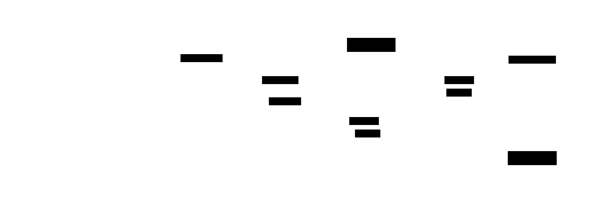

# Bytecode Compiler: Design Document


## Overview

This system transforms an Abstract Syntax Tree (AST) into executable bytecode for a stack-based Virtual Machine (VM). The key architectural challenge is translating the tree-structured program representation into a flat, sequential list of instructions that manage computation via an operand stack, while correctly handling variable scopes, control flow jumps, and function calls.


> This guide is meant to help you understand the big picture before diving into each milestone. Refer back to it whenever you need context on how components connect.


> **Milestone(s):** Milestone 1 (Expression Compilation), Milestone 2 (Variables and Assignment), Milestone 3 (Control Flow), Milestone 4 (Functions)

## 1. Context and Problem Statement

This section establishes the fundamental challenge our system addresses: transforming the tree-like structure of a program's Abstract Syntax Tree (AST) into a linear sequence of instructions (bytecode) for a stack-based Virtual Machine (VM). We begin by building an intuitive mental model, then formalize the core problem, and finally explore alternative architectural approaches to ground our design choices.

### Mental Model: The Assembly Line vs. The Recipe

Imagine you are tasked with building a complex toy from a detailed recipe (the AST). The recipe is hierarchical: first, assemble the engine (which itself involves screwing part A to part B), then attach the wheels, and finally paint the body. This structure is natural for human planning but inefficient for a machine that builds one step at a time on a linear assembly line.

The **assembly line (our bytecode)** is a conveyor belt. Workers (the VM) stationed along it perform one simple, repeatable action—like "pick up a screw," "tighten," or "spray paint"—on whatever item is currently in front of them. The line must be programmed with a precise, sequential list of these atomic actions. There is no inherent nesting; to handle sub-assemblies like the engine, you must flatten its steps into the main sequence.

The **compiler** is the engineer who translates the hierarchical recipe into this flat assembly-line program. Their job is to walk the recipe tree, decide the exact order of operations, and issue the corresponding low-level commands. Crucially, the assembly line has a **stack**—a temporary storage cart next to the conveyor belt. When a worker produces a sub-component (like the assembled engine), they place it on this cart. Later, another worker picks it up to attach it to the main chassis. This stack cart manages the flow of intermediate results, allowing the linear sequence to compute values in the correct order without needing to represent the original tree structure in the instructions.

> **Key Insight:** Compilation is not a direct translation; it's a **reorganization** from a structure optimized for human/parser understanding (tree) to a structure optimized for efficient, step-by-step machine execution (linear instructions with a stack).

### The Compilation Challenge

The core technical problem can be broken down into three interconnected challenges:

1.  **From Recursion to Sequence:** An AST is fundamentally recursive. An expression like `1 + 2 * 3` is represented as a tree where the `+` node has children `1` and `*`, and the `*` node has children `2` and `3`. The compiler must perform a traversal (like a depth-first walk) that "flattens" this recursion into a linear order. The output must respect operator precedence, meaning the multiplication (`2 * 3`) must be computed before the addition, even though the `+` appears first in the source code. This requires carefully ordering the emitted instructions.

2.  **Managing Temporary Values with a Stack:** In a tree-walking interpreter, temporary values are managed implicitly via function call returns on the language's call stack. In a stack-based bytecode VM, we must make this storage explicit. Every operation consumes its operands from the top of the operand stack and pushes its result back onto it. The compiler's job is to emit instructions that manipulate this stack to mirror the expression's evaluation order. For `1 + 2 * 3`, the compiler must emit code that:
    1.  Pushes `1` onto the stack.
    2.  Pushes `2` and `3`, then emits a `MULTIPLY` instruction, which consumes `2` and `3` and pushes `6`.
    3.  Emits an `ADD` instruction, which consumes `1` and `6` and pushes `7`.
    The challenge is designing instructions and a compilation strategy that maintains correct stack balance (no leftover values, no underflow) for all language constructs.

3.  **Encoding Complex Semantics in Simple Instructions:** High-level language features like variables, loops, and function calls must be implemented using low-level bytecode primitives. A `while` loop, for instance, requires **jump** instructions that alter the linear flow of execution by moving the instruction pointer forward or backward. The compiler must plan for these jumps, often emitting a placeholder for a forward jump whose target isn't known yet and later **patching** it with the correct address—a process known as backpatching. Similarly, a variable access translates to a `LOAD` instruction for a specific stack slot or memory address, requiring the compiler to maintain a **symbol table** that maps names to locations across nested scopes.

The compilation challenge, therefore, is to design a component that can ingest a recursive, semantically rich AST and produce a linear, semantically equivalent bytecode stream that correctly manages an operand stack, tracks and patches jump targets, and maps symbolic names to concrete storage locations.

### Existing Approaches & Trade-offs

There are several established architectures for executing high-level languages, each with different trade-offs in complexity, performance, and portability. Our choice of a **stack-based bytecode VM** is a deliberate one among these alternatives.

> **Decision: Stack-Based Bytecode over Tree-Walking and Register-Based VMs**
> - **Context**: We need an execution model for our educational language that is simple to implement, easy to debug, and provides a clear mental model for compilation. The target is a learning compiler, not peak performance.
> - **Options Considered**:
>     1.  **Tree-Walking Interpreter**: Directly execute the AST by recursively evaluating nodes.
>     2.  **Stack-Based Bytecode VM**: Compile AST to linear bytecode instructions for a virtual machine that uses an operand stack.
>     3.  **Register-Based Bytecode VM**: Compile AST to linear bytecode instructions for a virtual machine that uses a set of virtual registers.
> - **Decision**: Adopt a stack-based bytecode VM architecture.
> - **Rationale**:
>     1.  **Compilation Simplicity**: Generating code for a stack machine is straightforward. Each AST node maps cleanly to a sequence of "push" and "operation" instructions. There is no need for complex register allocation algorithms.
>     2.  **Compact Bytecode**: Stack instructions often don't need to specify operands explicitly (they are implicit on the stack), leading to denser, smaller bytecode.
>     3.  **Conceptual Clarity**: The operand stack provides a tangible visualization of computation flow, which is invaluable for debugging and learning. The linear bytecode is also easier to disassemble and inspect than a tree.
>     4.  **Widespread Precedent**: This model is used in foundational systems like the Java JVM (for its initial versions), the Python VM, and the .NET CLR, offering a wealth of educational resources.
> - **Consequences**:
>     - **Enables**: Straightforward compiler implementation, easy-to-understand execution traces, and simple serialization of compiled code.
>     - **Trade-offs**: The bytecode may execute slightly slower than register-based code due to more instructions (pushes/pops) and memory traffic on the virtual stack. However, this is an acceptable trade-off for educational clarity.

The following table compares the three major approaches:

| Approach | How It Works | Pros | Cons | Why Not Chosen for This Project? |
| :--- | :--- | :--- | :--- | :--- |
| **Tree-Walking Interpreter** | The evaluator recursively traverses the AST, executing operations at each node. | - **Simplest to implement** initially.<br>- No separate compilation phase.<br>- Directly mirrors language semantics. | - **Slow execution**: Each node involves function call overhead and repeated tree traversal.<br>- Poor separation of concerns between parsing and execution.<br>- Difficult to optimize. | While the simplest start, it doesn't teach the core concepts of **code generation** or **VM design**, which are key learning goals. It also becomes cumbersome for complex control flow and functions. |
| **Stack-Based Bytecode VM** | The compiler translates the AST into a linear sequence of bytecode instructions. A VM with an operand stack fetches and executes these instructions. | - **Excellent compile/execute separation**.<br>- **Simple code generation**: Instructions are short and often zero-operand.<br>- **Portable and compact** bytecode.<br>- Clear mental model for computation (the stack). | - Can be **less efficient** than register VMs due to more instructions for stack manipulation.<br>- Requires implementing both a compiler and a VM. | **CHOSEN**. Its balance of implementation simplicity and exposure to foundational concepts (instruction encoding, stack machines, jump patching) makes it the ideal educational target. |
| **Register-Based Bytecode VM** | Similar to stack-based, but instructions operate on explicit virtual registers (like a real CPU) instead of an implicit stack. | - **Potential for higher performance**: Fewer instructions, less data movement.<br>- Closer model to actual hardware. | - **Complex code generation**: Requires register allocation, which is a non-trivial optimization problem.<br>- Instructions are larger (need to encode register operands).<br>- Less intuitive initial learning curve. | Adds significant complexity (register allocation) that distracts from the core learning objectives. It's a natural *future extension* after mastering the stack-based model. |

This comparison clarifies our path: we are building a **compiler** for a **stack-based virtual machine**. The subsequent sections of this document detail how we will tackle the compilation challenge within this chosen architecture.

---
### Implementation Guidance

**A. Technology Recommendations Table**

| Component | Simple Option (Recommended for Learning) | Advanced Option (For Exploration) |
| :--- | :--- | :--- |
| **AST Representation** | Plain Python classes with fields for children nodes. | Using the `dataclasses` or `attrs` library for auto-generated `__init__` and `__repr__`. |
| **Bytecode Storage** | A `list` of integers (opcodes/operands). | A `bytearray` for a more memory-efficient, serializable format. |
| **Constant Pool** | A Python `list` to store constants, indexed by integer. | A dictionary for deduplication plus a list for ordering, or using a `tuple` for immutability. |
| **Symbol Table** | A stack of dictionaries (`list` of `dict`s) for scopes. | A custom class with dedicated methods for entering/leaving scopes and chainable lookup. |
| **Instruction Definition** | Module-level constants for opcodes (e.g., `OP_CONSTANT = 0`). | An `Enum` class for opcodes, providing better type hints and safety. |

**B. Recommended File/Module Structure**

At the start of the project, it's crucial to organize code to manage complexity. Below is a suggested structure for the Python implementation.

```
bytecode_compiler_project/
├── ast_nodes.py          # Definitions for all AST node classes (e.g., BinaryOp, Literal, VarDecl)
├── compiler/
│   ├── __init__.py
│   ├── compiler.py       # Main Compiler driver class (orchestrates the compilation process)
│   ├── chunk.py          # BytecodeChunk and ConstantPool classes
│   ├── symbol_table.py   # SymbolTable and Scope classes
│   ├── expr_compiler.py  # ExpressionCompiler (for Milestone 1)
│   ├── stmt_compiler.py  # StatementCompiler (for Milestone 2-4, handles declarations, control flow)
│   └── function_compiler.py # FunctionCompiler (for Milestone 4)
├── vm/
│   ├── __init__.py
│   ├── vm.py             # Virtual Machine that executes the bytecode
│   └── opcodes.py        # Definition of all bytecode instruction opcodes
└── main.py               # Command-line entry point: parse -> compile -> run
```

**C. Infrastructure Starter Code**

Here is complete, foundational code for the AST node definitions and opcode constants. The learner should place these in the respective files.

**File: `ast_nodes.py`**
```python
"""
Abstract Syntax Tree node definitions.
"""

class Expr:
    """Base class for all expression nodes."""
    pass

class Stmt:
    """Base class for all statement nodes."""
    pass

class Literal(Expr):
    """Represents a literal value like 42, "hello", true."""
    def __init__(self, value):
        self.value = value

class BinaryOp(Expr):
    """Represents a binary operation like left + right."""
    def __init__(self, left, operator, right):
        self.left = left
        self.operator = operator  # e.g., '+', '-', '*', '/', '=='
        self.right = right

class UnaryOp(Expr):
    """Represents a unary operation like -expr or !expr."""
    def __init__(self, operator, operand):
        self.operator = operator  # e.g., '-', '!'
        self.operand = operand

class Variable(Expr):
    """Represents a variable reference by name."""
    def __init__(self, name):
        self.name = name

class Assignment(Stmt, Expr):  # In many languages, assignment is both a stmt and expr
    """Represents a variable assignment: name = value."""
    def __init__(self, name, value):
        self.name = name
        self.value = value

class VarDecl(Stmt):
    """Represents a variable declaration: var name = initializer;"""
    def __init__(self, name, initializer):
        self.name = name
        self.initializer = initializer

class Block(Stmt):
    """Represents a block of statements: { stmt1; stmt2; }"""
    def __init__(self, statements):
        self.statements = statements

class IfStmt(Stmt):
    """Represents an if statement: if (condition) then_branch else else_branch."""
    def __init__(self, condition, then_branch, else_branch):
        self.condition = condition
        self.then_branch = then_branch
        self.else_branch = else_branch  # Can be None

class WhileStmt(Stmt):
    """Represents a while loop: while (condition) body."""
    def __init__(self, condition, body):
        self.condition = condition
        self.body = body

# Functions will be added in Milestone 4
```

**File: `vm/opcodes.py`**
```python
"""
Bytecode instruction opcode definitions.
"""

# Load constants
OP_CONSTANT = 0      # operand: constant pool index
OP_NIL = 1           # no operand, pushes nil
OP_TRUE = 2          # no operand, pushes true
OP_FALSE = 3         # no operand, pushes false

# Arithmetic and logic
OP_ADD = 4
OP_SUBTRACT = 5
OP_MULTIPLY = 6
OP_DIVIDE = 7
OP_NEGATE = 8        # unary negation
OP_NOT = 9           # logical not

# Comparisons
OP_EQUAL = 10
OP_NOT_EQUAL = 11
OP_GREATER = 12
OP_GREATER_EQUAL = 13
OP_LESS = 14
OP_LESS_EQUAL = 15

# Variables
OP_DEFINE_GLOBAL = 16  # operand: constant index of variable name
OP_GET_GLOBAL = 17     # operand: constant index of variable name
OP_SET_GLOBAL = 18     # operand: constant index of variable name
OP_GET_LOCAL = 19      # operand: stack slot index
OP_SET_LOCAL = 20      # operand: stack slot index

# Control flow
OP_JUMP = 21           # operand: jump offset (absolute or relative)
OP_JUMP_IF_FALSE = 22  # operand: jump offset
OP_LOOP = 23           # operand: loop offset (jump backward)

# Functions (Milestone 4)
OP_CALL = 24           # operand: number of arguments
OP_RETURN = 25         # no operand
```

**D. Core Logic Skeleton Code**

The following skeleton outlines the main driver of the compiler. The learner will fill in the methods by delegating to specific compilers developed in each milestone.

**File: `compiler/compiler.py`**
```python
"""
Main compiler driver. Orchestrates the traversal of the AST and delegates to specific compilers.
"""
from .chunk import BytecodeChunk, ConstantPool
from .symbol_table import SymbolTable

class Compiler:
    def __init__(self):
        self.current_chunk = BytecodeChunk()
        self.symbol_table = SymbolTable()
        # TODO: Add state for tracking loops (for break/continue), current function, etc.

    def compile(self, statements):
        """
        Compiles a list of statements (the program's AST) into bytecode.
        Returns the completed BytecodeChunk.
        """
        # TODO 1: Initialize any necessary compilation state (scope, loop depth).
        # TODO 2: For each statement in the `statements` list, call `self._compile_stmt(stmt)`.
        # TODO 3: After compiling all statements, ensure the chunk ends with an implicit return if needed.
        # TODO 4: Return the `self.current_chunk` containing the generated bytecode.
        pass

    def _compile_expr(self, expr_node):
        """
        Internal method to compile an expression node.
        Delegates to specific methods based on node type.
        """
        # TODO 1: Determine the type of `expr_node` (e.g., isinstance).
        # TODO 2: Call the appropriate private compilation method:
        #   - `self._compile_literal(node)` for `Literal`
        #   - `self._compile_binary(node)` for `BinaryOp`
        #   - `self._compile_unary(node)` for `UnaryOp`
        #   - `self._compile_variable(node)` for `Variable`
        # TODO 3: Ensure each method emits instructions that leave the expression's result on the stack top.
        pass

    def _compile_stmt(self, stmt_node):
        """
        Internal method to compile a statement node.
        """
        # TODO 1: Determine the type of `stmt_node`.
        # TODO 2: Call the appropriate private compilation method:
        #   - `self._compile_var_decl(node)` for `VarDecl`
        #   - `self._compile_block(node)` for `Block`
        #   - `self._compile_if(node)` for `IfStmt`
        #   - `self._compile_while(node)` for `WhileStmt`
        # TODO 3: Ensure statements manage stack balance (e.g., popping unused expression values).
        pass

    # -----------------------------------------------------------------
    # Expression Compilation Methods (Milestone 1 & 2)
    # -----------------------------------------------------------------
    def _compile_literal(self, node):
        # TODO 1: Get the literal value from `node.value`.
        # TODO 2: Add the value to the constant pool using `self.current_chunk.add_constant(...)`.
        # TODO 3: Get the constant index returned from step 2.
        # TODO 4: Emit an `OP_CONSTANT` instruction with that index using `self.current_chunk.write_opcode(...)`.
        pass

    def _compile_binary(self, node):
        # TODO 1: Recursively compile the left operand by calling `self._compile_expr(node.left)`.
        # TODO 2: Recursively compile the right operand by calling `self._compile_expr(node.right)`.
        # TODO 3: Based on `node.operator`, emit the corresponding binary operation opcode (e.g., OP_ADD for '+').
        #   Hint: Use a mapping from operator strings to opcode constants.
        pass

    def _compile_unary(self, node):
        # TODO 1: Recursively compile the operand by calling `self._compile_expr(node.operand)`.
        # TODO 2: Based on `node.operator`, emit the corresponding unary opcode (e.g., OP_NEGATE for '-', OP_NOT for '!').
        pass

    # Variable-related methods will be added in Milestone 2
    def _compile_variable(self, node):
        # TODO (Milestone 2): Look up the variable's name in the symbol table.
        # TODO: Depending on scope, emit either OP_GET_GLOBAL or OP_GET_LOCAL with the appropriate operand (name index or slot index).
        pass

    # -----------------------------------------------------------------
    # Statement Compilation Methods (Milestone 2, 3, 4)
    # -----------------------------------------------------------------
    # These will be filled in as the project progresses.
```

**E. Language-Specific Hints (Python)**

*   **Type Checking:** Use `isinstance(node, Literal)` to check node types. Avoid `type(node) == Literal`.
*   **Constant Pool:** When adding a constant (like the integer `5`), ensure you store the *value* itself. The `BytecodeChunk.add_constant` method should return the index at which it was stored.
*   **Opcode Emission:** The `BytecodeChunk.write_opcode` method should handle writing both the opcode byte and any immediate operands (like a constant index) to the chunk's code list.
*   **Stack Visualization:** During debugging, maintain a simple list in the VM that represents the operand stack. Print it after each instruction to trace execution.

**F. Milestone Checkpoint**

After setting up the initial structure and implementing `_compile_literal`:

1.  **Test Command:** Create a simple test script (`test_literal.py`):
    ```python
    from ast_nodes import Literal
    from compiler.compiler import Compiler
    from vm.vm import VM

    compiler = Compiler()
    # Compile a single literal expression: 42
    stmt = Literal(42)
    # For now, treat a single expression as a program.
    compiler._compile_expr(stmt)
    chunk = compiler.current_chunk
    # Disassemble and print the bytecode
    print(chunk.disassemble())
    # Run it
    vm = VM(chunk)
    result = vm.run()
    print(f"Result: {result}")
    ```
2.  **Expected Output:** The disassembly should show one instruction: `OP_CONSTANT 0` (where constant 0 is `42`). The VM should run and print `Result: 42`.
3.  **Signs of Trouble:**
    *   **Constant pool index wrong:** If the constant isn't stored correctly, the VM might load the wrong value or crash.
    *   **Opcode not written:** If the code list is empty, check that `write_opcode` is correctly appending to the list.
    *   **VM stack underflow:** If the VM complains about an empty stack, the `OP_CONSTANT` instruction might not be pushing the value correctly.

**G. Debugging Tips**

| Symptom | Likely Cause | How to Diagnose | Fix |
| :--- | :--- | :--- | :--- |
| **VM crashes with "stack underflow"** | An instruction is trying to pop an operand from an empty stack. | Print the VM's stack before and after each instruction. Find the first instruction that pops from an empty stack. | Ensure the compiler emits correct number of push instructions before operations. Check that unary/binary ops compile their operand(s) first. |
| **Wrong constant value is loaded** | Constant pool index in `OP_CONSTANT` instruction is incorrect. | Disassemble the bytecode. Check that the index points to the right constant in the constant pool list. | Verify `add_constant` returns the index and that it's used correctly in `write_opcode`. |
| **Binary operation evaluates in wrong order** | The compiler emitted instructions for the right operand before the left. | Look at the disassembled bytecode sequence for a binary op. The left operand's instructions should come first. | In `_compile_binary`, ensure left subtree is compiled before the right subtree. |


> **Milestone(s):** Milestone 1 (Expression Compilation), Milestone 2 (Variables and Assignment), Milestone 3 (Control Flow), Milestone 4 (Functions)

## 2. Goals and Non-Goals

Before diving into the technical architecture, it is crucial to establish the boundaries of this project. An educational compiler, unlike a production system, must balance completeness with focus. This section defines the **Goals** – the core functionality required for a complete, instructive compilation pipeline – and the **Non-Goals** – features explicitly excluded to prevent scope creep and maintain pedagogical clarity. Think of this as drawing the blueprint's property lines: we specify exactly what we are building and, just as importantly, what lies outside the construction site.

### Goals (What We Must Do)

The primary objective is to build a functional, self-contained compiler that transforms a structured program (AST) into executable instructions (bytecode) for a stack-based virtual machine. This pipeline must demonstrate the fundamental translation strategies and data structures used in real-world compilers and interpreters. The goals are directly aligned with the project's four milestones, each building upon the previous to create a language of increasing expressiveness.

The following table enumerates the core capabilities our compiler must support, mapping each to its corresponding milestone and the key concepts a developer will learn by implementing it.

| Goal Category | Specific Capability | Corresponding Milestone | Key Concepts Demonstrated |
| :--- | :--- | :--- | :--- |
| **Expression Evaluation** | Compile literal values (numbers, strings, booleans) into constant pool load instructions. | Milestone 1 | Constant pools, stack-based value pushing |
| | Compile binary arithmetic (`+`, `-`, `*`, `/`) and comparison (`==`, `!=`, `<`, `>`) operations. | Milestone 1 | Postfix evaluation order, operator precedence via AST traversal |
| | Compile unary operations (`-` negation, `!` logical NOT). | Milestone 1 | Stack manipulation for single-operand transformations |
| **Variable Management** | Declare variables with optional initializers, allocating a named storage slot. | Milestone 2 | Symbol tables, stack slot allocation, scoped storage |
| | Assign new values to existing variables, updating their storage slot. | Milestone 2 | Store instructions, expression evaluation for the right-hand side |
| | Read variable values, pushing the content of their storage slot onto the stack. | Milestone 2 | Load instructions, name resolution within nested scopes |
| **Scope Control** | Create nested lexical scopes via block statements (`{ ... }`). | Milestone 2 | Scope stack management, variable shadowing |
| | Correctly resolve variable names, respecting inner scope shadowing of outer names. | Milestone 2 | Symbol table lookup with depth-first search |
| | Clean up (pop) local variable slots when exiting a scope. | Milestone 2 | Stack pointer management, scope lifetime |
| **Control Flow** | Compile conditional `if`-`else` statements with branching. | Milestone 3 | Conditional jumps, forward jump target patching |
| | Compile `while` loops with a conditional exit and a backward jump. | Milestone 3 | Backward jumps, loop label management |
| | Implement short-circuit evaluation for logical operators (`&&`, `||`). | Milestone 3 | Conditional jump chaining, implicit boolean conversion |
| **Functions** | Define named functions with a parameter list and a body. | Milestone 4 | Function chunks, local call frames, parameter binding |
| | Call functions, passing arguments and receiving a return value. | Milestone 4 | Argument pushing, call instruction, stack frame setup/teardown |
| | Return values from functions to the caller. | Milestone 4 | Return instruction, stack cleanup, value propagation |
| **Bytecode Foundation** | Generate a linear sequence of bytecode instructions from a tree-shaped AST. | All Milestones | Instruction encoding, tree traversal (visitor pattern) |
| | Maintain a constant pool for literal values, deduplicating where possible. | Milestone 1+ | Constant pool indexing, value interning |
| | Resolve and patch forward jump targets after the target location is known. | Milestone 3 | Backpatching, two-pass code generation within a single traversal |

> **Key Design Insight:** The progression from expressions to functions is intentional. Expressions teach value computation and stack manipulation—the VM's "muscle memory." Variables add state and name resolution—the "memory." Control flow introduces non-linear execution—the "nervous system." Finally, functions provide abstraction and reuse—the "higher cognition." Each layer builds directly upon the stable foundation of the previous one.

**Architecture Decision Record: Targeting a Stack-Based VM**

> **Decision: Compile to a stack-based virtual machine bytecode rather than a register-based VM or direct tree-walking.**
> - **Context**: We need to generate linear instructions from an AST. The choice of VM architecture drastically affects compilation complexity, code size, and educational value.
> - **Options Considered**:
>     1. **Stack-based VM**: Instructions implicitly operate on an operand stack (e.g., `PUSH a`, `PUSH b`, `ADD`).
>     2. **Register-based VM**: Instructions explicitly name virtual registers (e.g., `ADD r1, r2, r3`).
>     3. **Direct AST Walking (Tree-walking Interpreter)**: Evaluate the AST directly without a compilation step.
> - **Decision**: Use a stack-based VM as the compilation target.
> - **Rationale**:
>     - **Simpler Code Generation**: Compiling to a stack machine is more straightforward. Expression trees map naturally to postfix order (depth-first traversal), requiring no register allocation algorithm, which is a complex optimization problem.
>     - **Smaller Instruction Encoding**: Stack instructions often have no operands for the operation itself (e.g., `ADD` is a single byte), leading to denser bytecode. This keeps the initial compiler simple.
>     - **Educational Alignment**: The project's stated prerequisite is a stack-based VM. This decision creates a coherent learning path from AST to stack instructions to execution.
>     - **Industry Precedent**: Many successful languages (Java JVM, Python CPython bytecode, .NET CIL) started with or use stack-based VMs, providing real-world relevance.
> - **Consequences**:
>     - **Pros**: Easier to implement, natural mapping from expressions, smaller generated code for expressions.
>     - **Cons**: May execute more instructions than an equivalent register-based program (e.g., more `PUSH`/`POP` moves), but this is acceptable for an educational project focused on compilation, not peak VM performance.

| Option | Pros | Cons | Chosen? |
| :--- | :--- | :--- | :--- |
| **Stack-based VM** | Simple compilation, dense bytecode, natural for expressions. | Can be slower due to more data moves, stack depth limits. | **Yes** |
| **Register-based VM** | Potentially faster execution, fewer instructions. | Requires complex register allocation, larger instruction encoding. | No |
| **Tree-walking Interpreter** | No compilation step, simplest architecture. | Slow execution, mixes parsing/evaluation, does not teach bytecode generation. | No |

The fulfillment of these goals will result in a compiler for a dynamically-typed, imperative language with C-like syntax, supporting arithmetic, variables, conditionals, loops, and functions—a substantial and coherent foundation for understanding compilation.

### Non-Goals (What We Won't Do)

To maintain focus and ensure successful completion within the educational context, we explicitly exclude several advanced language features and implementation concerns. These are common in production languages but represent significant additional complexity that would distract from the core learning objectives of bytecode generation and stack VM execution.

| Non-Goal Category | Specific Excluded Feature | Reason for Exclusion |
| :--- | :--- | :--- |
| **Type System** | Static type checking, type annotations, or compile-time type inference. | Adds significant complexity to the compiler front-end and symbol table. Our language is dynamically-typed: type checking happens at runtime in the VM. |
| **Memory Management** | Automatic garbage collection (GC) for heap-allocated values. | GC is a vast topic orthogonal to compilation. Our VM can use simple reference counting or ignore the issue for the scale of programs we run. |
| **Advanced Data Types** | Arrays, dictionaries/hashes, structures, or classes. | These require complex runtime representations and operations. We stick to simple scalar types (numbers, strings, booleans) and function closures (if extended). |
| **Advanced Control Flow** | `for` loops, `switch` statements, exceptions, `break`/`continue` outside simple loops, coroutines. | Each adds new jump patterns and scope management rules. `while` and `if` are sufficient to teach branching. |
| **Optimizations** | Constant folding, peephole optimization, inline caching, tail-call optimization. | While valuable, optimizations are a separate advanced topic. We focus on correct, straightforward code generation first. |
| **Module System** | Import/export of code across files, separate compilation, linking. | Requires a file system abstraction and symbol resolution across compilation units, adding significant complexity. |
| **Standard Library** | Built-in functions for I/O (print, read), mathematics, etc. | The VM may provide minimal primitives (e.g., `print`), but a full library is a large project in itself. |
| **Error Recovery & Diagnostics** | Multi-error reporting, sophisticated error messages with suggestions, syntax error recovery. | We focus on failing fast on the first error with a clear message. Robust error handling is a compiler front-end concern. |
| **Native Interface** | Calling functions written in the host language (e.g., C extensions). | Requires intricate ABI knowledge and breaks VM abstraction. Our functions are defined purely in the compiled language. |
| **Concurrency** | Threads, async/await, or any parallel execution model. | Introduces monumental complexity in both VM (race conditions) and compiler (memory model). |

> **Key Design Insight:** The "Non-Goals" list is not a statement of unimportance. Instead, it defines a **minimal viable product (MVP)** for learning compilation. Each excluded feature could be a fascinating project extension (see Section 10), but including them from the start would overwhelm the core objective: understanding the AST-to-bytecode transformation pipeline. By keeping the language simple, we ensure the compiler's architecture and data structures remain visible and comprehensible.

**Architecture Decision Record: Excluding a Parser**

> **Decision: Assume the existence of a parser that produces an AST; the compiler does not include parsing.**
> - **Context**: The project description lists "AST builder" as a prerequisite. The compiler's responsibility begins with a valid AST.
> - **Options Considered**:
>     1. **Include a Parser**: Build a full lexical analyzer and parser (e.g., recursive descent) as part of the compiler.
>     2. **Assume AST Input**: Rely on a separate, pre-existing parser component to provide the AST.
> - **Decision**: Assume AST input; the compiler starts at the `compile` method receiving a list of `Stmt` nodes.
> - **Rationale**:
>     - **Separation of Concerns**: Parsing (syntax analysis) and compilation (code generation) are distinct phases. Building both simultaneously doubles the project's scope and complexity.
>     - **Prerequisite Alignment**: The stated prerequisites include an AST builder, allowing learners to focus on the new challenge of code generation without re-implementing parsing.
>     - **Testing Simplicity**: It is easier to test the compiler by manually constructing AST nodes in unit tests than by parsing source strings.
> - **Consequences**:
>     - **Pros**: Cleaner architecture, focus on core learning goals, easier testing.
>     - **Cons**: The compiler cannot be used as a standalone tool without a parser. It depends on a correctly implemented AST node structure.

By adhering to these goals and non-goals, the project delivers a complete, end-to-end compilation experience for a non-trivial language subset, providing deep insight into the fundamentals of compiler construction without being derailed by peripheral complexities.

### Implementation Guidance

**Technology Recommendations Table:**

| Component | Simple Option | Advanced Option |
| :--- | :--- | :--- |
| **AST Representation** | Use plain classes/dataclasses for each node type with fields as per naming conventions. | Use the Visitor pattern for traversing the AST, separating traversal logic from node definitions. |
| **Constant Pool** | Use a Python `list` to store values, with linear search for deduplication in `add_constant`. | Use a dictionary (value -> index) for O(1) duplicate lookup, storing both the list and the map. |
| **Symbol Table** | Use a stack of Python `dict` objects, where each dict maps names to simple slot indices. | Augment with metadata (e.g., type hints for future extension, depth tracking) and more efficient nested lookups. |
| **Jump Patching** | Store a list of "patch locations" (code indices) for each forward jump, and update them later. | Use a more sophisticated structure linking jumps to labels, allowing for more complex control flow. |
| **Bytecode Chunk** | Use a `bytearray` or `list` of integers for code, with methods to append bytes/ints. | Implement a more structured instruction format with operand encoding/decoding helpers. |

**Recommended File/Module Structure:**
For a Python implementation, organize the compiler into the following modules. This keeps concerns separated and mirrors the component design.

```
bytecode_compiler/
├── __init__.py
├── ast_nodes.py           # Definitions for Expr, Stmt, and all concrete node classes
├── compiler.py            # Main Compiler driver class and compilation orchestration
├── chunk.py               # BytecodeChunk and ConstantPool classes
├── symbol_table.py        # SymbolTable class for scope management
├── compile_expr.py        # Expression compilation functions (could be methods in compiler.py)
├── compile_stmt.py        # Statement compilation functions
└── opcodes.py             # Constants for all opcodes (OP_CONSTANT, OP_ADD, etc.)
```

**Infrastructure Starter Code:**
The following provides complete, foundational code for the data structures and constants. This is boilerplate that can be used as-is, allowing the learner to focus on the compilation logic.

**File: `ast_nodes.py`**
```python
"""Abstract Syntax Tree node definitions."""

from abc import ABC
from dataclasses import dataclass
from typing import Any, List, Optional


class Expr(ABC):
    """Base class for all expression nodes."""
    pass


class Stmt(ABC):
    """Base class for all statement nodes."""
    pass


@dataclass
class Literal(Expr):
    """Represents a literal value like 42, 'hello', true."""
    value: Any


@dataclass
class BinaryOp(Expr):
    """Represents a binary operation like left + right."""
    left: Expr
    operator: str
    right: Expr


@dataclass
class UnaryOp(Expr):
    """Represents a unary operation like -expr or !expr."""
    operator: str
    operand: Expr


@dataclass
class Variable(Expr):
    """Represents a variable reference by name."""
    name: str


@dataclass
class Assignment(Expr):
    """Represents a variable assignment: name = value."""
    name: str
    value: Expr


@dataclass
class VarDecl(Stmt):
    """Represents a variable declaration: var name = initializer;"""
    name: str
    initializer: Optional[Expr]


@dataclass
class Block(Stmt):
    """Represents a block of statements: { stmt1; stmt2; }"""
    statements: List[Stmt]


@dataclass
class IfStmt(Stmt):
    """Represents an if statement: if (condition) then_branch else else_branch."""
    condition: Expr
    then_branch: Stmt
    else_branch: Optional[Stmt]


@dataclass
class WhileStmt(Stmt):
    """Represents a while loop: while (condition) body."""
    condition: Expr
    body: Stmt
```

**File: `opcodes.py`**
```python
"""Bytecode instruction opcodes."""

# Load constant from pool
OP_CONSTANT = 0x01

# Arithmetic operations
OP_ADD = 0x02
OP_SUBTRACT = 0x03
OP_MULTIPLY = 0x04
OP_DIVIDE = 0x05

# Unary operations
OP_NEGATE = 0x06
OP_NOT = 0x07

# Variables
OP_LOAD = 0x08      # Load variable onto stack
OP_STORE = 0x09     # Store top of stack into variable

# Control flow
OP_JUMP = 0x0A
OP_JUMP_IF_FALSE = 0x0B
OP_LOOP = 0x0C

# Functions
OP_CALL = 0x0D
OP_RETURN = 0x0E

# Note: Comparison operators (==, !=, <, >) are often implemented as
# special instructions or as binary ops that return a boolean.
# For simplicity, we can add them as separate opcodes.
OP_EQUAL = 0x0F
OP_NOT_EQUAL = 0x10
OP_LESS = 0x11
OP_GREATER = 0x12
```

**File: `chunk.py`**
```python
"""Bytecode chunk and constant pool management."""

from typing import Any, List


class ConstantPool:
    """Stores literal values referenced by bytecode."""
    def __init__(self):
        self.values: List[Any] = []

    def add_constant(self, value: Any) -> int:
        """Adds a constant value to the pool and returns its index.
        For simplicity, we don't deduplicate; every constant is added.
        """
        index = len(self.values)
        self.values.append(value)
        return index


class BytecodeChunk:
    """Holds the linear bytecode and associated constant pool."""
    def __init__(self):
        self.code: List[int] = []
        self.constants = ConstantPool()

    def add_constant(self, value: Any) -> int:
        """Convenience method to add a constant and return its index."""
        return self.constants.add_constant(value)

    def write_opcode(self, opcode: int, operand: int = None) -> None:
        """Appends an opcode (and optional operand) to the code list.
        For simplicity, we assume operands are single-byte values.
        In a more advanced version, you'd encode multi-byte operands.
        """
        self.code.append(opcode)
        if operand is not None:
            self.code.append(operand)
```

**File: `symbol_table.py`**
```python
"""Symbol table for variable scope management."""

from typing import Dict, Optional


class SymbolTable:
    """Manages mapping of variable names to storage slots across nested scopes."""
    def __init__(self):
        # Each scope is a dictionary mapping name -> slot_index
        self.scopes: List[Dict[str, int]] = [{}]
        # Tracks the next available slot index for the current scope
        self.slot_counter = 0

    def enter_scope(self) -> None:
        """Push a new inner scope onto the stack."""
        self.scopes.append({})
        # Reset slot counter for the new scope? Usually, each scope starts at 0.
        # We'll keep a global counter for simplicity, but you might want per-scope.
        # For now, we assume slots are function-local, so resetting is appropriate.
        self.slot_counter = 0

    def exit_scope(self) -> None:
        """Pop the innermost scope, discarding its variable mappings."""
        if len(self.scopes) > 1:
            self.scopes.pop()
            # When leaving a scope, we lose track of the slot_counter for that scope.
            # For simplicity, we'll reset to the maximum slot used in the now-current scope.
            # This is tricky; a better design might store per-scope metadata.
            # This is a placeholder implementation.
            self.slot_counter = max(self.scopes[-1].values(), default=0)

    def declare_variable(self, name: str) -> int:
        """Declare a new variable in the current scope.
        Returns the assigned stack slot index.
        Raises an error if the variable is already declared in this scope.
        """
        current_scope = self.scopes[-1]
        if name in current_scope:
            raise NameError(f"Variable '{name}' already declared in this scope.")
        slot = self.slot_counter
        self.slot_counter += 1
        current_scope[name] = slot
        return slot

    def resolve_variable(self, name: str) -> Optional[int]:
        """Look up a variable by name, searching from innermost to outermost scope.
        Returns the slot index if found, otherwise None.
        """
        for scope in reversed(self.scopes):
            if name in scope:
                return scope[name]
        return None
```

**Core Logic Skeleton Code:**
The main compiler driver is where the learner will integrate all components. Below is a skeleton with TODO comments mapping to the high-level algorithm.

**File: `compiler.py`**
```python
"""Main compiler driver."""

from typing import List
from ast_nodes import Stmt, Expr, Literal, BinaryOp, UnaryOp, Variable, Assignment, VarDecl, Block, IfStmt, WhileStmt
from chunk import BytecodeChunk
from symbol_table import SymbolTable
import opcodes


class Compiler:
    """Main compiler driver."""
    def __init__(self):
        self.current_chunk: BytecodeChunk = BytecodeChunk()
        self.symbol_table = SymbolTable()

    def compile(self, statements: List[Stmt]) -> BytecodeChunk:
        """Compiles a list of statements (the program's AST) into bytecode."""
        # TODO 1: Reset the compiler state if needed (new chunk, symbol table)
        # TODO 2: For each statement in the list, call _compile_stmt
        # TODO 3: After compiling all statements, ensure the chunk ends with an implicit return (or halt)
        # TODO 4: Return the completed bytecode chunk
        pass

    def _compile_expr(self, expr_node: Expr) -> None:
        """Internal method to compile an expression node."""
        # TODO 1: Determine the type of expr_node (using isinstance)
        # TODO 2: Dispatch to the appropriate compilation method:
        #   - Literal: write OP_CONSTANT with the constant pool index
        #   - BinaryOp: compile left, then right, then write the appropriate opcode (e.g., OP_ADD)
        #   - UnaryOp: compile operand, then write the appropriate opcode (e.g., OP_NEGATE)
        #   - Variable: look up the variable's slot, write OP_LOAD with that slot
        #   - Assignment: compile the value, then look up the variable's slot, write OP_STORE
        # TODO 3: Ensure each expression leaves its result on top of the stack
        pass

    def _compile_stmt(self, stmt_node: Stmt) -> None:
        """Internal method to compile a statement node."""
        # TODO 1: Determine the type of stmt_node (using isinstance)
        # TODO 2: Dispatch to the appropriate compilation method:
        #   - VarDecl: declare the variable in the symbol table, compile the initializer (if any), and store
        #   - Block: enter new scope, compile each statement in block, exit scope
        #   - IfStmt: compile condition, emit conditional jump, compile then branch, emit unconditional jump (if else), compile else branch, patch jumps
        #   - WhileStmt: remember loop start, compile condition, emit conditional jump out, compile body, emit loop jump back to start, patch jumps
        # TODO 3: Statements typically do not leave values on the stack (unless they are expression statements)
        pass
```

**Language-Specific Hints:**
- **Type Checking**: Use `isinstance(node, Literal)` to determine node types during traversal. For a cleaner design, consider the Visitor pattern, but the simple `isinstance` approach is fine for learning.
- **Constant Pool Deduplication**: In `ConstantPool.add_constant`, you can check if the value already exists by searching the list (`if value in self.values`). This is O(n) but acceptable for small programs. For better performance, maintain a reverse dictionary.
- **Jump Patching**: When you emit a forward jump (e.g., `OP_JUMP_IF_FALSE`), you won't know the target offset yet. Write a placeholder operand (e.g., 0) and record the position in the code list where that operand lives. After compiling the target block, calculate the offset and write it back into that position.
- **Slot Indices**: The `SymbolTable` assigns slot indices sequentially. These indices correspond to local variable slots in the VM's stack frame. Ensure that `OP_LOAD` and `OP_STORE` use the correct slot index.

---


> **Milestone(s):** Milestone 1 (Expression Compilation), Milestone 2 (Variables and Assignment), Milestone 3 (Control Flow), Milestone 4 (Functions)

## 3. High-Level Architecture

Think of the compiler architecture like an assembly line in a toy factory. The **Abstract Syntax Tree (AST)** is the detailed blueprint for a toy, showing how all the parts connect in a hierarchy. The **compiler** is the factory foreman who reads this blueprint and gives precise, step-by-step instructions to the assembly line workers (the **Virtual Machine**). The instructions must be linear and simple: "take part A, attach it to part B, then paint the result." The compiler's job is to translate the complex, tree-shaped blueprint into this flat list of worker commands, ensuring the final toy is assembled correctly. This section provides the bird's-eye view of this translation factory, showing all the key stations on the assembly line and how parts flow between them.

### Component Overview & Responsibilities

The compiler system decomposes into four core components, each with a distinct responsibility. The separation follows the Single Responsibility Principle: each component owns one aspect of the compilation process. This modularity makes the system easier to understand, test, and extend.

The following table details each component's role and key data it manages:

| Component | Primary Responsibility | Key Data It Owns | Key Operations (Mental Model) |
| :--- | :--- | :--- | :--- |
| **`Compiler` (Driver)** | The **orchestrator**. It traverses the AST and directs the compilation of each node, coordinating the work of other components. It maintains the overall compilation state. | - Current `BytecodeChunk` being built<br>- Current `SymbolTable` for variable resolution<br>- Internal state for tracking loops, functions, and jump patching | - Walks the AST tree (like following a recipe)<br>- For each node type, calls the appropriate "compile" routine<br>- Manages the flow between statements and expressions |
| **`BytecodeChunk` & `ConstantPool`** | The **instruction stream builder**. It holds the linear sequence of bytecode instructions and the associated pool of literal values (constants). It's the compiler's output. | - `code`: A list of integers representing opcodes and operands<br>- `constants`: A list of literal values (numbers, strings, booleans) | - Appends opcodes to the linear `code` list<br>- Adds constants to the pool and returns their index<br>- Provides a way to later patch jump offsets |
| **`SymbolTable`** | The **variable registrar**. It maps variable names to their storage locations (stack slot indices) across nested scopes. It ensures names are unique within a scope and handles variable shadowing. | - `scopes`: A stack of dictionaries, each mapping variable names to slot indices<br>- Current scope depth (implicitly from the stack) | - Enters/exits scopes when compiling blocks or functions<br>- Declares new variables, assigning them a unique slot<br>- Resolves variable names to their slot index when they are used |
| **AST Nodes (`Expr`, `Stmt` subclasses)** | The **input specification**. These are passive data structures representing the program's structure. The compiler reads them but does not modify them. | - Node-specific data (e.g., a `Literal`'s `value`, a `BinaryOp`'s `left` and `right` operands) | - None (they are data, not behavior). They are "visited" by the compiler. |

**Architecture Decision Record: Component Separation for Clarity and Testability**

> **Decision: Separate Compiler, Chunk, SymbolTable, and Constant Pool into Distinct Components**
> - **Context**: We need to transform a hierarchical AST into a linear bytecode stream while managing variable storage and literal constants. The system has distinct concerns: tree traversal, instruction emission, name resolution, and constant storage.
> - **Options Considered**:
>     1. **Monolithic Compiler Class**: A single class that holds the bytecode list, constant pool, and symbol table as internal fields and implements all logic in one place.
>     2. **Separate Components with Clear Interfaces**: Distinct classes for the compiler driver, bytecode chunk, constant pool, and symbol table, each with a focused API.
> - **Decision**: Separate components with clear interfaces (Option 2).
> - **Rationale**:
>     - **Testability**: The `BytecodeChunk` can be unit-tested independently by writing opcodes and verifying the output stream. The `SymbolTable` can be tested for scope resolution without involving compilation.
>     - **Single Responsibility**: Each component has one reason to change. The `SymbolTable` only cares about name-to-slot mapping, not how bytecode is written.
>     - **Reusability**: A `BytecodeChunk` could be used by a future optimizer or disassembler. The `ConstantPool` could be shared across multiple chunks in a future module system.
>     - **Clarity for Learners**: The separation mirrors conceptual boundaries found in real compilers (e.g., separate symbol table, code generation module). It prevents a single, massive class that is difficult to understand.
> - **Consequences**:
>     - **Positive**: Cleaner code organization, easier debugging (you can inspect the chunk or symbol table state at any point), and a design that can gracefully accommodate future extensions like optimizations or separate compilation.
>     - **Negative**: Slightly more boilerplate code for object creation and method delegation. There is a small performance overhead from method calls between objects, which is negligible for an educational compiler.

| Option | Pros | Cons | Why Chosen? |
| :--- | :--- | :--- | :--- |
| Monolithic Compiler | Simpler initial setup; all data is in one place. | Becomes unwieldy as features grow; difficult to test individual parts; violates SRP. | **Rejected** – hampers long-term clarity and learning. |
| Separate Components | Clear separation of concerns; highly testable; mirrors professional compilers; supports future extensions. | More files and initial boilerplate. | **Chosen** – the educational benefits and clean architecture far outweigh the minor setup cost. |

### Recommended File/Module Structure

Organizing code into logical modules is crucial for maintainability. The following Python package structure reflects the component separation and provides a natural place for each piece of the system. This structure scales well as you add more node types, optimizations, or debugging tools.

```
bytecode_compiler/          # Project root
│
├── compiler/               # Main compiler implementation
│   ├── __init__.py
│   ├── compiler.py        # Contains the Compiler driver class
│   ├── chunk.py           # BytecodeChunk and ConstantPool classes
│   ├── symbol_table.py    # SymbolTable class
│   └── errors.py          # Compilation error types (e.g., UndefinedVariableError)
│
├── ast/                   # Abstract Syntax Tree definitions
│   ├── __init__.py
│   ├── nodes.py          # Expr, Stmt, and all concrete node classes (Literal, BinaryOp, etc.)
│   └── visitor.py        # Optional: Base visitor class for the AST (alternative pattern)
│
├── vm/                    # The Virtual Machine (prerequisite, assumed to exist)
│   ├── __init__.py
│   ├── bytecode.py       # Opcode constants (OP_ADD, OP_JUMP, etc.)
│   └── vm.py             # The VM that executes the bytecode
│
├── tests/                 # Comprehensive test suite
│   ├── __init__.py
│   ├── test_compiler.py
│   ├── test_chunk.py
│   └── test_symbol_table.py
│
└── main.py               # Command-line entry point: parse source -> compile -> run in VM
```

**File Responsibilities:**

- `compiler/compiler.py`: The heart of the system. The `Compiler` class's `compile()` method is the entry point. It contains methods like `_compile_expr()` and `_compile_stmt()` that dispatch to specific compilation logic based on node type.
- `compiler/chunk.py`: Defines `BytecodeChunk` and `ConstantPool`. This is the "code generator" layer. It provides the `write_opcode()` and `add_constant()` APIs.
- `compiler/symbol_table.py`: Manages scopes. It's used by the `Compiler` when compiling variable declarations, assignments, and references.
- `ast/nodes.py`: A pure data module defining the AST node classes as specified in the naming conventions (e.g., `Literal`, `BinaryOp`). These are simple classes or dataclasses with fields, no methods.
- `vm/bytecode.py`: A central place to define all opcode constants (`OP_CONSTANT = 0`, `OP_ADD = 1`, ...). Both the compiler and the VM import from here to ensure they use the same numbers.
- `main.py`: The glue script that ties everything together: reads a source file, uses a parser (not shown, a prerequisite) to produce an AST, creates a `Compiler` instance to compile it into a `BytecodeChunk`, and then feeds that chunk to the VM for execution.

> **Design Insight**: Keeping the AST nodes in a separate `ast` module reinforces that they are input data, not part of the compiler's logic. The `vm` module is listed as a prerequisite; the compiler only depends on the opcode constants from `vm.bytecode`, creating a clean, one-way dependency: **AST -> Compiler -> BytecodeChunk -> VM**.

### Architecture Diagram Description

The system's data flow and component relationships are captured in the following diagram:


**Diagram Interpretation and Data Flow Walkthrough:**

The diagram depicts a unidirectional data flow, starting with the AST as input and ending with an executable `BytecodeChunk` as output. The `Compiler` is the central controller, consulting the `SymbolTable` for variable information and issuing write commands to the `BytecodeChunk`.

1.  **Input Stage**: A list of `Stmt` nodes (the program's AST) is passed to the `Compiler.compile()` method. This is the entry point.

2.  **Compilation Orchestration**: The `Compiler` driver begins a recursive tree traversal. For each node:
    *   If it's an expression (`Expr`), it calls `_compile_expr()`.
    *   If it's a statement (`Stmt`), it calls `_compile_stmt()`.
    *   These methods contain the logic for each specific node type (`Literal`, `BinaryOp`, `VarDecl`, `IfStmt`, etc.).

3.  **Variable Management Flow**: When compiling a variable operation (declaration, assignment, or reference), the `Compiler` interacts with the `SymbolTable`.
    *   **Declaration (`VarDecl`)**: The compiler calls `symbol_table.declare_variable(name)`. The symbol table allocates a new stack slot index for that name in the current scope and returns the index. The compiler then emits an `OP_STORE` instruction with that slot index to save the initial value.
    *   **Reference (`Variable`)**: The compiler calls `symbol_table.resolve_variable(name)`. The symbol table searches its scope stack and returns the slot index if found. The compiler emits an `OP_LOAD` instruction with that index.
    *   **Scope Changes**: When entering a block (`Block`) or function, the compiler calls `symbol_table.enter_scope()`. When exiting, it calls `symbol_table.exit_scope()`.

4.  **Bytecode Generation Flow**: For all operations that generate executable instructions, the `Compiler` calls methods on the `BytecodeChunk`.
    *   **Emitting Constants**: To compile a `Literal` node, the compiler calls `chunk.add_constant(value)`. The constant pool stores the value and returns an index. The compiler then calls `chunk.write_opcode(OP_CONSTANT, index)`.
    *   **Emitting Operations**: For an arithmetic operation like `BinaryOp(operator='+', ...)`, the compiler first recursively compiles the left and right operands (which emit their own code, leaving values on the stack), then calls `chunk.write_opcode(OP_ADD)`.
    *   **Emitting Jumps**: For control flow (`IfStmt`, `WhileStmt`), the compiler writes jump opcodes (`OP_JUMP_IF_FALSE`) with placeholder operands. Later, after compiling the target block, it calculates the correct offset and patches the placeholder in the `chunk.code` list.

5.  **Output**: After the entire AST has been traversed, the `Compiler.compile()` method returns the completed `BytecodeChunk`. This chunk contains two essential parts: the linear `code` (list of integers) and the associated `constants` pool. This chunk is ready to be loaded and executed by the stack-based VM.

**Component Relationships Summary:**
- The `Compiler` **has-a** `BytecodeChunk` (composition). It creates the chunk at the start of compilation and writes to it throughout.
- The `Compiler` **has-a** `SymbolTable` (composition). It uses the table to map names to slots.
- The `BytecodeChunk` **has-a** `ConstantPool` (composition). Constants are an intrinsic part of a code chunk.
- The `Compiler` **reads** the AST nodes (dependency). The AST is an input, not owned by the compiler.
- The `BytecodeChunk`'s output format is **understood by** the VM (dependency in the larger system, but the compiler does not directly depend on the VM's execution logic).

This architecture ensures a clean separation where the `Compiler` handles the "what" (which instruction to emit next), the `SymbolTable` handles the "where" (which slot does variable `x` use), and the `BytecodeChunk` handles the "how" (the precise byte representation of the instruction stream).

### Implementation Guidance

**A. Technology Recommendations Table**

| Component | Simple Option (Recommended) | Advanced Option (For Exploration) |
| :--- | :--- | :--- |
| **Core Compiler** | Pure Python classes with recursive methods. | Use the Visitor pattern over the AST for a more extensible but complex structure. |
| **Bytecode Storage** | Python `list[int]` for code, `list[Any]` for constants. | Use a `bytearray` for denser code storage and a dictionary for interned constants. |
| **Symbol Table** | Represent scopes as a list of Python `dict` objects. | Implement a persistent hash trie for scopes to enable efficient snapshots and backtracking. |
| **Jump Patching** | Store a list of `(jump_opcode_index, placeholder)` tuples to patch later. | Use a two-pass compilation: first pass to calculate all instruction sizes and offsets, second pass to emit final code. |

**B. Recommended File/Module Structure**
The structure outlined above is the recommended layout. To set it up:

```bash
mkdir -p bytecode_compiler/{compiler,ast,vm,tests}
touch bytecode_compiler/__init__.py
touch bytecode_compiler/compiler/__init__.py
touch bytecode_compiler/ast/__init__.py
touch bytecode_compiler/vm/__init__.py
touch bytecode_compiler/tests/__init__.py
# Create the main files
touch bytecode_compiler/main.py
touch bytecode_compiler/compiler/compiler.py
touch bytecode_compiler/compiler/chunk.py
touch bytecode_compiler/compiler/symbol_table.py
touch bytecode_compiler/ast/nodes.py
touch bytecode_compiler/vm/bytecode.py
touch bytecode_compiler/tests/test_compiler.py
```

**C. Infrastructure Starter Code**
These are foundational pieces you can copy directly. They set up the basic structure without implementing the core compilation logic.

**`bytecode_compiler/vm/bytecode.py` (Opcode Definitions)**
```python
"""
Bytecode instruction opcodes.
Both the compiler and the VM must use the same values.
"""
# Load/store
OP_CONSTANT = 0  # operand: constant pool index
OP_LOAD = 1      # operand: stack slot index
OP_STORE = 2     # operand: stack slot index

# Arithmetic
OP_ADD = 10
OP_SUBTRACT = 11
OP_MULTIPLY = 12
OP_DIVIDE = 13
OP_NEGATE = 14
OP_NOT = 15      # Logical NOT

# Comparisons
OP_EQUAL = 20
OP_NOT_EQUAL = 21
OP_LESS = 22
OP_GREATER = 23

# Control flow
OP_JUMP = 30           # operand: jump offset (forward/backward)
OP_JUMP_IF_FALSE = 31  # operand: jump offset
OP_LOOP = 32           # operand: loop backward offset

# Functions
OP_CALL = 40    # operand: number of arguments
OP_RETURN = 41
```

**`bytecode_compiler/ast/nodes.py` (AST Node Definitions)**
```python
"""
Abstract Syntax Tree node definitions.
These are simple data classes representing the program structure.
"""
from dataclasses import dataclass
from typing import Any, List, Optional


class Expr:
    """Base class for all expression nodes."""
    pass


class Stmt:
    """Base class for all statement nodes."""
    pass


@dataclass
class Literal(Expr):
    value: Any


@dataclass
class BinaryOp(Expr):
    left: Expr
    operator: str
    right: Expr


@dataclass
class UnaryOp(Expr):
    operator: str
    operand: Expr


@dataclass
class Variable(Expr):
    name: str


@dataclass
class Assignment(Expr):  # In our language, assignment is an expression
    name: str
    value: Expr


@dataclass
class VarDecl(Stmt):
    name: str
    initializer: Optional[Expr]


@dataclass
class Block(Stmt):
    statements: List[Stmt]


@dataclass
class IfStmt(Stmt):
    condition: Expr
    then_branch: Stmt
    else_branch: Optional[Stmt]


@dataclass
class WhileStmt(Stmt):
    condition: Expr
    body: Stmt


# Note: Function nodes (Expr/Call, Stmt/FuncDecl) would be added in Milestone 4.
```

**D. Core Logic Skeleton Code**
Here are the skeletons for the main components. Fill in the `TODO` comments based on the detailed algorithms described in later sections.

**`bytecode_compiler/compiler/chunk.py`**
```python
"""
BytecodeChunk and ConstantPool classes.
Responsible for building the linear instruction stream and storing constants.
"""
from typing import Any


class ConstantPool:
    """Stores literal values (constants) referenced by the bytecode."""
    def __init__(self):
        self.values: List[Any] = []

    def add_constant(self, value: Any) -> int:
        """
        Add a constant value to the pool and return its index.
        If the value already exists, you may choose to return the existing index
        (a simple optimization called 'constant interning').
        """
        # TODO 1: Append the value to self.values
        # TODO 2: Return the index (len(self.values) - 1)
        pass


class BytecodeChunk:
    """Represents a sequence of bytecode instructions and its constant pool."""
    def __init__(self):
        self.code: List[int] = []
        self.constants = ConstantPool()

    def write_opcode(self, opcode: int, operand: Optional[int] = None) -> None:
        """
        Append an opcode (and optional operand) to the code list.
        For simplicity, we assume operands are always one byte (0-255).
        """
        # TODO 1: Append the opcode byte to self.code
        # TODO 2: If operand is not None, append the operand byte.
        #         You may need to handle multi-byte operands for larger programs.
        pass

    def add_constant(self, value: Any) -> int:
        """Convenience method to add a constant and return its index."""
        return self.constants.add_constant(value)

    def patch_jump(self, jump_opcode_index: int, offset: int) -> None:
        """
        Replace a placeholder jump operand at the given code index with the real offset.
        """
        # TODO 1: Ensure the offset fits in one byte (or handle multi-byte).
        # TODO 2: self.code[jump_opcode_index + 1] = offset
        pass
```

**`bytecode_compiler/compiler/symbol_table.py`**
```python
"""
SymbolTable class for managing variable scopes and stack slot allocation.
"""
from typing import Optional, Dict


class SymbolTable:
    """Maps variable names to stack slot indices across nested scopes."""
    def __init__(self):
        self.scopes: List[Dict[str, int]] = []
        self._slot_counter = 0  # Tracks the next available stack slot index

    def enter_scope(self) -> None:
        """Push a new, empty inner scope onto the stack."""
        # TODO 1: Append a new empty dict to self.scopes
        pass

    def exit_scope(self) -> None:
        """Pop the innermost scope, discarding its variable mappings."""
        # TODO 1: Pop the last dict from self.scopes
        # TODO 2: (Optional) Adjust _slot_counter if you want to reuse slots.
        #         For simplicity, we can just keep incrementing.
        pass

    def declare_variable(self, name: str) -> int:
        """
        Declare a new variable in the current scope.
        Returns the assigned stack slot index.
        Raises an error if the variable is already declared in this scope.
        """
        # TODO 1: Check if `name` already exists in the current scope (last dict).
        #         If so, raise a CompilationError (e.g., "Variable already declared").
        # TODO 2: Assign the current _slot_counter to this name in the current scope dict.
        # TODO 3: Increment _slot_counter.
        # TODO 4: Return the assigned slot index.
        pass

    def resolve_variable(self, name: str) -> Optional[int]:
        """
        Look up a variable by name, searching from innermost to outermost scope.
        Returns the slot index if found, otherwise None.
        """
        # TODO 1: Iterate through self.scopes from the last (innermost) to the first.
        # TODO 2: If the name is found in a scope dict, return its slot index.
        # TODO 3: If not found in any scope, return None.
        pass
```

**`bytecode_compiler/compiler/compiler.py`**
```python
"""
Main Compiler driver class.
Orchestrates the compilation of an AST into a BytecodeChunk.
"""
from typing import List
from ast.nodes import *
from compiler.chunk import BytecodeChunk
from compiler.symbol_table import SymbolTable
from vm.bytecode import *  # Import all opcode constants


class Compiler:
    def __init__(self):
        self.current_chunk: Optional[BytecodeChunk] = None
        self.symbol_table = SymbolTable()

    def compile(self, statements: List[Stmt]) -> BytecodeChunk:
        """
        Compile a list of statements (the program's AST) into bytecode.
        This is the public entry point.
        """
        # TODO 1: Initialize a new BytecodeChunk, assign to self.current_chunk
        # TODO 2: (Optional) Enter a global scope via self.symbol_table.enter_scope()
        # TODO 3: For each statement in `statements`, call self._compile_stmt(stmt)
        # TODO 4: Return the completed chunk
        pass

    def _compile_expr(self, expr: Expr) -> None:
        """Internal method to compile an expression node."""
        # TODO 1: Dispatch based on expr type using isinstance()
        # TODO 2: For each node type, implement the specific compilation logic.
        #         See detailed algorithms in the Component Design section.
        if isinstance(expr, Literal):
            self._compile_literal(expr)
        elif isinstance(expr, BinaryOp):
            self._compile_binary_op(expr)
        elif isinstance(expr, UnaryOp):
            self._compile_unary_op(expr)
        elif isinstance(expr, Variable):
            self._compile_variable(expr)
        elif isinstance(expr, Assignment):
            self._compile_assignment(expr)
        else:
            raise NotImplementedError(f"Unsupported expression type: {type(expr)}")

    def _compile_stmt(self, stmt: Stmt) -> None:
        """Internal method to compile a statement node."""
        # TODO 1: Dispatch based on stmt type.
        if isinstance(stmt, VarDecl):
            self._compile_var_decl(stmt)
        elif isinstance(stmt, Block):
            self._compile_block(stmt)
        elif isinstance(stmt, IfStmt):
            self._compile_if_stmt(stmt)
        elif isinstance(stmt, WhileStmt):
            self._compile_while_stmt(stmt)
        else:
            # Expression statement (e.g., `1 + 2;`)
            self._compile_expr(stmt)
            # TODO: Emit an OP_POP to discard the expression value if not used.
        pass

    # Specific compilation methods will be implemented in the Component Design section.
    def _compile_literal(self, expr: Literal) -> None:
        pass

    def _compile_binary_op(self, expr: BinaryOp) -> None:
        pass

    # ... other specific methods for UnaryOp, Variable, Assignment, etc.
```

**E. Language-Specific Hints (Python)**
- Use `isinstance()` for type checking when dispatching in `_compile_expr` and `_compile_stmt`. While the Visitor pattern is more elegant for many node types, direct `isinstance` checks are simpler for a first compiler.
- Use `@dataclass` from the `dataclasses` module (as shown) to make AST node definitions concise and clear.
- For error reporting, define a custom exception class `CompilationError` in `compiler/errors.py` and raise it with helpful messages (e.g., `"Undefined variable 'x'"`).
- When writing bytecode, you can store opcodes and operands as integers in a Python list. Remember that list indices are easy to patch later for jump targets.
- For the constant pool, storing objects directly in a list is fine for learning. In a more advanced implementation, you might "intern" strings and numbers to avoid duplicates.

**F. Milestone Checkpoint (After Architecture Setup)**
- **Command**: Run a simple test to verify your module structure is correct.
    ```bash
    cd bytecode_compiler
    python -c "from compiler.chunk import BytecodeChunk; c = BytecodeChunk(); print('Chunk created successfully')"
    ```
- **Expected Output**: No import errors, and the print statement executes.
- **Verification**: Create a simple test script that builds a small AST manually and attempts to compile it (even though compilation logic isn't written yet). Ensure you can instantiate all components without errors.
- **Signs of Trouble**: `ModuleNotFoundError` means your `__init__.py` files are missing or your Python path is incorrect. Ensure you are running from the project root or have installed your package in development mode (`pip install -e .`).

---


> **Milestone(s):** Milestone 1 (Expression Compilation), Milestone 2 (Variables and Assignment), Milestone 3 (Control Flow), Milestone 4 (Functions)

## 4. Data Model

The compiler's data model is its foundational blueprint. It defines the shapes and containers that hold the program's meaning as it transforms from a structured tree (AST) into a flat, executable sequence (bytecode). Think of this as the "casting call" for the entire system: we define the roles (`BytecodeChunk`, `ConstantPool`, etc.), their attributes, and how they interact. A robust, well-defined data model ensures each component knows exactly what data it owns and what its responsibilities are, preventing confusion and bugs during the complex translation process.

This section details the three pillars of the compiler's internal representation:
1.  **Bytecode Chunk & Constant Pool**: The linear instruction stream and its embedded data.
2.  **Symbol Table & Scope**: The system for tracking names and their storage locations.
3.  **Instruction Format**: The atomic unit of execution, combining an operation code with optional data.

### Bytecode Chunk & Constant Pool

The `BytecodeChunk` is the compiler's final output and the virtual machine's primary input. It is a **self-contained unit of executable code**, analogous to a function or a script. A mental model is a **music box cylinder**: the cylinder itself is the `BytecodeChunk`. The pins on the cylinder are the sequence of bytecode instructions (`code`), and the cylinder is paired with a separate compartment (`ConstantPool`) that holds the specific melodies (literal values) that the pins refer to by number. This separation is crucial: instructions are compact numeric codes, while constants (like the string `"Hello, world!"` or the number `3.14159`) are variable-sized data stored elsewhere to keep the instruction stream dense and fast to traverse.

Every `BytecodeChunk` must be accompanied by a `ConstantPool`. During compilation, every literal value encountered (numbers, strings, `true`, `false`, `nil`) is added to this pool. The instruction to load that value, `OP_CONSTANT`, is then emitted with the pool *index* as its operand, not the value itself. This indirection allows multiple identical constants to be deduplicated (though our baseline implementation may not initially optimize for this) and keeps the bytecode architecture clean.

**Decision: Storing Constants in a Separate Pool**
*   **Context**: Bytecode instructions need to reference literal values (strings, numbers). We must decide how to embed these values within the bytecode format.
*   **Options Considered**:
    1.  **Inline Constants**: Encode the literal value directly into the instruction stream (e.g., as a series of bytes following the opcode).
    2.  **Separate Constant Pool**: Store all literals in a dedicated array (`ConstantPool`) and have instructions reference them by index.
*   **Decision**: Use a separate `ConstantPool`.
*   **Rationale**: Inlining is complex for variable-sized data (strings) and makes the instruction stream irregular, complicating disassembly and jump offset calculation. A constant pool provides a uniform, index-based addressing mode (`OP_CONSTANT <index>`), simplifies value deduplication, and mirrors the design of real-world bytecode formats (like Java JVM or Python `.pyc` files).
*   **Consequences**: Requires an extra level of indirection when loading a constant (VM must read index, then fetch from pool). It also means the `BytecodeChunk` is a composite object holding both `code` and `constants`, which must be serialized/deserialized together.

| Option | Pros | Cons | Chosen? |
| :--- | :--- | :--- | :--- |
| Inline Constants | Simpler for fixed-size numbers, no indirection on load. | Complex for strings, bloats code stream, hard to deduplicate. | ❌ |
| **Separate Constant Pool** | **Uniform handling of all types, clean instruction stream, enables optimization.** | **Adds one indirection step.** | ✅ |

The data structures for the chunk and pool are deliberately simple.

**Data Structure: `BytecodeChunk`**
| Field Name | Type | Description |
| :--- | :--- | :--- |
| `code` | `list[int]` | A linear sequence of bytecode instructions and their immediate operands. Each `int` typically represents a single byte (0-255) of data. |
| `constants` | `ConstantPool` | A reference to the associated pool of literal values for this chunk. |

**Data Structure: `ConstantPool`**
| Field Name | Type | Description |
| :--- | :--- | :--- |
| `values` | `list[any]` | An ordered list of literal values. The index of a value in this list is its unique identifier within the chunk. Supported types include integers, floats, strings, booleans, and `nil`. |

The `BytecodeChunk` acts as a builder, offering methods to append instructions and register constants. Its `write_opcode` method handles the low-level details of packing opcodes and operands into the `code` list.

> **Design Insight:** The `BytecodeChunk` is the single source of truth for a compiled piece of code. All compilation phases—expression, statement, function—ultimately write to a `BytecodeChunk`. This centralizes the complex logic of instruction encoding and jump patching.


### Symbol Table & Scope

While the constant pool manages *values*, the symbol table manages *names*. It is the compiler's dictionary, mapping variable identifiers (like `x` or `count`) to concrete storage locations—specifically, **slot indices** within the current stack frame. The mental model is a **stack of dictionaries (or scopes)**. Imagine you are reading a book with footnotes (`enter_scope` pushes a new dictionary). When you look up a term, you check the current footnote first, then the main text (`resolve_variable` searches from innermost to outermost scope). When you finish the footnote, you discard its dictionary (`exit_scope` pops it). This model elegantly handles lexical scoping, where inner blocks can "see" variables from outer blocks, but can also define new variables that *shadow* the outer ones.

**Decision: Implementing Scopes as a Stack of Dictionaries**
*   **Context**: The compiler must track which variables are in scope at any point in the AST and assign them unique storage locations.
*   **Options Considered**:
    1.  **Flat Namespace**: A single global dictionary of all variable names. No scope hierarchy.
    2.  **Stack of Dictionaries (Nested Scopes)**: Maintain a list of scope frames, where each frame is a mapping from name to slot. Lookup proceeds from the end of the list backwards.
    3.  **Tree-based Scope Object**: Model scopes as a linked tree, where each scope points to its parent.
*   **Decision**: Use a stack of dictionaries.
*   **Rationale**: A flat namespace cannot handle shadowing or block-local variables. A tree is more precise for complex languages but is overkill for our linear, block-structured control flow (where scopes are strictly nested and entered/exited in LIFO order). A stack mirrors the runtime call stack's simplicity and provides O(1) access to the current scope and O(n) lookup (where n is nesting depth), which is efficient for typical programs.
*   **Consequences**: Scope exit must cleanly discard all variable mappings in that frame. The compiler must ensure `enter_scope` and `exit_scope` calls are perfectly balanced, typically by visiting `Block` AST nodes.

| Option | Pros | Cons | Chosen? |
| :--- | :--- | :--- | :--- |
| Flat Namespace | Trivial to implement. | Cannot represent lexical scoping or shadowing. | ❌ |
| **Stack of Dictionaries** | **Simple, efficient, perfectly models LIFO scope nesting.** | **Less flexible for non-lexical scopes (e.g., Python class scopes).** | ✅ |
| Tree-based Scope Object | Models any scope relationship. | More complex implementation and lookup. | ❌ |

**Data Structure: `SymbolTable`**
| Field Name | Type | Description |
| :--- | :--- | :--- |
| `scopes` | `list[dict]` | A list of scope frames. The last element (`scopes[-1]`) is the current, innermost scope. Each frame is a dictionary mapping `name (str)` to `slot_index (int)`. |
| `next_slot_index` | `int` (implied state) | A counter tracking the next available slot index for variable storage in the current stack frame. It increments on each `declare_variable` and resets when a function scope is exited. |

The symbol table's API is centered around scope lifecycle and variable resolution.

**Interface: `SymbolTable` Core Methods**
| Method Name | Parameters | Returns | Description |
| :--- | :--- | :--- | :--- |
| `enter_scope` | – | `None` | Pushes a new, empty dictionary onto the `scopes` stack, beginning a new nested scope (e.g., for a block or function body). |
| `exit_scope` | – | `None` | Pops the top dictionary from the `scopes` stack, ending the current scope and discarding all variable mappings declared within it. |
| `declare_variable` | `name: str` | `int` (slot index) | Adds a mapping for `name` in the current scope's dictionary. It assigns the next available `slot_index` for the current frame, increments the counter, and returns the assigned index. If the name already exists in the current scope, it's a compilation error (duplicate declaration). |
| `resolve_variable` | `name: str` | `Optional[int]` (slot index) | Searches for `name` starting from the innermost scope (`scopes[-1]`) and moving outward. Returns the associated `slot_index` if found; otherwise returns `None` (indicating an undefined variable error). |

**Example: Variable Lookup Walkthrough**
Consider the symbol table state with two active scopes: a global scope (index 0) with variable `a` in slot 0, and a block scope (index 1) with variable `b` in slot 1.
1.  A `resolve_variable("b")` call searches `scopes[-1]` (the block scope), finds the mapping `"b" -> 1`, and returns `1` immediately.
2.  A `resolve_variable("a")` call searches the block scope, finds nothing, then proceeds to the global scope (`scopes[0]`), finds `"a" -> 0`, and returns `0`.
3.  A `resolve_variable("c")` call searches all scopes, finds no mapping, and returns `None`, signaling an undefined variable error.

⚠️ **Pitfall: Forgetting to Reset Slot Index on Function Exit**
*   **Description**: When compiling a function body, the `next_slot_index` counter is used to assign slots for its local variables and parameters. If this counter is not reset after the function's scope is exited (i.e., after `exit_scope`), subsequent functions or the global scope will start assigning slots from an incorrect offset, leading to slot collisions and overwritten variables.
*   **Why it's wrong**: The slot indices are relative to a stack frame. Each new function call gets a fresh frame where local variable slots start at 0. The compiler must manage a *per-function* slot counter, not a global one.
*   **How to fix**: The `SymbolTable` should track `next_slot_index` per scope level, or more simply, the `Compiler` should reset a local slot counter to 0 upon entering a function scope and use that counter for declarations within that function.

### Instruction Format

Bytecode instructions are the atoms of our virtual machine. Each instruction is a tiny command that the VM executes in sequence. Our format follows a classic **opcode + operand** model, similar to many real ISAs. Think of it as a **two-part ticket**: the opcode (`OP_ADD`) is the destination (e.g., "addition booth"), and the optional operand (`12`) is additional information needed for the trip (e.g., "seat number 12" to load a specific constant). This design keeps the VM's dispatch loop simple: read an opcode byte, switch on it, and if the opcode requires an operand, read the next byte(s) from the `code` stream.

We use a **variable-length** encoding where some instructions are just an opcode (1 byte, like `OP_ADD`), and others are an opcode followed by one or more operand bytes (like `OP_CONSTANT <index>`). The operand is typically a single byte, limiting the constant pool to 256 entries—a simplifying choice for the project. A more advanced compiler would use multi-byte operands (e.g., 2 bytes for 65,536 constants).

**Decision: Single-Byte Operands for Simplicity**
*   **Context**: We need to encode operand values (like constant pool indices or jump offsets) within the bytecode stream.
*   **Options Considered**:
    1.  **Single-Byte Operands**: All operands fit in one byte (range 0-255).
    2.  **Multi-Byte Operands (16/24/32-bit)**: Use 2, 3, or 4 bytes to store larger operands.
    3.  **Variable-Length LEB128 Encoding**: Use a compact, variable-length integer encoding common in formats like WASM.
*   **Decision**: Start with single-byte operands.
*   **Rationale**: It's the simplest to implement for reading, writing, and patching. It keeps the initial VM and compiler code focused on the core concepts rather than integer encoding. The 256-constant limit is acceptable for learning and can be extended later.
*   **Consequences**: The compiler must assert that constant indices and jump offsets fit within 255. This limitation is an explicit non-goal for the initial milestones but serves as a clear extension point.

| Option | Pros | Cons | Chosen? |
| :--- | :--- | :--- | :--- |
| Single-Byte Operands | Extremely simple to read/write. | Limits constants to 256, jump distance to ±127. | ✅ (Initial) |
| Multi-Byte Operands | Large address space. | More complex to encode/decode; all operands fixed size. | ❌ |
| LEB128 Encoding | Space-efficient, unlimited size. | Complex encoding/decoding logic. | ❌ |

**Instruction Encoding Table**
The following table describes the format for key instruction types. The `code` list contains a flat sequence of integers where each integer is a byte (0-255).

| Instruction Type | Opcode | Operand Bytes | Description of Encoding |
| :--- | :--- | :--- | :--- |
| **No-Operand (Stack)** | e.g., `OP_ADD` (value: 1) | 0 | A single byte in `code`. The VM performs an operation using only values on the stack. |
| **One-Byte Operand** | e.g., `OP_CONSTANT` (value: 2) | 1 | Two consecutive bytes: `[opcode, operand]`. The operand is an unsigned byte (0-255). For `OP_CONSTANT`, it's a constant pool index. |
| **Jump Instructions** | `OP_JUMP` (value: 10), `OP_JUMP_IF_FALSE` (value: 11) | 1 | Two bytes: `[opcode, offset]`. The `offset` is a **signed** byte representing a relative jump forward or backward. The VM adds this offset to the address of the *next* instruction to compute the target. A positive offset jumps forward; negative jumps backward. |
| **Loop Instruction** | `OP_LOOP` (value: 12) | 1 | Similar to jump, but used for backward jumps in loops. The offset is typically negative. |
| **Call Instruction** | `OP_CALL` (value: 13) | 1 | Two bytes: `[opcode, arg_count]`. The operand is the number of arguments being passed to the function. |

**Procedure: Writing a One-Byte Operand Instruction**
When `BytecodeChunk.write_opcode` is called with an operand, it performs these steps:
1.  Append the integer value of the opcode constant (e.g., `2` for `OP_CONSTANT`) to the `code` list.
2.  Append the operand integer value to the `code` list.
3.  (Implicitly) The chunk's current instruction pointer is now two bytes ahead.

**Procedure: Patching a Jump Offset (Forward Jump)**
Jump targets are often unknown when the jump instruction is first emitted (e.g., jumping over an `if` branch). We use a **two-pass** technique:
1.  **Emit placeholder**: Write the jump opcode (`OP_JUMP_IF_FALSE`) and a dummy operand (e.g., `0`) at position `jump_site`. Record `jump_site` for later patching.
2.  **Compile target block**: Emit the instructions for the branch to be skipped.
3.  **Calculate offset**: After the block, the current position (`current_site`) is the jump target. Calculate `offset = current_site - jump_site`. (Since we want to skip the placeholder's operand byte and the jump opcode? Actually, we jump from the instruction *after* the jump's operand. Let's be precise.)
4.  **Patch**: Overwrite the dummy operand at `jump_site + 1` with the calculated `offset`.

> **Design Insight:** The instruction format directly influences the VM's speed and code size. Our simple format prioritizes clarity. In a production compiler, you would measure bytecode density and dispatch speed, perhaps moving to a more complex but efficient format like **threaded code** or direct **register-based** instructions.

### Implementation Guidance

This section provides concrete, actionable code to implement the data structures described above. The primary language is Python.

**A. Technology Recommendations Table**
| Component | Simple Option | Advanced Option |
| :--- | :--- | :--- |
| Bytecode Storage | `list[int]` | `array('B')` or `bytearray` for memory efficiency. |
| Constant Pool | `list[any]` | Use a dictionary for deduplication (`value -> index`) to save space. |
| Symbol Table Scopes | `list[dict]` | Use a custom `Scope` class with a `parent` link for tree structure. |

**B. Recommended File/Module Structure**
Place the core data model in a dedicated module, separate from the compiler logic.
```
bytecode_compiler/
    __init__.py
    compiler.py          # Main Compiler class (Section 5.1)
    chunk.py             # BytecodeChunk and ConstantPool (this section)
    symbol_table.py      # SymbolTable (this section)
    instructions.py      # Opcode constants (this section)
    vm/                  # Virtual Machine (separate project)
        __init__.py
        vm.py
```

**C. Infrastructure Starter Code (COMPLETE)**
These are foundational classes that you can use as-is. They provide the complete API needed for the rest of the compiler.

**File: `instructions.py`**
```python
"""
Bytecode instruction opcodes.
Each opcode is represented as a unique integer (typically 0-255).
"""

# Literals and variables
OP_CONSTANT = 0   # operand: constant pool index
OP_LOAD = 1       # operand: stack slot index
OP_STORE = 2      # operand: stack slot index

# Arithmetic
OP_ADD = 3
OP_SUBTRACT = 4
OP_MULTIPLY = 5
OP_DIVIDE = 6
OP_NEGATE = 7
OP_NOT = 8        # Logical NOT

# Comparisons
OP_EQUAL = 9
OP_NOT_EQUAL = 10
OP_LESS = 11
OP_GREATER = 12

# Control flow
OP_JUMP = 13           # operand: signed byte offset
OP_JUMP_IF_FALSE = 14  # operand: signed byte offset
OP_LOOP = 15           # operand: signed byte offset

# Functions
OP_CALL = 16    # operand: argument count
OP_RETURN = 17

# Note: You may add more opcodes as needed for other features.
```

**File: `chunk.py`**
```python
from typing import Any, List

class ConstantPool:
    """Stores literal values referenced by bytecode instructions."""
    def __init__(self) -> None:
        self.values: List[Any] = []

    def add_constant(self, value: Any) -> int:
        """Adds a value to the constant pool and returns its index.
        
        Args:
            value: Any literal value (int, float, str, bool, None).
            
        Returns:
            The index where the value is stored.
        """
        self.values.append(value)
        return len(self.values) - 1


class BytecodeChunk:
    """A sequence of bytecode instructions with an associated constant pool."""
    def __init__(self) -> None:
        self.code: List[int] = []
        self.constants = ConstantPool()

    def write_opcode(self, opcode: int, operand: int | None = None) -> None:
        """Appends an opcode (and optional operand) to the code list.
        
        Args:
            opcode: The instruction opcode (e.g., OP_ADD).
            operand: An optional immediate value (e.g., constant index). 
                     Must be between 0 and 255 if provided.
        """
        self.code.append(opcode)
        if operand is not None:
            # For simplicity, we assume operand fits in one byte.
            # In a real compiler, you'd need multi-byte operands for larger values.
            assert 0 <= operand <= 255, f"Operand {operand} out of byte range"
            self.code.append(operand)

    def add_constant(self, value: Any) -> int:
        """Convenience method to add a constant to the chunk's pool.
        
        Delegates to the underlying ConstantPool.
        """
        return self.constants.add_constant(value)

    def patch_operand(self, position: int, operand: int) -> None:
        """Overwrites the operand byte at the given code position.
        
        Used for patching forward jump targets.
        
        Args:
            position: Index in the `code` list where the operand byte resides.
            operand: The new operand value (0-255).
        """
        assert 0 <= operand <= 255, f"Operand {operand} out of byte range"
        self.code[position] = operand
```

**File: `symbol_table.py`**
```python
from typing import Optional

class SymbolTable:
    """Maps variable names to stack slot indices, supporting nested scopes."""
    def __init__(self) -> None:
        # scopes is a stack of dictionaries.
        # Each dictionary maps variable name (str) -> slot_index (int).
        self.scopes: list[dict[str, int]] = []
        # Start with a global scope.
        self.enter_scope()

    def enter_scope(self) -> None:
        """Begins a new nested scope."""
        self.scopes.append({})

    def exit_scope(self) -> None:
        """Ends the innermost scope, discarding its variable mappings."""
        if len(self.scopes) > 1:  # Keep at least the global scope.
            self.scopes.pop()
        # Note: In a full implementation, you might also track the slot count
        # for the current scope and reset it here.

    def declare_variable(self, name: str) -> int:
        """Adds a new variable to the current scope.
        
        Args:
            name: The variable identifier.
            
        Returns:
            The assigned stack slot index.
            
        Raises:
            RuntimeError: If the variable is already declared in this scope.
        """
        current_scope = self.scopes[-1]
        if name in current_scope:
            raise RuntimeError(f"Variable '{name}' already declared in this scope.")
        # Assign the next available slot index (simple sequential assignment).
        slot_index = len(current_scope)
        current_scope[name] = slot_index
        return slot_index

    def resolve_variable(self, name: str) -> Optional[int]:
        """Looks up a variable by name, searching from innermost to outermost scope.
        
        Args:
            name: The variable identifier.
            
        Returns:
            The slot index if found, otherwise None.
        """
        # Search from the innermost scope outward.
        for scope in reversed(self.scopes):
            if name in scope:
                return scope[name]
        return None
```

**D. Core Logic Skeleton Code**
The above starter code is already complete. However, for the `BytecodeChunk`, you may later need to extend it to handle more complex instructions (e.g., with two operands). The provided skeletons are fully functional.

**E. Language-Specific Hints**
*   The `list[int]` for `code` is simple and flexible. For better performance, consider Python's `array('B')` or `bytearray`, but be mindful of signed/unsigned byte issues with jump offsets.
*   Use `typing` annotations (`List`, `Any`, `Optional`) to make the code clearer and catch type-related bugs early.
*   In `write_opcode`, the assertion `0 <= operand <= 255` is a basic safeguard. In a more robust compiler, you would either implement multi-byte operands or report a user-friendly compilation error (e.g., "too many constants").

**F. Milestone Checkpoint**
After implementing these data structures, you should be able to run a simple test to verify they work:

```python
# test_data_models.py
from chunk import BytecodeChunk
from symbol_table import SymbolTable

# Test ConstantPool and BytecodeChunk
chunk = BytecodeChunk()
idx1 = chunk.add_constant(42)
idx2 = chunk.add_constant("hello")
assert idx1 == 0
assert idx2 == 1
assert chunk.constants.values == [42, "hello"]

chunk.write_opcode(OP_CONSTANT, idx1)
chunk.write_opcode(OP_CONSTANT, idx2)
chunk.write_opcode(OP_ADD)
assert chunk.code == [OP_CONSTANT, 0, OP_CONSTANT, 1, OP_ADD]

# Test SymbolTable
table = SymbolTable()
table.enter_scope()          # Enter a block scope
slot_a = table.declare_variable("a")
slot_b = table.declare_variable("b")
assert slot_a == 0
assert slot_b == 1
assert table.resolve_variable("a") == 0
table.exit_scope()           # Exit block scope, back to global
# 'a' and 'b' are no longer visible
assert table.resolve_variable("a") is None
```

Running this script should execute without any assertions failing, confirming the basic data structures are correctly set up.

**G. Debugging Tips**
| Symptom | Likely Cause | How to Diagnose | Fix |
| :--- | :--- | :--- | :--- |
| `IndexError` when accessing `constants.values` in VM | Constant pool index out of range. | Print the `OP_CONSTANT` operand value and the size of the constants list. | Ensure `add_constant` returns the correct index and that the same index is used in `write_opcode`. |
| Variable lookup returns wrong slot index | Slot assignment logic is flawed or scope search order is incorrect. | Print the `scopes` stack after each declaration and resolution. | Verify `declare_variable` assigns unique slots per scope and `resolve_variable` searches from `reversed(self.scopes)`. |
| Jump goes to the wrong location | Jump offset calculation or patching is incorrect. | Disassemble the bytecode and manually calculate the intended vs. actual offset. | Remember the offset is relative to the instruction *after* the jump opcode and its operand. Double-check the `patch_operand` logic. |


> **Milestone(s):** Milestone 1 (Expression Compilation), Milestone 2 (Variables and Assignment), Milestone 3 (Control Flow), Milestone 4 (Functions)

## 5. Component Design

This section provides a detailed, component-by-component breakdown of the compiler's internal architecture. Each component is a specialized subsystem with a clear responsibility, working in concert to transform an AST into a runnable bytecode program. Think of the compiler not as a monolithic translator, but as a **factory assembly line**. The AST is the product blueprint moving down the line. Different stations (components) perform specific tasks: one station stamps out arithmetic operations (`Expression Compiler`), another attaches variable storage (`Variable & Scope Compiler`), a third installs control flow wiring (`Control Flow Compiler`), and a final station packages functions into self-contained units (`Function Compiler`). The `Compiler Driver` is the foreman orchestrating the workflow, while the `Bytecode Chunk` and `Symbol Table` are the shared workbenches and inventory systems used by all stations.

### 5.1 Compiler Driver & Orchestration

**Mental Model: The Symphony Conductor**
The Compiler Driver is the conductor of the compilation orchestra. It doesn't play any instruments (generate bytecode) itself. Instead, it holds the master score (the AST), points to each section (expressions, statements) when it's their turn to play, and ensures all components—the string section (Expression Compiler), the percussion (Control Flow Compiler), the woodwinds (Variable Compiler)—come in at the right time and in the correct order to produce a harmonious bytecode output.

This component is the main entry point, represented by the `Compiler` class. Its primary job is to traverse the AST's tree structure and delegate the compilation of each node to the appropriate specialized compiler method. It maintains the global compilation context, including the current `BytecodeChunk` being written and the active `SymbolTable`.

> **Decision: Visitor Pattern vs. Simple Type Dispatch**
> - **Context**: We need to traverse a heterogeneous tree (AST) where each node type requires a different compilation action. We must choose a pattern for this dispatch.
> - **Options Considered**:
>     1. **Visitor Pattern**: Create a separate `Visitor` class with a `visit_NodeType` method for each AST node. The AST nodes have an `accept(visitor)` method.
>     2. **Type-Based Dispatch**: Implement a single compilation method (`_compile`) that uses `isinstance()` checks or a dictionary mapping node types to handler functions.
>     3. **Double Dispatch via Polymorphism**: Have each AST node class implement its own `compile(compiler)` method.
> - **Decision**: Use **Type-Based Dispatch** within the `Compiler` class's `_compile_expr` and `_compile_stmt` methods.
> - **Rationale**: The Visitor Pattern adds significant boilerplate (separate visitor interfaces, `accept` methods in every node) for a project where the traversal logic is relatively simple and contained within one class. Double dispatch spreads compilation logic across all node classes, violating separation of concerns. A centralized dispatcher using `isinstance` is straightforward, easy to debug, and keeps all compilation knowledge in the `Compiler` class, aligning with the project's educational focus on understanding the translation logic rather than pattern machinery.
> - **Consequences**: The `Compiler` class becomes larger as it must handle all node types. Adding a new node type requires adding a new branch to the dispatcher, but this change is localized and explicit.

| Option | Pros | Cons | Chosen? |
| :--- | :--- | :--- | :--- |
| **Visitor Pattern** | Clean separation, easy to add new operations on the AST. | High boilerplate, more complex to understand for beginners. | No |
| **Type-Based Dispatch** | Simple, centralized, minimal boilerplate. | `Compiler` class becomes large; dispatch logic is manual. | **Yes** |
| **Double Dispatch** | Polymorphic, logic is with each node. | Scatters compilation logic, harder to see the full picture. | No |

**Responsibilities and State**:
The `Compiler` driver owns the compilation session's state. Its core fields and their purposes are detailed below.

| Field Name | Type | Description |
| :--- | :--- | :--- |
| `current_chunk` | `BytecodeChunk` | The bytecode chunk currently being written to. For the main program or the current function being compiled. |
| `symbol_table` | `SymbolTable` | The active symbol table managing variable names and stack slots for the current lexical scope. |
| `current_scope_depth` | `int` | (Optional) A counter tracking how many nested blocks we are inside. Used for scope management. |

**Key Interface Methods**:
The driver's public API is minimal: feed it an AST, get back bytecode. The complex work happens in internal dispatch methods.

| Method Name | Parameters | Returns | Description |
| :--- | :--- | :--- | :--- |
| `compile` | `statements: list[Stmt]` | `BytecodeChunk` | The main entry point. Initializes compilation state, compiles each statement, and returns the completed bytecode chunk. |
| `_compile_expr` | `expr_node: Expr` | `None` | Internal dispatcher for expression nodes. Uses `isinstance` to call the appropriate expression compilation method (e.g., `_compile_binary_op`). |
| `_compile_stmt` | `stmt_node: Stmt` | `None` | Internal dispatcher for statement nodes. Uses `isinstance` to call the appropriate statement compilation method (e.g., `_compile_if_stmt`). |

**Algorithm: Compiling a Program**:
The high-level flow orchestrated by the driver is a recursive tree walk.

1.  **Initialization**: The `compile` method creates a fresh `BytecodeChunk` and `SymbolTable`. It sets these as the `current_chunk` and `symbol_table` attributes.
2.  **Statement Iteration**: It iterates over the list of top-level `Stmt` nodes provided.
3.  **Dispatch**: For each statement, it calls `_compile_stmt(stmt_node)`.
4.  **Statement Compilation**: `_compile_stmt` identifies the node type (e.g., `VarDecl`, `WhileStmt`, `ExprStmt`) and calls the corresponding private method (e.g., `_compile_var_decl`).
5.  **Expression Compilation (if needed)**: If a statement contains expressions (e.g., the condition in an `IfStmt`), the statement compiler calls `_compile_expr` to handle that subtree.
6.  **Recursive Descent**: `_compile_expr` similarly dispatches to methods like `_compile_binary_op`, which in turn recursively call `_compile_expr` on their child nodes (`left` and `right`). This creates a depth-first traversal of the AST.
7.  **Completion**: After all statements are processed, the `compile` method returns the now-populated `BytecodeChunk`.

**Interaction with Other Components**:
The driver is the central hub. It **uses** the `BytecodeChunk` to write instructions via `write_opcode`. It **queries and updates** the `SymbolTable` when compiling variable declarations and references. It **invokes** the specialized logic in its own methods for expressions, variables, control flow, and functions, which are described in the following subsections.

**Common Pitfalls**:
⚠️ **Pitfall: Forgetting to Initialize Compilation State**
*   **Description**: Calling `_compile_expr` or `_compile_stmt` without first setting `current_chunk` and `symbol_table` leads to `AttributeError` or writing bytecode to `None`.
*   **Why it's wrong**: The compiler methods assume a valid compilation context exists.
*   **Fix**: Ensure the `compile` method (or, for functions, the function compiler) always sets up `current_chunk` and `symbol_table` before starting any compilation.

⚠️ **Pitfall: Infinite Recursion in Expression Compilation**
*   **Description**: A bug in `_compile_binary_op` where it mistakenly calls itself instead of `_compile_expr` on its children, or a malformed AST with a cycle, can cause a `RecursionError`.
*   **Why it's wrong**: The compiler will crash before producing any bytecode.
*   **Fix**: Carefully implement recursive calls. The pattern should always be: `_compile_binary_op` -> `_compile_expr(left)` -> `_compile_binary_op` (if `left` is also a `BinaryOp`). The base cases (`_compile_literal`) must not recurse.

### 5.2 Expression Compiler (Milestone 1)

**Mental Model: Reverse Polish Notation (RPN) Calculator**
Compiling expressions for a stack machine is identical to converting an infix expression (like `3 + 4 * 5`) into postfix notation (RPN: `3 4 5 * +`). The AST is the infix form. The compiler's job is to emit instructions that, when executed, **push operands onto the stack in the order they would appear in RPN, followed by the operation**. Evaluating `3 + 4 * 5` requires computing `4 * 5` first. The compiler achieves this by recursively compiling the deeper (`*`) sub-expression *before* the surrounding (`+`) operation, ensuring the correct evaluation order on the stack.

This component consists of the set of methods within the `Compiler` class responsible for `Expr` nodes: `_compile_literal`, `_compile_binary_op`, `_compile_unary_op`, and potentially `_compile_grouping` (though grouping is just a compile-time parenthesis; it compiles its inner expression).

**Key Compilation Methods**:

| Method Name | Parameters | Called By | Description |
| :--- | :--- | :--- | :--- |
| `_compile_literal` | `node: Literal` | `_compile_expr` | Emits an `OP_CONSTANT` instruction to push the literal's value onto the stack. |
| `_compile_binary_op` | `node: BinaryOp` | `_compile_expr` | Recursively compiles `left`, then `right`, then emits the appropriate operator opcode (e.g., `OP_ADD`). |
| `_compile_unary_op` | `node: UnaryOp` | `_compile_expr` | Compiles `operand`, then emits the unary opcode (e.g., `OP_NEGATE`). |

**Data Flow and Stack Balance**:
A critical invariant for expression compilation is **stack balance**. Each expression must leave exactly one value on the stack (its result). The compiler must ensure the net stack effect of the emitted instructions matches this.

*   **Literal**: `OP_CONSTANT` pushes 1 value. Net: +1.
*   **Binary Operation**: Compiles `left` (+1), compiles `right` (+1), then `OP_ADD` pops 2 and pushes 1. Net: (+1 +1 -2 +1) = +1.
*   **Unary Operation**: Compiles `operand` (+1), then `OP_NEGATE` pops 1 and pushes 1. Net: (+1 -1 +1) = +1.

The compiler doesn't calculate this explicitly; it emerges from the correct recursive ordering.

**Algorithm: Compiling a Binary Operation**:
The process for `BinaryOp(left=Literal(3), operator='+', right=BinaryOp(left=Literal(4), operator='*', right=Literal(5)))` (`3 + 4 * 5`) is:
1.  `_compile_binary_op` is called for the `+` node.
2.  It calls `_compile_expr` on its `left` child (`Literal(3)`). This emits `OP_CONSTANT` for `3`.
3.  It calls `_compile_expr` on its `right` child (the `*` node). This triggers another call to `_compile_binary_op` for `*`.
4.  The `*` compiler calls `_compile_expr` on its `left` (`Literal(4)`), emitting `OP_CONSTANT` for `4`.
5.  It calls `_compile_expr` on its `right` (`Literal(5)`), emitting `OP_CONSTANT` for `5`.
6.  The `*` compiler emits `OP_MULTIPLY`.
7.  Control returns to the `+` compiler, which now emits `OP_ADD`.
8.  The final instruction sequence is: `OP_CONSTANT(index_of_3)`, `OP_CONSTANT(index_of_4)`, `OP_CONSTANT(index_of_5)`, `OP_MULTIPLY`, `OP_ADD`. When executed, this computes `3`, `4`, `5` on stack, then `4*5=20`, then `3+20=23`.


**Operator Mapping Table**:
The compiler must map each AST operator string to a specific bytecode opcode.

| AST `operator` String | Bytecode Opcode | Stack Effect (After Execution) |
| :--- | :--- | :--- |
| `+` | `OP_ADD` | Pops two values, pushes their sum. |
| `-` | `OP_SUBTRACT` | Pops `b` (top), then `a`, pushes `a - b`. |
| `*` | `OP_MULTIPLY` | Pops two values, pushes their product. |
| `/` | `OP_DIVIDE` | Pops `b`, then `a`, pushes `a / b`. |
| `==` | `OP_EQUAL` | Pops two values, pushes `True` if equal. |
| `!=` | `OP_NOT_EQUAL` | Pops two values, pushes `True` if not equal. |
| `<` | `OP_LESS` | Pops `b`, then `a`, pushes `True` if `a < b`. |
| `>` | `OP_GREATER` | Pops `b`, then `a`, pushes `True` if `a > b`. |
| `-` (unary) | `OP_NEGATE` | Pops a value, pushes its arithmetic negation. |
| `not` | `OP_NOT` | Pops a value, pushes its logical negation. |

> **Decision: Emitting Comparison Opcodes Directly**
> - **Context**: We need to implement comparison operators (`<`, `>`, `==`, etc.). We could emit a sequence of subtract-and-jump instructions, or we could have dedicated comparison opcodes.
> - **Options Considered**:
>     1. **Dedicated Comparison Opcodes**: Define opcodes like `OP_LESS` that pop two values, compare them, and push a boolean result.
>     2. **Subtract-and-Jump**: Emit `OP_SUBTRACT` followed by conditional jumps to push `True` or `False`.
> - **Decision**: Use **dedicated comparison opcodes**.
> - **Rationale**: Dedicated opcodes are simpler to compile (just one instruction), more efficient at runtime (one VM operation instead of several), and align with the design of stack-based VMs like Python's and the JVM. The "subtract-and-jump" approach is more complex, requires managing more jumps, and obscures the intent of the original source code.
> - **Consequences**: The VM must implement logic for each comparison opcode. This increases the VM's complexity slightly but makes the compiler's job straightforward and the bytecode more readable.

**Common Pitfalls**:
⚠️ **Pitfall: Wrong Operand Order for Non-Commutative Operations**
*   **Description**: Emitting instructions in the wrong order for subtraction or division (e.g., compiling `a - b` as `b - a`).
*   **Why it's wrong**: The stack is LIFO. The right operand (`b`) is compiled last, so it's on top of the stack. The `OP_SUBTRACT` instruction must pop `b` first, then `a`. If the compiler incorrectly inverts the compilation order of `left` and `right`, the result is wrong.
*   **Fix**: Strictly adhere to the pattern: `compile(left)`, `compile(right)`, `emit(operator_opcode)`. The VM's `OP_SUBTRACT` must be documented as `a - b` where `a` is the second-from-top value.

⚠️ **Pitfall: Forgetting to Handle All AST Operator Types**
*   **Description**: The `_compile_binary_op` method uses a chain of `if-elif` statements. Missing an operator leads to a silent fall-through or runtime error.
*   **Why it's wrong**: The compiler will either crash or generate incorrect bytecode for expressions using that operator.
*   **Fix**: Use a definitive mapping (dictionary) from operator string to opcode, and raise a clear compilation error for an unsupported operator. Ensure all operators listed in the project's grammar are covered.

### 5.3 Variable & Scope Compiler (Milestone 2)

**Mental Model: Library Book Shelving**
Think of variable storage as a library. Each stack frame is a bookshelf (`scope`). Each variable is a book with a call number (`slot index`). The `SymbolTable` is the library's catalog system. When you declare a book (`var x = 5`), the librarian (`Compiler`) finds an empty spot on the current shelf, assigns it a call number, and records the title (`name`) and call number in the catalog. When you need the book later (`print(x)`), you look up the title in the catalog to get its call number, then go directly to that shelf position to retrieve it. Entering a block (`{ ... }`) is like moving to a new, temporary shelf in front of the old one. Books on this new shelf can hide (`shadow`) those with the same title on shelves behind it. Leaving the block is like removing the temporary shelf.

This component manages the lifecycle of variables through the `VarDecl`, `Assignment`, and `Variable` expression nodes. It tightly collaborates with the `SymbolTable` manager.

**Compilation Methods**:

| Method Name | Parameters | Called By | Description |
| :--- | :--- | :--- | :--- |
| `_compile_var_decl` | `node: VarDecl` | `_compile_stmt` | Declares a variable in the current scope. If an `initializer` exists, compiles it and emits `OP_STORE` to populate the slot. |
| `_compile_assignment` | `node: Assignment` | `_compile_expr` (for `Assignment` as an expression) or `_compile_stmt` | Compiles the `value` expression, then emits `OP_STORE` to write the result into the variable's slot. |
| `_compile_variable_expr` | `node: Variable` | `_compile_expr` | Looks up the variable's slot index and emits `OP_LOAD` to push its value onto the stack. |

**Scope Management State Machine**:
The compiler's state regarding scopes can be modeled as a simple state machine. The `current_scope_depth` attribute tracks the nesting level.



| Current State | Event | Next State | Actions Taken |
| :--- | :--- | :--- | :--- |
| **Global Scope** (depth 0) | `enter_block()` (start of `{` ) | **In Block** (depth 1) | Call `symbol_table.enter_scope()`. Increment `current_scope_depth`. |
| **In Block** (depth N) | `enter_block()` | **In Block** (depth N+1) | Call `symbol_table.enter_scope()`. Increment `current_scope_depth`. |
| **In Block** (depth N) | `exit_block()` (end of `}` ) | **In Block** (depth N-1) or **Global** (if N=1) | Call `symbol_table.exit_scope()`. Decrement `current_scope_depth`. |
| **Any State** | `declare_variable(name)` | Same State | Call `symbol_table.declare_variable(name)`. Get slot index. |
| **Any State** | `resolve_variable(name)` | Same State | Call `symbol_table.resolve_variable(name)`. Use returned slot index. |

**Algorithm: Compiling a Variable Declaration with Initializer**:
For the statement `var x = 10 + 2;`:
1.  `_compile_var_decl` is called.
2.  It calls `symbol_table.declare_variable("x")`, which reserves a slot (e.g., slot 0) in the current scope and returns the index.
3.  It compiles the initializer expression (`10 + 2`) by calling `_compile_expr`. This emits instructions that leave the result (12) on the stack.
4.  It emits `OP_STORE` with the operand `0` (the slot index). This instruction pops the value 12 from the stack and stores it in slot 0.
5.  The stack is now balanced (the initializer's +1 was consumed by the store's -1).

**Algorithm: Compiling a Variable Read and Assignment**:
For the statement `x = x + 1;`:
1.  `_compile_assignment` is called.
2.  It compiles the right-hand side expression `x + 1`:
    a. This calls `_compile_variable_expr` for `x`, which looks up `x`'s slot (0) and emits `OP_LOAD 0` (pushes value onto stack).
    b. It compiles `Literal(1)` (emits `OP_CONSTANT`).
    c. It emits `OP_ADD` (pops two, pushes sum `x+1`).
3.  The result of `x + 1` is now on top of the stack.
4.  `_compile_assignment` emits `OP_STORE 0`. This pops the value and stores it back into slot `x`, overwriting the old value.

> **Decision: Slot-Based Variable Storage**
> - **Context**: We need to decide how to store and access variable values at runtime. Variables can be stored on a call stack, in a heap-allocated environment, or in a register file.
> - **Options Considered**:
>     1. **Stack Slots**: Each variable occupies a fixed-index slot within the current call frame's stack window. Access is `frame_start + slot_index`.
>     2. **Environment Chain**: Variables are stored in a linked chain of hash maps (environments) representing scopes. Lookup walks the chain at runtime.
>     3. **Register-Based**: Variables are assigned to virtual registers; instructions reference registers directly.
> - **Decision**: Use **Stack Slots**.
> - **Rationale**: This is the standard, efficient model for stack-based VMs. It provides O(1) access time, aligns perfectly with the VM's stack architecture (variables and temporaries share the same stack), and simplifies frame management. Environment chains are slower (O(scopes)) and more complex. Register-based VMs require a different instruction set and more sophisticated compilation.
> - **Consequences**: The number of slots per frame must be determined at compile-time (static allocation). Variables cannot be created dynamically at runtime (e.g., `eval`). This is acceptable for our educational language.

**Common Pitfalls**:
⚠️ **Pitfall: Uninitialized Variable Reads**
*   **Description**: Allowing a `Variable` expression to be compiled before a `VarDecl` or `Assignment` for that name in the current scope, resulting in `OP_LOAD` of a slot that contains garbage.
*   **Why it's wrong**: The program's behavior is undefined (could crash or produce nonsense).
*   **Fix**: The `SymbolTable.resolve_variable` can differentiate between "declared" and "not declared". The compiler can track initialization state (e.g., in the symbol table) and reject reads of uninitialized variables. A simpler approach is to ensure the semantics of the language require initialization before use, and rely on the programmer (or a later semantic analysis pass) to enforce this.

⚠️ **Pitfall: Incorrect Scope Exit Cleanup**
*   **Description**: Failing to call `symbol_table.exit_scope()` when leaving a block, causing variables from inner scopes to remain in the symbol table and potentially be accessed incorrectly from outer scopes.
*   **Why it's wrong**: Breaks lexical scoping rules. A variable declared inside a loop would be accessible after the loop ends.
*   **Fix**: Ensure every `enter_scope()` has a matching `exit_scope()`. The compiler should call `enter_scope()` when compiling a `Block` statement's opening `{`, and `exit_scope()` after compiling all statements within the block, just before returning.

### 5.4 Control Flow Compiler (Milestone 3)

**Mental Model: Railway Switching Yard with Future Construction**
Compiling control flow is like building a railway with switches (`jumps`). Some tracks lead to code that hasn't been built yet (forward jumps, like the `else` branch of an `if`). The compiler must lay down a switch pointing in a direction, continue building track on the main line, then later come back and connect the switch to the newly built spur. This "coming back" is **jump patching**. The compiler leaves a placeholder (`0xFFFF`) for the jump distance, writes the target code, then calculates the actual distance and overwrites the placeholder.

This component handles `IfStmt`, `WhileStmt`, and the short-circuiting logical operators (`and`, `or`), which are also control flow. It manages the emission of `OP_JUMP_IF_FALSE`, `OP_JUMP`, and `OP_LOOP` instructions, and the complex bookkeeping of their operand offsets.

**Compilation Methods**:

| Method Name | Parameters | Called By | Description |
| :--- | :--- | :--- | :--- |
| `_compile_if_stmt` | `node: IfStmt` | `_compile_stmt` | Compiles condition, emits conditional jump, compiles then-branch, handles optional else-branch with an unconditional jump. |
| `_compile_while_stmt` | `node: WhileStmt` | `_compile_stmt` | Records loop start position, compiles condition, emits conditional exit jump, compiles body, emits backward jump to start. |
| `_compile_logical_and_or` | `node: BinaryOp` (where operator is `and`/`or`) | `_compile_expr` | Implements short-circuiting by compiling left operand, emitting a conditional jump based on the logical operator, compiling right operand. |

**Jump Patching Algorithm**:
The core challenge is resolving forward jumps. The compiler uses a **backpatching** strategy.

1.  **Emit Jump with Placeholder**: When a forward jump is needed (e.g., to skip the `then` block if the condition is false), the compiler calls `current_chunk.write_opcode(OP_JUMP_IF_FALSE)`. This writes the opcode and leaves space for a 2-byte operand (e.g., writes `0` as a placeholder). It **saves the position** of this placeholder operand in the code array.
2.  **Compile Target Code**: The compiler then proceeds to compile the code that the jump should target (e.g., the `else` block).
3.  **Calculate Offset**: After the target code is compiled, the compiler knows the current end position of the bytecode. The jump offset is the distance from the instruction *after* the jump's operand to the target position. `offset = target_position - (jump_instruction_position + 3)` (where 3 accounts for opcode byte + 2-byte operand).
4.  **Patch the Operand**: The compiler calls `current_chunk.patch_operand(saved_position, offset)` to overwrite the placeholder `0` with the calculated offset.


**Algorithm: Compiling an If-Else Statement**:
For `if (cond) { stmt1; } else { stmt2; }`:
1.  Compile `cond`. Its result is left on the stack.
2.  Emit `OP_JUMP_IF_FALSE` with a placeholder operand. Save this operand's position (`else_jump_pos`). This jump will skip the `then` block if false.
3.  Compile the `then` block (`stmt1`).
4.  Emit `OP_JUMP` with a placeholder operand. Save its position (`end_jump_pos`). This unconditional jump skips the `else` block after the `then` block finishes.
5.  **Patch the first jump**: Calculate the offset from the `OP_JUMP_IF_FALSE` instruction to the current position (start of `else` block). Call `patch_operand(else_jump_pos, this_offset)`.
6.  Compile the `else` block (`stmt2`).
7.  **Patch the second jump**: Calculate the offset from the `OP_JUMP` instruction to the current position (end of `else` block). Call `patch_operand(end_jump_pos, this_offset)`.

**Algorithm: Compiling a While Loop**:
For `while (cond) { body; }`:
1.  Record `loop_start = current_chunk.code_length()`.
2.  Compile `cond`. Its result is left on the stack.
3.  Emit `OP_JUMP_IF_FALSE` with a placeholder operand. Save its position (`exit_jump_pos`). This jump exits the loop if false.
4.  Compile the loop `body`.
5.  Emit `OP_LOOP` with an operand equal to `loop_start - current_position`. This is a negative offset, jumping back to the condition check.
6.  **Patch the exit jump**: Calculate the offset from the `OP_JUMP_IF_FALSE` instruction to the current position (just after the `OP_LOOP`). Call `patch_operand(exit_jump_pos, this_offset)`.

> **Decision: Absolute vs. Relative Jump Offsets**
> - **Context**: Jump instructions need to encode a target address. We can store the absolute bytecode index or a relative offset from the current instruction.
> - **Options Considered**:
>     1. **Absolute Address**: Operand is the direct index in the code array to jump to.
>     2. **Relative Offset**: Operand is a signed integer offset from the current instruction pointer.
> - **Decision**: Use **relative offsets**.
> - **Rationale**: Relative offsets make the bytecode **position-independent**. If a chunk of bytecode (like a function body) needs to be moved in memory (or copied), all jumps within it remain valid because they are relative to themselves. Absolute addresses would need to be rewritten. Relative jumps are also standard in many instruction sets (x86, WebAssembly).
> - **Consequences**: The offset calculation is slightly more complex (must account for the instruction's own size). Backward jumps (like loops) use negative offsets.

**Common Pitfalls**:
⚠️ **Pitfall: Off-By-One Errors in Offset Calculation**
*   **Description**: Calculating the jump offset as `target - jump_pos` instead of `target - (jump_pos + 3)`. The `+3` accounts for the opcode byte and the two bytes of the operand itself. The VM's instruction pointer is already advanced past the operand when the jump is evaluated.
*   **Why it's wrong**: The jump will land at the wrong instruction, potentially in the middle of an operand or opcode, causing undefined behavior.
*   **Fix**: Be meticulous. The formula is: `offset = target_position - (jump_instruction_position + 3)`. Document this invariant clearly.

⚠️ **Pitfall: Forgetting to Pop the Condition Value on a Taken Jump**
*   **Description**: In an `if` statement, if the condition is false and we jump over the `then` block, the condition value remains on the stack, unpopped.
*   **Why it's wrong**: This disrupts stack balance. The stack will have one extra value (the false condition) after the `if` statement completes.
*   **Fix**: The `OP_JUMP_IF_FALSE` instruction (and its counterpart for logical operators) must **pop the condition value from the stack** before performing the jump. The VM implementation must ensure this.

### 5.5 Function Compiler (Milestone 4)

**Mental Model: Subroutine Microchip**
A function is like a pre-fabricated microchip with its own internal circuitry (bytecode). The main program is the motherboard. A `CALL` instruction is like inserting the chip into a socket on the motherboard. The socket provides power (arguments) and a return address. The chip runs independently, using its own internal wiring (local variables on a new stack frame). When it's done, a `RETURN` instruction ejects the chip, and the motherboard resumes, with the chip's output (return value) now available in the socket.

This component manages the compilation of function definitions and call expressions. It involves creating separate, isolated `BytecodeChunk` objects for each function body and generating `OP_CALL` and `OP_RETURN` instructions.

**Compilation Methods**:

| Method Name | Parameters | Called By | Description |
| :--- | :--- | :--- | :--- |
| `_compile_function_def` | `node: FunctionDef` | `_compile_stmt` | Creates a new `BytecodeChunk` and `Compiler` instance for the function body, compiles it, and associates the chunk with the function name in a global registry. |
| `_compile_call_expr` | `node: CallExpr` | `_compile_expr` | Compiles all argument expressions (pushing them onto the stack), then emits `OP_CALL` with an operand for the function's identifier (e.g., constant pool index of its chunk). |

**Function Chunk Management**:
The compiler needs a way to store and retrieve the bytecode chunk for a function. A simple approach is to extend the `ConstantPool` to hold not just primitive values but also references to `BytecodeChunk` objects. The `OP_CALL` operand would then be an index into the constant pool, pointing to the target function's chunk.

**Frame Management and Stack Layout**:
When a function is called, the VM sets up a new **call frame**. The compiler must ensure the bytecode is generated with the correct assumptions about this frame's layout.

| Stack Region (grows upwards) | Contents | Managed By |
| :--- | :--- | :--- |
| **Caller's Frame** | Caller's locals and temporaries | Caller's compiler |
| **Arguments** | Argument values (pushed by caller) | Caller's compiler (`_compile_call_expr`) |
| **Return Address** | Where to resume in caller (pushed by VM) | VM during `OP_CALL` |
| **Frame Pointer** | Start of callee's frame (pushed by VM) | VM during `OP_CALL` |
| **Callee's Frame** | Callee's local variables (slots) | Function compiler (via `SymbolTable`) |

The function compiler must allocate stack slots for its parameters *as if they were local variables declared at the start of the function*. Typically, slot 0 corresponds to the first argument, slot 1 to the second, etc.

**Algorithm: Compiling a Function Definition**:
1.  Create a new, empty `BytecodeChunk` (the function chunk).
2.  Create a new `SymbolTable` and enter a new scope (the function's body scope).
3.  For each parameter in the function's signature:
    a. Call `symbol_table.declare_variable(param_name)`. This assigns sequential slot indices starting from 0.
4.  Compile the function's body statements using a new `Compiler` instance (or by temporarily swapping the main compiler's context) configured with the new chunk and symbol table.
5.  Ensure the function body ends with an implicit or explicit `OP_RETURN`. If the last statement is not a return, the compiler should emit `OP_CONSTANT` (for a default `None` value) followed by `OP_RETURN`.
6.  Store the completed function chunk. This could be done by adding it to the main chunk's constant pool (`main_chunk.add_constant(function_chunk)`) and storing the returned index in a global name->index map.

**Algorithm: Compiling a Function Call**:
1.  For each argument expression in the call (from left to right), compile it. This pushes each argument's value onto the **caller's** stack.
2.  Emit `OP_CALL` with an operand. This operand must identify the function to call. A robust method is to use the constant pool index where the function's chunk is stored. The VM will use this index to retrieve the chunk, set up a new frame, and transfer control.


> **Decision: Single vs. Multiple Constant Pools**
> - **Context**: Each function needs its own set of literals. Should we have one global constant pool shared by all functions, or a separate pool per function?
> - **Options Considered**:
>     1. **Global Pool**: One `ConstantPool` for the entire program. All `OP_CONSTANT` instructions reference this single pool.
>     2. **Per-Chunk Pool**: Each `BytecodeChunk` (main program and each function) has its own private `ConstantPool`.
> - **Decision**: Use **Per-Chunk Pools**.
> - **Rationale**: This provides encapsulation and modularity. Functions are self-contained units; their bytecode is independent and can be easily serialized or reused. It also avoids potential index collisions between constants from different parts of the program. It mirrors real-world designs like Java class files (each has its own constant pool).
> - **Consequences**: The `OP_CONSTANT` instruction's operand is an index into the *current chunk's* pool, not a global one. This must be clear in the VM's execution logic.

**Common Pitfalls**:
⚠️ **Pitfall: Mismatched Argument Count**
*   **Description**: The caller pushes a different number of argument values than the function expects.
*   **Why it's wrong**: The function will read from wrong stack slots for its parameters, leading to corrupted data or crashes.
*   **Fix**: The `OP_CALL` instruction can include an operand for the expected argument count. The VM can verify this matches the number of values on the stack before creating the frame. Alternatively, the compiler can enforce this statically if the language has function signatures.

⚠️ **Pitfall: Forgetting to Emit an Implicit Return**
*   **Description**: A function that reaches the end of its bytecode without an `OP_RETURN` instruction simply stops, leaving the VM in an undefined state.
*   **Why it's wrong**: The VM doesn't know where to resume the caller, likely causing a crash.
*   **Fix**: The function compiler must guarantee that every execution path through the function ends with an `OP_RETURN`. This can be done by appending a default `OP_CONSTANT` (e.g., `None`) + `OP_RETURN` sequence at the end of the function chunk if the final statement isn't a return.

### 5.6 Bytecode Chunk & Constant Pool Manager

**Mental Model: Tape Recorder and Sound Library**
The `BytecodeChunk` is a tape recorder writing a linear sequence of sounds (instructions) onto magnetic tape (the `code` array). The `ConstantPool` is the sound library—a numbered catalog of pre-recorded sounds (literal values) that can be inserted into the tape by reference (e.g., "play sound #3"). The `write_opcode` method is the record button, and `patch_operand` is the ability to go back and overdub a small section of the tape with a corrected reference.

This low-level manager is responsible for the physical layout of the bytecode. It provides the primitives that all other compiler components use to emit instructions.

**Data Structures**:

| Component | Field Name | Type | Description |
| :--- | :--- | :--- | :--- |
| `BytecodeChunk` | `code` | `list[int]` | The sequence of bytes representing the instruction stream. Each int is typically in range 0-255. |
| | `constants` | `ConstantPool` | A reference to the pool of literal values associated with this chunk. |
| `ConstantPool` | `values` | `list[any]` | The array of constant values (numbers, strings, function chunks). |
| | `value_to_index` | `dict[any, int]` | (Optional) A reverse mapping for deduplication. |

**Key Interface Methods**:

| Method Name | Parameters | Returns | Description |
| :--- | :--- | :--- | :--- |
| `BytecodeChunk.add_constant` | `value: any` | `int` | Delegates to its `ConstantPool.add_constant`, returns the index. |
| `BytecodeChunk.write_opcode` | `opcode: int`, `operand: Optional[int] = None` | `None` | Appends the opcode byte to `code`. If an `operand` is provided, encodes it as 1 or 2 bytes (typically big-endian) and appends them. |
| `BytecodeChunk.patch_operand` | `position: int`, `operand: int` | `None` | Overwrites the operand bytes starting at `position` in the `code` list with the new `operand` value. |
| `ConstantPool.add_constant` | `value: any` | `int` | Adds `value` to the `values` list if it's not already present (deduplication), and returns its index. |

**Instruction Encoding**:
The compiler uses a simple **variable-length** encoding. Most instructions are one byte (the opcode). Some instructions, like `OP_CONSTANT` or `OP_JUMP`, have an immediate operand that follows the opcode.

*   **Operand Size**: For this project, we can use **2-byte (16-bit) operands**. This allows for up to 65535 constants and jump offsets within ~64KB of code, which is sufficient for learning.
*   **Encoding**: The operand is stored in **big-endian** order (most significant byte first). This is conventional for binary formats and makes the bytecode easier to read in a hex dump.
*   **Example**: `OP_CONSTANT 258` is encoded as: `[OP_CONSTANT, 0x01, 0x02]` (since 258 = 0x0102).

**Algorithm: Writing an Instruction with a 2-byte Operand**:
1.  Append the `opcode` integer to `self.code`.
2.  If `operand` is not `None`:
    a. `high_byte = (operand >> 8) & 0xFF`  (Extract bits 8-15)
    b. `low_byte = operand & 0xFF`         (Extract bits 0-7)
    c. Append `high_byte` to `self.code`.
    d. Append `low_byte` to `self.code`.

**Algorithm: Patching an Operand**:
1.  Given a `position` (the index in `self.code` where the operand's *first byte* is stored).
2.  Calculate `high_byte` and `low_byte` from the new `operand` value.
3.  Overwrite `self.code[position]` with `high_byte`.
4.  Overwrite `self.code[position + 1]` with `low_byte`.

**Common Pitfalls**:
⚠️ **Pitfall: Not Deduplicating Constants**
*   **Description**: Adding the same literal value (e.g., the number `0` or the string `"error"`) multiple times to the constant pool, creating wasteful duplicates.
*   **Why it's wrong**: Increases bytecode size unnecessarily and wastes memory at runtime.
*   **Fix**: Implement `ConstantPool.add_constant` to check if the `value` already exists in the pool (using a `dict` for O(1) lookup). If it does, return the existing index; otherwise, add it and return the new index.

⚠️ **Pitfall: Incorrect Operand Byte Order (Endianness)**
*   **Description**: Writing the operand's low byte first (little-endian) when the VM expects high byte first (big-endian), or vice-versa.
*   **Why it's wrong**: The VM will read the wrong operand value. For example, operand `258` (0x0102) stored as `[0x02, 0x01]` will be read as `0x0201` (513).
*   **Fix**: Choose a convention (big-endian is recommended) and be consistent in both `write_opcode` and the VM's instruction decoding routine.

### 5.7 Symbol Table Manager

**Mental Model: Nested Filing Cabinets**
The `SymbolTable` is a set of nested filing cabinets, each drawer representing a scope. The innermost scope is the top drawer of the nearest cabinet. Each file folder is a variable, labeled with its name and containing a single piece of information: its assigned drawer position (`slot index`). To find a variable, you start at the top drawer of the nearest cabinet and look for the folder. If not found, you move to the next cabinet out, and so on. When you leave a room (exit a scope), you take the entire cabinet with you, destroying all the folders inside.

This component is a pure compile-time utility. It maps variable names to numeric slot indices and enforces scoping rules. It has no runtime presence.

**Data Structure**:
The classic implementation uses a stack of dictionaries (`list[dict[str, int]]`). Each dictionary represents one lexical scope, mapping variable name to slot index.

| Field Name | Type | Description |
| :--- | :--- | :--- |
| `scopes` | `list[dict[str, int]]` | A stack of scope dictionaries. `scopes[-1]` is the innermost (current) scope. |
| `next_slot_index` | `int` | A counter for assigning the next available slot index within the *current function frame*. May be reset per function. |

**Key Interface Methods**:

| Method Name | Parameters | Returns | Description |
| :--- | :--- | :--- | :--- |
| `enter_scope` | `None` | `None` | Pushes a new empty dictionary onto the `scopes` stack. |
| `exit_scope` | `None` | `None` | Pops the top dictionary from the `scopes` stack. |
| `declare_variable` | `name: str` | `int` | Adds `name -> next_slot_index` to the current scope dict. Increments and returns `next_slot_index`. |
| `resolve_variable` | `name: str` | `Optional[int]` | Searches `scopes` from innermost to outermost. Returns the slot index if found, otherwise returns `None`. |

**Algorithm: Resolving a Variable** (Walking the Scope Chain):
1.  Start `i = len(self.scopes) - 1` (innermost scope).
2.  While `i >= 0`:
    a. If `name` is in `self.scopes[i]`, return `self.scopes[i][name]`.
    b. Decrement `i`.
3.  Return `None` (variable not found).

**Handling Slot Indices Across Functions**:
The `next_slot_index` should be reset to `0` when starting to compile a new function body, as each function has its own independent set of local slots starting from index 0. The main program is treated as a special function with its own slot space.

> **Decision: Flat Slot Indexing per Frame**
> - **Context**: Within a function, how should local variables and temporaries be indexed? Should we distinguish between "local slots" and "temporary stack positions"?
> - **Options Considered**:
>     1. **Flat Indexing**: All stack positions used by the function (parameters, declared locals, expression temporaries) share one contiguous address space. The compiler assigns fixed slots to named variables and uses the stack dynamically for temporaries.
>     2. **Separate Regions**: Parameters and locals are in a "local variable array" at negative offsets from a frame pointer, while the operand stack grows upwards from a different base.
> - **Decision**: Use **Flat Indexing** on a single stack.
> - **Rationale**: Simplicity. It's easier to reason about and implement. The stack already exists for expression evaluation; we can just reserve the bottom part of it for named variables. This is how many simple VMs work. The separate regions approach (used by Lua, Java) is more complex but can enable optimizations we don't need.
> - **Consequences**: The compiler must know how many named variable slots a function needs *before* generating code for its body, to ensure temporaries don't overwrite them. This is straightforward: just count the declarations.

**Common Pitfalls**:
⚠️ **Pitfall: Allowing Redeclaration in the Same Scope**
*   **Description**: Permitting `var x = 1; var x = 2;` in the same block.
*   **Why it's wrong**: This is usually a programmer error. It can lead to confusion and bugs where the first variable is accidentally shadowed by the second immediately.
*   **Fix**: In `declare_variable`, check if the `name` already exists in the *current* scope dictionary (just `scopes[-1]`). If it does, raise a compilation error ("variable already declared in this scope").

⚠️ **Pitfall: Not Resetting Slot Index for New Functions**
*   **Description**: Using a global `next_slot_index` that continues to increase across function boundaries, causing function B's local variables to start at slot 10 after function A used slots 0-9.
*   **Why it's wrong**: Function B's frame will have a huge gap of unused slots, wasting memory. More seriously, if the VM expects each function's locals to start at 0, it will access the wrong memory.
*   **Fix**: The `SymbolTable` should be associated with a specific function compilation context. Create a new `SymbolTable` instance (or reset the `next_slot_index` to 0) when starting to compile a new function body.

### Implementation Guidance

**A. Technology Recommendations Table**
| Component | Simple Option | Advanced Option |
| :--- | :--- | :--- |
| Bytecode Encoding | Simple list of integers, 2-byte big-endian operands. | More compact encoding using variable-length integers (e.g., LEB128) for operands. |
| Constant Pool | List with linear search for deduplication. | Dictionary-based deduplication for O(1) lookup. |
| Symbol Table | Stack of dictionaries. | Linked list of scope objects, supporting richer metadata per variable. |

**B. Recommended File/Module Structure**
```
bytecode_compiler/
├── __init__.py
├── compiler.py          # Compiler driver and all compilation methods (Sections 5.1-5.5)
├── chunk.py             # BytecodeChunk and ConstantPool (Section 5.6)
├── symbol_table.py      # SymbolTable (Section 5.7)
├── opcodes.py           # Constants for all OP_* instructions
└── ast_nodes.py         # Definitions for Expr, Stmt, and all node types (from prerequisites)
```

**C. Infrastructure Starter Code**
*`opcodes.py` - Complete definition of opcode constants.*
```python
# Opcodes for the stack-based VM
OP_CONSTANT = 0x01    # Load constant from pool
OP_NIL = 0x02         # Push nil value
OP_TRUE = 0x03        # Push true value
OP_FALSE = 0x04       # Push false value
OP_ADD = 0x05
OP_SUBTRACT = 0x06
OP_MULTIPLY = 0x07
OP_DIVIDE = 0x08
OP_NEGATE = 0x09
OP_NOT = 0x0A
OP_EQUAL = 0x0B
OP_NOT_EQUAL = 0x0C
OP_LESS = 0x0D
OP_GREATER = 0x0E
OP_JUMP = 0x0F
OP_JUMP_IF_FALSE = 0x10
OP_LOOP = 0x11
OP_CALL = 0x12
OP_RETURN = 0x13
OP_LOAD = 0x14        # Load variable onto stack
OP_STORE = 0x15       # Store top of stack into variable
```

*`ast_nodes.py` - Skeleton for AST nodes (likely from prerequisite project).*
```python
# Base classes
class Expr:
    pass

class Stmt:
    pass

# Expression nodes
class Literal(Expr):
    def __init__(self, value):
        self.value = value

class BinaryOp(Expr):
    def __init__(self, left, operator, right):
        self.left = left
        self.operator = operator
        self.right = right

class UnaryOp(Expr):
    def __init__(self, operator, operand):
        self.operator = operator
        self.operand = operand

class Variable(Expr):
    def __init__(self, name):
        self.name = name

# Statement nodes
class Assignment(Stmt):
    def __init__(self, name, value):
        self.name = name
        self.value = value

class VarDecl(Stmt):
    def __init__(self, name, initializer):
        self.name = name
        self.initializer = initializer

class Block(Stmt):
    def __init__(self, statements):
        self.statements = statements

class IfStmt(Stmt):
    def __init__(self, condition, then_branch, else_branch=None):
        self.condition = condition
        self.then_branch = then_branch
        self.else_branch = else_branch

class WhileStmt(Stmt):
    def __init__(self, condition, body):
        self.condition = condition
        self.body = body

# TODO: Add FunctionDef and CallExpr nodes for Milestone 4
```

**D. Core Logic Skeleton Code**

*`chunk.py` - Core logic for BytecodeChunk and ConstantPool.*
```python
class ConstantPool:
    def __init__(self):
        self.values = []
        # Optional: Add a dict for deduplication
        # self.value_to_index = {}

    def add_constant(self, value):
        """Adds a value to the constant pool, returning its index.
        Implements deduplication if enabled."""
        # TODO 1: If deduplication is enabled, check if value exists in value_to_index.
        # TODO 2: If it exists, return the existing index.
        # TODO 3: Otherwise, append the value to self.values.
        # TODO 4: Update value_to_index if using deduplication.
        # TODO 5: Return the new index (len(self.values) - 1).
        pass

class BytecodeChunk:
    def __init__(self):
        self.code = []  # list of ints (bytes)
        self.constants = ConstantPool()

    def write_opcode(self, opcode, operand=None):
        """Writes an opcode and optional 2-byte operand to the code stream."""
        # TODO 1: Append the opcode byte to self.code.
        # TODO 2: If operand is not None:
        #   a. Calculate high_byte = (operand >> 8) & 0xFF
        #   b. Calculate low_byte = operand & 0xFF
        #   c. Append high_byte then low_byte to self.code.
        pass

    def patch_operand(self, position, operand):
        """Overwrites the 2-byte operand at the given code position."""
        # TODO 1: Calculate high_byte and low_byte from operand.
        # TODO 2: Overwrite self.code[position] with high_byte.
        # TODO 3: Overwrite self.code[position + 1] with low_byte.
        pass

    def add_constant(self, value):
        """Convenience method to add a constant to the pool and return its index."""
        return self.constants.add_constant(value)
```

*`symbol_table.py` - Core logic for SymbolTable.*
```python
class SymbolTable:
    def __init__(self):
        self.scopes = []  # stack of dicts
        self.next_slot_index = 0

    def enter_scope(self):
        """Begins a new nested scope."""
        # TODO 1: Append a new empty dictionary to self.scopes.
        pass

    def exit_scope(self):
        """Ends the innermost scope, discarding its variable mappings."""
        # TODO 1: Pop the last dictionary from self.scopes.
        # TODO 2: Consider: Do we need to adjust next_slot_index? (Hint: No, slots are per-frame.)
        pass

    def declare_variable(self, name):
        """Adds a new variable to the current scope and returns its slot index."""
        # TODO 1: Check if name already exists in current scope (self.scopes[-1]).
        #   If it does, raise an error (e.g., "Variable already declared").
        # TODO 2: Assign the current next_slot_index to this name in the current scope dict.
        # TODO 3: Increment next_slot_index.
        # TODO 4: Return the assigned slot index.
        pass

    def resolve_variable(self, name):
        """Looks up a variable by name, searching from innermost to outermost scope.
        Returns the slot index if found, otherwise returns None."""
        # TODO 1: Iterate through self.scopes from last to first (innermost to outermost).
        # TODO 2: In each scope dict, check if name is present.
        # TODO 3: If found, return the associated slot index.
        # TODO 4: If not found in any scope, return None.
        pass
```

*`compiler.py` - Skeleton for the main compiler driver (partial).*
```python
from chunk import BytecodeChunk
from symbol_table import SymbolTable
import opcodes

class Compiler:
    def __init__(self):
        self.current_chunk = None
        self.symbol_table = None

    def compile(self, statements):
        """Compiles a list of statements (the program's AST) into bytecode."""
        # TODO 1: Create a new BytecodeChunk (set as self.current_chunk).
        # TODO 2: Create a new SymbolTable (set as self.symbol_table).
        # TODO 3: For each statement in statements, call self._compile_stmt(stmt).
        # TODO 4: Return the completed BytecodeChunk.
        pass

    def _compile_expr(self, expr_node):
        """Internal dispatcher for expression nodes."""
        # TODO 1: Use isinstance to check the type of expr_node.
        # TODO 2: For Literal: call self._compile_literal(expr_node)
        # TODO 3: For BinaryOp: call self._compile_binary_op(expr_node)
        # TODO 4: For UnaryOp: call self._compile_unary_op(expr_node)
        # TODO 5: For Variable: call self._compile_variable_expr(expr_node)
        # TODO 6: Add more cases as needed (e.g., CallExpr for Milestone 4).
        # TODO 7: If no type matches, raise a compilation error.
        pass

    def _compile_stmt(self, stmt_node):
        """Internal dispatcher for statement nodes."""
        # TODO 1: Use isinstance to check the type of stmt_node.
        # TODO 2: For VarDecl: call self._compile_var_decl(stmt_node)
        # TODO 3: For Assignment: call self._compile_assignment(stmt_node)
        # TODO 4: For Block: call self._compile_block(stmt_node)
        # TODO 5: For IfStmt: call self._compile_if_stmt(stmt_node)
        # TODO 6: For WhileStmt: call self._compile_while_stmt(stmt_node)
        # TODO 7: Add more cases as needed (e.g., FunctionDef).
        # TODO 8: If no type matches, raise a compilation error.
        pass

    def _compile_literal(self, node):
        # TODO 1: Add the literal value to the constant pool (self.current_chunk.add_constant).
        # TODO 2: Get the returned index.
        # TODO 3: Write OP_CONSTANT opcode with that index as the operand.
        pass

    def _compile_binary_op(self, node):
        # TODO 1: Recursively compile the left operand: self._compile_expr(node.left)
        # TODO 2: Recursively compile the right operand: self._compile_expr(node.right)
        # TODO 3: Map node.operator string to the appropriate opcode (e.g., '+' -> OP_ADD).
        # TODO 4: Write that opcode (no operand needed for simple arithmetic ops).
        # TODO 5: Handle comparison operators (==, <, etc.) which also map to specific opcodes.
        # TODO 6: Handle logical operators ('and', 'or') which require short-circuit jumps.
        pass

    # TODO: Implement _compile_unary_op, _compile_variable_expr, _compile_var_decl,
    #       _compile_assignment, _compile_block, _compile_if_stmt, _compile_while_stmt,
    #       and function-related methods for Milestone 4.
```

**E. Language-Specific Hints (Python)**
- Use `isinstance()` for type dispatch in `_compile_expr` and `_compile_stmt`.
- The `code` list in `BytecodeChunk` should contain integers in range 0-255. Use `& 0xFF` to ensure values fit in a byte.
- For constant pool deduplication, note that some values (like lists or dicts) are not hashable and cannot be dictionary keys. For this project, you can restrict constants to immutable types (numbers, strings, booleans, None) or forgo deduplication for complex types.
- When patching jump operands, ensure the `position` argument points to the start of the operand bytes (i.e., after the opcode byte).

**F. Milestone Checkpoint**
After implementing the Expression Compiler (Milestone 1):
1.  **Write a test**: Create a simple AST for `(1 + 2) * 3`.
2.  **Compile it**: `chunk = compiler.compile([expr_stmt])`
3.  **Inspect the bytecode**: Print `chunk.code`. You should see a sequence like `[OP_CONSTANT, 0, 0, OP_CONSTANT, 0, 1, OP_ADD, OP_CONSTANT, 0, 2, OP_MULTIPLY]` (indices may vary).
4.  **Run it in your VM**: Load the chunk into your VM and execute it. The result on the stack should be `9`.
5.  **Sign of trouble**: If the result is wrong, disassemble the bytecode (write a simple disassembler) to verify the instruction order matches the expected postfix order. A common mistake is swapping the order of `left` and `right` for non-commutative operators.


> **Milestone(s):** Milestone 1 (Expression Compilation), Milestone 2 (Variables and Assignment), Milestone 3 (Control Flow), Milestone 4 (Functions)

## 6. Interactions and Data Flow

Understanding the abstract architecture is one thing, but seeing how the components work together to transform source code into executable instructions is where the rubber meets the road. This section provides a concrete, step-by-step narrative of the compilation process for a real program. Think of it as following a package through a shipping facility: we'll trace the AST as it moves through different processing stations (`Compiler` components), gets packaged with metadata (`ConstantPool`, `SymbolTable`), and is finally loaded onto the delivery truck (`BytecodeChunk`). This walkthrough will solidify your mental model of the compiler's data flow and component responsibilities.

### Compilation Sequence Walkthrough

Let's compile a simple program that demonstrates multiple compiler features: variables, arithmetic, and a loop.

**Source Program:**
```python
var x = 5
while x > 0 {
  x = x - 1
}
```

**AST Representation (simplified):**
- `Stmt` list containing:
  1. `VarDecl(name="x", initializer=Literal(value=5))`
  2. `WhileStmt(condition=BinaryOp(left=Variable(name="x"), operator=">", right=Literal(value=0)), body=Block([Assignment(name="x", value=BinaryOp(left=Variable(name="x"), operator="-", right=Literal(value=1)))]))`

Now, let's walk through the compilation process step-by-step. The mental model here is that of a **production line conveyor belt**. The `Compiler` driver is the foreman, pulling different specialized workers (component methods) to process each item (AST node) on the belt. Each worker reads the item, performs its task (writing bytecode, updating tables), and places the item back on the belt for the next worker. Some workers, like the `SymbolTable`, are like quality control checkpoints that track what's been built so far.

**Step 1: Initialization**
1. The `Compiler` instance is created. Its `current_chunk` is initialized to a fresh `BytecodeChunk` with an empty `code` list and a `ConstantPool`. Its `symbol_table` is initialized with a single global scope (an empty dictionary in its `scopes` list).
2. The driver calls `Compiler.compile()` with the list of two statements.

**Step 2: Compile Variable Declaration (`var x = 5`)**
1. `Compiler._compile_stmt()` is called with the `VarDecl` node. It recognizes the node type and delegates to the variable compiler logic.
2. The variable compiler first evaluates the initializer expression (`Literal(5)`):
   a. `Compiler._compile_expr(Literal(5))` is called.
   b. The expression compiler adds the constant `5` to the chunk's `ConstantPool` via `BytecodeChunk.add_constant(5)`. Let's say this returns index `0`.
   c. It writes an `OP_CONSTANT` opcode with operand `0` to the chunk using `BytecodeChunk.write_opcode(OP_CONSTANT, 0)`.
   d. Control returns to the variable compiler. The value `5` is now conceptually "on the stack" (the bytecode, when executed, will push it).
3. The variable compiler now declares the variable `"x"` in the current scope:
   a. `SymbolTable.declare_variable("x")` is called. It adds `"x"` to the innermost scope dictionary, mapping it to a unique slot index (e.g., `0` for the first variable in the global scope).
   b. It returns the slot index `0`.
4. To store the initializer value into the variable, the compiler writes an `OP_STORE` opcode with operand `0` (the slot index) via `BytecodeChunk.write_opcode(OP_STORE, 0)`. This instruction will pop the value `5` from the stack and store it in slot `0`.

**State After Step 2:**
- **Bytecode Chunk:** `[OP_CONSTANT, 0, OP_STORE, 0]` (each opcode and operand is a byte; `OP_CONSTANT` might be byte `0`, `OP_STORE` byte `10`, etc.)
- **Constant Pool:** `[5]`
- **Symbol Table:** Innermost scope: `{"x": 0}`

**Step 3: Compile While Loop - Condition Evaluation**
1. `Compiler._compile_stmt()` is called with the `WhileStmt` node. The control flow compiler logic takes over.
2. First, it needs to mark the start of the loop for the jump back. It records the current bytecode position (the index of the next instruction to be written). Let's call this `loop_start`. At this point, `loop_start = 4` (since we have 4 bytes written so far).
3. Next, it compiles the condition expression `BinaryOp(Variable("x"), ">", Literal(0))`:
   a. Compile left operand `Variable("x")`:
      - `Compiler._compile_expr(Variable("x"))` calls `SymbolTable.resolve_variable("x")`, which searches scopes and finds slot index `0`.
      - It writes `OP_LOAD` with operand `0` to push the variable's value onto the stack.
   b. Compile right operand `Literal(0)`:
      - The constant `0` is added to the pool (index `1`).
      - `OP_CONSTANT` with operand `1` is written.
   c. Compile the operator `">"`:
      - The compiler writes `OP_GREATER`. This opcode pops the two values (x, then 0), compares them, and pushes the boolean result (1 for true, 0 for false) onto the stack.

**State After Step 3 (Condition Compiled):**
- **Bytecode Chunk:** `[OP_CONSTANT,0, OP_STORE,0, OP_LOAD,0, OP_CONSTANT,1, OP_GREATER]` (positions 0-8)
- **Constant Pool:** `[5, 0]`
- **Symbol Table:** Unchanged.

**Step 4: Compile While Loop - Conditional Exit Jump**
1. The control flow compiler now needs to jump out of the loop if the condition is false. This is a **forward jump** because we don't yet know where the loop body ends.
2. It writes an `OP_JUMP_IF_FALSE` instruction with a **placeholder operand** (e.g., `0xFFFF`). This instruction will pop the boolean value; if false, it will jump by the operand offset. The compiler records the position of this placeholder operand (let's say position `9` in the code array, right after the `OP_JUMP_IF_FALSE` opcode at position `8`). We'll need to **patch** this later.
3. The compiler then compiles the loop body (a `Block` containing an `Assignment`).

**Step 5: Compile Loop Body (`x = x - 1`)**
1. The body is an `Assignment`. Its compilation follows the pattern: evaluate the right-hand side, then store.
2. Evaluate `BinaryOp(Variable("x"), "-", Literal(1))`:
   a. Compile `Variable("x")`: `OP_LOAD` with operand `0`.
   b. Compile `Literal(1)`: Add constant `1` to pool (index `2`), write `OP_CONSTANT` with operand `2`.
   c. Write `OP_SUBTRACT` (pops `x` and `1`, pushes `x - 1`).
3. Write `OP_STORE` with operand `0` to store the result back into variable `x`.

**State After Step 5 (Body Compiled):**
- **Bytecode Chunk:** `[OP_CONSTANT,0, OP_STORE,0, OP_LOAD,0, OP_CONSTANT,1, OP_GREATER, OP_JUMP_IF_FALSE, 0xFF, 0xFF, OP_LOAD,0, OP_CONSTANT,2, OP_SUBTRACT, OP_STORE,0]` (positions 0-17, with placeholder bytes at 9-10)
- **Constant Pool:** `[5, 0, 1]`

**Step 6: Compile While Loop - Backward Jump and Patch Forward Jump**
1. After the loop body, we need to jump back to the condition evaluation at `loop_start` (position `4`). This is a **backward jump**, and we can calculate the offset immediately because we know both the current position and the target.
2. Current position is after the last `OP_STORE`, let's say position `18`. The offset to jump backward is `loop_start - current_position = 4 - 18 = -14`. The `OP_LOOP` instruction expects a positive offset to jump backward, so we write `OP_LOOP` with operand `14`.
3. Now we must **patch** the forward `OP_JUMP_IF_FALSE` placeholder. The target of that jump is the instruction *after* the loop, which is exactly the current position (`18`). The offset from the jump instruction to the target is calculated from the position *after* the jump's operand bytes. The jump instruction is at position `8`, its operand occupies positions `9-10`, so the next instruction position is `11`. The offset = `target_position - next_instruction_position = 18 - 11 = 7`. We call `BytecodeChunk.patch_operand(9, 7)` to overwrite the placeholder `0xFFFF` with the actual offset `7`.

**Final Compiled Bytecode:**
- **Bytecode Chunk:** `[OP_CONSTANT,0, OP_STORE,0, OP_LOAD,0, OP_CONSTANT,1, OP_GREATER, OP_JUMP_IF_FALSE, 0x00, 0x07, OP_LOAD,0, OP_CONSTANT,2, OP_SUBTRACT, OP_STORE,0, OP_LOOP, 0x0E]`
  (Note: Offsets are shown as single bytes for simplicity; real implementation might use 2-byte offsets.)
- **Constant Pool:** `[5, 0, 1]`

When executed by the VM, this bytecode will: initialize `x` to 5, then repeatedly check if `x > 0`, decrement `x`, and loop until the condition is false. The `OP_JUMP_IF_FALSE` jumps over the `OP_LOOP` instruction when the condition fails, exiting the loop.

This walkthrough illustrates the core data flow: AST nodes flow through compiler methods, which query and update the `SymbolTable`, emit instructions to the `BytecodeChunk`, and add literals to the `ConstantPool`. The `BytecodeChunk` serves as the central accumulator of the final output. The process of **jump patching** is a key interaction where the compiler writes a placeholder, continues compilation to discover the target location, then revisits and updates the earlier instruction.

> **Key Insight:** The compiler performs a **single pass** over the AST with **lookahead via placeholder patching**. This is efficient and simpler than multi-pass compilation, but requires careful management of jump offsets and scope entry/exit points.

### Data Flow Between Components

To understand the system at a component level, it's helpful to examine what data each component consumes and produces during key operations. The table below traces the flow of information between the `Compiler` driver, the `BytecodeChunk` (and its `ConstantPool`), and the `SymbolTable` during five fundamental compilation actions.

| Operation | Triggering Component & Input | Component Interactions & Data Flow | Output & State Changes |
|-----------|------------------------------|-----------------------------------|------------------------|
| **Compile a Literal Expression** (e.g., `42`) | `Compiler._compile_expr(Literal(42))` called. | 1. **Compiler → ConstantPool:** Calls `BytecodeChunk.add_constant(42)`. <br> 2. **ConstantPool → Compiler:** Returns index (e.g., `3`). <br> 3. **Compiler → BytecodeChunk:** Calls `BytecodeChunk.write_opcode(OP_CONSTANT, 3)`. | **Output:** Bytecode sequence `[OP_CONSTANT, 3]` appended to chunk. <br> **State Change:** Constant `42` added to pool at index 3. |
| **Declare a Variable with Initializer** (e.g., `var y = 10`) | `Compiler._compile_stmt(VarDecl("y", Literal(10)))` called. | 1. **Compiler → Expression Compiler:** Compiles initializer (as above), leaving value on stack (in emitted code). <br> 2. **Compiler → SymbolTable:** Calls `SymbolTable.declare_variable("y")`, which allocates a slot (e.g., `1`). <br> 3. **Compiler → BytecodeChunk:** Calls `BytecodeChunk.write_opcode(OP_STORE, 1)`. | **Output:** Bytecode for loading constant `10` followed by `OP_STORE 1`. <br> **State Change:** Variable `"y"` mapped to slot `1` in current scope. Stack slot `1` is now considered "occupied". |
| **Compile a Variable Read** (e.g., `y` in an expression) | `Compiler._compile_expr(Variable("y"))` called. | 1. **Compiler → SymbolTable:** Calls `SymbolTable.resolve_variable("y")`. Symbol table searches scopes from innermost to outermost, finds slot `1`. <br> 2. **Compiler → BytecodeChunk:** Calls `BytecodeChunk.write_opcode(OP_LOAD, 1)`. | **Output:** Bytecode `[OP_LOAD, 1]` appended. <br> **State Change:** None (read-only operation). |
| **Compile an If Statement** (e.g., `if (cond) { stmt1 } else { stmt2 }`) | `Compiler._compile_stmt(IfStmt(...))` called. | 1. **Compiler → Expression Compiler:** Compiles condition expression, leaves boolean on stack. <br> 2. **Compiler → BytecodeChunk:** Writes `OP_JUMP_IF_FALSE` with placeholder operand. Records placeholder position. <br> 3. **Compiler → Statement Compiler:** Compiles `then_branch`. <br> 4. **Compiler → BytecodeChunk:** Writes `OP_JUMP` with placeholder (to skip `else`). Records placeholder. <br> 5. **Compiler → BytecodeChunk:** Patches first jump operand to point to current position (start of `else` or after). <br> 6. **Compiler → Statement Compiler:** Compiles `else_branch` (if present). <br> 7. **Compiler → BytecodeChunk:** Patches second jump operand to point after `else`. | **Output:** Bytecode pattern: `[condition_code, OP_JUMP_IF_FALSE, placeholder1, then_code, OP_JUMP, placeholder2, else_code]` with placeholders replaced by actual offsets. <br> **State Change:** Bytecode chunk updated in two phases: initial emission then patching. |
| **Compile a Function Call** (e.g., `foo(1, 2)`) | `Compiler._compile_expr(CallExpr("foo", [Literal(1), Literal(2)]))` called. | 1. **Compiler → Expression Compiler:** For each argument, compile expression (loading constants `1` and `2` onto stack). <br> 2. **Compiler → BytecodeChunk:** Writes `OP_CALL` opcode with operand indicating the function's identifier or constant pool index (e.g., index of function object). <br> 3. **Compiler (later, during function definition) → BytecodeChunk:** Creates a new, separate `BytecodeChunk` for the function body, with its own constant pool. The function object (containing a reference to this chunk) is stored in the main chunk's constant pool. | **Output:** Bytecode to push arguments, then `OP_CALL` with function reference. A separate `BytecodeChunk` is created for the function. <br> **State Change:** A new `BytecodeChunk` is allocated and populated. The main chunk's constant pool gains a function object. |

**Key Observations on Data Flow:**
- The `Compiler` is the **orchestrator** and **primary data consumer**. It reads the AST and decides what actions to take.
- The `BytecodeChunk` is the **primary data sink**. Almost every compilation action results in bytes being appended to its `code` array.
- The `ConstantPool` is a **sidecar data store** attached to the chunk. It is written to whenever a literal value is encountered and read from when generating `OP_CONSTANT` instructions.
- The `SymbolTable` is a **stateful lookup service**. It is written to when entering/exiting scopes and declaring variables, and read from when resolving variable references. Its state (the stack of scopes) directly reflects the lexical structure of the program being compiled.
- **Jump patching** is a unique data flow where the `Compiler` writes to the `BytecodeChunk`, then later reads from it (to get the current position) and writes again (to patch an earlier location). This creates a **two-phase write** pattern.

> **Architecture Decision: Single-Pass Compilation with Backpatching**
> - **Context:** We need to generate bytecode for control flow constructs (like `if` and `while`) where the target of a jump is not known when the jump instruction is first emitted.
> - **Options Considered:**
>   1. **Multi-pass compilation:** First pass to build a control flow graph and calculate all jump offsets, second pass to emit bytecode.
>   2. **Two-phase emission within a single pass:** Emit jumps with placeholder offsets, then patch them once the target location is known (backpatching).
>   3. **Absolute addressing with relocation table:** Emit jumps with symbolic labels, then resolve all labels in a final pass.
> - **Decision:** Use **two-phase emission with backpatching** (Option 2).
> - **Rationale:** This approach maintains the simplicity of a single recursive AST traversal while still handling forward references. It's the classic technique used in many educational and production compilers (like the one in "Crafting Interpreters"). It's easier to implement correctly than a full multi-pass compiler and more efficient than building a separate relocation table for our small-scale VM.
> - **Consequences:** The `BytecodeChunk` must support patching operands after they are written. The compiler must carefully track placeholder positions and patch them at the correct time (e.g., after compiling the `then` block of an `if`). This can become complex with nested control flow, but the pattern is consistent.

| Option | Pros | Cons | Chosen? |
|--------|------|------|---------|
| Multi-pass compilation | Clear separation of concerns; all offsets known before emission. | More complex; requires building and storing intermediate representation (control flow graph). | No |
| **Two-phase emission (backpatching)** | **Single pass; relatively simple; proven technique.** | **Requires careful state management; patching logic can be error-prone.** | **Yes** |
| Absolute addressing with relocation table | Simple emission phase; flexible for later optimizations. | Extra pass for resolution; requires label management and a relocation data structure. | No |

### Common Pitfalls in Data Flow

⚠️ **Pitfall: Forgetting to Patch Jumps**
- **Description:** The compiler writes an `OP_JUMP_IF_FALSE` with a placeholder but never calls `patch_operand` to fill in the correct offset.
- **Why It's Wrong:** The VM will interpret the placeholder bytes as a jump offset, likely causing an incorrect jump (either to a wrong instruction or out-of-bounds, crashing the VM).
- **Fix:** Ensure every placeholder written is paired with a patch operation. Use a stack or list to track pending patches. When you finish compiling the target block, pop the pending patch and apply it.

⚠️ **Pitfall: Incorrect Jump Offset Calculation**
- **Description:** The offset is calculated as `target_position - jump_position` instead of `target_position - (jump_position + size_of_operand)`.
- **Why It's Wrong:** The VM adds the offset to the position of the instruction *after* the jump operand. An incorrect calculation will make the jump land at the wrong instruction, breaking control flow.
- **Fix:** Always calculate offset as `target_position - (jump_instruction_position + operand_size_in_bytes + 1)`. The `+1` accounts for the opcode byte itself. For a 2-byte operand, this is `jump_position + 3`.

⚠️ **Pitfall: Symbol Table Scope Lifetime Mismatch**
- **Description:** The compiler enters a new scope for a block but forgets to exit it after compiling the block's statements. Or, it exits a scope too early, before compiling all statements inside.
- **Why It's Wrong:** Variable lookups will fail or incorrectly find variables from outer scopes. Stack slot indices might become misaligned with the VM's expectations.
- **Fix:** Use a strict stack discipline: call `enter_scope()` immediately before compiling a block, and call `exit_scope()` immediately after. Consider using a context manager or `try/finally` block to guarantee exit.

⚠️ **Pitfall: Constant Pool Index Mix-up**
- **Description:** The compiler assumes `add_constant` returns a specific index (e.g., always `0` for the first constant) and hardcodes that index in `OP_CONSTANT` instructions, rather than using the returned index.
- **Why It's Wrong:** If constants are added in a different order than expected (due to code changes or optimization), the hardcoded indices will point to wrong values.
- **Fix:** Always use the index returned by `add_constant` when emitting the corresponding `OP_CONSTANT` instruction. Store the index temporarily if needed.

### Implementation Guidance

**A. Technology Recommendations Table**

| Component | Simple Option | Advanced Option |
|-----------|---------------|-----------------|
| Jump Offset Tracking | Use a list of `(jump_position, target_label)` tuples managed manually. | Implement a `PatchList` class that chains together patch locations for the same target. |
| Scope Management | Use `list[dict]` for `scopes` and explicit `enter/exit` methods. | Create a `Scope` class with parent pointer (linked list) for more efficient lookups. |
| Constant Pool Deduplication | Store constants in a list; duplicates will have different indices. | Use a dictionary to map constant values to indices for deduplication (interning). |

**B. Recommended File/Module Structure**

Following the architecture from Section 3, the compiler implementation should be organized as:

```
bytecode_compiler/
├── __init__.py
├── compiler.py           # Main Compiler driver class
├── chunk.py             # BytecodeChunk and ConstantPool
├── symbol_table.py      # SymbolTable and scope management
├── compile_expr.py      # Expression compilation helpers (optional separation)
├── compile_stmt.py      # Statement compilation helpers (optional separation)
└── opcodes.py           # All OP_* constant definitions
```

**C. Infrastructure Starter Code (Jump Patch Tracking)**

Here's a complete, reusable helper class to manage jump patches. This is not the core learning goal but a necessary utility.

```python
# bytecode_compiler/patch.py
class JumpPatch:
    """Tracks a forward jump that needs its operand patched later."""
    
    def __init__(self, jump_position: int, operand_size: int = 2):
        """
        Args:
            jump_position: Index in the code array where the operand starts.
            operand_size: Number of bytes the operand occupies (1 or 2).
        """
        self.jump_position = jump_position
        self.operand_size = operand_size
    
    def apply(self, chunk: 'BytecodeChunk', target_position: int) -> None:
        """Patch the operand at jump_position to jump to target_position."""
        # Calculate offset from instruction AFTER the jump operand
        # jump_position points to the first byte of the operand
        instruction_start = self.jump_position - 1  # opcode is before operand
        next_instr_position = instruction_start + 1 + self.operand_size
        offset = target_position - next_instr_position
        
        # Write offset in correct byte order (little-endian)
        for i in range(self.operand_size):
            chunk.code[self.jump_position + i] = (offset >> (8 * i)) & 0xFF


class PatchList:
    """Manages a list of jumps that need to be patched to the same target."""
    
    def __init__(self):
        self.patches: list[JumpPatch] = []
    
    def add(self, patch: JumpPatch) -> None:
        self.patches.append(patch)
    
    def apply_all(self, chunk: 'BytecodeChunk', target_position: int) -> None:
        """Apply all patches to point to target_position."""
        for patch in self.patches:
            patch.apply(chunk, target_position)
    
    def clear(self) -> None:
        self.patches.clear()
```

**D. Core Logic Skeleton Code (Compiler Driver with Jump Patching)**

This skeleton shows the core compilation driver method for handling `if` statements, incorporating jump patching logic.

```python
# bytecode_compiler/compiler.py
from .chunk import BytecodeChunk
from .symbol_table import SymbolTable
from .patch import PatchList

class Compiler:
    def __init__(self):
        self.current_chunk = BytecodeChunk()
        self.symbol_table = SymbolTable()
        self.pending_patches = PatchList()  # For jumps within current statement
    
    def _compile_stmt(self, stmt_node: 'Stmt') -> None:
        """Internal method to compile a statement node."""
        # TODO 1: Check the type of stmt_node
        if isinstance(stmt_node, IfStmt):
            self._compile_if_stmt(stmt_node)
        # TODO 2: Handle other statement types: WhileStmt, Block, VarDecl, etc.
        # ... (other statement compilation)
    
    def _compile_if_stmt(self, if_node: IfStmt) -> None:
        """Compile an if statement with optional else branch."""
        # Compile condition expression
        # TODO 1: Call self._compile_expr(if_node.condition)
        
        # Emit conditional jump (forward)
        # TODO 2: Write OP_JUMP_IF_FALSE opcode with placeholder operand (e.g., 0xFFFF)
        # TODO 3: Record the position of the placeholder operand as a JumpPatch
        # TODO 4: Add the patch to self.pending_patches
        
        # Compile then branch
        # TODO 5: Call self._compile_stmt(if_node.then_branch)
        
        # If there's an else branch, we need to jump over it
        # TODO 6: Check if if_node.else_branch is not None
        if if_node.else_branch is not None:
            # TODO 7: Write OP_JUMP with placeholder operand (to skip else branch)
            # TODO 8: Record this as another JumpPatch (maybe store temporarily)
            
            # Now we know where the else branch starts (current position)
            # TODO 9: Apply pending patches (the OP_JUMP_IF_FALSE) to jump here if false
            
            # TODO 10: Clear pending_patches
            
            # Compile else branch
            # TODO 11: Call self._compile_stmt(if_node.else_branch)
            
            # Now we know where the end of the if-else is
            # TODO 12: Apply the OP_JUMP patch (from TODO 8) to jump to current position
        else:
            # No else branch: just patch the OP_JUMP_IF_FALSE to jump after then branch
            # TODO 13: Apply pending patches to current position (end of then branch)
            # TODO 14: Clear pending_patches
        
        # TODO 15: Ensure all patches are cleared for next statement
```

**E. Language-Specific Hints (Python)**
- Use `isinstance(node, NodeType)` for type checking AST nodes.
- For tracking bytecode positions, use `len(self.current_chunk.code)` before writing an instruction to get its start index.
- When patching multi-byte operands, remember Python's `list` stores integers; use bit shifting (`>>`, `<<`) and masking (`& 0xFF`) to extract bytes.
- Consider using `enumerate()` when iterating through lists if you need indices.

**F. Milestone Checkpoint (Control Flow - Milestone 3)**
After implementing `if` and `while` compilation:

1. **Run a test:** Create a test program like `if (1) { print(42); }` and compile it.
2. **Expected output:** The bytecode should contain an `OP_JUMP_IF_FALSE` with an offset that skips the `print` code if the condition is false (but `1` is truthy, so the offset should point after the print code).
3. **Verify manually:** Use a debugger or print the bytecode array and constant pool. Check that jump offsets point to valid positions within the code array.
4. **Signs of trouble:** If the VM crashes with "invalid jump offset" or loops infinitely, check your offset calculations and patch application order. A common mistake is patching with an absolute position instead of a relative offset.

**G. Debugging Tips for Data Flow Issues**

| Symptom | Likely Cause | How to Diagnose | Fix |
|---------|--------------|-----------------|-----|
| VM crashes with "stack underflow" after a function call. | Arguments were not pushed before `OP_CALL`, or function popped too many values. | Disassemble bytecode: check that `OP_CONSTANT` instructions precede `OP_CALL`. Count stack pushes vs pops in function body. | Ensure argument compilation happens before `OP_CALL`. Match `OP_RETURN` with correct stack cleanup. |
| Variable loads wrong value (e.g., loads `5` instead of `10`). | Constant pool index mismatch: `OP_CONSTANT` uses wrong index. | Print constant pool and indices when constants are added. Check that the index used in `OP_CONSTANT` matches the returned index from `add_constant`. | Store the returned index and use it, don't assume ordering. |
| Loop runs forever or not at all. | Jump offset miscalculation causes jump to wrong location. | Print bytecode with positions and offsets. Calculate expected offsets manually and compare. | Double-check offset formula: `target - (jump_position + operand_size + 1)`. |
| `if` statement executes both then and else branches. | `OP_JUMP_IF_FALSE` not patched, or patched with offset 0. | Check that placeholder bytes were replaced. Verify patch is applied after compiling the then branch. | Ensure patch is applied with correct target position (start of else branch or after then branch). |
| "Undefined variable" error for a variable that was declared. | Symbol table scope exited too early, or variable declared in wrong scope. | Print symbol table scopes at point of resolution. Check `enter_scope`/`exit_scope` calls around blocks. | Match scope entry/exit with AST block nodes precisely. |

---


## 7. Error Handling and Edge Cases

> **Milestone(s):** Milestone 1 (Expression Compilation), Milestone 2 (Variables and Assignment), Milestone 3 (Control Flow), Milestone 4 (Functions)

Compiling a program is fundamentally a process of translation—converting a high-level, structured AST into low-level, linear bytecode. Like any translation process, it's prone to errors when the source contains contradictions, ambiguities, or violates the language's rules. Additionally, even valid programs contain "edge cases"—corner scenarios where the straightforward implementation might behave unexpectedly. This section outlines our strategy for detecting and reporting compilation errors, and systematically handling tricky edge cases that could otherwise lead to incorrect runtime behavior.

### 7.1 Error Detection & Reporting

**Mental Model: The Building Inspector**  
Imagine the compiler as a building inspector reviewing architectural blueprints (the AST). The inspector's job isn't to build the structure (that's the VM's job) but to catch problems *before* construction begins: undefined variables are like references to non-existent rooms, type mismatches are like trying to install a window in a load-bearing wall, and control flow errors are like staircases that lead nowhere. Good inspectors provide clear, actionable reports pointing exactly to the problem in the blueprint.

Our compiler performs three levels of validation, each catching different classes of errors:

| Error Category | When Detected | Examples | Detection Responsibility |
|----------------|---------------|----------|--------------------------|
| **Syntax Errors** | During parsing (before compilation) | Missing parentheses, invalid tokens, malformed statements | Parser (outside our compiler) |
| **Semantic Errors** | During compilation | Undefined variable use, duplicate variable declaration in same scope, wrong argument count | Compiler (our system) |
| **Runtime Errors** | During bytecode execution | Division by zero, stack overflow, out-of-bounds constant access | Virtual Machine |

Since our project assumes the AST comes from a valid parser, we focus primarily on **semantic errors**—logical inconsistencies in how the program uses language constructs. Our error reporting should be informative enough to help users fix their code without being overly complex to implement.

**Architecture Decision: Error Recovery Strategy**

> **Decision: Fail-Fast with Single Error Reporting**
> - **Context**: Our compiler is educational and meant to produce correct bytecode. Continuing compilation after encountering a semantic error would likely produce cascading, confusing error messages or generate invalid bytecode.
> - **Options Considered**:
>   1. **Fail-fast (single error)**: Report the first error and stop compilation immediately.
>   2. **Error recovery (multiple errors)**: Attempt to recover from errors (e.g., skip the problematic statement) and continue to find more errors in the same compilation pass.
>   3. **Warnings with continuation**: Report errors as warnings but continue generating bytecode (potentially with placeholder instructions).
> - **Decision**: Option 1 — Fail-fast with single error reporting.
> - **Rationale**: This simplifies implementation significantly and provides clear, focused feedback for learners using the compiler. Since our language is simple and programs are small, users can fix one error at a time without being overwhelmed by cascading errors from a single mistake.
> - **Consequences**: Users must re-run compilation after each fix, but they get a clean error message without noise. The compiler doesn't need sophisticated error recovery heuristics.

| Option | Pros | Cons | Chosen? |
|--------|------|------|---------|
| **Fail-fast** | Simple to implement, clear error messages | Only one error per compilation run | **Yes** |
| **Error recovery** | Catches multiple errors, better user experience for large programs | Complex to implement (needs synchronization of compiler state), may produce confusing secondary errors | No |
| **Warnings with continuation** | Allows seeing bytecode even with errors, useful for debugging | Produces potentially invalid bytecode, blurs line between error and valid code | No |

**Error Reporting Mechanism**

We'll implement a simple error reporter that tracks whether an error has occurred and formats messages with location information. While our AST nodes don't currently store line/column numbers (they would in a real compiler), we can still provide the context of the error (e.g., "undefined variable 'x'").

The error detection logic will be integrated directly into the compilation methods:

1. **Undefined Variable Detection**: When `_compile_expr` encounters a `Variable` node, it calls `resolve_variable`. If it returns `None`, we report an error.
2. **Duplicate Declaration Detection**: When `_compile_stmt` processes a `VarDecl`, it checks if the variable already exists in the *current* scope (not outer scopes, since shadowing is allowed). If found, report an error.
3. **Argument Count Mismatch**: When compiling a function call (Milestone 4), we'll verify the number of arguments matches the function's arity (if known).

**Error Message Format Table**

| Error Type | Detection Point | Sample Message Format |
|------------|-----------------|------------------------|
| Undefined variable | `Variable` compilation | `"Error: Undefined variable '{name}'."` |
| Duplicate variable declaration | `VarDecl` compilation | `"Error: Variable '{name}' already declared in this scope."` |
| Jump offset overflow | Bytecode chunk writing | `"Error: Jump offset too large (max 65535)."` |
| Constant pool overflow | `add_constant` | `"Error: Constant pool full (max 65536 constants)."` |

**Implementation Approach**: We'll add an `error_reporter` field to the `Compiler` class that collects error messages and a `has_error` flag. Each compilation method checks `has_error` before proceeding (to quickly abort after first error). The error reporter provides a simple method like `report_error(message)` that sets the flag and stores the message.

**Common Error Detection Patterns**

| Pattern | Detection Method | Example |
|---------|------------------|---------|
| Existence check | Lookup in symbol table returns `None` | `resolve_variable("x")` returns `None` → undefined |
| Uniqueness check | Lookup in current scope only returns a value | `declare_variable` finds existing entry in current scope → duplicate |
| Resource limits | Check size before adding | `len(constants) >= 65536` → constant pool full |
| Structural validity | Validate during AST traversal | `IfStmt` with missing `then_branch` (should be caught by parser) |

### 7.2 Edge Cases and Their Handling

**Mental Model: The Strange Corners of the Map**  
Every language has its "here be dragons" regions—edge cases where intuition might fail. Think of these as the strange corners of a map: what happens at the exact moment a loop ends? What if a variable is declared but never used? What if a function calls itself indefinitely? While our simple language avoids many complexities (like types or memory management), we still must define clear behavior for these edge cases to ensure the compiler generates consistent, predictable bytecode.

We categorize edge cases by the milestone they affect:

#### **Milestone 1: Expression Compilation Edge Cases**

| Edge Case | Behavior | Handling in Compiler |
|-----------|----------|----------------------|
| **Empty expression list** | No code generated | `_compile_expr` simply returns without writing instructions |
| **Nested unary operators** (e.g., `!!true`) | Apply operations in inner-to-outer order | Recursive compilation handles nesting naturally |
| **Division by zero constant** | Not detected at compile time (runtime error) | Generate `OP_DIVIDE` normally; VM will handle runtime error |
| **Integer overflow** | Not detected (language-dependent) | Generate arithmetic ops normally; VM uses Python's unlimited integers |
| **Comparison of incompatible types** | Runtime behavior (Python-style) | Generate comparison ops; VM will handle type coercion/errors |

⚠️ **Pitfall: Constant Folding Temptation**  
*The Mistake*: Trying to optimize expressions like `1 + 2` by computing `3` at compile time and emitting a single `OP_CONSTANT 3`.  
*Why It's Wrong*: While constant folding is a valid optimization, it's beyond our educational scope for Milestone 1. Implementing it prematurely adds complexity and might hide bugs in the basic compilation pipeline.  
*The Fix*: Stick to the straightforward translation: compile the left operand, then the right operand, then the operator—even for constants.

#### **Milestone 2: Variable and Scope Edge Cases**

| Edge Case | Behavior | Handling in Compiler |
|-----------|----------|----------------------|
| **Variable shadowing** | Inner scope variable with same name hides outer | `resolve_variable` searches innermost-to-outermost, stopping at first match |
| **Uninitialized variables** | Variables declared without initializer have `None` value | `VarDecl` compilation: if no initializer, push `None` constant then store |
| **Variable used in own initializer** (e.g., `var x = x + 1`) | Undefined behavior (error in most languages) | `resolve_variable` won't find it (not yet declared), so report undefined variable error |
| **Empty block** (`{}`) | No variables declared, no code generated | `Block` compilation calls `enter_scope`/`exit_scope` but writes no instructions |
| **Variable declared in then-block, used in else-block** | Not visible (different scopes) | Each block gets its own scope; variable not in outer scope → undefined in else-block |

**Architecture Decision: Scope Resolution Semantics**

> **Decision: Lexical (Static) Scoping with Shadowing**
> - **Context**: We need to define how variables are resolved when the same name appears in multiple nested scopes.
> - **Options Considered**:
>   1. **Lexical scoping with shadowing**: Variable resolution looks outward from the current scope, but inner declarations hide outer ones.
>   2. **Lexical scoping without shadowing**: Error if variable name redeclared in inner scope (disallow shadowing).
>   3. **Dynamic scoping**: Variable resolution depends on runtime call stack, not compile-time nesting.
> - **Decision**: Option 1 — Lexical scoping with shadowing.
> - **Rationale**: This matches most mainstream languages (Python, Java, JavaScript) and provides useful encapsulation—inner scopes can temporarily "override" outer variables without affecting the outer scope. It's also straightforward to implement with our stack-of-dictionaries symbol table.
> - **Consequences**: Users must be aware that inner variables hide outer ones, which can sometimes lead to confusion. The compiler must search scopes from innermost outward.

**State Machine for Variable Lifetime**

The following table shows the complete lifecycle of a variable as the compiler encounters it:

| Current State | Event | Next State | Actions Taken |
|---------------|-------|------------|---------------|
| **No variable** | Enter scope where variable will be declared | **Scope entered** | `enter_scope()` called |
| **Scope entered** | `VarDecl` for name `x` | **Variable declared** | `declare_variable("x")` returns slot index; compile initializer (if any); emit `OP_STORE` to slot |
| **Variable declared** | `Variable` expression for `x` | **Variable used** | `resolve_variable("x")` returns slot; emit `OP_LOAD` from slot |
| **Variable declared** | `Assignment` to `x` | **Variable updated** | Compile RHS; `resolve_variable("x")` returns slot; emit `OP_STORE` to slot |
| **Variable declared** | Exit scope containing `x` | **Variable out of scope** | `exit_scope()` called; slot becomes available for reuse |
| **Scope entered** | `Variable` expression for undefined `y` | **Error state** | Report "undefined variable" error; compilation halts |

#### **Milestone 3: Control Flow Edge Cases**

| Edge Case | Behavior | Handling in Compiler |
|-----------|----------|----------------------|
| **Empty while body** (`while (cond) {}`) | Loop checks condition, does nothing | Compile condition, jump-if-false to exit, loop jump back |
| **If without else** | When condition false, execution continues after if | Emit jump-if-false to skip then-block; no else-block to jump over |
| **Nested loops with same break/continue** (not implemented) | Would need labeled breaks | Our simple loops don't support `break`/`continue` |
| **Condition with side effects** (e.g., `if (x = 5)`) | Assignment returns value, used as condition | Compile normally (assignment expression evaluates to value) |
| **Dangling else problem** | Parser should associate else with nearest if | AST structure already resolves this; we compile what we're given |

**Jump Offset Calculation Edge Cases**

The most subtle edge cases in control flow involve jump offsets:

1. **Zero-offset jumps**: What if a jump target is the next instruction? This can happen with empty blocks (e.g., `if (true) {}`). Our jump instructions should handle zero offsets correctly (jump to next instruction is essentially a no-op).

2. **Backward jump overflow**: In a very long loop body, the backward jump might exceed the maximum offset our operand can represent (e.g., if we use 2-byte operands, max 65535 bytes). We'll need to check this during `write_opcode` or report an error.

3. **Forward jump to unreachable code**: After an unconditional forward jump (e.g., in `if-else`), the code between the jump and its target is dead. We still compile it normally—no special handling needed.

⚠️ **Pitfall: Misplaced Jump Targets**  
*The Mistake*: Placing the jump target *after* the condition check in a while loop, rather than *before* it, causing the first iteration to skip the condition.  
*Why It's Wrong*: A while loop should evaluate the condition before each iteration, including the first. If the jump target is after the condition, the loop body will execute once without checking the condition.  
*The Fix*: The correct structure is:
   ```
   [condition evaluation]
   JUMP_IF_FALSE -> exit
   [loop body]
   LOOP -> condition (jumps back to condition evaluation)
   exit:
   ```

#### **Milestone 4: Function Edge Cases**

| Edge Case | Behavior | Handling in Compiler |
|-----------|----------|----------------------|
| **Recursive calls** | Function calls itself directly or indirectly | Supported—each call creates new frame; stack depth limits apply |
| **Function with no return statement** | Returns `None` implicitly | Append `OP_CONSTANT None` + `OP_RETURN` at end of function body |
| **Return in middle of function** | Execution returns immediately | `Return` statement compilation emits value then `OP_RETURN` |
| **Extra arguments passed** | Ignored (or error in stricter languages) | Our VM will pop exactly arity arguments; extras remain on stack (problematic) |
| **Too few arguments passed** | Missing arguments get `None` (or error) | Function expects certain slots; missing ones remain uninitialized |

**Architecture Decision: Return Value Semantics**

> **Decision: All Functions Return a Value (Implicit None)**
> - **Context**: In our language, functions are expressions that produce values. What should a function without an explicit return statement return?
> - **Options Considered**:
>   1. **Implicit None**: Automatically append `return None` at the end of the function body.
>   2. **Compilation error**: Require explicit return statement in all functions.
>   3. **Void functions**: Distinguish between value-returning and void functions at type level.
> - **Decision**: Option 1 — Implicit None return.
> - **Rationale**: Simplifies the language—every function call is an expression that produces a value, even if it's just `None`. Matches Python's semantics and avoids forcing boilerplate return statements in simple functions.
> - **Consequences**: The compiler must append a default return sequence to functions. The VM must handle functions that don't execute any explicit return statement.

**Function Call Stack Management Edge Cases**

The interaction between function calls and the operand stack requires careful handling:

1. **Argument evaluation order**: Should arguments be evaluated left-to-right or right-to-left? We'll choose **left-to-right** (common in most languages) by compiling arguments in the order they appear.

2. **Stack cleanup after call**: The caller pushes arguments, then `OP_CALL` executes the function. The function's `OP_RETURN` leaves the return value on top of the stack. The caller must have *popped* the arguments already (the VM does this during call) so only the return value remains.

3. **Deep recursion**: Our stack-based VM has no recursion limit except available memory. The compiler doesn't need to handle this—it's a runtime consideration.

### Implementation Guidance

**A. Technology Recommendations Table**

| Component | Simple Option | Advanced Option |
|-----------|---------------|-----------------|
| Error reporting | Simple flag + message string in `Compiler` | Dedicated `ErrorReporter` class with line numbers, multiple errors |
| Error propagation | Check `has_error` flag after each operation | Exception-based control flow (try/catch) |
| Edge case validation | Ad-hoc checks in each compilation method | Visitor pattern with separate validation pass before code generation |

**B. Recommended File/Module Structure**

Add error handling infrastructure to the existing structure:

```
bytecode_compiler/
  ├── compiler.py           # Main Compiler class (with error reporting)
  ├── chunk.py              # BytecodeChunk and ConstantPool
  ├── symbol_table.py       # SymbolTable
  ├── errors.py             # Error types and reporter (NEW)
  └── opcodes.py            # Opcode constants
```

**C. Infrastructure Starter Code**

Here's a complete, ready-to-use error reporting module:

```python
# errors.py
"""Error reporting infrastructure for the bytecode compiler."""

class CompileError(Exception):
    """Base exception for compilation errors."""
    pass

class ErrorReporter:
    """Simple error reporter that stores one error and halts compilation."""
    
    def __init__(self):
        self.had_error = False
        self.error_message = None
    
    def report(self, message: str) -> None:
        """
        Report a compilation error.
        
        Args:
            message: Human-readable error description.
        """
        self.had_error = True
        self.error_message = message
        # Raise exception for immediate unwind (optional)
        raise CompileError(message)
    
    def reset(self) -> None:
        """Reset error state for new compilation."""
        self.had_error = False
        self.error_message = None
    
    def format_error(self, context: str = "") -> str:
        """
        Format the current error with optional context.
        
        Args:
            context: Additional context (e.g., function name).
        
        Returns:
            Formatted error message.
        """
        if not self.had_error:
            return ""
        msg = f"Compilation error"
        if context:
            msg += f" in {context}"
        msg += f": {self.error_message}"
        return msg
```

**D. Core Logic Skeleton Code**

Integration into the main `Compiler` class:

```python
# compiler.py
from errors import ErrorReporter, CompileError

class Compiler:
    def __init__(self):
        self.current_chunk = BytecodeChunk()
        self.symbol_table = SymbolTable()
        # NEW: Error reporting
        self.error_reporter = ErrorReporter()
    
    def compile(self, statements: list[Stmt]) -> BytecodeChunk:
        """
        Compile a list of statements (the program's AST) into bytecode.
        
        Returns:
            BytecodeChunk containing generated bytecode.
        
        Raises:
            CompileError: If any semantic error is detected.
        """
        # TODO 1: Reset error reporter state for new compilation
        # TODO 2: Reset symbol table to initial (global) scope
        # TODO 3: For each statement, call _compile_stmt
        # TODO 4: If error occurred, raise CompileError with formatted message
        # TODO 5: Return the generated bytecode chunk
        pass
    
    def _compile_expr(self, expr_node: Expr) -> None:
        """Internal method to compile an expression node."""
        if self.error_reporter.had_error:
            return  # Early return if error already occurred
        
        # TODO 1: Based on expr_node type, dispatch to specific handler
        # TODO 2: For Variable nodes: call resolve_variable; if None, report error
        # TODO 3: For other nodes, compile normally
        # TODO 4: Wrap compilation in try/except to catch CompileError and set flag
        pass
    
    def _compile_stmt(self, stmt_node: Stmt) -> None:
        """Internal method to compile a statement node."""
        if self.error_reporter.had_error:
            return
        
        # TODO 1: Based on stmt_node type, dispatch to specific handler
        # TODO 2: For VarDecl nodes: check if variable already in current scope
        # TODO 3: If duplicate found, report error via error_reporter.report()
        # TODO 4: Otherwise, proceed with declaration
        pass
```

**E. Language-Specific Hints (Python)**

1. **Exception-based error flow**: Python's exception mechanism works well for fail-fast error handling. The `ErrorReporter.report()` method can raise a `CompileError` exception, which can be caught at the top-level `compile()` method or in each compilation method.

2. **Context managers for scopes**: Use a context manager for entering/exiting scopes to ensure proper cleanup even if an error occurs:
   ```python
   @contextmanager
   def scope_context(self):
       self.symbol_table.enter_scope()
       try:
           yield
       finally:
           self.symbol_table.exit_scope()
   
   # Usage:
   with self.scope_context():
       self._compile_stmt(block.statement)
   ```

3. **Type checking**: Use `isinstance()` checks to dispatch on node types. While a visitor pattern would be cleaner, direct type checking is simpler for a small compiler.

**F. Debugging Tips for Error Scenarios**

| Symptom | Likely Cause | How to Diagnose | Fix |
|---------|--------------|-----------------|-----|
| "Variable undefined" error when variable exists | Scope resolution searching wrong scope | Print symbol table scopes at point of resolution | Ensure `resolve_variable` searches from innermost to outermost |
| Bytecode executes but produces wrong value | Jump offsets incorrect | Disassemble bytecode and trace jump targets | Verify jump patching calculates offset correctly (target - instruction_position) |
| Compiler crashes with recursion depth error | Infinite recursion in AST traversal | Check for circular references in AST (shouldn't happen) | Ensure base cases in recursive compilation methods |
| Function returns wrong value | Implicit return not appended | Check last few instructions of function bytecode | Ensure function compilation always ends with `OP_RETURN` |
| "Duplicate variable" error when shadowing intended | Declaration checking outer scopes | Check `declare_variable` only looks in current scope | Modify to only check current scope dictionary, not outer ones |

---


> **Milestone(s):** Milestone 1 (Expression Compilation), Milestone 2 (Variables and Assignment), Milestone 3 (Control Flow), Milestone 4 (Functions)

## 8. Testing Strategy

Testing a compiler presents a unique challenge: you must verify that a program transformation (source AST → target bytecode) is semantically correct. The compiled bytecode should faithfully execute the original program's intent on the stack-based VM. This section outlines a systematic testing strategy that builds confidence incrementally through a pyramid of unit tests, integration tests, and end-to-end verification. The approach is designed to align with the project milestones, providing clear checkpoints to validate each new capability.

### Testing Approach & Tools

Think of testing a compiler like testing a translation service. You wouldn't just verify that the final book translation reads well (end-to-end test); you'd also test individual dictionary lookups (unit tests) and paragraph cohesion (integration tests). Our testing pyramid mirrors this:

1.  **Unit Tests**: Test individual compiler components in isolation (e.g., `ConstantPool.add_constant`, `SymbolTable.resolve_variable`). These are fast, numerous, and pinpoint failures precisely.
2.  **Integration Tests**: Test the interaction between components (e.g., does the `Compiler` correctly use the `SymbolTable` when compiling a `Variable` node?). These verify that the components fit together as designed.
3.  **Bytecode Verification Tests**: A special category where we examine the generated bytecode instructions directly. This is akin to checking the assembly output of a C compiler—it ensures the *form* of the output is correct, not just its execution result.
4.  **End-to-End (E2E) Tests**: Feed source code into the full pipeline (parse → compile → execute in VM) and assert the runtime result matches expectations. These are the ultimate functional tests but are slower and less precise for debugging.

The recommended tools for the primary Python implementation are:
- **`pytest`**: The de facto testing framework for Python. It offers clean syntax, powerful fixtures, and rich assertion introspection.
- **`unittest.mock`**: For isolating components during unit testing (e.g., mocking the `BytecodeChunk` to verify the correct opcodes are written).
- **Custom Test Utilities**: We'll build simple helpers to disassemble bytecode for inspection and to run the VM on compiled chunks.

> **Key Insight:** The most effective compiler testing combines *output verification* (does the program run correctly?) with *bytecode inspection* (was the correct, efficient sequence of instructions generated?). The latter is crucial for catching subtle bugs in control flow and variable scope that might still produce the right answer by accident.

**Decision: Employ a Hybrid Testing Strategy with Bytecode Inspection**
- **Context**: We need to validate both the correctness of the compiler's output (the bytecode's execution semantics) and its internal structure (correct opcode sequences, jump offsets, constant pool indices). Relying solely on execution results can miss structural bugs.
- **Options Considered**:
  1. **Pure Execution Testing**: Only run the compiled bytecode in the VM and compare results to an interpreter or known-good implementation. Simple but opaque; bugs can be masked.
  2. **Pure Bytecode Verification**: Manually specify the expected bytecode sequence for each test. Extremely precise but brittle and labor-intensive; any compiler change breaks many tests.
  3. **Hybrid Strategy**: Use execution tests for broad coverage and correctness, supplemented with targeted bytecode verification for critical, complex features (jumps, variable loads/stores). Provides a balance of robustness and precision.
- **Decision**: Adopt the Hybrid Strategy (Option 3). Write E2E execution tests for most functionality, and add focused bytecode inspection for control flow, variable access, and function calls.
- **Rationale**: Execution tests ensure semantic correctness and are easier to maintain as the compiler evolves. Bytecode inspection tests act as a "safety net" for areas where the instruction sequence is non-negotiable (e.g., a `while` loop *must* end with an `OP_LOOP` backward jump). This combination catches more bugs without creating an overwhelming maintenance burden.
- **Consequences**: We must build small utilities to help inspect bytecode in tests. Test suites will be slightly larger but will provide higher confidence, especially for learners debugging their compilation logic.

| **Test Level** | **Primary Tool** | **What It Validates** | **When to Write** |
| :--- | :--- | :--- | :--- |
| **Unit** | `pytest` + `unittest.mock` | Single method/function logic. Example: `ConstantPool` deduplication. | For all helper components and manager classes. |
| **Integration** | `pytest` with real components | Component collaboration. Example: Compiler queries `SymbolTable` and writes `OP_LOAD`. | When a new interaction is introduced (e.g., variable compilation). |
| **Bytecode Verification** | Custom bytecode disassembler/assertion helpers | Exact sequence of opcodes and operands. Example: `OP_JUMP_IF_FALSE` offset points to correct location. | For each control flow construct and variable access pattern. |
| **End-to-End (E2E)** | Full compiler + VM pipeline | Final program output matches expected semantics. Example: `print(1+2)` outputs `3`. | For each milestone's acceptance criteria and for complex example programs. |

The following state machine illustrates the typical test development workflow, emphasizing the progression from unit to integration to E2E validation:

**Test Development Workflow State Machine**

| Current State | Event | Next State | Actions Taken |
| :--- | :--- | :--- | :--- |
| **Component Implementation** | Component logic is written | **Unit Testing** | Write focused unit tests for the component's public API using mocks for dependencies. |
| **Unit Testing** | All unit tests pass | **Integration Testing** | Write tests that wire the component with its real dependencies (e.g., `Compiler` using actual `SymbolTable`). |
| **Integration Testing** | Integration tests pass | **Bytecode Verification** | For features affecting bytecode structure, write tests that assert the generated opcode/operand stream. |
| **Bytecode Verification** | Bytecode tests pass | **E2E Testing** | Write a test that compiles a complete program, runs it in the VM, and asserts the final stack/output. |
| **E2E Testing** | E2E tests pass | **Feature Complete** | The feature is considered correctly implemented for the milestone. |
| *Any State* | Test fails | **Debug & Fix** | Use test failure output, disassembly, and stack tracing to diagnose the bug. Return to **Component Implementation**. |

### Milestone Verification Checkpoints

Each milestone introduces new compiler capabilities. The verification checkpoints below define concrete test scenarios to validate the implementation against the acceptance criteria. These checklists serve as a quality gate; passing them indicates the milestone is complete.

**General Testing Principle**: Start simple and incrementally increase complexity. For example, test a single literal before binary expressions, a single variable before nested scopes, and a single `if` before `if-else` chains.

#### Milestone 1: Expression Compilation

The core challenge here is correct **tree traversal and stack ordering**. Tests must verify that the compiler emits instructions in the correct postfix (or Reverse Polish) order for the stack machine.

| Test Category | What to Test | Expected Outcome (Bytecode & Execution) | Common Pitfalls to Check |
| :--- | :--- | :--- | :--- |
| **Literals** | Integer, float, and string constants. | `OP_CONSTANT` with correct pool index. Execution pushes the exact value. | Constant pool duplication (identical values should get same index?). For simplicity, we can allow duplicates initially. |
| **Unary Operations** | `-5`, `!true`. | Operand (`OP_CONSTANT`), then `OP_NEGATE` or `OP_NOT`. Execution yields correct negated/logical-not value. | Forgetting to compile the operand before the unary op. |
| **Binary Arithmetic** | `1 + 2`, `3 * 4`, `5 - 6`, `8 / 2`. | Left operand, right operand, then `OP_ADD`/`OP_MULTIPLY`/`OP_SUBTRACT`/`OP_DIVIDE`. Execution yields correct arithmetic result. | **Order for non-commutative ops**: `5 - 6` must compile as `5, 6, OP_SUBTRACT` (subtracts top from second), not `6, 5, OP_SUBTRACT`. |
| **Binary Comparisons** | `1 < 2`, `3 == 4`, `5 != 6`. | Left, right, then `OP_LESS`/`OP_EQUAL`/`OP_NOT_EQUAL`. Execution pushes `true` or `false`. | Comparison operators must pop two values and push a boolean. Ensure `OP_EQUAL` works for different types (e.g., number vs. string). |
| **Expression Nesting** | `1 + 2 * 3`, `(1 + 2) * 3`. | Instructions respect precedence and parentheses. For `1+2*3`: `1, 2, 3, OP_MULTIPLY, OP_ADD`. Execution yields `7`, not `9`. | Precedence handled by AST structure; test that the compiler correctly follows the AST's nested structure. |
| **Constant Pool Integrity** | Repeated use of the same literal (e.g., `"hello"` twice). | The constant pool may contain duplicates (or ideally be deduplicated). The loaded values are correct. | Index mix-up: the `OP_CONSTANT` operand must point to the correct index in the pool. |

**Verification Procedure for Milestone 1**:
1.  Write unit tests for `ConstantPool.add_constant` and `BytecodeChunk.write_opcode`.
2.  Write integration tests for `Compiler._compile_expr` with various `Expr` nodes, using a mock chunk to verify opcode sequences.
3.  Write E2E tests that compile and execute expressions, comparing VM stack top to expected value.
4.  **Checkpoint**: Run the test suite. All expression tests should pass. Manually verify a complex expression like `-3 * (1 + 2) < 10` compiles to a correct instruction sequence and evaluates to `true`.

#### Milestone 2: Variables and Assignment

This milestone introduces **state and scoping**. Tests must verify that variables are allocated, stored, and loaded at the correct stack slots, and that scope boundaries are respected.

| Test Category | What to Test | Expected Outcome (Bytecode & Execution) | Common Pitfalls to Check |
| :--- | :--- | :--- | :--- |
| **Variable Declaration** | `var x = 5;` | `OP_CONSTANT` (for 5), then `OP_STORE` to a new slot index. The `SymbolTable` records `x` in current scope. | Slot index allocation must be sequential. Declaration without initializer should still allocate a slot (maybe push `nil`). |
| **Variable Assignment** | `x = 10;` | `OP_CONSTANT` (10), then `OP_STORE` to `x`'s existing slot. | Using `OP_STORE` with a slot index from `resolve_variable`. Must fail if `x` is not declared (semantic error). |
| **Variable Read** | `x + 1` | `OP_LOAD` (from `x`'s slot), then `OP_CONSTANT` (1), then `OP_ADD`. | `OP_LOAD` pushes the value at the slot. Must resolve through the scope chain (inner to outer). |
| **Scope Nesting** | `{ var a; { var b; a = b; } }` | Inner scope can access outer `a`. `OP_STORE` for `a` uses outer slot index. | Exiting inner scope must not affect outer variables. `SymbolTable.exit_scope()` must discard inner mappings. |
| **Variable Shadowing** | `var a=1; { var a=2; print(a); } print(a);` | Inner `a` loads from inner slot (value 2). Outer `a` loads from outer slot (value 1). | `resolve_variable` must stop at the first matching name from the innermost scope. The outer variable remains unchanged. |
| **Uninitialized Variable** | `var x; print(x);` | Should push a default value (e.g., `nil` or `0`). `OP_LOAD` of a declared but never-stored slot should work. | Ensure `declare_variable` initializes the slot in the VM's stack frame to a default. This is a design choice. |

**Verification Procedure for Milestone 2**:
1.  Unit test `SymbolTable` methods (`enter_scope`, `exit_scope`, `declare_variable`, `resolve_variable`) thoroughly.
2.  Write integration tests for `Compiler` compiling `VarDecl`, `Assignment`, and `Variable` nodes, verifying interactions with the symbol table.
3.  Write E2E tests for multi-statement programs with variables and scopes, checking final stack/output.
4.  **Checkpoint**: Run tests. A program like `var x=1; { var y=2; x = x + y; }` should compile, execute, and leave `x` with value `3` on the stack. The symbol table should correctly manage scope entries and exits.

#### Milestone 3: Control Flow

The addition of jumps introduces **non-linear code generation and patching**. Tests must verify that jumps target the correct instruction offset and that the stack depth is consistent at jump targets.

| Test Category | What to Test | Expected Outcome (Bytecode & Execution) | Common Pitfalls to Check |
| :--- | :--- | :--- | :--- |
| **Simple If** | `if (true) print(1);` | `OP_CONSTANT` (true), `OP_JUMP_IF_FALSE` (forward over then-block), then-block instructions, patched jump offset. | Jump offset must be the distance to skip the *entire* then-block. Forgetting to pop the condition value after a conditional jump. |
| **If-Else** | `if (cond) A else B` | Condition, `OP_JUMP_IF_FALSE` to else-block, then-block, `OP_JUMP` over else-block, else-block. Both jumps patched. | The unconditional `OP_JUMP` after the then-block must skip the else-block. Offsets must account for all instructions in the skipped block. |
| **While Loop** | `while (cond) body` | Loop start: condition, `OP_JUMP_IF_FALSE` (forward to exit), body, `OP_LOOP` (backward to start). | `OP_LOOP` operand is a *negative* offset to jump back. The stack depth before and after the loop must match (no leftover values). |
| **Logical Operators** | `a and b`, `c or d` | Short-circuit evaluation. For `and`: evaluate left, `OP_JUMP_IF_FALSE` (skip right), evaluate right. | Must not evaluate right operand if left determines outcome. Jump targets must be set correctly for short-circuiting. |
| **Nested Control Flow** | `if (a) { while (b) { ... } }` | Nested jumps must not interfere. Inner loop's `OP_LOOP` jumps to its own condition. | Jump target calculations must be relative to the jump instruction's position, not absolute. Use a jump-patching stack. |
| **Empty Blocks** | `if (true) {}` | Still generates a jump, but the target is the next instruction. Should handle zero-length blocks. | Jump offset calculation for zero-length block must be correct (e.g., offset = 0 means jump to next instruction?). |

**Verification Procedure for Milestone 3**:
1.  Write bytecode verification tests for each control structure. These tests should disassemble the generated chunk and assert the presence of specific opcodes and their operand values (jump offsets).
2.  Write E2E tests that run loops and conditionals, verifying program output and termination.
3.  **Checkpoint**: Run tests. A program like `var i=0; while (i < 3) { i = i + 1; }` should compile to a bytecode chunk with a `OP_LOOP` instruction whose operand is a negative number, and execution should end with `i == 3`. Use a disassembler to visually confirm the jump offsets are correct.

#### Milestone 4: Functions

Functions introduce **separate compilation contexts and call/return mechanics**. Tests must verify that functions have independent bytecode chunks, that arguments are bound to parameters, and that the call frame management works.

| Test Category | What to Test | Expected Outcome (Bytecode & Execution) | Common Pitfalls to Check |
| :--- | :--- | :--- | :--- |
| **Function Definition** | `fun add(a,b) { return a+b; }` | Creates a new `BytecodeChunk` for the body. The function name is stored in the outer scope (maybe as a constant). | The function's chunk has its own constant pool and symbol table (for parameters/locals). Must handle `OP_RETURN`. |
| **Function Call** | `add(1, 2)` | Push arguments (1, then 2), then `OP_CALL` with operand = function index (or address) and argument count = 2. | Argument order: left-to-right pushed, so first argument is deepest in stack. `OP_CALL` must set up a new frame with correct slot mapping. |
| **Return Statement** | `return expr;` | Compile `expr`, then emit `OP_RETURN`. The return value should be left on top of the stack for the caller. | A function without an explicit `return` should implicitly return `nil` (or a default). `OP_RETURN` must clean up the callee's frame. |
| **Parameter Binding** | Inside function, use of parameter names. | Parameters are allocated as local variable slots in the function's frame (slots 0..N-1). `OP_LOAD`/`OP_STORE` work on these. | The function's symbol table must be initialized with parameters upon call, not during definition compilation. |
| **Local Variables** | Local variables inside function. | Locals are allocated in slots after parameters. They are independent of caller's variables. | Scope management inside functions: parameters and locals are in the function's top-level scope. |
| **Recursion** | `fun fib(n) { if (n < 2) return n; return fib(n-1)+fib(n-2); }` | Function must be callable from within its own body. Calls push new frames; returns unwind correctly. | Ensure the function's name is resolvable in its own body's scope (requires the function name to be in the function's enclosing scope, not its local scope). |

**Verification Procedure for Milestone 4**:
1.  Unit test the frame management logic in the VM (if testing the VM is part of this project) or test the compiler's generation of `OP_CALL` and `OP_RETURN`.
2.  Write integration tests for compiling function definitions and calls, ensuring separate chunks are created.
3.  Write E2E tests for function calls, argument passing, return values, and recursion.
4.  **Checkpoint**: Run tests. A program defining and calling a simple function like `fun square(x) { return x * x; } print(square(4));` should output `16`. Inspect the bytecode to see a separate chunk for `square` containing a `OP_RETURN`, and the main chunk containing `OP_CALL`.

### Implementation Guidance

This section provides concrete Python-based testing utilities and skeleton code to implement the testing strategy described above.

**A. Technology Recommendations Table**

| Component | Simple Option | Advanced Option |
| :--- | :--- | :--- |
| **Testing Framework** | `pytest` (with `assert`) | `pytest` with custom assertion helpers and plugins (e.g., `pytest-cov` for coverage) |
| **Mocking** | `unittest.mock` (built-in) | `pytest-mock` plugin for tighter integration |
| **Bytecode Inspection** | Custom `Disassembler` class that prints opcode names and operands | Use `bytecode` Python library (if targeting CPython bytecode) or write a full disassembler with pretty printing |
| **Test Execution Helper** | Simple function that runs: parse → compile → VM execute | A fixture that caches compiled chunks and provides a reusable execution environment |

**B. Recommended File/Module Structure**

Place tests in a `tests/` directory mirroring the source structure.

```
bytecode_compiler_project/
├── src/
│   ├── compiler/
│   │   ├── __init__.py
│   │   ├── compiler.py          # Compiler class
│   │   ├── chunk.py             # BytecodeChunk & ConstantPool
│   │   ├── symbols.py           # SymbolTable
│   │   └── errors.py            # ErrorReporter, CompileError
│   └── vm/
│       └── ...                  # VM implementation (if separate)
└── tests/
    ├── __init__.py
    ├── unit/
    │   ├── test_chunk.py
    │   ├── test_symbols.py
    │   └── test_constant_pool.py
    ├── integration/
    │   ├── test_expression_compiler.py
    │   ├── test_variable_compiler.py
    │   └── test_control_flow_compiler.py
    ├── e2e/
    │   ├── test_expressions.py
    │   ├── test_programs.py
    │   └── test_functions.py
    └── helpers/
        ├── disassembler.py      # Bytecode inspection utility
        └── test_utils.py        # Common fixtures and helpers
```

**C. Infrastructure Starter Code**

**`tests/helpers/disassembler.py`**: A simple disassembler to convert a `BytecodeChunk` into a human-readable string for debugging and verification.

```python
# tests/helpers/disassembler.py
"""
Simple disassembler for our custom bytecode.
"""

from src.compiler.chunk import BytecodeChunk

# Map from opcode value to name (you should define these constants in your compiler)
from src.compiler.compiler import (
    OP_CONSTANT, OP_ADD, OP_SUBTRACT, OP_MULTIPLY, OP_DIVIDE,
    OP_NEGATE, OP_NOT, OP_JUMP, OP_JUMP_IF_FALSE, OP_LOOP,
    OP_CALL, OP_RETURN, OP_LOAD, OP_STORE,
    OP_EQUAL, OP_NOT_EQUAL, OP_LESS, OP_GREATER
)

OPCODE_NAMES = {
    OP_CONSTANT: "OP_CONSTANT",
    OP_ADD: "OP_ADD",
    # ... map all opcodes
}

def disassemble_chunk(chunk: BytecodeChunk, name: str = "Chunk") -> str:
    """Return a formatted string listing the instructions in the chunk."""
    lines = [f"== {name} =="]
    offset = 0
    while offset < len(chunk.code):
        offset, line = _disassemble_instruction(chunk, offset)
        lines.append(line)
    # Optionally list constants
    if chunk.constants.values:
        lines.append("\nConstants:")
        for i, val in enumerate(chunk.constants.values):
            lines.append(f"  {i:4} {repr(val)}")
    return "\n".join(lines)

def _disassemble_instruction(chunk: BytecodeChunk, offset: int) -> tuple[int, str]:
    """Disassemble a single instruction at offset. Returns (next_offset, description)."""
    opcode = chunk.code[offset]
    op_name = OPCODE_NAMES.get(opcode, f"<unknown opcode {opcode}>")
    if opcode in (OP_CONSTANT, OP_LOAD, OP_STORE, OP_JUMP, OP_JUMP_IF_FALSE, OP_LOOP, OP_CALL):
        # These have a single-byte operand
        operand = chunk.code[offset + 1]
        # For jumps, show absolute target offset for easier reading
        if opcode in (OP_JUMP, OP_JUMP_IF_FALSE):
            target = offset + 2 + operand  # operand is a relative offset
            return offset + 2, f"{offset:04d}    {op_name} {operand} (-> {target:04d})"
        elif opcode == OP_LOOP:
            target = offset + 2 - operand  # operand is negative relative offset
            return offset + 2, f"{offset:04d}    {op_name} {operand} (-> {target:04d})"
        else:
            return offset + 2, f"{offset:04d}    {op_name} {operand}"
    else:
        # No operand
        return offset + 1, f"{offset:04d}    {op_name}"
```

**`tests/helpers/test_utils.py`**: Common fixtures and helper functions.

```python
# tests/helpers/test_utils.py
"""
Shared utilities for compiler tests.
"""
import pytest
from src.compiler.compiler import Compiler
from src.compiler.chunk import BytecodeChunk
from src.compiler.symbols import SymbolTable
from src.compiler.errors import ErrorReporter
# Import your VM if you have it
# from src.vm.vm import VM

@pytest.fixture
def fresh_compiler():
    """Provide a fresh Compiler instance for each test."""
    chunk = BytecodeChunk()
    symbols = SymbolTable()
    errors = ErrorReporter()
    return Compiler(chunk, symbols, errors)

def compile_and_run(compiler: Compiler, statements):
    """
    Helper: compile statements and run in VM, returning top of stack.
    Requires VM to be implemented.
    """
    chunk = compiler.compile(statements)
    # Assuming you have a VM class that can execute a chunk
    vm = VM()
    vm.interpret(chunk)
    return vm.stack[-1] if vm.stack else None

def assert_bytecode_contains(chunk: BytecodeChunk, expected_sequence):
    """
    Assert that the chunk's code contains the given sequence of opcodes/operands.
    expected_sequence is a list of ints (opcodes and operands interleaved).
    """
    actual = chunk.code
    # Simple subsequence check
    for i in range(len(actual) - len(expected_sequence) + 1):
        if actual[i:i+len(expected_sequence)] == expected_sequence:
            return
    # Failed: print disassembly for debugging
    from .disassembler import disassemble_chunk
    raise AssertionError(
        f"Expected sequence {expected_sequence} not found in bytecode.\n"
        f"Actual bytecode:\n{disassemble_chunk(chunk)}"
    )
```

**D. Core Logic Skeleton Code for Tests**

**Example Unit Test for `ConstantPool`**:

```python
# tests/unit/test_constant_pool.py
from src.compiler.chunk import ConstantPool

def test_add_constant_returns_index():
    pool = ConstantPool()
    # TODO 1: Add a first constant (e.g., integer 42)
    # TODO 2: Assert returned index is 0
    # TODO 3: Add a second constant (e.g., string "hello")
    # TODO 4: Assert returned index is 1
    # TODO 5: Add a duplicate of the first constant
    # TODO 6: Decide: should it return same index (deduplication) or new index?
    #          For simplicity, you may allow duplicates initially.
    pass
```

**Example Integration Test for Expression Compilation**:

```python
# tests/integration/test_expression_compiler.py
from unittest.mock import Mock, call
from src.compiler.compiler import Compiler, OP_CONSTANT, OP_ADD
from src.ast import BinaryOp, Literal

def test_compile_binary_addition(fresh_compiler):
    compiler = fresh_compiler
    # Mock the chunk to verify write_opcode calls
    mock_chunk = Mock()
    compiler.current_chunk = mock_chunk
    # Set up a simple AST: 1 + 2
    ast = BinaryOp(
        left=Literal(1),
        operator="+",
        right=Literal(2)
    )
    # TODO 1: Call compiler._compile_expr(ast)
    # TODO 2: Verify mock_chunk.write_opcode was called in correct order:
    #         - First with OP_CONSTANT and operand index for 1
    #         - Then with OP_CONSTANT and operand index for 2
    #         - Then with OP_ADD (no operand)
    # Use mock_chunk.write_opcode.assert_has_calls([call(...), ...])
    pass
```

**Example E2E Test for Variables**:

```python
# tests/e2e/test_programs.py
from src.ast import VarDecl, Assignment, Variable, Literal, Block
from src.compiler.compiler import Compiler
from src.compiler.chunk import BytecodeChunk
from src.compiler.symbols import SymbolTable
from src.compiler.errors import ErrorReporter
# Assume VM is available
from src.vm.vm import VM

def test_variable_assignment_and_read():
    # Build AST: { var x = 5; x = x + 1; x }
    statements = [
        Block([
            VarDecl("x", Literal(5)),
            Assignment("x", BinaryOp(Variable("x"), "+", Literal(1))),
            Variable("x")
        ])
    ]
    # TODO 1: Create Compiler, SymbolTable, ErrorReporter, BytecodeChunk
    # TODO 2: Compile the statements
    # TODO 3: Run the resulting chunk in the VM
    # TODO 4: Assert the top of VM stack is 6
    pass
```

**E. Language-Specific Hints for Python**
- Use `pytest.raises(CompileError)` to test that invalid programs cause compilation errors.
- Use `@pytest.mark.parametrize` to run the same test with multiple input values (e.g., testing many binary expressions).
- When mocking, `unittest.mock.Mock` can record calls; use `call` objects to specify expected calls.
- For bytecode verification, the `assert_bytecode_contains` helper above is simple but effective. For more complex patterns, consider using regular expressions on the disassembly string.

**F. Milestone Checkpoint Verification**
After implementing each milestone, run the corresponding test suite:

```bash
# Run all tests (from project root)
pytest tests/ -v

# Run only unit tests for Milestone 1 components
pytest tests/unit/ -v

# Run integration tests for expressions (Milestone 1)
pytest tests/integration/test_expression_compiler.py -v

# Run E2E tests for control flow (Milestone 3)
pytest tests/e2e/test_control_flow.py -v
```

**Expected Output**: All tests should pass (green dots). If any fail, the output will show the failing test, the assertion that failed, and a traceback. Use the disassembler to print the generated bytecode and compare with expectations.

**Signs Something is Wrong**:
- **VM crashes or infinite loops**: Likely incorrect jump offsets or stack imbalance. Use disassembler to check jump targets.
- **Wrong final value**: Possibly wrong operand order, missing instructions, or variable slot mix-up. Add debug prints to see the instruction sequence and slot indices.
- **CompileError not raised when expected**: The compiler may be missing semantic checks (e.g., using undefined variable).

**G. Debugging Tips for Test Failures**

| Symptom | Likely Cause | How to Diagnose | Fix |
| :--- | :--- | :--- | :--- |
| **Test fails with wrong arithmetic result** | Operand order wrong for non-commutative operations (e.g., subtraction). | Disassemble bytecode for `5 - 3`. Ensure it's `5, 3, OP_SUBTRACT` (not `3, 5, OP_SUBTRACT`). | Fix `_compile_expr` for `BinaryOp` to ensure left then right. |
| **VM crashes with stack underflow** | Too many or too few values pushed/popped. | Add stack depth logging to VM or count pushes/pops in disassembly. | Check each opcode's stack effect (e.g., `OP_ADD` pops 2, pushes 1). Ensure all paths push/pop consistently. |
| **Jump goes to wrong location** | Jump offset calculation or patching bug. | Disassemble and look at the jump operand. Calculate expected target offset manually. | Verify the jump patching logic uses correct relative offset formula: `target - (jump_instruction_address + 2)`. |
| **Variable loads wrong value** | Incorrect slot index resolved. | Print the slot index from `resolve_variable` during compilation and during VM execution. | Ensure `SymbolTable` assigns sequential slots and `resolve_variable` searches scopes correctly. |
| **Function return doesn't reach caller** | `OP_RETURN` not emitted or frame cleanup wrong. | Disassemble function chunk: does it end with `OP_RETURN`? Does VM handle `OP_RETURN` correctly? | Ensure `_compile_stmt` for `ReturnStmt` emits `OP_RETURN`. |


> **Milestone(s):** Milestone 1 (Expression Compilation), Milestone 2 (Variables and Assignment), Milestone 3 (Control Flow), Milestone 4 (Functions)

## 9. Debugging Guide

Writing a compiler is a complex endeavor where errors can manifest at multiple levels—incorrect AST traversal, faulty bytecode generation, or misaligned jump targets. Debugging these issues requires a systematic approach that bridges the gap between the high-level source program and the low-level bytecode execution. Think of debugging a compiler as being a forensic investigator for a language: you have the "crime scene" (a buggy program output), the "evidence trail" (the generated bytecode), and your job is to reconstruct what went wrong in the translation process. This guide provides both a catalog of common ailments and the diagnostic tools to identify them.

The debugging challenge is fundamentally about managing abstraction layers. You write a source program at a high level of abstraction, but the VM executes at the lowest level of byte instructions. The compiler is the translation layer between them, and bugs can occur in how it maps one abstraction to another. Effective debugging requires you to **make the translation process visible**—by inspecting the intermediate outputs (bytecode, constant pool, symbol table state) and tracing their execution step-by-step.

### Common Bug Table: Symptom → Cause → Fix

This table categorizes the most frequent compilation bugs learners encounter, organized by the milestone where they typically appear. Each entry includes the observable symptom, the root cause in the compiler implementation, and the specific fix to apply.

| Symptom | Likely Cause (Root Bug) | Fix |
|---------|-------------------------|-----|
| **Milestone 1: Expression Compilation** |
| `3 - 2` evaluates to `-1` instead of `1` | **Operand order reversal for non-commutative operations.** The stack-based VM evaluates `a - b` as `push a, push b, SUBTRACT` (which computes `a - b`). If you compile the right operand before the left, you get `b - a`. | Ensure `_compile_expr` for `BinaryOp` always compiles `left` before `right`. The recursive traversal order must match the stack evaluation order. |
| Constant values appear incorrect or change unexpectedly | **Constant pool index mismatch.** The index returned by `BytecodeChunk.add_constant` is not the same index used in the `OP_CONSTANT` instruction, or the constant pool is being mutated after compilation. | Verify `add_constant` returns the index and that exact integer is written as the operand. Ensure the constant pool is copied or made immutable for each `BytecodeChunk`. |
| Unary negation `-5` evaluates to `5` (no effect) | **Missing `OP_NEGATE` instruction.** The compiler visits the operand but forgets to emit the negation opcode after it. The stack ends with just the operand value. | After compiling the operand expression, call `write_opcode(OP_NEGATE)`. Unary operators require an extra instruction after the operand. |
| **Milestone 2: Variables and Assignment** |
| Variable reads return the wrong value (e.g., always 0) | **Slot index mismatch between declaration and load/store.** The `SymbolTable.declare_variable` returns a slot index, but `resolve_variable` returns a different index, or the indices are not being written as operands correctly. | Ensure `declare_variable` assigns monotonically increasing slot indices per scope. Verify `OP_LOAD` and `OP_STORE` use the exact slot index from `resolve_variable`. Print slot indices during compilation to verify consistency. |
| "Undefined variable" error for a variable that was just declared | **Scope management error.** The variable was declared in an inner scope that has already been exited, or `resolve_variable` searches from the innermost scope but the declaration is in an outer scope that should be visible. | Check that `enter_scope` and `exit_scope` are called correctly for block boundaries. Ensure `resolve_variable` walks the `scopes` list from the end (innermost) to the beginning (outermost). |
| Assignment `x = 5` doesn't change `x`'s value | **`OP_STORE` instruction missing or targeting wrong slot.** The compiler emits code for the RHS but forgets the store instruction, or the store uses an incorrect slot index. | After compiling the RHS expression, emit `write_opcode(OP_STORE, slot_index)`. Verify the slot index is the same one returned when the variable was declared. |
| **Milestone 3: Control Flow** |
| `if` statement always executes the else branch (or never executes) | **Jump offset patching error.** The `OP_JUMP_IF_FALSE` operand (the jump offset) is incorrect—either the placeholder wasn't patched, or the offset calculation is wrong. The VM jumps too far or not far enough. | Implement a **jump patching system**: when emitting a forward jump, record its position in the code list; after compiling the target block, compute `target_position - jump_instruction_position` and call `patch_operand`. |
| Infinite loop in `while` statement | **Missing or backward jump offset miscalculation.** The `OP_LOOP` (backward jump) operand is too small (jumps into middle of loop body) or the conditional `OP_JUMP_IF_FALSE` jumps to wrong location (never exits). | For loops: 1) Remember loop start position before condition, 2) Emit conditional jump forward (to be patched after loop body), 3) Compile body, 4) Emit `OP_LOOP` with operand = `loop_start - current_position`, 5) Patch the conditional jump to current position. |
| Logical `and`/`or` operators evaluate both operands always (no short-circuit) | **Missing jump-based short-circuit implementation.** Compiled as regular binary operators instead of control flow: `a and b` should jump to false if `a` is false, skipping evaluation of `b`. | Implement short-circuit logic: for `and`, emit code for left operand, `OP_JUMP_IF_FALSE` to a label after right operand, compile right operand, patch jump. For `or`, use `OP_JUMP_IF_TRUE`. |
| **Milestone 4: Functions** |
| Function call crashes VM with stack underflow or invalid frame | **Argument-parameter count mismatch or frame setup error.** The `OP_CALL` operand (argument count) doesn't match the number of values pushed on the stack, or the return address is not stored correctly. | Ensure the caller pushes exactly N arguments before `OP_CALL`. The VM should validate argument count against function arity. The return address should be the instruction *after* the `OP_CALL`. |
| Function returns but caller doesn't receive return value | **`OP_RETURN` doesn't leave value on stack, or caller doesn't handle it.** The VM pops the return value and doesn't push it onto the caller's stack, or the compiler doesn't expect a value on the stack after the call. | `OP_RETURN` should pop the function's frame but leave the top value (the return value) on the stack. The caller should expect the function call expression to leave one value on the stack. |
| Local variables inside function interfere with outer scope variables | **Frame-local slot indices incorrectly offset.** The compiler uses global slot indices for local variables, causing collisions between functions. Each function call should have its own set of local slots starting at 0. | When compiling a function body, reset the slot index counter for that function's `SymbolTable`. `OP_LOAD` and `OP_STORE` within the function should use these local indices; the VM adds the frame's slot base during execution. |
| **Cross-Milestone General Bugs** |
| Bytecode executes but produces completely wrong results (garbage values) | **Instruction encoding corruption.** Opcodes or operands are written as wrong byte values, or multi-byte operands are stored in wrong byte order (endianness). | Ensure `write_opcode` stores opcode as a single byte (0-255). For multi-byte operands (like jump offsets), store as consecutive bytes using consistent byte order (little-endian is typical). Use a disassembler to verify the raw bytecode. |
| Compiler crashes with recursion depth error for large expressions | **Recursive compilation without tail-call optimization.** Deeply nested AST (like `1+2+3+...+100`) causes Python recursion limit exceeded. | Implement iterative compilation or increase recursion limit. Alternatively, restructure the compiler to use an explicit stack for traversal instead of recursion. |
| "Variable already declared in this scope" error when shadowing should be allowed | **Overly restrictive duplicate detection.** The `declare_variable` checks all scopes instead of only the current innermost scope. Shadowing is allowed (inner scope redefines outer variable). | Modify `declare_variable` to only check the current scope dictionary (last in `scopes` list) for duplicates. Outer scopes can have same name—that's shadowing. |

### Debugging Techniques & Tools

Effective debugging requires making the invisible visible. Since bytecode is just a list of numbers, you need tools to translate those numbers back into human-readable form and to observe the VM's internal state during execution. Below are systematic techniques, ordered from simplest (print debugging) to more sophisticated (instrumented tracing).

#### 1. Bytecode Disassembly: The "Assembly Listing" for Your VM

A **disassembler** translates raw bytecode back into a human-readable mnemonic form, showing opcodes and their operands. This is the single most valuable tool for compiler debugging. Think of it as the compiler's "receipt"—it shows exactly what you produced, which you can compare against what you expected.

> **Decision: Implement a Built-in Disassembler**
> - **Context**: Need to inspect generated bytecode to verify correctness.
> - **Options Considered**: 
>   1. Manual hex dump inspection (error-prone, tedious)
>   2. External disassembler tool (adds dependency, may not match your instruction set)
>   3. Integrated disassembler in the compiler/VM (self-contained, matches your exact opcodes)
> - **Decision**: Build a simple disassembler directly into the `BytecodeChunk` class.
> - **Rationale**: An integrated disassembler ensures the mapping between opcode numbers and names is always synchronized. It can include constant pool references (e.g., showing `CONSTANT 0 (value: 42)` instead of just `0`). This provides immediate feedback during development without external tools.
> - **Consequences**: Adds a few hundred lines of code but pays off exponentially in debugging efficiency. Can be conditionally enabled via a debug flag.

| Disassembler Feature | Purpose | Implementation Hint |
|----------------------|---------|---------------------|
| Opcode mnemonics | Translate numeric opcodes to names like `ADD`, `JUMP` | Use a dictionary mapping opcode integer to string. |
| Operand display | Show constant indices, jump offsets, slot indices | For `OP_CONSTANT 5`, display `CONSTANT 5 (value: "hello")`. |
| Code offsets | Show byte position of each instruction | Print offset in hexadecimal or decimal before each instruction. |
| Constant pool dump | List all constants with their indices | Separate method to print the entire constant pool. |

A typical disassembly output for `1 + 2` might look like:
```
0000 OP_CONSTANT 0 (1)
0002 OP_CONSTANT 1 (2)
0004 OP_ADD
```
Seeing this immediately reveals if operands are swapped (e.g., `2` then `1`) or if an instruction is missing.

#### 2. Execution Tracing: The "Flight Data Recorder" for the VM

While a disassembler shows static bytecode, a **execution tracer** shows dynamic runtime behavior—the stack and frame state as each instruction executes. This helps you verify that the bytecode not only looks right but *behaves* correctly.

> **Decision: Add a Debug Tracing Flag to the VM**
> - **Context**: Need to observe runtime stack mutations, jump decisions, and function calls.
> - **Options Considered**:
>   1. Manual print statements in VM interpreter (clutters code, must be removed later)
>   2. External debugger or step-through tool (complex setup for custom VM)
>   3. Conditional trace output controlled by a flag (clean, always available, can be toggled)
> - **Decision**: Implement a `trace_execution` boolean flag in the VM that, when true, prints state before/after each instruction.
> - **Rationale**: Provides deep visibility into runtime without affecting production performance. The output can be compared against hand-executed expectations to pinpoint where stack state diverges.
> - **Consequences**: Adds some overhead to the VM's inner loop but only when enabled. The trace output can be verbose for large programs.

A trace output might show:
```
          stack: []
0000 OP_CONSTANT 0 (1)
          stack: [1]
0002 OP_CONSTANT 1 (2)
          stack: [1, 2]
0004 OP_ADD
          stack: [3]
```
If you see the stack become `[2, 1]` before `ADD`, you've found an operand order bug.

#### 3. Scope and Symbol Table Visualization

When debugging variable-related bugs, you need to see what the compiler *thinks* about variable names at each point. Add a debugging method to the `SymbolTable` that prints the current scope hierarchy and slot assignments.

| Visualization Technique | What It Shows | Example Output |
|-------------------------|---------------|----------------|
| Scope dump | All active scopes, from innermost to outermost | `Scope 2: {'x': slot 0}, Scope 1: {'y': slot 1}` |
| Variable lookup simulation | What `resolve_variable(name)` would return | `resolve("x") -> scope 2, slot 0` |
| Slot index allocation log | Which slot each variable declaration gets | `Declared "count" -> slot 2 in scope 1` |

This helps identify issues like a variable being resolved from an outer scope when it should be from an inner scope (shadowing bug), or a slot index being reused incorrectly.

#### 4. Jump Offset Calculator and Validator

Control flow bugs often involve miscalculated jump offsets. Implement a **jump validator** that, given a bytecode chunk, verifies all jump targets point to valid instruction boundaries (not into the middle of a multi-byte instruction, not outside the code). Additionally, you can compute the expected destination of each jump and annotate the disassembly.

For example, a disassembler with jump annotation might show:
```
0000 OP_JUMP_IF_FALSE -> 0007 (skip then-block)
0002 ... [then-block instructions]
0007 ... [else-block or after if]
```
If the operand at address 0000 contains `5` (jump offset), the disassembler calculates `0000 + 5 = 0005` and shows `-> 0005`. If 0005 isn't a valid instruction start, you've found a patching bug.

#### 5. Golden Master Testing with Known-Valid Bytecode

Create a set of "golden master" bytecode files—hand-verified correct bytecode for simple programs (like `1+2`, `if true { 3 }`, `while x < 5 { x = x + 1 }`). When debugging, you can compile the same source and compare your generated bytecode against the golden master, either manually via disassembly or automatically via a test. This quickly tells you if your compiler deviates from the expected output.

#### 6. Step-by-Step Compilation Logging

Add fine-grained logging to the compiler itself, showing which AST node is being compiled and what bytecode it emits. This creates a mapping from source construct to generated instructions, making it easier to see where in the compilation pipeline a bug originates.

Example log:
```
Compiling BinaryOp: left=Literal(1), op='+', right=Literal(2)
  Compiling left...
    Emitted OP_CONSTANT 0
  Compiling right...
    Emitted OP_CONSTANT 1
  Emitted OP_ADD
```

If the `OP_ADD` is missing from the log, you know the bug is in the `BinaryOp` compilation method.

### Implementation Guidance

This section provides concrete Python tools and code skeletons to implement the debugging techniques described above.

#### A. Technology Recommendations Table

| Component | Simple Option (Quick Debugging) | Advanced Option (Production Debugging) |
|-----------|---------------------------------|----------------------------------------|
| Disassembler | Print to stdout with simple formatting | Generate annotated output with constant values, jump targets, and colored highlighting |
| Execution Tracer | Print stack state after each instruction | Log to a file with timestamps, allow filtering by instruction type, integrate with a visual debugger UI |
| Scope Visualizer | `print()` current symbol table state | Generate DOT graph of scope hierarchy for visualization with Graphviz |
| Bytecode Validator | Basic jump target bounds checking | Full static analysis: detect unreachable code, stack depth verification, type safety checks |

#### B. Recommended File/Module Structure

Add debugging utilities in a separate module to keep the core compiler clean:

```
bytecode_compiler/
  compiler.py          # Main compiler logic
  vm.py                # Virtual machine
  chunk.py             # BytecodeChunk, ConstantPool
  symbol_table.py      # SymbolTable
  debug/               # Debugging utilities
    disassembler.py    # Bytecode disassembly
    tracer.py          # Execution tracing
    validator.py       # Bytecode validation
  tests/
    test_compiler.py
    test_vm.py
    test_debug.py
```

#### C. Infrastructure Starter Code: Disassembler

Here's a complete, ready-to-use disassembler that can be added to `debug/disassembler.py`:

```python
"""
Bytecode disassembler for debugging.
"""

from typing import List, Any
from chunk import BytecodeChunk, ConstantPool

# Opcode to name mapping - must match your VM's opcodes
OPCODE_NAMES = {
    0x01: "OP_CONSTANT",
    0x02: "OP_ADD",
    0x03: "OP_SUBTRACT",
    0x04: "OP_MULTIPLY",
    0x05: "OP_DIVIDE",
    0x06: "OP_NEGATE",
    0x07: "OP_NOT",
    0x08: "OP_JUMP",
    0x09: "OP_JUMP_IF_FALSE",
    0x0A: "OP_LOOP",
    0x0B: "OP_CALL",
    0x0C: "OP_RETURN",
    0x0D: "OP_LOAD",
    0x0E: "OP_STORE",
    0x0F: "OP_EQUAL",
    0x10: "OP_NOT_EQUAL",
    0x11: "OP_LESS",
    0x12: "OP_GREATER",
}

def disassemble_chunk(chunk: BytecodeChunk, name: str = "chunk") -> str:
    """
    Disassemble a bytecode chunk into human-readable format.
    
    Args:
        chunk: The BytecodeChunk to disassemble
        name: Name of the chunk for the header
    
    Returns:
        Multiline string with disassembled bytecode
    """
    output = []
    output.append(f"== {name} ==")
    
    # Dump constant pool first
    output.append("Constants:")
    for i, const in enumerate(chunk.constants.values):
        output.append(f"  {i:4}: {repr(const)}")
    
    output.append("Code:")
    
    offset = 0
    while offset < len(chunk.code):
        offset, line = disassemble_instruction(chunk, offset)
        output.append(line)
    
    return "\n".join(output)

def disassemble_instruction(chunk: BytecodeChunk, offset: int):
    """
    Disassemble a single instruction at the given offset.
    
    Args:
        chunk: The BytecodeChunk
        offset: Current position in code list
    
    Returns:
        Tuple of (next_offset, disassembly_line)
    """
    instruction = chunk.code[offset]
    opcode_name = OPCODE_NAMES.get(instruction, f"<unknown {instruction}>")
    
    # Handle instructions with operands
    if instruction == 0x01:  # OP_CONSTANT
        constant_idx = chunk.code[offset + 1]
        constant_val = chunk.constants.values[constant_idx]
        line = f"{offset:04X}    {opcode_name} {constant_idx} ({repr(constant_val)})"
        return offset + 2, line
    
    elif instruction in (0x08, 0x09, 0x0A):  # Jumps with 2-byte operands
        # Read 16-bit little-endian operand
        operand = chunk.code[offset + 1] | (chunk.code[offset + 2] << 8)
        target = offset + operand + (3 if instruction == 0x0A else 0)  # OP_LOOP jumps backward
        line = f"{offset:04X}    {opcode_name} {operand} (-> {target:04X})"
        return offset + 3, line
    
    elif instruction in (0x0B, 0x0D, 0x0E):  # Instructions with 1-byte operand
        operand = chunk.code[offset + 1]
        line = f"{offset:04X}    {opcode_name} {operand}"
        return offset + 2, line
    
    else:  # Instructions without operands
        line = f"{offset:04X}    {opcode_name}"
        return offset + 1, line

def print_disassembly(chunk: BytecodeChunk, name: str = "chunk"):
    """Convenience function to print disassembly to stdout."""
    print(disassemble_chunk(chunk, name))
```

#### D. Core Logic Skeleton: Execution Tracer

Add this to your VM to enable execution tracing:

```python
# In vm.py, augment the VM class
class VM:
    def __init__(self, trace_execution: bool = False):
        self.trace_execution = trace_execution
        self.stack = []
        self.frames = []
        # ... other initialization
        
    def trace(self, instruction: int, offset: int):
        """Print trace of current instruction execution."""
        if not self.trace_execution:
            return
            
        opcode_name = OPCODE_NAMES.get(instruction, f"<{instruction}>")
        stack_str = str(self.stack) if self.stack else "[]"
        print(f"{offset:04X} {opcode_name:16} stack: {stack_str}")
    
    def run(self, chunk: BytecodeChunk):
        """Execute bytecode with optional tracing."""
        # TODO 1: Initialize frame with this chunk
        # TODO 2: Main execution loop
        #   - Fetch instruction at current offset
        #   - Call self.trace(instruction, offset) BEFORE executing
        #   - Execute instruction (switch on opcode)
        #   - Handle jumps, calls, returns
        # TODO 3: Clean up after execution completes
        pass
```

#### E. Language-Specific Hints (Python)

1. **Use `f-strings` for debugging output**: They make formatted output clean and readable.
2. **Leverage `repr()` for values**: `repr(value)` shows strings with quotes and special characters escaped, making debugging output clearer.
3. **Conditional debugging with environment variables**:
   ```python
   import os
   TRACE = os.getenv("TRACE_BYTECODE", "0") == "1"
   if TRACE:
       print(f"Compiling {node}")
   ```
4. **Use `dataclasses` for AST nodes**: They automatically provide a readable `__repr__` for debugging.
5. **Python's `dis` module inspiration**: Look at Python's built-in `dis` module for ideas on disassembly formatting.

#### F. Debugging Tips Table

| Symptom | How to Diagnose | Tool to Use |
|---------|-----------------|-------------|
| Wrong calculation result | 1. Disassemble bytecode to see instruction order.<br>2. Run with execution tracing to watch stack evolution. | Disassembler + Execution Tracer |
| Infinite loop | 1. Disassemble to see jump targets.<br>2. Add a loop iteration counter in trace that breaks after N iterations. | Disassembler + Modified Tracer |
| Variable has wrong value | 1. Print symbol table during compilation.<br>2. Trace `OP_LOAD`/`OP_STORE` instructions to see which slot is accessed. | Scope Visualizer + Execution Tracer |
| Function doesn't return | 1. Check `OP_CALL` and `OP_RETURN` in disassembly.<br>2. Trace frame push/pop operations in VM. | Disassembler + Frame-aware Tracer |
| "Unknown opcode" VM error | 1. Disassemble to see what byte values are in code.<br>2. Check opcode mapping consistency between compiler and VM. | Disassembler + Opcode table dump |

#### G. Milestone Debugging Checkpoints

After implementing each milestone, run these debugging validations:

**Milestone 1**: Compile `3 - 2` and disassemble. Verify output shows:
```
OP_CONSTANT 0 (3)
OP_CONSTANT 1 (2)  
OP_SUBTRACT
```
If `OP_SUBTRACT` is missing or operands are reversed, fix your `BinaryOp` compilation.

**Milestone 2**: Compile `{ var x = 5; x = x + 1; }`. Disassemble and verify:
- `OP_CONSTANT` for 5 followed by `OP_STORE` for slot 0
- `OP_LOAD` for slot 0, constant for 1, `OP_ADD`, `OP_STORE` for slot 0
If load/store slots don't match or are missing, check symbol table slot assignment.

**Milestone 3**: Compile `if (true) { 1 } else { 2 }`. Disassemble and verify:
- `OP_CONSTANT` for true, `OP_JUMP_IF_FALSE` forward to else block
- `OP_CONSTANT` for 1, `OP_JUMP` forward past else block
- `OP_CONSTANT` for 2
Check that jump targets point to correct instruction boundaries.

**Milestone 4**: Compile a simple function `fn add(a,b) { return a + b; }`. Disassemble the function chunk and verify:
- Parameters are in slots 0 and 1
- `OP_LOAD 0`, `OP_LOAD 1`, `OP_ADD`, `OP_RETURN`
Check that `OP_CALL` in the caller matches the function's arity.

---


## 10. Future Extensions
> **Milestone(s):** This section discusses extensions beyond the core milestones, showing how the architecture can evolve.

The compiler you've built is a solid foundation, not a finished product. Its modular design—separate components for expressions, variables, control flow, and functions—creates clear extension points for adding more sophisticated language features and optimizations. Think of the current compiler as a **basic toolkit for building simple structures**. Future extensions are like adding specialized power tools and advanced materials that let you construct skyscrapers instead of sheds. The underlying principles remain the same: you still traverse ASTs, emit bytecode, and manage a stack, but you apply these patterns to more complex constructs.

This section explores how to evolve your compiler into a more capable system. Each extension builds upon the existing architecture, requiring careful consideration of how new components interact with the established data flow and state management.

### Potential Extension Ideas

#### 10.1 Closures and First-Class Functions
**Mental Model:** Think of a closure as a **function plus its "backpack" of captured variables**. When you create a closure, you're packaging up not just the function's code, but also the environment (variable values) it needs from its birth scope. This is like a traveler packing a snapshot of their home environment to carry with them.

Currently, functions are defined at the top level and can only access their own parameters and local variables. **Closures** allow functions to be created anywhere and "capture" variables from surrounding scopes, making them **first-class values** that can be stored in variables, passed as arguments, and returned from other functions.

**Architectural Changes Required:**
- **New AST Nodes:** `Lambda` (for anonymous functions) and `Closure` (for runtime representation).
- **New Bytecode Instructions:** `OP_CLOSURE` (creates a closure from a function and captured values), `OP_CAPTURE` (loads a captured variable onto the stack).
- **Extended `BytecodeChunk`:** Each function chunk needs a **capture list** describing which variables it captures from outer scopes.
- **Enhanced `SymbolTable`:** Must track which variables are captured (used by inner functions) to allocate them differently.
- **Runtime Representation:** A closure object storing the function's bytecode chunk and an array of captured values.

**Architecture Decision Record: Closure Implementation Strategy**
> **Decision: Use Flat Closure Representation**
> - **Context:** We need to represent closures efficiently at runtime, allowing inner functions to access variables from outer scopes even after those scopes have exited.
> - **Options Considered:**
>   1. **Display (or static link) chains:** Each closure stores a pointer to its enclosing environment, forming a chain that must be traversed at variable access.
>   2. **Flat closures:** Each closure copies only the variables it actually uses into a private array, avoiding chain traversal.
>   3. **Heap-allocated environments:** All environments are heap-allocated and shared, with reference counting for cleanup.
> - **Decision:** Implement flat closures.
> - **Rationale:** Flat closures provide faster variable access (direct indexing vs. chain traversal) and simplify garbage collection (each closure owns its captured values). While they use more memory per closure, modern VMs prioritize execution speed. The copying overhead at closure creation is minimal compared to repeated chain traversal during execution.
> - **Consequences:** Requires compile-time analysis to determine exactly which variables each function captures. The `SymbolTable` must track variable usage across nested functions. Closure creation is slightly more expensive, but variable access becomes O(1).

**Comparison of Closure Implementation Options:**
| Option | Pros | Cons | Best For |
|--------|------|------|----------|
| **Display Chains** | Simple to implement, minimal memory per closure | Slower variable access (chain traversal), complex scope exit handling | Educational simplicity |
| **Flat Closures** | Fast variable access (direct indexing), independent environments | Requires capture analysis, more memory per closure | Performance-oriented VMs |
| **Heap Environments** | Memory efficient (shared environments), good for many closures | Complex lifetime management, reference counting overhead | Functional languages with many similar closures |

**Implementation Steps:**
1. **Capture Analysis:** During compilation, track when a variable from an outer scope is referenced within a nested function. Mark these variables as "captured."
2. **Variable Storage:** Instead of storing captured variables in stack slots, allocate them in a special **closure environment** that persists beyond scope exit.
3. **Closure Creation:** When compiling a lambda expression, emit `OP_CLOSURE` with operands for the function index and capture count.
4. **Variable Access:** For captured variables, emit `OP_CAPTURE` with an index into the closure's environment array instead of `OP_LOAD`/`OP_STORE`.
5. **Runtime:** When `OP_CLOSURE` executes, it creates a closure object containing the function chunk and copies current values of captured variables into its environment.

**Common Pitfalls:**
- ⚠️ **Pitfall: Forgetting to update variable references in nested functions**
  - **What happens:** Inner functions continue to use stack slots for captured variables, but those slots become invalid when the outer function returns.
  - **Why it's wrong:** Causes undefined behavior or crashes when closures are called after their creating scope has exited.
  - **Fix:** Implement proper capture analysis during compilation to identify all variables that need promotion to closure environments.

- ⚠️ **Pitfall: Incorrect capture of mutable variables**
  - **What happens:** Multiple closures capturing the same variable don't see each other's updates because each has its own copy.
  - **Why it's wrong:** Breaks expected behavior where closures should share mutable state.
  - **Fix:** Use **indirection**—store captured variables in heap-allocated cells that closures share via references.

#### 10.2 Classes and Object-Oriented Programming
**Mental Model:** Think of a class as a **blueprint for creating objects**, where each object is an instance with its own copy of the blueprint's data fields. Methods are functions that implicitly receive the object instance as a special `self` parameter, much like a ship's captain receiving control of a specific vessel.

Adding classes introduces **encapsulation** (binding data and methods), **inheritance** (sharing behavior between classes), and **polymorphism** (treating objects of different classes through a common interface).

**Architectural Changes Required:**
- **New AST Nodes:** `ClassDecl` (class definition), `Property` (field access), `MethodCall` (method invocation), `Super` (superclass reference).
- **New Bytecode Instructions:** `OP_CLASS` (defines a new class), `OP_GET_PROPERTY` (loads a field), `OP_SET_PROPERTY` (stores to a field), `OP_INVOKE` (calls a method), `OP_INHERIT` (sets up inheritance).
- **Runtime Representation:** Class objects storing method tables, instance objects storing field values.
- **Extended `ConstantPool`:** Needs to store class and method names as constants.
- **Method Resolution:** A mechanism to look up methods in class hierarchies, supporting inheritance and polymorphism.

**Architecture Decision Record: Method Dispatch Strategy**
> **Decision: Use Virtual Method Tables (VMTables)**
> - **Context:** We need to support dynamic dispatch—calling the appropriate method based on the runtime type of an object, not the compile-time type.
> - **Options Considered:**
>   1. **Inline caching:** Cache the location of recently called methods at each call site, falling back to a slower lookup on cache miss.
>   2. **Virtual method tables:** Each class has a table of method pointers; method calls index into this table.
>   3. **Dictionary lookup:** Store methods in a hash table per class, looking them up by name at runtime.
> - **Decision:** Implement virtual method tables.
> - **Rationale:** VMTables provide predictable O(1) dispatch cost with minimal runtime overhead. They're memory-efficient (one table per class, not per instance) and align with how most production OO languages work internally. While inline caching can be faster for monomorphic calls, VMTables are simpler to implement correctly for a learning compiler.
> - **Consequences:** Requires building VMTables at class definition time. Inheritance requires careful table construction to preserve method ordering for superclass compatibility. Each instance carries a pointer to its class's VMTable.

**Class-Related Data Structures:**
| Data Structure | Fields | Purpose |
|----------------|--------|---------|
| `ClassObject` | `name: str`, `methods: dict[str, int]`, `superclass: ClassObject\|None`, `field_count: int` | Runtime representation of a class, storing its method table and superclass link |
| `InstanceObject` | `klass: ClassObject`, `fields: list[any]` | An instance of a class, with its class pointer and array of field values |
| `BoundMethod` | `receiver: InstanceObject`, `method_index: int` | A method bound to a specific instance, created when accessing `obj.method` |

**Implementation Steps:**
1. **Class Definition:** Compile `ClassDecl` to emit `OP_CLASS` creating a class object, then compile each method as a function and store it in the class's method table.
2. **Instance Creation:** Add `OP_NEW` instruction that allocates an instance with space for all fields.
3. **Field Access:** Compile `Property` nodes to `OP_GET_PROPERTY`/`OP_SET_PROPERTY` with field index operand.
4. **Method Calls:** Compile `MethodCall` to:
   - Evaluate receiver object
   - Push arguments
   - Emit `OP_INVOKE` with method name constant index and argument count
5. **Inheritance:** For classes with superclasses, emit `OP_INHERIT` to copy/merge method tables.

**Common Pitfalls:**
- ⚠️ **Pitfall: Incorrect `self` binding in methods**
  - **What happens:** Methods can't access instance fields because `self` isn't properly passed or bound.
  - **Why it's wrong:** Methods need the instance context to operate on specific object data.
  - **Fix:** When compiling a method, implicitly declare `self` as the first parameter. When calling a method, ensure the receiver is passed as the first argument.

- ⚠️ **Pitfall: Inheritance chain breakage**
  - **What happens:** Calling a method on a subclass doesn't find the inherited method from the superclass.
  - **Why it's wrong:** Inheritance should allow subclasses to use superclass methods.
  - **Fix:** Properly build VMTables by copying superclass methods, then overriding with subclass methods while preserving indices.

#### 10.3 Optimizations: Constant Folding and Peephole Optimization
**Mental Model:** Think of optimization as a **editor revising a draft**. Constant folding is like simplifying "2 + 3" to "5" before publishing. Peephole optimization is like proofreading a paragraph and removing redundant words—looking at a small "peephole" view of the code and making local improvements.

The current compiler emits straightforward but often inefficient bytecode. Optimizations can significantly improve performance without changing program behavior.

**Constant Folding:**
- **Concept:** Evaluate constant expressions at compile time instead of runtime.
- **Example:** `5 + 3 * 2` compiles to `OP_CONSTANT 11` instead of three instructions loading 5, 3, 2 and computing.
- **Implementation:** Add an optimization pass that walks the AST, evaluating expressions with all-constant operands, replacing them with `Literal` nodes.

**Peephole Optimization:**
- **Concept:** Scan the generated bytecode in small windows (2-4 instructions) and replace inefficient patterns with better ones.
- **Examples:**
  - `OP_CONSTANT 0` followed by `OP_NOT` → `OP_CONSTANT 1` (if logical NOT)
  - `OP_LOAD x` followed by `OP_STORE x` → (remove both, no-op)
  - `OP_JUMP` to another `OP_JUMP` → direct jump to final target
- **Implementation:** Add a `PeepholeOptimizer` class that iterates through the bytecode, recognizes patterns, and replaces them.

**Architecture Decision Record: Optimization Pass Timing**
> **Decision: Apply optimizations during compilation, not as a separate pass**
> - **Context:** We need to decide when to apply optimizations relative to the main compilation process.
> - **Options Considered:**
>   1. **During AST traversal:** Apply constant folding while walking the AST, before bytecode generation.
>   2. **Post-generation peephole:** Generate full bytecode first, then apply peephole optimizations in a separate pass.
>   3. **Hybrid approach:** Do constant folding during AST traversal and peephole optimization after bytecode generation.
> - **Decision:** Use the hybrid approach.
> - **Rationale:** Constant folding is naturally expressed at the AST level where expression structure is clear. Peephole optimization needs the linear bytecode stream to see instruction patterns. This separation matches each optimization's natural domain and keeps each component focused.
> - **Consequences:** Requires two optimization phases. Changes to instruction encoding must be reflected in the peephole optimizer. The compiler architecture becomes slightly more complex but gains clear separation of concerns.

**Optimization Pattern Catalog:**
| Pattern | Replacement | Effect |
|---------|-------------|--------|
| `OP_CONSTANT a`, `OP_CONSTANT b`, `OP_ADD` | `OP_CONSTANT (a+b)` | Eliminates runtime computation |
| `OP_LOAD x`, `OP_STORE x` | (nothing) | Removes redundant load-store |
| `OP_JUMP_IF_FALSE L1`, `OP_JUMP L2`, `L1:` | `OP_JUMP_IF_TRUE L2` | Inverts condition to eliminate jump |
| `OP_NOT`, `OP_NOT` | (nothing) | Double negation cancels |
| `OP_CONSTANT 0`, `OP_NOT` | `OP_CONSTANT 1` | Logical NOT of false is true |

**Implementation Steps for Constant Folding:**
1. **Visitor Pattern:** Create an `OptimizingVisitor` that extends the AST visitor.
2. **Evaluate Binary Operations:** When visiting `BinaryOp`, if both children are `Literal` nodes, compute the result and return a new `Literal`.
3. **Handle Edge Cases:** Consider type errors (string + number), division by zero (compile-time error), and short-circuit operators (can't fold `and`/`or` with side effects).
4. **Propagation:** Fold nested expressions bottom-up: `(1+2)*(3+4)` becomes `3*7` then `21`.

**Implementation Steps for Peephole Optimization:**
1. **Sliding Window:** Iterate through bytecode with a window of 2-4 instructions.
2. **Pattern Matching:** Check if the current window matches any known optimization pattern.
3. **Replacement:** If matched, replace the instructions with optimized sequence.
4. **Adjust Jump Targets:** When removing instructions, update any jump offsets that point past the changed region.

**Common Pitfalls:**
- ⚠️ **Pitfall: Folding expressions with side effects**
  - **What happens:** `print("hello") + 3` gets folded to just `3`, removing the print side effect.
  - **Why it's wrong:** Optimization must preserve program behavior, including side effects.
  - **Fix:** Only fold pure expressions (literals, arithmetic on constants). Never fold expressions containing function calls, variable accesses, or other side-effecting operations.

- ⚠️ **Pitfall: Breaking jump offsets during peephole optimization**
  - **What happens:** After removing instructions, jumps to locations beyond the removed code point to wrong places.
  - **Why it's wrong:** The program executes incorrect code paths or crashes.
  - **Fix:** Maintain a mapping from old to new instruction positions. After optimization, adjust all jump operands using this mapping.

#### 10.4 Native Function Interface (FFI)
**Mental Model:** Think of native functions as **portal to the host environment**. Your VM runs in a "walled garden" with only the operations you've implemented. Native functions are gateways that let you call out to the host language's capabilities, like file I/O, mathematical libraries, or system calls.

A Foreign Function Interface (FFI) allows bytecode programs to call functions written in the host language (Python, in your case). This is essential for practical programming beyond pure computation.

**Architectural Changes Required:**
- **New AST Node:** `NativeCall` for calling native functions.
- **New Bytecode Instruction:** `OP_NATIVE_CALL` with operand for native function index.
- **Native Function Registry:** A global registry mapping names or indices to host-language callable objects.
- **Type Marshalling:** Convert between VM value representation and host language types.
- **Error Propagation:** Handle exceptions thrown by native functions.

**Architecture Decision Record: Native Function Binding Strategy**
> **Decision: Use explicit registration with simple type conversion**
> - **Context:** We need to bridge between the VM's value representation and the host language's types and calling conventions.
> - **Options Considered:**
>   1. **Explicit registration:** Program explicitly registers native functions at startup with name and callable.
>   2. **Dynamic discovery:** Scan host language modules for decorated functions at runtime.
>   3. **Direct embedding:** Allow host language code to push values onto VM stack and execute arbitrary bytecode.
> - **Decision:** Implement explicit registration with simple type conversion.
> - **Rationale:** Explicit registration is simplest to implement and understand. The compiler knows exactly which native functions are available. Simple type conversion (VM numbers to Python floats, VM strings to Python strings) covers most use cases without complex marshalling logic.
> - **Consequences:** Program must register native functions before use. Type conversion is limited to basic types. No support for complex data structures without manual handling.

**Native Function Interface Design:**
| Component | Responsibility | Implementation |
|-----------|----------------|----------------|
| **NativeRegistry** | Maps names/indices to callable host functions | `Dict[str, Callable[[List[VMValue]], VMValue]]` |
| **Type Converter** | Converts VM values to host types and back | Functions `vm_to_host()` and `host_to_vm()` |
| **Call Bridge** | Sets up call, invokes native function, cleans up | Handles stack frame setup and teardown |
| **Error Wrapper** | Catches host exceptions, converts to VM errors | Try-catch around native call |

**Implementation Steps:**
1. **Registry Setup:** Create a `NativeRegistry` class with `register(name, function)` method.
2. **Bytecode Support:** Add `OP_NATIVE_CALL` instruction that looks up function by index and invokes it.
3. **Argument Passing:** Before calling native function, pop N arguments from VM stack, convert to host values, pass as list.
4. **Return Handling:** Convert return value from host to VM representation, push onto stack.
5. **Error Handling:** Catch host exceptions, convert to VM error state or raise VM exception.

**Example Native Function Registration:**
```python
# In host Python code
def native_print(args):
    print(*args)  # Print all arguments
    return None  # Return nil to VM

registry.register("print", native_print)
```

**Common Pitfalls:**
- ⚠️ **Pitfall: Memory leaks with host object references**
  - **What happens:** Native functions return host objects that stay referenced in VM, never garbage collected.
  - **Why it's wrong:** Memory fills up with unreclaimable objects.
  - **Fix:** Only allow primitive types (numbers, strings) to cross the boundary, or implement reference counting/wrappers.

- ⚠️ **Pitfall: Stack imbalance from native calls**
  - **What happens:** Native function doesn't consume expected number of arguments or returns wrong number of values.
  - **Why it's wrong:** VM stack becomes inconsistent, causing cascading errors.
  - **Fix:** Validate argument count in bridge code. Ensure native function signature matches expected.

#### 10.5 Garbage Collection
**Mental Model:** Think of garbage collection as a **janitor cleaning up after a party**. Objects (strings, closures, instances) are like cups and plates used by guests. The janitor periodically walks through, identifying which items are still in use (being held by variables) and discarding the rest.

Currently, your VM allocates objects but never frees them. For anything beyond trivial programs, this causes memory exhaustion. Automatic garbage collection reclaims memory for objects that are no longer reachable.

**Architectural Changes Required:**
- **Heap Allocation:** Replace simple object creation with heap allocation that tracks all objects.
- **Root Set Identification:** Identify all VM values that directly reference objects (stack slots, global variables, registers).
- **Tracing Algorithm:** Mark all objects reachable from roots, then sweep unreachable ones.
- **Finalization:** Handle cleanup for objects with external resources (file handles, native references).

**Architecture Decision Record: Garbage Collection Algorithm**
> **Decision: Implement mark-and-sweep garbage collection**
> - **Context:** We need automatic memory management for heap-allocated objects (strings, closures, instances) without manual memory management.
> - **Options Considered:**
>   1. **Reference counting:** Each object stores count of references; freed when count reaches zero.
>   2. **Mark-and-sweep:** Periodically trace all reachable objects from roots, then free unreachable ones.
>   3. **Copying collector:** Divide heap into two spaces; copy live objects between spaces, compacting memory.
> - **Decision:** Implement mark-and-sweep.
> - **Rationale:** Mark-and-sweep handles cyclic references (which reference counting cannot). It's simpler to implement than copying collectors and doesn't require moving objects (simplifying native references). The stop-the-world pause is acceptable for an educational VM.
> - **Consequences:** Program execution pauses during GC. Memory fragmentation can occur over time. Need to carefully identify all roots (stack, globals, registers).

**Garbage Collector Components:**
| Component | Responsibility | Key Data Structures |
|-----------|----------------|---------------------|
| **Allocator** | Manages heap memory for objects | Free list or bump pointer |
| **Object Header** | Metadata for each object | `type`, `marked` flag, `size` |
| **Root Scanner** | Finds all object references in VM | Stack walker, global variable scanner |
| **Marker** | Recursively marks reachable objects | Depth-first or breadth-first traversal |
| **Sweeper** | Frees unmarked objects | Free list rebuild |

**Implementation Steps:**
1. **Object Representation:** Add header to all heap objects with `marked` flag.
2. **Allocation:** Track all allocated objects in a global list.
3. **GC Trigger:** Run GC when allocation exceeds threshold or on explicit request.
4. **Mark Phase:** Start from roots (VM stack, globals), recursively mark all reachable objects.
5. **Sweep Phase:** Iterate through all objects, free unmarked ones, clear marks on kept objects.
6. **Integration:** Call GC from `OP_NEW`, `OP_CLOSURE`, and string creation instructions when needed.

**Common Pitfalls:**
- ⚠️ **Pitfall: Missing roots in GC**
  - **What happens:** Objects still in use get collected because the GC didn't find all references.
  - **Why it's wrong:** Causes use-after-free errors and crashes.
  - **Fix:** Carefully identify ALL roots: all stack slots in all call frames, all global variables, any VM registers.

- ⚠️ **Pitfall: GC during native calls**
  - **What happens:** Native function holds reference to VM object, GC runs and collects it, native code crashes.
  - **Why it's wrong:** Objects visible to native code must be kept alive.
  - **Fix:** Add objects passed to native functions to root set during native call execution.

#### 10.6 Module System
**Mental Model:** Think of modules as **self-contained toolboxes**. Each module is a collection of related functions, classes, and variables that can be imported into other modules. This is like having specialized toolkits (plumbing, electrical) that you can bring onto a job site as needed, rather than carrying all tools at once.

A module system organizes code into separate files/namespaces, manages dependencies, and controls visibility (public vs. private exports).

**Architectural Changes Required:**
- **Module AST:** New `Module` node containing statements and export declarations.
- **Import/Export Syntax:** `import` and `export` statements in the language.
- **Module Registry:** Tracks loaded modules by name/path.
- **Separate Compilation:** Compile each module to its own `BytecodeChunk` with its own constant pool.
- **Name Resolution:** Resolve names across module boundaries with qualified names (`module.name`).

**Implementation Approaches:**
1. **Static Linking:** Combine all imported modules into one big bytecode chunk at compile time.
2. **Dynamic Loading:** Load module bytecode on demand at runtime.
3. **Separate VM Instances:** Each module runs in its own VM with controlled sharing.

**Extension Ideas Table:**
| Extension | Key Benefit | Complexity | Required Architecture Changes |
|-----------|-------------|------------|-------------------------------|
| **Closures** | Functional programming, callbacks | Medium | Capture analysis, closure objects, new instructions |
| **Classes** | Object-oriented design | High | Class/method tables, inheritance, new instructions |
| **Optimizations** | Performance improvement | Low-Medium | AST/bytecode transformation passes |
| **Native Interface** | Access to host capabilities | Medium | Function registry, type marshalling, new instruction |
| **Garbage Collection** | Automatic memory management | High | Heap allocator, object headers, tracing algorithm |
| **Module System** | Code organization, reuse | Medium | Module registry, import resolution, separate compilation |
| **Generators/Coroutines** | Async programming, lazy sequences | High | Continuation frames, yield instruction, scheduler |
| **Pattern Matching** | Expressive control flow | Medium | Destructuring bindings, match instruction |
| **Type Annotations** | Early error detection | Low-Medium | Type checking pass, no runtime effect |
| **Debugger Support** | Development tooling | Medium | Breakpoints, stack inspection, source mapping |

Each extension represents an opportunity to deepen your understanding of language implementation. The modular architecture you've built provides solid foundations for these additions—new AST nodes flow through the same compiler pipeline, new bytecode instructions integrate with the existing VM, and new runtime structures extend rather than replace current ones.

### Implementation Guidance

**A. Technology Recommendations Table:**
| Component | Simple Option | Advanced Option |
|-----------|---------------|-----------------|
| **Closures** | Display chains with static links | Flat closures with capture analysis |
| **Classes** | Dictionary-based method lookup | Virtual method tables with inheritance |
| **Optimizations** | Basic constant folding only | Full peephole optimizer with pattern database |
| **Native Interface** | Fixed set of built-in functions | Dynamic registration with type marshalling |
| **Garbage Collection** | Manual memory management (none) | Simple mark-and-sweep collector |

**B. Recommended File/Module Structure for Extensions:**
```
compiler/
  ├── core/                    # Existing core components
  │   ├── compiler.py          # Main compiler driver
  │   ├── chunk.py            # BytecodeChunk and ConstantPool
  │   ├── symbols.py          # SymbolTable and scope management
  │   └── opcodes.py          # Instruction definitions
  ├── extensions/              # New extension modules
  │   ├── closures/
  │   │   ├── __init__.py
  │   │   ├── analyzer.py     # Capture analysis
  │   │   └── codegen.py      # Closure-specific code generation
  │   ├── classes/
  │   │   ├── __init__.py
  │   │   ├── class_builder.py # Class and method table construction
  │   │   └── inheritance.py   # Superclass handling
  │   ├── optimizations/
  │   │   ├── __init__.py
  │   │   ├── constant_fold.py # AST-based constant folding
  │   │   └── peephole.py      # Bytecode peephole optimizer
  │   ├── native/
  │   │   ├── __init__.py
  │   │   ├── registry.py      # Native function registry
  │   │   └── bridge.py        # Type conversion and calling
  │   └── gc/
  │       ├── __init__.py
  │       ├── allocator.py     # Heap allocation
  │       └── collector.py     # Mark-and-sweep implementation
  └── vm/
      ├── vm.py               # Existing VM
      ├── objects.py          # Extended with closure, class, instance objects
      └── gc_runtime.py       # GC integration with VM
```

**C. Infrastructure Starter Code: Native Function Registry**
```python
# extensions/native/registry.py
"""Native function registry for FFI support."""

from typing import Any, Callable, Dict, List

# Type alias for native functions: takes list of VM values, returns VM value
NativeFunction = Callable[[List[Any]], Any]

class NativeRegistry:
    """Registry for native (host-language) functions callable from VM."""
    
    def __init__(self):
        self._functions: Dict[str, NativeFunction] = {}
        self._index_to_name: List[str] = []
        self._name_to_index: Dict[str, int] = {}
    
    def register(self, name: str, func: NativeFunction) -> int:
        """Register a native function and return its index."""
        if name in self._name_to_index:
            raise ValueError(f"Native function '{name}' already registered")
        
        index = len(self._index_to_name)
        self._index_to_name.append(name)
        self._name_to_index[name] = index
        self._functions[name] = func
        return index
    
    def get_index(self, name: str) -> int:
        """Get index of registered native function."""
        if name not in self._name_to_index:
            raise KeyError(f"Native function '{name}' not registered")
        return self._name_to_index[name]
    
    def get_function(self, index: int) -> NativeFunction:
        """Get native function by index."""
        if index < 0 or index >= len(self._index_to_name):
            raise IndexError(f"Invalid native function index: {index}")
        name = self._index_to_name[index]
        return self._functions[name]
    
    def get_function_by_name(self, name: str) -> NativeFunction:
        """Get native function by name."""
        return self._functions[name]

# Global registry instance
global_registry = NativeRegistry()

# Example native functions
def native_print(args: List[Any]) -> Any:
    """Native print function: prints all arguments separated by spaces."""
    print(*args)
    return None  # Return nil to VM

def native_clock(args: List[Any]) -> Any:
    """Native clock function: returns current time in seconds."""
    import time
    return time.time()

# Register built-in natives
global_registry.register("print", native_print)
global_registry.register("clock", native_clock)
```

**D. Core Logic Skeleton Code: Constant Folding Optimizer**
```python
# extensions/optimizations/constant_fold.py
"""AST-based constant folding optimization."""

from typing import Any
from ..ast import Expr, Literal, BinaryOp, UnaryOp

class ConstantFolder:
    """Performs constant folding on AST expressions."""
    
    def fold_expression(self, expr: Expr) -> Expr:
        """Fold constant subexpressions in the given expression."""
        # TODO 1: Handle Literal node - return unchanged
        # TODO 2: Handle UnaryOp node:
        #   - Recursively fold the operand
        #   - If operand is Literal after folding:
        #        * Apply operator to operand.value
        #        * Return new Literal with result
        #   - Otherwise return UnaryOp with folded operand
        # TODO 3: Handle BinaryOp node:
        #   - Recursively fold left and right operands
        #   - If both operands are Literal after folding:
        #        * Apply operator to left.value and right.value
        #        * Handle special cases: division by zero (raise error)
        #        * Return new Literal with result
        #   - Otherwise return BinaryOp with folded operands
        # TODO 4: For other expression types, recursively fold children
        # TODO 5: Return the folded expression
        pass
    
    def _fold_unary(self, operator: str, operand: Any) -> Any:
        """Apply unary operator to constant value."""
        # TODO 1: Handle "-" operator: return -operand (numeric negation)
        # TODO 2: Handle "!" operator: return not operand (logical NOT)
        # TODO 3: For unknown operators, raise NotImplementedError
        pass
    
    def _fold_binary(self, operator: str, left: Any, right: Any) -> Any:
        """Apply binary operator to constant values."""
        # TODO 1: Handle arithmetic operators: "+", "-", "*", "/"
        #   - For "/", check for division by zero and raise error
        # TODO 2: Handle comparison operators: "==", "!=", "<", ">", "<=", ">="
        # TODO 3: Handle logical operators (if pure): "&&", "||" 
        #   - Note: short-circuit operators usually aren't folded due to possible side effects
        # TODO 4: For unknown operators, raise NotImplementedError
        pass
```

**E. Language-Specific Hints (Python):**
- Use `sys.getrefcount()` for debugging reference counting approaches (but not for production GC).
- For mark-and-sweep GC, store all objects in a global list `_all_objects` to iterate during sweep phase.
- Use `__slots__` in Python classes for VM object representations to reduce memory overhead.
- For native function type conversion, use `isinstance(value, (int, float))` to detect numbers and `isinstance(value, str)` for strings.
- Implement peephole optimization as a generator that yields optimized instructions, avoiding in-place modification of bytecode list.

**F. Milestone Checkpoint for Optimizations Extension:**
- **Test Command:** `python -m pytest tests/test_optimizations.py -v`
- **Expected Output:** Tests should show constant expressions reduced to single `OP_CONSTANT` instructions.
- **Verification Steps:**
  1. Compile expression `2 + 3 * 4` with optimization enabled
  2. Disassemble output: should show only `OP_CONSTANT 14` not the full computation
  3. Run through VM: should evaluate to 14
  4. Test edge case: `1 / 0` should raise compile-time division by zero error
- **Signs of Problems:**
  - Program with side effects (`print(2) + 3`) has side effect removed → forgot to check for purity
  - Optimized code produces different result → arithmetic error in folding logic
  - Jump offsets wrong after peephole optimization → forgot to adjust jump targets

**G. Debugging Tips for Garbage Collection:**
| Symptom | Likely Cause | How to Diagnose | Fix |
|---------|--------------|-----------------|-----|
| Objects collected while still in use | Missing root in GC | Add logging to mark phase; check which objects get marked | Add missing root (call frame locals, static variables) |
| Memory never freed | GC never runs or mark phase broken | Add GC trigger logging; check mark counts | Ensure GC triggers; fix mark recursion |
| Program slows down intermittently | GC runs too frequently | Log GC trigger conditions and duration | Increase allocation threshold before GC |
| Crash in native code | Object moved/collected during native call | Check if object passed to native is marked during GC | Add to temporary root set during native execution |
| Memory leak with cycles | Using reference counting (can't handle cycles) | Check if reference count algorithm is used | Switch to mark-and-sweep which handles cycles |


## 11. Glossary
> **Milestone(s):** Milestone 1 (Expression Compilation), Milestone 2 (Variables and Assignment), Milestone 3 (Control Flow), Milestone 4 (Functions)

This section provides a comprehensive reference for the technical terminology, acronyms, and domain-specific vocabulary used throughout this design document. Understanding these terms is crucial for working effectively with the compiler's architecture and implementation.

### Glossary of Terms

The following table defines key terms in alphabetical order:

| Term | Definition |
|------|------------|
| **Abstract Syntax Tree (AST)** | A hierarchical, tree-structured representation of a program's syntax, where each node corresponds to a language construct (expression, statement, declaration). The AST discards surface syntax details (like parentheses and commas) and preserves the essential structure for compilation. Think of it as a **recipe's organized ingredient list** that shows relationships (what gets added to what) rather than the raw text of the recipe. |
| **Architecture Decision Record (ADR)** | A documented decision about a significant design choice, capturing the context, alternatives considered, rationale, and consequences. ADRs provide transparency about why the system is built a certain way, serving as a **design journal** for future maintainers. |
| **Backpatching** | The technique of filling in forward jump target addresses after the target location becomes known during compilation. When the compiler encounters a forward jump (e.g., in an `if` statement), it emits a placeholder operand, then later overwrites it with the correct offset once the target instruction's position is determined. |
| **Bytecode** | A compact, linear sequence of low-level instructions designed for efficient execution by a virtual machine. Unlike machine code for physical CPUs, bytecode is platform-independent and typically uses a **stack-based or register-based** execution model. In our compiler, bytecode is stored in a `BytecodeChunk`. |
| **Bytecode Chunk** | A container that holds the linear bytecode instruction stream along with its associated constant pool. Each function or top-level script compiles to its own chunk. The `BytecodeChunk` object manages the `code` list (bytes) and `constants` pool. |
| **Capture Analysis** | A compile-time analysis that determines which variables from outer scopes a nested function (closure) references. The compiler uses this analysis to identify which variables must be **captured** (copied into the closure's environment) so they remain accessible when the closure is invoked outside its original scope. |
| **Closure** | A function value that **captures** variables from its surrounding lexical scope, allowing those variables to remain accessible even after the outer function has returned. A closure consists of the function's code plus a reference to its captured environment. Represented by the `Closure` type. |
| **Constant Folding** | A compile-time optimization that evaluates constant expressions (e.g., `2 + 3 * 4`) during compilation rather than generating bytecode to compute them at runtime. The `ConstantFolder` component performs this transformation on the AST before code generation. |
| **Constant Pool** | An array that stores all literal values (numbers, strings, etc.) used in a bytecode chunk. Bytecode instructions reference these values by their **index** in the pool, avoiding duplication of constants and reducing bytecode size. Managed by the `ConstantPool` object. |
| **Control Flow** | The order in which individual statements, instructions, or function calls are executed or evaluated. In compilation, control flow constructs (if statements, loops) are implemented using **jump instructions** that alter the instruction pointer based on conditions. |
| **Disassembler** | A tool that translates raw bytecode (numeric opcodes and operands) back into a human-readable mnemonic form (e.g., `OP_ADD`). The `disassemble_chunk` and `print_disassembly` functions provide this capability for debugging and inspection. |
| **Dynamic Dispatch** | A mechanism for determining which method to call at runtime based on the actual type (class) of an object. This enables polymorphism in object-oriented languages, where a method call like `obj.method()` invokes different implementations depending on `obj`'s runtime class. |
| **Execution Tracer** | A debugging tool that shows the dynamic runtime behavior of the virtual machine—displaying the operand stack, call frames, and current instruction as each bytecode instruction executes. Activated via `VM.trace_execution` flag. |
| **Expression** | A piece of code that produces a value when evaluated (e.g., `x + 5`, `f(10)`, `true`). Represented in the AST by the `Expr` base class and its subclasses (`Literal`, `BinaryOp`, `Variable`, etc.). Expressions are compiled to bytecode that leaves their computed value on top of the operand stack. |
| **Fail-fast** | An error-handling strategy where the compiler halts compilation immediately upon detecting the first error, rather than attempting to continue and potentially produce confusing secondary error messages. Our `ErrorReporter` implements this by raising `CompileError` on first error. |
| **First-class Functions** | A language feature where functions are treated like any other value: they can be assigned to variables, passed as arguments to other functions, returned from functions, and stored in data structures. Our compiler supports first-class functions via `Lambda` expressions and `Closure` objects. |
| **Foreign Function Interface (FFI)** | A mechanism for calling functions written in another language (typically the host language, like Python or C) from within the bytecode VM. The `NativeRegistry` manages registration and invocation of native functions via the `OP_NATIVE_CALL` instruction. |
| **Frame (Call Frame)** | A data structure that represents an active function invocation, containing the function's local variables, return address, and possibly other execution context (like the instruction pointer). The VM maintains a stack of frames to support nested function calls and returns. |
| **Function** | A reusable block of code with a name, parameters, and a body. Functions are compiled into separate `BytecodeChunk` objects, invoked via `OP_CALL`, and manage their own local variable frames. |
| **Garbage Collection (GC)** | Automatic memory management that reclaims memory occupied by objects no longer reachable by the program. Common GC algorithms include **mark-and-sweep** and reference counting. Our VM does not implement GC in the core milestones but leaves room for it as a future extension. |
| **Golden Master** | Hand-verified correct bytecode output for simple test programs, used as a reference during testing to ensure the compiler produces expected bytecode. Golden masters act as **regression tests** to catch unintended changes in code generation. |
| **Instruction** | A single operation in the bytecode stream, consisting of an **opcode** (operation code) and optional **operand** bytes. Instructions are encoded as a sequence of bytes in the `BytecodeChunk.code` list. |
| **Jump Patching** | The process of filling in forward jump target offsets after the target location becomes known during compilation. When the compiler encounters a forward jump (e.g., jumping over an `else` block), it emits a placeholder operand, then later overwrites it with the correct offset once the target instruction's position is determined. |
| **Jump Validator** | A tool that verifies all jump targets in a bytecode chunk point to valid instruction boundaries (not into the middle of an instruction or outside the code array). This helps catch compiler bugs that produce malformed jumps. |
| **Lexical Scoping** | A scoping rule where variable visibility is determined by the **compile-time nesting** of blocks/functions in the source code, not by runtime call patterns. Inner scopes can access variables from outer scopes, but not vice versa. Our compiler implements lexical scoping via the `SymbolTable` searching from innermost to outermost scope. |
| **Mark-and-Sweep** | A garbage collection algorithm that works in two phases: 1) **Mark**: traverse the object graph starting from roots (stack, globals) and mark all reachable objects; 2) **Sweep**: iterate through all allocated objects and free those not marked. |
| **Mental Model** | An intuitive analogy or simplified representation that helps developers understand a complex system before diving into technical details. For example, thinking of the compiler as a **recipe translator** converting structured recipes (AST) into assembly-line instructions (bytecode). |
| **Module System** | A mechanism for organizing code into separate namespaces with controlled visibility between them. Modules allow code reuse, dependency management, and encapsulation. Represented by the `Module` AST node, which groups statements and exports. |
| **Native Function** | A function implemented in the host language (e.g., Python, C) rather than in the bytecode language, exposed to the VM via the FFI. Native functions are registered in the `NativeRegistry` and invoked via `OP_NATIVE_CALL`. |
| **Opcode** | A single-byte operation code that identifies what operation a bytecode instruction performs (e.g., `OP_ADD` for addition, `OP_JUMP` for unconditional jump). Opcodes are the fundamental building blocks of bytecode. |
| **Operand** | Immediate value(s) that follow an opcode in the bytecode stream, providing additional information needed by the instruction (e.g., a constant pool index for `OP_CONSTANT`, a jump offset for `OP_JUMP`). Operands are encoded as one or more bytes after the opcode. |
| **Peephole Optimization** | A bytecode optimization technique that examines small windows ("peepholes") of consecutive instructions and replaces inefficient patterns with more efficient equivalents (e.g., replacing `PUSH 0; ADD` with just the original value, since adding zero does nothing). The `PeepholeOptimizer` component implements this. |
| **Root Set** | The set of memory locations that are directly accessible to the program without following pointers—typically global variables and all values on the call stack. Garbage collection algorithms start tracing reachable objects from the root set. |
| **Scope** | A region of source code where a variable name is **visible** and can be used. Scopes can be nested (e.g., function inside function, block inside block). Each scope maintains its own mapping from variable names to storage locations (slot indices). |
| **Semantic Errors** | Errors in program logic that violate language rules (e.g., using an undefined variable, calling a function with wrong number of arguments). These are detected during compilation (unlike syntax errors, which are caught during parsing). |
| **Shadowing** | When a variable declared in an inner scope has the same name as a variable in an outer scope, **hiding** the outer variable within the inner scope. Our compiler allows shadowing—the `SymbolTable.resolve_variable` finds the innermost declaration. |
| **Slot Index** | A numerical index representing a variable's position in the **stack frame** for local variables. When a variable is declared, the compiler assigns it a slot index; `OP_LOAD` and `OP_STORE` instructions use this index to access the variable's value. |
| **Stack-based VM** | A virtual machine that uses an **operand stack** for all computations: instructions pop their operands from the stack, compute results, and push results back onto the stack. This contrasts with register-based VMs, which use named registers. Our VM is stack-based. |
| **Statement** | A unit of code that performs an action but does not produce a value (e.g., variable declaration, assignment, if statement, loop). Represented in the AST by the `Stmt` base class and its subclasses (`VarDecl`, `Assignment`, `IfStmt`, etc.). Statements are compiled to bytecode that manipulates state without leaving a value on the stack (unless it's an expression statement). |
| **Symbol Table** | A data structure that maps variable names to their storage locations (slot indices) and tracks scope nesting during compilation. The `SymbolTable` object maintains a stack of scope dictionaries, supporting `enter_scope`, `exit_scope`, `declare_variable`, and `resolve_variable` operations. |
| **Type Marshalling** | The process of converting values between different type systems when crossing language boundaries (e.g., converting a Python integer to a C integer when calling a native function). Our FFI must handle marshalling between the VM's value representation and the host language's types. |
| **Virtual Method Table (VMTable)** | A table of function pointers used to implement dynamic dispatch in object-oriented languages. Each class has a VMTable containing pointers to its method implementations; method calls index into this table based on the method name. The `ClassObject` includes a `methods` dictionary serving as a VMTable. |

### Implementation Guidance

> **Technology Note:** Since this is a glossary section defining concepts rather than implementing components, there are no specific implementation steps. However, understanding these terms is crucial for reading the rest of the implementation guidance in previous sections.

**A. Technology Recommendations Table**
| Component | Simple Option | Advanced Option |
|-----------|---------------|-----------------|
| Terminology Reference | Bookmark this glossary section | Create a searchable web-based glossary with hyperlinks |

**B. Recommended File/Module Structure**
No specific file structure is needed for the glossary itself, but you might want to create a `docs/` directory to store design documents and terminology references:
```
project-root/
  docs/
    design-doc.md          # This design document
    glossary.md            # Extracted glossary for quick reference
  src/                     # Compiler implementation
    compiler.py            # Main compiler driver
    chunk.py               # BytecodeChunk and ConstantPool
    # ... other components
```

**C. Using the Glossary During Implementation**
When implementing the compiler, refer back to this glossary when encountering unfamiliar terms. The mental models and definitions will help you understand:
1. **What each component is supposed to do** (e.g., "The SymbolTable manages lexical scoping")
2. **How components interact** (e.g., "The Compiler uses the SymbolTable to resolve variable names to slot indices")
3. **Why certain design decisions were made** (e.g., "We use backpatching because forward jump targets aren't known yet")

**D. Expanding the Glossary**
As you extend the compiler beyond the core milestones (e.g., adding classes, garbage collection, or modules), add new terms to your own glossary. For each new concept:
1. **Define it clearly** in simple language
2. **Provide a mental model** analogy
3. **Note its relationship** to existing components
4. **Include implementation references** (which files/classes implement it)

**E. Language-Specific Hints**
- **Python**: Use Python's built-in `help()` function or docstrings to document your own implementations of these concepts. For example, add a docstring to the `SymbolTable` class explaining it implements "lexical scoping with shadowing."
- **Java**: Use Javadoc comments with `@see` tags to link related concepts.
- **Rust**: Use rustdoc and module-level documentation to explain how your implementation relates to these abstract concepts.

**F. Debugging Tip: When You Don't Understand a Term**
If you encounter compiler behavior you don't understand, check if it relates to a glossary term:
1. **Symptom**: Variables behaving unexpectedly in nested functions
2. **Likely Concept**: Closure or Capture Analysis
3. **Action**: Re-read the closure definition and check if your implementation correctly captures variables
4. **Fix**: Ensure `Lambda` nodes perform capture analysis and generate `OP_CLOSURE` with proper captured values

**G. Milestone Checkpoint: Glossary Comprehension**
After implementing each milestone, verify you understand the related terms:
- **Milestone 1 (Expressions)**: Ensure you understand AST, Bytecode, Constant Pool, Opcode, Operand, Stack-based VM
- **Milestone 2 (Variables)**: Verify comprehension of Symbol Table, Scope, Slot Index, Lexical Scoping, Shadowing
- **Milestone 3 (Control Flow)**: Confirm understanding of Jump Patching, Backpatching, Control Flow
- **Milestone 4 (Functions)**: Check knowledge of Frame, Closure, First-class Functions, Return Address

A good test: Try explaining each term in your own words to a peer or write a brief example demonstrating the concept.

---
