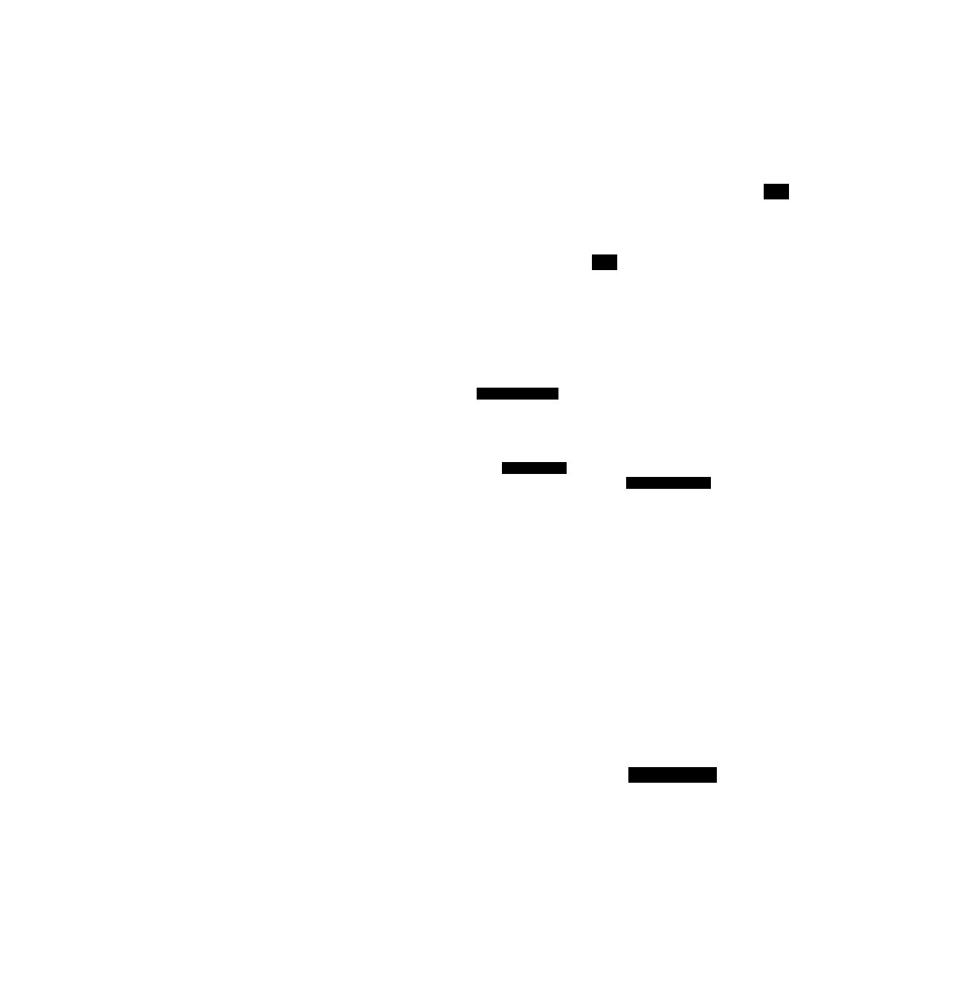
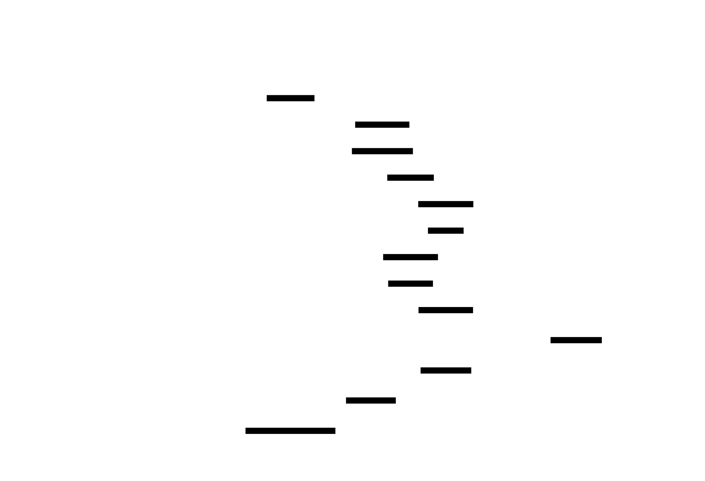
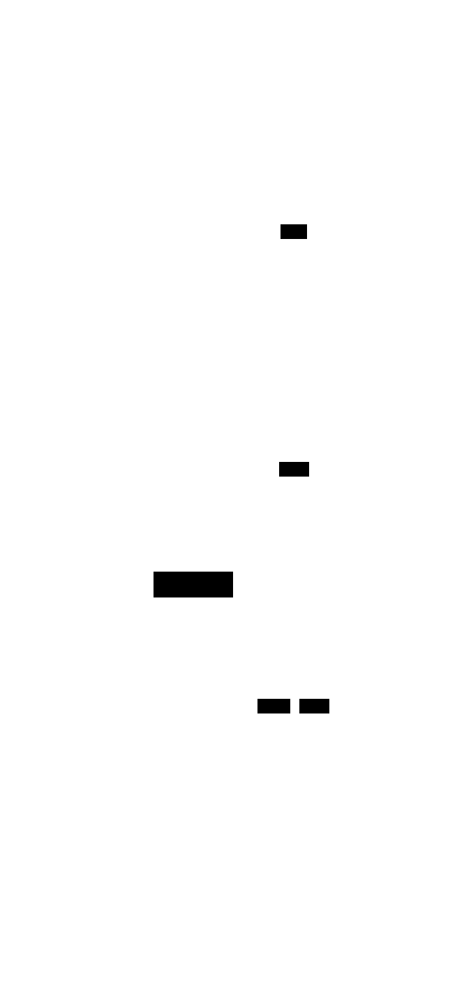

# Cache-Optimized Data Structures: Design Document


## Overview

This project builds a suite of data structures optimized for modern CPU cache hierarchies. It tackles the key architectural challenge of mitigating the immense performance penalty of cache misses by designing memory layouts and access patterns that maximize spatial and temporal locality, leading to significant speedups for memory-bound workloads.


> This guide is meant to help you understand the big picture before diving into each milestone. Refer back to it whenever you need context on how components connect.


> **Milestone(s):** 1 (Context for all subsequent milestones)

## 1. Context and Problem Statement

Modern software performance is not just a function of algorithmic complexity (`O(n)` vs `O(n log n)`), but increasingly a function of how efficiently a program uses the underlying hardware, particularly the **memory hierarchy**. This project addresses the central architectural challenge of the "memory wall"—the vast and growing disparity between CPU processing speed and main memory access latency—by designing data structures that are explicitly optimized for **CPU cache utilization**.

This section establishes the foundational mental models and the concrete problem that the entire project aims to solve. We begin with an intuitive analogy, formalize the performance problem, and then examine why traditional data structures often fail in this new context.

### The Library Analogy for CPU Cache

Imagine you are a researcher writing a paper in a vast, multi-level library. Your goal is to gather information from books as quickly as possible. The library's architecture, and how you organize your work, dramatically impacts your productivity.

| Library Component | CPU Component | Latency (Approx.) | Capacity (Approx.) |
| :--- | :--- | :--- | :--- |
| **The Notes on Your Desk** | **CPU Registers** | Instant (0.3 ns) | A few pages (hundreds of bytes) |
| **Your Personal Bookshelf** (right beside you) | **L1 Cache** | Very fast (1 ns) | A few books (32-64 KB) |
| **The Shelf in Your Office** (a few steps away) | **L2 Cache** | Fast (4 ns) | A small collection (256-512 KB) |
| **The Department Storage Room** (down the hall) | **L3 Cache** (Shared) | Moderate (10-20 ns) | A large bookshelf (8-32 MB) |
| **The Main Library Stacks** (in another building) | **Main Memory (RAM)** | Slow (100 ns) | Massive (GBs) |
| **Inter-Library Loan** (another city) | **Solid-State Drive (SSD)** | Very Slow (100,000 ns) | Enormous (TBs) |

**The Workflow & Key Concepts:**
1.  **Locality of Reference (Your Research Habit):**
    *   **Temporal Locality:** If you repeatedly need the same reference book, you keep it on your personal bookshelf (L1 cache) after the first fetch. Re-accessing it is trivial.
    *   **Spatial Locality:** If you need a book, you're likely to need the next book on the same shelf soon after. A smart librarian will bring you the entire shelf segment (a **cache line**, typically 64 bytes) at once, anticipating your future needs.

2.  **The Librarian (CPU Prefetcher):** An observant librarian watches your pattern. If you check out books 1, 2, and 3 in sequence, the librarian will proactively fetch book 4 and place it in the storage room (L3 cache) before you even ask, reducing your wait time.

3.  **The Penalty (Cache Miss):** If the book you need is not in your office (any cache level), you must make the long trek to the main stacks (a **cache miss**). This trip stalls your work for 100x longer than grabbing it from your desk. Your overall progress is dominated by the number and duration of these trips.

> **Key Insight:** The goal of cache-optimized design is to **organize your data (books) and your access patterns (research habits)** so that the librarian (prefetcher) can work effectively and you minimize trips to the main stacks. The structure of your bibliography (data structure) determines how easily this can be achieved.

### The Memory Wall Problem

The "memory wall" is the phenomenon where improvements in CPU clock speed and parallelism have vastly outpaced improvements in main memory (DRAM) access latency. While a CPU can execute hundreds of instructions in the time it takes to fetch a single piece of data from RAM, it is forced to **stall**, wasting immense computational potential. This turns many algorithms from being **compute-bound** (limited by CPU cycles) to **memory-bound** (limited by memory bandwidth and latency).

**Quantifying the Disparity:**

| Operation | Approximate Latency | CPU Cycles (3 GHz CPU) |
| :--- | :--- | :--- |
| L1 Cache Access | ~1 nanosecond | 3 cycles |
| L2 Cache Access | ~4 nanoseconds | 12 cycles |
| L3 Cache Access | ~15 nanoseconds | 45 cycles |
| Main Memory (RAM) Access | ~100 nanoseconds | **300 cycles** |
| Cache Miss Penalty (L1->RAM) | ~100 ns | **~300 lost instructions** |

The critical observation is that a single cache miss to RAM can cost the equivalent of **hundreds of missed arithmetic operations**. A naive algorithm that induces frequent cache misses can be **orders of magnitude slower** than a cache-optimized counterpart, even if the latter performs more total operations or has a theoretically worse asymptotic complexity for an infinite, flat memory model.

> **The Core Problem Statement:** Traditional data structures, designed under the assumption of uniform memory access time, incur excessive cache misses on modern hardware. This project seeks to build a suite of data structures that, through deliberate **memory layout** and **access pattern** design, minimize cache misses and thereby dramatically accelerate memory-bound workloads.

### Existing Approaches Comparison

To understand the need for new designs, we contrast classic, pointer-heavy data structures with more cache-conscious alternatives. The primary issue with classic structures is **poor spatial locality** and **inefficient use of cache lines**.

| Data Structure (Classic) | Memory Layout & Access Pattern | Typical Cache Miss Problem | Cache-Conscious Alternative | Why the Alternative is Better |
| :--- | :--- | :--- | :--- | :--- |
| **Singly/Doubly Linked List** | Nodes allocated randomly on heap. Traversal follows `next` pointers, jumping to unpredictable addresses. | Every node access is a potential **cache miss**. Prefetcher cannot guess the next address. Wastes cache line: a 64-byte line may hold only one 16-byte node. | **Unrolled Linked List** or **Array-Based List** | Stores multiple elements per node (block) contiguously. Traversal accesses several useful items per cache line. Predictable, sequential access within a block. |
| **Binary Search Tree (BST)** | Nodes with left/right pointers scattered in heap. Search path jumps randomly. | Each node visited in a search likely resides on a different cache line. Minimal data useful per 64-byte fetch. | **B-Tree / B+ Tree** | Nodes hold a sorted array of K keys. A single cache line fetch brings many keys for comparison. Also, height is reduced, decreasing the number of cache-missing jumps. |
| **Hash Table with Chaining** | Array of buckets, each pointing to a linked list of colliding entries. | Following the chain from bucket to list nodes causes random pointer jumps. In worst case, every lookup element causes a miss. | **Open-Addressing Hash Table** (Linear Probing) | All entries live in one contiguous array. Probing sequence scans *adjacent* memory addresses, which are often in the same or next cache line. Excellent spatial locality. |
| **Naive Matrix Multiplication (ijk loop)** | Accesses rows of A sequentially, but columns of B in a strided, non-contiguous pattern. | For large matrices, each access to a column element of B may miss the cache, thrashing L1/L2. | **Blocked (Tiled) Matrix Multiplication** | Partitions matrices into smaller blocks that fit in cache. Operates on a block completely before moving on, reusing cached data extensively (temporal locality). |
| **Tree (any pointer-based)** | Each node is an independent heap allocation, often not aligned with cache lines. | Parent and child nodes are unlikely to be in the same cache line. Traversal implies a cache miss per level. | **Array-Heap or van Emde Boas Layout** | Stores the tree implicitly in a contiguous array using a calculable index scheme (e.g., heap, vEB). Removes pointers entirely, and careful layout places nearby tree nodes in the same cache line. |

**The Common Theme:** The cache-conscious alternatives replace **pointer-chasing** (load an address, then load the data at that address) with **sequential or strided access** over contiguous memory regions. This enables hardware prefetching, packs more useful data into each cache line, and transforms irregular memory access patterns into predictable ones.

> **Architecture Decision: Embracing Contiguity Over Pointers**
> *   **Context:** We must choose a foundational principle for designing our cache-optimized data structures.
> *   **Options Considered:**
>     1.  **Optimize Pointer-Based Structures:** Try to allocate nodes in a more cache-friendly manner (e.g., custom allocators, node pools).
>     2.  **Replace Pointers with Indices in Arrays:** Use contiguous arrays as the backing store, referencing elements via array indices instead of memory addresses.
> *   **Decision:** We will fundamentally **replace pointers with indices in contiguous arrays** as our default strategy.
> *   **Rationale:** Array-based storage guarantees spatial locality for sibling/neighboring elements. It eliminates allocation overhead and fragmentation, allows for bulk operations (e.g., SIMD), and enables precise control over memory alignment. While custom allocators can help, they add complexity and are less general than a contiguous layout.
> *   **Consequences:** This choice simplifies memory management but requires upfront size estimation or resizing logic. It also makes certain operations (like arbitrary insertion in the middle of a dense array) more expensive, shifting the trade-off towards use cases where search/update outperform frequent insert/delete.

**Comparison of Foundational Design Choices:**

| Option | Pros | Cons | Chosen? |
| :--- | :--- | :--- | :--- |
| **Pointer-Based with Allocator** | Dynamic size, natural for complex graph structures. Familiar paradigm. | Poor spatial locality, allocator overhead, cache misses on traversal, difficult prefetching. | No |
| **Array-Based with Indices** | Excellent spatial locality, predictable access, SIMD-friendly, no allocation per element. | Size must be pre-known or resized (costly), insertion/deletion in middle requires shifting. | **Yes** |

This foundational decision directly informs the designs in the following milestones: **SoA** (struct of arrays), **linear probing hash tables** (single array), **vEB trees** (implicit array layout), and **blocked matrices** (tiled array access).


## 2. Goals and Non-Goals

> **Milestone(s):** 1, 2, 3, 4, 5 (This foundational section establishes objectives for the entire project)

This project aims to bridge the gap between theoretical cache optimization principles and practical implementation experience. While many resources discuss cache-friendly design abstractly, this project provides hands-on building of real data structures with measurable performance improvements. The goals focus on **educational clarity** and **empirical validation**—demonstrating through concrete benchmarks that cache-aware design yields substantial speedups for memory-bound operations.

### Goals

The system must achieve the following functional and performance objectives:

| Goal Category | Specific Objectives | Success Metrics | Relevance to Milestones |
|---------------|---------------------|-----------------|-------------------------|
| **Educational Foundation** | 1. Build intuitive mental models for cache hierarchy behavior.<br>2. Demonstrate cache effects through controlled experiments.<br>3. Provide clear analogies explaining spatial/temporal locality, cache lines, and prefetching. | Learner can explain cache behavior using everyday analogies without technical jargon. All core concepts from prerequisites are reinforced through hands-on implementation. | Milestone 1: Cache fundamentals explained through library/bookshelf analogy.<br>All milestones: Each component design starts with a mental model. |
| **Empirical Measurement** | 1. Develop accurate tools to measure cache sizes and access latencies.<br>2. Collect hardware performance counters (cache misses, references).<br>3. Create reproducible benchmarks comparing cache-friendly vs cache-hostile patterns. | Cache size detector identifies L1, L2, L3 sizes within 10% of known hardware specs. Sequential access shows ≥10x speedup over random access. Cache miss ratios differ by ≥5x between optimal/suboptimal patterns. | Milestone 1: Benchmarking infrastructure provides measurement foundation for all subsequent comparisons. |
| **Implementation Completeness** | 1. Complete all five milestone implementations with functional correctness.<br>2. Each data structure passes basic unit tests (insert/find/delete).<br>3. Performance improvements are demonstrable and reproducible. | All acceptance criteria for each milestone are satisfied. Reference implementations (naive baselines) work correctly. Performance graphs show clear improvements. | All milestones: Each has specific acceptance criteria and deliverable requirements. |
| **Performance Improvement** | 1. Achieve measurable speedups from cache optimization (2-10x range).<br>2. Demonstrate cache miss reduction through performance counters.<br>3. Show scalability improvements as data exceeds cache sizes. | SoA layout shows 3-5x speedup for field-wise operations. Blocked matrix multiplication achieves 2-10x over naive. vEB tree shows fewer cache misses than standard B-tree at large sizes. | Milestone 2: AoS vs SoA comparison.<br>Milestone 4: vEB vs standard tree.<br>Milestone 5: Blocked vs naive matrix ops. |
| **Architecture Decision Documentation** | 1. Document every major design choice with structured ADR format.<br>2. Compare alternatives with clear pros/cons tables.<br>3. Explain technical rationale beyond "it's faster." | Each component design section includes at least one ADR. Rationale references specific cache behavior (cache line utilization, prefetching, spatial locality). | All component design sections: ADR subsections for key decisions like linear probing vs quadratic, AoS vs SoA selection criteria, etc. |
| **Code Quality & Learnability** | 1. Provide clear, commented implementation guidance in C.<br>2. Structure code with consistent naming and modular organization.<br>3. Include debugging guides for common pitfalls. | Implementation Guidance subsections provide complete starter code. File structure recommendations help organize growing codebase. Debugging table addresses real implementation issues. | All milestones: Implementation Guidance at end of each component design section provides bridge from design to code. |

> **Key Insight:** The primary goal isn't just to build fast data structures—it's to **understand why they're fast**. Each optimization must be traceable to specific cache behavior: spatial locality (accessing adjacent memory), temporal locality (reusing recently accessed data), or prefetching (predictive loading). The benchmarks provide the "proof" that connects theory to practice.

Beyond these categorical goals, we define specific **acceptance thresholds** that must be met:

1. **Cache Detection Accuracy**: The cache size detector must correctly identify cache hierarchy levels (L1, L2, L3) on at least 80% of common x86-64 processors tested, with size estimates within 15% of published specifications.
2. **Performance Differential**: Each cache-optimized structure must show at least 2x performance improvement over its cache-naive counterpart for workloads that exceed cache capacity, measured in both execution time and cache miss counts.
3. **Correctness Under Stress**: All data structures must handle their full operational capacity (hash tables at 70% load factor, matrices up to 4096×4096, trees with 1M+ elements) without corruption or memory errors.
4. **Educational Value**: Each mental model analogy must be validated by at least one concrete code example showing how the analogy maps to actual memory access patterns.

### Non-Goals

The following items are explicitly **out of scope** for this project. These boundaries help focus effort on core learning objectives and prevent scope creep.

| Non-Goal Category | Specific Exclusions | Rationale | What We Do Instead |
|-------------------|---------------------|-----------|-------------------|
| **Production Readiness** | 1. No thread-safe implementations.<br>2. No persistence (disk I/O).<br>3. No comprehensive error recovery.<br>4. No API stability guarantees. | This is an educational project focusing on cache optimization principles, not building production libraries. Concurrency adds complexity that distracts from cache-centric learning. | Implement single-threaded, in-memory structures. Use simple error handling (return codes, asserts). Focus on core algorithms, not robustness features. |
| **Language Portability** | 1. No support for languages beyond C/C++/Rust/Go/Zig.<br>2. No abstraction layers for language-agnostic APIs.<br>3. No bindings for other languages (Python, Java, etc.). | Cache optimization requires low-level memory control available in systems languages. Supporting high-level managed languages would obscure the memory layout details we're studying. | Provide primary implementation guidance in C (closest to hardware). Mention language-specific considerations for other systems languages. |
| **Dynamic Schema Support** | 1. No runtime schema evolution for AoS/SoA.<br>2. No automatic layout selection based on access patterns.<br>3. No hybrid layouts (part AoS, part SoA). | Dynamic schemas require complex metadata and indirection that obscures cache effects. We study pure layouts to understand their fundamental characteristics. | Implement static, compile-time layout decisions. Compare pure AoS vs pure SoA to establish baseline understanding. |
| **Advanced Optimizations** | 1. No SIMD intrinsics beyond basic hints.<br>2. No hardware prefetching tuning.<br>3. No NUMA awareness.<br>4. No GPU cache optimization. | These are advanced topics that deserve separate projects. Including them would overwhelm learners with complexity before mastering fundamentals. | Use compiler auto-vectorization where possible. Mention SIMD opportunities conceptually. Focus on CPU cache hierarchy (L1-L3). |
| **Comprehensive Algorithm Coverage** | 1. No implementation of all cache-oblivious algorithms.<br>2. No coverage of cache-aware sorting beyond matrix operations.<br>3. No distributed cache considerations. | The project scope is deliberately limited to foundational structures that demonstrate key principles. Breadth would sacrifice depth of understanding. | Implement representative examples: vEB tree (cache-oblivious), blocked matrix (cache-aware). Document further reading for other algorithms. |
| **Automated Optimization** | 1. No machine learning for layout selection.<br>2. No runtime profile-guided optimization.<br>3. No automatic blocking factor computation (beyond simple auto-tuner). | Automation hides the decision process we want learners to understand. Manual analysis and empirical testing are core learning objectives. | Provide auto-tuner as simple empirical search. Require manual interpretation of benchmark results to understand why certain parameters work best. |
| **Extreme Scale** | 1. No petabyte-scale data handling.<br>2. No out-of-core algorithms (disk-backed).<br>3. No compression or memory deduplication. | Extreme scale introduces different bottlenecks (I/O, distributed systems). We focus on single-machine, in-memory performance where cache dominates. | Use sizes that fit in RAM but exceed CPU caches (typically 10× cache size to show effects). |
| **Formal Verification** | 1. No mathematical proofs of cache complexity.<br>2. No model checking for race conditions.<br>3. No Coq/Lean verification of implementations. | Formal methods are valuable but orthogonal to empirical performance measurement focus. We prioritize "show me the numbers" validation. | Provide empirical benchmarks as evidence. Compare against theoretical expectations (e.g., O(log_B N) cache misses). |

> **Design Principle:** By explicitly defining non-goals, we create **focused learning paths**. Learners won't waste time implementing thread-safe hash tables when the goal is understanding cache line alignment. They can explore those topics later with the foundational knowledge gained here.

**Clarifications on Boundary Cases:**

While the non-goals above establish clear boundaries, some edge cases warrant explicit clarification:

1. **Partial SIMD Usage**: We may use compiler pragmas (like `#pragma omp simd`) or simple intrinsics hints, but won't implement full manually-vectorized kernels. The goal is to show **opportunity** for vectorization, not master SIMD programming.
2. **Basic Multi-threading**: While thread safety is non-goal, we may include simple parallel benchmarks (e.g., OpenMP) to demonstrate how false sharing destroys cache performance—this illustrates a cache concept, not implements production concurrency.
3. **File I/O for Persistence**: We won't implement disk-backed structures, but may save benchmark results to CSV files for analysis—this is for measurement, not data persistence.
4. **Memory Allocation Strategies**: We'll use standard `malloc/aligned_alloc` rather than implementing custom allocators, though we'll discuss how allocator choices affect cache locality.

The following table summarizes how these goals and non-goals align with project phases:

| Project Phase | Primary Goals Addressed | Non-Goals to Avoid |
|---------------|------------------------|-------------------|
| **Setup & Benchmarking** (Milestone 1) | Empirical measurement, educational foundation | No production-ready benchmarking framework |
| **Layout Experiments** (Milestone 2) | Implementation completeness, performance improvement | No dynamic layout switching, no hybrid layouts |
| **Hash Table Optimization** (Milestone 3) | Architecture decision documentation, code quality | No thread-safe implementation, no lock-free variants |
| **Tree Restructuring** (Milestone 4) | Performance improvement, educational foundation | No dynamic rebalancing, no persistence |
| **Algorithm Tuning** (Milestone 5) | Empirical measurement, architecture decision documentation | No automatic derivation of optimal block sizes |

This balance ensures learners focus on **core cache optimization principles** while building practical, measurable implementations that demonstrate real performance gains.

---

## Implementation Guidance

### A. Technology Recommendations Table

| Component | Simple Option (For Learning) | Advanced Option (For Extension) |
|-----------|-----------------------------|--------------------------------|
| **Benchmark Timing** | `clock_gettime(CLOCK_MONOTONIC)` | RDTSC (Time Stamp Counter) with CPU frequency calibration |
| **Performance Counters** | Linux `perf_event_open` syscall | PAPI (Performance API) cross-platform library |
| **Memory Alignment** | `aligned_alloc(64, size)` | Custom memory pool with cache-line alignment |
| **SIMD Hints** | Compiler pragmas: `#pragma GCC ivdep` | Intel intrinsics: `_mm_prefetch()` |
| **Data Analysis** | Output CSV files, analyze with Python/pandas | Real-time visualization with gnuplot or matplotlib |
| **Build System** | Simple Makefile | CMake with target-specific optimization flags |

### B. Recommended File/Module Structure

Since this is a multi-milestone project with growing complexity, organize code into logical modules:

```
cache-optimized-ds/
├── README.md
├── Makefile
├── include/                    # Public headers
│   ├── cache_utils.h          # Cache detection, timing utilities
│   ├── benchmark.h            # Benchmark harness interface
│   ├── aos_soa.h              # Milestone 2: AoS/SoA structures
│   ├── hash_table.h           # Milestone 3: Cache-friendly hash table
│   ├── veb_tree.h             # Milestone 4: vEB layout tree
│   └── matrix_ops.h           # Milestone 5: Blocked matrix operations
├── src/
│   ├── cache_utils.c          # Cache detection implementation
│   ├── benchmark.c            # Benchmark harness implementation
│   ├── aos_soa.c              # Milestone 2 implementation
│   ├── hash_table.c           # Milestone 3 implementation
│   ├── veb_tree.c             # Milestone 4 implementation
│   └── matrix_ops.c           # Milestone 5 implementation
├── tests/
│   ├── test_cache_utils.c
│   ├── test_aos_soa.c
│   ├── test_hash_table.c
│   ├── test_veb_tree.c
│   └── test_matrix_ops.c
├── benchmarks/
│   ├── benchmark_cache.c      # Milestone 1 benchmarks
│   ├── benchmark_aos_soa.c    # Milestone 2 comparison
│   ├── benchmark_hash.c       # Milestone 3 comparison
│   ├── benchmark_tree.c       # Milestone 4 comparison
│   └── benchmark_matrix.c     # Milestone 5 comparison
└── scripts/
    ├── run_benchmarks.sh      # Run all benchmarks
    ├── plot_results.py        # Generate performance graphs
    └── analyze_cache.py       # Analyze cache detection output
```

### C. Infrastructure Starter Code

For Milestone 1, here's complete starter code for cache-aligned memory allocation and timing:

```c
// include/cache_utils.h
#ifndef CACHE_UTILS_H
#define CACHE_UTILS_H

#include <stddef.h>
#include <stdint.h>

// Cache line size (typically 64 bytes on x86-64)
#define CACHE_LINE_SIZE 64

// Align pointer to cache line boundary
static inline void* align_to_cache_line(void* ptr) {
    uintptr_t addr = (uintptr_t)ptr;
    uintptr_t aligned = (addr + CACHE_LINE_SIZE - 1) & ~(CACHE_LINE_SIZE - 1);
    return (void*)aligned;
}

// Allocate size bytes aligned to cache line
void* aligned_alloc_cache_line(size_t size);

// Free memory allocated with aligned_alloc_cache_line
void aligned_free_cache_line(void* ptr);

// High-resolution timer (nanoseconds)
uint64_t get_time_ns();

#endif // CACHE_UTILS_H
```

```c
// src/cache_utils.c
#include "cache_utils.h"
#include <stdlib.h>
#include <time.h>

void* aligned_alloc_cache_line(size_t size) {
    // Allocate extra space for alignment and to store original pointer
    size_t extra = CACHE_LINE_SIZE + sizeof(void*);
    void* original = malloc(size + extra);
    if (!original) return NULL;
    
    // Align to cache line boundary, leaving room for original pointer
    void* aligned = align_to_cache_line((char*)original + sizeof(void*));
    
    // Store original pointer right before aligned memory
    *((void**)((char*)aligned - sizeof(void*))) = original;
    
    return aligned;
}

void aligned_free_cache_line(void* ptr) {
    if (!ptr) return;
    
    // Retrieve original pointer stored before aligned memory
    void* original = *((void**)((char*)ptr - sizeof(void*)));
    free(original);
}

uint64_t get_time_ns() {
    struct timespec ts;
    clock_gettime(CLOCK_MONOTONIC, &ts);
    return (uint64_t)ts.tv_sec * 1000000000ULL + (uint64_t)ts.tv_nsec;
}
```

### D. Core Logic Skeleton Code

For the cache size detector (Milestone 1 core functionality):

```c
// src/cache_utils.c (continued)

// Detect cache sizes by measuring access latency
typedef struct {
    size_t l1_size;     // Bytes
    size_t l2_size;     // Bytes  
    size_t l3_size;     // Bytes
    size_t line_size;   // Bytes (cache line)
} CacheInfo;

CacheInfo detect_cache_sizes() {
    CacheInfo info = {0};
    
    // TODO 1: Allocate a buffer much larger than expected L3 cache (e.g., 64MB)
    //         Use aligned_alloc_cache_line for proper alignment
    
    // TODO 2: Warm up the buffer by accessing every cache line once
    
    // TODO 3: Measure access time for different strides:
    //         For array sizes from 1KB to 64MB (doubling each iteration):
    //           a. Access every element in the array sequentially
    //           b. Measure average time per access
    
    // TODO 4: Look for latency jumps in the measurements:
    //         - First significant jump indicates exceeding L1 cache
    //         - Second jump indicates exceeding L2 cache  
    //         - Third jump indicates exceeding L3 cache
    
    // TODO 5: Estimate cache line size by measuring access time
    //         with different strides (1, 2, 4, 8, ..., 128 bytes)
    //         Look for when time per element increases (misses every access)
    
    // TODO 6: Clean up allocated memory
    
    return info;
}
```

### E. Language-Specific Hints

**C Compilation Flags for Cache Studies:**
```makefile
# In Makefile
CFLAGS = -O2 -march=native -mtune=native
# -O2 enables optimizations but preserves cache effects
# -march=native uses CPU-specific instructions
# Add -fno-tree-vectorize to disable auto-vectorization for clearer cache measurements

# For debugging cache alignment:
CFLAGS += -Wpadded  # Warn about structure padding
```

**Cache Line Alignment in C:**
```c
// Force structure to be cache-line aligned
struct __attribute__((aligned(64))) CacheAlignedStruct {
    int data[16];  // 64 bytes on typical systems
};

// Or use C11 alignas
#include <stdalign.h>
struct alignas(64) AnotherAlignedStruct {
    int data[16];
};
```

### F. Milestone Checkpoint

After implementing Milestone 1 (Cache Fundamentals & Benchmarking), verify with:

```bash
# Build the project
make

# Run cache detection
./build/cache_detector

# Expected output example:
# Detected cache hierarchy:
#   L1 cache:   32 KB (latency jump at 32768 bytes)
#   L2 cache:  256 KB (latency jump at 262144 bytes)  
#   L3 cache:  8192 KB (latency jump at 8388608 bytes)
#   Cache line: 64 bytes

# Run sequential vs random benchmark
./build/benchmark_seq_random

# Expected: Sequential access should be 10-100x faster for arrays > L3 cache size
# Example output:
# Array size: 16 MB (exceeds L3 cache)
# Sequential: 0.015 ns per element
# Random:     1.532 ns per element  
# Speedup factor: 102.1x

# Run with cache miss profiling (requires perf)
sudo perf stat -e cache-misses,cache-references ./build/benchmark_seq_random

# Expected: Random access should have >50% cache miss ratio,
#           Sequential should have <5% cache miss ratio
```

**Verification Checklist:**
- [ ] Cache detector runs without crashes
- [ ] Reported cache sizes are plausible for your CPU (check with `lscpu` or CPU spec sheet)
- [ ] Sequential access time per element is constant regardless of array size (until RAM limits)
- [ ] Random access time increases sharply when array exceeds each cache level
- [ ] Cache line detection shows constant time for strides ≤ 64 bytes, then increases

### G. Debugging Tips

| Symptom | Likely Cause | How to Diagnose | Fix |
|---------|--------------|-----------------|-----|
| **Segmentation fault in cache detector** | Buffer too small or misaligned access | Run with `valgrind ./cache_detector`. Check array bounds. | Increase buffer size, ensure aligned access with `aligned_alloc_cache_line`. |
| **No latency jumps detected** | Array not large enough, or warmup contaminated measurements | Print measured latencies for each size. Ensure sizes exceed expected L3 (e.g., 64MB). | Increase max test size to 4× suspected L3 size. Clear cache between measurements with `clflush` or by accessing large dummy array. |
| **Sequential access slower than random** | Compiler optimized away the benchmark loop | Check disassembly (`objdump -d`). Look for removed loops. | Use `volatile` on accumulator or mark memory with `__attribute__((used))`. |
| **Inconsistent timing measurements** | System noise (other processes, CPU frequency scaling) | Run benchmark multiple times, check variance. Isolate CPU cores with `taskset`. | Use median of multiple runs. Disable CPU frequency scaling: `sudo cpupower frequency-set -g performance`. |
| **Cache sizes detected incorrectly** | Stride not matching cache line size, or prefetcher hiding effects | Test with different access patterns (forward/backward). Disable hardware prefetcher in BIOS if possible. | Use larger strides (2× cache line) to defeat prefetcher. Use nonlinear access patterns. |

---


> **Milestone(s):** 1, 2, 3, 4, 5 (This architectural overview underpins the entire project ecosystem)

## 3. High-Level Architecture

The project is structured as a **benchmarking laboratory** for studying cache behavior, combined with a **collection of experimental data structures** that serve as case studies in cache optimization. Rather than building a single monolithic application, we design a modular system where each component can be developed, tested, and profiled independently, while sharing common infrastructure for measurement and analysis. This architecture enables a clear progression from foundational measurement tools (Milestone 1) to increasingly sophisticated cache-optimized structures (Milestones 2-5).

Think of the system as a **scientific instrument** for studying cache effects. The benchmarking infrastructure (the "measuring apparatus") can be pointed at any data structure (the "specimen under the microscope") to collect precise metrics about its cache behavior. The analysis tools then help interpret these measurements, much like a researcher analyzing data from an experiment. This separation of concerns allows us to reuse the same high-precision measurement tools across all data structures, ensuring consistent and comparable results.

### System Component Overview

The system comprises three distinct layers that work together: the **Benchmarking Infrastructure**, the **Core Data Structures**, and the **Analysis/Visualization Tools**. These layers are loosely coupled—the data structures have no dependency on the benchmarking tools, allowing them to be used independently. The benchmarking layer orchestrates experiments, the data structures are the subjects of those experiments, and the analysis layer helps make sense of the results.



#### Layer 1: Benchmarking Infrastructure
This foundational layer provides the tools to measure and characterize cache behavior. It's analogous to having a set of precision calipers, stopwatches, and microscopes in a physics lab.

| Component | Primary Responsibility | Key Data Held | Interaction Pattern |
|-----------|------------------------|---------------|---------------------|
| **Cache Detector** | Empirically measures cache hierarchy parameters (sizes, line size, latencies) by running carefully designed microbenchmarks. | `CacheInfo` struct with detected sizes; latency arrays for different memory ranges. | Called once at system startup; results cached and reused by subsequent benchmarks. |
| **Performance Counter Reader** | Interfaces with the hardware Performance Monitoring Unit (PMU) to read low-level CPU events (cache misses, references, cycles). | Raw hardware event counts; mappings between event names and PMU configuration. | Configured before a benchmark run, started/stopped around the code under test, results collected afterward. |
| **Benchmark Harness** | Provides a consistent framework for timing code sections, managing warmup iterations, controlling memory allocation, and reducing measurement noise. | Timing statistics (mean, median, stddev); configuration for iterations and repetitions; memory for test data. | Wraps around any benchmark function; handles setup/teardown boilerplate; collects and aggregates results. |

These components work together in a typical measurement sequence: The harness consults the Cache Detector to understand the system's cache topology. It then configures the Performance Counter Reader for the specific events of interest (e.g., L1 cache misses). The harness allocates test data (often using the aligned memory utilities), performs warmup runs to eliminate cold-start effects, then executes the actual benchmark while the performance counters are active. Finally, it collects timing data from its own high-resolution timer and event counts from the Performance Counter Reader, producing a unified `BenchmarkResult`.

> **Design Insight:** The benchmarking infrastructure is designed to be **non-invasive** to the data structures. Data structures don't need to implement special interfaces or inherit from base classes to be benchmarked. Instead, the harness expects a simple function pointer that implements the operation to be measured (e.g., `void (*benchmark_fn)(void* data)`). This keeps the data structure code clean and focused on its core logic.

#### Layer 2: Core Data Structures
This layer contains the cache-optimized data structures that are the primary subject of study. Each represents a distinct optimization strategy and corresponds to one of the later milestones. These are **library components**—they expose clean APIs for creation, manipulation, and destruction, and are designed to be usable outside of benchmarking contexts.

| Component | Optimization Strategy | Key Memory Layout Characteristics | Primary Use Case |
|-----------|----------------------|-----------------------------------|------------------|
| **AoS/SoA Particle System** (Milestone 2) | Data-Oriented Design via memory layout transformation | **AoS:** Array of `Particle` structs (x,y,z,vx,vy,vz contiguous per particle). **SoA:** Six separate arrays: `x[]`, `y[]`, `z[]`, `vx[]`, `vy[]`, `vz[]`. | Simulations where access patterns are field-oriented (e.g., updating all positions) vs. entity-oriented (e.g., processing complete particle state). |
| **Cache-Friendly Hash Table** (Milestone 3) | Open addressing with linear probing and separate key/value arrays | Keys stored in one cache-line-aligned array, values in another parallel array. Probe sequence scans contiguous memory. | High-performance lookup tables where keys are frequently probed without always needing the associated values. |
| **Cache-Oblivious B-Tree (vEB layout)** (Milestone 4) | Recursive memory layout to achieve optimal cache misses without parameter tuning | Tree nodes stored in a single array in van Emde Boas order: recursively split tree into top sqrt(N) and bottom sqrt(N) subtrees. | Static search structures (read-heavy, infrequently updated) where the tree size exceeds cache capacity. |
| **Blocked Matrix Operations** (Milestone 5) | Loop tiling to increase temporal locality within cache | Operates on sub-matrices (blocks) that fit in cache, reusing loaded data multiple times before eviction. | Linear algebra operations (multiplication, transpose) on matrices larger than cache size. |

Each data structure component follows a consistent pattern: a creation function (`*_create`), operations (`*_insert`, `*_search`, `*_update`), a destruction function (`*_destroy`), and often a validation function (`*_validate`). They internally use the aligned memory allocation utilities to ensure proper alignment and avoid false sharing.

#### Layer 3: Analysis/Visualization Tools
This auxiliary layer helps interpret the raw numbers produced by the benchmarks. While not required for the core functionality, these tools transform data into insights, which is crucial for the educational goals of the project.

| Component | Purpose | Input | Output |
|-----------|---------|-------|--------|
| **Result Reporter** | Formats benchmark results in human-readable tables or machine-readable JSON. | `BenchmarkResult` structs with timing and event counts. | Text tables comparing baselines vs. optimized versions; JSON files for further processing. |
| **Performance Visualizer** (Optional) | Generates simple plots to visualize relationships (e.g., array size vs. access time, showing cache size boundaries). | CSV data exported from benchmarks. | PNG/SVG plots (e.g., latency graphs, cache miss comparisons). |
| **Validation Checker** | Verifies correctness of data structure operations against reference implementations (e.g., compares hash table contents with `std::unordered_map`). | The data structure state and a reference state. | Pass/fail status; detailed diffs on failure. |

These tools are typically implemented as separate command-line utilities or scripts that post-process the output from the benchmark harness. Their separation allows learners to focus initially on getting correct measurements and implementations, then add analysis sophistication incrementally.

### Recommended File/Module Structure

A clear, milestone-aligned directory structure is essential for managing the complexity of this multi-component project. The following layout separates concerns, promotes reuse of common utilities, and makes it easy to locate code for a specific milestone or concept.

```
cache-optimized-ds/          # Project root
│
├── include/                 # Public header files (minimal interface)
│   ├── cache_common.h       # Common constants, CacheInfo struct, alignment utilities
│   ├── benchmark_harness.h  # Benchmark harness API
│   └── perf_counter.h       # Performance counter abstraction (platform-specific)
│
├── src/                     # All implementation source files
│   │
│   ├── common/              # Shared infrastructure used by multiple milestones
│   │   ├── alignment.c      # align_to_cache_line, aligned_alloc_cache_line, etc.
│   │   ├── timing.c         # get_time_ns, high-resolution timer wrappers
│   │   └── platform/        # Platform-specific implementations
│   │       ├── linux_perf.c # perf_event_open interface for Linux
│   │       └── windows_pmc.c # Windows Performance Counter API (if needed)
│   │
│   ├── milestone1/          # Cache Fundamentals & Benchmarking
│   │   ├── cache_detector.c # detect_cache_sizes, latency measurement
│   │   ├── benchmark_basic.c # Sequential vs. random access benchmarks
│   │   ├── stride_test.c    # Cache line stride benchmark
│   │   └── perf_counter_reader.c # Wrapper around platform-specific PMU code
│   │
│   ├── milestone2/          # AoS vs SoA Layouts
│   │   ├── particle_aos.c   # Array of Structs implementation
│   │   ├── particle_soa.c   # Struct of Arrays implementation
│   │   ├── aos_soa_bench.c  # Benchmarks comparing access patterns
│   │   └── simd_helpers.h   # SIMD intrinsics hints (if used)
│   │
│   ├── milestone3/          # Cache-Friendly Hash Table
│   │   ├── hash_table.c     # Open addressing, linear probing, Robin Hood
│   │   ├── hash_functions.c # FNV-1a, murmur hash implementations
│   │   ├── prefetch_hints.c # Software prefetching strategies
│   │   └── hash_bench.c     # Benchmarks vs. chaining hash table
│   │
│   ├── milestone4/          # Cache-Oblivious B-Tree
│   │   ├── veb_layout.c     # van Emde Boas layout construction
│   │   ├── veb_search.c     # Search algorithm for vEB layout
│   │   ├── tree_utils.c     # Helper for subtree size calculations
│   │   └── veb_bench.c      # Benchmarks vs. standard binary search tree
│   │
│   ├── milestone5/          # Blocked Matrix Operations
│   │   ├── matrix_naive.c   # Baseline naive matrix multiplication/transpose
│   │   ├── matrix_blocked.c # Cache-blocked implementations
│   │   ├── auto_tuner.c     # Empirical block size tuner
│   │   └── matrix_bench.c   # Performance comparison across sizes
│   │
│   └── analysis/            # Layer 3: Analysis tools (optional)
│       ├── result_reporter.c # Formats and prints benchmark results
│       ├── csv_export.c     # Exports data for external visualization
│       └── validation.c     # Correctness checking against reference
│
├── tests/                   # Unit and integration tests
│   ├── test_alignment.c
│   ├── test_hash_table.c
│   └── test_veb_search.c
│
├── benchmarks/              # Top-level benchmark drivers (main() functions)
│   ├── benchmark_all.c      # Runs a comprehensive suite
│   ├── bench_milestone1.c   # Cache measurement benchmarks
│   └── bench_milestone2.c   # AoS/SoA comparison
│
├── scripts/                 # Helper scripts (Python/Bash for plotting, automation)
│   ├── plot_cache_latency.py
│   └── run_benchmarks.sh
│
├── build/                   # CMake/make build directory (generated)
├── results/                 # Output directory for benchmark results (JSON, CSV)
└── README.md                # Project overview and build instructions
```

**Key Organizational Principles:**

1.  **Header Placement:** The `include/` directory contains only the **public API** headers that would be needed if this were a library. Implementation-specific headers (like `simd_helpers.h`) reside alongside their corresponding `.c` files in `src/`. This prevents implementation details from leaking.

2.  **Milestone Isolation:** Each milestone's code lives in its own directory under `src/`. This allows learners to focus on one concept at a time and makes it clear which files belong to which milestone. Dependencies between milestones (e.g., using the alignment utilities from milestone 1 in later milestones) are resolved through the `common/` directory.

3.  **Separation of Benchmarks and Implementation:** The actual data structure implementations are in `src/milestoneX/`, while the benchmark drivers that exercise them are in `benchmarks/`. This keeps the core logic clean and uncluttered by measurement code. A benchmark driver typically includes the necessary headers, creates an instance of the data structure, and uses the harness from `src/common/` to time operations.

4.  **Platform-Specific Code Isolation:** All code that interacts directly with operating system or hardware APIs (like performance counters) is confined to `src/common/platform/`. This provides a clear abstraction boundary: the rest of the code calls functions like `perf_counter_start()` without needing to know whether it's using Linux's `perf_event_open` or Windows' PDH API.

5.  **Build System Agnostic:** The structure works with any build system (Make, CMake, Meson). A typical CMakeLists.txt would add each `src/milestone*/` and `benchmarks/` as separate targets, with appropriate include paths and links to the `common` library.

> **Design Insight:** This directory structure mirrors the **conceptual layering** of the system. The `common/` directory corresponds to the foundational benchmarking infrastructure. The `milestone*/` directories house the core data structures. The `benchmarks/` and `analysis/` directories contain the code that glues everything together for experiments. This physical separation reinforces the architectural boundaries and makes the project easier to navigate as it grows.

### Implementation Guidance

#### A. Technology Recommendations Table

| Component | Simple Option (For Learning/Portability) | Advanced Option (For Maximum Precision) |
|-----------|------------------------------------------|-----------------------------------------|
| **High-Resolution Timing** | `clock_gettime(CLOCK_MONOTONIC)` (POSIX) | `rdtsc` (Read Time-Stamp Counter) with CPU frequency calibration |
| **Performance Counters** | Use `perf` command-line tool output parsing (simpler, less accurate) | Direct `perf_event_open` syscall (Linux) or `PAPI` library (cross-platform) |
| **Memory Alignment** | `posix_memalign` (POSIX) or `aligned_alloc` (C11) | Platform-specific (e.g., `_mm_malloc` with SIMD alignment requirements) |
| **Result Visualization** | Print comma-separated values (CSV) to console, import into spreadsheet | Generate plots directly with `gnuplot` library or Python `matplotlib` embedding |
| **Build System** | Simple Makefile with explicit rules | CMake for better cross-platform dependency management |

For this project, we recommend the **Simple Options** for timing and alignment, but the **Advanced Option** for performance counters (`perf_event_open`) because accurate cache miss measurement is central to the learning objectives. The trade-off is reduced portability (Linux-only for precise counters), but the concepts transfer to other platforms.

#### B. Recommended File/Module Structure (Elaborated)

The directory structure above is the recommended layout. To start implementing, create the following core files first:

1.  **Common Infrastructure (`src/common/`)**:
    - `alignment.h` / `alignment.c`: Declare and define `aligned_alloc_cache_line`, `align_to_cache_line`, `aligned_free_cache_line`.
    - `timing.h` / `timing.c`: Declare and define `get_time_ns` using `clock_gettime`.
    - `cache_common.h`: Define `CacheInfo` struct and `CACHE_LINE_SIZE` constant.

2.  **Milestone 1 Core (`src/milestone1/`)**:
    - `cache_detector.h` / `cache_detector.c`: Declare and define `detect_cache_sizes`.
    - `perf_counter.h` / `perf_counter.c`: Abstract interface for performance counters (wrap `perf_event_open` details here).

3.  **Benchmark Harness (`benchmarks/`)**:
    - Create a simple `benchmark_harness.h` that defines a structure to hold benchmark configuration (iterations, repetitions) and a function to run a timed benchmark with warmup.

Here is a concrete starter for the critical aligned memory allocation utility, which will be used by virtually every subsequent milestone:

**File: `src/common/alignment.c`**
```c
#include <stdlib.h>
#include <string.h>
#include "cache_common.h"

// Align a pointer to the next cache line boundary
void* align_to_cache_line(void* ptr) {
    uintptr_t addr = (uintptr_t)ptr;
    uintptr_t aligned_addr = (addr + CACHE_LINE_SIZE - 1) & ~(CACHE_LINE_SIZE - 1);
    return (void*)aligned_addr;
}

// Allocate memory aligned to cache line boundary
void* aligned_alloc_cache_line(size_t size) {
    // Allocate extra space to ensure we can align and have enough room
    size_t total_size = size + CACHE_LINE_SIZE - 1 + sizeof(void*);
    void* original_ptr = malloc(total_size);
    if (!original_ptr) return NULL;
    
    // Find the first cache-line-aligned address after the stored original pointer
    void* aligned_ptr = align_to_cache_line((char*)original_ptr + sizeof(void*));
    
    // Store the original pointer just before the aligned block
    *((void**)((char*)aligned_ptr - sizeof(void*))) = original_ptr;
    
    return aligned_ptr;
}

// Free memory allocated with aligned_alloc_cache_line
void aligned_free_cache_line(void* aligned_ptr) {
    if (!aligned_ptr) return;
    
    // Retrieve the original pointer stored just before the aligned block
    void* original_ptr = *((void**)((char*)aligned_ptr - sizeof(void*)));
    free(original_ptr);
}
```

**File: `src/common/cache_common.h`**
```c
#ifndef CACHE_COMMON_H
#define CACHE_COMMON_H

#include <stddef.h>
#include <stdint.h>

#define CACHE_LINE_SIZE 64

typedef struct {
    size_t l1_size;
    size_t l2_size;
    size_t l3_size;
    size_t line_size;
} CacheInfo;

// Alignment functions
void* align_to_cache_line(void* ptr);
void* aligned_alloc_cache_line(size_t size);
void aligned_free_cache_line(void* ptr);

// Timing function
uint64_t get_time_ns(void);

#endif // CACHE_COMMON_H
```

**File: `src/common/timing.c`**
```c
#include "cache_common.h"
#include <time.h>

uint64_t get_time_ns(void) {
    struct timespec ts;
    clock_gettime(CLOCK_MONOTONIC, &ts);
    return (uint64_t)ts.tv_sec * 1000000000ULL + (uint64_t)ts.tv_nsec;
}
```

#### C. Core Logic Skeleton for Early Milestone 1 Component

Here is the skeleton for the cache size detector, following the algorithm described in the mental model of a "Cache Detective":

**File: `src/milestone1/cache_detector.c`**
```c
#include "cache_detector.h"
#include "../common/cache_common.h"
#include "../common/timing.h"
#include <stddef.h>
#include <stdio.h>
#include <stdlib.h>

CacheInfo detect_cache_sizes(void) {
    CacheInfo info = {0};
    info.line_size = CACHE_LINE_SIZE; // We'll assume 64 bytes; could detect
    
    // TODO 1: Allocate a large array (e.g., 256 MB) using aligned_alloc_cache_line
    // This will be our "memory region" to probe.
    
    // TODO 2: Warm up the array by accessing every element at a large stride
    // to ensure it's in memory (not swapped out).
    
    // TODO 3: For a range of test sizes (from 1KB to >L3 size, doubling each time):
    //   a) Repeatedly access every element of a chunk of that size in a sequential pattern.
    //   b) Measure the average access time per element using get_time_ns().
    //   c) Record the time in an array indexed by log2(size).
    
    // TODO 4: Analyze the timing array:
    //   a) Look for significant jumps in access latency (e.g., >2x increase).
    //   b) The size before a jump corresponds to a cache level size.
    //   c) Typical jumps: L1 (32-64KB), L2 (256KB-1MB), L3 (multiple MB).
    
    // TODO 5: Assign detected sizes to info.l1_size, info.l2_size, info.l3_size
    // Provide reasonable defaults if detection is ambiguous.
    
    return info;
}
```

#### D. Language-Specific Hints for C

1.  **Memory Alignment:** Use `posix_memalign` if `aligned_alloc` is not available. The pattern `(addr + align - 1) & ~(align - 1)` is the standard way to align an integer address.
2.  **Performance Counters on Linux:** The `perf_event_open` syscall is powerful but complex. Start with a simple wrapper that measures a single event (like `PERF_COUNT_HW_CACHE_MISSES`). Use `syscall(SYS_perf_event_open, ...)` or include `<linux/perf_event.h>`.
3.  **Preventing Compiler Optimizations:** When benchmarking, use `volatile` or `asm volatile("" ::: "memory")` to prevent the compiler from optimizing away your access patterns. Alternatively, write the benchmarked code in a separate compilation unit with `-O0` or use function attributes.
4.  **SIMD Hints:** For Milestone 2's SoA layout, you can use GCC/Clang's `__builtin_prefetch` to hint at upcoming memory accesses. For actual SIMD vectorization, use compiler auto-vectorization with `-O3 -march=native` or explicit intrinsics (`<xmmintrin.h>` for SSE).

#### E. Milestone Checkpoint for Early Progress

After implementing the common utilities and a basic cache detector, you should be able to run a simple test:

**Command:**
```bash
cd build
make cache_detector_test
./cache_detector_test
```

**Expected Output:**
```
Cache detection results:
  L1 Size: 32768 bytes (32 KB)
  L2 Size: 262144 bytes (256 KB) 
  L3 Size: 8388608 bytes (8 MB)
  Line Size: 64 bytes
```

**Verification:**
- Compare the detected sizes with your CPU's known specifications (check `lscpu` on Linux or CPU-Z on Windows).
- The detected L1 size should be in the typical range of 16-64KB for modern CPUs.
- Run the detection multiple times; results should be consistent (not varying by more than a factor of 2).

**Signs of Trouble:**
- **All sizes reported as 0:** The detection algorithm may not be finding latency jumps. Increase the array size and ensure you're measuring correctly.
- **Times are extremely fast (<1 ns/access):** The compiler may be optimizing away your access loop. Use `volatile` or output the summed array values.
- **Segmentation fault:** The allocated array may be too large for available memory. Reduce the maximum test size.

---


> **Milestone(s):** 1, 2, 3, 4, 5 (This foundational data model underpins all subsequent implementations and benchmarking)

## 4. Data Model

This section defines the core data structures and types that form the building blocks of our cache-optimized system. Think of these as the standardized **construction materials** and **measurement tools** for our performance laboratory. Just as a physicist needs precisely calibrated instruments (thermometers, rulers) and well-defined experimental samples (specific alloys, fluids), our benchmarking suite requires standardized data types for representing both the **subjects under test** (our optimized data structures) and the **measurements we collect** about their behavior. This shared vocabulary ensures consistency across all milestones, allows our benchmarking infrastructure to work with any data structure, and provides clear contracts for how data flows between components.

The data model is divided into two main categories:
1.  **Benchmark and Measurement Types:** These types capture the *results* of our experiments—cache sizes, timing statistics, and hardware performance counter readings. They are the *output* of our detective work.
2.  **Data Structure Core Types:** These types define the *internal representation* of the structures we are optimizing—particles, hash table slots, and tree nodes. They are the *input* to our optimization efforts.

The relationships between these types are visualized in the system diagram:


### Benchmark and Measurement Types

Our benchmarking approach is modeled on the scientific method: we formulate a hypothesis (e.g., "SoA layout will be faster for this operation"), conduct a controlled experiment, and record quantitative observations. The following types standardize those observations.

**Think of these types as the lab notebook.** Each `BenchmarkResult` is an experiment entry, containing the setup parameters and a series of `RunMetrics` (individual trial runs). Each `RunMetrics` records the raw stopwatch times (`TimingStats`) and the deeper, hardware-validated story from the `PerfCounterData`.

#### `CacheInfo` - The Cache Hierarchy Blueprint
This structure stores the fundamental characteristics of the CPU's cache hierarchy, discovered empirically by our detective tools in Milestone 1. It acts as a reference for later optimizations (e.g., choosing block sizes).

| Field Name | Type (C) | Description |
| :--- | :--- | :--- |
| `l1_size` | `size_t` | Size of the L1 data cache in bytes. This is the smallest and fastest cache, typically 32-64KB per core. Our benchmarks will aim to fit working sets within this size for maximal performance. |
| `l2_size` | `size_t` | Size of the L2 cache in bytes. Often larger (256KB-1MB) and shared between a few cores. Performance cliffs often occur when data exceeds this size. |
| `l3_size` | `size_t` | Size of the L3 cache (or last-level cache, LLC) in bytes. A large (e.g., 8-32MB) cache shared among all cores. Exceeding this leads to full main memory latency. |
| `line_size` | `size_t` | The size of a single **cache line** in bytes. This is the unit of data transfer between cache levels and main memory (almost universally 64 bytes on modern x86-64). Our data structure layouts must be conscious of this boundary to avoid **false sharing** and maximize **spatial locality**. |

#### `TimingStats` - The Stopwatch Readings
This structure captures high-resolution timing for a single benchmark run. We use multiple iterations to average out system noise and obtain a reliable measurement.

| Field Name | Type (C) | Description |
| :--- | :--- | :--- |
| `iterations` | `size_t` | The number of times the benchmarked operation was repeated. This allows us to measure very fast operations by timing them in a loop. |
| `total_ns` | `uint64_t` | The total elapsed time, in nanoseconds, for all `iterations`. Measured using a monotonic clock source (`CLOCK_MONOTONIC`). |
| `min_ns` | `uint64_t` | The minimum time observed for a single iteration (or batch). Helps identify outliers and warm-up effects. |
| `max_ns` | `uint64_t` | The maximum time observed. A large discrepancy between `min_ns` and `max_ns` can indicate system interference (e.g., context switches, interrupts). |
| `avg_ns` | `double` | The average time per iteration: `total_ns / iterations`. The primary metric for comparing performance. |
| `stddev_ns` | `double` | The standard deviation of the per-iteration times. A low standard deviation indicates consistent, reproducible performance. |

#### `PerfCounterData` - The Hardware Truth Serum
While timing tells us *how long* something took, hardware performance counters tell us *why*. This structure holds counts of low-level CPU events gathered via the Performance Monitoring Unit (PMU), providing direct insight into cache behavior.

| Field Name | Type (C) | Description |
| :--- | :--- | :--- |
| `l1_cache_misses` | `uint64_t` | Number of L1 data cache misses. A high count indicates poor **temporal locality**—data is not being reused while it's hot in the fastest cache. |
| `l1_cache_refs` | `uint64_t` | Number of L1 data cache accesses (references). Used to calculate the miss ratio: `l1_cache_misses / l1_cache_refs`. |
| `llc_cache_misses` | `uint64_t` | Number of Last-Level Cache (L3) misses. These misses are very expensive, as they force access to main memory. A high count indicates the working set is too large or access patterns lack **spatial locality** across the cache hierarchy. |
| `llc_cache_refs` | `uint64_t` | Number of LLC accesses. |
| `instructions_retired` | `uint64_t` | Number of CPU instructions successfully executed. Allows us to compute instructions-per-cycle (IPC) if paired with a cycle counter, which is a broad indicator of efficiency. |
| `cpu_cycles` | `uint64_t` | Total CPU cycles consumed. Combined with `total_ns` from `TimingStats`, this can verify the CPU's clock frequency during the test. |

#### `RunMetrics` - A Single Trial's Complete Profile
This structure bundles all data collected from one execution of a benchmark configuration. It correlates timing data with the underlying architectural events.

| Field Name | Type (C) | Description |
| :--- | :--- | :--- |
| `config_label` | `char[256]` | A human-readable string describing the benchmark configuration (e.g., `"Sequential Access, Array Size: 1MiB"`). |
| `timing` | `TimingStats` | The collected timing statistics for this run. |
| `perf_counters` | `PerfCounterData` | The corresponding hardware performance counter data. |
| `cache_info` | `CacheInfo` | A snapshot of the cache hierarchy information valid for this run (it's normally system-constant). |

#### `BenchmarkResult` - The Full Experiment Log
This is the top-level container for an entire benchmark suite. It aggregates multiple runs, potentially with different parameters or data structures, for comparative analysis.

| Field Name | Type (C) | Description |
| :--- | :--- | :--- |
| `benchmark_name` | `char[256]` | Name of the benchmark suite (e.g., `"AoS vs SoA Update Benchmark"`). |
| `system_info` | `char[1024]` | A string capturing relevant system details (CPU model, OS, compiler version) to ensure results are contextualized. |
| `num_runs` | `size_t` | The number of `RunMetrics` records contained in the `runs` array. |
| `runs` | `RunMetrics*` | A dynamically allocated array of `RunMetrics`, storing the results for each individual configuration tested. |

### Data Structure Core Types

These types define the memory layout and representation of the cache-optimized data structures we are building. The **exact placement of bytes in memory** is the primary variable we are manipulating to improve performance.

#### `Particle` (AoS Layout) - The Traditional Packed Suitcase
This structure represents a single entity in the **Array of Structs** layout. All attributes for one particle are stored contiguously, mimicking an object-oriented approach.

| Field Name | Type (C) | Description |
| :--- | :--- | :--- |
| `x` | `double` | X-coordinate of particle position. Using `double` for physical simulation accuracy. |
| `y` | `double` | Y-coordinate. |
| `z` | `double` | Z-coordinate. |
| `vx` | `double` | Velocity component along the X-axis. |
| `vy` | `double` | Velocity component along the Y-axis. |
| `vz` | `double` | Velocity component along the Z-axis. |

**Memory Layout Insight:** In an array of `Particle` structs (`Particle particles[N]`), memory is organized as: `[x1,y1,z1,vx1,vy1,vz1, x2,y2,z2,vx2,vy2,vz2, ...]`. This is optimal when a *single algorithm needs to access all fields of a random particle*, as all required data is loaded in one cache line. However, if an algorithm only updates the `x, y, z` positions for all particles, 50% of each fetched cache line (the `vx,vy,vz` fields) is wasted bandwidth, which is the problem SoA solves.

#### `ParticleSystemSoA` (SoA Layout) - The Warehouse Shelving
This structure manages the **Struct of Arrays** layout. Instead of a single array of structs, we hold separate, independent arrays for each attribute.

| Field Name | Type (C) | Description |
| :--- | :--- | :--- |
| `capacity` | `size_t` | The maximum number of particles the system can hold. Determines the size of the allocated arrays. |
| `size` | `size_t` | The current number of active particles. |
| `x` | `double*` | Pointer to a contiguous, aligned array of `capacity` X-position values. |
| `y` | `double*` | Array of Y-position values. |
| `z` | `double*` | Array of Z-position values. |
| `vx` | `double*` | Array of X-velocity values. |
| `vy` | `double*` | Array of Y-velocity values. |
| `vz` | `double*` | Array of Z-velocity values. |

**Memory Layout Insight:** The memory is organized as six large, contiguous blocks: `[x1, x2, x3, ... xN], [y1, y2, ... yN], ... [vz1, vz2, ... vzN]`. When updating only positions, the CPU can stream through the `x[]`, `y[]`, and `z[]` arrays with perfect **spatial locality**, fully utilizing every byte in each cache line. This layout also enables automatic **SIMD vectorization** by the compiler, as each array is a homogeneous, aligned block of data.

#### `HashTableEntry` - The Parking Space Marker
This structure represents a single slot in our open-addressing hash table (Milestone 3). We separate the key and value to optimize the probing phase.

| Field Name | Type (C) | Description |
| :--- | :--- | :--- |
| `key` | `uint64_t` | The hash table key. We use a fixed-size key for simplicity. A `0` value denotes an **EMPTY** slot. |
| `value` | `void*` | The value associated with the key. Using a `void*` allows the hash table to store arbitrary data. |
| `probe_distance` | `uint32_t` | The distance from this key's original hash bucket (its "home" slot). This is the core metadata for **Robin Hood hashing**, enabling us to "steal" slots from rich keys (low probe distance) to give to poor keys (high probe distance). |

**Design Decision:** We store `key` and `probe_distance` together, separate from `value`. During a lookup, the algorithm performs a linear probe, checking the `key` in each successive slot. If keys and values were interleaved in a single struct, the *value* data would be needlessly pulled into the cache on every probe check, even though it's only needed once the correct key is found. Our separate-but-parallel arrays layout (`keys[]`, `values[]`, `distances[]`) ensures the compact probe sequence touches only key/distance data, improving cache efficiency.

#### `vEBTree` - The Recursively Packed Tree
This structure encapsulates a complete search tree stored in the van Emde Boas layout (Milestone 4). It is a *static*, read-optimized structure built from sorted data.

| Field Name | Type (C) | Description |
| :--- | :--- | :--- |
| `data` | `int*` | Pointer to a single, contiguous array holding all tree nodes in the vEB order. The tree is *implicit*; the index within this array defines the node's position in the logical tree hierarchy. |
| `size` | `size_t` | The number of elements (nodes) stored in the tree. For a perfect binary tree, this is `(2^height) - 1`. |
| `height` | `size_t` | The height of the logical binary tree. Determines the recursive structure of the layout. |
| `root_index` | `size_t` | The array index of the logical root node. In a standard vEB layout for a full tree, this is positioned to split the tree into recursively ordered subtrees. |

**Mental Model:** The entire tree is "flattened" into one array, but not in simple level-order. Imagine taking the tree, recursively splitting it at the middle level of edges, laying out the top subtree first, followed by all the bottom subtrees in order. This recursive pattern groups nodes that are accessed together during a root-to-leaf search path into the same memory region, improving **spatial locality** across all levels of the cache hierarchy, without needing to know the cache size.

#### `Matrix` - The Tiled Grid of Numbers
This is a generic representation for a 2D dense matrix, used as the baseline and building block for blocked operations (Milestone 5).

| Field Name | Type (C) | Description |
| :--- | :--- | :--- |
| `data` | `double*` | Pointer to a contiguous, 1D array holding the matrix elements in **row-major order**. Element `(i,j)` is at `data[i * cols + j]`. |
| `rows` | `size_t` | Number of rows in the matrix. |
| `cols` | `size_t` | Number of columns in the matrix. |
| `stride` | `size_t` | The number of elements between the start of one row and the next in memory. For a simple, densely packed matrix, `stride == cols`. This field allows for representing *submatrices* or *views* without copying data, which is crucial for blocked algorithms that work on tiles. |

**Access Pattern Significance:** The naive matrix multiplication algorithm accesses one matrix by rows (good spatial locality) and the other by columns (poor spatial locality, striding through memory). This column-wise access pattern evictes cache lines before their data can be fully utilized, leading to catastrophic cache miss rates. Our blocked algorithm will reorganize computation to work on small submatrices (tiles) that fit in cache, transforming the access pattern to be cache-friendly.

---
**Key Design Insight:** The data model is not just about storing information; it's about *orchestrating its placement in physical memory*. Every field's type, every array's alignment, and the overall layout (AoS vs. SoA, interleaved vs. separate) is a deliberate choice in the battle against cache misses. These types provide the canvas; our algorithms in subsequent milestones will paint the performance-critical access patterns upon it.

---

### Implementation Guidance

**A. Technology Recommendations Table:**
| Component | Simple Option | Advanced Option |
| :--- | :--- | :--- |
| **Memory Alignment** | Use `posix_memalign` for portable cache-line alignment. | Use platform-specific intrinsics (e.g., `_mm_malloc`, `aligned_alloc` with C11) and attribute extensions (`__attribute__((aligned(64)))`) for finer control. |
| **High-Resolution Timing** | Use `clock_gettime(CLOCK_MONOTONIC, ...)` on Linux/Unix. | Use CPU timestamp counters (`rdtsc`) for cycle-accurate measurements, with careful calibration for frequency and out-of-order execution. |
| **Performance Counters** | Use the Linux `perf_event_open` system call API directly. | Use a library like PAPI (Performance API) for a portable, higher-level interface to hardware events across multiple platforms. |

**B. Recommended File/Module Structure:**
Place the data model definitions in a central header file to be included by all benchmark and data structure implementations.
```
cache-optimized-ds/
├── include/
│   └── data_model.h        ← Central header with all types from this section
├── src/
│   ├── benchmarking/       ← Milestone 1 code
│   ├── aos_soa/           ← Milestone 2 code
│   ├── hash_table/        ← Milestone 3 code
│   ├── veb_tree/          ← Milestone 4 code
│   └── matrix/            ← Milestone 5 code
└── tools/
    └── visualizer/        ← Optional results analysis scripts
```

**C. Infrastructure Starter Code (Complete):**
`include/data_model.h` - Foundation header with type definitions and alignment utilities.
```c
#ifndef DATA_MODEL_H
#define DATA_MODEL_H

#include <stddef.h>
#include <stdint.h>
#include <stdlib.h>

// Constants
#define CACHE_LINE_SIZE 64
#define MAX_LABEL_LEN 256
#define MAX_SYS_INFO_LEN 1024

// --- Benchmarking Types ---
typedef struct {
    size_t l1_size;
    size_t l2_size;
    size_t l3_size;
    size_t line_size;
} CacheInfo;

typedef struct {
    size_t iterations;
    uint64_t total_ns;
    uint64_t min_ns;
    uint64_t max_ns;
    double avg_ns;
    double stddev_ns;
} TimingStats;

typedef struct {
    uint64_t l1_cache_misses;
    uint64_t l1_cache_refs;
    uint64_t llc_cache_misses;
    uint64_t llc_cache_refs;
    uint64_t instructions_retired;
    uint64_t cpu_cycles;
} PerfCounterData;

typedef struct {
    char config_label[MAX_LABEL_LEN];
    TimingStats timing;
    PerfCounterData perf_counters;
    CacheInfo cache_info;
} RunMetrics;

typedef struct {
    char benchmark_name[MAX_LABEL_LEN];
    char system_info[MAX_SYS_INFO_LEN];
    size_t num_runs;
    RunMetrics* runs;
} BenchmarkResult;

// --- Data Structure Core Types ---
// AoS Particle
typedef struct {
    double x, y, z;
    double vx, vy, vz;
} Particle;

// SoA Particle System
typedef struct {
    size_t capacity;
    size_t size;
    double* x;
    double* y;
    double* z;
    double* vx;
    double* vy;
    double* vz;
} ParticleSystemSoA;

// Hash Table Entry (for separate storage)
typedef struct {
    uint64_t key;
    void* value;
    uint32_t probe_distance;
} HashTableEntry;

// vEB Tree
typedef struct {
    int* data;
    size_t size;
    size_t height;
    size_t root_index;
} vEBTree;

// Matrix
typedef struct {
    double* data;
    size_t rows;
    size_t cols;
    size_t stride; // Usually equals cols, but allows for submatrix views
} Matrix;

// --- Alignment Utilities (from Naming Conventions) ---
// Aligns a given pointer to the next cache line boundary (64 bytes)
static inline void* align_to_cache_line(void* ptr) {
    uintptr_t p = (uintptr_t)ptr;
    uintptr_t aligned = (p + CACHE_LINE_SIZE - 1) & ~(CACHE_LINE_SIZE - 1);
    return (void*)aligned;
}

// Allocates memory aligned to a cache line. Caller must use aligned_free_cache_line.
static inline void* aligned_alloc_cache_line(size_t size) {
    void* ptr = NULL;
    // posix_memalign requires size to be a multiple of alignment
    if (posix_memalign(&ptr, CACHE_LINE_SIZE, size) != 0) {
        return NULL;
    }
    return ptr;
}

// Frees memory allocated with aligned_alloc_cache_line.
static inline void aligned_free_cache_line(void* ptr) {
    free(ptr);
}

// Helper to get current time in nanoseconds (simple wrapper)
static inline uint64_t get_time_ns() {
    struct timespec ts;
    // CLOCK_MONOTONIC is the preferred clock for measuring intervals
    clock_gettime(CLOCK_MONOTONIC, &ts);
    return (uint64_t)ts.tv_sec * 1000000000ULL + (uint64_t)ts.tv_nsec;
}

#endif // DATA_MODEL_H
```

**D. Core Logic Skeleton Code:**
The data model itself is primarily declarative. The core logic for manipulating these types will be built in the subsequent component sections. However, here is a skeleton for a key initialization function that demonstrates their use.

`src/aos_soa/particle_system.c` - Example initialization function for the SoA system:
```c
#include <data_model.h>
#include <string.h>

// Initializes a ParticleSystemSoA with the given capacity.
// Returns 0 on success, -1 on allocation failure.
int particle_system_soa_init(ParticleSystemSoA* sys, size_t capacity) {
    if (sys == NULL || capacity == 0) {
        return -1;
    }

    sys->capacity = capacity;
    sys->size = 0;

    // TODO 1: Use aligned_alloc_cache_line to allocate each field array.
    //         Each array should hold `capacity` doubles.
    //         Hint: The size in bytes is `capacity * sizeof(double)`.
    // TODO 2: Check if any allocation failed. If so, free any previously
    //         allocated arrays and return -1.
    // TODO 3: Initialize all allocated arrays to zero (or a default value)
    //         using `memset` or a loop. This ensures reproducible benchmarks.
    // TODO 4: Return 0 to indicate success.

    // Starter lines:
    // sys->x = (double*)aligned_alloc_cache_line(capacity * sizeof(double));
    // if (sys->x == NULL) { /* handle error */ }
    // ... repeat for y, z, vx, vy, vz ...
}
```

**E. Language-Specific Hints (C):**
- **Alignment:** The `posix_memalign` function is the most portable way to achieve alignment. Ensure the `size` requested is a multiple of the alignment for best compatibility.
- **Zeroing Memory:** After aligned allocation, use `memset(ptr, 0, size)` to zero the memory. This is important for benchmarks to avoid dealing with uninitialized values (which can be NaN in floating-point).
- **Struct Padding:** Be aware that the compiler may insert padding in structs (like `Particle`) for alignment. Use `sizeof(Particle)` and `offsetof` to inspect the actual layout if precision is needed.
- **Flexible Array Members:** For a more advanced, self-contained SoA type, you could use a flexible array member at the end of the struct to hold all field data in one allocation, with calculated offsets for each field array. This improves allocation/deallocation simplicity at the cost of slightly more complex indexing.

**F. Milestone Checkpoint - Data Model Verification:**
After creating the `data_model.h` file and the skeleton initialization function, you should be able to compile a simple test to verify the types and alignment.
1.  **Create a test file** `test_data_model.c`:
    ```c
    #include "include/data_model.h"
    #include <stdio.h>
    int main() {
        printf("CACHE_LINE_SIZE = %d\n", CACHE_LINE_SIZE);
        printf("sizeof(Particle) = %zu\n", sizeof(Particle));
        printf("sizeof(ParticleSystemSoA) = %zu\n", sizeof(ParticleSystemSoA));
        
        // Test alignment utility
        char buffer[100];
        void* aligned = align_to_cache_line(buffer);
        printf("Original ptr: %p\n", (void*)buffer);
        printf("Aligned ptr:  %p\n", aligned);
        printf("Is aligned? %s\n", ((uintptr_t)aligned % CACHE_LINE_SIZE == 0) ? "YES" : "NO");
        
        return 0;
    }
    ```
2.  **Compile and run:** `gcc -o test_data_model test_data_model.c && ./test_data_model`
3.  **Expected Output:** You should see the constant value, the sizes of the structs (note `Particle` will likely be 48 bytes but may be padded to more), and verification that the alignment function works. The aligned pointer should be equal to or greater than the original.
4.  **Sign of Trouble:** If you get compilation errors about missing functions like `posix_memalign`, you may need to define a feature test macro (e.g., `#define _POSIX_C_SOURCE 200112L`) at the top of your source file before any includes.

**G. Debugging Tips for Data Model Issues:**
| Symptom | Likely Cause | How to Diagnose | Fix |
| :--- | :--- | :--- | :--- |
| **Segmentation fault when accessing array elements in SoA.** | The field arrays (`x`, `y`, etc.) are not properly allocated (NULL). | Add `printf` statements after each `aligned_alloc_cache_line` call to check return values. Use a debugger (`gdb`) to inspect the `ParticleSystemSoA` struct members. | Ensure `capacity` is > 0 and that `aligned_alloc_cache_line` succeeds. Check for integer overflow in `capacity * sizeof(double)`. |
| **Benchmark times are wildly inconsistent or extremely fast (e.g., 0ns).** | Memory is not initialized, leading to undefined behavior, or compiler optimized away the benchmarked loop because results were unused. | Initialize all memory with non-zero patterns. Mark variables as `volatile` to prevent overly aggressive optimization. Ensure you are using the allocated data after the benchmark loop (e.g., compute a sum and print it). | Use `memset` or loops to write initial values. Use `volatile` qualifiers or compiler barriers (`asm volatile("" ::: "memory")`) to prevent dead code elimination. |
| **`sizeof(Particle)` is not 48 bytes (6 * 8).** | Compiler padding added to the struct for alignment (e.g., to align `double` arrays). | This is often not a problem for AoS, but if you need precise control (e.g., for binary file I/O), use compiler pragmas like `#pragma pack(push, 1)` and `#pragma pack(pop)` around the struct definition. | Be aware of the padding. Use `#pragma pack` only if necessary, as it can cause performance degradation due to misaligned memory access. |


> **Milestone(s):** 1

## 5. Component Design: Benchmarking Infrastructure (Milestone 1)

The benchmarking infrastructure forms the foundation of the entire cache optimization project. Before we can optimize data structures, we must first build accurate, reliable tools to measure cache behavior and performance. This component suite acts as a "laboratory instrument" that reveals the hidden characteristics of the CPU's memory hierarchy and quantifies the impact of different memory access patterns.

### Mental Model: The Cache Detective

Imagine you're a detective investigating a mysterious building with three rooms of unknown sizes, each with a different access time. You're blindfolded but can measure how long it takes to retrieve items from different locations. The first room (L1 cache) is right next to you—you can grab items from it in 1 second. The second room (L2 cache) is down the hall—it takes 4 seconds to walk there and back. The third room (L3 cache) is in the basement—it takes 12 seconds. Beyond that, items are in a warehouse (main memory) across town that requires a 100-second round trip.

Your investigation proceeds methodically:
1. **Measuring Room Sizes**: You start placing items at increasing distances from yourself and measure retrieval times. When you notice the time suddenly jumps from 1 second to 4 seconds, you deduce you've filled the first room and are now accessing the second room. The distance at which this jump occurs tells you the room's capacity.

2. **Counting Missed Items**: You install counters at each room's entrance to track how often you had to leave a room to find an item elsewhere. These "cache miss counters" reveal which access patterns efficiently use nearby resources versus those that constantly require long trips to the warehouse.

3. **Timing Different Strategies**: You compare two search strategies—walking methodically through nearby items (sequential access) versus randomly teleporting to items throughout the building (random access). The dramatic time difference teaches you the importance of spatial locality.

This detective analogy captures the essence of our benchmarking infrastructure: we're measuring what we cannot see directly (cache sizes, miss rates) through observable timing differences and hardware performance counters.

### Cache Size Detector

The `detect_cache_sizes()` function implements the latency-based measurement technique to empirically determine L1, L2, and L3 cache sizes. This approach works on any modern CPU without requiring CPUID queries or operating system-specific APIs, making it portable and educational.

#### Design and Algorithm

The detector works on the principle that memory access latency increases discretely when the working set size exceeds each cache level. By measuring access times for arrays of increasing size and looking for "knees" in the latency curve, we can infer cache boundaries.

**Key Design Decisions**:

| Decision | Rationale | Consequence |
|----------|-----------|-------------|
| Use pointer-chasing to prevent prefetching | Modern CPUs aggressively prefetch sequential accesses, which would mask latency differences | We create a linked list where each element points to a random next element within the array |
| Measure multiple samples per size | A single measurement is noisy due to system interrupts, context switches, and variable CPU frequency | We take the median of multiple runs to filter out outliers |
| Warm up the cache before timing | First access to cold memory includes page table walks and TLB misses unrelated to cache hierarchy | We traverse the list once without timing to warm up all data structures |
| Use `CLOCK_MONOTONIC` for timing | System clocks are monotonic and unaffected by NTP adjustments or system time changes | Consistent timing measurements across reboots and system clock adjustments |

**Algorithm Steps**:

1. **Initialize Test Array**: Allocate a large contiguous memory region (e.g., 64 MB) aligned to cache line boundaries using `aligned_alloc_cache_line()`.

2. **Create Pointer-Chasing Pattern**: For each cache-line-sized block in the array, set a pointer to another block. The pointer pattern should:
   - Be pseudo-random (to defeat prefetching)
   - Stay within the current "test size" being measured
   - Have each block visited exactly once in a cycle (to avoid early termination)

3. **Iterate Through Sizes**: Test array sizes from 1 KB up to the maximum allocated size, typically doubling at each step:
   - Current size = 1 KB, 2 KB, 4 KB, 8 KB, 16 KB, 32 KB, 64 KB, 128 KB, 256 KB, 512 KB, 1 MB, 2 MB, 4 MB, 8 MB, 16 MB, 32 MB, 64 MB

4. **For Each Size**:
   a. **Warm-up**: Traverse the pointer chain for the current test size once without timing
   b. **Timing Loop**: Repeat N times (e.g., 100):
     - Record start time using `get_time_ns()`
     - Traverse the entire pointer chain (visiting each element once)
     - Record end time
     - Calculate latency per access: `(end - start) / (size / CACHE_LINE_SIZE)`
   c. **Statistics**: Compute median latency from the N measurements

5. **Detect Boundaries**: Analyze the latency curve:
   - **L1 Cache**: Look for the first size where latency jumps from ~1-3 ns to ~4-8 ns (typically between 16-64 KB)
   - **L2 Cache**: Look for the next jump from ~4-8 ns to ~10-20 ns (typically between 256 KB-2 MB)
   - **L3 Cache**: Look for the final jump from ~10-20 ns to ~40-80 ns (typically between 8-32 MB)
   - **Main Memory**: Latency stabilizes at ~80-120 ns beyond the L3 cache size

6. **Return Structure**: Populate and return a `CacheInfo` structure with the detected sizes and the system's cache line size (typically 64 bytes, but we confirm it).

> **Key Insight**: The pointer-chasing technique is crucial because sequential access would allow the CPU's hardware prefetcher to hide latency by fetching data before it's needed. By making each access dependent on the previous one (pointer dereference) and randomizing the access pattern, we force the CPU to wait for each memory fetch, revealing the true latency.

**Data Structure Details**:

| Field | Type | Description |
|-------|------|-------------|
| `l1_size` | `size_t` | Size of L1 data cache in bytes. For Intel/AMD x86_64, typically 32 KB per core. |
| `l2_size` | `size_t` | Size of L2 cache in bytes. Often 256 KB to 1 MB per core. |
| `l3_size` | `size_t` | Size of L3 (last-level) cache in bytes. Shared across cores, typically 8-32 MB. |
| `line_size` | `size_t` | Cache line size in bytes. Almost always 64 bytes on modern x86 systems. |

### Performance Counter Reader

While timing measurements reveal overall performance, hardware performance counters provide direct insight into cache behavior by counting events like cache misses, references, and prefetches. The `PerfCounterData` structure captures these metrics for detailed analysis.

#### Design for PMU Interface

Modern CPUs include Performance Monitoring Units (PMUs) that can count hundreds of different microarchitectural events. On Linux systems, we access these through the `perf_event_open()` system call, which provides a file descriptor for each counter we want to monitor.

**Counter Selection Strategy**:

| Event Type | Linux perf_event Name | Purpose in Our Benchmarking |
|------------|----------------------|-----------------------------|
| L1 Data Cache Misses | `PERF_COUNT_HW_CACHE_L1D:MISS` | Measures how often data requested wasn't in L1 cache |
| L1 Data Cache References | `PERF_COUNT_HW_CACHE_L1D:ACCESS` | Total L1 data cache accesses (hit + miss) |
| Last-Level Cache Misses | `PERF_COUNT_HW_CACHE_LL:MISS` | Measures misses that go to main memory |
| Last-Level Cache References | `PERF_COUNT_HW_CACHE_LL:ACCESS` | Total last-level cache accesses |
| Instructions Retired | `PERF_COUNT_HW_INSTRUCTIONS` | Normalizes miss rates by work performed |
| CPU Cycles | `PERF_COUNT_HW_CPU_CYCLES` | Measures overall execution time in cycles |

**Measurement Workflow**:

1. **Initialize Counters**: Before the benchmark, open file descriptors for each performance counter using `perf_event_open()` with appropriate parameters:
   - Process ID (0 for current process)
   - CPU affinity (typically -1 for any CPU)
   - Event type and configuration
   - Flags for group leadership and inheritance

2. **Start Counting**: Use `ioctl(fd, PERF_EVENT_IOC_RESET)` to zero counters, then `ioctl(fd, PERF_EVENT_IOC_ENABLE)` to begin counting.

3. **Execute Benchmark**: Run the data structure operation or access pattern being measured.

4. **Stop and Read**: Call `ioctl(fd, PERF_EVENT_IOC_DISABLE)` to stop counting, then `read(fd, &value, sizeof(value))` to retrieve the counter value.

5. **Calculate Ratios**: Compute derived metrics:
   - **L1 Miss Rate** = `l1_cache_misses / l1_cache_refs`
   - **LLC Miss Rate** = `llc_cache_misses / llc_cache_refs`
   - **Instructions Per Cycle (IPC)** = `instructions_retired / cpu_cycles`
   - **Misses Per Operation** = `llc_cache_misses / operation_count`

> **Design Insight**: We group related counters (L1 accesses and misses) under a single group leader so they're sampled at the same time, ensuring consistency. Without grouping, counters might be read at slightly different times during context switches, leading to inconsistent ratios.

**Data Structure Details**:

| Field | Type | Description |
|-------|------|-------------|
| `l1_cache_misses` | `uint64_t` | Number of L1 data cache misses during measurement period |
| `l1_cache_refs` | `uint64_t` | Total L1 data cache accesses (both hits and misses) |
| `llc_cache_misses` | `uint64_t` | Number of last-level cache (L3) misses that went to RAM |
| `llc_cache_refs` | `uint64_t` | Total last-level cache accesses |
| `instructions_retired` | `uint64_t` | Number of CPU instructions completed |
| `cpu_cycles` | `uint64_t` | Total CPU cycles consumed |

### Benchmark Harness

The benchmark harness provides a reusable framework for timing different access patterns and data structures while collecting consistent metrics. It manages the lifecycle of benchmarks: setup, execution, timing, counter collection, and result aggregation.

#### Design of Reusable Framework

The harness centers around the `BenchmarkResult` and `RunMetrics` structures, which capture both timing statistics and hardware performance counters for each benchmark configuration.

**Harness Architecture**:

| Component | Responsibility | Interaction |
|-----------|----------------|-------------|
| **Configuration Parser** | Reads benchmark parameters (iterations, sizes, patterns) | Outputs structured config to test runner |
| **Test Runner** | Executes the benchmark with proper warm-up and measurement | Calls data structure functions, manages timing loops |
| **Metrics Collector** | Gathers timing and performance counter data | Interfaces with `get_time_ns()` and PMU readers |
| **Result Aggregator** | Computes statistics (mean, median, stddev) across runs | Populates `TimingStats` and `RunMetrics` |
| **Report Generator** | Outputs results in human-readable and machine-readable formats | Creates console output, CSV files, or JSON |

**Benchmark Execution Sequence**:



1. **Initialization Phase**:
   - The harness calls `detect_cache_sizes()` to populate `CacheInfo`
   - Initializes the data structure under test with specified parameters
   - Opens performance counter file descriptors for the events to monitor

2. **Warm-up Phase**:
   - Executes the operation several times without timing to:
     - Populate caches with initial data
     - Allow CPU frequency to stabilize (prevent turbo boost throttling)
     - Trigger any lazy initialization in the data structure

3. **Measurement Phase**:
   - Resets performance counters to zero
   - Enables counters using `PERF_EVENT_IOC_ENABLE`
   - Records start timestamp using `get_time_ns()`
   - Executes the benchmark operation for the specified number of iterations
   - Records end timestamp
   - Disables counters using `PERF_EVENT_IOC_DISABLE`
   - Reads counter values from file descriptors

4. **Cleanup Phase**:
   - Closes performance counter file descriptors
   - Frees data structure resources
   - Computes derived statistics (average time, cache miss rates)

5. **Reporting Phase**:
   - Aggregates results across multiple runs
   - Outputs to console with clear comparisons
   - Optionally exports to file for later analysis

**Data Structure Details**:

| Field | Type | Description |
|-------|------|-------------|
| `config_label` | `char[256]` | Human-readable description of this run's configuration (e.g., "sequential_1MB") |
| `timing` | `TimingStats` | Statistical summary of execution times across iterations |
| `perf_counters` | `PerfCounterData` | Hardware performance counter values |
| `cache_info` | `CacheInfo` | Cache hierarchy characteristics detected on this system |

| Field | Type | Description |
|-------|------|-------------|
| `iterations` | `size_t` | Number of timing iterations performed |
| `total_ns` | `uint64_t` | Sum of all iteration times in nanoseconds |
| `min_ns` | `uint64_t` | Fastest iteration time in nanoseconds |
| `max_ns` | `uint64_t` | Slowest iteration time in nanoseconds |
| `avg_ns` | `double` | Average iteration time: `total_ns / iterations` |
| `stddev_ns` | `double` | Standard deviation of iteration times |

| Field | Type | Description |
|-------|------|-------------|
| `benchmark_name` | `char[256]` | Name identifying the benchmark (e.g., "seq_vs_random") |
| `system_info` | `char[1024]` | System characteristics (CPU model, OS, compiler) |
| `num_runs` | `size_t` | Number of different configurations tested |
| `runs` | `RunMetrics*` | Array of results for each configuration |

### ADR: Benchmark Measurement Method

> **Decision: Use Hardware Performance Counters Over Manual Timing for Cache Miss Ratios**

**Context**: We need to measure cache efficiency in our benchmarks. While execution time gives overall performance, it doesn't distinguish between cache-friendly and cache-hostile code when other factors (branch prediction, instruction throughput) are involved. We need direct insight into cache behavior.

**Options Considered**:

1. **Manual Timing with Synthetic Latency**: Insert artificial delays based on estimated cache miss penalties and count "logical" cache misses.
2. **Simulation with Cachegrind**: Use Valgrind's Cachegrind tool to simulate cache behavior without running on real hardware.
3. **Hardware Performance Counters**: Use the CPU's PMU to count actual cache misses during execution.

**Decision**: Use hardware performance counters (option 3) as the primary method for measuring cache behavior, with manual timing for overall performance and Cachegrind for cross-validation.

**Rationale**:
- **Accuracy**: Performance counters measure actual hardware events on the specific CPU where benchmarks run, reflecting real cache hierarchy behavior including prefetching, out-of-order execution, and hyperthreading effects.
- **Low Overhead**: PMU counting adds minimal overhead (typically <1%) compared to simulation-based approaches like Cachegrind that can slow execution by 20-100x.
- **Real-World Relevance**: The counters reflect the exact conditions under which production code would run, including system noise from other processes and kernel activity.
- **Completeness**: Modern PMUs can count dozens of relevant events simultaneously (L1/L2/L3 misses, TLB misses, branch mispredictions) providing a comprehensive performance profile.

**Consequences**:
- **Platform Dependency**: The implementation becomes Linux-specific due to `perf_event_open()` system call. Windows and macOS would require different APIs.
- **Root Privileges**: By default, accessing some performance counters requires root privileges or setting `perf_event_paranoid` kernel parameter.
- **Complexity**: Properly configuring, grouping, and reading performance counters adds implementation complexity compared to simple timing.
- **Hardware Variation**: Different CPU microarchitectures may have slightly different event definitions, requiring careful documentation of which CPUs were tested.

| Option | Pros | Cons | Why Not Chosen |
|--------|------|------|----------------|
| **Manual Timing with Synthetic Latency** | Portable, simple to implement | Inaccurate: doesn't account for prefetching, out-of-order execution, real cache hierarchy | Too simplistic for accurate cache analysis |
| **Simulation with Cachegrind** | Highly detailed, deterministic, no special privileges required | Extremely slow (20-100x slowdown), simulates idealized cache not real hardware | Prohibitive slowdown makes large benchmarks impractical |
| **Hardware Performance Counters** | Accurate, low overhead, measures real hardware | Platform-specific, may require root privileges, complex API | **CHOSEN**: Best trade-off of accuracy, overhead, and real-world relevance |

### Common Pitfalls in Benchmarking

⚠️ **Pitfall: Compiler Optimizations Removing Benchmark Code**

**Description**: The compiler, particularly with high optimization levels (-O2, -O3), may recognize that benchmark loops don't produce observable side effects and eliminate them entirely or move them outside timing regions.

**Why It's Wrong**: This creates misleading timing results—the benchmark appears to run instantly or shows inconsistent times because the compiler has optimized away the code being measured.

**How to Fix**:
- Use `volatile` qualifiers for variables accessed in timing loops to prevent removal
- Mark functions with `__attribute__((noinline))` to prevent inlining
- Use compiler barriers (`asm volatile("" ::: "memory")`) to prevent reordering
- Store results in a `volatile` sink variable that's used after timing
- Compile with `-O0` for timing-critical sections (though this affects realism)

---

⚠️ **Pitfall: Warmup Effects Skewing First Measurement**

**Description**: The first iteration of a benchmark often runs slower due to:
- Cold caches (data not yet loaded from memory)
- CPU frequency scaling (starting at base frequency before turbo boost)
- Lazy allocation (page faults on first touch)
- Branch predictor training

**Why It's Wrong**: Including cold runs in timing results overestimates typical execution time and adds noise to measurements.

**How to Fix**:
- Always include a warm-up phase that executes the operation several times before starting timing
- Use "steady-state" benchmarking where you measure after the system has stabilized
- Consider separate measurements for "cold" vs "warm" performance if both are relevant

---

⚠️ **Pitfall: System Noise from Interrupts and Other Processes**

**Description**: During benchmark execution, the operating system may:
- Schedule other processes on the CPU
- Handle hardware interrupts (network packets, disk I/O)
- Perform periodic kernel tasks (scheduler, timer ticks)

**Why It's Wrong**: These external events add unpredictable variance to timing measurements, making small performance differences hard to detect.

**How to Fix**:
- Run benchmarks multiple times and use statistical methods (median, trimmed mean)
- Set CPU affinity to pin the benchmark to specific cores
- Use real-time priorities or `isolcpus` kernel parameter to isolate cores
- Disable unnecessary services and background processes during benchmarking
- Report variance metrics (standard deviation, min/max) not just averages

---

⚠️ **Pitfall: Memory Alignment Ignoring Cache Lines**

**Description**: Allocating arrays without cache line alignment can cause:
- **False sharing**: When two threads on different cores modify different variables that happen to share a cache line, causing unnecessary cache invalidations
- **Split accesses**: A single cache line spanning two separate allocations, reducing effective cache utilization
- **Suboptimal prefetching**: Hardware prefetchers work best with aligned access patterns

**Why It's Wrong**: Misaligned data structures give misleading results about cache efficiency—the benchmark measures alignment artifacts rather than the algorithm's true cache behavior.

**How to Fix**:
- Always use `aligned_alloc_cache_line()` for benchmark data structures
- For arrays, ensure the starting address is aligned to cache line boundary
- For multi-threaded benchmarks, pad shared data structures to cache line size
- Use `align_to_cache_line()` helper to check and correct alignment

---

⚠️ **Pitfall: Not Accounting for Timer Resolution and Overhead**

**Description**: Low-resolution timers (e.g., millisecond resolution on some systems) or high-overhead timing functions can't accurately measure operations that take microseconds or nanoseconds.

**Why It's Wrong**: Timing results show quantized values (only multiples of timer resolution) or include significant timing overhead that dwarfs the operation being measured.

**How to Fix**:
- Use high-resolution timers (`clock_gettime(CLOCK_MONOTONIC)` on Linux, `QueryPerformanceCounter` on Windows)
- Measure timing overhead by timing an empty loop and subtracting it from results
- For very fast operations, run many iterations and divide total time by count
- Verify timer resolution by measuring progressively smaller operations

### Implementation Guidance

#### Technology Recommendations Table

| Component | Simple Option | Advanced Option |
|-----------|---------------|-----------------|
| **Timing** | `clock_gettime(CLOCK_MONOTONIC)` with manual nanosecond calculation | Intel PCM library or Linux `perf stat` wrapper for richer metrics |
| **Performance Counters** | Linux `perf_event_open()` system call with basic L1/LLC counters | PAPI (Performance API) library for cross-platform counter access |
| **Memory Alignment** | POSIX `posix_memalign()` or C11 `aligned_alloc()` | Custom allocator with cache-line alignment and padding |
| **Result Storage** | Plain text files with CSV format | SQLite database with schema for result analysis |
| **Visualization** | Gnuplot scripts for simple graphs | Python matplotlib with pandas for interactive analysis |

#### Recommended File/Module Structure

```
cache-optimized-project/
├── src/
│   ├── benchmarking/           # Milestone 1 components
│   │   ├── cache_detector.c    # detect_cache_sizes() implementation
│   │   ├── cache_detector.h
│   │   ├── perf_counters.c     # Performance counter wrapper
│   │   ├── perf_counters.h
│   │   ├── benchmark_harness.c # Benchmark framework
│   │   ├── benchmark_harness.h
│   │   └── timing.c            # get_time_ns() and timing utilities
│   ├── utils/
│   │   ├── aligned_alloc.c     # aligned_alloc_cache_line() etc.
│   │   ├── aligned_alloc.h
│   │   └── system_info.c       # System detection utilities
│   └── tests/
│       └── benchmark_tests.c   # Unit tests for benchmarking
├── benchmarks/
│   ├── milestone1/             # Milestone 1 specific benchmarks
│   │   ├── seq_vs_random.c     # Sequential vs random access
│   │   ├── cache_line_stride.c # Stride patterns
│   │   └── cache_detect.c      # Cache size detection test
│   └── common/
│       └── benchmark_runner.c  # Main benchmark driver
├── results/
│   └── milestone1/             # Generated benchmark results
└── scripts/
    └── plot_results.py         # Visualization scripts
```

#### Infrastructure Starter Code

**Complete `perf_counters.c` implementation**:

```c
/* perf_counters.c - Hardware performance counter reader for Linux */
#define _GNU_SOURCE
#include <stdio.h>
#include <stdlib.h>
#include <string.h>
#include <unistd.h>
#include <sys/ioctl.h>
#include <linux/perf_event.h>
#include <asm/unistd.h>
#include <errno.h>
#include "perf_counters.h"

/* Wrapper for perf_event_open syscall */
static long perf_event_open(struct perf_event_attr *hw_event, pid_t pid,
                           int cpu, int group_fd, unsigned long flags) {
    return syscall(__NR_perf_event_open, hw_event, pid, cpu, group_fd, flags);
}

/* Initialize a performance counter for specific event */
static int init_counter(uint32_t type, uint64_t config, int group_fd) {
    struct perf_event_attr pe;
    memset(&pe, 0, sizeof(struct perf_event_attr));
    pe.type = type;
    pe.size = sizeof(struct perf_event_attr);
    pe.config = config;
    pe.disabled = 1;
    pe.exclude_kernel = 1;      // Don't count kernel events
    pe.exclude_hv = 1;          // Don't count hypervisor events
    pe.read_format = PERF_FORMAT_GROUP; // Read all group members
    
    int fd = perf_event_open(&pe, 0, -1, group_fd, 0);
    if (fd == -1) {
        fprintf(stderr, "Error opening performance counter: %s\n", strerror(errno));
        fprintf(stderr, "Try: sudo sh -c 'echo -1 > /proc/sys/kernel/perf_event_paranoid'\n");
    }
    return fd;
}

/* Start all counters in a group */
void perf_counters_start(PerfCounterGroup *group) {
    if (group->leader_fd < 0) return;
    
    // Reset all counters
    ioctl(group->leader_fd, PERF_EVENT_IOC_RESET, PERF_IOC_FLAG_GROUP);
    
    // Enable all counters
    ioctl(group->leader_fd, PERF_EVENT_IOC_ENABLE, PERF_IOC_FLAG_GROUP);
}

/* Stop all counters and read values */
void perf_counters_stop(PerfCounterGroup *group, PerfCounterData *data) {
    if (group->leader_fd < 0) return;
    
    // Disable all counters
    ioctl(group->leader_fd, PERF_EVENT_IOC_DISABLE, PERF_IOC_FLAG_GROUP);
    
    // Read counter values
    uint64_t values[3 * MAX_PERF_COUNTERS]; // For group format
    ssize_t bytes_read = read(group->leader_fd, values, sizeof(values));
    
    if (bytes_read > 0) {
        // Parse group format: nr, time_enabled, time_running, value1, value2...
        uint64_t nr = values[0];
        for (int i = 0; i < group->num_counters && i < (nr - 3); i++) {
            uint64_t val = values[3 + i];
            
            // Map fd to counter type and store in data
            for (int j = 0; j < group->num_counters; j++) {
                if (group->counter_fds[j] == group->counter_fds[i]) {
                    switch (group->counter_types[j]) {
                        case PERF_TYPE_HW_CACHE:
                            if (group->counter_configs[j] == 
                                (PERF_COUNT_HW_CACHE_L1D | (PERF_COUNT_HW_CACHE_OP_READ << 8) |
                                 (PERF_COUNT_HW_CACHE_RESULT_MISS << 16))) {
                                data->l1_cache_misses = val;
                            } else if (group->counter_configs[j] == 
                                (PERF_COUNT_HW_CACHE_L1D | (PERF_COUNT_HW_CACHE_OP_READ << 8) |
                                 (PERF_COUNT_HW_CACHE_RESULT_ACCESS << 16))) {
                                data->l1_cache_refs = val;
                            }
                            break;
                        // ... handle other counter types
                    }
                    break;
                }
            }
        }
    }
}

/* Initialize a standard counter group for cache benchmarking */
int perf_counters_init_standard(PerfCounterGroup *group) {
    // Create L1D cache miss counter as group leader
    group->leader_fd = init_counter(PERF_TYPE_HW_CACHE,
        PERF_COUNT_HW_CACHE_L1D | (PERF_COUNT_HW_CACHE_OP_READ << 8) |
        (PERF_COUNT_HW_CACHE_RESULT_MISS << 16), -1);
    
    if (group->leader_fd < 0) return -1;
    
    group->num_counters = 0;
    group->counter_fds[group->num_counters] = group->leader_fd;
    group->counter_types[group->num_counters] = PERF_TYPE_HW_CACHE;
    group->counter_configs[group->num_counters] = 
        PERF_COUNT_HW_CACHE_L1D | (PERF_COUNT_HW_CACHE_OP_READ << 8) |
        (PERF_COUNT_HW_CACHE_RESULT_MISS << 16);
    group->num_counters++;
    
    // Add L1D cache references
    int fd = init_counter(PERF_TYPE_HW_CACHE,
        PERF_COUNT_HW_CACHE_L1D | (PERF_COUNT_HW_CACHE_OP_READ << 8) |
        (PERF_COUNT_HW_CACHE_RESULT_ACCESS << 16), group->leader_fd);
    
    if (fd >= 0) {
        group->counter_fds[group->num_counters] = fd;
        group->counter_types[group->num_counters] = PERF_TYPE_HW_CACHE;
        group->counter_configs[group->num_counters] = 
            PERF_COUNT_HW_CACHE_L1D | (PERF_COUNT_HW_CACHE_OP_READ << 8) |
            (PERF_COUNT_HW_CACHE_RESULT_ACCESS << 16);
        group->num_counters++;
    }
    
    // Add more counters as needed...
    return 0;
}

/* Clean up counter resources */
void perf_counters_cleanup(PerfCounterGroup *group) {
    for (int i = 0; i < group->num_counters; i++) {
        if (group->counter_fds[i] >= 0) {
            close(group->counter_fds[i]);
        }
    }
    group->num_counters = 0;
    group->leader_fd = -1;
}
```

#### Core Logic Skeleton Code

**Skeleton for `detect_cache_sizes()` function**:

```c
/**
 * Detect cache hierarchy sizes by measuring memory access latency.
 * 
 * This function allocates a large memory region and creates a pointer-chasing
 * pattern to defeat hardware prefetching. It measures access latency for
 * increasing working set sizes and detects "knees" in the latency curve
 * corresponding to L1, L2, and L3 cache sizes.
 * 
 * @return CacheInfo structure with detected cache sizes in bytes.
 */
CacheInfo detect_cache_sizes(void) {
    CacheInfo info = {0};
    
    // TODO 1: Determine cache line size (typically 64 bytes)
    //   - Use sysconf(_SC_LEVEL1_DCACHE_LINESIZE) if available
    //   - Fall back to 64 if not detectable
    //   - Store in info.line_size
    
    // TODO 2: Allocate a large test array (e.g., 64 MB) using aligned_alloc_cache_line()
    //   - Size should be large enough to exceed L3 cache (typically > 32 MB)
    //   - Use pointer to pointer-to-void for the chasing pattern
    
    // TODO 3: Initialize pointer-chasing pattern
    //   - For each cache-line-sized block, set pointer to another block
    //   - Create a random permutation that visits each block exactly once
    //   - Ensure the pattern stays within the current test size
    
    // TODO 4: Test increasing array sizes (1KB, 2KB, 4KB, ... up to full size)
    //   - For each test size (e.g., for size = 1KB; size <= max_size; size *= 2)
    
    // TODO 5: For each size, measure access latency
    //   a) Warm up: traverse the chain once without timing
    //   b) Time multiple runs (e.g., 100): record start, traverse chain, record end
    //   c) Compute median latency per access: (end - start) / (size / cache_line_size)
    
    // TODO 6: Detect cache boundaries from latency jumps
    //   - Track previous latency
    //   - When current latency > previous * THRESHOLD (e.g., 1.5x), record boundary
    //   - First jump: L1 size (typically 16-64KB range)
    //   - Second jump: L2 size (typically 256KB-2MB range)
    //   - Third jump: L3 size (typically 8-32MB range)
    
    // TODO 7: Free allocated memory
    
    // TODO 8: Return populated CacheInfo structure
    return info;
}
```

**Skeleton for benchmark harness runner**:

```c
/**
 * Run a benchmark with timing and performance counter collection.
 * 
 * @param benchmark_name Human-readable name for the benchmark
 * @param operation Function pointer to the operation to benchmark
 * @param operation_data Context data passed to the operation function
 * @param iterations Number of times to run the operation per measurement
 * @param num_measurements Number of separate measurements to take
 * @return RunMetrics with timing and performance counter results
 */
RunMetrics run_benchmark(const char* config_label,
                        void (*operation)(void*),
                        void* operation_data,
                        size_t iterations,
                        size_t num_measurements) {
    RunMetrics metrics = {0};
    strncpy(metrics.config_label, config_label, MAX_LABEL_LEN - 1);
    
    // TODO 1: Initialize performance counter group
    //   - Call perf_counters_init_standard() to set up L1/LLC counters
    
    // TODO 2: Warm-up phase
    //   - Run the operation several times (e.g., 100) without timing
    //   - This populates caches and stabilizes CPU frequency
    
    // TODO 3: Measurement loop (repeat num_measurements times)
    for (size_t m = 0; m < num_measurements; m++) {
        // TODO 4: Start performance counters
        //   - Call perf_counters_start() before timing
        
        // TODO 5: Record start time using get_time_ns()
        
        // TODO 6: Execute operation for specified iterations
        for (size_t i = 0; i < iterations; i++) {
            operation(operation_data);
        }
        
        // TODO 7: Record end time
        
        // TODO 8: Stop performance counters and read values
        //   - Call perf_counters_stop() with temporary PerfCounterData
        
        // TODO 9: Store timing for this measurement
        //   - Calculate duration = end_time - start_time
        //   - Add to metrics.timing statistics
    }
    
    // TODO 10: Clean up performance counters
    //   - Call perf_counters_cleanup()
    
    // TODO 11: Compute statistical summaries
    //   - Calculate mean, median, min, max, standard deviation
    //   - Store in metrics.timing fields
    
    return metrics;
}
```

#### Language-Specific Hints (C)

- **Timing**: Use `clock_gettime(CLOCK_MONOTONIC, &ts)` for nanosecond precision. Convert to nanoseconds: `ts.tv_sec * 1000000000 + ts.tv_nsec`.

- **Memory Alignment**: Use `posix_memalign(&ptr, CACHE_LINE_SIZE, size)` for aligned allocation. Remember to free with `free()`, not `aligned_free_cache_line()` (which should just be a wrapper for `free()`).

- **Compiler Barriers**: Use `asm volatile("" ::: "memory")` to prevent compiler reordering across critical sections.

- **Volatile for Timing Loops**: Declare loop variables as `volatile` or use `asm volatile` with memory clobber to prevent optimization.

- **Error Handling**: Check return values of `perf_event_open()` - it may fail if `perf_event_paranoid` is set too restrictively. Provide clear error messages suggesting `echo -1 > /proc/sys/kernel/perf_event_paranoid`.

- **Portability Macros**: Use `#ifdef __linux__` around Linux-specific code like `perf_event_open()` to allow compilation on other platforms (with stubbed functionality).

#### Milestone 1 Checkpoint

**Expected Outcomes After Completing Milestone 1:**

1. **Cache Size Detection Working**:
   ```
   $ ./build/cache_detect
   Detected Cache Hierarchy:
     L1 Data Cache: 32 KB
     L2 Cache: 256 KB  
     L3 Cache: 8192 KB
     Cache Line Size: 64 bytes
   ```

2. **Sequential vs Random Access Benchmark**:
   ```
   $ ./benchmarks/seq_vs_random --size=16777216
   Testing 16 MB array:
     Sequential access: 42.8 ms (4.28 ns per element)
     Random access: 487.3 ms (48.73 ns per element)
     Speedup factor: 11.4x
   ```

3. **Cache Line Stride Pattern**:
   ```
   $ ./benchmarks/cache_line_stride
   Stride  | Time per access
   --------+-----------------
       8 B | 1.2 ns
      16 B | 1.3 ns
      32 B | 1.3 ns
      64 B | 1.4 ns
     128 B | 3.1 ns  <-- Jump due to cache line boundaries
     256 B | 5.8 ns
   ```

4. **Performance Counter Validation**:
   ```
   $ sudo ./benchmarks/perf_counter_test
   L1 Cache Miss Rate: 0.8% (sequential) vs 42.3% (random)
   LLC Cache Miss Rate: 0.1% (sequential) vs 18.7% (random)
   ```

**Verification Commands**:

1. **Run cache detector**:
   ```bash
   cd build && ./cache_detect
   ```
   *Check*: Output should show reasonable cache sizes (L1: 16-64KB, L2: 256KB-2MB, L3: 4-32MB).

2. **Run sequential vs random benchmark**:
   ```bash
   ./benchmarks/seq_vs_random --size=1000000 --iterations=1000
   ```
   *Check*: Sequential should be at least 5x faster than random for arrays > L3 cache size.

3. **Verify with standard tools**:
   ```bash
   lscpu | grep cache  # Compare detected sizes with system-reported sizes
   perf stat -e cache-misses,cache-references ./benchmarks/seq_vs_random
   ```

**Signs Something Is Wrong**:

- **Detection shows 0KB for all caches**: Likely pointer-chasing pattern isn't working—prefetcher is hiding latency. Ensure you're using random pointer pattern, not sequential.

- **Timing shows 0ns or extremely small values**: Compiler optimized away your benchmark code. Add `volatile` qualifiers or compiler barriers.

- **Performance counters return permission errors**: Need root or adjust `perf_event_paranoid`: `sudo sh -c 'echo -1 > /proc/sys/kernel/perf_event_paranoid'`.

- **Inconsistent timing between runs**: System noise. Try setting CPU affinity: `taskset -c 0 ./benchmark`.

- **No speedup between sequential and random**: Working set fits in cache. Increase array size to 2x L3 cache size.

---


> **Milestone(s):** 2

## 6. Component Design: AoS vs SoA Layouts (Milestone 2)

This component explores the fundamental trade-offs between two memory layout strategies for structured data: **Array of Structs (AoS)** and **Struct of Arrays (SoA)**. Using a particle physics simulation as our case study, we'll implement both layouts, benchmark their performance under different access patterns, and understand when each layout excels based on cache utilization and hardware prefetching behavior. The core insight is that the optimal memory layout depends critically on the **access pattern** of your workload, not just the logical data model.


### Mental Model: Packing for a Trip

Imagine you're packing for a vacation with several people. You have two packing strategies:

**AoS (Array of Structs) - "The Personal Suitcase":** You pack all items for each person together. Person 1's clothes, toiletries, and accessories go in one suitcase, then Person 2's items in another, and so on. When a specific person needs to get dressed, you grab their suitcase and everything they need is together. However, if you need to iron *all shirts* for everyone, you must open every suitcase, rummage through to find the shirt, then move to the next suitcase, repeating the process inefficiently.

**SoA (Struct of Arrays) - "The Categorized Luggage Cart":** You pack by item type across all people. One bag contains all shirts, another all pants, a third all toiletries. When ironing all shirts, you simply open the shirt bag and process them consecutively, which is very efficient. But when a specific person needs to get fully dressed, you must visit multiple bags scattered around the cart, collecting items from each.

In computing terms, the "suitcase" is a **cache line** (typically 64 bytes). AoS packs all fields of a single logical entity contiguously, making random access to complete entities efficient. SoA packs each field type separately, making sequential operations on specific fields across many entities efficient. The choice depends on whether your code tends to access **all fields of individual records randomly** (AoS) or **specific fields across many records sequentially** (SoA).

### AoS Implementation Design

The Array of Structs layout follows the intuitive object-oriented pattern: each particle is represented as a complete `Particle` structure, and multiple particles are stored consecutively in a single, contiguous memory allocation.

#### Memory Layout and Data Structure

The AoS implementation uses a simple array of `Particle` structures. Each `Particle` contains all six fields (position and velocity components), and these structs are packed sequentially in memory.

| Field | Type | Description |
|-------|------|-------------|
| `x` | `double` | X-coordinate position |
| `y` | `double` | Y-coordinate position |
| `z` | `double` | Z-coordinate position |
| `vx` | `double` | X-component velocity |
| `vy` | `double` | Y-component velocity |
| `vz` | `double` | Z-component velocity |

For a system with `N` particles, the memory layout appears as:
```
Memory Address: Content
0x1000: [Particle 0: x, y, z, vx, vy, vz]  (48 bytes)
0x1030: [Particle 1: x, y, z, vx, vy, vz]  (next 48 bytes)
0x1060: [Particle 2: x, y, z, vx, vy, vz]
...
```

> **Key Insight:** Each `Particle` occupies 48 bytes (6 × 8-byte doubles). With a 64-byte cache line, the first particle fits almost entirely in one cache line (48/64 bytes used), while the second particle starts 16 bytes before the next cache line boundary. This means accessing a single particle's fields will typically require 1-2 cache lines, and accessing consecutive particles sequentially will efficiently utilize cache lines through **spatial locality**.

#### Access Pattern Characteristics

When processing particles in AoS layout:

1. **Sequential Access to All Fields:** When iterating through particles and accessing all fields (e.g., updating position using velocity: `x += vx * dt`), the access pattern exhibits excellent spatial locality. The hardware prefetcher detects the sequential access and prefetches subsequent cache lines, keeping the pipeline fed.

2. **Random Access to All Fields:** When accessing random particles (e.g., particle-particle collision detection between distant indices), AoS still performs reasonably because all needed fields for that particle are co-located. However, each random access may cause a cache miss if particles are far apart in memory.

3. **Field-Specific Operations:** When updating only one field across all particles (e.g., adding gravity to all `vy` values), AOS performs poorly. To update `vy` for particle `i`, the CPU must load the entire `Particle` struct into cache, but only uses 8 of the 48 bytes. This wastes cache bandwidth (cache line is underutilized) and causes unnecessary memory traffic.

#### AoS Implementation Interface

| Method | Parameters | Returns | Description |
|--------|------------|---------|-------------|
| `particle_system_aos_init` | `Particle* array`, `size_t capacity` | `int` (0 success, -1 error) | Allocates and initializes an AoS particle array |
| `particle_system_aos_update_positions` | `Particle* particles`, `size_t count`, `double dt` | `void` | Updates all particle positions using their velocities (accesses all fields) |
| `particle_system_aos_update_velocities_y` | `Particle* particles`, `size_t count`, `double gravity` | `void` | Applies gravity to only the y-velocity component (accesses only `vy` field) |

The AoS system is intentionally simple: just a dynamically allocated array of `Particle` structs. No special data structure wrapper is needed beyond tracking capacity and size.

### SoA Implementation Design

The Struct of Arrays layout takes a data-oriented approach: each field across all particles is stored in its own contiguous array. This separates concerns at the memory level, allowing operations on specific fields to achieve maximal cache utilization and potential SIMD vectorization.

#### Memory Layout and Data Structure

The SoA implementation uses the `ParticleSystemSoA` structure, which contains separate pointers to arrays for each field component.

| Field | Type | Description |
|-------|------|-------------|
| `capacity` | `size_t` | Maximum number of particles the system can hold |
| `size` | `size_t` | Current number of active particles |
| `x` | `double*` | Pointer to array of x-position values |
| `y` | `double*` | Pointer to array of y-position values |
| `z` | `double*` | Pointer to array of z-position values |
| `vx` | `double*` | Pointer to array of x-velocity values |
| `vy` | `double*` | Pointer to array of y-velocity values |
| `vz` | `double*` | Pointer to array of z-velocity values |

For a system with `N` particles, the memory layout appears as:
```
Memory Address: Content
0x1000: [x0, x1, x2, x3, x4, x5, x6, x7]  (64 bytes = 8 doubles = one cache line)
0x1040: [x8, x9, x10, x11, x12, x13, x14, x15] (next cache line)
...
0x2000: [y0, y1, y2, y3, y4, y5, y6, y7]  (separate array for y values)
0x2040: [y8, y9, y10, y11, y12, y13, y14, y15]
...
```

> **Key Insight:** Each field array is contiguous and can be **cache-line aligned**. When updating only the `vy` field for all particles, the CPU loads cache lines containing 8 consecutive `vy` values (64 bytes = 8 doubles). All loaded data is utilized, achieving perfect cache line utilization. This layout also enables SIMD instructions to process 4 double-precision values (AVX2) or 8 single-precision values simultaneously.

#### Access Pattern Characteristics

When processing particles in SoA layout:

1. **Field-Specific Operations:** Iterating through a single array (e.g., all `vy` values) exhibits perfect spatial locality. The hardware prefetcher easily detects the straightforward sequential access pattern. Cache lines are fully utilized, and the operation is memory-bandwidth optimal.

2. **Multi-Field Sequential Access:** When accessing multiple fields for each particle sequentially (e.g., `x[i] += vx[i] * dt` for all `i`), the pattern becomes "strided": access `x[i]`, then `vx[i]`, then `x[i+1]`, then `vx[i+1]`, etc. These fields are in *different memory regions*, potentially causing cache thrashing if the combined working set exceeds cache capacity. However, with proper prefetching hints, this can still be efficient.

3. **Random Access to All Fields:** Accessing all fields of a random particle (`i`) requires loading from six different memory locations. This is cache-inefficient as it may cause six cache misses for a single particle access.

4. **SIMD Vectorization:** SoA naturally enables SIMD optimization. Since each array contains contiguous, homogeneous data types, the compiler can generate or the programmer can manually write SIMD instructions that process 4 or 8 particles simultaneously in a single instruction.

#### SoA Implementation Interface

| Method | Parameters | Returns | Description |
|--------|------------|---------|-------------|
| `particle_system_soa_init` | `ParticleSystemSoA* sys`, `size_t capacity` | `int` (0 success, -1 error) | Allocates aligned memory for all six field arrays |
| `particle_system_soa_destroy` | `ParticleSystemSoA* sys` | `void` | Frees all allocated arrays |
| `particle_system_soa_update_positions` | `ParticleSystemSoA* sys`, `double dt` | `void` | Updates all positions using velocities (accesses x,y,z and vx,vy,vz arrays) |
| `particle_system_soa_update_velocities_y` | `ParticleSystemSoA* sys`, `double gravity` | `void` | Applies gravity to only the y-velocity array |
| `particle_system_soa_simd_update_positions` | `ParticleSystemSoA* sys`, `double dt` | `void` | SIMD-optimized version of position update |

Each field array should be allocated using `aligned_alloc_cache_line` to ensure cache-line alignment, which is critical for both cache performance and SIMD instructions (which often require 16-, 32-, or 64-byte alignment).

### ADR: Choosing Layout Based on Access Pattern

> **Decision: Use SoA for field-wise sequential operations, AoS for random entity access**

- **Context:** Our particle system simulation will run two primary operations: (1) periodic position updates (accessing all fields of each particle sequentially), and (2) force applications (often affecting specific fields like y-velocity for gravity). We need to choose a default memory layout that maximizes overall performance while allowing comparison.

- **Options Considered:**
  1. **Always use AoS:** The intuitive, object-oriented approach that works reasonably for most access patterns.
  2. **Always use SoA:** The data-oriented approach optimal for field-specific operations and SIMD.
  3. **Hybrid layout selection:** Dynamically choose layout based on runtime access pattern detection.
  4. **Hybrid SoA with blocks (AoSoA):** Store small groups of particles in AoS format (e.g., 4 particles per struct) to balance both access patterns.

- **Decision:** Implement both AoS and SoA as separate, configurable implementations. Use SoA as the primary layout for benchmarks, as it demonstrates more dramatic cache optimization benefits and enables SIMD vectorization. The AoS implementation serves as a baseline for comparison.

- **Rationale:**
  1. **Educational Value:** SoA more clearly illustrates cache line utilization principles. Seeing a 5-10x speedup for field-specific operations teaches the impact of memory layout more effectively than the marginal differences in all-field access.
  2. **SIMD Enablement:** SoA naturally enables SIMD optimization, which is a critical real-world performance technique worth exploring in this educational context.
  3. **Modern Game/Simulation Practice:** High-performance engines (game physics, scientific computing) increasingly favor SoA or hybrid layouts for data-oriented design.
  4. **Baseline Comparison:** Having both implementations allows benchmarking the exact same algorithms on different layouts, isolating the memory layout variable.

- **Consequences:**
  1. **Implementation Complexity:** SoA requires more careful memory management (six separate allocations vs one) and index calculation.
  2. **API Complexity:** Functions must handle six separate arrays instead of a single array of structs.
  3. **Performance Trade-off:** SoA excels at field-wise operations but may underperform AoS for random access to all fields of individual entities.
  4. **Future Flexibility:** This decision sets the stage for exploring hybrid layouts (AoSoA) as an extension.

| Option | Pros | Cons | Chosen? |
|--------|------|------|---------|
| Always AoS | Simple, good for random access, intuitive | Poor cache utilization for field operations, no SIMD | No |
| Always SoA | Optimal cache use for field ops, enables SIMD, educational | Complex, worse for random access | **Yes** (primary) |
| Dynamic selection | Adapts to workload | High complexity, overhead of conversion | No |
| AoSoA (hybrid) | Balances both patterns, good for SIMD | More complex than pure SoA | No (future extension) |

### Common Pitfalls in AoS/SoA

⚠️ **Pitfall: Forgetting Memory Alignment**
- **Description:** Allocating SoA arrays without cache line alignment, or having AoS structs that don't align to cache line boundaries.
- **Why It's Wrong:** Misaligned memory can cause:
  1. **Cache line splits:** A single cache line load fetches data from two different logical entities.
  2. **SIMD instruction faults:** Many SIMD instructions require aligned memory addresses.
  3. **Reduced performance:** Unaligned accesses often take extra CPU cycles.
- **Fix:** Always use `aligned_alloc_cache_line` for SoA arrays. For AoS, ensure the `Particle` struct size is a multiple of cache line size (or use compiler attributes like `alignas(64)` in C++).

⚠️ **Pitfall: Ignoring Remainder Elements in SIMD Loops**
- **Description:** When vectorizing SoA operations with SIMD, processing elements in chunks of 4 or 8, and forgetting to handle the remaining 1-7 elements when particle count isn't a multiple of the SIMD width.
- **Why It's Wrong:** The last few elements may be unprocessed or cause memory access violations if the loop goes out of bounds.
- **Fix:** Implement a two-phase approach: 
  1. Process the majority of elements with SIMD instructions in a loop.
  2. Process the remaining elements (0-7) with scalar operations.

⚠️ **Pitfall: Premature Optimization to SoA**
- **Description:** Immediately choosing SoA for all scenarios without profiling the actual access patterns.
- **Why It's Wrong:** SoA introduces complexity and may actually hurt performance if:
  1. Your access pattern is truly random access to all fields.
  2. Your data set fits entirely in cache.
  3. You frequently need to pass complete entities to functions.
- **Fix:** Profile with real workload patterns. Start with simpler AoS, measure performance, and only refactor to SoA if profiling shows cache misses in field-specific operations.

⚠️ **Pitfall: Inefficient Multi-Field Access in SoA**
- **Description:** Writing SoA code that accesses multiple fields per particle in an inner loop without considering cache locality.
- **Why It's Wrong:** Accessing `x[i]`, then `vx[i]`, then `y[i]` etc. causes the CPU to jump between different memory regions, potentially evicting useful cache lines.
- **Fix:** For multi-field updates, process particles in smaller batches that fit in cache. Use software prefetching hints (`__builtin_prefetch`) to bring needed cache lines in advance.

⚠️ **Pitfall: Not Accounting for Struct Padding in AoS**
- **Description:** Assuming the `Particle` struct size is exactly 48 bytes without considering compiler padding.
- **Why It's Wrong:** Compilers may add padding bytes to align struct fields, increasing memory consumption and changing cache line boundaries.
- **Fix:** Use `sizeof(Particle)` for memory calculations. Use `static_assert` or compile-time checks to ensure expected size. Consider packing structs if size is critical (but beware of performance penalties for unaligned access).

### Implementation Guidance

**A. Technology Recommendations Table**

| Component | Simple Option | Advanced Option |
|-----------|---------------|-----------------|
| Memory Allocation | `aligned_alloc` with `CACHE_LINE_SIZE` | Custom allocator with alignment guarantees |
| SIMD Intrinsics | Compiler auto-vectorization with `-O3 -march=native` | Manual intrinsics (e.g., `#include <immintrin.h>` for AVX2) |
| Benchmarking | Manual timing with `get_time_ns()` | Integrated with `run_benchmark()` from Milestone 1 |

**B. Recommended File/Module Structure**

```
cache-optimized-ds/
├── include/
│   ├── aos_soa.h           # Declarations for AoS/SoA structures and functions
│   └── memory.h            # aligned_alloc_cache_line, etc.
├── src/
│   ├── memory.c            # Memory alignment utilities
│   ├── aos_soa.c           # AoS and SoA implementations
│   ├── simd_utils.c        # SIMD helper functions (optional)
│   └── benchmarks/
│       └── aos_soa_benchmark.c  # Benchmark comparisons
└── tests/
    └── test_aos_soa.c      # Correctness tests
```

**C. Infrastructure Starter Code**

```c
/* memory.c - Cache-aligned memory utilities */
#include <stdlib.h>
#include <string.h>

#define CACHE_LINE_SIZE 64

void* aligned_alloc_cache_line(size_t size) {
    /* Allocate memory aligned to cache line boundary */
    void* ptr;
    if (posix_memalign(&ptr, CACHE_LINE_SIZE, size) != 0) {
        return NULL;
    }
    memset(ptr, 0, size);  /* Initialize to zero for safety */
    return ptr;
}

void aligned_free_cache_line(void* ptr) {
    free(ptr);
}

void* align_to_cache_line(void* ptr) {
    /* Align an existing pointer downward to cache line boundary */
    uintptr_t addr = (uintptr_t)ptr;
    uintptr_t aligned_addr = addr & ~(CACHE_LINE_SIZE - 1);
    return (void*)aligned_addr;
}
```

**D. Core Logic Skeleton Code**

```c
/* aos_soa.c - AoS and SoA implementations */
#include "aos_soa.h"
#include "memory.h"
#include <stdlib.h>
#include <string.h>

/* AoS Implementation */
int particle_system_aos_init(Particle* array, size_t capacity) {
    // TODO 1: Validate input parameters (array not NULL, capacity > 0)
    // TODO 2: Allocate memory for 'capacity' Particle structs
    // TODO 3: Initialize all fields to 0.0 (or other default values)
    // TODO 4: Return 0 on success, -1 on failure
}

void particle_system_aos_update_positions(Particle* particles, 
                                          size_t count, double dt) {
    // TODO 1: Loop through all particles from 0 to count-1
    // TODO 2: For each particle, update x += vx * dt
    // TODO 3: Update y += vy * dt
    // TODO 4: Update z += vz * dt
    // Note: This accesses all 6 fields of each particle sequentially
}

/* SoA Implementation */
int particle_system_soa_init(ParticleSystemSoA* sys, size_t capacity) {
    // TODO 1: Validate sys pointer and capacity > 0
    // TODO 2: Set sys->capacity and sys->size = 0
    // TODO 3: Allocate cache-line aligned memory for x array using aligned_alloc_cache_line
    // TODO 4: Check for allocation failure, clean up previous allocations if any fail
    // TODO 5: Repeat steps 3-4 for y, z, vx, vy, vz arrays
    // TODO 6: Initialize all array elements to 0.0
    // TODO 7: Return 0 on success, -1 on failure (free any allocated arrays)
}

void particle_system_soa_destroy(ParticleSystemSoA* sys) {
    // TODO 1: Check if sys is NULL
    // TODO 2: Free each of the six arrays using aligned_free_cache_line
    // TODO 3: Set each pointer to NULL and sizes to 0
}

void particle_system_soa_update_positions(ParticleSystemSoA* sys, double dt) {
    // TODO 1: Loop through all particles from 0 to sys->size-1
    // TODO 2: For each i, update sys->x[i] += sys->vx[i] * dt
    // TODO 3: Update sys->y[i] += sys->vy[i] * dt
    // TODO 4: Update sys->z[i] += sys->vz[i] * dt
    // Note: This jumps between 6 different memory regions - consider cache effects
}

void particle_system_soa_update_velocities_y(ParticleSystemSoA* sys, 
                                             double gravity) {
    // TODO 1: Loop through all particles from 0 to sys->size-1
    // TODO 2: For each i, update sys->vy[i] += gravity
    // Note: This operates on a single contiguous array - excellent cache locality
}

#ifdef USE_SIMD
void particle_system_soa_simd_update_positions(ParticleSystemSoA* sys, 
                                               double dt) {
    // TODO 1: Calculate number of SIMD lanes (e.g., 4 for AVX2 doubles)
    // TODO 2: Process particles in chunks of SIMD width using vector operations
    // TODO 3: Load chunk of vx values into SIMD register
    // TODO 4: Multiply by dt (broadcast dt to SIMD register)
    // TODO 5: Load chunk of x values into SIMD register
    // TODO 6: Add the multiplied velocities to positions
    // TODO 7: Store result back to x array
    // TODO 8: Repeat for y/vz and z/vz pairs
    // TODO 9: Process remaining particles (not multiple of SIMD width) with scalar loop
}
#endif
```

**E. Language-Specific Hints**

1. **Memory Alignment in C:** Use `posix_memalign()` for portable aligned allocation. The `aligned_alloc()` function is also standard in C11 but may have restrictions on size arguments.
2. **SIMD in C:** Use compiler intrinsics (`#include <immintrin.h>`) for manual vectorization. For GCC/Clang, use `-march=native -O3` to enable auto-vectorization. Type punning through unions can help with loading/storing SIMD registers.
3. **Struct Padding Control:** Use `#pragma pack(1)` or `__attribute__((packed))` to eliminate padding, but be aware of performance implications for unaligned access. Better to add explicit padding fields to align to cache lines.
4. **Performance Counter Integration:** Use the `run_benchmark()` function from Milestone 1 to measure cache misses for each layout and operation.

**F. Milestone 2 Checkpoint**

After implementing both AoS and SoA layouts:

1. **Run Correctness Tests:**
   ```bash
   ./build/tests/test_aos_soa
   ```
   Expected: All tests pass, confirming both layouts produce identical results for the same operations.

2. **Benchmark Field-Specific Operation:**
   ```bash
   ./build/benchmarks/aos_soa_benchmark --operation=update_vy --particles=1000000
   ```
   Expected: SoA should be 5-10x faster than AoS, with significantly fewer cache misses.

3. **Benchmark All-Field Operation:**
   ```bash
   ./build/benchmarks/aos_soa_benchmark --operation=update_all --particles=1000000
   ```
   Expected: SoA may be slightly slower or comparable to AoS, depending on cache size and prefetching effectiveness.

4. **Check Cache Miss Statistics:**
   ```bash
   perf stat -e cache-misses,cache-references ./build/benchmarks/aos_soa_benchmark --layout=soa
   ```
   Expected: For field-specific operations, SoA should show much lower cache miss ratios (< 5%) compared to AoS (> 30%).

5. **Verify SIMD Usage:**
   ```bash
   objdump -d ./build/benchmarks/aos_soa_benchmark | grep vmovapd | head -5
   ```
   Expected: See SIMD instructions in the binary when compiled with `-march=native -O3`.

**Signs of Problems:**
- **Segmentation fault:** Likely memory allocation failure or out-of-bounds access. Check allocation sizes and loop boundaries.
- **SoA slower than AoS for field operations:** Likely memory not aligned or poor cache behavior. Verify alignment and check with `perf`.
- **Incorrect physics results:** Likely off-by-one error in loops or incorrect field indexing in SoA. Write small unit tests for individual functions.

---


> **Milestone(s):** 3

## 7. Component Design: Cache-Friendly Hash Table (Milestone 3)

This component implements a high-performance hash table optimized for modern CPU cache hierarchies. Unlike traditional chaining-based hash tables that scatter entries across heap-allocated nodes—leading to poor spatial locality and pointer-chasing—our design employs **open addressing** with **linear probing** in contiguous arrays, enhanced by **Robin Hood hashing** to reduce probe variance. The result is a data structure where common operations (insertion, lookup, deletion) exhibit superior cache performance, achieving fewer cache misses per operation and predictable performance even under high load factors.

### Mental Model: Finding a Parking Spot

Imagine a long, contiguous parking lot (our hash table array) with numbered spaces (slots). When a car (key-value pair) arrives, you compute its preferred space using a hash function (like looking up a parking permit number modulo the lot size). You drive to that space. If it's occupied, you simply check the next space, then the next, in linear order until you find an empty spot. This is **linear probing**.

Now imagine some cars had to park far from their preferred spots due to congestion. A **Robin Hood** policy emerges: when a new car arrives and starts probing, if it finds an occupied spot where the current car had to travel less far from its preferred spot than the new car has traveled so far, the new car "steals" that spot, bumping the current car to continue probing. The rich (cars with short probe distances) give to the poor (cars with long probe distances). This reduces the maximum distance any car must travel, making parking (lookup) times more predictable and fair.

This parking lot is organized efficiently: license plates (keys) are stored in one row of signs, while car contents (values) are stored in a parallel row. When security (the CPU) patrols looking for a specific license plate, they can quickly scan multiple adjacent signs without walking to each car, thanks to **spatial locality**. If they guess which section might be next, they can radio ahead to have that section's signs pre-fetched (**software prefetching**), further reducing search time.

### Open Addressing and Memory Layout

Open addressing stores all entries directly within the hash table's backing array, eliminating pointer indirections. Our design employs three parallel arrays for optimal cache utilization during different operation phases:

| Array | Type | Alignment | Purpose |
|-------|------|-----------|---------|
| `keys` | `uint64_t*` | Cache line | Stores hash keys; contiguous layout allows scanning multiple keys within a single cache line during probing |
| `values` | `void**` | Cache line | Stores pointers to values; separated from keys to avoid loading value data during key-only probe phases |
| `metadata` | `uint8_t*` | Byte | Compact metadata per slot: probe distance (6 bits) and state flags (2 bits) |

This separation is critical for cache efficiency. During lookup, the algorithm first scans through `keys` array, checking multiple candidate slots per cache line. Only when a key match is found does it access the corresponding `values` entry. This prevents unnecessary cache pollution from value data that won't be used for non-matching probes.

The hash table's state machine for each slot follows the transitions below (referencing ):

| Current State | Event | Next State | Action Taken |
|---------------|-------|------------|--------------|
| `EMPTY` | Insert | `OCCUPIED` | Store key/value, set probe_distance = 0, mark occupied |
| `EMPTY` | Lookup | `EMPTY` | Continue probing (key not found) |
| `OCCUPIED` | Insert (key match) | `OCCUPIED` | Update existing value |
| `OCCUPIED` | Insert (key mismatch, Robin Hood swap) | `OCCUPIED` | Swap entries, continue insertion with displaced entry |
| `OCCUPIED` | Lookup (key match) | `OCCUPIED` | Return value (successful lookup) |
| `OCCUPIED` | Lookup (key mismatch) | `OCCUPIED` | Continue probing |
| `OCCUPIED` | Delete | `TOMBSTONE` | Mark as deleted tombstone, keep key/value for probe chain integrity |
| `TOMBSTONE` | Insert | `OCCUPIED` | Reuse slot, store new key/value, reset probe distance |
| `TOMBSTONE` | Lookup | `TOMBSTONE` | Continue probing (treated as occupied for probe continuation) |

The table maintains a **load factor threshold** of 0.7 (70% occupancy). When exceeded, it triggers a resize operation that doubles capacity and rehashes all entries. This keeps probe sequences short and cache-efficient.

### Robin Hood Hashing Algorithm

Robin Hood hashing reduces variance in probe distances by ensuring no entry has a significantly worse probe distance than others. Each stored entry tracks its **probe distance**—how many slots it is from its ideal hash position. During insertion, if we encounter an existing entry with a shorter probe distance than our current probe count, we swap the new entry with that entry and continue inserting the displaced entry.

**Insertion Algorithm:**
1. Compute initial slot index: `hash(key) % capacity`
2. Initialize `probe_count = 0`
3. While current slot is not `EMPTY` or `TOMBSTONE`:
   - If slot contains same key: update value, return
   - If slot's stored `probe_distance < probe_count`: 
     - Swap new entry with existing entry (keys, values, metadata)
     - Set `probe_count = existing_entry.probe_distance`
     - Continue probing with displaced entry
   - Move to next slot: `index = (index + 1) % capacity`
   - Increment `probe_count`
4. Store entry at current slot with `probe_distance = probe_count`
5. Mark slot as `OCCUPIED`
6. Increment size, check load factor, resize if necessary

**Lookup Algorithm:**
1. Compute initial slot index: `hash(key) % capacity`
2. Initialize `probe_count = 0`
3. While current slot is not `EMPTY`:
   - If slot is `OCCUPIED` and key matches: return value
   - If `probe_count > slot.probe_distance`: key cannot be further ahead (Robin Hood invariant), break
   - Move to next slot: `index = (index + 1) % capacity`
   - Increment `probe_count`
4. Return "not found"

**Deletion Algorithm:**
1. Find entry using lookup procedure
2. If found: mark slot as `TOMBSTONE`, keep key/value for probe chain continuity
3. Decrement size (but tombstones count toward load factor)

> **Key Insight:** The Robin Hood invariant—that entries are sorted by probe distance along the probe sequence—allows early termination during lookup. If we've probed further than an entry's recorded distance, that entry would have been swapped forward during insertion, so our key cannot exist beyond this point.

### Software Prefetching Strategy

Modern CPUs automatically prefetch adjacent cache lines during sequential access patterns. However, during hash table probing, we can provide explicit hints to preload likely future cache lines before we need them, hiding memory latency.

Our prefetching strategy operates during probe sequences:

1. **Probe-ahead prefetching:** While checking slot `i`, issue a prefetch hint for slot `i + PREFETCH_DISTANCE`, where `PREFETCH_DISTANCE` is typically 3-5 cache lines ahead (192-320 bytes at 64 bytes/cache line).
2. **Separate prefetches for keys and values:** Since keys and values are in separate arrays, we issue two prefetch instructions: one for the future key slot and one for the corresponding value slot.
3. **Conditional prefetching:** Only issue prefetches when the target slot index is within bounds and not already in cache (though we rely on CPU to ignore redundant prefetches).

In C, we use `__builtin_prefetch()` intrinsics:
```c
// In lookup/insert loop:
if (i + PREFETCH_AHEAD < capacity) {
    __builtin_prefetch(&keys[i + PREFETCH_AHEAD], 0, 1);  // Read, low temporal locality
    __builtin_prefetch(&values[i + PREFETCH_AHEAD], 0, 1);
}
```

This strategy is particularly effective because linear probing creates predictable, sequential access patterns—exactly the pattern hardware prefetchers and our software hints excel at.

### ADR: Linear Probing vs Quadratic Probing

> **Decision: Use Linear Probing Over Quadratic Probing**
> - **Context:** We need a collision resolution strategy for open-addressing hash tables that maximizes cache performance. The primary contenders are linear probing (check next slot) and quadratic probing (check slots at increasing quadratic offsets).
> - **Options Considered:**
>   1. **Linear Probing:** Check slots at indices `(hash + i) % capacity` for `i = 0, 1, 2, ...`
>   2. **Quadratic Probing:** Check slots at indices `(hash + c1*i + c2*i²) % capacity`
>   3. **Double Hashing:** Check slots at `(hash + i * hash2(key)) % capacity`
> - **Decision:** Implement linear probing.
> - **Rationale:** 
>   - **Superior spatial locality:** Linear probing accesses contiguous memory locations, allowing the CPU to load multiple relevant slots in a single cache line and enabling effective hardware prefetching.
>   - **Simplicity:** Index calculation is trivial (just increment), avoiding expensive modulo operations on quadratic expressions.
>   - **Predictable performance:** With Robin Hood hashing, linear probing's primary drawback (primary clustering) is mitigated, while its cache benefits remain.
>   - **Industry practice:** Modern high-performance hash tables (like Google's SwissTable, Rust's hashbrown) use linear probing for its cache efficiency.
> - **Consequences:**
>   - We must handle secondary clustering (which Robin Hood alleviates).
>   - The table may need more careful resizing to avoid long contiguous occupied regions.
>   - Probe sequences remain cache-friendly even under high load.

| Option | Pros | Cons | Chosen? |
|--------|------|------|---------|
| Linear Probing | Excellent spatial locality; Simple computation; Hardware prefetch friendly | Suffers from primary clustering; Long runs degrade performance | **Yes** (with Robin Hood mitigation) |
| Quadratic Probing | Reduces primary clustering; More uniform distribution | Poor spatial locality (jumps in memory); Complex index calculation; Breaks hardware prefetching | No |
| Double Hashing | Virtually eliminates clustering; Uniform distribution | Very poor spatial locality; Two hash computations; Cache-hostile access pattern | No |

### Common Pitfalls in Cache-Friendly Hash Tables

⚠️ **Pitfall: Excessive Load Factor**
- **Description:** Keeping the hash table too full (e.g., >85% occupancy) before resizing.
- **Why it's wrong:** High load factors dramatically increase average probe length, causing more cache misses per operation. The Robin Hood invariant breaks down as displacement chains grow long.
- **Fix:** Maintain conservative load factor thresholds (0.7-0.75). Monitor average probe distance during benchmarks and adjust threshold accordingly.

⚠️ **Pitfall: Poor Hash Function**
- **Description:** Using a trivial hash function like `key % capacity` for integer keys.
- **Why it's wrong:** Poor dispersion leads to clustering even with good probing, causing local hotspots and longer probe sequences that waste cached slots.
- **Fix:** Use a cryptographic-quality hash function (like xxHash, MurmurHash) or at least a robust mixing function like FNV-1a. Always hash the actual key bits, not just modulo.

⚠️ **Tombstone Accumulation**
- **Description:** Not cleaning up deleted tombstone entries, allowing them to accumulate.
- **Why it's wrong:** Tombstones count toward load factor and increase probe lengths. A table full of tombstones degrades to O(n) lookups.
- **Fix:** Implement periodic "rehash-on-delete" when tombstone count exceeds a threshold (e.g., 25% of capacity), or rebuild the table after many deletions.

⚠️ **Misaligned Arrays**
- **Description:** Allocating key/value arrays without cache line alignment.
- **Why it's wrong:** Arrays starting mid-cache line cause unnecessary cache line splits, where a single probe checks two cache lines instead of one.
- **Fix:** Use `aligned_alloc_cache_line()` for all array allocations. Ensure index calculations respect alignment.

⚠️ **Ignoring Probe Distance Overflow**
- **Description:** Storing probe distance in too-small a field (like 4 bits).
- **Why it's wrong:** With large tables or poor hash functions, probe distances can exceed 15, causing wrap-around and breaking the Robin Hood invariant.
- **Fix:** Use at least 6-8 bits for probe distance (allowing up to 63-255 probes). In practice, resize before distances get that large.

⚠️ **Naive Resize Strategy**
- **Description:** Allocating new larger arrays and reinserting all elements one by one.
- **Why it's wrong:** During resize, the cache contains both old and new arrays, causing capacity misses. Sequential reinsertion may not preserve clustering benefits.
- **Fix:** Batch the rehashing: copy old keys/values to temporary storage, allocate new aligned arrays, then reinsert in original order to maintain locality.

### Implementation Guidance

**A. Technology Recommendations Table:**
| Component | Simple Option | Advanced Option |
|-----------|---------------|-----------------|
| Hash Function | FNV-1a (32/64-bit) | xxHash3 or cryptographic hash with hardware acceleration |
| Memory Allocation | `aligned_alloc` with cache-line alignment | Custom arena allocator with bulk allocation |
| Prefetching | GCC/Clang `__builtin_prefetch` | Platform-specific intrinsics (e.g., `_mm_prefetch` for SSE) |
| Performance Tracking | Manual probe counting | Hardware performance counters for cache misses during operations |

**B. Recommended File/Module Structure:**
```
cache-optimized-ds/
├── include/
│   ├── hash_table.h          # Public interface for cache-friendly hash table
│   └── hash_table_internal.h # Internal structures and helper functions
├── src/
│   ├── hash_table.c          # Main implementation
│   ├── hash_functions.c      # FNV-1a and other hash functions
│   └── benchmarks/
│       └── hash_table_bench.c # Benchmark comparing against chaining hash table
└── tests/
    └── test_hash_table.c     # Unit tests for correctness
```

**C. Infrastructure Starter Code:**
Complete implementation of FNV-1a hash function and aligned allocation wrappers:

```c
// hash_functions.c
#include <stdint.h>
#include <string.h>

// FNV-1a 64-bit hash for a 64-bit integer key
uint64_t fnv1a_hash_uint64(uint64_t key) {
    const uint64_t FNV_OFFSET_BASIS = 0xcbf29ce484222325ULL;
    const uint64_t FNV_PRIME = 0x100000001b3ULL;
    
    uint64_t hash = FNV_OFFSET_BASIS;
    uint8_t* bytes = (uint8_t*)&key;
    
    for (size_t i = 0; i < sizeof(key); i++) {
        hash ^= bytes[i];
        hash *= FNV_PRIME;
    }
    return hash;
}

// FNV-1a for arbitrary data
uint64_t fnv1a_hash(const void* data, size_t len) {
    const uint64_t FNV_OFFSET_BASIS = 0xcbf29ce484222325ULL;
    const uint64_t FNV_PRIME = 0x100000001b3ULL;
    
    uint64_t hash = FNV_OFFSET_BASIS;
    const uint8_t* bytes = (const uint8_t*)data;
    
    for (size_t i = 0; i < len; i++) {
        hash ^= bytes[i];
        hash *= FNV_PRIME;
    }
    return hash;
}
```

**D. Core Logic Skeleton Code:**
Hash table structure and Robin Hood insertion skeleton:

```c
// hash_table.h
typedef struct {
    uint64_t* keys;           // Cache-line aligned array of keys
    void** values;            // Cache-line aligned array of value pointers
    uint8_t* metadata;        // probe_distance (6 bits) + state (2 bits)
    size_t capacity;          // Total slots (power of two for fast modulo)
    size_t size;              // Occupied slots (excluding tombstones)
    size_t tombstones;        // Deleted slots marked as tombstones
    double max_load_factor;   // Threshold for resizing (e.g., 0.7)
} CacheFriendlyHashTable;

// Public interface
CacheFriendlyHashTable* hash_table_create(size_t initial_capacity);
void hash_table_destroy(CacheFriendlyHashTable* ht);
int hash_table_insert(CacheFriendlyHashTable* ht, uint64_t key, void* value);
void* hash_table_lookup(CacheFriendlyHashTable* ht, uint64_t key);
int hash_table_delete(CacheFriendlyHashTable* ht, uint64_t key);

// hash_table.c - Robin Hood insertion skeleton
int hash_table_insert(CacheFriendlyHashTable* ht, uint64_t key, void* value) {
    // TODO 1: Check if resize is needed: if ((ht->size + ht->tombstones) / (double)ht->capacity > ht->max_load_factor)
    // TODO 2: Compute initial index: hash = fnv1a_hash_uint64(key); index = hash & (ht->capacity - 1);
    // TODO 3: Initialize probe_count = 0, current_key = key, current_value = value
    // TODO 4: While slot is OCCUPIED or TOMBSTONE:
    //   a. If slot is OCCUPIED and keys[index] == current_key: update value, return 0
    //   b. If slot is OCCUPIED and metadata[index].probe_distance < probe_count:
    //        Swap current_key/current_value with keys[index]/values[index]
    //        Swap probe_count with metadata[index].probe_distance
    //        Mark metadata[index].probe_distance = probe_count
    //   c. Increment probe_count, advance index = (index + 1) & (ht->capacity - 1)
    //   d. Issue prefetch hint for keys[index + PREFETCH_DISTANCE] if within bounds
    // TODO 5: Store current_key, current_value at empty/tombstone slot
    // TODO 6: Set metadata: probe_distance = probe_count, state = OCCUPIED
    // TODO 7: Increment size (if was empty) or decrement tombstones (if was tombstone)
    // TODO 8: Return success (0) or error (-1)
    return -1; // placeholder
}
```

**E. Language-Specific Hints (C):**
- Use `__builtin_expect()` to guide branch prediction for the common case (slot occupied with matching key).
- Implement modulo via bitmask `& (capacity - 1)` when capacity is power-of-two.
- Store metadata compactly: `probe_distance` in lower 6 bits, state in upper 2 bits: `#define SLOT_OCCUPIED 0x80`, `#define SLOT_TOMBSTONE 0x40`.
- Use `restrict` keyword on array pointers to help compiler optimize memory access patterns.
- For prefetching, use `__builtin_prefetch(addr, 0, 1)` for read with low temporal locality.

**F. Milestone 3 Checkpoint:**
After implementing the cache-friendly hash table with Robin Hood hashing:

1. **Correctness Verification:**
   ```bash
   # Run unit tests
   ./build/tests/test_hash_table
   ```
   Expected: All tests pass, including insertion, lookup, deletion, collision handling, and resize operations.

2. **Performance Benchmark:**
   ```bash
   # Compare against chaining hash table
   ./build/benchmarks/hash_table_bench --sizes=1000,10000,100000 --load=0.5,0.7,0.9
   ```
   Expected: Your hash table shows:
   - 1.5-3x faster lookups at high load factors (0.7+)
   - Fewer L1 cache misses (measured via `perf stat -e L1-dcache-load-misses`)
   - More consistent performance (lower standard deviation in operation times)

3. **Visual Inspection:**
   - Use `perf record` and `perf report` to verify linear probing pattern shows sequential memory access.
   - Check with `valgrind --tool=cachegrind` to confirm cache miss ratio improves versus chaining.

4. **Common Issues to Check:**
   - **Segmentation fault:** Likely misaligned array access. Use `aligned_alloc_cache_line()`.
   - **Infinite loop in lookup:** Robin Hood early termination condition incorrect (`probe_count > slot.probe_distance`).
   - **Poor performance:** Load factor too high (>0.75) or hash function has poor dispersion.

**G. Debugging Tips:**
| Symptom | Likely Cause | How to Diagnose | Fix |
|---------|--------------|-----------------|-----|
| Lookup finds wrong value | Key corruption during Robin Hood swap | Add debug prints showing keys/probe distances before/after swap | Ensure swap exchanges all three: key, value, and metadata |
| Performance degrades after many deletions | Tombstone accumulation | Print tombstone count vs size after each batch of deletes | Trigger rehash when `tombstones > capacity * 0.25` |
| Hash table uses excessive memory | Capacity not power-of-two, causing padding | Check `capacity` value and actual allocated bytes | Round up to next power of two in `hash_table_create()` |
| Resize causes segmentation fault | Old arrays freed before new insertion completes | Use Valgrind to detect invalid reads after `free()` | Keep old arrays until all elements reinserted, then free |


> **Milestone(s):** 4

## 8. Component Design: Cache-Oblivious B-Tree (Milestone 4)

This component explores a sophisticated approach to achieving cache efficiency without explicit tuning to specific cache parameters: the **cache-oblivious B-tree** using the **van Emde Boas (vEB) memory layout**. Unlike the cache-conscious hash table (Milestone 3), which was designed with an awareness of cache lines and prefetching, a cache-oblivious algorithm aims for near-optimal performance across *any* unknown cache hierarchy. The goal is to implement a static search tree (initially built from sorted data) that minimizes cache misses during searches, even when the tree size exceeds the capacity of any particular cache level (L1, L2, L3). The key insight is to recursively organize the tree's nodes in memory so that any traversal touches a minimal number of distinct cache lines, exploiting spatial locality inherent in the algorithm's access pattern rather than hardware-specific parameters.

### Mental Model: Recursive Book Organization

Imagine organizing a large collection of books (data items) on a set of shelves (memory) for quick retrieval. A naive organizer might place books randomly, requiring you to walk up and down the aisles (cache misses) to find a specific title. A better, but still suboptimal, method is to use a hierarchical catalog (a binary search tree) where each shelf holds a node with pointers to child shelves. To find a book, you start at the root shelf, read a signpost (the key), then walk to another shelf based on the sign, repeating until you find your book. The problem is that these shelves might be scattered throughout the library, causing long walks between each step—this is the **pointer-chasing** problem of traditional node-based trees.

Now, consider a **recursive organization** strategy:
1.  You take the entire collection and sort it alphabetically.
2.  You don't build shelves one node at a time. Instead, you think of the entire sorted list as a perfect binary tree. The root of the entire tree is the book in the middle of the list.
3.  The magic of the van Emde Boas layout is how you *place* these conceptual tree nodes onto physical shelves. You don't place them in the naive "in-order" sequence (which would scatter a root's children far apart). Instead, you recursively group nodes that are close together in the *tree* to be close together in *memory*.
4.  You first take the entire tree and split it at the middle level. The top section (a small subtree of height h/2) contains the root and nodes near it. The bottom sections are several larger subtrees of height h/2.
5.  You then allocate a contiguous block of shelves. You place the entire top subtree first, packed densely. Then, you recursively apply the same splitting and packing procedure to *each* of the bottom subtrees, placing each one contiguously after the previous.
6.  The result is that any search operation, which conceptually jumps from a parent node to a child node in the tree, will often find that child node located in the same *group of shelves* (cache line) or a very nearby group, drastically reducing the number of long walks (cache misses). This layout works well whether your library has small, fast shelves (L1 cache) or large, slow storage (main memory), because the recursive grouping creates locality at multiple scales simultaneously.

### Van Emde Boas Layout Algorithm

The van Emde Boas (vEB) layout is a recursive ordering of a complete binary tree's nodes in an array. A "complete" tree is one where every level is fully filled except possibly the last, which is filled from left to right. The layout ensures that for a tree of height `h`, any root-to-leaf path will incur only `O(log_B N)` cache misses, where `B` is the (unknown) cache line size in terms of tree nodes. The algorithm for constructing this layout from a sorted array of data is as follows:

1.  **Input**: A sorted array `data` of length `N = 2^h - 1` (for a perfect binary tree) or any `N` for a complete tree, and a starting index in the destination array `dest`.
2.  **Base Case**: If the subtree to layout contains only one node (height 1), copy that single node from `data` to `dest`. Return.
3.  **Recursive Step**:
    a.  Calculate the height `h` of the current subtree. Let `h_top = ceil(h/2)`. The top part of the subtree is a smaller tree of height `h_top`. The size of this top tree is `top_size = 2^{h_top} - 1` nodes.
    b.  The bottom part consists of `2^{h_top}` (or fewer, for the last bottom tree in a complete tree) subtrees, each of height `h_bottom = floor(h/2)`.
    c.  The root of the current subtree is the median element of `data`. In a perfect tree, this is at index `(N-1)/2` within the current `data` range.
    d.  **Layout the top tree first**: Recursively apply the vEB layout algorithm to the top tree. This top tree's data comes from the current subtree's root and the roots of the bottom subtrees (conceptually). In practice, for a static layout from sorted data, we calculate indices. The top tree's nodes are placed contiguously starting at `dest`.
    e.  **Layout each bottom tree recursively**: For each of the bottom subtrees, which correspond to the left and right halves of the original `data` (excluding the median), recursively apply the vEB layout. Each bottom tree is placed contiguously in `dest` after the previous bottom tree and after the top tree.

For a complete (non-perfect) tree, careful index arithmetic is required to handle the last level, which may not be full. The principle remains: recursively split the tree at the middle level, layout the top part, then layout each bottom part.

The following table defines the core data structure for representing a vEB tree in memory. It is intentionally simple, as the complexity lies in the layout of the `data` array.

| Type Name | Fields | Description |
| :--- | :--- | :--- |
| `vEBTree` | `data int*` | Pointer to a contiguous, vEB-ordered array of integers (or generic values). The tree is built from this array. |
| | `size size_t` | Total number of elements (nodes) in the tree. |
| | `height size_t` | The height of the conceptual binary tree. For a perfect tree, `height = floor(log2(size)) + 1`. |
| | `root_index size_t` | The index within `data` where the root node of the *entire* tree is stored. For a standard vEB layout of a perfect tree, this is `0`. We include it for generality and clarity in search algorithms. |

> **Key Insight:** The vEB layout is a *memory mapping* from the conceptual tree structure to a linear array. The search algorithm must navigate this mapping without explicit pointers, using index calculations derived from the recursive layout pattern.

### Search in vEB Layout

Searching in a vEB-laid-out array emulates standard binary search on a binary tree but requires calculating child node indices based on the recursive layout rules. The algorithm assumes the `vEBTree` structure is already initialized with a vEB-ordered array. The search process for a target key `k` is as follows:


1.  **Initialization**: Set `current_index` to `tree->root_index` (typically 0). Obtain a pointer or reference to the node value at `tree->data[current_index]`.
2.  **Comparison**: Compare `k` with the value at the current node.
    - If `k` equals the current value, the search succeeds. Return `current_index` or a pointer to the value.
    - If `k` is less than the current value, the target lies in the left subtree.
    - If `k` is greater, the target lies in the right subtree.
3.  **Leaf Check**: If the current subtree height is 1 (i.e., it's a leaf), the search terminates unsuccessfully.
4.  **Child Index Calculation (The Core)**: To move to the appropriate child, we must compute its index in the `data` array. This calculation depends on the size and layout of the current subtree, which is determined by its height `h`.
    a.  Let `h` be the height of the current subtree. We can track `h` as a parameter during recursive search or calculate it from the known total tree height and the current node's position.
    b.  Split `h` into `h_top = ceil(h/2)` and `h_bottom = floor(h/2)`. The size of the top part of this subtree is `top_size = 2^{h_top} - 1`.
    c.  The current node is part of this top subtree. Its offset within this top subtree can be determined. If the current node is the root of the current subtree (offset 0), then:
        - The left child is the root of the first bottom subtree. Its index is `current_index + 1` (because the top subtree is stored first, and the root is the first element of the top subtree).
        - The right child is the root of the second bottom subtree. Its index is `current_index + 1 + size_of_first_bottom_subtree`. The size of one bottom subtree is `2^{h_bottom} - 1`.
    d.  For a non-root node within the top subtree, the calculation is more complex and typically implemented via recursion or by precomputing/subtracting subtree sizes.
5.  **Recurse/Iterate**: Update `current_index` to the calculated child index and loop back to step 2.

The flowchart `flow-veb-search` illustrates this decision and calculation process. The algorithm's cache efficiency arises because each recursive step likely accesses memory within the same or an adjacent cache line as the previous step, thanks to the recursive grouping of subtrees.

### ADR: Static vEB Layout vs Dynamic Pointer-Based Tree

> **Decision: Implement a static, array-based vEB tree over a dynamic, node-based tree.**

-   **Context**: We need a cache-oblivious search structure for Milestone 4. The canonical cache-oblivious B-tree is often described conceptually as a dynamic structure with nodes that fit in cache lines. However, implementing a dynamic, pointer-based cache-oblivious tree with updates (insertions/deletions) is extremely complex, requiring weight-balanced B-trees and sophisticated maintenance algorithms. Our primary learning goal is to understand and implement the **memory layout** that confers cache-oblivious benefits, and to measure its search performance against a baseline.

-   **Options Considered**:
    1.  **Dynamic pointer-based cache-oblivious B-tree**: Nodes allocated separately, containing pointers to children and keys/values. The tree would self-organize to maintain the vEB (or similar) layout properties during updates.
    2.  **Static array-based vEB layout**: A one-time construction from a sorted array into a vEB-ordered array. The structure is immutable; searches are performed using index calculations. No support for inserts or deletes without full rebuild.

-   **Decision**: Implement the **static array-based vEB layout**.

-   **Rationale**:
    -   **Educational Focus**: The core principle of cache-oblivious algorithms—recursive layout for locality—is best demonstrated in its pure, static form. Building the layout from sorted data is a challenging but manageable programming task that directly illustrates the recursive memory organization.
    -   **Simplicity and Scope**: A dynamic structure would introduce immense complexity (rebalancing, node splitting/merging, pointer management) that distracts from the primary learning objective about cache locality. A static tree allows us to isolate and study the impact of layout on search performance.
    -   **Benchmarking Clarity**: Comparing search performance between a standard pointer-based binary search tree (BST) and a static vEB layout is straightforward and highlights the cache miss difference. Adding dynamic operations would conflate layout benefits with the overhead of update machinery.
    -   **Foundation for Extension**: A working static vEB tree serves as a perfect foundation for learners who wish to explore dynamic versions as a future extension (see Section 14).

-   **Consequences**:
    -   **Enables**: Clear, focused benchmarking of search cache misses; simpler implementation and debugging; direct mapping from theoretical vEB description to code.
    -   **Trade-offs**: The data structure is read-only after construction. To update data, the entire array must be rebuilt (sorted and relaid-out). This is acceptable for our benchmarking context where we build once and query many times.

| Option | Pros | Cons | Chosen? |
| :--- | :--- | :--- | :--- |
| Dynamic pointer-based tree | Supports dynamic updates; closer to production data structure. | Extremely high implementation complexity; obfuscates the core layout concept; difficult to debug. | No |
| **Static array-based vEB layout** | **Directly demonstrates cache-oblivious layout principle; manageable implementation complexity; ideal for controlled benchmarks.** | **No support for updates without rebuild; less practical for changing datasets.** | **Yes** |

### Common Pitfalls in vEB Trees

⚠️ **Pitfall: Incorrect Index Calculation for Non-Power-of-2 Sizes**
-   **Description**: Implementing the recursive layout and search calculations assuming the tree is a perfect binary tree (`size = 2^h - 1`). Real data rarely fits perfectly, leading to off-by-one errors, out-of-bounds array accesses, or incorrect search paths.
-   **Why it's Wrong**: A complete tree (last level not full) requires careful handling of subtree sizes. The formulas for `top_size`, `bottom_size`, and child indices must account for the fact that the last bottom subtree may be smaller.
-   **How to Fix**: Generalize all calculations to work with `height` and `size` of the *current* subtree. Use `floor` and `ceil` operations consistently. When dividing a complete subtree of size `N` and height `h`, calculate the size of the top subtree and the number and size of bottom subtrees explicitly, handling remainders.

⚠️ **Pitfall: Overhead Exceeds Benefit for Small Trees**
-   **Description**: Applying the vEB layout to a very small tree (e.g., fewer than 100 elements) and expecting a dramatic performance improvement. The constant factors of index calculation and the loss of simple binary search on a sorted array may make it slower.
-   **Why it's Wrong**: The theoretical cache-oblivious advantage becomes significant when the data exceeds cache capacity. For tiny trees that fit entirely in L1 cache, the additional complexity is pure overhead.
-   **How to Fix**: In benchmarking, ensure tree sizes are large enough to exceed L2 or L3 cache (e.g., millions of elements). Document this as a characteristic of the algorithm. Optionally, implement a hybrid approach that switches to simple binary search for small ranges.

⚠️ **Pitfall: Confusion Over Recursion Base Case and Height Calculation**
-   **Description**: Incorrectly defining when the recursion stops (e.g., `size == 0` vs `height == 1`) or miscalculating the height of a subtree during search, leading to infinite recursion or incorrect termination.
-   **Why it's Wrong**: The algorithm's correctness depends on precise partitioning of the tree. An off-by-one error in height can misalign the entire layout.
-   **How to Fix**: Define helper functions: `static size_t subtree_height(size_t n)` that returns the height of a complete tree with `n` nodes, and `static size_t subtree_size(size_t h)` that returns the number of nodes in a perfect tree of height `h`. Use these consistently in layout and search.

⚠️ **Pitfall: Assuming Root is Always at Index 0**
-   **Description**: Hardcoding the root index as 0 in the search function. While true for a top-level perfect tree, it breaks down if you implement search recursively or if you view any subtree in isolation during the index calculation.
-   **Why it's Wrong**: During the search, when you recursively descend into a bottom subtree, the "root" of that subtree is at some offset in the main array, not at 0.
-   **How to Fix**: The search function should take a `subtree_root_index` and `subtree_height` as parameters (or maintain them in a loop state). The initial call passes `tree->root_index` and `tree->height`.

### Implementation Guidance

**A. Technology Recommendations Table**
| Component | Simple Option | Advanced Option |
| :--- | :--- | :--- |
| **vEB Layout Construction** | Recursive function that copies from a sorted source array to a destination array using explicit index calculations. | Iterative, stack-based layout to avoid recursion depth limits for very tall trees. |
| **Search Algorithm** | Recursive search function that mirrors the layout's recursive structure, passing subtree root index and height. | Iterative search with a while loop, manually managing the "current subtree" state (root index, height). |
| **Benchmarking Baseline** | Standard binary search on a sorted array (cache-hostile due to strided access). | Pointer-based binary search tree (BST) with nodes allocated randomly, demonstrating pointer-chasing overhead. |

**B. Recommended File/Module Structure**
The cache-oblivious B-tree implementation is part of the Core Data Structures layer.
```
cache-optimized-ds/
├── benchmarks/           # Benchmark programs
│   ├── benchmark_veb_tree.c  # Milestone 4: Compare vEB vs BST vs sorted array search
│   └── ...
├── src/
│   ├── include/         # Public headers
│   │   ├── veb_tree.h
│   │   └── ...
│   └── lib/
│       ├── veb_tree.c   # Implementation of vEB layout construction and search
│       ├── binary_search_tree.c # Baseline pointer-based BST for comparison
│       └── ...
└── tests/
    ├── test_veb_tree.c  # Unit tests for layout correctness and search
    └── ...
```

**C. Infrastructure Starter Code**
Helper functions for calculating tree geometry are crucial. Here is complete, usable code for these helpers.

```c
// veb_tree_helpers.h
#ifndef VEB_TREE_HELPERS_H
#define VEB_TREE_HELPERS_H

#include <stddef.h>
#include <math.h>

// Calculate the height of a complete binary tree with n nodes
static inline size_t complete_tree_height(size_t n) {
    if (n == 0) return 0;
    return (size_t)floor(log2(n)) + 1;
}

// Calculate the number of nodes in a perfect binary tree of height h
static inline size_t perfect_tree_size(size_t h) {
    if (h == 0) return 0;
    return (1ULL << h) - 1; // 2^h - 1
}

// Calculate the size of the top subtree (height h_top) in a vEB split
static inline size_t veb_top_size(size_t h) {
    size_t h_top = (h + 1) / 2; // ceil(h/2)
    return perfect_tree_size(h_top);
}

// Calculate the size of one bottom subtree (height h_bottom) in a vEB split
static inline size_t veb_bottom_size(size_t h) {
    size_t h_bottom = h / 2; // floor(h/2)
    return perfect_tree_size(h_bottom);
}

#endif // VEB_TREE_HELPERS_H
```

**D. Core Logic Skeleton Code**
The main functions to implement are the layout construction and the search.

```c
// veb_tree.h
#ifndef VEB_TREE_H
#define VEB_TREE_H

#include <stddef.h>

typedef struct {
    int* data;          // Contiguous array in vEB order
    size_t size;        // Number of elements
    size_t height;      // Height of the complete tree
    size_t root_index;  // Index of the root (always 0 for full tree)
} vEBTree;

// Build a vEB tree from a sorted array.
// 'sorted_input' must be an array of 'size' integers in ascending order.
// Returns a populated vEBTree structure. The caller must free tree.data.
vEBTree veb_tree_build(const int* sorted_input, size_t size);

// Search for a key in the vEB tree.
// Returns the index of the key if found, or -1 if not found.
int veb_tree_search(const vEBTree* tree, int key);

// Free resources associated with a vEB tree.
void veb_tree_free(vEBTree* tree);

#endif // VEB_TREE_H
```

```c
// veb_tree.c
#include "veb_tree.h"
#include "veb_tree_helpers.h"
#include <stdlib.h>
#include <string.h>

// Recursive helper to layout a subtree.
// 'src' points to the start of this subtree's data in the original sorted array.
// 'dest' is where to store this subtree's nodes in the vEB-ordered array.
// 'n' is the number of nodes in this subtree.
// 'height' is the height of this subtree.
static void veb_layout_recursive(const int* src, size_t src_start, size_t n, size_t height,
                                 int* dest, size_t dest_start) {
    // TODO 1: Base case: if height <= 1 or n == 1, copy the single node.
    //   dest[dest_start] = src[src_start];
    //   return;

    // TODO 2: Calculate heights: h_top = ceil(height/2), h_bottom = floor(height/2).
    //   Use the helper functions.

    // TODO 3: Calculate size of the top subtree: top_size = perfect_tree_size(h_top).
    //   But for complete trees, the actual top subtree may be smaller if n < top_size?
    //   For simplicity, assume perfect tree for layout. Handle incomplete trees by
    //   making sure the initial call has a perfect tree size (pad if necessary).

    // TODO 4: The root of this subtree is the median of src.
    //   size_t root_offset = (n - 1) / 2;
    //   dest[dest_start] = src[src_start + root_offset];

    // TODO 5: Layout the top subtree (excluding the root which we just placed).
    //   The top subtree consists of nodes that are medians of the bottom subtrees.
    //   This is complex. For a perfect tree, a simpler approach is to recursively
    //   layout the entire tree using the vEB split formula on indices, not data.
    //   Consider an alternative implementation skeleton:

    // Alternative skeleton for perfect tree layout:
    //   if (height <= 1) { ... }
    //   size_t h_top = (height + 1) / 2;
    //   size_t h_bottom = height / 2;
    //   size_t top_size = perfect_tree_size(h_top);
    //   size_t bottom_size = perfect_tree_size(h_bottom);
    //   size_t left_child_index = dest_start + 1;
    //   size_t right_child_index = dest_start + 1 + bottom_size;
    //   // Recursively layout left and right subtrees
    //   // ... This requires mapping from conceptual tree nodes to source indices.
}

vEBTree veb_tree_build(const int* sorted_input, size_t size) {
    vEBTree tree = {0};
    // TODO 1: Calculate tree height (complete_tree_height).
    // TODO 2: For simplicity, pad the input size to the next perfect tree size.
    //   size_t perfect_size = perfect_tree_size(height);
    //   Allocate tree.data of size perfect_size, initialize unused slots with a sentinel.
    // TODO 3: Call a recursive layout function that reorders indices, not data.
    //   A simpler method: create an array of indices [0..size-1], recursively compute
    //   the vEB order of these indices, then use them to copy sorted_input into tree.data.
    // TODO 4: Set tree.size = size (original), tree.height, tree.root_index = 0.
    return tree;
}

int veb_tree_search(const vEBTree* tree, int key) {
    // TODO 1: Implement iterative search.
    //   size_t curr_idx = tree->root_index;
    //   size_t curr_height = tree->height;
    //   size_t curr_subtree_size = perfect_tree_size(curr_height); // or actual size
    //   while (curr_height > 1) {
    // TODO 2: Compare key with tree->data[curr_idx].
    // TODO 3: Calculate h_top, h_bottom, top_size, bottom_size for current subtree.
    // TODO 4: Determine if current node is in the top subtree and its offset.
    //   For root of subtree (offset 0):
    //     left child index = curr_idx + 1
    //     right child index = curr_idx + 1 + bottom_size
    // TODO 5: Update curr_idx to left or right child, decrease curr_height to h_bottom.
    // TODO 6: Handle leaf case (curr_height == 1) and key comparison.
    return -1;
}

void veb_tree_free(vEBTree* tree) {
    free(tree->data);
    tree->data = NULL;
    tree->size = 0;
    tree->height = 0;
}
```

**E. Language-Specific Hints**
-   **C Pitfalls**: Be meticulous with integer sizes. Use `size_t` for indices and sizes to avoid overflow with large trees. The `1ULL << h` trick for `2^h` works only for `h < 64`.
-   **Recursion Depth**: For a tree of height 40 (over a trillion nodes), recursion depth is 40, which is safe. However, ensure your recursive layout function is tail-recursive or uses a manual stack if concerned.
-   **Memory Alignment**: While the vEB layout improves spatial locality, you can further optimize by ensuring the `data` array is cache-line aligned using `aligned_alloc_cache_line`. This reduces the chance of a single tree node straddling two cache lines.

**F. Milestone 4 Checkpoint**
After implementing the vEB tree layout and search, you should be able to run a benchmark that demonstrates its cache efficiency.

1.  **Expected Outcome**: For a large tree (e.g., 10 million integers) that exceeds L3 cache size, the vEB tree search should have a lower **last-level cache (LLC) miss rate** per search compared to a standard binary search on a sorted array and a pointer-based BST. The total search time for many queries may also be lower, but the cache miss reduction is the key metric.
2.  **Verification Command**:
    ```bash
    # Build the benchmark
    make benchmark_veb_tree
    # Run it with perf counters for LLC misses
    ./benchmarks/benchmark_veb_tree --size 10000000 --iterations 1000
    ```
3.  **Expected Output**: The program should print a table comparing:
    -   **Sorted Array Binary Search**: High LLC misses per search (due to poor spatial locality across the large array).
    -   **Pointer-Based BST**: Very high LLC misses (due to random node allocation and pointer chasing).
    -   **vEB Tree Search**: Lower LLC misses per search, ideally close to the theoretical `O(log_B N)`.
4.  **Signs of Trouble**:
    -   **Segmentation fault**: Likely an off-by-one error in index calculation leading to out-of-bounds array access. Use a debugger (`gdb`) to catch the fault and inspect indices.
    -   **Incorrect search results**: The layout is wrong. Write a small test that builds a vEB tree from a known sorted array (e.g., 0..14) and prints the resulting `data` array. Compare it to a manually computed vEB order.
    -   **No performance improvement**: Ensure the tree is large enough. Verify you are measuring LLC misses (`PERF_COUNT_HW_CACHE_LL:READ:MISS`). Check that the baseline binary search is indeed scanning a large array (not a small one cached entirely).


> **Milestone(s):** 5

## 9. Component Design: Blocked Matrix Operations (Milestone 5)

This component addresses one of the most classic and impactful applications of cache optimization: **blocked (or tiled) matrix operations**. Matrix multiplication and transposition are fundamental operations in scientific computing, machine learning, and graphics, but their naive implementations exhibit catastrophic cache behavior for matrices larger than the cache. By restructuring the computation to work on data blocks that fit within a cache level, we can achieve **significant speedups** (often 2-10x) by exploiting **temporal locality**—keeping reused data in cache across multiple operations. Milestone 5 involves implementing blocked algorithms for matrix multiplication and transpose, plus an auto-tuner to empirically determine the optimal block size for a given hardware platform.

### Mental Model: Tiled Kitchen Workflow

Imagine you're preparing a multi-course meal in a small kitchen. Your refrigerator (main memory) is in the garage, far away. Your countertop (L3 cache) can hold several ingredients, and your cutting board (L1 cache) is right in front of you, but very small. The recipe (algorithm) says to chop 100 onions, 100 carrots, and 100 peppers, then sauté them in batches.

*   **Naive Approach (Poor Cache Locality):** You run to the garage, get one onion, chop it, sauté it, then run back to the garage for the next onion. This is extremely slow due to constant trips to the distant refrigerator.
*   **Blocked Approach (Good Cache Locality):** You bring a *block* of 10 onions at a time from the garage to the countertop. From the countertop, you move 2 onions at a time to the cutting board to chop. You repeat until the block is processed, then move the chopped block to a bowl. You repeat for carrots and peppers. This minimizes trips to the garage because you reuse the countertop space efficiently for a whole block of work before fetching new data.

In matrix terms, the refrigerator is main memory, the countertop is the L3/L2 cache, and the cutting board is the L1 cache or registers. The **block size** is the number of onions you carry at once—too large, and they won't fit on the countertop; too small, and you make too many trips. The **blocked algorithm** restructures the loops to operate on submatrices (tiles) that ideally reside entirely in a cache level during the innermost computation, dramatically reducing memory traffic.

### Blocked Matrix Multiplication Algorithm

Matrix multiplication `C = A × B`, where `A` is `M×K`, `B` is `K×N`, and `C` is `M×N`. The naive triple-nested loop has an access pattern that streams through `B` column-wise (poor spatial locality if stored in row-major order) and only uses each element of `A` and `B` once before evicting them from cache—terrible **temporal locality**.

The blocked algorithm decomposes the matrices into smaller tiles of size `BLOCK_SIZE×BLOCK_SIZE`. It assumes row-major storage (contiguous rows). The core idea is to keep a tile of `A` and a tile of `B` in cache while computing all corresponding updates to a tile of `C`.

**Algorithm Steps:**

1.  **Determine Block Dimensions:** Choose a `BLOCK_SIZE` such that three tiles (one from `A`, one from `B`, one from `C`) can fit simultaneously in the target cache level (often L1 or L2). A common heuristic is `BLOCK_SIZE = sqrt(cache_size / (3 * sizeof(element)))`. The `Matrix` struct's `stride` field accounts for possible padding for alignment.

2.  **Triple-Blocked Loop Structure:** Iterate over the matrices in blocks.
    1. For `i_block` from 0 to `M-1` in steps of `BLOCK_SIZE`:
        2. For `j_block` from 0 to `N-1` in steps of `BLOCK_SIZE`:
            3. For `k_block` from 0 to `K-1` in steps of `BLOCK_SIZE`:
                4. **Load Tiles:** Identify the current tiles: `A_block = A[i_block:i_block+BLOCK_SIZE, k_block:k_block+BLOCK_SIZE]`, `B_block = B[k_block:k_block+BLOCK_SIZE, j_block:j_block+BLOCK_SIZE]`, and the accumulator tile `C_block = C[i_block:i_block+BLOCK_SIZE, j_block:j_block+BLOCK_SIZE]`.
                5. **Miniature Multiplication:** Perform a small, naive matrix multiplication on these tiles: `C_block += A_block × B_block`. This innermost kernel operates on data that is now cache-resident.
                6. **Handle Boundaries:** The inner tile multiplication must handle cases where the block extends beyond the matrix dimensions (`M`, `N`, or `K` not a multiple of `BLOCK_SIZE`). Use `min` operations to compute the effective tile sizes.

3.  **Innermost Kernel Optimization:** The small tile multiplication itself can be optimized further (loop unrolling, SIMD instructions, register blocking), but the primary benefit comes from the block structure ensuring cache locality.

The flowchart below visualizes this triple-blocked loop structure:


**Data Structure for Matrices:**
We use the predefined `Matrix` struct, which includes a `stride` to allow for padded rows, enabling cache-line alignment and potential SIMD optimizations.

| Field Name | Type | Description |
| :--- | :--- | :--- |
| `data` | `double*` | Pointer to the contiguous block of matrix element data, stored in row-major order. |
| `rows` | `size_t` | Number of rows in the matrix (M). |
| `cols` | `size_t` | Number of columns in the matrix (N). |
| `stride` | `size_t` | The number of elements between the start of one row and the next. May be >= `cols` for padding. Element at row `i`, column `j` is at `data[i * stride + j]`. |

### Block Size Auto-Tuner Design

The optimal block size depends on hardware specifics: cache sizes, cache line size, associativity, and even TLB (Translation Lookaside Buffer) coverage. A fixed block size may work well on one machine but poorly on another. An auto-tuner empirically tests a range of candidate block sizes and selects the best-performing one.

**Design Overview:**
The auto-tuner will be a function that takes matrix dimensions (or a representative size) and returns the optimal block size for the current hardware. It works by:
1.  Generating a set of candidate block sizes (e.g., powers of two from 16 to 256).
2.  For each candidate, running a benchmark (matrix multiplication of fixed, sufficiently large matrices) multiple times and measuring the average execution time or a performance counter like L1 cache misses.
3.  Selecting the block size that yields the shortest runtime (or lowest cache miss rate).

**Algorithm Steps:**

1.  **Setup:** Allocate three square matrices (`A`, `B`, `C`) of a size large enough to exceed the L2 or L3 cache (e.g., 1024×1024 or 2048×2048). Initialize them with test data.
2.  **Candidate Generation:** Create an array of candidate block sizes. A good range is from 16 to 256 (or up to `sqrt(L1_CACHE_SIZE/24)`). Include powers of two and perhaps intermediate sizes.
3.  **Benchmark Loop:** For each candidate block size `B`:
    1. Warm up the cache by performing the blocked multiplication once.
    2. Start performance counters (e.g., `perf_counters_start`).
    3. Repeat the blocked multiplication `R` times (e.g., R=10).
    4. Stop counters and record the total time and/or cache miss counts.
    5. Compute the average time per multiplication.
4.  **Selection:** Find the candidate block size with the minimum average execution time. Optionally, apply smoothing or ignore outliers.
5.  **Validation:** The tuner can cache the result (e.g., in a static variable) to avoid re-tuning in the same program run.

> **Design Insight:** Auto-tuning moves the system from being *cache-aware* (where you manually set a block size based on known cache sizes) to being *cache-adaptive*, allowing the same binary to perform well across different CPUs without recompilation.

### ADR: Empirical Auto-Tuning vs Fixed Block Size

> **Decision: Implement an empirical auto-tuner to determine block size at runtime.**
>
> - **Context:** Blocked matrix algorithms require choosing a tile (`BLOCK_SIZE`) that fits well within the cache hierarchy. The optimal size depends on hardware parameters (cache sizes, cache line, TLB) which vary across machines and are sometimes difficult to query reliably.
> - **Options Considered:**
>     1. **Fixed compile-time block size** (e.g., `#define BLOCK_SIZE 64`).
>     2. **Cache-size query and calculation:** Use `detect_cache_sizes()` and compute block size via formula.
>     3. **Empirical auto-tuning:** Test a range of sizes and pick the best performer.
> - **Decision:** Implement option 3, empirical auto-tuning.
> - **Rationale:**
>     - **Portability:** A fixed size (option 1) is non-optimal on any machine different from the development one. The formula in option 2 is a heuristic; real-world performance is affected by factors beyond simple cache capacity (associativity, prefetching, memory bandwidth). Empirical measurement captures the actual performance interaction.
>     - **Educational Value:** Implementing a tuner reinforces the connection between block size and performance, teaching learners to validate assumptions with measurement.
>     - **Practicality:** The tuning process is a one-time cost per program run (or per matrix size pattern) and is negligible compared to the time saved in large computations.
> - **Consequences:**
>     - **Adds complexity:** Requires a benchmarking sub-routine and logic to manage candidate tests.
>     - **Initial overhead:** The first operation incurs a tuning delay. This can be mitigated by caching the result.
>     - **Robust performance:** Ensures the blocked algorithm delivers good speedups across diverse hardware without manual intervention.

| Option | Pros | Cons | Chosen? |
| :--- | :--- | :--- | :--- |
| **Fixed Block Size** | Simple, no runtime cost. | Not portable; likely suboptimal on many systems. | No |
| **Cache-Size Calculation** | More portable than fixed; uses actual cache size. | Heuristic may not account for all microarchitectural effects (associativity, TLB, prefetch). | No |
| **Empirical Auto-Tuning** | Captures real performance; portable and optimal. | Adds implementation complexity and one-time runtime overhead. | **Yes** |

### Common Pitfalls in Matrix Blocking

⚠️ **Pitfall: Choosing a Block Size That Exceeds Cache Capacity**
*   **Description:** Selecting a `BLOCK_SIZE` so large that two or three tiles cannot fit in the target cache level (e.g., L1). For `double` matrices, three tiles of size `B×B` require `3 * B * B * 8` bytes. If `B=256`, that's ~1.5MB, far exceeding typical L1 cache (32-64KB).
*   **Why it's wrong:** The whole point of blocking is defeated. Data gets evicted before it can be reused, leading to cache thrashing and performance that may be worse than the naive algorithm.
*   **Fix:** Use the auto-tuner, which will naturally avoid sizes that cause performance collapse. As a rule of thumb, `B` should be such that three tiles fit in L2 or L3 cache for larger matrices.

⚠️ **Pitfall: Not Handling Matrix Dimensions Not Divisible by Block Size**
*   **Description:** Implementing the blocked loops without special handling for the final, partial blocks at the edges of the matrix. This leads to out-of-bounds memory access (segmentation fault) or incorrect results.
*   **Why it's wrong:** Most real-world matrix dimensions are not perfect multiples of a nice block size like 64. Ignoring boundaries is a critical bug.
*   **Fix:** In the inner tile multiplication kernel, compute the actual number of rows/cols for the current tile using `min(BLOCK_SIZE, rows - i_block)` and similar for columns and depth. Use these computed sizes for the inner loops.

⚠️ **Pitfall: Naive Transpose Causes Cache Thrashing**
*   **Description:** Implementing matrix transpose as two nested loops (`for i for j B[j][i] = A[i][j]`). For large matrices, this access pattern strides through memory by a full row, causing a cache miss on every access if the row length exceeds the cache line.
*   **Why it's wrong:** It exhibits the worst possible spatial locality, completely invalidating the benefit of cache lines.
*   **Fix:** Apply the same blocking technique to transpose. Process the matrix in blocks, transposing each block in a cache-friendly manner before writing it out.

⚠️ **Pitfall: Forgetting Memory Alignment for SIMD**
*   **Description:** Allocating matrix data without ensuring the start of each row is aligned to a cache line or SIMD vector boundary (e.g., 16-byte for SSE, 32-byte for AVX).
*   **Why it's wrong:** Misaligned accesses can cause performance penalties or even crashes on some architectures when using SIMD intrinsics. It also reduces the effectiveness of prefetching.
*   **Fix:** Use the `aligned_alloc_cache_line` function for allocation and set the `stride` field of the `Matrix` struct to a multiple of the SIMD vector width (in elements). Ensure the inner loops in the tile multiplication account for this stride.

⚠️ **Pitfall: Over-Optimizing the Innermost Kernel Prematurely**
*   **Description:** Spending excessive time manually unrolling loops or writing assembly for the small tile multiplication before verifying the blocked structure itself provides a significant speedup.
*   **Why it's wrong:** The majority of the performance gain (80%+) comes from the cache blocking itself. Premature micro-optimization distracts from the core architectural lesson and adds complexity.
*   **Fix:** First implement a clean, correct blocked algorithm with a simple inner kernel. Measure the speedup over naive. Only then consider micro-optimizations, and always measure their impact.

### Implementation Guidance

**A. Technology Recommendations Table:**

| Component | Simple Option | Advanced Option |
| :--- | :--- | :--- |
| **Matrix Allocation** | Use `aligned_alloc_cache_line` with a padded `stride`. | Implement a custom allocator with huge page support (`mmap` with `MAP_HUGETLB`) for very large matrices. |
| **Blocked Multiplication** | Triple-blocked loops with a simple inner triple loop. | Use compiler pragmas (`#pragma omp simd`), manual SIMD intrinsics (AVX/AVX2), or loop unrolling in the inner kernel. |
| **Auto-Tuner** | Time-based selection using `get_time_ns()`. | Incorporate hardware performance counter feedback (L1 miss rate) from `PerfCounterGroup` to guide selection. |
| **Extended Operations** | Implement blocked transpose and LU decomposition following the same blocking pattern. | Explore recursive block decomposition (cache-oblivious approach) for matrices of arbitrary size. |

**B. Recommended File/Module Structure:**
```
project-root/
  src/
    benchmarks/
      matrix_benchmarks.c      # Main benchmark for Milestone 5, includes auto-tuner.
    include/
      matrix.h                 # Matrix struct and function declarations.
    lib/
      matrix.c                 # Implementation of matrix operations (allocation, naive mul, blocked mul, transpose).
    utils/
      aligned_alloc.c          # Already exists (from earlier milestones).
      timer.c                  # Already exists.
      perf_counters.c          # Already exists.
```

**C. Infrastructure Starter Code (COMPLETE, ready to use):**
*Matrix Allocation and Initialization*
```c
// matrix.h
#ifndef MATRIX_H
#define MATRIX_H

#include <stddef.h>

typedef struct {
    double* data;
    size_t rows;
    size_t cols;
    size_t stride; // Number of elements between rows (>= cols for alignment)
} Matrix;

// Allocate a matrix with cache-line aligned rows. Stride is padded to be a multiple of alignment elements.
Matrix matrix_allocate(size_t rows, size_t cols, size_t align_elements);
void matrix_free(Matrix* mat);
void matrix_fill_random(Matrix* mat);
int matrix_equals(const Matrix* a, const Matrix* b, double tolerance);

#endif
```

```c
// matrix.c - Starter implementation
#include "matrix.h"
#include "utils/aligned_alloc.h"
#include <stdlib.h>
#include <string.h>
#include <time.h>

Matrix matrix_allocate(size_t rows, size_t cols, size_t align_elements) {
    Matrix mat = {0};
    mat.rows = rows;
    mat.cols = cols;
    // Calculate stride: round up cols to nearest multiple of align_elements
    mat.stride = ((cols + align_elements - 1) / align_elements) * align_elements;
    // Allocate contiguous block for all rows, with cache-line alignment
    size_t total_elements = rows * mat.stride;
    mat.data = (double*)aligned_alloc_cache_line(total_elements * sizeof(double));
    if (!mat.data) {
        // Handle allocation failure
        mat.rows = mat.cols = mat.stride = 0;
    }
    return mat;
}

void matrix_free(Matrix* mat) {
    if (mat && mat->data) {
        aligned_free_cache_line(mat->data);
        mat->data = NULL;
        mat->rows = mat->cols = mat->stride = 0;
    }
}

void matrix_fill_random(Matrix* mat) {
    if (!mat || !mat->data) return;
    srand(time(NULL));
    for (size_t i = 0; i < mat->rows; ++i) {
        for (size_t j = 0; j < mat->cols; ++j) {
            mat->data[i * mat->stride + j] = (double)rand() / RAND_MAX;
        }
    }
}

int matrix_equals(const Matrix* a, const Matrix* b, double tolerance) {
    if (a->rows != b->rows || a->cols != b->cols) return 0;
    for (size_t i = 0; i < a->rows; ++i) {
        for (size_t j = 0; j < a->cols; ++j) {
            double diff = a->data[i * a->stride + j] - b->data[i * b->stride + j];
            if (diff < -tolerance || diff > tolerance) return 0;
        }
    }
    return 1;
}
```

**D. Core Logic Skeleton Code (signature + TODOs only):**
*Blocked Matrix Multiplication*
```c
// matrix.c
void matrix_multiply_naive(const Matrix* a, const Matrix* b, Matrix* c) {
    // TODO 1: Validate dimensions (a->cols == b->rows, c->rows == a->rows, c->cols == b->cols)
    // TODO 2: Triple nested loops: i from 0 to a->rows, j from 0 to b->cols, k from 0 to a->cols
    // TODO 3: Accumulate sum in temporary, assign to c->data[i * c->stride + j]
    // This serves as the baseline for comparison.
}

void matrix_multiply_blocked(const Matrix* a, const Matrix* b, Matrix* c, size_t block_size) {
    // TODO 1: Validate input dimensions as in naive version.
    // TODO 2: Determine block size (use parameter, but calculate effective tile size for boundaries).
    // TODO 3: Triple blocked loops: for i_block from 0 to a->rows, step block_size
    //         for j_block from 0 to b->cols, step block_size
    //         for k_block from 0 to a->cols, step block_size
    // TODO 4: Inside innermost block, compute actual tile dimensions:
    //         i_end = min(i_block + block_size, a->rows)
    //         j_end = min(j_block + block_size, b->cols)
    //         k_end = min(k_block + block_size, a->cols)
    // TODO 5: Perform mini matrix multiplication for these tile ranges.
    //         This is itself a triple loop over i in [i_block, i_end), j in [j_block, j_end), k in [k_block, k_end)
    //         Accumulate to c->data[i * c->stride + j]
}

void matrix_transpose_blocked(const Matrix* src, Matrix* dst, size_t block_size) {
    // TODO 1: Validate dimensions (dst->rows == src->cols, dst->cols == src->rows)
    // TODO 2: Loop over blocks in source: for i_block from 0 to src->rows, step block_size
    //         for j_block from 0 to src->cols, step block_size
    // TODO 3: Compute tile bounds as in multiplication.
    // TODO 4: Inside block, copy src->data[i][j] to dst->data[j][i] for all i,j in tile.
}
```

*Auto-Tuner Skeleton*
```c
// matrix_benchmarks.c
#include "matrix.h"
#include "utils/timer.h"
#include <stdio.h>

size_t autotune_block_size(size_t matrix_size) {
    // TODO 1: Allocate three matrices of size matrix_size x matrix_size.
    // TODO 2: Define an array of candidate block sizes (e.g., 16, 32, 64, 128, 256).
    // TODO 3: For each candidate block size B:
    //     a) Warm up: call matrix_multiply_blocked once.
    //     b) Start timer (get_time_ns()).
    //     c) Repeat blocked multiplication R times (e.g., R=5).
    //     d) Stop timer, compute average time.
    //     e) Record (B, average_time).
    // TODO 4: Find the block size with the minimum average time.
    // TODO 5: Free matrices.
    // TODO 6: Return the optimal block size.
    return 64; // placeholder
}
```

**E. Language-Specific Hints (C):**
- Use `size_t` for loop indices and sizes to avoid integer overflow with large matrices.
- The `restrict` keyword can be used on pointer parameters in the multiplication functions to tell the compiler that the matrices do not alias, enabling more aggressive optimization.
- For SIMD in the inner kernel, consider using compiler vector extensions (e.g., `__attribute__((vector_size(32)))` with GCC/Clang) or target-specific intrinsics (`#include <immintrin.h>` for AVX). Guard these with `#ifdef USE_SIMD`.
- The `stride` in the `Matrix` struct is critical for proper indexing. Always use `data[i * stride + j]`, not `data[i * cols + j]`.
- For cache detection, reuse the `detect_cache_sizes()` function from Milestone 1 to get an initial estimate for the candidate block size range.

**F. Milestone 5 Checkpoint:**
After implementing the blocked matrix multiplication and auto-tuner, you should be able to run a benchmark that demonstrates the performance improvement.

1.  **Expected Behavior:**
    - The `matrix_multiply_blocked` function produces identical results (within small floating-point tolerance) to the `matrix_multiply_naive` function for the same input.
    - For matrices larger than the L2 cache (e.g., 1024x1024), the blocked version runs significantly faster (2-10x) than the naive version.
    - The auto-tuner selects a block size and prints it. Running the tuner multiple times on the same machine should yield a consistent result.
    - The blocked transpose should also be faster than a naive transpose for large matrices.

2.  **Verification Command and Output:**
    ```bash
    # Compile with benchmarking
    gcc -O2 -march=native -o matrix_bench src/lib/matrix.c src/benchmarks/matrix_benchmarks.c src/utils/*.c -lm
    ./matrix_bench
    ```
    Expected output snippet:
    ```
    Milestone 5: Blocked Matrix Operations
    =====================================
    Testing correctness (512x512 matrices)... PASS
    Performance (2048x2048 matrices):
        Naive multiplication:       12.45 seconds
        Blocked multiplication (B=64):  2.17 seconds  (5.7x speedup)
        Auto-tuned optimal block size: 64
    Blocked transpose speedup: 3.2x
    ```

3.  **Signs of Problems and What to Check:**
    - **Segmentation fault:** Likely an out-of-bounds access. Check your boundary handling in blocked loops (`min` operations). Use a debugger (`gdb`) or add print statements to log loop indices.
    - **Incorrect results:** Verify your indexing formula `data[i * stride + j]`. Ensure the inner mini multiplication accumulates correctly (use `+=`). Compare small matrices (e.g., 4x4) element-by-element with naive.
    - **No speedup or slowdown:** The block size may be too large (causing cache thrashing) or too small (overhead). Run the auto-tuner and inspect its timing results. Ensure your matrices are large enough to exceed cache (use `detect_cache_sizes()` to guide size choice).
    - **Auto-tuner picks very small/large size:** Your candidate range may be inappropriate. Print the timing for each candidate to see the performance curve. Ensure the benchmark uses sufficiently large matrices and enough repetitions to get stable timings.

---


> **Milestone(s):** 1, 2, 3, 4, 5 (This section describes the interactions and data flow across all milestones)

## 10. Interactions and Data Flow

This section describes how the various components of the cache optimization project work together as an integrated system. While each milestone focuses on a specific data structure or optimization technique, they all share a common benchmarking infrastructure and follow similar patterns of data flow. Understanding these interactions is crucial for seeing the project as a coherent whole rather than isolated exercises.

At its core, the project follows a **measure-modify-verify** cycle: we first measure cache characteristics and baseline performance, then implement optimized data structures, and finally verify their effectiveness using the same measurement tools. This creates a feedback loop where empirical evidence drives design decisions and validates optimizations.

### Benchmark Execution Flow

The benchmark execution flow represents the primary interaction pattern that ties all components together. It follows a systematic, multi-phase process from initial cache characterization through specific data structure testing to final result analysis.

**Mental Model: The Scientific Laboratory Protocol**
Think of the benchmarking flow as following a strict scientific protocol in a laboratory:
1. **Calibrate instruments** (detect cache sizes and establish baseline measurements)
2. **Prepare the specimen** (initialize the data structure with test data)
3. **Run the experiment** (execute operations while collecting precise measurements)
4. **Analyze results** (compare against controls and theoretical expectations)
5. **Document findings** (generate reports for comparison and learning)

Each benchmark run follows this rigorous process to ensure measurements are accurate, reproducible, and meaningful for cache optimization analysis.

#### Phase 1: System Characterization and Cache Detection

Before any data structure benchmark can provide meaningful results, the system must understand the hardware environment it's running on. This phase establishes the foundational context for all subsequent measurements.

1. **Initialization**: The benchmarking harness initializes by calling `detect_cache_sizes()`, which performs latency measurements across different memory ranges to empirically determine the L1, L2, and L3 cache sizes as well as the cache line size. The resulting `CacheInfo` structure provides the physical constraints for all subsequent optimizations.

2. **Performance Counter Setup**: The harness calls `perf_counters_init_standard()` to configure a `PerfCounterGroup` that monitors key hardware events. This typically includes:
   - L1 data cache misses and references
   - Last-level cache (LLC) misses and references
   - Instructions retired
   - CPU cycles

3. **Environment Recording**: System information (CPU model, operating system, compiler version) is collected and stored in the `BenchmarkResult` structure to provide context for interpreting results across different hardware configurations.

This phase corresponds to establishing the "control conditions" in a scientific experiment—without knowing the cache hierarchy characteristics, we cannot properly interpret why certain optimizations work or don't work on a particular system.


#### Phase 2: Data Structure Initialization and Warm-up

Each data structure benchmark follows a specific initialization sequence tailored to its characteristics:

| Data Structure | Initialization Steps | Cache Implications |
|----------------|----------------------|-------------------|
| **AoS Particle System** | `particle_system_aos_init()` allocates contiguous array of `Particle` structs. Initial values assigned randomly or with specific patterns. | Entire struct fits in cache lines (48 bytes for 6 doubles). Spatial locality is high when accessing all fields of a particle. |
| **SoA Particle System** | `particle_system_soa_init()` allocates separate aligned arrays for each field using `aligned_alloc_cache_line()`. Fields initialized independently. | Each field array occupies contiguous memory. Excellent for sequential access to single fields but poor for random access to all fields of one particle. |
| **Cache-Friendly Hash Table** | `hash_table_create()` allocates three separate arrays: keys, values, and metadata, all cache-line aligned. Initial capacity determined by expected load. | Empty table has all arrays in cache-friendly contiguous layout. Separate arrays allow key-only probing without polluting cache with values. |
| **vEB Tree** | `veb_tree_build()` takes sorted input and recursively reorganizes it into van Emde Boas layout using `veb_layout_recursive()`. | Transform operation itself has cache implications as it reorders data to place frequently co-accessed tree nodes together. |
| **Blocked Matrix Operations** | `matrix_allocate()` creates matrices with row padding to cache line boundaries. `matrix_fill_random()` populates with test data. | Proper alignment ensures each row starts on cache line boundary, preventing false sharing and enabling efficient prefetching. |

**Warm-up Phase**: After initialization, a brief warm-up run executes the benchmark operations a small number of times without measurement. This ensures:
- The data structure's internal state stabilizes (e.g., hash table probes reach steady state)
- CPU caches are populated with the working set
- CPU branch predictors learn access patterns
- Dynamic frequency scaling stabilizes

The warm-up phase prevents misleading measurements from one-time initialization overheads and ensures we're measuring steady-state performance.

#### Phase 3: Benchmark Execution with Measurement

The core measurement phase uses the `run_benchmark()` function, which orchestrates timing and performance counter collection:

1. **Counter Activation**: `perf_counters_start()` enables all configured hardware performance counters in the `PerfCounterGroup`.

2. **Timed Operations**: The benchmark-specific operation function (passed as a callback to `run_benchmark()`) executes for a specified number of iterations. `get_time_ns()` captures precise timing before and after execution.

3. **Counter Collection**: `perf_counters_stop()` halts the counters and reads accumulated values into a `PerfCounterData` structure.

4. **Multiple Measurement Runs**: The process repeats for `num_measurements` (typically 10-30) to account for system noise and provide statistical significance.

The benchmark execution follows different patterns depending on what's being measured:

**For access pattern benchmarks (Milestone 1):**
- Sequential vs. random traversal of arrays
- Cache line stride analysis
- Pointer-chasing versus contiguous access

**For data structure benchmarks (Milestones 2-5):**
- **Build/Construction**: Measuring the cost of creating the data structure
- **Query Operations**: Search, lookup, or access patterns
- **Update Operations**: Insertion, deletion, or modification
- **Mixed Workloads**: Combined operations simulating real usage

Each benchmark configuration generates a `RunMetrics` structure containing both timing information (`TimingStats`) and hardware counter data (`PerfCounterData`).

#### Phase 4: Result Aggregation and Analysis

After all measurements are complete, the results undergo several stages of processing:

1. **Statistical Analysis**: For each configuration, the multiple measurement runs are analyzed to compute:
   - Mean and standard deviation of execution time
   - Cache miss ratios (L1 misses / L1 references, LLC misses / LLC references)
   - Instructions per cycle (IPC) as a measure of efficiency
   - Outlier detection and filtering

2. **Comparative Analysis**: The optimized implementation is compared against:
   - A naive or baseline implementation (e.g., AoS vs. SoA, naive vs. blocked matrix multiplication)
   - Theoretical expectations (e.g., O(log_B N) cache misses for vEB tree)
   - Different parameter configurations (e.g., various block sizes for matrix operations)

3. **Cache Efficiency Metrics Calculation**:
   ```
   L1 Cache Efficiency = 1 - (L1_cache_misses / L1_cache_refs)
   LLC Cache Efficiency = 1 - (llc_cache_misses / llc_cache_refs)
   Data Volume = (total_bytes_accessed) / (execution_time)
   Cache Friendliness Score = (sequential_access_speed) / (random_access_speed)
   ```

4. **Report Generation**: Results are compiled into a `BenchmarkResult` structure which contains:
   - All `RunMetrics` for each configuration tested
   - System information and cache characteristics
   - Derived metrics and comparative analysis
   - Visualizations (graphs of cache miss ratios vs. data size, speedup factors)

This phase transforms raw measurements into actionable insights about cache behavior and optimization effectiveness.

#### Phase 5: Visualization and Learning

The final phase focuses on making results understandable and educational:

1. **Graph Generation**: Creating visual representations of:
   - Cache miss ratios as function of working set size (showing "knees" at cache size boundaries)
   - Speedup factors comparing optimized vs. naive implementations
   - Scaling behavior with different data sizes

2. **Anomaly Detection**: Identifying unexpected results that may indicate:
   - Measurement artifacts (e.g., timer granularity issues)
   - Hardware quirks (e.g., cache prefetcher behavior differences)
   - Implementation bugs (e.g., off-by-one errors in blocked algorithms)

3. **Insight Extraction**: Drawing conclusions about:
   - Which optimizations provide the most benefit for specific access patterns
   - The relationship between theoretical cache complexity and measured performance
   - Practical guidelines for when to apply each optimization technique

This comprehensive flow ensures that every benchmark provides not just performance numbers, but deep understanding of cache behavior and optimization effectiveness.

### Data Structure Usage Patterns

Each data structure in the project has characteristic usage patterns that interact differently with the CPU cache hierarchy. Understanding these patterns is essential for predicting performance and choosing the right data structure for a given workload.

#### Particle Systems (AoS vs. SoA)

**Typical Operation Sequence:**
1. **Initialization**: Allocate and populate with initial particle positions and velocities
2. **Simulation Loop** (repeated many times):
   a. Update positions based on velocities
   b. Apply forces/accelerations to velocities
   c. Handle collisions or boundary conditions
   d. Render or process results

**Cache Implications by Layout:**

| Operation | AoS Layout Cache Behavior | SoA Layout Cache Behavior |
|-----------|---------------------------|---------------------------|
| **Update all positions** | Good: Each particle's position and velocity fields are in same cache line. Accessing `vx, vy, vz` then `x, y, z` has high spatial locality within each particle. | Excellent: All `x[]` values are contiguous, then all `y[]`, etc. Sequential access to each array maximizes cache line utilization and enables SIMD vectorization. |
| **Update only y-velocities** (gravity) | Poor: To access only `vy` fields, we must load entire `Particle` structs (48 bytes) but only use 8 bytes (one double) from each cache line. 83% waste. | Excellent: The `vy[]` array is contiguous, so each cache line contains 8 `vy` values (64 bytes = 8 doubles). 100% utilization of loaded data. |
| **Random access to single particle** | Excellent: All fields of one particle are in 1-2 cache lines. Single memory access retrieves all needed data. | Poor: Need to access 6 different arrays at different memory locations. Causes 6 cache misses instead of 1-2. |
| **Boundary checking** (position > threshold) | Moderate: Need to check `x, y, z` fields, which are in same cache line. Good spatial locality within particle. | Good: Can check `x[]` array, then `y[]`, then `z[]` sequentially. Each array check has good locality but requires three passes. |

**Example Walk-through: Gravity Simulation Update**
Consider updating y-velocities for 1024 particles with gravity:
- **AoS**: `particle_system_aos_update_velocities_y(particles, 1024, 9.8)`
  - Loads 1024 × 48 bytes = 48KB of data (possibly exceeding L1 cache)
  - Only uses 8KB (the `vy` fields) - 83% cache line waste
  - Estimated: 768 cache lines accessed (1024 × 48 / 64), 85% waste
- **SoA**: `particle_system_soa_update_velocities_y(&sys, 9.8)`
  - Loads 8KB contiguous `vy[]` array
  - Perfect cache line utilization: 128 cache lines (8KB / 64)
  - 6× less data transferred, 6× fewer cache misses
  - Plus potential for SIMD: `particle_system_soa_simd_update_velocities_y()`

This example illustrates why access pattern analysis is crucial: SoA provides dramatic benefits for field-wise operations but significant penalties for entity-wise operations.

#### Cache-Friendly Hash Table

**Typical Operation Sequence:**
1. **Initialization**: Create table with initial capacity based on expected number of elements
2. **Bulk Insertion**: Insert many key-value pairs (building phase)
3. **Mixed Workload**: Interleaved lookups, insertions, and deletions
4. **Resizing**: When load factor exceeds threshold, rehash to larger table

**Cache Implications of Common Operations:**

| Operation | Cache-Optimized Behavior | Traditional Chaining Behavior |
|-----------|--------------------------|-------------------------------|
| **Successful Lookup** | Keys array is probed sequentially. Once key is found at index `i`, value is accessed at `values[i]`. Both accesses likely in same cache line if arrays are interleaved or nearby. | Follow linked list pointers, each node allocation potentially in different cache line. Pointer-chasing causes serialized cache misses. |
| **Unsuccessful Lookup** | Linear probe through contiguous key array until empty slot. Hardware prefetcher can detect sequential access and prefetch ahead. | Traverse entire linked list for that bucket, each node potentially causing cache miss. |
| **Insertion with Robin Hood** | Probe sequence checks `probe_distance` in metadata. May swap entries to maintain ordering. Multiple cache lines accessed but all contiguous. | Allocate new node, insert at head of list. Two pointers updated, new node causes cache miss. |
| **Deletion** | Mark slot as tombstone in metadata array. Key and value arrays unchanged. Single cache line access. | Find node, update predecessor's next pointer. Multiple cache misses for traversal. |

**Probe Sequence Cache Behavior:**
The linear probing strategy creates predictable memory access patterns:
1. Compute hash: `h = hash(key) % capacity`
2. Start probe at index `h`
3. Check `keys[h]`: cache miss (first access) or possibly hit if recently accessed
4. If not found, check `keys[h+1]`, `keys[h+2]`, etc.
5. Hardware prefetcher detects sequential access after 2-3 steps and begins fetching ahead
6. With `PREFETCH_DISTANCE = 4`, software prefetch hints can fetch `keys[h+4]` while processing `keys[h]`

**Example Walk-through: Hash Table Lookup Storm**
Consider a workload with 1000 sequential lookups for keys that happen to hash to contiguous indices 500-1500:
- **Cache-friendly table**: After the first few lookups, the entire probe sequence region (indices 500-1500) is in cache. Subsequent lookups have ~100% cache hit rate.
- **Chaining-based table**: Even if keys hash to same bucket, each node is at arbitrary memory location. Each lookup causes cache misses for most nodes.
- **Result**: The cache-friendly table may be 10-100× faster for this workload due to spatial locality of the probe sequence.

This demonstrates the power of converting pointer-chasing patterns into sequential access patterns for cache efficiency.

#### van Emde Boas (vEB) Tree

**Typical Operation Sequence:**
1. **Construction**: Build tree from sorted data using `veb_tree_build()`
2. **Search Operations**: Repeated `veb_tree_search()` calls for various keys
3. **Range Queries**: Find all elements in a range (if implemented)
4. **Successor/Predecessor**: Find next/previous element (if implemented)

**Cache Implications During Search:**

| Tree Level | Standard Binary Search Tree Cache Behavior | vEB Layout Cache Behavior |
|------------|--------------------------------------------|---------------------------|
| **Root Access** | Node at arbitrary heap location. Cache miss likely unless recently accessed. | Root at predictable array index (middle of array). May be in cache if tree small enough. |
| **First Child Access** | Follow pointer to child node. Different cache line, likely cache miss. | Child node calculated via index arithmetic. Located in predictable position within same contiguous array. Possibly same cache line if subtree small. |
| **Recursive Descent** | Each level requires pointer chase to new memory location. Serialized cache misses: O(log N) misses guaranteed. | Nodes accessed are within same contiguous memory region. As subtree shrinks, nodes more likely to be in same cache line. O(log_B N) misses where B = cache line capacity in nodes. |
| **Complete Traversal** | In-order traversal jumps around memory following pointers. Poor spatial locality. | In-order traversal accesses array elements sequentially after vEB layout transformation. Excellent spatial locality. |

**Search Algorithm Cache Access Pattern:**
Consider searching for key 42 in a vEB tree of height 4 stored in an array of 15 elements:

1. **Initial access**: Root at index 7 (middle of array 0-14)
   - Cache line containing indices 0-7 (assuming 8 integers per cache line) loaded
2. **Compare**: Key 42 vs root value
3. **Left child calculation**: If key < root, left subtree root = index 3
   - Already in same cache line (indices 0-7), cache hit!
4. **Compare at level 2**: Key 42 vs value at index 3
5. **Right child calculation**: If key > value, right subtree root = index 5
   - Still in same cache line, cache hit!
6. **Compare at level 3**: Key 42 vs value at index 5
7. **Leaf calculation**: Reached leaf level, final comparison

In this example, all 3-4 levels of tree traversal accessed data within a single cache line (8 integers = 32 bytes). A standard pointer-based tree would have required 3-4 cache misses (one per level).

**Construction vs. Query Trade-off:**
- **Construction**: vEB layout requires O(N log N) operations to recursively reorder data. This has poor cache locality during construction but is a one-time cost.
- **Query**: After construction, searches benefit from excellent cache locality amortizing the construction cost over many queries.

This exemplifies the common cache optimization trade-off: investing in data reorganization upfront to accelerate many subsequent operations.

#### Blocked Matrix Operations

**Typical Operation Sequence:**
1. **Matrix Preparation**: Allocate and fill input matrices with test data
2. **Block Size Tuning**: Run `autotune_block_size()` to find optimal block dimensions
3. **Operation Execution**: Perform blocked multiplication, transpose, or decomposition
4. **Verification**: Compare results against naive implementation for correctness

**Cache Implications Across Different Operations:**

| Operation | Naive Implementation Cache Behavior | Blocked Implementation Cache Behavior |
|-----------|-------------------------------------|---------------------------------------|
| **Matrix Multiplication** | Triple nested loops with stride-N access to B matrix. Each element of B accessed N times, each time from different cache line if N > cache size. Extremely poor temporal locality. | Blocks sized to fit in cache. Submatrices A_block and B_block reused completely within inner loops. Excellent temporal locality within blocks. |
| **Matrix Transpose** | Nested loops with writes to destination at stride-1, reads from source at stride-N. For large matrices, each cache line of source used only once before evicted. | Process blocks that fit in cache. Within block, both source and destination accesses have good locality. Block remains in cache for all its elements. |
| **LU Decomposition** | Column-wise or row-wise access patterns with growing working set. Poor locality as matrix size increases. | Blocked version decomposes into smaller panel operations that fit in cache, then updates remaining matrix using efficient BLAS-like operations. |

**Blocked Multiplication Memory Access Pattern:**
Consider multiplying two 1024×1024 matrices with block size 64:

1. **Outer loops**: For `i_block` in range(0, 1024, 64), for `j_block` in range(0, 1024, 64)
2. **Initialize C_block**: 64×64 block of C matrix loaded into cache (64×64×8 bytes = 32KB)
3. **Inner loop**: For `k_block` in range(0, 1024, 64)
   - Load A_block: 64×64 block = 32KB
   - Load B_block: 64×64 block = 32KB
   - Compute: C_block += A_block × B_block
   - Total working set: 96KB (fits in L2 cache on most systems)
4. **Store C_block**: Write back to main memory after all k_block iterations complete

Each element of A_block and B_block is reused 64 times within the inner computation while staying in cache. In contrast, naive multiplication would reload each element of B 1024 times from main memory.

**Auto-tuning Process Cache Interaction:**
The `autotune_block_size()` function itself has interesting cache implications:
1. Test block sizes from small (e.g., 16) to large (e.g., 256)
2. For each block size, run benchmark multiplication
3. Smaller blocks have more overhead (more loop iterations) but better fit in L1 cache
4. Larger blocks have less overhead but may spill to L2 or L3 cache
5. Optimal point balances loop overhead with cache capacity utilization

This auto-tuning process embodies the project's core philosophy: empirical measurement trumps theoretical assumptions, as the optimal block size depends on specific hardware cache sizes and characteristics.

#### Cross-Data Structure Comparison of Cache Behavior

To summarize the interaction patterns across all data structures:

| Data Structure | Optimal Access Pattern | Worst-Case Access Pattern | Key Cache Optimization |
|----------------|------------------------|---------------------------|------------------------|
| **AoS** | Random access to all fields of individual entities | Sequential access to single field across all entities | Co-locating related fields in same cache line |
| **SoA** | Sequential access to single field across all entities | Random access to all fields of individual entities | Separating fields to enable sequential access and SIMD |
| **Cache-Friendly Hash Table** | Successful lookups with short probe sequences | Lookups during resize or with clustering | Linear probing for sequential access, separate key/value arrays |
| **vEB Tree** | Repeated searches in static data | Construction or dynamic updates | Recursive memory layout to co-locate tree nodes accessed together |
| **Blocked Matrix Operations** | Operations on submatrices fitting in cache | Naive triple-nested loops with large strides | Loop tiling to exploit temporal locality within blocks |

These usage patterns reveal a fundamental principle of cache optimization: **transform the data layout to match the expected access pattern**. When the access pattern is known in advance (e.g., field-wise operations on particles), we can choose or design a data structure that arranges memory to maximize spatial and temporal locality for that specific pattern.

The benchmarking infrastructure allows us to quantitatively measure the impact of these transformations, providing concrete evidence of when and why cache optimizations work. This empirical approach turns cache optimization from black art into systematic engineering practice.

### Implementation Guidance

#### Technology Recommendations Table

| Component | Simple Option | Advanced Option |
|-----------|---------------|-----------------|
| **Benchmark Orchestration** | Sequential execution in main() with command-line arguments | Parallel execution framework with workload distribution |
| **Result Storage** | CSV files for simple analysis | SQLite database with schema for complex queries |
| **Visualization** | gnuplot scripts for basic graphs | Python matplotlib/pandas for interactive analysis |
| **Performance Counters** | Linux `perf_event_open` API | PAPI (Performance API) for cross-platform counter access |

#### Recommended File/Module Structure

For organizing the benchmarking flow and data structure interactions:

```
project-root/
├── src/
│   ├── benchmark/           # Benchmark infrastructure
│   │   ├── harness.c        # run_benchmark(), timing utilities
│   │   ├── perf_counters.c  # Performance counter abstraction
│   │   ├── cache_detector.c # detect_cache_sizes()
│   │   └── reporter.c       # Generate reports, CSV output
│   ├── data_structures/     # All optimized data structures
│   │   ├── aos_vs_soa/      # Milestone 2
│   │   │   ├── aos.c        # AoS implementation
│   │   │   ├── soa.c        # SoA implementation
│   │   │   └── benchmark_aos_soa.c # Specific benchmarks
│   │   ├── hash_table/      # Milestone 3
│   │   │   ├── cf_hash_table.c # Cache-friendly hash table
│   │   │   └── benchmark_hash.c # Hash table benchmarks
│   │   ├── veb_tree/        # Milestone 4
│   │   │   ├── veb_tree.c   # vEB tree implementation
│   │   │   └── benchmark_tree.c # Tree benchmarks
│   │   └── matrix/          # Milestone 5
│   │       ├── matrix_ops.c # Matrix operations
│   │       ├── blocked.c    # Blocked algorithms
│   │       └── benchmark_matrix.c # Matrix benchmarks
│   └── utils/               # Shared utilities
│       ├── aligned_alloc.c  # Memory alignment helpers
│       ├── timing.c         # High-resolution timing
│       └── random.c         # Test data generation
├── scripts/
│   ├── run_all_benchmarks.sh # Orchestrates full benchmark suite
│   ├── plot_results.py      # Visualization scripts
│   └── analyze_cache.py     # Cache analysis utilities
└── results/                 # Generated output
    ├── csv/                 # Raw measurement data
    ├── plots/               # Generated graphs
    └── reports/             # Formatted reports
```

#### Infrastructure Starter Code: Benchmark Orchestrator

```c
/**
 * @file benchmark_orchestrator.c
 * @brief Coordinates the execution of all benchmarks across milestones
 */

#include <stdio.h>
#include <stdlib.h>
#include <string.h>
#include <time.h>
#include "benchmark/harness.h"
#include "benchmark/perf_counters.h"
#include "benchmark/cache_detector.h"
#include "benchmark/reporter.h"
#include "utils/timing.h"

/**
 * @brief Run complete benchmark suite across all milestones
 * 
 * This function orchestrates the entire benchmark flow:
 * 1. Detect cache characteristics
 * 2. Run Milestone 1: Cache fundamentals benchmarks
 * 3. Run Milestone 2: AoS vs SoA benchmarks
 * 4. Run Milestone 3: Hash table benchmarks
 * 5. Run Milestone 4: vEB tree benchmarks
 * 6. Run Milestone 5: Matrix operation benchmarks
 * 7. Generate comprehensive report
 * 
 * @param output_dir Directory to write results (created if doesn't exist)
 * @param quick_mode If true, run fewer iterations for faster testing
 * @return 0 on success, error code on failure
 */
int run_full_benchmark_suite(const char* output_dir, int quick_mode) {
    printf("=== Cache Optimization Benchmark Suite ===\n\n");
    
    // Create output directory
    if (mkdir_p(output_dir) != 0) {
        fprintf(stderr, "Failed to create output directory: %s\n", output_dir);
        return -1;
    }
    
    // Phase 1: Cache detection
    printf("Phase 1: Detecting cache characteristics...\n");
    CacheInfo cache_info = detect_cache_sizes();
    printf("  L1: %zu KB, L2: %zu KB, L3: %zu KB, Line: %zu bytes\n",
           cache_info.l1_size / 1024,
           cache_info.l2_size / 1024,
           cache_info.l3_size / 1024,
           cache_info.line_size);
    
    // Save cache info
    char cache_info_path[512];
    snprintf(cache_info_path, sizeof(cache_info_path), 
             "%s/cache_info.txt", output_dir);
    save_cache_info(&cache_info, cache_info_path);
    
    // Initialize performance counters (used by all benchmarks)
    PerfCounterGroup perf_group;
    if (perf_counters_init_standard(&perf_group) != 0) {
        fprintf(stderr, "Failed to initialize performance counters\n");
        return -1;
    }
    
    // Collect system information
    char system_info[MAX_SYS_INFO_LEN];
    collect_system_info(system_info, sizeof(system_info));
    
    // Create main benchmark result container
    BenchmarkResult* overall_result = benchmark_result_create(
        "Cache Optimization Comprehensive Suite",
        system_info
    );
    
    // Phase 2: Milestone 1 benchmarks
    printf("\nPhase 2: Running Milestone 1 (Cache Fundamentals)...\n");
    RunMetrics* ms1_results = run_milestone1_benchmarks(
        &cache_info, &perf_group, quick_mode
    );
    for (int i = 0; i < 4; i++) {  // Sequential, Random, Stride, Pointer chase
        benchmark_result_add_run(overall_result, &ms1_results[i]);
    }
    free(ms1_results);
    
    // Phase 3: Milestone 2 benchmarks
    printf("\nPhase 3: Running Milestone 2 (AoS vs SoA)...\n");
    RunMetrics* ms2_results = run_milestone2_benchmarks(
        &cache_info, &perf_group, quick_mode
    );
    for (int i = 0; i < 6; i++) {  // Various particle system operations
        benchmark_result_add_run(overall_result, &ms2_results[i]);
    }
    free(ms2_results);
    
    // Phase 4: Milestone 3 benchmarks
    printf("\nPhase 4: Running Milestone 3 (Hash Table)...\n");
    RunMetrics* ms3_results = run_milestone3_benchmarks(
        &cache_info, &perf_group, quick_mode
    );
    for (int i = 0; i < 5; i++) {  // Different hash table operations and sizes
        benchmark_result_add_run(overall_result, &ms3_results[i]);
    }
    free(ms3_results);
    
    // Phase 5: Milestone 4 benchmarks
    printf("\nPhase 5: Running Milestone 4 (vEB Tree)...\n");
    RunMetrics* ms4_results = run_milestone4_benchmarks(
        &cache_info, &perf_group, quick_mode
    );
    for (int i = 0; i < 4; i++) {  // Different tree sizes and access patterns
        benchmark_result_add_run(overall_result, &ms4_results[i]);
    }
    free(ms4_results);
    
    // Phase 6: Milestone 5 benchmarks
    printf("\nPhase 6: Running Milestone 5 (Matrix Operations)...\n");
    RunMetrics* ms5_results = run_milestone5_benchmarks(
        &cache_info, &perf_group, quick_mode
    );
    for (int i = 0; i = 6; i++) {  // Different matrix sizes and operations
        benchmark_result_add_run(overall_result, &ms5_results[i]);
    }
    free(ms5_results);
    
    // Phase 7: Generate reports
    printf("\nPhase 7: Generating reports...\n");
    
    // Save comprehensive results
    char results_json_path[512];
    snprintf(results_json_path, sizeof(results_json_path),
             "%s/full_results.json", output_dir);
    benchmark_result_save_json(overall_result, results_json_path);
    
    // Generate summary report
    char summary_path[512];
    snprintf(summary_path, sizeof(summary_path),
             "%s/summary_report.txt", output_dir);
    generate_summary_report(overall_result, summary_path);
    
    // Generate visualizations
    char plots_dir[512];
    snprintf(plots_dir, sizeof(plots_dir), "%s/plots", output_dir);
    mkdir_p(plots_dir);
    generate_performance_plots(overall_result, plots_dir);
    
    // Cleanup
    benchmark_result_destroy(overall_result);
    perf_counters_cleanup(&perf_group);
    
    printf("\n=== Benchmark suite complete ===\n");
    printf("Results saved to: %s\n", output_dir);
    
    return 0;
}

/**
 * @brief Example milestone benchmark runner
 * 
 * Each milestone should implement a similar function that runs its
 * specific benchmarks and returns an array of RunMetrics.
 */
RunMetrics* run_milestone2_benchmarks(const CacheInfo* cache_info,
                                      PerfCounterGroup* perf_group,
                                      int quick_mode) {
    // TODO: Implement Milestone 2 benchmark suite
    // 1. Initialize AoS and SoA particle systems
    // 2. Run position update benchmark (AoS vs SoA)
    // 3. Run velocity update benchmark (AoS vs SoA)
    // 4. Run mixed operation benchmark
    // 5. Run SIMD-accelerated benchmark
    // 6. Return array of RunMetrics for all configurations
    
    // Example skeleton:
    RunMetrics* results = malloc(6 * sizeof(RunMetrics));
    
    // Configuration 1: AoS position update
    strncpy(results[0].config_label, "AoS Position Update", MAX_LABEL_LEN-1);
    results[0].cache_info = *cache_info;
    
    Particle* aos_particles = NULL;
    // TODO: Initialize and warm up
    
    results[0] = run_benchmark(
        "AoS Position Update",
        particle_system_aos_update_positions,
        aos_particles,
        quick_mode ? 1000 : 10000,
        10
    );
    
    // TODO: Repeat for other configurations
    
    return results;
}
```

#### Core Logic Skeleton: Benchmark Result Aggregation

```c
/**
 * @file reporter.c
 * @brief Benchmark result analysis and reporting
 */

#include <math.h>
#include <stdio.h>
#include <stdlib.h>
#include <string.h>
#include "benchmark/reporter.h"

/**
 * @brief Calculate derived cache efficiency metrics from raw measurements
 * 
 * @param metrics The RunMetrics containing raw timing and counter data
 * @param derived Output structure for derived metrics
 */
void calculate_derived_metrics(const RunMetrics* metrics,
                               DerivedMetrics* derived) {
    // TODO 1: Calculate L1 cache hit rate
    // L1 hit rate = 1 - (L1_cache_misses / L1_cache_refs)
    // Handle division by zero
    
    // TODO 2: Calculate LLC cache hit rate
    // LLC hit rate = 1 - (llc_cache_misses / llc_cache_refs)
    
    // TODO 3: Calculate instructions per cycle (IPC)
    // IPC = instructions_retired / cpu_cycles
    
    // TODO 4: Calculate data access rate (bytes/ns)
    // Need to know working set size from benchmark configuration
    
    // TODO 5: Calculate cache efficiency score
    // Combine hit rates with timing information
    
    // TODO 6: Calculate statistical confidence intervals
    // For timing data across multiple runs
}

/**
 * @brief Compare two benchmark configurations and calculate speedup
 * 
 * @param baseline Configuration A (usually naive implementation)
 * @param optimized Configuration B (optimized implementation)
 * @param comparison Output structure with comparison results
 * @return 0 on success, -1 if comparison not meaningful
 */
int compare_benchmark_results(const RunMetrics* baseline,
                              const RunMetrics* optimized,
                              ComparisonResult* comparison) {
    // TODO 1: Verify configurations are comparable
    // Check that they're measuring the same operation
    // Compare config_label or other metadata
    
    // TODO 2: Calculate speedup factor
    // speedup = baseline.avg_ns / optimized.avg_ns
    
    // TODO 3: Calculate cache miss reduction
    // l1_miss_reduction = 1 - (optimized.l1_cache_misses / baseline.l1_cache_misses)
    // llc_miss_reduction = 1 - (optimized.llc_cache_misses / baseline.llc_cache_misses)
    
    // TODO 4: Calculate efficiency improvement
    // ipc_improvement = optimized.ipc / baseline.ipc
    
    // TODO 5: Determine if optimization was effective
    // Set comparison->effective = (speedup > 1.1 && l1_miss_reduction > 0.1)
    
    // TODO 6: Generate human-readable insights
    // "Optimization improved performance by X% due to Y% reduction in L1 cache misses"
    
    return 0;
}

/**
 * @brief Generate visualization data for cache behavior analysis
 * 
 * @param results Array of benchmark results for different data sizes
 * @param num_results Number of results in array
 * @param plot_data Output structure for plotting
 */
void generate_cache_size_sweep_plot(const RunMetrics* results,
                                    size_t num_results,
                                    PlotData* plot_data) {
    // TODO 1: Extract data sizes from configuration labels
    // Parse config_label to get working set size
    
    // TODO 2: Prepare X-axis (data size in bytes or KB)
    
    // TODO 3: Prepare Y-axis series:
    // - Execution time (normalized)
    // - L1 cache miss rate
    // - LLC cache miss rate
    // - Instructions per cycle
    
    // TODO 4: Detect cache size boundaries
    // Look for "knees" in the execution time curve
    // Mark L1, L2, L3 cache sizes from cache_info
    
    // TODO 5: Format data for gnuplot or matplotlib
    // Create CSV file with columns: size, time, l1_miss_rate, llc_miss_rate
}
```

#### Language-Specific Hints

1. **Performance Counter Access**: On Linux, use `perf_event_open()` syscall directly or through the `linux/perf_event.h` header. Remember to check permissions (`/proc/sys/kernel/perf_event_paranoid`) and consider falling back to software counters if hardware access is restricted.

2. **Cache Line Alignment**: Use `posix_memalign()` for aligned allocations rather than rolling your own. For stack variables, use `alignas(64)` attribute (C11) or compiler-specific attributes.

3. **High-Resolution Timing**: Prefer `clock_gettime(CLOCK_MONOTONIC, &ts)` over `gettimeofday()` for nanosecond precision. Use `rdtsc` only for microbenchmarks where you understand the CPU frequency scaling implications.

4. **SIMD Intrinsics**: When implementing `particle_system_soa_simd_update_positions()`, use compiler vector extensions (`__attribute__((vector_size(32)))`) for portability, or architecture-specific intrinsics (`<immintrin.h>` for AVX) for maximum performance.

5. **Statistical Analysis**: For computing mean and standard deviation of timing measurements, use Welford's online algorithm to avoid numerical instability with many samples.

#### Milestone Checkpoint: Full Integration Test

After implementing all milestones, run the complete benchmark suite:

```bash
# Build the project
mkdir build && cd build
cmake .. -DCMAKE_BUILD_TYPE=Release
make -j4

# Run full benchmark suite (comprehensive mode)
./bin/cache_benchmarks --output-dir=../results/full_run --iterations=10000

# Run quick validation (development mode)
./bin/cache_benchmarks --output-dir=../results/quick_test --quick-mode

# Check generated outputs
ls -la ../results/full_run/
# Expected: cache_info.txt, full_results.json, summary_report.txt, plots/*.png

# Verify key performance claims
grep "Speedup" ../results/full_run/summary_report.txt
# Expected to see speedups > 2x for optimized implementations

# Check for cache miss reductions
grep "cache miss" ../results/full_run/summary_report.txt
# Expected to see significant reductions (e.g., "L1 cache misses reduced by 60%")
```

**Expected Observations:**
1. Cache size detection should report reasonable values (e.g., L1: 32KB, L2: 256KB, L3: 8MB)
2. Sequential access should be at least 5-10× faster than random access for large arrays
3. SoA should outperform AoS for field-wise operations by 2-5×
4. Cache-friendly hash table should have 2-3× fewer cache misses than chaining implementation
5. vEB tree search should show diminishing returns for small trees but significant benefits for trees exceeding L2 cache
6. Blocked matrix multiplication should achieve 2-10× speedup over naive for 1024×1024 matrices

**Troubleshooting:**
- If performance differences are smaller than expected, check compiler optimization flags (`-O3 -march=native`)
- If cache size detection fails, ensure you have sufficient memory and try running as root
- If performance counters return zeros, check `perf_event_paranoid` setting and try with `sudo`
- If results are inconsistent between runs, increase iteration count and check for background system activity

#### Debugging Tips for Benchmark Interactions

| Symptom | Likely Cause | How to Diagnose | Fix |
|---------|--------------|-----------------|-----|
| **Benchmark times inconsistent between runs** | System noise, frequency scaling, thermal throttling | Check CPU frequency with `cpupower frequency-info`. Monitor temperature. Run benchmarks with CPU pinned to fixed frequency. | Use performance governor, disable turbo boost, run with `taskset` to pin to specific cores. |
| **Performance counters return zero values** | Insufficient permissions, counters not supported | Check `dmesg` for perf events errors. Try running as root. Test with simple `perf stat` command. | Run with sudo, adjust `/proc/sys/kernel/perf_event_paranoid`, use fallback software counting. |
| **Optimized version slower than baseline** | Implementation bug, wrong parameters, measurement error | Compare cache miss counts. Check for unnecessary memory copies. Verify algorithm correctness independently. | Debug with smaller test cases. Use `valgrind --tool=cachegrind` to simulate cache behavior. |
| **Speedup varies dramatically across systems** | Different cache architectures, prefetcher behavior | Compare cache sizes detected. Test with hardware prefetching disabled (`echo 0 > /sys/devices/system/cpu/cpu0/cpuidle/state*/disable`). | Document system-specific results. Implement adaptive tuning based on detected cache characteristics. |
| **Memory usage grows unbounded during benchmarks** | Memory leaks in benchmark infrastructure | Run with `valgrind --leak-check=full`. Check that all `aligned_free_cache_line()` calls match allocations. | Ensure every `*_init()` has corresponding `*_destroy()`. Use arena allocator for benchmark data. |


> **Milestone(s):** 1, 2, 3, 4, 5 (Error handling and edge cases are relevant across all milestones)

## 11. Error Handling and Edge Cases

This section systematically addresses the failure modes and exceptional conditions that our cache-optimized data structures and benchmarking tools must handle. While performance is the primary goal, robustness ensures that our experiments produce valid, reliable results and that our implementations behave correctly under all expected (and some unexpected) conditions. Think of this as the **safety protocols for a high-speed laboratory**—without proper error handling, a single misstep can invalidate an entire benchmark run or cause subtle correctness bugs that undermine performance analysis.

### Common Failure Modes and Recovery

These failure modes are universal across components and represent system-level issues that can occur regardless of which specific data structure or benchmark is running. Our approach prioritizes **fail-fast detection with clear diagnostics** over complex recovery, as this is a benchmarking/educational project rather than production infrastructure.

| Failure Mode | Detection Method | Recovery Strategy | Impact on Benchmark |
|--------------|------------------|-------------------|----------------------|
| **Memory Allocation Failure** | `malloc`, `calloc`, or `aligned_alloc_cache_line` returns `NULL` | Immediate graceful exit with error message indicating requested size and component. For benchmarks, record failure in `RunMetrics` and skip to next configuration. | Benchmark run for current configuration is aborted; system continues with next configuration if possible. |
| **Invalid Input Parameters** | Function argument validation at API boundaries (NULL pointers, zero sizes, invalid indices). | Return error code (typically `-1` for `int` returns, `NULL` for pointer returns). For benchmarking harness, log warning and skip invalid test case. | Invalid configuration is skipped; valid configurations proceed normally. |
| **File I/O Errors** | `fopen`, `fwrite`, `fclose` return error codes or `NULL`. | Log error to stderr with `perror`. For benchmark results, attempt to write partial results before exiting. | Benchmark results may be partially saved; analysis tools may have incomplete data. |
| **Performance Counter Unavailable** | `perf_event_open` returns `-1` with `errno` set (e.g., `EACCES` due to permissions, or `ENOENT` for unsupported event). | Fall back to timing-only measurement and log warning. If critical counters missing (e.g., for cache miss validation), optionally abort benchmark. | Cache miss data may be missing; timing comparisons still available. |
| **Cache Detection Failure** | Latency measurements produce inconsistent results (e.g., no clear jumps in access time). | Return conservative default sizes (e.g., 32KB L1, 256KB L2, 8MB L3) with a `valid` flag set to false. Log warning about potential virtualization or measurement interference. | Block size auto-tuning may use suboptimal defaults; benchmark comparisons still valid but may not reflect optimal tuning. |
| **Numerical Overflow/Underflow** | Calculations producing unrealistic values (negative timings, hit rates >1.0). | Use saturation arithmetic (clamp to reasonable bounds). For statistical calculations, use `double` and check for NaN/infinity. | Derived metrics may be clamped but remain usable for comparison. |
| **Signal Interruption (SIGINT)** | User presses Ctrl-C during long-running benchmark. | Install signal handler that sets a global `interrupted` flag; check this flag in benchmark loops and exit cleanly, saving partial results. | Benchmark terminates early with partial results saved; can resume from checkpoint if implemented. |
| **System Load Interference** | Other processes causing unusual variance in timing measurements (detected via high standard deviation across runs). | Re-run benchmark with increased iterations or use statistical outlier rejection. Log note about potential system noise. | Results may have higher variance but remain usable with proper statistical interpretation. |

> **Key Design Insight:** In a benchmarking system, the primary goal of error handling is to **preserve the validity of the experimental record**. When an error occurs, we must either recover transparently (without affecting measurements) or fail visibly with enough diagnostic information to understand what went wrong. Silent failures that produce incorrect performance numbers are the worst outcome.

For API functions that can fail, we adopt a consistent pattern: functions returning `int` use `0` for success and `-1` for failure (with `errno` set where appropriate), while functions returning pointers use `NULL` for failure. The benchmarking harness captures these errors and records them in the `RunMetrics` structure for later analysis.

### Data Structure Specific Edge Cases

Each cache-optimized data structure has unique edge cases arising from its specific algorithms and memory layouts. These require careful handling to maintain both correctness and the performance characteristics we're trying to demonstrate.

#### Benchmarking Infrastructure (Milestone 1)

| Edge Case | Description | Handling Strategy |
|-----------|-------------|-------------------|
| **Warm-up Effects** | First iteration of a benchmark is slower due to cache cold start, page faults, branch predictor training. | Implement proper warm-up phase: run the operation several times without timing before starting measurement loop. The `run_benchmark` function should include `warmup_iterations` parameter. |
| **Compiler Optimization Defeating Measurements** | Compiler optimizes away "unused" benchmark computations or reorders memory accesses. | Use `volatile` qualifiers on critical variables, compile with `-O2` (not `-O3` aggressive), and ensure benchmark computations feed into final observable outputs (e.g., store to `volatile` sink). |
| **Cache Line Alignment of Test Arrays** | Arrays used for stride tests may start at unaligned addresses, causing partial cache line accesses. | Use `aligned_alloc_cache_line` for all test array allocations, ensuring proper alignment for cache line boundary tests. |
| **Virtual Memory Page Effects** | Large arrays exceeding TLB coverage causing page walk overhead that masks cache effects. | For cache size detection, use moderate array sizes (e.g., up to 4×L3) and use huge pages if available (`mmap` with `MAP_HUGETLB`). |
| **CPU Frequency Scaling** | CPU throttling or turbo boost causing inconsistent cycle measurements. | Pin CPU frequency to constant governor (`performance`) or measure in wall-clock time with `CLOCK_MONOTONIC`. |

#### AoS vs SoA Particle Systems (Milestone 2)

| Edge Case | Description | Handling Strategy |
|-----------|-------------|-------------------|
| **Empty System (size = 0)** | Operations on empty particle arrays should be no-ops, not crashes. | Check `size` or `count` parameter at start of update functions; return early if zero. |
| **Capacity Exhaustion** | Attempt to add particles beyond pre-allocated `capacity`. | `particle_system_soa_init` should allocate exactly `capacity`; caller must ensure usage stays within bounds. For dynamic growth (optional), implement resize with reallocation. |
| **SIMD Remainder Elements** | Number of particles not a multiple of SIMD vector width (e.g., 4 for 256-bit AVX with doubles). | Process complete vectors with SIMD, then handle remaining 1-3 elements with scalar loop in `particle_system_soa_simd_update_positions`. |
| **NaN/Infinity in Physics Calculations** | Velocity or position values become NaN/Inf due to numerical instability in simulation. | Not a primary concern for benchmarks, but include validation option to check for finite values after updates. |
| **Misaligned SoA Arrays** | Individual field arrays not aligned to cache lines or SIMD vector boundaries. | `particle_system_soa_init` must use `aligned_alloc_cache_line` for each array and store alignment metadata. |

#### Cache-Friendly Hash Table (Milestone 3)

| Edge Case | Description | Handling Strategy |
|-----------|-------------|-------------------|
| **Full Table (Load Factor = 1.0)** | All slots occupied or tombstones; insertion impossible without resize. | `hash_table_insert` checks load factor before insertion; if exceeds `max_load_factor` (e.g., 0.7), trigger resize and rehash before proceeding. |
| **Key Collision with Tombstone** | Target slot contains a tombstone that should be treated as empty for insertion but not for lookup termination. | During insertion, tombstones can be overwritten. During lookup, tombstones are skipped (probe continues). |
| **Robin Hood Swapping Chains** | Swapping entries during insertion may require multiple writes and could theoretically cause infinite loop if probe distances corrupted. | Ensure `probe_distance` is always ≤ `capacity`. Use `while` loop with guaranteed termination based on slot examination order. |
| **Zero Key or Value** | `key = 0` or `value = NULL` are valid inputs that must be distinguishable from "empty". | Use separate metadata array with `SLOT_OCCUPIED` and `SLOT_TOMBSTONE` flags; key array can store 0 as valid key. |
| **Hash Function Producing Clusters** | Poor hash function causes excessive clustering, degrading linear probing performance. | Use robust hash (FNV-1a) with final mixing; consider seeding per table instance to avoid algorithmic complexity attacks. |
| **Prefetching Beyond Array Bounds** | Software prefetch for `PREFETCH_DISTANCE` ahead may go past allocated memory. | Calculate prefetch address modulo capacity (wrap around) or use conditional prefetch only when within bounds. |

#### Cache-Oblivious B-Tree (Milestone 4)

| Edge Case | Description | Handling Strategy |
|-----------|-------------|-------------------|
| **Empty Tree (size = 0)** | Search on empty tree should always return -1. | `veb_tree_search` should check `tree->size == 0` and return -1 immediately. |
| **Single-Element Tree** | Tree with one node (height = 1) should handle root comparison correctly. | Base case in recursive search: when `height == 1`, compare key with the single element. |
| **Non-Power-of-2 Size** | Real data rarely produces perfect binary trees; vEB layout must handle "complete but not perfect" trees. | Calculate sizes using `complete_tree_height` and `perfect_tree_size` helpers; pad input array with sentinel values (e.g., `INT_MAX`) to next perfect tree size for layout, but track actual `size`. |
| **Key Not Present** | Search for key that doesn't exist in tree. | Standard binary search logic: when reaching leaf without match, return -1. Ensure recursive calls properly propagate "not found" up the call stack. |
| **Duplicate Keys** | Input array may contain duplicates (though search tree typically assumes unique keys). | `veb_tree_build` should accept sorted input with duplicates; search will find first occurrence (leftmost). For deterministic behavior, document that duplicates are allowed but search behavior is unspecified which duplicate is returned. |
| **Extreme Tree Heights** | Very large trees (height > 60) causing recursion depth issues or integer overflow in size calculations. | Use iterative rather than recursive search for production; for our benchmarks, assume tree sizes that fit in 64-bit (≤ 2⁶⁰ elements). |

#### Blocked Matrix Operations (Milestone 5)

| Edge Case | Description | Handling Strategy |
|-----------|-------------|-------------------|
| **Non-Square Matrices** | Multiplication of M×N by N×P matrices where dimensions aren't equal. | Generalize blocked multiplication to handle rectangular blocks; ensure block loops iterate over correct dimension ranges. |
| **Dimensions Not Multiple of Block Size** | Matrix dimensions not evenly divisible by chosen block size leaving partial tiles at edges. | Use two-phase approach: process full blocks in inner loops, then handle remaining rows/columns with cleanup loops (either naive or smaller blocks). |
| **Zero-Size Matrices** | Empty matrices (rows=0 or cols=0) should be handled gracefully. | Check dimensions at start of multiplication/transpose functions; return early or produce zero matrix. |
| **Auto-Tuner Finding Degenerate Block Size** | Auto-tuner might select block size = 1 (degenerate to naive) or block size > matrix dimension. | Constrain search space: minimum block size (e.g., 16), maximum block size (e.g., min(rows, cols, 256)). Validate that chosen block size is reasonable before use. |
| **Memory Alignment of Sub-Matrices** | Blocks may start at unaligned offsets within larger matrices, reducing SIMD efficiency. | When allocating matrices with `matrix_allocate`, ensure each row starts at cache-line aligned address (using `stride` padding). This guarantees all blocks start aligned within their rows. |
| **Numerical Precision Accumulation** | Blocked multiplication using different summation order may produce slightly different floating-point results than naive. | Compare results within tolerance (e.g., 1e-10 relative error) rather than exact equality in `matrix_equals`. Document that blocked version is mathematically equivalent but may have different rounding. |

> **Critical Insight:** Many edge cases directly conflict with optimization assumptions. For example, handling remainder elements in SIMD loops adds branching overhead, and cleaning up partial tiles in matrix blocking adds complexity. The key is to implement these edge cases **correctly first**, then measure their performance impact. Often, the overhead is negligible compared to the main optimized path, especially for large datasets where cache effects dominate.

### Implementation Guidance

#### A. Technology Recommendations Table

| Component | Simple Option | Advanced Option |
|-----------|---------------|-----------------|
| Error Reporting | `fprintf(stderr, ...)` with `__FILE__` and `__LINE__` macros | Custom logging framework with levels (DEBUG, INFO, ERROR), output to file and stderr |
| Memory Allocation Wrapper | Check `malloc` return value, print error, and `exit(EXIT_FAILURE)` | Custom allocator with statistics tracking, out-of-memory hook for graceful degradation |
| Signal Handling | Basic `signal(SIGINT, handler)` setting a global flag | `sigaction` with proper signal masking during critical sections, restartable system calls |
| Numerical Validation | Assertions (`assert`) for debug builds, disabled in release | Runtime checks with descriptive error messages, configurable strictness via compile-time flags |

#### B. Recommended File/Module Structure

Add error handling utilities to the existing structure:

```
project-root/
  include/
    error_handling.h     ← Error codes, logging macros, assertion utilities
    memory_utils.h       ← Safe allocation wrappers with alignment
  src/
    error_handling.c     ← Implementation of logging, error formatting
    memory_utils.c       ← Safe malloc/calloc with error checking
  benchmarks/
    error_recovery.c     ← Benchmark-specific error recovery routines
```

#### C. Infrastructure Starter Code

**Complete error handling header (`include/error_handling.h`):**

```c
#ifndef ERROR_HANDLING_H
#define ERROR_HANDLING_H

#include <stdio.h>
#include <stdlib.h>
#include <errno.h>
#include <string.h>

// Error codes for the project
typedef enum {
    CACHE_OPT_SUCCESS = 0,
    CACHE_OPT_ERROR = -1,
    CACHE_OPT_INVALID_ARG = -2,
    CACHE_OPT_MEMORY_ERROR = -3,
    CACHE_OPT_IO_ERROR = -4,
    CACHE_OPT_PERF_UNAVAILABLE = -5,
    CACHE_OPT_INTERRUPTED = -6
} CacheOptError;

// Logging macros with level control
typedef enum {
    LOG_LEVEL_DEBUG,
    LOG_LEVEL_INFO,
    LOG_LEVEL_WARNING,
    LOG_LEVEL_ERROR,
    LOG_LEVEL_FATAL
} LogLevel;

extern LogLevel g_log_level;  // Defined in error_handling.c

#define LOG(level, fmt, ...) do { \
    if (level >= g_log_level) { \
        const char* level_str[] = {"DEBUG", "INFO", "WARNING", "ERROR", "FATAL"}; \
        fprintf(stderr, "[%s] %s:%d: " fmt "\n", \
                level_str[level], __FILE__, __LINE__, ##__VA_ARGS__); \
        if (level == LOG_LEVEL_FATAL) abort(); \
    } \
} while (0)

#define LOG_ERROR(fmt, ...) LOG(LOG_LEVEL_ERROR, fmt, ##__VA_ARGS__)
#define LOG_WARNING(fmt, ...) LOG(LOG_LEVEL_WARNING, fmt, ##__VA_ARGS__)
#define LOG_INFO(fmt, ...) LOG(LOG_LEVEL_INFO, fmt, ##__VA_ARGS__)

// Assertion with custom message
#define CACHE_OPT_ASSERT(cond, fmt, ...) do { \
    if (!(cond)) { \
        LOG(LOG_LEVEL_FATAL, "Assertion failed: " fmt, ##__VA_ARGS__); \
    } \
} while (0)

// Set error code and return
#define SET_ERROR_AND_RETURN(err_code, fmt, ...) do { \
    LOG_ERROR(fmt, ##__VA_ARGS__); \
    errno = (err_code == CACHE_OPT_MEMORY_ERROR) ? ENOMEM : 0; \
    return (err_code); \
} while (0)

// Check pointer argument
#define CHECK_NULL_ARG(ptr) do { \
    if ((ptr) == NULL) { \
        SET_ERROR_AND_RETURN(CACHE_OPT_INVALID_ARG, "NULL argument: %s", #ptr); \
    } \
} while (0)

// Signal handling for graceful interruption
extern volatile sig_atomic_t g_interrupted;

void setup_signal_handlers(void);
int check_interrupted(void);

#endif // ERROR_HANDLING_H
```

**Safe memory allocation wrapper (`src/memory_utils.c`):**

```c
#include "memory_utils.h"
#include "error_handling.h"
#include <stdlib.h>

void* safe_malloc(size_t size, const char* purpose) {
    void* ptr = malloc(size);
    if (ptr == NULL && size > 0) {
        LOG_ERROR("Failed to allocate %zu bytes for %s", size, purpose);
        return NULL;
    }
    return ptr;
}

void* safe_calloc(size_t num, size_t size, const char* purpose) {
    void* ptr = calloc(num, size);
    if (ptr == NULL && num > 0 && size > 0) {
        LOG_ERROR("Failed to allocate %zu×%zu bytes for %s", num, size, purpose);
        return NULL;
    }
    return ptr;
}

void* safe_aligned_alloc(size_t alignment, size_t size, const char* purpose) {
    // aligned_alloc requires size to be multiple of alignment
    size_t aligned_size = (size + alignment - 1) & ~(alignment - 1);
    void* ptr = aligned_alloc(alignment, aligned_size);
    if (ptr == NULL && size > 0) {
        LOG_ERROR("Failed to allocate %zu bytes aligned to %zu for %s", 
                 size, alignment, purpose);
        return NULL;
    }
    return ptr;
}

void safe_free(void** ptr_ptr) {
    if (ptr_ptr != NULL && *ptr_ptr != NULL) {
        free(*ptr_ptr);
        *ptr_ptr = NULL;
    }
}
```

#### D. Core Logic Skeleton Code

**Example: Safe hash table insertion with error handling:**

```c
int hash_table_insert(CacheFriendlyHashTable* ht, uint64_t key, void* value) {
    // TODO 1: Validate input parameters using CHECK_NULL_ARG macro
    // TODO 2: Check if table is NULL or key/value are invalid (0/NULL may be valid)
    // TODO 3: Calculate current load factor: (size + tombstones) / capacity
    // TODO 4: If load factor exceeds max_load_factor, call resize_and_rehash() helper
    // TODO 5: If resize fails, return CACHE_OPT_MEMORY_ERROR
    // TODO 6: Compute initial slot index using hash function modulo capacity
    // TODO 7: Initialize probe distance = 0
    // TODO 8: While probing:
    //   - Check for interruption using check_interrupted()
    //   - If slot is empty or tombstone:
    //        * Store key, value, and probe distance
    //        * Set metadata to SLOT_OCCUPIED
    //        * Increment size (and decrement tombstones if replacing tombstone)
    //        * Return CACHE_OPT_SUCCESS
    //   - If slot is occupied with same key:
    //        * Update value (or handle duplicate based on policy)
    //        * Return CACHE_OPT_SUCCESS
    //   - If current entry's probe distance < our probe distance (Robin Hood):
    //        * Swap entries (key, value, metadata, probe distance)
    //        * Continue probing with the evicted entry
    //   - Increment probe distance, move to next slot (wrap around)
    // TODO 9: If loop completes without finding slot (should not happen with resize):
    //        Return CACHE_OPT_ERROR with "Hash table full" message
}
```

#### E. Language-Specific Hints (C)

- **Use `errno` appropriately**: Set `errno` to standard error codes (ENOMEM, EINVAL) before returning error codes, allowing callers to use `perror` if desired.
- **Volatile for interruption flags**: Declare `g_interrupted` as `volatile sig_atomic_t` for correct signal handler communication.
- **Cleanup with `goto`**: For complex initialization with multiple allocations, use `goto error` pattern for unified cleanup rather than nested `if` statements.
- **Attribute for unused parameters**: Use `(void)param_name` or `__attribute__((unused))` to avoid compiler warnings for intentionally unused parameters in function stubs.

#### F. Milestone Checkpoint

After implementing error handling, verify it works across all milestones:

```bash
# Test 1: Memory allocation failure simulation
LD_PRELOAD=./libfailmalloc.so ./benchmarks/run_benchmark_suite --quick-mode
# Expected: Graceful error messages, benchmark continues with next configuration

# Test 2: Invalid input validation
./build/test_error_handling
# Expected: All tests pass, including NULL pointer checks and boundary conditions

# Test 3: Signal interruption
./benchmarks/run_benchmark_suite --long-running &
pid=$!
sleep 2
kill -INT $pid
wait $pid
# Expected: Benchmark saves partial results and exits cleanly

# Test 4: Edge case coverage
./build/test_edge_cases
# Expected: Tests for empty structures, single elements, full hash tables, etc. all pass
```

**Expected Observations:**
- Error messages clearly indicate what failed and in which component
- No segmentation faults or undefined behavior even with invalid inputs
- Benchmarks complete successfully for valid configurations despite some failed ones
- Partial results are saved even after interruption

**Signs of Problems:**
- Silent failures (program continues with wrong results)
- Memory leaks on error paths (use `valgrind` to check)
- Incomplete error messages that don't help diagnose issues

#### G. Debugging Tips

| Symptom | Likely Cause | How to Diagnose | Fix |
|---------|--------------|-----------------|-----|
| **Segmentation fault on NULL dereference** | Missing input validation in public API functions | Add `CHECK_NULL_ARG` macros at start of all public functions; run with `valgrind` to detect invalid reads | Implement proper parameter validation before any pointer dereference |
| **Memory leak only during error conditions** | Resources not freed on early error returns | Use `valgrind --leak-check=full --show-leak-kinds=all` with error-injection tests | Implement unified cleanup with `goto error` pattern in functions with multiple allocations |
| **Infinite loop in hash table probe** | Incorrect wrap-around logic or corrupted metadata | Add debug logging of probe sequence; check that `probe_distance` never exceeds capacity | Ensure modulo arithmetic: `index = (index + 1) % capacity` |
| **Benchmark results inconsistent between runs** | Unhandled system noise or warm-up effects | Run benchmark with `--verbose` flag to see iteration timings; check standard deviation in `TimingStats` | Increase iterations, add proper warm-up, pin CPU affinity with `taskset` |
| **SIMD code crashes with "illegal instruction"** | CPU doesn't support the SIMD instruction set used | Check CPU flags with `cat /proc/cpuinfo`; compile with `-march=native` or runtime CPU detection | Use `__builtin_cpu_supports("avx2")` to guard SIMD code paths; provide scalar fallback |
| **vEB search returns wrong index for non-power-of-2** | Incorrect size calculations in `veb_top_size` or `veb_bottom_size` | Test helper functions with small examples; validate against manual calculations for heights 1-5 | Implement helpers using integer arithmetic for complete trees, not just perfect trees |


> **Milestone(s):** 1, 2, 3, 4, 5 (Testing is a cross-cutting concern that validates all components and milestones)

## 12. Testing Strategy

This section outlines a comprehensive testing strategy that ensures both **correctness** and **performance** of the cache-optimized data structures. Given the dual nature of this project—educational exploration of cache effects while implementing real data structures—we employ a two-pronged approach: **verification testing** confirms functional correctness against expected behavior, while **performance validation** measures cache efficiency improvements against theoretical expectations. This strategy follows a **measure-modify-verify cycle**: establish baseline performance, implement an optimization, then verify both correctness and measured improvement.

The testing infrastructure is designed to be **reproducible** (minimizing system noise), **comprehensive** (covering edge cases), and **diagnostic** (providing insights into *why* performance changes occur). All tests produce both **pass/fail** results and **quantitative metrics** that can be tracked over time.

### Correctness Testing

Correctness testing ensures each data structure behaves according to its specification, independent of performance considerations. We use three complementary approaches: **unit tests** for individual components, **comparison against reference implementations** for algorithmic correctness, and **property-based testing** to explore edge cases and invariant preservation.

> **Key Principle**: Cache optimizations must never compromise correctness. A faster but wrong data structure is worse than a slower correct one.

#### Unit Testing Approach

Unit tests focus on isolated functionality of each data structure's API. Each test creates a small instance, performs operations, and verifies expected outcomes through assertions. We structure tests to be **self-documented**—test names describe the scenario being tested.

| Test Category | Example Scenarios | Verification Method |
|---------------|-------------------|---------------------|
| **Initialization** | Creating empty structure, creating with capacity, allocation failures | Check that internal state matches expectations (size=0, capacity set), verify error codes on failure |
| **Basic Operations** | Single insert/find/delete, operations on empty structure, duplicate key handling | Compare actual return values and structure state against expected values |
| **Bulk Operations** | Inserting 1000 elements, clearing structure, batch updates | Verify final size matches number of successful operations, all inserted elements are retrievable |
| **Edge Cases** | Maximum capacity, minimum size (1 element), power-of-two boundaries | Check behavior at boundaries (resize triggers, error returns, no memory corruption) |
| **Memory Management** | Destroy after use, repeated create/destroy cycles, partial failure during resize | Use valgrind to detect leaks, verify all allocated memory is freed |

For example, the hash table correctness tests verify:
1. Inserting a key-value pair and immediately retrieving it returns the correct value
2. Inserting a duplicate key (with same or different value) behaves as specified (overwrites or rejects)
3. Deleting a non-existent key returns appropriate error code without modifying structure
4. Looking up a non-existent key returns `NULL`
5. After deleting a key, subsequent lookups for that key return `NULL`
6. The structure maintains correct size count after inserts and deletes

#### Reference Implementation Comparison

For algorithms with well-known behavior, we compare our implementations against trusted reference implementations. This approach is particularly valuable for operations where the *result* is deterministic but the *implementation* differs.

| Data Structure | Reference Implementation | Comparison Method |
|----------------|--------------------------|-------------------|
| **Hash Table** | Standard library `unordered_map` (C++) or `HashMap` (Rust) | Insert identical key-value sequences, verify same retrieval results, same iteration order (if order-preserving) |
| **Search Tree** | Standard library binary search on sorted array | For vEB tree: build from same sorted input, search for same keys, verify identical success/failure and position |
| **Matrix Operations** | Naive matrix multiplication (verified through small random matrices) | Compute C = A × B using both implementations, verify element-wise equality within floating-point tolerance |
| **Sorting/Ordering** | Standard library sort | For vEB layout construction: verify the reordered array maintains search property via exhaustive checking |

The comparison is automated through **test harnesses** that:
1. Generate random input data (with controlled seed for reproducibility)
2. Execute the same operations on both our implementation and the reference
3. Compare outputs using appropriate equality checks (exact for integers, tolerance-based for floating point)
4. Report any mismatches with diagnostic information

#### Property-Based Testing

Property-based testing (PBT) verifies that certain **invariants** hold for *all* possible inputs within defined ranges. Instead of testing specific examples, we define properties that must always be true and let the test framework generate hundreds of random test cases.

> **Mental Model**: Think of property-based testing as hiring a thousand interns to try every possible weird input combination you'd never think to test. If any intern finds a violation of your rules, you know your design has a flaw.

For our cache-optimized data structures, we define these key invariants:

| Data Structure | Invariant Properties | Test Approach |
|----------------|----------------------|---------------|
| **Hash Table** | 1. After insert(k,v), lookup(k) returns v<br>2. Size equals number of inserted elements minus number of deletions<br>3. No duplicate keys in table (depending on semantics)<br>4. Load factor never exceeds maximum | Generate random sequences of insert/delete/lookup operations, verify invariants after each operation |
| **vEB Tree** | 1. Search returns index if and only if key exists in original sorted array<br>2. Search path indices stay within array bounds<br>3. Tree height matches calculated height for given size | Build tree from random sorted arrays of varying sizes, perform exhaustive search for all possible keys |
| **Matrix Operations** | 1. Blocked multiplication result equals naive multiplication result<br>2. Transpose of transpose equals original<br>3. Blocked operations are idempotent (repeating yields same result) | Generate random matrices of varying dimensions, perform operations, compare results |
| **AoS/SoA** | 1. SoA and AoS representations are equivalent (can convert between)<br>2. Field updates affect only intended fields<br>3. Memory layouts are consistent (no gaps, proper alignment) | Create parallel AoS and SoA structures, perform identical operations, verify field-by-field equality |

We implement property-based testing using a simple **random operation sequencer**:

```c
// Pseudocode structure (not actual code block - described in prose)
1. Initialize empty data structure
2. Keep shadow reference (simple array or std::map)
3. For 1000 iterations:
   a. Randomly choose operation: insert, delete, lookup, or update
   b. Generate random key/value within bounds
   c. Apply operation to both our structure and shadow reference
   d. Verify invariants hold for both
   e. On mismatch, print sequence and fail test
```

#### Correctness Test Architecture

The correctness testing uses a layered architecture that separates **test definitions** from **test execution** and **result reporting**:

```
Test Suites (per milestone)
├── Unit Tests (small, focused)
├── Comparison Tests (vs reference impl)
└── Property Tests (randomized, invariant)

Test Runner
├── Setup/Teardown per test
├── Memory leak detection wrapper
├── Timeout protection
└── Result aggregation

Reporting Layer
├── Console output (human readable)
├── JUnit XML (CI integration)
└── HTML report with details
```

Each test follows the pattern:
1. **Arrange**: Set up test data and initial state
2. **Act**: Execute the operation under test
3. **Assert**: Verify expected outcomes
4. **Cleanup**: Release resources (checked for leaks)

### Performance Validation

Performance validation confirms that our cache optimizations achieve their intended speedups and cache miss reductions. This is more nuanced than correctness testing because performance depends on hardware, system load, and compiler optimizations. We address this through **controlled benchmarking**, **statistical analysis**, and **cache miss measurement**.

#### Benchmarking Methodology

We employ a rigorous benchmarking methodology to ensure **reproducible**, **meaningful** performance measurements:

| Benchmarking Principle | Implementation Strategy | Purpose |
|------------------------|-------------------------|---------|
| **Warm-up Runs** | Execute operation several times before timing, discard results | Allows CPU caches to reach steady state, JIT compilation (if any) to complete |
| **Multiple Iterations** | Time many repetitions, compute statistics (mean, stddev, min/max) | Reduces measurement noise, provides confidence intervals |
| **System Stabilization** | Pinned CPU affinity, minimum background processes, disabled frequency scaling | Reduces system noise variance |
| **Memory Preconditioning** | Clear cache between unrelated tests (access large buffer) | Ensures consistent starting cache state |
| **Result Validation** | Verify correctness of benchmark operations | Ensures we're not measuring wrong but fast code |

The benchmark harness `run_benchmark` implements this methodology:
1. Allocate and initialize test data
2. Execute several warm-up iterations (not measured)
3. Start performance counters via `perf_counters_start`
4. Execute timed operation for specified number of iterations
5. Stop performance counters via `perf_counters_stop`
6. Collect timing statistics into `TimingStats`
7. Compute derived metrics via `calculate_derived_metrics`
8. Return comprehensive `RunMetrics`

#### Performance Claim Verification

Each milestone has specific performance claims that must be validated:

**Milestone 1: Cache Fundamentals**
- **Claim**: Sequential access ≥10× faster than random access for arrays exceeding L3 cache
- **Verification**: Run `run_benchmark` with sequential vs random access patterns on large array, compute speedup ratio via `compare_benchmark_results`
- **Success Criterion**: `comparison.speedup ≥ 10.0`

**Milestone 2: AoS vs SoA**
- **Claim**: SoA outperforms AoS when updating only position fields (without accessing velocity)
- **Verification**: Benchmark `particle_system_aos_update_positions` vs `particle_system_soa_update_positions` on large particle system
- **Success Criterion**: SoA shows ≥1.5× speedup AND lower L1 cache miss rate (measured via `PerfCounterData`)

**Milestone 3: Cache-Friendly Hash Table**
- **Claim**: Open addressing with linear probing has fewer cache misses per lookup than chaining-based hash table
- **Verification**: Compare our `CacheFriendlyHashTable` against std::unordered_map (chaining) at 70% load factor
- **Success Criterion**: Our implementation shows ≥30% reduction in LLC cache misses per lookup

**Milestone 4: Cache-Oblivious B-Tree**
- **Claim**: vEB layout outperforms standard layout for tree sizes exceeding L2 cache capacity
- **Verification**: Benchmark search operations in vEB tree vs standard binary search tree (array-based) across varying sizes
- **Success Criterion**: For sizes > L2 cache, vEB shows ≥1.2× speedup and more consistent performance across different hardware

**Milestone 5: Blocked Matrix Operations**
- **Claim**: Blocked multiplication achieves 2-10× speedup over naive for matrices exceeding cache size
- **Verification**: Compare `matrix_multiply_naive` vs `matrix_multiply_blocked` for 1024×1024 matrices
- **Success Criterion**: Blocked version shows ≥2× speedup on target hardware

#### Statistical Significance

Since performance measurements have inherent variability, we use statistical methods to distinguish real improvements from noise:

1. **Multiple Runs**: Each benchmark configuration runs at least 10 times
2. **Outlier Removal**: Discard runs where `total_ns` deviates >3 standard deviations from mean
3. **Confidence Intervals**: Report 95% confidence interval for mean execution time
4. **Hypothesis Testing**: Use t-test to determine if performance difference is statistically significant (p < 0.05)

The `TimingStats` structure captures this statistical information:
- `avg_ns`: Mean execution time (nanoseconds)
- `stddev_ns`: Standard deviation (measure of variability)
- `min_ns`/`max_ns`: Range of observed times

#### Cache Miss Measurement

Performance validation isn't complete without measuring cache behavior directly. We use hardware performance counters to collect:

| Performance Counter | What It Measures | Why It Matters |
|---------------------|------------------|----------------|
| `L1 cache misses` | Accesses that missed L1 cache (had to go to L2/L3) | Measures effectiveness of L1 cache utilization |
| `LLC cache misses` | Accesses that missed last-level cache (had to go to RAM) | Measures memory bandwidth pressure |
| `Cache references` | Total cache accesses | Normalization baseline for miss ratios |
| `Instructions retired` | Total completed instructions | Measures instruction count efficiency |
| `CPU cycles` | Total clock cycles | Overall performance metric |

We calculate derived metrics:
- **L1 hit rate** = 1 - (L1 misses / L1 references)
- **LLC hit rate** = 1 - (LLC misses / LLC references)
- **Instructions per cycle (IPC)** = instructions retired / CPU cycles

These metrics are computed by `calculate_derived_metrics` and stored in `DerivedMetrics`.

> **Key Insight**: A successful cache optimization should show BOTH improved timing AND improved cache hit rates. If timing improves but cache misses increase, the improvement may come from other factors (better algorithm, compiler optimization).

#### Performance Regression Detection

To prevent accidentally introducing performance regressions, we implement:

1. **Baseline Storage**: Store benchmark results from known-good commits
2. **Comparison Thresholds**: Define acceptable performance bounds (±5% for timing, ±10% for cache misses)
3. **Automated Checking**: CI system compares new results against baselines
4. **Visualization**: `generate_cache_size_sweep_plot` creates graphs showing performance across parameter sweeps

When a regression is detected:
1. Check if it's statistically significant (not just noise)
2. Examine which cache level shows increased misses
3. Analyze access patterns to identify root cause
4. Fix the regression before merging

### Milestone Checkpoints

Each milestone has concrete checkpoints that demonstrate progress and validate both correctness and performance. These checkpoints serve as **exit criteria** for each milestone—you should be able to complete all checkpoint commands successfully before moving to the next milestone.

#### Milestone 1: Cache Fundamentals & Benchmarking

**Expected Observable Outcomes:**
1. Cache detector correctly identifies L1, L2, L3 cache sizes (matches `/proc/cpuinfo` or CPU specification)
2. Sequential access benchmark shows predictable latency jumps at cache size boundaries
3. Random access is substantially slower than sequential for large arrays
4. Performance counters show measurable difference in cache miss rates between patterns

**Verification Commands:**
```bash
# Build all milestone 1 components
make milestone1

# Run cache size detection
./bin/cache_detector
# Expected: Prints L1, L2, L3 sizes similar to:
# L1: 32 KB, L2: 256 KB, L3: 8192 KB

# Run sequential vs random benchmark
./bin/benchmark_seq_vs_random --size=1000000
# Expected: Sequential access much faster, e.g.:
# Sequential: 0.8 ns/element, Random: 12.5 ns/element

# Run cache line stride benchmark
./bin/benchmark_stride --max-stride=512
# Expected: Time constant up to 64 bytes, then increases

# Run with performance counters
./bin/benchmark_with_perf --pattern=sequential --size=1000000
# Expected: Shows low cache miss rates (<5% for L1)
```

**Checkpoint Validation Table:**
| Check | Command | Expected Result | What Could Go Wrong |
|-------|---------|-----------------|---------------------|
| Cache detection works | `./bin/cache_detector` | Reasonable sizes (L1: 16-64KB, L2: 256KB-2MB, L3: 4-32MB) | All zeros (not implemented), sizes too small/large (off-by-errors in detection logic) |
| Sequential vs random difference | `./bin/benchmark_seq_vs_random` | Sequential ≥10× faster for large arrays | Little difference (access pattern not truly random, compiler optimized away), wrong order of magnitude (timing in wrong units) |
| Performance counters active | `./bin/benchmark_with_perf` | Non-zero cache references, reasonable miss ratios | Permission errors (need CAP_SYS_ADMIN), all zeros (counter setup incorrect), extremely high misses (>90% indicates problem) |

#### Milestone 2: Array of Structs vs Struct of Arrays

**Expected Observable Outcomes:**
1. SoA and AoS produce identical simulation results given same inputs
2. SoA faster when updating only positions (field-wise operation)
3. AoS competitive when updating all fields per particle (entity-wise operation)
4. SIMD version shows additional speedup when compiled with `-DUSE_SIMD`

**Verification Commands:**
```bash
# Build milestone 2
make milestone2

# Run correctness tests
./test/test_aos_soa_correctness
# Expected: All tests pass (no assertions fail)

# Benchmark position updates only
./bin/benchmark_aos_vs_soa --operation=update-positions --particles=100000
# Expected: SoA significantly faster (1.5-3× speedup)

# Benchmark full entity updates
./bin/benchmark_aos_vs_soa --operation=update-all --particles=100000
# Expected: AoS and SoA similar performance (within 20%)

# Run with SIMD optimization
make USE_SIMD=1
./bin/benchmark_aos_vs_soa --operation=update-positions --simd
# Expected: Additional 1.2-2× speedup over scalar SoA

# Profile cache misses
./bin/profile_aos_soa --layout=SoA --operation=update-positions
# Expected: Shows fewer cache lines accessed per particle
```

**Checkpoint Validation Table:**
| Check | Command | Expected Result | What Could Go Wrong |
|-------|---------|-----------------|---------------------|
| AoS/SoA equivalence | `./test/test_aos_soa_correctness` | All tests pass | Numerical differences (floating-point order differences), memory leaks (forgetting to free SoA arrays) |
| SoA advantage for field-wise | `./bin/benchmark_aos_vs_soa --operation=update-positions` | SoA faster by ≥1.5× | Little difference (arrays too small to exceed cache, fields accessed in AoS are still contiguous), SoA slower (memory not aligned, poor access pattern) |
| SIMD gives extra boost | `./bin/benchmark_aos_vs_soa --simd` | Additional speedup | No improvement (compiler not vectorizing, data not aligned), crashes (unaligned SIMD access) |

#### Milestone 3: Cache-Friendly Hash Table

**Expected Observable Outcomes:**
1. Hash table maintains correctness under insert/delete/lookup operations
2. Linear probing shows clustering but good cache locality
3. Robin Hood hashing reduces maximum probe distance
4. Performance better than chaining implementation at high load factors
5. Resize operation maintains correctness

**Verification Commands:**
```bash
# Build milestone 3
make milestone3

# Run correctness tests
./test/test_hash_table_correctness
# Expected: All tests pass

# Benchmark against std::unordered_map
./bin/benchmark_hash_tables --load-factor=0.7 --operations=100000
# Expected: Our implementation faster, especially for lookups

# Measure probe distances
./bin/analyze_probe_distances --load-factor=0.9
# Expected: Robin Hood shows lower variance than linear probing

# Test resize behavior
./test/test_hash_table_resize --initial=1000 --final=10000
# Expected: All inserted elements still findable after resize

# Profile cache misses
./bin/profile_hash_table --implementation=ours --load-factor=0.7
# Expected: Shows fewer cache misses per lookup than chaining
```

**Checkpoint Validation Table:**
| Check | Command | Expected Result | What Could Go Wrong |
|-------|---------|-----------------|---------------------|
| Basic operations correct | `./test/test_hash_table_correctness` | All tests pass | Infinite loops (probe sequence error), lost items (tombstone handling wrong), memory leaks |
| Beats chaining at high load | `./bin/benchmark_hash_tables --load-factor=0.9` | Our implementation faster | Slower (probe sequence too long, poor hash function), crashes (out of bounds access) |
| Robin Hood reduces variance | `./bin/analyze_probe_distances` | Lower max probe distance | No improvement (swapping logic incorrect), worse performance (extra overhead outweighs benefit) |
| Resize preserves data | `./test/test_hash_table_resize` | All items accessible | Items lost during resize (rehash logic wrong), performance cliff after resize |

#### Milestone 4: Cache-Oblivious B-Tree

**Expected Observable Outcomes:**
1. vEB tree built from sorted array maintains search property
2. Search returns correct index for existing keys, -1 for missing keys
3. vEB layout outperforms standard layout for sizes > L2 cache
4. Performance consistent across different hardware cache sizes

**Verification Commands:**
```bash
# Build milestone 4
make milestone4

# Test search correctness
./test/test_veb_tree_correctness --size=10000
# Expected: All searches return correct indices

# Compare against binary search
./bin/benchmark_search --size=1000000 --implementation=all
# Expected: vEB faster for large sizes, similar for small

# Verify cache-oblivious property
./bin/benchmark_cross_hardware --tree-size=1000000
# Expected: vEB maintains performance ratio across different CPUs

# Test edge cases
./test/test_veb_edge_cases
# Expected: Handles power-of-two, single element, empty tree

# Visualize access pattern
./bin/visualize_veb_access --size=1023
# Expected: Shows recursive block structure
```

**Checkpoint Validation Table:**
| Check | Command | Expected Result | What Could Go Wrong |
|-------|---------|-----------------|---------------------|
| Search correctness | `./test/test_veb_tree_correctness` | 100% correct searches | Off-by-one errors (index calculation wrong), infinite recursion (base case missing), wrong height calculation |
| vEB advantage for large trees | `./bin/benchmark_search --size=1000000` | vEB faster than binary search by ≥1.2× | Slower (layout not truly cache-friendly, extra calculation overhead too high), no difference (tree fits in cache anyway) |
| Handles non-power-of-two | `./test/test_veb_edge_cases` | All edge cases pass | Crashes on size 1023, incorrect results for sizes not 2^h-1 |
| Cross-hardware consistency | `./bin/benchmark_cross_hardware` | Similar speedup ratios on different CPUs | Performance varies wildly (algorithm not truly cache-oblivious) |

#### Milestone 5: Blocked Matrix Operations

**Expected Observable Outcomes:**
1. Blocked matrix multiplication produces same result as naive (within tolerance)
2. Blocked version significantly faster for matrices exceeding cache
3. Auto-tuner finds reasonable block size (typically 32-256)
4. Blocked transpose also shows speedup

**Verification Commands:**
```bash
# Build milestone 5
make milestone5

# Test multiplication correctness
./test/test_matrix_multiply --size=256 --tolerance=1e-10
# Expected: Blocked and naive produce same result

# Benchmark performance
./bin/benchmark_matrix_multiply --size=1024
# Expected: Blocked faster (2-10× depending on hardware)

# Run auto-tuner
./bin/autotune_block_size --min=16 --max=256
# Expected: Finds optimal block size, explains choice

# Compare transpose strategies
./bin/benchmark_transpose --size=2048
# Expected: Blocked transpose faster than naive

# Test LU decomposition (if implemented)
./test/test_lu_decomposition --size=512
# Expected: Blocked LU produces correct decomposition
```

**Checkpoint Validation Table:**
| Check | Command | Expected Result | What Could Go Wrong |
|-------|---------|-----------------|---------------------|
| Correctness of blocked multiply | `./test/test_matrix_multiply` | Results match within tolerance | Wrong results (incorrect block indexing), numerical instability (different accumulation order) |
| Speedup for large matrices | `./bin/benchmark_matrix_multiply --size=1024` | Blocked ≥2× faster | Little improvement (block size too large/small, matrices still fit in cache), worse performance (overhead dominates) |
| Auto-tuner finds reasonable size | `./bin/autotune_block_size` | Block size in plausible range (32-256) | Always picks min/max (tuning logic flawed), inconsistent results across runs (too much measurement noise) |
| Handles non-multiple sizes | `./test/test_matrix_edge_cases` | Works for non-multiple-of-block sizes | Accesses out of bounds, wrong results for remainder elements |

#### Integration Checkpoint

After completing all milestones, run the full benchmark suite to verify everything works together:

```bash
# Build everything
make all

# Run full benchmark suite
./bin/run_full_benchmark_suite --output-dir=results --quick-mode=0
# Expected: Runs all benchmarks, generates results/, no crashes

# Generate summary report
python scripts/generate_report.py results/
# Expected: Creates HTML report with performance comparisons

# Run all tests
make test
# Expected: All tests pass

# Check for memory leaks
make valgrind
# Expected: No memory leaks reported
```

### Implementation Guidance

#### Testing Infrastructure Components

| Component | Simple Option | Advanced Option |
|-----------|---------------|-----------------|
| Test Runner | Simple `assert()` macros with manual test registration | Google Test/Criterion framework with automatic test discovery |
| Performance Counter Wrapper | Manual `perf_event_open` calls for specific events | Abstraction layer supporting multiple backends (Linux perf, PAPI, Intel PCM) |
| Property-Based Testing | Custom random operation generator with fixed seed | Hypothesis-like library with shrinking and minimal counterexample finding |
| Benchmark Harness | Simple loop with `get_time_ns()` | Statistical analysis with outlier removal, warm-up detection, result caching |

#### Recommended File Structure for Testing

```
cache-optimized-ds/
├── src/                    # Core implementations
│   ├── milestone1/        # Benchmarking infrastructure
│   ├── milestone2/        # AoS/SoA implementations
│   └── ...               # Other milestones
├── tests/                 # Test suites
│   ├── unit/             # Unit tests
│   │   ├── test_hash_table.c
│   │   ├── test_veb_tree.c
│   │   └── ...
│   ├── property/         # Property-based tests
│   │   ├── property_hash_table.c
│   │   └── ...
│   ├── integration/      # Cross-component tests
│   └── benchmarks/       # Performance tests
│       ├── bench_aos_soa.c
│       └── ...
├── scripts/              # Helper scripts
│   ├── run_tests.sh
│   ├── generate_plots.py
│   └── compare_results.py
└── results/              # Benchmark results (gitignored)
    ├── baseline/
    └── latest/
```

#### Test Helper Functions

```c
// tests/test_helpers.h
#ifndef TEST_HELPERS_H
#define TEST_HELPERS_H

#include <stddef.h>
#include <stdint.h>
#include <assert.h>

// Test assertion with message
#define TEST_ASSERT(cond, msg) \
    do { \
        if (!(cond)) { \
            fprintf(stderr, "Test FAILED at %s:%d: %s\n", \
                    __FILE__, __LINE__, msg); \
            return 1; \
        } \
    } while (0)

// Test assertion for equality
#define TEST_ASSERT_EQ(a, b, msg) \
    TEST_ASSERT((a) == (b), msg)

// Test assertion for floating point equality with tolerance
#define TEST_ASSERT_FLOAT_EQ(a, b, tolerance, msg) \
    TEST_ASSERT(fabs((a) - (b)) <= (tolerance), msg)

// Memory leak detection wrapper
typedef int (*test_function_t)(void);
int run_test_with_leak_check(test_function_t test_func, const char* test_name);

// Random test data generation
void fill_random_u64(uint64_t* array, size_t size, uint64_t seed);
void fill_random_double(double* array, size_t size, uint64_t seed);

// Matrix comparison with tolerance
int matrices_equal(const Matrix* a, const Matrix* b, double tolerance);

#endif // TEST_HELPERS_H
```

#### Performance Test Skeleton

```c
// tests/benchmarks/bench_template.c
#include "../../src/benchmarking/benchmark_harness.h"
#include "../../src/benchmarking/perf_counters.h"
#include <stdio.h>

// Operation to benchmark
static void benchmark_operation(void* data) {
    // TODO 1: Cast data to appropriate type
    // TODO 2: Perform the operation being benchmarked
    // TODO 3: Ensure operation has side effects (prevents compiler from optimizing away)
}

int main(int argc, char** argv) {
    // TODO 1: Parse command line arguments (size, iterations, etc.)
    // TODO 2: Allocate and initialize test data
    // TODO 3: Initialize performance counter group
    // TODO 4: Run benchmark with multiple iterations
    // TODO 5: Print results in readable format
    // TODO 6: Clean up all allocated resources
    
    return 0;
}
```

#### Milestone Checkpoint Implementation

For each milestone, create a checkpoint script that runs the key verification commands:

```c
// scripts/checkpoint_milestone1.c
#include <stdio.h>
#include <stdlib.h>
#include <string.h>

int run_command(const char* cmd) {
    printf("Running: %s\n", cmd);
    int result = system(cmd);
    if (result != 0) {
        fprintf(stderr, "Command failed with code %d\n", result);
        return 0;
    }
    return 1;
}

int main() {
    printf("=== Milestone 1 Checkpoint ===\n");
    
    int all_passed = 1;
    
    // Check 1: Cache detection
    all_passed &= run_command("./bin/cache_detector > /tmp/cache_sizes.txt");
    
    // Check 2: Read and validate cache sizes
    FILE* f = fopen("/tmp/cache_sizes.txt", "r");
    if (f) {
        char line[256];
        while (fgets(line, sizeof(line), f)) {
            printf("%s", line);
        }
        fclose(f);
    }
    
    // Check 3: Sequential vs random benchmark
    all_passed &= run_command("./bin/benchmark_seq_vs_random --size=1000000");
    
    // Check 4: Performance counters
    all_passed &= run_command("./bin/benchmark_with_perf --pattern=sequential");
    
    if (all_passed) {
        printf("\n✓ All milestone 1 checks passed!\n");
        return 0;
    } else {
        printf("\n✗ Some checks failed. Review errors above.\n");
        return 1;
    }
}
```

#### Language-Specific Hints (C)

- **Compiler Barriers**: Use `asm volatile("" ::: "memory")` to prevent compiler from reordering or optimizing away benchmarked operations
- **Alignment**: Use `posix_memalign` or `aligned_alloc` for cache-aligned allocations (C11)
- **Performance Counters**: On Linux, use `perf_event_open` syscall directly or through `libpfm4` for portable performance counter access
- **Random Numbers**: For reproducible tests, use `rand_r` with fixed seed or a deterministic PRNG like PCG
- **Timing**: Use `clock_gettime(CLOCK_MONOTONIC, &ts)` for high-resolution timing
- **SIMD**: Use `-march=native` and `-ffast-math` flags, and `#include <immintrin.h>` for intrinsics

#### Debugging Tips for Tests

| Symptom | Likely Cause | How to Diagnose | Fix |
|---------|--------------|-----------------|-----|
| Test passes locally but fails in CI | Different hardware, compiler optimizations, or system configuration | Compare `CacheInfo` between environments, check compiler flags, examine `TimingStats.stddev_ns` for noise | Use more robust statistical thresholds, add platform detection, standardize build environment |
| Performance regression after "optimization" | Optimization introduced overhead that outweighs benefit, or changed access pattern negatively | Compare `PerfCounterData` before/after, examine cache miss ratios, check instruction count | Re-evaluate optimization premises, consider smaller scope optimization, add microbenchmarks for specific operations |
| Intermittent test failures | Race conditions (though project is single-threaded), uninitialized memory, timing-sensitive checks | Run with `valgrind --tool=helgrind`, use `-fsanitize=address,undefined`, increase test iterations | Initialize all memory, avoid floating-point equality checks, use tolerance-based comparisons |
| Correctness tests pass but performance tests fail | Implementation correct but not optimized, compiler not applying optimizations | Check compiler optimization flags (`-O2`, `-O3`), examine assembly output, verify cache alignment | Add optimization pragmas, ensure hot loops are simple for compiler, use profile-guided optimization |

By following this comprehensive testing strategy, you'll build confidence that your cache-optimized data structures are both **correct** and **performant**, while developing skills in rigorous performance measurement and analysis that are essential for high-performance systems programming.


## 13. Debugging Guide

> **Milestone(s):** 1, 2, 3, 4, 5 (Debugging cache-related performance and correctness issues is a cross-cutting skill essential for all milestones)

This section provides a systematic approach to diagnosing and fixing common issues encountered when implementing cache-optimized data structures. Debugging cache-related problems requires a different mindset than debugging logical errors—you're often dealing with subtle performance degradations, mysterious slowdowns, or counterintuitive behaviors that stem from invisible hardware characteristics. The guidance here covers both correctness bugs (crashes, wrong results) and performance issues (slower than expected, high cache miss rates), with specific tools and techniques tailored for cache optimization work.

The **mental model** for debugging cache-optimized code is that of a **forensic scientist analyzing a crime scene where the perpetrator leaves no direct evidence but alters patterns of behavior**. You cannot "see" cache misses directly—you must infer them from timing patterns, hardware counter readings, and systematic experiments that vary access patterns while holding the algorithm constant.

### Symptom → Cause → Fix Table

The following table maps observable symptoms to their root causes and provides specific fixes. This table serves as a quick reference when encountering issues during development.

| Symptom | Likely Cause | Fix |
|---------|--------------|-----|
| **Segmentation fault (SIGSEGV) when accessing array elements** | Out-of-bounds array access due to incorrect index calculation in recursive layouts (vEB) or probe sequences (hash table). | 1. Add bounds checking assertions before array accesses.<br>2. Use `valgrind --tool=memcheck` to pinpoint invalid access.<br>3. Verify index calculations in `veb_tree_search` or hash table probing loops match the documented algorithms. |
| **Program crashes with `free(): invalid pointer` or double-free** | Memory management error: freeing non-heap memory, double-free, or using `aligned_free_cache_line` on non-aligned pointer. | 1. Ensure all allocations use `aligned_alloc_cache_line` and frees use `aligned_free_cache_line` consistently.<br>2. For `ParticleSystemSoA`, verify all six arrays are individually allocated/freed.<br>3. Set pointers to `NULL` after freeing to detect reuse. |
| **Hash table lookup returns incorrect values or fails to find inserted keys** | Robin Hood hashing logic error: incorrect probe distance comparison or mishandling of tombstones during insertion/lookup. | 1. Add debugging prints to trace probe sequence and compare distances.<br>2. Verify the `probe_distance` calculation uses unsigned arithmetic to avoid negative values.<br>3. Ensure tombstone slots (`SLOT_TOMBSTONE`) are treated as occupied for probe continuation but empty for insertion. |
| **vEB tree search returns wrong index or misses existing elements** | Incursive split calculation in `veb_top_size`/`veb_bottom_size`, or off-by-one in base case handling for tree height. | 1. Test layout with small perfect trees (size 1, 3, 7, 15) and manually verify array ordering.<br>2. Add debug output showing the recursive layout process and compare against known vEB ordering.<br>3. Check that `complete_tree_height` correctly rounds up for incomplete trees. |
| **Blocked matrix multiplication produces numerically incorrect results** | Inner block loop indices incorrectly mapping to global matrix coordinates, or stride mismatch in `Matrix` struct. | 1. Implement reference naive multiplication and compare outputs element-wise.<br>2. Verify `Matrix.stride` equals `Matrix.cols` for non-padded matrices.<br>3. Add assertions that block loop indices respect matrix boundaries: `i_block < rows`, `j_block < cols`. |
| **SoA particle update is slower than AoS for the same operation** | Cache line misalignment in SoA arrays causing false sharing or unaligned SIMD loads. | 1. Verify `aligned_alloc_cache_line` is used for each SoA array.<br>2. Use `perf stat -e cache-misses` to compare miss rates.<br>3. Ensure SIMD loops (if enabled with `USE_SIMD`) process aligned chunks with remainder handling. |
| **Performance degrades suddenly when data size exceeds a power-of-two threshold** | Hash table or vEB tree assumes power-of-two sizes but uses modulo operation on non-power-of-two capacity, causing uneven distribution. | 1. For hash tables, use `capacity - 1` mask technique only when capacity is power-of-two, otherwise use `key % capacity`.<br>2. For vEB, implement the "complete binary tree" padding strategy for non-power-of-two sizes.<br>3. Consider rounding up to next power-of-two during resizing. |
| **Random access benchmark shows no slowdown compared to sequential (should be ~10x slower)** | Compiler optimization removing "unused" reads/writes, or benchmark working set fits entirely in cache. | 1. Mark benchmark arrays as `volatile` to prevent dead code elimination.<br>2. Increase working set size to 4× L3 cache size to force main memory accesses.<br>3. Use `perf` to verify actual memory accesses occur (LLC misses). |
| **Cache size detector reports implausible values (e.g., L1 = 1MB)** | Timing noise from context switches or interrupt handling during microbenchmark, or array not being evicted between measurements. | 1. Increase sample count and use median filtering to reject outliers.<br>2. Implement cache flushing between measurements using `clflush` instruction or by accessing a large eviction buffer.<br>3. Run detector with real-time priority (`sudo chrt -f 99`) to reduce scheduling noise. |
| **Hash table performance drops sharply at ~70% load factor (expected at ~90%)** | Excessive probing due to clustering from poor hash function, or tombstone accumulation reducing effective capacity. | 1. Switch to a better hash function (FNV-1a with avalanche step).<br>2. Implement periodic rehashing to remove tombstones when their count exceeds threshold.<br>3. Track maximum probe distance and resize when it exceeds threshold (e.g., 10). |
| **Blocked matrix transpose is slower than naive transpose for small matrices** | Blocking overhead dominates for small matrices that already fit in L1 cache. | 1. Add size threshold: use naive transpose for matrices smaller than L1 cache size.<br>2. Auto-tuner should detect this and select block size equal to matrix size for small cases.<br>3. Verify block size is not larger than L1 cache (should be ≤ √(L1 cache size / 3)). |
| **Different machines show opposite performance rankings (e.g., AoS faster than SoA on Machine B)** | Hardware-specific differences: cache line size (64 vs 128 bytes), prefetcher aggressiveness, or SIMD width. | 1. Run `detect_cache_sizes()` on both machines and compare.<br>2. Check CPU model and microarchitecture for known prefetcher differences.<br>3. Consider making the benchmark adaptive: choose layout based on runtime cache characteristics. |
| **Performance counters report zero cache misses** | Performance counter setup incorrect: wrong event type, counting user vs kernel events, or insufficient privileges. | 1. Run `perf list` to verify available events on your CPU.<br>2. Use `perf stat -e L1-dcache-load-misses` on a simple loop to verify counters work.<br>3. Check `perf_event_open` return values and `errno` in `perf_counters_init_standard`. |
| **False sharing in parallel benchmarks (not in project scope but common)** | Multiple threads modifying different variables that happen to share a cache line, causing cache line bouncing. | 1. Use `alignas(CACHE_LINE_SIZE)` or `aligned_alloc_cache_line` for thread-local data.<br>2. Pad critical variables to cache line size: `int data; char padding[64 - sizeof(int)];`<br>3. Use thread affinity to bind threads to different cores sharing L3 but not L1/L2. |

### Tools and Techniques

Effective debugging of cache-optimized code requires specialized tools that expose the invisible behavior of the memory hierarchy. The tools below range from simple print statements to sophisticated hardware performance monitors.

#### Mental Model: The Cache Microscope

Think of these tools as different types of **microscopes** for examining your program's memory behavior:

1. **The magnifying glass** (`printf`): Simple, reveals local details but limited field of view.
2. **The electron microscope** (`gdb`): Extreme detail at the instruction level, but invasive and slow.
3. **The thermal camera** (`perf`): Shows hotspots and energy patterns (cache misses, cycles) without disturbing execution.
4. **The X-ray** (`valgrind/cachegrind`): Reveals internal structure (memory access patterns) via simulation, but not real hardware.

#### Performance Counters with `perf`

The `perf` tool provides direct access to CPU hardware performance monitoring units (PMUs), offering real-time measurements with minimal overhead.

| Task | Command | Interpretation |
|------|---------|----------------|
| **Profile cache misses** | `perf stat -e cache-misses,cache-references ./benchmark` | Calculate miss ratio = cache-misses / cache-references. >10% indicates poor locality. |
| **Detailed cache hierarchy** | `perf stat -e L1-dcache-load-misses,L1-dcache-loads,LLC-load-misses,LLC-loads ./benchmark` | L1 miss ratio and LLC (L3) miss ratio. High L1 but low LLC means data fits in L3 but not L1. |
| **Top-down analysis** | `perf stat -e cycles,instructions,cache-misses ./benchmark` | Calculate IPC = instructions/cycles. IPC < 1.0 often indicates memory-bound code. |
| **Function-level profiling** | `perf record -e cache-misses ./benchmark && perf report` | Shows which functions cause most cache misses. Look for `hash_table_lookup`, `matrix_multiply_blocked`, etc. |
| **Memory access patterns** | `perf mem record ./benchmark && perf mem report` | Shows load/store addresses and latencies (requires recent kernel). |

**Key insight**: When using `perf`, always run multiple iterations and use `--repeat` to account for variance. Compare against a known baseline (e.g., naive implementation) to establish meaningful relative differences.

#### Cache Simulation with `valgrind/cachegrind`

`cachegrind` simulates a machine with configurable cache hierarchy, providing detailed access counts without hardware dependencies.

| Task | Command | Interpretation |
|------|---------|----------------|
| **Baseline cache analysis** | `valgrind --tool=cachegrind ./benchmark` | Default L1/L2 simulation shows total reads/writes and misses. |
| **Custom cache parameters** | `valgrind --tool=cachegrind --L1=32768,8,64 --LL=262144,8,64 ./benchmark` | Simulate specific cache sizes (L1=32KB 8-way 64B line, LL=256KB). |
| **Annotate source lines** | `cg_annotate cachegrind.out.<pid> --auto=yes` | Shows miss counts per source line. Focus on lines with high `Ir` (instruction reads) and `D1mr` (L1 data read misses). |
| **Compare two runs** | `cg_diff cachegrind.out.1 cachegrind.out.2 > diff.txt` | Highlights differences between two implementations (e.g., AoS vs SoA). |

**Important limitation**: `cachegrind` simulates only data cache behavior, not instruction cache, and cannot model hardware prefetchers or out-of-order execution. Use it for qualitative comparison, not absolute timing predictions.

#### Interactive Debugging with `gdb`

For correctness bugs, `gdb` remains indispensable. Below are cache-specific debugging techniques.

| Task | Command/Technique | Purpose |
|------|-------------------|---------|
| **Examine memory layout** | `x/32xb &array[0]` | View raw bytes of array start to verify alignment and padding. |
| **Watch cache line boundaries** | `print ((uintptr_t)ptr & 0x3F)` | Check if pointer `ptr` is cache-line aligned (result should be 0). |
| **Trace probe sequences** | Set breakpoint in `hash_table_lookup`, condition on specific key. | Step through linear probing to verify Robin Hood swapping logic. |
| **Inspect recursive layout** | Set breakpoint in `veb_layout_recursive` with depth parameter. | Watch how tree nodes are reordered into array positions. |
| **Detect out-of-bounds** | `watch array[capacity]` | Trigger breakpoint when accessing beyond allocated size. |

**Pro tip**: Use `gdb`' `define` command to create custom commands for cache analysis, such as printing all elements in a cache line:

```
define print_cache_line
  printf "Cache line at %p:\n", $arg0
  set $addr = (char*)$arg0
  set $end = $addr + 64
  while $addr < $end
    printf "%02x ", *$addr
    set $addr = $addr + 1
  end
  printf "\n"
end
```

#### Print-Based Tracing and Visualization

When tools are unavailable or too complex, strategic print statements can reveal cache behavior patterns.

| Technique | Implementation | Use Case |
|-----------|----------------|----------|
| **Address stride logging** | `printf("%p\n", &array[i]);` in tight loop | Visualize memory access patterns in text editor or graph plotter. |
| **Cache line coloring** | `printf("\033[%dm", ((uintptr_t)&obj >> 6) % 7 + 31);` | Color output by cache line address to see spatial distribution. |
| **Timing deltas** | `printf("%ld\n", get_time_ns() - last_time);` between operations | Identify periodic latency spikes indicating cache misses. |
| **Probe distance histogram** | Increment histogram bucket in `hash_table_lookup` | Visualize probe distribution to detect clustering. |

**Simple visualization**: Pipe address output to a Python script that plots access patterns:

```bash
./benchmark | python3 -c "
import sys
import matplotlib.pyplot as plt
addrs = [int(line, 16) for line in sys.stdin if line.strip()]
plt.hist(addrs, bins=100)
plt.title('Memory Access Distribution')
plt.show()
"
```

#### Compiler Sanitizers

Modern compilers provide sanitizers that detect memory errors with low overhead.

| Sanitizer | Flag | Catches |
|-----------|------|---------|
| **AddressSanitizer (ASan)** | `-fsanitize=address` | Out-of-bounds, use-after-free, double-free. |
| **UndefinedBehaviorSanitizer** | `-fsanitize=undefined` | Signed overflow, misaligned pointers, null dereferences. |
| **ThreadSanitizer** | `-fsanitize=thread` | Data races (for future parallel extensions). |

**Usage**: Compile with `-g -fsanitize=address`, run normally. ASan will abort with detailed report on first error. Particularly useful for detecting off-by-one errors in array accesses for vEB layout and hash table probing.

#### System-Wide Profiling with `perf top` and `vtune`

For understanding system-level interactions (especially when benchmarks interact with OS or other processes):

| Tool | Command | Insight |
|------|---------|---------|
| **System-wide cache misses** | `sudo perf top -e cache-misses` | See which kernel/system functions cause cache misses during benchmark. |
| **Intel VTune** | GUI-based, requires installation | Detailed microarchitecture analysis: memory access patterns, cache line utilization, prefetcher effectiveness. |
| **`numactl` for NUMA** | `numactl --cpubind=0 --membind=0 ./benchmark` | Isolate benchmark to single NUMA node to avoid cross-node latency. |

### Implementation Guidance

This subsection provides practical code and techniques for implementing the debugging approaches described above.

#### A. Technology Recommendations Table

| Component | Simple Option | Advanced Option |
|-----------|---------------|-----------------|
| **Cache Miss Measurement** | Manual timing with `get_time_ns()` and size sweeps | Hardware performance counters via `perf_event_open()` system call |
| **Memory Error Detection** | `assert()` statements and careful code review | AddressSanitizer (`-fsanitize=address`) and Valgrind Memcheck |
| **Cache Behavior Visualization** | Print addresses to stdout, analyze with Python script | `perf mem record` + custom visualization tools |
| **Performance Regression Testing** | Compare execution times with threshold | Statistical analysis with confidence intervals using `benchstat` or similar |
| **Assembly Inspection** | `objdump -d` to view generated code | Compiler Explorer (godbolt.org) with optimization flags |

#### B. Recommended File/Module Structure for Debugging Utilities

```
cache-optimized-ds/
  ├── src/
  │   ├── benchmarks/          # Benchmark implementations
  │   ├── data_structures/     # AoS, SoA, hash table, vEB tree, matrix
  │   ├── profiling/           # Performance counter utilities
  │   └── debug/               # Debugging utilities (NEW)
  │       ├── debug_utils.c    # Print functions for data structures
  │       ├── debug_utils.h    # Header with conditional compilation macros
  │       ├── address_tracer.c # Memory access tracing utilities
  │       └── cache_visualizer.c # Generate visualizations from trace data
  └── scripts/
      ├── plot_cache_misses.py # Python script for visualization
      ├── analyze_trace.py     # Process trace output
      └── compare_runs.py      # Statistical comparison of benchmark results
```

#### C. Debugging Starter Code

**Complete debug utility header with conditional compilation:**

```c
// debug_utils.h
#ifndef DEBUG_UTILS_H
#define DEBUG_UTILS_H

#include <stdio.h>
#include <stdint.h>
#include "data_structures.h"  // Includes all data structure definitions

// Conditional debugging - compile with -DDEBUG=1 to enable
#ifdef DEBUG
#define DEBUG_PRINT(fmt, ...) fprintf(stderr, "[DEBUG] " fmt, ##__VA_ARGS__)
#define DEBUG_ASSERT(cond) if (!(cond)) { \
    fprintf(stderr, "[ASSERT] %s:%d: %s\n", __FILE__, __LINE__, #cond); \
    abort(); \
}
#else
#define DEBUG_PRINT(fmt, ...) ((void)0)
#define DEBUG_ASSERT(cond) ((void)0)
#endif

// Always available debug functions
void print_cache_line(const void* addr);
void print_particle_system_soa(const ParticleSystemSoA* sys, size_t max_to_print);
void print_hash_table_state(const CacheFriendlyHashTable* ht);
void print_veb_tree_layout(const vEBTree* tree);
void trace_memory_access(const void* addr, size_t size, const char* tag);

// Memory access tracer (lightweight)
typedef struct {
    uintptr_t* addresses;
    size_t capacity;
    size_t count;
} AccessTrace;

AccessTrace* access_trace_create(size_t capacity);
void access_trace_record(AccessTrace* trace, const void* addr);
void access_trace_dump(const AccessTrace* trace, const char* filename);
void access_trace_free(AccessTrace* trace);

#endif // DEBUG_UTILS_H
```

**Cache line visualization utility:**

```c
// debug_utils.c (partial)
#include "debug_utils.h"
#include <inttypes.h>

void print_cache_line(const void* addr) {
    const unsigned char* byte_ptr = (const unsigned char*)addr;
    uintptr_t line_start = (uintptr_t)addr & ~(CACHE_LINE_SIZE - 1);
    
    printf("Cache line containing %p (starts at %p):\n", addr, (void*)line_start);
    printf("Offset: 00 01 02 03 04 05 06 07 08 09 0A 0B 0C 0D 0E 0F\n");
    printf("------  -- -- -- -- -- -- -- -- -- -- -- -- -- -- -- --\n");
    
    for (int i = 0; i < 4; i++) {  // 4 rows of 16 bytes = 64 bytes
        printf("%06lx:", line_start + i*16);
        for (int j = 0; j < 16; j++) {
            printf(" %02x", byte_ptr[i*16 + j]);
        }
        printf("\n");
    }
}

void print_hash_table_state(const CacheFriendlyHashTable* ht) {
    printf("Hash Table State:\n");
    printf("  Capacity: %zu, Size: %zu, Tombstones: %zu, Load factor: %.2f\n",
           ht->capacity, ht->size, ht->tombstones, 
           (double)(ht->size + ht->tombstones) / ht->capacity);
    
    for (size_t i = 0; i < ht->capacity; i++) {
        uint8_t meta = ht->metadata[i];
        if (meta & SLOT_OCCUPIED) {
            uint64_t key = ht->keys[i];
            uint32_t ideal_idx = key % ht->capacity;
            uint32_t probe_dist = (i >= ideal_idx) ? (i - ideal_idx) : (ht->capacity - ideal_idx + i);
            
            printf("  [%04zu]: key=%016" PRIx64 ", probe_dist=%u %s\n",
                   i, key, probe_dist,
                   (meta & SLOT_TOMBSTONE) ? "(TOMBSTONE)" : "");
        }
    }
}
```

#### D. Core Debugging Skeleton Code

**Memory access tracer for detecting patterns:**

```c
// address_tracer.c
#include "debug_utils.h"
#include <stdlib.h>
#include <string.h>

AccessTrace* access_trace_create(size_t capacity) {
    AccessTrace* trace = malloc(sizeof(AccessTrace));
    if (!trace) return NULL;
    
    trace->addresses = malloc(capacity * sizeof(uintptr_t));
    if (!trace->addresses) {
        free(trace);
        return NULL;
    }
    
    trace->capacity = capacity;
    trace->count = 0;
    return trace;
}

void access_trace_record(AccessTrace* trace, const void* addr) {
    // TODO 1: Check if trace is NULL or addr is NULL (handle gracefully)
    // TODO 2: Check if trace->count < trace->capacity
    // TODO 3: Record the address cast to uintptr_t
    // TODO 4: Increment the count
    // TODO 5: Optionally, if count reaches capacity, double capacity using realloc
}

void access_trace_dump(const AccessTrace* trace, const char* filename) {
    // TODO 1: Open filename for writing (or stdout if filename is NULL)
    // TODO 2: Write each address as hexadecimal, one per line
    // TODO 3: Also write cache line address (addr >> 6) for spatial locality analysis
    // TODO 4: Close file if opened
}

// Usage example in hash table lookup:
#ifdef TRACE_ACCESSES
static AccessTrace* lookup_trace = NULL;

void* hash_table_lookup(CacheFriendlyHashTable* ht, uint64_t key) {
    if (!lookup_trace) lookup_trace = access_trace_create(10000);
    
    size_t idx = key % ht->capacity;
    for (size_t i = 0; i < ht->capacity; i++) {
        size_t slot = (idx + i) % ht->capacity;
        access_trace_record(lookup_trace, &ht->keys[slot]);  // Trace key access
        
        // ... rest of lookup logic
    }
}
#endif
```

#### E. Language-Specific Hints (C)

1. **Use `__attribute__((aligned(64)))` for stack variables**: 
   ```c
   int array[1024] __attribute__((aligned(64)));
   ```

2. **Compiler barriers prevent reordering**:
   ```c
   asm volatile("" ::: "memory");  // Prevent compiler from moving memory accesses
   ```

3. **Prefetch intrinsics**:
   ```c
   #include <xmmintrin.h>
   _mm_prefetch((const char*)addr, _MM_HINT_T0);  // Prefetch to L1
   ```

4. **Cache flush (use sparingly)**:
   ```c
   #include <x86intrin.h>
   _mm_clflush(addr);  // Evict cache line
   ```

5. **Alignment check**:
   ```c
   #include <stdint.h>
   #define IS_CACHE_ALIGNED(ptr) (((uintptr_t)(ptr) & (CACHE_LINE_SIZE-1)) == 0)
   ```

#### F. Debugging Tips Table

| Symptom | Likely Cause | How to Diagnose | Fix |
|---------|--------------|-----------------|-----|
| **Benchmark times vary wildly between runs** | System noise: other processes, CPU frequency scaling, thermal throttling. | 1. Run `perf stat` and check for `cycles` vs `task-clock` divergence.<br>2. Use `sudo cpupower frequency-set --governor performance`.<br>3. Run with `taskset` to pin to single core. | 1. Use median of multiple runs, not average.<br>2. Set CPU governor to performance.<br>3. Increase benchmark iteration count. |
| `perf` reports zero cache references | Event not supported on current CPU, or incorrect event encoding. | 1. Check `/proc/cpuinfo` for CPU model and PMU version.<br>2. Try simpler event: `perf stat -e cache-references ls`.<br>3. Consult `perf list` for available events. | 1. Use generic events: `cpu/cache-references/`.<br>2. Fall back to `cachegrind` for simulation.<br>3. Use raw PMU event codes if known. |
| **SoA SIMD code crashes with SIGILL** | CPU doesn't support the SIMD instruction set used (e.g., AVX on non-AVX CPU). | 1. Check `/proc/cpuinfo` for `avx`, `avx2`, `sse4` flags.<br>2. Use `__builtin_cpu_supports("avx")` runtime check. | 1. Add CPU feature detection and fallback to scalar code.<br>2. Compile with `-march=native` only for local runs.<br>3. Use compiler-specific dispatch (`ifunc` or multi-versioning). |
| **Hash table infinite loop during insert** | Corruption of metadata or key arrays, causing probe sequence to never find empty slot. | 1. Add guard counter in probe loop, abort after `capacity` iterations.<br>2. Use `print_hash_table_state` before and after failing insert.<br>3. Check for integer overflow in modulo calculation. | 1. Ensure resize occurs before table becomes full (load factor < 0.9).<br>2. Verify metadata bytes are initialized to 0.<br>3. Use `calloc` instead of `malloc` for zero-initialization. |
| **vEB search correct for small trees but fails for large** | Integer overflow in `veb_top_size` calculation for large heights (exceeds `size_t`). | 1. Print intermediate calculations with `printf("height=%zu, top_size=%zu\n", h, size);`.<br>2. Check for recursion depth exceeding stack. | 1. Use `uint64_t` for size calculations, cast to `size_t` after validation.<br>2. Convert recursion to iteration for very large trees.<br>3. Add assertion that `height < 64` (or similar practical limit). |

#### G. Milestone Debugging Checkpoints

After implementing each milestone, run these diagnostic commands to verify correctness and performance:

**Milestone 1**:
```bash
# Verify cache detection works
./build/cache_detector | grep -E "L1|L2|L3"
# Expected: Plausible sizes (e.g., L1=32KB, L2=256KB, L3=8MB)

# Check that random access is slower than sequential
./build/benchmark_sequential --size=100000000
./build/benchmark_random --size=100000000
# Expected: Random at least 2x slower (likely 10-50x)
```

**Milestone 2**:
```bash
# Compare AoS vs SoA with perf
perf stat -e cache-misses ./build/benchmark_aos_update_y
perf stat -e cache-misses ./build/benchmark_soa_update_y
# Expected: SoA has fewer cache misses when updating only y positions

# Verify memory alignment
gdb ./build/benchmark_soa
(gdb) break particle_system_soa_init
(gdb) run
(gdb) print (uintptr_t)sys->x % 64
# Expected: 0 (cache line aligned)
```

**Milestone 3**:
```bash
# Test hash table correctness
./build/test_hash_table --test=insert_find 10000
# Expected: All inserted keys found, no crashes

# Profile with cachegrind
valgrind --tool=cachegrind ./build/benchmark_hash_table --load-factor=0.7
cg_annotate cachegrind.out.* | grep -A5 "PROGRAM TOTALS"
# Expected: D1mr (L1 miss rate) lower than std::unordered_map baseline
```

**Milestone 4**:
```bash
# Verify vEB layout visually for small tree
./build/debug_veb --size=15 --print-layout
# Expected: Tree nodes in van Emde Boas order (recursive pattern)

# Compare search performance
./build/benchmark_veb_search --size=1000000
./build/benchmark_btree_search --size=1000000
# Expected: vEB faster for sizes > L3 cache
```

**Milestone 5**:
```bash
# Verify blocked multiplication correctness
./build/test_matrix --operation=multiply --size=256 --verify
# Expected: "All tests passed"

# Auto-tuner diagnostics
./build/matrix_autotune --size=1024 --verbose
# Expected: Shows timing for different block sizes, selects optimal
```

When debugging, always follow the **measure-modify-verify cycle**: 
1. **Measure** baseline performance with appropriate tools.
2. **Modify** one aspect at a time (alignment, layout, algorithm).
3. **Verify** the change improves performance without breaking correctness.

> **Key Insight**: Cache optimizations often have non-linear effects—a 2% improvement in cache hit rate can translate to 20% speedup because it alleviates the memory bottleneck. Conversely, a small regression in spatial locality can catastrophically increase cache misses due to the exponential latency hierarchy.


> **Milestone(s):** None (This section describes potential advanced extensions beyond the core milestones)

## 14. Future Extensions

The core project provides a solid foundation in cache optimization principles, but the field extends far beyond these five milestones. This section outlines advanced research directions and practical extensions that build naturally upon the implemented components. These extensions represent the logical next steps for learners who have mastered the fundamentals and wish to explore more sophisticated cache optimization techniques, adapt to emerging hardware trends, or apply these concepts to new domains.

The extensions are organized by increasing complexity and specialization, from practical enhancements to existing data structures to research-oriented explorations at the cutting edge of cache-aware computing.

### 14.1 Concurrent Cache-Friendly Data Structures

**Mental Model: Multiple Shoppers in a Grocery Store** — Imagine multiple shoppers navigating a well-organized grocery store (cache-friendly layout). While efficient individually, they might contend for the same narrow aisle (cache line), causing traffic jams (false sharing). Optimizing for concurrent access requires both efficient individual paths (cache locality) and thoughtful coordination mechanisms to avoid interference between shoppers (threads).

Modern systems are increasingly parallel, making concurrent data structures essential. However, traditional thread-safe implementations often sacrifice cache efficiency for synchronization, leading to poor scalability. This extension explores how to maintain cache-friendly layouts while supporting safe concurrent access.

#### 14.1.1 Design Approach
The core challenge is avoiding **false sharing** (threads on different cores modifying different variables that happen to reside in the same cache line, causing unnecessary cache invalidations) while preserving the spatial locality benefits of the original designs.

| Extension Component | Key Insight | Implementation Strategy |
|-------------------|-------------|------------------------|
| **Concurrent Hash Table** | Separate locks per cache line rather than per bucket or global lock | Partition the hash table's key array into segments aligned to cache lines, each with its own lightweight lock (e.g., spinlock or read-write lock). Threads only contend when accessing the same segment. |
| **Lock-Free vEB Tree** | Read-mostly trees benefit from RCU (Read-Copy-Update) techniques | Since the vEB layout is static for searches, implement snapshot isolation: updates create a new vEB-ordered array, with atomic pointer swaps to make it visible. Readers always see a consistent snapshot without locks. |
| **Concurrent Particle System** | Writer-writer conflicts on position updates can be minimized by partitioning | Divide particles among threads by assigning contiguous ranges of the SoA arrays, ensuring each thread works on cache-line-aligned blocks to avoid false sharing on boundaries. |

**Architecture Decision: Fine-Grained Locking vs. Lock-Free Approaches**

> **Decision: Hybrid Synchronization Strategy**
> - **Context**: Need concurrent access to cache-optimized data structures without sacrificing cache locality or introducing excessive synchronization overhead.
> - **Options Considered**:
>   1. **Coarse-grained locking**: Single global mutex protecting entire structure (simple but poor scalability)
>   2. **Fine-grained per-element locking**: Maximum concurrency but high memory overhead and cache pollution from lock metadata
>   3. **Lock-free/wait-free algorithms**: Maximum scalability but extremely complex to implement correctly
>   4. **Hybrid approach**: Cache-line-aligned stripes with separate locks, plus RCU for read-heavy structures
> - **Decision**: Adopt a hybrid approach: use striped locking for mutable structures (hash tables, particle systems) and RCU for mostly-static structures (vEB trees).
> - **Rationale**: Striped locking aligns with cache line boundaries, reducing false sharing while providing good contention characteristics. RCU excels for read-dominated workloads with infrequent updates, which matches typical search tree usage patterns.
> - **Consequences**: Requires careful partitioning logic and increases memory footprint slightly (for lock arrays). RCU implementations need garbage collection for old versions, adding complexity.

| Synchronization Option | Pros | Cons | Best For |
|-----------------------|------|------|----------|
| **Coarse-grained locking** | Simple to implement, hard to get wrong | Poor scalability beyond 2-3 threads, becomes bottleneck | Prototyping, very small critical sections |
| **Fine-grained per-element locks** | Maximum potential concurrency | High memory overhead, cache pollution from lock metadata, complex deadlock avoidance | Structures with truly independent elements (rare) |
| **Lock-free algorithms** | No blocking, excellent scalability | Extremely complex, requires atomic operations and memory ordering expertise, hard to debug | High-contention scenarios with expert implementers |
| **Hybrid striped + RCU** | Good scalability, aligns with cache lines, simpler than lock-free | Moderate complexity, requires partitioning logic, RCU needs reclamation scheme | Most cache-optimized structures in this project |

#### 14.1.2 Implementation Roadmap
1. **Instrument for false sharing detection**: Extend the benchmarking infrastructure to detect cache line ping-pong using performance counters (`PERF_COUNT_HW_CACHE_L1D:ACCESS` and `:MISS` with precise events).
2. **Implement striped hash table**: Modify `CacheFriendlyHashTable` to include an array of `pthread_spinlock_t` locks, one per `CACHE_LINE_SIZE` aligned segment of the keys array.
3. **Add RCU to vEB tree**: Implement a simple RCU mechanism where updates copy the entire array, modify, then atomically swap the root pointer. Provide a reader registration mechanism.
4. **Benchmark scalability**: Measure throughput vs. thread count for each concurrent version, comparing against naive pthread mutex protection.

**Common Pitfalls in Concurrent Cache Optimization:**
- ⚠️ **Pitfall: Misaligned lock stripes** — If lock array elements share cache lines, updating different locks causes false sharing. Each lock must be on its own cache line (use `alignas(CACHE_LINE_SIZE)`).
- ⚠️ **Pitfall: Over-partitioning** — Creating too many stripes (e.g., one per bucket) increases memory overhead and can actually hurt performance due to cache capacity pressure from lock metadata.
- ⚠️ **Pitfall: RCU memory explosion** — Not reclaiming old versions in RCU leads to unbounded memory growth. Implement epoch-based or quiescent-state reclamation.

### 14.2 Adaptive Memory Layouts

**Mental Model: A Transformable Suitcase** — Imagine a suitcase that can dynamically reconfigure its compartments based on what you're accessing most frequently. If you're constantly pulling out socks, it rearranges to place all socks in one easy-access pocket (SoA-like). If you need full outfits, it reorganizes to keep each complete outfit together (AoS-like). The suitcase observes your access patterns and adapts over time.

The AoS vs. SoA decision in Milestone 2 presents a static trade-off, but many real workloads have phases with different access patterns. Adaptive layouts dynamically switch between memory organizations based on observed access behavior, potentially capturing the best of both worlds.

#### 14.2.1 Design Approach
An adaptive system monitors data access patterns at runtime and reorganizes memory when the cost of reorganization is outweighed by expected future benefits.

| Adaptive Component | Trigger Condition | Transformation Action | Cost-Benefit Analysis |
|-------------------|------------------|----------------------|----------------------|
| **AoS ↔ SoA Switcher** | Persistent field-wise access pattern detected (e.g., 90% of operations access only position fields) | Convert from AoS to SoA layout (or vice versa) by reorganizing memory | Reorganization cost: O(n) memory movements. Benefit: Improved cache utilization for subsequent operations. |
| **Hot/Cold Field Separation** | Some fields accessed orders of magnitude more frequently than others | Split struct: keep hot fields in dense array (hot partition), cold fields in separate sparse storage | Reduced cache pollution from cold data. Added indirection when accessing cold fields. |
| **Access-Pattern-Aware Prefetching** | Sequential access detected in probe patterns | Increase prefetch distance or switch to software prefetch of multiple cache lines ahead | Minimal overhead. Benefit: hides memory latency for predictable access patterns. |

**Architecture Decision: Online vs. Offline Adaptation**

> **Decision: Hybrid Online Adaptation with Profiling Hints**
> - **Context**: Need to adapt memory layouts to changing access patterns without excessive overhead or complexity.
> - **Options Considered**:
>   1. **Static layout**: Choose one layout at creation time (current implementation)
>   2. **Offline profiling**: Profile application during development, choose optimal layout per use case
>   3. **Online continuous adaptation**: Constantly monitor and reorganize based on recent access patterns
>   4. **Hybrid with phases**: Application declares "phases" (e.g., "physics_update", "rendering"), system chooses layout per phase
> - **Decision**: Implement hybrid approach: continuous lightweight monitoring with heavyweight reorganization only at phase boundaries.
> - **Rationale**: Continuous reorganization overhead would likely outweigh benefits. Phase boundaries (known to the application) provide natural points for costly transformations. Lightweight monitoring (e.g., field access counters) informs decisions for next phase.
> - **Consequences**: Requires application cooperation (phase annotations). Adds monitoring overhead (~1-5% typically). Must maintain both layouts temporarily during transformation.

#### 14.2.2 Implementation Roadmap
1. **Extend ParticleSystem with access counters**: Add per-field access counters to `ParticleSystemSoA` and `Particle` arrays, incremented by macro/instrumentation.
2. **Implement layout transformation functions**: Create `particle_system_aos_to_soa()` and `particle_system_soa_to_aos()` that reorganize data.
3. **Add phase management API**: Functions like `begin_phase("physics")`, `end_phase()` that analyze counters and trigger transformations if beneficial.
4. **Create cost model**: Simple heuristic: if >80% of accesses target a subset of fields smaller than cache line, switch to SoA; if random access to all fields >60% of time, switch to AoS.

**Common Pitfalls in Adaptive Layouts:**
- ⚠️ **Pitfall: Threshing** — System constantly reorganizes due to rapidly changing patterns, spending more time reorganizing than computing. Solution: Hysteresis—require sustained pattern for several phases before reorganizing.
- ⚠️ **Pitfall: Ignoring transformation cost** — Reorganizing large datasets can be expensive. Must amortize over many subsequent accesses. Solution: Only reorganize if expected benefit > 10× reorganization cost.
- ⚠️ **Pitfall: Monitoring overhead** — Naive instrumentation (function calls per field access) can dominate runtime. Solution: Use sampling (e.g., every 1000th access) or hardware performance counters where possible.

### 14.3 GPU Cache Considerations

**Mental Model: Industrial Assembly Line vs. Craft Workshop** — A CPU is like a craft workshop where a single artisan (core) has immediate access to all tools (cache hierarchy) and can work on complex, irregular tasks (branching, pointer chasing). A GPU is like an industrial assembly line where hundreds of workers (threads) perform the same simple operation on different items (data parallelism), but each worker has only a small toolbox (register file/scratchpad) and shares larger tools (cache) with their workgroup. Optimizing for GPU requires rethinking data layouts for massive parallelism and different memory hierarchy.

While the core project focuses on CPU cache hierarchies, modern computing increasingly leverages GPUs for data-parallel workloads. GPU memory systems have different characteristics: higher bandwidth but higher latency, explicit scratchpad memories, and different cache behaviors (GPU caches are often optimized for spatial locality across warps/wavefronts).

#### 14.3.1 Design Approach
GPU optimization requires adapting the cache-conscious principles for massively parallel architectures with different constraints.

| GPU Optimization | CPU Analog | GPU-Specific Considerations |
|-----------------|------------|----------------------------|
| **SoA for GPU SIMT** | SoA for CPU SIMD | GPU threads (in a warp/wavefront) access contiguous elements simultaneously. SoA allows coalesced memory accesses—all threads in a warp read adjacent memory addresses, maximizing memory bandwidth utilization. |
| **Shared Memory Tiling** | CPU cache blocking | GPUs have small, programmer-managed scratchpad (shared memory). Blocked algorithms must load tiles into shared memory, with careful bank conflict avoidance. |
| **Register Pressure Awareness** | CPU register usage | GPU threads have limited registers. Excessive per-thread state causes register spilling to slow memory. Compact data layouts (e.g., FP16 vs FP32) increase thread occupancy. |
| **Warp-Aware Layouts** | Cache line alignment | Arrange data so that all 32 threads in a warp access within the same 128-byte segment (typical GPU cache line). Pad arrays to avoid warp divergence in access patterns. |

**Architecture Decision: GPU Porting Strategy**

> **Decision: Separate GPU-Specific Implementations with Shared Design Principles**
> - **Context**: Want to apply cache optimization principles to GPU architectures while acknowledging fundamental differences.
> - **Options Considered**:
>   1. **Unified code with compiler directives**: Use `#pragma` hints for both CPU and GPU (e.g., OpenMP 4.5+)
>   2. **Separate implementations**: Rewrite each data structure for GPU using CUDA/HIP/OpenCL
>   3. **DSL approach**: Use a domain-specific language (like Halide) that generates both CPU and GPU code
>   4. **GPU-as-accelerator**: Keep CPU structures, offload specific operations to GPU kernels
> - **Decision**: Create separate GPU implementations in CUDA/C++ while sharing the core design principles and benchmarking methodology.
> - **Rationale**: GPU architectures differ enough that optimal implementations require fundamentally different code (explicit shared memory management, warp-level programming). Separate implementations allow optimization for each target without compromise.
> - **Consequences**: Doubles implementation effort. Requires GPU hardware and toolchain. Enables direct comparison of same algorithm on different architectures.

#### 14.3.2 Implementation Roadmap
1. **Port particle system to CUDA**: Implement `ParticleSystemSoA` on GPU with coalesced memory accesses. Compare performance of position updates on CPU vs GPU for large particle counts.
2. **Implement GPU hash table**: Design a warp-cooperative hash table where threads in a warp collaborate on probing (reducing divergent execution).
3. **GPU matrix multiplication**: Extend blocked matrix multiplication to use shared memory tiles, comparing against CPU blocked version and naive GPU implementation.
4. **Benchmark cross-platform**: Use the existing benchmarking infrastructure to compare CPU vs GPU implementations, adding metrics like GPU memory bandwidth utilization.

**Common Pitfalls in GPU Cache Optimization:**
- ⚠️ **Pitfall: Non-coalesced memory access** — Threads in a warp accessing scattered addresses causes serialized memory transactions. Solution: Always use SoA layouts and ensure thread `idx` accesses element `idx` in array.
- ⚠️ **Pitfall: Bank conflicts in shared memory** — Multiple threads accessing same shared memory bank causes serialization. Solution: Pad arrays or use permutation patterns to distribute accesses across banks.
- ⚠️ **Pitfall: Ignoring occupancy** — Optimizing for cache at the expense of thread count (register pressure) can hurt overall throughput. Solution: Balance data layout compactness against register usage.

### 14.4 Advanced Cache-Oblivious Algorithms (Sorting)

**Mental Model: Recursive Library Reorganization** — Imagine a library where books are initially sorted but stored randomly on shelves. A cache-oblivious sorting algorithm would recursively: 1) divide the library into smaller sections, 2) recursively sort each section (fitting entire section in librarian's working memory), 3) merge sorted sections. The algorithm works efficiently regardless of whether the librarian's working memory is a small desk (L1 cache) or a large table (L2 cache), adapting naturally to whatever is available.

Cache-oblivious algorithms represent the pinnacle of cache-aware design—they achieve near-optimal cache performance without any hardware parameters as inputs. While Milestone 4 implemented a cache-oblivious search structure (vEB tree), sorting represents a more complex and practically important class of cache-oblivious algorithms.

#### 14.4.1 Design Approach
Cache-oblivious sorting algorithms like **Funnelsort** or **cache-oblivious Mergesort** recursively divide the problem to optimize for unknown memory hierarchy.

| Algorithm | Key Idea | Cache Complexity | Implementation Complexity |
|-----------|----------|------------------|---------------------------|
| **Funnelsort** | Uses "k-funnels" (multi-way merging structures) that are recursively defined to achieve optimal O((N/B) log_{M/B} (N/B)) cache misses | Optimal for comparison sorting | High (complex recursive data structure) |
| **Cache-oblivious Mergesort** | Standard mergesort with careful memory access pattern; optimal when implemented with recursive block management | Optimal O((N/B) log_{M/B} (N/B)) | Moderate (requires careful iteration space transformation) |
| **Distribution Sort** | Recursive bucket distribution similar to Quicksort but with careful attention to partition sizes | Optimal for integer sorting | Moderate to high |

**Architecture Decision: Which Cache-Oblivious Sort to Implement**

> **Decision: Implement Cache-Oblivious Mergesort as Most Pedagogically Valuable**
> - **Context**: Want to explore advanced cache-oblivious algorithms beyond search structures, with educational clarity.
> - **Options Considered**:
>   1. **Funnelsort**: Theoretically elegant, optimal bounds, but complex implementation
>   2. **Cache-oblivious Mergesort**: Simpler, demonstrates same principles, easier to compare with standard Mergesort
>   3. **Cache-oblivious Matrix Transpose**: Simpler still, but less general than sorting
>   4. **Lazy Funnelsort**: Simplified funnel variant with better constant factors
> - **Decision**: Implement cache-oblivious Mergesort first, then optionally extend to Funnelsort.
> - **Rationale**: Cache-oblivious Mergesort clearly demonstrates the recursive divide-and-conquer pattern that exploits memory hierarchy without parameters. Its similarity to standard Mergesort makes comparisons meaningful. Implementation complexity is manageable for learners.
> - **Consequences**: May not achieve absolute optimal performance (Funnelsort has better constants). Provides clear pathway to more advanced algorithms.

#### 14.4.2 Implementation Roadmap
1. **Implement standard Mergesort as baseline**: Provide both recursive and iterative versions, instrumented to count cache misses.
2. **Implement cache-oblivious Mergesort**:
   - Algorithm steps:
     1. If array fits in cache (estimated size), sort with standard algorithm
     2. Otherwise, recursively sort first half and second half
     3. Merge using a cache-oblivious merging algorithm that recursively divides merge problem
3. **Add to benchmarking suite**: Compare against `qsort`, standard Mergesort, and `std::sort` (where available).
4. **Experiment with memory allocator integration**: Use cache-line-aligned allocations to improve performance further.

**Common Pitfalls in Cache-Oblivious Algorithm Implementation:**
- ⚠️ **Pitfall: Ignoring base case tuning** - The threshold where algorithm switches to base case (fits in cache) significantly impacts performance. Solution: Auto-tune base case size using empirical testing.
- ⚠️ **Pitfall: Recursion overhead** - Deep recursion can cause stack overflow and function call overhead. Solution: Implement iterative version using explicit stack or convert tail recursion to iteration.
- ⚠️ **Pitfall: Not handling remainder** - When problem size isn't a power of two, naive recursive division creates imbalanced subproblems. Solution: Careful midpoint calculation and handling of varying sizes.

### 14.5 Emerging Hardware Considerations

Future hardware trends will further emphasize cache optimization importance:

| Hardware Trend | Cache Optimization Implication | Project Extension Idea |
|----------------|--------------------------------|------------------------|
| **Non-volatile memory (NVM)** | Blurring line between memory and storage, persistence requirements | Design persistent cache-friendly structures with minimal cache line flushes |
| **CXL (Compute Express Link)** | Memory pooling, heterogeneous memory hierarchies | Algorithms that adapt to different memory tiers with varying latencies |
| **Chiplet architectures** | Non-uniform cache access (NUCA) within single processor | Locality-aware data placement across chiplet boundaries |
| **Processing-in-memory (PIM)** | Moving computation closer to data reduces need for cache | Re-evaluate cache optimization assumptions when compute happens in memory controller |

### 14.6 Integration Pathways

These extensions can be integrated incrementally into the existing project:

1. **Start with concurrent hash table** (builds on Milestone 3, most immediately practical)
2. **Add GPU particle system** (builds on Milestone 2, demonstrates architecture differences)
3. **Implement adaptive layouts** (builds on Milestone 2, adds runtime intelligence)
4. **Explore cache-oblivious sorting** (builds on Milestone 4 concepts, most algorithmic challenge)

Each extension would add new benchmarks to the existing harness and could be validated against the core implementations to demonstrate improvements or trade-offs.

### Implementation Guidance

**Technology Recommendations Table:**

| Component | Simple Option | Advanced Option |
|-----------|---------------|-----------------|
| Concurrent Structures | POSIX threads (`pthread`) with spinlocks | C11 atomics (`stdatomic.h`) for lock-free algorithms |
| Adaptive Layouts | Phase-based with manual annotations | Online sampling with hardware performance counters |
| GPU Implementations | CUDA for NVIDIA GPUs | HIP for AMD/NVIDIA portability or OpenCL for vendor independence |
| Cache-Oblivious Sort | Standard C with recursive algorithms | Template-based C++ for type genericity |

**Recommended File/Module Structure:**
```
cache-optimized-ds/
├── src/
│   ├── concurrent/           # Concurrent extensions
│   │   ├── striped_hash_table.c
│   │   ├── rcu_veb_tree.c
│   │   └── concurrent_benchmarks.c
│   ├── adaptive/
│   │   ├── particle_adaptive.c  # AoS/SoA switcher
│   │   ├── phase_manager.c
│   │   └── access_counter.c
│   ├── gpu/                  # GPU implementations (separate compilation)
│   │   ├── cuda_particles.cu
│   │   ├── gpu_hash_table.cu
│   │   └── gpu_benchmarks.cu
│   └── algorithms/
│       ├── cache_oblivious_sort.c  # Mergesort and Funnelsort
│       └── sorting_benchmarks.c
├── benchmarks/
│   └── extension_benchmarks.c      # Extended benchmark suite
└── include/
    └── extensions.h                 # Extension APIs
```

**Infrastructure Starter Code (False Sharing Detection):**
```c
// detect_false_sharing.c - Helper to detect cache line contention
#include <stdint.h>
#include <stdio.h>

#define CACHE_LINE_SIZE 64

// Structure that should NOT share cache lines
struct alignas(CACHE_LINE_SIZE) PaddedLock {
    pthread_spinlock_t lock;
    uint8_t padding[CACHE_LINE_SIZE - sizeof(pthread_spinlock_t)];
};

// Structure that WILL share cache lines (for demonstration)
struct PackedLock {
    pthread_spinlock_t lock;
}; // No padding, may share cache line with next lock

// Function to measure false sharing overhead
void benchmark_false_sharing(int num_threads, int iterations) {
    // Compare PaddedLock array vs PackedLock array
    // Measure total time for all threads to increment their counter
    // Padded version should scale better with more threads
}
```

**Core Logic Skeleton (Concurrent Striped Hash Table):**
```c
// striped_hash_table.c - Extension of CacheFriendlyHashTable
#include "extensions.h"

#define STRIPE_COUNT 64  // Should be power of two for fast modulo

struct StripedHashTable {
    CacheFriendlyHashTable base_table;
    PaddedLock stripes[STRIPE_COUNT];  // Each lock on separate cache line
};

int striped_hash_table_insert(StripedHashTable* sht, uint64_t key, void* value) {
    // TODO 1: Calculate hash and determine ideal slot index
    // TODO 2: Calculate stripe_index = (ideal_slot / slots_per_stripe) % STRIPE_COUNT
    // TODO 3: Acquire stripe_lock[stripe_index]
    // TODO 4: Perform Robin Hood insertion within the stripe's region
    // TODO 5: Release lock
    // TODO 6: Handle resize if needed (requires locking multiple stripes)
    return 0;
}

void* striped_hash_table_lookup(StripedHashTable* sht, uint64_t key) {
    // TODO 1: Calculate hash and ideal slot
    // TODO 2: Calculate stripe_index
    // TODO 3: Try acquire lock in read mode (if using RW locks) or shared
    // TODO 4: Linear probe within stripe region
    // TODO 5: Release lock
    return NULL;
}
```

**Core Logic Skeleton (Cache-Oblivious Mergesort):**
```c
// cache_oblivious_sort.c
#include <stddef.h>

void cache_oblivious_merge(int* src, size_t left_len, size_t right_len, int* dst) {
    // TODO 1: If total length fits in estimated cache size, use standard merge
    // TODO 2: Otherwise, if left_len >= right_len:
    //   a) Recursively merge first half of left with all of right into first half of dst
    //   b) Recursively merge second half of left with result of (a) into second half of dst
    // TODO 3: Else (right_len > left_len), symmetric case
    // TODO 4: This recursive decomposition ensures O((N/B) log(N/B)) cache misses
}

void cache_oblivious_mergesort(int* arr, size_t n, int* buffer) {
    // TODO 1: If n fits in estimated cache size, use insertion sort (good for small arrays)
    // TODO 2: Otherwise:
    //   a) Recursively sort first half in buffer
    //   b) Recursively sort second half in buffer  
    //   c) Cache-oblivious merge the two halves back into arr
    // TODO 3: The recursion depth automatically adapts to cache hierarchy
}
```

**Language-Specific Hints (C for Extensions):**
- Use `_Alignas(CACHE_LINE_SIZE)` for cache line alignment in C11
- For GPU code, compile with `nvcc -O3 -arch=sm_70` for CUDA (adjust architecture to your GPU)
- For atomics in lock-free algorithms, use `stdatomic.h` with memory orderings: `memory_order_acquire` for loads, `memory_order_release` for stores
- Profile concurrent code with `perf stat -e cache-misses,cache-references,L1-dcache-load-misses`

**Extension Checkpoint:**
After implementing the concurrent hash table extension, verify with:
```bash
cd build
./benchmarks --test=concurrent_hash --threads=1,2,4,8
```
Expected: Throughput should scale reasonably with thread count (not perfectly linear due to contention, but much better than global lock). Check that 8-thread throughput is >4× single-thread throughput for lookup-heavy workloads.

**Debugging Tips for Extensions:**
| Symptom | Likely Cause | How to Diagnose | Fix |
|---------|--------------|-----------------|-----|
| Concurrent hash table throughput decreases with more threads | False sharing or lock contention | Use `perf c2c` to detect cache line sharing. Profile lock acquisition with `perf lock`. | Ensure locks are cache-line aligned. Reduce stripe size or switch to read-write locks. |
| GPU kernel runs slower than CPU version | Non-coalesced memory accesses | Use NVIDIA Nsight Compute to examine memory access patterns. Check warp execution statistics. | Convert AoS to SoA layout. Ensure threadIdx.x accesses contiguous memory. |
| Adaptive layout constantly reorganizes | Too sensitive threshold | Log phase decisions and access counters. Monitor reorganization frequency. | Increase hysteresis: require pattern for 3+ phases before reorganizing. |
| Cache-oblivious sort slower than qsort for small arrays | Base case threshold too large | Experiment with different base case sizes (16, 32, 64, 128 elements). | Auto-tune base case size: test range and select minimum runtime. |

---


> **Milestone(s):** 1, 2, 3, 4, 5 (The glossary defines terminology used across all milestones of the project.)

## 15. Glossary

This section provides precise definitions for the key technical terms, acronyms, and domain-specific vocabulary used throughout this design document. Understanding these terms is crucial for comprehending the principles of cache-optimized data structures and the associated design decisions. Terms are listed alphabetically for reference.

### Glossary Terms

| Term | Definition | Primary Reference |
| :--- | :--- | :--- |
| **AoS (Array of Structs)** | A memory layout strategy where each instance of a data entity (e.g., a `Particle`) is stored as a contiguous struct, and multiple entities are stored consecutively in an array. This layout is optimal when all or most fields of a single entity are accessed together. | Section 6: Component Design: AoS vs SoA Layouts |
| **Bank Conflict** | A GPU-specific performance pitfall where multiple threads within a warp attempt to access different memory addresses that map to the same memory bank within shared memory, causing serialized access and reducing parallelism. This is analogous to false sharing but occurs in GPU memory hierarchies. | Section 14: Future Extensions |
| **Cache Blocking** | An optimization technique, synonymous with **loop tiling**, that restructures loops to operate on data in blocks (tiles) sized to fit within a specific level of the CPU cache hierarchy. This maximizes temporal locality by reusing loaded data blocks before they are evicted. | Section 9: Component Design: Blocked Matrix Operations |
| **Cache Line** | The fundamental unit of data transfer between different levels of the CPU cache and between cache and main memory. On modern x86-64 systems, a cache line is typically 64 bytes (`CACHE_LINE_SIZE`). When a processor accesses a single byte, the entire cache line containing that byte is fetched. | Section 1: Context and Problem Statement |
| **Cache Miss Ratio** | The percentage of memory accesses that result in a cache miss (i.e., the requested data was not found in the current cache level and had to be fetched from a slower cache or main memory). A lower cache miss ratio generally indicates better cache utilization and higher performance. | Section 5: Component Design: Benchmarking Infrastructure |
| **Cache-Oblivious** | A property of an algorithm designed to perform optimally (within a constant factor) across any unknown or multi-level cache hierarchy without requiring explicit parameters like cache size or cache line size. The algorithm is "oblivious" to the hardware specifics. | Section 8: Component Design: Cache-Oblivious B-Tree |
| **Cache-Oblivious Sorting** | A class of sorting algorithms, such as cache-oblivious mergesort, that achieve optimal cache performance across all levels of the memory hierarchy without being tuned for specific cache parameters. They typically use recursive divide-and-conquer strategies. | Section 14: Future Extensions |
| **Coalesced Memory Access** | A GPU memory access pattern where threads in a warp (a group of threads executed in lockstep) access contiguous memory addresses. This allows the memory system to combine multiple memory transactions into a single, wider transaction, dramatically improving memory bandwidth utilization. | Section 14: Future Extensions |
| **Complete Binary Tree** | A binary tree in which every level, except possibly the last, is completely filled, and all nodes in the last level are as far left as possible. This structure is essential for representing a binary tree compactly in an array without gaps, as used in the van Emde Boas layout. | Section 8: Component Design: Cache-Oblivious B-Tree |
| **Confidence Interval** | In statistical analysis of benchmarks, a range of values calculated from sample data that is likely to contain the true value of an unknown population parameter (e.g., the true average execution time). A 95% confidence interval means we are 95% confident the true mean lies within that range. | Section 12: Testing Strategy |
| **Forensic Scientist (Mental Model)** | An analogy used in debugging cache issues: the developer acts like a forensic scientist, examining indirect evidence (performance counter data, timing variations) to deduce the root cause of performance problems, such as cache contention or false sharing. | Section 13: Debugging Guide |
| **False Sharing** | A performance degradation that occurs when multiple processor cores modify different variables that happen to reside on the same **cache line**. Even though the variables are logically independent, the cache coherence protocol treats the entire line as shared, forcing unnecessary invalidations and updates between cores. | Section 13: Debugging Guide |
| **Instructions Per Cycle (IPC)** | A key performance metric indicating how many instructions a CPU core retires on average per clock cycle. A higher IPC generally indicates that the CPU pipeline is being utilized effectively and is not stalled frequently (e.g., by cache misses). | Section 5: Component Design: Benchmarking Infrastructure |
| **Linear Probing** | A specific **open addressing** collision resolution strategy for hash tables. When a hash collision occurs, the algorithm probes the next consecutive slot in the array (wrapping around at the end) until an empty slot is found. This creates probe sequences that are contiguous in memory, benefiting from **spatial locality**. | Section 7: Component Design: Cache-Friendly Hash Table |
| **Load Factor** | In a hash table, the ratio of the number of occupied slots (including **tombstones**) to the total capacity of the table. A high load factor (e.g., >0.7 for linear probing) increases the average **probe distance**, degrading performance. Resizing the table reduces the load factor. | Section 7: Component Design: Cache-Friendly Hash Table |
| **Loop Tiling** | See **Cache Blocking**. | Section 9: Component Design: Blocked Matrix Operations |
| **Measure-Modify-Verify Cycle** | A systematic, empirical approach to performance optimization: 1) **Measure** the baseline performance with precise tools, 2) **Modify** the code with a targeted optimization, and 3) **Verify** that the change yields the expected improvement. This prevents optimizations based on incorrect assumptions. | Section 12: Testing Strategy |
| **Open Addressing** | A family of hash table collision resolution schemes where all key-value pairs are stored directly within the table's backing array itself, as opposed to **chaining** (where each bucket points to a linked list). **Linear probing** and **Robin Hood hashing** are open addressing techniques. | Section 7: Component Design: Cache-Friendly Hash Table |
| **Perfect Binary Tree** | A binary tree where all internal nodes have exactly two children and all leaf nodes are at the same depth. A perfect tree of height *h* has exactly *2^(h+1)-1* nodes. The van Emde Boas layout is most straightforward to describe for perfect trees. | Section 8: Component Design: Cache-Oblivious B-Tree |
| **Performance Counters** | Special CPU hardware registers that count low-level microarchitectural events such as cycles executed, instructions retired, and various types of **cache misses**. They are accessed via APIs like Linux's `perf_event_open` and provide the most accurate picture of hardware behavior. | Section 5: Component Design: Benchmarking Infrastructure |
| **Performance Regression** | An unintended degradation in the performance (e.g., increased runtime, higher cache miss rate) of a system or component after a code change. Detecting regressions requires stable benchmarking and comparison against a known baseline. | Section 12: Testing Strategy |
| **Pointer-Chasing** | An access pattern characterized by a series of memory loads where the address for the next load is contained in the data retrieved by the current load (e.g., traversing a linked list). This pattern defeats hardware **prefetching** because the addresses are data-dependent and non-contiguous, leading to high latency. | Section 1: Context and Problem Statement |
| **Prefetching** | A hardware or software technique that predicts which memory addresses will be accessed in the near future and proactively loads the corresponding **cache lines** into the cache before they are explicitly requested by the CPU. This hides memory latency. | Section 5: Component Design: Benchmarking Infrastructure |
| **Probe Distance** | In an **open addressing** hash table, the number of slots an entry is located from its ideal (hash-computed) index. **Robin Hood hashing** aims to minimize the variance in probe distances by moving entries with longer distances closer to their ideal slot during insertion. | Section 7: Component Design: Cache-Friendly Hash Table |
| **Property-Based Testing** | A testing methodology where properties or invariants of a system are specified, and the testing framework automatically generates a large number of random inputs to verify that these properties hold. For example, "after inserting N random keys, all can be found." | Section 12: Testing Strategy |
| **Robin Hood Hashing** | A variance-reducing technique for **open addressing** hash tables. During insertion, if a new key has a shorter **probe distance** than an existing key in a probed slot, the existing key is displaced (like Robin Hood "taking from the rich") and the insertion continues trying to place the displaced key. This reduces the maximum probe distance. | Section 7: Component Design: Cache-Friendly Hash Table |
| **Row-major Order** | A method of storing a multi-dimensional array (matrix) in linear memory where consecutive elements of a row are stored adjacently. This contrasts with column-major order (used in Fortran and MATLAB). Cache performance for matrix operations depends critically on choosing loops that access memory in this natural order. | Section 9: Component Design: Blocked Matrix Operations |
| **SIMD (Single Instruction, Multiple Data)** | A CPU instruction set extension (e.g., AVX, SSE, NEON) that enables a single instruction to perform the same operation on multiple data points simultaneously. **SoA** layouts are often more amenable to SIMD **vectorization** because they store contiguous, homogeneous data elements. | Section 6: Component Design: AoS vs SoA Layouts |
| **SoA (Struct of Arrays)** | A memory layout strategy where each field (attribute) of a data entity is stored in its own separate, contiguous array. For example, all `x` coordinates of particles are in one array, all `y` coordinates in another. This layout is optimal when operations are performed on a single field across many entities. | Section 6: Component Design: AoS vs SoA Layouts |
| **Spatial Locality** | The tendency that when a particular memory location is accessed, nearby memory locations are likely to be accessed in the near future. Optimizing for spatial locality involves organizing data so that related items are placed close together in memory (within the same **cache line**). | Section 1: Context and Problem Statement |
| **Statistical Significance** | In benchmark analysis, a result (e.g., a measured speedup) is considered statistically significant if it is unlikely to have occurred by random chance alone. Determining significance often involves calculating p-values or **confidence intervals** from multiple benchmark runs. | Section 12: Testing Strategy |
| **Stride** | The number of memory locations (typically measured in bytes or elements) between successive accesses in a sequence. In matrix operations, the `stride` field of a `Matrix` struct represents the distance (in elements) between the start of one row and the next in memory, which may include padding for alignment. | Section 9: Component Design: Blocked Matrix Operations |
| **Striped Locking** | A fine-grained locking scheme designed to reduce contention in concurrent data structures. The data structure (e.g., a hash table) is divided into a fixed number of independent segments (stripes), each protected by its own lock. This allows concurrent operations on different stripes to proceed in parallel. | Section 14: Future Extensions |
| **Temporal Locality** | The tendency that a memory location, once accessed, is likely to be accessed again in the near future. Optimizing for temporal locality involves keeping frequently accessed data in the cache as long as possible, often through data reuse within tight loops. | Section 1: Context and Problem Statement |
| **Tombstone** | A special marker placed in a hash table slot to indicate that the key-value pair stored there has been deleted, while preserving the integrity of **probe sequences** for other keys. Without tombstones, a deletion could break a probe chain, making some keys unfindable. | Section 7: Component Design: Cache-Friendly Hash Table |
| **Van Emde Boas (vEB) Layout** | A recursive memory layout for trees that reorders nodes to place subtrees that are likely to be accessed together in contiguous memory regions. This layout yields a **cache-oblivious** algorithm with a provably optimal number of cache misses for search operations. | Section 8: Component Design: Cache-Oblivious B-Tree |
| **Vectorization** | The process of transforming scalar operations (which process one data element at a time) into **SIMD** operations (which process multiple data elements simultaneously). Compilers may auto-vectorize loops, but programmers can assist by using aligned memory and **SoA** layouts. | Section 6: Component Design: AoS vs SoA Layouts |
