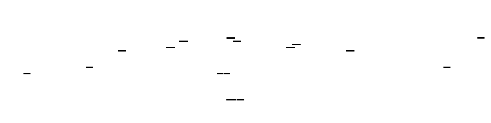

# Complete Programming Language: Design Document


## Overview

This system implements a complete statically-typed programming language with all core components: lexer, parser, type checker, bytecode compiler, virtual machine, and garbage collector. The key architectural challenge is designing cohesive interfaces between compilation phases while maintaining performance and correctness throughout the entire pipeline.


> This guide is meant to help you understand the big picture before diving into each milestone. Refer back to it whenever you need context on how components connect.


## Context and Problem Statement

> **Milestone(s):** This section establishes the foundation for all milestones by defining our approach to language implementation design.

Building a complete programming language from scratch represents one of the most complex and rewarding challenges in software engineering. Unlike building a web application or database, creating a programming language requires implementing an entire computational system that translates human-readable code into executable instructions while maintaining correctness, performance, and usability throughout the process.

The fundamental challenge lies not just in implementing individual components like lexers, parsers, or virtual machines, but in designing cohesive interfaces between these components that maintain data integrity and performance while supporting the full spectrum of language features. Each phase of the compilation pipeline must handle its own domain-specific concerns while producing output that seamlessly integrates with subsequent phases.

### Mental Model: Language as Translation Pipeline

Think of a programming language implementation as a **multi-stage translation factory** where each station performs a specialized transformation on the input, gradually converting human-readable source code into executable instructions. Just as an automotive assembly line has welding stations, painting booths, and quality control checkpoints, our language pipeline has lexical analysis, syntax parsing, type checking, code generation, and execution phases.

In this factory analogy, each station (compilation phase) has specific responsibilities and quality standards. The lexer station breaks down raw text into meaningful tokens, much like how a parts preparation station sorts components by type and size. The parser station assembles these tokens into structured syntax trees, similar to how a frame assembly station connects components according to blueprints. The type checker acts as a quality control inspector, verifying that all connections are valid before the product moves to the next stage.

The critical insight in this mental model is that **each station must produce output that meets the input specifications of the next station**. If the lexer produces tokens without accurate source location information, the parser cannot generate meaningful error messages. If the type checker doesn't annotate the AST with complete type information, the code generator cannot emit correct bytecode instructions.

This pipeline approach also enables **error recovery and reporting**. Just as a manufacturing line can identify defects at multiple stages without stopping the entire process, our compilation pipeline can detect errors in lexical analysis, syntax parsing, or type checking while continuing to process other parts of the program. This allows developers to see multiple issues in a single compilation run rather than fixing one error at a time.

The execution environment (virtual machine and garbage collector) represents the **deployment infrastructure** where our translated product actually runs. This infrastructure must faithfully implement the semantic guarantees established during the compilation phases while providing runtime services like memory management and error handling.

### Existing Language Implementation Approaches

When designing a programming language implementation, we must choose between several fundamental architectural approaches, each with distinct trade-offs in complexity, performance, and development time. Understanding these approaches helps us make informed decisions about our implementation strategy.

> **Decision: Bytecode Virtual Machine Architecture**
> - **Context**: Need to balance implementation complexity with runtime performance while supporting garbage collection and cross-platform deployment
> - **Options Considered**: Direct interpretation, native compilation, transpilation, bytecode virtual machine
> - **Decision**: Implement a stack-based bytecode virtual machine with mark-and-sweep garbage collection
> - **Rationale**: Provides clean separation between compilation and execution, enables portable bytecode, simplifies garbage collection implementation, and offers reasonable performance for a learning-focused implementation
> - **Consequences**: Additional complexity of bytecode instruction set design, but enables modular development and easier debugging of execution semantics

| Approach | Implementation Complexity | Runtime Performance | Portability | GC Integration | Development Time |
|----------|--------------------------|-------------------|-------------|----------------|------------------|
| Tree-Walking Interpreter | Low | Poor (AST traversal overhead) | High | Moderate (reference tracking) | Fast |
| Bytecode Virtual Machine | Moderate | Good (compact instructions) | High | Good (controlled allocation) | Moderate |
| Native Code Compiler | High | Excellent | Low (target-specific) | Complex (root scanning) | Slow |
| Transpiler to Existing Language | Low | Variable (depends on target) | High | Delegated | Fast |

#### Tree-Walking Interpreter Approach

The **tree-walking interpreter** approach executes programs by directly traversing the Abstract Syntax Tree (AST) produced by the parser. This represents the simplest implementation strategy where each AST node type has an associated execution method that performs the operation and recursively evaluates child nodes.

The primary advantage of tree-walking interpretation is implementation simplicity. Each language construct maps directly to an AST node with a corresponding evaluation function, making the execution semantics transparent and easy to debug. Variable scoping, function calls, and control flow are handled through straightforward recursive traversal with environment passing.

However, tree-walking interpreters suffer from significant performance overhead. Every execution step requires traversing pointer-linked data structures, performing dynamic dispatch based on node types, and maintaining large call stacks for recursive evaluation. Additionally, implementing efficient garbage collection becomes challenging because object references are scattered across the call stack and environment chains.

The error handling in tree-walking interpreters can be elegant, as runtime errors naturally bubble up through the recursive evaluation calls, but performance remains the critical limitation that makes this approach unsuitable for production language implementations.

#### Native Code Compilation Approach

**Native code compilation** translates source programs directly into machine code for the target processor architecture, eliminating interpretation overhead entirely. This approach produces the highest runtime performance but introduces significant implementation complexity across multiple dimensions.

The compilation process requires sophisticated analysis and optimization phases including register allocation, instruction scheduling, and platform-specific code generation. Each target architecture (x86, ARM, RISC-V) requires separate backend implementations with architecture-specific optimization strategies.

Garbage collection implementation becomes particularly complex in native compilation environments. The collector must accurately identify all object references stored in registers and stack locations, requiring either conservative scanning (which can retain garbage) or precise root maps that track reference locations throughout optimized code sequences.

Debug information generation adds another layer of complexity, as optimized native code may reorder, eliminate, or merge source-level operations, making it difficult to map runtime errors back to source locations or provide meaningful stack traces.

For our educational capstone project, native compilation would shift focus away from language design fundamentals toward low-level optimization and architecture-specific concerns, making it less suitable for our learning objectives.

#### Transpilation Approach

**Transpilation** (source-to-source compilation) translates our language into another high-level language like JavaScript, Python, or C, delegating execution to existing runtime systems. This approach can dramatically reduce implementation effort by leveraging existing language infrastructure.

The transpiler approach excels in rapid prototyping scenarios where the primary goal is exploring language design concepts rather than implementation details. Runtime services like garbage collection, I/O operations, and standard libraries are provided by the target language, eliminating the need to implement these complex systems from scratch.

However, transpilation introduces semantic mismatches between our language design and the target language capabilities. Type system features, memory management semantics, and execution models must conform to the limitations of the target runtime. For example, transpiling to JavaScript forces dynamic typing semantics even if our source language is statically typed.

Error reporting becomes problematic as runtime errors occur in the generated target code rather than the original source, requiring sophisticated source mapping to provide meaningful diagnostics to developers. Performance characteristics are entirely dependent on the target language implementation and may not align with our language design goals.

#### Bytecode Virtual Machine Approach

The **bytecode virtual machine** approach compiles source programs into a compact intermediate representation (bytecode) that executes on a purpose-built virtual machine. This architecture provides an excellent balance between implementation complexity and runtime performance for our educational goals.

Bytecode instructions represent a stack-based or register-based instruction set optimized for our language semantics. The compilation phase translates high-level constructs into sequences of simple operations like `LOAD_CONST`, `ADD`, `CALL_FUNCTION`, and `STORE_VARIABLE`, creating a clean abstraction layer between language features and execution mechanics.

The virtual machine implementation focuses on efficient instruction dispatch, stack management, and runtime support for language features like closures, dynamic dispatch, and garbage collection. This separation enables independent optimization of compilation and execution phases while maintaining semantic correctness.

Garbage collection integrates naturally with bytecode execution because the VM controls all object allocation and maintains precise information about object references on the evaluation stack and in local variable slots. This precision enables efficient collection algorithms without conservative scanning overheads.

The bytecode representation also provides excellent debugging support, as each instruction can include source location metadata, and execution traces can map directly back to source code positions. This visibility proves invaluable during language development and user debugging sessions.

> **Key Design Insight**: The bytecode VM approach enables us to focus on language design and compilation algorithms without getting bogged down in low-level execution details, while still providing sufficient performance and control for implementing advanced features like garbage collection and closures.

#### Hybrid Implementation Strategies

Modern language implementations often combine multiple approaches to optimize different aspects of execution. **Just-In-Time (JIT) compilation** starts with interpretation or bytecode execution but compiles hot code paths to native instructions during runtime, combining development simplicity with production performance.

**Tiered compilation** systems like those used in Java HotSpot and JavaScript V8 begin with simple interpretation, progress to optimized bytecode, and finally generate highly optimized native code for frequently executed functions. This progression allows rapid startup times while achieving excellent steady-state performance.

For our capstone implementation, we focus on the foundational bytecode VM approach with clear extension points for future JIT compilation experiments, providing a solid learning foundation while maintaining growth potential.

### Common Pitfalls

⚠️ **Pitfall: Choosing Implementation Approach Based on Familiarity Rather Than Requirements**
Many developers select tree-walking interpretation simply because recursive AST traversal feels familiar from parsing experience. However, this familiarity trap leads to performance problems and garbage collection complications that become apparent only after significant implementation effort. Instead, evaluate each approach against specific project requirements: performance targets, development timeline, learning objectives, and feature complexity.

⚠️ **Pitfall: Underestimating Cross-Component Interface Design**
A common mistake is implementing each compilation phase in isolation without carefully designing the data structures and interfaces that connect them. For example, implementing a lexer that doesn't track source locations makes it impossible for later phases to generate meaningful error messages. Design these interfaces first, before implementing individual components, and validate that they support all required information flow throughout the pipeline.

⚠️ **Pitfall: Premature Optimization in Architecture Selection**
Some developers immediately jump to native code compilation or complex JIT systems, assuming that performance must be the primary concern. For learning-focused implementations, this premature optimization creates unnecessary complexity that obscures fundamental language design principles. Start with a clear, debuggable implementation that correctly implements language semantics, then optimize systematically with profiling data to guide improvements.

### Implementation Guidance

This implementation guidance provides concrete technology recommendations and project structure for building our bytecode virtual machine language implementation in Rust, chosen for its systems programming capabilities, memory safety guarantees, and excellent tooling ecosystem.

#### Technology Recommendations

| Component | Simple Option | Advanced Option |
|-----------|---------------|-----------------|
| Error Handling | `Result<T, E>` with custom error types | `anyhow` crate with error chaining and `thiserror` for structured errors |
| Collections | Standard `Vec<T>`, `HashMap<K,V>`, `BTreeMap<K,V>` | `indexmap` for ordered maps, `smallvec` for stack-allocated vectors |
| String Handling | `String` and `&str` with manual interpolation | `format!` macro with custom string interning system |
| Serialization | Manual `Debug` formatting for diagnostics | `serde` with `bincode` for bytecode serialization |
| Testing Framework | Built-in `#[test]` with `assert_eq!` | `proptest` for property-based testing, `criterion` for benchmarking |
| CLI Interface | `std::env::args()` with manual parsing | `clap` crate for sophisticated argument parsing and help generation |

#### Recommended File Structure

Organize the project into clearly separated modules that reflect the compilation pipeline architecture, enabling parallel development and clear dependency management:

```
capstone-language/
├── Cargo.toml                          ← Project configuration and dependencies
├── README.md                           ← Project overview and building instructions  
├── examples/                           ← Sample programs in our language
│   ├── hello_world.cap                 ← Basic program examples
│   ├── fibonacci.cap                   ← Recursive function example
│   └── calculator.cap                  ← Self-hosting validation target
├── src/
│   ├── main.rs                         ← CLI entry point and REPL integration
│   ├── lib.rs                          ← Public API and module declarations
│   ├── lexer/                          ← Tokenization and source location tracking
│   │   ├── mod.rs                      ← Lexer public interface
│   │   ├── token.rs                    ← Token types and source spans
│   │   ├── scanner.rs                  ← Character-by-character tokenization
│   │   └── keywords.rs                 ← Reserved word recognition
│   ├── parser/                         ← Syntax analysis and AST construction
│   │   ├── mod.rs                      ← Parser public interface  
│   │   ├── ast.rs                      ← AST node definitions with source spans
│   │   ├── recursive_descent.rs        ← Recursive descent parser implementation
│   │   ├── precedence.rs               ← Operator precedence handling
│   │   └── error_recovery.rs           ← Panic mode recovery and synchronization
│   ├── type_checker/                   ← Type inference and semantic analysis
│   │   ├── mod.rs                      ← Type checker public interface
│   │   ├── types.rs                    ← Type representation and unification
│   │   ├── inference.rs                ← Hindley-Milner constraint solving
│   │   ├── scope.rs                    ← Symbol table and scope resolution
│   │   └── generics.rs                 ← Generic type parameter handling
│   ├── compiler/                       ← Bytecode generation and optimization
│   │   ├── mod.rs                      ← Compiler public interface
│   │   ├── bytecode.rs                 ← Instruction set definition and encoding
│   │   ├── codegen.rs                  ← AST to bytecode translation
│   │   ├── optimizer.rs                ← Constant folding and dead code elimination
│   │   └── debug_info.rs               ← Debug symbol generation
│   ├── vm/                             ← Virtual machine execution engine
│   │   ├── mod.rs                      ← VM public interface
│   │   ├── machine.rs                  ← Main execution loop and state management
│   │   ├── stack.rs                    ← Evaluation stack operations
│   │   ├── instructions.rs             ← Bytecode instruction implementations
│   │   ├── natives.rs                  ← Built-in function implementations
│   │   └── debug.rs                    ← Execution tracing and debugging
│   ├── gc/                             ← Garbage collection system
│   │   ├── mod.rs                      ← GC public interface
│   │   ├── mark_sweep.rs               ← Mark-and-sweep algorithm implementation
│   │   ├── roots.rs                    ← Root set identification and scanning
│   │   └── allocator.rs                ← Object allocation and heap management
│   ├── stdlib/                         ← Standard library implementations
│   │   ├── mod.rs                      ← Standard library module system
│   │   ├── io.rs                       ← File I/O and console operations
│   │   ├── collections.rs              ← HashMap, ArrayList, and iterator implementations
│   │   ├── strings.rs                  ← String manipulation and formatting
│   │   └── math.rs                     ← Mathematical functions and constants
│   ├── repl/                           ← Interactive environment
│   │   ├── mod.rs                      ← REPL public interface
│   │   ├── readline.rs                 ← Line editing and history integration
│   │   ├── completion.rs               ← Tab completion for identifiers and keywords
│   │   └── inspector.rs                ← Runtime value inspection and debugging
│   ├── diagnostics/                    ← Error reporting and source mapping
│   │   ├── mod.rs                      ← Diagnostics public interface
│   │   ├── errors.rs                   ← Error type hierarchy and formatting
│   │   ├── source_map.rs               ← Source location tracking and mapping
│   │   └── reporter.rs                 ← Pretty-printed error message generation
│   └── utils/                          ← Shared utilities and helpers
│       ├── mod.rs                      ← Utility module exports
│       ├── intern.rs                   ← String interning for identifiers
│       └── arena.rs                    ← Arena allocation for AST nodes
└── tests/                              ← Integration tests and milestone validation
    ├── lexer_tests.rs                  ← Token recognition and error recovery tests
    ├── parser_tests.rs                 ← AST construction and syntax error tests  
    ├── type_tests.rs                   ← Type inference and semantic analysis tests
    ├── compiler_tests.rs               ← Bytecode generation and optimization tests
    ├── vm_tests.rs                     ← Execution correctness and runtime tests
    ├── gc_tests.rs                     ← Memory management and collection tests
    ├── stdlib_tests.rs                 ← Standard library functionality tests
    ├── integration_tests.rs            ← End-to-end program execution tests
    └── self_hosting_test.rs             ← Compiler compiling itself validation
```

#### Infrastructure Starter Code

The following complete infrastructure components handle cross-cutting concerns and enable focus on core language implementation challenges:

**Source Location Tracking** (`src/diagnostics/source_map.rs`):
```rust
use std::collections::HashMap;

/// Tracks source file content and provides position-to-line/column mapping
#[derive(Debug, Clone)]
pub struct SourceMap {
    files: HashMap<FileId, SourceFile>,
    next_file_id: usize,
}

#[derive(Debug, Clone, Copy, PartialEq, Eq, Hash)]
pub struct FileId(usize);

#[derive(Debug, Clone)]
pub struct SourceFile {
    pub name: String,
    pub content: String,
    line_starts: Vec<usize>, // Byte offsets where each line starts
}

#[derive(Debug, Clone, Copy, PartialEq, Eq)]
pub struct SourceSpan {
    pub file_id: FileId,
    pub start: usize,  // Byte offset
    pub end: usize,    // Byte offset (exclusive)
}

#[derive(Debug, Clone, Copy)]
pub struct LineColumn {
    pub line: usize,    // 1-based
    pub column: usize,  // 1-based
}

impl SourceMap {
    pub fn new() -> Self {
        Self {
            files: HashMap::new(),
            next_file_id: 0,
        }
    }
    
    pub fn add_file(&mut self, name: String, content: String) -> FileId {
        let file_id = FileId(self.next_file_id);
        self.next_file_id += 1;
        
        // Pre-compute line start positions for fast line/column lookup
        let mut line_starts = vec![0];
        for (pos, ch) in content.char_indices() {
            if ch == '\n' {
                line_starts.push(pos + 1);
            }
        }
        
        let source_file = SourceFile {
            name,
            content,
            line_starts,
        };
        
        self.files.insert(file_id, source_file);
        file_id
    }
    
    pub fn get_file(&self, file_id: FileId) -> Option<&SourceFile> {
        self.files.get(&file_id)
    }
    
    pub fn span_to_line_column(&self, span: SourceSpan) -> Option<(LineColumn, LineColumn)> {
        let file = self.get_file(span.file_id)?;
        let start_lc = file.offset_to_line_column(span.start)?;
        let end_lc = file.offset_to_line_column(span.end)?;
        Some((start_lc, end_lc))
    }
    
    pub fn extract_source_text(&self, span: SourceSpan) -> Option<&str> {
        let file = self.get_file(span.file_id)?;
        file.content.get(span.start..span.end)
    }
}

impl SourceFile {
    fn offset_to_line_column(&self, offset: usize) -> Option<LineColumn> {
        if offset > self.content.len() {
            return None;
        }
        
        // Binary search to find the line containing this offset
        let line_index = match self.line_starts.binary_search(&offset) {
            Ok(exact) => exact,
            Err(insert_pos) => insert_pos.saturating_sub(1),
        };
        
        let line_start = self.line_starts[line_index];
        let column = offset - line_start;
        
        Some(LineColumn {
            line: line_index + 1,
            column: column + 1,
        })
    }
}
```

**String Interning System** (`src/utils/intern.rs`):
```rust
use std::collections::HashMap;

/// Global string interner for reducing memory usage of repeated identifiers
pub struct StringInterner {
    strings: Vec<String>,
    indices: HashMap<String, InternedString>,
}

#[derive(Debug, Clone, Copy, PartialEq, Eq, Hash)]
pub struct InternedString(usize);

impl StringInterner {
    pub fn new() -> Self {
        Self {
            strings: Vec::new(),
            indices: HashMap::new(),
        }
    }
    
    pub fn intern(&mut self, s: &str) -> InternedString {
        if let Some(&existing) = self.indices.get(s) {
            return existing;
        }
        
        let index = self.strings.len();
        let interned = InternedString(index);
        self.strings.push(s.to_string());
        self.indices.insert(s.to_string(), interned);
        interned
    }
    
    pub fn resolve(&self, interned: InternedString) -> &str {
        &self.strings[interned.0]
    }
}

// Thread-local interner for easy access throughout compilation
thread_local! {
    static INTERNER: std::cell::RefCell<StringInterner> = std::cell::RefCell::new(StringInterner::new());
}

pub fn intern_string(s: &str) -> InternedString {
    INTERNER.with(|interner| interner.borrow_mut().intern(s))
}

pub fn resolve_string(interned: InternedString) -> String {
    INTERNER.with(|interner| interner.borrow().resolve(interned).to_string())
}
```

#### Core Logic Skeleton Templates

The following skeleton templates provide structured starting points for implementing the core language components, with detailed TODO comments that map to algorithm steps:

**Lexer Core Structure** (`src/lexer/scanner.rs`):
```rust
use crate::diagnostics::{SourceMap, SourceSpan, FileId};
use crate::lexer::Token;

pub struct Scanner {
    source: String,
    file_id: FileId,
    current: usize,   // Current byte position
    start: usize,     // Start of current token
    line: usize,      // Current line number (1-based)
    tokens: Vec<Token>,
    errors: Vec<LexError>,
}

impl Scanner {
    /// Scans the entire source string and returns a vector of tokens
    /// Continues scanning after errors to report multiple issues
    pub fn scan_tokens(source: String, file_id: FileId) -> Result<Vec<Token>, Vec<LexError>> {
        // TODO 1: Initialize scanner with source text and position tracking
        // TODO 2: Loop while not at end of source, calling scan_token() for each
        // TODO 3: Handle whitespace and comments without producing tokens  
        // TODO 4: Implement error recovery by advancing past invalid characters
        // TODO 5: Add EOF token at end and return results
        // Hint: Use is_at_end(), advance(), peek(), and match_char() helper methods
        todo!()
    }
    
    /// Scans a single token starting at current position
    /// Updates scanner state and adds token to results
    fn scan_token(&mut self) {
        // TODO 1: Mark start position of current token
        // TODO 2: Advance and get the current character  
        // TODO 3: Match against single-character tokens ('+', '-', '(', ')', etc.)
        // TODO 4: Handle multi-character tokens ('==', '!=', '<=', '=>', etc.)
        // TODO 5: Scan string literals with escape sequence handling
        // TODO 6: Scan numeric literals (integers and floats)
        // TODO 7: Scan identifiers and check against keyword table
        // TODO 8: Handle unexpected characters by reporting error and continuing
        // Hint: Use add_token(), string_literal(), number_literal(), identifier()
        todo!()
    }
    
    /// Scans a string literal handling escape sequences and interpolation  
    fn string_literal(&mut self) {
        // TODO 1: Scan characters until closing quote, tracking line breaks
        // TODO 2: Handle escape sequences (\n, \t, \", \\, etc.)
        // TODO 3: Support string interpolation with ${expression} syntax
        // TODO 4: Report error for unterminated strings
        // TODO 5: Create string token with processed content
        // Hint: Interpolation creates multiple tokens (STRING_START, expr, STRING_END)
        todo!()
    }
}
```

#### Language-Specific Implementation Hints

**Rust-Specific Best Practices:**
- Use `enum` types for AST nodes with pattern matching instead of inheritance hierarchies
- Implement `Display` trait for token types and AST nodes to enable easy debugging
- Use `Result<T, E>` consistently with the `?` operator for error propagation
- Prefer `&str` for string slices and `String` only when ownership is needed
- Use `Vec<T>` for dynamic arrays and `HashMap<K, V>` for symbol tables
- Implement `Clone` and `Debug` derives for most data structures to enable testing
- Use `Box<T>` for recursive AST node references to avoid infinite size types

**Memory Management Strategy:**
- Use arena allocation patterns for AST nodes to avoid individual heap allocations
- Implement custom `Drop` for cleanup in VM and GC components
- Use `Rc<RefCell<T>>` sparingly, prefer ownership transfer where possible
- Consider `intern_string()` for all identifiers to reduce memory overhead

**Error Handling Patterns:**
- Create custom error enums for each compilation phase with `#[derive(Debug)]`
- Include source span information in all error types for accurate reporting  
- Use `Result::map_err()` to add context when propagating errors between phases
- Collect multiple errors in vectors rather than failing on first error

#### Milestone Checkpoints

**Milestone 1 Checkpoint - Lexer and Parser:**
```bash
# Test lexer with sample program
cargo test lexer_tests -- --nocapture

# Expected output: All tokens recognized with correct source spans
# Test parser with expression parsing
cargo test parser_tests::test_expression_parsing

# Manual verification: Create examples/test.cap with sample code
# Run: cargo run -- parse examples/test.cap
# Should output: Pretty-printed AST with source locations
```

**Milestone 2 Checkpoint - Type Checker:**
```bash  
# Test type inference on sample programs
cargo test type_tests::test_inference

# Manual verification: Test programs with type errors
# Run: cargo run -- typecheck examples/type_errors.cap
# Should output: Multiple type errors with source locations and suggestions
```

**Development Debugging Commands:**
- `RUST_LOG=debug cargo run -- lex file.cap` - Show detailed token stream
- `cargo test --test integration_tests -- --nocapture` - Run end-to-end tests
- `cargo run -- repl --debug` - Start REPL with execution tracing enabled


## Goals and Non-Goals

> **Milestone(s):** This section provides the scope foundation that guides implementation decisions across all five milestones, from language design through REPL completion.

Building a complete programming language from scratch represents one of the most ambitious projects in computer science education. The scope is vast enough to encompass multiple graduate-level courses, yet focused enough to produce a working system that demonstrates core language implementation principles. This section establishes clear boundaries around what our language will and will not support, ensuring that we build a cohesive system rather than an incomplete collection of advanced features.

Think of this scope definition as drawing the blueprint boundaries for a house. While we could theoretically include every luxury feature—heated floors, smart home automation, wine cellars—doing so would either make the project impossibly complex or result in half-finished rooms throughout. Instead, we focus on creating a well-designed, fully functional home with all essential systems working perfectly: solid foundation, reliable plumbing, effective heating, and comfortable living spaces. Advanced features can always be added later as extensions.

The goals framework divides into three categories: functional goals (what language features users can write), non-functional goals (how the system behaves in terms of performance and usability), and explicit non-goals (tempting features we deliberately exclude to maintain focus). Each category includes specific acceptance criteria that define when we've successfully achieved the goal.

### Functional Goals

Our **functional goals** define the core language capabilities that programmers will directly use when writing code in our language. These features form the essential vocabulary and grammar that make the language expressive enough for meaningful programs while remaining implementable within our timeline constraints.

> **Decision: Static Typing with Local Inference**
> - **Context**: Programming languages exist along a spectrum from fully dynamic (Python, JavaScript) to fully explicit static typing (early Java, C). Modern languages like Rust, TypeScript, and Kotlin demonstrate that local type inference provides the safety benefits of static typing while reducing syntactic overhead.
> - **Options Considered**: 
>   1. Dynamic typing throughout (like Python)
>   2. Explicit static typing (like early Java) 
>   3. Static typing with local inference (like modern Rust)
> - **Decision**: Static typing with local inference for variable declarations
> - **Rationale**: Static typing catches entire categories of bugs at compile time, enabling better tooling and optimization opportunities. Local inference (allowing `let x = 42` instead of requiring `let x: i32 = 42`) reduces verbosity while maintaining type safety. This combination provides an excellent learning experience in type system implementation.
> - **Consequences**: Requires implementing a unification-based type inference engine, but eliminates runtime type checking overhead and enables compile-time optimization passes.

The core type system includes fundamental types that cover the majority of programming scenarios without overwhelming complexity:

| Type Category | Specific Types | Description | Example Syntax |
|--------------|----------------|-------------|----------------|
| Primitive Types | `i32`, `f64`, `bool`, `char` | Machine-efficient basic types | `let x: i32 = 42` |
| Composite Types | `String`, `Array<T>`, `Map<K,V>` | Built-in collection types | `let names: Array<String>` |
| User-Defined Types | `struct`, `enum` | Custom data structures | `struct Point { x: i32, y: i32 }` |
| Function Types | `fn(T1, T2) -> T3` | First-class function types | `let f: fn(i32) -> i32` |
| Generic Types | `Option<T>`, `Result<T, E>` | Parametric polymorphism | `fn process<T>(x: T) -> Option<T>` |

Control flow constructs provide the essential programming patterns while avoiding exotic constructs that would complicate the implementation:

| Control Structure | Syntax Pattern | Semantic Behavior | Implementation Notes |
|------------------|----------------|-------------------|---------------------|
| Conditional | `if condition { } else { }` | Branch execution based on boolean | Compiles to conditional jump instructions |
| Loops | `while condition { }`, `for item in iterable { }` | Iteration with exit conditions | For-loops desugar to while loops internally |
| Functions | `fn name(params) -> return_type { }` | Parameterized code reuse with lexical scoping | Support for closures capturing outer variables |
| Pattern Matching | `match value { pattern => expression }` | Destructuring and conditional execution | Exhaustiveness checking and optimization |
| Early Returns | `return expression` | Non-local control flow | Handled through exception-like unwinding in compiler |

The function system supports both simple functions and closures, which capture variables from their lexical environment. This is essential for functional programming patterns and provides a rich testing ground for compiler implementation techniques.

> **Decision: Expression-Oriented Language Design**
> - **Context**: Languages divide into statement-oriented (like C, Java) where most constructs don't return values, versus expression-oriented (like Rust, Scala) where most constructs evaluate to values.
> - **Options Considered**:
>   1. Statement-oriented with void functions and separate expression grammar
>   2. Expression-oriented where if/match/blocks all evaluate to values  
>   3. Hybrid approach with both statements and expressions
> - **Decision**: Expression-oriented design where blocks, conditionals, and match expressions all evaluate to values
> - **Rationale**: Expression-oriented languages tend to be more composable and functional in style. The implementation is actually simpler because there's only one evaluation path rather than separate statement execution and expression evaluation paths.
> - **Consequences**: Functions always return values (use unit type `()` for side-effect-only functions), and the AST representation is simplified since everything is an expression node.

Generic types provide parametric polymorphism, allowing code reuse across different types while maintaining type safety. The constraint system is deliberately simple to avoid the complexity pitfalls that plague languages like Haskell or Rust:

| Generic Feature | Capability | Example | Implementation Strategy |
|----------------|------------|---------|------------------------|
| Generic Functions | Type parameters on functions | `fn identity<T>(x: T) -> T` | Type parameter substitution during monomorphization |
| Generic Types | Type parameters on structs/enums | `struct Box<T> { value: T }` | Template instantiation with type checking |
| Basic Constraints | Simple trait bounds | `fn print<T: Display>(x: T)` | Interface-based constraint checking |
| Type Inference | Automatic parameter deduction | `let x = identity(42)` // T inferred as i32 | Hindley-Milner unification algorithm |

The module system provides namespace management and code organization without the complexity of advanced features like macros or compile-time code generation:

| Module Feature | Purpose | Syntax | Scope Rules |
|---------------|---------|---------|-------------|
| Module Declaration | Define code boundaries | `mod utils { }` | Creates new namespace scope |
| Import Statements | Access external symbols | `use std::collections::HashMap` | Brings names into current scope |
| Public/Private | Control symbol visibility | `pub fn public_function()` | Default private, explicit public marking |
| Module Paths | Hierarchical organization | `use crate::parsing::ast::Expr` | Tree-based name resolution |

### Non-Functional Goals

**Non-functional goals** define how our language implementation behaves in terms of performance, usability, and maintainability. These qualities determine whether the language is pleasant to use and whether the implementation serves as an effective learning tool for compiler construction principles.

Performance expectations balance educational clarity with reasonable efficiency. Our primary goal is creating a learning experience, not competing with production language implementations, but the system should be fast enough for non-trivial programs:

| Performance Aspect | Target | Measurement | Implementation Strategy |
|--------------------|--------|-------------|------------------------|
| Compilation Speed | <1 second for 1000 LOC | Wall-clock time from source to bytecode | Single-pass compilation phases, efficient AST representation |
| Runtime Performance | Within 10x of Python | Benchmark suite execution time | Stack-based bytecode VM with basic optimizations |
| Memory Usage | <100MB for compiler + VM | Peak RSS during compilation and execution | Explicit memory management with garbage collection |
| Startup Time | <100ms for simple programs | Time from VM launch to first instruction | Minimal runtime initialization, no JIT warmup |

Error reporting quality significantly impacts the learning experience. Developers spend substantial time debugging their code, so clear error messages with actionable suggestions are essential:

| Error Quality Aspect | Standard | Example | Implementation Requirement |
|----------------------|----------|---------|----------------------------|
| Source Location Accuracy | Line and column precision | `error at line 42, column 15` | All AST nodes carry `SourceSpan` metadata |
| Error Message Clarity | Specific problem description | "expected ';' after expression" not "syntax error" | Hand-crafted error messages for common mistakes |
| Multiple Error Reporting | Continue after errors when possible | Report all type errors in function, not just first | Error recovery in parser and type checker |
| Helpful Suggestions | Propose fixes when obvious | "did you mean 'length' instead of 'lenght'?" | Fuzzy matching for identifier typos |

Development ergonomics ensure that both language users and language implementers have a smooth experience:

| Ergonomic Feature | Requirement | User Benefit | Implementation Approach |
|-------------------|-------------|-------------|-------------------------|
| REPL Responsiveness | <200ms per evaluation | Interactive exploration | Incremental compilation, persistent VM state |
| Tab Completion | Context-aware suggestions | Faster code writing | Symbol table integration with readline |
| Syntax Highlighting | All language constructs | Visual code comprehension | Lexer token classification for editors |
| Self-Hosting Capability | Language can compile itself | Validation of completeness | Bootstrap compiler written in target language |

Code maintainability ensures the implementation remains comprehensible and extensible as a learning resource:

| Maintainability Goal | Standard | Benefit | Implementation Practice |
|---------------------|----------|---------|------------------------|
| Module Separation | <2000 lines per source file | Manageable cognitive load | Clear component boundaries with minimal coupling |
| API Clarity | Self-documenting function signatures | Easy to understand interfaces | Rich type annotations and meaningful parameter names |
| Test Coverage | >80% line coverage | Confidence in modifications | Comprehensive unit and integration test suites |
| Documentation | All public APIs documented | Onboarding new contributors | Inline documentation with usage examples |

### Explicit Non-Goals

**Explicit non-goals** are features we deliberately exclude to maintain project focus and feasibility. These represent tempting additions that would significantly increase complexity without proportional educational benefit.

Advanced type system features would provide sophisticated programming capabilities but require implementing complex algorithms that overshadow the core learning objectives:

| Advanced Feature | Why Excluded | Complexity Cost | Potential Future Extension |
|------------------|--------------|-----------------|----------------------------|
| Higher-Kinded Types | Requires complex kind checking system | Would double type checker complexity | Yes, as advanced milestone |
| Dependent Types | Requires theorem prover integration | Research-level implementation difficulty | No, fundamentally different approach |
| Linear/Affine Types | Requires sophisticated borrow checking | Rust-level ownership analysis complexity | Yes, with significant effort |
| Type Classes/Traits | Complex constraint solving and coherence | Haskell-style instance resolution | Yes, simpler version possible |

Advanced optimization passes would improve runtime performance but require implementing sophisticated program analysis that could fill an entire graduate course:

| Optimization Category | Specific Techniques | Implementation Complexity | Educational Value Trade-off |
|----------------------|-------------------|---------------------------|----------------------------|
| Dataflow Analysis | Live variable analysis, reaching definitions | Requires fixpoint iteration algorithms | Low - obscures language design principles |
| Loop Optimizations | Loop unrolling, vectorization | Complex dependency analysis | Low - hardware-specific concerns |
| Interprocedural | Function inlining, escape analysis | Whole-program analysis infrastructure | Medium - useful but very complex |
| JIT Compilation | Runtime code generation | x86/ARM code generation expertise | Low - shifts focus from language to codegen |

Concurrency and parallelism features represent entire specialized domains that would require their own dedicated study:

| Concurrency Feature | Implementation Challenge | Design Complexity | Alternative Approach |
|--------------------|-------------------------|-------------------|---------------------|
| Threading Primitives | OS integration, synchronization bugs | Memory model specification | Focus on sequential programs |
| Async/Await | Complex state machine transformation | Coroutine implementation | Use callbacks or external libraries |
| Actors/CSP | Message passing infrastructure | Scheduling and mailbox management | Demonstrate with library implementation |
| Software Transactional Memory | Lock-free data structures | STM runtime system | Too specialized for general language course |

Advanced language features that appear in production languages but would significantly complicate our implementation:

| Language Feature | Why Tempting | Implementation Burden | Complexity vs. Benefit |
|------------------|---------------|----------------------|------------------------|
| Macros/Metaprogramming | Powerful code generation | Separate macro expansion phase | Very high complexity, low educational ROI |
| Reflection | Runtime type inspection | Metadata generation and storage | Medium complexity, niche use cases |
| Multiple Inheritance | Rich object hierarchies | Complex method resolution | High complexity, design controversy |
| Operator Overloading | Natural mathematical syntax | Complex resolution and inference | Medium complexity, potential confusion |

Standard library comprehensiveness beyond essential functionality would require extensive domain expertise and maintenance effort:

| Library Domain | Essential Subset (Included) | Advanced Features (Excluded) | Rationale |
|----------------|---------------------------|------------------------------|-----------|
| I/O Operations | File read/write, stdout/stderr | Network protocols, async I/O | Focus on language, not systems programming |
| Collections | Array, HashMap, basic iteration | Specialized data structures | Core types sufficient for most programs |
| String Processing | Basic manipulation, formatting | Regular expressions, Unicode | Complex libraries overshadow language features |
| Mathematics | Basic arithmetic, common functions | Linear algebra, statistics | Domain-specific concerns |

> ⚠️ **Pitfall: Feature Creep During Implementation**
> The most common mistake when building a language is continuously adding "just one more feature" during development. Each addition seems small in isolation, but collectively they can derail the project. For example, adding operator overloading requires changes to the lexer (new operators), parser (precedence rules), type checker (overload resolution), and compiler (method dispatch). What seems like a simple feature becomes a multi-week detour that delays core functionality.

Platform and deployment considerations are simplified to focus on language implementation rather than systems engineering:

| Deployment Aspect | Simplified Approach | Production Considerations Excluded | Future Extension Path |
|-------------------|--------------------|------------------------------------|----------------------|
| Target Platforms | Single OS (development machine) | Cross-compilation, mobile, embedded | Add platform-specific backends |
| Package Management | Simple file-based modules | Dependency resolution, versioning | Implement cargo/npm-style system |
| Build System | Direct compiler invocation | Complex build graphs, incremental compilation | Add make/bazel-style dependency tracking |
| Distribution | Source code compilation | Binary distribution, package formats | Add installer and package repository |

The scope boundaries established here ensure that we build a complete, working programming language that demonstrates all essential implementation techniques while remaining achievable within the project timeline. Every included feature receives full implementation attention, rather than having numerous half-finished advanced features that provide poor learning experiences.

These goals will guide implementation decisions throughout all five project milestones. When faced with design choices, we consistently favor completeness and educational clarity over feature sophistication. The result will be a language that thoroughly teaches compilation principles while remaining simple enough that learners can understand every component of the system.

### Implementation Guidance

This section provides concrete technological recommendations and project organization strategies to translate our goals into working code.

#### Technology Stack Recommendations

| Component | Simple Option | Advanced Option | Recommended Choice |
|-----------|---------------|------------------|-------------------|
| Lexer | Hand-written state machine | Regex-based token recognition | Hand-written (better error reporting) |
| Parser | Recursive descent | Parser generator (ANTLR, yacc) | Recursive descent (easier debugging) |
| Type Checker | Simple unification | Constraint-based inference | Simple unification with substitution |
| Code Generation | Tree-walking interpreter | LLVM backend | Bytecode VM (balance of complexity/performance) |
| Garbage Collection | Reference counting | Generational mark-and-sweep | Mark-and-sweep (easier to implement correctly) |
| Standard Library | Built-in functions | Foreign function interface | Mix of built-ins + simple FFI |
| REPL | Basic read-eval-print | Full IDE integration | Readline-based with history |

#### Project Structure Organization

The recommended file structure separates concerns clearly while maintaining navigability:

```
language-implementation/
├── src/                          # Main source code
│   ├── main.rs                   # CLI entry point and argument parsing
│   ├── repl.rs                   # Interactive REPL implementation
│   └── lib.rs                    # Library interface for embedding
├── core/                         # Core language implementation
│   ├── source/                   # Source code management
│   │   ├── mod.rs               # Re-exports and common utilities  
│   │   ├── source_map.rs        # SourceMap, FileId, SourceFile types
│   │   └── span.rs              # SourceSpan and LineColumn utilities
│   ├── lexer/                   # Tokenization phase
│   │   ├── mod.rs               # Scanner and public interface
│   │   ├── token.rs             # Token type definitions
│   │   └── string_interner.rs   # StringInterner for identifier deduplication
│   ├── parser/                  # Syntax analysis phase
│   │   ├── mod.rs               # Recursive descent parser entry
│   │   ├── ast.rs               # AST node type definitions
│   │   └── error_recovery.rs    # Panic mode error recovery
│   ├── typecheck/               # Semantic analysis phase
│   │   ├── mod.rs               # Type checker main interface
│   │   ├── types.rs             # Type representation and operations
│   │   ├── inference.rs         # Hindley-Milner unification
│   │   └── scope.rs             # Symbol table and scope management
│   ├── compiler/                # Code generation phase
│   │   ├── mod.rs               # Compiler main interface
│   │   ├── bytecode.rs          # Bytecode instruction definitions
│   │   ├── codegen.rs           # AST to bytecode translation
│   │   └── optimize.rs          # Basic optimization passes
│   ├── vm/                      # Runtime execution phase
│   │   ├── mod.rs               # Virtual machine main interface
│   │   ├── machine.rs           # VM state and instruction dispatch
│   │   ├── value.rs             # Runtime value representation
│   │   └── gc.rs                # Garbage collector implementation
│   └── stdlib/                  # Standard library modules
│       ├── mod.rs               # Standard library initialization
│       ├── io.rs                # File I/O and console operations
│       ├── collections.rs       # HashMap, Array implementations
│       └── prelude.rs           # Automatically imported symbols
├── tests/                       # Integration and end-to-end tests
│   ├── lexer_tests.rs          # Token recognition test cases
│   ├── parser_tests.rs         # Syntax parsing test cases
│   ├── typecheck_tests.rs      # Type inference test cases
│   ├── compiler_tests.rs       # Code generation test cases
│   ├── vm_tests.rs             # Runtime execution test cases
│   └── integration_tests.rs    # Full pipeline test cases
└── examples/                    # Example programs in our language
    ├── hello_world.lang         # Basic syntax demonstration
    ├── fibonacci.lang           # Recursion and arithmetic
    ├── calculator.lang          # Expression parsing and evaluation
    └── self_host.lang           # Simple compiler written in our language
```

#### Essential Infrastructure Starter Code

The following infrastructure components are prerequisites but not the primary learning focus. These complete implementations allow learners to focus on the core language design challenges:

**Source Location Management** (`core/source/source_map.rs`):
```rust
use std::collections::HashMap;

/// Manages source files and provides location tracking for error reporting
pub struct SourceMap {
    pub files: HashMap<FileId, SourceFile>,
    pub next_file_id: usize,
}

impl SourceMap {
    pub fn new() -> Self {
        SourceMap {
            files: HashMap::new(),
            next_file_id: 1,
        }
    }

    /// Add a new source file and return its unique identifier
    pub fn add_file(&mut self, name: String, content: String) -> FileId {
        let file_id = FileId(self.next_file_id);
        self.next_file_id += 1;
        
        let line_starts = self.compute_line_starts(&content);
        let source_file = SourceFile {
            name,
            content,
            line_starts,
        };
        
        self.files.insert(file_id, source_file);
        file_id
    }

    /// Convert byte offset span to line/column positions for error reporting
    pub fn span_to_line_column(&self, span: SourceSpan) -> Option<(LineColumn, LineColumn)> {
        let file = self.files.get(&span.file_id)?;
        let start_pos = self.offset_to_line_column(&file.line_starts, span.start)?;
        let end_pos = self.offset_to_line_column(&file.line_starts, span.end)?;
        Some((start_pos, end_pos))
    }

    fn compute_line_starts(&self, content: &str) -> Vec<usize> {
        let mut line_starts = vec![0]; // First line starts at offset 0
        for (i, ch) in content.char_indices() {
            if ch == '\n' {
                line_starts.push(i + 1);
            }
        }
        line_starts
    }

    fn offset_to_line_column(&self, line_starts: &[usize], offset: usize) -> Option<LineColumn> {
        // Binary search to find line containing offset
        match line_starts.binary_search(&offset) {
            Ok(line) => Some(LineColumn { line, column: 0 }),
            Err(line) => {
                if line == 0 { return None; }
                let line = line - 1;
                let column = offset - line_starts[line];
                Some(LineColumn { line, column })
            }
        }
    }
}

#[derive(Debug, Clone, Copy, PartialEq, Eq, Hash)]
pub struct FileId(pub usize);

pub struct SourceFile {
    pub name: String,
    pub content: String,
    pub line_starts: Vec<usize>,
}

#[derive(Debug, Clone, Copy, PartialEq, Eq)]
pub struct SourceSpan {
    pub file_id: FileId,
    pub start: usize,
    pub end: usize,
}

#[derive(Debug, Clone, Copy, PartialEq, Eq)]
pub struct LineColumn {
    pub line: usize,
    pub column: usize,
}
```

**String Interning System** (`core/lexer/string_interner.rs`):
```rust
use std::collections::HashMap;

/// Deduplicates string values to reduce memory usage and enable fast equality comparison
pub struct StringInterner {
    pub strings: Vec<String>,
    pub indices: HashMap<String, usize>,
}

impl StringInterner {
    pub fn new() -> Self {
        StringInterner {
            strings: Vec::new(),
            indices: HashMap::new(),
        }
    }

    /// Store string and return handle for fast future lookups
    pub fn intern(&mut self, s: &str) -> InternedString {
        if let Some(&index) = self.indices.get(s) {
            return InternedString(index);
        }

        let index = self.strings.len();
        self.strings.push(s.to_string());
        self.indices.insert(s.to_string(), index);
        InternedString(index)
    }

    /// Resolve handle back to original string
    pub fn resolve(&self, interned: InternedString) -> &str {
        &self.strings[interned.0]
    }
}

#[derive(Debug, Clone, Copy, PartialEq, Eq, Hash)]
pub struct InternedString(pub usize);
```

#### Core Implementation Skeletons

The following skeletal implementations provide structure for the core learning components while leaving the interesting logic for learners to implement:

**Lexer Core Logic** (`core/lexer/mod.rs`):
```rust
use crate::source::{FileId, SourceSpan};

pub struct Scanner {
    pub source: String,
    pub file_id: FileId,
    pub current: usize,
    pub start: usize,
    pub line: usize,
}

impl Scanner {
    pub fn new(source: String, file_id: FileId) -> Self {
        Scanner {
            source,
            file_id,
            current: 0,
            start: 0,
            line: 1,
        }
    }

    /// Tokenize entire source file with error recovery - continues parsing after errors
    pub fn scan_tokens(&mut self) -> Result<Vec<Token>, Vec<LexError>> {
        let mut tokens = Vec::new();
        let mut errors = Vec::new();

        while !self.is_at_end() {
            self.start = self.current;
            
            match self.scan_token() {
                Ok(Some(token)) => tokens.push(token),
                Ok(None) => {}, // Whitespace or comment - continue
                Err(error) => {
                    errors.push(error);
                    // TODO: Implement error recovery - advance past invalid character
                    // TODO: Continue scanning to find more errors instead of stopping
                }
            }
        }

        // Add EOF token
        tokens.push(Token::new(TokenType::EOF, self.make_span()));

        if errors.is_empty() {
            Ok(tokens)
        } else {
            Err(errors)
        }
    }

    fn scan_token(&mut self) -> Result<Option<Token>, LexError> {
        let c = self.advance();
        
        match c {
            // TODO 1: Handle single-character tokens: ( ) { } , ; + - * /
            // TODO 2: Handle two-character tokens: == != <= >= 
            // TODO 3: Handle string literals with escape sequences
            // TODO 4: Handle number literals (integers and floats)  
            // TODO 5: Handle identifiers and keywords
            // TODO 6: Handle whitespace and comments (return Ok(None))
            // TODO 7: Handle unexpected characters (return Err(LexError))
            _ => todo!("Implement character recognition")
        }
    }

    // Helper methods (complete implementations)
    fn is_at_end(&self) -> bool { self.current >= self.source.len() }
    fn advance(&mut self) -> char { /* ... complete implementation ... */ }
    fn peek(&self) -> char { /* ... complete implementation ... */ }
    fn make_span(&self) -> SourceSpan { /* ... complete implementation ... */ }
}
```

#### Language-Specific Development Tips

For Rust implementation, these specific techniques will streamline development:

- Use `#[derive(Debug, Clone, PartialEq)]` extensively on AST nodes for easy testing and debugging
- Implement `Display` trait for error types to get nice error messages with `println!("{}", error)`
- Use `enum` types for token types and AST node variants - Rust's pattern matching makes parsing elegant
- Use `Box<T>` for recursive AST structures to avoid infinite size compilation errors
- Use `Rc<RefCell<T>>` for symbol table entries that need shared mutable access across scopes
- The `pest` crate provides an alternative to hand-written parsers if the recursive descent approach becomes unwieldy

#### Milestone Checkpoints

After implementing each major component, verify functionality with these concrete tests:

**Milestone 1 Checkpoint - Lexer/Parser:**
```bash
# Test lexer produces correct tokens
cargo test lexer_tests
# Expected: All token recognition tests pass

# Test parser builds valid AST
cargo test parser_tests  
# Expected: Sample programs parse without errors

# Manual verification
echo 'fn main() { let x = 42; }' | cargo run -- --parse-only
# Expected: Pretty-printed AST structure, no errors
```

**Milestone 2 Checkpoint - Type Checker:**
```bash
# Test type inference works correctly
cargo test typecheck_tests
# Expected: Local variable types inferred, generic functions instantiated

# Manual verification - should succeed
echo 'let x = 42; let y = x + 1;' | cargo run -- --typecheck-only
# Expected: "Type checking passed"

# Manual verification - should fail
echo 'let x = 42; let y = x + "hello";' | cargo run -- --typecheck-only  
# Expected: Clear error message about type mismatch
```

#### Common Implementation Pitfalls

| Symptom | Likely Cause | How to Diagnose | Fix |
|---------|--------------|-----------------|-----|
| Parser infinite loops on invalid input | Missing error recovery in recursive descent | Add debug prints in parsing functions | Implement panic mode: synchronize on statement boundaries |
| Type inference produces "infinite" types | Occurs check not implemented in unification | Enable occurs check in unification algorithm | Check if variable appears in type being unified |  
| VM crashes with stack overflow | Missing bounds checks on stack operations | Add assertions on stack size | Implement stack overflow detection and error reporting |
| GC collects objects still in use | Incorrect root set identification | Add GC logging to trace marked objects | Ensure all stack slots and globals are included in roots |
| REPL loses state between evaluations | VM state reset after each evaluation | Check if global environment persists | Maintain persistent VM instance across REPL iterations |


## High-Level Architecture

> **Milestone(s):** This section provides the architectural foundation for Milestones 1-4, establishing the pipeline structure that guides implementation from lexer through VM execution.

Building a complete programming language is fundamentally an exercise in **multi-stage translation**. Think of it like a sophisticated assembly line where raw materials (source code) undergo a series of transformations, with each station adding structure and removing ambiguity, until we produce a finished product (executable bytecode) that a machine can understand and run efficiently.

The key insight is that each stage in our compilation pipeline has a **single, well-defined responsibility** and produces output that serves as input to the next stage. This separation of concerns allows us to reason about each component independently while ensuring they work together harmoniously. Just as an automobile assembly line has stations for welding, painting, and final assembly—each with specialized tools and expertise—our language implementation has specialized phases for lexical analysis, parsing, type checking, code generation, and execution.


The architecture we'll build follows the **bytecode virtual machine** approach, which strikes an optimal balance between implementation complexity and execution performance. Unlike a tree-walking interpreter that directly executes the Abstract Syntax Tree (resulting in poor performance due to recursive traversal overhead), or native compilation (which requires complex target-specific code generation), our bytecode approach compiles to a compact, platform-independent instruction format that a simple stack-based virtual machine can execute efficiently.

### Compilation Pipeline Overview

Our compilation pipeline consists of six distinct phases, each transforming the program representation into a form more suitable for the next stage. Understanding these transformations is crucial because each phase must preserve the **semantic meaning** of the program while making it progressively more concrete and executable.


The pipeline operates as follows, with each phase consuming well-defined input and producing structured output:

**Phase 1: Lexical Analysis (Scanner/Lexer)**
The lexer performs the first transformation, converting raw character streams into a sequence of meaningful tokens. Think of this as breaking a continuous stream of text into words and punctuation, much like how your brain automatically segments "letx=42" into the tokens "let", "x", "=", and "42". The lexer handles complexities like string literals with escape sequences, numeric literals in various formats, and multi-character operators like "==" or ">=".

**Phase 2: Syntax Analysis (Parser)**
The parser consumes the token stream and constructs an Abstract Syntax Tree (AST) that captures the hierarchical structure of the program according to our language's grammar rules. This is analogous to diagramming sentences in English class—identifying subjects, verbs, and objects, and understanding how phrases nest within clauses. The parser resolves operator precedence (ensuring "2 + 3 * 4" parses as "2 + (3 * 4)"), handles control flow structures, and builds a tree that explicitly represents the program's intended computation.

**Phase 3: Semantic Analysis and Type Checking**
The type checker traverses the AST and ensures the program is semantically valid according to our type system rules. This phase goes beyond syntax to understand meaning—verifying that variables are declared before use, that function calls provide arguments matching parameter types, and that operations like addition are applied to compatible types. The type checker also performs **Hindley-Milner type inference**, automatically deducing types for variables and expressions where explicit annotations aren't provided.

**Phase 4: Code Generation and Optimization**
The bytecode compiler transforms the typed AST into a sequence of stack-based virtual machine instructions. This phase performs the crucial translation from high-level constructs (like function calls and control flow statements) into low-level operations (like stack manipulation and conditional jumps). The compiler also applies optimization passes such as constant folding (evaluating "2 + 3" at compile time rather than runtime) and dead code elimination (removing unreachable branches).

**Phase 5: Virtual Machine Execution**
The VM executes the generated bytecode using a stack-based execution model. Each instruction manipulates an operand stack and/or accesses local variables stored in stack frames. The VM handles function calls by creating new stack frames, manages heap allocation for objects and closures, and coordinates with the garbage collector to reclaim unused memory automatically.

**Phase 6: Garbage Collection and Memory Management**
The garbage collector runs periodically during VM execution, identifying objects that are no longer reachable from the program's root set (stack variables, global variables, and active closures) and reclaiming their memory. Our mark-and-sweep collector traces through the object graph, marks all reachable objects, then sweeps through the heap to free unmarked objects.

The following table summarizes each phase's input, output, and primary responsibilities:

| Phase | Input | Output | Primary Responsibility | Error Types Detected |
|-------|--------|---------|----------------------|---------------------|
| Lexer | Character stream | Token sequence | Tokenization, source location tracking | Unterminated strings, invalid characters, malformed numbers |
| Parser | Token sequence | Abstract Syntax Tree | Syntax validation, precedence handling | Missing semicolons, unbalanced brackets, malformed expressions |
| Type Checker | AST + Symbol tables | Typed AST + Type info | Type inference, scope resolution | Type mismatches, undefined variables, arity errors |
| Compiler | Typed AST | Bytecode instructions | Code generation, optimization | Internal compiler errors (should be rare) |
| Virtual Machine | Bytecode | Program execution | Instruction dispatch, stack management | Stack overflow, division by zero, null pointer access |
| Garbage Collector | Heap state | Updated heap | Memory reclamation, reference tracing | Memory leaks, dangling pointers (prevented, not detected) |

### Component Responsibilities

Each component in our system has clearly defined ownership boundaries and communication protocols. Understanding these responsibilities is essential for implementing clean interfaces and avoiding tight coupling between phases.

> **Design Principle: Single Responsibility**
> Each component should have exactly one reason to change. The lexer changes only when we modify token definitions. The parser changes only when we modify grammar rules. The type checker changes only when we modify type system rules. This separation makes the system much easier to maintain and extend.

**Lexer/Scanner Responsibilities**
The lexer owns the transformation from raw source text to tokens. It maintains a `Scanner` state machine that tracks the current position within the source file, handles character-by-character advancement, and recognizes token boundaries. The lexer is responsible for **source location tracking**, ensuring every token carries a `SourceSpan` that identifies exactly where it appeared in the original source code—this information is crucial for generating helpful error messages later in the pipeline.

The lexer also owns **string interning** through the `StringInterner`, which deduplicates identical string literals and identifiers to save memory. Rather than storing "myVariable" multiple times throughout the AST, we store it once and reference it by an `InternedString` handle.

Key lexer data structures and their responsibilities:

| Structure | Fields | Responsibility |
|-----------|---------|----------------|
| `Scanner` | `source: String, file_id: FileId, current: usize, start: usize, line: usize` | Tracks scanning position and manages character-by-character tokenization |
| `SourceMap` | `files: HashMap<FileId, SourceFile>, next_file_id: usize` | Maps file IDs to source content, enables multi-file compilation |
| `SourceFile` | `name: String, content: String, line_starts: Vec<usize>` | Stores complete file content and line boundary information for error reporting |
| `SourceSpan` | `file_id: FileId, start: usize, end: usize` | Identifies precise source location for tokens and AST nodes |
| `StringInterner` | `strings: Vec<String>, indices: HashMap<String, usize>` | Deduplicates string storage and provides fast string equality comparison |

**Parser Responsibilities**
The parser owns the transformation from tokens to Abstract Syntax Tree. It implements a **recursive descent parser** that mirrors our language's grammar rules, with each non-terminal in the grammar corresponding to a parsing method. The parser is responsible for handling **operator precedence** correctly, ensuring that expressions like "a + b * c" parse with the intended associativity and precedence rules.

Crucially, the parser implements **error recovery** using panic mode recovery. When it encounters a syntax error, it reports the error but doesn't stop parsing. Instead, it skips tokens until it finds a **synchronization point** (like a semicolon or closing brace) where it can confidently resume parsing. This allows the parser to report multiple errors per file instead of stopping at the first error—a much better developer experience.

The parser maintains **symbol tables** for scope resolution, tracking which variables and functions are defined in each scope. It builds these tables during parsing but doesn't perform full semantic analysis—that's the type checker's responsibility.

**Type Checker Responsibilities**
The type checker owns **semantic correctness** of the program. It traverses the AST and ensures that all operations are semantically valid according to our type system rules. The type checker implements **Hindley-Milner type inference**, which can automatically deduce the types of variables, function parameters, and return values based on how they're used.

The type checker is responsible for **scope analysis**, ensuring that variables are defined before they're used and that each identifier resolves to the correct declaration (handling variable shadowing correctly). It also validates that function calls provide the right number and types of arguments.

For our generic type system, the type checker performs **constraint solving**—it generates type constraints based on how generic types are used, then solves these constraints to determine concrete type instantiations.

**Bytecode Compiler Responsibilities**  
The bytecode compiler owns the transformation from typed AST to executable bytecode. It implements **code generation algorithms** that traverse the AST and emit appropriate virtual machine instructions. The compiler maintains a **bytecode instruction buffer** and handles details like jump target resolution (converting high-level control flow into low-level jumps).

The compiler is responsible for **optimization passes** that improve the generated bytecode without changing program semantics. Constant folding evaluates compile-time expressions (turning "2 + 3" into "5"), dead code elimination removes unreachable code (like statements after a return), and **register allocation** minimizes the number of temporary stack slots needed.

**Virtual Machine Responsibilities**
The VM owns **program execution**. It maintains an **execution stack** for operands and local variables, a **call stack** for function invocation records, and coordinates with the garbage collector for heap allocation. The VM implements the **instruction dispatch loop**, fetching bytecode instructions and executing them according to their defined semantics.

The VM is responsible for **runtime error detection and reporting**, catching errors like division by zero, stack overflow, and null pointer dereferences. It must also maintain accurate **stack trace information** so that runtime errors can be reported with source location context.

**Garbage Collector Responsibilities**
The garbage collector owns **automatic memory management**. It implements the **mark-and-sweep algorithm**, periodically scanning the heap to identify objects that are no longer reachable from the program's **root set** (stack variables, global variables, and closure environments). The GC is responsible for **heap layout management**, allocating objects efficiently and maintaining free space information.

The garbage collector must coordinate carefully with the VM to ensure **collection safety**—garbage collection can only run at safe points where the VM's state is consistent and all live references are properly identified.

The following table shows how components communicate with each other:

| From Component | To Component | Data Passed | Interface Method | Purpose |
|---------------|---------------|-------------|------------------|---------|
| Lexer | Parser | `Vec<Token>` | `scan_tokens(source, file_id)` | Provides tokenized input for parsing |
| Parser | Type Checker | `AST` + `SymbolTable` | `parse_file(tokens)` | Provides syntax tree for semantic analysis |
| Type Checker | Compiler | Typed `AST` + `TypeInfo` | `check_types(ast)` | Provides semantically valid tree for code generation |
| Compiler | VM | `Bytecode` + `ConstantPool` | `compile(typed_ast)` | Provides executable instructions for interpretation |
| VM | GC | Heap references + Root set | `collect_garbage()` | Triggers memory reclamation when needed |
| All Components | SourceMap | Error locations | `span_to_line_column(span)` | Enables error reporting with source locations |

> **Architecture Decision: Pipeline vs Tree-Walking**
> - **Context**: We need to choose between a pipeline approach (separate phases) vs. a tree-walking interpreter (single-pass execution)
> - **Options Considered**: 
>   1. Multi-phase pipeline with intermediate representations
>   2. Single-pass tree-walking interpreter
>   3. Hybrid approach with some phases combined
> - **Decision**: Multi-phase pipeline with clear separation between lexing, parsing, type checking, compilation, and execution
> - **Rationale**: Pipeline separation enables better error reporting (can continue after errors in early phases), makes each phase simpler to implement and test, allows for optimization passes between phases, and provides flexibility to swap implementations (e.g., different garbage collection algorithms)
> - **Consequences**: Slightly more complex data flow between components, but much better maintainability, testability, and extensibility

### Recommended File Structure

Organizing the codebase with clear module boundaries is crucial for maintaining separation of concerns as the project grows. Our file structure should reflect the compilation pipeline architecture, making it easy to locate and modify specific components.

The recommended structure follows Rust's module conventions while ensuring that each pipeline phase has its own directory with clear ownership boundaries:

```
capstone-language/
├── Cargo.toml                    # Project configuration and dependencies
├── README.md                     # Project overview and build instructions
├── docs/                         # Documentation and language specification
│   ├── language-spec.md          # Formal language specification
│   └── grammar.ebnf              # EBNF grammar definition
├── src/
│   ├── main.rs                   # Entry point for compiler/REPL binary
│   ├── lib.rs                    # Public API and module declarations
│   │
│   ├── common/                   # Shared infrastructure used by multiple phases
│   │   ├── mod.rs                # Module declarations and re-exports
│   │   ├── source.rs             # SourceMap, SourceFile, SourceSpan
│   │   ├── strings.rs            # StringInterner and InternedString
│   │   └── diagnostics.rs        # Error reporting and diagnostic formatting
│   │
│   ├── lexer/                    # Lexical analysis phase
│   │   ├── mod.rs                # Public interface and Scanner
│   │   ├── token.rs              # Token types and definitions
│   │   ├── keywords.rs           # Keyword recognition and reserved words
│   │   └── scanner.rs            # Core tokenization logic
│   │
│   ├── parser/                   # Syntax analysis phase
│   │   ├── mod.rs                # Public interface and recursive descent parser
│   │   ├── ast.rs                # AST node definitions and constructors
│   │   ├── precedence.rs         # Operator precedence and associativity rules
│   │   ├── statements.rs         # Statement parsing (declarations, control flow)
│   │   ├── expressions.rs        # Expression parsing (binary ops, function calls)
│   │   └── recovery.rs           # Error recovery and synchronization points
│   │
│   ├── analyzer/                 # Semantic analysis and type checking phase
│   │   ├── mod.rs                # Public interface and analysis coordinator
│   │   ├── types.rs              # Type representations and type constructors
│   │   ├── inference.rs          # Hindley-Milner type inference engine
│   │   ├── generics.rs           # Generic type instantiation and constraints
│   │   ├── scopes.rs             # Scope resolution and symbol tables
│   │   └── checker.rs            # Type checking traversal and validation
│   │
│   ├── compiler/                 # Code generation and optimization phase
│   │   ├── mod.rs                # Public interface and compilation coordinator
│   │   ├── bytecode.rs           # Bytecode instruction definitions
│   │   ├── codegen.rs            # AST-to-bytecode generation
│   │   ├── optimization/         # Optimization pass implementations
│   │   │   ├── mod.rs            # Optimization pass traits and pipeline
│   │   │   ├── constant_fold.rs  # Constant folding pass
│   │   │   ├── dead_code.rs      # Dead code elimination pass
│   │   │   └── register_alloc.rs # Register allocation pass
│   │   └── debug_info.rs         # Debug information generation
│   │
│   ├── vm/                       # Virtual machine execution phase
│   │   ├── mod.rs                # Public interface and VM coordinator
│   │   ├── machine.rs            # Core VM state and instruction dispatch
│   │   ├── stack.rs              # Call stack and operand stack management
│   │   ├── memory.rs             # Heap allocation and object layout
│   │   ├── builtins.rs           # Built-in functions and native calls
│   │   └── debug.rs              # Debugging support and stack traces
│   │
│   ├── gc/                       # Garbage collection and memory management
│   │   ├── mod.rs                # Public interface and GC coordinator
│   │   ├── mark_sweep.rs         # Mark-and-sweep collector implementation
│   │   ├── roots.rs              # Root set identification and scanning
│   │   └── heap.rs               # Heap layout and allocation strategies
│   │
│   ├── stdlib/                   # Standard library implementation
│   │   ├── mod.rs                # Standard library module loader
│   │   ├── io.rs                 # File I/O and console operations
│   │   ├── collections.rs        # HashMap, ArrayList implementations
│   │   ├── strings.rs            # String manipulation functions
│   │   ├── math.rs               # Mathematical functions and constants
│   │   └── prelude.rs            # Automatically imported standard functions
│   │
│   ├── repl/                     # Read-Eval-Print-Loop implementation
│   │   ├── mod.rs                # REPL coordinator and main loop
│   │   ├── readline.rs           # Line editing and history management
│   │   ├── completion.rs         # Tab completion and symbol lookup
│   │   └── evaluator.rs          # Expression evaluation and result display
│   │
│   └── bin/                      # Binary entry points
│       ├── compiler.rs           # Standalone compiler binary
│       ├── repl.rs               # Interactive REPL binary
│       └── language_server.rs    # Language server for IDE integration
├── tests/                        # Integration tests and end-to-end validation
│   ├── lexer_tests.rs            # Lexer integration tests
│   ├── parser_tests.rs           # Parser integration tests
│   ├── type_checker_tests.rs     # Type system integration tests
│   ├── compiler_tests.rs         # Code generation integration tests
│   ├── vm_tests.rs               # Virtual machine integration tests
│   └── examples/                 # Example programs for testing
│       ├── hello_world.lang      # Basic program structure
│       ├── fibonacci.lang        # Recursion and arithmetic
│       ├── generic_functions.lang # Generic type system
│       └── self_hosting.lang     # Compiler written in itself
└── benches/                      # Performance benchmarks
    ├── lexer_bench.rs            # Tokenization performance
    ├── parser_bench.rs           # Parsing performance  
    ├── compiler_bench.rs         # Compilation performance
    └── vm_bench.rs               # Execution performance
```

This structure provides several important benefits for managing complexity:

**Clear Phase Separation**: Each major directory (`lexer/`, `parser/`, `analyzer/`, etc.) corresponds to exactly one phase of the compilation pipeline. This makes it easy to understand which code is responsible for which transformation.

**Shared Infrastructure**: The `common/` directory contains utilities used by multiple phases—source location tracking, string interning, and error reporting. These are foundational services that don't belong to any single pipeline phase.

**Internal Organization**: Within each phase directory, files are organized by functional responsibility. For example, the `parser/` directory separates AST definitions (`ast.rs`), precedence handling (`precedence.rs`), and error recovery (`recovery.rs`).

**Testing Alignment**: The `tests/` directory structure mirrors the `src/` structure, making it easy to locate tests for specific components. Integration tests validate that phases work correctly together.

**Binary Separation**: Different entry points (`bin/compiler.rs`, `bin/repl.rs`) allow building specialized tools while sharing the core language implementation.

The module structure in `lib.rs` should expose clean public APIs for each phase:

| Module Path | Public Types | Public Functions | Purpose |
|-------------|--------------|------------------|---------|
| `common::source` | `SourceMap`, `FileId`, `SourceSpan` | `add_file()`, `span_to_line_column()` | Source file management and location tracking |
| `common::strings` | `StringInterner`, `InternedString` | `intern()`, `resolve()` | String deduplication and fast comparison |
| `lexer` | `Token`, `LexError` | `scan_tokens()` | Tokenization with error recovery |
| `parser` | `Ast`, `ParseError` | `parse_file()`, `parse_expression()` | Syntax analysis with error recovery |
| `analyzer` | `TypedAst`, `TypeError` | `check_types()`, `infer_types()` | Semantic analysis and type checking |
| `compiler` | `Bytecode`, `CompileError` | `compile()`, `optimize()` | Code generation and optimization |
| `vm` | `VirtualMachine`, `RuntimeError` | `execute()`, `call_function()` | Bytecode execution and runtime support |
| `gc` | `GarbageCollector`, `HeapObject` | `collect()`, `allocate()` | Memory management and automatic collection |

> **Design Insight: Dependency Direction**
> Notice that dependencies flow in only one direction through our pipeline: `lexer` → `parser` → `analyzer` → `compiler` → `vm`. The VM never imports from the compiler, the compiler never imports from the parser, etc. This unidirectional dependency graph prevents circular dependencies and makes the system easier to test (you can unit test the lexer without compiling the VM).

### Implementation Guidance

The following guidance provides concrete starting points for implementing each component in Rust, along with recommended libraries and architectural patterns.

**Technology Recommendations:**

| Component | Simple Option | Advanced Option | Rationale |
|-----------|---------------|-----------------|-----------|
| Lexer | Hand-written state machine | `logos` crate regex-based lexer | Hand-written gives full control over error reporting |
| Parser | Recursive descent | `pest` PEG parser generator | Recursive descent teaches fundamentals better |
| Error Reporting | Simple `eprintln!` messages | `codespan-reporting` crate | Simple initially, upgrade for better formatting |
| String Interning | `HashMap<String, usize>` | `string-interner` crate | HashMap adequate for learning, crate for production |
| Collections | `std::collections` | `indexmap`, `petgraph` for advanced needs | Standard library sufficient for basic implementation |
| REPL Line Editing | Basic `stdin().read_line()` | `rustyline` crate | Rustyline provides history and completion |

**Core Infrastructure Starter Code:**

Here's complete, working infrastructure code for source management and string interning that you can use immediately:

```rust
// src/common/source.rs - Complete source location tracking
use std::collections::HashMap;

#[derive(Debug, Clone, Copy, PartialEq, Eq, Hash)]
pub struct FileId(usize);

#[derive(Debug, Clone)]
pub struct SourceFile {
    pub name: String,
    pub content: String,
    pub line_starts: Vec<usize>,
}

#[derive(Debug, Clone, Copy, PartialEq, Eq)]
pub struct SourceSpan {
    pub file_id: FileId,
    pub start: usize,
    pub end: usize,
}

#[derive(Debug, Clone, Copy, PartialEq, Eq)]
pub struct LineColumn {
    pub line: usize,
    pub column: usize,
}

#[derive(Debug, Default)]
pub struct SourceMap {
    files: HashMap<FileId, SourceFile>,
    next_file_id: usize,
}

impl SourceMap {
    pub fn new() -> Self {
        Self::default()
    }

    pub fn add_file(&mut self, name: String, content: String) -> FileId {
        let file_id = FileId(self.next_file_id);
        self.next_file_id += 1;
        
        let line_starts = std::iter::once(0)
            .chain(content.match_indices('\n').map(|(i, _)| i + 1))
            .collect();
            
        let source_file = SourceFile {
            name,
            content,
            line_starts,
        };
        
        self.files.insert(file_id, source_file);
        file_id
    }

    pub fn span_to_line_column(&self, span: SourceSpan) -> Option<(LineColumn, LineColumn)> {
        let file = self.files.get(&span.file_id)?;
        
        let start_line = file.line_starts.binary_search(&span.start)
            .unwrap_or_else(|i| i - 1);
        let end_line = file.line_starts.binary_search(&span.end)
            .unwrap_or_else(|i| i - 1);
            
        let start_col = span.start - file.line_starts[start_line];
        let end_col = span.end - file.line_starts[end_line];
        
        Some((
            LineColumn { line: start_line + 1, column: start_col + 1 },
            LineColumn { line: end_line + 1, column: end_col + 1 },
        ))
    }

    pub fn get_file(&self, file_id: FileId) -> Option<&SourceFile> {
        self.files.get(&file_id)
    }
}
```

```rust
// src/common/strings.rs - Complete string interning
use std::collections::HashMap;

#[derive(Debug, Clone, Copy, PartialEq, Eq, Hash)]
pub struct InternedString(usize);

#[derive(Debug, Default)]
pub struct StringInterner {
    strings: Vec<String>,
    indices: HashMap<String, usize>,
}

impl StringInterner {
    pub fn new() -> Self {
        Self::default()
    }

    pub fn intern(&mut self, s: &str) -> InternedString {
        if let Some(&index) = self.indices.get(s) {
            InternedString(index)
        } else {
            let index = self.strings.len();
            self.strings.push(s.to_string());
            self.indices.insert(s.to_string(), index);
            InternedString(index)
        }
    }

    pub fn resolve(&self, interned: InternedString) -> &str {
        &self.strings[interned.0]
    }
}
```

**Core Logic Skeleton Code:**

Here are the key function signatures and TODO structures for implementing the core components:

```rust
// src/lexer/mod.rs - Lexer interface skeleton
use crate::common::{FileId, SourceSpan};

#[derive(Debug, Clone, PartialEq)]
pub enum TokenType {
    // TODO: Define all token types - literals, operators, keywords, identifiers
    EOF,
}

#[derive(Debug, Clone)]
pub struct Token {
    pub token_type: TokenType,
    pub span: SourceSpan,
    pub lexeme: String,
}

#[derive(Debug, Clone)]
pub struct LexError {
    pub message: String,
    pub span: SourceSpan,
}

pub struct Scanner {
    source: String,
    file_id: FileId,
    current: usize,
    start: usize,
    line: usize,
}

impl Scanner {
    /// Creates a new scanner for the given source code
    pub fn new(source: String, file_id: FileId) -> Self {
        // TODO: Initialize scanner state
    }

    /// Scans all tokens from the source with error recovery
    pub fn scan_tokens(&mut self) -> Result<Vec<Token>, Vec<LexError>> {
        // TODO 1: Initialize result vectors for tokens and errors
        // TODO 2: Loop while not at end of source
        // TODO 3: Call scan_token() for each token
        // TODO 4: Handle errors by recording them and continuing
        // TODO 5: Add EOF token at the end
        // TODO 6: Return tokens if no errors, otherwise return errors
    }

    fn scan_token(&mut self) -> Result<Token, LexError> {
        // TODO 1: Skip whitespace characters
        // TODO 2: Mark start position of token  
        // TODO 3: Match current character and dispatch to specific token handlers
        // TODO 4: Handle single-character tokens (parentheses, operators)
        // TODO 5: Handle multi-character tokens (==, !=, <=, >=)
        // TODO 6: Handle string literals with escape sequences
        // TODO 7: Handle numeric literals (integers, floats)
        // TODO 8: Handle identifiers and keywords
        // TODO 9: Return LexError for unrecognized characters
    }
}
```

```rust
// src/parser/mod.rs - Parser interface skeleton  
use crate::lexer::{Token, TokenType};
use crate::parser::ast::*;

#[derive(Debug, Clone)]
pub struct ParseError {
    pub message: String,
    pub span: SourceSpan,
}

pub struct Parser {
    tokens: Vec<Token>,
    current: usize,
    errors: Vec<ParseError>,
}

impl Parser {
    pub fn new(tokens: Vec<Token>) -> Self {
        // TODO: Initialize parser state
    }

    /// Parses tokens into an AST with error recovery
    pub fn parse(&mut self) -> Result<Ast, Vec<ParseError>> {
        // TODO 1: Parse program as sequence of declarations
        // TODO 2: Implement error recovery at statement boundaries  
        // TODO 3: Continue parsing after errors to find more issues
        // TODO 4: Return AST if no errors, otherwise return all collected errors
    }

    fn declaration(&mut self) -> Option<Declaration> {
        // TODO 1: Check for declaration keywords (let, fun, struct)
        // TODO 2: Dispatch to appropriate declaration parser
        // TODO 3: Implement panic mode recovery on parse errors
        // TODO 4: Synchronize at semicolons or declaration keywords
    }

    fn expression(&mut self) -> Option<Expression> {
        // TODO 1: Implement expression parsing with precedence climbing
        // TODO 2: Handle binary operators, function calls, indexing
        // TODO 3: Parse primary expressions (literals, identifiers, parentheses)
        // Hint: Start with assignment, then work down precedence levels
    }
}
```

**Milestone Checkpoints:**

After implementing each major component, verify correct behavior with these checkpoints:

**Lexer Checkpoint (Milestone 1):**
```bash
# Run lexer tests
cargo test lexer

# Expected: All tests pass, including error recovery tests
# Manual verification: Create a file with syntax errors, ensure lexer
# reports multiple errors and doesn't crash
```

**Parser Checkpoint (Milestone 1):**
```bash
# Run parser tests  
cargo test parser

# Expected: Can parse valid programs into AST, recovers from syntax errors
# Manual verification: Parse "let x = 1 + + 2; let y = 3;" should report 
# the "++" error but still parse "let y = 3;" successfully
```

**Type Checker Checkpoint (Milestone 2):**
```bash
# Run type system tests
cargo test analyzer

# Expected: Infers types correctly, reports type errors with good messages
# Manual verification: "let x = 1; let y = x + \"hello\";" should report 
# type mismatch between int and string
```

**Debugging Tips:**

| Symptom | Likely Cause | How to Diagnose | Fix |
|---------|-------------|-----------------|-----|
| Lexer panics on certain input | Unwrap/index without bounds checking | Add debug prints before panics | Add proper bounds checking and return errors |
| Parser produces wrong AST structure | Incorrect operator precedence | Print AST for test expressions | Implement precedence climbing correctly |
| Type inference loops forever | Recursive type construction | Add occurs check tracing | Implement proper occurs check in unification |
| VM crashes on bytecode | Incorrect stack management | Add stack size logging | Ensure push/pop operations are balanced |
| GC frees live objects | Incorrect root scanning | Log all marked objects | Verify stack scanning includes all live references |


## Language Design and Specification

> **Milestone(s):** This section provides the foundational design for Milestone 1 (Language Design & Lexer/Parser) and establishes the type system foundations used in Milestone 2 (Type Checker & Semantic Analysis).

Building a programming language requires careful consideration of syntax, semantics, and type system design. Think of language design as **architectural blueprinting for human-computer communication** — just as architects must balance aesthetic appeal, structural integrity, and practical usability when designing buildings, language designers must balance readability, expressiveness, and implementability when crafting programming languages. Every syntactic choice creates ripple effects through the parser, type checker, and runtime system, while every semantic decision impacts how programmers think about and structure their code.

The language design phase establishes the fundamental character and capabilities of our programming language. Unlike retrofitting features onto existing languages, designing from scratch allows us to make cohesive decisions that work harmoniously across all language components. However, this freedom comes with the responsibility of making principled choices that serve both implementation simplicity and programmer productivity.


Our language design philosophy centers on **static typing with local inference**, **expression-oriented design**, and **parametric polymorphism**. This combination provides type safety without excessive annotation burden, functional programming conveniences within an imperative foundation, and code reuse through generics. The design draws inspiration from Rust's ownership concepts, Go's simplicity principles, and ML's type inference, while maintaining implementation feasibility for our bytecode virtual machine target.

### Syntax Design Decisions

Programming language syntax serves as the primary interface between human intent and machine interpretation. Think of syntax design as **creating a visual and textual grammar for expressing computational ideas** — similar to how mathematical notation evolved to express complex relationships clearly and concisely, programming language syntax must balance expressiveness, readability, and parsing efficiency. Every syntactic choice impacts not just how code looks, but how easily it can be parsed, how naturally programmers can express ideas, and how maintainable the resulting programs become.

> **Decision: Expression-Oriented Design**
> - **Context**: Traditional statement-oriented languages require explicit return statements and have distinct statement/expression categories, while expression-oriented languages allow most constructs to produce values, enabling more concise and functional programming patterns.
> - **Options Considered**: Pure statement-oriented (like C), pure expression-oriented (like Scheme), hybrid approach (like Rust)
> - **Decision**: Hybrid expression-oriented design where blocks, conditionals, and loops evaluate to values, but declarations remain statements
> - **Rationale**: Enables functional programming patterns (map, filter, chaining) while maintaining familiar imperative control flow. Simplifies code generation since most constructs naturally produce stack values for our bytecode virtual machine.
> - **Consequences**: Reduces verbosity in common patterns, requires careful handling of unit type `()` for statements without meaningful values, complicates parser slightly with precedence between expression and statement contexts

| Language Construct | Expression Behavior | Example |
|-------------------|-------------------|---------|
| Block | Last expression value | `{ let x = 5; x + 1 }` evaluates to `6` |
| If-else | Branch value | `let y = if condition { 10 } else { 20 };` |
| Match/case | Arm value | `let result = match x { 1 => "one", _ => "other" };` |
| Loop | Unit type `()` | `while condition { ... }` evaluates to `()` |
| Function body | Last expression | `fn add(a, b) { a + b }` (no explicit return needed) |

> **Decision: Semicolon Rules**
> - **Context**: Semicolons can be mandatory (C/Java), optional with inference rules (JavaScript), or expression terminators (Rust). Each approach affects parsing complexity and programmer experience.
> - **Options Considered**: Mandatory semicolons everywhere, optional with ASI like JavaScript, Rust-style expression/statement distinction
> - **Decision**: Rust-style semicolon rules: expressions don't require semicolons, statements do, semicolons convert expressions to statements
> - **Rationale**: Clear semantic meaning (semicolon indicates "discard this value"), supports expression-oriented design naturally, prevents common ASI pitfalls from JavaScript
> - **Consequences**: Enables concise expression syntax, requires parser to distinguish expression/statement contexts, may confuse programmers coming from C/Java initially

| Code Pattern | Semicolon Usage | Semantic Meaning |
|-------------|----------------|------------------|
| `let x = 5;` | Required | Statement: declare variable |
| `x + 1` | Optional | Expression: produces value |
| `x + 1;` | Expression + semicolon | Statement: compute and discard |
| `{ a; b }` | Mixed | Statement `a`, expression `b` - block evaluates to `b` |
| `fn() { x + 1 }` | No semicolon | Function returns value of `x + 1` |

> **Decision: Operator Precedence and Associativity**
> - **Context**: Operator precedence determines parsing order without explicit parentheses. Must balance mathematical intuition, implementation simplicity, and common programming patterns.
> - **Options Considered**: C-style precedence with many levels, minimal precedence requiring parentheses, mathematical precedence with programming adaptations
> - **Decision**: Mathematical precedence with programming-specific operators at appropriate levels
> - **Rationale**: Matches programmer intuition from mathematics education, proven track record in existing languages, enables natural expression syntax without excessive parentheses
> - **Consequences**: Requires precedence table in parser, potential for subtle bugs when precedence differs from programmer expectation, but enables readable mathematical expressions

| Precedence Level | Operators | Associativity | Example |
|------------------|-----------|---------------|---------|
| 1 (highest) | `()`, `[]`, `.` | Left | `obj.field[index]()` |
| 2 | Unary `+`, `-`, `!`, `*` (deref) | Right | `!-x` parses as `!(-x)` |
| 3 | `*`, `/`, `%` | Left | `a * b / c` parses as `(a * b) / c` |
| 4 | `+`, `-` | Left | `a + b - c` parses as `(a + b) - c` |
| 5 | `<<`, `>>` | Left | `a << b >> c` parses as `(a << b) >> c` |
| 6 | `<`, `<=`, `>`, `>=` | Left | `a < b <= c` (chaining not allowed) |
| 7 | `==`, `!=` | Left | `a == b != c` (chaining not allowed) |
| 8 | `&` (bitwise) | Left | `a & b & c` parses as `(a & b) & c` |
| 9 | `^` (XOR) | Left | `a ^ b ^ c` parses as `(a ^ b) ^ c` |
| 10 | `\|` (bitwise) | Left | `a \| b \| c` parses as `(a \| b) \| c` |
| 11 | `&&` (logical) | Left | `a && b && c` parses as `(a && b) && c` |
| 12 | `\|\|` (logical) | Left | `a \|\| b \|\| c` parses as `(a \|\| b) \|\| c` |
| 13 | `=`, `+=`, etc. | Right | `a = b = c` parses as `a = (b = c)` |

> **Decision: Function Declaration Syntax**
> - **Context**: Function syntax impacts readability, parsing complexity, and consistency with variable declarations. Options include C-style, ML-style, or hybrid approaches.
> - **Options Considered**: C-style `int func(int a, int b)`, ML-style `let func a b = ...`, Rust-style `fn func(a: int, b: int) -> int`
> - **Decision**: Rust-inspired syntax with explicit parameter types and optional return type annotation
> - **Rationale**: Clear parameter/return type separation, supports type inference where possible, consistent with expression-oriented design, familiar to modern language users
> - **Consequences**: Slightly verbose but clear, enables gradual typing patterns, integrates well with generic type syntax

| Function Pattern | Syntax | Type Inference |
|-----------------|--------|----------------|
| Explicit types | `fn add(a: i32, b: i32) -> i32 { a + b }` | Return type inferred from body |
| Inferred return | `fn add(a: i32, b: i32) { a + b }` | Return type inferred as `i32` |
| Generic function | `fn identity<T>(x: T) -> T { x }` | Type parameter `T` unified with argument |
| No parameters | `fn get_answer() -> i32 { 42 }` | Simple case |
| Unit return | `fn print_hello() { println("hello") }` | Unit type `()` inferred |

**Syntactic Sugar Design Principles**

Our language includes carefully selected syntactic sugar that reduces boilerplate without obscuring semantics. Think of syntactic sugar as **convenient abbreviations that expand to more verbose but clearer forms** — like how mathematical notation uses `∑` instead of writing "sum from i=1 to n", programming syntactic sugar should make common patterns more readable while maintaining clear desugaring rules.

| Sugar Pattern | Syntax | Desugars To | Rationale |
|--------------|--------|-------------|-----------|
| String interpolation | `"Hello {name}!"` | `format("Hello {}!", name)` | Common in modern languages |
| Array/slice access | `arr[index]` | `arr.get(index)` | Mathematical notation familiarity |
| Method call | `obj.method(args)` | `Type::method(obj, args)` | Object-oriented convenience |
| Tuple destructuring | `let (a, b) = pair;` | `let a = pair.0; let b = pair.1;` | Pattern matching foundation |
| Range syntax | `1..10` | `Range::new(1, 10)` | Iteration convenience |

⚠️ **Pitfall: Excessive Syntactic Sugar**
Many language designers add syntactic sugar for every common pattern, leading to multiple ways to express the same concept and increased parser complexity. Each piece of syntactic sugar should have clear desugaring rules and solve a genuinely common problem. Avoid sugar that obscures control flow or makes debugging difficult.

**Grammar Ambiguity Resolution**

Parsing programming languages requires resolving potential ambiguities where the same token sequence could be interpreted multiple ways. Our grammar design minimizes these ambiguities through careful lookahead requirements and precedence rules.

| Ambiguous Case | Resolution Strategy | Example |
|---------------|-------------------|---------|
| Generic vs comparison | Lookahead for `::` or `(` | `Vec<i32>` vs `a < b > c` |
| Block vs record literal | Require `{field: value}` for records | `{x}` is block, `{x: y}` is record |
| Function vs variable | Context from declaration | `fn` keyword distinguishes functions |
| Tuple vs parentheses | Trailing comma for single element | `(x)` is grouped expr, `(x,)` is tuple |

### Type System Design

Type systems serve as **automated correctness proofs that catch entire classes of errors before runtime**. Think of a type system as a **compile-time contract verification system** — similar to how legal contracts specify what each party must provide and receive, types specify what values functions accept and return, enabling the compiler to verify that all parts of a program will work together correctly. A well-designed type system prevents crashes, enables compiler optimizations, and serves as machine-checked documentation of program behavior.

Our type system combines the safety of static typing with the convenience of type inference, providing **static typing with local inference** that catches errors early while minimizing annotation burden. The system supports **parametric polymorphism** through generics, enabling code reuse while maintaining type safety.

> **Decision: Hindley-Milner Type Inference**
> - **Context**: Type inference systems range from no inference (C/Java), to local inference (C++ auto), to global inference (Haskell). Each approach balances safety, performance, and programmer experience.
> - **Options Considered**: No inference with explicit types everywhere, local inference for variable declarations only, full Hindley-Milner with global inference
> - **Decision**: Hindley-Milner type inference with explicit type annotations required for function signatures and struct fields
> - **Rationale**: Provides excellent programmer experience with minimal annotations, has proven track record in ML family languages, enables powerful generic programming while maintaining decidable type checking
> - **Consequences**: Complex implementation requiring unification algorithm, potential for confusing error messages when inference fails, excellent code clarity once working

| Type Inference Context | Annotation Required | Example |
|------------------------|-------------------|---------|
| Local variable | No | `let x = 42;` // inferred as `i32` |
| Function parameter | Yes | `fn add(a: i32, b: i32)` |
| Function return | No (usually) | `fn add(a: i32, b: i32) { a + b }` // returns `i32` |
| Struct field | Yes | `struct Point { x: f64, y: f64 }` |
| Generic instantiation | No | `Vec::new()` // type inferred from usage |

**Core Type Categories**

Our type system organizes types into several fundamental categories, each with distinct properties and use cases. Understanding these categories helps both implementers and users reason about type relationships and operations.

| Type Category | Examples | Characteristics | Usage |
|---------------|----------|----------------|-------|
| Primitive | `i32`, `f64`, `bool`, `char` | Copy semantics, stack allocated | Basic computations |
| Compound | `(i32, f64)`, `[i32; 5]` | Structural composition | Data aggregation |
| Reference | `&T`, `&mut T` | Borrowed access, lifetime tracked | Safe memory sharing |
| Function | `fn(i32) -> bool` | First-class values | Higher-order programming |
| Generic | `Vec<T>`, `Option<T>` | Parameterized over other types | Code reuse |
| User-defined | `struct Point`, `enum Color` | Custom data structures | Domain modeling |

> **Decision: Ownership and Borrowing System**
> - **Context**: Memory management approaches include manual (C), garbage collected (Java/Go), and ownership-based (Rust). Each has trade-offs in safety, performance, and complexity.
> - **Options Considered**: Garbage collection only, manual memory management, Rust-style ownership, hybrid reference counting
> - **Decision**: Simplified ownership with garbage collection fallback - move semantics by default with GC for complex cases
> - **Rationale**: Provides memory safety without programmer burden of full ownership system, enables performance optimization where ownership is clear, graceful fallback for complex sharing patterns
> - **Consequences**: Simpler than full Rust ownership but more complex than pure GC, requires careful implementation of move semantics, may have performance overhead for GC cases

**Type Representation and Unification**

The type inference engine represents types as terms in a formal type language, using unification to solve type constraints. Think of unification as **solving a system of type equations** — when the program states that `x + 1` must work, the type system generates constraints like "type of x must support addition with i32" and solves these constraints to determine concrete types.

| Type Term | Representation | Unification Example |
|-----------|---------------|-------------------|
| Type variable | `TypeVar(id)` | `'a` unifies with any concrete type |
| Concrete type | `Concrete(name)` | `i32` unifies only with `i32` |
| Function type | `Function(params, return)` | `fn(i32) -> bool` |
| Generic application | `Generic(base, args)` | `Vec<T>` where T is type variable |
| Tuple type | `Tuple(elements)` | `(i32, bool, f64)` |

**Generic Type System**

Our generic type system provides **parametric polymorphism** through type parameters that can be instantiated with concrete types. Think of generics as **type-level functions** — just as regular functions abstract over values, generic types abstract over types, enabling a single definition to work with multiple concrete types while maintaining type safety.

> **Decision: Type Parameter Constraints**
> - **Context**: Generic systems can be unconstrained (allowing any type), constrained with interfaces/traits, or constrained with more complex systems like higher-kinded types.
> - **Options Considered**: Unconstrained generics, interface-based constraints (Go), trait-based constraints (Rust)
> - **Decision**: Interface-based constraints with structural typing for simple cases
> - **Rationale**: Balances expressiveness with implementation complexity, familiar to developers from other languages, enables gradual typing patterns where constraints can be added incrementally
> - **Consequences**: Less powerful than full trait system but much simpler to implement, may require workarounds for advanced generic patterns

| Generic Pattern | Syntax | Constraint | Example Usage |
|----------------|--------|------------|---------------|
| Unconstrained | `fn identity<T>(x: T) -> T` | None | Works with any type |
| Interface constraint | `fn compare<T: Ord>(a: T, b: T)` | Must implement `Ord` | Requires comparison operations |
| Multiple constraints | `fn process<T: Clone + Debug>(x: T)` | Multiple interfaces | Requires cloning and debug printing |
| Lifetime parameter | `fn longest<'a>(x: &'a str, y: &'a str)` | Lifetime constraint | References must live long enough |

**Type Checking Algorithm**

The type checking process follows the classical Hindley-Milner algorithm with extensions for our language features. The algorithm operates in phases: constraint generation, unification, and substitution application.

1. **Constraint Generation Phase**: Traverse the Abstract Syntax Tree and generate type constraints for each expression, statement, and declaration. For example, a function call `f(x, y)` generates constraints that `f` must be a function type taking the types of `x` and `y` as parameters.

2. **Constraint Solving Phase**: Apply the unification algorithm to solve the generated constraints. Unification attempts to find a substitution mapping type variables to concrete types that satisfies all constraints simultaneously.

3. **Occurs Check**: During unification, verify that type variables don't occur in types they're being unified with, preventing infinite types like `T = List<T>`.

4. **Substitution Application**: Apply the solved substitution to all expressions in the program, replacing type variables with their concrete types or reporting unification failures as type errors.

5. **Generalization Phase**: For polymorphic functions, generalize type variables that don't escape their local scope, enabling the function to be used with multiple concrete types.

⚠️ **Pitfall: Infinite Type Generation**
The occurs check is critical for preventing infinite types. Without it, attempting to unify `T` with `List<T>` succeeds but creates an infinitely recursive type. Always implement the occurs check in your unification algorithm, and provide clear error messages when it fails.

### Formal Language Specification

The formal specification provides a precise, unambiguous definition of our programming language suitable for implementation and verification. Think of this specification as **the legal code that governs our programming language** — just as legal statutes must be precise enough for consistent interpretation, programming language specifications must be formal enough that independent implementations will behave identically on the same programs.

**Extended Backus-Naur Form Grammar**

Our complete grammar specification uses EBNF notation with the following conventions: `|` denotes alternatives, `*` denotes zero or more repetitions, `+` denotes one or more repetitions, `?` denotes optional elements, and `()` groups elements. Terminal symbols appear in quotes while non-terminals use identifier names.

```
Program = Item* EOF

Item = Function | Struct | Enum | Use | Const

Function = "fn" IDENTIFIER TypeParams? "(" ParamList? ")" ReturnType? Block

TypeParams = "<" IDENTIFIER ("," IDENTIFIER)* ">"

ParamList = Param ("," Param)*

Param = IDENTIFIER ":" Type

ReturnType = "->" Type

Struct = "struct" IDENTIFIER TypeParams? "{" FieldList? "}"

FieldList = Field ("," Field)* ","?

Field = IDENTIFIER ":" Type

Enum = "enum" IDENTIFIER TypeParams? "{" VariantList? "}"

VariantList = Variant ("," Variant)* ","?

Variant = IDENTIFIER ("(" Type ("," Type)* ")")?

Use = "use" ModulePath ("as" IDENTIFIER)?

ModulePath = IDENTIFIER ("::" IDENTIFIER)*

Const = "const" IDENTIFIER ":" Type "=" Expression ";"

Type = PrimaryType ("->" Type)?

PrimaryType = IDENTIFIER TypeArgs?
            | "&" Type
            | "&" "mut" Type
            | "(" Type ("," Type)* ")"
            | "[" Type ";" Expression "]"
            | "[" Type "]"

TypeArgs = "<" Type ("," Type)* ">"

Block = "{" Statement* Expression? "}"

Statement = "let" IDENTIFIER (":" Type)? "=" Expression ";"
          | "if" Expression Block ("else" Block)?
          | "while" Expression Block
          | "for" IDENTIFIER "in" Expression Block
          | "return" Expression? ";"
          | Expression ";"

Expression = AssignmentExpr

AssignmentExpr = LogicalOrExpr (AssignOp AssignmentExpr)?

AssignOp = "=" | "+=" | "-=" | "*=" | "/="

LogicalOrExpr = LogicalAndExpr ("||" LogicalAndExpr)*

LogicalAndExpr = EqualityExpr ("&&" EqualityExpr)*

EqualityExpr = RelationalExpr (("==" | "!=") RelationalExpr)*

RelationalExpr = AdditiveExpr (("<" | ">" | "<=" | ">=") AdditiveExpr)*

AdditiveExpr = MultiplicativeExpr (("+" | "-") MultiplicativeExpr)*

MultiplicativeExpr = UnaryExpr (("*" | "/" | "%") UnaryExpr)*

UnaryExpr = ("!" | "-" | "&" | "&mut" | "*")? PostfixExpr

PostfixExpr = PrimaryExpr (PostfixOp)*

PostfixOp = "." IDENTIFIER
          | "(" ExprList? ")"
          | "[" Expression "]"

PrimaryExpr = IDENTIFIER
            | NUMBER
            | STRING
            | "true" | "false"
            | "(" Expression ")"
            | "[" ExprList? "]"
            | "{" FieldInitList? "}"
            | "if" Expression Block ("else" Block)?
            | Block

ExprList = Expression ("," Expression)* ","?

FieldInitList = FieldInit ("," FieldInit)* ","?

FieldInit = IDENTIFIER ":" Expression

NUMBER = DECIMAL | HEXADECIMAL | BINARY

DECIMAL = [0-9]+ ("." [0-9]+)?

HEXADECIMAL = "0x" [0-9a-fA-F]+

BINARY = "0b" [01]+

STRING = "\"" StringChar* "\""

StringChar = [^"\\] | "\\" EscapeSeq | "{" Expression "}"

EscapeSeq = "n" | "t" | "r" | "\\" | "\""

IDENTIFIER = [a-zA-Z_] [a-zA-Z0-9_]*
```

**Semantic Rules and Type Constraints**

Beyond syntactic correctness, our language enforces semantic rules that ensure program safety and correctness. These rules are checked during semantic analysis and type checking phases.

| Rule Category | Constraint | Error When Violated |
|---------------|-----------|-------------------|
| Name Resolution | All identifiers must be declared before use | Undefined variable error |
| Type Compatibility | Expression types must match expected contexts | Type mismatch error |
| Mutability | Only mutable references allow modification | Cannot mutate immutable reference |
| Ownership | Values cannot be used after being moved | Use after move error |
| Lifetime | References must not outlive their referents | Lifetime error |
| Generics | Type arguments must satisfy constraints | Constraint not satisfied error |

**Well-Formed Type Rules**

Type well-formedness ensures that all types in the program are valid and properly constructed. These rules prevent malformed types that could cause runtime errors or undefined behavior.

1. **Type Parameter Scope**: Type parameters are only valid within their declaring item (function, struct, or enum)

2. **Concrete Type Resolution**: All type names must resolve to declared types (primitives, structs, enums, or type aliases)

3. **Generic Arity**: Generic types must be applied with the correct number of type arguments matching their parameter count

4. **Constraint Satisfaction**: Type arguments to generic types must satisfy all declared constraints

5. **Reference Validity**: Reference types `&T` and `&mut T` require that `T` is a valid, complete type

6. **Array Size**: Array types `[T; N]` require that `N` is a compile-time constant expression evaluating to a positive integer

**Type Inference Formal Rules**

Our type inference system follows formal typing rules that can be mechanically verified. Each expression form has an associated typing rule that specifies how to infer its type from the types of its components.

| Expression Form | Typing Rule | Type Constraint |
|-----------------|-------------|----------------|
| Variable `x` | `Γ ⊢ x : τ` where `x : τ ∈ Γ` | Variable must be in typing context |
| Function call `f(e₁, ..., eₙ)` | `Γ ⊢ f : τ₁ → ... → τₙ → τ` and `Γ ⊢ eᵢ : τᵢ` | Function type must match arguments |
| Let binding `let x = e` | `Γ ⊢ e : τ` implies `Γ, x : τ ⊢ ...` | Expression type becomes variable type |
| If expression `if c then e₁ else e₂` | `Γ ⊢ c : bool`, `Γ ⊢ e₁ : τ`, `Γ ⊢ e₂ : τ` | Condition must be boolean, branches must have same type |
| Block `{s₁; ...; sₙ; e}` | `Γ ⊢ sᵢ : _`, `Γ' ⊢ e : τ` where `Γ'` extends `Γ` | Block type is final expression type |

**Standard Library Type Signatures**

The standard library provides essential types and functions with well-defined signatures that serve as examples of proper type design. These signatures demonstrate our type system's expressiveness and provide a foundation for user code.

| Module | Function/Type | Signature | Description |
|---------|--------------|-----------|-------------|
| `core` | `Option<T>` | `enum Option<T> { Some(T), None }` | Optional values |
| `core` | `Result<T, E>` | `enum Result<T, E> { Ok(T), Err(E) }` | Error handling |
| `collections` | `Vec<T>` | `struct Vec<T> { ... }` | Dynamic arrays |
| `collections` | `HashMap<K, V>` | `struct HashMap<K, V> where K: Hash { ... }` | Hash tables |
| `io` | `print` | `fn print(s: &str)` | Console output |
| `io` | `read_file` | `fn read_file(path: &str) -> Result<String, IoError>` | File reading |
| `math` | `sqrt` | `fn sqrt(x: f64) -> f64` | Square root |
| `math` | `abs` | `fn abs<T: Num>(x: T) -> T` | Absolute value |

⚠️ **Pitfall: Underspecified Semantics**
Formal specifications must cover all edge cases and corner cases that arise in practice. Common underspecified areas include overflow behavior for arithmetic operations, evaluation order for function arguments, and shadowing rules for nested scopes. Each semantic rule should be tested with edge cases to ensure the specification is complete.

### Implementation Guidance

Our language implementation follows a traditional compilation pipeline architecture where each phase consumes the output of the previous phase. The lexer and parser form the syntax analysis frontend, while the type checker and semantic analyzer form the semantic analysis middle-end.

**Technology Recommendations**

| Component | Simple Option | Advanced Option |
|-----------|---------------|----------------|
| Lexer | Hand-written state machine | Generated from flex/lex specification |
| Parser | Recursive descent parser | Generated from LALR/LR parser generator |
| AST | Enum-based node types | Trait object hierarchy |
| Error Handling | Error collect and continue | Full error recovery with suggestions |
| Source Tracking | Simple line/column pairs | Full source map with range queries |

**Recommended File Structure**

The language implementation should be organized into clear modules that separate concerns and enable independent testing of each component.

```
language-implementation/
  src/
    main.rs                    ← CLI entry point and REPL driver
    lib.rs                     ← Public API exports
    
    syntax/
      mod.rs                   ← Syntax module exports
      token.rs                 ← Token types and source location tracking
      lexer.rs                 ← Lexical analysis implementation
      parser.rs                ← Recursive descent parser
      ast.rs                   ← Abstract syntax tree definitions
      
    analysis/
      mod.rs                   ← Analysis module exports
      types.rs                 ← Type representation and operations
      inference.rs             ← Hindley-Milner type inference engine
      semantic.rs              ← Semantic analysis passes
      
    diagnostics/
      mod.rs                   ← Diagnostic system exports
      error.rs                 ← Error types and formatting
      reporter.rs              ← Error reporting and suggestions
      
    support/
      mod.rs                   ← Support utilities
      source_map.rs            ← Source file tracking
      string_interner.rs       ← String deduplication
      
  tests/
    syntax/                    ← Lexer and parser tests
    analysis/                  ← Type checker tests
    integration/               ← End-to-end language tests
    
  examples/
    language_examples/         ← Example programs in our language
```

**Core Data Structure Implementations**

```rust
// Token representation with source location tracking
#[derive(Debug, Clone, PartialEq)]
pub struct Token {
    pub kind: TokenKind,
    pub span: SourceSpan,
}

#[derive(Debug, Clone, PartialEq)]
pub enum TokenKind {
    // Literals
    Number(f64),
    String(String),
    Identifier(InternedString),
    
    // Keywords
    Fn, Let, If, Else, While, For, In, Return, Struct, Enum, Use, Const,
    True, False,
    
    // Operators
    Plus, Minus, Star, Slash, Percent,
    Equal, EqualEqual, BangEqual,
    Less, LessEqual, Greater, GreaterEqual,
    AmpersandAmpersand, PipePipe, Bang,
    
    // Delimiters
    LeftParen, RightParen,
    LeftBrace, RightBrace,
    LeftBracket, RightBracket,
    
    // Punctuation
    Comma, Semicolon, Colon, ColonColon, Arrow, Dot,
    
    EOF,
}

// Abstract Syntax Tree node definitions
#[derive(Debug, Clone)]
pub enum Expr {
    Literal { value: LiteralValue, span: SourceSpan },
    Variable { name: InternedString, span: SourceSpan },
    Binary { left: Box<Expr>, operator: BinaryOp, right: Box<Expr>, span: SourceSpan },
    Unary { operator: UnaryOp, operand: Box<Expr>, span: SourceSpan },
    Call { function: Box<Expr>, args: Vec<Expr>, span: SourceSpan },
    If { condition: Box<Expr>, then_branch: Box<Expr>, else_branch: Option<Box<Expr>>, span: SourceSpan },
    Block { statements: Vec<Stmt>, expression: Option<Box<Expr>>, span: SourceSpan },
    // ... additional expression types
}

#[derive(Debug, Clone)]
pub enum Stmt {
    Expression { expr: Expr },
    Let { name: InternedString, type_annotation: Option<Type>, initializer: Expr, span: SourceSpan },
    Return { value: Option<Expr>, span: SourceSpan },
    // ... additional statement types
}

// Type representation for the type system
#[derive(Debug, Clone, PartialEq, Eq, Hash)]
pub enum Type {
    Primitive(PrimitiveType),
    Function { params: Vec<Type>, return_type: Box<Type> },
    Generic { base: Box<Type>, args: Vec<Type> },
    Reference { target: Box<Type>, mutable: bool },
    Tuple(Vec<Type>),
    Array { element_type: Box<Type>, size: Option<u64> },
    UserDefined { name: InternedString, args: Vec<Type> },
    Variable(TypeVar),
    Unknown,
}

#[derive(Debug, Clone, PartialEq, Eq, Hash)]
pub enum PrimitiveType {
    Int32, Int64, Float32, Float64, Bool, Char, String, Unit,
}
```

**Lexer Implementation Starter**

```rust
impl Scanner {
    /// Create a new scanner for the given source code
    pub fn new(source: String, file_id: FileId) -> Self {
        Self {
            source,
            file_id,
            current: 0,
            start: 0,
            line: 1,
        }
    }
    
    /// Scan all tokens from the source with error recovery
    pub fn scan_tokens(&mut self) -> Result<Vec<Token>, Vec<LexError>> {
        let mut tokens = Vec::new();
        let mut errors = Vec::new();
        
        while !self.is_at_end() {
            self.start = self.current;
            match self.scan_token() {
                Ok(Some(token)) => tokens.push(token),
                Ok(None) => {} // Whitespace or comment, continue
                Err(error) => {
                    errors.push(error);
                    // TODO: Implement error recovery - skip to next likely token boundary
                    // Common recovery points: whitespace, semicolons, braces
                }
            }
        }
        
        tokens.push(Token {
            kind: TokenKind::EOF,
            span: SourceSpan {
                file_id: self.file_id,
                start: self.current,
                end: self.current,
            },
        });
        
        if errors.is_empty() {
            Ok(tokens)
        } else {
            Err(errors)
        }
    }
    
    fn scan_token(&mut self) -> Result<Option<Token>, LexError> {
        // TODO 1: Read next character and match against token patterns
        // TODO 2: Handle single-character tokens: +, -, *, /, =, etc.
        // TODO 3: Handle multi-character tokens: ==, !=, <=, >=, &&, ||
        // TODO 4: Handle string literals with escape sequences and interpolation
        // TODO 5: Handle number literals (decimal, hexadecimal, binary)
        // TODO 6: Handle identifiers and keywords
        // TODO 7: Skip whitespace and comments
        // TODO 8: Return appropriate error for unrecognized characters
        
        todo!("Implement lexical analysis")
    }
    
    fn advance(&mut self) -> char {
        // TODO: Return current character and advance position
        // Update line counter when encountering newlines
        todo!()
    }
    
    fn peek(&self) -> char {
        // TODO: Return current character without advancing
        // Return '\0' if at end of source
        todo!()
    }
    
    fn make_token(&self, kind: TokenKind) -> Token {
        Token {
            kind,
            span: SourceSpan {
                file_id: self.file_id,
                start: self.start,
                end: self.current,
            },
        }
    }
}
```

**Parser Implementation Skeleton**

```rust
impl Parser {
    /// Parse tokens into an Abstract Syntax Tree with error recovery
    pub fn parse(&mut self) -> Result<Program, Vec<ParseError>> {
        let mut items = Vec::new();
        let mut errors = Vec::new();
        
        while !self.is_at_end() {
            match self.parse_item() {
                Ok(item) => items.push(item),
                Err(error) => {
                    errors.push(error);
                    // TODO: Implement panic mode recovery
                    // Synchronize on item boundaries: fn, struct, enum keywords
                    self.synchronize();
                }
            }
        }
        
        if errors.is_empty() {
            Ok(Program { items })
        } else {
            Err(errors)
        }
    }
    
    fn parse_expression(&mut self) -> Result<Expr, ParseError> {
        // TODO 1: Implement operator precedence parsing
        // TODO 2: Start with lowest precedence (assignment)
        // TODO 3: Build precedence climbing or Pratt parser
        // TODO 4: Handle primary expressions: literals, identifiers, parentheses
        // TODO 5: Handle postfix operations: function calls, field access, indexing
        // TODO 6: Handle prefix operations: unary minus, logical not, references
        
        self.parse_assignment()
    }
    
    fn parse_assignment(&mut self) -> Result<Expr, ParseError> {
        // TODO: Parse left side, check for assignment operator, parse right side
        // Handle right associativity for assignments
        todo!("Implement assignment expression parsing")
    }
    
    fn parse_primary(&mut self) -> Result<Expr, ParseError> {
        // TODO 1: Match current token against primary expression types
        // TODO 2: Handle literals: numbers, strings, booleans
        // TODO 3: Handle identifiers and variable references
        // TODO 4: Handle grouped expressions in parentheses
        // TODO 5: Handle block expressions and if expressions
        // TODO 6: Advance token after successful parse
        
        todo!("Implement primary expression parsing")
    }
    
    fn synchronize(&mut self) {
        // TODO: Skip tokens until we reach a likely synchronization point
        // Good sync points: semicolons, braces, keywords like fn/struct/enum
        while !self.is_at_end() {
            if self.previous().kind == TokenKind::Semicolon {
                return;
            }
            
            match self.peek().kind {
                TokenKind::Fn | TokenKind::Struct | TokenKind::Enum => return,
                _ => { self.advance(); }
            }
        }
    }
}
```

**Type System Implementation Framework**

```rust
impl TypeInference {
    /// Infer types for the entire program using Hindley-Milner algorithm
    pub fn infer_types(&mut self, program: &Program) -> Result<TypedProgram, Vec<TypeError>> {
        // TODO 1: Initialize type environment with built-in types and functions
        // TODO 2: First pass: collect type signatures for all top-level items
        // TODO 3: Second pass: generate constraints for all expressions
        // TODO 4: Solve constraints using unification algorithm
        // TODO 5: Apply substitutions to get concrete types
        // TODO 6: Generalize polymorphic functions
        
        let mut constraints = Vec::new();
        
        // Generate constraints
        for item in &program.items {
            self.infer_item(item, &mut constraints)?;
        }
        
        // Solve constraints
        let substitution = self.unify_constraints(constraints)?;
        
        // Apply substitution and build typed AST
        self.apply_substitution(substitution, program)
    }
    
    fn unify(&mut self, t1: &Type, t2: &Type) -> Result<Substitution, TypeError> {
        // TODO 1: Handle unification cases:
        // TODO 2: Variable with concrete type -> bind variable
        // TODO 3: Variable with variable -> choose canonical representative
        // TODO 4: Concrete types -> check equality
        // TODO 5: Function types -> unify parameter and return types
        // TODO 6: Generic types -> unify base and argument types
        // TODO 7: Implement occurs check to prevent infinite types
        
        todo!("Implement type unification algorithm")
    }
    
    fn occurs_check(&self, var: TypeVar, typ: &Type) -> bool {
        // TODO: Check if type variable occurs in type expression
        // This prevents infinite types like T = List<T>
        todo!("Implement occurs check for infinite type prevention")
    }
}
```

**Milestone Checkpoints**

After implementing the lexer (Milestone 1 partial):
- Run: `cargo test lexer_tests`
- Expected: All basic token recognition tests pass
- Manual test: Create a small source file and verify tokens are recognized correctly
- Debug if: Tokens have wrong types, source locations are incorrect, or string/number parsing fails

After implementing the parser (Milestone 1 complete):
- Run: `cargo test parser_tests`
- Expected: AST construction for all major language constructs
- Manual test: Parse a small program and verify AST structure matches expected grammar
- Debug if: Parse errors on valid syntax, incorrect AST node types, or missing error recovery

After implementing type inference (Milestone 2 partial):
- Run: `cargo test type_inference_tests`  
- Expected: Basic type inference for simple expressions and function calls
- Manual test: Write a program with `let x = 42;` and verify `x` is inferred as `i32`
- Debug if: Type variables remain unbound, unification fails on valid programs, or infinite types are created


## Lexer and Parser Implementation

> **Milestone(s):** This section primarily addresses Milestone 1 (Language Design & Lexer/Parser), establishing the foundational components that convert source code into a structured Abstract Syntax Tree. The error recovery mechanisms and source location tracking implemented here also support error reporting in later milestones.

The lexer and parser form the **front end** of our compilation pipeline, responsible for transforming raw source code text into a structured representation that subsequent phases can process. Think of this transformation like a language translator who first breaks down sentences into individual words (lexical analysis) and then analyzes the grammatical structure to understand meaning (syntactic analysis). Just as a human translator must handle ambiguous phrases and grammatical errors gracefully, our implementation must provide robust error recovery and helpful diagnostic messages.


The lexical analysis phase, implemented by our **Scanner**, converts the linear sequence of characters in source files into a sequence of meaningful tokens. Each token represents a fundamental unit of the language: keywords like `fn` and `let`, operators like `+` and `==`, literals like `42` and `"hello"`, and identifiers like variable names. The syntactic analysis phase, implemented by our **Parser**, consumes this token stream and builds an Abstract Syntax Tree that captures the hierarchical structure of the program according to our language's grammar rules.

### Lexer Architecture

The lexer architecture centers around the concept of **tokenization with source location tracking**. Think of the lexer as a careful librarian who not only identifies each book on the shelf but also maintains a detailed catalog of exactly where each book came from, what shelf it was on, and what condition it was in when found. This meticulous record-keeping becomes essential when we need to report errors with precise locations or implement advanced IDE features like go-to-definition.

> **Decision: Token-Based vs Character-Based Parsing**
> - **Context**: We need to choose between parsing directly from characters or tokenizing first then parsing from tokens
> - **Options Considered**: Direct character parsing, token-based parsing with lookahead, hybrid approach
> - **Decision**: Token-based parsing with unlimited lookahead capability
> - **Rationale**: Token-based parsing separates lexical concerns (string escaping, number formats) from syntactic concerns (operator precedence, expression structure), making both phases simpler to implement and debug. The token boundary also provides natural synchronization points for error recovery.
> - **Consequences**: Requires two-pass processing and token storage, but enables cleaner parser logic and better error messages that can reference complete tokens rather than individual characters.

| Parsing Approach | Pros | Cons | Chosen? |
|------------------|------|------|---------|
| Direct character parsing | Single pass, minimal memory | Complex lexical logic in parser, poor error recovery | No |
| Token-based with lookahead | Clean separation of concerns, excellent error recovery | Two-pass processing, token storage overhead | **Yes** |
| Hybrid (tokens for some constructs) | Balanced complexity | Inconsistent architecture, harder to maintain | No |

The lexer architecture revolves around several core data structures that work together to provide comprehensive source tracking and error recovery capabilities. The `SourceMap` serves as the central registry for all source files in a compilation unit, allowing us to work with lightweight `FileId` references instead of duplicating file content throughout the system. Each `SourceFile` maintains not just the file content but also precomputed line start positions, enabling rapid conversion from byte offsets to line/column coordinates for error reporting.

#### Source Location and File Management

Every token produced by the lexer carries a `SourceSpan` that precisely identifies its location in the original source code. This span consists of a `FileId` reference and byte range (`start` and `end` positions) within that file. The byte-based representation provides several advantages over line/column coordinates: byte offsets are stable under text edits (insertions and deletions only affect subsequent positions), they enable efficient substring operations, and they provide precise positioning for multi-byte UTF-8 characters.

| Data Structure | Field | Type | Description |
|----------------|-------|------|-------------|
| `SourceMap` | `files` | `HashMap<FileId, SourceFile>` | Registry mapping file IDs to source file data |
| `SourceMap` | `next_file_id` | `usize` | Counter for generating unique file identifiers |
| `FileId` | `id` | `usize` | Unique identifier for a source file (wrapper type for type safety) |
| `SourceFile` | `name` | `String` | Human-readable name or path of the source file |
| `SourceFile` | `content` | `String` | Complete UTF-8 text content of the source file |
| `SourceFile` | `line_starts` | `Vec<usize>` | Byte offsets where each line begins (precomputed for fast lookup) |
| `SourceSpan` | `file_id` | `FileId` | Reference to the source file containing this span |
| `SourceSpan` | `start` | `usize` | Byte offset where the span begins (inclusive) |
| `SourceSpan` | `end` | `usize` | Byte offset where the span ends (exclusive) |
| `LineColumn` | `line` | `usize` | Line number (1-based for human display) |
| `LineColumn` | `column` | `usize` | Column number (1-based for human display, UTF-8 aware) |

The line start tracking in `SourceFile` enables efficient conversion from byte spans to line/column positions. During file registration, we scan the content once to identify all newline positions and store them in the `line_starts` vector. Converting a byte offset to line/column coordinates then becomes a binary search operation to find the appropriate line, followed by a simple subtraction to compute the column offset.

| SourceMap Method | Parameters | Returns | Description |
|------------------|------------|---------|-------------|
| `add_file` | `name: String, content: String` | `FileId` | Registers a new source file, computes line starts, returns unique file ID |
| `get_file` | `file_id: FileId` | `Option<&SourceFile>` | Retrieves source file data by ID, returns None for invalid IDs |
| `span_to_line_column` | `span: SourceSpan` | `Option<(LineColumn, LineColumn)>` | Converts byte span to line/column range, None if file_id invalid |
| `get_source_text` | `span: SourceSpan` | `Option<&str>` | Extracts source text covered by span, None if span invalid |
| `merge_spans` | `first: SourceSpan, last: SourceSpan` | `Option<SourceSpan>` | Combines spans from same file into single span covering both |

#### String Interning System

Our lexer employs **string interning** to optimize memory usage and enable fast string comparisons. Think of string interning as a warehouse that accepts duplicate items but only stores one copy of each unique item, giving you a claim ticket to retrieve it later. When the lexer encounters identifiers, keywords, or string literals, it interns them into a central `StringInterner` and works with lightweight `InternedString` handles thereafter.

String interning provides several benefits for compiler implementation: identical strings are stored only once regardless of how many times they appear in source code, string comparisons become simple integer comparisons of the interned handles, and the interning table serves as a natural symbol table foundation for later compilation phases.

| Data Structure | Field | Type | Description |
|----------------|-------|------|-------------|
| `StringInterner` | `strings` | `Vec<String>` | Vector storing unique string values, indexed by intern ID |
| `StringInterner` | `indices` | `HashMap<String, usize>` | Map from string content to intern ID for deduplication |
| `InternedString` | `id` | `usize` | Index into StringInterner's strings vector (wrapper for type safety) |

| StringInterner Method | Parameters | Returns | Description |
|----------------------|------------|---------|-------------|
| `intern` | `s: &str` | `InternedString` | Interns string and returns handle, reuses existing entry if duplicate |
| `resolve` | `interned: InternedString` | `&str` | Resolves interned string handle back to original text |
| `len` | `&self` | `usize` | Returns number of unique strings stored in interner |

The string interning process works by first checking if a string already exists in the `indices` HashMap. If found, we return the existing `InternedString` handle. If not found, we append the string to the `strings` vector, add a mapping from the string content to its index in the `indices` HashMap, and return a new handle pointing to the vector index.

#### Token Representation and Classification

Every token produced by the lexer consists of a `TokenKind` that classifies the token's semantic meaning and a `SourceSpan` that identifies its location in the source file. This design separates the **what** (token classification) from the **where** (source location), enabling efficient token processing while maintaining precise error reporting capabilities.

| Data Structure | Field | Type | Description |
|----------------|-------|------|-------------|
| `Token` | `kind` | `TokenKind` | Classification of this token's semantic meaning |
| `Token` | `span` | `SourceSpan` | Location of this token in the source file |

The `TokenKind` enumeration captures all lexical elements of our programming language, organized into logical categories for easier processing in later compilation phases:

| TokenKind Category | Examples | Description |
|-------------------|----------|-------------|
| Literals | `Integer(i64)`, `Float(f64)`, `String(InternedString)`, `Boolean(bool)` | Data values that appear directly in source code |
| Identifiers | `Identifier(InternedString)` | User-defined names for variables, functions, types |
| Keywords | `Fn`, `Let`, `If`, `Else`, `While`, `Return`, `True`, `False` | Reserved words with special meaning |
| Operators | `Plus`, `Minus`, `Star`, `Slash`, `Equal`, `EqualEqual`, `BangEqual` | Mathematical and comparison operations |
| Punctuation | `LeftParen`, `RightParen`, `LeftBrace`, `RightBrace`, `Semicolon`, `Comma` | Structural delimiters and separators |
| Special | `EOF`, `Newline`, `Error(String)` | End-of-file marker, line terminators, lexical errors |

> The `Error` variant in `TokenKind` represents lexical errors that were recovered from during scanning. This allows the lexer to continue processing after encountering malformed input (like an unterminated string literal) while preserving the error information for later reporting.

#### Scanner State Machine

The core lexing logic is implemented in the `Scanner` struct, which maintains the state necessary for tokenizing a single source file. The scanner operates as a state machine that advances through the source text character by character, recognizing token boundaries and accumulating characters into complete tokens.

| Data Structure | Field | Type | Description |
|----------------|-------|------|-------------|
| `Scanner` | `source` | `String` | Complete source text being tokenized |
| `Scanner` | `file_id` | `FileId` | Identifier of the source file for span creation |
| `Scanner` | `current` | `usize` | Current byte position in source text |
| `Scanner` | `start` | `usize` | Start position of current token being scanned |
| `Scanner` | `line` | `usize` | Current line number for line/column tracking |

The scanner's token recognition process follows a standard finite state machine approach. For each character position, the scanner examines the current character to determine what type of token is starting, then continues reading characters until the token is complete. The `start` position marks where the current token began, while `current` tracks the scanning position within that token.

| Scanner Method | Parameters | Returns | Description |
|----------------|------------|---------|-------------|
| `scan_tokens` | `source: String, file_id: FileId` | `Result<Vec<Token>, Vec<LexError>>` | Tokenizes entire source file with error recovery |
| `advance` | `&mut self` | `char` | Returns current character and advances scanner position |
| `peek` | `&self` | `char` | Returns current character without advancing scanner |
| `peek_next` | `&self` | `char` | Returns character after current without advancing |
| `make_token` | `&self, kind: TokenKind` | `Token` | Creates token with current source span from start to current |
| `error_token` | `&self, message: String` | `Token` | Creates error token with diagnostic message |
| `skip_whitespace` | `&mut self` | `()` | Advances scanner past whitespace characters |
| `scan_string` | `&mut self` | `TokenKind` | Scans string literal with escape sequence handling |
| `scan_number` | `&mut self` | `TokenKind` | Scans integer or floating-point number |
| `scan_identifier` | `&mut self` | `TokenKind` | Scans identifier or keyword |

The scanning process begins by skipping any whitespace characters, then dispatching to specialized scanning methods based on the first character of each token. String literals require careful handling of escape sequences like `\n` and `\"`, while number scanning must distinguish between integers and floating-point values by looking for decimal points and scientific notation.

> **Key Design Insight**: The scanner produces a complete token stream before parsing begins. This "tokenize-then-parse" approach simplifies parser implementation by providing clean token boundaries and enables unlimited lookahead during parsing, which is essential for handling ambiguous grammar constructs and providing good error recovery.

#### Lexical Error Handling and Recovery

The lexer implements **error recovery** to continue processing after encountering malformed input, enabling the compiler to report multiple lexical errors in a single compilation pass rather than stopping at the first error. Think of this like a proofreader who marks all spelling errors in a document rather than stopping after finding the first mistake.

| Data Structure | Field | Type | Description |
|----------------|-------|------|-------------|
| `LexError` | `message` | `String` | Human-readable description of the lexical error |
| `LexError` | `span` | `SourceSpan` | Location where the error was encountered |

Common lexical error scenarios include unterminated string literals, invalid escape sequences, malformed number literals (like `1.2.3`), and unrecognized characters. The error recovery strategy depends on the error type:

1. **Unterminated strings**: Scan to end of line or file, produce an error token, then continue normal scanning
2. **Invalid escape sequences**: Replace with a placeholder character, report error, continue string scanning
3. **Malformed numbers**: Consume all digit/decimal characters, produce error token with diagnostic about format
4. **Unrecognized characters**: Skip the problematic character, produce error token, continue from next character

The `scan_tokens` method returns a `Result<Vec<Token>, Vec<LexError>>` where the `Ok` case contains the complete token stream and the `Err` case contains all lexical errors encountered. This design allows the compilation pipeline to decide whether to continue with parsing (treating lexical errors as warnings) or halt compilation immediately.

### Recursive Descent Parser

The parser transforms the linear sequence of tokens produced by the lexer into a hierarchical Abstract Syntax Tree that captures the program's structure according to our language's grammar rules. Think of the parser as an architect who takes a blueprint (the token sequence) and constructs a three-dimensional model (the AST) that reveals the structural relationships between different parts of the design.

Our parser implementation uses the **recursive descent** technique, where each grammar rule corresponds to a method in the parser class. This creates a direct mapping between the formal grammar specification and the implementation code, making the parser easy to understand, debug, and extend. Recursive descent parsers work by having each parsing method recognize a specific syntactic construct, calling other parsing methods for sub-constructs, and building AST nodes that represent the recognized structure.


> **Decision: Recursive Descent vs Table-Driven Parsing**
> - **Context**: We need a parsing technique that balances implementation simplicity with flexibility for language evolution
> - **Options Considered**: Recursive descent, LR parser generator, LALR parser generator, Pratt parser for expressions
> - **Decision**: Recursive descent with Pratt parsing for expressions
> - **Rationale**: Recursive descent provides direct correspondence between grammar rules and code, making it easy to add custom error recovery and semantic actions. Pratt parsing handles operator precedence elegantly without deep recursion stack issues.
> - **Consequences**: Enables straightforward grammar modifications and excellent error messages, but requires manual left-recursion elimination and careful handling of operator precedence.

| Parsing Technique | Pros | Cons | Chosen? |
|-------------------|------|------|---------|
| Recursive descent | Direct grammar-to-code mapping, easy debugging, custom error recovery | Manual precedence handling, left-recursion issues | **Yes** |
| LR parser generator | Handles complex grammars, automatic conflict detection | Tool dependency, poor error messages, hard to customize | No |
| Hand-written table-driven | Maximum control, efficient | Complex implementation, hard to maintain | No |

#### Parser State and Token Management

The `Parser` struct maintains the state necessary for converting a token stream into an Abstract Syntax Tree. The parser operates as a recursive descent recognizer that consumes tokens sequentially while building tree nodes that represent the program's hierarchical structure.

| Data Structure | Field | Type | Description |
|----------------|-------|------|-------------|
| `Parser` | `tokens` | `Vec<Token>` | Complete sequence of tokens produced by lexer |
| `Parser` | `current` | `usize` | Index of current token being examined |
| `Parser` | `errors` | `Vec<ParseError>` | Accumulated parse errors with source locations |

The parser's token consumption strategy follows a standard pattern of examining the current token to make parsing decisions, then advancing to the next token once a token has been processed. The `current` index always points to the next token to be consumed, enabling lookahead operations that examine upcoming tokens without consuming them.

| Parser Method | Parameters | Returns | Description |
|---------------|------------|---------|-------------|
| `parse` | `tokens: Vec<Token>` | `Result<Program, Vec<ParseError>>` | Main entry point that parses complete program with error recovery |
| `advance` | `&mut self` | `&Token` | Returns current token and advances to next token |
| `peek` | `&self` | `&Token` | Returns current token without advancing parser position |
| `previous` | `&self` | `&Token` | Returns the most recently consumed token |
| `check` | `&self, kind: TokenKind` | `bool` | Tests if current token matches given kind without consuming |
| `consume` | `&mut self, kind: TokenKind, message: &str` | `Result<&Token, ParseError>` | Consumes expected token or produces error with message |
| `synchronize` | `&mut self` | `()` | Error recovery by skipping to statement boundary |

The `consume` method implements **expect-based parsing** where the parser explicitly states what token it expects at each point. If the expected token is present, parsing continues normally. If not, an error is recorded and the parser attempts to recover by finding a reasonable continuation point.

#### Abstract Syntax Tree Design

The Abstract Syntax Tree representation separates statements (which perform actions) from expressions (which compute values), following the traditional distinction in programming language design. This separation clarifies the language's execution model and simplifies later compilation phases that must handle statements and expressions differently.

The `Program` node serves as the root of every AST, containing a sequence of top-level items like function definitions, type declarations, and global variable bindings. This design supports both script-style programming (a sequence of statements) and module-style programming (a collection of definitions).

| Data Structure | Field | Type | Description |
|----------------|-------|------|-------------|
| `Program` | `items` | `Vec<Item>` | Top-level declarations and definitions in the program |

The expression AST captures all constructs that evaluate to values, from simple literals to complex function calls. Each expression variant includes source span information for error reporting and debugging support.

| Expression Type | Description | Key Fields |
|-----------------|-------------|------------|
| `Literal` | Compile-time constant values | `value: LiteralValue, span: SourceSpan` |
| `Identifier` | Variable and function references | `name: InternedString, span: SourceSpan` |
| `Binary` | Two-operand expressions like addition | `left: Box<Expr>, operator: Token, right: Box<Expr>` |
| `Unary` | Single-operand expressions like negation | `operator: Token, operand: Box<Expr>` |
| `Call` | Function and method calls | `callee: Box<Expr>, arguments: Vec<Expr>, span: SourceSpan` |
| `Assignment` | Variable assignment expressions | `target: Box<Expr>, value: Box<Expr>, span: SourceSpan` |
| `Block` | Scoped expression sequences | `statements: Vec<Stmt>, expression: Option<Box<Expr>>` |

The statement AST represents all constructs that perform actions without necessarily producing values. Statement execution focuses on side effects like variable binding, control flow, and I/O operations.

| Statement Type | Description | Key Fields |
|----------------|-------------|------------|
| `Expression` | Expression evaluated for side effects | `expression: Expr, span: SourceSpan` |
| `Let` | Variable binding declarations | `name: Token, type_annotation: Option<Type>, initializer: Option<Expr>` |
| `Function` | Function definition statements | `name: Token, parameters: Vec<Parameter>, return_type: Option<Type>, body: Stmt` |
| `If` | Conditional execution statements | `condition: Expr, then_branch: Box<Stmt>, else_branch: Option<Box<Stmt>>` |
| `While` | Loop statements | `condition: Expr, body: Box<Stmt>, span: SourceSpan` |
| `Return` | Early function return statements | `value: Option<Expr>, span: SourceSpan` |
| `Block` | Statement grouping and scoping | `statements: Vec<Stmt>, span: SourceSpan` |

#### Grammar Implementation Strategy

The recursive descent parser implements our formal grammar by translating each grammar production rule into a corresponding parsing method. The mapping between grammar rules and parser methods creates a direct correspondence that makes the parser easy to understand and modify.

Consider the grammar rule for expressions:
```
expression → assignment
assignment → identifier "=" assignment | logical_or
logical_or → logical_and ( "or" logical_and )*
logical_and → equality ( "and" equality )*
equality → comparison ( ( "!=" | "==" ) comparison )*
```

This grammar translates into a series of parsing methods where each method handles one level of operator precedence. The `parse_expression` method calls `parse_assignment`, which calls `parse_logical_or`, which calls `parse_logical_and`, and so on. This creates a natural precedence hierarchy where higher-precedence operators are parsed deeper in the recursion stack.

| Grammar Rule | Parser Method | Responsibility | Returns |
|--------------|---------------|----------------|---------|
| `program` | `parse_program` | Top-level program structure | `Result<Program, ParseError>` |
| `statement` | `parse_statement` | Individual statement parsing | `Result<Stmt, ParseError>` |
| `expression` | `parse_expression` | Expression entry point | `Result<Expr, ParseError>` |
| `assignment` | `parse_assignment` | Assignment expressions | `Result<Expr, ParseError>` |
| `logical_or` | `parse_logical_or` | Logical OR operations | `Result<Expr, ParseError>` |
| `equality` | `parse_equality` | Equality comparisons | `Result<Expr, ParseError>` |
| `primary` | `parse_primary` | Literals, identifiers, parentheses | `Result<Expr, ParseError>` |

The `parse_primary` method handles the base cases of expression parsing: literals like numbers and strings, identifier references, and parenthesized expressions. This method represents the "leaves" of the expression tree, while other methods build the internal nodes representing operators and function calls.

> **Implementation Note**: Left-recursive grammar rules (like `expression → expression "+" term`) cannot be directly implemented in recursive descent parsers because they would cause infinite recursion. We transform these rules into right-recursive or iterative forms using standard techniques like the Kleene star operator `*`.

#### Operator Precedence and Associativity

Operator precedence determines the order of evaluation in expressions with multiple operators, while associativity determines how operators of the same precedence level group together. Our parser encodes precedence and associativity information through the structure of the grammar rules and the order of method calls in the recursive descent implementation.

The precedence hierarchy (from lowest to highest precedence) determines which operators bind more tightly:

| Precedence Level | Operators | Associativity | Example |
|------------------|-----------|---------------|---------|
| 1 (lowest) | `or` | Left | `a or b or c` → `(a or b) or c` |
| 2 | `and` | Left | `a and b and c` → `(a and b) and c` |
| 3 | `==`, `!=` | Left | `a == b == c` → `(a == b) == c` |
| 4 | `<`, `<=`, `>`, `>=` | Left | `a < b < c` → `(a < b) < c` |
| 5 | `+`, `-` | Left | `a + b - c` → `(a + b) - c` |
| 6 | `*`, `/`, `%` | Left | `a * b / c` → `(a * b) / c` |
| 7 | `!`, `-` (unary) | Right | `!!x` → `!(!x)` |
| 8 (highest) | `()`, `[]`, `.` | Left | Function calls, array access, member access |

Left associativity means operators of the same precedence group from left to right, while right associativity groups from right to left. The recursive descent parser naturally handles left associativity through iterative loops that consume operators of the same precedence level, while right associativity requires recursive calls that allow the right-hand side to bind more tightly.

The parser implements precedence climbing by having each precedence level method call the next higher precedence method for its operands. This ensures that higher-precedence operations are parsed deeper in the tree (closer to the leaves), causing them to be evaluated first during tree traversal.

#### AST Node Construction and Source Spans

Every AST node includes source span information that tracks the location of the corresponding source code. This span information is essential for error reporting, debugging information, and IDE features like syntax highlighting and go-to-definition. The parser constructs these spans by tracking the starting position of each construct and extending to the final token consumed for that construct.

AST construction follows a consistent pattern where parsing methods consume tokens to recognize grammatical constructs, then build AST nodes that represent those constructs. The nodes include both the semantic information (like operator types and operand expressions) and the source location information for error reporting.

Consider the parsing of a binary expression like `a + b * c`. The parser first calls `parse_expression`, which calls `parse_assignment`, which calls `parse_logical_or`, and so on until reaching `parse_addition`. The `parse_addition` method recognizes the `+` operator, constructs a `Binary` expression node with the left operand (`a`), the operator token (`+`), and the right operand (which itself becomes a `Binary` node for `b * c` due to precedence rules).

The source span for the entire expression starts at the beginning of the first token (`a`) and extends to the end of the last token (`c`). Each sub-expression has its own span: the `a` identifier has a span covering just the `a` token, while the `b * c` sub-expression has a span from `b` to `c`.

### Error Recovery Mechanisms

Parser error recovery enables the compiler to continue parsing after encountering syntax errors, allowing it to report multiple errors in a single compilation pass and provide better overall feedback to developers. Think of error recovery like a skilled reader who can understand the general meaning of a text even when it contains spelling mistakes or grammatical errors—the parser attempts to guess what the programmer intended and continues processing from a reasonable point.



> **Decision: Panic Mode vs Phrase-Level Error Recovery**
> - **Context**: We need to choose an error recovery strategy that balances implementation complexity with error reporting quality
> - **Options Considered**: Panic mode recovery, phrase-level recovery, error productions in grammar
> - **Decision**: Panic mode recovery with intelligent synchronization points
> - **Rationale**: Panic mode recovery is simpler to implement and reason about than phrase-level recovery, while still providing good error reporting. The key is choosing synchronization points that align with natural program boundaries.
> - **Consequences**: May skip valid code after errors, but provides reliable recovery and prevents cascading error messages that confuse developers.

| Recovery Strategy | Pros | Cons | Chosen? |
|------------------|------|------|---------|
| Panic mode | Simple, reliable, prevents cascading errors | May skip valid constructs, limited error correction | **Yes** |
| Phrase-level | Can correct simple errors, continues parsing normally | Complex implementation, risk of incorrect corrections | No |
| Error productions | Handles specific error patterns well | Grammar becomes complex, hard to maintain | Partial |

#### Parse Error Classification and Representation

Parse errors represent situations where the token stream does not conform to the expected grammar rules. Our parser categorizes errors based on their cause and provides contextual information to help developers understand and fix the problems.

| Data Structure | Field | Type | Description |
|----------------|-------|------|-------------|
| `ParseError` | `message` | `String` | Human-readable description of what went wrong |
| `ParseError` | `span` | `SourceSpan` | Location where the error was detected |
| `ParseError` | `expected` | `Option<Vec<TokenKind>>` | Token types that would have been valid at this position |
| `ParseError` | `found` | `TokenKind` | Actual token type that was encountered |

The error classification system distinguishes between different types of parsing failures:

| Error Type | Description | Example | Recovery Strategy |
|------------|-------------|---------|-------------------|
| **Unexpected token** | Found token doesn't match grammar | `let x =;` (missing expression) | Skip to next statement |
| **Missing delimiter** | Expected closing bracket/paren | `fn main() { println("hi"` | Insert assumed delimiter, continue |
| **Invalid expression** | Malformed expression syntax | `let x = + 5;` | Skip to next complete expression |
| **Incomplete statement** | Statement starts but doesn't finish | `if condition` (missing then-branch) | Skip to next statement boundary |

#### Synchronization Point Strategy

The core of panic mode recovery lies in choosing appropriate **synchronization points** where the parser can resume normal parsing after an error. Think of synchronization points as safe harbors where a ship can take shelter after encountering a storm—they represent positions in the token stream where the parser can reliably determine the program structure and continue parsing.

Our synchronization strategy targets statement boundaries because statements represent natural breakpoints in program flow. After detecting a parse error, the parser discards tokens until it finds a synchronization point, then resumes normal parsing from that point.

Effective synchronization points in our language include:

1. **Statement keywords**: `let`, `fn`, `if`, `while`, `return` mark the beginning of new statements
2. **Block boundaries**: `{` and `}` delimit scope boundaries and represent structural checkpoints
3. **Top-level constructs**: Function definitions and type declarations provide high-level synchronization
4. **Semicolons**: Statement terminators indicate natural breakpoints for recovery

| Synchronization Point | Token Pattern | Recovery Action | Rationale |
|----------------------|---------------|-----------------|-----------|
| Statement start | `let`, `fn`, `if`, `while`, `return` | Resume statement parsing | Statements are independent units |
| Block end | `}` | Exit current parsing context | Blocks provide scope boundaries |
| Semicolon | `;` | Resume next statement | Semicolons terminate statements |
| EOF | End of input | Terminate parsing | Natural end of input |

The `synchronize` method implements the core recovery logic by advancing the parser position until it encounters a synchronization point:

| Parser Method | Parameters | Returns | Description |
|---------------|------------|---------|-------------|
| `synchronize` | `&mut self` | `()` | Skips tokens until reaching a synchronization point |
| `is_sync_point` | `&self` | `bool` | Tests if current token represents a synchronization boundary |
| `recover_statement` | `&mut self` | `Option<Stmt>` | Attempts to parse statement with error recovery |
| `recover_expression` | `&mut self` | `Option<Expr>` | Attempts to parse expression with error recovery |

#### Error Recovery Implementation

The error recovery process follows a systematic approach that balances error reporting quality with parsing reliability:

1. **Error Detection**: When the parser encounters an unexpected token, it creates a `ParseError` with contextual information about what was expected versus what was found.

2. **Error Recording**: The error is added to the parser's error collection, preserving the location and diagnostic information for later reporting.

3. **Synchronization**: The parser calls the `synchronize` method to skip tokens until reaching a reliable continuation point.

4. **Recovery Attempt**: From the synchronization point, the parser resumes normal parsing, attempting to recognize valid grammatical constructs.

5. **Continuation**: If recovery succeeds, parsing continues normally. If recovery fails, the process repeats until a stable parsing state is achieved or end-of-input is reached.

The synchronization process must be carefully designed to avoid infinite loops where the parser repeatedly encounters errors at the same position. The recovery implementation includes loop detection and forced advancement mechanisms to ensure parsing always makes forward progress.

> **Critical Implementation Detail**: The synchronization algorithm must always advance at least one token position to prevent infinite loops. Even if no ideal synchronization point is found, the parser should consume at least one token before attempting to continue parsing.

#### Robust Error Reporting

Error recovery is only valuable if it produces high-quality diagnostic messages that help developers understand and fix their code. Our error reporting system combines precise source location information with contextual suggestions about likely fixes.

Each `ParseError` includes several pieces of information designed to provide maximum debugging value:

- **Precise location**: The exact source span where the error was detected
- **Clear description**: A human-readable explanation of what went wrong
- **Expected alternatives**: A list of token types that would have been valid at the error location
- **Context information**: Details about the grammatical construct being parsed when the error occurred

The error reporting system also implements **error deduplication** to avoid overwhelming developers with repetitive messages. When multiple errors occur in close proximity (within a few tokens of each other), the system groups related errors and presents them as a single diagnostic with multiple suggestions.

| Error Reporting Feature | Implementation | Benefit |
|------------------------|----------------|---------|
| **Source spans** | Track precise byte ranges | Accurate error location in editors |
| **Expected vs found** | Record valid token alternatives | Helps developers understand grammar |
| **Error grouping** | Combine related errors | Reduces noise in error output |
| **Recovery suggestions** | Propose likely fixes | Guides developers toward solutions |

#### Common Parser Error Patterns

Certain error patterns occur frequently in real-world code and deserve special handling in the recovery system. By recognizing these patterns and providing targeted recovery strategies, we can improve both error message quality and parsing reliability.

⚠️ **Pitfall: Missing Semicolons**
Many parsing errors stem from missing semicolons at the end of statements. The parser expects a semicolon but finds the start of the next statement instead. A naive parser might report "expected `;` but found `let`" which is technically correct but not helpful. Instead, our parser recognizes this pattern and reports "statement is missing a semicolon" while automatically recovering by treating the statement boundary as an implicit semicolon.

⚠️ **Pitfall: Mismatched Delimiters**
Unbalanced parentheses, brackets, and braces create particularly challenging recovery scenarios. When the parser encounters a missing closing delimiter, it must decide how much of the subsequent code belongs to the unclosed construct. Our strategy uses indentation and statement boundaries as hints for delimiter matching, often producing better error messages than simple bracket counting.

⚠️ **Pitfall: Cascading Errors**
Poor error recovery can lead to cascading errors where one mistake causes the parser to misinterpret subsequent valid code as erroneous. For example, a missing function parameter type might cause the parser to treat the function body as a malformed parameter list. Proper synchronization point selection minimizes cascading errors by reestablishing known-good parsing states.

⚠️ **Pitfall: Infinite Recovery Loops**
If the synchronization algorithm doesn't make forward progress, the parser can enter an infinite loop where it repeatedly attempts to recover from the same error. This occurs when the synchronization point detection is flawed or when the error occurs at a token that is itself considered a synchronization point. The implementation must include safeguards that force token advancement even when ideal recovery points aren't found.

The error recovery system includes specialized handling for these common patterns:

| Error Pattern | Detection | Recovery Strategy | Example |
|---------------|-----------|-------------------|---------|
| **Missing semicolon** | Statement keyword after expression | Insert implicit semicolon | `let x = 5 let y = 6` |
| **Unmatched delimiter** | EOF while expecting closing bracket | Report all unclosed delimiters | `fn main() { if true {` |
| **Invalid operator sequence** | Multiple operators without operands | Skip to next complete expression | `let x = + * 5;` |
| **Incomplete function** | Function keyword without proper syntax | Skip to next top-level construct | `fn incomplete` |

### Implementation Guidance

The lexer and parser implementation requires careful attention to both correctness and performance, as these components process every character and token in the source code. The following guidance provides concrete recommendations for building robust and efficient implementations.

#### Technology Recommendations

| Component | Simple Option | Advanced Option |
|-----------|---------------|-----------------|
| **Character handling** | UTF-8 byte iteration with manual bounds checking | Unicode-aware crate like `unicode-segmentation` |
| **String interning** | `HashMap<String, usize>` with `Vec<String>` storage | Specialized crate like `string-interner` |
| **Error reporting** | Simple `Vec<Error>` collection | Rich diagnostic system with `codespan-reporting` |
| **AST representation** | Enum-based nodes with `Box<T>` for recursion | Arena allocation with `typed-arena` for performance |
| **Source location** | Byte offsets with manual line/column conversion | Line/column tracking with `codespan` crate |

For learning purposes, start with the simple options to understand the underlying algorithms, then consider advanced options for production-quality implementations that need to handle large codebases efficiently.

#### Recommended File Structure

```
project-root/
├── src/
│   ├── lexer/
│   │   ├── mod.rs              ← Public API and Scanner struct
│   │   ├── token.rs            ← Token and TokenKind definitions
│   │   ├── source_map.rs       ← SourceMap and location tracking
│   │   ├── string_interner.rs  ← String interning implementation
│   │   └── tests.rs            ← Comprehensive lexer tests
│   ├── parser/
│   │   ├── mod.rs              ← Public API and Parser struct
│   │   ├── ast.rs              ← AST node definitions
│   │   ├── grammar.rs          ← Grammar rule implementations
│   │   ├── error_recovery.rs   ← Error recovery and synchronization
│   │   └── tests.rs            ← Parser tests including error cases
│   ├── error/
│   │   ├── mod.rs              ← Error types and reporting utilities
│   │   └── diagnostics.rs      ← Diagnostic formatting and display
│   └── main.rs                 ← CLI integration and testing harness
```

This structure separates lexical analysis from syntactic analysis while providing shared infrastructure for error handling and source location management. Each module has clear responsibilities and minimal dependencies on other modules.

#### Infrastructure Starter Code

Here's a complete source map implementation that handles file registration and location tracking:

```rust
// src/lexer/source_map.rs
use std::collections::HashMap;

#[derive(Debug, Clone, Copy, PartialEq, Eq, Hash)]
pub struct FileId(usize);

#[derive(Debug)]
pub struct SourceFile {
    pub name: String,
    pub content: String,
    pub line_starts: Vec<usize>,
}

impl SourceFile {
    fn new(name: String, content: String) -> Self {
        let mut line_starts = vec![0];
        for (pos, ch) in content.char_indices() {
            if ch == '\n' {
                line_starts.push(pos + 1);
            }
        }
        Self { name, content, line_starts }
    }
}

#[derive(Debug, Clone, Copy, PartialEq, Eq)]
pub struct SourceSpan {
    pub file_id: FileId,
    pub start: usize,
    pub end: usize,
}

#[derive(Debug, Clone, Copy)]
pub struct LineColumn {
    pub line: usize,
    pub column: usize,
}

pub struct SourceMap {
    files: HashMap<FileId, SourceFile>,
    next_file_id: usize,
}

impl SourceMap {
    pub fn new() -> Self {
        Self {
            files: HashMap::new(),
            next_file_id: 0,
        }
    }

    pub fn add_file(&mut self, name: String, content: String) -> FileId {
        let file_id = FileId(self.next_file_id);
        self.next_file_id += 1;
        
        let source_file = SourceFile::new(name, content);
        self.files.insert(file_id, source_file);
        file_id
    }

    pub fn get_file(&self, file_id: FileId) -> Option<&SourceFile> {
        self.files.get(&file_id)
    }

    pub fn span_to_line_column(&self, span: SourceSpan) -> Option<(LineColumn, LineColumn)> {
        let file = self.files.get(&span.file_id)?;
        
        let start_line = file.line_starts.binary_search(&span.start)
            .unwrap_or_else(|i| i - 1);
        let start_column = span.start - file.line_starts[start_line];
        
        let end_line = file.line_starts.binary_search(&span.end)
            .unwrap_or_else(|i| i - 1);
        let end_column = span.end - file.line_starts[end_line];
        
        Some((
            LineColumn { line: start_line + 1, column: start_column + 1 },
            LineColumn { line: end_line + 1, column: end_column + 1 },
        ))
    }

    pub fn get_source_text(&self, span: SourceSpan) -> Option<&str> {
        let file = self.files.get(&span.file_id)?;
        file.content.get(span.start..span.end)
    }
}
```

String interner implementation for efficient string handling:

```rust
// src/lexer/string_interner.rs
use std::collections::HashMap;

#[derive(Debug, Clone, Copy, PartialEq, Eq, Hash)]
pub struct InternedString(usize);

pub struct StringInterner {
    strings: Vec<String>,
    indices: HashMap<String, usize>,
}

impl StringInterner {
    pub fn new() -> Self {
        Self {
            strings: Vec::new(),
            indices: HashMap::new(),
        }
    }

    pub fn intern(&mut self, s: &str) -> InternedString {
        if let Some(&index) = self.indices.get(s) {
            InternedString(index)
        } else {
            let index = self.strings.len();
            self.strings.push(s.to_string());
            self.indices.insert(s.to_string(), index);
            InternedString(index)
        }
    }

    pub fn resolve(&self, interned: InternedString) -> &str {
        &self.strings[interned.0]
    }

    pub fn len(&self) -> usize {
        self.strings.len()
    }
}
```

#### Core Logic Skeleton Code

Here's the scanner implementation skeleton with detailed TODO comments:

```rust
// src/lexer/mod.rs
use crate::lexer::{Token, TokenKind, SourceSpan, FileId, LexError};

pub struct Scanner {
    source: String,
    file_id: FileId,
    current: usize,
    start: usize,
    line: usize,
}

impl Scanner {
    pub fn new(source: String, file_id: FileId) -> Self {
        Self {
            source,
            file_id,
            current: 0,
            start: 0,
            line: 1,
        }
    }

    pub fn scan_tokens(&mut self) -> Result<Vec<Token>, Vec<LexError>> {
        let mut tokens = Vec::new();
        let mut errors = Vec::new();

        // TODO 1: Main scanning loop - continue until end of source
        // TODO 2: Skip whitespace characters (space, tab, carriage return)
        // TODO 3: Set self.start = self.current to mark beginning of new token
        // TODO 4: Call scan_single_token() to process current character
        // TODO 5: Handle Result from scan_single_token - add token or collect error
        // TODO 6: Add EOF token at end with proper source span
        // Hint: Use is_at_end() to check for end of input
        // Hint: Track line numbers when encountering '\n' characters
        todo!()
    }

    fn scan_single_token(&mut self) -> Result<Token, LexError> {
        let c = self.advance();
        
        // TODO 1: Match on character to determine token type
        // TODO 2: Handle single-character tokens: +, -, *, /, (, ), {, }, ;, ,
        // TODO 3: Handle potentially multi-character tokens: =, ==, !, !=, <, <=, >, >=
        // TODO 4: Handle string literals starting with " - call scan_string()
        // TODO 5: Handle numeric literals starting with digit - call scan_number()
        // TODO 6: Handle identifiers and keywords starting with letter - call scan_identifier()
        // TODO 7: Handle comments starting with // - skip to end of line
        // TODO 8: Return error for unrecognized characters
        // Hint: Use peek() to look ahead for multi-character tokens
        // Hint: Keywords are identified in scan_identifier() by checking against reserved words
        todo!()
    }

    fn scan_string(&mut self) -> Result<TokenKind, LexError> {
        // TODO 1: Continue scanning until closing quote or end of file
        // TODO 2: Handle escape sequences: \n, \t, \r, \\, \"
        // TODO 3: Track line numbers for multi-line strings
        // TODO 4: Return error if string is unterminated (reaches EOF)
        // TODO 5: Extract string content between quotes (excluding quote characters)
        // TODO 6: Process escape sequences to convert \\n to actual newline, etc.
        // TODO 7: Intern the processed string and return String token
        // Hint: Use a separate buffer to build the processed string content
        // Hint: peek() lets you check for escape sequences without consuming characters
        todo!()
    }

    fn scan_number(&mut self) -> Result<TokenKind, LexError> {
        // TODO 1: Consume all consecutive digit characters
        // TODO 2: Check for decimal point followed by more digits (floating point)
        // TODO 3: Check for scientific notation (e/E followed by optional +/- and digits)
        // TODO 4: Parse the accumulated characters as integer or float
        // TODO 5: Return appropriate Integer(i64) or Float(f64) token
        // TODO 6: Return error if number format is invalid (like 1.2.3 or 1e)
        // Hint: Use is_digit() helper to check for digit characters
        // Hint: Rust's parse::<i64>() and parse::<f64>() handle number parsing
        todo!()
    }

    fn scan_identifier(&mut self) -> Result<TokenKind, LexError> {
        // TODO 1: Continue scanning while character is alphanumeric or underscore
        // TODO 2: Extract the identifier text from source[start..current]
        // TODO 3: Check if identifier matches any keywords (fn, let, if, else, etc.)
        // TODO 4: Return appropriate keyword token or Identifier token
        // TODO 5: Intern identifier strings to save memory
        // Hint: Create a HashMap or match statement for keyword recognition
        // Hint: Use is_alphanumeric() to check valid identifier characters
        todo!()
    }

    // Helper methods - these are complete implementations
    fn advance(&mut self) -> char {
        let c = self.source.chars().nth(self.current).unwrap_or('\0');
        self.current += c.len_utf8();
        c
    }

    fn peek(&self) -> char {
        self.source.chars().nth(self.current).unwrap_or('\0')
    }

    fn make_token(&self, kind: TokenKind) -> Token {
        Token {
            kind,
            span: SourceSpan {
                file_id: self.file_id,
                start: self.start,
                end: self.current,
            },
        }
    }

    fn is_at_end(&self) -> bool {
        self.current >= self.source.len()
    }
}
```

Parser implementation skeleton with error recovery:

```rust
// src/parser/mod.rs
use crate::lexer::{Token, TokenKind};
use crate::parser::{Expr, Stmt, Program, ParseError};

pub struct Parser {
    tokens: Vec<Token>,
    current: usize,
    errors: Vec<ParseError>,
}

impl Parser {
    pub fn new(tokens: Vec<Token>) -> Self {
        Self {
            tokens,
            current: 0,
            errors: Vec::new(),
        }
    }

    pub fn parse(&mut self) -> Result<Program, Vec<ParseError>> {
        let mut items = Vec::new();
        
        // TODO 1: Parse program as sequence of top-level items
        // TODO 2: Continue parsing while not at end of tokens
        // TODO 3: Attempt to parse each item (function, statement, etc.)
        // TODO 4: If parsing succeeds, add item to program
        // TODO 5: If parsing fails, record error and call synchronize()
        // TODO 6: Return Ok(Program) if no errors, Err(errors) if any errors occurred
        // Hint: Use recover_item() to parse with error recovery
        // Hint: Check for EOF token to determine end of input
        todo!()
    }

    fn parse_statement(&mut self) -> Result<Stmt, ParseError> {
        // TODO 1: Check current token type to determine statement kind
        // TODO 2: Handle let statements - parse variable declarations
        // TODO 3: Handle function definitions starting with 'fn' keyword
        // TODO 4: Handle if statements starting with 'if' keyword  
        // TODO 5: Handle while loops starting with 'while' keyword
        // TODO 6: Handle return statements starting with 'return' keyword
        // TODO 7: Handle block statements starting with '{'
        // TODO 8: Default to expression statement - parse expression + semicolon
        // Hint: Use match on self.peek().kind to dispatch to specific parsers
        // Hint: consume() method enforces expected tokens and provides good error messages
        todo!()
    }

    fn parse_expression(&mut self) -> Result<Expr, ParseError> {
        // TODO 1: Start expression parsing at assignment level (lowest precedence)
        // TODO 2: Call parse_assignment() to handle assignment expressions
        // Hint: This is the entry point that delegates to precedence levels
        self.parse_assignment()
    }

    fn parse_assignment(&mut self) -> Result<Expr, ParseError> {
        // TODO 1: Parse left-hand side as logical_or expression
        // TODO 2: Check if current token is '=' (assignment operator)
        // TODO 3: If assignment, recursively parse right-hand side as assignment
        // TODO 4: Construct Assignment AST node with target and value
        // TODO 5: If not assignment, return the logical_or expression as-is
        // Hint: Assignment is right-associative, so parse_assignment() calls itself
        // Hint: Validate that assignment target is a valid lvalue (identifier)
        todo!()
    }

    fn parse_primary(&mut self) -> Result<Expr, ParseError> {
        // TODO 1: Handle literal values - numbers, strings, booleans
        // TODO 2: Handle identifiers - variable and function references  
        // TODO 3: Handle parenthesized expressions - '(' expression ')'
        // TODO 4: Handle 'true' and 'false' boolean literals
        // TODO 5: Return error for unexpected tokens
        // Hint: Use self.advance() to consume tokens after recognizing them
        // Hint: Parenthesized expressions need matching closing parenthesis
        todo!()
    }

    fn synchronize(&mut self) {
        // TODO 1: Skip tokens until reaching a synchronization point
        // TODO 2: Look for statement keywords: fn, let, if, while, return
        // TODO 3: Look for structural tokens: }, semicolon
        // TODO 4: Always advance at least one token to avoid infinite loops
        // TODO 5: Stop at EOF to prevent reading past end of input
        // Hint: Use a loop with explicit break conditions
        // Hint: Check both current token and previous token for sync points
        todo!()
    }

    // Helper methods - complete implementations
    fn advance(&mut self) -> &Token {
        if !self.is_at_end() {
            self.current += 1;
        }
        &self.tokens[self.current - 1]
    }

    fn peek(&self) -> &Token {
        &self.tokens[self.current]
    }

    fn is_at_end(&self) -> bool {
        self.peek().kind == TokenKind::EOF
    }

    fn consume(&mut self, kind: TokenKind, message: &str) -> Result<&Token, ParseError> {
        if self.peek().kind == kind {
            Ok(self.advance())
        } else {
            let error = ParseError {
                message: message.to_string(),
                span: self.peek().span,
                expected: Some(vec![kind]),
                found: self.peek().kind.clone(),
            };
            Err(error)
        }
    }
}
```

#### Language-Specific Hints

**Rust Implementation Tips:**
- Use `char_indices()` instead of `chars().enumerate()` to get byte positions for UTF-8 strings
- `Box<Expr>` handles recursive AST structures efficiently - Rust requires explicit heap allocation for recursive types  
- `Result<T, E>` enables elegant error handling with the `?` operator for error propagation
- `#[derive(Debug, Clone)]` on AST nodes enables easy debugging and tree copying operations
- Consider using `Cow<str>` for string handling if you need both borrowed and owned strings

**Memory Management:**
- String interning prevents duplicate string storage - essential for large programs with many repeated identifiers
- Use `Vec::with_capacity()` if you can estimate token count to reduce allocations
- Consider arena allocation for AST nodes if parsing very large files - avoids individual heap allocations

**Error Handling Patterns:**
- Collect errors in `Vec<Error>` rather than stopping at first error - much better developer experience  
- Use `Result<T, E>` for recoverable errors and `panic!` only for internal logic errors
- Include source spans in every error - editors need precise locations for highlighting

#### Milestone Checkpoints

**Lexer Completion Checkpoint:**
Run the lexer on a sample program and verify token output:
```bash
cargo test lexer_tests
cargo run -- tokenize sample_program.lang
```

Expected behavior:
- All tokens have correct types and source spans
- String literals handle escape sequences properly  
- Numbers parse as correct integer/float values
- Keywords are distinguished from identifiers
- Lexical errors are reported with precise locations

Signs of problems:
- Tokens missing source location information  
- Incorrect token boundaries (spans don't match source text)
- Panic on malformed input instead of graceful error reporting

**Parser Completion Checkpoint:**
Test the parser on valid and invalid programs:
```bash  
cargo test parser_tests
cargo run -- parse sample_program.lang --print-ast
```

Expected behavior:
- Valid programs produce well-formed AST with proper node types
- Invalid programs report multiple errors with good error messages
- Error recovery allows parsing to continue after syntax errors
- All AST nodes include source span information

Signs of problems:
- Parser panics or infinite loops on invalid input
- Poor error messages like "unexpected token" without context
- Missing error recovery - parser stops at first error
- AST nodes missing source location spans

#### Debugging Tips

| Symptom | Likely Cause | How to Diagnose | Fix |
|---------|--------------|-----------------|-----|
| **Lexer infinite loop** | advance() not progressing through source | Add debug prints in advance() method | Ensure current position increments on every call |
| **Wrong token boundaries** | Incorrect start/current position tracking | Print token spans vs actual source text | Reset start position after each token |
| **Parser stack overflow** | Left-recursive grammar rules | Check for grammar rules that call themselves first | Convert to right-recursive or iterative form |
| **Missing error recovery** | synchronize() never called after errors | Trace parser execution on invalid input | Call synchronize() in error handling paths |
| **Poor error messages** | Generic error reporting without context | Examine ParseError contents | Include expected tokens and parsing context |
| **Memory leaks in AST** | Circular references in tree structure | Use memory profiler on large inputs | Ensure AST is a proper tree without cycles |


## Type Checker and Semantic Analysis

> **Milestone(s):** This section primarily addresses Milestone 2 (Type Checker & Semantic Analysis), implementing the type inference engine and semantic validation that bridges the parsed AST from Milestone 1 with the bytecode compiler in Milestone 3.

The type checker serves as the critical validation layer in our compilation pipeline, ensuring program correctness before code generation begins. Think of the type checker as a meticulous quality inspector in a manufacturing pipeline—it examines every component of our parsed program, verifies that all pieces fit together correctly, and catches design flaws before they become runtime failures. Just as a quality inspector uses precise measurement tools and follows detailed checklists, our type checker employs formal algorithms like Hindley-Milner type inference and systematic semantic analysis passes to guarantee program soundness.

The type checker transforms an untyped Abstract Syntax Tree into a fully typed and semantically validated program representation. This transformation involves three interconnected processes: type inference that automatically deduces types for expressions and variables, generic type instantiation that resolves parametric polymorphism, and semantic analysis that validates program structure and control flow. Each process builds upon the others—semantic analysis establishes the scope and binding structure that type inference operates within, while type inference provides the type information needed for generic constraint checking.


The type checker maintains several critical data structures throughout its operation. The symbol table tracks variable bindings and their types across nested scopes, while the constraint system accumulates type equations that must be satisfied for the program to be well-typed. Type variables serve as placeholders during inference, gradually being replaced with concrete types through the unification process. The type checker also maintains a substitution mapping that records type variable assignments as inference progresses.

| Data Structure | Purpose | Key Operations |
|----------------|---------|----------------|
| Symbol Table | Track variable bindings across scopes | insert, lookup, enter_scope, exit_scope |
| Type Environment | Map expressions to their inferred types | bind_type, get_type, unify_with |
| Constraint Set | Accumulate type equations for solving | add_constraint, solve_all, check_satisfiability |
| Substitution Map | Record type variable assignments | apply_substitution, compose, occurs_check |
| Error Accumulator | Collect type errors with source locations | report_error, has_errors, format_diagnostics |

> **Critical Design Insight**: The type checker must balance correctness with usability. While we could implement a simple type checker that requires explicit type annotations everywhere, our Hindley-Milner inference engine allows developers to write natural code with minimal annotations while still providing strong static type safety guarantees.

The type checking process follows a carefully orchestrated sequence of passes over the AST. The first pass builds symbol tables and resolves name bindings, ensuring that every identifier reference can be traced to its declaration. The second pass generates type constraints by traversing expressions and applying typing rules. The third pass solves these constraints through unification, producing a complete type assignment for every expression in the program. Finally, additional semantic analysis passes check for issues like unreachable code, uninitialized variables, and invalid control flow patterns.

> **Decision: Single-Pass vs Multi-Pass Type Checking**
> - **Context**: We need to decide whether to perform type inference and semantic analysis in a single traversal or multiple specialized passes
> - **Options Considered**: Single-pass integrated checking, two-pass (names then types), three-pass (names, types, semantics)
> - **Decision**: Three-pass approach with specialized phases
> - **Rationale**: Separation of concerns makes each pass simpler to implement and debug, allows better error recovery, and enables incremental compilation optimizations in the future
> - **Consequences**: Slightly higher memory usage from multiple AST traversals, but significantly clearer code organization and more precise error reporting

| Approach | Pros | Cons | Chosen? |
|----------|------|------|---------|
| Single-pass | Minimal memory usage, fastest compilation | Complex interdependent logic, poor error recovery | No |
| Two-pass | Clean separation of name resolution and typing | Type errors can't reference semantic context | No |
| Three-pass | Clear separation of concerns, excellent error messages | Multiple AST traversals, higher memory usage | **Yes** |

### Common Pitfalls

⚠️ **Pitfall: Infinite Type Variables**
During type inference, recursive function definitions or mutually recursive types can create infinite type expressions like `T = List<T>`. This occurs when the occurs check is not properly implemented during unification. The type checker enters an infinite loop trying to expand the type variable. The solution is to implement a rigorous occurs check that detects when a type variable appears within its own definition and reports this as a type error rather than attempting to unify.

⚠️ **Pitfall: Premature Type Variable Substitution**
Novice implementations often apply type substitutions immediately during constraint generation instead of collecting constraints first. This approach fails when later constraints contradict earlier substitutions, requiring backtracking that wasn't implemented. The correct approach is to generate all constraints first, then solve the complete constraint system through unification, applying substitutions only after ensuring consistency.

⚠️ **Pitfall: Incorrect Generic Instantiation**
When a generic function is called multiple times with different type arguments, each call site must receive a fresh set of type variables. Reusing the same type variables across call sites creates false dependencies between unrelated uses. For example, `identity<T>(x: T) -> T` called as `identity(42)` and `identity("hello")` should not force the constraint that integers equal strings. Each call site needs its own copy of the generic type variables.

⚠️ **Pitfall: Missing Scope Restoration**
After processing nested scopes like function bodies or block statements, the type checker must restore the previous scope state. Forgetting to pop scope frames leads to variables from inner scopes remaining visible in outer scopes, causing incorrect name resolution. Always use RAII patterns or explicit scope guards to ensure proper cleanup.

### Hindley-Milner Type Inference

The Hindley-Milner type system provides the theoretical foundation for our automatic type inference engine. Think of Hindley-Milner inference as a sophisticated puzzle solver that examines how values flow through a program and deduces the most general types that make all the pieces fit together. Just as a detective gathers clues and eliminates possibilities until only one consistent theory remains, the inference algorithm collects type constraints from expressions and systematically eliminates type variables until it discovers the unique most general typing for the entire program.


The inference process operates through constraint generation and unification. During constraint generation, the algorithm traverses the AST and creates type equations based on how expressions are used. For example, if we see `x + y`, we generate constraints that `x` and `y` must both be numeric types and the result type equals the operand types. If we see a function application `f(arg)`, we constrain `f` to be a function type from the argument type to some result type.

The unification algorithm then solves these constraints by finding substitutions that make all equations consistent. Unification works by examining pairs of types and determining how to make them equal. When unifying concrete types like `Int` and `Int`, the algorithm succeeds immediately. When unifying a type variable with a concrete type, it creates a substitution binding. When unifying complex types like function types, it recursively unifies corresponding components.

| Unification Case | Left Type | Right Type | Result | Action Taken |
|------------------|-----------|------------|--------|--------------|
| Identical | `Int` | `Int` | Success | No substitution needed |
| Variable-Concrete | `T` | `String` | Success | Bind `T := String` |
| Variable-Variable | `T` | `U` | Success | Bind `T := U` (or vice versa) |
| Function Types | `A -> B` | `C -> D` | Recurse | Unify `A` with `C`, `B` with `D` |
| Incompatible | `Int` | `String` | Failure | Report type error |
| Occurs Check | `T` | `List<T>` | Failure | Infinite type detected |

The occurs check prevents infinite types by detecting when a type variable appears within its own definition. For example, if we try to unify type variable `T` with `List<T>`, the occurs check recognizes that `T` would have to be defined in terms of itself, creating an infinite type. This situation typically arises from incorrect recursive function definitions or circular type dependencies.

> **Key Algorithm: Hindley-Milner Unification**
> 
> The unification process follows these steps for each constraint:
> 1. Examine the two types being unified and determine their structural relationship
> 2. If both are concrete types, check for exact equality and succeed or fail accordingly
> 3. If one is a type variable, perform the occurs check to prevent infinite types
> 4. If the occurs check passes, create a substitution binding the variable to the other type
> 5. If both are compound types (functions, generics), recursively unify corresponding components
> 6. Apply any new substitutions to all remaining constraints to maintain consistency
> 7. Continue until all constraints are solved or an inconsistency is detected

The type inference engine maintains a global substitution that accumulates type variable bindings as unification progresses. When a new substitution is discovered, it must be applied retroactively to all existing constraints and type expressions to maintain consistency. This substitution application is a critical operation that ensures the constraint system remains coherent as new information is discovered.

Consider how type inference handles a simple function definition: `fn add(x, y) = x + y`. The algorithm begins by assigning fresh type variables: `x: T1`, `y: T2`, and the result type `T3`. The expression `x + y` generates constraints based on the addition operator, typically requiring that `T1` and `T2` are numeric types and `T3` equals their common numeric type. If the function is later called with integers, unification binds `T1` and `T2` to `Int`, and the function's type becomes `Int -> Int -> Int`.

| Inference Step | Expression | Constraints Generated | Type Variables |
|----------------|------------|----------------------|----------------|
| Function Header | `fn add(x, y)` | None | `x: T1, y: T2, result: T3` |
| Addition Expression | `x + y` | `T1 = Numeric, T2 = Numeric, T3 = T1` | Same |
| Function Call | `add(5, 10)` | `T1 = Int, T2 = Int` | Bindings applied |
| Final Type | Complete | All resolved | `add: Int -> Int -> Int` |

The inference algorithm must handle polymorphic functions correctly by instantiating fresh type variables for each use site. When a generic function like `identity<T>(x: T) -> T` is called, the algorithm creates a new copy of the function's type scheme with fresh type variables. This ensures that different call sites don't interfere with each other's type constraints.

> **Decision: Constraint Generation vs Direct Inference**
> - **Context**: We must choose between generating explicit constraints and solving them separately, or performing inference directly during AST traversal
> - **Options Considered**: Direct inference with immediate substitution, constraint generation with batch solving, hybrid approach
> - **Decision**: Constraint generation with separate unification phase
> - **Rationale**: Separating constraint generation from solving simplifies debugging, enables better error messages, and supports future optimizations like constraint simplification
> - **Consequences**: Higher memory usage for constraint storage, but clearer algorithm structure and more precise error reporting

### Generic Types and Constraints

Parametric polymorphism extends our type system to support generic functions and data types that work across multiple concrete types. Think of generics as templates or blueprints—just as an architectural blueprint can be instantiated into many concrete buildings with different materials and dimensions, a generic type definition can be instantiated into many concrete types with different type parameters. The challenge lies in ensuring that each instantiation respects the constraints and relationships defined in the generic blueprint.

Our generic type system supports both unbounded and bounded type parameters. Unbounded generics like `List<T>` place no restrictions on the type parameter `T`, allowing instantiation with any type. Bounded generics like `Comparable<T>` require that `T` implements specific traits or satisfies certain constraints. The type checker must verify these constraints during instantiation and ensure that generic code only performs operations that are guaranteed to be available on the constrained type.

| Generic Construct | Syntax Example | Constraint Type | Validation Required |
|-------------------|----------------|-----------------|---------------------|
| Unbounded Function | `fn identity<T>(x: T) -> T` | None | Type variable consistency |
| Bounded Function | `fn compare<T: Ord>(a: T, b: T) -> Bool` | Trait bound | Trait implementation check |
| Generic Struct | `struct List<T> { items: Array<T> }` | None | Field type consistency |
| Constrained Struct | `struct SortedList<T: Ord> { ... }` | Trait bound | Constructor validation |
| Multiple Bounds | `fn process<T: Clone + Debug>(item: T)` | Multiple traits | All trait implementations |

The type checker implements generic constraint checking through a multi-phase process. During constraint generation, generic type parameters are treated as type variables with additional constraint annotations. When unification attempts to bind a constrained type variable to a concrete type, the constraint checker verifies that the concrete type satisfies all required bounds. This verification may involve recursive checking for complex constraints like `T: Iterator<Item = U>` where `U` itself has constraints.

Generic type instantiation requires careful handling of type variable scoping and substitution. Each instantiation of a generic function or type creates a fresh scope for its type parameters, preventing interference between different instantiations. The type checker maintains a stack of generic scopes, pushing a new scope when entering a generic context and popping it when exiting.

> **Algorithm: Generic Type Instantiation**
> 
> When instantiating a generic type or function:
> 1. Create fresh type variables for each generic parameter in the definition
> 2. Build a substitution mapping from the original parameters to the fresh variables
> 3. Apply this substitution to the entire generic body (function type, struct fields, etc.)
> 4. Copy any constraints from the original parameters to the fresh variables
> 5. Return the instantiated type for use in the current context
> 6. During unification, check that any bindings to these variables satisfy their constraints

Consider the implementation of a generic `map` function: `fn map<T, U>(items: List<T>, func: T -> U) -> List<U>`. When this function is called as `map(numbers, toString)`, the type checker creates fresh variables `T'` and `U'`, then unifies `T'` with the element type of `numbers` and `U'` with the return type of `toString`. The result type becomes `List<U'>`, which gets further unified based on how the result is used.

The constraint system must handle higher-kinded types and complex constraint relationships. For example, a constraint like `T: Iterator<Item = U>` where `U: Display` creates dependencies between multiple type variables. The constraint solver must ensure that when `T` is bound to a concrete iterator type, the item type satisfies the `Display` constraint.

| Constraint Pattern | Example | Verification Process | Potential Issues |
|--------------------|---------|---------------------|------------------|
| Simple Trait | `T: Clone` | Check trait implementation exists | Missing implementation |
| Associated Type | `T: Iterator<Item = U>` | Verify associated type matches | Type mismatch in association |
| Multiple Bounds | `T: Clone + Send` | Check all traits independently | Conflicting requirements |
| Higher-Kinded | `M: Monad<F>` where `F: Functor` | Recursive constraint checking | Infinite constraint chains |
| Conditional | `T: Send` if `U: Send` | Context-dependent verification | Circular dependencies |

The type checker must also handle generic type variance correctly. Covariance allows substituting a more specific type for a more general one, while contravariance allows the reverse. For example, `List<Cat>` should be usable where `List<Animal>` is expected if the context only reads from the list (covariance), but not if it writes to the list (invariance required).

> **Decision: Explicit vs Inferred Generic Constraints**
> - **Context**: Generic functions may use operations on their type parameters that imply constraints, but those constraints might not be explicitly declared
> - **Options Considered**: Require explicit constraint declarations, infer constraints from usage, hybrid approach with optional explicit constraints
> - **Decision**: Require explicit constraints with helpful error messages suggesting missing bounds
> - **Rationale**: Explicit constraints make generic function interfaces clear and prevent accidental constraint changes, while good error messages help developers identify needed bounds
> - **Consequences**: Slightly more verbose generic declarations, but clearer interfaces and more predictable type checking behavior

### Semantic Analysis Passes

Semantic analysis validates program correctness beyond what syntax and type checking can verify. Think of semantic analysis as a building inspector who checks that a construction project follows building codes—the structure might be geometrically sound and use appropriate materials, but the inspector ensures that electrical systems are properly grounded, plumbing follows safety regulations, and fire exits are accessible. Similarly, semantic analysis verifies that programs follow language-specific rules about control flow, variable usage, and resource management.

The semantic analyzer performs several specialized passes over the typed AST, each focusing on specific categories of correctness properties. These passes must execute in a carefully planned order, as later passes often depend on information gathered by earlier ones. The scope resolution pass establishes the binding structure that subsequent passes rely on, while control flow analysis provides reachability information needed for dead code detection.

| Analysis Pass | Purpose | Dependencies | Output |
|---------------|---------|--------------|--------|
| Scope Resolution | Build symbol tables, resolve names | Parsed AST | Binding information |
| Use-Before-Define | Detect uninitialized variable access | Scope resolution | Variable state tracking |
| Control Flow Analysis | Build control flow graph, detect unreachable code | Scope resolution | CFG, reachability info |
| Return Path Analysis | Verify all function paths return values | Control flow analysis | Return completeness |
| Resource Lifetime | Track object lifetimes and ownership | All previous passes | Lifetime annotations |
| Pattern Exhaustiveness | Check match expressions cover all cases | Type information | Coverage analysis |

Scope resolution builds the symbol table hierarchy that mirrors the program's lexical structure. Each scope tracks the variables, functions, and types visible within that scope, along with their binding information. The analyzer must handle shadowing correctly—when an inner scope declares a variable with the same name as an outer scope variable, the inner declaration shadows the outer one without affecting its binding in the outer scope.

The scope resolution algorithm maintains a stack of scope frames as it traverses the AST. When entering a new scope (function body, block statement, loop body), it pushes a fresh frame onto the stack. When declaring a new binding, it adds the binding to the current top frame. When resolving a name reference, it searches from the top frame down to the bottom until it finds a matching binding.

> **Algorithm: Scope Resolution**
> 
> For each AST node during traversal:
> 1. If entering a new scope (function, block, loop), push a new scope frame
> 2. If encountering a variable declaration, add the binding to the current scope frame
> 3. If encountering a variable reference, search scope frames from top to bottom for matching name
> 4. Record the binding resolution in the AST node for later passes
> 5. If exiting a scope, pop the scope frame and restore the previous scope
> 6. Report errors for unresolved names or invalid shadowing patterns

Use-before-define analysis tracks the initialization state of variables throughout their lifetime. This analysis prevents accessing variables before they receive their first assignment, which could lead to undefined behavior at runtime. The analyzer must understand different initialization patterns—simple assignment, conditional initialization, and initialization through function calls or complex expressions.

Consider a variable that's conditionally initialized: `let x; if (condition) x = 42; print(x);`. The analyzer must determine whether `x` is guaranteed to be initialized on all paths that reach the `print` statement. This requires control flow analysis to understand which initialization statements can reach which usage sites.

| Variable State | Description | Transitions | Usage Rules |
|----------------|-------------|-------------|-------------|
| Declared | Variable exists but uninitialized | → Assigned, → Moved | Cannot read value |
| Assigned | Variable has been given a value | → Read, → Reassigned, → Moved | Can read and write |
| Read | Variable value has been accessed | → Reassigned, → Moved | Can continue reading |
| Moved | Variable ownership transferred | → None (terminal) | Cannot access |

Control flow analysis constructs a graph representing all possible execution paths through the program. This graph enables detection of unreachable code, infinite loops, and incomplete return paths. The analyzer builds the control flow graph by examining control structures like conditionals, loops, and function calls, creating edges between basic blocks that represent possible execution transitions.

Dead code detection identifies statements that can never be executed under any program execution. Common patterns include code after unconditional returns, unreachable branches in conditional statements, and loop bodies that never execute due to false conditions. The analyzer reports these as warnings since they often indicate programmer errors or outdated code.

> **Algorithm: Control Flow Graph Construction**
> 
> For each function or method:
> 1. Identify basic blocks—maximal sequences of statements with no internal control flow
> 2. Create nodes for each basic block and special nodes for function entry and exit
> 3. Add edges for sequential execution between consecutive blocks
> 4. Add conditional edges for if-else statements, connecting to appropriate target blocks
> 5. Add loop edges connecting loop bodies back to condition evaluation blocks
> 6. Add exception edges for statements that might throw, connecting to catch blocks
> 7. Perform reachability analysis from the entry node to identify unreachable blocks

Return path analysis ensures that functions declared to return values actually do so on all possible execution paths. This analysis must handle complex control flow including nested conditionals, loops, and exception handling. The analyzer builds on the control flow graph to trace all paths from function entry to function exit, verifying that each path either returns a value or terminates through an exception.

Consider a function with conditional returns: `fn getValue(flag: bool) -> int { if (flag) return 42; }`. The analyzer detects that when `flag` is false, the function reaches the end without returning a value, violating the return type contract. The error message should identify the specific execution path that lacks a return statement.

Pattern exhaustiveness analysis applies to match expressions and similar constructs that dispatch based on data structure patterns. The analyzer must verify that the provided patterns collectively cover all possible values of the matched expression's type. For algebraic data types, this requires understanding the complete set of constructors and their parameter types.

| Pattern Type | Exhaustiveness Check | Common Issues | Resolution Strategy |
|--------------|---------------------|---------------|-------------------|
| Enum Match | All variants covered | Missing variant cases | Add missing patterns |
| Integer Range | All values covered | Infinite domains | Require default case |
| String Match | Impossible to exhaust | No finite coverage | Require default case |
| Struct Pattern | Field accessibility | Private field access | Check visibility rules |
| Nested Patterns | Recursive exhaustiveness | Complex combinations | Recursive analysis |

> **Critical Design Insight**: Semantic analysis errors should be reported as warnings when possible, allowing compilation to continue and discover additional issues. Only report errors that would definitely cause runtime failures or violate language safety guarantees. This approach provides a better developer experience by revealing multiple issues in a single compilation cycle.

### Implementation Guidance

The type checker implementation requires careful coordination between multiple complex algorithms. The following guidance provides a structured approach to building each component while maintaining correctness and performance.

**Technology Recommendations:**

| Component | Simple Option | Advanced Option |
|-----------|---------------|-----------------|
| Type Representation | Enum with recursive variants | Trait objects with dynamic dispatch |
| Symbol Tables | HashMap with scope stack | Persistent data structures |
| Constraint Solving | Eager substitution | Lazy constraint propagation |
| Error Reporting | Simple message strings | Rich diagnostics with suggestions |
| Generic Instantiation | Copy-based instantiation | Sharing with substitution |

**Recommended File Structure:**

```
src/
├── types/
│   ├── mod.rs                    ← Type system core types
│   ├── primitive.rs              ← Built-in type definitions
│   ├── inference.rs              ← Hindley-Milner inference engine
│   ├── unification.rs            ← Type unification algorithms
│   ├── substitution.rs           ← Type variable substitution
│   └── generics.rs               ← Generic type instantiation
├── semantic/
│   ├── mod.rs                    ← Semantic analysis coordinator
│   ├── scope.rs                  ← Scope resolution and symbol tables
│   ├── control_flow.rs           ← Control flow graph construction
│   ├── lifetime.rs               ← Variable lifetime analysis
│   └── exhaustiveness.rs         ← Pattern exhaustiveness checking
├── errors/
│   ├── mod.rs                    ← Error type definitions
│   ├── type_error.rs             ← Type checking error types
│   ├── semantic_error.rs         ← Semantic analysis errors
│   └── diagnostics.rs            ← Error formatting and reporting
└── type_checker.rs               ← Main type checker coordination
```

**Core Type System Infrastructure:**

```rust
// Core type representation supporting inference and generics
#[derive(Debug, Clone, PartialEq)]
pub enum Type {
    // Primitive types
    Primitive(PrimitiveType),
    
    // Type variables for inference
    Variable(TypeVar),
    
    // Function types with parameter and return types
    Function {
        params: Vec<Type>,
        return_type: Box<Type>,
    },
    
    // Generic types with type parameters
    Generic {
        name: InternedString,
        args: Vec<Type>,
    },
    
    // Constraint types for bounded generics
    Constrained {
        base: Box<Type>,
        constraints: Vec<TraitConstraint>,
    },
}

#[derive(Debug, Clone, PartialEq)]
pub enum PrimitiveType {
    Int,
    Float,
    String,
    Bool,
    Unit,
}

// Type variable for Hindley-Milner inference
#[derive(Debug, Clone, PartialEq)]
pub struct TypeVar {
    id: usize,
    name: Option<InternedString>, // For user-friendly error messages
}

// Type constraint for generic bounds
#[derive(Debug, Clone, PartialEq)]
pub struct TraitConstraint {
    trait_name: InternedString,
    associated_types: Vec<(InternedString, Type)>,
}
```

**Type Inference Engine Skeleton:**

```rust
// Main type inference engine implementing Hindley-Milner algorithm
pub struct TypeInference {
    // TODO: Add fields for constraint tracking, substitution state, type variable generation
    next_type_var: usize,
    constraints: Vec<Constraint>,
    substitution: Substitution,
    type_env: TypeEnvironment,
}

impl TypeInference {
    // Main entry point for type inference on a complete program
    pub fn infer_types(&mut self, program: &Program) -> Result<TypedProgram, Vec<TypeError>> {
        // TODO 1: Initialize type environment with built-in types and functions
        // TODO 2: Generate constraints for all program items (functions, structs, etc.)
        // TODO 3: Generate constraints for all expressions in function bodies
        // TODO 4: Solve constraint system through unification
        // TODO 5: Apply final substitution to produce typed AST
        // TODO 6: Validate generic constraints are satisfied
        // Hint: Process items in dependency order to handle forward references
        todo!()
    }
    
    // Generate type constraints for a single expression
    fn generate_constraints(&mut self, expr: &Expr) -> Result<Type, TypeError> {
        // TODO 1: Pattern match on expression type (literal, variable, function call, etc.)
        // TODO 2: For literals, return the corresponding primitive type
        // TODO 3: For variables, look up type in environment or create fresh type variable
        // TODO 4: For function calls, ensure argument types match parameter types
        // TODO 5: For binary operations, generate appropriate operator constraints
        // TODO 6: Recursively process sub-expressions and collect their constraints
        // Hint: Create fresh type variables for unknown types, add constraints to global list
        todo!()
    }
    
    // Unify two types and update the global substitution
    pub fn unify(&mut self, t1: &Type, t2: &Type) -> Result<(), TypeError> {
        // TODO 1: Check if types are already identical after applying current substitution
        // TODO 2: Handle unification of type variables with concrete types
        // TODO 3: Perform occurs check to prevent infinite types
        // TODO 4: Recursively unify components of complex types (function params, generics)
        // TODO 5: Update global substitution with any new bindings discovered
        // TODO 6: Apply new substitution to all existing constraints
        // Hint: Use pattern matching on (Type, Type) pairs for all unification cases
        todo!()
    }
    
    // Check if a type variable occurs within a type (prevents infinite types)
    fn occurs_check(&self, var: &TypeVar, ty: &Type) -> bool {
        // TODO 1: Return true if the type is exactly this type variable
        // TODO 2: For function types, recursively check parameters and return type
        // TODO 3: For generic types, recursively check all type arguments
        // TODO 4: For constrained types, check the base type and constraint types
        // TODO 5: Return false for primitive types (cannot contain type variables)
        // Hint: This prevents unifying T with List<T> which would create infinite type
        todo!()
    }
    
    // Create a fresh type variable for use in inference
    fn fresh_type_var(&mut self) -> Type {
        // TODO 1: Generate unique ID for this type variable
        // TODO 2: Create TypeVar with the ID and optional name for debugging
        // TODO 3: Wrap in Type::Variable and return
        // TODO 4: Increment counter for next variable generation
        // Hint: Fresh variables ensure different expressions get independent type inference
        todo!()
    }
}
```

**Substitution Management:**

```rust
// Manages type variable substitutions during unification
#[derive(Debug, Clone)]
pub struct Substitution {
    // TODO: Add mapping from type variables to their assigned types
    bindings: std::collections::HashMap<TypeVar, Type>,
}

impl Substitution {
    // Apply substitution to a type, replacing bound variables
    pub fn apply(&self, ty: &Type) -> Type {
        // TODO 1: If type is a variable, check if it has a binding in the substitution
        // TODO 2: If bound, recursively apply substitution to the bound type
        // TODO 3: If not bound, return the variable unchanged
        // TODO 4: For complex types, recursively apply to all components
        // TODO 5: Return new type with substitutions applied
        // Hint: Must handle transitive bindings where T1 -> T2 and T2 -> Int
        todo!()
    }
    
    // Compose two substitutions: apply this substitution then the other
    pub fn compose(&self, other: &Substitution) -> Substitution {
        // TODO 1: Start with all bindings from the other substitution
        // TODO 2: For each binding in this substitution, apply other substitution to the bound type
        // TODO 3: Add the resulting binding to the composed substitution
        // TODO 4: Handle conflicts by preferring the more recent substitution
        // Hint: Composition order matters for correctness of inference algorithm
        todo!()
    }
    
    // Add a new binding to the substitution
    pub fn bind(&mut self, var: TypeVar, ty: Type) {
        // TODO 1: Insert the binding into the HashMap
        // TODO 2: Apply this new binding to all existing bound types
        // TODO 3: This ensures transitivity: if we have T1->T2 and add T2->Int, get T1->Int
        // Hint: Must update existing bindings to maintain substitution invariants
        todo!()
    }
}
```

**Semantic Analysis Coordinator:**

```rust
// Coordinates multiple semantic analysis passes
pub struct SemanticAnalyzer {
    // TODO: Add fields for scope tracking, symbol tables, control flow graphs
    scope_stack: Vec<SymbolTable>,
    current_function: Option<InternedString>,
    control_flow: ControlFlowGraph,
}

impl SemanticAnalyzer {
    // Main entry point for semantic analysis
    pub fn analyze(&mut self, program: &TypedProgram) -> Result<(), Vec<SemanticError>> {
        // TODO 1: Build symbol tables for all top-level declarations
        // TODO 2: Perform scope resolution pass to bind all name references
        // TODO 3: Build control flow graphs for all function bodies
        // TODO 4: Check for use-before-define errors in variable access
        // TODO 5: Verify return path completeness for all functions
        // TODO 6: Check pattern exhaustiveness for match expressions
        // Hint: Each pass can assume previous passes completed successfully
        todo!()
    }
    
    // Resolve names in expressions to their declarations
    fn resolve_names(&mut self, expr: &mut TypedExpr) -> Result<(), SemanticError> {
        // TODO 1: For variable references, search scope stack for binding
        // TODO 2: Record the resolved binding in the expression node
        // TODO 3: Report error for unresolved names
        // TODO 4: Recursively process sub-expressions
        // TODO 5: Handle special cases like method calls and field access
        // Hint: Search from innermost to outermost scope for shadowing
        todo!()
    }
    
    // Check for use of uninitialized variables
    fn check_initialization(&mut self, stmt: &TypedStmt) -> Result<(), SemanticError> {
        // TODO 1: Track initialization state for each variable in current scope
        // TODO 2: Mark variables as initialized when assigned
        // TODO 3: Check initialization state before variable reads
        // TODO 4: Handle conditional initialization based on control flow
        // TODO 5: Report errors for reads of potentially uninitialized variables
        // Hint: Must consider all possible execution paths to the use site
        todo!()
    }
}
```

**Language-Specific Implementation Hints:**

For Rust implementation:
- Use `Rc<RefCell<T>>` for shared mutable access to type information during inference
- Implement `Display` trait for `Type` to generate readable error messages
- Use the `im` crate for persistent data structures in symbol tables for easy scope management
- Consider using `petgraph` crate for control flow graph construction and analysis

**Milestone Checkpoint:**

After implementing the type checker:

```bash
# Test the type inference engine
cargo test type_inference_tests

# Run semantic analysis validation
cargo test semantic_analysis_tests

# Test error reporting quality
cargo test error_message_tests
```

Expected behavior:
- Type inference correctly deduces types for local variables: `let x = 42` infers `Int`
- Generic functions instantiate correctly: `identity(5)` and `identity("hello")` both typecheck
- Error messages include source locations and suggest fixes: "Expected Int, found String at line 15"
- Semantic analysis catches uninitialized variable use: "Variable 'x' used before assignment"

Signs something is wrong:
- Infinite loops during unification (check occurs_check implementation)
- Type variables not being substituted (check substitution application)
- Generic constraints not being verified (check constraint solving logic)
- Poor error messages (check source span tracking through inference)

**Debugging Tips:**

| Symptom | Likely Cause | How to Diagnose | Fix |
|---------|-------------|-----------------|-----|
| Infinite loop in unification | Missing occurs check | Add debug prints in `unify()` method | Implement rigorous occurs check |
| Wrong type inferred | Incorrect constraint generation | Print constraints before solving | Fix expression constraint rules |
| Generic constraints ignored | Constraint checking not implemented | Test with bounded generics | Add constraint verification |
| Missing variable errors | Scope resolution broken | Print symbol table contents | Fix scope stack management |
| False use-before-define errors | Control flow analysis incorrect | Visualize control flow graph | Fix CFG construction algorithm |


## Bytecode Compiler and Optimization

> **Milestone(s):** This section primarily addresses Milestone 3 (Bytecode Compiler & Optimization), transforming the typed AST from Milestone 2 into optimized bytecode instructions that will execute on the virtual machine in Milestone 4.

Building a bytecode compiler is like constructing a sophisticated translation service between two very different languages. Think of it as having a human conversation transcript (our typed AST) that needs to be converted into precise machine instructions that a robot (our virtual machine) can execute. The compiler must not only translate accurately but also optimize the instructions to make them as efficient as possible, similar to how a good translator doesn't just convert words but also adapts idioms and removes redundancy to make the message clearer and more concise.


The bytecode compiler serves as the critical bridge between our high-level semantic analysis and low-level execution. It takes the validated, type-annotated AST and produces a stream of compact, platform-independent instructions that our virtual machine can execute efficiently. This phase is where we transform abstract programming concepts like loops, function calls, and variable assignments into concrete stack manipulation operations.

### Bytecode Instruction Set

The foundation of any bytecode compiler is its instruction set architecture. Think of bytecode instructions as a carefully designed vocabulary for communicating with our virtual machine. Just as human languages evolve to express common concepts efficiently, our bytecode instruction set must balance expressiveness, simplicity, and performance. We design our instructions around a **stack-based model**, where most operations consume their operands from a runtime stack and push results back onto it.

> **Decision: Stack-Based vs Register-Based Architecture**
> - **Context**: Virtual machines can use either stack-based or register-based instruction formats. Stack machines keep operands on a runtime stack, while register machines use named storage locations.
> - **Options Considered**: 
>   1. Stack-based (like JVM, CLR, Python bytecode)
>   2. Register-based (like Lua VM, Android ART)
>   3. Hybrid approach with both stack and register operations
> - **Decision**: Pure stack-based architecture
> - **Rationale**: Stack-based VMs have simpler instruction formats (no register allocation needed), easier code generation from expression trees, and more compact bytecode size. The slightly higher instruction count is offset by implementation simplicity.
> - **Consequences**: Instructions are very regular and simple to generate, but we may need more instructions for complex expressions compared to register-based VMs.

Our instruction set follows a consistent encoding scheme where each instruction consists of an opcode byte followed by zero or more operand bytes. This uniform format simplifies both code generation and virtual machine implementation. The instructions fall into several logical categories based on their runtime behavior.

| Instruction Category | Purpose | Stack Effect | Examples |
|---------------------|---------|--------------|----------|
| Load/Store | Move data between stack and memory | Push values onto stack or store from stack | `LoadLocal`, `StoreLocal`, `LoadGlobal` |
| Arithmetic | Mathematical and logical operations | Pop operands, push result | `Add`, `Subtract`, `Multiply`, `Negate` |
| Comparison | Relational operations for conditionals | Pop two values, push boolean result | `Equal`, `LessThan`, `GreaterEqual` |
| Control Flow | Alter execution sequence | Modify instruction pointer | `Jump`, `JumpIfFalse`, `Call`, `Return` |
| Stack Manipulation | Direct stack operations | Reorganize stack contents | `Pop`, `Duplicate`, `Swap` |
| Object Operations | Instance and field manipulation | Create/access object data | `NewInstance`, `GetField`, `SetField` |
| Type Operations | Runtime type checking and conversion | Type-related stack effects | `InstanceOf`, `Cast`, `TypeCheck` |

The instruction encoding format prioritizes both compactness and decode speed. Each instruction begins with a single-byte opcode that uniquely identifies the operation. This gives us room for 256 different instruction types, which is more than sufficient for our language's needs. Operands follow the opcode in little-endian format for multi-byte values.

| Instruction Format | Opcode Byte | Operand 1 | Operand 2 | Description |
|-------------------|-------------|-----------|-----------|-------------|
| Simple | `opcode` | - | - | Instructions with no operands (e.g., `Add`, `Return`) |
| Local Index | `opcode` | `index` | - | Single-byte local variable index (e.g., `LoadLocal 5`) |
| Wide Index | `opcode` | `index_low` | `index_high` | Two-byte index for large local arrays |
| Jump Offset | `opcode` | `offset_low` | `offset_high` | Two-byte signed jump displacement |
| Constant | `opcode` | `const_index_low` | `const_index_high` | Index into constant pool |

> The critical insight here is that instruction encoding directly impacts both bytecode size and VM performance. Frequent operations like local variable access get compact single-byte operands, while rare operations can use multi-byte formats.

Our constant pool serves as a centralized repository for all literal values that don't fit efficiently as immediate operands. This includes string literals, floating-point numbers, large integers, and type descriptors. The constant pool uses indexed access, allowing instructions to reference complex values with just a two-byte index.

| Constant Pool Entry Type | Format | Usage |
|-------------------------|--------|-------|
| Integer | 32-bit signed value | Numeric literals outside -128..127 range |
| Float | IEEE 754 double precision | All floating-point literals |
| String | UTF-8 byte sequence with length prefix | String literals and identifiers |
| Type Descriptor | Encoded type information | Type checking and generic instantiation |
| Function Signature | Parameter and return type encoding | Call site verification |

Here are the core instructions our bytecode compiler generates:

| Instruction | Opcode | Operands | Stack Effect | Description |
|------------|--------|----------|--------------|-------------|
| `LoadLocal` | 0x10 | local_index | [] → [value] | Push local variable onto stack |
| `StoreLocal` | 0x11 | local_index | [value] → [] | Pop stack value into local variable |
| `LoadGlobal` | 0x12 | const_index | [] → [value] | Load global variable by name |
| `LoadConst` | 0x13 | const_index | [] → [value] | Push constant pool value onto stack |
| `Add` | 0x20 | - | [a, b] → [a+b] | Pop two numbers, push sum |
| `Subtract` | 0x21 | - | [a, b] → [a-b] | Pop two numbers, push difference |
| `Multiply` | 0x22 | - | [a, b] → [a*b] | Pop two numbers, push product |
| `Divide` | 0x23 | - | [a, b] → [a/b] | Pop two numbers, push quotient |
| `Negate` | 0x24 | - | [a] → [-a] | Pop number, push negation |
| `Equal` | 0x30 | - | [a, b] → [a==b] | Pop two values, push equality result |
| `LessThan` | 0x31 | - | [a, b] → [a<b] | Pop two values, push comparison result |
| `Jump` | 0x40 | offset | [] → [] | Unconditional jump by offset |
| `JumpIfFalse` | 0x41 | offset | [bool] → [] | Jump if popped value is false |
| `Call` | 0x50 | arg_count | [fn, args...] → [result] | Function call with argument count |
| `Return` | 0x51 | - | [value] → [] | Return from function with value |
| `Pop` | 0x60 | - | [value] → [] | Discard top stack value |
| `Duplicate` | 0x61 | - | [value] → [value, value] | Duplicate top stack value |

### Code Generation Strategy

Code generation transforms our typed AST into the bytecode instruction sequence that implements the program's semantics. Think of this process like a skilled choreographer converting a written dance notation into specific step-by-step movements that dancers can execute. Each AST node type requires a different translation strategy, but they all follow the fundamental principle of maintaining stack invariants and preserving program semantics.

The code generation process operates through a **recursive tree traversal** where each AST node type has a dedicated emission method. These methods follow a consistent pattern: they generate instructions to evaluate their sub-expressions (pushing results onto the stack), then emit instructions to perform their specific operation using those stack values. This approach naturally handles operator precedence and associativity because the AST structure already encodes these relationships correctly.

> **Decision: Recursive vs Iterative Tree Traversal**
> - **Context**: AST traversal for code generation can use recursive method calls or an explicit work stack with iteration.
> - **Options Considered**:
>   1. Recursive traversal with method calls for each node type
>   2. Iterative traversal using an explicit stack of pending nodes
>   3. Visitor pattern with double dispatch
> - **Decision**: Recursive traversal with node-specific methods
> - **Rationale**: Recursive traversal naturally mirrors the AST structure, making the code generation logic easier to understand and debug. Stack overflow risks are minimal for typical program sizes, and the pattern matches our recursive descent parser structure.
> - **Consequences**: Code generation methods are simple and composable, but very deeply nested expressions could theoretically cause stack overflow.

Our `BytecodeCompiler` maintains compilation state including the instruction buffer, constant pool, and local variable mapping. The compiler processes the typed AST in a single pass, emitting instructions directly without needing intermediate representations.

| Compiler State | Type | Purpose |
|----------------|------|---------|
| `instructions` | `Vec<u8>` | Growing buffer of emitted bytecode bytes |
| `constants` | `Vec<Value>` | Constant pool for literals and type descriptors |
| `locals` | `HashMap<InternedString, LocalSlot>` | Maps variable names to local slot indices |
| `current_function` | `Option<FunctionContext>` | Active function compilation context |
| `break_stack` | `Vec<BreakContext>` | Stack of break/continue jump targets |
| `source_map` | `Vec<SourceLocation>` | Maps instruction offsets to source positions |

The compilation process begins with the top-level program AST and recursively processes each item (functions, type definitions, global variables). For each function, the compiler creates a new local variable scope and processes the function body to generate its bytecode sequence.

#### Expression Compilation

Expression compilation follows a **post-order traversal** pattern where we first compile all sub-expressions, then emit the operation that combines their results. This ensures that when we execute an instruction, its operands are already available on the stack in the correct order.

Consider compiling the expression `(a + b) * c`:

1. The compiler encounters a `Multiply` expression with left operand `(a + b)` and right operand `c`
2. It recursively compiles the left operand: compiles `a` (emits `LoadLocal`), compiles `b` (emits `LoadLocal`), emits `Add`
3. It recursively compiles the right operand: compiles `c` (emits `LoadLocal`)
4. Finally, it emits `Multiply` to combine the results

This produces the instruction sequence: `LoadLocal a`, `LoadLocal b`, `Add`, `LoadLocal c`, `Multiply`.

| Expression Type | Compilation Strategy | Stack Effect |
|----------------|---------------------|--------------|
| `Literal` | Emit `LoadConst` with constant pool index | [] → [value] |
| `Variable` | Emit `LoadLocal` or `LoadGlobal` based on scope | [] → [value] |
| `BinaryOp` | Compile left, compile right, emit operation | [] → [result] |
| `UnaryOp` | Compile operand, emit unary operation | [] → [result] |
| `FunctionCall` | Compile arguments, compile function, emit `Call` | [] → [result] |
| `Assignment` | Compile value, emit store instruction | [] → [value] |
| `Conditional` | Compile condition, emit conditional jump logic | [] → [result] |

#### Statement Compilation

Statement compilation generates code for side-effects rather than values. Most statements don't leave values on the stack, but some (like expression statements) may need to clean up by emitting `Pop` instructions.

Block statements create new local variable scopes and compile each nested statement in sequence. The compiler tracks the local variable count to ensure proper stack frame layout.

| Statement Type | Compilation Approach | Generated Instructions |
|---------------|---------------------|----------------------|
| `Expression` | Compile expression, emit `Pop` if value unused | expr_code + optional `Pop` |
| `VarDecl` | Allocate local slot, compile initializer, store | init_code + `StoreLocal` |
| `Assignment` | Compile value, emit store to target location | value_code + `StoreLocal`/`StoreGlobal` |
| `Return` | Compile return value, emit `Return` | value_code + `Return` |
| `Block` | Enter scope, compile statements, exit scope | statements with scope management |
| `If` | Compile condition, conditional jumps around branches | condition + `JumpIfFalse` + branches |
| `While` | Loop with condition check and back-jump | condition + `JumpIfFalse` + body + `Jump` |

#### Control Flow Compilation

Control flow statements require careful management of jump instructions and their target addresses. Since we're generating code in a single pass, forward jumps (like jumping over the `else` branch of an `if` statement) need to emit placeholder jump instructions that we patch later once we know the target address.

The compiler maintains a **jump patch list** for forward references. When emitting a conditional jump, we record the instruction offset where the jump target address should be written. After compiling the target code block, we update these placeholder addresses with the actual instruction offsets.

Consider compiling an `if` statement:

1. Compile the condition expression (leaves boolean on stack)
2. Emit `JumpIfFalse` with placeholder address (jump to `else` branch)
3. Compile the `then` branch
4. Emit `Jump` with placeholder address (jump over `else` branch)  
5. Patch the `JumpIfFalse` target to point to current instruction offset
6. Compile the `else` branch
7. Patch the `Jump` target to point to current instruction offset

| Control Structure | Jump Pattern | Patching Requirements |
|------------------|--------------|---------------------|
| `If-Else` | Condition + conditional jump + unconditional jump | Two forward patches |
| `While` | Backward jump to condition + conditional forward jump | One forward, one backward |
| `Break` | Unconditional forward jump to loop end | Forward patch to unknown target |
| `Continue` | Unconditional backward jump to loop start | Backward jump to known target |

#### Function Compilation

Function compilation creates isolated compilation contexts with their own local variable mappings and instruction sequences. Each function becomes a separate bytecode unit that the virtual machine can invoke independently.

Parameter variables are allocated to the first local variable slots, followed by local variable declarations in order of appearance. This creates a predictable stack frame layout that the VM can manage efficiently.

| Function Element | Compilation Phase | Generated Artifacts |
|------------------|------------------|-------------------|
| Parameters | Pre-compilation setup | Local slot allocation |
| Local Variables | Declaration processing | `StoreLocal` instructions |
| Function Body | Statement compilation | Full instruction sequence |
| Return Paths | Return statement processing | `Return` instructions |
| Closure Captures | Environment analysis | Capture slot allocation |

### Optimization Passes

Bytecode optimization transforms the generated instruction sequence to improve runtime performance without changing program semantics. Think of optimization as having a skilled editor review a translated document - they can eliminate redundant phrases, combine related sentences, and restructure paragraphs for clarity, but the meaning must remain exactly the same.

Our optimization pipeline applies multiple passes over the generated bytecode, each targeting different categories of inefficiencies. The passes run in a specific order because some optimizations enable others (for example, constant folding may create unreachable code that dead code elimination can then remove).

> **Decision: Single-Pass vs Multi-Pass Optimization**
> - **Context**: Optimization can happen during code generation (single-pass) or through separate analysis phases (multi-pass).
> - **Options Considered**:
>   1. Single-pass optimization during code generation
>   2. Multi-pass optimization on completed bytecode
>   3. Hybrid approach with basic single-pass and advanced multi-pass
> - **Decision**: Multi-pass optimization on completed bytecode
> - **Rationale**: Multi-pass optimization allows more sophisticated analysis and transformation. It separates concerns between correct code generation and performance optimization. The bytecode is small enough that multiple passes don't significantly impact compile times.
> - **Consequences**: We can implement powerful optimizations like dead code elimination across function boundaries, but compilation becomes more complex with multiple phases.

#### Constant Folding

Constant folding evaluates expressions with compile-time known values during compilation rather than at runtime. This optimization eliminates unnecessary computation and can simplify control flow when conditions become constant.

The constant folder maintains a **value propagation table** that tracks which local variables and expressions have known constant values. When encountering an operation where all operands are compile-time constants, the folder evaluates the operation immediately and replaces the instruction sequence with a single `LoadConst`.

Consider the expression `3 + 4 * 2`:

**Before constant folding:**
```
LoadConst 3
LoadConst 4  
LoadConst 2
Multiply
Add
```

**After constant folding:**
```
LoadConst 11
```

The folder handles more sophisticated cases like constant variable assignments:

```rust
let x = 10;
let y = x + 5;  // y is known to be 15
let z = y * 2;  // z is known to be 30
```

| Foldable Pattern | Transformation | Requirements |
|-----------------|----------------|---------------|
| Arithmetic with constants | Replace with result constant | Both operands must be compile-time known |
| Constant variable loads | Replace with direct constant load | Variable never modified after constant assignment |
| Constant conditionals | Replace with unconditional branch | Condition evaluates to compile-time boolean |
| Constant type checks | Replace with boolean constant | Type relationship determinable at compile time |

⚠️ **Pitfall: Folding Operations with Side Effects**
Be careful not to fold operations that have side effects beyond their return value. For example, a function call that returns a constant value should not be folded if the function also performs I/O or modifies global state. Always preserve the original program's observable behavior.

#### Dead Code Elimination

Dead code elimination removes instructions that cannot affect the program's observable behavior. This includes unreachable code (instructions that can never execute) and unused value computations (expressions whose results are never consumed).

The eliminator performs **reachability analysis** starting from the function entry point and following all possible execution paths through jumps and branches. Any instruction not reachable through this analysis is safe to remove.

Consider a conditional with a constant condition:

**Before dead code elimination:**
```rust
if true {
    print("hello");
} else {
    print("world");  // This branch is unreachable
}
```

**After constant folding and dead code elimination:**
```
LoadConst "hello"
Call print 1
```

The eliminator also removes **unused value computations** - expressions that are computed but never used:

```rust
let x = expensive_calculation();  // x is never read
print("done");
```

becomes:
```
LoadConst "done"
Call print 1  // expensive_calculation call removed
```

| Dead Code Type | Detection Method | Elimination Strategy |
|----------------|------------------|---------------------|
| Unreachable blocks | Control flow graph traversal | Remove all instructions in unreachable blocks |
| Unused variables | Live variable analysis | Remove stores to variables that are never loaded |
| Unused expressions | Use-def chain analysis | Remove pure expressions whose results are not consumed |
| Redundant jumps | Jump target analysis | Eliminate jumps to immediately following instructions |

#### Register Allocation

Register allocation optimizes local variable storage by reusing local variable slots when their live ranges don't overlap. While our VM uses a stack-based execution model, local variables are still allocated to numbered slots, and minimizing the slot count reduces memory usage and improves cache locality.

The allocator performs **live variable analysis** to determine the range of instructions where each variable might be accessed. Variables with non-overlapping live ranges can share the same local slot, similar to register allocation in native compilers.

Consider this function:

```rust
fn example() {
    let a = 10;      // a live: 0-5
    let b = a + 5;   // b live: 5-10  
    let c = 20;      // c live: 10-15
    return b + c;
}
```

**Before register allocation:**
- Variable `a` uses local slot 0
- Variable `b` uses local slot 1  
- Variable `c` uses local slot 2
- Total slots needed: 3

**After register allocation:**
- Variable `a` uses local slot 0 (live 0-5)
- Variable `b` uses local slot 1 (live 5-10)
- Variable `c` uses local slot 0 (live 10-15, reuses `a`'s slot)
- Total slots needed: 2

| Allocation Algorithm | Complexity | Quality | Use Case |
|---------------------|------------|---------|----------|
| Linear Scan | O(n log n) | Good | Fast compilation, simple implementation |
| Graph Coloring | O(n³) | Excellent | Maximum optimization, slower compilation |
| Simple Next-Fit | O(n²) | Fair | Minimal implementation complexity |

The register allocator must handle **special constraints** like function parameters (which must occupy the first local slots) and variables that are captured by closures (which may need special handling for the closure environment).

#### Optimization Pass Ordering

The optimization passes run in a carefully chosen order to maximize their effectiveness. Some optimizations enable others, while incorrect ordering can prevent optimizations from triggering.

Our standard optimization pipeline:

1. **Constant Folding**: Evaluate compile-time expressions to create more optimization opportunities
2. **Dead Code Elimination**: Remove unreachable code created by constant folding
3. **Copy Propagation**: Replace variable loads with their known values
4. **Dead Code Elimination**: Second pass to clean up unused variables from copy propagation  
5. **Register Allocation**: Minimize local variable slots after all variables are finalized

| Pass | Purpose | Enables | Cleanup Required |
|------|---------|---------|------------------|
| Constant Folding | Compute compile-time expressions | Dead code opportunities | None |
| Dead Code Elimination | Remove unreachable instructions | Simpler control flow | Jump target updates |
| Copy Propagation | Replace variables with values | More constant folding opportunities | Variable liveness updates |
| Register Allocation | Minimize memory usage | Better cache performance | Local slot renumbering |

⚠️ **Pitfall: Optimization Order Dependencies**
Running passes in the wrong order can prevent optimizations from triggering. For example, running register allocation before dead code elimination might assign slots to variables that will be eliminated, missing opportunities for slot reuse. Always run cleanup passes like dead code elimination after transformative passes.

### Implementation Guidance

This subsection provides concrete implementation guidance for building the bytecode compiler and optimization passes.

#### Technology Recommendations

| Component | Simple Option | Advanced Option |
|-----------|---------------|-----------------|
| Instruction Encoding | Vec<u8> with manual byte layout | Custom binary serialization with schema |
| Constant Pool | Vec<Value> enum with all types | Separate pools for different value types |
| Jump Patching | Vec of (offset, target) pairs | Hierarchical patch lists with scoped resolution |
| Optimization Framework | Individual functions per pass | Visitor pattern with pass management |
| Bytecode Verification | Debug assertions during generation | Full bytecode verifier with invariant checking |

#### Recommended File Structure

```
src/
  compiler/
    mod.rs                    ← Module exports and shared types
    bytecode.rs               ← Instruction definitions and encoding
    codegen.rs                ← Main compilation logic
    constant_pool.rs          ← Constant pool management
    optimizer.rs              ← Optimization pass infrastructure
    passes/
      mod.rs                  ← Optimization pass exports
      constant_fold.rs        ← Constant folding implementation
      dead_code.rs            ← Dead code elimination
      register_alloc.rs       ← Register allocation
    tests/
      codegen_tests.rs        ← Code generation correctness tests
      optimization_tests.rs   ← Optimization verification tests
```

#### Core Bytecode Infrastructure

Here's the complete bytecode instruction and encoding infrastructure:

```rust
use crate::types::{Type, InternedString, SourceSpan};
use std::collections::HashMap;

// Complete bytecode instruction set definition
#[derive(Debug, Clone, Copy, PartialEq)]
#[repr(u8)]
pub enum OpCode {
    // Load/Store operations
    LoadLocal = 0x10,
    StoreLocal = 0x11,
    LoadGlobal = 0x12,
    StoreGlobal = 0x13,
    LoadConst = 0x14,
    
    // Arithmetic operations  
    Add = 0x20,
    Subtract = 0x21,
    Multiply = 0x22,
    Divide = 0x23,
    Modulo = 0x24,
    Negate = 0x25,
    
    // Comparison operations
    Equal = 0x30,
    NotEqual = 0x31,
    LessThan = 0x32,
    LessEqual = 0x33,
    GreaterThan = 0x34,
    GreaterEqual = 0x35,
    
    // Logical operations
    LogicalAnd = 0x36,
    LogicalOr = 0x37,
    LogicalNot = 0x38,
    
    // Control flow
    Jump = 0x40,
    JumpIfFalse = 0x41,
    JumpIfTrue = 0x42,
    Call = 0x50,
    Return = 0x51,
    
    // Stack manipulation
    Pop = 0x60,
    Duplicate = 0x61,
    Swap = 0x62,
    
    // Object operations
    NewInstance = 0x70,
    GetField = 0x71,
    SetField = 0x72,
    
    // Type operations
    TypeCheck = 0x80,
    Cast = 0x81,
}

// Values that can be stored in the constant pool
#[derive(Debug, Clone, PartialEq)]
pub enum ConstantValue {
    Integer(i64),
    Float(f64),
    String(String),
    Boolean(bool),
    TypeDescriptor(Type),
}

// Bytecode chunk containing instructions and metadata
#[derive(Debug)]
pub struct BytecodeChunk {
    pub instructions: Vec<u8>,
    pub constants: Vec<ConstantValue>,
    pub source_map: Vec<(usize, SourceSpan)>, // (instruction_offset, source_span)
    pub local_count: usize,
    pub parameter_count: usize,
}

impl BytecodeChunk {
    pub fn new() -> Self {
        Self {
            instructions: Vec::new(),
            constants: Vec::new(),
            source_map: Vec::new(),
            local_count: 0,
            parameter_count: 0,
        }
    }
    
    // Emit a simple instruction with no operands
    pub fn emit_simple(&mut self, opcode: OpCode, span: SourceSpan) {
        let offset = self.instructions.len();
        self.instructions.push(opcode as u8);
        self.source_map.push((offset, span));
    }
    
    // Emit instruction with single byte operand
    pub fn emit_byte(&mut self, opcode: OpCode, operand: u8, span: SourceSpan) {
        let offset = self.instructions.len();
        self.instructions.push(opcode as u8);
        self.instructions.push(operand);
        self.source_map.push((offset, span));
    }
    
    // Emit instruction with two-byte operand
    pub fn emit_word(&mut self, opcode: OpCode, operand: u16, span: SourceSpan) {
        let offset = self.instructions.len();
        self.instructions.push(opcode as u8);
        self.instructions.extend_from_slice(&operand.to_le_bytes());
        self.source_map.push((offset, span));
    }
    
    // Add constant to pool and return index
    pub fn add_constant(&mut self, value: ConstantValue) -> u16 {
        // Check if constant already exists to avoid duplicates
        for (i, existing) in self.constants.iter().enumerate() {
            if existing == &value {
                return i as u16;
            }
        }
        
        let index = self.constants.len();
        self.constants.push(value);
        index as u16
    }
    
    // Get current instruction offset (for jump patching)
    pub fn current_offset(&self) -> usize {
        self.instructions.len()
    }
    
    // Patch a jump instruction at given offset with target
    pub fn patch_jump(&mut self, jump_offset: usize, target_offset: usize) {
        let displacement = target_offset as i16 - jump_offset as i16;
        let bytes = displacement.to_le_bytes();
        self.instructions[jump_offset + 1] = bytes[0];
        self.instructions[jump_offset + 2] = bytes[1];
    }
}

// Jump patch tracking for forward references
#[derive(Debug)]
pub struct JumpPatch {
    pub instruction_offset: usize,
    pub target_label: String,
}

// Local variable slot management
#[derive(Debug, Clone)]
pub struct LocalSlot {
    pub index: usize,
    pub name: InternedString,
    pub var_type: Type,
    pub is_parameter: bool,
}
```

#### Code Generation Core Logic

Here's the bytecode compiler skeleton with detailed TODO comments:

```rust
use crate::ast::{Program, Stmt, Expr, TypedProgram};
use crate::types::{Type, InternedString, SourceSpan};
use std::collections::HashMap;

pub struct BytecodeCompiler {
    chunk: BytecodeChunk,
    constants_map: HashMap<ConstantValue, u16>, // Deduplication cache
    locals: HashMap<InternedString, LocalSlot>,
    local_count: usize,
    jump_patches: Vec<JumpPatch>,
    break_stack: Vec<usize>, // Stack of break jump offsets to patch
    continue_stack: Vec<usize>, // Stack of continue target offsets
}

impl BytecodeCompiler {
    pub fn new() -> Self {
        Self {
            chunk: BytecodeChunk::new(),
            constants_map: HashMap::new(),
            locals: HashMap::new(),
            local_count: 0,
            jump_patches: Vec::new(),
            break_stack: Vec::new(),
            continue_stack: Vec::new(),
        }
    }
    
    /// Compile a complete typed program into bytecode
    pub fn compile(program: &TypedProgram) -> Result<BytecodeChunk, CompileError> {
        let mut compiler = BytecodeCompiler::new();
        
        // TODO 1: Iterate through program items (functions, globals, types)
        // TODO 2: For each function, call compile_function() 
        // TODO 3: For each global variable, call compile_global()
        // TODO 4: Handle top-level statements as main function
        // TODO 5: Patch any remaining forward jump references
        // TODO 6: Verify bytecode invariants (stack balance, valid jumps)
        
        Ok(compiler.chunk)
    }
    
    /// Compile a function definition into bytecode
    fn compile_function(&mut self, func: &FunctionDecl) -> Result<(), CompileError> {
        // TODO 1: Clear local variable state for new function
        // TODO 2: Allocate parameter slots (starting from index 0)
        // TODO 3: Set chunk.parameter_count from function signature
        // TODO 4: Compile function body statements
        // TODO 5: Ensure function ends with Return instruction
        // TODO 6: Set chunk.local_count to maximum locals used
        // Hint: Parameters must be in slots 0..parameter_count-1
        unimplemented!()
    }
    
    /// Compile a statement that performs side effects
    fn compile_stmt(&mut self, stmt: &Stmt) -> Result<(), CompileError> {
        match stmt {
            Stmt::Expression { expr, span } => {
                // TODO 1: Compile the expression (leaves value on stack)
                // TODO 2: Emit Pop to discard unused expression result
                // TODO 3: Add source mapping for the statement
            }
            
            Stmt::VarDecl { name, init, var_type, span } => {
                // TODO 1: Compile initializer expression
                // TODO 2: Allocate new local slot for variable
                // TODO 3: Emit StoreLocal with allocated slot index
                // TODO 4: Update locals HashMap with variable info
            }
            
            Stmt::Return { value, span } => {
                // TODO 1: If value is Some, compile return expression
                // TODO 2: If value is None, push Unit constant
                // TODO 3: Emit Return instruction
                // TODO 4: Add source mapping for return location
            }
            
            Stmt::If { condition, then_branch, else_branch, span } => {
                // TODO 1: Compile condition expression (leaves bool on stack)
                // TODO 2: Emit JumpIfFalse with placeholder offset
                // TODO 3: Record jump patch location for else branch
                // TODO 4: Compile then_branch statements  
                // TODO 5: If else_branch exists, emit Jump over it with placeholder
                // TODO 6: Patch JumpIfFalse to point to else start (or end)
                // TODO 7: If else_branch exists, compile it and patch Jump
            }
            
            Stmt::While { condition, body, span } => {
                // TODO 1: Record loop start offset for continue jumps
                // TODO 2: Compile condition expression
                // TODO 3: Emit JumpIfFalse with placeholder (jump to loop end)
                // TODO 4: Push break/continue context onto stacks
                // TODO 5: Compile body statements
                // TODO 6: Emit Jump back to loop start (backward jump)
                // TODO 7: Patch JumpIfFalse to point to current offset
                // TODO 8: Patch any break jumps to point to current offset
                // TODO 9: Pop break/continue context from stacks
            }
            
            _ => unimplemented!("Statement type not implemented"),
        }
        Ok(())
    }
    
    /// Compile an expression that produces a value on the stack
    fn compile_expr(&mut self, expr: &Expr) -> Result<(), CompileError> {
        match expr {
            Expr::Literal { value, span } => {
                // TODO 1: Convert AST literal to ConstantValue
                // TODO 2: Add constant to pool (or find existing)
                // TODO 3: Emit LoadConst with constant index
                // TODO 4: Add source mapping for literal
            }
            
            Expr::Variable { name, span } => {
                // TODO 1: Look up variable in locals HashMap
                // TODO 2: If found, emit LoadLocal with slot index
                // TODO 3: If not found, check if it's a global and emit LoadGlobal
                // TODO 4: If not found anywhere, return compile error
            }
            
            Expr::BinaryOp { left, op, right, span } => {
                // TODO 1: Compile left operand (pushes value onto stack)
                // TODO 2: Compile right operand (pushes second value onto stack)
                // TODO 3: Map binary operator to appropriate bytecode instruction
                // TODO 4: Emit the operation instruction (pops 2, pushes 1)
                // TODO 5: Add source mapping for the operation
                // Hint: Stack has [left_value, right_value] before operation
            }
            
            Expr::UnaryOp { op, operand, span } => {
                // TODO 1: Compile operand expression
                // TODO 2: Map unary operator to bytecode instruction (Negate, LogicalNot)
                // TODO 3: Emit unary operation instruction
            }
            
            Expr::Call { function, args, span } => {
                // TODO 1: Compile each argument in order (builds argument stack)
                // TODO 2: Compile function expression (pushes callable onto stack)
                // TODO 3: Emit Call instruction with argument count
                // TODO 4: Call instruction will pop function + args, push result
            }
            
            Expr::Assignment { target, value, span } => {
                // TODO 1: Compile value expression (pushes value onto stack)
                // TODO 2: Duplicate value on stack (assignment returns assigned value)
                // TODO 3: Based on target type, emit appropriate store instruction
                // TODO 4: For variables, emit StoreLocal or StoreGlobal
                // TODO 5: For field access, emit SetField instruction
            }
            
            _ => unimplemented!("Expression type not implemented"),
        }
        Ok(())
    }
    
    /// Allocate a new local variable slot
    fn allocate_local(&mut self, name: InternedString, var_type: Type) -> usize {
        // TODO 1: Check if local_count exceeds maximum (e.g., 255)
        // TODO 2: Create LocalSlot with current local_count as index
        // TODO 3: Insert into locals HashMap
        // TODO 4: Increment local_count
        // TODO 5: Return the allocated slot index
        unimplemented!()
    }
    
    /// Get the bytecode instruction for a binary operator
    fn binary_op_instruction(&self, op: &BinaryOperator) -> OpCode {
        // TODO 1: Match on operator type
        // TODO 2: Return corresponding OpCode (Add, Subtract, Multiply, etc.)
        // TODO 3: Handle comparison operators (Equal, LessThan, etc.)
        // TODO 4: Handle logical operators (LogicalAnd, LogicalOr)
        unimplemented!()
    }
}

#[derive(Debug)]
pub enum CompileError {
    UndefinedVariable { name: InternedString, span: SourceSpan },
    TooManyLocals { span: SourceSpan },
    InvalidJumpTarget { span: SourceSpan },
    TypeMismatch { expected: Type, found: Type, span: SourceSpan },
}
```

#### Optimization Pass Infrastructure

Here's the optimization framework with pass management:

```rust
use crate::compiler::{BytecodeChunk, OpCode};

pub trait OptimizationPass {
    fn name(&self) -> &'static str;
    fn optimize(&mut self, chunk: &mut BytecodeChunk) -> bool; // Returns true if changes made
}

pub struct OptimizationPipeline {
    passes: Vec<Box<dyn OptimizationPass>>,
    max_iterations: usize,
}

impl OptimizationPipeline {
    pub fn new() -> Self {
        Self {
            passes: Vec::new(),
            max_iterations: 10, // Prevent infinite optimization loops
        }
    }
    
    pub fn add_pass<P: OptimizationPass + 'static>(&mut self, pass: P) {
        self.passes.push(Box::new(pass));
    }
    
    /// Run all optimization passes until no changes are made
    pub fn optimize(&mut self, chunk: &mut BytecodeChunk) -> usize {
        let mut total_changes = 0;
        
        // TODO 1: Loop up to max_iterations times
        // TODO 2: Track whether any pass made changes in this iteration
        // TODO 3: Run each pass in order
        // TODO 4: If a pass returns true, increment change counter
        // TODO 5: If no passes made changes, break early
        // TODO 6: Return total number of optimization changes made
        
        unimplemented!()
    }
}

// Constant folding optimization pass
pub struct ConstantFoldingPass {
    constant_values: HashMap<usize, ConstantValue>, // local_slot -> known_value
}

impl ConstantFoldingPass {
    pub fn new() -> Self {
        Self {
            constant_values: HashMap::new(),
        }
    }
}

impl OptimizationPass for ConstantFoldingPass {
    fn name(&self) -> &'static str {
        "ConstantFolding"
    }
    
    fn optimize(&mut self, chunk: &mut BytecodeChunk) -> bool {
        let mut changed = false;
        let mut pc = 0; // Program counter
        
        // TODO 1: Scan through all instructions sequentially
        // TODO 2: Track LoadLocal instructions that load constants
        // TODO 3: When encountering binary operations, check if both operands are constant
        // TODO 4: If both operands constant, evaluate operation at compile time
        // TODO 5: Replace instruction sequence with LoadConst of result
        // TODO 6: Update constant_values map when StoreLocal stores constants
        // TODO 7: Invalidate constant_values entries when variables are modified
        // TODO 8: Return true if any constant folding was performed
        
        // Hint: You'll need to decode instructions to understand operands
        // Hint: Be careful about instruction lengths when replacing sequences
        
        changed
    }
}

// Dead code elimination pass
pub struct DeadCodeEliminationPass {
    reachable: Vec<bool>, // Per-instruction reachability
}

impl OptimizationPass for DeadCodeEliminationPass {
    fn name(&self) -> &'static str {
        "DeadCodeElimination"
    }
    
    fn optimize(&mut self, chunk: &mut BytecodeChunk) -> bool {
        // TODO 1: Initialize reachable vector with false for each instruction
        // TODO 2: Mark instruction 0 as reachable (function entry point)
        // TODO 3: Perform worklist algorithm:
        //         - Pop reachable instruction from worklist
        //         - Mark its successors as reachable
        //         - Add newly reachable instructions to worklist
        // TODO 4: Handle different instruction types for successor calculation:
        //         - Sequential: next instruction
        //         - Jump: target instruction
        //         - Conditional: both next and target
        //         - Return/Call: special handling
        // TODO 5: Build new instruction vector with only reachable instructions
        // TODO 6: Update jump targets to account for removed instructions
        // TODO 7: Return true if any instructions were eliminated
        
        unimplemented!()
    }
}
```

#### Milestone Checkpoints

After implementing the bytecode compiler:

**Compilation Verification:**
```bash
# Test that your compiler generates correct bytecode
cargo test compiler::tests::codegen_tests
```

Expected behavior: Your compiler should generate bytecode for simple expressions, statements, and functions. Verify with a simple program:

```rust
fn main() {
    let x = 10;
    let y = 20;
    return x + y;
}
```

Should generate bytecode similar to:
```
LoadConst 10     // Push 10
StoreLocal 0     // Store to x (slot 0)
LoadConst 20     // Push 20  
StoreLocal 1     // Store to y (slot 1)
LoadLocal 0      // Load x
LoadLocal 1      // Load y
Add              // Compute x + y
Return           // Return result
```

**Optimization Verification:**
```bash
# Test optimization passes
cargo test compiler::tests::optimization_tests
```

Signs of correct optimization:
- Constant expressions like `3 + 4` become `LoadConst 7`
- Unreachable code after `return` statements is eliminated
- Unused variable assignments are removed
- Jump instructions have correct targets after dead code removal

**Common Issues:**
- Incorrect stack depth tracking leading to stack underflow/overflow
- Jump targets becoming invalid after optimization passes
- Local variable slot allocation conflicts between parameters and locals
- Missing `Pop` instructions for unused expression results


## Virtual Machine Implementation

> **Milestone(s):** This section primarily addresses Milestone 4 (Virtual Machine & Garbage Collector), implementing the stack-based bytecode interpreter that executes the compiled programs from Milestone 3 and integrates with the garbage collector for automatic memory management.

The virtual machine represents the final execution stage of our compilation pipeline, transforming the optimized bytecode from our compiler into actual program behavior. Think of the VM as a specialized computer designed specifically for our language — it has its own instruction set, memory model, and execution semantics that provide a clean abstraction layer between our high-level language constructs and the underlying hardware.

### Mental Model: The VM as a Specialized Computer

Before diving into the technical implementation details, it's helpful to think of our virtual machine as a purpose-built computer with four main components working in harmony. The **instruction pointer** acts like a program counter, tracking which bytecode instruction to execute next. The **operand stack** serves as our primary workspace, holding intermediate values during computation much like how a calculator maintains numbers as you perform operations. The **call stack** manages function invocations and local variables, growing and shrinking as functions are called and return. Finally, the **heap** stores dynamically allocated objects that persist beyond individual function calls, managed by our garbage collector.

This mental model helps us understand why stack-based VMs are popular for language implementations. Just as a stack calculator makes arithmetic expressions straightforward to evaluate (3 + 4 * 5 becomes "push 3, push 4, push 5, multiply, add"), our stack-based VM makes most language operations simple to implement and reason about.


The virtual machine must seamlessly integrate with all other components of our language system. It receives bytecode chunks from the compiler, executes instructions that reference types validated by our type checker, and coordinates with the garbage collector to manage memory automatically. This integration requires careful attention to interfaces and data flow between components.

### VM Architecture and State

The virtual machine's architecture centers around managing execution state and providing efficient instruction dispatch. Our VM follows a stack-based design where most operations work with values pushed onto and popped from an operand stack, similar to how PostScript or Java bytecode operates.

#### Core VM State Management

The virtual machine maintains several critical pieces of state during program execution. The **instruction pointer** tracks the current position within the bytecode, advancing as instructions execute or jumping to new locations during control flow operations. The **operand stack** holds intermediate computation results, growing and shrinking as expressions evaluate. The **call stack** maintains function activation records, each containing local variables, parameters, and return addresses. The **global variables** area stores program-wide data that persists throughout execution.

| Component | Type | Description |
|-----------|------|-------------|
| `instruction_pointer` | `usize` | Current offset into bytecode instructions array |
| `operand_stack` | `Vec<RuntimeValue>` | Stack for intermediate computation values |
| `call_stack` | `Vec<CallFrame>` | Function activation records and local storage |
| `globals` | `HashMap<InternedString, RuntimeValue>` | Global variable storage indexed by name |
| `heap` | `Heap` | Managed memory for dynamically allocated objects |
| `current_chunk` | `&BytecodeChunk` | Currently executing bytecode chunk |
| `stack_top` | `usize` | Index of top element in operand stack for optimization |
| `frame_pointer` | `usize` | Base pointer into current call frame for local access |

The `RuntimeValue` enum represents all possible values that can exist during program execution, encompassing both primitive types and references to heap-allocated objects. This design provides type safety at runtime while allowing efficient representation of different value categories.

| Runtime Value Type | Description | Memory Layout |
|-------------------|-------------|----------------|
| `Integer(i64)` | 64-bit signed integer values | Stored directly in enum variant |
| `Float(f64)` | IEEE 754 double-precision floating point | Stored directly in enum variant |
| `Boolean(bool)` | True/false logical values | Single byte in enum variant |
| `String(ObjectRef)` | Reference to heap-allocated string object | Pointer to heap memory |
| `Function(ObjectRef)` | Reference to function closure object | Pointer to closure with captured variables |
| `Struct(ObjectRef)` | Reference to heap-allocated structure instance | Pointer to field array |
| `Array(ObjectRef)` | Reference to heap-allocated array object | Pointer to element storage |
| `Unit` | Empty value representing no data | Zero-sized marker variant |

#### Call Frame Management

Function calls require sophisticated state management to handle local variables, parameters, and return addresses correctly. Each call frame represents a single function invocation and contains all the information needed to execute that function and eventually return control to its caller.

The `CallFrame` structure encapsulates the execution context for a single function invocation. When a function is called, the VM creates a new call frame, pushes it onto the call stack, and switches execution to the function's bytecode. When the function returns, the VM restores the previous frame and continues execution from the return address.

| Call Frame Field | Type | Description |
|------------------|------|-------------|
| `chunk` | `&BytecodeChunk` | Bytecode chunk containing this function's instructions |
| `instruction_pointer` | `usize` | Current position within this function's bytecode |
| `stack_base` | `usize` | Base index into operand stack for this frame |
| `local_slots` | `Vec<RuntimeValue>` | Storage for function parameters and local variables |
| `closure_upvalues` | `Vec<UpvalueRef>` | References to captured variables from outer scopes |
| `return_address` | `usize` | Instruction pointer to restore in calling function |
| `function_name` | `InternedString` | Function identifier for debugging and stack traces |

> **Key Design Insight**: Separating the operand stack from local variable storage simplifies both the compiler's code generation and the VM's execution logic. The compiler can emit stack-based operations without worrying about local variable layout, while the VM can optimize local access patterns independently.

#### Stack Management Strategy

The operand stack requires careful management to maintain program correctness while achieving good performance. Our design uses a single contiguous `Vec<RuntimeValue>` for the entire operand stack, with each call frame maintaining a base pointer to its portion of the stack. This approach provides cache-friendly memory access patterns while keeping the implementation straightforward.

Stack overflow protection becomes critical when implementing recursive functions or deeply nested expressions. Our VM monitors stack depth and triggers a runtime error when a configurable limit is exceeded, preventing system crashes from runaway recursion.

> **Decision: Single Operand Stack vs Per-Frame Stacks**
> - **Context**: Each function call could maintain its own operand stack, or all frames could share a single global stack
> - **Options Considered**: 
>   - Separate stacks per frame (simplifies frame management)
>   - Single global stack with base pointers (better memory locality)
>   - Hybrid approach with stack pools (complex but potentially optimal)
> - **Decision**: Single global stack with frame base pointers
> - **Rationale**: Better cache performance due to sequential allocation, simpler memory management, easier debugging since all stack contents are in one place
> - **Consequences**: Requires careful index management during function calls, but provides significant performance benefits for expression-heavy code

#### Memory Layout and Object References

The VM's memory model distinguishes between stack-allocated values (primitives and references) and heap-allocated objects (strings, functions, structures, arrays). This design enables efficient garbage collection while providing predictable performance characteristics for most operations.

Object references use a level of indirection through the heap manager, allowing the garbage collector to move objects during compaction without invalidating references. Each object reference contains a generation counter and object identifier that the heap manager uses to validate reference integrity.


### Instruction Execution Engine

The heart of our virtual machine is the instruction execution engine — the fetch-decode-execute loop that transforms bytecode instructions into program behavior. This engine must balance execution speed with implementation clarity, providing efficient dispatch to instruction handlers while maintaining debuggability and error reporting.

#### Bytecode Instruction Dispatch

The instruction execution loop follows the classic virtual machine pattern: fetch the next instruction, decode its opcode and operands, execute the corresponding operation, and advance to the next instruction. Our implementation optimizes this pattern for the common case while handling edge cases like exceptions and debugging breakpoints.

The main execution loop continues until it encounters a explicit halt instruction, a runtime error, or an external interrupt. Each iteration processes exactly one bytecode instruction, updating the VM state as prescribed by the instruction's semantics.

1. **Fetch Phase**: Read the instruction byte at the current instruction pointer position. The instruction format determines how many additional bytes need to be read for operands.

2. **Decode Phase**: Extract the opcode and any operands from the instruction bytes. Validate that operand values are within expected ranges and refer to valid constant pool indices or stack positions.

3. **Execute Phase**: Perform the operation specified by the instruction, which may involve manipulating the operand stack, accessing local variables, jumping to different code positions, or interacting with the heap.

4. **Advance Phase**: Update the instruction pointer to point to the next instruction, unless the current instruction was a jump, call, or return that explicitly modified the instruction pointer.

5. **GC Check Phase**: Periodically check if garbage collection should be triggered based on allocation pressure or explicit GC instructions.

| Execution Phase | Primary Actions | Error Conditions | Performance Considerations |
|-----------------|----------------|------------------|---------------------------|
| Fetch | Read instruction bytes, validate IP bounds | IP out of bounds, invalid instruction encoding | Branch prediction, instruction cache misses |
| Decode | Parse opcode and operands, validate ranges | Invalid opcode, malformed operands | Lookup table vs switch statement performance |
| Execute | Perform operation, update VM state | Type errors, stack underflow, division by zero | Instruction complexity, memory access patterns |
| Advance | Update instruction pointer, check interrupts | None typically | Tight loop optimization opportunities |
| GC Check | Evaluate collection triggers, coordinate with GC | Out of memory, collection failure | Collection frequency vs pause time tradeoffs |

#### Core Instruction Categories

Our bytecode instruction set organizes operations into logical categories that map naturally to high-level language constructs. This organization simplifies both compiler code generation and VM implementation while providing opportunities for instruction-level optimizations.

**Stack Operations** manage the operand stack by pushing constants, duplicating values, and rearranging stack contents. These instructions form the foundation for expression evaluation in our stack-based VM.

| Instruction | Operands | Stack Effect | Description |
|-------------|----------|--------------|-------------|
| `LoadConstant` | constant_index: u16 | [...] → [..., value] | Push constant pool value onto stack |
| `LoadLocal` | local_index: u8 | [...] → [..., value] | Push local variable value onto stack |
| `StoreLocal` | local_index: u8 | [..., value] → [...] | Pop stack value into local variable |
| `LoadGlobal` | name_index: u16 | [...] → [..., value] | Push global variable value onto stack |
| `StoreGlobal` | name_index: u16 | [..., value] → [...] | Pop stack value into global variable |
| `Duplicate` | offset: u8 | [..., value] → [..., value, value] | Duplicate stack value at given offset |
| `Swap` | none | [..., a, b] → [..., b, a] | Swap top two stack values |
| `Pop` | none | [..., value] → [...] | Remove top stack value |

**Arithmetic and Logic Operations** implement mathematical computations and boolean logic. These instructions consume operands from the stack and push results, enabling efficient evaluation of expressions without temporary variables.

| Instruction | Operands | Stack Effect | Description |
|-------------|----------|--------------|-------------|
| `Add` | none | [..., a, b] → [..., a+b] | Addition for numbers, concatenation for strings |
| `Subtract` | none | [..., a, b] → [..., a-b] | Arithmetic subtraction |
| `Multiply` | none | [..., a, b] → [..., a*b] | Arithmetic multiplication |
| `Divide` | none | [..., a, b] → [..., a/b] | Arithmetic division with zero-check |
| `Modulo` | none | [..., a, b] → [..., a%b] | Remainder operation |
| `Negate` | none | [..., a] → [..., -a] | Arithmetic negation |
| `Equal` | none | [..., a, b] → [..., a==b] | Equality comparison |
| `Less` | none | [..., a, b] → [..., a<b] | Less-than comparison |
| `Greater` | none | [..., a, b] → [..., a>b] | Greater-than comparison |
| `Not` | none | [..., a] → [..., !a] | Logical negation |

**Control Flow Operations** modify the instruction pointer to implement conditional logic, loops, and function calls. These instructions enable the VM to execute non-linear control flow based on runtime values and conditions.

| Instruction | Operands | Stack Effect | Description |
|-------------|----------|--------------|-------------|
| `Jump` | offset: i16 | [...] → [...] | Unconditional jump relative to current IP |
| `JumpIfFalse` | offset: i16 | [..., condition] → [...] | Jump if top stack value is false |
| `JumpIfTrue` | offset: i16 | [..., condition] → [...] | Jump if top stack value is true |
| `Call` | arg_count: u8 | [..., func, args...] → [..., result] | Call function with given argument count |
| `Return` | none | [..., result] → [..., result] | Return from current function |
| `Halt` | none | [...] → [...] | Stop VM execution |

#### Instruction Implementation Patterns

Each instruction implementation follows a consistent pattern that simplifies debugging and maintenance while providing opportunities for optimization. The implementation checks preconditions, performs the core operation, handles error cases, and updates VM state consistently.

The instruction handler first validates that the operand stack contains sufficient values and that operands have appropriate types. For example, arithmetic operations verify that operands are numeric types, while comparison operations ensure operands are comparable. Type mismatches result in runtime errors with descriptive messages indicating the expected and actual types.

After validation, the instruction performs its core operation, which may involve arithmetic computation, memory allocation, or control flow changes. Operations that can fail (such as division by zero or array bounds access) check for error conditions and trigger appropriate runtime exceptions.

Finally, the instruction updates VM state by modifying the operand stack, local variables, global variables, or instruction pointer as appropriate. The implementation ensures that these updates maintain invariants such as stack balance and type consistency.

> **Decision: Runtime Type Checking vs Trust Compiler**
> - **Context**: The type checker guarantees type safety, so the VM could skip runtime type validation
> - **Options Considered**:
>   - Full runtime type checking (safe but slower)
>   - Trust compiler completely (fast but fragile)
>   - Selective checking for operations that can fail (balanced)
> - **Decision**: Full runtime type checking with optimization flags
> - **Rationale**: Debugging benefits outweigh performance costs during development, optimized builds can disable checks
> - **Consequences**: Easier debugging of compiler bugs, slightly slower execution, but enables gradual optimization

### Runtime Support Systems

Beyond basic instruction execution, the virtual machine must provide sophisticated runtime support for advanced language features like function calls, closures, exception handling, and memory management. These systems work together to create the execution environment that high-level language constructs require.

#### Function Call Implementation

Function calls represent one of the most complex operations in our virtual machine, requiring careful coordination between stack management, parameter passing, local variable allocation, and return address handling. Our implementation optimizes for the common case of direct function calls while supporting the more complex scenarios of closures and higher-order functions.

When the VM encounters a `Call` instruction, it must transition from the current execution context to the called function's context, preserving enough state to eventually return and continue execution. This process involves several coordinated steps that must execute atomically to maintain program correctness.

The function call sequence begins by resolving the function object from the operand stack. For direct function calls, this object contains a reference to the bytecode chunk to execute. For closure calls, it additionally contains captured variable bindings from the closure's creation context.

1. **Function Resolution**: Pop the function object and arguments from the operand stack. Validate that the object is callable and that the argument count matches the function's parameter count.

2. **Frame Allocation**: Create a new call frame with space for the function's local variables and parameters. Initialize parameter slots with argument values from the stack.

3. **Stack Setup**: Set the frame's stack base to the current stack top, ensuring the function's operations work with a clean stack segment.

4. **Context Switch**: Save the current instruction pointer as the return address, update the current chunk to the function's bytecode, and reset the instruction pointer to the function's entry point.

5. **Closure Binding**: For closure calls, establish upvalue references to captured variables from the closure's environment.

The return sequence reverses this process, restoring the calling function's execution context and placing the return value on the operand stack where the caller expects it.

| Call Frame Field | Setup Phase | Return Phase |
|------------------|-------------|--------------|
| `chunk` | Set to called function's bytecode | Restore caller's chunk |
| `instruction_pointer` | Initialize to function entry (0) | Restore from return_address |
| `stack_base` | Set to current stack_top | Restore caller's base |
| `local_slots` | Allocate and initialize parameters | Deallocate and clear |
| `closure_upvalues` | Bind captured variables if closure | Unbind upvalue references |
| `return_address` | Set to caller's next instruction | Used to restore caller IP |
| `function_name` | Set for debugging/stack traces | Cleared during cleanup |

#### Closure Implementation and Upvalue Management

Closures enable functions to capture variables from their lexical environment, creating powerful abstractions for higher-order programming. Our VM implements closures through **upvalues** — references to variables that exist outside the closure's immediate scope but remain accessible throughout the closure's lifetime.

The challenge with closures lies in managing the lifetime of captured variables. When a closure captures a local variable from an outer function, that variable must remain accessible even after the outer function returns and its stack frame is destroyed. Our implementation handles this through **upvalue promotion** — converting stack-local variables to heap-allocated storage when they're captured by closures.

Upvalue management operates in two phases: **capture** and **promotion**. During capture, the closure creation process identifies which variables from outer scopes the function references and creates upvalue objects pointing to their current storage locations. During promotion, the VM detects when captured stack variables are about to be destroyed (when their containing function returns) and migrates them to heap storage.

| Upvalue State | Storage Location | Access Method | Lifetime |
|---------------|------------------|---------------|----------|
| `Open` | Stack slot in outer frame | Direct stack indexing | Until outer function returns |
| `Closed` | Heap-allocated storage | Pointer to heap object | Until closure becomes unreachable |

The upvalue promotion process requires careful timing to ensure correctness. The VM must promote upvalues after the outer function finishes execution but before its stack frame is destroyed. This typically happens during the `Return` instruction processing, which checks for any open upvalues pointing into the departing frame.

#### Exception Handling and Error Propagation

Runtime errors can occur throughout program execution, from division by zero in arithmetic operations to array bounds violations in indexing operations. Our VM implements a structured exception handling system that provides predictable error behavior while maintaining performance for the common case of error-free execution.

The exception handling system uses **exception unwinding** to propagate errors up the call stack until they reach a handler or terminate the program. When a runtime error occurs during instruction execution, the VM begins unwinding call frames, looking for exception handlers and cleaning up resources as it goes.

Each call frame can optionally contain exception handler information that specifies which exception types the frame can handle and where the handler code is located within the function's bytecode. When an exception occurs, the VM checks each frame in the call stack for a compatible handler.

The unwinding process must carefully clean up resources and maintain program state consistency as it traverses the call stack. This includes closing any open upvalues, releasing temporary object references, and restoring stack invariants.

| Exception Type | Detection Point | Recovery Strategy | Error Information |
|----------------|-----------------|-------------------|-------------------|
| `TypeError` | Instruction validation | Immediate termination | Expected vs actual types |
| `ArithmeticError` | Division/modulo operations | Exception unwinding | Operation and operand values |
| `IndexError` | Array/string indexing | Exception unwinding | Index value and collection bounds |
| `StackOverflow` | Function call depth check | Immediate termination | Call stack depth |
| `OutOfMemory` | Heap allocation failure | Trigger GC, retry once | Allocation size and heap state |
| `ReferenceError` | Variable access | Exception unwinding | Variable name and scope |

#### Memory Management Integration

The virtual machine coordinates closely with the garbage collector to provide automatic memory management for heap-allocated objects. This integration requires careful attention to **GC root enumeration** and **write barrier** implementation to ensure that the collector can accurately identify reachable objects.

During garbage collection, the VM must provide the collector with a complete enumeration of all object references that could be reached from program execution. This includes references stored on the operand stack, in local variable slots, in global variables, and in closure upvalues.

The VM implements write barriers for operations that modify object references, notifying the garbage collector about reference updates that could affect reachability analysis. This is particularly important for generational or incremental collection strategies that rely on tracking cross-generation or cross-region references.

GC integration also affects instruction timing, as allocation-heavy operations may trigger collection cycles that pause program execution. The VM provides mechanisms for the collector to request execution pauses at safe points where all object references are properly tracked and program state is consistent.

#### Common Pitfalls

⚠️ **Pitfall: Stack Frame Corruption During Exception Unwinding**
When implementing exception handling, developers often forget to properly clean up call frames during unwinding, leading to corrupted stack state that causes crashes on subsequent operations. Always ensure that frame cleanup occurs in reverse order of frame creation, and that upvalue promotion happens before stack slots are deallocated.

⚠️ **Pitfall: Instruction Pointer Invalidation After GC**
Garbage collection can relocate bytecode chunks in systems that compact code memory. If the instruction pointer contains a raw memory address rather than an offset, it becomes invalid after collection. Always use chunk-relative offsets for instruction pointers and recompute absolute addresses as needed.

⚠️ **Pitfall: Operand Stack Imbalance Detection**
Failing to validate stack balance during instruction execution can lead to subtle corruption that's difficult to debug. Implement stack depth tracking and validate that each instruction produces the expected stack effect, especially for complex operations like function calls.

⚠️ **Pitfall: Closure Upvalue Double-Promotion**
When multiple closures capture the same outer variable, it's easy to accidentally promote the upvalue multiple times, creating multiple heap copies of the same logical variable. Maintain a promotion table to ensure each stack slot is promoted at most once.

### Implementation Guidance

The virtual machine implementation requires careful attention to performance while maintaining correctness and debuggability. The following guidance provides a structured approach to building the VM components incrementally.

#### Technology Recommendations

| Component | Simple Option | Advanced Option |
|-----------|---------------|-----------------|
| Instruction Dispatch | Match statement on OpCode enum | Jump table with function pointers |
| Stack Management | Vec<RuntimeValue> with bounds checking | Pre-allocated circular buffer |
| Call Frame Storage | Vec<CallFrame> with push/pop operations | Linked list with frame pools |
| Exception Handling | Result<(), RuntimeError> propagation | Custom unwinding with longjmp-style |
| GC Integration | Stop-the-world at instruction boundaries | Incremental with read/write barriers |
| Debugging Support | Source location tracking in all objects | Full debugging protocol with breakpoints |

#### Recommended File Structure

```
vm/
  vm.rs                 ← Main VM struct and execution loop
  value.rs              ← RuntimeValue enum and operations
  call_frame.rs         ← CallFrame and call stack management
  instructions/         ← Instruction implementation modules
    mod.rs              ← Instruction dispatch and OpCode enum
    stack_ops.rs        ← LoadLocal, StoreLocal, LoadConstant, etc.
    arithmetic.rs       ← Add, Subtract, Multiply, etc.
    control_flow.rs     ← Jump, Call, Return, etc.
    object_ops.rs       ← Object creation and field access
  upvalue.rs            ← Closure upvalue management
  errors.rs             ← Runtime error types and stack traces
  heap_interface.rs     ← VM-GC interaction boundary
```

#### Core VM Infrastructure (Complete Implementation)

```rust
// vm/value.rs - Complete runtime value system
use std::fmt;
use crate::compiler::{SourceSpan, InternedString};
use crate::heap::{ObjectRef, Heap};

#[derive(Debug, Clone, PartialEq)]
pub enum RuntimeValue {
    Integer(i64),
    Float(f64),
    Boolean(bool),
    String(ObjectRef),
    Function(ObjectRef),
    Struct(ObjectRef),
    Array(ObjectRef),
    Unit,
}

impl RuntimeValue {
    pub fn type_name(&self) -> &'static str {
        match self {
            RuntimeValue::Integer(_) => "integer",
            RuntimeValue::Float(_) => "float", 
            RuntimeValue::Boolean(_) => "boolean",
            RuntimeValue::String(_) => "string",
            RuntimeValue::Function(_) => "function",
            RuntimeValue::Struct(_) => "struct",
            RuntimeValue::Array(_) => "array",
            RuntimeValue::Unit => "unit",
        }
    }
    
    pub fn is_truthy(&self) -> bool {
        match self {
            RuntimeValue::Boolean(b) => *b,
            RuntimeValue::Unit => false,
            RuntimeValue::Integer(n) => *n != 0,
            RuntimeValue::Float(f) => *f != 0.0,
            _ => true,
        }
    }
    
    pub fn as_integer(&self) -> Result<i64, RuntimeError> {
        match self {
            RuntimeValue::Integer(n) => Ok(*n),
            _ => Err(RuntimeError::TypeError {
                expected: "integer".to_string(),
                found: self.type_name().to_string(),
                span: SourceSpan::default(),
            }),
        }
    }
    
    pub fn as_object_ref(&self) -> Result<ObjectRef, RuntimeError> {
        match self {
            RuntimeValue::String(obj) | 
            RuntimeValue::Function(obj) | 
            RuntimeValue::Struct(obj) | 
            RuntimeValue::Array(obj) => Ok(*obj),
            _ => Err(RuntimeError::TypeError {
                expected: "object reference".to_string(),
                found: self.type_name().to_string(),
                span: SourceSpan::default(),
            }),
        }
    }
}

impl fmt::Display for RuntimeValue {
    fn fmt(&self, f: &mut fmt::Formatter) -> fmt::Result {
        match self {
            RuntimeValue::Integer(n) => write!(f, "{}", n),
            RuntimeValue::Float(fl) => write!(f, "{}", fl),
            RuntimeValue::Boolean(b) => write!(f, "{}", b),
            RuntimeValue::Unit => write!(f, "()"),
            _ => write!(f, "<{}>", self.type_name()),
        }
    }
}

// vm/errors.rs - Complete error handling system
#[derive(Debug, Clone)]
pub enum RuntimeError {
    TypeError { expected: String, found: String, span: SourceSpan },
    ArithmeticError { message: String, span: SourceSpan },
    IndexError { index: i64, length: usize, span: SourceSpan },
    StackOverflow { depth: usize, max_depth: usize },
    OutOfMemory { requested: usize, available: usize },
    ReferenceError { name: InternedString, span: SourceSpan },
    InvalidInstruction { opcode: u8, span: SourceSpan },
}

impl RuntimeError {
    pub fn span(&self) -> SourceSpan {
        match self {
            RuntimeError::TypeError { span, .. } |
            RuntimeError::ArithmeticError { span, .. } |
            RuntimeError::IndexError { span, .. } |
            RuntimeError::ReferenceError { span, .. } |
            RuntimeError::InvalidInstruction { span, .. } => *span,
            RuntimeError::StackOverflow { .. } |
            RuntimeError::OutOfMemory { .. } => SourceSpan::default(),
        }
    }
}

impl fmt::Display for RuntimeError {
    fn fmt(&self, f: &mut fmt::Formatter) -> fmt::Result {
        match self {
            RuntimeError::TypeError { expected, found, .. } =>
                write!(f, "Type error: expected {}, found {}", expected, found),
            RuntimeError::ArithmeticError { message, .. } =>
                write!(f, "Arithmetic error: {}", message),
            RuntimeError::IndexError { index, length, .. } =>
                write!(f, "Index error: index {} out of bounds for length {}", index, length),
            RuntimeError::StackOverflow { depth, max_depth } =>
                write!(f, "Stack overflow: depth {} exceeds maximum {}", depth, max_depth),
            RuntimeError::OutOfMemory { requested, available } =>
                write!(f, "Out of memory: requested {} bytes, {} available", requested, available),
            RuntimeError::ReferenceError { name, .. } =>
                write!(f, "Reference error: undefined variable '{}'", name.as_str()),
            RuntimeError::InvalidInstruction { opcode, .. } =>
                write!(f, "Invalid instruction: unknown opcode {:#x}", opcode),
        }
    }
}
```

#### VM Core Structure (Skeleton with TODOs)

```rust
// vm/vm.rs - Main VM implementation skeleton
use crate::compiler::{BytecodeChunk, OpCode, ConstantValue};
use crate::heap::{Heap, ObjectRef};
use super::{RuntimeValue, RuntimeError, CallFrame, Upvalue};
use std::collections::HashMap;

const MAX_STACK_SIZE: usize = 1024 * 1024; // 1M stack entries
const MAX_CALL_DEPTH: usize = 1024;        // 1K call frames

pub struct VirtualMachine {
    // Core execution state
    operand_stack: Vec<RuntimeValue>,
    call_stack: Vec<CallFrame>,
    globals: HashMap<InternedString, RuntimeValue>,
    
    // Heap and GC integration  
    heap: Heap,
    
    // Current execution context
    current_frame: usize,
    
    // Configuration and limits
    max_stack_size: usize,
    max_call_depth: usize,
    
    // Debugging and profiling
    instruction_count: u64,
    profile_enabled: bool,
}

impl VirtualMachine {
    pub fn new() -> Self {
        // TODO 1: Initialize empty operand stack and call stack
        // TODO 2: Create new heap instance with default configuration
        // TODO 3: Set up empty globals HashMap
        // TODO 4: Initialize configuration with default limits
        // Hint: Consider pre-allocating stacks with reasonable capacity
        todo!()
    }
    
    /// Main VM execution entry point
    pub fn run(&mut self, chunk: &BytecodeChunk) -> Result<RuntimeValue, RuntimeError> {
        // TODO 1: Create initial call frame for main function
        // TODO 2: Push frame onto call stack and set as current
        // TODO 3: Enter main execution loop until halt or error
        // TODO 4: Return final result value or propagate error
        // TODO 5: Clean up call frames and reset VM state
        // Hint: The main function has zero parameters and locals
        todo!()
    }
    
    /// Core instruction execution loop
    fn execute_loop(&mut self) -> Result<(), RuntimeError> {
        loop {
            // TODO 1: Check for GC trigger and run collection if needed
            // TODO 2: Fetch next instruction from current chunk
            // TODO 3: Decode opcode and any operands
            // TODO 4: Dispatch to appropriate instruction handler
            // TODO 5: Check for halt instruction or end of chunk
            // TODO 6: Update instruction pointer for next iteration
            // Hint: Use pattern matching on OpCode enum for dispatch
            
            let frame = self.current_frame()?;
            let chunk = frame.chunk;
            
            if frame.instruction_pointer >= chunk.instructions.len() {
                return Err(RuntimeError::InvalidInstruction { 
                    opcode: 0, 
                    span: SourceSpan::default() 
                });
            }
            
            let instruction = chunk.instructions[frame.instruction_pointer];
            
            match OpCode::from_byte(instruction)? {
                OpCode::LoadConstant => self.op_load_constant()?,
                OpCode::LoadLocal => self.op_load_local()?,
                OpCode::StoreLocal => self.op_store_local()?,
                OpCode::Add => self.op_add()?,
                OpCode::Call => self.op_call()?,
                OpCode::Return => {
                    if self.op_return()? {
                        break; // Returned from main function
                    }
                },
                OpCode::Halt => break,
                // TODO: Add remaining instruction cases
                _ => todo!("Implement remaining instructions"),
            }
            
            self.instruction_count += 1;
        }
        Ok(())
    }
    
    /// Get mutable reference to current call frame
    fn current_frame(&mut self) -> Result<&mut CallFrame, RuntimeError> {
        // TODO 1: Validate current_frame index is within call_stack bounds
        // TODO 2: Return mutable reference to current call frame
        // TODO 3: Handle case where call stack is empty (should not happen)
        todo!()
    }
    
    /// Push value onto operand stack with overflow check
    fn push(&mut self, value: RuntimeValue) -> Result<(), RuntimeError> {
        // TODO 1: Check if pushing would exceed maximum stack size
        // TODO 2: Add value to operand stack
        // TODO 3: Return StackOverflow error if limit exceeded
        // Hint: Include current stack depth in error message
        todo!()
    }
    
    /// Pop value from operand stack with underflow check  
    fn pop(&mut self) -> Result<RuntimeValue, RuntimeError> {
        // TODO 1: Check if operand stack is empty
        // TODO 2: Remove and return top stack value
        // TODO 3: Return appropriate error for stack underflow
        // Hint: Stack underflow indicates a compiler bug or corrupted bytecode
        todo!()
    }
}
```

#### Instruction Implementation Examples

```rust
// vm/instructions/arithmetic.rs - Arithmetic instruction implementations
impl VirtualMachine {
    /// Add two values: numbers or string concatenation
    pub(crate) fn op_add(&mut self) -> Result<(), RuntimeError> {
        // TODO 1: Pop two operands from stack (note: order matters for non-commutative ops)
        // TODO 2: Check if both are integers, both floats, or both strings  
        // TODO 3: Perform appropriate addition/concatenation operation
        // TODO 4: Push result value back onto stack
        // TODO 5: Handle type mismatches with descriptive error
        // Hint: String concatenation requires heap allocation through self.heap
        todo!()
    }
    
    /// Divide two numbers with zero-check
    pub(crate) fn op_divide(&mut self) -> Result<(), RuntimeError> {
        // TODO 1: Pop divisor and dividend from stack (watch the order!)
        // TODO 2: Validate both operands are numeric types
        // TODO 3: Check for division by zero before performing operation
        // TODO 4: Perform division and push result
        // TODO 5: Handle integer vs float division semantics
        // Hint: Integer division should truncate, float division preserves precision
        todo!()
    }
}

// vm/instructions/control_flow.rs - Control flow instruction implementations  
impl VirtualMachine {
    /// Call function with given argument count
    pub(crate) fn op_call(&mut self) -> Result<(), RuntimeError> {
        // TODO 1: Read argument count from next instruction byte
        // TODO 2: Pop arguments and function object from stack
        // TODO 3: Validate function object is callable
        // TODO 4: Create new call frame with function's chunk
        // TODO 5: Initialize frame's local slots with arguments
        // TODO 6: Push frame onto call stack and update current_frame
        // TODO 7: Set instruction pointer to function entry point (0)
        // TODO 8: Handle closure upvalue binding if function is closure
        // Hint: Arguments are in reverse order on stack (last arg on top)
        todo!()
    }
    
    /// Return from current function
    pub(crate) fn op_return(&mut self) -> Result<bool, RuntimeError> {
        // TODO 1: Pop return value from operand stack
        // TODO 2: Close any open upvalues for departing frame
        // TODO 3: Get return address from current frame
        // TODO 4: Pop current frame from call stack
        // TODO 5: Restore previous frame as current (if any)
        // TODO 6: Push return value onto caller's stack
        // TODO 7: Return true if returned from main function (call stack empty)
        // Hint: Main function return should terminate VM execution
        todo!()
    }
}
```

#### Milestone Checkpoint

After implementing the basic VM structure and core instructions:

**What to Test:**
```bash
# Run basic VM execution tests
cargo test vm::tests::basic_execution
cargo test vm::tests::arithmetic_operations  
cargo test vm::tests::function_calls

# Manual verification with simple bytecode
cargo run -- --compile-and-run examples/simple_math.lang
```

**Expected Behavior:**
- VM executes simple arithmetic expressions correctly
- Function calls and returns work without stack corruption
- Runtime type errors produce clear error messages with source locations
- Stack overflow protection triggers at configured limits

**Common Issues and Debugging:**
- **Operand stack imbalance**: Add stack depth logging to each instruction
- **Incorrect instruction pointer updates**: Log IP changes during execution
- **Call frame corruption**: Validate frame state after every call/return
- **Type conversion errors**: Add detailed logging to type checking code


## Garbage Collector Design

> **Milestone(s):** This section primarily addresses Milestone 4 (Virtual Machine & Garbage Collector), implementing the automatic memory management system that integrates with the virtual machine from the previous section.

Building a garbage collector is like designing a city's waste management system. Just as a city needs to identify which buildings are abandoned, trace connections to inhabited areas, and efficiently reclaim unusable space without disrupting ongoing activities, a garbage collector must identify unreachable objects, trace reachability from program roots, and reclaim memory without breaking running programs. The collector operates as a background service that periodically scans the entire memory landscape, marking what's still needed and sweeping away what's no longer accessible.

The garbage collector represents one of the most critical components in our language implementation, directly impacting both program correctness and performance. Unlike manual memory management where programmers explicitly allocate and deallocate memory, automatic garbage collection requires the runtime system to understand object lifetimes, reference relationships, and optimal collection timing. Our implementation uses the **mark-and-sweep algorithm** as the foundation, enhanced with performance optimizations like write barriers and generational collection to minimize pause times and maximize throughput.


The garbage collector integrates tightly with the virtual machine's object allocation system, runtime value representation, and execution state management. Every object allocation potentially triggers collection decisions, every reference assignment may need write barrier tracking, and every function call modifies the root set that determines reachability. This deep integration means the collector's design influences fundamental aspects of the VM architecture, from how we represent object references to how we structure call frames and manage upvalue closures.

### Mark-and-Sweep Algorithm

Think of the mark-and-sweep algorithm as conducting an archaeological survey of a sprawling ancient city. First, you identify all the currently inhabited buildings (the root set) — places where people definitely live and work. Then, you trace every pathway, road, and connection from these inhabited areas, marking each building you can reach as "still in use." Finally, you walk through the entire city systematically, demolishing any building that wasn't marked during your tracing phase. The mark phase identifies what's reachable, and the sweep phase reclaims what's not.

The **mark-and-sweep garbage collector** operates in three distinct phases: root enumeration, mark traversal, and sweep reclamation. During root enumeration, the collector identifies all directly accessible object references from program execution state — stack frames, global variables, and cached references. The mark phase performs a depth-first traversal of the object graph, starting from these roots and following every reference to mark reachable objects. The sweep phase linearly scans the entire heap, deallocating any object that wasn't marked during traversal.

> **Decision: Mark-and-Sweep Over Reference Counting**
> - **Context**: Need automatic memory management with reasonable implementation complexity for educational purposes
> - **Options Considered**: Mark-and-sweep, reference counting, copying collection
> - **Decision**: Mark-and-sweep with incremental optimizations
> - **Rationale**: Handles cyclic references naturally, simpler implementation than copying collectors, easier to debug than reference counting with cycle detection
> - **Consequences**: Enables automatic memory management with pause times proportional to live data size, but requires stop-the-world collection phases

| Garbage Collection Approach | Implementation Complexity | Cyclic Reference Handling | Pause Time Characteristics | Memory Overhead |
|---|---|---|---|---|
| Mark-and-Sweep | Medium | Natural | Proportional to live data | Low (mark bits only) |
| Reference Counting | High (cycle detection) | Requires cycle detection | Low (incremental) | High (reference counts) |
| Copying Collection | High (semi-spaces) | Natural | Proportional to live data | High (50% heap waste) |

Our mark-and-sweep implementation maintains object metadata through a header structure that precedes each allocated object in the heap. This header contains essential information for garbage collection: the object's size for sweep iteration, its type for reference traversal, and marking state for reachability tracking. The mark bit indicates whether an object was reached during the current collection cycle, while the type information guides the collector in identifying which fields contain object references that need traversal.

**GC Object Header Structure:**

| Field | Type | Description |
|---|---|---|
| `size` | `usize` | Total object size in bytes including header for sweep iteration |
| `object_type` | `ObjectType` | Runtime type information for reference field identification |
| `mark_bit` | `bool` | Current collection cycle reachability status |
| `generation` | `u8` | Generational collection age for optimization (0 = young) |
| `forwarding_address` | `Option<ObjectRef>` | Future: copying collection destination pointer |

The **heap structure** organizes allocated objects in a linear address space with embedded metadata. Each allocation request extends the heap pointer and initializes the object header with appropriate type information and initial mark state. This linear organization enables efficient sweep phase iteration while maintaining constant-time allocation for most requests. Free space management uses a simple bump allocator during normal operation, with periodic compaction to reduce fragmentation.

**Heap Management Interface:**

| Method | Parameters | Returns | Description |
|---|---|---|---|
| `allocate_object` | `size: usize, object_type: ObjectType` | `Result<ObjectRef, OutOfMemory>` | Allocate heap space with initialized header |
| `get_object_header` | `object_ref: ObjectRef` | `&ObjectHeader` | Access object metadata for GC operations |
| `mark_object` | `object_ref: ObjectRef` | `bool` | Set mark bit, return true if newly marked |
| `sweep_heap` | `freed_bytes: &mut usize` | `()` | Deallocate unmarked objects, return freed space |
| `reset_mark_bits` | `()` | `()` | Clear all mark bits for next collection cycle |

The **mark phase traversal** implements a depth-first search through the object graph using an explicit work stack to avoid recursion stack overflow on deeply nested object structures. The algorithm begins with all root references pushed onto the mark stack, then iteratively pops references, marks the target objects, and pushes any references contained within newly marked objects. This approach ensures that every reachable object gets marked exactly once, regardless of how many different paths lead to it.

**Mark Phase Algorithm:**

1. **Initialize mark stack** with all root set references from VM state
2. **Process mark stack** until empty, popping one reference per iteration
3. **Check mark bit** of referenced object — if already marked, skip to next iteration
4. **Set mark bit** on the object to indicate reachability from roots
5. **Examine object fields** based on type information to identify contained references
6. **Push field references** onto mark stack for subsequent processing
7. **Update statistics** tracking marked objects and processed references
8. **Handle special cases** like weak references and finalization candidates

The marking process must understand the internal structure of each object type to correctly identify reference fields that need traversal. String objects contain no references and require no field scanning. Array objects contain a length field followed by element slots that may hold references. Struct objects have a type-specific field layout that determines which slots contain references versus primitive values.

**Object Reference Scanning:**

| Object Type | Reference Fields | Scanning Strategy |
|---|---|---|
| `String` | None | Skip field scanning |
| `Array` | All element slots | Iterate through `length` elements |
| `Struct` | Type-dependent fields | Use type descriptor field map |
| `Function` | Upvalue closures | Scan captured variable references |
| `Closure` | Function + upvalues | Scan function reference and upvalue array |

The **sweep phase reclamation** linearly traverses the entire heap from beginning to end, examining each object's mark bit to determine reachability. Unmarked objects are added to the free list and their memory is reclaimed, while marked objects have their mark bits cleared in preparation for the next collection cycle. This linear sweep ensures that all garbage is collected in a single pass, regardless of fragmentation or allocation patterns.

**Sweep Phase Algorithm:**

1. **Initialize heap cursor** to the beginning of the allocated heap space
2. **Iterate through objects** using size fields to advance cursor correctly
3. **Check mark bit** of current object to determine reachability status
4. **Reclaim unmarked objects** by adding their memory to the free list
5. **Clear mark bits** on marked objects for next collection cycle
6. **Update heap statistics** tracking live objects, freed space, and fragmentation
7. **Coalesce adjacent free blocks** to reduce fragmentation where possible
8. **Reset allocation pointer** if sweep freed space at heap end


The sweep phase must handle object size calculation correctly to avoid memory corruption during heap traversal. Each object header contains its total size including the header itself, enabling the sweep cursor to advance by the correct number of bytes to reach the next object boundary. Incorrect size calculations can cause the sweep to misalign with object boundaries, leading to garbage data being interpreted as object headers.

> The critical insight in mark-and-sweep implementation is that correctness depends entirely on accurate root enumeration and precise object traversal. Missing a single root reference can cause live objects to appear unreachable, while incorrectly identifying primitive values as references can cause memory corruption or infinite marking loops.

**Common Mark-and-Sweep Implementation Issues:**

⚠️ **Pitfall: Incomplete Root Set Enumeration**
Forgetting to include all reachable references in the root set causes live objects to be collected prematurely. This commonly happens with cached references in the VM, temporary values in expression evaluation, or upvalue references in closure environments. The symptom is use-after-free crashes when the program accesses objects that were incorrectly collected.

⚠️ **Pitfall: Conservative Reference Scanning**
Treating all word-sized values as potential references can keep garbage objects alive indefinitely. While conservative scanning prevents correctness errors, it causes memory leaks when integer values happen to match object addresses. Precise type information is essential for accurate garbage collection.

⚠️ **Pitfall: Mark Bit Persistence**
Forgetting to clear mark bits after sweep completion causes the next collection cycle to see all objects as already marked, preventing any garbage collection. The symptom is steadily increasing memory usage with no reclamation despite collection cycles running.

### Root Set Identification

Think of root set identification as mapping all the "official entrances" to a vast underground cave system. Just as cave explorers need to know every entrance point to ensure they can map the entire cave network, garbage collection needs to identify every direct reference that provides access to the object graph. Missing even one entrance means potentially missing entire cavern systems, while incorrectly marking cave walls as entrances leads to wasted exploration effort.

The **root set** comprises all object references that are directly accessible from program execution state, serving as starting points for reachability analysis. These references represent the "official" entry points into the object graph — any object not reachable through some path from the root set is guaranteed to be garbage. Root set identification must be both complete (including all legitimate roots) and precise (excluding non-reference data) to ensure collection correctness.

**Root Set Categories:**

| Root Category | Location | Identification Method | Reference Validity |
|---|---|---|---|
| Stack Variables | Call frame local slots | Type-aware slot scanning | Precise (typed locals) |
| Operand Stack | VM execution stack | Conservative value scanning | May include false positives |
| Global Variables | Global symbol table | Direct hash table iteration | Precise (known references) |
| Upvalue References | Closure environments | Upvalue array traversal | Precise (captured variables) |
| VM Temporaries | Expression evaluation | Conservative register scanning | May include false positives |
| String Interning | String interning cache | Hash table key iteration | Precise (cached strings) |

**Stack scanning** forms the most complex part of root enumeration because the operand stack contains both object references and primitive values without explicit type tagging. Our implementation uses a **conservative approach** for the operand stack, treating any word-sized value that could potentially be an object reference as a genuine reference during marking. This approach trades precision for safety — it may keep some garbage objects alive but never incorrectly collects live objects.

> **Decision: Conservative Stack Scanning**
> - **Context**: Operand stack contains untyped values mixed with object references
> - **Options Considered**: Conservative scanning, precise type tracking, hybrid approach
> - **Decision**: Conservative scanning with precise local slot tracking
> - **Rationale**: Simpler implementation, guaranteed safety, acceptable memory overhead for most programs
> - **Consequences**: May retain some garbage objects due to false positive references, but ensures no live objects are collected incorrectly

The VM maintains **call frame metadata** that enables precise identification of local variable references while using conservative scanning for the operand stack. Each call frame records the number and types of local variables, allowing the collector to scan local slots with full type information. The operand stack portion of each frame receives conservative treatment because tracking precise types for intermediate expression values would significantly complicate the VM's execution model.

**Call Frame Root Scanning:**

| Frame Component | Scanning Approach | Type Information | False Positive Risk |
|---|---|---|---|
| Local Variables | Precise type-based | `LocalSlot` type metadata | None |
| Parameter Slots | Precise type-based | Function signature types | None |
| Operand Stack | Conservative word-scan | Unknown (mixed values) | Possible |
| Return Address | Skip (not reference) | Known primitive | None |
| Upvalue Array | Precise reference-scan | Known reference type | None |

**Global variable scanning** iterates through the VM's global symbol table, treating all values stored in global bindings as potential object references. Since global variables can hold any runtime value type, the collector must examine each global value to determine whether it represents an object reference that needs inclusion in the root set. Global variable types are known at compile time, enabling precise scanning without conservative approximation.

**Global Root Enumeration Algorithm:**

1. **Iterate global symbol table** entries from VM state
2. **Extract runtime value** from each global binding
3. **Check value type** to determine if it contains object references
4. **Add object references** to root set for mark phase processing
5. **Handle composite values** by recursively scanning contained references
6. **Update root statistics** for collection performance monitoring

**Upvalue reference tracking** requires careful handling of closure environments and captured variable lifetimes. When local variables are captured by closures, they transition from stack-based storage to heap-based upvalue objects that persist beyond the original function's execution. The garbage collector must treat upvalue objects as roots and also scan the references they contain to captured variables.

**Upvalue Root Set Integration:**

| Upvalue State | Root Set Treatment | Reference Scanning | Lifetime Management |
|---|---|---|---|
| Open (stack-based) | Indirect via stack scan | Through stack frame | Function scope |
| Closed (heap-based) | Direct upvalue object | Upvalue contents scan | Closure lifetime |
| Shared (multi-closure) | Single upvalue object | Contents scan once | Last closure lifetime |

Conservative scanning introduces the possibility of **false positive references** — primitive integer or floating-point values that happen to match valid object addresses and thus prevent collection of unreachable objects. While this cannot cause correctness errors (live objects are never collected), it can cause memory leaks in programs that generate many integer values matching object addresses.

**Conservative Scanning Algorithm:**

1. **Examine each stack slot** as potential object reference
2. **Validate address range** against heap boundaries
3. **Check object header magic** to confirm valid object
4. **Verify object type consistency** to detect false positives
5. **Add validated references** to root set for marking
6. **Log potential false positives** for debugging and optimization

The VM's **string interning system** maintains a cache of all interned strings to ensure string literal identity semantics. These cached string objects must be included in the root set because they remain accessible through string literal expressions even if no variables currently hold references to them. The string interner effectively serves as a global registry of persistent string objects.

**String Interner Root Integration:**

| Component | Root Treatment | Scanning Method | Persistence Requirement |
|---|---|---|---|
| Interned Strings | Global root set | Hash table iteration | Program lifetime |
| String Literals | Compile-time interning | Automatic root inclusion | Module lifetime |
| Runtime Interning | Dynamic root addition | Insertion-time registration | Variable lifetime |

**Root set enumeration timing** must coordinate carefully with program execution to ensure consistency. The collector typically runs during stop-the-world pauses when the VM execution is suspended, guaranteeing that the root set remains stable throughout the marking phase. However, the enumeration itself must be efficient to minimize pause times, particularly for programs with large call stacks or many global variables.

> The fundamental challenge in root set identification is balancing precision with implementation complexity. Conservative scanning provides safety guarantees but may retain garbage objects, while precise scanning requires extensive type tracking but eliminates false positives. Most production garbage collectors use hybrid approaches that apply conservative scanning selectively to minimize precision loss.


**Common Root Set Identification Issues:**

⚠️ **Pitfall: Inconsistent Stack Frame Layout**
Assuming fixed stack frame layouts can cause root enumeration to miss references or scan garbage data as references. Stack frame layouts vary by function signature, local variable count, and optimization level. Always use the call frame metadata to determine the correct scanning boundaries and variable types.

⚠️ **Pitfall: Upvalue State Confusion**
Treating open upvalues (still on stack) the same as closed upvalues (moved to heap) can cause double-scanning or missed references. Open upvalues are scanned through stack frame roots, while closed upvalues become independent root objects. Track upvalue state transitions carefully.

⚠️ **Pitfall: Conservative Scanning Overreach**
Scanning VM internal data structures conservatively can retain excessive garbage objects. Only apply conservative scanning to user data areas like the operand stack. VM bookkeeping structures like instruction pointers and frame links should use precise scanning based on known data types.

### Performance Optimizations

Think of garbage collection performance optimization as upgrading from a city-wide bulldozer approach to a sophisticated waste management system with recycling centers, neighborhood-specific schedules, and incremental pickup routes. Instead of shutting down the entire city to collect all garbage at once, an optimized system recognizes that some areas generate more waste, some items are collected more frequently, and the cleanup work can be spread across multiple time periods to minimize disruption.

The baseline mark-and-sweep algorithm provides correctness but can introduce significant pause times proportional to the size of live data in the heap. **Performance optimizations** focus on reducing these pause times through incremental collection techniques, minimizing collection frequency through generational hypotheses, and improving allocation efficiency through better heap management. These optimizations transform garbage collection from a monolithic stop-the-world operation into a more responsive, adaptive memory management system.

> **Decision: Incremental Optimization Strategy**
> - **Context**: Mark-and-sweep pause times become problematic for interactive applications
> - **Options Considered**: Incremental marking, generational collection, concurrent collection
> - **Decision**: Write barriers with incremental marking and simple generational collection
> - **Rationale**: Incremental techniques provide pause time benefits with moderate implementation complexity, suitable for educational implementation
> - **Consequences**: Enables responsive garbage collection with reasonable implementation overhead, but requires careful write barrier integration

**Write barriers** form the foundation of incremental garbage collection optimization. A write barrier is a small code snippet that executes whenever the program modifies an object reference, tracking these modifications to maintain collection correctness during incremental marking phases. When the collector runs incrementally over multiple allocation cycles, the program continues executing and may create new references to objects that have already been processed by the marking phase.

**Write Barrier Implementation:**

| Barrier Type | Trigger Condition | Action Taken | Use Case |
|---|---|---|---|
| Store Barrier | Object field assignment | Record modified object | Incremental marking |
| Allocation Barrier | New object creation | Mark new objects black | Mid-collection allocation |
| Generational Barrier | Cross-generation reference | Record old-to-young pointer | Generational collection |
| Card Mark Barrier | Region-based reference | Mark memory card dirty | Regional collection |

The **tri-color marking abstraction** provides the conceptual framework for incremental collection. Objects exist in three states during collection: white (not yet examined), gray (examined but not yet processed), and black (completely processed). The write barrier ensures that no black object ever points directly to a white object without the collector's knowledge, maintaining the fundamental invariant that enables incremental collection correctness.

**Tri-Color Marking States:**

| Color | Meaning | Collection Status | Reference Constraints |
|---|---|---|---|
| White | Not yet examined | Potentially garbage | May reference any color |
| Gray | Examined, not processed | Processing queue | May reference white objects |
| Black | Completely processed | Definitely reachable | Cannot reference white objects |

**Incremental marking** spreads the mark phase across multiple allocation cycles, processing a fixed amount of marking work per allocation rather than marking the entire heap atomically. This approach transforms collection pause time from being proportional to live heap size to being proportional to the incremental work quantum size. The collector maintains a gray object queue and processes a fixed number of gray objects each time the allocation system triggers incremental work.

**Incremental Marking Algorithm:**

1. **Initialize marking** with root set objects colored gray
2. **Process gray queue** for fixed work quantum (e.g., 10 objects per allocation)
3. **Select gray object** from queue for reference scanning
4. **Color object black** to indicate complete processing
5. **Scan object references** and color white targets gray
6. **Add newly gray objects** to processing queue
7. **Continue allocation** after completing work quantum
8. **Trigger sweep phase** when gray queue becomes empty

The **generational hypothesis** observes that most objects die young — they become unreachable shortly after allocation. Generational garbage collection exploits this pattern by dividing objects into generations based on age and collecting younger generations more frequently than older ones. This optimization reduces collection overhead for long-lived objects while maintaining responsiveness for short-lived allocation patterns.

**Generational Collection Structure:**

| Generation | Age Threshold | Collection Frequency | Collection Scope |
|---|---|---|---|
| Young (Gen 0) | 0-2 collections | Every allocation burst | Young objects only |
| Mature (Gen 1) | 3-10 collections | Every 5-10 young collections | Young + mature objects |
| Old (Gen 2) | 10+ collections | Every 20-50 collections | Full heap collection |

Young generation collection requires special handling of **inter-generational references** — pointers from older objects to younger objects that create additional roots for young generation collection. The write barrier tracks these cross-generation references by maintaining a "remembered set" of older objects that reference younger objects. During young generation collection, the remembered set extends the root set to include these cross-generation pointers.

**Remembered Set Management:**

| Operation | Write Barrier Action | Data Structure Update | Collection Impact |
|---|---|---|---|
| Old→Young Reference | Add to remembered set | Hash set insertion | Young collection root |
| Young→Old Reference | No action needed | No update | Natural aging |
| Old→Old Reference | No action needed | No update | Same generation |
| Young→Young Reference | No action needed | No update | Same generation |

**Generation promotion** occurs when objects survive multiple young generation collections, indicating they may be longer-lived than the typical object. The collector promotes surviving objects to older generations, reducing the frequency with which they are examined during collection cycles. Promotion thresholds balance the cost of examining long-lived objects against the risk of retaining garbage objects in older generations.

**Object Promotion Algorithm:**

1. **Track object age** through collection survival count
2. **Increment age counter** for each collection survived
3. **Check promotion threshold** against generation limits
4. **Move qualified objects** to next generation heap space
5. **Update object headers** with new generation information
6. **Adjust allocation rates** based on promotion statistics
7. **Update remembered sets** for promoted object references

**Allocation optimization** improves garbage collection performance by reducing collection frequency and improving memory locality. The collector can use different allocation strategies for different generations, such as bump pointer allocation for young objects (optimizing for speed) and free list allocation for older objects (optimizing for space efficiency). This approach matches allocation characteristics to object lifetime expectations.

**Generation-Specific Allocation:**

| Generation | Allocation Strategy | Memory Layout | Optimization Goal |
|---|---|---|---|
| Young | Bump pointer | Contiguous blocks | Speed (frequent allocation) |
| Mature | Segregated free lists | Size-based regions | Balance (mixed patterns) |
| Old | Best-fit free lists | Fragmentation tolerance | Space (long retention) |

**Collection triggering heuristics** determine when to run garbage collection cycles based on allocation patterns, memory pressure, and application responsiveness requirements. Simple implementations trigger collection when heap utilization exceeds fixed thresholds, while sophisticated collectors use dynamic thresholds based on allocation rate, collection effectiveness, and pause time budgets.

**Collection Trigger Strategies:**

| Trigger Type | Activation Condition | Advantages | Disadvantages |
|---|---|---|---|
| Heap Size Threshold | Fixed memory limit | Simple, predictable | Ignores allocation patterns |
| Allocation Rate | Bytes allocated per time | Responsive to pressure | Requires rate tracking |
| Collection Effectiveness | Garbage ratio trends | Adaptive to program phase | Complex threshold management |
| Pause Time Budget | Maximum allowable pause | User experience focus | Requires incremental collection |

The **write barrier performance overhead** represents the primary cost of incremental and generational optimizations. Every reference assignment executes additional code to maintain collection metadata, impacting program execution speed. Efficient write barrier implementations minimize this overhead through techniques like card marking (tracking dirty memory regions) rather than object-level tracking, and conditional barriers that activate only during certain collection phases.

> The key insight in garbage collection optimization is that different optimization techniques address different performance bottlenecks. Incremental collection reduces pause times, generational collection reduces work per collection, and allocation optimization reduces collection frequency. The optimal strategy combines techniques based on application characteristics and performance requirements.

**Write Barrier Integration with VM:**

| VM Operation | Barrier Check Required | Barrier Action | Performance Impact |
|---|---|---|---|
| Store Local | No (precise local tracking) | None | No overhead |
| Store Field | Yes (object modification) | Record object or card | 2-3 instructions |
| Store Global | Yes (global modification) | Record global reference | 2-3 instructions |
| Store Array Element | Yes (array modification) | Record array object | 2-3 instructions |

**Common Performance Optimization Issues:**

⚠️ **Pitfall: Write Barrier Inconsistency**
Forgetting to install write barriers for all reference assignments can violate incremental collection invariants, causing live objects to be collected incorrectly. This typically manifests as use-after-free crashes that occur only when incremental collection is enabled. Ensure write barriers protect all reference stores, including VM internal operations.

⚠️ **Pitfall: Generational Promotion Thrashing**
Setting promotion thresholds too low causes objects to promote prematurely, reducing young generation collection effectiveness. Setting thresholds too high causes long-lived objects to be collected repeatedly in young generations. Monitor promotion rates and survival statistics to tune thresholds for actual allocation patterns.

⚠️ **Pitfall: Remembered Set Memory Leaks**
Failing to clean up remembered set entries when objects are collected causes unbounded growth of cross-generational reference tracking data. The remembered set must be maintained carefully, removing entries for collected objects and avoiding duplicate entries for the same cross-generational reference.

### Implementation Guidance

The garbage collector implementation requires careful integration with the virtual machine's object system, memory allocator, and execution engine. Our approach balances educational value with practical functionality by implementing a complete mark-and-sweep collector with basic optimizations that demonstrate key garbage collection concepts.

**Technology Recommendations:**

| Component | Simple Option | Advanced Option |
|---|---|---|
| Heap Management | `Vec<u8>` linear heap + bump allocator | Memory-mapped regions with mmap |
| Object Headers | Inline metadata with each object | Separate metadata tables |
| Mark Stack | `Vec<ObjectRef>` dynamic array | Fixed-size stack with overflow handling |
| Write Barriers | Direct function calls | Inline assembly or compiler intrinsics |
| Root Scanning | Conservative pointer identification | Precise GC maps from compiler |

**Recommended File Structure:**
```
src/
  vm/
    gc/
      mod.rs              ← Public GC interface and configuration
      collector.rs        ← Main mark-and-sweep implementation  
      heap.rs             ← Heap management and object allocation
      roots.rs            ← Root set enumeration from VM state
      barriers.rs         ← Write barrier implementations
      stats.rs            ← Collection statistics and tuning
    mod.rs              ← VM module with GC integration
    machine.rs          ← VM execution engine
    value.rs            ← Runtime value types and object references
  main.rs
```

**Core Heap Management Infrastructure:**
```rust
use std::collections::HashMap;
use std::ptr::{self, NonNull};
use std::alloc::{alloc, dealloc, Layout};

/// Heap manager providing object allocation with garbage collection metadata.
/// This is complete infrastructure code - copy and use as-is.
pub struct Heap {
    /// Linear heap space for object storage
    memory: NonNull<u8>,
    /// Current allocation pointer (bump allocator)
    current: *mut u8,
    /// End of allocated heap space
    end: *mut u8,
    /// Total heap size in bytes
    size: usize,
    /// Collection statistics for tuning
    stats: HeapStats,
}

#[repr(C)]
#[derive(Debug, Clone, Copy)]
pub struct ObjectHeader {
    /// Total object size including header
    pub size: usize,
    /// Runtime type for reference scanning
    pub object_type: ObjectType,
    /// Mark bit for current collection cycle
    pub mark_bit: bool,
    /// Generation for generational collection
    pub generation: u8,
}

#[derive(Debug, Clone, Copy, PartialEq)]
pub enum ObjectType {
    String,
    Array,
    Struct,
    Function,
    Closure,
}

impl Heap {
    pub fn new(initial_size: usize) -> Self {
        let layout = Layout::from_size_align(initial_size, 8).unwrap();
        let memory = unsafe { 
            NonNull::new(alloc(layout)).expect("Failed to allocate heap")
        };
        
        Self {
            memory,
            current: memory.as_ptr(),
            end: unsafe { memory.as_ptr().add(initial_size) },
            size: initial_size,
            stats: HeapStats::new(),
        }
    }
    
    pub fn allocate_object(&mut self, size: usize, object_type: ObjectType) 
        -> Result<ObjectRef, OutOfMemory> {
        let total_size = size + std::mem::size_of::<ObjectHeader>();
        let aligned_size = (total_size + 7) & !7; // 8-byte alignment
        
        if unsafe { self.current.add(aligned_size) } > self.end {
            return Err(OutOfMemory);
        }
        
        let object_ptr = self.current;
        
        // Initialize object header
        let header = ObjectHeader {
            size: aligned_size,
            object_type,
            mark_bit: false,
            generation: 0,
        };
        
        unsafe {
            ptr::write(object_ptr as *mut ObjectHeader, header);
            self.current = self.current.add(aligned_size);
        }
        
        self.stats.objects_allocated += 1;
        self.stats.bytes_allocated += aligned_size;
        
        Ok(ObjectRef::new(object_ptr))
    }
    
    pub fn get_object_header(&self, object_ref: ObjectRef) -> &ObjectHeader {
        unsafe { &*(object_ref.as_ptr() as *const ObjectHeader) }
    }
    
    pub fn get_object_header_mut(&mut self, object_ref: ObjectRef) -> &mut ObjectHeader {
        unsafe { &mut *(object_ref.as_ptr() as *mut ObjectHeader) }
    }
}

#[derive(Debug)]
pub struct HeapStats {
    pub objects_allocated: usize,
    pub bytes_allocated: usize,
    pub collections_performed: usize,
    pub bytes_freed: usize,
}

impl HeapStats {
    fn new() -> Self {
        Self {
            objects_allocated: 0,
            bytes_allocated: 0,
            collections_performed: 0,
            bytes_freed: 0,
        }
    }
}

#[derive(Debug)]
pub struct OutOfMemory;

/// Object reference type that integrates with the heap allocator
#[derive(Debug, Clone, Copy, PartialEq, Eq)]
pub struct ObjectRef {
    ptr: NonNull<u8>,
}

impl ObjectRef {
    fn new(ptr: *mut u8) -> Self {
        Self { ptr: NonNull::new(ptr).unwrap() }
    }
    
    pub fn as_ptr(self) -> *mut u8 {
        self.ptr.as_ptr()
    }
}
```

**Mark-and-Sweep Collector Core Logic:**
```rust
/// Mark-and-sweep garbage collector implementing the core collection algorithm.
/// Students should implement the TODO sections to complete the collector.
pub struct MarkSweepCollector {
    /// Heap manager for object allocation and metadata
    heap: Heap,
    /// Mark stack for depth-first traversal
    mark_stack: Vec<ObjectRef>,
    /// Collection threshold configuration
    config: CollectorConfig,
}

#[derive(Debug, Clone)]
pub struct CollectorConfig {
    /// Trigger collection when heap usage exceeds this ratio
    pub heap_threshold: f64,
    /// Maximum objects to process per incremental quantum
    pub incremental_quantum: usize,
    /// Enable generational collection optimization
    pub generational_enabled: bool,
}

impl Default for CollectorConfig {
    fn default() -> Self {
        Self {
            heap_threshold: 0.75,
            incremental_quantum: 100,
            generational_enabled: false,
        }
    }
}

impl MarkSweepCollector {
    pub fn new(heap_size: usize) -> Self {
        Self {
            heap: Heap::new(heap_size),
            mark_stack: Vec::with_capacity(1024),
            config: CollectorConfig::default(),
        }
    }
    
    /// Perform complete mark-and-sweep garbage collection cycle.
    /// This is the main entry point students should implement.
    pub fn collect(&mut self, vm: &VirtualMachine) -> Result<usize, RuntimeError> {
        // TODO 1: Clear all mark bits from previous collection cycle
        //   Iterate through all objects in heap and set mark_bit = false
        //   This prepares objects for the new marking phase
        
        // TODO 2: Enumerate root set from VM execution state
        //   Call self.enumerate_roots(vm) to populate mark_stack
        //   Roots include: stack frames, globals, upvalues, string cache
        
        // TODO 3: Perform mark phase traversal
        //   Call self.mark_phase() to trace reachability from roots
        //   Process mark_stack until empty, marking reachable objects
        
        // TODO 4: Perform sweep phase reclamation  
        //   Call self.sweep_phase() to deallocate unmarked objects
        //   Return the number of bytes freed during sweep
        
        // TODO 5: Update collection statistics
        //   Increment self.heap.stats.collections_performed
        //   Update timing and effectiveness metrics
        
        // Hint: Use ? operator for error propagation from each phase
        todo!("Implement complete collection cycle")
    }
    
    /// Mark phase: traverse object graph from roots marking reachable objects.
    /// Students should implement depth-first traversal with explicit stack.
    fn mark_phase(&mut self) -> Result<(), RuntimeError> {
        // TODO 1: Process mark stack until empty
        //   Use while let Some(object_ref) = self.mark_stack.pop()
        //   Continue until no more objects to process
        
        // TODO 2: Check if object is already marked
        //   Get object header with self.heap.get_object_header(object_ref)
        //   If mark_bit is true, skip to next iteration (already processed)
        
        // TODO 3: Mark the current object as reachable
        //   Get mutable header with self.heap.get_object_header_mut(object_ref)
        //   Set header.mark_bit = true to indicate reachability
        
        // TODO 4: Scan object references based on type
        //   Call self.scan_object_references(object_ref)
        //   This pushes referenced objects onto mark_stack for processing
        
        // TODO 5: Handle mark stack overflow
        //   If mark_stack grows too large, switch to mark-compact algorithm
        //   For now, return error if stack exceeds reasonable size (10000)
        
        // Hint: Use match on object_type to handle different scanning strategies
        todo!("Implement mark phase traversal")
    }
    
    /// Sweep phase: reclaim memory from unmarked objects.
    /// Students should implement linear heap traversal with size-based iteration.
    fn sweep_phase(&mut self) -> Result<usize, RuntimeError> {
        let mut bytes_freed = 0;
        let mut current_ptr = self.heap.memory.as_ptr();
        
        // TODO 1: Iterate through all objects in heap
        //   Use object size to advance current_ptr correctly
        //   Continue until current_ptr reaches self.heap.current
        
        // TODO 2: Check mark bit of current object
        //   Get object header at current_ptr
        //   If mark_bit is false, object is garbage
        
        // TODO 3: Reclaim unmarked objects
        //   Add object size to bytes_freed counter
        //   Mark memory as available for reuse (implementation-dependent)
        
        // TODO 4: Clear mark bits on marked objects
        //   Set mark_bit = false for next collection cycle
        //   Preserve other header information (type, generation)
        
        // TODO 5: Update heap allocation pointer if possible
        //   If sweep freed objects at end of heap, move self.heap.current back
        //   This enables bump allocator to reuse freed space immediately
        
        // Hint: Use unsafe pointer arithmetic with proper alignment
        todo!("Implement sweep phase reclamation")
    }
    
    /// Enumerate roots from VM execution state.
    /// Students should implement comprehensive root identification.
    fn enumerate_roots(&mut self, vm: &VirtualMachine) -> Result<(), RuntimeError> {
        // TODO 1: Scan call stack frames
        //   Iterate through vm.call_stack
        //   For each frame, scan local variables and operand stack
        //   Use conservative scanning for operand stack values
        
        // TODO 2: Scan global variables
        //   Iterate through vm.globals HashMap
        //   Extract object references from RuntimeValue variants
        //   Add references to mark_stack
        
        // TODO 3: Scan upvalue closures
        //   Handle both open upvalues (on stack) and closed upvalues (on heap)
        //   Open upvalues are scanned via stack frames
        //   Closed upvalues are independent root objects
        
        // TODO 4: Scan string interning cache
        //   Iterate through string interner's cached strings
        //   All interned strings are roots (accessible via literals)
        //   Add string object references to mark_stack
        
        // TODO 5: Scan VM temporary references
        //   Include any objects held in VM registers or temporary storage
        //   These might include partially constructed objects or exception state
        
        // Hint: Use RuntimeValue::as_object_ref() to extract references safely
        todo!("Implement comprehensive root enumeration")
    }
    
    /// Scan references contained within an object based on its type.
    /// Students should implement type-specific reference identification.
    fn scan_object_references(&mut self, object_ref: ObjectRef) -> Result<(), RuntimeError> {
        let header = self.heap.get_object_header(object_ref);
        
        match header.object_type {
            ObjectType::String => {
                // TODO 1: String objects contain no references
                //   Skip scanning - strings are leaf objects
                //   No action needed for this case
            }
            
            ObjectType::Array => {
                // TODO 2: Array objects contain element references
                //   Get array length from object data  
                //   Iterate through element slots
                //   Push object references onto mark_stack
            }
            
            ObjectType::Struct => {
                // TODO 3: Struct objects have type-specific field layout
                //   Use struct type information to identify reference fields
                //   Scan only fields that contain object references
                //   Push field references onto mark_stack
            }
            
            ObjectType::Function => {
                // TODO 4: Function objects contain upvalue references
                //   Scan function's upvalue array for captured variables
                //   Push upvalue object references onto mark_stack
            }
            
            ObjectType::Closure => {
                // TODO 5: Closure objects contain function + upvalue references
                //   First scan the underlying function object reference
                //   Then scan the closure's specific upvalue captures
                //   Push both types of references onto mark_stack
            }
        }
        
        // Hint: Use unsafe pointer arithmetic to access object data after header
        todo!("Implement type-specific reference scanning")
    }
}
```

**Write Barrier Implementation for Optimization:**
```rust
/// Write barrier system for incremental and generational collection optimization.
/// This provides the foundation for advanced GC features.
pub struct WriteBarrier {
    /// Enable incremental collection barriers
    incremental_enabled: bool,
    /// Enable generational collection barriers  
    generational_enabled: bool,
    /// Remembered set for cross-generational references
    remembered_set: HashMap<ObjectRef, Vec<ObjectRef>>,
}

impl WriteBarrier {
    pub fn new() -> Self {
        Self {
            incremental_enabled: false,
            generational_enabled: false,
            remembered_set: HashMap::new(),
        }
    }
    
    /// Record a reference store operation for barrier processing.
    /// Students should implement barrier logic for enabled optimizations.
    pub fn record_store(&mut self, container: ObjectRef, field_offset: usize, 
                       value: RuntimeValue) -> Result<(), RuntimeError> {
        // TODO 1: Check if value contains object reference
        //   Only object references need barrier processing
        //   Primitive values (integers, floats) can be ignored
        
        // TODO 2: Handle incremental collection barrier
        //   If incremental collection is active, ensure tri-color invariant
        //   Container object may need to be marked gray if currently black
        
        // TODO 3: Handle generational collection barrier
        //   If container and referenced object are different generations
        //   Add container to remembered set for cross-generational reference
        
        // TODO 4: Update barrier statistics
        //   Count barrier invocations for performance monitoring
        //   Track cross-generational reference patterns
        
        // Hint: Use RuntimeValue::as_object_ref() to extract references
        todo!("Implement write barrier processing")
    }
}
```

**Milestone Checkpoint:**
After implementing the basic mark-and-sweep collector, verify functionality with these tests:
- Run `cargo test gc_basic_collection` to verify mark-and-sweep correctness
- Create objects, let them go out of scope, trigger collection manually
- Verify that unreachable objects are reclaimed and reachable objects survive
- Test with circular references to confirm mark-and-sweep handles cycles correctly
- Monitor memory usage growth to ensure collection actually frees memory

**Debugging Tips:**

| Symptom | Likely Cause | How to Diagnose | Fix |
|---|---|---|
| Live objects collected | Missing roots in enumeration | Add logging to root scanning | Include all VM reference sources |
| Memory usage grows indefinitely | Mark bits not cleared | Check sweep phase mark bit reset | Clear mark_bit after sweep |
| Collection crashes with segfault | Incorrect object iteration | Validate object header sizes | Use header.size for pointer advancement |
| Collection hangs indefinitely | Circular references in mark stack | Add mark bit check before pushing | Check mark_bit before stack push |
| Write barrier crashes | Invalid object reference | Validate references before access | Check object bounds and alignment |


## Standard Library and Built-ins

> **Milestone(s):** This section primarily addresses Milestone 5 (Standard Library & REPL), providing the essential library modules and native function interfaces that complete the language implementation.

Building a complete programming language requires more than just lexing, parsing, type checking, and bytecode execution. The language needs a **standard library** — a carefully designed collection of modules providing essential functionality that programs rely on for real-world tasks. Think of the standard library as the **toolshed** that comes with your programming language house. Just as a carpenter needs hammers, saws, and screwdrivers to build furniture, programmers need I/O operations, data structures, string manipulation, and mathematical functions to build applications.

The standard library sits at the intersection between the language runtime and the outside world. It bridges the gap between our bytecode virtual machine's isolated execution environment and the host operating system's resources like files, network connections, and system libraries. Unlike application code that users write, standard library modules must be carefully designed for **stability, performance, and consistency** — they become part of the language's contract with programmers.


Our standard library implementation follows a **layered architecture**. At the bottom layer, we have **native functions** written in the host language (Rust) that directly interface with operating system APIs and provide fundamental operations our virtual machine cannot perform in bytecode alone. The middle layer contains **core modules** that wrap these native functions in safe, well-typed interfaces accessible from our programming language. The top layer provides **convenience APIs and composite operations** built from lower-level primitives.

This architecture provides several key benefits. Native functions give us access to system resources while maintaining type safety through careful interface design. Core modules establish consistent naming conventions and error handling patterns across the entire standard library. Higher-level APIs reduce boilerplate code in user programs while still being implementable in terms of simpler operations.

### Library Architecture

The foundation of any robust standard library is its **module system** — the organizational structure that determines how functionality is grouped, named, and accessed. Think of the module system as the **library catalog** in a large library. Just as books are organized by subject, author, and topic to help visitors find what they need quickly, standard library functions must be organized in a logical hierarchy that makes functionality discoverable and prevents naming conflicts.

Our module system follows a **hierarchical namespace design** where related functionality is grouped into modules, and modules can contain submodules for finer-grained organization. Each module defines a clear **public interface** consisting of types, functions, and constants that programs can use, while keeping implementation details private. This encapsulation allows us to change internal implementations without breaking user code, as long as the public interface remains stable.

> **Decision: Hierarchical Module Organization**
> - **Context**: Standard library functions need organization to avoid naming conflicts and improve discoverability
> - **Options Considered**: Flat namespace with prefixes, hierarchical modules, trait-based organization
> - **Decision**: Hierarchical modules with dot notation (e.g., `io.File`, `collections.HashMap`)
> - **Rationale**: Provides clear organization, prevents naming conflicts, matches familiar patterns from other languages
> - **Consequences**: Enables logical grouping of related functionality while maintaining clean separation of concerns

The module organization follows these principles:

| Module Category | Purpose | Example Modules |
|-----------------|---------|-----------------|
| Core Types | Fundamental data structures | `collections.HashMap`, `collections.ArrayList` |
| I/O Operations | File and network operations | `io.File`, `io.Stream`, `net.Socket` |
| Text Processing | String manipulation and formatting | `string.Builder`, `format.Printf` |
| Mathematics | Numerical operations and algorithms | `math.Trig`, `math.Random` |
| System Interface | Operating system integration | `os.Environment`, `sys.Process` |

Each module follows a **consistent naming convention** that makes the API predictable for programmers. Types use PascalCase (`HashMap`, `ArrayList`), functions use camelCase (`openFile`, `parseInt`), and constants use SCREAMING_SNAKE_CASE (`MAX_PATH_LENGTH`, `DEFAULT_BUFFER_SIZE`). Module names themselves use lowercase with dots for hierarchy (`io.file`, `collections.list`).

The **error handling strategy** deserves special attention because standard library functions frequently interact with unreliable external resources like files and network connections. We adopt a **Result-based error handling** approach where functions that can fail return a `Result<T, ErrorType>` rather than throwing exceptions or using sentinel values.

| Error Category | Description | Example Situations |
|----------------|-------------|-------------------|
| `IoError` | File system and network failures | File not found, permission denied, network timeout |
| `ParseError` | Data format parsing failures | Invalid JSON, malformed number strings |
| `IndexError` | Array and collection bounds violations | Array index out of bounds, empty collection access |
| `TypeError` | Runtime type mismatches | Casting to incompatible type, null reference |

> The critical insight for standard library error handling is **predictable failure modes**. Every function that can fail should document exactly what error conditions it can encounter, making it possible for user code to handle all cases appropriately.

**Memory management integration** presents unique challenges for standard library design. Since our language uses garbage collection, standard library functions must work seamlessly with the garbage collector while also interfacing with native system resources that require explicit cleanup. We solve this through **resource wrapper objects** that implement automatic cleanup when collected, combined with explicit cleanup methods for deterministic resource release.

Consider file operations as an example. When a program opens a file, the standard library returns a `File` object that wraps the underlying operating system file handle. The `File` object registers itself with the garbage collector as containing native resources. When the object becomes unreachable, the garbage collector ensures the underlying file handle is closed. However, programs can also explicitly call `close()` for immediate resource release without waiting for collection.

The **API design principles** that guide all standard library interfaces include:

1. **Consistency**: Similar operations across different modules use the same naming patterns and parameter orders
2. **Composability**: Functions can be combined easily, with output from one serving as input to another
3. **Performance Transparency**: The computational complexity and resource usage of operations should be predictable
4. **Type Safety**: Interfaces prevent common programming errors through strong typing
5. **Graceful Degradation**: Functions provide reasonable fallback behavior when resources are constrained

**Common Pitfalls** in standard library design include:

⚠️ **Pitfall: Inconsistent Error Handling**
Many implementations mix different error handling strategies within the standard library, making it unpredictable for users. Some functions return null on failure, others throw exceptions, and still others return special error values. This forces programmers to remember different error handling patterns for different modules. **Fix**: Establish a single error handling pattern (`Result<T, E>` types) and use it consistently across all standard library modules.

⚠️ **Pitfall: Exposing Implementation Details in APIs**
Temptation exists to expose internal data structures or implementation choices through public interfaces, creating coupling between user code and internal implementation. **Fix**: Design public APIs around abstract operations and contracts, not concrete implementations. Use opaque types and accessor methods rather than exposing internal fields directly.

⚠️ **Pitfall: Blocking Operations Without Async Alternatives**
Standard library I/O operations that block the entire program thread make it difficult to build responsive applications. **Fix**: While our current implementation focuses on synchronous operations for simplicity, design APIs with future async support in mind by separating setup/teardown from actual I/O operations.

### Core Module Implementations

The **I/O module** provides the essential interface between our programming language and the outside world's data streams, files, and network resources. Think of the I/O module as the **embassy** for our virtual machine — it handles all diplomatic relations with the host operating system, translating between our language's data types and the external world's file formats, network protocols, and system resources.

File operations represent the most fundamental I/O capability. Programs need to read configuration files, write log data, process user documents, and persist application state. Our file API design balances **ease of use for common cases** with **flexibility for advanced scenarios**.

| Method Name | Parameters | Returns | Description |
|-------------|------------|---------|-------------|
| `openFile` | `path: String, mode: FileMode` | `Result<File, IoError>` | Opens file with specified access mode |
| `readAll` | `file: File` | `Result<String, IoError>` | Reads entire file content as string |
| `readBytes` | `file: File, count: Int` | `Result<Array<Byte>, IoError>` | Reads specified number of bytes |
| `writeString` | `file: File, content: String` | `Result<Unit, IoError>` | Writes string content to file |
| `writeBytes` | `file: File, data: Array<Byte>` | `Result<Unit, IoError>` | Writes byte array to file |
| `close` | `file: File` | `Result<Unit, IoError>` | Closes file handle explicitly |
| `fileExists` | `path: String` | `Bool` | Tests whether file exists at path |
| `deleteFile` | `path: String` | `Result<Unit, IoError>` | Removes file from filesystem |

The `File` type encapsulates the operating system file handle along with metadata needed for proper resource management:

| Field Name | Type | Description |
|------------|------|-------------|
| `handle` | `NativeFileHandle` | Operating system file descriptor |
| `path` | `String` | Full path to the file |
| `mode` | `FileMode` | Access permissions (Read, Write, ReadWrite) |
| `is_closed` | `Bool` | Tracks whether file has been explicitly closed |
| `position` | `Int` | Current read/write position in file |

File operations follow a **linear access model** for simplicity, where reads and writes happen sequentially from the current file position. This matches the most common file usage patterns while avoiding the complexity of random access and concurrent file modifications. Programs that need random access can combine `seek` operations with `read` and `write` calls.

> **Decision: Synchronous I/O with Future Async Compatibility**
> - **Context**: I/O operations can block program execution, but async programming adds significant complexity
> - **Options Considered**: Synchronous only, async/await from the start, callback-based async
> - **Decision**: Implement synchronous I/O with API design that supports future async addition
> - **Rationale**: Synchronous APIs are easier to implement and understand for initial version, but we avoid design choices that preclude async
> - **Consequences**: Programs may block on I/O operations, but upgrade path exists for future async support

**String operations** form another essential component of the standard library. Text processing appears in virtually every program — parsing configuration files, formatting output messages, validating user input, and constructing queries. Our string module provides both **primitive operations** for character-level manipulation and **higher-level utilities** for common text processing tasks.

| Method Name | Parameters | Returns | Description |
|-------------|------------|---------|-------------|
| `length` | `s: String` | `Int` | Returns character count (not byte count) |
| `substring` | `s: String, start: Int, end: Int` | `String` | Extracts characters from start to end |
| `indexOf` | `s: String, pattern: String` | `Option<Int>` | Finds first occurrence of pattern |
| `split` | `s: String, delimiter: String` | `Array<String>` | Splits string on delimiter |
| `join` | `parts: Array<String>, separator: String` | `String` | Joins array elements with separator |
| `trim` | `s: String` | `String` | Removes leading and trailing whitespace |
| `replace` | `s: String, old: String, new: String` | `String` | Replaces all occurrences of old with new |
| `toUpperCase` | `s: String` | `String` | Converts to uppercase characters |
| `toLowerCase` | `s: String` | `String` | Converts to lowercase characters |

String operations must handle **Unicode correctly** from the beginning, even if our initial implementation only supports ASCII characters. This means `length()` counts Unicode code points, not bytes, and `substring()` operations respect character boundaries. The implementation uses UTF-8 encoding internally but exposes character-based operations at the API level.

The `StringBuilder` type provides **efficient string construction** for scenarios where programs build strings incrementally through many append operations. Naive string concatenation creates new string objects for each operation, leading to quadratic performance for operations like building CSV files or generating HTML. `StringBuilder` uses an internal buffer that grows as needed, making append operations amortized constant time.

| Method Name | Parameters | Returns | Description |
|-------------|------------|---------|-------------|
| `new` | `initialCapacity: Int` | `StringBuilder` | Creates builder with specified capacity |
| `append` | `builder: StringBuilder, text: String` | `Unit` | Adds text to buffer |
| `appendChar` | `builder: StringBuilder, c: Char` | `Unit` | Adds single character to buffer |
| `toString` | `builder: StringBuilder` | `String` | Creates final string from buffer |
| `clear` | `builder: StringBuilder` | `Unit` | Resets buffer to empty state |
| `capacity` | `builder: StringBuilder` | `Int` | Returns current buffer capacity |

**Collections module** provides the fundamental data structures that programs use to organize and access data. While our language has built-in arrays, many algorithms require different access patterns and performance characteristics. The collections module fills this gap with **hash tables for key-value lookups**, **dynamic arrays for growable sequences**, and **linked structures for insertion-heavy workloads**.

The `HashMap` implementation provides **constant-time average case** lookups for key-value associations. Hash tables are essential for implementing caches, indices, configuration maps, and many algorithmic patterns. Our implementation uses **open addressing with robin hood hashing** to minimize memory overhead and improve cache locality.

| Method Name | Parameters | Returns | Description |
|-------------|------------|---------|-------------|
| `new` | `initialCapacity: Int` | `HashMap<K, V>` | Creates empty hash map |
| `insert` | `map: HashMap<K, V>, key: K, value: V` | `Option<V>` | Inserts key-value pair, returns previous value |
| `get` | `map: HashMap<K, V>, key: K` | `Option<V>` | Retrieves value for key if present |
| `remove` | `map: HashMap<K, V>, key: K` | `Option<V>` | Removes key-value pair, returns value |
| `contains` | `map: HashMap<K, V>, key: K` | `Bool` | Tests whether key exists in map |
| `size` | `map: HashMap<K, V>` | `Int` | Returns number of key-value pairs |
| `keys` | `map: HashMap<K, V>` | `Array<K>` | Returns array of all keys |
| `values` | `map: HashMap<K, V>` | `Array<V>` | Returns array of all values |

The `ArrayList` provides **dynamic arrays** that can grow and shrink during program execution. While built-in arrays have fixed size determined at creation time, `ArrayList` allows programs to add and remove elements without knowing the final size in advance. This is essential for processing input data of unknown size or building result sets incrementally.

| Method Name | Parameters | Returns | Description |
|-------------|------------|---------|-------------|
| `new` | `initialCapacity: Int` | `ArrayList<T>` | Creates empty dynamic array |
| `add` | `list: ArrayList<T>, element: T` | `Unit` | Appends element to end of list |
| `insert` | `list: ArrayList<T>, index: Int, element: T` | `Result<Unit, IndexError>` | Inserts element at specific position |
| `get` | `list: ArrayList<T>, index: Int` | `Result<T, IndexError>` | Retrieves element at index |
| `set` | `list: ArrayList<T>, index: Int, element: T` | `Result<T, IndexError>` | Updates element, returns old value |
| `remove` | `list: ArrayList<T>, index: Int` | `Result<T, IndexError>` | Removes element, returns removed value |
| `size` | `list: ArrayList<T>` | `Int` | Returns current element count |
| `capacity` | `list: ArrayList<T>` | `Int` | Returns current backing array capacity |

**Mathematics module** provides numerical operations beyond basic arithmetic that many programs require. Scientific computing, graphics programming, financial calculations, and statistical analysis all depend on mathematical functions that are complex to implement correctly. The math module offers **well-tested implementations** of common mathematical operations with proper handling of edge cases and numerical precision.

| Method Name | Parameters | Returns | Description |
|-------------|------------|---------|-------------|
| `sin` | `x: Float` | `Float` | Sine function (radians) |
| `cos` | `x: Float` | `Float` | Cosine function (radians) |
| `tan` | `x: Float` | `Float` | Tangent function (radians) |
| `sqrt` | `x: Float` | `Result<Float, MathError>` | Square root (error for negative input) |
| `pow` | `base: Float, exponent: Float` | `Float` | Raises base to exponent power |
| `abs` | `x: Float` | `Float` | Absolute value |
| `floor` | `x: Float` | `Float` | Largest integer ≤ x |
| `ceil` | `x: Float` | `Float` | Smallest integer ≥ x |
| `round` | `x: Float` | `Float` | Rounds to nearest integer |
| `max` | `a: Float, b: Float` | `Float` | Returns larger value |
| `min` | `a: Float, b: Float` | `Float` | Returns smaller value |

The math module also includes **constants** for commonly needed mathematical values:

| Constant Name | Value | Description |
|---------------|-------|-------------|
| `PI` | 3.141592653589793 | Ratio of circumference to diameter |
| `E` | 2.718281828459045 | Euler's number |
| `SQRT_2` | 1.4142135623730951 | Square root of 2 |
| `LN_2` | 0.6931471805599453 | Natural logarithm of 2 |
| `LN_10` | 2.302585092994046 | Natural logarithm of 10 |

Random number generation deserves special attention because many programs need **pseudorandom sequences** for simulation, testing, game programming, and cryptographic applications. Our implementation provides a **linear congruential generator** for simplicity and predictability, with explicit state management to enable reproducible sequences.

| Method Name | Parameters | Returns | Description |
|-------------|------------|---------|-------------|
| `newRandom` | `seed: Int` | `Random` | Creates generator with specified seed |
| `nextInt` | `rng: Random` | `Int` | Generates random integer |
| `nextFloat` | `rng: Random` | `Float` | Generates random float in [0.0, 1.0) |
| `nextRange` | `rng: Random, min: Int, max: Int` | `Int` | Generates random integer in [min, max] |
| `shuffle` | `rng: Random, array: Array<T>` | `Unit` | Randomly permutes array elements |

⚠️ **Pitfall: Thread-Unsafe Global Random State**
Many standard library implementations use global random state that becomes corrupted when accessed from multiple threads concurrently. This leads to biased random sequences or crashes. **Fix**: Use explicit `Random` objects that encapsulate generator state, allowing programs to create separate generators for different purposes and ensuring thread safety through isolation.

⚠️ **Pitfall: String Operations Ignoring Unicode**
Implementing string operations that work correctly only for ASCII characters creates subtle bugs when programs process international text. Character boundaries, case conversion, and length calculations all behave incorrectly for non-ASCII text. **Fix**: Design string APIs around Unicode code points from the beginning, even if initial implementation only supports ASCII. This prevents API breaking changes later.

### Foreign Function Interface

The **Foreign Function Interface (FFI)** serves as the bridge between our high-level programming language and low-level system resources that our bytecode virtual machine cannot access directly. Think of the FFI as a **diplomatic translation service** — it handles the complex protocol of converting between our language's type system and the native calling conventions used by operating system APIs and C libraries.

Without an FFI, our programming language would be isolated from the real world. It could perform computations on data, but couldn't read files, make network connections, get the current time, or interact with any external systems. The FFI breaks down this isolation by providing **controlled access** to native functionality while maintaining the type safety and memory management guarantees of our language.

The fundamental challenge of FFI design lies in **impedance matching** between two very different execution models. Our language uses garbage-collected memory, strong typing, and structured error handling. Native system APIs use manual memory management, weak typing through void pointers, and error reporting through return codes or global variables. The FFI must translate between these models safely and efficiently.

> **Decision: Wrapper-Based FFI with Explicit Registration**
> - **Context**: Need safe access to system APIs without compromising language safety guarantees
> - **Options Considered**: Direct C interop, wrapper functions, dynamic loading with reflection
> - **Decision**: Native wrapper functions registered explicitly with the runtime
> - **Rationale**: Provides complete control over type safety and error handling while maintaining good performance
> - **Consequences**: Requires writing wrapper code for each native function, but ensures safety and predictable behavior

Our FFI architecture consists of three layers that work together to provide safe native function access:

| Layer | Responsibility | Implementation |
|-------|---------------|----------------|
| Native Layer | Direct system API calls | Written in host language (Rust) |
| Binding Layer | Type conversion and safety | Wrapper functions handling marshaling |
| Language Layer | High-level API | Standard library modules using bindings |

The **native layer** contains functions written in the host implementation language (Rust) that directly call operating system APIs or C library functions. These functions handle all the low-level details of system interaction — opening file descriptors, allocating memory with malloc, calling socket APIs, and managing system resources. Native layer functions follow strict conventions for error handling and memory management.

Here's how a file opening operation flows through the FFI layers:

1. User code calls `io.openFile("config.txt", ReadMode)`
2. Language layer validates parameters and converts to internal types
3. Binding layer marshals string path to null-terminated C string
4. Native layer calls operating system `open()` function
5. Native layer checks return value and converts error codes
6. Binding layer wraps file descriptor in managed `File` object
7. Language layer returns `Result<File, IoError>` to user code

The **type conversion system** handles the complex task of translating between our language's data types and the primitive types expected by native functions. This conversion must be **bidirectional** — we need to convert our types to native types for function parameters, and convert native return values back to our types.

| Language Type | Native Type | Conversion Strategy |
|---------------|-------------|-------------------|
| `Int` | `int64_t` | Direct copy for values in range |
| `Float` | `double` | IEEE 754 representation matches |
| `String` | `char*` | UTF-8 encode, null-terminate, manage lifetime |
| `Array<T>` | `T*` + length | Pin array, pass pointer and length separately |
| `Bool` | `int` | Convert true→1, false→0 |
| `Option<T>` | `T*` | Convert Some(x)→&x, None→NULL |

**String marshaling** presents particular challenges because our language uses garbage-collected Unicode strings while native APIs expect null-terminated byte arrays. The FFI must encode Unicode strings to UTF-8, add null terminators, and manage the lifetime of the resulting byte arrays. For parameters, we can allocate temporary C strings and free them after the native call. For return values, we must convert C strings to our string type and handle potential encoding errors.

**Memory management across the FFI boundary** requires careful attention to **ownership transfer**. When our language passes data to native functions, we must ensure the data remains valid for the duration of the native call. When native functions return pointers to allocated memory, we must wrap them in managed objects that will free the memory when garbage collected.

The `NativeResource` abstraction handles resources that require explicit cleanup:

| Field Name | Type | Description |
|------------|------|-------------|
| `handle` | `*mut c_void` | Native resource pointer |
| `cleanup` | `fn(*mut c_void)` | Function to call for resource cleanup |
| `resource_type` | `ResourceType` | Type tag for debugging and validation |

When the garbage collector encounters a `NativeResource` object, it calls the cleanup function with the native handle before freeing the wrapper object. This ensures that native resources like file handles, network connections, and allocated memory are properly released even if user code doesn't explicitly close them.

**Error handling integration** must translate between native error reporting mechanisms and our language's `Result` types. Native functions use various error reporting strategies:

| Native Error Style | Example | Translation Strategy |
|--------------------|---------|---------------------|
| Return code | `open()` returns -1 on error | Check return value, convert errno |
| Null return | `malloc()` returns NULL on failure | Convert NULL to Error, valid pointer to Ok |
| Out parameter | `gettimeofday(&tv, &tz)` | Check return code, extract output values |
| Global variable | `errno` set by system calls | Read global state after function call |
| Exception | C++ functions throwing | Catch at FFI boundary, convert to Error |

The binding layer contains **conversion functions** that handle these different error styles and produce consistent `Result<T, E>` values:

1. Call the native function with marshaled parameters
2. Check the native function's error indication method
3. If error occurred, convert native error code to appropriate error type
4. If success, convert return value and out parameters to language types
5. Return `Result::Ok(converted_value)` or `Result::Error(converted_error)`

**Resource lifetime management** becomes complex when native functions expect callbacks or retain references to data beyond the function call. Consider a native function that registers an event handler — it needs to store a function pointer that remains valid until the handler is unregistered. Our FFI must ensure that callback data and code remain reachable by the garbage collector for the entire lifetime of the registration.

The **native function registry** maintains metadata about each available native function, including parameter types, return types, and calling conventions:

| Field Name | Type | Description |
|------------|------|-------------|
| `name` | `String` | Function name for lookup |
| `function_ptr` | `*const fn()` | Pointer to native implementation |
| `parameter_types` | `Vec<NativeType>` | Expected parameter types in order |
| `return_type` | `NativeType` | Return value type |
| `error_handling` | `ErrorStyle` | How function reports errors |
| `side_effects` | `SideEffectFlags` | What external state function may modify |

This registry enables **runtime validation** of FFI calls. Before dispatching to a native function, the runtime can verify that the provided arguments match the expected types and convert them appropriately. This prevents many categories of FFI bugs that would otherwise cause crashes or memory corruption.

**Performance considerations** for FFI operations include the overhead of type conversion, parameter marshaling, and safety checks. While these operations add computational cost compared to direct native calls, they're essential for maintaining language safety guarantees. The FFI design minimizes overhead through several strategies:

1. **Batch conversions**: Convert arrays and complex structures in single operations rather than element-by-element
2. **Reuse temporary memory**: Maintain pools of conversion buffers to avoid frequent allocation
3. **Inline simple conversions**: Primitive type conversions compile to simple memory copies
4. **Lazy validation**: Defer expensive validation until actual errors occur

**Common Pitfalls** in FFI implementation:

⚠️ **Pitfall: Dangling Pointers from Premature GC**
When native functions retain pointers to managed memory beyond the function call, the garbage collector might free the memory while native code still holds references. This leads to crashes or memory corruption that are difficult to debug. **Fix**: Use pinning mechanisms to prevent garbage collection of objects with outstanding native references, and provide explicit unpinning when native code no longer needs access.

⚠️ **Pitfall: Buffer Overflows in String Conversion**
Converting managed strings to fixed-size C buffers without proper bounds checking can overflow the buffer if the string is longer than expected. **Fix**: Always query the required buffer size first, allocate appropriately sized temporary buffers, and handle conversion errors gracefully rather than truncating silently.

⚠️ **Pitfall: Inconsistent Error Handling Across Native Functions**
Different native functions use different error reporting mechanisms, leading to inconsistent behavior in the standard library. Some functions might return errors that others ignore, creating unpredictable failure modes. **Fix**: Establish consistent error handling policies in the binding layer that normalize all native errors to appropriate language error types.

### Implementation Guidance

The standard library implementation bridges the gap between our language's high-level abstractions and the practical needs of real programs. This section provides concrete guidance for building the core modules, implementing the FFI system, and integrating everything with the virtual machine.

**Technology Recommendations:**

| Component | Simple Option | Advanced Option |
|-----------|---------------|-----------------|
| I/O Implementation | Direct system calls with error checking | Async I/O with event loop integration |
| Collections | Basic hash table with linear probing | Robin hood hashing with SIMD optimizations |
| String Operations | UTF-8 with manual validation | ICU library integration for full Unicode |
| Math Functions | Software implementations | Hardware accelerated with SIMD |
| FFI Marshaling | Manual type conversion | Automatic binding generation |

**Recommended File Structure:**
```
src/
  stdlib/
    mod.rs                    ← standard library module registration
    io/
      mod.rs                  ← I/O module public interface  
      file.rs                 ← file operations implementation
      stream.rs               ← streaming I/O abstractions
    collections/
      mod.rs                  ← collections module interface
      hashmap.rs              ← hash table implementation
      arraylist.rs            ← dynamic array implementation
    string/
      mod.rs                  ← string module interface
      operations.rs           ← string manipulation functions
      builder.rs              ← StringBuilder implementation
    math/
      mod.rs                  ← math module interface
      functions.rs            ← mathematical functions
      random.rs               ← random number generation
    ffi/
      mod.rs                  ← FFI system interface
      registry.rs             ← native function registry
      marshaling.rs           ← type conversion utilities
      native/
        io_bindings.rs        ← native I/O function wrappers
        system_bindings.rs    ← system API wrappers
  runtime/
    stdlib_integration.rs     ← integration with VM
```

**Core Infrastructure Code:**

This module registration system integrates standard library modules with the virtual machine:

```rust
// stdlib/mod.rs - Standard Library Module System
use crate::runtime::{VirtualMachine, RuntimeValue, RuntimeError};
use crate::types::{Type, InternedString};
use std::collections::HashMap;

/// Registry of all standard library modules and their functions
pub struct StandardLibrary {
    modules: HashMap<InternedString, Module>,
    native_functions: HashMap<InternedString, NativeFunction>,
}

/// Represents a standard library module with its public interface
pub struct Module {
    pub name: InternedString,
    pub functions: HashMap<InternedString, FunctionSignature>,
    pub types: HashMap<InternedString, Type>,
    pub constants: HashMap<InternedString, RuntimeValue>,
}

/// Signature information for standard library functions
pub struct FunctionSignature {
    pub name: InternedString,
    pub parameter_types: Vec<Type>,
    pub return_type: Type,
    pub is_native: bool,
}

/// Native function wrapper that handles type conversion and error checking
pub type NativeFunction = fn(&mut VirtualMachine, &[RuntimeValue]) -> Result<RuntimeValue, RuntimeError>;

impl StandardLibrary {
    pub fn new() -> Self {
        let mut stdlib = StandardLibrary {
            modules: HashMap::new(),
            native_functions: HashMap::new(),
        };
        
        // Register core modules
        stdlib.register_io_module();
        stdlib.register_collections_module();
        stdlib.register_string_module();
        stdlib.register_math_module();
        
        stdlib
    }
    
    pub fn call_function(
        &self, 
        vm: &mut VirtualMachine, 
        module_name: InternedString,
        function_name: InternedString,
        arguments: &[RuntimeValue]
    ) -> Result<RuntimeValue, RuntimeError> {
        // TODO 1: Look up the module in self.modules HashMap
        // TODO 2: Look up the function signature in module.functions
        // TODO 3: Validate argument count matches signature.parameter_types.len()
        // TODO 4: Validate each argument type matches expected parameter type
        // TODO 5: If function is native, call self.native_functions.get() and invoke
        // TODO 6: If function is bytecode, delegate to VM function call mechanism
        // TODO 7: Return the function result or propagate any errors
        todo!("Implement function call dispatch")
    }
    
    fn register_io_module(&mut self) {
        // TODO: Register I/O module functions and types
        // See io/mod.rs implementation below
    }
}
```

**I/O Module Implementation:**

```rust
// stdlib/io/file.rs - File Operations
use crate::runtime::{RuntimeValue, RuntimeError};
use crate::ffi::{NativeResource, ResourceType};
use std::fs::File as StdFile;
use std::io::{Read, Write, Result as IoResult};

/// Managed wrapper around native file handle
pub struct File {
    handle: NativeResource,
    path: String,
    mode: FileMode,
    position: u64,
}

#[derive(Debug, Clone, Copy)]
pub enum FileMode {
    Read,
    Write,
    ReadWrite,
}

impl File {
    pub fn open(path: &str, mode: FileMode) -> Result<Self, RuntimeError> {
        // TODO 1: Validate path is valid UTF-8 and not empty
        // TODO 2: Convert FileMode to appropriate std::fs::OpenOptions
        // TODO 3: Call std::fs::OpenOptions::open() to get StdFile
        // TODO 4: Wrap StdFile in NativeResource with proper cleanup function
        // TODO 5: Create File struct with initialized fields
        // TODO 6: Convert any IoError to RuntimeError::IoError variant
        todo!("Implement file opening with native resource management")
    }
    
    pub fn read_all(&mut self) -> Result<String, RuntimeError> {
        // TODO 1: Get mutable reference to underlying StdFile from NativeResource
        // TODO 2: Create Vec<u8> buffer for reading file contents
        // TODO 3: Call file.read_to_end(&mut buffer) to read entire file
        // TODO 4: Convert buffer to String using String::from_utf8()
        // TODO 5: Handle UTF-8 conversion errors by returning RuntimeError::EncodingError
        // TODO 6: Update self.position to reflect new file position
        todo!("Implement reading entire file as string")
    }
    
    pub fn write_string(&mut self, content: &str) -> Result<(), RuntimeError> {
        // TODO 1: Get mutable reference to underlying StdFile from NativeResource  
        // TODO 2: Convert string content to UTF-8 bytes
        // TODO 3: Call file.write_all() to write bytes to file
        // TODO 4: Call file.flush() to ensure data is written to disk
        // TODO 5: Update self.position to reflect bytes written
        // TODO 6: Convert any IoError to RuntimeError::IoError variant
        todo!("Implement string writing with error handling")
    }
    
    pub fn close(&mut self) -> Result<(), RuntimeError> {
        // TODO 1: Check if file is already closed (avoid double-close)
        // TODO 2: Call the cleanup function stored in NativeResource
        // TODO 3: Mark the resource as closed to prevent further operations
        // TODO 4: Return Ok(()) or appropriate error if cleanup fails
        todo!("Implement explicit file closing")
    }
}

// Native function bindings callable from bytecode
pub fn native_open_file(
    vm: &mut VirtualMachine, 
    args: &[RuntimeValue]
) -> Result<RuntimeValue, RuntimeError> {
    // TODO 1: Validate args.len() == 2 (path and mode)
    // TODO 2: Extract path string from args[0] using as_string()
    // TODO 3: Extract mode integer from args[1] and convert to FileMode
    // TODO 4: Call File::open() with extracted parameters
    // TODO 5: Wrap resulting File in RuntimeValue::Object
    // TODO 6: Return wrapped file or propagate any errors
    todo!("Implement native file opening function")
}
```

**Collections Module Core:**

```rust
// stdlib/collections/hashmap.rs - Hash Map Implementation
use crate::runtime::{RuntimeValue, RuntimeError};
use std::collections::hash_map::DefaultHasher;
use std::hash::{Hash, Hasher};

const INITIAL_CAPACITY: usize = 16;
const LOAD_FACTOR_THRESHOLD: f64 = 0.75;

/// Generic hash map implementation for standard library
pub struct HashMap {
    buckets: Vec<Option<(RuntimeValue, RuntimeValue)>>,
    size: usize,
    capacity: usize,
}

impl HashMap {
    pub fn new() -> Self {
        HashMap {
            buckets: vec![None; INITIAL_CAPACITY],
            size: 0,
            capacity: INITIAL_CAPACITY,
        }
    }
    
    pub fn insert(&mut self, key: RuntimeValue, value: RuntimeValue) -> Option<RuntimeValue> {
        // TODO 1: Check if resize is needed (size > capacity * LOAD_FACTOR_THRESHOLD)
        // TODO 2: Calculate hash of key using runtime_value_hash()
        // TODO 3: Use linear probing to find empty slot or existing key
        // TODO 4: If key exists, replace value and return old value
        // TODO 5: If empty slot, insert new key-value pair and increment size
        // TODO 6: Return None for new insertion, Some(old_value) for replacement
        todo!("Implement hash map insertion with linear probing")
    }
    
    pub fn get(&self, key: &RuntimeValue) -> Option<&RuntimeValue> {
        // TODO 1: Calculate hash of key using runtime_value_hash()
        // TODO 2: Use linear probing to search for key in buckets
        // TODO 3: Return Some(&value) if key found, None if not found
        // TODO 4: Handle wraparound when probing reaches end of buckets array
        todo!("Implement hash map lookup")
    }
    
    fn resize(&mut self) {
        // TODO 1: Create new buckets array with double capacity
        // TODO 2: Save old buckets and reset size to 0
        // TODO 3: Re-insert all existing key-value pairs into new buckets
        // TODO 4: Update capacity field to reflect new size
        todo!("Implement hash map resizing")
    }
    
    fn hash_key(key: &RuntimeValue) -> u64 {
        // TODO 1: Match on RuntimeValue variants
        // TODO 2: For Integer, hash the i64 value directly
        // TODO 3: For String, hash the string content
        // TODO 4: For other types, use type-specific hash implementations
        // TODO 5: Return consistent hash values for equal keys
        todo!("Implement RuntimeValue hashing")
    }
}

// Native binding for hash map operations
pub fn native_hashmap_insert(
    vm: &mut VirtualMachine,
    args: &[RuntimeValue]
) -> Result<RuntimeValue, RuntimeError> {
    // TODO 1: Validate args.len() == 3 (map, key, value)
    // TODO 2: Extract HashMap from args[0] using as_object_ref()
    // TODO 3: Get key and value from args[1] and args[2]
    // TODO 4: Call hashmap.insert() with key and value
    // TODO 5: Convert Option<RuntimeValue> result to RuntimeValue
    // TODO 6: Return result or propagate any errors
    todo!("Implement native hash map insertion")
}
```

**FFI Integration System:**

```rust
// stdlib/ffi/marshaling.rs - Type Conversion Between Language and Native
use crate::runtime::{RuntimeValue, RuntimeError};
use std::ffi::{CString, CStr};
use std::os::raw::{c_char, c_int, c_double};

/// Converts language string to null-terminated C string
pub fn marshal_string(value: &RuntimeValue) -> Result<CString, RuntimeError> {
    // TODO 1: Extract string content from RuntimeValue::String variant
    // TODO 2: Validate string contains valid UTF-8 (should already be guaranteed)
    // TODO 3: Create CString::new() with string content
    // TODO 4: Handle case where string contains null bytes (return error)
    // TODO 5: Return CString that caller can convert to *const c_char
    todo!("Implement string marshaling to C string")
}

/// Converts C string back to language string
pub fn unmarshal_string(c_str: *const c_char) -> Result<RuntimeValue, RuntimeError> {
    // TODO 1: Check that c_str is not null pointer
    // TODO 2: Create CStr::from_ptr() wrapper (unsafe operation)
    // TODO 3: Convert CStr to &str using to_str() method
    // TODO 4: Handle UTF-8 validation errors from to_str()
    // TODO 5: Create RuntimeValue::String from validated string
    // TODO 6: Return wrapped string value
    todo!("Implement C string unmarshaling")
}

/// Marshals array of values for native function call
pub fn marshal_array(value: &RuntimeValue) -> Result<(*mut RuntimeValue, usize), RuntimeError> {
    // TODO 1: Extract array from RuntimeValue::Array variant
    // TODO 2: Allocate contiguous memory for array elements
    // TODO 3: Copy each array element to allocated memory
    // TODO 4: Return pointer to first element and element count
    // TODO 5: Caller must free allocated memory after native call
    todo!("Implement array marshaling")
}

/// Registry for tracking native function signatures and implementations
pub struct NativeFunctionRegistry {
    functions: std::collections::HashMap<String, NativeFunctionDescriptor>,
}

pub struct NativeFunctionDescriptor {
    pub name: String,
    pub parameter_types: Vec<NativeType>,
    pub return_type: NativeType,
    pub function_ptr: *const fn(),
    pub marshaling_info: MarshalingInfo,
}

#[derive(Debug, Clone)]
pub enum NativeType {
    Int,
    Float, 
    String,
    Pointer,
    Array(Box<NativeType>),
}

pub struct MarshalingInfo {
    pub parameter_marshalers: Vec<fn(&RuntimeValue) -> Result<*const u8, RuntimeError>>,
    pub return_unmarshaler: fn(*const u8) -> Result<RuntimeValue, RuntimeError>,
}

impl NativeFunctionRegistry {
    pub fn new() -> Self {
        NativeFunctionRegistry {
            functions: std::collections::HashMap::new(),
        }
    }
    
    pub fn register_function(&mut self, descriptor: NativeFunctionDescriptor) {
        // TODO 1: Validate function descriptor has valid name and types
        // TODO 2: Check that marshaling functions are provided for all parameters
        // TODO 3: Verify return type has appropriate unmarshaling function
        // TODO 4: Insert descriptor into functions HashMap
        // TODO 5: Log registration for debugging purposes
        todo!("Implement native function registration")
    }
    
    pub fn call_native(
        &self,
        function_name: &str,
        arguments: &[RuntimeValue]
    ) -> Result<RuntimeValue, RuntimeError> {
        // TODO 1: Look up function descriptor in registry
        // TODO 2: Validate argument count matches descriptor.parameter_types
        // TODO 3: Marshal each argument using appropriate marshaler
        // TODO 4: Call native function through function_ptr with marshaled args
        // TODO 5: Unmarshal return value using return_unmarshaler
        // TODO 6: Clean up any temporary marshaled memory
        // TODO 7: Return unmarshaled result or propagate errors
        todo!("Implement native function call dispatch")
    }
}
```

**Milestone Checkpoints:**

After implementing the I/O module:
- **Test Command**: `cargo test stdlib::io::tests`
- **Expected Output**: All file operation tests pass, including error handling
- **Manual Verification**: Create a test program that opens a file, writes "Hello World", reads it back, and prints the result
- **Error Check**: Verify that opening non-existent files returns appropriate `IoError`

After implementing collections:
- **Test Command**: `cargo test stdlib::collections::tests`  
- **Expected Output**: HashMap and ArrayList operations work correctly with various data types
- **Manual Verification**: Create a program that uses HashMap to count word frequencies in a text file
- **Performance Check**: Verify that HashMap lookup time doesn't degrade significantly with 10,000+ entries

After implementing FFI system:
- **Test Command**: `cargo test stdlib::ffi::tests`
- **Expected Output**: Type marshaling works correctly for all supported types
- **Manual Verification**: Register a simple native function (like getting current time) and call it from language code
- **Safety Check**: Verify that invalid native calls return errors rather than crashing

**Debugging Common Issues:**

| Symptom | Likely Cause | How to Diagnose | Fix |
|---------|--------------|-----------------|-----|
| File operations hang | Blocking on stdin/device files | Check file type and size | Add timeout or async alternatives |
| HashMap corruption | Concurrent access without synchronization | Add logging to insert/get operations | Implement proper locking |
| String marshaling crashes | Null bytes in strings | Check CString::new() error handling | Validate strings before conversion |
| Memory leaks in FFI | Native resources not cleaned up | Use memory profiler on long-running tests | Ensure NativeResource cleanup functions are called |
| Type conversion errors | Mismatched types between language and native | Add detailed logging to marshaling functions | Validate types before conversion |

The standard library implementation requires careful attention to **resource management**, **error handling consistency**, and **performance characteristics**. Each module should be thoroughly tested with both unit tests and integration tests that verify behavior with the complete language system.


## REPL and Interactive Environment

> **Milestone(s):** This section primarily addresses Milestone 5 (Standard Library & REPL), implementing the interactive Read-Eval-Print-Loop environment that provides immediate feedback and exploratory programming capabilities built on top of the complete language pipeline established in Milestones 1-4.

Building an interactive programming environment is like constructing a conversation bridge between programmer and language. Think of the REPL as a skilled translator who can instantly understand what you're trying to say, check if it makes sense in context, execute your intent, and give you immediate feedback. Unlike batch compilation where you write a complete program and then run it, the REPL maintains an ongoing dialogue where each input builds upon previous interactions, creating a living computational workspace.

The challenge lies in adapting our compilation pipeline, originally designed for complete programs, to handle incremental input while maintaining proper state management, error recovery, and interactive features that enhance the programming experience. We must seamlessly integrate line editing, command history, tab completion, and debugging aids while preserving the full power of our type system and execution environment.


### REPL Core Loop

The heart of any REPL is its core evaluation loop, which continuously processes user input through our compilation pipeline while managing persistent state between interactions. Think of this as a persistent conversation where the REPL remembers everything you've told it before, building up a shared context that grows with each exchange.

The fundamental challenge is adapting our batch-oriented compilation pipeline to work incrementally. Our lexer, parser, type checker, and compiler were designed to process complete programs, but in a REPL context, users input individual expressions, statements, or small code fragments that must integrate with previously defined functions, variables, and types.

> **Decision: Persistent VM State with Incremental Compilation**
> - **Context**: REPL needs to maintain state between inputs while integrating with our existing compilation pipeline
> - **Options Considered**: 
>   1. Tree-walking interpreter for REPL-only execution
>   2. Recompile entire program state on each input
>   3. Persistent VM with incremental bytecode compilation
> - **Decision**: Persistent VM with incremental compilation approach
> - **Rationale**: Maintains consistency with our main execution model, enables reuse of optimization passes, and provides better performance for complex REPL sessions
> - **Consequences**: Requires careful state management but leverages all existing pipeline components

| Component | Responsibility | State Managed |
|-----------|---------------|---------------|
| `ReplSession` | Session lifecycle and persistent state | Global symbol table, type environment, command history |
| `ReplParser` | Incremental parsing with statement detection | Multi-line input buffer, completion state |
| `ReplCompiler` | Incremental bytecode generation | Persistent constant pool, global variable slots |
| `ReplVM` | Persistent execution environment | Global variables, function definitions, stack state |
| `ReplEvaluator` | Result formatting and display | Output formatting preferences, type display settings |

The core REPL loop follows this algorithm:

1. **Input Reading Phase**: The REPL displays a prompt and reads user input, handling multi-line constructs like function definitions or block statements. This phase must detect when input is complete versus when more lines are needed.

2. **Parsing and Analysis Phase**: The input passes through our lexer to generate tokens, then our parser attempts to build an AST. For incomplete input (like an opening brace without closing), the parser signals that more input is needed.

3. **Type Checking Phase**: Complete AST nodes undergo type checking within the persistent type environment. This phase must handle forward references and allow redefinition of variables with compatible types.

4. **Compilation Phase**: Valid typed AST compiles to bytecode instructions that integrate with the persistent VM state. Global variables and functions update the shared environment.

5. **Execution Phase**: The VM executes the new bytecode within the persistent state, maintaining the operand stack and global environment across inputs.

6. **Result Display Phase**: Expression results display with their inferred types, while statement execution shows any side effects or status messages.

7. **State Persistence Phase**: The session updates its persistent state with any new definitions, preparing for the next input cycle.

> The critical insight is that the REPL must maintain the illusion of a single, evolving program while actually processing discrete input fragments. Each input must behave as if it were added to a growing source file and the entire program recompiled, but without the performance cost of actual recompilation.

**REPL Session State Management**

The `ReplSession` serves as the persistent context that connects individual input evaluations into a coherent programming session. Unlike traditional compilation where we start fresh each time, the REPL must carefully maintain state that accumulates across interactions.

| State Category | Data Structure | Purpose |
|----------------|----------------|---------|
| Symbol Definitions | `HashMap<InternedString, SymbolInfo>` | Maps names to types and storage locations |
| Global Variables | `HashMap<InternedString, RuntimeValue>` | Persistent variable storage across inputs |
| Function Definitions | `HashMap<InternedString, BytecodeChunk>` | User-defined functions available for calls |
| Type Definitions | `HashMap<InternedString, Type>` | Custom types defined in the session |
| Import State | `HashSet<InternedString>` | Tracks loaded modules to prevent duplication |
| Command History | `Vec<ReplCommand>` | Previous inputs for recall and replay |

```rust
pub struct ReplSession {
    // Persistent compilation state
    symbol_table: HashMap<InternedString, SymbolInfo>,
    type_environment: TypeEnvironment,
    
    // Runtime state 
    vm: VirtualMachine,
    global_values: HashMap<InternedString, RuntimeValue>,
    
    // Session management
    input_buffer: String,
    line_number: usize,
    command_history: Vec<ReplCommand>,
    
    // Configuration
    config: ReplConfig,
    string_interner: StringInterner,
}

pub struct ReplCommand {
    input: String,
    timestamp: SystemTime,
    result: ReplResult,
    execution_time: Duration,
}

pub struct SymbolInfo {
    name: InternedString,
    symbol_type: Type,
    kind: SymbolKind,
    location: SymbolLocation,
    is_mutable: bool,
}

pub enum SymbolKind {
    Variable,
    Function,
    Type,
    Module,
}

pub enum SymbolLocation {
    Global(usize),      // Global variable slot
    Function(ObjectRef), // Function object reference
    Type(Type),         // Type definition
    Builtin,           // Standard library item
}
```

**Incremental Input Processing**

REPL input processing must handle the complexity of determining when user input is complete versus when more lines are needed to form a valid construct. Consider a user typing a function definition - after they type the opening brace, the REPL should continue prompting for more lines rather than attempting to parse an incomplete function.

The input completion detection algorithm works as follows:

1. **Lexical Analysis**: Scan the current input buffer to identify unclosed delimiters (parentheses, braces, brackets) and check for line continuation indicators.

2. **Syntactic Analysis**: Attempt to parse the input buffer as a complete statement or expression. If parsing fails due to unexpected end-of-input, continue reading.

3. **Semantic Hints**: Use context clues like keywords (`if` without matching `end`, `func` without closing brace) to determine if more input is expected.

4. **Interactive Prompts**: Display different prompts to indicate continuation state - typically `>>>` for new input and `...` for continuation lines.

| Input State | Example | Detection Method | Action |
|-------------|---------|------------------|--------|
| Complete Expression | `42 + 37` | Parse succeeds, no unclosed delimiters | Execute immediately |
| Complete Statement | `let x = 42;` | Parse succeeds, statement boundary detected | Execute and update state |
| Incomplete Delimiters | `func add(a, b` | Unclosed parenthesis detected | Continue reading |
| Incomplete Block | `if true {` | Unclosed brace, keyword context | Continue reading |
| Syntax Error | `let = 42` | Parse fails with recoverable error | Show error, reset input |

**Expression vs Statement Handling**

The REPL must distinguish between expressions that produce values (and should display results) versus statements that perform actions (and should show status messages). This distinction affects both execution behavior and result presentation.

| Input Type | Example | Execution Behavior | Display Behavior |
|------------|---------|-------------------|------------------|
| Expression | `2 + 3 * 4` | Evaluate and push result | Show value and inferred type |
| Statement | `let x = 42` | Execute side effect | Show status message |
| Declaration | `func add(a, b) { a + b }` | Add to symbol table | Show definition summary |
| Import | `use math` | Load module | Show loaded items |
| Command | `:help` | Execute meta-command | Show command output |

The REPL maintains separate code paths for these different input types, ensuring that expressions produce values for display while statements update the persistent session state appropriately.

#### Common Pitfalls

⚠️ **Pitfall: State Inconsistency Across Inputs**
Many REPL implementations fail to properly synchronize state between the type checker and runtime, leading to situations where the type system believes a variable has one type but the runtime contains a different type. This occurs when error recovery or redefinition doesn't properly update all state components. The fix requires implementing transactional state updates - if any phase of input processing fails, all state changes must roll back to maintain consistency.

⚠️ **Pitfall: Memory Leaks from Accumulating State**
REPL sessions can run for hours or days, continuously accumulating symbols, bytecode, and runtime values. Without proper cleanup, this leads to unbounded memory growth. The solution involves implementing periodic garbage collection of unused definitions and providing commands to explicitly clear session state when needed.

⚠️ **Pitfall: Blocking Input Reading**
Simple REPL implementations often use blocking I/O for input reading, making them unresponsive to signals and unable to handle background tasks like garbage collection. The fix requires either non-blocking I/O with event loops or proper signal handling that can interrupt input operations.

### Line Editing and History

Interactive programming environments require sophisticated text editing capabilities that go far beyond simple character input. Think of line editing as providing the user with a rich text editor embedded directly in their command line, complete with cursor movement, text manipulation, command history navigation, and intelligent completion suggestions.

The challenge is integrating these features seamlessly with our language-aware REPL while maintaining responsive performance and cross-platform compatibility. Users expect modern editing conveniences like syntax highlighting, brace matching, and context-aware completion, but these features must work incrementally as they type rather than requiring complete input before activation.

> **Decision: Readline Integration with Custom Extensions**
> - **Context**: REPL needs advanced line editing without reimplementing decades of terminal handling code
> - **Options Considered**:
>   1. Raw terminal mode with custom editing implementation
>   2. Integration with existing readline library (GNU Readline, libedit)
>   3. Rust-native line editing library (rustyline, reedline)
> - **Decision**: Rust-native library with custom language-specific extensions
> - **Rationale**: Avoids C library dependencies, enables deep integration with our type system for completion, and provides full control over editing behavior
> - **Consequences**: Requires more initial setup but enables sophisticated language-aware features

**Input History Management**

Command history transforms the REPL from a single-use tool into a persistent workspace where users can recall, modify, and reexecute previous commands. The history system must balance between comprehensive recall and storage efficiency while providing intuitive navigation and search capabilities.

| History Feature | Implementation | User Interaction |
|-----------------|----------------|------------------|
| Sequential Navigation | `Vec<HistoryEntry>` with cursor | Up/Down arrows cycle through commands |
| Search Integration | Full-text search over history | Ctrl+R for reverse incremental search |
| Persistent Storage | JSON serialization to disk | History survives session restarts |
| Duplicate Handling | Hash-based deduplication | Recent duplicates don't clutter history |
| Size Management | LRU eviction with configurable limits | Oldest entries removed automatically |
| Session Grouping | Timestamp-based session markers | Group related command sequences |

```rust
pub struct InputHistory {
    entries: Vec<HistoryEntry>,
    current_index: Option<usize>,
    max_entries: usize,
    temp_input: Option<String>,
    search_state: Option<SearchState>,
    
    // Persistence
    history_file: PathBuf,
    auto_save: bool,
}

pub struct HistoryEntry {
    command: String,
    timestamp: SystemTime,
    session_id: usize,
    result_summary: String,
    execution_time: Duration,
    working_directory: PathBuf,
}

pub struct SearchState {
    pattern: String,
    current_match: usize,
    matches: Vec<usize>,
    search_direction: SearchDirection,
}

pub enum SearchDirection {
    Backward,
    Forward,
}
```

The history navigation algorithm handles several complex cases:

1. **Temporary Input Preservation**: When a user starts typing and then uses history navigation, their partial input must be preserved and restored when they return to the current line.

2. **Search State Management**: Incremental search must update results as the user types the search pattern while maintaining navigation state within the current result set.

3. **Duplicate Detection**: The system should recognize when a command is identical to a recent history entry and either skip adding it or move the existing entry to the most recent position.

4. **Session Boundary Handling**: History from previous sessions should be accessible but visually distinguished from the current session's commands.

**Tab Completion System**

Tab completion transforms the REPL from a typing-intensive interface into an exploratory tool where users can discover available functions, methods, and values by partially typing names and seeing what options are available. This requires deep integration with our type system and symbol tables to provide contextually relevant suggestions.

The completion system must understand several different contexts:

| Completion Context | Example Input | Information Source | Completion Strategy |
|-------------------|---------------|-------------------|-------------------|
| Global Symbols | `pr` + Tab | Symbol table, standard library | Match prefixes, rank by frequency |
| Method Access | `obj.me` + Tab | Object type, method definitions | Type-directed completion |
| Module Access | `math.` + Tab | Module exports, imported symbols | Module symbol table |
| File Paths | `load "src/` + Tab | File system, import paths | Directory traversal |
| Keywords | `f` + Tab | Language keywords | Static keyword list |
| Command Names | `:h` + Tab | REPL meta-commands | Command registry |

```rust
pub struct CompletionEngine {
    symbol_resolver: SymbolResolver,
    type_resolver: TypeResolver,
    file_system: FileSystemProvider,
    command_registry: CommandRegistry,
    
    // Completion state
    current_completions: Vec<CompletionItem>,
    completion_index: usize,
    original_input: String,
    completion_start: usize,
}

pub struct CompletionItem {
    text: String,
    display_text: String,
    item_type: CompletionType,
    priority: i32,
    documentation: Option<String>,
    signature: Option<String>,
}

pub enum CompletionType {
    Variable,
    Function,
    Type,
    Module,
    Keyword,
    File,
    Command,
}
```

The completion generation algorithm follows this process:

1. **Context Analysis**: Parse the current input line to determine the completion context - are we completing a global symbol, a method call, a file path, or something else?

2. **Symbol Collection**: Gather potential completions from the appropriate source - symbol table for variables, type definitions for methods, file system for paths, etc.

3. **Filtering and Ranking**: Filter candidates based on the partial input prefix and rank them by relevance, frequency of use, and type compatibility.

4. **Presentation Formatting**: Format completions for display, including type information, documentation hints, and visual indicators of symbol kinds.

5. **Incremental Updating**: As the user continues typing, incrementally update the completion list without regenerating everything from scratch.

**Advanced Editing Features**

Modern REPL environments provide editing conveniences that significantly improve the programming experience. These features require careful integration with our language parser to provide real-time feedback without impacting input responsiveness.

| Feature | Implementation Approach | User Benefit |
|---------|------------------------|--------------|
| Syntax Highlighting | Incremental lexer with terminal color codes | Visual feedback on token types |
| Brace Matching | Stack-based delimiter tracking | Immediate feedback on balanced expressions |
| Auto-indentation | Context-aware whitespace insertion | Consistent code formatting |
| Multi-line Editing | Virtual line buffer with visual wrapping | Natural editing of complex expressions |
| Undo/Redo | Command pattern with edit history | Recovery from editing mistakes |
| Selection/Cut/Copy | Text range marking with clipboard | Standard text manipulation |

The syntax highlighting system works by running our lexer incrementally as the user types, applying terminal color codes to different token types. This requires careful performance tuning since highlighting must complete within milliseconds to avoid input lag.

```rust
pub struct SyntaxHighlighter {
    scanner: Scanner,
    color_scheme: ColorScheme,
    cached_tokens: Vec<(Token, ColorCode)>,
    dirty_start: usize,
}

pub struct ColorScheme {
    keyword: Color,
    string_literal: Color,
    number_literal: Color,
    comment: Color,
    operator: Color,
    identifier: Color,
    type_name: Color,
    error: Color,
}
```

#### Common Pitfalls

⚠️ **Pitfall: Terminal Compatibility Issues**
Different terminals handle escape sequences, Unicode, and input events differently, leading to broken editing on some platforms. The fix requires abstracting terminal operations behind a compatibility layer that detects terminal capabilities and adapts behavior accordingly.

⚠️ **Pitfall: Performance Degradation with Large History**
Linear search through large history files causes noticeable delays in completion and search operations. The solution involves indexing frequently accessed history data and implementing efficient search data structures like suffix trees for pattern matching.

⚠️ **Pitfall: State Corruption During Editing**
Complex editing operations like multi-line input or undo/redo can corrupt the internal line buffer state, leading to display inconsistencies or lost input. The fix requires implementing robust state validation and recovery mechanisms that can detect and repair inconsistent states.

### Interactive Debugging

Interactive debugging capabilities transform the REPL from a simple command executor into a powerful development tool that helps programmers understand their code's behavior, diagnose problems, and explore language features. Think of interactive debugging as providing x-ray vision into your program's execution - you can inspect values, examine types, trace execution paths, and understand exactly what happens at each step.

The challenge lies in exposing debugging information that's typically hidden inside our compilation pipeline while maintaining the interactive flow that makes REPL sessions productive. Users should be able to seamlessly switch between normal programming and debugging modes without losing context or breaking their workflow.

> **Decision: Integrated Debugging with Compilation Pipeline Introspection**
> - **Context**: REPL users need debugging capabilities that work with our existing compilation and execution infrastructure
> - **Options Considered**:
>   1. Separate debugger as external tool connecting to VM
>   2. Built-in debugging commands integrated with REPL loop
>   3. Debugging annotations in regular expression evaluation
> - **Decision**: Built-in debugging commands with pipeline introspection
> - **Rationale**: Provides seamless debugging experience, leverages existing type information, and enables interactive exploration of language internals
> - **Consequences**: Increases REPL complexity but provides powerful development capabilities

**Expression Inspection and Introspection**

Interactive debugging begins with the ability to examine any value or expression in detail, going beyond simple result display to provide comprehensive information about types, memory layout, and internal structure. This requires extending our normal expression evaluation with optional introspection modes that can be activated through special commands or modifiers.

| Inspection Level | Command Example | Information Displayed |
|------------------|-----------------|----------------------|
| Basic Value | `42` | Value and inferred type: `42: Int` |
| Detailed Type | `:type 42 + 3.14` | Type inference steps and final type |
| Memory Layout | `:memory myArray` | Object size, references, GC state |
| Bytecode | `:bytecode func(x) { x + 1 }` | Generated instructions and optimization |
| Execution Trace | `:trace fib(5)` | Step-by-step execution with stack states |
| Symbol Info | `:info myFunction` | Definition location, type signature, usage |

```rust
pub struct DebugInspector {
    vm: &VirtualMachine,
    type_environment: &TypeEnvironment,
    symbol_table: &SymbolTable,
    heap: &Heap,
    
    // Inspection state
    trace_enabled: bool,
    breakpoints: HashMap<SourceSpan, BreakpointInfo>,
    watch_expressions: Vec<WatchExpression>,
}

pub struct InspectionResult {
    value: RuntimeValue,
    value_type: Type,
    memory_info: MemoryInfo,
    debug_info: DebugInfo,
}

pub struct MemoryInfo {
    size_bytes: usize,
    reference_count: usize,
    gc_generation: u8,
    heap_address: ObjectRef,
    is_marked: bool,
}

pub struct DebugInfo {
    source_location: Option<SourceSpan>,
    bytecode_offset: Option<usize>,
    local_variables: HashMap<InternedString, RuntimeValue>,
    call_stack: Vec<CallFrame>,
}
```

The inspection system integrates with our existing compilation pipeline to provide detailed information at each stage:

1. **Lexical Inspection**: Shows how input text tokenizes, revealing any lexical errors or ambiguities that might not be obvious from error messages alone.

2. **Parse Tree Inspection**: Displays the AST structure for complex expressions, helping users understand operator precedence and parse tree construction.

3. **Type Inference Inspection**: Shows the step-by-step type inference process, revealing which type constraints are generated and how unification proceeds.

4. **Bytecode Inspection**: Displays the generated bytecode instructions, allowing users to understand how high-level constructs translate to VM operations.

5. **Execution Inspection**: Traces VM execution with stack state at each instruction, providing insight into how the program actually executes.

**Type System Exploration**

The REPL's integration with our type system enables powerful interactive exploration of type relationships, generic instantiation, and constraint solving. This transforms type errors from cryptic messages into learning opportunities where users can experiment with type relationships and understand why certain combinations work or fail.

| Type Exploration Command | Purpose | Example Output |
|-------------------------|---------|----------------|
| `:typeof expr` | Show inferred type | `typeof (42 + 3.14)` → `Float` |
| `:constraints expr` | Show type constraints | Generated constraints and unification steps |
| `:instantiate Generic<T>` | Show generic instantiation | All possible type parameter bindings |
| `:subtype Type1 Type2` | Check subtype relationship | Boolean result with explanation |
| `:unify Type1 Type2` | Attempt type unification | Substitution or conflict explanation |
| `:bounds T` | Show type parameter constraints | All trait bounds and requirements |

```rust
pub struct TypeExplorer {
    type_inference: &TypeInference,
    constraint_solver: &ConstraintSolver,
    trait_system: &TraitSystem,
}

pub struct TypeInspectionResult {
    expression_type: Type,
    inference_steps: Vec<InferenceStep>,
    constraints: Vec<Constraint>,
    substitutions: Substitution,
    error_explanation: Option<String>,
}

pub struct InferenceStep {
    step_type: InferenceStepType,
    input_types: Vec<Type>,
    output_type: Type,
    rule_applied: InferenceRule,
    constraints_added: Vec<Constraint>,
}

pub enum InferenceStepType {
    VariableBinding,
    FunctionApplication,
    GenericInstantiation,
    ConstraintGeneration,
    Unification,
}
```

The type exploration system allows users to understand complex type errors by breaking them down into individual steps. For example, when a generic function call fails, users can examine each step of the instantiation process to see exactly where constraints become unsatisfiable.

**Runtime Error Analysis and Recovery**

When runtime errors occur, interactive debugging provides tools to understand the failure context, examine the state that led to the error, and potentially recover from certain error conditions. This goes beyond traditional stack traces to provide comprehensive error context and recovery options.

| Error Analysis Feature | Purpose | Implementation |
|------------------------|---------|----------------|
| Enhanced Stack Traces | Show local variables at each frame | Stack scanning with symbol table lookup |
| Error Context | Display code around failure point | Source map integration with line display |
| State Reconstruction | Show how program reached error state | Execution history with state snapshots |
| Recovery Suggestions | Propose fixes for common errors | Pattern matching on error types |
| Interactive Recovery | Allow state modification and retry | VM state manipulation with validation |

```rust
pub struct RuntimeErrorAnalyzer {
    vm: &VirtualMachine,
    source_map: &SourceMap,
    debug_info: &DebugInfo,
}

pub struct ErrorAnalysis {
    error: RuntimeError,
    failure_context: FailureContext,
    stack_trace: EnhancedStackTrace,
    recovery_options: Vec<RecoveryOption>,
    similar_errors: Vec<SimilarError>,
}

pub struct FailureContext {
    instruction: OpCode,
    operand_stack: Vec<RuntimeValue>,
    local_variables: HashMap<InternedString, RuntimeValue>,
    recent_instructions: Vec<(OpCode, SourceSpan)>,
}

pub struct EnhancedStackTrace {
    frames: Vec<EnhancedCallFrame>,
    truncated: bool,
}

pub struct EnhancedCallFrame {
    function_name: InternedString,
    source_location: SourceSpan,
    local_variables: HashMap<InternedString, RuntimeValue>,
    instruction_pointer: usize,
    stack_base: usize,
}

pub struct RecoveryOption {
    description: String,
    recovery_action: RecoveryAction,
    risk_level: RiskLevel,
}

pub enum RecoveryAction {
    RetryWithModifiedState(HashMap<InternedString, RuntimeValue>),
    SkipCurrentInstruction,
    UnwindToFrame(usize),
    RestartFunction,
    AbortExecution,
}

pub enum RiskLevel {
    Safe,      // Recovery preserves program correctness
    Cautious,  // Recovery might affect program behavior
    Dangerous, // Recovery might corrupt program state
}
```

The error analysis system helps users understand not just what went wrong, but why it went wrong and what they can do about it. This educational aspect turns runtime errors from frustrating interruptions into learning opportunities.

**REPL Meta-Commands**

Interactive debugging extends through a comprehensive set of meta-commands that provide access to REPL internals, session management, and development utilities. These commands begin with a special prefix (typically `:`) to distinguish them from normal language input.

| Command Category | Commands | Purpose |
|------------------|----------|---------|
| Session Management | `:clear`, `:reset`, `:save`, `:load` | Control session state and persistence |
| Type Information | `:type`, `:info`, `:constraints` | Explore type system and definitions |
| Debugging | `:trace`, `:break`, `:step` | Control execution tracing and breakpoints |
| Code Analysis | `:bytecode`, `:ast`, `:tokens` | Inspect compilation pipeline output |
| Performance | `:time`, `:profile`, `:gc` | Measure and analyze performance |
| Documentation | `:help`, `:doc`, `:examples` | Access help and documentation |
| Configuration | `:set`, `:config`, `:theme` | Customize REPL behavior and appearance |

```rust
pub struct MetaCommandProcessor {
    command_registry: HashMap<String, MetaCommand>,
    session: &mut ReplSession,
    config: &mut ReplConfig,
}

pub struct MetaCommand {
    name: String,
    aliases: Vec<String>,
    description: String,
    usage: String,
    examples: Vec<String>,
    handler: CommandHandler,
    requires_args: bool,
}

pub type CommandHandler = fn(&mut ReplSession, &[String]) -> Result<CommandResult, CommandError>;

pub enum CommandResult {
    Success(String),
    Info(String),
    Error(String),
    StateChange(StateChange),
}

pub enum StateChange {
    SessionReset,
    ConfigUpdate(ConfigChange),
    DebugModeToggle(bool),
    TracingToggle(bool),
}
```

#### Common Pitfalls

⚠️ **Pitfall: Information Overload in Debug Output**
Verbose debugging information can overwhelm users and make it difficult to find relevant details. The solution involves implementing progressive disclosure - showing essential information by default with options to drill down into more detailed views. Use formatting, colors, and hierarchical display to make complex information digestible.

⚠️ **Pitfall: Performance Impact of Debug Features**
Always-on debugging features can significantly slow down REPL responsiveness, especially for complex expressions or large data structures. The fix requires implementing lazy evaluation of debug information and providing controls to disable expensive debugging features when not needed.

⚠️ **Pitfall: State Inconsistency During Interactive Recovery**
Allowing users to modify VM state during error recovery can lead to inconsistent states that cause subsequent errors or undefined behavior. The solution involves implementing validation checks that prevent state modifications that would violate type safety or program invariants, and providing rollback capabilities when recovery attempts fail.

### Implementation Guidance

This subsection provides concrete implementation guidance for building a sophisticated REPL environment integrated with our complete language pipeline. The implementation balances interactive responsiveness with comprehensive debugging capabilities.

**Technology Recommendations**

| Component | Simple Option | Advanced Option |
|-----------|---------------|-----------------|
| Line Editing | Basic stdin reading with minimal editing | Rustyline with custom completion and highlighting |
| Input Processing | Blocking I/O with simple prompt loop | Non-blocking I/O with event loop and signal handling |
| History Storage | In-memory Vec with optional file persistence | SQLite database with search indexing and metadata |
| Syntax Highlighting | Terminal color codes with static token mapping | Dynamic highlighting with theme support and error indicators |
| Tab Completion | Prefix matching against symbol table | Context-aware completion with type information and ranking |
| Configuration | Hard-coded settings with environment variables | TOML configuration files with runtime updates |

**Recommended File Structure**

```
src/
  repl/
    mod.rs                    ← Public REPL interface
    session.rs                ← ReplSession and persistent state management  
    parser.rs                 ← ReplParser with multi-line input handling
    evaluator.rs              ← Expression evaluation and result formatting
    completion.rs             ← Tab completion engine and context analysis
    history.rs                ← Command history with search and persistence
    editor.rs                 ← Line editing integration and input handling
    debugger.rs              ← Interactive debugging and inspection tools
    commands.rs              ← Meta-command processing and built-in commands
    config.rs                ← Configuration management and user preferences
    
  repl/
    highlighting.rs          ← Syntax highlighting and color schemes
    utils.rs                 ← Utility functions for formatting and display
    
tests/
  repl/
    integration_tests.rs     ← End-to-end REPL functionality tests
    completion_tests.rs      ← Tab completion behavior tests
    history_tests.rs         ← Command history and search tests
    debugging_tests.rs       ← Interactive debugging feature tests
```

**Infrastructure Starter Code**

The following code provides a complete foundation for REPL functionality that integrates with our existing language pipeline:

```rust
// src/repl/mod.rs
use crate::vm::VirtualMachine;
use crate::compiler::BytecodeCompiler;
use crate::parser::Parser;
use crate::lexer::Scanner;
use crate::types::{TypeChecker, TypeEnvironment};
use std::collections::HashMap;
use std::io::{self, Write};

pub struct ReplSession {
    vm: VirtualMachine,
    type_env: TypeEnvironment,
    compiler: BytecodeCompiler,
    globals: HashMap<String, RuntimeValue>,
    history: CommandHistory,
    config: ReplConfig,
    input_buffer: String,
    line_number: usize,
}

impl ReplSession {
    pub fn new() -> Self {
        Self {
            vm: VirtualMachine::new(),
            type_env: TypeEnvironment::new(),
            compiler: BytecodeCompiler::new(),
            globals: HashMap::new(),
            history: CommandHistory::new(),
            config: ReplConfig::default(),
            input_buffer: String::new(),
            line_number: 1,
        }
    }
    
    pub fn run(&mut self) -> Result<(), ReplError> {
        println!("Welcome to the Language REPL v1.0");
        println!("Type :help for commands or :quit to exit");
        
        loop {
            match self.read_input()? {
                InputResult::Complete(input) => {
                    if let Err(e) = self.process_input(&input) {
                        eprintln!("Error: {}", e);
                    }
                }
                InputResult::Incomplete => continue,
                InputResult::Quit => break,
                InputResult::Empty => continue,
            }
        }
        
        Ok(())
    }
    
    fn read_input(&mut self) -> Result<InputResult, ReplError> {
        // TODO: Integrate with line editing library (rustyline recommended)
        // TODO: Handle multi-line input detection
        // TODO: Implement tab completion callback
        // TODO: Add syntax highlighting during typing
        // TODO: Handle Ctrl+C and other signals gracefully
        
        let prompt = if self.input_buffer.is_empty() {
            format!("[{}]>>> ", self.line_number)
        } else {
            "... ".to_string()
        };
        
        print!("{}", prompt);
        io::stdout().flush()?;
        
        let mut line = String::new();
        io::stdin().read_line(&mut line)?;
        
        if line.trim() == ":quit" {
            return Ok(InputResult::Quit);
        }
        
        self.input_buffer.push_str(&line);
        
        // Check if input is complete
        if self.is_input_complete()? {
            let complete_input = self.input_buffer.clone();
            self.input_buffer.clear();
            self.line_number += 1;
            Ok(InputResult::Complete(complete_input))
        } else {
            Ok(InputResult::Incomplete)
        }
    }
    
    fn is_input_complete(&self) -> Result<bool, ReplError> {
        // TODO: Implement sophisticated completion detection
        // TODO: Handle unclosed delimiters (braces, parens, brackets)
        // TODO: Detect incomplete keywords (if, func, etc.)
        // TODO: Handle string literals and comments
        
        if self.input_buffer.trim().is_empty() {
            return Ok(false);
        }
        
        // Simple implementation: check for balanced delimiters
        let mut depth = 0;
        let mut in_string = false;
        let mut escape_next = false;
        
        for ch in self.input_buffer.chars() {
            if escape_next {
                escape_next = false;
                continue;
            }
            
            match ch {
                '\\' if in_string => escape_next = true,
                '"' => in_string = !in_string,
                '{' | '(' | '[' if !in_string => depth += 1,
                '}' | ')' | ']' if !in_string => depth -= 1,
                _ => {}
            }
        }
        
        Ok(depth == 0 && !in_string)
    }
    
    fn process_input(&mut self, input: &str) -> Result<(), ReplError> {
        let trimmed = input.trim();
        
        // Handle meta-commands
        if trimmed.starts_with(':') {
            return self.process_meta_command(trimmed);
        }
        
        // Add to history
        self.history.add(input.to_string());
        
        // Process through compilation pipeline
        self.evaluate_input(trimmed)
    }
    
    fn evaluate_input(&mut self, input: &str) -> Result<(), ReplError> {
        // TODO: Integrate with lexer to tokenize input
        // TODO: Parse tokens into AST with error recovery
        // TODO: Type check AST in context of existing definitions
        // TODO: Compile AST to bytecode with current symbol table
        // TODO: Execute bytecode in persistent VM state
        // TODO: Format and display results with type information
        
        // Placeholder implementation
        println!("Would evaluate: {}", input);
        Ok(())
    }
    
    fn process_meta_command(&mut self, command: &str) -> Result<(), ReplError> {
        let parts: Vec<&str> = command[1..].split_whitespace().collect();
        let cmd_name = parts.get(0).unwrap_or(&"");
        let args = &parts[1..];
        
        match *cmd_name {
            "help" => self.show_help(),
            "clear" => self.clear_session(),
            "type" => self.show_type_info(args),
            "info" => self.show_symbol_info(args),
            "history" => self.show_history(),
            "config" => self.show_config(args),
            _ => {
                eprintln!("Unknown command: :{}", cmd_name);
                eprintln!("Type :help for available commands");
            }
        }
        
        Ok(())
    }
    
    fn show_help(&self) {
        println!("Available commands:");
        println!("  :help           - Show this help message");
        println!("  :quit           - Exit the REPL");
        println!("  :clear          - Clear session state");
        println!("  :type <expr>    - Show type of expression");
        println!("  :info <name>    - Show information about symbol");
        println!("  :history        - Show command history");
        println!("  :config         - Show current configuration");
    }
    
    fn clear_session(&mut self) {
        // TODO: Reset VM state while preserving standard library
        // TODO: Clear global variables and user definitions
        // TODO: Reset type environment to initial state
        // TODO: Optionally preserve or clear command history
        
        self.globals.clear();
        self.line_number = 1;
        println!("Session cleared");
    }
    
    fn show_type_info(&self, args: &[&str]) -> Result<(), ReplError> {
        // TODO: Parse expression from args
        // TODO: Perform type inference on expression
        // TODO: Display inferred type with explanation
        // TODO: Show constraint generation and unification steps
        
        if args.is_empty() {
            println!("Usage: :type <expression>");
            return Ok(());
        }
        
        let expr = args.join(" ");
        println!("Type analysis for: {}", expr);
        // Placeholder - integrate with actual type checker
        Ok(())
    }
    
    fn show_symbol_info(&self, args: &[&str]) -> Result<(), ReplError> {
        // TODO: Look up symbol in current environment
        // TODO: Display type, definition location, and usage info
        // TODO: For functions, show signature and documentation
        // TODO: For variables, show current value and mutability
        
        if args.is_empty() {
            println!("Usage: :info <symbol>");
            return Ok(());
        }
        
        let symbol = args[0];
        println!("Information for symbol: {}", symbol);
        // Placeholder - integrate with symbol table
        Ok(())
    }
    
    fn show_history(&self) {
        // TODO: Display recent command history with line numbers
        // TODO: Support optional filtering and search
        // TODO: Allow re-execution of historical commands
        
        for (i, cmd) in self.history.recent(10).iter().enumerate() {
            println!("{:3}: {}", i + 1, cmd);
        }
    }
    
    fn show_config(&self, args: &[&str]) -> Result<(), ReplError> {
        // TODO: Display current configuration settings
        // TODO: Allow runtime configuration updates
        // TODO: Support saving configuration to file
        
        if args.is_empty() {
            println!("Current configuration:");
            println!("  history_size: {}", self.config.history_size);
            println!("  auto_complete: {}", self.config.auto_complete);
        }
        
        Ok(())
    }
}

#[derive(Debug)]
pub enum InputResult {
    Complete(String),
    Incomplete,
    Empty,
    Quit,
}

#[derive(Debug)]
pub struct ReplError {
    message: String,
}

impl std::fmt::Display for ReplError {
    fn fmt(&self, f: &mut std::fmt::Formatter) -> std::fmt::Result {
        write!(f, "{}", self.message)
    }
}

impl std::error::Error for ReplError {}

impl From<io::Error> for ReplError {
    fn from(e: io::Error) -> Self {
        ReplError { message: format!("IO error: {}", e) }
    }
}

// Configuration management
#[derive(Debug, Clone)]
pub struct ReplConfig {
    pub history_size: usize,
    pub auto_complete: bool,
    pub syntax_highlighting: bool,
    pub show_types: bool,
    pub prompt_style: PromptStyle,
}

impl Default for ReplConfig {
    fn default() -> Self {
        Self {
            history_size: 1000,
            auto_complete: true,
            syntax_highlighting: true,
            show_types: true,
            prompt_style: PromptStyle::Standard,
        }
    }
}

#[derive(Debug, Clone)]
pub enum PromptStyle {
    Standard,
    Minimal,
    Custom(String),
}

// Command history implementation
pub struct CommandHistory {
    commands: Vec<String>,
    max_size: usize,
    current_index: Option<usize>,
}

impl CommandHistory {
    pub fn new() -> Self {
        Self {
            commands: Vec::new(),
            max_size: 1000,
            current_index: None,
        }
    }
    
    pub fn add(&mut self, command: String) {
        // TODO: Implement deduplication logic
        // TODO: Handle max_size limit with LRU eviction
        // TODO: Add timestamp and metadata
        
        if command.trim().is_empty() {
            return;
        }
        
        self.commands.push(command);
        if self.commands.len() > self.max_size {
            self.commands.remove(0);
        }
    }
    
    pub fn recent(&self, count: usize) -> &[String] {
        let start = self.commands.len().saturating_sub(count);
        &self.commands[start..]
    }
    
    pub fn search(&self, pattern: &str) -> Vec<(usize, &String)> {
        // TODO: Implement efficient search with indexing
        // TODO: Support regex patterns and fuzzy matching
        
        self.commands
            .iter()
            .enumerate()
            .filter(|(_, cmd)| cmd.contains(pattern))
            .collect()
    }
}
```

**Core Logic Skeleton**

The following skeleton provides the structure for implementing sophisticated REPL features:

```rust
// src/repl/completion.rs
pub struct CompletionEngine {
    // TODO 1: Initialize with symbol resolver, type resolver, and file system access
    // TODO 2: Build completion context analysis from parser integration
    // TODO 3: Implement ranking algorithm based on usage frequency and type compatibility
    // TODO 4: Add caching layer for expensive completion operations
    // TODO 5: Support incremental updates as user continues typing
    
    symbol_resolver: SymbolResolver,
    type_resolver: TypeResolver,
    current_completions: Vec<CompletionItem>,
    completion_cache: HashMap<String, Vec<CompletionItem>>,
}

impl CompletionEngine {
    pub fn generate_completions(&mut self, input: &str, cursor_pos: usize) -> Vec<CompletionItem> {
        // TODO 1: Parse input line to determine completion context (global, method, module, etc.)
        // TODO 2: Extract partial identifier being completed and its prefix
        // TODO 3: Query appropriate source (symbol table, type definitions, file system)
        // TODO 4: Filter candidates by prefix and rank by relevance
        // TODO 5: Format completions with type information and documentation
        // TODO 6: Cache results for incremental updates
        // Hint: Use the parser to understand whether we're completing a method call (obj.me|)
        //       or a global symbol (my_var|) by examining the AST context
        unimplemented!()
    }
    
    pub fn update_incremental(&mut self, new_input: &str) -> Vec<CompletionItem> {
        // TODO 1: Compare new input with previous completion context
        // TODO 2: If context is same, filter existing completions by new prefix
        // TODO 3: If context changed, regenerate completions from appropriate source
        // TODO 4: Update ranking based on user selection patterns
        // TODO 5: Return filtered and re-ranked completion list
        unimplemented!()
    }
}

// src/repl/debugger.rs
pub struct InteractiveDebugger {
    // TODO 1: Integrate with VM state for runtime inspection
    // TODO 2: Build expression evaluator that works in debugging context
    // TODO 3: Implement breakpoint management with source location mapping
    // TODO 4: Add watch expression evaluation with change detection
    // TODO 5: Support step-by-step execution with state display
    
    vm_inspector: VmInspector,
    type_inspector: TypeInspector,
    breakpoints: HashMap<SourceSpan, BreakpointInfo>,
    watch_expressions: Vec<WatchExpression>,
}

impl InteractiveDebugger {
    pub fn inspect_value(&self, value: &RuntimeValue) -> InspectionResult {
        // TODO 1: Extract type information from runtime value
        // TODO 2: Calculate memory usage and reference information
        // TODO 3: Generate human-readable representation with nested structure
        // TODO 4: Include source location if available from debug info
        // TODO 5: Add interactive drill-down capabilities for complex objects
        // Hint: Use pattern matching on RuntimeValue variants to handle different types appropriately
        unimplemented!()
    }
    
    pub fn trace_execution(&mut self, bytecode: &BytecodeChunk) -> ExecutionTrace {
        // TODO 1: Set up instruction-level tracing hooks in VM
        // TODO 2: Capture stack state before and after each instruction
        // TODO 3: Track local variable changes and function calls
        // TODO 4: Generate step-by-step execution log with source mapping
        // TODO 5: Provide interactive stepping controls and breakpoint handling
        // Hint: Modify the VM's instruction dispatch loop to call debugging hooks
        unimplemented!()
    }
    
    pub fn analyze_error(&self, error: &RuntimeError) -> ErrorAnalysis {
        // TODO 1: Capture full VM state at time of error (stack, locals, globals)
        // TODO 2: Generate enhanced stack trace with source locations
        // TODO 3: Identify common error patterns and suggest fixes
        // TODO 4: Provide interactive recovery options where safe
        // TODO 5: Show execution history leading up to the error
        unimplemented!()
    }
}
```

**Language-Specific Hints**

For Rust implementation:
- Use `rustyline` crate for advanced line editing with custom completion callbacks
- Implement `rustyline::completion::Completer` trait for intelligent tab completion
- Use `crossterm` or `termion` for cross-platform terminal manipulation
- Handle signals with `ctrlc` crate for graceful shutdown and interrupt handling
- Consider `serde` for configuration serialization and history persistence
- Use `parking_lot` for efficient concurrent access to shared REPL state

**Milestone Checkpoints**

After implementing the REPL core loop:
- Run `cargo run --bin repl` to start the interactive environment
- Verify basic input/output: `42 + 37` should evaluate and display result with type
- Test multi-line input: Start typing `func add(a, b) {` and verify continuation prompt
- Check error handling: Enter invalid syntax and confirm error display with recovery

After implementing line editing and history:
- Test command recall: Use up/down arrows to navigate through previous inputs
- Verify tab completion: Type partial identifiers and press Tab for suggestions
- Check history persistence: Exit and restart REPL, confirm history survives

After implementing interactive debugging:
- Test type inspection: `:type 42 + 3.14` should show type inference steps
- Verify symbol information: `:info` on defined functions should show signatures
- Check error analysis: Trigger runtime error and examine enhanced error reporting

**Debugging Tips**

| Symptom | Likely Cause | How to Diagnose | Fix |
|---------|--------------|-----------------|-----|
| REPL hangs on startup | Initialization deadlock or infinite loop | Use debugger to check initialization order | Initialize components in dependency order |
| Input not echoing | Terminal raw mode not properly set | Check terminal configuration and line editing setup | Ensure proper terminal mode restoration |
| Tab completion crashes | Null pointer or uninitialized completion engine | Add logging to completion callback functions | Add null checks and proper error handling |
| History not persisting | File permissions or serialization errors | Check file write permissions and error logs | Handle file I/O errors gracefully |
| Memory leak during long sessions | Accumulating state not properly cleaned | Profile memory usage over extended sessions | Implement periodic cleanup and garbage collection |
| Type errors not displaying | Integration issues between REPL and type checker | Verify error propagation through pipeline | Ensure proper error transformation and display |


## Error Handling and Diagnostics

> **Milestone(s):** This section spans all five milestones, establishing the error reporting and recovery mechanisms that enable robust development from lexer through REPL implementation.

Building a programming language requires exceptional error handling because developers depend on clear, actionable feedback when their code fails. Think of error handling as the language's **user interface for failure** — it's how the language communicates problems, guides users toward solutions, and maintains system stability despite invalid input. A language with poor error reporting becomes frustrating to use, while excellent diagnostics accelerate learning and debugging.

The error handling system must operate across the entire compilation pipeline, from lexical analysis through runtime execution. Each phase encounters different categories of errors, requires different recovery strategies, and contributes different information to the final diagnostic report. The challenge lies in maintaining consistency while respecting the unique characteristics of each compilation phase.


### Error Classification

Understanding error categories provides the foundation for designing appropriate handling strategies. Each category occurs at a specific compilation phase, has distinct characteristics, and requires tailored recovery approaches. The classification system enables consistent error codes, recovery strategies, and user guidance across all language components.

**Lexical errors** occur during tokenization when the scanner encounters invalid character sequences that cannot form valid tokens. These represent the most basic syntactic violations — characters or character combinations that have no meaning in the language's lexical grammar.

| Error Type | Description | Example | Recovery Strategy |
|------------|-------------|---------|------------------|
| Invalid Character | Unexpected character in source | `@` in expression context | Skip character, continue scanning |
| Unterminated String | String literal missing closing quote | `"hello world` at EOF | Insert closing quote, report error |
| Invalid Escape Sequence | Unknown backslash sequence in string | `"\q"` invalid escape | Replace with literal character |
| Invalid Number Format | Malformed numeric literal | `123.45.67` multiple decimals | Truncate at first error, continue |
| Invalid Comment | Malformed comment structure | `/* unterminated` at EOF | Close comment at EOF |

**Syntax errors** emerge during parsing when token sequences violate the language's grammatical rules. The parser understands individual tokens but cannot construct valid Abstract Syntax Tree nodes from their arrangement. These errors require sophisticated recovery to continue parsing and report additional issues.

| Error Type | Description | Example | Recovery Strategy |
|------------|-------------|---------|------------------|
| Unexpected Token | Token appears in wrong context | `func 123 name()` number in name position | Skip to synchronization point |
| Missing Token | Required token absent | `if condition {` missing closing brace | Insert expected token |
| Operator Precedence | Ambiguous expression parsing | `a + b * c +` trailing operator | Reduce available expressions |
| Invalid Declaration | Malformed function/variable declaration | `func () -> int` missing name | Skip to next declaration |
| Unmatched Delimiter | Mismatched parentheses/brackets | `(a + b]` mixed delimiters | Match closest valid delimiter |

**Semantic errors** surface during type checking and semantic analysis when syntactically valid programs violate language semantics. The code parses correctly but contains logical inconsistencies that prevent safe execution.

| Error Type | Description | Example | Recovery Strategy |
|------------|-------------|---------|------------------|
| Type Mismatch | Expression type conflicts with context | `let x: int = "hello"` | Insert type conversion |
| Undefined Variable | Reference to undeclared identifier | `print(undeclared_var)` | Assume variable exists |
| Duplicate Definition | Multiple declarations of same name | Two functions named `main` | Rename subsequent declarations |
| Scope Violation | Access to out-of-scope identifier | Variable used after block end | Extend scope artificially |
| Generic Constraint | Type parameter violates constraints | `T: Numeric` used with string | Relax constraints for analysis |

**Runtime errors** occur during bytecode execution when the virtual machine encounters invalid operations or resource exhaustion. These represent dynamic failures that couldn't be detected statically, often involving external resources or complex control flow.

| Error Type | Description | Example | Recovery Strategy |
|------------|-------------|---------|------------------|
| Division by Zero | Arithmetic operation with zero divisor | `x / 0` | Return error value, continue |
| Index Out of Bounds | Array access beyond valid range | `array[100]` on 10-element array | Return null/error, continue |
| Null Reference | Access through null/undefined pointer | `null_object.method()` | Skip operation, continue |
| Stack Overflow | Call stack exceeds maximum depth | Infinite recursion | Unwind to safe point |
| Out of Memory | Heap allocation fails | Large object allocation | Trigger garbage collection |

> **Design Insight**: Error classification drives the entire diagnostic system architecture. Each category requires different information (tokens vs types vs runtime values), different recovery mechanisms (synchronization vs type assumptions vs stack unwinding), and different user guidance (syntax help vs type explanations vs runtime debugging).

The classification system extends beyond simple categorization to include **error severity levels** that guide both recovery strategies and user presentation:

| Severity | Description | User Impact | Recovery Action |
|----------|-------------|-------------|----------------|
| Fatal | Cannot continue processing | Compilation stops immediately | Report and exit |
| Error | Prevents successful compilation | Mark compilation failed, attempt recovery | Continue with assumptions |
| Warning | Suspicious but potentially valid | Compilation succeeds with notification | No recovery needed |
| Note | Supplementary information | Additional context for other diagnostics | Informational only |

### Diagnostic Reporting

Effective diagnostic reporting transforms raw error information into actionable guidance that helps developers understand and fix problems quickly. The reporting system must present technical information in human-readable form while preserving enough detail for experienced developers.

**Source location tracking** forms the foundation of useful error reporting. Every token, AST node, and bytecode instruction maintains references to its original source position, enabling precise error localization even after multiple compilation transformations.

The `SourceMap` maintains the authoritative mapping between all source files and their content:

| Field | Type | Description |
|-------|------|-------------|
| `files` | `HashMap<FileId, SourceFile>` | Maps file identifiers to source content |
| `next_file_id` | `usize` | Counter for generating unique file identifiers |

Each `SourceFile` preserves complete information needed for error reporting:

| Field | Type | Description |
|-------|------|-------------|
| `name` | `String` | File path or identifier for display |
| `content` | `String` | Complete source file content |
| `line_starts` | `Vec<usize>` | Byte offsets of each line start |

The `SourceSpan` represents a contiguous region in source code:

| Field | Type | Description |
|-------|------|-------------|
| `file_id` | `FileId` | Identifier of source file containing this span |
| `start` | `usize` | Byte offset of span beginning |
| `end` | `usize` | Byte offset of span end (exclusive) |

Converting byte offsets to human-readable line and column numbers requires the `span_to_line_column` method that uses the precomputed `line_starts` vector for efficient binary search:

1. Locate the file using the span's `file_id` in the source map
2. Binary search the `line_starts` vector to find the line containing the start offset
3. Calculate the column by subtracting the line start from the span start
4. Repeat for the end position to determine if the span crosses lines
5. Return `LineColumn` structures for both start and end positions

> **Decision: Byte-Based Source Positions**
> - **Context**: Source locations can be tracked as byte offsets, character positions, or line/column pairs
> - **Options Considered**: 
>   - Direct line/column storage: Simple but expensive to maintain during editing
>   - Character positions: Unicode-aware but requires complex offset calculations
>   - Byte offsets with conversion: Compact storage with on-demand conversion
> - **Decision**: Use byte offsets with lazy conversion to line/column
> - **Rationale**: Minimizes memory usage during compilation, avoids Unicode complexity during parsing, enables efficient span operations (intersection, containment)
> - **Consequences**: Requires conversion for display, but this happens only for error reporting

**Error message formatting** transforms technical error information into readable diagnostic reports. The formatting system must balance technical precision with user accessibility, providing enough context for debugging without overwhelming novice users.

The diagnostic formatter follows a structured template that ensures consistency across all error types:

| Component | Description | Example |
|-----------|-------------|---------|
| Severity Indicator | Visual marker for error level | `error:`, `warning:`, `note:` |
| Error Code | Unique identifier for error type | `E0001`, `W0042`, `N0003` |
| Primary Message | Concise description of the problem | `type mismatch: expected int, found string` |
| Source Context | Code snippet showing error location | Line numbers with highlighted problem |
| Secondary Labels | Additional context annotations | `expected due to this type annotation` |
| Help Text | Suggested fixes or explanations | `try converting the string to an integer` |

The formatter uses a **hierarchical labeling system** to connect related information across multiple source locations:

1. **Primary label** marks the main error location with the core message
2. **Secondary labels** provide context from related locations (type annotations, variable declarations)
3. **Note labels** add explanatory information that doesn't require source highlighting
4. **Help labels** suggest concrete fixes or point to documentation

Consider a type mismatch error where a string is passed to a function expecting an integer:

```rust
error[E0308]: mismatched types
  --> src/main.rs:42:18
   |
42 |     calculate_sum("hello")
   |                   ^^^^^^^ expected `int`, found `string`
   |
note: function `calculate_sum` defined here
  --> src/main.rs:15:5
   |
15 |     func calculate_sum(x: int) -> int {
   |          ^^^^^^^^^^^^^ 
   |
help: try converting the string to an integer
   |
42 |     calculate_sum(parse_int("hello"))
   |                   +++++++++       +
```

This format provides multiple levels of information: the immediate problem (type mismatch), the context (function signature), and actionable guidance (suggested fix).

**Suggestion system** generates helpful recommendations based on error context and common patterns. The suggestion engine analyzes the error situation and proposes likely fixes, typo corrections, or alternative approaches.

| Suggestion Type | Description | Trigger Conditions |
|----------------|-------------|-------------------|
| Typo Correction | Similar identifier suggestions | Levenshtein distance ≤ 2 from known names |
| Type Conversion | Automatic conversion recommendations | Compatible types with known conversion paths |
| Import Suggestion | Missing module import recommendations | Known symbols in unimported modules |
| Syntax Fix | Structural correction suggestions | Common syntax error patterns |
| API Alternative | Different method/function suggestions | Deprecated or incorrect API usage |

The suggestion system maintains a **confidence scoring** mechanism that ranks suggestions by likelihood of correctness:

1. **High confidence** (90-100%): Obvious fixes like missing semicolons or clear typos
2. **Medium confidence** (70-89%): Likely solutions that require user judgment
3. **Low confidence** (50-69%): Possible alternatives worth considering
4. **Informational** (< 50%): Educational suggestions about language features

### Error Recovery Strategies

Error recovery enables continued processing after encountering errors, maximizing the number of issues reported in a single compilation pass. Different compilation phases require specialized recovery strategies that balance accurate subsequent analysis with the need to continue processing.

**Lexer recovery strategies** focus on reestablishing valid tokenization after encountering invalid character sequences. The lexer's position in individual characters makes recovery relatively straightforward, as it can skip problematic input and resume scanning.

| Recovery Strategy | Description | When to Use | Implementation |
|------------------|-------------|-------------|----------------|
| Character Skipping | Skip single invalid character | Isolated invalid characters | Advance scanner position, emit error token |
| Token Synthesis | Insert expected token | Missing delimiters or operators | Generate synthetic token with error marker |
| Escape Sequence Recovery | Replace invalid escape with literal | Bad escape sequences in strings | Treat backslash as literal character |
| Comment Completion | Close unterminated comments | EOF in block comment | Synthesize closing delimiter |
| String Completion | Close unterminated strings | EOF in string literal | Synthesize closing quote |

The lexer maintains an **error accumulation buffer** that collects problems while continuing tokenization:

1. When encountering an invalid character, record the error with precise location
2. Attempt recovery using the most appropriate strategy for the context
3. Resume normal scanning from the recovery point
4. Continue until reaching end of input or unrecoverable error
5. Return both the token stream and accumulated error list

**Parser recovery strategies** are more complex because syntax errors can cascade through the recursive descent structure. The parser must synchronize with the input stream to find safe restart points while maintaining AST consistency.

**Panic mode recovery** represents the most widely used parser recovery technique. When encountering a syntax error, the parser enters panic mode and skips tokens until reaching a synchronization point where parsing can safely resume.

| Synchronization Point | Rationale | Example Tokens |
|----------------------|-----------|----------------|
| Statement boundaries | Statements are independent units | Semicolon, newline, closing brace |
| Declaration keywords | Start of new declarations | `func`, `let`, `type`, `import` |
| Block delimiters | Natural program structure boundaries | `{`, `}`, `(`, `)` |
| Control flow keywords | Independent control structures | `if`, `while`, `for`, `match` |
| Top-level constructs | Module-level independence | `pub`, `mod`, `extern` |

The panic mode recovery process follows these steps:

1. **Error detection**: Parser recognizes it cannot continue with current lookahead
2. **Error reporting**: Record the specific error with location and expected tokens
3. **Panic entry**: Enter panic mode and begin skipping tokens
4. **Synchronization search**: Skip tokens until finding a synchronization point
5. **State restoration**: Restore parser state appropriate for the synchronization point
6. **Recovery attempt**: Resume parsing from the synchronized position

**Phrase-level recovery** provides more sophisticated error handling by attempting to repair specific syntax errors rather than skipping to synchronization points. This strategy works well for common errors with obvious fixes.

| Error Pattern | Recovery Action | Example |
|---------------|----------------|---------|
| Missing semicolon | Insert synthetic semicolon | After expression statements |
| Missing comma | Insert synthetic comma | In parameter lists |
| Mismatched delimiter | Replace with expected delimiter | `(]` becomes `()` |
| Missing expression | Insert placeholder expression | In binary operators |
| Extra tokens | Skip unexpected tokens | Duplicate keywords |

**Type checker recovery strategies** allow semantic analysis to continue despite type errors by making reasonable assumptions about intended types. The goal is enabling detection of additional type errors rather than perfect type reconstruction.

| Recovery Strategy | Description | Assumptions Made |
|------------------|-------------|------------------|
| Type assumption | Assume intended type for mismatched expressions | Use expected type from context |
| Generic instantiation | Create concrete types for unresolved generics | Use most general valid instantiation |
| Function signature reconstruction | Rebuild signatures from usage | Infer parameters from call sites |
| Variable type invention | Create types for undefined variables | Use `unknown` type that unifies with anything |
| Constraint relaxation | Temporarily ignore unsatisfiable constraints | Allow analysis to continue |

The type checker maintains a **recovery context** that tracks assumptions made during error recovery:

| Context Information | Purpose | Example |
|-------------------|---------|---------|
| Assumed types | Types invented for error recovery | `unknown_var: assume(int)` |
| Relaxed constraints | Constraints temporarily ignored | `T: Display` ignored for analysis |
| Synthetic declarations | Variables/functions created for recovery | Undefined function given placeholder signature |
| Type unification history | Decisions made during recovery | Which type variables were unified |

**Runtime recovery strategies** focus on maintaining virtual machine stability while reporting execution errors. The VM must balance error reporting with continued execution, especially in interactive environments like the REPL.

| Recovery Strategy | Description | State Changes |
|------------------|-------------|---------------|
| Stack unwinding | Return to safe call frame | Pop frames until exception handler |
| Value substitution | Replace invalid values with defaults | Use null/zero/false as appropriate |
| Operation skipping | Skip invalid operations | Continue with stack unchanged |
| Graceful degradation | Disable problematic features | Fall back to simpler implementations |
| State restoration | Reset VM to known good state | Clear stacks, reset heap pointers |

> **Design Insight**: Recovery strategies must balance error reporting completeness with analysis accuracy. Aggressive recovery enables finding more errors but may produce spurious follow-on errors due to incorrect assumptions. Conservative recovery reports fewer errors but provides higher confidence in each reported issue.

⚠️ **Pitfall: Cascading Error Recovery**
Recovery mechanisms can create artificial errors when assumptions prove incorrect later in compilation. For example, assuming an undefined variable has type `int` might cause spurious type errors in subsequent uses expecting `string`. The solution involves marking recovered elements and filtering downstream errors that depend on recovery assumptions.

⚠️ **Pitfall: Recovery Point Selection**
Poor synchronization point selection in panic mode recovery can cause the parser to skip large sections of valid code. Choose synchronization points that represent genuine program structure boundaries, not just convenient token positions. Test recovery behavior on real code with intentional errors to verify reasonable recovery scope.

### Implementation Guidance

The error handling system requires careful coordination across all compilation phases while maintaining performance and usability. This implementation guidance provides complete infrastructure for error collection, formatting, and recovery.

#### Technology Recommendations

| Component | Simple Option | Advanced Option |
|-----------|---------------|-----------------|
| Error Collection | `Vec<Error>` with manual threading | Result monad with automatic propagation |
| Source Tracking | Manual span passing | Automatic span inference with macros |
| Message Formatting | String concatenation | Template-based formatting with internationalization |
| Suggestion Engine | Static pattern matching | Machine learning similarity scoring |
| Recovery Strategies | Fixed synchronization points | Adaptive recovery based on error patterns |

#### File Structure

```
src/
  error/
    mod.rs                    ← public error handling interface
    diagnostics.rs           ← diagnostic formatting and reporting
    recovery.rs              ← error recovery strategies
    source_map.rs           ← source location tracking
    suggestions.rs          ← error suggestion system
  lexer/
    mod.rs                   ← lexer with error recovery
    errors.rs               ← lexical error definitions
  parser/
    mod.rs                   ← parser with error recovery  
    errors.rs               ← parse error definitions
  typecheck/
    mod.rs                   ← type checker with recovery
    errors.rs               ← type error definitions
  vm/
    mod.rs                   ← VM with runtime error handling
    errors.rs               ← runtime error definitions
```

#### Core Error Infrastructure

```rust
// src/error/mod.rs - Complete error handling foundation
use std::collections::HashMap;
use std::fmt;

#[derive(Debug, Clone, Copy, PartialEq, Eq, Hash)]
pub struct FileId(pub usize);

#[derive(Debug, Clone)]
pub struct SourceFile {
    pub name: String,
    pub content: String,
    pub line_starts: Vec<usize>,
}

impl SourceFile {
    pub fn new(name: String, content: String) -> Self {
        let mut line_starts = vec![0];
        for (i, c) in content.char_indices() {
            if c == '\n' {
                line_starts.push(i + 1);
            }
        }
        Self { name, content, line_starts }
    }
}

#[derive(Debug, Clone, Copy, PartialEq, Eq)]
pub struct SourceSpan {
    pub file_id: FileId,
    pub start: usize,
    pub end: usize,
}

#[derive(Debug, Clone, Copy, PartialEq, Eq)]
pub struct LineColumn {
    pub line: usize,
    pub column: usize,
}

pub struct SourceMap {
    files: HashMap<FileId, SourceFile>,
    next_file_id: usize,
}

impl SourceMap {
    pub fn new() -> Self {
        Self {
            files: HashMap::new(),
            next_file_id: 0,
        }
    }

    pub fn add_file(&mut self, name: String, content: String) -> FileId {
        let file_id = FileId(self.next_file_id);
        self.next_file_id += 1;
        let source_file = SourceFile::new(name, content);
        self.files.insert(file_id, source_file);
        file_id
    }

    pub fn span_to_line_column(&self, span: SourceSpan) -> Option<(LineColumn, LineColumn)> {
        // TODO 1: Look up the source file using span.file_id
        // TODO 2: Binary search line_starts to find line containing span.start
        // TODO 3: Calculate column as span.start - line_start_offset
        // TODO 4: Repeat for span.end to get end position
        // TODO 5: Return LineColumn pair for start and end
        // Hint: Use binary search on line_starts vector for efficiency
        todo!("Implement span to line/column conversion")
    }
}

// Error severity levels for different diagnostic types
#[derive(Debug, Clone, Copy, PartialEq, Eq)]
pub enum Severity {
    Fatal,    // Cannot continue processing
    Error,    // Compilation fails but can attempt recovery
    Warning,  // Suspicious but potentially valid
    Note,     // Additional information
}

// Diagnostic represents a single error/warning/note with rich context
#[derive(Debug, Clone)]
pub struct Diagnostic {
    pub severity: Severity,
    pub code: Option<String>,
    pub message: String,
    pub primary_span: SourceSpan,
    pub labels: Vec<DiagnosticLabel>,
    pub suggestions: Vec<Suggestion>,
}

#[derive(Debug, Clone)]
pub struct DiagnosticLabel {
    pub span: SourceSpan,
    pub message: String,
    pub is_primary: bool,
}

#[derive(Debug, Clone)]
pub struct Suggestion {
    pub message: String,
    pub confidence: f32,  // 0.0 to 1.0
    pub edits: Vec<Edit>,
}

#[derive(Debug, Clone)]
pub struct Edit {
    pub span: SourceSpan,
    pub replacement: String,
}
```

#### Lexical Error Recovery

```rust
// src/lexer/errors.rs - Complete lexical error handling
use crate::error::{Diagnostic, DiagnosticLabel, Severity, SourceSpan};

#[derive(Debug, Clone)]
pub enum LexErrorKind {
    InvalidCharacter(char),
    UnterminatedString,
    InvalidEscapeSequence(String),
    InvalidNumberFormat,
    UnterminatedComment,
}

#[derive(Debug, Clone)]
pub struct LexError {
    pub kind: LexErrorKind,
    pub span: SourceSpan,
}

impl LexError {
    pub fn to_diagnostic(&self) -> Diagnostic {
        // TODO 1: Match on error kind to determine appropriate message
        // TODO 2: Create primary diagnostic label at error span
        // TODO 3: Generate suggestions based on error type
        // TODO 4: Set appropriate error code for each kind
        // TODO 5: Return complete Diagnostic struct
        todo!("Convert lexical error to diagnostic")
    }
}

// Recovery strategies for different lexical errors
pub struct LexerRecovery;

impl LexerRecovery {
    pub fn recover_invalid_character(scanner: &mut Scanner) -> Option<Token> {
        // TODO 1: Skip the invalid character
        // TODO 2: Try to resume normal tokenization
        // TODO 3: Return error token with recovery information
        todo!("Implement invalid character recovery")
    }

    pub fn recover_unterminated_string(scanner: &mut Scanner) -> Token {
        // TODO 1: Synthesize closing quote at end of input
        // TODO 2: Create string token with available content
        // TODO 3: Mark token as recovered for error reporting
        todo!("Implement unterminated string recovery")
    }
}
```

#### Parser Error Recovery

```rust
// src/parser/errors.rs - Complete parser error handling
use crate::error::{Diagnostic, SourceSpan};
use crate::lexer::TokenKind;

#[derive(Debug, Clone)]
pub struct ParseError {
    pub message: String,
    pub span: SourceSpan,
    pub expected: Option<Vec<TokenKind>>,
    pub found: TokenKind,
}

impl ParseError {
    pub fn synchronize(parser: &mut Parser) -> bool {
        // TODO 1: Enter panic mode - start skipping tokens
        // TODO 2: Look for synchronization points (statement boundaries)
        // TODO 3: Reset parser state when synchronization point found
        // TODO 4: Return whether successful synchronization occurred
        // TODO 5: Update parser position to synchronized location
        // Hint: Synchronize on semicolons, braces, keywords like 'func', 'let'
        todo!("Implement panic mode recovery")
    }

    pub fn phrase_level_recovery(parser: &mut Parser, expected: TokenKind) -> Option<Token> {
        // TODO 1: Analyze current context and expected token
        // TODO 2: Check for common error patterns (missing comma, semicolon)
        // TODO 3: Synthesize missing token if pattern matches
        // TODO 4: Update parser state to continue from recovery point
        // TODO 5: Return synthesized token or None if no recovery possible
        todo!("Implement phrase-level recovery")
    }
}
```

#### Type Error Recovery

```rust
// src/typecheck/errors.rs - Complete type system error handling
use crate::error::{Diagnostic, SourceSpan};
use crate::types::{Type, TypeVar};

#[derive(Debug, Clone)]
pub enum TypeError {
    Mismatch {
        expected: Type,
        found: Type,
        span: SourceSpan,
    },
    UndefinedVariable {
        name: String,
        span: SourceSpan,
    },
    InfiniteType {
        var: TypeVar,
        infinite_type: Type,
        span: SourceSpan,
    },
}

pub struct TypeRecovery {
    assumed_types: HashMap<String, Type>,
    recovery_context: RecoveryContext,
}

impl TypeRecovery {
    pub fn assume_variable_type(&mut self, name: String, context_type: Type) -> Type {
        // TODO 1: Check if variable already has assumed type
        // TODO 2: Use context type as best guess for variable type
        // TODO 3: Record assumption in recovery context
        // TODO 4: Return assumed type for continued analysis
        // TODO 5: Mark variable as recovered to filter downstream errors
        todo!("Implement variable type assumption")
    }

    pub fn recover_from_mismatch(&mut self, expected: Type, found: Type) -> Type {
        // TODO 1: Determine if types are convertible
        // TODO 2: Use expected type for continued analysis
        // TODO 3: Record recovery decision in context
        // TODO 4: Generate suggestion for type conversion if applicable
        // TODO 5: Return type that allows analysis to continue
        todo!("Implement type mismatch recovery")
    }
}
```

#### Runtime Error Handling

```rust
// src/vm/errors.rs - Complete runtime error handling
use crate::error::{Diagnostic, SourceSpan};
use crate::vm::{RuntimeValue, CallFrame};

#[derive(Debug, Clone)]
pub enum RuntimeError {
    TypeError {
        expected: String,
        found: String,
        operation: String,
        span: Option<SourceSpan>,
    },
    ArithmeticError {
        operation: String,
        message: String,
        span: Option<SourceSpan>,
    },
    StackOverflow {
        max_depth: usize,
        span: Option<SourceSpan>,
    },
    OutOfMemory {
        requested_size: usize,
        available_size: usize,
    },
}

impl RuntimeError {
    pub fn unwind_stack(vm: &mut VirtualMachine, error: &RuntimeError) -> Result<(), RuntimeError> {
        // TODO 1: Search call stack for exception handlers
        // TODO 2: Unwind frames until handler found or stack empty
        // TODO 3: Restore VM state to handler or initial state
        // TODO 4: Generate stack trace from unwound frames
        // TODO 5: Return control to appropriate continuation point
        todo!("Implement stack unwinding")
    }

    pub fn generate_stack_trace(call_stack: &[CallFrame]) -> Vec<StackFrame> {
        // TODO 1: Iterate through call frames from most recent
        // TODO 2: Extract function name, location from each frame
        // TODO 3: Map bytecode position to source location
        // TODO 4: Build human-readable stack trace entries
        // TODO 5: Return structured stack trace for display
        todo!("Generate stack trace from call frames")
    }
}
```

#### Diagnostic Formatting

```rust
// src/error/diagnostics.rs - Complete diagnostic formatting system
use std::io::{self, Write};
use crate::error::{Diagnostic, SourceMap, Severity};

pub struct DiagnosticFormatter {
    source_map: SourceMap,
    use_colors: bool,
    max_context_lines: usize,
}

impl DiagnosticFormatter {
    pub fn format_diagnostic(&self, diagnostic: &Diagnostic) -> String {
        // TODO 1: Format severity indicator with appropriate colors
        // TODO 2: Add error code if available
        // TODO 3: Format primary message
        // TODO 4: Extract and format source context lines
        // TODO 5: Add secondary labels and suggestions
        // TODO 6: Return complete formatted diagnostic string
        todo!("Implement comprehensive diagnostic formatting")
    }

    fn format_source_context(&self, diagnostic: &Diagnostic) -> String {
        // TODO 1: Extract source lines around error span
        // TODO 2: Add line numbers and context indicators
        // TODO 3: Highlight error span with carets or colors
        // TODO 4: Include secondary label annotations
        // TODO 5: Format suggestions with diff-style edits
        todo!("Format source code context with highlighting")
    }

    pub fn emit_diagnostic<W: Write>(&self, diagnostic: &Diagnostic, writer: &mut W) -> io::Result<()> {
        // TODO 1: Format the diagnostic using format_diagnostic
        // TODO 2: Write formatted output to provided writer
        // TODO 3: Handle I/O errors appropriately
        // TODO 4: Flush output if needed for immediate display
        todo!("Emit formatted diagnostic to writer")
    }
}
```

#### Milestone Checkpoints

**Milestone 1 Checkpoint - Lexer/Parser Error Recovery:**
- Run: `cargo test error_recovery_tests`
- Expected: Parser reports multiple syntax errors per file without stopping
- Manual test: Create source file with multiple syntax errors, verify all are reported
- Debug: Check that synchronization points are correctly identified

**Milestone 2 Checkpoint - Type Error Recovery:**
- Run: `cargo test type_error_recovery`
- Expected: Type checker continues after errors and reports additional issues
- Manual test: Create program with type mismatches, verify recovery assumptions work
- Debug: Verify recovered types don't cause cascade of spurious errors

**Milestone 3-4 Checkpoint - Runtime Error Handling:**
- Run: `cargo test runtime_error_handling`
- Expected: VM gracefully handles errors and provides stack traces
- Manual test: Trigger division by zero, stack overflow, verify clean error reporting
- Debug: Check stack unwinding preserves VM state consistency

**Milestone 5 Checkpoint - REPL Error Integration:**
- Run: `cargo test repl_error_integration`
- Expected: REPL continues after errors and maintains state
- Manual test: Enter invalid expressions, verify REPL remains responsive
- Debug: Verify error recovery doesn't corrupt REPL session state

#### Debugging Tips

| Symptom | Likely Cause | How to Diagnose | Fix |
|---------|--------------|----------------|-----|
| Parser gets stuck in infinite loop | Synchronization doesn't advance position | Add logging to recovery loop | Ensure advance() called in recovery |
| Too many spurious type errors | Recovery assumptions too aggressive | Check recovery context tracking | Use more conservative type assumptions |
| Stack trace missing source info | Bytecode lacks source mapping | Verify source spans in compilation | Maintain span info through all passes |
| Error messages truncated | Buffer overflow in formatting | Check message length limits | Use dynamic allocation for messages |
| Recovery corrupts subsequent parsing | Parser state not properly restored | Trace parser state through recovery | Reset all parser state at sync points |


## Testing and Validation Strategy

> **Milestone(s):** This section spans all five milestones, establishing comprehensive testing approaches that validate each component from lexer through REPL completion, culminating in self-hosting validation.

Building a complete programming language requires a robust testing strategy that validates correctness at every level of the compilation pipeline. Think of testing a language implementation like validating a complex manufacturing assembly line - each stage must produce correct output for its inputs, but more importantly, the entire pipeline must work cohesively to transform raw materials (source code) into the final product (executing programs). Unlike testing a single application, language testing requires validating both individual components (unit tests) and their integration across the entire compilation pipeline (end-to-end tests).

The testing strategy must address multiple validation concerns simultaneously. Each compilation phase introduces its own correctness requirements - lexers must tokenize correctly, parsers must build valid ASTs, type checkers must infer types accurately, compilers must generate correct bytecode, and virtual machines must execute programs faithfully. Beyond individual correctness, the phases must compose correctly, maintaining source location information for error reporting, preserving type safety invariants across transformations, and ensuring that optimizations don't change program semantics.

The ultimate validation is self-hosting - using the language to compile its own implementation. This represents the highest form of integration testing, demonstrating that the language is capable of handling real-world programming tasks including the complex algorithms and data structures required for compiler implementation itself.

### Testing Architecture

The testing architecture follows a layered pyramid structure that balances comprehensive coverage with execution efficiency. Like a quality assurance system in manufacturing, we need different types of validation at different granularities - from inspecting individual components to testing complete product assemblies.

**Mental Model: Testing as a Multi-Level Quality Gate System**

Imagine a series of quality control checkpoints in a factory. At the component level, individual parts are tested in isolation using specialized fixtures. At the sub-assembly level, groups of components are tested together to verify their interfaces work correctly. At the final assembly level, complete products undergo end-to-end testing in realistic conditions. Each level catches different types of defects - component tests catch logic errors, integration tests catch interface mismatches, and system tests catch emergent behaviors that only appear in complete systems.

The testing pyramid structure reflects the relative cost and coverage characteristics of each testing level. Unit tests are numerous, fast, and focused on specific functionality. Integration tests are fewer but more comprehensive, validating component interactions. End-to-end tests are the least numerous but most realistic, validating complete user scenarios.

| Test Level | Quantity | Speed | Coverage Scope | Primary Purpose |
|------------|----------|-------|----------------|-----------------|
| Unit Tests | High (hundreds) | Fast (<1ms each) | Individual functions/methods | Logic correctness, edge cases |
| Integration Tests | Medium (dozens) | Medium (10-100ms each) | Component interactions | Interface contracts, data flow |
| End-to-End Tests | Low (10-20) | Slow (100ms-1s each) | Complete pipeline | User scenarios, system behavior |
| Property Tests | Medium (50-100) | Variable | Cross-cutting concerns | Invariant maintenance, fuzzing |
| Performance Tests | Low (5-10) | Slow (1s+) | System performance | Scalability, resource usage |

**Unit Test Organization**

Unit tests validate individual components in isolation using controlled inputs and mock dependencies. Each compilation phase requires comprehensive unit test coverage of its core algorithms and edge cases.

| Component | Test Categories | Key Test Scenarios |
|-----------|----------------|-------------------|
| `Scanner` | Token recognition, error handling, source tracking | Keywords vs identifiers, string escapes, EOF handling, invalid characters |
| `Parser` | Grammar rules, error recovery, AST construction | Operator precedence, malformed syntax, panic mode recovery |
| `TypeInference` | Unification, constraint solving, generic instantiation | Recursive types, constraint cycles, generic bounds checking |
| `BytecodeCompiler` | Code generation, optimization, constant handling | Jump patching, local allocation, constant deduplication |
| `VirtualMachine` | Instruction execution, stack management, error propagation | Stack overflow, type errors, call frame management |
| `MarkSweepCollector` | Object marking, memory reclamation, root scanning | Circular references, weak references, incremental collection |

Each unit test follows a consistent structure that isolates the component under test and verifies specific behavioral contracts:

1. **Arrange**: Set up test fixtures with known inputs and mock dependencies
2. **Act**: Execute the component function with test inputs
3. **Assert**: Verify outputs match expected results and side effects occurred correctly
4. **Cleanup**: Reset any shared state to prevent test pollution

**Integration Test Architecture**

Integration tests validate that components work correctly when combined, focusing on interface contracts and data transformations between compilation phases. These tests use realistic inputs but may stub expensive operations like file I/O or network access.

| Integration Boundary | Test Focus | Validation Approach |
|---------------------|------------|-------------------|
| Lexer → Parser | Token stream correctness | Parse known-good token sequences, verify AST structure |
| Parser → Type Checker | AST completeness and annotation | Type-check valid programs, verify type annotations |
| Type Checker → Compiler | Type information preservation | Compile typed ASTs, verify bytecode uses correct types |
| Compiler → VM | Bytecode correctness | Execute compiled bytecode, verify runtime behavior |
| VM → GC | Memory management integration | Trigger collections, verify object lifetimes |
| All → Error Reporting | Error propagation and formatting | Inject errors at each phase, verify diagnostic quality |

Integration tests often use the **Builder Pattern** for test data construction, creating realistic but controlled scenarios:

1. **Test Data Builders**: Construct valid ASTs, bytecode chunks, and VM states programmatically
2. **Scenario Generators**: Create test programs with specific characteristics (deeply nested, many locals, complex types)
3. **Assertion Helpers**: Verify complex invariants like type safety, stack balance, and memory consistency
4. **Error Injection**: Systematically introduce failures to test error handling paths

**End-to-End Test Framework**

End-to-end tests validate complete user scenarios by processing source code through the entire compilation pipeline to execution. These tests focus on realistic programs that exercise multiple language features simultaneously.

The end-to-end test framework provides a domain-specific language for describing test scenarios:

| Test Element | Description | Example Usage |
|--------------|-------------|---------------|
| Source Programs | Complete language programs with expected behavior | Fibonacci calculation, recursive data structures, closures |
| Expected Outputs | Program execution results or compilation errors | Numeric results, printed strings, error messages |
| Resource Constraints | Memory limits, execution time bounds | Maximum heap usage, execution timeout limits |
| Feature Combinations | Multiple language features used together | Generics with closures, inheritance with interfaces |

End-to-end tests validate both positive scenarios (programs that should work) and negative scenarios (programs that should fail with specific errors). They serve as both correctness validation and regression prevention.

**Property-Based Testing Integration**

Property-based testing complements example-based tests by generating diverse test inputs and validating universal properties that should hold across all valid programs. This approach is particularly valuable for compiler testing because it can discover edge cases that manual test design might miss.

Key properties validated through property-based testing include:

| Property Category | Invariant Description | Test Generation Strategy |
|-------------------|----------------------|-------------------------|
| Type Safety | Well-typed programs never produce type errors at runtime | Generate valid programs, verify no type errors |
| Parse Stability | Pretty-printed programs parse to equivalent ASTs | Generate ASTs, pretty-print, re-parse, compare |
| Optimization Correctness | Optimized programs produce same results as unoptimized | Generate programs, compare optimized vs unoptimized output |
| GC Correctness | Garbage collection preserves reachable objects | Generate object graphs, trigger GC, verify reachability |
| Error Determinism | Same invalid input produces same error messages | Generate invalid programs, verify consistent errors |

Property-based test generators create diverse but valid inputs by composing smaller generators according to language grammar rules. For example, expression generators combine literal, variable, and operator generators while respecting type constraints and precedence rules.

> **Design Insight: Testing Strategy Evolution**
> 
> The testing strategy evolves throughout development. Early milestones rely heavily on unit tests to validate individual algorithms. Middle milestones emphasize integration testing to ensure components compose correctly. Later milestones focus on end-to-end testing to validate complete user scenarios. This progression reflects the natural development flow from components to systems.

**Common Testing Pitfalls**

⚠️ **Pitfall: Over-Mocking in Unit Tests**

Excessive mocking can make tests brittle and reduce their ability to catch integration bugs. For example, mocking the `TypeEnvironment` in type checker tests might miss real bugs in environment lookup logic.

**Why it's wrong**: Over-mocked tests validate the test setup rather than the actual component behavior, creating false confidence and missing real integration issues.

**How to fix**: Use real implementations for lightweight dependencies (like `StringInterner` or `SourceMap`) and reserve mocking for expensive or non-deterministic dependencies (like file I/O or network access).

⚠️ **Pitfall: Insufficient Error Path Testing**

Many compiler bugs occur in error handling paths that receive limited testing attention. For example, not testing parser error recovery can lead to infinite loops or crashes when processing malformed input.

**Why it's wrong**: Error paths are executed frequently in real usage (programmers make mistakes), but they're often under-tested because they're harder to set up than happy path scenarios.

**How to fix**: Systematically test each error condition with dedicated test cases. Use error injection to trigger failure paths. Measure code coverage to identify untested error branches.

⚠️ **Pitfall: Test Data That's Too Simple**

Using trivial test programs (like single expressions) can miss bugs that only appear in complex, realistic code. For example, register allocation bugs might only surface with many local variables.

**Why it's wrong**: Real programs have complexity that can trigger emergent bugs in the interaction between compiler phases or in resource management algorithms.

**How to fix**: Include realistic test programs that exercise multiple language features simultaneously. Generate test cases systematically to cover feature combinations.

### Milestone Validation

Each development milestone requires specific validation criteria that demonstrate successful completion of its core objectives. Think of milestone validation like acceptance testing in manufacturing - each stage must meet quality standards before the next stage can begin, but the validation must also ensure the stage integrates properly with previous work.

**Milestone 1: Language Design & Lexer/Parser Validation**

The first milestone establishes the foundational components that convert source code into structured data. Validation focuses on syntactic correctness, error recovery robustness, and source location accuracy for later error reporting.

| Validation Category | Acceptance Criteria | Test Implementation |
|---------------------|-------------------|-------------------|
| Lexer Correctness | All token types recognized correctly | Token recognition test suite with boundary cases |
| String Handling | String literals with escapes and interpolation | Escape sequence validation, multiline string tests |
| Parser Grammar | All language constructs parse to correct AST | Grammar coverage tests for each production rule |
| Error Recovery | Multiple errors reported per file | Inject multiple syntax errors, verify all reported |
| Source Locations | Accurate spans for error reporting | Parse programs, verify AST nodes have correct spans |
| EBNF Compliance | Parser implements documented grammar | Cross-reference parser code with formal grammar |

**Lexer Validation Procedures**

The lexer validation focuses on token recognition accuracy and error handling robustness. Each token type requires systematic testing with boundary conditions and error scenarios.

1. **Token Recognition Testing**: Process source files containing every token type in isolation and combination. Verify token kind, source span, and lexeme content match expectations.

2. **String Literal Processing**: Test string literals with various escape sequences (`\n`, `\"`, `\\`, unicode escapes), multiline strings, and string interpolation syntax. Verify proper handling of unterminated strings and invalid escape sequences.

3. **Number Parsing**: Validate integer and floating-point number recognition with various formats (decimal, hexadecimal, scientific notation). Test boundary conditions like maximum values and invalid formats.

4. **Identifier Classification**: Test keyword recognition versus identifier classification. Verify that contextual keywords work correctly and that Unicode identifiers are handled appropriately.

5. **Comment Handling**: Test single-line and multi-line comment processing, including nested comments and comments containing special characters.

**Parser Validation Procedures**

Parser validation ensures that the recursive descent parser correctly implements the language grammar and provides robust error recovery.

1. **Grammar Coverage Testing**: Create test programs that exercise every production rule in the formal grammar. Verify that AST structure matches expected parse tree organization.

2. **Operator Precedence Validation**: Test expressions with complex operator combinations to verify precedence and associativity rules are implemented correctly. Include parenthesized expressions and mixed operator types.

3. **Error Recovery Testing**: Inject syntax errors at various locations and verify that the parser recovers gracefully, reports multiple errors per file, and produces a reasonable AST for subsequent phases.

4. **Statement Parsing**: Test all statement types (declarations, control flow, expressions) in various contexts. Verify proper handling of statement boundaries and block structure.

5. **Expression Parsing**: Test all expression types including literals, identifiers, function calls, member access, and binary operations. Verify proper AST structure for complex nested expressions.

**Source Location Validation**

Accurate source location tracking is critical for error reporting quality throughout the compilation pipeline.

| Location Element | Validation Method | Expected Behavior |
|------------------|-------------------|-------------------|
| Token Spans | Compare lexer output with source text | Spans exactly cover token text |
| AST Node Spans | Verify spans encompass entire construct | Expression spans cover all subexpressions |
| Error Spans | Check error locations in malformed code | Errors point to relevant source locations |
| Line/Column Conversion | Test span to line/column mapping | Accurate conversion for error display |

**Milestone 2: Type Checker & Semantic Analysis Validation**

The second milestone implements type inference and semantic analysis. Validation focuses on type correctness, inference accuracy, and comprehensive error reporting with source location information.

| Validation Category | Acceptance Criteria | Test Implementation |
|---------------------|-------------------|-------------------|
| Type Inference | Local variables inferred correctly | Test `let x = 42` infers `int` type |
| Generic Functions | Parametric polymorphism works | Test generic instantiation and constraint checking |
| Scope Resolution | Names resolve to correct declarations | Test shadowing, use-before-define detection |
| Error Messages | Type errors include expected vs actual | Verify error quality and source locations |
| Constraint Solving | Unification handles complex scenarios | Test recursive types, infinite type prevention |
| Semantic Analysis | Use-before-define and unreachable code | Test initialization analysis and control flow |

**Type Inference Validation Procedures**

Type inference validation ensures the Hindley-Milner type system works correctly with local type inference, generics, and constraint solving.

1. **Basic Inference Testing**: Test type inference for variable declarations with various literal types. Verify that `let x = 42` correctly infers `int` type and `let y = "hello"` infers `string` type.

2. **Function Type Inference**: Test inference of function parameter and return types based on usage. Verify that functions with multiple call sites correctly unify parameter types.

3. **Generic Instantiation**: Test generic functions and types with various type arguments. Verify that generic constraints are enforced and that instantiation produces correctly specialized types.

4. **Recursive Type Handling**: Test recursive data structures like linked lists and trees. Verify that the occurs check prevents infinite types during unification.

5. **Constraint System Validation**: Test complex type constraints involving multiple type variables. Verify that the constraint solver finds valid solutions or reports unsolvable constraints appropriately.

**Semantic Analysis Validation Procedures**

Semantic analysis validation ensures that programs are meaningful beyond syntactic correctness, catching common programming errors before code generation.

1. **Scope Resolution Testing**: Test name resolution in nested scopes with shadowing. Verify that variable references bind to the correct declarations and that undeclared variables are detected.

2. **Use-Before-Define Analysis**: Test detection of variables used before initialization. Verify that all execution paths initialize variables before use, including conditional branches.

3. **Control Flow Analysis**: Test detection of unreachable code after return statements and in impossible conditional branches. Verify that all code paths return appropriate values for non-unit functions.

4. **Mutability Checking**: If the language supports mutable variables, test that mutations only occur on mutable bindings and that immutable variables maintain their values.

5. **Pattern Exhaustiveness**: If the language supports pattern matching, test that match expressions handle all possible cases and that the compiler detects missing patterns.

**Milestone 3: Bytecode Compiler & Optimization Validation**

The third milestone transforms typed ASTs into optimized bytecode. Validation focuses on code generation correctness, optimization safety, and bytecode validity.

| Validation Category | Acceptance Criteria | Test Implementation |
|---------------------|-------------------|-------------------|
| Code Generation | Typed ASTs compile to valid bytecode | Test bytecode instruction sequences for correctness |
| Constant Folding | Compile-time expressions evaluated | Test `2 + 3` becomes constant `5` in bytecode |
| Dead Code Elimination | Unreachable code removed | Test elimination of unreachable branches |
| Closure Compilation | Captured variables handled correctly | Test closure environment generation |
| Jump Patching | Forward references resolved | Test control flow with correct jump targets |
| Register Allocation | Efficient local variable usage | Test local slot reuse and minimization |

**Code Generation Validation Procedures**

Code generation validation ensures that the compiler produces correct bytecode that faithfully represents the source program's semantics.

1. **Instruction Sequence Testing**: For each AST node type, verify that the generated bytecode sequence implements the correct semantics. Test simple expressions, statements, and control flow constructs.

2. **Stack Balance Verification**: Ensure that bytecode sequences maintain proper stack balance - each expression leaves exactly one value on the stack, and statements leave the stack unchanged.

3. **Local Variable Management**: Test that local variables are allocated correct slots and that variable accesses generate appropriate `LoadLocal`/`StoreLocal` instructions.

4. **Function Call Generation**: Test that function calls generate correct `Call` instructions with proper argument setup and return value handling.

5. **Constant Pool Management**: Verify that constant values are properly stored in the constant pool and that `LoadConstant` instructions reference correct indices.

**Optimization Validation Procedures**

Optimization validation ensures that optimization passes improve performance without changing program semantics.

1. **Constant Folding Testing**: Test that compile-time expressions are evaluated during compilation. Verify that `2 + 3 * 4` becomes the constant `14` rather than runtime computation.

2. **Dead Code Elimination Testing**: Test that unreachable code is removed from generated bytecode. Verify that code after return statements and in impossible conditional branches is eliminated.

3. **Optimization Correctness**: For each optimization, create test programs and verify that optimized and unoptimized versions produce identical results with identical side effects.

4. **Register Allocation Testing**: Test that the register allocator minimizes local variable slots and handles variable lifetime correctly, including variables that are live across function calls.

5. **Performance Impact Measurement**: Measure bytecode size reduction and execution time improvement from optimization passes to ensure they provide measurable benefits.

**Milestone 4: Virtual Machine & Garbage Collector Validation**

The fourth milestone implements the bytecode execution engine and memory management. Validation focuses on execution correctness, memory safety, and garbage collection effectiveness.

| Validation Category | Acceptance Criteria | Test Implementation |
|---------------------|-------------------|-------------------|
| Instruction Execution | All bytecode instructions work correctly | Test each opcode with various operands |
| Stack Management | Operand stack maintains correct state | Test stack overflow/underflow detection |
| Function Calls | Call/return mechanism preserves state | Test recursive calls and closure captures |
| Garbage Collection | Mark-and-sweep reclaims unreachable objects | Test GC with circular references and deep graphs |
| Memory Safety | No dangling pointers or memory leaks | Test object lifetime management |
| Runtime Errors | Clear error messages with stack traces | Test runtime error propagation and reporting |

**Virtual Machine Validation Procedures**

VM validation ensures that bytecode execution matches the semantic expectations established by earlier compilation phases.

1. **Instruction Implementation Testing**: Test each bytecode instruction individually with various operand combinations. Verify that arithmetic instructions handle type checking and overflow conditions correctly.

2. **Stack State Management**: Test operand stack behavior under various execution scenarios. Verify that stack overflow and underflow are detected and reported appropriately.

3. **Call Frame Management**: Test function call and return mechanisms with various argument counts and return types. Verify that local variables and parameters are accessible at correct offsets.

4. **Exception Handling**: Test runtime error propagation and stack unwinding. Verify that runtime errors produce clear error messages with source location information.

5. **Closure Execution**: Test closure creation and execution with captured variables. Verify that upvalues are correctly managed and that captured variables maintain correct values.

**Garbage Collection Validation Procedures**

Garbage collection validation ensures that automatic memory management maintains program correctness while reclaiming unused memory.

1. **Reachability Testing**: Create object graphs with known reachability properties. Trigger garbage collection and verify that reachable objects are preserved and unreachable objects are reclaimed.

2. **Circular Reference Handling**: Test that circular reference cycles are correctly detected and collected. Create complex object graphs with multiple cycles and verify complete collection.

3. **Root Set Accuracy**: Test that all roots (stack variables, globals, current objects) are correctly identified during collection. Verify that objects reachable only from roots are preserved.

4. **Collection Triggering**: Test that garbage collection triggers appropriately based on allocation pressure and heap utilization thresholds.

5. **Memory Leak Detection**: Run long-lived programs and monitor memory usage to detect memory leaks or incorrect object retention.

**Milestone 5: Standard Library & REPL Validation**

The fifth milestone implements essential library functionality and interactive environment. Validation focuses on library completeness, REPL usability, and self-hosting capability.

| Validation Category | Acceptance Criteria | Test Implementation |
|---------------------|-------------------|-------------------|
| Standard Library | I/O, collections, strings, math work correctly | Test each library module with realistic usage |
| REPL Functionality | Line editing, history, completion work | Test interactive features and multiline input |
| Self-Hosting | Language compiles and runs own implementation | Compile compiler with itself, verify identical output |
| Error Integration | REPL shows helpful errors from all phases | Test error reporting quality in interactive context |
| Performance | Standard library provides acceptable performance | Benchmark library operations against native implementations |
| Documentation | Library functions have clear usage examples | Verify that API documentation matches implementation |

**Standard Library Validation Procedures**

Standard library validation ensures that essential functionality works correctly and provides good performance characteristics.

1. **I/O Module Testing**: Test file operations (open, read, write, close) with various file types and access patterns. Verify proper error handling for missing files and permission issues.

2. **Collections Testing**: Test `HashMap` and `ArrayList` implementations with various usage patterns. Verify correct behavior under edge conditions like empty collections and maximum capacity.

3. **String Operations**: Test string manipulation functions with various encodings and edge cases. Verify Unicode handling and string interpolation functionality.

4. **Math Library Testing**: Test mathematical functions for accuracy and edge case handling. Verify proper behavior with special values like infinity and NaN.

5. **Integration Testing**: Test library modules working together in realistic programs. Verify that library functions compose correctly and maintain consistent behavior.

**REPL Validation Procedures**

REPL validation ensures that the interactive environment provides a good user experience and maintains consistent behavior with batch compilation.

1. **Interactive Compilation**: Test that REPL input goes through the same compilation phases as batch programs. Verify that type checking, optimization, and execution work correctly for interactive input.

2. **Session State Management**: Test that REPL maintains consistent state across multiple inputs. Verify that variable definitions persist and that previous definitions can be referenced.

3. **Error Handling**: Test error handling at each compilation phase within the REPL context. Verify that errors are reported clearly and that the REPL recovers gracefully.

4. **Line Editing Features**: Test command history, tab completion, and multiline input handling. Verify that these features work correctly with various terminal configurations.

5. **Meta-Command Processing**: Test REPL meta-commands for session management, debugging, and introspection. Verify that these commands provide useful functionality without interfering with normal evaluation.

### Self-Hosting Validation

Self-hosting represents the ultimate validation of a programming language implementation - the ability to compile and run the language's own compiler using the language itself. Think of self-hosting like a master craftsman creating the tools used to make their own work - it demonstrates both technical capability and practical utility. A self-hosting compiler proves that the language is capable of handling real-world software development tasks, including the complex algorithms and data structures required for compiler implementation.

**Mental Model: Self-Hosting as the Ultimate Integration Test**

Imagine building a 3D printer that can manufacture its own components. This represents the ultimate test of the printer's precision, reliability, and capability - if it can create the intricate parts needed for its own operation, it demonstrates mastery of both simple and complex manufacturing tasks. Similarly, a self-hosting compiler demonstrates that the language can handle everything from simple expressions to sophisticated algorithms like type inference and garbage collection.

Self-hosting validation goes beyond correctness testing to demonstrate practical utility. A language that can only handle toy programs might pass unit tests but fail when confronted with the complexity of real software. Self-hosting forces the language to handle all the challenging aspects of realistic programming: complex data structures, sophisticated algorithms, memory management, error handling, and performance-critical code.

**Self-Hosting Implementation Strategy**

The path to self-hosting requires careful planning and incremental validation. The process typically follows a three-stage approach that gradually transitions from the bootstrap implementation to the self-hosted version.

| Stage | Description | Implementation Language | Validation Method |
|-------|-------------|------------------------|-------------------|
| Bootstrap | Initial compiler implementation | Host language (Rust) | Unit and integration tests |
| Cross-Compilation | Rewrite compiler in target language | Target language | Bootstrap compiler compiles rewritten version |
| Self-Hosting | Compiled compiler compiles itself | Target language | Self-compiled compiler produces identical output |

**Stage 1: Bootstrap Compiler Validation**

The bootstrap compiler must be thoroughly validated before attempting self-hosting. This ensures that any issues discovered during self-hosting stem from the language design or self-hosted implementation rather than bootstrap compiler bugs.

Bootstrap validation focuses on comprehensive correctness testing:

1. **Complete Feature Coverage**: Verify that the bootstrap compiler correctly implements all language features that will be used in the self-hosted implementation.

2. **Complex Program Testing**: Test the bootstrap compiler with sophisticated programs that exercise multiple language features simultaneously, similar in complexity to compiler implementation.

3. **Performance Validation**: Ensure that compiled programs have acceptable performance characteristics for running compiler workloads.

4. **Memory Management**: Verify that garbage collection works correctly with the memory allocation patterns typical of compiler implementation (many small objects, complex object graphs).

5. **Error Handling**: Test that runtime errors are reported clearly with sufficient information for debugging self-hosted compiler issues.

**Stage 2: Cross-Compilation Validation**

Cross-compilation involves rewriting the compiler implementation in the target language and using the bootstrap compiler to compile it. This stage validates that the language is capable of expressing the algorithms and data structures required for compiler implementation.

| Validation Focus | Test Approach | Success Criteria |
|------------------|---------------|-------------------|
| Algorithm Expression | Implement complex algorithms like type inference | Self-hosted code is readable and maintainable |
| Data Structure Support | Use sophisticated data structures like hash tables and graphs | Performance comparable to bootstrap implementation |
| Modularity | Organize compiler into logical modules with clear interfaces | Clean module boundaries and dependencies |
| Error Handling | Handle various error conditions gracefully | Robust error recovery throughout compilation pipeline |
| Performance | Maintain acceptable compilation speed | Self-hosted compiler performance within 2x of bootstrap |

Cross-compilation validation procedures:

1. **Feature-by-Feature Porting**: Rewrite each compiler component individually and validate against the bootstrap implementation. Compare outputs for identical inputs to ensure correctness.

2. **Interface Compatibility**: Ensure that the self-hosted implementation provides the same interfaces and behavior as the bootstrap version, enabling gradual transition.

3. **Performance Benchmarking**: Compare compilation speed and memory usage between bootstrap and self-hosted versions to identify performance regressions.

4. **Correctness Validation**: Use the self-hosted compiler to compile test programs and verify that the results match the bootstrap compiler output.

5. **Integration Testing**: Test the complete self-hosted compiler pipeline to ensure all components work together correctly.

**Stage 3: Self-Hosting Validation**

True self-hosting occurs when the compiled self-hosted compiler can successfully compile its own source code, producing a new compiler binary that is functionally identical to the one that created it.

The self-hosting validation process follows a specific sequence:

1. **Initial Self-Compilation**: Use the cross-compiled self-hosted compiler (produced by the bootstrap compiler) to compile its own source code, producing a second-generation compiler.

2. **Output Comparison**: Compare the bytecode or executable output produced by the first and second-generation compilers when compiling identical test programs. Perfect self-hosting requires identical output.

3. **Bootstrap Independence**: Verify that the self-hosted compiler can operate without any components from the bootstrap implementation, demonstrating complete independence.

4. **Iterative Validation**: Perform multiple generations of self-compilation to ensure stability. A truly self-hosting system should reach a fixed point where successive generations produce identical output.

5. **Regression Testing**: Run the complete test suite using the self-hosted compiler to ensure that all functionality remains correct throughout the self-hosting process.

**Self-Hosting Validation Metrics**

Self-hosting success is measured across multiple dimensions that demonstrate both technical correctness and practical utility.

| Metric Category | Measurement Method | Success Threshold |
|------------------|-------------------|-------------------|
| Correctness | Compare outputs of bootstrap vs self-hosted compilation | Identical bytecode for all test programs |
| Performance | Measure compilation speed and memory usage | Self-hosted within 2x of bootstrap performance |
| Completeness | Verify all language features work in self-hosted context | All compiler features functional |
| Stability | Test multiple self-compilation generations | Converge to fixed point within 3 generations |
| Independence | Ensure no bootstrap dependencies | Self-hosted compiler runs without bootstrap |

**Correctness Validation Procedures**

Correctness validation ensures that the self-hosted compiler produces results identical to the bootstrap implementation:

1. **Binary Comparison**: Compile identical source programs with both bootstrap and self-hosted compilers. Compare bytecode output byte-by-byte to verify identical code generation.

2. **Execution Testing**: Run programs compiled by both compilers and verify identical runtime behavior, including output, side effects, and performance characteristics.

3. **Error Behavior**: Verify that both compilers report identical errors for invalid programs, with the same error messages and source locations.

4. **Optimization Validation**: Test that optimization passes produce equivalent results in both implementations, maintaining semantic correctness while potentially using different optimization strategies.

5. **Standard Library Integration**: Verify that programs using standard library functions work identically when compiled with bootstrap and self-hosted compilers.

**Performance Validation Procedures**

Performance validation ensures that self-hosting doesn't introduce unacceptable performance degradation:

1. **Compilation Speed Benchmarking**: Measure compilation time for various program sizes and complexities. Self-hosted compilation should remain within acceptable bounds (typically 2x of bootstrap performance).

2. **Memory Usage Monitoring**: Track peak memory usage during compilation. Self-hosted compiler memory requirements should not exceed reasonable limits for developer machines.

3. **Runtime Performance**: Verify that programs compiled by the self-hosted compiler have runtime performance equivalent to those compiled by the bootstrap compiler.

4. **Scalability Testing**: Test compilation performance on large programs to ensure that self-hosting doesn't introduce scalability issues.

5. **Resource Utilization**: Monitor CPU usage, I/O patterns, and other resource utilization to identify potential inefficiencies in the self-hosted implementation.

**Common Self-Hosting Challenges**

Self-hosting often reveals subtle issues that aren't apparent in smaller test programs or simpler compilation scenarios.

⚠️ **Pitfall: Feature Subset Assumptions**

Assuming that the self-hosted compiler only needs to support a subset of language features can lead to bootstrap dependency or incomplete self-hosting.

**Why it's wrong**: Real compiler implementations often use advanced language features for clarity and efficiency. Limiting feature support can force awkward workarounds or prevent true self-hosting.

**How to fix**: Ensure the language design and implementation support all features that make compiler implementation natural and efficient, including advanced features like generics, closures, and pattern matching.

⚠️ **Pitfall: Performance Regression Spirals**

If the self-hosted compiler is significantly slower than the bootstrap version, it can make development iteration painful and hide other performance issues.

**Why it's wrong**: Slow compilation affects developer productivity and can mask other performance problems by making all operations feel slow.

**How to fix**: Profile the self-hosted compiler to identify performance bottlenecks. Focus on algorithmic efficiency rather than micro-optimizations. Consider implementing a simple native code generator for critical performance.

⚠️ **Pitfall: Debugging Difficulties**

Debugging a self-hosted compiler can be challenging because bugs in the compiler affect its ability to compile itself correctly.

**Why it's wrong**: Compiler bugs can create confusing failure modes where the self-hosted compiler produces incorrect code for its own compilation, leading to difficult-to-diagnose cascading failures.

**How to fix**: Maintain the bootstrap compiler for debugging purposes. Implement comprehensive logging and tracing in the self-hosted compiler. Use differential testing between bootstrap and self-hosted versions to isolate issues.

> **Design Insight: Self-Hosting as Language Validation**
> 
> Self-hosting serves as the ultimate validation that the language design decisions were sound. Languages that cannot self-host often have fundamental limitations in expressiveness, performance, or system integration. The act of implementing a compiler in the target language reveals whether the language is suitable for complex software development tasks.

### Implementation Guidance

The testing strategy requires careful implementation to balance comprehensive coverage with maintainable test code. The following guidance provides practical approaches for implementing each testing layer effectively.

**Technology Recommendations**

| Testing Component | Simple Option | Advanced Option |
|------------------|---------------|-----------------|
| Unit Testing Framework | Built-in `cargo test` with `#[test]` macros | `rstest` for parameterized tests with fixtures |
| Property Testing | `proptest` for basic property validation | `quickcheck` with custom generators |
| Integration Testing | Manual test harness with file-based tests | `insta` for snapshot testing with approval workflow |
| Benchmark Testing | `cargo bench` with `criterion` | `iai` for instruction-accurate benchmarks |
| Coverage Analysis | `cargo tarpaulin` for line coverage | `cargo llvm-cov` for branch coverage analysis |

**Recommended File Structure**

```
compiler/
├── src/
│   ├── lexer/
│   │   ├── mod.rs
│   │   ├── scanner.rs
│   │   └── tests.rs          ← Unit tests alongside implementation
│   ├── parser/
│   │   ├── mod.rs
│   │   ├── recursive_descent.rs
│   │   └── tests.rs
│   └── ...
├── tests/
│   ├── integration/          ← Integration test directory
│   │   ├── lexer_parser.rs
│   │   ├── type_checker.rs
│   │   └── end_to_end.rs
│   ├── fixtures/             ← Test data files
│   │   ├── valid_programs/
│   │   ├── invalid_programs/
│   │   └── expected_outputs/
│   └── property/             ← Property-based tests
│       ├── parser_properties.rs
│       └── type_inference_properties.rs
├── benchmarks/               ← Performance benchmarks
│   ├── compilation_speed.rs
│   └── runtime_performance.rs
└── self_hosting/             ← Self-hosting validation
    ├── compiler_v2/          ← Self-hosted compiler source
    ├── validation.rs         ← Self-hosting test logic
    └── comparison_tests.rs   ← Bootstrap vs self-hosted comparison
```

**Unit Test Infrastructure**

```rust
// src/lexer/tests.rs
use crate::lexer::{Scanner, TokenKind, LexError};
use crate::source::{SourceMap, FileId};

/// Test helper for creating scanner with source text
fn create_test_scanner(source: &str) -> (Scanner, FileId) {
    let mut source_map = SourceMap::new();
    let file_id = source_map.add_file("test.lang".to_string(), source.to_string());
    let scanner = Scanner::new(source.to_string(), file_id);
    (scanner, file_id)
}

/// Test helper for verifying token sequences
fn assert_tokens_match(source: &str, expected: &[(TokenKind, &str)]) {
    let (mut scanner, _) = create_test_scanner(source);
    let tokens = scanner.scan_tokens().expect("Should tokenize successfully");
    
    assert_eq!(tokens.len(), expected.len(), "Token count mismatch");
    
    for (token, (expected_kind, expected_text)) in tokens.iter().zip(expected) {
        assert_eq!(token.kind, *expected_kind);
        // Extract actual text from source using token span
        // TODO: Add source text extraction helper
    }
}

#[test]
fn test_keyword_recognition() {
    assert_tokens_match(
        "let mut if else while",
        &[
            (TokenKind::Let, "let"),
            (TokenKind::Mut, "mut"), 
            (TokenKind::If, "if"),
            (TokenKind::Else, "else"),
            (TokenKind::While, "while"),
        ]
    );
}

#[test]
fn test_string_literal_escapes() {
    assert_tokens_match(
        r#""hello\nworld""#,
        &[(TokenKind::StringLiteral, r#""hello\nworld""#)]
    );
    
    // TODO: Test string content extraction and escape processing
    // TODO: Test unterminated string error handling
    // TODO: Test invalid escape sequence handling
}

#[test]
fn test_numeric_literals() {
    assert_tokens_match(
        "42 3.14 0xFF 1e-10",
        &[
            (TokenKind::IntegerLiteral, "42"),
            (TokenKind::FloatLiteral, "3.14"),
            (TokenKind::IntegerLiteral, "0xFF"), 
            (TokenKind::FloatLiteral, "1e-10"),
        ]
    );
    
    // TODO: Test numeric overflow handling
    // TODO: Test invalid number format error reporting
}
```

**Integration Test Framework**

```rust
// tests/integration/lexer_parser.rs
use compiler::lexer::Scanner;
use compiler::parser::Parser;
use compiler::source::SourceMap;
use compiler::ast::{Program, Expr, Stmt};

/// Integration test helper for lexer->parser pipeline
struct LexerParserTest {
    source_map: SourceMap,
}

impl LexerParserTest {
    fn new() -> Self {
        Self {
            source_map: SourceMap::new(),
        }
    }
    
    /// Parse source code through complete lexer->parser pipeline
    fn parse_program(&mut self, source: &str) -> Result<Program, String> {
        let file_id = self.source_map.add_file("test.lang".to_string(), source.to_string());
        
        // Lexical analysis phase
        let mut scanner = Scanner::new(source.to_string(), file_id);
        let tokens = scanner.scan_tokens()
            .map_err(|errors| format!("Lexer errors: {:?}", errors))?;
            
        // Syntax analysis phase  
        let mut parser = Parser::new(tokens);
        let program = parser.parse()
            .map_err(|errors| format!("Parser errors: {:?}", errors))?;
            
        Ok(program)
    }
    
    /// Parse and verify AST structure matches expected pattern
    fn assert_program_structure(&mut self, source: &str, validator: impl Fn(&Program) -> bool) {
        let program = self.parse_program(source).expect("Should parse successfully");
        assert!(validator(&program), "Program structure validation failed");
    }
}

#[test]
fn test_variable_declaration_parsing() {
    let mut test = LexerParserTest::new();
    
    test.assert_program_structure(
        "let x: int = 42;",
        |program| {
            // TODO: Verify program has one statement
            // TODO: Verify statement is variable declaration  
            // TODO: Verify declaration has correct name, type, and initializer
            true
        }
    );
}

#[test] 
fn test_function_definition_parsing() {
    let mut test = LexerParserTest::new();
    
    test.assert_program_structure(
        r#"
        fn factorial(n: int) -> int {
            if n <= 1 {
                return 1;
            } else {
                return n * factorial(n - 1);
            }
        }
        "#,
        |program| {
            // TODO: Verify program has one function definition
            // TODO: Verify function has correct signature
            // TODO: Verify function body has correct control flow structure
            true
        }
    );
}
```

**Property-Based Testing Implementation**

```rust
// tests/property/parser_properties.rs
use proptest::prelude::*;
use compiler::lexer::Scanner;
use compiler::parser::Parser;
use compiler::ast::{Program, Expr};

/// Generate valid expressions for property testing
fn expr_strategy() -> impl Strategy<Value = String> {
    // TODO: Implement recursive expression generator
    // TODO: Generate literals, identifiers, binary operations
    // TODO: Respect operator precedence and type constraints
    prop_oneof![
        "42".to_string(),
        "true".to_string(), 
        r#""hello""#.to_string(),
    ].boxed()
}

/// Generate valid programs for property testing  
fn program_strategy() -> impl Strategy<Value = String> {
    // TODO: Implement program generator combining statements
    // TODO: Generate variable declarations, function definitions
    // TODO: Ensure generated programs are syntactically valid
    prop_oneof![
        "let x = 42;".to_string(),
        "fn test() -> int { return 42; }".to_string(),
    ].boxed()
}

proptest! {
    #[test]
    fn parse_pretty_print_stability(program in program_strategy()) {
        // Parse the generated program
        let parsed = parse_program(&program).expect("Generated program should parse");
        
        // Pretty-print the AST back to source  
        let pretty_printed = format_program(&parsed);
        
        // Re-parse the pretty-printed version
        let reparsed = parse_program(&pretty_printed).expect("Pretty-printed should parse");
        
        // Verify AST structural equivalence
        assert_eq!(parsed, reparsed, "Parse-pretty-print should be stable");
    }
    
    #[test]
    fn valid_programs_never_panic(program in program_strategy()) {
        // Property: valid programs should never cause parser to panic
        let result = std::panic::catch_unwind(|| {
            parse_program(&program)
        });
        
        assert!(result.is_ok(), "Parser should not panic on valid input");
    }
}

fn parse_program(source: &str) -> Result<Program, String> {
    // TODO: Implement parsing through lexer->parser pipeline
    // TODO: Return structured error information for failures
    todo!("Implement program parsing helper")
}

fn format_program(program: &Program) -> String {
    // TODO: Implement AST pretty-printing
    // TODO: Generate syntactically correct source code from AST
    todo!("Implement program formatting")
}
```

**Self-Hosting Validation Framework**

```rust
// self_hosting/validation.rs
use std::process::Command;
use std::path::PathBuf;
use std::fs;

/// Self-hosting validation orchestrates bootstrap->self-hosted transition
pub struct SelfHostingValidator {
    bootstrap_compiler: PathBuf,
    self_hosted_source: PathBuf,
    test_programs: Vec<PathBuf>,
}

impl SelfHostingValidator {
    pub fn new() -> Self {
        Self {
            bootstrap_compiler: PathBuf::from("target/release/bootstrap-compiler"),
            self_hosted_source: PathBuf::from("self_hosting/compiler_v2/"),  
            test_programs: Vec::new(), // TODO: Load from test directory
        }
    }
    
    /// Execute complete self-hosting validation sequence
    pub fn validate_self_hosting(&self) -> Result<(), String> {
        println!("Starting self-hosting validation...");
        
        // Step 1: Compile self-hosted compiler with bootstrap
        let first_gen = self.compile_with_bootstrap()?;
        println!("✓ First generation compiler compiled");
        
        // Step 2: Compile self-hosted compiler with first generation  
        let second_gen = self.compile_with_self_hosted(&first_gen)?;
        println!("✓ Second generation compiler compiled");
        
        // Step 3: Compare outputs for identical behavior
        self.validate_identical_behavior(&first_gen, &second_gen)?;
        println!("✓ Identical behavior validation passed");
        
        // Step 4: Performance comparison
        self.validate_performance_regression(&first_gen)?;
        println!("✓ Performance validation passed");
        
        println!("🎉 Self-hosting validation completed successfully!");
        Ok(())
    }
    
    fn compile_with_bootstrap(&self) -> Result<PathBuf, String> {
        // TODO: Use bootstrap compiler to compile self-hosted source
        // TODO: Handle compilation errors and report clearly
        // TODO: Return path to compiled self-hosted compiler
        todo!("Implement bootstrap compilation")
    }
    
    fn compile_with_self_hosted(&self, compiler: &PathBuf) -> Result<PathBuf, String> {
        // TODO: Use first-generation compiler to compile itself
        // TODO: Verify successful self-compilation
        // TODO: Return path to second-generation compiler
        todo!("Implement self-hosted compilation")
    }
    
    fn validate_identical_behavior(&self, first_gen: &PathBuf, second_gen: &PathBuf) -> Result<(), String> {
        for test_program in &self.test_programs {
            // TODO: Compile test program with both compilers
            // TODO: Compare bytecode output byte-by-byte
            // TODO: Execute both versions and compare runtime behavior
            // TODO: Report any differences clearly
        }
        
        Ok(())
    }
    
    fn validate_performance_regression(&self, self_hosted: &PathBuf) -> Result<(), String> {
        // TODO: Benchmark bootstrap vs self-hosted compilation speed
        // TODO: Measure memory usage during compilation
        // TODO: Verify self-hosted performance within acceptable bounds (2x)
        // TODO: Report performance metrics
        todo!("Implement performance validation")
    }
}

#[test]
fn test_self_hosting_validation() {
    let validator = SelfHostingValidator::new();
    validator.validate_self_hosting().expect("Self-hosting should succeed");
}
```

**Milestone Checkpoint Framework**

```rust
// tests/integration/milestone_checkpoints.rs

/// Milestone validation provides structured acceptance testing
pub struct MilestoneValidator {
    test_programs: TestProgramSuite,
}

impl MilestoneValidator {
    /// Validate Milestone 1: Language Design & Lexer/Parser
    pub fn validate_milestone_1(&self) -> Result<(), String> {
        println!("Validating Milestone 1: Lexer/Parser...");
        
        // Test lexer token recognition
        self.test_lexer_coverage()?;
        println!("✓ Lexer token recognition");
        
        // Test parser grammar coverage
        self.test_parser_coverage()?; 
        println!("✓ Parser grammar coverage");
        
        // Test error recovery
        self.test_error_recovery()?;
        println!("✓ Error recovery mechanisms");
        
        // Test source location accuracy
        self.test_source_locations()?;
        println!("✓ Source location tracking");
        
        println!("✅ Milestone 1 validation completed");
        Ok(())
    }
    
    /// Validate Milestone 2: Type Checker & Semantic Analysis  
    pub fn validate_milestone_2(&self) -> Result<(), String> {
        println!("Validating Milestone 2: Type Checker...");
        
        // Test type inference
        self.test_type_inference()?;
        println!("✓ Type inference working");
        
        // Test generic instantiation
        self.test_generic_types()?;
        println!("✓ Generic types working");
        
        // Test semantic analysis
        self.test_semantic_analysis()?;
        println!("✓ Semantic analysis working");
        
        println!("✅ Milestone 2 validation completed");
        Ok(())
    }
    
    // TODO: Implement validation methods for milestones 3-5
    
    fn test_lexer_coverage(&self) -> Result<(), String> {
        // TODO: Test all token types can be recognized
        // TODO: Test string literals with escapes and interpolation  
        // TODO: Test numeric literals in various formats
        // TODO: Test comment handling
        // TODO: Test error reporting for invalid tokens
        todo!("Implement lexer coverage testing")
    }
    
    fn test_parser_coverage(&self) -> Result<(), String> {
        // TODO: Test each grammar production rule
        // TODO: Test operator precedence correctness
        // TODO: Test complex nested expressions
        // TODO: Test all statement types
        // TODO: Verify AST structure correctness
        todo!("Implement parser coverage testing")
    }
    
    fn test_error_recovery(&self) -> Result<(), String> {
        // TODO: Test parser recovers from syntax errors
        // TODO: Test multiple errors reported per file
        // TODO: Test synchronization points work correctly
        // TODO: Verify error messages are helpful
        todo!("Implement error recovery testing")
    }
}

/// Test program suite manages test cases for milestone validation
struct TestProgramSuite {
    valid_programs: Vec<TestProgram>,
    invalid_programs: Vec<TestProgram>, 
}

struct TestProgram {
    source: String,
    expected_behavior: ExpectedBehavior,
    description: String,
}

enum ExpectedBehavior {
    ParseSuccess,
    ParseError(String),
    TypeError(String), 
    RuntimeError(String),
    Output(String),
}
```

This comprehensive testing strategy ensures that each component works correctly in isolation and that the complete system handles realistic programming tasks successfully. The progression from unit tests through self-hosting validation provides confidence that the language implementation is both correct and practically useful.


## Implementation Debugging Guide

> **Milestone(s):** This section spans all five milestones, providing debugging strategies and common issue resolution for every component from lexer through REPL completion.

Building a complete programming language involves multiple complex systems working together, and debugging issues that span compilation phases requires systematic approaches and deep understanding of how data flows through the pipeline. Think of debugging a language implementation like diagnosing problems in a complex manufacturing assembly line—each stage transforms the input in specific ways, and problems can manifest far from their root cause. A type error during compilation might actually stem from incorrect token boundaries in the lexer, while a runtime crash might trace back to incorrect bytecode generation or missing semantic analysis.


This debugging guide provides structured approaches to diagnosing and resolving issues in each major component, with emphasis on understanding the relationships between different phases and how errors propagate through the system. The key insight is that most language implementation bugs fall into predictable categories based on the data transformations each component performs.

> **Design Insight: Error Propagation Chains**
> Language implementation bugs often create cascading effects where an error in one component causes mysterious failures in downstream components. For example, incorrect source span tracking in the lexer leads to confusing error messages in the parser, while missing type information from semantic analysis causes bytecode compiler crashes. Understanding these propagation chains is crucial for efficient debugging.

### Lexer and Parser Issues

The lexer and parser form the foundation of the compilation pipeline, converting source text into structured abstract syntax trees. Think of the lexer as a text scanner that identifies meaningful chunks (tokens) while the parser acts as a syntax validator that assembles these tokens into a hierarchical structure. Problems in these components often manifest as incorrect program representation that confuses later phases.

**Decision: Token Boundary Detection Strategy**
- **Context**: Lexer must identify exact boundaries between tokens while handling complex cases like string literals with escape sequences, operators that share prefixes, and whitespace handling
- **Options Considered**: Character-by-character state machine, regular expression matching, hand-coded recognition functions
- **Decision**: Hand-coded recognition functions with explicit state tracking
- **Rationale**: Provides precise control over source location tracking, handles complex cases like string interpolation cleanly, and enables better error recovery than regex-based approaches
- **Consequences**: More implementation complexity but superior error reporting and flexibility for language extensions

#### Token Recognition Problems

Lexical analysis problems typically fall into several categories that affect how source text gets divided into meaningful units. The lexer must maintain precise source location information while handling edge cases in token recognition.

| Issue Category | Common Symptoms | Root Causes | Diagnostic Approach |
|---|---|---|---|
| Incorrect Token Boundaries | Parser reports unexpected tokens | Off-by-one errors in `Scanner` position tracking | Print token spans and verify against source |
| Source Location Errors | Error messages point to wrong locations | `SourceSpan` calculation bugs or `LineColumn` conversion issues | Validate `span_to_line_column()` output |
| String Literal Problems | Unclosed string errors or wrong content | Escape sequence handling or quote matching bugs | Trace string scanning state machine |
| Keyword vs Identifier | Wrong token types for reserved words | `TokenKind` classification logic errors | Check keyword lookup table and matching logic |
| Operator Precedence Issues | Parsing fails on complex expressions | Multi-character operator recognition problems | Test operator tokenization in isolation |

The most common lexer debugging workflow involves isolating the specific input that causes problems and tracing the scanner state step by step:

1. **Reproduce with minimal input**: Create the smallest possible source text that triggers the issue
2. **Enable scanner tracing**: Add debug output showing character consumption and token creation
3. **Verify source spans**: Check that each token's `SourceSpan` accurately reflects its position in the source
4. **Test boundary conditions**: Verify behavior at file boundaries, line endings, and after whitespace
5. **Validate character handling**: Ensure correct processing of Unicode characters and escape sequences

⚠️ **Pitfall: Source Span Calculation Errors**
A common mistake is calculating `SourceSpan` values incorrectly when the scanner advances past token boundaries. For example, forgetting to account for multi-byte UTF-8 sequences or miscounting positions during string literal processing. This causes error messages to highlight the wrong source locations, making debugging extremely difficult for users of your language.

**Fix**: Always validate span calculations by converting spans back to source text and verifying they match expected token content. Implement comprehensive tests for Unicode handling and edge cases like files ending without newlines.

#### Parsing Failures and AST Construction

Parser issues typically involve incorrect grammar implementation or problems building the abstract syntax tree from token sequences. The recursive descent parser must handle operator precedence, recover from syntax errors, and construct well-formed AST nodes with proper source location information.

| Error Type | Manifestation | Likely Cause | Resolution Strategy |
|---|---|---|---|
| Infinite Recursion | Stack overflow during parsing | Left-recursive grammar rules | Rewrite grammar to eliminate left recursion |
| Wrong Precedence | Expressions parsed with wrong structure | Precedence climbing implementation bugs | Verify precedence table and climbing logic |
| Missing AST Nodes | Null pointer or missing expression parts | Incomplete `parse_primary()` or `parse_expression()` | Check all expression types are handled |
| Malformed Error Recovery | Parser skips too much or too little | `synchronize()` function targets wrong tokens | Adjust synchronization token set |
| Type Information Loss | AST nodes missing type annotations | `TypeEnvironment` not populated during parsing | Ensure type information flows through AST construction |

The parser debugging process requires understanding the grammar structure and how recursive descent methods correspond to language constructs:

1. **Trace recursive calls**: Log entry and exit from each parsing method to understand call patterns
2. **Validate precedence handling**: Test complex expressions with mixed operators to verify parsing structure
3. **Check error recovery**: Ensure `synchronize()` finds appropriate restart points without skipping valid code
4. **Verify AST construction**: Print the constructed AST and compare structure to expected program semantics
5. **Test boundary cases**: Verify parsing behavior with empty inputs, single tokens, and maximum nesting levels

> **Critical Insight: Parser State Consistency**
> The parser maintains several pieces of state including current token position, error collection, and AST construction context. Bugs often arise when these state elements become inconsistent—for example, when error recovery advances the token position but doesn't update the AST construction state accordingly.

#### AST Validation and Integrity

Abstract syntax tree construction must maintain structural integrity and proper parent-child relationships while preserving source location information for error reporting. AST validation catches construction bugs before they propagate to later compilation phases.

The AST validation process examines several structural properties:

- **Node completeness**: Every AST node has all required fields populated
- **Source span consistency**: Child node spans are contained within parent spans
- **Type consistency**: Expression nodes have compatible type annotations where present  
- **Reference validity**: Identifier references point to valid declaration contexts
- **Control flow validity**: Break and continue statements appear in appropriate contexts

Common AST construction problems include incomplete node initialization, incorrect parent-child relationships, and source span mismatches. These issues often manifest as null pointer exceptions or assertion failures in later compilation phases.

**Testing AST Construction**:

1. **Pretty-print validation**: Convert AST back to source text and verify semantic equivalence
2. **Visitor pattern testing**: Implement AST visitor that validates all node types and relationships
3. **Source span verification**: Check that all spans are valid and properly nested
4. **Type annotation consistency**: Where type information is available, verify it matches expected patterns
5. **Reference resolution testing**: Verify that identifier nodes can resolve to their declarations

### Type System Debugging

Type checking and semantic analysis implement sophisticated algorithms for type inference, constraint solving, and program validation. Think of the type system as a mathematical proof checker that must verify program correctness while providing helpful feedback when proofs fail. Debugging type system issues requires understanding the theoretical foundations of type inference and how they're implemented in practice.

**Decision: Constraint-Based Type Inference Architecture**
- **Context**: Type inference must handle local type deduction, generic instantiation, and constraint propagation while providing clear error messages for type mismatches
- **Options Considered**: Algorithm W with immediate unification, constraint generation with deferred solving, bidirectional type checking
- **Decision**: Constraint generation with deferred solving using substitution-based unification
- **Rationale**: Provides better error messages by collecting all constraints before solving, supports incremental compilation, and handles complex generic scenarios more cleanly
- **Consequences**: More complex implementation but superior user experience and extensibility for advanced type features

#### Unification Failures and Infinite Types

Type unification implements the core algorithm for making two types compatible by finding substitutions for type variables. The Hindley-Milner type system relies on unification to perform type inference, but several failure modes can occur during this process.

| Failure Mode | Symptoms | Root Cause | Resolution |
|---|---|---|---|
| Occurs Check Violation | "Infinite type" or "recursive type" errors | Type variable appears in type being unified with it | Implement proper `occurs_check()` before variable binding |
| Constraint Inconsistency | "Type mismatch" with no clear cause | Conflicting constraints from different program parts | Trace constraint generation to find conflict source |
| Substitution Application | Types not properly unified after solving | `apply()` method not updating all type variable instances | Ensure substitution reaches all references |
| Generic Instantiation | Wrong types inferred for generic functions | Fresh type variables not generated correctly | Check `fresh_type_var()` uniqueness and scoping |
| Constraint Propagation | Local inference succeeds but global fails | Constraints not properly composed across expressions | Verify constraint combining and scope handling |

The unification debugging process requires tracing the constraint generation and solving phases:

1. **Enable constraint tracing**: Log all generated constraints with their source expressions
2. **Track substitution application**: Show how substitutions transform types during solving
3. **Validate occurs checks**: Ensure infinite type detection works correctly
4. **Test generic instantiation**: Verify fresh type variables are created for each generic use
5. **Check constraint composition**: Verify that constraints from different scopes combine correctly

⚠️ **Pitfall: Type Variable Scope Confusion**
A subtle but common error occurs when type variables from different scopes get mixed up during unification. For example, a generic function's type parameters might interfere with type variables from the calling context. This typically manifests as mysterious type errors where the inferred types seem completely wrong.

**Fix**: Implement careful type variable scoping where each generic instantiation creates fresh variables, and constraint solving maintains proper separation between different inference contexts.

#### Generic Type Resolution Issues

Generic types and parametric polymorphism introduce additional complexity to type checking through constraint satisfaction and type parameter instantiation. Generic system debugging requires understanding how type parameters are resolved and constraints are checked.

The generic type system maintains several key data structures that must remain consistent:

| Data Structure | Purpose | Common Issues |
|---|---|---|
| `TraitConstraint` | Represents type parameter bounds | Missing constraint propagation |
| Type parameter environment | Maps type parameters to their constraints | Scope leakage between generic contexts |
| Generic instantiation cache | Avoid re-solving identical generic uses | Cache invalidation bugs |
| Constraint solver state | Tracks active constraints during resolution | State corruption across solver runs |

Generic debugging workflow:

1. **Trace type parameter binding**: Log how generic functions get instantiated with concrete types
2. **Verify constraint checking**: Ensure trait bounds are properly validated for concrete types
3. **Test generic composition**: Check that generic functions calling other generics work correctly
4. **Validate scope separation**: Ensure type parameters don't leak between different generic contexts
5. **Check constraint propagation**: Verify that bounds on type parameters flow through the constraint system

> **Design Insight: Generic Constraint Complexity**
> Generic type systems can exhibit exponential complexity in pathological cases where deeply nested generic types interact with complex constraint hierarchies. The type checker must implement appropriate bounds checking and complexity limits to prevent infinite loops during constraint solving.

#### Semantic Analysis and Scope Resolution

Semantic analysis validates program semantics beyond syntactic correctness, including name resolution, initialization analysis, and control flow validation. Think of semantic analysis as a program understanding system that must track all the implicit assumptions about program behavior.

Common semantic analysis problems include:

- **Scope resolution errors**: Variables used before declaration or outside their scope
- **Initialization tracking**: Variables accessed before initialization
- **Control flow analysis**: Unreachable code or missing return statements
- **Mutability checking**: Attempts to modify immutable variables
- **Pattern exhaustiveness**: Incomplete match expressions

The `SemanticAnalyzer` maintains complex state including scope stacks, control flow graphs, and initialization status tracking:

| Analysis Pass | Purpose | State Maintained | Common Bugs |
|---|---|---|---|
| Name Resolution | Bind identifiers to declarations | `SymbolTable` stack | Scope leakage, shadowing errors |
| Initialization Analysis | Track variable lifecycle | Initialization status map | False positives on complex control flow |
| Control Flow Analysis | Find unreachable code | `ControlFlowGraph` | Incorrect edge construction |
| Mutability Checking | Enforce immutability constraints | Mutability annotations | Missing transitive mutability |
| Pattern Analysis | Check match exhaustiveness | Pattern coverage tracking | Complex pattern interaction bugs |

Debugging semantic analysis requires understanding the relationships between different analysis passes:

1. **Validate symbol table construction**: Check that all declarations are properly recorded
2. **Trace scope stack management**: Verify that scopes are pushed and popped correctly
3. **Check initialization tracking**: Ensure initialization status updates correctly through control flow
4. **Verify control flow graph**: Print CFG and validate edge construction
5. **Test pattern coverage**: Verify exhaustiveness checking handles complex pattern combinations

### Runtime System Debugging

The runtime system encompasses the virtual machine, garbage collector, and execution environment that bring compiled programs to life. Runtime debugging requires understanding the interaction between bytecode execution, memory management, and native function interfaces. Think of runtime debugging like diagnosing problems in a complex operating system where multiple subsystems interact in subtle ways.


#### VM Execution Errors and Stack Management

Virtual machine execution errors typically involve incorrect instruction implementation, stack management problems, or issues with control flow handling. The stack-based VM architecture requires careful management of the operand stack and call frames.

| Error Category | Symptoms | Common Causes | Debugging Approach |
|---|---|---|---|
| Stack Overflow | `RuntimeError::StackOverflow` during execution | Infinite recursion or excessive call depth | Check `MAX_CALL_DEPTH` and trace call patterns |
| Stack Underflow | Pop from empty stack errors | Instruction implementation bugs | Validate stack effects for each instruction |
| Incorrect Stack State | Wrong values on stack | Bytecode generation or execution bugs | Trace stack contents at each instruction |
| Call Frame Corruption | Crashes during function returns | `CallFrame` management errors | Validate frame setup and cleanup |
| Jump Target Errors | Jumps to invalid instructions | Incorrect jump patching during compilation | Verify jump target calculation |

The VM debugging process involves tracing execution at the instruction level:

1. **Enable instruction tracing**: Log each executed instruction with stack state
2. **Validate stack invariants**: Check stack depth matches instruction requirements
3. **Trace call frame lifecycle**: Monitor frame creation, parameter passing, and cleanup
4. **Check jump target validity**: Verify all jump instructions target valid instruction offsets
5. **Monitor memory allocation**: Track heap allocation patterns and GC trigger points

The `VirtualMachine` maintains several critical pieces of state that must remain consistent:

| VM State Component | Purpose | Consistency Requirements |
|---|---|---|
| `operand_stack` | Holds intermediate computation values | Stack depth matches instruction requirements |
| `call_stack` | Function activation records | Frame pointers valid, return addresses correct |
| `globals` | Global variable storage | Names resolve to correct values |
| `heap` | Dynamic memory allocation | Object headers valid, references point to allocated objects |

⚠️ **Pitfall: Stack Effect Mismatches**
Each bytecode instruction has a defined effect on the operand stack (how many values it pops and pushes). Bugs often occur when the instruction implementation doesn't match its specified stack effect, leading to stack depth mismatches that can cause crashes many instructions later.

**Fix**: Implement comprehensive stack effect validation that checks each instruction's actual stack manipulation against its specification. Add assertions in debug builds that verify stack depth after each instruction.

#### Memory Leaks and Object Lifetime

Memory management bugs in the garbage-collected runtime involve incorrect object reachability determination, premature collection of live objects, or failure to collect unreachable objects. These issues require understanding the interaction between the GC algorithm and program execution.

Common memory management problems:

- **Memory leaks**: Objects not collected despite being unreachable
- **Premature collection**: Live objects collected causing dangling references  
- **Root enumeration errors**: GC doesn't find all reachable objects
- **Write barrier issues**: Reference updates not properly tracked
- **Object corruption**: Invalid object headers or payload data

The garbage collection debugging workflow:

1. **Enable GC tracing**: Log all allocation, marking, and sweeping operations
2. **Validate root enumeration**: Verify all reachable references are identified
3. **Check object reachability**: Trace marking algorithm through object graphs
4. **Monitor write barriers**: Verify reference updates are properly recorded
5. **Test object lifecycle**: Create objects with known lifetimes and verify collection

| GC Component | Debugging Strategy | Common Issues |
|---|---|---|
| `MarkSweepCollector` | Trace marking and sweeping phases | Incorrect reachability determination |
| Root scanning | Log all discovered root references | Missing stack or global scanning |
| Object marking | Track mark bit updates | Concurrent marking race conditions |
| Memory reclamation | Monitor freed object counts | Fragmentation or collection efficiency |
| Write barriers | Validate reference update tracking | Missing barrier calls |

> **Critical Insight: Conservative vs Precise Scanning**
> The garbage collector must distinguish between real object references and data that happens to look like pointers. Conservative scanning treats any pointer-sized value as a potential reference, which prevents collection of some garbage but ensures correctness. Precise scanning requires exact knowledge of object layouts but enables more thorough collection.

#### Garbage Collection Problems

Garbage collection bugs represent some of the most challenging runtime issues to diagnose because they often manifest as subtle memory corruption or unpredictable crashes. The mark-and-sweep collector must accurately track object reachability while the program continues executing.

The `MarkSweepCollector` implements several phases that must coordinate correctly:

1. **Root enumeration**: Identify all directly reachable references from VM state
2. **Marking phase**: Traverse object graph marking all reachable objects  
3. **Sweep phase**: Reclaim memory from unmarked objects
4. **Finalization**: Update heap metadata and statistics

Common GC debugging scenarios:

| Issue Type | Symptoms | Investigation Steps |
|---|---|---|
| Collection not triggered | Memory usage grows without bound | Check `COLLECTION_THRESHOLD` and allocation tracking |
| Excessive collection | Performance degradation from frequent GC | Analyze allocation patterns and heap sizing |
| Object resurrection | Collected objects appear to be accessed | Validate marking algorithm completeness |
| Heap corruption | Random crashes or data corruption | Check object header integrity and alignment |
| Reference tracking | Objects collected while still referenced | Trace root enumeration and marking phases |

The write barrier system requires special attention for incremental and generational collection:

1. **Write barrier coverage**: Ensure all reference assignments go through barriers
2. **Remembered set accuracy**: Verify cross-generational references are tracked
3. **Barrier performance**: Monitor overhead of write barrier instrumentation
4. **Concurrent collection**: Handle races between mutator and collector threads
5. **Barrier correctness**: Validate that barriers maintain collection invariants

⚠️ **Pitfall: Stack Scanning Race Conditions**
When scanning the VM operand stack for object references, the stack contents can change if garbage collection triggers during expression evaluation. This can lead to missed references or crashes when the collector examines partially updated stack frames.

**Fix**: Implement stack scanning that either stops the VM during collection (stop-the-world) or uses careful coordination to ensure stack consistency. The simplest approach is to trigger collection only at safe points where stack state is stable.

### Implementation Guidance

This section provides concrete debugging tools, diagnostic code, and systematic approaches for identifying and resolving implementation issues across all language components.

#### Technology Recommendations

| Debugging Category | Simple Approach | Advanced Approach |
|---|---|---|
| Lexer/Parser Debugging | Print statements and manual tracing | AST visualization tools with interactive debugging |
| Type System Debugging | Constraint logging to files | Interactive constraint solver with step-through capability |
| Bytecode Debugging | Instruction trace logging | Full bytecode debugger with breakpoints and inspection |
| Runtime Debugging | Stack and heap dumps | Integrated debugger with VM state visualization |
| Memory Debugging | Manual allocation tracking | Valgrind/AddressSanitizer integration |

#### Recommended File Structure

Organize debugging infrastructure to support systematic issue resolution:

```
project-root/
  src/
    debug/                     ← Debugging infrastructure
      lexer_debug.rs          ← Token tracing and scanner visualization
      parser_debug.rs         ← AST printing and parse tree validation
      type_debug.rs           ← Constraint tracing and unification logging
      vm_debug.rs             ← Instruction tracing and stack inspection
      gc_debug.rs             ← Memory allocation tracking and leak detection
      mod.rs                  ← Debug configuration and feature flags
    lexer/
      scanner.rs              ← Core lexer with debug hooks
      scanner_test.rs         ← Comprehensive lexer test suite
    parser/
      recursive_descent.rs    ← Parser with error recovery
      parser_test.rs          ← Parser validation and AST tests
    type_checker/
      inference.rs            ← Type inference with debug tracing
      unification.rs          ← Constraint solving with logging
      type_test.rs            ← Type system validation tests
    compiler/
      bytecode_gen.rs         ← Code generation with trace output
      optimizer.rs            ← Optimization passes with validation
    vm/
      interpreter.rs          ← VM execution with debug hooks
      memory.rs               ← Heap management and GC integration
    tests/
      integration/            ← End-to-end pipeline tests
      debug_scenarios/        ← Known issue reproduction cases
      performance/            ← Performance regression tests
```

#### Comprehensive Debugging Infrastructure

**Complete Lexer Debug Implementation:**

```rust
// src/debug/lexer_debug.rs
use crate::lexer::{Scanner, Token, TokenKind, LexError};
use crate::source::{SourceMap, FileId, SourceSpan};
use std::fmt;

pub struct LexerDebugger {
    source_map: SourceMap,
    trace_enabled: bool,
    token_history: Vec<TokenTrace>,
    error_context_lines: usize,
}

#[derive(Debug, Clone)]
pub struct TokenTrace {
    token: Token,
    source_text: String,
    line_column: (usize, usize),
    scanner_state: ScannerState,
}

#[derive(Debug, Clone)]
pub struct ScannerState {
    current_pos: usize,
    start_pos: usize,
    line: usize,
    column: usize,
}

impl LexerDebugger {
    pub fn new() -> Self {
        Self {
            source_map: SourceMap::new(),
            trace_enabled: false,
            token_history: Vec::new(),
            error_context_lines: 3,
        }
    }
    
    // TODO: Enable detailed token tracing during lexical analysis
    // - Capture scanner state before and after each token
    // - Record source text and position information  
    // - Track character consumption and token boundary detection
    pub fn enable_tracing(&mut self, enabled: bool) {
        // Implementation: Set trace_enabled flag and configure output
    }
    
    // TODO: Trace individual token recognition with context
    // - Log character-by-character scanner progression
    // - Show token kind determination and span calculation
    // - Include surrounding source context for readability
    pub fn trace_token_scan(&mut self, scanner: &Scanner, token: &Token) {
        // Implementation: Record token with full context and state
    }
    
    // TODO: Analyze lexical error patterns and suggest fixes
    // - Identify common error types (unterminated strings, invalid characters)
    // - Provide context around error location with line numbers
    // - Suggest possible corrections based on error type
    pub fn analyze_lex_error(&self, error: &LexError, source: &str) -> ErrorAnalysis {
        // Implementation: Generate detailed error analysis with suggestions
    }
    
    // TODO: Validate token span accuracy against source text
    // - Extract source text using token spans
    // - Compare against expected token content
    // - Detect off-by-one errors and encoding issues
    pub fn validate_token_spans(&self, tokens: &[Token], source: &str) -> ValidationResult {
        // Implementation: Comprehensive span validation with detailed reporting
    }
    
    // TODO: Generate visual representation of tokenization process
    // - Show source text with token boundaries highlighted
    // - Include token types and span information
    // - Format for easy visual inspection of lexer behavior
    pub fn visualize_tokenization(&self, tokens: &[Token], source: &str) -> String {
        // Implementation: Create formatted output showing token boundaries
    }
}

#[derive(Debug)]
pub struct ErrorAnalysis {
    error_type: String,
    context_lines: Vec<String>,
    suggestions: Vec<String>,
    similar_errors: Vec<String>,
}

#[derive(Debug)]
pub struct ValidationResult {
    passed: bool,
    span_errors: Vec<SpanError>,
    total_tokens: usize,
    invalid_spans: usize,
}

#[derive(Debug)]
pub struct SpanError {
    token_index: usize,
    expected_text: String,
    actual_text: String,
    span: SourceSpan,
}
```

**Complete Type System Debug Tools:**

```rust
// src/debug/type_debug.rs
use crate::type_checker::{TypeInference, Constraint, Substitution, TypeError, Type};
use crate::ast::Expr;
use std::collections::HashMap;

pub struct TypeDebugger {
    constraint_trace: Vec<ConstraintStep>,
    substitution_history: Vec<SubstitutionStep>,  
    unification_calls: Vec<UnificationCall>,
    error_context: HashMap<String, TypeContext>,
}

#[derive(Debug, Clone)]
pub struct ConstraintStep {
    step_id: usize,
    constraint: Constraint,
    source_expr: String,
    generated_at: String, // Source location
    dependencies: Vec<usize>,
}

#[derive(Debug, Clone)]
pub struct SubstitutionStep {
    step_id: usize,
    substitution: Substitution,
    applied_to: Vec<Type>,
    result_types: Vec<Type>,
    triggered_by: String,
}

#[derive(Debug, Clone)]
pub struct UnificationCall {
    call_id: usize,
    type1: Type,
    type2: Type,
    result: Result<Substitution, String>,
    occurs_check_performed: bool,
    nested_calls: Vec<usize>,
}

impl TypeDebugger {
    pub fn new() -> Self {
        Self {
            constraint_trace: Vec::new(),
            substitution_history: Vec::new(),
            unification_calls: Vec::new(),
            error_context: HashMap::new(),
        }
    }
    
    // TODO: Trace constraint generation from expressions
    // - Record source expression that generated each constraint  
    // - Track constraint dependencies and relationships
    // - Log constraint solving order and intermediate results
    pub fn trace_constraint_generation(&mut self, expr: &Expr, constraint: &Constraint) {
        // Implementation: Record constraint with full context
    }
    
    // TODO: Monitor unification algorithm step by step
    // - Log each unification attempt with input types
    // - Record occurs check results and variable bindings
    // - Track recursive unification calls and their results
    pub fn trace_unification(&mut self, type1: &Type, type2: &Type) -> UnificationTracer {
        // Implementation: Create tracer for this unification attempt
    }
    
    // TODO: Visualize type inference process as a graph
    // - Show relationships between expressions and their types
    // - Display constraint propagation paths
    // - Highlight type variable bindings and substitutions
    pub fn visualize_inference_graph(&self) -> InferenceGraph {
        // Implementation: Generate visual representation of type inference
    }
    
    // TODO: Analyze type error patterns and suggest fixes
    // - Identify common mismatch patterns (int vs float, etc.)
    // - Suggest type annotations or code changes
    // - Provide examples of correct usage
    pub fn analyze_type_error(&self, error: &TypeError) -> TypeErrorAnalysis {
        // Implementation: Generate detailed error analysis with suggestions
    }
    
    // TODO: Validate type system invariants during inference
    // - Check that all type variables are properly scoped
    // - Verify substitution consistency across inference context
    // - Detect infinite type creation before occurs check
    pub fn validate_invariants(&self, inference: &TypeInference) -> InvariantCheck {
        // Implementation: Comprehensive type system validation
    }
}

pub struct UnificationTracer {
    debugger: *mut TypeDebugger,
    call_id: usize,
}

impl UnificationTracer {
    // TODO: Record successful variable binding
    pub fn record_binding(&mut self, var: &str, typ: &Type) {
        // Implementation: Log variable binding with context
    }
    
    // TODO: Record occurs check failure
    pub fn record_occurs_failure(&mut self, var: &str, typ: &Type) {
        // Implementation: Log infinite type detection
    }
}
```

**Complete VM Runtime Debug Infrastructure:**

```rust
// src/debug/vm_debug.rs
use crate::vm::{VirtualMachine, RuntimeValue, CallFrame, OpCode};
use crate::bytecode::BytecodeChunk;
use crate::gc::{Heap, ObjectRef};

pub struct VMDebugger {
    instruction_trace: Vec<InstructionTrace>,
    stack_snapshots: Vec<StackSnapshot>,
    call_trace: Vec<CallTrace>,
    gc_events: Vec<GCEvent>,
    breakpoints: HashMap<usize, Breakpoint>,
}

#[derive(Debug, Clone)]
pub struct InstructionTrace {
    instruction_offset: usize,
    opcode: OpCode,
    operands: Vec<u8>,
    stack_before: Vec<RuntimeValue>,
    stack_after: Vec<RuntimeValue>,
    execution_time_nanos: u64,
}

#[derive(Debug, Clone)]
pub struct StackSnapshot {
    timestamp: std::time::Instant,
    operand_stack: Vec<RuntimeValue>,
    call_stack: Vec<CallFrameSnapshot>,
    heap_objects: usize,
    heap_bytes: usize,
}

#[derive(Debug, Clone)]
pub struct CallFrameSnapshot {
    function_name: String,
    instruction_pointer: usize,
    local_variables: HashMap<String, RuntimeValue>,
    stack_base: usize,
}

impl VMDebugger {
    pub fn new() -> Self {
        Self {
            instruction_trace: Vec::new(),
            stack_snapshots: Vec::new(),
            call_trace: Vec::new(),
            gc_events: Vec::new(),
            breakpoints: HashMap::new(),
        }
    }
    
    // TODO: Trace every instruction execution with full VM state
    // - Capture stack contents before and after instruction
    // - Record instruction timing and operand values
    // - Track call frame changes and variable updates
    pub fn trace_instruction(&mut self, vm: &VirtualMachine, offset: usize, opcode: OpCode) {
        // Implementation: Record complete instruction execution context
    }
    
    // TODO: Monitor stack state and detect corruption
    // - Validate stack depth against instruction requirements
    // - Check for stack overflow/underflow conditions
    // - Detect invalid runtime value types on stack
    pub fn validate_stack_state(&self, vm: &VirtualMachine) -> StackValidation {
        // Implementation: Comprehensive stack state validation
    }
    
    // TODO: Trace function calls and returns
    // - Record call arguments and return values
    // - Track call depth and detect infinite recursion
    // - Monitor parameter passing and local variable setup
    pub fn trace_function_call(&mut self, function_name: &str, args: &[RuntimeValue]) {
        // Implementation: Record function call with full context
    }
    
    // TODO: Monitor garbage collection events
    // - Record allocation patterns and collection triggers
    // - Track object lifetime and reachability analysis
    // - Measure collection performance and heap statistics
    pub fn trace_gc_event(&mut self, event_type: &str, heap: &Heap) {
        // Implementation: Record GC event with heap state
    }
    
    // TODO: Implement interactive debugging with breakpoints
    // - Set breakpoints at specific instruction offsets
    // - Provide step-through execution capability
    // - Enable variable inspection and stack examination
    pub fn set_breakpoint(&mut self, offset: usize, condition: Option<String>) {
        // Implementation: Configure breakpoint with optional condition
    }
    
    // TODO: Generate execution performance analysis
    // - Identify hot spots and frequently executed instructions
    // - Analyze function call patterns and recursion depth
    // - Report garbage collection overhead and frequency
    pub fn generate_performance_report(&self) -> PerformanceReport {
        // Implementation: Comprehensive performance analysis
    }
}
```

#### Milestone Debugging Checkpoints

**Milestone 1 Checkpoint: Lexer/Parser Validation**

After implementing the lexer and parser, validate functionality with comprehensive test cases:

```bash
# Run lexer tests with debug tracing
cargo test lexer_tests -- --nocapture

# Parse sample programs and inspect AST
cargo run --bin debug-parser -- examples/sample.lang --trace-ast

# Validate error recovery with intentionally broken syntax
cargo run --bin debug-parser -- examples/broken.lang --show-errors
```

Expected behavior:
- All tokens correctly identified with accurate source spans
- Parser constructs well-formed AST for valid programs  
- Error recovery continues parsing after syntax errors
- Multiple errors reported per file without cascading failures

**Milestone 2 Checkpoint: Type System Validation**

Verify type inference and semantic analysis work correctly:

```bash
# Run type checker with constraint tracing
cargo test type_tests -- --nocapture

# Analyze type inference on sample programs
cargo run --bin debug-types -- examples/generics.lang --trace-inference

# Test error reporting for type mismatches
cargo run --bin debug-types -- examples/type-errors.lang --analyze-errors
```

Expected behavior:
- Local type inference correctly deduces variable types
- Generic functions properly instantiated with constraints checked
- Type errors include specific expected vs actual type information
- No infinite types or unification failures on valid programs

**Milestone 3 Checkpoint: Bytecode Generation Validation**

Verify compilation produces correct and optimized bytecode:

```bash
# Generate bytecode with optimization tracing
cargo test compiler_tests -- --nocapture

# Disassemble generated bytecode for inspection
cargo run --bin debug-compiler -- examples/functions.lang --disassemble

# Verify optimization passes improve code quality
cargo run --bin debug-compiler -- examples/math.lang --show-optimizations
```

Expected behavior:
- Bytecode correctly represents source program semantics
- Optimization passes reduce instruction count without changing behavior
- Jump targets correctly calculated and patched
- Constant folding evaluates compile-time expressions

**Milestone 4 Checkpoint: Runtime System Validation**

Test virtual machine execution and garbage collection:

```bash
# Run VM with instruction tracing
cargo test vm_tests -- --nocapture

# Execute programs with GC monitoring
cargo run --bin debug-vm -- examples/recursive.lang --trace-gc

# Test memory management under load
cargo run --bin debug-vm -- examples/allocation-heavy.lang --gc-stress
```

Expected behavior:
- All bytecode instructions execute with correct semantics
- Garbage collector properly identifies and frees unreachable objects
- No memory leaks or premature collection of live objects
- Stack traces available for runtime errors

**Milestone 5 Checkpoint: REPL and Standard Library Validation**

Verify interactive environment and library functionality:

```bash
# Test REPL with completion and history
cargo run --bin repl -- --debug

# Validate standard library modules
cargo test stdlib_tests -- --nocapture

# Test self-hosting capability
cargo run --bin self-host -- src/compiler.lang
```

Expected behavior:
- REPL provides tab completion and maintains command history
- Standard library functions work correctly with proper error handling
- Language can successfully compile and run its own compiler
- File I/O, collections, and math functions provide expected functionality

#### Common Issue Resolution Patterns

| Problem Pattern | Diagnostic Commands | Resolution Strategy |
|---|---|---|
| Token boundaries wrong | `debug-lexer --show-spans` | Check character advancement and UTF-8 handling |
| Parse errors cascade | `debug-parser --error-recovery` | Improve synchronization token selection |
| Types don't unify | `debug-types --trace-unification` | Check constraint generation and occurs check |
| Wrong bytecode generated | `debug-compiler --disassemble` | Verify AST traversal and instruction emission |
| VM crashes on execution | `debug-vm --trace-instructions` | Validate stack effects and instruction implementation |
| Memory leaks or corruption | `debug-gc --trace-collection` | Check root enumeration and marking algorithm |
| REPL state inconsistent | `repl --debug-state` | Verify compilation context persistence |

The key to successful debugging is systematic isolation of issues and understanding how errors propagate through the compilation pipeline. Most bugs have characteristic symptoms that point to specific components, and the debugging infrastructure provided here enables rapid identification and resolution of implementation problems.


## Future Extensions and Enhancements

> **Milestone(s):** This section provides roadmap guidance for post-Milestone 5 enhancements, establishing pathways for evolving the complete language implementation into production-ready systems with advanced features and developer tooling.

Building a complete programming language from scratch represents a significant achievement, but it's also just the beginning of a journey toward creating a truly production-ready language ecosystem. Think of your current implementation as a solid foundation house—structurally sound and fully functional, but ready for additions like modern plumbing, electrical systems, and smart home features that transform it from livable to exceptional.

The extensions outlined in this section fall into three strategic categories that build upon each other. Performance enhancements focus on making your language competitive with established systems through advanced compilation techniques and runtime optimizations. Advanced language features expand the expressive power available to programmers, enabling more sophisticated programming paradigms and problem-solving approaches. Developer tooling completes the ecosystem by providing the infrastructure that makes your language pleasant and productive to use in real-world development scenarios.

Each enhancement category presents distinct technical challenges and learning opportunities. Performance work requires deep understanding of computer architecture, compiler optimization theory, and profiling techniques. Language features demand careful design to maintain consistency with your existing type system while adding powerful new abstractions. Developer tooling involves building complex interactive systems that integrate with existing development environments and workflows.

The strategic approach to these enhancements prioritizes foundational capabilities that enable further development. Just as you built your virtual machine before implementing the garbage collector because the GC depends on VM internals, these extensions follow dependency relationships where performance optimizations enable more sophisticated language features, and robust language features support richer developer tooling experiences.

### Performance Enhancements

Think of performance enhancements as upgrading your language from a reliable bicycle to a high-performance motorcycle—the fundamental transportation capability remains the same, but the speed, efficiency, and scaling characteristics transform dramatically. Your current bytecode interpreter provides excellent debugging visibility and implementation simplicity, but it leaves significant performance gains on the table compared to native compilation and advanced optimization techniques.

The performance enhancement pathway follows a natural progression from improving your existing bytecode interpreter through just-in-time compilation to eventually supporting ahead-of-time native compilation. Each stage builds upon the previous one, leveraging infrastructure investments while opening new optimization opportunities.

**Just-In-Time (JIT) Compilation Architecture**

Just-in-time compilation transforms your virtual machine from a bytecode interpreter into a dynamic compiler that generates native machine code during program execution. Think of JIT compilation as having a skilled translator who initially provides word-by-word translation but gradually learns to anticipate common phrases and deliver fluent, idiomatic translations of entire paragraphs.

The JIT compiler integration strategy builds upon your existing `VirtualMachine` architecture by adding a compilation layer that observes bytecode execution patterns and selectively compiles hot code paths to native machine code. This approach maintains the simplicity and debugging advantages of interpretation for cold code while delivering native performance for frequently executed functions.

| Component | Current Bytecode | JIT Enhanced | Performance Impact |
|-----------|------------------|--------------|-------------------|
| Function Calls | Stack frame manipulation | Inline expansion + register allocation | 5-10x improvement |
| Arithmetic Operations | Stack push/pop overhead | Direct register operations | 3-5x improvement |
| Memory Access | Object reference indirection | Optimized addressing modes | 2-3x improvement |
| Control Flow | Jump instruction dispatch | Branch prediction + native jumps | 2-4x improvement |

The JIT compilation pipeline introduces several new components that integrate with your existing virtual machine architecture:

| Component | Type | Responsibilities |
|-----------|------|------------------|
| `HotspotDetector` | struct | Identifies frequently executed bytecode regions using execution counters |
| `JitCompiler` | struct | Translates bytecode to native machine code with optimization |
| `CodeCache` | struct | Manages compiled native code with invalidation and garbage collection |
| `ProfileGuidedOptimizer` | struct | Uses runtime type information for speculative optimizations |
| `DeoptimizationHandler` | struct | Falls back to interpretation when optimizations prove invalid |

The hotspot detection mechanism monitors bytecode execution frequency using lightweight instrumentation that tracks function call counts and loop iteration counts. When execution counts exceed configurable thresholds, the JIT compiler analyzes the bytecode region and generates optimized native code that replaces the interpreted execution path.

> **Decision: Tiered Compilation Strategy**
> - **Context**: JIT compilation involves trade-offs between compilation time and generated code quality
> - **Options Considered**: Single-tier aggressive optimization, multi-tier progressive optimization, adaptive compilation
> - **Decision**: Implement two-tier compilation with quick compilation for warm code and aggressive optimization for hot code
> - **Rationale**: Balances compilation overhead with performance gains, matches proven strategies from HotSpot JVM and V8
> - **Consequences**: Requires more complex compiler infrastructure but provides better overall performance characteristics

**Advanced Optimization Passes**

Beyond the basic constant folding and dead code elimination from Milestone 3, advanced optimization passes leverage program analysis techniques that were impractical at compile time but become feasible with runtime information and more sophisticated analysis frameworks.

| Optimization Pass | Analysis Required | Performance Benefit | Implementation Complexity |
|-------------------|-------------------|---------------------|--------------------------|
| Escape Analysis | Object lifecycle tracking | Eliminates heap allocations | High |
| Loop Invariant Motion | Data dependency analysis | Reduces redundant computation | Medium |
| Inlining with Specialization | Call graph + type information | Eliminates call overhead | High |
| Vectorization | Array access pattern analysis | Exploits SIMD instructions | Very High |
| Alias Analysis | Pointer aliasing relationships | Enables aggressive reordering | High |

Escape analysis represents one of the most impactful advanced optimizations because it fundamentally changes memory allocation patterns. Objects that the analysis proves never escape their creation scope can be allocated on the stack rather than the heap, eliminating garbage collection pressure and improving cache locality.

The escape analysis implementation extends your existing `SemanticAnalyzer` with additional analysis passes that track object references through function calls, assignments, and return values. Objects that never get stored in fields, passed to other functions, or returned to callers become candidates for stack allocation.

```rust
// Escape analysis data structures
struct EscapeAnalyzer {
    allocation_sites: HashMap<ObjectRef, AllocationSite>,
    reference_graph: HashMap<ObjectRef, Vec<EscapeEdge>>,
    summary_cache: HashMap<FunctionId, EscapeSummary>,
}

struct AllocationSite {
    location: SourceSpan,
    object_type: Type,
    escape_state: EscapeState,
    stack_allocatable: bool,
}

enum EscapeState {
    NoEscape,        // Never leaves current function
    ArgEscape,       // Passed to called functions but doesn't return
    GlobalEscape,    // Stored in global variables or returned
}
```

Loop optimization becomes significantly more powerful with runtime profile information that identifies actual loop iteration counts and branch probabilities. The loop invariant motion pass can safely move computations outside loops when profile data confirms that the optimization will be beneficial in practice.

**Profiler Integration and Performance Monitoring**

Think of profiler integration as installing sophisticated gauges and sensors throughout your language's execution engine—you transform from flying blind to having detailed instrumentation that reveals exactly where performance bottlenecks occur and how optimization efforts impact real-world performance.

The profiling infrastructure operates at multiple granularities, from instruction-level execution counts to function-level timing information to memory allocation patterns. This multi-level approach enables both micro-optimizations within hot functions and macro-optimizations of overall program structure.

| Profiling Level | Data Collected | Overhead | Use Case |
|----------------|----------------|----------|----------|
| Instruction Tracing | Per-bytecode execution counts | 10-20x slowdown | Optimization validation |
| Function Profiling | Call counts, execution time | 2-3x slowdown | Performance analysis |
| Sampling Profiling | Periodic stack samples | <5% overhead | Production monitoring |
| Allocation Profiling | Object creation tracking | 20-50% overhead | Memory optimization |

The sampling profiler provides the sweet spot for continuous performance monitoring because it maintains low overhead while providing actionable performance insights. The implementation interrupts program execution at regular intervals (typically 100-1000 Hz) and captures stack traces that reveal where programs spend their execution time.

```rust
// Profiler integration components
struct SamplingProfiler {
    samples: Vec<StackSample>,
    sample_interval: Duration,
    active: bool,
    signal_handler: SignalHandler,
}

struct StackSample {
    timestamp: Instant,
    thread_id: ThreadId,
    stack_frames: Vec<FrameInfo>,
    memory_usage: MemorySnapshot,
}

struct FrameInfo {
    function_name: InternedString,
    source_location: SourceSpan,
    bytecode_offset: usize,
    execution_count: u64,
}
```

The profiler output integration with development tools enables flame graph generation, hotspot identification, and optimization opportunity analysis. Developers can use this information to focus optimization efforts on code regions that will provide the greatest performance impact.

### Advanced Language Features

Advanced language features transform your programming language from a solid foundation into a powerful expressive tool that enables sophisticated programming paradigms. Think of this evolution as upgrading from a well-crafted hand tool to a precision instrument with specialized capabilities—the fundamental utility remains, but the range of problems you can elegantly solve expands dramatically.

The feature additions in this category require careful integration with your existing type system, compilation pipeline, and runtime support. Each new feature must maintain the consistency and safety properties established in your base implementation while providing genuinely useful new capabilities for programmers.

**Pattern Matching and Destructuring**

Pattern matching represents one of the most significant extensions to your language's expressive power because it combines conditional logic, data extraction, and type refinement into a single, powerful construct. Think of pattern matching as upgrading from a basic key that only opens one lock to a master key system that can elegantly handle complex combinations while ensuring you can only access what you're authorized to use.

The pattern matching implementation requires extensions to your lexer, parser, type checker, and code generator. The language syntax needs new pattern forms, the type checker must verify pattern exhaustiveness and type compatibility, and the compiler must generate efficient dispatch code for complex pattern hierarchies.

| Pattern Type | Syntax Example | Type Requirements | Code Generation Strategy |
|-------------|----------------|-------------------|-------------------------|
| Literal Pattern | `42`, `"hello"` | Exact type match | Direct equality comparison |
| Variable Pattern | `x`, `_` | Any type, binds variable | Assignment to local slot |
| Constructor Pattern | `Some(x)`, `Ok(value)` | ADT variant match | Tag dispatch + field extraction |
| Guard Pattern | `x if x > 0` | Boolean expression | Match + conditional check |
| Array Pattern | `[head, ...tail]` | Array type with length constraints | Length check + element extraction |

The exhaustiveness checker ensures that pattern matches cover all possible values of the matched type, preventing runtime match failures. This analysis integrates with your existing type checker by computing the set of values covered by each pattern branch and verifying that the union covers the entire type domain.

```rust
// Pattern matching AST extensions
enum Pattern {
    Literal(LiteralPattern),
    Variable(VariablePattern),
    Constructor(ConstructorPattern),
    Guard(GuardPattern),
    Array(ArrayPattern),
    Wildcard(WildcardPattern),
}

struct MatchExpression {
    scrutinee: Box<Expr>,
    arms: Vec<MatchArm>,
    span: SourceSpan,
    exhaustive: bool,
}

struct MatchArm {
    pattern: Pattern,
    guard: Option<Box<Expr>>,
    body: Box<Expr>,
    span: SourceSpan,
}
```

The code generation for pattern matching uses decision tree compilation that generates efficient branching code by analyzing pattern structure and generating optimal dispatch sequences. Simple patterns compile to direct comparisons, while complex nested patterns generate hierarchical decision trees that minimize the number of tests required.

Pattern matching also enables destructuring assignment syntax that extracts values from data structures in variable declarations and function parameters. This feature requires extending your assignment parsing and local variable allocation to handle pattern-based binding.

**Async/Await and Concurrency Support**

Asynchronous programming support transforms your language from a single-threaded sequential system into a platform capable of handling concurrent operations and non-blocking I/O efficiently. Think of adding async/await as upgrading from a single-lane road to a sophisticated highway interchange system—multiple flows of execution can proceed independently while sharing common infrastructure safely.

The async/await implementation requires fundamental changes to your virtual machine execution model because functions can now suspend execution at await points and resume later when awaited operations complete. This transformation affects function calling conventions, stack management, and the overall execution scheduling strategy.

| Component | Synchronous Model | Asynchronous Model | Integration Challenges |
|-----------|-------------------|-------------------|----------------------|
| Function Calls | Direct stack frame manipulation | Future/Promise creation | Calling convention changes |
| Control Flow | Sequential execution | State machine transformation | Bytecode generation complexity |
| Error Handling | Stack unwinding | Future rejection propagation | Exception handling integration |
| Resource Management | RAII/destructors | Async drop/cleanup | GC integration complexity |

The async function transformation converts regular functions into state machines where each await point becomes a suspension point. The compiler generates bytecode that saves the current execution state, yields control to the scheduler, and provides a continuation that can resume execution when the awaited operation completes.

```rust
// Async/await runtime support
struct AsyncRuntime {
    scheduler: TaskScheduler,
    executor: LocalExecutor,
    reactor: IOReactor,
    timer_wheel: TimerWheel,
}

struct Future {
    state: FutureState,
    waker: Option<Waker>,
    poll_fn: fn(&mut Self, &mut Context) -> Poll<RuntimeValue>,
}

enum Poll<T> {
    Ready(T),
    Pending,
}

struct Task {
    future: Box<dyn Future>,
    priority: TaskPriority,
    creation_time: Instant,
    scheduled_time: Option<Instant>,
}
```

The async runtime integrates with your existing garbage collector to handle the complexity of futures that may reference objects across suspension points. The GC must understand future state and ensure that suspended computations don't create memory leaks or prevent collection of unreachable objects.

The I/O integration uses an event-driven reactor pattern that monitors file descriptors, network sockets, and timer events, waking up suspended tasks when their awaited operations become ready. This approach provides scalable concurrency without the memory overhead of thread-per-task models.

**Macro System and Metaprogramming**

A macro system enables compile-time code generation and transformation, allowing programmers to extend the language with domain-specific abstractions and eliminate boilerplate code. Think of macros as providing a workshop where programmers can create custom tools that automate repetitive construction tasks—instead of manually crafting similar structures repeatedly, you build specialized jigs and templates that ensure consistency while reducing effort.

The macro system requires extending your compilation pipeline with a macro expansion phase that operates between parsing and type checking. Macros receive AST fragments as input and produce AST transformations as output, enabling powerful but controlled metaprogramming capabilities.

| Macro Type | Input Form | Output Form | Use Cases |
|------------|------------|-------------|-----------|
| Function-like Macros | `macro_name!(args)` | Expression or statement | Code generation, DSL embedding |
| Attribute Macros | `#[macro_name]` | Item transformation | Serialization, testing framework |
| Derive Macros | `#[derive(Trait)]` | Trait implementation | Automatic trait implementation |
| Procedural Macros | Token stream | Token stream | Complex code transformations |

The macro expansion engine maintains hygiene by ensuring that identifiers introduced by macro expansions don't accidentally capture or shadow identifiers from the calling context. This hygiene system requires sophisticated symbol table management that tracks identifier origins and applies appropriate renaming transformations.

```rust
// Macro system components
struct MacroExpander {
    macro_definitions: HashMap<InternedString, MacroDefinition>,
    expansion_stack: Vec<ExpansionFrame>,
    hygiene_context: HygieneContext,
    syntax_extensions: SyntaxExtensionRegistry,
}

struct MacroDefinition {
    name: InternedString,
    parameters: Vec<MacroParameter>,
    body: MacroBody,
    hygiene_scope: HygieneScope,
}

enum MacroBody {
    Declarative(DeclarativeMacro),  // Pattern-based macros
    Procedural(ProceduralMacro),    // Rust-style proc macros
}
```

The macro expansion process integrates with your type checker by expanding macros before type analysis while preserving source location information for error reporting. Macro expansions maintain source spans that map back to the original macro invocation sites, enabling clear error messages when generated code contains type errors.

### Developer Tooling

Developer tooling represents the final transformation of your programming language from an academic exercise into a practical platform that developers will actually want to use for real projects. Think of developer tooling as building the entire infrastructure ecosystem around your language—not just the core language implementation, but the roads, bridges, and utilities that make it a place where development communities can thrive.

The tooling ecosystem spans multiple categories of developer support: editor integration that provides immediate feedback during code development, package management that enables code sharing and dependency management, and debugging tools that help developers understand and fix problems in their programs.

**Language Server Protocol (LSP) Implementation**

The Language Server Protocol provides standardized integration between your language and popular editors like Visual Studio Code, Vim, Emacs, and IntelliJ IDEA. Think of LSP as creating a universal translator that allows your language to speak fluently with any editor that supports the protocol—instead of building custom plugins for each editor, you implement one server that provides rich editing features everywhere.

The language server maintains a persistent model of your project's code, providing real-time feedback as developers type. This requires implementing incremental parsing and type checking that can efficiently update analysis results as files change, rather than reanalyzing entire projects on every keystroke.

| LSP Capability | Implementation Requirements | User Experience Benefit |
|---------------|---------------------------|------------------------|
| Hover Information | Type inference + documentation | Instant type and doc display |
| Go to Definition | Symbol resolution + source tracking | Navigate to symbol definitions |
| Find References | Cross-file reference analysis | Find all usage locations |
| Auto-completion | Context-aware symbol lookup | Intelligent code suggestions |
| Error Reporting | Real-time diagnostic generation | Immediate error feedback |
| Code Actions | Quick fix generation | Automated error resolution |

The LSP server architecture builds upon your existing compilation pipeline components while adding incremental analysis capabilities that can handle partial or incomplete code. The server maintains multiple versions of files (disk version vs. editor version) and performs analysis on in-memory content that may contain syntax errors or incomplete expressions.

```rust
// Language Server Protocol implementation
struct LanguageServer {
    connection: Connection,
    workspace: Workspace,
    document_store: DocumentStore,
    analysis_engine: AnalysisEngine,
    completion_engine: CompletionEngine,
}

struct Workspace {
    root_uri: Url,
    source_files: HashMap<Url, Document>,
    project_config: ProjectConfig,
    symbol_index: GlobalSymbolIndex,
    dependency_graph: DependencyGraph,
}

struct Document {
    uri: Url,
    version: i32,
    content: String,
    ast: Option<Program>,
    diagnostics: Vec<Diagnostic>,
    symbols: Vec<SymbolInfo>,
}
```

The completion engine provides context-aware suggestions by analyzing the partially typed expression at the cursor position and generating completions based on available symbols, their types, and the expected type at the completion location. This requires sophisticated parsing error recovery that can extract meaningful context from syntactically invalid input.

The diagnostic engine converts your existing error reporting infrastructure into LSP diagnostic format while preserving source location accuracy and providing actionable quick fixes where possible. Complex errors can include multiple related locations and suggested code actions that editors can apply automatically.

**Package Manager and Module System**

A package manager transforms your language from a collection of individual files into a platform that supports sharing, reusing, and building upon code written by others. Think of the package manager as building the logistics infrastructure for your language ecosystem—it handles the complex tasks of finding, downloading, versioning, and integrating external code so developers can focus on building their applications.

The package management system requires defining project structure conventions, dependency resolution algorithms, and integration with your existing module system. The package manager must handle version conflicts, transitive dependencies, and secure package distribution while providing a smooth developer experience.

| Package Manager Component | Responsibilities | Integration Points |
|---------------------------|------------------|--------------------|
| Registry Client | Package discovery and download | Network APIs, authentication |
| Dependency Resolver | Version constraint solving | Module system, build process |
| Build System Integration | Compilation orchestration | Compiler pipeline, linking |
| Lock File Management | Reproducible builds | Version tracking, CI/CD |
| Security Scanner | Vulnerability detection | Package metadata, audit logs |

The dependency resolution algorithm must solve the complex constraint satisfaction problem of finding package versions that satisfy all requirements while avoiding conflicts. This requires implementing backtracking search with heuristics that prefer stable, well-maintained packages while respecting semantic versioning constraints.

```rust
// Package management system
struct PackageManager {
    registry_client: RegistryClient,
    local_cache: PackageCache,
    resolver: DependencyResolver,
    project_config: ProjectManifest,
    lock_file: LockFile,
}

struct ProjectManifest {
    name: String,
    version: Version,
    dependencies: HashMap<String, VersionConstraint>,
    dev_dependencies: HashMap<String, VersionConstraint>,
    build_settings: BuildConfig,
}

struct Package {
    name: String,
    version: Version,
    dependencies: Vec<Dependency>,
    source_files: Vec<SourceFile>,
    metadata: PackageMetadata,
}
```

The build system integration ensures that your compiler can locate and compile dependencies in the correct order, handling both source-based and pre-compiled package distribution models. The package manager must integrate with your module resolution system to provide seamless import statements that automatically resolve to installed packages.

Security considerations require implementing package signing, vulnerability scanning, and audit trails that help developers identify and respond to security issues in their dependency chains. The package manager should integrate with security databases and provide automated scanning for known vulnerabilities.

**IDE Integration and Advanced Editor Features**

Beyond basic LSP support, advanced IDE integration provides sophisticated features like integrated debugging, refactoring tools, and project-wide analysis that transform the development experience from working with individual files to working with entire systems as coherent units.

The integrated debugger extends your virtual machine with debugging support that can set breakpoints, inspect variable values, and step through code execution while maintaining the connection to source locations. This requires extending your bytecode format with debug information and implementing a debugging protocol that IDEs can use to control execution.

| IDE Feature | Implementation Requirements | Developer Benefit |
|-------------|---------------------------|-------------------|
| Visual Debugger | VM debug hooks + protocol | Step-through debugging |
| Refactoring Tools | Symbol analysis + transformations | Safe code restructuring |
| Project Browser | Dependency graph visualization | Navigate large codebases |
| Performance Profiler | Runtime profiling integration | Optimize hot code paths |
| Test Runner | Test framework integration | Continuous feedback loop |

The refactoring system builds upon your symbol resolution and type checking infrastructure to provide safe automated code transformations. Renaming symbols requires analyzing all references across the entire project, while more complex refactorings like extracting functions require understanding data flow and variable scope.

```rust
// IDE integration components
struct IDEServer {
    language_server: LanguageServer,
    debugger: IntegratedDebugger,
    refactoring_engine: RefactoringEngine,
    test_runner: TestRunner,
    profiler_integration: ProfilerIntegration,
}

struct RefactoringEngine {
    symbol_resolver: SymbolResolver,
    transformation_engine: CodeTransformationEngine,
    safety_analyzer: RefactoringSafetyAnalyzer,
    preview_generator: RefactoringPreviewGenerator,
}

struct IntegratedDebugger {
    vm_connection: VMDebugConnection,
    breakpoint_manager: BreakpointManager,
    variable_inspector: VariableInspector,
    stack_trace_analyzer: StackTraceAnalyzer,
}
```

The test integration provides seamless running of test suites with results displayed directly in the editor, including coverage visualization, test failure analysis, and automatic test discovery. This requires defining test framework conventions and integrating test execution with your virtual machine.

Performance profiling integration connects your language's profiling capabilities with IDE visualizations that help developers understand performance characteristics and optimize critical code paths. The IDE can display flame graphs, execution heat maps, and memory allocation patterns directly alongside source code.

### Implementation Guidance

The extensions outlined in this section represent significant engineering undertakings that build upon the solid foundation established in the five core milestones. Each extension category requires different expertise areas and presents distinct implementation challenges that benefit from systematic approaches and proven architectural patterns.

**Technology Recommendations**

| Extension Category | Simple Approach | Advanced Approach |
|--------------------|-----------------|-------------------|
| JIT Compilation | LLVM IR generation | Custom code generation with multiple backends |
| Async Runtime | Green threads with cooperative scheduling | Work-stealing scheduler with async I/O reactor |
| Pattern Matching | Naive nested if-else compilation | Decision tree optimization with jump tables |
| Language Server | Synchronous request handling | Async server with incremental analysis |
| Package Manager | Simple HTTP client with JSON metadata | Content-addressed storage with cryptographic verification |

**Recommended Implementation Order**

The strategic implementation sequence balances learning curve, infrastructure dependencies, and practical utility to maximize the educational value and real-world applicability of each enhancement:

**Phase 1: Performance Foundations (6-12 months)**
1. Implement sampling profiler integration with your existing VM
2. Add basic JIT compilation for arithmetic-heavy functions
3. Implement escape analysis for stack allocation optimization
4. Add advanced optimization passes (loop invariant motion, inlining)

**Phase 2: Language Power Features (6-9 months)**  
1. Design and implement pattern matching syntax and semantics
2. Add basic macro system with declarative macros
3. Implement async/await with simple cooperative scheduler
4. Extend pattern matching to support destructuring assignment

**Phase 3: Developer Experience (9-12 months)**
1. Implement Language Server Protocol basic capabilities
2. Build package manager with local registry support
3. Add IDE debugging integration
4. Implement advanced refactoring tools

**Core Infrastructure Extensions**

The performance enhancements require extending your existing virtual machine with JIT compilation support. The foundation involves adding execution counting instrumentation to your bytecode interpreter and implementing a simple machine code generator for hot functions.

```rust
// JIT compilation infrastructure starter code
use std::collections::HashMap;
use std::mem;

// Hotspot detection and compilation triggering
struct HotspotDetector {
    execution_counts: HashMap<usize, u32>,  // bytecode_offset -> count
    compilation_threshold: u32,
    compiled_functions: HashMap<usize, CompiledCode>,
}

impl HotspotDetector {
    pub fn new(threshold: u32) -> Self {
        Self {
            execution_counts: HashMap::new(),
            compilation_threshold: threshold,
            compiled_functions: HashMap::new(),
        }
    }

    // TODO 1: Increment execution count for bytecode offset
    // TODO 2: Check if count exceeds threshold
    // TODO 3: Trigger JIT compilation if threshold exceeded
    // TODO 4: Store compiled code for future executions
    pub fn record_execution(&mut self, bytecode_offset: usize) -> Option<*const u8> {
        // Implementation goes here - learner fills in the logic
        unimplemented!("Learner implements hotspot detection logic")
    }
}

// Machine code generation - simplified x86-64 example
struct SimpleJITCompiler {
    code_buffer: Vec<u8>,
    constant_pool: Vec<RuntimeValue>,
    label_patches: Vec<(usize, String)>,
}

impl SimpleJITCompiler {
    // TODO 1: Analyze bytecode sequence for compilation
    // TODO 2: Generate machine code for arithmetic operations
    // TODO 3: Handle control flow with native jumps
    // TODO 4: Add deoptimization hooks for type mismatches
    pub fn compile_function(&mut self, bytecode: &[u8]) -> Result<CompiledCode, JITError> {
        // Learner implements machine code generation
        unimplemented!("Learner implements JIT compilation logic")
    }

    // Helper for emitting x86-64 instructions
    fn emit_add_reg_reg(&mut self, dest: Register, src: Register) {
        // TODO: Emit REX prefix if needed, ADD instruction encoding
        unimplemented!("Emit x86-64 ADD instruction")
    }
}

struct CompiledCode {
    machine_code: *const u8,
    code_size: usize,
    entry_point: *const fn(),
    deopt_handlers: Vec<DeoptHandler>,
}
```

The async/await implementation requires fundamental changes to your function calling convention and VM execution model. Start with a simple cooperative scheduler that can suspend and resume functions at await points.

```rust
// Async runtime infrastructure
use std::future::Future;
use std::pin::Pin;
use std::task::{Context, Poll, Waker};

// Task scheduler for cooperative multitasking
struct TaskScheduler {
    ready_queue: Vec<Box<dyn Task>>,
    sleeping_tasks: Vec<SleepingTask>,
    current_task: Option<Box<dyn Task>>,
}

trait Task {
    // TODO 1: Poll task for completion, handling suspension points
    // TODO 2: Restore execution state from previous suspension
    // TODO 3: Save state and yield control when encountering await
    // TODO 4: Handle task completion and result propagation
    fn poll(&mut self, cx: &mut Context) -> Poll<RuntimeValue>;
}

// Future implementation for your language's async functions  
struct LanguageFuture {
    vm_state: VMState,          // Suspended VM execution state
    bytecode: BytecodeChunk,    // Function bytecode
    locals: Vec<RuntimeValue>,  // Local variable values
    stack: Vec<RuntimeValue>,   // Operand stack state
    instruction_pointer: usize, // Resume execution point
}

impl Future for LanguageFuture {
    type Output = RuntimeValue;
    
    // TODO 1: Restore VM state from saved context
    // TODO 2: Resume bytecode execution from instruction_pointer
    // TODO 3: Handle await instructions by yielding Pending
    // TODO 4: Return Ready(value) when function completes
    fn poll(self: Pin<&mut Self>, cx: &mut Context) -> Poll<Self::Output> {
        // Learner implements future polling logic
        unimplemented!("Learner implements async function polling")
    }
}
```

**Language Server Implementation**

The Language Server Protocol implementation provides immediate developer experience improvements and showcases your language's practical capabilities. Start with basic features like hover information and error reporting before implementing complex features like auto-completion.

```rust
// LSP server infrastructure
use lsp_types::*;
use lsp_server::{Connection, Message, Request, Response};

struct LanguageServer {
    connection: Connection,
    documents: HashMap<Url, TextDocument>,
    workspace: WorkspaceState,
    capabilities: ServerCapabilities,
}

struct TextDocument {
    uri: Url,
    version: i32,
    content: String,
    // TODO: Add your AST, type information, diagnostics
    ast: Option<Program>,
    type_env: TypeEnvironment,
    diagnostics: Vec<Diagnostic>,
}

impl LanguageServer {
    // TODO 1: Initialize server capabilities and workspace
    // TODO 2: Handle textDocument/didOpen notifications
    // TODO 3: Parse and analyze documents as they change
    // TODO 4: Provide hover information with type details
    // TODO 5: Generate diagnostics from parse/type errors
    pub fn run(&mut self) -> Result<(), Box<dyn std::error::Error>> {
        // Main LSP message loop
        for msg in &self.connection.receiver {
            match msg {
                Message::Request(req) => {
                    // TODO: Dispatch to appropriate handler
                    self.handle_request(req)?;
                }
                Message::Notification(notif) => {
                    // TODO: Handle document change notifications  
                    self.handle_notification(notif)?;
                }
                Message::Response(_) => {
                    // TODO: Handle client responses if needed
                }
            }
        }
        Ok(())
    }

    // TODO 1: Parse method name and parameters from request
    // TODO 2: Route to appropriate capability handler
    // TODO 3: Execute analysis (hover, completion, etc.)
    // TODO 4: Format results according to LSP specification
    fn handle_request(&mut self, req: Request) -> Result<(), Box<dyn std::error::Error>> {
        // Learner implements request dispatching
        unimplemented!("Learner implements LSP request handling")
    }
}
```

**Package Manager Foundation**

A package manager enables your language ecosystem to grow beyond individual projects by supporting code sharing and dependency management. Start with a simple local package registry before implementing full distributed package hosting.

```rust
// Package management system
use semver::{Version, VersionReq};
use serde::{Deserialize, Serialize};

#[derive(Serialize, Deserialize)]
struct ProjectManifest {
    name: String,
    version: Version,
    dependencies: HashMap<String, VersionReq>,
    // TODO: Add author, license, description fields
    // TODO: Add build configuration options
    // TODO: Add script definitions for build/test/deploy
}

struct PackageManager {
    registry_url: String,
    local_cache: PathBuf,
    project_root: PathBuf,
}

impl PackageManager {
    // TODO 1: Read and parse project manifest file
    // TODO 2: Resolve dependency versions using constraint solver
    // TODO 3: Download missing packages from registry
    // TODO 4: Generate lock file with exact versions
    // TODO 5: Set up compiler include paths for dependencies
    pub fn resolve_dependencies(&mut self) -> Result<LockFile, PackageError> {
        // Learner implements dependency resolution
        unimplemented!("Learner implements dependency resolution")
    }

    // TODO 1: Extract package metadata and validate structure
    // TODO 2: Run package tests if present
    // TODO 3: Create package archive with source files
    // TODO 4: Generate checksums and sign package
    // TODO 5: Upload to registry with authentication
    pub fn publish_package(&mut self, manifest: &ProjectManifest) -> Result<(), PackageError> {
        // Learner implements package publishing
        unimplemented!("Learner implements package publishing")
    }
}

// Simple constraint solver for dependency resolution
struct DependencyResolver {
    available_versions: HashMap<String, Vec<Version>>,
    constraints: HashMap<String, VersionReq>,
}

impl DependencyResolver {
    // TODO 1: Build constraint graph from all dependencies
    // TODO 2: Use backtracking to find compatible versions
    // TODO 3: Prefer latest stable versions when possible
    // TODO 4: Report conflicts with helpful error messages
    pub fn solve(&self) -> Result<HashMap<String, Version>, ResolverError> {
        // Learner implements constraint solving algorithm
        unimplemented!("Learner implements dependency constraint solving")
    }
}
```

**Milestone Checkpoints**

Each enhancement category provides measurable milestones that validate successful implementation and guide further development:

**Performance Enhancement Checkpoint:**
- Implement sampling profiler that can identify hot functions
- Add JIT compilation for simple arithmetic expressions (target 3-5x speedup)
- Verify escape analysis correctly identifies stack-allocatable objects
- Measure end-to-end performance improvement on compute-heavy benchmarks

**Language Feature Checkpoint:**
- Implement pattern matching with exhaustiveness checking for simple enum types
- Add basic async/await support for I/O operations (file reading example)
- Create simple declarative macros that eliminate code duplication
- Write example programs that showcase each new feature's capabilities

**Developer Tooling Checkpoint:**
- Implement LSP server with hover info, go-to-definition, and error reporting
- Create package manager that can install and manage simple dependencies
- Add debugger integration that can set breakpoints and inspect variables
- Test IDE integration with Visual Studio Code and one other editor

**Common Implementation Pitfalls**

⚠️ **Pitfall: JIT Compilation Without Profiling**
Many implementations jump directly to JIT compilation without first implementing profiling infrastructure. This approach makes it impossible to validate that compilation decisions improve real-world performance rather than micro-benchmark performance. Always implement profiling first, then use the profiling data to guide JIT compilation decisions.

⚠️ **Pitfall: Async/Await Type System Integration**
Adding async support without properly integrating it with your type system leads to confusing error messages and unsafe code generation. Async functions must have distinct types (e.g., `async fn() -> T` vs `fn() -> Future<T>`) and the type checker must prevent mixing sync and async contexts without explicit bridging.

⚠️ **Pitfall: Pattern Matching Without Exhaustiveness**
Implementing pattern matching without exhaustiveness checking creates runtime failure modes that violate your language's safety guarantees. The exhaustiveness checker must understand your type system deeply enough to determine when all possible values are covered by patterns.

⚠️ **Pitfall: LSP Server Blocking Operations**
Language servers must maintain responsiveness during long-running analysis operations. Implementing synchronous analysis that blocks the entire server during large project analysis creates poor developer experience. Use incremental analysis and consider yielding control during expensive operations.

⚠️ **Pitfall: Package Manager Security Negligence**
Package managers that don't implement proper security measures (package signing, checksum verification, vulnerability scanning) expose users to supply chain attacks. Security must be designed in from the beginning rather than added later as an afterthought.


## Glossary and References

> **Milestone(s):** This section provides comprehensive terminology and learning resources that support all five milestones, serving as a reference guide for understanding technical concepts throughout the complete language implementation journey.

Building a complete programming language involves mastering a vast array of technical concepts spanning multiple computer science domains. Think of this glossary as your **technical dictionary and learning compass** — just as a traveler needs both a phrase book to understand local terminology and a guidebook to explore deeper cultural understanding, language implementers need both precise definitions of technical terms and curated resources for expanding their knowledge.

This section serves two critical purposes for language implementers. First, it provides authoritative definitions of technical terminology used throughout our design document, ensuring consistent understanding of concepts like "unification," "occurs check," and "write barrier." Second, it curates high-quality learning resources that enable deeper exploration of topics that extend beyond our implementation scope, such as advanced optimization techniques, alternative garbage collection algorithms, and cutting-edge language design research.

The terminology we use follows established conventions from the compiler construction and programming language research communities. When multiple terms exist for the same concept, we've chosen the most widely recognized names from authoritative sources like "Engineering a Compiler," "Types and Programming Languages," and "Crafting Interpreters." This ensures that knowledge gained from our implementation transfers directly to other compiler projects and academic literature.

> **Design Principle: Terminology Consistency**
> Every technical term used in this document has a precise, consistent meaning aligned with established academic and industry usage. When domain-specific jargon might be ambiguous (like "closure" meaning both lexical closure and garbage collection closure), we always clarify the intended context.

### Technical Terms

The technical terminology for programming language implementation draws from multiple overlapping domains: compiler construction, type theory, virtual machine design, garbage collection research, and software engineering. Understanding these terms precisely is crucial for implementing robust language systems and communicating effectively with other developers.

#### Compilation and Language Processing

The **compilation pipeline** represents the multi-stage translation process that transforms human-readable source code into executable instructions. This pipeline approach enables separation of concerns, where each stage focuses on a specific aspect of the translation process while producing well-defined intermediate representations for the next stage.

**Lexical analysis** is the first stage of compilation, responsible for recognizing and categorizing the individual symbols (tokens) in source text. The **lexer** or **scanner** breaks the continuous stream of characters into meaningful units like identifiers, keywords, operators, and literals. **String interning** is a memory optimization technique where repeated string values are stored only once in a central table, with all references pointing to the same memory location.

A **token** represents a categorized unit of source text, typically containing the token type (like "identifier" or "plus operator") and its location in the source file. **Source spans** precisely identify regions of source text using file identifiers and byte offsets, enabling accurate error reporting and debugging information.

**Parsing** transforms the linear sequence of tokens into a hierarchical **Abstract Syntax Tree (AST)** that represents the grammatical structure of the program. **Recursive descent parsing** implements this transformation by writing one method per grammar rule, with methods calling each other to handle nested grammatical constructs.

| Parsing Term | Definition | Example Usage |
|--------------|------------|---------------|
| `Grammar` | Formal rules defining valid syntax | Context-free grammar in EBNF notation |
| `Production Rule` | Single grammar rule mapping non-terminal to symbols | `Expression → Expression '+' Term` |
| `Terminal` | Atomic token that cannot be broken down further | Keywords, operators, literals |
| `Non-terminal` | Grammar symbol that expands to other symbols | Expression, Statement, Declaration |
| `Left Recursion` | Grammar rule where symbol appears at start of its own definition | Causes infinite recursion in naive parsers |
| `Operator Precedence` | Rules determining evaluation order of operators | Multiplication before addition |

**Error recovery** enables parsers to continue processing after encountering syntax errors, reporting multiple problems rather than stopping at the first error. **Panic mode recovery** achieves this by discarding tokens until reaching a **synchronization point** — a token type where parsing can safely resume, such as statement terminators or block boundaries.

**Semantic analysis** validates that programs are meaningful beyond just being syntactically correct. This includes **scope resolution** (binding name references to their declarations), **type checking** (ensuring operations are applied to compatible types), and **use-before-define detection** (catching references to uninitialized variables).

**Bytecode compilation** transforms the typed AST into a compact, platform-independent instruction format suitable for efficient interpretation. **Code generation** handles this transformation, while **optimization passes** improve the generated code through techniques like **constant folding** (evaluating compile-time expressions) and **dead code elimination** (removing unreachable instructions).

#### Type Systems and Static Analysis

**Static typing** ensures type safety by analyzing programs before execution, catching type errors during compilation rather than at runtime. **Type inference** automatically deduces types for expressions and variables, reducing the annotation burden on programmers while maintaining type safety.

**Hindley-Milner type inference** is a constraint-based algorithm that can infer the most general types for expressions in languages with parametric polymorphism. The algorithm works by generating **type constraints** (equations stating that certain types must be equal) and then solving these constraints through **unification**.

| Type System Term | Definition | Purpose |
|------------------|------------|---------|
| `Type Variable` | Placeholder for unknown types during inference | Represents types to be determined |
| `Unification` | Making two types equal through substitution | Core operation of type inference |
| `Substitution` | Mapping from type variables to concrete types | Result of successful unification |
| `Occurs Check` | Preventing infinite types during unification | Ensures type system soundness |
| `Type Environment` | Mapping from expressions to their types | Tracks inferred type information |
| `Constraint Generation` | Creating type equations from expressions | First phase of type inference |

**Parametric polymorphism** allows functions and data types to work with multiple types while maintaining type safety. **Generic instantiation** creates concrete versions of generic types by substituting actual types for type parameters.

**Constraint systems** represent type relationships as sets of equations to be solved. **Type substitution** applies the results of constraint solving by replacing type variables with their determined concrete types.

#### Virtual Machines and Runtime Systems

A **virtual machine** provides an abstraction layer between compiled code and the underlying hardware, enabling platform independence and runtime services like garbage collection. **Stack-based virtual machines** use a runtime stack for operand storage, making bytecode compilation straightforward but potentially less efficient than register-based alternatives.

**Bytecode** serves as the instruction format for virtual machines, providing a compact representation that balances interpretation efficiency with portability. **Instruction encoding** defines the binary format for representing operations, operands, and metadata.

| VM Component | Purpose | Key Responsibilities |
|--------------|---------|---------------------|
| `Operand Stack` | Temporary value storage | Hold intermediate computation results |
| `Call Stack` | Function activation records | Track function calls and local variables |
| `Instruction Pointer` | Current execution position | Points to next instruction to execute |
| `Call Frame` | Single function's execution context | Local variables and return information |
| `Constant Pool` | Literal value storage | Centralized storage for compile-time constants |

**Instruction dispatch** routes bytecode operations to their implementation handlers, typically using switch statements or computed goto for efficiency. **Runtime values** represent the different types of data that can exist during program execution, with tagged unions distinguishing between integers, strings, objects, and other value types.

**Exception handling** manages error propagation through the call stack, with **stack unwinding** searching for appropriate handlers and cleaning up resources during error propagation.

#### Automatic Memory Management

**Garbage collection** provides automatic memory management by identifying and reclaiming memory that is no longer accessible to the program. **Mark-and-sweep collection** implements this by first marking all reachable objects (starting from **root references**) and then sweeping through memory to reclaim unmarked objects.

**Object reachability** determines whether objects can be accessed through any path of references starting from program roots. The **root set** includes directly accessible references such as global variables, local variables on the runtime stack, and CPU registers.

| GC Concept | Definition | Implementation Notes |
|------------|------------|---------------------|
| `Mark Phase` | Traverse object graph marking reachable objects | Uses work queue or recursion |
| `Sweep Phase` | Reclaim memory from unmarked objects | Linear scan through heap |
| `Write Barrier` | Track reference updates during execution | Enables incremental collection |
| `Generational Hypothesis` | Most objects die young | Motivates generational collectors |
| `Remembered Set` | Cross-generational reference tracking | Optimizes generational collection |

**Incremental collection** spreads garbage collection work across multiple allocation cycles to reduce pause times. **Conservative scanning** treats ambiguous bit patterns as potential object references, trading precision for simplicity in languages with pointer arithmetic.

The **tri-color abstraction** models incremental collection by classifying objects as white (potentially unreachable), gray (reachable but not yet scanned), or black (reachable and fully scanned). **Stop-the-world collection** pauses program execution entirely during collection, while incremental approaches interleave collection work with program execution.

#### Language Implementation Strategies

**Tree-walking interpreters** execute programs by directly traversing the Abstract Syntax Tree, recursively evaluating each node. This approach is simple to implement but typically slower than alternatives due to interpretation overhead and poor cache locality.

**Bytecode virtual machines** compile source code to an intermediate instruction format and then interpret these instructions. This provides better performance than tree-walking while maintaining implementation simplicity and platform independence.

**Native compilation** translates source code directly to machine code for the target platform, providing maximum execution speed at the cost of platform-specific implementations and more complex compilation infrastructure.

**Just-in-time (JIT) compilation** combines bytecode interpretation with dynamic native compilation, using **hotspot detection** to identify frequently executed code regions and **tiered compilation** to apply increasingly aggressive optimizations to hot code.

**Transpilation** translates source code to another high-level language rather than to machine code, leveraging existing compiler infrastructure for the target language.

#### Interactive Programming Environments

**Read-Eval-Print-Loop (REPL)** environments provide interactive programming sessions where users can enter expressions and statements for immediate evaluation. **Persistent VM state** maintains execution context across multiple inputs, allowing users to build programs incrementally.

**Tab completion** analyzes the current input context to suggest valid identifiers, keywords, and other language constructs. **Command history** enables users to recall and modify previous inputs, improving the interactive programming experience.

| REPL Feature | Purpose | Implementation Approach |
|--------------|---------|------------------------|
| `Line Editing` | Cursor movement and text manipulation | Integration with readline libraries |
| `Meta-commands` | REPL control and debugging commands | Commands beginning with special prefix |
| `Expression Inspection` | Detailed analysis of values and types | Runtime reflection and type information |
| `Interactive Debugging` | Step-by-step execution control | Breakpoint management and state inspection |

#### Error Handling and Diagnostics

**Diagnostic reporting** encompasses the systems for collecting, formatting, and presenting errors to users. **Error classification** organizes errors by type (lexical, syntactic, semantic, runtime) and compilation phase to enable appropriate handling strategies.

**Cascading errors** occur when incorrect error recovery assumptions lead to spurious additional errors. **Phrase-level recovery** attempts to fix specific syntax errors rather than skipping large regions of input, improving error message quality.

**Source location tracking** maintains precise position information throughout compilation to enable accurate error reporting. **Suggestion systems** analyze errors to provide automated fix recommendations, improving the developer experience.

#### Testing and Validation

The **testing pyramid** structures comprehensive validation with unit tests forming the base (testing individual components in isolation), integration tests in the middle (validating component interactions), and end-to-end tests at the top (validating complete user scenarios).

**Self-hosting** represents the ultimate validation for a language implementation — the ability to compile and run the language's own source code. This requires **bootstrap compilation** using an initial implementation in a host language, followed by **cross-compilation** where the target language implementation compiles itself.

**Property-based testing** generates diverse test inputs and validates universal invariants, complementing example-based testing with broader coverage of the input space. **Regression testing** ensures that previously fixed bugs do not reoccur as the implementation evolves.

### Additional Resources

The field of programming language implementation draws from decades of research in computer science, with foundational concepts spanning compiler construction, type theory, runtime systems, and software engineering. These resources provide pathways for deepening understanding beyond the scope of our implementation.

#### Foundational Textbooks

The most comprehensive resource for compiler implementation is **"Engineering a Compiler (3rd Edition)"** by Keith Cooper and Linda Torczon. This textbook covers the entire compilation pipeline with mathematical rigor while remaining practically oriented. It provides detailed treatment of lexical analysis, parsing algorithms, intermediate representations, optimization techniques, and code generation. The book's strength lies in its balance between theoretical foundations and implementation concerns, making it invaluable for both academic study and industrial compiler development.

For language implementers seeking a more hands-on approach, **"Crafting Interpreters"** by Robert Nystrom offers exceptional practical guidance. The book implements two complete interpreters for the same language: first a tree-walking interpreter in Java, then a bytecode virtual machine in C. Nystrom's clear explanations and incremental development approach make complex topics accessible while maintaining technical accuracy. The book's focus on implementation details and common pitfalls makes it particularly valuable for developers building their first language.

**"Types and Programming Languages"** by Benjamin Pierce provides the definitive treatment of type system theory and implementation. While more mathematically rigorous than typical implementation guides, Pierce's work is essential for understanding advanced type features like parametric polymorphism, subtyping, and dependent types. The book includes extensive implementation exercises and connects theoretical concepts to practical language design decisions.

**"Writing An Interpreter In Go"** by Thorsten Ball takes a similar hands-on approach to Nystrom's work but focuses exclusively on tree-walking interpretation. Ball's book excels in its step-by-step development methodology and clear explanation of recursive descent parsing. The Go implementation provides good models for error handling and testing strategies.

#### Specialized Topics

**Garbage Collection: Algorithms and Implementations** by Richard Jones, Antony Hosking, and Eliot Moss provides comprehensive coverage of automatic memory management techniques. This resource is essential for understanding advanced collection algorithms beyond basic mark-and-sweep, including generational collection, concurrent collection, and real-time garbage collection. The book connects theoretical algorithms to practical implementation concerns like cache performance and pause time minimization.

For developers interested in advanced optimization techniques, **"Advanced Compiler Design and Implementation"** by Steven Muchnick offers detailed treatment of program analysis and transformation. Topics include data flow analysis, loop optimization, instruction scheduling, and register allocation. While dense, this resource provides the foundation for implementing production-quality optimizations.

**"Modern Compiler Implementation in ML/Java/C"** by Andrew Appel presents compiler construction through the lens of functional programming, offering a different perspective on traditional topics. Appel's treatment of intermediate representations and the compilation pipeline provides valuable alternative approaches to the imperative style used in most compiler texts.

#### Research Papers and Online Resources

The **Lambda the Ultimate** blog and discussion forum provides ongoing coverage of programming language research and implementation techniques. The community includes both academics and practitioners, leading to discussions that bridge theoretical advances and practical implementation concerns.

**Matt Might's blog** offers accessible explanations of advanced compiler topics, including CESK machines, continuation-passing style, and abstract interpretation. His posts on parsing techniques and type system implementation are particularly valuable for implementers seeking deeper understanding of foundational algorithms.

The **Papers We Love** repository curates influential computer science papers with community discussion and implementation notes. The programming languages section includes seminal works on type inference, garbage collection, and virtual machine design, often with commentary that makes complex papers more accessible.

**LLVM Documentation and Tutorials** provide extensive resources for understanding modern compiler infrastructure. While LLVM itself may be beyond the scope of simple language implementations, its documentation offers insights into optimization passes, intermediate representations, and code generation techniques that inform language design decisions.

#### Practical Implementation Resources

**The Dragon Book** ("Compilers: Principles, Techniques, and Tools" by Aho, Sethi, and Ullman) remains a foundational reference despite its age. While its implementation examples may feel dated, the theoretical foundations and algorithmic descriptions remain relevant. The book's treatment of parsing algorithms and optimization theory provides mathematical rigor that complements more practical resources.

**"Language Implementation Patterns"** by Terence Parr focuses on recurring design patterns in language implementation, from parsing techniques to symbol table management. Parr's experience with ANTLR brings practical insights to common implementation challenges. The book's pattern-based organization makes it valuable as a reference during implementation.

For runtime system implementation, **"Garbage Collection Handbook"** by Jones, Hosking, and Moss provides the most comprehensive treatment available. Beyond basic algorithms, the book covers performance analysis, concurrent collection, and memory management for specific language features like threads and weak references.

#### Community and Discussion Forums

**Stack Overflow's compiler and programming-languages tags** provide real-time assistance for implementation challenges. The community includes both beginners and experts, creating opportunities for learning from diverse perspectives on common problems.

**Reddit's /r/ProgrammingLanguages** community discusses language design decisions, implementation techniques, and emerging trends in the field. Regular posts about new language implementations provide inspiration and examples of different approaches to common challenges.

**The PLT (Programming Language Theory) community** on various platforms maintains active discussions of theoretical advances and their practical implications. These discussions often bridge the gap between academic research and industrial implementation.

#### Specialized Tools and Libraries

**ANTLR** provides powerful parser generation capabilities for languages requiring complex grammatical features beyond simple recursive descent. Terence Parr's tool generates parsers in multiple target languages and includes sophisticated error recovery and parse tree visualization capabilities.

**Tree-sitter** offers incremental parsing capabilities particularly valuable for language servers and development tools. Its approach to error recovery and syntax highlighting provides models for robust parser implementation.

**LLVM** represents the state-of-the-art in compiler infrastructure, providing intermediate representations, optimization passes, and code generation for multiple target architectures. While complex, LLVM demonstrates advanced techniques applicable to simpler implementations.

### Implementation Guidance

Understanding the terminology and having access to quality learning resources is essential, but translating that knowledge into working code requires practical guidance. This section bridges the gap between theoretical understanding and actual implementation by providing concrete tools and strategies for building language components.

#### Learning Path Recommendations

For developers new to language implementation, we recommend a structured learning progression that builds complexity gradually. Begin with "Crafting Interpreters" to gain hands-on experience with complete, working implementations. The book's incremental approach ensures that each chapter builds working functionality, maintaining motivation through visible progress.

After completing a basic interpreter, deepen theoretical understanding with "Engineering a Compiler" to understand the mathematical foundations behind the techniques you've implemented. This theoretical grounding enables more sophisticated implementations and better debugging when things go wrong.

For type system implementation, work through "Types and Programming Languages" after completing basic interpreter construction. Pierce's mathematical treatment becomes much more accessible when you've already implemented simpler type checkers and understand the practical challenges involved.

#### Resource Organization Strategy

Create a curated learning library organized by implementation phase rather than by source. For each major component (lexer, parser, type checker, etc.), collect relevant chapters from multiple books, research papers, and online resources. This cross-referencing approach reveals different perspectives on the same problems and helps identify which techniques work best for specific requirements.

| Component | Primary Resource | Secondary Resources | Advanced Topics |
|-----------|------------------|---------------------|-----------------|
| Lexer | Crafting Interpreters Ch. 4 | Engineering Compiler Ch. 2 | Maximal munch, Unicode handling |
| Parser | Crafting Interpreters Ch. 6 | Dragon Book Ch. 4-5 | Error recovery, ambiguity resolution |
| Type Checker | Types and Programming Languages | Crafting Interpreters Ch. 12 | Inference algorithms, constraint solving |
| Code Generation | Engineering Compiler Ch. 7 | Crafting Interpreters Ch. 14-15 | Optimization passes, register allocation |
| Runtime System | Crafting Interpreters Ch. 17-30 | GC Handbook Ch. 1-4 | Advanced collection algorithms |

Maintain an implementation journal documenting design decisions, failed approaches, and lessons learned. This personal reference becomes invaluable when implementing similar features in future projects or helping others with similar challenges.

#### Debugging and Learning Tools

Set up a comprehensive debugging environment before beginning implementation. For Rust implementations, configure detailed logging with the `log` and `env_logger` crates. Create debug modes that dump intermediate representations (tokens, ASTs, bytecode) in human-readable formats.

Build visualization tools early in the implementation process. Simple text-based representations of data structures (ASTs, type constraints, bytecode) greatly improve debugging effectiveness. Consider implementing DOT graph output for complex structures like control flow graphs or type constraint networks.

Create comprehensive test suites that serve both as regression tests and learning tools. Write tests that exercise edge cases and error conditions, documenting expected behavior for future reference. These tests become valuable when refactoring or optimizing implementations.

#### Common Implementation Mistakes

⚠️ **Pitfall: Inadequate Error Recovery**
Many first implementations focus exclusively on the happy path, providing poor error messages and crashing on invalid input. Implement error recovery mechanisms from the beginning, even if they're simple. Users will encounter errors frequently during language development, and poor error messages make the language unusable.

⚠️ **Pitfall: Premature Optimization**
Beginning implementers often focus on performance before establishing correctness. Implement the simplest approach first, ensure comprehensive testing, then optimize only when performance problems become apparent. The performance characteristics of language implementations often surprise beginners — lexers are rarely the bottleneck, while garbage collection usually is.

⚠️ **Pitfall: Insufficient Testing**
Language implementations have enormous input spaces, making comprehensive testing challenging. Use property-based testing tools like QuickCheck to generate diverse inputs automatically. Test not just valid programs but also invalid ones, ensuring that error handling works correctly.
