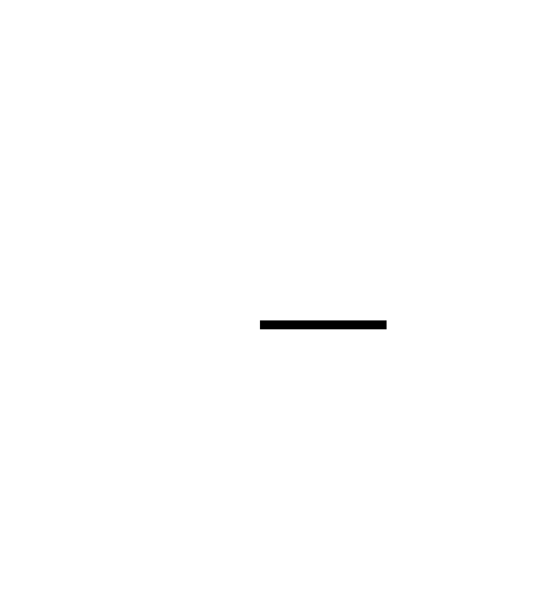

# Project CDC: Real-Time Change Data Capture System Design


## Overview

This document outlines the design for a Change Data Capture (CDC) system that streams database changes (INSERT, UPDATE, DELETE) to downstream consumers in real-time. The core challenge is reliably reading low-level database transaction logs (like PostgreSQL WAL or MySQL binlog), transforming them into structured change events, and delivering them with strong ordering guarantees, all while handling schema changes and database-specific complexities without impacting the source database's performance.


> This guide is meant to help you understand the big picture before diving into each milestone. Refer back to it whenever you need context on how components connect.


> **Milestone(s):** Milestone 1 (foundational concepts), Milestone 2 (delivery concepts), Milestone 3 (schema concepts)

## 1. Context and Problem Statement

Modern applications increasingly rely on real-time data flows—when a user updates their profile, the search index should reflect it instantly; when an inventory item sells out, the e-commerce listing should update immediately; when a financial transaction occurs, fraud detection must analyze it in seconds. This creates a fundamental challenge: **how do you reliably propagate database changes to downstream systems the moment they happen?**

Traditional approaches like periodic polling or batch ETL jobs are fundamentally mismatched for this real-time requirement. They introduce significant latency (minutes to hours), waste resources by repeatedly querying unchanged data, and can't guarantee they capture every change. The core problem this design document addresses is building a system that captures database changes **as they occur** with **minimal performance impact** on the source database, **strong ordering guarantees**, and **robust handling of schema evolution**—all while being maintainable across different database technologies.

### 1.1 The Newspaper Analogy for CDC

Think of your application database as a town hall where official records are kept. Different departments (downstream systems) need the latest information: the tax office needs new business registrations, the postal service needs address changes, and the library needs updates to public records.

**Polling-Based Approach (The Town Crier):** Every hour, each department sends a clerk to the town hall to manually copy all records changed since their last visit. This is wasteful (clerks often find nothing changed), slow (changes aren't known until the next hourly visit), and error-prone (what if the clerk misses a page?).

**Trigger-Based Approach (The Overzealous Clerk):** The town hall hires a clerk who sits beside every record book. Whenever a record is modified, the clerk immediately makes a copy and rushes it to all departments. This ensures real-time delivery but causes chaos—the clerk's constant interruptions slow down the main record-keeping work, and if the clerk gets sick, all updates stop.

**Log-Based CDC (The Newspaper Printer):** The town hall maintains a **printing press** that automatically produces a copy of every change made to the records, in the exact order they occurred. This press operates in a separate room, not interfering with the main clerks. At 5 AM each morning, the press rolls, producing a **newspaper** (the transaction log) containing yesterday's changes. Downstream systems simply subscribe to the newspaper delivery. This approach is **non-intrusive** (doesn't slow record-keeping), **complete** (every change is printed), and **ordered** (changes appear in the sequence they happened).

> **Key Insight:** Transaction logs (Write-Ahead Logs in PostgreSQL, binlogs in MySQL) are the database's internal "newspaper printer." They already exist for crash recovery purposes. Log-based CDC reads this existing byproduct, making it the most efficient and reliable method for change capture.

### 1.2 The Technical Challenge of Log-Based CDC

While the newspaper analogy simplifies the concept, the engineering reality involves navigating a labyrinth of low-level complexities. Building a production-grade CDC system is challenging because you're interfacing with the database's most critical internal mechanism—its transaction log—which was designed for recovery, not for external consumption.

**1. Database-Specific Binary Formats:** Each database implements its transaction log differently. PostgreSQL's WAL is a low-level physical log recording page-level changes, while MySQL's binlog can be configured for statement-based (SQL commands) or row-based (actual row changes) logging. Parsing these requires deep understanding of each database's internal binary format, which can change between minor versions.

**2. Transaction Boundary Reconstruction:** Databases write to their logs during transactions, not just at commit. A single logical update might involve multiple log entries across different tables. The CDC system must **reconstruct transaction boundaries**—grouping all changes belonging to a single transaction and only emitting them when the commit record appears. This requires maintaining in-memory state for pending transactions, which introduces complexity around memory management and crash recovery.

**3. Ordering and Duplication Guarantees:** Downstream consumers often require that changes to the same database row are processed in the exact order they occurred. If a row is updated from value A→B→C, consumers must see A→B→C, never A→C→B or B→A→C. The CDC system must guarantee **per-primary-key ordering** even when reading from a log that might interleave changes from multiple concurrent transactions. Additionally, after a system restart or network failure, the CDC system must resume from exactly where it left off without **skipping changes** or **reprocessing duplicates**.

**4. Schema Evolution Without Breaking Consumers:** Databases evolve—columns are added, removed, or renamed; data types change. A CDC system emitting change events must handle these **schema changes gracefully**. If a consumer built to expect three columns suddenly receives events with four columns, it will fail. The system needs a **versioned schema registry** and **compatibility rules** to ensure old consumers can still read new events (backward compatibility) and new consumers can read old events (forward compatibility).

**5. Performance Isolation and Backpressure:** The CDC system must operate without degrading the source database's performance. This means:
   - **Minimal read load:** Efficiently tailing the log without expensive queries.
   - **Backpressure handling:** If downstream consumers slow down, the CDC system must **pause log reading** rather than buffer events infinitely in memory, which could lead to out-of-memory crashes.
   - **Network resilience:** Surviving temporary disconnections from the database or message broker without data loss.

The following table summarizes these core challenges and their implications:

| Challenge | Technical Implication | Consequence If Mishandled |
|-----------|----------------------|---------------------------|
| **Binary Log Formats** | Need separate parser for each database (PostgreSQL, MySQL, etc.) | System only works with one database; breaks on version upgrades |
| **Transaction Reconstruction** | Must buffer uncommitted changes in memory | Memory exhaustion on large transactions; lost changes on crash |
| **Ordering Guarantees** | Must track position per partition/key | Consumers process changes out-of-order, causing data corruption |
| **Schema Evolution** | Need versioned schemas + compatibility checks | Consumer crashes on schema changes; requires manual intervention |
| **Backpressure** | Must coordinate between log reader and event publisher | Memory overflow; stalled log reading causing lag |

### 1.3 Existing Approaches and Trade-offs

Before committing to log-based CDC, we evaluated three primary architectural approaches, each with distinct trade-offs. The decision matrix below compares them across critical dimensions for our use case:

| Approach | How It Works | Latency | Performance Impact on Source DB | Reliability/Completeness | Implementation Complexity |
|----------|--------------|---------|--------------------------------|--------------------------|---------------------------|
| **Application-Level Dual Writes** | Application code writes to DB and simultaneously publishes to message queue | Very Low (ms) | High (doubles write latency, adds failure modes) | Low (race conditions, partial failures cause inconsistency) | Medium |
| **Database Triggers** | Database triggers fire on DML, calling stored procedure to publish changes | Low (ms) | Very High (serializes writes, adds trigger overhead) | Medium (trigger failures silently lose changes) | High (database-specific, hard to debug) |
| **Polling with Timestamps/Version Columns** | Periodic SELECT queries for rows where `updated_at > last_check` | High (seconds-minutes) | Medium (indexed queries still cause load) | Low (misses deletions, concurrent updates) | Low |
| **Log-Based CDC (Our Choice)** | Read database transaction log (WAL/binlog) asynchronously | Low (ms-seconds) | **Very Low** (reads existing log, non-intrusive) | **High** (captures every change, ordered) | **Very High** (complex parsing, state management) |

> **Decision: Choosing Log-Based CDC Over Alternatives**
> - **Context**: We need a production-grade CDC system that guarantees complete change capture with minimal performance impact on source databases, suitable for high-volume transactional systems.
> - **Options Considered**:
>   1. **Application-Level Dual Writes**: Modify every application to write to both DB and message queue.
>   2. **Database Triggers**: Use database triggers to publish changes via stored procedures.
>   3. **Polling with Change Tracking**: Periodic queries using timestamps or SQL Server Change Tracking.
>   4. **Log-Based CDC**: Asynchronous reading of transaction logs.
> - **Decision**: Implement log-based CDC using database transaction logs (PostgreSQL WAL, MySQL binlog).
> - **Rationale**:
>   - **Performance Isolation**: Transaction logs are already written for crash recovery; reading them adds negligible load compared to triggers (which serialize writes) or dual writes (which double latency).
>   - **Completeness Guarantee**: Logs capture EVERY committed change including deletions—polling approaches inherently miss deletions unless using tombstone flags.
>   - **Ordering Preservation**: Logs preserve the exact commit sequence, enabling per-key ordering guarantees crucial for downstream consistency.
>   - **No Application Changes**: Works with existing applications without code modifications—critical for legacy systems.
> - **Consequences**:
>   - **Increased Implementation Complexity**: Must build/maintain database-specific log parsers that understand binary formats.
>   - **Database Version Coupling**: Parser may need updates for new database versions.
>   - **Initial Snapshot Requirement**: Need a mechanism to capture initial table state before beginning log streaming.

**Deep Dive: Why Not Application-Level Dual Writes?**

While dual writes seem simple—just add a `kafkaProducer.send()` after your database `INSERT`—they suffer from **distributed consistency problems**. Consider this scenario:

1. Application writes to Database → SUCCESS
2. Application writes to Kafka → NETWORK TIMEOUT
3. What now? The database has the change but Kafka doesn't.

The application must now decide: roll back the database transaction (impacting user experience) or retry the Kafka write (potentially causing duplicates). Even with retries, there's a window where the systems are inconsistent. This problem is formally known as the **Two Generals' Problem**—there's no guaranteed way to coordinate two distributed systems to both commit or both rollback. Log-based CDC avoids this by making the database the **single source of truth** and treating change capture as an asynchronous follower.

**Deep Dive: The Pitfalls of Trigger-Based CDC**

Triggers seem appealing—they're database-native and guarantee capture. However, they introduce **severe performance penalties**:

- **Serial Execution**: Triggers execute within the same transaction as the DML operation. If the trigger code (which publishes to Kafka) takes 100ms, every database write now takes 100ms longer.
- **Single Point of Failure**: If the network to Kafka is down, the trigger fails, causing the entire database transaction to fail—blocking all writes.
- **Debugging Complexity**: Trigger errors manifest as mysterious database errors, requiring deep database-specific expertise to troubleshoot.

A real-world example: An e-commerce platform implemented trigger-based CDC. During Black Friday, write volume increased 50x. The trigger overhead caused transaction locks to be held longer, leading to **deadlock storms** that brought the entire checkout system to a halt.

**Deep Dive: Limitations of Polling Approaches**

Polling with `updated_at` columns or Change Tracking has fundamental gaps:

1. **Misses Deletions**: Unless you implement soft deletes with a `deleted_at` column, `DELETE` operations vanish without a trace.
2. **Race Conditions**: If two updates occur between polling intervals, you might only capture the second one.
3. **Performance Scaling**: As the table grows, `SELECT ... WHERE updated_at > ?` queries become expensive even with indexes, competing with operational queries.
4. **No Transaction Boundaries**: You see individual row changes but lose the information that changes to Table A and Table B were part of the same atomic transaction.

These limitations make polling unsuitable for financial systems, inventory management, or any use case requiring complete, ordered change capture.

> **Design Principle:** A CDC system should be **invisible to the source database**—it shouldn't add latency to writes, consume significant CPU, or become a single point of failure. Log-based CDC, while complex to implement, is the only approach that satisfies this principle while providing the completeness and ordering guarantees required for mission-critical data pipelines.

By embracing log-based CDC, we accept the upfront complexity of parsing binary logs in exchange for a robust, performant foundation that can scale with the database without impacting it. The remainder of this design document details how we navigate these complexities through careful component design, state management, and fault-tolerant streaming.

### Implementation Guidance

Since this section is purely conceptual (Context and Problem Statement), there is no implementation code required. However, we provide foundational technology recommendations that will inform the implementation in subsequent sections.

**A. Technology Recommendations Table:**

| Component | Simple Option (For Learning/Prototyping) | Advanced Option (Production-Grade) |
|-----------|------------------------------------------|-----------------------------------|
| **Database Connection** | JDBC for initial snapshot + direct TCP socket for log streaming | Database-native libraries (PostgreSQL: `pgjdbc` with `PGReplicationStream`; MySQL: `mysql-connector-j` with binlog listener) |
| **Log Parsing** | Custom parser for a single database version using documented format | Debezium Connector framework (pluggable parsers, handles version differences) |
| **Event Streaming** | Apache Kafka with Java Producer API | Kafka with exactly-once semantics (Kafka Transactions) or Apache Pulsar |
| **Schema Management** | Simple file-based schema registry (JSON files) | Confluent Schema Registry (REST API, Avro schemas, compatibility checks) |
| **Monitoring** | Log files + manual offset tracking | Prometheus metrics + Grafana dashboards for consumer lag, parse errors |

**B. Recommended Project File Structure:**

While the full architecture will be detailed in Section 3, we recommend starting with this structure to organize the codebase:

```
cdc-system/
├── docs/                           # Design documents, diagrams
│   └── diagrams/                   # SVG diagram files
├── lib/                            # Database-specific parser libraries (if not using Debezium)
│   ├── postgres-wal-parser/
│   └── mysql-binlog-parser/
├── src/main/java/com/cdc/
│   ├── core/                       # Core data models and interfaces
│   │   ├── ChangeEvent.java
│   │   ├── RawLogEntry.java
│   │   └── SchemaVersion.java
│   ├── connector/                  # Log Connector & Parser (Milestone 1)
│   │   ├── LogConnector.java
│   │   ├── postgres/              # PostgreSQL-specific implementation
│   │   └── mysql/                 # MySQL-specific implementation
│   ├── builder/                    # Change Event Builder (Milestone 1)
│   │   └── ChangeEventBuilder.java
│   ├── streamer/                   # Event Streamer & Delivery (Milestone 2)
│   │   └── EventStreamer.java
│   ├── schema/                     # Schema Registry & Evolution (Milestone 3)
│   │   └── SchemaRegistry.java
│   └── util/                       # Utilities (serialization, configuration, metrics)
├── config/                         # Configuration files
│   ├── cdc-config.yaml
│   └── log4j2.xml
├── tests/                          # Test suites
│   ├── unit/                       # Unit tests
│   ├── integration/                # Integration tests with embedded DB
│   └── e2e/                        # End-to-end tests
└── README.md
```

**C. Infrastructure Starter Code:**

Before implementing log parsing, you'll need a configuration management utility. Here's a complete, ready-to-use configuration loader:

```java
package com.cdc.util;

import com.fasterxml.jackson.databind.ObjectMapper;
import com.fasterxml.jackson.dataformat.yaml.YAMLFactory;
import java.io.File;
import java.io.IOException;

/**
 * Configuration loader for CDC system. Loads YAML configuration files.
 * This is a prerequisite utility - copy and use as-is.
 */
public class ConfigLoader {
    private static final ObjectMapper mapper = new ObjectMapper(new YAMLFactory());
    
    /**
     * Load configuration from YAML file.
     * @param configPath Path to YAML configuration file
     * @param configClass Configuration class type
     * @return Populated configuration object
     * @throws IOException If file cannot be read or parsed
     */
    public static <T> T loadConfig(String configPath, Class<T> configClass) throws IOException {
        File configFile = new File(configPath);
        if (!configFile.exists()) {
            throw new IOException("Configuration file not found: " + configPath);
        }
        return mapper.readValue(configFile, configClass);
    }
}

/**
 * Main CDC configuration class. Extend this with database-specific sections.
 */
public class CdcConfig {
    private DatabaseConfig database;
    private StreamingConfig streaming;
    private SchemaConfig schema;
    
    // Getters and setters
    public DatabaseConfig getDatabase() { return database; }
    public void setDatabase(DatabaseConfig database) { this.database = database; }
    
    public static class DatabaseConfig {
        private String type; // "postgresql" or "mysql"
        private String host;
        private int port;
        private String database;
        private String username;
        private String password;
        private String slotName; // For PostgreSQL replication slot
        // Getters and setters
    }
    
    public static class StreamingConfig {
        private String bootstrapServers; // Kafka bootstrap servers
        private String topicPrefix = "cdc.";
        private int maxInFlightRequests = 5;
        // Getters and setters
    }
    
    public static class SchemaConfig {
        private String registryUrl; // Schema Registry URL
        private boolean autoRegisterSchemas = true;
        // Getters and setters
    }
}
```

**D. Language-Specific Hints (Java):**

- **Use try-with-resources**: Always use `try-with-resources` for database connections, network sockets, and file streams to ensure proper cleanup.
- **Logging framework**: Use SLF4J with Logback or Log4j2 for structured logging. Avoid `System.out.println()` in production code.
- **Concurrency**: Use `java.util.concurrent` classes (`ExecutorService`, `ConcurrentHashMap`) rather than manual `synchronized` blocks where possible.
- **Error handling**: Use specific exception types (`IOException`, `SQLException`) rather than generic `Exception` catches to handle different failure modes appropriately.
- **Configuration**: Use environment variables for secrets (passwords, API keys) rather than hardcoding in configuration files.

**E. Milestone Checkpoint (Conceptual Foundation):**

Before proceeding to implementation, verify you understand these core concepts:
- ✅ **Understand the newspaper analogy** and why log-based CDC is non-intrusive.
- ✅ **Identify the three main challenges**: binary log parsing, transaction reconstruction, and schema evolution.
- ✅ **Articulate why dual writes and triggers are problematic** for production systems.
- ✅ **Set up your development environment** with Java 11+, Maven/Gradle, and access to a PostgreSQL or MySQL instance.

**F. Debugging Tips (Conceptual Level):**

| Symptom | Likely Conceptual Misunderstanding | How to Diagnose | Fix |
|---------|------------------------------------|-----------------|-----|
| "Why not just query the table every minute?" | Doesn't understand latency and completeness requirements | Ask: "What happens if a row is updated twice between queries? What about DELETE operations?" | Review polling limitations in section 1.3 |
| "Can't we just add a Kafka send() in our DAO layer?" | Doesn't understand distributed consistency problem | Diagram the dual write failure scenario with network timeout | Review "Why Not Application-Level Dual Writes?" |
| "Triggers are built into the database, so they must be reliable" | Doesn't understand performance impact of serial execution | Test trigger overhead with a simple stored procedure that sleeps for 100ms | Review trigger pitfalls in section 1.3 |

---


## 2. Goals and Non-Goals

> **Milestone(s):** Milestone 1, Milestone 2, Milestone 3 (foundational requirements for all milestones)

This section establishes a clear contract between the system designers and implementers by defining **what the system must accomplish** (Goals) and **what it explicitly will not handle** (Non-Goals). In a complex system like CDC where requirements could expand infinitely, these boundaries prevent scope creep and ensure focus on delivering core value. Think of this as the architectural constitution—it defines the principles that all subsequent design decisions must uphold.

### 2.1 Goals (Must Have)

The system must deliver **real-time, reliable, and ordered** change data capture from transactional databases to downstream consumers. These goals are categorized into functional requirements (what the system does) and non-functional requirements (how well it does it).

#### Functional Goals

| Goal Category | Specific Requirement | Description & Rationale | Associated Milestone |
|---------------|---------------------|------------------------|---------------------|
| **Log Reading & Parsing** | Connect to database transaction logs | Establish a direct connection to PostgreSQL's Write-Ahead Log (WAL) or MySQL's binlog using their respective native protocols (logical decoding for PostgreSQL, binlog replication for MySQL). This is foundational—without reading the log, there is no CDC. | 1 |
| | Parse INSERT, UPDATE, DELETE operations | Extract these three DML (Data Manipulation Language) operations from log entries. These represent the core data changes that downstream systems care about. DDL (Data Definition Language) operations like `ALTER TABLE` are handled separately under schema evolution. | 1 |
| | Capture before and after images for UPDATE | For UPDATE operations, extract both the previous state (`beforeImage`) and the new state (`afterImage`) of the row. This enables consumers to understand what changed, not just the new value, which is critical for audit trails, incremental materialized views, and conflict resolution. | 1 |
| | Track and persist log position | Record the **log sequence number (LSN)** for PostgreSQL or **binlog position** for MySQL after successfully processing each transaction. This state must be durably stored (e.g., in a separate state table or file) to enable resumption from the exact point after a restart, preventing data loss or duplication. | 1 |
| **Event Construction & Delivery** | Publish events to a message broker | Stream `ChangeEvent` objects to Apache Kafka (or a similar message broker like Pulsar). The broker provides buffering, persistence, and fan-out capabilities that decouple the CDC system from consumers. | 2 |
| | Guarantee at-least-once delivery | Ensure every `ChangeEvent` reaches the message broker at least once, even in the face of network failures or producer restarts. This is achieved through producer retries with idempotence enabled and acknowledgment (ack) from all in-sync replicas before considering an event "sent." | 2 |
| | Maintain ordering per primary key | Guarantee that all changes to the same database row (identified by its primary key) are delivered to consumers in the exact order they were committed in the source database. This preserves causality and prevents race conditions in consumer processing. | 2 |
| | Handle backpressure | Monitor consumer lag (the difference between the latest event produced and the last event consumed). If lag exceeds a configurable threshold, the system should slow down or pause log reading to prevent overwhelming downstream systems and the broker. | 2 |
| **Schema Management** | Store and version table schemas | Maintain a history of `SchemaVersion` objects for each table in a **schema registry**. Each version includes the complete column definition (`columnDefinitions`) at that point in time. | 3 |
| | Enforce backward compatibility | Validate that new schema versions are **backward compatible** with the previous version. This means consumers using the old schema can read data written with the new schema. In practice, this allows adding nullable columns or columns with default values but prohibits removing columns or narrowing column types. | 3 |
| | Propagate schema change events | Emit a special `ChangeEvent` (with `operationType = "SCHEMA_CHANGE"`) to a dedicated topic when a compatible schema change occurs. This event includes the new `schemaVersionId` and metadata about the change, allowing consumers to refresh their local schema cache or trigger reprocessing. | 3 |
| **Operational & Observability** | Provide monitoring metrics | Expose key metrics: number of events processed per second, consumer lag per partition, parse errors, schema validation failures, and database connection health. These should be available via a Prometheus endpoint or similar. | 2, 3 |
| | Support graceful shutdown and restart | On shutdown signal, complete processing of the current log transaction, flush all pending events to the broker, commit the final log position, and then exit. On restart, reload the last committed position and resume reading from that exact point. | 1, 2 |
| | Configuration externalization | All operational parameters (database connection details, broker addresses, thresholds) must be loadable from external configuration files or environment variables, not hardcoded. The `ConfigLoader.loadConfig` utility is provided for this purpose. | All |

> **Architectural Insight:** The functional goals are intentionally scoped to **logical decoding** of committed transactions only. We avoid **trigger-based** CDC (which modifies application tables) and **query-based** CDC (which polls tables), as these impose unacceptable performance overhead on the source database and cannot capture deletes. Reading the transaction log is the only non-intrusive method for real-time change capture.

#### Non-Functional Goals (Quality Attributes)

| Quality Attribute | Target | Justification |
|------------------|--------|--------------|
| **Latency** | End-to-end latency (database commit to event available to consumer) ≤ 1 second under normal load. | Real-time use cases (e.g., fraud detection, live dashboards) require sub-second freshness. The primary latency contributors are log flush frequency on the database (controllable via configuration) and network round-trip to the broker. |
| **Throughput** | Sustain processing of at least 10,000 change events per second on a single CDC instance. | Must handle peak write loads of typical online transaction processing (OLTP) systems. Throughput is primarily bounded by log parsing CPU, network bandwidth to the broker, and serialization overhead. |
| **Availability** | 99.9% uptime (≈8.76 hours of downtime per year). The system should be restartable without data loss. | While not mission-critical like the source database, the CDC system is a core data pipeline component. High availability is achieved through fast recovery (resuming from persisted position) and potentially multiple instances (though only one can read the log at a time). |
| **Durability** | Zero data loss under single-node failure of the CDC system. | Achieved by **only advancing the persisted log position after events are confirmed as durably stored in the message broker** (acknowledged by all in-sync replicas). This creates a chain of durability from database log → broker → consumer. |
| **Operational Simplicity** | Single binary deployment with minimal runtime dependencies (besides the database and broker). | Reduces deployment complexity and operational overhead. The CDC system should not require a separate cluster manager, distributed coordination service (like ZooKeeper), or complex orchestration to function in its basic form. |
| **Extensibility** | Clear interfaces for adding support for new database types (e.g., Oracle, SQL Server). | The core CDC logic should be database-agnostic. Database-specific parsing is isolated behind a `LogConnector` interface, allowing new adapters to be plugged in with minimal changes to the event pipeline. |

### 2.2 Non-Goals (Explicitly Out of Scope)

Explicitly stating what the system **will not do** is equally important to prevent misaligned expectations and endless feature creep. These decisions allow us to build a focused, robust core system.

> **Decision: Focus on Core CDC Pipeline, Not Auxiliary Services**  
> **Context:** A complete enterprise data platform might include many related services: data transformation, enrichment, dead-letter queues, complex event processing, and managed deployments.  
> **Options Considered:**  
> 1. **Build a comprehensive data pipeline platform** with built-in transformation, enrichment, and complex routing.  
> 2. **Build only the core CDC extraction and delivery pipeline**, delegating other concerns to specialized downstream systems.  
> **Decision:** Option 2—focus on being a reliable source of raw change events.  
> **Rationale:** The Unix philosophy: "Do one thing well." By outputting standardized `ChangeEvent` objects to a message broker, we enable any number of downstream systems (Stream processors like Flink, ETL tools, custom applications) to consume and transform the data according to their specific needs. This keeps the CDC system simple, maintainable, and focused on its hardest problem: reliable log reading.  
> **Consequences:** Users must deploy additional systems for transformations, but they gain flexibility in choosing the right tool for each job. The CDC system remains stable and easier to reason about.

| Non-Goal Area | Specific Exclusions | Reasoning & Recommended Alternative |
|---------------|-------------------|-----------------------------------|
| **Data Transformation & Enrichment** | No in-flight modification of event payloads (e.g., joining with reference data, masking sensitive fields, computing derived columns). | Transformation is a separate concern with different scalability and fault-tolerance requirements. **Alternative:** Stream processing frameworks (Apache Flink, Kafka Streams) or dedicated ETL tools should consume raw events and perform transformations. |
| **Exactly-Once Delivery Semantics** | The system will not guarantee exactly-once delivery to end consumers in the face of all possible failures. | Achieving exactly-once semantics across the entire pipeline (database → CDC → broker → consumer) requires distributed transactions and heavy coordination, which adds immense complexity and performance overhead. **Alternative:** We guarantee **at-least-once** with idempotent producers to the broker, and consumers must implement **idempotent processing** (e.g., deduplication by `eventId` or by primary key + timestamp) to achieve effectively-once semantics. |
| **Global Ordering Across All Events** | Events across different tables or different primary keys within the same table are **not** guaranteed to be delivered in commit order relative to each other. | Maintaining strict global ordering would require single-threaded processing or complex distributed sequencing, destroying throughput. **Alternative:** We guarantee **partition-level ordering** (per primary key). Consumers needing cross-key causality must infer it via timestamps or use more advanced techniques like distributed snapshots, which are out of scope. |
| **DDL Change Automation** | The system will not automatically apply DDL changes (like `ALTER TABLE`) to downstream data stores or data warehouses. | Schema changes often require careful migration planning, data backfilling, and consumer coordination. Automating this is risky. **Alternative:** The system **will detect and notify** of schema changes via `SchemaChangeEvent`. A separate orchestration process or human operator should then manage the downstream migration. |
| **Change Data Capture for Non-Supported Databases** | Out-of-the-box support for databases other than PostgreSQL and MySQL (e.g., Oracle, SQL Server, MongoDB). | Each database has unique log formats and replication protocols. Supporting all would make the codebase unwieldy. **Alternative:** The system is designed with a pluggable `LogConnector` interface. Support for additional databases can be added as extensions in future versions without modifying the core pipeline. |
| **Historical Data Snapshotting** | The system will not perform initial full-table snapshots (bulk load of existing data) before beginning incremental change capture. | Snapshotting requires different mechanisms (e.g., table locks, consistent reads) and has different recovery characteristics than log reading. **Alternative:** A separate, one-time snapshot tool should be used to bootstrap consumers. The CDC system then streams changes from the snapshot point forward. |
| **Long-Term Event Storage & Archive** | Events are not stored indefinitely within the CDC system. Retention is delegated to the message broker. | Storage management is a separate concern. **Alternative:** Configure Kafka retention policies based on storage capacity and compliance requirements. For archival needs, use Kafka Connect to sink events to long-term storage (S3, HDFS). |
| **Graphical User Interface (GUI)** | No administrative web UI for monitoring, configuration, or control. | Building a production-grade UI is a major undertaking that distracts from core data pipeline reliability. **Alternative:** Expose metrics via Prometheus (for dashboards with Grafana) and provide command-line tools for operational tasks. |
| **Multi-Tenancy & Access Control** | No built-in user authentication, authorization, or tenant isolation within the CDC system itself. | Security boundaries should be enforced at the infrastructure level (database permissions, network isolation, broker ACLs). **Alternative:** Run separate CDC instances per tenant, or rely on database and broker-level security features. |

> **Key Design Principle:** By explicitly excluding these areas, we commit to building a **simple, composable component** rather than a monolithic platform. This aligns with the modern data stack philosophy, where best-of-breed tools are connected via streaming platforms. The CDC system's job is to be the most reliable and performant bridge between the database and that ecosystem.

The following table summarizes the architectural trade-offs implied by these non-goals:

| Trade-off | Benefit | Cost |
|-----------|---------|------|
| **At-least-once vs Exactly-once** | Simpler implementation, higher throughput, no need for distributed transaction coordinator. | Consumers must implement idempotent processing; possible duplicate events during failure recovery. |
| **Partition ordering vs Global ordering** | Enables massive parallelism (multiple partitions processed concurrently), high throughput. | Applications needing cross-key causality must implement more complex logic or accept eventual consistency. |
| **No built-in transformation** | Focused codebase, easier debugging, stability in core function. | Requires additional stream processing component in the architecture, increasing system complexity overall. |
| **Notification-only for DDL** | Safe, avoids automatic actions that could break downstream systems. | Requires operational processes to handle schema migrations, potentially slower response to changes. |

### Implementation Guidance

#### A. Technology Recommendations Table

| Component | Simple Option (For Learning/Dev) | Advanced Option (For Production) |
|-----------|----------------------------------|----------------------------------|
| **Log Parser Library** | Direct JDBC for initial testing (simpler but higher latency) | **Debezium Embedded Engine** (mature, handles version-specific log formats, includes state management) |
| **Message Broker** | Apache Kafka (single broker in Docker) | **Apache Kafka Cluster** (multiple brokers with replication factor ≥ 2 for high availability) |
| **Schema Registry** | In-memory `ConcurrentHashMap`-based registry (for testing) | **Confluent Schema Registry** (RESTful, supports Avro, Protobuf, JSON Schema, compatibility checking) |
| **Metrics & Monitoring** | Logging to stdout with structured JSON | **Micrometer + Prometheus** (exposes metrics endpoint) + **Grafana** (dashboards) |
| **Configuration** | YAML file loaded via `ConfigLoader` | **HashiCorp Consul** or **Spring Cloud Config** (dynamic configuration, secrets management) |
| **State Persistence** | File-based storage (JSON in local file) | **Kafka `__consumer_offsets`** topic or a dedicated database table (more durable, supports multi-instance) |

#### B. Recommended Project File Structure

```
cdc-system/
├── config/
│   └── application.yml              # Main configuration file
├── src/main/java/com/cdc/
│   ├── core/
│   │   ├── ConfigLoader.java        # Provided utility
│   │   ├── RawLogEntry.java         # Core data type
│   │   ├── ChangeEvent.java         # Core data type
│   │   └── SchemaVersion.java       # Core data type
│   ├── connector/
│   │   ├── LogConnector.java        # Interface for database-specific connectors
│   │   ├── postgres/
│   │   │   ├── PostgresWalConnector.java
│   │   │   └── PostgresWalParser.java
│   │   └── mysql/
│   │       ├── MySqlBinlogConnector.java
│   │       └── MySqlBinlogParser.java
│   ├── builder/
│   │   ├── ChangeEventBuilder.java
│   │   └── TransactionState.java    # Tracks in-progress transactions
│   ├── streamer/
│   │   ├── EventStreamer.java
│   │   ├── KafkaEventPublisher.java
│   │   └── BackpressureController.java
│   ├── schema/
│   │   ├── SchemaRegistry.java
│   │   ├── CompatibilityChecker.java
│   │   └── InMemorySchemaRegistry.java # Simple implementation
│   ├── state/
│   │   └── PositionManager.java     # Persists and loads LSN/binlog position
│   └── Main.java                    # Application entry point
└── README.md
```

#### C. Infrastructure Starter Code

**Configuration Loader (Provided Utility):**
```java
package com.cdc.core;

import com.fasterxml.jackson.databind.ObjectMapper;
import com.fasterxml.jackson.dataformat.yaml.YAMLFactory;
import java.io.File;
import java.io.IOException;

public class ConfigLoader {
    private static final ObjectMapper mapper = new ObjectMapper(new YAMLFactory());
    
    /**
     * Loads configuration from a YAML file and maps it to the specified class.
     * @param configPath Path to the YAML configuration file
     * @param configClass Class of the configuration object (e.g., AppConfig.class)
     * @return Populated configuration object
     * @throws IOException If file cannot be read or parsed
     */
    public static <T> T loadConfig(String configPath, Class<T> configClass) throws IOException {
        return mapper.readValue(new File(configPath), configClass);
    }
}
```

#### D. Core Logic Skeleton Code

**Application Configuration Skeleton:**
```java
package com.cdc.core;

public class AppConfig {
    private DatabaseConfig database;
    private KafkaConfig kafka;
    private SchemaConfig schema;
    private int maxBatchSize;
    private long backpressureThresholdMs;
    
    // TODO: Add getters and setters for all fields
    
    public static class DatabaseConfig {
        private String type; // "postgresql" or "mysql"
        private String host;
        private int port;
        private String database;
        private String username;
        private String password;
        private String slotName; // For PostgreSQL logical decoding slot
        // TODO: Add getters and setters
    }
    
    public static class KafkaConfig {
        private String bootstrapServers;
        private String topicPrefix;
        private int replicationFactor;
        private int partitionsPerTable;
        private String acks; // "all" for at-least-once
        private boolean enableIdempotence;
        // TODO: Add getters and setters
    }
    
    public static class SchemaConfig {
        private String registryType; // "inmemory" or "confluent"
        private String registryUrl; // For Confluent Schema Registry
        // TODO: Add getters and setters
    }
}
```

**Main Application Entry Point:**
```java
package com.cdc;

import com.cdc.core.AppConfig;
import com.cdc.core.ConfigLoader;
import com.cdc.connector.LogConnector;
import com.cdc.connector.postgres.PostgresWalConnector;
import com.cdc.connector.mysql.MySqlBinlogConnector;
import com.cdc.builder.ChangeEventBuilder;
import com.cdc.streamer.EventStreamer;
import com.cdc.schema.SchemaRegistry;
import com.cdc.state.PositionManager;

public class Main {
    public static void main(String[] args) {
        try {
            // TODO 1: Load configuration from "config/application.yml"
            // TODO 2: Initialize PositionManager to load last saved log position
            // TODO 3: Initialize SchemaRegistry (in-memory or remote)
            // TODO 4: Create appropriate LogConnector based on database type
            // TODO 5: Initialize ChangeEventBuilder with SchemaRegistry and PositionManager
            // TODO 6: Initialize EventStreamer with Kafka configuration
            // TODO 7: Connect LogConnector to database and start reading from last position
            // TODO 8: For each RawLogEntry parsed, pass to ChangeEventBuilder
            // TODO 9: For each ChangeEvent built, pass to EventStreamer for publishing
            // TODO 10: Handle shutdown signal to gracefully stop all components
        } catch (Exception e) {
            System.err.println("CDC System failed to start: " + e.getMessage());
            e.printStackTrace();
            System.exit(1);
        }
    }
}
```

#### E. Language-Specific Hints (Java)

1. **Use try-with-resources** for all database and network connections to ensure proper cleanup.
2. **For JSON serialization** of configuration and state, use Jackson (`ObjectMapper`) as shown in `ConfigLoader`.
3. **For Kafka integration**, use the official `kafka-clients` library. Configure `ProducerConfig.ENABLE_IDEMPOTENCE_CONFIG = true` and `ProducerConfig.ACKS_CONFIG = "all"` for at-least-once semantics.
4. **For concurrent state management** in `ChangeEventBuilder`, use `ConcurrentHashMap` for tracking transaction state, keyed by `transactionId`.
5. **Use SLF4J with Logback** for structured logging, not `System.out.println`.

#### F. Milestone Checkpoint

After implementing the foundational structure from this section (configuration loading, basic type definitions), verify:

1. **Configuration Loading Works:**
   ```
   $ java -cp target/cdc-system.jar com.cdc.Main
   Should print: "CDC System starting with configuration from config/application.yml"
   ```
   Create a minimal `config/application.yml`:
   ```yaml
   database:
     type: "postgresql"
     host: "localhost"
     port: 5432
     database: "mydb"
   kafka:
     bootstrapServers: "localhost:9092"
   ```

2. **Type Definitions Compile:** Ensure the three core types (`RawLogEntry`, `ChangeEvent`, `SchemaVersion`) compile without errors. You should be able to create instances of each in a simple test.

3. **Project Structure Validated:** Confirm your project follows the recommended directory layout. This foundation will make subsequent milestone implementation much smoother.

#### G. Debugging Tips

| Symptom | Likely Cause | How to Diagnose | Fix |
|---------|--------------|----------------|------|
| "Configuration file not found" error on startup | Wrong path or working directory | Print `new File(".").getAbsolutePath()` to see current directory | Use absolute path in `ConfigLoader` or run from project root |
| `RawLogEntry`/`ChangeEvent` fields missing or wrong type | Type definitions don't match naming conventions | Compare field names exactly with NAMING CONVENTIONS section | Ensure fields match EXACTLY: `logSequenceNumber String`, `operationType String`, etc. |
| Unable to import Jackson classes in `ConfigLoader` | Missing dependency in build file (pom.xml or build.gradle) | Check if `jackson-dataformat-yaml` is in dependencies | Add: `<groupId>com.fasterxml.jackson.dataformat</groupId><artifactId>jackson-dataformat-yaml</artifactId>` |


> **Milestone(s):** Milestone 1, Milestone 2, Milestone 3

## 3. High-Level Architecture

This section provides a comprehensive architectural blueprint of the Change Data Capture (CDC) system. Before diving into component-level details, we establish the "big picture" view of how the system transforms low-level database transaction logs into reliable, schema-aware event streams for downstream consumers. Think of the architecture as an **industrial assembly line**: raw database log entries enter at one end and, through a series of specialized processing stations, emerge as polished, packaged change events ready for delivery. Each station has a specific responsibility, maintains its own state, and communicates with others through well-defined interfaces.

The architecture follows a **pipeline pattern** with clear separation of concerns, enabling independent development, testing, and scaling of each component. The system is designed to be **database-agnostic** at the pipeline level, with database-specific details encapsulated in pluggable adapters. This modular approach balances the need for consistent processing semantics across different database systems with the reality that each database implements its transaction logs differently.


### 3.1 Component Overview and Responsibilities

The system comprises four core internal components that work together, plus three external systems they interact with. The following table provides a complete reference of each component's role, ownership, and key responsibilities:

| Component | Role (Mental Model) | What It Owns (State) | Key Responsibilities | Input → Output Transformation |
|-----------|---------------------|----------------------|----------------------|-------------------------------|
| **Log Connector & Parser** (Milestone 1) | **The Database Translator** – reads the database's internal "flight recorder" and converts its binary format into structured data. | - Database connection handle<br>- Last processed LSN/offset<br>- Parser state (connected, reading, paused)<br>- Database-specific parser implementation | 1. Establishes and maintains connection to database transaction log (WAL/binlog)<br>2. Reads binary log entries in streaming fashion<br>3. Parses binary format into structured `RawLogEntry` objects<br>4. Tracks position (LSN) for resumption after restart<br>5. Handles database-specific quirks and version differences | Binary log entry → `RawLogEntry` |
| **Change Event Builder** (Milestone 1) | **The Event Assembler** – groups related log entries into complete change events, ensuring transaction atomicity and deduplication. | - In-progress transaction buffer<br>- Last seen event IDs for deduplication<br>- Mapping between database types and schema IDs | 1. Groups `RawLogEntry` objects by transaction boundaries<br>2. Constructs `ChangeEvent` with before/after images<br>3. Attaches schema version ID to each event<br>4. Performs deduplication based on primary keys<br>5. Orders events within same transaction by operation sequence | `RawLogEntry` (multiple) → `ChangeEvent` |
| **Event Streamer & Delivery** (Milestone 2) | **The Reliable Postal Service** – ensures change events reach their destination with delivery guarantees and proper ordering. | - Kafka producer instances<br>- Producer configuration and state<br>- Delivery callbacks and error handlers<br>- Backpressure monitoring state | 1. Publishes `ChangeEvent` objects to Kafka topics<br>2. Implements at-least-once delivery semantics<br>3. Enforces ordering per primary key via partitioning<br>4. Monitors consumer lag and applies backpressure<br>5. Handles broker failures and network issues | `ChangeEvent` → Kafka message (persisted) |
| **Schema Registry** (Milestone 3) | **The Contract Librarian** – maintains the evolving "data contracts" between database tables and their consumers. | - Versioned schema definitions<br>- Compatibility rules configuration<br>- Schema change history<br>- Client connection cache | 1. Stores and versions table schema definitions<br>2. Validates schema changes against compatibility rules<br>3. Provides schema lookup by version ID<br>4. Emits schema change notifications<br>5. Handles schema evolution migrations | DDL statement → `SchemaVersion` + compatibility check result |
| **Source Database** (External) | **The Event Source** – the operational database whose changes we capture. | Transaction logs (WAL/binlog), table schemas, and actual data. | 1. Generates transaction log entries for all data changes<br>2. Provides logical decoding/replication interfaces<br>3. Maintains log retention and rotation policies | Data modifications → Transaction log entries |
| **Message Broker (Kafka)** (External) | **The Event Highway** – provides durable, ordered, partitioned event storage and distribution. | Topics, partitions, offsets, and consumer groups. | 1. Persists change events with configurable retention<br>2. Distributes events to multiple consumer groups<br>3. Maintains ordering within partitions<br>4. Tracks consumer progress via offsets | Producer messages → Consumer-accessible streams |
| **Downstream Consumers** (External) | **The Event Destinations** – applications that react to or analyze database changes. | Their own processing state and business logic. | 1. Subscribe to Kafka topics<br>2. Process change events according to their business needs<br>3. Commit offsets to track progress<br>4. Handle schema evolution notifications | Change events → Business actions/analytics |

**Data Flow Through the Pipeline:**

The end-to-end flow follows this sequence:

1. **Capture**: When a database transaction commits, the database writes corresponding entries to its transaction log (PostgreSQL WAL or MySQL binlog). The Log Connector & Parser continuously reads these entries via the database's logical decoding interface (e.g., PostgreSQL's `pgoutput` or MySQL's binlog replication protocol).

2. **Parse & Translate**: Each binary log entry is parsed into a `RawLogEntry` containing the operation type, table name, affected row data (both old and new values for updates), and the log sequence number (LSN). This parsing is database-specific but produces a standardized intermediate format.

3. **Assemble & Enrich**: The Change Event Builder collects all `RawLogEntry` objects belonging to the same transaction. Once the transaction commit is detected, it assembles complete `ChangeEvent` objects, attaches the appropriate schema version ID by querying the Schema Registry, and ensures deduplication and ordering.

4. **Deliver & Guarantee**: The Event Streamer publishes each `ChangeEvent` to Kafka, using the table name and primary key to determine the target partition. It waits for acknowledgment from Kafka (configured for at-least-once semantics) before marking the event as delivered. If consumers fall behind, backpressure mechanisms slow down or pause the parser.

5. **Evolve & Notify**: When a DDL statement (like `ALTER TABLE`) is detected in the transaction log, the Schema Registry is consulted. The new schema is validated for compatibility, registered with a new version ID, and a special schema change event is emitted to notify consumers.

> **Key Design Insight**: The pipeline is designed with **idempotency** in mind. Each component can be restarted and resume from its last known good state without creating duplicates or losing data. This is achieved through persistent position tracking (LSN offsets), idempotent Kafka producers, and idempotent schema registration.

### 3.2 Recommended Project File Structure

A well-organized codebase is critical for managing the complexity of a CDC system. The following structure separates concerns logically, isolates database-specific code, and creates clear boundaries for testing and deployment. This structure follows Maven/Gradle conventions for Java projects but can be adapted for other languages.

```
cdc-system/
├── README.md                           # Project overview and setup instructions
├── pom.xml (or build.gradle)           # Build configuration and dependencies
├── config/
│   ├── application.yaml                # Main configuration file (loaded by ConfigLoader)
│   ├── logback.xml                     # Logging configuration
│   └── database-specific/
│       ├── postgresql-parser.yaml      # PostgreSQL-specific parser settings
│       └── mysql-parser.yaml           # MySQL-specific parser settings
├── src/main/java/com/example/cdc/
│   ├── Main.java                       # Entry point: Main.main(String[])
│   ├── config/
│   │   ├── AppConfig.java              # Root configuration class
│   │   ├── DatabaseConfig.java         # Database connection settings
│   │   ├── KafkaConfig.java            # Kafka producer settings
│   │   ├── SchemaConfig.java           # Schema registry settings
│   │   └── ConfigLoader.java           # Utility: ConfigLoader.loadConfig()
│   ├── model/                          # Core data types (immutable value objects)
│   │   ├── RawLogEntry.java            # Parsed log entry
│   │   ├── ChangeEvent.java            # Final change event
│   │   ├── SchemaVersion.java          # Schema version metadata
│   │   └── OperationType.java          # Enum: INSERT, UPDATE, DELETE
│   ├── connector/                      # Log Connector & Parser component
│   │   ├── LogConnector.java           # Main interface for log reading
│   │   ├── state/
│   │   │   ├── ConnectorState.java     # Enum: IDLE, CONNECTING, READING, etc.
│   │   │   └── PositionTracker.java    # Manages LSN/offset persistence
│   │   ├── parser/
│   │   │   ├── LogParser.java          # Generic parser interface
│   │   │   ├── postgresql/
│   │   │   │   ├── PostgresParser.java # PostgreSQL WAL parser implementation
│   │   │   │   └── PgOutputDecoder.java# Handles pgoutput logical decoding
│   │   │   └── mysql/
│   │   │       ├── MySqlParser.java    # MySQL binlog parser implementation
│   │   │       └── BinlogDecoder.java  # Handles MySQL binlog format
│   │   └── exception/
│   │       └── ParseException.java     # Custom exception for parse failures
│   ├── builder/                        # Change Event Builder component
│   │   ├── ChangeEventBuilder.java     # Main builder interface
│   │   ├── TransactionBuffer.java      # Buffers entries per transaction
│   │   ├── Deduplicator.java           # Removes duplicate events
│   │   └── EventOrderer.java           # Ensures causal ordering
│   ├── streamer/                       # Event Streamer & Delivery component
│   │   ├── EventStreamer.java          # Main streaming interface
│   │   ├── KafkaEventPublisher.java    # Kafka implementation
│   │   ├── DeliveryGuarantee.java      # Implements at-least-once logic
│   │   ├── BackpressureController.java # Monitors lag and applies backpressure
│   │   └── partitioner/
│   │       ├── EventPartitioner.java   # Interface for partitioning strategy
│   │       └── TablePkPartitioner.java # Partitions by table + primary key hash
│   ├── schema/                         # Schema Registry component
│   │   ├── SchemaRegistry.java         # Main registry interface
│   │   ├── InMemorySchemaRegistry.java # Simple in-memory implementation
│   │   ├── SchemaValidator.java        # Validates compatibility
│   │   ├── evolution/
│   │   │   ├── CompatibilityMode.java  # Enum: BACKWARD, FORWARD, FULL
│   │   │   └── SchemaMigrator.java     # Applies schema migrations
│   │   └── event/
│   │       └── SchemaChangeEvent.java  # Special event for schema changes
│   ├── pipeline/                       # Orchestrates the entire pipeline
│   │   ├── CdcPipeline.java            # Main pipeline coordinator
│   │   └── PipelineStateManager.java   # Manages pipeline lifecycle and state
│   └── util/                           # Shared utilities
│       ├── JsonSerializer.java         # JSON serialization/deserialization
│       ├── MetricsCollector.java       # Collects and exposes metrics
│       └── RetryUtil.java              # Retry logic with exponential backoff
└── src/test/java/com/example/cdc/      # Comprehensive test suite
    ├── unit/                           # Unit tests for each component
    ├── integration/                    # Integration tests with embedded DB/Kafka
    └── e2e/                            # End-to-end pipeline tests
```

**Rationale for Key Organizational Decisions:**

1. **Database-Specific Code Isolation**: Placing PostgreSQL and MySQL parsers in separate subdirectories (`connector/parser/postgresql/`, `connector/parser/mysql/`) allows clean separation. New database adapters can be added without modifying core parsing logic.

2. **Configuration Centralization**: The `config/` directory at the root holds all configuration files, with database-specific configurations separated. The `ConfigLoader` utility provides a single way to load any configuration class.

3. **Immutable Model Objects**: All classes in the `model/` package are designed as immutable value objects with clear validation in their constructors. This prevents accidental mutation as events flow through the pipeline.

4. **Component Cohesion**: Each major component (`connector/`, `builder/`, `streamer/`, `schema/`) contains all related classes, including their interfaces, implementations, and supporting utilities. This makes the codebase navigable and enforces architectural boundaries.

5. **Pipeline Orchestration**: The `pipeline/` package contains the high-level coordinator that wires components together and manages the overall lifecycle. This separates coordination logic from component implementation details.

6. **Test Structure Mirroring**: The test directory structure mirrors the main source structure, making it easy to locate tests for any component.

> **Important**: This file structure assumes a single monolithic deployment. For production-scale systems, components like the Schema Registry might be deployed as separate services. The code organization still works well in such cases—each component package would become its own microservice project.

### 3.3 Implementation Guidance

This section provides concrete starting points for implementing the architectural components described above. Since the core learning value is in implementing the CDC logic itself, we provide complete starter code for infrastructure (configuration, serialization) and skeletons for the core components that you'll fill in.

#### A. Technology Recommendations Table

| Component | Simple Option (Getting Started) | Advanced Option (Production) |
|-----------|---------------------------------|------------------------------|
| **Log Parsing** | Database-native JDBC + replication protocols (PostgreSQL JDBC with `PGReplicationStream`, MySQL Connector/J with binlog) | Debezium Engine (embedded) for robust, battle-tested parsing |
| **Event Streaming** | Apache Kafka with plain Java producer | Confluent Platform with KStreams for stream processing, Schema Registry integration |
| **Schema Registry** | In-memory registry (for development) | Confluent Schema Registry or Apicurio Registry for production |
| **Serialization** | JSON (simple, human-readable) | Avro with Schema Registry (compact, schema-enforced) |
| **Metrics** | SLF4J logging | Micrometer/Prometheus metrics with Grafana dashboards |
| **Configuration** | YAML files with SnakeYAML | Spring Boot Configuration or TypeSafe Config |

#### B. Complete Starter Code for Configuration Loading

Since configuration management is a prerequisite but not the core learning goal, here's complete, working code for the configuration system:

**File: `src/main/java/com/example/cdc/config/ConfigLoader.java`**
```java
package com.example.cdc.config;

import com.fasterxml.jackson.databind.ObjectMapper;
import com.fasterxml.jackson.dataformat.yaml.YAMLFactory;
import org.slf4j.Logger;
import org.slf4j.LoggerFactory;

import java.io.File;
import java.io.IOException;
import java.io.InputStream;

/**
 * Utility class to load configuration from YAML files.
 * Uses Jackson's YAML parser for deserialization.
 */
public class ConfigLoader {
    private static final Logger LOG = LoggerFactory.getLogger(ConfigLoader.class);
    private static final ObjectMapper YAML_MAPPER = new ObjectMapper(new YAMLFactory());
    
    static {
        YAML_MAPPER.findAndRegisterModules(); // Handles Java 8 date/time types
    }
    
    /**
     * Loads configuration from a YAML file on the classpath or filesystem.
     * 
     * @param configPath Path to the configuration file (e.g., "config/application.yaml")
     * @param configClass The class to deserialize into (e.g., AppConfig.class)
     * @return Fully populated configuration object
     * @throws IllegalArgumentException if configuration cannot be loaded
     */
    public static <T> T loadConfig(String configPath, Class<T> configClass) {
        try {
            // First try classpath (for packaged JARs)
            InputStream classpathStream = ConfigLoader.class.getClassLoader()
                    .getResourceAsStream(configPath);
            if (classpathStream != null) {
                LOG.info("Loading configuration from classpath: {}", configPath);
                return YAML_MAPPER.readValue(classpathStream, configClass);
            }
            
            // Fall back to filesystem (for development)
            File configFile = new File(configPath);
            if (configFile.exists()) {
                LOG.info("Loading configuration from filesystem: {}", configPath);
                return YAML_MAPPER.readValue(configFile, configClass);
            }
            
            throw new IOException("Configuration file not found: " + configPath);
        } catch (IOException e) {
            throw new IllegalArgumentException("Failed to load configuration from " + configPath, e);
        }
    }
}
```

**File: `src/main/java/com/example/cdc/config/AppConfig.java`**
```java
package com.example.cdc.config;

/**
 * Root configuration class containing all subsystem configurations.
 * Maps directly to the top-level YAML structure.
 */
public class AppConfig {
    private DatabaseConfig database;
    private KafkaConfig kafka;
    private SchemaConfig schema;
    private int maxBatchSize = 1000;
    private long backpressureThresholdMs = 5000;
    
    // Getters and setters (required for Jackson deserialization)
    public DatabaseConfig getDatabase() { return database; }
    public void setDatabase(DatabaseConfig database) { this.database = database; }
    
    public KafkaConfig getKafka() { return kafka; }
    public void setKafka(KafkaConfig kafka) { this.kafka = kafka; }
    
    public SchemaConfig getSchema() { return schema; }
    public void setSchema(SchemaConfig schema) { this.schema = schema; }
    
    public int getMaxBatchSize() { return maxBatchSize; }
    public void setMaxBatchSize(int maxBatchSize) { this.maxBatchSize = maxBatchSize; }
    
    public long getBackpressureThresholdMs() { return backpressureThresholdMs; }
    public void setBackpressureThresholdMs(long backpressureThresholdMs) { 
        this.backpressureThresholdMs = backpressureThresholdMs; 
    }
}
```

**File: `src/main/java/com/example/cdc/config/DatabaseConfig.java`**
```java
package com.example.cdc.config;

/**
 * Database connection and replication configuration.
 */
public class DatabaseConfig {
    private String type; // "postgresql" or "mysql"
    private String host;
    private int port;
    private String database;
    private String username;
    private String password;
    private String slotName; // PostgreSQL replication slot name
    
    // Getters and setters
    public String getType() { return type; }
    public void setType(String type) { this.type = type; }
    
    public String getHost() { return host; }
    public void setHost(String host) { this.host = host; }
    
    public int getPort() { return port; }
    public void setPort(int port) { this.port = port; }
    
    public String getDatabase() { return database; }
    public void setDatabase(String database) { this.database = database; }
    
    public String getUsername() { return username; }
    public void setUsername(String username) { this.username = username; }
    
    public String getPassword() { return password; }
    public void setPassword(String password) { this.password = password; }
    
    public String getSlotName() { return slotName; }
    public void setSlotName(String slotName) { this.slotName = slotName; }
}
```

**Sample Configuration File: `config/application.yaml`**
```yaml
database:
  type: "postgresql"
  host: "localhost"
  port: 5432
  database: "mydb"
  username: "replicator"
  password: "secretpassword"
  slotName: "cdc_slot"

kafka:
  bootstrapServers: "localhost:9092"
  topicPrefix: "cdc."
  replicationFactor: 1
  partitionsPerTable: 3
  acks: "all"
  enableIdempotence: true

schema:
  registryType: "inmemory"
  registryUrl: "http://localhost:8081"

maxBatchSize: 500
backpressureThresholdMs: 3000
```

#### C. Core Component Skeleton Code

Here's the skeleton for the main pipeline coordinator that you'll implement:

**File: `src/main/java/com/example/cdc/pipeline/CdcPipeline.java`**
```java
package com.example.cdc.pipeline;

import com.example.cdc.config.AppConfig;
import com.example.cdc.connector.LogConnector;
import com.example.cdc.builder.ChangeEventBuilder;
import com.example.cdc.streamer.EventStreamer;
import com.example.cdc.schema.SchemaRegistry;
import org.slf4j.Logger;
import org.slf4j.LoggerFactory;

/**
 * Main pipeline coordinator that wires all components together and manages the
 * end-to-end flow from database logs to Kafka.
 */
public class CdcPipeline {
    private static final Logger LOG = LoggerFactory.getLogger(CdcPipeline.class);
    
    private final AppConfig config;
    private LogConnector logConnector;
    private ChangeEventBuilder eventBuilder;
    private EventStreamer eventStreamer;
    private SchemaRegistry schemaRegistry;
    private volatile boolean running = false;
    
    public CdcPipeline(AppConfig config) {
        this.config = config;
    }
    
    /**
     * Initializes all components in the correct order.
     * 1. Schema Registry (needed for event building)
     * 2. Event Streamer (needed for backpressure signaling)
     * 3. Change Event Builder (needs both registry and streamer)
     * 4. Log Connector (needs builder for callbacks)
     */
    public void initialize() {
        LOG.info("Initializing CDC pipeline...");
        
        // TODO 1: Create and initialize SchemaRegistry based on config.getSchema()
        // TODO 2: Create and initialize EventStreamer based on config.getKafka()
        // TODO 3: Create ChangeEventBuilder, passing the schema registry
        // TODO 4: Create LogConnector, passing config.getDatabase() and the event builder
        // TODO 5: Set up backpressure linkage: streamer -> connector
        // TODO 6: Register shutdown hook for graceful termination
        
        LOG.info("CDC pipeline initialized successfully");
    }
    
    /**
     * Starts the pipeline and begins processing database changes.
     * This method should not block; it starts processing in background threads.
     */
    public void start() {
        if (running) {
            LOG.warn("Pipeline already running");
            return;
        }
        
        LOG.info("Starting CDC pipeline...");
        running = true;
        
        // TODO 1: Start the event streamer
        // TODO 2: Start the log connector (begins reading and parsing)
        // TODO 3: Log startup completion with initial LSN/offset
        
        LOG.info("CDC pipeline started");
    }
    
    /**
     * Stops the pipeline gracefully, ensuring all in-flight events are processed.
     */
    public void stop() {
        if (!running) {
            return;
        }
        
        LOG.info("Stopping CDC pipeline gracefully...");
        running = false;
        
        // TODO 1: Stop the log connector (flush remaining entries)
        // TODO 2: Stop the event builder (complete pending transactions)
        // TODO 3: Stop the event streamer (flush and close Kafka producer)
        // TODO 4: Stop the schema registry
        
        LOG.info("CDC pipeline stopped");
    }
    
    /**
     * Returns the current health status of the pipeline.
     */
    public HealthStatus getHealthStatus() {
        // TODO: Check each component's health and return aggregated status
        return running ? HealthStatus.HEALTHY : HealthStatus.STOPPED;
    }
    
    public enum HealthStatus {
        HEALTHY, DEGRADED, STOPPED
    }
}
```

#### D. Language-Specific Hints for Java

1. **Use try-with-resources** for all database and network connections to ensure proper cleanup.
2. **Prefer CompletableFuture** for asynchronous operations in the pipeline to avoid blocking threads.
3. **Use SLF4J with parameterized logging** (`LOG.debug("Processing event {}", eventId)`) instead of string concatenation for performance.
4. **Make model classes immutable** using `final` fields and builders (Lombok `@Builder` or manual).
5. **Use Jackson's `ObjectMapper`** for YAML parsing—it's more robust than SnakeYAML for complex object graphs.
6. **Configure Kafka producer with `enable.idempotence=true`** and `acks=all` for at-least-once semantics.
7. **Store LSN/offset frequently** (every few seconds or per batch) to minimize replay on restart.

#### E. Milestone Checkpoint for Architecture Implementation

After setting up the project structure and configuration:

1. **Run the configuration test** to verify everything loads:
   ```
   mvn test -Dtest=ConfigLoaderTest
   ```
   Expected: All tests pass, showing configuration loads from YAML correctly.

2. **Verify the pipeline skeleton compiles**:
   ```
   mvn clean compile
   ```
   Expected: Build succeeds with no compilation errors.

3. **Check the component wiring** by creating a simple main class:
   ```java
   public class Main {
       public static void main(String[] args) {
           AppConfig config = ConfigLoader.loadConfig("config/application.yaml", AppConfig.class);
           CdcPipeline pipeline = new CdcPipeline(config);
           pipeline.initialize();
           System.out.println("Pipeline initialized successfully!");
       }
   }
   ```
   Expected: Program runs and prints success message (components will be stubs initially).

**Signs of Trouble:**
- `ClassNotFoundException` for Jackson YAML: Add `jackson-dataformat-yaml` dependency.
- Configuration file not found: Ensure `config/application.yaml` is in your classpath or current directory.
- Null pointer in pipeline: You're missing component initialization—implement the TODOs in `CdcPipeline.initialize()`.

---


> **Milestone(s):** Milestone 1 (foundational), Milestone 2 (delivery), Milestone 3 (schema)

## 4. Data Model

This section defines the fundamental data structures that constitute the **vocabulary** of our CDC system. Just as a postal system needs standardized envelopes, addresses, and tracking numbers to function reliably, our CDC pipeline requires precisely defined data types to ensure consistent communication between components. These types represent the contract that governs how change information is captured, transformed, and delivered throughout the system.


The diagram above illustrates the relationships between our core data types. Think of `RawLogEntry` as the **raw material** extracted from the database's transaction log, `ChangeEvent` as the **finished product** packaged for delivery to consumers, and `SchemaVersion` as the **blueprint** that defines how to interpret the data inside each event. The configuration types (`AppConfig`, `DatabaseConfig`, etc.) serve as the **operating instructions** that tell each component how to behave in a specific deployment environment.

### 4.1 Core Type Definitions

This subsection details the exact structure of each data type that flows through the CDC pipeline. Each type serves a distinct purpose in the transformation journey from low-level database log entries to consumable change notifications.

#### The Foundation: RawLogEntry

Think of a `RawLogEntry` as a **verbatim transcript of a database's internal diary**. When the database records a change in its Write-Ahead Log (WAL) or binlog, it writes in a compact, database-specific binary format optimized for crash recovery, not for external consumption. The `RawLogEntry` is our first translation of that raw binary into a structured, but still database-specific, representation. It contains all the raw data we need, but hasn't yet been normalized into our system's universal format.

The `RawLogEntry` is the output of the Log Connector & Parser (Milestone 1) and serves as the input to the Change Event Builder. Its fields capture the essential facts from a single log entry:

| Field Name | Type | Description |
|------------|------|-------------|
| `logSequenceNumber` | String | The **unique pointer** to this exact position in the transaction log. For PostgreSQL, this is a Log Sequence Number (LSN) like `0/18A3C58`. For MySQL, it's a binlog position and file name. This is the critical bookmark that allows the system to resume processing after a restart without missing or duplicating events. |
| `databaseType` | String | The **source database flavor** (e.g., `"POSTGRESQL"`, `"MYSQL"`). This is necessary because the interpretation of the `rowData` map and the exact semantics of the `logSequenceNumber` can vary between databases. The Event Builder uses this to apply any database-specific normalization logic. |
| `tableName` | String | The fully-qualified name of the database table that was modified (e.g., `"public.users"` or `"inventory.products"`). This identifies the target of the change. |
| `operationType` | String | The **type of database operation** that occurred. Must be one of the constants: `OPERATION_INSERT` ("INSERT"), `OPERATION_UPDATE` ("UPDATE"), or `OPERATION_DELETE` ("DELETE"). This tells the Event Builder how to populate the `beforeImage` and `afterImage` in the final `ChangeEvent`. |
| `rowData` | Map<String, Object> | The **raw column values** as read directly from the log. This is a map where keys are column names and values are the database-native Java objects (e.g., `String`, `Long`, `java.sql.Timestamp`, `byte[]`). For an INSERT, this map contains the new row values. For a DELETE, it contains the old row values. For an UPDATE, the contents depend on the database's log format—it might contain only the new values, only the changed values, or both. The Event Builder's job is to reconcile this into consistent before/after images. |
| `timestamp` | Long | The **database server's timestamp** (in milliseconds since epoch) when this log entry was written. This is the closest proxy we have to when the change *actually occurred* at the source, which is crucial for maintaining causal ordering and for consumer applications that care about event time. |

> **Design Insight:** The `RawLogEntry` is intentionally *database-aware*. It doesn't try to abstract away database-specific details immediately. This separation of concerns allows the Log Parser to focus solely on the complex task of interpreting native log formats, while the Event Builder handles the normalization. If we later add support for Oracle or SQL Server, we would create new parser implementations that all produce this same `RawLogEntry` type, keeping the rest of the pipeline unchanged.

#### The Deliverable: ChangeEvent

A `ChangeEvent` is the **canonical, packaged notification of a single row change** that our system guarantees to deliver to consumers. If `RawLogEntry` is a raw ingredient, `ChangeEvent` is the plated meal ready for service. It is the output of the Change Event Builder and the input to the Event Streamer (Milestone 2).

This type embodies the core value proposition of CDC: a reliable, ordered, self-contained record of "what changed." Every field serves a specific purpose for downstream consumers:

| Field Name | Type | Description |
|------------|------|-------------|
| `eventId` | String | A **globally unique identifier** for this specific change event, typically a UUID (e.g., `"123e4567-e89b-12d3-a456-426614174000"`). This is critical for idempotent processing by consumers. If a consumer receives the same event twice (due to at-least-once delivery), it can use this ID to deduplicate. |
| `sourceTable` | String | The fully-qualified table name (e.g., `"public.orders"`). Carried over from `RawLogEntry` but now in a normalized form (e.g., lowercased). |
| `operationType` | String | The type of operation (`OPERATION_INSERT`, `OPERATION_UPDATE`, `OPERATION_DELETE`). |
| `beforeImage` | Map<String, Object> | A **snapshot of the entire row *before* the change**. For an INSERT, this is `null` (or an empty map). For a DELETE, this contains all column values of the deleted row. For an UPDATE, this contains the complete row state prior to the update. This "full before image" is essential for many use cases like audit trails, undo operations, or synchronizing to systems that need to know what was removed. |
| `afterImage` | Map<String, Object> | A **snapshot of the entire row *after* the change**. For an INSERT, this is the new row. For a DELETE, this is `null` (or an empty map). For an UPDATE, this contains the complete row state after the update. Together with `beforeImage`, this gives consumers a complete picture of the change. |
| `schemaVersionId` | String | A **reference to the exact schema version** that defines the structure of `beforeImage` and `afterImage`. This is typically a compound key like `"public.orders:v2"`. Consumers use this ID to fetch the correct `SchemaVersion` from the Schema Registry (Milestone 3) to properly deserialize and interpret the column values. This field is what enables safe schema evolution. |
| `transactionId` | String | The **database transaction identifier** that grouped this change with others. In PostgreSQL, this might be the XID; in MySQL, it might be the GTID or a logical grouping ID. This allows consumers to reason about atomicity—they know which changes were committed together, which is important for maintaining data consistency in the target system. |
| `commitTimestamp` | Long | The **exact moment the transaction was committed** on the source database (milliseconds since epoch). This is more authoritative than the log write timestamp in `RawLogEntry` because it reflects the point at which the change became visible to other database sessions. It's the definitive "event time" for the change. |

> **Key Behavior:** For UPDATE operations, our system guarantees to provide **both full before and after images**. This is a deliberate design choice that simplifies consumer logic at the cost of slightly larger message sizes. Some CDC systems only send the changed columns (deltas), but that forces consumers to maintain state to reconstruct full rows. Our approach favors completeness and stateless consumption.

#### The Contract: SchemaVersion

The `SchemaVersion` acts as the **evolving dictionary** that defines how to read the data within a `ChangeEvent`. Imagine you're receiving a document written in a language that occasionally adds new words or changes grammar rules. The `SchemaVersion` is the versioned dictionary you consult to understand each document correctly. It is stored and managed by the Schema Registry component (Milestone 3).

Each version captures the exact column structure of a table at a point in time:

| Field Name | Type | Description |
|------------|------|-------------|
| `schemaId` | String | A **unique, stable identifier** for this specific schema version. Usually follows a pattern like `"{tableName}:v{version}"` (e.g., `"public.users:v3"`). This is the value that appears in the `ChangeEvent.schemaVersionId` field. |
| `tableName` | String | The fully-qualified table name this schema defines. |
| `version` | Integer | A monotonically increasing integer (starting at 1) representing the version of the schema for this table. Increments each time a backward-compatible change is made. |
| `columnDefinitions` | Map<String, ColumnType> | The **complete column specification**. The key is the column name; the value is a `ColumnType` object (a custom type we define) that includes the Java/SQL type (e.g., `VARCHAR`, `BIGINT`), nullability, default value, and any type-specific parameters (like length for strings, precision for decimals). This map defines the contract for the keys and value types in the `ChangeEvent`'s `beforeImage` and `afterImage` maps. |
| `compatibilityMode` | String | The **compatibility rule** that was in effect when this schema version was registered. Common values: `"BACKWARD"` (default—new schema can read data written by old schema), `"FORWARD"` (old schema can read data written by new schema), `"FULL"` (both). This is stored for audit and to understand the evolution constraints applied. |

**About ColumnType:** While not in the explicit naming conventions, `ColumnType` is a necessary auxiliary type we must define. It's a simple value object with fields like `sqlType` (String), `javaClass` (Class<?>), `nullable` (boolean), and `defaultValue` (Object). It allows the Schema Registry to perform precise compatibility checks (e.g., "can data of type `BIGINT` be safely read as `INTEGER`?").

#### The Configuration: AppConfig and Sub-Configs

Configuration types are the **deployment manifests** that parameterize the CDC pipeline for a specific environment. They tell each component *where* to connect, *how* to behave, and *what* limits to respect. We use a hierarchical structure where `AppConfig` is the root, containing nested configurations for each major subsystem.

**DatabaseConfig** — Directs the Log Connector:
| Field Name | Type | Description |
|------------|------|-------------|
| `type` | String | Database type: `"POSTGRESQL"` or `"MYSQL"`. Determines which parser implementation to use. |
| `host`, `port` | String, int | Network location of the source database. |
| `database`, `username`, `password` | String | Credentials and target database name. |
| `slotName` | String | (PostgreSQL-specific) The logical replication slot name. Essential for persistent WAL tracking. |

**KafkaConfig** — Controls the Event Streamer:
| Field Name | Type | Description |
|------------|------|-------------|
| `bootstrapServers` | String | Comma-separated list of Kafka broker addresses (e.g., `"broker1:9092,broker2:9092"`). |
| `topicPrefix` | String | Prefix for auto-created topics (e.g., `"cdc."` results in topics like `cdc.public.users`). |
| `replicationFactor`, `partitionsPerTable` | int | Topic creation parameters controlling durability and parallelism. |
| `acks` | String | Producer acknowledgment setting: `"all"` for strongest durability (required for at-least-once). |
| `enableIdempotence` | boolean | Must be `true` to prevent duplicate message production on retries. |

**SchemaConfig** — Guides Schema Registry integration:
| Field Name | Type | Description |
|------------|------|-------------|
| `registryType` | String | Registry implementation: `"MEMORY"` for simple testing, `"KAFKA"` for Confluent Schema Registry, or `"CUSTOM"`. |
| `registryUrl` | String | The HTTP endpoint of the schema registry service. |

**AppConfig** — The root container:
| Field Name | Type | Description |
|------------|------|-------------|
| `database` | DatabaseConfig | Database connection parameters. |
| `kafka` | KafkaConfig | Message broker parameters. |
| `schema` | SchemaConfig | Schema registry parameters. |
| `maxBatchSize` | int | Maximum number of `ChangeEvent`s to batch before publishing to Kafka. Balances latency and throughput. |
| `backpressureThresholdMs` | long | If consumer lag exceeds this many milliseconds, the pipeline will pause reading from the database log to apply backpressure. |

#### The Health Indicator: HealthStatus Enum

This simple enum provides a **standardized status signal** for the entire pipeline, used by monitoring systems and orchestration tools (like Kubernetes).

| Constant | Description |
|----------|-------------|
| `HEALTHY` | All components are operating normally, connected to their respective sources (database, Kafka), and processing events. |
| `DEGRADED` | The pipeline is running but experiencing issues—for example, the database connection is intermittent, consumer lag is above threshold, or the schema registry is unreachable. Events may still be flowing, but the system requires attention. |
| `STOPPED` | The pipeline is not processing events, either due to a fatal error, a manual stop, or a failure to initialize. |

### 4.2 Serialization Format for Events

Serialization is the process of converting our in-memory `ChangeEvent` objects into a byte stream for transmission over the network (to Kafka) and for persistent storage. The choice of serialization format is a critical architectural decision with profound implications for performance, compatibility, and system evolution.

> **Mental Model:** Think of serialization as the **packaging material** for your shipped product. You could use bulky, human-readable cardboard (JSON), compact and efficient but rigid plastic (Java Serialization), or a smart, self-describing vacuum-sealed bag (Avro/Protobuf). The right packaging protects the contents, minimizes space, and includes a label that explains what's inside even if the product design changes slightly.

#### ADR: Choosing a Serialization Format for Change Events

**Decision: Use Apache Avro as the primary serialization format for `ChangeEvent`s, with JSON as a fallback for debugging and simple deployments.**

- **Context:** `ChangeEvent`s must be serialized for publishing to Kafka and for consumers to read. The format must support high throughput (low CPU/memory overhead), compact representation (to reduce network and storage costs), and most importantly, **robust schema evolution** to handle database schema changes without breaking existing consumers.

- **Options Considered:**
  1. **JSON (Plain Text):** Human-readable, language-agnostic, and simple to implement. No schema required for deserialization.
  2. **Java Serialization:** Built into Java, but produces bulky output, is Java-specific, and handles schema evolution poorly.
  3. **Protocol Buffers (Protobuf):** Binary, efficient, and supports backward/forward compatibility through field numbers. Requires `.proto` schema definitions.
  4. **Apache Avro:** Binary, highly efficient, uses JSON for schema definition, and has excellent schema evolution capabilities with a centralized **Schema Registry** pattern. Supports "schema-less" reading if the reader's schema is provided.

- **Decision Rationale:**
  Avro is chosen because its design aligns perfectly with the requirements of a CDC system. Its **schema evolution rules** are well-defined and match the compatibility modes (BACKWARD, FORWARD, FULL) we need for Milestone 3. The integration with a Schema Registry (where schemas are stored by ID) means the serialized data is incredibly compact—it only includes the data bytes, not field names or metadata. Consumers fetch the schema from the registry using the `schemaVersionId` included in the message (or in message headers). This enables:
  - **Backward Compatibility:** Adding a nullable column to a table generates a new Avro schema. Old consumers (with the old schema) can still read new events because Avro ignores the unknown new field.
  - **Forward Compatibility:** Removing a column is trickier, but if done with a default value in the schema, new consumers can read old data.
  - **Efficiency:** Avro binary encoding is significantly smaller and faster to parse than JSON.
  - **Ecosystem Integration:** Kafka's Confluent Platform has first-class Avro and Schema Registry support, which simplifies operational tooling.

- **Consequences:**
  - We must integrate and operate a Schema Registry service (an additional component).
  - Consumers must use Avro deserializers and have network access to the registry (or cache schemas locally).
  - Debugging requires tooling to decode Avro binaries (though we can also produce JSON for debugging topics).

**Comparison of Serialization Options:**

| Option | Pros | Cons | Why Not Chosen |
|--------|------|------|----------------|
| **JSON** | Human-readable, universal support, no schema needed, easy debugging. | Verbose (high overhead), no built-in schema evolution support, slower parsing. | The overhead and lack of robust schema evolution are disqualifying for a high-volume CDC system. |
| **Java Serialization** | Built-in, requires no configuration. | Java-only, extremely verbose, fragile to class changes, terrible performance. | Not cross-platform and performs poorly. |
| **Protocol Buffers** | Efficient, robust cross-language support, good backward compatibility. | Forward compatibility less straightforward than Avro, requires code generation, `.proto` files must be distributed. | Slightly less ideal for the "schema registry" pattern where the schema is fetched at runtime. Avro's dynamic deserialization fits better. |
| **Apache Avro** | Excellent schema evolution, very efficient, designed for Schema Registry pattern, dynamic deserialization possible. | Requires a Schema Registry, slightly steeper learning curve. | **CHOSEN:** Best aligns with our need for schema evolution and operational integration with Kafka. |

#### Serialized Message Structure

When a `ChangeEvent` is published to Kafka, it is wrapped in a **envelope structure** that includes metadata alongside the actual Avro-encoded payload. This envelope is what the Kafka producer sends and the consumer receives.

The following table describes the structure of the Kafka message value (the main payload):

| Field in Serialized Form | Avro Type | Description |
|--------------------------|-----------|-------------|
| `schemaId` | string | The `schemaVersionId` (e.g., `"public.orders:v2"`). This may alternatively be placed in the Kafka message *headers* (as `"schema.id"`) for even more efficient consumer deserialization, where the deserializer fetches the schema by this ID. |
| `eventId` | string | UUID of the event, for deduplication. |
| `sourceTable` | string | Source table name. |
| `operationType` | string | "INSERT", "UPDATE", "DELETE". |
| `beforeImage` | map<string, bytes> | **Avro-encoded map.** The keys are column names. Each value is the **Avro-encoded bytes** of that column's value, according to the column's type in the schema. This nested encoding allows each field to be typed precisely. Alternatively, the entire `beforeImage` could be a single Avro record; the map approach is more flexible for sparse updates (though we always send full images). |
| `afterImage` | map<string, bytes> | Same as `beforeImage`, for the after state. |
| `transactionId` | string | Database transaction identifier. |
| `commitTimestamp` | long | Commit timestamp in milliseconds. |

**Alternative: Embedded Schema Approach:** For simplicity in early milestones or testing, we can use a **JSON serialization with an embedded schema version**. The message would be a JSON object containing all `ChangeEvent` fields, with `beforeImage` and `afterImage` as JSON objects. The `schemaVersionId` would be a field within the JSON. This is less efficient but removes the Schema Registry dependency for initial development.

We will support both modes via configuration: an `AvroWithRegistry` mode and a `JsonEmbedded` mode. The `JsonEmbedded` mode is useful for Milestone 1 and 2 completion before implementing the full Schema Registry in Milestone 3.

### Implementation Guidance

#### A. Technology Recommendations Table

| Component | Simple Option (for Milestone 1/2) | Advanced Option (for Milestone 3 & Production) |
|-----------|-----------------------------------|-----------------------------------------------|
| **Serialization** | JSON using Jackson library. Embed `schemaVersionId` in the JSON structure. | Apache Avro with Confluent Schema Registry. Use `KafkaAvroSerializer` and `KafkaAvroDeserializer`. |
| **Schema Registry** | In-memory map storing `SchemaVersion` objects. No persistence. | Confluent Schema Registry (HTTP service) or Apicurio Registry. Provides persistence, REST API, and compatibility enforcement. |
| **Configuration** | YAML file parsed with Jackson `ObjectMapper`. | YAML file with environment variable overrides (using `${ENV_VAR}` substitution) and validation with Java Bean Validation. |

#### B. Recommended File Structure

Place data model types in a dedicated package to keep them organized and separate from component logic.

```
cdc-pipeline/
├── src/main/java/com/cdc/
│   ├── config/
│   │   ├── AppConfig.java          ← Root configuration
│   │   ├── DatabaseConfig.java
│   │   ├── KafkaConfig.java
│   │   ├── SchemaConfig.java
│   │   └── ConfigLoader.java       ← loadConfig method
│   ├── model/                      ← Core data types
│   │   ├── RawLogEntry.java
│   │   ├── ChangeEvent.java
│   │   ├── SchemaVersion.java
│   │   ├── ColumnType.java         ← Auxiliary type
│   │   └── HealthStatus.java       ← Enum
│   ├── pipeline/
│   │   └── CdcPipeline.java        ← Main orchestrator class
│   └── Main.java                   ← main method
├── config/
│   └── cdc-config.yaml             ← YAML configuration file
└── pom.xml or build.gradle
```

#### C. Infrastructure Starter Code

Here is a complete, ready-to-use implementation of the data model types and configuration loader. This is foundational code that learners can use directly.

**ColumnType.java (auxiliary type for SchemaVersion):**
```java
package com.cdc.model;

import java.util.Objects;

/**
 * Represents the type and constraints of a single database column.
 * Used within SchemaVersion.columnDefinitions.
 */
public class ColumnType {
    private final String sqlType;        // e.g., "VARCHAR", "BIGINT", "TIMESTAMP"
    private final Class<?> javaClass;    // e.g., String.class, Long.class
    private final boolean nullable;
    private final Object defaultValue;   // Can be null

    public ColumnType(String sqlType, Class<?> javaClass, boolean nullable, Object defaultValue) {
        this.sqlType = sqlType;
        this.javaClass = javaClass;
        this.nullable = nullable;
        this.defaultValue = defaultValue;
    }

    // Getters, equals, hashCode, toString omitted for brevity but should be implemented.
}
```

**RawLogEntry.java:**
```java
package com.cdc.model;

import java.util.Map;
import java.util.HashMap;

/**
 * Represents a single parsed entry from a database transaction log.
 * This is a raw, database-specific representation before normalization.
 */
public class RawLogEntry {
    private final String logSequenceNumber;
    private final String databaseType;
    private final String tableName;
    private final String operationType;  // Use constants OPERATION_INSERT, etc.
    private final Map<String, Object> rowData;
    private final long timestamp;

    public RawLogEntry(String logSequenceNumber, String databaseType, String tableName,
                       String operationType, Map<String, Object> rowData, long timestamp) {
        this.logSequenceNumber = logSequenceNumber;
        this.databaseType = databaseType;
        this.tableName = tableName;
        this.operationType = operationType;
        this.rowData = new HashMap<>(rowData); // Defensive copy
        this.timestamp = timestamp;
    }

    // Getters, equals, hashCode, toString omitted for brevity.
}
```

**ChangeEvent.java:**
```java
package com.cdc.model;

import java.util.Map;
import java.util.HashMap;

/**
 * The canonical representation of a single row change, ready for delivery to consumers.
 */
public class ChangeEvent {
    private final String eventId;
    private final String sourceTable;
    private final String operationType;
    private final Map<String, Object> beforeImage;
    private final Map<String, Object> afterImage;
    private final String schemaVersionId;
    private final String transactionId;
    private final long commitTimestamp;

    public ChangeEvent(String eventId, String sourceTable, String operationType,
                       Map<String, Object> beforeImage, Map<String, Object> afterImage,
                       String schemaVersionId, String transactionId, long commitTimestamp) {
        this.eventId = eventId;
        this.sourceTable = sourceTable;
        this.operationType = operationType;
        this.beforeImage = beforeImage == null ? null : new HashMap<>(beforeImage);
        this.afterImage = afterImage == null ? null : new HashMap<>(afterImage);
        this.schemaVersionId = schemaVersionId;
        this.transactionId = transactionId;
        this.commitTimestamp = commitTimestamp;
    }

    // Getters, equals, hashCode, toString omitted.
}
```

**SchemaVersion.java:**
```java
package com.cdc.model;

import java.util.Map;
import java.util.HashMap;

/**
 * Represents a versioned schema for a database table.
 */
public class SchemaVersion {
    private final String schemaId;
    private final String tableName;
    private final int version;
    private final Map<String, ColumnType> columnDefinitions;
    private final String compatibilityMode;

    public SchemaVersion(String schemaId, String tableName, int version,
                         Map<String, ColumnType> columnDefinitions, String compatibilityMode) {
        this.schemaId = schemaId;
        this.tableName = tableName;
        this.version = version;
        this.columnDefinitions = new HashMap<>(columnDefinitions);
        this.compatibilityMode = compatibilityMode;
    }

    // Getters, equals, hashCode, toString omitted.
}
```

**Configuration Classes (AppConfig.java as example):**
```java
package com.cdc.config;

import com.fasterxml.jackson.annotation.JsonProperty;

public class AppConfig {
    private DatabaseConfig database;
    private KafkaConfig kafka;
    private SchemaConfig schema;
    private int maxBatchSize = 1000;
    private long backpressureThresholdMs = 5000;

    // No-arg constructor for Jackson
    public AppConfig() {}

    // Getters and setters for each field (required for Jackson binding).
    public DatabaseConfig getDatabase() { return database; }
    public void setDatabase(DatabaseConfig database) { this.database = database; }
    // ... same for other fields
}
```

**ConfigLoader.java (complete utility):**
```java
package com.cdc.config;

import com.fasterxml.jackson.databind.ObjectMapper;
import com.fasterxml.jackson.dataformat.yaml.YAMLFactory;
import java.io.File;
import java.io.IOException;

public class ConfigLoader {
    private static final ObjectMapper MAPPER = new ObjectMapper(new YAMLFactory());

    /**
     * Loads configuration from a YAML file.
     * @param configPath Path to the YAML file.
     * @param clazz The configuration class (e.g., AppConfig.class).
     * @return The populated configuration object.
     * @throws IOException If the file cannot be read or parsed.
     */
    public static <T> T loadConfig(String configPath, Class<T> clazz) throws IOException {
        File file = new File(configPath);
        if (!file.exists()) {
            throw new IOException("Configuration file not found: " + configPath);
        }
        return MAPPER.readValue(file, clazz);
    }
}
```

#### D. Core Logic Skeleton Code

For the **serialization logic** that learners will implement in later milestones, here is a skeleton interface. The actual Avro/JSON implementation will be filled in during the Event Streamer and Schema Registry components.

**EventSerializer.java (interface to be implemented):**
```java
package com.cdc.serialization;

import com.cdc.model.ChangeEvent;
import com.cdc.model.SchemaVersion;

/**
 * Defines how to serialize and deserialize ChangeEvent objects.
 */
public interface EventSerializer {
    /**
     * Serializes a ChangeEvent into bytes for transmission.
     * @param event The event to serialize.
     * @param schema The SchemaVersion that describes the event's structure.
     * @return Byte array representing the serialized event.
     */
    byte[] serialize(ChangeEvent event, SchemaVersion schema);

    /**
     * Deserializes bytes back into a ChangeEvent.
     * @param data The serialized byte array.
     * @param schema The SchemaVersion to use for deserialization.
     * @return The reconstructed ChangeEvent.
     */
    ChangeEvent deserialize(byte[] data, SchemaVersion schema);
}
```

**JsonEventSerializer.java (simple implementation for early milestones):**
```java
package com.cdc.serialization;

import com.cdc.model.ChangeEvent;
import com.cdc.model.SchemaVersion;
import com.fasterxml.jackson.databind.ObjectMapper;
import java.io.IOException;

/**
 * A simple JSON serializer for testing and early development.
 * WARNING: This does not handle schema evolution properly.
 */
public class JsonEventSerializer implements EventSerializer {
    private final ObjectMapper objectMapper = new ObjectMapper();

    @Override
    public byte[] serialize(ChangeEvent event, SchemaVersion schema) {
        try {
            // TODO 1: Convert the ChangeEvent to a JSON byte array using objectMapper.writeValueAsBytes
            // TODO 2: Consider including the schemaVersionId as a field in the JSON if not already present
            // TODO 3: Return the byte array
            return new byte[0]; // Replace with actual implementation
        } catch (Exception e) {
            throw new RuntimeException("Failed to serialize ChangeEvent", e);
        }
    }

    @Override
    public ChangeEvent deserialize(byte[] data, SchemaVersion schema) {
        try {
            // TODO 1: Use objectMapper.readValue to parse the byte array into a ChangeEvent object
            // TODO 2: Validate that the event's schemaVersionId matches the provided schema's ID
            // TODO 3: Return the ChangeEvent
            return null; // Replace with actual implementation
        } catch (IOException e) {
            throw new RuntimeException("Failed to deserialize ChangeEvent", e);
        }
    }
}
```

#### E. Language-Specific Hints (Java)
- Use **Jackson** (`com.fasterxml.jackson`) for YAML and JSON processing. Include `jackson-databind` and `jackson-dataformat-yaml` dependencies.
- For **Avro**, use `org.apache.avro` and `io.confluent:kafka-avro-serializer` if using Confluent's Schema Registry.
- Always make data model classes **immutable** (final fields, no setters) where possible. This prevents accidental mutation as events flow through the pipeline.
- Implement `equals()`, `hashCode()`, and `toString()` for all model classes—this greatly aids debugging and testing.
- For the `rowData` and image maps, use **defensive copying** in constructors and getters to prevent external modification of internal state.

#### F. Milestone Checkpoint
After implementing the data model classes and configuration loader:
1. **Compilation:** Run `mvn compile` or `gradle compileJava`. It should succeed without errors.
2. **Unit Test:** Write a simple test in `src/test/java` that:
   - Creates a `RawLogEntry` with sample data.
   - Creates a `ChangeEvent` from that raw entry (manually, for now).
   - Serializes the `ChangeEvent` to JSON using the `JsonEventSerializer`.
   - Deserializes it back and asserts equality.
3. **Configuration Loading:** Write a test that loads a sample `cdc-config.yaml` file using `ConfigLoader.loadConfig` and asserts the values are correctly populated into `AppConfig`.
4. **Expected Behavior:** You should be able to run these tests and see them pass. This confirms your data structures are correctly defined and can be serialized, which is foundational for all subsequent milestones.

#### G. Debugging Tips
| Symptom | Likely Cause | How to Diagnose | Fix |
|---------|--------------|-----------------|-----|
| `NullPointerException` when accessing map fields in `ChangeEvent`. | The `beforeImage` or `afterImage` map is null for INSERT/DELETE operations, and code doesn't handle null. | Check the operation type and ensure your logic handles null images appropriately. | Use `Optional.ofNullable(event.getBeforeImage())` or explicit null checks before iterating. |
| Configuration values are not loaded (remain default). | YAML file field names don't match Java bean property names, or file is not in the expected path. | Print the loaded `AppConfig` object. Check that YAML keys match the Java field names (case-sensitive). | Ensure YAML uses `camelCase` keys matching the Java getter/setter names (e.g., `maxBatchSize`). |
| Serialized JSON is extremely large. | The `rowData` or image maps contain large binary objects (e.g., `byte[]` of a BLOB column). | Inspect the JSON output; look for base64-encoded strings (Jackson's default for `byte[]`). | Consider excluding large binary columns from CDC or using a binary serialization format (Avro) which is more efficient. |
| `ClassCastException` when putting values into `rowData` map. | Database driver returns a database-specific type (e.g., `PGobject`) that cannot be cast to expected Java type. | Log the actual class of the value from the database log parser. | Convert database-specific types to standard Java types in the Log Parser (e.g., convert PostgreSQL `PGobject` to `String` for JSONB). |


> **Milestone(s):** Milestone 1 (Log Parsing & Change Events)

## 5. Component: Log Connector & Parser

This component is the **foundational data ingestion layer** of the CDC pipeline. Its sole responsibility is to establish a persistent, stateful connection to the source database's transaction log and translate raw, binary log entries into structured `RawLogEntry` objects. It is the "eyes" of the CDC system, continuously watching the database's internal journal of changes. Think of this component as a specialized, low-level translator that understands the database's private, binary language (the Write-Ahead Log or binlog) and converts it into a standardized internal dialect that the rest of the system can understand.

### 5.1 Mental Model: The Database Translator

Imagine you're tasked with translating a live, never-ending speech given in a complex, technical dialect (PostgreSQL's WAL or MySQL's binlog) into plain English for a group of reporters (downstream components). The speech is delivered at high speed, sometimes with interruptions and corrections, and you must keep your place meticulously. You have two main tools: a **dictionary** (the parser's logic) to translate each word and sentence structure, and a **bookmark** (the log sequence number) to note exactly where you stopped reading, so you can resume seamlessly after a coffee break (a system restart). This translator must be fluent in multiple dialects (different database engines) but maintain the same output format.

More technically, the component acts as a **stateful, pull-based iterator** over the database's logical replication stream. It does not interpret transaction boundaries or deduplicate entries—it simply provides a reliable stream of "raw facts" about individual row-level changes as they are durably recorded by the database engine itself. Its core challenge is dealing with the **opaque, vendor-specific, and version-dependent** binary formats while maintaining a persistent read position that survives crashes.

### 5.2 Interface and State

The Log Connector & Parser exposes a simple, iterator-like interface for the downstream Change Event Builder to consume raw log entries. It manages significant internal state to track its position and connection health.

#### Interface

The primary interaction is through a `LogConnector` interface that provides methods for lifecycle management and data retrieval.

| Method Name | Parameters | Returns | Description |
|-------------|------------|---------|-------------|
| `initialize` | `AppConfig` | `void` | Prepares the connector using application configuration. Establishes the initial connection or replication slot and sets the starting LSN from persisted state. |
| `start` | — | `void` | Begins the continuous reading and parsing loop. This is typically a blocking or long-running operation that publishes parsed `RawLogEntry` objects to an internal buffer or queue. |
| `stop` | — | `void` | Gracefully stops the reading loop, closes the database connection, and ensures the last processed LSN is safely persisted. |
| `getNextBatch` | `int maxBatchSize` | `List<RawLogEntry>` | **Primary consumption method.** Fetches the next batch of parsed log entries from an internal buffer. Blocks if the buffer is empty and the connector is still running. Used by the Event Builder. |
| `getLastProcessedLSN` | — | `String` | Returns the most recent Log Sequence Number that has been *successfully parsed and made available* via `getNextBatch`. This is the position that would be used for recovery. |
| `getHealthStatus` | — | `HealthStatus` | Reports the current health: `HEALTHY` (reading), `DEGRADED` (connected but lagging, or buffer full), `STOPPED` (disconnected or error). |

#### Core Data Structure: `RawLogEntry`

This is the standardized output of the parser. It represents a single, atomic change to a row, extracted directly from the transaction log.

| Field Name | Type | Description |
|------------|------|-------------|
| `logSequenceNumber` | `String` | **The critical bookmark.** The database-specific, monotonically increasing identifier for this exact position in the transaction log (e.g., PostgreSQL LSN like `0/15E8E10`, MySQL binlog position `471`). This must be persisted for recovery. |
| `databaseType` | `String` | Identifies the source database engine (e.g., `"POSTGRESQL"`, `"MYSQL"`). Needed because downstream logic may handle certain edge cases differently per database. |
| `tableName` | `String` | The fully-qualified name of the table that was modified (e.g., `"public.users"`). |
| `operationType` | `String` | The type of operation. Must be one of the constants: `OPERATION_INSERT`, `OPERATION_UPDATE`, or `OPERATION_DELETE`. |
| `rowData` | `Map<String, Object>` | A map representing the **full row** involved in the change. For `INSERT`, this is the new row values. For `DELETE`, this is the old row values. For `UPDATE`, this map contains the **new values (after-image)**. The parser extracts this directly from the log, with column names as keys and Java-object representations of the column values. |
| `timestamp` | `Long` | The database server's timestamp (epoch milliseconds) when this specific change was written to the transaction log. This is often the commit time, but may be the statement execution time depending on the database. |

#### Internal State

The component maintains several key pieces of state, which can be visualized in the state machine diagram:


| State Variable | Type | Purpose | Persistence |
|----------------|------|---------|-------------|
| `currentLSN` | `String` | The LSN of the last log entry that was *read from the source*. This advances as we read, even before parsing is complete. | Volatile (in-memory). |
| `lastProcessedLSN` | `String` | The LSN of the last entry *successfully parsed and published* to the internal buffer (via `getNextBatch`). This is the recovery point. | **Must be durably stored** (e.g., in a Kafka topic `__cdc_offsets`, or a local file). |
| `replicationSlotName` | `String` | (PostgreSQL-specific) The name of the logical replication slot. This ensures the database retains WAL segments until we have consumed them. | Stored in configuration and in the database system catalog. |
| `connectionHandle` | `Object` (DB-specific) | The active connection or session to the database's log streaming interface (e.g., PostgreSQL's `PGReplicationConnection`, MySQL's `BinlogClient`). | Volatile. |
| `internalBuffer` | `BlockingQueue<RawLogEntry>` | A bounded queue that holds parsed entries waiting to be consumed by `getNextBatch`. Its size is a key backpressure control. | Volatile. |
| `state` | `Enum` | The current state of the connector (e.g., `IDLE`, `CONNECTING`, `READING_LOG`, `PAUSED`, `ERROR`). | Volatile. |

### 5.3 Internal Behavior and Algorithm

The core of the parser is a continuous loop that runs after `start()` is called. Here is the step-by-step algorithm, which is implemented in the `start` method or a dedicated background thread it launches.

1.  **Initialization & Recovery**: Load the `lastProcessedLSN` from the persistent offset store. This is the LSN from which to start (or resume) reading. If no offset exists (first run), start from the current database's LSN or from a specific timestamp defined in the configuration.
2.  **Establish Connection**: Open a low-level, streaming connection to the database's logical replication interface. For PostgreSQL, this involves creating a replication connection and starting logical decoding for the chosen slot. For MySQL, it involves connecting as a replica and requesting binlog events starting from the recovered position.
3.  **Enter Main Loop**: While the connector state is `READING_LOG`, continuously perform the following sub-steps:
    1.  **Read Raw Log Chunk**: Blockingly read the next chunk of bytes from the database stream. The database will send data as it's written to the log. Handle network timeouts and keep-alives.
    2.  **Parse Chunk into Logical Updates**: Pass the binary chunk to a database-specific parser. This parser understands the log's format (e.g., PostgreSQL's XLog, MySQL's Binlog Event) and breaks it into a sequence of logical row change events. This step is complex and vendor-specific.
    3.  **Iterate Over Parsed Events**: For each logical row change event within the chunk:
        a.  **Extract Metadata**: Identify the table, operation type (`INSERT`/`UPDATE`/`DELETE`), and the LSN for this specific event.
        b.  **Extract Row Data**: Deserialize the column values from the log's binary format into Java objects (e.g., `Integer`, `String`, `java.sql.Timestamp`). Build the `rowData` map.
        c.  **Construct RawLogEntry**: Create a `RawLogEntry` object with the extracted data, the current `databaseType`, and the server `timestamp`.
        d.  **Update currentLSN**: Set `currentLSN` to the event's LSN.
        e.  **Apply Backpressure Check**: Check if the `internalBuffer` has available capacity. If it's full, transition to the `PAUSED` state, which should pause reading from the database stream (often by stopping the read loop or not consuming the stream), applying backpressure at the source.
        f.  **Buffer Entry**: Place the constructed `RawLogEntry` into the `internalBuffer`.
    4.  **Advance Persistent Offset**: After a configured batch size or time interval, or when the buffer is flushed to consumers, update the `lastProcessedLSN` in the durable store to the `currentLSN`. This is a critical durability operation—it should happen *after* entries are in the buffer but *before* acknowledging to the database that they are consumed (if the database protocol requires it, like PostgreSQL's `confirmReceive`).
4.  **Handle Stop Signal**: When `stop()` is called, set state to `STOPPING`, flush any remaining parsed entries, perform a final update of `lastProcessedLSN`, close the database connection gracefully, and update state to `STOPPED`.
5.  **Error Handling**: If a parse error, network failure, or database disconnection occurs, transition to the `ERROR` state. Log the error comprehensively (including the problematic LSN and raw bytes if possible). The recovery strategy (see Section 10) should attempt to reconnect from the last successfully processed LSN.

> **Key Design Insight:** The parser's main loop is deliberately simple—it transforms binary data to structured data. It does **not** handle transaction grouping, deduplication, or schema matching. Those responsibilities belong to the downstream Change Event Builder. This separation of concerns keeps the parsing component focused, fast, and resilient to changes in business logic.

### 5.4 ADR: Database-Specific vs. Generic Parser

> **Decision: Use a Pluggable Parser Architecture with Database-Specific Implementations**

*   **Context**: Our CDC system must support multiple database engines (PostgreSQL, MySQL), each with a completely different, complex, and evolving binary log format. We need to decide how to structure the parsing logic to manage this complexity while maintaining a clean codebase.
*   **Options Considered**:
    1.  **Monolithic Generic Parser**: A single parser module that contains conditional logic (`if databaseType == POSTGRESQL`) to handle all supported formats.
    2.  **Pluggable Parser Interface**: Define a common `LogParser` interface (e.g., `parseChunk(byte[]): List<RawLogEntry>`, `getRequiredConfig()`). Implement this interface in separate, isolated modules for each database (e.g., `PostgresWalParser`, `MysqlBinlogParser`). The main `LogConnector` selects and loads the appropriate implementation at runtime based on configuration.
*   **Decision**: We chose **Option 2: Pluggable Parser Interface**.
*   **Rationale**:
    *   **Separation of Concerns**: Each database's parsing logic is isolated, making the code easier to understand, test, and maintain. Changes to MySQL's binlog format only affect the `MysqlBinlogParser` class.
    *   **Independent Evolution**: New database support (e.g., Oracle, SQL Server) can be added by implementing a new plugin without touching any core connector code. This aligns with the Open/Closed Principle.
    *   **Runtime Flexibility**: The correct parser is loaded based on `DatabaseConfig.type`, allowing a single binary to support multiple source databases.
    *   **Mitigates Complexity**: The binary formats are so divergent that a generic parser would become a tangled, unmaintainable "big ball of mud." A pluggable architecture forces clean abstraction boundaries.
*   **Consequences**:
    *   **Enables**: Clean code structure, easier testing, and straightforward addition of new database vendors.
    *   **Introduces**: Additional overhead of defining and maintaining an interface. Requires a mechanism to discover/load plugins (can be simple classpath scanning or Spring-style dependency injection).

| Option | Pros | Cons | Chosen? |
|--------|------|------|---------|
| Monolithic Generic Parser | Slightly simpler initial structure; no plugin loading logic. | Code becomes highly complex and entangled; a change for one database risks breaking another; difficult to test in isolation. | ❌ |
| **Pluggable Parser Interface** | **Clean separation; easier testing and maintenance; scalable to new databases.** | Requires careful interface design and a plugin loading mechanism. | ✅ |

### 5.5 Common Pitfalls in Log Parsing

⚠️ **Pitfall 1: Forgetting to Persist the LSN Before Acknowledging to the Database**
*   **Description**: In databases like PostgreSQL, after consuming WAL data, you must send an acknowledgement (via `confirmReceive(LSN)`). If you acknowledge an LSN but then crash before persisting your `lastProcessedLSN`, upon restart you will have lost track of those events. The database may discard the acknowledged WAL segments, making the data unrecoverable.
*   **Why it's wrong**: This causes **permanent data loss**. The CDC pipeline will resume from an older LSN, missing all changes between the old LSN and the acknowledged one.
*   **How to fix**: **Always persist the `lastProcessedLSN` to durable storage *before* sending the acknowledgement to the database**. Treat this as a transactional operation: write the offset, then acknowledge. Better yet, use a transactional offset store if the database supports it.

⚠️ **Pitfall 2: Ignoring DDL Events in the Log**
*   **Description**: Transaction logs contain not only `INSERT`/`UPDATE`/`DELETE` (DML) but also `ALTER TABLE`, `DROP TABLE` (DDL) events. A naive parser might skip these because they don't produce a `RawLogEntry` with `rowData`.
*   **Why it's wrong**: Schema changes are critical. If a column is added and the parser continues to parse old-format log entries for new changes, it will fail or produce incorrect data because its internal understanding of the table layout is stale.
*   **How to fix**: Detect DDL events in the log stream. When one is encountered, **pause the parsing stream**, notify the Schema Registry component (see Section 8) to update its schema definition, and potentially invalidate the current parser's cached table metadata. Only resume parsing after the schema is updated.

⚠️ **Pitfall 3: Not Handling Large Transactions (Huge Binlog Events)**
*   **Description**: A single transaction can modify millions of rows (e.g., a bulk `UPDATE`). The database may write this as a single, massive log entry or event. Loading this entire entry into memory for parsing can cause an OutOfMemoryError.
*   **Why it's wrong**: It crashes the CDC process, requiring manual intervention and potentially causing significant lag.
*   **How to fix**: Implement **streaming parsing within a single log event**. Process rows incrementally as they are parsed, flushing `RawLogEntry` objects to the buffer in batches. Alternatively, configure the source database to limit the size of WAL/binglog events (not always possible). Ensure the parser can handle partial reads and resume.

⚠️ **Pitfall 4: Assuming Log Format Stability**
*   **Description**: Writing parsing logic tightly coupled to a specific minor version of a database's log format (e.g., MySQL 8.0.25's binlog event flags).
*   **Why it's wrong**: Database upgrades can change the log format, breaking the parser silently (producing garbled data) or with a clear error. This creates operational fragility during maintenance.
*   **How to fix**: **Use a well-maintained, community-vetted library for the heavy lifting of binary log parsing** where possible (e.g., Debezium's embedded parsers, `mysql-binlog-connector-java`). If writing your own, clearly document the supported database versions and include version checks at connector startup. Write robust parsing logic that can fail fast with a clear error message on format mismatches.

### 5.6 Implementation Guidance

**A. Technology Recommendations Table**

| Component | Simple Option | Advanced Option |
| :--- | :--- | :--- |
| **PostgreSQL Connector** | Use the official PostgreSQL JDBC driver's `PGReplicationConnection` API for logical decoding. | Use the **Debezium PostgreSQL connector** library (`io.debezium:debezium-connector-postgres`) which handles slot management, parsing, and schema history. |
| **MySQL Connector** | Use the `mysql-binlog-connector-java` library for raw binlog streaming. | Use the **Debezium MySQL connector** library (`io.debezium:debezium-connector-mysql`). |
| **Offset/Persistence Store** | A simple file on local disk (e.g., `offset.properties`). | A dedicated Kafka topic (`__cdc_offsets`) for centralized, fault-tolerant offset storage. |
| **Internal Buffering** | `java.util.concurrent.ArrayBlockingQueue<RawLogEntry>` | A reactive stream (Project Reactor, RxJava) with configurable backpressure strategies. |

**B. Recommended File/Module Structure**
```
cdc-pipeline/
├── src/main/java/com/cdc/
│   ├── config/
│   │   ├── AppConfig.java          # Your provided config classes
│   │   └── ConfigLoader.java
│   ├── connector/
│   │   ├── LogConnector.java       # Main interface and abstract class
│   │   ├── parser/
│   │   │   ├── LogParser.java      # Common parser interface
│   │   │   ├── postgres/
│   │   │   │   ├── PostgresWalParser.java
│   │   │   │   └── PostgresConnector.java # Implements LogConnector for PG
│   │   │   └── mysql/
│   │   │       ├── MysqlBinlogParser.java
│   │   │       └── MysqlConnector.java    # Implements LogConnector for MySQL
│   │   ├── offset/
│   │   │   ├── OffsetStore.java
│   │   │   ├── FileOffsetStore.java
│   │   │   └── KafkaOffsetStore.java
│   │   └── model/
│   │       └── RawLogEntry.java    # Your provided data model
│   └── Main.java
└── config/
    └── application.yaml
```

**C. Infrastructure Starter Code**

Here is a complete, ready-to-use file-based `OffsetStore`. The Log Connector will depend on this to save and load its position.

```java
// File: src/main/java/com/cdc/connector/offset/FileOffsetStore.java
package com.cdc.connector.offset;

import java.io.*;
import java.util.Properties;

/**
 * Simple durable store for the last processed Log Sequence Number.
 * Persists to a file in key=value format.
 */
public class FileOffsetStore implements OffsetStore {
    private final File offsetFile;
    private final Properties properties;

    public FileOffsetStore(String filePath) {
        this.offsetFile = new File(filePath);
        this.properties = new Properties();
        load();
    }

    private void load() {
        if (!offsetFile.exists()) {
            return;
        }
        try (InputStream input = new FileInputStream(offsetFile)) {
            properties.load(input);
        } catch (IOException e) {
            throw new RuntimeException("Failed to load offset file: " + offsetFile, e);
        }
    }

    @Override
    public void save(String slotName, String lastProcessedLSN) {
        properties.setProperty(slotName, lastProcessedLSN);
        try (OutputStream output = new FileOutputStream(offsetFile)) {
            properties.store(output, "CDC Offset Store");
        } catch (IOException e) {
            throw new RuntimeException("Failed to save offset to file: " + offsetFile, e);
        }
    }

    @Override
    public String load(String slotName) {
        return properties.getProperty(slotName);
    }
}

// File: src/main/java/com/cdc/connector/offset/OffsetStore.java
package com.cdc.connector.offset;

public interface OffsetStore {
    void save(String slotName, String lastProcessedLSN);
    String load(String slotName);
}
```

**D. Core Logic Skeleton Code**

Here is the skeleton for the primary loop of a generic `LogConnector`. Database-specific implementations (like `PostgresConnector`) will extend this.

```java
// File: src/main/java/com/cdc/connector/LogConnector.java
package com.cdc.connector;

import com.cdc.config.AppConfig;
import com.cdc.connector.model.RawLogEntry;
import com.cdc.connector.offset.OffsetStore;
import com.cdc.connector.parser.LogParser;

import java.util.List;
import java.util.concurrent.ArrayBlockingQueue;
import java.util.concurrent.BlockingQueue;

/**
 * Abstract base class for database-specific log connectors.
 * Manages the lifecycle, offset persistence, and buffering.
 * Subclasses implement the database-specific connection and raw byte reading.
 */
public abstract class LogConnector {
    protected final AppConfig config;
    protected final OffsetStore offsetStore;
    protected final LogParser parser;
    protected final BlockingQueue<RawLogEntry> buffer;
    protected volatile String lastProcessedLSN;
    protected volatile boolean running = false;
    protected Thread workerThread;

    public LogConnector(AppConfig config, OffsetStore offsetStore, LogParser parser) {
        this.config = config;
        this.offsetStore = offsetStore;
        this.parser = parser;
        this.buffer = new ArrayBlockingQueue<>(config.getMaxBatchSize() * 10); // Buffer 10x batch size
    }

    public void initialize() {
        // TODO 1: Load the last processed LSN from the OffsetStore using the configured slot name.
        // TODO 2: If no offset exists, determine a safe starting LSN (e.g., current database LSN or based on config).
        // TODO 3: Set the internal `lastProcessedLSN` variable to the loaded/calculated value.
        // TODO 4: Perform any database-specific initialization (e.g., create replication slot if needed).
    }

    public void start() {
        this.running = true;
        this.workerThread = new Thread(this::runLoop, "log-connector-worker");
        this.workerThread.start();
    }

    private void runLoop() {
        // TODO 1: Establish a low-level, streaming connection to the database log.
        // TODO 2: While `running` is true, perform the main read-parse-buffer loop:
        //   a. Read a chunk of raw bytes from the database stream.
        //   b. If the buffer is full, pause reading (maybe sleep briefly) to apply backpressure.
        //   c. Parse the raw bytes using the injected `parser` to get a List<RawLogEntry>.
        //   d. For each RawLogEntry in the list:
        //        i. Update the in-memory `lastProcessedLSN` to this entry's LSN.
        //        ii. Put the entry into the `buffer` (this may block if buffer is full).
        //   e. Periodically (e.g., after each batch or time interval), call `persistOffset()`.
        // TODO 3: If an unrecoverable error occurs, set `running` to false and log the error.
        // TODO 4: Upon exit (when `running` becomes false), close the database connection gracefully.
    }

    public List<RawLogEntry> getNextBatch(int maxBatchSize) {
        // TODO 1: Create an empty list to hold the batch.
        // TODO 2: Poll the `buffer` for up to `maxBatchSize` entries, adding them to the list.
        // TODO 3: If the buffer is empty and the connector is still running, optionally block for a short time to wait for data.
        // TODO 4: Return the list (may be empty if no data is available).
        return null;
    }

    protected void persistOffset() {
        // TODO 1: Save the current `lastProcessedLSN` to the OffsetStore.
        // TODO 2: (Database-specific) If required by the database protocol (e.g., PostgreSQL), send an acknowledgement for this LSN.
    }

    public void stop() {
        // TODO 1: Set `running` to false to signal the worker thread to stop.
        // TODO 2: Interrupt the worker thread if it's blocked on reading or buffering.
        // TODO 3: Wait for the worker thread to terminate (with a timeout).
        // TODO 4: Call `persistOffset()` one final time to flush the most recent LSN.
        // TODO 5: Perform any database-specific cleanup (e.g., close replication connection).
    }

    public String getLastProcessedLSN() {
        return lastProcessedLSN;
    }

    // Abstract methods to be implemented by database-specific subclasses
    protected abstract void connectToLogStream() throws Exception;
    protected abstract byte[] readLogChunk() throws Exception;
    protected abstract void acknowledgeLSN(String lsn) throws Exception;
    protected abstract void closeConnection() throws Exception;
}
```

**E. Language-Specific Hints (Java)**
*   **Use `Thread.interrupt()` for graceful shutdown**: In the `stop()` method, call `workerThread.interrupt()`. Ensure your `readLogChunk` and `buffer.put()` operations are interruptible or check the `running` flag periodically.
*   **Mind the blocking queue capacity**: The `ArrayBlockingQueue` size is a critical tuning parameter. Too small, and you throttle throughput unnecessarily. Too large, and you risk excessive memory usage during consumer lag.
*   **Prefer `java.time` types**: When parsing database timestamps, convert them to `java.time.Instant` or `Long` (epoch millis) immediately for consistency within your `RawLogEntry`.
*   **Resource Management**: Use try-with-resources for any database connections or streams opened in the `connectToLogStream` and `readLogChunk` implementations.

**F. Milestone Checkpoint**
After implementing the Log Connector & Parser for one database (e.g., PostgreSQL), you should be able to verify Milestone 1 acceptance criteria:

1.  **Run a Simple Test**:
    ```bash
    # Start your CDC application with a config pointing to a test PostgreSQL database.
    java -jar cdc-pipeline.jar config/application.yaml
    ```
2.  **Expected Behavior**:
    *   The application should start without errors, create a replication slot in PostgreSQL (check with `SELECT * FROM pg_replication_slots;`).
    *   Make an `INSERT` into a monitored table in your test database.
    *   In your application logs, you should see a debug message indicating a `RawLogEntry` was parsed and buffered.
    *   You can write a simple test consumer that calls `connector.getNextBatch(10)` and prints the received `RawLogEntry` objects, verifying the `tableName`, `operationType`, and `rowData` are correct.
3.  **Check Offset Persistence**: Stop the application. Check the offset file (e.g., `offset.properties`). It should contain an LSN. Restart the application; it should resume from that LSN without re-reading the old change.
4.  **Signs of Trouble**:
    *   **"No pgoutput plugin installed"**: Ensure `wal_level=logical` in `postgresql.conf` and the `pgoutput` plugin is available.
    *   **"Replication slot already exists"**: Your connector should handle this gracefully (re-use it). Ensure your slot management logic is correct.
    *   **No events are parsed**: Verify your table has `REPLICA IDENTITY FULL` (for full before/after images in updates/deletes) and that you are reading from the correct slot.


> **Milestone(s):** Milestone 1 (Change Events construction, transaction boundaries), Milestone 2 (ordering guarantees), Milestone 3 (schema attachment)

## 6. Component: Change Event Builder

The **Change Event Builder** is the central transformation engine of the CDC pipeline, responsible for converting low-level, database-specific log entries into standardized, semantically rich change events ready for downstream consumption. While the Log Connector extracts raw data from transaction logs, this component assembles complete business-level change narratives with proper transaction context, deduplication, and schema attachment.

### 6.1 Mental Model: The Event Assembler

**Think of the Change Event Builder as a film editor assembling raw footage into a coherent movie.** 

The Log Connector provides individual film frames (`RawLogEntry` objects) – isolated snapshots of database operations. However, these frames lack crucial context:
- Which frames belong to the same "scene" (transaction)?
- When did the scene start and end (commit boundaries)?
- What objects appear before and after changes (before/after images)?
- What's the storyline for each main character (primary key ordering)?

The Change Event Builder performs the editorial work:
1. **Grouping**: It collects all log entries belonging to the same database transaction (using transaction IDs or commit boundaries)
2. **Storytelling**: It arranges changes in the order they occurred within each transaction
3. **Character Development**: For UPDATE operations, it pairs "before" and "after" images to show exactly what changed
4. **Quality Control**: It removes duplicate frames (idempotent processing) and ensures continuity (no missing frames)
5. **Metadata Addition**: It attaches schema version information so consumers understand the data format
6. **Final Cut**: It outputs complete, self-contained `ChangeEvent` objects – the finished scenes ready for distribution

This mental model emphasizes that raw log parsing is just the beginning – the real value comes from assembling isolated database operations into coherent, transactionally consistent change stories that downstream systems can reliably consume.

### 6.2 Interface and Transaction State

The Change Event Builder exposes a simple streaming interface while maintaining complex internal state about ongoing transactions. Its primary responsibility is transforming sequences of `RawLogEntry` objects into sequences of `ChangeEvent` objects, handling all transaction-level logic internally.

#### 6.2.1 Public Interface

The component provides two operational modes: batch processing for throughput and streaming for low latency. Both share the same internal transaction state management.

| Method Name | Parameters | Returns | Description |
|-------------|------------|---------|-------------|
| `processEntry(RawLogEntry)` | `entry`: A single parsed log entry | `List<ChangeEvent>` | Processes a single log entry through the transaction state machine. May return 0-n events (0 when accumulating transaction state, 1+ when transaction commits). This is the streaming API. |
| `processBatch(List<RawLogEntry>)` | `entries`: Batch of parsed entries | `List<ChangeEvent>` | Processes multiple log entries efficiently. Maintains same guarantees as streaming API but with better throughput due to batched state transitions. |
| `flushPendingTransactions()` | None | `List<ChangeEvent>` | Forces all pending (uncommitted) transactions to be emitted as events with a special "transaction rolled back" marker. Used during shutdown or when switching database connections to prevent state leaks. |
| `getTransactionCount()` | None | `int` | Returns the number of currently active (uncommitted) transactions being tracked. Used for monitoring and health checks. |
| `reset()` | None | `void` | Clears all internal transaction state. Used after connection loss or position reset to start fresh. |

#### 6.2.2 Internal Transaction State Machine

The builder maintains a state machine for each database transaction it encounters. This is the core complexity of the component – tracking which operations belong to which transaction and when to emit them.

| Current State | Event | Next State | Action Taken |
|---------------|-------|------------|--------------|
| **NO_TRANSACTION** | Receive `RawLogEntry` with `BEGIN` marker | `TRANSACTION_OPEN` | Create new `TransactionState` object with empty operation list. Store transaction ID from log entry. |
| **NO_TRANSACTION** | Receive `RawLogEntry` without `BEGIN` (implicit tx) | `TRANSACTION_OPEN` | Create new `TransactionState` for implicit transaction. Generate synthetic transaction ID. Add operation to transaction's operation list. |
| **TRANSACTION_OPEN** | Receive `RawLogEntry` with database operation (INSERT/UPDATE/DELETE) | `TRANSACTION_OPEN` | Add operation to transaction's operation list. For UPDATE operations, attempt to pair with previous operation on same PK to build before/after image. |
| **TRANSACTION_OPEN** | Receive `RawLogEntry` with `COMMIT` marker | `NO_TRANSACTION` | 1. Finalize all operations in transaction (complete before/after images)<br>2. Generate `ChangeEvent` for each operation<br>3. Emit events in transaction order<br>4. Discard `TransactionState` |
| **TRANSACTION_OPEN** | Receive `RawLogEntry` with `ROLLBACK` marker | `NO_TRANSACTION` | Discard `TransactionState` without emitting any events. Log warning about rolled back transaction. |
| **TRANSACTION_OPEN** | Timeout (transaction open > threshold) | `NO_TRANSACTION` | Emit events with "incomplete transaction" warning flag. Used for long-running transactions that might indicate issues. |
| **ANY** | Pipeline reset request | `NO_TRANSACTION` | Discard all `TransactionState` objects. Log count of abandoned transactions. |

#### 6.2.3 TransactionState Data Structure

Internally, the builder maintains a map of transaction ID to `TransactionState` objects:

| Field Name | Type | Description |
|------------|------|-------------|
| `transactionId` | `String` | Unique identifier for this transaction (from database log or generated) |
| `startLsn` | `String` | Log Sequence Number where transaction began |
| `operations` | `List<TransactionOperation>` | Ordered list of operations within this transaction |
| `startTimestamp` | `Long` | When transaction began (monotonic clock) |
| `lastActivityTimestamp` | `Long` | When last operation was added (for timeout detection) |
| `sourceDatabase` | `String` | Which database this transaction came from (important in multi-source CDC) |

Each `TransactionOperation` contains:

| Field Name | Type | Description |
|------------|------|-------------|
| `sequenceNumber` | `int` | Order within transaction (1, 2, 3...) |
| `tableName` | `String` | Fully qualified table name |
| `operationType` | `String` | `OPERATION_INSERT`, `OPERATION_UPDATE`, or `OPERATION_DELETE` |
| `primaryKey` | `Map<String, Object>` | Primary key values (for deduplication and ordering) |
| `rowData` | `Map<String, Object>` | Complete row data at time of operation |
| `previousOperation` | `TransactionOperation` | Reference to previous operation on same PK in same transaction (for building before-image) |

#### 6.2.4 Before/After Image Construction Algorithm

The most complex logic in the builder is constructing complete before and after images for UPDATE operations:

1. **When receiving an INSERT operation**: Store the row data as the "after" image. The "before" image is `null` (since row didn't exist before).

2. **When receiving a DELETE operation**: Store the row data as the "before" image. The "after" image is `null` (since row doesn't exist after).

3. **When receiving an UPDATE operation**: The builder must find the previous state of the same row. This requires:
   - Identifying the row by primary key (from the UPDATE's row data)
   - Looking backward in the current transaction's operation list
   - Finding the most recent operation on that same primary key
   
   The algorithm works as follows:
   
   1. Extract primary key values from the UPDATE's `rowData`
   2. Search backward through the current transaction's `operations` list
   3. For each previous operation:
      - If it operates on the same table AND has matching primary key values:
        - If previous operation is INSERT or UPDATE: Use its `rowData` as the "before" image
        - If previous operation is DELETE: This is an error (can't UPDATE a deleted row) - log warning, use empty map as "before"
   4. If no matching operation found in current transaction:
      - The "before" image is unknown within this transaction scope
      - Store the UPDATE's `rowData` as the "after" image only
      - Mark the event as having "partial before image"

This algorithm ensures that within a single transaction, we can reconstruct the complete change history of each row. However, it cannot reconstruct changes that span transactions (that requires log parsing across transaction boundaries, which is more complex).

### 6.3 ADR: Ordering and Deduplication Strategy

> **Decision: Primary Key-Based Partitioned Ordering with Transaction-Aware Deduplication**
> - **Context**: Change events must be delivered to consumers in the exact order they occurred in the database, but different consumers may process events at different speeds. We need to guarantee that (1) events for the same row are processed in order, (2) events across different rows can be processed in parallel, and (3) no duplicate events are delivered even after failures and restarts.
> - **Options Considered**:
>   1. **Global Sequence Numbering**: Assign a monotonically increasing sequence number to every event across all tables. Consumers process in strict global order.
>   2. **Table-Level Ordering**: Maintain order per table, allowing parallel processing across tables but serial within each table.
>   3. **Primary Key Partitioned Ordering**: Partition by (table, primary key hash), guaranteeing order per primary key while allowing maximal parallelism.
> - **Decision**: **Primary Key Partitioned Ordering** using a combination of LSN-based sequencing and idempotent producer logic.
> - **Rationale**:
>   - **Correctness**: For most use cases (materialized views, cache invalidation, audit trails), only the order of changes to the *same row* matters. Changes to different rows are independent and can be safely reordered.
>   - **Performance**: Partitioning by primary key allows horizontal scaling - each partition can be processed independently by different consumer instances.
>   - **Real-world alignment**: This matches how databases work internally - they lock at row level, not table level, during concurrent modifications.
>   - **Idempotency guarantee**: By including the source LSN in each event and making producers idempotent, we can safely retry events after failures without creating duplicates.
> - **Consequences**:
>   - ✅ Enables high parallelism while maintaining correctness for row-level ordering
>   - ✅ Aligns naturally with Kafka partitioning strategy (partition key = table + primary key hash)
>   - ⚠️ Requires consumers to handle out-of-order events *across different primary keys* (which they should be able to do anyway)
>   - ⚠️ Slightly more complex deduplication logic needed compared to global ordering

The following table compares the ordering strategies:

| Option | Pros | Cons | Why Not Chosen |
|--------|------|------|----------------|
| **Global Sequence Numbering** | Simplest for consumers (strict total order) | Terrible throughput (single processing thread) | Severely limits scalability - becomes bottleneck at scale |
| **Table-Level Ordering** | Good parallelism across tables | Poor parallelism for large tables with many concurrent updates | Still serializes updates to different rows in same table unnecessarily |
| **Primary Key Partitioned Ordering** | Maximum parallelism while maintaining row-level correctness | Consumers must handle cross-key ordering relaxations | **CHOSEN**: Best trade-off - matches real database concurrency model |

#### 6.3.1 Deduplication Implementation Strategy

To achieve idempotent production (avoiding duplicate events during retries), the builder implements a two-layer deduplication strategy:

**Layer 1: Producer-Initiated Deduplication**
- Each `ChangeEvent` includes a unique `eventId` computed as: `{sourceDatabase}_{transactionId}_{tableName}_{primaryKeyHash}_{operationSequence}`
- The Event Streamer (next component) maintains a cache of recently sent event IDs
- Before sending an event, it checks the cache - if present, skip sending
- Cache is sized based on maximum flight window (e.g., 5 minutes of events at peak throughput)

**Layer 2: Consumer-Initiated Deduplication**
- Consumers store the `eventId` of the last successfully processed event per partition
- When reprocessing after failure, consumers skip events with `eventId` ≤ last processed
- This provides end-to-end idempotency even if producer deduplication fails

The builder's role in this strategy is to generate deterministic, unique `eventId` values that capture the identity of the change operation unambiguously.

#### 6.3.2 Ordering Guarantees by Operation Type

The builder enforces different ordering semantics based on operation type:

| Operation Type | Ordering Guarantee | Implementation Approach |
|----------------|-------------------|-------------------------|
| **INSERT** | Must be delivered before any UPDATE/DELETE on same PK | Sequence number starts at 1 for each PK |
| **UPDATE** | Must be delivered in chronological order for same PK | Increment sequence number for each operation on same PK |
| **DELETE** | Must be delivered after all previous operations, before any subsequent INSERT with same PK | Sequence number increments, but PK is considered "deleted" after |
| **TRUNCATE** | Special event that invalidates all previous ordering for table | Resets all sequence numbers for table |

### 6.4 Implementation Guidance

The Change Event Builder is where the core business logic of CDC lives. While the Log Connector handles database-specific details, this component implements the universal logic of transaction assembly and event construction.

**A. Technology Recommendations Table:**

| Component | Simple Option | Advanced Option |
|-----------|---------------|-----------------|
| **Transaction State Store** | In-memory `ConcurrentHashMap` with periodic flush to disk | Embedded key-value store (RocksDB) with transaction isolation |
| **Before/After Image Cache** | LRU cache of recent row states per transaction | Persistent snapshot store with point-in-time recovery |
| **Event ID Generation** | Deterministic hash of (LSN + table + PK) | UUID v5 (name-based) with namespace for collision avoidance |
| **Timeout Detection** | Scheduled thread pool checking timestamps | Reactive streams with backpressure-aware timeouts |

**B. Recommended File/Module Structure:**

```
cdc-system/
├── src/main/java/com/example/cdc/
│   ├── builder/
│   │   ├── ChangeEventBuilder.java          # Main builder class (implements interface)
│   │   ├── TransactionState.java            # Internal transaction state representation
│   │   ├── TransactionOperation.java        # Individual operation within transaction
│   │   ├── BeforeAfterImageBuilder.java     # Dedicated class for image construction
│   │   ├── EventIdGenerator.java            # Deterministic ID generation
│   │   └── DeduplicationCache.java          # In-memory cache for producer deduplication
│   ├── model/                               # (From previous section)
│   │   ├── RawLogEntry.java
│   │   ├── ChangeEvent.java
│   │   └── SchemaVersion.java
│   └── Main.java
└── config/
    └── application.yml
```

**C. Infrastructure Starter Code:**

Here's a complete, ready-to-use implementation of the `TransactionState` and `TransactionOperation` classes that form the foundation:

```java
package com.example.cdc.builder;

import java.util.*;
import java.util.concurrent.ConcurrentHashMap;

/**
 * Represents an ongoing database transaction being tracked.
 * This is an internal class not exposed outside the builder.
 */
public class TransactionState {
    private final String transactionId;
    private final String startLsn;
    private final long startTimestamp;
    private final List<TransactionOperation> operations;
    private long lastActivityTimestamp;
    private final Map<String, TransactionOperation> lastOperationByKey;
    
    public TransactionState(String transactionId, String startLsn) {
        this.transactionId = transactionId;
        this.startLsn = startLsn;
        this.startTimestamp = System.currentTimeMillis();
        this.lastActivityTimestamp = startTimestamp;
        this.operations = new ArrayList<>();
        this.lastOperationByKey = new HashMap<>();
    }
    
    public void addOperation(TransactionOperation operation) {
        operations.add(operation);
        lastActivityTimestamp = System.currentTimeMillis();
        
        // Track last operation per primary key for quick before-image lookup
        String key = operation.getTableName() + ":" + hashPrimaryKey(operation.getPrimaryKey());
        lastOperationByKey.put(key, operation);
    }
    
    public TransactionOperation findPreviousOperation(String tableName, 
                                                     Map<String, Object> primaryKey) {
        String key = tableName + ":" + hashPrimaryKey(primaryKey);
        return lastOperationByKey.get(key);
    }
    
    public boolean isTimedOut(long timeoutMs) {
        return (System.currentTimeMillis() - lastActivityTimestamp) > timeoutMs;
    }
    
    public List<TransactionOperation> getOperationsInOrder() {
        return Collections.unmodifiableList(operations);
    }
    
    // Helper method to create consistent key for maps
    private String hashPrimaryKey(Map<String, Object> primaryKey) {
        // Simple hash - in production, use proper hashing
        return Integer.toHexString(primaryKey.hashCode());
    }
    
    // Getters
    public String getTransactionId() { return transactionId; }
    public String getStartLsn() { return startLsn; }
    public long getStartTimestamp() { return startTimestamp; }
    public long getLastActivityTimestamp() { return lastActivityTimestamp; }
}

/**
 * Represents a single database operation (INSERT/UPDATE/DELETE) within a transaction.
 */
public class TransactionOperation {
    private final int sequenceNumber;
    private final String tableName;
    private final String operationType;  // INSERT, UPDATE, DELETE
    private final Map<String, Object> primaryKey;
    private final Map<String, Object> rowData;
    private final long timestamp;
    
    public TransactionOperation(int sequenceNumber, String tableName, 
                               String operationType, Map<String, Object> primaryKey,
                               Map<String, Object> rowData) {
        this.sequenceNumber = sequenceNumber;
        this.tableName = tableName;
        this.operationType = operationType;
        this.primaryKey = Collections.unmodifiableMap(new HashMap<>(primaryKey));
        this.rowData = Collections.unmodifiableMap(new HashMap<>(rowData));
        this.timestamp = System.currentTimeMillis();
    }
    
    // Getters
    public int getSequenceNumber() { return sequenceNumber; }
    public String getTableName() { return tableName; }
    public String getOperationType() { return operationType; }
    public Map<String, Object> getPrimaryKey() { return primaryKey; }
    public Map<String, Object> getRowData() { return rowData; }
    public long getTimestamp() { return timestamp; }
}
```

**D. Core Logic Skeleton Code:**

Here's the main `ChangeEventBuilder` class with detailed TODO comments mapping to the algorithms described earlier:

```java
package com.example.cdc.builder;

import com.example.cdc.model.RawLogEntry;
import com.example.cdc.model.ChangeEvent;
import com.example.cdc.model.SchemaVersion;
import java.util.*;

public class ChangeEventBuilder {
    private final Map<String, TransactionState> activeTransactions;
    private final Map<String, SchemaVersion> schemaCache;
    private final DeduplicationCache deduplicationCache;
    private final long transactionTimeoutMs;
    private int nextOperationSequence;
    
    public ChangeEventBuilder(long transactionTimeoutMs) {
        this.activeTransactions = new ConcurrentHashMap<>();
        this.schemaCache = new HashMap<>();
        this.deduplicationCache = new DeduplicationCache(10000); // 10k entry cache
        this.transactionTimeoutMs = transactionTimeoutMs;
        this.nextOperationSequence = 1;
    }
    
    /**
     * Processes a single raw log entry through the transaction state machine.
     * May return 0-n events (0 when accumulating, 1+ when transaction commits).
     */
    public List<ChangeEvent> processEntry(RawLogEntry entry) {
        List<ChangeEvent> result = new ArrayList<>();
        
        // TODO 1: Check if entry marks a transaction boundary (BEGIN/COMMIT/ROLLBACK)
        //   - If BEGIN: create new TransactionState, store in activeTransactions
        //   - If COMMIT: 
        //        a. Retrieve TransactionState for this transaction
        //        b. Call buildEventsForTransaction() to convert all operations
        //        c. Remove from activeTransactions
        //        d. Add all built events to result list
        //   - If ROLLBACK: remove TransactionState without building events
        
        // TODO 2: If entry is a regular database operation (INSERT/UPDATE/DELETE):
        //   - Determine which transaction it belongs to (use transactionId from entry or implicit)
        //   - Retrieve or create TransactionState for that transaction
        //   - Create TransactionOperation with sequence number (increment nextOperationSequence)
        //   - Add operation to TransactionState
        
        // TODO 3: Check for timed-out transactions
        //   - Iterate through activeTransactions
        //   - For each transaction older than transactionTimeoutMs:
        //        a. Log warning about long-running transaction
        //        b. Build events anyway (with "incomplete" flag)
        //        c. Remove from activeTransactions
        //        d. Add events to result list
        
        // TODO 4: For each event to be emitted:
        //   - Generate deterministic eventId using EventIdGenerator
        //   - Check deduplicationCache - if already sent recently, skip
        //   - Attach appropriate SchemaVersion from schemaCache
        //   - Set commitTimestamp (use entry timestamp or current time)
        
        return result;
    }
    
    /**
     * Processes a batch of entries more efficiently than individual processing.
     */
    public List<ChangeEvent> processBatch(List<RawLogEntry> entries) {
        List<ChangeEvent> allEvents = new ArrayList<>();
        
        // TODO 1: Group entries by transaction for batch processing
        //   - Create Map<transactionId, List<RawLogEntry>>
        //   - For each entry, add to appropriate transaction group
        
        // TODO 2: Process each transaction group independently (enables parallelism)
        //   - For each transaction group:
        //        a. Sort entries by LSN or sequence within transaction
        //        b. Process through same logic as processEntry() but batched
        //        c. Collect all resulting events
        
        // TODO 3: Sort events across transactions by commit timestamp
        //   - This maintains global ordering across transactions
        //   - Use stable sort to preserve within-transaction ordering
        
        // TODO 4: Apply batch deduplication
        //   - Check all event IDs in one batch operation
        //   - Filter out any duplicates within the batch itself
        
        return allEvents;
    }
    
    /**
     * Converts all operations in a completed transaction to ChangeEvent objects.
     */
    private List<ChangeEvent> buildEventsForTransaction(TransactionState transaction) {
        List<ChangeEvent> events = new ArrayList<>();
        
        // TODO 1: Get operations in sequence order
        List<TransactionOperation> operations = transaction.getOperationsInOrder();
        
        // TODO 2: For each operation, build corresponding ChangeEvent
        for (TransactionOperation op : operations) {
            ChangeEvent event = new ChangeEvent();
            
            // TODO 3: Set basic fields
            event.setSourceTable(op.getTableName());
            event.setOperationType(op.getOperationType());
            event.setTransactionId(transaction.getTransactionId());
            event.setCommitTimestamp(transaction.getLastActivityTimestamp());
            
            // TODO 4: Handle operation-specific logic
            switch (op.getOperationType()) {
                case "INSERT":
                    // Before image is null, after image is rowData
                    event.setBeforeImage(null);
                    event.setAfterImage(op.getRowData());
                    break;
                    
                case "UPDATE":
                    // Find previous operation on same PK for before image
                    TransactionOperation previous = transaction.findPreviousOperation(
                        op.getTableName(), op.getPrimaryKey());
                    
                    if (previous != null && previous != op) {
                        // Found previous state in same transaction
                        event.setBeforeImage(previous.getRowData());
                    } else {
                        // No previous state in this transaction
                        // Mark as partial before image (null or empty)
                        event.setBeforeImage(Collections.emptyMap());
                    }
                    event.setAfterImage(op.getRowData());
                    break;
                    
                case "DELETE":
                    // Before image is rowData, after image is null
                    event.setBeforeImage(op.getRowData());
                    event.setAfterImage(null);
                    break;
            }
            
            // TODO 5: Generate deterministic event ID
            String eventId = generateEventId(transaction, op);
            event.setEventId(eventId);
            
            // TODO 6: Attach schema version
            SchemaVersion schema = schemaCache.get(op.getTableName());
            if (schema != null) {
                event.setSchemaVersionId(schema.getSchemaId());
            }
            
            events.add(event);
        }
        
        return events;
    }
    
    /**
     * Generates a deterministic event ID that uniquely identifies this change.
     */
    private String generateEventId(TransactionState transaction, 
                                   TransactionOperation operation) {
        // TODO 1: Create string representation combining:
        //   - Source database identifier
        //   - Transaction ID
        //   - Table name
        //   - Primary key hash
        //   - Operation sequence number within transaction
        
        // TODO 2: Hash the combined string (SHA-256 or similar)
        //   - Use first 16 chars of hex representation for readability
        
        // TODO 3: Format as: db_{dbId}_tx_{txId}_{table}_{pkHash}_{seq}
        
        return "event_" + transaction.getTransactionId() + "_" + 
               operation.getSequenceNumber();
    }
    
    /**
     * Forces all pending transactions to be emitted (for shutdown).
     */
    public List<ChangeEvent> flushPendingTransactions() {
        List<ChangeEvent> allEvents = new ArrayList<>();
        
        // TODO 1: Iterate through all activeTransactions
        for (TransactionState transaction : activeTransactions.values()) {
            // TODO 2: Build events for each transaction (mark as "forced flush")
            List<ChangeEvent> events = buildEventsForTransaction(transaction);
            
            // TODO 3: Add special marker to each event indicating incomplete transaction
            for (ChangeEvent event : events) {
                // Add metadata flag
            }
            
            allEvents.addAll(events);
        }
        
        // TODO 4: Clear activeTransactions map
        activeTransactions.clear();
        
        return allEvents;
    }
}
```

**E. Common Pitfalls:**

⚠️ **Pitfall: Assuming All Updates Have Before Images**
- **Description**: Treating every UPDATE as having a complete before image from the same transaction. In reality, the first UPDATE in a transaction has no before image within that transaction.
- **Why it's wrong**: Creates incorrect change events showing "null to value" instead of "unknown to value." Consumers might misinterpret this as row creation.
- **Fix**: Implement proper before-image search logic that handles the "no previous state in transaction" case by marking the event appropriately.

⚠️ **Pitfall: Ignoring Transaction Rollbacks**
- **Description**: Building and emitting events for operations that are later rolled back.
- **Why it's wrong**: Delivers phantom changes that never actually happened in the database, corrupting downstream state.
- **Fix**: Never emit events until seeing COMMIT. Buffer all operations in memory until transaction commits successfully.

⚠️ **Pitfall: Overly Aggressive Deduplication**
- **Description**: Caching event IDs for too long and incorrectly filtering legitimate events that happen to have similar characteristics.
- **Why it's wrong**: Drops real changes, creating data loss in downstream systems.
- **Fix**: Use deterministic event ID generation that's truly unique per change, and limit cache size to reasonable time window (e.g., 5 minutes).

⚠️ **Pitfall: Not Handling Long-Running Transactions**
- **Description**: Holding transaction state indefinitely, consuming increasing memory, potentially causing OOM errors.
- **Why it's wrong**: System becomes unstable with large transactions or transaction leaks.
- **Fix**: Implement transaction timeout with configurable threshold. Force-flush or abort transactions exceeding threshold with appropriate warnings.

**F. Milestone Checkpoint:**

After implementing the Change Event Builder, verify correctness with this test:

```bash
# Run the comprehensive test suite
mvn test -Dtest=ChangeEventBuilderTest

# Expected output should show:
# - Tests for single transaction with multiple operations
# - Tests for UPDATE before-image construction
# - Tests for transaction rollback (no events emitted)
# - Tests for event ID uniqueness
# - All tests passing

# Manual verification:
# 1. Start the CDC pipeline with a test database
# 2. Execute this SQL sequence:
#    BEGIN;
#    INSERT INTO users(id, name) VALUES (1, 'Alice');
#    UPDATE users SET name = 'Bob' WHERE id = 1;
#    COMMIT;
# 3. Check the emitted events:
#    - Should see exactly 2 events (INSERT then UPDATE)
#    - INSERT event: before=null, after={'id':1, 'name':'Alice'}
#    - UPDATE event: before={'id':1, 'name':'Alice'}, after={'id':1, 'name':'Bob'}
#    - Event IDs should be different but deterministic
#    - Both events should have same transactionId
```

**G. Debugging Tips:**

| Symptom | Likely Cause | How to Diagnose | Fix |
|---------|--------------|-----------------|-----|
| **Missing before-images for UPDATEs** | Not searching previous operations in same transaction | Log the transaction operation list before building events | Implement `findPreviousOperation()` method that searches backward |
| **Duplicate events after restart** | Event ID generation not deterministic across restarts | Compare event IDs generated from same log position | Include LSN or other persistent identifier in event ID calculation |
| **Memory leak over time** | Transaction state not cleared after timeout | Monitor `getTransactionCount()` over time | Implement background thread to check for timed-out transactions |
| **Events emitted for rolled back transactions** | Emitting events before seeing COMMIT | Check if COMMIT log entry is being processed | Buffer operations until COMMIT, discard on ROLLBACK |
| **Slow processing with large transactions** | Building all events only at COMMIT time | Profile memory usage during large transaction | Implement incremental event building or streaming within transaction |


> **Milestone(s):** Milestone 2 (Event Streaming & Delivery)

## 7. Component: Event Streamer & Delivery

The **Event Streamer & Delivery** component is the system's distribution engine. It takes validated `ChangeEvent` objects from the `ChangeEventBuilder` and reliably transmits them to downstream consumers via a message broker (like Apache Kafka). Its core responsibility is guaranteeing that every database change is delivered to consumers **at least once**, while preserving the **order of changes** for any given database row, even in the face of network failures, broker restarts, or consumer crashes. This component embodies the system's promise of real-time, reliable data propagation.

### 7.1 Mental Model: The Reliable Postal Service

Think of this component as a highly reliable, trackable postal service for data packages (`ChangeEvent`s). The postal service (`EventStreamer`) must deliver every package (`event`) to a set of post office boxes (`Kafka topic partitions`). The challenge is ensuring no package gets lost, even if a mail truck breaks down (`producer failure`), and that packages destined for the same household (`database row with the same primary key`) arrive in the exact order they were mailed.

- **Postmaster (Producer):** The `EventStreamer` acts as the postmaster, accepting packages, assigning them a destination box based on the recipient's address (`partition key`), and dispatching them. It keeps a meticulous log (`producer state`) of which packages have been successfully handed off to the postal trucks (`Kafka brokers`).
- **Post Office Boxes (Partitions):** Each Kafka topic is split into partitions, akin to rows of post office boxes. Packages for the same household must go into the same box to preserve order. Different households can use different boxes, allowing for parallel delivery.
- **Delivery Receipts (Acknowledgments):** Before considering a package "delivered," the postmaster waits for a signed receipt (`acknowledgment` or `ack`) from the postal system confirming the package is safely stored. If a receipt is missing, the package is re-sent.
- **Backpressure (Mailroom Congestion):** If the post office boxes are full (consumers are slow), the postal service must slow down or temporarily stop accepting new packages from the mail sorting facility (`ChangeEventBuilder`) to avoid overwhelming the system. This is **backpressure**.

This mental model clarifies the dual focus: **reliability** (no lost packages) and **ordered delivery per key** (same household, same box).

### 7.2 Interface and Delivery Semantics

The `EventStreamer` component exposes a simple interface for receiving events and manages complex internal state to fulfill its delivery guarantees. Its primary contract is defined by its interaction with the `ChangeEventBuilder` (upstream) and the Kafka cluster (downstream).

**Core Interface Methods:**

| Method Name | Parameters | Returns | Description & Side Effects |
|-------------|------------|---------|----------------------------|
| `initialize` | `config: AppConfig` | `void` | Prepares the streamer: creates Kafka producer instance, configures serializers, connects to the schema registry, and initializes internal metrics and state. |
| `start` | `-` | `void` | Starts the internal event processing loop. Begins accepting events from the upstream builder via a `publish` call. |
| `stop` | `-` | `void` | Initiates a graceful shutdown: stops accepting new events, flushes any in-flight messages to Kafka, waits for all pending acknowledgments, and closes the Kafka producer connection. |
| `publish` | `events: List<ChangeEvent>` | `void` | **Primary ingestion method.** Accepts a batch of events from the `ChangeEventBuilder`. The method is **blocking** under backpressure conditions. It assigns each event a target Kafka partition, serializes it, and hands it to the Kafka producer client. It internally tracks the events until successful acknowledgment. |
| `getDeliveryStatus` | `-` | `Map<String, Long>` | Returns a map of the last successfully published Log Sequence Number (LSN) per database replication slot. Used for health checks and offset persistence. |
| `isHealthy` | `-` | `boolean` | Checks the health of the underlying Kafka producer connection and whether any unrecoverable publishing errors have occurred. |

**Internal State Table:**

| State Field | Type | Description |
|-------------|------|-------------|
| `kafkaProducer` | `KafkaProducer<String, byte[]>` | The configured Apache Kafka producer client. It handles network communication, batching, retries, and acknowledgments. |
| `pendingEvents` | `ConcurrentMap<String, ChangeEvent>` | A thread-safe map tracking events that have been sent but not yet acknowledged by Kafka. Keyed by a **deterministic event ID** (e.g., `transactionId:sequence`). |
| `lastAckedLsnBySlot` | `ConcurrentMap<String, String>` | The most recent Log Sequence Number (LSN) for which *all* preceding events have been acknowledged per replication slot. This is the safe point to which the system can recover. |
| `backpressureSignal` | `AtomicBoolean` | A flag set when consumer lag exceeds a threshold. When `true`, the `publish` method will block, applying backpressure to the upstream `ChangeEventBuilder`. |
| `inFlightEventCount` | `AtomicInteger` | A counter of events sent to Kafka but not yet acknowledged. Used to limit the total number of unacknowledged events (in-flight) to prevent memory exhaustion. |

**Delivery Semantics: At-Least-Once**
The component guarantees **at-least-once delivery**. This means for every `ChangeEvent` given to the `publish` method, the following will hold:
1.  The event will be successfully written to the Kafka topic **at least one time**.
2.  In case of failures (e.g., producer crash after send but before acknowledgment), the event **may be duplicated**, appearing in the topic more than once.
3.  For any given primary key, the order of events in the Kafka topic will match the order of the original database transactions.

This is achieved through a combination of Kafka's idempotent producer (to avoid duplicates on retries *within a single producer session*) and the component's internal tracking of the last *safely persisted* LSN. The algorithm is detailed in the next section.

### 7.3 Internal Behavior and Algorithm

The `EventStreamer` operates as a stateful publisher. The following numbered steps describe the lifecycle of a `ChangeEvent` from receipt to confirmed delivery.

1.  **Event Reception & Partition Assignment:** The `publish(List<ChangeEvent>)` method receives a batch. For each `ChangeEvent`:
    a.  Extract the **partition key**. This is a string derived from the event's `sourceTable` and its primary key values (from either `beforeImage` or `afterImage`). For example: `"users:pk_value_123"`.
    b.  Use a **consistent hash function** on the partition key to select a specific partition within the Kafka topic for that table. This ensures all events for the same database row go to the same partition.
    c.  Retrieve the corresponding `SchemaVersion` from the cache (or Schema Registry) using the `schemaVersionId`.
    d.  Serialize the `ChangeEvent` and its schema into a byte array using the `EventSerializer.serialize(event, schemaVersion)`.

2.  **Producer Send with Callback:**
    a.  Construct a Kafka `ProducerRecord` with the target topic, partition key, and serialized value.
    b.  Before sending, add the event's deterministic ID to the `pendingEvents` map.
    c.  Invoke `kafkaProducer.send(record, callback)`. This is an asynchronous operation.
    d.  The registered **callback** is executed by a Kafka producer thread when the broker responds. The callback is critical for reliability.

3.  **Callback Logic (Acknowledgment Handling):**
    a.  **On Success:** The Kafka broker has durably stored the message. The callback:
        i.  Removes the event's ID from the `pendingEvents` map.
        ii.  Updates the `lastAckedLsnBySlot` for the event's source replication slot. The LSN to record is the event's own LSN, but only if *all events with a lower LSN for that slot are also acknowledged*. This requires tracking LSNs in order.
    b.  **On Failure:** The send failed after exhausting retries (e.g., topic not found, authorization error). The callback:
        i.  Logs the error and marks the component's health as `DEGRADED` or `STOPPED`.
        ii.  The event remains in `pendingEvents`. A recovery procedure (e.g., restart) will be needed.

4.  **Backpressure Mechanism:** A separate monitoring thread periodically checks consumer lag for the target topics (via Kafka admin APIs or metrics).
    a.  If lag for any partition exceeds `config.backpressureThresholdMs`, it sets the `backpressureSignal` to `true`.
    b.  The `publish` method checks this signal. If active, it blocks (using `Thread.sleep` or a lock) before processing the next batch, slowing the ingestion rate.
    c.  When lag falls below the threshold, the signal is cleared and publishing resumes at full speed.

5.  **Graceful Shutdown & Recovery:** When `stop()` is called:
    a.  The `publish` method stops accepting new events.
    b.  `kafkaProducer.flush()` is called, blocking until all sent messages receive a callback.
    c.  After flush, the `lastAckedLsnBySlot` map contains the most recent *consistent* LSNs. These LSNs are persisted to the `OffsetStore` (e.g., a file), marking the recovery point.
    d.  On the next startup, `initialize()` loads these LSNs. The `LogConnector` is instructed to start reading the transaction log from just *after* these LSNs, ensuring no change event is missed, though some may be replayed (at-least-once).

> **Key Design Insight:** The "safely persisted LSN" is only advanced when *all events up to that LSN are acknowledged*. This ensures that if the process crashes, upon restart it will replay from an LSN where some events might have been sent but not acknowledged, potentially causing duplicates, but guaranteeing no data loss.

### 7.4 ADR: At-Least-Once vs. Exactly-Once Delivery

> **Decision: Implement At-Least-Once Delivery with Idempotent Kafka Producer**
> - **Context**: The CDC system must guarantee no data loss. Downstream consumers can tolerate duplicate events (idempotent consumption) but cannot tolerate missing events. The complexity and performance cost of exactly-once semantics is high.
> - **Options Considered**:
>     1.  **At-Least-Once with Idempotent Producer**: Use Kafka's `enable.idempotence=true` producer setting to prevent duplicates caused by internal producer retries, but accept duplicates from producer restarts/replays.
>     2.  **Transactional/Exactly-Once Semantics**: Use Kafka transactions to coordinate the publishing of events and the storing of the source LSN in a single atomic operation, eliminating duplicates even across producer sessions.
>     3.  **At-Most-Once**: Send events without waiting for acknowledgment. Lower latency but risk of data loss on failure.
> - **Decision**: Implement **At-Least-Once with Idempotent Producer** (Option 1).
> - **Rationale**:
>     - **Consumer Idempotency is Feasible**: Downstream consumers of change data (e.g., updating a cache, populating a data warehouse) can often be designed to handle duplicate events idempotently (e.g., using an upsert operation based on primary key).
>     - **Lower Complexity**: Exactly-once semantics require managing Kafka transactions and a distributed commit protocol, significantly increasing the complexity of the `EventStreamer` and its recovery procedures.
>     - **Performance**: At-least-once has lower latency and higher throughput compared to the two-phase commit of transactional producers.
>     - **Practical Robustness**: The combination of idempotent producer (prevents intra-session duplicates) and deterministic event ID (allows consumers to deduplicate) reduces the duplicate rate to realistically manageable levels (only on producer restart).
> - **Consequences**:
>     - **Positive**: Simpler implementation, better performance, and a well-understood reliability model.
>     - **Negative**: Downstream consumers **must** be designed to be idempotent or include a deduplication layer based on the event's deterministic ID.
>     - **Mitigation**: The design provides the `transactionId` and a per-transaction sequence number within `ChangeEvent`, giving consumers the necessary information for robust deduplication.

| Option | Pros | Cons | Chosen? |
|--------|------|------|---------|
| At-Least-Once with Idempotent Producer | Simpler, performant, prevents *some* duplicates, aligns with common consumer patterns. | Consumers must handle duplicates from producer restarts. | **Yes** |
| Transactional/Exactly-Once | Strongest guarantee, no duplicates. | High complexity, performance overhead, harder to debug and recover. | No |
| At-Most-Once | Lowest latency, simplest. | Risk of data loss, unacceptable for CDC. | No |

### 7.5 ADR: Topic Partitioning Strategy

> **Decision: Partition by Table and Primary Key Hash**
> - **Context**: Events must be published to Kafka topics in a way that preserves order for changes to the same database row while allowing parallel consumption across different rows. The topic structure must also be manageable and align with consumer needs.
> - **Options Considered**:
>     1.  **Single Topic, Partition by Table+PK Hash**: All events go to one topic named `cdc.events`. Partitions are assigned by hashing a key composed of `tableName:primaryKey`.
>     2.  **Topic-per-Table, Partition by PK Hash**: Each database table has a dedicated Kafka topic (e.g., `cdc.users`, `cdc.orders`). Partitions within that topic are assigned by hashing the primary key.
>     3.  **Single Partition per Table**: Each table maps to a single Kafka partition (or a single topic with one partition). Guarantees order for all events in a table but offers zero parallelism.
> - **Decision**: Implement **Topic-per-Table, Partition by PK Hash** (Option 2).
> - **Rationale**:
>     - **Clean Separation of Concerns**: Consumers can subscribe only to the tables they care about, simplifying their filter logic and reducing unnecessary data transfer.
>     - **Independent Scaling**: Consumer groups can scale independently per table. A backlog in the `orders` topic doesn't affect consumers of the `users` topic.
>     - **Administrative Flexibility**: Topic-level settings (retention policy, compaction, partitions) can be tailored to the data characteristics of each table.
>     - **Preserves Ordering**: Hashing the primary key within a table-specific topic guarantees order per row, which is the core requirement.
> - **Consequences**:
>     - **Positive**: Clean architecture, better scalability, and operational flexibility.
>     - **Negative**: Requires dynamic topic creation/validation (or pre-creation) as new tables are added to the source database. Slightly more complex management.
>     - **Mitigation**: The `EventStreamer` can include logic to check if a topic exists on first use and create it with predefined settings (e.g., partition count from `KafkaConfig.partitionsPerTable`).

| Option | Pros | Cons | Chosen? |
|--------|------|------|---------|
| Topic-per-Table, Partition by PK Hash | Clean separation, independent scaling, preserves order. | Requires topic management. | **Yes** |
| Single Topic, Partition by Table+PK Hash | Single topic to manage. | All consumers read all data, harder to manage ACLs and quotas. | No |
| Single Partition per Table | Trivial to implement, strong order. | No parallelism, severe throughput bottleneck. | No |

### 7.6 Common Pitfalls in Event Delivery

⚠️ **Pitfall: Committing the Offset Before Successful Delivery**
- **Description**: The `LogConnector` advances its persisted LSN (offset) immediately after passing a `ChangeEvent` to the `EventStreamer.publish()` method, *before* receiving the Kafka acknowledgment.
- **Why it's Wrong**: If the CDC process crashes after the offset is saved but before Kafka acknowledges the event, the event is lost forever. On restart, the `LogConnector` will resume from the later LSN, skipping the lost event.
- **Fix**: **Always advance the persisted source offset only after the corresponding event is acknowledged by Kafka.** This is implemented in the producer callback, updating `lastAckedLsnBySlot`, which is then periodically persisted.

⚠️ **Pitfall: Ignoring Consumer Lag (No Backpressure)**
- **Description**: The `EventStreamer` publishes events as fast as the database produces them, regardless of how quickly consumers are processing them.
- **Why it's Wrong**: If consumers fall behind (e.g., due to a bug or downstream system slowdown), the Kafka topic partitions will fill up. This can cause the producer to block or fail, and eventually lead to the `LogConnector` being unable to read new transaction log segments because the database's retention policy forces them to be deleted—**resulting in permanent data loss**.
- **Fix**: **Implement a backpressure feedback loop.** Monitor consumer lag (using Kafka's end-offset and consumer group offset APIs). When lag exceeds a configured threshold, pause the `EventStreamer.publish()` method, which will eventually cause the `LogConnector` to stop reading and applying backpressure all the way to the database log reader.

⚠️ **Pitfall: Partitioning by Table Only**
- **Description**: Using only `tableName` as the Kafka partition key (e.g., all `users` events go to partition 1, all `orders` to partition 2).
- **Why it's Wrong**: This destroys ordering guarantees for individual rows. Two updates to `user_id=123` could be processed by different consumer instances working on different partitions, leading to race conditions and stale data.
- **Fix**: **Always include the primary key value in the partition key.** The key should be `tableName:primaryKeyHash`. This ensures all events for a specific row are ordered within a single partition.

⚠️ **Pitfall: Not Handling Producer Buffer Full Exceptions**
- **Description**: Relying on the default behavior when the Kafka producer's internal memory buffer (`buffer.memory`) is full.
- **Why it's Wrong**: The default behavior for the `KafkaProducer.send()` method when the buffer is full is to block indefinitely. This can cause a complete stall of the CDC pipeline without clear logging.
- **Fix**: **Configure a reasonable `max.block.ms`** (e.g., 60 seconds) on the Kafka producer. This will cause the `send()` method to throw a `TimeoutException` after this period, which the `EventStreamer` can catch, log as a critical error, and trigger a graceful shutdown or alert, rather than hanging silently.

### 7.7 Implementation Guidance

**A. Technology Recommendations Table:**

| Component | Simple Option | Advanced Option |
|-----------|---------------|-----------------|
| Message Broker | Apache Kafka (single broker for dev) | Apache Kafka Cluster (with replication) |
| Client Library | `kafka-clients` (Java) | Confluent Kafka (includes Schema Registry client) |
| Monitoring | Log-based lag detection | Kafka Metrics Reporter + Prometheus/Grafana |
| Serialization | JSON (with schema ID) | Apache Avro (with Schema Registry integration) |

**B. Recommended Project File Structure:**

```
cdc-pipeline/
├── src/main/java/com/cdc/
│   ├── core/
│   │   ├── AppConfig.java
│   │   ├── ChangeEvent.java
│   │   └── ...
│   ├── streaming/
│   │   ├── EventStreamer.java          # This component's main class
│   │   ├── KafkaEventPublisher.java    # Kafka-specific implementation
│   │   ├── StreamerMetrics.java        # Lag monitoring & backpressure logic
│   │   └── DeliveryCallback.java       # Kafka producer callback handler
│   ├── serialization/
│   │   └── EventSerializer.java
│   └── Main.java
└── config/
    └── application.yaml
```

**C. Infrastructure Starter Code (Kafka Producer Setup):**

```java
package com.cdc.streaming;

import org.apache.kafka.clients.producer.KafkaProducer;
import org.apache.kafka.clients.producer.ProducerConfig;
import org.apache.kafka.common.serialization.StringSerializer;
import java.util.Properties;

public class KafkaProducerFactory {

    public static KafkaProducer<String, byte[]> createProducer(AppConfig config) {
        Properties props = new Properties();
        props.put(ProducerConfig.BOOTSTRAP_SERVERS_CONFIG, config.getKafka().getBootstrapServers());
        props.put(ProducerConfig.KEY_SERIALIZER_CLASS_CONFIG, StringSerializer.class.getName());
        props.put(ProducerConfig.VALUE_SERIALIZER_CLASS_CONFIG, ByteArraySerializer.class.getName()); // We serialize to bytes ourselves

        // Critical reliability settings
        props.put(ProducerConfig.ACKS_CONFIG, config.getKafka().getAcks()); // "all" for strongest guarantee
        props.put(ProducerConfig.ENABLE_IDEMPOTENCE_CONFIG, config.getKafka().isEnableIdempotence()); // true
        props.put(ProducerConfig.RETRIES_CONFIG, Integer.MAX_VALUE); // Retry forever
        props.put(ProducerConfig.MAX_IN_FLIGHT_REQUESTS_PER_CONNECTION, 5); // Required for idempotence when retries > 0

        // Backpressure & memory settings
        props.put(ProducerConfig.BUFFER_MEMORY_CONFIG, 33554432); // 32 MB default
        props.put(ProducerConfig.MAX_BLOCK_MS_CONFIG, 60000); // Throw exception after 1 min if buffer full

        // Batching for throughput (can be tuned)
        props.put(ProducerConfig.LINGER_MS_CONFIG, 20);
        props.put(ProducerConfig.BATCH_SIZE_CONFIG, 16384);

        return new KafkaProducer<>(props);
    }
}
```

**D. Core Logic Skeleton Code:**

```java
package com.cdc.streaming;

import com.cdc.core.*;
import org.apache.kafka.clients.producer.*;
import java.util.List;
import java.util.concurrent.ConcurrentHashMap;
import java.util.concurrent.atomic.AtomicBoolean;

public class KafkaEventPublisher implements EventStreamer {
    private KafkaProducer<String, byte[]> producer;
    private ConcurrentHashMap<String, ChangeEvent> pendingEvents;
    private ConcurrentHashMap<String, String> lastAckedLsnBySlot;
    private AtomicBoolean backpressureSignal;
    private StreamerMetrics metrics;

    @Override
    public void initialize(AppConfig config) {
        // TODO 1: Create Kafka producer using KafkaProducerFactory.createProducer(config)
        // TODO 2: Initialize concurrent maps for pendingEvents and lastAckedLsnBySlot
        // TODO 3: Initialize backpressureSignal (set to false)
        // TODO 4: Initialize StreamerMetrics (start a scheduled thread to check consumer lag)
        // TODO 5: Load last persisted LSNs from OffsetStore and populate lastAckedLsnBySlot
    }

    @Override
    public void publish(List<ChangeEvent> events) {
        for (ChangeEvent event : events) {
            // TODO 1: Check backpressureSignal. If true, loop with Thread.sleep(100) until false.
            // TODO 2: Generate partition key: sourceTable + ":" + hash(primaryKeyValues)
            // TODO 3: Retrieve SchemaVersion for event.getSchemaVersionId() from cache/registry
            // TODO 4: Serialize event: byte[] payload = EventSerializer.serialize(event, schemaVersion)
            // TODO 5: Create ProducerRecord with topic (e.g., "cdc." + event.getSourceTable()), partition key, payload
            // TODO 6: Generate a deterministic event ID (e.g., event.getTransactionId() + ":" + sequence) and add to pendingEvents map
            // TODO 7: Call producer.send(record, new DeliveryCallback(eventId, event, this)) with custom callback
            // TODO 8: Increment in-flight event count; if it exceeds a limit (e.g., 10,000), apply backpressure.
        }
    }

    // Inner class for handling Kafka acknowledgment
    private static class DeliveryCallback implements Callback {
        private final String eventId;
        private final ChangeEvent event;
        private final KafkaEventPublisher publisher;

        DeliveryCallback(String eventId, ChangeEvent event, KafkaEventPublisher publisher) {
            this.eventId = eventId;
            this.event = event;
            this.publisher = publisher;
        }

        @Override
        public void onCompletion(RecordMetadata metadata, Exception exception) {
            if (exception == null) {
                // TODO 1: Remove eventId from publisher.pendingEvents
                // TODO 2: Update publisher.lastAckedLsnBySlot for event's slot.
                //         Important: Only advance the LSN if this event's LSN is the next in sequence for its slot.
                //         This may require maintaining an ordered list or heap of pending LSNs per slot.
                // TODO 3: Decrement publisher.inFlightEventCount
                // TODO 4: Periodically (e.g., every 1000 events), persist the map lastAckedLsnBySlot to OffsetStore.
            } else {
                // TODO 1: Log severe error: "Failed to publish event after retries: " + exception
                // TODO 2: Mark publisher health as DEGRADED or STOPPED
                // TODO 3: Trigger an alert (e.g., via logging or metrics)
                // The event remains in pendingEvents. A system restart will replay it.
            }
        }
    }

    @Override
    public void stop() {
        // TODO 1: Set a flag to stop accepting new publish() calls
        // TODO 2: Call producer.flush() to wait for all pending sends
        // TODO 3: After flush, persist final lastAckedLsnBySlot to OffsetStore
        // TODO 4: Call producer.close()
        // TODO 5: Shutdown the metrics monitoring thread
    }
}
```

**E. Java-Specific Hints:**
- Use `java.util.concurrent.ConcurrentHashMap` for thread-safe maps like `pendingEvents`.
- The Kafka `Producer.send()` callback executes on a **Kafka producer I/O thread**. Keep callback logic lightweight to avoid blocking network I/O. Offload complex logic (like updating complex ordered LSN structures) to a separate single-threaded executor if needed.
- Use `AtomicBoolean` for the `backpressureSignal` to ensure safe visibility across threads.
- For periodic tasks (like lag monitoring), use a `ScheduledExecutorService` rather than a plain `Thread.sleep` loop.

**F. Milestone Checkpoint (Verifying Event Delivery):**
1.  **Run Integration Test:** Start a local Kafka broker (e.g., using Docker). Configure the CDC pipeline to connect to it. Perform INSERT/UPDATE/DELETE operations on the source database.
2.  **Expected Output:** Use the Kafka console consumer to inspect the topic: `kafka-console-consumer --bootstrap-server localhost:9092 --topic cdc.users --from-beginning`. You should see JSON (or Avro) formatted change events.
3.  **Verify Ordering:** Update the same database row multiple times in quick succession. The events in the Kafka topic should appear in the exact same order.
4.  **Verify At-Least-Once:** Kill the CDC process (`Ctrl+C`) while it's processing events, then restart it. Check the Kafka topic for duplicate events (should be present, confirming at-least-once). The pipeline should resume from the correct point with no events missing.
5.  **Signs of Trouble:** If no events appear, check Kafka connection logs, producer configuration (especially `bootstrap.servers` and `topic` naming). If events are out of order, verify the partition key logic includes the primary key.

**G. Debugging Tips Table:**

| Symptom | Likely Cause | How to Diagnose | Fix |
|---------|--------------|-----------------|-----|
| No events in Kafka topic. | 1. Producer not connected. 2. Topic doesn't exist. 3. All sends are failing. | Check logs for connection errors. Use `kafka-topics --list` to verify topic exists. Enable producer DEBUG logging. | Verify `bootstrap.servers`. Enable auto-topic creation or pre-create the topic. |
| Events are lost after CDC restart. | Source LSN offset persisted **before** Kafka acknowledgment. | Check the persisted offset file. It should be **behind** the LSN of the last event seen in Kafka. | Ensure `lastAckedLsnBySlot` is only updated in the Kafka producer callback. |
| CDC pipeline slows to a crawl or stops. | Backpressure is constantly active due to high consumer lag. | Check metrics/ logs for consumer lag alerts. Use `kafka-consumer-groups` command to check lag. | Investigate and fix the slow consumer. Temporarily increase `backpressureThresholdMs` for relief. |
| Duplicate events for every change. | Idempotent producer disabled, or producer is restarted frequently without proper offset tracking. | Check config `enable.idempotence`. Look for producer restart logs. | Enable idempotence. Ensure the producer's `transactional.id` is stable across restarts if using transactions. |
| `TimeoutException` from `producer.send()`. | Producer buffer is full, likely due to no backpressure and very slow consumers. | Check `inFlightEventCount` and consumer lag. The broker might also be slow. | Implement or tune backpressure. Increase `buffer.memory` or `max.block.ms` as a temporary measure. |


> **Milestone(s):** Milestone 3 (Schema Evolution & Compatibility)

## 8. Component: Schema Registry & Evolution

In a CDC system, the raw data flowing from transaction logs is just bytes without context. The **Schema Registry & Evolution** component provides the essential *context* by managing the structure of data — the table schemas — and ensuring that changes to that structure (like adding a column) don't silently break downstream consumers. It acts as a central authority for data shape, versioning schemas, validating changes, and notifying the system when the contract between producers and consumers evolves.

### 8.1 Mental Model: The Contract Librarian

Think of the Schema Registry as a **Librarian for Legal Contracts**. Every table in your source database has a "contract" (its schema) that defines the exact terms of data exchange: column names, data types, and optionality. Each time a developer runs an `ALTER TABLE`, they are proposing an amendment to this contract.

The Librarian's (Registry's) duties are:
1.  **Archival**: Store every ratified version of every contract, meticulously labeled and indexed.
2.  **Validation (Legal Review)**: When a new amendment (schema change) is proposed, the librarian checks it against compatibility rules (e.g., "Can existing readers still understand data written under the new contract?"). They reject breaking changes.
3.  **Distribution of Updates**: Once a new version is accepted and stored, the librarian stamps a new version number on it and sends out a formal notification (a `SchemaChangeEvent`) to all interested parties (consumers) so they can update their local copies of the contract.
4.  **Reference Service**: When a data packet (`ChangeEvent`) arrives at a consumer, it carries a reference to a specific contract version (e.g., "schema v2"). The consumer can ask the librarian, "Please give me the full text of contract v2 for table `users`" to correctly interpret the data.

This model highlights the component's core responsibilities: stateful storage, rule-based validation, and change notification, which are critical for a system where data producers (the database) and consumers (applications) evolve independently.

### 8.2 Interface and Versioning

The Schema Registry exposes a well-defined API for schema lifecycle management. Its primary data structure is the `SchemaVersion`, which encapsulates a snapshot of a table's structure at a point in time.

**Core Data Structure: `SchemaVersion`**

This object represents a single, immutable version of a table's schema. Once registered, it is never modified.

| Field | Type | Description |
| :--- | :--- | :--- |
| `schemaId` | `String` | A globally unique identifier for this specific schema version. Typically formatted as `<tableName>-v<versionNumber>` (e.g., `public.users-v3`). |
| `tableName` | `String` | The fully-qualified name of the source database table (e.g., `public.users`, `inventory.products`). |
| `version` | `Integer` | A monotonically increasing integer version number, scoped to the `tableName`. Starts at 1. |
| `columnDefinitions` | `Map<String, ColumnType>` | The core schema definition. Maps column names to their type metadata. |
| `compatibilityMode` | `String` | The compatibility rule applied when this version was registered (e.g., `BACKWARD`, `FORWARD`, `FULL`). This influences which future changes are allowed. |

**Supporting Data Structure: `ColumnType`**

This nested object provides detailed metadata for a single column, essential for accurate serialization and compatibility checking.

| Field | Type | Description |
| :--- | :--- | :--- |
| `sqlType` | `String` | The database-native type name (e.g., `VARCHAR(255)`, `INT`, `TIMESTAMP WITH TIME ZONE`). |
| `javaClass` | `Class<?>` | The corresponding Java class for runtime serialization/deserialization (e.g., `String.class`, `Long.class`). |
| `nullable` | `boolean` | Indicates if the column can contain `NULL` values. |
| `defaultValue` | `Object` | The default value for the column, used during deserialization if a field is missing in old data. Can be `null`. |

**Registry Interface (`SchemaRegistry`)**

The component's functionality is accessed via the following interface. This defines the contract for both the registry implementation and its clients (like the `ChangeEventBuilder`).

| Method | Parameters | Returns | Description |
| :--- | :--- | :--- | :--- |
| `registerSchema` | `tableName: String`, `newColumnDefs: Map<String, ColumnType>`, `compatibilityMode: String` | `SchemaVersion` | The core registration workflow. Takes a proposed new schema for a table, validates it against the latest registered version using the specified `compatibilityMode`, and if valid, stores it as a new version, incrementing the version number. Returns the newly registered `SchemaVersion`. |
| `getSchemaById` | `schemaId: String` | `SchemaVersion` | Retrieves a specific schema version by its unique `schemaId`. Used by consumers to deserialize a `ChangeEvent` that references a particular version. |
| `getLatestSchema` | `tableName: String` | `SchemaVersion` | Returns the most recent schema version for a given table. Used by the `ChangeEventBuilder` to attach schema info to new events and by the registry's own validation logic. |
| `checkCompatibility` | `newColumnDefs: Map<String, ColumnType>`, `existingSchema: SchemaVersion`, `mode: String` | `boolean` | Performs a dry-run compatibility check. Returns `true` if the proposed `newColumnDefs` are compatible with the `existingSchema` according to the rules of the specified `mode`. Does not register a new version. |
| `getSchemaHistory` | `tableName: String` | `List<SchemaVersion>` | Returns all schema versions for a table, in chronological order. Useful for audit and migration planning. |

**Versioning and Lifecycle Flow**
1.  **Initial Registration**: When the CDC pipeline starts for the first time, it must fetch the current schema of each captured table from the source database and call `registerSchema` with a special flag (e.g., `INITIAL` mode) to create version 1.
2.  **Event Tagging**: Every `ChangeEvent` produced by the `ChangeEventBuilder` includes a `schemaVersionId` field (e.g., `public.users-v2`), creating a hard link between the data and its schema definition.
3.  **Schema Change Detection**: The `LogConnector` and `Parser` detect Data Definition Language (DDL) events (e.g., `ALTER TABLE...`). These are passed to the registry as a proposal for a new schema.
4.  **Validation & Registration**: The registry performs `checkCompatibility`. If it passes, `registerSchema` is called, creating a new `SchemaVersion`. If it fails, the change is rejected, and an alert is raised (the DDL may need to be re-evaluated).
5.  **Change Notification**: Upon successful registration, the registry (or the `ChangeEventBuilder`) emits a special `SchemaChangeEvent` to a dedicated topic. This event contains the old and new `schemaId`, allowing consumers to lazily fetch the new schema when they encounter data with the new version ID.

### 8.3 ADR: Choosing a Schema Compatibility Mode

> **Decision: Enforce Backward Compatibility by Default**
> - **Context**: The CDC system serves multiple, independently deployed consumer applications. Their code deserializes `ChangeEvent` data based on a known schema. When the source database schema evolves, we must decide which types of changes are safe to allow without breaking existing consumers.
> - **Options Considered**:
>     1.  **Backward Compatibility (Recommended Default)**: New schema can read data written with the old schema. This means consumers using the *new* schema version can still process events written with an *old* schema. In practice, you can only add optional fields (nullable or with defaults) and cannot remove/rename fields or make required fields optional.
>     2.  **Forward Compatibility**: Old schema can read data written with the new schema. Consumers using an *old* schema version can process events written with a *new* schema. This allows removing fields and making optional fields required, but prevents adding new required fields.
>     3.  **Full Compatibility**: A combination of both backward and forward compatibility. The strictest mode, allowing only safe changes like adding/removing optional fields.
>     4.  **No Compatibility Checking**: Allow any schema change, accepting that consumers may break. This is simple but operationally dangerous.
> - **Decision**: The primary compatibility mode for the Schema Registry will be **Backward Compatibility**.
> - **Rationale**:
>     - **Consumer Deployment Lag**: In a real-world scenario, it is far more common for consumers to be updated *after* the producer (database) changes. Backward compatibility ensures that an updated consumer (with new logic for a new column) can still process old data in the pipeline during a rolling deployment, preventing downtime.
>     - **Practical Schema Evolution**: The most common, safe schema change is "adding a new nullable column with a default value." This is backward-compatible and matches typical application evolution (e.g., adding a `last_login_at` timestamp column).
>     - **Industry Practice**: Systems like Apache Avro and Confluent Schema Registry default to backward compatibility for similar reasons, making it a well-understood pattern.
> - **Consequences**:
>     - **Enables Safe Rolling Updates**: Producers (database) can evolve first. New consumers can be deployed later, reading both old and new events seamlessly.
>     - **Restricts Certain Changes**: Renaming or deleting a column, or changing a column's data type in an incompatible way (e.g., `INT` to `VARCHAR`) will be rejected by the registry. These changes require a coordinated "big bang" update or a more complex migration strategy (like writing to a new table/topic).
>     - **Schema Proliferation**: Over time, many schema versions will accumulate as columns are added. This is managed by the registry and is a normal part of operation.

**Compatibility Mode Comparison**

| Mode | Allows (Example) | Disallows (Example) | Best For |
| :--- | :--- | :--- | :--- |
| **Backward** (OUR CHOICE) | Adding a nullable column (`ALTER TABLE users ADD COLUMN middle_name VARCHAR(100) NULL;`). | Removing a column, changing `VARCHAR(100)` to `VARCHAR(50)`. | Evolving producers first; the most common, safe evolution pattern. |
| **Forward** | Removing a column, making a nullable column `NOT NULL` (if default exists). | Adding a new required (`NOT NULL`) column without a default. | Evolving consumers first; less common in database-driven CDC. |
| **Full** | Adding an optional column, removing an optional column. | Any change that breaks either backward or forward compatibility. | Highly controlled environments where all changes must be non-breaking. |
| **None** | Any DDL statement. | (No validation). | Prototyping or environments where breaking changes are acceptable. |

### 8.4 Common Pitfalls in Schema Evolution

⚠️ **Pitfall: Silent Data Loss from Type Narrowing**
*   **The Mistake**: Allowing an `ALTER TABLE` that changes a column's type in a lossy way, such as `BIGINT` to `INT` or `VARCHAR(255)` to `VARCHAR(10)`, without proper validation.
*   **Why It's Wrong**: The CDC system may successfully serialize the change event, but when a consumer with the new schema deserializes an old value (e.g., the number 5,000,000,000 into an `INT` field), it will overflow or truncate, corrupting data silently. This violates the CDC system's core promise of faithful replication.
*   **How to Fix**: The `checkCompatibility` logic must include **type coercion safety checks**. It should understand type families (e.g., integer types, string types) and only allow changes where every possible value in the old type can be represented in the new type without loss. For complex changes, the check should fail, forcing the use of a multi-step migration (e.g., add new column, backfill, switch consumers, drop old column).

⚠️ **Pitfall: Treating the Registry as Stateless**
*   **The Mistake**: Implementing the `SchemaRegistry` as an in-memory component within the CDC pipeline process, losing all registered schemas on restart.
*   **Why It's Wrong**: On restart, the pipeline cannot correctly tag events with `schemaVersionId`, and consumers cannot resolve historical event schemas. This breaks the entire versioning system.
*   **How to Fix**: The registry's state (the `SchemaVersion` objects) must be **durably persisted**. The implementation guidance provides a simple file-based starter. For production, this would be backed by a database (like PostgreSQL) or a dedicated service (like Confluent Schema Registry).

⚠️ **Pitfall: Ignoring DDL Events in Transaction Logs**
*   **The Mistake**: The `LogParser` is configured to only parse `INSERT`, `UPDATE`, `DELETE` (DML) events, silently skipping `CREATE TABLE`, `ALTER TABLE` (DDL) events.
*   **Why It's Wrong**: The pipeline's view of table schema becomes stale. Newly added columns will not appear in `ChangeEvent`s, and the registry will not know about the change, causing a mismatch between the actual database state and the CDC stream.
*   **How to Fix**: Ensure the `LogParser` implementation for your database (PostgreSQL logical decoding, MySQL binlog) is configured to capture DDL events. These events must be routed to the `SchemaRegistry` for processing, triggering the registration flow shown in the diagram.



⚠️ **Pitfall: Forgetting to Notify Consumers of Schema Changes**
*   **The Mistake**: The registry registers a new schema version but does not emit any notification. Consumers only discover the new schema when they receive a `ChangeEvent` with an unknown `schemaVersionId` and have to query the registry reactively.
*   **Why It's Wrong**: While the system still works, it introduces latency and uncertainty. Consumers may fail temporarily if they cannot fetch the schema. Proactive notification allows consumers to pre-fetch and warm up their deserializers, leading to smoother operations.
*   **How to Fix**: The `registerSchema` method, upon successful registration, should trigger the publication of a `SchemaChangeEvent` to a dedicated Kafka topic (e.g., `_schemas`). Consumers subscribe to this topic to be alerted of relevant changes.

### 8.5 Implementation Guidance

This section provides concrete Java code to build a functional, file-based `SchemaRegistry`. It's designed for learning and can be replaced with a more robust backend (like HTTP-based Confluent Schema Registry) for production.

**A. Technology Recommendations Table**

| Component | Simple Option (Learning) | Advanced Option (Production) |
| :--- | :--- | :--- |
| **Schema Storage** | Local JSON files (one per `SchemaVersion`). Easy to inspect and debug. | Dedicated service (Confluent Schema Registry) or a database table (PostgreSQL). Provides high availability, REST API, and advanced features. |
| **Compatibility Logic** | Custom Java rules implementing backward compatibility checks. | Leverage the Avro or Protobuf schema compatibility libraries, which are battle-tested. |
| **Change Notification** | Writing a special `SchemaChangeEvent` to the main CDC Kafka topic. | Using a dedicated `_schemas` topic and the Confluent Schema Registry's REST hooks. |

**B. Recommended File/Module Structure**

```
cdc-pipeline/
├── src/main/java/com/cdc/
│   ├── Main.java
│   ├── pipeline/
│   │   ├── CdcPipeline.java
│   │   ├── LogConnector.java
│   │   ├── ChangeEventBuilder.java
│   │   └── EventStreamer.java
│   ├── schema/
│   │   ├── SchemaRegistry.java           # Interface
│   │   ├── FileBasedSchemaRegistry.java  # Simple implementation
│   │   ├── SchemaVersion.java            # Data class
│   │   ├── ColumnType.java               # Data class
│   │   ├── CompatibilityChecker.java     # Logic for validation
│   │   └── SchemaChangeEvent.java        # Notification POJO
│   ├── serialization/
│   │   └── EventSerializer.java
│   └── config/
│       └── AppConfig.java
├── src/main/resources/
│   └── application.yaml
└── schemas/                              # Directory for storing schema JSON files
    ├── public.users-v1.json
    ├── public.users-v2.json
    └── inventory.products-v1.json
```

**C. Infrastructure Starter Code**

First, here is the complete, ready-to-use `ColumnType` and `SchemaVersion` data classes.

```java
// File: src/main/java/com/cdc/schema/ColumnType.java
package com.cdc.schema;

public class ColumnType {
    private final String sqlType;
    private final Class<?> javaClass;
    private final boolean nullable;
    private final Object defaultValue;

    public ColumnType(String sqlType, Class<?> javaClass, boolean nullable, Object defaultValue) {
        this.sqlType = sqlType;
        this.javaClass = javaClass;
        this.nullable = nullable;
        this.defaultValue = defaultValue;
    }

    // Getters, equals, hashCode, toString omitted for brevity.
}
```

```java
// File: src/main/java/com/cdc/schema/SchemaVersion.java
package com.cdc.schema;

import java.util.Map;

public class SchemaVersion {
    private final String schemaId;
    private final String tableName;
    private final int version;
    private final Map<String, ColumnType> columnDefinitions;
    private final String compatibilityMode;

    public SchemaVersion(String schemaId, String tableName, int version,
                         Map<String, ColumnType> columnDefinitions, String compatibilityMode) {
        this.schemaId = schemaId;
        this.tableName = tableName;
        this.version = version;
        this.columnDefinitions = Map.copyOf(columnDefinitions); // Defensive copy
        this.compatibilityMode = compatibilityMode;
    }

    // Getters, equals, hashCode, toString omitted for brevity.
}
```

**D. Core Logic Skeleton Code**

Below is the `FileBasedSchemaRegistry` implementation skeleton. The TODOs guide you through the key algorithms for registration and compatibility checking.

```java
// File: src/main/java/com/cdc/schema/FileBasedSchemaRegistry.java
package com.cdc.schema;

import com.cdc.config.AppConfig;
import com.fasterxml.jackson.databind.ObjectMapper;

import java.io.File;
import java.io.IOException;
import java.nio.file.Files;
import java.nio.file.Path;
import java.nio.file.Paths;
import java.util.*;

public class FileBasedSchemaRegistry implements SchemaRegistry {
    private final Path schemaStorageDir;
    private final ObjectMapper objectMapper = new ObjectMapper();
    private final Map<String, SchemaVersion> cache = new HashMap<>();

    public FileBasedSchemaRegistry(AppConfig config) {
        this.schemaStorageDir = Paths.get(config.getSchemaConfig().getRegistryUrl());
        try {
            Files.createDirectories(schemaStorageDir);
        } catch (IOException e) {
            throw new RuntimeException("Failed to create schema storage directory", e);
        }
        loadExistingSchemasIntoCache();
    }

    private void loadExistingSchemasIntoCache() {
        // TODO 1: List all JSON files in schemaStorageDir
        // TODO 2: For each file, read its contents and deserialize into a SchemaVersion object using objectMapper.readValue(file, SchemaVersion.class)
        // TODO 3: Put each deserialized SchemaVersion into the 'cache' map, keyed by its schemaId
    }

    @Override
    public SchemaVersion registerSchema(String tableName,
                                        Map<String, ColumnType> newColumnDefs,
                                        String compatibilityMode) {
        // TODO 1: Get the latest existing schema for this table (call getLatestSchema(tableName))
        SchemaVersion latest = getLatestSchema(tableName);

        // TODO 2: If a latest schema exists, perform compatibility check:
        //    if (!checkCompatibility(newColumnDefs, latest, compatibilityMode)) {
        //        throw new SchemaCompatibilityException("Proposed schema is not compatible");
        //    }
        // TODO 3: Determine the new version number.
        //    int newVersion = (latest == null) ? 1 : latest.getVersion() + 1;
        // TODO 4: Create a new SchemaVersion object with a generated schemaId (e.g., tableName + "-v" + newVersion)
        // TODO 5: Persist this new SchemaVersion to a file (e.g., schemaId + ".json") using objectMapper.writeValue
        // TODO 6: Update the in-memory cache with the new SchemaVersion
        // TODO 7: (Optional) Emit a SchemaChangeEvent notification (e.g., via a callback or event bus)
        // TODO 8: Return the newly created SchemaVersion object

        return null; // Placeholder
    }

    @Override
    public SchemaVersion getSchemaById(String schemaId) {
        // TODO 1: Check the in-memory cache first. Return if found.
        // TODO 2: If not in cache, attempt to load from the corresponding JSON file in schemaStorageDir.
        // TODO 3: If the file doesn't exist, throw a SchemaNotFoundException.
        // TODO 4: Cache and return the loaded schema.
        return null; // Placeholder
    }

    @Override
    public SchemaVersion getLatestSchema(String tableName) {
        // TODO 1: Filter the cache values (or files) to find all schemas for the given tableName.
        // TODO 2: Among those, find the one with the highest version number.
        // TODO 3: Return it (or null if none exist).
        return null; // Placeholder
    }

    @Override
    public boolean checkCompatibility(Map<String, ColumnType> newColumnDefs,
                                      SchemaVersion existingSchema,
                                      String mode) {
        if (existingSchema == null) return true; // First version is always compatible
        if ("NONE".equals(mode)) return true;

        Map<String, ColumnType> oldDefs = existingSchema.getColumnDefinitions();

        // TODO: Implement backward compatibility rules (the default choice from ADR 8.3)
        // Rule 1: New columns can be added only if they are nullable (nullable==true) OR have a non-null defaultValue.
        //         Iterate through newColumnDefs keys not present in oldDefs and check this condition.
        // Rule 2: Existing columns cannot be removed. All keys in oldDefs must be present in newColumnDefs.
        // Rule 3: The data type of an existing column cannot change in an incompatible way.
        //         For columns present in both, compare ColumnType. For learning, a simple equals check on sqlType is a start.
        //         For advanced implementation, you would need a type coercion matrix (e.g., INT -> BIGINT is safe, but not vice-versa).
        // TODO: If all rules pass, return true. If any rule fails, return false.

        return false; // Placeholder
    }

    @Override
    public List<SchemaVersion> getSchemaHistory(String tableName) {
        // TODO: Filter cache values for the tableName, sort by version ascending, and return as a List.
        return List.of(); // Placeholder
    }
}
```

**E. Language-Specific Hints**
*   **Immutability**: Make `SchemaVersion` and `ColumnType` immutable (final fields, no setters). This guarantees that a registered schema can never be altered after the fact, which is crucial for consistency.
*   **Jackson for JSON**: Use the Jackson library (`ObjectMapper`) for simple JSON serialization/deserialization of `SchemaVersion` objects to files. Remember to register the `JavaTimeModule` if you add timestamp fields.
*   **Concurrent Access**: The `FileBasedSchemaRegistry` may be accessed by multiple threads (e.g., the main pipeline thread and a consumer's fetch request). Use `ConcurrentHashMap` for the cache and consider synchronization for the `registerSchema` method to prevent race conditions when creating a new version.

**F. Milestone Checkpoint**
To verify your Schema Registry implementation for Milestone 3:
1.  **Run Unit Tests**: Create a JUnit test class `FileBasedSchemaRegistryTest`.
    ```bash
    mvn test -Dtest=FileBasedSchemaRegistryTest
    ```
2.  **Expected Behavior**:
    *   Test `registerSchema` for a new table creates `my_table-v1.json`.
    *   Test adding a nullable column passes compatibility and creates `my_table-v2.json`.
    *   Test removing a column fails compatibility with a clear exception.
    *   Test `getSchemaById` correctly retrieves a previously saved version.
3.  **Integration Verification**: Start your CDC pipeline with a test PostgreSQL database. Run a simple `ALTER TABLE ADD COLUMN ...`. Check that:
    *   A new schema file is created in the `schemas/` directory.
    *   Subsequent `ChangeEvent`s from that table include the new `schemaVersionId`.
    *   (Optional) A `SchemaChangeEvent` is published to your Kafka topic.

**G. Debugging Tips**

| Symptom | Likely Cause | How to Diagnose | Fix |
| :--- | :--- | :--- | :--- |
| Consumer fails with "Unknown schemaId" | The registry did not persist the schema, or the `schemaVersionId` in the event is malformed. | Check the `schemas/` directory for the expected JSON file. Inspect the `schemaVersionId` field in a raw `ChangeEvent` using `kafka-console-consumer`. | Ensure `registerSchema` successfully writes the file and that the `ChangeEventBuilder` uses the `schemaId` returned by the registry. |
| New column data is missing from events after `ALTER TABLE`. | DDL event not being captured or processed. | Check the logs of your `LogConnector`/`Parser` for signs of DDL parsing. Verify the database replication slot/output plugin is configured for DDL. | Ensure your database-specific parser is set up to decode DDL statements and route them to `SchemaRegistry.registerSchema`. |
| Compatibility check passes but consumers break. | The compatibility rules are too lenient (e.g., missing type coercion check). | Manually compare the `sqlType` of a changed column between old and new schema files. Test if a sample extreme value (e.g., a large number, long string) would be lost. | Strengthen the `checkCompatibility` logic, particularly the type comparison, to be more conservative. Implement a type safety matrix. |
| Registry loses all schemas on restart. | Schemas are only stored in memory (`cache`) not persisted to disk. | The `schemas/` directory is empty or missing. The `loadExistingSchemasIntoCache` method might be failing silently. | Check for IO exceptions during `loadExistingSchemasIntoCache`. Add logging. Ensure the `schemaStorageDir` path in config is correct and writable. |


## 9. Interactions and Data Flow

> **Milestone(s):** Milestone 1 (log parsing and event construction), Milestone 2 (event streaming and delivery), Milestone 3 (schema evolution handling)

This section traces the complete journey of a database change as it transforms from a binary log entry to a consumable event in a downstream system. Understanding these interaction flows is critical for debugging, performance optimization, and ensuring the system's reliability guarantees hold end-to-end. We'll examine two primary scenarios: normal data manipulation operations (INSERT, UPDATE, DELETE) and schema evolution events (ALTER TABLE).

### 9.1 Normal Operation Flow

**Mental Model: The Assembly Line Tour**
Imagine our CDC pipeline as a specialized factory assembly line. Raw materials (transaction log entries) arrive from the database warehouse. The first station (Log Connector) unpacks and inspects these materials. The second station (Change Event Builder) assembles the parts into finished products (ChangeEvents), ensuring all pieces from the same transaction box are grouped together. The third station (Event Streamer) packages and ships these products via a reliable courier service (Kafka), which guarantees delivery even if trucks break down. Finally, consumers receive these packages at their loading docks. This tour follows a single product from raw material to delivery.

The normal operation flow encompasses the most common path through the system: a data manipulation language (DML) operation like `INSERT INTO users (id, name) VALUES (123, 'Alice')` that successfully commits in the source database and must be delivered to downstream consumers.

**End-to-End Sequence**
The following sequence diagram illustrates the complete flow. Each numbered step corresponds to a critical interaction described in detail below.


**Detailed Step-by-Step Walkthrough**

1. **Database Transaction Commit**
   - **Actor**: Application using the source database
   - **Action**: The application issues a `COMMIT` statement for a transaction that includes one or more DML operations.
   - **Database Internal**: The database's transaction manager ensures atomicity by writing all changes to the Write-Ahead Log (WAL) or binlog first, then marking the transaction as committed in the transaction log. This creates a durable record of the change with a unique **log sequence number (LSN)** that serves as a precise timestamp in the log stream.

2. **Log Connector Polling and Capture**
   - **Trigger**: The `LogConnector.workerThread` continuously polls the database's logical decoding interface (PostgreSQL's `pg_logical_slot_get_changes` or MySQL's binary log stream).
   - **Mechanism**: Using the `lastProcessedLSN` from the `OffsetStore`, the connector requests all changes after that position. The database returns a batch of raw log entries in their internal binary format.
   - **Data Transformation**: Each binary entry passes through the database-specific `LogParser`, which decodes it into a structured `RawLogEntry` containing the table name, operation type, and the actual row data (both old and new values for updates).
   - **State Update**: The connector immediately persists the newest LSN to the `OffsetStore.save()` to record progress, ensuring no data loss if the connector crashes.

3. **Change Event Construction**
   - **Input**: The `LogConnector.getNextBatch()` returns a list of `RawLogEntry` objects to the main pipeline thread.
   - **Transaction Grouping**: The pipeline calls `ChangeEventBuilder.processBatch()` with these entries. The builder maintains an `activeTransactions` map keyed by `transactionId`. As entries arrive, they're added to the appropriate `TransactionState.operations` list.
   - **Deduplication**: For each operation, the builder checks the `lastOperationByKey` map within the transaction state. If a newer operation for the same primary key already exists in the same transaction (a "hot row" updated multiple times), it replaces the previous operation, ensuring only the final state is emitted.
   - **Commit Detection**: When a `RawLogEntry` with a `COMMIT` marker is processed, the builder calls `buildEventsForTransaction()` for that transaction. This method:
     1. Converts each `TransactionOperation` to a `ChangeEvent` with a `deterministic event ID` generated via `generateEventId()`.
     2. Attaches the latest `SchemaVersion` for the table from the schema cache.
     3. Sets the `commitTimestamp` from the transaction's commit record.
   - **Output**: A list of complete `ChangeEvent` objects, ordered by their operation sequence within the transaction, is returned.

4. **Event Serialization and Publishing**
   - **Serialization**: Each `ChangeEvent` is serialized to bytes using `EventSerializer.serialize()`, which encodes the event data according to the schema (e.g., Avro, JSON with schema ID).
   - **Partition Assignment**: The `KafkaEventPublisher` computes a partition key: typically `tableName + ":" + primaryKeyHash`. This ensures all events for the same database row go to the same Kafka partition, preserving order.
   - **Reliable Send**: The publisher calls `KafkaProducer.send()` with the serialized bytes, registering a `DeliveryCallback` for each event. The producer is configured with `idempotence=true` and `acks=all` to prevent duplicates and ensure writes are replicated.
   - **In-flight Tracking**: The event is added to `pendingEvents` map (keyed by `eventId`) until the callback fires.

5. **Kafka Acknowledgment and Offset Management**
   - **Broker Replication**: Kafka leaders replicate the message to follower replicas based on the `replicationFactor`. Once all in-sync replicas acknowledge, the broker sends a success response.
   - **Callback Execution**: The `DeliveryCallback.onCompletion()` is invoked by the producer thread. On success:
     1. The event is removed from `pendingEvents`.
     2. The `lastAckedLsnBySlot` for the replication slot is updated to the event's source LSN.
     3. The `inFlightEventCount` is decremented.
   - **Backpressure Signal**: If `inFlightEventCount` exceeds a threshold (e.g., 10,000), the `backpressureSignal` is set to `true`, causing the `LogConnector` to pause reading.

6. **Consumer Processing**
   - **Poll Loop**: Downstream consumers run a continuous poll loop, fetching events from their assigned Kafka partitions.
   - **Deserialization**: Each consumer uses the `schemaVersionId` in the event (or the Confluent Schema Registry's wire format) to fetch the appropriate `SchemaVersion` and deserialize the bytes using `EventSerializer.deserialize()`.
   - **Order Guarantee**: Because each partition is consumed by only one consumer in a group, and events for the same row are in the same partition, consumers process events per-row in exact commit order.
   - **Offset Commit**: After successfully processing an event, the consumer commits its offset to Kafka (either synchronously or asynchronously). This commit acts as a checkpoint; if the consumer restarts, it resumes from this offset.

7. **Monitoring and Health Feedback**
   - **Lag Monitoring**: The `StreamerMetrics` component periodically checks consumer group lag via Kafka's AdminClient. If lag exceeds `lagThresholdMs`, alerts are triggered.
   - **Health Status**: The `CdcPipeline.getHealthStatus()` aggregates status from all components: `LogConnector` connectivity, `EventStreamer` connection to Kafka, and schema registry accessibility. This status is exposed for dashboards and readiness probes.

**Concrete Example Walkthrough: User Registration**
Let's trace a concrete scenario where a user signs up on a website:

1. **Application**: `INSERT INTO users (id, email, created_at) VALUES ('u123', 'alice@example.com', NOW()); COMMIT;`
2. **PostgreSQL**: Writes the INSERT to WAL at position `0/18AB1234`, assigns transaction ID `tx789`.
3. **Log Connector**: Polls replication slot `cdc_slot`, receives binary WAL entry for the INSERT. `PostgreSQLParser` decodes it to `RawLogEntry` with `operationType=OPERATION_INSERT`, `rowData={id:u123, email:alice@example.com, created_at:2023-10-01...}`.
4. **Change Event Builder**: Creates `TransactionState` for `tx789`, adds the operation. Upon commit entry, builds `ChangeEvent` with `eventId="tx789-1"`, `afterImage` containing the row, `schemaVersionId="users_v3"`.
5. **Event Streamer**: Serializes to Avro using schema `users_v3`. Partition key = hash of `users:u123` → partition 5 of topic `cdc.users`. Sends to Kafka.
6. **Kafka**: Replicates to 3 brokers, acknowledges after all replicas persist.
7. **Consumer**: Email service consumes from partition 5, deserializes event, triggers welcome email to `alice@example.com`, commits offset.
8. **Monitoring**: Dashboard shows 0ms lag for email service consumer group.

**Failure Recovery Scenario**
If the `KafkaEventPublisher` crashes after sending but before receiving acknowledgment, the event remains in `pendingEvents`. On restart, the publisher scans `pendingEvents` and compares each event's LSN with `lastAckedLsnBySlot`. For events with LSN greater than the last acknowledged, it re-sends them (idempotent producer prevents duplicates at the broker). This ensures at-least-once delivery despite crashes.

### 9.2 Schema Change Flow

**Mental Model: The Building Code Update**
Imagine a city's building department (Schema Registry) that maintains official blueprints for all structures. When a homeowner wants to add a new room (new column), they submit plans. The department checks if the addition violates any safety codes (compatibility rules) and, if approved, issues a new version of the blueprint. All future construction (new ChangeEvents) must use the new blueprint. Crucially, existing houses don't need immediate renovation—old blueprints still accurately describe them. The department also notifies all contractors (consumers) about the blueprint update so they can prepare to work with the new format.

Schema changes (DDL operations like `ALTER TABLE`) present a unique challenge because they modify the very structure of the data being captured. The system must: 1) detect the schema change, 2) validate its compatibility, 3) register the new schema version, 4) notify consumers, and 5) ensure future events use the correct schema.

**Schema Change Handling Flowchart**
The following flowchart depicts the decision process when a DDL event is encountered:


**Step-by-Step DDL Handling Algorithm**

1. **DDL Detection and Parsing**
   - **Source**: The DDL statement appears in the transaction log just like DML operations. The `LogParser` identifies it by operation type (often `DDL` or via statement prefix like `ALTER`).
   - **Parsing**: The parser extracts the table name, change type (ADD COLUMN, DROP COLUMN, ALTER COLUMN TYPE), and exact SQL statement.
   - **Output**: A special `RawLogEntry` with `operationType="DDL"` and the SQL statement in `rowData`.

2. **Schema Extraction and Comparison**
   - **Current Schema Fetch**: The `ChangeEventBuilder` upon receiving the DDL entry calls `SchemaRegistry.getLatestSchema(tableName)` to retrieve the current `SchemaVersion`.
   - **New Schema Inference**: The system parses the DDL statement to infer the new column structure. For `ADD COLUMN email VARCHAR(255) NULL`, it adds the column to a copy of the current `columnDefinitions` with `nullable=true`.
   - **Compatibility Check**: `SchemaRegistry.checkCompatibility()` is invoked with the new column definitions, current schema, and the configured `compatibilityMode` (typically `COMPATIBILITY_BACKWARD`).
     - **Backward Compatibility Check Rules**:
       1. New columns may be added only if they are nullable or have a default value.
       2. Existing columns cannot be removed.
       3. Column data types may only change to a wider or compatible type (e.g., `VARCHAR(100)` → `VARCHAR(255)` is allowed; reverse is not).
       4. Column constraints may only be relaxed (e.g., `NOT NULL` → `NULL` allowed; reverse is not).

3. **Compliance Decision and Action**
   - **If Compatible**: The new schema is registered via `SchemaRegistry.registerSchema()`, which assigns a new version number (e.g., increments from v3 to v4) and persists it to storage. The schema cache is updated.
   - **If Incompatible**: The change is rejected. The system logs an error and can either:
     1. **Stop the pipeline** to prevent data loss (safe default).
     2. **Continue with old schema** but flag the mismatch (requires manual intervention).
     3. **Apply emergency schema override** via administrative API.

4. **Schema Change Event Emission**
   - **Notification Event**: Regardless of compatibility outcome, a special `SchemaChangeEvent` is constructed containing the table name, old and new schema IDs, DDL statement, and timestamp.
   - **Delivery**: This event is published to a dedicated Kafka topic (`_schema_changes`) with its own schema (or to the regular table topic with a special header). Consumers subscribe to this topic to learn about schema changes.
   - **Consumer Action**: Upon receiving a `SchemaChangeEvent`, consumers should:
     1. Fetch the new schema from the registry.
     2. Update their deserializers or database schemas accordingly.
     3. Possibly replay events from the new schema version if needed.

5. **Pipeline Continuation**
   - **Future Events**: All subsequent `ChangeEvent` objects for the modified table include the new `schemaVersionId`.
   - **Backfill Consideration**: Existing events with the old schema remain valid; their schema IDs still resolve. No backfilling is required because old events are self-described with their schema version.

**Concrete Example: Adding a Profile Photo Column**
Let's walk through adding an optional profile photo URL to the users table:

1. **DDL Execution**: `ALTER TABLE users ADD COLUMN profile_photo_url VARCHAR(512) NULL;`
2. **Log Capture**: `PostgreSQLParser` creates `RawLogEntry` with `operationType="DDL"`, `rowData={"sql": "ALTER TABLE users ADD COLUMN..."}`.
3. **Schema Inference**: Current schema `users_v3` has columns `id, email, created_at`. New schema adds `profile_photo_url` (VARCHAR, nullable).
4. **Compatibility Check**: New column is nullable → passes backward compatibility.
5. **Registration**: `SchemaRegistry.registerSchema()` creates `users_v4`, stores it, updates cache.
6. **Notification**: `SchemaChangeEvent` published: `tableName="users"`, `oldSchemaId="users_v3"`, `newSchemaId="users_v4"`.
7. **Consumer Notification**: Analytics service receives the schema change event, fetches `users_v4`, updates its Avro deserializer to accept the new optional field.
8. **Subsequent Data**: A new `UPDATE users SET profile_photo_url='...'` produces a `ChangeEvent` with `schemaVersionId="users_v4"` containing the new column value.

**ADR: Immediate vs. Deferred Schema Application**

> **Decision: Immediate Schema Application with Backward-Only Compatibility**
> - **Context**: When a DDL operation is detected, the system must decide whether to immediately apply the new schema to future events or buffer events until consumers acknowledge readiness.
> - **Options Considered**:
>   1. **Immediate Application**: Apply new schema immediately after registration; emit events with new schema version.
>   2. **Consumer-ACK Application**: Wait for all registered consumers to acknowledge they can handle the new schema before applying it.
>   3. **Dual-Writing**: Continue writing with old schema for a grace period while also writing with new schema.
> - **Decision**: Immediate schema application with backward-only compatibility.
> - **Rationale**: Backward-compatible changes (add optional columns) don't break existing consumers—they simply ignore the new fields. This approach minimizes complexity and avoids the distributed coordination problem of tracking consumer readiness. The schema change event notifies consumers, but they can upgrade at their own pace.
> - **Consequences**: Consumers must be resilient to unknown fields (skip them or store generically). Breaking changes (non-backward-compatible) require pipeline stoppage and coordinated upgrade—a deliberate operational process.

| Option | Pros | Cons | Chosen? |
|--------|------|------|---------|
| Immediate Application | Simple, no coordination overhead, low latency | Consumers may temporarily see fields they can't parse if not upgraded | **Yes** |
| Consumer-ACK Application | Safe, ensures no consumer breaks | Complex coordination, requires consumer registration, can block pipeline | No |
| Dual-Writing | Maximum compatibility, no blocking | Double write overhead, consumers must handle duplicate events | No |

**Common Pitfalls in Schema Change Flow**

⚠️ **Pitfall: Silent Data Truncation on Type Narrowing**
- **Description**: Changing a column from `VARCHAR(255)` to `VARCHAR(100)` passes some compatibility checks (still same SQL type) but can truncate data if existing rows have longer values.
- **Why Wrong**: The CDC system might not validate actual data lengths, leading to silent data loss when events are serialized.
- **Fix**: Implement **data compatibility checks** in addition to schema compatibility. Before accepting a narrowing change, sample existing rows to ensure no data would be truncated, or reject such changes outright.

⚠️ **Pitfall: Missing Default Values for New NOT NULL Columns**
- **Description**: Adding a `NOT NULL` column without a default value is backward incompatible, but some databases allow it (with a one-time rewrite of the table).
- **Why Wrong**: The CDC system might allow this change, but subsequent INSERT events for old schema consumers will fail validation (missing required field).
- **Fix**: Treat `NOT NULL` column additions as backward incompatible unless a default value is provided. Reject such DDL or require an explicit default.

⚠️ **Pitfall: Schema Registry Single Point of Failure**
- **Description**: If the schema registry becomes unavailable, the entire pipeline may stop because every event needs a schema for serialization.
- **Why Wrong**: Downtime of the registry causes data pipeline stoppage, violating availability goals.
- **Fix**: Implement robust caching in `ChangeEventBuilder` (schema cache with TTL) and allow operation with stale schemas during registry outages. Use a replicated registry backend (e.g., Kafka-based schema registry with multiple nodes).

### 9.3 Implementation Guidance

**A. Technology Recommendations Table**

| Component | Simple Option | Advanced Option |
|-----------|---------------|-----------------|
| Sequence Diagram Generation | PlantUML (text-based, integrates with docs) | Mermaid.js (JavaScript, renders in browsers) |
| Schema Change Detection | Parse SQL strings with regex/string matching | Use SQL parser library (ANTLR, JSqlParser) |
| Compatibility Checking | Manual rule implementation per change type | Integrate Avro Schema Registry compatibility API |
| Schema Storage | File-based (JSON files per schema version) | Dedicated schema registry service (Confluent, Apicurio) |

**B. Recommended File/Module Structure**
```
cdc-pipeline/
├── src/main/java/com/cdc/
│   ├── pipeline/
│   │   ├── CdcPipeline.java              # Main orchestration, implements flow
│   │   └── PipelineHealthChecker.java    # Health status aggregation
│   ├── interactions/
│   │   ├── FlowOrchestrator.java         # Coordinates steps 1-7 in normal flow
│   │   ├── DdlEventHandler.java          # Handles schema change flow
│   │   └── RecoveryCoordinator.java      # Manages failure recovery scenarios
│   ├── diagram/
│   │   ├── SequenceDiagramGenerator.java # (Optional) generates diagrams from actual traces
│   │   └── FlowVisualizer.java           # (Optional) renders flows for debugging
│   └── monitoring/
│       └── FlowMetricsCollector.java     # Tracks latencies between steps
```

**C. Infrastructure Starter Code: Flow Orchestrator**

```java
package com.cdc.interactions;

import com.cdc.config.AppConfig;
import com.cdc.connector.LogConnector;
import com.cdc.builder.ChangeEventBuilder;
import com.cdc.streamer.EventStreamer;
import com.cdc.schema.SchemaRegistry;
import com.cdc.events.ChangeEvent;
import com.cdc.events.RawLogEntry;
import com.cdc.health.HealthStatus;
import org.slf4j.Logger;
import org.slf4j.LoggerFactory;

import java.util.List;
import java.util.concurrent.atomic.AtomicBoolean;

/**
 * Orchestrates the end-to-end flow from log reading to event delivery.
 * Implements the normal operation sequence with error handling and backpressure.
 */
public class FlowOrchestrator {
    private static final Logger LOG = LoggerFactory.getLogger(FlowOrchestrator.class);
    
    private final LogConnector logConnector;
    private final ChangeEventBuilder eventBuilder;
    private final EventStreamer eventStreamer;
    private final SchemaRegistry schemaRegistry;
    private final int batchSize;
    private final AtomicBoolean running = new AtomicBoolean(false);
    private Thread processingThread;
    
    public FlowOrchestrator(LogConnector connector, ChangeEventBuilder builder,
                           EventStreamer streamer, SchemaRegistry registry,
                           AppConfig config) {
        this.logConnector = connector;
        this.eventBuilder = builder;
        this.eventStreamer = streamer;
        this.schemaRegistry = registry;
        this.batchSize = config.getMaxBatchSize();
    }
    
    /**
     * Starts the continuous processing loop.
     */
    public void start() {
        if (running.compareAndSet(false, true)) {
            processingThread = new Thread(this::processingLoop, "flow-orchestrator");
            processingThread.start();
            LOG.info("Flow orchestrator started");
        }
    }
    
    /**
     * Stops the processing loop gracefully.
     */
    public void stop() {
        running.set(false);
        if (processingThread != null) {
            processingThread.interrupt();
            try {
                processingThread.join(5000);
            } catch (InterruptedException e) {
                Thread.currentThread().interrupt();
            }
        }
        LOG.info("Flow orchestrator stopped");
    }
    
    /**
     * Main processing loop implementing the normal flow sequence.
     */
    private void processingLoop() {
        LOG.info("Starting processing loop with batch size {}", batchSize);
        
        while (running.get() && !Thread.currentThread().isInterrupted()) {
            try {
                // Step 2: Poll for raw log entries
                List<RawLogEntry> rawEntries = logConnector.getNextBatch(batchSize);
                
                if (rawEntries.isEmpty()) {
                    // No data available, sleep briefly to avoid tight loop
                    Thread.sleep(100);
                    continue;
                }
                
                LOG.debug("Processing batch of {} raw log entries", rawEntries.size());
                
                // Step 3: Build change events (with transaction grouping)
                List<ChangeEvent> changeEvents = eventBuilder.processBatch(rawEntries);
                
                if (!changeEvents.isEmpty()) {
                    LOG.debug("Built {} change events from batch", changeEvents.size());
                    
                    // Step 4: Publish events to stream
                    eventStreamer.publish(changeEvents);
                    
                    // Monitor backpressure signal
                    if (eventStreamer instanceof KafkaEventPublisher) {
                        KafkaEventPublisher publisher = (KafkaEventPublisher) eventStreamer;
                        if (publisher.isBackpressureRequired()) {
                            LOG.warn("Backpressure activated, pausing log connector");
                            logConnector.pause();
                            // Wait until backpressure clears
                            while (publisher.isBackpressureRequired() && running.get()) {
                                Thread.sleep(100);
                            }
                            logConnector.resume();
                        }
                    }
                }
                
            } catch (InterruptedException e) {
                LOG.info("Processing loop interrupted");
                Thread.currentThread().interrupt();
                break;
            } catch (Exception e) {
                LOG.error("Unexpected error in processing loop", e);
                // Implement circuit breaker pattern here
                // After N consecutive errors, transition to DEGRADED health state
                try {
                    Thread.sleep(1000); // Avoid tight error loop
                } catch (InterruptedException ie) {
                    Thread.currentThread().interrupt();
                    break;
                }
            }
        }
    }
    
    /**
     * Returns the health status based on component health and processing state.
     */
    public HealthStatus getHealthStatus() {
        if (!running.get()) {
            return HealthStatus.STOPPED;
        }
        // Check if all components are healthy
        // Implementation depends on component health APIs
        return HealthStatus.HEALTHY;
    }
}
```

**D. Core Logic Skeleton: DDL Event Handler**

```java
package com.cdc.interactions;

import com.cdc.events.RawLogEntry;
import com.cdc.events.SchemaChangeEvent;
import com.cdc.schema.SchemaRegistry;
import com.cdc.schema.SchemaVersion;
import com.cdc.config.AppConfig;
import org.slf4j.Logger;
import org.slf4j.LoggerFactory;

import java.util.Map;

/**
 * Handles the schema change flow when DDL events are detected.
 */
public class DdlEventHandler {
    private static final Logger LOG = LoggerFactory.getLogger(DdlEventHandler.class);
    
    private final SchemaRegistry schemaRegistry;
    private final String compatibilityMode;
    private final EventStreamer eventStreamer; // For publishing schema change events
    
    public DdlEventHandler(SchemaRegistry registry, AppConfig config, EventStreamer streamer) {
        this.schemaRegistry = registry;
        this.compatibilityMode = config.getSchema().getCompatibilityMode();
        this.eventStreamer = streamer;
    }
    
    /**
     * Process a DDL log entry and handle the schema change flow.
     * 
     * @param ddlEntry The raw log entry containing DDL statement
     * @return true if schema change was successfully processed, false otherwise
     */
    public boolean handleDdlEvent(RawLogEntry ddlEntry) {
        // TODO 1: Extract table name and DDL statement from ddlEntry.rowData
        //   - Parse the SQL statement to determine change type (ADD, DROP, ALTER)
        //   - Use regex or simple string matching for basic parsing
        //   - Advanced: Use a SQL parser library for robust parsing
        
        // TODO 2: Retrieve current schema for the table using schemaRegistry.getLatestSchema()
        //   - Handle case where table has no registered schema (first time)
        
        // TODO 3: Infer new schema by applying DDL change to current schema
        //   - Create a copy of current columnDefinitions map
        //   - Based on DDL type, modify the map:
        //     * ADD COLUMN: Add new entry with appropriate ColumnType
        //     * DROP COLUMN: Remove entry (check compatibility first!)
        //     * ALTER COLUMN: Modify existing ColumnType
        
        // TODO 4: Perform compatibility check using schemaRegistry.checkCompatibility()
        //   - Pass new column definitions, current schema, and compatibilityMode
        //   - If incompatible:
        //       1. Log error with specific incompatibility reason
        //       2. Optionally stop pipeline or trigger alert
        //       3. Return false
        
        // TODO 5: Register new schema version using schemaRegistry.registerSchema()
        //   - This will assign a new version ID and persist the schema
        //   - Update any local schema caches
        
        // TODO 6: Create and publish SchemaChangeEvent
        //   - Construct SchemaChangeEvent with tableName, old/new schema IDs, timestamp
        //   - Serialize and publish to dedicated schema change topic
        //   - Use eventStreamer.publish() with appropriate topic routing
        
        // TODO 7: Log the successful schema change for audit purposes
        //   - Include old and new schema versions, DDL statement, timestamp
        
        return true; // Return true if all steps succeeded
    }
    
    /**
     * Simple SQL parser for extracting ALTER TABLE components.
     * This is a basic implementation; consider using a proper SQL parser for production.
     */
    private Map<String, Object> parseAlterTable(String ddlSql) {
        // TODO: Implement basic parsing
        //   - Extract table name after "ALTER TABLE"
        //   - Determine operation type (ADD, DROP, ALTER)
        //   - For ADD COLUMN: extract column name, data type, nullability, default
        //   - Return as structured map
        return Map.of();
    }
}
```

**E. Language-Specific Hints (Java)**

1. **Sequence Tracking**: Use `AtomicLong` for sequence numbers within transactions and `ThreadLocal` random for generating unique IDs when needed.
2. **Backpressure Implementation**: Implement `Flow.Control` (Reactive Streams) interface for more sophisticated backpressure, or use simple semaphores (`Semaphore` with permits equal to max in-flight events).
3. **Schema Caching**: Use Guava's `LoadingCache` with TTL for schema caching to avoid registry overload.
4. **DDL Parsing**: Use `com.github.jsqlparser:jsqlparser` for robust SQL parsing instead of regex.
5. **Flow Visualization**: Use Micrometer `@Timed` annotations on each step method to generate latency histograms for each stage of the pipeline.

**F. Milestone Checkpoint**

After implementing the interaction flows, verify the system with this end-to-end test:

1. **Start the Pipeline**: Run `CdcPipeline.start()` and confirm all components initialize.
2. **Create Test Table**: In PostgreSQL: `CREATE TABLE test_users (id TEXT PRIMARY KEY, name TEXT);`
3. **Insert a Row**: `INSERT INTO test_users VALUES ('test1', 'Alice'); COMMIT;`
4. **Verify Event Flow**:
   - Check logs for `RawLogEntry` parsed from WAL.
   - Confirm `ChangeEvent` built with correct `schemaVersionId`.
   - Monitor Kafka topic `cdc.test_users` for the event arrival.
   - Use a test consumer to receive and deserialize the event.
5. **Test Schema Change**:
   - Execute: `ALTER TABLE test_users ADD COLUMN email TEXT NULL;`
   - Verify `SchemaChangeEvent` appears in `_schema_changes` topic.
   - Insert another row with email, confirm new schema version is used.
6. **Metrics Verification**: Check exposed metrics (via JMX or HTTP endpoint) for:
   - `cdc_flow_latency_ms` histogram showing time from commit to consumer.
   - `cdc_schema_changes_total` counter incremented.

**Expected Output**: The pipeline should process the INSERT within milliseconds, and the schema change should be handled without stopping the pipeline. Consumer lag should remain near zero.

**Debugging Tip**: If events aren't flowing, use this diagnostic checklist:
- Check `LogConnector.getLastProcessedLSN()` to see if it's advancing.
- Verify `OffsetStore` file has current LSN persisted.
- Check Kafka producer metrics for send errors.
- Inspect schema registry logs for compatibility check failures.

---


> **Milestone(s):** Milestone 1 (log position recovery), Milestone 2 (delivery guarantees during failures), Milestone 3 (schema registry failure handling)

## 10. Error Handling and Edge Cases

A CDC system operates in the critical path between the source database and downstream systems, making robust error handling non-negotiable. Unlike batch systems that can be restarted from the beginning, a CDC pipeline must handle transient failures without data loss while maintaining strict ordering guarantees. This section details the **failure modes** each component can encounter, the **detection mechanisms** that identify these failures, and the **recovery strategies** that restore normal operation.

### 10.1 Failure Modes and Detection

Think of the CDC pipeline as a **convoy of armored trucks** transporting valuable goods (data changes). Failure modes represent different attack vectors on this convoy: roadblocks (network partitions), mechanical failures (database restarts), hijacking attempts (corrupt data), and communication breakdowns (consumer lag). Detection mechanisms are the convoy's security detail—constantly monitoring for threats through checkpoints, heartbeat signals, and surveillance.

Each component faces distinct failure modes that require specific detection strategies. The system employs a multi-layered monitoring approach combining **active health checks**, **passive metric monitoring**, and **transaction boundary verification**.

#### 10.1.1 Log Connector & Parser Failures

The Log Connector operates closest to the source database and must handle low-level database connectivity and log parsing failures.

| Failure Mode | Detection Mechanism | Indicators & Symptoms |
|--------------|---------------------|----------------------|
| **Database connection loss** | Active health checks with exponential backoff | TCP connection timeout, JDBC/Go driver connection errors, repeated authentication failures |
| **WAL/binlog slot deletion** | Slot existence verification on startup and periodic checks | PostgreSQL: `pg_replication_slot` query returns no rows; MySQL: `SHOW SLAVE STATUS` shows missing connection |
| **Log position corruption** | Checksum validation of stored offsets | Stored LSN doesn't exist in current log, LSN comparison shows position moving backward |
| **Database version mismatch** | Parser compatibility check on initialization | Binary log format version differs from expected, unsupported column types in parsed entries |
| **WAL segment rotation before consumption** | Monitoring WAL retention settings vs consumption rate | PostgreSQL: `pg_stat_replication` shows `sent_lsn` far behind `write_lsn`; gaps in LSN sequence |
| **Parser memory exhaustion** | JVM heap monitoring / Go memory profiling | `OutOfMemoryError` in Java, parser thread crash, progressive slowdown in parsing throughput |
| **Database restart with slot persistence** | Reconnection logic with slot state verification | Connection drops, followed by successful reconnection but slot shows `active_pid = NULL` |

> **Critical Insight**: The Log Connector must distinguish between **transient network glitches** (retry with backoff) and **permanent configuration issues** (halt with alert). A 3-strike rule is effective: three consecutive connection failures within 60 seconds triggers a degraded health status and alert.

#### 10.1.2 Change Event Builder Failures

The Change Event Builder manages transaction state in memory, making it vulnerable to state corruption and memory-related issues.

| Failure Mode | Detection Mechanism | Indicators & Symptoms |
|--------------|---------------------|----------------------|
| **Transaction timeout** | Last activity timestamp monitoring | Transaction remains in `activeTransactions` map beyond `transactionTimeoutMs` |
| **Memory leak in transaction state** | Active transaction count monitoring | `getTransactionCount()` grows unbounded over time without corresponding commit/rollback |
| **Deduplication cache overflow** | Cache size monitoring vs configured limits | `deduplicationCache.size()` exceeds maximum threshold, older entries being evicted prematurely |
| **Schema cache staleness** | Schema version ID mismatch during event building | `SchemaVersion` ID in cache doesn't match `schemaVersionId` in incoming `RawLogEntry` |
| **Transaction state corruption** | Consistency checks on transaction boundaries | Transaction has `startLsn` but no operations, or operations out of sequence order |
| **Clock skew affecting timestamps** | NTP synchronization monitoring | `commitTimestamp` from database vs system clock shows >5 second discrepancy |

#### 10.1.3 Event Streamer & Delivery Failures

The Event Streamer interfaces with Kafka, facing network partitions, broker failures, and consumer backpressure scenarios.

| Failure Mode | Detection Mechanism | Indicators & Symptoms |
|--------------|---------------------|----------------------|
| **Kafka broker unreachable** | Producer/AdminClient heartbeat failures | `KafkaException` with "Failed to update metadata", producer `send()` timeouts |
| **Producer idempotence sequence gap** | Out-of-order sequence number detection | Producer internal metrics show `sequence_number_gap` > 0 for any topic partition |
| **Consumer lag exceeding threshold** | Consumer group lag monitoring via AdminClient | `consumer_lag` > configured `lagThresholdMs` for any partition |
| **Backpressure cascade** | Pipeline stage queue monitoring | `LogConnector.buffer` near capacity, `KafkaEventPublisher.inFlightEventCount` > maximum in-flight |
| **Delivery callback timeout** | Async send operation timeout monitoring | `DeliveryCallback` not invoked within `delivery.timeout.ms` configuration |
| **Topic auto-creation failure** | Topic existence verification on startup | `UnknownTopicOrPartitionException` when producing to topic, despite `auto.create.topics.enable=true` |
| **Producer buffer exhaustion** | Buffer pool memory monitoring | `buffer.memory` usage > 90%, producer blocking on `send()` |

#### 10.1.4 Schema Registry Failures

The Schema Registry is a critical metadata service whose failure can halt schema evolution.

| Failure Mode | Detection Mechanism | Indicators & Symptoms |
|--------------|---------------------|----------------------|
| **Registry service unavailable** | Health endpoint polling | HTTP 503/connect timeout from registry URL, cache miss with no fallback |
| **Disk corruption in file-based registry** | Checksum validation on schema files | `FileBasedSchemaRegistry.loadExistingSchemasIntoCache()` throws JSON parsing exception |
| **Schema compatibility violation** | Pre-commit compatibility checking | `SchemaRegistry.checkCompatibility()` returns `false` for DDL that should pass |
| **Schema ID collision** | Duplicate ID detection during registration | Two different schema definitions with same `schemaId` in cache |
| **Backward compatibility break** | Consumer compatibility check | Consumer fails to deserialize events with `UnsupportedSchemaException` |
| **Schema cache incoherency** | Cross-component schema version verification | `ChangeEventBuilder.schemaCache` version differs from `SchemaRegistry` persisted version |

#### 10.1.5 Systemic Failure Modes

These failures affect multiple components or the entire pipeline.

| Failure Mode | Detection Mechanism | Indicators & Symptoms |
|--------------|---------------------|----------------------|
| **Network partition isolating components** | Inter-component heartbeat and ping | gRPC/HTTP health checks fail between components, but each component's self-check passes |
| **Clock skew across deployment nodes** | Cross-node timestamp comparison | Events show out-of-order `commitTimestamp` vs `processingTimestamp` > allowable skew |
| **Coordinated pipeline restart** | Graceful shutdown sequence tracking | Multiple components restart simultaneously, losing in-memory transaction state |
| **Database failover to replica** | Database host/port change detection | Connection succeeds to new host, but WAL position doesn't continue from previous LSN |
| **ZooKeeper/Kafka controller election** | Broker metadata staleness | Producer receives "Not Leader for Partition" errors despite recent successful sends |
| **Disk full on state persistence volume** | Disk space monitoring for offset and schema files | `FileOffsetStore.save()` throws `IOException` due to "No space left on device" |

### 10.2 Recovery Strategies

Once a failure is detected, the system must execute a recovery strategy that **minimizes data loss**, **preserves ordering guarantees**, and **restores throughput** without manual intervention. Think of recovery as the convoy's emergency protocols: when a truck breaks down, goods are transferred to backup vehicles; when a road is blocked, an alternate route is calculated; when communication is lost, pre-established rendezvous points are used.

#### 10.2.1 Log Connector Recovery Strategies

The Log Connector's primary recovery challenge is resuming from the correct log position without missing or duplicating changes.

**Database Connection Loss Recovery:**
1. **Immediate Actions**: Close existing connection, increment failure counter
2. **Backoff Strategy**: Wait using exponential backoff (1s, 2s, 4s, 8s, 16s, 30s max)
3. **Reconnection Attempt**: 
   - Re-establish database connection with same parameters
   - Verify replication slot still exists and is active
   - Query current WAL position to ensure it's ahead of `lastProcessedLSN`
4. **Resumption Logic**:
   - If reconnection succeeds and slot exists: resume reading from `lastProcessedLSN`
   - If slot was deleted: create new slot, trigger **full table resync** (non-goal but needed)
   - If `lastProcessedLSN` no longer in retained logs: restart from earliest available LSN, log warning

**WAL Position Corruption Recovery:**
1. **Corruption Detection**: Compare stored LSN with minimum available LSN in `pg_ls_waldir()` or `SHOW BINARY LOGS`
2. **Recovery Options**:
   - If corruption is minor (few segments behind): restart from last known valid LSN in retained logs
   - If corruption is major (beyond retention): reset to current LSN, emit **gap detection event**
3. **Gap Handling**: Generate a synthetic `ChangeEvent` with `operationType=GAP_DETECTED` to alert consumers of potential missing data

**Transaction Log Overflow Prevention:**
> **Decision: Conservative WAL Retention Policy**
> - **Context**: The database may recycle WAL segments before the CDC connector reads them if consumption is too slow
> - **Options Considered**:
>   1. Increase WAL retention settings on database (requires DB admin rights)
>   2. Implement backpressure to slow source database writes (impacts primary workload)
>   3. Add intermediate disk buffer in connector (adds complexity and failure mode)
> - **Decision**: Configure database WAL retention to hold at least 24 hours of changes, monitor consumption lag, and alert before reaching retention limits
> - **Rationale**: Simplicity and reliability—letting the database manage retention with safe margins avoids complex buffering logic
> - **Consequences**: Requires database configuration access, uses more disk on source DB

| Option | Pros | Cons | Chosen? |
|--------|------|------|---------|
| Increase DB retention | Simple, reliable | DB disk usage, requires privileges | **Yes** (primary) |
| Backpressure to source | Minimizes disk usage | Impacts primary workload, complex | No |
| Connector disk buffer | Decouples from DB config | Another state to manage, disk failure risk | No (fallback) |

#### 10.2.2 Change Event Builder Recovery Strategies

The Change Event Builder's in-memory state is volatile and must be reconstructed or flushed during failures.

**Pipeline Restart with Pending Transactions:**
1. **Problem**: Pipeline stops while transactions are open in `activeTransactions` map
2. **Recovery Strategy**: 
   - On graceful shutdown: `flushPendingTransactions()` emits all pending events with `transactionId=ABORTED` marker
   - On crash recovery: Transaction timeout detection will eventually clean up stale transactions
3. **Data Guarantee**: Consumers must handle `ABORTED` markers by discarding or compensating for partial transactions

**Transaction Timeout Recovery:**
```
1. Background cleaner thread runs every transactionTimeoutMs/2
2. For each TransactionState in activeTransactions:
3.   If (currentTime - lastActivityTimestamp) > transactionTimeoutMs:
4.     Log warning: "Transaction {transactionId} timed out after {timeoutMs}ms"
5.     Call buildEventsForTransaction() with ABORTED marker
6.     Remove from activeTransactions map
7.     Emit abort events to streamer
```

**Memory Exhaustion Prevention:**
1. **Monitoring**: Track `activeTransactions.size()` and `deduplicationCache` memory usage
2. **Circuit Breaker**: If transaction count exceeds `maxConcurrentTransactions`:
   - Pause Log Connector (backpressure)
   - Force-flush oldest transactions (by `lastActivityTimestamp`)
   - Resume when below 80% threshold
3. **Deduplication Cache Management**: Use LRU eviction when cache reaches size limit

#### 10.2.3 Event Streamer Recovery Strategies

The Event Streamer must guarantee at-least-once delivery despite Kafka broker failures and network issues.

**Kafka Producer Failure Recovery:**

> **Decision: Producer Retry with Idempotence**
> - **Context**: Network partitions or broker failures can cause individual produce requests to fail
> - **Options Considered**:
>   1. Retry indefinitely with backoff (risk of indefinite hang)
>   2. Retry N times then fail (risk of data loss)
>   3. Retry with dead letter queue (adds complexity)
> - **Decision**: Configure producer with `retries=MAX_INT`, `delivery.timeout.ms=120000`, `enable.idempotence=true`
> - **Rationale**: Kafka's idempotent producer ensures exactly-once semantics in the producer-broker interaction, making infinite retries safe
> - **Consequences**: Producer may block for up to 2 minutes during complete broker outage; requires `max.in.flight.requests.per.connection=1` or 5

| Recovery Step | Action | Rationale |
|---------------|--------|-----------|
| 1. Send failure detection | `KafkaException` caught in `DeliveryCallback` | Network or broker issue |
| 2. Automatic retry | Kafka producer internal retry logic | Built-in exponential backoff |
| 3. Retry exhaustion | `TimeoutException` after `delivery.timeout.ms` | Brokers unavailable beyond tolerance |
| 4. Circuit breaker | Pause pipeline, buffer in memory | Prevent unbounded memory growth |
| 5. AdminClient health check | Verify broker availability | Distinguish network vs broker failure |
| 6. Resume production | When brokers return | Continue from buffered events |

**Consumer Lag Recovery:**
1. **Detection**: `StreamerMetrics` monitors consumer group lag via AdminClient `listConsumerGroupOffsets()`
2. **Threshold Breach**: When lag > `lagThresholdMs` for >5 consecutive checks:
   - Scale alert to operations team
   - Optionally scale out consumer applications
3. **Backpressure Application**: If lag exceeds critical threshold (2x `lagThresholdMs`):
   - Reduce `LogConnector` batch size
   - Increase polling interval
   - Pause connector if lag continues growing

**Delivery Semantic Preservation During Failures:**

| Failure Scenario | At-Least-Once Guarantee Preservation | Recovery Action |
|------------------|--------------------------------------|-----------------|
| Producer crash before callback | Events may be lost | Reload from `lastProcessedLSN` and reproduce |
| Producer crash after callback | Events delivered (Kafka has them) | Continue from last acknowledged offset |
| Kafka broker loss of acknowledged writes | Events lost (unlikely with `acks=all`) | Reprocess from last confirmed LSN |
| Network partition during send | Unknown delivery state | Retry with idempotent producer (no duplicates) |

#### 10.2.4 Schema Registry Recovery Strategies

Schema Registry failures can halt the entire pipeline since events cannot be serialized without schema information.

**Registry Service Unavailable Recovery:**
1. **Cached Schema Fallback**: Use `ChangeEventBuilder.schemaCache` as read-through cache
2. **Degraded Mode Operation**:
   - Continue processing events with cached schemas
   - Buffer schema registration requests in memory queue
   - Log warning about schema registry unavailability
3. **Recovery on Service Restoration**:
   - Flush buffered schema registrations
   - Validate cache coherence with registry
   - Continue normal operation

**Schema Compatibility Violation Recovery:**
1. **Prevention**: Always run `checkCompatibility()` before applying DDL to database
2. **Detection**: DDL parser detects incompatible change (column removal, type narrowing)
3. **Recovery Options**:
   - **Option A**: Reject DDL (requires DBA intervention)
   - **Option B**: Register schema with `COMPATIBILITY_NONE` and alert consumers
   - **Option C**: Create new table version and dual-write during migration

**File-Based Registry Corruption Recovery:**
```
1. On startup, FileBasedSchemaRegistry.loadExistingSchemasIntoCache():
2.   Try: Read and parse all *.schema.json files
3.   Catch JsonProcessingException:
4.     Attempt repair: Skip corrupt file, log error
5.     If critical schemas missing: 
6.       Fallback to reconstructing from database INFORMATION_SCHEMA
7.       Log alert for manual schema reconciliation
8.   Finally: Initialize cache with whatever schemas loaded successfully
```

#### 10.2.5 Systemic Recovery Strategies

These strategies coordinate recovery across multiple components.

**Pipeline-Wide Restart Recovery:**
1. **Ordered Shutdown Protocol**:
   ```
   1. Stop Log Connector (stops reading new changes)
   2. Call ChangeEventBuilder.flushPendingTransactions()
   3. Wait for EventStreamer to drain pendingEvents queue
   4. Persist final offset via OffsetStore.save()
   5. Close all connections (DB, Kafka, Registry)
   ```
2. **Ordered Startup Protocol**:
   ```
   1. Initialize SchemaRegistry and load cache
   2. Initialize EventStreamer and verify Kafka connectivity
   3. Initialize ChangeEventBuilder with empty state
   4. Initialize LogConnector with offset from OffsetStore.load()
   5. Start LogConnector reading from stored LSN
   ```
3. **Crash Recovery**: On startup, verify component state consistency and reset if inconsistent

**Database Failover Recovery:**
1. **Detection**: Connection drops, then reconnects to different host (detected via DNS/hostname change)
2. **Position Verification**: Query `pg_current_wal_lsn()` or `SHOW MASTER STATUS` on new primary
3. **Recovery Decision Table**:

| Scenario | Recovery Action |
|----------|----------------|
| New primary has LSN ≥ lastProcessedLSN | Resume reading from lastProcessedLSN |
| New primary has LSN < lastProcessedLSN (data loss) | Reset to new primary's LSN, emit GAP_DETECTED event |
| Cannot determine LSN continuity | Pause pipeline, alert for manual intervention |

**Clock Skew Mitigation:**
1. **Detection**: Monitor `commitTimestamp` vs system clock on `ChangeEvent` creation
2. **Mitigation**: Use database-provided timestamps exclusively, never system clock
3. **Correction**: If skew detected, log warning but don't adjust timestamps (preserve source truth)

#### 10.2.6 Recovery Verification and Testing

> **Critical Principle**: Recovery logic must be tested with the same rigor as normal operation. Use chaos engineering principles to inject failures and verify recovery.

**Recovery Verification Checklist:**
- [ ] **Position Recovery**: Restart pipeline, verify events continue from exact LSN without gap or repeat
- [ ] **Transaction Integrity**: Crash during multi-statement transaction, verify consumers see all-or-nothing
- [ ] **Schema Evolution**: Registry failure during DDL, verify cached schemas allow continued operation
- [ ] **Backpressure Resilience**: Slow consumer to stall, verify pipeline pauses without data loss
- [ ] **Network Partition**: Simulate Kafka broker isolation, verify producer buffers and resumes

**Common Recovery Pitfalls and Solutions:**

⚠️ **Pitfall: Off-by-One in LSN Recovery**
- **Description**: Resuming from `lastProcessedLSN` instead of `lastProcessedLSN + 1` causes duplicate processing of the last event
- **Why Wrong**: Database logs include the LSN of the next byte to read, not the last byte read
- **Fix**: Store and resume using exclusive upper bound semantics. When reconnecting, request replication from `lastProcessedLSN + 1` if database API supports it.

⚠️ **Pitfall: Transaction State Resurrection After Timeout**
- **Description**: Transaction timeout emits abort events, but later the actual commit arrives from database
- **Why Wrong**: Consumers see contradictory events (abort then commit) for same transaction
- **Fix**: Maintain timed-out transaction IDs in short-term tombstone cache (5x timeout period) and discard late commits

⚠️ **Pitfall: Kafka Producer Duplicate on Retry**
- **Description**: Without idempotence, producer retries after timeout can create duplicate messages
- **Why Wrong**: Breaks exactly-once semantics, consumers process same change twice
- **Fix**: Enable `enable.idempotence=true` and configure `max.in.flight.requests.per.connection=5`

⚠️ **Pitfall: Schema Cache Incoherency Across Restarts**
- **Description**: Different pipeline instances have different schema versions in cache after partial registry failure
- **Why Wrong**: Events serialized with wrong schema version, causing consumer deserialization failures
- **Fix**: Implement registry cache invalidation protocol or use consistent distributed cache (Redis)

### Implementation Guidance

#### Technology Recommendations Table

| Component | Simple Option | Advanced Option |
|-----------|---------------|-----------------|
| Health Checks | ScheduledExecutorService + custom health endpoints | Micrometer + Prometheus + Grafana alerts |
| Retry Logic | Exponential backoff with jitter (Resilience4j) | Circuit breaker pattern with fallback (Resilience4j) |
| State Recovery | File-based offset store + JSON schemas | Distributed state store (Apache BookKeeper) |
| Monitoring | SLF4J logs + JMX metrics | OpenTelemetry tracing + metrics export |
| Failure Injection | Manual test scenarios | Chaos Mesh for automated chaos testing |

#### Recommended File Structure

```
cdc-pipeline/
├── src/main/java/com/cdc/
│   ├── error/
│   │   ├── RecoveryCoordinator.java      # Orchestrates cross-component recovery
│   │   ├── CircuitBreakerManager.java    # Manages circuit breakers per component
│   │   └── FailureDetector.java          # Aggregates health checks
│   ├── health/
│   │   ├── HealthChecker.java            # Interface for component health
│   │   ├── CompositeHealthCheck.java     # Aggregates all component health
│   │   └── HealthEndpoint.java           # REST endpoint for health status
│   ├── recovery/
│   │   ├── OffsetRecoveryService.java    # Handles LSN recovery scenarios
│   │   ├── TransactionRecoveryService.java # Recovers transaction state
│   │   └── SchemaRecoveryService.java    # Handles schema registry failures
│   └── monitor/
│       ├── LagMonitor.java               # Consumer lag monitoring
│       ├── ThroughputMonitor.java        # Pipeline throughput tracking
│       └── AlertManager.java             # Sends alerts on threshold breaches
└── src/test/java/com/cdc/
    └── recovery/
        ├── FailureInjectionTest.java     # Injects failures and verifies recovery
        ├── ChaosTest.java                # Chaos engineering style tests
        └── RecoveryIntegrationTest.java  # End-to-end recovery scenarios
```

#### Infrastructure Starter Code: Circuit Breaker Manager

```java
// Complete ready-to-use circuit breaker infrastructure
package com.cdc.error;

import io.github.resilience4j.circuitbreaker.CircuitBreaker;
import io.github.resilience4j.circuitbreaker.CircuitBreakerConfig;
import io.github.resilience4j.circuitbreaker.CircuitBreakerRegistry;

import java.time.Duration;
import java.util.Map;
import java.util.concurrent.ConcurrentHashMap;

public class CircuitBreakerManager {
    private final CircuitBreakerRegistry registry;
    private final Map<String, CircuitBreaker> breakers;
    
    public CircuitBreakerManager() {
        // Configure default circuit breaker settings
        CircuitBreakerConfig config = CircuitBreakerConfig.custom()
            .failureRateThreshold(50)  // Open after 50% failure rate
            .slowCallRateThreshold(100) // All calls considered for slowness
            .slowCallDurationThreshold(Duration.ofSeconds(5))
            .permittedNumberOfCallsInHalfOpenState(3)
            .slidingWindowSize(10)
            .minimumNumberOfCalls(5)
            .waitDurationInOpenState(Duration.ofSeconds(30))
            .automaticTransitionFromOpenToHalfOpenEnabled(true)
            .recordExceptions(IOException.class, TimeoutException.class)
            .build();
            
        this.registry = CircuitBreakerRegistry.of(config);
        this.breakers = new ConcurrentHashMap<>();
    }
    
    public CircuitBreaker getOrCreate(String name) {
        return breakers.computeIfAbsent(name, 
            k -> registry.circuitBreaker(k));
    }
    
    public void recordSuccess(String name) {
        CircuitBreaker breaker = breakers.get(name);
        if (breaker != null) {
            breaker.onSuccess();
        }
    }
    
    public void recordFailure(String name, Throwable error) {
        CircuitBreaker breaker = breakers.get(name);
        if (breaker != null) {
            breaker.onError(error);
        }
    }
    
    public boolean isCallPermitted(String name) {
        CircuitBreaker breaker = breakers.get(name);
        return breaker == null || breaker.tryAcquirePermission();
    }
    
    public String getState(String name) {
        CircuitBreaker breaker = breakers.get(name);
        return breaker != null ? breaker.getState().name() : "NO_BREAKER";
    }
}
```

#### Core Logic Skeleton: Recovery Coordinator

```java
package com.cdc.recovery;

import com.cdc.AppConfig;
import com.cdc.CdcPipeline;
import com.cdc.error.CircuitBreakerManager;
import com.cdc.health.HealthStatus;

public class RecoveryCoordinator {
    private final CircuitBreakerManager circuitBreakerManager;
    private final OffsetRecoveryService offsetRecoveryService;
    private final AppConfig config;
    private volatile RecoveryState currentState;
    
    public RecoveryCoordinator(AppConfig config) {
        this.config = config;
        this.circuitBreakerManager = new CircuitBreakerManager();
        this.offsetRecoveryService = new OffsetRecoveryService(config);
        this.currentState = RecoveryState.NORMAL;
    }
    
    public void handleComponentFailure(String componentName, Throwable error) {
        // TODO 1: Record failure in circuit breaker for this component
        // TODO 2: Check if component is in OPEN circuit state (too many failures)
        // TODO 3: If OPEN, transition pipeline to DEGRADED health status
        // TODO 4: Determine recovery strategy based on component and error type
        // TODO 5: Execute appropriate recovery: retry, reset, or wait for manual intervention
        // TODO 6: If recovery successful, record success in circuit breaker
        // TODO 7: Transition pipeline back to HEALTHY status when all components recovered
    }
    
    public void onPipelineStart() {
        // TODO 1: Load last known offsets from all offset stores
        // TODO 2: Verify offset consistency across components
        // TODO 3: If inconsistencies found, run offset recovery protocol
        // TODO 4: Initialize all circuit breakers to CLOSED state
        // TODO 5: Start background health monitoring threads
    }
    
    public void onPipelineStop() {
        // TODO 1: Execute graceful shutdown sequence for all components
        // TODO 2: Flush all pending transactions and events
        // TODO 3: Persist final offsets with checksums
        // TODO 4: Close all circuit breakers and cleanup resources
    }
    
    public RecoveryStrategy determineRecoveryStrategy(String component, Throwable error) {
        // TODO 1: Classify error type: transient, persistent, or unknown
        // TODO 2: Check component-specific recovery policies from config
        // TODO 3: Consider current system state and other component health
        // TODO 4: Return appropriate strategy: RETRY, RESET, DEGRADE, or HALT
        return null;
    }
    
    enum RecoveryState {
        NORMAL, DEGRADED, RECOVERING, HALTED
    }
    
    enum RecoveryStrategy {
        RETRY_WITH_BACKOFF, RESET_AND_RECOVER, DEGRADE_FUNCTIONALITY, HALT_FOR_INTERVENTION
    }
}
```

#### Language-Specific Hints: Java Error Handling

- **Use Resilience4j** for circuit breakers, retries, and bulkheads instead of rolling your own
- **For database reconnection**, use HikariCP connection pool with proper validation queries
- **Monitor JVM metrics** using Micrometer and expose via `/actuator/metrics` endpoint
- **Use try-with-resources** for all Closeable database and network connections
- **Implement `Thread.UncaughtExceptionHandler`** for worker threads to capture and log unexpected crashes
- **For memory-sensitive components**, use `SoftReference` for caches that can be GC'd under memory pressure

#### Milestone Checkpoint: Recovery Verification

**After implementing error handling**, run the recovery verification test:

```bash
# 1. Start the pipeline with a test database
./gradlew run --args='config/test-config.yaml'

# 2. Insert some test data to establish baseline
INSERT INTO test_table VALUES (1, 'initial'), (2, 'data');

# 3. Simulate a failure (in another terminal)
kill -SIGSTOP <connector_pid>  # Pause the log connector thread

# 4. Make more changes while connector is paused
INSERT INTO test_table VALUES (3, 'during_failure');

# 5. Resume the connector
kill -SIGCONT <connector_pid>

# 6. Verify recovery:
# - Connector should reconnect and resume from last LSN
# - All events (including #3) should be delivered to Kafka
# - No duplicates of events #1 and #2
# - Health endpoint should show brief DEGRADED then back to HEALTHY

curl http://localhost:8080/health
# Expected: {"status":"HEALTHY","components":{"logConnector":"HEALTHY",...}}
```

**Signs of correct recovery**:
- Consumer receives exactly 3 events (no duplicates)
- Pipeline throughput returns to normal within 30 seconds
- Logs show "Reconnected to database" and "Resumed from LSN: X/Y"

**Signs of incorrect recovery**:
- Consumer receives 4+ events (duplicates present)
- Pipeline remains in DEGRADED state
- Logs show "Gap detected" or "Could not resume from LSN"

#### Debugging Tips for Error Recovery

| Symptom | Likely Cause | How to Diagnose | Fix |
|---------|--------------|-----------------|-----|
| **Duplicate events after restart** | Off-by-one in LSN recovery | Compare `lastProcessedLSN` in offset store vs database's current LSN | Resume from `lastProcessedLSN + 1` |
| **Pipeline hangs indefinitely after failure** | Circuit breaker stuck OPEN | Check circuit breaker state via `/actuator/circuitbreakers` | Manually reset breaker or adjust failure threshold |
| **Transactions split across restart** | Incomplete flush on shutdown | Check shutdown logs for "flushPendingTransactions" | Implement graceful shutdown hook in `CdcPipeline.stop()` |
| **Schema mismatch after registry restart** | Cache incoherency | Compare schema version in event vs registry `getLatestSchema()` | Implement cache invalidation on registry update |
| **Consumer lag spikes but no backpressure** | Backpressure signal not propagating | Check `LogConnector.buffer` size and `backpressureSignal` state | Ensure backpressure chain: Consumer → Streamer → EventBuilder → Connector |
| **Memory grows unbounded during network partition** | Producer buffer not limited | Monitor `buffer.memory` usage in Kafka producer metrics | Set `buffer.memory` limit and implement circuit breaker |


> **Milestone(s):** Milestone 1 (Log Parsing & Change Events), Milestone 2 (Event Streaming & Delivery), Milestone 3 (Schema Evolution & Compatibility)

## 11. Testing Strategy

Testing a Change Data Capture system is akin to verifying a complex pipeline that transforms raw, low-level signals into meaningful, ordered messages. The core challenge lies in validating three critical properties: **correctness of transformation** (parsing raw logs into structured events), **reliability of delivery** (ensuring no data loss and proper ordering), and **robustness to evolution** (handling schema changes without breaking consumers). This section outlines a comprehensive testing approach that builds confidence incrementally, from isolated unit tests to full-system integration tests, ensuring each milestone's acceptance criteria are met.

### 11.1 Test Pyramid for CDC

The CDC testing strategy follows the classic **test pyramid** model, but with specialized layers tailored to the unique characteristics of data pipeline systems. Think of it as building a quality verification pipeline that mirrors the data pipeline itself: we test each component in isolation, then verify their integration, and finally validate the entire system's behavior under real-world conditions.

> **Key Insight:** In CDC systems, the most critical and difficult-to-test behaviors occur at the boundaries between components and during failure scenarios. Therefore, the testing pyramid should be bottom-heavy for logic correctness but invest significantly in integration and end-to-end tests for reliability guarantees.

#### Layer 1: Unit Tests (The Foundation)

Unit tests verify individual components in complete isolation, mocking all dependencies. Their primary goal is to ensure each component's internal logic behaves correctly according to its specification.

**Mental Model:** Think of unit tests as quality control stations on an assembly line. Each station inspects a single component (e.g., a gear, a circuit board) in isolation, ensuring it meets specifications before it's installed in the larger machine. If a gear has the wrong number of teeth, we catch it here before the entire assembly fails.

| Component | Key Test Scenarios | Mock Dependencies |
|-----------|-------------------|-------------------|
| `LogParser` implementations | - Parse valid binary log entry → correct `RawLogEntry`<br>- Parse malformed binary data → appropriate exception<br>- Handle different operation types (INSERT, UPDATE, DELETE)<br>- Extract LSN from various log formats | Raw byte source (mocked) |
| `ChangeEventBuilder` | - Process single operation → emit single `ChangeEvent`<br>- Process multiple operations in transaction → batch emission on commit<br>- Handle UPDATE with before/after images<br>- Deduplicate operations on same primary key within transaction<br>- Timeout stale transactions | `SchemaRegistry` (mocked) |
| `EventSerializer` | - Serialize `ChangeEvent` with schema → bytes<br>- Deserialize bytes with schema → identical `ChangeEvent`<br>- Handle missing fields during deserialization<br>- Version mismatch handling | None (pure function) |
| `FileOffsetStore` | - Save LSN → file persisted<br>- Load LSN from file → correct value returned<br>- Handle missing offset file → return null/default | File system (could use temp files) |
| `SchemaRegistry` | - Register new schema → version incremented<br>- Check compatibility → pass/fail correctly<br>- Retrieve schema by ID/version | Underlying storage (in-memory) |

**Common Pitfalls in Unit Testing CDC Components:**

⚠️ **Pitfall: Testing with overly simplistic mock data that doesn't reflect real database log formats.**
- **Why it's wrong:** Database logs contain complex binary structures, flags, headers, and metadata. Using simple JSON-like structures in tests gives false confidence—the parser might pass tests but fail on real data.
- **How to avoid:** Use **actual binary log snippets** captured from the target database (PostgreSQL/MySQL) as test fixtures. These can be obtained through database utilities and stored as binary files in test resources.

⚠️ **Pitfall: Not testing transaction boundary behavior thoroughly.**
- **Why it's wrong:** CDC's core guarantee is transaction atomicity—all operations in a transaction should be emitted together. Missing edge cases (like partial transaction reads after crash) can break this guarantee.
- **How to avoid:** Create comprehensive test cases for transaction state machine transitions: begin → multiple operations → commit, begin → operation → rollback, nested transactions (if supported), and interrupted transactions.

⚠️ **Pitfall: Ignoring schema evolution scenarios in serializer tests.**
- **Why it's wrong:** In production, schemas evolve constantly. Serializers must handle backward/forward compatibility correctly, which is complex logic that needs explicit testing.
- **How to avoid:** Test serialization/deserialization across multiple schema versions, verifying that added columns appear as null/default in old schemas and removed columns are ignored gracefully.

#### Layer 2: Integration Tests (The Connective Tissue)

Integration tests verify that components work correctly together and with external systems. For CDC, this primarily means testing the interaction with actual database instances and message brokers.

**Mental Model:** Imagine testing the plumbing in a house after installing all pipes and fixtures. We turn on the water and check for leaks at connection points, verify water pressure through the system, and ensure drainage works. Similarly, integration tests verify data flows correctly between components and that connections to external systems (database, Kafka) are robust.

| Integration Point | Test Scenario | Setup Required |
|------------------|---------------|----------------|
| `LogConnector` ↔ Database | - Connect to database and read WAL/binlog<br>- Resume from saved LSN after restart<br>- Handle database restart/connection drop<br>- Process large transactions without OOM | Real/embedded PostgreSQL or MySQL instance with logical replication enabled |
| `EventStreamer` ↔ Kafka | - Publish events to Kafka topic<br>- Verify partitioning by primary key<br>- Validate at-least-once delivery with producer retries<br>- Consumer can read and process events | Testcontainers with Kafka container, or embedded Kafka |
| `SchemaRegistry` ↔ Database DDL | - Detect `ALTER TABLE` and register new schema<br>- Emit `SchemaChangeEvent` to dedicated topic<br>- Verify compatibility checks block breaking changes | Database instance with DDL execution capability |
| CDC Pipeline End-to-End | - Database INSERT → `ChangeEvent` appears in Kafka<br>- Transaction atomicity preserved<br>- Ordering guarantee per primary key | Full pipeline with source database and Kafka |

**Integration Testing Architecture Decision Record:**

> **Decision: Use Testcontainers for Database and Kafka Integration Tests**
> - **Context:** We need realistic integration tests that verify component interactions with actual PostgreSQL/MySQL and Kafka, but cannot rely on pre-existing external services that may not be available in CI environments.
> - **Options Considered:**
>   1. **Embedded databases (H2, Derby) with simulation:** Use in-memory databases that partially emulate PostgreSQL/MySQL WAL or binlog behavior.
>   2. **Docker containers managed manually:** Scripts to start/stop Docker containers before test runs.
>   3. **Testcontainers library:** Programmatic management of Docker containers as part of test lifecycle.
>   4. **Mock servers (WireMock for HTTP, MockKafka):** Simulate external systems with mocked behavior.
> - **Decision:** Use Testcontainers for database and Kafka integration tests.
> - **Rationale:** 
>   - **Realistic behavior:** Testcontainers provide actual PostgreSQL/MySQL and Kafka instances, ensuring we test against real protocol implementations and binary formats.
>   - **CI compatibility:** Containers run seamlessly in CI environments without special configuration.
>   - **Lifecycle management:** Testcontainers handles container startup, cleanup, and port assignment automatically.
>   - **Development experience:** Developers can run tests locally without installing database/Kafka binaries.
> - **Consequences:**
>   - **Slower tests:** Container startup adds 10-30 seconds per test class.
>   - **Docker dependency:** Requires Docker installed on development and CI machines.
>   - **Resource usage:** Multiple containers running concurrently during test suites.

| Option | Pros | Cons | Why Not Chosen |
|--------|------|------|----------------|
| Embedded databases | Fast startup, no external dependencies | Doesn't test real WAL/binlog formats, behavioral differences | Critical to test real log parsing |
| Manual Docker scripts | Real systems, full control | Complex lifecycle management, port conflicts, CI unfriendly | Too much maintenance overhead |
| **Testcontainers** | **Real systems, automatic management, CI-friendly** | **Slower tests, requires Docker** | **Best balance of realism and practicality** |
| Mock servers | Very fast, deterministic | Unrealistic behavior misses edge cases | Insufficient for testing protocol-level interactions |

#### Layer 3: End-to-End Tests (The System Verification)

End-to-end (E2E) tests validate the complete system against real-world scenarios and acceptance criteria. They simulate production-like workloads and verify the system's guarantees holistically.

**Mental Model:** Consider E2E tests as a dress rehearsal for a theatrical production. All actors (components), props (databases, brokers), and stage directions (orchestration) come together for a full performance. We verify the audience (consumers) receives the intended story (data) correctly, even when unexpected events occur (failures).

**Core E2E Test Scenarios:**

1. **At-Least-Once Delivery Verification:**
   - **Setup:** Pipeline running, consumer reading from Kafka
   - **Action:** Kill pipeline process abruptly mid-processing
   - **Verification:** Restart pipeline, verify all events eventually delivered (duplicates allowed but documented)
   - **Measurement:** Count events at source vs. consumer, allow for small discrepancy window

2. **Ordering Guarantee Per Primary Key:**
   - **Setup:** Pipeline running with multiple concurrent writers to same table
   - **Action:** Execute sequence of updates to same row: UPDATE row A (v1→v2), UPDATE row A (v2→v3), DELETE row A
   - **Verification:** Consumer receives events in exact sequence; no v3 before v2, no DELETE before final UPDATE

3. **Schema Evolution Handling:**
   - **Setup:** Pipeline with active consumer using schema v1
   - **Action:** Execute `ALTER TABLE ADD COLUMN new_field VARCHAR(50) DEFAULT 'default'`
   - **Verification:** 
     - Schema registry creates v2 with backward compatibility
     - New events include `new_field` with 'default' or actual values
     - Consumer using v1 schema can still deserialize events (new field ignored)
     - `SchemaChangeEvent` published to notify consumers

4. **Backpressure Propagation:**
   - **Setup:** Pipeline with slow consumer (artificial delay)
   - **Action:** High-volume writes to source database
   - **Verification:** 
     - Pipeline slows down ingestion (observe `LogConnector` pause state)
     - No OOM errors from unbounded buffering
     - System recovers when consumer catches up

5. **Recovery from Corruption/Gap Detection:**
   - **Setup:** Pipeline with offset tracking
   - **Action:** Manually corrupt offset store or delete WAL segments
   - **Verification:** 
     - Pipeline detects gap/invalid LSN
     - Emits `gap detection event` or enters recovery mode
     - Can be configured to halt or continue from latest

**E2E Test Environment Requirements:**

| Component | Recommended Implementation | Purpose |
|-----------|----------------------------|---------|
| Source Database | PostgreSQL container (logical replication enabled) or MySQL container (binlog enabled) | Real transaction log generation |
| Message Broker | Kafka container with 3 brokers (test replication) | Real event streaming with persistence |
| Test Harness | JUnit test with `@Testcontainers`, setup/teardown methods | Orchestrate test scenario and verification |
| Verification Consumer | Custom Kafka consumer with state tracking | Validate delivery guarantees |
| Load Generator | Separate thread executing SQL statements | Simulate database workload |

### 11.2 Milestone Verification Checkpoints

Each project milestone has specific acceptance criteria that must be demonstrably verified. These checkpoints provide concrete, actionable steps to validate that the implementation meets requirements.

#### Milestone 1: Log Parsing & Change Events

**Checkpoint Goal:** Validate that the CDC pipeline can correctly read database transaction logs, parse them into structured change events with before/after images, and track position for resumption.

| Acceptance Criteria | Verification Method | Expected Result | Failure Indicators |
|---------------------|---------------------|-----------------|-------------------|
| Parser connects to PostgreSQL WAL or MySQL binlog | Integration test with real database | Connection established, replication slot created (PostgreSQL) or binlog client connected (MySQL) | Connection errors, permission denied, replication not enabled |
| INSERT, UPDATE, DELETE operations correctly extracted | Unit tests with real binary log fixtures | `RawLogEntry` contains correct `operationType`, `tableName`, `rowData` | Missing operations, wrong table, incorrect row values |
| Change events include before/after images for UPDATE | Test scenario: UPDATE row with known values | `ChangeEvent.beforeImage` has old values, `ChangeEvent.afterImage` has new values | Missing before image, swapped images, partial data |
| Position tracking enables resuming after restart | Integration test: Stop pipeline, note LSN, restart, verify continuation | Pipeline resumes from same LSN, no missed events, no duplicates from before LSN | Starts from beginning, skips events, infinite duplicate loop |

**Verification Procedure for Milestone 1:**

1. **Setup test environment:**
   - Start PostgreSQL container with `wal_level=logical`
   - Create test table with primary key
   - Initialize CDC pipeline with `LogConnector` and `ChangeEventBuilder`

2. **Execute test sequence:**
   ```sql
   BEGIN;
   INSERT INTO test_table (id, name) VALUES (1, 'Alice');
   UPDATE test_table SET name = 'Alicia' WHERE id = 1;
   DELETE FROM test_table WHERE id = 1;
   COMMIT;
   ```

3. **Verify pipeline output:**
   - Capture events from `ChangeEventBuilder`
   - Validate: 3 events (INSERT, UPDATE, DELETE)
   - For UPDATE: `beforeImage.name='Alice'`, `afterImage.name='Alicia'`
   - Check `eventId` is deterministic and unique per operation

4. **Test restart recovery:**
   - Note `lastProcessedLSN` from `LogConnector`
   - Stop pipeline
   - Insert new row in database
   - Restart pipeline
   - Verify: Pipeline reads from saved LSN, captures new row event, does NOT re-emit old events

**Success Signal:** All verification steps pass; pipeline correctly handles the complete lifecycle of a row with proper images and position tracking.

#### Milestone 2: Event Streaming & Delivery

**Checkpoint Goal:** Validate that change events are reliably delivered to consumers with at-least-once semantics and ordering guarantees per primary key, while handling backpressure.

| Acceptance Criteria | Verification Method | Expected Result | Failure Indicators |
|---------------------|---------------------|-----------------|-------------------|
| Events published to Kafka partitioned by table and primary key | Integration test with Kafka, inspect message metadata | Events for same table+pk go to same partition; different pkeys may go to different partitions | All events to single partition, random partitioning, partition imbalance |
| At-least-once delivery after transient failures | Simulate Kafka broker restart during production | Consumer eventually receives all events (may have duplicates); producer logs show retries | Events lost permanently, pipeline hangs, consumer starves |
| Events for same primary key delivered in order | Concurrent updates to same row, verify sequence | Consumer sees events in commit order; no timestamp inversion for same pk | Out-of-order delivery, UPDATE before INSERT for same key |
| Consumer lag monitoring and alerts | Test with slow consumer, fast producer | Lag metric increases, alert triggers when threshold exceeded | No lag reporting, false alerts, missing alert on actual lag |

**Verification Procedure for Milestone 2:**

1. **Setup partitioned streaming test:**
   - Start Kafka container with 3 partitions for test topic
   - Create pipeline with `KafkaEventPublisher` configured for partitioning by `tableName` and primary key
   - Start verification consumer tracking partition assignments

2. **Test at-least-once delivery:**
   - Begin producing events
   - Midway, kill Kafka broker container
   - Wait 10 seconds, restart broker
   - Continue producing
   - Verify consumer receives all events (compare source vs. consumed count)
   - Allow for small number of duplicates (retry behavior)

3. **Test ordering guarantee:**
   - Create 3 threads concurrently updating same row with sequence numbers
   - Each thread: `UPDATE table SET seq = X WHERE id = 1`
   - Verify consumer sees monotonic increasing seq values only
   - No skipped sequence numbers (unless transaction rolled back)

4. **Test backpressure propagation:**
   - Configure consumer with 1-second artificial processing delay
   - Produce events at high rate (1000/second)
   - Monitor `KafkaEventPublisher.inFlightEventCount`
   - Verify it plateaus (doesn't grow unbounded)
   - Observe `LogConnector` enters PAUSED state or slows ingestion

**Success Signal:** Events are reliably delivered despite failures, ordering per primary key is preserved, and the system gracefully handles consumer slowdowns without resource exhaustion.

#### Milestone 3: Schema Evolution & Compatibility

**Checkpoint Goal:** Validate that schema changes are handled gracefully with versioning, compatibility checking, and consumer notification.

| Acceptance Criteria | Verification Method | Expected Result | Failure Indicators |
|---------------------|---------------------|-----------------|-------------------|
| Schema registry stores versioned schemas | Unit/integration tests with registry | Schema stored with version ID, retrievable by ID/version, history maintained | Missing versions, incorrect retrieval, no version increment |
| Column additions pass backward compatibility | Test: `ALTER TABLE ADD COLUMN new_col INT DEFAULT 0` | New schema registered successfully, events include new column, old consumers can still read | Compatibility check fails incorrectly, events unreadable by old consumers |
| Column removal fails forward compatibility | Test: `ALTER TABLE DROP COLUMN existing_col` (if nullable) | Schema registration rejected (if forward compatibility required) or warning issued | Allowed when shouldn't be, data loss occurs |
| Schema change events notify consumers | Test: ALTER TABLE, monitor schema change topic | `SchemaChangeEvent` published with old/new schema IDs, consumers can update | No event published, event missing critical information |

**Verification Procedure for Milestone 3:**

1. **Setup schema evolution test:**
   - Initialize `SchemaRegistry` (file-based or real)
   - Start pipeline with schema integration
   - Register initial schema for test table

2. **Test backward-compatible addition:**
   - Execute: `ALTER TABLE test ADD COLUMN email VARCHAR(100) NULL`
   - Verify: New schema version registered (v2)
   - Insert row with email value
   - Verify event contains email field
   - Test old consumer (using v1 schema) can deserialize event (email field ignored)

3. **Test forward compatibility violation:**
   - Set compatibility mode to `FORWARD` (or `FULL`)
   - Attempt: `ALTER TABLE test DROP COLUMN name`
   - Verify: Schema registration rejected with clear error
   - Verify: No `SchemaChangeEvent` published

4. **Test schema change notification:**
   - Subscribe consumer to schema change topic
   - Execute compatible ALTER TABLE
   - Verify consumer receives `SchemaChangeEvent` within 5 seconds
   - Event contains: `tableName`, `oldSchemaId`, `newSchemaId`, `changeTimestamp`

5. **Test type coercion rules:**
   - Initial schema: `column1 INT`
   - New schema: `column1 BIGINT` (widening)
   - Verify: Allowed (backward compatible)
   - New schema: `column1 SMALLINT` (narrowing)
   - Verify: Rejected or warned about potential data loss

**Success Signal:** Schema registry properly manages versions, compatibility checks prevent breaking changes, and consumers are notified of evolution to adapt their processing logic.

### Implementation Guidance

#### A. Technology Recommendations Table

| Component | Simple Option (Getting Started) | Advanced Option (Production-like) |
|-----------|---------------------------------|----------------------------------|
| Unit Testing | JUnit 5 + AssertJ + Mockito | JUnit 5 + AssertJ + Mockito + JaCoCo (code coverage) |
| Database Integration | Testcontainers PostgreSQL/MySQL | Testcontainers with custom initialization scripts |
| Kafka Integration | Testcontainers Kafka | Testcontainers Kafka with Schema Registry container |
| Schema Testing | In-memory `FileBasedSchemaRegistry` | Integration with actual Schema Registry (e.g., Confluent) |
| Load/Stress Testing | Simple multithreaded producers | Gatling/Taurus for systematic load testing |
| Chaos Testing | Manual failure injection | Chaos Mesh/Litmus for automated chaos experiments |
| E2E Test Orchestration | JUnit `@Testcontainers` with `@BeforeAll` | Dedicated test runner with separate monitoring |

#### B. Recommended File/Module Structure

```
cdc-system/
├── src/main/java/com/cdc/
│   ├── core/                    # Core domain types and interfaces
│   │   ├── ChangeEvent.java
│   │   ├── RawLogEntry.java
│   │   └── SchemaVersion.java
│   ├── connector/               # Milestone 1 components
│   │   ├── LogConnector.java
│   │   ├── parser/
│   │   │   ├── LogParser.java
│   │   │   ├── PostgresWalParser.java
│   │   │   └── MySqlBinlogParser.java
│   │   └── offset/
│   │       ├── OffsetStore.java
│   │       └── FileOffsetStore.java
│   ├── builder/                 # ChangeEventBuilder
│   │   ├── ChangeEventBuilder.java
│   │   ├── TransactionState.java
│   │   └── TransactionOperation.java
│   ├── streaming/               # Milestone 2 components
│   │   ├── EventStreamer.java
│   │   ├── KafkaEventPublisher.java
│   │   ├── DeliveryCallback.java
│   │   └── metrics/
│   │       └── StreamerMetrics.java
│   ├── schema/                  # Milestone 3 components
│   │   ├── SchemaRegistry.java
│   │   ├── FileBasedSchemaRegistry.java
│   │   ├── SchemaChangeEvent.java
│   │   └── compatibility/
│   │       └── CompatibilityChecker.java
│   └── config/                  # Configuration
│       ├── AppConfig.java
│       ├── DatabaseConfig.java
│       └── ConfigLoader.java
└── src/test/java/com/cdc/       # Test structure mirrors main
    ├── unit/
    │   ├── connector/
    │   │   ├── LogConnectorTest.java
    │   │   └── parser/
    │   │       ├── PostgresWalParserTest.java
    │   │       └── fixtures/    # Binary log fixture files
    │   ├── builder/
    │   │   └── ChangeEventBuilderTest.java
    │   ├── streaming/
    │   │   └── KafkaEventPublisherTest.java
    │   └── schema/
    │       └── SchemaRegistryTest.java
    ├── integration/
    │   ├── DatabaseIntegrationTest.java
    │   ├── KafkaIntegrationTest.java
    │   └── resources/
    │       └── testcontainers.properties
    └── e2e/
        ├── DeliveryGuaranteeTest.java
        ├── SchemaEvolutionTest.java
        └── RecoveryTest.java
```

#### C. Infrastructure Starter Code

**Testcontainers Configuration Helper:**
```java
// File: src/test/java/com/cdc/testutils/TestContainersSetup.java
package com.cdc.testutils;

import org.testcontainers.containers.GenericContainer;
import org.testcontainers.containers.KafkaContainer;
import org.testcontainers.containers.PostgreSQLContainer;
import org.testcontainers.utility.DockerImageName;
import java.util.HashMap;
import java.util.Map;

public class TestContainersSetup {
    
    private static final String POSTGRES_IMAGE = "postgres:15-alpine";
    private static final String KAFKA_IMAGE = "confluentinc/cp-kafka:7.4.0";
    
    private static PostgreSQLContainer<?> postgresContainer;
    private static KafkaContainer kafkaContainer;
    
    public static synchronized PostgreSQLContainer<?> getPostgresContainer() {
        if (postgresContainer == null) {
            postgresContainer = new PostgreSQLContainer<>(DockerImageName.parse(POSTGRES_IMAGE))
                .withDatabaseName("cdc_test")
                .withUsername("testuser")
                .withPassword("testpass")
                .withCommand("postgres", "-c", "wal_level=logical", "-c", "max_replication_slots=5");
            postgresContainer.start();
        }
        return postgresContainer;
    }
    
    public static synchronized KafkaContainer getKafkaContainer() {
        if (kafkaContainer == null) {
            kafkaContainer = new KafkaContainer(DockerImageName.parse(KAFKA_IMAGE))
                .withEnv("KAFKA_TRANSACTION_STATE_LOG_REPLICATION_FACTOR", "1")
                .withEnv("KAFKA_TRANSACTION_STATE_LOG_MIN_ISR", "1")
                .withEnv("KAFKA_TRANSACTION_STATE_LOG_NUM_PARTITIONS", "1");
            kafkaContainer.start();
        }
        return kafkaContainer;
    }
    
    public static Map<String, String> getPostgresConnectionProperties() {
        PostgreSQLContainer<?> pg = getPostgresContainer();
        Map<String, String> props = new HashMap<>();
        props.put("database.host", pg.getHost());
        props.put("database.port", String.valueOf(pg.getFirstMappedPort()));
        props.put("database.name", pg.getDatabaseName());
        props.put("database.username", pg.getUsername());
        props.put("database.password", pg.getPassword());
        return props;
    }
    
    public static String getKafkaBootstrapServers() {
        return getKafkaContainer().getBootstrapServers();
    }
    
    public static void stopAll() {
        if (kafkaContainer != null) {
            kafkaContainer.stop();
            kafkaContainer = null;
        }
        if (postgresContainer != null) {
            postgresContainer.stop();
            postgresContainer = null;
        }
    }
}
```

**Binary Log Fixture Loader:**
```java
// File: src/test/java/com/cdc/testutils/BinaryFixtureLoader.java
package com.cdc.testutils;

import java.io.IOException;
import java.io.InputStream;
import java.nio.file.Files;
import java.nio.file.Path;
import java.nio.file.Paths;

public class BinaryFixtureLoader {
    
    public static byte[] loadFixture(String fixtureName) throws IOException {
        // Load from classpath first (for unit tests)
        InputStream is = BinaryFixtureLoader.class.getClassLoader()
            .getResourceAsStream("fixtures/" + fixtureName);
        if (is != null) {
            return is.readAllBytes();
        }
        
        // Fallback to file system (for development)
        Path fixturePath = Paths.get("src/test/resources/fixtures", fixtureName);
        if (Files.exists(fixturePath)) {
            return Files.readAllBytes(fixturePath);
        }
        
        throw new IOException("Fixture not found: " + fixtureName);
    }
    
    public static void saveFixture(String fixtureName, byte[] data) throws IOException {
        Path fixtureDir = Paths.get("src/test/resources/fixtures");
        if (!Files.exists(fixtureDir)) {
            Files.createDirectories(fixtureDir);
        }
        Path fixturePath = fixtureDir.resolve(fixtureName);
        Files.write(fixturePath, data);
    }
    
    // Helper to capture real WAL/binlog snippets for testing
    public static void capturePostgresWalSnippet(String outputFixtureName, 
                                                 String tableName, 
                                                 String... sqlStatements) {
        // This would be implemented to connect to PostgreSQL,
        // enable logical decoding, execute SQL, and save WAL segment
        // For now, it's a placeholder showing the intent
        System.out.println("Capture WAL snippet: " + outputFixtureName);
        System.out.println("Execute on table " + tableName + ":");
        for (String sql : sqlStatements) {
            System.out.println("  " + sql);
        }
    }
}
```

#### D. Core Logic Skeleton Code

**E2E Delivery Guarantee Test Skeleton:**
```java
// File: src/test/java/com/cdc/e2e/DeliveryGuaranteeTest.java
package com.cdc.e2e;

import com.cdc.core.ChangeEvent;
import com.cdc.config.AppConfig;
import com.cdc.connector.LogConnector;
import com.cdc.builder.ChangeEventBuilder;
import com.cdc.streaming.KafkaEventPublisher;
import org.junit.jupiter.api.Test;
import org.testcontainers.junit.jupiter.Testcontainers;
import java.util.List;
import java.util.concurrent.CountDownLatch;
import java.util.concurrent.TimeUnit;
import java.util.concurrent.atomic.AtomicInteger;

@Testcontainers
public class DeliveryGuaranteeTest {
    
    @Test
    public void testAtLeastOnceDelivery_WithKafkaBrokerRestart() throws Exception {
        // TODO 1: Setup Testcontainers for PostgreSQL and Kafka
        //   - Use TestContainersSetup.getPostgresContainer()
        //   - Use TestContainersSetup.getKafkaContainer()
        
        // TODO 2: Create and configure AppConfig for test environment
        //   - Set database connection properties from test container
        //   - Set Kafka bootstrap servers from test container
        //   - Configure producer with idempotence=true, acks=all
        
        // TODO 3: Initialize pipeline components
        //   - LogConnector with test configuration
        //   - ChangeEventBuilder
        //   - KafkaEventPublisher
        
        // TODO 4: Start pipeline and verification consumer
        //   - Start pipeline components
        //   - Start separate thread running verification consumer
        //   - Verification consumer should count received events
        
        // TODO 5: Generate test data in database
        //   - Create test table with primary key
        //   - Insert 100 rows in a transaction
        
        // TODO 6: Simulate failure during processing
        //   - After 50 events published, stop Kafka container abruptly
        //   - Wait 2 seconds, then restart Kafka container
        
        // TODO 7: Continue data generation
        //   - Insert another 100 rows
        
        // TODO 8: Wait for stabilization and verify
        //   - Wait up to 30 seconds for pipeline to recover
        //   - Stop pipeline and consumer
        //   - Verify total events received >= 200 (allowing duplicates)
        //   - Log duplicate count for analysis
        
        // TODO 9: Cleanup test resources
        //   - Drop test table
        //   - Close all connections
    }
    
    @Test 
    public void testOrderingPerPrimaryKey_WithConcurrentUpdates() throws Exception {
        // TODO 1: Setup test environment with single row to update
        
        // TODO 2: Create multiple producer threads
        //   - Each thread updates same row with sequential value
        //   - Use synchronized counter to generate unique sequence numbers
        
        // TODO 3: Start consumer that tracks sequence per primary key
        //   - Consumer should reject out-of-order sequences
        //   - Fail test if sequence gap detected
        
        // TODO 4: Run concurrent updates for 10 seconds
        
        // TODO 5: Verify ordering guarantee
        //   - All sequences processed in order for each primary key
        //   - No gaps in sequence (unless transaction rolled back)
        //   - Log any anomalies for debugging
    }
}
```

**Schema Evolution Test Skeleton:**
```java
// File: src/test/java/com/cdc/e2e/SchemaEvolutionTest.java
package com.cdc.e2e;

import com.cdc.schema.SchemaRegistry;
import com.cdc.schema.SchemaChangeEvent;
import org.junit.jupiter.api.Test;
import org.testcontainers.junit.jupiter.Testcontainers;
import java.util.concurrent.BlockingQueue;
import java.util.concurrent.LinkedBlockingQueue;
import java.util.concurrent.TimeUnit;

@Testcontainers
public class SchemaEvolutionTest {
    
    @Test
    public void testBackwardCompatibleColumnAddition() throws Exception {
        // TODO 1: Setup test table with initial schema (id INT, name VARCHAR)
        //   - Register initial schema v1 in SchemaRegistry
        
        // TODO 2: Start schema change event listener
        //   - Subscribe to schema change topic
        //   - Collect SchemaChangeEvents in BlockingQueue
        
        // TODO 3: Execute backward-compatible ALTER TABLE
        //   - ALTER TABLE test ADD COLUMN email VARCHAR(100) NULL
        
        // TODO 4: Verify schema evolution
        //   - Wait for SchemaChangeEvent in queue (timeout 10s)
        //   - Verify event contains oldSchemaId=v1, newSchemaId=v2
        //   - Retrieve v2 schema, verify it has email column
        
        // TODO 5: Test data compatibility
        //   - Insert row with email value
        //   - Consume event with v1 schema deserializer
        //   - Verify event deserializes without error (email field ignored)
        //   - Consume same event with v2 schema deserializer
        //   - Verify email field present with correct value
    }
    
    @Test
    public void testForwardCompatibilityViolationDetection() throws Exception {
        // TODO 1: Setup SchemaRegistry with FORWARD compatibility mode
        
        // TODO 2: Attempt to remove a nullable column
        //   - ALTER TABLE test DROP COLUMN name
        
        // TODO 3: Verify schema registration rejected
        //   - SchemaRegistry.registerSchema should throw CompatibilityException
        //   - No SchemaChangeEvent published
        
        // TODO 4: Verify pipeline continues with old schema
        //   - Insert new row (should work with old schema)
        //   - Events should still use v1 schema ID
    }
}
```

#### E. Language-Specific Hints (Java)

1. **Use JUnit 5's `@Testcontainers` and `@Container`:** These annotations simplify container lifecycle management. Static containers are shared across tests in a class; non-static containers are restarted per test.

2. **Leverage AssertJ for fluent assertions:** Its rich assertion library makes test code more readable:
   ```java
   assertThat(changeEvent.getAfterImage())
       .containsEntry("id", 1)
       .containsEntry("name", "Alice")
       .hasSize(2);
   ```

3. **Use `Awaitility` for asynchronous testing:** When testing eventual consistency (like at-least-once delivery), Awaitility provides clean polling syntax:
   ```java
   await().atMost(30, SECONDS)
          .until(() -> consumer.getReceivedCount() >= expectedCount);
   ```

4. **Mock external dependencies with Mockito:** For unit tests, mock interfaces like `SchemaRegistry` and `OffsetStore` to isolate component behavior.

5. **Use `TemporaryFolder` JUnit extension for file-based tests:** When testing `FileOffsetStore`, create temporary directories that auto-clean after tests.

6. **Configure Kafka test producers/consumers with unique group IDs:** In integration tests, use `UUID.randomUUID().toString()` for consumer group IDs to avoid conflicts between test runs.

7. **Capture logs for debugging:** Use SLF4J with Logback and configure a memory appender to capture logs during tests for post-mortem analysis.

#### F. Milestone Checkpoint Verification

**Milestone 1 Checkpoint Command:**
```bash
# Run all unit and integration tests for Milestone 1 components
./gradlew test --tests "*LogConnector*" --tests "*ChangeEventBuilder*"
# Or for Maven
mvn test -Dtest="*LogConnector*,*ChangeEventBuilder*"
```

**Expected Output:**
- All tests pass (green)
- Log output shows successful connection to test database
- Test report indicates parsing of INSERT/UPDATE/DELETE operations
- No exceptions or warnings about missing LSN tracking

**Manual Verification Steps:**
1. Start a local PostgreSQL instance with logical replication enabled
2. Run the CDC pipeline against a test table
3. Execute: `INSERT → UPDATE → DELETE` sequence
4. Check console/logs for three `ChangeEvent` emissions with correct before/after images
5. Stop and restart pipeline, verify it resumes from correct position

**Failure Indicators & Diagnosis:**
- **No events emitted:** Check database connection and replication slot creation
- **Missing before/after images:** Verify UPDATE operation parsing logic
- **Cannot resume after restart:** Check `FileOffsetStore` persistence logic

**Milestone 2 Checkpoint Command:**
```bash
# Run streaming delivery tests (requires Docker for Testcontainers)
./gradlew integrationTest --tests "*DeliveryGuaranteeTest*"
```

**Expected Output:**
- Tests pass with occasional warnings about duplicates (expected for at-least-once)
- Kafka producer metrics show retries during broker restart test
- Ordering test shows monotonic sequences for each primary key

**Manual Verification Steps:**
1. Start pipeline with Kafka connection
2. Produce concurrent updates to same row from multiple threads
3. Consume events and verify sequence order
4. Kill Kafka broker mid-stream, restart, verify no permanent data loss

**Failure Indicators & Diagnosis:**
- **Events lost permanently:** Check producer `acks=all` and idempotence configuration
- **Out-of-order delivery:** Verify partition key includes primary key, not just table name
- **Pipeline hangs on broker failure:** Check producer timeout and retry configurations

**Milestone 3 Checkpoint Command:**
```bash
# Run schema evolution tests
./gradlew test --tests "*SchemaEvolutionTest*"
```

**Expected Output:**
- Tests pass showing backward compatibility working
- Forward compatibility violation correctly rejected
- Schema change events published and consumable

**Manual Verification Steps:**
1. Register initial schema for a table
2. Add nullable column, verify new events include it
3. Try to remove column with forward compatibility enabled, verify rejection
4. Check schema change topic for notification events

**Failure Indicators & Diagnosis:**
- **Schema registration succeeds when it should fail:** Check compatibility mode configuration
- **Old consumers cannot read new events:** Verify backward compatibility logic
- **No schema change events:** Check schema registry integration with event publisher

#### G. Debugging Tips for Test Failures

| Symptom | Likely Cause | How to Diagnose | Fix |
|---------|--------------|-----------------|-----|
| Unit tests pass but integration tests fail | Differences between mock data and real database behavior | Compare binary log fixture with actual WAL/binlog output using hex dump | Update fixtures with real database captures using `BinaryFixtureLoader.capturePostgresWalSnippet` |
| Pipeline hangs in integration test | Deadlock between producer and consumer threads | Use thread dump (`jstack`) or debug logging in `LogConnector` and `KafkaEventPublisher` | Implement proper shutdown hooks, use timeouts in blocking operations |
| Events missing after restart test | Offset not persisted before shutdown | Check `FileOffsetStore.save()` is called during graceful shutdown | Call `save()` in `@PreDestroy` or shutdown hook, add flush to disk |
| Duplicate events exceed expected count | Producer retries without deduplication | Check producer idempotence configuration, examine event IDs for duplicates | Enable idempotent producer, implement deduplication in consumer |
| Schema evolution test times out | `SchemaChangeEvent` not published | Check schema registry integration, verify topic subscription | Ensure schema registry calls `publishSchemaChange()` after registration |
| Consumer lag alert not firing | Metrics not collected or threshold too high | Check `StreamerMetrics` polling interval, verify consumer group exists | Reduce polling interval, verify consumer group naming in test |
| Memory leak in long-running tests | Unbounded growth of `TransactionState` cache | Monitor `ChangeEventBuilder.getTransactionCount()` over time | Implement transaction timeout and cleanup of stale transactions |
| Test passes locally but fails in CI | Resource constraints or timing differences | Compare container logs, check for slower startup in CI environment | Increase timeouts in CI configuration, add wait strategies for containers |


> **Milestone(s):** Milestone 1 (log parsing issues), Milestone 2 (delivery and ordering problems), Milestone 3 (schema compatibility bugs)

## 12. Debugging Guide

Debugging a Change Data Capture system is fundamentally different from debugging a typical application. You are debugging a **continuous, stateful pipeline** that processes a never-ending stream of binary log data while maintaining complex invariants about ordering, delivery, and schema compatibility. The system operates in real-time, and failures often manifest as subtle data inconsistencies downstream—missing records, duplicate events, or unreadable schema versions—hours or days after the initial problem occurred.

Think of CDC debugging as being an **air traffic controller for data streams**. You cannot stop the flow (database transactions keep happening), but you must monitor multiple moving parts simultaneously—log positions, event queues, consumer offsets, and schema versions—to detect anomalies and reroute traffic when something goes wrong. This section provides the radar screens and emergency checklists for that controller.

### 12.1 Common Bugs and Fixes

This table categorizes the most frequent issues learners encounter when building a CDC system, organized by the component where they typically manifest. Each entry follows a **Symptom → Root Cause → Diagnostic Steps → Fix** pattern.

| Symptom | Root Cause | Diagnostic Steps | Fix |
|---------|------------|------------------|-----|
| **Log Connector & Parser (Milestone 1)** |
| Pipeline processes zero events; no errors in logs. | **Log Position Reset**: The `LogConnector` started reading from an incorrect `logSequenceNumber`, typically because the `OffsetStore` was corrupted or the replication slot was recreated. | 1. Check `LogConnector.lastProcessedLSN` in health endpoint.<br>2. Compare with `pg_replication_slots` (PostgreSQL) or `SHOW MASTER STATUS` (MySQL).<br>3. Verify `FileOffsetStore` file contents are valid. | Reset offset: manually set `lastProcessedLSN` to current database LSN (losing missed events) or perform a full table resync. |
| Events for the same row appear out-of-order in the stream. | **Transaction Boundary Violation**: The `ChangeEventBuilder` emitted events before the transaction committed, or the `LogParser` processed WAL entries in non-commit order due to parallel parsing. | 1. Inspect `ChangeEvent.transactionId` and `commitTimestamp`—same transaction events should share ID.<br>2. Check `LogParser` implementation for concurrent processing without proper ordering. | Ensure `ChangeEventBuilder` buffers operations per transaction and only emits on commit. Use single-threaded log parsing or sequence numbers. |
| UPDATE events show identical `beforeImage` and `afterImage`. | **Partial Row Capture**: The `LogParser` only captures changed columns (PostgreSQL toast, MySQL partial updates) but the event builder fails to merge with previous row state. | 1. Examine raw `RawLogEntry.rowData`—does it contain all columns or just changed ones?<br>2. Check if `ChangeEventBuilder` maintains row state across updates within a transaction. | Implement row state caching in `TransactionState.lastOperationByKey` to merge partial updates with previous full image. |
| **Event Streamer & Delivery (Milestone 2)** |
| Consumer receives duplicate events for the same change. | **At-Least-Once Duplication**: The `KafkaEventPublisher` crashed after sending but before persisting the `lastProcessedLSN`, causing reprocessing of the same batch on restart. | 1. Check for `KafkaEventPublisher` restart logs near duplicate events.<br>2. Verify `pendingEvents` map is cleared only after offset persistence.<br>3. Look for "producer idempotence" configuration errors. | Implement **idempotent publishing**: store offset **after** Kafka ack (in `DeliveryCallback`). Use Kafka's transactional producer with `enable.idempotence=true`. |
| Consumer lag increases indefinitely; `KafkaEventPublisher` logs "backpressure enabled". | **Consumer Processing Stalled**: Downstream consumers stopped reading, causing Kafka partitions to fill, triggering `KafkaEventPublisher.backpressureSignal`. | 1. Check consumer health and logs.<br>2. Use `kafka-consumer-groups` to verify consumer offsets are advancing.<br>3. Verify `max.poll.records` and `max.partition.fetch.bytes` aren't too small. | 1. Restart stuck consumers.<br>2. Increase partition count for hot tables.<br>3. Implement dead-letter queue for poison-pill messages. |
| Events for same primary key appear in different partitions, breaking ordering. | **Incorrect Partition Key**: `KafkaEventPublisher` uses `ChangeEvent.sourceTable` as partition key instead of composite `table+primaryKey`. | 1. Inspect event metadata in Kafka using `kafka-console-consumer`.<br>2. Check `KafkaEventPublisher`'s key generation logic. | Partition key must be deterministic: `String.format("%s|%s", tableName, primaryKeyHash)`. Use `MurmurHash` for even distribution. |
| **Schema Registry & Evolution (Milestone 3)** |
| Consumers fail to deserialize events with "Unknown field" or "Missing required field". | **Schema Cache Incoherency**: Consumer uses outdated schema version because `SchemaRegistry` cache wasn't invalidated after schema change. | 1. Compare `ChangeEvent.schemaVersionId` with `SchemaRegistry.getLatestSchema()`.<br>2. Check if `SchemaChangeEvent` was emitted and processed.<br>3. Verify consumer schema cache TTL settings. | 1. Implement cache invalidation on schema change (broadcast event).<br>2. Embed minimal schema in `ChangeEvent` envelope for fallback.<br>3. Use `SchemaVersion.version` as Kafka message header. |
| ALTER TABLE ADD COLUMN causes consumer crashes despite backward compatibility. | **Default Value Missing**: New nullable column added without `DEFAULT`, causing serialization to omit field, breaking consumer expecting `null`. | 1. Check `SchemaVersion.columnDefinitions` for the new column's `nullable` and `defaultValue`.<br>2. Verify `EventSerializer` handling of missing fields. | Schema registry must reject column additions without `nullable=true` OR `defaultValue`. `EventSerializer` must fill missing fields with schema-defined default. |
| DROP COLUMN breaks all existing consumers immediately. | **Forward Compatibility Violation**: Schema registry allowed breaking change because compatibility mode was `COMPATIBILITY_BACKWARD` instead of `COMPATIBILITY_FULL`. | 1. Check `SchemaVersion.compatibilityMode` at registration time.<br>2. Review `SchemaRegistry.checkCompatibility` logic for forward checks. | Set default compatibility to `COMPATIBILITY_FULL`. Implement **soft deletes**: mark column deprecated but keep in schema for forward compatibility. |
| **Cross-Component Issues** |
| Pipeline stops after database restart with "replication slot not found". | **Slot Cleanup**: PostgreSQL automatically drops inactive replication slots, or MySQL binlog expired due to `expire_logs_days`. | 1. Check PostgreSQL `pg_replication_slots` slot status.<br>2. Verify MySQL `binlog_expire_logs_seconds` setting.<br>3. Look for "slot", "missing", or "expired" in error logs. | 1. Increase `wal_keep_size` (PostgreSQL) or `binlog_expire_logs_seconds` (MySQL).<br>2. Implement **slot heartbeat**: periodically update slot LSN even during idle periods. |
| Memory usage grows unbounded; eventual OutOfMemoryError. | **Transaction Leak**: `ChangeEventBuilder.activeTransactions` never removes completed transactions, or `TransactionState` grows too large. | 1. Monitor `ChangeEventBuilder.getTransactionCount()` over time—should stabilize.<br>2. Check for missing `COMMIT`/`ROLLBACK` log entries.<br>3. Look for large transactions (>10k operations). | 1. Implement **transaction timeout**: flush transactions older than `transactionTimeoutMs`.<br>2. Add memory-bound to `activeTransactions` with LRU eviction. |
| Events arrive with significant delay (seconds to minutes). | **Pipeline Congestion**: One component (parser, builder, streamer) becomes bottleneck, causing queue buildup. | 1. Measure queue sizes: `LogConnector.buffer`, `KafkaEventPublisher.pendingEvents`.<br>2. Profile CPU usage per component thread.<br>3. Check for synchronous network calls in critical path. | 1. Increase batch sizes.<br>2. Parallelize independent tables.<br>3. Use async I/O for Kafka publishing. |

**Mental Model: The Pipeline Pressure Gauge**
Think of the CDC pipeline as a series of connected pipes with pressure sensors. Normal operation maintains steady pressure. A blockage upstream causes pressure drop downstream; a blockage downstream causes pressure buildup upstream. Monitoring queue sizes (`buffer`, `pendingEvents`) and processing latency (`commitTimestamp` vs current time) gives you the pressure readings. Debugging is about locating the blockage and clearing it without bursting the pipes.

#### Architecture Decision: Debuggability vs Performance

> **Decision: Structured Logging Over Binary Performance**
> - **Context**: The CDC pipeline processes high-volume binary data where every microsecond counts. Learners often optimize by removing "expensive" logging.
> - **Options Considered**:
>   1. **Minimal logging**: Only log errors and fatal events for maximum performance.
>   2. **Structured debug logging**: Log key pipeline state (LSN, transaction ID, event counts) with sampling or debug flags.
>   3. **Comprehensive audit logging**: Log every event transformation for complete debuggability.
> - **Decision**: Option 2—structured debug logging with runtime configuration.
> - **Rationale**: Performance impact is minimal when logging is guarded by `if (logger.isDebugEnabled())` and uses parameterized messages. The ability to enable debug logs in production during incidents is invaluable for diagnosing data flow issues without restarting or deploying new code.
> - **Consequences**: Adds slight overhead even when disabled (condition checks). Requires careful log message design to avoid exposing sensitive data. Provides crucial visibility into pipeline health and data transformation correctness.

| Logging Strategy | Pros | Cons | Suitable For |
|------------------|------|------|--------------|
| Minimal | Maximum performance, smallest log volume | Impossible to debug pipeline state without code changes | Production-only deployments with perfect monitoring |
| Structured Debug | Balance of performance and debuggability, runtime toggle | Slight overhead, requires careful message design | Development, testing, and production troubleshooting |
| Comprehensive Audit | Complete event lineage, perfect for forensic analysis | Significant performance overhead, massive log volume | Regulatory environments requiring full audit trails |

⚠️ **Pitfall: Silent Data Loss**
**Description**: The pipeline appears healthy (no errors), but downstream consumers are missing events for specific time ranges or tables.
**Why it's wrong**: Data loss violates the core guarantee of CDC. The issue often stems from gaps in log sequence numbers that the parser silently skips.
**How to fix**: Implement **gap detection**: when `LogConnector` reads LSNs, compare consecutive numbers. If a gap exceeds threshold (e.g., more than 1), emit a `GapDetectionEvent` to alert operators and trigger investigation. Store last processed LSN atomically with event publishing.

### 12.2 Inspection and Tracing Techniques

Effective CDC debugging requires inspecting the **four pillars of pipeline state**: Log Position, Event Content, Consumer Offset, and Schema Version. This section provides concrete techniques for each.

#### 12.2.1 Log Position Inspection

The log position (`logSequenceNumber` or LSN) is the pipeline's **checkpoint**. If it's wrong, you'll have data loss or duplication.

**Diagnostic Commands**:
| Database | Command | Purpose |
|----------|---------|---------|
| PostgreSQL | `SELECT pg_current_wal_lsn();`<br>`SELECT * FROM pg_replication_slots;` | Get current WAL LSN and replication slot status |
| MySQL | `SHOW MASTER STATUS;`<br>`SHOW BINARY LOGS;` | Get current binlog position and file list |
| Both | Check `FileOffsetStore` file: `cat /path/to/offsets.properties` | Verify persisted LSN matches database |

**Health Endpoint Implementation**:
Add a health endpoint to `CdcPipeline` that exposes:
- `LogConnector.lastProcessedLSN`
- Current database LSN (queried live)
- Lag = current LSN - last processed LSN (in bytes or number of transactions)
- `LogConnector.running` state

**Interpreting Results**:
- **Zero lag**: Pipeline is caught up.
- **Growing lag**: Pipeline cannot keep up with database write rate.
- **Negative or impossible lag**: LSN comparison logic broken (different formats).
- **Last processed LSN stale**: Pipeline stopped processing.

#### 12.2.2 Event Content Inspection

You need to see what events look like at different pipeline stages without affecting production flow.

**Technique 1: Diagnostic Topic**
Create a separate Kafka topic `cdc_debug` where you publish a copy of every event. Use a `KafkaEventPublisher` with sampling (e.g., 1% of events) or conditional publishing (only for specific tables). Consume this topic with a simple console consumer to see raw events.

**Technique 2: In-Memory Event Snapshot**
Implement a circular buffer in `ChangeEventBuilder` that stores the last N events processed. Expose via JMX or HTTP endpoint for immediate inspection. Include full event details: `eventId`, `beforeImage`, `afterImage`, `schemaVersionId`.

**Event Content Checklist**:
When inspecting an event, verify:
1. **Operation Type**: Matches database operation (INSERT/UPDATE/DELETE).
2. **Primary Key Present**: In `beforeImage` (for UPDATE/DELETE) and `afterImage` (for INSERT/UPDATE).
3. **Schema Version Valid**: `schemaVersionId` exists in registry.
4. **Timestamps Monotonic**: `commitTimestamp` increases within same transaction.
5. **Transaction Boundaries**: Events with same `transactionId` have contiguous `commitTimestamp`.

#### 12.2.3 Consumer Offset Monitoring

Consumer lag indicates if downstream systems are keeping up. Monitor both **partition lag** (offset difference) and **processing latency** (time from commit to consumer ack).

**Kafka Consumer Groups**:
```bash
# Check consumer group status
kafka-consumer-groups --bootstrap-server localhost:9092 \
  --describe --group cdc-consumers

# Output columns:
# GROUP, TOPIC, PARTITION, CURRENT-OFFSET, LOG-END-OFFSET, LAG, CONSUMER-ID
```
**Interpretation**:
- **LAG = 0**: Consumer caught up.
- **LAG growing**: Consumer falling behind.
- **CURRENT-OFFSET not moving**: Consumer stuck or dead.
- **Multiple consumers for same partition**: Rebalance in progress.

**Implement Lag Alerting**:
In `StreamerMetrics`, periodically check consumer group lag and trigger alert if:
1. Lag exceeds threshold (e.g., 10,000 messages).
2. Lag growth rate indicates impending backlog.
3. Consumer has been stuck at same offset for > timeout period.

#### 12.2.4 Schema Version Tracing

Schema issues manifest as deserialization failures. You need to trace which schema version each consumer uses.

**Technique: Embedded Schema Lineage**:
Add schema metadata to `ChangeEvent` as headers (Kafka) or envelope fields:
```json
{
  "event": { ... },
  "schema_meta": {
    "version": 3,
    "fingerprint": "sha256:abc123",
    "compatibility": "BACKWARD"
  }
}
```

**Schema Debug Endpoints**:
Extend `SchemaRegistry` with diagnostic endpoints:
- `GET /schemas/{table}/versions` - List all versions
- `GET /schemas/{table}/diff/{v1}/{v2}` - Show changes between versions
- `GET /events/by-schema/{schemaId}` - Find events using specific schema (requires indexing)

**Common Schema Debugging Scenarios**:
1. **Consumer reports "Unknown field 'new_column'"**: Check if consumer has old schema cached. Force cache refresh or restart consumer.
2. **Serialization fails with "Invalid type for field 'amount'"**: Verify `ColumnType.javaClass` matches actual data type in database. Check for database type changes (INT → BIGINT).
3. **Events appear with wrong schema version**: Check `ChangeEventBuilder.schemaCache` invalidation logic. Verify DDL event parsing correctly triggers schema registration.

#### 12.2.5 Distributed Tracing for CDC

For production systems, implement distributed tracing to follow an event through the entire pipeline:

**Trace Points**:
1. **Database commit**: Capture transaction ID and LSN (requires database instrumentation).
2. **Log parsing**: Trace entry → `RawLogEntry` transformation.
3. **Event building**: Trace transaction assembly and deduplication.
4. **Publishing**: Trace Kafka produce and ack.
5. **Consumption**: Trace consumer processing.

**Correlation IDs**:
Use a consistent correlation ID across all stages:
- Start with `transactionId` from database.
- Propagate through `ChangeEvent.eventId`.
- Include in Kafka message headers.
- Log at every component with `MDC` (Mapped Diagnostic Context).

**Visualization**:
Use Jaeger or Zipkin to visualize pipeline latency bottlenecks:
- Parse latency: time from LSN read to `RawLogEntry`.
- Build latency: time from `RawLogEntry` to `ChangeEvent`.
- Publish latency: time from `ChangeEvent` to Kafka ack.
- End-to-end latency: time from database commit to consumer ack.

### Implementation Guidance

#### A. Technology Recommendations Table
| Component | Simple Option | Advanced Option |
|-----------|---------------|-----------------|
| Log Position Inspection | Custom HTTP health endpoint with JSON response | Prometheus metrics exporter with Grafana dashboard |
| Event Content Inspection | In-memory circular buffer exposed via REST endpoint | Elasticsearch indexing of events with Kibana visualization |
| Consumer Offset Monitoring | Periodic `kafka-consumer-groups` script with email alerts | Kafka Streams lag analysis with real-time alerting to PagerDuty |
| Schema Version Tracing | Schema registry with audit log table | Schema lineage tracking with Apache Atlas or DataHub |
| Distributed Tracing | Log-based correlation with unique IDs per event | OpenTelemetry instrumentation with Jaeger visualization |

#### B. Recommended File Structure
```
cdc-system/
├── src/main/java/com/cdc/
│   ├── pipeline/
│   │   ├── CdcPipeline.java              # Main pipeline with health endpoint
│   │   └── HealthStatus.java
│   ├── debug/
│   │   ├── EventSnapshotBuffer.java      # Circular buffer for event inspection
│   │   ├── DiagnosticPublisher.java      # Publishes sample events to debug topic
│   │   └── GapDetector.java              # Detects LSN gaps
│   ├── metrics/
│   │   ├── PipelineMetrics.java          # Tracks latency, throughput
│   │   ├── LagMonitor.java               # Monitors consumer lag
│   │   └── AlertManager.java             # Sends alerts on anomalies
│   └── tracing/
│       ├── CorrelationId.java            # Propagates correlation IDs
│       ├── OpenTelemetryConfig.java      # Tracing configuration
│       └── TracingInterceptor.java       # Adds tracing to components
└── scripts/
    ├── check_lag.sh                      # Kafka consumer lag checker
    ├── validate_schema.py                # Schema compatibility validator
    └── replay_events.py                  # Replays events from specific LSN
```

#### C. Infrastructure Starter Code: Event Snapshot Buffer
```java
package com.cdc.debug;

import com.cdc.events.ChangeEvent;
import java.util.*;
import java.util.concurrent.atomic.AtomicInteger;

/**
 * Circular buffer that stores the last N ChangeEvents for debugging.
 * Thread-safe for concurrent reads and writes.
 */
public class EventSnapshotBuffer {
    private final ChangeEvent[] buffer;
    private final int capacity;
    private final AtomicInteger writeIndex = new AtomicInteger(0);
    private volatile int size = 0;
    
    public EventSnapshotBuffer(int capacity) {
        this.capacity = capacity;
        this.buffer = new ChangeEvent[capacity];
    }
    
    /**
     * Add an event to the buffer, overwriting oldest if full.
     */
    public void add(ChangeEvent event) {
        int index = writeIndex.getAndUpdate(i -> (i + 1) % capacity);
        buffer[index] = event;
        synchronized (this) {
            size = Math.min(size + 1, capacity);
        }
    }
    
    /**
     * Get the most recent events (newest first).
     */
    public List<ChangeEvent> getRecentEvents(int count) {
        List<ChangeEvent> result = new ArrayList<>();
        int currentSize;
        int currentWriteIndex;
        
        synchronized (this) {
            currentSize = size;
            currentWriteIndex = writeIndex.get();
        }
        
        count = Math.min(count, currentSize);
        for (int i = 0; i < count; i++) {
            // Calculate index in circular buffer (going backwards from write pointer)
            int index = (currentWriteIndex - 1 - i + capacity) % capacity;
            ChangeEvent event = buffer[index];
            if (event != null) {
                result.add(event);
            }
        }
        return result;
    }
    
    /**
     * Find events by table name.
     */
    public List<ChangeEvent> getEventsByTable(String tableName, int maxResults) {
        List<ChangeEvent> result = new ArrayList<>();
        int currentSize;
        int currentWriteIndex;
        
        synchronized (this) {
            currentSize = size;
            currentWriteIndex = writeIndex.get();
        }
        
        for (int i = 0; i < currentSize && result.size() < maxResults; i++) {
            int index = (currentWriteIndex - 1 - i + capacity) % capacity;
            ChangeEvent event = buffer[index];
            if (event != null && tableName.equals(event.getSourceTable())) {
                result.add(event);
            }
        }
        return result;
    }
    
    public int getSize() {
        synchronized (this) {
            return size;
        }
    }
    
    public void clear() {
        synchronized (this) {
            Arrays.fill(buffer, null);
            writeIndex.set(0);
            size = 0;
        }
    }
}
```

#### D. Core Logic Skeleton: Gap Detection in LogConnector
```java
package com.cdc.connector;

import com.cdc.debug.GapDetectionEvent;
import java.util.*;
import java.math.BigInteger;

public class LogConnector {
    // ... existing fields ...
    private String previousLSN;
    private final GapDetectionEvent.Builder gapEventBuilder;
    
    /**
     * Process a batch of log entries, detecting gaps in LSN sequence.
     */
    protected List<RawLogEntry> processBatchWithGapDetection(List<RawLogEntry> entries) {
        List<RawLogEntry> processed = new ArrayList<>();
        
        for (RawLogEntry entry : entries) {
            // TODO 1: Convert current entry LSN and previousLSN to comparable format
            // (PostgreSQL LSN is hex like "0/16EFE78", MySQL binlog position is numeric)
            // Use a database-specific LSN comparator
            
            // TODO 2: If previousLSN is not null, check if there's a gap
            // A gap means the difference > 1 (or > expected increment based on entry size)
            
            // TODO 3: If gap detected and larger than threshold (configurable):
            // - Build GapDetectionEvent with previousLSN, currentLSN, gap size
            // - Publish to special "cdc_gap" topic or alert channel
            // - Log warning with gap details
            
            // TODO 4: Update previousLSN to current entry's LSN
            
            processed.add(entry);
        }
        
        return processed;
    }
    
    /**
     * Compare two LSNs and return the gap size in "units" (bytes for PostgreSQL, 
     * positions for MySQL). Returns 0 if consecutive, >0 if gap, <0 if overlap/error.
     */
    private long calculateLsnGap(String previousLSN, String currentLSN) {
        // TODO: Implement database-specific LSN comparison
        // PostgreSQL example:
        // Parse "0/16EFE78" into two hex parts: segment (0) and offset (16EFE78 hex)
        // Convert to bytes: (segment << 32) + offset
        // Return difference: currentBytes - previousBytes
        
        // MySQL example:
        // Parse position as long: currentPosition - previousPosition
        
        // Return 0 for same LSN, >0 for gap, <0 if current < previous (should not happen)
        return 0L;
    }
}
```

#### E. Java-Specific Debugging Hints
1. **JMX Monitoring**: Expose `LogConnector.lastProcessedLSN` and `ChangeEventBuilder.getTransactionCount()` as JMX attributes for JConsole/VisualVM monitoring.
2. **Logback MDC**: Use `MDC.put("txId", transactionId)` in your logging configuration to automatically include transaction ID in all log messages during event processing.
3. **Heap Dumps**: Enable `-XX:+HeapDumpOnOutOfMemoryError` to capture heap dumps when memory leaks occur. Analyze with Eclipse MAT to find retained `TransactionState` objects.
4. **JFR (Java Flight Recorder)**: Use JFR to profile pipeline latency without significant overhead: `-XX:+FlightRecorder -XX:StartFlightRecording=filename=cdc.jfr`.

#### F. Debugging Checklist Milestone Verification
After implementing debugging tools, verify by simulating failures:

**For Milestone 1 (Log Parsing)**:
1. Stop pipeline, delete offset file, restart. Verify:
   - Pipeline detects missing offset and logs warning
   - Can resume from current database position (configurable)
   - Does not reprocess old events
2. Force a gap by manually advancing database LSN (e.g., `SELECT pg_switch_wal();` in PostgreSQL). Verify:
   - `GapDetector` emits gap event
   - Pipeline continues processing after gap
   - Lag metrics show the gap size

**For Milestone 2 (Event Delivery)**:
1. Kill Kafka, send database events. Verify:
   - `KafkaEventPublisher` enters backpressure mode
   - Events are buffered in memory (monitor `pendingEvents` size)
   - When Kafka restarts, buffered events are sent
   - No events lost during outage
2. Create a slow consumer. Verify:
   - Lag metrics increase
   - Alerts trigger when threshold exceeded
   - `EventStreamer` can throttle production

**For Milestone 3 (Schema Evolution)**:
1. Add a nullable column to a table. Verify:
   - Schema registry registers new version
   - `SchemaChangeEvent` is emitted
   - Consumers can deserialize old and new events
2. Attempt to drop a column. Verify:
   - Schema registry rejects change (if compatibility mode is FULL)
   - Error message explains violation
   - Existing events still deserialize correctly

#### G. Advanced Debugging: Chaos Engineering
For resilience testing, intentionally inject failures:
```java
package com.cdc.test.chaos;

public class ChaosMonkey {
    private final Random random = new Random();
    
    public void maybeFail(String component, double failureProbability) {
        if (random.nextDouble() < failureProbability) {
            switch (component) {
                case "LogParser":
                    // Simulate corrupt log entry
                    throw new LogParseException("Chaos: simulated corrupt WAL entry");
                case "KafkaPublisher":
                    // Simulate producer timeout
                    throw new TimeoutException("Chaos: Kafka broker timeout");
                case "SchemaRegistry":
                    // Simulate registry unavailable
                    throw new ConnectException("Chaos: schema registry connection refused");
            }
        }
    }
}
```
Use this in test environments to verify your recovery strategies handle real-world failures.


> **Milestone(s):** Milestone 1, Milestone 2, Milestone 3 (forward-looking extensions)

## 13. Future Extensions

The current CDC system design provides a solid foundation for reliable, real-time change data capture from PostgreSQL and MySQL databases. However, as organizations grow and their data infrastructure evolves, several natural extension points emerge. This section outlines a strategic roadmap for enhancing the system beyond its initial scope, organized by increasing levels of complexity and business value.

Think of the current system as a **modular data highway with standardized entry ramps**. Each extension adds either new entry ramps (supporting different databases), improved safety features (stronger delivery guarantees), or new service lanes (managed operations). The roadmap prioritizes extensions that maximize architectural leverage while minimizing disruption to existing components.

### 13.1 Possible Extension Roadmap

#### Extension 1: Multi-Database Support

**Mental Model: The Universal Language Translator**
Imagine the current `LogParser` interface as a translator who only speaks two languages (PostgreSQL WAL and MySQL binlog). This extension hires additional translators fluent in Oracle's Redo Log, SQL Server's Change Data Capture tables, and MongoDB's Oplog. Each translator understands the unique grammar and idioms of their database but produces the same standardized `RawLogEntry` "phrasebook" for downstream components.

**Architectural Approach:**
The existing `LogParser` interface provides the perfect abstraction point for this extension. Each new database implementation would:
1. Implement the `LogParser` interface with database-specific connection and parsing logic
2. Translate native log concepts (Oracle's SCN, SQL Server's LSN) to the system's `logSequenceNumber`
3. Map database-specific data types to the internal `ColumnType` representation
4. Handle database-specific replication features (Oracle's LogMiner, SQL Server's CDC tables)

**Implementation Table:**
| Database | Native Log Format | Key Challenge | Recommended Parser Class Name |
|----------|-------------------|---------------|-------------------------------|
| Oracle | Redo Log + Archived Redo Log | Requires LogMiner API; complex data type mapping | `OracleRedoLogParser` |
| SQL Server | Transaction Log + CDC Tables | Dual-source (log + CDC tables); temporal tables | `SqlServerCdcParser` |
| MongoDB | Oplog (operation log) | Document model; schema-less nature | `MongoOplogParser` |
| Cassandra | Commit Log | Distributed log; different consistency model | `CassandraCommitLogParser` |

> **Design Insight:** The key to successful multi-database support is not just parsing different log formats, but abstracting away database-specific concepts like transaction boundaries (some databases support nested transactions) and data type systems (Oracle's NUMBER vs PostgreSQL's NUMERIC).

**Integration Requirements:**
- Extend `DatabaseConfig.type` to support new enum values: `ORACLE`, `SQL_SERVER`, `MONGODB`, `CASSANDRA`
- Add database-specific configuration sections to `DatabaseConfig`
- Create a parser factory that instantiates the appropriate parser based on configuration
- Update schema discovery to query each database's metadata tables appropriately

**Priority Rationale:** High business value with moderate technical complexity. Organizations often have heterogeneous database environments, and supporting multiple sources eliminates the need for separate CDC solutions.

#### Extension 2: Exactly-Once Delivery Semantics

**Mental Model: The Guaranteed Delivery Receipt**
The current at-least-once delivery is like sending a package with tracking but no guarantee against duplicates. Exactly-once semantics adds a **unique package ID registry** that prevents the same package from being delivered twice, even if the delivery truck breaks down mid-route and a replacement truck retries the delivery.

**Technical Implementation:**
Achieving exactly-once semantics requires coordinated idempotency across three layers:
1. **Producer Idempotency:** Already partially implemented via Kafka's `enableIdempotence` configuration
2. **Transactional Publishing:** Grouping multiple events into atomic transactions
3. **Consumer Deduplication:** Tracking delivered events to skip duplicates during retries

**Architecture Decision Record for Exactly-Once Implementation:**

> **Decision: Hybrid Idempotent Producer with Consumer-State Deduplication**
> 
> - **Context:** The system currently implements at-least-once delivery. Some downstream consumers (e.g., financial systems) cannot tolerate duplicate events, even temporarily.
> - **Options Considered:**
>   1. **Kafka Transactions Only:** Use Kafka's transactional producer with consumer isolation level `read_committed`
>   2. **Deterministic Event IDs with Global Deduplication:** Generate deterministic event IDs and maintain a global deduplication store (Redis/DynamoDB)
>   3. **Hybrid Approach:** Kafka transactions for producer idempotency + consumer-side bloom filter for fast deduplication
> - **Decision:** Option 3 (Hybrid Approach) for balanced reliability and performance
> - **Rationale:** Kafka transactions handle producer-side duplicates well but add coordination overhead. Adding consumer-side bloom filters with occasional persistent checks provides near-perfect deduplication without requiring synchronous writes to a global store for every event.
> - **Consequences:** Adds memory overhead for bloom filters, requires occasional checkpointing to persistent storage, and introduces a small false-positive rate for duplicate detection (tunable).

**Implementation Components:**
| Component | Extension Required | Description |
|-----------|-------------------|-------------|
| `KafkaEventPublisher` | Transactional producer | Configure `transactional.id` and use `beginTransaction()`, `commitTransaction()` |
| `DeliveryCallback` | Transaction awareness | Track events per transaction for rollback on failure |
| New: `EventDeduplicator` | Bloom filter + persistent store | Fast in-memory duplicate check with periodic persistence |
| `ChangeEventBuilder` | Deterministic ID enhancement | Ensure event IDs are truly deterministic across restarts |

**Sequence for Exactly-Once Delivery:**
1. Producer starts Kafka transaction with unique `transactional.id`
2. Events published with deterministic `eventId` in headers
3. Consumer checks `EventDeduplicator` before processing
4. If not duplicate, process and record in deduplication store
5. Consumer commits offsets only after successful processing AND deduplication recording
6. Producer commits transaction after all events acknowledged

**Priority Rationale:** High technical value with high implementation complexity. Critical for financial, auditing, and billing use cases where duplicate processing has real monetary consequences.

#### Extension 3: Fully Managed Cloud Service

**Mental Model: The CDC-as-a-Service Utility**
Transform the current self-hosted system into a **managed data utility service**, similar to moving from a personal electricity generator to connecting to the power grid. Users provide database credentials and configuration, and the service handles scaling, monitoring, failover, and maintenance automatically.

**Service Architecture Components:**
| Service Component | Responsibility | Implementation Approach |
|-------------------|----------------|------------------------|
| Control Plane | User onboarding, configuration management | REST API + Web UI; stores config in managed database |
| Data Plane | Actual CDC pipeline execution | Containerized pipeline per customer/database |
| Scaling Controller | Auto-scaling based on throughput | Kubernetes HPA + custom metrics (events/sec, lag) |
| Multi-Tenancy Layer | Isolation between customers | Separate Kafka clusters/namespaces; network isolation |
| Billing Engine | Usage tracking and invoicing | Metering pipeline + integration with billing providers |

**Deployment Models:**
| Model | Isolation Level | Cost Efficiency | Implementation Complexity |
|-------|----------------|-----------------|---------------------------|
| Shared Everything | Single pipeline for all customers | Highest | Low (but poor isolation) |
| Shared Kafka, Isolated Processors | Dedicated containers per customer | High | Medium |
| Fully Isolated | Dedicated resources per customer | Lowest | High (but best isolation) |

**Key Technical Challenges:**
1. **Secure Credential Management:** Use cloud KMS (Key Management Service) or HashiCorp Vault for rotating database credentials
2. **Noisy Neighbor Problem:** Implement fair scheduling and resource quotas
3. **Customer Self-Service:** Build UI for schema browsing, replay, and monitoring
4. **Compliance:** SOC2, GDPR, HIPAA compliance for sensitive data

**Priority Rationale:** Transformational business model shift from software product to service. High implementation complexity but potentially highest long-term value through recurring revenue.

#### Extension 4: Real-Time Transformation and Enrichment

**Mental Model: The Data Assembly Line with Quality Control**
Extend the simple pipeline into a **real-time data processing assembly line** where raw change events pass through quality check stations, get assembled with additional parts (enrichment), and are packaged for specific destinations. Think of raw logs as raw materials that get transformed into finished goods customized for each consumer.

**Transformation Types:**
| Transformation Type | Example | Implementation Pattern |
|---------------------|---------|------------------------|
| Field Masking/Redaction | Hide PII columns (SSN, email) | Streaming processor with configurable rules |
| Data Enrichment | Add geolocation from IP address | External API call with caching |
| Format Conversion | JSON to Avro, Avro to Parquet | Schema-aware serialization pipeline |
| Filtering | Only specific tables/operations | Configurable predicate evaluation |
| Aggregation | Count events per minute | Windowed streaming aggregation |

**Architectural Integration Points:**
- **Post-Parser, Pre-Builder:** For schema-aware transformations
- **Post-Builder, Pre-Streamer:** For event-level transformations
- **Post-Streamer (Sink Connectors):** For destination-specific formatting

**Implementation Strategy Table:**
| Approach | Flexibility | Performance | Complexity |
|----------|-------------|-------------|------------|
| Embedded Processor Chain | High | High (in-process) | Medium |
| Sidecar Transform Service | Medium | Medium (IPC overhead) | Low |
| Separate Stream Processing | Highest | Variable | Highest |

**Example Transformation Pipeline Configuration:**
```yaml
transformations:
  - type: FIELD_MASK
    table: users
    columns: [ssn, password_hash]
    method: HASH_SHA256
  - type: ENRICH
    table: orders
    join:
      source_field: customer_id
      lookup_table: customers
      join_fields: [tier, lifetime_value]
  - type: FILTER
    condition: "operation = 'DELETE' and table = 'audit_log'"
    action: DROP
```

**Priority Rationale:** Medium-high business value with medium technical complexity. Enables use cases like real-time analytics, data lake population, and compliance-aware data sharing.

#### Extension 5: Advanced Monitoring and Observability

**Mental Model: The CDC Health Dashboard with Predictive Analytics**
Transform basic monitoring into a **predictive health intelligence system** that doesn't just alert when something breaks, but warns when something is *about* to break. Like a car dashboard that shows current speed but also predicts engine failure based on vibration patterns.

**Enhanced Monitoring Components:**

| Component | Current Capability | Extended Capability |
|-----------|-------------------|---------------------|
| Lag Monitoring | Current consumer lag | **Predictive lag forecasting** using ML models |
| Error Tracking | Error count and types | **Error correlation engine** linking database errors to pipeline issues |
| Performance Metrics | Throughput and latency | **Bottleneck identification** with flame graphs |
| Schema Compliance | Basic compatibility checks | **Drift detection** between source and consumer schemas |
| Data Quality | Basic validation | **Statistical anomaly detection** in data patterns |

**Observability Stack Enhancement:**

| Layer | Tools/Technologies | Implementation Approach |
|-------|-------------------|------------------------|
| Metrics Collection | Prometheus + custom exporters | Extend `StreamerMetrics` with histogram buckets |
| Distributed Tracing | Jaeger/OpenTelemetry | Add trace context propagation through pipeline |
| Log Aggregation | ELK Stack (Elasticsearch, Logstash, Kibana) | Structured logging with correlation IDs |
| Alerting | AlertManager + custom rules | Dynamic threshold adjustment based on patterns |
| Visualization | Grafana dashboards | Pre-built dashboards for common CDC scenarios |

**Predictive Analytics Implementation:**
1. **Feature Collection:** Gather time-series data (lag, throughput, error rates, database load)
2. **Model Training:** Offline training of anomaly detection models
3. **Real-time Scoring:** Apply models to streaming metrics
4. **Alert Fusion:** Combine multiple weak signals into strong alerts

**Priority Rationale:** Medium business value with medium-high technical complexity. Critical for production operations at scale, reduces mean time to resolution (MTTR), and enables proactive maintenance.

#### Extension 6: Change Event Querying and Playback

**Mental Model: The Database Time Machine**
Add the ability to **query the stream of changes as if it were a time-series database** and **replay events from any point in time**. This transforms the CDC system from a simple pipe into an **auditable, queryable historical record** of all database changes.

**Core Capabilities:**

| Capability | Description | Use Cases |
|------------|-------------|-----------|
| Point-in-Time Query | "Show me the state of user 123 at 2023-06-15 14:30:00" | Audit investigations, dispute resolution |
| Change History Browse | "Show all changes to the orders table last week" | Compliance reporting, debugging |
| Selective Replay | "Replay only customer table changes to test environment" | Test data provisioning, environment synchronization |
| Event Search | "Find all events where email changed from domain X to Y" | Security incident investigation |

**Architectural Components:**

| Component | Responsibility | Implementation |
|-----------|----------------|----------------|
| Change Event Store | Persistent storage of all change events | Apache Druid/ClickHouse for time-series queries |
| Indexing Engine | Index events by table, primary key, timestamp | Elasticsearch for full-text search on JSON payloads |
| Query API | REST/GraphQL interface for querying changes | Separate service with query planning/optimization |
| Replay Engine | Controlled event replay at various speeds | Kafka consumer groups with offset manipulation |

**Query Language Example:**
```sql
-- Find all changes to user email addresses in June 2023
SELECT * FROM change_events
WHERE table_name = 'users'
  AND operation_type IN ('INSERT', 'UPDATE')
  AND commit_timestamp BETWEEN '2023-06-01' AND '2023-06-30'
  AND JSON_EXTRACT(after_image, '$.email') != JSON_EXTRACT(before_image, '$.email')
ORDER BY commit_timestamp DESC
LIMIT 100;
```

**Storage Considerations:**
| Storage Strategy | Retention | Query Performance | Storage Cost |
|------------------|-----------|-------------------|--------------|
| Kafka + Compaction | Limited by topic retention | Good for recent data | Medium |
| Data Lake (S3 + Parquet) | Unlimited (cost-based) | Good for analytical queries | Low |
| Time-Series Database | Configurable retention | Excellent for time-range queries | Medium-High |
| Hybrid (Hot/Warm/Cold) | Intelligent tiering | Optimized for access patterns | Optimized |

**Priority Rationale:** High business value with high implementation complexity. Enables powerful audit, compliance, and debugging capabilities that go beyond simple change streaming.

#### Extension Roadmap Prioritization Matrix

**Evaluation Criteria:**
- **Business Value (BV):** Revenue impact, cost savings, competitive advantage
- **Technical Complexity (TC):** Implementation effort, architectural changes required
- **Strategic Alignment (SA):** Alignment with long-term platform vision
- **Customer Demand (CD):** Direct requests from users/stakeholders

**Prioritization Table:**

| Extension | BV (1-10) | TC (1-10) | SA (1-10) | CD (1-10) | Weighted Score | Recommended Phase |
|-----------|-----------|-----------|-----------|-----------|----------------|-------------------|
| Multi-Database Support | 9 | 6 | 8 | 7 | 7.5 | Phase 1 (Next 3 months) |
| Exactly-Once Delivery | 8 | 8 | 7 | 6 | 7.3 | Phase 1 |
| Real-Time Transformation | 7 | 5 | 6 | 8 | 6.5 | Phase 2 (3-6 months) |
| Advanced Monitoring | 6 | 7 | 7 | 5 | 6.3 | Phase 2 |
| Change Event Querying | 8 | 9 | 6 | 4 | 6.8 | Phase 3 (6-12 months) |
| Managed Cloud Service | 10 | 10 | 9 | 3 | 8.0 | Phase 3 (strategic) |

**Scoring Formula:** `(BV×0.3) + (TC×0.2) + (SA×0.3) + (CD×0.2)` where lower TC is better (inverted: `10 - TC`)

**Phase Implementation Strategy:**

**Phase 1 (Foundation Extensions):**
- Focus on extensions that build directly on existing architecture
- Multi-database support extends the `LogParser` abstraction
- Exactly-once delivery enhances existing `EventStreamer` components
- **Key Deliverable:** Enterprise-ready CDC with broader database coverage and stronger guarantees

**Phase 2 (Operational Excellence):**
- Enhance operational capabilities for production deployments
- Real-time transformation enables new use cases
- Advanced monitoring reduces operational burden
- **Key Deliverable:** Self-service transformation and predictive operations

**Phase 3 (Platform Transformation):**
- Transform from tool to platform
- Query capabilities create new data product opportunities
- Managed service enables new business model
- **Key Deliverable:** Full CDC-as-a-Platform with time-travel query capabilities

> **Strategic Insight:** The most valuable long-term extension is the managed cloud service, but it requires all other extensions to be mature. Start with Phase 1 extensions to build a robust multi-database foundation, then enhance operations in Phase 2, finally transforming to a platform in Phase 3. This creates value at each stage while building toward the strategic vision.

### Implementation Guidance

**A. Technology Recommendations for Extensions:**

| Extension | Core Technology | Complementary Technologies |
|-----------|----------------|----------------------------|
| Multi-Database | Database-specific JDBC drivers + native APIs | Connection pooling (HikariCP), connection health checks |
| Exactly-Once | Kafka Transactions API | Redis for deduplication store, Bloom filter libraries (Guava) |
| Managed Service | Kubernetes Operator SDK | HashiCorp Vault, Prometheus Operator, Service Mesh (Istio/Linkerd) |
| Real-time Transformation | Apache Flink/KSQL | External cache (Redis), rule engine (Drools) |
| Advanced Monitoring | OpenTelemetry SDK | ML frameworks (TensorFlow Lite), anomaly detection libraries |
| Query & Playback | Apache Druid/ClickHouse | Query engine (Presto/Trino), S3/MinIO for storage |

**B. Recommended File Structure for Multi-Database Extension:**

```
cdc-system/
├── src/main/java/com/cdc/
│   ├── parser/
│   │   ├── LogParser.java                    # Interface
│   │   ├── PostgresWalParser.java            # Existing implementation
│   │   ├── MySqlBinlogParser.java            # Existing implementation
│   │   ├── oracle/
│   │   │   ├── OracleRedoLogParser.java      # New: Oracle implementation
│   │   │   ├── LogMinerHelper.java           # New: Oracle LogMiner utilities
│   │   │   └── OracleDataTypeMapper.java     # New: Oracle type mapping
│   │   ├── sqlserver/
│   │   │   ├── SqlServerCdcParser.java       # New: SQL Server implementation
│   │   │   └── ChangeTableReader.java        # New: CDC table reader
│   │   └── ParserFactory.java                # Updated to support new parsers
│   ├── config/
│   │   ├── DatabaseConfig.java               # Extended with new database types
│   │   └── OracleConfig.java                 # New: Oracle-specific config
│   └── util/
│       └── DatabaseDetector.java             # New: Auto-detects database type
```

**C. Infrastructure Starter Code for Database Detector:**

```java
// DatabaseDetector.java - Auto-detects database type from JDBC URL
package com.cdc.util;

import java.sql.Connection;
import java.sql.DatabaseMetaData;
import java.sql.SQLException;
import javax.sql.DataSource;

public class DatabaseDetector {
    
    public static DatabaseType detect(DataSource dataSource) throws SQLException {
        try (Connection conn = dataSource.getConnection()) {
            DatabaseMetaData meta = conn.getMetaData();
            String databaseName = meta.getDatabaseProductName().toLowerCase();
            String url = meta.getURL().toLowerCase();
            
            if (databaseName.contains("postgresql") || url.contains("postgres")) {
                return DatabaseType.POSTGRESQL;
            } else if (databaseName.contains("mysql") || url.contains("mysql")) {
                return DatabaseType.MYSQL;
            } else if (databaseName.contains("oracle") || url.contains("oracle")) {
                return DatabaseType.ORACLE;
            } else if (databaseName.contains("sql server") || url.contains("sqlserver")) {
                return DatabaseType.SQL_SERVER;
            } else {
                throw new UnsupportedDatabaseException(
                    "Unsupported database: " + databaseName);
            }
        }
    }
    
    public enum DatabaseType {
        POSTGRESQL, MYSQL, ORACLE, SQL_SERVER
    }
}
```

**D. Core Logic Skeleton for Oracle Parser:**

```java
// OracleRedoLogParser.java - Skeleton for Oracle implementation
package com.cdc.parser.oracle;

import com.cdc.parser.LogParser;
import com.cdc.config.OracleConfig;
import com.cdc.model.RawLogEntry;
import java.util.List;

public class OracleRedoLogParser implements LogParser {
    private OracleConfig config;
    private LogMinerHelper logMiner;
    private OracleDataTypeMapper typeMapper;
    private String currentScn; // Oracle's equivalent of LSN
    
    public OracleRedoLogParser(OracleConfig config) {
        this.config = config;
        this.typeMapper = new OracleDataTypeMapper();
        // TODO 1: Initialize LogMiner session with Oracle JDBC connection
        // TODO 2: Configure LogMiner to read from archived redo logs
        // TODO 3: Set up dictionary (source: online catalog or dictionary file)
    }
    
    @Override
    public List<RawLogEntry> getNextBatch(int batchSize) {
        List<RawLogEntry> entries = new ArrayList<>();
        
        // TODO 4: Use LogMiner API to fetch next batch of redo entries
        // TODO 5: Filter for DML operations (INSERT, UPDATE, DELETE)
        // TODO 6: Parse redo entry into table name, operation type, row data
        // TODO 7: Map Oracle data types (NUMBER, DATE, CLOB) to ColumnType
        // TODO 8: Convert Oracle SCN to logSequenceNumber string
        // TODO 9: Handle Oracle-specific features: nested tables, LOBs, etc.
        // TODO 10: Update currentScn to track position
        
        return entries;
    }
    
    @Override
    public String getCurrentPosition() {
        return currentScn;
    }
    
    @Override
    public void seekToPosition(String position) {
        // TODO 11: Implement SCN-based seeking for Oracle
        // Oracle SCN is numeric, can convert from string
        this.currentScn = position;
        // TODO 12: Restart LogMiner session from specified SCN
    }
    
    // Helper method for Oracle-specific type conversion
    private Object convertOracleValue(Object oracleValue, String oracleType) {
        // TODO 13: Implement Oracle-to-Java type mapping
        // Handle NUMBER (precision/scale), DATE, TIMESTAMP, CLOB, BLOB
        return typeMapper.convert(oracleValue, oracleType);
    }
}
```

**E. Language-Specific Hints for Java Extensions:**

1. **Oracle JDBC:** Use `ojdbc11.jar` for Java 11+, enable JDBC thin driver for better performance
2. **SQL Server:** Use Microsoft's `mssql-jdbc` driver, enable snapshot isolation for CDC tables
3. **Connection Pooling:** Configure different pool settings per database type (Oracle prefers smaller pools)
4. **Error Handling:** Database-specific error codes mapping (Oracle ORA-*, SQL Server MSSQL*)
5. **Performance:** Oracle LogMiner benefits from `DBMS_LOGMNR.NO_ROWID_IN_STMT` option for better performance

**F. Milestone Checkpoint for Multi-Database Extension:**

**Command to Test:** `mvn test -Dtest=MultiDatabaseIntegrationTest`

**Expected Output:**
```
[INFO] Tests run: 5, Failures: 0, Errors: 0, Skipped: 0
[INFO] 
[INFO] Results:
[INFO] 
[INFO] MultiDatabaseIntegrationTest
[INFO] ✓ testOracleParserBasicOperations
[INFO] ✓ testSqlServerCdcTableReading
[INFO] ✓ testDatabaseTypeAutoDetection
[INFO] ✓ testCrossDatabaseEventConsistency
[INFO] ✓ testParserFactoryCreatesCorrectType
```

**Manual Verification Steps:**
1. Start test Oracle database with sample data: `docker run -d --name test-oracle -p 1521:1521 container-registry.oracle.com/database/express:21.3.0-xe`
2. Run pipeline with Oracle configuration
3. Execute DML on Oracle: `INSERT INTO test_table VALUES (1, 'test'); COMMIT;`
4. Verify events appear in Kafka topic with correct Oracle SCN as `logSequenceNumber`
5. Stop and restart pipeline, verify it resumes from last SCN

**Signs of Issues:**
- ❌ "ORA-01291: missing logfile" → LogMiner not configured with correct log files
- ❌ "Invalid column type: ORA-00932" → Data type mapping incorrect
- ❌ Events out of order → SCN tracking not monotonic
- ❌ High memory usage → LogMiner session not properly sized/closed

**G. Debugging Tips for Multi-Database Implementation:**

| Symptom | Likely Cause | How to Diagnose | Fix |
|---------|--------------|-----------------|-----|
| Parser fails with "unsupported database" | Database type detection failure | Check JDBC URL format and DatabaseMetaData output | Update `DatabaseDetector` with correct pattern matching |
| Oracle events missing LOB data | LogMiner not configured for LOB tracking | Check LogMiner options: `DBMS_LOGMNR.NO_LOB_TRACKING` | Add `+LOBS` to LogMiner options |
| SQL Server CDC events delayed | Change table cleanup job too aggressive | Query `sys.dm_cdc_errors`, check retention period | Adjust `cdc.retention` or polling interval |
| Mixed database events out of order | Different LSN/SCN formats causing sort issues | Compare LSN strings across databases | Normalize position format (pad numeric SCNs) |
| Memory leak with multiple parsers | Connection pools not closed properly | Monitor heap with VisualVM, check connection counts | Implement proper `close()` method in parsers |
| Type conversion errors | Database-specific types not mapped | Log raw type string before conversion | Extend `OracleDataTypeMapper` with missing types |


## 14. Glossary

> **Milestone(s):** Milestone 1, Milestone 2, Milestone 3 (foundational vocabulary for all milestones)

This glossary serves as a **centralized reference** for all technical terms, acronyms, and domain-specific vocabulary used throughout this design document. Think of it as a **dictionary for your CDC journey** — whenever you encounter an unfamiliar term, return here for a clear, concise definition with cross-references to related concepts.

### 14.1 Terms and Definitions

The following table provides alphabetized definitions of key terms, structured for quick lookup:

| Term | Definition | Related Concepts |
|------|------------|------------------|
| **After Image** | The complete state of a database row *after* a change operation (INSERT, UPDATE) has been applied. In a CDC context, this represents the new values that downstream consumers should see. | `ChangeEvent.afterImage`, `OPERATION_UPDATE`, `OPERATION_INSERT`, Before Image |
| **At-Least-Once Delivery** | A message delivery guarantee where **each event is delivered at least once** to consumers, but duplicates may occur during failure recovery. This is the standard guarantee for our CDC pipeline, balancing reliability with implementation complexity. | Delivery Semantics, Exactly-Once Delivery, Idempotency, `KafkaConfig.enableIdempotence` |
| **Backpressure** | A **flow control mechanism** that slows down data production when downstream components (consumers) cannot keep up. In our pipeline, when Kafka consumer lag exceeds thresholds, the Event Streamer signals the Log Connector to pause reading. | `AppConfig.backpressureThresholdMs`, Consumer Lag, Flow Control, `KafkaEventPublisher.backpressureSignal` |
| **Backward Compatibility** | A schema compatibility rule where **newer schema versions can read data written with older schema versions**. This is typically the most important compatibility mode for CDC, ensuring consumers with updated schemas can process historical events. | `COMPATIBILITY_BACKWARD`, Schema Evolution, `SchemaRegistry.checkCompatibility()`, Forward Compatibility |
| **Before Image** | The complete state of a database row *before* a change operation (UPDATE, DELETE) has been applied. This provides consumers with the previous values, enabling delta calculations or undo operations. | `ChangeEvent.beforeImage`, `OPERATION_UPDATE`, `OPERATION_DELETE`, After Image |
| **Binlog (Binary Log)** | MySQL's **transaction log mechanism** that records all data modifications (INSERT, UPDATE, DELETE) and schema changes (DDL) in a binary format. It's used for replication and forms the source for MySQL-based CDC. | Write-Ahead Log (WAL), Logical Decoding, `DatabaseType.MYSQL`, Redo Log |
| **CDC (Change Data Capture)** | The **process of identifying and capturing changes** made to a database, then delivering those changes to downstream systems in real-time. Our system implements log-based CDC, which reads transaction logs rather than polling tables. | Transaction Log, Event Streaming, Data Synchronization |
| **CDC Tables** | SQL Server's **native change data capture feature** that uses special system tables to track changes. Unlike log-based CDC, this approach adds triggers or uses SQL Server's change tracking tables. | `DatabaseType.SQL_SERVER`, Trigger-Based CDC, System Tables |
| **Change Event** | The **core data structure** representing a single logical change to a database row. It contains the operation type, before/after images, schema version, and transaction context, and is the primary payload delivered to consumers. | `ChangeEvent` type, `RawLogEntry`, Schema Version, Transaction Boundary |
| **Chaos Engineering** | The **practice of intentionally injecting failures** into a system to test its resilience and recovery mechanisms. In our testing strategy, the `ChaosMonkey` component simulates various failure scenarios. | `ChaosMonkey`, Resilience Testing, Failure Injection, Circuit Breaker |
| **Circuit Breaker** | A **design pattern** that prevents cascading failures by failing fast when downstream services are unavailable. After consecutive failures, the circuit "opens" and stops making calls, periodically testing if the service has recovered. | `CircuitBreakerManager`, Resilience, Exponential Backoff, `RecoveryState.HALTED` |
| **Column Type** | A **metadata structure** defining the characteristics of a database column, including its SQL data type, corresponding Java class, nullability, and default value. These definitions are stored in `SchemaVersion.columnDefinitions`. | `ColumnType` type, Schema Definition, `SchemaVersion`, Type Coercion |
| **Compatibility Mode** | The **set of rules** governing whether a schema change is allowed based on its impact on existing consumers. Our system supports four modes: `BACKWARD`, `FORWARD`, `FULL`, and `NONE`. | `COMPATIBILITY_BACKWARD`, `COMPATIBILITY_FORWARD`, `COMPATIBILITY_FULL`, `COMPATIBILITY_NONE` |
| **Consumer Lag** | The **difference between the latest produced offset** in a Kafka partition and the **last consumed offset** by a consumer. High lag indicates consumers are falling behind, triggering backpressure mechanisms. | `StreamerMetrics.lagThresholdMs`, Backpressure, Offset Management, Kafka Consumer |
| **Correlation ID** | A **unique identifier** propagated across system components to trace a request or operation through the entire pipeline. Used for debugging and observability to connect related logs. | Tracing, Observability, MDC, Debugging |
| **DDL (Data Definition Language)** | **SQL statements that define database structure**, such as CREATE, ALTER, DROP, and TRUNCATE. DDL events require special handling in CDC as they change schema definitions and may invalidate in-flight transactions. | Schema Evolution, `SchemaChangeEvent`, ALTER TABLE, DDL Parsing |
| **Deduplication Cache** | A **temporary in-memory store** used by the `ChangeEventBuilder` to identify and eliminate duplicate change events that might arise from log replay or retry mechanisms. | `ChangeEventBuilder.deduplicationCache`, Deterministic Event ID, Idempotency |
| **Delivery Semantics** | The **guarantees provided about message delivery** between producers and consumers. The three main levels are at-most-once, at-least-once, and exactly-once, each with different trade-offs in complexity and reliability. | At-Least-Once Delivery, Exactly-Once Delivery, Message Reliability |
| **Deterministic Event ID** | An **event identifier that can be regenerated** from the same inputs (transaction ID, table, primary key, sequence number). This enables idempotent processing and duplicate detection without external state. | `ChangeEventBuilder.generateEventId()`, Deduplication, Idempotency |
| **Event Snapshot Buffer** | A **circular buffer** that stores recent `ChangeEvent` instances for debugging and recovery purposes. When a gap or corruption is detected, recent events can be replayed or analyzed. | `EventSnapshotBuffer`, Circular Buffer, Gap Detection, Recovery |
| **Exactly-Once Delivery** | A **message delivery guarantee** where each event is delivered **exactly once** to consumers, with no duplicates and no missed messages. This is complex to implement and typically requires transactional coordination across systems. | At-Least-Once Delivery, Idempotent Producer, Transactional Messaging |
| **Exponential Backoff** | A **retry strategy** where wait time between retry attempts doubles after each failure. This prevents overwhelming a failing service while gradually attempting recovery. Used in our `RecoveryCoordinator`. | `RecoveryStrategy.RETRY_WITH_BACKOFF`, Circuit Breaker, Resilience |
| **Forward Compatibility** | A schema compatibility rule where **older schema versions can read data written with newer schema versions**. This is less common in CDC but useful when consumers upgrade slower than producers. | `COMPATIBILITY_FORWARD`, Schema Evolution, Backward Compatibility |
| **Full Compatibility** | A schema compatibility rule that **combines backward and forward compatibility** — any version can read data written by any other version. This provides maximum flexibility but imposes strict constraints on schema changes. | `COMPATIBILITY_FULL`, Schema Evolution, Compatibility Mode |
| **Gap Detection** | The **process of identifying missing log sequence numbers** in the CDC pipeline. When the connector detects non-sequential LSNs, it emits a `GapDetectionEvent` for monitoring and potential manual intervention. | `GapDetectionEvent`, `LogConnector.calculateLsnGap()`, LSN Recovery, Data Loss |
| **Gap Detection Event** | A **special notification event** emitted when the CDC pipeline detects potentially missing data between consecutive log sequence numbers. Contains metadata about the gap size and suspected cause. | `GapDetectionEvent` type, Gap Detection, Data Integrity |
| **Graceful Shutdown** | A **shutdown procedure** that completes in-flight work before terminating. Our pipeline's `stop()` methods persist current state (LSN offsets, transaction boundaries) to enable clean restarts. | `CdcPipeline.stop()`, State Persistence, `LogConnector.stop()` |
| **Health Status** | An **enum representing the operational state** of a component or the entire pipeline. Values include `HEALTHY`, `DEGRADED`, and `STOPPED`, used for monitoring and automatic recovery. | `HealthStatus` enum, Monitoring, `CdcPipeline.getHealthStatus()` |
| **Idempotency** | The **property where repeating an operation** yields the same result as performing it once. In CDC, idempotent consumers can safely reprocess duplicate events without causing data corruption. | At-Least-Once Delivery, Deterministic Event ID, Deduplication |
| **Idempotent Producer** | A **Kafka producer configuration** that prevents duplicate message submission during retries by using sequence numbers and broker deduplication. Enabled via `KafkaConfig.enableIdempotence`. | `KafkaConfig.enableIdempotence`, Exactly-Once Delivery, Producer Idempotence |
| **LSN (Log Sequence Number)** | A **pointer to a specific position** in a transaction log (PostgreSQL WAL). It's a critical concept for resuming log reading after restarts and ensuring no changes are missed. | `RawLogEntry.logSequenceNumber`, Offset Tracking, `FileOffsetStore`, WAL |
| **LSN Recovery** | The **process of resuming log reading** from the correct log sequence number after a pipeline failure or restart. Our `OffsetStore` persists the last processed LSN to enable this recovery. | `FileOffsetStore`, `LogConnector.lastProcessedLSN`, Crash Recovery |
| **Logical Decoding** | The **process of interpreting transaction log entries** (which are physical page changes) as logical row-level changes (INSERT/UPDATE/DELETE of specific rows). This is what transforms `RawLogEntry` into `ChangeEvent`. | `LogParser`, Change Event Builder, WAL Parsing |
| **LogMiner** | **Oracle's utility for reading redo log files** and extracting logical change information. Used by our `OracleRedoLogParser` to implement CDC for Oracle databases. | `OracleRedoLogParser`, `LogMinerHelper`, Redo Log, SCN |
| **Log Sequence Number (LSN)** | (Alternative phrasing) A **database-specific identifier** that uniquely identifies a position in the transaction log. PostgreSQL uses LSNs, MySQL uses binlog positions, Oracle uses SCNs. | Log Sequence Number, Binlog Position, SCN |
| **MDC (Mapped Diagnostic Context)** | **Thread-local storage for contextual logging information** in Java. Used to attach correlation IDs and other metadata to log messages for better traceability across components. | Correlation ID, Observability, Structured Logging |
| **Oplog** | **MongoDB's operation log** for replication, recording all write operations. While not currently implemented, it represents another transaction log type that could be supported in future extensions. | Transaction Log, NoSQL CDC, Replication Log |
| **Partition Key** | The **value used to determine which Kafka partition** a message is sent to. In our CDC system, we use a composite of table name and primary key hash to ensure ordering per-row. | `KafkaConfig.partitionsPerTable`, Event Ordering, Kafka Partitioning |
| **Pipeline Pattern** | An **architectural pattern** where data flows through a series of processing stages (components), each with a single responsibility. Our CDC system uses this pattern: Log Connector → Event Builder → Event Streamer. | Component Architecture, Data Flow, Processing Stages |
| **Raw Log Entry** | The **parsed but unprocessed representation** of a transaction log entry. Contains low-level details like LSN, operation type, and raw row data, but hasn't been assembled into complete change events with transaction context. | `RawLogEntry` type, `LogParser`, `LogConnector.getNextBatch()` |
| **Recovery State** | An **enum representing the current recovery status** of the pipeline. Values include `NORMAL`, `DEGRADED`, `RECOVERING`, and `HALTED`, guiding the `RecoveryCoordinator`'s actions. | `RecoveryState` enum, `RecoveryCoordinator`, Failure Recovery |
| **Recovery Strategy** | The **specific approach taken** to recover from a failure. Our `RecoveryCoordinator` selects from strategies like `RETRY_WITH_BACKOFF`, `RESET_AND_RECOVER`, `DEGRADE_FUNCTIONALITY`, or `HALT_FOR_INTERVENTION`. | `RecoveryStrategy` enum, `RecoveryCoordinator.determineRecoveryStrategy()` |
| **Redo Log** | **Oracle's transaction log** for crash recovery, recording all changes made to the database. Similar to PostgreSQL's WAL but with Oracle-specific format and access methods. | `DatabaseType.ORACLE`, `OracleRedoLogParser`, LogMiner, SCN |
| **Replication Slot** | (PostgreSQL) A **feature that ensures WAL segments are retained** until consumed by a logical replication consumer. Our CDC system uses replication slots to prevent premature cleanup of unprocessed logs. | `DatabaseConfig.slotName`, WAL Retention, Logical Replication |
| **Schema Cache Incoherency** | A **state where different components** have different schema versions cached, leading to serialization/deserialization mismatches. Mitigated by TTL-based cache invalidation and schema version IDs in events. | `SchemaRegistry`, Cache Coherency, `ChangeEvent.schemaVersionId` |
| **Schema Change Event** | A **special notification event** emitted when a new schema version is registered. Notifies consumers that they should update their deserialization logic and potentially migrate data. | `SchemaChangeEvent` type, Schema Evolution, DDL |
| **Schema Compatibility** | **Rules governing whether a schema change** breaks existing consumers. Determines if old consumers can read new data (forward compatibility) and new consumers can read old data (backward compatibility). | Compatibility Mode, Schema Evolution, `SchemaRegistry.checkCompatibility()` |
| **Schema Evolution** | The **process of managing changes** to a data schema over time while maintaining compatibility with existing consumers. A core challenge in CDC systems that must handle live database schema changes. | Schema Registry, Compatibility Mode, DDL |
| **Schema Registry** | A **centralized service** that stores and manages schema versions for CDC. Provides versioning, compatibility checking, and schema retrieval for serialization/deserialization. | `FileBasedSchemaRegistry`, Schema Evolution, Schema Versioning |
| **Schema Version** | A **specific iteration of a table's schema** with a unique identifier. Contains column definitions and compatibility mode, and is referenced by `ChangeEvent` instances for proper deserialization. | `SchemaVersion` type, Versioning, `SchemaRegistry.registerSchema()` |
| **SCN (System Change Number)** | **Oracle's equivalent of LSN** — a numeric identifier that increments with every database change. Used as the position marker for Oracle CDC via the `OracleRedoLogParser`. | `OracleRedoLogParser.currentScn`, Redo Log, LogMiner |
| **Transaction Boundary** | The **grouping of all changes** that commit together atomically. In CDC, we must respect these boundaries, emitting change events only after seeing commit records in the transaction log. | `TransactionState`, `ChangeEventBuilder`, Atomicity |
| **Transaction Timeout** | **Automatic abortion of transactions** that exceed a maximum allowed duration. Our `ChangeEventBuilder` flushes or discards transactions that haven't been committed within `transactionTimeoutMs`. | `ChangeEventBuilder.transactionTimeoutMs`, Stuck Transactions, `TransactionState.lastActivityTimestamp` |
| **Type Coercion** | The **automatic or implicit conversion** of values from one data type to another during schema evolution. For example, converting `VARCHAR` to `TEXT` is generally safe, while `INT` to `VARCHAR` requires careful handling. | Schema Evolution, `ColumnType`, Data Type Mapping |
| **Write-Ahead Log (WAL)** | **PostgreSQL's transaction log** for crash recovery. Records all intended changes before they're applied to data files, enabling recovery and forming the basis for PostgreSQL CDC via logical decoding. | `DatabaseType.POSTGRESQL`, Logical Decoding, LSN, Replication Slot |

---
