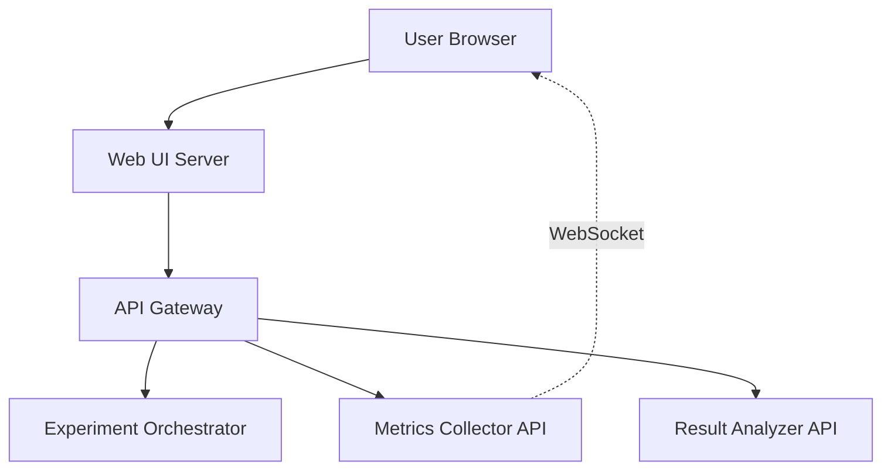

# Chaos Engineering Platform: Design Document


## Overview

This document describes the design of a Chaos Engineering platform that injects controlled failures into distributed systems to proactively test resilience. The key architectural challenge is building a safe, controlled, and observable failure injection system that can model real-world faults without causing unintended outages.


> This guide is meant to help you understand the big picture before diving into each milestone. Refer back to it whenever you need context on how components connect.


> **Milestone(s):** All milestones (foundational requirements)

## Goals and Non-Goals

This section defines the mandatory capabilities and explicit boundaries for the Chaos Engineering Platform. Establishing clear goals and non-goals is critical for maintaining architectural focus and preventing scope creep during implementation. The platform's primary purpose is to provide a **safe, controlled, and observable** system for proactively testing resilience through controlled failure injection.

Think of building this platform as creating a **surgical robot for system operations**. A surgical robot must:
1. **Execute precise, predefined interventions** (specific fault types)
2. **Maintain constant monitoring of vital signs** (steady-state metrics)
3. **Include emergency stop mechanisms** (safety abort conditions)
4. **Operate only on consenting patients** (explicit targeting)
5. **Leave no permanent damage** (full reversibility)

This mental model emphasizes the delicate balance between deliberate disruption and absolute safety that defines professional chaos engineering.

### Must-Have Goals

The platform must satisfy the following core requirements, categorized by functional and non-functional dimensions.

#### Functional Goals

These define what the system must be able to do operationally.

| Goal Category | Specific Requirement | Description | Corresponding Milestone |
|---------------|----------------------|-------------|-------------------------|
| **Fault Injection** | Network fault primitives | Inject configurable network latency, packet loss, and bandwidth throttling between services using `tc netem` and `iptables`. | Milestone 1, 5 |
| | Process and resource faults | Terminate specified processes and exhaust CPU/memory resources to configurable levels using `cgroups` and stress utilities. | Milestone 1, 5 |
| | Infrastructure fault simulation | Simulate disk full conditions, DNS failures (NXDOMAIN, timeout), and network partitions between service pairs. | Milestone 5 |
| | Reversible fault application | All faults must be fully reversible with automatic cleanup mechanisms that restore original system state. | Milestone 1 |
| **Experiment Management** | Hypothesis-driven experiments | Define experiments with explicit steady-state hypotheses using metric thresholds (e.g., latency < 200ms, error rate < 1%). | Milestone 2, 4 |
| | Automated execution lifecycle | Orchestrate experiment state transitions: baseline validation → fault injection → monitoring → rollback → analysis. | Milestone 2 |
| | Safety controls and auto-rollback | Automatically abort experiments and roll back faults when safety thresholds are breached (error rate > 5%, latency > 1s). | Milestone 2, 4 |
| | Blast radius control | Limit experiment scope to specific percentages of traffic, specific services, or specific infrastructure components. | Milestone 4 |
| **Observability & Analysis** | Metrics collection and validation | Collect system metrics before, during, and after experiments; validate against hypothesis thresholds with statistical tests. | Milestone 4 |
| | Comprehensive result reporting | Generate detailed experiment reports showing hypothesis validation, metric trends, and pass/fail outcomes. | Milestone 2 |
| | Observability correlation | Correlate experiment execution timestamps with application logs, metrics, and traces for root cause analysis. | Milestone 2 |
| **Scenario Orchestration** | Multi-experiment GameDays | Execute sequences of experiments with pauses, manual approval gates, and integrated runbooks. | Milestone 3 |
| | Automated health checks | Continuously monitor system health throughout scenario execution with configurable check intervals. | Milestone 3 |
| | Incident simulation | Replicate realistic failure scenarios (e.g., dependency failure, regional outage) in controlled environments. | Milestone 3 |

#### Non-Functional Goals

These define the quality attributes the system must exhibit.

| Attribute | Requirement | Rationale |
|-----------|-------------|-----------|
| **Safety** | Fail-safe design by default | The platform must never leave systems in a permanently degraded state. Faults must have time limits and automatic rollback. |
| **Observability** | Comprehensive logging and metrics | Operators must understand exactly what the platform is doing and its impact on systems. All actions must be logged, and platform health must be monitorable. |
| **Controllability** | Precise blast radius limitation | Operators must control which systems are affected and to what degree, preventing uncontrolled cascading failures. |
| **Operational Simplicity** | Clear operational model and APIs | The platform should be easy to operate, with intuitive interfaces and clear documentation of its effects and limitations. |
| **Reliability** | Platform resilience to its own faults | The chaos platform must not be vulnerable to the faults it injects (e.g., network chaos shouldn't break the platform's control plane). |
| **Performance** | Minimal overhead during non-experiment periods | When not actively injecting faults, the platform should impose negligible resource overhead on target systems. |
| **Security** | Principle of least privilege | The platform requires elevated privileges (CAP_NET_ADMIN, root) for fault injection but must operate with minimal necessary permissions and include access controls. |

> **Design Principle: Safety First**
> The most critical non-functional requirement is safety. Every architectural decision must prioritize preventing unintended production outages. This includes automatic rollback mechanisms, comprehensive pre-flight checks, and explicit confirmation for production experiments.

### Explicit Non-Goals

Clearly stating what the platform will **not** do prevents misunderstanding and sets realistic expectations. These boundaries help focus development efforts on core value.

| Non-Goal | Rationale | Alternative/Workaround |
|----------|-----------|------------------------|
| **Production testing by default** | The platform is designed for resilience testing, but production experiments require explicit opt-in, additional safeguards, and organizational readiness. | Default targeting to pre-production/staging environments; require explicit environment flags and manual approval for production. |
| **Replacing traditional testing** | Chaos engineering complements but does not replace unit, integration, or load testing. It focuses on emergent properties in complex systems. | Continue existing testing practices; use chaos experiments for resilience validation beyond functional correctness. |
| **Automated fault discovery** | The platform executes predefined experiments rather than randomly exploring failure modes. Random fault injection (like Chaos Monkey) is a different approach. | Manual experiment design based on failure mode analysis; consider future extension for automated scenario generation. |
| **Performance/load testing** | While resource exhaustion faults stress systems, the platform is not optimized for sustained load generation or performance benchmarking. | Use dedicated load testing tools (e.g., Locust, Gatling) for performance testing; chaos experiments can complement by testing under failure conditions. |
| **Permanent infrastructure changes** | All faults must be reversible. The platform will not make permanent configuration changes to infrastructure. | For testing permanent failure scenarios, use isolated environments that can be rebuilt, not modified in-place. |
| **Cross-cloud/on-premises deployment** | Initial version focuses on single Kubernetes cluster or standalone host deployment patterns. | Future versions could extend to multi-cloud, but initial complexity is limited to manageable scope. |
| **Real-time attack simulation** | The platform tests resilience, not security. It will not simulate security breaches or penetration testing scenarios. | Use dedicated security testing tools for attack simulation; chaos engineering focuses on reliability failures. |
| **Complete autonomy (no human oversight)** | While automated, the platform requires human oversight for experiment design, approval of production experiments, and analysis of results. | Maintain manual approval gates for critical experiments; humans interpret results and refine hypotheses. |
| **Stateful application data corruption** | The platform will not intentionally corrupt application data or databases. Faults are at infrastructure/network level. | Test data resilience through other means (backup/restore tests); chaos experiments focus on availability, not data integrity. |
| **Legacy system support** | Initial focus is on containerized and cloud-native workloads with modern observability. | Older systems may require custom fault injectors or be tested through dependency failure scenarios. |

> **Architectural Decision: Development Phasing**
> The non-goals represent deliberate choices to limit initial scope. By focusing on reversible, infrastructure-level faults in controlled environments, we build a foundation that can safely expand to more ambitious use cases once core safety mechanisms are proven reliable.

### Implementation Guidance

While this section primarily defines requirements, the following implementation considerations emerge from these goals and non-goals.

#### Technology Recommendations Table

| Component | Simple Option (Initial Implementation) | Advanced Option (Future Consideration) |
|-----------|----------------------------------------|---------------------------------------|
| **Fault Injection** | Direct execution of `tc`, `iptables`, `cgroups` commands via Go's `os/exec` | eBPF-based fault injection for finer-grained control without external commands |
| **Experiment Orchestration** | In-memory state machine with file-based persistence | Distributed state management using etcd or Redis for high availability |
| **Metrics Collection** | Prometheus queries via HTTP API | Multiple backend support (Prometheus, Datadog, Cloud Monitoring) with adapter pattern |
| **Safety Monitoring** | Periodic polling of metrics during experiments | Streaming metrics analysis with real-time alerting |
| **API Layer** | RESTful HTTP with JSON serialization | gRPC with Protocol Buffers for better performance and bidirectional streaming |
| **Storage** | Local filesystem for experiment definitions and results | Database backend (PostgreSQL) for history, search, and analytics |

#### Recommended Initial File Structure

Given the Go-centric implementation, organize code to reflect the separation of concerns aligned with our goals:

```
chaos-platform/
├── cmd/
│   ├── chaos-controller/          # Main experiment orchestration daemon
│   │   └── main.go
│   └── chaos-agent/               # Fault injection agent (runs on target nodes)
│       └── main.go
├── internal/
│   ├── experiment/                # Experiment lifecycle management
│   │   ├── orchestrator.go        # State machine implementation
│   │   ├── hypothesis.go          # Steady-state validation logic
│   │   └── scheduler.go           # Experiment timing control
│   ├── fault/                     # Fault injection primitives
│   │   ├── injector.go            # Interface for all fault types
│   │   ├── network/               # Network faults (latency, packet loss)
│   │   │   ├── latency.go
│   │   │   └── packetloss.go
│   │   ├── resource/              # Resource exhaustion faults
│   │   │   ├── cpu.go
│   │   │   └── memory.go
│   │   └── process/               # Process faults
│   │       └── kill.go
│   ├── safety/                    # Safety monitoring and auto-rollback
│   │   ├── monitor.go             # Metric threshold checking
│   │   └── circuitbreaker.go      # Abort condition evaluation
│   ├── metrics/                   # Metrics collection and analysis
│   │   ├── collector.go           # Query Prometheus/other backends
│   │   └── validator.go           # Statistical validation against hypotheses
│   ├── gameday/                   # GameDay scenario orchestration
│   │   ├── scenario.go            # Multi-experiment sequence execution
│   │   └── runbook.go             # Manual step integration
│   └── api/                       # REST/GRPC API definitions
│       ├── server.go
│       └── types.go               # Request/response structs
├── pkg/
│   └── types/                     # Public data types shared across components
│       ├── experiment.go          # Experiment, Hypothesis, Fault definitions
│       └── result.go              # ExperimentResult, MetricSnapshot
├── configs/                       # Configuration files and examples
│   ├── experiment-example.yaml
│   └── gameday-scenario.yaml
└── scripts/                       # Utility scripts for setup and verification
    ├── install-dependencies.sh    # Install tc, iptables, stress-ng
    └── verify-fault-cleanup.sh    # Post-experiment cleanup verification
```

#### Core Data Types Skeleton

These types form the foundation of the platform's data model, reflecting the goals around experiment definition and safety.

```go
// pkg/types/experiment.go
package types

import (
    "time"
)

// Experiment defines a chaos experiment with hypothesis, faults, and safety controls
type Experiment struct {
    ID           string        `json:"id"`            // Unique identifier
    Name         string        `json:"name"`          // Human-readable name
    Description  string        `json:"description"`   // Purpose of experiment
    
    Hypothesis   Hypothesis    `json:"hypothesis"`    // Steady-state hypothesis to validate
    Faults       []Fault       `json:"faults"`       // Faults to inject (can be multiple)
    
    Schedule     Schedule      `json:"schedule"`      // When to run (immediate or cron)
    Duration     time.Duration `json:"duration"`      // How long faults remain active
    
    BlastRadius  BlastRadius   `json:"blast_radius"`  // Scope limitation
    SafetyRules  []SafetyRule  `json:"safety_rules"`  // Conditions for auto-abort
    
    Status       ExperimentStatus `json:"status"`     // Current state
    CreatedAt    time.Time     `json:"created_at"`
    StartedAt    *time.Time    `json:"started_at,omitempty"`
    CompletedAt  *time.Time    `json:"completed_at,omitempty"`
}

// Hypothesis defines the expected steady-state behavior
type Hypothesis struct {
    Description string           `json:"description"` // Textual hypothesis
    Metrics     []MetricThreshold `json:"metrics"`    // Quantifiable thresholds
    // TODO: Add validation method to check all required metrics are available
}

// MetricThreshold defines a metric to monitor and its acceptable range
type MetricThreshold struct {
    Name      string    `json:"name"`      // Metric name (e.g., "http_request_duration_seconds")
    Query     string    `json:"query"`     // Prometheus query to fetch metric
    Min       *float64  `json:"min,omitempty"`       // Minimum acceptable value
    Max       *float64  `json:"max,omitempty"`       // Maximum acceptable value
    Duration  string    `json:"duration"`  // Time window for evaluation (e.g., "5m")
    // TODO: Add statistical comparison method (e.g., compared to baseline)
}

// Fault defines a single failure to inject
type Fault struct {
    Type        FaultType     `json:"type"`        // LATENCY, PACKET_LOSS, CPU_STRESS, etc.
    Target      Target        `json:"target"`      // What to affect
    Parameters  FaultParams   `json:"parameters"`  // Type-specific parameters
    // TODO: Add validation method to ensure parameters match fault type
}

// BlastRadius limits the scope of an experiment
type BlastRadius struct {
    Percentage  float64 `json:"percentage"`  // Percentage of traffic/services affected (0-100)
    Services    []string `json:"services"`   // Specific service names to target
    Namespaces  []string `json:"namespaces"` // Kubernetes namespaces to target
    // TODO: Add method to check if a specific request/service falls within blast radius
}

// SafetyRule defines conditions that trigger experiment abortion
type SafetyRule struct {
    Metric      string  `json:"metric"`      // Metric to monitor
    Condition   string  `json:"condition"`   // Condition expression (e.g., "> 5")
    Duration    string  `json:"duration"`    // How long condition must hold before abort
    // TODO: Add evaluation method to check condition against metric values
}
```

#### Safety Infrastructure Starter Code

Safety is the foremost non-functional goal. This complete helper ensures fault cleanup even if the orchestrator crashes.

```go
// internal/safety/cleanup_ensurer.go
package safety

import (
    "encoding/json"
    "os"
    "path/filepath"
    "sync"
)

// CleanupEnsurer guarantees fault cleanup by persisting active faults to disk
type CleanupEnsurer struct {
    mu     sync.RWMutex
    filePath string
    activeFaults map[string]FaultRecord // faultID -> record
}

// FaultRecord represents a fault that needs cleanup
type FaultRecord struct {
    ExperimentID string    `json:"experiment_id"`
    FaultID      string    `json:"fault_id"`
    Target       string    `json:"target"`
    FaultType    string    `json:"fault_type"`
    InjectTime   time.Time `json:"inject_time"`
    CleanupCmd   string    `json:"cleanup_cmd"` // Command to reverse the fault
}

// NewCleanupEnsurer creates a new ensurer with persistence file
func NewCleanupEnsurer(dataDir string) (*CleanupEnsurer, error) {
    filePath := filepath.Join(dataDir, "active_faults.json")
    ensurer := &CleanupEnsurer{
        filePath: filePath,
        activeFaults: make(map[string]FaultRecord),
    }
    
    // Load existing active faults on startup (for crash recovery)
    if err := ensurer.load(); err != nil && !os.IsNotExist(err) {
        return nil, err
    }
    
    // Immediately attempt cleanup of any orphaned faults from previous run
    go ensurer.cleanupOrphanedFaults()
    
    return ensurer, nil
}

// RegisterFault records a fault that will need cleanup
func (c *CleanupEnsurer) RegisterFault(record FaultRecord) error {
    c.mu.Lock()
    defer c.mu.Unlock()
    
    c.activeFaults[record.FaultID] = record
    return c.save()
}

// CompleteFault removes a fault from the cleanup registry
func (c *CleanupEnsurer) CompleteFault(faultID string) error {
    c.mu.Lock()
    defer c.mu.Unlock()
    
    delete(c.activeFaults, faultID)
    return c.save()
}

// cleanupOrphanedFaults cleans up any faults that were active during a crash
func (c *CleanupEnsurer) cleanupOrphanedFaults() {
    c.mu.RLock()
    records := make([]FaultRecord, 0, len(c.activeFaults))
    for _, record := range c.activeFaults {
        records = append(records, record)
    }
    c.mu.RUnlock()
    
    for _, record := range records {
        // Execute the cleanup command
        // TODO: Execute record.CleanupCmd via exec.Command
        // Log successful cleanup
        c.CompleteFault(record.FaultID)
    }
}

// save persists active faults to disk
func (c *CleanupEnsurer) save() error {
    data, err := json.MarshalIndent(c.activeFaults, "", "  ")
    if err != nil {
        return err
    }
    
    tmpPath := c.filePath + ".tmp"
    if err := os.WriteFile(tmpPath, data, 0644); err != nil {
        return err
    }
    
    return os.Rename(tmpPath, c.filePath)
}

// load reads active faults from disk
func (c *CleanupEnsurer) load() error {
    data, err := os.ReadFile(c.filePath)
    if err != nil {
        return err
    }
    
    return json.Unmarshal(data, &c.activeFaults)
}
```

#### Core Orchestration Skeleton

This skeleton implements the experiment state machine central to the platform's operation.

```go
// internal/experiment/orchestrator.go
package experiment

import (
    "context"
    "time"
    
    "chaos-platform/pkg/types"
)

// Orchestrator manages the lifecycle of chaos experiments
type Orchestrator struct {
    experiments map[string]*ExperimentInstance
    mu          sync.RWMutex
    metricsCollector metrics.Collector
    safetyMonitor    safety.Monitor
    faultInjector    fault.Injector
}

// ExperimentInstance represents a running experiment with its state
type ExperimentInstance struct {
    Experiment types.Experiment
    State      ExperimentState
    CancelFunc context.CancelFunc
    MetricsBaseline map[string]float64
    ResultsChan chan<- types.ExperimentResult
}

// ExperimentState represents the current state in the lifecycle
type ExperimentState string

const (
    StateDraft           ExperimentState = "DRAFT"
    StateBaselineValidation ExperimentState = "BASELINE_VALIDATION"
    StateInjecting       ExperimentState = "INJECTING"
    StateMonitoring      ExperimentState = "MONITORING"
    StateRollback        ExperimentState = "ROLLBACK"
    StateAnalysis        ExperimentState = "ANALYSIS"
    StateCompleted       ExperimentState = "COMPLETED"
    StateAborted         ExperimentState = "ABORTED"
)

// StartExperiment begins execution of a defined experiment
func (o *Orchestrator) StartExperiment(exp types.Experiment, resultsChan chan<- types.ExperimentResult) error {
    // TODO 1: Validate experiment definition (hypothesis, faults, schedule)
    // TODO 2: Create ExperimentInstance with initial state StateDraft
    // TODO 3: Check if target systems are within allowed blast radius (safety check)
    // TODO 4: Transition to StateBaselineValidation and begin baseline metrics collection
    // TODO 5: Start background goroutine to execute state machine transitions
    // TODO 6: Return experiment ID for tracking
    return nil
}

// executeStateMachine runs the experiment through its lifecycle
func (o *Orchestrator) executeStateMachine(instance *ExperimentInstance) {
    ctx, cancel := context.WithCancel(context.Background())
    instance.CancelFunc = cancel
    
    for {
        select {
        case <-ctx.Done():
            return
        default:
            switch instance.State {
            case StateDraft:
                // TODO: Transition to StateBaselineValidation
                
            case StateBaselineValidation:
                // TODO 1: Collect metrics for baseline period (e.g., 5 minutes)
                // TODO 2: Validate baseline meets hypothesis criteria
                // TODO 3: If validation fails, transition to StateAborted
                // TODO 4: If validation succeeds, transition to StateInjecting
                
            case StateInjecting:
                // TODO 1: For each fault in experiment, call faultInjector.Inject()
                // TODO 2: Register each fault with CleanupEnsurer for safety
                // TODO 3: Transition to StateMonitoring
                
            case StateMonitoring:
                // TODO 1: Start safety monitor to watch for threshold breaches
                // TODO 2: Start metrics collection for hypothesis validation
                // TODO 3: Wait for experiment duration or abort signal
                // TODO 4: On completion or abort, transition to StateRollback
                
            case StateRollback:
                // TODO 1: For each active fault, call faultInjector.Cleanup()
                // TODO 2: Verify cleanup succeeded for each fault
                // TODO 3: Transition to StateAnalysis
                
            case StateAnalysis:
                // TODO 1: Collect post-experiment metrics
                // TODO 2: Compare baseline, experiment, and post-experiment metrics
                // TODO 3: Determine if hypothesis was validated (pass/fail)
                // TODO 4: Generate comprehensive ExperimentResult
                // TODO 5: Send result to resultsChan
                // TODO 6: Transition to StateCompleted
                
            case StateCompleted, StateAborted:
                // TODO: Clean up resources, remove from active experiments map
                return
            }
        }
    }
}

// AbortExperiment forcefully stops an experiment and rolls back faults
func (o *Orchestrator) AbortExperiment(experimentID string, reason string) error {
    // TODO 1: Look up experiment instance by ID
    // TODO 2: If in StateMonitoring, cancel context to stop monitoring
    // TODO 3: Immediately transition to StateRollback regardless of current state
    // TODO 4: Record abort reason in experiment results
    // TODO 5: Ensure all faults are cleaned up
    return nil
}
```

#### Milestone 1 Checkpoint

After implementing the fault injection framework (Milestone 1), you should be able to:

**Command to test:**
```bash
# Build and run a test that injects network latency
go test ./internal/fault/network/... -v -run TestLatencyInjection
```

**Expected behavior:**
1. Test should apply 200ms latency to loopback interface using `tc netem`
2. Should measure actual latency increase via ping or HTTP request timing
3. Should automatically clean up latency rule after test completes
4. Should verify no residual `tc` rules remain after cleanup

**Manual verification:**
```bash
# Before/during test execution, check tc rules
sudo tc qdisc show dev lo

# After test completes, verify cleanup
sudo tc qdisc show dev lo | grep -q "netem" && echo "FAIL: Rules not cleaned up" || echo "PASS: Cleanup successful"
```

**Common early failures:**
- **Symptom**: "Permission denied" when running `tc` commands
  - **Cause**: Insufficient privileges (need CAP_NET_ADMIN or root)
  - **Fix**: Run agent with appropriate capabilities or use sudo with controlled command execution
  
- **Symptom**: Fault affects the chaos platform itself
  - **Cause**: Network fault applied to interface used by control plane
  - **Fix**: Exclude localhost/control interfaces from fault targeting or run control plane on separate network namespace


> **Milestone(s):** All milestones (foundational architecture for entire platform)

## High-Level Architecture

### Mental Model: The Chaos Control Room

Imagine a **space mission control center** coordinating multiple systems during a rocket launch. The mission control (our platform) doesn't physically interact with the rocket—instead, it sends precise commands to various systems (fault injectors), monitors telemetry data (metrics), and has emergency abort procedures (safety monitors). This separation of concerns ensures that a failure in one system (like a faulty monitor) doesn't cascade into uncontrolled chaos.

Similarly, our Chaos Engineering Platform follows a **command-and-control architecture** where:
- A central **Experiment Controller** orchestrates the mission plan (experiment)
- Remote **Fault Injectors** execute specific sabotage operations on target systems
- Independent **Safety Monitors** watch critical telemetry streams and can trigger abort sequences
- **Metrics Collectors** gather observational data before, during, and after the experiment
- **Result Analyzers** compile mission reports to determine success or failure

This architectural separation provides three critical benefits: **safety** (faults can be rolled back even if the controller fails), **scalability** (multiple fault injectors can operate simultaneously), and **observability** (independent monitoring prevents single-point failures in the chaos system itself).

### Component Diagram and Interactions

The platform consists of five core subsystems that work together to safely execute chaos experiments. Each component has a distinct responsibility and communicates through well-defined interfaces.


#### Core Components

| Component | Responsibility | Key Data Owned | Interface Pattern |
|-----------|----------------|----------------|-------------------|
| **Experiment Controller** | Orchestrates experiment lifecycle, manages state transitions, coordinates other components | `Experiment` definitions, experiment state, execution history | REST API (external), gRPC (internal), state machine |
| **Fault Injector** | Executes specific fault operations on target systems, ensures fault cleanup | Active fault registry, cleanup commands, fault status | gRPC service with `InjectFault()`, `Cleanup()` methods |
| **Safety Monitor** | Continuously evaluates safety rules, triggers automatic rollback when thresholds breached | Safety rule configurations, current metric evaluations | Event stream consumer, publishes abort events |
| **Metrics Collector** | Gathers and aggregates system metrics from observability sources | Metric time-series data, baseline calculations | Pull-based collection (Prometheus) and push-based (custom metrics) |
| **Result Analyzer** | Compares pre-experiment, during-experiment, and post-experiment metrics, generates reports | Experiment results, statistical comparisons, pass/fail determinations | Batch processor with report generation |

#### Component Interactions

The components communicate through two primary patterns:

1. **Command/Response (Synchronous)**: For control operations where immediate acknowledgment is required
2. **Event Stream (Asynchronous)**: For monitoring and safety operations where latency tolerance is higher

**Key Interaction Flows:**

**Experiment Execution Flow:**
1. User submits an `Experiment` definition to the Experiment Controller via REST API
2. Controller validates the experiment and transitions it to `StateBaselineValidation`
3. Controller queries Metrics Collector for baseline metrics to verify steady state
4. If baseline passes, Controller calls Fault Injector's `InjectFault()` method for each fault
5. Fault Injector executes the fault (e.g., runs `tc netem` commands) and registers cleanup
6. Controller transitions experiment to `StateMonitoring` and begins safety monitoring
7. Safety Monitor continuously evaluates metrics against safety rules
8. If safety breach detected, Safety Monitor publishes abort event to Controller
9. Controller calls Fault Injector's `Cleanup()` method and transitions to `StateRollback`
10. After fault cleanup, Controller transitions to `StateAnalysis`
11. Result Analyzer compares metrics and generates final report
12. Controller transitions to `StateCompleted` or `StateAborted` with detailed results

**Safety Monitoring Flow:**
1. Metrics Collector continuously scrapes system metrics from various sources
2. Safety Monitor subscribes to relevant metric streams (error rates, latency, CPU usage)
3. For each active experiment, Safety Monitor evaluates configured `SafetyRule` conditions
4. If condition breaches for specified duration, Safety Monitor publishes abort event
5. Experiment Controller receives abort event and initiates rollback sequence
6. Cleanup is executed regardless of Controller state (via `CleanupEnsurer` persistence)

#### Component Interface Details

**Experiment Controller API:**
| Method | Parameters | Returns | Description |
|--------|------------|---------|-------------|
| `CreateExperiment` | `Experiment` definition | `ExperimentID`, error | Validates and stores new experiment |
| `StartExperiment` | `experimentID string` | error | Begins execution of approved experiment |
| `GetExperimentStatus` | `experimentID string` | `ExperimentStatus`, error | Returns current state and progress |
| `AbortExperiment` | `experimentID string`, `reason string` | error | Manually aborts running experiment |
| `ListExperiments` | `filter ExperimentFilter` | `[]Experiment`, error | Returns experiments matching criteria |

**Fault Injector Service (gRPC):**
| Method | Parameters | Returns | Description |
|--------|------------|---------|-------------|
| `InjectFault` | `Fault`, `ExperimentID string` | `FaultID string`, error | Applies specified fault to target system |
| `CleanupFault` | `FaultID string` | error | Removes previously injected fault |
| `GetFaultStatus` | `FaultID string` | `FaultStatus`, error | Returns current state of fault |
| `ListActiveFaults` | `ExperimentID string` | `[]FaultStatus`, error | Returns all active faults for experiment |

**Safety Monitor Event Interface:**
| Event Type | Fields | Published When |
|------------|--------|----------------|
| `SafetyBreach` | `ExperimentID string`, `Rule SafetyRule`, `MetricValue float64`, `Timestamp time.Time` | Safety rule condition breaches for configured duration |
| `SafetyCleared` | `ExperimentID string`, `Rule SafetyRule`, `Timestamp time.Time` | Previously breached safety condition returns to normal |

**Metrics Collector Query Interface:**
| Method | Parameters | Returns | Description |
|--------|------------|---------|-------------|
| `GetMetric` | `query string`, `start time.Time`, `end time.Time`, `step time.Duration` | `[]MetricPoint`, error | Returns time-series metric data |
| `GetCurrentValue` | `query string` | `float64`, error | Returns most recent value for metric |
| `ValidateThreshold` | `threshold MetricThreshold`, `duration string` | `bool`, error | Checks if metric meets threshold for duration |

#### Component Deployment Architecture

The platform supports two deployment modes:

1. **Centralized Deployment**: All components run as a single service (for development/testing)
2. **Distributed Deployment**: Components deploy independently with the following topology:

```
                          +----------------------+
                          |   Load Balancer      |
                          |   (Optional)         |
                          +----------+-----------+
                                     | HTTP/REST
                          +----------v-----------+
                          |  Experiment Controller|
                          |  (Stateless)          |
                          +----------+-----------+
                                     | gRPC
            +------------------------+------------------------+
            |                         |                       |
+-----------v-----------+   +---------v----------+   +--------v----------+
|   Fault Injector      |   |   Safety Monitor   |   |  Metrics Collector|
|   (Per-node agent)    |   |   (Stateful)       |   |  (Stateless)      |
+-----------------------+   +--------------------+   +-------------------+
```

> **Design Insight**: The Fault Injector must run with elevated privileges (CAP_NET_ADMIN, root access) on target nodes. To minimize attack surface, we deploy it as a separate, tightly-scoped daemon rather than bundling it with the Controller. This follows the principle of least privilege—the Controller itself doesn't need root access.

#### Data Flow Between Components

**Experiment Definition Flow:**
```
User → [REST/HTTP] → Experiment Controller → [Validate] → [Store in DB]
```

**Fault Execution Flow:**
```
Experiment Controller → [gRPC] → Fault Injector → [Execute Command] → Target System
                      ↑                                  ↓
                [Acknowledge]                    [Register Cleanup]
```

**Safety Monitoring Flow:**
```
Metrics Collector → [Stream] → Safety Monitor → [Evaluate Rules] → [Publish Event]
                                                     ↓
                                            [Threshold Breach?] → [Abort Event]
```

**Result Compilation Flow:**
```
Experiment Controller → [Query] → Metrics Collector → [Time-series Data]
         ↓
[Generate Report] ← [Analyze] ← Result Analyzer
```

#### ADR: Centralized vs. Distributed Control Plane

> **Decision: Hybrid Control Plane Architecture**
> - **Context**: The platform needs to coordinate across multiple nodes (for network faults) but maintain safety guarantees even if the control plane experiences partial failures.
> - **Options Considered**:
>   1. Fully centralized: Single controller managing all nodes
>   2. Fully decentralized: Each node autonomous with consensus
>   3. Hybrid: Central coordinator with persistent fault registries
> - **Decision**: Hybrid architecture with persistent `CleanupEnsurer` on each node
> - **Rationale**: Central coordination simplifies experiment management and state tracking, while persistent local cleanup registries guarantee fault reversal even if the controller crashes or network partitions occur. This provides the safety of decentralization with the simplicity of central control.
> - **Consequences**: Requires synchronization between controller and nodes, but local persistence ensures no "orphaned faults" remain after controller failure.

| Option | Pros | Cons | Chosen? |
|--------|------|------|---------|
| Fully Centralized | Simple to implement, consistent state | Single point of failure, network latency to nodes | No |
| Fully Decentralized | Highly available, fault-tolerant | Complex coordination, eventual consistency issues | No |
| Hybrid (Central + Local Persistence) | Safety guarantees, simpler than full decentralization | Requires sync mechanism, slightly more complex | **Yes** |

#### Common Pitfalls in Architecture Design

⚡ **Pitfall: Tight Coupling Between Controller and Fault Injection**
- **Description**: Implementing fault injection logic directly in the Experiment Controller
- **Why it's wrong**: Controller needs elevated privileges, becomes single point of failure, hard to scale
- **How to fix**: Strict separation: Controller only orchestrates, Fault Injector executes with proper isolation

⚡ **Pitfall: Missing Idempotency in Fault Operations**
- **Description**: Fault injection commands that fail if retried (e.g., adding duplicate `tc` rules)
- **Why it's wrong**: Network flakes or retries can leave system in inconsistent state
- **How to fix**: Design all fault operations as idempotent: "ensure this fault is active" not "add this fault"

⚡ **Pitfall: Synchronous Safety Monitoring**
- **Description**: Controller polls safety status in main experiment loop
- **Why it's wrong**: Adds latency to abort decisions, blocks experiment progression
- **How to fix**: Event-driven safety monitoring with publish/subscribe pattern

⚡ **Pitfall: No Cleanup Guarantees**
- **Description**: Assuming controller will always be available to clean up faults
- **Why it's wrong**: Controller crashes leave systems permanently impaired
- **How to fix**: Persistent `CleanupEnsurer` that records faults before applying them

### Recommended File and Module Structure

> **Principle**: Organize by domain responsibility, not by technical layer. Each package should have a single, clear purpose and minimal dependencies on other packages.

```
chaos-platform/
├── cmd/                          # Entry points for executables
│   ├── controller/               # Experiment Controller main
│   │   ├── main.go               # CLI parsing, config loading
│   │   └── Dockerfile            # Container build file
│   ├── injector-agent/           # Fault Injector daemon
│   │   ├── main.go               # Agent startup, gRPC server
│   │   └── Dockerfile            # Privileged container
│   ├── safety-monitor/           # Safety Monitor service
│   │   ├── main.go               # Metric consumer, event publisher
│   │   └── Dockerfile
│   └── metrics-collector/        # Optional: custom metrics collector
│       ├── main.go
│       └── Dockerfile
├── internal/                     # Private application code
│   ├── api/                      # External API definitions
│   │   ├── v1/                   # API versioning
│   │   │   ├── types.go          # Request/response structs
│   │   │   ├── handlers.go       # HTTP handlers
│   │   │   └── router.go         # Route definitions
│   │   └── middleware/           # Auth, logging, validation
│   ├── controller/               # Experiment orchestration logic
│   │   ├── orchestrator.go       # `Orchestrator` struct and methods
│   │   ├── state_machine.go      # `executeStateMachine` implementation
│   │   ├── scheduler.go          # Experiment scheduling
│   │   └── cleanup.go            # Cleanup coordination logic
│   ├── fault/                    # Fault injection domain
│   │   ├── injector.go           # `Injector` interface implementation
│   │   ├── registry.go           # Fault type registry
│   │   ├── types.go              # `Fault`, `FaultParams`, etc.
│   │   ├── network/              # Network fault implementations
│   │   │   ├── latency.go        # Network latency injection
│   │   │   ├── packet_loss.go    # Packet loss simulation
│   │   │   └── partition.go      # Network partition
│   │   ├── resource/             # Resource fault implementations
│   │   │   ├── cpu_stress.go     # CPU exhaustion
│   │   │   ├── memory_pressure.go # Memory pressure
│   │   │   └── disk_fill.go      # Disk space exhaustion
│   │   └── process/              # Process faults
│   │       ├── kill.go           # Process termination
│   │       └── restart.go        # Process restart simulation
│   ├── safety/                   # Safety monitoring domain
│   │   ├── monitor.go            # `Monitor` implementation
│   │   ├── evaluator.go          # Safety rule evaluation
│   │   ├── events.go             # Event publishing
│   │   └── rules.go              # `SafetyRule` validation
│   ├── metrics/                  # Metrics collection domain
│   │   ├── collector.go          # `Collector` interface
│   │   ├── prometheus.go         # Prometheus implementation
│   │   ├── aggregator.go         # Metric aggregation
│   │   └── baseline.go           # Baseline calculation
│   ├── analysis/                 # Result analysis domain
│   │   ├── analyzer.go           # `Analyzer` implementation
│   │   ├── reporter.go           # Report generation
│   │   └── statistical.go        # Statistical comparisons
│   ├── persistence/              # Data persistence layer
│   │   ├── experiment_store.go   # Experiment CRUD
│   │   ├── cleanup_store.go      # `CleanupEnsurer` implementation
│   │   └── metrics_store.go      # Metric data storage
│   ├── gameday/                  # GameDay automation (Milestone 3)
│   │   ├── scenario.go           # Scenario execution
│   │   ├── runbook.go            # Runbook automation
│   │   └── sequencer.go          # Multi-experiment sequencing
│   └── types/                    # Shared type definitions
│       ├── experiment.go         # `Experiment`, `Hypothesis`, etc.
│       ├── fault.go              # `Fault`, `FaultType`, etc.
│       ├── metrics.go            # `MetricThreshold`, etc.
│       └── common.go             # Enums, constants
├── pkg/                          # Public libraries (if any)
│   └── chaosclient/              # Go client library for API
├── api/                          # Protocol definitions
│   ├── protos/                   # gRPC protocol buffers
│   │   ├── fault_injector.proto  # Fault injector service
│   │   └── safety_monitor.proto  # Safety monitoring events
│   └── openapi/                  # OpenAPI/Swagger specs
│       └── v1.yaml               # REST API specification
├── configs/                      # Configuration files
│   ├── controller.yaml           # Controller configuration
│   ├── injector.yaml             # Injector agent configuration
│   └── safety.yaml               # Safety monitor configuration
├── deployments/                  # Deployment manifests
│   ├── kubernetes/               # K8s manifests for all components
│   │   ├── controller.yaml
│   │   ├── injector-daemonset.yaml
│   │   └── safety-monitor.yaml
│   └── docker-compose/           # Local development setup
│       └── docker-compose.yaml
├── scripts/                      # Utility scripts
│   ├── install-dependencies.sh   # System dependency setup
│   ├── generate-protos.sh        # Protocol buffer generation
│   └── preflight-check.sh        # System validation before experiments
├── tests/                        # Integration and e2e tests
│   ├── integration/              # Component integration tests
│   └── e2e/                      # End-to-end scenario tests
├── examples/                     # Example configurations
│   ├── experiments/              # Example experiment definitions
│   └── scenarios/                # Example GameDay scenarios
├── go.mod                        # Go module definition
├── go.sum                        # Go dependencies checksum
├── Makefile                      # Build, test, deploy commands
└── README.md                     # Project documentation
```

#### Package Dependency Graph

To maintain clean architecture, follow these dependency rules:

```
cmd/* (entry points)
  ↓
internal/api (depends on internal/types)
  ↓
internal/controller (depends on internal/types, internal/fault, internal/safety, internal/metrics)
  ↓
internal/fault (depends on internal/types)
  ↓
internal/safety (depends on internal/types, internal/metrics)
  ↓
internal/metrics (depends on internal/types)
  ↓
internal/analysis (depends on internal/types, internal/metrics)
  ↓
internal/persistence (depends on internal/types)
  ↓
internal/types (no dependencies)
```

> **Key Principle**: Dependencies flow inward toward domain types. The `internal/types` package has zero dependencies and contains only data structures. This enables easy testing and prevents circular dependencies.

#### Module Design Rationale

**Why separate `internal/fault` from `internal/controller`?**
- Fault injection requires system-level operations (root access, `tc` commands)
- Controller should remain unprivileged for security
- Enables independent testing of fault logic
- Allows replacement of fault implementations (e.g., different network manipulation tools)

**Why `internal/types` as a separate package?**
- Shared by all other packages without import cycles
- Serialization/deserialization logic centralized
- Versioning of data structures managed in one place
- Generated code (protobuf, OpenAPI) can reference these types

**Why `cmd/` structure with multiple binaries?**
- Each component has different deployment requirements
- Fault Injector needs privileged containers, others don't
- Independent scaling of components
- Separate configuration and dependency management

#### Build and Deployment Configuration

**Multi-stage Docker builds** for each component:
- **Controller**: Lightweight Go binary on distroless base
- **Injector**: Privileged container with `iproute2`, `stress-ng`, `iptables` tools
- **Safety Monitor**: Event-driven service with metric client libraries

**Kubernetes Deployment Strategy:**
- Controller: Deployment with 3 replicas for high availability
- Injector: DaemonSet (one per node) with `hostNetwork: true` and privileged security context
- Safety Monitor: StatefulSet with persistent storage for rule evaluations
- Metrics Collector: Optional sidecar or separate deployment depending on metrics volume

### Implementation Guidance

#### Technology Recommendations Table

| Component | Simple Option (Getting Started) | Advanced Option (Production) |
|-----------|---------------------------------|------------------------------|
| **API Transport** | HTTP REST with JSON (Go's `net/http`) | gRPC with Protocol Buffers + HTTP/JSON gateway |
| **Metrics Collection** | Prometheus client library + direct queries | Multiple adapters (Prometheus, Datadog, Cloud Monitoring) |
| **Persistence** | SQLite (embedded) + file-based cleanup registry | PostgreSQL + Redis for caching |
| **Event System** | Go channels + in-memory pub/sub | Apache Kafka or NATS for distributed events |
| **Configuration** | YAML files + environment variables | Config management with HashiCorp Consul |
| **Container Runtime** | Docker Compose for local development | Kubernetes with Helm charts for production |

#### Starter Code for Project Structure

**File: `internal/types/experiment.go`** (Complete foundational code)
```go
package types

import (
	"time"
)

// ExperimentStatus represents the current state of an experiment
type ExperimentStatus string

const (
	StateDraft              ExperimentStatus = "DRAFT"
	StateBaselineValidation ExperimentStatus = "BASELINE_VALIDATION"
	StateInjecting          ExperimentStatus = "INJECTING"
	StateMonitoring         ExperimentStatus = "MONITORING"
	StateRollback           ExperimentStatus = "ROLLBACK"
	StateAnalysis           ExperimentStatus = "ANALYSIS"
	StateCompleted          ExperimentStatus = "COMPLETED"
	StateAborted            ExperimentStatus = "ABORTED"
)

// Experiment defines a chaos experiment
type Experiment struct {
	ID           string        `json:"id" yaml:"id"`
	Name         string        `json:"name" yaml:"name"`
	Description  string        `json:"description" yaml:"description"`
	Hypothesis   Hypothesis    `json:"hypothesis" yaml:"hypothesis"`
	Faults       []Fault       `json:"faults" yaml:"faults"`
	Schedule     Schedule      `json:"schedule" yaml:"schedule"`
	Duration     time.Duration `json:"duration" yaml:"duration"`
	BlastRadius  BlastRadius   `json:"blastRadius" yaml:"blastRadius"`
	SafetyRules  []SafetyRule  `json:"safetyRules" yaml:"safetyRules"`
	Status       ExperimentStatus `json:"status" yaml:"status"`
	CreatedAt    time.Time     `json:"createdAt" yaml:"createdAt"`
	StartedAt    *time.Time    `json:"startedAt,omitempty" yaml:"startedAt,omitempty"`
	CompletedAt  *time.Time    `json:"completedAt,omitempty" yaml:"completedAt,omitempty"`
}

// Hypothesis defines the steady-state hypothesis for an experiment
type Hypothesis struct {
	Description string            `json:"description" yaml:"description"`
	Metrics     []MetricThreshold `json:"metrics" yaml:"metrics"`
}

// MetricThreshold defines acceptable bounds for a metric
type MetricThreshold struct {
	Name     string   `json:"name" yaml:"name"`
	Query    string   `json:"query" yaml:"query"`
	Min      *float64 `json:"min,omitempty" yaml:"min,omitempty"`
	Max      *float64 `json:"max,omitempty" yaml:"max,omitempty"`
	Duration string   `json:"duration" yaml:"duration"` // e.g., "5m", "30s"
}

// Fault defines a single fault to inject
type Fault struct {
	Type       FaultType   `json:"type" yaml:"type"`
	Target     Target      `json:"target" yaml:"target"`
	Parameters FaultParams `json:"parameters" yaml:"parameters"`
}

// BlastRadius limits the scope of an experiment
type BlastRadius struct {
	Percentage  float64  `json:"percentage" yaml:"percentage"`
	Services    []string `json:"services,omitempty" yaml:"services,omitempty"`
	Namespaces  []string `json:"namespaces,omitempty" yaml:"namespaces,omitempty"`
}

// SafetyRule defines conditions for automatic experiment abort
type SafetyRule struct {
	Metric    string `json:"metric" yaml:"metric"`
	Condition string `json:"condition" yaml:"condition"` // e.g., "> 5%", "< 200ms"
	Duration  string `json:"duration" yaml:"duration"`   // How long condition must hold before abort
}
```

**File: `cmd/controller/main.go`** (Entry point skeleton)
```go
package main

import (
	"context"
	"log"
	"net/http"
	"os"
	"os/signal"
	"syscall"
	"time"
	
	"chaos-platform/internal/api/v1"
	"chaos-platform/internal/controller"
	"chaos-platform/internal/persistence"
	// Additional imports as needed
)

func main() {
	// TODO 1: Load configuration from file and environment variables
	// TODO 2: Initialize persistence layer (experiment store, cleanup registry)
	// TODO 3: Initialize components: metrics collector, safety monitor, fault injector client
	// TODO 4: Create Orchestrator instance with all dependencies
	// TODO 5: Set up HTTP server with API routes
	// TODO 6: Start background goroutines for experiment scheduling
	// TODO 7: Implement graceful shutdown on SIGTERM/SIGINT
	// TODO 8: Run HTTP server with health checks
	
	log.Println("Chaos Platform Controller starting...")
	
	// Example structure:
	ctx, cancel := context.WithCancel(context.Background())
	defer cancel()
	
	// Setup graceful shutdown
	sigChan := make(chan os.Signal, 1)
	signal.Notify(sigChan, syscall.SIGINT, syscall.SIGTERM)
	
	go func() {
		sig := <-sigChan
		log.Printf("Received signal: %v, initiating shutdown...", sig)
		cancel()
		// Give services time to clean up
		time.Sleep(5 * time.Second)
		os.Exit(0)
	}()
	
	// TODO: Start server and block
	server := &http.Server{
		Addr:    ":8080",
		Handler: setupRouter(), // Implement this
	}
	
	if err := server.ListenAndServe(); err != nil && err != http.ErrServerClosed {
		log.Fatalf("HTTP server error: %v", err)
	}
}

func setupRouter() http.Handler {
	// TODO: Create router, add middleware, register API routes
	// Use internal/api/v1 handlers
	return nil
}
```

**File: `internal/controller/orchestrator.go`** (Core logic skeleton)
```go
package controller

import (
	"context"
	"sync"
	"time"
	
	"chaos-platform/internal/types"
	"chaos-platform/internal/metrics"
	"chaos-platform/internal/safety"
	"chaos-platform/internal/fault"
)

// Orchestrator manages the lifecycle of chaos experiments
type Orchestrator struct {
	mu              sync.RWMutex
	experiments     map[string]*ExperimentInstance
	metricsCollector metrics.Collector
	safetyMonitor   safety.Monitor
	faultInjector   fault.Injector
	// Additional fields as needed
}

// ExperimentInstance tracks runtime state of an experiment
type ExperimentInstance struct {
	Experiment     types.Experiment
	State          types.ExperimentStatus
	CancelFunc     context.CancelFunc
	MetricsBaseline map[string]float64
	ResultsChan    chan<- types.ExperimentResult
	// Additional runtime fields
}

// StartExperiment begins execution of a defined experiment
func (o *Orchestrator) StartExperiment(exp types.Experiment, resultsChan chan<- types.ExperimentResult) error {
	// TODO 1: Validate experiment is in DRAFT state
	// TODO 2: Create ExperimentInstance with initial state
	// TODO 3: Store instance in orchestrator's map
	// TODO 4: Create context with cancellation for experiment
	// TODO 5: Launch executeStateMachine in a goroutine
	// TODO 6: Return immediately (experiment runs asynchronously)
	return nil
}

// executeStateMachine runs the experiment through its lifecycle
func (o *Orchestrator) executeStateMachine(instance *ExperimentInstance) {
	// TODO 1: Transition to BASELINE_VALIDATION
	// TODO 2: Collect baseline metrics using metricsCollector
	// TODO 3: Validate hypothesis against baseline
	// TODO 4: If validation fails, transition to ABORTED and return
	// TODO 5: Transition to INJECTING
	// TODO 6: For each fault in experiment, call faultInjector.InjectFault()
	// TODO 7: Register each fault with cleanup ensurer
	// TODO 8: Transition to MONITORING
	// TODO 9: Start safety monitoring for experiment duration
	// TODO 10: If safety breach detected, transition to ROLLBACK
	// TODO 11: If duration elapsed, transition to ROLLBACK
	// TODO 12: Clean up all faults
	// TODO 13: Transition to ANALYSIS
	// TODO 14: Collect post-experiment metrics
	// TODO 15: Analyze results compared to baseline
	// TODO 16: Generate experiment result
	// TODO 17: Send result to resultsChan
	// TODO 18: Transition to COMPLETED or ABORTED
}

// AbortExperiment forcefully stops an experiment and rolls back faults
func (o *Orchestrator) AbortExperiment(experimentID string, reason string) error {
	// TODO 1: Look up experiment instance
	// TODO 2: If experiment is in injectable state (INJECTING, MONITORING), cancel context
	// TODO 3: Transition to ROLLBACK state
	// TODO 4: Clean up all faults for this experiment
	// TODO 5: Transition to ABORTED state
	// TODO 6: Record abort reason
	return nil
}
```

#### Language-Specific Implementation Hints

**Go-Specific Patterns:**
- Use `context.Context` for cancellation across all goroutines
- Implement interfaces for testability: `type Injector interface { InjectFault(...) }`
- Use `sync.Map` for concurrent access to experiment registry if high contention expected
- Leverage `time.Ticker` for periodic safety checks rather than `time.Sleep`
- Use `os/exec` for running system commands (like `tc`) with proper timeout handling

**Error Handling Strategy:**
- Use sentinel errors for expected failure cases: `var ErrExperimentNotFound = errors.New("experiment not found")`
- Wrap system command errors with context: `fmt.Errorf("tc command failed: %w", err)`
- Implement retry with exponential backoff for transient failures (network calls to metrics)

**Concurrency Patterns:**
- One goroutine per experiment (managed by orchestrator)
- Worker pool for fault injection (limits concurrent system operations)
- Channel-based communication between components (non-blocking where possible)

#### Milestone Checkpoint: Architecture Validation

After setting up the basic structure:

```bash
# Build all components to verify dependencies
go build ./cmd/controller/
go build ./cmd/injector-agent/
go build ./cmd/safety-monitor/

# Run unit tests for core types
go test ./internal/types/...

# Verify the project structure compiles
go build ./...

# Expected output: No errors, all binaries created in current directory
```

**Manual Verification Steps:**
1. Check that `internal/types` has no dependencies on other packages
2. Verify each `cmd/` directory has a proper `main.go` with package `main`
3. Ensure `go.mod` declares correct module path
4. Test that controller can be imported without circular dependency errors

**Common Build Issues:**
- **Symptom**: `import cycle not allowed`
  - **Cause**: Two-way dependency between packages
  - **Fix**: Refactor to move shared types to `internal/types`, use interfaces
- **Symptom**: `undefined: types.Experiment`
  - **Cause**: Incorrect import path or package name mismatch
  - **Fix**: Check `go.mod` module name matches import paths

---


> **Milestone(s):** All milestones (foundational data structures for entire platform)

## Data Model

> **Mental Model: The Scientific Experiment Blueprint**
> Think of the chaos engineering platform as a sophisticated laboratory that runs controlled experiments on complex systems. Just like a scientific experiment needs a **protocol** (defining the hypothesis, materials, methods, and analysis plan), our platform needs structured data models to represent every aspect of chaos experiments. The data model serves as the standardized blueprint that ensures experiments are well-defined, repeatable, analyzable, and—most importantly—safe.

This section defines the core data structures that capture the complete lifecycle of chaos engineering: from experiment design and fault specification to hypothesis validation and result analysis. These structures form the backbone of the entire platform, ensuring consistency across components and enabling the safe, controlled injection of failures.


### Experiment and Fault Definitions

> **Mental Model: The Recipe for Controlled Chaos**
> An experiment definition is like a **recipe for controlled chaos**. It specifies exactly what ingredients (faults) to use, what system to test, what outcome to expect, and what safety precautions to take. Just as a recipe needs precise measurements and steps to ensure consistent results, our experiment definitions need structured fields to guarantee reproducible, safe experiments.

The experiment data model captures everything needed to define, execute, and analyze a chaos experiment. At its core, an `Experiment` combines a **steady-state hypothesis** (what we expect to remain true) with a set of **faults** (what we're going to break) and **safety controls** (how we'll prevent catastrophe).

#### Experiment Definition

The `Experiment` struct represents a complete chaos experiment definition, from hypothesis through execution to results:

| Field | Type | Description |
|-------|------|-------------|
| `ID` | `string` | Unique identifier for the experiment, typically a UUID. Used to reference the experiment across all system components and for idempotent operations. |
| `Name` | `string` | Human-readable name for the experiment (e.g., "Payment Service Latency Test"). Used for display and organization purposes. |
| `Description` | `string` | Detailed description of the experiment's purpose, what it tests, and any important context. Helps future maintainers understand why the experiment exists. |
| `Hypothesis` | `Hypothesis` | The steady-state hypothesis being tested. Defines the expected system behavior as a set of metric thresholds that should remain true during the experiment. |
| `Faults` | `[]Fault` | Ordered list of faults to inject during the experiment. Multiple faults can be specified to simulate complex failure scenarios. The order matters—some faults may need to be applied sequentially. |
| `Schedule` | `Schedule` | When and how often to run the experiment. Can be immediate, one-time future execution, or recurring (e.g., "every Monday at 2 AM"). |
| `Duration` | `time.Duration` | How long to keep faults active once injected. After this duration, the system should automatically roll back faults even if no safety breach is detected. |
| `BlastRadius` | `BlastRadius` | Scope limitation for the experiment. Defines what percentage of traffic or which specific services/namespaces are affected, ensuring experiments don't impact the entire system. |
| `SafetyRules` | `[]SafetyRule` | Automatic abort conditions. If any of these rules evaluate to true during the experiment, the system immediately rolls back all faults and marks the experiment as aborted. |
| `Status` | `ExperimentStatus` | Current execution state of the experiment. Tracks progress through the experiment lifecycle (DRAFT → BASELINE_VALIDATION → INJECTING → etc.). |
| `CreatedAt` | `time.Time` | Timestamp when the experiment was first defined. Used for auditing and to determine experiment age. |
| `StartedAt` | `*time.Time` | Timestamp when experiment execution began (nil if not started). Used to calculate experiment duration and for timing analysis. |
| `CompletedAt` | `*time.Time` | Timestamp when experiment reached final state (COMPLETED or ABORTED; nil if still in progress). Used to determine when cleanup can occur. |

#### Hypothesis Definition

The `Hypothesis` struct formalizes the expected system behavior that should remain true despite the injected faults:

| Field | Type | Description |
|-------|------|-------------|
| `Description` | `string` | Natural language description of what should remain true (e.g., "User checkout flow completes within 2 seconds with < 0.5% error rate"). |
| `Metrics` | `[]MetricThreshold` | Quantitative definitions of steady state. Each metric threshold specifies what "normal" looks like for a specific system metric. |

#### Metric Threshold Definition

The `MetricThreshold` struct provides a precise, query-based definition of acceptable system behavior:

| Field | Type | Description |
|-------|------|-------------|
| `Name` | `string` | Descriptive name for this metric threshold (e.g., "API Latency p95"). Used in reports and UI displays. |
| `Query` | `string` | Metric query expression that fetches the relevant time-series data. Format depends on the metrics backend (e.g., PromQL, SQL, or custom). |
| `Min` | `*float64` | Minimum acceptable value (inclusive). If nil, no lower bound is enforced. Use for metrics like "requests per second" where you need at least some throughput. |
| `Max` | `*float64` | Maximum acceptable value (inclusive). If nil, no upper bound is enforced. Use for metrics like "latency" or "error rate" where values should not exceed thresholds. |
| `Duration` | `string` | Time window over which the metric must stay within bounds (e.g., "30s", "2m"). This prevents transient spikes from triggering false aborts and ensures sustained violations are detected. |

#### Fault Definition

The `Fault` struct defines a specific failure to inject into the system:

| Field | Type | Description |
|-------|------|-------------|
| `Type` | `FaultType` | Category of fault being injected. Determines which fault injection implementation to use. Common types: LATENCY, PACKET_LOSS, PROCESS_KILL, CPU_STRESS, MEMORY_STRESS, NETWORK_PARTITION. |
| `Target` | `Target` | What system component to affect. Specifies the service, pod, container, or network path where the fault should be applied. |
| `Parameters` | `FaultParams` | Configuration specific to this fault type. For latency: delay amount; for packet loss: percentage; for process kill: signal type; etc. |

#### Blast Radius Definition

The `BlastRadius` struct limits the scope of an experiment to prevent uncontrolled outages:

| Field | Type | Description |
|-------|------|-------------|
| `Percentage` | `float64` | Percentage of traffic or instances to affect (0.0 to 100.0). For example, 10.0 means only 10% of requests or 10% of service instances experience the fault. |
| `Services` | `[]string` | Specific service names to target (empty means all services). Provides precise targeting for experiments focused on particular microservices. |
| `Namespaces` | `[]string` | Kubernetes namespaces to target (empty means all namespaces). Enables environment-specific testing (e.g., only staging namespaces). |

> **Design Insight: The Importance of Blast Radius**
> Blast radius is the most critical safety mechanism in chaos engineering. Without it, a single experiment could take down your entire production system. By default, new experiments should have a very small blast radius (e.g., 1% of traffic) that gradually increases as confidence grows.

#### Safety Rule Definition

The `SafetyRule` struct defines automatic abort conditions that protect the system:

| Field | Type | Description |
|-------|------|-------------|
| `Metric` | `string` | Name of the metric to monitor (must match a `MetricThreshold.Name` from the hypothesis). |
| `Condition` | `string` | Boolean expression that triggers abort when true (e.g., "value > 0.05" for error rate > 5%). The expression can reference the metric's current value as `value`. |
| `Duration` | `string` | How long the condition must remain true before triggering abort (e.g., "30s"). Prevents transient spikes from unnecessarily aborting experiments. |

#### Schedule Definition

While not explicitly defined in the naming conventions, the `Schedule` type (referenced in `Experiment`) typically follows this structure:

| Field | Type | Description |
|-------|------|-------------|
| `Type` | `string` | Schedule type: "immediate", "one_time", or "cron". |
| `When` | `*time.Time` | For "one_time" schedules: when to run the experiment. For "immediate": nil. |
| `CronExpression` | `string` | For "cron" schedules: cron expression defining recurrence (e.g., "0 2 * * 1" for weekly Monday at 2 AM). |
| `TimeZone` | `string` | Timezone for cron schedules (e.g., "America/New_York"). |

#### Target Definition

The `Target` struct (referenced in `Fault`) specifies where to apply a fault:

| Field | Type | Description |
|-------|------|-------------|
| `Type` | `string` | Target type: "service", "pod", "node", "network_path", or "process". |
| `Selector` | `map[string]string` | Key-value pairs for selecting the target. For services: {"service": "payment-service"}. For pods: {"namespace": "production", "label": "app=payment"}. |
| `Count` | `int` | Number of instances to target (if applicable). For percentage-based selection, use blast radius percentage instead. |

#### Fault Parameters Definition

The `FaultParams` type (referenced in `Fault`) is a flexible structure that varies by fault type. We represent it as a map with type-specific fields:

| Fault Type | Example Parameters | Description |
|------------|-------------------|-------------|
| `LATENCY` | `{"delay_ms": "200", "jitter_ms": "50", "correlation": "0.5"}` | Adds network delay with optional jitter and correlation between packets. |
| `PACKET_LOSS` | `{"percentage": "10", "correlation": "0.3"}` | Drops a percentage of network packets with optional correlation. |
| `PROCESS_KILL` | `{"signal": "SIGKILL", "process_name": "payment-processor"}` | Kills a specific process with the given signal. |
| `CPU_STRESS` | `{"utilization_percent": "90", "duration": "2m"}` | Stresses CPU to target utilization percentage for given duration. |
| `MEMORY_STRESS` | `{"bytes": "1073741824", "duration": "1m"}` | Allocates specified bytes of memory for given duration. |
| `NETWORK_PARTITION` | `{"direction": "both", "from_selector": "...", "to_selector": "..."}` | Partitions network between two sets of pods/services. |

### Metrics and Results

> **Mental Model: The Laboratory Notebook**
> Just as a scientist meticulously records observations, measurements, and conclusions in a laboratory notebook, our platform captures detailed metrics and results for every experiment. This "notebook" serves multiple purposes: verifying the hypothesis, understanding system behavior under stress, identifying weaknesses, and providing evidence for improvements.

The results data model captures what actually happened during an experiment—both the quantitative metrics and qualitative observations. This enables evidence-based decisions about system resilience.

#### Experiment Result Definition

The `ExperimentResult` struct captures the complete outcome of an experiment:

| Field | Type | Description |
|-------|------|-------------|
| `ExperimentID` | `string` | References the original experiment definition. Links results back to the hypothesis and configuration. |
| `Status` | `ResultStatus` | Overall outcome: "PASS" (hypothesis confirmed), "FAIL" (hypothesis rejected), "ABORTED" (safety triggered), or "ERROR" (platform failure). |
| `StartTime` | `time.Time` | When experiment execution began (copied from `Experiment.StartedAt`). |
| `EndTime` | `time.Time` | When experiment reached final state (copied from `Experiment.CompletedAt`). |
| `HypothesisValidation` | `HypothesisValidation` | Detailed validation results for each metric in the hypothesis, showing before/during/after comparisons. |
| `SafetyEvents` | `[]SafetyEvent` | List of safety rule evaluations and any abort triggers that occurred. |
| `Observations` | `[]Observation` | Human observations recorded during the experiment (by automated checks or human observers). |
| `FaultInjections` | `[]FaultInjectionRecord` | Records of each fault that was injected, including timing and any errors. |
| `Error` | `*string` | If the experiment ended in ERROR state, this captures what went wrong (e.g., "failed to inject fault: permission denied"). |

#### Hypothesis Validation Definition

The `HypothesisValidation` struct provides detailed statistical validation of the hypothesis:

| Field | Type | Description |
|-------|------|-------------|
| `MetricResults` | `[]MetricValidationResult` | Validation results for each metric threshold in the hypothesis. |
| `Overall` | `bool` | Whether ALL metric thresholds were satisfied (true = hypothesis confirmed). |

#### Metric Validation Result Definition

The `MetricValidationResult` struct shows how a specific metric performed:

| Field | Type | Description |
|-------|------|-------------|
| `MetricName` | `string` | Name of the metric being validated (from `MetricThreshold.Name`). |
| `Threshold` | `MetricThreshold` | The threshold definition that was tested. |
| `Before` | `MetricSample` | Metric values during the baseline period (before fault injection). |
| `During` | `MetricSample` | Metric values during fault injection. |
| `After` | `MetricSample` | Metric values during recovery period (after fault cleanup). |
| `Passed` | `bool` | Whether the metric stayed within thresholds during the experiment. |
| `ViolationPeriods` | `[]TimeRange` | Time ranges when the metric was outside acceptable thresholds (empty if passed). |

#### Metric Sample Definition

The `MetricSample` struct captures statistical summaries of metric values:

| Field | Type | Description |
|-------|------|-------------|
| `Min` | `float64` | Minimum observed value during the period. |
| `Max` | `float64` | Maximum observed value during the period. |
| `Mean` | `float64` | Average value during the period. |
| `P95` | `float64` | 95th percentile value (useful for latency metrics). |
| `DataPoints` | `int` | Number of data points collected. |
| `Duration` | `time.Duration` | Time period covered by this sample. |

#### Safety Event Definition

The `SafetyEvent` struct records safety rule evaluations:

| Field | Type | Description |
|-------|------|-------------|
| `Rule` | `SafetyRule` | The safety rule that was evaluated. |
| `Timestamp` | `time.Time` | When the evaluation occurred. |
| `Value` | `float64` | Metric value at evaluation time. |
| `Triggered` | `bool` | Whether the rule condition was met (true = should abort). |
| `DurationMet` | `bool` | Whether the condition held for the required duration. |
| `ActionTaken` | `string` | What action was taken if triggered (e.g., "abort_initiated", "logged_only"). |

#### Observation Definition

The `Observation` struct captures human or automated observations:

| Field | Type | Description |
|-------|------|-------------|
| `Time` | `time.Time` | When the observation was recorded. |
| `Source` | `string` | Who/what recorded it: "automated_check", "human_observer:alice", "system_log". |
| `Message` | `string` | The observation text (e.g., "User interface became unresponsive at 14:32"). |
| `Severity` | `string` | Severity level: "info", "warning", "error", "critical". |

#### Fault Injection Record Definition

The `FaultInjectionRecord` tracks the execution of a specific fault:

| Field | Type | Description |
|-------|------|-------------|
| `FaultID` | `string` | Unique identifier for this fault instance. |
| `FaultType` | `FaultType` | Type of fault injected. |
| `Target` | `string` | What was targeted (human-readable description). |
| `Parameters` | `map[string]string` | Fault parameters used. |
| `InjectTime` | `time.Time` | When the fault was successfully injected. |
| `CleanupTime` | `*time.Time` | When the fault was cleaned up (nil if not yet cleaned). |
| `Status` | `string` | Injection status: "pending", "injected", "cleanup_failed", "cleaned_up". |
| `Error` | `*string` | Any error that occurred during injection or cleanup. |

#### Cleanup Ensurer and Fault Record

The `CleanupEnsurer` and `FaultRecord` types provide crash-safe fault cleanup:

**CleanupEnsurer:**
| Field | Type | Description |
|-------|------|-------------|
| `mu` | `sync.RWMutex` | Mutex for thread-safe access to the active faults map. |
| `filePath` | `string` | Path to the persistence file where active faults are saved. |
| `activeFaults` | `map[string]FaultRecord` | Map of fault ID to fault record for all currently active faults. |

**FaultRecord:**
| Field | Type | Description |
|-------|------|-------------|
| `ExperimentID` | `string` | Which experiment this fault belongs to. |
| `FaultID` | `string` | Unique identifier for this fault instance. |
| `Target` | `string` | Target system component (for display and cleanup). |
| `FaultType` | `string` | Type of fault (for determining cleanup method). |
| `InjectTime` | `time.Time` | When the fault was injected. |
| `CleanupCmd` | `string` | Command or method to clean up this fault (e.g., "tc qdisc del dev eth0 root"). |

> **ADR: Structured vs. Flexible Fault Parameters**
> - **Context**: Faults have widely varying configuration needs. Latency needs delay amounts, packet loss needs percentages, process kill needs signal types.
> - **Options Considered**:
>   1. **Strictly typed structs**: Each fault type has its own Go struct with validated fields.
>   2. **Flexible map**: All faults use `map[string]string` for parameters.
>   3. **Protocol Buffers oneof**: Use Protobuf's oneof to represent different parameter types.
> - **Decision**: Use flexible `map[string]string` for parameters in the core data model.
> - **Rationale**: This provides maximum flexibility for new fault types without requiring schema changes. Validation happens in the fault injector implementation, not the data model. The map is easy to serialize/deserialize and pass between components.
> - **Consequences**: Parameters are not type-checked at compile time, requiring runtime validation. Documentation becomes crucial for knowing what parameters each fault type expects.

| Option | Pros | Cons | Chosen? |
|--------|------|------|---------|
| Strictly typed structs | Compile-time type safety, IDE autocompletion | Requires code changes for new fault types, harder to serialize | No |
| Flexible map | Extensible without code changes, easy serialization | No compile-time checking, requires documentation | **Yes** |
| Protocol Buffers oneof | Type-safe extensibility, good serialization | Complex setup, still requires proto changes for new types | No |

#### Experiment Status Constants

The `ExperimentStatus` type uses these string constants to track experiment lifecycle:

| Constant | Value | Description |
|----------|-------|-------------|
| `StateDraft` | "DRAFT" | Experiment is defined but not yet scheduled or approved. |
| `StateBaselineValidation` | "BASELINE_VALIDATION" | System is being checked to ensure it's in a steady state before fault injection. |
| `StateInjecting` | "INJECTING" | Faults are being applied to the target system. |
| `StateMonitoring` | "MONITORING" | Faults are active and system behavior is being observed. |
| `StateRollback` | "ROLLBACK" | Faults are being cleaned up (either due to completion or abort). |
| `StateAnalysis` | "ANALYSIS" | Results are being compiled and hypothesis is being evaluated. |
| `StateCompleted` | "COMPLETED" | Experiment finished successfully (hypothesis confirmed or rejected). |
| `StateAborted` | "ABORTED" | Experiment was aborted due to safety breach or manual intervention. |

### Implementation Guidance

#### Technology Recommendations

| Component | Simple Option | Advanced Option |
|-----------|---------------|----------------|
| Data Serialization | JSON (encoding/json) with Go struct tags | Protocol Buffers with gRPC |
| Metrics Collection | Direct Prometheus queries (prometheus/client_golang) | Multi-backend abstraction (Prometheus, Datadog, Cloud Monitoring) |
| Result Storage | Local filesystem (JSON files) | PostgreSQL with TimescaleDB extension |
| Fault Parameter Validation | Manual validation in each fault injector | JSON Schema validation with shared definitions |

#### Recommended File/Module Structure

```
chaos-platform/
├── cmd/
│   ├── chaos-controller/           # Main experiment orchestrator
│   │   └── main.go
│   └── chaos-agent/                # Fault injection agent
│       └── main.go
├── internal/
│   ├── types/                      # Core data model definitions
│   │   ├── experiment.go           # Experiment, Hypothesis, MetricThreshold
│   │   ├── fault.go                # Fault, Target, FaultParams
│   │   ├── results.go              # ExperimentResult, HypothesisValidation, etc.
│   │   ├── safety.go               # SafetyRule, SafetyEvent
│   │   └── schedule.go             # Schedule definitions
│   ├── persistence/                # Data storage layer
│   │   ├── experiment_store.go     # Experiment CRUD operations
│   │   ├── result_store.go         # Result storage and retrieval
│   │   └── cleanup_store.go        # CleanupEnsurer implementation
│   └── validation/                 # Validation utilities
│       ├── experiment_validator.go # Validates experiment definitions
│       └── metric_validator.go     # Validates metric thresholds
└── pkg/
    ├── api/                        # REST API definitions
    ├── metrics/                    # Metrics collection abstraction
    └── fault/                      # Fault injection implementations
```

#### Infrastructure Starter Code

Here's a complete, ready-to-use implementation of the core data types:

```go
// internal/types/experiment.go
package types

import (
	"time"
)

// ExperimentStatus represents the lifecycle state of an experiment
type ExperimentStatus string

const (
	StateDraft              ExperimentStatus = "DRAFT"
	StateBaselineValidation ExperimentStatus = "BASELINE_VALIDATION"
	StateInjecting          ExperimentStatus = "INJECTING"
	StateMonitoring         ExperimentStatus = "MONITORING"
	StateRollback           ExperimentStatus = "ROLLBACK"
	StateAnalysis           ExperimentStatus = "ANALYSIS"
	StateCompleted          ExperimentStatus = "COMPLETED"
	StateAborted            ExperimentStatus = "ABORTED"
)

// Experiment defines a complete chaos experiment
type Experiment struct {
	ID           string        `json:"id"`
	Name         string        `json:"name"`
	Description  string        `json:"description"`
	Hypothesis   Hypothesis    `json:"hypothesis"`
	Faults       []Fault       `json:"faults"`
	Schedule     Schedule      `json:"schedule"`
	Duration     time.Duration `json:"duration"`
	BlastRadius  BlastRadius   `json:"blastRadius"`
	SafetyRules  []SafetyRule  `json:"safetyRules"`
	Status       ExperimentStatus `json:"status"`
	CreatedAt    time.Time     `json:"createdAt"`
	StartedAt    *time.Time    `json:"startedAt,omitempty"`
	CompletedAt  *time.Time    `json:"completedAt,omitempty"`
}

// Hypothesis defines the steady-state hypothesis being tested
type Hypothesis struct {
	Description string            `json:"description"`
	Metrics     []MetricThreshold `json:"metrics"`
}

// MetricThreshold defines acceptable bounds for a system metric
type MetricThreshold struct {
	Name     string   `json:"name"`
	Query    string   `json:"query"`
	Min      *float64 `json:"min,omitempty"`
	Max      *float64 `json:"max,omitempty"`
	Duration string   `json:"duration"` // e.g., "30s", "2m"
}

// BlastRadius limits the scope of an experiment
type BlastRadius struct {
	Percentage  float64  `json:"percentage"`  // 0.0 to 100.0
	Services    []string `json:"services"`    // empty means all services
	Namespaces  []string `json:"namespaces"`  // empty means all namespaces
}

// SafetyRule defines an automatic abort condition
type SafetyRule struct {
	Metric    string `json:"metric"`    // matches MetricThreshold.Name
	Condition string `json:"condition"` // e.g., "value > 0.05"
	Duration  string `json:"duration"`  // e.g., "30s"
}

// internal/types/fault.go
package types

// FaultType represents the category of fault to inject
type FaultType string

const (
	FaultTypeLatency          FaultType = "LATENCY"
	FaultTypePacketLoss       FaultType = "PACKET_LOSS"
	FaultTypeProcessKill      FaultType = "PROCESS_KILL"
	FaultTypeCPUStress        FaultType = "CPU_STRESS"
	FaultTypeMemoryStress     FaultType = "MEMORY_STRESS"
	FaultTypeNetworkPartition FaultType = "NETWORK_PARTITION"
)

// Fault defines a specific failure to inject
type Fault struct {
	Type       FaultType           `json:"type"`
	Target     Target              `json:"target"`
	Parameters map[string]string   `json:"parameters"` // fault-specific config
}

// Target specifies where to apply a fault
type Target struct {
	Type     string            `json:"type"`     // "service", "pod", "node", etc.
	Selector map[string]string `json:"selector"` // key-value selectors
	Count    int               `json:"count,omitempty"` // number of instances
}

// internal/types/schedule.go
package types

import (
	"time"
)

// ScheduleType defines when an experiment should run
type ScheduleType string

const (
	ScheduleImmediate ScheduleType = "IMMEDIATE"
	ScheduleOneTime   ScheduleType = "ONE_TIME"
	ScheduleCron      ScheduleType = "CRON"
)

// Schedule defines when and how often to run an experiment
type Schedule struct {
	Type           ScheduleType `json:"type"`
	When           *time.Time   `json:"when,omitempty"`           // for ONE_TIME
	CronExpression string       `json:"cronExpression,omitempty"` // for CRON
	TimeZone       string       `json:"timeZone,omitempty"`       // for CRON
}
```

#### Core Logic Skeleton Code

Here's skeleton code for the result validation logic that learners should implement:

```go
// internal/validation/metric_validator.go
package validation

import (
	"time"
	"github.com/chaos-platform/internal/types"
)

// ValidateHypothesis checks if the system satisfies the hypothesis metrics
// TODO 1: Collect baseline metrics for each threshold in the hypothesis
// TODO 2: Apply statistical smoothing if duration is specified (e.g., moving average)
// TODO 3: Check each metric against its min/max bounds
// TODO 4: Return detailed results showing which metrics passed/failed
// TODO 5: Include confidence intervals if sufficient data points are available
func ValidateHypothesis(
	hypothesis types.Hypothesis,
	startTime time.Time,
	endTime time.Time,
	metricsCollector MetricsCollector,
) (*types.HypothesisValidation, error) {
	// Implementation goes here
	return nil, nil
}

// internal/persistence/experiment_store.go
package persistence

import (
	"context"
	"time"
	"github.com/chaos-platform/internal/types"
)

// ExperimentFilter allows querying experiments by various criteria
type ExperimentFilter struct {
	Status     *types.ExperimentStatus
	CreatedAfter  *time.Time
	CreatedBefore *time.Time
	NamePrefix string
	Limit       int
	Offset      int
}

// TODO 1: Implement CreateExperiment with validation and ID generation
// TODO 2: Implement GetExperiment with proper error handling for not found
// TODO 3: Implement ListExperiments with filtering and pagination
// TODO 4: Implement UpdateExperimentStatus for state transitions
// TODO 5: Implement DeleteExperiment with cleanup of related resources
```

#### Language-Specific Hints

1. **Use `json` struct tags**: All data model structs should include JSON struct tags for serialization/deserialization. Use `omitempty` for optional pointer fields.

2. **Time handling**: Use `time.Time` for timestamps and `time.Duration` for durations. For JSON serialization of durations, you may want to implement custom marshaling/unmarshaling if you want human-readable strings like "30s" instead of nanoseconds.

3. **Thread safety**: The `CleanupEnsurer` needs proper synchronization using `sync.RWMutex` since it will be accessed from multiple goroutines.

4. **Validation**: Use the `validator` package (go-playground/validator) for struct validation, or implement custom validation logic for complex constraints like blast radius percentages.

5. **Error handling**: Return descriptive error messages that help debug data model issues, especially for validation failures.

#### Common Pitfalls

⚠️ **Pitfall: Missing field validation in data model**
- **Description**: Not validating that blast radius percentage is between 0 and 100, or that schedule times are in the future.
- **Why it's wrong**: Invalid experiments can be created that either do nothing (0% blast radius) or are impossible to schedule (past times).
- **How to fix**: Implement comprehensive validation in the `CreateExperiment` method and reject invalid experiments with clear error messages.

⚠️ **Pitfall: Not handling time zones in schedules**
- **Description**: Storing cron schedule times without timezone information.
- **Why it's wrong**: An experiment scheduled for "2 AM" will run at different times in different data centers, causing confusion and potential production issues.
- **How to fix**: Always store timezone with schedules and convert to UTC for internal processing.

⚠️ **Pitfall: Using floating-point equality for metric thresholds**
- **Description**: Checking `if value == 0.05` instead of `if value > 0.05 - epsilon`.
- **Why it's wrong**: Floating-point rounding errors can cause valid values to fail threshold checks.
- **How to fix**: Use a small epsilon value (e.g., 1e-9) when comparing floating-point numbers, or use decimal types for precise calculations.

⚠️ **Pitfall: Not persisting intermediate experiment state**
- **Description**: Only storing experiment state when it reaches a final state (COMPLETED/ABORTED).
- **Why it's wrong**: If the chaos controller crashes during an experiment, you lose all information about what was happening and can't resume or properly clean up.
- **How to fix**: Persist state after every transition, and implement recovery logic that reads persisted state on startup.


> **Milestone(s):** Milestone 1 (Fault Injection Framework) & Milestone 5 (Network Chaos & Infrastructure Faults)

## Component Design: Fault Injection Framework

### Mental Model: The Saboteur in the Factory

Think of the fault injection framework as a **controlled saboteur working on a factory assembly line**. In a well-run factory, you have a complex system of machines (services), conveyor belts (network traffic), and power supplies (resources) all working together to produce goods. To test the factory's resilience, you hire a professional saboteur who can introduce specific, controlled defects exactly when and where you tell them to. This saboteur can:

1. **Slow down a conveyor belt** (network latency) to simulate transportation delays
2. **Randomly drop packages** (packet loss) to simulate damaged goods in transit
3. **Turn off a specific machine** (process kill) to test redundancy
4. **Overload the power grid** (resource exhaustion) to test backup generators
5. **Build a temporary wall between two workstations** (network partition) to test communication failures

The key characteristics of this saboteur are:
- **Controlled**: They only act on specific, authorized instructions
- **Reversible**: Every defect they create can be completely undone
- **Observable**: They report exactly what they did and when
- **Isolated**: They never sabotage their own control systems or tools

This mental model helps us understand the core responsibilities of the fault injection framework: to apply specific, reversible defects to a running system in a controlled manner, while ensuring the chaos platform itself remains operational.

### Interface Definition

The fault injection framework exposes a clean interface that other components (particularly the experiment orchestrator) use to inject and manage faults. This interface abstracts away the complexity of different fault types and execution environments.

| Method Name | Parameters | Returns | Description |
|-------------|------------|---------|-------------|
| `InjectFault` | `fault Fault`, `experimentID string` | `faultID string`, `error` | Applies the specified fault to the target system. Returns a unique fault identifier that can be used for subsequent operations. The fault is associated with the given experiment ID for tracking and cleanup. |
| `CleanupFault` | `faultID string` | `error` | Removes a previously injected fault, restoring normal operation. This must be idempotent - calling it multiple times on the same fault should not cause errors. |
| `GetFaultStatus` | `faultID string` | `FaultStatus`, `error` | Returns the current state of a fault, including whether it's active, what commands were executed, and any errors encountered. |
| `ListActiveFaults` | `experimentID string` | `[]FaultStatus`, `error` | Returns all active faults for a given experiment, useful for bulk cleanup or status monitoring. |
| `ValidateFault` | `fault Fault` | `[]ValidationError`, `error` | Validates that a fault definition is syntactically and semantically correct before attempting injection. Checks for things like required parameters, valid target selectors, and supported fault types. |

The `Fault` parameter follows the data model defined earlier, but let's examine its structure in detail for this component's context:

| Field | Type | Description |
|-------|------|-------------|
| `Type` | `FaultType` | The type of fault to inject (e.g., `LATENCY`, `PACKET_LOSS`, `PROCESS_KILL`). Determines which injection mechanism to use. |
| `Target` | `Target` | Specifies where to apply the fault. Contains a selector (like Kubernetes pod labels) and a count of how many instances to affect. |
| `Parameters` | `FaultParams` | A key-value map of fault-specific parameters. For latency: `{"delay": "200ms", "jitter": "50ms"}`. For packet loss: `{"percentage": "10%"}`. |

The returned `FaultStatus` structure provides visibility into fault execution:

| Field | Type | Description |
|-------|------|-------------|
| `FaultID` | `string` | Unique identifier for this fault instance |
| `ExperimentID` | `string` | Experiment this fault belongs to |
| `Type` | `FaultType` | Type of fault |
| `Target` | `string` | Human-readable description of what was targeted |
| `State` | `FaultState` | Current state: `PENDING`, `INJECTING`, `ACTIVE`, `CLEANING`, `DONE`, `FAILED` |
| `InjectTime` | `*time.Time` | When the fault was successfully injected |
| `CleanupTime` | `*time.Time` | When the fault was cleaned up |
| `Commands` | `[]ExecutedCommand` | The actual OS commands or API calls made to inject/cleanup |
| `Error` | `*string` | Any error that occurred during injection or cleanup |

### Internal Behavior and State Machine

When the fault injector receives an `InjectFault` call, it follows a precise, stateful procedure to ensure reliable fault application. The algorithm proceeds through these steps:

1. **Validation Phase**: The fault definition is validated for correctness. This includes checking that all required parameters are present and valid (e.g., latency values are positive durations, packet loss percentages are between 0-100), verifying that the target selector matches at least one entity, and confirming the fault type is supported in the current environment.

2. **Target Resolution**: The abstract `Target` selector is resolved to concrete instances. For example, if the target is `{"app": "payment-service"}`, the injector queries the container runtime or Kubernetes API to find all pods matching those labels, then selects the specified number of instances (or all if no count specified).

3. **Privilege Check**: The injector verifies it has the necessary permissions to apply the fault. Network faults require `CAP_NET_ADMIN` or root privileges, while process faults require appropriate process signal permissions. If running in a containerized environment, it checks for the necessary capabilities.

4. **Pre-flight Health Check**: Before applying any destructive changes, the injector performs a quick health check on the target to ensure it's in a normal state. This prevents exacerbating existing problems.

5. **Fault Application**: The specific fault implementation is executed. This involves:
   - For network latency: Running `tc qdisc add` commands with `netem` parameters
   - For packet loss: Configuring `iptables` rules with random drop probability
   - For process kill: Sending `SIGTERM` or `SIGKILL` to the target PID
   - For resource exhaustion: Starting stress-ng processes or configuring cgroup limits
   - For network partition: Setting up `iptables` DROP rules between specific IP ranges

6. **Verification**: After applying the fault, the injector verifies it was actually applied. For network faults, it runs `tc qdisc show` to confirm the rules exist. For process faults, it checks that the target process is no longer running (or has been restarted if that's the expected behavior).

7. **Registration**: The fault is registered with the cleanup ensurer, which persists the fault details to disk. This ensures the fault can be cleaned up even if the orchestrator crashes.

8. **Monitoring**: While active, the fault injector periodically verifies the fault is still in place (some faults, like process kills, are one-time events, while others like network rules need to persist).

The fault lifecycle follows a well-defined state machine:

| Current State | Event | Next State | Actions Taken |
|---------------|-------|------------|---------------|
| `PENDING` | `INJECT_REQUESTED` | `INJECTING` | Begin validation and target resolution |
| `INJECTING` | `INJECTION_SUCCESS` | `ACTIVE` | Register fault with cleanup ensurer, start monitoring timer |
| `INJECTING` | `INJECTION_FAILED` | `FAILED` | Log error, notify orchestrator |
| `ACTIVE` | `CLEANUP_REQUESTED` | `CLEANING` | Begin cleanup procedure |
| `ACTIVE` | `MONITOR_TIMEOUT` | `ACTIVE` | Verify fault still applied, reapply if necessary |
| `CLEANING` | `CLEANUP_SUCCESS` | `DONE` | Deregister from cleanup ensurer, release resources |
| `CLEANING` | `CLEANUP_FAILED` | `FAILED` | Log error, schedule retry, notify orchestrator |
| `FAILED` | `RETRY_REQUESTED` | `INJECTING` or `CLEANING` | Attempt operation again (with backoff) |
| Any state | `FORCE_ABORT` | `DONE` | Emergency cleanup, skip normal validation |

> **Key Insight:** The state machine ensures that every fault has a clear lifecycle and that cleanup can always be attempted, even from failure states. The `FAILED` state is not terminal - retries can move the fault back to an operational state.


### ADR: Fault Injection Method (Proxy vs. Sidecar)

> **Decision: Sidecar Agent Model for Fault Injection**
> - **Context**: We need to inject faults into potentially containerized, distributed systems with minimal performance overhead and maximum compatibility. The system must work across different runtime environments (bare metal, VMs, containers) and support various fault types (network, process, resource).
> - **Options Considered**:
>   1. **Proxy-based interception**: All traffic flows through a chaos proxy that can inject latency, errors, or packet loss
>   2. **Sidecar agent model**: A lightweight agent runs alongside each service and modifies the host/container environment
>   3. **Centralized daemon**: A single powerful agent runs on each node and manages faults for all services on that node
> - **Decision**: Use a **sidecar agent model** for most faults, with selective use of proxy-based approaches for HTTP/gRPC-specific faults.
> - **Rationale**: 
>   - **Isolation**: Sidecars can be isolated from their own faults (a network fault sidecar shouldn't lose its own control traffic)
>   - **Flexibility**: Sidecars can inject process, resource, and network faults without requiring all traffic to flow through a proxy
>   - **Modern infrastructure alignment**: Sidecars align with service mesh architectures (like Istio) which already use this pattern
>   - **Gradual adoption**: Services can opt-in by deploying the sidecar, rather than requiring a wholesale infrastructure change
>   - **Performance**: Avoids the single bottleneck and latency addition of a proxy for all traffic
> - **Consequences**:
>   - **Positive**: Can inject faults at multiple layers (network, process, resource), not just network traffic
>   - **Positive**: Better isolation - if a fault crashes the sidecar, the service may continue (though fault cleanup might be affected)
>   - **Negative**: More deployment complexity - each service needs the sidecar container
>   - **Negative**: Resource overhead from running many sidecar instances
>   - **Mitigation**: Use DaemonSets in Kubernetes for node-level agents where appropriate, and keep sidecars extremely lightweight

| Option | Pros | Cons | Chosen? |
|--------|------|------|---------|
| **Proxy-based** | - Simple centralized control<br>- Can inspect/modify application-layer protocols<br>- Easy to implement for HTTP/gRPC | - Single point of failure/bottleneck<br>- Requires routing all traffic through proxy<br>- Cannot inject process/resource faults<br>- Adds latency to all traffic | **No** for general faults, but useful for app-layer chaos |
| **Sidecar Agent** | - Fault isolation (agent not affected by its own faults)<br>- Can inject all fault types<br>- Aligns with service mesh patterns<br>- Gradual adoption possible | - Deployment complexity<br>- Resource overhead<br>- Coordination needed across many agents | **Yes**, primary model |
| **Centralized Daemon** | - Less resource overhead than many sidecars<br>- Easy to manage/upgrade<br>- Can see whole node context | - Single point of failure on node<br>- Less isolation (daemon crashes affect all faults)<br>- Security concerns (high privilege needed) | **No**, but useful for node-level faults |

### Common Pitfalls

⚠️ **Pitfall: Forgetting Root Privileges for Network Faults**
- **Description**: Attempting to run `tc` or `iptables` commands without `CAP_NET_ADMIN` capability or root access
- **Why it's wrong**: These commands fail silently or with permission errors, leaving the system in an inconsistent state where the orchestrator thinks a fault is active but it isn't
- **How to fix**: 
  1. Always check privileges during the validation phase
  2. Run the fault injector with appropriate capabilities: `docker run --cap-add=NET_ADMIN`
  3. For Kubernetes, use a privileged container or specific capabilities in the pod security context
  4. Provide clear error messages indicating the missing permissions

⚠️ **Pitfall: Fault Injection Affecting the Chaos Tool Itself**
- **Description**: Applying network partition or packet loss that isolates the fault injector from the orchestrator, creating a "split-brain" scenario
- **Why it's wrong**: The orchestrator loses ability to monitor or clean up the fault, potentially leaving destructive changes permanently applied
- **How to fix**:
  1. Use **control plane isolation**: Ensure fault injector control traffic uses a separate network interface or VLAN
  2. Implement **heartbeat monitoring**: If the orchestrator loses contact with an injector, trigger automatic cleanup
  3. Use **out-of-band management**: For critical systems, have a separate management network for chaos control traffic
  4. Design faults to **exclude control IPs**: Automatically exclude orchestrator and injector IPs from network fault rules

⚠️ **Pitfall: Non-idempotent Cleanup Operations**
- **Description**: Cleanup commands that fail or behave incorrectly when run multiple times (e.g., trying to delete a `tc` rule that doesn't exist)
- **Why it's wrong**: During retries or crash recovery, cleanup might be attempted multiple times, causing errors that prevent proper restoration
- **How to fix**:
  1. Design all cleanup operations to be **idempotent**
  2. Use "delete if exists" patterns: `tc qdisc del dev eth0 root 2>/dev/null || true`
  3. Check current state before attempting modification
  4. Log but ignore "already cleaned up" errors during retry

⚠️ **Pitfall: Resource Exhaustion Crashing the Injector**
- **Description**: Running a CPU stress test that consumes all CPU on the node, starving the fault injector process itself
- **Why it's wrong**: The injector becomes unresponsive and cannot monitor or clean up the fault
- **How to fix**:
  1. Use **cgroups to isolate** the stress process from the injector
  2. Set **CPU affinity** to restrict stress processes to specific cores
  3. Implement **watchdog timers** - if the injector doesn't check in, a separate monitor process triggers cleanup
  4. For memory exhaustion, use **swap or memory limits** to prevent complete node failure

⚠️ **Pitfall: Assuming Process Kill Means Service Down**
- **Description**: Killing a process without considering that it might be managed by a supervisor (systemd, Kubernetes, supervisord) that automatically restarts it
- **Why it's wrong**: The "fault" has no observable effect - the service restarts so quickly that resilience appears perfect when it might not be
- **How to fix**:
  1. **Monitor actual availability** during the fault, not just process existence
  2. For containerized environments, consider **pod kill** instead of process kill
  3. Optionally **disable auto-restart** during the experiment (but remember to re-enable it!)
  4. Measure **recovery time** rather than binary "up/down" status

### Implementation Guidance

#### Technology Recommendations Table

| Component | Simple Option | Advanced Option |
|-----------|---------------|-----------------|
| **Network Faults** | `tc` (traffic control) with `netem` for latency/loss, `iptables` for packet manipulation | eBPF programs for fine-grained, low-overhead network fault injection |
| **Process Faults** | `kill` system calls via `os` package | `ptrace` or process namespace manipulation for more controlled faults |
| **Resource Exhaustion** | `stress-ng` binary execution | Direct cgroup manipulation via `github.com/containerd/cgroups` |
| **Command Execution** | `os/exec` package | Agent model with gRPC for remote execution |
| **Fault Persistence** | JSON file on disk | Embedded database (SQLite) or distributed store (etcd) |

#### Recommended File/Module Structure

```
chaos-platform/
├── cmd/
│   ├── chaos-controller/          # Central orchestrator
│   └── chaos-agent/               # Sidecar fault injector
├── pkg/
│   ├── fault/                     # Fault injection framework
│   │   ├── injector.go            # Main interface and registry
│   │   ├── types.go               # Fault types and constants
│   │   ├── network/               # Network fault implementations
│   │   │   ├── latency.go
│   │   │   ├── packet_loss.go
│   │   │   ├── partition.go
│   │   │   └── network_utils.go   # tc/iptables helpers
│   │   ├── process/               # Process fault implementations
│   │   │   ├── kill.go
│   │   │   └── restart.go
│   │   ├── resource/              # Resource exhaustion implementations
│   │   │   ├── cpu_stress.go
│   │   │   ├── memory_stress.go
│   │   │   └── disk_fill.go
│   │   ├── registry.go            # Fault type registry
│   │   └── cleanup/               # Cleanup ensurer implementation
│   │       ├── ensurer.go
│   │       └── persistence.go
│   ├── orchestrator/              # Experiment orchestration
│   └── metrics/                   # Metrics collection
└── internal/
    └── util/                      # Shared utilities
```

#### Infrastructure Starter Code: Cleanup Ensurer

The cleanup ensurer is critical infrastructure that ensures faults are rolled back even if the orchestrator crashes. It persists fault records to disk and provides recovery on startup.

```go
// pkg/fault/cleanup/ensurer.go
package cleanup

import (
    "encoding/json"
    "fmt"
    "os"
    "path/filepath"
    "sync"
    "time"
)

// FaultRecord represents a fault that needs cleanup
type FaultRecord struct {
    ExperimentID string    `json:"experiment_id"`
    FaultID      string    `json:"fault_id"`
    Target       string    `json:"target"`
    FaultType    string    `json:"fault_type"`
    InjectTime   time.Time `json:"inject_time"`
    CleanupCmd   string    `json:"cleanup_cmd"` // Command to execute for cleanup
}

// CleanupEnsurer ensures faults are cleaned up even after crashes
type CleanupEnsurer struct {
    mu           sync.RWMutex
    filePath     string
    activeFaults map[string]FaultRecord
}

// NewCleanupEnsurer creates a new cleanup ensurer with persistence file
func NewCleanupEnsurer(dataDir string) (*CleanupEnsurer, error) {
    filePath := filepath.Join(dataDir, "active_faults.json")
    ensurer := &CleanupEnsurer{
        filePath:     filePath,
        activeFaults: make(map[string]FaultRecord),
    }
    
    // Load existing faults from disk
    if err := ensurer.loadFromDisk(); err != nil && !os.IsNotExist(err) {
        return nil, fmt.Errorf("failed to load fault records: %w", err)
    }
    
    return ensurer, nil
}

// RegisterFault records a fault that will need cleanup
func (c *CleanupEnsurer) RegisterFault(record FaultRecord) error {
    c.mu.Lock()
    defer c.mu.Unlock()
    
    c.activeFaults[record.FaultID] = record
    return c.saveToDisk()
}

// CompleteFault removes a fault from cleanup registry
func (c *CleanupEnsurer) CompleteFault(faultID string) error {
    c.mu.Lock()
    defer c.mu.Unlock()
    
    if _, exists := c.activeFaults[faultID]; !exists {
        return fmt.Errorf("fault %s not found", faultID)
    }
    
    delete(c.activeFaults, faultID)
    return c.saveToDisk()
}

// GetActiveFaults returns all faults needing cleanup
func (c *CleanupEnsurer) GetActiveFaults() []FaultRecord {
    c.mu.RLock()
    defer c.mu.RUnlock()
    
    faults := make([]FaultRecord, 0, len(c.activeFaults))
    for _, fault := range c.activeFaults {
        faults = append(faults, fault)
    }
    return faults
}

// RecoverAndCleanup is called on startup to clean up any orphaned faults
func (c *CleanupEnsurer) RecoverAndCleanup(cleanupFunc func(FaultRecord) error) error {
    c.mu.Lock()
    defer c.mu.Unlock()
    
    var cleanupErrors []error
    for id, fault := range c.activeFaults {
        if err := cleanupFunc(fault); err != nil {
            cleanupErrors = append(cleanupErrors, 
                fmt.Errorf("failed to cleanup fault %s: %w", id, err))
            // Continue trying to clean up other faults
            continue
        }
        delete(c.activeFaults, id)
    }
    
    if err := c.saveToDisk(); err != nil {
        cleanupErrors = append(cleanupErrors, 
            fmt.Errorf("failed to save cleanup state: %w", err))
    }
    
    if len(cleanupErrors) > 0 {
        return fmt.Errorf("recovery had errors: %v", cleanupErrors)
    }
    return nil
}

// loadFromDisk loads active faults from the persistence file
func (c *CleanupEnsurer) loadFromDisk() error {
    data, err := os.ReadFile(c.filePath)
    if err != nil {
        return err
    }
    
    var faults []FaultRecord
    if err := json.Unmarshal(data, &faults); err != nil {
        return fmt.Errorf("failed to unmarshal fault records: %w", err)
    }
    
    c.activeFaults = make(map[string]FaultRecord)
    for _, fault := range faults {
        c.activeFaults[fault.FaultID] = fault
    }
    
    return nil
}

// saveToDisk saves active faults to the persistence file
func (c *CleanupEnsurer) saveToDisk() error {
    faults := make([]FaultRecord, 0, len(c.activeFaults))
    for _, fault := range c.activeFaults {
        faults = append(faults, fault)
    }
    
    data, err := json.MarshalIndent(faults, "", "  ")
    if err != nil {
        return fmt.Errorf("failed to marshal fault records: %w", err)
    }
    
    // Write to temp file first, then rename for atomicity
    tempPath := c.filePath + ".tmp"
    if err := os.WriteFile(tempPath, data, 0644); err != nil {
        return fmt.Errorf("failed to write temp file: %w", err)
    }
    
    return os.Rename(tempPath, c.filePath)
}
```

#### Core Logic Skeleton: Fault Injector

```go
// pkg/fault/injector.go
package fault

import (
    "context"
    "fmt"
    "sync"
    "time"
)

// Injector is the main interface for fault injection
type Injector struct {
    mu            sync.RWMutex
    registry      FaultRegistry
    cleanupEnsurer *cleanup.CleanupEnsurer
    activeFaults  map[string]*FaultInstance
}

// FaultInstance represents an active fault instance
type FaultInstance struct {
    FaultID      string
    ExperimentID string
    Fault        Fault
    State        FaultState
    Status       FaultStatus
    CancelFunc   context.CancelFunc
}

// NewInjector creates a new fault injector
func NewInjector(dataDir string) (*Injector, error) {
    cleanupEnsurer, err := cleanup.NewCleanupEnsurer(dataDir)
    if err != nil {
        return nil, fmt.Errorf("failed to create cleanup ensurer: %w", err)
    }
    
    return &Injector{
        registry:      NewFaultRegistry(),
        cleanupEnsurer: cleanupEnsurer,
        activeFaults:  make(map[string]*FaultInstance),
    }, nil
}

// InjectFault applies the specified fault to the target system
func (i *Injector) InjectFault(fault Fault, experimentID string) (string, error) {
    // TODO 1: Generate a unique fault ID using UUID or similar
    // TODO 2: Validate the fault definition (check required parameters, valid target, etc.)
    // TODO 3: Create a FaultInstance with initial state PENDING
    // TODO 4: Check if we have the required permissions for this fault type
    // TODO 5: Resolve the target selector to concrete instances (pods, containers, etc.)
    // TODO 6: Execute pre-flight health check on targets
    // TODO 7: Execute fault-specific injection logic (delegate to registered fault handler)
    // TODO 8: If successful, update state to ACTIVE and register with cleanup ensurer
    // TODO 9: Start monitoring goroutine to periodically verify fault is still applied
    // TODO 10: Return fault ID and nil error on success
    return "", fmt.Errorf("not implemented")
}

// CleanupFault removes a previously injected fault
func (i *Injector) CleanupFault(faultID string) error {
    i.mu.Lock()
    instance, exists := i.activeFaults[faultID]
    i.mu.Unlock()
    
    if !exists {
        return fmt.Errorf("fault %s not found", faultID)
    }
    
    // TODO 1: Update fault state to CLEANING
    // TODO 2: Cancel any monitoring goroutine for this fault
    // TODO 3: Execute fault-specific cleanup logic (delegate to registered fault handler)
    // TODO 4: Ensure cleanup is idempotent (safe to retry)
    // TODO 5: If successful, update state to DONE and remove from activeFaults
    // TODO 6: Notify cleanup ensurer that fault is complete
    // TODO 7: Log cleanup completion
    return fmt.Errorf("not implemented")
}

// GetFaultStatus returns the current state of a fault
func (i *Injector) GetFaultStatus(faultID string) (FaultStatus, error) {
    i.mu.RLock()
    defer i.mu.RUnlock()
    
    instance, exists := i.activeFaults[faultID]
    if !exists {
        return FaultStatus{}, fmt.Errorf("fault %s not found", faultID)
    }
    
    return instance.Status, nil
}

// ListActiveFaults returns all active faults for an experiment
func (i *Injector) ListActiveFaults(experimentID string) ([]FaultStatus, error) {
    i.mu.RLock()
    defer i.mu.RUnlock()
    
    var faults []FaultStatus
    for _, instance := range i.activeFaults {
        if instance.ExperimentID == experimentID {
            faults = append(faults, instance.Status)
        }
    }
    
    return faults, nil
}

// RecoverOrphanedFaults cleans up any faults that were active during a crash
func (i *Injector) RecoverOrphanedFaults() error {
    // TODO 1: Get all active faults from cleanup ensurer
    // TODO 2: For each fault, check if it's already in activeFaults (resumed session)
    // TODO 3: For faults not in activeFaults, attempt cleanup
    // TODO 4: Log recovery results
    return fmt.Errorf("not implemented")
}
```

#### Core Logic Skeleton: Network Latency Fault Implementation

```go
// pkg/fault/network/latency.go
package network

import (
    "fmt"
    "os/exec"
    "strings"
)

// LatencyFault implements network latency injection
type LatencyFault struct{}

// Inject applies network latency to the target
func (f *LatencyFault) Inject(target Target, params map[string]string) (string, error) {
    // TODO 1: Parse parameters: delay (required), jitter (optional), correlation (optional)
    // TODO 2: Validate parameters: delay must be positive duration (e.g., "200ms")
    // TODO 3: Resolve target to specific network interfaces
    // TODO 4: Build tc command: `tc qdisc add dev <interface> root netem delay <delay>`
    // TODO 5: Add jitter if specified: `delay <delay> <jitter>`
    // TODO 6: Add correlation if specified: `delay <delay> <jitter> <correlation>%`
    // TODO 7: Execute command with appropriate privileges
    // TODO 8: Verify command succeeded by checking `tc qdisc show dev <interface>`
    // TODO 9: Return cleanup command for this fault
    return "", fmt.Errorf("not implemented")
}

// Cleanup removes network latency from the target
func (f *LatencyFault) Cleanup(target Target, cleanupCmd string) error {
    // TODO 1: Parse cleanup command (contains interface name and original state)
    // TODO 2: Execute `tc qdisc del dev <interface> root` to remove netem rule
    // TODO 3: If deletion fails with "No such file or directory", log and return nil (idempotent)
    // TODO 4: Verify cleanup by checking `tc qdisc show dev <interface>` doesn't show netem
    return fmt.Errorf("not implemented")
}

// verifyTcRule checks if a tc rule is applied to an interface
func verifyTcRule(interfaceName string) (bool, error) {
    cmd := exec.Command("tc", "qdisc", "show", "dev", interfaceName)
    output, err := cmd.Output()
    if err != nil {
        return false, fmt.Errorf("failed to check tc rules: %w", err)
    }
    
    // Check if output contains "netem" (indicating latency rule)
    return strings.Contains(string(output), "netem"), nil
}
```

#### Language-Specific Hints

- **Privilege Escalation**: Use `exec.Command` with `sudo` or ensure the Go binary has `CAP_NET_ADMIN` capability set via `setcap cap_net_admin+ep /path/to/binary`
- **Command Execution**: Always use `exec.CommandContext` with timeout to prevent hanging if a command freezes
- **Error Handling**: For OS commands, check both the error return and the exit code: `if err != nil || !cmd.ProcessState.Success()`
- **Concurrency**: Use `sync.RWMutex` for protecting the active faults map - multiple readers, single writer
- **ID Generation**: Use `github.com/google/uuid` for generating unique fault IDs: `uuid.New().String()`
- **Duration Parsing**: Use `time.ParseDuration` for parsing strings like "200ms", "2s", "1m30s"
- **JSON Persistence**: Use `encoding/json` with `MarshalIndent` for human-readable persistence files
- **Context Propagation**: Use `context.WithCancel` for fault monitoring goroutines that need to be stopped during cleanup

#### Milestone Checkpoint

**Verification Command for Milestone 1:**
```bash
# Build and run the chaos agent
go build ./cmd/chaos-agent
sudo ./chaos-agent --data-dir=/tmp/chaos

# In another terminal, test fault injection via API
curl -X POST http://localhost:8080/faults/inject \
  -H "Content-Type: application/json" \
  -d '{
    "type": "LATENCY",
    "target": {"type": "pod", "selector": {"app": "demo-service"}},
    "parameters": {"delay": "200ms", "jitter": "50ms"}
  }'
```

**Expected Behavior:**
1. The agent should start and log "Cleanup ensurer initialized"
2. The API call should return a JSON response with a `faultID`
3. The agent logs should show:
   - "Injecting LATENCY fault on pod demo-service-xxx"
   - "Executing: tc qdisc add dev eth0 root netem delay 200ms 50ms"
   - "Fault injection successful, faultID: abc-123"
4. Running `tc qdisc show dev eth0` on the target pod should show the netem rule
5. Subsequent API call to list active faults should show the fault as ACTIVE

**Signs of Problems:**
- "Permission denied" errors: Agent needs `CAP_NET_ADMIN` or sudo
- "No such file or directory" for `tc`: Ensure `iproute2` package is installed
- Fault disappears immediately: Check if a network manager is overwriting tc rules
- Agent crashes on cleanup: Check idempotency of cleanup commands

---


> **Milestone(s):** Milestone 2 (Experiment Orchestration) & Milestone 4 (Steady-State Hypothesis & Metrics Validation)

## Component Design: Experiment Orchestration Engine

The **Experiment Orchestration Engine** is the central nervous system of the chaos engineering platform. It transforms abstract experiment definitions into concrete, safe, and observable fault injection campaigns while rigorously testing hypotheses about system resilience. If the fault injection framework is the saboteur introducing controlled defects, the orchestrator is the scientist designing, monitoring, and analyzing the experiment.

### Mental Model: The Scientific Experiment Lab

Imagine a **high-precision scientific laboratory** studying material resilience. The lab doesn't randomly stress materials—it follows a rigorous experimental protocol: first, it establishes a baseline measurement of the material's normal properties. Then it formulates a hypothesis: "This alloy will maintain structural integrity under 500°C for 5 minutes." Next, it applies controlled thermal stress while continuously monitoring deformation. If sensors detect catastrophic deformation approaching, it immediately removes heat (auto-rollback). Finally, it compares post-stress measurements to the baseline, determining if the hypothesis was validated or rejected.

Similarly, the orchestrator treats each chaos experiment as a scientific study of system resilience:
- **Hypothesis** = Steady-state prediction expressed as metric thresholds (error rate < 1%, latency < 200ms)
- **Baseline** = System metrics collected during normal operation
- **Controlled stimulus** = Precisely injected faults (latency, errors, resource exhaustion)
- **Continuous monitoring** = Real-time metric collection during fault injection
- **Safety protocols** = Automatic abort conditions preventing catastrophic failure
- **Results analysis** = Statistical comparison of pre-fault, during-fault, and post-fault states

This scientific approach transforms chaos engineering from random breaking to hypothesis-driven resilience validation.

### Interface Definition

The orchestrator exposes both a management API for experiment lifecycle operations and internal interfaces for coordinating with other components. The primary interface is the `Orchestrator` struct, which manages the complete lifecycle of experiment instances.

#### Management API Methods

| Method Name | Parameters | Returns | Description |
|-------------|------------|---------|-------------|
| `CreateExperiment` | `exp Experiment` | `ExperimentID, error` | Validates experiment definition, stores it, assigns unique ID. Performs pre-flight validation of faults, targets, and metric queries. |
| `StartExperiment` | `experimentID string, resultsChan chan<- ExperimentResult` | `error` | Begins execution of approved experiment. Creates experiment instance, starts state machine in goroutine, returns immediately. Results are streamed to the provided channel. |
| `AbortExperiment` | `experimentID string, reason string` | `error` | Forcefully stops running experiment. Triggers immediate fault cleanup, transitions to `ABORTED` state, records abort reason. |
| `GetExperimentStatus` | `experimentID string` | `ExperimentStatus, error` | Returns current status (DRAFT, RUNNING, COMPLETED, ABORTED) and progress percentage. |
| `ListExperiments` | `filter ExperimentFilter` | `[]Experiment, error` | Returns experiments matching criteria (status, time range, name prefix) with pagination support via `Limit` and `Offset`. |
| `GetExperimentResult` | `experimentID string` | `*ExperimentResult, error` | Retrieves detailed results including hypothesis validation, safety events, and fault injection records. |

#### Internal Coordination Methods

| Method Name | Parameters | Returns | Description |
|-------------|------------|---------|-------------|
| `executeStateMachine` | `instance *ExperimentInstance` | (none) | Internal state machine driver. Runs in dedicated goroutine per experiment, transitions through states, coordinates component interactions. |
| `validateHypothesis` | `hypothesis Hypothesis, baseline map[string]float64, duringMetrics map[string][]MetricPoint` | `*HypothesisValidation, error` | Validates steady-state hypothesis against collected metrics. Compares baseline (pre-fault) metrics with during-fault metrics using statistical tests. |
| `checkSafetyRules` | `rules []SafetyRule, metricsCollector metrics.Collector` | `[]SafetyEvent, bool, error` | Continuously monitors safety rules during fault injection. Returns safety events and boolean indicating if any rule triggered abort condition. |
| `injectAllFaults` | `faults []Fault, experimentID string` | `[]FaultInjectionRecord, error` | Coordinates injection of all faults defined in experiment. Creates fault instances, calls fault injector, records injection metadata. |
| `cleanupAllFaults` | `faults []FaultInstance` | `[]FaultInjectionRecord, error` | Ensures all injected faults are cleaned up, even if some fail. Retries failed cleanups with exponential backoff. |

### Internal Behavior and State Machine

The orchestrator implements a deterministic state machine that guides each experiment through its lifecycle. This state machine ensures proper sequencing (baseline collection before fault injection) and provides well-defined recovery points for failures.

#### Experiment State Machine


The state machine contains seven primary states with specific entry actions and exit conditions:

| Current State | Event | Next State | Actions Taken |
|---------------|-------|------------|---------------|
| `DRAFT` | `StartExperiment()` | `BASELINE_VALIDATION` | Validate experiment definition. Create `ExperimentInstance`. Initialize metrics baseline collection. |
| `BASELINE_VALIDATION` | `Baseline metrics collected` | `INJECTING` | Collect steady-state metrics for duration specified in hypothesis. Validate baseline meets hypothesis thresholds. If validation fails, transition to `ABORTED`. |
| `INJECTING` | `All faults injected` | `MONITORING` | Sequentially inject each fault via fault injector. Record injection timestamps and commands. Handle partial injection failures (cleanup injected faults, abort experiment). |
| `MONITORING` | `Safety rule breach detected` | `ROLLBACK` | Immediate transition regardless of duration. Record safety event. Cancel monitoring goroutines. |
| `MONITORING` | `Experiment duration elapsed` | `ROLLBACK` | Normal completion. Stop monitoring goroutines. |
| `ROLLBACK` | `All faults cleaned up` | `ANALYSIS` | Clean up all injected faults. Retry failed cleanups up to 3 times. Record cleanup timestamps. |
| `ANALYSIS` | `Hypothesis validation complete` | `COMPLETED` | Collect post-fault metrics. Validate hypothesis against baseline and during-fault metrics. Generate comprehensive result. |
| `ANALYSIS` | `Validation error` | `ABORTED` | If hypothesis validation fails due to system error (not hypothesis failure). Record error. |
| *Any state* | `AbortExperiment()` | `ABORTED` | Immediate fault cleanup. Cancel all goroutines. Record abort reason. |

#### Detailed Algorithm: Experiment Execution

When `StartExperiment` is called, the orchestrator spawns a dedicated goroutine running the `executeStateMachine` function:

1. **State: BASELINE_VALIDATION**
   - Start metrics collection for all metrics referenced in hypothesis `MetricThresholds`
   - Wait for collection duration specified in each threshold's `Duration` field
   - Calculate baseline statistics (mean, p95, min, max) for each metric
   - Validate each baseline metric meets its threshold
   - **If any baseline violates threshold:** Transition to `ABORTED` with error "System not in steady state before experiment"
   - **If all baselines valid:** Transition to `INJECTING`

2. **State: INJECTING**
   - For each fault in experiment's `Faults` array:
     - Call fault injector's `ValidateFault()` for pre-flight validation
     - Call `InjectFault()` with fault parameters and experiment ID
     - Record `FaultInjectionRecord` with injection time and status
     - **If injection fails:** Attempt to clean up previously injected faults, then transition to `ABORTED`
   - Start safety monitoring goroutine that continuously evaluates `SafetyRules`
   - Start metrics collection for hypothesis validation metrics
   - Transition to `MONITORING`

3. **State: MONITORING**
   - Start timer for experiment `Duration`
   - Concurrently:
     - Monitor safety rules via `checkSafetyRules()` (runs every 5 seconds)
     - Collect metrics for hypothesis validation
   - **If safety rule triggers:** Transition to `ROLLBACK` immediately
   - **If duration timer expires:** Transition to `ROLLBACK` normally

4. **State: ROLLBACK**
   - Stop safety monitoring and metrics collection goroutines
   - For each active fault (in reverse injection order for dependency reasons):
     - Call `CleanupFault()` on fault injector
     - Update `FaultInjectionRecord` with cleanup time and status
     - **If cleanup fails:** Retry with exponential backoff (max 3 attempts)
   - **If any fault cannot be cleaned after retries:** Log critical error but continue (manual intervention required)
   - Transition to `ANALYSIS`

5. **State: ANALYSIS**
   - Collect post-fault metrics (same duration as baseline collection)
   - Call `validateHypothesis()` with:
     - Baseline metrics (pre-fault)
     - During-fault metrics (collected during MONITORING state)
     - Post-fault metrics (collected after rollback)
   - Generate `HypothesisValidation` result with statistical comparison
   - Compile complete `ExperimentResult` including all safety events and fault injection records
   - Send result to `resultsChan`
   - Transition to `COMPLETED`

6. **State: COMPLETED/ABORTED**
   - Clean up experiment instance resources
   - Persist final result to storage
   - Notify any registered listeners of experiment conclusion

#### Safety Monitoring Algorithm

The safety monitoring runs in a separate goroutine during the `MONITORING` state:

1. For each `SafetyRule` in experiment's `SafetyRules`:
   - Parse `Condition` (e.g., "error_rate > 0.05" for 5% error rate)
   - Parse `Duration` (e.g., "2m" means condition must hold for 2 minutes)
2. Every 5 seconds (configurable sampling interval):
   - Query current value for each rule's metric via `GetCurrentValue()`
   - Evaluate condition against current value
   - If condition is true:
     - Start/update timer for that rule
     - If timer exceeds rule's `Duration`:
       - Record `SafetyEvent` with `Triggered: true`, `DurationMet: true`
       - Return trigger signal to state machine
   - Else (condition false):
     - Reset timer for that rule
3. Continue until state machine exits `MONITORING` state

> **Key Insight:** Safety rules use a **duration threshold** to prevent false positives from transient spikes. A 5% error rate for 30 seconds might be acceptable, but the same rate for 2 minutes indicates real degradation requiring auto-rollback.

### ADR: Rollback Strategy (Time-based vs. Condition-based)

> **Decision: Hybrid Rollback with Condition-based Safety Rules and Time-based Fallback**
>
> **Context:** Chaos experiments must balance between gathering sufficient data during faults and preventing catastrophic system damage. The orchestrator needs a deterministic strategy for when to terminate fault injection and restore normal operation.
>
> **Options Considered:**
> 1. **Pure Time-based:** Experiments run for fixed duration specified in `Experiment.Duration`, then automatically rollback.
> 2. **Pure Condition-based:** Experiments run indefinitely until safety rules trigger auto-rollback.
> 3. **Hybrid Approach:** Experiments run until EITHER safety rules trigger OR maximum duration elapses, whichever comes first.
>
> **Decision:** Implement hybrid approach (Option 3) as the default strategy.
>
> **Rationale:** 
> - **Time-based alone** risks excessive damage if faults cause degradation before duration elapses
> - **Condition-based alone** risks experiments running indefinitely if safety thresholds are improperly configured or metrics collection fails
> - **Hybrid approach** provides safety guarantee (rollback on degradation) while maintaining experiment determinism (maximum bound on runtime)
> - This matches production chaos engineering practices at Netflix and Amazon, where GameDays have both safety monitors and strict timeboxes
>
> **Consequences:**
> - Requires implementing both safety rule evaluation and duration timers
> - Experiments may end earlier than planned if safety triggers, reducing fault exposure time
> - Provides defense against "runaway experiments" where safety monitoring fails
> - Simplifies experiment scheduling (known maximum runtime)

| Option | Pros | Cons | Chosen? |
|--------|------|------|---------|
| Pure Time-based | Simple to implement, predictable runtime | No protection against rapid degradation before timeout | ❌ |
| Pure Condition-based | Maximally safe, adapts to system response | Risk of infinite run if rules never trigger, harder to schedule | ❌ |
| **Hybrid Approach** | Safety protection + time bounding, matches industry practice | Slightly more complex implementation | ✅ |

### Common Pitfalls

#### ⚠️ **Pitfall: Skipping Steady-State Verification**
**Description:** Injecting faults before verifying the system is in a healthy, steady state. For example, starting a CPU stress experiment when the system already has 90% CPU utilization.
**Why it's wrong:** You can't measure the impact of chaos if you don't have a valid baseline. The experiment results become meaningless ("system was already broken"). More dangerously, you might push an already degraded system over the edge into failure.
**How to fix:** Always implement the `BASELINE_VALIDATION` state. Collect metrics for the duration specified in the hypothesis thresholds, and abort the experiment if any baseline metric violates its threshold. Log the violation clearly: "Aborted experiment: baseline error rate 2.1% exceeds threshold 1.0%."

#### ⚠️ **Pitfall: Not Handling Orphaned Faults**
**Description:** The orchestrator crashes during fault injection, leaving faults active with no cleanup mechanism.
**Why it's wrong:** Chaos becomes uncontrolled—injected latency, packet loss, or resource exhaustion persists indefinitely, causing ongoing production issues.
**How to fix:** Implement a **cleanup ensurer** pattern. Before injecting any fault, record it in a persistent registry (e.g., JSON file on disk) with enough information to clean it up. On orchestrator startup, scan for orphaned faults and clean them up. The `CleanupEnsurer` struct provides this capability.

#### ⚠️ **Pitfall: Ignoring Metric Collection Lag**
**Description:** Assuming metrics are real-time when they actually have 30-60 second aggregation windows in systems like Prometheus.
**Why it's wrong:** Safety rules may trigger too late because they're evaluating stale data. By the time the metrics show 10% error rate, the actual system might already be at 40%.
**How to fix:** Use a combination of metrics: fast local metrics (application logs, local health checks) for immediate safety triggers, and aggregated metrics for hypothesis validation. Document the expected lag for each metric source in your platform documentation.

#### ⚠️ **Pitfall: Single Safety Monitor Failure Point**
**Description:** Running safety monitoring in the same process as the orchestrator without redundancy.
**Why it's wrong:** If the orchestrator process crashes, safety monitoring stops, but injected faults continue.
**How to fix:** Implement a **distributed safety monitor** pattern where multiple independent monitors watch the same metrics. Alternatively, configure external monitoring systems (like Prometheus alerts) as backup abort triggers. At minimum, ensure the cleanup ensurer runs as a separate watchdog process.

### Implementation Guidance

#### Technology Recommendations

| Component | Simple Option | Advanced Option |
|-----------|---------------|-----------------|
| State Machine | Explicit switch-case in `executeStateMachine` | State pattern with `State` interface and concrete implementations |
| Metrics Collection | Direct Prometheus HTTP API queries | Abstract `MetricsCollector` interface with adapters for Prometheus, Datadog, CloudWatch |
| Safety Rule Evaluation | Simple expression parser (e.g., `govaluate`) | Custom DSL compiler with optimized evaluation engine |
| Persistence | JSON files on local disk | PostgreSQL with GORM/ent for rich querying |
| Concurrency | Goroutines with channels for coordination | Actor model using `proto.Actor` or `errgroup` with context cancellation |

#### Recommended File/Module Structure

```
chaos-platform/
├── cmd/
│   └── orchestrator/
│       └── main.go                 # Orchestrator service entry point
├── internal/
│   ├── orchestrator/
│   │   ├── orchestrator.go         # Main Orchestrator struct and public API
│   │   ├── state_machine.go        # executeStateMachine and state transitions
│   │   ├── hypothesis_validator.go # validateHypothesis implementation
│   │   ├── safety_monitor.go       # checkSafetyRules implementation
│   │   ├── cleanup_ensurer.go      # CleanupEnsurer for fault persistence
│   │   └── orchestrator_test.go    # Comprehensive tests
│   ├── metrics/
│   │   ├── collector.go            # MetricsCollector interface
│   │   └── prometheus.go           # Prometheus implementation
│   ├── types/
│   │   └── experiment.go           # Experiment, Hypothesis, MetricThreshold types
│   └── storage/
│       ├── experiment_store.go     # Experiment persistence interface
│       └── filestore.go            # File-based implementation
└── pkg/
    └── api/
        └── v1/
            └── experiment.go       # REST/GRPC API definitions
```

#### Infrastructure Starter Code: CleanupEnsurer

```go
// internal/orchestrator/cleanup_ensurer.go
package orchestrator

import (
    "encoding/json"
    "fmt"
    "os"
    "path/filepath"
    "sync"
    "time"
)

// FaultRecord represents a fault that needs cleanup
type FaultRecord struct {
    ExperimentID string    `json:"experimentId"`
    FaultID      string    `json:"faultId"`
    Target       string    `json:"target"`
    FaultType    string    `json:"faultType"`
    InjectTime   time.Time `json:"injectTime"`
    CleanupCmd   string    `json:"cleanupCmd"` // Command to execute for cleanup
}

// CleanupEnsurer ensures faults are cleaned up even after crashes
type CleanupEnsurer struct {
    mu           sync.RWMutex
    filePath     string
    activeFaults map[string]FaultRecord
}

// NewCleanupEnsurer creates a cleanup ensurer with persistence file
func NewCleanupEnsurer(dataDir string) (*CleanupEnsurer, error) {
    filePath := filepath.Join(dataDir, "active_faults.json")
    ensurer := &CleanupEnsurer{
        filePath:     filePath,
        activeFaults: make(map[string]FaultRecord),
    }
    
    // Load existing active faults on startup
    if err := ensurer.load(); err != nil && !os.IsNotExist(err) {
        return nil, fmt.Errorf("loading active faults: %w", err)
    }
    
    return ensurer, nil
}

// RegisterFault records a fault that will need cleanup
func (c *CleanupEnsurer) RegisterFault(record FaultRecord) error {
    c.mu.Lock()
    defer c.mu.Unlock()
    
    c.activeFaults[record.FaultID] = record
    return c.save()
}

// CompleteFault removes a fault from cleanup registry
func (c *CleanupEnsurer) CompleteFault(faultID string) error {
    c.mu.Lock()
    defer c.mu.Unlock()
    
    delete(c.activeFaults, faultID)
    return c.save()
}

// GetOrphanedFaults returns all faults that are still active
func (c *CleanupEnsurer) GetOrphanedFaults() []FaultRecord {
    c.mu.RLock()
    defer c.mu.RUnlock()
    
    faults := make([]FaultRecord, 0, len(c.activeFaults))
    for _, fault := range c.activeFaults {
        faults = append(faults, fault)
    }
    return faults
}

// CleanupOrphanedFaults executes cleanup for all orphaned faults
func (c *CleanupEnsurer) CleanupOrphanedFaults(cleanupFunc func(FaultRecord) error) error {
    orphaned := c.GetOrphanedFaults()
    var cleanupErrors []error
    
    for _, fault := range orphaned {
        if err := cleanupFunc(fault); err != nil {
            cleanupErrors = append(cleanupErrors, 
                fmt.Errorf("cleaning up fault %s: %w", fault.FaultID, err))
            continue
        }
        // Only remove from registry if cleanup succeeded
        if err := c.CompleteFault(fault.FaultID); err != nil {
            cleanupErrors = append(cleanupErrors, err)
        }
    }
    
    if len(cleanupErrors) > 0 {
        return fmt.Errorf("failed to cleanup some faults: %v", cleanupErrors)
    }
    return nil
}

// load reads active faults from persistence file
func (c *CleanupEnsurer) load() error {
    data, err := os.ReadFile(c.filePath)
    if err != nil {
        return err
    }
    
    var faults []FaultRecord
    if err := json.Unmarshal(data, &faults); err != nil {
        return err
    }
    
    c.activeFaults = make(map[string]FaultRecord)
    for _, fault := range faults {
        c.activeFaults[fault.FaultID] = fault
    }
    return nil
}

// save writes active faults to persistence file
func (c *CleanupEnsurer) save() error {
    faults := make([]FaultRecord, 0, len(c.activeFaults))
    for _, fault := range c.activeFaults {
        faults = append(faults, fault)
    }
    
    data, err := json.MarshalIndent(faults, "", "  ")
    if err != nil {
        return err
    }
    
    // Write to temp file first, then rename for atomicity
    tempPath := c.filePath + ".tmp"
    if err := os.WriteFile(tempPath, data, 0644); err != nil {
        return err
    }
    return os.Rename(tempPath, c.filePath)
}
```

#### Core Logic Skeleton: Experiment State Machine

```go
// internal/orchestrator/state_machine.go
package orchestrator

import (
    "context"
    "fmt"
    "log"
    "time"
    "chaos-platform/internal/types"
)

// executeStateMachine runs the experiment through its lifecycle
func (o *Orchestrator) executeStateMachine(instance *ExperimentInstance) {
    defer func() {
        // Cleanup resources on exit
        close(instance.ResultsChan)
        o.mu.Lock()
        delete(o.experiments, instance.Experiment.ID)
        o.mu.Unlock()
    }()
    
    ctx, cancel := context.WithCancel(context.Background())
    instance.CancelFunc = cancel
    
    // State machine loop
    for {
        select {
        case <-ctx.Done():
            return
        default:
            // Continue state execution
        }
        
        switch instance.State {
        case types.StateBaselineValidation:
            o.executeBaselineValidation(ctx, instance)
        case types.StateInjecting:
            o.executeInjecting(ctx, instance)
        case types.StateMonitoring:
            o.executeMonitoring(ctx, instance)
        case types.StateRollback:
            o.executeRollback(ctx, instance)
        case types.StateAnalysis:
            o.executeAnalysis(ctx, instance)
        case types.StateCompleted, types.StateAborted:
            // Final states - exit state machine
            o.persistExperimentResult(instance)
            return
        default:
            log.Printf("Unknown state %s for experiment %s", instance.State, instance.Experiment.ID)
            instance.State = types.StateAborted
        }
    }
}

// executeBaselineValidation implements BASELINE_VALIDATION state
func (o *Orchestrator) executeBaselineValidation(ctx context.Context, instance *ExperimentInstance) {
    exp := instance.Experiment
    
    // TODO 1: For each MetricThreshold in exp.Hypothesis.Metrics
    //   - Parse Duration field (e.g., "2m" -> 2 minutes)
    //   - Start collecting metric via metricsCollector.GetMetric() with appropriate step
    
    // TODO 2: Wait for all metric collection to complete (or context cancellation)
    //   - Use time.After() for timeout based on the longest duration
    //   - Check ctx.Done() for cancellation
    
    // TODO 3: Calculate baseline statistics for each metric
    //   - Store min, max, mean, p95 in instance.MetricsBaseline map
    
    // TODO 4: Validate each baseline against its threshold
    //   - For each threshold, check if baseline value within [Min, Max] range
    //   - If any threshold violated, transition to ABORTED with error message
    
    // TODO 5: If all baselines valid, transition to INJECTING state
    //   - instance.State = types.StateInjecting
    
    // TODO 6: Handle errors gracefully - log and transition to ABORTED
}

// executeMonitoring implements MONITORING state
func (o *Orchestrator) executeMonitoring(ctx context.Context, instance *ExperimentInstance) {
    exp := instance.Experiment
    
    // TODO 1: Start duration timer for exp.Duration
    durationTimer := time.NewTimer(exp.Duration)
    
    // TODO 2: Start safety monitoring goroutine
    //   - Pass exp.SafetyRules to checkSafetyRules()
    //   - Channel to receive safety events
    
    // TODO 3: Start metrics collection goroutine for hypothesis validation
    //   - Collect metrics referenced in exp.Hypothesis.Metrics
    //   - Store in buffer for later analysis
    
    // TODO 4: Wait for either:
    //   - Duration timer expiry (normal completion)
    //   - Safety rule trigger (emergency rollback)
    //   - Context cancellation (external abort)
    
    // TODO 5: If safety rule triggered:
    //   - Record SafetyEvent in instance
    //   - Transition to ROLLBACK state immediately
    
    // TODO 6: If duration timer expired:
    //   - Transition to ROLLBACK state normally
    
    // TODO 7: Clean up monitoring goroutines before exiting
}

// validateHypothesis validates steady-state hypothesis against collected metrics
func (o *Orchestrator) validateHypothesis(
    hypothesis types.Hypothesis,
    baseline map[string]float64,
    duringMetrics map[string][]types.MetricPoint,
) (*types.HypothesisValidation, error) {
    result := &types.HypothesisValidation{
        MetricResults: make([]types.MetricValidationResult, 0, len(hypothesis.Metrics)),
    }
    
    // TODO 1: For each MetricThreshold in hypothesis.Metrics
    //   - Retrieve baseline value from baseline map
    
    // TODO 2: Calculate statistics from duringMetrics
    //   - Compute min, max, mean, p95 during fault injection period
    //   - Store in MetricSample struct
    
    // TODO 3: Apply statistical validation
    //   - Check if during-metrics stay within threshold bounds
    //   - For thresholds with Duration, check violation persistence
    //   - Record violation periods if any
    
    // TODO 4: Determine if metric passed validation
    //   - Pass = during-metrics within bounds AND no prolonged violations
    
    // TODO 5: Set overall hypothesis validation result
    //   - Overall = true only if ALL metrics passed
    
    // TODO 6: Return comprehensive validation result
    
    return result, nil
}
```

#### Language-Specific Hints

1. **Concurrency Pattern:** Use `errgroup.WithContext` for managing related goroutines in monitoring state. It provides automatic cancellation if any goroutine fails.

2. **Metrics Collection:** Implement `MetricsCollector` interface with caching to avoid overwhelming metrics backend with duplicate queries during baseline and monitoring phases.

3. **State Persistence:** For crash recovery, periodically checkpoint experiment state to disk. Use atomic file writes (write to temp file, then rename) to prevent corruption.

4. **Expression Evaluation:** Use `github.com/Knetic/govaluate` for simple safety rule condition parsing (e.g., `"error_rate > 0.05 AND latency_p95 > 200"`).

5. **Testing:** Use fake implementations of `MetricsCollector` and `fault.Injector` for unit testing state transitions without real dependencies.

#### Milestone Checkpoint

**Command to verify implementation:**
```bash
# Run orchestrator tests
go test ./internal/orchestrator/... -v -count=1

# Expected output should show:
# ✓ TestExperimentStateMachine_ValidBaseline
# ✓ TestExperimentStateMachine_BaselineViolation
# ✓ TestExperimentStateMachine_SafetyTrigger
# ✓ TestExperimentStateMachine_CleanupOnAbort
```

**Manual verification steps:**
1. Start the orchestrator service: `go run cmd/orchestrator/main.go`
2. Create an experiment definition file `test-exp.json` with a simple hypothesis (e.g., "CPU utilization < 80%")
3. Submit via API: `curl -X POST http://localhost:8080/experiments -d @test-exp.json`
4. Verify experiment transitions through states:
   - Initially shows as `DRAFT`
   - After starting, shows `BASELINE_VALIDATION` for 1-2 minutes
   - If baseline valid, transitions to `INJECTING` then `MONITORING`
   - After duration, transitions to `ROLLBACK`, `ANALYSIS`, then `COMPLETED`
5. Check results show hypothesis validation with actual metric values.

**Debugging signs:**
- Experiment stuck in `BASELINE_VALIDATION`: Likely metrics query failing. Check metrics collector connectivity.
- Faults not injecting: Fault injector not reachable or validation failing. Check fault injector logs.
- No auto-rollback on degradation: Safety rules not evaluating correctly. Check rule syntax and metric names.


> **Milestone(s):** Milestone 3 (GameDay Automation)

## Component Design: GameDay Automation

The **GameDay Automation** component elevates chaos engineering from isolated experiments to coordinated, realistic disaster simulations. While the `Orchestrator` runs single experiments, the GameDay engine sequences multiple experiments, integrates manual runbooks, and simulates incident response workflows, turning theoretical resilience into practiced preparedness.

### Mental Model: The Disaster Simulation Drill

Think of a GameDay as a city-wide emergency response drill, like a simulated earthquake or hurricane. City officials don't just test one building's fire alarm; they coordinate multiple agencies (fire, police, hospitals), simulate cascading failures (power grid down, communications overload), and practice recovery protocols with real people following checklists. Similarly, a GameDay:

1. **Orchestrates multiple, related failure scenarios** in a logical sequence (e.g., first a network partition, then a database CPU spike during the resulting recovery attempt).
2. **Involves human observers and responders** who follow runbooks, make decisions, and practice communication, just as they would in a real incident.
3. **Simulates the pressure and ambiguity** of a real outage by introducing "injects"—external events like a simulated customer complaint or a management escalation—that the team must handle.
4. **Generates a comprehensive after-action report** detailing what broke, how the team responded, and what improvements are needed.

This component is the **drill conductor**, managing the timeline, pausing for manual steps, collecting observations, and ensuring the simulation remains safe and informative.

### Interface Definition

The GameDay engine is implemented as a `GameDayController` struct, which manages the execution of `Scenario` definitions. It exposes a control API and integrates with the existing `Orchestrator` to run individual experiments.

#### Core Data Structures

| Name | Type | Description |
|------|------|-------------|
| `Scenario` | struct | A complete GameDay plan containing sequential steps. |
| `ScenarioStep` | struct | A single unit of work in a scenario: an experiment, a manual task, or a pause. |
| `ScenarioStatus` | string constant | Current state of a scenario: `PENDING`, `RUNNING`, `PAUSED_MANUAL`, `PAUSED_OBSERVER`, `COMPLETED`, `ABORTED`. |
| `RunbookTask` | struct | A manual task for human operators, with instructions and expected completion criteria. |
| `ObserverBriefing` | struct | Pre-prepared information package for observers, describing the scenario's goals and what to watch. |
| `GameDayReport` | struct | Consolidated report of a completed scenario, aggregating experiment results and observer notes. |

**Scenario Struct Fields:**
| Field | Type | Description |
|-------|------|-------------|
| `ID` | `string` | Unique identifier for the scenario. |
| `Name` | `string` | Human-readable name (e.g., "Q4 Payment Service Resilience Drill"). |
| `Description` | `string` | Overview of the scenario's goals and narrative. |
| `Steps` | `[]ScenarioStep` | Ordered list of steps to execute. |
| `ObserverBriefing` | `ObserverBriefing` | Pre-experiment briefing material. |
| `CreatedAt` | `time.Time` | When the scenario was defined. |
| `ScheduledFor` | `*time.Time` | Optional future start time. |
| `BlastRadiusLimit` | `BlastRadius` | Global constraint applied to all experiments in the scenario (can be overridden per step). |
| `SafetyOverride` | `[]SafetyRule` | Additional safety rules applied to all experiments. |

**ScenarioStep Struct Fields:**
| Field | Type | Description |
|-------|------|-------------|
| `Type` | `StepType` | One of: `EXPERIMENT`, `MANUAL_TASK`, `PAUSE`, `INJECT`. |
| `Name` | `string` | Step name for logging and reporting. |
| `Description` | `string` | Detailed instructions for this step. |
| `Experiment` | `*Experiment` | If `Type` is `EXPERIMENT`, the experiment to run. |
| `RunbookTask` | `*RunbookTask` | If `Type` is `MANUAL_TASK`, the manual task definition. |
| `PauseDuration` | `*time.Duration` | If `Type` is `PAUSE`, how long to wait. |
| `InjectMessage` | `*string` | If `Type` is `INJECT`, a simulated event message (e.g., "CEO is asking for an ETA"). |
| `RequiresApproval` | `bool` | If true, the scenario pauses after this step and waits for explicit operator approval to continue. |
| `AutoProceedAfter` | `*time.Duration` | Optional maximum wait time for approval before auto-aborting the scenario. |

#### Controller Interface Methods

The `GameDayController` provides the following public methods:

| Method Name | Parameters | Returns | Description |
|-------------|------------|---------|-------------|
| `LoadScenario` | `scenario Scenario` | `(scenarioID string, error)` | Validates and registers a new scenario definition. Returns a unique ID. |
| `StartScenario` | `scenarioID string` | `error` | Begins execution of a loaded scenario. Transitions to `RUNNING` and starts the first step. |
| `PauseScenario` | `scenarioID string, reason string` | `error` | Pauses the scenario at the current step. Status becomes `PAUSED_MANUAL`. |
| `ResumeScenario` | `scenarioID string` | `error` | Resumes a paused scenario. Continues the current step or moves to the next if the step was completed before pause. |
| `ApproveStep` | `scenarioID string, stepIndex int, approvalNotes string` | `error` | Provides manual approval for a step marked `RequiresApproval`. Allows the scenario to proceed. |
| `AbortScenario` | `scenarioID string, reason string` | `error` | Aborts the entire scenario, cleaning up any active experiments. Status becomes `ABORTED`. |
| `GetScenarioStatus` | `scenarioID string` | `(ScenarioStatus, *ScenarioStep, error)` | Returns current status and the active step (if any). |
| `AddObservation` | `scenarioID string, observation Observation` | `error` | Allows observers to attach notes, metrics, or screenshots to the scenario's report. |
| `GenerateReport` | `scenarioID string` | `(*GameDayReport, error)` | Compiles a final report after scenario completion or abortion. |
| `ListScenarios` | `filter ScenarioFilter` | `([]Scenario, error)` | Retrieves scenarios matching filter criteria (status, time range, etc.). |

### Internal Behavior

The core of the GameDay engine is a stateful loop that processes `ScenarioStep` items sequentially. It integrates tightly with the `Orchestrator` to run experiments and with a `RunbookRenderer` to present manual tasks to human operators via a UI or chat-bot interface.

#### Execution Algorithm

When `StartScenario` is called, the controller begins the following loop in a dedicated goroutine:

1. **Initialization**: Load the scenario, verify its steps are valid (e.g., experiments reference valid faults), and transition status to `RUNNING`. Emit an audit log event.
2. **Briefing Dispatch**: If an `ObserverBriefing` exists, push it to all registered observer channels (e.g., Slack, email, dashboard). This step is non-blocking.
3. **Step Iteration**: For each `ScenarioStep` in `Steps`:
   a. **Pre-step Check**: Verify the overall system health via a quick global health check. If critical metrics are already breaching safety thresholds, abort the scenario.
   b. **Step Execution**:
      - If `Type` is `EXPERIMENT`:
         i. Apply any scenario-level `BlastRadiusLimit` and `SafetyOverride` to the experiment definition (merging with step-specific rules).
         ii. Call `Orchestrator.StartExperiment` with the modified experiment. The orchestrator handles its own lifecycle (baseline validation, injection, monitoring, rollback).
         iii. Monitor the experiment's status channel. If it enters `StateAborted` due to a safety breach, record the cause and decide whether to abort the entire scenario based on scenario configuration.
      - If `Type` is `MANUAL_TASK`:
         i. Render the `RunbookTask` instructions and expected actions to the operator interface.
         ii. Wait for a task completion signal (e.g., an operator clicks "Task Complete" in the UI). Optionally, the operator may be required to input verification data (e.g., a screenshot, a command output).
      - If `Type` is `PAUSE`:
         i. Sleep for the specified `PauseDuration`. This can be used to simulate "waiting for the on-call engineer to respond" or to allow system behavior to stabilize.
      - If `Type` is `INJECT`:
         i. Deliver the `InjectMessage` to observer channels (e.g., "Simulated customer tweet: 'Is the site down?'").
         ii. Record the inject as an observation.
   c. **Post-step Approval Gate**: If the step has `RequiresApproval` set to true:
         i. Pause the scenario, set status to `PAUSED_OBSERVER`.
         ii. Wait for an `ApproveStep` call from an operator. While waiting, if `AutoProceedAfter` is set, start a timer. If the timer fires before approval, abort the scenario.
         iii. Upon approval, record the approval notes and resume the scenario.
   d. **Observation Collection**: Throughout the step, observations from operators and automated monitors are collected via `AddObservation` and attached to the step's record.
   e. **Step Completion**: Mark the step as complete, record its duration and outcome (success, failure with reason).
4. **Scenario Completion**: After all steps are processed, transition status to `COMPLETED`. Trigger automatic report generation and distribution.
5. **Cleanup**: Ensure all resources (experiment monitors, temporary files) are released.

#### State Machine

The scenario follows a linear but interruptible state machine:

| Current State | Event | Next State | Actions Taken |
|---------------|-------|------------|---------------|
| `PENDING` | `StartScenario` | `RUNNING` | Validate scenario, dispatch briefing, begin step loop. |
| `RUNNING` | Step completes without requiring approval | `RUNNING` | Move to next step, execute it. |
| `RUNNING` | Step completes with `RequiresApproval` | `PAUSED_OBSERVER` | Halt execution, notify operators approval is needed. |
| `RUNNING` | `PauseScenario` called | `PAUSED_MANUAL` | Suspend step execution (if possible, pause any ongoing experiment). |
| `RUNNING` | `AbortScenario` called or auto-abort condition met | `ABORTED` | Immediately stop, call `Orchestrator.AbortExperiment` for any active experiment, clean up. |
| `RUNNING` | All steps completed | `COMPLETED` | Generate final report, notify observers. |
| `PAUSED_OBSERVER` | `ApproveStep` called | `RUNNING` | Resume execution with next step. |
| `PAUSED_OBSERVER` | `AutoProceedAfter` timer expires | `ABORTED` | Abort scenario due to lack of approval. |
| `PAUSED_OBSERVER` | `AbortScenario` called | `ABORTED` | Abort scenario. |
| `PAUSED_MANUAL` | `ResumeScenario` called | `RUNNING` | Resume execution from the point of pause. |
| `PAUSED_MANUAL` | `AbortScenario` called | `ABORTED` | Abort scenario. |
| Any state | System-wide emergency stop signal | `ABORTED` | Immediate forced abort, highest priority cleanup. |

> **Key Insight:** The distinction between `PAUSED_OBSERVER` (waiting for explicit approval) and `PAUSED_MANUAL` (general pause) is crucial. The former is a gating mechanism for runbook steps; the latter is a safety valve for unexpected issues during the drill.

#### Integration with Orchestrator

The GameDay controller does not duplicate experiment execution logic. Instead, it delegates to the existing `Orchestrator`, treating each experiment step as a black box. However, it enhances safety by:
- **Adding scenario-level safety rules** on top of experiment-specific ones.
- **Monitoring for experiment abortion** and deciding whether that should cascade to abort the entire scenario.
- **Aggregating results** from all experiments into a unified GameDay report.

The controller subscribes to the `Orchestrator`'s result channel for each experiment to capture the final `ExperimentResult` and any real-time `Observation` events.

### ADR: Integration with Incident Management

> **Decision: Simulated Incident Tickets Only (No Live Integration)**

- **Context**: GameDays simulate real incidents. A key question is whether to integrate with the production incident management system (e.g., create real PagerDuty incidents, JIRA tickets) to make the drill feel authentic, or to keep simulations entirely isolated to avoid noise and confusion.
- **Options Considered**:
  1. **Full Production Integration**: Create real tickets, pages, and conference bridges. This provides the most realistic training pressure.
  2. **Shadow Integration**: Create tickets in a dedicated "drill" project within the same tooling (e.g., a separate PagerDuty service, a JIRA label "SIMULATION"). Real processes are followed, but the artifacts are clearly marked as non-production.
  3. **No Integration (Simulated Only)**: Use internal GameDay dashboards and chat channels for all communication. No external systems are modified.
- **Decision**: Option 2, **Shadow Integration**, is chosen for the initial implementation.
- **Rationale**:
  - **Realism without Risk**: Using the actual tools (e.g., clicking the same "Declare Incident" button in JIRA) builds muscle memory, but doing so in a sandboxed environment prevents accidental waking of on-call engineers or polluting production metrics.
  - **Process Validation**: It allows validation that the incident management workflows themselves function correctly (e.g., escalation rules, notification templates) without causing alert fatigue.
  - **Clear Audit Trail**: Tickets created in a dedicated project provide a perfect audit trail for the drill, which can be reviewed later.
  - **Progressive Enhancement**: This serves as a stepping stone. Teams that mature in their chaos practices can opt-in to "full integration" drills occasionally, but the platform defaults to safe isolation.
- **Consequences**:
  - **Additional Configuration Required**: The platform needs to be configured with API keys and project IDs for the shadow environments.
  - **Slightly Reduced Pressure**: Engineers may subconsciously treat the drill differently knowing the tickets aren't "real," though clear marking helps maintain seriousness.
  - **Need for Cleanup**: The GameDay engine must include a post-drill cleanup phase to close or archive the shadow tickets.

**Comparison Table:**
| Option | Pros | Cons | Chosen? |
|--------|------|------|---------|
| Full Production Integration | Maximum realism, tests full pipeline | High risk of confusion/alert fatigue, potentially destructive | No |
| Shadow Integration | Good realism, safe, validates tooling | Requires setup of duplicate environments, slightly less pressure | **Yes** |
| Simulated Only | Simplest, zero risk of leakage | Unrealistic, doesn't test incident tooling workflow | No |

### Common Pitfalls

⚠️ **Pitfall: Running the Drill Without Briefing Observers**
*Description:* Jumping directly into executing a complex GameDay scenario without first briefing the participating engineers and stakeholders.
*Why it's wrong:* Unprepared observers will waste time figuring out what's happening instead of observing system behavior and practicing response. They might misinterpret simulated faults as real outages and initiate unnecessary escalation, or they might miss critical learning opportunities because they don't know what to look for.
*How to fix:* The `GameDayController` must enforce that the `ObserverBriefing` is delivered and acknowledged before the first step begins. Implement a mandatory "briefing acknowledged" gate, where key participants must signal they've read the briefing. The briefing should include: the scenario narrative, the schedule, what faults will be injected, what the expected system behavior is, and clear instructions on how to distinguish simulation from reality (e.g., "all alerts will be prefixed with [GAMEDAY]").

⚠️ **Pitfall: Overly Complex Scenario Scripting**
*Description:* Creating a GameDay scenario with dozens of intricate, interdependent steps that are impossible to manage or debug.
*Why it's wrong:* Complexity increases the chance of something going wrong with the chaos platform itself, derailing the entire drill. It also makes it difficult to isolate which fault caused which observed effect, muddying the learning outcomes.
*How to fix:* Design scenarios using the **"Single Fault, Clear Hypothesis"** principle. Each experiment step should test one specific aspect of resilience. Use `PAUSE` and `MANUAL_TASK` steps to separate concerns and allow for analysis. Start with 2-3 step scenarios and gradually increase complexity as the team's familiarity grows.

⚠️ **Pitfall: Ignoring the "Injects"**
*Description:* Treating the GameDay as a purely technical sequence of fault injections, ignoring the human and process elements simulated by `INJECT` steps.
*Why it's wrong:* Real incidents involve external pressure—customer complaints, management questions, partner escalations. Not simulating these leaves the team unprepared for the communication and prioritization challenges of a real outage.
*How to fix:* Mandate at least one `INJECT` step per GameDay that simulates external communication. Use a realistic channel (e.g., a simulated customer support ticket, a message in an executive chat room). Observe and debrief on how the team handles the communication, not just the technical mitigation.

### Implementation Guidance

#### Technology Recommendations Table

| Component | Simple Option | Advanced Option |
|-----------|---------------|-----------------|
| Scenario Storage | File-based YAML definitions in `scenarios/` directory | Database table with versioning and audit history |
| Observer Notifications | Logging to stdout and a file | Integration with Slack/Teams webhooks and email (SMTP) |
| Runbook Task UI | CLI prompts requiring operator input | Web dashboard with real-time collaboration and task tracking |
| Shadow Incident Integration | Mock API client that logs actions | Full integration with JIRA/PagerDuty/Servicenow test instances |
| Report Generation | Plain text markdown report | HTML report with embedded charts (using metrics collector data) |

#### Recommended File/Module Structure

Add the GameDay component to the existing project layout:

```
chaos-platform/
├── cmd/
│   ├── chaos-server/          # Main API server
│   └── gameday-cli/           # CLI for controlling GameDays
├── internal/
│   ├── experiment/            # Existing orchestrator
│   ├── fault/                 # Existing fault injector
│   ├── metrics/               # Existing metrics collector
│   ├── safety/                # Existing safety monitor
│   ├── gameday/               # NEW: GameDay automation component
│   │   ├── controller.go      # GameDayController implementation
│   │   ├── scenario.go        # Scenario, ScenarioStep struct definitions
│   │   ├── runbook.go         # RunbookTask rendering and completion tracking
│   │   ├── briefing.go        # ObserverBriefing generation and delivery
│   │   ├── report.go          # GameDayReport generation
│   │   └── integrations/      # Integrations with external systems
│   │       ├── slack.go
│   │       ├── jira.go        # Shadow ticket creation
│   │       └── pagerduty.go
│   └── types.go               # Shared types (updated with GameDay types)
├── scenarios/                 # Directory for YAML scenario definitions
│   └── payment-service-drill.yaml
└── web/ui/                   # Optional web dashboard
    └── gameday/              # GameDay-specific UI components
```

#### Infrastructure Starter Code: Scenario YAML Parser

The following is a complete, ready-to-use parser for loading scenario definitions from YAML files. It uses the `gopkg.in/yaml.v3` package.

```go
// internal/gameday/loader.go
package gameday

import (
    "fmt"
    "io/ioutil"
    "time"

    "chaos-platform/internal/experiment"
    "gopkg.in/yaml.v3"
)

// LoadScenarioFromFile reads a YAML file and returns a Scenario struct.
func LoadScenarioFromFile(filePath string) (*Scenario, error) {
    data, err := ioutil.ReadFile(filePath)
    if err != nil {
        return nil, fmt.Errorf("failed to read scenario file: %w", err)
    }

    var scenario Scenario
    if err := yaml.Unmarshal(data, &scenario); err != nil {
        return nil, fmt.Errorf("failed to parse scenario YAML: %w", err)
    }

    // Validate required fields
    if scenario.ID == "" {
        return nil, fmt.Errorf("scenario must have an ID")
    }
    if scenario.Name == "" {
        return nil, fmt.Errorf("scenario must have a name")
    }
    if len(scenario.Steps) == 0 {
        return nil, fmt.Errorf("scenario must have at least one step")
    }

    // Validate each step
    for i, step := range scenario.Steps {
        if step.Name == "" {
            return nil, fmt.Errorf("step %d must have a name", i)
        }
        switch step.Type {
        case "EXPERIMENT":
            if step.Experiment == nil {
                return nil, fmt.Errorf("step %d (%s) is of type EXPERIMENT but has no experiment definition", i, step.Name)
            }
            // You could add more validation for the experiment here
        case "MANUAL_TASK":
            if step.RunbookTask == nil {
                return nil, fmt.Errorf("step %d (%s) is of type MANUAL_TASK but has no runbook task", i, step.Name)
            }
        case "PAUSE":
            if step.PauseDuration == nil || *step.PauseDuration <= 0 {
                return nil, fmt.Errorf("step %d (%s) is of type PAUSE but has invalid or missing duration", i, step.Name)
            }
        case "INJECT":
            if step.InjectMessage == nil || *step.InjectMessage == "" {
                return nil, fmt.Errorf("step %d (%s) is of type INJECT but has no message", i, step.Name)
            }
        default:
            return nil, fmt.Errorf("step %d (%s) has unknown type: %s", i, step.Name, step.Type)
        }
    }

    return &scenario, nil
}

// SaveScenarioToFile writes a Scenario struct to a YAML file.
func SaveScenarioToFile(scenario *Scenario, filePath string) error {
    data, err := yaml.Marshal(scenario)
    if err != nil {
        return fmt.Errorf("failed to marshal scenario to YAML: %w", err)
    }
    if err := ioutil.WriteFile(filePath, data, 0644); err != nil {
        return fmt.Errorf("failed to write scenario file: %w", err)
    }
    return nil
}
```

#### Core Logic Skeleton: Sequential Scenario Executor

This is the main driver method of the `GameDayController`. Learners must fill in the TODOs.

```go
// internal/gameday/controller.go
package gameday

import (
    "context"
    "fmt"
    "log"
    "sync"
    "time"

    "chaos-platform/internal/experiment"
    "chaos-platform/internal/types"
)

type GameDayController struct {
    mu            sync.RWMutex
    scenarios     map[string]*scenarioInstance
    orchestrator  *experiment.Orchestrator
    notifier      Notifier
    // ... other fields (e.g., integrations, observation channels)
}

type scenarioInstance struct {
    Scenario   Scenario
    Status     ScenarioStatus
    CurrentStep int
    StartedAt  time.Time
    EndedAt    *time.Time
    Observations []types.Observation
    // ... additional execution state
}

// executeScenario is the main loop for running a scenario. It is called in a goroutine by StartScenario.
func (c *GameDayController) executeScenario(scenarioID string) error {
    c.mu.Lock()
    instance, ok := c.scenarios[scenarioID]
    if !ok {
        c.mu.Unlock()
        return fmt.Errorf("scenario %s not found", scenarioID)
    }
    instance.Status = RUNNING
    instance.StartedAt = time.Now()
    c.mu.Unlock()

    // TODO 1: Dispatch the observer briefing via the notifier.
    //   Use c.notifier.SendBriefing(instance.Scenario.ObserverBriefing)
    //   Optionally, wait for acknowledgments if required.

    // Iterate through steps
    for stepIdx, step := range instance.Scenario.Steps {
        c.mu.Lock()
        instance.CurrentStep = stepIdx
        c.mu.Unlock()

        log.Printf("[GameDay %s] Starting step %d: %s", scenarioID, stepIdx, step.Name)

        // TODO 2: Pre-step health check.
        //   Perform a quick global health check (e.g., call a predefined health endpoint).
        //   If health is critical, abort the scenario with reason "pre-step health check failed".

        // Execute step based on type
        switch step.Type {
        case "EXPERIMENT":
            // TODO 3: Apply scenario-level overrides to the experiment.
            //   Merge instance.Scenario.BlastRadiusLimit and SafetyOverride with step.Experiment fields.
            //   Ensure the merged experiment is valid.

            // TODO 4: Run the experiment via the orchestrator.
            //   Create a channel to receive the experiment result.
            //   Call c.orchestrator.StartExperiment(mergedExperiment, resultChan).
            //   Monitor the experiment status. If it aborts due to safety, decide whether to abort scenario.
            //   Wait for the experiment to complete (reach COMPLETED or ABORTED state).
            //   Collect the final ExperimentResult and add it to the scenario report.

        case "MANUAL_TASK":
            // TODO 5: Present the manual task to operators.
            //   Use c.notifier.SendTask(step.RunbookTask) to post instructions.
            //   Wait for a task completion signal (e.g., from a channel or callback).
            //   Optionally, validate any verification data provided by the operator.

        case "PAUSE":
            // TODO 6: Pause for the specified duration.
            //   Use time.Sleep(*step.PauseDuration).
            //   Log a message and optionally notify observers that the scenario is pausing.

        case "INJECT":
            // TODO 7: Deliver the inject message.
            //   Use c.notifier.SendInject(*step.InjectMessage).
            //   Record the inject as an observation with source "inject".

        default:
            // This should have been caught in validation, but handle gracefully.
            log.Printf("Unknown step type: %s", step.Type)
        }

        // TODO 8: Handle post-step approval gate.
        //   If step.RequiresApproval is true:
        //     - Set instance.Status to PAUSED_OBSERVER.
        //     - Notify observers that approval is required.
        //     - Start a timer for step.AutoProceedAfter if set.
        //     - Wait for either an ApproveStep call or the timer to expire.
        //     - If timer expires, abort scenario with reason "approval timeout".
        //     - If approved, record approval notes and resume.

        // TODO 9: Collect any observations that were added during this step.
        //   Observations can be added concurrently via AddObservation. Gather them and attach to the step record.
    }

    // TODO 10: Scenario completion.
    //   Set instance.Status to COMPLETED, record EndedAt.
    //   Trigger report generation (call c.generateReport(scenarioID)).
    //   Notify observers that the scenario has ended.

    return nil
}

// StartScenario begins execution of a loaded scenario.
func (c *GameDayController) StartScenario(scenarioID string) error {
    c.mu.Lock()
    defer c.mu.Unlock()

    instance, ok := c.scenarios[scenarioID]
    if !ok {
        return fmt.Errorf("scenario %s not found", scenarioID)
    }
    if instance.Status != PENDING {
        return fmt.Errorf("scenario %s is not in PENDING state (current: %s)", scenarioID, instance.Status)
    }

    // Launch execution in a goroutine so the API call returns immediately.
    go func() {
        if err := c.executeScenario(scenarioID); err != nil {
            log.Printf("Scenario %s failed: %v", scenarioID, err)
            // Handle failure (e.g., set status to ABORTED)
        }
    }()
    return nil
}
```

#### Language-Specific Hints

- **Concurrency Management:** Use `sync.RWMutex` on the `GameDayController` to protect the `scenarios` map. Each `scenarioInstance` should have its own mutex if its internal fields are accessed from multiple goroutines (e.g., from the main execution loop and from the `AddObservation` method).
- **Context Propagation:** Pass a `context.Context` through the execution chain, especially for steps that involve network calls (e.g., starting an experiment). This allows for centralized cancellation if the scenario is aborted.
- **Error Handling in Goroutines:** Ensure that panics in the `executeScenario` goroutine are recovered and logged, and the scenario status is updated to `FAILED`. Consider using a `panicHandler` middleware.
- **YAML Parsing:** Use the `gopkg.in/yaml.v3` package for robust YAML parsing. It preserves order of fields and has good error messages. Remember to define YAML struct tags (`` `yaml:"field_name"` ``) on all struct fields that need to be serialized.

#### Milestone Checkpoint

After implementing the GameDay Automation component, you should be able to:

1. **Load a scenario definition:**
   ```bash
   go run cmd/gameday-cli/main.go load-scenario scenarios/payment-service-drill.yaml
   ```
   Expected output: `Scenario "payment-service-drill" loaded with ID: drill_12345`

2. **Start the scenario:**
   ```bash
   go run cmd/gameday-cli/main.go start-scenario drill_12345
   ```
   Expected behavior: The CLI returns immediately. In the logs, you should see:
   ```
   Dispatching observer briefing...
   Starting step 0: Inject database latency...
   Starting experiment exp_001...
   ```

3. **Simulate manual approval:**
   If a step requires approval, the scenario should pause. You can then call:
   ```bash
   go run cmd/gameday-cli/main.go approve-step drill_12345 0 "Looks good, proceed."
   ```
   The scenario should resume and continue to the next step.

4. **Generate a report:**
   After completion, run:
   ```bash
   go run cmd/gameday-cli/main.go report drill_12345
   ```
   This should output a markdown report summarizing each step, experiment results, and observations.

**Signs of Trouble:**
- **Scenario gets stuck:** Check that the `executeScenario` loop is properly handling each step type and moving to the next step. Add detailed logging at each transition.
- **Experiments not starting:** Verify that the `Orchestrator` client is correctly configured and that the experiment definition is valid after merging scenario-level overrides.
- **Observations lost:** Ensure the `AddObservation` method is thread-safe and correctly appending to the `instance.Observations` slice. Use a mutex.


> **Milestone(s):** All milestones (cross-cutting interaction patterns for entire platform)

## Interactions and Data Flow

### Mental Model: The Air Traffic Control Tower

Imagine a busy international airport where multiple flights are simultaneously taxiing, taking off, and landing. The **air traffic control tower** coordinates all these activities through a well-defined communication protocol:

1. **Flight Plans** (experiment definitions) are submitted in advance with specific routes and schedules
2. **Clearance Delivery** (orchestrator) validates plans and issues start permissions
3. **Ground Control** (fault injector) manages movement on taxiways (applying faults)
4. **Tower Control** (safety monitor) watches active runways for conflicts (metric breaches)
5. **Approach/Departure** (metrics collector) tracks flights throughout their journey
6. **Flight Recorders** (result analyzer) capture all communications and outcomes

Just as air traffic controllers use specific radio phraseology ("Delta 123, cleared for takeoff runway 27L"), our components communicate through structured messages with precise semantics. This section details those communication patterns that enable safe, coordinated chaos experiments.

### Key Sequence: Running an Experiment

The most critical workflow in the platform is executing a single chaos experiment from start to finish. This sequence involves all five major components (Experiment Controller, Fault Injector, Safety Monitor, Metrics Collector, and Result Analyzer) and follows the scientific method: hypothesize, experiment, observe, conclude.

#### Pre-Flight Checklist: Experiment Creation and Validation

Before any fault injection occurs, the experiment must be properly defined and validated:

1. **Definition Submission**: A user or automated system creates an `Experiment` struct with all required fields (hypothesis, faults, schedule, safety rules) and calls `CreateExperiment()` on the Experiment Controller.

2. **Structural Validation**: The controller validates the experiment definition:
   - Syntax checking (required fields, proper types)
   - Fault parameter validation (e.g., latency values within reasonable bounds)
   - Target existence verification (ensuring specified services/pods exist)
   - Safety rule sanity checking (thresholds that make sense)

3. **Storage**: The validated experiment is persisted to durable storage (database or file system) with status `DRAFT`.

4. **Scheduling**: If the schedule type is `IMMEDIATE`, the experiment is queued for immediate execution. For `ONE_TIME` or `CRON` schedules, it's stored for future execution by a scheduler component.

#### Experiment Execution: A Detailed Walkthrough

Consider a concrete example: Testing a payment service's resilience to database latency spikes. The experiment injects 500ms of latency between the payment service and its MySQL database for 5 minutes, while monitoring the 95th percentile response time and error rate.

**Step-by-Step Sequence:**

1. **Experiment Start Command**: 
   - User calls `StartExperiment()` on the Experiment Controller with the experiment ID
   - Controller loads the experiment from storage, validates it's in a startable state (not already running), and creates an `ExperimentInstance`
   - Status transitions from `DRAFT` to `BASELINE_VALIDATION`

2. **Baseline Establishment Phase**:
   - Controller calls `ValidateHypothesis()` on the Safety Monitor, passing the experiment's `Hypothesis` and requesting a 2-minute baseline measurement
   - Safety Monitor queries the Metrics Collector for each metric in the hypothesis using `GetMetric()` with a time window of `[now-2min, now]`
   - Metrics Collector retrieves time-series data from monitoring systems (Prometheus, Datadog, etc.)
   - Safety Monitor computes statistical baselines (mean, percentiles) for each metric
   - If any metric violates its threshold during baseline (system already unhealthy), the experiment transitions to `ABORTED` with appropriate diagnostics
   - If baseline validation passes, the experiment transitions to `INJECTING`

3. **Fault Injection Coordination**:
   - Controller iterates through the experiment's `Faults` array
   - For each fault, it calls `InjectFault()` on the appropriate Fault Injector agent
   - The Fault Injector validates the fault parameters, applies the fault (e.g., using `tc netem` for network latency), and returns a `faultID`
   - Controller records each `FaultInjectionRecord` with injection timestamp and status
   - After all faults are applied, experiment transitions to `MONITORING`
   - 

4. **Active Monitoring Phase**:
   - Controller starts two concurrent monitoring loops:
     - **Duration Timer**: Counts down the experiment's `Duration` (5 minutes in our example)
     - **Safety Monitoring**: Continuously calls `checkSafetyRules()` on the Safety Monitor
   - Safety Monitor periodically queries the Metrics Collector for current metric values
   - If any safety rule triggers (e.g., error rate exceeds 5% for 30 seconds):
     - Safety Monitor sends an `AbortEvent` to the Controller
     - Controller immediately transitions to `ROLLBACK` phase
   - 

5. **Rollback Phase**:
   - Controller iterates through all active faults and calls `CleanupFault()` on each Fault Injector
   - Each Fault Injector removes the applied fault (e.g., deletes `tc` rules, kills stress processes)
   - Fault Injector confirms cleanup completion
   - Controller updates each `FaultInjectionRecord` with cleanup timestamp
   - Experiment transitions to `ANALYSIS`

6. **Post-Experiment Analysis**:
   - Controller calls `ValidateHypothesis()` again on the Safety Monitor, this time comparing:
     - Baseline period metrics (before injection)
     - Injection period metrics (during fault)
     - Recovery period metrics (after cleanup)
   - Safety Monitor performs statistical comparison (t-tests, threshold checking)
   - Result Analyzer compiles a comprehensive `ExperimentResult` including:
     - Hypothesis validation outcome (pass/fail with confidence intervals)
     - Timeline of events (injection times, safety triggers, rollback)
     - Metric graphs and statistical summaries
     - Observations and annotations
   - Experiment transitions to `COMPLETED`
   - Final report is persisted and optionally sent to notification channels

7. **Cleanup Ensurer Double-Check**:
   - Regardless of success or failure, the `CleanupEnsurer` component verifies that no orphaned faults remain
   - On system restart, `RecoverOrphanedFaults()` scans for active fault records and initiates cleanup

#### State Transition Table During Execution

| Current State | Event Trigger | Next State | Actions Taken |
|---------------|---------------|------------|---------------|
| `DRAFT` | `StartExperiment()` called | `BASELINE_VALIDATION` | Load experiment, create instance, start baseline timer |
| `BASELINE_VALIDATION` | Baseline validation passes | `INJECTING` | Record baseline metrics, begin fault injection |
| `BASELINE_VALIDATION` | Baseline validation fails | `ABORTED` | Record failure reason, generate result |
| `INJECTING` | All faults injected successfully | `MONITORING` | Start duration timer, begin safety monitoring |
| `INJECTING` | Any fault injection fails | `ROLLBACK` | Cleanup already-injected faults, record error |
| `MONITORING` | Duration timer expires | `ROLLBACK` | Initiate normal cleanup sequence |
| `MONITORING` | Safety rule triggers | `ROLLBACK` | Record safety event, initiate emergency cleanup |
| `ROLLBACK` | All faults cleaned up | `ANALYSIS` | Compile fault timeline, begin post-analysis |
| `ANALYSIS` | Analysis complete | `COMPLETED` | Generate final report, persist results |
| Any state | External abort command | `ROLLBACK` | Record abort reason, begin cleanup |

#### Error Recovery Scenarios

**Scenario 1: Fault Injector Agent Unreachable During Injection**
- Controller attempts `InjectFault()` RPC call with 30-second timeout
- On timeout, controller marks that specific fault as `FAILED`
- If experiment has `continueOnFaultFailure: false` (default), experiment transitions to `ROLLBACK` immediately
- If `continueOnFaultFailure: true`, controller skips that fault and continues with others
- Failed fault is recorded in results with error details

**Scenario 2: Metrics Collector Service Down During Monitoring**
- Safety Monitor's `checkSafetyRules()` call to Metrics Collector fails
- Safety Monitor retries with exponential backoff (1s, 2s, 4s, 8s)
- After 4 failures, Safety Monitor sends `MetricsUnavailableEvent` to Controller
- Controller pauses experiment (enters `PAUSED` substate), waiting for metrics to return
- If metrics return within 5 minutes, experiment resumes
- If metrics remain unavailable, experiment transitions to `ROLLBACK` with "metrics unavailable" reason

**Scenario 3: Controller Process Crashes Mid-Experiment**
- On restart, Controller scans for experiments in active states (`BASELINE_VALIDATION` through `ANALYSIS`)
- For each, it calls `RecoverOrphanedFaults()` on the Fault Injector
- Fault Injector reports which faults are still active
- Controller resumes experiment from appropriate state based on:
  - If faults active → resume in `MONITORING` or `ROLLBACK` depending on elapsed time
  - If no faults active but experiment wasn't complete → resume in `ANALYSIS`
  - Uses `CleanupEnsurer`'s persistent record as ground truth

### Message Formats

Components communicate through two primary patterns: synchronous RPC (for control operations) and asynchronous events (for monitoring and alerts). All messages use Protocol Buffers for serialization, providing strong typing and backward/forward compatibility.

#### Control Plane RPC Messages

These messages follow request-response semantics and are used for experiment management, fault injection commands, and status queries.

**Experiment Management RPCs:**

| Message Type | Direction | Purpose | Fields (Type → Description) |
|--------------|-----------|---------|----------------------------|
| `CreateExperimentRequest` | Client → Controller | Create new experiment definition | `experiment` (`Experiment`) → Full experiment specification |
| `CreateExperimentResponse` | Controller → Client | Acknowledge creation | `experiment_id` (`string`) → Unique identifier for created experiment<br>`warnings` (`[]string`) → Validation warnings (non-fatal) |
| `StartExperimentRequest` | Client → Controller | Begin experiment execution | `experiment_id` (`string`) → ID of experiment to start<br>`override_params` (`map<string, string>`) → Optional parameter overrides |
| `StartExperimentResponse` | Controller → Client | Acknowledge start | `instance_id` (`string`) → ID of this experiment instance<br>`estimated_duration` (`Duration`) → Expected total runtime |
| `AbortExperimentRequest` | Any → Controller | Forcefully stop experiment | `experiment_id` (`string`) → ID of experiment to abort<br>`reason` (`string`) → Human-readable abort reason<br>`emergency` (`bool`) → Skip graceful cleanup if true |
| `AbortExperimentResponse` | Controller → Any | Confirm abort initiated | `abort_initiated` (`bool`) → Whether abort was accepted<br>`cleanup_estimated` (`Duration`) → Estimated time for cleanup |

**Fault Injection RPCs:**

| Message Type | Direction | Purpose | Fields (Type → Description) |
|--------------|-----------|---------|----------------------------|
| `InjectFaultRequest` | Controller → Fault Injector | Apply a specific fault | `fault` (`Fault`) → Fault definition to apply<br>`experiment_id` (`string`) → Experiment context ID<br>`request_id` (`string`) → Unique request ID for idempotency |
| `InjectFaultResponse` | Fault Injector → Controller | Confirm fault injection | `fault_id` (`string`) → Unique identifier for this fault instance<br>`status` (`FaultStatus`) → Initial status details<br>`warnings` (`[]string`) → Non-critical warnings |
| `CleanupFaultRequest` | Controller → Fault Injector | Remove previously injected fault | `fault_id` (`string`) → ID of fault to clean up<br>`force` (`bool`) → Force removal even if cleanup commands fail |
| `CleanupFaultResponse` | Fault Injector → Controller | Confirm cleanup | `cleaned` (`bool`) → Whether cleanup succeeded<br>`details` (`string`) → Cleanup execution details<br>`remaining_faults` (`int32`) → Count of other active faults from same experiment |

**Metrics and Safety RPCs:**

| Message Type | Direction | Purpose | Fields (Type → Description) |
|--------------|-----------|---------|----------------------------|
| `ValidateHypothesisRequest` | Controller → Safety Monitor | Validate steady-state hypothesis | `hypothesis` (`Hypothesis`) → Hypothesis to validate<br>`time_range` (`TimeRange`) → Time window to analyze<br>`baseline_only` (`bool`) → If true, only collect baseline (no during/after) |
| `ValidateHypothesisResponse` | Safety Monitor → Controller | Hypothesis validation results | `validation` (`HypothesisValidation`) → Detailed validation results<br>`data_quality` (`DataQuality`) → Metrics on data completeness/quality |
| `QueryMetricsRequest` | Safety Monitor → Metrics Collector | Retrieve time-series metrics | `queries` (`[]MetricQuery`) → List of metric queries<br>`start_time` (`Timestamp`) → Start of time range<br>`end_time` (`Timestamp`) → End of time range<br>`step` (`Duration`) → Resolution for returned data |
| `QueryMetricsResponse` | Metrics Collector → Safety Monitor | Time-series metric data | `results` (`[]MetricSeries`) → One series per query<br>`query_errors` (`[]QueryError`) → Errors for individual failed queries |

#### Event Bus Messages

These messages are published asynchronously to an event bus (like NATS or Kafka) for decoupled communication between components. Events use a common envelope structure:

**Event Envelope (all events contain these fields):**

| Field | Type | Description |
|-------|------|-------------|
| `event_id` | `string` | Unique event identifier (UUID) |
| `event_type` | `string` | Event type name (e.g., "SafetyThresholdBreached") |
| `timestamp` | `Timestamp` | When event was published |
| `source_component` | `string` | Component that published the event |
| `correlation_id` | `string` | Links related events (e.g., all from same experiment) |
| `payload` | `bytes` | Serialized event-specific payload |

**Key Event Types and Their Payloads:**

| Event Type | Published By | Consumed By | Payload Fields (Type → Description) |
|------------|--------------|-------------|-------------------------------------|
| `ExperimentStateChanged` | Controller | Result Analyzer, Notification Service | `experiment_id` (`string`) → Experiment identifier<br>`old_state` (`string`) → Previous state<br>`new_state` (`string`) → New state<br>`reason` (`string`) → Why state changed |
| `SafetyThresholdBreached` | Safety Monitor | Controller | `experiment_id` (`string`) → Experiment identifier<br>`rule` (`SafetyRule`) → Rule that was breached<br>`current_value` (`float64`) → Metric value that triggered breach<br>`duration_breached` (`Duration`) → How long threshold was exceeded |
| `FaultInjectionCompleted` | Fault Injector | Controller, Result Analyzer | `fault_id` (`string`) → Fault instance identifier<br>`experiment_id` (`string`) → Experiment identifier<br>`fault_type` (`FaultType`) → Type of fault injected<br>`target` (`string`) → What was affected<br>`commands_executed` (`[]ExecutedCommand`) → Commands run to apply fault |
| `MetricsCollectionFailed` | Metrics Collector | Controller, Safety Monitor | `experiment_id` (`string`) → Experiment identifier (if applicable)<br>`query` (`string`) → Failed metric query<br>`error` (`string`) → Failure reason<br>`retry_count` (`int32`) → How many retries attempted |
| `ManualApprovalRequired` | GameDay Controller | Notification Service, UI | `scenario_id` (`string`) → Scenario identifier<br>`step_index` (`int32`) → Which step requires approval<br>`step_description` (`string`) → Human-readable description<br>`approval_deadline` (`Timestamp`) → When auto-proceed will happen |
| `ObserverAnnotationAdded` | Any component | Result Analyzer | `experiment_id` (`string`) → Experiment identifier (optional)<br>`scenario_id` (`string`) → Scenario identifier (optional)<br>`observation` (`Observation`) → Observation details<br>`author` (`string`) → Who added the observation |

#### Internal Component Communication Patterns

**Pattern 1: Command-Query Responsibility Segregation (CQRS) for Metrics**
- **Command Side**: Fault Injector publishes `FaultInjectionCompleted` events when faults are applied
- **Query Side**: Metrics Collector listens to these events and begins collecting specialized metrics for that fault period
- **Benefit**: Decouples fault application from metric collection, allowing different collection strategies per fault type

**Pattern 2: Saga Pattern for Experiment Rollback**
- When experiment needs to roll back (due to safety breach or manual abort):
  1. Controller publishes `ExperimentRollbackInitiated` event
  2. Each Fault Injector listens for this event with correlation ID matching its experiment
  3. Each injector independently cleans up its faults and publishes `FaultCleanupCompleted`
  4. Controller listens for all expected cleanup events with timeout
  5. If timeout expires, controller directly calls `CleanupFault()` RPC for missing faults
- **Benefit**: Fault tolerance - if one injector fails, others still clean up; controller orchestrates recovery

**Pattern 3: Event Sourcing for Audit Trail**
- All state changes (`ExperimentStateChanged`) are published as events
- Result Analyzer subscribes to all events and builds complete audit trail
- On restart, components can replay events to reconstruct state
- **Benefit**: Complete observability and debuggability of all experiment executions

#### Message Serialization Example

```protobuf
// Example Protocol Buffer definition for key messages
syntax = "proto3";

package chaos.platform.v1;

import "google/protobuf/timestamp.proto";
import "google/protobuf/duration.proto";

message InjectFaultRequest {
  Fault fault = 1;
  string experiment_id = 2;
  string request_id = 3;  // For idempotency
}

message SafetyThresholdBreachedEvent {
  string event_id = 1;
  google.protobuf.Timestamp timestamp = 2;
  string source_component = 3;
  string correlation_id = 4;
  
  // Event-specific payload
  string experiment_id = 5;
  SafetyRule rule = 6;
  double current_value = 7;
  google.protobuf.Duration duration_breached = 8;
}
```

### Component Interaction During GameDay Scenarios

GameDay scenarios introduce additional complexity by coordinating multiple experiments with manual intervention points. The communication pattern becomes a choreographed sequence rather than a single experiment flow.


**GameDay Execution Sequence:**

1. **Scenario Loading**: `GameDayController.LoadScenario()` reads YAML definition, validates it, and stores it with status `PENDING`

2. **Step-by-Step Execution**:
   - For each `ScenarioStep` in the scenario:
     - If step type is `EXPERIMENT`: Controller calls `StartExperiment()` and waits for completion
     - If step type is `PAUSE`: Controller sleeps for specified duration, publishing heartbeat events
     - If step type is `INJECT`: Controller publishes custom event to observer briefing channel
     - If step type is `MANUAL_TASK`: Controller publishes `ManualApprovalRequired` event and waits

3. **Approval Workflow**:
   - When `ManualApprovalRequired` is published, UI shows approval dialog to authorized users
   - User approves/rejects via `ApproveStep()` RPC call
   - If approved, scenario proceeds to next step
   - If rejected or timeout occurs, scenario may abort or skip step based on configuration

4. **Observer Participation**:
   - Observers can call `AddObservation()` at any time during scenario
   - Observations are published as `ObserverAnnotationAdded` events
   - Result Analyzer incorporates observations into final GameDay report

5. **Cross-Experiment Safety**:
   - Safety Monitor maintains system-wide safety rules during entire GameDay
   - If any safety rule triggers, all active experiments are aborted, scenario transitions to emergency cleanup
   - GameDay controller publishes `GameDayEmergencyAbort` event with root cause analysis

### Data Flow Visualization

The component diagram below shows the five main subsystems and their interaction patterns:


**Key Data Flows Illustrated:**

1. **Experiment Definition Flow** (solid blue arrows): User → Experiment Controller → Persistent Storage
2. **Fault Injection Flow** (solid red arrows): Experiment Controller → Fault Injector Agents → Target Systems
3. **Metrics Collection Flow** (dashed green arrows): Target Systems → Metrics Collector ← Safety Monitor
4. **Safety Monitoring Flow** (dotted orange arrows): Safety Monitor → Experiment Controller (abort commands)
5. **Result Reporting Flow** (dot-dash purple arrows): All Components → Result Analyzer → Reports/UI

### Implementation Guidance

#### Technology Recommendations

| Component | Simple Option | Advanced Option |
|-----------|---------------|-----------------|
| **RPC Transport** | HTTP/JSON with `net/http` | gRPC with Protocol Buffers |
| **Event Bus** | In-memory Go channels | NATS or Apache Kafka |
| **Message Serialization** | JSON with `encoding/json` | Protocol Buffers with `google.golang.org/protobuf` |
| **Service Discovery** | Static configuration in YAML | Consul or Kubernetes Service Discovery |
| **Retry Logic** | Simple exponential backoff | Adaptive retry with circuit breaker pattern |

#### Recommended File Structure

```
chaos-platform/
├── cmd/
│   ├── controller/                 # Experiment Controller main
│   │   └── main.go
│   ├── fault-injector/             # Fault Injector agent
│   │   └── main.go
│   └── safety-monitor/             # Safety Monitor service
│       └── main.go
├── internal/
│   ├── rpc/                        # RPC message definitions
│   │   ├── messages.proto          # Protocol Buffer definitions
│   │   ├── messages.pb.go          # Generated Go code
│   │   └── client.go               # RPC client helpers
│   ├── events/                     # Event definitions and bus
│   │   ├── event.go                # Event envelope struct
│   │   ├── publisher.go            # Event publishing interface
│   │   ├── subscriber.go           # Event subscription interface
│   │   └── nats/                   # NATS implementation (optional)
│   │       ├── publisher.go
│   │       └── subscriber.go
│   ├── orchestrator/               # Experiment Orchestration Engine
│   │   ├── orchestrator.go         # Main orchestrator logic
│   │   ├── statemachine.go         # Experiment state machine
│   │   └── recovery.go             # Crash recovery logic
│   ├── fault/                      # Fault Injection Framework
│   │   ├── injector.go             # Fault injection interface
│   │   ├── manager.go              # Fault lifecycle management
│   │   └── types.go                # Fault-related types
│   └── gameday/                    # GameDay Automation
│       ├── controller.go           # GameDay controller
│       ├── scenario.go             # Scenario definition and parsing
│       └── executor.go             # Scenario step executor
└── api/
    └── v1/
        ├── experiment.go           # Experiment API handlers
        ├── fault.go                # Fault injection API
        └── gameday.go              # GameDay API handlers
```

#### Event Bus Starter Code

```go
// internal/events/event.go
package events

import (
    "encoding/json"
    "time"
)

// Event represents a generic event in the system
type Event struct {
    ID            string          `json:"event_id"`
    Type          string          `json:"event_type"`
    Timestamp     time.Time       `json:"timestamp"`
    Source        string          `json:"source_component"`
    CorrelationID string          `json:"correlation_id"`
    Payload       json.RawMessage `json:"payload"`
}

// Publisher defines the interface for publishing events
type Publisher interface {
    Publish(eventType string, payload interface{}, correlationID string) error
    PublishEvent(event Event) error
}

// Subscriber defines the interface for subscribing to events
type Subscriber interface {
    Subscribe(eventTypes []string, handler func(Event)) (func() error, error)
    SubscribeWithCorrelation(eventTypes []string, correlationID string, handler func(Event)) (func() error, error)
}

// InMemoryPubSub provides a simple in-memory event bus for development
type InMemoryPubSub struct {
    subscribers map[string][]func(Event)
    mu          sync.RWMutex
}

func NewInMemoryPubSub() *InMemoryPubSub {
    return &InMemoryPubSub{
        subscribers: make(map[string][]func(Event)),
    }
}

func (ps *InMemoryPubSub) Publish(eventType string, payload interface{}, correlationID string) error {
    payloadBytes, err := json.Marshal(payload)
    if err != nil {
        return fmt.Errorf("marshal payload: %w", err)
    }
    
    event := Event{
        ID:            uuid.New().String(),
        Type:          eventType,
        Timestamp:     time.Now().UTC(),
        Source:        "in-memory",
        CorrelationID: correlationID,
        Payload:       payloadBytes,
    }
    
    return ps.PublishEvent(event)
}

func (ps *InMemoryPubSub) PublishEvent(event Event) error {
    ps.mu.RLock()
    defer ps.mu.RUnlock()
    
    handlers := ps.subscribers[event.Type]
    // Also deliver to "*" wildcard subscribers
    handlers = append(handlers, ps.subscribers["*"]...)
    
    for _, handler := range handlers {
        go handler(event) // Fire and forget
    }
    
    return nil
}

func (ps *InMemoryPubSub) Subscribe(eventTypes []string, handler func(Event)) (func() error, error) {
    ps.mu.Lock()
    defer ps.mu.Unlock()
    
    for _, eventType := range eventTypes {
        ps.subscribers[eventType] = append(ps.subscribers[eventType], handler)
    }
    
    // Return unsubscribe function
    return func() error {
        ps.mu.Lock()
        defer ps.mu.Unlock()
        
        for _, eventType := range eventTypes {
            // Remove handler from slice
            handlers := ps.subscribers[eventType]
            for i, h := range handlers {
                if &h == &handler {
                    ps.subscribers[eventType] = append(handlers[:i], handlers[i+1:]...)
                    break
                }
            }
        }
        return nil
    }, nil
}
```

#### RPC Client Helper

```go
// internal/rpc/client.go
package rpc

import (
    "context"
    "encoding/json"
    "fmt"
    "net/http"
    "time"
)

// Client provides a reusable HTTP RPC client with retries
type Client struct {
    baseURL    string
    httpClient *http.Client
    maxRetries int
    retryDelay time.Duration
}

func NewClient(baseURL string) *Client {
    return &Client{
        baseURL: baseURL,
        httpClient: &http.Client{
            Timeout: 30 * time.Second,
        },
        maxRetries: 3,
        retryDelay: 1 * time.Second,
    }
}

// Call makes an HTTP POST request with JSON marshaling and retries
func (c *Client) Call(ctx context.Context, method string, request, response interface{}) error {
    var lastErr error
    
    for attempt := 0; attempt <= c.maxRetries; attempt++ {
        if attempt > 0 {
            select {
            case <-ctx.Done():
                return ctx.Err()
            case <-time.After(c.retryDelay * time.Duration(attempt)):
                // Exponential backoff
            }
        }
        
        err := c.callOnce(ctx, method, request, response)
        if err == nil {
            return nil
        }
        
        lastErr = err
        // Only retry on network errors or 5xx status codes
        if !isRetryableError(err) {
            return err
        }
    }
    
    return fmt.Errorf("after %d retries: %w", c.maxRetries, lastErr)
}

func (c *Client) callOnce(ctx context.Context, method string, request, response interface{}) error {
    // Implementation details...
    // TODO 1: Marshal request to JSON
    // TODO 2: Create HTTP POST request with context
    // TODO 3: Set appropriate headers (Content-Type: application/json)
    // TODO 4: Send request using httpClient
    // TODO 5: Check status code - 200 OK for success
    // TODO 6: For non-2xx status codes, parse error response if available
    // TODO 7: Unmarshal successful response into response struct
    // TODO 8: Return appropriate error based on status code
    return nil
}

func isRetryableError(err error) bool {
    // TODO: Implement logic to determine if error is retryable
    // - Network errors (timeout, connection refused)
    // - HTTP 5xx status codes
    // - Not HTTP 4xx (client errors) except 429 (rate limit)
    return false
}
```

#### Core Orchestrator Skeleton

```go
// internal/orchestrator/orchestrator.go
package orchestrator

import (
    "context"
    "fmt"
    "sync"
    "time"
    
    "chaos-platform/internal/events"
    "chaos-platform/internal/rpc"
    "chaos-platform/internal/types"
)

type Orchestrator struct {
    experiments map[string]*ExperimentInstance
    mu          sync.RWMutex
    metricsCollector rpc.MetricsClient
    safetyMonitor    rpc.SafetyClient
    faultInjector    rpc.FaultClient
    eventPublisher   events.Publisher
    cleanupEnsurer   *CleanupEnsurer
}

func (o *Orchestrator) StartExperiment(exp types.Experiment, resultsChan chan<- types.ExperimentResult) error {
    // TODO 1: Validate experiment is in DRAFT state and all fields are valid
    // TODO 2: Create ExperimentInstance with unique ID and initial state
    // TODO 3: Store instance in experiments map
    // TODO 4: Publish ExperimentStateChanged event (DRAFT → BASELINE_VALIDATION)
    // TODO 5: Start background goroutine running executeStateMachine for this instance
    // TODO 6: Return instance ID to caller
    return nil
}

func (o *Orchestrator) executeStateMachine(instance *ExperimentInstance) {
    ctx, cancel := context.WithCancel(context.Background())
    instance.CancelFunc = cancel
    
    for {
        select {
        case <-ctx.Done():
            return
        default:
            // TODO: Implement state machine logic
            // Use a switch statement on instance.State
            // Each case should handle one state and transition to next
            // Call appropriate helper methods for each state
        }
    }
}

func (o *Orchestrator) validateBaseline(instance *ExperimentInstance) error {
    // TODO 1: Call safetyMonitor.ValidateHypothesis with baseline time range
    // TODO 2: Wait for validation results (timeout after 5 minutes)
    // TODO 3: If validation fails, transition to ABORTED state
    // TODO 4: If validation passes, record baseline metrics and transition to INJECTING
    // TODO 5: Publish appropriate events for state changes
    return nil
}

func (o *Orchestrator) injectFaults(instance *ExperimentInstance) error {
    // TODO 1: For each fault in instance.Experiment.Faults
    // TODO 2: Call faultInjector.InjectFault with fault details
    // TODO 3: Record FaultInjectionRecord for successful injections
    // TODO 4: If any injection fails and continueOnFaultFailure is false, abort
    // TODO 5: After all faults injected, transition to MONITORING state
    // TODO 6: Start duration timer and safety monitoring goroutine
    return nil
}

func (o *Orchestrator) monitorExperiment(instance *ExperimentInstance) {
    // TODO 1: Start two goroutines:
    //   - Duration timer: sleeps for instance.Experiment.Duration
    //   - Safety monitor: calls safetyMonitor.checkSafetyRules periodically
    // TODO 2: Wait for either:
    //   - Duration timer expires → transition to ROLLBACK
    //   - Safety breach event → transition to ROLLBACK with emergency flag
    //   - External abort command → transition to ROLLBACK
    // TODO 3: Cancel both goroutines when transition occurs
}
```

#### Language-Specific Hints

1. **Context Propagation**: Use `context.Context` throughout for cancellation and timeouts. Create derived contexts with `context.WithTimeout()` for RPC calls.

2. **Concurrency Patterns**: Use `sync.WaitGroup` for coordinating multiple goroutines in fault injection. Use `select` with multiple channels for monitoring timeouts and events.

3. **Error Wrapping**: Use `fmt.Errorf("... %w", err)` to wrap errors with context. Create custom error types for domain-specific errors (e.g., `ErrExperimentAborted`).

4. **Idempotency Keys**: Generate UUIDs for all RPC requests using `github.com/google/uuid`. Include these in requests and log them for debugging.

5. **Graceful Shutdown**: Implement signal handling for `SIGTERM` and `SIGINT`. On shutdown, abort all running experiments and wait for cleanup.

6. **Structured Logging**: Use a logging library like `log/slog` or `zap` with fields for experiment ID, fault ID, correlation IDs.

#### Milestone Checkpoint

After implementing the interaction patterns, verify with:

```bash
# Start all components
go run cmd/controller/main.go &
go run cmd/fault-injector/main.go &
go run cmd/safety-monitor/main.go &

# Create and run a simple experiment
curl -X POST http://localhost:8080/api/v1/experiments \
  -H "Content-Type: application/json" \
  -d '{
    "name": "latency-test",
    "hypothesis": {
      "description": "Payment service handles 200ms DB latency",
      "metrics": [{
        "name": "p95_response_time",
        "query": "histogram_quantile(0.95, rate(http_request_duration_seconds_bucket{service=\"payment\"}[1m]))",
        "max": 0.5
      }]
    },
    "faults": [{
      "type": "LATENCY",
      "target": {"type": "service", "selector": {"app": "payment-db"}},
      "parameters": {"latency_ms": "200", "duration": "1m"}
    }],
    "duration": "1m",
    "blast_radius": {"percentage": 50}
  }'

# Check experiment status
curl http://localhost:8080/api/v1/experiments/latency-test/status

# Expected behavior:
# 1. Experiment should move through states: DRAFT → BASELINE_VALIDATION → INJECTING → MONITORING → ROLLBACK → ANALYSIS → COMPLETED
# 2. Check logs show RPC calls between components
# 3. Fault should be applied for exactly 1 minute then cleaned up
# 4. Final result should show hypothesis validation outcome
```

#### Debugging Tips

| Symptom | Likely Cause | How to Diagnose | Fix |
|---------|--------------|-----------------|-----|
| Experiment hangs in BASELINE_VALIDATION | Metrics Collector unavailable | Check Safety Monitor logs for connection errors | Ensure Metrics Collector is running and reachable |
| Fault injection fails with "permission denied" | Lack of CAP_NET_ADMIN capability | Check Fault Injector logs for `tc` command errors | Run agent with proper capabilities or as root |
| Safety breach not triggering rollback | Thresholds too high or metric lag | Check Safety Monitor query interval and metric collection delay | Adjust safety rule thresholds or increase metric collection frequency |
| Events not being delivered | Event bus connectivity issue | Check if subscribers are registered and publishers are working | Verify event bus configuration; use in-memory bus for development |
| Experiment state inconsistent after restart | Crash recovery incomplete | Check CleanupEnsurer logs on startup | Ensure CleanupEnsurer runs RecoverOrphanedFaults() on startup |

---


> **Milestone(s):** All milestones (foundational resilience of the platform itself)

## Error Handling and Edge Cases

In a chaos engineering platform, the tool designed to test system resilience must itself be exceptionally resilient. The inherent contradiction—a system that injects failures must not become a failure point itself—requires careful design of error handling and edge case management. This section outlines the failure modes of the platform's own components and the strategies for graceful degradation, ensuring that chaos experiments remain controlled, reversible, and observable even when the platform encounters issues.

The core mental model for this component is **The Flight Recorder and Crash Cart**. Imagine an airplane's black box that continues recording even during a catastrophic failure, and a hospital's crash cart that can restore vital functions when systems falter. The chaos platform must have similar self-preservation and recovery mechanisms: it must log its own state persistently to survive crashes, and it must have automated "defibrillators" that restore normal system operation if the platform itself becomes unresponsive.

### Fault Cleanup Failure: Ensuring Reversibility After Orchestrator Crash

The most critical failure mode in a chaos engineering platform is the inability to clean up injected faults. If the `Orchestrator` crashes or becomes partitioned during an experiment, faults could persist indefinitely, causing ongoing system degradation that outlives the experiment. This violates the fundamental principle of controlled, reversible testing.

**Mental Model: The Dead Man's Switch**
Picture a train engineer who must hold down a lever; if they release it (or become incapacitated), the brakes automatically engage to prevent catastrophe. The fault cleanup system operates on a similar principle: it continuously verifies the orchestrator's heartbeat, and if the heartbeat stops, it triggers automatic fault rollback. This ensures that faults cannot outlive their controlling process.

#### Architecture Decision: Persisted Fault Registry with Recovery Scanner

> **Decision: Fault Cleanup via Persistent Registry and Startup Recovery Scan**
> - **Context**: The `Orchestrator` may crash at any point during an experiment's lifecycle, leaving active faults without a controlling process. We need a mechanism to guarantee cleanup regardless of orchestrator state.
> - **Options Considered**:
>    1. **In-Memory Tracking Only**: Store active fault state only in the orchestrator's memory.
>    2. **Persistent Fault Registry with Async Cleanup**: Write all fault injection commands and their reversal commands to a durable log, with a separate recovery process.
>    3. **Lease-Based Heartbeat with External Watchdog**: Have each fault injector agent acquire a time-bound lease from the orchestrator; if the lease expires, the agent self-cleans.
> - **Decision**: **Persistent Fault Registry with Async Cleanup** (Option 2), combined with a synchronous startup recovery scan.
> - **Rationale**:
>     - In-memory tracking (Option 1) is unacceptable for a resilience tool—it creates a single point of failure.
>     - The lease-based approach (Option 3) adds complexity and requires the fault injector agents to have cleanup logic, which increases the attack surface and maintenance burden.
>     - A persistent registry provides a simple, auditable trail of all fault injections. The startup recovery scan is a straightforward, synchronous operation that guarantees no orphaned faults exist when the orchestrator starts. It aligns with the idempotent operations principle: cleanup commands can be safely re-executed.
> - **Consequences**:
>     - **Positive**: Guarantees fault cleanup even after catastrophic platform failure. Provides an audit log for compliance and debugging.
>     - **Negative**: Introduces a disk I/O dependency. Requires careful serialization of fault records to avoid log corruption.

| Option | Pros | Cons | Chosen? |
|--------|------|------|---------|
| In-Memory Tracking Only | Simple, no I/O overhead | Faults become permanent on crash; unacceptable | No |
| Persistent Fault Registry with Async Cleanup | Durable, auditable, allows recovery | Disk I/O, requires serialization | **Yes** |
| Lease-Based Heartbeat with External Watchdog | Decentralized cleanup responsibility | Complex, agents become stateful, new failure modes | No |

#### Core Mechanism: The `CleanupEnsurer`

The `CleanupEnsurer` is a dedicated component responsible for recording every fault injection in a persistent, append-only log file and ensuring its reversal. It operates through three key methods:

| Method | Parameters | Returns | Description |
|--------|------------|---------|-------------|
| `RegisterFault` | `record FaultRecord` | `error` | Atomically appends a fault record to the log and updates the in-memory map of active faults. The record includes the exact cleanup command. |
| `CompleteFault` | `faultID string` | `error` | Marks a fault as cleaned up in the log (by appending a completion record) and removes it from the in-memory active map. |
| `RecoverOrphanedFaults` | None | `error` | Called on orchestrator startup. Reads the entire log, identifies any faults marked as injected but not cleaned up, and executes their cleanup commands. |

The `FaultRecord` data structure captures all information needed for cleanup:

| Field | Type | Description |
|-------|------|-------------|
| `ExperimentID` | `string` | Identifier of the owning experiment. |
| `FaultID` | `string` | Unique identifier for this fault instance. |
| `Target` | `string` | The system component targeted (e.g., pod name, service endpoint). |
| `FaultType` | `string` | The type of fault (e.g., `LATENCY`, `PROCESS_KILL`). |
| `InjectTime` | `time.Time` | When the fault was injected. |
| `CleanupCmd` | `string` | The exact shell command or API call needed to reverse the fault (e.g., `tc qdisc del dev eth0 root netem`). |

**Algorithm for Fault Injection with Cleanup Guarantee**:
1. **Pre-injection Logging**: Before executing the fault injection command, the `Orchestrator` calls `RegisterFault` with a `FaultRecord` containing the planned cleanup command. This write is flushed to disk (using `fsync`) to ensure durability.
2. **Fault Execution**: The orchestrator executes the fault injection command (e.g., via a system call or RPC to a fault injector agent).
3. **Post-Injection Confirmation**: If injection succeeds, the fault state is updated to `ACTIVE`. If injection fails, the orchestrator immediately calls `CompleteFault` to mark the record as cleaned (since no fault was applied) and retries or aborts the experiment.
4. **Cleanup Trigger**: During normal experiment flow (completion or abort), the orchestrator executes the cleanup command and, upon success, calls `CompleteFault`.
5. **Crash Recovery**: On restart, the `Orchestrator` calls `RecoverOrphanedFaults`. This function scans the log, re-executes the `CleanupCmd` for any fault without a completion record, and then marks them as completed.

#### Edge Cases and Mitigations

| Failure Mode | Detection Method | Recovery Strategy |
|--------------|------------------|-------------------|
| Orchestrator crashes mid-injection (after log write, before fault application) | `RecoverOrphanedFaults` finds a record with no corresponding active fault in the system. | Execute the `CleanupCmd`. Since the fault was never applied, the command is idempotent and will likely return an error (e.g., "no such qdisc"). Log the error and mark the record as completed. |
| Orchestrator crashes mid-cleanup (after cleanup started but before log completion) | `RecoverOrphanedFaults` finds a record still marked as injected, but the cleanup command may have partially succeeded. | Re-execute the idempotent cleanup command. This ensures the system state is clean even if the previous attempt was interrupted. |
| Persistent log file corruption | Checksum verification on log entries during startup scan. | If corruption is detected in the middle of the log, the safest action is to attempt cleanup for all potentially orphaned faults (by reading valid records up to the corruption point) and then truncate the log file. A warning is raised for operator intervention. |
| Cleanup command itself fails (e.g., target resource no longer exists) | The cleanup command returns a non-zero exit code or error response. | Retry with exponential backoff (up to a limit). If cleanup ultimately fails, escalate via an alert to platform operators, as this indicates a system drift from the expected state. |

#### Common Pitfalls

⚠️ **Pitfall: Assuming Cleanup Commands Are Always Idempotent**
- **Description**: Writing a cleanup command that, if run twice, causes an error or changes system state beyond the desired cleanup.
- **Why It's Wrong**: The recovery scanner may execute cleanup commands multiple times (e.g., after a crash during cleanup). Non-idempotent commands could throw errors that halt the recovery process or, worse, apply incorrect configuration.
- **Fix**: Design all fault injection and cleanup commands to be idempotent. For example, instead of `kill -9 <pid>` (which fails if the process is already dead), use a pattern that checks existence first, or use `pkill` with a pattern that tolerates missing processes. For network rules, use `tc qdisc replace` instead of `add`, or wrap commands in logic that checks current state before modifying.

⚠️ **Pitfall: Blocking Synchronous Disk Flushing During Experiment Execution**
- **Description**: Calling `fsync` after every `RegisterFault` write, which can block the orchestrator for tens of milliseconds, affecting experiment timing and scalability.
- **Why It's Wrong**: While durability is critical, synchronous disk I/O can become a performance bottleneck, especially for experiments with many rapid fault injections.
- **Fix**: Use a **write-ahead log (WAL) with batch flushing**. The `CleanupEnsurer` can buffer multiple `FaultRecord` writes in memory and flush them to disk every 100ms or after a certain number of records. The risk window of losing recent records before a crash is acceptable because:
    1. The platform's own crash is a rare event.
    2. The blast radius of a few unlogged faults is limited (they would be orphaned but could be manually cleaned).
    3. The trade-off favors experiment performance over absolute guarantee for every single fault.

### Metrics Collection Interruption: Maintaining Safety Without Data

The **Safety Monitor** relies on a continuous stream of system metrics to evaluate `SafetyRule` conditions and trigger auto-rollback. If the metrics collection pipeline is interrupted (e.g., metrics collector failure, network partition, or scraping timeout), the safety monitor operates blind, unable to detect if the system has breached safety thresholds.

**Mental Model: The Instrument Flight Rules (IFR) vs. Visual Flight Rules (VFR)**
In aviation, pilots rely on instruments when visibility is poor. Similarly, the safety monitor has two modes of operation: **"Instrumented" mode** (normal, with full metrics) and **"Procedural" mode** (when metrics are unavailable). In procedural mode, the platform follows pre-defined conservative procedures—like an immediate rollback—because it cannot verify system health.

#### Architecture Decision: Fail-Safe Rollback on Metrics Unavailability

> **Decision: Trigger Auto-Rollback After Sustained Metrics Collection Failure**
> - **Context**: The `SafetyMonitor` component periodically queries the `MetricsCollector` for current system metrics. If these queries fail repeatedly, the monitor loses situational awareness.
> - **Options Considered**:
>    1. **Continue Experiment Blindly**: Assume the system is healthy and proceed with the experiment.
>    2. **Pause Experiment**: Halt further fault injection but leave existing faults active until metrics return.
>    3. **Fail-Safe Rollback**: Immediately initiate rollback of all faults and abort the experiment.
> - **Decision**: **Fail-Safe Rollback** (Option 3) after a short grace period (e.g., 3 consecutive collection failures).
> - **Rationale**:
>     - Continuing blindly (Option 1) is reckless; the system could be experiencing a catastrophic failure induced by the experiment, and we wouldn't know.
>     - Pausing (Option 2) leaves faults active in an unknown state, potentially prolonging damage.
>     - Fail-safe rollback prioritizes system stability over experiment completion. It treats loss of observability as a serious risk factor, aligning with the chaos engineering principle of minimizing blast radius and ensuring safety.
> - **Consequences**:
>     - **Positive**: Eliminates risk of undetected degradation due to monitoring failure. Simple to implement and reason about.
>     - **Negative**: May cause unnecessary experiment abortions in cases of transient metrics collection issues (e.g., a brief network glitch). This is a conservative trade-off.

| Option | Pros | Cons | Chosen? |
|--------|------|------|---------|
| Continue Experiment Blindly | Maximizes experiment completion rate | Potentially catastrophic; violates safety | No |
| Pause Experiment | Prevents new damage; waits for visibility | Leaves existing faults active; complex state | No |
| Fail-Safe Rollback | Guarantees system safety; simple | May abort experiments unnecessarily | **Yes** |

#### Implementation Strategy: Health-Aware Metrics Collection

The `SafetyMonitor` uses a dedicated method `checkSafetyRules` that includes logic for detecting metrics collection failures. The algorithm extends as follows:

1. **Metric Collection Attempt**: For each safety rule, the monitor calls `GetCurrentValue` on the `MetricsCollector`. This call has a short timeout (e.g., 5 seconds).
2. **Failure Counting**: If the call fails (returns error or times out), increment a failure counter for that specific metric source (e.g., Prometheus endpoint). Success resets the counter.
3. **Threshold Evaluation**: If the failure counter exceeds a configured threshold (e.g., 3), the monitor triggers a **"MetricsUnavailable"** safety event.
4. **Automatic Action**: The `Orchestrator`, upon receiving this event, immediately transitions the experiment to the `ROLLBACK` state, regardless of other conditions. This is a **circuit breaker** pattern for observability.

To distinguish between a complete metrics blackout and degradation of a specific metric, the system uses a **heartbeat metric**—a simple, always-available metric like the metrics collector's own uptime. If the heartbeat metric is also unavailable, it indicates a total collection failure.

#### Data Structure Extension: `SafetyEvent` for Collection Failures

The existing `SafetyEvent` struct is extended to capture metrics collection failures:

| Field | Type | Description |
|-------|------|-------------|
| `Rule` | `SafetyRule` | The safety rule that could not be evaluated. |
| `Timestamp` | `time.Time` | When the failure occurred. |
| `Value` | `float64` | Last known value (if any). |
| `Triggered` | `bool` | Whether the rule condition was met (always `false` for collection failure). |
| `DurationMet` | `bool` | Whether the condition held for the required duration. |
| `ActionTaken` | `string` | Description of action taken (e.g., `"Rollback triggered due to metrics unavailability"`). |
| `Error` | `*string` | New field: The error message from the metrics collection failure (e.g., `"connection timeout"`). |

#### Edge Cases and Mitigations

| Failure Mode | Detection Method | Recovery Strategy |
|--------------|------------------|-------------------|
| Intermittent metric scraping failure for one service | Some metrics succeed, others fail. The failure counter is per-metric-source. | If only a subset of metrics fail, the safety monitor can still evaluate rules based on available metrics. The experiment continues, but an observation is logged about partial data loss. |
| Complete metrics backend outage (e.g., Prometheus down) | Heartbeat metric fails, and all metric queries time out. | The failure counter for the heartbeat metric quickly reaches threshold, triggering global rollback. The platform should alert operators about the monitoring system failure. |
| Metrics lag (delayed data) | Metric values are stale; timestamps show data older than a threshold (e.g., 30 seconds). | Treat stale data as a collection failure. The safety monitor should check data freshness and increment the failure counter if data is beyond an acceptable age. This prevents making abort decisions based on outdated information. |
| Safety monitor process crash | The `Orchestrator` notices missed health pings from the monitor (via a simple heartbeat goroutine). | The orchestrator, lacking safety oversight, should immediately initiate rollback. This is a higher-level fail-safe beyond the metrics collection logic. |

#### Common Pitfalls

⚠️ **Pitfall: Using a Single Global Failure Counter for All Metrics**
- **Description**: Aggregating failures across all metrics into one counter, causing a rollback due to a single flaky metric while other critical metrics are flowing.
- **Why It's Wrong**: Overly broad failure detection leads to unnecessary experiment abortions and reduces confidence in the platform. It also masks the real issue—which specific metric source is problematic.
- **Fix**: Implement **per-metric-source failure tracking**. Each independent metrics endpoint (e.g., each Prometheus target, each service's metrics port) gets its own failure counter. Rollback only triggers if a critical mass of sources fail (e.g., >50%) or if a designated "heartbeat" source fails.

⚠️ **Pitfall: Ignoring Metrics Freshness**
- **Description**: Using the last successfully scraped metric value without checking its timestamp, potentially making safety decisions based on minutes-old data.
- **Why It's Wrong**: During rapid degradation, stale metrics can show a healthy system while the actual system is failing. This delays auto-rollback and increases damage.
- **Fix**: Every metric query should return both value and timestamp. The `SafetyMonitor` must compare the timestamp to the current time; if the data is older than a threshold (e.g., `scrape_interval + 10s`), treat it as a collection failure.

### Implementation Guidance

This section provides the concrete code structures and skeletons to implement the error handling strategies described above.

#### Technology Recommendations Table

| Component | Simple Option | Advanced Option |
|-----------|---------------|-----------------|
| Persistent Fault Log | Append-only text file with JSON lines | Embedded database (SQLite) with WAL mode |
| Metrics Collection Failure Detection | Simple timeout and retry counter | Adaptive circuit breaker with exponential backoff |
| Orchestrator-Safety Monitor Heartbeat | Periodic HTTP health check | Bidirectional gRPC stream with keepalive |

#### Recommended File/Module Structure

```
chaos-platform/
├── cmd/
│   ├── orchestrator/
│   │   └── main.go
│   └── cleanup-agent/
│       └── main.go          # Optional standalone recovery agent
├── internal/
│   ├── orchestrator/
│   │   ├── orchestrator.go
│   │   ├── experiment_instance.go
│   │   └── orchestrator_test.go
│   ├── fault/
│   │   ├── injector.go
│   │   ├── cleanup_ensurer.go    # <-- NEW: Persistent fault registry
│   │   └── recovery.go           # <-- NEW: Recovery scanner
│   ├── safety/
│   │   ├── monitor.go
│   │   ├── metrics_checker.go    # <-- Enhanced with failure detection
│   │   └── circuit_breaker.go
│   └── types/
│       └── types.go              # All data structures
└── pkg/
    └── persistence/
        ├── wal.go                # Generic write-ahead log
        └── wal_test.go
```

#### Infrastructure Starter Code: Write-Ahead Log (WAL)

The following is a complete, reusable write-ahead log implementation that the `CleanupEnsurer` can use for fault record persistence. It provides atomic append and recovery scanning.

```go
// pkg/persistence/wal.go
package persistence

import (
    "bufio"
    "encoding/json"
    "fmt"
    "os"
    "path/filepath"
    "sync"
)

// WAL represents a write-ahead log file.
type WAL struct {
    mu     sync.Mutex
    file   *os.File
    writer *bufio.Writer
    path   string
}

// NewWAL creates or opens a WAL file at the given path.
func NewWAL(path string) (*WAL, error) {
    if err := os.MkdirAll(filepath.Dir(path), 0755); err != nil {
        return nil, fmt.Errorf("create WAL directory: %w", err)
    }
    // Open in append mode, create if not exists.
    file, err := os.OpenFile(path, os.O_APPEND|os.O_CREATE|os.O_WRONLY, 0644)
    if err != nil {
        return nil, fmt.Errorf("open WAL file: %w", err)
    }
    return &WAL{
        file:   file,
        writer: bufio.NewWriter(file),
        path:   path,
    }, nil
}

// Append marshals the record to JSON and appends it as a line to the WAL.
// It flushes to disk (fsync) to ensure durability.
func (w *WAL) Append(record interface{}) error {
    w.mu.Lock()
    defer w.mu.Unlock()

    data, err := json.Marshal(record)
    if err != nil {
        return fmt.Errorf("marshal record: %w", err)
    }
    data = append(data, '\n')

    if _, err := w.writer.Write(data); err != nil {
        return fmt.Errorf("write to buffer: %w", err)
    }
    // Flush buffer to OS.
    if err := w.writer.Flush(); err != nil {
        return fmt.Errorf("flush buffer: %w", err)
    }
    // Ensure data is written to disk.
    if err := w.file.Sync(); err != nil {
        return fmt.Errorf("fsync: %w", err)
    }
    return nil
}

// Scan reads the entire WAL file line by line, unmarshaling each line into the provided function.
// The function f is called for each record. If f returns an error, scanning stops.
func (w *WAL) Scan(f func(line []byte) error) error {
    // Open for reading only.
    file, err := os.Open(w.path)
    if err != nil {
        return fmt.Errorf("open for reading: %w", err)
    }
    defer file.Close()

    scanner := bufio.NewScanner(file)
    for scanner.Scan() {
        if err := f(scanner.Bytes()); err != nil {
            return err
        }
    }
    if err := scanner.Err(); err != nil {
        return fmt.Errorf("scan error: %w", err)
    }
    return nil
}

// Close closes the WAL file.
func (w *WAL) Close() error {
    w.mu.Lock()
    defer w.mu.Unlock()
    return w.file.Close()
}
```

#### Core Logic Skeleton: CleanupEnsurer

```go
// internal/fault/cleanup_ensurer.go
package fault

import (
    "encoding/json"
    "fmt"
    "sync"
    "time"

    "chaos-platform/pkg/persistence"
    "chaos-platform/internal/types"
)

// CleanupEnsurer ensures fault cleanup even after a crash.
type CleanupEnsurer struct {
    mu          sync.RWMutex
    wal         *persistence.WAL
    activeFaults map[string]types.FaultRecord  // faultID -> record
}

// NewCleanupEnsurer creates a CleanupEnsurer with a persistent WAL at dataDir/cleanup.wal.
func NewCleanupEnsurer(dataDir string) (*CleanupEnsurer, error) {
    wal, err := persistence.NewWAL(filepath.Join(dataDir, "cleanup.wal"))
    if err != nil {
        return nil, err
    }
    ce := &CleanupEnsurer{
        wal:         wal,
        activeFaults: make(map[string]types.FaultRecord),
    }
    // On startup, recover any orphaned faults from previous run.
    if err := ce.RecoverOrphanedFaults(); err != nil {
        return nil, fmt.Errorf("recover orphaned faults: %w", err)
    }
    return ce, nil
}

// RegisterFault records a fault injection in the WAL and marks it as active.
func (ce *CleanupEnsurer) RegisterFault(record types.FaultRecord) error {
    ce.mu.Lock()
    defer ce.mu.Unlock()

    // TODO 1: Assign a unique FaultID if not already set (e.g., using UUID)
    // TODO 2: Set InjectTime to current time if not set
    // TODO 3: Append the record to the WAL (use ce.wal.Append)
    // TODO 4: If WAL append succeeds, add record to activeFaults map
    // TODO 5: Return any error from WAL append; otherwise return nil
    return nil
}

// CompleteFault marks a fault as cleaned up in the WAL and removes it from active map.
func (ce *CleanupEnsurer) CompleteFault(faultID string) error {
    ce.mu.Lock()
    defer ce.mu.Unlock()

    // TODO 1: Check if faultID exists in activeFaults
    // TODO 2: Create a completion record (e.g., a JSON with faultID and completion timestamp)
    // TODO 3: Append completion record to WAL
    // TODO 4: If WAL append succeeds, delete faultID from activeFaults
    // TODO 5: Return any error
    return nil
}

// RecoverOrphanedFaults scans the WAL and re-executes cleanup for any fault without a completion record.
func (ce *CleanupEnsurer) RecoverOrphanedFaults() error {
    // TODO 1: Create a map to track the latest state of each faultID from the WAL.
    //         We'll parse each line and update state: "injected" or "completed".
    // TODO 2: Use ce.wal.Scan to read each line. For each line:
    //    - Unmarshal into a generic map to check type.
    //    - If it's a fault record (has InjectTime), mark faultID as injected.
    //    - If it's a completion record, mark faultID as completed.
    // TODO 3: After scan, iterate over all faultIDs marked as injected but not completed.
    // TODO 4: For each orphaned fault, execute its CleanupCmd (use os/exec or equivalent).
    //         Log the outcome.
    // TODO 5: After attempting cleanup, append a completion record for each orphaned fault
    //         (to prevent re-cleanup on next restart).
    // TODO 6: Clear the activeFaults map and repopulate with currently active faults
    //         (should be empty after recovery).
    return nil
}

// GetActiveFaults returns a copy of the currently active faults (for debugging).
func (ce *CleanupEnsurer) GetActiveFaults() []types.FaultRecord {
    ce.mu.RLock()
    defer ce.mu.RUnlock()
    faults := make([]types.FaultRecord, 0, len(ce.activeFaults))
    for _, f := range ce.activeFaults {
        faults = append(faults, f)
    }
    return faults
}
```

#### Core Logic Skeleton: Enhanced Safety Monitor with Failure Detection

```go
// internal/safety/metrics_checker.go
package safety

import (
    "context"
    "fmt"
    "time"

    "chaos-platform/internal/types"
    "chaos-platform/internal/metrics"
)

// MetricsChecker evaluates safety rules and detects metrics collection failures.
type MetricsChecker struct {
    collector        metrics.Collector
    failureCounters  map[string]int // metric source -> consecutive failures
    failureThreshold int
    heartbeatQuery   string
}

// NewMetricsChecker creates a new MetricsChecker.
func NewMetricsChecker(collector metrics.Collector, failureThreshold int, heartbeatQuery string) *MetricsChecker {
    return &MetricsChecker{
        collector:        collector,
        failureCounters:  make(map[string]int),
        failureThreshold: failureThreshold,
        heartbeatQuery:   heartbeatQuery,
    }
}

// CheckSafetyRules evaluates all safety rules and returns safety events.
// It also checks for metrics collection failures and triggers a failure event if needed.
func (mc *MetricsChecker) CheckSafetyRules(rules []types.SafetyRule) ([]types.SafetyEvent, bool, error) {
    var events []types.SafetyEvent
    overallSafe := true

    // First, check heartbeat metric to ensure overall metrics collection is alive.
    // TODO 1: Call mc.collector.GetCurrentValue with mc.heartbeatQuery and a timeout.
    // TODO 2: If heartbeat check fails, increment its failure counter.
    // TODO 3: If heartbeat failure counter >= mc.failureThreshold, create a SafetyEvent
    //         with ActionTaken "Rollback triggered due to metrics unavailability".
    //         Return this event and overallSafe = false (triggering rollback).

    // Evaluate each safety rule.
    for _, rule := range rules {
        // TODO 4: Determine the metric source for this rule (e.g., from rule.Metric).
        // TODO 5: Call mc.collector.GetCurrentValue for rule.Metric with timeout.
        // TODO 6: If call fails, increment failure counter for this source.
        //         If failure counter >= threshold, create a SafetyEvent for collection failure.
        // TODO 7: If call succeeds, reset failure counter for this source.
        //         Then compare value against rule.Condition (e.g., "error_rate > 0.05").
        // TODO 8: If condition violated, create a SafetyEvent with Triggered=true.
        //         Update overallSafe accordingly.
    }
    return events, overallSafe, nil
}
```

#### Language-Specific Hints

- **Go's `os/exec` for Cleanup Commands**: Use `exec.CommandContext` with a timeout to run cleanup shell commands. Always capture `stdout` and `stderr` for logging.
- **Concurrent Map Access**: Use `sync.RWMutex` for the `activeFaults` map in `CleanupEnsurer`. The pattern is: lock for writes (`RegisterFault`, `CompleteFault`), and RLock for reads (`GetActiveFaults`).
- **JSON Serialization**: Use `encoding/json` for marshaling `FaultRecord`. Ensure that the `CleanupCmd` field is a string containing the exact command, and consider using a `json.RawMessage` for flexible parameter storage.
- **Context for Timeouts**: Pass a `context.Context` with timeout to all external calls (metrics collection, command execution). This prevents hangs.

#### Milestone Checkpoint: Verifying Cleanup Recovery

After implementing the `CleanupEnsurer`:

1. **Start the orchestrator** and inject a simple fault (e.g., network latency).
2. **Simulate a crash** by forcibly killing the orchestrator process (`kill -9`).
3. **Restart the orchestrator**. Observe the logs during startup.
4. **Expected Behavior**: The orchestrator should log "Recovering orphaned faults" and execute the cleanup command for the previously injected latency fault. After restart, verify that the fault is no longer active (e.g., by checking `tc qdisc show`).
5. **Verification Command**: 
   ```bash
   # After step 2, before step 3, check that the fault is still present
   tc qdisc show dev eth0
   # After step 3, the same command should show no netem rules.
   ```
6. **Sign of Success**: The orphaned fault is automatically cleaned up on restart.
7. **Common Issue**: If the cleanup command fails, check the exact command string in the `FaultRecord`. Ensure it uses idempotent forms (e.g., `tc qdisc del ...` may fail if the rule doesn't exist; consider using `tc qdisc replace` or a script that checks first).

#### Debugging Tips

| Symptom | Likely Cause | How to Diagnose | Fix |
|---------|--------------|-----------------|-----|
| Orphaned faults not cleaned up on restart | `RecoverOrphanedFaults` not scanning WAL correctly | Check WAL file contents (`cat cleanup.wal`). Ensure each line is valid JSON. | Fix JSON marshaling in `RegisterFault`. Ensure WAL scanning logic correctly identifies completion records. |
| Metrics collection failure triggers unnecessary rollback | Transient network blip causes a few timeouts | Check logs for metrics collection errors. Look at `failureCounters` in `MetricsChecker`. | Increase `failureThreshold` (e.g., from 3 to 5) or implement a circuit breaker that allows occasional failures. |
| Cleanup command fails during recovery because target resource gone | Non-idempotent cleanup command (e.g., `kill -9 <pid>` on a dead process) | Examine the error log from the cleanup attempt. | Rewrite cleanup command to be idempotent: wrap in a script that checks resource existence first, or use commands that tolerate missing targets. |
| WAL file grows indefinitely | Completion records are written but old records never purged | Check file size of `cleanup.wal`. | Implement log rotation: after recovery, start a new WAL file and archive the old one. Or, switch to a database with automatic compaction. |


## Testing Strategy

> **Milestone(s):** All milestones (testing is a cross-cutting concern that applies to every stage of development)

### Mental Model: The Chaos Platform's Safety Harness

Imagine building a **parachute-testing facility**—you're designing equipment that saves lives by deploying reliably under extreme conditions. You wouldn't trust a parachute that hasn't been rigorously tested, nor would you test it by jumping from a plane without verification first. Similarly, a chaos engineering platform that injects failures into production systems must itself be **more reliable than the systems it tests**. The testing strategy serves as our safety harness—a comprehensive verification system that ensures every component behaves predictably, faults are always reversible, and the platform never becomes the source of the outages it's designed to prevent.

This section outlines how to verify the platform's correctness through a multi-layered approach: from unit tests that validate individual fault types to integration tests that simulate full chaos experiments in isolated environments. We'll provide concrete checkpoints for each milestone, giving you clear signals that your implementation is progressing correctly.

### Testing Approach and Properties

Testing a chaos engineering platform presents unique challenges: we must verify that **failure injection works correctly** while simultaneously ensuring **it never causes permanent damage**. This duality requires three complementary testing strategies operating at different levels of abstraction.

**Unit Testing: The Component Microscope** focuses on individual components in isolation, verifying their internal logic without external dependencies. Each component—`Fault`, `Experiment`, `SafetyMonitor`—has well-defined responsibilities that can be tested with mock dependencies.

**Integration Testing: The System Integration Lab** verifies interactions between components, ensuring they cooperate correctly to execute complex workflows like experiment orchestration. This layer tests the platform's ability to coordinate fault injection with safety monitoring and cleanup.

**Property-Based Testing: The Invariant Verifier** moves beyond example-based testing to verify universal properties that must hold for all possible inputs. For a chaos platform, properties like "all faults must be reversible" are more valuable than testing specific parameter combinations.

The following table summarizes the test categories, their purpose, and typical scope:

| Test Category | Purpose | Scope Example | Execution Frequency |
|---------------|---------|---------------|---------------------|
| **Unit Tests** | Verify component logic in isolation | `Fault.Validate()` returns error for invalid parameters | On every code change (fast: <100ms) |
| **Integration Tests** | Verify component interactions | `Orchestrator` successfully runs experiment with mock fault injector | On every pull request (medium: <30s) |
| **Property Tests** | Verify universal invariants | For any valid `Fault`, `CleanupFault()` restores original state | Nightly or weekly (slow: minutes) |
| **End-to-End Tests** | Verify full platform in realistic environment | Complete GameDay scenario against test microservices | Weekly or before releases (slow: minutes-hours) |
| **Chaos Tests** | Verify platform resilience under self-inflicted chaos | Inject network partition during experiment execution | Monthly (experimental) |

> **Key Insight**: The most critical property of any chaos engineering platform is **reversibility**—the guarantee that every injected fault can be completely cleaned up, restoring the system to its original state. This property is so fundamental that we'll verify it through multiple testing layers.

#### Property-Based Testing: Core Invariants

Property-based testing generates hundreds of random inputs to verify that certain properties always hold true. For our chaos platform, we identify several non-negotiable invariants:

| Property | Description | Test Strategy |
|----------|-------------|---------------|
| **Reversibility** | Every fault injection has a corresponding cleanup that restores the original system state | Generate random fault parameters, inject fault, run cleanup, compare system state before/after |
| **Idempotency** | Applying the same fault twice has the same effect as applying it once; cleaning up twice has the same effect as cleaning up once | Inject fault, verify state, inject again, verify no change; repeat for cleanup |
| **Isolation** | Faults only affect targets within their specified blast radius | Inject fault on target A, verify target B remains unaffected |
| **Safety Responsiveness** | When safety thresholds are breached, the platform automatically initiates rollback within a bounded time | Simulate metric breach, measure time to rollback initiation |
| **Crash Recovery** | If the platform crashes during fault injection, it recovers and cleans up all orphaned faults on restart | Kill platform process during experiment, restart, verify no active faults remain |
| **Deterministic Cleanup** | Cleanup operations produce the same final state regardless of when they're executed (immediately vs. after delay) | Inject fault, wait random duration, cleanup, verify state matches baseline |

These properties form the foundation of our testing strategy. The following ADR explains our approach to implementing property-based testing:

> **Decision: Property-Based Testing Framework Selection**
> - **Context**: We need to verify critical invariants across the entire parameter space of fault injections, not just specific examples.
> - **Options Considered**:
>     1. **Manual example-based tests only**: Write traditional unit tests with handcrafted examples for common cases.
>     2. **Property-based testing with Go's `testing/quick`**: Use the built-in library for generating random inputs.
>     3. **Property-based testing with `gopter`**: Use a third-party library offering more sophisticated generators and property verification.
> - **Decision**: Use `gopter` for property-based testing of critical invariants, supplemented by example-based tests for edge cases.
> - **Rationale**: `gopter` provides richer generators (including recursive structures), better shrinking (minimizing failing test cases), and integrated reporting. While `testing/quick` is simpler, it lacks the flexibility needed for complex `Fault` structures with nested parameters. The additional dependency is justified by the improved debugging experience when properties fail.
> - **Consequences**: We gain robust invariant verification but add an external dependency. Test execution time increases due to generated test cases, requiring careful balancing of iteration count.

Table: Property Testing Framework Comparison

| Option | Pros | Cons | Selected? |
|--------|------|------|-----------|
| Manual examples only | Simple, fast, predictable | Misses edge cases, limited coverage | No (supplementary only) |
| `testing/quick` | Built into Go standard library, no dependencies | Limited generator flexibility, poor shrinking | No |
| `gopter` | Rich generators, excellent shrinking, good reporting | External dependency, steeper learning curve | **Yes** |

#### Integration Testing Strategy

Integration tests verify that components work together correctly. Given the platform's potential to cause real system disruption, we employ a **defense-in-depth** approach with multiple safety layers:

1. **Test Doubles for Dangerous Operations**: Network fault injection (`tc`, `iptables`) is replaced with mock implementations that record intent without executing commands.
2. **Containerized Test Environments**: Run integration tests in isolated Docker containers with controlled resource limits.
3. **State Verification Points**: Before and after each test, verify system state matches expectations.

The integration test flow follows this pattern:
1. Setup test environment with known initial state
2. Execute platform operation (e.g., `StartExperiment`)
3. Verify intended effects were recorded (e.g., fault injection commands logged)
4. Verify no unintended side effects occurred
5. Cleanup test environment

#### Chaos Testing the Chaos Platform

A self-referential but valuable approach: we can apply chaos engineering principles to the platform itself. This "meta-chaos" testing verifies the platform's resilience to its own failures:

1. **Network Chaos During Experiments**: Inject packet loss between the `Orchestrator` and `FaultInjector` while an experiment is running.
2. **Process Kill of Platform Components**: Terminate the `SafetyMonitor` during fault injection to verify fail-safe behavior.
3. **Resource Exhaustion of Platform**: Stress CPU/memory while the platform manages multiple experiments.

These tests validate that the platform's safety mechanisms (like the `CleanupEnsurer` with its write-ahead log) work correctly even when the platform itself is under stress.

### Milestone Implementation Checkpoints

Each milestone has specific acceptance criteria that translate into verifiable implementation checkpoints. The following tables provide concrete commands to run and observable behaviors to verify for each milestone. Use these as progress indicators—if a checkpoint fails, revisit the corresponding component design.

#### Milestone 1: Fault Injection Framework

This milestone establishes the foundation: the ability to inject controlled faults. Verification focuses on both the positive case (faults apply correctly) and the safety case (faults clean up completely).

| Checkpoint | Verification Command | Expected Observable Behavior | What to Check If Failing |
|------------|---------------------|------------------------------|---------------------------|
| **Latency Injection** | `go test ./pkg/fault -run TestLatencyFault -v` | Test passes. If run with root privileges on Linux, you can manually verify with `tc qdisc show dev lo` that netem rules appear and disappear. | - Check `CAP_NET_ADMIN` capability<br>- Verify `tc` command is available in PATH<br>- Confirm network interface exists |
| **Packet Loss Simulation** | `go test ./pkg/fault -run TestPacketLossFault -v` | Test passes. Packet loss rules apply and clean up. Use `ping -c 100 127.0.0.1` during test to observe actual packet loss. | - Same as latency plus iptables permissions<br>- Check for conflicting firewall rules |
| **Process Kill Fault** | `go test ./pkg/fault -run TestProcessKill -v` | Test passes. A test process (e.g., `sleep 3600`) is started, killed, and optionally restarted. Process monitor shows lifecycle. | - Process PID tracking<br>- Signal permissions (SIGTERM vs SIGKILL)<br>- Orphaned child processes |
| **CPU Stress Fault** | `go test ./pkg/fault -run TestCPUStress -v` | Test passes. CPU utilization spikes in controlled cgroup. Use `top` or `mpstat 1` to observe load during test. | - Cgroup filesystem mounted<br>- `stress-ng` or similar tool available<br>- CPU quota correctly calculated |
| **Memory Stress Fault** | `go test ./pkg/fault -run TestMemoryStress -v` | Test passes. Memory usage increases within limits. Monitor with `free -m` or cgroup memory stats. | - Memory cgroup enabled<br>- Overcommit settings<br>- Swap interference |
| **Fault Reversibility Property** | `go test ./pkg/fault -run TestFaultReversibility -v` | Property test passes for all fault types. Generates 100 random fault configurations, injects and cleans each, verifying original state restored. | - State comparison logic<br>- Timing issues with async cleanup<br>- Resource leakage detection |

#### Milestone 2: Experiment Orchestration

This milestone introduces the experiment lifecycle with safety controls. Verification requires simulating the full experiment flow with mocked dependencies.

| Checkpoint | Verification Command | Expected Observable Behavior | What to Check If Failing |
|------------|---------------------|------------------------------|---------------------------|
| **Experiment Creation & Validation** | `go test ./pkg/experiment -run TestCreateExperiment -v` | Test passes. Valid experiments are accepted; invalid ones (missing hypothesis, zero duration) return descriptive errors. | - Validation logic completeness<br>- JSON/YAML parsing<br>- Required field checking |
| **Steady-State Hypothesis Validation** | `go test ./pkg/experiment -run TestValidateHypothesis -v` | Test passes. Mock metrics collector returns controlled data; hypothesis passes or fails as expected. | - Metric query formatting<br>- Threshold comparison logic<br>- Time window handling |
| **Experiment State Machine** | `go test ./pkg/experiment -run TestExperimentStateMachine -v` | Test passes. Experiment transitions through all states: `DRAFT` → `BASELINE_VALIDATION` → `INJECTING` → `MONITORING` → `ANALYSIS` → `COMPLETED`. | - State transition triggers<br>- Concurrent access protection<br>- Context cancellation propagation |
| **Safety-Triggered Abort** | `go test ./pkg/experiment -run TestSafetyAbort -v` | Test passes. When simulated error rate exceeds 5%, experiment transitions to `ABORTED`, all faults are cleaned up, abort reason recorded. | - Safety monitor polling interval<br>- Metric aggregation window<br>- Rollback coordination timing |
| **Cleanup After Crash** | `go test ./pkg/experiment -run TestCrashRecovery -v` | Test passes. Simulate platform crash (kill -9), restart, verify `RecoverOrphanedFaults()` finds and cleans up active faults from WAL. | - WAL entry durability (fsync)<br>- Fault state serialization<br>- Idempotent cleanup commands |

#### Milestone 3: GameDay Automation

GameDay automation coordinates multiple experiments. Verification requires testing scenario sequencing, pause/resume functionality, and report generation.

| Checkpoint | Verification Command | Expected Observable Behavior | What to Check If Failing |
|------------|---------------------|------------------------------|---------------------------|
| **Scenario Loading & Parsing** | `go test ./pkg/gameday -run TestLoadScenario -v` | Test passes. YAML scenario file loads into `Scenario` struct with all steps, approvals, and briefing. | - YAML structure mapping<br>- Nested object parsing<br>- Validation of required fields |
| **Scenario Step Execution** | `go test ./pkg/gameday -run TestExecuteScenario -v` | Test passes. Scenario executes steps in sequence: experiment, pause, manual task, inject. Progress tracked in `scenarioInstance`. | - Step type switching logic<br>- Timing of pauses<br>- State persistence between steps |
| **Manual Approval Flow** | `go test ./pkg/gameday -run TestManualApproval -v` | Test passes. Scenario pauses at step with `RequiresApproval: true`, waits for `ApproveStep()`, then continues. | - Approval timeout handling<br>- Multiple observer coordination<br>- Approval state persistence |
| **GameDay Report Generation** | `go test ./pkg/gameday -run TestGenerateReport -v` | Test passes. Report includes experiment results, observer observations, timing data, and overall success/failure determination. | - Data aggregation from multiple experiments<br>- Report formatting<br>- Observation correlation |
| **Scenario Abort & Rollback** | `go test ./pkg/gameday -run TestScenarioAbort -v` | Test passes. Aborting scenario midway rolls back active experiments, records reason, moves to `ABORTED` state. | - Nested experiment cleanup<br>- Partial rollback handling<br>- State consistency |

#### Milestone 4: Steady-State Hypothesis & Metrics Validation

This milestone focuses on statistical validation of system behavior. Verification requires sophisticated metric collection and analysis.

| Checkpoint | Verification Command | Expected Observable Behavior | What to Check If Failing |
|------------|---------------------|------------------------------|---------------------------|
| **Hypothesis DSL Parsing** | `go test ./pkg/hypothesis -run TestParseHypothesis -v` | Test passes. Natural language hypothesis ("error rate < 1% for 5 minutes") parses to `Hypothesis` with proper `MetricThreshold` values. | - DSL grammar completeness<br>- Time duration parsing<br>- Comparative operator support |
| **Metric Threshold Validation** | `go test ./pkg/metrics -run TestValidateThreshold -v` | Test passes. Given time-series data, correctly determines if metric stayed within threshold for required duration. | - Sliding window calculation<br>- Missing data handling<br>- Boundary condition logic |
| **Statistical Significance Testing** | `go test ./pkg/experiment -run TestStatisticalValidation -v` | Test passes. Compares experiment group metrics to control group using t-test, correctly identifies significant deviations. | - Sample size calculation<br>- Variance handling<br>- P-value interpretation |
| **Blast Radius Enforcement** | `go test ./pkg/experiment -run TestBlastRadius -v` | Test passes. When blast radius is 30%, faults affect approximately 30% of target population, not 100%. | - Random selection algorithm<br>- Seed management for reproducibility<br>- Population counting |
| **Metric Collection During Chaos** | `go test ./pkg/metrics -run TestCollectionDuringChaos -v` | Test passes. While network latency fault is active, metrics collector continues gathering data without gaps. | - Collector resilience to faults<br>- Retry logic with backoff<br>- Metric timestamp accuracy |

#### Milestone 5: Network Chaos & Infrastructure Faults

Advanced fault types require careful testing due to their potential for system-wide impact. Verification emphasizes containment and reversibility.

| Checkpoint | Verification Command | Expected Observable Behavior | What to Check If Failing |
|------------|---------------------|------------------------------|---------------------------|
| **Network Partition Simulation** | `sudo go test ./pkg/fault -run TestNetworkPartition -v` | Test passes. iptables rules isolate two containers; ping fails during partition, succeeds after cleanup. | - iptables chain management<br>- Rule collision avoidance<br>- Dual-direction blocking |
| **DNS Failure Injection** | `go test ./pkg/fault -run TestDNSFault -v` | Test passes. DNS resolution fails (NXDOMAIN, timeout) for targeted domains, other domains unaffected. | - /etc/resolv.conf modification<br>- Local DNS server management<br>- DNS cache interference |
| **Disk Full Simulation** | `sudo go test ./pkg/fault -run TestDiskFull -v` | Test passes. Filesystem usage increases to specified percentage, write operations fail appropriately, cleanup restores space. | - Filesystem monitoring<br>- dd/mkfile operations<br>- inode exhaustion cases |
| **OOM Killer Simulation** | `sudo go test ./pkg/fault -run TestOOMFault -v` | Test passes. Memory pressure triggers OOM killer, targeted process dies, memory usage returns to normal after cleanup. | - Memory cgroup configuration<br>- OOM score adjustment<br>- Process selection algorithm |
| **Bandwidth Throttling** | `sudo go test ./pkg/fault -run TestBandwidthThrottle -v` | Test passes. Network throughput limited to specified rate, verified with iperf3, cleanup restores full bandwidth. | - tc htb configuration<br>- Burst parameter calculation<br>- Interface selection logic |

#### Cross-Milestone Integration Verification

After implementing multiple milestones, run integration tests that span component boundaries:

| Checkpoint | Verification Command | Expected Observable Behavior |
|------------|---------------------|------------------------------|
| **Full Experiment Lifecycle** | `go test ./integration -run TestFullExperimentLifecycle -v` | Complete experiment with hypothesis, faults, safety rules executes successfully from start to report generation. |
| **GameDay with Real Faults** | `sudo go test ./integration -run TestGameDayRealFaults -v` | GameDay scenario executes multiple experiments with actual (not mocked) fault injection in isolated containers. |
| **Platform Resilience** | `go test ./integration -run TestPlatformResilience -v` | Platform continues operating correctly when subjected to network latency, packet loss, and process kills. |

### Common Pitfalls in Testing Chaos Code

Testing code that injects failures presents unique challenges. Avoid these common mistakes:

⚠️ **Pitfall: Testing with Insufficient Isolation**

- **Description**: Running fault injection tests that affect the host machine or shared development environment.
- **Why it's wrong**: Network faults can disrupt other developers' work; process kills can terminate important services; resource exhaustion can crash the test runner itself.
- **How to fix**: Always use containerized test environments (Docker containers with resource limits) and network namespaces. Mock dangerous operations in unit tests, reserving real injection for carefully isolated integration tests.

⚠️ **Pitfall: Assuming Cleanup Always Succeeds**

- **Description**: Writing tests that only verify fault injection works, without verifying cleanup restores the original state.
- **Why it's wrong**: In production, failed cleanup leaves systems permanently impaired—the exact opposite of chaos engineering's safety goals.
- **How to fix**: Every fault injection test must include a cleanup verification phase. Use property-based testing to ensure reversibility holds for all parameter combinations.

⚠️ **Pitfall: Ignoring Timing and Race Conditions**

- **Description**: Writing synchronous tests for inherently asynchronous operations (fault application, metric collection, safety monitoring).
- **Why it's wrong**: Real-world execution involves delays: tc rules take milliseconds to apply, metrics have collection latency, safety checks run on intervals.
- **How to fix**: Use eventual consistency patterns in tests: poll for expected state with timeout. Test race conditions explicitly by injecting delays at synchronization points.

⚠️ **Pitfall: Over-Mocking Dependencies**

- **Description**: Mocking so many dependencies that the test verifies nothing about real interactions.
- **Why it's wrong**: A test that passes with mocks may fail in production because the mocked component behaved differently than the real one.
- **How to fix**: Follow the testing pyramid: unit tests with mocks for logic, integration tests with real components (in containers), end-to-end tests with minimal mocking.

⚠️ **Pitfall: Not Testing the Failure Modes of the Platform Itself**

- **Description**: Only testing the sunny-day path where the platform works perfectly.
- **Why it's wrong**: The platform must handle its own failures gracefully—network partitions between orchestrator and agents, agent crashes, metric collection failures.
- **How to fix**: Implement chaos tests for the platform itself. Test recovery from crashes, network isolation, and resource exhaustion.

### Implementation Guidance

#### A. Technology Recommendations Table

| Component | Simple Option (Easier to Implement) | Advanced Option (More Production-Ready) |
|-----------|--------------------------------------|----------------------------------------|
| **Unit Testing** | Go's built-in `testing` package with table-driven tests | Same plus testify/suite for structure |
| **Property Testing** | Manual example generation | `gopter` for automatic generation and shrinking |
| **Mocking** | Manual interface implementations | `gomock` or `mockery` for generated mocks |
| **Integration Environment** | Local processes with mocked system calls | Docker containers with actual fault injection |
| **Metrics Collection** | Mock metrics returning fixed values | Actual Prometheus queries to test instance |
| **Test Containers** | Manual container management with Docker CLI | `testcontainers-go` for programmatic control |
| **Coverage Analysis** | `go test -cover` | `go test -coverprofile` + HTML visualization |

#### B. Recommended File/Module Structure for Tests

Organize tests alongside implementation code following Go conventions:

```
project-root/
├── pkg/
│   ├── fault/
│   │   ├── fault.go              # Core fault types and interfaces
│   │   ├── fault_test.go         # Unit tests for fault logic
│   │   ├── injector/
│   │   │   ├── injector.go       # Fault injection implementation
│   │   │   ├── injector_test.go  # Unit tests (mocked)
│   │   │   └── injector_it.go    # Integration tests (requires root)
│   │   └── property/
│   │       └── reversibility_test.go  # Property-based tests
│   ├── experiment/
│   │   ├── orchestrator.go
│   │   ├── orchestrator_test.go
│   │   ├── hypothesis/
│   │   │   ├── validator.go
│   │   │   └── validator_test.go
│   │   └── safety/
│   │       ├── monitor.go
│   │       └── monitor_test.go
│   ├── gameday/
│   │   ├── controller.go
│   │   ├── controller_test.go
│   │   └── scenarios/
│   │       ├── parser.go
│   │       └── parser_test.go
│   └── metrics/
│       ├── collector.go
│       ├── collector_test.go
│       └── prometheus/
│           ├── client.go
│           └── client_test.go
├── integration/
│   ├── experiment_lifecycle_test.go  # Cross-component tests
│   ├── gameday_scenario_test.go
│   └── Dockerfile.test               # Test container definition
└── cmd/
    └── chaos-agent/
        ├── main.go
        └── main_test.go
```

#### C. Infrastructure Starter Code: Test Helper for Root-Required Tests

Create a test helper that safely skips tests requiring root privileges or specific kernel capabilities:

```go
// pkg/testutils/root_check.go
package testutils

import (
    "os"
    "runtime"
    "testing"
)

// SkipIfNotRoot skips the test if not running as root on Linux
func SkipIfNotRoot(t *testing.T) {
    t.Helper()
    if runtime.GOOS != "linux" {
        t.Skip("Test requires Linux")
    }
    if os.Geteuid() != 0 {
        t.Skip("Test requires root privileges (CAP_NET_ADMIN for network faults)")
    }
}

// SkipIfNoTC skips if tc command not available
func SkipIfNoTC(t *testing.T) {
    t.Helper()
    if _, err := exec.LookPath("tc"); err != nil {
        t.Skip("tc command not available in PATH")
    }
}

// SkipIfNoCgroup skips if cgroup filesystem not mounted
func SkipIfNoCgroup(t *testing.T, subsystem string) {
    t.Helper()
    path := fmt.Sprintf("/sys/fs/cgroup/%s", subsystem)
    if _, err := os.Stat(path); os.IsNotExist(err) {
        t.Skipf("cgroup subsystem %s not available at %s", subsystem, path)
    }
}
```

#### D. Core Logic Skeleton: Property-Based Test for Fault Reversibility

```go
// pkg/fault/property/reversibility_test.go
package property

import (
    "testing"
    "github.com/leanovate/gopter"
    "github.com/leanovate/gopter/gen"
    "github.com/leanovate/gopter/prop"
    "github.com/yourproject/pkg/fault"
)

// faultGenerator creates random Fault instances for property testing
func faultGenerator() gopter.Gen {
    return gen.Struct(reflect.TypeOf(fault.Fault{}), map[string]gopter.Gen{
        "Type": gen.OneConst(
            fault.FaultTypeLatency,
            fault.FaultTypePacketLoss,
            fault.FaultTypeProcessKill,
            fault.FaultTypeCPUStress,
            fault.FaultTypeMemoryStress,
        ),
        "Target": gen.Struct(reflect.TypeOf(fault.Target{}), map[string]gopter.Gen{
            "Type":     gen.Const("pod"),
            "Selector": gen.MapOf(gen.AlphaString(), gen.AlphaString()),
            "Count":    gen.IntRange(1, 10),
        }),
        "Parameters": gen.MapOf(gen.AlphaString(), gen.AlphaString()),
    })
}

func TestFaultReversibility(t *testing.T) {
    parameters := gopter.DefaultTestParameters()
    parameters.MinSuccessfulTests = 100  // Test 100 random fault configurations
    parameters.MaxDiscardRatio = 10      // Allow some generated faults to be invalid
    
    properties := gopter.NewProperties(parameters)
    
    properties.Property("All faults are reversible", prop.ForAll(
        func(originalFault fault.Fault) (bool, error) {
            // TODO 1: Create a test environment snapshot (baseline state)
            // - Record network configuration (tc rules, iptables)
            // - Record process list and states
            // - Record resource usage (CPU, memory, disk)
            
            // TODO 2: Validate the fault parameters are injectable
            // - Skip invalid configurations (return true to discard)
            // - For network faults, ensure target interface exists
            // - For process faults, ensure test process exists
            
            // TODO 3: Inject the fault
            // - Use fault injector with test mode enabled
            // - Capture any error during injection
            
            // TODO 4: Verify fault is active
            // - Check tc rules for network faults
            // - Check process status for process kill
            // - Check cgroup limits for resource faults
            
            // TODO 5: Clean up the fault
            // - Call CleanupFault with the fault ID
            // - Verify cleanup command succeeds
            
            // TODO 6: Compare system state to baseline
            // - Network configuration should match
            // - Process states should match (except temporary test processes)
            // - Resource limits should be removed
            
            // TODO 7: Return true if state matches baseline, false otherwise
            // Include detailed diagnostic information in error
            
            return true, nil
        },
        faultGenerator(),
    ))
    
    properties.TestingRun(t)
}
```

#### E. Language-Specific Hints for Go Testing

1. **Use `t.Cleanup()` for reliable test teardown**: Register cleanup functions that run even if the test fails.
   ```go
   func TestNetworkFault(t *testing.T) {
       // Setup
       cleanup := setupTestNetwork()
       t.Cleanup(cleanup)  // Guaranteed to run
       
       // Test logic (even if this panics, cleanup runs)
   }
   ```

2. **Test main functions with `TestMain`**: Use `TestMain` for global setup/teardown:
   ```go
   func TestMain(m *testing.M) {
       // Global setup (start Docker daemon, create test network)
       code := m.Run()
       // Global teardown
       os.Exit(code)
   }
   ```

3. **Parallelize independent tests**: Use `t.Parallel()` for tests without shared state:
   ```go
   func TestIndependentFeature(t *testing.T) {
       t.Parallel()  // Runs concurrently with other parallel tests
       // Test logic
   }
   ```

4. **Use table-driven tests for parameter variations**:
   ```go
   func TestFaultValidation(t *testing.T) {
       testCases := []struct{
           name string
           fault fault.Fault
           expectError bool
       }{
           {"valid latency", fault.Fault{Type: fault.FaultTypeLatency, ...}, false},
           {"missing target", fault.Fault{Type: fault.FaultTypeLatency, ...}, true},
       }
       
       for _, tc := range testCases {
           t.Run(tc.name, func(t *testing.T) {
               err := tc.fault.Validate()
               if tc.expectError && err == nil {
                   t.Error("expected error but got none")
               }
               // ... more assertions
           })
       }
   }
   ```

#### F. Milestone Checkpoint Commands Summary

Create a `Makefile` with checkpoint verification targets:

```makefile
.PHONY: checkpoint-m1 checkpoint-m2 checkpoint-m3 checkpoint-m4 checkpoint-m5

checkpoint-m1:  # Milestone 1: Fault Injection Framework
	go test ./pkg/fault -run "TestLatencyFault|TestPacketLossFault|TestProcessKill|TestCPUStress|TestMemoryStress" -v
	sudo go test ./pkg/fault -run TestFaultReversibility -v 2>/dev/null || echo "Note: Property test may require root"

checkpoint-m2:  # Milestone 2: Experiment Orchestration
	go test ./pkg/experiment -run "TestCreateExperiment|TestValidateHypothesis|TestExperimentStateMachine|TestSafetyAbort|TestCrashRecovery" -v

checkpoint-m3:  # Milestone 3: GameDay Automation
	go test ./pkg/gameday -run "TestLoadScenario|TestExecuteScenario|TestManualApproval|TestGenerateReport|TestScenarioAbort" -v

checkpoint-m4:  # Milestone 4: Steady-State Hypothesis
	go test ./pkg/hypothesis -run TestParseHypothesis -v
	go test ./pkg/metrics -run TestValidateThreshold -v
	go test ./pkg/experiment -run "TestStatisticalValidation|TestBlastRadius|TestCollectionDuringChaos" -v

checkpoint-m5:  # Milestone 5: Network & Infrastructure Faults
	sudo go test ./pkg/fault -run "TestNetworkPartition|TestDNSFault|TestDiskFull|TestOOMFault|TestBandwidthThrottle" -v 2>/dev/null || echo "Note: These tests require root and specific kernel features"

checkpoint-all: checkpoint-m1 checkpoint-m2 checkpoint-m3 checkpoint-m4 checkpoint-m5
```

#### G. Debugging Tips for Failing Tests

| Symptom | Likely Cause | How to Diagnose | Fix |
|---------|--------------|-----------------|-----|
| **Test passes locally but fails in CI** | Environment differences (missing commands, permissions, kernel features) | Compare `uname -a`, `which tc`, `cat /proc/filesystems` between environments | Add prerequisite checks with `t.Skip()` for missing dependencies |
| **Network fault test leaves iptables rules** | Cleanup not called due to test panic or early exit | Check test logs for panic; use `sudo iptables -L -n -v` after test failure | Wrap test logic in defer cleanup or use `t.Cleanup()` |
| **Property test finds counterexample but shrinking fails** | Shrinker doesn't understand custom generator | Print the failing case; implement custom shrinker for `Fault` type | Implement `gopter.Shrinker` interface for fault generator |
| **Race condition in concurrent experiment tests** | Shared state between tests (global variables) | Run tests with `-race` flag; look for data race warnings | Use test-local state, avoid global variables, add mutex protection |
| **Metrics collection test times out** | Prometheus query takes too long or hangs | Add query timeout; check Prometheus server logs; mock for unit tests | Implement context with timeout for metric queries |
| **Containerized test leaves dangling containers** | Test doesn't clean up containers on failure | Check Docker with `docker ps -a` after test; look for containers with test labels | Use `testcontainers-go` which auto-cleans, or defer `container.Remove()` |
| **Root-required test skipped even as root** | Effective vs real UID mismatch (sudo vs su) | Print `os.Geteuid()` and `os.Getuid()` in test setup | Use `sudo` with preserved environment: `sudo -E go test` |

> **Final Testing Principle**: The chaos platform must be **more thoroughly tested than the systems it tests**. Every line of code that injects failures should have corresponding tests that verify it can be safely reverted. This rigorous testing discipline transforms the platform from a potential source of outages into a reliable tool for building resilience.


> **Milestone(s):** All milestones (debugging is a cross-cutting concern for the entire platform)

## Debugging Guide

Building a chaos engineering platform involves complex interactions between network manipulation, system calls, state machines, and distributed coordination. When things go wrong, the platform itself—designed to inject failures—must be debuggable. This section provides a structured approach to diagnosing common issues, organized as a symptom-cause-fix reference manual for developers building the platform.

### Mental Model: The Chaos Platform's Own Flight Recorder
Think of debugging this system as investigating an **aircraft incident**. The chaos platform has its own "flight recorders" (logs, metrics, and audit trails) that capture every action taken. When a fault injection fails or an experiment behaves unexpectedly, you need to:
1. **Check the black box** (the platform's own observability data)
2. **Reconstruct the sequence of events** (what commands were issued in what order)
3. **Verify the actual system state** (what actually happened versus what was supposed to happen)
4. **Test the control mechanisms** (are the platform's own safety systems working?)

The debugging approach follows this investigative pattern, moving from observable symptoms to root causes.

### Common Bug Patterns

The following table categorizes the most frequent issues encountered during platform development, organized by symptom area. Each entry provides diagnostic steps to isolate the cause and recommended fixes.

| Symptom | Likely Cause | Diagnostic Steps | Fix |
|---------|-------------|------------------|-----|
| **Fault not applied** - The fault definition appears valid but no observable effect occurs on target systems | 1. Insufficient permissions for network manipulation<br>2. Target selector mismatch<br>3. Fault injection agent not running<br>4. Network namespace isolation (containers)<br>5. Timing issue: fault hasn't propagated yet | 1. Check agent logs for permission errors (`CAP_NET_ADMIN` missing)<br>2. Verify target selector matches actual pods/services: `kubectl get pods -l app=target-app`<br>3. Confirm agent process is running: `ps aux | grep chaos-agent`<br>4. Check if target is in container: `docker exec -it container_id ip addr show`<br>5. Wait 5-10 seconds, then verify fault status via `GetFaultStatus()` | 1. Ensure agent runs with `CAP_NET_ADMIN` capability or as root<br>2. Adjust selector labels or use direct IP targeting<br>3. Restart agent with proper configuration<br>4. Use container-aware injection: execute commands inside target namespace<br>5. Implement synchronous fault injection confirmation |
| **Fault cleanup fails** - Fault remains active after experiment completion or manual rollback | 1. Cleanup command malformed or incorrect<br>2. Agent crash during cleanup phase<br>3. Network isolation prevents cleanup commands from reaching target<br>4. State inconsistency: fault already cleaned up but status not updated<br>5. Orphaned resources from previous crashed experiment | 1. Examine `FaultRecord.CleanupCmd` field in WAL<br>2. Check agent restart logs for recovery attempts<br>3. Verify network connectivity to target during cleanup<br>4. Compare `FaultState` with actual system state<br>5. Run `RecoverOrphanedFaults()` on platform startup | 1. Use idempotent cleanup commands that can run multiple times<br>2. Implement `CleanupEnsurer` with persistent WAL<br>3. Test cleanup path during fault validation<br>4. Add state verification before marking cleanup complete<br>5. Schedule periodic orphaned resource scans |
| **Safety monitor fails to trigger auto-rollback** despite metric breaches | 1. Metric collection lag or sampling interval too long<br>2. Safety rule threshold incorrectly specified<br>3. Metric query returns no data or wrong data<br>4. Safety monitor component crashed or stuck<br>5. Race condition: fault injected after safety check passed | 1. Check metric timestamps vs. current time (lag > 30s indicates problem)<br>2. Validate `SafetyRule.Condition` syntax and threshold values<br>3. Test metric query directly against metrics backend<br>4. Verify safety monitor heartbeat and health status<br>5. Examine event timestamps in `ExperimentResult.SafetyEvents` | 1. Reduce metric collection interval during experiments<br>2. Add syntax validation for safety rules during experiment creation<br>3. Implement metric query validation and fallback values<br>4. Add dead man's switch with `MetricsChecker.heartbeatQuery`<br>5. Implement sliding window checks instead of single-point evaluations |
| **Experiment hangs in BASELINE_VALIDATION state** indefinitely | 1. Hypothesis validation timeout too long<br>2. Metric thresholds impossible to meet (system never in steady state)<br>3. Metrics collector unreachable or returning errors<br>4. Validation algorithm deadlock or infinite loop<br>5. Missing metric data for required time period | 1. Check `validateBaseline` function timeout configuration<br>2. Examine `Hypothesis.Metrics` thresholds vs. actual system capability<br>3. Test metrics collector connectivity: `GetCurrentValue("up")`<br>4. Check for mutex deadlocks in validation logic<br>5. Verify metric exists and has data for required `Duration` | 1. Implement configurable timeout with default (e.g., 2 minutes)<br>2. Add baseline validation threshold adjustment or warning system<br>3. Implement retry with exponential backoff for metric queries<br>4. Use timeout contexts for all validation operations<br>5. Add pre-flight check for metric availability before experiment start |
| **Network chaos affects chaos tool itself** - Platform becomes unreachable during network partition experiments | 1. Blast radius includes chaos platform components<br>2. Network fault applied indiscriminately to all traffic<br>3. Agent running on same node as target without isolation<br>4. Platform uses same network path as target traffic | 1. Check `BlastRadius.Services` excludes chaos platform services<br>2. Verify `Target.Selector` specificity (not matching everything)<br>3. Check if agent and target share network namespace<br>4. Test network partition with `iptables -L` to see affected IP ranges | 1. Always exclude chaos platform from blast radius by default<br>2. Use precise iptables rules targeting specific IP:port combinations<br>3. Run chaos agents on dedicated nodes or with network isolation<br>4. Implement control plane traffic over separate network interface |
| **Scenario pauses but manual approval not requested** - GameDay automation halts unexpectedly | 1. `ScenarioStep.RequiresApproval` incorrectly set<br>2. Approval gate timeout expired without action<br>3. Observer notification mechanism failed<br>4. Scenario state machine incorrectly transitioned<br>5. Concurrent modification of scenario state | 1. Check step definition in `Scenario.Steps[CurrentStep]`<br>2. Verify `AutoProceedAfter` duration and timer logic<br>3. Test notification system (webhook, email, chat integration)<br>4. Examine scenario state transitions in logs<br>5. Check for race conditions in `PauseScenario`/`ResumeScenario` | 1. Add validation for approval step configuration<br>2. Implement approval timeout logging and alerting<br>3. Add redundant notification channels and confirmation receipts<br>4. Use state machine with proper transition guards<br>5. Add mutex protection for `scenarioInstance` modifications |
| **Metrics show no change during fault injection** despite expected impact | 1. Fault not actually applied (see first symptom)<br>2. Wrong metrics being monitored for this fault type<br>3. System has redundancy that masks the fault<br>4. Fault parameters too weak (e.g., 5ms latency on 500ms baseline)<br>5. Metrics aggregation hides short-term spikes | 1. Confirm fault is active via `GetFaultStatus()` and system checks<br>2. Verify metric queries align with expected fault impact<br>3. Check if load balancer routes around faulty instance<br>4. Compare fault parameters with baseline measurements<br>5. Reduce metrics aggregation window or use higher resolution | 1. Add fault effectiveness verification (pre/post metrics comparison)<br>2. Include recommended metrics in fault type documentation<br>3. Test with single instance or disable redundancy temporarily<br>4. Scale fault parameters based on baseline measurements<br>5. Configure high-resolution metrics collection during experiments |
| **CPU/Memory stress faults cause agent OOM kill or high CPU** | 1. Stress tool not isolated from agent process<br>2. Memory limits not set on stress process<br>3. Agent shares cgroup with stress process<br>4. Cleanup fails to terminate stress processes | 1. Check if agent memory usage increases during stress fault<br>2. Verify stress processes are in separate cgroup<br>3. Examine process tree: `pstree -p agent_pid`<br>4. Check for zombie stress processes after cleanup | 1. Run stress tools in separate containers or cgroups<br>2. Set memory limits on stress processes<br>3. Use process namespace isolation<br>4. Implement double-kill with SIGKILL after SIGTERM timeout |
| **Experiment results show "PASS" despite obvious system degradation** | 1. Hypothesis thresholds too lenient<br>2. Validation uses wrong time ranges (before/during/after)<br>3. Statistical test incorrectly applied (e.g., mean vs. P95)<br>4. Results analysis ignores safety breach events<br>5. Bug in `validateHypothesis` algorithm | 1. Compare metric values against thresholds manually<br>2. Verify `MetricSample` time ranges cover injection period<br>3. Check which statistic is used in `MetricValidationResult`<br>4. Examine `ExperimentResult.SafetyEvents` for triggered rules<br>5. Test hypothesis validation with synthetic known data | 1. Add severity levels to hypothesis violations<br>2. Implement time range validation in results generation<br>3. Use appropriate statistics for each metric type<br>4. Include safety breaches in overall experiment result<br>5. Add unit tests for hypothesis validation edge cases |
| **Platform crashes and loses experiment state on restart** | 1. In-memory state not persisted<br>2. WAL not properly fsync'd before acknowledging operations<br>3. State recovery logic incomplete or buggy<br>4. Concurrent writes corrupt state file<br>5. Disk full or permission issues | 1. Check if `Experiment` objects exist after restart<br>2. Examine WAL file for incomplete records<br>3. Test `RecoverOrphanedFaults()` function<br>4. Look for file corruption errors in logs<br>5. Check disk space and file permissions | 1. Implement persistent storage for all state<br>2. Use WAL with proper fsync for critical operations<br>3. Complete recovery logic covering all state types<br>4. Use file locking for state file access<br>5. Add disk space monitoring and pre-flight checks |

> **Key Insight:** The most dangerous bugs in a chaos platform are those that prevent cleanup or auto-rollback. Always test the "undo" path more rigorously than the "do" path. A fault that fails to apply is a missed experiment; a fault that can't be cleaned up is an actual outage.

### Domain-Specific Debugging Techniques

Chaos engineering platforms interact with system internals in ways that require specialized debugging approaches beyond standard application debugging. These techniques leverage system tools and platform-specific instrumentation.

#### Network Fault Verification
When network faults (latency, packet loss, partition) don't behave as expected:

| Technique | Command/Action | Expected Output | Interpretation |
|-----------|---------------|-----------------|----------------|
| **Verify tc rules** | `tc qdisc show dev eth0`<br>`tc class show dev eth0` | Lists queueing disciplines with parameters like `latency 200ms` `loss 10%` | Rules present = fault applied correctly. Missing rules = injection failed. |
| **Check iptables for partitions** | `iptables -L -n -v`<br>`iptables -t nat -L -n -v` | Shows packet counts matching DROP/REJECT rules between specific IPs | Packet counts increasing = rule active and traffic being blocked. |
| **Test connectivity** | `mtr -r -c 10 target_ip`<br>`tcping -p 80 target_ip` | Shows latency distribution and packet loss percentages | Measured values should match fault parameters ± margin. |
| **Namespace isolation check** | `ls -la /proc/self/ns/net`<br>`nsenter -t pid -n ip addr show` | Compare network namespace IDs; view network from target's perspective | Different namespace IDs mean container isolation; commands need `nsenter`. |

#### Resource Exhaustion Monitoring
For CPU, memory, and disk stress faults:

| Technique | Command/Action | Expected Output | Interpretation |
|-----------|---------------|-----------------|----------------|
| **Check cgroup limits** | `cat /sys/fs/cgroup/cpu/target_cgroup/cpu.cfs_quota_us`<br>`cat /sys/fs/cgroup/memory/target_cgroup/memory.limit_in_bytes` | Shows configured CPU quota and memory limit | Values should reflect stress fault parameters. |
| **Monitor process tree** | `ps aux --forest`<br>`pstree -p agent_pid` | Shows parent-child relationships of stress processes | Stress processes should be child of agent or in separate container. |
| **Verify resource usage** | `top -b -n 1 -p target_pid`<br>`free -m` | Shows CPU% and memory usage of target processes | Should approach configured utilization levels. |
| **Check OOM killer logs** | `dmesg \| grep -i oom`<br>`journalctl -k \| grep -i oom` | Shows out-of-memory events and killed processes | Expected for memory stress tests; verify correct process killed. |

#### Platform Internal State Inspection
Debug the chaos platform's own state machines and coordination:

| Technique | Command/Action | Expected Output | Interpretation |
|-----------|---------------|-----------------|----------------|
| **Dump experiment state** | Call `GetExperimentStatus()` via API or inspect `Orchestrator.experiments` map | Returns `ExperimentInstance.State` and timestamps | Shows which state machine step is stuck or failed. |
| **Check WAL for recovery** | `strings /var/lib/chaos/wal.log \| tail -20` | Shows recent fault injection/cleanup commands | Indicates what operations were attempted before crash. |
| **Verify event flow** | Subscribe to `InMemoryPubSub` events and log all messages | Shows event sequence: `experiment_started` → `fault_injecting` → etc. | Missing events indicate broken publish/subscribe. |
| **Inspect safety metrics** | Call `GetCurrentValue()` for each safety metric during experiment | Returns numeric values for error rates, latency, etc. | Values above thresholds should trigger safety events. |

#### Pre-Flight Validation Checklist
Before running any experiment, execute these validation steps to catch common configuration issues:

1. **Target Validation:**
   ```bash
   # Verify target selectors match actual resources
   kubectl get pods -l $(echo $SELECTOR | tr ',' ' ')
   ping -c 1 $TARGET_IP
   nc -zv $TARGET_IP $TARGET_PORT
   ```

2. **Permission Validation:**
   ```bash
   # Check for required capabilities
   cat /proc/$(pidof chaos-agent)/status | grep Cap
   # Should include CapEff: 0000000000200000 (CAP_NET_ADMIN)
   ```

3. **Metric Availability:**
   ```bash
   # Test metric queries return data
   curl -s "$METRICS_URL/api/v1/query?query=up" | jq '.data.result'
   ```

4. **Cleanup Command Test:**
   ```bash
   # Dry-run cleanup commands to verify syntax
   echo $CLEANUP_CMD | sh -n
   ```

5. **Blast Radius Verification:**
   ```bash
   # Ensure platform components are excluded
   if [[ "$PLATFORM_SERVICE" =~ $BLAST_RADIUS_SERVICES ]]; then
     echo "ERROR: Platform service included in blast radius"
   fi
   ```

#### Diagnostic Logging Strategy
Add strategic logging to the platform to capture debugging information:

| Log Location | What to Log | Debugging Value |
|--------------|-------------|-----------------|
| **Before fault injection** | Target verification results, permission checks, parameter validation | Identifies why injection might fail before attempting |
| **After each system command** | Command executed, stdout, stderr, exit code | Shows exactly what happened at system level |
| **State transitions** | `ExperimentState` changes with timestamps and triggering event | Tracks state machine progress and identifies stuck states |
| **Metric collection** | Query executed, data points returned, timestamps | Verifies metrics are being collected correctly |
| **Safety evaluations** | Rule checked, metric value, threshold, result | Shows why safety rules did or didn't trigger |
| **Cleanup operations** | Cleanup command, success/failure, system state after | Critical for ensuring fault reversal |

> **Critical Practice:** Implement a **debug mode** that can be enabled via feature flag or environment variable. When enabled, the platform should log at DEBUG level, capture all system command outputs, and perform extra validation steps. This mode will generate more log data but is essential for diagnosing complex issues during development.

#### Time Synchronization Considerations
Many chaos experiments rely on precise timing for:
- Fault duration measurements
- Metric sampling windows
- State machine timeouts
- Scheduled experiment execution

**Problem:** If system clocks drift between the chaos platform components, metrics may be analyzed against wrong time windows, making hypothesis validation unreliable.

**Diagnosis:**
```bash
# Check clock drift between components
date
curl -s $AGENT_URL/api/health | grep current_time
```

**Fix:** 
1. Run NTP daemon on all platform components
2. Use monotonic clocks (`time.Now()` in Go) for duration measurements
3. Include timestamp in all cross-component messages
4. Allow configurable time tolerance in metric validation (e.g., ±2 seconds)

### Implementation Guidance

Debugging a chaos platform requires building diagnostic capabilities into the platform itself. This guidance provides concrete implementation patterns for the debugging features discussed above.

#### A. Technology Recommendations Table

| Component | Simple Option | Advanced Option |
|-----------|---------------|-----------------|
| **Diagnostic Logging** | Structured JSON logging with log levels | Distributed tracing with OpenTelemetry |
| **Metrics Collection** | Direct Prometheus queries with retries | Metrics proxy with caching and validation |
| **System Command Debug** | Log command + stdout/stderr + exit code | Command execution with timeout and replay capability |
| **State Inspection** | HTTP endpoints returning JSON state dumps | Real-time WebSocket stream of state changes |
| **Pre-flight Checks** | Synchronous validation before experiment start | Continuous health checks with circuit breakers |

#### B. Recommended File/Module Structure

Add debugging utilities to the project structure:

```
project-root/
├── cmd/
│   ├── chaos-controller/         # Main orchestrator
│   └── chaos-agent/              # Fault injection agent
├── internal/
│   ├── debug/                    # Debugging utilities
│   │   ├── inspector.go          # State inspection endpoints
│   │   ├── preflight.go          # Pre-flight validation checks
│   │   ├── logger.go             # Enhanced structured logging
│   │   └── diagnostics.go        # Health checks and diagnostics
│   ├── orchestrator/             # Experiment orchestration
│   ├── fault/                    # Fault injection
│   ├── metrics/                  # Metrics collection
│   └── safety/                   # Safety monitoring
├── pkg/
│   └── types/                    # Shared types (Experiment, Fault, etc.)
└── tools/
    ├── debug-cli/                # Command-line debugging tool
    └── chaos-replay/             # Tool to replay experiments from logs
```

#### C. Diagnostic Logging Implementation

Here's a complete structured logging implementation for the chaos platform:

```go
// internal/debug/logger.go
package debug

import (
    "encoding/json"
    "fmt"
    "log"
    "os"
    "time"
)

// LogLevel represents the severity of a log entry
type LogLevel string

const (
    LevelDebug LogLevel = "DEBUG"
    LevelInfo  LogLevel = "INFO"
    LevelWarn  LogLevel = "WARN"
    LevelError LogLevel = "ERROR"
)

// LogEntry represents a structured log entry
type LogEntry struct {
    Timestamp  time.Time              `json:"timestamp"`
    Level      LogLevel               `json:"level"`
    Component  string                 `json:"component"`
    Message    string                 `json:"message"`
    Fields     map[string]interface{} `json:"fields,omitempty"`
    Experiment string                 `json:"experiment,omitempty"`
    Fault      string                 `json:"fault,omitempty"`
}

// DiagnosticLogger provides structured logging with fields
type DiagnosticLogger struct {
    component string
    debugMode bool
    logger    *log.Logger
}

// NewDiagnosticLogger creates a new logger for a component
func NewDiagnosticLogger(component string, debugMode bool) *DiagnosticLogger {
    return &DiagnosticLogger{
        component: component,
        debugMode: debugMode,
        logger:    log.New(os.Stdout, "", 0), // No prefix - we'll format ourselves
    }
}

// logInternal handles the actual logging
func (l *DiagnosticLogger) logInternal(level LogLevel, msg string, fields map[string]interface{}) {
    // Skip debug logs if debug mode is disabled
    if level == LevelDebug && !l.debugMode {
        return
    }
    
    entry := LogEntry{
        Timestamp: time.Now().UTC(),
        Level:     level,
        Component: l.component,
        Message:   msg,
        Fields:    fields,
    }
    
    // Marshal to JSON for structured logging
    jsonBytes, err := json.Marshal(entry)
    if err != nil {
        // Fallback to simple logging if JSON marshaling fails
        l.logger.Printf("[%s] %s: %s %v", level, l.component, msg, fields)
        return
    }
    
    l.logger.Println(string(jsonBytes))
}

// Debug logs a debug message with optional fields
func (l *DiagnosticLogger) Debug(msg string, fields ...map[string]interface{}) {
    mergedFields := mergeFields(fields...)
    l.logInternal(LevelDebug, msg, mergedFields)
}

// Info logs an info message with optional fields
func (l *DiagnosticLogger) Info(msg string, fields ...map[string]interface{}) {
    mergedFields := mergeFields(fields...)
    l.logInternal(LevelInfo, msg, mergedFields)
}

// Warn logs a warning message with optional fields
func (l *DiagnosticLogger) Warn(msg string, fields ...map[string]interface{}) {
    mergedFields := mergeFields(fields...)
    l.logInternal(LevelWarn, msg, mergedFields)
}

// Error logs an error message with optional fields
func (l *DiagnosticLogger) Error(msg string, err error, fields ...map[string]interface{}) {
    mergedFields := mergeFields(fields...)
    if err != nil {
        if mergedFields == nil {
            mergedFields = make(map[string]interface{})
        }
        mergedFields["error"] = err.Error()
    }
    l.logInternal(LevelError, msg, mergedFields)
}

// WithExperiment adds experiment context to subsequent logs
func (l *DiagnosticLogger) WithExperiment(experimentID string) *DiagnosticLogger {
    // Return a wrapper that adds experiment context
    return &ContextLogger{
        base:        l,
        experimentID: experimentID,
    }
}

// WithFault adds fault context to subsequent logs
func (l *DiagnosticLogger) WithFault(faultID string) *DiagnosticLogger {
    return &ContextLogger{
        base:    l,
        faultID: faultID,
    }
}

// Helper function to merge multiple field maps
func mergeFields(fields ...map[string]interface{}) map[string]interface{} {
    var result map[string]interface{}
    for _, f := range fields {
        if f != nil {
            if result == nil {
                result = make(map[string]interface{})
            }
            for k, v := range f {
                result[k] = v
            }
        }
    }
    return result
}

// ContextLogger adds context to log entries
type ContextLogger struct {
    base         *DiagnosticLogger
    experimentID string
    faultID      string
}

// Debug with context
func (cl *ContextLogger) Debug(msg string, fields ...map[string]interface{}) {
    mergedFields := mergeFields(fields...)
    if mergedFields == nil {
        mergedFields = make(map[string]interface{})
    }
    if cl.experimentID != "" {
        mergedFields["experiment"] = cl.experimentID
    }
    if cl.faultID != "" {
        mergedFields["fault"] = cl.faultID
    }
    cl.base.Debug(msg, mergedFields)
}

// Similar implementations for Info, Warn, Error...
```

#### D. State Inspector Skeleton Code

Implement an HTTP endpoint for inspecting platform state:

```go
// internal/debug/inspector.go
package debug

import (
    "encoding/json"
    "net/http"
    "sync"
)

// StateInspector provides HTTP endpoints for debugging platform state
type StateInspector struct {
    orchestrator interface{} // Would be *orchestrator.Orchestrator in real code
    mu           sync.RWMutex
}

// NewStateInspector creates a new state inspector
func NewStateInspector(orc interface{}) *StateInspector {
    return &StateInspector{
        orchestrator: orc,
    }
}

// RegisterRoutes registers debug endpoints with an HTTP mux
func (si *StateInspector) RegisterRoutes(mux *http.ServeMux) {
    mux.HandleFunc("/debug/state/experiments", si.handleExperiments)
    mux.HandleFunc("/debug/state/faults", si.handleFaults)
    mux.HandleFunc("/debug/state/scenarios", si.handleScenarios)
    mux.HandleFunc("/debug/health", si.handleHealth)
}

// handleExperiments returns all experiments with their current state
func (si *StateInspector) handleExperiments(w http.ResponseWriter, r *http.Request) {
    si.mu.RLock()
    defer si.mu.RUnlock()
    
    // TODO 1: Extract experiments from orchestrator (type assertion needed)
    // TODO 2: Convert to JSON-safe structure (avoid cycles)
    // TODO 3: Marshal to JSON and write response
    // TODO 4: Include state, timestamps, and any errors
    // TODO 5: Add filtering by status if query parameter provided
    
    w.Header().Set("Content-Type", "application/json")
    // Example response structure:
    // json.NewEncoder(w).Encode(map[string]interface{}{
    //     "experiments": experiments,
    //     "timestamp": time.Now().UTC(),
    // })
}

// handleFaults returns all active faults with their status
func (si *StateInspector) handleFaults(w http.ResponseWriter, r *http.Request) {
    // TODO 1: Query fault injector for all active faults
    // TODO 2: Include fault parameters, target, and injection time
    // TODO 3: Add verification status (is fault actually active?)
    // TODO 4: Include cleanup commands for each fault
    // TODO 5: Add filtering by experiment ID if provided
}

// handleScenarios returns all scenarios with their current step
func (si *StateInspector) handleScenarios(w http.ResponseWriter, r *http.Request) {
    // TODO 1: Query GameDayController for all scenarios
    // TODO 2: Include current step, status, and pause reason if paused
    // TODO 3: Add approval status for steps requiring approval
    // TODO 4: Include scenario schedule and execution history
}

// handleHealth returns platform health status
func (si *StateInspector) handleHealth(w http.ResponseWriter, r *http.Request) {
    health := map[string]interface{}{
        "status": "healthy",
        "timestamp": time.Now().UTC(),
        "components": map[string]string{
            "orchestrator": "ok",
            // TODO: Add actual health checks for each component
        },
    }
    
    w.Header().Set("Content-Type", "application/json")
    json.NewEncoder(w).Encode(health)
}
```

#### E. Pre-Flight Validation Skeleton

Implement comprehensive pre-flight checks:

```go
// internal/debug/preflight.go
package debug

import (
    "context"
    "fmt"
    "time"
)

// PreFlightCheck represents a single validation check
type PreFlightCheck struct {
    Name        string
    Description string
    Severity    string // "critical", "warning", "info"
    CheckFunc   func(context.Context) (bool, string, error)
}

// PreFlightValidator runs validation checks before experiment execution
type PreFlightValidator struct {
    checks []PreFlightCheck
    logger *DiagnosticLogger
}

// NewPreFlightValidator creates a validator with default checks
func NewPreFlightValidator(logger *DiagnosticLogger) *PreFlightValidator {
    pv := &PreFlightValidator{
        logger: logger,
    }
    pv.registerDefaultChecks()
    return pv
}

// registerDefaultChecks registers common validation checks
func (pv *PreFlightValidator) registerDefaultChecks() {
    pv.checks = append(pv.checks, []PreFlightCheck{
        {
            Name:        "metrics_connectivity",
            Description: "Verify metrics collector is reachable",
            Severity:    "critical",
            CheckFunc:   pv.checkMetricsConnectivity,
        },
        {
            Name:        "agent_connectivity", 
            Description: "Verify fault injection agents are reachable",
            Severity:    "critical",
            CheckFunc:   pv.checkAgentConnectivity,
        },
        {
            Name:        "permission_validation",
            Description: "Verify agents have required permissions",
            Severity:    "critical",
            CheckFunc:   pv.checkPermissions,
        },
        {
            Name:        "target_existence",
            Description: "Verify experiment targets exist",
            Severity:    "critical", 
            CheckFunc:   pv.checkTargetExistence,
        },
        {
            Name:        "platform_exclusion",
            Description: "Verify chaos platform is excluded from blast radius",
            Severity:    "critical",
            CheckFunc:   pv.checkPlatformExclusion,
        },
    }...)
}

// ValidateExperiment runs all checks for an experiment
func (pv *PreFlightValidator) ValidateExperiment(ctx context.Context, exp types.Experiment) (*ValidationResult, error) {
    result := &ValidationResult{
        ExperimentID: exp.ID,
        Timestamp:    time.Now().UTC(),
        Checks:       make([]CheckResult, 0, len(pv.checks)),
    }
    
    // TODO 1: For each check in pv.checks, run the CheckFunc with timeout
    // TODO 2: Capture success/failure, message, and any error
    // TODO 3: Stop early if critical check fails (configurable)
    // TODO 4: Aggregate results and determine overall validation status
    // TODO 5: Log detailed results using pv.logger
    
    return result, nil
}

// checkMetricsConnectivity verifies metrics collector is reachable
func (pv *PreFlightValidator) checkMetricsConnectivity(ctx context.Context) (bool, string, error) {
    // TODO 1: Attempt to query a simple metric (e.g., "up")
    // TODO 2: Check response time and data freshness
    // TODO 3: Verify required metrics for experiment exist
    // TODO 4: Return success/failure with descriptive message
    
    return false, "not implemented", nil
}

// checkAgentConnectivity verifies agents are reachable
func (pv *PreFlightValidator) checkAgentConnectivity(ctx context.Context) (bool, string, error) {
    // TODO 1: Ping each agent endpoint
    // TODO 2: Verify agent version compatibility
    // TODO 3: Check agent health status
    // TODO 4: Return success/failure with descriptive message
    
    return false, "not implemented", nil
}

// checkPermissions verifies agents have required capabilities
func (pv *PreFlightValidator) checkPermissions(ctx context.Context) (bool, string, error) {
    // TODO 1: Query agent for capabilities (CAP_NET_ADMIN, etc.)
    // TODO 2: Verify based on fault types in experiment
    // TODO 3: Check filesystem permissions for required commands
    // TODO 4: Return success/failure with descriptive message
    
    return false, "not implemented", nil
}

// checkTargetExistence verifies experiment targets exist
func (pv *PreFlightValidator) checkTargetExistence(ctx context.Context) (bool, string, error) {
    // TODO 1: Parse target selectors from experiment
    // TODO 2: Query Kubernetes/cloud provider for matching resources
    // TODO 3: Verify at least one target matches selector
    // TODO 4: Return success/failure with descriptive message
    
    return false, "not implemented", nil
}

// checkPlatformExclusion verifies chaos platform is excluded from blast radius
func (pv *PreFlightValidator) checkPlatformExclusion(ctx context.Context) (bool, string, error) {
    // TODO 1: Extract platform service names from configuration
    // TODO 2: Compare with blast radius services/namespaces
    // TODO 3: Return failure if any platform component is included
    // TODO 4: Return success/failure with descriptive message
    
    return false, "not implemented", nil
}

// ValidationResult contains results of pre-flight validation
type ValidationResult struct {
    ExperimentID string
    Timestamp    time.Time
    Overall      bool
    Checks       []CheckResult
    Warnings     []string
}

// CheckResult represents the result of a single check
type CheckResult struct {
    Name     string
    Passed   bool
    Message  string
    Error    string
    Severity string
    Duration time.Duration
}
```

#### F. Debug Mode Configuration

Add debug mode to the platform configuration:

```go
// config/config.go (excerpt)
type Config struct {
    // ... other configuration fields
    
    Debug struct {
        Enabled     bool          `yaml:"enabled" env:"DEBUG_ENABLED"`
        LogLevel    string        `yaml:"logLevel" env:"DEBUG_LOG_LEVEL"`
        StateDump   bool          `yaml:"stateDump" env:"DEBUG_STATE_DUMP"`
        PreFlight   bool          `yaml:"preFlight" env:"DEBUG_PRE_FLIGHT"`
        Trace       bool          `yaml:"trace" env:"DEBUG_TRACE"`
    } `yaml:"debug"`
}

// In main initialization
func main() {
    config := loadConfig()
    
    // Create logger with debug mode
    logger := debug.NewDiagnosticLogger("orchestrator", config.Debug.Enabled)
    
    // Enable additional debugging based on config
    if config.Debug.StateDump {
        inspector := debug.NewStateInspector(orchestrator)
        inspector.RegisterRoutes(http.DefaultServeMux)
    }
    
    if config.Debug.PreFlight {
        validator := debug.NewPreFlightValidator(logger)
        // Use validator before experiment execution
    }
}
```

#### G. Milestone Debugging Checkpoints

After implementing each milestone, verify the debugging capabilities:

**Milestone 1 Checkpoint:**
```bash
# Start platform with debug mode enabled
DEBUG_ENABLED=true ./chaos-controller

# Test debug endpoints
curl http://localhost:8080/debug/health
curl http://localhost:8080/debug/state/faults

# Verify logs show structured JSON with experiment context
tail -f chaos.log | jq '.'
```

**Milestone 2 Checkpoint:**
```bash
# Test pre-flight validation
curl -X POST http://localhost:8080/api/v1/experiments/validate \
  -d @experiment.json \
  -H "Content-Type: application/json"

# Check experiment state during execution
curl http://localhost:8080/debug/state/experiments

# Verify safety monitor logs show rule evaluations
grep -i safety chaos.log | jq '.'
```

**Milestone 3 Checkpoint:**
```bash
# Test scenario debugging
curl http://localhost:8080/debug/state/scenarios

# Add observation during scenario execution
curl -X POST http://localhost:8080/api/v1/scenarios/{id}/observations \
  -d '{"message": "Manual observation", "severity": "info"}'
```

**Expected Behavior:**
- Debug endpoints return JSON with current state
- Logs show structured entries with experiment/fault context
- Pre-flight validation catches common configuration errors
- State inspector shows accurate state machine status

**Signs of Issues:**
- Debug endpoints return 404 or empty responses
- Logs contain unstructured text instead of JSON
- Pre-flight checks pass but experiments still fail
- State inspector shows stale or incorrect state information

#### H. Language-Specific Debugging Hints for Go

1. **Use `pprof` for performance debugging:**
   ```go
   import _ "net/http/pprof"
   // Add to main(): go func() { log.Println(http.ListenAndServe(":6060", nil)) }()
   // Then: go tool pprof http://localhost:6060/debug/pprof/heap
   ```

2. **Context timeouts for hanging operations:**
   ```go
   ctx, cancel := context.WithTimeout(context.Background(), 30*time.Second)
   defer cancel()
   result, err := someOperation(ctx)
   ```

3. **Structured errors with wrapping:**
   ```go
   import "fmt"
   err := doSomething()
   if err != nil {
       return fmt.Errorf("failed to do something with param %s: %w", param, err)
   }
   ```

4. **Use `sync.Once` for initialization:**
   ```go
   var initOnce sync.Once
   func initialize() {
       initOnce.Do(func() {
           // Initialization code that should run only once
       })
   }
   ```

5. **Debug concurrent map access with race detector:**
   ```bash
   go build -race ./cmd/chaos-controller
   ./chaos-controller
   # Race conditions will be reported to stderr
   ```

By implementing these debugging capabilities throughout the platform, developers can quickly diagnose issues during development and operators can troubleshoot problems in production deployments. The key principle is that a chaos engineering platform must be more observable and debuggable than the systems it tests.


> **Milestone(s):** All milestones (forward-looking capabilities that build upon the foundational architecture)

## Future Extensions

> **Mental Model: The Evolution of a Mature Platform**  
> Think of the chaos engineering platform as a living organism that grows in sophistication. The current architecture provides the essential skeletal structure—organs for fault injection, nervous system for orchestration, and brain for decision-making. Future extensions represent the development of specialized organs (advanced fault types), enhanced senses (richer observability), and higher cognitive functions (AI-driven analysis) that transform a basic lifeform into a highly evolved species.

The platform's current design intentionally focuses on core capabilities to ensure reliability and safety. However, the architecture is built with extension points that enable future enhancements without requiring major refactoring. These extensions align with the **chaos maturity progression** from manual experiments to continuous, intelligent resilience validation.

### Potential Enhancements

#### Visual UI for Experiment Management
**Description:** A web-based graphical interface for creating, monitoring, and analyzing chaos experiments without using CLI tools or API calls directly.

**Architectural Impact:**
- **New Component:** Web UI Server component added to the architecture
- **Extended Interfaces:** REST API endpoints for the existing `Orchestrator`, `GameDayController`, and metrics components
- **Data Flow Changes:** UI becomes primary interaction point; API layer handles authentication, authorization, and rate limiting
- **Storage Requirements:** User preferences, saved experiment templates, and visualization configurations

**Expected Benefits:**
- Lower barrier to entry for non-developer roles (SREs, product managers)
- Real-time visual monitoring of active experiments with drill-down capabilities
- Collaborative experiment design with team sharing features
- Historical trend visualization of experiment outcomes over time

**Implementation Considerations:**
```
Existing Architecture Extension Points:
1. Experiment Controller (API layer) → Add REST endpoints with OpenAPI documentation
2. Metrics Collector → Add WebSocket endpoints for real-time metric streaming
3. Result Analyzer → Generate visualization-friendly JSON summaries
```

**Integration Pattern:**


#### Integration with CI/CD Pipelines
**Description:** Automated chaos testing integrated into deployment pipelines to validate resilience before production releases.

**Architectural Impact:**
- **New Integration Points:** CI/CD system plugins (GitHub Actions, GitLab CI, Jenkins)
- **Extended Data Model:** `Experiment` gains `PipelineContext` field with build/deployment metadata
- **New Safety Mechanism:** Pipeline-specific safety rules with tighter thresholds
- **Result Integration:** Experiment results reported back to CI system as test results

**Expected Benefits:**
- Shift-left resilience testing catches issues earlier in development cycle
- Automated validation of resilience assumptions for each deployment
- Integration with canary deployment strategies for progressive validation
- Correlation between code changes and resilience impact

**Implementation Approaches:**
| Approach | Description | Complexity | Integration Depth |
|----------|-------------|------------|-------------------|
| **Pre-Deployment Validation** | Run chaos experiments in staging before production deployment | Medium | Experiment results block deployment if safety thresholds breached |
| **Post-Deployment Verification** | Run targeted experiments immediately after deployment | Low | Non-blocking; alerts only on significant deviations |
| **Canary Validation** | Run experiments only on canary instances | High | Requires service mesh integration for traffic routing |
| **Blue-Green Testing** | Run comprehensive experiments on inactive environment before cutover | High | Requires full environment duplication |

**Example CI/CD Integration Flow:**
1. Developer pushes code → CI pipeline builds and deploys to staging
2. Chaos platform automatically runs pre-configured experiment suite
3. If experiments pass (steady-state maintained), deployment proceeds to production
4. If experiments fail, pipeline halts and team receives detailed failure analysis
5. Post-production, lightweight verification experiments run in production with minimal blast radius

#### AI-Generated Fault Scenarios Based on Service Graphs
**Description:** Machine learning models that analyze system topology and historical failure data to suggest realistic, high-impact fault scenarios.

**Architectural Impact:**
- **New Component:** Scenario Recommender with ML capabilities
- **Extended Data Sources:** Service discovery integration, dependency graphs, historical incident data
- **Training Pipeline:** Offline model training using past experiment outcomes
- **Feedback Loop:** Experiment results used to improve recommendation quality

**Expected Benefits:**
- Discovery of unexpected failure modes not considered by human operators
- Prioritization of experiments based on predicted impact and likelihood
- Adaptive scenario generation that evolves with system changes
- Reduced time to design comprehensive test coverage

**AI Integration Architecture:**
```
Data Sources → Feature Engineering → ML Model → Recommendations
     ↓               ↓                ↓            ↓
Service    Historical   Dependency  Failure   Generated
Registry   Incidents    Graphs      Patterns  Scenarios
```

**Recommendation Algorithm Phases:**
1. **Graph Analysis Phase:** Parse service dependency graph to identify critical paths, single points of failure, and tight coupling
2. **Historical Learning Phase:** Analyze past incidents and experiment outcomes to learn which fault combinations cause cascading failures
3. **Impact Prediction Phase:** Use ML model to predict steady-state metric impact for candidate fault scenarios
4. **Scenario Generation Phase:** Convert top predictions into executable `Scenario` definitions with appropriate blast radius limits

**Implementation Roadmap:**
| Phase | Capability | Data Requirements | Output |
|-------|------------|-------------------|--------|
| 1 | Basic Dependency Analysis | Service discovery data | Critical path identification |
| 2 | Historical Pattern Matching | Past experiment results | Similar scenario suggestions |
| 3 | Predictive Impact Modeling | Metrics history + dependency graphs | Impact scores for candidate scenarios |
| 4 | Autonomous Scenario Generation | All above + failure mode database | Complete `Scenario` definitions |

#### Advanced Scheduling and Recurring Experiments
**Description:** Sophisticated scheduling capabilities for regular chaos testing, including calendar-based scheduling, dependency-aware sequencing, and conditional execution based on system state.

**Architectural Impact:**
- **Enhanced `Schedule` Type:** Add complex scheduling rules (cron expressions with time zones, business hours exclusion)
- **New Component:** Scheduler Service with persistent job queue
- **State-Aware Execution:** Pre-execution checks for system readiness
- **Recurrence Management:** Experiment series with gradual parameter evolution

**Expected Benefits:**
- Regular, automated resilience validation without manual intervention
- Business-hour awareness to avoid disrupting peak traffic periods
- Progressive testing with increasing intensity over time
- Integration with maintenance windows and change freezes

**Enhanced Schedule Definition:**
```yaml
# Example enhanced schedule specification
schedule:
  type: RECURRING
  cron: "0 2 * * *"  # 2 AM daily
  timezone: "America/New_York"
  exclude:
    - days: ["sat", "sun"]           # Skip weekends
    - hours: "09:00-17:00"           # Skip business hours
    - dates: ["2024-12-25"]          # Skip Christmas
  conditions:
    - metric: "system.load.1m"
      operator: "<"
      value: 0.7                     # Only run if load < 70%
    - status: "no_active_incidents"  # Only run if no active incidents
  progression:
    type: "GRADUAL_INCREASE"
    parameter: "blast_radius.percentage"
    start: 5
    end: 25
    step: 5
    max_failures: 2                  # Stop progression after 2 failures
```

**Scheduler Architecture:**
```
                  [Scheduler Service]
                         ↓
           [Persistent Job Store (WAL)]
                         ↓
    ┌───────────────────┼───────────────────┐
    ↓                   ↓                   ↓
[Time-Based]   [Event-Based]      [Condition-Based]
  Triggers       Triggers            Triggers
    ↓                   ↓                   ↓
[Validate     [Check System    [Evaluate Metric
 Conditions]     State]          Conditions]
    ↓                   ↓                   ↓
       [Execute Experiment via Orchestrator]
```

#### Multi-Environment and Multi-Cloud Support
**Description:** Unified chaos engineering across heterogeneous environments including multiple cloud providers, on-premises data centers, and hybrid configurations.

**Architectural Impact:**
- **Environment Abstraction Layer:** Unified interface for different infrastructure providers
- **Fault Injector Adapters:** Provider-specific implementations for cloud-native fault injection
- **Cross-Environment Experiments:** Faults that span multiple environments (e.g., simulating cloud region failure affecting on-prem services)
- **Unified Observability:** Aggregated metrics across all environments

**Expected Benefits:**
- Consistent chaos engineering practices across all deployment environments
- Testing of cross-environment failure modes (critical for hybrid architectures)
- Leverage cloud-native chaos capabilities (AWS Fault Injection Service, Azure Chaos Studio)
- Centralized reporting and compliance across the entire organization

**Environment Abstraction Design:**
```go
// Environment interface abstracts provider differences
type Environment interface {
    // Provider identification
    Provider() string
    Region() string
    
    // Resource discovery
    ListServices(selector map[string]string) ([]Service, error)
    ListNodes(selector map[string]string) ([]Node, error)
    
    // Fault injection capabilities
    SupportedFaults() []FaultType
    InjectFault(fault Fault, target Target) (string, error)
    
    // Metrics collection
    GetMetrics(query string, timeframe time.Duration) ([]MetricPoint, error)
}

// Provider implementations
type AWSEnvironment struct { /* AWS-specific implementation */ }
type AzureEnvironment struct { /* Azure-specific implementation */ }
type KubernetesEnvironment struct { /* K8s-specific implementation */ }
type OnPremEnvironment struct { /* On-premises implementation */ }
```

**Cross-Environment Experiment Example:**
```yaml
experiment:
  name: "cross-cloud-region-failure"
  hypothesis: "Services failover correctly when primary cloud region becomes unavailable"
  environments:
    - provider: aws
      region: us-east-1
      role: primary
    - provider: aws  
      region: us-west-2
      role: secondary
    - provider: on-prem
      location: datacenter-a
      role: backup
  faults:
    - type: NETWORK_PARTITION
      target: 
        environment: aws
        region: us-east-1
      parameters:
        isolation: complete
```

#### Extended Fault Injection Library
**Description:** Expansion of fault types beyond the core set to include application-level faults, database corruption, message queue delays, and stateful service failures.

**Architectural Impact:**
- **Extended `FaultType` Enum:** Additional fault type constants
- **Specialized Fault Injectors:** Application-aware injection mechanisms
- **Stateful Fault Patterns:** Faults that maintain state across injection cycles
- **Application Instrumentation:** Lightweight agents or library integrations for deep fault injection

**New Fault Categories:**
| Category | Example Faults | Injection Method | Use Case |
|----------|----------------|------------------|----------|
| **Database Faults** | Query latency, transaction failure, data corruption, connection pool exhaustion | Database driver proxy, stored procedures, direct DB manipulation | Testing database failover and query resilience |
| **Message Queue Faults** | Message loss, duplicate delivery, out-of-order delivery, consumer lag | Queue proxy, consumer instrumentation, broker configuration | Testing event-driven architecture reliability |
| **Stateful Service Faults** | State corruption, rollback failure, snapshot corruption, leader election issues | Service-specific instrumentation, state manipulation | Testing state management and recovery mechanisms |
| **External Dependency Faults** | Third-party API failures, payment gateway timeouts, geolocation service errors | HTTP proxy, DNS manipulation, mock service injection | Testing circuit breakers and fallback mechanisms |
| **Security Faults** | TLS certificate expiration, authentication service failure, authorization misconfiguration | Security middleware instrumentation | Testing security incident response |

**Fault Library Extension Pattern:**
```go
// Fault type registry pattern for extensibility
var faultRegistry = map[FaultType]FaultInjector{
    FAULT_TYPE_LATENCY:         &NetworkLatencyInjector{},
    FAULT_TYPE_PACKET_LOSS:     &PacketLossInjector{},
    FAULT_TYPE_DB_CORRUPTION:   &DatabaseCorruptionInjector{},  // New
    FAULT_TYPE_MQ_REORDERING:   &MessageQueueReorderingInjector{}, // New
    // Additional fault types can be registered at runtime
}

// Runtime registration allows third-party extensions
func RegisterFaultType(faultType FaultType, injector FaultInjector) {
    faultRegistry[faultType] = injector
}
```

#### Compliance and Audit Logging
**Description:** Comprehensive audit trails, compliance reporting, and regulatory evidence collection for chaos engineering activities in regulated industries.

**Architectural Impact:**
- **Enhanced Event System:** Immutable event logging with cryptographic signing
- **Audit Report Generation:** Compliance-ready documentation of experiments
- **Access Control Integration:** Role-based experiment authorization
- **Change Approval Workflows:** Formal approval chains for production experiments

**Compliance Framework Integration:**
```
Chaos Platform → [Compliance Adapter] → Regulatory Framework
      ↓                   ↓                   ↓
  Experiments      Evidence Mapping      Audit Reports
      ↓                   ↓                   ↓
  [Execute] → [Collect Metrics] → [Generate Evidence] → [Sign & Store]
```

**Audit Log Requirements:**
| Requirement | Implementation Approach | Retention Period |
|-------------|------------------------|------------------|
| **Non-Repudiation** | Cryptographic signing of experiment records | 7+ years |
| **Tamper Evidence** | Append-only WAL with hash chain | 7+ years |
| **Access Logging** | All API calls logged with user context | 2+ years |
| **Change Tracking** | Versioned experiment definitions | Indefinite |
| **Decision Audit** | Approval/rejection records with reasoning | 7+ years |

**Regulatory Mapping Example:**
```yaml
compliance_mapping:
  framework: "SOC2"
  controls:
    - control: "CC6.1"
      evidence_source: "experiment_results"
      validation: "Automated resilience testing proves logical access controls"
    - control: "CC7.1"  
      evidence_source: "system_change_logs"
      validation: "Chaos experiments validate change management procedures"
      
  framework: "HIPAA"
  controls:
    - control: "164.308(a)(7)"
      evidence_source: "disaster_recovery_tests"
      validation: "Chaos experiments simulate disaster scenarios and validate recovery"
```

#### Real-time Collaboration and Observer Tools
**Description:** Collaborative features for GameDays including real-time chat, shared observations, incident simulation interfaces, and coordinated response workflows.

**Architectural Impact:**
- **Collaboration Server:** Real-time communication backend (WebSocket)
- **Shared State Management:** Synchronized experiment views across multiple observers
- **Incident Simulation Interface:** Mock incident management system integration
- **Runbook Execution Tracking:** Collaborative runbook progress tracking

**Collaboration Architecture:**
```
          [Web UI Clients]
                ↓
    [WebSocket Connection Pool]
                ↓
    [Collaboration Server]
         ↓              ↓
[State Sync]    [Message Broker]
     ↓              ↓
[Orchestrator]  [Observation Store]
```

**Collaboration Features:**
1. **Real-time Experiment Dashboard:** All observers see the same experiment status, metrics, and safety events
2. **Collaborative Observations:** Team members can add observations that are visible to all participants
3. **Incident Simulation Console:** Mock incident creation and assignment to simulate real response workflows
4. **Runbook Task Assignment:** Tasks can be assigned to specific team members with due dates
5. **Post-GameDay Debrief Tools:** Structured retrospective templates and action item tracking

**Example Collaboration Workflow:**
1. GameDay starts → All participants join the collaborative session
2. Orchestrator begins experiment → Real-time metrics displayed to all
3. Safety threshold breached → Alert sent to all participants simultaneously
4. Incident simulation triggered → Mock incident ticket created in simulated system
5. Team members collaborate on response → Chat, task assignments, observations
6. GameDay completes → Automated report generation with all collaborative inputs

#### Predictive Resilience Analytics
**Description:** Advanced analytics that predict system resilience based on historical experiment data, identify resilience degradation trends, and recommend remediation actions.

**Architectural Impact:**
- **Analytics Engine:** Time-series analysis and machine learning component
- **Resilience Score Model:** Mathematical model quantifying system resilience
- **Trend Analysis:** Detection of resilience degradation over time
- **Remediation Recommender:** Actionable recommendations to improve resilience

**Resilience Analytics Pipeline:**
```
Historical Data → Feature Extraction → Model Training → Prediction
     ↓                ↓                  ↓              ↓
Experiment   Metric Patterns  Resilience  Future
Results      Failure Modes    Score Model Resilience
                                  ↓
                           [Recommendations]
```

**Analytics Capabilities:**
| Capability | Description | Output Example |
|------------|-------------|----------------|
| **Resilience Score** | Quantitative measure of system resilience (0-100) | "Resilience score: 78/100" |
| **Degradation Detection** | Identify declining resilience before incidents occur | "Resilience trend: -5% over last 30 days" |
| **Weakest Link Identification** | Pinpoint services/components with lowest resilience | "Weakest link: PaymentService (resilience: 45/100)" |
| **Remediation ROI Analysis** | Prioritize fixes based on expected resilience improvement | "Fix database connection pooling: +15 resilience points" |
| **Capacity Planning Insights** | Resilience implications of scaling decisions | "Adding 2 more instances improves resilience by 8 points" |

**Implementation Approach:**
1. **Data Collection Phase:** Aggregate historical experiment results, system metrics, and incident data
2. **Feature Engineering Phase:** Extract resilience-relevant features (failure recovery time, error rate impact, cascade patterns)
3. **Model Training Phase:** Train supervised ML models to predict experiment outcomes
4. **Inference Phase:** Apply models to current system state to generate resilience insights
5. **Recommendation Phase:** Map resilience gaps to specific architectural or operational improvements

### Implementation Guidance

#### Technology Recommendations for Extensions

| Extension Area | Simple Option (Quick Start) | Advanced Option (Enterprise Scale) |
|----------------|-----------------------------|-----------------------------------|
| **Visual UI** | React SPA + Go HTTP server | Next.js SSR + GraphQL API + OAuth2 |
| **CI/CD Integration** | Webhook handlers + status API | Dedicated CI/CD plugin ecosystem |
| **AI Scenario Generation** | Rule-based heuristic engine | TensorFlow/PyTorch ML models + feature store |
| **Multi-Cloud Support** | Provider-specific adapters | Cross-cloud abstraction layer + Terraform integration |
| **Compliance Logging** | Structured logging + external analysis | Integrated compliance engine + blockchain immutability |

#### Recommended File Structure for Extensions

```
chaos-platform/
├── cmd/
│   ├── chaos-server/          # Main orchestrator
│   ├── chaos-ui/              # Web UI server (NEW)
│   └── chaos-analytics/       # Analytics engine (NEW)
├── internal/
│   ├── extensions/            # Extension framework
│   │   ├── registry.go        # Extension point registry
│   │   └── lifecycle.go       # Extension lifecycle management
│   ├── ui/                    # Web UI backend (NEW)
│   │   ├── server.go
│   │   ├── handlers/
│   │   └── static/            # SPA build assets
│   ├── analytics/             # Resilience analytics (NEW)
│   │   ├── engine.go
│   │   ├── models/
│   │   └── predictors/
│   ├── integrations/          # External system integrations
│   │   ├── ci/
│   │   │   ├── github.go
│   │   │   ├── gitlab.go
│   │   │   └── jenkins.go
│   │   ├── cloud/
│   │   │   ├── aws.go
│   │   │   ├── azure.go
│   │   │   └── gcp.go
│   │   └── compliance/
│   │       ├── soc2.go
│   │       └── hipaa.go
│   └── collaboration/         # Real-time collaboration (NEW)
│       ├── server.go
│       ├── rooms.go
│       └── events.go
└── pkg/
    └── extensions/            # Public extension API
        ├── types.go
        └── interfaces.go
```

#### Extension Point Skeleton Code

```go
// pkg/extensions/interfaces.go
// Extension point interfaces for third-party developers

// ExperimentGenerator generates experiment scenarios
type ExperimentGenerator interface {
    // Generate generates experiment scenarios based on system analysis
    Generate(ctx context.Context, systemInfo SystemInfo) ([]types.Experiment, error)
    
    // Name returns the generator's display name
    Name() string
    
    // Version returns the generator version
    Version() string
}

// FaultInjectorPlugin extends fault injection capabilities
type FaultInjectorPlugin interface {
    // FaultType returns the fault type this plugin handles
    FaultType() types.FaultType
    
    // Inject applies the fault to the target
    Inject(ctx context.Context, fault types.Fault, target types.Target) (string, error)
    
    // Cleanup removes the fault
    Cleanup(ctx context.Context, faultID string) error
    
    // Validate checks if the fault definition is valid
    Validate(fault types.Fault) []error
}

// MetricsAnalyzer provides advanced metric analysis
type MetricsAnalyzer interface {
    // AnalyzeTrends analyzes metric trends for resilience insights
    AnalyzeTrends(ctx context.Context, 
                  metrics []types.MetricPoint, 
                  baseline map[string]float64) (*ResilienceReport, error)
    
    // PredictImpact predicts the impact of a fault on metrics
    PredictImpact(ctx context.Context, 
                  fault types.Fault, 
                  currentMetrics map[string]float64) (map[string]PredictedImpact, error)
}

// pkg/extensions/registry.go
// Extension registry for runtime registration

var (
    experimentGenerators = make(map[string]ExperimentGenerator)
    faultInjectorPlugins = make(map[types.FaultType]FaultInjectorPlugin)
    metricsAnalyzers     = make(map[string]MetricsAnalyzer)
)

// RegisterExperimentGenerator registers a new experiment generator
func RegisterExperimentGenerator(generator ExperimentGenerator) error {
    // TODO 1: Check if generator with same name already registered
    // TODO 2: Validate generator interface implementation
    // TODO 3: Add to experimentGenerators map
    // TODO 4: Log registration for audit purposes
    return nil
}

// RegisterFaultInjectorPlugin registers a new fault injector plugin
func RegisterFaultInjectorPlugin(plugin FaultInjectorPlugin) error {
    // TODO 1: Check if plugin for this fault type already registered
    // TODO 2: Validate plugin interface implementation
    // TODO 3: Add to faultInjectorPlugins map
    // TODO 4: Update fault type registry in main orchestrator
    return nil
}

// GetExperimentGenerators returns all registered experiment generators
func GetExperimentGenerators() []ExperimentGenerator {
    // TODO 1: Convert map values to slice
    // TODO 2: Sort by name for consistent ordering
    return nil
}
```

#### CI/CD Integration Starter Code

```go
// internal/integrations/ci/github.go
// GitHub Actions integration

type GitHubIntegration struct {
    client    *github.Client
    owner     string
    repo      string
    webhookSecret string
}

// NewGitHubIntegration creates a new GitHub integration
func NewGitHubIntegration(token, owner, repo string) (*GitHubIntegration, error) {
    // TODO 1: Create GitHub client with authentication
    // TODO 2: Validate repository access
    // TODO 3: Set up webhook if not already present
    return nil, nil
}

// CreateCheckRun creates a GitHub check run for an experiment
func (g *GitHubIntegration) CreateCheckRun(ctx context.Context, 
                                          experiment types.Experiment,
                                          sha string) (string, error) {
    // TODO 1: Create check run with "in_progress" status
    // TODO 2: Include experiment details in output
    // TODO 3: Return check run ID for updates
    return "", nil
}

// UpdateCheckRun updates a GitHub check run with experiment results
func (g *GitHubIntegration) UpdateCheckRun(ctx context.Context,
                                          checkRunID string,
                                          result types.ExperimentResult) error {
    // TODO 1: Determine check run conclusion from experiment result
    // TODO 2: Format detailed output with metrics and observations
    // TODO 3: Update check run with conclusion and output
    // TODO 4: Add annotations for failed safety rules if applicable
    return nil
}

// HandleWebhook handles GitHub webhook events
func (g *GitHubIntegration) HandleWebhook(payload []byte, signature string) error {
    // TODO 1: Validate webhook signature
    // TODO 2: Parse webhook event type
    // TODO 3: Handle pull_request events for CI integration
    // TODO 4: Handle check_suite events for experiment status updates
    return nil
}
```

#### Visual UI API Endpoint Skeleton

```go
// internal/ui/handlers/experiments.go
// Web UI API handlers for experiments

// ListExperimentsHandler returns experiments for UI display
func ListExperimentsHandler(w http.ResponseWriter, r *http.Request) {
    // TODO 1: Parse query parameters (filter, pagination)
    // TODO 2: Call orchestrator.ListExperiments with filter
    // TODO 3: Transform results for UI consumption
    // TODO 4: Return JSON response with pagination metadata
}

// ExperimentStreamHandler streams real-time experiment updates
func ExperimentStreamHandler(w http.ResponseWriter, r *http.Request) {
    // TODO 1: Set up Server-Sent Events (SSE) headers
    // TODO 2: Subscribe to experiment events via pub/sub
    // TODO 3: Stream events as they occur
    // TODO 4: Handle client disconnection cleanup
}

// CreateExperimentHandler creates a new experiment via UI
func CreateExperimentHandler(w http.ResponseWriter, r *http.Request) {
    // TODO 1: Parse and validate experiment JSON from request
    // TODO 2: Apply UI-specific defaults (e.g., safety rules)
    // TODO 3: Call orchestrator.CreateExperiment
    // TODO 4: Return created experiment with ID
}
```

#### Language-Specific Hints for Extensions

**Go-Specific Implementation Tips:**

1. **Extension Discovery:** Use `go/build` package to discover plugins in a plugins directory
2. **Hot Reloading:** Implement `fsnotify` to watch for plugin changes in development
3. **UI Development:** Consider `embed` package for bundling React build artifacts
4. **Real-time Updates:** Use `gorilla/websocket` for WebSocket connections or Server-Sent Events
5. **ML Integration:** Use `cgo` to call Python ML libraries or `gorgonia` for Go-native ML

**Performance Considerations:**

```go
// For real-time collaboration, consider connection pooling
type ConnectionPool struct {
    mu          sync.RWMutex
    connections map[string][]*websocket.Conn
    // TODO: Implement connection lifecycle management
    // TODO: Implement message broadcasting with connection health checks
}

// For analytics processing, consider batch processing
type AnalyticsBatchProcessor struct {
    batchSize   int
    batchWindow time.Duration
    processor   func([]AnalyticsEvent) error
    // TODO: Implement batching with flush on size or timeout
    // TODO: Implement retry logic for failed batches
}
```

#### Milestone Checkpoint for Extensions

**Extension Development Verification Steps:**

1. **Visual UI Checkpoint:**
   ```
   # Start UI server
   go run cmd/chaos-ui/main.go --port=8080
   
   # Expected: Web UI accessible at http://localhost:8080
   # Verify: Experiment list loads, real-time updates work, can create new experiment
   ```

2. **CI/CD Integration Checkpoint:**
   ```
   # Simulate GitHub webhook
   curl -X POST http://localhost:8080/api/webhooks/github \
        -H "X-GitHub-Event: pull_request" \
        -H "Content-Type: application/json" \
        -d '{"action":"opened","pull_request":{"head":{"sha":"abc123"}}}'
   
   # Expected: Experiment automatically created for PR validation
   # Verify: Check run appears in GitHub UI with experiment status
   ```

3. **AI Scenario Generation Checkpoint:**
   ```
   # Generate scenarios from service graph
   curl -X POST http://localhost:8080/api/scenarios/generate \
        -H "Content-Type: application/json" \
        -d '{"service_graph":"dependency-graph.json"}'
   
   # Expected: JSON array of generated scenario definitions
   # Verify: Scenarios target critical paths and include realistic fault combinations
   ```

#### Debugging Tips for Extensions

| Symptom | Likely Cause | How to Diagnose | Fix |
|---------|--------------|-----------------|-----|
| **UI shows "Loading..." indefinitely** | CORS configuration missing | Check browser console for CORS errors | Add proper CORS headers to API endpoints |
| **CI/CD webhooks not triggering experiments** | Webhook signature validation failing | Check webhook logs for validation errors | Ensure webhook secret matches between systems |
| **AI-generated scenarios are unrealistic** | Insufficient training data | Check scenario generator logs for data warnings | Add more historical incident data to training set |
| **Real-time collaboration messages delayed** | WebSocket connection pooling bottleneck | Monitor connection pool metrics and goroutine count | Implement connection pruning and load balancing |
| **Multi-cloud experiments fail on specific provider** | Provider API rate limiting | Check provider API response headers for rate limits | Implement exponential backoff and request queuing |

---


> **Milestone(s):** All milestones (cross-cutting terminology that appears throughout the document)

## Glossary

### Term Definitions

This glossary defines key terms, concepts, and mental models used throughout the Chaos Engineering Platform design document. Each term includes a clear definition and references the section where it first appears in the document.

| Term | Definition | First Appearance |
|------|------------|------------------|
| **Air Traffic Control Tower** | Mental model for the platform's coordination system, where the **Orchestrator** acts as the tower coordinating multiple "flights" (experiments) simultaneously. Each component has aviation-themed analogies: flight plans (experiments), clearance delivery (validation), ground control (fault injection), and tower control (safety monitoring). | Interactions and Data Flow |
| **Append-Only WAL** | A **write-ahead log** implementation that only allows appending new records, never modifying or deleting existing ones. This property ensures audit trails cannot be tampered with after the fact, which is crucial for forensic analysis of chaos experiments. | Component Design: Fault Injection Framework |
| **Auto-Rollback** | The automatic reversal of injected faults when safety thresholds are breached during an experiment. This prevents experiment-induced failures from escalating into actual outages. Auto-rollback can be triggered by time-based expiration or condition-based safety rule violations. | Component Design: Experiment Orchestration Engine |
| **Blast Radius** | A scope limitation mechanism for chaos experiments that constrains the impact to a specific percentage of traffic, set of services, or namespaces. The **BlastRadius** struct defines these boundaries to ensure experiments don't cascade into unintended system-wide failures. | Data Model |
| **CAP_NET_ADMIN** | A Linux capability required for network configuration operations like modifying traffic control (tc) rules and iptables. The fault injection framework needs this elevated permission when running network chaos experiments, which affects deployment architecture decisions. | Component Design: Fault Injection Framework |
| **Chaos Engineering** | The practice of intentionally injecting failures into distributed systems to proactively test resilience, identify weaknesses, and build confidence that production systems can withstand unexpected turbulent conditions. | Goals and Non-Goals |
| **Chaos Maturity Progression** | The evolutionary path of chaos engineering practices from manual, ad-hoc experiments to scheduled **GameDays** to continuous, automated resilience validation integrated into deployment pipelines. The platform supports all stages of this progression. | Future Extensions |
| **Circuit Breaker** | A resilience pattern that monitors for failures in dependent services and fails fast when a threshold is exceeded, preventing cascading failures. The **SafetyMonitor** implements a similar pattern to automatically abort experiments when safety rules are breached. | Component Design: Experiment Orchestration Engine |
| **Cleanup Ensurer** | A mechanism guaranteeing fault reversal even after platform crashes or network partitions. The **CleanupEnsurer** struct combines a **write-ahead log** with periodic health checks to ensure no orphaned faults remain active after experiments complete or abort. | Component Design: Fault Injection Framework |
| **Command-and-Control Architecture** | The architectural pattern where a central coordinator (the **Orchestrator**) issues commands to distributed agents (fault injectors) while maintaining full visibility and control over the entire system. This contrasts with decentralized peer-to-peer architectures. | High-Level Architecture |
| **Cgo** | The Go language mechanism for calling C code, used in the fault injection framework to interface with Linux system calls for network configuration (**tc** commands) and process management that require capabilities not available through pure Go libraries. | Implementation Guidance (Fault Injection Framework) |
| **Clearance Delivery** | Aviation analogy for the **Orchestrator**'s validation phase, where experiments undergo pre-flight checks including hypothesis validation, resource availability verification, and safety rule review before receiving approval to proceed to execution. | Interactions and Data Flow |
| **Cryptographic Signing** | Using digital signatures to ensure authenticity and non-repudiation of experiment definitions, execution records, and results. This prevents unauthorized modification of experiment parameters and creates a verifiable audit trail for compliance. | Future Extensions |
| **Dead Man's Switch** | A safety mechanism that triggers automatically when a heartbeat stops. The **SafetyMonitor** implements a variant where if the metrics collection heartbeat stops, the system assumes something is wrong and triggers automatic rollback of all active faults. | Component Design: Experiment Orchestration Engine |
| **Exponential Backoff** | A retry strategy with increasing delay between attempts, used by the **Client** struct for resilient RPC communication between platform components. The delay grows exponentially (e.g., 1s, 2s, 4s, 8s) to avoid overwhelming recovering services. | Error Handling and Edge Cases |
| **Experiment** | A controlled scientific test that formulates a **steady-state hypothesis**, injects one or more **faults** within a defined **blast radius**, monitors system behavior, and analyzes results. Represented by the **Experiment** struct containing hypothesis, faults, schedule, and safety rules. | Data Model |
| **Fault Injection** | The controlled introduction of failures into a system to test its resilience. The platform supports multiple fault types including latency, packet loss, process termination, and resource exhaustion, each implemented by the **FaultInjector** component. | Component Design: Fault Injection Framework |
| **Feature Engineering** | The process of transforming raw metric data into meaningful features for machine learning models. In the context of resilience analytics, this involves calculating derived metrics like error rate trends, recovery time patterns, and correlation coefficients between services. | Future Extensions |
| **Flight Plans** | Aviation analogy for **experiment definitions**, which specify the intended route (hypothesis), expected conditions (steady state), potential turbulence (faults), and emergency procedures (safety rules) before the "flight" (experiment execution) begins. | Interactions and Data Flow |
| **Flight Recorders** | Aviation analogy for the **ResultAnalyzer** component, which captures comprehensive telemetry during experiments for post-mortem analysis. Like black boxes in aircraft, these records help reconstruct what happened during chaotic conditions. | Interactions and Data Flow |
| **GameDay** | An orchestrated event running multiple chaos experiments in sequence with integrated runbooks, observer briefings, and incident response practice. Represented by the **Scenario** struct containing sequential steps, approval gates, and safety overrides. | Component Design: GameDay Automation |
| **Ground Control** | Aviation analogy for the **FaultInjector** component, which manages the "ground operations" of actually applying and removing faults in the target systems. Ground control executes commands from the tower but has local autonomy for technical implementation. | Interactions and Data Flow |
| **Hash Chain** | A linked sequence of cryptographic hashes where each record includes the hash of the previous record, creating a tamper-evident audit trail. Used in the **WAL** implementation to detect unauthorized modifications to experiment execution logs. | Future Extensions |
| **Idempotent Operations** | Operations that can be applied multiple times without changing the result beyond the initial application. All fault injection and cleanup methods are designed to be idempotent, ensuring safe retries after network failures or partial executions. | Error Handling and Edge Cases |
| **Inject (Event)** | A simulated external event during a **GameDay** to increase realism, such as a notification about a concurrent deployment or a simulated customer complaint. Represented by the **InjectMessage** field in **ScenarioStep** to trigger observer response testing. | Component Design: GameDay Automation |
| **Metrics Collector** | Component responsible for gathering time-series metrics from monitoring systems (Prometheus, Datadog, etc.) to establish baselines, monitor during experiments, and validate **steady-state hypotheses**. Provides the **GetMetric** and **GetCurrentValue** methods. | High-Level Architecture |
| **Orchestrator** | The central coordination component that manages the complete lifecycle of chaos experiments. The **Orchestrator** struct maintains experiment state machines, coordinates fault injection, monitors safety rules, and generates results. | Component Design: Experiment Orchestration Engine |
| **Property-Based Testing** | Testing method that verifies properties hold for all generated inputs rather than specific examples. Used to test the chaos platform itself, with properties like "faults must always be reversible" and "cleanup must be idempotent." | Testing Strategy |
| **Resilience Score** | A quantitative measure of system resilience calculated from historical experiment results, failure recovery times, and dependency health. The score provides a single metric for tracking resilience improvements over time and comparing different services. | Future Extensions |
| **Runbook** | A predefined set of instructions for responding to an incident, integrated into **GameDay** scenarios to practice operational procedures. The **RunbookTask** struct represents manual steps that observers must execute during scenario execution. | Component Design: GameDay Automation |
| **Safety Monitor** | Component that continuously watches system metrics during experiments and triggers **auto-rollback** when safety thresholds are breached. Implements the **CheckSafetyRules** method to evaluate metric conditions and duration requirements. | High-Level Architecture |
| **Scenario** | A sequenced collection of experiments, manual tasks, pauses, and inject events that comprise a **GameDay**. The **Scenario** struct contains steps, observer briefing materials, scheduling information, and optional safety rule overrides. | Component Design: GameDay Automation |
| **Server-Sent Events (SSE)** | Technology for server-to-client real-time updates over HTTP, used in the web interface to stream experiment status changes, metric updates, and safety alerts to observers during active **GameDays**. | Future Extensions |
| **Shadow Integration** | Using a dedicated test environment within production tooling (like creating a shadow incident in PagerDuty or a test Slack channel) for simulations without triggering actual alerts or notifications to production on-call personnel. | Component Design: GameDay Automation |
| **Shift-Left Resilience Testing** | The practice of testing resilience earlier in the development lifecycle, integrating chaos experiments into CI/CD pipelines to catch resilience issues before they reach production. | Future Extensions |
| **Sidecar Agent Model** | Architecture pattern where a helper component (the fault injector agent) runs alongside each service instance, typically in the same pod or container. This contrasts with the proxy-based approach where traffic flows through a central interceptor. | Component Design: Fault Injection Framework |
| **Steady-State Hypothesis** | The expected system behavior expressed as metric thresholds that should hold true before, during, and after fault injection. The **Hypothesis** struct defines these expectations, which are validated by the **HypothesisValidator**. | Data Model |
| **Test Double** | Test substitute for a real component (mock, stub, fake) used in platform testing. The testing strategy employs test doubles for metrics collectors, fault injectors, and external dependencies to enable deterministic testing of chaos scenarios. | Testing Strategy |
| **Tower Control** | Aviation analogy for the **SafetyMonitor** component, which watches all active "flights" (experiments) for signs of trouble and issues abort commands when safety boundaries are breached, similar to air traffic controllers monitoring aircraft separation. | Interactions and Data Flow |
| **WebSocket** | Protocol for full-duplex communication over TCP, used in the real-time dashboard for bidirectional communication between the UI and backend, allowing observers to send commands (pause, approve steps) and receive live updates. | Future Extensions |
| **Write-Ahead Log (WAL)** | A durable log where changes are recorded before being applied to the system. The **CleanupEnsurer** uses a WAL to record fault injection commands, ensuring they can be replayed for cleanup even after a crash or power loss. | Component Design: Fault Injection Framework |

> **Key Insight**: Consistent terminology is essential for a chaos engineering platform because miscommunication during active experiments could lead to real outages. The aviation-inspired mental models (air traffic control, flight plans, etc.) provide intuitive frameworks for teams to understand component responsibilities and interaction patterns, especially during high-stress **GameDay** scenarios.

---
