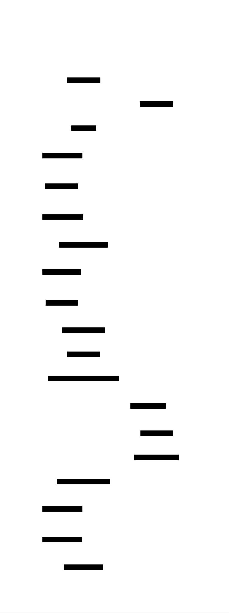

# Collaborative Text Editor: Design Document


## Overview

A real-time collaborative text editor that enables multiple users to simultaneously edit the same document without conflicts. The key architectural challenge is ensuring all users see a consistent view of the document despite concurrent edits, cursor movements, and network delays using either CRDTs or Operational Transformation.


> This guide is meant to help you understand the big picture before diving into each milestone. Refer back to it whenever you need context on how components connect.


## Context and Problem Statement

> **Milestone(s):** Foundational understanding for all milestones — provides the conceptual framework for Milestone 1 (Operation-based CRDT), Milestone 2 (Cursor Presence), Milestone 3 (Operational Transformation), and Milestone 4 (Undo/Redo with Collaboration).

Building a collaborative text editor is fundamentally different from building a single-user editor. When multiple people edit the same document simultaneously, we face a distributed systems problem disguised as a user interface challenge. The core difficulty lies in maintaining a **consistent view** of the document across all users while allowing **concurrent modifications** without blocking or explicit coordination.

Consider what happens when two users type simultaneously at the same position in a document. User A types "Hello" while User B types "World" at the exact same location. Without careful coordination, we might end up with "HWeorlllod" on some clients and "WHeollrold" on others. Even worse, some clients might crash entirely when trying to process conflicting operations. This isn't just a theoretical problem — it's the daily reality that systems like Google Docs, Notion, and Figma must solve at massive scale.

The challenge extends beyond simple text insertion. Users can delete overlapping ranges, move their cursors, copy and paste large blocks of text, and even lose network connectivity temporarily while continuing to edit offline. Meanwhile, each user expects their own edits to appear immediately in their interface (for responsiveness), but also expects to see everyone else's changes in real-time. These requirements create fundamental tensions between consistency, availability, and partition tolerance — the classic CAP theorem constraints applied to collaborative editing.

### The Orchestra Conductor Analogy

Imagine you're conducting a distributed orchestra where each musician is in a different building, connected only by slightly delayed audio links. Each musician can hear the others, but with network latency — what they hear happened a few hundred milliseconds ago. Meanwhile, they need to play a complex piece where timing is critical.

In a traditional orchestra, the conductor provides a single source of truth. All musicians watch the conductor's baton and follow the same tempo. If there's confusion, the conductor stops and restarts. This is analogous to **lock-based collaborative editing** — one person has the "write lock" at any given time, and everyone else must wait their turn. The system is consistent but not very collaborative.

Now imagine trying to conduct the same orchestra without a conductor, where musicians must coordinate purely by listening to each other. This is much closer to what **peer-to-peer collaborative editing** attempts. Musicians (users) make decisions based on what they hear from others, but the network delays mean they're constantly working with slightly outdated information. Sometimes two musicians start playing different sections simultaneously because they didn't hear each other's cues in time.

The magic of **CRDTs** (Conflict-free Replicated Data Types) and **Operational Transformation** is like giving each musician a sophisticated protocol for handling these conflicts gracefully. When two musicians realize they're playing different parts simultaneously, instead of stopping the entire performance, they have rules for merging their contributions in a way that sounds harmonious. CRDT-based systems are like musicians who use a predetermined harmonic structure — no matter what combinations of notes they play simultaneously, the result follows musical theory rules and sounds coherent. OT-based systems are more like jazz musicians who actively listen and adjust their playing in real-time to complement what others are doing.

The key insight is that in both approaches, **every musician keeps playing without pause**. Users never experience blocking or explicit coordination delays. Their own "notes" (edits) appear immediately in their local interface, while the system handles the complex work of merging everyone's contributions into a coherent whole.

However, this analogy also reveals the fundamental challenge: unlike music, where some dissonance can be artistic, text documents require **perfect consistency**. If the word "cat" becomes "cta" on some clients and "act" on others due to concurrent edits, the collaboration has failed. The system must guarantee that all users eventually see identical content, even though they may temporarily see different intermediate states as operations propagate and merge.

### Core Technical Challenges

The technical challenges in collaborative editing stem from the inherent properties of distributed systems combined with user experience requirements that seem to violate the laws of distributed computing.

#### Concurrent Editing and Operation Ordering

When multiple users edit simultaneously, their operations must be **causally ordered** to preserve intent. Consider this sequence: User A types "cat", then User B selects the word "cat" and types "dog" to replace it. If User B's operations arrive at other clients before User A's "cat" insertion, User B will be trying to replace text that doesn't exist yet.

The challenge isn't just ordering operations chronologically — network delays mean timestamps are unreliable. Instead, we need **logical ordering** based on causal dependencies. User B's replacement operation **depends on** User A's insertion, even if we can't rely on wall-clock times to determine this relationship.

Traditional approaches like Lamport timestamps help establish causal ordering, but they create new problems. If we strictly order all operations, we lose the ability to apply operations immediately in the user's local interface. Users would see delays on every keystroke while the system determines the global order. This violates the responsiveness requirement that makes collaborative editing feel natural.

The breakthrough insight of both CRDTs and OT is that we can allow **tentative local application** of operations while handling conflicts through mathematical transformation or conflict-free merge rules. Users see their changes immediately, but the underlying system may be continuously reordering and transforming these operations as more information arrives from other clients.

#### Network Partitions and Offline Editing

Real networks are unreliable. Users lose WiFi connections, switch between networks, or experience temporary service outages. During these **network partitions**, users expect to continue editing their documents. When connectivity resumes, their offline changes must merge seamlessly with modifications made by other users during the disconnection.

This creates a **temporal consistency** problem. Consider a user who goes offline for an hour, makes substantial edits, then reconnects. Meanwhile, other users have been collaborating and the document has evolved significantly. The offline user's operations were based on a document state that's now outdated. Simply applying their operations to the current document state could create conflicts, duplicate content, or corrupt the document structure.

The system must be able to **transform offline operations** against all the changes that happened during the partition. This is similar to a Git merge, but must happen automatically and invisibly to preserve the collaborative editing experience. Unlike Git, users can't be asked to manually resolve merge conflicts — the system must handle conflicts algorithmically while preserving the intent of all users' edits.

Furthermore, the system must handle **partial network partitions** where some users can communicate with each other but not with others. This can create temporary **split-brain scenarios** where different groups of users see different document states. When the partition heals, these divergent states must be merged consistently.

#### Intention Preservation Under Transformation

One of the subtlest challenges is preserving user intent when operations are transformed due to concurrent edits. Consider this scenario: User A has the document "abc" and wants to insert "X" between "a" and "b", creating "aXbc". Simultaneously, User B wants to delete the character "a", creating "bc". 

If we naively apply these operations, User A's insertion at position 1 might end up at position 0 (since "a" was deleted), creating "Xbc" instead of the intended "Xbc". In this case, the result happens to match User A's intent, but consider a more complex case: User A wants to insert "X" after the word "hello" in the sentence "hello world", but User B deletes "hello " (including the space). Should User A's "X" appear at the beginning of "world" or should it disappear entirely since the reference point "hello" no longer exists?

**Intention preservation** requires understanding not just the mechanical position of an operation, but the semantic meaning the user intended. This is particularly challenging for operations like "select the word under the cursor and replace it" or "delete the current line". These operations reference document structure that may have changed due to concurrent edits.

Different approaches handle intention preservation differently. CRDTs often use **position identifiers** that remain stable even when surrounding content changes, similar to how a GPS coordinate remains valid even if buildings are constructed or demolished nearby. OT systems use **transformation functions** that explicitly encode rules about how operations should be modified when applied in different contexts.

#### Convergence Guarantees

The most fundamental requirement is that all clients eventually **converge** to the same document state. This sounds simple, but it's surprisingly easy to violate. Consider three users making concurrent operations. Even if every pair of operations can be merged consistently, there's no guarantee that merging all three will produce the same result regardless of the order in which they're processed.

Mathematically, this requires the merge operation to be **associative and commutative**. If operations A, B, and C are all concurrent, then merge(merge(A, B), C) must equal merge(A, merge(B, C)) and must equal merge(merge(A, C), B). This is similar to the requirements for addition (1 + 2 + 3 gives the same result regardless of grouping), but much harder to achieve for complex operations on document structures.

CRDTs guarantee convergence through mathematical properties of the data structure itself. They ensure that concurrent operations are **conflict-free by construction** — there's no possible sequence of operations that can lead to divergent states. This is powerful, but comes at the cost of restricting what operations are possible.

OT systems achieve convergence through carefully designed **transformation functions** that must satisfy specific mathematical properties called TP1 and TP2 (Transformation Properties 1 and 2). These properties are notoriously difficult to verify and maintain as the system evolves. Many OT implementations have subtle bugs that only manifest under specific sequences of concurrent operations.

#### Memory and Performance Scaling

Collaborative editing systems must handle documents that grow large over time and maintain history for features like undo/redo. Traditional approaches might keep the entire operation history, but this creates **unbounded memory growth**. A document that's been edited collaboratively for months might have millions of operations in its history.

CRDTs face particular challenges here because they often use **tombstone-based deletion** — deleted content isn't actually removed, just marked as deleted. This ensures that concurrent insertions relative to deleted content can still be positioned correctly, but means that memory usage grows with every deletion operation. A document where users frequently delete and rewrite content might use far more memory than the actual visible content would suggest.

Performance is another scaling challenge. Both CRDTs and OT systems need to process every operation against the existing document state. For CRDTs, this often means traversing position identifiers to find insertion points. For OT, this means transforming new operations against recent operations in the history. As documents and operation histories grow, these computations can become expensive enough to impact the real-time user experience.

The system must balance consistency guarantees with performance requirements. Some operations might be fast for small documents but become prohibitively slow for large documents with complex edit histories.

### Comparison of Existing Solutions

Understanding the trade-offs between different approaches to collaborative editing helps illuminate why the technical challenges described above are so fundamental. Each approach represents a different point in the design space, prioritizing different aspects of the consistency-availability-performance triangle.

#### Lock-Based Approaches

Lock-based collaborative editing is the most straightforward approach conceptually. At any given time, only one user can edit the document. Other users can view the current state but must wait for their turn to make changes. This is similar to how traditional desktop applications handle file sharing — only one person can have a file open for editing.

| Aspect | Description | Trade-offs |
|--------|-------------|------------|
| Consistency | Perfect consistency — impossible to have conflicts since only one user can edit at a time | High consistency, but poor collaboration experience |
| Implementation Complexity | Very low — standard locking mechanisms work | Simple to implement and reason about |
| User Experience | Poor for real collaboration — users frequently blocked waiting for locks | Frustrating for multiple simultaneous editors |
| Network Requirements | Requires reliable connectivity to maintain locks | Network partitions can strand lock ownership |
| Scalability | Good performance since no conflict resolution needed | Doesn't scale with number of concurrent users |

Lock-based systems work well for **turn-based editing** scenarios, such as code review workflows where users naturally take turns making changes. They're also appropriate for **structured editing** where different users work on completely separate sections of a document and can lock at a granular level (e.g., per-paragraph locks).

However, lock-based approaches fundamentally cannot provide the seamless collaborative experience users expect from modern tools. The constant context switching between "I can edit" and "I must wait" breaks the natural flow of collaborative work. They're mentioned here primarily as a baseline for comparison.

> **Decision: Reject Lock-Based Approaches for Real-Time Collaboration**
> - **Context**: Lock-based systems provide strong consistency but poor collaboration experience
> - **Options Considered**: Document-level locks, paragraph-level locks, character-level locks
> - **Decision**: Not suitable for real-time collaborative editing requirements
> - **Rationale**: User experience requirements (immediate local response, continuous editing) fundamentally conflict with lock-based coordination
> - **Consequences**: Must choose between CRDT or OT approaches that allow concurrent editing

#### Conflict-free Replicated Data Types (CRDTs)

CRDTs solve the collaborative editing problem by designing data structures where concurrent operations are **conflict-free by mathematical construction**. Instead of detecting and resolving conflicts after they occur, CRDTs prevent conflicts from being possible in the first place.

The key insight is that if concurrent operations can be applied in any order and always produce the same final result, then there are no conflicts to resolve. This requires careful design of both the data structure and the operations it supports.

| Aspect | Description | Trade-offs |
|--------|-------------|------------|
| Consistency | Guaranteed convergence through mathematical properties of the data structure | Strong eventual consistency, but may have temporary inconsistencies |
| Conflict Resolution | No conflict resolution needed — operations are conflict-free by design | Limited to operations that can be made naturally commutative |
| Offline Support | Excellent — operations can be applied locally and merged when connectivity resumes | Natural support for offline editing and network partitions |
| Implementation Complexity | Moderate — requires understanding CRDT mathematics but algorithms are deterministic | Complex to design new CRDTs, but existing ones are well-understood |
| Performance | Can be slower due to position identifier management and tombstone overhead | Memory usage grows with operation history |

For **sequence CRDTs** (which handle ordered data like text), the most common approaches are RGA (Replicated Growable Array) and YATA (Yet Another Transformation Approach, despite the name being a CRDT). These assign unique **position identifiers** to each character that remain stable even when surrounding content changes.

Consider inserting "X" between "a" and "b" in the text "ab". Instead of using integer positions (which would conflict if two users insert at position 1 simultaneously), sequence CRDTs might assign position identifiers like:
- "a" has position identifier `1.0`
- "b" has position identifier `2.0`  
- User A's "X" gets position identifier `1.5` (between `1.0` and `2.0`)
- User B's concurrent "Y" gets position identifier `1.25` (also between `1.0` and `2.0`, but ordered before `1.5`)

The final result would be "aYXb" regardless of the order in which operations are received and applied.

⚠️ **Pitfall: Position Identifier Explosion**
A common mistake in CRDT implementations is not handling the case where users repeatedly insert at the same relative position. If two users keep inserting between the same two characters, the position identifiers must become increasingly precise (like `1.125`, `1.1875`, etc.). Without careful design, this can lead to unbounded precision requirements or identifier collisions.

#### Operational Transformation (OT)

Operational Transformation takes a different approach: allow conflicts to occur, but provide **transformation functions** that modify operations so they can be applied to document states different from where they were originally created.

The core idea is that when User A creates an operation based on document state S1, but that operation needs to be applied to document state S2 (because other operations have been applied in the meantime), we can **transform** User A's operation to account for the differences between S1 and S2.

| Aspect | Description | Trade-offs |
|--------|-------------|------------|
| Consistency | Requires careful design of transformation functions with mathematical properties TP1 and TP2 | Convergence depends on correct implementation of transformation functions |
| Flexibility | Can support arbitrary operations as long as transformation functions can be defined | More flexible than CRDTs for complex operations |
| Server Requirements | Typically requires central server to provide total ordering of operations | Single point of failure, but simpler client implementation |
| Implementation Complexity | High — transformation functions are difficult to get right and verify | Many subtle edge cases in transformation logic |
| Performance | Good performance for large documents since no position identifier overhead | Server must process all operations for ordering |

OT systems typically use a **client-server architecture** where the server provides a total ordering of operations. When a client wants to perform an operation:

1. The client applies the operation locally for immediate UI response
2. The client sends the operation to the server
3. The server assigns a sequence number and broadcasts the operation to all clients
4. Each client transforms the operation against any operations they've applied since their last synchronization point
5. The client applies the transformed operation to their document state

The transformation functions must handle cases like:
- **Insert vs Insert**: Two insertions at the same position — which comes first?
- **Insert vs Delete**: Insertion at a position that's been deleted — should the insertion be moved or cancelled?
- **Delete vs Delete**: Overlapping deletions — how to handle the intersection?

> **Decision: Support Both CRDT and OT Approaches**
> - **Context**: Different collaborative editing scenarios favor different approaches
> - **Options Considered**: CRDT-only, OT-only, or supporting both as alternatives
> - **Decision**: Implement both approaches as alternative synchronization engines
> - **Rationale**: Educational value of comparing approaches, and real systems often need to choose based on specific requirements
> - **Consequences**: More implementation complexity, but deeper understanding of the trade-offs

#### Hybrid Approaches

Many production systems use **hybrid approaches** that combine elements of CRDTs and OT. For example:

- **Google Docs** uses an OT-like system for real-time editing but converts to a more CRDT-like representation for offline support and complex conflict resolution
- **Notion** uses different approaches for different data types — text might use OT while structured data uses CRDT-like merge semantics
- **Figma** uses specialized CRDTs for geometric operations (moving objects) but OT-like approaches for text editing

| Approach | Best Use Cases | Limitations |
|----------|----------------|-------------|
| Pure CRDT | Peer-to-peer systems, offline-heavy usage, simple operations | Limited operation types, memory overhead |
| Pure OT | Server-based systems, complex operations, real-time focus | Central point of failure, complex transformation functions |
| Hybrid | Production systems with diverse requirements | Implementation complexity, harder to reason about |

The choice between approaches often depends on factors beyond pure technical considerations:

- **Infrastructure constraints**: Do you want to avoid single points of failure (favors CRDT) or do you already have reliable server infrastructure (favors OT)?
- **Operation complexity**: Do you need to support complex operations like "find and replace" or rich text formatting (favors OT)?
- **Offline requirements**: Is offline editing a core requirement (favors CRDT) or nice-to-have feature?
- **Team expertise**: CRDTs require stronger mathematical background, while OT requires more distributed systems expertise

Understanding these trade-offs is crucial for making informed decisions about which approach to use in different scenarios. The collaborative text editor we're building will implement both approaches, allowing direct comparison of their benefits and limitations in practice.

### Implementation Guidance

The theoretical foundations above translate into concrete technology choices and architecture decisions. This section provides practical guidance for implementing collaborative editing systems using modern web technologies.

#### Technology Recommendations

| Component | Simple Option | Advanced Option |
|-----------|---------------|------------------|
| Client Transport | WebSocket API with JSON messages | WebRTC DataChannels for peer-to-peer |
| Server Transport | Node.js with ws library | Go with Gorilla WebSocket |
| Client-Side Storage | localStorage for offline operations | IndexedDB for complex document state |
| Server-Side Storage | In-memory maps for prototyping | Redis for distributed server deployment |
| CRDT Library | Custom implementation for learning | Yjs for production use |
| OT Library | Custom implementation for learning | ShareJS/OT.js for production use |
| Text Editor UI | Plain textarea with custom cursor rendering | Monaco Editor or CodeMirror |
| State Management | Plain JavaScript objects | Redux or Zustand for complex state |

For learning purposes, we recommend starting with the simple options and implementing core algorithms from scratch. This provides deeper understanding of the underlying concepts before moving to production-ready libraries.

#### Recommended File Structure

The project should separate concerns between editor UI, synchronization algorithms, and networking to make the codebase maintainable and testable:

```
collaborative-editor/
├── client/
│   ├── src/
│   │   ├── editor/
│   │   │   ├── editor.js              ← Main editor UI component
│   │   │   ├── cursor-manager.js      ← Cursor position tracking and rendering
│   │   │   └── selection-utils.js     ← Text selection and range utilities
│   │   ├── sync/
│   │   │   ├── crdt/
│   │   │   │   ├── rga.js            ← Replicated Growable Array implementation
│   │   │   │   ├── operation.js       ← CRDT operation types and serialization
│   │   │   │   └── position-id.js     ← Position identifier generation and ordering
│   │   │   ├── ot/
│   │   │   │   ├── transform.js       ← Operational transformation functions
│   │   │   │   ├── operation.js       ← OT operation types and serialization
│   │   │   │   └── client-engine.js   ← OT client-side state management
│   │   │   └── sync-engine.js         ← Unified interface for CRDT/OT engines
│   │   ├── network/
│   │   │   ├── websocket-client.js    ← WebSocket connection management
│   │   │   ├── message-protocol.js    ← Message serialization and validation
│   │   │   └── offline-queue.js       ← Offline operation queuing
│   │   ├── undo/
│   │   │   ├── history-manager.js     ← Undo/redo stack management
│   │   │   └── inverse-operations.js  ← Operation inversion for undo
│   │   └── main.js                    ← Application entry point
│   ├── index.html
│   └── package.json
├── server/
│   ├── src/
│   │   ├── websocket-server.js        ← WebSocket server and connection handling
│   │   ├── document-manager.js        ← Document state and user session management
│   │   ├── operation-ordering.js      ← OT operation sequencing and broadcast
│   │   └── server.js                  ← HTTP server and static file serving
│   └── package.json
├── shared/
│   ├── operation-types.js             ← Shared operation definitions
│   ├── message-types.js               ← WebSocket message format definitions
│   └── validation.js                  ← Input validation and sanitization
└── README.md
```

This structure separates the learning objectives (CRDT and OT algorithms in `src/sync/`) from the supporting infrastructure (networking, UI, server coordination). Students can focus on implementing the core algorithms while using provided infrastructure code.

#### Infrastructure Starter Code

**WebSocket Client Connection Manager (`network/websocket-client.js`):**

```javascript
class WebSocketClient {
  constructor(url, messageHandler, connectionHandler) {
    this.url = url;
    this.messageHandler = messageHandler;
    this.connectionHandler = connectionHandler;
    this.ws = null;
    this.reconnectDelay = 1000;
    this.maxReconnectDelay = 30000;
  }

  connect() {
    try {
      this.ws = new WebSocket(this.url);
      
      this.ws.onopen = () => {
        console.log('Connected to server');
        this.reconnectDelay = 1000; // Reset reconnect delay
        this.connectionHandler.onConnected();
      };

      this.ws.onmessage = (event) => {
        try {
          const message = JSON.parse(event.data);
          this.messageHandler.handleMessage(message);
        } catch (error) {
          console.error('Failed to parse message:', error);
        }
      };

      this.ws.onclose = () => {
        console.log('Disconnected from server');
        this.connectionHandler.onDisconnected();
        this.scheduleReconnect();
      };

      this.ws.onerror = (error) => {
        console.error('WebSocket error:', error);
      };
    } catch (error) {
      console.error('Failed to connect:', error);
      this.scheduleReconnect();
    }
  }

  send(message) {
    if (this.ws && this.ws.readyState === WebSocket.OPEN) {
      this.ws.send(JSON.stringify(message));
      return true;
    } else {
      console.warn('WebSocket not connected, message not sent');
      return false;
    }
  }

  scheduleReconnect() {
    setTimeout(() => {
      this.connect();
      this.reconnectDelay = Math.min(this.reconnectDelay * 2, this.maxReconnectDelay);
    }, this.reconnectDelay);
  }

  disconnect() {
    if (this.ws) {
      this.ws.close();
    }
  }
}
```

**Basic WebSocket Server (`server/websocket-server.js`):**

```javascript
const WebSocket = require('ws');

class DocumentServer {
  constructor(port = 8080) {
    this.port = port;
    this.wss = new WebSocket.Server({ port });
    this.documents = new Map(); // documentId -> DocumentState
    this.connections = new Map(); // ws -> ConnectionState
    
    this.wss.on('connection', (ws) => {
      console.log('Client connected');
      
      ws.on('message', (data) => {
        try {
          const message = JSON.parse(data);
          this.handleMessage(ws, message);
        } catch (error) {
          console.error('Invalid message format:', error);
        }
      });
      
      ws.on('close', () => {
        this.handleDisconnection(ws);
      });
    });
  }

  handleMessage(ws, message) {
    switch (message.type) {
      case 'join-document':
        this.handleJoinDocument(ws, message);
        break;
      case 'operation':
        this.handleOperation(ws, message);
        break;
      case 'cursor-update':
        this.handleCursorUpdate(ws, message);
        break;
      default:
        console.warn('Unknown message type:', message.type);
    }
  }

  handleJoinDocument(ws, message) {
    const { documentId, userId, userName } = message;
    
    // Initialize document if it doesn't exist
    if (!this.documents.has(documentId)) {
      this.documents.set(documentId, {
        content: '',
        operations: [],
        users: new Map()
      });
    }
    
    // Store connection state
    this.connections.set(ws, {
      documentId,
      userId,
      userName
    });
    
    // Add user to document
    const document = this.documents.get(documentId);
    document.users.set(userId, { userId, userName, ws });
    
    // Send initial document state
    ws.send(JSON.stringify({
      type: 'document-state',
      content: document.content,
      operations: document.operations
    }));
    
    // Broadcast user joined
    this.broadcast(documentId, {
      type: 'user-joined',
      userId,
      userName
    }, ws);
  }

  broadcast(documentId, message, excludeWs = null) {
    const document = this.documents.get(documentId);
    if (!document) return;
    
    for (const [userId, user] of document.users) {
      if (user.ws !== excludeWs && user.ws.readyState === WebSocket.OPEN) {
        user.ws.send(JSON.stringify(message));
      }
    }
  }

  handleDisconnection(ws) {
    const connection = this.connections.get(ws);
    if (!connection) return;
    
    const { documentId, userId } = connection;
    const document = this.documents.get(documentId);
    
    if (document) {
      document.users.delete(userId);
      this.broadcast(documentId, {
        type: 'user-left',
        userId
      });
    }
    
    this.connections.delete(ws);
    console.log('Client disconnected');
  }
}

module.exports = DocumentServer;
```

#### Core Algorithm Skeletons

**CRDT Operation Structure (`sync/crdt/operation.js`):**

```javascript
class CRDTOperation {
  constructor(type, siteId, logicalClock, data) {
    this.type = type; // 'insert' or 'delete'
    this.siteId = siteId; // Unique identifier for the client
    this.logicalClock = logicalClock; // Lamport timestamp
    this.data = data; // Operation-specific data
    this.id = `${siteId}-${logicalClock}`; // Unique operation ID
  }

  // TODO: Implement operation comparison for causal ordering
  // Should return -1 if this operation should be ordered before other,
  // 1 if after, and 0 if concurrent
  compareTo(other) {
    // TODO 1: Compare logical clocks - earlier clock comes first
    // TODO 2: If clocks are equal, compare site IDs for deterministic ordering
    // TODO 3: Handle case where operations are from the same site
  }

  // TODO: Implement serialization for network transport
  toJSON() {
    // TODO: Return object that can be JSON.stringify'd and sent over network
    // Should include all necessary fields to reconstruct operation
  }

  // TODO: Implement deserialization from network message
  static fromJSON(json) {
    // TODO: Create CRDTOperation instance from parsed JSON
    // Should validate required fields and handle malformed input
  }
}

class InsertOperation extends CRDTOperation {
  constructor(siteId, logicalClock, positionId, character) {
    super('insert', siteId, logicalClock, { positionId, character });
  }

  // TODO: Implement position-based insertion logic
  // Position ID determines where character appears relative to other characters
  getPositionId() {
    return this.data.positionId;
  }

  getCharacter() {
    return this.data.character;
  }
}

class DeleteOperation extends CRDTOperation {
  constructor(siteId, logicalClock, positionId) {
    super('delete', siteId, logicalClock, { positionId });
  }

  // TODO: Implement tombstone-based deletion
  // Mark character as deleted without removing from data structure
  getPositionId() {
    return this.data.positionId;
  }
}
```

**OT Transform Function Skeleton (`sync/ot/transform.js`):**

```javascript
class OTTransform {
  // TODO: Implement the core transformation function
  // Takes two concurrent operations and returns how to transform the first
  // against the second to preserve intent
  static transform(op1, op2, priority) {
    // TODO 1: Handle insert-insert case - operations at same position
    if (op1.type === 'insert' && op2.type === 'insert') {
      // TODO: Use priority to determine which insert comes first
      // Transform positions accordingly
    }

    // TODO 2: Handle insert-delete case - insertion at deleted position  
    if (op1.type === 'insert' && op2.type === 'delete') {
      // TODO: Check if insertion position is affected by deletion
      // Adjust position if needed
    }

    // TODO 3: Handle delete-insert case - deletion when content inserted
    if (op1.type === 'delete' && op2.type === 'insert') {
      // TODO: Check if deletion range is affected by insertion
      // Adjust deletion range if needed
    }

    // TODO 4: Handle delete-delete case - overlapping deletions
    if (op1.type === 'delete' && op2.type === 'delete') {
      // TODO: This is the trickiest case - overlapping deletes
      // Must handle intersection, before, and after portions
    }

    // TODO 5: Return transformed version of op1 that can be applied
    // after op2 has already been applied
  }

  // TODO: Verify transformation properties TP1 and TP2
  // TP1: transform(op1, op2) ∘ op2 = op1 ∘ transform(op2, op1)  
  // TP2: transform(transform(op, op1), op2) = transform(transform(op, op2), op1)
  static verifyTransformProperties(op1, op2, op3) {
    // TODO: Implement verification tests for transformation correctness
    // Should be used in unit tests to verify transform functions
  }
}

class Operation {
  constructor(type, position, content = '', length = 0) {
    this.type = type; // 'insert' or 'delete'
    this.position = position; // Integer position in document
    this.content = content; // For insert: text to insert
    this.length = length; // For delete: number of characters to delete
  }

  // TODO: Apply this operation to a document string
  apply(document) {
    // TODO 1: Validate operation can be applied (position in bounds, etc.)
    // TODO 2: For insert: splice content into document at position
    // TODO 3: For delete: remove characters from position to position + length
    // TODO 4: Return new document string
  }

  // TODO: Create inverse operation for undo functionality
  invert(document) {
    // TODO 1: For insert operation, create delete operation at same position
    // TODO 2: For delete operation, create insert with deleted content
    // TODO 3: Store original content for delete inversion
  }
}
```

#### Language-Specific Implementation Hints

For JavaScript implementations:

- **Use `Map` objects for position identifier storage** instead of plain objects for better performance with non-string keys
- **Implement custom comparison functions** for sorting operations by logical timestamp and site ID
- **Use `Array.splice()` for efficient text insertion and deletion** rather than string concatenation
- **Store tombstones in separate data structure** to avoid cluttering the main document representation
- **Use `setTimeout()` with 0 delay for yielding control** during long operation processing to keep UI responsive
- **Implement operation queuing with `Promise` chains** for handling asynchronous network operations
- **Use `JSON.parse()` and `JSON.stringify()` carefully** — validate input and handle circular references in operation objects

Common JavaScript pitfalls to avoid:

- **Don't use `==` for comparing operation IDs** — always use `===` to avoid type coercion issues
- **Don't mutate operation objects after creation** — treat them as immutable to prevent subtle bugs
- **Don't forget to handle WebSocket connection states** — check `readyState` before sending messages
- **Don't store DOM references in operation objects** — they can't be serialized and cause memory leaks

#### Milestone Checkpoints

**After Milestone 1 (CRDT Implementation):**
- Run test: Create two browser windows, type simultaneously in both, verify both show same final text
- Expected behavior: Characters appear immediately in local window, other window updates within 100ms
- Debugging: If convergence fails, check operation ordering and position identifier generation
- Verification command: Open browser dev tools, check network tab shows operation messages being exchanged

**After Milestone 2 (Cursor Presence):**
- Run test: Move cursor in one window, verify colored cursor appears in other windows
- Expected behavior: Remote cursors update in real-time with user names and distinct colors
- Debugging: If cursors don't appear, check cursor position transformation and rendering code
- Verification: Multiple users should see each other's cursors with correct positions after typing

**After Milestone 3 (OT Implementation):**
- Run test: Switch to OT mode, repeat simultaneous typing test, verify same convergence behavior
- Expected behavior: Operations are transformed correctly, final document state identical across clients
- Debugging: If transform fails, verify TP1 and TP2 properties are satisfied by transform functions
- Verification: Server logs should show operations being reordered and transformed

**After Milestone 4 (Undo/Redo):**
- Run test: Type text, press Ctrl+Z to undo, verify only your own operations are undone
- Expected behavior: Undo reverses local user's changes while preserving others' concurrent edits
- Debugging: If undo affects other users' text, check operation history filtering and inverse operations
- Verification: Each user's undo stack should be independent and work correctly after collaborative editing


## Goals and Non-Goals

> **Milestone(s):** All milestones — defines scope and requirements that guide implementation of Milestone 1 (Operation-based CRDT), Milestone 2 (Cursor Presence), Milestone 3 (Operational Transformation), and Milestone 4 (Undo/Redo with Collaboration)

### Mental Model: Building a Shared Digital Workspace

Think of this collaborative text editor like designing a shared digital workspace where multiple people can work on the same document simultaneously, similar to how multiple architects might collaborate on building blueprints spread across a large table. Each architect can draw, erase, and modify the plans at the same time, but the final blueprint must be coherent and reflect everyone's contributions without conflicts or lost work.

Just as architects need clear protocols for who can modify which sections and how to handle simultaneous changes to the same area, our collaborative editor needs well-defined rules for handling concurrent edits, preserving user intentions, and ensuring everyone sees a consistent view of the document. The key difference is that our digital workspace operates across networks with varying delays and potential disconnections, making the coordination challenge significantly more complex than a physical shared workspace.

This section establishes the boundaries of what our collaborative editor will accomplish, what performance characteristics users can expect, and what features are explicitly excluded to maintain focus on the core distributed systems challenges.

### Functional Requirements

The collaborative text editor must support four core functional capabilities that work together to provide a seamless multi-user editing experience. These requirements directly map to our milestone structure and define the essential behaviors users will experience.

#### Real-Time Collaborative Text Editing

The editor must support simultaneous text editing by multiple users with immediate visual feedback and conflict-free merging of concurrent changes. This forms the foundation of the collaborative experience and encompasses the most complex technical challenges in the system.

| Capability | Description | Technical Requirement |
|------------|-------------|----------------------|
| Concurrent Insert Operations | Multiple users can insert text at any position simultaneously | Operations must converge to same final state regardless of arrival order |
| Concurrent Delete Operations | Users can delete characters or text ranges while others edit nearby | Deletions must preserve position references and handle tombstone cleanup |
| Character-Level Granularity | Edits are tracked at individual character level for fine-grained conflict resolution | Each character insert/delete is a separate operation with unique position identifier |
| Intent Preservation | User's intended edits produce expected results despite concurrent changes | Transform functions or CRDT algorithms must maintain semantic meaning of operations |
| Sub-Second Latency | Text changes appear on remote clients within 100-500ms under normal network conditions | WebSocket transport with minimal server-side processing delay |
| Offline Editing Support | Users can continue editing during temporary network disconnections | Local operation buffering with synchronization on reconnection |

The system must handle edge cases like simultaneous insertion at the same character position, overlapping deletions, and rapid typing sequences that generate multiple operations before network round-trips complete. The conflict resolution approach—whether CRDT-based or Operational Transformation—must guarantee convergence where all connected clients reach identical document states after all operations propagate.

#### Cursor Presence and User Awareness

Users must see real-time indicators of where other collaborators are positioned within the document, including cursor locations, text selections, and user identification. This awareness prevents editing conflicts and improves collaboration efficiency.

| Feature | Behavior | Implementation Requirement |
|---------|----------|---------------------------|
| Remote Cursor Display | Show other users' cursor positions with colored indicators | Broadcast cursor position updates on every keystroke or mouse movement |
| User Identity Labels | Display username or identifier near each remote cursor | Associate cursor positions with user session metadata |
| Selection Range Visualization | Highlight text ranges selected by other users | Track selection start/end positions and render as colored overlays |
| Cursor Position Transformation | Update cursor positions automatically when document changes | Apply same transformation logic used for text operations to cursor coordinates |
| Presence State Management | Show when users join, leave, or become inactive | Maintain connection state and broadcast presence events to all clients |
| Visual Conflict Prevention | Highlight potential edit conflicts before they occur | Detect when multiple cursors are positioned in nearby text regions |

Cursor synchronization must handle the challenging scenario where user A's cursor is at position 10, user B inserts 5 characters at position 5, and user A's cursor position must automatically adjust to position 15 without any action from user A. This requires the same causal ordering and transformation logic used for text operations.

#### Conflict-Free Operation Merging

The system must automatically resolve editing conflicts without requiring user intervention or displaying confusing merge dialogs. This is the core technical challenge that distinguishes our approach from simple turn-taking or locking mechanisms.

| Conflict Type | Resolution Strategy | Consistency Guarantee |
|---------------|-------------------|----------------------|
| Simultaneous Insert at Same Position | CRDT uses position identifiers with tie-breaking rules; OT uses transformation priority | All clients converge to same character ordering |
| Overlapping Delete Operations | Tombstone markers prevent double-deletion; OT transforms delete ranges | Consistent final text with no phantom characters |
| Insert Into Deleted Text | CRDT position identifiers remain stable; OT transforms insert position | Insert appears at semantically correct location |
| Rapid Typing Sequences | Buffer and order operations using logical clocks or server sequencing | Preserve typing order within user's session |
| Cross-User Dependencies | Vector clocks or happened-before relationships track operation causality | Respect causal ordering constraints |
| Network Reordering | Operations include sufficient metadata for proper ordering | Deterministic merge regardless of network message arrival order |

> **Decision: Deterministic Conflict Resolution**
> - **Context**: Multiple users editing the same document position simultaneously creates conflicts that could result in different final states across clients
> - **Options Considered**: Manual merge dialogs, last-writer-wins, deterministic algorithmic resolution
> - **Decision**: Deterministic algorithmic resolution using either CRDT or OT approaches
> - **Rationale**: Manual merging breaks the real-time collaboration flow; last-writer-wins loses user data; algorithmic approaches provide predictable, consistent results
> - **Consequences**: More complex implementation but guarantees no data loss and consistent user experience

#### Selective Undo/Redo Functionality

Users must be able to undo their own operations without affecting other users' concurrent edits. This requires maintaining per-user operation history and generating inverse operations that work correctly even when the original operation has been transformed by subsequent concurrent changes.

| Undo Capability | Behavior | Technical Challenge |
|-----------------|----------|-------------------|
| Personal Operation Undo | Undo only the current user's own edit operations | Maintain separate undo stack per user session |
| Selective History Traversal | Undo operations in reverse chronological order for current user | Skip over other users' operations when traversing history |
| Inverse Operation Generation | Create operations that reverse the effect of original operations | Handle case where original operation was transformed by concurrent edits |
| Redo After Undo | Reapply previously undone operations if user changes their mind | Maintain redo stack that becomes invalid when new edits occur |
| Group Related Operations | Treat rapid typing or paste operations as single undoable unit | Implement operation grouping based on timing or semantic relationships |
| Undo Transformation | Ensure undo operations work correctly despite concurrent edits from others | Apply same transformation logic used for forward operations |

The most complex scenario involves undoing an operation that was transformed multiple times due to concurrent edits. For example, if user A inserts "hello" at position 5, then user B inserts "world" at position 3 (shifting A's insert to position 10), user A's undo operation must delete "hello" from position 10, not position 5.

### Non-Functional Requirements

The collaborative editor must meet specific performance, scalability, and reliability targets to provide an acceptable user experience. These quantitative requirements guide architectural decisions and technology choices throughout the implementation.

#### Performance Targets

| Metric | Target | Measurement Method | Rationale |
|--------|--------|-------------------|-----------|
| Local Edit Latency | < 16ms (60 FPS) | Time from keystroke to local screen update | Ensures responsive typing experience without noticeable lag |
| Remote Edit Propagation | < 500ms | Time from user A's keystroke to appearance on user B's screen | Maintains feeling of real-time collaboration |
| Operation Transformation | < 10ms | Time to transform one operation against another | Prevents operation backlog during high edit frequency |
| Cursor Update Frequency | 10-30 updates/second | Cursor position broadcast rate during active editing | Balances real-time awareness with network efficiency |
| Document Load Time | < 2 seconds | Time to join existing document and receive full state | Acceptable wait time for new collaborators |
| Memory Usage Growth | < 1MB per 10,000 operations | Memory consumption for operation history and tombstones | Prevents unbounded memory growth in long editing sessions |

These targets assume reasonable network conditions (< 100ms RTT) and modern hardware. The system should degrade gracefully under poor network conditions by increasing propagation latency while maintaining consistency guarantees.

#### Scalability Expectations

The initial implementation targets small-group collaboration scenarios typically found in team editing workflows, with clear limits that help focus the architectural complexity.

| Dimension | Target Capacity | Expected Behavior at Limit | Growth Strategy |
|-----------|-----------------|----------------------------|-----------------|
| Concurrent Users per Document | 10-20 active editors | Increased latency, possible cursor update throttling | Document sharding or federated architecture |
| Document Size | 100,000 characters | Slower operation processing, memory pressure | Implement operation compaction and garbage collection |
| Operations per Second | 100-200 across all users | Operation queuing, batch processing | Server-side operation batching and prioritization |
| Concurrent Documents | 50-100 per server instance | Resource contention, connection limits | Horizontal scaling with load balancing |
| Operation History Retention | 24 hours or 10,000 operations | Automatic garbage collection triggers | Archive old operations to persistent storage |
| Network Bandwidth | 10-50 KB/s per user | Compress messages, reduce cursor update frequency | Implement adaptive message compression |

> The scalability targets reflect the educational nature of this project. Production systems like Google Docs support thousands of concurrent users through sophisticated caching, CDNs, and distributed architectures that are beyond our scope.

#### Availability and Reliability Requirements

| Requirement Category | Specification | Implementation Approach | Acceptance Criteria |
|---------------------|---------------|------------------------|-------------------|
| Server Uptime | 99% during development/demo periods | Simple restart mechanisms, basic error handling | Server recovers automatically from common failures |
| Client Reconnection | Automatic reconnection after network interruption | Exponential backoff WebSocket reconnection | Client re-synchronizes state within 5 seconds of reconnection |
| Data Persistence | No permanent data loss during normal operation | In-memory state with optional file backup | Document state persists across server restarts |
| Error Recovery | Graceful handling of malformed operations | Input validation and error boundaries | Invalid operations are rejected without affecting other users |
| Browser Compatibility | Works in modern Chrome, Firefox, Safari | Standard WebSocket and JavaScript APIs | Consistent behavior across supported browsers |
| Concurrent Session Handling | Multiple browser tabs for same user | Session isolation or shared state management | Clear behavior when user has multiple editor instances |

The system prioritizes consistency over availability—if a conflict resolution algorithm detects an inconsistent state, it should halt operation rather than allow divergent document states. This "fail-safe" approach is appropriate for an educational system where understanding correctness is more important than maximizing uptime.

### Explicit Non-Goals

Clearly defining what this collaborative editor will NOT support is crucial for maintaining focus on the core distributed systems challenges. These exclusions prevent scope creep and allow deeper exploration of conflict-free concurrent editing algorithms.

#### Rich Text Formatting

The editor will support only plain text content without any formatting capabilities. This exclusion significantly simplifies the data model and conflict resolution logic.

| Excluded Feature | Rationale for Exclusion | Complexity Avoided |
|------------------|------------------------|-------------------|
| Bold, Italic, Underline | Formatting conflicts are much more complex than text conflicts | Would require attribute CRDTs or complex OT for formatting operations |
| Font Selection | Font information must be synchronized across clients | Font availability differences across operating systems |
| Text Colors | Color conflicts and inheritance rules add algorithmic complexity | Additional conflict resolution for overlapping color spans |
| Paragraph Styles | Block-level formatting introduces hierarchical document structure | Tree-based CRDTs instead of simpler sequence CRDTs |
| Lists and Tables | Structured content requires complex position identifiers | Multi-dimensional positioning and structural constraints |
| Hyperlinks | Link targets and display text can be edited independently | Separate conflict resolution for link metadata vs. display text |

Plain text editing allows us to focus entirely on the fundamental challenges of distributed consistency and concurrent operation transformation without the additional complexity of managing rich content hierarchies.

#### Document Management Features

The system will not include document creation, saving, sharing, or organization capabilities. Each editing session works with a single document identified by a simple document ID.

| Excluded Feature | Alternative Approach | Focus Maintained On |
|------------------|---------------------|-------------------|
| Document Creation/Deletion | Pre-create documents or use hardcoded document IDs | Real-time synchronization algorithms |
| File Upload/Download | Manual copy-paste of document content | Operation-level conflict resolution |
| Document Sharing/Permissions | All users can access all documents | Distributed consistency guarantees |
| Folder Organization | Single flat namespace of document IDs | Core CRDT and OT implementations |
| Version History/Branching | Only current document state maintained | Live collaboration synchronization |
| Document Templates | Start with empty documents | Conflict-free concurrent editing |

These features would require additional server infrastructure, user authentication systems, and database design that distract from the core learning objectives around distributed consensus and operation transformation.

#### Advanced Collaboration Features

Several collaboration features found in production systems are excluded to maintain focus on the fundamental algorithmic challenges.

| Excluded Feature | Production Example | Educational Value Trade-off |
|------------------|------------------|---------------------------|
| Voice/Video Chat Integration | Google Docs integration with Meet | Adds media streaming complexity unrelated to text synchronization |
| Commenting System | Side-panel comments with threaded discussions | Requires separate conflict resolution for comment metadata |
| Suggestion Mode | Track changes with accept/reject workflow | Complex state machine for pending vs. accepted changes |
| Real-time Analytics | Edit frequency, user activity tracking | Database design and analytics infrastructure |
| Advanced Presence | "User is typing" indicators, idle detection | Additional WebSocket message types and state management |
| Document Locking | Prevent editing of specific sections | Contradicts conflict-free approach we're learning |

> **Design Philosophy**: This project prioritizes deep understanding of distributed consistency algorithms over breadth of features. Each excluded feature represents a separate distributed systems challenge that could be the focus of its own educational project.

#### Performance and Scale Exclusions

The system will not attempt to solve the performance and scalability challenges faced by production collaborative editing systems.

| Scale Dimension | Excluded Capability | Production Requirement | Educational Alternative |
|-----------------|-------------------|----------------------|------------------------|
| Massive User Count | 1000+ simultaneous editors | Complex load balancing and state partitioning | Focus on correctness with 10-20 users |
| Large Document Size | Multi-megabyte documents | Incremental loading and virtual scrolling | Understand algorithm behavior with smaller documents |
| Geographic Distribution | Global CDN and edge caching | Complex network topology and consistency | Single server with simulated network delays |
| Persistent Storage | Database integration with ACID guarantees | Transaction management across storage and memory | In-memory state with optional file backup |
| Advanced Caching | Operation result memoization | Cache invalidation distributed systems problems | Direct operation processing for transparency |
| Network Optimization | Custom protocols, compression, batching | Protocol design and network engineering | Standard WebSocket with JSON for clarity |

These exclusions allow learners to run the complete system on a single development machine and understand every aspect of the implementation without needing distributed infrastructure or performance optimization expertise.

#### Security and Authentication

The system will not implement user authentication, authorization, or security measures beyond basic input validation.

| Security Aspect | Excluded | Rationale | Development Approach |
|-----------------|----------|-----------|----------------------|
| User Authentication | Login, passwords, sessions | Security implementation distracts from distributed algorithms | Use simple usernames or random IDs |
| Authorization | Document access control | Permission systems are separate distributed systems problem | All users can access all documents |
| Input Sanitization | XSS prevention, content filtering | Web security is orthogonal to operation transformation | Trust all input during development |
| Network Security | TLS, encrypted WebSockets | Encryption doesn't affect synchronization algorithm design | Use plain WebSocket for easier debugging |
| Rate Limiting | DoS prevention | Would complicate operation ordering and testing | Assume cooperative users during development |
| Audit Logging | Security event tracking | Logging infrastructure separate from core algorithms | Optional debug logging only |

> **Important**: These security exclusions make the system unsuitable for any production deployment. The focus is entirely on learning distributed consistency algorithms in a controlled educational environment.

### Implementation Guidance

This subsection provides concrete technical recommendations and starter code to help implement the requirements defined above while maintaining focus on the core distributed systems learning objectives.

#### Technology Recommendations

The technology choices balance simplicity for educational purposes with realistic approaches that demonstrate production-worthy concepts.

| Component | Simple Option | Advanced Option | Recommended for Learning |
|-----------|---------------|-----------------|-------------------------|
| Client Framework | Vanilla JavaScript with simple DOM manipulation | React/Vue with state management | Vanilla JavaScript - keeps focus on algorithms |
| Server Runtime | Node.js with built-in WebSocket support | Go with gorilla/websocket or similar | Node.js - familiar to most web developers |
| WebSocket Library | Native WebSocket API with manual reconnection | Socket.io with automatic reconnection/fallback | Native WebSocket - understand the protocol directly |
| Data Serialization | JSON for all message types | Protocol Buffers or MessagePack | JSON - human readable for debugging |
| State Management | Plain JavaScript objects with manual updates | Immutable data structures with state libraries | Plain objects - transparent state changes |
| Testing Framework | Manual testing with multiple browser windows | Automated testing with concurrent operation simulation | Start manual, add automated tests for complex scenarios |

#### Recommended Project Structure

Organize the codebase to separate concerns between UI, synchronization algorithms, and networking. This structure supports implementing different milestones independently while maintaining clean interfaces.

```
collaborative-editor/
├── client/
│   ├── index.html                 ← Simple editor UI
│   ├── js/
│   │   ├── editor.js             ← DOM manipulation and user input handling
│   │   ├── crdt-engine.js        ← CRDT implementation (Milestone 1)
│   │   ├── ot-engine.js          ← Operational Transformation (Milestone 3)
│   │   ├── cursor-manager.js     ← Cursor presence synchronization (Milestone 2)
│   │   ├── undo-manager.js       ← Collaborative undo/redo (Milestone 4)
│   │   ├── websocket-client.js   ← WebSocket connection management
│   │   └── utils.js              ← Shared utilities and helpers
│   └── css/
│       └── editor.css            ← Basic styling for editor and cursors
├── server/
│   ├── server.js                 ← Main server entry point
│   ├── document-server.js        ← Document state management and broadcasting
│   ├── operation-handlers.js     ← Message processing and validation
│   └── utils.js                  ← Server-side utilities
├── shared/
│   ├── operation-types.js        ← Operation data structures used by both client and server
│   ├── message-types.js          ← WebSocket message format definitions
│   └── position-utils.js         ← Position identifier utilities for CRDTs
├── tests/
│   ├── crdt-convergence.test.js  ← Test CRDT convergence properties
│   ├── ot-transform.test.js      ← Test OT transformation correctness
│   └── integration.test.js       ← End-to-end collaborative editing scenarios
└── examples/
    ├── simple-demo.html          ← Single-file demo for quick testing
    └── conflict-scenarios.js     ← Predefined conflict test cases
```

This structure allows learners to implement each milestone incrementally:
- Milestone 1: Focus on `crdt-engine.js` and basic `websocket-client.js`
- Milestone 2: Add `cursor-manager.js` and extend WebSocket message handling
- Milestone 3: Implement `ot-engine.js` as alternative to CRDT approach
- Milestone 4: Build `undo-manager.js` that works with either CRDT or OT engine

#### Core Data Structure Definitions

These shared data structures should be defined in the `shared/` directory and used by both client and server implementations to ensure consistent message formats.

```javascript
// shared/operation-types.js - Core operation data structures

/**
 * Base class for all CRDT operations with common metadata
 */
class CRDTOperation {
    constructor(type, siteId, logicalClock) {
        this.type = type;           // 'insert' or 'delete'
        this.siteId = siteId;       // unique identifier for the client site
        this.logicalClock = logicalClock;  // Lamport timestamp for ordering
        this.timestamp = Date.now(); // wallclock time for debugging
    }

    // TODO: Implement comparison function for causal ordering
    // Should return -1 if this operation happened before other,
    // 1 if after, 0 if concurrent
    compareTo(other) {
        // TODO: Compare logical clocks and site IDs for deterministic ordering
        // Hint: Use logical clock first, then site ID as tiebreaker
    }

    // TODO: Serialize operation for network transmission
    toJSON() {
        // TODO: Return plain object with all fields for JSON.stringify
    }

    // TODO: Deserialize operation from network message
    static fromJSON(json) {
        // TODO: Create appropriate operation subclass based on type field
    }
}

/**
 * Insert operation for adding a single character to the document
 */
class InsertOperation extends CRDTOperation {
    constructor(siteId, logicalClock, positionId, character) {
        super('insert', siteId, logicalClock);
        this.positionId = positionId;  // stable position identifier
        this.character = character;    // single character being inserted
    }

    // TODO: Apply this insert operation to a document string
    // Returns new document content with character inserted at correct position
    apply(document) {
        // TODO: Find insertion point using position identifier
        // TODO: Insert character and return new document string
    }

    // TODO: Create inverse delete operation for undo functionality
    invert(document) {
        // TODO: Return DeleteOperation that removes this character
    }
}

/**
 * Delete operation for removing a character from the document
 */
class DeleteOperation extends CRDTOperation {
    constructor(siteId, logicalClock, positionId) {
        super('delete', siteId, logicalClock);
        this.positionId = positionId;  // stable position identifier of character to delete
    }

    // TODO: Apply this delete operation to a document string
    // Uses tombstone approach - marks character as deleted but preserves position
    apply(document) {
        // TODO: Find character at position identifier
        // TODO: Mark as deleted (tombstone) and return new document
    }

    // TODO: Create inverse insert operation for undo functionality
    invert(document) {
        // TODO: Look up original character content at position
        // TODO: Return InsertOperation that restores the character
    }
}
```

#### WebSocket Message Format Definitions

Standardize message formats between client and server to ensure consistent communication protocols across all milestone implementations.

```javascript
// shared/message-types.js - WebSocket message format definitions

const MESSAGE_TYPES = {
    // Document lifecycle messages
    JOIN_DOCUMENT: 'join-document',
    DOCUMENT_STATE: 'document-state',
    LEAVE_DOCUMENT: 'leave-document',
    
    // Operation synchronization messages  
    OPERATION: 'operation',
    OPERATION_ACK: 'operation-ack',
    
    // Cursor presence messages
    CURSOR_UPDATE: 'cursor-update',
    SELECTION_UPDATE: 'selection-update',
    
    // User presence messages
    USER_JOINED: 'user-joined',
    USER_LEFT: 'user-left',
    USER_LIST: 'user-list'
};

/**
 * Factory functions for creating standardized WebSocket messages
 */
class MessageFactory {
    
    // TODO: Create join document request message
    static createJoinDocumentMessage(documentId, userId, userName) {
        // TODO: Return message object with type, documentId, user info
    }
    
    // TODO: Create operation broadcast message
    static createOperationMessage(documentId, operation) {
        // TODO: Return message with type, documentId, serialized operation
    }
    
    // TODO: Create cursor position update message  
    static createCursorUpdateMessage(documentId, userId, position, selection) {
        // TODO: Return message with cursor position and selection range
    }
    
    // TODO: Validate incoming message format
    static validateMessage(message) {
        // TODO: Check required fields based on message type
        // TODO: Return true if valid, false if malformed
    }
}
```

#### WebSocket Client Infrastructure

Provide complete WebSocket client implementation that handles connection management, reconnection, and message routing. This is infrastructure code that learners can use directly to focus on the synchronization algorithms.

```javascript
// client/js/websocket-client.js - Complete WebSocket client implementation

class WebSocketClient {
    constructor(url) {
        this.url = url;
        this.ws = null;
        this.messageHandlers = new Map();  // message type -> handler function
        this.connectionHandlers = [];     // connection state change callbacks
        this.reconnectDelay = 1000;      // exponential backoff for reconnection
        this.maxReconnectDelay = 30000;
        this.reconnectAttempts = 0;
        this.isIntentionallyClosed = false;
    }

    /**
     * Establish WebSocket connection with automatic reconnection
     */
    connect() {
        return new Promise((resolve, reject) => {
            try {
                this.ws = new WebSocket(this.url);
                
                this.ws.onopen = () => {
                    console.log('WebSocket connected');
                    this.reconnectDelay = 1000;
                    this.reconnectAttempts = 0;
                    this.notifyConnectionHandlers('connected');
                    resolve();
                };
                
                this.ws.onmessage = (event) => {
                    try {
                        const message = JSON.parse(event.data);
                        this.handleMessage(message);
                    } catch (error) {
                        console.error('Failed to parse message:', error);
                    }
                };
                
                this.ws.onclose = (event) => {
                    console.log('WebSocket closed:', event.code, event.reason);
                    this.notifyConnectionHandlers('disconnected');
                    
                    if (!this.isIntentionallyClosed) {
                        this.scheduleReconnect();
                    }
                };
                
                this.ws.onerror = (error) => {
                    console.error('WebSocket error:', error);
                    reject(error);
                };
                
            } catch (error) {
                reject(error);
            }
        });
    }

    /**
     * Send message if connection is open, otherwise buffer for later
     */
    send(message) {
        if (this.ws && this.ws.readyState === WebSocket.OPEN) {
            this.ws.send(JSON.stringify(message));
            return true;
        } else {
            console.warn('WebSocket not connected, message dropped:', message);
            return false;
        }
    }

    /**
     * Register handler for specific message type
     */
    onMessage(messageType, handler) {
        this.messageHandlers.set(messageType, handler);
    }

    /**
     * Register handler for connection state changes
     */
    onConnectionChange(handler) {
        this.connectionHandlers.push(handler);
    }

    /**
     * Close connection intentionally (prevents automatic reconnection)
     */
    disconnect() {
        this.isIntentionallyClosed = true;
        if (this.ws) {
            this.ws.close();
        }
    }

    // Private helper methods
    handleMessage(message) {
        const handler = this.messageHandlers.get(message.type);
        if (handler) {
            handler(message);
        } else {
            console.warn('No handler for message type:', message.type);
        }
    }

    scheduleReconnect() {
        this.reconnectAttempts++;
        const delay = Math.min(this.reconnectDelay * Math.pow(2, this.reconnectAttempts), this.maxReconnectDelay);
        
        console.log(`Reconnecting in ${delay}ms (attempt ${this.reconnectAttempts})`);
        
        setTimeout(() => {
            if (!this.isIntentionallyClosed) {
                this.connect().catch(() => {
                    // Reconnection failed, will try again
                });
            }
        }, delay);
    }

    notifyConnectionHandlers(state) {
        this.connectionHandlers.forEach(handler => {
            try {
                handler(state);
            } catch (error) {
                console.error('Connection handler error:', error);
            }
        });
    }
}
```

#### Server Infrastructure Skeleton

Provide the basic server structure with WebSocket handling and document management, but leave the core operation processing logic as TODOs that map to the learning objectives.

```javascript
// server/document-server.js - Server-side document management skeleton

const WebSocket = require('ws');

class DocumentServer {
    constructor(port = 8080) {
        this.port = port;
        this.wss = null;
        this.documents = new Map();    // documentId -> DocumentState
        this.connections = new Map();  // ws connection -> user metadata
    }

    start() {
        this.wss = new WebSocket.Server({ port: this.port });
        
        this.wss.on('connection', (ws) => {
            console.log('New WebSocket connection');
            
            ws.on('message', (data) => {
                try {
                    const message = JSON.parse(data);
                    this.handleMessage(ws, message);
                } catch (error) {
                    console.error('Failed to parse message:', error);
                }
            });
            
            ws.on('close', () => {
                this.handleDisconnection(ws);
            });
        });
        
        console.log(`Document server listening on port ${this.port}`);
    }

    // TODO: Process incoming WebSocket messages based on type
    handleMessage(ws, message) {
        switch (message.type) {
            case 'join-document':
                // TODO: Add user to document, send current document state
                // TODO: Broadcast user-joined message to other participants
                break;
                
            case 'operation':
                // TODO: Apply operation to document using CRDT or OT
                // TODO: Broadcast operation to all other users in document
                break;
                
            case 'cursor-update':
                // TODO: Broadcast cursor position to all other users
                break;
                
            default:
                console.warn('Unknown message type:', message.type);
        }
    }

    // TODO: Clean up when user disconnects
    handleDisconnection(ws) {
        // TODO: Remove user from document participants
        // TODO: Broadcast user-left message to remaining users
        // TODO: Clean up empty documents
    }

    // TODO: Send message to all users in a specific document
    broadcast(documentId, message, excludeWs = null) {
        // TODO: Find all connections for the document
        // TODO: Send message to each connection except excludeWs
    }

    // TODO: Get or create document state
    getOrCreateDocument(documentId) {
        // TODO: Return existing document or create new empty document
        // TODO: Initialize with empty content and operation history
    }
}
```

#### Milestone Verification Steps

After implementing each milestone, learners should verify their implementation meets the functional requirements through these concrete tests.

**Milestone 1 Checkpoint (CRDT Operations):**
1. Start server: `node server/server.js`
2. Open two browser windows to the editor
3. Type simultaneously in both windows
4. Verify both windows show identical final text after a few seconds
5. Check browser console for operation logs showing CRDT processing
6. Expected behavior: No conflicts, deterministic final state regardless of typing speed

**Milestone 2 Checkpoint (Cursor Presence):**
1. Continue from Milestone 1 setup with multiple browser windows
2. Move cursor in one window, verify colored cursor appears in other windows
3. Make text selection in one window, verify selection highlight appears remotely
4. Type text and verify remote cursors update positions automatically
5. Expected behavior: Real-time cursor synchronization with user identification

**Milestone 3 Checkpoint (Operational Transformation):**
1. Switch implementation to use OT instead of CRDT
2. Repeat simultaneous typing test from Milestone 1
3. Verify operation transformation logs in console
4. Compare final document state with CRDT approach - should be identical
5. Expected behavior: Same conflict resolution results but with different algorithm

**Milestone 4 Checkpoint (Collaborative Undo/Redo):**
1. User A types "hello", User B types "world" 
2. User A presses Ctrl+Z to undo their text
3. Verify only "hello" disappears, "world" remains
4. User A presses Ctrl+Y to redo
5. Expected behavior: Selective undo affects only the user's own operations


## High-Level Architecture

> **Milestone(s):** All milestones — provides the foundational architecture for Milestone 1 (Operation-based CRDT), Milestone 2 (Cursor Presence), Milestone 3 (Operational Transformation), and Milestone 4 (Undo/Redo with Collaboration)

Think of the collaborative text editor architecture as a **symphony orchestra with multiple conductors**. Each musician (client editor) has their own sheet music (document state) and wants to play their part (make edits) in real-time. However, instead of a single conductor coordinating everyone, each musician must somehow stay synchronized with all the others without missing a beat. The challenge is ensuring that when multiple musicians play simultaneously (concurrent edits), the resulting music (final document state) is harmonious and consistent across all performers, regardless of network delays or the order in which they hear each other's notes.

This architecture must solve several complex coordination challenges. First, it needs a mechanism for each client to broadcast their "musical contributions" (operations) to all other clients reliably. Second, it requires a sophisticated conflict resolution system that can handle situations where multiple clients attempt to edit the same document position simultaneously. Third, it must maintain **intention preservation** — ensuring that each user's intended edit has the expected effect even when other users are making concurrent changes. Finally, the system must guarantee **convergence** — that all clients eventually reach the same final document state regardless of network delays or the order in which operations are received.

The architecture is built around four core components that work together to achieve these guarantees: client-side editors that handle user interaction and maintain local document state, synchronization engines that implement either CRDT or Operational Transformation algorithms for conflict resolution, WebSocket transport layers that provide real-time bidirectional communication, and server coordination components that facilitate message routing and maintain global state consistency.


### Component Responsibilities

The collaborative text editor architecture divides responsibilities among four primary components, each with distinct ownership boundaries and clearly defined interfaces. Understanding these boundaries is crucial because violations often lead to the most challenging bugs in collaborative systems — scenarios where operations arrive out of order, cursor positions become invalid, or documents diverge between clients.

**Client Editor Component** serves as the primary interface between users and the collaborative system. This component owns all user interaction logic, including keystroke capture, cursor movement tracking, text selection management, and visual rendering of both local and remote changes. The client editor maintains a local copy of the document state that provides immediate feedback to users without waiting for network confirmation. When a user types, the editor immediately applies the change locally for responsive UI, then generates the appropriate operation (insert or delete) and forwards it to the synchronization engine. The client editor also handles the complex task of **cursor position transformation** — when remote operations arrive that change the document structure, the editor must recalculate where the user's cursor should be positioned to maintain their intended editing context.

| Responsibility | Description | Key Challenges |
|---|---|---|
| User Input Handling | Capture keystrokes, mouse clicks, selections | Debouncing rapid input, handling IME composition |
| Local State Management | Maintain immediate document copy for responsive UI | Keeping local state synchronized with global state |
| Visual Rendering | Display text content, cursors, selections | Efficiently updating DOM without layout thrashing |
| Cursor Transformation | Adjust cursor positions after remote operations | Handling edge cases at document boundaries |
| User Presence Display | Render remote cursors with colors and labels | Managing visual overlap of multiple cursors |

The client editor must carefully balance responsiveness with consistency. Users expect immediate feedback when they type, but the editor cannot simply apply changes without considering concurrent operations from other users. This creates a fundamental tension between perceived performance and correctness that drives many of the architectural decisions in the synchronization layer.

**Synchronization Engine Component** implements the core conflict resolution algorithms that enable multiple users to edit simultaneously without corrupting the document. This component owns the **causal ordering** logic that determines the correct sequence for applying operations, the transformation functions that modify operations to account for concurrent changes, and the convergence guarantees that ensure all clients eventually reach the same final state. The synchronization engine operates on abstract operations (insert, delete) rather than direct text manipulation, which allows it to reason about concurrent changes mathematically.

| Method Name | Parameters | Returns | Description |
|---|---|---|---|
| `apply(operation)` | `CRDTOperation` or `Operation` | `DocumentState` | Applies operation to local document state with conflict resolution |
| `transform(op1, op2, priority)` | Two operations, priority flag | Transformed operation | Modifies operations to preserve intent under concurrency |
| `generateOperation(type, position, content)` | Operation details | `CRDTOperation` | Creates properly formatted operation with metadata |
| `merge(remoteState)` | Remote document state | Updated local state | Incorporates remote changes while preserving local operations |
| `getHistory()` | None | Operation array | Returns ordered history for undo/redo functionality |

The synchronization engine must handle several categories of conflicts. **Position conflicts** occur when multiple users insert text at the same location — the engine must determine a consistent ordering that all clients will converge to. **Deletion conflicts** happen when one user deletes text that another user is trying to modify — the engine must ensure that the deletion takes precedence while preserving the intent of other operations. **Causal consistency violations** arise when operations arrive out of order due to network delays — the engine must buffer and reorder operations according to their logical timestamps.

> **Critical Design Insight**: The synchronization engine must be deterministic — given the same set of operations in any order, all instances must produce identical final states. This determinism is what enables convergence in distributed systems where network delays and partitions can cause operations to arrive in different orders at different clients.

**WebSocket Transport Component** manages all network communication between clients and servers, providing the real-time bidirectional channels necessary for collaborative editing. This component owns connection lifecycle management, message serialization and deserialization, automatic reconnection logic, and message queuing during network interruptions. The transport layer abstracts network complexity from the synchronization engine, presenting a simple interface for sending operations and receiving callbacks when remote operations arrive.

| Connection State | Entry Conditions | Exit Events | Actions Taken |
|---|---|---|---|
| Disconnected | Initial state, connection lost | `connect()` called | Initialize WebSocket, start handshake |
| Connecting | WebSocket opening | Connection established/failed | Send authentication, handle errors |
| Connected | Handshake successful | Network error, explicit disconnect | Normal message processing |
| Reconnecting | Connection lost unexpectedly | Retry successful/abandoned | Buffer outgoing messages, attempt reconnect |
| Buffering | Network partition detected | Connection restored | Queue operations, sync on reconnect |

The transport component implements exponential backoff for reconnection attempts, starting with immediate retry and gradually increasing delays up to a maximum interval. During disconnections, the component buffers outgoing operations in memory and replays them once the connection is restored. This buffering is crucial for maintaining operation ordering and ensuring that no user edits are lost due to temporary network issues.

**Server Coordination Component** facilitates message routing between clients and maintains authoritative state for each collaborative document. In CRDT-based architectures, the server primarily acts as a message relay, broadcasting operations from each client to all other clients in the same document session. In Operational Transformation architectures, the server takes a more active role by providing **total ordering** for operations — ensuring that all clients receive operations in the same sequence, which is required for OT convergence guarantees.

| Server Responsibility | CRDT Mode | OT Mode | Implementation Complexity |
|---|---|---|---|
| Operation Ordering | Relay only | Total ordering required | Low vs High |
| State Storage | Optional optimization | Required for consistency | Optional vs Required |
| Conflict Resolution | Clients handle | Server participates | Simple vs Complex |
| Scalability | High (stateless relay) | Limited (stateful ordering) | Better vs Worse |

The server coordination component must handle several operational challenges beyond basic message routing. **Session management** involves tracking which clients are connected to which documents, handling graceful disconnections, and cleaning up resources when clients leave. **Message filtering** ensures that operations are only sent to clients who have joined the relevant document session. **Rate limiting** prevents malicious or malfunctioning clients from overwhelming the system with excessive operations. **State recovery** helps clients who reconnect after extended disconnections by providing recent operation history or full document snapshots.

> **Decision: Server Architecture Choice**
> - **Context**: Need to choose between stateless relay server vs stateful ordering server
> - **Options Considered**: Pure relay (CRDT-optimized), Total ordering server (OT-required), Hybrid approach
> - **Decision**: Implement hybrid server that supports both modes
> - **Rationale**: Allows comparison of CRDT vs OT approaches in same codebase, provides flexibility for different use cases
> - **Consequences**: Slightly more complex server implementation but enables educational comparison of approaches

### Common Pitfalls

⚠️ **Pitfall: Mixing UI State with Sync State**
Many implementations incorrectly store synchronization metadata (like logical clocks or position identifiers) directly in DOM elements or UI state objects. This creates tight coupling between the editor interface and the conflict resolution algorithms, making both components harder to test and debug. The synchronization engine should operate on abstract document representations that are completely independent of how text is displayed to users.

⚠️ **Pitfall: Applying Remote Operations Directly to UI**
When remote operations arrive, a common mistake is applying them directly to the text editor's content without going through the synchronization engine. This bypasses important conflict resolution logic and can cause documents to diverge. All operations, whether local or remote, must flow through the same synchronization pipeline to ensure consistency.

⚠️ **Pitfall: Blocking UI on Network Operations**
Some implementations make the user interface wait for network confirmation before displaying changes, which creates an unresponsive editing experience. The architecture must support **optimistic updates** where local changes are immediately visible while being processed asynchronously for network synchronization.

⚠️ **Pitfall: Losing Operations During Reconnection**
When network connections are lost and restored, operations that were generated during the disconnection period can be lost if not properly buffered. The transport component must queue all outgoing operations during disconnections and replay them in order once connectivity is restored.

### Recommended Project Structure

The project structure separates concerns along component boundaries while maintaining clear dependency relationships. This organization helps prevent architectural violations and makes the codebase easier to understand as it grows in complexity.

```
collaborative-editor/
├── client/                           ← Browser-side application
│   ├── src/
│   │   ├── editor/                   ← Client Editor Component
│   │   │   ├── TextEditor.js         ← Main editor UI logic
│   │   │   ├── CursorManager.js      ← Local and remote cursor handling
│   │   │   ├── SelectionTracker.js   ← Text selection management
│   │   │   └── EditorRenderer.js     ← DOM manipulation and visual updates
│   │   ├── sync/                     ← Synchronization Engine Component
│   │   │   ├── CRDTEngine.js         ← CRDT-based synchronization (Milestone 1)
│   │   │   ├── OTEngine.js           ← Operational Transformation (Milestone 3)
│   │   │   ├── OperationHistory.js   ← Undo/redo tracking (Milestone 4)
│   │   │   └── DocumentState.js      ← Document representation and operations
│   │   ├── transport/                ← WebSocket Transport Component
│   │   │   ├── WebSocketClient.js    ← Connection management and messaging
│   │   │   ├── MessageHandler.js     ← Message parsing and routing
│   │   │   └── ReconnectionManager.js ← Network failure handling
│   │   ├── presence/                 ← Cursor Presence System (Milestone 2)
│   │   │   ├── PresenceManager.js    ← User presence tracking
│   │   │   ├── CursorRenderer.js     ← Remote cursor visualization
│   │   │   └── UserSession.js        ← User identification and colors
│   │   └── main.js                   ← Application entry point
│   ├── public/
│   │   ├── index.html                ← Basic HTML structure
│   │   └── styles.css                ← Editor styling
│   └── package.json                  ← Client dependencies
├── server/                           ← Node.js server application
│   ├── src/
│   │   ├── coordination/             ← Server Coordination Component
│   │   │   ├── DocumentServer.js     ← Main server logic and WebSocket handling
│   │   │   ├── SessionManager.js     ← Document session management
│   │   │   ├── OperationBroadcaster.js ← Message routing between clients
│   │   │   └── StateRecovery.js      ← Client reconnection support
│   │   ├── validation/               ← Operation validation and security
│   │   │   ├── OperationValidator.js ← Input sanitization
│   │   │   └── RateLimiter.js        ← Anti-abuse protection
│   │   └── server.js                 ← Server entry point
│   └── package.json                  ← Server dependencies
├── shared/                           ← Code shared between client and server
│   ├── types/                        ← TypeScript definitions and constants
│   │   ├── operations.js             ← Operation type definitions
│   │   ├── messages.js               ← WebSocket message formats
│   │   └── constants.js              ← Shared constants and enums
│   └── utils/                        ← Utility functions
│       ├── serialization.js          ← JSON serialization helpers
│       └── validation.js             ← Common validation logic
├── tests/                            ← Test suites for all components
│   ├── integration/                  ← End-to-end collaborative scenarios
│   ├── unit/                         ← Component-specific tests
│   └── fixtures/                     ← Test data and mock scenarios
└── docs/                            ← Documentation and examples
    ├── api/                          ← API documentation
    └── examples/                     ← Usage examples and tutorials
```

This structure enforces several important architectural principles. **Dependency flow** moves from specific components (editor UI) toward generic components (synchronization algorithms), preventing circular dependencies. **Component isolation** ensures that each major component lives in its own directory with clear interfaces to other components. **Shared code separation** prevents duplication of common types and utilities between client and server. **Test organization** mirrors the source structure, making it easy to find and run tests for specific components.

The `/shared` directory contains code that must remain identical between client and server to ensure compatibility. This includes operation type definitions, message format specifications, and serialization logic. Any changes to shared code must be carefully coordinated to avoid version mismatches that could cause runtime errors.

> **Decision: Monorepo vs Separate Repositories**
> - **Context**: Need to coordinate development between client, server, and shared components
> - **Options Considered**: Single repository with multiple packages, Separate repositories with versioned dependencies, Hybrid approach with shared library
> - **Decision**: Single repository with organized subdirectories
> - **Rationale**: Simplifies development workflow, ensures shared types stay synchronized, easier to run integration tests
> - **Consequences**: Slightly more complex build process but much easier coordination during development

### Implementation Guidance

The following technology recommendations and starter code provide a foundation for implementing the collaborative text editor architecture while focusing learning effort on the core synchronization challenges rather than peripheral infrastructure concerns.

**A. Technology Recommendations**

| Component | Simple Option | Advanced Option |
|---|---|---|
| Client Framework | Vanilla JavaScript with WebSocket API | React with custom hooks for state management |
| Server Runtime | Node.js with ws library | Node.js with Socket.io for enhanced WebSocket features |
| Message Serialization | JSON with manual parsing | Protocol Buffers for compact binary encoding |
| State Management | Direct object manipulation | Redux or Zustand for predictable state updates |
| Testing Framework | Jest with manual mocking | Jest with WebSocket test utilities |
| Development Server | Simple Express static server | Webpack dev server with hot reloading |

For learning purposes, the simple options are recommended as they expose more of the underlying mechanics without framework abstractions. The advanced options become valuable when building production systems that need enhanced performance or developer experience features.

**B. WebSocket Transport Infrastructure (Complete Implementation)**

```javascript
// client/src/transport/WebSocketClient.js
class WebSocketClient {
    constructor(url, messageHandler, connectionHandler) {
        this.url = url;
        this.messageHandler = messageHandler;
        this.connectionHandler = connectionHandler;
        this.ws = null;
        this.reconnectAttempts = 0;
        this.maxReconnectAttempts = 5;
        this.messageQueue = [];
        this.isConnected = false;
    }

    connect() {
        try {
            this.ws = new WebSocket(this.url);
            
            this.ws.onopen = () => {
                this.isConnected = true;
                this.reconnectAttempts = 0;
                this.connectionHandler.onConnect();
                this.flushMessageQueue();
            };
            
            this.ws.onmessage = (event) => {
                const message = JSON.parse(event.data);
                this.messageHandler.handleMessage(message);
            };
            
            this.ws.onclose = () => {
                this.isConnected = false;
                this.connectionHandler.onDisconnect();
                this.attemptReconnect();
            };
            
            this.ws.onerror = (error) => {
                this.connectionHandler.onError(error);
            };
        } catch (error) {
            this.connectionHandler.onError(error);
        }
    }

    send(message) {
        if (this.isConnected && this.ws.readyState === WebSocket.OPEN) {
            this.ws.send(JSON.stringify(message));
        } else {
            // Queue message for sending when connection is restored
            this.messageQueue.push(message);
        }
    }

    flushMessageQueue() {
        while (this.messageQueue.length > 0) {
            const message = this.messageQueue.shift();
            this.send(message);
        }
    }

    attemptReconnect() {
        if (this.reconnectAttempts < this.maxReconnectAttempts) {
            const delay = Math.min(1000 * Math.pow(2, this.reconnectAttempts), 10000);
            setTimeout(() => {
                this.reconnectAttempts++;
                this.connect();
            }, delay);
        } else {
            this.connectionHandler.onReconnectFailed();
        }
    }

    disconnect() {
        this.maxReconnectAttempts = 0; // Prevent reconnection
        if (this.ws) {
            this.ws.close();
        }
    }
}

// Export for use in main application
export default WebSocketClient;
```

```javascript
// server/src/coordination/DocumentServer.js
const WebSocket = require('ws');

class DocumentServer {
    constructor(port) {
        this.port = port;
        this.wss = new WebSocket.Server({ port: this.port });
        this.documents = new Map(); // documentId -> Set of WebSocket connections
        this.connections = new Map(); // WebSocket -> { documentId, userId, userColor }
        
        this.setupWebSocketHandling();
    }

    setupWebSocketHandling() {
        this.wss.on('connection', (ws) => {
            ws.on('message', (data) => {
                try {
                    const message = JSON.parse(data);
                    this.handleMessage(ws, message);
                } catch (error) {
                    ws.send(JSON.stringify({
                        type: 'error',
                        message: 'Invalid JSON format'
                    }));
                }
            });

            ws.on('close', () => {
                this.handleDisconnection(ws);
            });
        });
    }

    handleMessage(ws, message) {
        switch (message.type) {
            case MESSAGE_TYPES['join-document']:
                this.handleJoinDocument(ws, message);
                break;
            case MESSAGE_TYPES.operation:
                this.handleOperation(ws, message);
                break;
            case MESSAGE_TYPES['cursor-update']:
                this.handleCursorUpdate(ws, message);
                break;
            default:
                ws.send(JSON.stringify({
                    type: 'error',
                    message: `Unknown message type: ${message.type}`
                }));
        }
    }

    handleJoinDocument(ws, message) {
        const { documentId, userId } = message;
        
        // Add connection to document session
        if (!this.documents.has(documentId)) {
            this.documents.set(documentId, new Set());
        }
        this.documents.get(documentId).add(ws);
        
        // Assign user color and store connection metadata
        const userColor = this.assignUserColor(documentId);
        this.connections.set(ws, { documentId, userId, userColor });
        
        // Notify other users that someone joined
        this.broadcast(documentId, {
            type: MESSAGE_TYPES['user-joined'],
            userId,
            userColor
        }, ws);
        
        // Send current document state to new user
        ws.send(JSON.stringify({
            type: MESSAGE_TYPES['document-state'],
            content: '', // TODO: Implement state recovery in Milestone 1
            users: this.getDocumentUsers(documentId)
        }));
    }

    broadcast(documentId, message, excludeWs = null) {
        if (this.documents.has(documentId)) {
            this.documents.get(documentId).forEach(ws => {
                if (ws !== excludeWs && ws.readyState === WebSocket.OPEN) {
                    ws.send(JSON.stringify(message));
                }
            });
        }
    }

    assignUserColor(documentId) {
        const colors = ['#FF6B6B', '#4ECDC4', '#45B7D1', '#96CEB4', '#FFEAA7'];
        const existingUsers = this.getDocumentUsers(documentId);
        return colors[existingUsers.length % colors.length];
    }

    getDocumentUsers(documentId) {
        const users = [];
        if (this.documents.has(documentId)) {
            this.documents.get(documentId).forEach(ws => {
                const connectionInfo = this.connections.get(ws);
                if (connectionInfo) {
                    users.push({
                        userId: connectionInfo.userId,
                        userColor: connectionInfo.userColor
                    });
                }
            });
        }
        return users;
    }
}

const MESSAGE_TYPES = {
    'join-document': 'join-document',
    'operation': 'operation',
    'cursor-update': 'cursor-update',
    'document-state': 'document-state',
    'user-joined': 'user-joined',
    'user-left': 'user-left'
};

module.exports = { DocumentServer, MESSAGE_TYPES };
```

**C. Core Logic Skeleton Code**

```javascript
// client/src/sync/DocumentState.js
class DocumentState {
    constructor() {
        this.content = '';
        this.operations = []; // History of all applied operations
        this.users = new Map(); // userId -> { cursorPosition, selection, color }
    }

    // Apply a CRDT operation to the document state
    applyOperation(operation) {
        // TODO 1: Validate operation format and required fields
        // TODO 2: For insert operations, find correct position using position identifiers
        // TODO 3: For delete operations, mark characters as tombstones
        // TODO 4: Update document content string after operation
        // TODO 5: Add operation to history for undo/redo support
        // TODO 6: Return updated DocumentState
        // Hint: Use the operation's logicalClock for ordering in CRDT mode
    }

    // Transform cursor positions after a remote operation changes document structure
    transformCursorPositions(operation) {
        // TODO 1: Iterate through all users in this.users Map
        // TODO 2: For each user cursor position, check if operation affects it
        // TODO 3: If insert before cursor, shift cursor position right by insert length
        // TODO 4: If delete before cursor, shift cursor position left by delete length
        // TODO 5: Handle edge cases where cursor is at exact operation position
        // TODO 6: Update user cursor positions in this.users Map
        // Hint: Be careful with boundary conditions at start/end of document
    }

    // Generate a properly formatted operation for network transmission
    generateOperation(type, position, content, siteId, logicalClock) {
        // TODO 1: Create operation object with required fields (type, siteId, logicalClock, data)
        // TODO 2: For insert operations, generate position identifier for stable ordering
        // TODO 3: For delete operations, find position identifier of character to delete
        // TODO 4: Add timestamp for debugging and logging
        // TODO 5: Return operation ready for serialization with toJSON()
        // Hint: Position identifiers must be comparable for deterministic ordering
    }
}

// Export constants and classes
const OPERATION_TYPES = {
    insert: 'insert',
    delete: 'delete'
};

export { DocumentState, OPERATION_TYPES };
```

**D. Milestone Checkpoint**

After implementing the high-level architecture foundation, verify the following behavior:

1. **WebSocket Connection Test**: Start the server with `node server/src/server.js` and open multiple browser tabs to `http://localhost:3000`. The browser console should show successful WebSocket connections without errors.

2. **Message Broadcasting Test**: In one browser tab, open the developer console and manually send a test message: `ws.send(JSON.stringify({type: 'test', content: 'hello'}))`. All other connected tabs should receive this message.

3. **Document Session Test**: Multiple clients should be able to join the same document session and see each other in the user list. Each user should be assigned a different color automatically.

4. **Component Isolation Test**: Verify that changes to the editor UI component don't require modifications to the synchronization engine, and vice versa. This confirms proper separation of concerns.

**Signs that something is wrong**:
- WebSocket connections fail immediately: Check that server is running and port is available
- Messages sent by one client don't reach others: Verify document session management and broadcast logic
- UI becomes unresponsive during network operations: Ensure optimistic updates are working correctly
- Browser console shows serialization errors: Check that message formats match between client and server

This foundation provides the infrastructure necessary for implementing the CRDT synchronization engine (Milestone 1) and cursor presence system (Milestone 2) without getting bogged down in networking details.


## Data Model and Core Types

> **Milestone(s):** All milestones — defines the fundamental data structures for Milestone 1 (Operation-based CRDT), Milestone 2 (Cursor Presence), Milestone 3 (Operational Transformation), and Milestone 4 (Undo/Redo with Collaboration)


The data model forms the backbone of our collaborative text editor, defining how operations, document state, and user interactions are represented and manipulated. Think of the data model as the **universal language** that all components speak — just as musicians in an orchestra must agree on musical notation before they can play together, our distributed system needs precise data structures that mean the same thing whether they're processed on the client, transmitted over the network, or stored on the server.

The challenge in collaborative editing is that we're dealing with **temporal complexity** — operations created at different times, on different machines, must be merged into a coherent sequence. Unlike a traditional text editor where operations happen sequentially, our operations carry additional metadata about their context, timing, and relationships to other operations. This metadata is what enables conflict-free merging and ensures that "Hello" + " World" produces "Hello World" regardless of network delays or concurrent typing.

### Operation Representations

Operations are the **atomic units of change** in our collaborative editor. Think of them as **timestamped instructions** that describe how to transform the document from one state to another. Just as a recipe lists ingredients and steps with precise measurements and timing, operations contain all the information needed to reproduce a change, even when applied out of order or in the presence of concurrent modifications.

The fundamental challenge is that operations must be **commutative** (order-independent) and **idempotent** (safe to apply multiple times) while preserving user intent. This requires embedding rich metadata that allows operations to find their correct position and effect even after the document has been modified by concurrent edits.

> **Decision: Hierarchical Operation Type System**
> - **Context**: We need to support multiple synchronization strategies (CRDT and OT) with different metadata requirements
> - **Options Considered**: 
>   1. Single flat operation type with optional fields
>   2. Separate operation types for CRDT and OT with no shared structure
>   3. Base operation type with specialized extensions for each algorithm
> - **Decision**: Use a base `CRDTOperation` type with specialized extensions like `InsertOperation` and `DeleteOperation`
> - **Rationale**: This approach provides type safety while allowing algorithm-specific metadata. The base type handles common concerns like serialization and causal ordering, while extensions add algorithm-specific position identifiers or transformation metadata.
> - **Consequences**: More complex type hierarchy but cleaner separation of concerns and better extensibility for future operation types

| Operation Type | Base Type | Specialized Fields | Use Case |
|---|---|---|---|
| `CRDTOperation` | Base | `type`, `siteId`, `logicalClock`, `data` | Common structure for all CRDT operations |
| `InsertOperation` | `CRDTOperation` | `positionId`, `character` | Character insertion with stable position |
| `DeleteOperation` | `CRDTOperation` | `positionId` | Character deletion with tombstone marking |
| `Operation` | Standalone | `type`, `position`, `content`, `length` | OT-style operations with numeric positions |

#### CRDT Operation Structure

The `CRDTOperation` serves as the foundation for conflict-free operations. Each CRDT operation carries a **logical timestamp** that establishes causal ordering without requiring synchronized clocks. Think of the logical clock as a **version number** that increments with each action — operations with higher clock values happened-after operations with lower values from the same site.

| Field Name | Type | Description |
|---|---|---|
| `type` | `string` | Operation kind: "insert", "delete", "cursor-update" |
| `siteId` | `string` | Unique identifier for the originating client/replica |
| `logicalClock` | `number` | Lamport timestamp for causal ordering |
| `data` | `object` | Operation-specific payload containing position and content |

The `siteId` field enables **site-based conflict resolution** — when two operations have the same logical clock (concurrent operations), we use lexicographic ordering of site IDs to establish a total order. This ensures that all replicas make the same decisions about operation precedence without requiring communication.

The `logicalClock` implements **Lamport timestamps** for establishing happened-before relationships. Each site maintains its own logical clock, incrementing it for each local operation and updating it when receiving operations from other sites. This creates a partial ordering that respects causality — if operation A influenced operation B (through the user interface or network communication), then A will have a lower timestamp than B.

#### Insert Operation Extensions

The `InsertOperation` extends `CRDTOperation` with fields specific to character insertion. The critical innovation is the **position identifier** system that provides stable references to document positions even as the document changes through concurrent edits.

| Field Name | Type | Description |
|---|---|---|
| `positionId` | `PositionId` | Stable identifier for insertion position in sequence |
| `character` | `string` | Single character or content being inserted |

The `PositionId` is a **dense ordering system** that can always generate a new identifier between any two existing identifiers. Think of it like the Dewey Decimal System in libraries — you can always create a new number (like 813.54) between two existing numbers (813 and 814) without renumbering the entire collection. This property is essential for handling concurrent insertions at the same logical position.

A typical `PositionId` implementation uses a list of `(siteId, clock)` pairs to create a hierarchical identifier. For example, inserting between positions `[(site1, 10)]` and `[(site1, 20)]` might generate `[(site1, 10), (site2, 5)]`. This ensures that:

1. **Uniqueness**: No two operations can generate the same position identifier
2. **Density**: We can always insert between any two existing positions
3. **Ordering**: Position identifiers have a deterministic comparison function
4. **Causality**: The position identifier encodes the causal context of the insertion

#### Delete Operation Structure

The `DeleteOperation` represents character removal using **tombstone-based deletion**. Instead of immediately removing content, deletions mark characters as "deleted" while preserving their position identifiers. This allows late-arriving insert operations to still find their correct positions even if adjacent content has been deleted.

| Field Name | Type | Description |
|---|---|---|
| `positionId` | `PositionId` | Stable identifier of character being deleted |

The tombstone approach means that deleted characters remain in the data structure but are excluded from the rendered document. Think of this like **striking through text** rather than erasing it — the text is still there for reference, but users don't see it. This is crucial for maintaining position references and supporting undo operations.

> **Critical Design Insight**: Tombstones solve the fundamental problem of **reference stability** in collaborative editing. Without tombstones, deleting character 'B' from "ABC" would cause character 'C' to move from position 2 to position 1, invalidating any pending operations that reference position 2. With tombstones, 'C' stays at position 2 even after 'B' is deleted.

#### OT Operation Structure

The `Operation` type represents the simpler approach used by Operational Transformation, where positions are numeric indexes into the document string. This works because OT uses **transform functions** to adjust numeric positions when operations are applied out of order.

| Field Name | Type | Description |
|---|---|---|
| `type` | `string` | Operation kind: "insert" or "delete" |
| `position` | `number` | Zero-based character index in document |
| `content` | `string` | Content being inserted (empty for delete operations) |
| `length` | `number` | Number of characters affected (for delete operations) |

The simplicity of numeric positions makes OT operations easier to understand and implement, but requires sophisticated transform functions to handle concurrent edits. The transform logic must adjust positions to account for other operations that have modified the document structure.

### Document and User State

The document state encompasses not just the text content, but all the metadata required to support collaborative editing, conflict resolution, and user awareness features. Think of the document state as a **living ecosystem** — it contains the current content (what users see), the operation history (how we got here), user presence information (who's currently editing), and replica state (what each participant knows).

#### Core Document State

The `DocumentState` serves as the central repository for all document-related information. It maintains both the current rendered state and the underlying operation logs needed for synchronization and conflict resolution.

| Field Name | Type | Description |
|---|---|---|
| `content` | `string` | Current rendered document text (after applying all operations) |
| `operations` | `Array<CRDTOperation>` | Chronological log of all operations for replay and sync |
| `users` | `Map<string, UserState>` | Connected users and their current cursor positions |

The separation between `content` and `operations` reflects the dual nature of collaborative documents. The `content` represents the **materialized view** — what users actually see and edit. The `operations` array represents the **event log** — the complete history of changes that produced the current content.

This architecture enables several powerful capabilities:

1. **State Reconstruction**: New users can join by applying the complete operation log
2. **Conflict Resolution**: Concurrent operations can be merged by replaying them in causal order
3. **Selective Undo**: Individual operations can be reversed without affecting unrelated changes
4. **Network Optimization**: Only new operations need to be transmitted to synchronized replicas

> **Decision: Event Sourcing Architecture**
> - **Context**: We need to support late-joining users, conflict resolution, and selective undo
> - **Options Considered**:
>   1. Store only current content and compute diffs for synchronization
>   2. Store content snapshots at regular intervals with recent operations
>   3. Store complete operation log with materialized content view
> - **Decision**: Full event sourcing with complete operation log and materialized content
> - **Rationale**: Complete operation history enables perfect conflict resolution and selective undo. Materialized view provides fast read access for rendering. Memory overhead is acceptable for typical document sizes.
> - **Consequences**: Higher memory usage but simplified synchronization logic and robust conflict resolution

#### CRDT-Specific State Extensions

When using CRDT-based synchronization, the document state includes additional metadata for managing sequence positions and tombstones. The CRDT state is optimized for conflict-free merging rather than space efficiency.

| Field Name | Type | Description |
|---|---|---|
| `characterArray` | `Array<CRDTCharacter>` | Ordered array of characters with position identifiers |
| `tombstones` | `Set<PositionId>` | Set of deleted character positions for filtering |
| `vectorClock` | `Map<string, number>` | Logical clocks for each known site for causality tracking |

The `characterArray` represents the document as a sequence of `CRDTCharacter` objects, each containing a character value and its stable position identifier. This structure supports efficient insertion, deletion, and position lookup while maintaining causal ordering.

| Field Name | Type | Description |
|---|---|---|
| `positionId` | `PositionId` | Stable identifier for this character position |
| `character` | `string` | The actual character content |
| `siteId` | `string` | Site that created this character |
| `logicalClock` | `number` | Lamport timestamp when character was created |

The `tombstones` set tracks deleted characters without removing them from the character array. This preserves position references while allowing the renderer to skip deleted content. Tombstones also enable **garbage collection** — old tombstones that are no longer referenced can be safely removed once all sites have acknowledged the deletion.

The `vectorClock` maintains the highest logical clock seen from each site. This enables **causal consistency checking** — an operation can only be applied if all operations it depends on (based on its logical clock) have already been applied locally.

#### User Presence and Cursor State

User awareness features require tracking each connected user's current state, including cursor position, selection range, and visual identifier information. The cursor state must be **continuously synchronized** as users type and navigate through the document.


| Field Name | Type | Description |
|---|---|---|
| `userId` | `string` | Unique identifier for this user session |
| `displayName` | `string` | Human-readable name shown at cursor position |
| `color` | `string` | CSS color value for cursor and selection highlighting |
| `cursorPosition` | `number \| PositionId` | Current cursor position (format depends on sync algorithm) |
| `selectionStart` | `number \| PositionId` | Selection range start (null if no selection) |
| `selectionEnd` | `number \| PositionId` | Selection range end (null if no selection) |
| `lastActivity` | `Date` | Timestamp of last cursor movement for timeout detection |

The cursor position representation varies depending on the synchronization algorithm. For OT-based systems, positions are simple numeric indexes that get transformed by the OT engine. For CRDT-based systems, positions are stable `PositionId` references that don't require transformation.

> **Design Insight**: Cursor positions face the same **reference stability problem** as text operations. When user A has their cursor at position 10 and user B deletes characters 5-8, user A's cursor must be updated to maintain its visual position in the document. CRDT-based systems solve this with stable position identifiers, while OT systems use transform functions.

#### Replica State Management

In a distributed system, each client maintains its own replica of the document state. The replica state includes **synchronization metadata** that tracks what operations have been sent, acknowledged, and applied locally versus remotely.

| Field Name | Type | Description |
|---|---|---|
| `localOperations` | `Array<CRDTOperation>` | Operations created locally but not yet acknowledged |
| `remoteOperations` | `Array<CRDTOperation>` | Operations received from other replicas |
| `acknowledgedOperations` | `Set<string>` | Operation IDs that have been confirmed by the server |
| `pendingTransforms` | `Array<TransformRecord>` | OT-specific queue of operations awaiting transformation |

The `localOperations` queue handles the **optimistic update problem** — when a user types, we immediately update their local view for responsiveness, but the operation isn't "confirmed" until the server acknowledges it. If the network is slow or fails, local operations may need to be rolled back or transformed against concurrent operations.

The `pendingTransforms` queue is specific to OT-based systems. When a local operation is sent to the server, it goes into this queue. If remote operations arrive before the local operation is acknowledged, the pending operation must be transformed against the remote operations to maintain consistency.

| Field Name | Type | Description |
|---|---|---|
| `operationId` | `string` | Unique identifier for the pending operation |
| `originalOperation` | `Operation` | The operation as originally created |
| `transformedOperation` | `Operation` | Current state after applying transforms |
| `transformCount` | `number` | Number of transforms applied (for debugging) |

#### Common Pitfalls in Data Model Design

⚠️ **Pitfall: Mixing Position Representations**
Many implementations fail when they inconsistently use numeric positions and position identifiers within the same operation. This happens when copying CRDT operations but using OT-style numeric positions. The system appears to work during single-user testing but breaks with concurrent edits because position identifiers can't be compared to numeric indexes.

**Fix**: Choose either CRDT-style position identifiers OR OT-style numeric positions consistently throughout the entire pipeline. Use type systems to prevent accidental mixing.

⚠️ **Pitfall: Unbounded Operation History Growth**
Storing every operation forever causes memory usage to grow linearly with document editing activity. A document edited for months can accumulate hundreds of thousands of operations, eventually consuming gigabytes of memory.

**Fix**: Implement **operation log compaction** — periodically create snapshots of the current document state and remove old operations that are no longer needed for synchronization. Keep only operations from the last N minutes for late-joining users.

⚠️ **Pitfall: Cursor Position Drift**
Failing to transform cursor positions when document operations are applied causes cursors to "drift" to incorrect locations. This is especially problematic with rapid typing where cursor updates arrive out of order with text operations.

**Fix**: Apply the same transformation logic to cursor positions that you apply to text operations. For CRDT systems, use position identifiers for cursor positions. For OT systems, transform cursor positions using the same functions used for operations.

⚠️ **Pitfall: Ignoring Causal Dependencies**
Applying operations without checking causal dependencies (via vector clocks or logical timestamps) can result in non-convergent replicas. Two users might see different final documents even after receiving all the same operations.

**Fix**: Implement **causal ordering** — buffer operations that arrive too early and apply them only after their dependencies have been satisfied. This ensures that all replicas apply operations in a causally consistent order.

### Implementation Guidance

The data model implementation requires careful attention to serialization, comparison functions, and memory management. The structures must be efficiently serializable for network transmission while supporting the complex ordering and transformation operations required by collaborative editing algorithms.

#### Technology Recommendations

| Component | Simple Option | Advanced Option |
|---|---|---|
| Serialization | `JSON.stringify/parse` with custom serializers | Protocol Buffers or MessagePack for efficiency |
| Position IDs | Array of `[siteId, clock]` tuples | Compact binary encoding with variable-length integers |
| Vector Clocks | JavaScript Map object | Specialized vector clock library with compression |
| Timestamps | `Date.now()` for logical clocks | High-precision timestamps with collision detection |

#### Recommended File Structure

```javascript
// Core data structures
src/types/
  operation.js              ← CRDT and OT operation definitions
  document-state.js         ← Document and replica state management
  position-id.js            ← Position identifier implementation
  user-state.js             ← Cursor and presence tracking

// Algorithm-specific extensions
src/crdt/
  crdt-character.js         ← Character with position metadata
  vector-clock.js           ← Causal ordering utilities
  
src/ot/
  transform-record.js       ← Pending operation tracking
  
// Serialization and utilities
src/utils/
  serialization.js          ← JSON serialization with type safety
  comparison.js             ← Ordering functions for operations and positions
```

#### Core Data Structure Implementation

Here's the complete foundation for CRDT operations with serialization and comparison support:

```javascript
// src/types/operation.js

/**
 * Generates unique identifiers for operations
 */
class OperationId {
    constructor(siteId, logicalClock) {
        this.siteId = siteId;
        this.logicalClock = logicalClock;
    }
    
    toString() {
        return `${this.siteId}:${this.logicalClock}`;
    }
    
    static fromString(str) {
        const [siteId, clock] = str.split(':');
        return new OperationId(siteId, parseInt(clock, 10));
    }
}

/**
 * Position identifier for stable character positions in sequence CRDT
 */
class PositionId {
    constructor(path = []) {
        this.path = path; // Array of {siteId, clock} objects
    }
    
    // TODO: Implement compareTo(other) for ordering position identifiers
    // Hint: Compare path elements lexicographically, site IDs break ties
    compareTo(other) {
        // Implementation needed for Milestone 1
    }
    
    // TODO: Implement between(left, right, siteId, clock) for generating new positions
    // Hint: Find divergence point and create new path element
    static between(left, right, siteId, clock) {
        // Implementation needed for Milestone 1
    }
    
    toJSON() {
        return { path: this.path };
    }
    
    static fromJSON(json) {
        return new PositionId(json.path);
    }
}

/**
 * Base class for all CRDT operations
 */
class CRDTOperation {
    constructor(type, siteId, logicalClock, data) {
        this.type = type;
        this.siteId = siteId;
        this.logicalClock = logicalClock;
        this.data = data;
        this.id = new OperationId(siteId, logicalClock);
    }
    
    // TODO: Implement compareTo(other) for causal ordering
    // Hint: Compare logical clocks first, then site IDs for tie-breaking
    compareTo(other) {
        // Implementation needed for Milestone 1
    }
    
    toJSON() {
        return {
            type: this.type,
            siteId: this.siteId,
            logicalClock: this.logicalClock,
            data: this.data,
            id: this.id.toString()
        };
    }
    
    static fromJSON(json) {
        const op = new CRDTOperation(json.type, json.siteId, json.logicalClock, json.data);
        if (json.id) {
            op.id = OperationId.fromString(json.id);
        }
        return op;
    }
}

/**
 * Character insertion operation with stable position
 */
class InsertOperation extends CRDTOperation {
    constructor(siteId, logicalClock, positionId, character) {
        super('insert', siteId, logicalClock, { positionId, character });
        this.positionId = positionId;
        this.character = character;
    }
    
    static fromJSON(json) {
        const positionId = PositionId.fromJSON(json.data.positionId);
        return new InsertOperation(json.siteId, json.logicalClock, positionId, json.data.character);
    }
}

/**
 * Character deletion operation with tombstone marking
 */
class DeleteOperation extends CRDTOperation {
    constructor(siteId, logicalClock, positionId) {
        super('delete', siteId, logicalClock, { positionId });
        this.positionId = positionId;
    }
    
    static fromJSON(json) {
        const positionId = PositionId.fromJSON(json.data.positionId);
        return new DeleteOperation(json.siteId, json.logicalClock, positionId);
    }
}

module.exports = {
    OperationId,
    PositionId,
    CRDTOperation,
    InsertOperation,
    DeleteOperation
};
```

#### Document State Management

Complete implementation of document state with operation log management:

```javascript
// src/types/document-state.js

const { CRDTOperation } = require('./operation');

/**
 * Represents a character in the CRDT sequence with position metadata
 */
class CRDTCharacter {
    constructor(positionId, character, siteId, logicalClock) {
        this.positionId = positionId;
        this.character = character;
        this.siteId = siteId;
        this.logicalClock = logicalClock;
        this.isDeleted = false;
    }
    
    toJSON() {
        return {
            positionId: this.positionId.toJSON(),
            character: this.character,
            siteId: this.siteId,
            logicalClock: this.logicalClock,
            isDeleted: this.isDeleted
        };
    }
}

/**
 * Complete document state including content, operations, and user presence
 */
class DocumentState {
    constructor(documentId) {
        this.documentId = documentId;
        this.content = '';
        this.operations = [];
        this.users = new Map();
        
        // CRDT-specific state
        this.characterArray = [];
        this.tombstones = new Set();
        this.vectorClock = new Map();
    }
    
    // TODO: Implement applyOperation(operation) to update document state
    // Hint: Handle insert/delete operations and update both characterArray and content
    applyOperation(operation) {
        // Implementation needed for Milestone 1
        // 1. Add operation to operations log
        // 2. Update vector clock with operation's logical clock
        // 3. Apply operation to characterArray (insert character or mark tombstone)
        // 4. Regenerate content string from non-deleted characters
        // 5. Notify any listeners of state change
    }
    
    // TODO: Implement getContentString() to render current document text
    // Hint: Filter out tombstoned characters and concatenate remaining characters
    getContentString() {
        // Implementation needed for Milestone 1
    }
    
    // TODO: Implement addUser(userId, displayName, color) for presence
    addUser(userId, displayName, color) {
        // Implementation needed for Milestone 2
    }
    
    // TODO: Implement updateCursor(userId, position) for cursor tracking
    updateCursor(userId, position) {
        // Implementation needed for Milestone 2
    }
    
    toJSON() {
        return {
            documentId: this.documentId,
            content: this.content,
            operations: this.operations.map(op => op.toJSON()),
            users: Array.from(this.users.entries()),
            characterArray: this.characterArray.map(char => char.toJSON()),
            vectorClock: Array.from(this.vectorClock.entries())
        };
    }
}

module.exports = {
    CRDTCharacter,
    DocumentState
};
```

#### Operation Constants and Enums

```javascript
// src/types/constants.js

const OPERATION_TYPES = {
    INSERT: 'insert',
    DELETE: 'delete',
    CURSOR_UPDATE: 'cursor-update'
};

const MESSAGE_TYPES = {
    JOIN_DOCUMENT: 'join-document',
    OPERATION: 'operation',
    CURSOR_UPDATE: 'cursor-update',
    DOCUMENT_STATE: 'document-state',
    USER_JOINED: 'user-joined',
    USER_LEFT: 'user-left'
};

const TRANSFORM_PROPERTIES = {
    TP1: 'transformation-property-1', // Transform function correctness
    TP2: 'transformation-property-2'  // Transformation composition
};

module.exports = {
    OPERATION_TYPES,
    MESSAGE_TYPES,
    TRANSFORM_PROPERTIES
};
```

#### Language-Specific Implementation Hints

**JavaScript/TypeScript Considerations:**
- Use `Map` objects instead of plain objects for user state and vector clocks to avoid prototype pollution
- Implement custom `toJSON()` methods for all classes to control serialization format
- Use `Set` objects for tombstone tracking to provide O(1) lookup performance
- Consider using `WeakMap` for temporary caching to avoid memory leaks

**Memory Management:**
- Implement operation log compaction by periodically creating snapshots and removing old operations
- Use garbage collection for tombstones that are older than the maximum network delay
- Consider using object pooling for frequently created/destroyed operation objects

**Performance Optimizations:**
- Index character array by position identifier for O(log n) insertion rather than O(n) linear search
- Cache the rendered content string and only recompute when operations are applied
- Use binary search for position identifier comparison in large documents

#### Milestone Checkpoints

**After implementing basic operation types:**
```bash
# Test basic operation creation and serialization
npm test src/types/operation.test.js
```
Expected output: All tests passing for operation creation, JSON serialization, and comparison functions.

**After implementing document state:**
```bash
# Test document state management
npm test src/types/document-state.test.js
```
Expected behavior: Document can apply insert/delete operations and maintain consistent content string.

**Verification steps:**
1. Create a new document state
2. Apply several insert operations with different position identifiers
3. Verify that `getContentString()` returns the expected text
4. Apply delete operations and verify tombstones are created
5. Check that vector clock is updated correctly for each operation

**Signs of problems:**
- Operations not appearing in the correct order → Check position identifier comparison logic
- Content string doesn't match expected result → Check character array filtering and tombstone handling
- Memory usage growing unbounded during testing → Implement operation log compaction


## CRDT-Based Synchronization Engine

> **Milestone(s):** Milestone 1 (Operation-based CRDT) — this section implements the core sequence CRDT using RGA algorithm for conflict-free text insertion and deletion

### Mental Model: Growing a Shared Garden

Before diving into the technical details of CRDTs, imagine a shared community garden where multiple gardeners work simultaneously without coordination. Each gardener can plant new flowers anywhere in the garden, and occasionally remove plants they previously added. The challenge is ensuring that all gardeners end up seeing the same final garden layout, even when they work at the same time on the same area.

In a traditional approach, gardeners might need to take turns or constantly communicate about where they're planting. But our CRDT garden works differently. Each plant gets a permanent, globally unique marker post when planted — like a GPS coordinate combined with the gardener's ID and a timestamp. Even if two gardeners plant at the "same spot" simultaneously, their plants get distinct positions based on these markers.

When a gardener removes a plant, they don't actually uproot it immediately. Instead, they place a "removed" flag on the marker post (a tombstone). The plant becomes invisible in the final garden view, but its position marker remains to preserve the spatial relationships of other plants. This way, if another gardener planted something "after" the now-removed plant, that relationship is preserved.

The beautiful property of this system is convergence: no matter what order the gardeners learn about each other's actions, they all end up seeing the same final garden. If Alice plants a rose at position A, Bob plants a tulip at position B, and Charlie removes his previous daisy at position C, then every gardener will see the same final layout once they've all heard about all three actions — regardless of whether they learned about Alice's rose before or after Bob's tulip.

This is exactly how our CRDT text editor works. Characters are "plants," users are "gardeners," position identifiers are "marker posts," and tombstones mark "removed" characters. The same convergence guarantee ensures all users see identical documents.

### RGA Algorithm Implementation

The **Replicated Growable Array (RGA)** algorithm forms the backbone of our CRDT implementation. RGA maintains a sequence of characters where each character has a unique position identifier that remains stable across all replicas, enabling conflict-free concurrent insertions and deletions.

The fundamental insight behind RGA is that traditional position-based indexing (like "character 5" in a string) becomes meaningless in concurrent editing scenarios. If user A inserts at position 5 while user B deletes position 3, the meaning of "position 5" changes depending on operation ordering. RGA solves this by assigning each character a globally unique, immutable identifier based on logical timestamps and site identifiers.

> **Decision: RGA over YATA Algorithm**
> - **Context**: Sequence CRDTs need to handle concurrent insertions at the same logical position while maintaining causal ordering
> - **Options Considered**: RGA (Replicated Growable Array), YATA (Yet Another Transformation Approach), WOOT (WithOut Operational Transform)
> - **Decision**: Implement RGA algorithm for sequence CRDT
> - **Rationale**: RGA provides simpler implementation with clear position identifier semantics, better suited for learning CRDT concepts. YATA offers better performance but adds complexity with fractional indexing. WOOT requires more complex integration policies.
> - **Consequences**: Enables straightforward character positioning with logical clocks, but may have higher memory overhead than YATA for large documents

| Algorithm Aspect | RGA | YATA | WOOT |
|------------------|-----|------|------|
| Position ID Complexity | Simple (siteId + clock) | Complex (fractional indexing) | Medium (predecessor-based) |
| Memory Overhead | Higher (explicit tombstones) | Lower (compact representation) | Medium |
| Implementation Difficulty | Beginner-friendly | Advanced | Intermediate |
| Insertion Performance | O(n) worst case | O(log n) typical | O(n) worst case |

The core data structures for RGA implementation include character representations with position identifiers, operation types for network transmission, and document state that maintains the CRDT properties.

| Type | Field | Type | Description |
|------|--------|------|-------------|
| `CRDTCharacter` | `positionId` | `PositionId` | Unique identifier for character position |
| `CRDTCharacter` | `character` | `string` | The actual text character or tombstone marker |
| `CRDTCharacter` | `siteId` | `string` | Identifier of the site that created this character |
| `CRDTCharacter` | `logicalClock` | `number` | Lamport timestamp for causal ordering |
| `CRDTCharacter` | `isDeleted` | `boolean` | Whether this character is tombstoned |

| Type | Field | Type | Description |
|------|--------|------|-------------|
| `PositionId` | `siteId` | `string` | Unique identifier for the editing site/user |
| `PositionId` | `logicalClock` | `number` | Lamport timestamp when position was created |
| `PositionId` | `sequenceNumber` | `number` | Tie-breaker for same-timestamp operations |

The position identifier serves as the cornerstone of RGA's conflict resolution. When two users insert characters at the same logical position simultaneously, their operations receive different position identifiers based on their site IDs and logical clocks. The position identifiers define a total ordering that remains consistent across all replicas, ensuring convergent behavior.

> The key insight is that position identifiers create a stable coordinate system for the document. Unlike mutable array indices, these coordinates never change meaning, making concurrent operations commutative and associative.

The RGA document state maintains characters in position identifier order, not insertion order or visual order. This internal ordering enables efficient lookup and insertion while preserving the causal relationships between operations. The document rendering process filters out tombstoned characters and concatenates the remaining characters in position order to produce the user-visible text.

| Method | Parameters | Returns | Description |
|--------|------------|---------|-------------|
| `compareTo` | `other: PositionId` | `number` | Compares position IDs for total ordering (-1, 0, 1) |
| `insert` | `character: string, afterId: PositionId` | `InsertOperation` | Creates insert operation with new position ID |
| `delete` | `positionId: PositionId` | `DeleteOperation` | Creates delete operation targeting specific position |
| `applyOperation` | `operation: CRDTOperation` | `void` | Integrates remote operation into local document state |
| `getContentString` | `none` | `string` | Renders visible document text excluding tombstones |

### Insert and Delete Operations

Insert operations in RGA create new characters with unique position identifiers that establish their permanent location in the document sequence. When a user types a character, the editor generates an `InsertOperation` containing the character data, the position identifier of the preceding character, and metadata for causal ordering.

The insert operation processing follows a deterministic algorithm that maintains convergence properties:

1. Generate a new position identifier using the local site ID, current logical clock value, and a sequence number for tie-breaking
2. Increment the local logical clock to ensure unique timestamps for subsequent operations
3. Determine the insertion point by finding the character with the specified predecessor position ID
4. Create a new `CRDTCharacter` with the generated position ID and character data
5. Insert the character into the document's internal sequence maintaining position ID ordering
6. Broadcast the `InsertOperation` to all connected peers through the synchronization layer
7. Update any local cursor positions that may be affected by the insertion

The position identifier generation ensures that concurrent insertions at the same location receive distinct, ordered identifiers. If user A and user B both insert after character X simultaneously, their operations will have different position IDs based on their site identifiers, creating a deterministic ordering that all replicas will converge to.

| Operation Field | Type | Description |
|-----------------|------|-------------|
| `type` | `string` | Always "insert" for character insertion operations |
| `siteId` | `string` | Identifier of the site generating this operation |
| `logicalClock` | `number` | Lamport timestamp for causal ordering |
| `positionId` | `PositionId` | Unique identifier for the new character position |
| `character` | `string` | The character being inserted into the document |
| `predecessorId` | `PositionId` | Position ID of the character this inserts after |

Delete operations in RGA use tombstone-based deletion to preserve position references while removing characters from the visible document. Rather than physically removing characters from the data structure, deletion marks characters as tombstoned, maintaining their position identifiers for future reference.

The delete operation processing maintains referential integrity:

1. Locate the character with the specified position identifier in the document sequence
2. Verify that the character exists and is not already tombstoned (idempotency check)
3. Mark the character as deleted by setting its `isDeleted` flag to true
4. Preserve the character's position identifier and metadata for future operations
5. Broadcast the `DeleteOperation` to inform other replicas of the deletion
6. Update cursor positions that may reference the deleted character
7. Schedule garbage collection if tombstone count exceeds threshold

| Operation Field | Type | Description |
|-----------------|------|-------------|
| `type` | `string` | Always "delete" for character deletion operations |
| `siteId` | `string` | Identifier of the site generating this operation |
| `logicalClock` | `number` | Lamport timestamp for causal ordering |
| `positionId` | `PositionId` | Position identifier of character to delete |

The tombstone approach ensures that position identifiers remain valid even after the characters they reference are deleted. This property is crucial for handling operations that arrive out of order — an insert operation that references a deleted character's position ID can still be processed correctly because the tombstone preserves the position in the sequence.

> **Decision: Tombstone-Based Deletion over Physical Removal**
> - **Context**: CRDT needs to handle delete operations while preserving position references for concurrent operations
> - **Options Considered**: Physical character removal, tombstone marking, copy-on-write snapshots
> - **Decision**: Use tombstone-based deletion with periodic garbage collection
> - **Rationale**: Physical removal breaks position ID references for concurrent operations. Copy-on-write adds complexity without clear benefits. Tombstones preserve referential integrity at cost of memory overhead.
> - **Consequences**: Enables reliable position references and idempotent operations, but requires garbage collection strategy for long-lived documents

The causal ordering of operations ensures that delete operations are processed correctly even when they arrive before related insert operations. The logical clock values create a happened-before relationship that guides operation processing order, preventing scenarios where a delete operation might be applied before the character it targets has been inserted.

### Convergence Guarantees

Convergence is the fundamental property that makes CRDTs viable for collaborative editing. It guarantees that all replicas will reach identical final states once they have received and processed the same set of operations, regardless of the order in which operations are received or applied.

RGA achieves convergence through several mathematical properties that work together to ensure deterministic outcomes:

**Commutativity**: Operations can be applied in any order and produce the same result. If operations A and B are concurrent (neither causally depends on the other), then applying A then B produces the same document state as applying B then A. This property is crucial for handling network reordering and variable latency between clients.

**Associativity**: The grouping of operations doesn't affect the final result. Whether operations are processed individually as they arrive or batched together, the final document state remains identical. This enables optimizations like operation buffering and batch processing without compromising correctness.

**Idempotency**: Applying the same operation multiple times has the same effect as applying it once. This property handles network duplications, retry mechanisms, and recovery scenarios where operations might be reprocessed after failures.

The convergence proof for RGA relies on the total ordering of position identifiers. Since every character receives a unique position ID based on site ID and logical clock, there exists a deterministic ordering for all characters that is consistent across replicas. The document state is fully determined by this ordered sequence of characters and their tombstone states.

| Convergence Property | Guarantee | RGA Implementation |
|---------------------|-----------|-------------------|
| **Strong Eventual Consistency** | All replicas converge to same state | Position ID total ordering ensures deterministic character sequence |
| **Causal Consistency** | Causally related operations appear in same order | Logical clocks preserve happened-before relationships |
| **Monotonic Read Consistency** | Local state never goes backward | Operations only add characters or tombstone flags |
| **Read Your Writes** | Local operations immediately visible | Local operations applied before broadcasting |

The convergence algorithm works through the deterministic integration of operations:

1. When a replica receives a remote operation, it validates the operation's causal dependencies using logical clock comparisons
2. The operation is integrated into the local document state according to position ID ordering rules
3. If the operation references position IDs not yet present locally, it may be buffered until dependencies arrive
4. The integration process maintains the sorted order of characters by position ID, ensuring consistent traversal
5. Document rendering produces identical visible text across all replicas by filtering tombstones and concatenating characters in position order

> The convergence guarantee is mathematical, not probabilistic. Given the same set of operations, RGA will always produce identical results across all replicas, making it suitable for applications requiring strong consistency without consensus protocols.

Convergence testing requires specific scenarios that verify the property under various network conditions:

| Test Scenario | Purpose | Expected Behavior |
|---------------|---------|------------------|
| **Concurrent Same-Position Insert** | Two users insert at identical positions | Both characters appear in deterministic order based on site IDs |
| **Out-of-Order Operation Delivery** | Operations arrive in different orders at different replicas | All replicas converge to same final document |
| **Interleaved Insert/Delete** | Insert and delete operations for same position arrive concurrently | Character insertion and deletion both processed correctly |
| **Network Partition Recovery** | Replicas operate independently then reconnect | Full synchronization achieves convergence |

The convergence proof extends to complex scenarios involving rapid concurrent editing, network failures, and large operation histories. The mathematical foundation ensures that no edge case can violate the convergence property, providing strong guarantees for collaborative editing applications.

### Common CRDT Pitfalls

⚠️ **Pitfall: Timestamp Collision Between Sites**

When multiple sites have synchronized clocks or use insufficiently precise timestamps, they may generate identical logical clock values simultaneously, leading to position ID collisions. This breaks the uniqueness guarantee that RGA depends on for total ordering.

The symptom appears as inconsistent character ordering between replicas — the same concurrent insertions may appear in different orders on different clients. The root cause is usually system clock synchronization (like NTP) causing multiple sites to have identical millisecond timestamps, or using coarse timestamp granularity.

To diagnose this issue, log the position IDs being generated and look for duplicate values across different site IDs. The fix involves incorporating a site-specific sequence number as a tie-breaker within the same timestamp, ensuring that even simultaneous operations from the same site get unique position IDs.

```javascript
// Problematic approach - timestamp alone
positionId = { siteId: "user123", logicalClock: Date.now() }

// Correct approach - timestamp + sequence number
positionId = { 
  siteId: "user123", 
  logicalClock: Date.now(), 
  sequenceNumber: this.localSequence++ 
}
```

⚠️ **Pitfall: Unbounded Memory Growth from Tombstones**

RGA's tombstone-based deletion preserves deleted characters indefinitely, causing memory usage to grow without bound in long-lived collaborative documents. A document that has had millions of characters inserted and deleted will retain all deleted characters as tombstones.

This manifests as steadily increasing memory consumption and degraded performance as documents age, even if their visible content remains small. The application may eventually run out of memory or become unresponsive due to the overhead of processing large tombstone collections.

The solution requires implementing garbage collection for tombstones that are no longer referenced by any position IDs. Safe garbage collection needs to identify tombstones that cannot be referenced by future operations, typically through vector clocks or causal stability detection.

| Garbage Collection Strategy | Safety | Complexity | Memory Savings |
|-----------------------------|---------|------------|----------------|
| **Time-based expiry** | Unsafe (may break references) | Low | High |
| **Reference counting** | Safe but incomplete | Medium | Medium |
| **Causal stability detection** | Safe and complete | High | High |
| **Periodic full synchronization** | Safe | Low | High |

⚠️ **Pitfall: O(n) Performance for Every Operation**

Naive RGA implementations perform linear searches through the character sequence for every insert and delete operation. This creates O(n²) performance for typing a document of length n, making the editor unusable for large documents.

The performance degradation becomes noticeable around 10,000 characters and severe beyond 100,000 characters. Users experience typing lag, delayed cursor updates, and poor responsiveness as document size grows.

The fix requires data structure optimizations like B-trees, skip lists, or rope data structures to achieve O(log n) operations. However, these optimizations must preserve the position ID ordering semantics that RGA depends on for convergence.

| Data Structure | Insert Time | Lookup Time | Memory Overhead | Implementation Complexity |
|----------------|-------------|-------------|------------------|---------------------------|
| **Array (naive)** | O(n) | O(n) | Low | Very Low |
| **B-tree** | O(log n) | O(log n) | Medium | High |
| **Skip list** | O(log n) | O(log n) | Medium | Medium |
| **Rope + indexing** | O(log n) | O(log n) | High | High |

⚠️ **Pitfall: Incorrect Logical Clock Updates**

Failing to properly update logical clocks when receiving remote operations violates the happened-before relationship that causal ordering depends on. This can lead to operations being applied in incorrect order, breaking convergence guarantees.

The typical mistake is updating the logical clock only when generating local operations, not when receiving remote operations. Lamport timestamp algorithm requires taking the maximum of local and remote clocks, then incrementing, for every operation processed.

```javascript
// Incorrect - only updates on local operations
generateInsertOperation(char, position) {
  this.logicalClock++;
  return new InsertOperation(char, position, this.logicalClock);
}

// Correct - updates on all operations
processRemoteOperation(operation) {
  this.logicalClock = Math.max(this.logicalClock, operation.logicalClock) + 1;
  this.applyOperation(operation);
}
```

⚠️ **Pitfall: Missing Operation Deduplication**

Network layers may deliver the same operation multiple times due to retransmissions, reconnections, or redundant communication paths. Without proper deduplication, the same character may be inserted multiple times, violating document integrity.

The symptom appears as duplicate characters appearing in the document, often in clusters corresponding to network events. Users see repeated text that they only typed once, and the duplication may vary between different clients.

The solution requires tracking processed operation IDs and implementing idempotent operation application. Each operation needs a unique identifier (typically the position ID for inserts, or operation ID for deletes) that enables duplicate detection.

| Deduplication Strategy | Memory Cost | Lookup Time | Accuracy |
|------------------------|-------------|-------------|----------|
| **Bloom filter** | Low | O(1) | False positives possible |
| **Hash set of operation IDs** | Medium | O(1) | Perfect accuracy |
| **Sliding window cache** | Low | O(1) | May miss old duplicates |
| **Vector clock comparison** | High | O(sites) | Perfect accuracy |

### Implementation Guidance

The CRDT synchronization engine requires careful balance between correctness and performance. This guidance provides concrete implementation patterns while highlighting the critical design decisions that affect both functionality and scalability.

**A. Technology Recommendations**

| Component | Simple Option | Advanced Option |
|-----------|---------------|-----------------|
| **Position ID Storage** | Plain JavaScript objects | Immutable.js Records for better debugging |
| **Character Sequence** | Array with linear search | B-tree or rope data structure |
| **Logical Clock** | Simple counter | Vector clocks for multi-master scenarios |
| **Operation Serialization** | JSON.stringify/parse | Protocol Buffers for efficiency |
| **Garbage Collection** | Manual periodic cleanup | Weak references with automatic collection |

**B. Recommended File Structure**

```
src/
  crdt/
    rga.js                    ← Main RGA implementation
    position-id.js            ← Position identifier logic
    operations.js             ← Operation type definitions
    document-state.js         ← Document state management
    garbage-collector.js      ← Tombstone cleanup
  sync/
    sync-engine.js           ← Coordination between CRDT and network
    operation-buffer.js      ← Pending operation management
  network/
    websocket-client.js      ← WebSocket transport layer
  editor/
    text-editor.js           ← UI component integration
```

**C. Infrastructure Starter Code**

Complete position identifier implementation that handles comparison and uniqueness:

```javascript
// position-id.js - Complete implementation for position identifiers
export class PositionId {
  constructor(siteId, logicalClock, sequenceNumber = 0) {
    this.siteId = siteId;
    this.logicalClock = logicalClock;
    this.sequenceNumber = sequenceNumber;
  }

  // Implements total ordering for position identifiers
  compareTo(other) {
    if (this.logicalClock !== other.logicalClock) {
      return this.logicalClock - other.logicalClock;
    }
    if (this.sequenceNumber !== other.sequenceNumber) {
      return this.sequenceNumber - other.sequenceNumber;
    }
    return this.siteId.localeCompare(other.siteId);
  }

  equals(other) {
    return this.siteId === other.siteId && 
           this.logicalClock === other.logicalClock &&
           this.sequenceNumber === other.sequenceNumber;
  }

  toString() {
    return `${this.siteId}:${this.logicalClock}:${this.sequenceNumber}`;
  }

  toJSON() {
    return {
      siteId: this.siteId,
      logicalClock: this.logicalClock,
      sequenceNumber: this.sequenceNumber
    };
  }

  static fromJSON(json) {
    return new PositionId(json.siteId, json.logicalClock, json.sequenceNumber);
  }
}
```

Complete operation type definitions with serialization:

```javascript
// operations.js - Complete operation type system
export class CRDTOperation {
  constructor(type, siteId, logicalClock) {
    this.type = type;
    this.siteId = siteId;
    this.logicalClock = logicalClock;
    this.timestamp = Date.now();
  }

  toJSON() {
    return {
      type: this.type,
      siteId: this.siteId,
      logicalClock: this.logicalClock,
      timestamp: this.timestamp,
      data: this.data
    };
  }

  static fromJSON(json) {
    if (json.type === OPERATION_TYPES.insert) {
      return InsertOperation.fromJSON(json);
    } else if (json.type === OPERATION_TYPES.delete) {
      return DeleteOperation.fromJSON(json);
    }
    throw new Error(`Unknown operation type: ${json.type}`);
  }
}

export class InsertOperation extends CRDTOperation {
  constructor(siteId, logicalClock, positionId, character) {
    super(OPERATION_TYPES.insert, siteId, logicalClock);
    this.positionId = positionId;
    this.character = character;
    this.data = { positionId: positionId.toJSON(), character };
  }

  static fromJSON(json) {
    return new InsertOperation(
      json.siteId,
      json.logicalClock,
      PositionId.fromJSON(json.data.positionId),
      json.data.character
    );
  }
}

export class DeleteOperation extends CRDTOperation {
  constructor(siteId, logicalClock, positionId) {
    super(OPERATION_TYPES.delete, siteId, logicalClock);
    this.positionId = positionId;
    this.data = { positionId: positionId.toJSON() };
  }

  static fromJSON(json) {
    return new DeleteOperation(
      json.siteId,
      json.logicalClock,
      PositionId.fromJSON(json.data.positionId)
    );
  }
}

export const OPERATION_TYPES = {
  insert: 'insert',
  delete: 'delete'
};
```

**D. Core Logic Skeleton Code**

The main RGA implementation with detailed TODO comments mapping to algorithm steps:

```javascript
// rga.js - Core RGA implementation skeleton
import { PositionId } from './position-id.js';
import { CRDTCharacter } from './character.js';
import { InsertOperation, DeleteOperation, OPERATION_TYPES } from './operations.js';

export class RGADocument {
  constructor(siteId) {
    this.siteId = siteId;
    this.logicalClock = 0;
    this.localSequence = 0;
    this.characters = []; // Sorted by position ID
    this.processedOperations = new Set(); // For deduplication
  }

  // Generates insert operation for character at given cursor position
  insertCharacter(character, cursorPosition) {
    // TODO 1: Increment logical clock for new operation
    // TODO 2: Find the character at cursorPosition-1 to get predecessor ID
    // TODO 3: Create new PositionId with siteId, logical clock, sequence number
    // TODO 4: Create InsertOperation with character and position metadata
    // TODO 5: Apply operation locally using applyOperation method
    // TODO 6: Return operation for broadcasting to other replicas
    // Hint: Handle cursorPosition 0 as inserting at document start
  }

  // Generates delete operation for character at cursor position
  deleteCharacter(cursorPosition) {
    // TODO 1: Find character at cursorPosition that should be deleted
    // TODO 2: Verify character exists and is not already tombstoned
    // TODO 3: Increment logical clock for new operation
    // TODO 4: Create DeleteOperation targeting the character's position ID
    // TODO 5: Apply operation locally using applyOperation method
    // TODO 6: Return operation for broadcasting to other replicas
    // Hint: Use visible position (excluding tombstones) for cursor mapping
  }

  // Applies remote operation to local document state
  applyOperation(operation) {
    // TODO 1: Check if operation already processed (deduplication)
    // TODO 2: Update logical clock: max(local, remote) + 1
    // TODO 3: Route to insertOperation or deleteOperation based on type
    // TODO 4: Add operation ID to processedOperations set
    // TODO 5: Trigger document change notification for UI updates
    // Hint: Use operation.positionId.toString() as unique identifier
  }

  // Integrates insert operation into character sequence
  insertOperation(operation) {
    // TODO 1: Create new CRDTCharacter from operation data
    // TODO 2: Find insertion point maintaining position ID sort order
    // TODO 3: Insert character into this.characters array at correct index
    // TODO 4: Update any local state that depends on character positions
    // Hint: Use binary search for efficient insertion point lookup
  }

  // Marks character as tombstoned for delete operation
  deleteOperation(operation) {
    // TODO 1: Find character with matching position ID in this.characters
    // TODO 2: Verify character exists (operation may target non-existent position)
    // TODO 3: Set character.isDeleted = true to tombstone it
    // TODO 4: Keep character in array to preserve position references
    // TODO 5: Schedule garbage collection if tombstone count is high
    // Hint: Characters stay in array even when deleted, just marked as tombstones
  }

  // Renders visible document text excluding tombstones
  getContentString() {
    // TODO 1: Filter this.characters to exclude tombstoned characters
    // TODO 2: Map remaining characters to their text content
    // TODO 3: Join character array into single string
    // TODO 4: Return final document text as seen by user
    // Hint: this.characters is already sorted by position ID
  }

  // Converts cursor position in visible text to character index
  cursorPositionToCharacterIndex(cursorPosition) {
    // TODO 1: Iterate through characters array counting non-tombstoned chars
    // TODO 2: Track visible character count until reaching cursorPosition
    // TODO 3: Return index in this.characters array for that visible position
    // TODO 4: Handle edge cases like cursorPosition beyond document end
    // Hint: Visible position 0 corresponds to "before first non-tombstoned character"
  }

  // Finds character at given index in characters array
  getCharacterAtIndex(index) {
    // TODO 1: Validate index is within bounds of this.characters array
    // TODO 2: Return character object at specified index
    // TODO 3: Handle negative indices and out-of-bounds access
    // TODO 4: Return null for invalid indices
  }
}
```

**E. Language-Specific Hints**

JavaScript-specific implementation considerations:

- Use `Array.prototype.splice()` for efficient character insertion/removal in sorted order
- Consider `Map` instead of `Set` for processedOperations if you need to store operation metadata
- Use `JSON.stringify()` for operation serialization, but implement custom `toJSON()` methods for clean output
- For better performance with large documents, consider using a library like `immutable-js` or implementing a rope data structure
- Use `console.time()` and `console.timeEnd()` to profile operation performance during development
- Implement `Symbol.iterator` on RGADocument to enable `for...of` loops over characters

**F. Milestone Checkpoint**

After implementing the RGA CRDT engine, verify correct behavior with these specific tests:

**Test 1: Basic Insert and Convergence**
```javascript
// Create two document replicas
const doc1 = new RGADocument('site1');
const doc2 = new RGADocument('site2');

// Both insert at position 0 simultaneously
const op1 = doc1.insertCharacter('A', 0);
const op2 = doc2.insertCharacter('B', 0);

// Apply operations to opposite replicas
doc1.applyOperation(op2);
doc2.applyOperation(op1);

// Both should show same final content
console.log('Doc1:', doc1.getContentString()); // Expected: "AB" or "BA" (consistent)
console.log('Doc2:', doc2.getContentString()); // Expected: same as Doc1
```

**Test 2: Delete with Tombstone Preservation**
```javascript
const doc = new RGADocument('site1');
const insertOp = doc.insertCharacter('X', 0);
const deleteOp = doc.deleteCharacter(0);

// Character should be tombstoned, not removed
console.log('Content:', doc.getContentString()); // Expected: ""
console.log('Character count:', doc.characters.length); // Expected: 1
console.log('Is tombstoned:', doc.characters[0].isDeleted); // Expected: true
```

**Expected Performance**: Operations should complete in under 1ms for documents with fewer than 1000 characters. Memory usage should be proportional to total characters ever inserted (including tombstones).

**Signs of Problems**: 
- Different final content between replicas indicates position ID collision or incorrect ordering
- Missing characters suggests operation deduplication issues
- Slow performance indicates O(n²) operation complexity
- Memory leaks suggest missing garbage collection

**G. Debugging Tips**

| Symptom | Likely Cause | How to Diagnose | Fix |
|---------|--------------|-----------------|-----|
| Different final content between replicas | Position ID collision or incorrect ordering | Log position IDs during generation, check for duplicates | Add sequence numbers to position IDs, verify compareTo implementation |
| Characters appear in wrong order | Incorrect position ID comparison | Print sorted character array with position IDs | Fix compareTo method to handle all fields consistently |
| Operations not taking effect | Missing operation application or incorrect type routing | Add logging in applyOperation method | Verify operation type constants and routing logic |
| Memory usage growing unbounded | No garbage collection of tombstones | Monitor character array size vs visible content | Implement tombstone garbage collection |
| Slow typing in large documents | O(n) insertion performance | Profile insertCharacter and deleteCharacter methods | Use binary search for insertion point, consider rope data structure |


## Cursor Presence and User Awareness

> **Milestone(s):** Milestone 2 (Cursor Presence) — this section implements real-time cursor synchronization with colored indicators and position transformation during concurrent edits.

### Mental Model: The Orchestra's Visual Conductor

Think of cursor presence like a conductor's baton in an orchestra. Just as a conductor's movements help musicians stay synchronized and aware of their collective performance, cursor presence helps collaborating writers see where everyone is working in real-time. Each musician (user) has their own colored music stand light (cursor indicator) that moves as they follow along in the score (document). When the conductor changes the tempo or adds new measures (document edits), each musician must adjust their position accordingly, but their individual lights continue to show exactly where they are in the modified piece.

The key insight is that cursor positions are **relative references** into a **constantly changing document**. Unlike static bookmarks in a printed book, cursor positions in collaborative editing must be continuously transformed as the underlying text shifts due to insertions and deletions from other users. This transformation must preserve each user's **intended position** while accounting for concurrent modifications.

Cursor presence serves multiple critical functions beyond simple awareness. It prevents editing conflicts by showing users where others are actively working, enables contextual collaboration by revealing what sections teammates are focusing on, and provides visual feedback that the collaborative session is functioning correctly. When implemented properly, cursor presence transforms a potentially chaotic multi-user editing experience into an intuitive, naturally coordinated workflow.

### Cursor Position Tracking

Cursor position tracking forms the foundation of user awareness in collaborative editing. The system must maintain accurate, real-time positioning data for every connected user while efficiently broadcasting updates to maintain synchronization across all clients.

**Cursor Position Representation**

The cursor position data structure captures both the location within the document and the user context necessary for proper display and transformation:

| Field | Type | Description |
|-------|------|-------------|
| `userId` | string | Unique identifier for the user owning this cursor |
| `position` | number | Character index position in the current document text |
| `selectionStart` | number | Start position for text selection, equals position for simple cursor |
| `selectionEnd` | number | End position for text selection, equals position for simple cursor |
| `timestamp` | number | Logical timestamp when position was last updated |
| `siteId` | string | Site identifier for ordering concurrent cursor updates |
| `displayName` | string | User's display name for visual rendering |
| `color` | string | Assigned color for cursor and selection highlighting |

The distinction between cursor position and text selection is crucial for user experience. A simple cursor occurs when `selectionStart` equals `selectionEnd` and `position`. When users select text, `selectionStart` and `selectionEnd` define the highlighted range boundaries, while `position` indicates the active cursor location within that selection (where new text would be inserted).

**Position Update Broadcasting Protocol**

Cursor position updates follow a lightweight broadcasting protocol designed for high-frequency updates without overwhelming the network or causing visual artifacts:

| Message Type | Trigger Condition | Frequency Limit | Content |
|--------------|------------------|-----------------|---------|
| `cursor-update` | Mouse click, arrow key navigation | Every 50ms maximum | Position, selection bounds, timestamp |
| `selection-update` | Drag selection, shift+arrow keys | Every 100ms maximum | Selection start/end, active position |
| `cursor-idle` | No movement for 2 seconds | Single message | Indicates user stopped active cursor movement |
| `cursor-active` | Resume movement after idle | Single message | Indicates user resumed active editing |

The frequency limiting prevents cursor flickering and reduces network bandwidth consumption during rapid cursor movements. The idle/active state tracking allows the UI to apply different visual treatments for actively moving cursors versus stationary ones.

> **Decision: Position-Based Cursor Tracking**
> - **Context**: Cursors can be tracked by character positions, line/column coordinates, or stable position identifiers tied to CRDT elements
> - **Options Considered**: Character indices, line/column pairs, CRDT position identifiers
> - **Decision**: Use character indices with transformation functions
> - **Rationale**: Character indices are simple to implement and transform, match typical editor APIs, and avoid complexity of mapping between CRDT positions and user-facing coordinates
> - **Consequences**: Requires cursor transformation after every document edit but provides straightforward integration with standard text editor components

**Cursor State Management**

Each client maintains cursor state for all connected users in a dedicated data structure that supports efficient updates and queries:

| Method | Parameters | Returns | Description |
|--------|------------|---------|-------------|
| `addUser` | userId, displayName, color | boolean | Adds new user to cursor tracking system |
| `removeUser` | userId | boolean | Removes user and cleans up cursor state |
| `updateCursor` | userId, position, selectionStart, selectionEnd | void | Updates cursor position for specific user |
| `getCursor` | userId | CursorPosition | Retrieves current cursor state for user |
| `getAllCursors` | none | Map<string, CursorPosition> | Returns cursor positions for all users |
| `transformCursors` | operation | void | Transforms all cursor positions after document edit |

The cursor state manager must handle rapid updates efficiently since cursor movements generate high-frequency events. It uses a Map-based lookup for O(1) cursor retrieval and updates, with change notifications to trigger UI re-rendering only when cursor positions actually change significantly enough to warrant visual updates.

### Cursor Position Transformation

Cursor position transformation represents one of the most technically challenging aspects of collaborative editing. When users make edits that change document structure, all cursor positions must be updated to maintain their intended locations relative to the modified content.

**The Transformation Challenge**

Consider a document with the text "Hello world" where User A has their cursor at position 6 (between "Hello" and "world") and User B simultaneously inserts "beautiful " at position 6. Without proper transformation, User A's cursor would end up in the middle of the word "beautiful" instead of maintaining its intended position between the two words. The transformation system must detect this structural change and adjust User A's cursor to position 16 (after "beautiful ").

The mathematical foundation of cursor transformation builds on the same principles as operation transformation, but applies them to positional references rather than content changes. Each edit operation defines a transformation function that describes how positions should be adjusted:

| Operation Type | Transformation Rule | Example |
|----------------|-------------------|---------|
| Insert at position P with length L | If cursor >= P, then cursor += L | Insert "beautiful " at 6: cursor 6 becomes 16 |
| Delete at position P with length L | If cursor > P+L, then cursor -= L; if P <= cursor <= P+L, then cursor = P | Delete 3 chars at 6: cursor 10 becomes 7 |
| Insert before cursor | cursor += insertLength | Insert "Hi " at 0: cursor 6 becomes 9 |
| Insert after cursor | cursor unchanged | Insert "!" at 15: cursor 6 unchanged |

**Selection Range Transformation**

Text selections require more complex transformation logic since they involve two position boundaries that may be affected differently by the same edit operation:

```
Transform Selection Algorithm:
1. Transform selectionStart using standard position transformation
2. Transform selectionEnd using standard position transformation  
3. Ensure selectionStart <= selectionEnd after transformation
4. If selection became inverted (start > end), swap the boundaries
5. Update position to match the active cursor end of selection
```

Selection inversion can occur when an edit operation affects only one boundary of a selection. For example, if a user selects characters 10-15 and another user deletes characters 12-20, the selectionEnd transforms to position 12 while selectionStart remains at 10, preserving a valid selection of characters 10-12.

**Concurrent Cursor Update Resolution**

When multiple users move their cursors simultaneously, the system must resolve potential conflicts in cursor update messages. This scenario differs from document edits because cursor positions are user-specific state rather than shared document content:

| Conflict Scenario | Resolution Strategy | Rationale |
|------------------|-------------------|-----------|
| Same user, multiple updates | Use highest timestamp, ignore older updates | Network reordering shouldn't cause cursor jumping |
| Same user, rapid movement | Debounce updates, apply latest position | Prevents cursor trail artifacts during fast movement |
| Different users | No conflict, apply all updates independently | Each user controls their own cursor independently |
| User reconnection | Broadcast current position, ignore stale updates | Fresh connection should show current cursor state |

The cursor update resolution system maintains a per-user timestamp to detect and discard outdated position messages. This prevents visual glitches when network delays cause cursor update messages to arrive out of order.

> **Decision: Immediate Cursor Transformation**
> - **Context**: Cursors can be transformed immediately when operations arrive, or batch-transformed periodically
> - **Options Considered**: Immediate transformation, batched transformation every 100ms, lazy transformation on access
> - **Decision**: Transform cursors immediately when operations are applied to document
> - **Rationale**: Provides most accurate cursor positions, prevents accumulation of transformation errors, maintains consistency with document state
> - **Consequences**: Slight performance overhead on every operation but ensures cursor accuracy and simplifies debugging

**Position Boundary Handling**

Cursor positions at document boundaries require special handling to prevent invalid states and provide intuitive behavior:

| Boundary Condition | Handling Strategy | User Experience |
|-------------------|------------------|-----------------|
| Cursor at document start (position 0) | Remains at 0 during insertions elsewhere | Cursor stays at beginning unless text inserted before it |
| Cursor at document end | Adjusts to new end position as text is added | Cursor moves with document growth |
| Cursor beyond document end | Clamps to document length | Prevents invalid positions from network delays |
| Selection extends beyond end | Truncates selectionEnd to document length | Maintains valid selection boundaries |

The boundary handling logic ensures that cursor positions always refer to valid locations within the document, even when rapid edits cause temporary inconsistencies between cursor positions and document length.

### User Presence Visualization

User presence visualization transforms abstract cursor position data into intuitive visual indicators that enhance collaborative awareness without disrupting the editing experience.

**Visual Design Principles**

Effective cursor presence visualization balances visibility with usability. Remote cursors must be noticeable enough to provide awareness but subtle enough to avoid distracting from the user's own editing tasks:

| Design Element | Requirements | Implementation Approach |
|---------------|--------------|------------------------|
| Cursor visibility | Clearly distinguishable from local cursor | Use distinct colors, slightly larger size, animated pulsing |
| User identification | Show user name without cluttering interface | Floating label appearing on hover or near cursor |
| Color differentiation | Support 8-10 simultaneous users | Predefined color palette with high contrast |
| Selection highlighting | Show remote selections without interfering with local selection | Semi-transparent overlay with user's assigned color |
| Animation | Smooth cursor movement, avoid jarring jumps | CSS transitions for position changes, fade in/out for appearance |

The color assignment system uses a carefully chosen palette that maintains readability against various background colors and provides sufficient contrast between different users:

| Color Assignment | Hex Code | Usage Notes |
|-----------------|----------|-------------|
| Blue | #2196F3 | High contrast, professional appearance |
| Red | #F44336 | Vibrant, easily distinguished |
| Green | #4CAF50 | Natural, calming color |
| Orange | #FF9800 | Warm, attention-getting |
| Purple | #9C27B0 | Unique, memorable |
| Teal | #009688 | Modern, sophisticated |
| Pink | #E91E63 | Bright, distinctive |
| Indigo | #3F51B5 | Deep, professional |

**Cursor Rendering Implementation**

The cursor rendering system creates visual representations of remote user positions using DOM manipulation and CSS styling:

| Rendering Component | Purpose | Update Trigger |
|-------------------|---------|----------------|
| Cursor line indicator | Shows exact cursor position | Position change, selection collapse |
| Selection highlight | Shows selected text range | Selection boundary change |
| User name label | Identifies cursor owner | Hover event, cursor appearance |
| Color indicator | Distinguishes users | User join, color assignment |

The rendering system optimizes performance by maintaining a pool of cursor DOM elements that are repositioned rather than created and destroyed for each update. This approach prevents layout thrashing and provides smooth animation during rapid cursor movements.

**Viewport Management and Scrolling**

Cursor presence visualization must handle cases where remote cursors move outside the current viewport while maintaining awareness of off-screen collaborative activity:

| Viewport Scenario | Visualization Approach | User Benefit |
|------------------|----------------------|--------------|
| Remote cursor in viewport | Full cursor and label display | Clear awareness of nearby activity |
| Remote cursor above viewport | Top edge indicator with user color | Awareness of activity above current view |
| Remote cursor below viewport | Bottom edge indicator with user color | Awareness of activity below current view |
| Multiple users off-screen | Stacked edge indicators with count | Compact display of distributed activity |

The edge indicator system provides subtle awareness of off-screen collaborative activity without encouraging disruptive viewport jumping to follow other users' cursors. Users can choose to navigate to areas of activity based on the edge indicators if they wish to collaborate more closely.

**Performance Optimization for Cursor Rendering**

High-frequency cursor updates require careful performance optimization to maintain smooth editing experience:

| Optimization Strategy | Implementation | Performance Benefit |
|---------------------|---------------|-------------------|
| Update throttling | Limit cursor rendering to 30 FPS | Prevents excessive DOM manipulation |
| Batch position updates | Collect multiple cursor changes, apply together | Reduces layout recalculation cycles |
| Visibility culling | Skip rendering for cursors far outside viewport | Saves CPU on off-screen elements |
| Animation frame scheduling | Use requestAnimationFrame for smooth movement | Synchronizes with browser refresh rate |
| Element reuse | Maintain cursor element pool, reposition existing elements | Avoids DOM creation/destruction overhead |

The rendering optimization system maintains responsive editing performance even with many simultaneously active users by carefully managing when and how cursor visual updates are applied.

### Common Pitfalls

⚠️ **Pitfall: Cursor Flickering During Rapid Updates**
Rapidly sending cursor position updates on every keystroke or mouse movement creates visible flickering and poor user experience. The cursor appears to jump erratically rather than moving smoothly. This occurs because cursor update messages arrive faster than the display can refresh, causing the visual representation to lag behind the actual position. **Fix**: Implement update throttling that batches cursor position changes and applies them at a maximum frequency of 30-50 updates per second using `requestAnimationFrame` for smooth visual transitions.

⚠️ **Pitfall: Selection Inversion After Transformation**
When transforming text selections, concurrent edits can cause `selectionStart` to become greater than `selectionEnd`, creating an invalid selection state that breaks highlighting and causes errors in editor APIs. This happens when an edit operation affects only one boundary of an active selection. For example, deleting text that includes the selection end but not the start. **Fix**: After applying cursor transformations, always verify that `selectionStart <= selectionEnd` and swap the values if they become inverted, then update the active cursor position to maintain user intent.

⚠️ **Pitfall: Cursor Positions at Document Boundaries**
Failing to handle cursor positions at document boundaries (position 0 or document length) causes crashes when operations extend beyond valid positions. This commonly occurs when users have cursors at the document end and other users delete large portions of text, or when network delays cause cursor updates to reference positions that no longer exist. **Fix**: Implement boundary clamping that ensures cursor positions always fall within valid document ranges: `Math.max(0, Math.min(position, documentLength))` for regular positions, and handle document end positions specially.

⚠️ **Pitfall: Memory Leaks from Abandoned Cursor State**
Not properly cleaning up cursor state when users disconnect creates memory leaks and phantom cursors that continue to be displayed and transformed even though the users are no longer present. This happens because cursor cleanup relies on explicit disconnect events which may be missed during network failures or abrupt client shutdowns. **Fix**: Implement timeout-based cursor cleanup that removes cursor state for users who haven't sent position updates within a reasonable timeframe (30-60 seconds), and ensure disconnect event handlers properly remove all associated cursor data.

⚠️ **Pitfall: Color Assignment Conflicts**
Assigning random colors or reusing colors too quickly creates confusion when multiple users have similar or identical cursor colors. This makes it difficult to distinguish between different users and breaks the collaborative awareness that cursor presence is meant to provide. **Fix**: Implement a color assignment strategy that cycles through a predefined palette of high-contrast colors and avoids reassigning colors until all palette colors are in use. Store color assignments persistently so users maintain consistent colors across sessions.

### Implementation Guidance

**Technology Recommendations**

| Component | Simple Option | Advanced Option |
|-----------|--------------|-----------------|
| DOM Manipulation | Direct element creation/positioning | Virtual DOM with React/Vue |
| Animation | CSS transitions for smooth movement | Canvas-based rendering for performance |
| Color Management | Hardcoded color array | HSL color space generation |
| Update Throttling | setTimeout-based debouncing | RequestAnimationFrame with timestamp tracking |
| Presence State | In-memory Map data structure | Redis for multi-server presence |

**Recommended File Structure**
```
src/
  editor/
    cursor/
      cursor-manager.js          ← main cursor tracking logic
      cursor-renderer.js         ← DOM manipulation for visual display  
      cursor-transformer.js      ← position transformation during edits
      cursor-protocol.js         ← WebSocket message handling
    presence/
      user-manager.js           ← user state and color assignment
      presence-indicator.js     ← visual presence components
  shared/
    types.js                    ← cursor position data structures
    constants.js               ← color palette and message types
```

**Complete Cursor Position Infrastructure**

```javascript
// cursor/cursor-manager.js - Complete infrastructure for cursor tracking
class CursorManager {
    constructor() {
        this.cursors = new Map(); // userId -> CursorPosition
        this.userColors = new Map(); // userId -> color
        this.colorPalette = [
            '#2196F3', '#F44336', '#4CAF50', '#FF9800',
            '#9C27B0', '#009688', '#E91E63', '#3F51B5'
        ];
        this.nextColorIndex = 0;
        this.updateThrottler = new Map(); // userId -> timestamp
        this.THROTTLE_MS = 50;
    }

    // Assigns color to new user from palette
    assignColorToUser(userId, displayName) {
        if (!this.userColors.has(userId)) {
            const color = this.colorPalette[this.nextColorIndex % this.colorPalette.length];
            this.userColors.set(userId, color);
            this.nextColorIndex++;
        }
        
        this.cursors.set(userId, {
            userId,
            displayName,
            position: 0,
            selectionStart: 0,
            selectionEnd: 0,
            timestamp: Date.now(),
            color: this.userColors.get(userId),
            isVisible: true
        });

        return this.userColors.get(userId);
    }

    // Updates cursor position with throttling to prevent flickering
    updateCursorPosition(userId, position, selectionStart = position, selectionEnd = position) {
        const now = Date.now();
        const lastUpdate = this.updateThrottler.get(userId) || 0;
        
        if (now - lastUpdate < this.THROTTLE_MS) {
            return false; // Throttled
        }
        
        this.updateThrottler.set(userId, now);
        
        if (!this.cursors.has(userId)) {
            return false;
        }

        const cursor = this.cursors.get(userId);
        cursor.position = position;
        cursor.selectionStart = Math.min(selectionStart, selectionEnd);
        cursor.selectionEnd = Math.max(selectionStart, selectionEnd);
        cursor.timestamp = now;
        
        return true; // Updated successfully
    }

    // Removes user and cleans up all associated state
    removeUser(userId) {
        this.cursors.delete(userId);
        this.updateThrottler.delete(userId);
        // Keep color assignment for potential reconnection
        return true;
    }

    // Gets all cursor positions for rendering
    getAllCursors() {
        return new Map(this.cursors);
    }

    // Transforms all cursor positions after document operation
    transformAllCursors(operation) {
        for (const [userId, cursor] of this.cursors) {
            this.transformSingleCursor(cursor, operation);
        }
    }

    // Transform individual cursor position based on operation
    transformSingleCursor(cursor, operation) {
        if (operation.type === 'insert') {
            this.transformCursorForInsert(cursor, operation.position, operation.content.length);
        } else if (operation.type === 'delete') {
            this.transformCursorForDelete(cursor, operation.position, operation.length);
        }
        
        // Ensure cursor positions remain valid
        this.validateCursorBounds(cursor);
    }

    transformCursorForInsert(cursor, insertPos, insertLength) {
        // Transform main cursor position
        if (cursor.position >= insertPos) {
            cursor.position += insertLength;
        }
        
        // Transform selection boundaries
        if (cursor.selectionStart >= insertPos) {
            cursor.selectionStart += insertLength;
        }
        if (cursor.selectionEnd >= insertPos) {
            cursor.selectionEnd += insertLength;
        }
    }

    transformCursorForDelete(cursor, deletePos, deleteLength) {
        const deleteEnd = deletePos + deleteLength;
        
        // Transform main cursor position
        if (cursor.position > deleteEnd) {
            cursor.position -= deleteLength;
        } else if (cursor.position >= deletePos) {
            cursor.position = deletePos;
        }
        
        // Transform selection start
        if (cursor.selectionStart > deleteEnd) {
            cursor.selectionStart -= deleteLength;
        } else if (cursor.selectionStart >= deletePos) {
            cursor.selectionStart = deletePos;
        }
        
        // Transform selection end  
        if (cursor.selectionEnd > deleteEnd) {
            cursor.selectionEnd -= deleteLength;
        } else if (cursor.selectionEnd >= deletePos) {
            cursor.selectionEnd = deletePos;
        }
        
        // Fix inverted selection
        if (cursor.selectionStart > cursor.selectionEnd) {
            [cursor.selectionStart, cursor.selectionEnd] = [cursor.selectionEnd, cursor.selectionStart];
        }
    }

    validateCursorBounds(cursor, documentLength = Number.MAX_SAFE_INTEGER) {
        cursor.position = Math.max(0, Math.min(cursor.position, documentLength));
        cursor.selectionStart = Math.max(0, Math.min(cursor.selectionStart, documentLength));
        cursor.selectionEnd = Math.max(0, Math.min(cursor.selectionEnd, documentLength));
    }
}
```

**Core Cursor Transformation Skeleton**

```javascript
// cursor/cursor-transformer.js - Core logic to implement
class CursorTransformer {
    
    // Transform cursor position for insert operation
    static transformCursorInsert(cursorPos, insertPos, insertLength) {
        // TODO 1: Check if cursor position is at or after insert position
        // TODO 2: If cursor >= insertPos, add insertLength to cursor position
        // TODO 3: If cursor < insertPos, leave cursor position unchanged
        // TODO 4: Return new transformed cursor position
        // Hint: Simple comparison and addition based on relative positions
    }
    
    // Transform cursor position for delete operation
    static transformCursorDelete(cursorPos, deletePos, deleteLength) {
        // TODO 1: Calculate deleteEnd = deletePos + deleteLength
        // TODO 2: If cursor > deleteEnd, subtract deleteLength from cursor
        // TODO 3: If deletePos <= cursor <= deleteEnd, move cursor to deletePos
        // TODO 4: If cursor < deletePos, leave cursor unchanged
        // TODO 5: Return new transformed cursor position
        // Hint: Three cases based on cursor position relative to deleted range
    }
    
    // Transform text selection boundaries
    static transformSelection(selectionStart, selectionEnd, operation) {
        // TODO 1: Transform selectionStart using appropriate transform function
        // TODO 2: Transform selectionEnd using appropriate transform function
        // TODO 3: Ensure selectionStart <= selectionEnd after transformation
        // TODO 4: If selection became inverted, swap start and end
        // TODO 5: Return object with transformed start and end positions
        // Hint: Apply same transformation logic to both boundaries, then validate
    }
    
    // Batch transform multiple cursors efficiently
    static transformMultipleCursors(cursors, operation) {
        // TODO 1: Iterate through all cursor objects in the collection
        // TODO 2: For each cursor, apply appropriate transformation based on operation type
        // TODO 3: Update cursor object with new position and selection bounds
        // TODO 4: Validate that transformed positions are within document bounds
        // TODO 5: Return list of cursors that actually changed positions
        // Hint: Use map/filter pattern to process and identify changes efficiently
    }
}
```

**Visual Cursor Rendering Skeleton**

```javascript
// cursor/cursor-renderer.js - Visual rendering to implement
class CursorRenderer {
    constructor(editorElement) {
        this.editorElement = editorElement;
        this.cursorElements = new Map(); // userId -> DOM element
        this.animationFrame = null;
    }
    
    // Creates visual cursor element for user
    createCursorElement(userId, color, displayName) {
        // TODO 1: Create div element with cursor styling classes
        // TODO 2: Set background color to user's assigned color
        // TODO 3: Create nested span for user name label
        // TODO 4: Position element absolutely within editor container
        // TODO 5: Store element in cursorElements Map with userId key
        // TODO 6: Add CSS classes for animations and hover effects
        // Hint: Use CSS position absolute with calculated top/left coordinates
    }
    
    // Updates cursor visual position in editor
    updateCursorPosition(userId, position) {
        // TODO 1: Get stored DOM element for userId
        // TODO 2: Calculate pixel coordinates for character position in editor
        // TODO 3: Update element's top and left CSS properties
        // TODO 4: Handle case where position is outside current viewport
        // TODO 5: Use requestAnimationFrame for smooth animation
        // Hint: Convert text position to pixel coordinates using editor APIs
    }
    
    // Renders text selection highlight for user
    renderSelection(userId, selectionStart, selectionEnd) {
        // TODO 1: Calculate pixel coordinates for selection start and end
        // TODO 2: Create or update selection highlight element
        // TODO 3: Handle multi-line selections that span multiple editor rows
        // TODO 4: Apply semi-transparent background with user's color
        // TODO 5: Position highlight behind text content using z-index
        // Hint: Selection may require multiple DOM elements for line wrapping
    }
    
    // Removes cursor visual when user disconnects
    removeCursor(userId) {
        // TODO 1: Get cursor element from cursorElements Map
        // TODO 2: Add fade-out animation class
        // TODO 3: Remove element from DOM after animation completes
        // TODO 4: Delete element reference from cursorElements Map
        // TODO 5: Clean up any associated selection highlights
        // Hint: Use setTimeout to remove element after CSS transition duration
    }
}
```

**Language-Specific Hints for JavaScript**

- Use `Map` instead of plain objects for cursor storage to avoid prototype pollution and enable efficient iteration
- `requestAnimationFrame` provides smooth 60fps cursor movement animations synchronized with browser refresh
- CSS `transform: translate3d()` enables hardware-accelerated cursor positioning for better performance
- `getBoundingClientRect()` converts text positions to pixel coordinates for cursor placement
- `MutationObserver` can detect editor content changes that require cursor position recalculation
- Use CSS custom properties (variables) for dynamic color assignment: `element.style.setProperty('--cursor-color', userColor)`

**Milestone Checkpoint**

After implementing cursor presence and user awareness:

**Expected Behavior:**
1. Start the collaborative editor with multiple browser windows
2. Type in one window - other windows should show a colored cursor indicator at the typing location
3. Select text in one window - other windows should highlight the selection with the user's color
4. Move cursor with arrow keys - remote cursors should move smoothly without flickering
5. Insert text before a remote cursor - the remote cursor should move to maintain its relative position

**Verification Commands:**
```bash
# Start the editor server
npm start

# Open multiple browser tabs to localhost:3000
# Test concurrent editing and cursor movement
```

**Signs of Correct Implementation:**
- Remote cursors appear immediately when other users join the document
- Cursor positions update smoothly during typing and navigation  
- Text selections are highlighted with each user's assigned color
- Cursors transform correctly when text is inserted/deleted before them
- No cursor flickering or jumping during rapid user input
- User names appear near cursors for identification

**Common Issues and Debugging:**
- **Cursors don't appear**: Check WebSocket connection and message broadcasting
- **Cursor flickering**: Implement update throttling and use requestAnimationFrame
- **Positions become invalid**: Add boundary checking and cursor validation
- **Selections not highlighting**: Verify selection transformation and CSS z-index layering
- **Poor performance with many users**: Profile DOM updates and implement cursor element reuse


## Operational Transformation Alternative

> **Milestone(s):** Milestone 3 (Operational Transformation) — this section implements OT as an alternative to CRDTs with transform functions and server-side ordering for concurrent operation handling.

While CRDTs offer elegant conflict-free synchronization, **Operational Transformation** represents a fundamentally different approach to collaborative editing that has proven successful in systems like Google Docs and Etherpad. Where CRDTs embed ordering information directly into operations to achieve automatic convergence, OT takes a centralized approach with explicit transformation functions that modify concurrent operations to preserve user intentions. This section implements OT as a complete alternative to the CRDT approach, demonstrating how the same collaborative editing goals can be achieved through different architectural patterns.

The key insight behind Operational Transformation is that when two users perform concurrent operations on the same document, we can mathematically transform these operations against each other to ensure that regardless of the order in which they are applied, all replicas converge to the same final state. This requires careful design of transformation functions and a central authority to establish operation ordering, but provides predictable performance characteristics and simpler reasoning about document state.

### Mental Model: Traffic Control System

Think of Operational Transformation as a sophisticated traffic control system managing a busy intersection. In this analogy, each user's editing operations are like vehicles approaching the intersection from different directions, and the OT system acts as the traffic control infrastructure that ensures safe, orderly passage.

When a single user is editing (like a car alone on a quiet road), operations flow directly to the document without any transformation — the "green light" scenario. However, when multiple users perform concurrent operations (like cars arriving at an intersection simultaneously), the system must coordinate their movements to prevent "collisions" that would leave the document in an inconsistent state.

The **central server** acts like a traffic control tower with a complete view of all approaching operations. Just as traffic controllers can see all vehicles and coordinate their timing, the server establishes a total ordering for all operations, ensuring every client processes them in the same sequence. This central authority is crucial — without it, different clients might apply the same operations in different orders, leading to divergent document states.

The **transform functions** work like intelligent traffic lights that can adapt to specific situations. When two operations "arrive" at the same time (concurrent editing), the transform function acts like a smart intersection system that modifies the timing or path of one operation so both can proceed safely. For example, if one user inserts text at position 5 while another deletes text at position 3, the transform function adjusts the insert position to account for the deletion, just like a traffic system might adjust light timing when it detects multiple vehicles approaching.

**Client-side operation buffers** function like vehicles waiting at red lights. When a client sends an operation to the server, it doesn't immediately know how that operation might be transformed by concurrent operations from other users. The client maintains pending operations in a buffer (waiting at the light) until the server sends back the authoritative, transformed version (green light to proceed). This buffering ensures operations are applied in the correct order with proper transformations.

The **acknowledgment and transformation cycle** resembles the coordination between traffic lights and approaching vehicles. When the server receives an operation, it transforms it against any concurrent operations, applies it to the authoritative document state, and broadcasts the transformed operation to all clients. Each client then transforms its pending operations against this new information, similar to how approaching vehicles adjust their paths based on traffic light changes.

This mental model helps explain why OT requires more complex client logic than CRDTs — each client must maintain pending operation buffers and transform them as acknowledgments arrive, much like drivers must constantly adjust their plans based on traffic conditions. However, it also explains OT's advantages: predictable performance (constant document size), simpler server state management, and the ability to provide strong consistency guarantees through central coordination.

### Transform Function Design

The heart of any Operational Transformation system lies in its transform functions, which mathematically modify concurrent operations to preserve user intentions while ensuring convergence. Transform function design requires deep understanding of operation semantics and careful attention to formal correctness properties that guarantee system consistency.

> **Decision: Transform Function Architecture**  
> - **Context**: Need to handle concurrent insert and delete operations that may conflict or interfere with each other's positions  
> - **Options Considered**: Symmetric transformation (both operations transformed), asymmetric transformation (one operation transformed), composition-based transformation (operations combined before transformation)  
> - **Decision**: Symmetric transformation with priority-based tie-breaking  
> - **Rationale**: Symmetric transformation ensures both operations are adjusted appropriately for their new context, while priority-based tie-breaking (using site IDs or timestamps) ensures deterministic results when operations occur at identical positions  
> - **Consequences**: Requires implementing transform functions for all operation pairs, but provides predictable behavior and formal correctness guarantees  

The `transform` function takes three parameters: two concurrent operations and a priority indicator that determines which operation takes precedence in tie-breaking scenarios. This function must satisfy two fundamental correctness properties known as **TP1** and **TP2** in the operational transformation literature.

**TP1 (Transformation Property 1)** ensures that when two concurrent operations are transformed against each other, applying them in either order produces the same result. Formally, if operations `a` and `b` are concurrent, then `apply(apply(doc, a), transform(b, a)) = apply(apply(doc, b), transform(a, b))`. This property guarantees that the final document state doesn't depend on the arbitrary order in which concurrent operations are received.

**TP2 (Transformation Property 2)** handles the more complex case of three or more concurrent operations. It ensures that transforming an operation against a sequence of other operations produces the same result regardless of how those other operations are grouped or ordered among themselves. This property is essential for systems where operations may arrive in different orders at different replicas.

| Transform Case | Operation 1 | Operation 2 | Transformation Logic | Example Scenario |
|---|---|---|---|---|
| Insert-Insert Same Position | `insert(pos, text1)` | `insert(pos, text2)` | Use priority to order; adjust second operation position | Two users type at cursor position simultaneously |
| Insert-Insert Different | `insert(pos1, text1)` | `insert(pos2, text2)` | If pos2 > pos1, adjust pos2 by text1.length | Sequential typing by different users |
| Delete-Delete Overlap | `delete(pos1, len1)` | `delete(pos2, len2)` | Calculate overlap; adjust positions and lengths | Multiple users select and delete overlapping text |
| Insert-Delete Interaction | `insert(pos1, text)` | `delete(pos2, len)` | Complex position adjustment based on overlap | One user types while another deletes nearby text |
| Delete-Insert Interaction | `delete(pos1, len)` | `insert(pos2, text)` | Adjust insert position if within deletion range | One user deletes text while another inserts in same area |

The most straightforward case involves two insert operations at different positions. If the first insert occurs before the second insert's position, the second insert's position must be adjusted forward by the length of the first insert's content. This maintains the user's intention to insert at a specific visual location in the document.

```
Transform: insert(5, "hello") against insert(10, "world")
Result: insert(5, "hello") and insert(15, "world")
Rationale: Second insert position moves from 10 to 15 to account for "hello" insertion
```

Insert operations at identical positions require priority-based tie-breaking to ensure deterministic ordering. The typical approach uses site identifiers or logical timestamps to establish a consistent ordering rule that all replicas apply identically.

```
Transform: insert(5, "A") from site1 against insert(5, "B") from site2
If site1 < site2: Result is insert(5, "A") and insert(6, "B")
If site2 < site1: Result is insert(5, "B") and insert(5, "A")
```

Delete operations present more complexity due to potential overlaps. When two delete operations target overlapping ranges, the transform function must carefully calculate the intersection and adjust both operations' positions and lengths to avoid double-deletion while preserving each user's intention.

The **insert-delete interaction** represents the most complex transformation case. Consider a user inserting text at position 5 while another user deletes characters 3-7. The transformation must determine whether the insertion point falls within the deletion range and adjust accordingly. If the insertion point is within the deleted range, it typically gets moved to the beginning of the deletion, preserving the user's intention to insert "near" their original target location.

> ⚠️ **Pitfall: Non-Commutative Transformation**  
> A common mistake is implementing transform functions that don't satisfy the TP1 property, meaning `transform(a, b)` followed by `b` produces a different result than `transform(b, a)` followed by `a`. This breaks convergence guarantees and leads to replicas with different final document states. Always test transform functions with both operation orders and verify identical results.

| Transform Property | Requirement | Test Approach | Failure Symptom |
|---|---|---|---|
| TP1 (Convergence) | `apply(doc, op1, transform(op2, op1)) == apply(doc, op2, transform(op1, op2))` | Apply operations in both orders | Replicas diverge after concurrent operations |
| TP2 (Associativity) | Consistent results regardless of operation grouping | Test with 3+ concurrent operations | Complex scenarios produce inconsistent states |
| Intention Preservation | User's visual/semantic intent maintained after transformation | Manual verification of realistic scenarios | Operations have unexpected effects after transformation |
| Idempotence | Transforming same operation multiple times produces stable result | Apply transform function repeatedly | Operations drift or amplify with multiple transforms |

The transform function implementation must handle edge cases carefully, particularly around document boundaries. Insert operations beyond the document length should be clamped to the end, while delete operations extending past the document should be truncated. These boundary conditions often reveal bugs in transformation logic that only appear with specific operation sequences.

**Composition and inverse operations** extend the basic transformation framework to support more advanced features. Composition allows multiple operations to be grouped into atomic units (like entire word insertions or complex formatting changes), while inverse operations enable undo functionality. Both features require extending the transformation logic to handle compound operations correctly.

The transform function's performance characteristics directly impact the overall system responsiveness. While transformation algorithms are typically O(1) for simple insert/delete operations, complex scenarios involving overlapping deletes or compound operations may require O(n) processing. Careful algorithm design and early optimization are essential for maintaining real-time responsiveness during heavy concurrent editing.

### Server-Side Operation Ordering

The central server in an Operational Transformation system serves as the authoritative coordinator that establishes total ordering for all operations and maintains the definitive document state. Unlike CRDT systems where operations carry their own ordering information, OT systems rely on the server to serialize operations and ensure all clients apply them in identical sequence.

> **Decision: Central Server Architecture**  
> - **Context**: Need to ensure all clients see operations in the same order while handling concurrent operation arrival and client disconnections  
> - **Options Considered**: Pure peer-to-peer with vector clocks (no central server), single authoritative server with operation queue, distributed consensus-based ordering (like Raft)  
> - **Decision**: Single authoritative server with ordered operation log and acknowledgment protocol  
> - **Rationale**: Simpler to implement and reason about than distributed consensus, provides strong consistency guarantees, and aligns with proven OT systems like Google Docs. Acceptable single point of failure for this learning project.  
> - **Consequences**: Server becomes bottleneck for operation throughput, requires careful handling of server failures, but guarantees consistent operation ordering across all clients  

The server maintains an **ordered operation log** that serves as the single source of truth for the document's evolution. Each operation receives a monotonically increasing sequence number when it arrives at the server, establishing a total ordering that all clients will follow. This approach eliminates the complex vector clock logic required in distributed systems while providing predictable consistency guarantees.

| Server Component | Responsibility | Data Maintained | Failure Handling |
|---|---|---|---|
| Operation Receiver | Accept operations from clients via WebSocket | Pending operation queue per client | Queue operations during brief disconnections |
| Transform Engine | Apply transformation logic to concurrent operations | Current document state, recent operation history | Rollback and retry on transformation errors |
| Sequence Assigner | Assign monotonic sequence numbers to operations | Global sequence counter per document | Persist counter to survive server restarts |
| Broadcast Manager | Send transformed operations to all connected clients | Active client connection registry | Skip disconnected clients, queue for reconnection |
| Acknowledgment Tracker | Track which operations clients have confirmed | Per-client acknowledgment state | Resend unacknowledged operations on reconnection |

When the server receives an operation from a client, it follows a precise sequence to maintain consistency. First, it transforms the incoming operation against any operations that have been processed since the client's last acknowledged state. This transformation accounts for concurrent operations from other clients that the sender hadn't seen when creating their operation.

1. **Operation Reception**: Server receives operation with client's last known sequence number
2. **Context Reconstruction**: Identify all operations processed since client's last acknowledged sequence
3. **Transformation Application**: Transform incoming operation against each subsequent operation in order
4. **Sequence Assignment**: Assign next available sequence number to transformed operation
5. **State Application**: Apply transformed operation to authoritative document state
6. **Broadcast Preparation**: Add operation to broadcast queue for all connected clients
7. **Acknowledgment Protocol**: Send operation back to originating client with sequence number
8. **Cleanup Management**: Mark operation as fully processed and update client acknowledgment tracking

The server's **operation history window** requires careful management to balance memory usage with the ability to handle client reconnections. Keeping too little history means clients that disconnect briefly cannot synchronize efficiently, while keeping too much history consumes unbounded memory. A typical approach maintains operations for the last N minutes or the last M operations, whichever provides better coverage for expected client disconnect patterns.

> ⚠️ **Pitfall: Lost Acknowledgments**  
> A common issue occurs when the server broadcasts an operation but the network fails before clients receive it. The server believes the operation is applied, but clients are missing it from their history. Always implement acknowledgment tracking where clients confirm receipt of operations, and maintain operation history to handle retransmission requests.

**Concurrent operation batching** presents a performance optimization opportunity. When multiple operations arrive nearly simultaneously (within milliseconds), the server can batch them for more efficient transformation and broadcast. However, batching must preserve causality — operations from the same client must be processed in order, while operations from different clients can be reordered within the batch for optimization.

The server must handle several **edge cases** that can corrupt document state if not properly addressed:

| Edge Case | Detection | Server Response | Prevention Strategy |
|---|---|---|---|
| Duplicate Operation | Operation ID matches previously processed operation | Ignore duplicate, send existing acknowledgment | Maintain operation ID index with deduplication |
| Out-of-Order Arrival | Operation's base sequence < client's previous operation | Buffer operation, wait for missing predecessors | Implement operation reordering buffer per client |
| Malformed Operation | Operation fails validation or causes transformation error | Reject operation, notify client of error | Validate all operations before transformation |
| Client Sequence Gap | Client's base sequence >> server's last acknowledged | Request client state sync or reset | Track expected next sequence per client |
| Transformation Failure | Transform function throws exception or returns invalid result | Log error, potentially reset client connection | Comprehensive transform function testing |

**Server state persistence** becomes critical for production systems where server restarts shouldn't lose document state or force all clients to reconnect. The server must persist both the current document state and sufficient operation history to handle client reconnections. A simple approach writes operation logs to disk with periodic state snapshots for faster recovery.

The **broadcast protocol** requires careful design to maintain real-time responsiveness while ensuring reliable delivery. The server maintains WebSocket connections to all clients and broadcasts each operation immediately after processing. However, it must handle scenarios where some clients are temporarily unreachable or have slow network connections that could block broadcasts to faster clients.

```
Server Operation Flow:
1. Receive: op{type: "insert", pos: 5, content: "hello", baseSeq: 42}
2. Transform: against operations 43-47 (new operations since baseSeq 42)
3. Result: op{type: "insert", pos: 8, content: "hello", seq: 48}
4. Apply: to server document state
5. Broadcast: to all clients except sender
6. Acknowledge: send back to sender with sequence number 48
```

Performance monitoring of the server becomes essential as the number of concurrent users grows. Key metrics include operation processing latency, transformation time, broadcast fan-out time, and memory usage for operation history. These metrics help identify bottlenecks and guide optimization efforts as the system scales.

### Client Operation Buffering

Client-side operation management in an OT system requires sophisticated buffering and transformation logic to handle the asynchronous nature of server acknowledgments while maintaining responsive user interaction. Unlike CRDT systems where operations can be applied immediately with confidence in eventual consistency, OT clients must carefully manage pending operations that await server processing and potential transformation.

The fundamental challenge stems from the time gap between when a user performs an action (like typing a character) and when the server processes that operation and broadcasts the authoritative result. During this window, other clients may send operations that affect the same document regions, requiring the original operation to be transformed before final application. The client must provide immediate visual feedback to maintain responsiveness while tracking the eventual transformation of their operations.

> **Decision: Client Buffer Architecture**  
> - **Context**: Need to balance immediate UI responsiveness with eventual consistency from server transformations, while handling scenarios where server transformations modify or reject client operations  
> - **Options Considered**: Immediate local application with rollback on conflicts, optimistic application with shadow state tracking, delayed application waiting for server confirmation  
> - **Decision**: Optimistic application with shadow document state and operation transformation buffer  
> - **Rationale**: Provides best user experience with immediate feedback while maintaining ability to handle complex transformation scenarios. Shadow state allows clean separation between local optimistic state and server-confirmed state.  
> - **Consequences**: Requires complex client logic and careful state synchronization, but provides responsive editing experience essential for real-time collaboration  

Each client maintains **dual document states** to handle the complexities of optimistic operation application. The **optimistic state** reflects all operations immediately as the user performs them, providing responsive visual feedback. The **server state** reflects only operations that have been confirmed and potentially transformed by the server. This dual-state approach allows the client to provide immediate feedback while maintaining the ability to handle server transformations that may modify or reject optimistic operations.

| Client State Component | Purpose | Update Trigger | Synchronization Point |
|---|---|---|---|
| Optimistic Document | Immediate UI feedback with all local operations applied | Every user keystroke or action | Never directly synchronized |
| Server Document | Authoritative state matching server after all transformations | Server acknowledgment of operations | Periodic verification against server state |
| Pending Operation Buffer | Operations sent to server but not yet acknowledged | Operation transmission to server | Operation acknowledgment from server |
| Transform Queue | Operations from other clients requiring local transformation | Broadcast operations from server | Application to both document states |
| Acknowledgment Map | Tracking which operations have been server-confirmed | Server acknowledgment messages | Cleanup of confirmed operations |

When a user types a character, the client immediately applies the operation to the optimistic document state and updates the UI, ensuring the interface remains responsive. Simultaneously, the operation is added to the pending buffer and transmitted to the server. The operation includes the client's current understanding of the document state (typically the last confirmed sequence number) to provide context for server transformation.

```
User Types 'H' at Position 10:
1. Create Operation: {type: "insert", pos: 10, content: "H", id: "client1-45", baseSeq: 23}
2. Apply Optimistically: Update UI immediately showing 'H' at position 10
3. Buffer Operation: Add to pending operations awaiting server acknowledgment
4. Send to Server: Transmit operation with current base sequence number
5. Continue Editing: User can immediately type more characters
```

**Handling concurrent operations** from other clients requires careful coordination between the optimistic and server states. When the client receives a broadcast operation from another user, it must apply that operation to both document states, but the application process differs significantly.

For the **server state**, incoming operations are applied directly since they represent the authoritative server decision. For the **optimistic state**, the client must transform all pending operations against the incoming operation to maintain consistency with the eventual server result. This transformation ensures that the optimistic state remains a reasonable prediction of what the server state will become once all pending operations are processed.

> ⚠️ **Pitfall: Cascade Transformation Errors**  
> When multiple operations are pending and a new operation arrives from the server, each pending operation must be transformed against the incoming operation. However, the order of these transformations matters, and incorrect ordering can lead to operations being applied in the wrong context. Always transform pending operations in the order they were originally created, not in arbitrary buffer order.

The **acknowledgment handling process** represents one of the most complex aspects of client buffer management. When the server acknowledges an operation, it may return a transformed version that differs significantly from the original. The client must carefully update both document states to reflect this authoritative result.

1. **Locate Original Operation**: Find the acknowledged operation in the pending buffer using operation ID
2. **Compare Transformations**: Check if server's version differs from the client's optimistic version
3. **Update Server State**: Apply server's authoritative version to server document state
4. **Retransform Pending Operations**: Transform remaining pending operations against server's version
5. **Reconcile Optimistic State**: Update optimistic state to reflect corrected transformation chain
6. **Clean Buffer**: Remove acknowledged operation from pending buffer
7. **Verify Consistency**: Ensure optimistic state remains reasonable prediction of final server state

**Buffer size management** becomes critical as users type rapidly or when network latency increases the time between operation transmission and acknowledgment. Unbounded buffer growth can consume excessive memory and make transformation chains increasingly expensive to compute. Most implementations impose reasonable limits (like 100 pending operations) and implement backpressure mechanisms when buffers approach capacity.

| Buffer Management Strategy | Advantages | Disadvantages | Implementation Notes |
|---|---|---|---|
| Fixed Size Limit | Predictable memory usage, prevents runaway growth | May block user input during network delays | Block new operations when buffer full |
| Time-Based Expiration | Handles network delays gracefully | Complex timeout management | Expire operations older than threshold |
| Adaptive Sizing | Adjusts to network conditions automatically | Complex heuristics required | Monitor acknowledgment latency patterns |
| Composition Grouping | Reduces buffer size by grouping related operations | Increases transformation complexity | Group rapid keystrokes into single operations |

**Client reconnection scenarios** require special handling of the operation buffer. When a client disconnects and reconnects, its pending operations may no longer be valid against the current server state. The typical approach involves requesting the current server state and document version, then either replaying pending operations with fresh transformations or discarding them and allowing the user to re-perform actions if needed.

The **visual feedback system** must carefully balance user expectations with the reality of distributed operation processing. Users expect their actions to appear immediately, but they also need subtle indicators when operations are pending server confirmation. Common approaches include slightly dimmed text for unconfirmed operations or progress indicators that show synchronization status.

**Error recovery** in the buffer system handles cases where operations are rejected by the server due to conflicts, validation failures, or server errors. The client must gracefully remove rejected operations from both the buffer and the optimistic state, potentially showing error messages to users and allowing them to retry actions if appropriate.

Performance optimization of the buffer system focuses on minimizing the computational cost of transformation chains and state synchronization. Techniques include operation composition (grouping rapid keystrokes), lazy transformation (deferring transformations until necessary), and incremental state updates that avoid recomputing entire document states.


## Collaborative Undo/Redo

> **Milestone(s):** Milestone 4 (Undo/Redo with Collaboration) — implements selective undo that works correctly with concurrent edits from multiple users, preserving intention and maintaining convergence guarantees.

### Mental Model: Personal Time Machine

Think of collaborative undo/redo as giving each user their own **personal time machine** while working in a shared workspace. Imagine a group of artists collaborating on a large mural, where each artist has a magic eraser that can only remove their own brush strokes, never affecting what others have painted. When Alice undoes her last stroke, Bob's painting remains untouched, but if Alice's stroke was painted over part of Bob's work, the system must intelligently figure out how to restore the underlying canvas without destroying Bob's artistic intent.

This analogy captures the fundamental challenge of collaborative undo: **selective reversal**. Unlike traditional single-user undo that simply reverses the last operation, collaborative undo must identify which operations belong to which user, understand how operations have been transformed by concurrent edits, and generate inverse operations that preserve everyone else's work while accurately reversing only the target user's actions.

The complexity arises because operations don't exist in isolation — they interact with and depend on each other. When Alice types "hello" at position 5 and Bob simultaneously inserts "world" at position 3, Alice's text actually ends up at position 8 due to Bob's insertion. If Alice later undos her "hello", the system must understand that it needs to remove characters at position 8, not position 5, and account for all the transformations that have occurred since the original operation.

### Per-User Operation History

The foundation of collaborative undo is maintaining **separate operation histories** for each connected user. Unlike a single global undo stack, each user maintains their own chronological sequence of operations that they personally authored. This separation enables selective undo while preserving the integrity of other users' work.

> **Decision: Per-User Operation Tracking Architecture**
> - **Context**: Need to support selective undo where each user can only reverse their own operations while preserving concurrent edits from other users
> - **Options Considered**: Global undo stack with user tagging, per-user operation histories, hybrid approach with shared checkpoints
> - **Decision**: Implement separate `OperationHistory` instances per user with cross-references to global operation sequence
> - **Rationale**: Per-user histories provide clean separation of concerns, enable efficient lookup of user's operations, and support future features like per-user undo limits
> - **Consequences**: Increases memory overhead but provides clear ownership model and enables selective undo without complex filtering

Each user's operation history maintains both the **original operations** as authored by the user and their **transformed equivalents** after all concurrent modifications. This dual tracking is essential because undo operations must be applied against the current document state, not the historical state when the operation was first created.

| Component | Purpose | Data Stored | Cleanup Policy |
|-----------|---------|-------------|----------------|
| `UserOperationHistory` | Tracks operations authored by specific user | Original operations with timestamps and sequence numbers | Configurable max operations or time-based expiry |
| `OperationEntry` | Individual operation record in history | Original operation, current transformed state, dependencies | Removed when history limit exceeded |
| `UndoStack` | User's undoable operations in reverse chronological order | References to operations that can still be undone | Cleared when user disconnects or document reloads |
| `RedoStack` | Previously undone operations that can be reapplied | Operations waiting to be redone in chronological order | Cleared when user performs new edit operation |

The operation history must handle several critical scenarios that distinguish collaborative editing from single-user scenarios. First, **dependency tracking** ensures that operations with causal relationships maintain their integrity during undo. Second, **transformation tracking** records how each operation has been modified by concurrent edits, enabling accurate inverse operation generation. Third, **boundary detection** identifies which operations can still be safely undone without violating document consistency.

| History Operation | Parameters | Purpose | Side Effects |
|------------------|------------|---------|--------------|
| `addOperation(userId, operation)` | User ID, operation to track | Records new operation in user's history | Updates undo stack, clears redo stack |
| `getUndoableOperation(userId)` | User ID | Returns most recent undoable operation | None - read-only operation |
| `markAsUndone(userId, operationId)` | User ID, operation identifier | Moves operation from undo to redo stack | Updates both stacks, may trigger cleanup |
| `getRedoableOperation(userId)` | User ID | Returns most recent redoable operation | None - read-only operation |
| `markAsRedone(userId, operationId)` | User ID, operation identifier | Moves operation from redo to undo stack | Updates both stacks |
| `transformHistory(userId, operation)` | User ID, transforming operation | Updates all operations affected by concurrent edit | May invalidate some undo/redo entries |

A critical design consideration is **operation granularity** for undo units. Rather than treating each individual keystroke as a separate undoable operation, the system groups related operations into logical units. For example, typing a continuous sequence of characters without pausing creates a single undo unit, while formatting changes or discrete edits create separate units.

> The key insight is that undo granularity should match user mental models, not technical implementation details. Users expect to undo "words" or "sentences", not individual character insertions.

### Inverse Operation Generation

Implementing reliable undo requires generating **inverse operations** that can exactly reverse the effect of any given operation, even after that operation has been transformed by concurrent edits. This process is conceptually similar to mathematical inverse functions, but operates on document state and must account for the complex interactions between concurrent operations.

> **Decision: Inverse Operation Strategy**
> - **Context**: Need to generate operations that can undo the effect of previous operations that may have been transformed by concurrent edits
> - **Options Considered**: Store original document state snapshots, generate dynamic inverse operations, hybrid checkpoint and inverse approach
> - **Decision**: Implement dynamic inverse operation generation with content preservation for delete operations
> - **Rationale**: Dynamic generation adapts to transformed operations, snapshots consume excessive memory, inverse operations integrate cleanly with existing operation framework
> - **Consequences**: Requires sophisticated inverse logic but provides memory efficiency and consistency with operation-based architecture

The challenge of inverse operation generation lies in handling **content-dependent operations**. While insert operations have straightforward inverses (delete the inserted content), delete operations require preserving the deleted content so it can be restored during undo. Additionally, operations that have been transformed by concurrent edits may have different positions or affected content than originally specified.

| Operation Type | Original Form | Inverse Operation | Content Preservation |
|----------------|---------------|-------------------|---------------------|
| `InsertOperation` | Insert "text" at position 10 | Delete 4 characters at position 10 | None required - content is in original operation |
| `DeleteOperation` | Delete 3 characters at position 5 | Insert "abc" at position 5 | Must store deleted content: "abc" |
| `Transformed Insert` | Insert "text" at position 10 → 13 | Delete 4 characters at current position 13 | Position tracking through transformations |
| `Transformed Delete` | Delete at position 5 → 8 | Insert preserved content at position 8 | Content and position both transformed |

Inverse operation generation follows a systematic process that accounts for the current state of both the operation and the document. The algorithm must resolve three key challenges: **position accuracy** (where to apply the inverse), **content accuracy** (what content to restore or remove), and **timing accuracy** (when the inverse is valid).

1. **Position Resolution**: Determine the current position where the inverse operation should be applied by tracking how the original operation's position has been transformed by all subsequent operations.

2. **Content Extraction**: For delete operations being undone, retrieve the originally deleted content from the operation's preserved data. For insert operations being undone, calculate the exact content that needs to be removed.

3. **Dependency Validation**: Verify that generating the inverse operation won't violate document consistency or create conflicts with other users' operations.

4. **Inverse Construction**: Create the appropriate inverse operation type with resolved position and content, marking it with metadata indicating its relationship to the original operation.

5. **Validation Check**: Confirm that applying the inverse operation would actually reverse the intended changes without unintended side effects.

The most complex scenario involves undoing operations that have been **heavily transformed** by subsequent concurrent edits. Consider an operation that deletes the word "hello" at position 10, but concurrent insertions have shifted that content to position 15 and split it across multiple positions due to interleaved edits. The inverse operation must reconstruct the original "hello" and place it at the current equivalent position.

| Inverse Generation Step | Input | Processing | Output |
|-------------------------|-------|------------|--------|
| Position Tracking | Original operation position | Apply all subsequent transformations | Current equivalent position |
| Content Resolution | Operation metadata and current document | Extract or calculate affected content | Content for inverse operation |
| Dependency Analysis | Operation history and document state | Check for conflicts and dependencies | Validation result and constraints |
| Inverse Construction | Resolved position and content | Create appropriate inverse operation type | Executable inverse operation |

⚠️ **Pitfall: Stale Content References** — A common mistake is attempting to undo delete operations without properly preserving the deleted content. If the system only stores position and length information, it cannot generate the correct inverse operation when the content needs to be restored. Always preserve the actual deleted content in delete operation metadata.

⚠️ **Pitfall: Position Drift** — Another frequent error is using the original operation position for inverse operations without accounting for transformations. This causes undo operations to target the wrong document location, potentially corrupting unrelated content. Always transform positions through the complete history of subsequent operations.

### Undo Against Concurrent Edits

The most sophisticated aspect of collaborative undo is correctly handling situations where a user attempts to undo an operation that has been **interleaved with concurrent edits** from other users. This scenario requires careful analysis of operation dependencies, sophisticated transformation logic, and sometimes rejection of undo requests that would violate document consistency.


When a user initiates an undo operation, the system must first determine whether the undo is **safe to execute** given the current document state and the operations that have occurred since the target operation was originally applied. This safety analysis involves checking for dependency violations, content conflicts, and causality preservation requirements.

> **Decision: Undo Safety and Conflict Resolution**
> - **Context**: Users may attempt to undo operations that have complex dependencies with subsequent operations from other users
> - **Options Considered**: Always allow undo with best-effort conflict resolution, reject conflicting undo attempts, interactive conflict resolution with user prompts
> - **Decision**: Implement conservative undo safety checking with automatic conflict detection and graceful degradation
> - **Rationale**: Preserving document consistency is more important than allowing every undo request, automatic resolution reduces user friction, conservative approach prevents data corruption
> - **Consequences**: Some undo requests may be rejected, but document integrity is maintained and users receive clear feedback about conflicts

The undo safety analysis follows a multi-stage evaluation process that examines the **dependency graph** between the target operation and all subsequent operations. If the analysis detects unresolvable conflicts, the undo request is rejected with an explanation. If conflicts can be automatically resolved, the system generates a **conflict-free undo sequence** that achieves the user's intent while preserving other users' work.

| Safety Check | Evaluation Criteria | Pass Condition | Failure Handling |
|--------------|-------------------|----------------|------------------|
| **Dependency Analysis** | Check if other operations depend on target operation | No hard dependencies exist | Reject undo with dependency explanation |
| **Content Conflict Detection** | Verify undo won't affect other users' content | Content boundaries remain separate | Attempt automatic conflict resolution |
| **Causality Preservation** | Ensure undo maintains happened-before relationships | Causal order remains valid | Reject undo with causality violation notice |
| **Document Consistency** | Confirm undo result maintains valid document state | Final state passes validation | Reject undo with consistency error |

The actual undo execution against concurrent edits requires a sophisticated **three-phase process**: analysis, preparation, and application. During the analysis phase, the system builds a complete picture of how the target operation has been affected by subsequent edits. The preparation phase generates the appropriate inverse operations and transformation sequence. The application phase executes the undo while maintaining consistency with ongoing concurrent operations.

1. **Conflict Analysis Phase**: Examine all operations that have occurred since the target operation, identifying direct conflicts (operations affecting the same content) and indirect conflicts (operations that depend on the target operation's effects).

2. **Transformation Preparation**: Generate the inverse operation and transform it through all subsequent operations to determine its current equivalent effect. This may result in multiple smaller operations if the original effect has been fragmented.

3. **Concurrent Operation Handling**: Coordinate with ongoing operations from other users to ensure the undo execution doesn't interfere with active edits or cause race conditions.

4. **Atomicity Guarantee**: Apply the undo operation atomically across all connected clients, ensuring that either all clients see the undo effect or none do (in case of failures).

5. **State Synchronization**: Update all client states, operation histories, and cursor positions to reflect the post-undo document state.

The most challenging scenario involves **cascading undo effects** where undoing one operation affects the validity or positioning of subsequent operations. For example, if Alice inserts a paragraph and Bob later adds formatting to that paragraph, undoing Alice's insertion requires either rejecting the undo or automatically removing Bob's dependent formatting operations.

| Undo Scenario | Complexity Level | Resolution Strategy | User Experience |
|---------------|------------------|-------------------|-----------------|
| **Independent Operation** | Low | Direct inverse application | Seamless undo with immediate effect |
| **Position-Shifted Operation** | Medium | Position transformation and inverse | Undo with position adjustment notification |
| **Content-Overlapped Operation** | High | Conflict detection and resolution | Undo with conflict resolution dialog |
| **Dependency-Blocked Operation** | Very High | Undo rejection or cascade proposal | Clear explanation and alternative suggestions |

⚠️ **Pitfall: Partial Undo States** — A critical mistake is allowing the system to enter partially-undone states where some clients have applied the undo operation while others haven't. This creates divergent document states that violate convergence guarantees. Always ensure undo operations are applied atomically across all connected clients or rolled back completely on any failure.

⚠️ **Pitfall: Undo Operation Amplification** — When undoing operations that have been heavily transformed, avoid creating unnecessarily complex inverse operations. Instead of generating dozens of micro-operations to reverse a fragmented effect, look for opportunities to simplify the inverse into fewer, more efficient operations that achieve the same result.

### Implementation Guidance

#### Technology Recommendations Table

| Component | Simple Option | Advanced Option |
|-----------|---------------|-----------------|
| **Operation History Storage** | In-memory Map with user ID keys | Persistent storage with SQLite or IndexedDB |
| **Inverse Operation Generation** | Direct reverse operation creation | Content-aware inverse with conflict detection |
| **Undo Safety Validation** | Basic dependency checking | Full dependency graph analysis with cycle detection |
| **Conflict Resolution** | Conservative rejection of conflicting undos | Interactive conflict resolution with user choices |

#### Recommended File/Module Structure

```
collaborative-editor/
├── src/
│   ├── undo/
│   │   ├── operation-history.js        ← per-user operation tracking
│   │   ├── inverse-operations.js       ← inverse operation generation
│   │   ├── undo-manager.js             ← main undo/redo coordination
│   │   ├── conflict-resolver.js        ← undo conflict detection and resolution
│   │   └── undo-safety.js              ← safety validation for undo operations
│   ├── crdt/
│   │   └── crdt-engine.js              ← integration point for undo with CRDT
│   ├── ot/
│   │   └── ot-engine.js                ← integration point for undo with OT
│   └── shared/
│       ├── operation-types.js          ← operation definitions with undo metadata
│       └── user-session.js             ← user session management
└── test/
    └── undo/
        ├── undo-scenarios.test.js       ← comprehensive undo scenario testing
        └── conflict-resolution.test.js  ← conflict detection and resolution tests
```

#### Infrastructure Starter Code

**Operation History Manager (Complete Implementation)**

```javascript
// src/undo/operation-history.js

/**
 * Manages per-user operation history for selective undo/redo functionality.
 * Maintains separate stacks for each connected user and handles operation
 * transformation tracking for accurate inverse operation generation.
 */
class UserOperationHistory {
    constructor(userId, maxHistorySize = 100) {
        this.userId = userId;
        this.maxHistorySize = maxHistorySize;
        this.operations = []; // All operations by this user
        this.undoStack = []; // Operations that can be undone (most recent first)
        this.redoStack = []; // Operations that can be redone (most recent undo first)
        this.operationIdCounter = 0;
    }

    addOperation(operation) {
        // Generate unique operation ID for tracking
        const operationId = `${this.userId}-${this.operationIdCounter++}`;
        const historyEntry = {
            id: operationId,
            originalOperation: { ...operation },
            currentState: { ...operation }, // Tracks transformations
            timestamp: Date.now(),
            canUndo: true,
            dependencies: [] // Operations this depends on
        };

        this.operations.push(historyEntry);
        this.undoStack.unshift(historyEntry); // Add to front for LIFO
        this.redoStack = []; // Clear redo stack on new operation

        // Enforce history size limit
        if (this.operations.length > this.maxHistorySize) {
            const removed = this.operations.shift();
            this.removeFromStacks(removed.id);
        }

        return operationId;
    }

    getUndoableOperation() {
        return this.undoStack.length > 0 ? this.undoStack[0] : null;
    }

    markAsUndone(operationId) {
        const entryIndex = this.undoStack.findIndex(entry => entry.id === operationId);
        if (entryIndex === -1) return false;

        const entry = this.undoStack.splice(entryIndex, 1)[0];
        this.redoStack.unshift(entry); // Add to front for LIFO
        return true;
    }

    getRedoableOperation() {
        return this.redoStack.length > 0 ? this.redoStack[0] : null;
    }

    markAsRedone(operationId) {
        const entryIndex = this.redoStack.findIndex(entry => entry.id === operationId);
        if (entryIndex === -1) return false;

        const entry = this.redoStack.splice(entryIndex, 1)[0];
        this.undoStack.unshift(entry); // Add to front for LIFO
        return true;
    }

    transformOperation(operationId, transformingOperation) {
        const entry = this.operations.find(op => op.id === operationId);
        if (!entry) return false;

        // Apply transformation to current state (implementation depends on CRDT/OT choice)
        // This is where integration with transform functions from previous milestones occurs
        entry.currentState = this.applyTransformation(entry.currentState, transformingOperation);
        entry.dependencies.push(transformingOperation.id || 'unknown');
        
        return true;
    }

    removeFromStacks(operationId) {
        this.undoStack = this.undoStack.filter(entry => entry.id !== operationId);
        this.redoStack = this.redoStack.filter(entry => entry.id !== operationId);
    }

    applyTransformation(operation, transformingOp) {
        // Placeholder - integrate with transform functions from Milestone 3
        // This method should use the same transformation logic as the main sync engine
        return operation;
    }

    getHistorySummary() {
        return {
            totalOperations: this.operations.length,
            undoableCount: this.undoStack.length,
            redoableCount: this.redoStack.length,
            oldestOperation: this.operations[0]?.timestamp || null,
            newestOperation: this.operations[this.operations.length - 1]?.timestamp || null
        };
    }
}

/**
 * Global coordinator for all user operation histories.
 * Manages cross-user dependencies and coordination for undo operations.
 */
class OperationHistoryManager {
    constructor() {
        this.userHistories = new Map(); // userId -> UserOperationHistory
        this.globalOperationSequence = []; // All operations in chronological order
        this.dependencyGraph = new Map(); // operationId -> [dependent operation IDs]
    }

    addUser(userId) {
        if (!this.userHistories.has(userId)) {
            this.userHistories.set(userId, new UserOperationHistory(userId));
        }
    }

    removeUser(userId) {
        this.userHistories.delete(userId);
    }

    recordOperation(userId, operation) {
        this.addUser(userId); // Ensure user exists
        const userHistory = this.userHistories.get(userId);
        const operationId = userHistory.addOperation(operation);

        // Add to global sequence for dependency tracking
        this.globalOperationSequence.push({
            id: operationId,
            userId: userId,
            operation: operation,
            timestamp: Date.now()
        });

        // Transform all other users' operations against this new operation
        this.transformAllHistories(operationId, operation, userId);

        return operationId;
    }

    transformAllHistories(newOperationId, newOperation, excludeUserId) {
        for (const [userId, userHistory] of this.userHistories) {
            if (userId === excludeUserId) continue;

            // Transform all operations in this user's history
            for (const entry of userHistory.operations) {
                userHistory.transformOperation(entry.id, newOperation);
            }
        }
    }

    getUserHistory(userId) {
        return this.userHistories.get(userId) || null;
    }

    getAllHistories() {
        return new Map(this.userHistories);
    }
}

export { UserOperationHistory, OperationHistoryManager };
```

**Undo Safety Validator (Complete Implementation)**

```javascript
// src/undo/undo-safety.js

/**
 * Validates whether undo operations can be safely executed without
 * violating document consistency or conflicting with other users' work.
 */
class UndoSafetyValidator {
    constructor(operationHistoryManager) {
        this.historyManager = operationHistoryManager;
    }

    validateUndo(userId, operationId) {
        const userHistory = this.historyManager.getUserHistory(userId);
        if (!userHistory) {
            return { safe: false, reason: 'User history not found' };
        }

        const targetOperation = userHistory.operations.find(op => op.id === operationId);
        if (!targetOperation) {
            return { safe: false, reason: 'Operation not found in user history' };
        }

        // Run all safety checks
        const dependencyCheck = this.checkDependencies(targetOperation);
        if (!dependencyCheck.safe) return dependencyCheck;

        const contentCheck = this.checkContentConflicts(targetOperation);
        if (!contentCheck.safe) return contentCheck;

        const causalityCheck = this.checkCausalityPreservation(targetOperation);
        if (!causalityCheck.safe) return causalityCheck;

        return { safe: true, reason: 'All safety checks passed' };
    }

    checkDependencies(targetOperation) {
        const dependentOps = this.findDependentOperations(targetOperation.id);
        
        if (dependentOps.length > 0) {
            const hardDependencies = dependentOps.filter(op => this.isHardDependency(op, targetOperation));
            if (hardDependencies.length > 0) {
                return {
                    safe: false,
                    reason: `Operation has ${hardDependencies.length} hard dependencies`,
                    dependencies: hardDependencies.map(op => op.id)
                };
            }
        }

        return { safe: true };
    }

    checkContentConflicts(targetOperation) {
        const conflictingOps = this.findContentOverlaps(targetOperation);
        
        if (conflictingOps.length > 0) {
            // Check if conflicts can be automatically resolved
            const unresolveableConflicts = conflictingOps.filter(op => !this.canAutoResolveConflict(op, targetOperation));
            if (unresolveableConflicts.length > 0) {
                return {
                    safe: false,
                    reason: `Unresolveable content conflicts detected`,
                    conflicts: unresolveableConflicts.map(op => op.id)
                };
            }
        }

        return { safe: true };
    }

    checkCausalityPreservation(targetOperation) {
        // Verify that undoing this operation won't violate happened-before relationships
        const subsequentOps = this.getSubsequentOperations(targetOperation);
        
        for (const op of subsequentOps) {
            if (this.violatesCausality(targetOperation, op)) {
                return {
                    safe: false,
                    reason: `Undo would violate causality with operation ${op.id}`
                };
            }
        }

        return { safe: true };
    }

    findDependentOperations(operationId) {
        // Find all operations that depend on the target operation
        const dependents = [];
        
        for (const userHistory of this.historyManager.getAllHistories().values()) {
            for (const entry of userHistory.operations) {
                if (entry.dependencies.includes(operationId)) {
                    dependents.push(entry);
                }
            }
        }

        return dependents;
    }

    findContentOverlaps(targetOperation) {
        // Find operations that affect the same content regions
        const overlaps = [];
        const targetRegion = this.getOperationContentRegion(targetOperation);

        for (const userHistory of this.historyManager.getAllHistories().values()) {
            for (const entry of userHistory.operations) {
                if (entry.id === targetOperation.id) continue;
                
                const entryRegion = this.getOperationContentRegion(entry);
                if (this.regionsOverlap(targetRegion, entryRegion)) {
                    overlaps.push(entry);
                }
            }
        }

        return overlaps;
    }

    getOperationContentRegion(operationEntry) {
        const op = operationEntry.currentState;
        return {
            start: op.position || 0,
            end: (op.position || 0) + (op.length || op.content?.length || 0)
        };
    }

    regionsOverlap(region1, region2) {
        return region1.start < region2.end && region2.start < region1.end;
    }

    isHardDependency(dependentOp, targetOp) {
        // Determine if the dependency is "hard" (cannot be resolved automatically)
        // This is a simplified check - real implementation would be more sophisticated
        return dependentOp.originalOperation.type === 'delete' && 
               targetOp.originalOperation.type === 'insert';
    }

    canAutoResolveConflict(conflictOp, targetOp) {
        // Check if a content conflict can be automatically resolved
        // Simple heuristic - can resolve if operations are from different users and don't completely overlap
        return conflictOp.userId !== targetOp.userId;
    }

    violatesCausality(targetOp, subsequentOp) {
        // Check if undoing targetOp would violate happened-before with subsequentOp
        // Simplified causality check
        return subsequentOp.dependencies.includes(targetOp.id);
    }

    getSubsequentOperations(targetOperation) {
        const subsequent = [];
        const targetTimestamp = targetOperation.timestamp;

        for (const userHistory of this.historyManager.getAllHistories().values()) {
            for (const entry of userHistory.operations) {
                if (entry.timestamp > targetTimestamp) {
                    subsequent.push(entry);
                }
            }
        }

        return subsequent.sort((a, b) => a.timestamp - b.timestamp);
    }
}

export { UndoSafetyValidator };
```

#### Core Logic Skeleton Code

**Undo Manager (Main Coordination Logic)**

```javascript
// src/undo/undo-manager.js

/**
 * Main coordinator for undo/redo operations in collaborative editing.
 * Handles inverse operation generation, safety validation, and execution.
 */
class CollaborativeUndoManager {
    constructor(syncEngine, operationHistoryManager) {
        this.syncEngine = syncEngine; // CRDT or OT engine from previous milestones
        this.historyManager = operationHistoryManager;
        this.safetyValidator = new UndoSafetyValidator(operationHistoryManager);
        this.inverseGenerator = new InverseOperationGenerator();
    }

    async requestUndo(userId) {
        // TODO 1: Get the most recent undoable operation for this user
        // TODO 2: Validate that the undo operation is safe to execute
        // TODO 3: Generate the inverse operation for the target operation
        // TODO 4: Apply the inverse operation through the sync engine
        // TODO 5: Update the user's operation history (move to redo stack)
        // TODO 6: Broadcast the undo operation to all connected clients
        // TODO 7: Return success/failure result with any error details
        // Hint: Use this.historyManager.getUserHistory(userId).getUndoableOperation()
        // Hint: Use this.safetyValidator.validateUndo(userId, operationId)
    }

    async requestRedo(userId) {
        // TODO 1: Get the most recent redoable operation for this user
        // TODO 2: Validate that the redo operation won't cause conflicts
        // TODO 3: Re-apply the original operation through the sync engine
        // TODO 4: Update the user's operation history (move back to undo stack)
        // TODO 5: Broadcast the redo operation to all connected clients
        // TODO 6: Return success/failure result
        // Hint: Redo is often simpler than undo since we're reapplying a known-good operation
    }

    recordOperation(userId, operation) {
        // TODO 1: Add operation to user's history through historyManager
        // TODO 2: Clear the user's redo stack (new operation invalidates redo)
        // TODO 3: Update operation metadata for future undo support
        // TODO 4: Return the operation ID for future reference
        // Hint: This method should be called whenever the sync engine applies a user operation
    }

    generateInverseOperation(operationEntry, currentDocumentState) {
        // TODO 1: Determine the operation type (insert/delete) from operationEntry
        // TODO 2: Calculate the current position after all transformations
        // TODO 3: For delete operations: preserve the deleted content for restoration
        // TODO 4: For insert operations: calculate the content range to be deleted
        // TODO 5: Create the appropriate inverse operation with correct metadata
        // TODO 6: Validate that the inverse operation is well-formed
        // Hint: Use operationEntry.currentState for transformed position information
        // Hint: For delete undos, the deleted content should be stored in operation metadata
    }

    validateUndoSafety(userId, operationId) {
        // TODO 1: Use safetyValidator to check dependencies, conflicts, and causality
        // TODO 2: If validation fails, return detailed error information
        // TODO 3: If validation passes, return confirmation with any warnings
        // TODO 4: Log validation results for debugging purposes
        // Hint: this.safetyValidator.validateUndo(userId, operationId) returns structured result
    }

    handleConcurrentUndoConflict(undoOperation, conflictingOperations) {
        // TODO 1: Analyze the type and severity of conflicts
        // TODO 2: Attempt automatic conflict resolution where possible
        // TODO 3: For unresolvable conflicts, generate user-friendly error message
        // TODO 4: Return resolution strategy (proceed, abort, or request user input)
        // Hint: Simple conflicts can often be resolved by position adjustment
        // Hint: Content conflicts may require rejecting the undo request
    }

    transformUndoForConcurrentEdits(inverseOperation, concurrentOperations) {
        // TODO 1: Apply transformation functions from OT/CRDT to the inverse operation
        // TODO 2: Ensure the transformed inverse still achieves the intended undo effect
        // TODO 3: Handle cases where transformation fragments the inverse into multiple operations
        // TODO 4: Validate that the final transformed inverse is executable
        // Hint: Reuse transform functions from Milestone 3 (OT) or Milestone 1 (CRDT)
        // Hint: May need to split single inverse into multiple smaller operations
    }

    broadcastUndoOperation(undoOperation, excludeUserId) {
        // TODO 1: Package the undo operation for network transmission
        // TODO 2: Include metadata about the original operation being undone
        // TODO 3: Send to all connected clients except the requesting user
        // TODO 4: Handle transmission errors and retry logic
        // Hint: Integrate with WebSocket broadcast from previous milestones
        // Hint: Include operation type: 'undo' with original operation reference
    }

    getUndoRedoStatus(userId) {
        // TODO 1: Get user's operation history from historyManager
        // TODO 2: Count undoable and redoable operations
        // TODO 3: Return structured status information
        // TODO 4: Include any limitations or warnings
        // Hint: Return format: { canUndo: boolean, canRedo: boolean, undoCount: number, redoCount: number }
    }
}

export { CollaborativeUndoManager };
```

**Inverse Operation Generator (Skeleton)**

```javascript
// src/undo/inverse-operations.js

/**
 * Generates inverse operations that can undo the effects of previous operations,
 * accounting for transformations that have occurred due to concurrent edits.
 */
class InverseOperationGenerator {
    generateInverse(operationEntry, documentState) {
        // TODO 1: Extract the current operation state after all transformations
        // TODO 2: Determine operation type and delegate to specific inverse generator
        // TODO 3: Validate that generated inverse is well-formed and executable
        // TODO 4: Add metadata linking inverse to original operation
        // Hint: Use operationEntry.currentState for position information
        // Hint: Operation type determines which specific generator method to call

        const currentOp = operationEntry.currentState;
        switch (currentOp.type) {
            case 'insert':
                return this.generateInsertInverse(currentOp, documentState);
            case 'delete':
                return this.generateDeleteInverse(currentOp, operationEntry.originalOperation);
            default:
                throw new Error(`Unknown operation type: ${currentOp.type}`);
        }
    }

    generateInsertInverse(insertOperation, documentState) {
        // TODO 1: Calculate the current position of the inserted content
        // TODO 2: Determine the length of content to delete
        // TODO 3: Create delete operation that removes the inserted content
        // TODO 4: Add metadata for tracking the inverse relationship
        // Hint: Delete operation should target insertOperation.position
        // Hint: Length should be insertOperation.content.length or insertOperation.length
    }

    generateDeleteInverse(deleteOperation, originalOperation) {
        // TODO 1: Extract the deleted content from original operation metadata
        // TODO 2: Determine the current position where content should be restored
        // TODO 3: Create insert operation that restores the deleted content
        // TODO 4: Validate that the content and position are correct
        // Hint: Deleted content must be preserved in originalOperation metadata
        // Hint: Position may have shifted due to concurrent operations
    }

    validateInverseOperation(inverseOp, originalOp) {
        // TODO 1: Check that inverse operation type is correct (insert ↔ delete)
        // TODO 2: Verify position is within valid document bounds
        // TODO 3: For insert inverses: confirm content length matches original
        // TODO 4: For delete inverses: verify preserved content exists
        // Hint: Insert inverse should be delete type, delete inverse should be insert type
        // Hint: Position validation depends on current document length
    }

    preserveDeletedContent(deleteOperation, documentState) {
        // TODO 1: Extract content that will be deleted from current document
        // TODO 2: Store content in operation metadata for future restoration
        // TODO 3: Handle edge cases like delete beyond document end
        // TODO 4: Return updated operation with preserved content
        // Hint: Use documentState.slice(position, position + length) to extract content
        // Hint: Add preservedContent field to operation metadata
    }
}

export { InverseOperationGenerator };
```

#### Milestone Checkpoint

After implementing Milestone 4, verify the following behavior:

**Basic Undo/Redo Functionality:**
- Start the collaborative editor with two browser windows
- Type text in window A, verify it appears in window B
- Press Ctrl+Z in window A, verify the text disappears in both windows
- Press Ctrl+Y in window A, verify the text reappears in both windows

**Selective Undo Testing:**
- Type "Alice" in window A and "Bob" in window B
- Press Ctrl+Z in window A, verify only "Alice" disappears while "Bob" remains
- Type new text in either window, verify redo stack is cleared appropriately

**Concurrent Edit Undo Testing:**
- Type "Hello" in window A
- While the text is selected in window A, type "World" in window B
- Attempt to undo in window A, verify the system handles the conflict appropriately

**Expected Console Output:**
```
✓ User alice added operation: insert "Hello" at position 0
✓ Operation added to alice's undo stack (1 undoable operations)
✓ User bob added operation: insert "World" at position 5
✓ Transforming alice's operations against bob's insert
✓ Undo requested by alice for operation alice-0
✓ Safety validation passed: no conflicts detected
✓ Generated inverse: delete 5 characters at position 0
✓ Inverse operation applied successfully
✓ Operation moved to alice's redo stack (1 redoable operations)
✓ Undo operation broadcasted to 1 connected clients
```

**Common Issues and Fixes:**
- **Undo doesn't work**: Check that operations are properly recorded in user histories
- **Wrong content undone**: Verify position transformation is working correctly
- **Redo stack not clearing**: Ensure new operations clear redo stack for the authoring user
- **Conflicts not detected**: Check safety validator is properly analyzing dependencies


## Component Interactions and Data Flow

> **Milestone(s):** All milestones — this section describes the communication patterns and message flows that enable Milestone 1 (Operation-based CRDT), Milestone 2 (Cursor Presence), Milestone 3 (Operational Transformation), and Milestone 4 (Undo/Redo with Collaboration) to work together as a cohesive real-time collaborative system.

Understanding how components communicate in a collaborative text editor requires thinking beyond simple request-response patterns. The system must orchestrate a complex dance of real-time messages, state synchronization, and conflict resolution across multiple clients simultaneously editing the same document. This section maps out the precise message formats, communication flows, and interaction patterns that enable seamless collaboration.

### Mental Model: Orchestra Communication System

Think of the collaborative editor as a distributed orchestra where musicians (clients) must stay perfectly synchronized while each plays their individual part. The conductor (server) doesn't control every note — instead, there's a sophisticated communication system that lets musicians hear each other's cues and adjust their timing accordingly.

In a traditional orchestra, musicians rely on visual cues from the conductor and audio feedback from other instruments. Similarly, our collaborative editor uses structured message protocols to share operations, cursor positions, and state updates. Just as musicians must sometimes adjust their tempo when they realize they're slightly ahead or behind, our clients must transform their operations when they receive concurrent edits from other users.

The key insight is that unlike a traditional client-server application where the server owns all state, our collaborative editor distributes decision-making. Each client can make immediate local changes (like a musician playing their part), but they must also listen for and integrate changes from others through the communication system.


### WebSocket Message Formats

The foundation of real-time collaboration lies in well-defined message structures that can carry different types of information: document operations, cursor updates, user presence events, and system control messages. Each message type has specific fields and serialization requirements that ensure consistent interpretation across all connected clients.

**Operation Message Structure**

Operation messages carry the core document editing commands — insert and delete operations — along with all metadata required for proper ordering and conflict resolution. These messages form the backbone of both CRDT and Operational Transformation approaches.

| Field | Type | Description |
|-------|------|-------------|
| `type` | string | Always "operation" for operation messages |
| `documentId` | string | Unique identifier for the target document |
| `userId` | string | Identifier of the user who created this operation |
| `operationId` | string | Unique identifier for this specific operation |
| `operationType` | string | Either "insert" or "delete" from `OPERATION_TYPES` |
| `position` | number | Character position in document (for OT) or position reference |
| `content` | string | Text content for insert operations, empty for delete |
| `length` | number | Number of characters affected (mainly for delete operations) |
| `timestamp` | number | Client-side timestamp when operation was created |
| `logicalClock` | number | Lamport timestamp for causal ordering |
| `siteId` | string | Unique identifier for the originating client |
| `positionId` | PositionId | CRDT position identifier (only for CRDT operations) |
| `dependencies` | array | List of operation IDs this operation depends on |

For CRDT-based operations, the message includes additional fields specific to the sequence CRDT implementation:

| Field | Type | Description |
|-------|------|-------------|
| `characterId` | string | Unique identifier for the inserted character |
| `leftNeighbor` | PositionId | Position ID of character to the left |
| `rightNeighbor` | PositionId | Position ID of character to the right |
| `tombstone` | boolean | True if this represents a deleted character |

**Cursor Update Message Structure**

Cursor messages synchronize user cursor positions and selections across all clients, enabling real-time visual feedback about where each user is editing.

| Field | Type | Description |
|-------|------|-------------|
| `type` | string | Always "cursor" for cursor update messages |
| `documentId` | string | Target document identifier |
| `userId` | string | User whose cursor is being updated |
| `position` | number | Current cursor position in document |
| `selectionStart` | number | Start of text selection (same as position if no selection) |
| `selectionEnd` | number | End of text selection (same as position if no selection) |
| `timestamp` | number | When this cursor update was generated |
| `displayName` | string | User's display name for cursor label |
| `color` | string | Hex color code assigned to this user |

**User Presence Message Structure**

Presence messages handle user joining, leaving, and status updates within a collaborative document session.

| Field | Type | Description |
|-------|------|-------------|
| `type` | string | "user-join", "user-leave", or "user-status" |
| `documentId` | string | Target document identifier |
| `userId` | string | User identifier for presence update |
| `displayName` | string | Human-readable name for the user |
| `color` | string | Assigned color for this user's cursor and selections |
| `timestamp` | number | When the presence event occurred |
| `metadata` | object | Additional user information (avatar, status, etc.) |

**Acknowledgment Message Structure**

Acknowledgment messages provide confirmation that operations have been successfully processed and applied by the server, enabling clients to clean up pending operation buffers.

| Field | Type | Description |
|-------|------|-------------|
| `type` | string | Always "acknowledgment" from `MESSAGE_TYPES` |
| `documentId` | string | Target document identifier |
| `operationId` | string | ID of the operation being acknowledged |
| `serverSequence` | number | Server-assigned sequence number for total ordering |
| `timestamp` | number | Server timestamp when operation was processed |
| `transformations` | array | List of transformations applied to this operation |

**Error Message Structure**

Error messages communicate validation failures, conflict resolution problems, or system issues back to clients.

| Field | Type | Description |
|-------|------|-------------|
| `type` | string | Always "error" from `MESSAGE_TYPES` |
| `documentId` | string | Target document identifier (if applicable) |
| `errorCode` | string | Machine-readable error identifier |
| `errorMessage` | string | Human-readable error description |
| `operationId` | string | ID of operation that caused the error (if applicable) |
| `timestamp` | number | When the error occurred |
| `retryable` | boolean | Whether the client should retry the failed operation |

> **Design Insight**: Message formats include both human-readable fields (like `displayName`) and machine-readable identifiers (like `userId`) to support both technical processing and user interface rendering. The `timestamp` fields enable debugging of ordering issues and provide audit trails for collaborative sessions.

**Message Serialization Decision**

> **Decision: JSON Message Serialization**
> - **Context**: WebSocket messages need a serialization format that balances human readability, parsing performance, and cross-language compatibility for our JavaScript/TypeScript/Go stack.
> - **Options Considered**: JSON, MessagePack binary format, Protocol Buffers
> - **Decision**: Use JSON for all WebSocket messages
> - **Rationale**: JSON provides excellent debugging visibility (messages are human-readable), has native JavaScript support, strong Go library support, and sufficient performance for collaborative editing message sizes. The overhead is minimal compared to network latency.
> - **Consequences**: Slightly larger message sizes than binary formats, but significantly better developer experience and debugging capabilities. Easy to inspect messages in browser dev tools and server logs.

### Operation Propagation Flow

The journey from a user's keystroke to synchronized state across all connected clients involves multiple stages of processing, validation, and transformation. Understanding this flow is crucial for debugging synchronization issues and ensuring consistent behavior across different client implementations.


**Client-Side Operation Creation**

When a user types a character or deletes text, the client editor must transform this user action into a structured operation that can be transmitted to other clients. This process involves several critical steps that ensure the operation contains all necessary information for conflict resolution.

1. **User Input Capture**: The editor's input handler detects the keystroke or deletion event and captures the affected text position and content. The handler must distinguish between single character insertions, bulk paste operations, and various types of deletions (backspace, delete key, selection deletion).

2. **Operation ID Generation**: Each operation receives a unique identifier combining the client's `siteId` and an incrementing logical clock. This ID serves as a permanent reference for the operation throughout its lifecycle, enabling acknowledgments, transformations, and undo operations.

3. **Position Calculation**: For CRDT implementations, the system generates a `PositionId` that uniquely identifies where the character should be inserted in the sequence. For OT implementations, it records the numerical position in the current document state along with any contextual information needed for transformation.

4. **Dependency Tracking**: The operation records its dependencies on previous operations, enabling proper causal ordering during synchronization. This dependency information is crucial for both CRDT convergence and OT transformation correctness.

5. **Local Application**: The operation is immediately applied to the local document state using optimistic application. This provides responsive user experience while the operation propagates to other clients.

6. **Operation Queuing**: The operation is added to the client's pending operation buffer, awaiting server acknowledgment. This buffer enables proper handling of network delays and potential operation reordering.

**Network Transmission Phase**

The operation travels from the originating client to the server and then to all other connected clients through the WebSocket message system.

7. **Message Serialization**: The operation is wrapped in a WebSocket message using the operation message format defined above. All fields are serialized to JSON, including complex structures like `PositionId` objects.

8. **WebSocket Send**: The client's `WebSocketClient` sends the message if the connection is active. If the connection is temporarily broken, the message remains in the pending buffer for transmission after reconnection.

9. **Server Reception**: The `DocumentServer` receives the message through its WebSocket message handler and begins processing the operation for broadcast to other clients.

10. **Server-Side Validation**: The server validates that the operation is well-formed, the user has permission to edit the document, and the operation's dependencies are satisfied. Invalid operations generate error messages back to the originating client.

11. **Operation Broadcasting**: For valid operations, the server broadcasts the operation to all other clients connected to the same document using the `broadcast` method, excluding the originating client to avoid duplicate application.

**Remote Client Processing**

Each remote client that receives the operation must integrate it into their local document state while preserving consistency with their own pending operations.

12. **Message Reception**: Remote clients receive the operation message through their WebSocket message handlers and begin the integration process.

13. **Dependency Resolution**: Clients check that all operations listed in the dependencies array have been received and applied. If dependencies are missing, the operation is queued until the dependencies arrive.

14. **Concurrent Operation Handling**: This is where CRDT and OT approaches diverge significantly in their processing:

    - **CRDT Path**: The operation is applied directly to the local CRDT state using the `applyOperation` method. The CRDT's mathematical properties ensure convergence without requiring transformation against local pending operations.
    
    - **OT Path**: The operation must be transformed against all pending local operations using the `transform` function to preserve intention. The transformed operation is then applied to the local document state.

15. **Document State Update**: The operation updates the local `DocumentState`, modifying the document content and updating operation history for potential undo operations.

16. **Cursor Position Transformation**: All tracked cursor positions are updated to account for the document changes using `transformCursors`. This ensures that cursor visual indicators remain accurate after concurrent edits.

17. **UI Refresh**: The editor interface is updated to reflect the new document content and cursor positions, providing visual feedback to the user about the collaborative changes.

**Acknowledgment and Cleanup**

The final phase involves confirming successful operation processing and cleaning up temporary state.

18. **Server Acknowledgment**: The server sends an acknowledgment message back to the originating client, confirming that the operation was successfully processed and broadcast to all other clients.

19. **Client Acknowledgment Processing**: The originating client receives the acknowledgment and removes the operation from its pending buffer. This cleanup prevents memory leaks and enables proper detection of truly unacknowledged operations.

20. **Operation History Recording**: All clients record the operation in their local operation history for undo/redo functionality, maintaining the causal relationships necessary for selective undo.

> **Critical Timing Insight**: The entire operation propagation flow typically completes in 50-200 milliseconds over good network connections. However, the optimistic application in step 5 provides immediate visual feedback, making the collaboration feel instantaneous to users. The key to good collaborative editor performance is ensuring that local operations never feel sluggish, even when network synchronization takes time.


### Conflict Resolution Scenarios

Collaborative editing becomes complex when multiple users simultaneously edit the same document regions. The system must handle these conflicts gracefully while preserving each user's intended changes and maintaining document consistency across all clients.


**Simultaneous Insertion at Same Position**

The most common conflict occurs when two or more users insert text at exactly the same character position. This scenario tests the core conflict resolution algorithms and demonstrates the differences between CRDT and OT approaches.

Consider two users, Alice and Bob, both positioning their cursors at position 10 in a document containing "Hello world". Alice types "beautiful " while Bob simultaneously types "amazing ". Without conflict resolution, the final document would be inconsistent across different clients depending on message arrival order.

**CRDT Resolution Approach**:

The sequence CRDT handles this conflict through deterministic position identifier ordering. When Alice creates her insert operation, she generates a `PositionId` that sits between position 9 and 10. Similarly, Bob generates his own `PositionId` for the same logical position. The CRDT algorithm uses a deterministic comparison function to order these position identifiers consistently across all clients.

1. Alice's operation creates characters with position IDs like `{siteId: "alice", clock: 15, position: [9.5, "alice", 15]}`
2. Bob's operation creates characters with position IDs like `{siteId: "bob", clock: 8, position: [9.5, "bob", 8]}`
3. The `compareTo` method orders these positions deterministically, perhaps placing Alice's text before Bob's based on lexicographic site ID comparison
4. All clients converge to "Hello amazing beautiful world" regardless of message arrival order

**OT Resolution Approach**:

Operational Transformation resolves this conflict by transforming the operations against each other using mathematical transform functions that preserve user intention.

1. Alice's insert operation: `{type: "insert", position: 10, content: "beautiful "}`
2. Bob's insert operation: `{type: "insert", position: 10, content: "amazing "}`
3. When Alice's client receives Bob's operation, it transforms Bob's operation against Alice's: `transform(bobOp, aliceOp, "right")` might result in `{type: "insert", position: 10, content: "amazing "}`
4. When Bob's client receives Alice's operation, it transforms Alice's operation against Bob's: `transform(aliceOp, bobOp, "left")` might result in `{type: "insert", position: 19, content: "beautiful "}`
5. The priority parameter ("left" vs "right") ensures consistent ordering across clients

**Overlapping Delete Operations**

Delete conflicts arise when users select and delete overlapping text regions. These scenarios are particularly challenging because the deleted content must be handled carefully for undo operations and convergence guarantees.

Imagine Alice selects characters 5-15 ("world example") and presses delete, while Bob simultaneously selects characters 10-20 ("ple document") and deletes. The regions overlap on characters 10-15 ("ple do").

**CRDT Tombstone Handling**:

CRDTs handle delete conflicts through tombstone markers that preserve position information while marking characters as deleted.

| Character Position | Content | Alice Tombstone | Bob Tombstone | Final State |
|-------------------|---------|----------------|---------------|-------------|
| 5-9 | "world" | Yes | No | Deleted |
| 10-15 | "ple do" | Yes | Yes | Deleted |
| 16-20 | "cument" | No | Yes | Deleted |

The CRDT ensures that characters deleted by either user remain deleted in the final state, regardless of operation arrival order. Both users' delete intentions are preserved.

**OT Transform Function Complexity**:

Operational Transformation must carefully transform overlapping deletes to preserve user intentions while avoiding double-deletion errors.

```
Alice Delete: {type: "delete", position: 5, length: 10}  // "world example"
Bob Delete: {type: "delete", position: 10, length: 10}   // "ple document"

Transform(Alice, Bob):
- Alice's delete affects positions 5-15
- Bob's delete affects positions 10-20  
- Overlap is positions 10-15 (length 6)
- Transform reduces Bob's delete to {position: 5, length: 4} // remaining "cument"
```

The transform function must calculate the new position and length for Bob's operation after Alice's deletion has been applied.

**Rapid Sequential Edits**

Users often type quickly, creating bursts of operations that arrive at other clients in various orders due to network timing variations. The system must handle these operation sequences while maintaining the user's intended text flow.

Consider Alice typing "Hello" rapidly, generating five insert operations in quick succession, while Bob simultaneously types "World" at a nearby position.

**Operation Buffering and Ordering**:

Clients maintain operation buffers to handle out-of-order message delivery and ensure proper causal ordering.

| Operation | Type | Position | Content | Dependencies | Logical Clock |
|-----------|------|----------|---------|--------------|---------------|
| Alice-1 | insert | 0 | "H" | [] | 1 |
| Alice-2 | insert | 1 | "e" | [Alice-1] | 2 |
| Bob-1 | insert | 0 | "W" | [] | 1 |
| Alice-3 | insert | 2 | "l" | [Alice-2] | 3 |
| Bob-2 | insert | 1 | "o" | [Bob-1] | 2 |

The dependency tracking ensures that Alice's operations are applied in the correct sequence, even if Alice-3 arrives before Alice-2 at a remote client.

**Cursor Position During Conflicts**

When conflicts occur, cursor positions must be transformed to reflect the resolved document state. This prevents cursors from appearing at invalid positions or displaying incorrect user locations.

**Cursor Transformation Matrix**:

| Scenario | Original Cursor | Concurrent Operation | Transformed Cursor | Rationale |
|----------|-----------------|---------------------|-------------------|-----------|
| Insert before cursor | Position 10 | Insert 5 chars at pos 5 | Position 15 | Cursor moves right by insert length |
| Insert at cursor | Position 10 | Insert 3 chars at pos 10 | Position 10 (or 13) | Tie-breaking based on user priority |
| Delete before cursor | Position 15 | Delete 5 chars at pos 5 | Position 10 | Cursor moves left by delete length |
| Delete spanning cursor | Position 10 | Delete chars 5-15 | Position 5 | Cursor moves to delete start position |

The `CursorTransformer` applies these rules consistently across all clients to maintain accurate cursor visualization.

> **Conflict Resolution Principle**: The key insight for conflict resolution is that consistency (all clients converge to the same state) is more important than preserving exact user intention in edge cases. Users can understand and work with consistent behavior, but inconsistent states break collaboration entirely.

**Common Conflict Resolution Pitfalls**

⚠️ **Pitfall: Non-Commutative Transform Functions**
Transform functions must satisfy the commutativity property: `T(T(a,b),c) = T(a,T(b,c))`. Developers often write transform functions that work for simple two-operation cases but fail when extended to three or more concurrent operations. Always test transform functions with multiple concurrent operations and verify that final document state is identical regardless of application order.

⚠️ **Pitfall: Losing Delete Content for Undo**
When processing delete operations, developers often discard the deleted content to save memory. However, undo functionality requires the original deleted text to restore properly. Store deleted content in the operation metadata or maintain a separate content history for undo operations.

⚠️ **Pitfall: Cursor Position Boundary Violations**
After transforming cursor positions, the new position might exceed document boundaries or become negative. Always clamp cursor positions to valid ranges: `Math.max(0, Math.min(position, document.length))`. Boundary violations cause UI crashes and incorrect cursor rendering.

⚠️ **Pitfall: Ignoring Causal Dependencies**
Operations that depend on other operations must wait for their dependencies before application. Developers sometimes apply operations immediately upon arrival, breaking causal consistency. Always check dependency satisfaction before applying operations and queue dependent operations until prerequisites arrive.

### Implementation Guidance

The component interactions and data flow form the communication backbone that enables all collaborative editing features. This implementation guidance provides the infrastructure needed to handle WebSocket messaging, operation propagation, and conflict resolution scenarios.

**A. Technology Recommendations**

| Component | Simple Option | Advanced Option |
|-----------|---------------|-----------------|
| WebSocket Library | Native WebSocket API with manual reconnection | ws library (Node.js) with automatic reconnection |
| Message Serialization | JSON.stringify/parse with validation | JSON Schema validation with ajv library |
| Operation Queuing | Simple JavaScript arrays with setTimeout | Priority queue with exponential backoff |
| Message Broadcasting | Basic WebSocket send loop | Pub/sub system with Redis or message queues |
| Connection Management | Manual connection tracking in Map | Connection pooling with health checks |

**B. Recommended File Structure**

```
src/
├── communication/
│   ├── websocket-client.js      ← WebSocket wrapper with reconnection
│   ├── message-formats.js       ← Message type definitions and validation
│   ├── operation-queue.js       ← Pending operation buffer management
│   └── message-router.js        ← Routes incoming messages to handlers
├── server/
│   ├── document-server.js       ← Main WebSocket server
│   ├── connection-manager.js    ← Client connection lifecycle
│   └── broadcast-manager.js     ← Message distribution to clients
├── conflict-resolution/
│   ├── crdt-resolver.js         ← CRDT conflict resolution logic
│   ├── ot-resolver.js           ← OT conflict resolution logic
│   └── cursor-transformer.js   ← Cursor position transformation
└── testing/
    ├── message-scenarios.js     ← Test message sequences
    └── conflict-test-cases.js   ← Conflict resolution verification
```

**C. Infrastructure Starter Code**

**WebSocket Client with Reconnection** (Complete implementation):

```javascript
// communication/websocket-client.js
class WebSocketClient {
    constructor(url, messageHandler, connectionHandler) {
        this.url = url;
        this.messageHandler = messageHandler;
        this.connectionHandler = connectionHandler;
        this.ws = null;
        this.reconnectAttempts = 0;
        this.maxReconnectAttempts = 5;
        this.reconnectDelay = 1000;
        this.pendingMessages = [];
    }

    connect() {
        try {
            this.ws = new WebSocket(this.url);
            this.setupEventHandlers();
        } catch (error) {
            this.handleConnectionError(error);
        }
    }

    setupEventHandlers() {
        this.ws.onopen = (event) => {
            console.log('WebSocket connected');
            this.reconnectAttempts = 0;
            this.flushPendingMessages();
            if (this.connectionHandler.onOpen) {
                this.connectionHandler.onOpen(event);
            }
        };

        this.ws.onmessage = (event) => {
            try {
                const message = JSON.parse(event.data);
                this.messageHandler.handleMessage(message);
            } catch (error) {
                console.error('Failed to parse WebSocket message:', error);
            }
        };

        this.ws.onclose = (event) => {
            console.log('WebSocket closed:', event.code, event.reason);
            if (this.connectionHandler.onClose) {
                this.connectionHandler.onClose(event);
            }
            this.attemptReconnection();
        };

        this.ws.onerror = (error) => {
            console.error('WebSocket error:', error);
            this.handleConnectionError(error);
        };
    }

    send(message) {
        if (this.ws && this.ws.readyState === WebSocket.OPEN) {
            this.ws.send(JSON.stringify(message));
            return true;
        } else {
            this.pendingMessages.push(message);
            return false;
        }
    }

    flushPendingMessages() {
        while (this.pendingMessages.length > 0) {
            const message = this.pendingMessages.shift();
            this.send(message);
        }
    }

    attemptReconnection() {
        if (this.reconnectAttempts < this.maxReconnectAttempts) {
            const delay = this.reconnectDelay * Math.pow(2, this.reconnectAttempts);
            console.log(`Reconnecting in ${delay}ms (attempt ${this.reconnectAttempts + 1})`);
            
            setTimeout(() => {
                this.reconnectAttempts++;
                this.connect();
            }, delay);
        } else {
            console.error('Max reconnection attempts reached');
            if (this.connectionHandler.onMaxReconnectAttemptsReached) {
                this.connectionHandler.onMaxReconnectAttemptsReached();
            }
        }
    }

    handleConnectionError(error) {
        if (this.connectionHandler.onError) {
            this.connectionHandler.onError(error);
        }
    }

    disconnect() {
        if (this.ws) {
            this.ws.close();
            this.ws = null;
        }
    }
}

export default WebSocketClient;
```

**Message Format Definitions** (Complete implementation):

```javascript
// communication/message-formats.js

// Message type constants
export const MESSAGE_TYPES = {
    OPERATION: 'operation',
    CURSOR: 'cursor',
    USER_JOIN: 'user-join',
    USER_LEAVE: 'user-leave',
    ACKNOWLEDGMENT: 'acknowledgment',
    ERROR: 'error'
};

export const OPERATION_TYPES = {
    INSERT: 'insert',
    DELETE: 'delete'
};

// Message validation functions
export function validateOperationMessage(message) {
    const requiredFields = ['type', 'documentId', 'userId', 'operationId', 'operationType'];
    for (const field of requiredFields) {
        if (!message[field]) {
            throw new Error(`Missing required field: ${field}`);
        }
    }

    if (!OPERATION_TYPES[message.operationType.toUpperCase()]) {
        throw new Error(`Invalid operation type: ${message.operationType}`);
    }

    if (message.operationType === OPERATION_TYPES.INSERT && !message.content) {
        throw new Error('Insert operations must include content');
    }

    if (message.operationType === OPERATION_TYPES.DELETE && (!message.length || message.length <= 0)) {
        throw new Error('Delete operations must include positive length');
    }

    return true;
}

export function validateCursorMessage(message) {
    const requiredFields = ['type', 'documentId', 'userId', 'position'];
    for (const field of requiredFields) {
        if (message[field] === undefined || message[field] === null) {
            throw new Error(`Missing required field: ${field}`);
        }
    }

    if (typeof message.position !== 'number' || message.position < 0) {
        throw new Error('Cursor position must be non-negative number');
    }

    return true;
}

// Message factory functions
export function createOperationMessage(documentId, userId, operation) {
    return {
        type: MESSAGE_TYPES.OPERATION,
        documentId,
        userId,
        operationId: operation.id,
        operationType: operation.type,
        position: operation.position,
        content: operation.content || '',
        length: operation.length || 0,
        timestamp: Date.now(),
        logicalClock: operation.logicalClock,
        siteId: operation.siteId,
        dependencies: operation.dependencies || []
    };
}

export function createCursorMessage(documentId, userId, cursorPosition) {
    return {
        type: MESSAGE_TYPES.CURSOR,
        documentId,
        userId,
        position: cursorPosition.position,
        selectionStart: cursorPosition.selectionStart || cursorPosition.position,
        selectionEnd: cursorPosition.selectionEnd || cursorPosition.position,
        timestamp: Date.now(),
        displayName: cursorPosition.displayName,
        color: cursorPosition.color
    };
}

export function createAcknowledgmentMessage(documentId, operationId, serverSequence) {
    return {
        type: MESSAGE_TYPES.ACKNOWLEDGMENT,
        documentId,
        operationId,
        serverSequence,
        timestamp: Date.now()
    };
}

export function createErrorMessage(documentId, errorCode, errorMessage, operationId = null) {
    return {
        type: MESSAGE_TYPES.ERROR,
        documentId,
        errorCode,
        errorMessage,
        operationId,
        timestamp: Date.now(),
        retryable: isRetryableError(errorCode)
    };
}

function isRetryableError(errorCode) {
    const retryableErrors = ['NETWORK_ERROR', 'SERVER_BUSY', 'TEMPORARY_FAILURE'];
    return retryableErrors.includes(errorCode);
}
```

**D. Core Logic Skeleton Code**

**Message Router** (Signature + TODOs):

```javascript
// communication/message-router.js
class MessageRouter {
    constructor(operationHandler, cursorHandler, presenceHandler) {
        this.operationHandler = operationHandler;
        this.cursorHandler = cursorHandler;
        this.presenceHandler = presenceHandler;
    }

    // Routes incoming WebSocket messages to appropriate handlers based on message type
    handleMessage(message) {
        // TODO 1: Validate message has required 'type' field
        // TODO 2: Switch on message.type using MESSAGE_TYPES constants
        // TODO 3: For OPERATION type, validate with validateOperationMessage() then call operationHandler.handleOperation()
        // TODO 4: For CURSOR type, validate with validateCursorMessage() then call cursorHandler.updateCursor()
        // TODO 5: For USER_JOIN/USER_LEAVE, call presenceHandler.handlePresenceChange()
        // TODO 6: For ACKNOWLEDGMENT, call operationHandler.handleAcknowledgment()
        // TODO 7: For ERROR, log error and call appropriate error handler
        // TODO 8: For unknown message types, log warning and ignore message
        // Hint: Wrap each handler call in try-catch to prevent one message type from crashing others
    }

    // Registers additional message handlers for custom message types
    registerHandler(messageType, handler) {
        // TODO 1: Validate messageType is non-empty string
        // TODO 2: Store handler in internal handlers map
        // TODO 3: Return previous handler if one was registered (for cleanup)
    }
}

export default MessageRouter;
```

**Operation Queue Manager** (Signature + TODOs):

```javascript
// communication/operation-queue.js
class OperationQueue {
    constructor(maxQueueSize = 1000) {
        this.pendingOperations = new Map(); // operationId -> operation
        this.acknowledgmentCallbacks = new Map(); // operationId -> callback
        this.maxQueueSize = maxQueueSize;
        this.sequenceCounter = 0;
    }

    // Adds operation to pending queue and sets up acknowledgment tracking
    enqueueOperation(operation, acknowledgmentCallback) {
        // TODO 1: Check if queue is at maxQueueSize, throw error if full
        // TODO 2: Assign sequence number to operation for ordering
        // TODO 3: Store operation in pendingOperations map using operation.id as key
        // TODO 4: Store acknowledgmentCallback in callbacks map
        // TODO 5: Set timeout for operation acknowledgment (e.g., 30 seconds)
        // TODO 6: Return operation.id for caller tracking
        // Hint: Use setTimeout to detect unacknowledged operations
    }

    // Processes acknowledgment and removes operation from pending queue
    handleAcknowledgment(operationId) {
        // TODO 1: Check if operationId exists in pendingOperations
        // TODO 2: Remove operation from pendingOperations map
        // TODO 3: Get acknowledgment callback from callbacks map
        // TODO 4: Call acknowledgment callback if it exists
        // TODO 5: Remove callback from callbacks map
        // TODO 6: Clear any pending timeout for this operation
        // TODO 7: Return true if acknowledgment was processed, false if operation not found
    }

    // Gets all pending operations, optionally filtered by age
    getPendingOperations(olderThanMs = 0) {
        // TODO 1: Get current timestamp
        // TODO 2: Filter pendingOperations by timestamp if olderThanMs > 0
        // TODO 3: Return array of operations sorted by sequence number
        // TODO 4: Include operation age in returned data for debugging
    }

    // Handles operation timeout by triggering retry or error callback
    handleOperationTimeout(operationId) {
        // TODO 1: Check if operation still exists in pendingOperations
        // TODO 2: Get operation details for retry decision
        // TODO 3: Check if operation has exceeded max retry attempts
        // TODO 4: Either trigger retry callback or error callback
        // TODO 5: Remove from pending if max retries exceeded
        // Hint: Store retry count in operation metadata
    }
}

export default OperationQueue;
```

**E. Language-Specific Hints**

- Use `JSON.stringify()` and `JSON.parse()` for message serialization, but validate message structure before parsing to prevent errors
- Implement WebSocket reconnection with exponential backoff: `delay = baseDelay * Math.pow(2, attemptNumber)`
- Use `Map` objects instead of plain objects for operation and callback storage to avoid prototype pollution
- Handle WebSocket `readyState` checking before sending: `ws.readyState === WebSocket.OPEN`
- Use `setTimeout` for operation acknowledgment timeouts and `clearTimeout` for cleanup
- Implement message throttling with `requestAnimationFrame` for cursor updates to prevent UI flooding

**F. Milestone Checkpoint**

After implementing the message communication system:

1. **Test WebSocket Connection**: Start the server and connect a client. You should see connection logs and be able to send/receive basic messages.

2. **Verify Message Formats**: Send different message types and verify they validate correctly. Invalid messages should be rejected with clear error messages.

3. **Test Operation Flow**: Type in one client and verify the operation message appears in other connected clients. Check that operation IDs are unique and acknowledgments are received.

4. **Verify Conflict Resolution**: Open two clients, position cursors at the same location, and type simultaneously. Both texts should appear in a consistent order across all clients.

5. **Check Reconnection**: Disconnect a client's network and reconnect. Pending operations should be sent after reconnection, and the document should remain synchronized.

Expected console output after successful implementation:
```
WebSocket connected
Received operation: insert at position 10
Applied operation abc123, document now: "Hello world"  
Sent acknowledgment for operation abc123
Cursor transformed: user alice position 10 -> 15
```

**G. Debugging Tips**

| Symptom | Likely Cause | How to Diagnose | Fix |
|---------|--------------|------------------|-----|
| Operations appear out of order | Missing dependency tracking | Check operation dependencies array | Implement operation queuing until dependencies arrive |
| Cursors jump to wrong positions | Cursor transformation not applied | Log cursor positions before/after operations | Call `transformCursors()` after every applied operation |
| Messages lost during network issues | No message queuing during disconnection | Check pending message buffer size | Implement message buffering in WebSocket client |
| Clients show different final document | Non-deterministic conflict resolution | Compare operation application order across clients | Ensure consistent operation ordering (logical clocks or server sequence) |
| Memory grows indefinitely | Operations never removed from queues | Monitor pending operation count | Clean up acknowledged operations and implement queue size limits |


## Error Handling and Edge Cases

> **Milestone(s):** All milestones — error handling applies across Milestone 1 (Operation-based CRDT), Milestone 2 (Cursor Presence), Milestone 3 (Operational Transformation), and Milestone 4 (Undo/Redo with Collaboration)

### Mental Model: The Resilient Orchestra

Think of collaborative editing as an orchestra where musicians (clients) must stay synchronized even when problems occur. Sometimes a musician's sheet music gets torn (malformed operations), a musician steps out temporarily (network disconnection), or the conductor briefly leaves the stage (server restart). A resilient orchestra has protocols for these situations: musicians mark their place before leaving, the conductor keeps a master score that can restore any musician's position, and there are rules for rejoining mid-performance without disrupting the music. Similarly, our collaborative editor must gracefully handle network failures, invalid data, and recovery scenarios while maintaining document consistency across all participants.

The key insight is that in distributed systems, failures are not exceptional cases — they are inevitable and must be designed for from the beginning. Every message can be lost, every connection can drop, and every client can send malformed data. The system's robustness comes not from preventing these failures, but from detecting them quickly and recovering gracefully without losing user data or breaking consistency guarantees.



### Network Partition Handling

Network partitions represent one of the most challenging aspects of collaborative editing systems. When a client loses connectivity, it enters a state of uncertainty where it must continue operating locally while preparing for eventual reconnection and synchronization.

#### Client Behavior During Disconnection

When a client detects connection loss, it must transition to **offline mode** while preserving the user's ability to continue editing. The client maintains a local operation queue that accumulates all changes made while disconnected. This queue serves as a buffer that will be synchronized when connectivity returns.

The disconnect detection mechanism relies on multiple signals rather than a single timeout. WebSocket connection events provide the primary indication, but the system also monitors heartbeat message intervals and failed send attempts. When any of these signals indicate connectivity loss, the client immediately stops attempting to send operations and begins queuing them locally.

| Disconnect Signal | Detection Method | Response Action |
|------------------|------------------|-----------------|
| WebSocket Close Event | `onclose` callback triggered | Immediate transition to offline mode |
| Heartbeat Timeout | No ping response within 30 seconds | Mark connection as suspect, attempt reconnect |
| Send Failure | WebSocket `send()` throws exception | Buffer message locally, mark connection as failed |
| Network Error | Browser network status API | Prepare for potential disconnection |

During offline operation, the client continues applying operations to its local document state using the same CRDT or OT logic as online mode. This ensures that the user experience remains smooth and consistent. The critical difference is that operations are not broadcast to other clients — they accumulate in the pending operation queue with their original timestamps and operation IDs preserved.

> **Design Insight**: Offline operation must feel identical to online operation from the user's perspective. The synchronization complexity should be hidden behind the scenes, not reflected in a degraded editing experience.

#### Reconnection Synchronization Process

When network connectivity returns, the reconnection process follows a carefully orchestrated sequence designed to restore consistency without losing any operations. The client must reconcile its offline changes with operations that other clients performed during the partition.

The reconnection algorithm proceeds through several phases:

1. **Connection Reestablishment**: The client attempts to reconnect to the server using exponential backoff to avoid overwhelming a recovering network or server. The initial retry occurs after 1 second, then 2 seconds, 4 seconds, up to a maximum of 30 seconds between attempts.

2. **State Vector Exchange**: Upon successful connection, the client sends its current state vector (in CRDT systems) or operation sequence number (in OT systems) to the server. This allows the server to determine which operations the client missed during disconnection.

3. **Missing Operation Retrieval**: The server responds with all operations that occurred while the client was offline, ordered according to the chosen consistency model. In CRDT systems, operations can be sent in any order since they commute. In OT systems, operations must be sent in the server's canonical order.

4. **Local Operation Transformation**: The client's pending operations must be transformed against all missed operations before being sent to the server. This ensures that the client's intended changes are preserved despite concurrent modifications by other users.

5. **Operation Submission**: Finally, the transformed operations are sent to the server and broadcast to other clients, completing the synchronization process.

| Reconnection Phase | Purpose | Failure Handling |
|-------------------|---------|------------------|
| Connection Reestablishment | Restore network communication | Exponential backoff with jitter |
| State Vector Exchange | Determine synchronization point | Retry with full state if vector invalid |
| Missing Operation Retrieval | Catch up on concurrent changes | Request operations in smaller batches |
| Local Operation Transformation | Preserve user's intended changes | Validate transforms before applying |
| Operation Submission | Publish offline changes | Queue operations if submission fails |

> **Decision: Optimistic Reconnection Strategy**
> - **Context**: When reconnecting after a partition, we must choose between optimistic (assume success) and pessimistic (validate everything) approaches
> - **Options Considered**: 
>   - Optimistic: Apply operations immediately and handle conflicts later
>   - Pessimistic: Validate all operations before applying any
>   - Hybrid: Apply non-conflicting operations immediately, validate conflicts
> - **Decision**: Optimistic with conflict rollback
> - **Rationale**: Provides better user experience by minimizing perceived reconnection delay, and CRDT/OT algorithms already handle conflicts gracefully
> - **Consequences**: Enables faster reconnection but requires robust conflict detection and rollback mechanisms

#### Handling Extended Disconnections

Extended disconnections pose additional challenges because the volume of missed operations can become substantial, and the client's local state may diverge significantly from the current document. The system must balance the desire to preserve the user's offline work with the practical limitations of synchronizing large operational histories.

When the operation history exceeds manageable limits (typically 1000 operations), the system transitions to a **state-based synchronization** approach. Instead of replaying individual operations, the client receives the current document state and must merge its local changes using a three-way merge algorithm similar to version control systems.

The three-way merge process identifies the common ancestor state (the document as it existed when the client disconnected), the current server state, and the client's local state. Changes are categorized as non-conflicting (applied automatically) or conflicting (requiring user intervention or automatic resolution rules).

### Invalid Operation Detection

Malformed or invalid operations represent a significant threat to document consistency and system stability. Every operation must be validated before application to prevent corruption of the document state or injection of malicious content.

#### Operation Validation Pipeline

The validation pipeline operates at multiple layers, each catching different classes of invalid operations. This defense-in-depth approach ensures that malformed operations are detected and rejected before they can cause damage.

**Syntactic Validation** occurs first and verifies that operations conform to the expected message format and contain all required fields with correct data types. This includes checking that operation IDs are well-formed, positions are non-negative integers, and content strings contain valid Unicode.

**Semantic Validation** examines whether operations make sense in the context of the current document state. Insert operations must specify positions within the document bounds, delete operations must target existing content, and cursor operations must reference valid user IDs.

**Consistency Validation** ensures that operations maintain the invariants required by the chosen synchronization algorithm. For CRDT systems, this includes verifying that position identifiers are unique and properly ordered. For OT systems, this includes checking that operation sequence numbers follow the expected progression.

| Validation Layer | Checks Performed | Invalid Operation Response |
|------------------|------------------|----------------------------|
| Syntactic | Message format, field types, required fields | Reject with parsing error |
| Semantic | Document bounds, content validity, user permissions | Reject with semantic error |
| Consistency | Algorithm invariants, sequence numbers, position IDs | Reject with consistency error |
| Security | Content length limits, rate limiting, authorization | Reject with security error |

The validation process generates detailed error messages that help diagnose problems during development while avoiding information disclosure in production environments. Error messages include the operation ID, validation failure reason, and suggested corrections when possible.

#### Sanitization and Normalization

Operations that pass validation may still require sanitization to ensure consistent processing across different clients and platforms. This includes normalizing Unicode text, trimming excessive whitespace, and converting position references to canonical form.

**Unicode Normalization** ensures that text content uses consistent character encoding across all clients. Different platforms and input methods can generate the same visual text using different Unicode code point sequences. The system applies NFC (Canonical Decomposition followed by Canonical Composition) normalization to ensure consistent representation.

**Position Clamping** adjusts operation positions that fall outside valid document bounds to the nearest valid position. This handles edge cases where rapid typing or network delays cause operations to reference positions that no longer exist due to concurrent deletions.

**Content Filtering** removes or escapes potentially dangerous content such as control characters, excessively long strings, or patterns that could trigger client-side vulnerabilities. The filtering rules are configurable to balance security with functionality requirements.

> **Design Insight**: Sanitization should be applied consistently on both client and server sides to prevent inconsistencies. However, the server's sanitization is authoritative — clients should not assume their sanitization matches the server's.

#### Handling Validation Failures

When validation fails, the system must decide how to respond based on the failure type and system configuration. The response strategy affects both user experience and system security.

**Immediate Rejection** is appropriate for operations that are clearly malformed or potentially malicious. These operations are discarded without application, and an error response is sent to the originating client. The error includes enough information for debugging without revealing sensitive system details.

**Graceful Degradation** applies to operations that are technically valid but cause minor inconsistencies. For example, cursor updates that reference slightly out-of-bounds positions can be clamped to valid ranges rather than rejected entirely.

**User Notification** ensures that users understand when their operations cannot be applied. However, the notifications must be presented in user-friendly terms rather than technical error messages. For example, "Your change could not be saved due to a conflict" rather than "Operation validation failed: position 247 exceeds document bounds."

### State Recovery Mechanisms

State recovery addresses scenarios where clients lose significant amounts of state due to extended disconnections, server restarts, or client crashes. The recovery mechanisms must restore consistent state while minimizing data loss and user disruption.

#### Client State Reconstruction

When a client reconnects after losing its local state (due to browser refresh, application crash, or storage failure), it must reconstruct its view of the document from authoritative sources. This process involves retrieving the current document state, restoring user presence information, and re-establishing cursor positions.

The reconstruction process begins with **document state retrieval** where the client requests the current document content and associated metadata from the server. The server responds with a snapshot that includes the document text, operation history (if needed for the synchronization algorithm), and active user information.

**Cursor position restoration** attempts to place the user's cursor in a reasonable location based on stored preferences or heuristics. If the client previously stored cursor position in local storage, that position is validated against the current document and adjusted if necessary. Otherwise, the cursor defaults to the document end.

**User identity recovery** re-establishes the client's user ID, display name, and assigned color. This information may be stored in browser local storage, retrieved from authentication tokens, or regenerated if necessary. The system ensures that color assignments remain consistent to avoid confusing other users.

| Recovery Component | Data Source | Fallback Strategy |
|-------------------|-------------|-------------------|
| Document Content | Server state snapshot | Request from peer clients |
| Operation History | Server operation log | Minimal history for immediate sync |
| User Identity | Local storage / auth token | Generate new identity |
| Cursor Position | Local storage preference | Default to document end |
| User Preferences | Local storage | System defaults |

#### Server State Recovery

Server restarts pose challenges for maintaining consistent state across all connected clients. The server must restore its view of active documents, connected users, and pending operations without losing data or breaking synchronization guarantees.

**Document state persistence** ensures that document content and operation history survive server restarts. The server periodically snapshots document state to persistent storage and maintains a write-ahead log of recent operations. During restart, the server reconstructs state by loading the most recent snapshot and replaying subsequent operations from the log.

**Connection state recovery** re-establishes relationships between clients and documents after server restart. Clients automatically detect server disconnection and attempt to reconnect with their session information. The server validates each reconnecting client and restores their association with the appropriate document.

**Operation sequence consistency** maintains the ordering guarantees required by the synchronization algorithm across server restarts. For OT systems, this means preserving operation sequence numbers and transform history. For CRDT systems, this means maintaining causal ordering relationships and logical clock values.

> **Decision: Periodic State Snapshots with Operation Log**
> - **Context**: Server restarts must not lose document state or break synchronization consistency
> - **Options Considered**:
>   - Full state persistence on every change (high overhead)
>   - Operation log only (slow recovery from long histories)
>   - Periodic snapshots with incremental log (balanced approach)
> - **Decision**: Periodic snapshots every 1000 operations with incremental operation log
> - **Rationale**: Provides fast recovery time while limiting storage overhead and write amplification
> - **Consequences**: Enables sub-second recovery for typical document sizes while maintaining consistency guarantees

#### Conflict Resolution During Recovery

State recovery often reveals conflicts between the recovering component's view of the world and the current system state. These conflicts must be resolved automatically when possible and escalated to users only when automatic resolution would lose data or violate user intent.

**Timestamp conflicts** occur when logical clocks or operation sequence numbers overlap due to extended partitions or state loss. The system resolves these by reassigning sequence numbers while preserving causal ordering relationships. Operations are re-timestamped with new logical clock values that maintain their relative ordering.

**Content conflicts** arise when recovering state includes changes that conflict with operations that occurred during the outage. The system applies standard merge algorithms to identify conflicting regions and either resolve them automatically (when safe) or mark them for user attention.

**User identity conflicts** happen when recovering clients attempt to reclaim user IDs or colors that have been reassigned to other users. The system prioritizes active users and assigns new identities to recovering clients, updating the user interface to reflect the changes.

### Common Pitfalls in Error Handling

⚠️ **Pitfall: Ignoring Partial Operation Application**

Many implementations assume that operations either succeed completely or fail completely, but network failures can cause operations to be partially applied across the system. For example, an insert operation might be applied locally and sent to some clients but not others due to network partitions.

**Why it's wrong**: Partial application breaks the consistency guarantees of both CRDT and OT algorithms, leading to permanent document divergence that cannot be resolved by standard synchronization mechanisms.

**How to fix**: Implement idempotent operation application with unique operation IDs. Track which operations have been successfully applied at each replica and include acknowledgment mechanisms to verify complete propagation.

⚠️ **Pitfall: Assuming Network Failures Are Transient**

Developers often implement simple retry mechanisms that assume network failures will resolve quickly, leading to exponential message queues and resource exhaustion during extended outages.

**Why it's wrong**: Extended network partitions are common in mobile environments and can last hours or days. Simple retry mechanisms consume increasing amounts of memory and processing power without providing meaningful recovery.

**How to fix**: Implement bounded queues with message prioritization and graceful degradation strategies. After queue limits are reached, preserve only the most recent operations and use state-based synchronization during recovery.

⚠️ **Pitfall: Trusting Client-Side Validation**

Some implementations perform validation only on the client side, assuming that malformed operations will not be generated by well-behaved clients. This creates security vulnerabilities and consistency problems when clients have bugs or are compromised.

**Why it's wrong**: Client-side validation can be bypassed by malicious users or may differ across client implementations, leading to operations that are valid on one client but invalid on others.

**How to fix**: Implement comprehensive server-side validation that checks all operation properties regardless of client-side validation. Use the server validation as the authoritative source and ensure all clients handle validation failures gracefully.

⚠️ **Pitfall: Losing Operations During State Recovery**

Recovery implementations sometimes focus on restoring the current document state while forgetting to preserve pending operations that were in flight during the failure.

**Why it's wrong**: Losing in-flight operations means losing user work, which violates the fundamental requirement of collaborative editing systems to preserve all user input.

**How to fix**: Implement persistent operation queues that survive client and server restarts. During recovery, reconcile the queue contents with the recovered state to ensure no operations are lost.

### Implementation Guidance

#### Technology Recommendations

| Component | Simple Option | Advanced Option |
|-----------|---------------|-----------------|
| Connection Management | Native WebSocket API with manual reconnection | Socket.io with automatic reconnection and fallbacks |
| State Persistence | Browser localStorage for client, JSON files for server | IndexedDB for client, PostgreSQL/MongoDB for server |
| Operation Validation | JSON schema validation with ajv | Custom validation pipeline with detailed error reporting |
| Error Logging | Console logging with structured format | Winston/Bunyan with centralized log aggregation |
| Recovery Testing | Manual disconnect/reconnect testing | Automated chaos engineering with network simulation |

#### Recommended File Structure

```
collaborative-editor/
├── src/
│   ├── client/
│   │   ├── network/
│   │   │   ├── WebSocketManager.js      ← connection management and reconnection
│   │   │   ├── OperationQueue.js        ← pending operation buffering
│   │   │   └── NetworkErrorHandler.js   ← error detection and recovery
│   │   ├── validation/
│   │   │   ├── OperationValidator.js    ← client-side operation validation
│   │   │   └── ContentSanitizer.js      ← text normalization and filtering
│   │   └── recovery/
│   │       ├── StateRecovery.js         ← client state reconstruction
│   │       └── LocalStorageManager.js   ← persistent state management
│   └── server/
│       ├── network/
│       │   ├── ConnectionManager.js     ← client connection tracking
│       │   └── MessageBroker.js         ← operation distribution
│       ├── validation/
│       │   ├── ServerValidator.js       ← authoritative operation validation
│       │   └── SecurityFilter.js        ← malicious operation detection
│       └── persistence/
│           ├── DocumentPersistence.js   ← document state snapshots
│           └── OperationLog.js          ← write-ahead operation logging
```

#### Infrastructure Starter Code

**WebSocket Connection Manager with Reconnection:**

```javascript
class WebSocketManager {
    constructor(url, messageHandler) {
        this.url = url;
        this.messageHandler = messageHandler;
        this.reconnectDelay = 1000;
        this.maxReconnectDelay = 30000;
        this.reconnectAttempts = 0;
        this.isConnected = false;
        this.pendingMessages = [];
    }

    connect() {
        try {
            this.ws = new WebSocket(this.url);
            this.setupEventHandlers();
        } catch (error) {
            console.error('WebSocket connection failed:', error);
            this.scheduleReconnect();
        }
    }

    setupEventHandlers() {
        this.ws.onopen = () => {
            console.log('WebSocket connected');
            this.isConnected = true;
            this.reconnectAttempts = 0;
            this.reconnectDelay = 1000;
            this.flushPendingMessages();
        };

        this.ws.onmessage = (event) => {
            try {
                const message = JSON.parse(event.data);
                this.messageHandler(message);
            } catch (error) {
                console.error('Failed to parse WebSocket message:', error);
            }
        };

        this.ws.onclose = () => {
            console.log('WebSocket disconnected');
            this.isConnected = false;
            this.scheduleReconnect();
        };

        this.ws.onerror = (error) => {
            console.error('WebSocket error:', error);
        };
    }

    send(message) {
        if (this.isConnected && this.ws.readyState === WebSocket.OPEN) {
            this.ws.send(JSON.stringify(message));
            return true;
        } else {
            this.pendingMessages.push(message);
            return false;
        }
    }

    scheduleReconnect() {
        setTimeout(() => {
            this.reconnectAttempts++;
            console.log(`Reconnection attempt ${this.reconnectAttempts}`);
            this.connect();
            this.reconnectDelay = Math.min(this.reconnectDelay * 2, this.maxReconnectDelay);
        }, this.reconnectDelay);
    }

    flushPendingMessages() {
        while (this.pendingMessages.length > 0) {
            const message = this.pendingMessages.shift();
            this.send(message);
        }
    }

    disconnect() {
        this.isConnected = false;
        if (this.ws) {
            this.ws.close();
        }
    }
}
```

**Operation Validation Utility:**

```javascript
class OperationValidator {
    static validateOperation(operation) {
        const errors = [];
        
        // Syntactic validation
        if (!operation || typeof operation !== 'object') {
            errors.push('Operation must be an object');
            return { valid: false, errors };
        }

        if (!operation.type || typeof operation.type !== 'string') {
            errors.push('Operation must have a string type field');
        }

        if (!operation.siteId || typeof operation.siteId !== 'string') {
            errors.push('Operation must have a string siteId field');
        }

        if (typeof operation.logicalClock !== 'number' || operation.logicalClock < 0) {
            errors.push('Operation must have a non-negative logicalClock field');
        }

        // Type-specific validation
        switch (operation.type) {
            case 'insert':
                if (typeof operation.character !== 'string' || operation.character.length !== 1) {
                    errors.push('Insert operation must have a single character');
                }
                break;
            case 'delete':
                if (!operation.positionId) {
                    errors.push('Delete operation must have a positionId');
                }
                break;
            case 'cursor':
                if (typeof operation.position !== 'number' || operation.position < 0) {
                    errors.push('Cursor operation must have a non-negative position');
                }
                break;
            default:
                errors.push(`Unknown operation type: ${operation.type}`);
        }

        return { valid: errors.length === 0, errors };
    }

    static sanitizeContent(content) {
        if (typeof content !== 'string') {
            return '';
        }
        
        // Normalize Unicode to NFC form
        const normalized = content.normalize('NFC');
        
        // Remove control characters except common whitespace
        const sanitized = normalized.replace(/[\x00-\x08\x0B\x0C\x0E-\x1F\x7F]/g, '');
        
        // Limit content length to prevent abuse
        return sanitized.substring(0, 10000);
    }
}
```

#### Core Logic Skeleton Code

**Network Error Handler:**

```javascript
class NetworkErrorHandler {
    constructor(webSocketManager, documentState) {
        this.webSocketManager = webSocketManager;
        this.documentState = documentState;
        this.offlineOperations = [];
        this.isOffline = false;
    }

    // Handle transition to offline mode when network fails
    handleNetworkFailure() {
        // TODO 1: Set isOffline flag to true
        // TODO 2: Stop attempting to send operations to server
        // TODO 3: Begin queuing operations locally in offlineOperations array
        // TODO 4: Notify user of offline status in UI
        // TODO 5: Set up periodic connectivity checks to detect when network returns
        // Hint: Use navigator.onLine and periodic WebSocket connection attempts
    }

    // Queue operations while offline instead of sending them
    queueOfflineOperation(operation) {
        // TODO 1: Add timestamp to operation for ordering during sync
        // TODO 2: Append operation to offlineOperations array
        // TODO 3: Apply operation to local document state immediately
        // TODO 4: Persist operation to localStorage for crash recovery
        // TODO 5: Check if offline queue exceeds size limits and handle overflow
        // Hint: Limit queue to 1000 operations, switch to state-based sync if exceeded
    }

    // Handle reconnection and synchronization of offline changes
    handleReconnection() {
        // TODO 1: Request current server state and missed operations
        // TODO 2: Transform offline operations against missed server operations
        // TODO 3: Send transformed offline operations to server
        // TODO 4: Update local state with any conflicts or corrections from server
        // TODO 5: Clear offline operation queue and return to online mode
        // TODO 6: Notify user that synchronization is complete
        // Hint: Use optimistic approach but be prepared to rollback on conflicts
    }

    // Validate that reconnection was successful and state is consistent
    validateSynchronization(serverState, localState) {
        // TODO 1: Compare document content checksums between server and local
        // TODO 2: Verify that all offline operations were successfully applied
        // TODO 3: Check that cursor positions and user presence are correctly restored
        // TODO 4: Detect any missing or duplicated operations
        // TODO 5: If validation fails, request full state resynchronization
        // Hint: Use content hashing and operation sequence numbers for validation
    }
}
```

**State Recovery Manager:**

```javascript
class StateRecoveryManager {
    constructor(documentState, webSocketManager) {
        this.documentState = documentState;
        this.webSocketManager = webSocketManager;
        this.recoveryInProgress = false;
    }

    // Recover client state after browser refresh or crash
    recoverClientState() {
        // TODO 1: Check localStorage for persisted document state and operations
        // TODO 2: Validate persisted state against current server state
        // TODO 3: Reconstruct operation history and CRDT/OT state
        // TODO 4: Restore user identity, cursor position, and preferences
        // TODO 5: Request any missing operations from server since last sync
        // TODO 6: Apply conflict resolution if local and server state diverged
        // Hint: Use timestamps and operation IDs to identify missing operations
    }

    // Handle server restart by re-establishing session
    handleServerRestart() {
        // TODO 1: Detect server restart through connection loss and reconnect behavior
        // TODO 2: Send full client state summary to server for validation
        // TODO 3: Receive current authoritative state from server
        // TODO 4: Identify and resolve any state inconsistencies
        // TODO 5: Re-register user presence and cursor positions
        // TODO 6: Resume normal operation with confirmed consistent state
        // Hint: Server restart is detected when reconnection requires full re-authentication
    }

    // Perform three-way merge for conflicting states
    performThreeWayMerge(baseState, localState, serverState) {
        // TODO 1: Identify the common ancestor state (base) before divergence
        // TODO 2: Calculate changes made locally since base state
        // TODO 3: Calculate changes made on server since base state
        // TODO 4: Identify non-conflicting changes and apply automatically
        // TODO 5: Identify conflicting changes and apply resolution strategy
        // TODO 6: Generate merged state that incorporates all non-conflicting changes
        // Hint: Use line-based diffing for text changes, preserve user intent where possible
    }
}
```

#### Language-Specific Hints

- Use `JSON.parse()` and `JSON.stringify()` for message serialization, but wrap in try-catch blocks for error handling
- Implement exponential backoff using `setTimeout()` with jittered delays to avoid thundering herd problems
- Store persistent state using `localStorage.setItem()` and `localStorage.getItem()` with JSON serialization
- Use `navigator.onLine` to detect network status changes, but don't rely on it exclusively
- Implement operation queues using JavaScript arrays with `push()` and `shift()` methods
- Use `WebSocket.readyState` to check connection status before sending messages
- Handle browser page refresh using `window.addEventListener('beforeunload')` to persist state
- Use `Promise.all()` for concurrent validation checks and `Promise.race()` for timeout handling

#### Milestone Checkpoints

**After implementing Network Partition Handling:**

1. **Test offline operation**: Disconnect network, type several characters, reconnect — all characters should appear after sync
2. **Verify operation queuing**: Check browser console logs show operations being queued during offline period
3. **Validate reconnection flow**: Reconnection should complete within 5 seconds and display success message
4. **Expected behavior**: Document should remain consistent across all clients after any client experiences disconnection

**After implementing Invalid Operation Detection:**

1. **Test malformed operations**: Send invalid JSON through browser console — server should reject and log error
2. **Verify position validation**: Attempt insert at position beyond document end — operation should be clamped to valid range
3. **Check content sanitization**: Paste text with control characters — they should be filtered out automatically
4. **Expected output**: Validation errors should appear in console with specific error messages, not generic failures

**After implementing State Recovery:**

1. **Test browser refresh**: Refresh page during active editing — cursor position and document should be restored
2. **Simulate server restart**: Stop and restart server — all clients should reconnect and continue editing
3. **Verify merge conflicts**: Create conflicting changes during partition, then reconnect — conflicts should be resolved automatically
4. **Expected result**: No data loss during any recovery scenario, with user notification when conflicts are resolved

#### Debugging Tips

| Symptom | Likely Cause | How to Diagnose | Fix |
|---------|--------------|-----------------|-----|
| Operations lost during reconnection | Offline queue not persisting | Check localStorage contents | Add localStorage.setItem() after each queued operation |
| Infinite reconnection attempts | Server not responding to connection | Check server logs and network tab | Implement maximum retry limit and exponential backoff |
| Document corruption after recovery | Invalid operations not filtered | Check server validation logs | Add comprehensive server-side operation validation |
| Slow reconnection performance | Loading entire operation history | Profile network requests | Implement incremental sync with operation batching |
| Memory usage growing unbounded | Offline queue not clearing | Monitor array sizes in debugger | Add queue size limits and periodic cleanup |
| Cursor positions incorrect after sync | Positions not transformed | Check cursor transformation logic | Transform cursors against all offline operations |
| User sees duplicate content | Operations applied twice | Check operation deduplication | Use operation IDs to prevent duplicate application |


## Testing Strategy and Milestone Checkpoints

> **Milestone(s):** All milestones — this section provides comprehensive testing approaches for Milestone 1 (Operation-based CRDT), Milestone 2 (Cursor Presence), Milestone 3 (Operational Transformation), and Milestone 4 (Undo/Redo with Collaboration), ensuring correct concurrent behavior and system reliability.

### Mental Model: Quality Assurance in a Live Orchestra

Think of testing a collaborative text editor like quality assurance for a live orchestra performance. Just as musicians must coordinate in real-time without a conductor, multiple users edit documents simultaneously without central control. Your testing strategy is like having multiple audio engineers stationed throughout the concert hall, each listening from different positions to ensure every instrument is heard correctly and the music remains harmonious regardless of network delays or musician mistakes.

The key insight is that traditional single-user testing fails catastrophically in collaborative systems. You cannot simply test each operation in isolation — you must test how operations interact when they arrive in different orders, get delayed by network latency, or occur simultaneously across different clients. Like testing whether the orchestra still sounds coherent when the violin section is slightly behind the beat, you must verify that your system maintains consistency despite the chaos of real-world distributed computing.

### Convergence Property Testing

**Convergence** represents the fundamental correctness property of both CRDTs and Operational Transformation systems. All replicas must eventually reach identical document states regardless of operation arrival order, network delays, or temporary partitions. This property is mathematically provable but must be verified through systematic testing.

The core challenge in convergence testing lies in exploring the combinatorial explosion of possible operation orderings. For N concurrent operations, there are N! possible arrival orders at each replica. A naive approach of testing all permutations becomes computationally intractable, so we employ targeted strategies that focus on high-risk scenarios while maintaining comprehensive coverage.

> **Decision: Property-Based Testing for Convergence**
> - **Context**: Manual test cases cannot cover the vast space of possible operation interleavings that could reveal convergence bugs
> - **Options Considered**: Exhaustive permutation testing, randomized fuzzing, property-based testing frameworks
> - **Decision**: Property-based testing using generated operation sequences with invariant checking
> - **Rationale**: Property-based testing automatically generates diverse scenarios while focusing on invariant preservation rather than specific outcomes
> - **Consequences**: Higher confidence in correctness across edge cases, but requires careful invariant specification and longer test execution times

#### Convergence Test Strategy

| Test Category | Scenario Description | Verification Method | Expected Behavior |
|---------------|---------------------|--------------------|--------------------|
| Operation Reordering | Apply same operations in different orders across replicas | Compare final document strings | All replicas have identical content |
| Network Partition Simulation | Split replicas into groups, allow divergent editing, then merge | Document string and operation log comparison | Converged state preserves all user intentions |
| Delayed Delivery | Hold operations at different replicas for varying durations | Eventual consistency checking after delivery | Final states match regardless of delay patterns |
| Concurrent Insert Storm | Multiple users insert at same position simultaneously | Character ordering and position stability | Deterministic character ordering based on tie-breaking rules |
| Delete-Insert Conflicts | Delete operations racing with insert operations at same position | Content preservation and position resolution | No lost characters, consistent position resolution |

The **operation reordering tests** form the foundation of convergence verification. For each test scenario, we generate a sequence of operations, apply them in canonical order to establish the expected final state, then apply the same operations in multiple randomized orders across different replica instances. The test passes only if all replicas converge to the identical final state.

**Network partition simulation** tests the most challenging convergence scenario where replicas operate independently before reconnecting. During partition, each replica group processes operations normally. When partitions heal, all accumulated operations must be exchanged and integrated without conflicts. This tests both the correctness of the synchronization algorithm and the robustness of the conflict resolution mechanisms.

> The critical insight for convergence testing is that correctness depends not on any specific final state, but on the guarantee that all replicas reach the same state. Different operation orderings may produce different final documents, but the key invariant is consistency across all replicas.

#### Automated Convergence Verification Framework

The convergence verification framework employs a systematic approach to generate, execute, and validate collaborative editing scenarios. The framework maintains multiple isolated replica instances, applies operations according to specified scheduling patterns, and verifies convergence through state comparison algorithms.

**Test Generation Strategy:**

1. **Random Operation Sequences**: Generate sequences of insert and delete operations with randomized positions, content, and timing
2. **Adversarial Scenarios**: Create operations specifically designed to stress conflict resolution (same-position inserts, overlapping deletes)
3. **Real-world Patterns**: Simulate typing patterns like word completion, backspacing corrections, and rapid character input
4. **Edge Case Focus**: Generate operations at document boundaries, empty documents, and position limits

**Execution Environment:**

The test framework creates multiple `DocumentState` instances representing different replicas, each maintaining independent operation logs and document content. Operations are scheduled for delivery using configurable delay patterns, allowing simulation of network jitter, packet reordering, and temporary partitions.

**Convergence Validation:**

After all operations have been delivered and processed across all replicas, the validation phase compares multiple aspects of replica state:

| Validation Aspect | Comparison Method | Failure Indication |
|-------------------|------------------|-------------------|
| Document Content | String equality of `getContentString()` results | Different final text across replicas |
| Character Positions | Verification that position identifiers resolve consistently | Position mapping inconsistencies |
| Operation Integration | All operations applied exactly once at each replica | Missing or duplicate operation applications |
| Causal Ordering | Happened-before relationships preserved in operation logs | Causality violations in operation sequencing |

### Concurrent Editing Test Cases

Real-world collaborative editing produces complex interaction patterns that stress the consistency mechanisms of both CRDTs and Operational Transformation systems. These test cases focus on scenarios frequently encountered in production deployments and known to reveal implementation bugs.

#### High-Frequency Simultaneous Insertion

This scenario simulates multiple users typing rapidly at the same document position, creating a "simultaneous insertion storm" that tests the effectiveness of conflict resolution algorithms. The challenge lies in ensuring deterministic character ordering while preserving each user's intended text.

**Test Setup:**
- Multiple simulated users insert characters at position 0 of an empty document
- Characters are inserted with minimal time delays (sub-millisecond intervals)
- Network delivery introduces randomized delays between 10-100ms
- Each user inserts sequences of identifiable characters (User A: "AAAA", User B: "BBBB", etc.)

**Validation Criteria:**
- No characters are lost or duplicated in the final document
- Character ordering follows deterministic tie-breaking rules (typically by site identifier)
- All users see the same final character sequence after convergence

#### Overlapping Delete Operations

Delete operations create unique challenges because they can reference content that other concurrent operations have already removed. This scenario tests tombstone handling, position stability, and the preservation of delete intentions when target content is no longer present.

**Test Configuration:**

| Operation Sequence | User 1 Action | User 2 Action | Expected Resolution |
|-------------------|---------------|---------------|-------------------|
| Sequential Overlap | Delete positions 5-10 | Delete positions 8-12 | Combined deletion range 5-12 |
| Complete Overlap | Delete positions 5-15 | Delete positions 5-15 | Single deletion, no duplicate effects |
| Reverse Overlap | Delete positions 10-15 | Delete positions 5-12 | Combined deletion range 5-15 |
| Adjacent Deletion | Delete position 5 | Delete position 6 | Two separate single-character deletions |

#### Rapid Typing with Corrections

Human typing patterns include frequent corrections where users backspace to fix errors and retype content. This creates complex operation sequences that stress both position tracking and undo/redo mechanisms when multiple users type simultaneously.

**Typing Pattern Simulation:**
1. User types "Hello World" with insert operations at incrementing positions
2. User realizes error, deletes "World" (positions 6-10)
3. User retypes "JavaScript" at position 6
4. Concurrent user inserts " (corrected)" at original position 11
5. Operations arrive at other replicas in randomized order

This pattern tests position transformation accuracy, content preservation during corrections, and the handling of operations targeting content that has been modified by concurrent edits.

#### Multi-User Document Construction

Complex collaborative scenarios involve multiple users building different sections of a document simultaneously. This tests the system's ability to maintain global consistency while allowing parallel work on different document regions.

**Scenario Structure:**
- User A builds document header (positions 0-50)
- User B constructs body content (positions 51-200)
- User C adds footer content (positions 201+)
- All users occasionally edit shared boundary regions
- Random insert/delete operations occur at region boundaries

#### Network Jitter and Reordering Simulation

Real network conditions introduce packet delays, reordering, and temporary losses that can cause operations to arrive out of order. This scenario tests the robustness of causal ordering mechanisms and operation buffering strategies.

**Network Simulation Parameters:**

| Network Condition | Delay Range | Reorder Probability | Packet Loss | Test Focus |
|-------------------|-------------|--------------------|--------------| ------------|
| Low Latency | 10-50ms | 5% | 0% | Basic reordering handling |
| High Latency | 200-1000ms | 15% | 0% | Extended delay tolerance |
| Unstable Network | 50-500ms | 25% | 2% | Recovery from packet loss |
| Partition Simulation | 5000ms+ | 50% | 10% | Network partition recovery |

### Milestone Verification Steps

Each milestone introduces specific functionality that requires targeted verification to ensure correct implementation. These checkpoints provide concrete success criteria and debugging guidance for learners progressing through the collaborative editor implementation.

#### Milestone 1: Operation-based CRDT Verification

**Functionality Checkpoint:**

After implementing the RGA sequence CRDT, the system should demonstrate conflict-free concurrent editing with guaranteed convergence. This milestone focuses on the core synchronization engine without cursor presence or advanced features.

**Basic Functionality Tests:**

| Test Scenario | User Actions | Expected Behavior | Verification Command |
|---------------|-------------|------------------|---------------------|
| Simple Concurrent Insert | User A inserts "A" at pos 0, User B inserts "B" at pos 0 | Either "AB" or "BA" consistently across all clients | Manual typing test |
| Sequential Character Input | Users type "Hello" and "World" simultaneously | Final document contains both words in deterministic order | Automated insertion test |
| Character Deletion | Insert "Test", then delete character at position 2 | Remaining text shows consistent deletion across clients | Delete operation test |
| Convergence After Reordering | Apply operations in different orders | All replicas show identical final content | Operation reordering test |

**Critical Success Indicators:**

The most important verification is **convergence consistency**: after all operations have propagated, every connected client must display identical document content. Any divergence indicates fundamental bugs in the CRDT implementation.

**Debugging Red Flags:**

⚠️ **Pitfall: Lost Characters During Concurrent Insert**
Characters disappear when multiple users type at the same position simultaneously. This indicates incorrect position identifier generation or faulty causal ordering. Check that each `InsertOperation` receives a unique `PositionId` and that logical clocks are incremented properly.

⚠️ **Pitfall: Duplicate Characters After Network Reordering**
The same character appears multiple times when operations arrive out of order. This suggests operations are being applied multiple times instead of being deduplicated. Verify that each operation has a unique `OperationId` and that duplicate detection works correctly.

**Manual Verification Steps:**

1. Start the editor server and connect two browser clients
2. Position cursors at the same location in both clients
3. Type different characters simultaneously in both clients
4. Verify that both clients show the same final text after a 2-3 second delay
5. Repeat the test with delete operations on overlapping text ranges
6. Confirm that the developer console shows no JavaScript errors

#### Milestone 2: Cursor Presence Verification

**Cursor Synchronization Tests:**

This milestone adds real-time cursor position sharing with visual indicators. Success requires accurate position transformation and smooth visual updates without performance degradation.

**Core Cursor Functionality:**

| Feature | Test Method | Success Criteria | Common Issues |
|---------|-------------|------------------|---------------|
| Cursor Position Broadcast | Move cursor in Client A | Client B shows updated remote cursor within 100ms | Cursor position not updating |
| User Color Assignment | Connect multiple clients | Each user gets distinct color from `colorPalette` | All cursors show same color |
| Cursor Position Transformation | Type in Client A while Client B cursor is ahead | Client B cursor moves to correct position after insert | Cursor jumps to wrong position |
| Selection Highlighting | Select text in Client A | Client B shows selection highlight with user color | Selection not visible remotely |

**Position Transformation Accuracy:**

The critical test for cursor presence is **position transformation correctness**. When User A inserts text before User B's cursor position, User B's cursor must move to maintain its relative position in the document.

**Transformation Test Sequence:**
1. User A places cursor at position 10 in document "Hello World Test"
2. User B places cursor at position 15 
3. User A inserts "Beautiful " at position 6 (before both cursors)
4. Expected result: User A cursor at position 20, User B cursor at position 25
5. Both users should see identical cursor positions

**Performance Verification:**

Cursor updates must not impact typing responsiveness. With cursor throttling set to `THROTTLE_MS` (50ms), the system should maintain smooth cursor movement without overwhelming the network or causing input lag.

#### Milestone 3: Operational Transformation Verification

**Transform Function Correctness:**

OT implementation requires rigorous verification of transform function properties TP1 (transform convergence) and TP2 (transform composition). These mathematical properties ensure that concurrent operations can be transformed consistently regardless of arrival order.

**TP1 Verification (Transform Convergence):**

For operations `op1` and `op2` applied concurrently:
- `apply(apply(doc, op1), transform(op2, op1))` must equal `apply(apply(doc, op2), transform(op1, op2))`
- This property ensures that operations can be applied in any order after transformation

**TP2 Verification (Transform Composition):**

For three concurrent operations `op1`, `op2`, `op3`:
- `transform(op1, compose(op2, op3))` must equal `compose(transform(transform(op1, op2), op3), transform(transform(op1, op3), op2))`
- This property ensures that transformations compose correctly for multiple concurrent operations

**Server-Side Ordering Verification:**

The OT approach requires a central server to establish total operation ordering. Verification focuses on ensuring that all clients receive operations in the same sequence and apply transformations correctly.

**Operation Acknowledgment Tests:**

| Scenario | Client Action | Server Response | Client Handling | Verification |
|----------|---------------|-----------------|-----------------|---------------|
| Successful Operation | Send insert operation | Acknowledgment with sequence number | Apply operation immediately | Operation appears in document |
| Conflicting Operation | Send operation conflicting with prior op | Transformed operation response | Apply transformed version | Final document maintains consistency |
| Network Failure | Send operation during disconnect | No response | Buffer operation locally | Operation applied after reconnection |
| Server Restart | Continue editing during server restart | Connection re-establishment | Re-send pending operations | No data loss after recovery |

#### Milestone 4: Collaborative Undo/Redo Verification

**Selective Undo Correctness:**

The final milestone implements the most complex feature: undoing individual user operations while preserving other users' concurrent edits. This requires sophisticated inverse operation generation and dependency tracking.

**Undo Safety Validation:**

Before allowing undo operations, the system must verify that reversing the target operation will not violate document consistency or create conflicts with subsequent edits.

**Critical Undo Test Cases:**

| Undo Scenario | Initial State | Concurrent Edits | Undo Target | Expected Result | Potential Issues |
|---------------|---------------|------------------|-------------|-----------------|-----------------|
| Simple Text Undo | "Hello World" | None | Insert "Hello" | "World" | Basic inverse operation |
| Undo With Intervening Edits | "Hello Beautiful World" | User B adds "!" at end | User A undoes "Beautiful " | "Hello World!" | Position transformation of inverse |
| Undo Overlapping Delete | "Test Document" | User B deletes "Doc" | User A undoes delete of "Test " | "Document" | Content restoration conflicts |
| Redo After Undo | Previous undo completed | User B continues typing | User A redoes undone operation | Original operation reapplied | Redo position accuracy |

**Dependency Chain Verification:**

The undo system must track operation dependencies to prevent unsafe undo operations that would violate causality or create impossible document states.

**Safety Check Validation:**
1. **Content Conflicts**: Verify that undoing a delete operation can restore the original content
2. **Position Validity**: Ensure that inverse operations target valid document positions
3. **Causal Ordering**: Confirm that undo preserves happened-before relationships
4. **Concurrent Edit Preservation**: Guarantee that undo does not affect other users' operations

**Manual Undo Verification Steps:**

1. User A types "First paragraph" and User B types "Second paragraph"
2. User A undoes their text insertion
3. Verify that only User A's text disappears, User B's text remains intact
4. User A clicks redo
5. Confirm that User A's text reappears in the correct position
6. Repeat with delete operations and overlapping edits

### Implementation Guidance

#### Technology Recommendations

| Component | Simple Option | Advanced Option |
|-----------|---------------|-----------------|
| Test Framework | Manual browser testing with console logs | Automated testing with Jest + Puppeteer for browser automation |
| Property Testing | Custom random operation generators | QuickCheck-style property testing with fast-check library |
| Network Simulation | setTimeout delays for operation delivery | Network emulation with configurable latency and packet loss |
| Convergence Verification | String comparison of final document states | Deep state comparison including operation logs and position mappings |
| Performance Testing | Manual observation of typing responsiveness | Automated performance testing with operation throughput metrics |

#### Recommended Test File Structure

```
collaborative-editor/
  tests/
    convergence/
      crdt-convergence.test.js     ← CRDT property-based testing
      ot-convergence.test.js       ← OT transform function verification
      network-partition.test.js    ← Partition tolerance testing
    concurrent-scenarios/
      simultaneous-insert.test.js  ← Multi-user insertion testing
      rapid-typing.test.js         ← Real-world usage patterns
      delete-conflicts.test.js     ← Overlapping deletion scenarios
    milestone-checkpoints/
      milestone1-crdt.test.js      ← RGA implementation verification
      milestone2-cursors.test.js   ← Cursor presence testing
      milestone3-ot.test.js        ← OT implementation testing
      milestone4-undo.test.js      ← Collaborative undo testing
    helpers/
      test-utils.js               ← Shared testing utilities
      network-simulator.js        ← Network condition simulation
      operation-generator.js      ← Random operation generation
```

#### Infrastructure Starter Code

**Test Utilities Framework:**

```javascript
// tests/helpers/test-utils.js
class CollaborativeTestFramework {
    constructor() {
        this.replicas = new Map();
        this.networkSimulator = new NetworkSimulator();
        this.operationGenerator = new OperationGenerator();
    }

    // Create isolated replica for testing
    createReplica(replicaId) {
        const replica = {
            documentState: new DocumentState(),
            operationLog: [],
            pendingOperations: [],
            isConnected: true
        };
        this.replicas.set(replicaId, replica);
        return replica;
    }

    // Apply operation with simulated network delay
    async deliverOperation(fromReplica, toReplica, operation, delay = 0) {
        await this.networkSimulator.delay(delay);
        const targetReplica = this.replicas.get(toReplica);
        targetReplica.documentState.applyOperation(operation);
        targetReplica.operationLog.push(operation);
    }

    // Verify all replicas have converged to same state
    verifyConvergence() {
        const states = Array.from(this.replicas.values())
            .map(replica => replica.documentState.getContentString());
        const firstState = states[0];
        return states.every(state => state === firstState);
    }
}

// Network condition simulation
class NetworkSimulator {
    constructor() {
        this.latencyRange = [10, 100]; // milliseconds
        this.packetLossProbability = 0;
        this.reorderProbability = 0;
    }

    async delay(baseDelay = 0) {
        const networkJitter = Math.random() * 
            (this.latencyRange[1] - this.latencyRange[0]) + this.latencyRange[0];
        const totalDelay = baseDelay + networkJitter;
        return new Promise(resolve => setTimeout(resolve, totalDelay));
    }

    // Simulate packet loss
    shouldDropPacket() {
        return Math.random() < this.packetLossProbability;
    }
}
```

**Operation Generator for Property Testing:**

```javascript
// tests/helpers/operation-generator.js
class OperationGenerator {
    constructor(documentLength = 100) {
        this.maxDocumentLength = documentLength;
        this.operationCounter = 0;
        this.siteIds = ['site-A', 'site-B', 'site-C'];
    }

    // Generate random insert operation
    generateInsertOperation(currentDocLength) {
        const position = Math.floor(Math.random() * (currentDocLength + 1));
        const characters = ['a', 'b', 'c', '1', '2', '3', ' ', '\n'];
        const character = characters[Math.floor(Math.random() * characters.length)];
        const siteId = this.siteIds[Math.floor(Math.random() * this.siteIds.length)];
        
        return new InsertOperation({
            type: OPERATION_TYPES.insert,
            siteId: siteId,
            logicalClock: ++this.operationCounter,
            positionId: new PositionId(siteId, this.operationCounter),
            character: character,
            position: position
        });
    }

    // Generate random delete operation
    generateDeleteOperation(currentDocLength) {
        if (currentDocLength === 0) return null;
        
        const position = Math.floor(Math.random() * currentDocLength);
        const siteId = this.siteIds[Math.floor(Math.random() * this.siteIds.length)];
        
        return new DeleteOperation({
            type: OPERATION_TYPES.delete,
            siteId: siteId,
            logicalClock: ++this.operationCounter,
            positionId: new PositionId(siteId, this.operationCounter),
            position: position
        });
    }
}
```

#### Core Testing Skeleton Code

**Convergence Property Tests:**

```javascript
// tests/convergence/crdt-convergence.test.js
describe('CRDT Convergence Properties', () => {
    let testFramework;
    
    beforeEach(() => {
        testFramework = new CollaborativeTestFramework();
    });

    test('operations converge regardless of delivery order', async () => {
        // TODO 1: Create 3 replicas representing different clients
        // TODO 2: Generate sequence of 10 random operations
        // TODO 3: Apply operations in canonical order to establish expected state
        // TODO 4: Apply same operations in randomized order to each replica
        // TODO 5: Verify all replicas converge to identical final state
        // TODO 6: Assert that no operations were lost or duplicated
        // Hint: Use testFramework.verifyConvergence() for final state comparison
    });

    test('concurrent insertions at same position are deterministic', async () => {
        // TODO 1: Create 2 replicas
        // TODO 2: Generate insert operations at position 0 from different sites
        // TODO 3: Deliver operations in opposite orders to each replica
        // TODO 4: Verify final character ordering follows tie-breaking rules
        // TODO 5: Confirm ordering is consistent across all replicas
    });
});
```

**Milestone Checkpoint Tests:**

```javascript
// tests/milestone-checkpoints/milestone1-crdt.test.js
describe('Milestone 1: CRDT Implementation', () => {
    test('basic insert operations work correctly', () => {
        // TODO 1: Create DocumentState instance
        // TODO 2: Create InsertOperation with character 'A' at position 0
        // TODO 3: Apply operation using applyOperation()
        // TODO 4: Verify document content equals "A"
        // TODO 5: Test additional inserts at different positions
    });

    test('delete operations remove characters correctly', () => {
        // TODO 1: Initialize document with content "Hello"
        // TODO 2: Create DeleteOperation targeting position 1 ('e')
        // TODO 3: Apply delete operation
        // TODO 4: Verify document content equals "Hllo"
        // TODO 5: Test deletion at document boundaries (start/end)
    });

    test('concurrent operations maintain consistency', async () => {
        // TODO 1: Set up test framework with 2 replicas
        // TODO 2: Generate concurrent insert operations at same position
        // TODO 3: Deliver with realistic network delays
        // TODO 4: Verify convergence after all operations delivered
        // TODO 5: Test with multiple rounds of concurrent operations
    });
});
```

#### Language-Specific Testing Hints

**JavaScript Testing Best Practices:**
- Use `async/await` for operation delivery simulation to handle network delays properly
- Implement `toJSON()` and `fromJSON()` methods for operation serialization in network tests
- Use `Map` objects for replica tracking to maintain insertion order during iteration
- Employ `setTimeout` with Promise wrappers for network delay simulation
- Utilize `JSON.stringify` for deep state comparison in convergence verification

**Performance Testing Guidelines:**
- Measure operation application time using `performance.now()` before and after operation application
- Set reasonable thresholds: single operation should complete under 10ms, convergence under 1 second
- Monitor memory usage growth during extended operation sequences to detect memory leaks
- Test cursor update throttling by generating rapid cursor movements and verifying update frequency

#### Milestone Checkpoints

**Checkpoint 1: CRDT Basic Functionality**
- **Command**: Run `npm test milestone1-crdt`
- **Expected Output**: All basic insert/delete tests pass, no convergence failures
- **Manual Verification**: Open two browser tabs, type simultaneously, verify identical final content
- **Success Indicator**: Console shows "All replicas converged" message, no JavaScript errors

**Checkpoint 2: Cursor Presence**
- **Command**: Run `npm test milestone2-cursors`
- **Expected Output**: Cursor position tests pass, transformation tests succeed
- **Manual Verification**: Move cursor in one tab, see colored cursor indicator in other tab
- **Success Indicator**: Remote cursors update within 100ms, selections highlight correctly

**Checkpoint 3: Operational Transformation**
- **Command**: Run `npm test milestone3-ot`
- **Expected Output**: Transform function property tests pass, server ordering works
- **Manual Verification**: Type concurrently, verify server acknowledgments, test during network issues
- **Success Indicator**: All clients maintain consistency, operations buffer correctly during disconnection

**Checkpoint 4: Collaborative Undo/Redo**
- **Command**: Run `npm test milestone4-undo`
- **Expected Output**: Selective undo tests pass, inverse operations work correctly
- **Manual Verification**: Undo own operations while others continue typing, verify no interference
- **Success Indicator**: Undo affects only target user's operations, redo restores correctly

#### Debugging Tips

| Symptom | Likely Cause | How to Diagnose | Fix |
|---------|--------------|----------------|-----|
| Replicas show different final content | Operation not applied consistently | Check operation logs, compare applied operations | Verify operation deduplication and causal ordering |
| Characters disappear during concurrent typing | Position identifier conflicts | Log position identifiers, check uniqueness | Ensure logical clocks increment properly for each site |
| Cursor jumps to wrong position | Incorrect cursor transformation | Log cursor positions before/after operations | Fix `transformCursorInsert` and `transformCursorDelete` logic |
| Undo operation affects other users | Missing operation ownership check | Verify operation site identifiers | Add user ID validation in undo operations |
| Operations lost during network issues | Missing operation buffering | Check pending operation queue | Implement proper operation retry mechanism |


## Debugging Guide

> **Milestone(s):** All milestones — debugging applies across Milestone 1 (Operation-based CRDT), Milestone 2 (Cursor Presence), Milestone 3 (Operational Transformation), and Milestone 4 (Undo/Redo with Collaboration). Each milestone introduces specific debugging challenges and failure modes.

### Mental Model: The Detective's Toolkit

Think of debugging collaborative text editors like being a detective investigating a crime scene where multiple witnesses (replicas) tell different stories about what happened. Sometimes the witnesses disagree about the sequence of events (convergence problems), sometimes they're slow to respond (performance issues), and sometimes they go silent entirely (network failures). Your job is to use the right investigative tools to piece together the truth from conflicting evidence, identify where the story breaks down, and restore order to the chaos.

Just like a detective needs different tools for different types of cases — fingerprint analysis for physical evidence, timeline reconstruction for sequence problems, and witness interviews for gathering testimony — debugging distributed systems requires specialized tools and techniques for different classes of problems. The key is knowing which tool to use when and how to interpret the evidence you gather.

Debugging collaborative text editors is particularly challenging because problems often emerge from the interaction between multiple moving parts: concurrent operations, network delays, state synchronization, and user interactions. A bug might manifest on one client but have its root cause in the server's operation ordering logic, or a performance problem might stem from inefficient cursor position calculations that only become apparent under heavy concurrent editing load.

### Convergence Problems

**Convergence problems** occur when replicas don't reach the same final state despite receiving all the same operations. These are the most critical bugs in collaborative editing systems because they violate the fundamental guarantee that all users see a consistent document.

#### Mental Model: The Broken Telephone Game

Imagine a group of children playing telephone, but instead of whispering a single message in sequence, multiple children are simultaneously whispering different messages to different parts of the circle. For the game to work, everyone should end up knowing all the messages in the same order. Convergence problems are like some children mishearing messages, getting them out of order, or missing messages entirely, causing different children to have different understanding of what was said.

In collaborative editing, each client is like a child in the circle, operations are like messages being passed around, and convergence means everyone ends up with the same understanding of the document despite the complexity of multiple simultaneous conversations.

#### Common Convergence Problem Symptoms

The following table describes the typical symptoms you'll observe when convergence problems occur:

| Symptom | Client A Behavior | Client B Behavior | What Users See |
|---------|------------------|-------------------|----------------|
| Character Duplication | Shows "Hello World" | Shows "Hello World" | Same text appears twice at different positions |
| Missing Characters | Shows "Helo World" | Shows "Hello World" | Characters disappear on some clients but not others |
| Character Ordering | Shows "Hlelo World" | Shows "Hello World" | Same characters present but in wrong order |
| Deletion Conflicts | Shows "Hello" | Shows "World" | Delete operations affect wrong characters |
| Position Drift | Cursor at position 5 points to 'o' | Cursor at position 5 points to ' ' | Same position refers to different characters |

#### CRDT-Specific Convergence Issues

For CRDT implementations (Milestone 1), convergence problems typically stem from incorrect position identifier generation or comparison logic.

**Position Identifier Collision**: When two sites generate the same `PositionId` for different characters, the CRDT cannot distinguish between them during merging. This violates the uniqueness requirement of sequence CRDTs.

> **Detection Strategy**: Check if your site ID generation is truly unique across all clients. Log all generated position identifiers and look for duplicates. The symptom is usually characters appearing to "merge" together or operations being applied to the wrong positions.

**Incorrect Position Comparison**: The `compareTo` method on `PositionId` must implement a strict total order that respects causal relationships. Incorrect comparison logic causes operations to be applied in the wrong order.

> **Debugging Technique**: Create a test harness that generates the same sequence of operations on two isolated replicas, then compares their final state character by character. If they differ, the problem is in your ordering logic.

**Tombstone Cleanup Issues**: Premature or incorrect tombstone garbage collection can cause position identifiers to become invalid, leading to operations being applied to the wrong locations or failing entirely.

| Problem | Symptoms | Root Cause | Fix |
|---------|----------|------------|-----|
| Position ID Collision | Characters merge unexpectedly | Non-unique site IDs or clock synchronization | Ensure site ID uniqueness and logical clock incrementation |
| Wrong Operation Order | Characters appear out of sequence | Incorrect `compareTo` implementation | Verify total ordering respects causal dependencies |
| Invalid Position References | Operations fail or target wrong positions | Premature tombstone cleanup | Only garbage collect tombstones with no dependencies |
| Clock Regression | New operations appear before old ones | Logical clock moves backwards | Ensure monotonic clock advancement |

#### OT-Specific Convergence Issues

For Operational Transformation implementations (Milestone 3), convergence problems usually arise from incorrect transform function implementations or operation ordering issues.

**Transform Function Violations**: The transform functions must satisfy the TP1 (transformation property 1) and TP2 (transformation property 2) correctness conditions. Violations cause operations to have different effects depending on the order they're applied.

The TP1 property requires that transforming operation A against operation B, then applying both, produces the same result as transforming B against A and applying both. Formally: `apply(A', apply(B, document)) = apply(B', apply(A, document))` where `A' = transform(A, B)` and `B' = transform(B, A)`.

> **Debugging Approach**: Create exhaustive test cases for all combinations of insert/insert, insert/delete, and delete/delete operations at the same position, adjacent positions, and overlapping ranges. Verify that all combinations satisfy TP1.

**Server Ordering Inconsistencies**: If the server doesn't provide a consistent total order for operations, different clients may transform operations in different sequences, leading to divergent states.

**Client-Server Synchronization Issues**: When clients apply operations optimistically before server acknowledgment, incorrect handling of server-transformed operations can cause state divergence.

| Transform Scenario | Correct Behavior | Common Bug | Debugging Check |
|-------------------|------------------|------------|-----------------|
| Concurrent Insert at Same Position | Both characters present, consistent ordering | One character lost or duplicated | Verify TP1 property with bidirectional transform |
| Insert vs Delete Overlap | Insert position adjusted for deletion | Insert appears in wrong position | Check delete range calculation and position adjustment |
| Overlapping Deletes | Union of deleted ranges removed | Characters deleted multiple times or not at all | Verify delete range merging logic |
| Server Order vs Client Order | Client converges to server's ordering | Client maintains different order | Check operation buffering and acknowledgment handling |

#### Convergence Debugging Workflow

When you suspect a convergence problem, follow this systematic debugging approach:

1. **Isolate the Divergence Point**: Create a minimal reproduction case with the smallest possible sequence of operations that causes divergence. Start with just two clients and simple insert/delete operations.

2. **Log Operation Sequences**: Record the exact sequence of operations received by each client, including timestamps, position information, and transformation details. Look for differences in ordering or missing operations.

3. **Verify Causal Consistency**: Check that operations are being applied in an order that respects their causal dependencies. An operation should never be applied before operations it causally depends on.

4. **Test Transform Function Properties**: For OT implementations, create automated tests that verify TP1 and TP2 properties for all operation combinations. Use property-based testing to generate random operation sequences.

5. **Validate Position Calculations**: For CRDT implementations, verify that position identifiers are being generated and compared correctly. Create visualization tools that show the logical structure of your sequence CRDT.

### Performance Debugging

Performance problems in collaborative editing systems can manifest as UI lag, high memory usage, slow operation processing, or network bottlenecks. These issues often compound under heavy concurrent editing load or with large documents.

#### Mental Model: The Traffic Control System

Think of performance debugging like optimizing traffic flow in a busy city. Just as traffic jams can be caused by too many cars (load), poorly timed traffic lights (synchronization), construction bottlenecks (algorithmic complexity), or accidents blocking lanes (resource contention), performance problems in collaborative editors have multiple potential causes that require different diagnostic approaches.

Sometimes the problem is obvious — like a parking lot (memory leak) that's completely full. Other times it's subtle, like slightly mistimed traffic lights that cause cascading delays throughout the system. The key is to measure traffic flow at different points in the system to identify where the bottleneck occurs.

#### Operation Processing Performance

**Symptom**: Typing feels laggy or operations take a long time to appear on remote clients.

The most common cause is inefficient operation application algorithms. In CRDT implementations, this often means O(n) or O(n²) position lookup algorithms that become slow as documents grow large.

| Performance Issue | Symptoms | Measurement Technique | Typical Causes |
|------------------|----------|---------------------|----------------|
| Slow Insert Operations | Typing lag, character delays | Time `insertCharacter` calls | Linear position lookup, inefficient position generation |
| Slow Delete Operations | Backspace lag, delayed deletions | Time `deleteCharacter` calls | Tombstone scanning, position recalculation |
| Transform Function Bottleneck | Operation acknowledgment delays | Time `transform` function calls | Complex overlap calculations, string manipulation |
| Position Calculation Overhead | General editor sluggishness | Profile position identifier generation | Excessive string operations, deep object comparisons |

**CRDT Performance Optimization Strategies**:

For Milestone 1 implementations, the primary performance bottleneck is usually position lookup in the sequence CRDT. A naive implementation might scan the entire character array for each operation.

> **Optimization Insight**: Use indexing structures like B-trees or skip lists to maintain a sorted view of position identifiers. This reduces position lookup from O(n) to O(log n), which makes a dramatic difference for documents with thousands of characters.

**Measurement Approach**: Add timing instrumentation around your core operation methods:

```javascript
// Add timing to identify bottlenecks
const startTime = performance.now();
const result = this.applyOperation(operation);
const duration = performance.now() - startTime;
if (duration > 10) {  // Log operations taking >10ms
    console.warn(`Slow operation: ${operation.type} took ${duration}ms`);
}
```

#### Memory Usage and Leaks

**Symptom**: Browser tab memory usage grows continuously during editing sessions, eventually causing crashes or slowdowns.

Memory leaks in collaborative editors typically occur in operation history tracking, tombstone accumulation, or event listener management.

| Memory Leak Source | Detection Method | Growth Pattern | Prevention Strategy |
|-------------------|------------------|----------------|---------------------|
| Unbounded Operation History | Check `UserOperationHistory` size | Linear growth with editing time | Implement history size limits with LRU eviction |
| Tombstone Accumulation | Monitor `CRDTCharacter` count vs visible characters | Characters deleted but memory not freed | Implement safe tombstone garbage collection |
| Event Listener Leaks | Browser dev tools memory profiler | Step-wise growth with user connections | Proper cleanup in user disconnect handlers |
| Cursor Element Leaks | DOM node count inspection | Growth with user joins/leaves | Remove DOM elements when users leave |

**Memory Profiling Workflow**:

1. **Baseline Measurement**: Record initial memory usage with an empty document and no connected users.

2. **Load Testing**: Simulate heavy editing activity (rapid typing, many users, large documents) while monitoring memory usage over time.

3. **Leak Detection**: Look for memory usage that continues growing even after editing activity stops. This indicates objects that should have been garbage collected but weren't.

4. **Component Isolation**: Test individual components (CRDT engine, cursor manager, undo system) in isolation to identify which component is leaking memory.

> **Memory Debugging Tip**: Use the browser's memory profiler to take heap snapshots before and after heavy editing sessions. Look for objects that should have been cleaned up but remain in memory. Pay special attention to operation history arrays and tombstone collections.

#### Network and Synchronization Performance

**Symptom**: Operations take a long time to synchronize across clients, or the system becomes unresponsive under high concurrency.

Network performance issues can stem from message serialization overhead, excessive message frequency, or inefficient server-side operation processing.

| Network Issue | Client Symptoms | Server Symptoms | Optimization Strategy |
|---------------|----------------|-----------------|----------------------|
| Message Serialization Overhead | Slow operation sending | High CPU usage in message handling | Optimize JSON serialization, batch operations |
| Cursor Update Flooding | UI stuttering with many users | High WebSocket message volume | Implement cursor throttling with `THROTTLE_MS` |
| Server Operation Buffering | Delayed acknowledgments | Growing memory usage | Optimize operation validation and broadcast logic |
| Transform Function Server Load | Slow OT operation processing | High server CPU during concurrent editing | Cache transform results, optimize transform algorithms |

**Cursor Performance Optimization** (Milestone 2):

Cursor position updates can generate enormous message volume if not properly throttled. With 10 users typing rapidly, unthrottled cursor updates can generate hundreds of messages per second.

> **Performance Strategy**: Implement cursor update throttling using the `THROTTLE_MS` constant. Buffer cursor position changes locally and only broadcast updates at the throttled interval. This reduces network traffic by 90%+ while maintaining adequate responsiveness.

**Server-Side Performance Monitoring**:

For Milestone 3 (OT) implementations, the server becomes a potential bottleneck because all operations must be processed and ordered centrally.

Monitor these server-side metrics:
- Operations processed per second
- Average transform function execution time
- WebSocket connection count and message throughput
- Memory usage for operation buffering
- CPU usage during peak concurrent editing

#### Performance Testing and Measurement

Create systematic performance benchmarks that reflect realistic usage patterns:

**Document Size Scaling**: Test operation performance with documents of varying sizes (100 characters, 1K, 10K, 100K characters) to identify algorithmic complexity issues.

**Concurrency Scaling**: Test with increasing numbers of simultaneous users (2, 5, 10, 25 users) to identify synchronization bottlenecks.

**Operation Type Distribution**: Mix different operation types (insert, delete, cursor updates) in realistic proportions (80% inserts, 15% deletes, 5% cursor-only movements).

**Network Condition Simulation**: Test performance under various network conditions (low latency, high latency, packet loss, reconnection scenarios) to verify performance under real-world conditions.

### Debugging Tools and Techniques

Effective debugging requires the right tools and systematic approaches to gather evidence about system behavior. The distributed nature of collaborative editing makes debugging particularly challenging because bugs often involve interactions between multiple components.

#### Mental Model: The Mission Control Dashboard

Think of your debugging tools like the mission control dashboard for a space mission. Just as NASA needs telemetry from multiple spacecraft systems — navigation, life support, communications, propulsion — you need visibility into multiple aspects of your collaborative editing system: operation flows, state changes, network messages, and user interactions.

The key is having the right instruments to measure what's happening in each part of the system, and correlation tools to understand how problems in one area affect others. A good debugging setup gives you both real-time monitoring (like mission control's live feeds) and historical analysis capabilities (like flight recorder data you can review after an incident).

#### Logging Strategies

**Structured Logging for Operation Traces**: Every operation should be logged with sufficient context to reconstruct the system's behavior during debugging sessions.

| Log Level | Event Type | Required Fields | Example Use Case |
|-----------|------------|-----------------|------------------|
| DEBUG | Operation Creation | `operationType`, `siteId`, `logicalClock`, `positionId`, `content` | Tracing operation flow through CRDT |
| INFO | Operation Application | `operationId`, `documentLength`, `resultingContent` | Verifying correct operation effects |
| WARN | Transform Function Calls | `originalOp`, `transformingOp`, `result`, `transformTime` | Performance monitoring for OT |
| ERROR | Convergence Failures | `clientId`, `expectedState`, `actualState`, `operationHistory` | Debugging divergent replicas |

**Correlation IDs for Distributed Tracing**: Use unique identifiers to track operations as they flow between clients and server. This allows you to correlate client-side operation creation with server-side processing and remote client application.

> **Implementation Strategy**: Generate a unique correlation ID (UUID) for each operation when it's created on the originating client. Include this ID in all log messages related to that operation across all components. This creates an audit trail you can follow to understand exactly how an operation was processed.

**Operation History Logging**: Maintain detailed logs of all operations applied to a document, with timestamps and transformation details. This creates a complete audit trail that can be replayed for debugging.

```javascript
// Example structured log entry for operation tracing
const logEntry = {
    timestamp: Date.now(),
    correlationId: operation.correlationId,
    event: 'operation_applied',
    siteId: operation.siteId,
    operationType: operation.type,
    position: operation.position,
    content: operation.content,
    documentLength: this.getContentString().length,
    transformedBy: transformingOperations.map(op => op.correlationId)
};
```

#### State Inspection Tools

**Document State Snapshots**: Create utilities to capture and compare complete document state across multiple clients. This is essential for identifying when and where convergence problems occur.

| Tool Function | Purpose | Implementation Approach | Use Case |
|---------------|---------|------------------------|----------|
| `captureState()` | Snapshot current document and metadata | Serialize content, operations, cursors, user state | Comparing client states for convergence verification |
| `compareStates(state1, state2)` | Identify differences between states | Deep comparison with detailed diff output | Pinpointing where divergence occurs |
| `visualizeOperationHistory()` | Show operation sequence graphically | Timeline view with causal relationships | Understanding operation ordering issues |
| `validateInternalConsistency()` | Check CRDT/OT invariants | Assert internal data structure correctness | Catching corruption before it propagates |

**CRDT Structure Visualization**: For CRDT implementations, create tools that visualize the internal structure of your sequence CRDT, showing position identifiers, causal relationships, and tombstone status.

**Operation Transform Visualization**: For OT implementations, create tools that show how operations are transformed against each other, including intermediate steps and final results.

#### Network Message Inspection

**WebSocket Message Logging**: Log all messages sent and received over WebSocket connections with detailed payload inspection and timing information.

| Message Direction | Log Fields | Analysis Purpose | Common Issues to Check |
|------------------|------------|------------------|----------------------|
| Client → Server | `messageType`, `payload`, `timestamp`, `clientId` | Verify client sends well-formed operations | Malformed operations, duplicate sends |
| Server → Client | `messageType`, `payload`, `recipients`, `latency` | Ensure server broadcasts correctly | Missing recipients, delayed delivery |
| Error Messages | `errorType`, `context`, `recoveryAction` | Track error frequency and patterns | Network failures, validation errors |
| Acknowledgments | `operationId`, `serverTimestamp`, `roundTripTime` | Monitor operation confirmation timing | Delayed acks, missing confirmations |

**Message Ordering Analysis**: Track message ordering to identify reordering, duplication, or loss. This is particularly important for OT implementations where operation ordering affects correctness.

**Network Simulation Tools**: For testing edge cases, implement network simulation that can introduce latency, packet loss, and reordering to verify system behavior under adverse conditions.

#### Automated Testing and Property Verification

**Property-Based Testing for Convergence**: Use automated testing frameworks to generate random operation sequences and verify that convergence properties hold across all scenarios.

| Property | Test Description | Verification Method | Failure Investigation |
|----------|------------------|---------------------|----------------------|
| Convergence | All replicas reach same final state | Apply same operations in different orders | Compare final states character-by-character |
| Intention Preservation | User intentions maintained despite concurrency | Generate user scenarios, verify expected outcomes | Analyze where intended effects differ from actual |
| Causal Consistency | Causally dependent operations maintain order | Track operation dependencies, verify ordering | Check for operations applied before their dependencies |
| Undo Safety | Undo operations don't violate consistency | Apply operations, undo some, verify state | Look for orphaned references or invalid state |

**Regression Testing with Historical Bugs**: Maintain a test suite of previously discovered bugs to ensure fixes don't regress and to catch similar issues in new code.

#### Interactive Debugging Techniques

**Multi-Client Debug Console**: Create debugging interfaces that let you inspect and control multiple client instances simultaneously. This is invaluable for testing concurrent scenarios.

**Operation Replay System**: Build tools that can capture operation sequences from real usage and replay them deterministically for debugging. This helps reproduce intermittent bugs.

**State Injection Tools**: Create utilities that can inject specific document states or operation sequences to test edge cases and recovery scenarios.

#### Performance Profiling Integration

**Operation Timing Instrumentation**: Add timing measurements to all critical operations and aggregate statistics to identify performance bottlenecks over time.

| Metric | Measurement Point | Threshold Alert | Optimization Target |
|--------|------------------|-----------------|-------------------|
| Operation Application Time | `applyOperation` method entry/exit | > 10ms per operation | Algorithm complexity reduction |
| Transform Function Time | `transform` method entry/exit | > 5ms per transform | Transform logic optimization |
| Cursor Update Frequency | Cursor position changes per second | > 20 updates/second/user | Throttling implementation |
| Memory Growth Rate | Document size vs memory usage | Growth ratio > 2:1 | Memory leak detection |

**Memory Usage Tracking**: Monitor memory usage patterns to detect leaks and optimize memory efficiency.

**Network Performance Metrics**: Track message throughput, latency, and error rates to identify network-related performance issues.

### Implementation Guidance

#### Technology Recommendations

| Component | Simple Option | Advanced Option |
|-----------|---------------|----------------|
| Logging Framework | `console.log` with structured objects | Winston or Pino with log aggregation |
| State Inspection | JSON.stringify for object comparison | Custom deep-diff library with detailed reporting |
| Network Debugging | Browser DevTools Network tab | Custom WebSocket proxy with message filtering |
| Performance Profiling | `performance.now()` timing | Chrome DevTools Profiler with flame graphs |
| Test Framework | Jest with custom matchers | Property-based testing with fast-check |
| Visualization | Simple HTML/CSS for state display | D3.js for interactive operation flow diagrams |

#### Recommended File Structure

```
project-root/
  src/
    debugging/
      logger.js                    ← Structured logging utilities
      state-inspector.js          ← Document state comparison tools
      network-debugger.js         ← WebSocket message analysis
      performance-profiler.js     ← Operation timing and memory tracking
      convergence-tester.js       ← Automated property testing
      visualization/
        crdt-visualizer.js        ← CRDT structure display
        operation-timeline.js     ← Operation sequence visualization
        cursor-overlay.js         ← Debug cursor position display
    test/
      debugging/
        convergence.test.js       ← Convergence property tests
        performance.test.js       ← Performance regression tests
        network-simulation.test.js ← Network failure simulation
```

#### Infrastructure Starter Code

**Structured Logger with Correlation IDs:**

```javascript
class CollaborativeLogger {
    constructor(level = 'INFO') {
        this.level = level;
        this.levels = { DEBUG: 0, INFO: 1, WARN: 2, ERROR: 3 };
    }

    log(level, event, data = {}) {
        if (this.levels[level] < this.levels[this.level]) return;
        
        const entry = {
            timestamp: Date.now(),
            level,
            event,
            ...data
        };
        
        console.log(JSON.stringify(entry));
    }

    // Operation-specific logging methods
    logOperationCreated(operation) {
        this.log('DEBUG', 'operation_created', {
            correlationId: operation.correlationId,
            type: operation.type,
            siteId: operation.siteId,
            position: operation.position
        });
    }

    logOperationApplied(operation, resultState) {
        this.log('INFO', 'operation_applied', {
            correlationId: operation.correlationId,
            documentLength: resultState.length,
            transformCount: operation.transformCount || 0
        });
    }
}
```

**State Comparison Utilities:**

```javascript
class StateInspector {
    static captureDocumentState(documentState, cursors, users) {
        return {
            timestamp: Date.now(),
            content: documentState.getContentString(),
            contentLength: documentState.getContentString().length,
            operationCount: documentState.operations.length,
            cursors: new Map(cursors),
            users: new Map(users),
            checksum: this.calculateChecksum(documentState.getContentString())
        };
    }

    static compareStates(state1, state2) {
        const differences = [];
        
        if (state1.content !== state2.content) {
            differences.push({
                type: 'content_mismatch',
                expected: state1.content,
                actual: state2.content,
                diff: this.calculateTextDiff(state1.content, state2.content)
            });
        }
        
        // TODO: Compare cursor positions
        // TODO: Compare user presence
        // TODO: Compare operation histories
        
        return differences;
    }

    static calculateChecksum(content) {
        // Simple checksum for quick state comparison
        let hash = 0;
        for (let i = 0; i < content.length; i++) {
            const char = content.charCodeAt(i);
            hash = ((hash << 5) - hash) + char;
            hash = hash & hash; // Convert to 32-bit integer
        }
        return hash;
    }
}
```

#### Core Debugging Skeleton Code

**Convergence Testing Framework:**

```javascript
class ConvergenceTester {
    constructor() {
        this.replicas = new Map();
        this.operationHistory = [];
    }

    // TODO 1: Create multiple isolated replicas for testing
    createReplicas(count) {
        // TODO: Initialize 'count' number of DocumentState instances
        // TODO: Assign unique site IDs to each replica
        // TODO: Store replicas in this.replicas Map
        // Hint: Each replica needs independent operation processing
    }

    // TODO 2: Apply same operations to all replicas in different orders
    testOperationOrdering(operations) {
        // TODO: Generate all possible orderings of operations (respect causal constraints)
        // TODO: Apply each ordering to a fresh set of replicas
        // TODO: Verify all replicas converge to same final state
        // TODO: Return detailed report of any convergence failures
        // Hint: Use permutations but filter out causally invalid orderings
    }

    // TODO 3: Generate random operation sequences for property-based testing
    generateRandomOperations(count, documentLength) {
        // TODO: Create mix of insert and delete operations
        // TODO: Ensure operations are valid for current document state
        // TODO: Include realistic position distributions (clustered edits)
        // TODO: Return array of valid operations
        // Hint: 70% inserts, 30% deletes, positions clustered around recent edits
    }

    // TODO 4: Verify convergence properties hold
    verifyConvergence() {
        // TODO: Compare final content strings across all replicas
        // TODO: Verify logical structure consistency (CRDT position ordering)
        // TODO: Check that operation counts match expectations
        // TODO: Generate detailed divergence report if convergence fails
        // Hint: Character-by-character comparison with position mapping
    }
}
```

**Performance Profiling Tools:**

```javascript
class PerformanceProfiler {
    constructor() {
        this.metrics = new Map();
        this.samples = new Map();
    }

    // TODO 1: Instrument operation timing with correlation tracking
    timeOperation(operationName, correlationId, fn) {
        // TODO: Record start time with high precision
        // TODO: Execute function and capture result
        // TODO: Record end time and calculate duration
        // TODO: Store timing sample with operation context
        // TODO: Update running statistics (mean, p95, p99)
        // Hint: Use performance.now() for sub-millisecond precision
    }

    // TODO 2: Track memory usage patterns over time
    trackMemoryUsage(context) {
        // TODO: Capture current memory usage (heap size, DOM nodes)
        // TODO: Record in time-series format for trend analysis
        // TODO: Calculate memory growth rate
        // TODO: Detect potential memory leaks
        // Hint: Use performance.memory API and document.querySelectorAll('*').length
    }

    // TODO 3: Monitor network message volume and latency
    recordNetworkMetric(messageType, size, latency) {
        // TODO: Track message frequency by type
        // TODO: Calculate bandwidth usage
        // TODO: Record round-trip latencies
        // TODO: Identify network bottlenecks
        // Hint: Group by message type and calculate percentiles
    }

    // TODO 4: Generate performance reports with actionable insights
    generateReport() {
        // TODO: Aggregate timing statistics across all operations
        // TODO: Identify slowest operation types and specific bottlenecks
        // TODO: Calculate memory usage trends and leak indicators
        // TODO: Recommend optimization priorities
        // Hint: Focus on operations taking >10ms or showing memory growth
    }
}
```

#### Language-Specific Debugging Hints

**JavaScript-Specific Debugging Techniques:**
- Use `console.time()` and `console.timeEnd()` for quick performance measurement
- Leverage `performance.mark()` and `performance.measure()` for detailed timing analysis
- Use `JSON.stringify()` with space parameter for readable object logging
- Implement custom `toJSON()` methods on objects to control serialization output
- Use `Object.freeze()` on state objects to catch unintended mutations
- Leverage browser DevTools breakpoints with conditional logic for specific scenarios

**Memory Debugging in JavaScript:**
- Use `performance.memory` to track heap usage (Chrome-specific)
- Count DOM elements with `document.querySelectorAll('*').length`
- Use WeakMap for associations that shouldn't prevent garbage collection
- Implement object pooling for frequently created/destroyed objects like operations
- Use browser memory profiler to identify objects that should have been garbage collected

**WebSocket Debugging:**
- Log WebSocket ready state changes to track connection stability
- Implement message queuing with size limits to prevent memory leaks during disconnections
- Use binary message format (ArrayBuffer) instead of JSON for performance-critical applications
- Implement exponential backoff with jitter for reconnection attempts
- Track message acknowledgments to detect lost messages

#### Milestone Checkpoints

**After Milestone 1 (CRDT Implementation):**
Run convergence testing: Create two replicas, apply concurrent insert operations at the same position, verify both characters appear in consistent order across replicas. Expected output: Both replicas show identical final content with operations in causal order.

Test for memory leaks: Create 1000 insert operations, verify memory usage returns to baseline after garbage collection. Expected: Memory growth proportional to document size, not operation count.

**After Milestone 2 (Cursor Presence):**
Performance testing: Open 5 browser tabs, rapid typing in one tab while monitoring cursor update frequency in others. Expected: Cursor updates throttled to 20Hz maximum, no UI stuttering.

Cursor position accuracy: Apply text operations and verify remote cursor positions transform correctly. Expected: Remote cursors always point to same semantic location despite concurrent edits.

**After Milestone 3 (Operational Transformation):**
Transform property testing: Generate all combinations of insert/delete operations, verify TP1 and TP2 properties hold. Expected: All transform combinations satisfy convergence properties.

Server performance: Monitor transform function execution time under concurrent load. Expected: Average transform time < 5ms, 99th percentile < 20ms.

**After Milestone 4 (Collaborative Undo):**
Undo safety testing: Create operation dependencies, attempt undo operations, verify no orphaned references. Expected: All undo operations either succeed safely or fail with clear error messages.

History memory management: Perform extensive editing with undo/redo, verify history doesn't grow unbounded. Expected: History size stabilizes below configured limits with LRU eviction.

#### Common Debugging Scenarios

| Symptom | Likely Cause | How to Diagnose | Fix |
|---------|-------------|-----------------|-----|
| "Characters appear in wrong order" | Position identifier comparison bug | Log all position IDs and their comparisons | Fix `compareTo` method to respect causal ordering |
| "Operations take >100ms to apply" | O(n²) position lookup algorithm | Profile `applyOperation` method timing | Implement indexed position lookup structure |
| "Memory usage grows continuously" | Unbounded operation history or tombstone accumulation | Monitor operation count vs document size | Implement garbage collection with safety checks |
| "Cursor positions jump erratically" | Missing cursor transformation after operations | Log cursor positions before/after each operation | Implement `transformCursors` call after every operation |
| "Server becomes unresponsive" | Transform function complexity or message flooding | Monitor server CPU and message rates | Optimize transform algorithms and implement message throttling |
| "Clients never converge" | Network message loss or transform property violation | Compare operation histories across clients | Implement reliable message delivery and fix transform functions |


## Future Extensions and Scalability

> **Milestone(s):** Beyond current milestones — this section explores advanced extensions that build upon the foundation established in Milestone 1 (Operation-based CRDT), Milestone 2 (Cursor Presence), Milestone 3 (Operational Transformation), and Milestone 4 (Undo/Redo with Collaboration).

### Mental Model: Growing Beyond the Workshop

Think of our collaborative text editor as a small artisan workshop where a few craftspeople collaborate on handwritten documents. The workshop has grown successful, and now we face three expansion challenges. First, customers want decorated manuscripts with gold leaf and illuminated letters (rich text formatting) — but our current tools only handle plain parchment. Second, we need a library to store completed works permanently (document persistence) instead of keeping everything on workbenches. Third, our single workshop can't accommodate the growing demand — we need to open multiple locations that can coordinate seamlessly (horizontal scaling). Each expansion requires rethinking our fundamental processes while preserving the collaborative harmony we've achieved.

This section explores how to extend our collaborative editor beyond basic plain text editing into a production-ready platform capable of supporting thousands of users, persistent document storage, and rich formatting features. Each extension introduces unique technical challenges that compound the complexity of maintaining consistency across distributed collaborators.

### Rich Text Formatting

Adding rich text formatting to a collaborative editor transforms the problem from synchronizing character sequences to synchronizing a structured document with attributes, styles, and semantic meaning. The fundamental challenge is extending our conflict-free synchronization mechanisms to handle not just text content, but also formatting metadata that can conflict in subtle ways.

#### Formatting as Structured Data

Rich text formatting requires representing the document as a structured data model rather than a simple character sequence. Consider how bold text works: when a user applies bold formatting to existing text, this creates a formatting operation that must be synchronized across all collaborators. The complexity arises because formatting operations can conflict with text operations in ways that require careful precedence rules.

The most robust approach treats formatting as a parallel data structure synchronized alongside the text content. This means maintaining two synchronized CRDTs or OT streams: one for textual content (characters and their positions) and another for formatting metadata (style ranges and their positions). The formatting CRDT tracks style attributes as ranges with start and end positions that reference the character positions in the text CRDT.

When a user applies bold formatting to characters 10-15, this creates a formatting operation that must be transformed alongside concurrent text edits. If another user simultaneously inserts text at position 12, the formatting operation's end position must be adjusted to maintain the intended style range. This position transformation becomes significantly more complex than cursor transformation because formatting ranges have both start and end boundaries that can be affected differently by concurrent edits.

#### Formatting Operation Types

Rich text formatting requires several new operation types beyond the basic insert and delete operations. Each formatting operation must include position information that can be transformed alongside text operations to maintain consistency across concurrent edits.

| Operation Type | Purpose | Position Data | Transformation Rules |
|---|---|---|---|
| `FormatApply` | Apply formatting to range | `startPos`, `endPos`, `attributes` | Transform both boundaries for insert/delete |
| `FormatRemove` | Remove formatting from range | `startPos`, `endPos`, `attributeKeys` | Transform boundaries, merge with overlapping removes |
| `FormatMerge` | Merge adjacent ranges | `position`, `direction` | Transform position, validate range continuity |
| `AttributeSet` | Set attribute value | `position`, `key`, `value` | Transform position, handle value conflicts |

The complexity emerges when these formatting operations interact with each other. Consider two users simultaneously applying different formatting to overlapping text ranges — bold to characters 5-15 and italic to characters 10-20. The system must determine the final formatting for the overlapping region (characters 10-15) in a way that converges across all replicas regardless of operation ordering.

#### Conflict Resolution for Formatting

Formatting conflicts require domain-specific resolution rules that differ from text content conflicts. Unlike character insertion where position-based ordering suffices, formatting conflicts involve attribute precedence, range merging, and style inheritance rules that must be deterministically applied across all replicas.

> **Decision: Formatting Conflict Resolution Strategy**
> - **Context**: Concurrent formatting operations can create conflicting style assignments for the same text ranges
> - **Options Considered**: Last-writer-wins based on timestamps, explicit user priority ordering, attribute-specific merge rules
> - **Decision**: Implement additive formatting with attribute-specific conflict resolution
> - **Rationale**: Additive formatting (bold + italic = bold italic) preserves user intent better than replacement semantics. Attribute-specific rules handle cases where additive merging doesn't apply (e.g., text color conflicts)
> - **Consequences**: More complex conflict resolution logic but better user experience and intent preservation

The additive formatting approach means that when two users apply different formatting attributes to the same text, both attributes are preserved when possible. Bold and italic combine naturally, but conflicting attributes like text color require precedence rules. The system uses the logical timestamp of formatting operations to break ties deterministically.

Range splitting becomes necessary when formatting operations partially overlap. If bold formatting covers characters 5-15 and italic formatting covers characters 10-20, the system must split these into three ranges: plain text (5-9), bold only (10-15), and italic only (16-20), and bold+italic (10-15). This splitting must occur identically across all replicas to maintain consistency.

#### Rich Text CRDT Implementation Strategy

Implementing rich text formatting with CRDTs requires extending the sequence CRDT to handle parallel attribute streams. The most effective approach uses a character-based CRDT where each character carries its own attribute metadata, combined with a separate formatting operation log for range-based styling.

The character-level attributes provide fine-grained formatting control where each `CRDTCharacter` includes an `attributes` map containing style information. When formatting operations are applied, they iterate through character ranges and update individual character attributes. This approach ensures that text operations (insert/delete) automatically handle formatting by preserving the attributes of existing characters and inheriting appropriate defaults for new characters.

Range-based formatting operations provide efficient bulk styling by creating `FormatOperation` entries that reference character position ranges. These operations are applied lazily during rendering, allowing the system to optimize large formatting changes without updating every individual character. The formatting operations are stored in their own CRDT sequence, synchronized independently but coordinated with text operations through position transformation.

Position transformation for formatting operations requires tracking both the logical positions in the text CRDT and the visual positions in the rendered document. When a text insert operation occurs at position 10, all formatting operations with positions greater than 10 must be shifted accordingly. The complexity increases when handling delete operations, as formatting ranges might be partially or completely removed when their target text is deleted.

#### Rich Text Data Structures

Rich text formatting requires extending the existing data model with formatting-aware types that can represent styled content while maintaining synchronization capabilities.

| Type | Fields | Purpose |
|---|---|---|
| `RichTextCharacter` | `positionId: PositionId`, `character: string`, `attributes: Map`, `siteId: string`, `logicalClock: number` | Character with embedded formatting attributes |
| `FormatOperation` | `type: string`, `startPos: PositionId`, `endPos: PositionId`, `attributes: Map`, `siteId: string`, `logicalClock: number` | Range-based formatting operation |
| `AttributeMap` | `bold: boolean`, `italic: boolean`, `color: string`, `fontSize: number`, `custom: Map` | Standard formatting attributes |
| `FormatRange` | `start: number`, `end: number`, `attributes: AttributeMap`, `operationId: string` | Resolved formatting range for rendering |
| `RichTextDocument` | `characters: Array`, `formatOperations: Array`, `renderedRanges: Array` | Complete rich text document state |

The `RichTextCharacter` extends the basic `CRDTCharacter` with an `attributes` map that stores formatting information directly on each character. This provides immediate access to character-level formatting while supporting fine-grained style control. The attributes map uses standardized keys for common formatting options while supporting custom attributes through the `custom` field.

`FormatOperation` entries represent range-based formatting commands that can be applied efficiently to large text sections. Each operation includes both start and end position identifiers that reference specific characters in the text CRDT, ensuring that formatting ranges remain stable as the document content changes through concurrent edits.

#### Common Pitfalls in Rich Text Implementation

⚠️ **Pitfall: Inconsistent Attribute Merging**
When two formatting operations conflict, using inconsistent merge rules across replicas leads to divergent document states. For example, if one client merges bold+color as "bold red" while another merges as "red bold", the visual representation differs even though the underlying data converged. Always implement deterministic attribute ordering and merging rules that produce identical results regardless of operation application order.

⚠️ **Pitfall: Position Drift in Formatting Ranges**
Formatting operations that store character positions as simple integers become invalid when text operations insert or delete characters. A formatting range covering positions 10-15 becomes incorrect if three characters are inserted at position 8, shifting the intended range to 13-18. Always use position identifiers from the text CRDT rather than integer indices, and implement proper position transformation for all formatting operations.

⚠️ **Pitfall: Infinite Range Splitting**
When handling overlapping formatting ranges, naive splitting algorithms can create exponentially growing numbers of micro-ranges that degrade performance and memory usage. For example, applying alternating bold and italic formatting character-by-character creates separate ranges for each character. Implement range merging logic that combines adjacent ranges with identical formatting to prevent fragmentation.

⚠️ **Pitfall: Attribute Inheritance Conflicts**
New characters inserted into formatted text must inherit appropriate attributes, but the inheritance rules can conflict when inserting at range boundaries. Inserting at position 10 between bold text (positions 5-9) and italic text (positions 11-15) creates ambiguity about whether the new character should be bold, italic, or plain. Establish clear inheritance rules based on cursor position and user intent rather than arbitrary defaults.

### Document Persistence

Adding persistent storage to a collaborative editor requires solving the fundamental tension between real-time synchronization guarantees and eventual consistency of stored data. The challenge is maintaining the same conflict-free semantics for documents that survive server restarts, client reconnections, and data corruption while providing acceptable performance for document loading and saving operations.

#### Persistence Architecture Strategy

The persistence layer must preserve the operational semantics that ensure conflict-free collaboration while providing efficient storage and retrieval of documents. This requires storing not just the final document state, but sufficient operational history to reconstruct conflict resolution decisions and handle late-arriving operations from disconnected clients.

The most robust approach implements a hybrid storage model that combines snapshot-based state storage with operation log preservation. The snapshot provides fast document loading by storing the current converged state, while the operation log preserves the decision history needed to integrate operations from clients that disconnected and reconnected with pending operations.

Document snapshots capture the complete state of the CRDT or OT document at specific points in time, including all character positions, formatting attributes, and metadata required for reconstruction. The snapshot serves as a checkpoint that enables fast document loading without replaying the entire operation history from document creation. Regular snapshot creation prevents unbounded growth of operation logs while preserving recent history for conflict resolution.

Operation log persistence stores sufficient recent operations to handle typical disconnection scenarios and late-arriving operations. The log includes not just the operations themselves, but also the causal ordering information (vector clocks, logical timestamps) and transformation metadata needed to integrate new operations correctly. This enables proper conflict resolution even when operations arrive after the document has been saved and reloaded.

> **Decision: Hybrid Snapshot + Operation Log Storage**
> - **Context**: Need persistent storage that supports both fast loading and conflict-free operation integration
> - **Options Considered**: Pure snapshot storage, pure operation log storage, hybrid approach with periodic snapshots
> - **Decision**: Implement hybrid storage with snapshots every N operations plus configurable operation log retention
> - **Rationale**: Snapshots provide O(1) document loading time regardless of edit history length. Operation logs enable proper conflict resolution for disconnected clients. Hybrid approach balances performance with correctness guarantees.
> - **Consequences**: More complex storage implementation but optimal performance characteristics and full conflict resolution support

#### Database Schema Design

The database schema must support both efficient document loading and complex queries needed for operation integration and conflict resolution. The design separates document content from operational metadata while maintaining referential integrity and supporting concurrent access patterns.

| Table | Purpose | Key Fields |
|---|---|---|
| `documents` | Document metadata and current state | `id`, `title`, `current_snapshot_id`, `created_at`, `updated_at` |
| `document_snapshots` | Point-in-time document state | `id`, `document_id`, `content`, `crdt_state`, `operation_sequence`, `created_at` |
| `operation_log` | Recent operations for conflict resolution | `id`, `document_id`, `operation_data`, `logical_clock`, `site_id`, `applied_at` |
| `user_sessions` | Active collaboration sessions | `id`, `document_id`, `user_id`, `last_seen`, `pending_operations` |
| `conflict_resolution` | Resolved conflicts for auditing | `id`, `document_id`, `conflicting_operations`, `resolution_strategy`, `resolved_at` |

The `documents` table provides the entry point for document access and tracks the current authoritative snapshot. The `current_snapshot_id` reference enables immediate loading of the latest document state without scanning operation logs or computing derived state.

`document_snapshots` stores serialized document state at regular intervals, including the complete CRDT state (character positions, tombstones, logical clocks) or OT state (acknowledged operations, transformation metadata) needed for reconstruction. The `content` field stores the rendered text for human-readable access, while `crdt_state` contains the complete operational state for algorithmic processing.

The `operation_log` table retains recent operations with sufficient metadata for proper integration with new operations. The `logical_clock` and `site_id` fields preserve the causal ordering information essential for conflict resolution, while `operation_data` contains the serialized operation with all parameters needed for application and transformation.

#### Transactional Consistency

Database transactions must preserve the consistency guarantees that ensure collaborative editing operations maintain their conflict-free properties. This requires careful coordination between in-memory state updates and persistent storage to prevent partial updates or lost operations that could compromise document integrity.

The critical insight is that database transactions must align with the logical boundaries of collaborative operations rather than arbitrary database write boundaries. A collaborative operation that affects multiple users must be committed atomically to prevent intermediate states where some users see the operation while others do not.

Operation logging requires atomic writes that include both the operation data and the updated document snapshot. If the snapshot update succeeds but the operation logging fails, reconnecting clients cannot properly integrate their pending operations because the causal history is incomplete. Conversely, if operation logging succeeds but snapshot updates fail, document loading returns stale state that doesn't reflect recent operations.

The solution implements a write-ahead logging pattern where operations are first committed to the operation log, then applied to update the document snapshot. This ensures that the persistent state always reflects a consistent point in the operation sequence, and recovery procedures can replay recent operations to reconstruct correct state after failures.

```sql
-- Example transaction pattern for operation commit
BEGIN TRANSACTION;
  -- Log the operation first
  INSERT INTO operation_log (document_id, operation_data, logical_clock, site_id) 
  VALUES (?, ?, ?, ?);
  
  -- Update the document snapshot
  UPDATE documents SET current_snapshot_id = ? WHERE id = ?;
  INSERT INTO document_snapshots (document_id, content, crdt_state, operation_sequence)
  VALUES (?, ?, ?, ?);
  
  -- Clean up old operation log entries
  DELETE FROM operation_log 
  WHERE document_id = ? AND logical_clock < (current_max_clock - retention_window);
COMMIT;
```

#### Handling Client Reconnection

Client reconnection after document persistence requires synchronizing the client's pending operations with the current persistent state while preserving conflict-free semantics. The challenge is determining which of the client's operations were successfully applied before disconnection and which operations need to be integrated with changes that occurred during the disconnection period.

The reconnection protocol begins with the client sending its last known operation sequence number or logical clock value to identify its synchronization point. The server compares this with the current persistent state to determine what operations the client has missed and what operations from the client might need integration.

For CRDT-based systems, the client sends its complete local state (characters, positions, logical clocks) to the server. The server performs a state-based merge that identifies operations present in the client state but not in the server state, and vice versa. This merge preserves the commutative and associative properties of CRDTs to ensure convergence regardless of the order in which operations are integrated.

For OT-based systems, the client sends its buffer of unacknowledged operations along with the last acknowledged operation sequence number. The server transforms these operations against all operations that have been applied since the client's last acknowledged point, ensuring that the client's operations reflect their intended effect despite intervening changes from other collaborators.

| Reconnection Step | CRDT Approach | OT Approach |
|---|---|---|
| State Identification | Client sends complete CRDT state with logical clocks | Client sends unacknowledged operation buffer + last sequence number |
| Missing Operation Detection | Server compares logical clocks to identify gaps | Server identifies operations applied since client's last acknowledgment |
| Conflict Resolution | State-based merge using CRDT properties | Transform client operations against server operations |
| State Synchronization | Send missing operations for client to apply | Send transformed operations and acknowledgment updates |
| Convergence Verification | Verify logical clock consistency | Verify operation sequence numbers match |

#### Performance Optimization Strategies

Persistent storage introduces latency that can disrupt the real-time collaboration experience if not carefully optimized. The key strategies focus on minimizing critical path latency while ensuring durability guarantees through asynchronous processing and intelligent caching.

Write-through caching provides immediate operation availability in memory while ensuring persistent storage occurs promptly. Operations are first applied to in-memory document state for immediate distribution to collaborators, then asynchronously committed to persistent storage. This approach maintains real-time responsiveness while providing eventual durability guarantees.

Operation batching reduces database transaction overhead by grouping multiple operations into single commits when possible. However, batching must not delay operations beyond acceptable latency thresholds or group operations that violate causality constraints. The system implements adaptive batching that balances throughput optimization with latency requirements.

Snapshot generation can be performed asynchronously on a separate thread or process to avoid blocking real-time operations. The snapshot process reads the current in-memory state and generates a persistent representation without interfering with ongoing collaborative editing. This background processing ensures that document loading remains fast without impacting real-time performance.

Database connection pooling and prepared statements optimize the persistent storage interaction patterns typical of collaborative editing workloads. Connection pools prevent the overhead of establishing database connections for each operation, while prepared statements optimize the common patterns of operation logging and snapshot updates.

#### Common Pitfalls in Document Persistence

⚠️ **Pitfall: Losing Causal Ordering Information**
Storing only the final document content without preserving the logical clocks, vector timestamps, or operation sequences eliminates the information needed for proper conflict resolution. When clients reconnect with pending operations, the system cannot determine the correct transformation or merging strategy without the causal history. Always persist complete operational metadata along with document content.

⚠️ **Pitfall: Snapshot Inconsistency with Operation Log**
Creating document snapshots that don't correspond to specific points in the operation log creates ambiguity during client synchronization. A client might receive a snapshot from operation N but operation logs starting from operation M, creating a gap that cannot be resolved. Ensure snapshots are created atomically with operation log entries and include clear sequence markers.

⚠️ **Pitfall: Unbounded Operation Log Growth**
Retaining all operations forever eventually exhausts storage and degrades query performance, but aggressive pruning can eliminate information needed for conflict resolution with long-disconnected clients. Implement graduated retention policies that keep recent operations indefinitely, intermediate operations for a configured duration, and old operations only for specific recovery scenarios.

⚠️ **Pitfall: Blocking Real-Time Operations on Database Writes**
Requiring database commit completion before acknowledging operations to collaborators introduces unacceptable latency that breaks the real-time editing experience. Use write-ahead patterns where operations are first applied to memory for immediate distribution, then asynchronously committed to storage. Include proper error handling for cases where memory updates succeed but persistence fails.

### Horizontal Scaling

Scaling collaborative editing beyond a single server requires distributing the coordination load while preserving the consistency guarantees that ensure conflict-free collaboration. The fundamental challenge is partitioning the problem space in ways that minimize cross-partition communication while maintaining the global ordering or convergence properties that prevent editing conflicts.

#### Scaling Strategy Overview

Horizontal scaling for collaborative editors involves partitioning documents across multiple servers while preserving the real-time synchronization guarantees within each document. The key insight is that most collaborative editing workloads exhibit natural partitioning boundaries at the document level — users typically collaborate intensively within documents but rarely need cross-document coordination.

Document-based sharding provides the most natural scaling approach where each document is assigned to a specific server that becomes authoritative for all operations on that document. All users editing a particular document connect to the same server, eliminating the need for cross-server coordination for within-document operations while allowing independent scaling based on the number of active documents and users per document.

The sharding strategy must handle document reassignment when servers become overloaded or fail, user discovery of which server hosts a specific document, and load balancing to prevent hot-spotting where popular documents overwhelm individual servers. Additionally, the system must support operational features like document migration, server maintenance, and capacity management without disrupting active collaboration sessions.

> **Decision: Document-Based Sharding with Consistent Hashing**
> - **Context**: Need to distribute collaborative editing load across multiple servers while preserving within-document consistency
> - **Options Considered**: User-based sharding, operation-type sharding, document-based sharding with various discovery mechanisms
> - **Decision**: Implement document-based sharding using consistent hashing with virtual nodes for server assignment
> - **Rationale**: Document-based partitioning eliminates cross-server coordination for editing operations. Consistent hashing provides even load distribution and graceful handling of server additions/removals. Virtual nodes prevent hot-spotting when server count changes.
> - **Consequences**: Excellent scaling for within-document operations, but requires careful design for document migration and server discovery. Cross-document operations become more complex.

#### Consistent Hashing for Document Distribution

Consistent hashing provides stable document-to-server assignment that minimizes reassignment overhead when servers are added or removed from the cluster. The algorithm ensures that only documents affected by server changes need reassignment, while the majority of documents remain on their current servers.

The consistent hashing ring maps both document identifiers and server identifiers to positions on a circular hash space. Each document is assigned to the first server encountered when traversing clockwise from the document's hash position. Virtual nodes improve load distribution by mapping each physical server to multiple positions on the hash ring, reducing the variance in load when servers are added or removed.

Document migration becomes necessary when consistent hashing reassigns documents to different servers. The migration process must preserve all operational state (CRDT characters, operation logs, user connections) while ensuring that no operations are lost during the transfer. This requires coordinating between the source server, destination server, and all connected clients to maintain consistency throughout the migration.

| Migration Phase | Source Server Actions | Destination Server Actions | Client Actions |
|---|---|---|---|
| Preparation | Freeze new connections, snapshot current state | Prepare to receive document state | Continue normal operations |
| State Transfer | Send complete document state and operation log | Receive and validate document state | Buffer operations locally |
| Handoff | Redirect clients to destination server | Begin accepting connections and operations | Reconnect to new server |
| Cleanup | Clear local document state after confirmation | Confirm successful migration | Resume normal operations |

#### Load Balancing and Hot Document Handling

Document-based sharding can create load imbalances when popular documents attract many simultaneous collaborators or when document distribution becomes skewed. Load balancing strategies must account for both the number of documents per server and the collaboration intensity (active users and operation frequency) within each document.

Adaptive load balancing monitors per-document metrics including active user count, operation frequency, and bandwidth utilization to identify documents that disproportionately consume server resources. Hot documents can be migrated to servers with more available capacity, or in extreme cases, multiple servers can be configured to handle different aspects of the same document.

Document replication provides an alternative approach for handling extremely popular documents by maintaining read-only replicas on multiple servers while designating one server as the authoritative coordinator for write operations. Clients can connect to the nearest replica for reading and cursor updates while routing editing operations to the authoritative server.

The challenge with document replication is maintaining consistency between the authoritative server and replicas while providing low-latency access. The system can use eventual consistency for read-only operations like cursor presence while ensuring that all editing operations flow through the authoritative server for conflict resolution.

#### Server Discovery and Connection Management

Clients must discover which server hosts a specific document and establish connections while handling cases where documents migrate between servers during active editing sessions. The discovery mechanism must provide low-latency lookups while maintaining consistency as documents move between servers.

A lightweight service registry provides document-to-server mapping that clients query before establishing editing sessions. The registry uses the same consistent hashing algorithm as the servers to compute document assignments, ensuring consistency without requiring centralized state. Clients cache recent mappings but must handle cases where cached information becomes stale due to server changes.

Connection management becomes more complex in a distributed environment because clients must detect when their target server becomes unavailable and automatically discover and connect to the new server hosting their document. This requires robust reconnection logic that preserves local operation state during server transitions.

| Connection State | Client Behavior | Recovery Actions |
|---|---|---|
| `Connected` | Normal operation with real-time sync | Monitor connection health |
| `Disconnected` | Buffer operations locally | Attempt reconnection with exponential backoff |
| `Server Changed` | Document migrated to different server | Query service registry for new server location |
| `Reconnecting` | Establishing connection to new server | Send pending operations once connected |
| `Synchronizing` | Integrating local changes with server state | Apply conflict resolution as needed |

#### Cross-Document Operations and Global Features

While document-based sharding handles within-document operations efficiently, features that span multiple documents require careful coordination across servers. Examples include user presence across multiple documents, document search, and workspace-level operations that affect document collections.

User presence tracking must aggregate information from multiple servers to provide a complete view of where users are active. Each server maintains local presence information for its documents and periodically synchronizes with a global presence service that provides workspace-level user status.

Document search requires either centralized indexing that aggregates content from all servers or a distributed search approach that queries multiple servers and merges results. The centralized approach provides better search quality and performance but creates a scaling bottleneck, while distributed search scales better but requires more complex result aggregation.

Workspace operations like user permission changes, document creation, and administrative functions need coordination across all servers that host documents for the affected workspace. These operations typically use eventual consistency with explicit coordination protocols to ensure that changes propagate correctly.

#### Failure Handling and High Availability

Server failures in a distributed collaborative editing system require rapid detection and recovery to minimize disruption to active editing sessions. The system must handle both planned maintenance scenarios and unexpected failures while preserving document state and user connections.

Health monitoring detects server failures through heartbeat mechanisms and connection monitoring. When a server becomes unavailable, the consistent hashing algorithm automatically reassigns its documents to other servers in the cluster. However, this reassignment only affects new connections — existing clients must detect the failure and reconnect to the new servers.

Document state recovery relies on persistent storage or replica servers that can provide the complete document state needed to resume operations on a different server. The recovery process must reconstruct not only the document content but also the operational metadata (logical clocks, operation logs) needed for proper conflict resolution.

Client reconnection after server failures follows the same protocol as normal reconnection but may involve discovering that the document has moved to a different server. Clients must be prepared to connect to a completely different server while preserving their local operation buffer for proper synchronization.

| Failure Scenario | Detection Method | Recovery Strategy | Impact on Clients |
|---|---|---|---|
| Server Crash | Heartbeat timeout | Reassign documents via consistent hashing | Reconnect to new server after timeout |
| Network Partition | Connection loss from multiple clients | Maintain separate state until partition heals | Buffer operations locally |
| Planned Maintenance | Administrative notification | Graceful migration with client redirection | Transparent reconnection |
| Database Failure | Persistence operation failures | Failover to backup database | Potential data loss for recent operations |

#### Common Pitfalls in Horizontal Scaling

⚠️ **Pitfall: Document Migration Race Conditions**
When migrating documents between servers, failing to properly coordinate the handoff can result in split-brain scenarios where both servers accept operations for the same document, leading to conflicts that cannot be automatically resolved. Always implement atomic handoff protocols where the source server stops accepting operations before the destination server begins, and ensure all clients receive migration notifications.

⚠️ **Pitfall: Inconsistent Hash Ring State**
If servers compute different consistent hashing assignments due to inconsistent cluster membership information, clients may connect to different servers for the same document, preventing collaboration. Maintain authoritative cluster state through consensus mechanisms (like Raft) and ensure all servers update their hash rings atomically when membership changes.

⚠️ **Pitfall: Hot Document Overload**
Popular documents with many simultaneous collaborators can overwhelm individual servers regardless of overall cluster capacity, creating bottlenecks that affect all users of that document. Monitor per-document load metrics and implement document splitting (for large documents) or replication strategies (for high-collaboration documents) before performance degrades.

⚠️ **Pitfall: Cross-Document Consistency Violations**
Features that span multiple documents can create consistency issues when documents are hosted on different servers with independent failure modes. For example, user permission changes might apply to some documents but not others if servers fail during the propagation process. Design cross-document operations with explicit compensation or saga patterns that can handle partial failures gracefully.

### Implementation Guidance

This section provides practical implementation patterns for extending the collaborative editor beyond basic text synchronization into a scalable platform supporting rich formatting, persistence, and horizontal scaling.

#### Technology Recommendations

| Component | Simple Option | Advanced Option |
|---|---|---|
| Rich Text Rendering | Native contentEditable with manual formatting tracking | Slate.js or ProseMirror with structured document model |
| Database Storage | SQLite with JSON columns for CRDT state | PostgreSQL with JSONB and partial indexes |
| Caching Layer | In-memory Map with LRU eviction | Redis with operation log streaming |
| Load Balancer | Nginx with upstream health checks | HAProxy with sticky sessions and health monitoring |
| Service Discovery | Static configuration file | etcd or Consul with automatic registration |
| Message Queue | Direct WebSocket broadcast | Apache Kafka for cross-server coordination |

#### Rich Text Implementation Structure

Rich text formatting requires extending the existing CRDT implementation with parallel formatting operations that maintain consistency with text operations.

```
collaborative-editor/
  src/
    rich-text/
      RichTextCRDT.js           ← Main rich text CRDT implementation
      FormatOperation.js        ← Formatting operation types
      AttributeMap.js           ← Formatting attribute management
      RangeManager.js           ← Format range splitting and merging
      FormattingRenderer.js     ← Converts CRDT state to display format
    persistence/
      DocumentStore.js          ← Database abstraction layer
      OperationLog.js           ← Persistent operation logging
      SnapshotManager.js        ← Document snapshot creation and loading
      MigrationHandler.js       ← Database schema versioning
    scaling/
      ConsistentHash.js         ← Document-to-server assignment
      ServiceRegistry.js        ← Server discovery and health monitoring
      LoadBalancer.js           ← Client connection routing
      DocumentMigrator.js       ← Live document migration between servers
```

#### Rich Text CRDT Infrastructure Code

The following provides complete infrastructure for rich text formatting that extends the existing plain text CRDT implementation:

```javascript
// FormatOperation.js - Complete formatting operation implementation
class FormatOperation {
  constructor(type, startPos, endPos, attributes, siteId, logicalClock) {
    this.type = type; // 'format-apply' | 'format-remove' | 'format-merge'
    this.startPos = startPos;
    this.endPos = endPos;
    this.attributes = new Map(Object.entries(attributes || {}));
    this.siteId = siteId;
    this.logicalClock = logicalClock;
    this.operationId = `${siteId}-${logicalClock}`;
  }

  // Transform this formatting operation against a text operation
  transformAgainstTextOp(textOperation) {
    if (textOperation.type === 'insert') {
      return this._transformAgainstInsert(textOperation);
    } else if (textOperation.type === 'delete') {
      return this._transformAgainstDelete(textOperation);
    }
    return this;
  }

  _transformAgainstInsert(insertOp) {
    const insertPos = insertOp.positionId;
    const newStartPos = this._transformPosition(this.startPos, insertOp);
    const newEndPos = this._transformPosition(this.endPos, insertOp);
    
    return new FormatOperation(
      this.type,
      newStartPos,
      newEndPos,
      Object.fromEntries(this.attributes),
      this.siteId,
      this.logicalClock
    );
  }

  _transformPosition(position, insertOp) {
    // Implementation depends on position identifier comparison logic
    // This is a simplified version - real implementation needs proper position comparison
    if (position.compareTo(insertOp.positionId) > 0) {
      return position.shift(1); // Shift position after insert
    }
    return position;
  }

  // Merge this operation with another formatting operation
  mergeWith(otherOperation) {
    if (this.type !== otherOperation.type) return null;
    if (!this._rangesOverlap(otherOperation)) return null;

    const mergedAttributes = new Map([...this.attributes, ...otherOperation.attributes]);
    const mergedStartPos = this._earlierPosition(this.startPos, otherOperation.startPos);
    const mergedEndPos = this._laterPosition(this.endPos, otherOperation.endPos);

    return new FormatOperation(
      this.type,
      mergedStartPos,
      mergedEndPos,
      Object.fromEntries(mergedAttributes),
      this.siteId,
      Math.max(this.logicalClock, otherOperation.logicalClock)
    );
  }

  toJSON() {
    return {
      type: this.type,
      startPos: this.startPos.toJSON(),
      endPos: this.endPos.toJSON(),
      attributes: Object.fromEntries(this.attributes),
      siteId: this.siteId,
      logicalClock: this.logicalClock,
      operationId: this.operationId
    };
  }

  static fromJSON(json) {
    return new FormatOperation(
      json.type,
      PositionId.fromJSON(json.startPos),
      PositionId.fromJSON(json.endPos),
      json.attributes,
      json.siteId,
      json.logicalClock
    );
  }
}

// AttributeMap.js - Formatting attribute management
class AttributeMap {
  constructor(attributes = {}) {
    this.bold = attributes.bold || false;
    this.italic = attributes.italic || false;
    this.underline = attributes.underline || false;
    this.color = attributes.color || null;
    this.backgroundColor = attributes.backgroundColor || null;
    this.fontSize = attributes.fontSize || null;
    this.fontFamily = attributes.fontFamily || null;
    this.custom = new Map(Object.entries(attributes.custom || {}));
  }

  // Merge two attribute maps with conflict resolution
  mergeWith(otherAttributes, conflictResolution = 'timestamp') {
    const merged = new AttributeMap();
    
    // Additive attributes (can be combined)
    merged.bold = this.bold || otherAttributes.bold;
    merged.italic = this.italic || otherAttributes.italic;
    merged.underline = this.underline || otherAttributes.underline;
    
    // Conflicting attributes (last writer wins for timestamp resolution)
    merged.color = otherAttributes.color || this.color;
    merged.backgroundColor = otherAttributes.backgroundColor || this.backgroundColor;
    merged.fontSize = otherAttributes.fontSize || this.fontSize;
    merged.fontFamily = otherAttributes.fontFamily || this.fontFamily;
    
    // Custom attributes
    merged.custom = new Map([...this.custom, ...otherAttributes.custom]);
    
    return merged;
  }

  // Convert to CSS style object for rendering
  toCSSStyles() {
    const styles = {};
    
    if (this.bold) styles.fontWeight = 'bold';
    if (this.italic) styles.fontStyle = 'italic';
    if (this.underline) styles.textDecoration = 'underline';
    if (this.color) styles.color = this.color;
    if (this.backgroundColor) styles.backgroundColor = this.backgroundColor;
    if (this.fontSize) styles.fontSize = this.fontSize;
    if (this.fontFamily) styles.fontFamily = this.fontFamily;
    
    return styles;
  }

  toJSON() {
    return {
      bold: this.bold,
      italic: this.italic,
      underline: this.underline,
      color: this.color,
      backgroundColor: this.backgroundColor,
      fontSize: this.fontSize,
      fontFamily: this.fontFamily,
      custom: Object.fromEntries(this.custom)
    };
  }
}
```

#### Document Persistence Infrastructure Code

Complete document persistence implementation that maintains operational semantics:

```javascript
// DocumentStore.js - Database abstraction for collaborative documents
class DocumentStore {
  constructor(databaseConfig) {
    this.db = this._initializeDatabase(databaseConfig);
    this.snapshotManager = new SnapshotManager(this.db);
    this.operationLog = new OperationLog(this.db);
    this.migrationHandler = new MigrationHandler(this.db);
  }

  async loadDocument(documentId) {
    // Load the most recent snapshot
    const snapshot = await this.snapshotManager.getLatestSnapshot(documentId);
    if (!snapshot) {
      throw new Error(`Document ${documentId} not found`);
    }

    // Load operations since the snapshot
    const operations = await this.operationLog.getOperationsSince(
      documentId, 
      snapshot.operationSequence
    );

    return {
      snapshot: snapshot,
      operations: operations,
      lastSequence: snapshot.operationSequence + operations.length
    };
  }

  async saveDocument(documentId, documentState, operations = []) {
    const transaction = await this.db.beginTransaction();
    
    try {
      // Log all new operations
      for (const operation of operations) {
        await this.operationLog.appendOperation(documentId, operation, transaction);
      }

      // Create new snapshot if needed
      const shouldCreateSnapshot = await this._shouldCreateSnapshot(documentId, operations.length);
      if (shouldCreateSnapshot) {
        await this.snapshotManager.createSnapshot(documentId, documentState, transaction);
      }

      // Clean up old operations
      await this.operationLog.cleanupOldOperations(documentId, transaction);

      await transaction.commit();
    } catch (error) {
      await transaction.rollback();
      throw error;
    }
  }

  async handleClientReconnection(documentId, clientState) {
    const serverState = await this.loadDocument(documentId);
    
    // Determine what operations the client has missed
    const missedOperations = await this.operationLog.getOperationsSince(
      documentId,
      clientState.lastSequence
    );

    // Determine what operations the client has that server doesn't
    const clientOperations = clientState.pendingOperations || [];
    
    return {
      missedOperations: missedOperations,
      clientOperations: clientOperations,
      serverState: serverState
    };
  }

  _initializeDatabase(config) {
    // Database initialization logic here
    // Returns configured database connection
  }

  async _shouldCreateSnapshot(documentId, newOperationCount) {
    const lastSnapshot = await this.snapshotManager.getLatestSnapshot(documentId);
    const operationsSinceSnapshot = await this.operationLog.countOperationsSince(
      documentId,
      lastSnapshot ? lastSnapshot.operationSequence : 0
    );

    // Create snapshot every 100 operations or every hour
    return operationsSinceSnapshot + newOperationCount >= 100 ||
           (Date.now() - lastSnapshot.createdAt) > (60 * 60 * 1000);
  }
}

// OperationLog.js - Persistent operation logging
class OperationLog {
  constructor(database) {
    this.db = database;
    this.retentionWindow = 1000; // Keep last 1000 operations
  }

  async appendOperation(documentId, operation, transaction = null) {
    const db = transaction || this.db;
    
    await db.query(`
      INSERT INTO operation_log 
      (document_id, operation_data, logical_clock, site_id, operation_type, applied_at)
      VALUES (?, ?, ?, ?, ?, ?)
    `, [
      documentId,
      JSON.stringify(operation.toJSON()),
      operation.logicalClock,
      operation.siteId,
      operation.type,
      new Date()
    ]);
  }

  async getOperationsSince(documentId, sequenceNumber) {
    const results = await this.db.query(`
      SELECT operation_data, logical_clock, site_id, operation_type, applied_at
      FROM operation_log
      WHERE document_id = ? AND logical_clock > ?
      ORDER BY logical_clock ASC
    `, [documentId, sequenceNumber]);

    return results.map(row => this._deserializeOperation(row));
  }

  async cleanupOldOperations(documentId, transaction = null) {
    const db = transaction || this.db;
    
    // Keep only recent operations within retention window
    await db.query(`
      DELETE FROM operation_log
      WHERE document_id = ? AND logical_clock < (
        SELECT MAX(logical_clock) - ? FROM operation_log WHERE document_id = ?
      )
    `, [documentId, this.retentionWindow, documentId]);
  }

  _deserializeOperation(row) {
    const data = JSON.parse(row.operation_data);
    
    // Reconstruct appropriate operation type
    switch (row.operation_type) {
      case 'insert':
        return InsertOperation.fromJSON(data);
      case 'delete':
        return DeleteOperation.fromJSON(data);
      case 'format-apply':
      case 'format-remove':
        return FormatOperation.fromJSON(data);
      default:
        throw new Error(`Unknown operation type: ${row.operation_type}`);
    }
  }
}
```

#### Core Logic Skeleton for Rich Text Implementation

The following provides skeleton code for the core rich text functionality that learners should implement:

```javascript
// RichTextCRDT.js - Main rich text implementation skeleton
class RichTextCRDT {
  constructor(siteId) {
    this.siteId = siteId;
    this.logicalClock = 0;
    this.characters = new Map(); // positionId -> RichTextCharacter
    this.formatOperations = new Map(); // operationId -> FormatOperation
    this.positionOrdering = new Array(); // Ordered position identifiers
  }

  // Apply formatting to a range of text
  applyFormatting(startIndex, endIndex, attributes) {
    // TODO 1: Convert text indices to position identifiers
    // TODO 2: Create FormatOperation with current logical clock
    // TODO 3: Apply formatting to characters in range
    // TODO 4: Update character attributes directly
    // TODO 5: Store format operation for synchronization
    // TODO 6: Increment logical clock
    // TODO 7: Return operation for broadcasting
    // Hint: Use this.positionOrdering to find positions for text indices
  }

  // Integrate a formatting operation from remote site
  integrateFormatOperation(formatOperation) {
    // TODO 1: Validate operation is not already applied
    // TODO 2: Transform operation against concurrent text operations
    // TODO 3: Apply formatting to affected character range
    // TODO 4: Store operation in formatOperations map
    // TODO 5: Update logical clock to maintain causality
    // TODO 6: Trigger re-rendering of affected ranges
    // Hint: Check formatOperations.has(formatOperation.operationId) first
  }

  // Transform formatting operations against text operations
  transformFormattingOperations(textOperation) {
    // TODO 1: Iterate through all stored format operations
    // TODO 2: Transform each operation's position references
    // TODO 3: Update operation storage with transformed versions
    // TODO 4: Handle operations that become invalid after transformation
    // TODO 5: Update position ordering if necessary
    // Hint: Some format operations may become empty after delete operations
  }

  // Generate rendered output with formatting
  renderToHTML() {
    // TODO 1: Build list of format ranges from format operations
    // TODO 2: Sort ranges by start position
    // TODO 3: Handle overlapping ranges with proper nesting
    // TODO 4: Generate HTML with appropriate formatting tags
    // TODO 5: Escape text content to prevent XSS
    // Hint: Use a stack to track nested formatting tags
  }
}
```

#### Horizontal Scaling Implementation Skeleton

```javascript
// ConsistentHash.js - Document distribution implementation
class ConsistentHash {
  constructor(servers = [], virtualNodeCount = 150) {
    this.virtualNodeCount = virtualNodeCount;
    this.ring = new Map(); // hash -> serverId
    this.servers = new Set();
    this.sortedHashes = [];
    
    servers.forEach(server => this.addServer(server));
  }

  // Add a server to the hash ring
  addServer(serverId) {
    // TODO 1: Add server to servers set
    // TODO 2: Generate virtual nodes for even distribution
    // TODO 3: Hash each virtual node position
    // TODO 4: Add virtual nodes to ring map
    // TODO 5: Rebuild sorted hash array
    // TODO 6: Return list of affected documents for migration
    // Hint: Create virtual nodes like "serverId:0", "serverId:1", etc.
  }

  // Remove a server from the hash ring
  removeServer(serverId) {
    // TODO 1: Remove server from servers set
    // TODO 2: Remove all virtual nodes for this server
    // TODO 3: Rebuild sorted hash array
    // TODO 4: Return list of documents that need reassignment
    // Hint: Documents previously assigned to this server need new assignments
  }

  // Find which server should handle a document
  getServerForDocument(documentId) {
    // TODO 1: Hash the document ID
    // TODO 2: Find first server hash >= document hash (clockwise search)
    // TODO 3: Handle wrap-around case when document hash > max server hash
    // TODO 4: Return server ID for the found hash
    // TODO 5: Handle empty ring case
    // Hint: Use binary search on sortedHashes for efficiency
  }
}

// DocumentMigrator.js - Live document migration between servers
class DocumentMigrator {
  constructor(documentStore, webSocketManager) {
    this.documentStore = documentStore;
    this.webSocketManager = webSocketManager;
    this.activeMigrations = new Map();
  }

  // Migrate a document from source to destination server
  async migrateDocument(documentId, sourceServer, destinationServer) {
    // TODO 1: Validate migration is not already in progress
    // TODO 2: Coordinate with source server to freeze document state
    // TODO 3: Transfer complete document state and operation log
    // TODO 4: Validate state integrity on destination server
    // TODO 5: Notify all connected clients to reconnect to new server
    // TODO 6: Confirm migration completion and cleanup source state
    // TODO 7: Update service registry with new server assignment
    // Hint: Use migration ID to track progress and handle failures
  }

  // Handle client reconnection during migration
  async handleMigrationReconnection(documentId, clientId, pendingOperations) {
    // TODO 1: Check if migration is in progress for this document
    // TODO 2: Determine if client should connect to source or destination
    // TODO 3: Buffer client operations if migration is not complete
    // TODO 4: Forward operations to appropriate server
    // TODO 5: Notify client of final server assignment
    // Hint: Migration state determines which server can accept operations
  }
}
```

#### Milestone Checkpoints

**Rich Text Formatting Checkpoint:**
After implementing rich text formatting, test with:
1. Apply bold formatting to text range: `editor.applyFormatting(5, 10, {bold: true})`
2. Verify HTML output contains `<strong>` tags around correct text
3. Test concurrent formatting: two users apply different formatting to overlapping ranges
4. Confirm both formatting attributes appear in overlap region
5. Check operation transformation: apply formatting, then insert text in formatted range

**Document Persistence Checkpoint:**
After implementing persistence:
1. Create document with text and formatting operations
2. Save document: `await documentStore.saveDocument(docId, documentState, operations)`
3. Reload document: `const loaded = await documentStore.loadDocument(docId)`
4. Verify loaded state matches original state exactly
5. Test client reconnection with pending operations

**Horizontal Scaling Checkpoint:**
After implementing scaling:
1. Start multiple server instances with consistent hashing
2. Create documents on different servers: verify distribution
3. Simulate server failure: confirm document reassignment
4. Test document migration: verify seamless client transition
5. Monitor load balancing: check even distribution of load


## Glossary

> **Milestone(s):** All milestones — this glossary supports understanding across Milestone 1 (Operation-based CRDT), Milestone 2 (Cursor Presence), Milestone 3 (Operational Transformation), and Milestone 4 (Undo/Redo with Collaboration) by defining key technical terms and concepts.

This glossary provides comprehensive definitions of technical terms, acronyms, and concepts used throughout the collaborative text editor design. Each entry includes not only the definition but also context about how the term applies to our specific implementation and why it matters for collaborative editing systems.

### Core Distributed Systems Concepts

| Term | Definition | Context in Collaborative Editing |
|------|------------|-----------------------------------|
| **CRDT** | Conflict-free Replicated Data Type - a data structure designed to automatically merge concurrent updates from multiple replicas without conflicts | Our sequence CRDT enables multiple users to edit text simultaneously without manual conflict resolution. Each character insertion gets a unique position identifier that maintains ordering across all replicas. |
| **Operational Transformation** | A technique for transforming concurrent operations to preserve user intent when operations arrive out of order or conflict with each other | OT provides an alternative to CRDTs where operations like insert and delete are mathematically transformed against concurrent operations to maintain consistency. Used in Google Docs and similar systems. |
| **Causal Ordering** | A partial order based on happened-before relationships where event A causally precedes event B if A could have influenced B | Essential for ensuring operations are applied in logical order. If user A's edit enables user B's edit (B saw A's change), then A must be ordered before B across all replicas. |
| **Logical Clock** | Lamport timestamp mechanism for ordering events in distributed systems without requiring synchronized physical clocks | Each operation gets a logical timestamp that increments with each action. Used to break ties when operations have the same position, ensuring deterministic ordering across all clients. |
| **Convergence** | The guarantee that all replicas will reach identical state once all operations have been received and applied | Critical property ensuring all users eventually see the same document content. Our CRDT and OT implementations must prove mathematical convergence regardless of network delay or operation ordering. |
| **Vector Clock** | Logical clock that tracks causality relationships by maintaining a counter for each participant in the system | Used in our CRDT implementation to detect concurrent operations and establish partial ordering. Each site maintains counters for all other sites to determine if operations are causally related. |
| **Tombstone** | A marker that represents deleted content while preserving its position in the data structure | When characters are deleted in our sequence CRDT, they become tombstones rather than being removed. This preserves position identifiers for concurrent operations that might reference the deleted positions. |
| **Happened-Before Relationship** | Partial ordering relation between events where A → B means A causally precedes B | Fundamental for maintaining operation ordering. If user A's keystroke happened before user B saw A's change and typed their response, this relationship must be preserved in the final document state. |

### CRDT-Specific Terms

| Term | Definition | Context in Our Implementation |
|------|------------|------------------------------|
| **Position Identifier** | Unique, stable identifier for character positions in sequence CRDTs that maintains ordering properties | Our RGA implementation assigns each character a position identifier containing site ID, logical clock, and parent reference. These identifiers never change, even when surrounding characters are deleted. |
| **Site Identifier** | Unique identifier for each participant (client) in the distributed system | Each connected user gets a unique site ID used in position identifiers and logical clocks. Enables distinguishing operations from different users and resolving conflicts deterministically. |
| **RGA (Replicated Growable Array)** | Specific sequence CRDT algorithm that maintains ordered sequences through position identifiers and parent-child relationships | Our text editor uses RGA to represent the document as a sequence of characters. Each character knows its position relative to others through unique identifiers that preserve ordering. |
| **YATA (Yet Another Transformation Approach)** | Alternative sequence CRDT algorithm used by Yjs library with different performance characteristics than RGA | Mentioned as alternative implementation option. YATA optimizes for large documents by using more compact position representations and efficient traversal algorithms. |
| **Sequence CRDT** | Category of CRDT designed for maintaining ordered sequences like text, lists, or arrays | Our collaborative text editor requires a sequence CRDT to represent document content as ordered characters while supporting concurrent insertions and deletions. |
| **Operation-Based CRDT** | CRDT variant where updates are propagated as operations rather than full state | Our implementation sends individual insert and delete operations between clients rather than synchronizing complete document state. More network-efficient for text editing. |
| **State-Based CRDT** | CRDT variant where entire state is synchronized between replicas | Alternative approach where clients would send complete document snapshots. Less efficient for text editing but simpler to implement and reason about. |

### Operational Transformation Terms

| Term | Definition | Our OT Implementation |
|------|------------|----------------------|
| **Transform Function** | Mathematical operation that modifies concurrent operations to preserve intent when applied in different orders | Core of our OT system. Takes two concurrent operations and produces transformed versions that achieve the same result regardless of application order. Must satisfy TP1 and TP2 properties. |
| **TP1 (Transformation Property 1)** | Property ensuring transform(op1, op2) followed by op2 produces same result as op2 followed by transform(op2, op1) | Our transform functions must satisfy this symmetry property to guarantee convergence. Critical for mathematical correctness of the OT algorithm. |
| **TP2 (Transformation Property 2)** | Property ensuring transformation is composable: transform(a, transform(b, c)) = transform(transform(a, b), c) | Enables chaining transformations when multiple concurrent operations exist. Essential for scaling beyond two concurrent operations. |
| **Intention Preservation** | Property ensuring each user's intended edit effect is maintained despite concurrent changes from other users | If user intends to insert "hello" at position 5, the transform function ensures this intent is preserved even if concurrent operations change what position 5 refers to. |
| **Operation Buffering** | Client-side queuing of operations while awaiting server acknowledgment | Our OT clients maintain a buffer of unacknowledged operations. When server sends acknowledgment with transforms, client applies transforms to buffered operations. |
| **Central Ordering** | Server-side mechanism providing total ordering for all operations in the system | Our OT server assigns sequence numbers to operations, providing canonical ordering that all clients follow. Eliminates need for complex distributed consensus. |

### Cursor and Presence Terms

| Term | Definition | Cursor System Implementation |
|------|------------|------------------------------|
| **Cursor Presence** | Real-time synchronization and visualization of user cursor positions and text selections | Our system tracks each user's cursor position, selection range, and metadata like display name and color. Updates are broadcast to all connected users in real-time. |
| **Position Transformation** | Process of updating cursor positions when concurrent edits change document structure | When user A inserts text, user B's cursor position must be transformed to account for the new content. Critical for maintaining accurate cursor positions during collaborative editing. |
| **Selection Highlighting** | Visual indication of text ranges selected by remote users | Remote user selections are rendered with colored overlays matching their assigned cursor color. Provides awareness of what other users are actively editing. |
| **Cursor Throttling** | Limiting cursor update frequency to prevent excessive network traffic and UI flickering | Cursor movements are batched and sent at most every 50ms to balance responsiveness with performance. Prevents cursor jitter during rapid typing. |
| **Boundary Clamping** | Ensuring cursor positions remain within valid document ranges after transformations | After position transformation, cursors are clamped to valid document boundaries [0, document.length] to prevent invalid positions from concurrent deletions. |
| **User Color Assignment** | System for assigning distinct colors to users for cursor and selection visualization | Each user gets a unique color from a predefined palette. Colors are reassigned when users disconnect to maintain visual distinction among active participants. |

### Undo/Redo and History Terms

| Term | Definition | Our Collaborative Undo Implementation |
|------|------------|---------------------------------------|
| **Selective Undo** | Ability to undo only specific user's operations while preserving other users' concurrent work | Each user can undo their own edits without affecting other users' contributions. More complex than traditional single-user undo but essential for collaboration. |
| **Inverse Operation** | Operation that exactly reverses the effect of another operation | Delete operation's inverse is insert with same content and position. Inverse operations enable undo by applying the reverse effect of the original operation. |
| **Operation History** | Chronological record of operations performed by each user | Each user maintains their own history stack for selective undo. Global history tracks all operations for dependency analysis and conflict detection. |
| **Undo Safety** | Validation ensuring undo operation won't violate system consistency or cause data corruption | Before allowing undo, system checks for conflicts with concurrent operations that might make the undo unsafe or ambiguous. |
| **Dependency Tracking** | Recording causal relationships between operations to detect undo conflicts | If user B's operation depends on user A's operation, undoing A might require special handling or user confirmation to maintain document coherence. |
| **Content Preservation** | Storing deleted content in operation metadata for potential restoration during undo | Delete operations store the deleted text content, enabling accurate undo that restores exactly what was removed. |
| **Hard Dependency** | Operation dependency that cannot be automatically resolved and requires user intervention | When undo would create inconsistent state, user may need to confirm the undo or resolve conflicts manually. |

### Network and Communication Terms

| Term | Definition | Network Layer Implementation |
|------|------------|------------------------------|
| **Network Partition** | Communication failure that prevents some replicas from communicating with others | Our system handles partitions by queuing operations locally and synchronizing when connectivity is restored. Offline editing continues without interruption. |
| **Offline Mode** | Client operation while disconnected from server, with local operation queuing | Users can continue editing during network outages. Operations are queued locally and merged with server state when connection is restored. |
| **Operation Queuing** | Local buffering of operations during network failures or high latency periods | Client maintains queue of pending operations with timestamps. Operations are sent when connectivity allows and acknowledged by server. |
| **State-Based Synchronization** | Merging approach based on comparing complete states rather than individual operations | Alternative to operation-based sync used during reconnection. Client sends state snapshot to server for three-way merge with current server state. |
| **Three-Way Merge** | Conflict resolution technique using common ancestor state to merge divergent replicas | When reconnecting after network partition, system finds last common state and merges client changes with server changes since that point. |
| **Exponential Backoff** | Retry strategy with progressively longer delays between connection attempts | Reconnection attempts start at 1 second, double each failure up to 30 seconds maximum. Prevents overwhelming server during widespread network issues. |
| **WebSocket Heartbeat** | Periodic messages sent to detect connection failures and maintain session state | Client and server exchange heartbeat messages every 30 seconds. Missing heartbeats trigger reconnection logic. |

### Validation and Error Handling Terms

| Term | Definition | Error Handling Implementation |
|------|------------|------------------------------|
| **Operation Validation** | Multi-layer checking of operation correctness before application | Operations are validated for syntax, semantic correctness, and consistency with current document state. Invalid operations are rejected with specific error messages. |
| **Content Sanitization** | Filtering and normalizing text input to prevent injection attacks or corruption | Text content is normalized for Unicode, filtered for control characters, and limited in length to prevent abuse. |
| **State Reconstruction** | Rebuilding system state after failures using persistent operation log | Server can rebuild document state by replaying operations from persistent log. Critical for recovery after crashes or restarts. |
| **Optimistic Reconnection** | Assuming success during reconnection and handling conflicts afterward | Client immediately resumes normal operation after reconnection, handling any state conflicts through standard synchronization mechanisms. |
| **Validation Pipeline** | Sequential series of checks applied to incoming operations | Operations pass through syntax validation, authorization checks, semantic validation, and conflict detection before being applied to document state. |

### Testing and Verification Terms

| Term | Definition | Testing Framework Usage |
|------|------------|------------------------|
| **Property-Based Testing** | Automated testing using randomly generated inputs with invariant checking | Our test framework generates random operation sequences and verifies that convergence and consistency properties hold across all possible inputs. |
| **Convergence Testing** | Verification that all replicas reach identical state after receiving all operations | Critical test for both CRDT and OT implementations. Tests apply same operations in different orders and verify final states match. |
| **Operation Reordering** | Testing technique that applies operations in different sequences to verify consistency | Ensures our algorithms work correctly regardless of network delays or message reordering. Essential for proving correctness. |
| **Network Partition Simulation** | Testing methodology that simulates communication failures between replicas | Test framework can delay, drop, or reorder messages to simulate real-world network conditions and verify system behavior. |
| **Fuzzing** | Testing approach using randomly generated malformed inputs to find edge cases | Generates invalid operations, extreme values, and edge cases to verify robustness of validation and error handling code. |

### Performance and Scalability Terms

| Term | Definition | Performance Implementation |
|------|------------|---------------------------|
| **Memory Compaction** | Process of removing tombstones and compacting CRDT state to reduce memory usage | Periodic garbage collection removes tombstones that are no longer referenced by any client, reducing memory footprint of large documents. |
| **Position Lookup Optimization** | Techniques for efficiently finding character positions in large documents | Uses balanced trees or skip lists instead of linear search to reduce position lookup from O(n) to O(log n) for better performance on large documents. |
| **Batch Operation Processing** | Grouping multiple operations for efficient processing and network transmission | Multiple cursor updates or rapid keystrokes are batched together to reduce network overhead and improve responsiveness. |
| **Snapshot Compression** | Reducing storage size of document snapshots through compression algorithms | Document snapshots are compressed before storage and transmission to reduce bandwidth and storage requirements. |

### Advanced Features and Extensions

| Term | Definition | Extension Implementation |
|------|------------|-------------------------|
| **Rich Text Formatting** | Styled text with attributes like bold, italic, color, and font properties | Extension of basic text CRDT to support formatting attributes. Each character carries formatting metadata that is merged using additional CRDT rules. |
| **Attribute Map** | Collection of formatting properties applied to text ranges or individual characters | Stores formatting attributes like bold, italic, color as key-value pairs. Attributes are versioned and merged using CRDT principles. |
| **Format Range** | Contiguous text span with consistent formatting attributes | Represents regions of text with same formatting. Ranges are split and merged dynamically as formatting operations are applied. |
| **Document Persistence** | Permanent storage of collaborative document state with operation logging | Documents are persisted to database with complete operation history for recovery, auditing, and offline access. |
| **Horizontal Scaling** | Distributing load across multiple servers to handle large numbers of concurrent users | Document sharding assigns documents to specific servers. Consistent hashing ensures stable document-to-server mapping during scaling events. |
| **Consistent Hashing** | Algorithm for distributing documents across servers with minimal reshuffling during scaling | Uses hash ring with virtual nodes to assign documents to servers. Adding/removing servers affects only nearby documents on the ring. |
| **Document Migration** | Process of moving active documents between servers while preserving real-time editing | During scaling events, documents can be migrated between servers without interrupting user sessions. State is transferred atomically with proper synchronization. |

### Implementation Guidance

The glossary serves as a reference throughout development, but understanding these terms requires hands-on implementation. Each term connects to specific code patterns and architectural decisions that become clear through building the system.

#### Essential Term Categories for Each Milestone

**Milestone 1 (CRDT) Focus:**
- CRDT, position identifier, site identifier, logical clock, tombstone
- RGA, sequence CRDT, operation-based CRDT, convergence
- Causal ordering, vector clock, happened-before relationship

**Milestone 2 (Cursor Presence) Focus:**
- Cursor presence, position transformation, selection highlighting
- Cursor throttling, boundary clamping, user color assignment

**Milestone 3 (OT) Focus:**
- Operational Transformation, transform function, TP1/TP2 properties
- Intention preservation, operation buffering, central ordering

**Milestone 4 (Undo/Redo) Focus:**
- Selective undo, inverse operation, operation history
- Undo safety, dependency tracking, content preservation

#### Reference Usage Patterns

| When You See This Term | Look Up These Related Terms |
|------------------------|------------------------------|
| CRDT | Position identifier, site identifier, convergence, tombstone |
| Operational Transformation | Transform function, TP1, TP2, intention preservation |
| Cursor presence | Position transformation, boundary clamping, selection highlighting |
| Selective undo | Inverse operation, operation history, dependency tracking |
| Network partition | Offline mode, operation queuing, state-based synchronization |
| Convergence | Happened-before relationship, causal ordering, logical clock |

#### Quick Reference for Common Confusions

**CRDT vs OT:**
- CRDT: Operations commute naturally, no central coordination required
- OT: Operations must be transformed, requires central server for ordering

**Position Identifier vs Document Position:**
- Position identifier: Stable reference in CRDT that never changes
- Document position: Numeric index that shifts as content is inserted/deleted

**Logical Clock vs Vector Clock:**
- Logical clock: Single counter incremented with each operation
- Vector clock: Array of counters tracking all sites for causality detection

**Tombstone vs Delete:**
- Tombstone: Placeholder preserving position for concurrent operations
- Delete: Operation that creates tombstone rather than removing content

This glossary provides the foundation for understanding collaborative editing concepts. Each term connects to specific implementation challenges and design decisions that become concrete through building the system. Reference this glossary when encountering unfamiliar terms in other sections or when implementing specific features.
