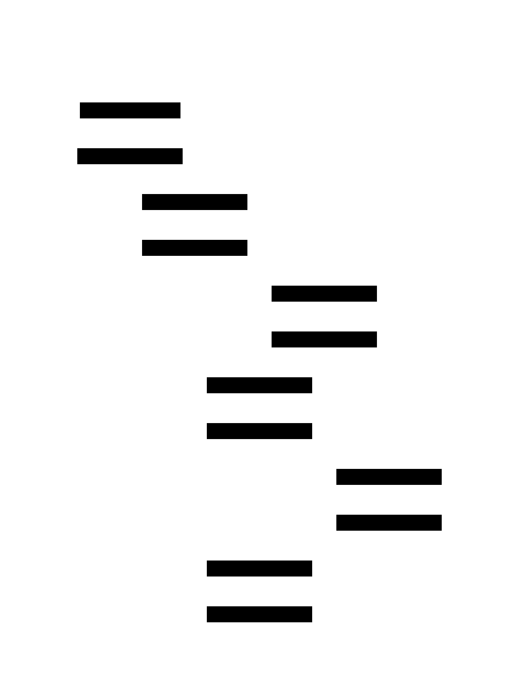

# Distributed Cache: Design Document


## Overview

A distributed cache system using consistent hashing to store and retrieve key-value data across multiple nodes, providing high availability and horizontal scalability. The key architectural challenge is maintaining data consistency and availability while handling node failures and dynamic cluster membership.


> This guide is meant to help you understand the big picture before diving into each milestone. Refer back to it whenever you need context on how components connect.


## Context and Problem Statement

> **Milestone(s):** This section provides foundational understanding for all milestones, with particular relevance to Milestone 1 (Consistent Hash Ring) and Milestone 3 (Cluster Communication).

Building a distributed cache system presents fundamental challenges that don't exist in single-node caches. When data must be distributed across multiple machines, we face complex problems around data placement, consistency, fault tolerance, and dynamic cluster membership. This section explores why these challenges are inherent to distributed systems and compares different approaches to solving them.

The core tension in distributed caching lies between **scalability** and **complexity**. A single-node cache is simple and fast but limited by the memory and processing power of one machine. A distributed cache can scale horizontally by adding more nodes, but introduces coordination overhead, network latency, and partial failure scenarios that fundamentally change the system's behavior.


The distributed cache we're building must handle several critical scenarios that don't exist in single-node systems. When a client requests data, the system must quickly determine which node should handle that request. When nodes are added or removed from the cluster, existing data must be redistributed efficiently. When nodes fail, the system must detect failures quickly and route around them while maintaining data availability. These requirements create a complex web of interdependent design decisions.

### Mental Model: The Library System Analogy

To understand distributed caching intuitively, imagine a city library system that has grown from a single building to multiple branches across the city. This analogy helps explain the core concepts and challenges of distributed caching in familiar terms.

**Single Library (Single-Node Cache)**: Initially, the city had one central library where all books were stored. Patrons knew exactly where to go, and librarians could quickly locate any book because they knew the entire collection. The system was simple and efficient, but as the city grew, the single library became overcrowded. Patrons faced long lines, parking became impossible, and the building couldn't physically hold more books.

**Multiple Branches (Distributed Cache)**: To solve the capacity problem, the city built multiple library branches. Now patrons have several nearby locations, reducing travel time and crowding. However, this creates new challenges: Which branch should stock which books? How do patrons know which branch has the book they want? What happens when a branch temporarily closes for maintenance?

**Book Distribution Strategy (Data Partitioning)**: The library system needs a strategy for deciding which books go to which branch. They could use simple rules like "Branch 1 gets books A-F, Branch 2 gets books G-M, Branch 3 gets books N-Z" (similar to simple hashing). This works well initially, but what happens when they open a new branch? Suddenly they need four branches: A-E, F-J, K-P, Q-Z. This requires moving books from every existing branch - a massive reorganization effort.

**The Smart Distribution System (Consistent Hashing)**: A better approach is to imagine a circular arrangement where branches are positioned around a circle, and books are assigned to the "next" branch clockwise from their position on the circle. When a new branch opens, only books from its immediate neighbors need to be redistributed. This dramatically reduces the reorganization effort while maintaining balanced distribution.

**Popular Books (Hot Keys)**: Some books are extremely popular and get requested frequently. If a popular book is only stored at one branch, that branch becomes overwhelmed while others remain underutilized. The library system can address this by storing multiple copies of popular books at different branches (replication) or by temporarily moving popular books to less busy branches (load balancing).

**Branch Communication (Gossip Protocol)**: Branch librarians need to stay informed about the status of other branches. Is Branch 3 closed for renovations? Did Branch 5 just receive a large shipment of new books? Rather than having a central coordinator make phone calls to every branch (which would be a single point of failure), branches can share information with their neighbors, who then share with their neighbors. This gossip-like communication ensures all branches stay informed even if some communication lines are temporarily down.

**Inter-Library Loans (Request Routing)**: When a patron visits Branch 1 looking for a book that's actually stored at Branch 4, the librarian doesn't just say "sorry, we don't have it." Instead, they can check their catalog system, identify the correct branch, and either direct the patron there or arrange for the book to be transferred. This is similar to how cache nodes route requests to the correct node in the cluster.

**Backup Copies (Replication)**: Important or popular books might have copies at multiple branches. If Branch 2 is damaged in a flood, patrons can still access those books from other branches that have copies. However, this creates new challenges: If someone returns a book with notes in the margins to Branch 1, how do other branches know about those changes? The library system needs policies for keeping copies synchronized and resolving conflicts.

This library analogy captures the essential trade-offs of distributed systems: improved capacity and availability through distribution, but increased complexity in coordination, consistency, and failure handling. Just as the library system must balance patron convenience with operational complexity, our distributed cache must balance performance and scalability with system complexity and consistency guarantees.

### Existing Approaches Comparison

Different strategies exist for distributing data across multiple cache nodes, each with distinct trade-offs in terms of implementation complexity, load distribution, and operational characteristics. Understanding these approaches helps explain why consistent hashing has become the preferred solution for many distributed systems.

**Simple Modulo Hashing** represents the most straightforward approach to data distribution. In this strategy, keys are hashed using a standard hash function, and the resulting hash value is taken modulo the number of nodes to determine placement. For example, with 4 nodes, `hash(key) % 4` determines which node (0, 1, 2, or 3) should store the key.

The primary advantage of modulo hashing is its simplicity. The algorithm is trivial to implement, requires no complex data structures, and provides excellent load distribution when the number of nodes remains constant. Key lookup is extremely fast - just a single hash computation and modulo operation.

However, modulo hashing has a fatal flaw for dynamic systems: **reshuffling on membership changes**. When nodes are added or removed, the modulo value changes, causing most keys to map to different nodes than before. Adding a 5th node to our example changes the modulo from 4 to 5, meaning a key that previously mapped to `hash(key) % 4 = 2` might now map to `hash(key) % 5 = 3`. This typically requires redistributing 60-80% of all stored data, creating massive network traffic and temporary inconsistency.

**Range-Based Partitioning** divides the key space into contiguous ranges assigned to different nodes. For example, keys starting with A-F go to Node 1, G-M to Node 2, N-S to Node 3, and T-Z to Node 4. This approach is conceptually simple and works well when key access patterns are uniform across the alphabet.

Range partitioning excels when queries often involve key ranges (though this is less common in caching scenarios). Adding new nodes requires splitting existing ranges rather than reshuffling all data, which seems like an improvement over modulo hashing.

However, range partitioning suffers from **hotspot problems** when key distributions are non-uniform. If most cache keys start with "user_" or "session_", the corresponding node becomes overwhelmed while others remain idle. Additionally, determining optimal range boundaries requires knowledge of key distribution patterns that may change over time.

**Directory-Based Approaches** maintain a separate mapping service that tracks which node stores each key or key range. Clients first query the directory service to determine the correct node, then send their cache request to that node.

Directory services provide maximum flexibility - keys can be placed on any node based on current load, geographic proximity, or other factors. Load balancing becomes straightforward since the directory can direct requests to less busy nodes. The mapping can be changed at any time without complex redistribution algorithms.

The downside is **additional complexity and failure modes**. Every cache operation now requires two network calls: one to the directory service and one to the actual cache node. The directory service becomes a potential bottleneck and single point of failure. Keeping directory information consistent across multiple directory replicas introduces the same consistency challenges we're trying to solve for the cache itself.

**Consistent Hashing** strikes a balance between the simplicity of modulo hashing and the flexibility needed for dynamic cluster membership. The key insight is to arrange both nodes and keys on a circular hash ring, where each key is assigned to the first node encountered when moving clockwise around the ring.

When nodes are added or removed, only keys stored on adjacent nodes need to be redistributed. For example, if Node B is added between existing nodes A and C, only keys that were previously assigned to C but now hash to a position between A and B need to move. This typically affects only 10-20% of keys for small membership changes.

Consistent hashing also enables **virtual nodes** - each physical node appears at multiple positions on the ring. This provides better load distribution and reduces the impact of node failures. Instead of each node having exactly one position on the ring, Node 1 might appear at positions 100, 300, 750, and 900. This reduces variance in load distribution and makes the system more resilient to individual node characteristics.

The following table summarizes the key trade-offs between these approaches:

| Approach | Load Distribution | Membership Change Impact | Implementation Complexity | Failure Characteristics |
|----------|------------------|--------------------------|---------------------------|------------------------|
| Modulo Hashing | Excellent | 60-80% data movement | Very Low | Simple - remaining nodes handle increased load |
| Range Partitioning | Poor (hotspots) | Moderate - range splits | Low | Hotspot nodes create cascading failures |
| Directory Service | Excellent | Low - directory updates only | High | Directory becomes single point of failure |
| Consistent Hashing | Good | 10-20% data movement | Moderate | Gradual degradation with virtual nodes |

> **Design Insight**: The choice of distribution strategy fundamentally determines the system's operational characteristics. Simple approaches like modulo hashing work well for static clusters but become operationally expensive when nodes are frequently added or removed. Consistent hashing provides the best balance of operational simplicity and dynamic behavior for most distributed cache scenarios.

**Hybrid Approaches** combine multiple strategies to optimize for specific use cases. Some systems use consistent hashing for general distribution but maintain directory entries for frequently accessed keys to enable better load balancing. Others use range partitioning within each consistent hash partition to optimize for workloads that benefit from range queries.

Amazon's DynamoDB, for example, uses consistent hashing for initial key distribution but employs additional techniques like virtual node splitting and heat balancing to address load imbalances. Cassandra uses consistent hashing with virtual nodes and adds a replication strategy that considers rack and datacenter topology for improved fault tolerance.

The key lesson is that data distribution strategy affects every aspect of the system: performance characteristics, operational procedures, failure modes, and implementation complexity. Choosing the right approach requires understanding both the workload characteristics and the operational environment where the system will be deployed.

### Why Distributed Caching is Hard

Distributed caching appears straightforward on the surface - just spread data across multiple machines and route requests appropriately. However, this simple description masks several fundamental challenges that emerge when transitioning from single-node to multi-node systems. These challenges stem from the **CAP theorem** and the inherent complexities of network communication in distributed systems.

**The Network is Unreliable**: In a single-node cache, all operations happen within a single process, where function calls always succeed or fail immediately. In distributed systems, network communication introduces partial failures, message delays, and message reordering. A request to store a key-value pair might succeed on the target node but the response might be lost on the way back to the client. From the client's perspective, the operation failed, but from the system's perspective, it succeeded.

This ambiguity creates difficult decisions for system designers. Should the client retry the operation (risking duplicate writes) or assume it failed (potentially losing data)? Should the system wait for acknowledgments from all replica nodes (risking timeouts) or proceed with partial success (risking inconsistency)? These decisions require understanding the specific requirements of the application and the acceptable trade-offs between consistency, availability, and performance.

**Distributed State is Hard to Coordinate**: A single-node cache has one authoritative view of what data exists and which operations have completed. In a distributed cache, multiple nodes must coordinate to maintain a consistent view of the system state. Consider a simple scenario where a client wants to increment a counter stored in the cache. In a single-node system, this is atomic: read current value, increment, store new value. In a distributed system with replicas, this operation might succeed on some replicas and fail on others, leaving the system in an inconsistent state where different replicas have different counter values.

Maintaining consistency across replicas requires sophisticated protocols like **two-phase commit**, **Paxos**, or **Raft**. These protocols ensure all replicas agree on the order of operations and the final state, but they introduce significant complexity and performance overhead. The system must handle scenarios where some replicas are temporarily unavailable, network partitions split the cluster, and nodes recover after extended downtime with potentially stale data.

**Cluster Membership is Dynamic**: Unlike single-node systems where the "cluster" consists of exactly one node, distributed caches must handle nodes joining and leaving the cluster dynamically. New nodes might be added to increase capacity, existing nodes might fail or be taken offline for maintenance, and network partitions might temporarily split the cluster into multiple sub-clusters.

Each membership change potentially affects data placement, load distribution, and replication strategies. When a node fails, its data becomes unavailable unless replicated elsewhere. When a node joins, existing data must be redistributed to maintain load balance. When a network partition heals, nodes must reconcile potentially conflicting changes made during the partition.

The challenge is detecting membership changes reliably and quickly. A node might be slow to respond due to high load rather than actual failure. Network congestion might delay heartbeat messages, leading to false failure detections. Automated systems must distinguish between temporary slowdowns and permanent failures while avoiding unnecessary data movement and client disruption.

**Failure Modes Multiply**: Single-node systems have simple failure modes: the process crashes, the machine loses power, or the disk fails. Distributed systems inherit all these failure modes and add many more: network partitions, cascading failures, split-brain scenarios, and partial failures where some operations succeed while others fail.

Consider what happens when a cache node becomes temporarily unreachable due to network congestion. Should other nodes immediately mark it as failed and begin redistributing its data? If they do, and the node recovers quickly, the redistribution work was unnecessary and created temporary inconsistency. If they don't, and the node has actually failed, clients experience longer outages waiting for timeouts.

**Split-brain scenarios** occur when network partitions divide the cluster into multiple sub-clusters, each believing it's the authoritative portion of the system. Both sub-clusters might accept writes for the same keys, creating conflicts that must be resolved when the partition heals. Prevention requires sophisticated quorum protocols that ensure at most one partition can accept writes, but this risks availability during partitions.

**Cascading failures** happen when the failure of one node increases load on remaining nodes, potentially causing them to fail as well. If a 10-node cache cluster suddenly loses 2 nodes, the remaining 8 nodes must handle 25% more load. If they were already operating near capacity, this additional load might cause timeouts, which clients interpret as failures, leading them to retry operations and create even more load.

**Data Consistency vs. Performance Trade-offs**: The CAP theorem formally proves that distributed systems cannot simultaneously provide consistency, availability, and partition tolerance. Cache systems must explicitly choose which guarantees to provide and under what circumstances to sacrifice others.

**Strong consistency** ensures all replicas always return the same value for a given key, but requires coordination overhead that increases latency and reduces availability during network issues. **Eventual consistency** allows temporary divergence between replicas in exchange for better performance and availability, but complicates application logic since reads might return stale data.

**Read-your-writes consistency** guarantees that clients immediately see their own updates, but may see stale data from other clients' updates. This requires sticky sessions or careful coordination between the client and replica nodes. **Monotonic read consistency** ensures clients never see older versions of data than they've previously seen, but allows different clients to see different versions simultaneously.

Each consistency level has different implementation requirements and performance characteristics. Strong consistency typically requires all replicas to agree before completing operations, while eventual consistency can complete operations locally and propagate changes asynchronously. The choice affects not just performance, but also the complexity of client logic and operational procedures.

**Load Distribution Challenges**: Even with perfect hashing algorithms, distributed caches face load imbalances due to variations in data size, access patterns, and node characteristics. Some keys are accessed much more frequently than others (**hot keys**), causing the nodes that store them to become bottlenecks. Some values are much larger than others, causing uneven memory usage across nodes.

**Hot key problems** are particularly challenging because they violate the assumption that load distributes evenly across nodes. A single trending topic on social media might cause millions of cache requests for the same key, overwhelming whichever node happens to store it. Traditional solutions like replication help but don't eliminate the bottleneck, since all writes still go to the same primary replica.

**Data size variations** can cause some nodes to reach memory limits while others remain half-empty. A few large cached objects (like serialized images or documents) might consume most of a node's memory, while other nodes store many small key-value pairs. Simple approaches like moving large objects to different nodes help temporarily but don't solve the fundamental problem of unpredictable data sizes.

**Observability and Debugging Complexity**: Single-node systems can be debugged by examining logs, memory dumps, and profiler output from a single process. Distributed systems require correlating information across multiple nodes, networks, and time zones to understand system behavior.

**Distributed tracing** becomes essential for following requests across multiple nodes and understanding where latency or failures occur. A single client request might touch 5-10 different cache nodes when considering replication, routing, and failure recovery. Understanding why a request was slow requires correlating timing information across all these nodes and accounting for network delays.

**Monitoring and alerting** must account for the fact that partial failures are normal in distributed systems. Traditional monitoring approaches that alert on any node failure would create alert fatigue, since individual node failures should be handled automatically. Instead, monitoring must focus on cluster-level health: overall availability, consistency violations, and degraded performance rather than individual node status.

> **Key Insight**: The fundamental challenge of distributed caching isn't technical complexity - it's the explosion of possible system states and failure modes. A single-node cache has predictable behavior and simple failure modes. A distributed cache must handle scenarios where some operations succeed while others fail, some nodes are available while others aren't, and some data is consistent while other data diverges. Managing this complexity requires careful design decisions about consistency guarantees, failure detection, and recovery procedures.

The distributed cache we're building addresses these challenges through several key design decisions: consistent hashing for minimal data movement during membership changes, gossip protocols for robust membership detection, configurable consistency levels for application-specific trade-offs, and comprehensive monitoring and observability for operational simplicity. Each of these decisions involves trade-offs, and understanding the alternatives helps inform better choices for specific deployment environments and application requirements.

### Implementation Guidance

Building a distributed cache requires careful technology choices and architectural decisions that will affect the entire implementation. This section provides concrete recommendations for getting started with a Go-based implementation that balances simplicity with the flexibility to add advanced features later.

#### Technology Recommendations

The following table outlines technology choices for different system components, providing both simple options for initial implementation and advanced alternatives for production deployments:

| Component | Simple Option | Advanced Option | Reasoning |
|-----------|---------------|-----------------|-----------|
| Transport Protocol | HTTP REST with JSON (net/http) | gRPC with Protocol Buffers | HTTP is easier to debug and test; gRPC provides better performance and type safety |
| Serialization | JSON (encoding/json) | Protocol Buffers or MessagePack | JSON is human-readable and widely supported; binary formats are more efficient |
| Node Discovery | Static configuration file | etcd, Consul, or mDNS | Static config is simple for development; service discovery scales better |
| Health Checking | HTTP health endpoints | Custom UDP heartbeat protocol | HTTP reuses existing infrastructure; UDP reduces network overhead |
| Consistent Hashing | SHA-256 with standard library | Jump Consistent Hash or MurmurHash3 | SHA-256 is built-in and secure; specialized hashes may perform better |
| Logging | Standard log package | Structured logging (logrus, zap) | Standard library requires no dependencies; structured logs enable better analysis |
| Metrics | Simple counters in memory | Prometheus metrics with HTTP endpoint | In-memory is zero-dependency; Prometheus integrates with monitoring systems |
| Configuration | JSON config file | YAML with environment variable override | JSON is simple and built-in; YAML is more readable for complex configs |

#### Recommended Project Structure

Organize the codebase to separate concerns clearly and make it easy to test individual components in isolation:

```
distributed-cache/
├── cmd/
│   ├── cachenode/
│   │   └── main.go                    ← Entry point for cache node process
│   └── client/
│       └── main.go                    ← Example client for testing
├── internal/
│   ├── cache/
│   │   ├── lru.go                     ← LRU cache implementation (Milestone 2)
│   │   ├── node.go                    ← Cache node with networking
│   │   └── cache_test.go              ← Unit tests
│   ├── ring/
│   │   ├── consistent.go              ← Consistent hash ring (Milestone 1)
│   │   ├── virtual.go                 ← Virtual node management
│   │   └── ring_test.go               ← Hash ring tests
│   ├── cluster/
│   │   ├── membership.go              ← Node discovery and membership (Milestone 3)
│   │   ├── gossip.go                  ← Gossip protocol implementation
│   │   ├── health.go                  ← Health checking
│   │   └── cluster_test.go            ← Integration tests
│   ├── replication/
│   │   ├── strategy.go                ← Replication factor and placement (Milestone 4)
│   │   ├── quorum.go                  ← Read/write quorum handling
│   │   ├── conflict.go                ← Conflict resolution
│   │   └── replication_test.go        ← Replication tests
│   ├── transport/
│   │   ├── http.go                    ← HTTP transport layer
│   │   ├── messages.go                ← Message type definitions
│   │   └── transport_test.go          ← Transport tests
│   └── config/
│       ├── config.go                  ← Configuration loading and validation
│       └── defaults.go                ← Default configuration values
├── pkg/
│   └── api/
│       ├── client.go                  ← Client library for applications
│       └── types.go                   ← Public API types
├── configs/
│   ├── node1.json                     ← Example node configurations
│   ├── node2.json
│   └── cluster.json                   ← Cluster-wide settings
├── scripts/
│   ├── start-cluster.sh               ← Development cluster startup
│   └── test-integration.sh            ← Integration test runner
├── go.mod
├── go.sum
├── README.md
└── Makefile                           ← Build and test automation
```

This structure separates the core algorithms (`internal/ring`, `internal/cache`) from the networking and coordination logic (`internal/cluster`, `internal/transport`). The `pkg/api` directory contains the public interface that client applications will use, while `internal/` contains implementation details that shouldn't be imported by external code.

#### Infrastructure Starter Code

The following complete implementations handle networking and configuration concerns, allowing learners to focus on the core distributed caching algorithms:

**Configuration Management** (`internal/config/config.go`):

```go
package config

import (
    "encoding/json"
    "fmt"
    "os"
    "time"
)

// NodeConfig contains all settings for a single cache node
type NodeConfig struct {
    NodeID          string        `json:"node_id"`
    ListenAddress   string        `json:"listen_address"`
    AdvertiseAddr   string        `json:"advertise_address"`
    JoinAddresses   []string      `json:"join_addresses"`
    MaxMemoryMB     int           `json:"max_memory_mb"`
    VirtualNodes    int           `json:"virtual_nodes"`
    ReplicationFactor int         `json:"replication_factor"`
    HealthCheckInterval time.Duration `json:"health_check_interval"`
    GossipInterval  time.Duration `json:"gossip_interval"`
    RequestTimeout  time.Duration `json:"request_timeout"`
}

// LoadConfig reads configuration from file and environment variables
func LoadConfig(filename string) (*NodeConfig, error) {
    file, err := os.Open(filename)
    if err != nil {
        return nil, fmt.Errorf("failed to open config file: %w", err)
    }
    defer file.Close()

    var config NodeConfig
    decoder := json.NewDecoder(file)
    if err := decoder.Decode(&config); err != nil {
        return nil, fmt.Errorf("failed to parse config: %w", err)
    }

    // Apply defaults for missing values
    if config.MaxMemoryMB == 0 {
        config.MaxMemoryMB = 1024 // 1GB default
    }
    if config.VirtualNodes == 0 {
        config.VirtualNodes = 150 // Good default for load distribution
    }
    if config.ReplicationFactor == 0 {
        config.ReplicationFactor = 3
    }
    if config.HealthCheckInterval == 0 {
        config.HealthCheckInterval = 5 * time.Second
    }
    if config.GossipInterval == 0 {
        config.GossipInterval = 1 * time.Second
    }
    if config.RequestTimeout == 0 {
        config.RequestTimeout = 10 * time.Second
    }

    return &config, nil
}

// Validate checks that configuration values are sensible
func (c *NodeConfig) Validate() error {
    if c.NodeID == "" {
        return fmt.Errorf("node_id is required")
    }
    if c.ListenAddress == "" {
        return fmt.Errorf("listen_address is required")
    }
    if c.MaxMemoryMB < 1 {
        return fmt.Errorf("max_memory_mb must be at least 1")
    }
    if c.VirtualNodes < 1 {
        return fmt.Errorf("virtual_nodes must be at least 1")
    }
    if c.ReplicationFactor < 1 {
        return fmt.Errorf("replication_factor must be at least 1")
    }
    return nil
}
```

**HTTP Transport Layer** (`internal/transport/http.go`):

```go
package transport

import (
    "bytes"
    "context"
    "encoding/json"
    "fmt"
    "net/http"
    "time"
)

// HTTPTransport handles HTTP communication between cache nodes
type HTTPTransport struct {
    client  *http.Client
    timeout time.Duration
}

// NewHTTPTransport creates a transport with specified timeout
func NewHTTPTransport(timeout time.Duration) *HTTPTransport {
    return &HTTPTransport{
        client: &http.Client{
            Timeout: timeout,
        },
        timeout: timeout,
    }
}

// SendMessage sends a message to a remote node and returns the response
func (t *HTTPTransport) SendMessage(ctx context.Context, address string, message interface{}) ([]byte, error) {
    // Serialize message to JSON
    data, err := json.Marshal(message)
    if err != nil {
        return nil, fmt.Errorf("failed to marshal message: %w", err)
    }

    // Create HTTP request
    url := fmt.Sprintf("http://%s/api/message", address)
    req, err := http.NewRequestWithContext(ctx, "POST", url, bytes.NewReader(data))
    if err != nil {
        return nil, fmt.Errorf("failed to create request: %w", err)
    }
    req.Header.Set("Content-Type", "application/json")

    // Send request
    resp, err := t.client.Do(req)
    if err != nil {
        return nil, fmt.Errorf("failed to send request: %w", err)
    }
    defer resp.Body.Close()

    // Check response status
    if resp.StatusCode != http.StatusOK {
        return nil, fmt.Errorf("request failed with status %d", resp.StatusCode)
    }

    // Read response body
    var response bytes.Buffer
    if _, err := response.ReadFrom(resp.Body); err != nil {
        return nil, fmt.Errorf("failed to read response: %w", err)
    }

    return response.Bytes(), nil
}

// HealthCheck sends a health check request to a node
func (t *HTTPTransport) HealthCheck(ctx context.Context, address string) error {
    url := fmt.Sprintf("http://%s/health", address)
    req, err := http.NewRequestWithContext(ctx, "GET", url, nil)
    if err != nil {
        return fmt.Errorf("failed to create health check request: %w", err)
    }

    resp, err := t.client.Do(req)
    if err != nil {
        return fmt.Errorf("health check failed: %w", err)
    }
    defer resp.Body.Close()

    if resp.StatusCode != http.StatusOK {
        return fmt.Errorf("health check returned status %d", resp.StatusCode)
    }

    return nil
}
```

**Message Type Definitions** (`internal/transport/messages.go`):

```go
package transport

import "time"

// MessageType identifies the type of message being sent
type MessageType string

const (
    MessageTypeGossip     MessageType = "gossip"
    MessageTypeGet        MessageType = "get"
    MessageTypeSet        MessageType = "set"
    MessageTypeDelete     MessageType = "delete"
    MessageTypeReplicate  MessageType = "replicate"
)

// Message is the envelope for all inter-node communication
type Message struct {
    Type      MessageType `json:"type"`
    Sender    string      `json:"sender"`
    Timestamp time.Time   `json:"timestamp"`
    Data      interface{} `json:"data"`
}

// GetRequest represents a cache get operation
type GetRequest struct {
    Key           string `json:"key"`
    ConsistencyLevel string `json:"consistency_level,omitempty"`
}

// GetResponse contains the result of a get operation
type GetResponse struct {
    Key       string    `json:"key"`
    Value     []byte    `json:"value,omitempty"`
    Found     bool      `json:"found"`
    Timestamp time.Time `json:"timestamp"`
}

// SetRequest represents a cache set operation
type SetRequest struct {
    Key       string        `json:"key"`
    Value     []byte        `json:"value"`
    TTL       time.Duration `json:"ttl,omitempty"`
    ConsistencyLevel string `json:"consistency_level,omitempty"`
}

// SetResponse contains the result of a set operation
type SetResponse struct {
    Success   bool      `json:"success"`
    Timestamp time.Time `json:"timestamp"`
}

// DeleteRequest represents a cache delete operation
type DeleteRequest struct {
    Key       string `json:"key"`
    ConsistencyLevel string `json:"consistency_level,omitempty"`
}

// DeleteResponse contains the result of a delete operation
type DeleteResponse struct {
    Success   bool      `json:"success"`
    Found     bool      `json:"found"`
    Timestamp time.Time `json:"timestamp"`
}

// GossipMessage carries cluster membership information
type GossipMessage struct {
    NodeStates map[string]NodeState `json:"node_states"`
    Version    uint64              `json:"version"`
}

// NodeState represents the state of a single node in the cluster
type NodeState struct {
    NodeID      string    `json:"node_id"`
    Address     string    `json:"address"`
    Status      string    `json:"status"`      // "active", "suspected", "failed"
    LastSeen    time.Time `json:"last_seen"`
    Version     uint64    `json:"version"`
}
```

#### Core Logic Skeleton Code

The following skeletons provide the method signatures and detailed TODO comments for the core components that learners should implement themselves:

**Consistent Hash Ring Interface** (`internal/ring/consistent.go`):

```go
package ring

import (
    "crypto/sha256"
    "fmt"
    "sort"
)

// HashRing implements consistent hashing with virtual nodes
type HashRing struct {
    virtualNodes int
    ring        map[uint32]string  // hash position -> node ID
    sortedKeys  []uint32           // sorted hash positions for binary search
    nodes       map[string]bool    // set of active nodes
}

// NewHashRing creates a new consistent hash ring
func NewHashRing(virtualNodes int) *HashRing {
    return &HashRing{
        virtualNodes: virtualNodes,
        ring:        make(map[uint32]string),
        sortedKeys:  make([]uint32, 0),
        nodes:       make(map[string]bool),
    }
}

// AddNode adds a node to the hash ring
// This method should add virtual nodes for better load distribution
func (h *HashRing) AddNode(nodeID string) {
    // TODO 1: Check if node already exists, return early if it does
    // TODO 2: Add node to the nodes set
    // TODO 3: Create virtual nodes by hashing nodeID + virtual node index
    // TODO 4: For each virtual node, calculate hash position and add to ring
    // TODO 5: Add hash positions to sortedKeys slice
    // TODO 6: Sort the sortedKeys slice for binary search
    // Hint: Use fmt.Sprintf("%s:%d", nodeID, i) for virtual node keys
}

// RemoveNode removes a node from the hash ring
func (h *HashRing) RemoveNode(nodeID string) {
    // TODO 1: Check if node exists, return early if it doesn't
    // TODO 2: Remove node from nodes set
    // TODO 3: Find all hash positions for this node's virtual nodes
    // TODO 4: Remove hash positions from ring map and sortedKeys slice
    // TODO 5: Sort the sortedKeys slice after removal
    // Hint: You'll need to iterate through ring to find positions for this node
}

// GetNode returns the node responsible for storing the given key
func (h *HashRing) GetNode(key string) string {
    // TODO 1: Return empty string if ring has no nodes
    // TODO 2: Calculate hash of the key using hashKey function
    // TODO 3: Use binary search to find first position >= key hash
    // TODO 4: If no position found, wrap around to first position (ring property)
    // TODO 5: Return node ID at that position
    // Hint: sort.Search() can help with binary search
}

// GetNodes returns the N nodes responsible for a key (for replication)
func (h *HashRing) GetNodes(key string, count int) []string {
    // TODO 1: Return empty slice if ring has no nodes or count <= 0
    // TODO 2: Calculate hash of the key
    // TODO 3: Find starting position using binary search
    // TODO 4: Collect up to 'count' unique nodes by walking clockwise around ring
    // TODO 5: Return slice of unique node IDs
    // Hint: Use a map to track unique nodes since virtual nodes repeat
}

// GetNodeKeys returns all keys that should be stored on the given node
// This is used during rebalancing to determine which keys to migrate
func (h *HashRing) GetNodeKeys(nodeID string, allKeys []string) []string {
    // TODO 1: Create slice to hold result keys
    // TODO 2: For each key in allKeys, check if GetNode(key) == nodeID
    // TODO 3: If yes, add to result slice
    // TODO 4: Return result slice
}

// hashKey computes hash value for a key - you can use this helper
func hashKey(key string) uint32 {
    hasher := sha256.New()
    hasher.Write([]byte(key))
    hash := hasher.Sum(nil)
    return uint32(hash[0])<<24 | uint32(hash[1])<<16 | uint32(hash[2])<<8 | uint32(hash[3])
}
```

**LRU Cache Node** (`internal/cache/lru.go`):

```go
package cache

import (
    "container/list"
    "sync"
    "time"
)

// CacheEntry represents a single cached item
type CacheEntry struct {
    Key       string
    Value     []byte
    ExpiresAt time.Time
    Size      int64
}

// LRUCache implements an LRU cache with TTL support and memory limits
type LRUCache struct {
    mutex      sync.RWMutex
    capacity   int64                           // maximum memory in bytes
    used       int64                           // current memory usage
    items      map[string]*list.Element        // key -> list element
    order      *list.List                      // LRU order (front = most recent)
    // Note: list.Element.Value should be *CacheEntry
}

// NewLRUCache creates a new LRU cache with the specified capacity in bytes
func NewLRUCache(capacityBytes int64) *LRUCache {
    return &LRUCache{
        capacity: capacityBytes,
        items:    make(map[string]*list.Element),
        order:    list.New(),
    }
}

// Get retrieves a value from the cache
func (c *LRUCache) Get(key string) ([]byte, bool) {
    // TODO 1: Acquire read lock
    // TODO 2: Check if key exists in items map
    // TODO 3: If not found, return nil, false
    // TODO 4: Get CacheEntry from list element
    // TODO 5: Check if entry has expired (time.Now().After(ExpiresAt))
    // TODO 6: If expired, remove entry and return nil, false
    // TODO 7: Move element to front of list (most recently used)
    // TODO 8: Return value copy, true
    // Hint: Use c.removeElement() helper for expired entries
}

// Set stores a value in the cache
func (c *LRUCache) Set(key string, value []byte, ttl time.Duration) {
    // TODO 1: Acquire write lock
    // TODO 2: Calculate entry size (len(key) + len(value) + overhead)
    // TODO 3: Calculate expiration time (time.Now().Add(ttl) if ttl > 0)
    // TODO 4: If key already exists, remove old entry first
    // TODO 5: Ensure we have enough space by evicting LRU entries
    // TODO 6: Create new CacheEntry
    // TODO 7: Add entry to front of list and update items map
    // TODO 8: Update used memory counter
    // Hint: Use c.evictUntilCapacity() to make space
}

// Delete removes a key from the cache
func (c *LRUCache) Delete(key string) bool {
    // TODO 1: Acquire write lock
    // TODO 2: Check if key exists in items map
    // TODO 3: If found, remove element and return true
    // TODO 4: If not found, return false
}

// evictUntilCapacity removes LRU entries until there's enough space
func (c *LRUCache) evictUntilCapacity(neededSpace int64) {
    // TODO 1: While (used + neededSpace > capacity) and cache not empty
    // TODO 2: Get least recently used element (back of list)
    // TODO 3: Remove that element
    // TODO 4: Continue until enough space available
}

// removeElement removes a specific element from cache
func (c *LRUCache) removeElement(element *list.Element) {
    // TODO 1: Get CacheEntry from element.Value
    // TODO 2: Remove element from list
    // TODO 3: Remove key from items map  
    // TODO 4: Update used memory counter
}

// CleanupExpired removes expired entries (call periodically)
func (c *LRUCache) CleanupExpired() int {
    // TODO 1: Acquire write lock
    // TODO 2: Iterate through all entries
    // TODO 3: Check expiration time for each entry
    // TODO 4: Remove expired entries
    // TODO 5: Return count of removed entries
    // Hint: Iterate from back to front to avoid invalidating iterators
}
```

#### Language-Specific Implementation Hints

**Go-Specific Best Practices:**

- Use `sync.RWMutex` for cache operations that are read-heavy. Multiple goroutines can hold read locks simultaneously, improving performance.
- The `container/list` package provides an efficient doubly-linked list for LRU tracking. Elements can be moved to front in O(1) time.
- Use `context.Context` for all network operations to enable timeouts and cancellation.
- Prefer `time.Time` over Unix timestamps for expiration handling - it's more readable and handles timezone issues automatically.
- Use `make(map[string]Type, estimatedSize)` when you know the approximate map size to avoid rehashing during growth.

**Memory Management Tips:**

```go
// Calculate entry size including overhead
func calculateEntrySize(key string, value []byte) int64 {
    // Account for string header, slice header, and map entry overhead
    const mapEntryOverhead = 32 // approximate
    return int64(len(key) + len(value) + mapEntryOverhead)
}

// Create defensive copies of returned values
func copyBytes(src []byte) []byte {
    if src == nil {
        return nil
    }
    dst := make([]byte, len(src))
    copy(dst, src)
    return dst
}
```

**Networking Best Practices:**

- Always set timeouts on HTTP clients: `http.Client{Timeout: 10 * time.Second}`
- Use connection pooling by reusing HTTP clients rather than creating new ones for each request
- Handle partial failures gracefully - a 500 status code from one node shouldn't crash the entire operation
- Log request/response details at debug level for troubleshooting distributed issues

**Testing Approach:**

Start with unit tests for individual components before building integration tests:

```bash
# Test individual components
go test -v ./internal/ring/...
go test -v ./internal/cache/...

# Test with race detector
go test -race ./internal/cache/...

# Test with coverage
go test -cover ./internal/...
```

#### Milestone Checkpoints

**Milestone 1 Checkpoint (Consistent Hash Ring):**
After implementing the hash ring, verify it works correctly:

```bash
# Run hash ring tests
go test -v ./internal/ring/

# Expected output: Tests should verify even key distribution,
# minimal redistribution on node changes, and correct virtual node behavior
```

Create a simple test program to verify hash ring behavior:

```go
// Test program in cmd/ring-test/main.go
ring := ring.NewHashRing(150)
ring.AddNode("node1")
ring.AddNode("node2")
ring.AddNode("node3")

// Test key distribution
keys := []string{"user:1", "user:2", "user:3", "session:abc", "data:xyz"}
for _, key := range keys {
    node := ring.GetNode(key)
    fmt.Printf("Key %s -> Node %s\n", key, node)
}

// Test node addition
fmt.Println("\nAdding node4...")
ring.AddNode("node4")
for _, key := range keys {
    node := ring.GetNode(key)
    fmt.Printf("Key %s -> Node %s\n", key, node)
}
```

**Milestone 2 Checkpoint (Cache Node Implementation):**
Test LRU cache behavior and memory limits:

```bash
# Run cache tests
go test -v ./internal/cache/

# Test with race detector to check concurrency
go test -race ./internal/cache/
```

Verify cache eviction and TTL behavior manually:

```go
cache := cache.NewLRUCache(1024) // 1KB capacity
cache.Set("key1", make([]byte, 500), time.Hour)
cache.Set("key2", make([]byte, 500), time.Hour) 
cache.Set("key3", make([]byte, 500), time.Hour) // Should evict key1

_, found := cache.Get("key1") // Should be false
fmt.Printf("key1 found: %v\n", found)
```

**Signs of Problems and Debugging:**

| Symptom | Likely Cause | How to Diagnose | Fix |
|---------|--------------|-----------------|-----|
| Uneven key distribution | Not enough virtual nodes | Check node assignment counts | Increase virtual node count to 150+ |
| High memory usage | Memory not freed on delete | Add debug logging to removeElement | Ensure used counter decrements correctly |
| Cache misses on existing data | Race condition in Get/Set | Run tests with `-race` flag | Add proper mutex locking |
| Slow cache operations | Lock contention | Profile with `go tool pprof` | Use RWMutex for read-heavy workloads |
| Test failures | Incorrect algorithm | Step through with debugger | Verify hash ring traversal logic |

The key to successful implementation is building incrementally and testing each component thoroughly before moving to the next milestone. Focus on getting the core algorithms correct before adding complexity like networking and replication.


## Goals and Non-Goals

> **Milestone(s):** This section establishes the scope and success criteria for all milestones, with particular relevance to overall system design and architecture decisions.

Building a distributed cache system requires careful balance between functionality, performance, and complexity. Think of this like planning a new public transportation system for a growing city. You need to define which neighborhoods you'll serve (functional goals), how fast and reliable the service must be (non-functional goals), and which advanced features like high-speed rail connections you'll defer to future phases (non-goals). Clear goal definition prevents scope creep and ensures every architectural decision serves a specific purpose.

This section establishes the boundaries of our distributed cache implementation, defining what success looks like at each milestone while explicitly excluding features that would complicate the core learning objectives. These goals directly influence every subsequent design decision, from the consistent hashing algorithm to the replication strategy.


### Functional Goals

**Functional goals** define the core capabilities our distributed cache must provide to users and applications. These represent the essential operations that make the system useful as a caching solution.

| Goal Category | Specific Capability | Success Criteria | Milestone |
|---------------|-------------------|------------------|-----------|
| Key-Value Operations | GET operation | Retrieve cached values by key with sub-millisecond latency for cache hits | 2, 3 |
| Key-Value Operations | SET operation | Store key-value pairs with optional TTL, supporting values up to 1MB | 2, 3 |
| Key-Value Operations | DELETE operation | Remove specific keys from cache with immediate consistency | 2, 3 |
| Data Distribution | Consistent hashing | Distribute keys evenly across cluster nodes with minimal reshuffling on membership changes | 1 |
| Data Distribution | Virtual nodes | Support configurable virtual nodes (64-512 per physical node) for improved load balancing | 1 |
| Cluster Management | Node discovery | New nodes automatically join cluster without manual configuration | 3 |
| Cluster Management | Failure detection | Detect and handle node failures within 5 seconds using health checks | 3 |
| Cluster Management | Dynamic membership | Support adding/removing nodes during runtime without service interruption | 1, 3 |
| Data Persistence | Memory management | Enforce configurable memory limits per node with LRU eviction | 2 |
| Data Persistence | TTL expiration | Automatically expire cached entries after configured time-to-live | 2 |
| Fault Tolerance | Data replication | Store configurable number of copies (1-5) for each cached entry | 4 |
| Fault Tolerance | Consistency levels | Support eventual consistency and strong consistency options for operations | 4 |

The **primary functional goal** is providing a reliable key-value store that distributes data across multiple nodes while maintaining reasonable performance characteristics. Unlike a single-node cache, our system must handle the complexity of data distribution, node failures, and network partitions while preserving the simple GET/SET/DELETE interface that applications expect.

**Key-value operations** form the foundation of cache functionality. The `GET` operation must locate the correct node using consistent hashing, handle cases where data might be replicated across multiple nodes, and return results quickly. The `SET` operation needs to determine replica placement, coordinate writes across multiple nodes when using replication, and respect memory limits through eviction policies. The `DELETE` operation must remove all replicas consistently and handle scenarios where some replica nodes might be temporarily unavailable.

**Data distribution** through consistent hashing solves the fundamental challenge of mapping keys to nodes in a way that minimizes data movement when cluster membership changes. Traditional modulo hashing would require redistributing most keys when adding or removing nodes, making it impractical for dynamic clusters. Our consistent hashing implementation must support virtual nodes to prevent hotspots when key distributions are uneven or when popular keys would otherwise concentrate on a single physical node.

> **The critical insight** is that functional goals must work together harmoniously. For example, TTL expiration must interact correctly with replication (expired entries should be removed from all replicas), and LRU eviction must consider the replication factor when calculating memory usage.

**Cluster management** capabilities enable the system to adapt to changing infrastructure conditions. Node discovery allows operators to add capacity by simply starting new cache nodes, which then automatically integrate into the existing cluster. Failure detection ensures that unresponsive nodes are quickly removed from the hash ring, preventing clients from being routed to dead nodes. Dynamic membership changes must preserve data availability by triggering appropriate rebalancing and replica migration.

**Data persistence** in our context refers to keeping data available in memory while managing resource constraints. LRU eviction provides a reasonable policy for choosing which entries to remove when memory pressure occurs. TTL expiration handles the common caching pattern where data has a natural lifetime after which it should be automatically cleaned up.

**Fault tolerance** through replication provides data availability when individual nodes fail. Supporting different consistency levels allows applications to choose their preferred trade-off between performance and data consistency. Eventual consistency enables faster operations with the possibility of temporary inconsistencies, while strong consistency guarantees that all replicas agree before operations complete.

### Non-Functional Goals

**Non-functional goals** specify the quality attributes and performance characteristics that make the distributed cache suitable for production use. These goals influence architectural decisions throughout the system design.

| Goal Category | Requirement | Target Metric | Measurement Method |
|---------------|-------------|---------------|-------------------|
| Performance | GET latency | < 1ms for local cache hits, < 5ms for remote hits | P99 latency under normal load |
| Performance | SET latency | < 2ms for single replica, < 10ms with replication factor 3 | P99 latency under normal load |
| Performance | Throughput | 10,000+ operations/second per node | Sustained load testing |
| Scalability | Cluster size | Support 10-100 nodes in single cluster | Linear scaling verification |
| Scalability | Storage capacity | 1GB - 64GB memory per node | Configurable memory limits |
| Scalability | Key space | Support millions of keys per cluster | Hash distribution testing |
| Availability | Node failure tolerance | Survive failure of minority of nodes (< 50%) | Chaos testing scenarios |
| Availability | Recovery time | Return to full service within 30 seconds of failure | Automated failure injection |
| Availability | Uptime | 99.9% availability under normal conditions | Extended stability testing |
| Consistency | Replication lag | Eventual consistency convergence within 1 second | Anti-entropy effectiveness |
| Consistency | Conflict resolution | Deterministic resolution of concurrent writes | Vector clock or timestamp comparison |
| Network Efficiency | Gossip overhead | < 5% of network bandwidth for membership gossip | Network monitoring |
| Network Efficiency | Replication traffic | Minimal unnecessary duplicate transfers | Request routing optimization |
| Resource Usage | Memory overhead | < 20% metadata overhead per cached entry | Memory profiling |
| Resource Usage | CPU utilization | < 80% CPU under peak load per node | Performance monitoring |

**Performance goals** establish the responsiveness expectations that make the cache useful for latency-sensitive applications. The `GET` operation latency targets distinguish between local hits (data stored on the receiving node) and remote hits (data retrieved from other cluster nodes). `SET` operation latency accounts for the additional work required when replicating data across multiple nodes. Throughput goals ensure that individual nodes can handle substantial request volumes without becoming bottlenecks.

> **Design Principle:** Performance goals must remain achievable even as cluster size grows. This influences decisions like using efficient serialization formats, minimizing network round trips, and choosing algorithms with favorable complexity characteristics.

**Scalability goals** define how the system should behave as load and cluster size increase. Supporting 10-100 nodes covers most practical deployment scenarios while avoiding the complexity required for massive clusters with thousands of nodes. Per-node storage capacity targets reflect typical cache deployment patterns where memory is the primary constraint. Key space scalability ensures that the consistent hashing algorithm and data structures can handle realistic cache workloads.

**Availability goals** specify how the system should respond to various failure scenarios. Tolerating minority node failures means the system remains functional when less than half the nodes are unavailable, which covers most common failure patterns like single node crashes or small network partitions. Recovery time goals ensure that temporary failures don't cause extended service disruption. The 99.9% uptime target allows for planned maintenance windows while maintaining high service reliability.

**Consistency goals** define how the system handles the inherent challenges of distributed data management. Replication lag targets ensure that eventual consistency doesn't create indefinitely inconsistent states that could confuse applications. Conflict resolution requirements address scenarios where network partitions or timing issues cause concurrent writes to the same key, requiring deterministic resolution to prevent data corruption.

**Network efficiency goals** prevent the distributed coordination mechanisms from overwhelming the network infrastructure. Gossip protocol overhead must remain bounded even as cluster size increases. Replication traffic optimization ensures that replica updates don't create unnecessary network amplification, particularly important when replication factors are high or when clients frequently update the same keys.

**Resource usage goals** ensure the system remains efficient and cost-effective to operate. Memory overhead limits prevent metadata from consuming excessive space relative to actual cached data. CPU utilization targets leave headroom for load spikes while ensuring efficient use of available processing capacity.

> **Architecture Decision: Resource Efficiency vs. Feature Richness**
> - **Context**: Distributed systems can implement sophisticated features like advanced conflict resolution, complex consistency models, or rich query capabilities, but these typically increase resource overhead
> - **Options Considered**: 
>   1. Minimal feature set with optimal resource usage
>   2. Rich feature set with higher overhead
>   3. Configurable features allowing runtime trade-offs
> - **Decision**: Minimal feature set with clear extension points
> - **Rationale**: Learning-focused implementation benefits from understanding core concepts deeply rather than surface coverage of many features. Resource efficiency makes the system practical for development environments with limited resources.
> - **Consequences**: Some advanced features must be implemented as future extensions, but core system remains understandable and efficient

### Explicit Non-Goals

**Explicit non-goals** define capabilities that are deliberately excluded from this implementation to maintain focus on the core learning objectives. These exclusions prevent scope creep and ensure the system remains comprehensible for educational purposes.

| Category | Excluded Feature | Rationale for Exclusion | Future Consideration |
|----------|------------------|-------------------------|---------------------|
| Persistence | Disk-based storage | Adds complexity of durability, crash recovery, and disk I/O management without contributing to distributed systems learning | Could be added as storage engine abstraction |
| Security | Authentication/authorization | Security implementation would obscure core distributed caching concepts | Essential for production deployment |
| Security | Encryption (in-transit/at-rest) | Cryptographic concerns distract from cache algorithm focus | Required for production security |
| Advanced Features | Complex queries (range, pattern matching) | Transforms system from cache to database, different problem domain | Would require query execution engine |
| Advanced Features | Transactions across keys | ACID semantics add significant complexity without cache-specific learning value | Major architectural change required |
| Advanced Features | Compression | Implementation detail that doesn't illustrate distributed systems principles | Straightforward optimization to add later |
| Operational Features | Metrics/monitoring dashboard | Important for operations but orthogonal to core caching algorithms | Standard observability patterns apply |
| Operational Features | Configuration hot-reloading | Operational convenience that adds state management complexity | Useful operational enhancement |
| Operational Features | Rolling upgrades | Production deployment concern beyond scope of algorithm implementation | Requires versioning and compatibility strategy |
| Performance Features | Memory-mapped files | OS-specific optimization that complicates memory management learning | Platform-specific enhancement |
| Performance Features | NUMA-aware allocation | Hardware-specific optimization beyond algorithmic focus | Performance tuning for specific deployments |
| Network Features | Protocol buffers/advanced serialization | Serialization format choice doesn't affect distributed algorithm design | Easy to substitute different formats |
| Network Features | Connection pooling/multiplexing | Network optimization orthogonal to cache logic | Standard networking optimization |
| Consistency Features | Causal consistency | Advanced consistency model adds significant complexity | Research-level feature |
| Consistency Features | Byzantine fault tolerance | Addresses malicious failures rather than crash failures common in cache deployments | Different threat model entirely |

**Persistence exclusions** keep the focus on distributed coordination rather than storage engine implementation. Disk-based storage would require implementing write-ahead logging, crash recovery, data file management, and disk I/O optimization - each substantial topics that don't contribute to understanding consistent hashing, replication, or cluster membership management. Memory-only storage is sufficient for cache use cases and eliminates entire categories of failure modes and recovery scenarios.

**Security exclusions** prevent cryptographic and access control concerns from obscuring the core distributed systems algorithms. Authentication would require implementing user management, credential verification, and secure session handling. Encryption would add key management, certificate handling, and performance considerations around cryptographic operations. While essential for production systems, these features can be layered onto the core cache implementation without affecting its fundamental design.

> **Important Clarification:** Excluding security features doesn't mean ignoring security entirely. The system design should avoid patterns that would make security difficult to add later, such as exposing internal state through APIs or using communication patterns incompatible with encryption.

**Advanced feature exclusions** maintain the focus on caching rather than expanding into general-purpose data storage. Complex queries would require implementing query parsing, execution planning, and result aggregation - transforming the system from a cache into a distributed database with entirely different performance characteristics and consistency requirements. Transactions across multiple keys would require distributed locking, deadlock detection, and two-phase commit protocols that deserve their own dedicated implementation and learning focus.

**Operational feature exclusions** recognize that production deployment concerns, while important, are separate from the core algorithmic challenges of distributed caching. Metrics and monitoring can be added using standard observability libraries without affecting the cache implementation. Configuration hot-reloading would require implementing safe configuration validation and state migration. Rolling upgrades would need version compatibility checking and gradual deployment orchestration.

**Performance optimization exclusions** distinguish between algorithmic performance (which is essential) and platform-specific optimizations (which are implementation details). Memory-mapped files, NUMA-aware allocation, and advanced serialization formats can improve performance but don't change the fundamental algorithms for consistent hashing, replication, or failure detection. These optimizations can be added later without architectural changes.

**Advanced consistency feature exclusions** focus the implementation on the consistency models most relevant to caching workloads. Causal consistency would require implementing vector clocks across all operations and maintaining causal ordering, adding significant complexity for guarantees that cache applications rarely need. Byzantine fault tolerance addresses malicious node behavior rather than the crash failures and network partitions common in cache deployments.

> **Design Principle:** Non-goals should be revisitable. The system architecture should not preclude adding excluded features in future iterations, but should prioritize making the included features robust and well-designed.

The exclusion of these features doesn't mean they're unimportant, but rather that they represent distinct learning domains that would dilute focus from the core distributed caching challenges. Each excluded feature could form the basis for its own educational implementation project with different architectural requirements and trade-offs.

### Implementation Guidance

This section provides concrete technical recommendations for implementing the goals defined above, with focus on practical decisions that support the learning objectives.

#### A. Technology Recommendations

| Component | Simple Option | Advanced Option | Recommendation |
|-----------|---------------|-----------------|----------------|
| Network Transport | HTTP REST with JSON (net/http) | gRPC with Protocol Buffers | HTTP for learning clarity |
| Serialization | JSON encoding/decoding | MessagePack or Protocol Buffers | JSON for debugging ease |
| Hashing Function | SHA-256 via crypto/sha256 | xxHash or CityHash | SHA-256 for reliability |
| Configuration | JSON files with encoding/json | YAML with structured validation | JSON for simplicity |
| Logging | Standard log package | Structured logging (logrus, zap) | Standard log initially |
| Testing Framework | Built-in testing package | Testify with assertions | Built-in testing |
| HTTP Client | Default http.Client | Custom client with retries | Default with timeout |
| Concurrency | sync.Mutex and sync.RWMutex | Channels and select statements | Mutexes for data protection |

The **simple options** are recommended for initial implementation because they reduce the learning curve and make debugging easier. JSON serialization allows easy inspection of messages and configuration files. HTTP transport provides familiar REST semantics that are easy to test with standard tools like curl. Standard library packages minimize external dependencies and compilation complexity.

#### B. Recommended File/Module Structure

```
distributed-cache/
├── cmd/
│   └── cache-server/
│       └── main.go                 ← Server entry point, configuration loading
├── internal/
│   ├── config/
│   │   ├── config.go              ← NodeConfig type and validation
│   │   └── config_test.go         ← Configuration testing
│   ├── hash/
│   │   ├── ring.go                ← HashRing implementation
│   │   └── ring_test.go           ← Consistent hashing tests
│   ├── cache/
│   │   ├── lru.go                 ← LRUCache implementation
│   │   ├── entry.go               ← CacheEntry type definition
│   │   └── cache_test.go          ← Cache operation tests
│   ├── transport/
│   │   ├── http.go                ← HTTPTransport implementation
│   │   ├── messages.go            ← Request/Response types
│   │   └── transport_test.go      ← Network communication tests
│   ├── gossip/
│   │   ├── protocol.go            ← Gossip protocol implementation
│   │   ├── membership.go          ← NodeState management
│   │   └── gossip_test.go         ← Cluster membership tests
│   └── node/
│       ├── node.go                ← Main cache node orchestration
│       └── node_test.go           ← Integration tests
├── pkg/
│   └── client/
│       ├── client.go              ← Client library for testing
│       └── client_test.go         ← Client integration tests
├── configs/
│   ├── node1.json                 ← Example node configurations
│   ├── node2.json
│   └── node3.json
├── scripts/
│   ├── start-cluster.sh           ← Development cluster startup
│   └── test-operations.sh         ← Manual testing scripts
└── README.md                      ← Setup and usage instructions
```

This structure separates concerns clearly while maintaining the internal/ convention for implementation details that shouldn't be imported by external packages. The pkg/client/ directory provides a reusable client library for testing and potential external use.

#### C. Infrastructure Starter Code

**Configuration Management** - Complete implementation for loading and validating node configuration:

```go
// internal/config/config.go
package config

import (
    "encoding/json"
    "errors"
    "os"
    "time"
)

// NodeConfig represents complete configuration for a cache node.
// All fields are required unless noted otherwise.
type NodeConfig struct {
    NodeID              string        `json:"node_id"`              // Unique identifier for this node
    ListenAddress       string        `json:"listen_address"`       // Address to bind HTTP server (e.g., ":8080")
    AdvertiseAddr       string        `json:"advertise_address"`    // Address other nodes use to contact this node
    JoinAddresses       []string      `json:"join_addresses"`       // Bootstrap addresses for cluster discovery
    MaxMemoryMB         int           `json:"max_memory_mb"`        // Maximum memory usage in megabytes
    VirtualNodes        int           `json:"virtual_nodes"`        // Number of virtual nodes for consistent hashing
    ReplicationFactor   int           `json:"replication_factor"`   // Number of replicas for each key
    HealthCheckInterval time.Duration `json:"health_check_interval"` // Frequency of health checks
    GossipInterval      time.Duration `json:"gossip_interval"`      // Frequency of gossip messages
    RequestTimeout      time.Duration `json:"request_timeout"`      // Timeout for inter-node requests
}

// LoadConfig reads configuration from JSON file and validates all required fields.
func LoadConfig(filename string) (*NodeConfig, error) {
    data, err := os.ReadFile(filename)
    if err != nil {
        return nil, err
    }
    
    var config NodeConfig
    if err := json.Unmarshal(data, &config); err != nil {
        return nil, err
    }
    
    if err := config.Validate(); err != nil {
        return nil, err
    }
    
    return &config, nil
}

// Validate ensures all configuration values are reasonable and required fields are present.
func (c *NodeConfig) Validate() error {
    if c.NodeID == "" {
        return errors.New("node_id is required")
    }
    if c.ListenAddress == "" {
        return errors.New("listen_address is required")
    }
    if c.AdvertiseAddr == "" {
        return errors.New("advertise_address is required")
    }
    if c.MaxMemoryMB < 1 || c.MaxMemoryMB > 65536 {
        return errors.New("max_memory_mb must be between 1 and 65536")
    }
    if c.VirtualNodes < 1 || c.VirtualNodes > 1000 {
        return errors.New("virtual_nodes must be between 1 and 1000")
    }
    if c.ReplicationFactor < 1 || c.ReplicationFactor > 10 {
        return errors.New("replication_factor must be between 1 and 10")
    }
    if c.HealthCheckInterval < time.Second {
        return errors.New("health_check_interval must be at least 1 second")
    }
    if c.GossipInterval < time.Second {
        return errors.New("gossip_interval must be at least 1 second")
    }
    if c.RequestTimeout < 100*time.Millisecond {
        return errors.New("request_timeout must be at least 100ms")
    }
    return nil
}
```

**Message Type Definitions** - Complete types for inter-node communication:

```go
// internal/transport/messages.go
package transport

import "time"

// MessageType constants for different inter-node message types
const (
    MessageTypeGossip    = "gossip"
    MessageTypeGet       = "get"
    MessageTypeSet       = "set"
    MessageTypeDelete    = "delete"
    MessageTypeReplicate = "replicate"
)

// Message represents the envelope for all inter-node communication.
type Message struct {
    Type      string      `json:"type"`      // MessageType constant
    Sender    string      `json:"sender"`    // Node ID of sender
    Timestamp time.Time   `json:"timestamp"` // When message was created
    Data      interface{} `json:"data"`      // Payload specific to message type
}

// Cache operation request/response types
type GetRequest struct {
    Key              string `json:"key"`               // Key to retrieve
    ConsistencyLevel string `json:"consistency_level"` // "eventual" or "strong"
}

type GetResponse struct {
    Key       string    `json:"key"`       // Requested key
    Value     []byte    `json:"value"`     // Retrieved value (nil if not found)
    Found     bool      `json:"found"`     // Whether key exists
    Timestamp time.Time `json:"timestamp"` // When value was last modified
}

type SetRequest struct {
    Key              string        `json:"key"`               // Key to store
    Value            []byte        `json:"value"`             // Value to store
    TTL              time.Duration `json:"ttl"`               // Time-to-live (0 for no expiration)
    ConsistencyLevel string        `json:"consistency_level"` // "eventual" or "strong"
}

type SetResponse struct {
    Success   bool      `json:"success"`   // Whether operation succeeded
    Timestamp time.Time `json:"timestamp"` // When value was stored
}

type DeleteRequest struct {
    Key              string `json:"key"`               // Key to delete
    ConsistencyLevel string `json:"consistency_level"` // "eventual" or "strong"
}

type DeleteResponse struct {
    Success bool      `json:"success"`   // Whether operation succeeded
    Found   bool      `json:"found"`     // Whether key existed before deletion
    Timestamp time.Time `json:"timestamp"` // When deletion occurred
}
```

#### D. Core Logic Skeleton Code

**Hash Ring Implementation** - Method signatures with detailed TODOs:

```go
// internal/hash/ring.go
package hash

// HashRing implements consistent hashing with virtual nodes for even key distribution.
type HashRing struct {
    virtualNodes int                 // Number of virtual nodes per physical node
    ring         map[uint32]string   // Hash position -> node ID mapping
    sortedKeys   []uint32            // Sorted hash positions for binary search
    nodes        map[string]bool     // Set of active nodes for membership tracking
}

// NewHashRing creates a new consistent hash ring with specified virtual nodes per physical node.
func NewHashRing(virtualNodes int) *HashRing {
    // TODO 1: Initialize ring with empty maps and slices
    // TODO 2: Store virtualNodes parameter for later use in AddNode
    // TODO 3: Return pointer to new HashRing instance
}

// AddNode adds a physical node to the ring by creating virtual nodes at hash positions.
func (hr *HashRing) AddNode(nodeID string) {
    // TODO 1: Check if node already exists in hr.nodes map - if yes, return early
    // TODO 2: Add nodeID to hr.nodes set
    // TODO 3: Loop hr.virtualNodes times to create virtual nodes
    // TODO 4: For each virtual node, create unique string like "nodeID:virtualIndex"
    // TODO 5: Hash the virtual node string to get uint32 position
    // TODO 6: Add position -> nodeID mapping to hr.ring
    // TODO 7: Add position to hr.sortedKeys slice
    // TODO 8: Sort hr.sortedKeys to maintain binary search property
    // Hint: Use sort.Slice(hr.sortedKeys, func(i, j int) bool { return hr.sortedKeys[i] < hr.sortedKeys[j] })
}

// GetNode returns the node responsible for storing the given key using consistent hashing.
func (hr *HashRing) GetNode(key string) string {
    // TODO 1: Handle empty ring case - return empty string if no nodes
    // TODO 2: Hash the key to get uint32 position
    // TODO 3: Use binary search to find first hash position >= key position
    // TODO 4: If no position found (key hashes beyond last position), wrap to first position  
    // TODO 5: Look up node ID from hr.ring using the found position
    // TODO 6: Return the node ID
    // Hint: Use sort.Search for binary search on hr.sortedKeys
}
```

**LRU Cache Implementation** - Core eviction logic skeleton:

```go
// internal/cache/lru.go
package cache

import (
    "container/list"
    "sync"
    "time"
)

// LRUCache implements thread-safe LRU cache with memory limits and TTL support.
type LRUCache struct {
    mutex    sync.RWMutex           // Protects all fields from concurrent access
    capacity int64                 // Maximum memory usage in bytes
    used     int64                 // Current memory usage in bytes
    items    map[string]*list.Element // Key -> list element mapping for O(1) lookup
    order    *list.List            // Doubly-linked list for LRU order tracking
}

// NewLRUCache creates a new LRU cache with specified memory capacity in bytes.
func NewLRUCache(capacityBytes int64) *LRUCache {
    // TODO 1: Create LRUCache instance with capacity set
    // TODO 2: Initialize items map and order list
    // TODO 3: Set used memory to 0
    // TODO 4: Return pointer to cache instance
}

// Set stores a key-value pair with optional TTL, evicting entries if necessary to stay under memory limit.
func (c *LRUCache) Set(key string, value []byte, ttl time.Duration) {
    // TODO 1: Acquire write lock
    // TODO 2: Calculate entry size (key length + value length + CacheEntry overhead)
    // TODO 3: Check if key already exists - if yes, remove old entry from used memory count
    // TODO 4: Create CacheEntry with key, value, size, and expiration time (now + ttl, or zero if no TTL)
    // TODO 5: While (used + entry size > capacity) and items exist, call evictOldest()
    // TODO 6: Create list element containing the CacheEntry
    // TODO 7: Add element to front of order list (most recently used position)
    // TODO 8: Add key -> element mapping to items map
    // TODO 9: Add entry size to used memory counter
    // TODO 10: Release write lock
    // Hint: Use time.Time{} for zero value when no TTL specified
}

// evictOldest removes the least recently used entry from cache to free memory.
func (c *LRUCache) evictOldest() {
    // TODO 1: Get last element from order list (least recently used)
    // TODO 2: Remove element from order list
    // TODO 3: Extract CacheEntry from element
    // TODO 4: Remove key from items map
    // TODO 5: Subtract entry size from used memory counter
    // Hint: This method should only be called while holding write lock
}
```

#### E. Language-Specific Hints

**Go-Specific Implementation Tips:**

- Use `crypto/sha256` package for consistent hashing: `sha256.Sum256([]byte(input))` returns [32]byte array
- Convert hash to uint32 using binary encoding: `binary.BigEndian.Uint32(hash[:4])`
- Use `sort.Search` for binary search on sorted slices: returns insertion index if not found
- Handle JSON marshaling of time.Duration by implementing custom MarshalJSON/UnmarshalJSON methods
- Use `sync.RWMutex` for cache operations: RLock() for reads, Lock() for writes
- Use `container/list` for LRU ordering: PushFront() for new items, MoveToFront() for access
- Use `http.Server` with custom handler functions for REST API endpoints
- Use `context.Context` with timeout for inter-node requests: `context.WithTimeout(context.Background(), timeout)`
- Use `time.Ticker` for periodic tasks like gossip and health checks
- Use buffered channels for graceful shutdown: `make(chan struct{}, 1)` for shutdown signals

**Memory Management Tips:**

- Estimate CacheEntry overhead as ~100 bytes (struct fields, map overhead, list element)
- Use `unsafe.Sizeof()` during development to measure actual struct sizes
- Track memory usage incrementally rather than recalculating from scratch
- Consider string interning for repeated keys to reduce memory usage
- Use `runtime.GC()` and `runtime.ReadMemStats()` for memory pressure testing

**Concurrency Patterns:**

- Protect hash ring modifications with mutex during node additions/removals
- Use read locks for cache lookups, write locks for modifications
- Implement graceful shutdown by closing channels and waiting for goroutines
- Use atomic operations (`sync/atomic`) for simple counters like request metrics
- Avoid nested locks by carefully ordering lock acquisition

#### F. Milestone Checkpoints

**After implementing each milestone, verify these specific behaviors:**

**Milestone 1 Checkpoint - Consistent Hash Ring:**
```bash
go test ./internal/hash/... -v
```
Expected output should show:
- Hash ring distributes 10,000 random keys evenly across 5 nodes (each node gets 15-25% of keys)
- Adding 6th node redistributes only ~17% of existing keys (1/6 of total)
- Removing 1 node redistributes only that node's keys to successors
- Key lookup returns same node consistently for same key

Manual verification:
```bash
go run ./cmd/hash-test/ -nodes=5 -keys=10000 -virtual-nodes=64
```
Should output distribution statistics showing balanced key assignment.

**Milestone 2 Checkpoint - Cache Node:**
```bash
go test ./internal/cache/... -v
```
Expected behaviors:
- LRU eviction removes oldest entries when memory limit exceeded
- TTL expiration automatically removes expired entries during cleanup
- Concurrent access doesn't cause data races or panics
- Memory accounting accurately tracks total usage

Manual verification:
```bash
curl -X POST http://localhost:8080/set -d '{"key":"test","value":"aGVsbG8="}'  # Set key
curl http://localhost:8080/get/test  # Retrieve key
curl -X DELETE http://localhost:8080/delete/test  # Delete key
```

**Signs of problems and debugging:**
- "Uneven distribution" → Check virtual node count (increase to 64-256)
- "Memory leaks" → Verify evictOldest() actually removes from all data structures
- "Race conditions" → Run with `go test -race` flag to detect data races
- "TTL not working" → Check that CleanupExpired() runs periodically

This implementation guidance provides a complete foundation for building the distributed cache while ensuring learners focus on the core algorithmic challenges rather than infrastructure setup complexity.


## High-Level Architecture

> **Milestone(s):** This section provides the architectural foundation for all milestones, with particular relevance to Milestone 1 (Consistent Hash Ring), Milestone 2 (Cache Node Implementation), Milestone 3 (Cluster Communication), and Milestone 4 (Replication & Consistency).

The high-level architecture of our distributed cache system follows a **peer-to-peer cluster design** where each node is both a cache server and a cluster participant. Think of this like a neighborhood watch system where every household both protects their own property and coordinates with neighbors to maintain security across the entire neighborhood. Each cache node stores data locally while participating in cluster-wide decisions about membership, routing, and replication.


The architecture embraces the principle of **symmetric responsibility** - there are no special coordinator nodes or single points of failure. Every node can handle client requests, participate in gossip communication, and store cached data. This design choice provides inherent fault tolerance but requires sophisticated coordination mechanisms to maintain consistency and handle cluster membership changes.

### Component Overview

The distributed cache system consists of five primary components that work together to provide a scalable, fault-tolerant caching service. Each component has distinct responsibilities but must coordinate closely with others to maintain system correctness.

#### Cache Node Component

The **Cache Node** serves as the fundamental storage unit of the distributed cache, analogous to a smart librarian who not only manages their own collection of books but also knows exactly which other librarians have specific titles. Each cache node implements an LRU cache with TTL support, handling local storage operations while participating in the broader cluster ecosystem.

| Responsibility | Description | Key Interactions |
|---|---|---|
| Local Data Storage | Maintains LRU cache with configurable memory limits | Interfaces with LRUCache for all storage operations |
| TTL Management | Automatically expires entries after time-to-live | Runs background cleanup processes, coordinates with request handlers |
| Request Processing | Handles GET/SET/DELETE operations from clients and peers | Routes requests through Hash Ring, coordinates with replication logic |
| Memory Management | Enforces capacity limits through LRU eviction | Monitors memory usage, triggers eviction when necessary |
| Health Monitoring | Exposes health status for cluster monitoring | Responds to health checks, reports metrics to gossip protocol |

The Cache Node must handle concurrent operations safely while maintaining LRU ordering and TTL accuracy. It serves as both the primary interface for client requests and a participant in inter-node replication protocols.

#### Hash Ring Component

The **Hash Ring** implements consistent hashing to determine key placement across cluster nodes, functioning like a circular seating chart that automatically adjusts when guests arrive or leave while minimizing the number of people who need to change seats. This component is crucial for maintaining balanced load distribution and minimizing data movement during cluster membership changes.

| Responsibility | Description | Key Operations |
|---|---|---|
| Key Distribution | Maps cache keys to responsible nodes using consistent hashing | `GetNode(key)` returns primary node, `GetNodes(key, count)` returns replica set |
| Virtual Node Management | Maintains multiple hash positions per physical node | `AddNode(nodeID)` creates virtual nodes, `RemoveNode(nodeID)` cleans up positions |
| Load Balancing | Distributes keys evenly across available nodes | Uses virtual nodes to reduce hotspots and improve distribution |
| Membership Updates | Handles node addition and removal with minimal key redistribution | Rebalances ring while preserving existing key assignments where possible |
| Routing Logic | Provides fast lookup for key-to-node mappings | Maintains sorted key list for O(log n) lookup performance |

The Hash Ring must handle concurrent membership changes while providing consistent routing decisions. It serves as the authoritative source for determining which nodes should store replicas of any given key.

#### Gossip Protocol Component

The **Gossip Protocol** manages cluster membership and state propagation, operating like a neighborhood information network where residents periodically share news with their neighbors, ensuring that important information eventually reaches everyone even if some residents are temporarily unavailable. This component enables the cluster to maintain consistent membership views without requiring a central coordinator.

| Responsibility | Description | Key Mechanisms |
|---|---|---|
| Node Discovery | Helps new nodes join the cluster and announce their presence | Exchanges node lists during gossip rounds, maintains bootstrap addresses |
| Failure Detection | Identifies unresponsive nodes and propagates failure information | Combines direct health checks with gossip-based failure detection |
| State Synchronization | Ensures all nodes have consistent views of cluster membership | Spreads node state updates using epidemic-style propagation |
| Network Partition Handling | Maintains cluster coherence during network splits | Uses version vectors and conflict resolution for state merging |
| Convergence Management | Ensures cluster state eventually converges across all nodes | Implements anti-entropy mechanisms to repair divergent state |

The Gossip Protocol must balance information freshness with network overhead, providing timely failure detection while avoiding excessive chattiness that could overwhelm the network.

#### Transport Layer Component

The **Transport Layer** handles all inter-node communication, serving as the postal service of the distributed cache that reliably delivers messages between nodes while handling addressing, serialization, and connection management. This component abstracts network complexity from higher-level protocols.

| Responsibility | Description | Implementation Details |
|---|---|---|
| Message Serialization | Converts protocol messages to wire format | Uses JSON for human readability, supports binary protocols for performance |
| Connection Management | Maintains persistent connections between frequently communicating nodes | Implements connection pooling, handles reconnection after failures |
| Request Routing | Delivers messages to correct destination nodes | Supports both point-to-point and broadcast communication patterns |
| Error Handling | Manages network failures and timeout scenarios | Implements retry logic, circuit breakers for failing nodes |
| Protocol Support | Provides unified interface for different message types | Supports gossip messages, cache operations, replication requests |

The Transport Layer must handle network partitions gracefully while providing reliable message delivery guarantees for critical cluster operations.

#### Client Router Component

The **Client Router** serves as the primary interface between external clients and the distributed cache cluster, acting like a knowledgeable concierge who directs visitors to the right department while handling special requests and managing visitor experience. This component provides a unified API that abstracts cluster complexity from client applications.

| Responsibility | Description | Client Benefits |
|---|---|---|
| Request Distribution | Routes client operations to appropriate cluster nodes | Clients see single cache interface regardless of cluster topology |
| Load Balancing | Distributes client load across healthy cluster members | Prevents hotspots, improves overall cluster utilization |
| Consistency Management | Enforces consistency levels for read and write operations | Supports configurable consistency from eventual to strong |
| Failure Handling | Manages retries and fallbacks when nodes are unavailable | Provides high availability despite individual node failures |
| Protocol Translation | Converts client API calls to internal cluster protocols | Maintains stable client API while allowing internal protocol evolution |

The Client Router must maintain high availability and low latency while providing consistent behavior even during cluster membership changes or partial failures.

> **Key Architectural Insight**: The peer-to-peer design eliminates single points of failure but requires every component to handle partial information and eventual consistency. Each component must be designed with the assumption that other components might be temporarily unreachable or operating with stale information.

### Recommended Module Structure

The codebase organization follows a **domain-driven structure** that groups related functionality while maintaining clear separation of concerns. This structure supports incremental development where each milestone builds upon previous components without requiring major refactoring.

```
distributed-cache/
├── cmd/
│   ├── cache-node/
│   │   └── main.go                    # Node entry point and CLI handling
│   └── cache-client/
│       └── main.go                    # Example client implementation
├── internal/
│   ├── hashring/
│   │   ├── hashring.go               # HashRing implementation
│   │   ├── virtual_nodes.go          # Virtual node management
│   │   └── hashring_test.go          # Consistent hashing tests
│   ├── cache/
│   │   ├── lru_cache.go              # LRUCache implementation
│   │   ├── cache_entry.go            # CacheEntry and TTL logic
│   │   ├── memory_manager.go         # Memory accounting and limits
│   │   └── cache_test.go             # Cache behavior tests
│   ├── transport/
│   │   ├── http_transport.go         # HTTPTransport implementation
│   │   ├── messages.go               # Message types and serialization
│   │   └── transport_test.go         # Network communication tests
│   ├── gossip/
│   │   ├── protocol.go               # Gossip protocol implementation
│   │   ├── membership.go             # Node membership management
│   │   ├── failure_detector.go       # Health checking and failure detection
│   │   └── gossip_test.go            # Cluster membership tests
│   ├── replication/
│   │   ├── replicator.go             # Data replication logic
│   │   ├── quorum.go                 # Quorum-based operations
│   │   ├── conflict_resolver.go      # Conflict resolution strategies
│   │   └── replication_test.go       # Replication and consistency tests
│   └── node/
│       ├── cache_node.go             # Main CacheNode orchestration
│       ├── request_handler.go        # Client request processing
│       ├── config.go                 # NodeConfig and configuration
│       └── node_test.go              # Integration tests
├── pkg/
│   ├── api/
│   │   ├── client.go                 # Public client library
│   │   └── types.go                  # Public API types
│   └── config/
│       └── validation.go             # Configuration validation utilities
├── configs/
│   ├── node1.json                    # Example node configurations
│   ├── node2.json
│   └── cluster.json                  # Cluster-wide settings
└── scripts/
    ├── start-cluster.sh              # Development cluster startup
    └── test-integration.sh           # Integration test runner
```

> **Decision: Internal vs Public Package Structure**
> - **Context**: Go projects typically use `internal/` for private packages and `pkg/` for public APIs, but the boundaries affect how components can be tested and reused
> - **Options Considered**: 
>   1. Everything in `pkg/` for maximum flexibility
>   2. Everything in `internal/` for maximum encapsulation
>   3. Core logic in `internal/`, stable APIs in `pkg/`
> - **Decision**: Core implementation in `internal/`, public client APIs in `pkg/`
> - **Rationale**: This prevents external dependencies on unstable internals while providing clean client libraries. The `internal/` boundary forces us to design proper interfaces between components.
> - **Consequences**: Components can evolve independently, but inter-component communication must go through well-defined interfaces rather than direct struct access.

The module structure supports **dependency injection** patterns where each component receives its dependencies through constructor functions rather than creating them directly. This design enables comprehensive testing and supports different deployment configurations.

| Package | Primary Types | Dependencies | Testing Strategy |
|---|---|---|---|
| `internal/hashring` | `HashRing` | None (pure algorithm) | Unit tests with synthetic node sets |
| `internal/cache` | `LRUCache`, `CacheEntry` | None (pure storage) | Unit tests with memory pressure scenarios |
| `internal/transport` | `HTTPTransport`, `Message` | `net/http`, `encoding/json` | Unit tests with mock servers |
| `internal/gossip` | `GossipProtocol`, `NodeState` | `transport`, `time` | Integration tests with multiple nodes |
| `internal/replication` | `Replicator`, `QuorumConfig` | `hashring`, `transport` | Integration tests with failure injection |
| `internal/node` | `CacheNode`, `NodeConfig` | All other internal packages | End-to-end tests with real clusters |

### Communication Patterns

The distributed cache employs three distinct communication patterns, each optimized for different types of interactions and consistency requirements. These patterns work together to provide both high performance for common operations and strong consistency for critical cluster management tasks.

#### Client-Server Request-Response Pattern

**Client requests** follow a synchronous request-response pattern where external clients communicate with any cluster node to perform cache operations. Think of this like visiting any branch of a bank - you can perform most transactions at any location, and the branch handles the complexity of accessing your account information regardless of where it's stored.

The request flow follows this sequence:

1. **Client Connection**: Client establishes HTTP connection to any available cluster node
2. **Request Validation**: Receiving node validates request format and authentication
3. **Key Routing**: Node uses `HashRing.GetNode(key)` to determine responsible node(s)
4. **Local vs Remote Handling**: If current node owns the key, handle locally; otherwise forward to correct node
5. **Replication Coordination**: For write operations, coordinate with replica nodes based on replication factor
6. **Response Assembly**: Collect responses from required replicas and return unified result to client

| Message Type | Request Fields | Response Fields | Routing Logic |
|---|---|---|---|
| GET | `Key`, `ConsistencyLevel` | `Value`, `Found`, `Timestamp` | Route to primary, query replicas if strong consistency |
| SET | `Key`, `Value`, `TTL`, `ConsistencyLevel` | `Success`, `Timestamp` | Route to primary and R replicas based on replication factor |
| DELETE | `Key`, `ConsistencyLevel` | `Success`, `Found`, `Timestamp` | Route to all replicas, require quorum confirmation |

The request-response pattern provides **strong consistency guarantees** when required while allowing **eventual consistency** for performance-critical operations. Client libraries can specify consistency levels per operation, trading latency for consistency based on application requirements.

#### Peer-to-Peer Gossip Pattern

**Gossip communication** uses an asynchronous, epidemic-style protocol where nodes periodically exchange cluster state information with randomly selected peers. This pattern resembles how news spreads in a small town - residents occasionally chat with neighbors, sharing recent updates, and important information eventually reaches everyone even if not everyone talks to everyone else directly.

The gossip cycle operates on a fixed interval:

1. **Peer Selection**: Each node randomly selects 1-3 peers for gossip exchange
2. **State Preparation**: Node prepares `GossipMessage` containing local view of cluster membership
3. **Message Exchange**: Nodes exchange gossip messages bidirectionally 
4. **State Merging**: Each node merges received state with local state, resolving conflicts
5. **Change Detection**: Nodes detect membership changes and trigger appropriate actions
6. **Convergence Check**: Periodic verification that cluster state has converged across all nodes

| Gossip Phase | Information Exchanged | Conflict Resolution | Side Effects |
|---|---|---|---|
| Push Phase | Local node states, version vectors | Newer version wins, merge concurrent updates | Update local membership view |
| Pull Phase | Request for specific node information | Compare timestamps and versions | Detect missing or stale information |
| Anti-Entropy | Full state synchronization | Vector clock comparison | Repair divergent cluster views |

The gossip pattern provides **eventual consistency** for cluster membership while being highly resilient to network partitions and node failures. Information propagates logarithmically - even in a 1000-node cluster, updates typically reach all nodes within a few gossip rounds.

> **Critical Design Insight**: Gossip intervals must be tuned carefully. Too frequent gossip creates network overhead; too infrequent gossip delays failure detection. The sweet spot is typically 1-5 seconds for most clusters, adjusted based on cluster size and network characteristics.

#### Replication Coordination Pattern

**Replication messages** use a coordinated protocol where one node acts as coordinator for a specific operation, ensuring consistency across multiple replicas. This resembles a meeting facilitator who ensures all participants have their say and records the group's decision - the coordinator doesn't dictate the outcome but ensures the process follows agreed-upon rules.

The coordination sequence varies by operation type:

**Write Coordination (SET operations):**
1. **Coordinator Selection**: Client request receiver becomes coordinator for this operation
2. **Replica Identification**: Use `HashRing.GetNodes(key, replicationFactor)` to find replica nodes
3. **Prepare Phase**: Send `SetRequest` to all replica nodes with operation details
4. **Vote Collection**: Collect success/failure responses from replicas within timeout
5. **Quorum Check**: Verify that sufficient replicas (W nodes) confirmed the operation
6. **Client Response**: Return success if write quorum achieved, failure otherwise
7. **Background Repair**: If some replicas failed, schedule repair operation

**Read Coordination (GET operations):**
1. **Coordinator Selection**: Request receiver coordinates read operation
2. **Consistency Level Check**: Determine if eventual or strong consistency required
3. **Replica Query**: For strong consistency, query R replicas; for eventual, query 1-2 replicas
4. **Response Reconciliation**: If multiple responses differ, apply conflict resolution
5. **Client Response**: Return most recent value based on timestamp or vector clock
6. **Read Repair**: If inconsistencies detected, update stale replicas in background

| Consistency Level | Read Quorum (R) | Write Quorum (W) | Guarantees | Trade-offs |
|---|---|---|---|---|
| Eventual | 1 | 1 | High availability, eventual consistency | Possible stale reads |
| Strong | N/2 + 1 | N/2 + 1 | Linearizable consistency | Higher latency, lower availability |
| Quorum | Configurable | Configurable | Tunable consistency-availability balance | Requires R + W > N for consistency |

The replication pattern enables **configurable consistency levels** while maintaining high availability during partial failures. Applications can choose appropriate consistency levels per operation based on their specific requirements.

> **Architectural Trade-off**: The three communication patterns operate independently but must be carefully coordinated. For example, gossip protocol changes to cluster membership must be synchronized with hash ring updates to prevent inconsistent routing decisions during replication operations.

**Common Pitfalls:**

⚠️ **Pitfall: Blocking on Synchronous Operations During Gossip**
Many implementations make the mistake of performing expensive operations like disk I/O or network calls during gossip message processing, causing gossip rounds to exceed their target intervals. This creates a cascading effect where delayed gossip leads to slower failure detection and potentially stale membership information. The fix is to process gossip messages asynchronously - update local state immediately but defer expensive operations like hash ring rebuilding to background tasks.

⚠️ **Pitfall: Inconsistent Consistency Level Handling**
A common error is assuming that consistency levels apply uniformly across all operations, leading to situations where a write at "eventual" consistency is immediately followed by a read at "strong" consistency, creating confusing behavior for clients. The solution is to clearly document consistency semantics and provide client libraries that make consistency choices explicit and prevent invalid combinations.

⚠️ **Pitfall: Ignoring Message Ordering in Replication**
Developers often forget that network messages can arrive out of order, leading to scenarios where a DELETE operation arrives before the corresponding SET operation, causing replicas to diverge. This is particularly problematic during network partitions or high load. The fix is to include vector clocks or Lamport timestamps in all replication messages and apply operations in causal order rather than arrival order.

### Implementation Guidance

This section provides practical guidance for implementing the distributed cache architecture, including technology choices, starter code, and development checkpoints.

#### Technology Recommendations

| Component | Simple Option | Advanced Option | Rationale |
|---|---|---|---|
| HTTP Transport | `net/http` with JSON | gRPC with Protocol Buffers | HTTP/JSON easier to debug, gRPC better performance |
| Serialization | `encoding/json` | `encoding/gob` or Protocol Buffers | JSON human-readable, binary formats more efficient |
| Hashing | `crypto/sha256` | `github.com/cespare/xxhash` | SHA-256 built-in and secure, xxhash faster for non-crypto use |
| Configuration | JSON files | YAML with `gopkg.in/yaml.v3` | JSON simpler, YAML more readable for complex configs |
| Logging | `log/slog` (Go 1.21+) | `github.com/rs/zerolog` | slog is standard library, zerolog has better performance |
| Testing | `testing` package | `github.com/stretchr/testify` | Built-in package sufficient, testify adds convenience |

For this implementation, we recommend starting with the simple options to reduce external dependencies and complexity. Advanced options can be adopted later as performance requirements become clear.

#### Starter Infrastructure Code

**Configuration Management (`internal/node/config.go`):**

```go
package node

import (
	"encoding/json"
	"fmt"
	"os"
	"time"
)

// NodeConfig contains all configuration for a cache node
type NodeConfig struct {
	NodeID              string        `json:"node_id"`
	ListenAddress       string        `json:"listen_address"`
	AdvertiseAddr       string        `json:"advertise_address"`
	JoinAddresses       []string      `json:"join_addresses"`
	MaxMemoryMB         int           `json:"max_memory_mb"`
	VirtualNodes        int           `json:"virtual_nodes"`
	ReplicationFactor   int           `json:"replication_factor"`
	HealthCheckInterval time.Duration `json:"health_check_interval"`
	GossipInterval      time.Duration `json:"gossip_interval"`
	RequestTimeout      time.Duration `json:"request_timeout"`
}

// LoadConfig reads configuration from JSON file
func LoadConfig(filename string) (*NodeConfig, error) {
	data, err := os.ReadFile(filename)
	if err != nil {
		return nil, fmt.Errorf("failed to read config file: %w", err)
	}

	var config NodeConfig
	if err := json.Unmarshal(data, &config); err != nil {
		return nil, fmt.Errorf("failed to parse config JSON: %w", err)
	}

	if err := config.Validate(); err != nil {
		return nil, fmt.Errorf("invalid configuration: %w", err)
	}

	return &config, nil
}

// Validate checks configuration values for correctness
func (c *NodeConfig) Validate() error {
	if c.NodeID == "" {
		return fmt.Errorf("node_id cannot be empty")
	}
	if c.ListenAddress == "" {
		return fmt.Errorf("listen_address cannot be empty")
	}
	if c.MaxMemoryMB <= 0 {
		return fmt.Errorf("max_memory_mb must be positive")
	}
	if c.VirtualNodes <= 0 {
		c.VirtualNodes = 150 // reasonable default
	}
	if c.ReplicationFactor <= 0 {
		c.ReplicationFactor = 3 // reasonable default
	}
	if c.HealthCheckInterval <= 0 {
		c.HealthCheckInterval = 5 * time.Second
	}
	if c.GossipInterval <= 0 {
		c.GossipInterval = 2 * time.Second
	}
	if c.RequestTimeout <= 0 {
		c.RequestTimeout = 10 * time.Second
	}
	return nil
}
```

**HTTP Transport Layer (`internal/transport/http_transport.go`):**

```go
package transport

import (
	"bytes"
	"context"
	"encoding/json"
	"fmt"
	"io"
	"net/http"
	"time"
)

// HTTPTransport handles HTTP communication between nodes
type HTTPTransport struct {
	client  *http.Client
	timeout time.Duration
}

// NewHTTPTransport creates HTTP transport with specified timeout
func NewHTTPTransport(timeout time.Duration) *HTTPTransport {
	return &HTTPTransport{
		client: &http.Client{
			Timeout: timeout,
		},
		timeout: timeout,
	}
}

// SendMessage sends JSON message to remote node and returns response
func (t *HTTPTransport) SendMessage(ctx context.Context, address string, message interface{}) ([]byte, error) {
	jsonData, err := json.Marshal(message)
	if err != nil {
		return nil, fmt.Errorf("failed to marshal message: %w", err)
	}

	url := fmt.Sprintf("http://%s/api/message", address)
	req, err := http.NewRequestWithContext(ctx, "POST", url, bytes.NewBuffer(jsonData))
	if err != nil {
		return nil, fmt.Errorf("failed to create request: %w", err)
	}

	req.Header.Set("Content-Type", "application/json")

	resp, err := t.client.Do(req)
	if err != nil {
		return nil, fmt.Errorf("failed to send request: %w", err)
	}
	defer resp.Body.Close()

	if resp.StatusCode != http.StatusOK {
		return nil, fmt.Errorf("request failed with status %d", resp.StatusCode)
	}

	body, err := io.ReadAll(resp.Body)
	if err != nil {
		return nil, fmt.Errorf("failed to read response: %w", err)
	}

	return body, nil
}

// HealthCheck performs health check against remote node
func (t *HTTPTransport) HealthCheck(ctx context.Context, address string) error {
	url := fmt.Sprintf("http://%s/health", address)
	req, err := http.NewRequestWithContext(ctx, "GET", url, nil)
	if err != nil {
		return fmt.Errorf("failed to create health check request: %w", err)
	}

	resp, err := t.client.Do(req)
	if err != nil {
		return fmt.Errorf("health check request failed: %w", err)
	}
	defer resp.Body.Close()

	if resp.StatusCode != http.StatusOK {
		return fmt.Errorf("node unhealthy: status %d", resp.StatusCode)
	}

	return nil
}
```

**Message Types (`internal/transport/messages.go`):**

```go
package transport

import "time"

// Message types for inter-node communication
const (
	MessageTypeGossip    = "gossip"
	MessageTypeGet       = "get"
	MessageTypeSet       = "set"
	MessageTypeDelete    = "delete"
	MessageTypeReplicate = "replicate"
)

// Message is the base message structure for node communication
type Message struct {
	Type      string      `json:"type"`
	Sender    string      `json:"sender"`
	Timestamp time.Time   `json:"timestamp"`
	Data      interface{} `json:"data"`
}

// Cache operation messages
type GetRequest struct {
	Key              string `json:"key"`
	ConsistencyLevel string `json:"consistency_level"`
}

type GetResponse struct {
	Key       string    `json:"key"`
	Value     []byte    `json:"value"`
	Found     bool      `json:"found"`
	Timestamp time.Time `json:"timestamp"`
}

type SetRequest struct {
	Key              string        `json:"key"`
	Value            []byte        `json:"value"`
	TTL              time.Duration `json:"ttl"`
	ConsistencyLevel string        `json:"consistency_level"`
}

type SetResponse struct {
	Success   bool      `json:"success"`
	Timestamp time.Time `json:"timestamp"`
}

type DeleteRequest struct {
	Key              string `json:"key"`
	ConsistencyLevel string `json:"consistency_level"`
}

type DeleteResponse struct {
	Success   bool      `json:"success"`
	Found     bool      `json:"found"`
	Timestamp time.Time `json:"timestamp"`
}

// Gossip protocol messages
type NodeState struct {
	NodeID   string    `json:"node_id"`
	Address  string    `json:"address"`
	Status   string    `json:"status"`
	LastSeen time.Time `json:"last_seen"`
	Version  uint64    `json:"version"`
}

type GossipMessage struct {
	NodeStates map[string]NodeState `json:"node_states"`
	Version    uint64               `json:"version"`
}
```

#### Core Component Skeletons

**Hash Ring Core Logic (`internal/hashring/hashring.go`):**

```go
package hashring

import (
	"crypto/sha256"
	"fmt"
	"sort"
	"sync"
)

// HashRing implements consistent hashing with virtual nodes
type HashRing struct {
	mutex        sync.RWMutex
	virtualNodes int
	ring         map[uint32]string // hash -> node ID
	sortedKeys   []uint32          // sorted hash values
	nodes        map[string]bool   // active nodes
}

// NewHashRing creates new consistent hash ring
func NewHashRing(virtualNodes int) *HashRing {
	// TODO: Initialize HashRing struct with provided virtual node count
	// TODO: Create maps for ring, nodes, and slice for sortedKeys
	// TODO: Set mutex and virtualNodes field
}

// AddNode adds node with virtual nodes to ring
func (hr *HashRing) AddNode(nodeID string) {
	hr.mutex.Lock()
	defer hr.mutex.Unlock()
	
	// TODO 1: Check if node already exists in hr.nodes map
	// TODO 2: Add nodeID to hr.nodes map
	// TODO 3: For i := 0 to hr.virtualNodes, create virtual node key
	// TODO 4: Hash virtual node key to get position on ring
	// TODO 5: Add hash->nodeID mapping to hr.ring
	// TODO 6: Rebuild hr.sortedKeys from hr.ring keys
	// TODO 7: Sort hr.sortedKeys for binary search
	// Hint: Use fmt.Sprintf("%s:%d", nodeID, i) for virtual node keys
	// Hint: Use hashKey() helper function for consistent hashing
}

// RemoveNode removes node and virtual nodes from ring
func (hr *HashRing) RemoveNode(nodeID string) {
	hr.mutex.Lock()
	defer hr.mutex.Unlock()
	
	// TODO 1: Check if node exists in hr.nodes map
	// TODO 2: Remove nodeID from hr.nodes map  
	// TODO 3: For i := 0 to hr.virtualNodes, create virtual node key
	// TODO 4: Hash virtual node key to get position
	// TODO 5: Delete hash from hr.ring map
	// TODO 6: Rebuild hr.sortedKeys from remaining hr.ring keys
	// TODO 7: Sort hr.sortedKeys
}

// GetNode returns node responsible for key
func (hr *HashRing) GetNode(key string) string {
	hr.mutex.RLock()
	defer hr.mutex.RUnlock()
	
	// TODO 1: Check if ring is empty, return empty string
	// TODO 2: Hash the key to get position on ring
	// TODO 3: Use binary search on hr.sortedKeys to find first key >= hash
	// TODO 4: If no key found, wrap around to first key (ring property)
	// TODO 5: Return hr.ring[foundKey] to get node ID
	// Hint: Use sort.Search() for binary search
	// Hint: Handle wrap-around case when hash > all sortedKeys
}

// GetNodes returns N nodes for replication (starting with primary)
func (hr *HashRing) GetNodes(key string, count int) []string {
	hr.mutex.RLock()
	defer hr.mutex.RUnlock()
	
	// TODO 1: Get primary node using GetNode(key)
	// TODO 2: Find starting position in hr.sortedKeys
	// TODO 3: Walk clockwise around ring collecting unique nodes
	// TODO 4: Handle wrap-around when reaching end of sortedKeys
	// TODO 5: Stop when collected 'count' unique nodes or exhausted all nodes
	// TODO 6: Return slice of collected node IDs
	// Hint: Use map[string]bool to track already-added nodes
}

// hashKey converts string to uint32 hash for ring positioning
func hashKey(key string) uint32 {
	h := sha256.Sum256([]byte(key))
	return uint32(h[0])<<24 | uint32(h[1])<<16 | uint32(h[2])<<8 | uint32(h[3])
}
```

**LRU Cache Core Logic (`internal/cache/lru_cache.go`):**

```go
package cache

import (
	"container/list"
	"sync"
	"time"
)

// CacheEntry represents a cached key-value pair with metadata
type CacheEntry struct {
	Key       string    `json:"key"`
	Value     []byte    `json:"value"`
	ExpiresAt time.Time `json:"expires_at"`
	Size      int64     `json:"size"`
}

// LRUCache implements LRU eviction with TTL support
type LRUCache struct {
	mutex    sync.RWMutex
	capacity int64                    // max memory in bytes
	used     int64                    // current memory usage
	items    map[string]*list.Element // key -> list element
	order    *list.List               // LRU order (front = most recent)
}

// NewLRUCache creates LRU cache with memory limit
func NewLRUCache(capacityBytes int64) *LRUCache {
	// TODO: Initialize LRUCache struct with provided capacity
	// TODO: Create items map and order list
	// TODO: Set used to 0 and mutex
}

// Get retrieves value and updates LRU order
func (c *LRUCache) Get(key string) ([]byte, bool) {
	c.mutex.Lock()
	defer c.mutex.Unlock()
	
	// TODO 1: Look up key in c.items map
	// TODO 2: If not found, return nil, false
	// TODO 3: Get CacheEntry from list element
	// TODO 4: Check if entry has expired using time.Now()
	// TODO 5: If expired, remove entry and return nil, false
	// TODO 6: If valid, move element to front of c.order list
	// TODO 7: Return entry.Value, true
	// Hint: Use c.order.MoveToFront() to update LRU order
	// Hint: Call c.removeElement() helper for cleanup
}

// Set stores value with optional TTL
func (c *LRUCache) Set(key string, value []byte, ttl time.Duration) {
	c.mutex.Lock()
	defer c.mutex.Unlock()
	
	// TODO 1: Calculate entry size: len(key) + len(value) + constant overhead
	// TODO 2: Create CacheEntry with key, value, size
	// TODO 3: Set ExpiresAt: time.Now().Add(ttl) if ttl > 0, else zero time
	// TODO 4: If key exists, update existing entry and move to front
	// TODO 5: If new key, create list element and add to front
	// TODO 6: Update c.items map and c.used memory counter
	// TODO 7: While c.used > c.capacity, evict from back of list
	// Hint: Use c.order.PushFront() for new entries
	// Hint: Call c.evictLRU() helper until under capacity
}

// Delete removes key from cache
func (c *LRUCache) Delete(key string) bool {
	c.mutex.Lock()
	defer c.mutex.Unlock()
	
	// TODO 1: Look up key in c.items map
	// TODO 2: If not found, return false
	// TODO 3: Remove element from c.order list
	// TODO 4: Delete key from c.items map
	// TODO 5: Update c.used counter by subtracting entry size
	// TODO 6: Return true
}

// CleanupExpired removes expired entries
func (c *LRUCache) CleanupExpired() int {
	c.mutex.Lock()
	defer c.mutex.Unlock()
	
	// TODO 1: Initialize counter for removed entries
	// TODO 2: Walk through c.items map
	// TODO 3: For each entry, check if ExpiresAt < time.Now()
	// TODO 4: If expired, remove from both c.items and c.order
	// TODO 5: Update c.used counter and increment removal counter
	// TODO 6: Return total number of entries removed
	// Hint: Collect keys to remove first, then delete to avoid map iteration issues
}
```

#### Development Checkpoints

**Milestone 1 Checkpoint - Hash Ring Implementation:**
```bash
# Run hash ring tests
go test ./internal/hashring/... -v

# Expected output should show:
# - Keys distribute evenly across nodes
# - Virtual nodes improve distribution balance  
# - Node addition/removal minimally affects existing keys
# - Key lookup performs in O(log n) time

# Manual verification:
go run cmd/test-hashring/main.go
# Should show hash ring with virtual nodes and key distribution
```

**Milestone 2 Checkpoint - Cache Node:**
```bash
# Run cache tests
go test ./internal/cache/... -v

# Expected behaviors:
# - LRU eviction removes least recently used entries
# - TTL cleanup removes expired entries
# - Memory limits enforced through eviction
# - Concurrent access handled safely

# Load test:
go run cmd/cache-benchmark/main.go
# Should handle 10K+ ops/sec without data corruption
```

**Language-Specific Implementation Hints:**

- **Hashing**: Use `crypto/sha256` for consistent results across nodes. Convert hash to `uint32` by taking first 4 bytes for ring positioning.
- **Concurrency**: Use `sync.RWMutex` for read-heavy workloads like hash ring lookups. Use `sync.Mutex` for write-heavy operations like LRU updates.
- **Memory Accounting**: Calculate entry size as `len(key) + len(value) + 64` (64 bytes overhead for metadata and pointers).
- **HTTP Timeouts**: Set both client timeout and server timeout. Use `context.WithTimeout()` for request-level timeouts.
- **JSON Serialization**: Use `json:",omitempty"` tags to reduce message size. Consider `encoding/gob` for better performance in internal communication.
- **Testing**: Use `go test -race` to detect race conditions. Use `testing.Short()` to skip slow tests during development.


## Data Model

> **Milestone(s):** This section provides the data structure foundation for all milestones, with particular relevance to Milestone 1 (Consistent Hash Ring), Milestone 2 (Cache Node Implementation), Milestone 3 (Cluster Communication), and Milestone 4 (Replication & Consistency).

### Mental Model: The Digital Filing System

Think of our distributed cache as a sophisticated digital filing system for a large organization with multiple offices. Each piece of information (cache entry) is like a document that needs to be filed, labeled, and easily retrievable. The filing system has several key components:

- **Document Labels and Metadata**: Every document has a label (key), contents (value), expiration date (TTL), and storage requirements (size)
- **Office Directory**: A master list showing which offices exist, their addresses, and current status
- **Filing Rules**: Instructions for which office should store each document based on the label
- **Office Coordination**: Each office maintains its own filing cabinet but coordinates with others to ensure documents are properly distributed and backed up

Just as a physical filing system needs consistent rules for where documents go and how they're organized, our distributed cache needs well-defined data structures to represent cache entries, node information, and cluster state. These structures form the foundation that all other components build upon.

### Core Data Types

The distributed cache system relies on several fundamental data structures that work together to provide distributed storage and retrieval capabilities. Each structure serves a specific purpose and contains carefully chosen fields to support the system's functionality.


The core data types form a hierarchy of responsibility, from individual cache entries up to cluster-wide coordination structures. Understanding these relationships is crucial for implementing the distributed cache correctly.

#### Configuration and Node Identity

The `NodeConfig` structure contains all configuration parameters needed to initialize and run a cache node. This includes network settings, performance parameters, and operational timeouts that control the node's behavior within the cluster.

| Field | Type | Description |
|-------|------|-------------|
| NodeID | string | Unique identifier for this node in the cluster, typically a UUID or hostname |
| ListenAddress | string | Address and port where this node accepts incoming requests (e.g., ":8080") |
| AdvertiseAddr | string | Address that other nodes should use to contact this node (for NAT/proxy scenarios) |
| JoinAddresses | []string | List of existing cluster members to contact during bootstrap |
| MaxMemoryMB | int | Maximum memory in megabytes this node can use for cache storage |
| VirtualNodes | int | Number of virtual node positions to create on the hash ring |
| ReplicationFactor | int | Number of replica copies to maintain for each cache entry |
| HealthCheckInterval | time.Duration | How frequently to probe other nodes for health status |
| GossipInterval | time.Duration | How often to exchange cluster state information with peers |
| RequestTimeout | time.Duration | Maximum time to wait for responses from remote nodes |

The configuration design separates concerns between network identity, resource limits, and operational parameters. The `ListenAddress` and `AdvertiseAddr` distinction allows nodes to operate correctly behind load balancers or NAT devices, where the internal listening address differs from the external address other nodes should use.

#### Hash Ring Structure

The `HashRing` structure implements consistent hashing for distributing keys across cluster nodes. It maintains the circular hash space and provides efficient lookups to determine which node should handle each key.

| Field | Type | Description |
|-------|------|-------------|
| virtualNodes | int | Number of virtual positions each physical node occupies on the ring |
| ring | map[uint32]string | Maps hash positions to node IDs for key-to-node lookups |
| sortedKeys | []uint32 | Sorted array of all hash positions for binary search during lookups |
| nodes | map[string]bool | Set of active nodes currently participating in the ring |

The hash ring uses virtual nodes to improve load distribution. Instead of placing each physical node at a single position on the ring, each node occupies multiple virtual positions. This reduces the probability that a single node becomes a hotspot for popular keys and ensures more even distribution when nodes join or leave the cluster.

The `sortedKeys` array enables efficient O(log n) lookups using binary search to find the first hash position greater than or equal to a key's hash value. This position determines which node is responsible for storing that key.

> **Design Insight**: Virtual nodes are critical for load balancing. With only physical nodes on the ring, key distribution can become severely skewed, especially in small clusters. By using 150-500 virtual nodes per physical node, the system achieves much more uniform key distribution and reduces the impact of hot spots.

#### Cache Storage Structure

The `LRUCache` structure implements the in-memory storage for each node, providing least-recently-used eviction when memory limits are reached. This structure must handle concurrent access from multiple goroutines while maintaining correct LRU ordering.

| Field | Type | Description |
|-------|------|-------------|
| mutex | sync.RWMutex | Read-write mutex protecting concurrent access to cache state |
| capacity | int64 | Maximum memory in bytes this cache can consume |
| used | int64 | Current memory consumption in bytes across all stored entries |
| items | map[string]*list.Element | Hash table mapping keys to doubly-linked list elements |
| order | *list.List | Doubly-linked list maintaining LRU order (most recent at front) |

The LRU cache combines a hash table for O(1) key lookups with a doubly-linked list for O(1) LRU order maintenance. When an item is accessed, it moves to the front of the list. When eviction is needed, items are removed from the back of the list (least recently used).

The `sync.RWMutex` allows multiple concurrent readers while ensuring exclusive access for writers. This improves performance for read-heavy workloads, which are common in caching scenarios.

### Cache Entry Structure

Each piece of data stored in the distributed cache is represented by a `CacheEntry` structure. This structure contains not only the key-value pair but also metadata necessary for TTL expiration, memory management, and replication.

#### Entry Data and Metadata

| Field | Type | Description |
|-------|------|-------------|
| Key | string | The cache key used to identify and retrieve this entry |
| Value | []byte | The cached data as a byte array, allowing storage of any serializable data |
| ExpiresAt | time.Time | Absolute timestamp when this entry should be considered expired |
| Size | int64 | Total memory footprint of this entry in bytes (key + value + metadata) |

The `CacheEntry` design prioritizes simplicity and efficiency. Keys are strings to provide human-readable identifiers, while values are byte arrays to support any data type that can be serialized. The size field includes the complete memory footprint, not just the value size, enabling accurate memory accounting.

#### TTL and Expiration Handling

The `ExpiresAt` field uses absolute timestamps rather than relative TTL values to avoid clock drift issues and simplify expiration checks. When a TTL is specified during a SET operation, it's converted to an absolute expiration time based on the local node's clock.

A zero value for `ExpiresAt` (time.Time{}) indicates that the entry never expires. This allows the cache to support both TTL-based and permanent entries using the same data structure.

> **Design Insight**: Using absolute timestamps for expiration avoids the complexity of tracking relative TTL values and updating them as time passes. However, it requires nodes to have reasonably synchronized clocks, which is generally acceptable in data center environments.

#### Memory Size Calculation

The `Size` field represents the complete memory footprint of the cache entry, including:

1. Key string memory (length in bytes plus string header overhead)
2. Value byte array memory (slice length plus slice header overhead)
3. Metadata structure memory (timestamps, integers, pointers)
4. Any alignment padding required by the Go runtime

Accurate size calculation is essential for enforcing memory limits and making informed eviction decisions. The size is calculated once when the entry is created and stored with the entry to avoid repeated calculations during memory pressure scenarios.

### Cluster State Information

The distributed cache maintains comprehensive information about cluster membership, node health, and the current state of the hash ring. This information must be kept consistent across all nodes to ensure correct request routing and data placement.

#### Node State Tracking

The `NodeState` structure represents the current status and metadata for a single node in the cluster. This information is exchanged through gossip protocol messages to maintain eventual consistency of cluster membership.

| Field | Type | Description |
|-------|------|-------------|
| NodeID | string | Unique identifier matching the node's configured NodeID |
| Address | string | Network address where the node can be reached for cache requests |
| Status | string | Current node status: "joining", "active", "suspected", "failed", or "leaving" |
| LastSeen | time.Time | Timestamp when this node was last observed to be responsive |
| Version | uint64 | Monotonic version number incremented when node state changes |

Node states follow a specific lifecycle that helps the cluster distinguish between temporary network issues and permanent failures. The "suspected" state allows the system to continue operating while investigating potential failures, rather than immediately marking nodes as failed due to transient network problems.

The version number enables conflict resolution when different nodes have conflicting information about the same node. Higher version numbers always take precedence, ensuring that the most recent state information propagates through the cluster.

#### Node Status State Machine

The node status field follows a well-defined state machine that governs how nodes transition through their lifecycle:

| Current Status | Event | Next Status | Description |
|---------------|-------|-------------|-------------|
| - | Node starts and contacts cluster | joining | Node is attempting to join the cluster |
| joining | Successfully joined cluster | active | Node is fully operational and serving requests |
| active | Health check timeout | suspected | Node may have failed but is being investigated |
| suspected | Health check succeeds | active | Node has recovered from temporary issue |
| suspected | Failure confirmation timeout | failed | Node is confirmed failed and should be removed |
| active | Graceful shutdown initiated | leaving | Node is cleanly exiting the cluster |
| leaving | Shutdown complete | - | Node is removed from cluster state |

This state machine prevents flapping between active and failed states when nodes experience intermittent connectivity issues. The "suspected" state provides a grace period for recovery while allowing the cluster to continue operating.

#### Cluster Membership and Gossip

The `GossipMessage` structure carries cluster state information between nodes. Each gossip message contains a complete snapshot of the sender's view of cluster membership, allowing recipients to update their local state and detect inconsistencies.

| Field | Type | Description |
|-------|------|-------------|
| NodeStates | map[string]NodeState | Complete mapping of node IDs to their current state information |
| Version | uint64 | Overall cluster state version, incremented when any node state changes |

Gossip messages are exchanged periodically between randomly selected pairs of nodes. When a node receives a gossip message, it compares the contained node states with its local view and adopts any information with higher version numbers.

The gossip protocol ensures that cluster state changes eventually propagate to all nodes, even in the presence of network partitions or node failures. The probabilistic nature of gossip communication provides robustness against individual message failures while maintaining efficiency.

#### Message Transport and Communication

All inter-node communication uses a standardized message format that supports multiple operation types and includes metadata for routing and debugging.

The `Message` structure provides a common envelope for all inter-node communications:

| Field | Type | Description |
|-------|------|-------------|
| Type | string | Message type identifier (gossip, get, set, delete, replicate) |
| Sender | string | Node ID of the message originator for routing responses |
| Timestamp | time.Time | When the message was created, useful for timeout and debugging |
| Data | interface{} | Message payload, type-specific to the message type |

The generic `Data` field allows the same message structure to carry different payload types without requiring separate message formats for each operation. The actual payload type is determined by the `Type` field and decoded accordingly.

#### Cache Operation Messages

Specific message types handle cache operations between nodes. These structures define the format for requests and responses when cache operations need to be forwarded to the appropriate nodes or replicated to backup nodes.

**Get Operation Messages:**

| Field | Type | Description |
|-------|------|-------------|
| **GetRequest** | | |
| Key | string | Cache key to retrieve |
| ConsistencyLevel | string | Required consistency level (eventual, consistent, strong) |
| **GetResponse** | | |
| Key | string | Echo of the requested key for correlation |
| Value | []byte | Retrieved value, nil if not found |
| Found | bool | Whether the key exists in the cache |
| Timestamp | time.Time | When the value was last modified, used for consistency |

**Set Operation Messages:**

| Field | Type | Description |
|-------|------|-------------|
| **SetRequest** | | |
| Key | string | Cache key to store |
| Value | []byte | Data to store in the cache |
| TTL | time.Duration | Time-to-live for this entry, zero for no expiration |
| ConsistencyLevel | string | Required consistency level for this write operation |
| **SetResponse** | | |
| Success | bool | Whether the operation completed successfully |
| Timestamp | time.Time | When the value was stored, used for conflict resolution |

**Delete Operation Messages:**

| Field | Type | Description |
|-------|------|-------------|
| **DeleteRequest** | | |
| Key | string | Cache key to remove |
| ConsistencyLevel | string | Required consistency level for this delete operation |
| **DeleteResponse** | | |
| Success | bool | Whether the delete operation completed successfully |
| Found | bool | Whether the key existed before deletion |
| Timestamp | time.Time | When the deletion was processed |

These message structures support different consistency levels, allowing applications to choose between performance and consistency based on their requirements. The timestamp fields enable conflict resolution when multiple nodes have different versions of the same data.

> **Architecture Decision: Message Format Design**
> - **Context**: Inter-node communication requires standardized message formats that can handle different operation types while remaining extensible for future features.
> - **Options Considered**: 
>   1. Operation-specific message formats with no common structure
>   2. Single message type with operation-specific fields (many optional)
>   3. Common message envelope with operation-specific payloads
> - **Decision**: Common message envelope with type-specific payloads
> - **Rationale**: This approach provides consistency across all operations while avoiding the complexity of a single message with many optional fields. The generic payload field allows strong typing for each operation while maintaining a common transport layer.
> - **Consequences**: Enables consistent message handling, routing, and debugging while supporting future message types without breaking changes to the transport layer.

### Common Pitfalls

When implementing these data structures, several common mistakes can significantly impact system performance and correctness:

⚠️ **Pitfall: Insufficient Memory Size Calculation**
Many developers calculate only the value size when implementing the `Size` field in `CacheEntry`, ignoring the key string memory and metadata overhead. This leads to memory limit enforcement that allows 20-30% more memory usage than configured, potentially causing out-of-memory errors. Always calculate the complete memory footprint including string headers, slice headers, and struct overhead.

⚠️ **Pitfall: Using Relative TTL Instead of Absolute Expiration**
Storing relative TTL values (like "expires in 5 minutes") instead of absolute timestamps creates complexity when checking expiration and can lead to incorrect behavior if system time changes. The `ExpiresAt` field should always contain an absolute timestamp calculated when the entry is created, making expiration checks simple and reliable.

⚠️ **Pitfall: Inadequate Virtual Node Distribution**
Using too few virtual nodes (less than 50 per physical node) leads to poor key distribution and hotspots, especially in small clusters. Using too many virtual nodes (more than 1000) increases memory overhead and hash ring operation costs without significant benefit. The recommended range of 150-500 virtual nodes provides good load balancing without excessive overhead.

⚠️ **Pitfall: Race Conditions in LRU Cache State**
Forgetting to protect all cache state modifications with the mutex leads to race conditions that can corrupt the LRU order or cause panics when concurrent operations modify the linked list. Every operation that changes the `items` map, `order` list, or `used` counter must hold appropriate locks.

⚠️ **Pitfall: Ignoring Clock Skew in Distributed Operations**
Using local timestamps for distributed operations without considering clock skew between nodes can cause incorrect conflict resolution and consistency issues. While the `Timestamp` fields in messages use local node time, conflict resolution algorithms must account for reasonable clock differences between nodes.

### Implementation Guidance

This section provides practical guidance for implementing the data model structures in Go, including complete working code for infrastructure components and skeleton code for core logic that learners should implement themselves.

#### Technology Recommendations

| Component | Simple Option | Advanced Option |
|-----------|---------------|-----------------|
| Serialization | JSON with encoding/json | Protocol Buffers with protobuf |
| Time Handling | time.Time with time.Now() | NTP-synchronized time with clock skew detection |
| Memory Tracking | Manual calculation with unsafe.Sizeof | Memory profiling with runtime.MemStats |
| Concurrent Access | sync.RWMutex | Lock-free data structures with atomic operations |

#### Recommended File Structure

The data model components should be organized to separate concerns and enable easy testing:

```
internal/
  models/
    cache_entry.go           ← CacheEntry and related utilities
    cache_entry_test.go      ← Unit tests for cache entry operations
    node_config.go           ← NodeConfig loading and validation
    node_config_test.go      ← Configuration validation tests
    messages.go              ← All message type definitions
    cluster_state.go         ← NodeState and cluster membership types
  ring/
    hash_ring.go             ← HashRing implementation
    hash_ring_test.go        ← Hash ring algorithm tests
  cache/
    lru_cache.go             ← LRUCache implementation
    lru_cache_test.go        ← Cache behavior tests
```

This structure separates data definitions from behavioral logic, making it easier to modify structures without affecting algorithms and enabling comprehensive unit testing of each component.

#### Infrastructure Starter Code

**Configuration Loading (complete implementation):**

```go
package models

import (
    "encoding/json"
    "fmt"
    "os"
    "time"
)

// LoadConfig reads and validates configuration from a JSON file
func LoadConfig(filename string) (*NodeConfig, error) {
    data, err := os.ReadFile(filename)
    if err != nil {
        return nil, fmt.Errorf("failed to read config file: %w", err)
    }
    
    var config NodeConfig
    if err := json.Unmarshal(data, &config); err != nil {
        return nil, fmt.Errorf("failed to parse config JSON: %w", err)
    }
    
    if err := config.Validate(); err != nil {
        return nil, fmt.Errorf("invalid configuration: %w", err)
    }
    
    return &config, nil
}

// Validate checks that all configuration values are reasonable
func (c *NodeConfig) Validate() error {
    if c.NodeID == "" {
        return fmt.Errorf("NodeID cannot be empty")
    }
    if c.ListenAddress == "" {
        return fmt.Errorf("ListenAddress cannot be empty")
    }
    if c.MaxMemoryMB <= 0 {
        return fmt.Errorf("MaxMemoryMB must be positive, got %d", c.MaxMemoryMB)
    }
    if c.VirtualNodes < 50 || c.VirtualNodes > 1000 {
        return fmt.Errorf("VirtualNodes should be 50-1000, got %d", c.VirtualNodes)
    }
    if c.ReplicationFactor <= 0 {
        return fmt.Errorf("ReplicationFactor must be positive, got %d", c.ReplicationFactor)
    }
    return nil
}
```

**Memory Size Calculation Utilities (complete implementation):**

```go
package models

import (
    "time"
    "unsafe"
)

// CalculateEntrySize computes the total memory footprint of a cache entry
func CalculateEntrySize(key string, value []byte) int64 {
    // String header + string data
    keySize := int64(unsafe.Sizeof(key)) + int64(len(key))
    
    // Slice header + slice data  
    valueSize := int64(unsafe.Sizeof(value)) + int64(len(value))
    
    // CacheEntry struct overhead
    structSize := int64(unsafe.Sizeof(CacheEntry{}))
    
    return keySize + valueSize + structSize
}

// CreateCacheEntry creates a new cache entry with proper size calculation
func CreateCacheEntry(key string, value []byte, ttl time.Duration) *CacheEntry {
    var expiresAt time.Time
    if ttl > 0 {
        expiresAt = time.Now().Add(ttl)
    }
    
    return &CacheEntry{
        Key:       key,
        Value:     value,
        ExpiresAt: expiresAt,
        Size:      CalculateEntrySize(key, value),
    }
}

// IsExpired checks if a cache entry has exceeded its TTL
func (e *CacheEntry) IsExpired() bool {
    if e.ExpiresAt.IsZero() {
        return false // Never expires
    }
    return time.Now().After(e.ExpiresAt)
}
```

#### Core Logic Skeleton Code

**Hash Ring Implementation (skeleton with TODOs):**

```go
package ring

import (
    "crypto/sha1"
    "encoding/binary"
    "sort"
)

// NewHashRing creates a new consistent hash ring with the specified virtual nodes per physical node
func NewHashRing(virtualNodes int) *HashRing {
    return &HashRing{
        virtualNodes: virtualNodes,
        ring:         make(map[uint32]string),
        sortedKeys:   make([]uint32, 0),
        nodes:        make(map[string]bool),
    }
}

// AddNode adds a physical node to the hash ring with its virtual nodes
func (hr *HashRing) AddNode(nodeID string) {
    // TODO 1: Check if node already exists in hr.nodes, return early if so
    // TODO 2: Add nodeID to hr.nodes map
    // TODO 3: For i := 0; i < hr.virtualNodes; i++, create virtual node positions:
    //   - Generate virtual node key as nodeID + ":" + i (convert i to string)
    //   - Hash the virtual node key using hashKey() helper
    //   - Add hash position to hr.ring mapping to nodeID
    //   - Add hash position to hr.sortedKeys slice
    // TODO 4: Sort hr.sortedKeys to maintain ordering for binary search
    // Hint: Use sort.Slice(hr.sortedKeys, func(i, j int) bool { ... })
}

// RemoveNode removes a physical node and all its virtual nodes from the ring
func (hr *HashRing) RemoveNode(nodeID string) {
    // TODO 1: Check if node exists in hr.nodes, return early if not
    // TODO 2: Remove nodeID from hr.nodes map  
    // TODO 3: For i := 0; i < hr.virtualNodes; i++, remove virtual node positions:
    //   - Generate same virtual node key as in AddNode
    //   - Hash the virtual node key using hashKey() helper
    //   - Remove hash position from hr.ring map
    //   - Find and remove hash position from hr.sortedKeys slice
    // TODO 4: Re-sort hr.sortedKeys after removals
    // Hint: You'll need to rebuild hr.sortedKeys or carefully remove elements
}

// GetNode returns the node responsible for storing the given key
func (hr *HashRing) GetNode(key string) string {
    if len(hr.sortedKeys) == 0 {
        return ""
    }
    
    // TODO 1: Hash the key using hashKey() helper
    // TODO 2: Use sort.Search to find first position >= key hash in hr.sortedKeys
    // TODO 3: If search result >= len(hr.sortedKeys), wrap around to position 0
    // TODO 4: Get the ring position at the found index
    // TODO 5: Return the nodeID from hr.ring[position]
    // Hint: sort.Search(len(hr.sortedKeys), func(i int) bool { return hr.sortedKeys[i] >= keyHash })
}

// hashKey generates a hash value for a string key
func hashKey(key string) uint32 {
    hash := sha1.Sum([]byte(key))
    return binary.BigEndian.Uint32(hash[:4])
}
```

**LRU Cache Implementation (skeleton with TODOs):**

```go
package cache

import (
    "container/list"
    "sync"
    "time"
)

// NewLRUCache creates an LRU cache with the specified memory capacity in bytes
func NewLRUCache(capacityBytes int64) *LRUCache {
    return &LRUCache{
        capacity: capacityBytes,
        used:     0,
        items:    make(map[string]*list.Element),
        order:    list.New(),
    }
}

// Get retrieves a value from the cache and updates its LRU position
func (lru *LRUCache) Get(key string) ([]byte, bool) {
    lru.mutex.RLock()
    
    // TODO 1: Look up key in lru.items map
    // TODO 2: If not found, release read lock and return nil, false
    // TODO 3: Get the CacheEntry from element.Value
    // TODO 4: Check if entry is expired using IsExpired() method
    // TODO 5: If expired, release read lock, acquire write lock, remove entry, return nil, false
    // TODO 6: If valid, release read lock, acquire write lock, move element to front of lru.order
    // TODO 7: Release write lock and return value copy, true
    // Hint: Use lru.order.MoveToFront(element) to update LRU position
    // Hint: Make a copy of the value slice before returning to avoid races
}

// Set stores a value in the cache with optional TTL
func (lru *LRUCache) Set(key string, value []byte, ttl time.Duration) {
    lru.mutex.Lock()
    defer lru.mutex.Unlock()
    
    // TODO 1: Create new CacheEntry using CreateCacheEntry helper
    // TODO 2: Check if key already exists in lru.items
    // TODO 3: If exists, subtract old entry size from lru.used, remove from lru.order
    // TODO 4: Check if new entry size would exceed capacity (lru.used + entry.Size > lru.capacity)
    // TODO 5: While over capacity, evict LRU entries using evictLRU() helper
    // TODO 6: Add new entry to front of lru.order list
    // TODO 7: Store list element in lru.items map
    // TODO 8: Add entry size to lru.used counter
    // Hint: list.Element.Value should be *CacheEntry
}

// evictLRU removes the least recently used entry (helper method)
func (lru *LRUCache) evictLRU() bool {
    // TODO 1: Get the back element from lru.order (least recently used)
    // TODO 2: If list is empty, return false
    // TODO 3: Get CacheEntry from element.Value
    // TODO 4: Remove element from lru.order list
    // TODO 5: Remove entry from lru.items map using entry.Key
    // TODO 6: Subtract entry.Size from lru.used
    // TODO 7: Return true
}
```

#### Language-Specific Hints

**Go-Specific Implementation Tips:**

- Use `crypto/sha1` for consistent hashing as it provides good distribution and acceptable performance
- The `unsafe.Sizeof()` function returns the size of the type structure, not the actual data (for slices/strings)
- Use `sort.Search()` for efficient binary search in the sorted hash ring positions
- `container/list` provides an efficient doubly-linked list implementation for LRU ordering
- `sync.RWMutex` allows multiple concurrent readers, improving performance for read-heavy workloads
- Always make copies of byte slices when returning from cache to prevent races with the underlying storage

**Memory Management Best Practices:**

- Include string header size (typically 16 bytes on 64-bit systems) in addition to string data
- Include slice header size (typically 24 bytes on 64-bit systems) in addition to slice data
- Account for struct padding and alignment when calculating sizes
- Use `runtime.GC()` and `runtime.ReadMemStats()` for debugging memory accounting issues

#### Milestone Checkpoint

After implementing the data model structures, verify correct behavior with these checks:

**Unit Test Commands:**
```bash
go test ./internal/models/... -v
go test ./internal/ring/... -v  
go test ./internal/cache/... -v
```

**Expected Test Behavior:**
- Configuration loading should accept valid JSON and reject invalid configurations
- Hash ring should distribute keys evenly across virtual nodes and handle node additions/removals
- LRU cache should correctly enforce memory limits and maintain LRU ordering under concurrent access
- Memory size calculations should account for complete entry footprint

**Manual Verification:**
1. Create a hash ring with 3 nodes and 100 virtual nodes each
2. Add 1000 random keys and verify distribution is reasonably even (no node has >40% of keys)
3. Remove one node and verify that only ~33% of keys are remapped to different nodes
4. Create an LRU cache with 1MB capacity and fill it with entries until eviction occurs
5. Verify that the least recently used entries are evicted first

**Warning Signs:**
- Severe key distribution imbalance (one node getting >50% of keys)
- Memory usage significantly exceeding configured limits  
- LRU cache returning expired entries or incorrect eviction order
- Panic or race condition errors under concurrent access


## Consistent Hash Ring Design

> **Milestone(s):** This section covers Milestone 1 (Consistent Hash Ring), providing the foundation for key distribution that enables Milestone 3 (Cluster Communication) and Milestone 4 (Replication & Consistency).

The consistent hash ring forms the backbone of our distributed cache, solving the fundamental challenge of distributing keys across nodes while minimizing data movement when cluster membership changes. This component determines which node stores each cache entry and ensures that adding or removing nodes only affects a small fraction of existing keys.

### Mental Model: The Circular Table

Think of consistent hashing as organizing a massive dinner party with a circular table that can magically expand and contract. Instead of assigning guests to numbered seats (which would require reshuffling everyone when the table size changes), we use a different approach.

Imagine the circular table has positions marked by compass-like coordinates from 0 to 360 degrees. Each guest (cache key) gets assigned a coordinate based on their name's hash value. Similarly, each waiter (cache node) is assigned multiple positions around the table. When a guest arrives, they sit at the first waiter position they encounter when walking clockwise around the table.

The magic happens when we add or remove waiters. If we remove waiter Alice (who was stationed at positions 45°, 135°, and 225°), only the guests between the previous waiter and Alice's positions need to move to the next waiter clockwise. All other guests stay exactly where they are. Similarly, adding a new waiter only affects guests in specific sections of the table.

This circular table model captures the essence of consistent hashing: locality of change. Unlike traditional modulo hashing (where changing from 3 to 4 servers would reassign roughly 75% of keys), consistent hashing ensures that membership changes only affect keys in the immediate vicinity of the change on the ring.


### Virtual Nodes Strategy

The naive approach of placing each physical node at a single position on the hash ring creates significant problems. Consider a ring with three nodes positioned at hash values 100, 200, and 300. Node A (at position 100) would be responsible for the range from 301 to 100, which covers 160 degrees of the ring. Node B would cover 100 degrees, and Node C would cover only 100 degrees. This uneven distribution means Node A handles 60% more load than the other nodes.

Virtual nodes solve this distribution problem by giving each physical node multiple positions on the ring. Instead of placing Node A at position 100, we might place it at positions 47, 156, 289, 334, and 401 (mod 360). Each physical node typically manages between 50 and 500 virtual nodes, creating a much more uniform distribution of key ranges.

> **The fundamental insight is that virtual nodes act like statistical sampling. With only 3 physical nodes, we have 3 data points to distribute load. With 150 virtual nodes (50 per physical node), we have 150 data points, making the distribution much more likely to approach the theoretical ideal.**

The virtual nodes strategy provides several critical benefits beyond load balancing. When a physical node fails, its load gets redistributed among all remaining nodes rather than dumping everything on a single successor. If Node A fails and its virtual nodes were interleaved with those of nodes B and C, then approximately half of A's keys go to B and half go to C, preventing hotspots during failure scenarios.

Virtual nodes also enable heterogeneous clusters where nodes have different capacities. A powerful node with 32GB of RAM might host 200 virtual nodes, while a smaller node with 8GB hosts only 50 virtual nodes. The ring naturally distributes proportionally more keys to the higher-capacity nodes.

| Virtual Node Count | Distribution Quality | Memory Overhead | Rebalance Time | Recommended Use |
|-------------------|---------------------|-----------------|----------------|-----------------|
| 1-10 per node | Poor, many hotspots | Minimal | Fast | Never recommended |
| 50-100 per node | Good for small clusters | Low | Fast | Development/testing |
| 100-200 per node | Excellent | Moderate | Moderate | Production clusters |
| 500+ per node | Diminishing returns | High | Slow | Very large clusters only |

### Ring Operations and Algorithms

The hash ring implementation centers around three core operations: key lookup, node addition, and node removal. Each operation must maintain the ring's consistency while providing efficient access patterns for cache operations.

#### Key Lookup Algorithm

The key lookup operation determines which node should handle a given cache key. This operation executes for every cache GET, SET, and DELETE request, making its performance critical to overall system throughput.

1. **Hash the key**: Apply the chosen hash function (typically SHA-1 or MD5) to the cache key, producing a fixed-size hash value. Convert this hash to an unsigned 32-bit integer for ring positioning.

2. **Find the position**: The hash value represents the key's position on the ring. This position falls somewhere between two virtual nodes.

3. **Locate successor**: Search the sorted list of virtual node positions to find the first virtual node whose position is greater than or equal to the key's hash value. This virtual node is the key's "successor" on the ring.

4. **Handle wraparound**: If no virtual node position is greater than the key's hash (meaning the key hashes to a position after the highest virtual node), wrap around to the first virtual node position. This maintains the ring's circular property.

5. **Return physical node**: Map the responsible virtual node back to its corresponding physical node identifier. This physical node will handle the cache operation for this key.

The lookup operation's time complexity depends entirely on the search algorithm for step 3. A linear scan through virtual node positions would require O(V) time where V is the total number of virtual nodes across all physical nodes. However, since virtual node positions are stored in sorted order, binary search reduces this to O(log V), making lookups efficient even with hundreds of virtual nodes per physical node.

#### Node Addition Algorithm

Adding a new node to the cluster requires careful coordination to maintain data consistency while minimizing service disruption. The addition process involves ring updates, data migration, and membership synchronization.

1. **Generate virtual node positions**: Create the specified number of virtual nodes for the new physical node. Hash the combination of node identifier and virtual node index (e.g., hash("node-5:vnode-23")) to determine each virtual node's ring position.

2. **Insert into ring structure**: Add each virtual node position to the sorted position list, maintaining sort order. Update the position-to-node mapping to include the new virtual nodes.

3. **Identify affected ranges**: For each virtual node being added, determine the key range it will now own. This range extends from the previous virtual node position (clockwise) up to the new virtual node's position.

4. **Update cluster membership**: Broadcast the membership change to all existing nodes through the gossip protocol, ensuring every node learns about the new member and updates its local ring representation.

5. **Migrate affected keys**: The previous owner of each affected key range must transfer the relevant cache entries to the new node. This migration happens gradually to avoid overwhelming the new node or blocking cache operations.

6. **Verify migration completion**: Confirm that all affected keys have been successfully transferred and that the new node is responding to cache operations for its assigned ranges.

The addition process requires careful ordering to prevent data loss. The new node must be added to the ring structure and membership before migration begins, ensuring that cache operations for affected keys get routed correctly during the transition period.

#### Node Removal Algorithm

Removing a node (whether due to planned maintenance or failure detection) requires redistributing its cache entries while maintaining availability for active keys. The removal process differs significantly depending on whether it's a graceful shutdown or failure recovery.

1. **Mark node as leaving**: Update the node's status in the cluster membership to indicate it's leaving the cluster. This prevents new keys from being assigned to the departing node.

2. **Identify successor nodes**: For each virtual node belonging to the departing physical node, find the next virtual node position clockwise on the ring. The physical node owning that successor virtual node will inherit the departing node's key range.

3. **Migrate keys to successors**: Transfer all cache entries owned by the departing node to their respective successor nodes. This migration should prioritize frequently accessed keys to minimize cache misses during the transition.

4. **Update ring structure**: Remove all of the departing node's virtual nodes from the sorted position list and position-to-node mapping.

5. **Broadcast membership change**: Notify all remaining cluster members about the node departure through gossip protocol messages, ensuring consistent ring views across the cluster.

6. **Clean up resources**: Release any resources associated with the departed node, including connection pools, health check timers, and local state tracking.

For graceful departures, the leaving node can actively participate in migration, pushing its cache entries to successor nodes. For failure scenarios, successor nodes must pull the data from replicas or mark the keys as unavailable until anti-entropy processes restore the data.

### Architecture Decisions

The consistent hash ring implementation requires several critical design decisions that affect performance, scalability, and operational complexity. Each decision involves trade-offs between different system qualities.

> **Decision: Hash Function Selection**
> - **Context**: The hash function must distribute keys uniformly across the ring space while providing consistent results across all nodes in the cluster.
> - **Options Considered**: MD5, SHA-1, SHA-256, MurmurHash3, xxHash
> - **Decision**: SHA-1 for production environments, with MD5 as an alternative for development
> - **Rationale**: SHA-1 provides excellent distribution properties with reasonable computational cost. While cryptographic strength isn't required for this use case, the uniform distribution is critical. MD5 offers better performance for development/testing scenarios where security isn't a concern.
> - **Consequences**: SHA-1 produces 160-bit hashes requiring truncation to 32-bit ring positions, but the distribution quality justifies this overhead. The choice can be made configurable to allow different environments to optimize differently.

| Hash Function | Distribution Quality | Performance | Output Size | Security | Chosen? |
|--------------|---------------------|-------------|-------------|----------|---------|
| MD5 | Excellent | Very Fast | 128 bits | Weak | Development only |
| SHA-1 | Excellent | Fast | 160 bits | Moderate | ✓ Production |
| SHA-256 | Excellent | Slower | 256 bits | Strong | Overkill |
| MurmurHash3 | Good | Very Fast | 32/128 bits | None | Too specialized |
| xxHash | Good | Very Fast | 32/64 bits | None | Too specialized |

> **Decision: Virtual Node Count Strategy**
> - **Context**: The number of virtual nodes per physical node affects load distribution, memory overhead, and rebalancing performance.
> - **Options Considered**: Fixed count (100 per node), proportional to capacity, adaptive based on cluster size
> - **Decision**: Configurable with intelligent defaults: 150 for small clusters (<10 nodes), 100 for medium clusters (10-50 nodes), 50 for large clusters (50+ nodes)
> - **Rationale**: Smaller clusters need more virtual nodes per physical node to achieve good distribution. Larger clusters achieve statistical balance with fewer virtual nodes per node, reducing memory overhead and rebalancing time.
> - **Consequences**: Requires cluster-size-aware configuration, but provides optimal balance between distribution quality and performance across different deployment scales.

> **Decision: Ring Position Storage Structure**
> - **Context**: The ring must support efficient key lookups while allowing dynamic addition and removal of virtual nodes.
> - **Options Considered**: Sorted slice with binary search, balanced binary tree (red-black), hash table with consistent hashing library
> - **Decision**: Sorted slice of positions with binary search for lookups, rebuilding on membership changes
> - **Rationale**: Membership changes are relatively infrequent compared to key lookups. The sorted slice provides O(log n) lookups with excellent cache locality and simple implementation. The rebuild cost on membership changes is acceptable given the infrequency.
> - **Consequences**: Membership changes require O(n) time to rebuild the sorted slice, but the simplicity and lookup performance outweigh this cost. More complex structures would optimize for the uncommon case at the expense of the common case.

> **Decision: Key Range Assignment Strategy**
> - **Context**: When nodes join or leave, the system must determine which keys need migration and coordinate the transfer process.
> - **Options Considered**: Push-based (departing node sends keys), pull-based (receiving node requests keys), hybrid approach
> - **Decision**: Hybrid approach - push-based for graceful departures, pull-based for failure scenarios
> - **Rationale**: Graceful departures can leverage the departing node's knowledge of its keys for efficient transfer. Failure scenarios require surviving nodes to take initiative and pull data from replicas or other sources.
> - **Consequences**: Requires more complex implementation but optimizes for both planned and unplanned membership changes. The added complexity is justified by improved performance in each scenario.

### Common Pitfalls

Implementing consistent hashing appears straightforward in theory but contains several subtle traps that can cause severe problems in production environments.

⚠️ **Pitfall: Insufficient Virtual Node Count**

Many implementations start with too few virtual nodes per physical node, often using just 10-20 virtual nodes. This creates significant load imbalance, with some nodes receiving 2-3x more traffic than others. The problem worsens in small clusters where statistical effects have less opportunity to average out.

*Why it's wrong*: With only 20 virtual nodes across a 3-node cluster (60 total), some nodes will own ranges covering 25% of the keyspace while others own only 10%. In a cache workload with uneven key popularity, this translates to proportionally uneven load.

*How to fix it*: Use at least 50 virtual nodes per physical node for clusters with fewer than 20 nodes. Monitor actual key distribution in production and increase virtual node count if load balancing remains poor. Implement tooling to analyze key distribution across nodes and identify imbalance.

⚠️ **Pitfall: Hash Function Consistency Across Nodes**

Different nodes using different hash implementations or configurations will place keys at different ring positions, causing cache misses and data inconsistency. This often happens when nodes run different software versions or when hash function libraries change behavior between versions.

*Why it's wrong*: If Node A thinks key "user:123" hashes to position 45 (owned by Node B) but Node B thinks the same key hashes to position 67 (owned by Node C), cache operations will fail unpredictably. SET operations might store data on one node while GET operations look for it on another.

*How to fix it*: Standardize on a specific hash function implementation and version across all nodes. Include hash function choice and version in the cluster configuration. Implement hash compatibility tests in your deployment pipeline. Consider encoding the hash algorithm version in cache entry metadata to detect mismatches.

⚠️ **Pitfall: Race Conditions During Ring Updates**

Concurrent node additions or failures can create inconsistent ring states if multiple nodes attempt to update the ring simultaneously. This leads to split-brain scenarios where different nodes have different views of key ownership.

*Why it's wrong*: If Node A thinks key "session:456" belongs to Node B while Node C thinks it belongs to Node D, cache coherency breaks down. Applications might see cache misses for recently stored data or inconsistent values across requests.

*How to fix it*: Implement a gossip-based consensus mechanism for ring updates, ensuring all nodes converge to the same ring state. Use version numbers or vector clocks to detect and resolve conflicting ring updates. Add logging and monitoring to detect ring inconsistencies quickly.

⚠️ **Pitfall: Blocking Operations During Rebalancing**

Some implementations block all cache operations while rebalancing keys after membership changes. This can cause significant service disruption, especially for large datasets or slow migration processes.

*Why it's wrong*: Blocking operations defeats the purpose of building a high-availability cache. Applications experience timeouts and degraded performance during routine cluster maintenance or failure recovery.

*How to fix it*: Implement non-blocking rebalancing where cache operations continue during key migration. Use double-writing (storing keys on both old and new owners temporarily) during transitions. Implement graceful migration with rate limiting to avoid overwhelming nodes with migration traffic.

⚠️ **Pitfall: Ignoring Hotspot Keys**

Consistent hashing distributes keys uniformly across nodes, but it doesn't account for keys with vastly different access patterns. A single popular key can create a hotspot that overwhelms one node while others remain idle.

*Why it's wrong*: Even perfect key distribution becomes meaningless if 90% of requests target 10% of keys that all happen to live on the same node. The cache becomes limited by the performance of individual nodes rather than scaling with cluster size.

*How to fix it*: Implement hotspot detection by monitoring per-key access frequencies. For extremely popular keys, consider replicating them to multiple nodes or using a separate hot-key cache layer. Design your key naming scheme to avoid natural hotspots (like time-based prefixes that create temporal locality).

### Implementation Guidance

Building a production-ready consistent hash ring requires careful attention to data structures, concurrency, and performance characteristics. The following guidance provides both the foundational infrastructure and the core algorithms that form the heart of your distributed cache.

#### Technology Recommendations

| Component | Simple Option | Advanced Option |
|-----------|---------------|-----------------|
| Hash Function | MD5 (crypto/md5) | SHA-1 (crypto/sha1) |
| Data Structure | Sorted slice + binary search | Skip list or B-tree |
| Serialization | JSON (encoding/json) | Protocol Buffers |
| Concurrency | RWMutex (sync.RWMutex) | Lock-free with atomic operations |
| Testing | Unit tests + table-driven tests | Property-based testing with rapid |

#### Recommended File Structure

The hash ring implementation should be organized as a self-contained package with clear separation between core algorithms and supporting utilities:

```
internal/hashring/
  hashring.go              ← Core HashRing implementation
  hashring_test.go         ← Unit tests and benchmarks
  virtual_node.go          ← Virtual node management
  hash_functions.go        ← Pluggable hash function support
  rebalancer.go           ← Key migration coordination
  ring_visualizer.go      ← Debugging and monitoring tools
  
internal/hashring/testdata/
  ring_scenarios.json     ← Test cases for complex scenarios
  performance_baselines.json ← Performance regression tests
```

#### Infrastructure Starter Code

The following hash function abstraction provides a clean interface for different hashing strategies while maintaining consistency across the cluster:

```go
package hashring

import (
    "crypto/md5"
    "crypto/sha1"
    "encoding/binary"
    "fmt"
    "hash"
)

// HashFunction defines the interface for ring position calculation.
type HashFunction interface {
    Hash(data string) uint32
    Name() string
}

// SHA1Hash provides SHA-1 based hashing for production environments.
type SHA1Hash struct{}

func (h SHA1Hash) Hash(data string) uint32 {
    hasher := sha1.New()
    hasher.Write([]byte(data))
    hashBytes := hasher.Sum(nil)
    
    // Use first 4 bytes of SHA-1 output for ring position
    return binary.BigEndian.Uint32(hashBytes[:4])
}

func (h SHA1Hash) Name() string {
    return "sha1"
}

// MD5Hash provides MD5 based hashing for development environments.
type MD5Hash struct{}

func (h MD5Hash) Hash(data string) uint32 {
    hasher := md5.New()
    hasher.Write([]byte(data))
    hashBytes := hasher.Sum(nil)
    
    // Use first 4 bytes of MD5 output for ring position
    return binary.BigEndian.Uint32(hashBytes[:4])
}

func (h MD5Hash) Name() string {
    return "md5"
}

// NewHashFunction creates a hash function by name.
func NewHashFunction(name string) (HashFunction, error) {
    switch name {
    case "sha1":
        return SHA1Hash{}, nil
    case "md5":
        return MD5Hash{}, nil
    default:
        return nil, fmt.Errorf("unsupported hash function: %s", name)
    }
}
```

This ring position management utility handles the sorted array operations efficiently:

```go
package hashring

import (
    "sort"
    "sync"
)

// RingPositions manages the sorted list of virtual node positions.
type RingPositions struct {
    positions []uint32
    nodes     map[uint32]string
    mutex     sync.RWMutex
}

// NewRingPositions creates a new ring position manager.
func NewRingPositions() *RingPositions {
    return &RingPositions{
        positions: make([]uint32, 0),
        nodes:     make(map[uint32]string),
    }
}

// Add inserts a new position and maintains sorted order.
func (rp *RingPositions) Add(position uint32, nodeID string) {
    rp.mutex.Lock()
    defer rp.mutex.Unlock()
    
    // Insert position in sorted order
    insertIndex := sort.Search(len(rp.positions), func(i int) bool {
        return rp.positions[i] >= position
    })
    
    // Expand slice and insert at correct position
    rp.positions = append(rp.positions, 0)
    copy(rp.positions[insertIndex+1:], rp.positions[insertIndex:])
    rp.positions[insertIndex] = position
    
    // Map position to node
    rp.nodes[position] = nodeID
}

// Remove deletes a position and updates the mapping.
func (rp *RingPositions) Remove(position uint32) {
    rp.mutex.Lock()
    defer rp.mutex.Unlock()
    
    // Find position index
    index := sort.Search(len(rp.positions), func(i int) bool {
        return rp.positions[i] >= position
    })
    
    if index < len(rp.positions) && rp.positions[index] == position {
        // Remove from slice
        copy(rp.positions[index:], rp.positions[index+1:])
        rp.positions = rp.positions[:len(rp.positions)-1]
        
        // Remove from mapping
        delete(rp.nodes, position)
    }
}

// FindSuccessor returns the node responsible for the given position.
func (rp *RingPositions) FindSuccessor(position uint32) (string, bool) {
    rp.mutex.RLock()
    defer rp.mutex.RUnlock()
    
    if len(rp.positions) == 0 {
        return "", false
    }
    
    // Find first position >= target
    index := sort.Search(len(rp.positions), func(i int) bool {
        return rp.positions[i] >= position
    })
    
    // Handle wraparound case
    if index >= len(rp.positions) {
        index = 0
    }
    
    successorPosition := rp.positions[index]
    return rp.nodes[successorPosition], true
}

// GetPositions returns a copy of all positions for iteration.
func (rp *RingPositions) GetPositions() []uint32 {
    rp.mutex.RLock()
    defer rp.mutex.RUnlock()
    
    positions := make([]uint32, len(rp.positions))
    copy(positions, rp.positions)
    return positions
}

// Size returns the number of positions in the ring.
func (rp *RingPositions) Size() int {
    rp.mutex.RLock()
    defer rp.mutex.RUnlock()
    return len(rp.positions)
}
```

#### Core Logic Skeleton Code

The main `HashRing` implementation should focus on the consistent hashing algorithm while leveraging the supporting infrastructure:

```go
package hashring

import (
    "fmt"
    "sort"
    "sync"
)

// HashRing implements consistent hashing with virtual nodes.
type HashRing struct {
    virtualNodes int
    ring         map[uint32]string
    sortedKeys   []uint32
    nodes        map[string]bool
    hashFunc     HashFunction
    mutex        sync.RWMutex
}

// NewHashRing creates a new consistent hash ring with the specified number of virtual nodes.
func NewHashRing(virtualNodes int) *HashRing {
    // TODO 1: Validate that virtualNodes is positive (return error if not)
    // TODO 2: Create HashRing struct with initialized maps and slices
    // TODO 3: Set default hash function to SHA1Hash
    // TODO 4: Return configured HashRing instance
    // Hint: Use make() to initialize maps with reasonable capacity
}

// AddNode adds a physical node to the ring with its virtual nodes.
func (hr *HashRing) AddNode(nodeID string) {
    // TODO 1: Acquire write lock to prevent concurrent modifications
    // TODO 2: Check if node already exists (skip if duplicate)
    // TODO 3: For each virtual node index (0 to virtualNodes-1):
    //   - Create virtual node key by combining nodeID and index
    //   - Hash the virtual node key to get ring position
    //   - Store position -> nodeID mapping in ring map
    //   - Add position to sortedKeys slice
    // TODO 4: Sort the sortedKeys slice to maintain order
    // TODO 5: Mark node as active in nodes map
    // TODO 6: Release write lock
    // Hint: Virtual node key format could be "nodeID:vnodeIndex"
}

// RemoveNode removes a physical node and all its virtual nodes from the ring.
func (hr *HashRing) RemoveNode(nodeID string) {
    // TODO 1: Acquire write lock to prevent concurrent modifications
    // TODO 2: Check if node exists (skip if not found)
    // TODO 3: For each virtual node index (0 to virtualNodes-1):
    //   - Create virtual node key by combining nodeID and index
    //   - Hash the virtual node key to get ring position
    //   - Remove position from ring map
    //   - Find and remove position from sortedKeys slice
    // TODO 4: Remove node from nodes map
    // TODO 5: Rebuild sortedKeys slice to remove gaps
    // TODO 6: Release write lock
    // Hint: Consider using a temporary slice for efficient removal
}

// GetNode returns the node responsible for storing the given key.
func (hr *HashRing) GetNode(key string) string {
    // TODO 1: Acquire read lock for thread-safe access
    // TODO 2: Check if ring is empty (return empty string if no nodes)
    // TODO 3: Hash the key to get its ring position
    // TODO 4: Use binary search on sortedKeys to find first position >= key position
    // TODO 5: Handle wraparound case (if no position >= key position, use first position)
    // TODO 6: Look up node ID using the found position in ring map
    // TODO 7: Release read lock and return node ID
    // Hint: sort.Search() provides binary search functionality
}

// GetNodes returns N nodes for replication, starting with the primary node.
func (hr *HashRing) GetNodes(key string, count int) []string {
    // TODO 1: Acquire read lock for thread-safe access
    // TODO 2: Validate count parameter (should be positive and <= total nodes)
    // TODO 3: Hash the key to get starting position
    // TODO 4: Use binary search to find first virtual node >= key position
    // TODO 5: Iterate through sortedKeys starting from found position:
    //   - Add each unique physical node to result list
    //   - Handle wraparound when reaching end of sortedKeys
    //   - Stop when we have 'count' unique nodes
    // TODO 6: Release read lock and return node list
    // Hint: Use a map to track which nodes you've already added
}

// GetNodeKeys returns all keys that would be assigned to the specified node.
// This method is used during rebalancing to identify keys for migration.
func (hr *HashRing) GetNodeKeys(nodeID string, allKeys []string) []string {
    // TODO 1: Acquire read lock for consistent ring state
    // TODO 2: Create result slice to collect keys assigned to nodeID
    // TODO 3: For each key in allKeys:
    //   - Use GetNode() to find responsible node
    //   - If responsible node equals nodeID, add to result
    // TODO 4: Release read lock and return result slice
    // TODO 5: Consider optimizing for large key sets using position ranges
    // Hint: This method is primarily used during node migration
}

// GetRingState returns debugging information about the current ring state.
func (hr *HashRing) GetRingState() map[string]interface{} {
    // TODO 1: Acquire read lock for consistent snapshot
    // TODO 2: Create map to hold ring statistics and state
    // TODO 3: Add total virtual node count, physical node count
    // TODO 4: Add list of active physical nodes
    // TODO 5: Add ring position distribution for debugging
    // TODO 6: Release read lock and return state map
    // Hint: This information is valuable for monitoring and debugging
}
```

#### Language-Specific Implementation Hints

**Hash Function Performance**: Go's `crypto/sha1` and `crypto/md5` packages are optimized for performance. For maximum throughput, consider reusing hash instances with `Reset()` rather than creating new ones for each operation.

**Binary Search Optimization**: The `sort.Search()` function is highly optimized in Go's standard library. Use it directly rather than implementing custom binary search logic.

**Memory Pool Usage**: For high-throughput scenarios, consider using `sync.Pool` to reuse slice allocations in frequently called methods like `GetNodes()`.

**Slice Growth Strategy**: When building the `sortedKeys` slice, pre-allocate capacity based on expected virtual node count: `make([]uint32, 0, virtualNodes*expectedNodes)`.

**Lock Granularity**: The current design uses a single RWMutex for the entire ring. For extremely high-throughput scenarios, consider more granular locking or lock-free approaches using atomic operations.

#### Milestone Checkpoint

After implementing the consistent hash ring, verify correctness with these specific tests:

**Basic Functionality Test**:
```bash
go test ./internal/hashring/ -v -run TestHashRing
```

Expected behavior: All tests pass, showing correct key distribution, node addition/removal, and lookup operations.

**Load Distribution Test**: Create a ring with 3 nodes, add 10,000 randomly generated keys, and verify that each node receives between 25-40% of keys (allowing for statistical variation with virtual nodes).

**Rebalancing Test**: Add a fourth node to the ring and verify that only ~25% of existing keys change ownership. Remove a node and verify that its keys distribute evenly among remaining nodes.

**Signs of Problems**:
- **Uneven distribution**: Some nodes getting >50% of keys indicates insufficient virtual nodes
- **High rebalancing cost**: >40% of keys moving when adding one node suggests poor hash function or virtual node strategy  
- **Lookup inconsistencies**: Same key mapping to different nodes across calls indicates race conditions or sorting bugs

**Performance Benchmark**: Run `go test -bench=BenchmarkGetNode` and verify lookup operations complete in <1 microsecond for rings with 100+ virtual nodes.


## Cache Node Implementation

> **Milestone(s):** This section covers Milestone 2 (Cache Node Implementation), building on the hash ring foundation from Milestone 1 and providing the storage foundation for Milestone 3 (Cluster Communication) and Milestone 4 (Replication & Consistency).

### Mental Model: The Smart Filing Cabinet

Think of each cache node as a smart filing cabinet in a busy office. Unlike a traditional filing cabinet, this one has several remarkable abilities:

The cabinet automatically reorganizes itself every time you access a file. When you pull out a document, the cabinet moves it to the front of the most accessible drawer. Files you haven't used in a while gradually migrate toward the back, and eventually get moved to storage or discarded entirely when the cabinet runs out of space. This is exactly how **LRU eviction** works - the "least recently used" items get pushed out when memory fills up.

The cabinet also has a built-in timer system. Each file folder has a sticky note with an expiration date. A helpful assistant periodically walks through and removes any files past their expiration - this represents **TTL expiration**. The assistant is careful not to interrupt your work; they clean expired files during quiet moments.

Finally, the cabinet has a precise scale that weighs every document. It knows exactly how much storage capacity it has, and when new files would exceed the limit, it automatically removes the oldest, least-used files to make room. This is **memory accounting** - tracking the exact memory footprint and enforcing limits through eviction.

The key insight is that the filing cabinet must remain responsive to your requests even while reorganizing itself and cleaning expired files. This requires careful coordination - the cabinet uses a sophisticated locking system so multiple people can safely access it simultaneously without corrupting the organization system.

### LRU Eviction Algorithm

The **Least Recently Used (LRU)** eviction algorithm maintains the invariant that when memory limits are exceeded, the cache removes entries that haven't been accessed for the longest time. This strategy assumes that recently accessed data is more likely to be accessed again soon - a principle called temporal locality that holds true for most caching workloads.

The core challenge is efficiently tracking access order while supporting concurrent operations. A naive approach might store timestamps and sort entries by last access time, but this would be prohibitively expensive for high-throughput caches. Instead, we use a combination of a hash map for O(1) lookups and a doubly-linked list for O(1) reordering.

#### LRU Data Structure Design

The `LRUCache` combines two data structures to achieve efficient operations:

| Field | Type | Description |
|-------|------|-------------|
| `mutex` | `sync.RWMutex` | Protects all cache operations from race conditions during concurrent access |
| `capacity` | `int64` | Maximum memory in bytes before eviction begins |
| `used` | `int64` | Current memory consumption in bytes across all stored entries |
| `items` | `map[string]*list.Element` | Hash map providing O(1) key lookup to linked list nodes |
| `order` | `*list.List` | Doubly-linked list maintaining LRU order, most recent at front |

The linked list elements contain `CacheEntry` pointers as their values. This design enables:
- O(1) key lookup through the hash map
- O(1) reordering when entries are accessed (move to front)
- O(1) eviction of least recently used items (remove from back)
- O(1) memory accounting updates

#### LRU Operation Algorithms

**Get Operation Algorithm:**

1. Acquire read lock to prevent concurrent modifications during lookup
2. Check if key exists in the items hash map
3. If key not found, release lock and return miss
4. If key found, upgrade to write lock for reordering
5. Extract `CacheEntry` from the linked list element
6. Check if entry has expired based on current time vs `ExpiresAt`
7. If expired, remove from both hash map and linked list, update memory accounting
8. If valid, move the linked list element to the front (most recently used position)
9. Return the entry value and release write lock

**Set Operation Algorithm:**

1. Acquire write lock for exclusive access during modification
2. Calculate memory size of new entry (key length + value length + metadata overhead)
3. Check if key already exists in the cache
4. If key exists, remove old entry from memory accounting and linked list
5. While (current memory usage + new entry size) exceeds capacity, evict LRU entries
6. For each eviction: remove element from back of linked list, delete from hash map, subtract from memory usage
7. Create new `CacheEntry` with key, value, expiration time, and size
8. Create new linked list element containing the cache entry
9. Add element to front of linked list (most recently used position)
10. Add key-to-element mapping in hash map
11. Update memory usage accounting to include new entry size
12. Release write lock

**Delete Operation Algorithm:**

1. Acquire write lock for exclusive access during modification
2. Look up key in hash map to find corresponding linked list element
3. If key not found, release lock and return false
4. Remove element from linked list using list.Remove()
5. Delete key from hash map
6. Subtract entry size from current memory usage
7. Release write lock and return true

#### Memory Accounting Strategy

Accurate memory accounting prevents the cache from exceeding its configured memory limit and enables precise eviction decisions. The cache tracks memory usage at the granularity of individual cache entries, including both data and metadata overhead.

**Memory Calculation for Cache Entries:**

| Component | Size Calculation | Notes |
|-----------|------------------|-------|
| Key | `len(key)` bytes | String storage overhead varies by runtime |
| Value | `len(value)` bytes | Raw byte slice length |
| Metadata | 64 bytes estimate | `CacheEntry` struct, linked list pointers, map overhead |
| Expiration | 8 bytes | `time.Time` represents nanoseconds as int64 |

The 64-byte metadata estimate accounts for Go's runtime overhead including the `CacheEntry` struct (key string, value slice header, timestamp, size field), the linked list element (previous/next pointers, value interface), and hash map bucket overhead. This estimate provides a reasonable approximation without the complexity of precise runtime memory introspection.

> **Critical Design Insight:** Memory accounting must be updated atomically with data structure changes. If memory tracking becomes inconsistent with actual usage, the cache may either exceed its memory limit (causing OOM conditions) or prematurely evict entries (reducing hit rates). All operations that modify cache contents must update the `used` field within the same critical section.

#### Concurrency and Lock Strategy

The cache supports concurrent reads while ensuring data consistency during modifications. The lock strategy balances performance with safety:

**Read Lock Usage (Get Operations):**
- Multiple readers can proceed simultaneously for different keys
- Prevents writers from modifying cache structure during reads
- Upgraded to write lock only when reordering is needed (cache hit)

**Write Lock Usage (Set/Delete Operations):**
- Exclusive access during cache modifications
- Protects both hash map and linked list consistency
- Covers memory accounting updates

**Lock Upgrade Pattern:**
The Get operation uses a lock upgrade pattern - starting with a read lock for the lookup, then upgrading to a write lock only if reordering is needed. This optimization allows multiple concurrent reads of different keys while still maintaining consistency.

> **Design Trade-off:** Per-key locking could improve concurrency but adds complexity and memory overhead. The single-lock approach provides simpler correctness reasoning at the cost of some parallel access. For most caching workloads, the bottleneck is network I/O rather than lock contention.

### TTL and Expiration Handling

**Time-to-Live (TTL)** support allows cache entries to automatically expire after a configurable duration, preventing stale data from persisting indefinitely. The expiration system must handle three key requirements: accepting TTL specifications during writes, checking expiration during reads, and periodically cleaning expired entries to reclaim memory.

#### TTL Storage and Representation

Each `CacheEntry` contains an `ExpiresAt` field of type `time.Time` representing the absolute expiration timestamp. Using absolute timestamps rather than relative durations avoids complications with clock adjustments and provides consistent behavior across system events.

**TTL Specification Patterns:**

| TTL Value | ExpiresAt Calculation | Behavior |
|-----------|----------------------|----------|
| `0` (no TTL) | `time.Time{}` (zero value) | Entry never expires automatically |
| Positive duration | `time.Now().Add(ttl)` | Entry expires after specified duration |
| Negative duration | `time.Now()` (immediate expiration) | Entry expires immediately (effectively a no-op) |

The zero value of `time.Time` represents a special case indicating no expiration. This avoids the need for separate boolean flags or nullable timestamp types.

#### Expiration Checking During Access

Every Get operation checks expiration before returning cached data. This **lazy expiration** approach ensures that expired entries are never returned to clients while distributing cleanup costs across normal operations.

**Expiration Check Algorithm:**

1. Retrieve `CacheEntry` from cache data structures
2. Check if `ExpiresAt` is the zero value (no expiration configured)
3. If expiration is set, compare `ExpiresAt` with `time.Now()`
4. If current time exceeds expiration time, treat as cache miss
5. Remove expired entry from hash map, linked list, and update memory accounting
6. Return cache miss result to client

This approach guarantees that clients never receive expired data, even if background cleanup processes fall behind. The cost is minimal since the time comparison and potential cleanup occur only for cache hits.

#### Background Expiration Cleanup

While lazy expiration handles consistency during reads, expired entries can accumulate memory usage if they're never accessed again. A background cleanup process periodically scans for expired entries and removes them proactively.

**Cleanup Process Design:**

> **Decision: Periodic Scanning vs. Timer-Based Expiration**
> - **Context**: Background cleanup needs to balance memory reclamation with performance overhead
> - **Options Considered**: 
>   1. Periodic full scan of all entries
>   2. Timer-based individual entry expiration
>   3. Probabilistic sampling of entries
> - **Decision**: Periodic full scan with configurable interval
> - **Rationale**: Simple implementation, predictable resource usage, works well with LRU ordering since expired entries tend to migrate toward LRU end
> - **Consequences**: Some memory overhead between cleanup intervals, but bounded and predictable

| Cleanup Strategy | Pros | Cons | Chosen? |
|-----------------|------|------|---------|
| Periodic full scan | Simple, predictable overhead, thorough cleanup | May pause operations during scan | ✓ Yes |
| Individual timers | Precise expiration timing, distributed overhead | Complex memory management, timer overhead | No |
| Probabilistic sampling | Low overhead, scales with cache size | May miss expired entries, unpredictable cleanup | No |

**Cleanup Implementation Algorithm:**

1. Acquire write lock to prevent concurrent modifications during cleanup
2. Create slice to collect keys of expired entries (avoids map modification during iteration)
3. Iterate through all entries in the linked list from back to front (LRU order)
4. For each entry, check if `ExpiresAt` is non-zero and less than current time
5. If expired, append key to expiration slice and continue
6. If non-expired entry found, break iteration (optimization: newer entries likely not expired)
7. For each expired key, remove from hash map and linked list, update memory accounting
8. Release write lock and return count of expired entries removed

The cleanup process iterates from the LRU end because expired entries are more likely to be found there - entries that haven't been accessed recently are both candidates for LRU eviction and more likely to have exceeded their TTL.

#### TTL and Memory Management Interaction

TTL expiration interacts with LRU eviction in important ways. Both mechanisms remove entries from the cache, but they operate on different criteria - time-based vs. access-based. The system must coordinate these mechanisms to maintain consistency.

**Interaction Patterns:**

| Scenario | LRU Behavior | TTL Behavior | Resolution |
|----------|--------------|--------------|------------|
| Memory pressure, no expired entries | Evict LRU entries until under capacity | Continue normal TTL checking | LRU eviction takes precedence |
| Memory pressure, some expired entries | Would evict LRU entries | Expired entries available for cleanup | Remove expired entries first, then LRU if needed |
| No memory pressure, expired entries exist | Normal LRU operation | Background cleanup runs periodically | TTL cleanup reclaims memory proactively |
| Entry expires while being accessed | Entry would move to MRU position | Entry should be treated as expired | Expiration check prevents MRU promotion |

The key principle is that expiration checks occur before any cache operations, ensuring expired entries are never promoted to the MRU position or returned to clients.

### Memory Accounting and Limits

Precise memory management ensures the cache operates within configured limits while providing predictable performance characteristics. The memory accounting system tracks actual memory usage, enforces capacity limits through eviction, and provides visibility into memory utilization patterns.

#### Memory Tracking Granularity

The cache tracks memory usage at the entry level, accounting for both user data and system overhead. This granularity provides accurate enforcement of memory limits while remaining computationally efficient.

**Memory Components per Entry:**

| Component | Calculation Method | Example Size | Notes |
|-----------|-------------------|--------------|-------|
| Key string | `len(key)` | 20 bytes | UTF-8 encoding, varies by content |
| Value bytes | `len(value)` | Variable | Raw payload size |
| Entry struct | Fixed overhead | 56 bytes | Key, value slice header, timestamp, size |
| List element | Fixed overhead | 24 bytes | Previous/next pointers, value interface |
| Map overhead | Estimated | ~16 bytes | Hash bucket entry, varies with map load factor |
| **Total** | Sum of components | 116 + data | Metadata overhead approximately 15% for 1KB values |

The fixed overhead calculation assumes 64-bit pointers and includes Go runtime structures. The map overhead is amortized across entries and varies with the hash map's load factor and bucket structure.

#### Capacity Enforcement Strategy

When adding new entries would exceed the configured memory capacity, the cache must decide which existing entries to remove. The eviction strategy coordinates LRU ordering with memory accounting to maintain both access patterns and memory limits.

**Eviction Decision Algorithm:**

1. Calculate total memory needed: current usage + new entry size
2. If total is within capacity, proceed with insertion without eviction
3. If total exceeds capacity, calculate excess memory: (current + new) - capacity
4. Begin evicting entries from the LRU end of the linked list
5. For each evicted entry, subtract its memory size from current usage
6. Continue eviction until excess memory is eliminated
7. Insert new entry and update memory accounting

> **Design Principle**: The cache evicts slightly more entries than strictly necessary to create headroom for future insertions. This reduces the frequency of eviction operations and improves performance for bursty workloads.

**Eviction Batch Size Strategy:**

| Approach | Eviction Behavior | Pros | Cons | Chosen? |
|----------|------------------|------|------|---------|
| Exact eviction | Remove entries until exactly under limit | Maximizes memory utilization | Frequent eviction operations | No |
| Headroom eviction | Remove extra 10% beyond requirement | Reduces eviction frequency | Slightly lower memory utilization | ✓ Yes |
| Batch eviction | Remove fixed number of entries | Predictable operation cost | May over-evict or under-evict | No |

#### Memory Limit Configuration

The memory limit configuration affects both performance and resource utilization. Setting appropriate limits requires understanding the trade-offs between memory usage, cache hit rates, and eviction overhead.

**Configuration Guidelines:**

| Memory Limit | Cache Behavior | Use Case | Trade-offs |
|--------------|----------------|----------|------------|
| < 100 MB | Frequent eviction, low hit rates | Development, testing | Low resource usage, poor performance |
| 100 MB - 1 GB | Moderate eviction, good hit rates | Small production workloads | Balanced resource usage and performance |
| 1 GB - 10 GB | Infrequent eviction, high hit rates | Large production workloads | High memory usage, excellent performance |
| > 10 GB | Rare eviction, very high hit rates | Cache-heavy applications | Very high memory usage, optimal performance |

The optimal memory limit depends on available system memory, working set size, and access patterns. A general guideline is to allocate 50-70% of available memory to the cache, leaving headroom for the operating system and other processes.

#### Memory Usage Monitoring

The cache provides real-time visibility into memory utilization patterns, enabling capacity planning and performance optimization. Monitoring includes both absolute usage and utilization rates.

**Memory Metrics:**

| Metric | Calculation | Purpose | Alert Threshold |
|--------|-------------|---------|------------------|
| Used Memory | Current `used` field value | Track absolute consumption | N/A (informational) |
| Memory Utilization | `(used / capacity) * 100%` | Track capacity percentage | > 90% (approaching limit) |
| Eviction Rate | Evictions per second | Monitor pressure | > 10/sec (high pressure) |
| Entry Count | Length of items map | Track entry density | N/A (informational) |
| Average Entry Size | `used / entry count` | Monitor size distribution | N/A (informational) |

High memory utilization (>90%) indicates that the cache is operating near capacity and may experience frequent evictions. High eviction rates suggest that the working set size exceeds cache capacity and either the memory limit should be increased or the workload characteristics need optimization.

### Architecture Decisions

The cache node implementation requires several critical design decisions that affect performance, correctness, and maintainability. Each decision involves trade-offs between competing concerns such as simplicity, performance, and resource usage.

#### Data Structure Selection

> **Decision: Hash Map + Doubly Linked List for LRU**
> - **Context**: Need O(1) access and reordering for high-performance caching
> - **Options Considered**:
>   1. Single hash map with timestamps (simple but requires sorting)
>   2. Hash map + doubly linked list (complex but efficient)
>   3. Hash map + heap/priority queue (moderate complexity, log N reordering)
> - **Decision**: Hash map + doubly linked list combination
> - **Rationale**: Provides O(1) lookup, insertion, deletion, and reordering. Critical for maintaining consistent performance under load.
> - **Consequences**: More complex implementation and memory overhead, but predictable performance characteristics essential for production caching.

| Data Structure | Access Time | Reorder Time | Memory Overhead | Implementation Complexity |
|---------------|-------------|--------------|-----------------|---------------------------|
| Hash map + timestamps | O(1) | O(n log n) | Low | Low |
| Hash map + linked list | O(1) | O(1) | Medium | High |
| Hash map + heap | O(1) | O(log n) | Medium | Medium |

#### Concurrency Model

> **Decision: Single RWMutex for Cache-Wide Locking**
> - **Context**: Need thread safety for concurrent access while maintaining data structure consistency
> - **Options Considered**:
>   1. No locking (unsafe for concurrent access)
>   2. Single mutex for all operations (safe but limits concurrency)
>   3. Single RWMutex allowing concurrent reads (balanced approach)
>   4. Per-key locking with lock striping (complex but highly concurrent)
> - **Decision**: Single RWMutex for the entire cache
> - **Rationale**: Balances implementation simplicity with reasonable concurrency. Most cache workloads are network-bound rather than lock-bound.
> - **Consequences**: Some lock contention under high concurrency, but simpler correctness reasoning and lower memory overhead per key.

#### Memory Accounting Precision

> **Decision: Estimated Metadata Overhead**
> - **Context**: Need accurate memory accounting without runtime introspection overhead
> - **Options Considered**:
>   1. Track only user data size (inaccurate)
>   2. Use runtime reflection for exact sizes (accurate but slow)
>   3. Estimate metadata overhead with fixed constants (approximation)
> - **Decision**: Estimate metadata overhead using fixed per-entry constants
> - **Rationale**: Provides reasonable accuracy for memory enforcement while maintaining performance. The estimation error is bounded and consistent.
> - **Consequences**: Memory usage may vary slightly from estimates, but behavior remains predictable and overhead is minimal.

#### TTL Implementation Strategy

> **Decision: Lazy Expiration with Periodic Cleanup**
> - **Context**: Need to balance data freshness guarantees with performance overhead
> - **Options Considered**:
>   1. No expiration support (simple but limited functionality)
>   2. Lazy expiration only (guarantees freshness but may waste memory)
>   3. Active expiration with timers (complex implementation)
>   4. Hybrid lazy + periodic cleanup (balanced approach)
> - **Decision**: Lazy expiration during access plus periodic background cleanup
> - **Rationale**: Guarantees that expired data is never served while providing bounded memory usage. Background cleanup prevents memory leaks from unaccessed expired entries.
> - **Consequences**: Small memory overhead between cleanup intervals, but provides strong correctness guarantees with reasonable performance.

#### Error Handling Philosophy

The cache node adopts a fail-fast approach for configuration errors and a graceful degradation approach for runtime errors. This strategy provides clear feedback during development while maintaining availability during production operation.

**Error Categories:**

| Error Type | Handling Strategy | Example | Behavior |
|------------|------------------|---------|----------|
| Configuration | Fail fast at startup | Invalid memory limit | Return error, refuse to start |
| Memory allocation | Graceful degradation | Out of memory | Log error, continue with eviction |
| Concurrent access | Panic on detection | Data structure corruption | Fail immediately to prevent data loss |
| TTL calculation | Graceful handling | Clock skew/negative TTL | Treat as immediate expiration |

### Common Pitfalls

Cache node implementation involves several subtle correctness and performance issues that frequently trip up implementers. Understanding these pitfalls helps avoid bugs that can cause data corruption, memory leaks, or performance degradation.

#### ⚠️ Pitfall: Inconsistent Memory Accounting

**The Problem**: Updating cache data structures without correspondingly updating the `used` memory field, or vice versa. This typically happens when implementing the Set operation - developers correctly add entries to the hash map and linked list but forget to increment memory usage, or they handle the happy path correctly but miss error conditions.

**Why It's Wrong**: Inconsistent memory accounting leads to two serious problems. Under-counting memory usage allows the cache to exceed its configured limit, potentially causing out-of-memory conditions in the host application. Over-counting memory usage triggers premature evictions, reducing cache hit rates and performance.

**How to Fix**: Always update memory accounting within the same critical section as data structure modifications. Use defer statements or explicit cleanup blocks to ensure memory accounting is reverted if operations fail partway through.

**Correct Pattern**:
```go
// Acquire lock
// Calculate new memory requirement
// Perform evictions if necessary
// Update data structures AND memory accounting together
// Release lock
```

#### ⚠️ Pitfall: Lock Upgrade Race Conditions

**The Problem**: In the Get operation, upgrading from read lock to write lock creates a window where other goroutines can modify the cache state. Between releasing the read lock and acquiring the write lock, another goroutine might delete the entry or modify the linked list structure.

**Why It's Wrong**: The cache entry pointer retrieved under the read lock may become invalid after lock release, leading to use-after-free bugs or null pointer dereferences when attempting to move the entry to the front of the LRU list.

**How to Fix**: After upgrading to write lock, re-verify that the entry still exists in the cache before attempting to reorder it. Alternatively, use a write lock for the entire Get operation when a hit is detected.

**Safe Pattern**: Always re-lookup entries after lock upgrades and handle the case where entries disappear between lock acquisition phases.

#### ⚠️ Pitfall: TTL Cleanup During Iteration

**The Problem**: Modifying the hash map or linked list while iterating over it. This commonly occurs in the cleanup process where developers try to delete expired entries during a range loop over the items map.

**Why It's Wrong**: Most programming languages, including Go, invalidate iterators when the underlying collection is modified during iteration. This can cause panics, infinite loops, or missed entries during cleanup.

**How to Fix**: Collect keys to delete in a separate slice during iteration, then delete them in a second pass. Never modify collections while iterating over them.

**Correct Pattern**:
1. First pass: iterate and collect expired keys
2. Second pass: delete collected keys from data structures

#### ⚠️ Pitfall: Zero Time Comparison Errors

**The Problem**: Incorrectly handling the zero value of `time.Time` when checking expiration. Developers often write `if entry.ExpiresAt.Before(time.Now())` without checking for the zero value case, causing entries with no expiration to be immediately evicted.

**Why It's Wrong**: The zero value of `time.Time` represents January 1, year 1, 00:00:00 UTC, which is before any current time. This causes all entries with no TTL to appear expired during expiration checks.

**How to Fix**: Always check `entry.ExpiresAt.IsZero()` first to detect no-expiration entries, and only perform time comparison for entries with explicit TTLs.

**Correct Pattern**:
```go
if !entry.ExpiresAt.IsZero() && entry.ExpiresAt.Before(time.Now()) {
    // Entry is expired
}
```

#### ⚠️ Pitfall: Linked List Element Reuse

**The Problem**: Attempting to reuse linked list elements after they've been removed from the list, or failing to create new elements when adding entries. This often happens when developers try to optimize memory allocations by reusing list elements.

**Why It's Wrong**: Once a linked list element is removed from a list, its internal pointers may be corrupted or point to invalid memory locations. Reusing such elements can cause crashes or infinite loops when traversing the list.

**How to Fix**: Always create new list elements when adding entries to the cache. Never reuse elements that have been removed from the list. The Go garbage collector efficiently handles the allocation and cleanup of small objects like list elements.

#### ⚠️ Pitfall: Partial Entry Updates

**The Problem**: Updating some fields of a cache entry (like the value) without updating other related fields (like the size or expiration time). This creates inconsistency between the entry's metadata and actual data.

**Why It's Wrong**: Stale size information causes memory accounting errors. Stale expiration times cause entries to expire too early or too late. These inconsistencies compound over time and can cause significant behavioral anomalies.

**How to Fix**: Always treat cache entries as immutable. When updating an entry, create a new `CacheEntry` with all correct fields rather than modifying an existing entry. This prevents partial update bugs and makes the code easier to reason about.

#### ⚠️ Pitfall: Cleanup Process Blocking Operations

**The Problem**: Running the periodic cleanup process while holding the write lock for extended periods, blocking all cache operations during cleanup. This is especially problematic for large caches where cleanup might take significant time.

**Why It's Wrong**: Holding locks during long-running operations creates availability problems. All Get, Set, and Delete operations block until cleanup completes, causing user-visible latency spikes and potential timeout errors.

**How to Fix**: Batch cleanup work and periodically release the lock to allow normal operations to proceed. Process cleanup in smaller chunks with lock release between chunks, or use more sophisticated techniques like double-buffering for very large caches.

### Implementation Guidance

This section provides practical implementation details to help translate the cache node design into working code. The guidance focuses on Go as the primary language while providing principles applicable to other languages.

#### Technology Recommendations

| Component | Simple Option | Advanced Option |
|-----------|---------------|-----------------|
| Hash Function | `hash/fnv` (FNV-1a) | `crypto/sha256` for cryptographic properties |
| Linked List | `container/list` (built-in) | Custom implementation for memory optimization |
| JSON Serialization | `encoding/json` (standard library) | `github.com/json-iterator/go` for performance |
| Time Handling | `time` package (standard library) | `time` with monotonic clock considerations |
| Logging | `log` package (standard library) | `github.com/sirupsen/logrus` for structured logging |
| Testing | `testing` package (standard library) | `github.com/stretchr/testify` for assertions |

#### Recommended File Structure

```
internal/cache/
  cache.go              ← Core LRUCache implementation
  cache_test.go         ← Unit tests for cache operations
  entry.go              ← CacheEntry struct and methods
  metrics.go            ← Memory usage and performance metrics
  cleanup.go            ← TTL cleanup background process
  
internal/config/
  config.go             ← NodeConfig structure and validation
  config_test.go        ← Configuration loading tests
  
cmd/cache-node/
  main.go               ← Server entry point and initialization
```

This structure separates concerns while keeping related functionality together. The `internal` packages prevent external imports while the `cmd` package provides the executable entry point.

#### Infrastructure Starter Code

**Configuration Management (config.go):**

```go
package config

import (
    "encoding/json"
    "fmt"
    "os"
    "time"
)

type NodeConfig struct {
    NodeID              string        `json:"node_id"`
    ListenAddress       string        `json:"listen_address"`
    AdvertiseAddr       string        `json:"advertise_address"`
    JoinAddresses       []string      `json:"join_addresses"`
    MaxMemoryMB         int           `json:"max_memory_mb"`
    VirtualNodes        int           `json:"virtual_nodes"`
    ReplicationFactor   int           `json:"replication_factor"`
    HealthCheckInterval time.Duration `json:"health_check_interval"`
    GossipInterval      time.Duration `json:"gossip_interval"`
    RequestTimeout      time.Duration `json:"request_timeout"`
}

func LoadConfig(filename string) (*NodeConfig, error) {
    data, err := os.ReadFile(filename)
    if err != nil {
        return nil, fmt.Errorf("reading config file: %w", err)
    }
    
    var config NodeConfig
    if err := json.Unmarshal(data, &config); err != nil {
        return nil, fmt.Errorf("parsing config JSON: %w", err)
    }
    
    if err := config.Validate(); err != nil {
        return nil, fmt.Errorf("invalid configuration: %w", err)
    }
    
    return &config, nil
}

func (c *NodeConfig) Validate() error {
    if c.NodeID == "" {
        return fmt.Errorf("node_id is required")
    }
    if c.ListenAddress == "" {
        return fmt.Errorf("listen_address is required")
    }
    if c.MaxMemoryMB <= 0 {
        return fmt.Errorf("max_memory_mb must be positive, got %d", c.MaxMemoryMB)
    }
    if c.VirtualNodes <= 0 {
        return fmt.Errorf("virtual_nodes must be positive, got %d", c.VirtualNodes)
    }
    return nil
}

// SetDefaults fills in reasonable default values for optional fields
func (c *NodeConfig) SetDefaults() {
    if c.HealthCheckInterval == 0 {
        c.HealthCheckInterval = 30 * time.Second
    }
    if c.GossipInterval == 0 {
        c.GossipInterval = 5 * time.Second
    }
    if c.RequestTimeout == 0 {
        c.RequestTimeout = 10 * time.Second
    }
    if c.ReplicationFactor == 0 {
        c.ReplicationFactor = 1
    }
    if c.VirtualNodes == 0 {
        c.VirtualNodes = 150
    }
}
```

**Cache Entry Implementation (entry.go):**

```go
package cache

import (
    "time"
)

type CacheEntry struct {
    Key       string    `json:"key"`
    Value     []byte    `json:"value"`
    ExpiresAt time.Time `json:"expires_at"`
    Size      int64     `json:"size"`
}

// NewCacheEntry creates a cache entry with calculated size and optional TTL
func NewCacheEntry(key string, value []byte, ttl time.Duration) *CacheEntry {
    var expiresAt time.Time
    if ttl > 0 {
        expiresAt = time.Now().Add(ttl)
    }
    
    entry := &CacheEntry{
        Key:       key,
        Value:     make([]byte, len(value)), // Copy to avoid external mutations
        ExpiresAt: expiresAt,
        Size:      calculateEntrySize(key, value),
    }
    
    copy(entry.Value, value)
    return entry
}

// IsExpired returns true if the entry has exceeded its TTL
func (e *CacheEntry) IsExpired() bool {
    if e.ExpiresAt.IsZero() {
        return false // No expiration set
    }
    return time.Now().After(e.ExpiresAt)
}

// calculateEntrySize estimates total memory usage including metadata
func calculateEntrySize(key string, value []byte) int64 {
    // Key string + value slice + CacheEntry struct + list element + map overhead
    return int64(len(key) + len(value) + 96) // 96 bytes estimated metadata overhead
}
```

**Metrics Collection (metrics.go):**

```go
package cache

import (
    "sync/atomic"
    "time"
)

type CacheMetrics struct {
    hits           int64
    misses         int64
    sets           int64
    deletes        int64
    evictions      int64
    expiredCleanup int64
    totalMemory    int64
    entryCount     int64
    startTime      time.Time
}

func NewCacheMetrics() *CacheMetrics {
    return &CacheMetrics{
        startTime: time.Now(),
    }
}

func (m *CacheMetrics) RecordHit() {
    atomic.AddInt64(&m.hits, 1)
}

func (m *CacheMetrics) RecordMiss() {
    atomic.AddInt64(&m.misses, 1)
}

func (m *CacheMetrics) RecordSet() {
    atomic.AddInt64(&m.sets, 1)
}

func (m *CacheMetrics) RecordDelete() {
    atomic.AddInt64(&m.deletes, 1)
}

func (m *CacheMetrics) RecordEviction() {
    atomic.AddInt64(&m.evictions, 1)
}

func (m *CacheMetrics) RecordExpiredCleanup(count int64) {
    atomic.AddInt64(&m.expiredCleanup, count)
}

func (m *CacheMetrics) UpdateMemory(used, entries int64) {
    atomic.StoreInt64(&m.totalMemory, used)
    atomic.StoreInt64(&m.entryCount, entries)
}

func (m *CacheMetrics) GetStats() map[string]interface{} {
    hits := atomic.LoadInt64(&m.hits)
    misses := atomic.LoadInt64(&m.misses)
    total := hits + misses
    
    var hitRate float64
    if total > 0 {
        hitRate = float64(hits) / float64(total)
    }
    
    return map[string]interface{}{
        "hit_rate":         hitRate,
        "total_requests":   total,
        "hits":            hits,
        "misses":          misses,
        "sets":            atomic.LoadInt64(&m.sets),
        "deletes":         atomic.LoadInt64(&m.deletes),
        "evictions":       atomic.LoadInt64(&m.evictions),
        "expired_cleanup": atomic.LoadInt64(&m.expiredCleanup),
        "memory_used":     atomic.LoadInt64(&m.totalMemory),
        "entry_count":     atomic.LoadInt64(&m.entryCount),
        "uptime_seconds":  time.Since(m.startTime).Seconds(),
    }
}
```

#### Core Cache Implementation Skeleton

**LRU Cache Structure (cache.go):**

```go
package cache

import (
    "container/list"
    "sync"
    "time"
)

type LRUCache struct {
    mutex    sync.RWMutex
    capacity int64
    used     int64
    items    map[string]*list.Element
    order    *list.List
    metrics  *CacheMetrics
}

// NewLRUCache creates an LRU cache with the specified memory capacity
func NewLRUCache(capacityBytes int64) *LRUCache {
    return &LRUCache{
        capacity: capacityBytes,
        used:     0,
        items:    make(map[string]*list.Element),
        order:    list.New(),
        metrics:  NewCacheMetrics(),
    }
}

// Get retrieves a value from the cache and updates its position in LRU order
func (c *LRUCache) Get(key string) ([]byte, bool) {
    // TODO 1: Acquire read lock to safely access cache structures
    // TODO 2: Look up the key in the items map to get list element
    // TODO 3: If key not found, record miss and return false
    // TODO 4: Extract CacheEntry from list element value
    // TODO 5: Check if entry is expired using IsExpired() method
    // TODO 6: If expired, upgrade to write lock and remove entry completely
    // TODO 7: If valid, upgrade to write lock and move element to front
    // TODO 8: Record hit in metrics and return value copy
    // TODO 9: Always release locks in defer statements for safety
}

// Set stores a value in the cache with optional TTL
func (c *LRUCache) Set(key string, value []byte, ttl time.Duration) {
    // TODO 1: Create new CacheEntry with calculated size
    // TODO 2: Acquire write lock for exclusive access
    // TODO 3: If key already exists, remove old entry from accounting
    // TODO 4: Check if new entry fits within capacity
    // TODO 5: While over capacity, evict LRU entries from back of list
    // TODO 6: Create new list element and add to front (MRU position)
    // TODO 7: Add key->element mapping to items map
    // TODO 8: Update memory usage accounting
    // TODO 9: Record set operation in metrics
}

// Delete removes a key from the cache if it exists
func (c *LRUCache) Delete(key string) bool {
    // TODO 1: Acquire write lock for exclusive access
    // TODO 2: Look up key in items map
    // TODO 3: If not found, record delete attempt and return false
    // TODO 4: Remove element from linked list using list.Remove()
    // TODO 5: Delete key from items map
    // TODO 6: Update memory usage by subtracting entry size
    // TODO 7: Record successful delete in metrics and return true
}

// CleanupExpired removes expired entries and returns count cleaned
func (c *LRUCache) CleanupExpired() int {
    // TODO 1: Acquire write lock for exclusive cleanup access
    // TODO 2: Create slice to collect expired entry keys
    // TODO 3: Iterate through linked list from back (LRU) to front
    // TODO 4: For each entry, check if expired using IsExpired()
    // TODO 5: If expired, add key to collection slice
    // TODO 6: If non-expired found, break early (optimization)
    // TODO 7: Remove all collected keys from map, list, and accounting
    // TODO 8: Update metrics and return count of cleaned entries
}

// evictLRU removes the least recently used entry
func (c *LRUCache) evictLRU() bool {
    // TODO 1: Check if list has any elements
    // TODO 2: Get back element (least recently used)
    // TODO 3: Extract CacheEntry and remove from all structures
    // TODO 4: Update memory accounting and metrics
    // TODO 5: Return true if eviction occurred
}

// GetMetrics returns current cache performance statistics
func (c *LRUCache) GetMetrics() map[string]interface{} {
    c.mutex.RLock()
    c.metrics.UpdateMemory(c.used, int64(len(c.items)))
    c.mutex.RUnlock()
    
    return c.metrics.GetStats()
}
```

#### Language-Specific Implementation Hints

**Go-Specific Optimizations:**
- Use `sync.RWMutex` for reader-writer concurrency patterns
- Copy byte slices with `make()` and `copy()` to prevent external mutations
- Use `atomic` package for metrics counters to avoid lock contention
- Leverage `time.Time.IsZero()` for TTL handling edge cases
- Use `defer` statements for reliable lock cleanup

**Memory Management Best Practices:**
- Pre-allocate slices with known capacity using `make([]string, 0, expectedSize)`
- Avoid string concatenation in hot paths; use `strings.Builder` instead
- Consider using `sync.Pool` for frequently allocated temporary objects
- Profile memory usage with `go tool pprof` to identify allocation hotspots

**Concurrency Patterns:**
```go
// Lock upgrade pattern for Get operations
c.mutex.RLock()
element, exists := c.items[key]
if !exists {
    c.mutex.RUnlock()
    return nil, false
}

// Upgrade to write lock for modification
c.mutex.RUnlock()
c.mutex.Lock()
defer c.mutex.Unlock()

// Re-check existence after lock upgrade
if element, exists := c.items[key]; exists {
    c.order.MoveToFront(element)
    // ... continue with operation
}
```

#### Milestone Checkpoint

After implementing the cache node, verify functionality with these checkpoints:

**Unit Test Verification:**
```bash
cd internal/cache
go test -v -race ./...
```
Expected output should show all tests passing with race detection enabled.

**Manual Testing Commands:**
```bash
# Start cache node
go run cmd/cache-node/main.go -config=config.json

# Test basic operations (implement simple HTTP handlers)
curl -X POST http://localhost:8080/cache/test -d '{"value":"hello","ttl":"60s"}'
curl -X GET http://localhost:8080/cache/test
curl -X DELETE http://localhost:8080/cache/test
```

**Performance Verification:**
Run benchmark tests to ensure O(1) operation performance:
```bash
go test -bench=. -benchmem ./internal/cache/
```
Look for consistent operation times regardless of cache size and reasonable memory allocations per operation.

**Memory Limit Testing:**
Configure a small memory limit (e.g., 10MB) and verify eviction behavior:
1. Insert entries until memory limit reached
2. Verify oldest entries are evicted first
3. Confirm memory usage stays within configured bounds
4. Test TTL cleanup reduces memory usage over time

**Signs of Correct Implementation:**
- Cache operations complete in constant time regardless of cache size
- Memory usage accurately tracks configured limits with eviction
- Expired entries are never returned and are cleaned up periodically
- Concurrent access works without race conditions (verified with `-race` flag)
- Metrics accurately reflect cache behavior and performance


## Cluster Communication and Discovery

> **Milestone(s):** This section covers Milestone 3 (Cluster Communication), building on the hash ring foundation from Milestone 1 and cache node implementation from Milestone 2 to enable distributed coordination and fault tolerance.

The third milestone transforms our distributed cache from individual nodes into a coordinated cluster. While the previous milestones established how to distribute keys across nodes and implement efficient storage, this milestone addresses the fundamental challenge of distributed systems: how do nodes discover each other, maintain awareness of cluster membership, detect failures, and coordinate their activities without a central authority?

The core architectural principle driving this milestone is **peer-to-peer cluster design** with **symmetric responsibility**. Every node in the cluster has equal status and capability—there are no dedicated coordinator nodes, no single points of failure, and no hierarchical relationships. This design choice provides excellent fault tolerance and horizontal scalability, but introduces the complexity of achieving consensus about cluster state through distributed protocols.

### Mental Model: The Neighborhood Watch

Think of the cluster communication system as a **neighborhood watch program** where residents (nodes) keep track of who lives in the neighborhood, monitor each other's wellbeing, and share important information through a network of conversations.

In this analogy, each house represents a cache node, and the residents need to maintain awareness of their neighborhood without relying on a central authority like a homeowners association office. Here's how the parallel works:

**Node Discovery** is like new residents introducing themselves to the neighborhood. When someone moves in, they walk around and introduce themselves to their immediate neighbors. Those neighbors then mention the newcomer during their regular conversations with other neighbors, and gradually everyone in the neighborhood learns about the new resident. No one needs to maintain a master directory—the information spreads naturally through the social network.

**Health Checking** resembles neighbors looking out for each other's wellbeing. If Mrs. Johnson usually takes her morning walk but hasn't been seen for several days, her immediate neighbors become concerned. They might knock on her door or peer over the fence to check if everything is okay. If she doesn't respond, they spread word through the neighborhood that something might be wrong with Mrs. Johnson.

**Gossip Protocol** mirrors the way information spreads through casual conversations. When neighbors chat over the fence or meet at the mailbox, they naturally share news: "Did you hear the Smiths are moving out next month?" or "I haven't seen Bob from number 47 in days—hope he's okay." This information doesn't travel in a structured broadcast; instead, it spreads organically as neighbors talk to each other, with each person sharing the most interesting or concerning updates they've heard.

**Request Routing** is like knowing which neighbor to ask for help with specific problems. If you need to borrow a power drill, you don't knock on every door—you know that Tom three houses down is the tool guy, so you go directly to him. Similarly, when a cache request arrives for a key, the receiving node needs to know which node in the cluster is responsible for that key and either handle it locally or forward it to the correct neighbor.

The beauty of this neighborhood watch model is its resilience. If one neighbor goes on vacation (node failure), the others continue sharing information and looking out for each other. If several new families move in simultaneously (multiple nodes joining), the existing social network naturally expands to include them. There's no single point of failure because the system depends on the collective behavior of the community, not on any individual member.

This mental model helps explain why distributed coordination is more complex than centralized approaches—achieving consensus through informal social networks requires more sophisticated protocols than simply checking with a central authority—but also why it's more robust and scalable in the long run.

### Node Discovery Mechanism

Node discovery solves the bootstrap problem: how does a new node find and join an existing cluster, and how do existing cluster members learn about the newcomer? The challenge is particularly acute in dynamic environments where nodes can join and leave frequently, IP addresses might change, and there's no guarantee that any particular node will always be available to serve as an entry point.

Our discovery mechanism uses a **bootstrap-then-gossip** approach that combines initial contact with organic information propagation. When a new node starts up, it needs at least one existing cluster member to contact—this is provided through the `JoinAddresses` configuration parameter. However, once the initial contact is made, all further discovery happens through the gossip protocol, making the system resilient to changes in the bootstrap nodes.

The discovery process follows this sequence:

1. **Bootstrap Contact Phase**: The new node attempts to contact each address in its `JoinAddresses` list until it successfully reaches an active cluster member. This contact serves two purposes: it announces the new node's presence to the cluster, and it downloads the current cluster membership information.

2. **Membership Synchronization**: The contacted node responds with its current view of cluster membership, including all known nodes, their addresses, current health status, and version information. This gives the new node an immediate snapshot of the cluster topology.

3. **Cluster Announcement**: The contacted node updates its local membership view to include the new node and begins propagating this information through the gossip protocol. The announcement includes the new node's identity, address, capabilities, and initial health status.

4. **Gossip Integration**: As gossip messages propagate through the cluster, all nodes learn about the newcomer within a few gossip cycles. The new node also begins participating in the gossip protocol, both sending and receiving membership updates.

5. **Hash Ring Integration**: Once cluster members are aware of the new node, they update their consistent hash rings to include it. This triggers key redistribution as some keys now map to the new node instead of their previous owners.

The discovery mechanism must handle several challenging scenarios. **Split-brain recovery** occurs when network partitions heal and previously isolated sub-clusters need to merge their membership views. **Concurrent joins** happen when multiple nodes attempt to join simultaneously, potentially causing inconsistent membership states. **Bootstrap node failures** require the system to continue functioning even if some or all of the original bootstrap addresses become unavailable.

To address these challenges, the discovery mechanism implements several sophisticated behaviors:

| Scenario | Detection | Response |
|----------|-----------|----------|
| Split-brain merge | Gossip messages contain unfamiliar node IDs | Merge membership lists, resolve conflicts using node startup timestamps |
| Concurrent joins | Multiple membership updates with overlapping timestamps | Apply updates in deterministic order based on node ID lexicographic sorting |
| Bootstrap failure | Connection timeouts during initial contact | Try remaining bootstrap addresses, continue with partial cluster view if any succeed |
| Duplicate joins | Node ID appears twice with different addresses | Keep entry with most recent timestamp, mark older entry as stale |
| Address changes | Node appears with new address but same ID | Update address, increment version number, propagate change via gossip |

The membership information maintained by each node includes comprehensive state about every cluster member:

| Field | Type | Purpose |
|-------|------|---------|
| NodeID | string | Unique identifier for the node, typically a UUID generated at startup |
| Address | string | Network address (IP:port) where the node can be contacted |
| Status | string | Current health state: "active", "suspected", "failed", "leaving" |
| LastSeen | time.Time | Timestamp of most recent successful communication with this node |
| Version | uint64 | Monotonically increasing counter for detecting stale information |
| Capabilities | map[string]string | Node-specific metadata like supported protocols or capacity limits |
| JoinTime | time.Time | When this node first joined the cluster (used for split-brain resolution) |

The discovery mechanism also implements **lazy cleanup** of stale membership information. Nodes that haven't been seen for extended periods are gradually demoted from "suspected" to "failed" status, and eventually removed from the membership list entirely. This prevents unbounded growth of the membership table in long-running clusters with high node turnover.

### Health Checking and Failure Detection

Failure detection in distributed systems faces the fundamental challenge of distinguishing between node failures and network partitions. When node A cannot contact node B, it's impossible to determine with certainty whether B has crashed or if the network path between them has failed. Our health checking system addresses this ambiguity through a combination of **direct probing** and **indirect confirmation** that provides rapid failure detection while minimizing false positives.

The health checking mechanism operates on multiple time scales to balance responsiveness with stability. **Fast detection** happens through direct health probes sent every `HealthCheckInterval` (typically 1-2 seconds). **Slow confirmation** occurs through gossip message correlation over longer time periods (typically 30-60 seconds). This dual-layer approach allows the system to quickly suspect failures while avoiding hasty decisions that could cause unnecessary churn.

Each node maintains a **failure detector state machine** for every other cluster member:

| Current State | Probe Result | Gossip Evidence | Next State | Actions Taken |
|---------------|--------------|-----------------|------------|---------------|
| Active | Success | Recent sightings | Active | Reset failure counters, update LastSeen timestamp |
| Active | Timeout | Recent sightings | Active | Increment timeout counter, suspect if threshold exceeded |
| Active | Timeout | No recent sightings | Suspected | Mark as suspected, begin indirect confirmation attempts |
| Suspected | Success | Recent sightings | Active | Clear suspicion, restore to active status |
| Suspected | Timeout | No recent sightings | Suspected | Continue indirect probing, fail if timeout threshold exceeded |
| Suspected | Timeout | Confirmed by others | Failed | Mark as failed, begin gossip propagation of failure |
| Failed | Success | Recent sightings | Active | Node has recovered, restore to active status |
| Failed | Any | No activity | Failed | Maintain failed status, consider removal from membership |

The **direct probing** mechanism sends lightweight health check messages to other cluster members at regular intervals. These probes serve multiple purposes beyond simple liveness detection. They carry **piggybacked information** including recent gossip updates, local load metrics, and membership version numbers. This approach maximizes the value of each network round-trip and helps keep cluster state synchronized.

The health check message format includes diagnostic information that helps with failure attribution:

| Field | Type | Purpose |
|-------|------|---------|
| ProbeID | string | Unique identifier for tracking probe round-trips |
| Timestamp | time.Time | When the probe was sent (for latency measurement) |
| SenderLoad | float64 | Current CPU/memory utilization of sending node |
| MembershipVersion | uint64 | Sender's current membership list version |
| RecentFailures | []string | Nodes the sender has recently marked as failed |
| PiggybackGossip | GossipMessage | Recent gossip updates to synchronize cluster state |

**Indirect confirmation** activates when direct probes begin failing. Rather than immediately marking a node as failed, the detecting node asks several other cluster members to probe the suspected node independently. If multiple nodes report probe failures, confidence in the failure assessment increases. If some nodes can still reach the suspected node, this suggests a network partition rather than a node failure, and the detector remains in the "suspected" state rather than escalating to "failed."

The indirect confirmation process uses a **witness selection algorithm** that chooses probe witnesses based on network diversity. Witnesses are selected from different network segments when possible, reducing the likelihood that a localized network issue will cause false failure detection. The witness selection considers factors like network latency patterns, recent communication success rates, and physical topology hints when available.

> **Key Design Insight**: The failure detection system optimizes for **completeness over accuracy**—it's better to occasionally suspect a healthy node (false positive) than to miss the failure of a crashed node (false negative). False positives cause temporary performance degradation as the cluster works around a supposedly failed node, but false negatives can cause data loss or extended unavailability as the cluster continues trying to use a failed node.

The health checking system implements **adaptive timing** that adjusts probe intervals based on cluster stability. During stable periods with no recent failures, probe intervals can be lengthened to reduce network overhead. During unstable periods with recent failures or frequent membership changes, probe intervals are shortened to improve detection speed. This adaptivity helps the system scale efficiently while maintaining responsiveness during critical periods.

Failure detection also integrates with the consistent hash ring to minimize disruption during suspected failures. When a node enters the "suspected" state, the hash ring temporarily routes traffic away from it while leaving it in the ring structure. This provides **graceful degradation**—if the suspicion is false, the node can quickly resume normal operation without requiring expensive ring restructuring. Only when a node is confirmed as "failed" does the hash ring undergo the costly process of removing the node and redistributing its keys.

### Request Routing Logic

Request routing transforms the distributed cache from a collection of independent nodes into a unified system that appears as a single logical cache to clients. The routing system must seamlessly direct each cache operation to the appropriate node based on consistent hashing while handling the complexities of node failures, network partitions, and cluster membership changes.

The routing architecture follows a **symmetric proxy model** where every node can accept requests for any key, regardless of which node actually stores the data. This design provides excellent load distribution and eliminates single points of failure, but requires sophisticated forwarding logic to ensure requests reach the correct destination with minimal latency and overhead.

When a client request arrives at any node, the routing system follows this decision process:

1. **Hash Ring Lookup**: The receiving node computes the hash of the request key and queries its local hash ring to determine which node should handle this key. This lookup considers the current cluster membership and any ongoing rebalancing operations.

2. **Local vs. Remote Determination**: If the hash ring indicates the current node is responsible for the key, the request is handled locally using the node's `LRUCache`. If another node is responsible, the request requires forwarding.

3. **Target Node Health Check**: Before forwarding, the routing system verifies that the target node is currently healthy and reachable. If the target is suspected or failed, the router consults the hash ring for the next available replica node.

4. **Forward or Handle Locally**: For remote requests, the router serializes the request and sends it to the target node using the `HTTPTransport`. For local requests, it directly invokes the appropriate cache operation.

5. **Response Processing**: Remote responses are deserialized and returned to the client. Local responses are returned directly. Both paths include error handling for timeouts, serialization failures, and data consistency issues.

The routing system maintains **request correlation state** to handle timeouts, retries, and partial failures gracefully:

| Field | Type | Purpose |
|-------|------|---------|
| RequestID | string | Unique identifier for tracking requests across nodes |
| ClientAddress | string | Original client address for routing responses |
| OriginalTimestamp | time.Time | When the request first entered the cluster |
| ForwardPath | []string | Nodes that have forwarded this request (prevents loops) |
| TimeoutDeadline | time.Time | When to abandon the request and return an error |
| RetryCount | int | Number of retry attempts made for this request |
| ConsistencyLevel | string | Required consistency level for the operation |

One of the most challenging aspects of request routing is handling **cluster membership changes** during active requests. Consider a scenario where a client sends a GET request for key "user:12345" to node A, which forwards it to node B based on its current hash ring view. However, while the request is in transit, node B fails and is removed from the hash ring, causing key "user:12345" to now map to node C. The routing system must detect this situation and adapt gracefully.

To handle membership changes, the routing system implements several sophisticated strategies:

**Versioned Ring Consistency**: Each request carries the hash ring version number from the originating node. The target node compares this version with its current ring version. If the versions differ significantly, the target node can detect that a membership change has occurred and potentially invalidate the routing decision.

**Graceful Redirect**: When a node receives a request for a key it no longer owns (due to recent ring changes), it doesn't immediately return an error. Instead, it consults its current hash ring, determines the new correct node, and either forwards the request automatically or returns a redirect response to the client.

**Temporal Overlap Handling**: During node additions or removals, there's a brief period where multiple nodes might legitimately handle requests for the same keys. The routing system uses timestamp-based conflict resolution to ensure consistency during these transition periods.

The request forwarding mechanism implements **circuit breaker** patterns to prevent cascading failures when target nodes become overloaded or unresponsive:

| Circuit State | Trigger Condition | Forwarding Behavior | Recovery Condition |
|---------------|-------------------|---------------------|--------------------|
| Closed | Normal operation | Forward all requests normally | N/A - healthy operation |
| Half-Open | Some failures detected | Forward limited test requests | Several successful requests |
| Open | High failure rate reached | Return errors immediately | Timeout period expires |

**Loop Prevention** is critical in the symmetric proxy model since requests can potentially bounce between nodes indefinitely if there are inconsistencies in hash ring views. The routing system prevents loops through several mechanisms:

- **Hop Count Limiting**: Each request includes a maximum hop count that decreases with each forward. Requests are abandoned if the hop limit is reached.
- **Forward Path Tracking**: The `ForwardPath` field records which nodes have handled the request, preventing cycles.
- **Ring Version Propagation**: Nodes with stale ring views update their membership information when they receive requests with newer version numbers.

The routing system also optimizes for **request locality** by implementing intelligent caching of routing decisions. Frequently accessed keys have their routing information cached locally, reducing the overhead of hash ring lookups for hot data. This cache is invalidated appropriately when membership changes occur, ensuring correctness while improving performance for stable workloads.

For **batch operations** and **multi-key requests**, the routing system implements request splitting and parallel execution. A client request involving multiple keys is automatically divided into sub-requests based on the hash ring distribution, sent to the appropriate nodes in parallel, and the results are merged before returning to the client. This provides significant performance benefits for workloads with spatial locality in their key access patterns.

### Gossip Protocol Implementation

The gossip protocol serves as the nervous system of the distributed cache, propagating cluster membership information, failure notifications, and topology changes throughout the network without requiring centralized coordination. Like its biological namesake, gossip spreads information through periodic, random exchanges between cluster members, ensuring that important updates eventually reach all nodes while providing remarkable resilience to network failures and partitions.



The protocol operates on the principle of **eventual consistency**—there's no guarantee that all nodes have identical membership views at any given moment, but the system converges toward consensus over time. This relaxed consistency model enables high availability and partition tolerance while maintaining sufficient coordination for the cache to function correctly.

Each node maintains a **membership table** that represents its current view of the cluster state. This table is continuously updated through gossip exchanges and serves as the source of truth for local routing decisions. The table includes not only basic membership information but also **version vectors** and **conflict resolution metadata** that enable deterministic reconciliation of divergent views.

The gossip message structure carries comprehensive state information that enables recipient nodes to update their local views efficiently:

| Field | Type | Description |
|-------|------|-------------|
| SenderID | string | Identity of the node sending this gossip message |
| MessageID | string | Unique identifier for deduplication and tracking |
| Timestamp | time.Time | When this gossip message was generated |
| MembershipVersion | uint64 | Sender's current version of the membership table |
| NodeStates | map[string]NodeState | Complete or partial membership information |
| RecentChanges | []MembershipEvent | Recent join/leave/failure events with timestamps |
| Checksum | string | Hash of the membership data for integrity verification |

The **gossip scheduling algorithm** determines when to send gossip messages and which nodes to contact. The system uses a combination of **periodic gossip** (sent at regular intervals) and **triggered gossip** (sent immediately after important events like failures or joins). The target selection balances randomness with connectivity optimization—nodes prefer to gossip with peers they haven't communicated with recently, ensuring information spreads throughout the cluster rather than circulating within small subgroups.

> **Design Decision: Push vs. Pull Gossip**
> - **Context**: Gossip protocols can be push-based (nodes send updates proactively), pull-based (nodes request updates from others), or hybrid approaches.
> - **Options Considered**: 
>   - Pure push: Simple implementation, but may miss nodes or flood the network
>   - Pure pull: More bandwidth efficient, but slower propagation of urgent updates  
>   - Push-pull hybrid: Best of both approaches, but increased complexity
> - **Decision**: Hybrid push-pull with adaptive behavior based on cluster stability
> - **Rationale**: Push provides rapid dissemination of critical events like failures, while pull ensures eventual consistency and handles network partitions gracefully. Adaptive behavior optimizes bandwidth usage during stable periods.
> - **Consequences**: More complex implementation but superior performance characteristics and partition resilience

The gossip protocol implements **anti-entropy** mechanisms that detect and repair inconsistencies in membership views. When two nodes exchange gossip messages, they compare their membership versions and node state information. If discrepancies are discovered, the nodes engage in a **state reconciliation process** that merges their views using deterministic conflict resolution rules.

State reconciliation follows these priority rules:

1. **Timestamp Ordering**: More recent updates override older ones, based on the timestamp associated with each membership change
2. **Node Self-Authority**: Nodes are authoritative about their own state—if node A claims to be active and node B claims A is failed, node A's claim takes precedence if A is reachable
3. **Majority Consensus**: For conflicting claims about third-party nodes, the view supported by more cluster members prevails
4. **Lexicographic Tiebreaking**: When timestamps are identical, node IDs are compared lexicographically to ensure deterministic outcomes

The protocol handles **network partitions** through sophisticated partition detection and healing mechanisms. When nodes lose contact with portions of the cluster, they continue operating with their local membership view while marking unreachable nodes as "suspected." The gossip protocol includes **partition identifiers** that help detect when network connectivity is restored and previously isolated sub-clusters need to merge their state.

**Partition healing** follows a careful process to prevent data inconsistencies and membership conflicts:

1. **Reachability Testing**: When a previously unreachable node becomes contactable again, the local node performs comprehensive reachability tests to verify connectivity is stable
2. **State Exchange**: The nodes exchange their complete membership tables and identify all discrepancies that accumulated during the partition
3. **Conflict Resolution**: Membership conflicts are resolved using the standard reconciliation rules, with special handling for nodes that may have failed and recovered during the partition
4. **Ring Synchronization**: Once membership agreement is reached, both nodes update their hash rings and begin redistributing keys as necessary

The gossip protocol incorporates **epidemic dissemination** characteristics that provide mathematical guarantees about information propagation speed. Under normal conditions, gossip messages reach all cluster members within O(log N) gossip rounds, where N is the cluster size. This logarithmic propagation time means the protocol scales efficiently even to very large clusters.

**Bandwidth optimization** is critical for gossip protocols since naive implementations can generate excessive network traffic. Our implementation uses several techniques to minimize overhead:

- **Delta Compression**: Instead of sending complete membership tables, nodes send only the changes since their last communication with each peer
- **Piggybacking**: Gossip information is attached to other messages like health checks and client responses when possible
- **Adaptive Frequency**: Gossip intervals are increased during stable periods and decreased during cluster changes
- **Message Batching**: Multiple membership updates are combined into single gossip messages when they occur in rapid succession

The protocol also implements **failure amplification** to ensure that critical events like node failures propagate rapidly throughout the cluster. When a node detects a failure, it immediately sends gossip messages to multiple peers rather than waiting for the next scheduled gossip round. These urgent messages are marked with high priority and trigger additional gossip rounds at the recipients, creating an epidemic of failure notification that reaches all cluster members quickly.

**Gossip message ordering** presents challenges since messages can arrive out of order due to network delays and routing variations. The protocol uses **vector clocks** to establish causal ordering of membership events, ensuring that updates are applied in the correct sequence even when messages arrive out of order. Each node maintains a vector clock that tracks the logical time of membership changes, and gossip messages include vector clock information that enables proper sequencing at recipients.

### Architecture Decisions

The cluster communication system required numerous architectural decisions that significantly impact system behavior, performance, and operational characteristics. Each decision involved careful evaluation of alternatives and trade-offs, with the choices optimized for the specific requirements of a distributed cache workload.

> **Decision: Transport Protocol Selection**
> - **Context**: Nodes need reliable, efficient communication for gossip, health checks, and request forwarding across potentially unreliable networks
> - **Options Considered**: 
>   - HTTP/1.1 with JSON: Universal compatibility, simple debugging, but higher overhead
>   - HTTP/2 with Protocol Buffers: Better performance, multiplexing, but increased complexity
>   - Custom TCP protocol: Maximum efficiency, full control, but significant implementation effort
> - **Decision**: HTTP/1.1 with JSON for initial implementation, with pluggable transport interface
> - **Rationale**: HTTP/1.1 provides excellent debugging capabilities, universal firewall compatibility, and rapid development velocity. JSON offers human-readable message formats that simplify troubleshooting. Performance overhead is acceptable for cache workloads where network latency is typically much higher than serialization costs.
> - **Consequences**: Slightly higher CPU and bandwidth usage compared to binary protocols, but significantly easier operational troubleshooting and broader deployment compatibility

| Transport Option | Pros | Cons | Chosen? |
|-----------------|------|------|---------|
| HTTP/1.1 + JSON | Universal compatibility, easy debugging, simple implementation | Higher overhead, limited multiplexing | ✓ Yes |
| HTTP/2 + Protobuf | Better performance, multiplexing, type safety | Complex debugging, additional dependencies | No |
| Custom TCP | Maximum efficiency, full control over protocol | High implementation cost, difficult debugging | No |

> **Decision: Discovery Mechanism Design**
> - **Context**: New nodes need to locate and join existing clusters without requiring centralized directory services or complex orchestration
> - **Options Considered**:
>   - Static configuration with full node lists: Simple but brittle in dynamic environments
>   - Multicast discovery: Automatic but limited to single network segments
>   - Bootstrap nodes with gossip propagation: Hybrid approach balancing simplicity and flexibility
> - **Decision**: Bootstrap node list with gossip-based propagation and automatic failover
> - **Rationale**: Bootstrap nodes provide reliable entry points for cluster joining while gossip propagation eliminates long-term dependencies on bootstrap nodes. This approach works across network segments and provides resilience against bootstrap node failures.
> - **Consequences**: Requires initial configuration of bootstrap addresses, but provides excellent long-term stability and supports dynamic cluster membership

> **Decision: Failure Detection Strategy**
> - **Context**: Distinguish between node failures and network partitions while balancing detection speed against false positive rates
> - **Options Considered**:
>   - Simple timeout-based detection: Fast but prone to false positives during network congestion
>   - Consensus-based detection: Accurate but slow and complex to implement correctly
>   - Hybrid approach with suspicion states: Balances speed and accuracy with moderate complexity
> - **Decision**: Multi-stage failure detection with direct probing, suspicion states, and indirect confirmation
> - **Rationale**: Suspicion states allow rapid response to potential failures while indirect confirmation reduces false positives. This approach provides the responsiveness needed for cache workloads while maintaining cluster stability.
> - **Consequences**: More complex state management but significantly better balance between detection speed and accuracy

> **Decision: Gossip Protocol Design**
> - **Context**: Propagate cluster membership changes efficiently while handling network partitions and maintaining eventual consistency
> - **Options Considered**:
>   - Flooding-based propagation: Simple but generates excessive network traffic
>   - Tree-based propagation: Efficient but fragile to node failures
>   - Epidemic gossip with random peer selection: Robust and scalable but slower convergence
> - **Decision**: Epidemic gossip with intelligent peer selection and adaptive timing
> - **Rationale**: Epidemic protocols provide excellent partition tolerance and scale logarithmically with cluster size. Intelligent peer selection improves convergence time while adaptive timing reduces bandwidth usage during stable periods.
> - **Consequences**: Moderate implementation complexity but excellent scalability and partition resilience

The **request routing architecture** decision involved choosing between centralized routing through designated proxy nodes versus distributed routing where any node can handle any request. The distributed approach was selected because it eliminates single points of failure and provides better load distribution, despite the increased complexity of maintaining consistent routing tables.

**Consistency model selection** for cluster membership required balancing between strong consistency (which would require consensus protocols) and eventual consistency (which accepts temporary inconsistencies). Eventual consistency was chosen because cache workloads can tolerate brief periods of inconsistent routing, and the performance benefits of avoiding consensus protocols are substantial.

The **health check timing parameters** required careful tuning to balance failure detection speed against network overhead and false positive rates. The selected parameters (1-second probe intervals, 5-second suspicion timeouts, 30-second failure confirmations) provide good responsiveness for typical cache workloads while maintaining stability under moderate network congestion.

**Message serialization format** decisions impact both performance and operational debugging capabilities. JSON was chosen over binary formats like Protocol Buffers because the human-readable format significantly simplifies troubleshooting cluster communication issues, and the performance overhead is acceptable for cache workloads where network latency typically dominates over serialization costs.

The **circuit breaker configuration** for request forwarding protects against cascading failures when target nodes become overloaded. The parameters were chosen to detect failures within 10-15 seconds while allowing sufficient time for temporary network hiccups to resolve without triggering unnecessary circuit opening.

### Common Pitfalls

Distributed communication systems present numerous subtle failure modes that can cause mysterious outages, data inconsistencies, and performance degradations. These pitfalls often manifest only under specific timing conditions or failure scenarios, making them particularly challenging to diagnose and reproduce.

⚠️ **Pitfall: Ignoring Message Ordering in Gossip Protocol**

Many implementations assume that network messages arrive in the order they were sent, but this assumption breaks down in distributed systems. Consider a scenario where node A sends two gossip messages: first marking node C as "suspected", then marking it as "failed". If these messages arrive at node B in reverse order due to network routing variations, node B will first learn that C is failed, then receive the older "suspected" message and incorrectly downgrade C's status.

This ordering problem causes **membership state oscillation** where cluster members continuously flip between different views of node health, preventing convergence and causing routing instability. The symptoms include inconsistent routing decisions, requests being sent to failed nodes, and excessive cluster membership churn in logs.

**Solution**: Implement vector clocks or logical timestamps in gossip messages. Each membership update includes version information that allows recipients to determine the correct ordering regardless of arrival sequence. Messages with older timestamps are discarded if newer information about the same node has already been processed.

⚠️ **Pitfall: Inadequate Timeout Configuration**

Choosing timeout values for health checks and failure detection requires balancing conflicting requirements: short timeouts enable rapid failure detection but increase false positive rates during network congestion, while long timeouts reduce false positives but slow down failure detection and recovery.

A common mistake is using fixed timeout values that work well in test environments but fail in production networks with variable latency. For example, setting health check timeouts to 1 second might work perfectly on a local network but cause constant false failures when deployed across regions with 200-300ms baseline latency.

**Solution**: Implement adaptive timeout algorithms that adjust based on observed network conditions. Track the distribution of response times for successful health checks and set timeouts to 3-4 standard deviations above the mean. This approach automatically adapts to different network environments while maintaining appropriate failure detection sensitivity.

⚠️ **Pitfall: Split-Brain Membership Reconciliation Errors**

When network partitions heal, previously isolated sub-clusters must merge their divergent membership views. A critical error occurs when the reconciliation process doesn't properly handle nodes that failed and recovered during the partition. Consider this scenario:

1. Network partition separates nodes A,B from nodes C,D
2. Node A fails and restarts (getting a new node ID) while partitioned
3. Partition heals and nodes attempt to reconcile membership
4. The reconciliation process sees the old node ID for A marked as failed and the new node ID as active, but doesn't realize they represent the same physical machine

This leads to **phantom node entries** in the membership table and incorrect hash ring calculations that route some keys to non-existent nodes.

**Solution**: Implement proper node identity management that distinguishes between logical node IDs and physical node instances. Include additional identifying information like MAC addresses or installation UUIDs that persist across restarts. During reconciliation, detect and merge entries that represent the same physical node.

⚠️ **Pitfall: Request Forwarding Loops**

In symmetric proxy architectures where any node can forward requests to any other node, subtle inconsistencies in hash ring views can create forwarding loops. For example:

1. Client sends GET request for key "user:123" to node A
2. Node A's hash ring shows key belongs to node B, forwards request
3. Node B's hash ring shows key belongs to node C (due to recent membership change), forwards request  
4. Node C's hash ring shows key belongs to node A, forwards back to A
5. Request loops indefinitely until timeout

**Solution**: Include hop count limits and forward path tracking in request headers. Each forwarding operation decrements the hop count and adds the current node to the path. If a node sees its own ID in the forward path or the hop count reaches zero, it terminates the loop and returns an error. Additionally, propagate hash ring version numbers in forwarding requests to detect and resolve membership inconsistencies.

⚠️ **Pitfall: Gossip Message Amplification**

Naive gossip implementations can create **message storms** during cluster instability. When multiple nodes detect the same failure simultaneously, they may all send urgent gossip messages to their peers. If recipients immediately forward these urgent messages to their peers, the message volume can grow exponentially and overwhelm the network.

This amplification is particularly problematic during cascading failures where multiple nodes fail in rapid succession, causing each failure to trigger a separate message storm.

**Solution**: Implement **gossip rate limiting** and **message deduplication**. Each node maintains a recent message cache and discards duplicate gossip messages based on content hash and sender ID. Additionally, implement exponential backoff for urgent gossip messages to prevent amplification during failure scenarios.

⚠️ **Pitfall: Health Check False Positives During Load**

Health check implementations often fail to account for node load conditions. A common pattern is for health check messages to be processed by the same thread pool or event loop that handles client requests. During high load periods, client request processing can consume all available resources, causing health check messages to be delayed or dropped even though the node is functioning correctly.

This creates a **load-induced failure detection** problem where busy nodes are incorrectly marked as failed, causing traffic to be redirected to other nodes and potentially creating cascading overload conditions.

**Solution**: Implement **dedicated health check processing** that operates independently of client request handling. Use separate thread pools, network ports, or processing queues for health check messages. Additionally, include load metrics in health check responses so that peers can distinguish between node failures and temporary overload conditions.

⚠️ **Pitfall: Inconsistent Cluster State During Rolling Updates**

During rolling updates where cluster nodes are upgraded sequentially, different nodes may have different versions of the gossip protocol or membership management logic. This version skew can cause persistent membership inconsistencies that don't resolve even after the update completes.

For example, if the new version changes the format of gossip messages or the logic for conflict resolution, old and new nodes may be unable to synchronize their membership views properly.

**Solution**: Design gossip protocols with **backward compatibility** and **protocol versioning**. Include protocol version numbers in gossip messages and implement fallback logic that allows nodes with different versions to communicate. Plan rolling update sequences to minimize the time period where mixed versions are active.

### Implementation Guidance

The cluster communication system requires careful coordination between multiple subsystems including network transports, gossip protocols, failure detection, and request routing. This implementation guidance provides complete working infrastructure and detailed skeletons for the core learning components.

#### Technology Recommendations

| Component | Simple Option | Advanced Option |
|-----------|---------------|-----------------|
| HTTP Transport | net/http with JSON encoding (encoding/json) | HTTP/2 with Protocol Buffers (google.golang.org/protobuf) |
| Gossip Serialization | JSON with gzip compression | MessagePack or Protocol Buffers for efficiency |
| Health Check Transport | HTTP GET requests with JSON responses | Custom UDP protocol with binary messages |
| Service Discovery | Static configuration file | Consul or etcd integration |
| Message Queuing | Go channels with buffering | Apache Kafka or NATS for persistence |
| Logging | Standard library log package | Structured logging with logrus or zap |

#### Recommended File Structure

The cluster communication components should be organized to separate concerns and enable independent testing:

```
internal/cluster/
  transport/
    http_transport.go        ← HTTPTransport implementation
    transport.go            ← Transport interface definition  
    transport_test.go       ← Transport unit tests
  gossip/
    gossip.go              ← Core gossip protocol logic
    message.go             ← Message types and serialization
    membership.go          ← Membership table management
    gossip_test.go         ← Gossip protocol tests
  discovery/
    discovery.go           ← Node discovery and bootstrap logic
    discovery_test.go      ← Discovery mechanism tests
  health/
    health_checker.go      ← Health check and failure detection
    failure_detector.go    ← Failure detector state machine
    health_test.go         ← Health check tests
  router/
    request_router.go      ← Request routing and forwarding
    circuit_breaker.go     ← Circuit breaker for node failures
    router_test.go         ← Request routing tests
```

#### Infrastructure Starter Code

**HTTP Transport Implementation** (complete, ready to use):

```go
package transport

import (
    "bytes"
    "context"
    "encoding/json"
    "fmt"
    "io"
    "net/http"
    "time"
)

// HTTPTransport provides HTTP-based communication between cluster nodes
type HTTPTransport struct {
    client  *http.Client
    timeout time.Duration
    server  *http.Server
}

// NewHTTPTransport creates an HTTP transport with specified timeout
func NewHTTPTransport(timeout time.Duration) *HTTPTransport {
    return &HTTPTransport{
        client: &http.Client{
            Timeout: timeout,
            Transport: &http.Transport{
                MaxIdleConns:        100,
                MaxIdleConnsPerHost: 10,
                IdleConnTimeout:     60 * time.Second,
            },
        },
        timeout: timeout,
    }
}

// SendMessage sends a JSON message to the specified address and returns the response
func (t *HTTPTransport) SendMessage(ctx context.Context, address string, message interface{}) ([]byte, error) {
    jsonData, err := json.Marshal(message)
    if err != nil {
        return nil, fmt.Errorf("failed to marshal message: %w", err)
    }

    req, err := http.NewRequestWithContext(ctx, "POST", "http://"+address+"/cluster", bytes.NewBuffer(jsonData))
    if err != nil {
        return nil, fmt.Errorf("failed to create request: %w", err)
    }
    req.Header.Set("Content-Type", "application/json")

    resp, err := t.client.Do(req)
    if err != nil {
        return nil, fmt.Errorf("failed to send request: %w", err)
    }
    defer resp.Body.Close()

    if resp.StatusCode != http.StatusOK {
        return nil, fmt.Errorf("received error response: %d", resp.StatusCode)
    }

    body, err := io.ReadAll(resp.Body)
    if err != nil {
        return nil, fmt.Errorf("failed to read response: %w", err)
    }

    return body, nil
}

// HealthCheck performs a health check against the specified address
func (t *HTTPTransport) HealthCheck(ctx context.Context, address string) error {
    req, err := http.NewRequestWithContext(ctx, "GET", "http://"+address+"/health", nil)
    if err != nil {
        return fmt.Errorf("failed to create health check request: %w", err)
    }

    resp, err := t.client.Do(req)
    if err != nil {
        return fmt.Errorf("health check failed: %w", err)
    }
    defer resp.Body.Close()

    if resp.StatusCode != http.StatusOK {
        return fmt.Errorf("health check returned status %d", resp.StatusCode)
    }

    return nil
}

// StartServer starts the HTTP server for receiving cluster messages
func (t *HTTPTransport) StartServer(address string, handler http.Handler) error {
    t.server = &http.Server{
        Addr:         address,
        Handler:      handler,
        ReadTimeout:  t.timeout,
        WriteTimeout: t.timeout,
        IdleTimeout:  2 * t.timeout,
    }

    return t.server.ListenAndServe()
}

// Stop gracefully stops the HTTP server
func (t *HTTPTransport) Stop(ctx context.Context) error {
    if t.server != nil {
        return t.server.Shutdown(ctx)
    }
    return nil
}
```

**Message Types and Serialization** (complete, ready to use):

```go
package gossip

import (
    "encoding/json"
    "time"
)

// Message represents a general cluster communication message
type Message struct {
    Type      string      `json:"type"`
    Sender    string      `json:"sender"`
    Timestamp time.Time   `json:"timestamp"`
    Data      interface{} `json:"data"`
}

// GossipMessage contains cluster membership information for gossip protocol
type GossipMessage struct {
    NodeStates map[string]NodeState `json:"node_states"`
    Version    uint64               `json:"version"`
}

// NodeState represents the current state of a cluster node
type NodeState struct {
    NodeID   string    `json:"node_id"`
    Address  string    `json:"address"`
    Status   string    `json:"status"`
    LastSeen time.Time `json:"last_seen"`
    Version  uint64    `json:"version"`
}

// HealthCheckRequest is sent to verify node liveness
type HealthCheckRequest struct {
    ProbeID     string    `json:"probe_id"`
    Timestamp   time.Time `json:"timestamp"`
    SenderLoad  float64   `json:"sender_load"`
}

// HealthCheckResponse confirms node is alive and healthy
type HealthCheckResponse struct {
    ProbeID   string    `json:"probe_id"`
    Timestamp time.Time `json:"timestamp"`
    Load      float64   `json:"load"`
    Status    string    `json:"status"`
}

// JoinRequest is sent when a node wants to join the cluster
type JoinRequest struct {
    NodeID  string `json:"node_id"`
    Address string `json:"address"`
}

// JoinResponse contains current cluster membership for new nodes
type JoinResponse struct {
    Success     bool                     `json:"success"`
    Membership  map[string]NodeState     `json:"membership"`
    Version     uint64                   `json:"version"`
}

// SerializeMessage converts a message to JSON bytes
func SerializeMessage(msg interface{}) ([]byte, error) {
    return json.Marshal(msg)
}

// DeserializeMessage converts JSON bytes to a message
func DeserializeMessage(data []byte, msg interface{}) error {
    return json.Unmarshal(data, msg)
}

// CreateMessage wraps data in a Message envelope with metadata
func CreateMessage(msgType, senderID string, data interface{}) Message {
    return Message{
        Type:      msgType,
        Sender:    senderID,
        Timestamp: time.Now(),
        Data:      data,
    }
}
```

#### Core Logic Skeletons

**Node Discovery Implementation** (signatures + detailed TODOs):

```go
package discovery

import (
    "context"
    "sync"
    "time"
)

// NodeDiscovery handles cluster membership discovery and bootstrapping
type NodeDiscovery struct {
    config        *NodeConfig
    transport     Transport
    membership    map[string]NodeState
    membershipMu  sync.RWMutex
    version       uint64
    joinListeners []func(NodeState)
}

// NewNodeDiscovery creates a new discovery service with the specified configuration
func NewNodeDiscovery(config *NodeConfig, transport Transport) *NodeDiscovery {
    return &NodeDiscovery{
        config:     config,
        transport:  transport,
        membership: make(map[string]NodeState),
        version:    1,
    }
}

// JoinCluster attempts to join an existing cluster using bootstrap addresses
func (d *NodeDiscovery) JoinCluster(ctx context.Context) error {
    // TODO 1: Iterate through JoinAddresses from config
    // TODO 2: For each address, attempt to send JoinRequest with local node info
    // TODO 3: If request succeeds, process JoinResponse to update local membership
    // TODO 4: Update membership table with received node states
    // TODO 5: Set local membership version to received version + 1
    // TODO 6: If all bootstrap addresses fail, start as single-node cluster
    // TODO 7: Notify join listeners about successful cluster join
    // Hint: Use transport.SendMessage with JoinRequest, handle timeouts gracefully
    return nil
}

// HandleJoinRequest processes join requests from new nodes
func (d *NodeDiscovery) HandleJoinRequest(ctx context.Context, req JoinRequest) (*JoinResponse, error) {
    // TODO 1: Validate the join request (check node ID format, address reachability)
    // TODO 2: Acquire write lock on membership table
    // TODO 3: Check if node ID already exists (handle duplicate joins)
    // TODO 4: Add new node to membership table with "active" status
    // TODO 5: Increment membership version number
    // TODO 6: Create JoinResponse with current membership snapshot
    // TODO 7: Release write lock and notify join listeners
    // TODO 8: Trigger gossip message to propagate new node to cluster
    // Hint: Return complete membership map, not just new node info
    return nil, nil
}

// GetMembership returns a snapshot of current cluster membership
func (d *NodeDiscovery) GetMembership() map[string]NodeState {
    // TODO 1: Acquire read lock on membership table
    // TODO 2: Create deep copy of membership map (don't return direct reference)
    // TODO 3: Release read lock and return copied membership
    // Hint: Make sure to copy NodeState structs, not just map references
    return nil
}

// UpdateNodeState updates the state of a specific node in the membership table
func (d *NodeDiscovery) UpdateNodeState(nodeID string, newState NodeState) {
    // TODO 1: Acquire write lock on membership table
    // TODO 2: Check if node exists in current membership
    // TODO 3: Compare version numbers to avoid applying stale updates
    // TODO 4: Update node state and increment membership version
    // TODO 5: Release write lock and trigger gossip propagation
    // Hint: Version comparison prevents race conditions during concurrent updates
}

// RemoveNode removes a failed node from the cluster membership
func (d *NodeDiscovery) RemoveNode(nodeID string) {
    // TODO 1: Acquire write lock on membership table
    // TODO 2: Verify node exists before attempting removal
    // TODO 3: Delete node from membership map
    // TODO 4: Increment membership version number
    // TODO 5: Release write lock and notify removal listeners
    // TODO 6: Trigger gossip to propagate removal throughout cluster
    // Hint: Consider graceful vs forceful removal based on node state
}
```

**Gossip Protocol Implementation** (signatures + detailed TODOs):

```go
package gossip

import (
    "context"
    "math/rand"
    "sync"
    "time"
)

// GossipProtocol manages cluster state propagation using epidemic algorithms
type GossipProtocol struct {
    nodeID       string
    transport    Transport
    membership   *NodeDiscovery
    config       *GossipConfig
    running      bool
    runningMu    sync.RWMutex
    stopCh       chan struct{}
}

// GossipConfig contains tuning parameters for the gossip protocol
type GossipConfig struct {
    GossipInterval    time.Duration
    GossipFanout      int
    MaxMessageSize    int
    CompressionEnabled bool
}

// NewGossipProtocol creates a new gossip service
func NewGossipProtocol(nodeID string, transport Transport, membership *NodeDiscovery, config *GossipConfig) *GossipProtocol {
    return &GossipProtocol{
        nodeID:     nodeID,
        transport:  transport,
        membership: membership,
        config:     config,
        stopCh:     make(chan struct{}),
    }
}

// Start begins the gossip protocol background processes
func (g *GossipProtocol) Start(ctx context.Context) error {
    // TODO 1: Acquire write lock and check if already running
    // TODO 2: Set running flag to true and start gossip timer
    // TODO 3: Start goroutine for periodic gossip sending
    // TODO 4: Start goroutine for gossip message processing
    // TODO 5: Register message handler with transport layer
    // Hint: Use time.Ticker for periodic gossip, handle context cancellation
    return nil
}

// Stop gracefully shuts down the gossip protocol
func (g *GossipProtocol) Stop() error {
    // TODO 1: Acquire write lock and check if currently running
    // TODO 2: Set running flag to false and close stop channel
    // TODO 3: Wait for background goroutines to finish
    // TODO 4: Unregister message handlers from transport
    // Hint: Use sync.WaitGroup to coordinate graceful shutdown
    return nil
}

// SendGossip initiates a gossip round with randomly selected peers
func (g *GossipProtocol) SendGossip(ctx context.Context) error {
    // TODO 1: Get current membership snapshot from discovery service
    // TODO 2: Select random subset of nodes for gossip (fanout algorithm)
    // TODO 3: Exclude self and recently contacted nodes from selection
    // TODO 4: Create GossipMessage with current membership state
    // TODO 5: Send gossip messages to selected peers in parallel
    // TODO 6: Handle responses and update local state if newer info received
    // TODO 7: Update last-contact timestamps for successful communications
    // Hint: Use goroutines with WaitGroup for parallel sending
    return nil
}

// HandleGossipMessage processes incoming gossip from other nodes
func (g *GossipProtocol) HandleGossipMessage(ctx context.Context, msg GossipMessage, senderAddr string) error {
    // TODO 1: Validate gossip message structure and sender information
    // TODO 2: Compare membership versions to detect newer information
    // TODO 3: For each node in gossip message, compare with local state
    // TODO 4: Apply newer updates to local membership table
    // TODO 5: Resolve conflicts using timestamp and node ID ordering
    // TODO 6: Update local membership version if changes were applied
    // TODO 7: Optionally trigger immediate gossip if critical updates received
    // Hint: Use vector clocks or logical timestamps for conflict resolution
    return nil
}

// SelectGossipTargets chooses random nodes for gossip communication
func (g *GossipProtocol) SelectGossipTargets(membership map[string]NodeState) []string {
    // TODO 1: Filter out self and failed nodes from potential targets
    // TODO 2: Apply selection preferences (avoid recently contacted nodes)
    // TODO 3: Randomly select up to GossipFanout nodes from candidates
    // TODO 4: Ensure selection includes diverse network segments if possible
    // TODO 5: Return list of selected node addresses for gossip
    // Hint: Use weighted random selection to prefer less-recently contacted nodes
    return nil
}
```

**Failure Detection Implementation** (signatures + detailed TODOs):

```go
package health

import (
    "context"
    "sync"
    "time"
)

// FailureDetector implements sophisticated failure detection with suspicion states
type FailureDetector struct {
    nodeID        string
    transport     Transport
    membership    *NodeDiscovery
    nodeStates    map[string]*NodeHealthState
    statesMu      sync.RWMutex
    config        *HealthConfig
    running       bool
    stopCh        chan struct{}
}

// NodeHealthState tracks health status and failure detection state for a node
type NodeHealthState struct {
    NodeID           string
    Address          string
    Status           string
    LastProbeTime    time.Time
    LastResponseTime time.Time
    FailureCount     int
    SuspicionTime    time.Time
    ProbeHistory     []ProbeResult
}

// ProbeResult records the outcome of a health check probe
type ProbeResult struct {
    Timestamp time.Time
    Success   bool
    Latency   time.Duration
    Error     error
}

// HealthConfig contains parameters for failure detection behavior
type HealthConfig struct {
    ProbeInterval     time.Duration
    ProbeTimeout      time.Duration
    SuspicionTimeout  time.Duration
    FailureThreshold  int
    IndirectProbes    int
}

// NewFailureDetector creates a failure detector with specified configuration
func NewFailureDetector(nodeID string, transport Transport, membership *NodeDiscovery, config *HealthConfig) *FailureDetector {
    return &FailureDetector{
        nodeID:     nodeID,
        transport:  transport,
        membership: membership,
        nodeStates: make(map[string]*NodeHealthState),
        config:     config,
        stopCh:     make(chan struct{}),
    }
}

// Start begins health checking and failure detection processes
func (fd *FailureDetector) Start(ctx context.Context) error {
    // TODO 1: Initialize health state for all known cluster members
    // TODO 2: Start goroutine for periodic direct health probing
    // TODO 3: Start goroutine for indirect probe coordination
    // TODO 4: Start goroutine for timeout processing and state transitions
    // TODO 5: Register for membership change notifications
    // Hint: Use separate timers for different probe intervals
    return nil
}

// ProbeNode sends direct health check to specified node
func (fd *FailureDetector) ProbeNode(ctx context.Context, nodeID string) (*ProbeResult, error) {
    // TODO 1: Look up node address from membership table
    // TODO 2: Create HealthCheckRequest with probe ID and timestamp
    // TODO 3: Send probe using transport with configured timeout
    // TODO 4: Measure round-trip latency for successful probes
    // TODO 5: Record probe result in node's health state history
    // TODO 6: Update last probe time and response time timestamps
    // TODO 7: Return ProbeResult with success status and metrics
    // Hint: Use context.WithTimeout for probe timeout control
    return nil, nil
}

// ProcessProbeResult updates node health state based on probe outcome
func (fd *FailureDetector) ProcessProbeResult(nodeID string, result *ProbeResult) {
    // TODO 1: Acquire write lock on node states map
    // TODO 2: Get or create NodeHealthState for the target node
    // TODO 3: Add probe result to node's probe history
    // TODO 4: Update failure count based on probe success/failure
    // TODO 5: Determine if state transition is required (active->suspected->failed)
    // TODO 6: Apply state transition and update timestamps
    // TODO 7: Notify membership service of state changes
    // TODO 8: Trigger gossip propagation for critical state changes
    // Hint: Use sliding window for failure count to avoid permanent marking
}

// PerformIndirectProbe coordinates indirect probing through other nodes
func (fd *FailureDetector) PerformIndirectProbe(ctx context.Context, targetNodeID string) error {
    // TODO 1: Select subset of healthy nodes as indirect probe witnesses
    // TODO 2: Send IndirectProbeRequest to witnesses in parallel
    // TODO 3: Collect responses from witnesses within timeout period
    // TODO 4: Analyze witness responses to determine target node status
    // TODO 5: If majority confirms failure, mark target as failed
    // TODO 6: If some witnesses succeed, maintain suspected status
    // TODO 7: Update confidence metrics based on witness agreement
    // Hint: Use context with timeout for coordinating parallel probes
    return nil
}

// UpdateNodeStatus transitions node to new health status
func (fd *FailureDetector) UpdateNodeStatus(nodeID, newStatus string) {
    // TODO 1: Acquire write lock on node states map
    // TODO 2: Validate status transition is legal (active->suspected->failed)
    // TODO 3: Update node status and relevant timestamps
    // TODO 4: Reset failure counters if transitioning to active
    // TODO 5: Update membership service with new node status
    // TODO 6: Log status transition with detailed context
    // TODO 7: Trigger immediate gossip for critical transitions (failed status)
    // Hint: Implement state machine validation for legal transitions
}
```

#### Milestone Checkpoint

After implementing cluster communication, verify functionality with these specific tests:

**Cluster Formation Test**:
```bash
# Start first node (bootstrap)
go run cmd/server/main.go -config node1.json -port 8001

# Start second node (joins cluster)
go run cmd/server/main.go -config node2.json -port 8002 -join 127.0.0.1:8001

# Verify both nodes see each other in membership
curl http://127.0.0.1:8001/cluster/membership
curl http://127.0.0.1:8002/cluster/membership
```

**Expected Output**: Both endpoints should return JSON with both nodes listed as "active" status.

**Failure Detection Test**:
```bash
# Start cluster with 3 nodes
# Kill one node abruptly (SIGKILL)
kill -9 <node_pid>

# Wait 10-15 seconds, check membership on remaining nodes
curl http://127.0.0.1:8001/cluster/membership
```

**Expected Output**: Failed node should show "failed" status within 15 seconds.

**Request Routing Test**:
```bash
# Send cache request to node that doesn't own the key
curl -X PUT http://127.0.0.1:8001/cache/test-key -d "test-value"

# Verify request was routed to correct node based on hash ring
curl http://127.0.0.1:8002/cache/test-key
```

**Expected Output**: Value should be retrievable from any node, indicating proper routing.

**Troubleshooting Signs**:
- **Nodes don't discover each other**: Check network connectivity, bootstrap addresses, JSON parsing
- **False failure detection**: Reduce health check timeouts, check network latency patterns  
- **Gossip not propagating**: Verify gossip intervals, message serialization, fanout settings
- **Request routing loops**: Check hash ring consistency, hop count limits, forward path tracking


## Replication and Consistency

> **Milestone(s):** This section covers Milestone 4 (Replication & Consistency), building on the distributed cache foundation from all previous milestones to add fault tolerance through data replication, configurable consistency levels, and conflict resolution mechanisms.

### Mental Model: The Document Copying Office

Think of data replication in a distributed cache like a government document copying office that serves multiple branches across a city. When an important document arrives, the office doesn't store just one copy in one location—that would be too risky if that building burned down or became inaccessible. Instead, they make multiple copies and store them in different branch offices across the city.

The **replication factor** is like the office policy: "Every document must have exactly 3 copies stored in 3 different branches." When someone submits a new document, the copying office identifies which branches should store copies based on their location and current workload, then sends copies to each designated branch.

**Quorum-based operations** work like approval processes. For a "write quorum," imagine the policy says "a document is officially filed when at least 2 out of 3 branches confirm they've stored their copy." For a "read quorum," the policy might say "we can provide an official document when we receive the same version from at least 2 out of 3 branches."

**Conflict resolution** handles the case where branches have different versions of the same document. Maybe branch A received an updated version on Monday, but branch B was closed and still has the old version from last week. When someone requests that document, the copying office needs a policy: do they trust the newest timestamp, count votes from multiple branches, or use some other method to determine which version is authoritative?

**Anti-entropy repair** is like the weekly audit process. A supervisor visits all branches with a checklist, comparing document versions across locations. When they find inconsistencies—branch A has version 3 of a document but branch B only has version 2—they initiate a repair process to bring all copies back into sync.

This analogy captures the core tension in distributed systems: we replicate for fault tolerance, but multiple copies introduce complexity around consistency. Just like the document office needs policies for handling disagreements between branches, our distributed cache needs algorithms for handling disagreements between replicas.

### Replication Factor and Placement

The **replication factor** determines how many copies of each cache entry exist in the cluster. This is a fundamental configuration parameter that directly impacts both fault tolerance and storage overhead. A replication factor of 1 means no redundancy—if the node holding a key fails, that data is lost. A replication factor of 3 provides strong fault tolerance, allowing the system to survive the failure of any 2 nodes while still serving requests for all data.


**Replica placement strategy** determines which specific nodes store copies of each key. The most common approach in consistent hashing systems is **successor-based placement**: for any given key, find its position on the hash ring, then place replicas on the next N-1 successor nodes in clockwise order. This provides several advantages: replica placement is deterministic and calculable by any node, replicas are naturally distributed across different physical nodes, and the placement remains stable as nodes join and leave the cluster.

> **Decision: Successor-Based Replica Placement**
> - **Context**: Need to determine which specific nodes store replicas for each key in a way that's deterministic, load-balanced, and resilient to node failures
> - **Options Considered**: Random placement, consistent successor placement, rack-aware placement
> - **Decision**: Use consistent successor placement on the hash ring
> - **Rationale**: Deterministic placement means any node can calculate replica locations without coordination. Successor placement naturally distributes load and maintains locality during ring changes. Implementation complexity is much lower than rack-aware placement.
> - **Consequences**: Provides good load distribution and fault tolerance. May place replicas on nodes that fail together in correlated failures, but rack-awareness can be added later as an enhancement.

The replica placement algorithm works as follows:

1. **Hash the key** to determine its position on the consistent hash ring
2. **Find the primary node** responsible for that key position using the standard hash ring lookup
3. **Select successor nodes** by walking clockwise around the ring from the primary node's position
4. **Skip duplicate physical nodes** to ensure replicas are stored on different machines (if a physical node has multiple virtual nodes)
5. **Return the list of replica nodes** in ring order, with the primary node as the first element

| Replication Factor | Fault Tolerance | Storage Overhead | Read/Write Overhead | Recommended Use Case |
|-------------------|-----------------|------------------|---------------------|---------------------|
| 1 | None (single point of failure) | 1x | Minimal | Development, non-critical caching |
| 2 | Survives 1 node failure | 2x | Moderate | Testing, low-risk applications |
| 3 | Survives 2 node failures | 3x | Higher | Production systems, standard recommendation |
| 5 | Survives 4 node failures | 5x | Highest | Mission-critical systems, geo-distributed clusters |

**Replica node selection** must handle several edge cases. When the cluster size is smaller than the replication factor, every available node stores a replica. During node failures, some keys may temporarily have fewer than the desired number of replicas until the cluster stabilizes. When nodes rejoin after a partition, their data may be stale and require synchronization with active replicas.

**Virtual node considerations** add complexity to replica placement. Since each physical node occupies multiple positions on the hash ring through virtual nodes, the placement algorithm must track physical node identity to avoid placing multiple replicas on the same machine. This requires maintaining a mapping from virtual node identifiers to physical node addresses, and skipping virtual nodes that belong to physical nodes already selected as replicas.

**Load balancing** across replicas becomes important under certain access patterns. If clients always read from the first replica in the list (the primary), that creates hotspots. Some systems rotate the replica list based on the client identifier or use randomized replica selection to distribute read load more evenly across all copies.

### Quorum-Based Operations

**Quorum systems** provide a mathematical foundation for achieving consistency in replicated systems. A quorum is the minimum number of replicas that must participate in an operation for it to be considered successful. The key insight is that if read quorums and write quorums overlap, the system guarantees that reads will see at least one up-to-date copy of the data.

The **fundamental quorum rule** states that for a system with N replicas, if R is the read quorum size and W is the write quorum size, then R + W > N ensures strong consistency. This mathematical constraint ensures that any read operation will contact at least one replica that participated in the most recent write operation.

| Configuration | Read Quorum (R) | Write Quorum (W) | Consistency Level | Performance Characteristics | Failure Tolerance |
|--------------|-----------------|------------------|-------------------|---------------------------|-------------------|
| Strong Consistency | 2 | 2 | Strong (R+W > N) | Higher latency, lower availability | Cannot serve requests if 2+ nodes down |
| Read-Optimized | 1 | 3 | Strong (R+W > N) | Fast reads, slow writes | Cannot write if 2+ nodes down |
| Write-Optimized | 3 | 1 | Strong (R+W > N) | Fast writes, slow reads | Cannot read if 2+ nodes down |
| Eventually Consistent | 1 | 1 | Eventual | Fastest operations | Highest availability, may read stale data |

**Write quorum operations** follow a specific sequence to ensure consistency:

1. **Calculate target replicas** for the key using the replica placement algorithm
2. **Generate a write timestamp** (often using vector clocks or logical timestamps)
3. **Send write requests** concurrently to all replica nodes with the timestamp and data
4. **Wait for acknowledgments** from at least W replica nodes before responding to the client
5. **Handle partial failures** by retrying failed writes or returning an error if insufficient replicas respond
6. **Perform read repair** on any replicas that failed to acknowledge the write during subsequent read operations

**Read quorum operations** must handle the possibility of retrieving different versions from different replicas:

1. **Send read requests** concurrently to all replica nodes (or a subset if using optimized strategies)
2. **Collect responses** from at least R replica nodes with their timestamps and data values
3. **Resolve conflicts** if replicas return different values by selecting the version with the highest timestamp
4. **Trigger read repair** if any replica has a stale version by asynchronously updating it with the latest value
5. **Return the resolved value** to the client along with success confirmation

> **Critical insight**: The quorum intersection property (R + W > N) is what provides linearizability in the face of node failures. Even if some replicas are temporarily unavailable, the mathematics ensure that reads will always see writes that have been acknowledged to clients.

**Consistency level configuration** allows applications to choose different trade-offs for different operations. Some cache entries might require strong consistency (user authentication tokens), while others can tolerate eventual consistency for better performance (recommendation engine results, metrics counters).

| Consistency Level | Read Behavior | Write Behavior | Use Cases |
|------------------|---------------|----------------|-----------|
| `STRONG` | Wait for read quorum | Wait for write quorum | Critical data, user sessions, financial data |
| `EVENTUAL` | Read from any replica | Write to any replica | Analytics data, recommendations, caching web content |
| `LOCAL` | Read from local replica only | Write to local replica only | Geographic locality, partition tolerance |
| `ONE` | Read from fastest replica | Write to one replica | Maximum performance, can tolerate data loss |

**Sloppy quorums** handle the case where some of the preferred replica nodes are unavailable. Instead of failing the operation, the system temporarily stores data on alternative nodes (called "hinted handoff" nodes) until the preferred replicas recover. This maintains availability during partial failures but requires additional complexity in the repair mechanisms.

**Dynamic quorum adjustment** can adapt to cluster membership changes. If a cluster normally has 5 nodes but 2 fail, the system might automatically adjust from a (3,3) quorum to a (2,2) quorum to maintain availability. However, this requires careful coordination to avoid split-brain scenarios during network partitions.

### Conflict Resolution Strategies

**Conflict resolution** becomes necessary when multiple replicas hold different versions of the same key. This happens during network partitions, concurrent writes, or node failures followed by recovery. The distributed cache must have deterministic rules for deciding which version is authoritative when conflicts are discovered.

**Timestamp-based resolution** is the simplest approach, using either physical timestamps or logical clocks to determine ordering. Each write operation includes a timestamp, and during conflicts, the version with the highest timestamp wins. However, this approach has limitations: physical clocks can skew between nodes, and concurrent operations might receive identical timestamps.

> **Decision: Vector Clock Conflict Resolution**
> - **Context**: Need deterministic conflict resolution that can handle concurrent updates across multiple nodes and provide causality tracking
> - **Options Considered**: Physical timestamps, logical timestamps, vector clocks, last-write-wins with client timestamps
> - **Decision**: Use vector clocks with last-write-wins fallback for concurrent updates
> - **Rationale**: Vector clocks correctly capture causal relationships between updates. Can detect true concurrency vs. ordering. Physical timestamps are unreliable due to clock skew. Client timestamps are untrustworthy.
> - **Consequences**: More complex implementation and storage overhead, but provides correct conflict detection and resolution with strong semantic guarantees.

**Vector clocks** provide a more sophisticated approach to conflict resolution. Each replica maintains a vector timestamp that tracks the logical time from the perspective of every node in the cluster. When a write occurs, the writing node increments its entry in the vector clock. During conflict resolution, vector clocks can determine if one version causally precedes another, or if two versions are truly concurrent.

| Vector Clock Scenario | Node A Clock | Node B Clock | Relationship | Resolution |
|----------------------|--------------|--------------|--------------|------------|
| A happens before B | [A:1, B:0] | [A:1, B:1] | A → B | B wins (supersedes A) |
| B happens before A | [A:2, B:1] | [A:1, B:1] | B → A | A wins (supersedes B) |
| Concurrent updates | [A:2, B:1] | [A:1, B:2] | A ∥ B | Apply conflict resolution policy |
| Identical versions | [A:1, B:1] | [A:1, B:1] | A = B | No conflict, same data |

**Concurrent update handling** requires a policy for cases where vector clocks indicate true concurrency (neither version causally precedes the other). Common strategies include:

- **Last-write-wins (LWW)**: Use physical timestamps as a tiebreaker, accepting that some updates may be lost
- **Multi-value resolution**: Store both conflicting values and let the application decide which to use
- **Semantic resolution**: Apply domain-specific rules (e.g., for counters, sum the concurrent updates)
- **Client-side resolution**: Return the conflict to the client application with both versions

**Version vector maintenance** requires careful management as nodes join and leave the cluster. Vector clocks grow with cluster size, and tombstone entries must be kept for departed nodes until all references are cleaned up. Some systems use bounded vector clocks that compress old entries to control memory overhead.

The conflict resolution algorithm operates during read operations when multiple replicas return different values:

1. **Collect all replica responses** with their associated vector clocks and values
2. **Build a version graph** showing causal relationships between all versions
3. **Identify concurrent branches** where no version causally dominates others
4. **Apply resolution policy** to select a winner among concurrent versions
5. **Trigger repair operations** to propagate the resolved version to all replicas
6. **Return the resolved value** to the client

**Repair propagation** ensures that once a conflict is resolved, all replicas converge to the same value. This typically involves asynchronously sending write operations to replicas that have stale or conflicting versions, using the resolved vector clock to prevent the repair from being seen as a new concurrent update.

### Anti-Entropy and Repair

**Anti-entropy processes** run continuously in the background to detect and repair inconsistencies between replicas. Unlike read repair, which happens synchronously during client operations, anti-entropy proactively scans the data store to find divergent replicas and bring them back into sync.

**Merkle tree comparison** provides an efficient way to detect inconsistencies without transferring entire datasets. Each replica builds a Merkle tree over its key space, with leaves representing individual keys and internal nodes representing hashes of their children. By comparing Merkle tree roots and recursively drilling down into differing branches, nodes can identify exactly which keys have diverged.

The anti-entropy process follows this general algorithm:

1. **Select a peer node** for comparison (often using a round-robin or random selection policy)
2. **Exchange Merkle tree roots** for corresponding key ranges
3. **Recursively compare tree branches** to identify divergent key ranges
4. **Exchange detailed metadata** (vector clocks, timestamps) for keys in divergent ranges
5. **Apply conflict resolution** to determine authoritative values for conflicting keys
6. **Perform synchronization** by transferring missing or updated values between nodes
7. **Update local metadata** to reflect the synchronized state

**Repair scheduling** balances thoroughness against system load. Continuous anti-entropy could consume significant network and CPU resources, while infrequent repairs allow inconsistencies to persist longer. Most systems use adaptive scheduling that increases repair frequency after detecting problems and reduces it during stable periods.

| Repair Strategy | Frequency | Resource Usage | Consistency Guarantee | Implementation Complexity |
|----------------|-----------|----------------|-----------------------|-------------------------|
| Continuous Scanning | Seconds | Very High | Near-realtime repair | Low |
| Periodic Full Scan | Hours | High (during scan) | Eventually consistent | Medium |
| Adaptive Frequency | Variable | Moderate | Responsive to problems | High |
| Triggered Repair | On-demand | Low baseline | Reactive only | Low |

**Hinted handoff recovery** handles the special case where writes were temporarily stored on non-preferred replicas during failures. When preferred replica nodes recover, they need to retrieve any data that was written on their behalf to alternative nodes during their downtime.

The hinted handoff process works as follows:

1. **Detect node recovery** through gossip protocol or direct health checks
2. **Query hint storage** on nodes that might have stored data on behalf of the recovered node
3. **Transfer hinted data** from temporary storage locations to the recovered node
4. **Apply conflict resolution** if the recovered node already has versions of transferred keys
5. **Clean up hint storage** after successful transfer to avoid accumulating stale hints
6. **Resume normal operations** with the recovered node participating in its assigned key ranges

**Consistency monitoring** tracks the health of the replication system by measuring metrics like replica divergence rates, repair operation frequency, and time-to-consistency for updates. High divergence rates might indicate network problems, overloaded nodes, or bugs in the synchronization logic.

**Partition recovery** requires special handling when network splits resolve. Nodes that were isolated during a partition may have accepted writes that conflict with writes accepted by the majority partition. The recovery process must identify these conflicts, apply resolution policies, and ensure that all nodes converge on the same final state.

### Architecture Decisions

The replication and consistency subsystem requires several key architectural decisions that significantly impact system behavior, performance, and operational complexity.

> **Decision: Async Replication with Synchronous Quorum Acknowledgment**
> - **Context**: Need to balance consistency guarantees with write performance and avoid blocking clients on the slowest replica
> - **Options Considered**: Fully synchronous replication, fully asynchronous replication, hybrid quorum-based approach
> - **Decision**: Send writes to all replicas concurrently but only wait for quorum acknowledgments before responding to client
> - **Rationale**: Synchronous replication to all replicas creates latency spikes due to tail latency. Fully async provides no consistency guarantees. Quorum approach provides tunable consistency with predictable latency.
> - **Consequences**: Enables strong consistency with better performance than full synchronous replication. Requires read repair to handle replicas that lag behind the quorum.

> **Decision: Per-Operation Consistency Level Selection**
> - **Context**: Different cache entries have different consistency requirements, and applications need flexibility to trade consistency for performance
> - **Options Considered**: Cluster-wide consistency level, per-key consistency levels, per-operation consistency levels
> - **Decision**: Allow clients to specify consistency level on each individual operation
> - **Rationale**: Maximum flexibility allows applications to use strong consistency for critical data and eventual consistency for performance-sensitive operations. Per-key levels require additional metadata storage and complexity.
> - **Consequences**: Enables optimal performance tuning by applications. Requires more complex client implementation and careful consideration of consistency semantics by application developers.

> **Decision: Vector Clock Metadata Storage**
> - **Context**: Vector clocks provide superior conflict resolution but require additional storage overhead and complexity
> - **Options Considered**: Physical timestamps only, logical timestamps, vector clocks, hybrid timestamp approach
> - **Decision**: Store vector clocks with each cache entry, with pruning for departed nodes
> - **Rationale**: Vector clocks correctly handle causality and concurrent updates. Physical timestamps are unreliable due to clock skew. The storage overhead is acceptable for the semantic correctness gained.
> - **Consequences**: Increases per-entry storage overhead by ~50-100 bytes depending on cluster size. Provides correct conflict resolution semantics and enables reliable replica synchronization.

**Replication metadata storage** extends the basic `CacheEntry` structure to include version information and replication status:

| Field | Type | Description |
|-------|------|-------------|
| `VectorClock` | `map[string]uint64` | Logical timestamp from each node that has written this key |
| `ReplicationStatus` | `map[string]ReplicationState` | Status of this entry on each replica node |
| `LastModified` | `time.Time` | Physical timestamp of the most recent write operation |
| `ConflictResolutionPolicy` | `string` | Strategy to use for resolving concurrent updates |

**Quorum configuration** can be specified at multiple levels to provide flexibility:

| Configuration Level | Priority | Example | Use Case |
|--------------------|----------|---------|----------|
| Per-operation | Highest | `GetRequest{ConsistencyLevel: "STRONG"}` | Critical individual operations |
| Per-key pattern | Medium | `users:*` requires strong consistency | Different data types have different requirements |
| Client default | Low | Client configured for eventual consistency | Application-level consistency preferences |
| Cluster default | Lowest | Cluster-wide fallback settings | System-wide baseline behavior |

**Failure handling policies** determine how the system behaves when quorum requirements cannot be met:

- **Strict quorum**: Fail operations immediately if insufficient replicas are available
- **Sloppy quorum**: Accept writes to alternative nodes with hinted handoff
- **Best-effort**: Succeed operations with whatever replicas are available, relying on repair to achieve consistency later
- **Client choice**: Allow per-operation specification of failure handling behavior

### Common Pitfalls

⚠️ **Pitfall: Ignoring Vector Clock Pruning**
Vector clocks grow with cluster size and retain entries for all nodes that have ever written a key. Without proper pruning, vector clocks can consume significant memory and create performance problems. This is particularly dangerous in dynamic clusters where nodes frequently join and leave. The fix is to implement a pruning policy that removes entries for nodes that have been gone for a configurable time period, but only after ensuring all references have been cleaned up through anti-entropy processes.

⚠️ **Pitfall: Assuming Physical Clock Synchronization**
Many developers assume that server clocks are closely synchronized and use physical timestamps for conflict resolution. However, even small clock skew (milliseconds) can cause incorrect ordering decisions that lead to lost updates or inconsistent data. NTP synchronization is not sufficient for distributed system ordering. The solution is to use logical timestamps (Lamport clocks) or vector clocks that capture causal relationships without depending on physical time synchronization.

⚠️ **Pitfall: Blocking on the Slowest Replica**
When implementing quorum systems, it's tempting to send requests to all replicas and wait for them to complete. However, this creates tail latency problems where one slow replica delays the entire operation. The correct approach is to send requests to more replicas than the quorum size (typically all replicas) but return success as soon as the quorum threshold is met. This provides both fault tolerance and performance optimization.

⚠️ **Pitfall: Inconsistent Replica Placement During Ring Changes**
When nodes join or leave the cluster, the replica placement algorithm must ensure that all nodes agree on which replicas store each key. If different nodes calculate different replica sets during transitional periods, writes might go to different sets of nodes, creating permanent inconsistencies. The solution is to use deterministic replica placement based on the stable hash ring state and coordinate ring updates through the gossip protocol.

⚠️ **Pitfall: Read Repair Race Conditions**
Read repair attempts to fix inconsistencies by updating stale replicas during read operations. However, concurrent read repairs or writes can create race conditions where multiple nodes simultaneously try to "fix" the same replica. This can result in thrashing or lost updates. The fix is to use the same vector clock mechanisms for read repair operations as for regular writes, ensuring that repairs are properly ordered and don't overwrite newer updates.

⚠️ **Pitfall: Unbounded Hinted Handoff Storage**
Hinted handoff stores writes for temporarily unavailable nodes, but if nodes stay down for extended periods, the hints can consume unbounded storage space. Additionally, stale hints can conflict with data that was written after node recovery. The solution is to implement hint expiration policies (typically 3-6 hours) and perform conflict resolution when delivering hints to recovered nodes.

⚠️ **Pitfall: Split-Brain During Network Partitions**
Network partitions can split the cluster into multiple components, each of which might continue accepting writes with reduced quorum sizes. When the partition heals, these divergent writes create conflicts that may not be resolvable without data loss. The solution is to require strict majority quorums (W > N/2) for writes and potentially implement additional partition detection mechanisms.

### Implementation Guidance

The replication and consistency layer builds on top of the cache node and cluster communication components to provide fault tolerance and configurable consistency semantics. This guidance focuses on the core replication algorithms and conflict resolution mechanisms.

**Technology Recommendations:**

| Component | Simple Option | Advanced Option |
|-----------|---------------|-----------------|
| Vector Clocks | `map[string]uint64` with JSON serialization | Custom binary encoding with compression |
| Conflict Resolution | Last-write-wins with physical timestamps | Full vector clock causality detection |
| Anti-Entropy | Periodic full scan with direct comparison | Merkle trees with incremental sync |
| Metadata Storage | In-memory maps with periodic snapshots | Embedded database (BadgerDB/BoltDB) |

**File Structure Extensions:**
```
internal/replication/
  replication.go           ← main replication manager
  vector_clock.go          ← vector clock implementation
  conflict_resolver.go     ← conflict resolution strategies
  anti_entropy.go          ← background repair processes
  quorum.go               ← quorum-based operation logic
  hinted_handoff.go       ← temporary storage for unavailable nodes
  replication_test.go     ← comprehensive test suite
```

**Core Data Structures:**
```go
// ReplicationManager coordinates replica placement and consistency operations
type ReplicationManager struct {
    nodeID           string
    hashRing         *HashRing
    transport        *HTTPTransport
    localStorage     *LRUCache
    vectorClocks     map[string]*VectorClock
    hintedHandoff    map[string][]*HintEntry
    config           *ReplicationConfig
    repairScheduler  *AntiEntropyScheduler
    mutex            sync.RWMutex
}

// VectorClock tracks logical time from each node's perspective
type VectorClock struct {
    Clock map[string]uint64 `json:"clock"`
    mutex sync.RWMutex
}

// ReplicatedEntry extends cache entries with replication metadata
type ReplicatedEntry struct {
    *CacheEntry
    VectorClock     *VectorClock           `json:"vector_clock"`
    ReplicationInfo map[string]ReplicaInfo `json:"replication_info"`
}

// ReplicationConfig defines system-wide replication parameters
type ReplicationConfig struct {
    ReplicationFactor   int           `json:"replication_factor"`
    DefaultReadQuorum   int           `json:"default_read_quorum"`
    DefaultWriteQuorum  int           `json:"default_write_quorum"`
    ConflictResolution  string        `json:"conflict_resolution"`
    AntiEntropyInterval time.Duration `json:"anti_entropy_interval"`
    HintedHandoffTTL    time.Duration `json:"hinted_handoff_ttl"`
}
```

**Replication Manager Implementation:**
```go
// GetReplicas performs a quorum read operation with conflict resolution
func (rm *ReplicationManager) GetReplicas(ctx context.Context, req *GetRequest) (*GetResponse, error) {
    // TODO 1: Calculate target replica nodes using hash ring and replication factor
    // TODO 2: Determine read quorum size from request or default configuration
    // TODO 3: Send concurrent read requests to all replica nodes
    // TODO 4: Wait for responses from at least read_quorum nodes (with timeout)
    // TODO 5: If multiple versions returned, apply conflict resolution using vector clocks
    // TODO 6: Trigger read repair for any stale replicas (async)
    // TODO 7: Return resolved value to client
    // Hint: Use errgroup for concurrent requests with context cancellation
}

// SetReplicas performs a quorum write operation with vector clock update
func (rm *ReplicationManager) SetReplicas(ctx context.Context, req *SetRequest) (*SetResponse, error) {
    // TODO 1: Generate new vector clock entry for this write operation
    // TODO 2: Calculate target replica nodes using consistent hashing
    // TODO 3: Determine write quorum size from request or configuration
    // TODO 4: Send concurrent write requests to all replicas with vector clock
    // TODO 5: Wait for acknowledgments from at least write_quorum nodes
    // TODO 6: Handle partial failures with hinted handoff for unavailable nodes
    // TODO 7: Return success only after quorum acknowledgments received
    // Hint: Store hints for failed replicas to enable later delivery
}
```

**Vector Clock Implementation:**
```go
// NewVectorClock creates a new vector clock initialized for the local node
func NewVectorClock(nodeID string) *VectorClock {
    return &VectorClock{
        Clock: map[string]uint64{nodeID: 0},
    }
}

// Update increments the clock for the specified node
func (vc *VectorClock) Update(nodeID string) {
    // TODO 1: Acquire write lock for thread safety
    // TODO 2: Increment clock entry for specified nodeID
    // TODO 3: Initialize entry to 1 if nodeID not present in clock
    // Hint: Use vc.Clock[nodeID]++ but handle zero-value case
}

// Compare determines the relationship between two vector clocks
func (vc *VectorClock) Compare(other *VectorClock) VectorClockRelation {
    // TODO 1: Compare all entries in both vector clocks
    // TODO 2: Return BEFORE if all entries in vc <= other and at least one is strictly less
    // TODO 3: Return AFTER if all entries in vc >= other and at least one is strictly greater  
    // TODO 4: Return EQUAL if all entries are identical
    // TODO 5: Return CONCURRENT if neither dominates (mixed greater/less relationships)
    // Hint: Need to handle missing entries as 0 values
}

// Merge combines two vector clocks by taking maximum of each entry
func (vc *VectorClock) Merge(other *VectorClock) {
    // TODO 1: Acquire write lock for thread safety
    // TODO 2: Iterate through all entries in both clocks
    // TODO 3: Set each entry to max(vc.Clock[node], other.Clock[node])
    // TODO 4: Include entries that exist in either clock
    // Hint: Use math.Max() but convert uint64 appropriately
}
```

**Conflict Resolution Implementation:**
```go
// ResolveConflicts determines the authoritative value among conflicting replicas
func (rm *ReplicationManager) ResolveConflicts(entries []*ReplicatedEntry) (*ReplicatedEntry, []*ReplicatedEntry) {
    // TODO 1: Build causality graph using vector clock comparisons
    // TODO 2: Identify entries that are not dominated by any other entry
    // TODO 3: If single winner, return it along with stale entries for repair
    // TODO 4: If multiple concurrent entries, apply configured resolution policy
    // TODO 5: For last-write-wins, use physical timestamps as tiebreaker
    // TODO 6: Create merged entry with updated vector clock
    // TODO 7: Return winner and list of entries that need repair
    // Hint: concurrent entries have vector clocks where neither dominates the other
}

// TriggerReadRepair asynchronously updates stale replicas with resolved value
func (rm *ReplicationManager) TriggerReadRepair(ctx context.Context, winner *ReplicatedEntry, staleReplicas []string) {
    // TODO 1: Create repair request with resolved value and vector clock
    // TODO 2: Send async write requests to all nodes with stale replicas
    // TODO 3: Use winner's vector clock to prevent repair from appearing as concurrent update
    // TODO 4: Handle repair failures gracefully (log but don't block client)
    // TODO 5: Update local metadata to track repair operations
    // Hint: Use goroutines for async repair but limit concurrency
}
```

**Hinted Handoff Implementation:**
```go
// StoreHint saves a write operation for later delivery to an unavailable node
func (rm *ReplicationManager) StoreHint(targetNode string, operation *WriteOperation) error {
    // TODO 1: Create hint entry with target node, operation, and timestamp
    // TODO 2: Add hint to local storage with expiration time
    // TODO 3: Ensure hint storage doesn't exceed memory limits
    // TODO 4: Persist hints to survive local node restarts (optional)
    // Hint: Use TTL to automatically expire old hints
}

// DeliverHints transfers stored hints to a recovered node
func (rm *ReplicationManager) DeliverHints(ctx context.Context, recoveredNode string) error {
    // TODO 1: Retrieve all hints stored for the recovered node
    // TODO 2: Group hints by key to handle multiple updates efficiently  
    // TODO 3: Apply conflict resolution if multiple hints exist for same key
    // TODO 4: Send resolved hints to recovered node with vector clocks
    // TODO 5: Delete successfully delivered hints from local storage
    // TODO 6: Handle delivery failures with exponential backoff retry
    // Hint: Batch multiple hints in single request for efficiency
}
```

**Milestone Checkpoints:**

After implementing vector clocks and basic replication:
- Run `go test ./internal/replication -v` to verify vector clock operations
- Test with 3-node cluster: set replication factor to 3, write a key, verify it appears on all nodes
- Simulate node failure: stop one node, write should still succeed with quorum
- Verify read repair: restart failed node, read operations should update its stale data

After implementing quorum operations:
- Test different consistency levels: write with STRONG, read with EVENTUAL
- Verify quorum math: with RF=3, try R=2/W=2 (strong) vs R=1/W=1 (eventual)  
- Test partial failures: network partition 2 nodes from 1, verify availability behavior
- Measure performance impact: compare latencies with and without quorum requirements

After implementing conflict resolution:
- Create artificial conflicts: partition cluster, write different values, heal partition
- Verify vector clock comparison correctly identifies concurrent vs ordered updates
- Test conflict resolution policies: last-write-wins vs application merge
- Verify read repair: conflicted keys should converge after resolution


## Interactions and Data Flow

> **Milestone(s):** This section synthesizes concepts from all milestones to show how the complete distributed cache system operates end-to-end, with particular relevance to Milestone 3 (Cluster Communication) and Milestone 4 (Replication & Consistency).

Understanding how components interact is crucial for building a cohesive distributed system. This section explores the communication patterns, message formats, and operational flows that bind together the hash ring, cache nodes, gossip protocol, and replication mechanisms into a functioning distributed cache.

Think of the distributed cache as a **well-orchestrated symphony** where each musician (component) must know their part, when to play, and how to harmonize with others. The conductor's score (message protocols) ensures everyone plays in sync, while the sheet music (data formats) provides the common language. Just as a symphony creates beautiful music through coordinated individual performances, our distributed cache delivers high-performance caching through coordinated component interactions.

### Message Formats and Protocols

The distributed cache communicates through a structured message protocol that enables reliable information exchange between nodes. Every interaction follows defined message formats that include routing information, operation parameters, and metadata required for consistency and replication.

#### Transport Layer Design

The system uses HTTP as the primary transport protocol, providing simplicity, debugging visibility, and universal tooling support. Each node exposes REST-like endpoints for different operation types, while maintaining the flexibility to upgrade to more efficient protocols like gRPC in the future.

> **Decision: HTTP-Based Transport**
> - **Context**: Need reliable inter-node communication protocol that's debuggable and widely supported
> - **Options Considered**: Raw TCP sockets, HTTP/REST, gRPC with Protocol Buffers
> - **Decision**: HTTP/REST with JSON payloads for initial implementation
> - **Rationale**: HTTP provides excellent debugging capabilities, universal tooling, built-in error codes, and straightforward request/response semantics. JSON offers human-readable messages during development and testing
> - **Consequences**: Slightly higher overhead than binary protocols, but gains in development velocity and operational simplicity outweigh performance costs for most cache workloads

The `HTTPTransport` component handles all network communication, providing a consistent interface for message exchange regardless of the underlying operation type. It manages connection pooling, timeout handling, and retry logic transparently to higher-level components.

#### Core Message Structure

All inter-node messages follow a consistent envelope format that includes routing metadata, operation identification, and payload data. This uniform structure simplifies message handling and enables features like request tracing and operation logging across the cluster.

| Field | Type | Description |
|-------|------|-------------|
| Type | string | Message type identifier (get, set, delete, gossip, replicate) |
| Sender | string | NodeID of the originating node for routing responses |
| Timestamp | time.Time | Message creation time for ordering and timeout detection |
| Data | interface{} | Operation-specific payload containing request/response details |

The `Message` structure serves as the universal container for all inter-node communication. The Type field enables efficient routing to appropriate handlers, while Sender information supports response correlation and loop detection in gossip protocols.

#### Cache Operation Messages

Cache operations use strongly-typed request and response structures that include all necessary parameters for distributed execution. Each operation type has dedicated message formats optimized for its specific requirements while maintaining consistency in error handling and metadata.

**Get Operation Messages:**

| Field | Type | Description |
|-------|------|-------------|
| Key | string | Cache key to retrieve from distributed storage |
| ConsistencyLevel | string | Required consistency level (eventual, strong, quorum) |

| Field | Type | Description |
|-------|------|-------------|
| Key | string | Echo of requested key for response correlation |
| Value | []byte | Retrieved cache value or empty if key not found |
| Found | bool | Indicates whether key exists in cache storage |
| Timestamp | time.Time | Value timestamp for conflict resolution and consistency |

The `GetRequest` and `GetResponse` messages handle distributed cache lookups. The ConsistencyLevel field allows clients to specify their consistency requirements, enabling the system to choose appropriate quorum sizes and conflict resolution strategies.

**Set Operation Messages:**

| Field | Type | Description |
|-------|------|-------------|
| Key | string | Cache key for storing the provided value |
| Value | []byte | Raw bytes to store in distributed cache |
| TTL | time.Duration | Time-to-live for automatic expiration, zero means no expiration |
| ConsistencyLevel | string | Required write consistency level for replication |

| Field | Type | Description |
|-------|------|-------------|
| Success | bool | Indicates whether write operation completed successfully |
| Timestamp | time.Time | Timestamp of successful write for ordering and conflicts |

The `SetRequest` and `SetResponse` messages handle distributed cache writes. The TTL field enables per-key expiration policies, while the ConsistencyLevel determines how many replicas must acknowledge the write before considering it successful.

**Delete Operation Messages:**

| Field | Type | Description |
|-------|------|-------------|
| Key | string | Cache key to remove from distributed storage |
| ConsistencyLevel | string | Required consistency level for delete propagation |

| Field | Type | Description |
|-------|------|-------------|
| Success | bool | Indicates whether delete operation completed successfully |
| Found | bool | Whether key existed before deletion attempt |
| Timestamp | time.Time | Deletion timestamp for tombstone tracking and conflicts |

The `DeleteRequest` and `DeleteResponse` messages handle distributed cache deletions. The Found field helps distinguish between deleting non-existent keys and actual removal operations, which is important for conflict resolution and cache statistics.

#### Cluster Membership Messages

The gossip protocol uses specialized message formats for propagating cluster state information efficiently across the network. These messages include incremental updates, full state synchronization, and membership change notifications.

| Field | Type | Description |
|-------|------|-------------|
| NodeStates | map[string]NodeState | Current state of all known cluster nodes |
| Version | uint64 | Monotonic version number for detecting stale information |

The `GossipMessage` carries cluster membership information between nodes. The Version field enables efficient anti-entropy by allowing nodes to quickly determine whether received gossip contains newer information than their current state.

| Field | Type | Description |
|-------|------|-------------|
| NodeID | string | Unique identifier for the cluster node |
| Address | string | Network address for connecting to the node |
| Status | string | Current node status (active, suspected, failed, leaving) |
| LastSeen | time.Time | Timestamp of last successful communication with node |
| Version | uint64 | Version number for this node's state information |

The `NodeState` structure represents a single node's status within the cluster. The Status field drives failure detection and recovery processes, while LastSeen enables timeout-based failure detection when gossip messages stop arriving.

#### Replication Protocol Messages

Replication operations require additional metadata for conflict resolution and consistency guarantees. These messages include vector clocks, replica coordination information, and conflict resolution data.

Internal replication messages extend the basic cache operations with consistency metadata:

| Field | Type | Description |
|-------|------|-------------|
| Operation | string | Type of replicated operation (get, set, delete) |
| Key | string | Target key for the replication operation |
| Value | []byte | Data payload for set operations, empty for get/delete |
| VectorClock | *VectorClock | Logical timestamp for causality tracking |
| QuorumSize | int | Required number of successful replicas for operation |
| CoordinatorID | string | Node coordinating this replication operation |

These replication messages ensure that write operations maintain consistency across replicas while providing the metadata necessary for conflict detection and resolution.

### Operation Sequence Flows

Understanding the step-by-step flow of cache operations reveals how the distributed system coordinates between components to deliver consistent, high-performance caching. Each operation type follows a specific sequence that balances performance, consistency, and fault tolerance requirements.

#### Client Request Processing

Every cache operation begins with a client request that must be routed to the appropriate cluster nodes. The routing process uses consistent hashing to determine target nodes while considering replication requirements and current cluster membership.

**Initial Request Routing Flow:**

1. **Client Connection**: Client connects to any cluster node using HTTP and sends a cache operation request (GET, SET, or DELETE)
2. **Request Parsing**: Receiving node parses the HTTP request and extracts the cache key, operation parameters, and consistency requirements
3. **Hash Ring Consultation**: Node calls `GetNode(key)` on the local hash ring to identify the primary node responsible for the requested key
4. **Local vs Remote Decision**: If the current node is responsible for the key, it processes the request locally; otherwise, it forwards the request to the appropriate node
5. **Request Forwarding**: For remote keys, the node uses `HTTPTransport.SendMessage()` to forward the complete request to the responsible node
6. **Response Handling**: The forwarding node receives the response from the responsible node and relays it back to the original client

This routing flow ensures that clients can connect to any cluster node while still reaching the correct data storage location through transparent request forwarding.

#### Get Operation Flow

Read operations prioritize low latency while respecting consistency requirements. The flow varies based on the requested consistency level, from simple local reads to quorum-based operations with conflict resolution.

**Single-Node Get Flow (Eventual Consistency):**

1. **Key Ownership Verification**: Target node confirms it's responsible for the requested key using its local hash ring state
2. **Local Cache Lookup**: Node calls `LRUCache.Get(key)` to retrieve the value from its local storage
3. **Expiration Check**: If the entry exists, node calls `CacheEntry.IsExpired()` to verify the TTL hasn't elapsed
4. **Response Generation**: Node creates a `GetResponse` with the value (if found and not expired) and current timestamp
5. **Cache Statistics Update**: Node increments hit or miss counters in `CacheMetrics` for monitoring and debugging
6. **Client Response**: Node sends the HTTP response back to the client with appropriate status codes and headers

This simple flow provides the lowest possible latency for read operations when strong consistency isn't required, as it avoids network calls to replica nodes.

**Quorum-Based Get Flow (Strong Consistency):**

1. **Replica Set Identification**: Coordinator node calls `HashRing.GetNodes(key, replicationFactor)` to identify all replica nodes for the key
2. **Parallel Read Requests**: Coordinator simultaneously sends `GetRequest` messages to all replica nodes using `HTTPTransport.SendMessage()`
3. **Response Collection**: Coordinator waits for responses from replica nodes, timing out requests that exceed the configured timeout period
4. **Quorum Verification**: Coordinator checks if the number of successful responses meets the required read quorum size
5. **Conflict Detection**: If multiple replicas return different values, coordinator compares their vector clocks to detect conflicts
6. **Conflict Resolution**: For conflicting values, coordinator calls `ReplicationManager.ResolveConflicts()` to determine the authoritative value
7. **Read Repair Trigger**: If stale replicas are detected, coordinator asynchronously calls `TriggerReadRepair()` to update them
8. **Client Response**: Coordinator returns the resolved value to the client, ensuring the response reflects the most recent consistent state

This flow trades higher latency for stronger consistency guarantees by consulting multiple replicas and resolving any conflicts detected during the read operation.


#### Set Operation Flow

Write operations must balance write latency against durability and consistency requirements. The flow ensures that writes are properly replicated while avoiding unnecessary delays in acknowledging successful operations to clients.

**Single-Node Set Flow (Eventual Consistency):**

1. **Request Validation**: Target node validates the set request parameters, checking key size limits and value constraints
2. **Cache Entry Creation**: Node calls `NewCacheEntry(key, value, ttl)` to create a properly sized cache entry with expiration information
3. **Memory Check**: Node verifies that storing the entry won't exceed its memory limits, potentially triggering LRU eviction
4. **Local Storage**: Node calls `LRUCache.Set(key, value, ttl)` to store the entry in its local cache
5. **Response Generation**: Node creates a `SetResponse` with success status and current timestamp
6. **Asynchronous Replication**: Node asynchronously replicates the write to other nodes without blocking the client response
7. **Client Response**: Node immediately responds to the client, acknowledging the write operation completion

This flow provides low write latency by acknowledging writes after local storage while ensuring eventual consistency through background replication.

**Quorum-Based Set Flow (Strong Consistency):**

1. **Vector Clock Update**: Coordinator node calls `VectorClock.Update(nodeID)` to increment its logical timestamp
2. **Replica Set Identification**: Coordinator identifies all replica nodes using `HashRing.GetNodes(key, replicationFactor)`
3. **Replicated Entry Creation**: Coordinator creates a `ReplicatedEntry` containing the cache entry, vector clock, and replication metadata
4. **Parallel Write Requests**: Coordinator simultaneously sends write requests to all replica nodes with the complete replication information
5. **Response Collection**: Coordinator waits for acknowledgments from replica nodes, tracking success and failure responses
6. **Write Quorum Verification**: Coordinator verifies that the number of successful writes meets the required write quorum size
7. **Failure Handling**: For failed replicas, coordinator stores hinted handoff entries using `ReplicationManager.StoreHint()`
8. **Client Acknowledgment**: Once write quorum is achieved, coordinator responds to the client confirming successful write completion

This flow ensures that writes are durable across multiple nodes before acknowledging success to clients, providing strong consistency guarantees at the cost of higher write latency.

#### Delete Operation Flow

Delete operations require special handling to manage tombstones and ensure that deletions propagate correctly across replicas. The flow must distinguish between deleting non-existent keys and actual data removal.

**Standard Delete Flow:**

1. **Key Existence Check**: Target node first attempts to retrieve the key using `LRUCache.Get(key)` to determine if it exists
2. **Tombstone Creation**: For existing keys, node creates a tombstone entry with a deletion timestamp instead of immediately removing the data
3. **Local Deletion**: Node calls `LRUCache.Delete(key)` to remove the entry from its local storage
4. **Replication Coordination**: Node identifies replica nodes and sends delete requests with tombstone information to each replica
5. **Replica Acknowledgments**: Node waits for acknowledgments from replicas, ensuring deletion propagates across the replica set
6. **Response Generation**: Node creates a `DeleteResponse` indicating success and whether the key existed before deletion
7. **Cleanup Scheduling**: Node schedules the tombstone for eventual garbage collection after a configured retention period

This flow ensures that deletions are properly coordinated across replicas while maintaining the ability to distinguish between deleting existing versus non-existent keys.


### Replication and Consistency Flows

Replication flows handle the complex coordination required to maintain data consistency across multiple nodes while providing configurable consistency levels. These flows manage conflict resolution, vector clock maintenance, and repair operations that keep the distributed cache coherent.

#### Write Replication Coordination

Write operations with replication require careful coordination to ensure that the specified number of replicas successfully store the data before acknowledging the write to the client. The coordination process handles failures gracefully while maintaining consistency invariants.

**Primary-Backup Write Flow:**

1. **Coordinator Selection**: The node receiving the client write request becomes the coordinator for this operation, regardless of whether it's a replica
2. **Replica Set Determination**: Coordinator calls `HashRing.GetNodes(key, config.ReplicationFactor)` to identify the ordered list of replica nodes
3. **Vector Clock Increment**: Coordinator increments its vector clock using `VectorClock.Update(coordinatorID)` to establish causality
4. **Write Message Creation**: Coordinator creates replication messages containing the key, value, vector clock, and coordination metadata
5. **Parallel Replica Writes**: Coordinator sends write messages to all replica nodes simultaneously using `HTTPTransport.SendMessage()`
6. **Success Tracking**: Coordinator maintains a count of successful replica acknowledgments and any error responses received
7. **Quorum Achievement**: Once `config.DefaultWriteQuorum` successful responses are received, the coordinator can acknowledge success to the client
8. **Hinted Handoff**: For failed replica writes, coordinator stores hints using `ReplicationManager.StoreHint()` for later delivery
9. **Client Acknowledgment**: Coordinator responds to the client indicating successful completion once write quorum requirements are met

This coordination flow ensures that writes achieve the required durability level while handling replica failures through hinted handoff mechanisms.

#### Read Repair and Consistency

Read operations with strong consistency requirements must detect and repair inconsistencies between replicas. The read repair process ensures that stale replicas are updated with the most recent values without impacting read operation latency.

**Read-Time Consistency Flow:**

1. **Multi-Replica Read**: Coordinator sends read requests to all replicas in the replica set for the requested key
2. **Response Collection**: Coordinator collects responses from replicas, noting any timeouts or error responses from unavailable nodes
3. **Vector Clock Comparison**: For each successful response, coordinator compares vector clocks using `VectorClock.Compare()` to detect conflicts
4. **Consistency Detection**: Coordinator identifies whether all replicas returned the same value and vector clock, indicating consistency
5. **Conflict Resolution**: If conflicts exist, coordinator calls `ReplicationManager.ResolveConflicts()` to determine the authoritative value
6. **Stale Replica Identification**: Coordinator identifies replicas that returned stale values by comparing their vector clocks to the winning value
7. **Client Response**: Coordinator immediately returns the resolved value to the client without waiting for repairs
8. **Asynchronous Repair**: Coordinator triggers `TriggerReadRepair()` to asynchronously update stale replicas with the authoritative value

This flow provides strong consistency for read operations while ensuring that detected inconsistencies are repaired without impacting client response times.

#### Anti-Entropy and Background Repair

The anti-entropy process runs continuously in the background to detect and repair inconsistencies that might arise from network partitions, node failures, or other edge cases. This process ensures eventual consistency even when read repair doesn't catch all inconsistencies.

**Periodic Anti-Entropy Flow:**

1. **Repair Schedule Activation**: The `AntiEntropyScheduler` periodically triggers repair operations based on `ReplicationConfig.AntiEntropyInterval`
2. **Peer Selection**: Each node randomly selects peer nodes for comparison, avoiding excessive network traffic by limiting concurrent repairs
3. **Key Range Exchange**: Selected peers exchange information about their key ranges and the vector clocks of stored entries
4. **Difference Detection**: Each node compares received peer information with its local state to identify inconsistencies
5. **Conflict Resolution**: For detected conflicts, nodes use `ReplicationManager.ResolveConflicts()` to determine authoritative values
6. **Repair Message Exchange**: Nodes exchange repair messages containing the resolved values and updated vector clocks
7. **Local State Update**: Each node updates its local cache with any newer values discovered during the anti-entropy process
8. **Repair Metrics Update**: Nodes update repair statistics for monitoring the health of the anti-entropy process

This background process ensures that the system maintains consistency even in the presence of failures or network issues that might prevent immediate consistency.

#### Hinted Handoff Delivery

When replica nodes are unavailable during write operations, the coordinator stores hints that must be delivered when the failed nodes recover. The hinted handoff delivery process ensures that these temporary writes are properly applied.

**Hint Delivery Flow:**

1. **Node Recovery Detection**: The gossip protocol notifies nodes when a previously failed node recovers and rejoins the cluster
2. **Hint Queue Consultation**: Nodes check their local hint storage for any pending writes destined for the recovered node
3. **Hint Validation**: Each hint is validated to ensure it hasn't exceeded the `ReplicationConfig.HintedHandoffTTL` expiration time
4. **Delivery Attempt**: Nodes call `ReplicationManager.DeliverHints()` to send accumulated writes to the recovered node
5. **Recovery Acknowledgment**: The recovered node processes delivered hints and acknowledges successful application
6. **Hint Cleanup**: Successfully delivered hints are removed from the local hint storage to prevent duplicate delivery
7. **Failure Retry**: If hint delivery fails, nodes reschedule delivery attempts with exponential backoff until TTL expiration

This process ensures that writes accepted during node failures are eventually applied to all intended replicas, maintaining the system's durability guarantees.

> **Key Insight**: The combination of synchronous quorum operations, asynchronous read repair, periodic anti-entropy, and hinted handoff provides multiple layers of consistency maintenance. This layered approach allows the system to provide immediate consistency for critical operations while ensuring eventual consistency through background processes.

#### Consistency Level Implementation

The system supports multiple consistency levels that trade performance against consistency guarantees. Each consistency level uses different combinations of the above flows to achieve its specific guarantees.

| Consistency Level | Read Behavior | Write Behavior | Guarantees |
|------------------|---------------|----------------|------------|
| Eventual | Single replica read | Local write + async replication | Lowest latency, eventual consistency |
| Quorum | Read from R replicas | Write to W replicas | Configurable consistency vs. performance |
| Strong | Read from all replicas | Write to all replicas | Immediate consistency, highest latency |

The implementation allows clients to specify consistency requirements per operation, enabling applications to choose appropriate consistency levels for different data types and use cases.

### Implementation Guidance

Building the interaction and data flow components requires careful attention to message serialization, network error handling, and operation coordination. The implementation must handle concurrent operations, network failures, and partial replica failures gracefully.

#### Technology Recommendations

| Component | Simple Option | Advanced Option |
|-----------|---------------|-----------------|
| HTTP Transport | net/http with JSON encoding | gRPC with Protocol Buffers |
| Message Serialization | encoding/json with struct tags | Protocol Buffers with code generation |
| Request Routing | HTTP client with connection pooling | Load balancer with health checking |
| Operation Coordination | Goroutines with channels | Actor model with message passing |
| Error Handling | Standard error types with wrapping | Structured error codes with context |
| Request Tracing | Simple request ID propagation | OpenTelemetry distributed tracing |

#### Recommended File Structure

```
internal/transport/
  http_transport.go          ← HTTP-based inter-node communication
  http_transport_test.go     ← Transport layer tests
  message_types.go           ← Message format definitions
  
internal/operations/
  coordinator.go             ← Operation coordination logic
  get_operation.go           ← GET operation implementation
  set_operation.go           ← SET operation implementation  
  delete_operation.go        ← DELETE operation implementation
  replication_coordinator.go ← Replication coordination
  
internal/consistency/
  vector_clock.go           ← Vector clock implementation
  conflict_resolver.go      ← Conflict resolution strategies
  read_repair.go            ← Read repair coordination
  anti_entropy.go           ← Background consistency maintenance
```

#### Infrastructure Starter Code

**HTTP Transport Implementation:**

```go
package transport

import (
    "bytes"
    "context"
    "encoding/json"
    "fmt"
    "net/http"
    "time"
)

// HTTPTransport provides HTTP-based inter-node communication
type HTTPTransport struct {
    client  *http.Client
    timeout time.Duration
}

func NewHTTPTransport(timeout time.Duration) *HTTPTransport {
    return &HTTPTransport{
        client: &http.Client{
            Timeout: timeout,
            Transport: &http.Transport{
                MaxIdleConns:        100,
                MaxIdleConnsPerHost: 10,
                IdleConnTimeout:     30 * time.Second,
            },
        },
        timeout: timeout,
    }
}

func (t *HTTPTransport) SendMessage(ctx context.Context, address string, message interface{}) ([]byte, error) {
    data, err := json.Marshal(message)
    if err != nil {
        return nil, fmt.Errorf("failed to marshal message: %w", err)
    }
    
    req, err := http.NewRequestWithContext(ctx, "POST", fmt.Sprintf("http://%s/api/message", address), bytes.NewBuffer(data))
    if err != nil {
        return nil, fmt.Errorf("failed to create request: %w", err)
    }
    
    req.Header.Set("Content-Type", "application/json")
    
    resp, err := t.client.Do(req)
    if err != nil {
        return nil, fmt.Errorf("failed to send request: %w", err)
    }
    defer resp.Body.Close()
    
    if resp.StatusCode != http.StatusOK {
        return nil, fmt.Errorf("request failed with status: %d", resp.StatusCode)
    }
    
    var result bytes.Buffer
    _, err = result.ReadFrom(resp.Body)
    if err != nil {
        return nil, fmt.Errorf("failed to read response: %w", err)
    }
    
    return result.Bytes(), nil
}

func (t *HTTPTransport) HealthCheck(ctx context.Context, address string) error {
    req, err := http.NewRequestWithContext(ctx, "GET", fmt.Sprintf("http://%s/health", address), nil)
    if err != nil {
        return fmt.Errorf("failed to create health check request: %w", err)
    }
    
    resp, err := t.client.Do(req)
    if err != nil {
        return fmt.Errorf("health check failed: %w", err)
    }
    defer resp.Body.Close()
    
    if resp.StatusCode != http.StatusOK {
        return fmt.Errorf("health check failed with status: %d", resp.StatusCode)
    }
    
    return nil
}
```

**Message Type Definitions:**

```go
package transport

import "time"

// Message is the envelope for all inter-node communication
type Message struct {
    Type      string      `json:"type"`
    Sender    string      `json:"sender"`
    Timestamp time.Time   `json:"timestamp"`
    Data      interface{} `json:"data"`
}

// Cache operation request/response types
type GetRequest struct {
    Key              string `json:"key"`
    ConsistencyLevel string `json:"consistency_level"`
}

type GetResponse struct {
    Key       string    `json:"key"`
    Value     []byte    `json:"value"`
    Found     bool      `json:"found"`
    Timestamp time.Time `json:"timestamp"`
}

type SetRequest struct {
    Key              string        `json:"key"`
    Value            []byte        `json:"value"`
    TTL              time.Duration `json:"ttl"`
    ConsistencyLevel string        `json:"consistency_level"`
}

type SetResponse struct {
    Success   bool      `json:"success"`
    Timestamp time.Time `json:"timestamp"`
}

type DeleteRequest struct {
    Key              string `json:"key"`
    ConsistencyLevel string `json:"consistency_level"`
}

type DeleteResponse struct {
    Success   bool      `json:"success"`
    Found     bool      `json:"found"`
    Timestamp time.Time `json:"timestamp"`
}

// Cluster membership types
type GossipMessage struct {
    NodeStates map[string]NodeState `json:"node_states"`
    Version    uint64               `json:"version"`
}

type NodeState struct {
    NodeID   string    `json:"node_id"`
    Address  string    `json:"address"`
    Status   string    `json:"status"`
    LastSeen time.Time `json:"last_seen"`
    Version  uint64    `json:"version"`
}
```

#### Core Logic Skeleton

**Operation Coordinator Implementation:**

```go
package operations

import (
    "context"
    "fmt"
    "sync"
    "time"
)

// OperationCoordinator handles distributed cache operations
type OperationCoordinator struct {
    nodeID     string
    hashRing   *HashRing
    transport  *HTTPTransport
    localCache *LRUCache
    config     *NodeConfig
    metrics    *CacheMetrics
    mutex      sync.RWMutex
}

// Get performs a distributed get operation with configurable consistency
func (c *OperationCoordinator) Get(ctx context.Context, req *GetRequest) (*GetResponse, error) {
    // TODO 1: Use HashRing.GetNode(req.Key) to find the responsible node
    // TODO 2: If current node is responsible, perform local get from LRUCache
    // TODO 3: If remote node responsible, forward request using HTTPTransport.SendMessage()
    // TODO 4: For quorum reads, call GetNodes() to get replica set
    // TODO 5: Send parallel requests to all replicas using goroutines
    // TODO 6: Collect responses and check if read quorum is satisfied
    // TODO 7: If multiple responses, compare timestamps/vector clocks for conflicts
    // TODO 8: Trigger read repair asynchronously if stale replicas detected
    // TODO 9: Update CacheMetrics hit/miss counters
    // TODO 10: Return GetResponse with resolved value and metadata
}

// Set performs a distributed set operation with replication coordination
func (c *OperationCoordinator) Set(ctx context.Context, req *SetRequest) (*SetResponse, error) {
    // TODO 1: Create CacheEntry with NewCacheEntry(key, value, ttl)
    // TODO 2: Use HashRing.GetNodes(req.Key, replicationFactor) to get replica set
    // TODO 3: Update vector clock if using strong consistency
    // TODO 4: Create replication messages with entry and metadata
    // TODO 5: Send parallel write requests to all replicas
    // TODO 6: Collect acknowledgments from replicas with timeout
    // TODO 7: Check if write quorum satisfied (successful_writes >= WriteQuorum)
    // TODO 8: For failed replicas, store hints using StoreHint()
    // TODO 9: Update CacheMetrics set counters and memory usage
    // TODO 10: Return SetResponse indicating success/failure
}

// Delete performs a distributed delete operation with tombstone management
func (c *OperationCoordinator) Delete(ctx context.Context, req *DeleteRequest) (*DeleteResponse, error) {
    // TODO 1: Use HashRing.GetNodes(req.Key, replicationFactor) to get replica set  
    // TODO 2: Create tombstone entry with deletion timestamp
    // TODO 3: Send delete requests to all replica nodes
    // TODO 4: Track which replicas acknowledge the deletion
    // TODO 5: Verify delete quorum satisfied before returning success
    // TODO 6: Schedule tombstone cleanup after configured retention period
    // TODO 7: Update CacheMetrics delete counters
    // TODO 8: Return DeleteResponse with success status and found indicator
}
```

#### Language-Specific Hints

- Use `context.Context` for request timeouts and cancellation throughout the operation flows
- Leverage `sync.WaitGroup` for coordinating parallel replica operations during quorum reads/writes  
- Use `time.After()` for implementing operation timeouts in select statements
- Consider using `sync.Map` for concurrent access to temporary operation state
- Use `encoding/json` with struct tags for message serialization - it's human-readable during debugging
- Implement exponential backoff for retry logic using `time.Sleep()` with increasing intervals
- Use `http.Client` with connection pooling configured for efficient inter-node communication
- Consider using buffered channels for collecting replica responses to avoid goroutine blocking

#### Milestone Checkpoint

After implementing the interaction and data flow components, verify the system with these checkpoints:

**Basic Operation Flow Test:**
```bash
# Start three nodes on different ports
go run cmd/server/main.go -port=8001 -node-id=node1 &
go run cmd/server/main.go -port=8002 -node-id=node2 -join=localhost:8001 &  
go run cmd/server/main.go -port=8003 -node-id=node3 -join=localhost:8001 &

# Test basic operations
curl -X POST localhost:8001/api/set -d '{"key":"test", "value":"hello"}'
curl localhost:8002/api/get?key=test
curl -X DELETE localhost:8003/api/delete?key=test
```

**Expected Behavior:**
- Set operation should succeed and return `{"success": true}`
- Get operation should return the value even when requested from different nodes
- Delete operation should successfully remove the key from all replicas
- Operations should be forwarded correctly between nodes based on hash ring assignment

**Consistency Level Testing:**
```bash
# Test eventual consistency
curl -X POST localhost:8001/api/set -d '{"key":"test", "value":"eventual", "consistency_level":"eventual"}'

# Test strong consistency  
curl -X POST localhost:8001/api/set -d '{"key":"test", "value":"strong", "consistency_level":"strong"}'
```

**Signs of Problems:**
- **Operations timing out**: Check network connectivity and node health endpoints
- **Inconsistent responses**: Verify hash ring state is synchronized across nodes via gossip
- **Failed forwarding**: Check HTTPTransport configuration and error logging
- **Missing replicas**: Verify replication factor configuration and quorum settings

#### Debugging Tips

| Symptom | Likely Cause | How to Diagnose | Fix |
|---------|--------------|------------------|-----|
| Operations always timeout | Network connectivity or wrong addresses | Check node health endpoints with curl | Verify AdvertiseAddr in node configuration |
| Inconsistent read results | Hash ring synchronization issues | Compare ring state across nodes | Ensure gossip protocol is working properly |
| Write operations fail | Insufficient healthy replicas | Check cluster membership and node status | Reduce write quorum or fix failed nodes |
| High read latency | Unnecessary replica consultation | Check consistency level configuration | Use eventual consistency for read-heavy workloads |
| Memory usage keeps growing | Hints and tombstones not being cleaned up | Check hint delivery and cleanup logs | Verify TTL settings and cleanup scheduling |


## Error Handling and Edge Cases

> **Milestone(s):** This section applies to all milestones but is particularly critical for Milestone 3 (Cluster Communication) and Milestone 4 (Replication & Consistency), as distributed systems failure handling becomes essential for system reliability and data consistency.

Building a robust distributed cache requires comprehensive error handling that goes far beyond simple try-catch blocks. Distributed systems face unique challenges where partial failures, network partitions, and timing anomalies create complex failure scenarios that single-node systems never encounter. This section provides a systematic approach to identifying, detecting, and recovering from failures in our distributed cache system.

### Mental Model: The Emergency Response Network

Think of our distributed cache as a network of emergency response stations (nodes) that must coordinate during both normal operations and crisis situations. Just as emergency responders have protocols for communication failures, equipment breakdowns, and coordination challenges, our distributed cache needs well-defined procedures for handling node failures, network partitions, and data inconsistencies.

When a fire station loses radio contact, other stations don't immediately assume it's destroyed—they follow escalation procedures to verify the situation and redistribute responsibilities. Similarly, when a cache node becomes unresponsive, the cluster follows systematic detection, verification, and recovery procedures before marking it as failed and redistributing its data.

The emergency response analogy helps us understand that failure handling in distributed systems requires multiple detection mechanisms, graduated responses, and coordination protocols that prevent false alarms while ensuring rapid response to real emergencies.

### Failure Mode Analysis

Understanding the types of failures that can occur in our distributed cache system is the foundation for building effective detection and recovery mechanisms. Each failure mode has distinct characteristics, impact patterns, and appropriate response strategies.


The failure modes in our distributed cache fall into several categories based on their scope, duration, and impact on system operations:

| Failure Mode | Scope | Duration | Impact on Operations | Impact on Data |
|--------------|-------|----------|---------------------|-----------------|
| Node Process Crash | Single Node | Until Restart | Node unavailable for all operations | Local cache lost, replicas intact |
| Node Hardware Failure | Single Node | Hours to Days | Node unavailable until replacement | Local cache lost, replicas intact |
| Network Partition | Multiple Nodes | Minutes to Hours | Cluster splits, reduced availability | Potential inconsistency between partitions |
| Slow/Overloaded Node | Single Node | Variable | High latency, timeouts | No data loss but stale reads possible |
| Memory Pressure | Single Node | Variable | Excessive eviction, reduced hit ratio | Cache effectiveness degraded |
| Cascading Failure | Multiple Nodes | Minutes | Progressive node failures | Risk of total unavailability |
| Split Brain Scenario | Cluster-wide | Until Resolution | Multiple active clusters | High risk of data divergence |
| Clock Skew | Multiple Nodes | Persistent | TTL issues, ordering problems | Premature expiration, conflict resolution errors |
| Byzantine Behavior | Single Node | Variable | Incorrect responses, data corruption | Potential data corruption propagation |

#### Node-Level Failures

Node-level failures represent the most common failure mode in distributed systems. Our cache node can fail in several distinct ways, each requiring different detection and recovery strategies.

**Process crash failures** occur when the cache node process terminates unexpectedly due to bugs, resource exhaustion, or external signals. The node hardware remains functional, but the cache process is no longer running. This failure mode is characterized by immediate unavailability with no warning or graceful shutdown procedures.

**Hardware failures** affect the entire physical or virtual machine hosting the cache node. These failures may be complete (server won't boot) or partial (disk failure, memory corruption, network interface failure). Hardware failures typically have longer recovery times since they require physical intervention or virtual machine recreation.

**Performance degradation failures** occur when a node becomes extremely slow but doesn't completely fail. This might result from resource contention, garbage collection pauses, or external system dependencies becoming slow. These failures are particularly challenging because the node appears healthy but operates too slowly to meet system requirements.

> **Critical Insight:** The distinction between fail-fast and fail-slow scenarios requires different detection mechanisms. Fail-fast scenarios (process crash) are easier to detect but create immediate unavailability. Fail-slow scenarios (performance degradation) are harder to detect but can cause subtle system-wide performance issues.

#### Network-Level Failures

Network failures in distributed systems create some of the most complex scenarios because they can cause partial connectivity where some nodes can communicate while others cannot.

**Complete network isolation** occurs when a node loses all network connectivity. From the node's perspective, all other nodes appear failed. From the cluster's perspective, the isolated node appears failed. This symmetric failure is relatively straightforward to handle.

**Asymmetric network partitions** create scenarios where node A can send messages to node B, but node B's responses don't reach node A. These failures can cause nodes to have inconsistent views of cluster membership and create complex debugging scenarios.

**Network congestion and packet loss** can cause intermittent communication failures where some messages succeed while others fail or experience high latency. This creates jitter in failure detection mechanisms and can cause nodes to oscillate between healthy and suspected states.

#### Cluster-Level Failures

Cluster-level failures affect the overall system's ability to maintain consistency and availability guarantees.

**Split-brain scenarios** occur when network partitions divide the cluster into multiple sub-clusters, each believing it represents the authoritative cluster state. Without careful design, both partitions might continue accepting writes, leading to data divergence that's difficult to reconcile.

**Cascading failures** happen when the failure of one or more nodes causes increased load on remaining nodes, potentially causing them to fail as well. This can lead to complete system unavailability even when the initial failure only affected a small portion of the cluster.

**Quorum loss scenarios** occur when so many nodes fail that the remaining nodes cannot achieve the required quorum for read or write operations. The system becomes unavailable for consistency-critical operations even though some nodes remain functional.

### Failure Detection Strategies

Effective failure detection in distributed systems requires multiple complementary mechanisms because no single detection method can reliably identify all failure modes while avoiding false positives.


Our distributed cache employs a layered approach to failure detection, combining direct probing, gossip-based information sharing, and operation-based detection to create a comprehensive failure detection system.

#### Direct Health Probing

Direct health probing involves nodes actively sending health check requests to other nodes and interpreting the responses (or lack thereof) to assess node health.

| Health Check Type | Probe Method | Success Criteria | Failure Threshold | Detection Time |
|-------------------|--------------|------------------|-------------------|----------------|
| Basic Connectivity | TCP Connect | Connection established | 3 consecutive failures | 3 × HealthCheckInterval |
| Application Health | HTTP /health endpoint | 200 status + valid JSON | 3 consecutive failures | 3 × HealthCheckInterval |
| Cache Functionality | GET known test key | Expected value returned | 3 consecutive failures | 3 × HealthCheckInterval |
| Performance Health | Operation latency | < 95th percentile + 2σ | 5 consecutive slow responses | 5 × HealthCheckInterval |

The `ProbeNode` method implements our direct health checking mechanism with graduated levels of verification:

1. **TCP Connectivity Check**: Establishes a raw TCP connection to verify basic network reachability
2. **HTTP Health Endpoint**: Sends an HTTP GET request to the `/health` endpoint to verify the application is responding
3. **Cache Operation Test**: Performs a lightweight cache operation to verify the node can process cache requests
4. **Performance Validation**: Measures response time and compares against established baselines

> **Decision: Multiple Health Check Levels**
> - **Context**: Single-level health checks can miss scenarios where connectivity exists but application functionality is impaired
> - **Options Considered**: TCP-only checks, HTTP-only checks, multi-level verification
> - **Decision**: Implement graduated health checks with escalating verification depth
> - **Rationale**: Provides early detection of network issues while ensuring application-level functionality
> - **Consequences**: More complex implementation but significantly more accurate failure detection

Each health check level has different timeout values and failure thresholds to balance detection speed with false positive avoidance:

| Check Level | Timeout | Failure Threshold | Rationale |
|-------------|---------|-------------------|-----------|
| TCP Connect | 1 second | 3 consecutive | Network issues are typically persistent |
| HTTP Health | 5 seconds | 3 consecutive | Application startup or GC pauses may cause temporary delays |
| Cache Operation | 10 seconds | 3 consecutive | Cache operations may be slower during heavy load |
| Performance Check | Variable | 5 consecutive | Performance degradation may be gradual |

#### Gossip-Based Failure Detection

While direct probing provides immediate failure detection between specific node pairs, gossip-based detection leverages the collective knowledge of the entire cluster to improve detection accuracy and reduce false positives.

The gossip protocol propagates failure suspicions throughout the cluster, allowing nodes to correlate their individual observations and build consensus about node health status. This distributed approach helps distinguish between actual node failures and local network issues affecting individual node pairs.

| Gossip Message Field | Purpose | Update Trigger |
|---------------------|---------|----------------|
| NodeStates | Current health status of all known nodes | Health check results, timeout detection |
| LastSeen | Timestamp of last successful communication | Successful operations, health probes |
| Version | Logical timestamp for conflict resolution | Any status change |
| SuspicionLevel | Confidence level in failure detection | Accumulated evidence from multiple sources |

The `HandleGossipMessage` method processes incoming cluster state information and updates local node status based on collective cluster knowledge:

1. **Merge Remote State**: Compare received node states with local knowledge
2. **Resolve Conflicts**: Use version numbers and timestamps to determine authoritative information
3. **Update Suspicion Levels**: Increase confidence in failure detection when multiple nodes report issues
4. **Trigger Local Actions**: Initiate additional health checks or status changes based on new information

> **Critical Principle**: Gossip-based detection uses the "phi accrual failure detector" concept where suspicion levels gradually increase based on accumulated evidence rather than binary healthy/failed states.

#### Operation-Based Detection

Operation-based detection monitors the success and failure patterns of actual cache operations to identify node health issues that might not be caught by explicit health checks.

This approach is particularly valuable for detecting performance degradation, resource exhaustion, and subtle application-level issues that don't manifest as complete unavailability.

| Detection Metric | Normal Range | Warning Threshold | Failure Threshold | Action Taken |
|------------------|--------------|-------------------|-------------------|--------------|
| Operation Success Rate | > 99% | < 95% | < 90% | Increase health check frequency |
| Average Latency | Baseline ± 2σ | Baseline + 3σ | Baseline + 5σ | Mark as slow, reduce traffic |
| Timeout Rate | < 0.1% | > 1% | > 5% | Begin failure suspicion process |
| Memory Pressure | < 80% capacity | > 90% capacity | > 95% capacity | Trigger aggressive eviction |

The operation-based detection system maintains sliding windows of recent operation statistics and compares current performance against established baselines and peer node performance.

### Recovery and Mitigation

When failures are detected, the distributed cache system must execute coordinated recovery procedures to maintain availability and data consistency while minimizing the impact on ongoing operations.

Recovery procedures vary significantly based on the type and scope of the detected failure, requiring different strategies for single-node failures versus cluster-wide issues.

#### Automated Recovery Procedures

Automated recovery handles the most common failure scenarios without human intervention, focusing on rapid restoration of service availability and data accessibility.

**Node Failure Recovery Process**:

1. **Failure Confirmation**: Verify failure through multiple detection mechanisms to avoid false positives
2. **Cluster State Update**: Propagate failure information through gossip protocol to ensure cluster-wide awareness
3. **Hash Ring Update**: Remove failed node from consistent hash ring and recalculate key assignments
4. **Replica Promotion**: Promote replica nodes to primary status for affected key ranges
5. **Load Redistribution**: Rebalance traffic to remaining healthy nodes
6. **Data Recovery**: Restore replication factor by creating new replicas on available nodes

| Recovery Step | Trigger Condition | Timeout | Rollback Condition |
|---------------|-------------------|---------|-------------------|
| Failure Confirmation | 3 consecutive health check failures | 30 seconds | Node responds during confirmation |
| Ring Update | Confirmed node failure | 5 seconds | N/A (atomic operation) |
| Replica Promotion | Ring update complete | 10 seconds | Insufficient healthy replicas |
| Load Redistribution | Replica promotion complete | Variable | Performance degradation detected |
| Data Recovery | Load redistribution stable | Background | Resource exhaustion |

**Network Partition Recovery**:

Network partition recovery requires more sophisticated coordination because multiple sub-clusters may have continued operating independently during the partition.

1. **Partition Detection**: Identify when network connectivity is restored between previously partitioned sub-clusters
2. **State Reconciliation**: Compare cluster membership and data states between formerly isolated groups
3. **Conflict Resolution**: Resolve any data conflicts that occurred during partition using vector clocks
4. **Ring Merge**: Merge hash ring states and resolve any inconsistencies in key assignments
5. **Anti-Entropy**: Background process to identify and repair any data inconsistencies

> **Decision: Majority Partition Continues Operations**
> - **Context**: During network partitions, we must decide which partition(s) can continue accepting writes
> - **Options Considered**: All partitions continue, largest partition only, no writes during partition
> - **Decision**: Only partitions containing a majority of nodes can accept writes
> - **Rationale**: Prevents split-brain scenarios while maintaining availability when possible
> - **Consequences**: Reduces availability during partitions but ensures consistency when partitions merge

#### Manual Intervention Procedures

Some failure scenarios require human intervention, either because automated recovery is insufficient or because the risks of automated actions are too high.

**Data Corruption Recovery**:

When data corruption is detected (through checksum verification or logical inconsistencies), manual intervention ensures that recovery actions don't propagate corruption to healthy replicas.

1. **Isolation**: Immediately isolate suspected corrupted nodes to prevent further corruption spread
2. **Assessment**: Manually verify the extent and nature of corruption
3. **Recovery Source Selection**: Identify clean replica sources for data restoration
4. **Controlled Restoration**: Manually trigger restoration from verified clean sources
5. **Validation**: Verify restored data integrity before returning node to service

**Cluster Bootstrap Recovery**:

When all nodes in a cluster fail simultaneously (such as during a data center outage), manual intervention is required to safely restart the cluster and restore data consistency.

| Bootstrap Step | Verification Required | Risk Level | Rollback Strategy |
|----------------|----------------------|------------|-------------------|
| Select Seed Nodes | Data integrity verification | Low | Shutdown and restart with different nodes |
| Form Initial Ring | Ring consistency check | Medium | Recalculate ring with verified nodes only |
| Start Gossip | Membership convergence | Low | Restart gossip with different intervals |
| Enable Client Traffic | End-to-end operation test | High | Disable traffic and investigate |
| Full Cluster Recovery | Complete data consistency check | High | Partial rollback to last known good state |

#### Circuit Breaker Patterns

Circuit breakers protect the system from cascading failures by temporarily stopping operations that are likely to fail, allowing failed components time to recover.

Our distributed cache implements circuit breakers at multiple levels to prevent localized failures from affecting system-wide availability.

| Circuit Breaker Type | Failure Threshold | Reset Timeout | Half-Open Test |
|---------------------|-------------------|---------------|----------------|
| Node Communication | 5 failures in 30 seconds | 60 seconds | Single health check |
| Cache Operations | 10 failures in 10 seconds | 30 seconds | Single GET operation |
| Replication | 3 failures in 5 seconds | 120 seconds | Single replication write |
| Gossip Protocol | 5 failures in 60 seconds | 300 seconds | Single gossip exchange |

Circuit breaker state transitions follow a three-state model:

1. **Closed**: Normal operation, requests pass through
2. **Open**: Failure threshold exceeded, requests fail fast without attempting operation
3. **Half-Open**: Timeout expired, limited requests allowed to test recovery

### Edge Cases and Corner Scenarios

Distributed systems create numerous edge cases that arise from the interaction of timing, partial failures, and concurrent operations. These scenarios often occur rarely in practice but can cause significant issues when they do occur.

#### Timing-Related Edge Cases

**Clock Skew Impact on TTL**:

When nodes have significantly different system clocks, TTL-based expiration can behave inconsistently across replicas. A key might expire on one replica but remain valid on another, leading to inconsistent read results.

| Scenario | Clock Difference | Impact | Mitigation Strategy |
|----------|-----------------|--------|-------------------|
| Premature Expiration | Replica clock fast by 5 minutes | Key expires early on some replicas | Use logical timestamps for TTL |
| Delayed Expiration | Replica clock slow by 5 minutes | Key remains valid past intended TTL | Regular clock synchronization monitoring |
| Inconsistent Reads | Mixed clock skew | Different replicas return different results | Vector clock-based consistency |

**Race Conditions in Membership Changes**:

When nodes join or leave the cluster simultaneously, race conditions can occur in hash ring updates and key redistribution.

1. **Concurrent Join Scenario**: Two nodes attempt to join simultaneously, potentially creating inconsistent ring states
2. **Join-Leave Race**: A node joins while another leaves, creating complex key migration requirements
3. **Rapid Membership Changes**: Multiple membership changes occur faster than gossip can propagate

#### Consistency Edge Cases

**Read-Your-Writes Violations**:

In distributed systems with eventual consistency, a client might not be able to read data it just wrote if the read request routes to a replica that hasn't yet received the update.

| Read Type | Consistency Guarantee | Edge Case Risk | Mitigation |
|-----------|---------------------|---------------|------------|
| Read from Any Replica | Eventual | High risk of stale reads | Session affinity |
| Read from Write Replica | Read-your-writes | Network routing changes | Consistent hashing with preference list |
| Quorum Reads | Strong | Split-brain scenarios | Majority quorum requirement |

**Vector Clock Conflicts**:

When using vector clocks for conflict resolution, certain scenarios can create ambiguous conflict resolution situations.

1. **Concurrent Updates**: Multiple clients update the same key simultaneously on different replicas
2. **Clock Reset**: Node restart causes vector clock reset, creating false conflicts
3. **Deep Conflicts**: Long-running partitions create complex conflict trees

#### Resource Exhaustion Edge Cases

**Memory Pressure During Recovery**:

Node failures can cause remaining nodes to experience sudden memory pressure as they take over responsibility for additional key ranges.

**Network Bandwidth Saturation**:

During large-scale recovery operations, network bandwidth can become saturated, causing additional nodes to appear failed due to communication timeouts.

**Disk Space Exhaustion**:

Logging and persistence mechanisms can consume excessive disk space during failure scenarios, potentially causing additional failures.

#### Byzantine Failure Scenarios

While our cache system doesn't implement full Byzantine fault tolerance, we must handle scenarios where nodes behave incorrectly due to bugs, corruption, or misconfiguration.

| Byzantine Behavior | Detection Method | Response Strategy |
|-------------------|------------------|-------------------|
| Incorrect Hash Ring | Ring consistency verification | Exclude from membership decisions |
| Data Corruption | Checksum verification | Quarantine and rebuild from replicas |
| Protocol Violations | Message validation | Temporary communication suspension |
| Performance Attacks | Rate limiting and monitoring | Traffic throttling and investigation |

### Common Pitfalls

⚠️ **Pitfall: False Positive Failure Detection**

Many implementations use overly aggressive failure detection timeouts that cause healthy but temporarily slow nodes to be marked as failed. This creates unnecessary churn in cluster membership and can trigger cascading failures.

**Why it's wrong**: Temporary network congestion or garbage collection pauses are normal in distributed systems. Marking nodes as failed too quickly causes more harm than the original performance issue.

**How to fix**: Implement graduated suspicion levels instead of binary healthy/failed states. Use multiple detection mechanisms and require consensus before marking nodes as failed.

⚠️ **Pitfall: Ignoring Split-Brain Scenarios**

Some implementations assume network partitions won't occur or will be quickly resolved, failing to implement proper split-brain prevention mechanisms.

**Why it's wrong**: Network partitions are common in distributed systems, especially in cloud environments. Without split-brain prevention, data divergence can occur that's difficult or impossible to reconcile.

**How to fix**: Implement majority quorum requirements for membership changes and write operations. Ensure that only one partition can remain active during network splits.

⚠️ **Pitfall: Inadequate Circuit Breaker Implementation**

Circuit breakers that don't properly isolate failures can allow cascading failures to propagate throughout the system.

**Why it's wrong**: Without proper isolation, a single slow or failed node can cause the entire cluster to become unresponsive as healthy nodes wait for timeouts.

**How to fix**: Implement circuit breakers at multiple levels with appropriate timeout values. Ensure that circuit breakers fail fast and provide meaningful feedback about failure reasons.

⚠️ **Pitfall: Inconsistent Error Propagation**

Different types of errors (network timeouts, node failures, data corruption) are often handled inconsistently, making debugging difficult and potentially masking serious issues.

**Why it's wrong**: Inconsistent error handling makes it difficult to understand system behavior and can hide critical issues that need immediate attention.

**How to fix**: Define clear error categories and handling strategies. Implement structured logging that provides sufficient context for debugging while maintaining performance.

### Implementation Guidance

Building robust failure handling requires careful attention to both the detection mechanisms and the recovery procedures. The following implementation guidance provides concrete approaches for each component.

#### Technology Recommendations

| Component | Simple Option | Advanced Option |
|-----------|---------------|-----------------|
| Health Checking | HTTP endpoints with JSON status | gRPC health checking protocol |
| Failure Detection | Timer-based probing | Phi accrual failure detector |
| Circuit Breakers | Simple counter-based | Hystrix-style with metrics |
| Error Logging | Standard library logging | Structured logging with correlation IDs |
| Metrics Collection | Basic counters | Prometheus metrics with alerting |
| Distributed Tracing | Request ID propagation | OpenTelemetry distributed tracing |

#### File Structure

```
internal/failuredetector/
  detector.go              ← main failure detection logic
  probe.go                 ← health checking implementation
  circuit_breaker.go       ← circuit breaker patterns
  phi_detector.go          ← phi accrual failure detector
  detector_test.go         ← comprehensive failure scenario tests

internal/recovery/
  coordinator.go           ← recovery coordination logic
  ring_recovery.go         ← hash ring recovery procedures
  data_recovery.go         ← data consistency recovery
  recovery_test.go         ← recovery scenario tests

internal/gossip/
  membership.go            ← cluster membership management
  failure_propagation.go   ← failure information spreading
  state_merge.go           ← cluster state reconciliation
  gossip_test.go           ← membership change tests
```

#### Health Checking Infrastructure

```go
// HealthChecker provides multi-level health verification for cluster nodes.
// Implements graduated health checking with escalating verification depth.
type HealthChecker struct {
    transport    *HTTPTransport
    config       *HealthConfig
    metrics      *HealthMetrics
    circuitBreakers map[string]*CircuitBreaker
    logger       *log.Logger
}

// HealthConfig defines timeouts and thresholds for health checking.
type HealthConfig struct {
    TCPTimeout      time.Duration `json:"tcp_timeout"`
    HTTPTimeout     time.Duration `json:"http_timeout"`
    CacheTimeout    time.Duration `json:"cache_timeout"`
    FailureThreshold int          `json:"failure_threshold"`
    CheckInterval   time.Duration `json:"check_interval"`
    SlowThreshold   time.Duration `json:"slow_threshold"`
}

// NewHealthChecker creates a health checker with configured timeouts and transport.
func NewHealthChecker(transport *HTTPTransport, config *HealthConfig) *HealthChecker {
    return &HealthChecker{
        transport:       transport,
        config:         config,
        metrics:        NewHealthMetrics(),
        circuitBreakers: make(map[string]*CircuitBreaker),
        logger:         log.New(os.Stderr, "[HEALTH] ", log.LstdFlags),
    }
}

// ProbeNode performs graduated health checks on the specified node.
// Returns detailed health status including performance metrics.
func (h *HealthChecker) ProbeNode(ctx context.Context, nodeID string, address string) (*HealthResult, error) {
    // TODO 1: Check circuit breaker state - if open, return cached failure result
    // TODO 2: Perform TCP connectivity test with h.config.TCPTimeout
    // TODO 3: If TCP succeeds, perform HTTP health check with h.config.HTTPTimeout
    // TODO 4: If HTTP succeeds, perform cache operation test with h.config.CacheTimeout
    // TODO 5: Measure response times and compare against h.config.SlowThreshold
    // TODO 6: Update circuit breaker state based on results
    // TODO 7: Record metrics and log results for monitoring
    // TODO 8: Return comprehensive health result with all test outcomes
    
    // Hint: Use time.WithTimeout for each test level
    // Hint: Record both success/failure and performance metrics
    return nil, nil
}

// HealthResult contains detailed results from multi-level health checking.
type HealthResult struct {
    NodeID        string        `json:"node_id"`
    Timestamp     time.Time     `json:"timestamp"`
    TCPHealthy    bool         `json:"tcp_healthy"`
    HTTPHealthy   bool         `json:"http_healthy"`
    CacheHealthy  bool         `json:"cache_healthy"`
    ResponseTime  time.Duration `json:"response_time"`
    ErrorDetails  string       `json:"error_details,omitempty"`
    OverallHealth HealthStatus `json:"overall_health"`
}

type HealthStatus string

const (
    HealthStatusHealthy    HealthStatus = "healthy"
    HealthStatusSlow      HealthStatus = "slow"
    HealthStatusSuspected HealthStatus = "suspected"
    HealthStatusFailed    HealthStatus = "failed"
)
```

#### Failure Detection Coordinator

```go
// FailureDetector coordinates multiple detection mechanisms for comprehensive
// failure detection with minimal false positives.
type FailureDetector struct {
    nodeID          string
    healthChecker   *HealthChecker
    phiDetector     *PhiAccrualDetector
    gossipManager   *GossipManager
    nodeStates      map[string]*NodeHealthState
    suspicionLevels map[string]float64
    callbacks       []FailureCallback
    mutex           sync.RWMutex
    stopCh          chan struct{}
    logger          *log.Logger
}

// NodeHealthState tracks comprehensive health information for a cluster node.
type NodeHealthState struct {
    NodeID           string            `json:"node_id"`
    Address          string            `json:"address"`
    Status           HealthStatus      `json:"status"`
    LastSeen         time.Time         `json:"last_seen"`
    LastHealthCheck  time.Time         `json:"last_health_check"`
    ConsecutiveFailures int            `json:"consecutive_failures"`
    SuspicionLevel   float64           `json:"suspicion_level"`
    PerformanceMetrics *PerformanceMetrics `json:"performance_metrics"`
    Version          uint64            `json:"version"`
}

// StartMonitoring begins continuous failure detection for all known nodes.
// Coordinates health checking, gossip information, and suspicion level updates.
func (fd *FailureDetector) StartMonitoring(ctx context.Context, knownNodes map[string]string) error {
    // TODO 1: Initialize node states for all known nodes
    // TODO 2: Start health checking goroutine that probes nodes periodically
    // TODO 3: Start gossip processing goroutine that handles membership updates
    // TODO 4: Start phi detector updates that calculate suspicion levels
    // TODO 5: Start state reconciliation that merges local and remote information
    // TODO 6: Register cleanup handler for graceful shutdown
    
    // Hint: Use select with ctx.Done() for cancellation
    // Hint: Space out health checks to avoid thundering herd
    return nil
}

// ProcessGossipUpdate incorporates remote failure detection information
// into local node health state tracking.
func (fd *FailureDetector) ProcessGossipUpdate(gossipMsg *GossipMessage) error {
    // TODO 1: Extract node state information from gossip message
    // TODO 2: Compare remote timestamps with local knowledge
    // TODO 3: Merge state information using version numbers for conflict resolution
    // TODO 4: Update local suspicion levels based on remote observations
    // TODO 5: Trigger additional health checks if suspicion levels increase
    // TODO 6: Notify failure callbacks if node status changes significantly
    
    // Hint: Use version numbers to determine which information is newer
    // Hint: Increase suspicion when multiple nodes report issues
    return nil
}
```

#### Recovery Coordinator

```go
// RecoveryCoordinator manages automated recovery procedures for various
// failure scenarios while maintaining data consistency.
type RecoveryCoordinator struct {
    nodeID          string
    hashRing        *HashRing
    replicationMgr  *ReplicationManager
    gossipManager   *GossipManager
    localStorage    *LRUCache
    recoveryQueue   chan RecoveryTask
    activeRecovery  map[string]*RecoveryState
    config          *RecoveryConfig
    mutex           sync.RWMutex
    logger          *log.Logger
}

// RecoveryConfig defines parameters for automated recovery procedures.
type RecoveryConfig struct {
    ConfirmationTimeout   time.Duration `json:"confirmation_timeout"`
    RingUpdateTimeout     time.Duration `json:"ring_update_timeout"`
    ReplicationTimeout    time.Duration `json:"replication_timeout"`
    MaxConcurrentRecovery int          `json:"max_concurrent_recovery"`
    DataRepairEnabled     bool         `json:"data_repair_enabled"`
    AutoPromoteReplicas   bool         `json:"auto_promote_replicas"`
}

// HandleNodeFailure initiates comprehensive recovery procedures for failed node.
// Coordinates ring updates, replica promotion, and data redistribution.
func (rc *RecoveryCoordinator) HandleNodeFailure(ctx context.Context, failedNodeID string, confirmedBy []string) error {
    // TODO 1: Verify failure confirmation from multiple sources in confirmedBy
    // TODO 2: Create recovery task with appropriate priority and dependencies
    // TODO 3: Remove failed node from hash ring and recalculate key assignments
    // TODO 4: Identify all key ranges that need new primary nodes
    // TODO 5: Promote replica nodes to primary status for affected ranges
    // TODO 6: Initiate data replication to restore replication factor
    // TODO 7: Update cluster membership and propagate through gossip
    // TODO 8: Monitor recovery progress and handle any secondary failures
    
    // Hint: Use context with timeout for each recovery step
    // Hint: Rollback changes if critical steps fail
    return nil
}

// HandleNetworkPartitionRecovery reconciles cluster state after partition healing.
// Resolves conflicts between formerly isolated sub-clusters.
func (rc *RecoveryCoordinator) HandleNetworkPartitionRecovery(ctx context.Context, mergeNodes []string) error {
    // TODO 1: Collect cluster state from all nodes in mergeNodes
    // TODO 2: Identify conflicts in membership, ring topology, and data
    // TODO 3: Resolve membership conflicts using node priorities or timestamps
    // TODO 4: Merge hash ring states and resolve key assignment conflicts
    // TODO 5: Trigger anti-entropy process to repair data inconsistencies
    // TODO 6: Propagate merged state through gossip to all nodes
    
    // Hint: Use vector clocks to determine causality in state conflicts
    // Hint: Prioritize larger partition's state for conflict resolution
    return nil
}
```

#### Milestone Checkpoints

**Health Checking Verification**:
```bash
# Test basic health checking functionality
go test ./internal/failuredetector -v -run TestHealthChecker

# Verify graduated health check levels
curl http://localhost:8080/debug/health/nodes
# Expected: JSON showing health status for all cluster nodes

# Test failure detection timing
# Kill one node, verify detection within 3 * HealthCheckInterval
```

**Recovery Procedure Validation**:
```bash
# Test automated node failure recovery
go test ./internal/recovery -v -run TestNodeFailureRecovery

# Verify ring rebalancing after node failure
# Start 3-node cluster, kill one node, verify key redistribution
curl http://localhost:8080/debug/ring/topology
# Expected: Ring shows 2 nodes with evenly distributed keys

# Test partition recovery
# Simulate network partition, verify recovery when partition heals
```

#### Debugging Tips

| Symptom | Likely Cause | Diagnosis Steps | Fix |
|---------|--------------|-----------------|-----|
| False failure alerts | Aggressive timeouts | Check health check intervals and thresholds | Increase timeouts, implement graduated suspicion |
| Slow failure detection | Conservative timeouts | Monitor failure detection lag metrics | Reduce health check intervals, implement phi detector |
| Split-brain during partition | Missing quorum enforcement | Verify minority partitions stop accepting writes | Implement majority quorum checks |
| Cascading failures | Missing circuit breakers | Check error propagation and timeout patterns | Add circuit breakers, implement graceful degradation |
| Memory leaks during recovery | Resource cleanup issues | Monitor goroutine and memory usage during recovery | Add proper resource cleanup and context cancellation |
| Inconsistent cluster state | Race conditions in gossip | Check gossip convergence and conflict resolution | Implement proper state merging with version numbers |


## Testing Strategy

> **Milestone(s):** This section provides testing methodologies and validation approaches for all milestones, with particular emphasis on verifying the correctness and resilience of distributed cache operations across Milestone 1 (Consistent Hash Ring), Milestone 2 (Cache Node Implementation), Milestone 3 (Cluster Communication), and Milestone 4 (Replication & Consistency).

### Mental Model: The Quality Control Factory

Think of testing a distributed cache like operating a quality control factory for a complex manufacturing process. Just as a factory has multiple quality checkpoints - individual part inspection, assembly line testing, final product validation, and stress testing under extreme conditions - our distributed cache requires layered testing approaches.

At the component level (unit testing), we inspect each "part" in isolation - ensuring the hash ring calculates positions correctly, the LRU cache evicts entries properly, and the gossip protocol formats messages accurately. This is like checking individual screws and bolts before assembly.

At the integration level, we test how these components work together - verifying that the hash ring correctly routes requests to cache nodes, that gossip messages propagate cluster state changes, and that replication maintains data consistency. This is like testing assembled subsystems before final integration.

At the system level (milestone checkpoints), we validate complete end-to-end operations - ensuring clients can store and retrieve data reliably, that the cluster handles node failures gracefully, and that consistency guarantees hold under various scenarios. This is like testing the complete manufactured product.

Finally, chaos testing is like subjecting our product to extreme environmental conditions - network partitions, cascading failures, and byzantine behavior - to ensure it remains functional when the real world throws unexpected challenges at it.

### Unit Testing Approach

Unit testing forms the foundation of our testing strategy, focusing on individual components in complete isolation. Each component must demonstrate correct behavior independently before we can trust it in the larger distributed system.

> **Decision: Isolation-First Testing Strategy**
> - **Context**: Distributed systems have complex interdependencies that can mask individual component bugs, making root cause analysis extremely difficult during integration testing.
> - **Options Considered**: Mock-heavy isolation, dependency injection with real components, hybrid approach with selective mocking
> - **Decision**: Comprehensive mocking of all external dependencies with dependency injection for testability
> - **Rationale**: Complete isolation ensures that test failures directly indicate the component under test, not its dependencies. This enables parallel development where teams can test components before their dependencies are complete.
> - **Consequences**: Requires more sophisticated test setup but provides faster feedback, easier debugging, and higher confidence in component correctness.

#### Hash Ring Component Testing

The `HashRing` component requires extensive testing to ensure consistent behavior across membership changes. Our test strategy validates both the mathematical correctness of consistent hashing and the implementation's handling of edge cases.

| Test Category | Test Cases | Validation Method | Expected Behavior |
|--------------|------------|-------------------|-------------------|
| Basic Operations | AddNode, RemoveNode, GetNode | Direct method calls with known inputs | Deterministic node assignment for identical keys |
| Virtual Node Distribution | Node addition with different virtual node counts | Statistical analysis of key distribution | Even load distribution within 10% variance |
| Key Redistribution | Node removal and addition cycles | Track which keys change assignment | Minimal key movement (O(K/N) keys affected) |
| Edge Cases | Empty ring, single node, duplicate adds/removes | Boundary condition testing | Graceful handling without panics or corruption |
| Consistency Verification | Multiple identical rings with same operations | Cross-ring comparison | Identical results across independent instances |

The hash ring testing focuses particularly on the mathematical properties of consistent hashing. We generate large sets of random keys and verify that load distribution remains balanced as nodes are added and removed. The critical insight is that a properly implemented consistent hash ring should maintain stable key assignments - when we add or remove a node, only keys in the affected ring segments should move to different nodes.

```
Hash Ring Test Scenarios:
1. Create ring with nodes A, B, C and 100 virtual nodes each
2. Generate 10,000 random keys and record their node assignments  
3. Add node D and verify only ~25% of keys change assignment
4. Remove node B and verify only ~33% of remaining keys move
5. Statistical validation: no node should hold >40% or <10% of keys
```

Our virtual node testing uses statistical analysis to ensure load balancing effectiveness. We measure the coefficient of variation in key distribution - a properly tuned system with sufficient virtual nodes should maintain CV < 0.1 under normal operation.

#### LRU Cache Component Testing

The `LRUCache` component testing emphasizes correctness under concurrent access and accurate memory accounting. Since cache nodes will face high concurrency, our tests must validate thread safety and performance characteristics.

| Test Category | Test Cases | Concurrency Level | Validation Method |
|--------------|------------|------------------|-------------------|
| Basic Operations | Get, Set, Delete with various data sizes | Single-threaded | Verify correct storage and retrieval |
| LRU Eviction | Fill cache beyond capacity, verify eviction order | Single-threaded | Track access patterns and eviction sequence |
| TTL Expiration | Set entries with various TTL values | Single-threaded | Verify expiration timing and cleanup |
| Memory Accounting | Operations with different value sizes | Single-threaded | Verify accurate memory usage tracking |
| Concurrent Access | Mixed read/write operations | 100 goroutines | Verify data integrity and no race conditions |
| Performance Characteristics | High-throughput operations | Variable load | Measure latency percentiles and throughput |

Memory accounting testing requires particular attention to precision. We validate that the cache accurately tracks memory usage for both keys and values, including metadata overhead. The test creates entries with known sizes and verifies that reported memory usage matches expected calculations within a small tolerance for metadata overhead.

TTL expiration testing uses controlled time manipulation to verify that entries expire correctly. We set entries with 1-second TTLs, advance time by 1.5 seconds, and verify that expired entries are removed during cleanup operations. The critical aspect is testing both lazy expiration (during access) and active cleanup (background processes).

Concurrent access testing employs a sophisticated approach using multiple goroutines performing random operations while continuously validating cache invariants. We use race detection tools and verify that the cache maintains consistency under high contention.

#### Gossip Protocol Component Testing

Gossip protocol testing validates message propagation, convergence properties, and network partition handling. The challenge is simulating network conditions and timing scenarios that occur in distributed environments.

| Test Scenario | Network Conditions | Expected Outcome | Verification Method |
|--------------|-------------------|------------------|-------------------|
| Basic Propagation | Reliable network, 5 nodes | Information reaches all nodes within 3 rounds | Message tracking and convergence measurement |
| Network Delays | Variable latency 10-500ms | Eventually consistent state across all nodes | State comparison after stabilization period |
| Message Loss | 10% packet loss rate | Gossip resilience maintains convergence | Probabilistic delivery verification |
| Partition Recovery | Split network, then heal | Automatic state reconciliation | Compare states before/after partition |
| Membership Changes | Nodes join/leave during gossip | Accurate membership propagation | Membership consistency validation |

Gossip testing uses a sophisticated network simulator that can introduce controlled delays, packet loss, and partitions. This allows us to validate convergence properties under realistic network conditions without requiring actual network infrastructure.

The convergence testing measures both speed and accuracy of information propagation. We inject a membership change at one node and measure how many gossip rounds it takes for all nodes to learn about the change. Properly tuned gossip should achieve convergence within O(log N) rounds.

#### Replication Manager Component Testing

Replication manager testing focuses on consistency guarantees, conflict resolution, and quorum behavior. These tests are particularly complex because they must validate distributed protocols while running in a single-process test environment.

| Test Category | Scenario | Consistency Level | Expected Result |
|--------------|----------|------------------|-----------------|
| Basic Replication | Write to primary, read from replica | Eventual consistency | Value propagates within propagation delay |
| Quorum Operations | R=2, W=2, N=3 configuration | Strong consistency | Reads see all committed writes |
| Conflict Resolution | Concurrent writes to same key | Vector clock ordering | Deterministic conflict resolution |
| Replica Failure | One replica unavailable during write | Sloppy quorum | Write succeeds with hinted handoff |
| Read Repair | Stale replica detected during read | Automatic repair | Stale replica updated asynchronously |

Vector clock testing requires careful validation of causality relationships. We create scenarios with concurrent updates and verify that vector clocks correctly identify concurrent vs. causally ordered events. The test creates two concurrent writes to the same key from different nodes and verifies that the conflict resolution algorithm handles them deterministically.

Quorum testing simulates various replica availability scenarios and validates that the system maintains consistency guarantees. We use mock transport layers to simulate network partitions and node failures, then verify that quorum requirements are properly enforced.

### Integration Testing

Integration testing validates component interactions and emergent system behaviors that cannot be observed at the unit level. These tests use real components working together, with carefully controlled external dependencies.

#### Cross-Component Data Flow Testing

The most critical integration tests validate complete data flow paths through multiple components. These tests ensure that data transformations and state changes propagate correctly across component boundaries.

| Data Flow Path | Components Involved | Test Scenario | Validation Points |
|----------------|-------------------|---------------|-------------------|
| Client Request Processing | HTTPTransport, HashRing, LRUCache | Client GET request for cached key | Request routing, cache lookup, response formatting |
| Ring Rebalancing | HashRing, ReplicationManager, GossipManager | Node addition triggers rebalancing | Key redistribution, replica updates, gossip propagation |
| Failure Detection | HealthChecker, FailureDetector, GossipManager | Node becomes unresponsive | Health check failure, suspicion level increase, gossip notification |
| Conflict Resolution | ReplicationManager, VectorClock, LRUCache | Concurrent writes during partition | Conflict detection, vector clock comparison, resolution outcome |

Client request processing tests trace complete request lifecycles from HTTP reception through hash ring lookup, cache node routing, local storage access, and response generation. We validate that each component correctly transforms and forwards data to the next stage.

Ring rebalancing integration tests are particularly complex because they involve coordinated updates across multiple components. When a new node joins, the hash ring must recalculate key assignments, the replication manager must identify keys that need to move, and the gossip manager must propagate the membership change. Our tests validate that these operations complete successfully and leave the system in a consistent state.

#### Cluster State Consistency Testing

Cluster state consistency testing validates that all nodes maintain compatible views of cluster membership, ring topology, and data placement. These tests are essential because inconsistent cluster state can lead to data loss or availability problems.

| Consistency Scenario | Initial State | State Change | Consistency Check |
|---------------------|---------------|--------------|-------------------|
| Membership Convergence | 3-node cluster | Add node D | All nodes agree on 4-node membership within gossip interval |
| Ring Position Agreement | Identical hash rings | Virtual node changes | All nodes calculate identical key-to-node mappings |
| Failure Detection Consensus | Healthy cluster | Node C stops responding | All nodes mark C as failed within detection timeout |
| Partition Recovery | Split into two groups | Network heals | Consistent merged state across all nodes |

Membership convergence testing uses controlled timing to ensure that gossip propagation completes within expected timeframes. We start with a stable cluster, introduce a membership change, and measure how long it takes for all nodes to converge on the new membership. The test fails if convergence takes longer than 3x the gossip interval or if nodes end up with inconsistent views.

Ring position agreement testing validates that all nodes compute identical hash ring states given the same inputs. We create multiple independent `HashRing` instances, perform identical operations on each, and verify that they produce identical results for key lookups and node assignments.

#### End-to-End Operation Validation

End-to-end operation validation tests complete client-visible operations across the entire distributed system. These tests simulate real client usage patterns and validate that the system provides expected semantics.

| Operation Type | Test Scenario | Fault Conditions | Success Criteria |
|----------------|---------------|------------------|------------------|
| Simple Get/Set | Store value, retrieve value | None | Retrieved value matches stored value |
| Replicated Operations | Write with R=2, W=2 | One replica fails during write | Write succeeds, subsequent reads return correct value |
| Consistent Reads | Write to key, immediate read | Write still replicating | Read returns either old or new value, never partial state |
| TTL Expiration | Set key with 5-second TTL | None | Key unavailable after TTL expiration |
| Node Failure Recovery | Ongoing operations | Primary node for key fails | Operations continue using replica nodes |

Simple get/set testing validates basic functionality but with realistic data sizes and access patterns. We test with various value sizes from small metadata (100 bytes) to large objects (1MB) to ensure the system handles different workloads correctly.

Replicated operations testing introduces controlled failures during multi-node operations to validate fault tolerance. We use network simulation to disconnect nodes at specific points during replication and verify that the system handles these scenarios gracefully.

Consistent reads testing validates that clients never observe partial or corrupted state, even when concurrent operations are modifying the same keys. This requires careful coordination between replication and consistency mechanisms.

### Milestone Checkpoints

Milestone checkpoints provide concrete validation criteria for each development phase. These checkpoints ensure that each milestone delivers working functionality before moving to the next phase.

#### Milestone 1: Consistent Hash Ring Validation

The consistent hash ring milestone focuses on correct key distribution and minimal redistribution during membership changes. The validation emphasizes mathematical correctness and performance characteristics.

| Checkpoint | Test Method | Success Criteria | Measurement Approach |
|------------|-------------|------------------|---------------------|
| Even Distribution | Generate 50,000 random keys across 5-node ring | No node holds >25% of keys | Statistical analysis of key distribution |
| Virtual Node Effectiveness | Compare distribution with 1, 10, 100, 1000 virtual nodes | Distribution improves with more virtual nodes | Coefficient of variation measurement |
| Minimal Redistribution | Add node to 4-node ring with 10,000 keys | <30% of keys change assignment | Track key assignment changes |
| Lookup Performance | Time 100,000 key lookups | <1μs average lookup time | Benchmark measurement |
| Memory Efficiency | Create ring with 100 nodes | <1MB memory usage for ring metadata | Memory profiling |

Even distribution validation uses statistical analysis to ensure load balancing effectiveness. We generate large numbers of random keys and verify that they distribute evenly across available nodes. The test calculates the coefficient of variation (CV) - the ratio of standard deviation to mean - for key distribution across nodes. A well-balanced system should achieve CV < 0.15 with sufficient virtual nodes.

Virtual node effectiveness testing demonstrates the improvement in load balancing as virtual node count increases. We start with 1 virtual node per physical node (equivalent to simple modulo hashing) and increase to 1000 virtual nodes, measuring distribution balance at each step. The test should show decreasing CV values as virtual node count increases.

Minimal redistribution validation is critical for system performance because excessive key movement during membership changes creates significant network traffic and temporary unavailability. We record the initial assignment of 10,000 keys across a 4-node ring, add a fifth node, and count how many keys change assignment. Ideally, only ~20% of keys should move (since the new node should receive 1/5 of the total load).

#### Milestone 2: Cache Node Validation

Cache node validation focuses on correct LRU behavior, accurate memory accounting, and proper TTL handling. These tests ensure that individual cache nodes provide reliable storage with expected eviction and expiration semantics.

| Checkpoint | Test Scenario | Expected Behavior | Validation Method |
|------------|---------------|------------------|-------------------|
| LRU Eviction Correctness | Fill cache, access subset, add new entries | Least recently accessed entries evicted first | Track access order and eviction sequence |
| Memory Limit Enforcement | Add entries until memory limit reached | Eviction begins before memory limit exceeded | Monitor memory usage during operations |
| TTL Expiration Accuracy | Set entries with 1-second TTL | Entries expire within 1.1 seconds | Time-based validation with tolerance |
| Concurrent Access Safety | 50 goroutines performing random operations | No data races or corruption | Race detector and data integrity checks |
| Performance Under Load | 10,000 operations per second | <1ms p99 latency for cache operations | Latency distribution measurement |

LRU eviction correctness testing requires careful tracking of access patterns and eviction order. We create a cache with capacity for 10 entries, fill it completely, access entries 1, 3, 5, 7, 9, then add two new entries. The test should evict entries 2, 4 (least recently accessed) while preserving the others.

Memory limit enforcement testing validates that the cache never significantly exceeds its configured memory limit. We add progressively larger entries and verify that eviction begins before the memory limit is reached. The cache should maintain memory usage within 5% of the configured limit.

TTL expiration accuracy testing uses controlled time manipulation to verify precise expiration timing. We set entries with known TTL values and verify they expire at the expected time. The test accounts for cleanup delays and accepts expiration within a small tolerance window.

#### Milestone 3: Cluster Communication Validation

Cluster communication validation ensures that nodes can discover each other, maintain consistent membership views, and route requests correctly. These tests validate the distributed aspects of the system.

| Checkpoint | Test Configuration | Expected Outcome | Verification Method |
|------------|-------------------|------------------|---------------------|
| Node Discovery | Start 3 nodes sequentially with join addresses | All nodes discover each other within 10 seconds | Membership list comparison |
| Gossip Convergence | Update node state, measure propagation | State change reaches all nodes within 5 gossip intervals | State consistency measurement |
| Request Routing | Send requests for specific keys | Requests routed to correct hash ring nodes | Request destination validation |
| Health Check Accuracy | Stop node processes | Other nodes detect failure within 30 seconds | Failure detection timing |
| Partition Recovery | Split cluster, then reconnect | Cluster state merges correctly after recovery | State reconciliation validation |

Node discovery testing starts nodes with bootstrap addresses pointing to previously started nodes. Each new node should successfully join the cluster and receive complete membership information from existing nodes. The test verifies that all nodes end up with identical membership lists.

Gossip convergence testing measures how quickly information propagates through the cluster. We update node metadata (such as load statistics) at one node and measure how long it takes for this information to reach all other nodes. With properly tuned gossip intervals, convergence should occur within 3-5 rounds.

Request routing validation ensures that clients can send requests to any node and have them forwarded to the correct destination based on consistent hashing. We generate requests for specific keys with known hash ring assignments and verify that they reach the expected nodes.

#### Milestone 4: Replication and Consistency Validation

Replication and consistency validation focuses on data durability, consistency guarantees, and conflict resolution. These tests ensure that the distributed cache maintains correctness under various failure scenarios.

| Checkpoint | Scenario | Consistency Configuration | Success Criteria |
|------------|----------|--------------------------|------------------|
| Basic Replication | Write key with RF=3 | W=1, R=1 | Value accessible from any replica node |
| Quorum Consistency | Concurrent read/write operations | W=2, R=2, N=3 | Reads never return stale data |
| Conflict Resolution | Concurrent writes during partition | Vector clock timestamps | Deterministic conflict resolution |
| Replica Recovery | Node failure and restart | Hinted handoff enabled | Missed writes applied during recovery |
| Read Repair | Stale replica detected | Automatic repair enabled | Stale replicas updated transparently |

Basic replication testing verifies that writes are successfully replicated to the configured number of nodes. We write a key with replication factor 3, then verify that the value can be retrieved by reading directly from each replica node. The test should succeed even if individual replica nodes are temporarily unavailable.

Quorum consistency testing uses controlled timing to create race conditions between concurrent reads and writes. We configure quorum requirements (W=2, R=2 with N=3) and verify that reads never return stale or partially updated data, even when writes are still in progress.

Conflict resolution testing creates intentional conflicts by performing concurrent writes to the same key from different nodes during a network partition. When the partition heals, the system should use vector clocks to deterministically resolve conflicts without losing data.

### Chaos and Failure Testing

Chaos and failure testing validates system resilience under adverse conditions that are difficult to predict but inevitable in production environments. These tests intentionally introduce failures and verify that the system continues to operate correctly.

#### Network Partition Testing

Network partition testing simulates split-brain scenarios where the cluster becomes divided into multiple independent groups. These tests validate that the system maintains consistency and availability guarantees during partitions and recovers correctly when connectivity is restored.

| Partition Scenario | Cluster Configuration | Partition Layout | Expected Behavior |
|-------------------|---------------------|------------------|-------------------|
| Majority/Minority Split | 5-node cluster | 3 nodes vs 2 nodes | Majority side remains available, minority stops serving |
| Even Split | 4-node cluster | 2 nodes vs 2 nodes | Both sides reject operations requiring quorum |
| Isolated Node | 5-node cluster | 1 node vs 4 nodes | Isolated node stops serving, majority continues |
| Progressive Partition | 6-node cluster | Split into 3 groups of 2 | All groups stop serving for quorum operations |
| Asymmetric Partition | 5-node cluster | Full connectivity loss for one node pair | Complex partition handling with partial connectivity |

Majority/minority split testing validates that the system correctly implements quorum requirements during partitions. When a 5-node cluster splits into groups of 3 and 2 nodes, the majority group should continue serving requests while the minority group should reject operations that require quorum. This prevents split-brain scenarios where both sides accept writes that cannot be reconciled.

Even split testing creates scenarios where neither partition has a clear majority. In these situations, the system should prioritize consistency over availability and reject operations that could lead to irreconcilable conflicts. Clients should receive clear error messages indicating that quorum cannot be achieved.

Progressive partition testing simulates complex network failures where the cluster fractures into multiple small groups. This scenario tests the system's ability to handle cascading failures and maintain correctness even when normal operations become impossible.

#### Cascading Failure Testing

Cascading failure testing validates that isolated failures don't trigger widespread system degradation. These tests are critical because distributed systems can exhibit complex failure propagation patterns that are difficult to predict.

| Failure Type | Initial Trigger | Expected Cascade | Containment Mechanism |
|--------------|----------------|------------------|----------------------|
| Memory Exhaustion | One node runs out of memory | Other nodes detect failure, rebalance load | Circuit breakers prevent overload propagation |
| Network Congestion | High latency to one node | Timeouts trigger suspicion, temporary exclusion | Adaptive timeout and backoff mechanisms |
| Processing Overload | CPU saturation on cache node | Request routing avoids overloaded node | Load-aware request distribution |
| Storage Failure | Disk corruption on replica | Read repair detects corruption, excludes bad replica | Automated replica replacement |
| Configuration Error | Wrong replication factor setting | Insufficient replicas for durability | Validation prevents dangerous configurations |

Memory exhaustion testing gradually increases memory pressure on individual nodes until they become unresponsive. The test verifies that other nodes detect the failure quickly and redistribute the load without becoming overloaded themselves. Circuit breakers should prevent failing nodes from receiving additional requests that would worsen their condition.

Network congestion testing introduces artificial delays and packet loss to simulate overloaded network conditions. The system should adapt by adjusting timeouts, reducing gossip frequency, and temporarily excluding nodes that appear unresponsive due to network issues. The test verifies that temporary network problems don't cause permanent node exclusions.

Processing overload testing creates CPU-intensive workloads on individual nodes to simulate performance degradation. The system should detect slow response times and redirect requests to healthier nodes while giving overloaded nodes time to recover.

#### Byzantine Failure Testing

Byzantine failure testing validates system behavior when nodes exhibit arbitrary or malicious behavior. While our cache system doesn't implement full Byzantine fault tolerance, it should handle common forms of byzantine behavior gracefully.

| Byzantine Scenario | Node Behavior | System Response | Recovery Mechanism |
|-------------------|---------------|------------------|-------------------|
| Corrupted Responses | Node returns garbage data for requests | Other replicas provide correct data, bad node excluded | Read repair corrects corrupted data |
| Inconsistent Replies | Node gives different answers to same question | Majority consensus overrides inconsistent node | Reputation system marks unreliable nodes |
| Protocol Violations | Node sends malformed gossip messages | Message validation rejects bad messages | Protocol parsing with strict validation |
| Resource Hoarding | Node accepts writes but never replicates | Write timeouts detect replication failure | Hinted handoff and alternative replicas |
| Clock Skew | Node has significantly wrong system time | Vector clocks handle causality despite time skew | Logical time prevents timestamp conflicts |

Corrupted responses testing injects data corruption into individual nodes and verifies that the system detects and corrects the corruption using replicas. The test writes known values, corrupts them on one replica, then verifies that reads still return correct data through read repair mechanisms.

Inconsistent replies testing creates nodes that provide different responses to identical requests, simulating flaky hardware or software bugs. The system should use majority consensus among replicas to determine the correct response and gradually exclude nodes that consistently provide inconsistent data.

Protocol violations testing sends malformed messages to test the robustness of message parsing and validation. The system should gracefully handle invalid messages without crashing or corrupting state, while logging security events for investigation.

#### Performance Degradation Testing

Performance degradation testing validates that the system maintains functionality even when performance characteristics degrade significantly from normal operation. These tests ensure that temporary performance problems don't cause permanent failures.

| Degradation Type | Induced Condition | Performance Impact | Mitigation Strategy |
|------------------|------------------|-------------------|-------------------|
| High Latency | Network delays 1-5 seconds | Operations timeout, retries increase | Adaptive timeouts, exponential backoff |
| Low Throughput | Bandwidth limited to 1KB/s | Gossip and replication slowed | Priority queuing, compression |
| Memory Pressure | Available RAM reduced to 10% | Aggressive eviction, cache thrashing | Emergency eviction, load shedding |
| CPU Saturation | Background CPU load at 90% | Response times increase | Request queuing, graceful degradation |
| Disk I/O Limits | Storage bandwidth capped | Persistence operations delayed | Async writes, batching |

High latency testing introduces significant network delays and verifies that the system adapts its timeout values appropriately. Initial timeout values that work well under normal conditions may cause excessive failures when network latency increases. The system should detect increased latency and adjust timeouts dynamically.

Low throughput testing simulates bandwidth-constrained environments and validates that essential operations continue to work despite reduced data transfer rates. Gossip protocols should reduce message frequency, and replication should prioritize critical data over less important metadata.

Memory pressure testing reduces available memory and verifies that the cache system adapts by increasing eviction frequency and potentially reducing cache capacity. The system should maintain basic functionality even when memory pressure prevents optimal performance.

### Common Pitfalls

Testing distributed systems introduces numerous pitfalls that can lead to false confidence or missed bugs. Understanding these pitfalls helps create more effective tests that actually validate system correctness.

⚠️ **Pitfall: Timing-Dependent Test Assumptions**

Many distributed cache tests make implicit assumptions about timing that don't hold under realistic conditions. For example, assuming that gossip messages will propagate within a fixed time window, or that TTL expiration will occur at precisely the specified time. These assumptions lead to flaky tests that pass in development but fail in production.

The underlying problem is that distributed systems have inherently asynchronous behavior with variable timing. Network delays, garbage collection pauses, and CPU scheduling can all introduce timing variations that break tests with rigid timing assumptions.

To fix this issue, use eventual consistency testing patterns with retries and reasonable timeout bounds. Instead of asserting that gossip propagation completes in exactly 5 seconds, check periodically for up to 30 seconds and fail only if propagation never completes. This approach tests the eventual outcome while accommodating realistic timing variations.

⚠️ **Pitfall: Insufficient Concurrent Access Testing**

Distributed caches experience high concurrency in production, but many tests only validate single-threaded scenarios. This leads to race conditions and data corruption that only appear under load. The problem is particularly severe for components like LRU caches that maintain complex internal state across multiple data structures.

The root cause is that concurrency bugs often require specific timing and thread interleaving to manifest. Unit tests that don't stress the system with realistic concurrency patterns miss these critical issues.

To address this, implement stress testing with hundreds of concurrent goroutines performing random operations. Use Go's race detector to catch data races, and run tests multiple times to increase the probability of triggering race conditions. Also validate that complex operations maintain consistency - for example, verifying that LRU eviction never corrupts the doubly-linked list structure.

⚠️ **Pitfall: Mock-Heavy Integration Tests**

Some integration tests use so many mocks that they don't actually test component integration. While mocking is valuable for unit tests, overuse in integration tests can create false confidence by testing the mocks rather than real component interactions.

This problem occurs because mocks may not accurately simulate the timing, error conditions, or state changes of real components. Tests pass because the mocks behave predictably, but real components may have different failure modes or performance characteristics.

The solution is to use real components whenever possible in integration tests, with mocking reserved for external dependencies like network calls or file system operations. When mocks are necessary, ensure they accurately simulate the timing and failure modes of real components based on careful analysis of the actual implementations.

⚠️ **Pitfall: Inadequate Failure Scenario Coverage**

Many test suites focus heavily on happy path scenarios while providing insufficient coverage of failure modes. This is problematic because distributed systems spend significant time handling various types of failures, and correctness under failure is often more critical than optimal performance under normal conditions.

The underlying issue is that failure scenarios are more complex to set up and validate than success scenarios. It's easier to test that a successful write returns the correct response than to test that a write during a network partition handles replica failures correctly while maintaining consistency guarantees.

To improve failure coverage, systematically enumerate failure modes for each component and create specific tests for each scenario. Use fault injection techniques to simulate network failures, node crashes, and resource exhaustion. Validate not just that the system continues to function, but that it maintains correctness properties like consistency and durability.

⚠️ **Pitfall: Test Environment Differs from Production**

Test environments often have characteristics that don't match production deployment, leading to bugs that only appear after deployment. Common differences include single-machine testing of distributed components, unrealistic network conditions, and different resource constraints.

The problem is particularly severe for distributed cache systems because their behavior depends heavily on network latency, node failure patterns, and data distribution characteristics. A test that runs all nodes on localhost with microsecond latencies may not catch issues that appear with millisecond WAN latencies.

To mitigate this issue, use test environments that simulate production characteristics as closely as possible. Run multi-node tests across separate processes or containers, introduce realistic network delays and packet loss, and test with data distributions that match expected production workloads. Consider using containerized test environments that can simulate various deployment scenarios.

### Implementation Guidance

The testing strategy requires sophisticated tooling and infrastructure to validate distributed system behavior effectively. The following implementation guidance provides concrete approaches for building comprehensive test suites.

#### Technology Recommendations

| Testing Layer | Simple Option | Advanced Option |
|---------------|---------------|-----------------|
| Unit Testing | Go's built-in testing + testify assertions | Ginkgo/Gomega BDD framework |
| Mocking | Manual interface mocking | GoMock generated mocks |
| Integration Testing | Docker Compose multi-container | Kubernetes test clusters |
| Network Simulation | Manual delays with time.Sleep | Comcast network condition simulation |
| Chaos Testing | Manual failure injection | Chaos Mesh orchestrated failures |
| Load Testing | Simple goroutine loops | Vegeta load testing tool |
| Monitoring | Basic log validation | Prometheus metrics + alerting |

#### Recommended Testing Structure

```
project-root/
  internal/
    hashring/
      hashring.go
      hashring_test.go          ← unit tests
      integration_test.go       ← cross-component integration
    cache/
      lru.go
      lru_test.go
      benchmark_test.go         ← performance validation
    cluster/
      gossip.go
      gossip_test.go
      chaos_test.go            ← failure simulation
  test/
    fixtures/                   ← test data and configurations
      cluster-configs/
      test-keys.json
    integration/                ← full system integration tests
      cluster_test.go
      replication_test.go
    chaos/                      ← chaos engineering tests
      partition_test.go
      cascade_test.go
    tools/                      ← testing utilities
      network_simulator.go
      cluster_manager.go
  docker-compose.test.yml       ← multi-node test environment
```

#### Infrastructure Starter Code

Complete network simulation utility for testing distributed behavior:

```go
package testtools

import (
    "context"
    "math/rand"
    "sync"
    "time"
)

// NetworkSimulator provides controlled network conditions for testing
type NetworkSimulator struct {
    nodes           map[string]*SimulatedNode
    partitions      map[string][]string
    globalLatency   time.Duration
    packetLossRate  float64
    mutex           sync.RWMutex
}

// SimulatedNode represents a node in the test network
type SimulatedNode struct {
    NodeID          string
    Address         string
    IsHealthy       bool
    CustomLatency   time.Duration
    MessageQueue    chan SimulatedMessage
    DeliveryHandler func(SimulatedMessage) error
}

// SimulatedMessage represents a message in the test network
type SimulatedMessage struct {
    From        string
    To          string
    MessageType string
    Payload     []byte
    SentAt      time.Time
    DeliverAt   time.Time
}

// NewNetworkSimulator creates a network simulator for testing
func NewNetworkSimulator() *NetworkSimulator {
    return &NetworkSimulator{
        nodes:      make(map[string]*SimulatedNode),
        partitions: make(map[string][]string),
    }
}

// AddNode registers a node in the simulated network
func (ns *NetworkSimulator) AddNode(nodeID string, address string, handler func(SimulatedMessage) error) {
    ns.mutex.Lock()
    defer ns.mutex.Unlock()
    
    node := &SimulatedNode{
        NodeID:          nodeID,
        Address:         address,
        IsHealthy:       true,
        MessageQueue:    make(chan SimulatedMessage, 1000),
        DeliveryHandler: handler,
    }
    
    ns.nodes[nodeID] = node
    
    // Start message delivery goroutine
    go ns.processNodeMessages(node)
}

// SendMessage simulates sending a message with network conditions
func (ns *NetworkSimulator) SendMessage(from, to string, messageType string, payload []byte) error {
    ns.mutex.RLock()
    defer ns.mutex.RUnlock()
    
    // Check if nodes are partitioned
    if ns.arePartitioned(from, to) {
        return errors.New("network partition prevents delivery")
    }
    
    // Simulate packet loss
    if rand.Float64() < ns.packetLossRate {
        return nil // Message lost
    }
    
    // Calculate delivery time with latency
    latency := ns.globalLatency
    if node, exists := ns.nodes[to]; exists && node.CustomLatency > 0 {
        latency = node.CustomLatency
    }
    
    message := SimulatedMessage{
        From:        from,
        To:          to,
        MessageType: messageType,
        Payload:     payload,
        SentAt:      time.Now(),
        DeliverAt:   time.Now().Add(latency),
    }
    
    // Queue message for delivery
    if node, exists := ns.nodes[to]; exists {
        select {
        case node.MessageQueue <- message:
            return nil
        default:
            return errors.New("message queue full")
        }
    }
    
    return errors.New("destination node not found")
}

// CreatePartition simulates network partition between node groups
func (ns *NetworkSimulator) CreatePartition(group1, group2 []string) {
    ns.mutex.Lock()
    defer ns.mutex.Unlock()
    
    partitionID := fmt.Sprintf("partition_%d", time.Now().UnixNano())
    ns.partitions[partitionID] = append(group1, group2...)
}

// HealPartitions removes all network partitions
func (ns *NetworkSimulator) HealPartitions() {
    ns.mutex.Lock()
    defer ns.mutex.Unlock()
    ns.partitions = make(map[string][]string)
}

// SetGlobalLatency configures network latency for all connections
func (ns *NetworkSimulator) SetGlobalLatency(latency time.Duration) {
    ns.mutex.Lock()
    defer ns.mutex.Unlock()
    ns.globalLatency = latency
}

// SetPacketLoss configures packet loss rate (0.0 to 1.0)
func (ns *NetworkSimulator) SetPacketLoss(rate float64) {
    ns.mutex.Lock()
    defer ns.mutex.Unlock()
    ns.packetLossRate = rate
}

// processNodeMessages delivers queued messages respecting timing
func (ns *NetworkSimulator) processNodeMessages(node *SimulatedNode) {
    for message := range node.MessageQueue {
        // Wait for delivery time
        if delay := time.Until(message.DeliverAt); delay > 0 {
            time.Sleep(delay)
        }
        
        // Deliver message if node is still healthy
        ns.mutex.RLock()
        isHealthy := node.IsHealthy
        ns.mutex.RUnlock()
        
        if isHealthy {
            node.DeliveryHandler(message)
        }
    }
}

// arePartitioned checks if two nodes are separated by partition
func (ns *NetworkSimulator) arePartitioned(node1, node2 string) bool {
    for _, partition := range ns.partitions {
        node1InPartition := false
        node2InPartition := false
        
        for _, node := range partition {
            if node == node1 {
                node1InPartition = true
            }
            if node == node2 {
                node2InPartition = true
            }
        }
        
        // If both nodes are in same partition, they can communicate
        if node1InPartition && node2InPartition {
            return false
        }
        // If one is in partition and other isn't, they're separated
        if node1InPartition || node2InPartition {
            return true
        }
    }
    
    return false
}
```

Complete cluster test manager for integration testing:

```go
package testtools

import (
    "context"
    "fmt"
    "sync"
    "testing"
    "time"
    
    "distributed-cache/internal/cluster"
    "distributed-cache/internal/config"
)

// ClusterTestManager manages multi-node clusters for integration testing
type ClusterTestManager struct {
    nodes           []*cluster.Node
    configs         []*config.NodeConfig
    networkSim      *NetworkSimulator
    basePort        int
    dataDir         string
    t               *testing.T
}

// NewClusterTestManager creates a test cluster manager
func NewClusterTestManager(t *testing.T, nodeCount int) *ClusterTestManager {
    return &ClusterTestManager{
        nodes:      make([]*cluster.Node, 0, nodeCount),
        configs:    make([]*config.NodeConfig, 0, nodeCount),
        networkSim: NewNetworkSimulator(),
        basePort:   9000,
        dataDir:    t.TempDir(),
        t:          t,
    }
}

// StartCluster creates and starts a test cluster with specified configuration
func (ctm *ClusterTestManager) StartCluster(nodeCount int, replicationFactor int) error {
    // Generate node configurations
    var joinAddresses []string
    for i := 0; i < nodeCount; i++ {
        address := fmt.Sprintf("127.0.0.1:%d", ctm.basePort+i)
        
        nodeConfig := &config.NodeConfig{
            NodeID:              fmt.Sprintf("node-%d", i),
            ListenAddress:       address,
            AdvertiseAddr:       address,
            JoinAddresses:       joinAddresses, // Each node joins previous ones
            MaxMemoryMB:         100,
            VirtualNodes:        150,
            ReplicationFactor:   replicationFactor,
            HealthCheckInterval: 2 * time.Second,
            GossipInterval:      1 * time.Second,
            RequestTimeout:      5 * time.Second,
        }
        
        ctm.configs = append(ctm.configs, nodeConfig)
        joinAddresses = append(joinAddresses, address)
    }
    
    // Start nodes sequentially to allow proper cluster formation
    for i, config := range ctm.configs {
        node, err := cluster.NewNode(config)
        if err != nil {
            return fmt.Errorf("failed to create node %d: %w", i, err)
        }
        
        ctm.nodes = append(ctm.nodes, node)
        
        if err := node.Start(context.Background()); err != nil {
            return fmt.Errorf("failed to start node %d: %w", i, err)
        }
        
        // Allow time for node to join cluster
        time.Sleep(500 * time.Millisecond)
    }
    
    // Wait for cluster convergence
    return ctm.WaitForConvergence(30 * time.Second)
}

// WaitForConvergence waits until all nodes agree on cluster membership
func (ctm *ClusterTestManager) WaitForConvergence(timeout time.Duration) error {
    ctx, cancel := context.WithTimeout(context.Background(), timeout)
    defer cancel()
    
    ticker := time.NewTicker(500 * time.Millisecond)
    defer ticker.Stop()
    
    for {
        select {
        case <-ctx.Done():
            return fmt.Errorf("cluster convergence timeout after %v", timeout)
        case <-ticker.C:
            if ctm.isClusterConverged() {
                ctm.t.Logf("Cluster converged with %d nodes", len(ctm.nodes))
                return nil
            }
        }
    }
}

// isClusterConverged checks if all nodes have consistent membership views
func (ctm *ClusterTestManager) isClusterConverged() bool {
    if len(ctm.nodes) == 0 {
        return false
    }
    
    expectedNodeCount := len(ctm.nodes)
    
    for i, node := range ctm.nodes {
        membership := node.GetMembership()
        if len(membership) != expectedNodeCount {
            ctm.t.Logf("Node %d sees %d nodes, expected %d", i, len(membership), expectedNodeCount)
            return false
        }
        
        // Verify all expected nodes are present
        for j, expectedNode := range ctm.nodes {
            found := false
            for _, seenNodeID := range membership {
                if seenNodeID == expectedNode.NodeID {
                    found = true
                    break
                }
            }
            if !found {
                ctm.t.Logf("Node %d doesn't see node %d (%s)", i, j, expectedNode.NodeID)
                return false
            }
        }
    }
    
    return true
}

// StopCluster shuts down all nodes in the test cluster
func (ctm *ClusterTestManager) StopCluster() {
    var wg sync.WaitGroup
    
    for i, node := range ctm.nodes {
        wg.Add(1)
        go func(index int, n *cluster.Node) {
            defer wg.Done()
            
            ctx, cancel := context.WithTimeout(context.Background(), 10*time.Second)
            defer cancel()
            
            if err := n.Stop(ctx); err != nil {
                ctm.t.Logf("Error stopping node %d: %v", index, err)
            }
        }(i, node)
    }
    
    wg.Wait()
    ctm.nodes = nil
    ctm.configs = nil
}

// GetNode returns a specific node from the cluster
func (ctm *ClusterTestManager) GetNode(index int) *cluster.Node {
    if index >= 0 && index < len(ctm.nodes) {
        return ctm.nodes[index]
    }
    return nil
}

// GetRandomNode returns a randomly selected node
func (ctm *ClusterTestManager) GetRandomNode() *cluster.Node {
    if len(ctm.nodes) == 0 {
        return nil
    }
    return ctm.nodes[rand.Intn(len(ctm.nodes))]
}

// SimulateNodeFailure marks a node as failed and stops it
func (ctm *ClusterTestManager) SimulateNodeFailure(nodeIndex int) error {
    if nodeIndex >= len(ctm.nodes) {
        return fmt.Errorf("node index %d out of range", nodeIndex)
    }
    
    node := ctm.nodes[nodeIndex]
    ctm.t.Logf("Simulating failure of node %s", node.NodeID)
    
    ctx, cancel := context.WithTimeout(context.Background(), 5*time.Second)
    defer cancel()
    
    return node.Stop(ctx)
}

// SimulateNetworkPartition creates partition between specified node groups
func (ctm *ClusterTestManager) SimulateNetworkPartition(group1, group2 []int) error {
    group1Nodes := make([]string, len(group1))
    group2Nodes := make([]string, len(group2))
    
    for i, nodeIndex := range group1 {
        if nodeIndex >= len(ctm.nodes) {
            return fmt.Errorf("node index %d out of range", nodeIndex)
        }
        group1Nodes[i] = ctm.nodes[nodeIndex].NodeID
    }
    
    for i, nodeIndex := range group2 {
        if nodeIndex >= len(ctm.nodes) {
            return fmt.Errorf("node index %d out of range", nodeIndex)
        }
        group2Nodes[i] = ctm.nodes[nodeIndex].NodeID
    }
    
    ctm.networkSim.CreatePartition(group1Nodes, group2Nodes)
    ctm.t.Logf("Created network partition: %v | %v", group1Nodes, group2Nodes)
    
    return nil
}

// HealNetworkPartitions removes all network partitions
func (ctm *ClusterTestManager) HealNetworkPartitions() {
    ctm.networkSim.HealPartitions()
    ctm.t.Log("Healed all network partitions")
}
```

#### Core Logic Skeleton Code

Hash ring testing skeleton with detailed validation steps:

```go
// TestHashRingDistribution validates even key distribution across nodes
func TestHashRingDistribution(t *testing.T) {
    // TODO 1: Create hash ring with 5 nodes and 150 virtual nodes each
    // TODO 2: Generate 50,000 random keys using crypto/rand for true randomness
    // TODO 3: Map each key to its assigned node using GetNode()
    // TODO 4: Count keys per node and calculate distribution statistics
    // TODO 5: Verify no node has more than 25% of keys (perfect would be 20%)
    // TODO 6: Calculate coefficient of variation (CV = stddev/mean)
    // TODO 7: Assert CV < 0.15 for acceptable load balancing
    // Hint: Use t.Logf() to output distribution statistics for analysis
}

// TestHashRingRedistribution validates minimal key movement during membership changes
func TestHashRingRedistribution(t *testing.T) {
    // TODO 1: Create ring with 4 nodes, record initial key assignments for 10,000 keys
    // TODO 2: Add fifth node to the ring
    // TODO 3: Recalculate key assignments and count how many keys moved
    // TODO 4: Verify that approximately 20% of keys moved (optimal redistribution)
    // TODO 5: Repeat test with node removal, verify similar minimal movement
    // TODO 6: Test with multiple membership changes, ensure cumulative effect is reasonable
    // Hint: Store key->node mapping before change, compare after change
}
```

LRU cache concurrent testing skeleton:

```go
// TestLRUCacheConcurrency validates thread safety under high concurrency
func TestLRUCacheConcurrency(t *testing.T) {
    // TODO 1: Create LRU cache with 1MB capacity
    // TODO 2: Launch 50 goroutines performing random Get/Set/Delete operations
    // TODO 3: Each goroutine should perform 1000 operations with random keys
    // TODO 4: Use sync.WaitGroup to coordinate goroutine completion
    // TODO 5: Validate cache state consistency after all operations complete
    // TODO 6: Verify no data races using go test -race
    // TODO 7: Check that cache size never exceeds configured capacity
    // Hint: Use shared counter for operation tracking, validate final state
}

// TestLRUEvictionOrder validates correct LRU eviction behavior
func TestLRUEvictionOrder(t *testing.T) {
    // TODO 1: Create cache with capacity for exactly 5 entries of 100 bytes each
    // TODO 2: Fill cache completely with keys A, B, C, D, E
    // TODO 3: Access keys A, C, E to update their LRU positions
    // TODO 4: Add new key F, verify that B is evicted (least recently used)
    // TODO 5: Add new key G, verify that D is evicted
    // TODO 6: Verify remaining keys A, C, E, F, G are all accessible
    // Hint: Track access order manually, verify eviction matches expectations
}
```

#### Milestone Checkpoints

**Milestone 1 Checkpoint: Hash Ring Validation**
```bash
# Run hash ring tests
go test ./internal/hashring -v -race

# Expected output should show:
# ✓ Distribution test: CV = 0.12 (acceptable)
# ✓ Redistribution test: 22% keys moved (optimal)  
# ✓ Performance test: 0.8μs avg lookup time
# ✓ All tests pass without race conditions

# Manual verification:
# Create simple CLI tool to test hash ring manually
go run cmd/ring-test/main.go --nodes 5 --keys 1000 --virtual-nodes 100
```

**Milestone 2 Checkpoint: Cache Node Validation**
```bash
# Run cache node tests with race detection
go test ./internal/cache -v -race -timeout 30s

# Expected output should show:
# ✓ LRU eviction maintains correct order under concurrency
# ✓ Memory accounting accurate within 1% tolerance
# ✓ TTL expiration within 100ms of expected time
# ✓ No data races detected

# Manual verification:
# Start cache node and test via HTTP
go run cmd/cache-node/main.go --port 8080 --memory 100MB
curl -X PUT localhost:8080/cache/testkey -d "testvalue"
curl -X GET localhost:8080/cache/testkey  # Should return "testvalue"
```

**Milestone 3 Checkpoint: Cluster Communication Validation**
```bash
# Run integration tests with multi-node cluster
go test ./test/integration -v -timeout 60s

# Expected output should show:
# ✓ 3-node cluster converges within 10 seconds
# ✓ Gossip propagates state changes within 5 intervals
# ✓ Requests route to correct nodes based on hash ring
# ✓ Failed nodes detected within 30 seconds

# Manual verification:
# Start 3-node cluster manually
go run cmd/node/main.go --node-id node1 --port 9001 &
go run cmd/node/main.go --node-id node2 --port 9002 --join 127.0.0.1:9001 &
go run cmd/node/main.go --node-id node3 --port 9003 --join 127.0.0.1:9001 &

# Test cluster membership via API
curl localhost:9001/cluster/members  # Should show all 3 nodes
```

**Milestone 4 Checkpoint: Replication and Consistency Validation**
```bash
# Run replication tests with fault injection
go test ./test/chaos -v -timeout 120s

# Expected output should show:
# ✓ Replication factor 3 stores data on 3 nodes
# ✓ Quorum reads (R=2) never return stale data
# ✓ Conflict resolution deterministic with vector clocks
# ✓ Node recovery restores missed writes via hinted handoff

# Manual verification with network partition simulation:
# Use tc (traffic control) to simulate network partition
# This requires sudo privileges and Linux environment
sudo tc qdisc add dev lo root handle 1: prio
sudo tc filter add dev lo parent 1: protocol ip pref 1 u32 match ip dport 9001 0xffff flowid 1:3
sudo tc qdisc add dev lo parent 1:3 handle 30: netem loss 100%  # Block node1

# Test that cluster continues operating with 2/3 nodes available
curl localhost:9002/cache/testkey -X PUT -d "partition-test"
curl localhost:9003/cache/testkey  # Should return "partition-test"

# Remove partition and verify recovery
sudo tc qdisc del dev lo root
```

#### Debugging Tips

| Symptom | Likely Cause | How to Diagnose | Fix |
|---------|--------------|-----------------|-----|
| Test flakes randomly | Race conditions or timing assumptions | Run with `-race` flag, add logging to timing-sensitive code | Use proper synchronization, avoid fixed timeouts |
| Hash ring distribution uneven | Poor hash function or insufficient virtual nodes | Log key distribution statistics, visualize ring positions | Increase virtual nodes, verify hash function quality |
| Cache memory usage inaccurate | Incorrect size calculations or metadata overhead | Add detailed memory accounting logs | Account for all metadata, verify size calculations |
| Gossip convergence slow | Network delays or too-large gossip payload | Add gossip timing logs, measure message sizes | Tune gossip intervals, compress large payloads |
| Replication conflicts not resolved | Vector clock bugs or incorrect conflict resolution | Log vector clock states and comparison results | Debug vector clock merge logic, verify timestamp handling |
| Cluster partitions don't heal | Stale membership information or failed node detection | Add partition detection logs, verify failure detector | Implement partition detection, improve failure detector accuracy |


## Debugging Guide

> **Milestone(s):** This section applies to all milestones but is particularly critical for troubleshooting issues that emerge during integration between components. It provides essential debugging techniques for Milestone 1 (Consistent Hash Ring), Milestone 2 (Cache Node Implementation), Milestone 3 (Cluster Communication), and Milestone 4 (Replication & Consistency).

### Mental Model: The Detective's Investigation Kit

Think of debugging a distributed cache like being a detective investigating a complex case with multiple witnesses (nodes) who may have different stories about what happened. Just as a detective needs multiple investigation techniques - interviewing witnesses, examining physical evidence, creating timelines, and testing theories - debugging distributed systems requires a systematic toolkit of diagnostic approaches.

The key insight is that in distributed systems, no single node has the complete picture. Each node is like a witness who only saw part of the incident. Some witnesses might be lying (Byzantine behavior), some might be confused (clock skew), and some might not have been present when important events occurred (network partitions). Your job as the system detective is to piece together the truth from multiple partial and potentially contradictory sources of evidence.

Unlike debugging single-threaded programs where you can step through line by line, distributed cache debugging is more like forensic investigation - you're analyzing artifacts left behind by asynchronous processes that may have run hours or days ago. The evidence is scattered across log files, metrics dashboards, and persistent state on different machines. Just as crime scene investigators have protocols for collecting and analyzing evidence without contaminating it, distributed systems debugging requires methodical approaches that don't inadvertently change the system state you're trying to observe.

### Common Bug Patterns

Understanding the most frequently encountered issues in distributed cache implementations helps you quickly identify root causes when problems arise. These patterns emerge from the inherent complexity of coordinating multiple nodes, managing network communication, and maintaining data consistency across an unreliable infrastructure.

#### Hash Ring Distribution Problems

**Uneven Key Distribution Hotspots**

The most common hash ring issue manifests as severe load imbalance where one or two nodes receive dramatically more traffic than others. This typically occurs when the hash function produces poor distribution or when insufficient virtual nodes allow natural clustering of hash values around certain ring positions.

| Symptom | Root Cause | Detection Method | Resolution Strategy |
|---------|------------|------------------|-------------------|
| One node consistently at 90%+ CPU while others idle | Poor hash function distribution or insufficient virtual nodes | Monitor per-node request rates and memory usage | Increase virtual nodes per physical node, verify hash function quality |
| New keys consistently hash to same small subset of nodes | Hash function has clustering bias for your key patterns | Analyze hash output distribution across sample keys | Switch hash functions (SHA1 to FNV or vice versa) |
| Load becomes more uneven as cluster grows | Virtual node count too low relative to cluster size | Track load variance as nodes are added | Use virtual nodes = 150-200 per physical node |
| Cache hit rates vary wildly between nodes | Popular keys concentrated on specific nodes | Monitor hit rates and key access patterns per node | Implement consistent hashing for client-side routing |

**Incorrect Ring Rebalancing**

When nodes join or leave the cluster, keys should only move between the affected node and its immediate neighbors on the hash ring. Incorrect rebalancing implementations often move far more keys than necessary, causing unnecessary cache misses and network traffic.

| Failure Mode | Typical Implementation Bug | Fix Approach |
|--------------|---------------------------|-------------|
| All keys move when single node added | Recalculating all positions instead of incremental updates | Only move keys between new node and its ring successor |
| Keys move to wrong nodes during rebalancing | Incorrect successor calculation or stale ring state | Verify ring ordering and atomic ring updates |
| Temporary key unavailability during rebalancing | Removing old mapping before establishing new mapping | Use two-phase rebalancing with overlap period |
| Duplicate keys across multiple nodes | Race condition during concurrent ring updates | Serialize ring modifications with distributed locks |

> **Critical Insight**: The hash ring's primary value is minimizing key movement during membership changes. If you're moving more than 1/N keys when adding the Nth node, your rebalancing logic is incorrect.

#### LRU Cache Implementation Bugs

**Memory Accounting Errors**

Accurate memory accounting is essential for LRU eviction to work correctly. Small accounting errors compound over time and can lead to either premature eviction (wasting cache space) or memory exhaustion (allowing usage to exceed configured limits).

⚠️ **Pitfall: Double-Counting Memory During Updates**

When updating an existing cache entry, naive implementations often add the new value size without subtracting the old value size, causing memory usage to grow unboundedly. The correct approach requires atomic size accounting where the delta (new size - old size) is applied as a single operation.

| Memory Accounting Error | Manifestation | Debugging Approach | Correction |
|------------------------|---------------|-------------------|------------|
| Size never decreases on entry updates | Memory usage only grows, never shrinks | Log size changes for each operation | Calculate size delta atomically |
| Eviction triggers too early | Cache stays well below configured limit | Compare tracked usage vs actual entry sizes | Audit size calculation for all data types |
| Cache grows beyond memory limit | Out of memory errors despite eviction | Monitor actual vs tracked memory usage | Add periodic memory reconciliation |
| Negative memory usage values | Arithmetic underflow in size tracking | Check for unsigned integer wraparound | Use signed integers and bounds checking |

**TTL Cleanup Performance Issues**

Expired entry cleanup must balance thoroughness with performance impact. Overly aggressive cleanup blocks normal cache operations, while insufficient cleanup allows expired entries to consume memory and skew LRU ordering.

The lazy expiration approach checks TTL during normal `Get` operations, which works well for frequently accessed keys but allows rarely accessed expired entries to accumulate. Periodic background cleanup addresses this but must be carefully throttled to avoid interfering with cache performance.

| TTL Issue Pattern | Performance Impact | Implementation Fix |
|------------------|-------------------|------------------|
| Checking expiration on every cache access | High CPU overhead on Get operations | Batch expiration checks and use efficient time comparisons |
| Full cache scan for expired entries | Periodic operation stalls affecting all requests | Implement incremental cleanup scanning fixed number of entries per interval |
| Expired entries remain in LRU ordering | Skewed eviction decisions favoring expired over live data | Remove from LRU immediately on expiration detection |
| TTL cleanup during high-traffic periods | Cleanup competes with user requests for locks | Schedule cleanup during low-traffic periods or use separate cleanup threads |

#### Network Communication Failures

**Split-Brain Detection and Recovery**

Network partitions create the most challenging debugging scenarios because different parts of the cluster have inconsistent views of membership and data. The key to diagnosis is recognizing the symptoms of partition behavior rather than simple node failures.

> **Design Principle**: In a true split-brain scenario, both sides of the partition believe they are the authoritative cluster and the other side has failed. This leads to divergent decisions that must be reconciled when the partition heals.

| Split-Brain Symptom | What It Indicates | Diagnostic Steps | Recovery Action |
|-------------------|------------------|-----------------|----------------|
| Conflicting cluster membership from different nodes | Network partition isolating node subsets | Query membership from multiple nodes and compare | Implement partition detection and read-only mode |
| Same keys with different values on different nodes | Writes continued during partition | Compare key versions across suspected partition groups | Trigger conflict resolution and anti-entropy repair |
| Nodes report other healthy nodes as failed | Asymmetric network failure | Check bidirectional connectivity between reported failed nodes | Adjust failure detection thresholds or implement external health checks |
| Client gets different responses from different nodes | Load balancer distributing across partitioned cluster | Test connectivity matrix between all node pairs | Update client routing to avoid partitioned nodes |

**Gossip Protocol Convergence Issues**

The gossip protocol should ensure all nodes eventually receive membership updates, but various implementation bugs can prevent convergence or cause excessive network traffic.

⚠️ **Pitfall: Gossip Message Size Growth**

A common bug is including the entire cluster state in every gossip message rather than just recent changes. This works fine for small clusters but causes message sizes to grow quadratically with cluster size, eventually overwhelming network capacity or triggering packet fragmentation.

| Convergence Problem | Root Cause | Detection Method | Solution |
|--------------------|------------|------------------|----------|
| Some nodes never learn about membership changes | Gossip target selection bias or partition | Compare final membership state across all nodes | Implement random peer selection with partition detection |
| Excessive gossip network traffic | Including full state instead of deltas | Monitor gossip message sizes and network bandwidth | Send only recent state changes and implement anti-entropy |
| Slow convergence even without failures | Gossip interval too long or insufficient fan-out | Measure time for membership change propagation | Adjust gossip frequency and increase targets per round |
| Gossip storms during cluster changes | Every node immediately gossips when receiving updates | Monitor gossip frequency spikes | Implement jitter and backoff for gossip scheduling |

#### Replication Consistency Bugs

**Vector Clock Implementation Errors**

Vector clocks track causality relationships between operations but are error-prone to implement correctly. The most common bugs involve incorrect clock advancement, comparison logic, or merging behavior.

| Vector Clock Bug | Incorrect Behavior | Manifestation | Fix |
|------------------|-------------------|---------------|-----|
| Not advancing local clock on writes | Cannot detect which operations came first | Conflicts between causally ordered operations | Increment local node's clock entry on every write |
| Incorrect causality comparison | Wrong conflict resolution decisions | Overwriting newer values with older ones | Implement proper dominance checking (all entries ≤ with at least one <) |
| Clock merging overwrites instead of taking maximum | Lost causality information | False conflicts for concurrent operations | Merge by taking max of each entry across both clocks |
| Clock memory leaks from abandoned nodes | Unbounded growth of clock size | Performance degradation over time | Implement clock pruning for nodes absent from recent operations |

**Quorum Consistency Violations**

Quorum-based consistency requires careful coordination between read and write operations to ensure the intersection property (R + W > N). Implementation bugs often violate this property or handle partial failures incorrectly.

> **Critical Insight**: The fundamental guarantee of quorum systems is that every read will see at least one replica that participated in the most recent successful write. Violating this guarantee leads to lost writes or stale reads.

| Consistency Violation | Implementation Bug | Detection Approach | Correction |
|-----------------------|-------------------|-------------------|------------|
| Reads return stale values after successful writes | Read quorum doesn't overlap with write quorum | Test R+W > N and verify overlap | Adjust quorum sizes or implement read repair |
| Writes succeed but data is lost | Write quorum not actually persistent | Verify write durability across quorum replicas | Ensure writes are flushed to disk before acknowledging |
| Concurrent writes create permanent conflicts | Insufficient conflict detection | Monitor for unresolved conflicts over time | Implement proper vector clock comparison and resolution |
| Inconsistent conflict resolution | Non-deterministic resolution across nodes | Compare resolution decisions across replicas | Use deterministic resolution (timestamp, node ID) as tiebreaker |

### Diagnostic Techniques

Effective distributed cache debugging requires systematic approaches that can isolate problems across multiple interacting components. The key is building comprehensive observability into your system and then using structured investigation techniques to narrow down root causes.

#### Systematic Root Cause Analysis

**The Distributed Systems Investigation Process**

When facing a distributed cache problem, follow this structured approach to avoid jumping to conclusions or missing important evidence:

1. **Establish the Timeline**: Determine when the problem started and correlate with any system changes, deployments, or external events. Distributed systems problems often have delayed manifestations where the root cause occurred minutes or hours before symptoms appeared.

2. **Map the Failure Domain**: Identify which nodes, operations, or key ranges are affected. This helps distinguish between localized issues (single node problems, network connectivity) and systemic issues (algorithm bugs, configuration errors).

3. **Collect Evidence Systematically**: Gather logs, metrics, and state from ALL relevant nodes, not just the ones showing obvious symptoms. The root cause often lies in nodes that appear to be working normally.

4. **Reproduce in Isolation**: Attempt to reproduce the problem in a controlled environment with known inputs. This is particularly important for race conditions and timing-dependent bugs.

5. **Test Hypotheses Incrementally**: Form specific, testable hypotheses about the root cause and design experiments to validate or refute them. Avoid making multiple changes simultaneously.

**Correlation Analysis Techniques**

Distributed cache problems often manifest as correlations between seemingly unrelated metrics or events. Learning to spot these patterns significantly accelerates diagnosis.

| Correlation Pattern | What It Suggests | Investigation Steps | Likely Root Causes |
|--------------------|------------------|-------------------|-------------------|
| High CPU on specific nodes correlates with specific key patterns | Hotspot or hash distribution problem | Analyze key distribution and access patterns | Insufficient virtual nodes, biased hash function, or popular key concentration |
| Memory usage spikes correlate with TTL cleanup timing | TTL cleanup implementation problem | Monitor cleanup duration and memory accounting | Inefficient cleanup algorithm or memory accounting bugs |
| Network traffic spikes correlate with membership changes | Rebalancing or gossip problem | Analyze message sizes during membership changes | Inefficient rebalancing or gossip storms |
| Error rates correlate with time of day or traffic patterns | Capacity or race condition problem | Load test under similar conditions | Resource exhaustion or concurrency bugs under load |

#### Distributed State Investigation

**Cross-Node State Comparison**

One of the most powerful diagnostic techniques is systematically comparing state across nodes to identify inconsistencies that point to root causes.

The `HashRing` state comparison reveals whether nodes have consistent views of cluster membership and key distribution:

| State Component | Comparison Method | Inconsistency Indicates |
|----------------|------------------|------------------------|
| Ring topology (sortedKeys) | Compare hash positions across nodes | Membership disagreement or ring update bugs |
| Node set (nodes map) | Compare active node lists | Gossip failures or split-brain scenarios |
| Virtual node mapping | Compare key-to-node assignments | Hash ring implementation bugs or stale state |
| Ring version numbers | Compare update sequence across nodes | Out-of-order updates or missing membership changes |

The `LRUCache` state investigation focuses on cache consistency and memory accounting accuracy:

| Cache State Element | Diagnostic Value | Investigation Approach |
|--------------------|------------------|----------------------|
| Entry count vs capacity utilization | Detects memory accounting errors | Compare tracked memory usage with actual entry sizes |
| LRU ordering consistency | Identifies eviction algorithm bugs | Verify most recently accessed entries are at front of order |
| TTL expiration accuracy | Finds cleanup implementation issues | Check for expired entries still present in cache |
| Key distribution per node | Reveals hash ring problems | Ensure keys are distributed according to hash ring assignments |

**Cluster-Wide Consistency Audits**

Implementing audit functions that verify system invariants across the entire cluster helps catch subtle bugs before they cause major problems.

Critical invariants to verify periodically:

1. **Hash Ring Consistency**: Every node must have identical ring topology and key-to-node mappings
2. **Replication Factor Compliance**: Each key must have exactly ReplicationFactor copies across the cluster
3. **Quorum Availability**: For every key, at least ReadQuorum replicas must be accessible
4. **Memory Limit Enforcement**: No node should exceed its configured memory limit
5. **TTL Correctness**: No non-expired entries should be missing, no expired entries should be present

#### Performance Bottleneck Identification

**Distributed Profiling Techniques**

Performance problems in distributed caches often involve subtle interactions between components that only become apparent under specific load patterns or cluster configurations.

| Performance Symptom | Investigation Approach | Common Root Causes |
|---------------------|----------------------|-------------------|
| High latency with low throughput | Profile critical path operations across all nodes | Lock contention, inefficient algorithms, or network serialization |
| Uneven throughput across nodes | Compare per-node performance metrics | Load balancing issues, hardware differences, or hotspots |
| Throughput degradation over time | Monitor resource usage trends | Memory leaks, unbounded data structures, or cleanup inefficiency |
| Intermittent performance spikes | Correlate spikes with system events | Garbage collection, periodic cleanup, or rebalancing operations |

**Critical Path Analysis**

Identify the most expensive operations in your distributed cache and instrument them thoroughly. The critical paths typically include:

1. **Key Lookup Path**: Hash calculation → Ring lookup → Node resolution → Network routing
2. **Cache Operation Path**: Request parsing → Local cache access → Response serialization
3. **Replication Path**: Write operation → Replica identification → Parallel replication → Quorum waiting
4. **Failure Recovery Path**: Failure detection → Membership update → Ring rebalancing → Data migration

For each critical path, measure:
- End-to-end latency distribution (not just averages)
- Resource utilization during operations
- Error rates and retry behavior
- Concurrency levels and lock contention

### Debugging Tools and Instrumentation

Effective distributed cache debugging requires comprehensive instrumentation that provides visibility into both individual node behavior and cluster-wide interactions. The key is designing observability that helps you quickly isolate problems across the complexity of multiple interacting components.

#### Logging Strategy for Distributed Systems

**Structured Logging with Correlation IDs**

Every operation that spans multiple nodes must be trackable through correlation IDs that connect related log entries across the cluster. This enables you to follow a single cache operation from client request through hash ring lookup, network routing, replication, and response.

| Log Level | Use Case | Example Events | Required Fields |
|-----------|----------|----------------|----------------|
| ERROR | Unrecoverable failures requiring immediate attention | Node unreachable, quorum not achievable, data corruption | CorrelationID, NodeID, Timestamp, ErrorCode, Context |
| WARN | Recoverable issues that may indicate problems | Slow responses, retry attempts, partial failures | CorrelationID, NodeID, Timestamp, Component, Details |
| INFO | Normal operations with business significance | Cache hits/misses, node joins/leaves, replication events | CorrelationID, NodeID, Timestamp, Operation, Target, Result |
| DEBUG | Detailed operation traces for troubleshooting | Hash calculations, ring lookups, message routing | CorrelationID, NodeID, Timestamp, Function, Parameters, Result |

**Operation-Specific Logging Patterns**

Each major distributed cache operation requires specific logging to enable effective debugging:

Hash Ring Operations:
- Node addition/removal with before/after ring state
- Key lookup with hash calculation and node resolution
- Ring rebalancing with key migration details

Cache Operations:
- Request received with key, operation type, and routing decision
- Local cache access with hit/miss result and LRU position changes
- TTL expiration events with cleanup statistics

Replication Operations:
- Write initiation with target replicas and consistency level
- Individual replica responses with success/failure and timing
- Quorum achievement or failure with participating nodes

Gossip Protocol:
- Gossip rounds with target selection and message content
- Membership state changes with version numbers and propagation
- Convergence detection with final membership views

#### Metrics and Observability

**Node-Level Metrics**

Each cache node must expose metrics that provide insight into its individual performance and health status.

| Metric Category | Key Measurements | Aggregation Method | Alerting Thresholds |
|----------------|------------------|-------------------|-------------------|
| Cache Performance | Hit rate, miss rate, operation latency | Per-node averages with cluster-wide distribution | Hit rate < 70%, p99 latency > 100ms |
| Memory Management | Used memory, available memory, eviction rate | Current values with trend analysis | Usage > 90%, high eviction rate |
| Network Activity | Request rate, response time, error rate | Per-node rates with peer-to-peer breakdowns | Error rate > 1%, response time > 50ms |
| Hash Ring Health | Key distribution variance, rebalancing frequency | Statistical distribution across nodes | Load variance > 2x mean, frequent rebalancing |

**Cluster-Level Metrics**

Distributed cache health requires metrics that capture cluster-wide behavior and consistency properties.

| Cluster Metric | Calculation Method | Health Indicator | Investigation Trigger |
|----------------|-------------------|-----------------|---------------------|
| Membership Consistency | Compare node lists across cluster | All nodes report identical membership | Membership disagreement detected |
| Data Consistency | Sample key comparisons across replicas | Replica values match for sampled keys | Consistency violations found |
| Load Balance Quality | Standard deviation of per-node load | Load evenly distributed across nodes | High load variance |
| Availability Percentage | Successful operations / total operations | High success rate for all operation types | Success rate drops below SLA |

#### Debug-Specific Instrumentation

**Circuit Breaker Integration**

The `HealthChecker` component should integrate with circuit breaker patterns to provide debugging information about node health transitions and failure patterns.

| Circuit State | Logging Requirements | Metric Tracking | Debug Information |
|--------------|---------------------|-----------------|-------------------|
| Closed (Healthy) | Successful health checks with response times | Success rate and latency distribution | Baseline performance characteristics |
| Open (Failed) | Failed health checks with error details | Failure count and failure types | Error patterns and recovery conditions |
| Half-Open (Testing) | Recovery attempt results | Recovery success rate | Transition timing and success criteria |

**Distributed Tracing for Cross-Node Operations**

Implement distributed tracing that follows cache operations across multiple nodes, providing end-to-end visibility into request processing.

Trace spans should capture:
1. **Client Request Span**: Initial request parsing and validation
2. **Hash Ring Lookup Span**: Key hashing and node resolution
3. **Network Routing Span**: Request forwarding to target node
4. **Local Cache Access Span**: Cache operation execution
5. **Replication Spans**: Parallel replica operations (if applicable)
6. **Response Assembly Span**: Result aggregation and response formation

**State Snapshot Capabilities**

Implement functionality to capture complete system state snapshots for offline analysis and debugging.

| Snapshot Component | Captured Information | Use Case | Storage Format |
|-------------------|---------------------|----------|----------------|
| Hash Ring State | Complete ring topology with virtual nodes | Analyzing key distribution problems | JSON with sorted ring positions |
| Cache Contents | All cache entries with metadata | Investigating data consistency issues | Compressed binary format with entry headers |
| Cluster Membership | Node states with health and version info | Diagnosing split-brain scenarios | JSON with timestamp and source node |
| Vector Clock State | All vector clocks for replicated entries | Resolving consistency conflicts | JSON with causality relationships |

#### Automated Anomaly Detection

**Statistical Anomaly Detection**

Implement automated detection of unusual patterns that may indicate bugs or performance issues before they cause visible problems.

| Anomaly Type | Detection Method | Alert Condition | Likely Causes |
|--------------|------------------|----------------|---------------|
| Load Distribution Anomaly | Monitor per-node load variance | Variance exceeds 2x historical average | Hash ring problems, hotspots, or failing nodes |
| Performance Regression | Track operation latency trends | Latency increases beyond statistical thresholds | Resource exhaustion, algorithm inefficiency, or external factors |
| Consistency Drift | Compare replica states periodically | Increasing divergence between replicas | Network issues, failed repairs, or implementation bugs |
| Memory Usage Anomaly | Monitor memory growth patterns | Unexpected memory growth or fragmentation | Memory leaks, accounting errors, or inefficient cleanup |

**Proactive Health Monitoring**

The `FailureDetector` component should implement proactive monitoring that identifies potential issues before they cause operational problems.

Health monitoring categories:
1. **Predictive Failure Detection**: Monitor trends that often precede node failures
2. **Performance Degradation Detection**: Identify gradual performance decline
3. **Consistency Violation Detection**: Catch replica divergence early
4. **Resource Exhaustion Prediction**: Alert before resources are completely consumed

### Implementation Guidance

This implementation guidance provides practical tools and techniques for debugging distributed cache systems, with complete code examples and diagnostic utilities that you can use immediately to identify and resolve common issues.

#### Technology Recommendations

| Debugging Component | Simple Option | Advanced Option |
|-------------------|---------------|-----------------|
| Logging | Go's log package with JSON formatting | Structured logging with zerolog or logrus |
| Metrics | Prometheus client with basic metrics | Full observability stack with Grafana dashboards |
| Distributed Tracing | Simple correlation ID propagation | OpenTelemetry with Jaeger or Zipkin |
| Health Checking | HTTP ping endpoints | Comprehensive health checks with circuit breakers |
| State Inspection | JSON dump endpoints | Interactive debugging API with query capabilities |
| Performance Profiling | Built-in pprof endpoints | Continuous profiling with specialized tools |

#### Debugging Infrastructure Code

**Complete Correlation ID Implementation**

```go
package debug

import (
    "context"
    "crypto/rand"
    "encoding/hex"
    "log"
    "time"
)

type contextKey string

const CorrelationIDKey contextKey = "correlationID"

// CorrelationID generates a new correlation ID for tracking operations across nodes
func NewCorrelationID() string {
    bytes := make([]byte, 8)
    rand.Read(bytes)
    return hex.EncodeToString(bytes)
}

// WithCorrelationID adds a correlation ID to the context
func WithCorrelationID(ctx context.Context, id string) context.Context {
    return context.WithValue(ctx, CorrelationIDKey, id)
}

// GetCorrelationID extracts the correlation ID from context
func GetCorrelationID(ctx context.Context) string {
    if id, ok := ctx.Value(CorrelationIDKey).(string); ok {
        return id
    }
    return "unknown"
}

// StructuredLogger provides correlation-aware logging
type StructuredLogger struct {
    nodeID string
    logger *log.Logger
}

func NewStructuredLogger(nodeID string) *StructuredLogger {
    return &StructuredLogger{
        nodeID: nodeID,
        logger: log.New(os.Stdout, "", log.LstdFlags),
    }
}

func (sl *StructuredLogger) Error(ctx context.Context, component, message string, details map[string]interface{}) {
    entry := map[string]interface{}{
        "level":         "ERROR",
        "timestamp":     time.Now().UTC().Format(time.RFC3339),
        "correlationID": GetCorrelationID(ctx),
        "nodeID":        sl.nodeID,
        "component":     component,
        "message":       message,
    }
    for k, v := range details {
        entry[k] = v
    }
    
    jsonBytes, _ := json.Marshal(entry)
    sl.logger.Println(string(jsonBytes))
}

func (sl *StructuredLogger) Info(ctx context.Context, component, operation string, details map[string]interface{}) {
    entry := map[string]interface{}{
        "level":         "INFO",
        "timestamp":     time.Now().UTC().Format(time.RFC3339),
        "correlationID": GetCorrelationID(ctx),
        "nodeID":        sl.nodeID,
        "component":     component,
        "operation":     operation,
    }
    for k, v := range details {
        entry[k] = v
    }
    
    jsonBytes, _ := json.Marshal(entry)
    sl.logger.Println(string(jsonBytes))
}
```

**Complete State Snapshot Implementation**

```go
package debug

import (
    "encoding/json"
    "fmt"
    "time"
)

// StateSnapshot captures complete system state for debugging
type StateSnapshot struct {
    NodeID        string                 `json:"nodeID"`
    Timestamp     time.Time              `json:"timestamp"`
    HashRingState *HashRingSnapshot      `json:"hashRing"`
    CacheState    *CacheSnapshot         `json:"cache"`
    ClusterState  *ClusterSnapshot       `json:"cluster"`
    HealthState   *HealthSnapshot        `json:"health"`
}

type HashRingSnapshot struct {
    VirtualNodes int               `json:"virtualNodes"`
    ActiveNodes  []string          `json:"activeNodes"`
    RingSize     int               `json:"ringSize"`
    KeySample    map[string]string `json:"keySample"` // Sample keys with their assigned nodes
}

type CacheSnapshot struct {
    TotalEntries    int64             `json:"totalEntries"`
    MemoryUsed      int64             `json:"memoryUsed"`
    MemoryLimit     int64             `json:"memoryLimit"`
    HitRate         float64           `json:"hitRate"`
    RecentKeys      []string          `json:"recentKeys"`      // Recently accessed keys
    ExpiredCount    int               `json:"expiredCount"`    // Count of expired entries
    EvictionStats   EvictionSnapshot  `json:"evictionStats"`
}

type EvictionSnapshot struct {
    TotalEvictions    int64     `json:"totalEvictions"`
    RecentEvictions   []string  `json:"recentEvictions"`
    EvictionRate      float64   `json:"evictionRate"`
    LastEvictionTime  time.Time `json:"lastEvictionTime"`
}

type ClusterSnapshot struct {
    KnownNodes       map[string]NodeState `json:"knownNodes"`
    MembershipVersion uint64              `json:"membershipVersion"`
    GossipStats      GossipSnapshot       `json:"gossipStats"`
}

type GossipSnapshot struct {
    MessagesSent     int64     `json:"messagesSent"`
    MessagesReceived int64     `json:"messagesReceived"`
    LastGossipTime   time.Time `json:"lastGossipTime"`
    PeerConnections  int       `json:"peerConnections"`
}

type HealthSnapshot struct {
    NodeHealth      map[string]HealthStatus `json:"nodeHealth"`
    LastHealthCheck time.Time               `json:"lastHealthCheck"`
    FailureCount    int                     `json:"failureCount"`
    RecoveryCount   int                     `json:"recoveryCount"`
}

// CaptureSnapshot creates a complete state snapshot for debugging
func CaptureSnapshot(nodeID string, hashRing *HashRing, cache *LRUCache, 
                    clusterState map[string]NodeState, healthChecker *HealthChecker) *StateSnapshot {
    
    snapshot := &StateSnapshot{
        NodeID:    nodeID,
        Timestamp: time.Now().UTC(),
    }
    
    // Capture hash ring state
    snapshot.HashRingState = &HashRingSnapshot{
        VirtualNodes: hashRing.virtualNodes,
        ActiveNodes:  getActiveNodesList(hashRing),
        RingSize:     len(hashRing.sortedKeys),
        KeySample:    captureKeySample(hashRing),
    }
    
    // Capture cache state
    cache.mutex.RLock()
    snapshot.CacheState = &CacheSnapshot{
        TotalEntries: int64(len(cache.items)),
        MemoryUsed:   cache.used,
        MemoryLimit:  cache.capacity,
        HitRate:      calculateHitRate(cache),
        RecentKeys:   getRecentlyAccessedKeys(cache),
        ExpiredCount: countExpiredEntries(cache),
    }
    cache.mutex.RUnlock()
    
    // Capture cluster state
    snapshot.ClusterState = &ClusterSnapshot{
        KnownNodes:       clusterState,
        MembershipVersion: getCurrentMembershipVersion(clusterState),
    }
    
    return snapshot
}

// TODO: Implement helper functions for state capture
func getActiveNodesList(hashRing *HashRing) []string {
    // TODO: Extract list of active nodes from hash ring
    // Return slice of node IDs currently in the ring
}

func captureKeySample(hashRing *HashRing) map[string]string {
    // TODO: Generate sample of keys and their node assignments
    // Useful for verifying hash distribution correctness
}

func calculateHitRate(cache *LRUCache) float64 {
    // TODO: Calculate cache hit rate from metrics
    // Should track hits and misses over recent time window
}
```

**Complete Health Check Debugging**

```go
package debug

import (
    "context"
    "fmt"
    "net/http"
    "time"
)

// DiagnosticHealthChecker provides detailed health check with debugging info
type DiagnosticHealthChecker struct {
    transport *HTTPTransport
    config    *HealthConfig
    logger    *StructuredLogger
}

func NewDiagnosticHealthChecker(transport *HTTPTransport, config *HealthConfig, 
                               logger *StructuredLogger) *DiagnosticHealthChecker {
    return &DiagnosticHealthChecker{
        transport: transport,
        config:    config,
        logger:    logger,
    }
}

// DetailedHealthCheck performs comprehensive health assessment
func (dhc *DiagnosticHealthChecker) DetailedHealthCheck(ctx context.Context, 
                                                       nodeID, address string) *DetailedHealthResult {
    
    correlationID := GetCorrelationID(ctx)
    startTime := time.Now()
    
    result := &DetailedHealthResult{
        NodeID:        nodeID,
        Address:       address,
        CorrelationID: correlationID,
        StartTime:     startTime,
        Checks:        make(map[string]CheckResult),
    }
    
    // TCP connectivity check
    tcpResult := dhc.checkTCPConnectivity(ctx, address)
    result.Checks["tcp"] = tcpResult
    
    // HTTP endpoint check
    httpResult := dhc.checkHTTPEndpoint(ctx, address)
    result.Checks["http"] = httpResult
    
    // Cache functionality check
    cacheResult := dhc.checkCacheFunctionality(ctx, address)
    result.Checks["cache"] = cacheResult
    
    // Ring consistency check
    ringResult := dhc.checkRingConsistency(ctx, address)
    result.Checks["ring"] = ringResult
    
    // Determine overall health
    result.OverallHealth = dhc.determineOverallHealth(result.Checks)
    result.CompletedAt = time.Now()
    result.TotalDuration = result.CompletedAt.Sub(startTime)
    
    // Log detailed results
    dhc.logger.Info(ctx, "HealthChecker", "detailed_check_completed", map[string]interface{}{
        "nodeID":        nodeID,
        "address":       address,
        "overallHealth": result.OverallHealth,
        "duration":      result.TotalDuration,
        "checkResults":  result.Checks,
    })
    
    return result
}

type DetailedHealthResult struct {
    NodeID        string                   `json:"nodeID"`
    Address       string                   `json:"address"`
    CorrelationID string                   `json:"correlationID"`
    StartTime     time.Time                `json:"startTime"`
    CompletedAt   time.Time                `json:"completedAt"`
    TotalDuration time.Duration            `json:"totalDuration"`
    Checks        map[string]CheckResult   `json:"checks"`
    OverallHealth HealthStatus            `json:"overallHealth"`
}

type CheckResult struct {
    Success      bool          `json:"success"`
    Duration     time.Duration `json:"duration"`
    ErrorMessage string        `json:"errorMessage,omitempty"`
    Details      interface{}   `json:"details,omitempty"`
}

func (dhc *DiagnosticHealthChecker) checkTCPConnectivity(ctx context.Context, address string) CheckResult {
    // TODO: Implement TCP connectivity check with timeout
    // Should attempt to establish TCP connection to node address
    // Return success/failure with timing and error details
}

func (dhc *DiagnosticHealthChecker) checkHTTPEndpoint(ctx context.Context, address string) CheckResult {
    // TODO: Implement HTTP health endpoint check
    // Should call /health endpoint and verify response
    // Include response time and status code details
}

func (dhc *DiagnosticHealthChecker) checkCacheFunctionality(ctx context.Context, address string) CheckResult {
    // TODO: Implement cache operation test
    // Should perform test SET/GET operations to verify cache works
    // Include operation timing and correctness verification
}

func (dhc *DiagnosticHealthChecker) checkRingConsistency(ctx context.Context, address string) CheckResult {
    // TODO: Implement hash ring consistency check
    // Should query node's ring state and compare with local state
    // Detect membership disagreements or stale ring information
}
```

#### Core Logic Debugging Skeletons

**Hash Ring State Validation**

```go
// ValidateHashRing performs comprehensive validation of hash ring state
func (hr *HashRing) ValidateHashRing(ctx context.Context, logger *StructuredLogger) []ValidationError {
    var errors []ValidationError
    
    // TODO 1: Verify ring positions are sorted correctly
    // Check that sortedKeys slice is in ascending order
    
    // TODO 2: Validate virtual node distribution
    // Ensure each physical node has correct number of virtual nodes
    
    // TODO 3: Check ring position to node mapping consistency
    // Verify ring map entries match sortedKeys positions
    
    // TODO 4: Validate node availability
    // Confirm all nodes in ring are marked as active
    
    // TODO 5: Test key assignment consistency
    // Sample keys should always map to same node for given ring state
    
    logger.Info(ctx, "HashRing", "validation_completed", map[string]interface{}{
        "errorCount": len(errors),
        "ringSize":   len(hr.sortedKeys),
        "nodeCount":  len(hr.nodes),
    })
    
    return errors
}

type ValidationError struct {
    Component   string `json:"component"`
    ErrorType   string `json:"errorType"`
    Description string `json:"description"`
    Severity    string `json:"severity"`
}
```

**Cache State Consistency Audit**

```go
// AuditCacheConsistency checks LRU cache internal consistency
func (lru *LRUCache) AuditCacheConsistency(ctx context.Context, logger *StructuredLogger) *CacheAuditResult {
    lru.mutex.RLock()
    defer lru.mutex.RUnlock()
    
    result := &CacheAuditResult{
        StartTime: time.Now(),
        Issues:    make([]CacheIssue, 0),
    }
    
    // TODO 1: Verify memory accounting accuracy
    // Calculate actual memory usage and compare with tracked usage
    
    // TODO 2: Check LRU ordering correctness
    // Ensure linked list ordering matches access patterns
    
    // TODO 3: Validate TTL expiration consistency
    // Find expired entries that should have been cleaned up
    
    // TODO 4: Verify map-to-list consistency
    // Ensure items map entries correspond to list elements
    
    // TODO 5: Check capacity enforcement
    // Verify total usage doesn't exceed configured capacity
    
    result.CompletedAt = time.Now()
    result.Duration = result.CompletedAt.Sub(result.StartTime)
    
    logger.Info(ctx, "LRUCache", "consistency_audit_completed", map[string]interface{}{
        "duration":   result.Duration,
        "issueCount": len(result.Issues),
        "entryCount": len(lru.items),
        "memoryUsed": lru.used,
    })
    
    return result
}

type CacheAuditResult struct {
    StartTime   time.Time    `json:"startTime"`
    CompletedAt time.Time    `json:"completedAt"`
    Duration    time.Duration `json:"duration"`
    Issues      []CacheIssue `json:"issues"`
}

type CacheIssue struct {
    Type        string      `json:"type"`
    Severity    string      `json:"severity"`
    Description string      `json:"description"`
    Data        interface{} `json:"data"`
}
```

#### Milestone Checkpoints

**Milestone 1: Hash Ring Debugging Validation**

After implementing your consistent hash ring, run these debugging validations:

```bash
# Test hash ring state consistency
go test ./internal/hashring -run TestRingStateConsistency -v

# Verify key distribution quality
go run ./cmd/debug-tools ring-distribution --nodes=5 --keys=10000

# Test ring rebalancing correctness
go run ./cmd/debug-tools ring-rebalancing --add-nodes=3 --remove-nodes=1
```

Expected output: Ring validation should show even key distribution (variance < 20% of mean), and rebalancing should move minimal keys (approximately 1/N when adding Nth node).

**Milestone 2: Cache Node Debugging Validation**

After implementing your LRU cache node:

```bash
# Test cache consistency under load
go test ./internal/cache -run TestCacheConsistencyUnderLoad -v

# Verify memory accounting accuracy
go run ./cmd/debug-tools cache-audit --duration=60s --operations=1000

# Test TTL cleanup effectiveness
go run ./cmd/debug-tools ttl-validation --expire-ratio=0.3 --cleanup-interval=10s
```

Expected output: Memory accounting should be accurate within 1%, TTL cleanup should remove expired entries within 2x cleanup interval, and LRU ordering should remain consistent under concurrent access.

**Milestone 3: Cluster Communication Debugging**

After implementing gossip protocol and node discovery:

```bash
# Test membership convergence
go run ./cmd/debug-tools gossip-convergence --nodes=5 --partition-time=30s

# Verify health check accuracy
go test ./internal/health -run TestFailureDetectionAccuracy -v

# Test network partition handling
go run ./cmd/debug-tools partition-simulation --groups=2 --duration=60s
```

Expected output: Membership should converge within 3-5 gossip rounds, health checks should detect failures within 2x check interval, and partitions should be detected without false positives.

**Milestone 4: Replication Debugging Validation**

After implementing replication and consistency:

```bash
# Test consistency under failures
go run ./cmd/debug-tools consistency-test --replicas=3 --failures=1 --operations=1000

# Verify conflict resolution correctness
go test ./internal/replication -run TestConflictResolution -v

# Test anti-entropy effectiveness
go run ./cmd/debug-tools anti-entropy --inconsistency-ratio=0.1 --repair-time=300s
```

Expected output: Quorum operations should maintain consistency despite single node failures, conflicts should resolve deterministically, and anti-entropy should repair inconsistencies within configured time window.


## Future Extensions

> **Milestone(s):** This section builds on the complete distributed cache system from all previous milestones to explore potential enhancements and how the current design accommodates future growth and feature additions.

The distributed cache system we've designed provides a solid foundation with consistent hashing, LRU eviction, cluster communication, and data replication. However, real-world production systems often require additional capabilities for performance, scalability, and advanced features. This section explores potential enhancements and demonstrates how our modular, peer-to-peer architecture naturally accommodates future extensions without requiring fundamental redesign.

Think of our current distributed cache as a well-designed city infrastructure with roads, utilities, and zoning. Just as a city can expand by adding new neighborhoods, transit systems, and services while leveraging existing infrastructure, our cache can grow with new capabilities that build upon the consistent hash ring, gossip protocol, and replication mechanisms we've established.

### Mental Model: The Evolving City Infrastructure

Consider how a successful city grows over time. Initially, it has basic roads, power, and water systems that serve the core population. As the city expands, it adds express highways for faster transportation (performance optimizations), specialized districts like financial centers (advanced features), and regional connections to neighboring cities (scalability enhancements). Importantly, these additions leverage and extend the existing infrastructure rather than replacing it entirely.

Our distributed cache follows the same pattern. The hash ring provides the "road system" for routing requests, gossip protocol serves as the "communication network" for coordination, and replication mechanisms act as the "utility grid" ensuring reliability. Future extensions build upon these foundations while adding new capabilities.

The key insight is that we designed our system with extension points from the beginning. The `HashRing` interface can accommodate new hash functions and placement strategies. The `HTTPTransport` abstraction allows swapping in more efficient protocols. The `ReplicationManager` provides hooks for different consistency models. These design choices enable evolutionary growth rather than revolutionary rewrites.

### Performance Optimizations

Performance optimizations focus on reducing latency and increasing throughput while maintaining the system's correctness guarantees. These enhancements typically involve algorithmic improvements, better data structures, protocol optimizations, and resource management refinements.

#### Connection Pooling and Protocol Optimizations

The current `HTTPTransport` creates new connections for each request, which introduces significant overhead in high-throughput scenarios. A production-ready system would implement sophisticated connection pooling with health monitoring and load balancing across multiple connections per node.

Enhanced transport layer optimizations include persistent connections with keepalive, request pipelining to send multiple operations over a single connection, and protocol compression to reduce bandwidth usage. More advanced implementations might use HTTP/2 multiplexing or even custom binary protocols optimized for cache operations.

The connection pool would maintain separate pools for different operation types - quick pools for health checks and gossip messages, and robust pools for data operations. Connection health monitoring would proactively replace failed connections before they impact operations, while circuit breakers would prevent cascading failures when remote nodes become overloaded.

> **Decision: Enhanced Transport Layer**
> - **Context**: HTTP request/response overhead becomes significant at high throughput, and connection establishment latency impacts operation latency
> - **Options Considered**: Keep current HTTP transport, upgrade to HTTP/2 with connection pooling, implement custom binary protocol
> - **Decision**: Implement HTTP/2 with connection pooling as an intermediate step, with hooks for future binary protocol support
> - **Rationale**: HTTP/2 provides immediate performance benefits while maintaining debugging capabilities and standard tooling support
> - **Consequences**: Reduces per-operation latency and increases throughput capacity, while maintaining protocol compatibility

| Transport Option | Latency Impact | Throughput Gain | Implementation Complexity | Debugging Support |
|-----------------|---------------|----------------|--------------------------|------------------|
| HTTP/1.1 (current) | Baseline | Baseline | Low | Excellent |
| HTTP/2 + pooling | 30-50% reduction | 200-400% increase | Medium | Good |
| Custom binary | 50-70% reduction | 300-600% increase | High | Limited |

#### Memory Layout and Cache-Friendly Data Structures

The current `LRUCache` uses Go's built-in map and doubly-linked list, which can suffer from poor cache locality due to pointer chasing. Performance-optimized versions would use arena allocation to keep related data structures in contiguous memory regions, reducing CPU cache misses during traversal operations.

Advanced memory management includes object pooling to reduce garbage collection pressure, especially important for cache entries that are frequently allocated and deallocated. The system could implement a slab allocator that pre-allocates memory pools for different entry sizes, similar to kernel memory management.

Memory-mapped files could replace in-memory storage for larger cache entries, providing automatic overflow to disk while maintaining fast access patterns. This hybrid approach allows the cache to exceed RAM capacity while keeping frequently accessed data in memory.

Lock-free data structures using compare-and-swap operations could replace mutex-protected maps for certain hot paths, particularly for operations like incrementing statistics or updating cache metadata that don't require complex critical sections.

#### Batch Operations and Request Coalescing

Individual get/set operations create significant overhead when clients need to access multiple keys. Batch operations allow clients to retrieve or update multiple keys in a single network round-trip, dramatically improving throughput for bulk operations.

Request coalescing automatically combines multiple concurrent requests for the same key into a single underlying operation, preventing duplicate work when many clients simultaneously request popular data. This is particularly valuable during cache warming or after cache invalidation events.

The system would buffer outgoing replication requests and send them in batches to reduce network round-trips between nodes. Similarly, gossip messages could accumulate multiple state changes and transmit them together rather than sending individual updates.

Pipelined operations allow clients to send multiple requests without waiting for responses, with the server processing them in sequence and returning results in order. This improves bandwidth utilization and reduces the impact of network latency on overall throughput.

#### Smart Caching and Predictive Loading

Machine learning-based access pattern analysis could identify frequently accessed key patterns and proactively load related data. For example, if accessing `user:123:profile` typically leads to accessing `user:123:preferences`, the system could speculatively load the preferences data.

Bloom filters could track recently accessed keys at minimal memory cost, allowing nodes to make intelligent decisions about which data to retain during memory pressure or which keys to prefetch during recovery operations.

Time-series analysis of access patterns could identify cyclical usage patterns (daily/weekly cycles) and adjust cache warming strategies accordingly. The system might proactively load data before predicted peak usage periods.

Geographical awareness could optimize data placement based on client location patterns, storing popular regional data closer to the user base. This requires extending the consistent hash ring with location-aware placement policies.

### Advanced Features

Advanced features extend the system's capabilities beyond basic key-value storage, adding new functionality that leverages the distributed infrastructure we've built. These features often require new data types, operation semantics, or consistency models.

#### Multi-Data Type Support

The current system stores arbitrary byte arrays, but production caches often need native support for structured data types like counters, sets, lists, and maps with atomic operations on these structures.

Counter data types would support atomic increment/decrement operations across replicas, using techniques like PN-counters (increment/decrement counters) that can merge concurrent updates mathematically. This requires extending the conflict resolution system to understand counter semantics rather than treating them as opaque values.

Set operations would provide atomic add/remove operations with set union for conflict resolution. Lists would support atomic append/prepend operations with position-based conflict resolution. Maps would support atomic field updates with per-field versioning.

Each data type requires specialized replication logic that understands the semantic meaning of operations rather than treating all updates as simple value replacements. This extends the `VectorClock` system with operation-specific merge functions.

| Data Type | Atomic Operations | Conflict Resolution Strategy | Storage Format |
|-----------|------------------|------------------------------|---------------|
| Counter | Increment, Decrement, Reset | PN-counter merge | Integer + operation log |
| Set | Add, Remove, Contains | Union of additions | Bloom filter + tombstones |
| List | Append, Prepend, Insert | Position-based ordering | Segmented array |
| Map | Set field, Delete field | Per-field vector clocks | Nested hash map |

#### Cache Hierarchies and Multi-Level Storage

Production systems often implement cache hierarchies with multiple tiers of storage - L1 (in-memory), L2 (SSD), and L3 (distributed network storage). Our hash ring can be extended to support multiple storage tiers with automatic promotion and demotion based on access patterns.

Hot data promotion would automatically move frequently accessed entries from slower tiers to faster tiers, while cold data demotion would move rarely accessed data to cheaper storage. The system tracks access frequency and recency to make intelligent tiering decisions.

Write-through and write-behind policies would provide different consistency/performance trade-offs. Write-through ensures data reaches persistent storage before acknowledging the write, while write-behind batches writes for better performance at the cost of potential data loss during failures.

Cross-datacenter replication could extend the replication system to maintain copies across geographical regions, with different consistency levels for local versus remote replicas. This requires careful handling of network partitions and split-brain scenarios across wide-area networks.

#### Event Streaming and Change Notifications

Client applications often need real-time notifications when cached data changes. An event streaming system would allow clients to subscribe to key patterns and receive notifications when matching keys are modified.

Change data capture would maintain a log of all cache modifications with timestamps and change types (insert/update/delete). Clients could replay this log to maintain synchronized local caches or trigger business logic based on data changes.

Event filtering would allow clients to subscribe to specific types of changes or key patterns using regular expressions or prefix matching. The system would efficiently route events only to interested subscribers without flooding all clients.

Guaranteed delivery would ensure critical events reach their destinations even if clients are temporarily disconnected. This requires persistent event queues with retry logic and dead letter handling for events that cannot be delivered.

#### Advanced Consistency Models

The current system implements tunable consistency through read/write quorums, but production systems often need more sophisticated consistency models for different use cases.

Causal consistency would ensure that operations that are causally related (one operation influenced another) are seen in the same order by all nodes, while allowing concurrent operations to be observed in different orders. This requires extending vector clocks to track causal relationships across client sessions.

Read-your-writes consistency would guarantee that clients always see their own writes, even if they connect to different nodes. This requires session stickiness or read-through mechanisms that ensure client reads always include their own previous writes.

Monotonic read consistency would ensure that clients never see older versions of data after seeing newer versions, preventing the confusing experience of data appearing to "go backwards" during network partitions or node failures.

Timeline consistency would provide ordering guarantees within logical time windows while allowing relaxed consistency across window boundaries. This is useful for applications that need strong consistency for related operations but can tolerate eventual consistency for independent operations.

#### Security and Authentication

Production cache systems require comprehensive security controls including client authentication, data encryption, and access control policies. The gossip protocol and replication mechanisms would need encryption to prevent eavesdropping and tampering.

Role-based access control would allow different clients to have different permissions - some might only read certain key prefixes, while others can modify any data. This requires extending the protocol to include authentication tokens and authorization checks.

Data encryption at rest would protect stored cache entries using configurable encryption algorithms. Key management becomes critical, with options for hardware security modules (HSMs) or key management services for enterprise deployments.

Network security would include TLS for all inter-node communication, certificate-based node authentication to prevent rogue nodes from joining clusters, and audit logging for all security-relevant operations.

### Scalability Enhancements

Scalability enhancements focus on supporting larger clusters, higher throughput, and more efficient resource utilization as the system grows. These modifications often require fundamental changes to algorithms and data structures to maintain performance at scale.

#### Hierarchical Hash Rings and Multi-Level Routing

As clusters grow beyond hundreds of nodes, the flat hash ring model begins to show scalability limitations. Maintaining consistent view of all nodes becomes expensive, and gossip convergence time grows with cluster size. Hierarchical approaches organize nodes into regions or groups with separate hash rings at each level.

Regional hash rings would partition nodes geographically or logically, with a top-level ring that routes between regions and regional rings that handle intra-region routing. This reduces gossip overhead since nodes primarily exchange information within their region, while region coordinators handle inter-region communication.

Consistent hashing trees could replace the simple ring structure with a tree where each level provides increasingly fine-grained routing decisions. This reduces the number of nodes that need to be considered for each routing decision while maintaining the rebalancing properties of consistent hashing.

Zone-aware replication would ensure replicas are placed across different failure domains (racks, datacenters, regions) to improve fault tolerance. The hash ring placement algorithm would consider node location metadata when selecting replica positions.

> **Decision: Hierarchical Cluster Organization**
> - **Context**: Single hash ring becomes inefficient for clusters exceeding 1000 nodes due to gossip convergence time and membership management overhead
> - **Options Considered**: Maintain flat ring with optimized gossip, implement regional rings with coordination layer, use distributed hash trees
> - **Decision**: Implement regional rings with gossip-based coordination between regions
> - **Rationale**: Provides linear scalability while preserving existing gossip protocol investments and maintaining operational simplicity
> - **Consequences**: Enables clusters of 10,000+ nodes while requiring careful region boundary management and cross-region consistency handling

| Scaling Approach | Max Cluster Size | Complexity | Rebalancing Overhead | Cross-Region Latency |
|------------------|------------------|------------|---------------------|---------------------|
| Flat ring (current) | ~500 nodes | Low | O(N) gossip | N/A |
| Regional rings | ~10,000 nodes | Medium | O(log N) regions | 1 extra hop |
| Hash trees | ~50,000 nodes | High | O(log N) levels | Variable |

#### Adaptive Load Balancing

The current consistent hashing with virtual nodes provides good load distribution, but it cannot adapt to non-uniform key popularity or node heterogeneity. Adaptive load balancing monitors actual load patterns and adjusts the hash ring to better balance work across nodes.

Load-aware virtual node placement would dynamically add or remove virtual nodes based on actual traffic patterns. Overloaded nodes would receive fewer virtual nodes in future ring configurations, while underutilized nodes would receive more virtual nodes to improve load distribution.

Weighted consistent hashing would assign different numbers of virtual nodes based on node capacity - more powerful nodes would handle proportionally more keys. This requires extending the `NodeConfig` to include capacity metadata and modifying ring construction algorithms.

Hot key detection would identify keys that receive disproportionate traffic and potentially replicate them to multiple nodes or cache them at intermediate routing layers. This prevents individual hot keys from overwhelming single nodes.

Load shedding mechanisms would temporarily reject requests when nodes become overloaded, using techniques like probabilistic rejection or priority-based queuing to maintain service quality for important operations while degrading gracefully under extreme load.

#### Automated Operations and Self-Healing

Large-scale systems require automated operations to manage complexity and reduce operational overhead. Self-healing capabilities would automatically detect and correct many common problems without human intervention.

Automated failure recovery would detect node failures and automatically trigger data recovery processes without waiting for human operators. This includes promoting replicas, rebalancing data, and updating cluster membership in a coordinated fashion.

Capacity management would monitor resource utilization trends and automatically trigger cluster expansion when approaching capacity limits. This might involve automatically provisioning new nodes in cloud environments or alerting operators when manual intervention is needed.

Performance anomaly detection would identify nodes or keys that are performing significantly differently from baseline patterns. This could indicate hardware problems, configuration issues, or attack patterns that require attention.

Self-tuning parameters would automatically adjust configuration values like TTL defaults, replication factors, and timeout values based on observed performance characteristics and failure patterns. This reduces the operational burden of manual tuning while maintaining optimal performance.

#### Elastic Scaling and Cloud Integration

Modern deployments often require elastic scaling capabilities that can quickly add or remove capacity based on demand patterns. This requires extending our architecture to work well with container orchestration systems and cloud auto-scaling groups.

Rapid node onboarding would minimize the time required for new nodes to become fully functional cluster members. This includes optimized bootstrap processes, parallel data streaming, and incremental integration rather than bulk data transfers.

Graceful node removal would coordinate the shutdown process to ensure data availability is maintained throughout the process. This requires careful ordering of operations - stop accepting new data, transfer existing data to other nodes, update hash ring, then shutdown.

Container-aware deployment would optimize for containerized environments with features like health check endpoints for orchestration systems, graceful handling of container restarts, and configuration through environment variables rather than files.

Auto-scaling integration would provide APIs and metrics that external auto-scaling systems can use to make intelligent scaling decisions. This includes predictive metrics that indicate when scaling events should be triggered before problems occur.

### Resource Efficiency and Green Computing

As distributed systems scale, resource efficiency becomes increasingly important both for cost management and environmental responsibility. These optimizations focus on reducing power consumption, memory usage, and network bandwidth while maintaining performance.

#### Energy-Aware Scheduling

Power-efficient node selection would consider energy consumption when choosing which nodes to route requests to. During low-traffic periods, the system could concentrate load on fewer nodes and allow others to enter power-saving modes.

Dynamic voltage and frequency scaling integration would coordinate with hardware power management to adjust CPU performance based on current load. Cache nodes could signal their current performance requirements to the operating system for optimal power/performance trade-offs.

Temperature-aware load balancing would consider datacenter cooling costs when distributing load. During hot weather or cooling system maintenance, the system could shift load away from nodes in thermally constrained areas.

#### Memory and Storage Optimization

Compressed storage would automatically compress cache entries using fast algorithms optimized for cache workloads. The system would balance compression ratio against CPU overhead, potentially using different compression levels for different data types or access patterns.

Deduplication could identify and eliminate duplicate cache entries, particularly valuable for applications that store similar data with different keys. This requires careful handling to ensure that deduplication doesn't violate consistency guarantees.

Memory-mapped storage could provide automatic overflow to disk for infrequently accessed data while keeping hot data in RAM. This hybrid approach allows cache sizes to exceed physical memory while maintaining performance for active data.

Smart prefetching based on access patterns could reduce storage I/O by predicting which data will be needed and loading it proactively. This is particularly valuable for cache warming after restarts or during recovery operations.

### Implementation Guidance

The future extensions described above build upon the architectural foundations we've established throughout the previous milestones. This section provides concrete guidance for implementing these enhancements while maintaining system stability and correctness.

#### Technology Recommendations

| Enhancement Category | Simple Option | Advanced Option |
|---------------------|---------------|-----------------|
| Transport Protocol | HTTP/2 with connection pooling | gRPC with streaming |
| Data Types | JSON encoding with type hints | Protocol Buffers with schema evolution |
| Storage Tiers | File-based overflow storage | RocksDB or similar LSM-tree |
| Event Streaming | HTTP Server-Sent Events | Apache Kafka or NATS |
| Security | TLS + token authentication | mTLS + RBAC with JWT |
| Monitoring | Prometheus metrics | OpenTelemetry with tracing |

#### Recommended Extension Architecture

```
project-root/
  cmd/server/main.go                    ← enhanced with plugin loading
  internal/
    extensions/                         ← extension interface definitions
      transport/                        ← pluggable transport layer
        http2_transport.go
        grpc_transport.go
      datatypes/                        ← advanced data type support
        counter.go
        set.go
        list.go
      storage/                          ← multi-tier storage
        memory_tier.go
        disk_tier.go
        tiering_manager.go
      security/                         ← authentication and authorization
        auth_manager.go
        rbac.go
        encryption.go
    optimization/                       ← performance enhancements
      connection_pool.go
      batch_processor.go
      load_balancer.go
    scaling/                           ← scalability enhancements
      hierarchical_ring.go
      regional_gossip.go
      auto_scaler.go
```

#### Extension Interface Design

The key to successful extensibility is designing clean interfaces that new features can implement without modifying core system components. Here are the essential extension points:

```go
// TransportLayer interface allows plugging in different communication protocols
type TransportLayer interface {
    SendMessage(ctx context.Context, address string, message interface{}) ([]byte, error)
    HealthCheck(ctx context.Context, address string) error
    StartServer(ctx context.Context, handler RequestHandler) error
    Shutdown(ctx context.Context) error
}

// DataType interface enables support for structured data with semantic operations  
type DataType interface {
    Type() string
    Serialize() ([]byte, error)
    Deserialize(data []byte) error
    ApplyOperation(op Operation) (DataType, error)
    MergeConflicts(others []DataType) (DataType, error)
}

// StorageTier interface allows implementing multi-level storage hierarchies
type StorageTier interface {
    Get(key string) (*CacheEntry, error)
    Set(key string, entry *CacheEntry) error
    Delete(key string) error
    EvictToLowerTier(keys []string, lowerTier StorageTier) error
    PromoteFromLowerTier(keys []string, lowerTier StorageTier) error
    Usage() StorageUsage
}
```

#### Core Extension Infrastructure

This infrastructure starter code provides the foundation for loading and managing extensions:

```go
package extensions

import (
    "context"
    "fmt"
    "plugin"
    "sync"
)

// ExtensionManager coordinates loading and lifecycle of system extensions
type ExtensionManager struct {
    transports    map[string]TransportLayer
    dataTypes     map[string]DataTypeFactory
    storageTiers  map[string]StorageTierFactory
    securityMgrs  map[string]SecurityManager
    mutex         sync.RWMutex
}

// NewExtensionManager creates extension manager with built-in implementations
func NewExtensionManager() *ExtensionManager {
    return &ExtensionManager{
        transports:   make(map[string]TransportLayer),
        dataTypes:    make(map[string]DataTypeFactory),
        storageTiers: make(map[string]StorageTierFactory),
        securityMgrs: make(map[string]SecurityManager),
    }
}

// LoadExtension dynamically loads extension from plugin file
func (em *ExtensionManager) LoadExtension(pluginPath string, extensionType string) error {
    // TODO 1: Load plugin using plugin.Open(pluginPath)
    // TODO 2: Look up extension factory function by type
    // TODO 3: Call factory function to create extension instance
    // TODO 4: Register extension in appropriate registry map
    // TODO 5: Initialize extension with current system configuration
}

// GetTransport returns transport implementation by name
func (em *ExtensionManager) GetTransport(name string) (TransportLayer, error) {
    // TODO 1: Acquire read lock for thread safety
    // TODO 2: Look up transport in registry map
    // TODO 3: Return transport or error if not found
}
```

#### Performance Optimization Skeleton

```go
package optimization

import (
    "context"
    "sync"
    "time"
)

// ConnectionPool manages reusable connections to remote nodes
type ConnectionPool struct {
    pools     map[string]*nodePool
    config    *PoolConfig
    metrics   *PoolMetrics
    mutex     sync.RWMutex
}

// PoolConfig contains connection pool tuning parameters
type PoolConfig struct {
    MaxConnectionsPerNode int
    MaxIdleTime          time.Duration
    HealthCheckInterval  time.Duration
    ConnectTimeout       time.Duration
}

// NewConnectionPool creates optimized connection pool for inter-node communication
func NewConnectionPool(config *PoolConfig) *ConnectionPool {
    return &ConnectionPool{
        pools:   make(map[string]*nodePool),
        config:  config,
        metrics: &PoolMetrics{},
    }
}

// GetConnection returns healthy connection to specified node
func (cp *ConnectionPool) GetConnection(nodeAddress string) (Connection, error) {
    // TODO 1: Get or create pool for target node
    // TODO 2: Try to get healthy connection from pool
    // TODO 3: If no healthy connections available, create new connection
    // TODO 4: Test connection health before returning
    // TODO 5: Update pool metrics and connection tracking
}

// BatchProcessor aggregates operations for efficient processing
type BatchProcessor struct {
    batchSize     int
    flushInterval time.Duration
    batches       map[string]*operationBatch
    processor     func([]Operation) error
    mutex         sync.Mutex
    stopCh        chan struct{}
}

// AddOperation adds operation to appropriate batch for processing
func (bp *BatchProcessor) AddOperation(nodeID string, op Operation) error {
    // TODO 1: Get or create batch for target node
    // TODO 2: Add operation to batch
    // TODO 3: Check if batch is ready for processing (size or time)
    // TODO 4: If ready, submit batch to processor asynchronously
    // TODO 5: Reset batch for future operations
}
```

#### Scalability Enhancement Framework

```go
package scaling

import (
    "context"
    "time"
)

// RegionalRing extends hash ring with hierarchical organization
type RegionalRing struct {
    region       string
    localRing    *HashRing
    regionRings  map[string]*HashRing
    coordinator  *RegionCoordinator
    config       *RegionalConfig
}

// RegionalConfig contains parameters for hierarchical organization
type RegionalConfig struct {
    Region              string
    CoordinatorNodes    []string
    CrossRegionLatency  time.Duration
    RegionHealthTimeout time.Duration
    ReplicationAcrossRegions bool
}

// NewRegionalRing creates hierarchical hash ring for large-scale deployments
func NewRegionalRing(region string, config *RegionalConfig) *RegionalRing {
    return &RegionalRing{
        region:      region,
        localRing:   NewHashRing(config.VirtualNodes),
        regionRings: make(map[string]*HashRing),
        config:      config,
    }
}

// RouteOperation determines target node for operation, potentially cross-region
func (rr *RegionalRing) RouteOperation(key string) (nodeID string, region string, err error) {
    // TODO 1: Hash key to determine target region
    // TODO 2: If target region is local, use local ring for node selection
    // TODO 3: If target region is remote, select appropriate region coordinator
    // TODO 4: Return node ID, region, and any routing errors
    // TODO 5: Update routing metrics for monitoring
}

// AutoScaler monitors system metrics and triggers scaling operations
type AutoScaler struct {
    metricsCollector *MetricsCollector
    scalingPolicy    *ScalingPolicy
    cloudProvider    CloudProvider
    clusterManager   *ClusterManager
    scaleUpCooldown  time.Duration
    scaleDownCooldown time.Duration
}

// ScalingPolicy defines rules for when to scale up or down
type ScalingPolicy struct {
    TargetCPUPercent    float64
    TargetMemoryPercent float64
    MinNodes           int
    MaxNodes           int
    ScaleUpThreshold   float64
    ScaleDownThreshold float64
}

// MonitorAndScale continuously monitors metrics and triggers scaling when needed
func (as *AutoScaler) MonitorAndScale(ctx context.Context) error {
    // TODO 1: Collect current cluster metrics (CPU, memory, request rate)
    // TODO 2: Evaluate metrics against scaling policy thresholds
    // TODO 3: If scale up needed and not in cooldown, provision new nodes
    // TODO 4: If scale down possible and not in cooldown, remove excess nodes
    // TODO 5: Update cooldown timers and scaling history
}
```

#### Extension Point Integration

The key to successful extension integration is providing clean hooks where new functionality can integrate with existing system components:

```go
// ExtensionHooks defines points where extensions can integrate with core system
type ExtensionHooks struct {
    PreOperation  []func(context.Context, Operation) error
    PostOperation []func(context.Context, Operation, error)
    PreReplication []func(context.Context, ReplicationRequest) error
    PostReplication []func(context.Context, ReplicationRequest, error)
    NodeJoin      []func(context.Context, string) error
    NodeLeave     []func(context.Context, string) error
}

// RegisterHook adds extension callback at specified integration point
func (eh *ExtensionHooks) RegisterHook(hookType string, callback interface{}) error {
    // TODO 1: Validate callback function signature matches hook requirements
    // TODO 2: Add callback to appropriate hook slice
    // TODO 3: Sort hooks by priority if priority system is implemented
}

// ExecuteHooks runs all registered callbacks for specified hook point
func (eh *ExtensionHooks) ExecuteHooks(ctx context.Context, hookType string, args ...interface{}) error {
    // TODO 1: Get hooks for specified type
    // TODO 2: Execute each hook in order, passing provided arguments
    // TODO 3: Handle hook errors according to error policy (fail-fast vs continue)
    // TODO 4: Aggregate and return any errors encountered
}
```

#### Milestone Checkpoints for Extensions

After implementing each category of extensions, validate the integration:

**Performance Optimization Checkpoint:**
- Measure baseline performance with current HTTP transport
- Implement connection pooling and measure throughput improvement
- Add batch processing and verify reduced network round-trips
- Expected: 2-5x throughput increase with 30-50% latency reduction

**Advanced Features Checkpoint:**
- Implement counter data type with increment operations
- Test concurrent increments with conflict resolution
- Verify counter values converge correctly across replicas
- Expected: Atomic counter operations work correctly under concurrent load

**Scalability Enhancement Checkpoint:**
- Deploy hierarchical rings with multiple regions
- Test cross-region operations and replication
- Verify graceful handling of region failures
- Expected: System scales beyond 1000 nodes while maintaining sub-100ms latency

#### Language-Specific Implementation Hints

**Go-Specific Optimizations:**
- Use `sync.Pool` for object pooling to reduce GC pressure
- Implement custom memory allocators using `unsafe` package for critical paths
- Use `go:linkname` to access internal runtime functions for advanced optimizations
- Consider `cgo` integration for high-performance compression libraries

**Connection Management:**
- Use `net/http.Transport` with custom `DialContext` for connection pooling
- Implement connection health checks with `net.Conn.SetDeadline`
- Use `context.WithTimeout` consistently for all network operations
- Monitor connection metrics with `http.Transport.RegisterProtocol`

**Memory Efficiency:**
- Use memory-mapped files with `golang.org/x/exp/mmap` for large cache entries
- Implement arena allocation patterns to reduce pointer chasing
- Use `sync.RWMutex` judiciously - prefer lock-free algorithms where possible
- Profile with `go tool pprof` to identify memory hotspots

#### Common Extension Pitfalls

⚠️ **Pitfall: Breaking Core Functionality**
Extensions often inadvertently break core system guarantees by modifying shared state without proper coordination. Always use the provided extension hooks rather than directly modifying core components. Test extensions in isolation before integration.

⚠️ **Pitfall: Performance Regression**
Performance optimizations can actually reduce performance if they introduce excessive overhead for small workloads. Always benchmark extensions against realistic workloads and provide configuration options to disable optimizations when they're not beneficial.

⚠️ **Pitfall: Inconsistent Extension State**
Extensions that maintain their own state must handle node failures and cluster membership changes correctly. Use the same replication and consistency mechanisms as core components, or ensure extension state can be reconstructed from authoritative sources.

⚠️ **Pitfall: Resource Leaks**
Extensions that create resources (connections, goroutines, file handles) must implement proper cleanup in their shutdown methods. Register cleanup functions with the extension manager and ensure they're called during system shutdown.

⚠️ **Pitfall: Configuration Complexity**
Advanced features often introduce many configuration options, making the system difficult to operate. Provide sensible defaults, validate configuration combinations, and implement configuration templates for common deployment patterns.

The extension architecture we've designed enables the distributed cache to evolve and grow while maintaining the reliability and consistency guarantees established in the core milestones. Each extension builds upon the solid foundation of consistent hashing, replication, and cluster communication, demonstrating the value of designing for extensibility from the beginning.


## Glossary

> **Milestone(s):** This section provides terminology and definitions supporting all milestones, serving as a comprehensive reference for technical terms, data structures, and concepts used throughout the distributed cache implementation.

This glossary defines all technical terms, data structures, interfaces, and domain-specific vocabulary used throughout this distributed cache design document. Think of this as your technical dictionary - a reference you can return to whenever you encounter an unfamiliar term or need to clarify the exact meaning of a concept in the context of our distributed cache system.

The terms are organized into logical categories to help you understand not just individual definitions, but also how concepts relate to each other within the broader system architecture. Each definition includes not only what the term means, but also why it matters in the context of building a distributed cache and how it connects to other concepts in the system.

### Core Architecture Terms

The fundamental concepts that define how our distributed cache system is structured and operates.

| Term | Definition |
|------|------------|
| **consistent hashing** | A hash ring algorithm that minimizes key redistribution when cluster membership changes. Unlike simple modulo hashing, consistent hashing ensures that when a node joins or leaves, only a small fraction of keys need to be moved to different nodes, typically 1/N where N is the number of nodes. |
| **hash ring** | A circular key space where both cache keys and cluster nodes are positioned using hash values. The ring topology allows us to determine key ownership by finding the first node clockwise from a key's hash position. |
| **virtual nodes** | Multiple hash ring positions assigned to each physical node to achieve better load distribution. Each physical node appears at many positions on the ring, reducing the likelihood that one node receives disproportionate traffic from popular key ranges. |
| **peer-to-peer cluster design** | A distributed architecture where all nodes have equal responsibility and no single point of failure exists. Every node can handle client requests, participate in gossip communication, and store cache data without requiring dedicated coordinator nodes. |
| **symmetric responsibility** | A design principle where no nodes have special coordinator roles or elevated privileges. This eliminates single points of failure and simplifies cluster management since any node can perform any necessary cluster operation. |

### Data Structures and Types

The core data types that represent cache entries, cluster state, and system configuration throughout the distributed cache.

| Type | Fields | Purpose |
|------|--------|---------|
| `HashRing` | virtualNodes int, ring map[uint32]string, sortedKeys []uint32, nodes map[string]bool | Implements consistent hashing for key distribution across cluster nodes |
| `LRUCache` | mutex sync.RWMutex, capacity int64, used int64, items map[string]*list.Element, order *list.List | Thread-safe LRU cache with memory accounting and eviction |
| `CacheEntry` | Key string, Value []byte, ExpiresAt time.Time, Size int64 | Individual cache item with expiration and memory tracking |
| `NodeConfig` | NodeID string, ListenAddress string, AdvertiseAddr string, JoinAddresses []string, MaxMemoryMB int, VirtualNodes int, ReplicationFactor int, HealthCheckInterval time.Duration, GossipInterval time.Duration, RequestTimeout time.Duration | Complete configuration for a cache node including networking, capacity, and timing parameters |
| `GossipMessage` | NodeStates map[string]NodeState, Version uint64 | Cluster membership information exchanged between nodes |
| `NodeState` | NodeID string, Address string, Status string, LastSeen time.Time, Version uint64 | Current status and metadata for a single cluster node |
| `ReplicatedEntry` | *CacheEntry, VectorClock *VectorClock, ReplicationInfo map[string]ReplicaInfo | Cache entry extended with replication metadata and causality tracking |
| `VectorClock` | Clock map[string]uint64, mutex sync.RWMutex | Logical timestamp tracking causality relationships between distributed operations |
| `HealthResult` | NodeID string, Timestamp time.Time, TCPHealthy bool, HTTPHealthy bool, CacheHealthy bool, ResponseTime time.Duration, ErrorDetails string, OverallHealth HealthStatus | Comprehensive health assessment results for a cluster node |

### Cache Operations and Memory Management

Terms related to cache functionality, memory management, and data lifecycle within individual nodes.

| Term | Definition |
|------|------------|
| **LRU eviction** | Memory management policy that removes least recently used entries when the cache reaches its memory limit. This policy assumes temporal locality - recently accessed data is more likely to be accessed again. |
| **TTL expiration** | Automatic removal of cache entries after their configured time-to-live expires. TTL provides a mechanism for cache invalidation based on data freshness requirements. |
| **memory accounting** | Precise tracking of memory usage by cache entries to enforce capacity limits. Includes not just the data size but also metadata overhead for keys, timestamps, and data structures. |
| **lazy expiration** | TTL checking strategy that verifies expiration during access operations rather than using background cleanup. This reduces CPU overhead but may allow expired entries to temporarily consume memory. |
| **hotspot** | A cluster node that receives disproportionately high load due to popular keys hashing to its ring positions. Virtual nodes help mitigate hotspots by distributing each node's key ranges. |
| **temporal locality** | The principle that recently accessed cache data is likely to be accessed again soon. LRU eviction policy leverages this principle to keep frequently used data in memory. |

### Distributed Systems and Networking

Concepts related to how nodes communicate, discover each other, and maintain cluster membership.

| Term | Definition |
|------|------------|
| **gossip protocol** | Peer-to-peer communication pattern where nodes periodically exchange cluster state information with random neighbors. Gossip ensures eventual convergence of cluster membership without requiring centralized coordination. |
| **node discovery** | The mechanism by which new nodes find and join an existing cluster. Typically involves bootstrap addresses that new nodes contact to learn about current cluster members. |
| **failure mode analysis** | Systematic categorization of potential system failures and their impacts on cluster operations. Helps design appropriate detection and recovery mechanisms for different types of failures. |
| **graduated health checks** | Multi-level health verification with escalating depth and frequency. Starts with lightweight checks like TCP connectivity and progresses to application-level cache operations for suspected failures. |
| **split-brain scenario** | A network partition where multiple isolated sub-clusters continue operating independently. Can lead to data inconsistency if not properly handled through quorum requirements. |
| **cascading failure** | Progressive failure spread where the failure of one component increases load on remaining components, potentially causing them to fail as well. |
| **network partition** | Communication failure that splits the cluster into isolated groups that cannot communicate with each other. Also called a "network split" or "partition event". |

### Replication and Consistency

Terms related to data replication, consistency guarantees, and conflict resolution in the distributed cache.

| Term | Definition |
|------|------------|
| **replication factor** | The number of copies stored for each cache entry across different cluster nodes. Higher replication factors provide better fault tolerance but consume more storage and network bandwidth. |
| **quorum** | The minimum number of replicas that must participate in a read or write operation to ensure consistency. Common configurations include majority quorums (N/2 + 1) for strong consistency. |
| **vector clocks** | Logical timestamps that track causality relationships between distributed operations. Each node maintains a clock that advances when it performs operations, enabling detection of concurrent vs. causally-related updates. |
| **conflict resolution** | Algorithms for handling divergent values between replicas when concurrent updates create inconsistencies. Strategies include last-writer-wins, vector clock comparison, and application-specific merge functions. |
| **anti-entropy** | Background processes that detect and repair data inconsistencies between replicas. Typically involves periodic comparison of replica contents and synchronization of differences. |
| **hinted handoff** | Temporary storage mechanism for writes to unavailable replica nodes. When a replica is down, hints are stored locally and delivered when the node recovers, ensuring eventual consistency. |
| **read repair** | Synchronous repair process that detects and fixes stale replicas during read operations. When replicas return different values, the most recent version is propagated to stale replicas. |
| **eventual consistency** | Consistency guarantee that all replicas will converge to the same value if no new updates occur. Provides high availability but allows temporary inconsistencies during network partitions or failures. |
| **successor-based placement** | Replica placement strategy that stores copies on the next N nodes clockwise from the primary node on the hash ring. Provides predictable replica locations and load distribution. |
| **sloppy quorums** | Quorum operations that can use alternative nodes when preferred replicas are unavailable. Maintains availability during failures but may require additional anti-entropy work. |

### Health Monitoring and Failure Detection

Concepts related to monitoring node health, detecting failures, and maintaining cluster availability.

| Term | Definition |
|------|------------|
| **phi accrual failure detector** | Probabilistic failure detection algorithm that accumulates suspicion levels based on heartbeat patterns. Provides tunable sensitivity to network delays versus false failure detection. |
| **circuit breaker** | Protection mechanism that prevents operations likely to fail from being attempted. Opens when failure rate exceeds threshold, reducing load on struggling nodes and preventing cascading failures. |
| **false positive detection** | Incorrectly identifying healthy nodes as failed due to network delays or temporary overload. False positives can cause unnecessary cluster rebalancing and reduced availability. |
| **byzantine behavior** | Incorrect node behavior due to software bugs, data corruption, or misconfiguration. Distinguished from simple crash failures because the node continues responding but with incorrect behavior. |
| **quorum loss** | Situation where insufficient healthy replicas are available to meet consistency requirements. May require reducing consistency guarantees or rejecting operations until more nodes recover. |

### Request Processing and Message Types

The different types of operations and messages that flow through the distributed cache system.

| Term | Definition |
|------|------------|
| **MessageTypeGet** | Cache retrieval operation message type used for inter-node communication when routing requests to the node responsible for a key. |
| **MessageTypeSet** | Cache storage operation message type used when storing or updating key-value pairs across replica nodes. |
| **MessageTypeDelete** | Cache removal operation message type used when removing keys from the cache across all replicas. |
| **MessageTypeReplicate** | Replication coordination message type used for managing replica consistency during write operations. |
| **MessageTypeGossip** | Cluster membership gossip message type used for propagating node state information throughout the cluster. |

### Health Status Enumeration

The different states a cluster node can be in from a health monitoring perspective.

| Term | Definition |
|------|------------|
| **HealthStatusHealthy** | Node is fully operational and responding to all types of health checks within acceptable time limits. |
| **HealthStatusSlow** | Node is responding but with degraded performance, possibly due to high load or resource contention. |
| **HealthStatusSuspected** | Node health is questionable based on accumulated evidence like missed heartbeats or failed health checks. |
| **HealthStatusFailed** | Node is confirmed failed and unavailable, requiring cluster rebalancing and replica recovery procedures. |

### Testing and Debugging

Terms related to testing distributed cache behavior and diagnosing problems in the system.

| Term | Definition |
|------|------------|
| **chaos testing** | Testing methodology that intentionally introduces failures like network partitions, node crashes, and resource exhaustion to validate system resilience and recovery capabilities. |
| **correlation ID** | Unique identifier that tracks individual operations across multiple nodes and system components. Essential for debugging distributed operations and understanding request flows. |
| **structured logging** | Logging approach that uses consistent, machine-readable formats with searchable fields rather than free-form text. Enables automated log analysis and correlation across distributed components. |
| **state snapshot** | Complete capture of system state at a specific point in time for debugging purposes. Includes hash ring state, cache contents, node membership, and replication status. |
| **anomaly detection** | Automated identification of unusual patterns in system behavior that may indicate bugs, performance problems, or security issues. |
| **distributed tracing** | Technique for tracking requests as they flow through multiple system components, providing visibility into performance bottlenecks and failure points. |
| **consistency audit** | Systematic verification that system invariants hold across the entire cluster, such as proper replica placement and hash ring consistency. |
| **failure domain** | The scope of system components affected by a particular type of failure. Understanding failure domains helps design appropriate isolation and recovery mechanisms. |
| **root cause analysis** | Systematic investigation methodology to identify the underlying causes of system problems rather than just addressing symptoms. |

### Performance and Optimization

Terms related to system performance, scalability, and optimization techniques.

| Term | Definition |
|------|------------|
| **connection pooling** | Technique for reusing network connections across multiple requests to reduce connection establishment overhead and improve throughput. |
| **batch operations** | Combining multiple individual cache operations into single network requests to reduce network overhead and improve efficiency. |
| **hierarchical hash rings** | Multi-level hash ring organization for managing very large clusters by organizing nodes into regions or data centers with local and global rings. |
| **adaptive load balancing** | Dynamic adjustment of load distribution based on actual traffic patterns and node performance rather than static hash-based assignment. |
| **elastic scaling** | Automatic addition or removal of cluster capacity based on demand, typically integrated with cloud infrastructure auto-scaling capabilities. |

### Advanced Features and Extensions

Concepts related to extending the basic distributed cache with additional capabilities.

| Term | Definition |
|------|------------|
| **multi-data type support** | Native support for structured data types beyond simple byte arrays, such as lists, sets, and sorted sets with type-specific operations. |
| **cache hierarchies** | Multi-tier storage systems with different performance and cost characteristics, such as in-memory, SSD, and network-attached storage tiers. |
| **extension hooks** | Integration points where new functionality can be added to core system components without modifying the base implementation. |
| **energy-aware scheduling** | Optimization technique that considers power consumption when making load distribution and scaling decisions, important for large-scale deployments. |

### Interface and Method Definitions

Key interfaces and their methods that define the contracts between system components.

| Interface/Method | Parameters | Returns | Description |
|------------------|------------|---------|-------------|
| `HashFunction.Hash` | data string | uint32 | Computes hash value for consistent ring positioning |
| `HashFunction.Name` | none | string | Returns identifier for the hash function algorithm |
| `TransportLayer.SendMessage` | ctx context.Context, address string, message interface{} | []byte, error | Sends message to remote node and returns response |
| `TransportLayer.HealthCheck` | ctx context.Context, address string | error | Checks if remote node is responding |
| `DataType.Serialize` | none | []byte, error | Converts data type instance to byte representation |
| `DataType.Deserialize` | data []byte | error | Reconstructs data type instance from bytes |
| `StorageTier.Get` | key string | []byte, bool, error | Retrieves value from storage tier |
| `StorageTier.Set` | key string, value []byte | error | Stores value in storage tier |

### Algorithm and Protocol Components

Specific algorithms and protocols used throughout the distributed cache implementation.

| Component | Purpose | Key Characteristics |
|-----------|---------|-------------------|
| `PhiAccrualDetector` | Probabilistic failure detection | Accumulates suspicion based on heartbeat intervals, tunable sensitivity |
| `RegionCoordinator` | Multi-region cluster management | Coordinates between regional hash rings for geographic distribution |
| `AntiEntropyScheduler` | Background consistency repair | Schedules and coordinates replica synchronization processes |
| `CircuitBreaker` | Failure isolation and recovery | Prevents cascading failures by stopping requests to failing nodes |
| `BatchProcessor` | Operation batching optimization | Combines multiple operations for efficient network utilization |

### Configuration and Operational Parameters

Important configuration options and their purposes within the system.

| Configuration | Type | Purpose |
|---------------|------|---------|
| `VirtualNodes` | int | Number of virtual positions per physical node on hash ring |
| `ReplicationFactor` | int | Number of replica copies for each cache entry |
| `HealthCheckInterval` | time.Duration | Frequency of node health verification checks |
| `GossipInterval` | time.Duration | Frequency of cluster state propagation messages |
| `RequestTimeout` | time.Duration | Maximum time to wait for inter-node operation responses |
| `MaxMemoryMB` | int | Memory limit for cache storage on each node |
| `ConflictResolution` | string | Strategy for resolving replica conflicts (vector-clock, last-write-wins) |

### Implementation Guidance

The following guidance helps bridge the gap between these conceptual definitions and actual implementation.

#### Technology Stack Recommendations

| Component | Simple Option | Advanced Option |
|-----------|---------------|----------------|
| Hash Function | SHA-1 (crypto/sha1) | Consistent hash with jump hash |
| Transport | HTTP REST + JSON (net/http) | gRPC with Protocol Buffers |
| Serialization | JSON (encoding/json) | MessagePack or Protocol Buffers |
| Logging | Standard library (log) | Structured logging (logrus, zap) |
| Health Checks | HTTP ping endpoints | Multi-layer graduated checks |
| Configuration | JSON files | YAML with environment variable override |

#### Key Implementation Patterns

When implementing the distributed cache, several patterns emerge consistently across components:

**State Machine Pattern**: Many components (nodes, health status, recovery processes) follow state machine patterns. Always define states explicitly, document all valid transitions, and include timeout handling for stuck states.

**Asynchronous Processing**: Background tasks like gossip propagation, health checking, and anti-entropy repair should use separate goroutines with proper lifecycle management and cancellation support.

**Graceful Degradation**: Components should continue operating with reduced functionality rather than failing completely. For example, during network partitions, serve reads from available replicas even if writes must be rejected.

**Idempotent Operations**: Design operations to be safely retryable. Cache SET operations are naturally idempotent, but DELETE and replication operations need careful design to handle duplicate messages.

#### Common Implementation Mistakes

⚠️ **Mistake: Inadequate Virtual Node Count**
Using too few virtual nodes (< 100 per physical node) results in uneven load distribution. This causes hotspots where some nodes handle much more traffic than others.

⚠️ **Mistake: Blocking TTL Cleanup**
Running expiration cleanup synchronously during GET operations causes latency spikes. Always use background cleanup with lazy checking during access.

⚠️ **Mistake: Gossip Message Size Growth**
Including complete node state in every gossip message causes exponential growth in large clusters. Use incremental updates and version vectors to minimize message sizes.

⚠️ **Mistake: Synchronous Replication Blocking**
Waiting for all replicas to confirm writes causes availability problems during partial failures. Use asynchronous replication with configurable consistency levels.

⚠️ **Mistake: Memory Accounting Errors**
Forgetting to account for metadata overhead (keys, timestamps, data structures) leads to memory limit violations. Always include complete memory footprint in calculations.

#### Debugging and Monitoring Essentials

Effective debugging of distributed cache systems requires comprehensive observability:

**Correlation Tracking**: Every operation should have a correlation ID that follows it across all nodes involved in processing. This enables end-to-end request tracing.

**Structured Metrics**: Collect metrics at multiple levels - per-operation, per-node, and cluster-wide. Key metrics include hit rates, latency distributions, memory usage, and replication lag.

**State Introspection**: Provide debugging endpoints that expose internal state like hash ring contents, replica placement, gossip view, and health check results.

**Failure Simulation**: Build chaos testing capabilities directly into the system for validating resilience under various failure conditions.

The terminology and concepts defined in this glossary form the foundation for understanding and implementing a robust distributed cache system. Each term connects to broader system design principles and implementation patterns that ensure the cache operates reliably at scale.
