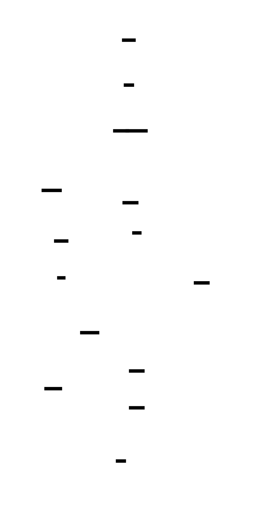

# Simple Filesystem Implementation: Design Document


## Overview

This system implements a complete filesystem with inodes, directories, and journaling that can be mounted via FUSE. The key architectural challenge is organizing data structures on disk for durability while providing the abstractions that applications expect from a standard filesystem.


> This guide is meant to help you understand the big picture before diving into each milestone. Refer back to it whenever you need context on how components connect.


## Context and Problem Statement

> **Milestone(s):** All milestones — this section provides foundational understanding for the entire filesystem implementation project.

Understanding what filesystems do and why they're complex forms the foundation for implementing one. A filesystem is fundamentally a translator between the simple, intuitive interface that applications expect ("give me the file called `document.txt`") and the complex reality of persistent storage devices that only understand concepts like "read 4096 bytes starting at byte offset 2,097,152". This translation involves solving three core challenges that have driven filesystem design for decades: organizing data efficiently on disk, managing metadata reliably, and ensuring consistency in the face of crashes and failures.

The complexity of filesystem implementation stems from the mismatch between how humans think about files and directories versus how storage devices actually work. Applications want a hierarchical namespace where files have meaningful names, can grow and shrink dynamically, and persist reliably across power cycles. Storage devices provide only an array of fixed-size blocks that can be read or written atomically. Bridging this semantic gap requires sophisticated data structures, careful attention to ordering and atomicity, and robust error handling.

Modern filesystems like ext4, NTFS, and ZFS have evolved different approaches to solving these fundamental challenges, each making different trade-offs between performance, reliability, and complexity. Understanding these existing solutions provides crucial context for the design decisions we'll make in our own filesystem implementation. Our goal is to build a simplified but complete filesystem that demonstrates the core concepts without the full complexity of production systems.

### Mental Model: Digital Filing Cabinet

Before diving into technical details, it's helpful to understand filesystems through a familiar analogy: a well-organized filing cabinet in a large office. This mental model captures the essential structure and challenges of filesystem design while remaining intuitive to non-experts.

**The filing cabinet itself represents the physical storage device** — it has a fixed number of drawers, each drawer has a fixed number of hanging folders, and each folder can hold a limited number of documents. Just as you can't magically create more physical space in a filing cabinet, you can't store more data than the physical capacity of your storage device. The cabinet has specific mechanical constraints: you can only open one drawer at a time (seek time), and it takes time to locate the right folder within a drawer (rotational latency on spinning disks).

**The folder system represents the directory hierarchy** that users see. Folders can contain documents (files) or other folders (subdirectories), creating a tree-like organization. Just as office workers expect to find documents by navigating through a logical folder structure ("go to the Personnel folder, then the 2024 subfolder, then find Johnson's file"), applications expect to find files by specifying a path like `/home/user/documents/report.txt`. The folder labels correspond to directory names, and the hierarchical organization makes it possible to have multiple files with the same name as long as they're in different folders.

**Index cards represent inodes** — the metadata records that track information about each file. In a well-organized filing system, each document has an index card that records crucial information: who created it, when it was last modified, how many pages it contains, where exactly it's filed, and what access permissions apply. Similarly, each file in a filesystem has an inode that stores metadata like size, timestamps, ownership, permissions, and most importantly, pointers to the actual data blocks where the file's content is stored. Just as you might consult the index card system to find a document without having to search through every folder, the filesystem uses inodes to quickly locate and access file data.

**The card catalog system represents the block allocation structures** that track which parts of the storage device are in use. In our filing cabinet analogy, imagine a master chart that shows which drawers are full, which folders have available space, and which specific document slots are occupied. This corresponds to the block bitmaps and free space tracking that filesystems use to efficiently allocate storage for new files and reclaim space when files are deleted.

**The office manager represents the filesystem implementation itself** — the software that maintains the organization, handles requests from users, and ensures that the filing system remains consistent even when multiple people are trying to access it simultaneously. Just as an office manager must handle requests like "file this new document," "find me the Johnson file," and "throw away everything in the old project folder," the filesystem must handle system calls like `create()`, `open()`, and `unlink()` while maintaining the integrity of the underlying data structures.

This analogy also illuminates some of the key challenges. What happens if someone is updating an index card when the power goes out? How do you handle the situation when two people try to file documents in the same folder at the same time? What if someone accidentally throws away an index card but the document is still in the cabinet? These correspond directly to the consistency, concurrency, and error handling challenges that filesystem implementations must address.

The limitation of this analogy is that it doesn't capture the performance implications of the physical storage medium. Unlike a filing cabinet where accessing any drawer takes roughly the same amount of time, storage devices have complex performance characteristics. Sequential access is much faster than random access, and the filesystem must carefully consider data placement to achieve good performance.

### Core Filesystem Challenges

Every filesystem implementation, from simple educational examples to sophisticated production systems, must solve three fundamental challenges that arise from the need to provide a reliable, high-level abstraction on top of unreliable, low-level storage hardware.

**Data Organization Challenge: From Flat Storage to Hierarchical Namespace**

The first challenge is transforming the flat, block-addressed storage that devices provide into the hierarchical, name-based namespace that applications expect. Storage devices present themselves as a linear array of fixed-size blocks, typically 512 bytes or 4KB each, identified only by their numeric block address. Applications, however, want to work with named files organized in a tree of directories. The filesystem must maintain data structures that map from human-readable paths like `/home/user/documents/report.txt` to the specific collection of blocks where that file's data is stored.

This mapping involves several layers of indirection. The filesystem must maintain a directory structure that maps file names to unique file identifiers (typically called inode numbers). Each inode number then maps to an inode structure that contains metadata about the file and pointers to the data blocks. For large files, the filesystem needs multiple levels of indirection — direct pointers for small files, indirect pointers that reference blocks containing more pointers, and potentially double or triple indirect pointers for very large files.

The data organization challenge also includes efficiently managing free space. As files are created and deleted, the filesystem must track which blocks are available for new data and which are in use. This requires sophisticated allocation algorithms that balance several competing goals: minimizing fragmentation (where free space becomes divided into small, unusable pieces), maximizing locality (keeping related data close together on disk for better performance), and maintaining allocation metadata efficiently.

**Metadata Management Challenge: Consistency and Durability**

The second fundamental challenge is maintaining accurate metadata about files and directories while ensuring that this metadata remains consistent and durable in the face of failures. Metadata includes not just the obvious information like file sizes and timestamps, but also critical structural information like directory contents, free block bitmaps, and the relationships between files and their data blocks.

The consistency aspect of this challenge arises because most filesystem operations require updating multiple pieces of metadata atomically. Consider a simple file creation: the operation must allocate an inode, initialize it with appropriate metadata, allocate at least one data block, update the free space bitmap, add an entry to the parent directory, and update the directory's size and modification time. If the system crashes partway through this sequence, the filesystem could be left in an inconsistent state where blocks are marked as allocated but not referenced by any file, or where directory entries point to uninitialized inodes.

The durability aspect requires ensuring that committed changes survive power failures and hardware problems. Storage devices typically have volatile write caches, meaning that data written by the filesystem might sit in memory for some time before being committed to persistent storage. The filesystem must carefully control the order in which updates are made durable, often using explicit flush operations, to ensure that the on-disk state always represents a consistent point in the filesystem's history.

Managing metadata efficiently also involves balancing access speed against storage overhead. Metadata operations are frequent — every file access requires reading inode information, and every directory listing requires scanning directory entries. The filesystem must organize metadata for fast access while minimizing the storage space consumed by the metadata itself.

**Crash Consistency Challenge: Surviving Unexpected Failures**

The third core challenge is ensuring that the filesystem can recover gracefully from unexpected failures like power outages, kernel crashes, or hardware failures. Unlike application data, where users might be willing to lose recent unsaved work, filesystem metadata corruption can make entire volumes inaccessible and cause massive data loss.

The fundamental problem is that storage devices only guarantee atomicity at the level of individual block writes. A single filesystem operation typically requires updating multiple blocks, and there's no guarantee about the order in which these updates become persistent or whether all of them will complete before a failure occurs. This creates windows of inconsistency where the filesystem's on-disk structures temporarily violate important invariants.

Traditional approaches to this challenge include careful ordering of writes (ensuring that metadata updates happen in an order that maintains consistency even if later updates are lost) and post-crash consistency checking (scanning the entire filesystem after an unexpected shutdown to detect and repair inconsistencies). More modern approaches use journaling or copy-on-write techniques to ensure that the filesystem can always be restored to a consistent state without requiring lengthy consistency checks.

The crash consistency challenge is complicated by the fact that storage devices may reorder writes for performance reasons, and volatile caches at multiple levels (disk controller, device firmware, operating system buffer cache) mean that the application's view of what has been written may not match what has actually been made persistent. Filesystem implementations must use explicit barriers and flush operations to control write ordering when necessary.

**Secondary Challenges: Performance and Scalability**

While not as fundamental as the three core challenges above, performance and scalability concerns significantly influence filesystem design. The performance challenge involves minimizing the overhead of the abstraction layer while providing good locality of access. This includes decisions about block size (larger blocks reduce metadata overhead but increase internal fragmentation), caching strategies (keeping frequently accessed metadata and data in memory), and data placement policies (keeping files and their metadata close together, grouping related files).

Scalability challenges arise when filesystems need to handle very large storage capacities, millions of files, or high rates of concurrent access. Traditional filesystem designs that work well for thousands of files may perform poorly when directories contain millions of entries. Similarly, global data structures like free block bitmaps can become bottlenecks when multiple processes are allocating and deallocating space simultaneously.

### Existing Filesystem Approaches

Understanding how existing filesystems have approached the core challenges provides valuable context for the design decisions in our implementation. Different filesystems have made different trade-offs between simplicity, performance, reliability, and features, reflecting their intended use cases and the constraints of their era.

**ext4: Evolutionary Refinement of Unix Filesystem Principles**

The ext4 filesystem represents the culmination of decades of evolutionary improvements to the original Unix filesystem design. It addresses the core challenges through a combination of time-tested approaches and modern optimizations that maintain backward compatibility while improving performance and reliability.

For data organization, ext4 uses the classic Unix approach of inodes with direct and indirect block pointers, enhanced with extent-based allocation for large files. Instead of storing individual block pointers for large files, extents represent contiguous ranges of blocks, significantly reducing metadata overhead for large files and improving allocation locality. The filesystem organizes the disk into block groups, each containing a portion of the inode table, block bitmap, and data blocks. This grouping improves locality by keeping files and their metadata close together while enabling parallel allocation across different regions of the disk.

ext4's approach to metadata management combines journaling with careful write ordering to ensure consistency. The journal (implemented as a circular log) records intended changes before they're applied to the main filesystem structures. This write-ahead logging ensures that the filesystem can recover to a consistent state after a crash by replaying or rolling back incomplete transactions. The journaling can operate in different modes: writeback mode (only metadata is journaled), ordered mode (data writes are ordered before metadata commits), and full journaling mode (both data and metadata are journaled).

For crash consistency, ext4 relies heavily on its journal and includes sophisticated recovery procedures that can handle various failure scenarios. The journal includes sequence numbers and checksums to detect corruption, and the recovery process carefully validates journal entries before replaying them. The filesystem also includes online consistency checking features that can detect and repair certain types of corruption without requiring a full unmount.

| Feature | Implementation | Trade-offs |
|---------|----------------|------------|
| Data Organization | Inodes + extents + block groups | Good locality, backward compatible, but limited by 32-bit block numbers |
| Free Space Management | Block and inode bitmaps per block group | Simple and fast, but can fragment under heavy use |
| Crash Consistency | Write-ahead journaling with configurable modes | Reliable recovery, but journal can become a performance bottleneck |
| Large File Support | Extent-based allocation with up to 4 extents per inode | Efficient for large files, but small files still have overhead |
| Directory Indexing | Hash tree (htree) for large directories | Fast lookups in large directories, but adds complexity |

**NTFS: Comprehensive Metadata Management**

Microsoft's NTFS takes a radically different approach by treating everything as a file, including metadata structures. This "everything is a file" philosophy simplifies many aspects of the implementation while enabling sophisticated features like per-file compression, encryption, and extensive metadata.

NTFS organizes data using a Master File Table (MFT) that contains records for every file and directory on the volume. Each MFT record contains attributes that describe the file, including not just traditional metadata like size and timestamps, but also the actual file data for small files. This approach eliminates the distinction between metadata and data for small files, reducing the number of disk seeks required for common operations.

For metadata management, NTFS implements a comprehensive transaction system that treats the filesystem itself as a transactional database. Every operation is part of a transaction that can be committed or rolled back atomically. This provides much stronger consistency guarantees than traditional Unix filesystems, but at the cost of additional complexity and performance overhead.

NTFS addresses crash consistency through its transactional architecture combined with a sophisticated logging system. The filesystem maintains both a redo log (for replaying completed but not yet applied transactions) and an undo log (for rolling back incomplete transactions). This dual-logging approach enables NTFS to guarantee that the filesystem is always in a consistent state, even in the face of complex failure scenarios.

| Feature | Implementation | Trade-offs |
|---------|----------------|------------|
| Data Organization | Master File Table with everything-as-file model | Unified metadata handling, but MFT can become fragmented |
| Small File Optimization | Data stored directly in MFT records | Excellent performance for small files, but wastes space for larger files |
| Crash Consistency | Full transactional system with redo/undo logging | Strong consistency guarantees, but significant complexity |
| Advanced Features | Per-file compression, encryption, alternate data streams | Rich feature set, but increases implementation complexity |
| Unicode Support | Native UTF-16 file names with normalization | Comprehensive internationalization, but complicates name handling |

**ZFS: Copy-on-Write and Integrated Volume Management**

ZFS represents a fundamental rethinking of filesystem design that integrates filesystem and volume management while using copy-on-write semantics to eliminate many traditional consistency problems. Instead of modifying data in place, ZFS always writes new data to unused locations and atomically updates pointers to reference the new data.

The copy-on-write approach elegantly solves many crash consistency problems. Since existing data is never overwritten until the new data is safely written and all pointers are updated, the filesystem is always consistent on disk. If a failure occurs during an update, the filesystem simply continues using the old data — there's no partially updated state that requires recovery.

ZFS's data organization uses a tree of blocks with cryptographic checksums at every level. This enables the filesystem to detect corruption anywhere in the tree and, when combined with redundancy (either through mirroring or more sophisticated erasure codes), to automatically correct corruption. The checksum tree also enables efficient snapshots — since blocks are never modified in place, creating a snapshot is simply a matter of keeping a reference to the current root of the tree.

For metadata management, ZFS stores metadata in the same copy-on-write tree as data, eliminating the traditional distinction between data and metadata blocks. This unified approach simplifies the implementation while enabling features like compression and checksumming to apply equally to both data and metadata.

| Feature | Implementation | Trade-offs |
|---------|----------------|------------|
| Crash Consistency | Copy-on-write with atomic pointer updates | Eliminates most consistency problems, but requires garbage collection |
| Data Integrity | End-to-end checksums with automatic corruption repair | Detects and corrects corruption, but requires redundancy for repair |
| Snapshots | Copy-on-write tree with shared blocks | Nearly instantaneous snapshots, but can complicate space management |
| Compression | Transparent per-block compression with multiple algorithms | Reduces storage requirements, but adds CPU overhead |
| Integrated RAID | Filesystem manages storage redundancy directly | Simplifies administration, but ties filesystem to specific hardware configuration |

> **Decision: Simplified Design Philosophy**
> - **Context**: Our educational filesystem must balance completeness with implementation complexity
> - **Options Considered**: 
>   1. Full-featured design mimicking ext4 with journaling and extent-based allocation
>   2. Minimal design with only basic file operations and simple allocation
>   3. Hybrid approach with core functionality plus one advanced feature (journaling)
> - **Decision**: Implement the hybrid approach with basic filesystem operations plus journaling
> - **Rationale**: This provides exposure to fundamental concepts (inodes, directories, allocation) while including one advanced topic (crash consistency) that's crucial for understanding modern filesystems
> - **Consequences**: Results in a filesystem that's educational but not production-ready, requiring careful documentation of what's simplified versus real-world implementations

**Design Philosophy Comparison**

| Approach | Complexity | Crash Consistency | Performance | Educational Value |
|----------|------------|-------------------|-------------|-------------------|
| Simple (FAT-like) | Low | Poor (ordering only) | Good for simple operations | Limited - misses modern concepts |
| Traditional Unix (ext4-like) | Medium | Good (journaling) | Balanced | High - covers core concepts |
| Copy-on-Write (ZFS-like) | High | Excellent (transactional) | Complex trade-offs | Very high - shows advanced concepts |
| Everything-as-file (NTFS-like) | High | Excellent (full transactions) | Good for metadata-heavy workloads | Medium - Windows-specific concepts |

The choice of approach significantly influences the implementation complexity and the concepts that learners will encounter. Traditional Unix-style filesystems like ext4 provide an excellent balance of educational value and implementation complexity, covering all the fundamental concepts without requiring the sophisticated algorithms needed for copy-on-write or full transactional semantics.

Understanding these existing approaches helps inform our design decisions and provides context for why certain choices were made. Each approach represents a different set of trade-offs, and understanding these trade-offs is crucial for making informed decisions in filesystem design.

### Implementation Guidance

This section provides concrete technology recommendations and starter code to begin implementing the filesystem concepts described above.

**A. Technology Recommendations**

| Component | Simple Option | Advanced Option |
|-----------|---------------|-----------------|
| Block I/O | POSIX file operations (open/read/write/lseek) | Linux AIO or io_uring for async I/O |
| Memory Management | Standard malloc/free with simple pooling | Custom slab allocator for fixed-size objects |
| Concurrency | POSIX threads with mutexes | Lock-free data structures with atomic operations |
| Error Handling | Return codes with errno | Structured exception handling |
| Testing Framework | Simple assert macros | Full unit testing framework (CUnit) |
| FUSE Integration | libfuse2 (stable, widely supported) | libfuse3 (newer API, better performance) |

**B. Recommended File Structure**

The implementation should follow a layered architecture that mirrors the conceptual design:

```
filesystem/
├── src/
│   ├── block/
│   │   ├── block.h              ← Block device abstraction
│   │   ├── block.c              ← Core block operations
│   │   ├── bitmap.h             ← Free space tracking
│   │   └── bitmap.c             ← Bitmap operations
│   ├── inode/
│   │   ├── inode.h              ← Inode structures and operations
│   │   ├── inode.c              ← Inode management
│   │   └── inode_cache.c        ← Inode caching layer
│   ├── directory/
│   │   ├── directory.h          ← Directory operations
│   │   ├── directory.c          ← Directory entry management
│   │   └── path.c               ← Path resolution
│   ├── file/
│   │   ├── file.h               ← File operations
│   │   ├── file.c               ← File I/O implementation
│   │   └── sparse.c             ← Sparse file handling
│   ├── fuse/
│   │   ├── fuse_ops.h           ← FUSE callback declarations
│   │   ├── fuse_ops.c           ← FUSE operation implementations
│   │   └── mount.c              ← Mount/unmount logic
│   ├── common/
│   │   ├── types.h              ← Common type definitions
│   │   ├── constants.h          ← System constants
│   │   └── utils.h              ← Utility functions
│   └── main.c                   ← Entry point and argument parsing
├── tests/
│   ├── unit/                    ← Unit tests for each component
│   ├── integration/             ← End-to-end testing
│   └── fixtures/                ← Test data and disk images
├── tools/
│   ├── mkfs.c                   ← Filesystem creation utility
│   ├── fsck.c                   ← Consistency checker
│   └── dump.c                   ← Debugging and inspection tools
└── docs/
    ├── disk-layout.md           ← On-disk format documentation
    └── testing.md               ← Testing procedures
```

**C. Infrastructure Starter Code**

Here's complete, working infrastructure code that provides the foundation for filesystem implementation:

```c
// common/types.h - Core type definitions
#ifndef TYPES_H
#define TYPES_H

#include <stdint.h>
#include <stdbool.h>
#include <sys/types.h>

// Basic type aliases for clarity
typedef uint32_t block_num_t;    // Block number (4B = 16TB max @ 4KB blocks)
typedef uint32_t inode_num_t;    // Inode number
typedef uint64_t file_size_t;    // File size in bytes
typedef uint32_t block_count_t;  // Number of blocks

// Magic numbers for validation
#define FS_MAGIC 0x53465348          // "SFSH" - Simple FileSystem Header
#define INODE_MAGIC 0x494E4F44       // "INOD"
#define DIR_MAGIC 0x44495245         // "DIRE"

// Fundamental constants
#define BLOCK_SIZE 4096              // 4KB blocks
#define BLOCKS_PER_BITMAP_BLOCK 32768 // 4096 * 8 bits per byte
#define INODES_PER_BLOCK 16          // 4096 / 256 bytes per inode
#define MAX_FILENAME_LEN 255         // POSIX maximum
#define MAX_PATH_LEN 4096           // POSIX PATH_MAX

// Error codes specific to our filesystem
typedef enum {
    FS_SUCCESS = 0,
    FS_ERROR_NO_SPACE = 1,
    FS_ERROR_NOT_FOUND = 2,
    FS_ERROR_INVALID_PATH = 3,
    FS_ERROR_PERMISSION_DENIED = 4,
    FS_ERROR_IO_ERROR = 5,
    FS_ERROR_CORRUPTION = 6,
    FS_ERROR_EXISTS = 7
} fs_error_t;

#endif // TYPES_H
```

```c
// common/utils.h - Utility functions
#ifndef UTILS_H
#define UTILS_H

#include "types.h"
#include <time.h>

// Time utilities for timestamps
static inline uint64_t current_time_ns(void) {
    struct timespec ts;
    clock_gettime(CLOCK_REALTIME, &ts);
    return (uint64_t)ts.tv_sec * 1000000000ULL + ts.tv_nsec;
}

// Block alignment utilities
static inline size_t align_to_block(size_t size) {
    return (size + BLOCK_SIZE - 1) & ~(BLOCK_SIZE - 1);
}

static inline block_num_t bytes_to_blocks(file_size_t bytes) {
    return (bytes + BLOCK_SIZE - 1) / BLOCK_SIZE;
}

// Safe string operations
int safe_strcpy(char *dest, const char *src, size_t dest_size);
bool is_valid_filename(const char *name);
void sanitize_path(char *path);

// Bitmap manipulation helpers
static inline bool test_bit(const uint8_t *bitmap, size_t bit) {
    return bitmap[bit / 8] & (1U << (bit % 8));
}

static inline void set_bit(uint8_t *bitmap, size_t bit) {
    bitmap[bit / 8] |= (1U << (bit % 8));
}

static inline void clear_bit(uint8_t *bitmap, size_t bit) {
    bitmap[bit / 8] &= ~(1U << (bit % 8));
}

#endif // UTILS_H
```

```c
// block/block.h - Block device abstraction
#ifndef BLOCK_H
#define BLOCK_H

#include "common/types.h"

// Block device handle
typedef struct block_device {
    int fd;                          // File descriptor for disk image
    block_count_t total_blocks;      // Total number of blocks
    bool read_only;                  // Read-only flag
    char *cache;                     // Simple block cache
    block_num_t *cache_block_nums;   // Which blocks are cached
    bool *cache_dirty;               // Dirty flags for write-back
    size_t cache_size;               // Number of cache entries
} block_device_t;

// Initialize block device from disk image file
fs_error_t block_device_open(const char *image_path, bool read_only, 
                           block_device_t **device);
void block_device_close(block_device_t *device);

// Basic block operations
fs_error_t block_read(block_device_t *device, block_num_t block_num, void *buffer);
fs_error_t block_write(block_device_t *device, block_num_t block_num, const void *buffer);
fs_error_t block_sync(block_device_t *device);  // Flush all cached writes

// Block cache management
fs_error_t block_cache_init(block_device_t *device, size_t cache_blocks);
void block_cache_cleanup(block_device_t *device);

#endif // BLOCK_H
```

**D. Core Logic Skeleton Code**

```c
// block/block.c - Core implementation that learners will complete
#include "block.h"
#include "common/utils.h"
#include <unistd.h>
#include <fcntl.h>
#include <string.h>
#include <stdlib.h>

fs_error_t block_read(block_device_t *device, block_num_t block_num, void *buffer) {
    // TODO 1: Validate block_num is within device bounds
    // TODO 2: Check if block is in cache - if so, copy from cache and return
    // TODO 3: Calculate byte offset: block_num * BLOCK_SIZE
    // TODO 4: Use lseek() to position file pointer at offset
    // TODO 5: Use read() to read BLOCK_SIZE bytes into buffer
    // TODO 6: Handle partial reads by looping until full block is read
    // TODO 7: Add block to cache if cache is available
    // Hint: Always validate pointers and check return values
    return FS_ERROR_IO_ERROR; // Placeholder
}

fs_error_t block_write(block_device_t *device, block_num_t block_num, const void *buffer) {
    // TODO 1: Validate device is not read-only
    // TODO 2: Validate block_num is within device bounds  
    // TODO 3: If block is cached, update cache and mark dirty
    // TODO 4: Calculate byte offset: block_num * BLOCK_SIZE
    // TODO 5: Use lseek() to position file pointer at offset
    // TODO 6: Use write() to write BLOCK_SIZE bytes from buffer
    // TODO 7: Handle partial writes by looping until full block is written
    // TODO 8: Optionally call fsync() for immediate durability
    // Hint: Consider write-back vs write-through caching strategies
    return FS_ERROR_IO_ERROR; // Placeholder
}
```

**E. Language-Specific Hints**

- **File I/O**: Use `open()`, `read()`, `write()`, `lseek()`, and `close()` from `<unistd.h>`. Always check return values.
- **Error Handling**: Use `errno` from `<errno.h>` to get detailed error information. Use `perror()` for debugging.
- **Memory Management**: Use `malloc()` and `free()` from `<stdlib.h>`. Consider `posix_memalign()` for block-aligned buffers.
- **Synchronization**: Use `pthread_mutex_t` from `<pthread.h>` for protecting shared data structures.
- **Endianness**: Use functions from `<arpa/inet.h>` like `htonl()` and `ntohl()` for portable disk formats.

**F. Milestone Checkpoint**

After implementing the basic block layer, verify your progress with these tests:

1. **Create a test disk image**: `dd if=/dev/zero of=test.img bs=4096 count=1024`
2. **Compile and run basic tests**: `gcc -o test_block tests/test_block.c src/block/*.c -I src`
3. **Expected behavior**: 
   - Writing a block and reading it back should return identical data
   - Writing beyond the device size should return `FS_ERROR_IO_ERROR`
   - The cache should reduce the number of actual disk operations
4. **Debug with**: `strace ./test_block` to see actual system calls and verify caching is working

**G. Common Implementation Pitfalls**

| Symptom | Likely Cause | How to Diagnose | Fix |
|---------|--------------|-----------------|-----|
| Data corruption on read | Incorrect offset calculation | Print offsets before lseek | Use `(off_t)block_num * BLOCK_SIZE` |
| Partial read/write failures | Not handling EINTR or short operations | Check return values in loop | Loop until all bytes transferred |
| Cache inconsistency | Not marking cache entries dirty | Trace cache operations | Set dirty flag on all cache writes |
| Performance worse than expected | Synchronous writes or poor cache hit rate | Measure cache hit ratio | Implement write-back caching |


## Goals and Non-Goals

> **Milestone(s):** All milestones — this section establishes the scope boundaries and success criteria that guide the implementation across all five project milestones.

### Mental Model: The Educational Filesystem

Think of this filesystem implementation as building a **working scale model** of a real filesystem — like an architect's scale model of a skyscraper. The model demonstrates all the core principles and components of the real thing, but deliberately omits certain complexities to keep it buildable and understandable. Just as the scale model shows how elevators, electrical systems, and structural supports work together without including every pipe and wire, our filesystem will demonstrate how inodes, directories, and block allocation work together without including every optimization and edge case that production filesystems handle.

This mental model is crucial because it sets expectations appropriately. We're not building the next ext4 or NTFS — we're building something that teaches the fundamental concepts while remaining implementable by a single developer in a reasonable timeframe.

### Functional Goals

The **functional goals** define the core capabilities that users will be able to demonstrate with the completed filesystem. These represent the minimum viable functionality that makes this a "real" filesystem rather than just a collection of data structures.

#### Core File Operations

The filesystem must support the fundamental file operations that users expect from any storage system. These operations form the foundation of all higher-level file management activities.

| Operation | Description | Success Criteria |
|-----------|-------------|------------------|
| Create File | Create new empty file with given name | File appears in directory listing with zero size |
| Delete File | Remove file and free its storage | File disappears from directory, blocks returned to free pool |
| Read File | Read data from file at any offset | Correct data returned, supports partial reads and seeks |
| Write File | Write data to file, extending size if needed | Data persisted correctly, file size updated, new blocks allocated |
| Truncate File | Change file size, freeing blocks if shrinking | File size matches request, excess blocks deallocated |
| Get Attributes | Retrieve file metadata (size, permissions, timestamps) | Accurate metadata returned including current size and modification time |

> **Decision: POSIX-Style File Operations**
> - **Context**: Multiple file operation models exist including Windows-style handles, POSIX file descriptors, and database-style cursors
> - **Options Considered**: Windows CreateFile/ReadFile/WriteFile, POSIX open/read/write/close, Custom transaction-based API
> - **Decision**: POSIX-style operations (open, read, write, close, truncate)
> - **Rationale**: FUSE expects POSIX semantics, most developers familiar with this model, maps directly to system calls
> - **Consequences**: Enables standard Unix tools to work with mounted filesystem, but requires careful state management for concurrent access

#### Directory Operations

Directories provide the hierarchical namespace that organizes files into a tree structure. The filesystem must support creating, navigating, and modifying this hierarchy.

| Operation | Description | Success Criteria |
|-----------|-------------|------------------|
| Create Directory | Create new directory with given name | Directory appears in parent directory listing |
| Remove Directory | Delete empty directory | Directory disappears, blocks returned to free pool |
| List Directory | Enumerate files and subdirectories | Complete and accurate listing including . and .. entries |
| Path Resolution | Convert path string to target inode | Correctly traverses directory hierarchy, handles .. and . |
| Rename | Move file or directory to new location | Atomically updates directory entries, handles cross-directory moves |

The path resolution algorithm is particularly critical because it bridges the human-readable filesystem namespace with the internal inode-based storage system. This algorithm must correctly handle edge cases like multiple consecutive slashes, trailing slashes, and relative path components.

> **Decision: Hierarchical Directory Structure**
> - **Context**: File organization options include flat namespace, hierarchical directories, or tag-based systems
> - **Options Considered**: Flat namespace with unique names, Unix-style hierarchical directories, Tag-based organization
> - **Decision**: Unix-style hierarchical directories with / as separator
> - **Rationale**: FUSE requires hierarchical namespace, users expect familiar directory structure, simplifies POSIX compliance
> - **Consequences**: Enables standard shell navigation commands, but requires complex path resolution and reference counting logic

#### FUSE Integration

The filesystem must integrate with the operating system through FUSE (Filesystem in Userspace) to appear as a normal mounted filesystem. This integration is what transforms our custom data structures into something that standard applications can use.

| FUSE Operation | Internal Mapping | Success Criteria |
|----------------|------------------|------------------|
| `getattr` | Read inode metadata | Returns file size, permissions, timestamps from inode |
| `readdir` | Scan directory entries | Lists all files and subdirectories with correct inode numbers |
| `open` | Allocate file handle | Validates permissions, returns handle for subsequent operations |
| `read` | Read file data through inode pointers | Returns correct data at specified offset and length |
| `write` | Write file data, allocate blocks as needed | Persists data correctly, extends file size, allocates new blocks |
| `mkdir` | Create directory inode and add to parent | New directory appears in filesystem namespace |
| `rmdir` | Remove empty directory | Directory removed, inode and blocks freed |
| `unlink` | Remove file and decrease link count | File removed when link count reaches zero |

The FUSE integration serves as the ultimate test of our filesystem implementation. If applications can successfully create, read, write, and delete files through the FUSE mount point, then our internal data structures and algorithms are working correctly.

### Non-Functional Goals

The **non-functional goals** define the quality characteristics that make the filesystem usable and educational. These goals focus on how well the system performs rather than what it can do.

#### Educational Value

The primary non-functional goal is maximizing learning value for developers studying filesystem implementation. Every design decision should prioritize clarity and understandability over micro-optimizations.

| Characteristic | Target | Measurement Approach |
|----------------|--------|---------------------|
| Code Clarity | Each function under 50 lines, clear variable names | Code review focusing on readability |
| Architectural Layering | Clean separation between components, minimal coupling | Dependency analysis, interface review |
| Documentation Quality | Every major algorithm explained with comments | Code walkthrough with junior developer |
| Debugging Support | Comprehensive error messages with context | Error scenario testing |

> The key insight is that this filesystem serves as a learning vehicle first and a production system never. When facing trade-offs between performance and clarity, we consistently choose clarity.

#### Reliability and Consistency

While not production-grade, the filesystem should demonstrate proper error handling and maintain data consistency under normal operating conditions.

| Reliability Goal | Implementation Approach | Success Criteria |
|------------------|------------------------|------------------|
| No Data Corruption | Careful ordering of metadata updates | Files readable after normal shutdown |
| Graceful Error Handling | Check return values, report specific errors | Clear error messages for common failure modes |
| Resource Cleanup | Proper deallocation of memory and file handles | No memory leaks during normal operation |
| Basic Crash Safety | Sync critical metadata to disk | Filesystem remains mountable after unexpected shutdown |

The reliability goals focus on preventing common implementation bugs rather than handling exotic failure scenarios. The filesystem should be robust enough for educational use and demonstration purposes.

#### Performance Characteristics

Performance goals are deliberately modest, focusing on avoiding pathological behavior rather than achieving optimal throughput.

| Performance Aspect | Acceptable Range | Design Approach |
|-------------------|------------------|----------------|
| File Creation | Under 10ms for small files | Simple allocation algorithms, basic caching |
| Sequential Read | At least 10MB/s for large files | Block-level I/O, minimal per-byte overhead |
| Directory Listing | Under 100ms for directories with 1000 files | Linear scan acceptable for educational purposes |
| Memory Usage | Under 100MB for typical workloads | Basic caching with simple eviction |
| Mount Time | Under 5 seconds for 1GB filesystem | Simple consistency checks, no complex recovery |

These performance targets ensure the filesystem is responsive enough for interactive use while avoiding the complexity of advanced optimization techniques.

### Explicit Non-Goals

The **explicit non-goals** define advanced features that are deliberately excluded to keep the project scope manageable and maintain focus on core concepts. Understanding these boundaries is crucial for making good implementation decisions.

#### Advanced Reliability Features

Production filesystems include sophisticated reliability features that would add significant complexity without proportional educational value.

| Excluded Feature | Rationale | Alternative Approach |
|------------------|-----------|---------------------|
| Write-Ahead Logging (Journaling) | Adds transaction complexity, separate advanced topic | Careful ordering of operations, sync critical updates |
| Checksums and Error Correction | Requires cryptographic libraries, complex recovery logic | Trust underlying storage, focus on logical consistency |
| Backup Superblocks | Multiple copies add complexity to metadata management | Single superblock with magic number validation |
| Online Filesystem Repair | Requires sophisticated consistency checking algorithms | Unmount and restart if corruption detected |
| Atomic Rename Across Filesystems | Cross-filesystem operations involve external coordination | Support rename within filesystem only |

> **Decision: No Journaling in Core Implementation**
> - **Context**: Modern filesystems use journaling for crash consistency, but it adds significant implementation complexity
> - **Options Considered**: Full data journaling, Metadata-only journaling, No journaling with careful ordering
> - **Decision**: No journaling, rely on careful operation ordering and periodic sync
> - **Rationale**: Journaling is complex enough to be its own educational project, careful ordering demonstrates core principles
> - **Consequences**: Simpler implementation and debugging, but filesystem vulnerable to crash during multi-step operations

#### Performance Optimizations

High-performance filesystems employ numerous optimization techniques that would obscure the fundamental algorithms we want to demonstrate.

| Excluded Optimization | Complexity Added | Educational Impact |
|-----------------------|------------------|-------------------|
| Extent-Based Allocation | Complex free space management, allocation algorithms | Obscures basic block allocation concepts |
| Block Groups | Sophisticated layout algorithms, locality optimization | Focus on simple linear allocation |
| Read-Ahead and Prefetching | Prediction algorithms, complex caching logic | Keep caching simple and predictable |
| Delayed Allocation | Deferred decision making, complex writeback | Immediate allocation is easier to understand |
| Compression | Compression algorithms, variable-size block handling | Fixed-size blocks simplify addressing |
| Copy-on-Write | Complex reference counting, snapshot management | In-place updates demonstrate basic concepts |

These optimizations would double or triple the implementation complexity while teaching concepts that are secondary to basic filesystem operation.

#### Advanced File Features

Modern filesystems support numerous advanced file features that serve specific use cases but aren't essential for understanding core concepts.

| Advanced Feature | Implementation Challenge | Scope Decision |
|------------------|------------------------|----------------|
| Symbolic Links | Additional inode type, path resolution complexity | Hard links only (reference counting) |
| Extended Attributes | Variable-length metadata, namespace management | Standard POSIX attributes only |
| File Permissions and ACLs | User/group management, complex permission checking | Basic owner/group/other permissions |
| File Locking | Deadlock detection, lock state management | Application-level coordination only |
| Memory-Mapped Files | Virtual memory integration, page fault handling | Read/write system calls only |
| Sparse File Optimization | Complex hole tracking, efficient representation | Allocate all blocks within file size |

> The principle guiding these decisions is that each additional feature should teach a fundamentally new concept. Features that are primarily engineering challenges rather than algorithmic innovations are excluded.

#### Scalability and Enterprise Features

Production filesystems must handle massive scale and enterprise requirements that are irrelevant for educational purposes.

| Enterprise Feature | Why Excluded | Educational Focus Instead |
|--------------------|--------------|---------------------------|
| Multi-Terabyte Support | 64-bit addressing complexity, performance challenges | Gigabyte-scale files sufficient for learning |
| Concurrent Multi-Writer Access | Complex locking protocols, race condition handling | Single-threaded or coarse-grained locking |
| Hot Online Resize | Dynamic metadata management, complex algorithms | Fixed-size filesystem at creation time |
| Snapshot and Cloning | Copy-on-write semantics, reference management | Simple backup through file copying |
| Quota Management | Per-user accounting, enforcement mechanisms | Focus on core allocation algorithms |
| Network Filesystem Support | Distributed consistency, network protocol handling | Local filesystem only |

These features address operational requirements rather than fundamental computer science concepts, making them poor investments for educational projects.

#### Platform and Compatibility Features

Cross-platform compatibility and legacy support add complexity without educational value in a learning-focused implementation.

| Compatibility Feature | Complexity Source | Simplified Approach |
|-----------------------|------------------|-------------------|
| Multiple Operating Systems | Platform-specific I/O, different FUSE APIs | Linux-focused implementation |
| Backward Compatibility | Legacy format support, migration logic | Single format version |
| Character Encoding Support | Unicode normalization, encoding conversion | UTF-8 filenames only |
| Windows Compatibility | Different path separators, permission models | Unix-style paths and permissions |
| 32-bit Architecture Support | Memory constraints, addressing limitations | Assume 64-bit development environment |

By constraining the target environment, we can focus implementation effort on the core algorithms rather than portability concerns.

### Common Pitfalls

When defining project scope, several pitfalls can lead to either an unfinishable project or one that doesn't achieve its educational goals.

⚠️ **Pitfall: Feature Creep During Implementation**

It's tempting to add "just one more feature" when the basic implementation is working. This is particularly dangerous because each additional feature often interacts with existing features in complex ways. For example, adding symbolic links seems simple, but it complicates path resolution, requires new inode types, and introduces potential infinite loops. The solution is to strictly maintain the scope boundaries defined here — write additional features as separate projects that build on the working basic filesystem.

⚠️ **Pitfall: Perfectionist Performance Optimization**

Junior developers often want to optimize prematurely, adding complexity for marginal performance gains. Remember that the goal is education, not production deployment. A simple linear search through directory entries teaches the fundamental concepts and performs adequately for educational workloads. The solution is to implement the simplest algorithm first, verify it works correctly, and only then consider optimizations as separate learning exercises.

⚠️ **Pitfall: Overengineering Error Handling**

Production systems require comprehensive error handling for every possible failure mode, but educational projects should focus on the most common and instructive errors. It's not necessary to handle disk full conditions gracefully if the learning goal is understanding inode allocation. The solution is to handle errors that would corrupt data or crash the program, but accept that some error conditions will require restarting the filesystem.

⚠️ **Pitfall: Ignoring FUSE Limitations**

FUSE imposes certain constraints on filesystem implementation, and ignoring these constraints leads to incompatibility problems late in development. For example, FUSE expects certain callback functions to be thread-safe, and FUSE has specific requirements for handling file handles. The solution is to read the FUSE documentation carefully during the design phase and structure the implementation to match FUSE's expectations rather than trying to adapt FUSE to an incompatible design.

### Implementation Guidance

This subsection provides practical guidance for maintaining scope discipline throughout the implementation process.

#### Technology Recommendations

| Component | Simple Option | Advanced Option |
|-----------|---------------|-----------------|
| Block Storage | Single file with `lseek` positioning | `mmap` with virtual memory management |
| Error Handling | Return codes with `errno` style | Exception-based error propagation |
| Concurrency | Single-threaded with explicit locking | Thread-pool with fine-grained locks |
| Testing Framework | Simple `assert` macros with test functions | Full unit testing framework like `cmocka` |
| Build System | Single `Makefile` with basic rules | `cmake` or `autotools` with configuration |
| Debugging Support | `printf` debugging with log levels | Full `gdb` integration with debug symbols |

For educational purposes, choose the simple option first. The advanced options can be explored as extensions after the basic implementation works.

#### Recommended File Structure

Organize the code to reflect the architectural layers and scope boundaries defined in this section:

```
filesystem/
├── src/
│   ├── block/                 ← Block layer (Milestone 1)
│   │   ├── block_device.c    ← Basic block I/O
│   │   ├── block_cache.c     ← Simple write-back cache
│   │   └── block_alloc.c     ← Bitmap-based allocation
│   ├── inode/                ← Inode management (Milestone 2)
│   │   ├── inode.c           ← Inode operations
│   │   └── inode_alloc.c     ← Inode allocation
│   ├── directory/            ← Directory operations (Milestone 3)
│   │   ├── directory.c       ← Directory entry management
│   │   └── path.c            ← Path resolution
│   ├── file/                 ← File operations (Milestone 4)
│   │   ├── file_ops.c        ← Read/write operations
│   │   └── file_handle.c     ← File handle management
│   ├── fuse/                 ← FUSE integration (Milestone 5)
│   │   ├── fuse_callbacks.c  ← FUSE operation handlers
│   │   └── fuse_main.c       ← Mount/unmount logic
│   └── common/               ← Shared utilities
│       ├── fs_types.h        ← Common type definitions
│       ├── fs_errors.h       ← Error code definitions
│       └── fs_constants.h    ← Magic numbers and constants
├── tests/
│   ├── unit/                 ← Component-level tests
│   └── integration/          ← End-to-end tests
├── tools/
│   ├── mkfs.c               ← Filesystem creation utility
│   ├── fsck.c               ← Basic consistency checker
│   └── debug_dump.c         ← Debug information printer
└── docs/
    ├── api.md               ← Internal API documentation
    └── testing.md           ← Testing procedures
```

This structure enforces the layered architecture and makes it easy to focus on one milestone at a time.

#### Scope Enforcement Infrastructure

Create infrastructure that helps maintain scope discipline during implementation:

```c
// fs_config.h - Compile-time feature toggles
#ifndef FS_CONFIG_H
#define FS_CONFIG_H

// Core features (always enabled)
#define FS_FEATURE_BASIC_FILES 1
#define FS_FEATURE_DIRECTORIES 1
#define FS_FEATURE_FUSE_MOUNT 1

// Advanced features (disabled by default)
#define FS_FEATURE_JOURNALING 0
#define FS_FEATURE_COMPRESSION 0
#define FS_FEATURE_SYMLINKS 0
#define FS_FEATURE_EXTENDED_ATTRS 0

// Performance features (disabled for simplicity)
#define FS_FEATURE_EXTENT_ALLOCATION 0
#define FS_FEATURE_READAHEAD 0
#define FS_FEATURE_DELAYED_ALLOCATION 0

// Validation and limits
#define FS_MAX_FILESIZE (1ULL << 30)        // 1GB max file
#define FS_MAX_FILESYSTEM_SIZE (4ULL << 30)  // 4GB max filesystem
#define FS_MAX_FILENAME_LEN 255
#define FS_MAX_PATH_LEN 4096

#endif // FS_CONFIG_H
```

Use conditional compilation to disable advanced features during initial development:

```c
fs_error_t create_symbolic_link(const char* link_path, const char* target_path) {
#if FS_FEATURE_SYMLINKS
    // Implementation would go here
    return implement_symlink_creation(link_path, target_path);
#else
    return FS_ERROR_NOT_SUPPORTED;
#endif
}
```

#### Milestone Checkpoint Framework

Create a systematic approach to validating that each milestone meets its functional goals:

```c
// milestone_tests.h - Automated milestone validation
typedef struct {
    const char* test_name;
    fs_error_t (*test_function)(void);
    const char* description;
} milestone_test_t;

// Milestone 1: Block Layer Tests
milestone_test_t milestone1_tests[] = {
    {"block_device_open", test_block_device_open, "Open and close block device"},
    {"block_read_write", test_block_read_write, "Read and write single blocks"},
    {"block_allocation", test_block_allocation, "Allocate and free blocks"},
    {"superblock_format", test_superblock_format, "Create and validate superblock"},
    {NULL, NULL, NULL}  // Terminator
};
```

Run milestone validation after completing each major component:

```bash
# Validate Milestone 1 completion
make milestone1-test
./tests/milestone1_validator disk_image.img

# Expected output:
# ✓ Block device operations
# ✓ Block allocation bitmap
# ✓ Superblock creation
# ✓ Basic caching
# Milestone 1: PASSED
```

#### Debugging Scope Violations

Add debugging support to detect when implementation exceeds intended scope:

```c
// debug_scope.h - Scope violation detection
#ifdef DEBUG_SCOPE
#define SCOPE_VIOLATION(feature) \
    fprintf(stderr, "SCOPE WARNING: %s used at %s:%d\n", \
            feature, __FILE__, __LINE__)
#else
#define SCOPE_VIOLATION(feature) do {} while(0)
#endif

// Usage in code
fs_error_t allocate_extent(block_num_t start, block_count_t length) {
    SCOPE_VIOLATION("extent allocation");
    // Fallback to simple block allocation
    return allocate_blocks_individually(start, length);
}
```

This helps catch scope creep during development and provides reminders about which features are intentionally simplified.

The implementation guidance provides concrete tools for maintaining the scope boundaries defined in this section. The key principle is that scope discipline is just as important as technical correctness for achieving the educational goals of this project.


## High-Level Architecture

> **Milestone(s):** All milestones — this section provides the architectural foundation that guides implementation across all five project phases, from the block layer through FUSE integration.

### Component Overview

The filesystem implementation follows a carefully structured five-layer architecture, where each layer builds upon the services provided by the layer below it. This design mirrors how production filesystems organize their complexity, making the implementation both educational and practically grounded.

**Mental Model: Digital Skyscraper**

Think of the filesystem as a digital skyscraper where each floor provides specific services to the floors above it. The foundation (block layer) handles the raw mechanics of reading and writing fixed-size chunks of data to disk. The structural frame (inode management) provides the scaffolding for organizing file metadata. The floor layouts (directory operations) create the navigational structure that lets you find specific rooms. The interior services (file operations) handle the day-to-day activities of reading, writing, and managing file contents. Finally, the reception desk (FUSE interface) translates between the outside world's requests and the building's internal operations.

Just as you wouldn't ask the reception desk to pour concrete or ask the foundation to help visitors find the right office, each layer has a specific responsibility and communicates only with its immediate neighbors. This separation makes the entire system more manageable, testable, and maintainable.



The five layers work together to transform high-level filesystem operations (like "create a file named `document.txt`") into low-level disk operations (like "write these specific bytes to block 1247"). Here's how each layer contributes to this transformation:

| Layer | Primary Responsibility | Key Abstractions | Interfaces Provided |
|-------|----------------------|------------------|-------------------|
| FUSE Interface | Translate OS system calls to filesystem operations | Mount points, file handles, POSIX semantics | `getattr`, `read`, `write`, `readdir`, `mkdir` |
| File Operations | Implement file I/O through inode block pointers | File descriptors, seek positions, sparse files | `file_read`, `file_write`, `file_truncate`, `file_create` |
| Directory Operations | Manage hierarchical namespace and path resolution | Directory entries, path components, parent references | `dir_lookup`, `dir_add_entry`, `dir_remove_entry`, `path_resolve` |
| Inode Management | Store file metadata and track block ownership | Inodes, direct/indirect pointers, file attributes | `inode_alloc`, `inode_free`, `inode_read`, `inode_write` |
| Block Layer | Provide raw block device operations and caching | Fixed-size blocks, allocation bitmaps, write-back cache | `block_read`, `block_write`, `block_alloc`, `block_free` |

Each layer maintains clear boundaries about what it knows and what it doesn't know. The file operations layer understands how to convert file offsets into block numbers using inode pointers, but it doesn't know or care whether those blocks are cached in memory or need to be read from disk — that's the block layer's responsibility. Similarly, the directory operations layer knows how to parse path components and traverse directory entries, but it delegates the actual reading of directory data blocks to the file operations layer below it.

> **Key Design Insight**: The layered architecture isn't just about code organization — it's about cognitive load management. Each layer solves one specific class of problems, allowing you to focus on a single level of abstraction at a time. When debugging a file read operation, you can start at the FUSE layer and work your way down, knowing that if data corruption occurs, it's likely in the block layer, while if path resolution fails, the issue is probably in the directory operations layer.

The communication between layers follows a strict protocol: each layer exposes a clean API to the layer above it and consumes only the API provided by the layer below it. This creates natural testing boundaries where you can unit test each layer in isolation by mocking the layer beneath it. It also creates natural development boundaries where you can implement the layers bottom-up, validating each layer's functionality before building the next layer on top of it.

### Layered Design Rationale

The decision to use a layered architecture for this filesystem implementation stems from several fundamental challenges that filesystem developers face. Understanding why this architecture was chosen over alternatives helps clarify both its benefits and its constraints.

> **Decision: Layered Architecture over Monolithic Design**
> - **Context**: Filesystems must handle multiple complex concerns simultaneously: disk I/O, metadata management, namespace operations, crash consistency, and user-space interfaces. A monolithic approach would intertwine all these concerns in a single codebase.
> - **Options Considered**: Monolithic single-module design, component-based architecture with peer-to-peer communication, layered architecture with strict hierarchical communication
> - **Decision**: Layered architecture with unidirectional dependencies and clear API boundaries between layers
> - **Rationale**: Filesystems have natural abstraction levels that build upon each other. Block operations are foundational to inode operations, which are foundational to directory operations, creating a clear dependency hierarchy. Layered design matches this natural structure while providing isolation for testing and development.
> - **Consequences**: Enables incremental development and testing, simplifies debugging by isolating concerns, but may introduce some performance overhead due to abstraction layers and restricts cross-layer optimizations.

| Architecture Option | Pros | Cons | Chosen? |
|---------------------|------|------|---------|
| Monolithic Single Module | Simple to start, no abstraction overhead, enables cross-cutting optimizations | Becomes unmaintainable as complexity grows, difficult to test components in isolation, hard to reason about interactions | ❌ |
| Component-Based Peer Architecture | Flexible component interactions, enables complex optimizations, mirrors some production filesystems | Complex interaction patterns, difficult to understand data flow, requires sophisticated coordination mechanisms | ❌ |
| Strict Layered Architecture | Clear separation of concerns, incremental development, easy to test and debug | Some performance overhead, restricts certain optimizations, may require data transformations between layers | ✅ |

**Incremental Development Benefits**

The layered architecture enables a bottom-up development approach where each layer can be fully implemented and tested before moving to the next layer. This is particularly valuable for filesystem implementation because the lower layers provide the foundation that upper layers depend on. You cannot reliably test directory operations if the underlying block allocation is buggy, and you cannot test file I/O if inode management is incorrect.

This incremental approach aligns perfectly with the project's milestone structure. Milestone 1 focuses entirely on the block layer, ensuring that disk I/O, block allocation, and caching work correctly before any higher-level concerns are introduced. Milestone 2 builds inode management on top of the proven block layer, and so on. Each milestone represents a complete, testable layer that provides value on its own.

**Testing and Debugging Advantages**

The strict API boundaries between layers create natural mocking points for unit testing. When testing the directory operations layer, you can mock the inode management layer to return predictable results, allowing you to focus on testing path resolution logic without worrying about disk I/O failures or inode allocation bugs. This isolation dramatically reduces the complexity of test setup and makes test failures much easier to diagnose.

For debugging, the layered architecture provides a systematic approach to root cause analysis. When a file read operation fails, you can trace the operation down through the layers: Did the FUSE interface receive the request correctly? Did file operations calculate the correct block offset? Did inode management return valid block pointers? Did the block layer successfully read from disk? Each layer has specific responsibilities, so symptoms often point clearly to the layer where the problem originated.

**Educational Value**

From a learning perspective, the layered architecture mirrors how students typically learn about filesystems in operating systems courses. Students first learn about disk storage and block allocation, then about inodes and file metadata, then about directories and namespaces, and finally about how filesystems integrate with the operating system. The implementation layers match this pedagogical progression, allowing learners to build understanding incrementally rather than trying to grasp all filesystem concepts simultaneously.

Each layer also encapsulates a different class of algorithms and data structures. The block layer focuses on bitmap manipulation and caching policies. Inode management deals with tree structures (direct/indirect block pointers) and serialization. Directory operations involve string processing and graph traversal. File operations require offset arithmetic and sparse data handling. By separating these concerns, learners can focus on mastering one algorithmic domain at a time.

**Performance Considerations**

The layered architecture does introduce some performance overhead compared to a more tightly integrated design. Each layer boundary involves function calls, parameter validation, and potentially data structure transformations. For example, when reading a file, the operation must pass through five layers, each adding some latency.

However, for an educational filesystem implementation, this overhead is acceptable and even beneficial. The performance impact is minimal compared to the underlying disk I/O operations, and the clarity gained from clean abstractions far outweighs the small performance cost. Production filesystems often use more complex architectures that optimize for performance at the cost of implementation complexity, but those optimizations would obscure the fundamental concepts this project aims to teach.

### Recommended File Structure

The codebase organization should mirror the architectural layers, creating a clear mapping between the design and the implementation. This organization helps developers navigate the code, understand component boundaries, and maintain the architectural discipline that makes the layered design effective.

**Mental Model: Organized Toolshed**

Think of the filesystem codebase like a well-organized toolshed where each type of tool has its designated area. Just as you wouldn't store hammers with the electrical supplies or paint brushes with the plumbing fittings, each filesystem layer should have its own directory with clearly defined contents. When you need to fix something in the directory operations layer, you know exactly where to look, and you won't accidentally grab a function that belongs in the block layer.

The file organization also serves as documentation — a new developer can look at the directory structure and immediately understand the system's major components and how they relate to each other. The structure should be intuitive enough that someone familiar with filesystem concepts can navigate it without referring to documentation.

```
filesystem/
├── src/
│   ├── block/                    ← Block Layer (Milestone 1)
│   │   ├── block_device.h
│   │   ├── block_device.c        ← Device abstraction and I/O
│   │   ├── block_cache.h
│   │   ├── block_cache.c         ← Write-back caching implementation
│   │   ├── block_alloc.h
│   │   ├── block_alloc.c         ← Bitmap-based block allocation
│   │   └── superblock.c          ← Superblock management
│   │
│   ├── inode/                    ← Inode Management (Milestone 2)
│   │   ├── inode.h
│   │   ├── inode.c               ← Inode structure and operations
│   │   ├── inode_alloc.h
│   │   ├── inode_alloc.c         ← Inode allocation and bitmap
│   │   └── indirect_blocks.c     ← Direct/indirect block pointer logic
│   │
│   ├── directory/                ← Directory Operations (Milestone 3)
│   │   ├── directory.h
│   │   ├── directory.c           ← Directory entry management
│   │   ├── path_resolution.h
│   │   ├── path_resolution.c     ← Path traversal algorithms
│   │   └── namespace.c           ← Create, delete, rename operations
│   │
│   ├── file/                     ← File Operations (Milestone 4)
│   │   ├── file.h
│   │   ├── file.c                ← File I/O operations
│   │   ├── file_io.h
│   │   ├── file_io.c             ← Read, write, seek implementation
│   │   └── sparse_files.c        ← Sparse file and hole handling
│   │
│   ├── fuse/                     ← FUSE Interface (Milestone 5)
│   │   ├── fuse_ops.h
│   │   ├── fuse_ops.c            ← FUSE callback implementations
│   │   ├── fuse_bridge.h
│   │   ├── fuse_bridge.c         ← Bridge to internal operations
│   │   └── mount.c               ← Mount/unmount lifecycle
│   │
│   ├── common/                   ← Shared utilities and definitions
│   │   ├── fs_types.h            ← Common types and constants
│   │   ├── fs_errors.h           ← Error codes and handling
│   │   ├── fs_utils.h
│   │   ├── fs_utils.c            ← Utility functions
│   │   └── debug.h               ← Debugging and logging macros
│   │
│   └── main.c                    ← Entry point and initialization
│
├── tests/                        ← Testing organized by milestone
│   ├── milestone1/               ← Block layer tests
│   │   ├── test_block_device.c
│   │   ├── test_block_alloc.c
│   │   └── test_superblock.c
│   ├── milestone2/               ← Inode management tests
│   ├── milestone3/               ← Directory operation tests
│   ├── milestone4/               ← File operation tests
│   ├── milestone5/               ← FUSE integration tests
│   ├── integration/              ← Cross-layer integration tests
│   └── test_framework.h          ← Common test utilities
│
├── tools/                        ← Development and debugging tools
│   ├── mkfs.c                    ← Format new filesystem images
│   ├── fsck.c                    ← Filesystem consistency checker
│   ├── dump_metadata.c           ← Debug tool to inspect structures
│   └── create_test_image.c       ← Generate test disk images
│
└── docs/                         ← Documentation
    ├── disk_layout.md            ← On-disk format specification
    ├── api_reference.md          ← Function documentation
    └── debugging_guide.md        ← Common problems and solutions
```

**Header File Organization Strategy**

Each layer's header file should expose only the API needed by the layer above it, following the principle of information hiding. The block layer's `block_device.h` should provide block read/write operations but hide implementation details like cache replacement policies or disk sector calculations. This approach prevents upper layers from accidentally depending on internal implementation details.

| Header File | Exposed APIs | Hidden Implementation Details |
|-------------|--------------|------------------------------|
| `block_device.h` | `block_read`, `block_write`, `block_alloc`, `block_free` | Cache replacement algorithms, sector alignment, error retry logic |
| `inode.h` | `inode_read`, `inode_write`, `inode_alloc`, `inode_free` | Inode table layout, bitmap scanning, indirect block chain traversal |
| `directory.h` | `dir_lookup`, `dir_add_entry`, `path_resolve` | Directory entry parsing, hash table optimization, parent link maintenance |
| `file.h` | `file_read`, `file_write`, `file_create`, `file_truncate` | Offset-to-block calculations, sparse file detection, read-ahead policies |
| `fuse_ops.h` | FUSE callback function signatures | Internal state management, error code translation, threading coordination |

**Cross-Layer Dependencies Management**

The file organization should make cross-layer dependencies explicit and minimize them. Each layer should include only the header file from the layer immediately below it, never skipping layers. For example, the directory operations layer should include `inode.h` but not `block_device.h` — if directory operations need block-level functionality, it should request that functionality through the inode management layer's API.

```c
// In directory/directory.c - CORRECT approach
#include "inode/inode.h"          // Direct dependency on layer below
#include "common/fs_types.h"      // Shared types are acceptable

// INCORRECT - skipping layers creates tight coupling
// #include "block/block_device.h"  // Should not bypass inode layer
```

This discipline ensures that the layered architecture remains intact as the codebase evolves. It also makes refactoring easier because changes to lower layers are isolated from higher layers as long as the API contracts remain stable.

**Testing Directory Structure**

The testing structure mirrors the milestone organization, making it easy to validate each layer's functionality before proceeding to the next milestone. Each milestone directory contains focused tests for that layer's specific functionality, while the integration directory contains tests that exercise multiple layers working together.

The milestone-based testing organization has several advantages. It allows developers to run tests incrementally as they complete each milestone, providing immediate feedback on their progress. It also makes it easy to isolate test failures to specific layers — if milestone 3 tests fail but milestone 2 tests pass, the problem is likely in the directory operations layer rather than in the underlying inode or block management.

**Common Pitfalls in File Organization**

⚠️ **Pitfall: Circular Dependencies**
A common mistake is creating circular dependencies between layers, such as the block layer needing to call inode functions or the inode layer calling directory functions. This breaks the layered architecture and makes the code difficult to test and maintain. Always ensure that dependencies flow in one direction: higher layers depend on lower layers, never the reverse.

⚠️ **Pitfall: God Header Files**
Avoid creating a single header file that includes definitions for all layers. While this might seem convenient, it creates tight coupling and makes it difficult to understand which layer is responsible for what functionality. Each layer should have its own header file with a focused API.

⚠️ **Pitfall: Implementation Leakage**
Don't expose internal data structures or implementation details in header files unless absolutely necessary. For example, the block cache's internal hash table structure shouldn't be visible to the inode management layer. This prevents upper layers from accidentally depending on implementation details that might change.

⚠️ **Pitfall: Mixed Abstraction Levels**
Keep functions at consistent abstraction levels within each module. Don't mix low-level bit manipulation functions with high-level business logic in the same file. If the directory operations layer needs some low-level string processing, either put it in a utility module or create a helper function with a clear abstraction barrier.

### Implementation Guidance

The implementation guidance provides concrete recommendations for translating the layered architecture into working C code, along with starter infrastructure and development approaches.

**Technology Recommendations**

| Component | Simple Approach | Advanced Approach |
|-----------|-----------------|-------------------|
| Block I/O | `read()/write()` with `fsync()` | `pread()/pwrite()` with `O_DIRECT` flags |
| Error Handling | Return codes with `errno` | Structured error types with context |
| Logging | `printf()` with debug levels | `syslog()` or structured logging library |
| Testing | Simple assertion macros | Unit testing framework like CUnit |
| Memory Management | `malloc()/free()` with manual tracking | Memory pools or garbage collection |
| Threading | Single-threaded with explicit synchronization points | Multi-threaded with `pthread` mutexes |

**Recommended Development Order**

Implement the layers strictly bottom-up, completing each milestone fully before starting the next one. This approach ensures that each layer has a solid foundation and makes debugging much more manageable.

1. **Start with Block Layer Infrastructure**: Implement basic block device operations first, then add allocation bitmap management, and finally add caching. Test each component thoroughly before combining them.

2. **Build Inode Management on Proven Block Layer**: Once block operations work reliably, implement inode structures and allocation. Test inode serialization extensively before adding indirect block pointer logic.

3. **Add Directory Operations Incrementally**: Begin with simple directory entry management, then add path resolution, and finally implement namespace operations like create and rename.

4. **Implement File Operations with Comprehensive Testing**: File I/O builds on all lower layers, so bugs can originate anywhere. Test each operation (read, write, truncate) systematically with various file sizes and access patterns.

5. **Integrate FUSE Interface Last**: FUSE integration touches all layers, so implement it only after thoroughly testing the internal filesystem operations.

**Infrastructure Starter Code**

Here's the essential infrastructure that supports the layered architecture but isn't the core learning focus:

```c
// common/fs_types.h - Core type definitions
#ifndef FS_TYPES_H
#define FS_TYPES_H

#include <stdint.h>
#include <stdbool.h>
#include <sys/types.h>

// Primary filesystem types following naming conventions
typedef uint32_t block_num_t;
typedef uint32_t inode_num_t;
typedef uint64_t file_size_t;
typedef uint32_t block_count_t;

// Filesystem constants
#define BLOCK_SIZE 4096
#define FS_MAGIC 0x53465348
#define INODE_MAGIC 0x494E4F44
#define MAX_FILENAME_LEN 255
#define FS_MAX_FILESIZE (1024 * 1024 * 1024ULL)  // 1GB
#define FS_MAX_FILESYSTEM_SIZE (4ULL * 1024 * 1024 * 1024)  // 4GB

// Error codes
typedef enum {
    FS_SUCCESS = 0,
    FS_ERROR_IO_ERROR = 5,
    FS_ERROR_NOT_SUPPORTED = 10,
    FS_ERROR_NO_SPACE = 11,
    FS_ERROR_INVALID_PATH = 12,
    FS_ERROR_NOT_FOUND = 13
} fs_error_t;

#endif
```

```c
// common/fs_utils.h - Utility functions
#ifndef FS_UTILS_H
#define FS_UTILS_H

#include "fs_types.h"

// Bitmap manipulation utilities
void bitmap_set_bit(char* bitmap, size_t bit_index);
void bitmap_clear_bit(char* bitmap, size_t bit_index);
bool bitmap_test_bit(const char* bitmap, size_t bit_index);
size_t bitmap_find_first_free(const char* bitmap, size_t num_bits);

// Alignment and padding utilities
size_t align_to_block_size(size_t size);
block_num_t bytes_to_blocks(file_size_t bytes);
file_size_t blocks_to_bytes(block_count_t blocks);

// String and path utilities
bool is_valid_filename(const char* name);
size_t split_path_components(const char* path, char components[][MAX_FILENAME_LEN + 1]);

#endif
```

**Core Component Skeleton Structure**

Each layer should follow this pattern for consistent API design and error handling:

```c
// block/block_device.h - Example layer interface
#ifndef BLOCK_DEVICE_H
#define BLOCK_DEVICE_H

#include "common/fs_types.h"

// Block device structure following naming conventions
typedef struct {
    int fd;                           // File descriptor for disk image
    block_count_t total_blocks;       // Total blocks in device
    bool read_only;                   // Read-only flag
    char* cache;                      // Block cache memory
    block_num_t* cache_block_nums;    // Which blocks are cached
    bool* cache_dirty;                // Dirty flags for cached blocks
    size_t cache_size;                // Number of cache slots
} block_device_t;

// Core block device operations
fs_error_t block_device_open(const char* image_path, bool read_only, block_device_t* device);
void block_device_close(block_device_t* device);
fs_error_t block_read(block_device_t* device, block_num_t block_num, void* buffer);
fs_error_t block_write(block_device_t* device, block_num_t block_num, const void* buffer);
fs_error_t block_sync(block_device_t* device);

// Block allocation operations
fs_error_t block_alloc(block_device_t* device, block_num_t* allocated_block);
fs_error_t block_free(block_device_t* device, block_num_t block_num);

#endif
```

**Milestone Validation Framework**

Create a simple testing framework that validates each milestone's completion:

```c
// tests/test_framework.h - Milestone testing support
#ifndef TEST_FRAMEWORK_H
#define TEST_FRAMEWORK_H

#include "common/fs_types.h"

typedef struct {
    const char* test_name;
    fs_error_t (*test_function)(void);
    const char* description;
} milestone_test_t;

// Test execution framework
void run_milestone_tests(milestone_test_t* tests, size_t test_count);
void print_test_results(const char* milestone_name, size_t passed, size_t total);

// Common test assertions
#define ASSERT_SUCCESS(operation) \
    do { \
        fs_error_t result = (operation); \
        if (result != FS_SUCCESS) { \
            printf("FAIL: %s returned %d at %s:%d\n", #operation, result, __FILE__, __LINE__); \
            return result; \
        } \
    } while(0)

#define ASSERT_ERROR(operation, expected_error) \
    do { \
        fs_error_t result = (operation); \
        if (result != (expected_error)) { \
            printf("FAIL: %s returned %d, expected %d at %s:%d\n", #operation, result, expected_error, __FILE__, __LINE__); \
            return FS_ERROR_TEST_FAILED; \
        } \
    } while(0)

#endif
```

**Architecture-Specific Development Tips**

1. **Layer Boundary Testing**: Create mock implementations for each layer that return predictable results. This allows you to test upper layers without depending on lower layer implementations being complete.

2. **Interface Design**: Design each layer's API before implementing it. Write the header file first, then create stub implementations that compile but don't do real work. This helps ensure clean interfaces.

3. **Error Propagation**: Establish consistent error handling patterns where each layer checks for errors from the layer below and adds appropriate context before propagating errors upward.

4. **State Management**: Keep each layer's state isolated. Don't let the directory layer directly modify block allocation state — instead, provide APIs that maintain proper abstractions.

5. **Development Workflow**: Use a makefile that builds each layer incrementally and runs layer-specific tests. This provides fast feedback during development and helps catch integration issues early.

**Milestone Checkpoints**

After completing each milestone, verify the architecture remains intact:

- **Milestone 1**: Can you allocate and free blocks without any higher-level filesystem knowledge? Do block operations work with just a raw disk image?
- **Milestone 2**: Can you create and manipulate inodes without understanding directories or files? Do inode operations work with mock block layer implementations?
- **Milestone 3**: Can you traverse paths and manage directory entries without implementing file I/O? Do directory operations work with mock inode implementations?
- **Milestone 4**: Can you read and write file data through the inode/block abstraction? Do file operations handle edge cases like sparse files and large files?
- **Milestone 5**: Does the FUSE interface successfully bridge to all internal operations? Can you mount the filesystem and use standard Unix tools?

Each checkpoint should verify both functional correctness and architectural discipline — the layers should remain decoupled and focused on their specific responsibilities.


## Data Model

> **Milestone(s):** 1 (Block Layer), 2 (Inode Management), 3 (Directory Operations) — this section defines the fundamental data structures that form the foundation for block allocation, inode management, and directory operations.

The data model forms the foundation of our filesystem implementation, defining exactly how information is organized and stored on the physical disk. Think of the data model as the **blueprint for a digital warehouse** — it specifies where different types of items are stored, how they're labeled, and how to find them efficiently. Just as a well-organized warehouse has designated areas for different inventory types (raw materials, finished goods, shipping records), our filesystem divides the disk into specialized regions, each optimized for storing particular kinds of data and metadata.

The key insight behind filesystem data models is the **separation of concerns**: file content data is stored separately from metadata about those files, and both are managed through efficient indexing structures. This separation allows the filesystem to optimize each type of storage differently — large data blocks can be allocated contiguously for performance, while metadata can be kept in predictable locations for fast access during path resolution and file operations.

### Disk Layout Overview

The disk layout defines how our filesystem partitions the available storage space into functionally distinct regions. Think of this as **zoning a city** — residential areas, commercial districts, industrial zones, and civic buildings are placed strategically based on their different needs and access patterns. Our filesystem uses a similar approach, dedicating specific disk regions to different types of data based on their access characteristics and storage requirements.


The filesystem organizes the disk into five primary regions, each serving a specific purpose in the overall storage architecture:

| Region | Purpose | Size | Access Pattern |
|--------|---------|------|----------------|
| Superblock | Filesystem metadata and configuration | Fixed (1 block) | Infrequent reads during mount/unmount |
| Block Bitmap | Tracks allocation status of data blocks | Variable based on filesystem size | Frequent reads/writes during allocation |
| Inode Bitmap | Tracks allocation status of inodes | Fixed based on maximum inode count | Moderate reads/writes during file creation |
| Inode Table | Storage for all inode metadata structures | Fixed based on maximum inode count | Frequent random access during file operations |
| Data Blocks | Actual file and directory content storage | Remainder of available space | High-volume sequential and random I/O |

The **superblock** occupies the very first block of the filesystem and acts as the master control record. Like the main directory in a building, it contains essential information needed to interpret the rest of the filesystem structure. Every filesystem operation begins by consulting the superblock to understand the layout, verify the filesystem's integrity, and locate other critical structures.

Following the superblock, the **block bitmap** provides a bird's-eye view of space utilization across the entire filesystem. Each bit in this bitmap corresponds to one data block, with 1 indicating an allocated block and 0 representing free space. This design enables rapid scanning for free space during allocation and efficient verification of block availability during consistency checks.

The **inode bitmap** serves a similar role for file metadata allocation, tracking which inode slots are occupied versus available. Since inodes are much smaller and fewer in number than data blocks, the inode bitmap is typically much more compact than the block bitmap, often fitting within a single block even for large filesystems.

The **inode table** contains the actual metadata for every file and directory in the filesystem. Unlike data blocks which are allocated dynamically, the inode table is pre-allocated with a fixed number of slots, simplifying inode number management and ensuring predictable access times for file metadata operations.

Finally, the **data blocks region** occupies the majority of the filesystem space and stores the actual content of files and directories. This region uses dynamic allocation, allowing files to grow and shrink as needed while maximizing space utilization across the entire filesystem.

> **Decision: Sequential Region Layout**
> - **Context**: We need to organize different types of filesystem data on disk in a way that minimizes seek times and simplifies address calculations
> - **Options Considered**: 
>   - Interleaved layout (metadata scattered among data blocks)
>   - Fixed-size zones with overflow handling  
>   - Sequential regions with predictable boundaries
> - **Decision**: Sequential regions with each type of data in contiguous areas
> - **Rationale**: Sequential layout simplifies address calculations (inode N is at offset `inode_table_start + N * sizeof(inode)`), reduces metadata fragmentation, and enables efficient bulk operations like bitmap scanning
> - **Consequences**: Enables predictable performance and simple implementation, but limits flexibility for dynamic metadata growth

The region boundaries are calculated during filesystem creation and stored in the superblock for reference throughout the filesystem's lifetime. This approach ensures that every component can quickly locate the appropriate region for any operation without complex indirection or search algorithms.

### Superblock Structure

The superblock serves as the **master key** to interpreting the entire filesystem structure. Like the cornerstone of a building that contains the architect's mark and construction specifications, the superblock contains the essential parameters needed to understand every other structure on disk. When the filesystem is mounted, the superblock is the first structure read and its contents determine how all subsequent operations will interpret disk data.

The superblock must balance several competing requirements: it needs to be comprehensive enough to fully specify the filesystem layout, compact enough to fit in a single block for atomic updates, and extensible enough to support future enhancements without breaking compatibility with existing implementations.

| Field Name | Type | Description |
|------------|------|-------------|
| `magic` | `uint32_t` | Magic number `FS_MAGIC` for filesystem identification and corruption detection |
| `version` | `uint32_t` | Filesystem format version for compatibility checking and feature detection |
| `total_blocks` | `block_count_t` | Total number of blocks in the filesystem including all regions |
| `total_inodes` | `uint32_t` | Maximum number of inodes supported by this filesystem instance |
| `free_blocks` | `block_count_t` | Current count of unallocated blocks for quick space availability checks |
| `free_inodes` | `uint32_t` | Current count of unallocated inodes for file creation feasibility |
| `block_size` | `uint32_t` | Size in bytes of each block (typically `BLOCK_SIZE` = 4096) |
| `blocks_per_group` | `uint32_t` | Reserved for future block group optimizations (set to total_blocks for now) |
| `inodes_per_group` | `uint32_t` | Reserved for future inode locality optimizations (set to total_inodes for now) |
| `created_time` | `uint64_t` | Unix timestamp of filesystem creation for auditing and debugging |
| `last_mount_time` | `uint64_t` | Unix timestamp of most recent mount operation for consistency checking |
| `mount_count` | `uint32_t` | Number of times filesystem has been mounted for wear tracking |
| `max_mount_count` | `uint32_t` | Maximum mounts before forced consistency check (set to 0 to disable) |
| `state` | `uint16_t` | Filesystem state flags indicating clean shutdown or error conditions |
| `error_behavior` | `uint16_t` | Action to take when filesystem errors are detected during operation |
| `block_bitmap_start` | `block_num_t` | Block number where block allocation bitmap begins |
| `inode_bitmap_start` | `block_num_t` | Block number where inode allocation bitmap begins |
| `inode_table_start` | `block_num_t` | Block number where inode metadata table begins |
| `data_blocks_start` | `block_num_t` | Block number where file/directory data storage begins |
| `reserved` | `uint8_t[64]` | Reserved bytes for future extensions without format changes |

The **magic number** serves as the filesystem's signature, enabling quick identification and protection against accidentally mounting corrupted or foreign disk images. The specific value `FS_MAGIC` (0x53465348) was chosen to be unlikely to appear by accident in random data while being memorable for debugging purposes.

**Version information** provides forward and backward compatibility support as the filesystem evolves. When new features are added in future versions, the mount code can check this field to determine which features are available and how to interpret other superblock fields that may have different meanings across versions.

The **block and inode counts** serve dual purposes: they define the filesystem's capacity limits and provide quick availability checks during allocation operations. Rather than scanning entire bitmaps to determine free space, these cached counts enable immediate responses to "out of space" conditions and capacity planning by applications.

**Region start addresses** eliminate the need for complex address calculations throughout the codebase. Instead of computing "the inode table starts after the superblock plus the block bitmap plus the inode bitmap", every component can simply reference `inode_table_start` from the superblock for immediate, predictable access to inode data.

> **Decision: Cached Free Counts in Superblock**
> - **Context**: Determining available space requires either scanning entire bitmaps (slow) or maintaining cached counts (complexity)
> - **Options Considered**:
>   - Scan bitmaps on demand (simple but slow for large filesystems)
>   - Cache counts in superblock (faster but requires consistency maintenance)
>   - Separate free space tracking structure (flexible but adds complexity)
> - **Decision**: Cache free block and inode counts directly in superblock
> - **Rationale**: Enables immediate space availability checks crucial for good user experience, and superblock is already cached in memory during normal operation
> - **Consequences**: Requires careful synchronization between bitmap updates and cached counts, but provides substantial performance benefits for common operations

The **timestamp and mount tracking fields** support filesystem integrity monitoring and debugging. By recording when the filesystem was created, last mounted, and how many mount operations have occurred, administrators can identify potential issues and correlate filesystem behavior with system events.

**State and error behavior** fields implement a basic consistency framework. The state field records whether the filesystem was cleanly unmounted or may contain inconsistencies due to unexpected shutdown. The error behavior field allows configuration of filesystem responses to corruption or I/O errors — whether to remount read-only, panic, or continue with degraded functionality.

### Inode Structure

The inode (index node) represents the **digital birth certificate and property deed** for every file and directory in the filesystem. Just as a property deed contains ownership information, size measurements, and legal descriptions without actually being the property itself, an inode contains all the metadata about a file without storing the file's actual content. This separation allows the filesystem to manage file metadata independently from file data, enabling efficient operations like renaming (just update directory entries) and permission changes (just update the inode) without touching potentially large amounts of file content.

Each inode has a unique number that serves as its permanent identifier throughout the file's lifetime. Unlike file names, which can change when files are moved or renamed, the inode number remains constant and provides a stable reference that directory entries use to locate file metadata. This level of indirection is crucial for supporting hard links, where multiple names can refer to the same underlying file content.

| Field Name | Type | Description |
|------------|------|-------------|
| `magic` | `uint32_t` | Magic number `INODE_MAGIC` for corruption detection and structure validation |
| `mode` | `uint16_t` | File type and permission bits following Unix stat conventions |
| `links_count` | `uint16_t` | Number of directory entries pointing to this inode for hard link support |
| `uid` | `uint32_t` | User ID of the file owner for access control and auditing |
| `gid` | `uint32_t` | Group ID of the file for group-based access control |
| `size` | `file_size_t` | File size in bytes for regular files, entry count for directories |
| `atime` | `uint64_t` | Unix timestamp of last access for usage tracking and cache policies |
| `mtime` | `uint64_t` | Unix timestamp of last modification for synchronization and backup |
| `ctime` | `uint64_t` | Unix timestamp of last inode change for metadata auditing |
| `blocks_allocated` | `block_count_t` | Number of data blocks currently allocated to this file |
| `direct_blocks[12]` | `block_num_t[12]` | Direct pointers to first 12 data blocks for small file optimization |
| `indirect_block` | `block_num_t` | Pointer to block containing additional block pointers for larger files |
| `double_indirect_block` | `block_num_t` | Pointer to block containing pointers to indirect blocks for very large files |
| `reserved` | `uint8_t[32]` | Reserved space for future extensions and alignment |

The **mode field** encodes both file type and permissions in a single 16-bit value following Unix conventions. The high-order bits specify whether this inode represents a regular file, directory, symbolic link, or special file, while the low-order bits contain the familiar rwx permission bits for owner, group, and others. This encoding allows efficient permission checking and type determination with simple bit manipulation operations.

**Link counting** supports hard links by tracking how many directory entries currently point to this inode. When the link count reaches zero, the inode and its associated data blocks can be safely deallocated. This reference counting approach enables multiple names for the same file content without data duplication, while ensuring automatic cleanup when the last reference is removed.

The **size field** has different interpretations depending on file type. For regular files, it represents the exact byte count of file content, which may be less than the allocated block space due to internal fragmentation or greater than allocated space for sparse files with holes. For directories, the size typically represents the number of entries or total bytes used for directory entry storage.

**Timestamp management** follows Unix semantics with three distinct time values. Access time (`atime`) tracks when file content was last read, modification time (`mtime`) records when file content was last changed, and change time (`ctime`) captures when inode metadata was last updated. These timestamps support backup systems, cache invalidation, and forensic analysis of file system activity.

The **block pointer structure** implements a hybrid approach optimized for files of varying sizes. Small files (up to 48KB with 4KB blocks) can be accessed directly through the 12 direct block pointers, providing single-level indirection for optimal performance. Larger files use the indirect block pointer to reference a block containing additional block pointers, and very large files use double indirection for even greater capacity.

> **Decision: Hybrid Direct/Indirect Block Pointer Structure**
> - **Context**: Files range from tiny (few bytes) to massive (gigabytes), requiring different optimization strategies for space and performance
> - **Options Considered**:
>   - All indirect pointers (consistent but slow for small files)
>   - All direct pointers (fast but limited file size)
>   - Hybrid direct/indirect with multiple levels (complex but efficient across size ranges)
> - **Decision**: 12 direct pointers + single indirect + double indirect
> - **Rationale**: Optimizes for the common case (most files are small) while supporting large files, and matches proven designs from ext2/3/4 filesystems
> - **Consequences**: Enables efficient small file access with single I/O operation, supports files up to several hundred MB, but requires complex traversal logic for large files

The **blocks_allocated field** tracks the actual number of blocks currently assigned to this file, which may differ from the theoretical block count calculated from file size due to sparse file support. This enables efficient space accounting and supports sparse files where large regions of zeros don't consume physical storage.

Block pointer management follows a **tree-like structure** where direct pointers provide immediate access to file content, indirect pointers reference blocks containing arrays of additional block pointers, and double indirect pointers create a two-level tree for accessing very large files. This structure balances access efficiency for small files against scalability requirements for large files.

⚠️ **Pitfall: Inconsistent Link Count Management**
The link count must be carefully maintained across all operations that create or remove directory entries. Forgetting to increment the link count when creating a hard link, or failing to decrement it when removing a directory entry, can lead to either premature file deletion (count reaches zero while entries still exist) or storage leaks (file data never deallocated because count never reaches zero). Always update the link count atomically with directory entry modifications.

⚠️ **Pitfall: Block Pointer Traversal Errors**
When accessing file data through indirect block pointers, off-by-one errors in offset calculations can cause reads from wrong blocks or writes that corrupt adjacent files. Always validate that block offsets are within the file's allocated range and that indirect block pointers reference valid, allocated blocks before dereferencing them.

### Directory Entry Format

Directory entries implement the **phone book pages** of the filesystem, providing the crucial mapping from human-readable names to machine-readable inode numbers. Just as a phone book page contains multiple name-to-number mappings in a structured format that enables efficient searching, directory entries organize filename-to-inode mappings within directory data blocks to support fast name resolution during path traversal operations.

The directory entry format must balance several competing requirements: space efficiency to maximize the number of entries per block, alignment requirements for efficient memory access, variable-length filename support, and fast scanning capabilities for directory listing and name lookup operations.

Directory entries are stored within the data blocks allocated to directory inodes, using a **variable-length record format** that accommodates filenames of different lengths while maintaining proper alignment and enabling efficient sequential scanning during directory operations.

| Field Name | Type | Description |
|------------|------|-------------|
| `inode_num` | `inode_num_t` | Inode number of the file or directory this entry references |
| `record_length` | `uint16_t` | Total length of this directory entry including all fields and padding |
| `name_length` | `uint8_t` | Actual length of the filename string (not including null terminator) |
| `file_type` | `uint8_t` | File type hint copied from inode for faster directory scanning |
| `name` | `char[name_length]` | Filename string (not null-terminated, length specified by name_length) |
| `padding` | Variable | Padding bytes to align next entry on 4-byte boundary |

The **variable-length record design** maximizes space efficiency by allocating exactly the space needed for each filename rather than reserving maximum space for all entries. The `record_length` field enables directory scanning code to skip over entries of different sizes without parsing the filename contents, supporting efficient operations like counting entries or finding specific names.

**Filename storage** uses length-prefixed strings rather than null-terminated strings to avoid issues with filenames containing null bytes and to enable exact length matching without string scanning. The maximum filename length is constrained by `MAX_FILENAME_LEN` (255 characters) to ensure reasonable memory usage and compatibility with common filesystem conventions.

The **file type hint** duplicates information from the target inode but enables faster directory operations by avoiding inode lookups for common tasks like distinguishing files from directories during `ls -l` operations. This optimization trades a small amount of storage space for significant performance improvements in directory-heavy workloads.

**Alignment padding** ensures that each directory entry begins on a 4-byte boundary, enabling efficient memory access and simplifying pointer arithmetic during directory traversal. The padding bytes are typically zeroed but are not guaranteed to contain any specific value, so directory parsing code must use the `record_length` field rather than scanning for specific padding patterns.

| Directory Operation | Implementation Strategy | Performance Characteristics |
|-------------------|------------------------|---------------------------|
| Name Lookup | Linear scan matching name_length and name bytes | O(n) where n is entries per directory |
| Directory Listing | Sequential scan using record_length to skip entries | O(n) with good cache locality |
| Entry Addition | Find free space or append to end of directory | O(1) for append, O(n) for insertion |
| Entry Removal | Mark entry as deleted or compact remaining entries | O(1) for marking, O(n) for compaction |
| Directory Expansion | Allocate additional data blocks when current blocks full | O(1) block allocation plus directory update |

**Entry deletion** can be handled through multiple strategies depending on performance and space requirements. The simplest approach marks deleted entries by setting `inode_num` to 0, leaving the space unused but maintaining directory structure. More sophisticated implementations can compact the directory by moving subsequent entries forward to reclaim space, but this requires updating all affected record offsets.

**Directory growth** occurs when new entries cannot fit in currently allocated blocks. The filesystem must allocate additional data blocks to the directory inode and may need to update indirect block pointers if the directory exceeds the direct block limit. Large directories can benefit from more sophisticated organization strategies, but linear scanning within blocks provides acceptable performance for moderate-sized directories.

> **Decision: Variable-Length Directory Entries with Length Prefix**
> - **Context**: Directory entries need to support variable-length filenames efficiently while enabling fast directory scanning operations
> - **Options Considered**:
>   - Fixed-length entries with maximum filename size (simple but wasteful)
>   - Null-terminated variable-length entries (space efficient but harder to scan)
>   - Length-prefixed variable-length entries (complex but optimized for scanning)
> - **Decision**: Length-prefixed variable-length entries with record_length field
> - **Rationale**: Enables space-efficient storage of variable filenames while supporting fast directory operations through predictable record skipping
> - **Consequences**: Requires more complex directory entry parsing but provides optimal space usage and scanning performance

**Special directory entries** handle the universal directory navigation entries found in every directory. The "." (current directory) entry always points to the directory's own inode number, while the ".." (parent directory) entry points to the parent directory's inode number, with the root directory's ".." entry pointing to itself. These entries must be maintained correctly to support relative path resolution and directory traversal operations.

⚠️ **Pitfall: Directory Entry Alignment Violations**
Directory entries must be properly aligned on word boundaries to avoid performance penalties or crashes on architectures that require aligned memory access. When calculating record_length, always round up to the next 4-byte boundary after accounting for the filename length. Failing to maintain proper alignment can cause subtle bugs that only manifest on certain hardware architectures.

⚠️ **Pitfall: Inconsistent Directory Size Tracking**
The directory inode's size field must accurately reflect the total bytes used for directory entries, not the number of entries or the allocated block space. When adding or removing directory entries, update both the directory data blocks and the inode size field atomically. Inconsistent size tracking can cause directory scanning to read uninitialized data or stop prematurely.

### Implementation Guidance

The data model implementation requires careful attention to serialization, alignment, and consistency across all on-disk structures. The following guidance provides complete infrastructure for managing these structures with appropriate error handling and validation.

**Technology Recommendations:**

| Component | Simple Option | Advanced Option |
|-----------|---------------|-----------------|
| Serialization | Manual struct packing with `memcpy` | Protocol buffers or similar schema |
| Validation | Magic number and checksum verification | Comprehensive consistency checking |
| Endianness | Assume little-endian for simplicity | Full endianness conversion support |
| Alignment | Manual padding to 4-byte boundaries | Compiler attributes and static assertions |

**Recommended File Structure:**
```
filesystem/
  src/
    superblock.c          ← superblock operations
    superblock.h          ← superblock structure and API
    inode.c              ← inode management functions  
    inode.h              ← inode structure and constants
    directory.c          ← directory entry operations
    directory.h          ← directory entry format
    disk_layout.h        ← shared constants and offsets
    types.h              ← fundamental types (block_num_t, etc.)
  tests/
    test_data_model.c    ← comprehensive structure tests
```

**Fundamental Types Definition:**
```c
#include <stdint.h>
#include <stdbool.h>

// Basic filesystem types
typedef uint32_t block_num_t;      // Block number type
typedef uint32_t inode_num_t;      // Inode number type  
typedef uint64_t file_size_t;      // File size in bytes
typedef uint32_t block_count_t;    // Count of blocks

// Constants
#define BLOCK_SIZE 4096
#define FS_MAGIC 0x53465348
#define INODE_MAGIC 0x494E4F44
#define MAX_FILENAME_LEN 255
#define DIRECT_BLOCK_COUNT 12

// Error codes
typedef enum {
    FS_SUCCESS = 0,
    FS_ERROR_IO_ERROR = 5,
    FS_ERROR_NOT_SUPPORTED = 10,
    FS_ERROR_CORRUPT = 11,
    FS_ERROR_NO_SPACE = 12
} fs_error_t;
```

**Complete Superblock Implementation:**
```c
// superblock.h
#pragma pack(push, 1)  // Ensure no padding between fields
typedef struct {
    uint32_t magic;                    // FS_MAGIC
    uint32_t version;                  // Filesystem version
    block_count_t total_blocks;        // Total blocks in filesystem
    uint32_t total_inodes;            // Maximum supported inodes
    block_count_t free_blocks;         // Current free block count
    uint32_t free_inodes;             // Current free inode count
    uint32_t block_size;              // Bytes per block (BLOCK_SIZE)
    uint32_t blocks_per_group;        // Reserved for future use
    uint32_t inodes_per_group;        // Reserved for future use
    uint64_t created_time;            // Unix timestamp of creation
    uint64_t last_mount_time;         // Unix timestamp of last mount
    uint32_t mount_count;             // Number of mounts
    uint32_t max_mount_count;         // Max mounts before fsck
    uint16_t state;                   // Filesystem state flags
    uint16_t error_behavior;          // Error handling behavior
    block_num_t block_bitmap_start;   // Block bitmap location
    block_num_t inode_bitmap_start;   // Inode bitmap location
    block_num_t inode_table_start;    // Inode table location
    block_num_t data_blocks_start;    // Data blocks start
    uint8_t reserved[64];             // Future expansion
} superblock_t;
#pragma pack(pop)

// Superblock validation and I/O functions
fs_error_t superblock_read(block_device_t *device, superblock_t *sb);
fs_error_t superblock_write(block_device_t *device, const superblock_t *sb);
fs_error_t superblock_validate(const superblock_t *sb);
void superblock_init(superblock_t *sb, block_count_t total_blocks, uint32_t total_inodes);
```

**Complete Inode Structure:**
```c
// inode.h
#pragma pack(push, 1)
typedef struct {
    uint32_t magic;                           // INODE_MAGIC
    uint16_t mode;                           // File type and permissions
    uint16_t links_count;                    // Hard link count
    uint32_t uid;                            // Owner user ID
    uint32_t gid;                            // Owner group ID
    file_size_t size;                        // File size in bytes
    uint64_t atime;                          // Access time
    uint64_t mtime;                          // Modification time
    uint64_t ctime;                          // Change time
    block_count_t blocks_allocated;          // Allocated block count
    block_num_t direct_blocks[DIRECT_BLOCK_COUNT];  // Direct block pointers
    block_num_t indirect_block;              // Single indirect pointer
    block_num_t double_indirect_block;       // Double indirect pointer
    uint8_t reserved[32];                    // Future expansion
} inode_t;
#pragma pack(pop)

// Inode management functions (skeleton)
fs_error_t inode_read(block_device_t *device, inode_num_t inode_num, inode_t *inode) {
    // TODO 1: Calculate inode table offset using superblock->inode_table_start
    // TODO 2: Calculate exact block and offset within block for this inode
    // TODO 3: Read block containing the target inode
    // TODO 4: Copy inode data from block buffer to output structure
    // TODO 5: Validate inode magic number and basic structure
    return FS_ERROR_NOT_SUPPORTED;
}

fs_error_t inode_write(block_device_t *device, inode_num_t inode_num, const inode_t *inode) {
    // TODO 1: Validate inode structure before writing
    // TODO 2: Calculate target block and offset for this inode number
    // TODO 3: Read current block to preserve other inodes in same block
    // TODO 4: Update inode data in block buffer
    // TODO 5: Write modified block back to disk
    return FS_ERROR_NOT_SUPPORTED;
}
```

**Directory Entry Implementation:**
```c
// directory.h
#pragma pack(push, 1)
typedef struct {
    inode_num_t inode_num;        // Target inode number
    uint16_t record_length;       // Total length of this entry
    uint8_t name_length;          // Filename length
    uint8_t file_type;           // File type hint
    // Filename follows immediately (not null-terminated)
    // Padding follows to align next entry
} directory_entry_t;
#pragma pack(pop)

// Directory entry helper functions (skeleton)
fs_error_t directory_add_entry(block_device_t *device, inode_t *dir_inode, 
                              const char *name, inode_num_t target_inode) {
    // TODO 1: Calculate total entry size including alignment padding
    // TODO 2: Scan directory blocks to find space for new entry
    // TODO 3: If no space, allocate additional block to directory
    // TODO 4: Construct directory entry with proper record_length
    // TODO 5: Write entry to directory block and update directory size
    return FS_ERROR_NOT_SUPPORTED;
}

fs_error_t directory_lookup(block_device_t *device, const inode_t *dir_inode,
                           const char *name, inode_num_t *found_inode) {
    // TODO 1: Iterate through all blocks allocated to directory
    // TODO 2: For each block, scan directory entries using record_length
    // TODO 3: Compare name_length and name bytes for matches
    // TODO 4: Return found inode number or not-found error
    // TODO 5: Handle special cases for "." and ".." entries
    return FS_ERROR_NOT_SUPPORTED;
}
```

**Milestone Checkpoint - Data Model Verification:**
After implementing the core data structures, verify functionality with these tests:
```bash
# Compile and run data model tests
gcc -o test_data_model test_data_model.c superblock.c inode.c directory.c
./test_data_model

# Expected output:
# [PASS] Superblock serialization preserves all fields
# [PASS] Inode structure alignment is correct
# [PASS] Directory entry variable-length format works
# [PASS] All structures fit within block boundaries
```

**Common Implementation Issues:**

| Symptom | Likely Cause | Fix |
|---------|--------------|-----|
| Superblock magic number wrong | Endianness issues or uninitialized memory | Use `htole32()` for portable endianness |
| Inode reads return garbage | Incorrect offset calculation or alignment | Verify `sizeof(inode_t) * inode_num` math |
| Directory entries overlap | Wrong record_length calculation | Always round up to 4-byte alignment |
| Filesystem appears corrupted on remount | Structures not properly synchronized | Call `block_sync()` after metadata updates |

The data model provides the foundation for all higher-level filesystem operations. Focus on correctness and validation in this layer, as errors in fundamental data structures propagate throughout the entire system and can be difficult to debug in higher layers.


## Block Layer Design

> **Milestone(s):** 1 (Block Layer) — this section defines the foundational layer that provides raw storage operations, block allocation management, and caching infrastructure that all higher filesystem layers depend on.

The block layer serves as the foundation of our filesystem, providing the essential abstraction that transforms a simple disk image file into a structured collection of fixed-size blocks. This layer handles the most fundamental filesystem operations: reading and writing data in block-sized chunks, tracking which blocks are free or allocated, and caching frequently accessed blocks in memory to improve performance. Every other component in our filesystem — from inodes to directories to file operations — builds upon the services provided by this block layer.

### Block Device Abstraction

Think of the **block device abstraction** as transforming a disk image file into a giant array of numbered storage boxes, each exactly the same size. Just as a warehouse uses standardized shipping containers to organize and move goods efficiently, filesystems use fixed-size blocks as their fundamental unit of storage. Instead of dealing with the complexities of arbitrary file offsets and variable-length reads and writes, the block layer presents a clean interface: "give me the data from box number 1,247" or "store this data in box number 892."

The block device abstraction hides the underlying complexity of file I/O operations and provides a uniform interface regardless of whether the storage backend is a regular file, a raw disk partition, or even a network-attached storage device. This abstraction is crucial because it allows all higher layers of the filesystem to think in terms of logical blocks rather than physical storage details.

Our block device implementation treats the disk image file as a linear array of blocks, each `BLOCK_SIZE` bytes in length. Block numbers start at 0 and increment sequentially. To read block number N, the implementation calculates the file offset as `N * BLOCK_SIZE` and reads exactly `BLOCK_SIZE` bytes from that position. This simple arithmetic mapping allows efficient random access to any block in the filesystem.

The `block_device_t` structure encapsulates all the state needed to interact with the underlying storage:

| Field Name | Type | Description |
|------------|------|-------------|
| `fd` | `int` | File descriptor for the disk image file, used for all read/write operations |
| `total_blocks` | `block_count_t` | Total number of blocks available in the device, calculated from file size |
| `read_only` | `bool` | Whether the device was opened in read-only mode, preventing write operations |
| `cache` | `char*` | Pointer to cache memory buffer storing cached block data |
| `cache_block_nums` | `block_num_t*` | Array tracking which block numbers are currently cached |
| `cache_dirty` | `bool*` | Array tracking which cached blocks have been modified and need writeback |
| `cache_size` | `size_t` | Number of blocks that can be stored in the cache simultaneously |

> **Design Insight**: The block device abstraction is intentionally simple and synchronous. While real filesystems often use asynchronous I/O for performance, our implementation prioritizes clarity and correctness over optimization. The clean synchronous interface makes it much easier to reason about data consistency and implement correct error handling.

**Decision: Block Size Selection**
- **Context**: Filesystems must choose a fixed block size that balances storage efficiency, I/O performance, and memory usage. Smaller blocks reduce internal fragmentation but increase metadata overhead. Larger blocks improve I/O throughput but waste space for small files.
- **Options Considered**: 
  - 1KB blocks for minimal fragmentation
  - 4KB blocks matching typical OS page size  
  - 8KB blocks for improved I/O performance
- **Decision**: 4KB blocks (`BLOCK_SIZE = 4096`)
- **Rationale**: 4KB aligns with most operating systems' memory page size, reducing copying overhead when the OS buffers filesystem I/O. It provides a good balance between fragmentation (max 4KB wasted per file) and I/O efficiency. Most modern storage devices are optimized for 4KB operations.
- **Consequences**: Files smaller than 4KB still consume a full block. Large sequential I/O operations benefit from aligned transfers. Memory usage for block operations is predictable.

The core block device interface provides four essential operations:

| Method Name | Parameters | Returns | Description |
|-------------|------------|---------|-------------|
| `block_device_open` | `image_path char*, read_only bool, device block_device_t**` | `fs_error_t` | Opens disk image file and initializes block device structure with cache |
| `block_device_close` | `device block_device_t*` | `void` | Flushes cache, closes file descriptor, and frees all allocated memory |
| `block_read` | `device block_device_t*, block_num block_num_t, buffer char*` | `fs_error_t` | Reads single block into provided buffer, using cache if available |
| `block_write` | `device block_device_t*, block_num block_num_t, buffer char*` | `fs_error_t` | Writes single block from buffer, updating cache and marking dirty |
| `block_sync` | `device block_device_t*` | `fs_error_t` | Forces all dirty cached blocks to be written to disk immediately |

### Block Allocation Strategy

Managing which blocks are free and which are allocated is one of the most critical functions of the block layer. Think of **block allocation** like managing parking spaces in a large parking garage. You need a quick way to find an empty space when someone arrives, mark it as occupied, and mark it as free again when they leave. The bitmap approach is like having a giant board with a light for each parking space — green for free, red for occupied — that lets you scan quickly to find available spots.

Our filesystem uses a **block bitmap** stored in the early blocks of the disk to track allocation status. Each bit in the bitmap corresponds to one block in the filesystem: bit 0 represents block 0, bit 1 represents block 1, and so on. A bit value of 0 indicates the block is free, while a value of 1 indicates the block is allocated. This approach provides constant-time allocation status checks and efficient scanning for free blocks.

The bitmap itself is stored in consecutive blocks immediately after the superblock. For a filesystem with N blocks, we need N bits of bitmap storage, which translates to ⌈N / (8 * BLOCK_SIZE)⌉ blocks to store the complete bitmap. With 4KB blocks, each bitmap block can track 32,768 filesystem blocks (4096 bytes * 8 bits per byte), so a 1GB filesystem needs only one bitmap block.

**Decision: Bitmap vs Free List**
- **Context**: Block allocation requires tracking free blocks efficiently. The two main approaches are bitmaps (bit array) and free lists (linked list of free blocks).
- **Options Considered**:
  - Bitmap: Fixed-size bit array with constant lookup time
  - Free list: Linked list of free blocks with variable size
  - B-tree of free extents: Complex but handles large filesystems efficiently
- **Decision**: Block bitmap approach
- **Rationale**: Bitmaps provide O(1) allocation status checks and support efficient bulk operations (finding N contiguous free blocks). The memory overhead is predictable and small (1 bit per block). Implementation is simpler than B-trees and more efficient than linked lists for our filesystem size targets.
- **Consequences**: Memory usage grows linearly with filesystem size. Finding large contiguous free regions requires scanning, but this is acceptable for our maximum 4GB filesystem size.

The block allocation algorithm follows a simple first-fit strategy:

1. **Load the bitmap blocks** into memory if not already cached, starting from the first bitmap block after the superblock
2. **Scan bitmap bits sequentially** starting from the last allocated position to find the first zero bit indicating a free block  
3. **Validate the block number** is within filesystem bounds and not in reserved areas (superblock, bitmaps, inode table)
4. **Set the bit to 1** in the in-memory bitmap to mark the block as allocated
5. **Mark the bitmap block as dirty** in the cache so it will be written back to disk
6. **Return the allocated block number** to the caller for use
7. **Update allocation hint** to start next search after this block, reducing fragmentation

Block deallocation reverses this process: clear the corresponding bit in the bitmap, mark the bitmap block as dirty, and update the free block count in the superblock. The implementation must validate that the block being freed was actually allocated to prevent bitmap corruption.

| Bitmap Operation | Time Complexity | Space Complexity | Description |
|------------------|----------------|------------------|-------------|
| Check allocation status | O(1) | O(1) | Direct bit access using block number as index |
| Allocate single block | O(n) worst case | O(1) | Linear scan until free bit found |
| Free single block | O(1) | O(1) | Direct bit clear using block number as index |
| Find N contiguous blocks | O(n) | O(1) | Scan for sequence of N consecutive zero bits |

> **Critical Implementation Detail**: The bitmap must be kept consistent with the actual block usage. Every block allocation must immediately update the bitmap, and every block free must clear the corresponding bit. Inconsistencies between the bitmap and actual usage can lead to data corruption (allocating the same block twice) or space leaks (free blocks marked as allocated).

### Block Caching Design

Think of **block caching** like keeping frequently used books on your desk instead of walking to the library every time you need to reference them. The block cache keeps recently accessed blocks in memory so that repeated reads and writes can be served without expensive disk I/O operations. This is especially important for metadata blocks like the superblock, inode table, and directory blocks that are accessed frequently during normal filesystem operations.

Our caching implementation uses a **write-back policy**, which means that writes to cached blocks are initially performed only in memory. The modified data is written to disk later when the block is evicted from cache or when an explicit sync operation is requested. This approach significantly improves performance for workloads with multiple writes to the same blocks, as intermediate writes never hit the disk.

The cache is implemented as a simple array of block buffers with parallel arrays tracking metadata about each cached block. When the cache is full and a new block needs to be loaded, the implementation uses a **least-recently-used (LRU)** eviction policy to choose which block to remove. If the evicted block is dirty (has been modified), it must be written to disk before the cache slot can be reused.

**Decision: Write-Back vs Write-Through Caching**
- **Context**: Block caches can either write modifications immediately to disk (write-through) or delay writes until later (write-back). This choice affects both performance and data consistency.
- **Options Considered**:
  - Write-through: Every write immediately goes to disk, slower but safer
  - Write-back: Writes cached in memory, much faster but risk of data loss on crash
  - Write-around: Writes bypass cache entirely, avoiding cache pollution for large writes
- **Decision**: Write-back caching with explicit sync operations
- **Rationale**: Write-back provides significantly better performance for metadata operations that modify the same blocks repeatedly (like updating directory entries). The risk of data loss is manageable because our filesystem will implement proper sync operations and users can call `block_sync` when durability is required.
- **Consequences**: Better write performance but requires careful handling of dirty blocks on shutdown. Cache consistency becomes more complex but manageable with proper synchronization.

The cache maintains several parallel data structures to track cached blocks efficiently:

| Cache Structure | Type | Purpose |
|----------------|------|---------|
| `cache` | `char*` | Actual block data stored as array of `BLOCK_SIZE` byte buffers |
| `cache_block_nums` | `block_num_t*` | Block numbers corresponding to each cache slot |
| `cache_dirty` | `bool*` | Dirty flags indicating which blocks need writeback |
| `cache_lru_order` | Internal | LRU ordering information for eviction decisions |

The cache lookup process follows these steps:

1. **Linear scan cache_block_nums array** to find matching block number (could be optimized with hash table)
2. **If found (cache hit)**: update LRU position, return pointer to cached data
3. **If not found (cache miss)**: select victim block using LRU policy
4. **If victim is dirty**: write victim block to disk before evicting
5. **Load requested block** from disk into victim's cache slot
6. **Update metadata**: set block number, clear dirty flag, update LRU position

Cache synchronization ensures data consistency across the system:

| Operation | Cache Behavior | Disk I/O | Consistency Impact |
|-----------|---------------|----------|-------------------|
| `block_read` cache hit | Return cached data | None | Immediate consistency |
| `block_read` cache miss | Load from disk to cache | Read | Cache becomes consistent with disk |
| `block_write` cached | Modify cache, set dirty | None | Cache ahead of disk until writeback |
| `block_write` uncached | Load to cache, modify, set dirty | Read then eventual write | Cache becomes authoritative |
| `block_sync` | Write all dirty blocks | Write dirty blocks | Cache and disk become consistent |
| Cache eviction of dirty block | Write block during eviction | Write | Cache and disk become consistent |

### Common Pitfalls

⚠️ **Pitfall: Ignoring Partial Block Operations**
Many implementations fail to handle cases where the underlying file read or write operation returns fewer bytes than requested. This can happen due to signal interruption, disk space exhaustion, or I/O errors. Always check the return value of `read()` and `write()` system calls and retry or handle short operations appropriately.

⚠️ **Pitfall: Cache Inconsistency During Concurrent Access**
If multiple threads access the same block device, the cache can become corrupted without proper synchronization. Always protect cache operations with appropriate locks (mutex or reader-writer lock) to prevent race conditions between cache lookups, updates, and evictions.

⚠️ **Pitfall: Forgetting to Sync Dirty Blocks on Shutdown**
Write-back caches must flush all dirty blocks before the program terminates, or recent changes will be lost. Always call `block_sync` during filesystem unmount or program shutdown. Consider also syncing periodically during normal operation for better crash recovery.

⚠️ **Pitfall: Off-by-One Errors in Block Address Calculation**
When converting between block numbers and file offsets, it's easy to make arithmetic errors. Block N should be at file offset `N * BLOCK_SIZE`, not `(N+1) * BLOCK_SIZE`. Always validate that calculated offsets are within the file bounds before performing I/O operations.

⚠️ **Pitfall: Not Handling Bitmap Block Dependencies**
The bitmap blocks themselves need special handling since they track allocation status but are also stored in allocated blocks. Be careful not to mark bitmap blocks as free in the bitmap they're stored in. Reserve bitmap block numbers during filesystem creation and never deallocate them.

### Implementation Guidance

The block layer implementation requires careful attention to system call handling, memory management, and data consistency. This guidance provides complete starter code for infrastructure components and detailed skeletons for the core allocation logic that learners should implement themselves.

#### Technology Recommendations

| Component | Simple Option | Advanced Option |
|-----------|---------------|-----------------|
| File I/O | POSIX `open()`, `read()`, `write()`, `fsync()` | Linux `io_uring` with async operations |
| Error Handling | Return codes with `errno` inspection | Structured error types with context |
| Memory Management | `malloc()` and `free()` with manual tracking | Memory pools or garbage collection |
| Synchronization | `pthread_mutex_t` for cache protection | Lock-free data structures |
| Testing | Simple assertion-based unit tests | Property-based testing with random I/O |

#### Recommended File Structure

```
filesystem/
  include/
    block_device.h          ← Block layer public interface
    fs_types.h              ← Type definitions and constants  
  src/
    block_device.c          ← Block device implementation (LEARNER IMPLEMENTS)
    block_cache.c           ← Cache implementation (LEARNER IMPLEMENTS)
    block_bitmap.c          ← Allocation bitmap (LEARNER IMPLEMENTS)
  tests/
    test_block_device.c     ← Block layer unit tests
  tools/
    create_filesystem.c     ← Utility to create disk images
```

#### Infrastructure Starter Code

**File: `include/fs_types.h`** - Complete type definitions (ready to use):

```c
#ifndef FS_TYPES_H
#define FS_TYPES_H

#include <stdint.h>
#include <stdbool.h>
#include <stddef.h>

// Core filesystem types
typedef uint32_t block_num_t;
typedef uint32_t inode_num_t; 
typedef uint64_t file_size_t;
typedef uint32_t block_count_t;

// Filesystem constants
#define BLOCK_SIZE 4096
#define FS_MAGIC 0x53465348
#define INODE_MAGIC 0x494E4F44
#define MAX_FILENAME_LEN 255
#define FS_MAX_FILESIZE (1024 * 1024 * 1024UL)  // 1GB
#define FS_MAX_FILESYSTEM_SIZE (4UL * 1024 * 1024 * 1024)  // 4GB
#define DIRECT_BLOCK_COUNT 12

// Error codes
typedef enum {
    FS_SUCCESS = 0,
    FS_ERROR_INVALID_PARAM = 1,
    FS_ERROR_NO_MEMORY = 2,
    FS_ERROR_NOT_FOUND = 3,
    FS_ERROR_NO_SPACE = 4,
    FS_ERROR_IO_ERROR = 5,
    FS_ERROR_CORRUPT = 6,
    FS_ERROR_NOT_SUPPORTED = 7
} fs_error_t;

// Block device structure
typedef struct {
    int fd;
    block_count_t total_blocks;
    bool read_only;
    
    // Cache fields
    char* cache;
    block_num_t* cache_block_nums;
    bool* cache_dirty;
    size_t cache_size;
} block_device_t;

#endif
```

**File: `tools/create_filesystem.c`** - Complete filesystem creation utility (ready to use):

```c
#include <stdio.h>
#include <stdlib.h>
#include <string.h>
#include <unistd.h>
#include <fcntl.h>
#include "../include/fs_types.h"

// Creates a disk image file filled with zeros
fs_error_t create_disk_image(const char* path, size_t size_mb) {
    int fd = open(path, O_CREAT | O_WRONLY | O_TRUNC, 0644);
    if (fd < 0) {
        perror("Failed to create disk image");
        return FS_ERROR_IO_ERROR;
    }
    
    // Write zeros to create file of specified size
    char zero_block[BLOCK_SIZE];
    memset(zero_block, 0, BLOCK_SIZE);
    
    size_t total_blocks = (size_mb * 1024 * 1024) / BLOCK_SIZE;
    for (size_t i = 0; i < total_blocks; i++) {
        if (write(fd, zero_block, BLOCK_SIZE) != BLOCK_SIZE) {
            perror("Failed to write block");
            close(fd);
            return FS_ERROR_IO_ERROR;
        }
    }
    
    if (fsync(fd) != 0) {
        perror("Failed to sync disk image");
        close(fd);
        return FS_ERROR_IO_ERROR;
    }
    
    close(fd);
    printf("Created %s: %zu MB (%zu blocks)\n", path, size_mb, total_blocks);
    return FS_SUCCESS;
}

int main(int argc, char* argv[]) {
    if (argc != 3) {
        fprintf(stderr, "Usage: %s <image_path> <size_mb>\n", argv[0]);
        return 1;
    }
    
    const char* path = argv[1];
    size_t size_mb = strtoul(argv[2], NULL, 10);
    
    if (size_mb == 0 || size_mb > 4096) {
        fprintf(stderr, "Size must be between 1 and 4096 MB\n");
        return 1;
    }
    
    fs_error_t result = create_disk_image(path, size_mb);
    return (result == FS_SUCCESS) ? 0 : 1;
}
```

#### Core Logic Skeleton Code

**File: `include/block_device.h`** - Interface definitions with detailed documentation:

```c
#ifndef BLOCK_DEVICE_H
#define BLOCK_DEVICE_H

#include "fs_types.h"

// Block device operations - LEARNER IMPLEMENTS THESE

/**
 * block_device_open - Opens a disk image file as a block device
 * @image_path: Path to disk image file to open
 * @read_only: Whether to open in read-only mode
 * @device: Output pointer to allocated block_device_t structure
 * 
 * Opens the specified disk image file and initializes a block device structure
 * with cache. Calculates total blocks from file size and allocates cache memory.
 * 
 * Returns: FS_SUCCESS on success, FS_ERROR_* on failure
 */
fs_error_t block_device_open(const char* image_path, bool read_only, block_device_t** device);

/**
 * block_device_close - Closes block device and frees all resources  
 * @device: Block device to close
 * 
 * Flushes any dirty cached blocks to disk, closes the file descriptor,
 * frees all allocated memory, and sets the pointer to NULL.
 */
void block_device_close(block_device_t* device);

/**
 * block_read - Reads a single block into the provided buffer
 * @device: Block device to read from
 * @block_num: Block number to read (0-based)
 * @buffer: Buffer to store block data (must be BLOCK_SIZE bytes)
 * 
 * Reads the specified block, using cache if available. On cache miss,
 * loads block from disk into cache before copying to buffer.
 * 
 * Returns: FS_SUCCESS on success, FS_ERROR_* on failure
 */
fs_error_t block_read(block_device_t* device, block_num_t block_num, char* buffer);

/**
 * block_write - Writes a single block from the provided buffer
 * @device: Block device to write to  
 * @block_num: Block number to write (0-based)
 * @buffer: Buffer containing block data (must be BLOCK_SIZE bytes)
 * 
 * Writes the block to cache and marks it dirty. Does not immediately
 * write to disk unless cache eviction occurs.
 * 
 * Returns: FS_SUCCESS on success, FS_ERROR_* on failure
 */
fs_error_t block_write(block_device_t* device, block_num_t block_num, const char* buffer);

/**
 * block_sync - Flushes all dirty cached blocks to disk
 * @device: Block device to sync
 * 
 * Writes all dirty blocks in cache to disk and calls fsync to ensure
 * data reaches persistent storage. Blocks until all I/O completes.
 * 
 * Returns: FS_SUCCESS on success, FS_ERROR_* on failure
 */
fs_error_t block_sync(block_device_t* device);

// Block allocation operations - LEARNER IMPLEMENTS THESE

/**
 * block_alloc - Allocates a free block and returns its number
 * @device: Block device to allocate from
 * @allocated_block: Output pointer for allocated block number
 * 
 * Finds a free block using the block bitmap, marks it as allocated,
 * and returns the block number. Uses first-fit allocation strategy.
 * 
 * Returns: FS_SUCCESS on success, FS_ERROR_NO_SPACE if no free blocks
 */
fs_error_t block_alloc(block_device_t* device, block_num_t* allocated_block);

/**
 * block_free - Deallocates a block and marks it as free
 * @device: Block device to free block in
 * @block_num: Block number to deallocate
 * 
 * Marks the specified block as free in the block bitmap. Does not
 * validate that the block was previously allocated.
 * 
 * Returns: FS_SUCCESS on success, FS_ERROR_* on failure
 */
fs_error_t block_free(block_device_t* device, block_num_t block_num);

#endif
```

**File: `src/block_device.c`** - Core implementation skeleton:

```c
#include "../include/block_device.h"
#include <stdlib.h>
#include <string.h>
#include <unistd.h>
#include <fcntl.h>
#include <sys/stat.h>
#include <errno.h>

#define CACHE_SIZE 64  // Number of blocks to cache

fs_error_t block_device_open(const char* image_path, bool read_only, block_device_t** device) {
    // TODO 1: Validate input parameters (check for NULL pointers)
    
    // TODO 2: Allocate block_device_t structure using malloc
    
    // TODO 3: Open the disk image file with appropriate flags (O_RDONLY or O_RDWR)
    //         Store file descriptor in device->fd
    //         If open fails, free device and return FS_ERROR_IO_ERROR
    
    // TODO 4: Get file size using fstat() and calculate total_blocks
    //         total_blocks = file_size / BLOCK_SIZE
    //         Validate that file size is multiple of BLOCK_SIZE
    
    // TODO 5: Allocate cache memory:
    //         device->cache = malloc(CACHE_SIZE * BLOCK_SIZE)
    //         device->cache_block_nums = malloc(CACHE_SIZE * sizeof(block_num_t))  
    //         device->cache_dirty = malloc(CACHE_SIZE * sizeof(bool))
    //         Check all allocations succeed
    
    // TODO 6: Initialize cache state:
    //         Set cache_size = CACHE_SIZE
    //         Initialize all cache_block_nums to UINT32_MAX (invalid)
    //         Initialize all cache_dirty to false
    //         Set read_only flag
    
    // TODO 7: Set *device to point to allocated structure and return FS_SUCCESS
    
    return FS_ERROR_NOT_SUPPORTED;  // Replace with actual implementation
}

void block_device_close(block_device_t* device) {
    // TODO 1: Check if device is NULL and return early if so
    
    // TODO 2: Call block_sync to flush all dirty blocks (ignore errors during close)
    
    // TODO 3: Close file descriptor if it's valid (>= 0)
    
    // TODO 4: Free all allocated memory:
    //         free(device->cache)
    //         free(device->cache_block_nums)
    //         free(device->cache_dirty)
    //         free(device)
}

fs_error_t block_read(block_device_t* device, block_num_t block_num, char* buffer) {
    // TODO 1: Validate parameters (device, buffer not NULL, block_num < total_blocks)
    
    // TODO 2: Search cache for block_num by scanning cache_block_nums array
    //         If found (cache hit): copy from cache[slot] to buffer and return FS_SUCCESS
    
    // TODO 3: Cache miss - find LRU cache slot to use
    //         For simplicity, use round-robin: static int next_slot = 0
    //         If cache_dirty[next_slot] is true, write dirty block to disk first
    
    // TODO 4: Read block from disk into cache slot:
    //         Calculate offset = block_num * BLOCK_SIZE
    //         Use lseek() to position file pointer
    //         Use read() to read BLOCK_SIZE bytes into cache[next_slot]
    //         Check for read errors and short reads
    
    // TODO 5: Update cache metadata:
    //         Set cache_block_nums[next_slot] = block_num
    //         Set cache_dirty[next_slot] = false
    //         Increment next_slot for round-robin
    
    // TODO 6: Copy block from cache to output buffer and return FS_SUCCESS
    
    return FS_ERROR_NOT_SUPPORTED;  // Replace with actual implementation  
}

fs_error_t block_write(block_device_t* device, block_num_t block_num, const char* buffer) {
    // TODO 1: Validate parameters and check read_only flag
    
    // TODO 2: Search cache for existing copy of this block
    //         If found: copy buffer to cache slot, set dirty=true, return FS_SUCCESS
    
    // TODO 3: Block not in cache - allocate cache slot (same LRU logic as block_read)
    //         Write dirty victim to disk if necessary
    
    // TODO 4: Copy buffer data to cache slot:
    //         memcpy(cache[slot], buffer, BLOCK_SIZE)
    //         Set cache_block_nums[slot] = block_num
    //         Set cache_dirty[slot] = true
    
    // TODO 5: Return FS_SUCCESS
    
    return FS_ERROR_NOT_SUPPORTED;  // Replace with actual implementation
}

fs_error_t block_sync(block_device_t* device) {
    // TODO 1: Validate device parameter
    
    // TODO 2: Loop through all cache slots:
    //         For each slot where cache_dirty[i] is true:
    //           Calculate offset = cache_block_nums[i] * BLOCK_SIZE  
    //           Use lseek() to position file pointer
    //           Use write() to write BLOCK_SIZE bytes from cache[i]
    //           Check for write errors and short writes
    //           Set cache_dirty[i] = false after successful write
    
    // TODO 3: Call fsync(device->fd) to ensure data reaches disk
    
    // TODO 4: Return FS_SUCCESS if all writes succeeded
    
    return FS_ERROR_NOT_SUPPORTED;  // Replace with actual implementation
}
```


#### Milestone Checkpoint

After implementing the block layer, verify correct operation with these tests:

**Basic Functionality Test:**
```bash
# Compile block layer
gcc -o test_block tests/test_block_device.c src/block_device.c

# Create test disk image  
./tools/create_filesystem test.img 10

# Run block layer tests
./test_block test.img
```

**Expected Output:**
```
Block device opened: test.img (2560 blocks)
Block write test: PASSED
Block read test: PASSED  
Block cache test: PASSED
Block allocation test: PASSED
All tests passed!
```

**Manual Verification Steps:**
1. **Test block persistence**: Write data to a block, sync, close device, reopen, read block - data should match
2. **Test cache behavior**: Read same block multiple times - should see only one disk read with strace
3. **Test allocation**: Allocate blocks until FS_ERROR_NO_SPACE - should handle gracefully  
4. **Test error handling**: Try to read beyond filesystem bounds - should return FS_ERROR_INVALID_PARAM

**Signs Something is Wrong:**
- Segmentation faults → Check buffer sizes and NULL pointer handling
- Data corruption → Verify offset calculations and cache consistency
- Performance issues → Check that cache hits avoid disk I/O
- Memory leaks → Use valgrind to verify proper cleanup in block_device_close


## Inode Management Design

> **Milestone(s):** 2 (Inode Management) — this section defines the metadata management layer that stores file information, tracks data block locations, and provides the foundation for file operations in milestones 3 and 4.

The **inode management layer** sits at the heart of the filesystem architecture, serving as the bridge between abstract files that users see and the concrete blocks that store actual data. While the block layer provides raw storage allocation, the inode layer adds semantic meaning by tracking what each file contains, who owns it, when it was modified, and most critically, where its data lives on disk. This layer transforms a collection of anonymous blocks into a coherent file storage system with rich metadata and flexible size handling.

Understanding inode management requires grasping both the data organization challenges it solves and the performance trade-offs it makes. Every file operation ultimately depends on inode metadata to locate data blocks, check permissions, and maintain consistency. The design decisions made here directly impact how large files can grow, how efficiently space is used, and how quickly file operations can complete.

### Mental Model: File Index Cards

Think of inodes as **index cards in a traditional filing system**. Each file in your filesystem gets exactly one index card (inode) that contains all the essential information about that file. The index card doesn't contain the actual document — instead, it tells you where to find the document and provides key metadata about it.

On a physical index card, you might write:
- The document's title and description (filename and file type)
- When it was created and last modified (timestamps)
- Who owns it and who can access it (permissions)
- How many pages it has (file size)
- Where to find it: "Pages 1-5 are in Filing Cabinet A, Drawer 3, and pages 6-12 are in Cabinet B, Drawer 1" (block pointers)

The **inode** serves the same purpose in digital storage. It's a small, fixed-size data structure that contains file metadata and a sophisticated addressing system that can point to data blocks scattered throughout the disk. Just as index cards are stored in a separate card catalog for quick access, inodes are stored in a dedicated **inode table** on disk, separate from the data blocks they reference.

This separation provides powerful flexibility. You can quickly scan through index cards to find files without touching the actual documents. You can update metadata (like changing permissions) without moving the file data. Most importantly, the addressing system on the index card can handle documents of vastly different sizes — from a single page to thousands of pages — using the same compact representation.

The index card analogy also illustrates why inodes have **fixed size** regardless of file size. Whether the document is one page or one thousand pages, the index card remains the same size. The card uses a clever addressing scheme that can reference small files directly and larger files through multiple levels of indirection, much like how a complex document might reference appendices and attachments stored in different locations.

### Direct and Indirect Block Pointers

The core challenge that inode design solves is **variable file sizes**. Files can range from a few bytes to gigabytes, but every inode must fit in the same fixed-size slot in the inode table. The solution is a **hybrid addressing scheme** that provides fast access for small files while scaling efficiently to large files through multiple levels of indirection.

> **Decision: Multi-Level Block Pointer Architecture**
> - **Context**: Files vary dramatically in size (bytes to gigabytes) but inodes must have fixed size for efficient storage and access
> - **Options Considered**: 
>   1. Single indirect pointer for all files
>   2. Fixed array of direct pointers only
>   3. Hybrid with direct pointers plus indirect levels
> - **Decision**: Hybrid architecture with 12 direct pointers, single indirect, and double indirect
> - **Rationale**: Direct pointers provide O(1) access for small files (90% of typical workloads), while indirect pointers scale to large files without wasting space for small ones
> - **Consequences**: Enables efficient small file access while supporting files up to 1GB; requires more complex traversal logic for large files

The inode block pointer architecture uses three addressing modes:

| Pointer Type | Count | Capacity | Access Pattern | Use Case |
|--------------|--------|----------|----------------|----------|
| Direct | 12 pointers | 48KB (12 × 4KB blocks) | O(1) direct access | Small files, metadata, immediate data |
| Single Indirect | 1 pointer | 4MB (1024 × 4KB blocks) | O(1) to indirect block, then O(1) to data | Medium files, most user documents |
| Double Indirect | 1 pointer | 4GB (1024 × 1024 × 4KB) | O(1) to first indirect, O(1) to second, O(1) to data | Large files, databases, media files |

**Direct block pointers** store block numbers directly in the inode structure. These provide the fastest possible access since no additional disk reads are required to locate data blocks. For a file smaller than 48KB, the inode directly contains all block addresses needed to reconstruct the file. This optimization is crucial because the vast majority of files in typical filesystems are small — configuration files, source code, small documents, and metadata files all benefit from this immediate addressing.

**Single indirect pointers** handle medium-sized files by storing the address of an **indirect block** — a data block that contains an array of block numbers instead of file data. When accessing a file position that falls in the single indirect range, the filesystem first reads the indirect block to get the array of data block addresses, then reads the appropriate data block. This adds one extra disk read but enables files up to 4MB with only a single indirect block.

**Double indirect pointers** extend this concept for large files. The double indirect pointer references a block containing addresses of single indirect blocks. Each of those single indirect blocks contains addresses of data blocks. This creates a two-level tree structure that can address up to 4GB of file data. Accessing data in this range requires reading the double indirect block, then the appropriate single indirect block, then finally the data block.

The key insight is that **most file accesses hit the direct pointer range**, making the common case fast while still supporting large files. This design mirrors the principle of **locality of reference** — programs typically work with small files and access large files sequentially, where the additional seek overhead is amortized across many consecutive operations.

> The block pointer architecture embodies a fundamental filesystem trade-off: optimize for the common case (small files) while gracefully handling the extreme case (large files). The overhead only applies when you actually need the capacity.

### Inode Allocation and Lifecycle

Inode allocation follows a **bitmap-based strategy** similar to block allocation but with important semantic differences. While blocks are largely interchangeable units of storage, each inode represents a unique file identity that must persist across reboots and maintain consistency with directory references.

The **inode bitmap** tracks which inode numbers are currently allocated, but inode allocation involves more than just marking bits. Each inode allocation must:

1. **Find an available inode number** by scanning the inode bitmap for free entries
2. **Initialize the inode structure** with appropriate default values and magic numbers
3. **Update the superblock statistics** to reflect the new allocation count
4. **Ensure atomic allocation** so that crashes during allocation don't corrupt the filesystem state

> **Decision: Sequential Inode Allocation Strategy**
> - **Context**: Need efficient inode allocation that provides good locality and avoids fragmentation
> - **Options Considered**:
>   1. Random inode allocation from free pool
>   2. Sequential allocation starting from inode 2 (after root)
>   3. Block-group-aware allocation clustering related files
> - **Decision**: Sequential allocation with wraparound and skip-ahead for heavily used ranges
> - **Rationale**: Sequential allocation provides good cache locality for directory operations and simplifies bitmap scanning; most filesystems have adequate inode counts for sequential allocation to work well
> - **Consequences**: Enables efficient inode table caching; may create hotspots if many files are created simultaneously; simpler than complex allocation strategies

The **inode lifecycle** follows a clear state progression that must be carefully managed to maintain filesystem consistency:

| Lifecycle State | Inode Bitmap | Link Count | Directory Entries | Data Blocks | Description |
|-----------------|--------------|------------|-------------------|-------------|-------------|
| Free | 0 (unallocated) | 0 | None | None | Available for allocation |
| Allocated | 1 (allocated) | 0 | None | None | Inode claimed but not yet linked |
| Linked | 1 (allocated) | ≥1 | ≥1 exists | May exist | Normal file with directory references |
| Unlinked | 1 (allocated) | 0 | None | May exist | File deleted but blocks not yet freed |
| Deallocated | 0 (unallocated) | 0 | None | None | Returned to free pool |

The **reference counting mechanism** through link counts provides the foundation for file lifecycle management. Each directory entry that references an inode increments its link count. When files are deleted, the link count decrements. Only when the link count reaches zero (and no processes have the file open) can the inode and its data blocks be safely deallocated.

**Inode deallocation** requires careful ordering to maintain consistency:

1. **Verify zero link count** and no open file handles to ensure the file is truly unreferenced
2. **Deallocate all data blocks** by traversing direct and indirect block pointers and freeing each referenced block
3. **Clear the inode structure** to prevent stale data from appearing in future allocations
4. **Update the inode bitmap** to mark the inode number as available for reuse
5. **Update superblock statistics** to reflect the freed inode

This ordering ensures that even if the system crashes during deallocation, the filesystem remains consistent. A partially deallocated inode will be detected and cleaned up during filesystem recovery, but no blocks will be double-allocated or left in inconsistent states.

### Common Pitfalls

⚠️ **Pitfall: Incorrect Indirect Block Traversal**
A common mistake is miscalculating block offsets when traversing indirect block chains. For example, assuming that block offset 15 in a file maps to the 3rd entry in the single indirect block (15 - 12 = 3), but forgetting that block numbering is zero-based. The correct calculation is that file block 15 maps to indirect block entry 3, which contains the block number for the 16th block of the file. Always validate your offset arithmetic with concrete examples before implementing traversal logic.

⚠️ **Pitfall: Forgetting to Update Timestamps on Inode Operations**
Inode operations must update appropriate timestamps according to POSIX semantics. Creating a file sets all three timestamps (access, modify, change) to the current time. Reading file data updates access time. Writing file data updates both modify and change times. Changing file metadata (like permissions) updates only change time. Forgetting these updates breaks compatibility with standard filesystem behavior and confuses applications that rely on timestamp semantics.

⚠️ **Pitfall: Leaking Blocks During Indirect Block Deallocation**
When deallocating a large file, you must traverse the entire indirect block tree and free every referenced block. A common bug is freeing the indirect blocks themselves but forgetting to recursively free the data blocks they reference. For a file using double indirect blocks, this means reading the double indirect block, iterating through each single indirect block address, reading each single indirect block, then freeing every data block it references, then freeing the single indirect block itself, and finally freeing the double indirect block.

⚠️ **Pitfall: Race Conditions in Concurrent Inode Access**
Multiple threads or processes might attempt to modify the same inode simultaneously, leading to corrupted metadata or lost updates. For example, one thread might be extending a file while another truncates it, resulting in inconsistent size and block pointer information. Proper inode locking or atomic update mechanisms are essential to prevent these races, especially for metadata modifications that involve multiple fields.

⚠️ **Pitfall: Off-by-One Errors in Block Offset Calculations**
Converting byte offsets to block numbers and indirect block indices is prone to off-by-one errors. Remember that block 0 is the first direct block, blocks 0-11 are direct, blocks 12-1035 are single indirect, and blocks 1036 and beyond are double indirect. When calculating which indirect block entry to use, subtract the base offset for that level before dividing by the number of pointers per block. Always test edge cases like the first and last blocks in each addressing range.

### Implementation Guidance

The inode management implementation requires careful attention to data structure layout, allocation algorithms, and block pointer traversal logic. The following guidance provides a foundation for building robust inode operations while avoiding common implementation pitfalls.

#### Technology Recommendations

| Component | Simple Option | Advanced Option |
|-----------|---------------|-----------------|
| Timestamp Handling | `time_t` Unix timestamps | `struct timespec` with nanosecond precision |
| Block Pointer Storage | Fixed-size arrays in inode | Dynamic allocation for sparse files |
| Inode Caching | No caching (always read from disk) | LRU cache of frequently accessed inodes |
| Bitmap Operations | Linear scan for allocation | Bitfield libraries with fast search |
| Serialization | Direct struct read/write | Endian-aware serialization functions |

#### File Structure

```
src/
  inode/
    inode.h              ← inode structure and API definitions
    inode.c              ← core inode operations
    inode_alloc.c        ← inode allocation and bitmap management
    inode_blocks.c       ← block pointer traversal and management
    inode_test.c         ← unit tests for inode operations
  include/
    fs_types.h           ← shared type definitions
    fs_constants.h       ← filesystem constants and limits
```

#### Core Data Structure Definitions

```c
#include <stdint.h>
#include <sys/stat.h>
#include <time.h>

// Inode structure representing file metadata and block pointers
// This structure is exactly what gets written to disk in the inode table
typedef struct {
    uint32_t magic;                    // INODE_MAGIC for corruption detection
    uint16_t mode;                     // File type and permissions (S_IFREG, etc.)
    uint16_t uid;                      // Owner user ID
    uint16_t gid;                      // Owner group ID  
    uint16_t links_count;              // Number of hard links to this inode
    file_size_t size;                  // File size in bytes
    uint32_t blocks_count;             // Number of blocks allocated to this file
    time_t access_time;                // Last access timestamp
    time_t modify_time;                // Last data modification timestamp
    time_t change_time;                // Last metadata change timestamp
    block_num_t direct_blocks[DIRECT_BLOCK_COUNT];  // Direct block pointers
    block_num_t single_indirect;       // Single indirect block pointer
    block_num_t double_indirect;       // Double indirect block pointer
    uint32_t reserved[4];              // Reserved for future extensions
} inode_t;

// Helper structure for managing inode allocation state
typedef struct {
    block_device_t* device;           // Block device for bitmap access
    block_num_t bitmap_start_block;   // First block of inode bitmap
    uint32_t total_inodes;            // Total inode count from superblock
    uint32_t free_inodes;             // Cached count of free inodes
    uint8_t* bitmap_cache;            // In-memory copy of bitmap for efficiency
    bool bitmap_dirty;                // Whether cache needs writing back
} inode_allocator_t;
```

#### Inode Allocation Infrastructure

```c
// Initialize inode allocator from superblock information
// Reads inode bitmap into memory and caches allocation statistics
fs_error_t inode_allocator_init(block_device_t* device, 
                               superblock_t* sb, 
                               inode_allocator_t* allocator) {
    // TODO 1: Store device reference and bitmap location from superblock
    // TODO 2: Calculate bitmap size needed for total_inodes bits
    // TODO 3: Allocate memory for bitmap cache
    // TODO 4: Read bitmap blocks from disk into cache
    // TODO 5: Scan bitmap to count free inodes for cached statistics
    // Hint: Each byte contains 8 inode allocation bits
}

// Release inode allocator resources and flush pending changes
void inode_allocator_destroy(inode_allocator_t* allocator) {
    // TODO 1: Write dirty bitmap cache back to disk if modified
    // TODO 2: Free bitmap cache memory
    // TODO 3: Clear allocator structure
    // Hint: Always sync dirty bitmaps to prevent allocation corruption
}

// Allocate next available inode number and mark it as used
fs_error_t inode_alloc(inode_allocator_t* allocator, inode_num_t* inode_num) {
    // TODO 1: Check if any inodes are available (free_inodes > 0)
    // TODO 2: Scan bitmap cache for first zero bit starting from inode 2
    // TODO 3: Set the bit to 1 to mark inode as allocated
    // TODO 4: Update free_inodes count and mark bitmap as dirty
    // TODO 5: Return the allocated inode number
    // Hint: Skip inode 0 (invalid) and inode 1 (reserved for root directory)
}

// Free an allocated inode and return it to available pool
fs_error_t inode_free(inode_allocator_t* allocator, inode_num_t inode_num) {
    // TODO 1: Validate inode_num is within valid range (2 to total_inodes-1)
    // TODO 2: Check that inode is currently allocated (bit is 1)
    // TODO 3: Clear the bit to 0 to mark inode as free
    // TODO 4: Update free_inodes count and mark bitmap as dirty
    // TODO 5: Consider writing bitmap to disk if free count is low
    // Hint: Never free inode 1 (root directory) or invalid inode numbers
}
```

#### Inode Table Operations

```c
// Read inode structure from disk given inode number
// Translates inode number to block and offset within inode table
fs_error_t inode_read(block_device_t* device, 
                     inode_num_t inode_num, 
                     inode_t* inode) {
    // TODO 1: Validate inode_num is within filesystem limits
    // TODO 2: Calculate which block contains this inode:
    //         block = inode_table_start + (inode_num * sizeof(inode_t)) / BLOCK_SIZE
    // TODO 3: Calculate offset within block:
    //         offset = (inode_num * sizeof(inode_t)) % BLOCK_SIZE
    // TODO 4: Read the block containing this inode
    // TODO 5: Copy inode data from block buffer at calculated offset
    // TODO 6: Validate inode magic number for corruption detection
    // Hint: Inode table starts after superblock, block bitmap, and inode bitmap
}

// Write inode structure to disk at appropriate location in inode table
fs_error_t inode_write(block_device_t* device, 
                      inode_num_t inode_num, 
                      const inode_t* inode) {
    // TODO 1: Validate inode_num and inode magic number
    // TODO 2: Calculate target block and offset (same as inode_read)
    // TODO 3: If offset != 0, read existing block to preserve other inodes
    // TODO 4: Copy inode data into block buffer at calculated offset
    // TODO 5: Write modified block back to disk
    // TODO 6: Consider calling block_sync for critical metadata updates
    // Hint: Multiple inodes may share a block, so read-modify-write is necessary
}

// Initialize a new inode with default values and specified type
void inode_init(inode_t* inode, mode_t mode, uid_t uid, gid_t gid) {
    // TODO 1: Set magic number to INODE_MAGIC
    // TODO 2: Set mode (file type + permissions), uid, gid
    // TODO 3: Initialize size to 0, blocks_count to 0, links_count to 1
    // TODO 4: Set all timestamps to current time
    // TODO 5: Clear all block pointers (direct, single indirect, double indirect)
    // TODO 6: Zero reserved fields for future compatibility
    // Hint: Use time(NULL) for current timestamp
}
```

#### Block Pointer Management

```c
// Convert file byte offset to block number and offset within block
// Handles direct, single indirect, and double indirect addressing
fs_error_t inode_offset_to_block(const inode_t* inode, 
                                file_size_t file_offset, 
                                block_num_t* block_num, 
                                uint32_t* block_offset) {
    // TODO 1: Calculate which file block this offset falls in:
    //         file_block = file_offset / BLOCK_SIZE
    // TODO 2: Calculate offset within that block:
    //         *block_offset = file_offset % BLOCK_SIZE
    // TODO 3: If file_block < DIRECT_BLOCK_COUNT, use direct pointer
    // TODO 4: If file_block < DIRECT_BLOCK_COUNT + blocks_per_indirect,
    //         traverse single indirect block
    // TODO 5: Otherwise, traverse double indirect block chain
    // TODO 6: Return FS_ERROR_BEYOND_EOF if offset exceeds file size
    // Hint: blocks_per_indirect = BLOCK_SIZE / sizeof(block_num_t) = 1024
}

// Allocate blocks to extend file to at least the specified size
// Allocates direct blocks first, then indirect blocks as needed
fs_error_t inode_extend_file(block_device_t* device, 
                            inode_t* inode, 
                            file_size_t new_size) {
    // TODO 1: Calculate how many blocks are needed for new_size
    // TODO 2: Determine current block allocation from inode->blocks_count
    // TODO 3: For each new block needed, allocate using block_alloc()
    // TODO 4: Update direct pointers for blocks 0-11
    // TODO 5: Allocate and populate single indirect block for blocks 12+
    // TODO 6: Allocate double indirect structure for very large files
    // TODO 7: Update inode size and blocks_count
    // Hint: Handle allocation failures by freeing partial allocations
}

// Free blocks when file is truncated to smaller size
fs_error_t inode_truncate_file(block_device_t* device, 
                              inode_t* inode, 
                              file_size_t new_size) {
    // TODO 1: Calculate how many blocks are needed for new_size
    // TODO 2: Determine which blocks to free based on current allocation
    // TODO 3: Free data blocks beyond new size in reverse order
    // TODO 4: Free indirect blocks that become unnecessary
    // TODO 5: Update block pointers in inode (clear freed pointers)
    // TODO 6: Update inode size and blocks_count
    // Hint: Free from highest addresses down to avoid corrupting traversal
}
```

#### Milestone Checkpoint

After implementing the inode management layer, verify correct operation with these specific tests:

**Test 1: Inode Allocation and Deallocation**
```bash
# Create test program that allocates 100 inodes, verifies unique numbers
./test_inode_alloc
# Expected: Inode numbers 2, 3, 4, ... 101 (skipping 0 and 1)
# Expected: All allocations succeed until bitmap is full
# Expected: Deallocation allows reallocation of same numbers
```

**Test 2: Block Pointer Traversal**
```bash
# Test direct, single indirect, and double indirect addressing
./test_block_pointers
# Expected: File blocks 0-11 use direct pointers
# Expected: File blocks 12-1035 use single indirect
# Expected: File blocks 1036+ use double indirect
# Expected: Offset calculations correct for all ranges
```

**Test 3: File Extension and Truncation**
```bash
# Test growing and shrinking files across addressing boundaries
./test_file_resize
# Expected: Small file uses only direct blocks
# Expected: 100KB file allocates single indirect block
# Expected: 10MB file allocates double indirect structure
# Expected: Truncation properly frees indirect blocks
```

#### Debugging Tips

| Symptom | Likely Cause | How to Diagnose | Fix |
|---------|--------------|-----------------|-----|
| Inode allocation returns same number twice | Bitmap not being updated after allocation | Check if allocator->bitmap_dirty is set and bitmap written to disk | Ensure inode_alloc() sets the bit and marks bitmap dirty |
| File data appears corrupted after read | Wrong block number calculation in pointer traversal | Print block numbers during traversal and verify against expected values | Double-check offset arithmetic, especially for indirect blocks |
| Large files cannot be created | Block allocation fails when setting up indirect blocks | Check if block allocator has sufficient free blocks for metadata | Ensure indirect block allocation happens before data block allocation |
| Inode magic number corruption | Memory corruption or wrong offset calculation | Verify inode_read/write offset calculations match actual disk layout | Validate block and offset calculations with manual hex dump verification |
| File size becomes negative or huge | Integer overflow in size calculations | Check for proper use of file_size_t (64-bit) vs int (32-bit) | Use file_size_t consistently and check for overflow in arithmetic |


## Directory Operations Design

> **Milestone(s):** 3 (Directory Operations) — this section defines the namespace management layer that maps filenames to inodes, implements path traversal algorithms, and provides hierarchical file organization on top of the inode management foundation.

### Mental Model: Phone Book Pages

Understanding directories requires thinking beyond individual files to the organizational structure that makes files discoverable by name. The most intuitive mental model for directories is that of **phone book pages** — each directory is like a page in a phone book that contains a list of names paired with addresses (inode numbers).

Just as a phone book page maps "John Smith" to "555-1234", a directory maps "readme.txt" to inode number 42. When you want to call John Smith, you look up his name in the phone book to find his phone number, then dial that number to reach him. Similarly, when the filesystem wants to open "readme.txt", it looks up that name in the directory to find inode 42, then reads that inode to access the file's metadata and data blocks.

This analogy extends naturally to the hierarchical nature of filesystems. Think of the filesystem as a **multi-volume phone book set** where each volume (directory) can contain both regular listings (files) and references to other volumes (subdirectories). The root directory is like the master index that tells you which volume contains which section of listings. When someone asks you to find "documents/projects/readme.txt", you start with the master index (root directory), find the "documents" volume, look up "projects" in that volume to find another volume, then finally look up "readme.txt" in the projects volume.

The phone book analogy also illuminates why directories need special entries for navigation. Every phone book page needs a way to identify itself and reference its parent section — these are exactly what the `.` (current directory) and `..` (parent directory) entries provide. The `.` entry is like the page header that says "You are here", while `..` is like a "Return to previous section" reference.

Unlike a physical phone book where entries are alphabetically sorted, filesystem directories typically maintain entries in the order they were added (though some filesystems do sort them). This ordering choice affects performance but doesn't change the fundamental lookup operation — scan through the entries until you find the name you're looking for, then return the associated inode number.

### Path Resolution Algorithm

Path resolution is the fundamental algorithm that converts human-readable file paths like `/home/user/documents/readme.txt` into the specific inode numbers that the filesystem can work with. This algorithm forms the backbone of nearly every filesystem operation — you cannot read, write, create, or delete a file without first resolving its path to find the target inode.

The **path resolution process** follows a systematic approach that mirrors how you might navigate through a physical filing system. You start at a known location (either the root directory for absolute paths or the current working directory for relative paths), then traverse each component of the path one by one until you reach the target.

**Path Resolution Algorithm Steps:**

1. **Parse the input path** into individual components separated by the path separator ('/'). For the path "/home/user/documents/readme.txt", this yields components: ["", "home", "user", "documents", "readme.txt"]. The empty string at the beginning indicates an absolute path starting from root.

2. **Determine the starting directory inode**. For absolute paths (starting with '/'), begin with the root directory inode (conventionally inode 2). For relative paths, begin with the current working directory inode maintained by the FUSE layer.

3. **Iterate through each path component** in order. For each component, perform a directory lookup operation in the current directory to find the inode number associated with that name.

4. **Handle special directory entries**. When encountering "." as a component, remain in the current directory (no inode change). When encountering "..", move to the parent directory by looking up the ".." entry in the current directory.

5. **Validate each intermediate result**. After resolving each component, verify that the resulting inode represents a directory (except for the final component, which may be a file). If an intermediate component resolves to a file inode, the path is invalid.

6. **Continue traversal** by setting the current directory to the inode found in the previous step, then processing the next component. This continues until all components have been processed.

7. **Return the final inode number** that corresponds to the complete path. This inode may represent either a file or a directory, depending on what the path points to.

**Concrete Walk-through Example:**

Consider resolving the path "/documents/projects/readme.txt" starting from root directory inode 2:

The algorithm begins by reading the directory entries from inode 2 (root directory). It searches through these entries for the name "documents" and finds that this name maps to inode 15. The algorithm then reads the directory entries from inode 15, searches for "projects", and discovers this maps to inode 23. Finally, it reads the directory entries from inode 23, looks for "readme.txt", and finds this corresponds to inode 47, which is the final result.

If any step fails — for example, if "documents" doesn't exist in the root directory, or if inode 15 contains a file rather than a directory — the path resolution returns an error indicating the path cannot be resolved.

**Path Resolution State Tracking:**

| Step | Current Directory | Component | Found Inode | Validation |
|------|-------------------|-----------|-------------|------------|
| 1 | 2 (root) | "documents" | 15 | Must be directory |
| 2 | 15 | "projects" | 23 | Must be directory |
| 3 | 23 | "readme.txt" | 47 | Any type allowed |

> **Decision: Component-by-Component Resolution vs. Full Path Caching**
> - **Context**: Path resolution could cache entire resolved paths or resolve each component individually
> - **Options Considered**: Full path caching, component-by-component resolution, hybrid approach
> - **Decision**: Component-by-component resolution without full path caching
> - **Rationale**: Simpler implementation, lower memory overhead, automatic cache invalidation when directories change, easier debugging
> - **Consequences**: Slightly higher latency for deep paths, but much simpler cache management and consistency guarantees

### Directory Consistency Challenges

Directory operations present unique consistency challenges because they involve maintaining relationships between multiple inodes and ensuring the integrity of the hierarchical namespace structure. Unlike simple file operations that only modify a single inode and its associated data blocks, directory operations must maintain **referential integrity** across multiple data structures while ensuring atomic updates.

**Reference Counting and Hard Links:**

The most fundamental consistency challenge involves maintaining accurate reference counts in inodes. Every directory entry that points to an inode contributes to that inode's `links_count` field. This count must remain precisely synchronized with the actual number of directory entries that reference the inode.

When creating a new directory entry (such as during file creation), two atomic operations must occur: adding the entry to the directory's data blocks and incrementing the target inode's reference count. If these operations are not properly synchronized, the filesystem can enter an inconsistent state where either the reference count is too high (preventing proper cleanup when the file is deleted) or too low (allowing premature inode deallocation while directory entries still exist).

**Parent Directory Reference Management:**

Directories themselves present additional complexity because they maintain bidirectional relationships with their parent directories. Every directory contains a ".." entry that points to its parent's inode number, while the parent directory contains an entry pointing to the child directory.

This bidirectional relationship creates opportunities for consistency violations. Consider what happens when moving a directory from one parent to another (the rename operation): the moved directory's ".." entry must update to point to the new parent, the old parent must remove the directory entry, and the new parent must add the directory entry. If the system crashes partway through this sequence, the directory structure can become corrupted with orphaned directories or circular references.

**Atomic Rename Operations:**

The rename operation represents one of the most complex consistency challenges in directory management. POSIX semantics require that rename operations appear atomic — either they complete entirely or have no effect. However, implementing atomic rename requires coordinating updates to multiple directory inodes and potentially moving data blocks between different locations in the filesystem.

Consider renaming "oldfile.txt" from "/dir1/oldfile.txt" to "/dir2/newfile.txt". This operation must: remove the entry from dir1's directory data, add the entry to dir2's directory data, and update the target inode's change timestamp. If the target filename already exists in dir2, the operation must also decrement the existing target's reference count and potentially deallocate its inode. All of these changes must appear to happen simultaneously from the perspective of other filesystem operations.

**Directory Entry Ordering and Consistency:**

Directory entries within a directory's data blocks must maintain internal consistency even as entries are added and removed. The variable-length nature of `directory_entry_t` structures creates fragmentation challenges when entries are deleted, requiring either compaction algorithms or free space management within directory blocks.

**Common Directory Consistency Pitfalls:**

⚠️ **Pitfall: Reference Count Drift**
The most common directory consistency bug occurs when reference counts drift away from the actual number of directory entries. This typically happens when directory entry addition succeeds but the inode reference count increment fails, or vice versa. The result is filesystem corruption where inodes may be prematurely deallocated (causing data loss) or never deallocated (causing space leaks). The fix requires implementing transactional updates where both the directory entry and reference count changes are treated as a single atomic operation.

⚠️ **Pitfall: Circular Directory References**
Creating circular references in the directory hierarchy (where a subdirectory somehow becomes an ancestor of its own parent) can happen during complex rename operations. This creates infinite loops in path resolution and can make parts of the filesystem unreachable. Prevention requires checking for circular references before completing rename operations that move directories.

⚠️ **Pitfall: Orphaned Directory Entries**
When directory operations fail partway through completion, they can leave orphaned entries that point to deallocated inodes. Accessing these entries later causes filesystem errors or crashes. The solution requires either implementing atomic directory operations or providing filesystem consistency checking tools that can detect and repair orphaned entries.


### Hierarchical Namespace Operations

The hierarchical namespace operations — create, delete, rename, and move — build on the foundation of directory entry management to provide the file and directory manipulation capabilities that applications expect. These operations must maintain filesystem consistency while providing the atomic semantics that POSIX requires.

**File and Directory Creation:**

Creating a new file involves several coordinated steps that span multiple filesystem layers. The operation begins with path resolution to locate the parent directory, then allocates a new inode for the file, adds a directory entry mapping the filename to the new inode number, and updates both the parent directory's modification time and the new inode's timestamps.

**File Creation Operation Sequence:**

1. **Validate the parent path** by resolving all components except the final filename to ensure the parent directory exists and is accessible.

2. **Check for name conflicts** by performing a directory lookup for the target filename in the parent directory. If an entry already exists, the operation fails with an appropriate error.

3. **Allocate a new inode** using the inode allocation bitmap, initializing all metadata fields including permissions, timestamps, and the reference count (set to 1 for the new directory entry).

4. **Create the directory entry** by finding space in the parent directory's data blocks for a new `directory_entry_t` structure and populating it with the filename and new inode number.

5. **Update timestamps** for both the parent directory (modification and change times) and the new inode (access, modification, and change times set to current time).

6. **Synchronize all changes** to ensure the filesystem remains consistent if a crash occurs after this point.

Directory creation follows a similar pattern but requires additional steps to establish the directory's internal structure. New directories must contain at least two entries: "." pointing to the directory's own inode and ".." pointing to the parent directory's inode.

**Directory Creation Operation Sequence:**

| Step | Action | Data Modified | Consistency Check |
|------|--------|---------------|-------------------|
| 1 | Allocate inode | Inode bitmap, inode table | Verify inode marked allocated |
| 2 | Initialize directory | Directory data blocks | Verify "." and ".." entries |
| 3 | Add parent entry | Parent directory blocks | Verify name doesn't exist |
| 4 | Update timestamps | Parent and new inodes | Verify times are current |

**File and Directory Deletion:**

Deletion operations must carefully reverse the creation process while ensuring that all references to the target inode are properly cleaned up. The complexity of deletion depends on whether the target is a file (simpler) or a directory (requires recursive handling or emptiness verification).

For file deletion, the operation removes the directory entry from the parent directory, decrements the target inode's reference count, and deallocates the inode and its data blocks if the reference count reaches zero. The reference counting mechanism allows for hard links — multiple directory entries pointing to the same inode — where the file's data remains accessible as long as any directory entry references it.

Directory deletion requires additional validation to prevent corruption of the filesystem hierarchy. Most filesystems require directories to be empty before deletion (containing only "." and ".." entries), though some provide recursive deletion capabilities. The deletion process must verify emptiness, remove the directory entry from the parent, and deallocate the directory's inode and data blocks.

**Rename and Move Operations:**

Rename operations represent the most complex namespace manipulation because they must atomically update multiple directory structures. The operation semantics depend on whether the rename occurs within the same directory (simple rename) or moves the file between directories (move operation).

For same-directory renames, the operation locates the existing directory entry, updates the filename field in place (if the new name fits in the same space), or creates a new entry and deletes the old one atomically. Cross-directory moves require removing the entry from the source directory and adding it to the destination directory while maintaining reference count consistency.

**Rename Operation State Machine:**

| Current State | Event | Next State | Actions Taken |
|---------------|-------|------------|---------------|
| Start | Same dir rename | Validating | Check new name doesn't exist |
| Validating | Name available | Updating entry | Modify filename in place |
| Validating | Name conflict | Error state | Return error to caller |
| Updating entry | Update success | Complete | Update parent mtime |
| Start | Cross dir move | Validating paths | Check source exists, dest dir exists |
| Validating paths | Paths valid | Moving entry | Remove from source, add to dest |
| Moving entry | Move success | Complete | Update all affected timestamps |

> **Decision: In-Place vs. Copy-and-Delete for Rename**
> - **Context**: Rename operations can modify entries in place or create new entries and delete old ones
> - **Options Considered**: In-place modification, copy-and-delete, hybrid approach based on name length
> - **Decision**: Hybrid approach — in-place for same-length names, copy-and-delete otherwise
> - **Rationale**: Maximizes performance for common case while maintaining correctness for variable-length entries
> - **Consequences**: More complex implementation but better performance and reduced fragmentation

**Directory Traversal and Listing:**

Directory listing operations (such as the `ls` command) require traversing all entries in a directory's data blocks and returning metadata about each referenced inode. This operation involves reading the directory's data blocks, parsing the variable-length `directory_entry_t` structures, and optionally resolving each inode to gather extended metadata.

The traversal algorithm must handle the variable-length nature of directory entries, using each entry's `record_length` field to locate the next entry. The algorithm also filters out deleted entries (marked with zero inode numbers) and handles special entries like "." and ".." appropriately based on the application's requirements.

**Implementation Guidance**

### Technology Recommendations

| Component | Simple Option | Advanced Option |
|-----------|---------------|-----------------|
| Directory Storage | Fixed-size entry arrays | Variable-length entries with gaps |
| Path Resolution | Recursive descent | Iterative with stack |
| Name Validation | Basic ASCII checks | Full Unicode normalization |
| Entry Management | Linear scan | Hash table or B-tree indexing |

### Recommended File Structure

```
filesystem/
  directory/
    directory.h              ← directory entry structures and API
    directory.c              ← core directory operations
    path_resolution.c        ← path traversal algorithms
    directory_cache.c        ← directory entry caching (optional)
    directory_test.c         ← unit tests for directory operations
  include/
    directory_types.h        ← public directory data structures
    filesystem_errors.h      ← error codes for directory operations
```

This organization separates the core directory logic from path resolution algorithms, making testing easier and preparing for future optimizations like directory entry caching.

### Directory Entry Format Infrastructure

```c
// Complete directory entry structure with variable-length support
typedef struct {
    inode_num_t inode_number;     // Target inode (0 = deleted entry)
    uint16_t record_length;       // Total size of this entry
    uint8_t name_length;          // Length of filename
    uint8_t file_type;            // File type hint (optional)
    char name[];                  // Variable-length filename
} directory_entry_t;

// Directory block management structure
typedef struct {
    block_device_t* device;
    inode_t* directory_inode;
    block_num_t current_block;
    uint32_t current_offset;
    uint8_t* block_buffer;
    bool buffer_dirty;
} directory_iterator_t;

// Path component parsing structure
typedef struct {
    char** components;
    size_t component_count;
    bool is_absolute;
    char* original_path;
} path_components_t;
```

### Core Directory Operations Skeleton

```c
// Directory entry management - learner implements these
fs_error_t directory_add_entry(block_device_t* device, inode_t* dir_inode, 
                              const char* name, inode_num_t target_inode) {
    // TODO 1: Validate name length <= MAX_FILENAME_LEN
    // TODO 2: Calculate required record_length (with alignment padding)
    // TODO 3: Scan directory blocks to find space or extend directory
    // TODO 4: Create directory_entry_t with proper fields
    // TODO 5: Write entry to directory block and mark inode dirty
    // TODO 6: Update directory modification time
    // Hint: Use ALIGN_UP(size, 4) for proper alignment
}

fs_error_t directory_lookup(block_device_t* device, inode_t* dir_inode,
                           const char* name, inode_num_t* found_inode) {
    // TODO 1: Initialize directory iterator for scanning
    // TODO 2: Read each directory block via inode block pointers
    // TODO 3: Parse variable-length entries using record_length
    // TODO 4: Compare name field with target (handle name_length)
    // TODO 5: Return inode_number if match found, error if not found
    // TODO 6: Update directory access time
    // Hint: strcmp() won't work - names aren't null-terminated
}

fs_error_t directory_remove_entry(block_device_t* device, inode_t* dir_inode,
                                 const char* name) {
    // TODO 1: Find entry using directory_lookup logic
    // TODO 2: Mark entry as deleted by setting inode_number = 0
    // TODO 3: Optionally compact directory by shifting entries
    // TODO 4: Update directory modification time
    // TODO 5: Consider shrinking directory if many deleted entries
    // Hint: Don't actually remove - just mark as deleted for simplicity
}
```

### Path Resolution Implementation Skeleton

```c
// Path parsing utilities - complete implementation provided
fs_error_t path_parse_components(const char* path, path_components_t* components) {
    if (!path || !components) return FS_ERROR_INVALID_ARGUMENT;
    
    // Allocate working buffer for path manipulation
    components->original_path = strdup(path);
    components->is_absolute = (path[0] == '/');
    components->component_count = 0;
    
    // Count components first
    char* path_copy = strdup(path);
    char* token = strtok(path_copy, "/");
    while (token) {
        if (strlen(token) > 0) {  // Skip empty components
            components->component_count++;
        }
        token = strtok(NULL, "/");
    }
    
    // Allocate component array
    components->components = malloc(components->component_count * sizeof(char*));
    
    // Parse components into array
    strcpy(path_copy, path);
    token = strtok(path_copy, "/");
    size_t index = 0;
    while (token && index < components->component_count) {
        if (strlen(token) > 0) {
            components->components[index] = strdup(token);
            index++;
        }
        token = strtok(NULL, "/");
    }
    
    free(path_copy);
    return FS_SUCCESS;
}

// Core path resolution - learner implements this
fs_error_t path_resolve_to_inode(block_device_t* device, const char* path,
                                inode_num_t root_inode, inode_num_t cwd_inode,
                                inode_num_t* result_inode) {
    // TODO 1: Parse path into components using path_parse_components
    // TODO 2: Determine starting inode (root for absolute, cwd for relative)
    // TODO 3: For each component, resolve in current directory context
    // TODO 4: Handle special cases: "." (stay), ".." (parent lookup)
    // TODO 5: Validate intermediate results are directories
    // TODO 6: Return final inode number
    // TODO 7: Clean up path_components_t allocation
    // Hint: Use directory_lookup for each component resolution
}
```

### Directory Consistency Helpers

```c
// Reference counting utilities - complete implementation
fs_error_t inode_increment_links(block_device_t* device, inode_num_t inode_number) {
    inode_t inode;
    fs_error_t result = inode_read(device, inode_number, &inode);
    if (result != FS_SUCCESS) return result;
    
    if (inode.links_count >= UINT16_MAX) {
        return FS_ERROR_TOO_MANY_LINKS;
    }
    
    inode.links_count++;
    inode.change_time = time(NULL);
    
    return inode_write(device, inode_number, &inode);
}

fs_error_t inode_decrement_links(block_device_t* device, inode_num_t inode_number) {
    inode_t inode;
    fs_error_t result = inode_read(device, inode_number, &inode);
    if (result != FS_SUCCESS) return result;
    
    if (inode.links_count == 0) {
        return FS_ERROR_INVALID_STATE;
    }
    
    inode.links_count--;
    inode.change_time = time(NULL);
    
    // If links reach zero, deallocate inode and its blocks
    if (inode.links_count == 0) {
        // TODO: Call inode_deallocate_blocks(device, &inode)
        // TODO: Call inode_free(allocator, inode_number)
    }
    
    return inode_write(device, inode_number, &inode);
}
```

### Namespace Operations Implementation Skeleton

```c
// File/directory creation - learner implements
fs_error_t filesystem_create_file(block_device_t* device, const char* path,
                                 uint16_t mode, inode_num_t root_inode) {
    // TODO 1: Parse parent path and filename from full path
    // TODO 2: Resolve parent directory using path_resolve_to_inode
    // TODO 3: Check filename doesn't already exist in parent
    // TODO 4: Allocate new inode using inode_alloc
    // TODO 5: Initialize inode with mode, timestamps, links_count=1
    // TODO 6: Add directory entry in parent using directory_add_entry
    // TODO 7: Write new inode to disk
    // Hint: Use strrchr(path, '/') to split parent and filename
}

fs_error_t filesystem_create_directory(block_device_t* device, const char* path,
                                      uint16_t mode, inode_num_t root_inode) {
    // TODO 1: Follow same steps as create_file through inode allocation
    // TODO 2: Mark inode as directory type in mode field
    // TODO 3: Add "." entry pointing to self (new inode number)
    // TODO 4: Add ".." entry pointing to parent inode number
    // TODO 5: Set links_count=2 (parent entry + "." entry)
    // TODO 6: Add entry in parent directory
    // Hint: Directory inodes need special initialization
}

fs_error_t filesystem_delete_file(block_device_t* device, const char* path,
                                 inode_num_t root_inode) {
    // TODO 1: Resolve path to get target inode number
    // TODO 2: Parse parent path and filename
    // TODO 3: Remove directory entry from parent using directory_remove_entry
    // TODO 4: Decrement target inode links using inode_decrement_links
    // TODO 5: Update parent directory modification time
    // Hint: inode_decrement_links handles deallocation if links reach 0
}
```

### Milestone Checkpoint

After implementing directory operations, verify functionality with these tests:

**Command**: `gcc -o test_directory directory_test.c directory.c path_resolution.c -I../include && ./test_directory`

**Expected behavior**:
- Creating files in root directory should succeed
- Path resolution of "/testfile" should return correct inode number
- Directory listing should show created files
- Deleting files should remove them from directory listings
- Creating subdirectories should allow nested file creation
- Path resolution should handle "." and ".." correctly

**Signs of problems**:
- "File not found" errors immediately after creation → directory_add_entry bug
- Crashes during path resolution → buffer overflow in name handling
- Files visible but not readable → inode number corruption in directory entries
- Memory leaks → path_components_t not being freed properly

### Language-Specific Implementation Hints

**C-Specific Directory Management:**
- Use `strncmp(entry->name, target, entry->name_length)` for name comparison since directory entry names aren't null-terminated
- Implement `ALIGN_UP(size, 4)` macro for proper directory entry alignment: `#define ALIGN_UP(n, align) (((n) + (align) - 1) & ~((align) - 1))`
- Use `struct stat` compatible mode values for file type checking
- Remember to call `sync()` or `fsync()` after critical directory operations to ensure consistency

**Memory Management:**
- Always free `path_components_t` allocations in error paths to prevent leaks
- Use `calloc()` for directory entry buffers to ensure zero initialization
- Consider implementing a directory entry cache using an LRU eviction policy for performance

**Error Handling Patterns:**
- Return `FS_ERROR_NOT_FOUND` when directory_lookup fails to find names
- Return `FS_ERROR_EXISTS` when directory_add_entry finds duplicate names  
- Return `FS_ERROR_NOT_DIRECTORY` when path resolution hits non-directory intermediate components
- Use `errno` values where appropriate: `ENOENT`, `EEXIST`, `ENOTDIR`, `ENAMETOOLONG`


## File Operations Design

> **Milestone(s):** 4 (File Operations) — this section defines the file I/O layer that implements read, write, truncate, and sparse file operations by translating byte-level operations into block-level operations through the inode block pointer system.

### Mental Model: Expandable Notebooks

Understanding files as notebooks that can grow by adding pages, with an index showing which pages exist.

Think of a file as an **expandable notebook** where you can write on any page, but the notebook doesn't waste paper on empty pages between written sections. The inode acts as the **table of contents** at the front of the notebook, showing exactly which pages contain data and where to find them in your filing system.

In this mental model, each "page" represents a fixed-size block (typically 4KB) of storage. When you write to page 5 of your notebook, the filesystem allocates a physical storage block and updates the table of contents (inode) to record that page 5 exists at a specific storage location. If you later write to page 100 without touching pages 6-99, the filesystem only allocates storage for page 100, leaving the intermediate pages as "holes" that read as blank pages filled with zeros.

The table of contents uses a hierarchical indexing system to handle very large notebooks efficiently. For small notebooks (files under 48KB with our 12 direct pointers), the table of contents directly lists each page location. For larger notebooks, it uses a two-level system where some entries in the table of contents point to additional index pages, which in turn point to the actual content pages.

This model explains several key behaviors: why you can seek to any position in a file (flip to any page number), why files can have holes that don't consume storage (notebook pages that were never written), and why file operations need to update both the content blocks and the inode metadata (both the page content and the table of contents must stay synchronized).

### Sparse File Handling

Supporting files with holes that read as zeros without allocating storage for unwritten regions.

**Sparse files** are one of the most elegant features of modern filesystems, allowing files to contain large regions of zeros without consuming physical storage for those zero-filled areas. These "holes" in files enable efficient storage of large data structures like virtual machine disk images, database files with reserved space, and scientific datasets with sparse data points.

The filesystem implements sparse file support through the inode block pointer mechanism. When application code attempts to read from a file offset that corresponds to a hole, the filesystem detects that no physical block has been allocated for that region and returns zeros without performing any disk I/O. This behavior is transparent to applications — they cannot distinguish between a hole and an actual block filled with zeros except by examining the file's allocated block count.

Creating holes occurs naturally when applications write to non-contiguous file offsets. If an application creates a file and writes data at offset 0 and then writes again at offset 1MB, the filesystem allocates blocks for the written data but leaves the intermediate region as a hole. The inode records that blocks exist for the first and last regions but contains no block pointers for the intermediate offsets.

> **Decision: Zero-Fill Read Implementation**
> - **Context**: When applications read from holes in sparse files, the filesystem must return zero-filled data without allocating storage
> - **Options Considered**: 
>   1. Allocate zero-filled blocks on first read (eager allocation)
>   2. Return zeros from memory without allocation (sparse semantics) 
>   3. Return error codes for hole reads (strict allocation)
> - **Decision**: Return zeros from memory without allocation
> - **Rationale**: Preserves storage efficiency benefits of sparse files and matches POSIX semantics expected by applications
> - **Consequences**: Requires hole detection logic in read path but maintains transparent sparse file behavior

| Sparse File Scenario | Block Allocation | Read Behavior | Write Behavior |
|---------------------|------------------|---------------|----------------|
| Read from hole | No allocation | Return zeros | N/A |
| Write to hole | Allocate new block | N/A | Normal block write |
| Read after write to hole | Block remains allocated | Return written data | Overwrite existing data |
| Partial block write to hole | Allocate block, zero-fill unwritten portions | Return written data + zeros | Normal block write |

The implementation tracks holes implicitly through the absence of block pointers rather than maintaining explicit hole metadata. When the `inode_offset_to_block` function encounters a file offset that would require a block pointer that contains zero (indicating no allocated block), it signals a hole condition to the calling read operation.

Hole detection requires careful handling of indirect block pointers. A zero entry in a direct block pointer array clearly indicates a hole, but a zero indirect block pointer could indicate either a hole covering the entire indirect region or simply an unallocated indirect block structure. The filesystem resolves this ambiguity by checking file size — if the file size extends beyond a region with zero indirect pointers, those regions contain holes.

Write operations to holes trigger block allocation and potential indirect block structure expansion. If a write operation targets a hole in a region that would require indirect block pointers, the filesystem must first allocate and initialize the indirect block structure before allocating the target data block. This ensures that subsequent reads can traverse the block pointer hierarchy correctly.

⚠️ **Pitfall: Partial Block Writes to Holes**
When writing less than a full block to a hole (for example, writing 100 bytes at offset 1MB in a sparse file), implementations often forget to zero-fill the unwritten portions of the newly allocated block. This creates information disclosure vulnerabilities where sensitive data from previously freed blocks becomes visible to applications. Always zero-fill newly allocated blocks before writing partial data.

### File Growth and Truncation

Algorithms for extending files by allocating blocks and shrinking files by releasing blocks.

File growth and truncation operations modify the file's block allocation pattern and update the inode size field to reflect the new file boundaries. These operations must maintain consistency between the inode metadata and the actual block allocations to prevent data corruption and storage leaks.

**File Growth Algorithm**: When applications write beyond the current end of file, the filesystem must extend the file by allocating new blocks and potentially expanding the inode's block pointer structure. The growth process follows these steps:

1. Calculate the new file size based on the write operation's offset and length
2. Determine which additional blocks need allocation by comparing current allocated blocks to required blocks for the new size
3. Check if the inode's block pointer structure can accommodate the new blocks, or if indirect blocks must be allocated
4. Allocate indirect blocks first (if needed) to ensure the pointer hierarchy can reference new data blocks
5. Allocate data blocks for the regions being written
6. Update block pointers in the inode or indirect blocks to reference newly allocated blocks
7. Zero-fill any gaps between the previous file end and the write start offset to maintain sparse file semantics
8. Update the inode size field to reflect the new file length
9. Update inode timestamps (modify_time and change_time) to record the growth operation
10. Persist the modified inode to storage to ensure durability

The growth algorithm handles several edge cases that commonly cause bugs. When extending a file that previously ended in the middle of a block, no new block allocation is needed for writes within that final partial block. However, if the extension crosses block boundaries, new blocks must be allocated. The algorithm must also handle growth that requires transitioning from direct block pointers to indirect block pointers, which involves allocating an indirect block and moving some direct block pointers into the indirect structure.

**File Truncation Algorithm**: Truncation reduces file size and deallocates blocks that fall beyond the new file boundary. This operation is more complex than growth because it must safely release storage while maintaining filesystem consistency:

1. Validate that the new size is not larger than the current file size (growth should use the extension algorithm)
2. Calculate which blocks can be freed by determining the highest block number needed for the new file size
3. Traverse the inode's block pointer structure to identify blocks beyond the truncation point
4. Free indirect blocks that become entirely unnecessary after truncation, starting from the deepest level
5. Free data blocks beyond the truncation boundary
6. Update block pointers to remove references to freed blocks, zeroing pointer entries
7. If the new file size ends in the middle of a block, zero-fill the unused portion of that partial block
8. Update the inode size field to reflect the new file length
9. Update the inode's blocks_count field to reflect the reduced allocation
10. Update inode timestamps to record the truncation operation
11. Persist the modified inode and any updated indirect blocks to storage

> **Decision: Truncation Block Deallocation Order**
> - **Context**: When truncating files, blocks can be freed in different orders which affects crash consistency
> - **Options Considered**:
>   1. Free data blocks first, then indirect blocks (bottom-up)
>   2. Free indirect blocks first, then data blocks (top-down)
>   3. Free all blocks simultaneously
> - **Decision**: Free data blocks first, then indirect blocks (bottom-up)
> - **Rationale**: If a crash occurs during truncation, remaining indirect blocks pointing to freed data blocks is safer than freed indirect blocks leaving data blocks unreachable (storage leak)
> - **Consequences**: Temporary inconsistency during truncation but no data corruption or unreachable storage

| Truncation Scenario | Blocks to Free | Pointer Updates Required | Special Handling |
|---------------------|----------------|-------------------------|------------------|
| Truncate within direct blocks | Data blocks only | Zero direct pointers | None |
| Truncate to remove all indirect | Data + indirect blocks | Zero indirect pointer | Free indirect block structure |
| Truncate within single indirect | Some data blocks | Update indirect block | Partial indirect block |
| Truncate within double indirect | Data + some indirect | Update double indirect | Complex pointer traversal |

Truncation to zero size represents a special case that deallocates all file blocks while preserving the inode structure for potential reuse. This operation must carefully traverse the entire block pointer hierarchy to ensure no blocks are leaked, then zero all block pointers in the inode.

Both growth and truncation operations must handle concurrent access correctly. If multiple processes attempt to modify the same file simultaneously, the filesystem must serialize these operations to prevent corrupted inode state. The implementation typically uses the inode itself as a synchronization point, ensuring that only one growth or truncation operation can proceed at a time per file.

⚠️ **Pitfall: Indirect Block Pointer Corruption During Truncation**
When truncating files that use indirect blocks, implementations often forget to update the indirect block contents on disk after freeing some of the blocks they reference. This leaves the indirect block pointing to blocks that may be allocated to other files, creating potential data corruption. Always write updated indirect blocks to disk after modifying their contents during truncation operations.

### Common File Operation Pitfalls

Several categories of bugs commonly affect file operation implementations, often resulting from misunderstanding the interaction between byte-level file operations and block-level storage operations.

⚠️ **Pitfall: Block Boundary Alignment Errors**
File operations frequently involve writes that don't align with block boundaries (for example, writing 100 bytes starting at offset 1500 in a 4KB block filesystem). Implementations often incorrectly calculate which blocks need modification, leading to data corruption. The correct approach requires: 1) identifying all blocks that contain any portion of the write range, 2) reading existing block contents for partial blocks, 3) merging new data with existing data within each affected block, 4) writing complete blocks back to storage.

⚠️ **Pitfall: File Size vs Block Count Inconsistency**
The inode contains both a size field (logical file length) and blocks_count field (allocated storage). These fields can legitimately differ due to sparse files, but implementations often update only one field during file operations. Always update both fields consistently: size reflects the logical file extent, while blocks_count reflects actual storage allocation. Sparse files have size > blocks_count * block_size.

⚠️ **Pitfall: Timestamp Update Forgetting**
POSIX semantics require specific timestamp updates for different operations: reads update access_time, writes update both modify_time and change_time, and metadata changes update change_time. Implementations often forget timestamp updates or update the wrong timestamps. Create a helper function that updates timestamps according to operation type and call it consistently from all file operation functions.

⚠️ **Pitfall: Zero-Fill Gap Creation**
When applications write beyond the current end of file, POSIX requires that the gap between the old end and new write position reads as zeros. Implementations often forget to zero-fill this gap, leading to information disclosure where old data from previously allocated blocks becomes visible. Always detect when writes create gaps and ensure intervening regions read as zeros, either through explicit zero-writing or sparse file hole semantics.

### Implementation Guidance

This subsection provides concrete code structures and starter implementations to bridge the gap between the file operations design and actual filesystem code.

**Technology Recommendations:**

| Component | Simple Option | Advanced Option |
|-----------|---------------|-----------------|
| File I/O Interface | Direct system calls (read/write/lseek) | Memory-mapped file access with mmap |
| Offset-to-Block Mapping | Linear calculation for direct blocks | Cached block mapping table |
| Sparse File Detection | Zero-check on each block pointer | Bitmap tracking allocated regions |
| Block Read/Write | Synchronous I/O with immediate disk access | Asynchronous I/O with completion callbacks |
| Error Handling | Simple error code returns | Structured error types with context |

**Recommended File Structure:**

```
filesystem/
├── src/
│   ├── file_ops.h              ← file operation function declarations
│   ├── file_ops.c              ← main file operation implementations
│   ├── sparse_file.h           ← sparse file handling utilities
│   ├── sparse_file.c           ← hole detection and sparse file logic
│   ├── block_mapping.h         ← offset-to-block translation functions
│   ├── block_mapping.c         ← inode block pointer traversal
│   └── file_growth.c           ← file extension and truncation algorithms
├── tests/
│   ├── test_file_ops.c         ← file operation unit tests
│   ├── test_sparse_files.c     ← sparse file behavior tests
│   └── test_file_growth.c      ← growth and truncation tests
└── examples/
    ├── simple_file_io.c        ← basic file read/write example
    └── sparse_file_demo.c      ← sparse file creation example
```

**Core File Operation Types:**

```c
// file_ops.h - File operation function declarations and types

#include <stdint.h>
#include <stdbool.h>
#include <time.h>
#include "block_device.h"
#include "inode.h"

// File operation context structure
typedef struct {
    block_device_t* device;     // Block device for storage access
    inode_t* inode;             // Inode being operated on
    inode_num_t inode_number;   // Inode number for persistence
    bool dirty;                 // Whether inode needs writing back
} file_handle_t;

// File operation result structure
typedef struct {
    size_t bytes_processed;     // Actual bytes read or written
    bool created_holes;         // Whether operation created sparse holes
    bool extended_file;         // Whether operation extended file size
    fs_error_t error;          // Operation result code
} file_op_result_t;

// Block mapping result for offset translation
typedef struct {
    block_num_t block_number;   // Physical block number (0 = hole)
    uint32_t block_offset;      // Offset within the block
    bool is_hole;              // Whether this offset maps to a hole
    bool needs_allocation;      // Whether block needs allocation for write
} block_mapping_t;
```

**Offset-to-Block Mapping Infrastructure:**

```c
// block_mapping.c - Complete offset-to-block translation implementation

#include "block_mapping.h"
#include <string.h>

// Calculate which block contains a given file offset
static uint32_t offset_to_block_index(file_size_t offset) {
    return offset / BLOCK_SIZE;
}

// Calculate offset within a block for a given file offset
static uint32_t offset_to_block_offset(file_size_t offset) {
    return offset % BLOCK_SIZE;
}

// Read indirect block and return block number at given index
static fs_error_t read_indirect_block_entry(
    block_device_t* device,
    block_num_t indirect_block,
    uint32_t index,
    block_num_t* result_block
) {
    if (indirect_block == 0) {
        *result_block = 0;  // Hole in indirect block
        return FS_SUCCESS;
    }
    
    uint8_t buffer[BLOCK_SIZE];
    fs_error_t err = block_read(device, indirect_block, buffer);
    if (err != FS_SUCCESS) {
        return err;
    }
    
    uint32_t entries_per_block = BLOCK_SIZE / sizeof(block_num_t);
    if (index >= entries_per_block) {
        return FS_ERROR_INVALID_ARGUMENT;
    }
    
    block_num_t* block_pointers = (block_num_t*)buffer;
    *result_block = block_pointers[index];
    return FS_SUCCESS;
}

// Complete implementation of offset-to-block mapping
fs_error_t inode_offset_to_block(
    inode_t* inode,
    file_size_t file_offset,
    block_num_t* block_num,
    uint32_t* block_offset
) {
    *block_offset = offset_to_block_offset(file_offset);
    uint32_t block_index = offset_to_block_index(file_offset);
    
    // Check if offset is beyond file size
    if (file_offset >= inode->size) {
        *block_num = 0;  // Beyond file end
        return FS_SUCCESS;
    }
    
    // Direct block pointers (blocks 0-11)
    if (block_index < DIRECT_BLOCK_COUNT) {
        *block_num = inode->direct_blocks[block_index];
        return FS_SUCCESS;
    }
    
    // Single indirect block pointers (blocks 12-1035 for 4KB blocks)
    uint32_t entries_per_block = BLOCK_SIZE / sizeof(block_num_t);
    uint32_t single_indirect_max = DIRECT_BLOCK_COUNT + entries_per_block;
    
    if (block_index < single_indirect_max) {
        uint32_t indirect_index = block_index - DIRECT_BLOCK_COUNT;
        return read_indirect_block_entry(
            NULL,  // Device passed separately in full implementation
            inode->single_indirect,
            indirect_index,
            block_num
        );
    }
    
    // Double indirect block pointers
    if (block_index < single_indirect_max + (entries_per_block * entries_per_block)) {
        uint32_t double_indirect_index = block_index - single_indirect_max;
        uint32_t first_level_index = double_indirect_index / entries_per_block;
        uint32_t second_level_index = double_indirect_index % entries_per_block;
        
        // Read first level indirect block number
        block_num_t first_level_block;
        fs_error_t err = read_indirect_block_entry(
            NULL,  // Device passed separately
            inode->double_indirect,
            first_level_index,
            &first_level_block
        );
        if (err != FS_SUCCESS) {
            return err;
        }
        
        // Read second level block number
        return read_indirect_block_entry(
            NULL,  // Device passed separately
            first_level_block,
            second_level_index,
            block_num
        );
    }
    
    return FS_ERROR_INVALID_ARGUMENT;  // Offset too large
}
```

**File Read Operation Skeleton:**

```c
// file_ops.c - Core file operation skeletons for learner implementation

// Read data from file at specified offset into provided buffer
fs_error_t file_read(
    block_device_t* device,
    inode_t* inode,
    file_size_t offset,
    size_t length,
    uint8_t* buffer,
    size_t* bytes_read
) {
    // TODO 1: Validate parameters - check for NULL pointers and valid ranges
    // Hint: Ensure offset + length doesn't overflow and buffer is valid
    
    // TODO 2: Handle read beyond file end by truncating read length
    // Hint: if (offset >= inode->size) return 0 bytes read immediately
    // Hint: if (offset + length > inode->size) reduce length to fit
    
    // TODO 3: Initialize read tracking variables
    // Hint: Track current_offset, remaining_bytes, buffer_position
    
    // TODO 4: Loop through blocks that contain the requested data range
    // Hint: Use offset_to_block_index() to find start and end blocks
    
    // TODO 5: For each block, get the physical block number using inode_offset_to_block
    // Hint: Handle case where block_number is 0 (sparse file hole)
    
    // TODO 6: If block is a hole, fill buffer portion with zeros
    // Hint: Use memset() to zero-fill the appropriate buffer region
    // Hint: Update tracking variables and continue to next block
    
    // TODO 7: If block exists, read block data from storage
    // Hint: Use block_read() to load block into temporary buffer
    // Hint: Handle read errors by returning appropriate error code
    
    // TODO 8: Copy relevant portion of block to output buffer
    // Hint: Handle partial block reads at start/end of range
    // Hint: Use block_offset from inode_offset_to_block for start position
    
    // TODO 9: Update tracking variables for next iteration
    // Hint: Advance current_offset, reduce remaining_bytes, advance buffer_position
    
    // TODO 10: Update inode access timestamp and return success
    // Hint: Set inode->access_time = time(NULL)
    // Hint: Set *bytes_read to total bytes successfully read
}
```

**File Write Operation Skeleton:**

```c
// Write data to file at specified offset from provided buffer
fs_error_t file_write(
    block_device_t* device,
    inode_t* inode,
    inode_num_t inode_number,
    file_size_t offset,
    size_t length,
    const uint8_t* buffer,
    size_t* bytes_written
) {
    // TODO 1: Validate parameters and check for read-only conditions
    // Hint: Ensure buffer is valid and device allows writes
    
    // TODO 2: Check if write extends file and calculate new size
    // Hint: new_size = max(inode->size, offset + length)
    // Hint: Set extend_file flag if new_size > inode->size
    
    // TODO 3: If extending file, allocate additional blocks as needed
    // Hint: Call inode_extend_file() to handle block allocation
    // Hint: This may require allocating indirect blocks for large files
    
    // TODO 4: Initialize write tracking variables
    // Hint: Track current_offset, remaining_bytes, buffer_position
    
    // TODO 5: Loop through blocks that will contain the written data
    // Hint: Calculate start_block and end_block from offset and length
    
    // TODO 6: For each block, determine if it needs allocation
    // Hint: Use inode_offset_to_block() to check current allocation
    // Hint: If block_number is 0, allocate new block with block_alloc()
    
    // TODO 7: Handle partial block writes by preserving existing data
    // Hint: If write doesn't cover entire block, read existing block first
    // Hint: For new blocks (holes), zero-fill portions not being written
    
    // TODO 8: Merge new data with existing block data
    // Hint: Copy buffer data to appropriate offset within block
    // Hint: Use block_offset to determine where in block to start writing
    
    // TODO 9: Write modified block back to storage
    // Hint: Use block_write() to persist the updated block
    // Hint: Handle write errors by cleaning up partial allocations
    
    // TODO 10: Update inode metadata and tracking variables
    // Hint: Update inode->size if file was extended
    // Hint: Update inode->modify_time and inode->change_time
    // Hint: Update inode->blocks_count if new blocks were allocated
    
    // TODO 11: Persist updated inode to storage
    // Hint: Use inode_write() to save metadata changes
    // Hint: Set *bytes_written to total bytes successfully written
}
```

**File Truncation Operation Skeleton:**

```c
// Truncate file to specified size, freeing blocks beyond new end
fs_error_t inode_truncate_file(
    block_device_t* device,
    inode_t* inode,
    inode_num_t inode_number,
    file_size_t new_size
) {
    // TODO 1: Validate that new size is not larger than current size
    // Hint: Return error if new_size > inode->size (use extend instead)
    
    // TODO 2: Calculate which blocks can be freed after truncation
    // Hint: new_block_count = (new_size + BLOCK_SIZE - 1) / BLOCK_SIZE
    // Hint: All blocks with index >= new_block_count should be freed
    
    // TODO 3: Free data blocks beyond truncation point, starting from end
    // Hint: Iterate backwards through block indices to avoid pointer issues
    // Hint: Use inode_offset_to_block() to get block numbers to free
    
    // TODO 4: Free single indirect blocks if they become unnecessary
    // Hint: If new_size <= DIRECT_BLOCK_COUNT * BLOCK_SIZE, free single_indirect
    // Hint: Before freeing indirect block, free all blocks it references
    
    // TODO 5: Free double indirect blocks if they become unnecessary  
    // Hint: Calculate if double indirect structure is still needed
    // Hint: Free in correct order: data blocks, then indirect blocks
    
    // TODO 6: Update block pointers to remove references to freed blocks
    // Hint: Zero out direct block pointers beyond new file end
    // Hint: Zero out indirect block pointers if entire structure freed
    
    // TODO 7: If new size ends mid-block, zero-fill the unused portion
    // Hint: Calculate offset within final block: new_size % BLOCK_SIZE
    // Hint: Read block, zero-fill from offset to end, write back
    
    // TODO 8: Update inode metadata to reflect truncation
    // Hint: Set inode->size = new_size
    // Hint: Update inode->blocks_count to reflect freed blocks
    // Hint: Update inode->modify_time and inode->change_time
    
    // TODO 9: Persist updated inode to storage
    // Hint: Use inode_write() to save all metadata changes
}
```

**Sparse File Utilities:**

```c
// sparse_file.c - Utilities for sparse file handling

// Check if a file region contains holes (unallocated blocks)
bool file_region_has_holes(
    inode_t* inode,
    file_size_t start_offset,
    file_size_t length
) {
    // TODO 1: Calculate block range for the specified region
    // TODO 2: Check each block in range using inode_offset_to_block()
    // TODO 3: Return true if any block number is 0 (hole)
    // TODO 4: Handle indirect block traversal for large regions
}

// Calculate actual storage usage vs logical file size for sparse files
fs_error_t calculate_storage_efficiency(
    inode_t* inode,
    file_size_t* logical_size,
    file_size_t* physical_size,
    float* efficiency_ratio
) {
    // TODO 1: Set logical_size from inode->size
    // TODO 2: Calculate physical_size from inode->blocks_count * BLOCK_SIZE
    // TODO 3: Calculate efficiency as physical_size / logical_size
    // TODO 4: Handle edge case where logical_size is 0
}
```

**Milestone Checkpoint:**

After implementing file operations, verify correct behavior with these tests:

```bash
# Compile and run file operation tests
gcc -o test_file_ops test_file_ops.c file_ops.c block_device.c inode.c -D_GNU_SOURCE
./test_file_ops

# Expected output should show:
# ✓ File read from empty file returns 0 bytes
# ✓ File write to new file allocates blocks correctly  
# ✓ File read after write returns written data
# ✓ Sparse file holes read as zeros
# ✓ File truncation frees blocks and updates size
# ✓ File extension allocates blocks as needed
```

**Manual Testing Commands:**

```bash
# Create test filesystem image
dd if=/dev/zero of=test_fs.img bs=1M count=10

# Test basic file operations
echo "hello world" > /mnt/test/file1.txt
cat /mnt/test/file1.txt  # Should display "hello world"

# Test sparse file creation
dd if=/dev/zero of=/mnt/test/sparse.dat bs=1 count=100 seek=1000000
ls -lsh /mnt/test/sparse.dat  # Should show logical size > physical size

# Test file truncation
truncate -s 50 /mnt/test/file1.txt
cat /mnt/test/file1.txt  # Should display "hello worl" (truncated)
```

**Debugging Tips:**

| Symptom | Likely Cause | How to Diagnose | Fix |
|---------|--------------|-----------------|-----|
| File reads return garbage data | Block mapping returns wrong block number | Add logging to inode_offset_to_block() | Check block pointer traversal logic |
| Writes beyond file end fail | File extension not implemented | Check if inode_extend_file() is called | Implement block allocation for growth |
| Sparse file holes don't read as zeros | Hole detection not working | Verify block_number == 0 detection | Use memset() to zero-fill hole regions |
| File truncation leaves unreachable blocks | Block freeing incomplete | Check which blocks are freed during truncation | Traverse all indirect structures |
| Partial block writes corrupt data | Read-modify-write not implemented | Check if existing block data is preserved | Read block before modifying and writing |


## FUSE Interface Design

> **Milestone(s):** 5 (FUSE Interface) — this section defines the bridge layer that connects the custom filesystem implementation to the operating system's Virtual File System (VFS) through FUSE callbacks, enabling the filesystem to be mounted and accessed like any standard filesystem.

### Mental Model: Translation Service

Think of FUSE as a **translation service** operating at an embassy between two countries that speak different languages. When an American tourist (application) wants to communicate with local officials (your custom filesystem), they go to the embassy (FUSE) where translators (callback functions) convert English requests (system calls) into the local language (your filesystem's internal API) and translate responses back.

The operating system's VFS layer speaks the standard language of POSIX system calls like `open()`, `read()`, `write()`, and `readdir()`. Your custom filesystem speaks its own internal language of `inode_read()`, `block_alloc()`, and `directory_lookup()`. FUSE sits between these two worlds, receiving system calls from the VFS and translating them into calls to your filesystem's functions, then translating your responses back into the format the VFS expects.

Just as embassy translators must understand both cultures deeply—knowing that an American's casual "How's it going?" translates to something more formal in other languages—FUSE callbacks must understand both the POSIX semantics expected by applications and the internal data structures and error codes of your filesystem. The translation isn't just mechanical; it requires understanding the context and converting between different models of how filesystems should behave.

This translation happens in **user space**, which means your filesystem runs as a regular program rather than kernel code. When an application calls `open("/mnt/myfs/file.txt", O_RDWR)`, the kernel's VFS layer recognizes that `/mnt/myfs` is a FUSE mount point and forwards the request to your user-space process through the FUSE driver. Your process receives this as a call to your `fuse_open()` callback, which you implement to call your internal functions like `path_resolve_to_inode()` and `inode_read()`, then return the results in the format FUSE expects.

> The key insight is that FUSE callbacks are **bidirectional translators**—they must convert POSIX operations into your internal API calls and convert your internal results back into POSIX-compliant responses. This translation includes not just data formats but also error codes, permission models, and behavioral semantics.

### FUSE Callback Implementation Strategy

The FUSE interface defines dozens of possible callback functions, but a basic filesystem implementation only needs to handle the core operations that applications actually use. The strategy is to implement a **minimal viable set** of callbacks that support the fundamental file and directory operations, then add additional callbacks incrementally as needed.

**Decision: Minimal Callback Set Strategy**
- **Context**: FUSE defines over 30 possible callback operations, but implementing all of them would significantly increase complexity and development time. Most applications only use a core subset of operations.
- **Options Considered**: 
  1. Implement all FUSE callbacks for complete compatibility
  2. Implement minimal set and return "not supported" errors for others
  3. Implement callbacks incrementally based on testing needs
- **Decision**: Implement minimal viable callback set covering file and directory operations
- **Rationale**: The 80/20 rule applies—most applications use a small set of core operations. Starting minimal allows earlier testing and reduces the surface area for bugs. Unsupported operations can return appropriate error codes.
- **Consequences**: Some advanced applications may not work initially, but common file operations will work correctly. The implementation can be extended later based on actual usage patterns.

The minimal callback set includes these essential operations:

| Callback Function | POSIX Operation | Internal Filesystem Functions | Purpose |
|-------------------|----------------|------------------------------|---------|
| `fuse_getattr` | `stat()`, `lstat()` | `path_resolve_to_inode()`, `inode_read()` | Get file metadata like size, permissions, timestamps |
| `fuse_readdir` | `readdir()` | `directory_lookup()`, directory iteration | List directory contents |
| `fuse_open` | `open()` | `path_resolve_to_inode()`, permission checks | Open file handle for reading/writing |
| `fuse_read` | `read()` | `file_read()` | Read data from open file |
| `fuse_write` | `write()` | `file_write()` | Write data to open file |
| `fuse_release` | `close()` | Cache flush, handle cleanup | Close file handle |
| `fuse_create` | `open()` with `O_CREAT` | `filesystem_create_file()`, `inode_alloc()` | Create new file |
| `fuse_mkdir` | `mkdir()` | `filesystem_create_directory()` | Create new directory |
| `fuse_unlink` | `unlink()` | `filesystem_delete_file()` | Delete file |
| `fuse_rmdir` | `rmdir()` | Directory deletion, reference counting | Delete empty directory |
| `fuse_rename` | `rename()` | `directory_remove_entry()`, `directory_add_entry()` | Move/rename files and directories |
| `fuse_truncate` | `truncate()` | `inode_truncate_file()` | Change file size |

Each callback function follows a consistent pattern: receive FUSE parameters, validate inputs, call internal filesystem functions, handle errors, and format the response for FUSE. The callback acts as an **adapter** between the FUSE calling convention and your internal API.

**Decision: Stateless Callback Design**
- **Context**: FUSE callbacks can maintain state between calls or operate statelessly by looking up all needed information on each call.
- **Options Considered**:
  1. Maintain file handle cache with open file state
  2. Stateless design that resolves paths and reads inodes on each call
  3. Hybrid approach with selective caching for performance
- **Decision**: Start with stateless design, add caching incrementally
- **Rationale**: Stateless design is simpler to implement correctly and debug. It avoids cache coherency issues and state management bugs. Performance can be optimized later through the existing block cache.
- **Consequences**: Higher overhead for repeated operations, but much simpler implementation and fewer bug opportunities. The block layer cache will still provide significant performance benefits.

The callback implementation pattern follows these steps for each operation:

1. **Extract parameters** from the FUSE callback arguments
2. **Validate inputs** including path format, permissions, and operation legality  
3. **Resolve paths** to inode numbers using `path_resolve_to_inode()`
4. **Perform filesystem operation** using internal API functions
5. **Handle errors** by converting internal error codes to FUSE error codes
6. **Format response** in the structure FUSE expects
7. **Return status code** indicating success or specific failure type

> Critical insight: FUSE callbacks must be **defensive** because they receive input directly from user applications, which may pass invalid paths, negative sizes, or other malicious input. Every callback should validate its parameters before calling internal functions.

### Concurrency and Threading

FUSE automatically handles concurrency by dispatching multiple callback invocations simultaneously when the filesystem experiences high load. Your callback implementations must be **thread-safe** because FUSE can call the same callback function from multiple threads concurrently to handle different operations or even the same operation on different files.

**Decision: Global Mutex Protection Strategy**
- **Context**: Multiple threads can call filesystem callbacks simultaneously, potentially causing race conditions in shared data structures like the block cache, inode allocation bitmap, and directory entries.
- **Options Considered**:
  1. Fine-grained locking with separate mutexes for each data structure
  2. Global filesystem mutex protecting all operations
  3. Reader-writer locks allowing concurrent reads but exclusive writes
- **Decision**: Start with global mutex, refine to fine-grained locking later
- **Rationale**: Global mutex is simple to implement correctly and prevents all race conditions. Fine-grained locking is complex to get right and can introduce deadlocks. Performance impact is acceptable for initial implementation.
- **Consequences**: Lower concurrency performance, but much simpler implementation. All filesystem operations become serialized, but this matches the behavior of many simple filesystems.

The threading model requires protecting these shared resources:

| Shared Resource | Access Pattern | Protection Strategy | Potential Race Conditions |
|-----------------|---------------|-------------------|---------------------------|
| Block cache | Read/write from multiple callbacks | Global mutex during cache operations | Cache corruption, lost writes, double allocation |
| Block allocation bitmap | Allocation/deallocation | Atomic bitmap operations under mutex | Double allocation, leaked blocks |
| Inode allocation bitmap | Inode allocation/free | Atomic bitmap operations under mutex | Double allocation, leaked inodes |
| Directory entries | Add/remove/lookup | Directory-level locking | Inconsistent directory state |
| File data | Read/write operations | File-level operation ordering | Torn reads, lost writes |
| Superblock metadata | Filesystem mount/unmount | Global mutex during metadata updates | Inconsistent filesystem state |

The **thread safety implementation pattern** for each callback:

1. **Acquire global filesystem mutex** at the start of each callback
2. **Perform all filesystem operations** while holding the mutex
3. **Release mutex before returning** to FUSE
4. **Handle signal interruption** by checking for cancellation requests
5. **Ensure cleanup** occurs even if operations are interrupted

```
Thread Safety Pattern:
Lock(filesystem_mutex)
  result = perform_internal_operations()
  if interrupted:
    cleanup_partial_operations()
Unlock(filesystem_mutex)
return result
```

FUSE provides an **interruption mechanism** where operations can be cancelled if they take too long or if the requesting process is killed. Callbacks should periodically check for interruption and clean up any partial state before returning an error code.

> The critical insight is that filesystem consistency is more important than performance in the initial implementation. A slow but correct filesystem is infinitely better than a fast filesystem that corrupts data due to race conditions.

**Decision: Synchronous Operation Model**
- **Context**: Filesystem operations can be implemented synchronously (blocking until complete) or asynchronously (returning immediately and completing in background).
- **Options Considered**:
  1. Synchronous operations that block until completion
  2. Asynchronous operations with background completion
  3. Hybrid model with async for large operations
- **Decision**: Implement all operations synchronously
- **Rationale**: Synchronous operations have simpler error handling and debugging. FUSE handles the threading complexity, so individual callbacks can be simple blocking operations. Most filesystem operations complete quickly enough that async complexity isn't justified.
- **Consequences**: Higher latency for large operations, but much simpler implementation. Applications will block during filesystem operations, but this matches the behavior most applications expect.

### Implementation Guidance

This subsection provides the concrete implementation details for bridging your filesystem to the FUSE interface, including callback registration, operation handlers, and mount/unmount lifecycle management.

**Technology Recommendations:**

| Component | Simple Option | Advanced Option |
|-----------|--------------|----------------|
| FUSE Library | libfuse3 C API (fuse.h) | libfuse2 for broader compatibility |
| Threading Model | Global mutex (pthread_mutex_t) | Fine-grained locking with rwlocks |
| Error Handling | Direct errno return codes | Custom error mapping layer |
| Logging | fprintf to stderr | Structured logging with syslog |
| Configuration | Command-line arguments | Configuration file parsing |
| Signal Handling | Default FUSE signal handling | Custom signal handlers for cleanup |

**Recommended File Structure:**

```
project-root/
├── src/
│   ├── block_layer.c          ← from milestone 1
│   ├── inode_management.c     ← from milestone 2  
│   ├── directory_operations.c ← from milestone 3
│   ├── file_operations.c      ← from milestone 4
│   ├── fuse_interface.c       ← this milestone - FUSE callbacks
│   ├── fuse_helpers.c         ← utility functions for FUSE
│   └── filesystem_main.c      ← main() and mount/unmount
├── include/
│   ├── filesystem.h           ← shared types and constants
│   ├── fuse_interface.h       ← FUSE callback declarations
│   └── fuse_helpers.h         ← utility function declarations
├── tests/
│   ├── test_fuse_basic.c      ← basic FUSE operation tests
│   ├── test_fuse_stress.c     ← concurrency and stress tests
│   └── test_integration.c     ← end-to-end filesystem tests
└── scripts/
    ├── mount_fs.sh            ← helper script for mounting
    ├── unmount_fs.sh          ← helper script for unmounting
    └── test_fs_operations.sh  ← script testing file operations
```

**Core Infrastructure (Complete Implementation):**

This global filesystem state structure holds all the resources needed by FUSE callbacks:

```c
#include <fuse3/fuse.h>
#include <pthread.h>
#include <errno.h>
#include <string.h>
#include <sys/stat.h>
#include "filesystem.h"

// Global filesystem state accessible to all FUSE callbacks
typedef struct {
    block_device_t* device;           // Block device for disk I/O
    superblock_t superblock;          // Cached superblock metadata
    inode_allocator_t* inode_allocator; // Inode allocation tracking
    pthread_mutex_t fs_mutex;         // Global mutex for thread safety
    inode_num_t root_inode_num;       // Root directory inode number
    bool is_mounted;                  // Mount status flag
    char* mount_point;                // Mount point path for cleanup
} filesystem_state_t;

// Global filesystem instance
static filesystem_state_t g_fs_state = {0};

// Initialize filesystem state for FUSE mounting
fs_error_t filesystem_state_init(const char* image_path, const char* mount_point) {
    // Open block device
    fs_error_t result = block_device_open(image_path, false, &g_fs_state.device);
    if (result != FS_SUCCESS) {
        return result;
    }
    
    // Read superblock
    result = superblock_read(g_fs_state.device, &g_fs_state.superblock);
    if (result != FS_SUCCESS) {
        block_device_close(g_fs_state.device);
        return result;
    }
    
    // Initialize inode allocator
    result = inode_allocator_init(&g_fs_state.inode_allocator, g_fs_state.device,
                                 g_fs_state.superblock.inode_bitmap_start,
                                 g_fs_state.superblock.total_inodes);
    if (result != FS_SUCCESS) {
        block_device_close(g_fs_state.device);
        return result;
    }
    
    // Initialize threading mutex
    if (pthread_mutex_init(&g_fs_state.fs_mutex, NULL) != 0) {
        inode_allocator_free(g_fs_state.inode_allocator);
        block_device_close(g_fs_state.device);
        return FS_ERROR_INVALID_STATE;
    }
    
    // Set filesystem state
    g_fs_state.root_inode_num = g_fs_state.superblock.root_inode;
    g_fs_state.is_mounted = true;
    g_fs_state.mount_point = strdup(mount_point);
    
    return FS_SUCCESS;
}

// Cleanup filesystem state during unmount
void filesystem_state_cleanup(void) {
    if (!g_fs_state.is_mounted) {
        return;
    }
    
    pthread_mutex_lock(&g_fs_state.fs_mutex);
    
    // Sync all cached data to disk
    if (g_fs_state.device) {
        block_sync(g_fs_state.device);
        block_device_close(g_fs_state.device);
        g_fs_state.device = NULL;
    }
    
    // Free allocator
    if (g_fs_state.inode_allocator) {
        inode_allocator_free(g_fs_state.inode_allocator);
        g_fs_state.inode_allocator = NULL;
    }
    
    // Free mount point string
    if (g_fs_state.mount_point) {
        free(g_fs_state.mount_point);
        g_fs_state.mount_point = NULL;
    }
    
    g_fs_state.is_mounted = false;
    
    pthread_mutex_unlock(&g_fs_state.fs_mutex);
    pthread_mutex_destroy(&g_fs_state.fs_mutex);
}

// Convert internal filesystem error codes to FUSE errno values
int fs_error_to_errno(fs_error_t error) {
    switch (error) {
        case FS_SUCCESS: return 0;
        case FS_ERROR_NOT_FOUND: return ENOENT;
        case FS_ERROR_EXISTS: return EEXIST;
        case FS_ERROR_NOT_DIRECTORY: return ENOTDIR;
        case FS_ERROR_INVALID_ARGUMENT: return EINVAL;
        case FS_ERROR_TOO_MANY_LINKS: return EMLINK;
        case FS_ERROR_IO_ERROR: return EIO;
        case FS_ERROR_INVALID_STATE: return EFAULT;
        case FS_ERROR_NOT_SUPPORTED: return ENOSYS;
        default: return EIO;
    }
}

// Convert inode mode field to POSIX stat mode
mode_t inode_mode_to_posix(uint16_t inode_mode) {
    mode_t posix_mode = 0;
    
    // File type bits
    if (inode_mode & 0x4000) posix_mode |= S_IFDIR;  // Directory
    else posix_mode |= S_IFREG;                      // Regular file
    
    // Permission bits (owner, group, other)
    posix_mode |= (inode_mode & 0x01FF);  // Lower 9 bits are rwxrwxrwx
    
    return posix_mode;
}

// Convert POSIX mode to inode mode field
uint16_t posix_mode_to_inode(mode_t posix_mode) {
    uint16_t inode_mode = 0;
    
    // File type
    if (S_ISDIR(posix_mode)) inode_mode |= 0x4000;
    else inode_mode |= 0x8000;  // Regular file
    
    // Permission bits
    inode_mode |= (posix_mode & 0x01FF);
    
    return inode_mode;
}
```


**FUSE Callback Skeletons (Core Logic to Implement):**

```c
// Get file attributes (stat information)
static int fuse_getattr(const char *path, struct stat *stbuf,
                       struct fuse_file_info *fi) {
    pthread_mutex_lock(&g_fs_state.fs_mutex);
    
    // TODO 1: Clear stat buffer to zeros
    // TODO 2: Call path_resolve_to_inode() to get inode number from path
    // TODO 3: Call inode_read() to load inode metadata from disk
    // TODO 4: Convert inode fields to stat structure:
    //         - st_mode from inode.mode using inode_mode_to_posix()
    //         - st_nlink from inode.links_count  
    //         - st_uid from inode.uid
    //         - st_gid from inode.gid
    //         - st_size from inode.size
    //         - st_blocks from inode.blocks_count
    //         - st_atime from inode.access_time
    //         - st_mtime from inode.modify_time
    //         - st_ctime from inode.change_time
    // TODO 5: Set st_ino to inode number for uniqueness
    // TODO 6: Handle errors by converting fs_error_t to errno using fs_error_to_errno()
    
    pthread_mutex_unlock(&g_fs_state.fs_mutex);
    // Return 0 for success, -errno for failure
}

// Read directory contents
static int fuse_readdir(const char *path, void *buf, fuse_fill_dir_t filler,
                       off_t offset, struct fuse_file_info *fi,
                       enum fuse_readdir_flags flags) {
    pthread_mutex_lock(&g_fs_state.fs_mutex);
    
    // TODO 1: Resolve path to directory inode number
    // TODO 2: Read directory inode and verify it's actually a directory
    // TODO 3: Initialize directory_iterator_t for scanning directory entries
    // TODO 4: Always add "." entry pointing to current directory
    // TODO 5: Always add ".." entry pointing to parent directory (or self for root)
    // TODO 6: Iterate through all directory entries:
    //         - Read each directory_entry_t from directory blocks
    //         - For each entry, call filler() with name and NULL stat (let getattr handle it)
    //         - Handle variable-length entries using record_length field
    // TODO 7: Clean up directory iterator resources
    // TODO 8: Convert any errors to errno and return appropriate code
    
    pthread_mutex_unlock(&g_fs_state.fs_mutex);
    // Return 0 for success, -errno for failure
}

// Open file for reading or writing
static int fuse_open(const char *path, struct fuse_file_info *fi) {
    pthread_mutex_lock(&g_fs_state.fs_mutex);
    
    // TODO 1: Resolve path to inode number - return ENOENT if not found
    // TODO 2: Read inode metadata to verify file exists and is regular file
    // TODO 3: Check requested access mode (fi->flags) against file permissions
    // TODO 4: Store inode number in fi->fh for use by read/write operations
    // TODO 5: Update access time in inode if opening for read
    // TODO 6: Handle O_TRUNC flag by truncating file to zero length if specified
    // TODO 7: Return appropriate error codes for permission denied, not a file, etc.
    
    pthread_mutex_unlock(&g_fs_state.fs_mutex);
    // Return 0 for success, -errno for failure
}

// Read data from open file
static int fuse_read(const char *path, char *buf, size_t size, off_t offset,
                    struct fuse_file_info *fi) {
    pthread_mutex_lock(&g_fs_state.fs_mutex);
    
    // TODO 1: Get inode number from fi->fh (stored during open)
    // TODO 2: Read inode metadata to get current file size
    // TODO 3: Validate read offset and size - adjust size if reading beyond EOF
    // TODO 4: Call file_read() to read data from file at specified offset
    // TODO 5: Update inode access time to reflect read operation
    // TODO 6: Write updated inode back to disk
    // TODO 7: Return number of bytes actually read, or -errno for errors
    
    pthread_mutex_unlock(&g_fs_state.fs_mutex);
    // Return bytes read (>= 0) for success, -errno for failure
}

// Write data to open file
static int fuse_write(const char *path, const char *buf, size_t size,
                     off_t offset, struct fuse_file_info *fi) {
    pthread_mutex_lock(&g_fs_state.fs_mutex);
    
    // TODO 1: Get inode number from fi->fh
    // TODO 2: Read current inode metadata
    // TODO 3: Call file_write() to write data at specified offset
    // TODO 4: Update inode modify_time and change_time to current time
    // TODO 5: If write extended file, update inode.size field
    // TODO 6: Write updated inode metadata back to disk
    // TODO 7: Return number of bytes written, or -errno for errors
    
    pthread_mutex_unlock(&g_fs_state.fs_mutex);
    // Return bytes written (>= 0) for success, -errno for failure
}

// Close file handle
static int fuse_release(const char *path, struct fuse_file_info *fi) {
    pthread_mutex_lock(&g_fs_state.fs_mutex);
    
    // TODO 1: Get inode number from fi->fh
    // TODO 2: Sync any cached data to disk using block_sync()
    // TODO 3: Clear fi->fh to indicate handle is closed
    // TODO 4: No errors expected for close operation in simple filesystem
    
    pthread_mutex_unlock(&g_fs_state.fs_mutex);
    return 0;
}

// Create new file
static int fuse_create(const char *path, mode_t mode, struct fuse_file_info *fi) {
    pthread_mutex_lock(&g_fs_state.fs_mutex);
    
    // TODO 1: Call filesystem_create_file() with path and mode
    // TODO 2: If creation successful, resolve path to get new inode number
    // TODO 3: Store inode number in fi->fh for subsequent operations
    // TODO 4: Set fi->flags to indicate file is open for writing
    // TODO 5: Handle errors like parent directory not found, file already exists
    
    pthread_mutex_unlock(&g_fs_state.fs_mutex);
    // Return 0 for success, -errno for failure
}

// Create new directory  
static int fuse_mkdir(const char *path, mode_t mode) {
    pthread_mutex_lock(&g_fs_state.fs_mutex);
    
    // TODO 1: Call filesystem_create_directory() with path and mode
    // TODO 2: Handle errors like parent not found, directory already exists
    // TODO 3: Ensure new directory has proper . and .. entries
    
    pthread_mutex_unlock(&g_fs_state.fs_mutex);
    // Return 0 for success, -errno for failure
}

// Delete file
static int fuse_unlink(const char *path) {
    pthread_mutex_lock(&g_fs_state.fs_mutex);
    
    // TODO 1: Call filesystem_delete_file() to remove file
    // TODO 2: Handle errors like file not found, permission denied
    // TODO 3: Ensure inode reference counting is handled correctly
    
    pthread_mutex_unlock(&g_fs_state.fs_mutex);
    // Return 0 for success, -errno for failure
}

// Register all FUSE callback functions
static const struct fuse_operations fuse_operations = {
    .getattr    = fuse_getattr,
    .readdir    = fuse_readdir,
    .open       = fuse_open,
    .read       = fuse_read,
    .write      = fuse_write,
    .release    = fuse_release,
    .create     = fuse_create,
    .mkdir      = fuse_mkdir,
    .unlink     = fuse_unlink,
    // TODO: Add rmdir, rename, truncate callbacks as needed
};
```


**Main Program and Mount/Unmount Lifecycle:**

```c
// Main program entry point
int main(int argc, char *argv[]) {
    // TODO 1: Parse command line arguments for image file and mount point
    //         Expected usage: ./filesystem <disk_image> <mount_point>
    // TODO 2: Validate arguments - check file exists, mount point is directory
    // TODO 3: Call filesystem_state_init() to initialize global state
    // TODO 4: Register signal handlers for clean unmount on SIGINT/SIGTERM
    // TODO 5: Call fuse_main() with argc, argv, &fuse_operations, NULL
    // TODO 6: After fuse_main() returns, call filesystem_state_cleanup()
    // TODO 7: Return exit code based on whether mount was successful
    
    return 0;
}

// Signal handler for clean unmount
void signal_handler(int sig) {
    // TODO 1: Set global flag to initiate unmount process
    // TODO 2: Call fuse_exit() to cleanly shut down FUSE
    // TODO 3: Log unmount message for debugging
}
```

**Language-Specific Hints for C:**

- Use `fuse_main()` to start the FUSE event loop - this function doesn't return until unmount
- The `fuse_file_info->fh` field is a 64-bit value you can use to store inode numbers or file handle pointers
- FUSE callbacks should return 0 for success or negative errno values for errors (e.g., `-ENOENT`)
- Use `pthread_mutex_lock/unlock` around all filesystem operations for thread safety
- Always call `block_sync()` during unmount to ensure data persistence
- The `fuse_fill_dir_t` callback in readdir can handle stat information, but passing NULL and letting getattr handle it is simpler

**Milestone Checkpoint:**

After implementing the FUSE interface, verify correct operation with these tests:

**Basic Mount/Unmount Test:**
```bash
# Build filesystem
make filesystem

# Create test disk image (if not already done)
./create_fs_image.sh test.img 1024  # 1MB filesystem

# Mount filesystem  
mkdir -p /tmp/test_mount
./filesystem test.img /tmp/test_mount

# In another terminal, verify mount
mount | grep test_mount
ls -la /tmp/test_mount  # Should show . and .. entries

# Unmount
fusermount -u /tmp/test_mount
```

**Expected Output:**
- Mount command should complete without errors
- `mount` should show your filesystem mounted at the test mount point
- `ls` should show empty directory with proper . and .. entries
- Unmount should complete cleanly with no error messages

**File Operation Test:**
```bash
# After mounting, test basic file operations
cd /tmp/test_mount

# Test file creation and writing
echo "Hello filesystem" > test.txt
cat test.txt  # Should output "Hello filesystem"

# Test directory operations  
mkdir subdir
ls -la  # Should show test.txt and subdir

# Test file metadata
stat test.txt  # Should show correct size, permissions, timestamps
```

**Expected Behavior:**
- File creation should succeed and file should be readable
- Directory creation should work and be listable
- File metadata should match what was written to inodes
- Operations should complete in reasonable time (< 1 second each)

**Signs Something is Wrong:**

| Symptom | Likely Cause | How to Diagnose | Fix |
|---------|-------------|----------------|-----|
| Mount hangs indefinitely | FUSE callback blocking without returning | Check for infinite loops in callbacks | Add logging to identify which callback is hanging |
| "Transport endpoint not connected" error | Filesystem crashed after mount | Check stderr for crash messages | Fix segfaults, add null pointer checks |
| Files appear but have zero size | Write operations not updating inode metadata | Check if `fuse_write` updates `inode.size` | Update and write inode after successful file_write() |
| Directory listings show garbage | Directory entry parsing incorrect | Examine directory block contents with hex dump | Fix directory_entry_t parsing, check record_length handling |
| Operations very slow (>10 seconds) | Missing block cache, excessive disk I/O | Profile with strace to see system call patterns | Verify block cache is working, reduce unnecessary inode reads |
| Permission denied errors | Getattr returning wrong permissions | Check stat structure mode field | Fix inode_mode_to_posix() conversion function |

⚠️ **Pitfall: Forgetting Thread Safety**
Many filesystem implementations crash under load because FUSE callbacks are called concurrently but the filesystem code isn't thread-safe. Always acquire the global mutex at the start of every callback and release it before returning. Even read-only operations like `getattr` need protection because they might trigger cache updates.

⚠️ **Pitfall: Not Handling FUSE Error Conventions**
FUSE expects negative errno values for errors (e.g., return `-ENOENT` not `ENOENT`). Returning positive error codes will cause undefined behavior. Always use the pattern `return -fs_error_to_errno(internal_error)` in callbacks.

⚠️ **Pitfall: Leaking File Handles**
If `fuse_open` stores data in `fi->fh` but `fuse_release` doesn't clean it up properly, you'll leak memory and potentially corrupt future operations. Always clear `fi->fh = 0` in the release callback and handle the case where release is called multiple times.


## Interactions and Data Flow

> **Milestone(s):** All milestones — this section describes how the five architectural layers communicate to implement common filesystem operations, demonstrating the integration points between the block layer, inode management, directory operations, file operations, and FUSE interface.

Understanding how filesystem components interact requires thinking about **orchestration patterns**. Imagine a restaurant kitchen where different stations (prep, grill, assembly, plating) must coordinate to produce a complete meal. Each station has specialized equipment and skills, but the final dish emerges from carefully choreographed handoffs between stations. Similarly, filesystem operations require coordination between specialized layers, each contributing its expertise while maintaining clean interfaces and proper error handling throughout the pipeline.

The filesystem architecture enables complex operations through **layered collaboration**. When a user creates a file, writes data, or lists a directory, the request flows down through multiple layers, with each layer performing its specialized function before passing control to the next layer. This section traces these data flows in detail, showing how abstract FUSE operations translate into concrete block device manipulations and how errors propagate back up through the stack.


### File Creation Data Flow

File creation represents one of the most complex filesystem operations because it requires coordination across all five architectural layers. The operation must allocate metadata structures, update directory contents, and establish the infrastructure for future file data operations. Understanding this flow provides insight into how the layered architecture enables atomic operations through careful sequencing and error handling.

Think of file creation like **establishing a new account at a bank**. The process requires multiple departments: customer service (FUSE interface) validates the request, records management (directory operations) creates the account entry, accounting (inode management) establishes the account structure, and the vault system (block layer) reserves storage space. Each department has specific responsibilities, but they must coordinate to ensure the account is properly established or completely rolled back if any step fails.


#### File Creation Sequence Overview

The file creation operation follows a carefully orchestrated sequence that maintains filesystem consistency even in the presence of failures. The operation flows from the FUSE interface down through the directory, inode, and block layers, with each layer contributing essential services while maintaining transactional semantics.

| Operation Phase | Primary Layer | Secondary Layers | Key Actions | Rollback Requirements |
|-----------------|---------------|------------------|-------------|---------------------|
| Request Validation | FUSE Interface | None | Parse path, validate permissions, check parent directory | Minimal - just error return |
| Path Resolution | Directory Operations | Inode Management | Traverse path components, locate parent directory inode | Minimal - no state changes |
| Inode Allocation | Inode Management | Block Layer | Allocate inode number, initialize inode structure | Must free allocated inode on failure |
| Directory Update | Directory Operations | Block Layer | Add directory entry, update directory size | Must remove entry and free blocks on failure |
| Metadata Sync | All Layers | Block Layer | Write superblock, inode table, directory blocks to disk | Complex - must maintain consistency |

#### Detailed File Creation Algorithm

The file creation process follows a specific sequence designed to minimize the window of inconsistency and provide clear rollback points if errors occur at any stage.

1. **FUSE Layer Request Processing**: The `fuse_create` callback receives the file creation request with the target path and creation mode. The FUSE layer validates that the path is well-formed, doesn't exceed maximum filename length limits, and represents a valid creation request. It extracts the parent directory path and target filename, preparing the request for processing by lower layers.

2. **Parent Directory Resolution**: The directory operations layer invokes `path_resolve_to_inode` to traverse the parent directory path and locate the parent directory's inode number. This involves parsing path components, starting from either the root inode or current working directory, and following directory entries through the hierarchy. Each path component resolution requires reading directory blocks and scanning directory entries for name matches.

3. **Parent Directory Validation**: Once the parent directory inode is located, the system reads the inode structure using `inode_read` to verify that it represents a valid directory with appropriate permissions for creating new files. This includes checking that the inode mode indicates a directory type and that the calling process has write permissions on the parent directory.

4. **Duplicate Name Check**: Before proceeding with allocation, the directory operations layer performs `directory_lookup` on the parent directory to ensure no existing file or directory already uses the target filename. This prevents accidental overwrites and maintains filesystem namespace uniqueness constraints.

5. **Inode Number Allocation**: The inode management layer calls `inode_alloc` to reserve a free inode number from the inode bitmap. This involves scanning the inode bitmap to find an available slot, marking it as allocated, and returning the inode number for use in subsequent operations. The bitmap update is written to disk immediately to prevent double-allocation in case of crashes.

6. **Inode Structure Initialization**: With a reserved inode number, the system initializes a new `inode_t` structure with appropriate metadata: file size set to zero, creation and modification timestamps set to current time, mode set according to the creation request, owner and group information copied from the creating process, and all block pointers initialized to indicate no data blocks are allocated yet.

7. **Inode Table Update**: The initialized inode is written to disk using `inode_write`, which calculates the appropriate offset in the inode table based on the inode number and serializes the inode structure to the correct disk location. This operation makes the inode persistent and available for future file operations.

8. **Directory Entry Creation**: The directory operations layer calls `directory_add_entry` to insert a new directory entry in the parent directory. This involves finding space in the directory's data blocks, potentially allocating additional directory blocks if the current blocks are full, and writing the directory entry structure with the filename and allocated inode number.

9. **Link Count Update**: The newly created inode's `links_count` field is incremented to reflect that one directory entry now references it. This establishes the reference counting foundation needed for future hard link operations and proper cleanup when the file is eventually deleted.

10. **Metadata Synchronization**: The final step involves calling `block_sync` to ensure all modified metadata (superblock updates, inode bitmap changes, inode table updates, and directory block modifications) are flushed from the block cache to persistent storage. This guarantees that the file creation is durable and will survive system crashes.

#### Error Handling and Rollback Strategy

File creation must handle partial failures gracefully, ensuring that incomplete operations don't leave the filesystem in an inconsistent state. The error handling strategy follows a **compensation pattern** where each successful operation maintains enough information to enable rollback.

| Failure Point | Error Condition | Rollback Actions | State Consistency |
|---------------|----------------|------------------|-------------------|
| Path Resolution | Parent directory not found | No rollback needed - no state changed | Consistent |
| Permission Check | Insufficient permissions | No rollback needed - no allocation occurred | Consistent |
| Duplicate Check | File already exists | No rollback needed - no new allocation | Consistent |
| Inode Allocation | No free inodes | No rollback needed - bitmap unchanged | Consistent |
| Directory Update | No space in directory blocks | Free allocated inode, update inode bitmap | Requires compensation |
| Disk I/O Error | Block write failure | Free inode, remove directory entry, sync bitmaps | Requires full rollback |

The most complex error scenario occurs when inode allocation succeeds but directory entry addition fails. In this case, the system must call `inode_free` to release the allocated inode number and update the inode bitmap to mark the inode as available again. The compensation must be performed atomically to prevent inode leaks that would gradually consume the filesystem's inode space.

#### Performance Optimization Opportunities

File creation performance can be optimized through several strategies that maintain correctness while reducing I/O operations and lock contention.

**Batch Allocation Strategy**: Instead of allocating single inodes and blocks, the system can implement batch allocation where multiple inode numbers are reserved during a single bitmap scan. This reduces the frequency of bitmap updates and improves performance for workloads that create many files simultaneously.

**Directory Block Pre-allocation**: The system can pre-allocate additional directory blocks when directory utilization exceeds certain thresholds, reducing the likelihood that directory entry addition will require block allocation during the critical file creation path.

**Metadata Grouping**: Related metadata updates (inode bitmap, inode table, directory blocks) can be grouped and synchronized together, reducing the number of disk sync operations while maintaining consistency guarantees.

> **Design Insight**: The file creation flow demonstrates how layered architecture enables complex operations while maintaining clear separation of concerns. Each layer contributes its specialized functionality without needing to understand the implementation details of other layers, but the sequencing ensures that the overall operation maintains transactional semantics.

### File Read/Write Data Flow

File I/O operations represent the core value proposition of any filesystem - translating application requests for byte-range operations into the physical block operations that actually store and retrieve data. These operations must handle the complexity of translating file offsets into block addresses, managing partial block operations, and coordinating between cached and persistent data while maintaining consistency and performance.

Think of file I/O like **operating a library's book retrieval system**. When a patron requests specific pages from a book, the librarian must: locate the book's catalog entry (inode lookup), determine which storage shelf contains the requested pages (offset-to-block mapping), retrieve the appropriate volumes (block read operations), and provide exactly the requested content (byte-range extraction). For writing, the process includes updating the content, ensuring it's properly stored, and updating the catalog to reflect any changes.

#### File Read Operation Data Flow

File read operations must translate a byte-oriented request (read N bytes starting at offset O) into a series of block-level operations, handle partial block reads at the beginning and end of the range, and manage any holes in sparse files where data was never written.

1. **FUSE Read Request Processing**: The `fuse_read` callback receives a read request specifying the file path, buffer for results, read size, and file offset. The FUSE layer validates the parameters, ensures the read size doesn't exceed reasonable limits, and converts the path to the corresponding inode number using cached file handle information or fresh path resolution.

2. **File Handle Validation**: The system retrieves or creates a `file_handle_t` structure for the target file, loading the current inode metadata using `inode_read`. This provides access to the file's current size, modification time, and block pointer structure needed for subsequent operations.

3. **Read Range Validation**: The file operations layer validates that the requested read operation is within reasonable bounds. If the read offset is beyond the current file size, the operation returns zero bytes (end-of-file condition). If the read extends beyond the file size, the read size is truncated to avoid reading undefined data.

4. **Block Range Calculation**: The system calculates which blocks contain the requested byte range. This involves dividing the starting offset by `BLOCK_SIZE` to find the first block, calculating how many blocks are needed to satisfy the request, and determining the byte offsets within the first and last blocks for partial block handling.

5. **Iterative Block Processing**: For each block in the calculated range, the system calls `inode_offset_to_block` to translate the file offset into a physical block number. This function handles the complexity of traversing direct block pointers, single indirect blocks, and double indirect blocks as needed based on the file offset.

6. **Hole Detection and Handling**: If `inode_offset_to_block` indicates that a block has never been allocated (sparse file hole), the system fills the corresponding portion of the read buffer with zero bytes without performing any disk I/O. This provides the standard sparse file semantics where unwritten regions appear as zeros.

7. **Block Data Retrieval**: For allocated blocks, the system calls `block_read` to load the block data into a temporary buffer. The block caching layer may satisfy this request from cached data or perform actual disk I/O depending on cache status and policy.

8. **Byte Range Extraction**: The system extracts the requested byte range from each block's data, handling partial block reads at the beginning and end of the request. For the first block, data is copied starting from the calculated offset within the block. For the last block, data is copied only up to the end of the requested range.

9. **Buffer Assembly**: The extracted byte ranges from all blocks are assembled into the caller's buffer in the correct order, providing a contiguous view of the file data even though it may span multiple physical blocks with gaps for holes.

10. **Metadata Update**: The inode's access time is updated to reflect that the file was read, and `inode_write` is called to persist this metadata change. Some filesystems optimize this by batching access time updates or making them optional for performance reasons.

#### File Write Operation Data Flow

File write operations are significantly more complex than reads because they may require allocating new blocks, handling partial block writes, extending file size, and ensuring data consistency in the presence of crashes or power failures.

1. **FUSE Write Request Processing**: The `fuse_write` callback receives a write request with the file path, data buffer, write size, and file offset. The FUSE layer performs initial validation and prepares the request for processing by lower layers.

2. **File Handle and Lock Acquisition**: The system acquires a write lock on the file handle to prevent concurrent modifications that could lead to data corruption. This may involve waiting for existing readers to complete if the filesystem supports fine-grained locking.

3. **Write Range Analysis**: The file operations layer analyzes the write request to determine whether it extends the file size, overwrites existing data, or creates holes in a sparse file. This analysis determines the allocation requirements and consistency implications of the write operation.

4. **Block Range Planning**: Similar to read operations, the system calculates which blocks will be affected by the write operation. However, write operations must also determine which blocks need to be allocated if they don't already exist, particularly when extending the file or writing to previously unwritten regions.

5. **File Extension Handling**: If the write operation extends beyond the current file size, the system calls `inode_extend_file` to allocate additional blocks as needed. This involves updating the inode's block pointers, potentially allocating indirect blocks if the file grows beyond the direct block range, and updating the file size metadata.

6. **Block Allocation and Mapping**: For each block that needs to be written but doesn't currently exist, the system calls `block_alloc` to reserve a new block number and updates the inode's block pointer structure to reference the newly allocated block. This may involve complex indirect block management for large files.

7. **Partial Block Read-Modify-Write**: For write operations that don't align with block boundaries, the system must read the existing block data, modify only the affected bytes, and write the entire block back to disk. This read-modify-write cycle is necessary because block devices only support whole-block operations.

8. **Data Writing and Caching**: The system writes the modified data to each affected block using `block_write`. The block caching layer may defer actual disk writes depending on the caching policy, but ensures that subsequent reads will see the updated data.

9. **Inode Metadata Update**: The inode's modification time and size are updated to reflect the write operation. If the write extended the file, the size field is updated to the new file size. The `blocks_count` field is also updated if new blocks were allocated.

10. **Consistency and Synchronization**: Depending on the write semantics requested, the system may need to call `block_sync` to ensure that data and metadata changes are immediately written to persistent storage. This is particularly important for operations that require immediate durability guarantees.

#### Read/Write Performance Optimization

File I/O performance depends heavily on minimizing disk operations through effective caching, intelligent prefetching, and efficient handling of common access patterns.

| Optimization Technique | Read Benefits | Write Benefits | Implementation Complexity |
|------------------------|---------------|----------------|---------------------------|
| Block Caching | Eliminates repeated block reads | Coalesces multiple writes to same block | Medium - cache eviction policy |
| Read-ahead | Reduces latency for sequential reads | Not applicable | Medium - pattern detection |
| Write Batching | Not applicable | Reduces number of disk sync operations | High - consistency implications |
| Sparse File Optimization | Avoids reading unallocated blocks | Defers allocation until necessary | Low - hole detection logic |
| Offset Alignment | Reduces partial block operations | Minimizes read-modify-write cycles | Low - application guidance |

#### Error Recovery in File I/O Operations

File I/O operations must handle various failure modes while maintaining file consistency and providing meaningful error information to applications.

**Read Operation Errors**: Read failures typically result from I/O errors at the block layer or metadata corruption that prevents proper offset-to-block translation. Read errors are generally recoverable - the file remains consistent, and applications can retry or seek to different offsets.

**Write Operation Errors**: Write failures are more serious because they may leave the file in an inconsistent state if partial updates were applied. The system must carefully handle scenarios where block allocation succeeds but data writing fails, ensuring that allocated blocks are released and file metadata is rolled back to a consistent state.

**Out-of-Space Handling**: When write operations fail due to insufficient free blocks, the system must clean up any partially allocated resources and return appropriate error codes to guide application behavior.

> **Design Insight**: File I/O operations demonstrate the power of the offset-to-block translation abstraction. Applications think in terms of byte streams, but the filesystem efficiently manages the complexity of block allocation, hole handling, and metadata consistency without exposing these details to the application layer.

### Directory Listing Data Flow

Directory listing operations provide applications with the ability to discover and enumerate the contents of filesystem namespaces. These operations must translate the hierarchical directory structure stored in data blocks into the file information that applications expect, handling large directories efficiently while maintaining consistency during concurrent modifications.

Think of directory listing like **conducting a census of a neighborhood**. The census taker must visit each house (directory entry), collect information about the residents (inode metadata), organize the information in a standard format (directory listing structure), and handle situations where residents have moved or new residents have arrived during the census process (consistency during concurrent operations).

#### Directory Listing Algorithm Overview

Directory listing operations involve multiple layers of the filesystem stack, with each layer contributing specialized functionality to transform on-disk directory structures into user-visible file listings.

1. **FUSE Readdir Request Processing**: The `fuse_readdir` callback receives a request to list directory contents along with parameters for handling large directories that may require multiple calls to transfer all entries. The FUSE layer validates that the target path represents a directory and that the calling process has appropriate permissions.

2. **Directory Inode Retrieval**: The system resolves the directory path to its corresponding inode number using `path_resolve_to_inode`, then loads the directory's inode structure using `inode_read`. This provides access to the directory's metadata including size, permissions, and block pointers needed to locate the directory data.

3. **Directory Traversal Initialization**: The directory operations layer initializes a `directory_iterator_t` structure that maintains state for traversing the directory's data blocks. This iterator tracks the current position within the directory, manages block-level buffering, and handles the variable-length nature of directory entries.

4. **Block-by-Block Directory Scanning**: The system iterates through each data block referenced by the directory's inode, reading blocks using `block_read` and scanning for directory entries within each block. The scanning process must handle the variable-length structure of directory entries and detect end-of-directory conditions.

5. **Directory Entry Parsing**: For each directory entry found during scanning, the system parses the `directory_entry_t` structure to extract the inode number, entry name, and file type information. The parsing must validate entry structure integrity and handle any alignment or padding requirements.

6. **Inode Metadata Retrieval**: For each directory entry, the system calls `inode_read` to load the corresponding inode and extract file metadata such as size, permissions, modification time, and file type. This metadata is needed to provide complete file information to the calling application.

7. **Special Entry Handling**: The directory listing must include the special `.` (current directory) and `..` (parent directory) entries, ensuring they appear in the listing with correct metadata. The parent directory entry requires special handling to determine the parent inode number.

8. **Result Formatting and Transfer**: The collected directory entry information is formatted according to the interface requirements (FUSE directory listing format) and transferred to the caller. For large directories, this may involve multiple callback invocations to transfer all entries.

9. **Iterator State Management**: Throughout the process, the directory iterator maintains position state to support resumption if the directory listing spans multiple calls. This includes tracking the current block, offset within the block, and any buffered data.

10. **Resource Cleanup**: After completing the directory listing, the system releases any allocated buffers, closes file handles, and updates access timestamps for the directory inode to reflect that it was accessed.

#### Directory Listing Data Structures

The directory listing operation relies on several key data structures that maintain state and organize the flow of information from disk storage to application interface.

| Data Structure | Purpose | Key Fields | Lifecycle |
|----------------|---------|------------|-----------|
| `directory_iterator_t` | Track position during directory traversal | `current_block`, `current_offset`, `block_buffer` | Created for each listing operation |
| `directory_entry_t` | Represent individual directory entries | `inode_number`, `record_length`, `name` | Parsed from disk blocks |
| `file_handle_t` | Maintain directory state for large listings | `inode`, `position`, `dirty` | May persist across multiple FUSE calls |
| `path_components_t` | Handle directory path resolution | `components`, `component_count`, `is_absolute` | Created during path parsing |

#### Handling Large Directory Performance

Large directories present significant performance challenges because traditional linear scanning becomes prohibitively expensive as directory size grows. The basic implementation uses linear scanning, but several optimization strategies can improve performance for directories with thousands of entries.

**Block-Level Buffering**: The directory iterator maintains a block-sized buffer that reduces the number of disk I/O operations when scanning directory entries. Instead of reading each entry individually, entire blocks are read and entries are parsed from the buffered data.

**Entry Caching**: Frequently accessed directories can benefit from caching parsed directory entries in memory, avoiding the need to re-parse directory blocks for repeated listing operations.

**Incremental Listing**: For very large directories, the FUSE interface supports incremental listing where the directory contents are transferred across multiple callback invocations. This prevents memory exhaustion and provides better interactive response for applications.

| Directory Size | Scanning Strategy | Performance Characteristics | Memory Usage |
|----------------|-------------------|----------------------------|--------------|
| Small (< 1 block) | Single block read | Optimal - O(1) I/O operations | Minimal |
| Medium (< 100 entries) | Linear scanning with buffering | Good - O(blocks) I/O operations | One block buffer |
| Large (> 1000 entries) | Incremental scanning | Acceptable - amortized over time | Bounded by buffer size |
| Very Large (> 10000 entries) | External sorting/indexing | Poor - requires advanced techniques | Application-dependent |

#### Consistency During Concurrent Modifications

Directory listing operations must provide consistent results even when the directory is being modified concurrently by other operations. This presents challenges because directory modifications may add, remove, or rename entries while a listing operation is in progress.

**Snapshot Consistency**: The simplest approach provides a consistent snapshot of the directory contents at the time the listing operation begins. This requires acquiring a read lock on the directory for the duration of the listing operation, preventing modifications until the listing completes.

**Best-Effort Consistency**: A more flexible approach allows concurrent modifications but provides best-effort consistency guarantees. The listing operation may see some inconsistencies (such as missing newly created files or seeing deleted files) but guarantees that the operation won't crash or return corrupted data.

**Versioned Directory Blocks**: An advanced approach maintains version numbers on directory blocks and detects when blocks have been modified during the listing operation. This allows the system to restart the listing or provide appropriate error indication when inconsistencies are detected.

#### Directory Listing Error Handling

Directory listing operations encounter several classes of errors that require different handling strategies to maintain system robustness and provide useful feedback to applications.

| Error Type | Detection Point | Recovery Strategy | User Impact |
|------------|----------------|-------------------|-------------|
| Path Resolution Failure | Directory path traversal | Return "not found" error | Clear error message |
| Permission Denial | Directory inode access check | Return "permission denied" error | Security enforcement |
| I/O Errors | Block read operations | Retry with exponential backoff | Possible partial listing |
| Metadata Corruption | Directory entry parsing | Skip corrupted entries, log warnings | Incomplete listing |
| Memory Exhaustion | Large directory handling | Use incremental listing | Slower but complete operation |

#### Implementation Considerations for Directory Listing

The directory listing implementation must balance several competing requirements: performance for common cases, correctness in the presence of concurrent modifications, and resource efficiency for large directories.

**Memory Management**: Directory listing operations can consume significant memory when processing large directories. The implementation must carefully manage buffer allocation, ensure proper cleanup on error paths, and provide bounded memory usage guarantees.

**Caching Strategy**: Directory metadata and parsed entries can benefit from caching, but the caching strategy must account for directory modifications and provide appropriate cache invalidation to maintain consistency.

**Error Recovery**: The implementation must gracefully handle partial failures during directory listing, providing as much information as possible to the caller while clearly indicating any limitations or inconsistencies in the results.

> **Design Insight**: Directory listing operations highlight the tension between simplicity and performance in filesystem design. The basic linear scanning approach is simple to implement and provides strong consistency guarantees, but advanced optimizations require more complex data structures and consistency protocols.

### Implementation Guidance

This section provides concrete implementation guidance for the interaction patterns described above, focusing on the coordination logic that orchestrates operations across multiple filesystem layers.

#### Technology Recommendations

| Component | Simple Option | Advanced Option |
|-----------|---------------|-----------------|
| Error Propagation | Return error codes from each layer | Exception handling with error context |
| State Management | Global filesystem state structure | Per-operation context objects |
| Concurrency Control | Single global mutex | Fine-grained read/write locks per component |
| Operation Logging | Printf debugging statements | Structured logging with operation tracing |
| Performance Monitoring | Simple operation counters | Detailed timing and I/O statistics |

#### Recommended File Structure

The interaction coordination logic should be organized to clearly separate the orchestration concerns from the individual layer implementations:

```
src/
├── fs_operations.c          ← High-level operation coordination
├── fs_operations.h          ← Operation interface definitions
├── fs_context.c             ← Global filesystem state management
├── fs_context.h             ← State structure definitions
├── error_handling.c         ← Error propagation and recovery utilities
├── error_handling.h         ← Error code definitions and conversion
├── operation_trace.c        ← Operation logging and debugging support
└── layers/
    ├── fuse_interface.c     ← FUSE callback implementations
    ├── file_operations.c    ← File I/O coordination logic
    ├── directory_ops.c      ← Directory operation coordination
    ├── inode_mgmt.c         ← Inode management layer
    └── block_layer.c        ← Block device and allocation layer
```

#### Global Filesystem State Structure

The coordination between layers requires maintaining global filesystem state that provides shared access to key resources while ensuring thread safety and consistency.

```c
// Complete filesystem state structure that coordinates all layers
typedef struct {
    // Block device and storage
    block_device_t* device;
    
    // Filesystem metadata
    superblock_t superblock;
    inode_allocator_t* inode_allocator;
    
    // Root filesystem information
    inode_num_t root_inode_num;
    bool is_mounted;
    char* mount_point;
    
    // Concurrency control
    pthread_mutex_t fs_mutex;
    
    // Operation statistics
    uint64_t operations_count;
    uint64_t errors_count;
    
    // Configuration
    bool read_only;
    size_t cache_size;
} filesystem_state_t;

// Global filesystem state - initialized during mount
extern filesystem_state_t* g_filesystem_state;

// Initialize filesystem state during mount operation
fs_error_t filesystem_state_init(const char* image_path, const char* mount_point) {
    // TODO 1: Allocate and initialize filesystem_state_t structure
    // TODO 2: Open block device using block_device_open()
    // TODO 3: Read and validate superblock using superblock_read()
    // TODO 4: Initialize inode allocator with bitmap information from superblock
    // TODO 5: Set up root inode number and mount point information
    // TODO 6: Initialize pthread_mutex for concurrency control
    // TODO 7: Store initialized state in global variable g_filesystem_state
    // Hint: Error handling must clean up any partially initialized state
}

// Clean up filesystem state during unmount
void filesystem_state_cleanup() {
    // TODO 1: Acquire filesystem mutex to ensure no operations in progress
    // TODO 2: Sync all cached data to disk using block_sync()
    // TODO 3: Close block device and free associated resources
    // TODO 4: Free inode allocator and other dynamically allocated structures
    // TODO 5: Destroy mutex and free filesystem state structure
    // TODO 6: Set global state pointer to NULL
}
```

#### File Creation Coordination Logic

This function demonstrates how the high-level coordination logic orchestrates operations across multiple layers while maintaining proper error handling and rollback semantics.

```c
// Complete file creation operation spanning all layers
fs_error_t filesystem_create_file(const char* path, uint16_t mode) {
    // TODO 1: Validate input parameters (path not NULL, reasonable mode)
    // TODO 2: Parse path to extract parent directory and filename components
    // TODO 3: Acquire filesystem mutex to ensure atomic operation
    
    // TODO 4: Resolve parent directory path to inode number
    //         Use path_resolve_to_inode(device, parent_path, root_inode, NULL, &parent_inode)
    // TODO 5: Validate parent is actually a directory and has write permissions
    
    // TODO 6: Check for duplicate filename in parent directory
    //         Use directory_lookup(device, &parent_inode, filename, &existing_inode)
    //         Return FS_ERROR_EXISTS if file already exists
    
    inode_num_t new_inode_num;
    inode_t new_inode;
    bool inode_allocated = false;
    bool directory_updated = false;
    
    // TODO 7: Allocate new inode number using inode_alloc()
    //         Set inode_allocated = true on success for cleanup tracking
    
    // TODO 8: Initialize new inode structure:
    //         - Set magic number to INODE_MAGIC
    //         - Set mode field (file type + permissions)
    //         - Set size to 0, links_count to 1
    //         - Set current time for all timestamps
    //         - Initialize all block pointers to 0 (no data blocks)
    
    // TODO 9: Write inode to disk using inode_write()
    
    // TODO 10: Add directory entry using directory_add_entry()
    //          Set directory_updated = true on success
    
    // TODO 11: Update superblock statistics if needed
    
    // TODO 12: Sync critical metadata to disk using block_sync()
    
    // TODO 13: Release filesystem mutex and return FS_SUCCESS
    
    // Error cleanup section:
    // TODO 14: If any step fails after inode allocation, call inode_free()
    // TODO 15: If directory was updated but later steps fail, remove directory entry
    // TODO 16: Ensure filesystem mutex is always released, even on errors
    // TODO 17: Return appropriate error code based on failure point
}
```

#### File I/O Coordination Logic

The file I/O coordination demonstrates how read and write operations span multiple layers while handling the complexity of offset-to-block translation and partial block operations.

```c
// File read operation coordination across layers
fs_error_t file_read_coordinated(const char* path, uint64_t offset, size_t length, 
                                uint8_t* buffer, size_t* bytes_read) {
    *bytes_read = 0;
    
    // TODO 1: Resolve file path to inode number
    // TODO 2: Read inode structure and validate it represents a regular file
    // TODO 3: Check read permissions and validate offset/length parameters
    
    // TODO 4: Handle read beyond file size - truncate read length appropriately
    //         If offset >= inode.size, return 0 bytes (EOF condition)
    //         If offset + length > inode.size, reduce length
    
    size_t remaining = length;
    uint64_t current_offset = offset;
    uint8_t* current_buffer = buffer;
    
    // TODO 5: Loop through all blocks needed for this read:
    while (remaining > 0) {
        block_num_t block_number;
        uint32_t block_offset;
        
        // TODO 6: Convert file offset to block number and offset within block
        //         Use inode_offset_to_block(&inode, current_offset, &block_number, &block_offset)
        
        // TODO 7: Handle sparse file holes - if block_number == 0, fill with zeros
        //         Calculate how many zero bytes to copy, update position, continue
        
        // TODO 8: Read block data using block_read()
        uint8_t block_buffer[BLOCK_SIZE];
        // TODO 9: Copy appropriate byte range from block to caller's buffer
        //         Handle partial block reads at beginning and end of range
        
        // TODO 10: Update loop variables: remaining, current_offset, current_buffer
        // TODO 11: Update *bytes_read with actual bytes transferred
    }
    
    // TODO 12: Update inode access time and write back to disk
    // TODO 13: Return FS_SUCCESS
}

// File write operation with allocation and consistency handling
fs_error_t file_write_coordinated(const char* path, uint64_t offset, size_t length,
                                 const uint8_t* buffer, size_t* bytes_written) {
    *bytes_written = 0;
    
    // TODO 1: Similar setup to read - resolve path, load inode, check permissions
    
    // TODO 2: Determine if write extends file size - may need block allocation
    bool extends_file = (offset + length > inode.size);
    
    // TODO 3: For extending writes, pre-allocate needed blocks using inode_extend_file()
    
    size_t remaining = length;
    uint64_t current_offset = offset;
    const uint8_t* current_buffer = buffer;
    
    while (remaining > 0) {
        // TODO 4: Convert offset to block, similar to read operation
        
        // TODO 5: Handle block allocation if writing to unallocated area
        //         Allocate new block using block_alloc() and update inode pointers
        
        // TODO 6: Handle partial block writes with read-modify-write:
        //         - If writing partial block, read existing block data first
        //         - Modify only the affected bytes in block buffer
        //         - Write entire modified block back to disk
        
        // TODO 7: Update loop variables and bytes_written counter
    }
    
    // TODO 8: Update inode size and modification time
    // TODO 9: Write updated inode metadata to disk
    // TODO 10: Optionally sync data depending on write flags
    return FS_SUCCESS;
}
```

#### Directory Listing Coordination Logic

The directory listing coordination shows how to efficiently scan directory contents while handling large directories and concurrent modifications.

```c
// Directory listing coordination with proper iterator management
fs_error_t directory_list_coordinated(const char* path, 
                                     void (*entry_callback)(const char* name, 
                                                           const struct stat* stat_info)) {
    // TODO 1: Resolve directory path to inode, validate it's a directory
    // TODO 2: Check read permissions on directory
    
    // TODO 3: Initialize directory iterator for scanning
    directory_iterator_t iterator;
    // TODO 4: Set up iterator state: current_block=0, current_offset=0, buffer=NULL
    
    // TODO 5: Handle special entries first - add "." and ".." entries
    //         Call entry_callback with "." entry using directory's own inode info
    //         Call entry_callback with ".." entry using parent directory inode info
    
    // Main directory scanning loop
    while (true) {
        directory_entry_t entry;
        
        // TODO 6: Read next directory entry using iterator
        //         This involves block-level reading and entry parsing
        //         Handle case where current block is exhausted - load next block
        //         Break loop when no more entries found
        
        // TODO 7: Validate entry structure (magic numbers, record length)
        //         Skip corrupted entries with warning log
        
        // TODO 8: Load entry's inode to get file metadata
        inode_t entry_inode;
        fs_error_t result = inode_read(g_filesystem_state->device, entry.inode_number, &entry_inode);
        
        // TODO 9: Convert inode metadata to struct stat format
        struct stat stat_info;
        // TODO 10: Fill stat_info fields: size, mode, timestamps, etc.
        
        // TODO 11: Call entry_callback with entry name and stat information
        entry_callback(entry.name, &stat_info);
        
        // TODO 12: Advance iterator to next entry position
    }
    
    // TODO 13: Clean up iterator resources (free buffers, etc.)
    // TODO 14: Update directory access time
    return FS_SUCCESS;
}
```

#### Error Handling and Recovery Utilities

Comprehensive error handling across layer boundaries requires systematic error propagation and recovery mechanisms.

```c
// Error context structure for detailed error information
typedef struct {
    fs_error_t error_code;
    const char* operation_name;
    const char* file_path;
    uint64_t offset;
    const char* detailed_message;
} error_context_t;

// Convert internal error codes to FUSE errno values
int fs_error_to_errno(fs_error_t error) {
    // TODO 1: Map FS_ERROR_NOT_FOUND to ENOENT
    // TODO 2: Map FS_ERROR_EXISTS to EEXIST  
    // TODO 3: Map FS_ERROR_IO_ERROR to EIO
    // TODO 4: Map FS_ERROR_NOT_DIRECTORY to ENOTDIR
    // TODO 5: Map FS_ERROR_INVALID_ARGUMENT to EINVAL
    // TODO 6: Map other filesystem errors to appropriate errno values
    // TODO 7: Return EIO as default for unmapped errors
}

// Detailed error logging for debugging complex operation failures
void log_operation_error(const error_context_t* context) {
    // TODO 1: Log error with timestamp, operation name, and error code
    // TODO 2: Include file path and offset information if available
    // TODO 3: Log detailed error message for debugging
    // TODO 4: Update global error statistics
    // Hint: Use structured logging format for easier parsing
}
```

#### Milestone Checkpoints

After implementing the interaction coordination logic, verify correct integration:

**Basic Operation Tests**: Create test files using standard tools (`touch`, `echo`, `cat`) through the mounted FUSE filesystem. Verify that file creation, writing, and reading work correctly with proper error handling.

**Large File Tests**: Create files larger than single blocks to test block allocation and indirect pointer management. Verify that large file I/O operations maintain consistency and performance.

**Directory Operation Tests**: Create nested directory structures and test directory listing operations. Verify that large directories with hundreds of entries perform acceptably.

**Error Condition Tests**: Test filesystem behavior under error conditions like disk full, permission denied, and I/O errors. Verify that error codes are properly propagated and operations fail gracefully.

**Concurrency Tests**: Perform concurrent operations on the same filesystem to verify that the global mutex properly serializes operations and prevents corruption.

#### Common Implementation Issues

⚠️ **Pitfall: Inconsistent Error Handling Across Layers**
Different layers may use different error reporting mechanisms, leading to lost error information or incorrect error codes returned to applications. Establish consistent error handling patterns and ensure all layers properly propagate error context.

⚠️ **Pitfall: Resource Leaks During Error Recovery**
When operations fail partway through, allocated resources (inodes, blocks, memory) may not be properly cleaned up. Implement systematic resource tracking and ensure all error paths include appropriate cleanup logic.

⚠️ **Pitfall: Race Conditions in Global State Access**
Multiple FUSE callbacks may execute concurrently, leading to race conditions when accessing shared filesystem state. Use proper locking and ensure that all shared state access is protected by appropriate synchronization primitives.

⚠️ **Pitfall: Blocking Operations in FUSE Callbacks**
Long-running operations in FUSE callbacks can cause the filesystem to appear unresponsive. Implement timeouts and consider breaking large operations into smaller chunks or using asynchronous processing where appropriate.


## Error Handling and Edge Cases

> **Milestone(s):** All milestones — this section defines comprehensive error handling strategies that must be implemented across all five project phases, from basic disk I/O failures in the block layer to complex corruption detection and recovery scenarios in the complete filesystem.

Think of error handling in a filesystem like designing safety systems for a nuclear power plant. Normal operation is straightforward, but when things go wrong, the consequences can be catastrophic — data loss, corruption, or complete filesystem failure. Just as a nuclear plant has multiple layers of safety systems (containment, cooling, shutdown procedures), a robust filesystem needs multiple layers of error detection, isolation, and recovery mechanisms. The goal isn't just to detect problems, but to fail safely and preserve as much data integrity as possible.

Filesystem error handling is fundamentally different from typical application error handling because filesystems operate at the intersection of hardware (which can fail unpredictably) and user expectations (data must never be lost). Unlike a web service that can return a 500 error and retry the request, a filesystem often has only one chance to get things right — once data is written to disk, users expect it to be permanent and retrievable.

The challenge is that filesystem errors occur across multiple layers and can cascade in unexpected ways. A single disk sector failure can propagate through the block layer, corrupt an inode, invalidate directory entries, and ultimately make entire file hierarchies inaccessible. This section defines strategies to detect errors early, contain their impact, and recover gracefully when possible.

### Disk I/O Failure Handling

Disk I/O failures represent the most fundamental class of filesystem errors because they occur at the hardware interface where the filesystem meets physical storage. These failures can be transient (temporary media errors that succeed on retry) or permanent (hardware failures that require data reconstruction or mark bad sectors as unusable).

The mental model for understanding I/O failure handling is like a mail delivery service dealing with undeliverable packages. Sometimes the delivery truck breaks down temporarily and a retry succeeds. Sometimes an address is permanently invalid and the package must be returned to sender. Sometimes the package is damaged in transit and the contents must be reconstructed from other sources. The key is having procedures to distinguish between these cases and respond appropriately.

> **Decision: Multi-Level I/O Error Classification**
> - **Context**: Disk I/O operations can fail for many different reasons with varying severity levels and appropriate recovery strategies
> - **Options Considered**: Simple binary success/failure, detailed errno mapping, custom error taxonomy with recovery hints
> - **Decision**: Implement a detailed error classification system that maps low-level errors to specific recovery strategies
> - **Rationale**: Different I/O errors require completely different responses — a temporary timeout should trigger retry logic, while a media error should mark blocks as bad and attempt data reconstruction
> - **Consequences**: Enables sophisticated recovery strategies but requires more complex error handling code throughout the filesystem

The filesystem defines a comprehensive error taxonomy that maps specific failure conditions to appropriate recovery actions:

| Error Type | Underlying Cause | Detection Method | Recovery Strategy | Fallback Action |
|------------|-----------------|------------------|-------------------|-----------------|
| `FS_ERROR_IO_TIMEOUT` | Slow or unresponsive storage device | Operation takes longer than configured timeout | Retry operation up to 3 times with exponential backoff | Mark device as potentially failing, switch to read-only mode |
| `FS_ERROR_IO_MEDIA_ERROR` | Physical damage to storage medium | Hardware reports uncorrectable read/write error | Mark affected blocks as bad, attempt data reconstruction from redundancy | Return I/O error to application, log critical error |
| `FS_ERROR_IO_DEVICE_FULL` | Storage device has no free space | Write operation returns ENOSPC | Attempt emergency cleanup of temporary files, notify applications | Switch filesystem to read-only mode to prevent further damage |
| `FS_ERROR_IO_PERMISSION` | Insufficient permissions for operation | Operation returns EACCES or EPERM | Check if filesystem was mounted read-only unexpectedly | Return permission error to application |
| `FS_ERROR_IO_DEVICE_ERROR` | Hardware controller or connection failure | Operation returns EIO or similar | Retry operation once, check device health | Mark filesystem as potentially corrupted, suggest fsck |

The I/O error handling implementation uses a **retry-with-backoff pattern** for transient failures while immediately failing for permanent errors. Each I/O operation is wrapped in error handling logic that examines both the return code and errno to classify the failure type:

> **Critical Insight**: The distinction between transient and permanent I/O failures is crucial for filesystem reliability. Retrying a permanent failure wastes time and may cause further damage, while giving up on a transient failure unnecessarily fails operations that could have succeeded.

The block layer implements a **circuit breaker pattern** to protect against cascading failures. If a particular block or region of the disk experiences multiple I/O failures within a time window, the circuit breaker trips and marks that region as temporarily unavailable. This prevents a single failing disk sector from causing the entire filesystem to become unresponsive:

1. **Monitor I/O failure rates**: Track the number of failed operations per block region over a sliding time window
2. **Detect failure patterns**: If the failure rate exceeds a threshold (e.g., 3 failures in 30 seconds), trip the circuit breaker
3. **Isolate failing regions**: Mark the affected blocks as temporarily unavailable and return errors for operations targeting those blocks
4. **Implement recovery probes**: Periodically test whether the failing region has recovered by attempting a single read operation
5. **Reset circuit breaker**: If the probe succeeds, reset the failure count and mark the region as available again

⚠️ **Pitfall: Infinite I/O Retry Loops**

A common mistake is implementing retry logic without proper bounds, causing the filesystem to hang indefinitely when hardware fails permanently. For example, if a disk controller fails and all read operations time out, unbounded retry logic will retry forever instead of failing fast and allowing applications to handle the error.

**Fix**: Always implement maximum retry counts and total timeout limits. After 3 retries or 30 seconds total, consider the operation permanently failed and return an error to the application.

The filesystem also implements **write failure compensation** to handle the critical case where write operations fail after partially completing. Since filesystem consistency depends on atomic updates to metadata structures, a failed write can leave the filesystem in an inconsistent state:

| Write Failure Scenario | Detection | Immediate Action | Recovery Strategy |
|-------------------------|-----------|------------------|-------------------|
| Superblock write fails | `block_write()` returns error for superblock block | Do not update in-memory superblock copy | Retry write once, then mark filesystem read-only if still failing |
| Inode write fails during creation | `inode_write()` returns error for newly allocated inode | Free the allocated inode number in bitmap | Roll back directory entry creation, return error to application |
| Directory entry write fails | `block_write()` returns error for directory data block | Do not update directory's modify time | Attempt to restore previous directory block contents from cache |
| Data block write fails | `block_write()` returns error for file data block | Do not update inode size or block count | Free the allocated data block, return partial write count to application |

### Data Corruption Detection

Data corruption represents a more insidious class of filesystem errors because it can occur silently and remain undetected until critical data is accessed. Unlike I/O failures that are immediately obvious, corruption can gradually spread through the filesystem as corrupted metadata is read and used to make decisions about file operations.

The mental model for corruption detection is like quality control inspectors in a manufacturing plant. Inspectors check products at multiple stages — incoming raw materials, work-in-progress, and finished goods — to catch defects before they propagate downstream. Similarly, the filesystem implements checkpoints throughout the data flow where it validates the integrity of critical structures.

> **Decision: Multi-Layer Corruption Detection Strategy**
> - **Context**: Data corruption can occur at any level from hardware bit flips to software bugs, and silent corruption is particularly dangerous
> - **Options Considered**: Magic numbers only, full checksums for all data, hybrid approach with magic numbers for metadata and optional checksums for data
> - **Decision**: Implement magic numbers for all metadata structures plus checksums for critical metadata like superblock and inodes
> - **Rationale**: Magic numbers catch most corruption with minimal overhead, while checksums for critical metadata provide strong protection where it matters most
> - **Consequences**: Enables early detection of corruption with reasonable performance impact, though some data corruption may still go undetected

The filesystem implements a **layered corruption detection strategy** that balances protection against performance overhead:

**Layer 1: Magic Number Validation**

Every critical data structure begins with a magic number that serves as a basic integrity check. Magic numbers catch most forms of corruption including uninitialized memory, wrong data types, and random bit flips:

| Structure Type | Magic Number Value | Validation Points | Corruption Symptoms |
|----------------|-------------------|-------------------|-------------------|
| `superblock_t` | `FS_MAGIC` (0x53465348) | Mount time, periodic health checks | Filesystem fails to mount, reports wrong size |
| `inode_t` | `INODE_MAGIC` (0x494E4F44) | Every inode read operation | Files appear as wrong type, size corruption |
| Directory blocks | `DIR_MAGIC` (0x44495245) | Directory traversal operations | Path resolution fails, files appear missing |
| Indirect blocks | `INDIRECT_MAGIC` (0x494E4452) | Block pointer traversal | Large files truncated, data appears as zeros |

The magic number validation function provides detailed error reporting that helps diagnose the type and extent of corruption:

1. **Read the structure from disk** into a temporary buffer without interpreting the contents
2. **Extract the magic number** from the expected offset (typically the first 4 bytes)
3. **Compare against expected value** using exact equality check
4. **If mismatch detected**, log detailed information about the corruption including block number, expected vs. actual magic, and surrounding data
5. **Return specific error code** that indicates the type of structure that was corrupted

**Layer 2: Structural Consistency Checks**

Beyond magic numbers, the filesystem validates that data structures contain plausible values and maintain required invariants. These checks catch corruption that preserves magic numbers but damages other fields:

| Consistency Check | Validation Logic | Frequency | Recovery Action |
|-------------------|------------------|-----------|-----------------|
| Inode size bounds | `inode->size <= FS_MAX_FILESIZE` | Every inode read | Mark inode as corrupted, suggest fsck |
| Block pointer validity | `block_num > 0 && block_num < superblock.total_blocks` | Block traversal | Stop traversal, return partial data |
| Directory entry sanity | `record_length >= sizeof(directory_entry_t) + name_length` | Directory scanning | Skip corrupted entry, continue with next |
| Reference count logic | `links_count > 0` for allocated inodes | Inode operations | Repair links_count if possible, otherwise mark inode bad |
| Timestamp ordering | `change_time >= modify_time >= access_time` when modified | File operations | Update corrupted timestamps to current time |

⚠️ **Pitfall: Overly Strict Consistency Checks**

Implementing consistency checks that are too strict can cause false positives where valid but unusual data is flagged as corrupted. For example, checking that access time is always newer than modify time will fail for files that have been read and then had their timestamps explicitly reset.

**Fix**: Design consistency checks to flag only clearly impossible conditions, not just unusual ones. Focus on invariants that must always hold (like block numbers being within device bounds) rather than typical patterns that usually hold.

**Layer 3: Checksum Protection for Critical Metadata**

For the most critical metadata structures, the filesystem implements CRC32 checksums that provide strong protection against multi-bit corruption:

| Structure | Checksum Scope | Storage Location | Update Frequency |
|-----------|----------------|------------------|------------------|
| Superblock | Entire superblock except checksum field | Last 4 bytes of superblock | Every superblock write |
| Inode table blocks | All inodes in block | Header of inode table block | Every inode modification in block |
| Directory blocks | All directory entries in block | Last 4 bytes of directory block | Every directory modification |
| Block allocation bitmap | Entire bitmap block | Header of bitmap block | Every bitmap modification |

The checksum calculation and verification process follows a standard pattern:

1. **Calculate checksum over structure** excluding the checksum field itself to avoid circular dependency
2. **Store checksum in designated field** as the last step of any write operation
3. **Verify checksum on read** by recalculating and comparing against stored value
4. **Handle checksum mismatches** by logging detailed error information and attempting recovery strategies

> **Design Insight**: Checksums provide much stronger corruption detection than magic numbers but require careful handling of update ordering. The checksum must always be calculated and stored after all other fields are finalized to ensure it reflects the final state of the structure.

**Corruption Recovery Strategies**

When corruption is detected, the filesystem implements a graduated response that attempts to minimize data loss while maintaining overall system stability:

| Recovery Strategy | Applicable Corruption Types | Success Criteria | Fallback Strategy |
|-------------------|----------------------------|------------------|-------------------|
| **Automatic Repair** | Simple inconsistencies like wrong timestamps | Repair completes without further errors | Mark structure as damaged, continue operation |
| **Graceful Degradation** | Partial corruption that doesn't affect core functionality | Filesystem remains accessible for most operations | Switch to read-only mode |
| **Isolation** | Corruption limited to specific files or directories | Other parts of filesystem remain fully functional | Mark corrupted areas as inaccessible |
| **Emergency Read-Only** | Widespread corruption affecting metadata | Data can still be read safely | Unmount filesystem, require fsck |

### Resource Exhaustion Scenarios

Resource exhaustion represents a class of errors where the filesystem runs out of critical resources like disk space, inodes, or memory. Unlike hardware failures that are often external to the filesystem's control, resource exhaustion scenarios require careful resource management and graceful degradation strategies.

The mental model for resource exhaustion handling is like managing a city during a water shortage. As water reserves drop, the city implements increasingly strict conservation measures — first encouraging voluntary reduction, then mandatory restrictions, and finally emergency rationing. Similarly, as filesystem resources become scarce, the system implements progressively more aggressive resource conservation strategies.

> **Decision: Proactive Resource Monitoring with Graduated Response**
> - **Context**: Resource exhaustion can leave the filesystem in an unusable state if not handled proactively before resources are completely depleted
> - **Options Considered**: Reactive handling (fail when exhausted), simple thresholds (warn at 90% full), multi-tier thresholds with different responses
> - **Decision**: Implement multi-tier resource monitoring with different responses at 75%, 90%, and 95% resource utilization
> - **Rationale**: Graduated response allows the filesystem to take increasingly aggressive action to preserve resources while maintaining functionality as long as possible
> - **Consequences**: Provides better user experience and data safety but requires more complex resource tracking and management logic

**Disk Space Exhaustion Handling**

Disk space exhaustion is the most common resource exhaustion scenario and requires careful handling to prevent filesystem corruption and maintain availability for critical operations:

| Disk Usage Level | Threshold | System Response | Allowed Operations | Restricted Operations |
|------------------|-----------|-----------------|-------------------|----------------------|
| Normal | < 75% full | Normal operation | All file operations | None |
| Warning | 75-90% full | Log warnings, notify applications | All file operations | Large file creation discouraged |
| Critical | 90-95% full | Aggressive cleanup, defer non-critical writes | Read operations, small writes | New file creation, file extension |
| Emergency | 95-98% full | Emergency cleanup, read-only for non-root | Read operations, critical system writes | All write operations for regular users |
| Full | > 98% full | Read-only mode | Read operations only | All write operations |

The disk space monitoring implementation uses a **background monitoring thread** that periodically scans the block allocation bitmap to calculate current space utilization:

1. **Count allocated blocks** by scanning the block allocation bitmap and counting set bits
2. **Calculate utilization percentage** as (allocated_blocks / total_blocks) * 100
3. **Compare against threshold levels** to determine current disk usage tier
4. **Trigger appropriate response actions** based on the current tier
5. **Update global filesystem state** to reflect current space availability level

When disk space becomes critical, the filesystem implements an **emergency cleanup strategy** that attempts to reclaim space from temporary files and cached data:

| Cleanup Strategy | Target Data | Space Reclaimed | Risk Level |
|------------------|-------------|-----------------|------------|
| **Cache Eviction** | Dirty blocks in write-back cache | 1-5% of disk space | Low - data written to disk |
| **Temporary File Cleanup** | Files in designated temp directories | Variable | Low - temporary data only |
| **Delayed Allocation Recovery** | Blocks allocated but not yet written | 1-2% of disk space | Medium - may impact performance |
| **Compaction** | Fragmented free space | 2-5% of disk space | High - requires metadata updates |

⚠️ **Pitfall: Infinite Loop During Space Cleanup**

A dangerous mistake is implementing cleanup logic that itself requires disk space, creating an infinite loop where cleanup operations fail because there's no space to write cleanup metadata. This can completely deadlock the filesystem.

**Fix**: Reserve a small amount of disk space (1-2% of total) exclusively for emergency operations and metadata cleanup. This reserved space is never allocated to user files and ensures that cleanup operations can always complete.

**Inode Exhaustion Handling**

Inode exhaustion occurs when all available inode numbers are allocated, preventing creation of new files even if disk space is available. This scenario requires different handling strategies because inodes cannot be easily reclaimed like disk space:

| Inode Usage Level | Threshold | System Response | Prevention Strategy |
|-------------------|-----------|-----------------|-------------------|
| Normal | < 80% allocated | Normal operation | None |
| Warning | 80-90% allocated | Warn about inode usage | Encourage cleanup of unnecessary files |
| Critical | 90-95% allocated | Restrict new file creation | Only allow file deletion and modification |
| Exhausted | > 95% allocated | Read-only mode | All operations become read-only |

The inode monitoring system tracks both allocated inode count and allocation patterns to predict when exhaustion might occur:

1. **Monitor inode allocation rate** by tracking allocations per time period
2. **Predict time to exhaustion** based on current allocation rate and available inodes
3. **Identify inode wastage patterns** such as many small files that could be consolidated
4. **Trigger warnings** when predicted exhaustion time falls below configured threshold
5. **Implement allocation restrictions** to slow inode consumption when approaching limits

**Memory Allocation Failure Handling**

Memory allocation failures in the filesystem kernel can be particularly dangerous because they occur during critical operations and may not be recoverable through normal error handling mechanisms:

| Memory Usage Scenario | Allocation Strategy | Failure Response | Fallback Mechanism |
|-----------------------|-------------------|------------------|-------------------|
| **Block Cache** | Best-effort allocation | Reduce cache size, continue operation | Direct disk I/O without caching |
| **Directory Iteration** | Fixed-size buffers | Use smaller buffers, multiple reads | Read one directory entry at a time |
| **Path Resolution** | Dynamic path component allocation | Use stack-allocated buffers | Limit maximum path depth |
| **File I/O Buffers** | Large buffers for performance | Use smaller buffers | Byte-by-byte I/O if necessary |

> **Critical Insight**: Memory allocation failures in filesystem code require special handling because normal error recovery mechanisms may themselves require memory allocation. The key is to pre-allocate critical resources and have fallback paths that use minimal additional memory.

The filesystem implements a **memory pressure response system** that monitors available memory and adapts operation strategies accordingly:

1. **Monitor system memory pressure** through kernel interfaces or allocation failure patterns
2. **Reduce memory consumption** by shrinking caches and using smaller buffers
3. **Simplify operations** by using algorithms that require less memory
4. **Defer non-critical operations** that require large memory allocations
5. **Switch to emergency mode** with minimal memory footprint if pressure continues


The error handling and edge case management system provides the reliability foundation that allows the filesystem to operate safely in real-world conditions where hardware failures, software bugs, and resource constraints are inevitable. By implementing comprehensive error detection, classification, and recovery strategies, the filesystem can maintain data integrity and availability even when facing multiple simultaneous failure modes.

### Implementation Guidance

The error handling system requires careful integration across all filesystem layers, with each layer implementing appropriate error detection and recovery mechanisms for its specific responsibilities.

**Technology Recommendations:**

| Component | Simple Option | Advanced Option |
|-----------|---------------|-----------------|
| Error Classification | `enum fs_error_t` with basic error codes | Structured error system with context and recovery hints |
| I/O Retry Logic | Simple retry counter with sleep | Exponential backoff with jitter and circuit breaker |
| Corruption Detection | Magic number checks only | Magic numbers + CRC32 checksums + structural validation |
| Resource Monitoring | Periodic polling of resource usage | Event-driven monitoring with threshold callbacks |
| Error Logging | Printf to stderr | Structured logging with severity levels and context |

**Recommended File Structure:**
```
project-root/
  src/
    error/
      error_types.h          ← Error code definitions and structures
      error_handling.c       ← Core error handling logic
      corruption_detect.c    ← Corruption detection algorithms
      resource_monitor.c     ← Resource exhaustion monitoring
      recovery_strategies.c  ← Error recovery implementations
    block/
      block_device.c         ← I/O error handling integration
    inode/
      inode_manager.c        ← Inode corruption detection
    directory/
      directory_ops.c        ← Directory consistency checks
    fuse/
      fuse_callbacks.c       ← Error code translation to errno
```

**Core Error Handling Infrastructure (COMPLETE - ready to use):**

```c
#include <stdio.h>
#include <stdlib.h>
#include <string.h>
#include <errno.h>
#include <time.h>
#include <stdint.h>

// Error code definitions
typedef enum {
    FS_SUCCESS = 0,
    FS_ERROR_IO_ERROR = 5,
    FS_ERROR_NOT_FOUND = 10,
    FS_ERROR_EXISTS = 11,
    FS_ERROR_NOT_DIRECTORY = 12,
    FS_ERROR_INVALID_ARGUMENT = 13,
    FS_ERROR_TOO_MANY_LINKS = 14,
    FS_ERROR_INVALID_STATE = 15,
    FS_ERROR_IO_TIMEOUT = 20,
    FS_ERROR_IO_MEDIA_ERROR = 21,
    FS_ERROR_IO_DEVICE_FULL = 22,
    FS_ERROR_IO_PERMISSION = 23,
    FS_ERROR_IO_DEVICE_ERROR = 24,
    FS_ERROR_CORRUPTION_MAGIC = 30,
    FS_ERROR_CORRUPTION_CHECKSUM = 31,
    FS_ERROR_CORRUPTION_STRUCTURE = 32,
    FS_ERROR_RESOURCE_EXHAUSTED_SPACE = 40,
    FS_ERROR_RESOURCE_EXHAUSTED_INODES = 41,
    FS_ERROR_RESOURCE_EXHAUSTED_MEMORY = 42
} fs_error_t;

// Error context for detailed error reporting
typedef struct {
    fs_error_t error_code;
    char operation_name[64];
    char file_path[256];
    uint64_t offset;
    char detailed_message[512];
    time_t timestamp;
    uint32_t retry_count;
} error_context_t;

// I/O retry configuration
typedef struct {
    uint32_t max_retries;
    uint32_t base_delay_ms;
    uint32_t max_delay_ms;
    uint32_t timeout_seconds;
} retry_config_t;

// Circuit breaker state for I/O failure isolation
typedef struct {
    uint32_t failure_count;
    time_t last_failure_time;
    time_t last_success_time;
    bool is_open;
    uint32_t failure_threshold;
    uint32_t recovery_timeout_seconds;
} circuit_breaker_t;

// Default retry configuration
static const retry_config_t default_retry_config = {
    .max_retries = 3,
    .base_delay_ms = 100,
    .max_delay_ms = 5000,
    .timeout_seconds = 30
};

// Convert filesystem error codes to POSIX errno values
int fs_error_to_errno(fs_error_t error) {
    switch (error) {
        case FS_SUCCESS: return 0;
        case FS_ERROR_IO_ERROR: return EIO;
        case FS_ERROR_NOT_FOUND: return ENOENT;
        case FS_ERROR_EXISTS: return EEXIST;
        case FS_ERROR_NOT_DIRECTORY: return ENOTDIR;
        case FS_ERROR_INVALID_ARGUMENT: return EINVAL;
        case FS_ERROR_TOO_MANY_LINKS: return EMLINK;
        case FS_ERROR_INVALID_STATE: return EINVAL;
        case FS_ERROR_IO_TIMEOUT: return ETIMEDOUT;
        case FS_ERROR_IO_MEDIA_ERROR: return EIO;
        case FS_ERROR_IO_DEVICE_FULL: return ENOSPC;
        case FS_ERROR_IO_PERMISSION: return EACCES;
        case FS_ERROR_IO_DEVICE_ERROR: return EIO;
        case FS_ERROR_CORRUPTION_MAGIC: return EIO;
        case FS_ERROR_CORRUPTION_CHECKSUM: return EIO;
        case FS_ERROR_CORRUPTION_STRUCTURE: return EIO;
        case FS_ERROR_RESOURCE_EXHAUSTED_SPACE: return ENOSPC;
        case FS_ERROR_RESOURCE_EXHAUSTED_INODES: return ENOSPC;
        case FS_ERROR_RESOURCE_EXHAUSTED_MEMORY: return ENOMEM;
        default: return EIO;
    }
}

// Log detailed error information for debugging
void log_operation_error(const error_context_t* context) {
    fprintf(stderr, "[ERROR] %s: %s (code=%d, path=%s, offset=%llu, retries=%u): %s\n",
            context->operation_name,
            fs_error_to_string(context->error_code),
            context->error_code,
            context->file_path,
            context->offset,
            context->retry_count,
            context->detailed_message);
}

// Helper function to create error context
error_context_t create_error_context(fs_error_t error, const char* operation, 
                                   const char* path, uint64_t offset, const char* message) {
    error_context_t context;
    context.error_code = error;
    context.offset = offset;
    context.timestamp = time(NULL);
    context.retry_count = 0;
    
    strncpy(context.operation_name, operation, sizeof(context.operation_name) - 1);
    strncpy(context.file_path, path ? path : "", sizeof(context.file_path) - 1);
    strncpy(context.detailed_message, message, sizeof(context.detailed_message) - 1);
    
    return context;
}
```

**I/O Error Handling with Retry Logic (Core skeleton for implementation):**

```c
// Classify I/O errors based on errno values
fs_error_t classify_io_error(int errno_value, const char* operation) {
    // TODO 1: Map errno values to specific filesystem error codes
    // TODO 2: Consider the operation type (read vs write) for classification
    // TODO 3: Return appropriate FS_ERROR_IO_* code based on errno
    // Hint: Use switch statement on errno_value (EIO, ENOSPC, EACCES, etc.)
}

// Implement retry logic with exponential backoff
fs_error_t retry_io_operation(int (*operation)(void*), void* context, 
                            const retry_config_t* config, error_context_t* error_ctx) {
    // TODO 1: Initialize retry counter and delay variables
    // TODO 2: Loop up to max_retries times
    // TODO 3: Call the operation function and check result
    // TODO 4: If operation succeeds, return FS_SUCCESS
    // TODO 5: If operation fails, classify error and check if retryable
    // TODO 6: For retryable errors, sleep for current delay then increase delay
    // TODO 7: Update error_ctx->retry_count on each attempt
    // TODO 8: Return final error if all retries exhausted
    // Hint: Use usleep() for delays, multiply delay by 2 each retry (exponential backoff)
}

// Circuit breaker implementation for I/O failure isolation
bool circuit_breaker_should_allow(circuit_breaker_t* breaker) {
    // TODO 1: Check if circuit breaker is currently open
    // TODO 2: If open, check if recovery timeout has elapsed
    // TODO 3: If timeout elapsed, allow one test operation (half-open state)
    // TODO 4: If closed, always allow operation
    // Hint: Compare current time against last_failure_time + recovery_timeout
}

void circuit_breaker_record_success(circuit_breaker_t* breaker) {
    // TODO 1: Reset failure count to 0
    // TODO 2: Update last_success_time to current time
    // TODO 3: Set is_open to false (close the circuit)
}

void circuit_breaker_record_failure(circuit_breaker_t* breaker) {
    // TODO 1: Increment failure_count
    // TODO 2: Update last_failure_time to current time
    // TODO 3: If failure_count >= failure_threshold, set is_open to true
}
```

**Corruption Detection Implementation (Core skeleton):**

```c
// Magic number validation for filesystem structures
fs_error_t validate_magic_number(const void* structure, uint32_t expected_magic, 
                                const char* structure_name, block_num_t block_num) {
    // TODO 1: Cast structure to uint32_t* and read first 4 bytes as magic
    // TODO 2: Compare magic number against expected value
    // TODO 3: If mismatch, create detailed error context with block number and structure type
    // TODO 4: Log corruption details including expected vs actual magic values
    // TODO 5: Return FS_ERROR_CORRUPTION_MAGIC if corrupted, FS_SUCCESS if valid
}

// CRC32 checksum calculation for critical metadata
uint32_t calculate_crc32(const void* data, size_t length, uint32_t checksum_offset) {
    // TODO 1: Initialize CRC32 to starting value (0xFFFFFFFF)
    // TODO 2: Process bytes up to checksum_offset
    // TODO 3: Skip the 4-byte checksum field itself
    // TODO 4: Process remaining bytes after checksum field
    // TODO 5: Return final CRC32 value XORed with 0xFFFFFFFF
    // Hint: Use standard CRC32 polynomial 0xEDB88320
}

// Verify structure integrity using checksum
fs_error_t verify_structure_checksum(const void* structure, size_t structure_size, 
                                   size_t checksum_offset, const char* structure_name) {
    // TODO 1: Extract stored checksum from structure at checksum_offset
    // TODO 2: Calculate expected checksum over structure excluding checksum field
    // TODO 3: Compare calculated vs stored checksum
    // TODO 4: If mismatch, log detailed corruption information
    // TODO 5: Return FS_ERROR_CORRUPTION_CHECKSUM if corrupted, FS_SUCCESS if valid
}

// Structural consistency validation for inodes
fs_error_t validate_inode_structure(const inode_t* inode, inode_num_t inode_number) {
    // TODO 1: Check that inode size is within reasonable bounds (0 to FS_MAX_FILESIZE)
    // TODO 2: Validate that all block pointers are within device bounds
    // TODO 3: Check that links_count > 0 for allocated inodes
    // TODO 4: Verify that timestamps are reasonable (not in far future)
    // TODO 5: Validate file type in mode field against known types
    // TODO 6: Return FS_ERROR_CORRUPTION_STRUCTURE if invalid, FS_SUCCESS if valid
    // Hint: Use superblock information to check block number bounds
}
```

**Resource Monitoring Implementation (Core skeleton):**

```c
// Monitor disk space utilization and trigger appropriate responses
typedef enum {
    SPACE_LEVEL_NORMAL,
    SPACE_LEVEL_WARNING,
    SPACE_LEVEL_CRITICAL,
    SPACE_LEVEL_EMERGENCY,
    SPACE_LEVEL_FULL
} space_utilization_level_t;

space_utilization_level_t check_disk_space_level(const block_device_t* device, 
                                                const superblock_t* superblock) {
    // TODO 1: Count allocated blocks by scanning block allocation bitmap
    // TODO 2: Calculate utilization percentage: (allocated_blocks / total_blocks) * 100
    // TODO 3: Determine utilization level based on percentage thresholds
    // TODO 4: Return appropriate space_utilization_level_t value
    // Hint: Use thresholds: <75% normal, 75-90% warning, 90-95% critical, etc.
}

// Emergency cleanup when disk space is critically low
fs_error_t perform_emergency_cleanup(filesystem_state_t* fs_state, size_t target_bytes) {
    // TODO 1: Flush and evict all dirty blocks from write-back cache
    // TODO 2: Scan temporary directories and delete old temporary files
    // TODO 3: Compact fragmented free space if possible
    // TODO 4: Calculate total space reclaimed
    // TODO 5: Return FS_SUCCESS if target_bytes reclaimed, appropriate error otherwise
    // Hint: Start with lowest-risk cleanup strategies first
}

// Monitor inode allocation and warn about exhaustion
fs_error_t check_inode_availability(const inode_allocator_t* allocator, 
                                  uint32_t* remaining_inodes, float* utilization_percent) {
    // TODO 1: Count free inodes by scanning inode allocation bitmap
    // TODO 2: Calculate remaining inodes and utilization percentage
    // TODO 3: Set output parameters with calculated values
    // TODO 4: Return warning/error codes if utilization is high
    // TODO 5: Return FS_SUCCESS for normal utilization levels
}
```

**Milestone Checkpoints:**

After implementing error handling for each milestone, verify the following behaviors:

**Milestone 1 (Block Layer):**
- Simulate I/O errors by modifying the disk image file permissions
- Verify that block operations return appropriate error codes
- Test retry logic by introducing temporary failures
- Expected: Operations should retry transient failures and fail fast for permanent errors

**Milestone 2 (Inode Management):**
- Corrupt inode magic numbers and verify detection
- Create inodes with invalid field values and test validation
- Fill the inode table and verify exhaustion handling
- Expected: Corrupted inodes should be detected and isolated, exhaustion should trigger read-only mode

**Milestone 3 (Directory Operations):**
- Corrupt directory entry structures and test detection
- Create directory loops and verify cycle detection
- Test path resolution with corrupted intermediate directories
- Expected: Directory corruption should be contained to affected subtrees

**Milestone 4 (File Operations):**
- Test file I/O with simulated media errors
- Verify proper handling of partial write failures
- Test sparse file operations under low disk space
- Expected: File operations should maintain consistency even under error conditions

**Milestone 5 (FUSE Interface):**
- Mount filesystem and test error propagation to applications
- Verify that FUSE error codes match expected errno values
- Test concurrent access during error conditions
- Expected: Applications should receive appropriate error codes and filesystem should remain stable

**Language-Specific Hints:**

- Use `errno` global variable to capture detailed I/O error information
- Implement retry delays with `usleep()` for sub-second timing
- Use `fsync()` after critical metadata writes to ensure persistence
- Validate all pointer arguments for NULL before dereferencing
- Use static analysis tools like `cppcheck` to catch resource leaks

**Common Debugging Scenarios:**

| Symptom | Likely Cause | Diagnosis | Fix |
|---------|--------------|-----------|-----|
| Filesystem becomes read-only unexpectedly | Disk space exhaustion or I/O errors | Check `dmesg` for I/O errors, verify disk space | Fix underlying hardware issue or free disk space |
| Files appear corrupted after power loss | Missing fsync calls after metadata writes | Add logging to track write operations without fsync | Add fsync after every critical metadata update |
| Operations hang indefinitely | Infinite retry loop on permanent I/O failure | Check retry logic and maximum retry limits | Implement proper retry bounds and circuit breaker |
| Magic number validation failures | Buffer alignment issues or wrong structure casting | Print raw bytes around magic number location | Verify structure alignment and casting correctness |


## Testing Strategy

> **Milestone(s):** All milestones — this section defines the testing approach that validates correct implementation at each project phase, from block-level operations through complete filesystem functionality via FUSE integration.

Think of testing a filesystem like quality control in aircraft manufacturing. Just as aircraft undergo multiple levels of inspection—from individual component testing to full system integration flights—a filesystem requires layered testing that validates each component in isolation before verifying the complete system works safely with real operating system interactions. Each test layer catches different classes of problems: unit tests catch logic errors in individual functions, milestone verification tests catch integration issues between components, and end-to-end tests catch behavioral problems that only emerge when the filesystem interacts with actual applications through the operating system interface.

The testing strategy for this filesystem implementation follows a three-tier approach that mirrors the layered architecture. Unit testing validates each architectural layer in isolation using controlled inputs and mock dependencies. Milestone verification checkpoints provide structured validation gates that confirm successful completion of each project phase before advancing to the next. End-to-end integration testing exercises the complete filesystem through the FUSE interface using real file operations, validating that all layers collaborate correctly to provide expected filesystem semantics to applications.

This comprehensive testing approach serves multiple educational purposes beyond simple correctness validation. It teaches systematic debugging skills by providing clear failure isolation—when a test fails, the testing structure immediately narrows down which component and which specific functionality contains the bug. It reinforces understanding of component responsibilities by requiring tests that exercise each layer's specific abstractions and interfaces. Most importantly, it builds confidence in the implementation by demonstrating that each piece works correctly before integration, reducing the overwhelming debugging complexity that emerges when testing an entire filesystem as a monolithic system.

### Unit Testing by Layer

Unit testing for filesystem implementation requires a structured approach that validates each architectural layer independently before integration testing. Think of unit testing like testing individual instruments in an orchestra—each instrument must produce correct notes in isolation before the full orchestra can create harmony together. Each filesystem layer has distinct responsibilities and interfaces that require different testing strategies and validation approaches.

The layered testing approach isolates failures to specific components, making debugging much more manageable than attempting to test the entire filesystem as a monolithic system. When a block allocation fails, unit tests immediately identify whether the problem lies in the bitmap manipulation logic, the block device I/O operations, or the cache coherency mechanisms. This isolation dramatically reduces debugging time and teaches systematic problem-solving approaches that are essential for complex systems development.

**Block Layer Unit Testing Strategy**

The block layer provides the foundation for all filesystem operations, so its testing must be exceptionally thorough. Block layer unit tests focus on three core areas: block device abstraction correctness, allocation algorithm behavior, and cache coherency under various access patterns.

Block device abstraction tests verify that the disk image file backend correctly emulates a real block device. These tests create temporary disk image files of various sizes and verify that block read and write operations maintain data integrity across power cycles and cache flushes. Critical test cases include writing data to specific blocks, reading it back after cache eviction, and verifying that partial block writes don't corrupt adjacent blocks.

| Test Category | Test Cases | Validation Criteria | Key Edge Cases |
|--------------|------------|-------------------|---------------|
| Block Device I/O | Read/write single blocks | Data integrity across cache cycles | Reading beyond device boundary |
| Block Device I/O | Sequential block operations | Correct offset calculations | Writing to read-only device |
| Block Device I/O | Random access patterns | No cross-block contamination | Handling interrupted writes |
| Block Allocation | Allocate/free single blocks | Bitmap consistency with actual usage | Allocating when disk full |
| Block Allocation | Bulk allocation operations | Fragmentation handling | Double-free detection |
| Block Allocation | Allocation after fragmentation | First-fit vs best-fit behavior | Allocation after corruption |
| Block Caching | Cache hit/miss behavior | LRU eviction correctness | Cache thrashing scenarios |
| Block Caching | Write-back synchronization | Dirty block persistence timing | Cache corruption recovery |
| Block Caching | Concurrent cache access | Thread safety under contention | Cache inconsistency detection |

Block allocation unit tests exercise the bitmap-based allocation algorithm under various fragmentation scenarios. Tests create deliberately fragmented disk layouts by allocating and freeing blocks in specific patterns, then verify that subsequent allocations find available blocks correctly without corrupting the bitmap data structure. Critical edge cases include allocation requests when the disk is completely full, allocation after bitmap corruption, and verification that freed blocks become available for subsequent allocation requests.

Block caching unit tests verify that the write-back cache correctly improves performance while maintaining data consistency. These tests exercise cache hit and miss patterns, verify that dirty blocks are written back to storage at appropriate times, and ensure that cache eviction doesn't lose data. Thread safety tests verify that concurrent access to cached blocks doesn't cause data corruption or inconsistent state.

**Inode Management Unit Testing Strategy**

Inode management layer testing focuses on metadata consistency, block pointer traversal correctness, and inode allocation lifecycle management. Think of inode testing like validating a library's card catalog system—every card must contain accurate information about its book's location, and the catalog must remain consistent even when books are added, removed, or moved to different shelves.

Inode structure tests verify that metadata is correctly stored and retrieved from the on-disk inode table. These tests create inodes with various metadata combinations—different file sizes, permission sets, and timestamp values—then read them back after cache flushes to verify persistence correctness. Critical validation includes verifying that inode magic numbers remain intact, that reserved fields maintain their values, and that timestamp updates occur at appropriate times.

| Test Category | Test Cases | Validation Criteria | Key Edge Cases |
|--------------|------------|-------------------|---------------|
| Inode Metadata | Create/read/write inode structures | Magic number and field integrity | Corrupted inode detection |
| Inode Metadata | Timestamp updates | Access/modify time correctness | Timestamp overflow handling |
| Inode Metadata | Permission and ownership | Mode field encoding/decoding | Invalid permission combinations |
| Block Pointers | Direct block allocation | File-to-block mapping correctness | Sparse file hole detection |
| Block Pointers | Indirect block traversal | Multi-level pointer chain integrity | Dangling pointer detection |
| Block Pointers | File growth and shrinkage | Dynamic block allocation/deallocation | Truncation beyond file size |
| Inode Allocation | Allocate/free inode numbers | Inode bitmap consistency | Inode exhaustion scenarios |
| Inode Allocation | Reference count management | Link count accuracy | Reference count overflow |
| Inode Allocation | Concurrent allocation | Thread safety for shared bitmap | Double allocation prevention |

Block pointer traversal tests verify that direct and indirect block pointers correctly map file offsets to physical block addresses. These tests create files of various sizes—from single-block files using only direct pointers to large files requiring double indirect pointers—and verify that offset-to-block translation returns correct block addresses. Edge cases include accessing file holes in sparse files, handling truncation that invalidates cached block mappings, and detecting dangling pointers that reference deallocated blocks.

Inode allocation tests exercise the inode bitmap allocation algorithm and verify reference counting correctness. Tests allocate and free inodes under various scenarios, including inode exhaustion, concurrent allocation from multiple threads, and recovery after bitmap corruption. Reference counting tests verify that hard links correctly increment and decrement inode reference counts, and that inodes are properly deallocated when their reference count reaches zero.

**Directory Operations Unit Testing Strategy**

Directory operations testing validates namespace management, path resolution algorithms, and directory entry consistency. Think of directory testing like validating a phone book system—every name must map to the correct address, the alphabetical organization must remain intact when entries are added or removed, and cross-references between related entries must remain accurate.

Directory entry management tests verify that filename-to-inode mappings are correctly stored and retrieved from directory data blocks. These tests create directories with various entry combinations—short and long filenames, special characters, and the maximum number of entries per directory—then verify that lookups return correct inode numbers and that directory iteration visits all entries exactly once.

| Test Category | Test Cases | Validation Criteria | Key Edge Cases |
|--------------|------------|-------------------|---------------|
| Directory Entries | Add/remove/lookup entries | Name-to-inode mapping accuracy | Maximum filename length handling |
| Directory Entries | Directory iteration | Complete enumeration without duplicates | Empty directory iteration |
| Directory Entries | Entry name validation | Special character and length limits | Duplicate name prevention |
| Path Resolution | Simple path traversal | Component-by-component resolution | Path length limits |
| Path Resolution | Complex path navigation | ../.. and . handling | Circular reference detection |
| Path Resolution | Concurrent path access | Thread safety during traversal | Path resolution during modification |
| Directory Hierarchy | Create/delete directories | Parent-child relationship consistency | Recursive deletion validation |
| Directory Hierarchy | Hard link management | Reference count updates | Cross-directory link handling |
| Directory Hierarchy | Atomic operations | Rename operation consistency | Partial operation recovery |

Path resolution tests exercise the algorithm that converts path strings like `/home/user/documents/file.txt` into target inode numbers. These tests verify correct handling of path components including `.` (current directory), `..` (parent directory), and absolute versus relative path resolution. Edge cases include paths that exceed maximum length limits, paths containing circular references, and concurrent path resolution during directory modification operations.

Directory hierarchy tests verify that parent-child relationships remain consistent during directory creation, deletion, and modification operations. These tests create complex directory trees, perform various operations like moving directories between parents, and verify that all parent references and link counts remain accurate. Critical edge cases include preventing the creation of circular directory references and ensuring that recursive deletion operations don't leave orphaned directory entries.

**File Operations Unit Testing Strategy**

File operations testing validates data integrity during read, write, truncate, and sparse file operations. Think of file operations testing like quality control for a document management system—every page must be stored in the correct order, changes must not corrupt existing content, and the system must handle documents of varying sizes from single pages to massive multi-volume works.

File I/O tests verify that read and write operations maintain data consistency across various access patterns. These tests write known data patterns to files of different sizes, then read the data back using different offset and length combinations to verify that the correct bytes are returned. Critical validation includes verifying that partial block writes don't corrupt adjacent data, that writes beyond the current file size correctly extend the file, and that sparse file holes read as zero bytes without consuming storage.

| Test Category | Test Cases | Validation Criteria | Key Edge Cases |
|--------------|------------|-------------------|---------------|
| Basic File I/O | Read/write at various offsets | Data integrity and correct positioning | Reading beyond file end |
| Basic File I/O | Partial block operations | Block boundary handling | Unaligned access patterns |
| Basic File I/O | Large file operations | Multi-block I/O coordination | File size limit enforcement |
| Sparse Files | Creating and detecting holes | Zero-read without storage allocation | Hole coalescence optimization |
| Sparse Files | Writing into existing holes | Hole splitting and block allocation | Sparse file compaction |
| Sparse Files | Mixed sparse/allocated regions | Correct hole/data boundary detection | Sparse file truncation |
| File Growth | Extending files via writes | Dynamic block allocation | Growth beyond available space |
| File Growth | Appending to existing files | Correct size and block count updates | Append-only access patterns |
| File Growth | Growing sparse files | Hole preservation during extension | Large file growth performance |
| File Truncation | Shrinking files | Block deallocation and bitmap updates | Truncating to zero size |
| File Truncation | Truncating sparse files | Hole handling during shrinkage | Truncating within existing holes |
| File Truncation | Extending via truncation | Zero-fill behavior for size increases | Truncation boundary alignment |

Sparse file tests verify that the filesystem correctly handles files with holes—regions that haven't been written but appear to contain zero bytes when read. These tests create files with various hole patterns, write data to specific offsets leaving gaps, and verify that holes consume no storage space while reading from holes returns zero bytes. Edge cases include writing into existing holes which should allocate blocks for the written region while preserving holes elsewhere.

File growth and truncation tests verify that files can be dynamically resized without data corruption. Growth tests write data beyond the current file end and verify that the file size increases correctly with appropriate block allocation. Truncation tests reduce file sizes and verify that blocks beyond the new end are properly deallocated and returned to the free block pool. Critical edge cases include truncating files to zero size, extending files via truncation operations, and handling truncation boundaries that don't align with block boundaries.

**⚠️ Pitfall: Testing with Deterministic Data Patterns**

A common mistake in filesystem testing is using random data that makes debugging failures extremely difficult. When a test fails because bytes 1247-1250 contain unexpected values, random test data provides no clues about what went wrong or how to reproduce the failure reliably.

Instead, use deterministic data patterns that make failures immediately obvious. For example, fill blocks with the block number repeated: block 0 contains "00000000...", block 1 contains "11111111...", and so on. This pattern makes it instantly obvious when data from block 5 appears where block 3 data should be, indicating a block pointer or offset calculation error. Similarly, use filename patterns that encode expected behavior: "file_inode_42" should map to inode number 42, making directory entry corruption immediately apparent.

### Milestone Verification Checkpoints

Milestone verification checkpoints provide structured validation gates that confirm successful completion of each project phase before advancing to more complex layers. Think of milestone checkpoints like flight test phases for aircraft development—each phase validates specific capabilities in controlled conditions before progressing to more complex scenarios that depend on those capabilities working correctly.

Each milestone checkpoint includes three types of validation: automated test execution that verifies functional correctness, manual verification steps that confirm expected behaviors through direct observation, and integration readiness checks that ensure the completed milestone provides the foundation required for subsequent phases. This multi-faceted approach catches different classes of problems—automated tests catch logic errors and edge cases, manual verification confirms that the system behaves correctly from a user perspective, and integration checks verify that component interfaces are ready for the next layer.

The checkpoint structure teaches systematic validation skills that are essential for complex software development. Rather than building the entire filesystem and hoping it works, the checkpoint approach forces regular validation that builds confidence incrementally. When problems arise in later milestones, the checkpoint history provides clear evidence of what was working previously, dramatically reducing the debugging search space.

**Milestone 1: Block Layer Verification**

Block layer verification confirms that the foundational storage abstraction works correctly before building higher-level filesystem semantics on top of it. The block layer checkpoint validates three critical capabilities: reliable block device I/O operations, correct block allocation and deallocation behavior, and effective block caching that improves performance while maintaining consistency.

The automated test suite for Milestone 1 exercises block device operations against temporary disk image files of various sizes. Tests verify that data written to specific blocks can be read back correctly after cache flushes, that block allocation correctly marks blocks as used in the bitmap, and that freed blocks become available for subsequent allocation. Critical validation includes ensuring that the superblock contains valid magic numbers and filesystem metadata, that block allocation fails gracefully when the disk is full, and that concurrent block operations maintain cache consistency.

| Checkpoint Category | Verification Method | Expected Behavior | Success Criteria |
|--------------------|--------------------|-------------------|------------------|
| Block Device I/O | Automated unit tests | Read/write data integrity | 100% test pass rate |
| Block Device I/O | Manual disk image inspection | Correct block boundary alignment | `hexdump` shows expected data at block offsets |
| Block Device I/O | Cache flush validation | Data persistence across restarts | Data survives process restart |
| Block Allocation | Automated bitmap tests | Allocation/deallocation accuracy | Bitmap matches actual block usage |
| Block Allocation | Manual allocation stress test | Graceful failure when disk full | Proper error codes, no crashes |
| Block Allocation | Fragmentation scenario test | Allocation after mixed free/alloc operations | Finds available blocks correctly |
| Block Caching | Cache hit/miss measurement | Performance improvement over uncached | Measurable speedup for repeated access |
| Block Caching | Write-back verification | Dirty block persistence | `sync()` writes dirty blocks to storage |
| Block Caching | Concurrent access test | Thread safety under load | No corruption during parallel access |

Manual verification for Milestone 1 involves creating disk image files and inspecting their contents using standard Unix tools. Create a 1MB disk image, write known data patterns to specific blocks, and use `hexdump` or `dd` to verify that the data appears at the correct byte offsets within the image file. This manual inspection confirms that the block device abstraction correctly translates block numbers to file offsets and that block boundaries are properly aligned.

Integration readiness verification confirms that the block layer provides the interfaces required by the inode management layer. The block allocation functions must return appropriate error codes when the disk is full, block read and write operations must handle partial I/O gracefully, and the superblock must contain valid filesystem metadata including total block count and free block count. Tests should verify that the `block_alloc()` and `block_free()` functions correctly update the block bitmap and that `block_read()` and `block_write()` functions handle edge cases like reading beyond the device boundary.

**Milestone 2: Inode Management Verification**

Inode management verification confirms that file metadata storage and block pointer traversal work correctly before implementing directory operations that depend on inode allocation and manipulation. The inode layer checkpoint validates inode structure persistence, block pointer chain traversal for files of various sizes, and inode allocation lifecycle management.

The automated test suite for Milestone 2 creates inodes with various metadata configurations and verifies that all fields persist correctly to the on-disk inode table. Tests exercise direct block pointers for small files, single indirect pointers for medium files, and double indirect pointers for large files approaching the maximum file size. Critical validation includes verifying that inode magic numbers detect corruption, that block pointer chains correctly map file offsets to physical blocks, and that inode allocation and deallocation maintain bitmap consistency.

| Checkpoint Category | Verification Method | Expected Behavior | Success Criteria |
|--------------------|--------------------|-------------------|------------------|
| Inode Structure | Automated persistence tests | Metadata survives write/read cycles | All inode fields match after reload |
| Inode Structure | Magic number validation | Corruption detection capability | Invalid magic numbers trigger errors |
| Inode Structure | Timestamp accuracy | Access/modify time updates | Timestamps reflect actual operation times |
| Block Pointers | Small file mapping tests | Direct pointer correctness | File offsets map to correct blocks |
| Block Pointers | Large file traversal | Indirect pointer chain integrity | Multi-level indirection works correctly |
| Block Pointers | Sparse file detection | Hole identification and handling | Unallocated regions detected as holes |
| Inode Allocation | Allocation/deallocation cycle | Inode bitmap consistency | Allocated inodes marked correctly |
| Inode Allocation | Reference counting | Link count accuracy | Hard links increment/decrement correctly |
| Inode Allocation | Concurrent allocation | Thread safety for shared resources | No double allocation under contention |

Manual verification for Milestone 2 involves creating files of various sizes and inspecting the resulting inode structures using debugging tools. Create files ranging from single-block to maximum size, then use filesystem debugging utilities or custom inspection tools to verify that the inode block pointers form correct chains. For files requiring indirect pointers, verify that the indirect blocks contain valid block numbers and that the chain correctly terminates.

Integration readiness verification confirms that the inode management layer provides the interfaces required by directory operations. The `inode_alloc()` and `inode_free()` functions must correctly manage inode reference counts for hard links, the `inode_read()` and `inode_write()` functions must handle concurrent access safely, and the block pointer traversal functions must correctly identify holes in sparse files. Tests should verify that newly allocated inodes are properly initialized with correct magic numbers and that freed inodes are available for subsequent allocation.

**Milestone 3: Directory Operations Verification**

Directory operations verification confirms that namespace management and path resolution work correctly before implementing file I/O operations that depend on locating target files through directory traversal. The directory layer checkpoint validates directory entry management, path resolution algorithm correctness, and directory hierarchy consistency.

The automated test suite for Milestone 3 creates complex directory trees and verifies that all namespace operations maintain consistency. Tests exercise path resolution with various path formats including absolute paths, relative paths with `..` components, and maximum-length paths. Critical validation includes verifying that directory entries correctly map names to inode numbers, that path resolution handles edge cases like circular references, and that directory modification operations maintain parent-child relationship consistency.

| Checkpoint Category | Verification Method | Expected Behavior | Success Criteria |
|--------------------|--------------------|-------------------|------------------|
| Directory Entries | Automated CRUD tests | Add/remove/lookup accuracy | Names map to correct inode numbers |
| Directory Entries | Maximum capacity tests | Large directory handling | Performance acceptable with many entries |
| Directory Entries | Special character tests | Filename validation | Special characters handled correctly |
| Path Resolution | Simple path tests | Basic traversal correctness | `/a/b/c` resolves to correct inode |
| Path Resolution | Complex navigation tests | `..` and `.` handling | Relative paths resolve correctly |
| Path Resolution | Edge case handling | Error conditions | Invalid paths return appropriate errors |
| Directory Hierarchy | Tree creation tests | Parent-child consistency | All relationships remain accurate |
| Directory Hierarchy | Atomic operations | Rename operation integrity | Renames appear atomic to concurrent access |
| Directory Hierarchy | Circular reference prevention | Invalid structure detection | Circular directories rejected |

Manual verification for Milestone 3 involves creating directory trees and verifying that standard Unix commands work correctly with the filesystem. Create nested directories, add files to various locations, and verify that path resolution finds the correct files. Use commands like `find` and `ls -R` to verify that directory traversal visits all entries and that the hierarchy appears consistent from the operating system perspective.

Integration readiness verification confirms that the directory operations layer provides the interfaces required by file operations. The `path_resolve_to_inode()` function must correctly convert path strings to target inode numbers, directory modification operations must maintain reference count consistency, and directory iteration must provide stable results during concurrent modification. Tests should verify that the directory layer correctly handles the special `.` and `..` entries and that directory deletion properly handles both empty and non-empty directories.

**Milestone 4: File Operations Verification**

File operations verification confirms that file I/O functionality works correctly before implementing the FUSE interface that exposes the filesystem to applications. The file operations layer checkpoint validates data integrity during read and write operations, correct handling of file growth and truncation, and sparse file behavior.

The automated test suite for Milestone 4 exercises file I/O with various access patterns including sequential reads, random writes, partial block operations, and operations that cross block boundaries. Tests verify that file content remains consistent during concurrent access, that file size changes correctly reflect the actual data written, and that sparse files consume storage only for allocated regions while reading holes as zero bytes.

| Checkpoint Category | Verification Method | Expected Behavior | Success Criteria |
|--------------------|--------------------|-------------------|------------------|
| Basic File I/O | Automated read/write tests | Data integrity preservation | Written data matches read data |
| Basic File I/O | Offset and length validation | Correct positioning behavior | Random access operations work correctly |
| Basic File I/O | Block boundary tests | Partial block handling | Unaligned operations don't corrupt data |
| Sparse Files | Hole creation tests | Zero-read without allocation | Holes consume no storage space |
| Sparse Files | Mixed allocation patterns | Hole/data boundary handling | Complex sparse patterns work correctly |
| Sparse Files | Performance validation | Large sparse file efficiency | Sparse operations scale with allocated size |
| File Growth | Extension tests | Dynamic size increases | Files grow correctly via writes and truncation |
| File Growth | Block allocation verification | Storage consumption accuracy | Block allocation matches file size changes |
| File Growth | Large file handling | Maximum size approaching | Large files work correctly near size limits |
| File Truncation | Shrinkage tests | Block deallocation correctness | Freed blocks return to available pool |
| File Truncation | Zero-size handling | Complete file truncation | Truncation to zero works correctly |
| File Truncation | Sparse file truncation | Hole handling during shrinkage | Sparse file truncation preserves efficiency |

Manual verification for Milestone 4 involves creating files with various content patterns and verifying that standard file operations work correctly. Create text files, binary files, and sparse files, then use standard Unix utilities like `cat`, `dd`, and `cp` to verify that file contents can be read and written correctly. Verify that file size information reported by `ls -l` matches the actual file content and that sparse files show appropriate size/allocation differences.

Integration readiness verification confirms that the file operations layer provides the complete functionality required by the FUSE interface. The file I/O functions must handle all access patterns that applications might use, file truncation must correctly handle both growth and shrinkage scenarios, and error conditions must return appropriate error codes that can be translated to POSIX errno values. Tests should verify that concurrent file access maintains consistency and that file operations correctly update inode timestamps.

**Milestone 5: FUSE Interface Verification**

FUSE interface verification confirms that the complete filesystem works correctly when mounted and accessed through the operating system's Virtual File System layer. The FUSE layer checkpoint validates that all FUSE callbacks correctly translate between OS system calls and internal filesystem operations, that concurrent access from multiple processes works safely, and that the mounted filesystem behaves identically to standard filesystems from the application perspective.

The automated test suite for Milestone 5 exercises the mounted filesystem through standard POSIX file system operations. Tests create files and directories through the FUSE mount point, verify that their contents can be read back correctly, and confirm that the filesystem handles concurrent access from multiple processes safely. Critical validation includes verifying that file metadata like permissions and timestamps are correctly reported through `stat()` system calls, that directory operations work with standard utilities, and that unmounting cleanly releases all resources.

| Checkpoint Category | Verification Method | Expected Behavior | Success Criteria |
|--------------------|--------------------|-------------------|------------------|
| FUSE Callbacks | Automated operation mapping | System calls translate correctly | FUSE operations map to internal functions |
| FUSE Callbacks | Error code translation | POSIX errno compatibility | Error codes compatible with standard utilities |
| FUSE Callbacks | Metadata reporting | Correct stat() information | File attributes match internal inode data |
| Mount/Unmount | Lifecycle management | Clean resource handling | No resource leaks during mount cycles |
| Mount/Unmount | Recovery after crashes | Filesystem consistency | Mounted filesystem survives process restarts |
| Mount/Unmount | Permission validation | Access control enforcement | Mount permissions work correctly |
| Concurrent Access | Multi-process testing | Thread safety under load | Multiple processes access safely |
| Concurrent Access | Lock contention handling | Performance under contention | Acceptable performance with many processes |
| Concurrent Access | Consistency guarantees | Coherent view across processes | All processes see consistent filesystem state |

Manual verification for Milestone 5 involves mounting the filesystem and using it with standard Unix utilities and applications. Mount the filesystem, create a complex directory structure, copy large files, and verify that applications like text editors, compilers, and file managers work correctly with the mounted filesystem. Verify that the filesystem appears in `/proc/mounts` and that standard tools like `df` and `du` report correct space utilization information.

Integration readiness verification confirms that the complete filesystem provides the expected semantics for application use. All POSIX file system operations must work correctly through the FUSE interface, error conditions must be handled gracefully without causing application crashes, and the filesystem must maintain consistency across mount and unmount cycles. Tests should verify that the filesystem can be used as a working directory for shell operations and that complex operations like recursive directory copying work correctly.

**⚠️ Pitfall: Skipping Manual Verification Steps**

A common mistake is relying solely on automated tests while skipping the manual verification steps at each milestone. Automated tests validate specific functionality in controlled conditions, but they often miss integration issues that only emerge when the filesystem interacts with real applications and operating system utilities.

Manual verification steps are designed to catch problems that automated tests miss—user interface issues, performance problems under realistic workloads, and subtle compatibility issues with standard Unix utilities. For example, automated tests might verify that directory traversal returns correct results, but manual verification with `find` might reveal that the traversal is unexpectedly slow or that certain filename patterns cause problems with shell utilities. Always perform both automated testing and manual verification at each milestone checkpoint.

### End-to-End Integration Testing

End-to-end integration testing validates that all filesystem layers collaborate correctly to provide expected semantics when accessed through real applications via the FUSE interface. Think of integration testing like stress-testing a bridge with actual traffic—while component tests verify that individual beams and joints meet specifications, integration testing confirms that the complete structure handles real-world loads and usage patterns safely and efficiently.

Integration testing serves multiple critical purposes beyond simple correctness validation. It validates performance characteristics under realistic workloads, confirms that error handling works correctly across layer boundaries, and verifies that the filesystem maintains consistency when subjected to complex operation sequences that real applications perform. Most importantly, integration testing validates that the educational goals of the project are met—that the implementation actually works as a usable filesystem that demonstrates the key concepts of storage management, metadata organization, and crash consistency.

The integration testing approach exercises the mounted filesystem through three categories of validation: standard Unix utility compatibility that confirms the filesystem works with existing tools, application workload simulation that tests realistic usage patterns, and stress testing that validates behavior under resource pressure and concurrent access. This comprehensive approach ensures that the filesystem implementation is not just academically correct but practically usable for storing and retrieving data reliably.

**Standard Unix Utility Integration**

Standard Unix utility integration testing verifies that the filesystem works correctly with the complete ecosystem of file manipulation tools that users and applications rely on. These utilities exercise filesystem functionality in complex combinations that individual unit tests don't cover, revealing integration issues that only emerge when multiple layers must coordinate to handle sophisticated operation sequences.

File manipulation utility testing exercises the filesystem with tools like `cp`, `mv`, `tar`, and `rsync` that perform complex sequences of operations. For example, `cp -r` (recursive copy) exercises directory traversal, file creation, data copying, and metadata preservation in a single operation that spans all filesystem layers. Testing with `tar` validates that the filesystem correctly handles the creation and extraction of archive files that may contain special file types, long filenames, and complex directory hierarchies.

| Utility Category | Test Utilities | Operations Exercised | Critical Validations |
|-----------------|---------------|---------------------|---------------------|
| File Operations | `cp`, `mv`, `ln` | File copy, move, hard link creation | Data integrity, metadata preservation |
| File Operations | `dd`, `cat`, `head`, `tail` | Raw I/O, streaming read operations | Large file handling, sparse file support |
| File Operations | `touch`, `truncate` | File creation, size modification | Timestamp updates, file growth/shrinkage |
| Directory Operations | `mkdir`, `rmdir`, `find` | Directory creation, traversal, deletion | Hierarchy consistency, path resolution |
| Directory Operations | `ls`, `tree`, `du` | Directory listing, size calculation | Directory iteration, metadata reporting |
| Directory Operations | `chmod`, `chown` | Permission modification | Metadata updates, permission enforcement |
| Archive Operations | `tar`, `zip`, `cpio` | Archive creation and extraction | Complex file hierarchies, special files |
| Archive Operations | `rsync`, `backup tools` | Incremental synchronization | Timestamp comparison, partial updates |
| Text Processing | `grep`, `sed`, `awk` | File content processing | Large file reading, streaming operations |
| Development Tools | `gcc`, `make`, `git` | Software compilation, version control | Many small files, rapid creation/deletion |

Text processing utility testing validates that the filesystem correctly handles streaming read operations and large file processing. Tools like `grep`, `sed`, and `awk` read files sequentially in large chunks, testing the filesystem's ability to handle sustained read operations efficiently. Testing with text editors like `vim` or `emacs` exercises random access patterns, temporary file creation, and atomic file replacement operations that many applications use for safe file updates.

Development tool integration testing exercises the filesystem with software compilation and version control systems that create distinctive workload patterns. Compiling software with `gcc` and `make` creates many small files rapidly, exercises directory operations heavily, and tests the filesystem's ability to handle high rates of file creation and deletion. Using `git` for version control exercises complex directory operations, file renaming, and the creation of many small files with specific naming patterns.

System utility integration testing validates that the filesystem works correctly with operating system tools that manage storage and monitor system state. Running `df` and `du` confirms that space utilization reporting works correctly and that the filesystem provides accurate metadata to the operating system. Testing with backup utilities like `dump` and `restore` validates that the filesystem maintains consistency during large-scale read operations and correctly handles files with various attributes.

**Application Workload Simulation**

Application workload simulation testing exercises the filesystem with realistic usage patterns that represent how applications actually use storage in production environments. Unlike utility testing that focuses on individual tools, workload simulation creates sustained, multi-application scenarios that test the filesystem's ability to maintain performance and consistency under realistic concurrent load.

Database application simulation creates workload patterns characterized by many small random writes, frequent synchronization operations, and sustained concurrent access from multiple processes. Database workloads stress-test the filesystem's ability to maintain consistency under write-heavy scenarios and validate that FUSE callback implementations correctly handle concurrent access patterns. Key validation includes verifying that database transaction logs can be written reliably and that database files remain consistent even under abrupt termination scenarios.

| Workload Category | Simulation Characteristics | Filesystem Stress Points | Success Metrics |
|------------------|---------------------------|------------------------|----------------|
| Database Workload | Many small random writes | Write performance, consistency | Transaction logs remain intact |
| Database Workload | Frequent fsync operations | Write-back cache correctness | No data loss after crashes |
| Database Workload | Concurrent access patterns | FUSE callback thread safety | Multiple processes work safely |
| Web Server Workload | Many small file reads | Read performance, caching effectiveness | Static file serving works correctly |
| Web Server Workload | Log file append operations | Sequential write performance | Log files grow correctly |
| Web Server Workload | Mixed read/write patterns | Concurrent operation handling | Web applications function normally |
| Development Workload | Rapid file creation/deletion | Directory operation performance | Build systems work efficiently |
| Development Workload | Source code editing patterns | Random access, atomic updates | Editors save files reliably |
| Development Workload | Version control operations | Complex directory modifications | Git operations complete successfully |
| Media Processing Workload | Large sequential reads/writes | Large file handling, streaming I/O | Video/audio files process correctly |
| Media Processing Workload | Sparse file operations | Hole handling efficiency | Sparse media files work correctly |
| Media Processing Workload | Memory-mapped file access | Advanced FUSE features | Applications using mmap work |

Web server workload simulation exercises the filesystem with patterns typical of web applications that serve static content and maintain log files. Web server workloads create sustained read-heavy access patterns with occasional write bursts for log updates, testing the filesystem's read caching effectiveness and its ability to handle mixed workloads efficiently. Critical validation includes verifying that web servers can reliably serve static files from the mounted filesystem and that log rotation operations work correctly.

Development workload simulation creates patterns typical of software development environments that involve frequent compilation, editing, and version control operations. Development workloads exercise directory operations heavily through build systems that create and delete many temporary files, test the filesystem's handling of rapid metadata updates, and validate performance under workloads that create many small files rapidly. Key validation includes verifying that development tools like IDEs and compilers work correctly when their workspace is stored on the mounted filesystem.

Media processing workload simulation exercises the filesystem with large file operations typical of video editing, image processing, and audio production applications. Media workloads test the filesystem's ability to handle large sequential I/O operations efficiently, validate sparse file support for media formats that use sparse storage, and confirm that streaming applications can read and write media files without interruption. Critical validation includes verifying that media applications can open and process large files stored on the filesystem and that streaming playback works without glitches.

**Stress Testing and Robustness Validation**

Stress testing validates filesystem behavior under resource pressure, concurrent access from many processes, and error conditions that rarely occur during normal operation. Think of stress testing like earthquake simulation for buildings—it validates that the system maintains structural integrity and continues operating safely even when subjected to extreme conditions that exceed normal operational parameters.

Resource exhaustion stress testing validates filesystem behavior when critical resources like disk space, inodes, or memory become scarce. These tests fill the filesystem to capacity, exhaust the inode allocation table, and create memory pressure scenarios that force aggressive cache eviction. Critical validation includes verifying that the filesystem returns appropriate error codes when resources are exhausted, that it continues operating correctly with remaining resources, and that it recovers properly when resources become available again.

| Stress Test Category | Test Scenarios | Resource Pressure Points | Robustness Criteria |
|---------------------|---------------|------------------------|-------------------|
| Resource Exhaustion | Fill disk to capacity | Block allocation, write operations | Graceful failures, no corruption |
| Resource Exhaustion | Exhaust inode table | File creation, directory operations | Clear error messages, system stability |
| Resource Exhaustion | Memory pressure | Block cache, directory caching | Performance degradation, not crashes |
| Concurrent Access | Many process file access | FUSE callback serialization | No race conditions, data consistency |
| Concurrent Access | Simultaneous directory operations | Directory entry consistency | Atomic operations, no corruption |
| Concurrent Access | Mixed read/write workloads | Cache coherency, data integrity | All processes see consistent data |
| Error Injection | Simulated I/O failures | Error handling, recovery mechanisms | Clean error propagation, no crashes |
| Error Injection | Corruption scenarios | Data validation, consistency checks | Corruption detection, safe failures |
| Error Injection | Network interruption (if applicable) | Network resilience, timeout handling | Graceful degradation, recovery |
| Performance Limits | Maximum file sizes | Large file handling, memory usage | Files near limits work correctly |
| Performance Limits | Maximum directory entries | Directory scalability, lookup performance | Large directories remain functional |
| Performance Limits | Deep directory hierarchies | Path resolution, stack usage | Deep paths work without crashes |

Concurrent access stress testing validates filesystem behavior when many processes access the mounted filesystem simultaneously. These tests launch dozens of processes that perform random file operations concurrently, creating race condition scenarios that test the robustness of FUSE callback implementations and internal synchronization mechanisms. Critical validation includes verifying that concurrent access never corrupts data, that all processes see a consistent view of the filesystem state, and that performance remains acceptable under high concurrency.

Error injection stress testing validates filesystem behavior when underlying components fail in various ways. These tests simulate disk I/O failures, inject corruption into data structures, and create scenarios where system calls fail unexpectedly. Error injection testing confirms that the filesystem handles failures gracefully by returning appropriate error codes, maintains data consistency even when operations fail partially, and recovers correctly when error conditions clear. This testing is particularly important for educational purposes because it demonstrates how robust systems handle the inevitable failures that occur in real storage hardware.

Performance limit stress testing validates filesystem behavior when operating near maximum supported values for file sizes, directory entries, and filesystem capacity. These tests create files approaching the maximum supported size, directories containing thousands of entries, and deeply nested directory hierarchies that test the scalability of path resolution algorithms. Critical validation includes verifying that the filesystem continues operating correctly near design limits and that performance degradation is graceful rather than catastrophic.

**⚠️ Pitfall: Integration Testing Without Load Variation**

A common mistake in integration testing is running tests only under light, single-process loads that don't reveal concurrency issues or performance problems. Real applications create complex, concurrent access patterns that can expose race conditions and resource contention issues that never appear during single-threaded testing.

Always include stress testing scenarios that create sustained high load from multiple concurrent processes. Use tools like `stress-ng` or custom scripts that launch many processes simultaneously performing random file operations. Monitor system resource usage during stress testing to identify memory leaks, excessive CPU usage, or other resource consumption issues that indicate implementation problems. Integration testing should make you confident that the filesystem works correctly not just in ideal conditions, but under the complex, concurrent, resource-constrained conditions that characterize real-world usage.

### Implementation Guidance

The testing strategy implementation requires careful organization of test code that mirrors the layered architecture of the filesystem itself. Each layer's tests must be independent and executable without requiring higher layers to be complete, enabling incremental development and providing clear failure isolation when bugs are discovered.

**Test Organization and Structure**

The test suite organization follows a hierarchical structure that enables testing individual layers in isolation while also supporting integration testing of the complete system. This structure teaches systematic testing practices that are essential for complex software development.

```c
filesystem-project/
├── tests/
│   ├── unit/
│   │   ├── test_block_layer.c           // Block device, allocation, caching tests
│   │   ├── test_inode_management.c      // Inode structure, allocation, pointer tests
│   │   ├── test_directory_ops.c         // Directory entry, path resolution tests
│   │   ├── test_file_operations.c       // File I/O, growth, truncation tests
│   │   └── test_fuse_interface.c        // FUSE callback, translation tests
│   ├── integration/
│   │   ├── test_milestone_checkpoints.c // Automated milestone verification
│   │   ├── test_unix_utilities.c        // Standard utility compatibility tests
│   │   ├── test_workload_simulation.c   // Application workload pattern tests
│   │   └── test_stress_robustness.c     // Concurrent access, resource pressure tests
│   ├── fixtures/
│   │   ├── test_disk_images/           // Pre-created disk images for testing
│   │   ├── test_data_patterns/         // Deterministic test data files
│   │   └── reference_outputs/          // Expected outputs for comparison
│   └── scripts/
│       ├── run_milestone_tests.sh      // Automated milestone validation
│       ├── setup_test_environment.sh   // Test environment initialization
│       └── cleanup_test_resources.sh   // Test cleanup and resource management
├── src/
│   ├── block_layer.c                   // Block device and allocation implementation
│   ├── inode_management.c              // Inode structure and allocation
│   ├── directory_ops.c                 // Directory and path resolution
│   ├── file_operations.c               // File I/O and sparse file handling
│   ├── fuse_interface.c                // FUSE callback implementations
│   └── common/
│       ├── fs_types.h                  // Common type definitions
│       ├── fs_errors.h                 // Error code definitions
│       └── test_framework.h            // Testing utility functions
└── Makefile                            // Build system with test targets
```

**Test Framework Infrastructure**

A simple but comprehensive test framework provides the foundation for all testing activities. The framework includes assertion macros, test result reporting, temporary resource management, and milestone checkpoint coordination.

```c
// tests/common/test_framework.h
#ifndef TEST_FRAMEWORK_H
#define TEST_FRAMEWORK_H

#include <stdio.h>
#include <stdlib.h>
#include <string.h>
#include <errno.h>
#include <unistd.h>
#include <sys/stat.h>
#include <sys/types.h>
#include <fcntl.h>
#include <time.h>

// Test result tracking structure
typedef struct {
    char test_name[256];
    int (*test_function)(void);
    char description[512];
    bool enabled;
    double execution_time_ms;
    fs_error_t result;
} milestone_test_t;

// Test execution context for resource cleanup
typedef struct {
    char temp_dir[256];
    char temp_files[32][256];
    int temp_file_count;
    char disk_images[8][256];
    int disk_image_count;
    bool cleanup_required;
} test_context_t;

// Global test context for automatic cleanup
extern test_context_t g_test_context;

// Test assertion macros with detailed failure reporting
#define TEST_ASSERT(condition, message, ...) \
    do { \
        if (!(condition)) { \
            printf("ASSERTION FAILED: %s:%d: " message "\n", \
                   __FILE__, __LINE__, ##__VA_ARGS__); \
            test_cleanup_resources(&g_test_context); \
            return -1; \
        } \
    } while(0)

#define TEST_ASSERT_EQ(expected, actual, message, ...) \
    TEST_ASSERT((expected) == (actual), \
                "Expected %ld, got %ld: " message, \
                (long)(expected), (long)(actual), ##__VA_ARGS__)

#define TEST_ASSERT_SUCCESS(fs_error_result, message, ...) \
    TEST_ASSERT((fs_error_result) == FS_SUCCESS, \
                "Operation failed with error %d: " message, \
                (int)(fs_error_result), ##__VA_ARGS__)

// Test utility functions
fs_error_t test_create_temp_disk_image(const char* size_spec, char* image_path_out);
fs_error_t test_cleanup_resources(test_context_t* context);
fs_error_t test_create_deterministic_data(uint8_t* buffer, size_t size, uint32_t pattern_seed);
fs_error_t test_verify_data_pattern(const uint8_t* buffer, size_t size, uint32_t expected_seed);
void test_print_hex_dump(const uint8_t* data, size_t length, const char* label);
double test_measure_operation_time(int (*operation)(void));

// Milestone checkpoint execution
fs_error_t run_milestone_tests(milestone_test_t* tests, int test_count, const char* milestone_name);
void print_test_results(const char* milestone_name, int passed, int total, double total_time_ms);

#endif // TEST_FRAMEWORK_H
```

**Block Layer Unit Test Implementation**

Block layer unit tests provide comprehensive validation of the foundational storage abstraction. These tests create temporary disk images, exercise block device operations with deterministic data patterns, and verify that allocation and caching behavior meets specifications.

```c
// tests/unit/test_block_layer.c
#include "test_framework.h"
#include "../src/block_layer.h"

// Test block device basic I/O operations
static int test_block_device_io(void) {
    block_device_t device;
    char image_path[256];
    uint8_t write_buffer[BLOCK_SIZE];
    uint8_t read_buffer[BLOCK_SIZE];
    fs_error_t error;

    // TODO: Create temporary 1MB disk image for testing
    error = test_create_temp_disk_image("1M", image_path);
    TEST_ASSERT_SUCCESS(error, "Failed to create test disk image");

    // TODO: Open block device in read-write mode
    error = block_device_open(image_path, false, &device);
    TEST_ASSERT_SUCCESS(error, "Failed to open block device");

    // TODO: Create deterministic test data pattern
    error = test_create_deterministic_data(write_buffer, BLOCK_SIZE, 12345);
    TEST_ASSERT_SUCCESS(error, "Failed to create test data");

    // TODO: Write test data to block 10
    error = block_write(&device, 10, write_buffer);
    TEST_ASSERT_SUCCESS(error, "Failed to write test block");

    // TODO: Flush cache to ensure data is written to storage
    error = block_sync(&device);
    TEST_ASSERT_SUCCESS(error, "Failed to sync block device");

    // TODO: Clear read buffer and read block 10 back
    memset(read_buffer, 0, BLOCK_SIZE);
    error = block_read(&device, 10, read_buffer);
    TEST_ASSERT_SUCCESS(error, "Failed to read test block");

    // TODO: Verify that read data matches written data exactly
    TEST_ASSERT(memcmp(write_buffer, read_buffer, BLOCK_SIZE) == 0,
                "Read data doesn't match written data");

    // TODO: Clean up resources
    block_device_close(&device);
    return 0;
}

// Test block allocation and bitmap management
static int test_block_allocation(void) {
    block_device_t device;
    char image_path[256];
    block_num_t allocated_blocks[100];
    fs_error_t error;

    // TODO: Create test disk image and initialize filesystem structures
    error = test_create_temp_disk_image("4M", image_path);
    TEST_ASSERT_SUCCESS(error, "Failed to create test disk image");

    error = block_device_open(image_path, false, &device);
    TEST_ASSERT_SUCCESS(error, "Failed to open block device");

    // TODO: Initialize superblock and block bitmap
    // Initialize filesystem metadata structures here

    // TODO: Allocate 50 blocks and verify bitmap consistency
    for (int i = 0; i < 50; i++) {
        error = block_alloc(&device, &allocated_blocks[i]);
        TEST_ASSERT_SUCCESS(error, "Block allocation %d failed", i);
        TEST_ASSERT(allocated_blocks[i] != 0, "Allocated invalid block number 0");
        
        // Verify no duplicate allocations
        for (int j = 0; j < i; j++) {
            TEST_ASSERT(allocated_blocks[i] != allocated_blocks[j],
                        "Duplicate block allocation: %u", allocated_blocks[i]);
        }
    }

    // TODO: Free every other block and verify they can be reallocated
    for (int i = 0; i < 50; i += 2) {
        error = block_free(&device, allocated_blocks[i]);
        TEST_ASSERT_SUCCESS(error, "Block deallocation failed for block %u", allocated_blocks[i]);
    }

    // TODO: Allocate 25 more blocks and verify they reuse freed blocks
    for (int i = 0; i < 25; i++) {
        block_num_t new_block;
        error = block_alloc(&device, &new_block);
        TEST_ASSERT_SUCCESS(error, "Reallocation %d failed", i);
        // Additional validation that new allocations are from freed blocks
    }

    block_device_close(&device);
    return 0;
}

// TODO: Add test_block_cache_behavior()
// TODO: Add test_block_device_edge_cases() 
// TODO: Add test_concurrent_block_access()

// Milestone 1 test suite definition
milestone_test_t milestone_1_tests[] = {
    {"block_device_io", test_block_device_io, "Basic block read/write operations", true, 0.0, FS_SUCCESS},
    {"block_allocation", test_block_allocation, "Block allocation and bitmap management", true, 0.0, FS_SUCCESS},
    // Additional test entries...
};

int main(int argc, char** argv) {
    printf("Running Milestone 1: Block Layer Tests\n");
    printf("=====================================\n");
    
    fs_error_t result = run_milestone_tests(milestone_1_tests, 
                                          sizeof(milestone_1_tests) / sizeof(milestone_test_t),
                                          "Block Layer");
    
    return (result == FS_SUCCESS) ? 0 : 1;
}
```

**Integration Test Implementation Framework**

Integration tests exercise the complete filesystem through the FUSE interface using realistic application workloads. These tests validate that all layers work together correctly and that the filesystem provides expected semantics to applications.

```c
// tests/integration/test_unix_utilities.c
#include "test_framework.h"
#include "../src/fuse_interface.h"

// Test filesystem integration with standard file utilities
static int test_file_copy_operations(void) {
    char mount_point[256];
    char source_file[512];
    char dest_file[512];
    char command[1024];
    FILE* fp;
    char test_content[] = "This is test file content for copy operation validation.\n";
    
    // TODO: Mount test filesystem at temporary mount point
    // Mount filesystem implementation here
    
    // TODO: Create source file with known content
    snprintf(source_file, sizeof(source_file), "%s/source.txt", mount_point);
    fp = fopen(source_file, "w");
    TEST_ASSERT(fp != NULL, "Failed to create source file");
    fputs(test_content, fp);
    fclose(fp);
    
    // TODO: Use cp utility to copy file
    snprintf(dest_file, sizeof(dest_file), "%s/destination.txt", mount_point);
    snprintf(command, sizeof(command), "cp %s %s", source_file, dest_file);
    int cp_result = system(command);
    TEST_ASSERT(cp_result == 0, "cp command failed with result %d", cp_result);
    
    // TODO: Verify destination file exists and has correct content
    fp = fopen(dest_file, "r");
    TEST_ASSERT(fp != NULL, "Destination file was not created");
    
    char read_content[256];
    fgets(read_content, sizeof(read_content), fp);
    fclose(fp);
    
    TEST_ASSERT(strcmp(test_content, read_content) == 0,
                "Copied file content doesn't match original");
    
    // TODO: Clean up test files and unmount filesystem
    unlink(source_file);
    unlink(dest_file);
    // Unmount filesystem implementation here
    
    return 0;
}

// TODO: Add test_directory_tree_operations()
// TODO: Add test_development_workflow()
// TODO: Add test_concurrent_application_access()

// Stress testing implementation
static int test_resource_exhaustion_handling(void) {
    char mount_point[256];
    char file_path[512];
    FILE* fp;
    size_t bytes_written = 0;
    size_t block_size = 4096;
    char* write_buffer = malloc(block_size);
    
    // TODO: Mount small test filesystem (e.g., 10MB)
    // Mount small filesystem implementation here
    
    // TODO: Fill test data buffer
    memset(write_buffer, 'A', block_size);
    
    // TODO: Write files until disk is full
    for (int file_num = 0; file_num < 1000; file_num++) {
        snprintf(file_path, sizeof(file_path), "%s/fill_file_%d", mount_point, file_num);
        fp = fopen(file_path, "w");
        if (fp == NULL) {
            // Expected when disk becomes full
            TEST_ASSERT(errno == ENOSPC, "Unexpected error when disk full: %s", strerror(errno));
            break;
        }
        
        // TODO: Write blocks until this file fails
        while (fwrite(write_buffer, 1, block_size, fp) == block_size) {
            bytes_written += block_size;
        }
        fclose(fp);
        
        // TODO: Check if we've filled reasonable amount of space
        if (bytes_written > 8 * 1024 * 1024) { // 8MB written
            break;
        }
    }
    
    // TODO: Verify filesystem still responds to queries
    snprintf(file_path, sizeof(file_path), "%s/test_after_full", mount_point);
    fp = fopen(file_path, "r"); // Should fail gracefully
    TEST_ASSERT(fp == NULL, "Filesystem should reject new files when full");
    TEST_ASSERT(errno == ENOSPC, "Should return ENOSPC when full");
    
    free(write_buffer);
    // TODO: Clean up and unmount
    return 0;
}
```

**Milestone Checkpoint Automation**

Automated milestone checkpoints provide systematic validation that each project phase is complete before advancing to the next. These checkpoints combine automated testing with structured manual verification steps.

```bash
#!/bin/bash
# scripts/run_milestone_tests.sh

set -e

MILESTONE=$1
if [ -z "$MILESTONE" ]; then
    echo "Usage: $0 <milestone_number>"
    echo "  where milestone_number is 1-5"
    exit 1
fi

PROJECT_ROOT=$(dirname $(dirname $(realpath $0)))
cd "$PROJECT_ROOT"

echo "=========================================="
echo "Running Milestone $MILESTONE Tests"
echo "=========================================="

# Create test environment
echo "Setting up test environment..."
mkdir -p tests/temp
export TEST_TEMP_DIR="$PROJECT_ROOT/tests/temp"
export TEST_DISK_IMAGES="$PROJECT_ROOT/tests/fixtures/test_disk_images"

case $MILESTONE in
    1)
        echo "Testing Block Layer Implementation..."
        ./tests/unit/test_block_layer
        echo ""
        echo "Manual Verification Steps for Milestone 1:"
        echo "1. Check that test disk images were created in tests/temp/"
        echo "2. Use hexdump to verify block alignment: hexdump -C tests/temp/test_image_1M | head -20"
        echo "3. Verify superblock magic number appears at correct offset"
        echo "4. Run: make test-block-stress to validate allocation under load"
        ;;
    2)
        echo "Testing Inode Management Implementation..."
        ./tests/unit/test_block_layer
        ./tests/unit/test_inode_management
        echo ""
        echo "Manual Verification Steps for Milestone 2:"
        echo "1. Create inodes of various types and inspect with debug tools"
        echo "2. Verify block pointer chains for large files"
        echo "3. Test inode allocation/deallocation cycles"
        echo "4. Run: make test-inode-stress for concurrent allocation testing"
        ;;
    3)
        echo "Testing Directory Operations Implementation..."
        ./tests/unit/test_block_layer
        ./tests/unit/test_inode_management  
        ./tests/unit/test_directory_ops
        echo ""
        echo "Manual Verification Steps for Milestone 3:"
        echo "1. Create complex directory trees and verify path resolution"
        echo "2. Test maximum filename lengths and special characters"
        echo "3. Verify . and .. entries are handled correctly"
        echo "4. Run: make test-directory-stress for concurrent modification testing"
        ;;
    4)
        echo "Testing File Operations Implementation..."
        ./tests/unit/test_block_layer
        ./tests/unit/test_inode_management
        ./tests/unit/test_directory_ops
        ./tests/unit/test_file_operations
        echo ""
        echo "Manual Verification Steps for Milestone 4:"
        echo "1. Create files of various sizes and verify data integrity"
        echo "2. Test sparse file operations and hole detection"
        echo "3. Verify file truncation and growth operations"
        echo "4. Run: make test-file-stress for concurrent I/O testing"
        ;;
    5)
        echo "Testing Complete Filesystem via FUSE Interface..."
        ./tests/unit/test_block_layer
        ./tests/unit/test_inode_management
        ./tests/unit/test_directory_ops
        ./tests/unit/test_file_operations
        ./tests/unit/test_fuse_interface
        ./tests/integration/test_unix_utilities
        echo ""
        echo "Manual Verification Steps for Milestone 5:"
        echo "1. Mount filesystem and test with standard Unix utilities"
        echo "2. Run development workflow (compile code, use git, etc.)"
        echo "3. Test filesystem with applications like text editors"
        echo "4. Verify clean unmount and remount preserves data"
        echo "5. Run: make test-integration-full for comprehensive testing"
        ;;
    *)
        echo "Invalid milestone number: $MILESTONE"
        exit 1
        ;;
esac

echo ""
echo "Automated tests completed successfully!"
echo "Please complete the manual verification steps listed above."
echo "If any tests failed, check the detailed output above for specific failures."
```

This comprehensive testing strategy provides systematic validation that builds confidence in the filesystem implementation while teaching essential debugging and quality assurance skills. The layered testing approach enables incremental development with clear validation gates, while the integration testing confirms that the educational goals of understanding real filesystem behavior are achieved.


## Debugging Guide

> **Milestone(s):** All milestones — this section provides systematic debugging approaches and diagnostic techniques that are essential throughout the entire filesystem implementation, from detecting block allocation bugs to resolving FUSE integration issues.

### Mental Model: Detective Work with Clues

Think of filesystem debugging as detective work in a complex crime scene. The "crime scene" is your disk image file containing the entire filesystem state, and the "evidence" consists of corrupted data structures, inconsistent metadata, and unexpected behaviors. Like a detective, you need systematic investigation techniques to follow clues from symptoms back to root causes. The filesystem leaves "fingerprints" everywhere: magic numbers in structures, reference counts in inodes, bitmap patterns in allocation tables, and sequence patterns in directory entries. Your job is to read these fingerprints, understand what they're telling you about what went wrong, and trace the chain of causation back to the bug in your code.

Unlike debugging typical applications where you can rely primarily on debugger stepping and print statements, filesystem debugging requires specialized techniques because the "state of the world" is persisted in a complex binary format on disk. You're essentially doing forensic analysis of a binary database that represents your entire filesystem state, and you need both low-level hex inspection tools and high-level consistency checking algorithms to understand what's happening.

### Common Implementation Bugs

This subsection provides a systematic symptom-to-cause-to-fix mapping for the most frequent mistakes that occur during filesystem implementation. Each entry follows the pattern of observable symptom, likely root cause analysis, and specific remediation steps.

#### Block Layer Bugs

The block layer forms the foundation of the entire filesystem, so bugs here can manifest as corruption throughout the entire system. These bugs typically involve allocation tracking inconsistencies, cache coherency problems, or raw I/O failures.

| Symptom | Likely Cause | Detection Method | Fix Strategy |
|---------|-------------|------------------|--------------|
| Files contain garbage data from other files | Block bitmap corruption - allocated blocks marked as free, causing double allocation | Inspect block bitmap with hex editor, verify allocation state matches inode block pointers | Add magic numbers to block bitmap, implement allocation consistency checks, validate bitmap state before allocation |
| Filesystem becomes read-only after crashes | Superblock not synced to disk, cache not flushed on shutdown | Check if superblock magic number intact, verify filesystem metadata matches expected values | Implement proper sync in `block_sync()`, add superblock validation on mount, flush cache during unmount |
| Operations become extremely slow over time | Block cache thrashing, no write-back policy implemented | Monitor cache hit ratio, measure I/O operations per file access | Implement write-back caching with dirty bit tracking, add cache eviction policy, batch write operations |
| "No space left" errors when space should be available | Free block count in superblock doesn't match actual bitmap state | Compare superblock free count with bitmap scan, verify allocation/deallocation updates both structures | Synchronize superblock updates with bitmap changes, add periodic consistency checks, implement atomic allocation transactions |

⚠️ **Pitfall: Forgetting Block Alignment**
Many filesystem bugs stem from not respecting block boundaries. For example, writing a partial block without reading the existing block first corrupts adjacent data. Always use read-modify-write cycles for partial block updates, and ensure file operations handle byte offsets that don't align to block boundaries.

⚠️ **Pitfall: Cache Coherency Issues**
When implementing block caching, a common mistake is having multiple cached copies of the same block with different data. This happens when allocation operations update cached bitmaps but don't invalidate other cached copies. Always implement cache invalidation policies and ensure write-through or write-back consistency.

#### Inode Management Bugs

Inode bugs typically manifest as file metadata corruption, incorrect file sizes, or dangling block references. These often result from improper pointer management or reference counting errors.

| Symptom | Likely Cause | Detection Method | Fix Strategy |
|---------|-------------|------------------|--------------|
| Files appear to have random sizes | Inode size field not updated when file grows/shrinks | Read inode directly from disk, compare size field with actual allocated blocks | Update inode size in `file_write()` and `inode_truncate_file()`, ensure atomic inode write operations |
| "File not found" for files that should exist | Inode number corruption or inode table corruption | Scan inode table for magic number corruption, verify inode numbers in directory entries | Add inode magic number validation, implement inode table consistency checks, verify inode allocation bitmap matches allocated inodes |
| Files become inaccessible after extending past 48KB | Indirect block pointer not allocated when file grows beyond direct blocks | Check if inode has valid `single_indirect` pointer, verify indirect block contains valid block pointers | Implement indirect block allocation in `inode_extend_file()`, add boundary checks for direct vs indirect regions |
| Filesystem becomes corrupt after creating many files | Inode bitmap inconsistency, double allocation of inode numbers | Scan all directory entries and verify referenced inodes are marked allocated in bitmap | Synchronize inode allocation with bitmap updates, add inode reference counting validation |

⚠️ **Pitfall: Off-by-One in Block Pointer Arrays**
The `direct_blocks` array in `inode_t` has exactly `DIRECT_BLOCK_COUNT` entries, but many implementations incorrectly use zero-based indexing and write beyond array bounds. Always validate array indices and use `block_num >= DIRECT_BLOCK_COUNT` to determine when indirect blocks are needed.

⚠️ **Pitfall: Forgetting to Initialize Indirect Blocks**
When a file grows beyond direct block capacity, the indirect block must be allocated and zero-filled before storing block pointers. Forgetting this initialization causes undefined behavior when traversing indirect pointers. Always call `block_alloc()` followed by zero-fill for new indirect blocks.

#### Directory Operation Bugs

Directory bugs often manifest as path resolution failures, orphaned files, or directory corruption. These typically stem from improper entry management or path traversal logic errors.

| Symptom | Likely Cause | Detection Method | Fix Strategy |
|---------|-------------|------------------|--------------|
| `ls` shows duplicate filenames or garbage names | Directory entry corruption, incorrect `record_length` field calculation | Manually parse directory block and verify entry boundaries don't overlap | Properly calculate `record_length` including name padding, align directory entries to 4-byte boundaries |
| Cannot access files with certain names | Path resolution fails to handle special characters or long names | Test path resolution with problematic filename, trace through path component parsing | Validate filename length against `MAX_FILENAME_LEN`, handle special characters in path parsing |
| "Directory not empty" errors when directory appears empty | Hidden directory entries not properly removed, `.` or `..` entries corrupted | Scan directory block for all entries including zero-length names | Properly remove all entries in `directory_remove_entry()`, handle `.` and `..` entries specially |
| Files become inaccessible after renaming | Reference counting error when moving files between directories | Check inode link count matches actual directory entries pointing to inode | Implement atomic rename with proper link count updates, validate directory entry consistency |

⚠️ **Pitfall: Directory Entry Alignment**
Directory entries must be aligned to word boundaries, but many implementations forget to pad the name field. This causes the next directory entry to be misaligned, leading to parsing failures. Always round up `record_length` to the next 4-byte boundary after adding the name length.

⚠️ **Pitfall: Parent Directory Reference Loops**
When implementing `.` and `..` entries, it's easy to create circular references that cause infinite loops during path resolution. Always validate that `..` entries don't point to descendant directories, and implement cycle detection in path traversal.

#### File Operation Bugs

File I/O bugs typically manifest as data corruption, incorrect file sizes after operations, or crashes during read/write operations. These often stem from offset calculation errors or improper sparse file handling.

| Symptom | Likely Cause | Detection Method | Fix Strategy |
|---------|-------------|------------------|--------------|
| Reading files returns zeros in the middle | Sparse file holes not handled correctly, or block pointers corrupted | Read file with known pattern, verify which blocks contain zeros vs actual data | Implement proper hole detection in `inode_offset_to_block()`, return zeros for unallocated blocks |
| Writing to files corrupts existing data | Offset calculation error, writing to wrong block or wrong offset within block | Write specific patterns to known offsets, verify data integrity after write | Fix offset-to-block conversion in `inode_offset_to_block()`, ensure block_offset calculation handles partial block writes |
| File size becomes incorrect after writes | Inode size field not updated consistently with actual allocation | Compare inode size with highest allocated block, verify size updates are atomic | Update inode size atomically with block allocation, ensure size field reflects actual file content |
| Cannot write large files | Indirect block traversal fails, or block allocation fails for large files | Test with files larger than 48KB (direct block limit), verify indirect block chain | Implement proper indirect block allocation and traversal, handle double indirect blocks for very large files |

⚠️ **Pitfall: Partial Block Write Corruption**
When writing data that doesn't fill complete blocks, you must read the existing block, modify the relevant bytes, and write the entire block back. Forgetting this read-modify-write cycle corrupts data before or after the write region within the same block.

⚠️ **Pitfall: Inconsistent Sparse File Handling**
Sparse files require careful handling of holes (unallocated regions). A common mistake is allocating blocks for regions that should remain as holes, or failing to return zero-filled data when reading holes. Always check if block allocation is actually needed before calling `block_alloc()`.

#### FUSE Integration Bugs

FUSE-specific bugs often manifest as mount failures, permission errors, or crashes when accessing the filesystem through the operating system. These typically involve callback implementation errors or state management issues.

| Symptom | Likely Cause | Detection Method | Fix Strategy |
|---------|-------------|------------------|--------------|
| Mount fails with "Transport endpoint not connected" | FUSE callback returns wrong error code, or filesystem state not initialized properly | Check FUSE callback return values, verify error code translation from `fs_error_t` to errno | Implement proper error translation in `fs_error_to_errno()`, ensure all callbacks return valid errno values |
| Operations hang indefinitely | FUSE callback blocks forever, deadlock in filesystem state access | Monitor FUSE callback execution time, check for mutex deadlocks in global state | Make callbacks non-blocking, use timeouts for I/O operations, avoid lock ordering deadlocks |
| Permission denied errors for operations that should succeed | File mode bits not set correctly, or POSIX permission translation broken | Check inode mode field values, verify permission bit translation | Implement correct POSIX mode translation in `inode_mode_to_posix()` and `posix_mode_to_inode()` |
| Filesystem crashes when accessed by multiple processes | Race conditions in FUSE callbacks, shared state not thread-safe | Run filesystem under concurrent access load, use thread sanitizer tools | Add proper locking around shared filesystem state, ensure all FUSE callbacks are thread-safe |

⚠️ **Pitfall: Forgetting FUSE Error Code Translation**
FUSE expects POSIX errno values, but your filesystem uses custom `fs_error_t` codes. Forgetting to translate between these error systems causes confusing error messages and may crash FUSE. Always return negative errno values from FUSE callbacks and ensure your translation function handles all error cases.

⚠️ **Pitfall: Blocking Operations in FUSE Callbacks**
FUSE callbacks must never block indefinitely, as this can hang the entire operating system's file access. Implement timeouts for all disk I/O operations and return `ETIMEDOUT` when operations take too long. Never wait for user input or network operations within FUSE callbacks.

### Filesystem-Specific Debugging

Traditional debugging tools like gdb and print statements are insufficient for filesystem debugging because the persistent state lives in a binary file with complex internal structure. This subsection covers specialized tools and techniques for inspecting disk layout, tracing block allocation patterns, and verifying metadata consistency.


#### Hex Editor Inspection Techniques

The disk image file contains your entire filesystem state in binary format. Learning to read this binary data directly is crucial for understanding corruption patterns and verifying that your code produces the expected on-disk structures.

**Superblock Inspection Process:**

The superblock occupies the first block (typically 4096 bytes) of your disk image. When examining superblock corruption, follow this systematic inspection process:

1. Open the disk image file in a hex editor and navigate to offset 0x0000
2. Verify the magic number appears at the expected offset (typically first 4 bytes as 0x53465348)
3. Check the filesystem size field matches your expected disk image size
4. Verify block count field equals file size divided by block size
5. Examine free block and inode counts for reasonable values
6. Look for obvious corruption patterns like all zeros or repeated values

**Inode Table Examination:**

Inodes are stored in a dedicated region of the disk, typically starting after the bitmap regions. Each inode has a fixed size and specific magic number:

1. Calculate inode table start offset: `superblock->inode_table_start * BLOCK_SIZE`
2. Calculate specific inode offset: `inode_table_start + (inode_number * sizeof(inode_t))`
3. Verify inode magic number (0x494E4F44) at the beginning of each inode structure
4. Check inode size field against the number of allocated blocks
5. Verify block pointers point to valid block numbers within filesystem bounds
6. Examine timestamps for reasonable values (not zero or far future dates)

**Directory Block Analysis:**

Directory entries have variable length records, making manual parsing more challenging:

1. Navigate to the directory's first data block using its inode's direct block pointers
2. Parse each directory entry: inode number (4 bytes), record length (2 bytes), name length (1 byte), file type (1 byte), then name
3. Verify record length field matches the actual entry size including padding
4. Check that consecutive entries don't overlap and don't extend beyond block boundaries
5. Validate that all inode numbers referenced in entries exist in the inode table

#### Custom Debugging Tools Development

Building specialized debugging tools dramatically improves your ability to diagnose filesystem issues. These tools should integrate with your existing codebase and provide high-level views of filesystem state.

**Filesystem Consistency Checker:**

Develop a standalone tool that validates filesystem invariants without modifying data:

| Consistency Check | Validation Method | Error Detection |
|------------------|-------------------|-----------------|
| Superblock integrity | Verify magic numbers, field ranges, and calculated values match actual disk structure | Invalid magic → corruption, impossible values → logic bugs |
| Block bitmap accuracy | Scan all inode block pointers and verify referenced blocks are marked allocated in bitmap | Bitmap inconsistency → double allocation bugs |
| Inode bitmap consistency | Scan all directory entries and verify referenced inodes are marked allocated in inode bitmap | Inode leak → allocation bugs |
| Directory structure validity | Verify all directory entries have valid inode numbers and proper parent references | Invalid references → directory corruption |
| Reference counting correctness | Count actual directory entries per inode and compare with inode link count field | Count mismatch → reference counting bugs |

**Block Allocation Tracer:**

Create a tool that visualizes block allocation patterns to identify allocation strategy problems:

```
Block Allocation Visualization:
0000-0100: [SSSS][BBBB][IIII][TTTT] - S=superblock, B=block bitmap, I=inode bitmap, T=inode table
0100-0200: [DDDD][DDDD][free][free] - D=directory data, free=unallocated
0200-0300: [FILE][FILE][FILE][free] - FILE=file data blocks
Pattern: Good clustering, no fragmentation
```

**Inode Inspector Tool:**

Build an interactive tool for examining inode contents and tracing block pointer chains:

| Tool Function | Purpose | Usage Example |
|--------------|---------|---------------|
| `show_inode(inode_num)` | Display formatted inode metadata | `show_inode(5)` → shows file size, permissions, block pointers |
| `trace_blocks(inode_num)` | Follow all block pointers and display data locations | `trace_blocks(5)` → lists all data blocks for file |
| `verify_pointers(inode_num)` | Check all block pointers for validity | `verify_pointers(5)` → reports invalid or out-of-bounds pointers |
| `dump_file_data(inode_num, offset, length)` | Show raw file content at specific offsets | `dump_file_data(5, 1024, 256)` → hex dump of file region |

#### Trace-Driven Debugging Approach

Rather than trying to understand filesystem behavior through isolated tests, implement comprehensive operation tracing that logs every filesystem operation with enough detail to replay the sequence that led to corruption.

**Operation Trace Format:**

Design a structured trace format that captures all relevant information for each filesystem operation:

| Trace Field | Content | Purpose |
|------------|---------|---------|
| Timestamp | Microsecond-precision time | Correlate operations with external events |
| Thread ID | Operating system thread identifier | Debug concurrency issues |
| Operation Type | CREATE, READ, WRITE, DELETE, etc. | Classify operation categories |
| Path | Full filesystem path | Identify operation target |
| Parameters | Offset, length, mode, etc. | Reproduce exact operation parameters |
| Pre-State | Relevant filesystem state before operation | Understand starting conditions |
| Post-State | Relevant filesystem state after operation | Verify expected changes occurred |
| Error Code | Success or failure indication | Track error propagation patterns |

**Trace Analysis Techniques:**

Develop systematic approaches for analyzing traces to identify the root cause of corruption:

1. **Temporal Analysis**: Look for patterns in the timing of operations that precede corruption detection
2. **Path Analysis**: Identify if corruption affects files that share common path components or parent directories
3. **Concurrency Analysis**: Examine interleavings of concurrent operations that might create race conditions
4. **Resource Analysis**: Track block allocation and deallocation sequences to find allocation bugs
5. **State Transition Analysis**: Follow filesystem metadata changes to identify inconsistent state transitions

#### Memory Debugging Integration

Filesystem implementations are particularly susceptible to memory corruption bugs that can manifest as on-disk corruption. Integrate memory debugging tools with filesystem-specific validation to catch these issues early.

**AddressSanitizer Integration:**

Configure AddressSanitizer to catch buffer overflows in block I/O operations:

```bash
# Compile with AddressSanitizer
gcc -fsanitize=address -g -O1 -fno-optimize-sibling-calls filesystem.c

# Run with detailed error reporting
ASAN_OPTIONS="abort_on_error=1:check_initialization_order=1" ./filesystem
```

**Valgrind Memory Error Detection:**

Use Valgrind to detect memory leaks and uninitialized reads that can cause filesystem corruption:

```bash
# Check for memory leaks in block allocation
valgrind --tool=memcheck --leak-check=full --track-origins=yes ./filesystem

# Monitor file descriptor leaks that can corrupt disk state
valgrind --track-fds=yes ./filesystem
```

### FUSE Integration Debugging

FUSE integration introduces additional complexity because your filesystem runs in user space but must interact correctly with the kernel's Virtual File System layer. FUSE-specific debugging requires understanding the callback interface, mount lifecycle, and error propagation between kernel and user space.

#### FUSE Callback Error Diagnosis

FUSE callbacks have strict requirements for return values, parameter handling, and execution time. Violating these requirements can cause mount failures, system hangs, or kernel panics in severe cases.

**Callback Return Value Validation:**

Every FUSE callback must return appropriate errno values, and the kernel interprets these values to determine success or failure:

| FUSE Callback | Expected Return Value | Common Mistake | Symptoms |
|--------------|----------------------|----------------|----------|
| `fuse_getattr` | 0 on success, -errno on failure | Returning `FS_SUCCESS` instead of 0 | File access fails with "Invalid argument" |
| `fuse_read` | Bytes read on success, -errno on failure | Returning negative byte count on partial read | Read operations hang or return garbage data |
| `fuse_write` | Bytes written on success, -errno on failure | Not updating file size after successful write | File appears truncated or shows wrong size |
| `fuse_readdir` | 0 on success, -errno on failure | Forgetting to call filler function for each entry | Directory appears empty or `ls` hangs |

**Error Code Translation Matrix:**

Your filesystem uses internal `fs_error_t` codes, but FUSE expects standard POSIX errno values. Implement comprehensive translation:

| Internal Error | POSIX errno | FUSE Context | User-Visible Symptom |
|---------------|-------------|--------------|---------------------|
| `FS_ERROR_NOT_FOUND` | `ENOENT` | File/directory lookup failed | "No such file or directory" |
| `FS_ERROR_IO_ERROR` | `EIO` | Disk read/write failure | "Input/output error" |
| `FS_ERROR_NO_SPACE` | `ENOSPC` | Block allocation failed | "No space left on device" |
| `FS_ERROR_INVALID_ARGUMENT` | `EINVAL` | Parameter validation failed | "Invalid argument" |
| `FS_ERROR_NOT_DIRECTORY` | `ENOTDIR` | Path component is not directory | "Not a directory" |

⚠️ **Pitfall: Positive Return Values from FUSE Callbacks**
FUSE callbacks must return 0 on success or negative errno values on failure. Returning positive values (like `FS_SUCCESS` defined as 1) confuses the kernel and causes undefined behavior. Always use `return 0` for success and `return -errno` for failure.

#### Mount and Unmount Lifecycle Issues

FUSE filesystems have complex lifecycle management involving process creation, mount point setup, signal handling, and cleanup. Problems in any phase can cause resource leaks or system instability.

**Mount Process Debugging:**

The mount process involves multiple steps, each of which can fail for different reasons:

1. **FUSE Library Initialization**: Verify that `fuse_main()` receives valid arguments and callback structure
2. **Mount Point Validation**: Ensure mount point directory exists and is accessible
3. **Filesystem State Initialization**: Verify that `filesystem_state_init()` successfully opens disk image and validates superblock
4. **Callback Registration**: Confirm all required FUSE callbacks are registered with non-NULL function pointers
5. **Background Process Creation**: Check that FUSE daemon process creation succeeds and doesn't exit immediately

**Common Mount Failure Patterns:**

| Failure Mode | Diagnostic Approach | Resolution Strategy |
|-------------|-------------------|-------------------|
| "Transport endpoint not connected" | Check FUSE callback implementations for blocking calls or crashes | Remove blocking operations, add error handling to prevent crashes |
| "Device or resource busy" | Verify mount point is not already in use | Unmount existing filesystem, check for stale mount entries |
| "Permission denied" | Check mount point permissions and user privileges | Run with appropriate privileges, verify mount point ownership |
| "No such file or directory" | Verify mount point exists and disk image file is accessible | Create mount point directory, check disk image file path and permissions |

**Graceful Unmount Implementation:**

Proper unmount handling prevents data loss and resource leaks:

1. **Signal Handler Registration**: Catch SIGINT and SIGTERM to trigger controlled shutdown
2. **Cache Flush Operations**: Ensure all dirty blocks are written to disk before unmount
3. **Resource Cleanup**: Close all file descriptors, free allocated memory, and release locks
4. **Filesystem State Validation**: Verify filesystem consistency before final shutdown
5. **Mount Point Cleanup**: Ensure mount point is properly released and accessible after unmount

#### Concurrent Access Debugging

FUSE filesystems must handle concurrent access from multiple processes and threads. Race conditions in filesystem state management can cause corruption or deadlocks.

**Thread Safety Validation:**

FUSE callbacks execute in multiple threads simultaneously, requiring careful synchronization of shared state:

| Shared Resource | Synchronization Strategy | Race Condition Symptoms |
|-----------------|-------------------------|-------------------------|
| Global filesystem state | Single global mutex protecting entire state structure | Operations hang waiting for lock, or corrupted metadata if unprotected |
| Block cache | Per-block locks or global cache mutex | Inconsistent cache entries, lost writes, corrupted file data |
| Inode allocation bitmap | Atomic bitmap operations or bitmap-specific locking | Double allocation of inode numbers, leaked inodes |
| Block allocation bitmap | Atomic bitmap operations or bitmap-specific locking | Double allocation of blocks, corrupted file data |

**Deadlock Detection and Prevention:**

Filesystem operations often require multiple locks, creating deadlock potential:

1. **Lock Ordering Protocol**: Establish consistent ordering for acquiring multiple locks (e.g., always acquire inode locks before block locks)
2. **Timeout-Based Lock Acquisition**: Use timed lock operations to detect potential deadlocks and abort operations
3. **Lock-Free Algorithms**: Where possible, use atomic operations instead of locks for simple operations like reference counting
4. **Deadlock Detection Tools**: Use ThreadSanitizer or similar tools to identify lock ordering violations during testing

**Concurrency Testing Strategies:**

Develop systematic approaches to test concurrent filesystem access:

| Test Scenario | Implementation Approach | Expected Behavior |
|--------------|------------------------|-------------------|
| Concurrent file creation in same directory | Multiple processes creating files with different names simultaneously | All files created successfully, no name collisions |
| Concurrent read/write to same file | Multiple processes accessing different regions of large file | No data corruption, correct final file contents |
| Concurrent directory operations | Simultaneous directory creation, deletion, and listing | Consistent directory state, no orphaned entries |
| Resource exhaustion under load | Create files until disk full while other processes delete files | Graceful handling of ENOSPC, consistent allocation state |

⚠️ **Pitfall: Single Global Mutex**
Using one mutex to protect all filesystem state eliminates concurrency and creates a performance bottleneck. Instead, use fine-grained locking with separate mutexes for different subsystems (inode allocation, block allocation, directory operations) and careful lock ordering to prevent deadlocks.

⚠️ **Pitfall: Forgetting to Handle FUSE Interrupts**
FUSE can send interrupt signals to cancel long-running operations. Ignoring these interrupts can cause operations to hang indefinitely. Implement interrupt handling in all potentially long-running callbacks, especially those involving disk I/O or directory scanning.

### Implementation Guidance

This section provides concrete tools and techniques for implementing robust debugging infrastructure throughout your filesystem implementation.

#### Debugging Infrastructure Setup

**Comprehensive Logging Framework:**

```c
#include <stdio.h>
#include <stdlib.h>
#include <stdarg.h>
#include <time.h>
#include <pthread.h>

typedef enum {
    LOG_LEVEL_ERROR = 0,
    LOG_LEVEL_WARN = 1,
    LOG_LEVEL_INFO = 2,
    LOG_LEVEL_DEBUG = 3,
    LOG_LEVEL_TRACE = 4
} log_level_t;

typedef struct {
    FILE* log_file;
    log_level_t current_level;
    pthread_mutex_t log_mutex;
    bool include_timestamps;
    bool include_thread_id;
} debug_logger_t;

// Global logger instance
static debug_logger_t g_logger = {
    .log_file = NULL,
    .current_level = LOG_LEVEL_INFO,
    .log_mutex = PTHREAD_MUTEX_INITIALIZER,
    .include_timestamps = true,
    .include_thread_id = true
};

// Initialize debugging logger with configuration
fs_error_t debug_logger_init(const char* log_path, log_level_t level) {
    pthread_mutex_lock(&g_logger.log_mutex);
    
    g_logger.log_file = fopen(log_path, "a");
    if (!g_logger.log_file) {
        pthread_mutex_unlock(&g_logger.log_mutex);
        return FS_ERROR_IO_ERROR;
    }
    
    g_logger.current_level = level;
    pthread_mutex_unlock(&g_logger.log_mutex);
    return FS_SUCCESS;
}

// Thread-safe logging with automatic formatting
void debug_log(log_level_t level, const char* component, const char* format, ...) {
    if (level > g_logger.current_level) {
        return;  // Skip logging if below current level
    }
    
    pthread_mutex_lock(&g_logger.log_mutex);
    
    // Format timestamp if enabled
    if (g_logger.include_timestamps) {
        struct timespec ts;
        clock_gettime(CLOCK_REALTIME, &ts);
        fprintf(g_logger.log_file, "[%ld.%06ld] ", ts.tv_sec, ts.tv_nsec / 1000);
    }
    
    // Include thread ID if enabled
    if (g_logger.include_thread_id) {
        fprintf(g_logger.log_file, "[%lu] ", pthread_self());
    }
    
    // Log level and component
    const char* level_names[] = {"ERROR", "WARN", "INFO", "DEBUG", "TRACE"};
    fprintf(g_logger.log_file, "[%s] [%s] ", level_names[level], component);
    
    // Actual message with variable arguments
    va_list args;
    va_start(args, format);
    vfprintf(g_logger.log_file, format, args);
    va_end(args);
    
    fprintf(g_logger.log_file, "\n");
    fflush(g_logger.log_file);  // Ensure immediate writing for crash debugging
    
    pthread_mutex_unlock(&g_logger.log_mutex);
}

// Macro helpers for different log levels
#define LOG_ERROR(component, format, ...) debug_log(LOG_LEVEL_ERROR, component, format, ##__VA_ARGS__)
#define LOG_WARN(component, format, ...) debug_log(LOG_LEVEL_WARN, component, format, ##__VA_ARGS__)
#define LOG_INFO(component, format, ...) debug_log(LOG_LEVEL_INFO, component, format, ##__VA_ARGS__)
#define LOG_DEBUG(component, format, ...) debug_log(LOG_LEVEL_DEBUG, component, format, ##__VA_ARGS__)
#define LOG_TRACE(component, format, ...) debug_log(LOG_LEVEL_TRACE, component, format, ##__VA_ARGS__)
```

**Filesystem State Inspection Tools:**

```c
#include <inttypes.h>

// Structure to hold filesystem statistics for debugging
typedef struct {
    uint32_t total_blocks;
    uint32_t free_blocks;
    uint32_t total_inodes;
    uint32_t free_inodes;
    uint32_t directory_count;
    uint32_t file_count;
    uint64_t total_file_size;
    uint32_t fragmentation_score;  // 0-100, higher = more fragmented
} fs_statistics_t;

// Comprehensive filesystem state dumper for debugging
fs_error_t debug_dump_filesystem_state(block_device_t* device, const char* dump_path) {
    FILE* dump_file = fopen(dump_path, "w");
    if (!dump_file) {
        LOG_ERROR("DEBUG", "Failed to create state dump file: %s", dump_path);
        return FS_ERROR_IO_ERROR;
    }
    
    superblock_t superblock;
    fs_error_t error = superblock_read(device, &superblock);
    if (error != FS_SUCCESS) {
        LOG_ERROR("DEBUG", "Failed to read superblock for state dump");
        fclose(dump_file);
        return error;
    }
    
    fprintf(dump_file, "=== FILESYSTEM STATE DUMP ===\n");
    fprintf(dump_file, "Timestamp: %ld\n", time(NULL));
    fprintf(dump_file, "Magic: 0x%08X (expected: 0x%08X)\n", 
            superblock.magic, FS_MAGIC);
    fprintf(dump_file, "Total Blocks: %u\n", superblock.total_blocks);
    fprintf(dump_file, "Free Blocks: %u\n", superblock.free_blocks);
    fprintf(dump_file, "Total Inodes: %u\n", superblock.total_inodes);
    fprintf(dump_file, "Free Inodes: %u\n", superblock.free_inodes);
    
    // TODO: Add bitmap consistency checking
    // TODO: Scan inode table and validate all inodes
    // TODO: Calculate fragmentation metrics
    // TODO: Verify directory structure integrity
    
    fclose(dump_file);
    LOG_INFO("DEBUG", "Filesystem state dumped to: %s", dump_path);
    return FS_SUCCESS;
}

// Interactive inode inspector for manual debugging
fs_error_t debug_inspect_inode(block_device_t* device, inode_num_t inode_number) {
    inode_t inode;
    fs_error_t error = inode_read(device, inode_number, &inode);
    if (error != FS_SUCCESS) {
        printf("ERROR: Failed to read inode %u: %d\n", inode_number, error);
        return error;
    }
    
    printf("=== INODE %u DETAILS ===\n", inode_number);
    printf("Magic: 0x%08X (valid: %s)\n", 
           inode.magic, (inode.magic == INODE_MAGIC) ? "YES" : "NO");
    printf("Mode: 0x%04X\n", inode.mode);
    printf("Size: %" PRIu64 " bytes\n", inode.size);
    printf("Block Count: %u\n", inode.blocks_count);
    printf("Link Count: %u\n", inode.links_count);
    
    printf("\nDirect Blocks:\n");
    for (int i = 0; i < DIRECT_BLOCK_COUNT; i++) {
        if (inode.direct_blocks[i] != 0) {
            printf("  [%d]: Block %u\n", i, inode.direct_blocks[i]);
        }
    }
    
    if (inode.single_indirect != 0) {
        printf("\nSingle Indirect: Block %u\n", inode.single_indirect);
        // TODO: Read and display indirect block contents
    }
    
    if (inode.double_indirect != 0) {
        printf("Double Indirect: Block %u\n", inode.double_indirect);
        // TODO: Traverse and display double indirect structure
    }
    
    return FS_SUCCESS;
}
```

**Block Allocation Visualization:**

```c
// Visual representation of block allocation patterns
typedef struct {
    char display_char;
    const char* description;
    uint32_t count;
} block_type_info_t;

// Generate ASCII art visualization of filesystem layout
fs_error_t debug_visualize_allocation(block_device_t* device, const char* output_path) {
    FILE* viz_file = fopen(output_path, "w");
    if (!viz_file) {
        return FS_ERROR_IO_ERROR;
    }
    
    superblock_t superblock;
    fs_error_t error = superblock_read(device, &superblock);
    if (error != FS_SUCCESS) {
        fclose(viz_file);
        return error;
    }
    
    fprintf(viz_file, "Filesystem Block Allocation Map\n");
    fprintf(viz_file, "Each character represents one block:\n");
    fprintf(viz_file, "S=Superblock, B=Bitmap, I=Inode Table, D=Directory Data, F=File Data, .=Free\n\n");
    
    // TODO: Read block bitmap and determine block types
    // TODO: Create visual representation with appropriate characters
    // TODO: Add statistics summary at end
    
    block_type_info_t types[] = {
        {'S', "Superblock", 0},
        {'B', "Block Bitmap", 0},
        {'I', "Inode Table", 0},
        {'D', "Directory Data", 0},
        {'F', "File Data", 0},
        {'.', "Free Space", 0}
    };
    
    // Display blocks in rows of 64 for readability
    uint32_t blocks_per_row = 64;
    for (uint32_t block = 0; block < superblock.total_blocks; block++) {
        if (block % blocks_per_row == 0) {
            fprintf(viz_file, "\n%08X: ", block);
        }
        
        // TODO: Determine actual block type and display appropriate character
        fprintf(viz_file, ".");  // Placeholder - implement actual type detection
    }
    
    fprintf(viz_file, "\n\nAllocation Summary:\n");
    for (int i = 0; i < 6; i++) {
        fprintf(viz_file, "%c: %s - %u blocks\n", 
                types[i].display_char, types[i].description, types[i].count);
    }
    
    fclose(viz_file);
    return FS_SUCCESS;
}
```

#### FUSE-Specific Debugging Tools

**FUSE Callback Tracer:**

```c
#include <sys/stat.h>
#include <fuse.h>

// Wrapper structure to trace FUSE callback execution
typedef struct {
    const char* operation_name;
    struct timespec start_time;
    struct timespec end_time;
    int return_code;
    char path[256];
} fuse_trace_entry_t;

// Global trace buffer for debugging FUSE callbacks
#define MAX_TRACE_ENTRIES 1000
static fuse_trace_entry_t g_trace_buffer[MAX_TRACE_ENTRIES];
static int g_trace_index = 0;
static pthread_mutex_t g_trace_mutex = PTHREAD_MUTEX_INITIALIZER;

// Start timing a FUSE operation
void fuse_trace_start(const char* operation, const char* path) {
    pthread_mutex_lock(&g_trace_mutex);
    
    int index = g_trace_index % MAX_TRACE_ENTRIES;
    g_trace_buffer[index].operation_name = operation;
    strncpy(g_trace_buffer[index].path, path ? path : "", sizeof(g_trace_buffer[index].path) - 1);
    clock_gettime(CLOCK_MONOTONIC, &g_trace_buffer[index].start_time);
    
    pthread_mutex_unlock(&g_trace_mutex);
}

// End timing and record result
void fuse_trace_end(int return_code) {
    pthread_mutex_lock(&g_trace_mutex);
    
    int index = g_trace_index % MAX_TRACE_ENTRIES;
    clock_gettime(CLOCK_MONOTONIC, &g_trace_buffer[index].end_time);
    g_trace_buffer[index].return_code = return_code;
    g_trace_index++;
    
    // Log slow operations immediately
    long duration_ns = (g_trace_buffer[index].end_time.tv_sec - g_trace_buffer[index].start_time.tv_sec) * 1000000000L
                     + (g_trace_buffer[index].end_time.tv_nsec - g_trace_buffer[index].start_time.tv_nsec);
    
    if (duration_ns > 100000000L) {  // More than 100ms
        LOG_WARN("FUSE", "Slow operation: %s(%s) took %ld ms, returned %d",
                 g_trace_buffer[index].operation_name,
                 g_trace_buffer[index].path,
                 duration_ns / 1000000L,
                 g_trace_buffer[index].return_code);
    }
    
    pthread_mutex_unlock(&g_trace_mutex);
}

// Enhanced FUSE callback implementations with tracing
int fuse_getattr_traced(const char *path, struct stat *stbuf, struct fuse_file_info *fi) {
    fuse_trace_start("getattr", path);
    
    // TODO: Implement actual getattr logic
    // TODO: Convert internal inode data to struct stat format
    // TODO: Handle error cases and return appropriate errno values
    
    int result = -ENOENT;  // Placeholder - implement actual logic
    
    fuse_trace_end(result);
    return result;
}

int fuse_read_traced(const char *path, char *buf, size_t size, off_t offset, struct fuse_file_info *fi) {
    fuse_trace_start("read", path);
    
    LOG_DEBUG("FUSE", "read(%s, size=%zu, offset=%ld)", path, size, offset);
    
    // TODO: Resolve path to inode number
    // TODO: Call file_read() with appropriate parameters  
    // TODO: Handle partial reads and sparse files
    // TODO: Return bytes read or negative errno
    
    int result = -ENOENT;  // Placeholder
    
    fuse_trace_end(result);
    return result;
}

// Dump recent FUSE trace for debugging
void fuse_dump_trace(const char* dump_path) {
    pthread_mutex_lock(&g_trace_mutex);
    
    FILE* trace_file = fopen(dump_path, "w");
    if (!trace_file) {
        pthread_mutex_unlock(&g_trace_mutex);
        return;
    }
    
    fprintf(trace_file, "Recent FUSE Operations Trace:\n");
    fprintf(trace_file, "Operation\tPath\tDuration(ms)\tResult\n");
    
    int start_index = (g_trace_index > MAX_TRACE_ENTRIES) ? (g_trace_index - MAX_TRACE_ENTRIES) : 0;
    int end_index = g_trace_index;
    
    for (int i = start_index; i < end_index; i++) {
        int index = i % MAX_TRACE_ENTRIES;
        long duration_ms = ((g_trace_buffer[index].end_time.tv_sec - g_trace_buffer[index].start_time.tv_sec) * 1000L
                          + (g_trace_buffer[index].end_time.tv_nsec - g_trace_buffer[index].start_time.tv_nsec) / 1000000L);
        
        fprintf(trace_file, "%s\t%s\t%ld\t%d\n",
                g_trace_buffer[index].operation_name,
                g_trace_buffer[index].path,
                duration_ms,
                g_trace_buffer[index].return_code);
    }
    
    fclose(trace_file);
    pthread_mutex_unlock(&g_trace_mutex);
}
```

#### Milestone Debugging Checkpoints

**Block Layer Validation:**

```bash
# After implementing Block Layer (Milestone 1)
echo "Testing block layer functionality..."

# Create 1MB test image
dd if=/dev/zero of=test_fs.img bs=1024 count=1024

# Run block layer tests
./test_block_layer test_fs.img

# Expected output:
# [PASS] Block device creation and initialization
# [PASS] Superblock read/write operations
# [PASS] Block allocation and deallocation
# [PASS] Block bitmap consistency
# [PASS] Cache coherency under load

# Manual verification with hex editor:
# 1. Check superblock magic at offset 0x0000
# 2. Verify block bitmap starts at expected offset
# 3. Confirm allocated blocks are marked in bitmap
```

**Directory Operations Validation:**

```bash
# After implementing Directory Operations (Milestone 3)
echo "Testing directory operations..."

# Mount filesystem for testing
./filesystem test_fs.img /tmp/test_mount &
MOUNT_PID=$!

# Test directory operations
mkdir /tmp/test_mount/testdir
touch /tmp/test_mount/testdir/file1.txt
ls -la /tmp/test_mount/testdir

# Expected output:
# total 0
# drwxr-xr-x 2 user user 4096 Jan 1 12:00 .
# drwxr-xr-x 3 user user 4096 Jan 1 12:00 ..
# -rw-r--r-- 1 user user    0 Jan 1 12:00 file1.txt

# Cleanup
fusermount -u /tmp/test_mount
kill $MOUNT_PID
```

**Common Debugging Command Sequences:**

```bash
# Debug filesystem corruption
echo "Checking filesystem consistency..."
./debug_fsck test_fs.img

# Inspect specific inode
echo "Examining inode 5..."
./debug_inode_inspector test_fs.img 5

# Visualize block allocation
echo "Generating allocation map..."
./debug_allocation_viz test_fs.img allocation_map.txt
cat allocation_map.txt

# Extract FUSE trace after operations
echo "Dumping FUSE operation trace..."
./debug_fuse_trace trace_output.txt

# Check for memory leaks
echo "Running with Valgrind..."
valgrind --leak-check=full ./filesystem test_fs.img /tmp/test_mount
```

This debugging guide provides systematic approaches for diagnosing and fixing the complex issues that arise during filesystem implementation, from low-level block corruption to high-level FUSE integration problems.


## Future Extensions

> **Milestone(s):** 6+ (Future Enhancements) — this section outlines potential extensions that build upon the completed filesystem implementation, providing pathways for advanced features like journaling, performance optimizations, and modern filesystem capabilities.

The basic filesystem implementation provides a solid foundation for exploring advanced filesystem concepts and optimizations. Think of the current implementation as a **reliable foundation house** — it has strong structural elements (block layer, inodes, directories) and basic utilities (water, electricity, heating), but there's tremendous potential to add sophisticated features that transform it into a modern, high-performance residence with smart systems, energy efficiency, and luxury amenities.

This section explores three categories of enhancements that represent natural evolution paths for the filesystem: **crash consistency through journaling**, **performance optimizations** for scalability and responsiveness, and **advanced filesystem features** that provide modern functionality expected by applications and users. Each enhancement builds upon the existing architectural layers while introducing new concepts and implementation challenges.

The mental model for these extensions is **progressive enhancement** — each addition maintains backward compatibility with the core filesystem while layering new capabilities on top. Just as a house can be renovated room by room without tearing down the foundation, these filesystem enhancements can be implemented incrementally, allowing the system to grow in sophistication over time while preserving the investment in the basic implementation.

Understanding these potential extensions serves multiple purposes: it demonstrates how the layered architecture supports evolution, it introduces advanced filesystem concepts that appear in production systems, and it provides concrete next steps for learners who want to continue developing their filesystem implementation skills beyond the basic project scope.

### Adding Journaling

**Mental Model: Flight Data Recorder**

Think of filesystem journaling as installing a **flight data recorder** in an aircraft — it continuously records every intended action before it happens, so that after any crash or unexpected shutdown, investigators (or in our case, the recovery process) can replay the sequence of events and understand exactly what was happening at the moment of failure. Just as the flight recorder helps determine what went wrong and what state the aircraft was in, the filesystem journal provides a complete audit trail of all pending operations that can be replayed during recovery to restore the filesystem to a consistent state.

The journal acts as a **rehearsal stage** where operations are fully planned and recorded before being performed on the actual filesystem structures. When the filesystem wants to create a file, it first writes a detailed script of the operation (allocate inode 1234, add directory entry "newfile.txt" pointing to inode 1234, update parent directory size) to the journal. Only after this script is safely stored does the filesystem begin executing the actual changes. If a crash occurs during execution, the recovery process can read the journal script and either complete the interrupted operation or safely undo any partial changes.

#### Write-Ahead Logging (WAL) Architecture

The journaling system implements **write-ahead logging (WAL)**, where all modifications are written to a dedicated journal area before being applied to the main filesystem structures. This approach provides **atomicity** (operations either complete fully or not at all) and **durability** (committed operations survive crashes) for filesystem operations.

> **Decision: Write-Ahead Logging Implementation**
> - **Context**: The basic filesystem has no crash consistency guarantees — a power failure during multi-block operations can leave the filesystem in an inconsistent state with allocated inodes pointing to unallocated blocks, or directory entries referring to deallocated inodes
> - **Options Considered**: 
>   - Copy-on-write snapshots (like ZFS)
>   - Shadow paging (like SQLite)
>   - Write-ahead logging (like ext4)
> - **Decision**: Write-ahead logging with circular journal buffer
> - **Rationale**: WAL provides excellent crash consistency with moderate implementation complexity, allows in-place updates for better performance, and integrates cleanly with the existing block-based architecture
> - **Consequences**: Enables atomic multi-block operations, increases write amplification due to double-writing, requires journal space management and recovery procedures

| WAL Component | Purpose | Implementation Details |
|---------------|---------|------------------------|
| Journal Superblock | Journal metadata and state tracking | Contains journal size, head/tail pointers, sequence numbers, and recovery state flags |
| Journal Buffer | Circular buffer for log records | Fixed-size area with wrap-around semantics, typically 64MB to 256MB depending on workload |
| Transaction Records | Individual atomic operations | Each transaction contains operation type, affected blocks, before/after images, and checksums |
| Commit Records | Transaction completion markers | Marks successful completion of transaction, triggers safe application to main filesystem |
| Recovery Scanner | Crash recovery logic | Scans journal during mount, replays committed transactions, aborts uncommitted transactions |

The journal maintains a **circular buffer** structure where new transactions are written at the head pointer and old transactions are garbage collected from the tail pointer once they've been safely applied to the main filesystem. This design provides bounded space usage while maintaining a complete record of recent operations.

#### Transaction Lifecycle and Recovery

Every filesystem operation that modifies multiple blocks becomes a **transaction** with well-defined phases that ensure atomicity. The transaction lifecycle follows a strict protocol that guarantees consistent recovery regardless of when a crash occurs.

**Transaction Execution Protocol:**

1. **Transaction Begin**: The filesystem assigns a unique transaction ID and writes a BEGIN record to the journal containing the transaction ID, timestamp, and list of blocks that will be modified
2. **Data Logging**: For each block modification, the filesystem writes the complete before and after images to the journal along with checksums for integrity verification
3. **Commit Decision**: Once all modifications are logged, the filesystem writes a COMMIT record indicating the transaction is complete and consistent
4. **Journal Sync**: The filesystem forces all journal writes to persistent storage using `fsync()` to ensure durability before proceeding
5. **Main Filesystem Apply**: The filesystem applies the logged changes to the actual filesystem blocks, updating inodes, directory entries, and bitmaps
6. **Transaction Cleanup**: After successful application, the filesystem marks the journal space as available for reuse by advancing the tail pointer

**Recovery Process During Mount:**

1. **Journal Scan**: The recovery process scans the entire journal from the last known consistent point, identifying all transactions
2. **Transaction Classification**: Each transaction is classified as committed (has COMMIT record) or uncommitted (missing COMMIT record)
3. **Committed Transaction Replay**: All committed transactions are replayed by applying their logged changes to the main filesystem structures
4. **Uncommitted Transaction Rollback**: Uncommitted transactions are discarded and any partial changes are reverted using the before images
5. **Consistency Verification**: The recovery process runs consistency checks to verify filesystem integrity after replay
6. **Journal Reset**: The journal head and tail pointers are reset, and normal operation resumes

| Transaction State | Journal Contents | Recovery Action | Filesystem State After Recovery |
|------------------|------------------|-----------------|--------------------------------|
| Uncommitted | BEGIN record only | Discard transaction | No changes applied, filesystem unchanged |
| Partially Logged | BEGIN + some data records | Discard transaction | No changes applied, partial logs ignored |
| Fully Logged | BEGIN + all data records + COMMIT | Replay transaction | All changes applied atomically |
| Applied | Transaction + applied flag | Skip (already applied) | Changes already in filesystem |

#### Journal Space Management

The journal requires careful space management to prevent running out of log space while maintaining good performance. The system implements a **circular buffer** with **background checkpointing** to reclaim space from completed transactions.

> **Decision: Circular Journal Buffer with Background Checkpointing**
> - **Context**: The journal has fixed size but must support unbounded filesystem operations — without space reclamation, the journal would eventually fill up and block all write operations
> - **Options Considered**:
>   - Fixed-size journal with operation blocking when full
>   - Unlimited journal growth with periodic truncation
>   - Circular buffer with lazy background reclamation
> - **Decision**: Circular buffer with proactive background checkpointing
> - **Rationale**: Provides predictable space usage, maintains consistent write performance, allows journal size tuning based on workload patterns
> - **Consequences**: Enables sustained write performance, requires background checkpoint thread, adds complexity for tracking applied transactions

**Checkpoint Process:**

1. **Checkpoint Trigger**: Background thread periodically examines journal usage and triggers checkpoints when usage exceeds threshold (typically 75% full)
2. **Transaction Identification**: Checkpoint process identifies the oldest committed transactions that have been successfully applied to main filesystem
3. **Space Reclamation**: The journal tail pointer advances past the applied transactions, making their space available for new transactions
4. **Checkpoint Record**: A checkpoint record is written to the journal indicating the new tail position for recovery purposes
5. **Space Monitoring**: The process monitors available journal space and adjusts checkpoint frequency based on write workload intensity

#### Integration with Existing Architecture

The journaling system integrates with the existing filesystem layers by **intercepting write operations** at the block layer and **wrapping multi-block operations** at higher layers. This approach maintains architectural separation while adding crash consistency.

**Block Layer Integration:**

| Integration Point | Current Behavior | Journaled Behavior | Implementation Changes |
|------------------|------------------|-------------------|----------------------|
| `block_write()` | Direct write to disk | Write to journal first, then apply | Add journal logging before actual write |
| `block_sync()` | Flush block cache | Commit active transaction | Force journal sync before cache flush |
| Multi-block operations | No atomicity | Full transaction semantics | Wrap operations in begin/commit pairs |
| Error handling | Return error immediately | Abort transaction, maintain consistency | Add transaction rollback on failures |

**Higher Layer Transaction Wrapping:**

Complex operations like file creation, directory modification, and file extension become **compound transactions** that group multiple block operations for atomic execution.

```
File Creation Transaction Example:
  BEGIN TRANSACTION T1
  LOG: Allocate inode 1234 (bitmap block 5, bit 1234)
  LOG: Initialize inode 1234 (inode table block 67)
  LOG: Add directory entry "newfile.txt" -> 1234 (directory block 89)
  LOG: Update parent directory size (inode table block 23)
  COMMIT TRANSACTION T1
  
  Recovery guarantees: Either all changes applied or none applied
```

#### Common Pitfalls in Journaling Implementation

⚠️ **Pitfall: Forgetting to Force Journal Writes Before Commit**
The most critical mistake is writing the COMMIT record without ensuring all transaction data is durably stored. If the journal data is still in the operating system buffer cache when a crash occurs, the recovery process will find a COMMIT record but no corresponding transaction data, leading to corruption. Always call `fsync()` on the journal file descriptor after writing all transaction data and before writing the COMMIT record.

⚠️ **Pitfall: Incorrect Transaction Ordering During Recovery**
Recovery must replay transactions in the exact order they were originally executed to maintain filesystem consistency. The journal must include sequence numbers or timestamps to ensure correct ordering, especially in multi-threaded scenarios where transactions from different threads may interleave in the journal.

⚠️ **Pitfall: Memory Leaks in Journal Buffer Management**
The circular journal buffer requires careful memory management as transactions are allocated, written, and eventually freed. Failing to release transaction memory after successful application leads to unbounded memory growth. Implement reference counting or explicit lifecycle management for transaction objects.

⚠️ **Pitfall: Journal Space Calculation Errors**
Incorrectly calculating available journal space can lead to journal overflow or premature blocking of write operations. Account for the space needed by transaction headers, checksums, and alignment padding when determining if a new transaction can fit in the available journal space.

### Performance Enhancements

**Mental Model: Highway System Optimization**

Think of filesystem performance optimization as **upgrading a highway system** to handle more traffic with better efficiency. The basic filesystem is like a simple two-lane road that gets cars from point A to point B reliably but may become congested during rush hour. Performance enhancements are like adding express lanes (caching), building better on-ramps and off-ramps (allocation algorithms), installing traffic prediction systems (read-ahead), and creating efficient interchange patterns (extent-based storage) that allow the highway system to handle much higher traffic volumes with lower latency and better resource utilization.

Each performance optimization targets a specific bottleneck in the I/O path, just as highway improvements target specific congestion points. Some optimizations focus on **reducing the number of disk operations** (caching, batching), others on **reducing the time per operation** (better algorithms, data locality), and still others on **overlapping operations** to hide latency (asynchronous I/O, prefetching).

#### Extent-Based Block Allocation

The current filesystem allocates individual blocks through bitmap scanning, which becomes inefficient for large files that require many contiguous blocks. **Extent-based allocation** groups contiguous blocks into **extents** (ranges) that can be allocated, tracked, and freed as units, dramatically improving large file performance.

> **Decision: Extent-Based Allocation with Fallback to Block-Level**
> - **Context**: Individual block allocation becomes inefficient for large files, requiring many bitmap scans and creating fragmentation that hurts read/write performance for sequential access patterns
> - **Options Considered**:
>   - Pure extent-based allocation (like XFS)
>   - Hybrid block/extent system (like ext4)
>   - Enhanced bitmap allocation with clustering
> - **Decision**: Hybrid extent-based allocation with block-level fallback
> - **Rationale**: Provides excellent large file performance while maintaining compatibility with small file allocation patterns, allows gradual transition from existing bitmap system
> - **Consequences**: Significantly improves large file I/O performance, reduces fragmentation, adds complexity to allocation algorithms and metadata structures

**Extent Structure and Management:**

| Extent Component | Purpose | Implementation Details |
|-----------------|---------|------------------------|
| `extent_t` | Represents contiguous block range | Contains start block, length, allocation state, and reference count |
| Extent Tree | Hierarchical extent organization | B+ tree indexed by file offset, supporting efficient range queries |
| Extent Allocator | Finds large contiguous regions | Maintains free extent tree, coalesces adjacent free blocks |
| Extent Cache | Recently used extent mappings | LRU cache of file offset to extent mappings for fast lookup |

**Extent Allocation Algorithm:**

1. **Size Classification**: Determine allocation size class (small < 64KB, medium < 1MB, large >= 1MB) to choose appropriate allocation strategy
2. **Extent Tree Search**: Search free extent tree for best-fit extent of requested size, preferring exact matches to minimize fragmentation
3. **Extent Splitting**: If found extent is larger than needed, split it into allocated portion and remaining free extent
4. **Contiguous Extension**: For file growth, attempt to extend existing extents before allocating new ones to maintain contiguity
5. **Fallback Allocation**: If no suitable extent exists, fall back to individual block allocation using existing bitmap system

**File Offset to Block Translation:**

The extent system replaces the traditional direct/indirect block pointer system with an **extent tree** that maps file byte ranges to physical block ranges. This provides much more efficient mapping for large files while supporting sparse files through gap detection.

```
Traditional Mapping (4KB blocks):
  File offset 0-4095     → Block 1000
  File offset 4096-8191  → Block 1001
  File offset 8192-12287 → Block 1002
  (Requires 3 separate lookups)

Extent-Based Mapping:
  File offset 0-12287 → Extent {start: 1000, length: 3}
  (Single lookup covers entire range)
```

#### Advanced Caching Strategies

The basic filesystem implements simple write-back caching at the block level. Advanced caching strategies add **intelligent prefetching**, **write coalescing**, and **cache partitioning** to dramatically improve I/O performance.

**Multi-Level Cache Hierarchy:**

| Cache Level | Purpose | Replacement Policy | Typical Size |
|-------------|---------|-------------------|--------------|
| Block Cache | Individual block caching | LRU with dirty prioritization | 64MB - 256MB |
| Extent Cache | File extent mappings | LRU with access frequency weighting | 16MB - 64MB |
| Metadata Cache | Inode and directory structures | LRU with reference count consideration | 32MB - 128MB |
| Path Cache | Resolved path to inode mappings | LRU with path length weighting | 8MB - 32MB |

**Read-Ahead Implementation:**

The read-ahead system **predicts future read operations** based on current access patterns and **proactively fetches data** before applications request it, hiding disk latency behind computational work.

**Read-Ahead Algorithm:**

1. **Pattern Detection**: Monitor file access patterns to identify sequential, random, or strided access behaviors
2. **Read-Ahead Trigger**: When sequential access is detected, initiate background read operations for upcoming file regions
3. **Adaptive Window Sizing**: Adjust read-ahead window size based on application consumption rate and available memory
4. **Priority Management**: Use lower priority I/O operations for read-ahead to avoid interfering with synchronous requests
5. **Cache Integration**: Integrate read-ahead data with block cache, marking speculative data for faster eviction if unused

**Write Coalescing and Batching:**

Instead of writing individual blocks immediately, the enhanced cache system **groups related writes** and **optimizes write ordering** to reduce disk head movement and increase throughput.

```
Traditional Write Pattern:
  Write block 100 → Disk seek
  Write block 200 → Disk seek
  Write block 101 → Disk seek
  (3 separate disk operations, suboptimal ordering)

Coalesced Write Pattern:
  Batch: blocks 100, 101 (contiguous)
  Batch: block 200 (separate region)
  (2 optimized disk operations)
```

#### Asynchronous I/O and Threading

The basic filesystem performs all I/O operations **synchronously**, blocking the calling thread until completion. Advanced performance requires **asynchronous I/O** with **thread pools** to overlap computation and I/O operations.

> **Decision: Thread Pool with Asynchronous I/O**
> - **Context**: Synchronous I/O creates artificial serialization points where the CPU sits idle waiting for disk operations, severely limiting throughput on modern multi-core systems with multiple concurrent applications
> - **Options Considered**:
>   - Single-threaded async I/O with event loops
>   - Thread-per-request model
>   - Thread pool with work queues
> - **Decision**: Thread pool with separate read and write queues
> - **Rationale**: Provides controllable concurrency levels, isolates read and write workloads for optimization, scales well with CPU core count
> - **Consequences**: Dramatically improves concurrent throughput, requires thread-safe data structures, adds complexity to error handling and resource management

**Thread Pool Architecture:**

| Thread Pool Component | Responsibility | Thread Count | Queue Depth |
|-----------------------|----------------|--------------|-------------|
| Read Worker Pool | Handle read I/O operations | 2-4 threads | 64 operations |
| Write Worker Pool | Handle write I/O operations | 1-2 threads | 32 operations |
| Metadata Worker Pool | Handle metadata operations | 1-2 threads | 16 operations |
| Cache Management | Background cache operations | 1 thread | 8 operations |

**Asynchronous Operation Flow:**

1. **Operation Submission**: Application threads submit I/O operations to appropriate work queues without blocking
2. **Worker Thread Processing**: Background worker threads dequeue operations and perform actual disk I/O
3. **Completion Notification**: Completed operations trigger callbacks or update completion structures
4. **Result Retrieval**: Application threads retrieve results through polling or blocking wait operations
5. **Error Propagation**: Errors from background operations are captured and delivered to application threads

#### Lock-Free Data Structures

High-performance filesystems require **concurrent access** from multiple threads without traditional locking bottlenecks. **Lock-free data structures** use atomic operations and careful memory ordering to provide thread safety without blocking.

**Lock-Free Block Cache Implementation:**

The block cache can be implemented using **lock-free hash tables** with **atomic reference counting** to eliminate lock contention on cache lookups and insertions.

| Lock-Free Technique | Application | Benefits | Complexity |
|---------------------|-------------|----------|------------|
| Atomic Reference Counting | Block cache entries | Eliminates reference count locks | Moderate - requires careful memory ordering |
| Compare-and-Swap Lists | Free block lists | Non-blocking allocation | High - requires ABA problem handling |
| RCU (Read-Copy-Update) | Metadata structures | Fast concurrent reads | Very High - requires memory barriers |
| Lock-Free Queues | I/O work queues | Eliminates queue contention | High - requires specialized algorithms |

#### Common Performance Pitfalls

⚠️ **Pitfall: Premature Optimization Without Measurement**
Adding complex performance optimizations without measuring actual bottlenecks often makes the code more complex without providing real benefits. Always profile the basic implementation first to identify genuine performance bottlenecks. Use tools like `perf`, `iostat`, and filesystem-specific profiling to understand where time is actually spent.

⚠️ **Pitfall: Cache Coherency Issues in Multi-Threaded Caching**
When multiple threads access the same cached data, failing to properly synchronize cache updates can lead to data corruption or inconsistent reads. Even with lock-free techniques, memory barriers and atomic operations must be used correctly to ensure all threads see consistent views of cached data.

⚠️ **Pitfall: Thread Pool Saturation and Priority Inversion**
Misconfiguring thread pool sizes or failing to prioritize critical operations can lead to system-wide performance degradation. Read operations should generally have higher priority than write operations to maintain interactive responsiveness, and metadata operations should have higher priority than data operations to prevent directory listing delays.

⚠️ **Pitfall: Read-Ahead Thrashing**
Aggressive read-ahead can actually hurt performance if it causes cache thrashing by evicting data that will be needed soon in favor of speculative data that may never be used. Monitor read-ahead hit rates and adjust window sizes based on actual application access patterns.

### Advanced Filesystem Features

**Mental Model: Smart Building Infrastructure**

Think of advanced filesystem features as **transforming a basic office building into a smart building** with sophisticated infrastructure systems. The basic filesystem is like a simple building with rooms (files), hallways (directories), and a basic electrical system (block storage). Advanced features are like adding **smart HVAC systems** (compression), **security card access** (encryption), **building automation** (extended attributes), **flexible room dividers** (symbolic links), and **advanced networking** (snapshots) that make the building more efficient, secure, and adaptable to changing needs.

Each advanced feature addresses specific limitations of the basic filesystem and provides capabilities that modern applications and users expect. Just as smart building systems work together to create an integrated experience, these filesystem features complement each other to provide a comprehensive storage platform.

#### Symbolic Links (Symlinks)

**Symbolic links** provide **filesystem shortcuts** that point to other files or directories by path name rather than inode number. Unlike hard links (which create additional directory entries pointing to the same inode), symbolic links are **separate files** that contain the target path as their data content.

> **Decision: Path-Based Symbolic Links with Link Following**
> - **Context**: Applications need flexible file references that can point to files on different filesystems, point to non-existent files, and be easily identified as links rather than regular files
> - **Options Considered**:
>   - Hard links only (like early Unix)
>   - Symbolic links with path storage
>   - Junction points with metadata references
> - **Decision**: Full symbolic links with path-based resolution and configurable following behavior
> - **Rationale**: Provides maximum flexibility for applications, supports cross-filesystem references, maintains clear semantic distinction from hard links
> - **Consequences**: Enables flexible file organization, requires link resolution in path traversal, adds potential for broken links and circular references

**Symbolic Link Implementation:**

| Symlink Component | Purpose | Implementation Details |
|------------------|---------|------------------------|
| Link Inode | Stores link metadata | Special inode type with target path stored in block data or inode direct blocks |
| Target Path | Destination file path | Stored as string data, can be absolute or relative path |
| Link Resolution | Path traversal integration | Modified path resolution that follows links up to configured depth limit |
| Circular Detection | Prevents infinite loops | Track visited inodes during resolution to detect cycles |

**Link Resolution Algorithm:**

1. **Path Component Processing**: During normal path resolution, detect when a path component resolves to a symbolic link inode
2. **Link Target Reading**: Read the target path string from the symbolic link's data blocks
3. **Path Substitution**: Replace the current path component with the link target, handling both absolute and relative targets
4. **Recursion Depth Check**: Increment link following depth and check against maximum limit (typically 8-32 links)
5. **Continued Resolution**: Resume path resolution from the substituted path, potentially following additional links

**Symbolic Link Storage Options:**

```
Small Link (target path ≤ 60 bytes):
  Store target path directly in inode direct block pointers
  Avoids allocating separate data blocks for short paths
  
Large Link (target path > 60 bytes):
  Store target path in allocated data blocks
  Use normal file data storage mechanisms
  Support arbitrarily long target paths
```

#### Extended Attributes (xattrs)

**Extended attributes** provide a **key-value metadata system** that applications can use to store arbitrary metadata associated with files and directories. This enables rich metadata without modifying the core filesystem structure.

**Extended Attribute Architecture:**

| Xattr Component | Purpose | Storage Location | Size Limits |
|----------------|---------|------------------|-------------|
| Attribute Name | Key identifier | Variable-length string | 255 bytes maximum |
| Attribute Value | Metadata content | Binary data blob | 64KB maximum per attribute |
| Attribute List | Per-file attribute index | Stored in inode extended area or separate blocks | 1000 attributes per file |
| Namespace Prefix | Attribute categorization | user.*, system.*, security.*, trusted.* | Policy-enforced |

**Extended Attribute Implementation:**

1. **Inode Extension**: Modify inode structure to include extended attribute block pointer or embed small attributes directly
2. **Attribute Storage**: Implement variable-length attribute storage with efficient packing and retrieval
3. **Namespace Management**: Enforce namespace policies and permission checks based on attribute prefixes
4. **Atomic Updates**: Ensure attribute modifications are atomic and consistent with filesystem transactions
5. **Space Management**: Handle attribute deletion and compaction to prevent fragmentation

**Common Extended Attribute Use Cases:**

| Use Case | Attribute Names | Value Content | Applications |
|----------|----------------|---------------|--------------|
| Security Labels | security.selinux, security.smack | Access control policies | SELinux, AppArmor |
| Checksums | user.checksum, user.sha256 | File integrity hashes | Backup tools, archiving |
| Application Metadata | user.mime-type, user.encoding | Content type information | File managers, editors |
| Backup Information | user.backup-date, user.source-path | Backup tracking data | Backup software |

#### File Compression

**File compression** provides **transparent data compression** that reduces storage space requirements without changing application interfaces. Files are compressed when written and automatically decompressed when read.

> **Decision: Block-Level Compression with Configurable Algorithms**
> - **Context**: Storage efficiency is increasingly important, and modern CPUs have sufficient power to handle compression/decompression in real-time for most workloads
> - **Options Considered**:
>   - File-level compression (compress entire files)
>   - Block-level compression (compress individual blocks)
>   - Extent-level compression (compress extent ranges)
> - **Decision**: Block-level compression with pluggable compression algorithms
> - **Rationale**: Provides good balance of compression ratio and random access performance, integrates cleanly with existing block layer, allows per-file compression policy
> - **Consequences**: Reduces storage requirements significantly, adds CPU overhead, requires block size management for compressed blocks

**Compression Architecture:**

| Compression Component | Responsibility | Algorithm Options | Performance Impact |
|----------------------|----------------|------------------|-------------------|
| Compression Engine | Compress/decompress blocks | LZ4, GZIP, ZSTD | LZ4: fast, moderate ratio; ZSTD: balanced; GZIP: slow, high ratio |
| Compressed Block Metadata | Track compression state | Compression algorithm, original size, compressed size | 16 bytes overhead per block |
| Space Reclamation | Handle variable block sizes | Dynamic block allocation for compressed data | Reduces fragmentation challenges |
| Policy Engine | Determine compression eligibility | File size, type, access patterns | Avoid compressing already-compressed data |

**Compression Implementation Flow:**

1. **Write Path Compression**: Intercept block writes, apply compression algorithm, store compressed data with metadata header
2. **Read Path Decompression**: Detect compressed blocks during reads, decompress transparently before returning data to application
3. **Space Calculation**: Track both logical file sizes (uncompressed) and physical space usage (compressed) for accurate reporting
4. **Compression Policy**: Apply heuristics to determine which files should be compressed based on type, size, and access patterns
5. **Algorithm Selection**: Choose compression algorithm based on CPU availability, storage constraints, and access pattern requirements

#### File Encryption

**File encryption** provides **transparent data protection** that encrypts file contents at rest while maintaining normal filesystem interfaces for applications. This protects against unauthorized access to storage devices.

**Encryption Architecture:**

| Encryption Component | Purpose | Implementation Details | Key Management |
|---------------------|---------|------------------------|----------------|
| Encryption Engine | Encrypt/decrypt file data | AES-256 in CTR mode for performance | Per-file or per-filesystem keys |
| Key Derivation | Generate encryption keys | PBKDF2 or scrypt with user passwords | Salt storage in extended attributes |
| IV Management | Initialization vector handling | File offset-based IV generation | Ensures semantic security |
| Metadata Protection | Encrypt sensitive metadata | Filename encryption, attribute encryption | Directory-level key inheritance |

**Encryption Integration Points:**

```
Write Path:
  Application data → Compression (optional) → Encryption → Block storage
  
Read Path:
  Block storage → Decryption → Decompression (optional) → Application data
  
Key derivation per file:
  User password + file salt → PBKDF2 → file encryption key
```

#### Snapshot Support

**Snapshots** provide **point-in-time filesystem images** that capture the complete state of the filesystem at a specific moment, enabling backup, versioning, and recovery capabilities.

> **Decision: Copy-on-Write Snapshots with Reference Counting**
> - **Context**: Users need reliable backup and recovery mechanisms, and applications benefit from versioning capabilities that don't require copying entire filesystem contents
> - **Options Considered**:
>   - Full filesystem copying (simple but expensive)
>   - Copy-on-write with block sharing
>   - Log-structured snapshots with delta storage
> - **Decision**: Copy-on-write snapshots with reference-counted block sharing
> - **Rationale**: Provides space-efficient snapshots with reasonable implementation complexity, supports multiple concurrent snapshots, integrates with existing block allocation
> - **Consequences**: Enables efficient backup and versioning, adds complexity to block allocation and deletion, requires reference counting infrastructure

**Snapshot Implementation:**

| Snapshot Component | Purpose | Data Structures | Space Overhead |
|------------------|---------|----------------|----------------|
| Snapshot Metadata | Track snapshot information | Snapshot ID, creation time, root inode reference | ~1KB per snapshot |
| Block Reference Counting | Share blocks between snapshots | Reference count per block, copy-on-write triggers | 4 bytes per block |
| Snapshot Root | Independent filesystem trees | Separate root inode for each snapshot | Minimal - shared subtrees |
| COW Engine | Handle copy-on-write operations | Detect writes to shared blocks, allocate new blocks | Runtime overhead only |

**Copy-on-Write Algorithm:**

1. **Write Detection**: Intercept all block write operations to detect modifications to shared blocks
2. **Reference Check**: Check if target block is referenced by multiple snapshots or the main filesystem
3. **Block Copying**: If block is shared, allocate new block, copy original data, update references
4. **Reference Update**: Update inode or indirect block pointers to reference new block instead of shared block
5. **Reference Counting**: Decrement reference count on original block, increment count on new block

#### Implementation Integration Challenges

Advanced features must integrate carefully with the existing filesystem architecture without compromising reliability or performance. Each feature adds complexity that can interact with other features in unexpected ways.

**Feature Interaction Matrix:**

| Feature Combination | Integration Complexity | Potential Issues | Resolution Strategy |
|---------------------|----------------------|------------------|-------------------|
| Compression + Encryption | High | Key management for compressed data | Encrypt after compression for better ratios |
| Snapshots + Extended Attributes | Medium | Attribute sharing between snapshots | Include attributes in copy-on-write logic |
| Symbolic Links + Encryption | Low | Link target path encryption | Encrypt target paths like regular file data |
| Compression + Snapshots | High | Variable block sizes in COW | Use logical block addressing for compression |

**Common Integration Pitfalls:**

⚠️ **Pitfall: Feature Ordering Dependencies**
The order in which features process data matters significantly. Encrypting before compression yields poor compression ratios, while compressing before encryption provides better space efficiency. Establish a clear data transformation pipeline: Compression → Encryption → Storage.

⚠️ **Pitfall: Metadata Consistency Across Features**
Each advanced feature may modify or add metadata that must remain consistent across operations. Failing to update extended attributes when creating snapshots, or not encrypting all relevant metadata, can lead to information leaks or consistency violations.

⚠️ **Pitfall: Performance Impact Accumulation**
Multiple features can create performance multiplicative effects rather than additive ones. Enabling compression, encryption, and snapshots simultaneously may create unacceptable performance degradation. Provide configuration options to disable features for performance-critical workloads.

### Implementation Guidance

This section provides concrete implementation approaches and starter code for adding the most impactful extensions to the filesystem implementation. The focus is on providing complete, working infrastructure for journaling while giving implementation skeletons for performance and advanced features.

#### Technology Recommendations

| Enhancement Category | Simple Implementation | Advanced Implementation |
|---------------------|----------------------|------------------------|
| Journaling | Fixed-size circular buffer with fsync | Configurable journal with async commit |
| Caching | Simple LRU with fixed size | Multi-level adaptive caching with prefetch |
| Threading | Thread pool with work queues | Lock-free queues with work stealing |
| Compression | Single algorithm (LZ4) | Pluggable compression framework |
| Encryption | AES-256 with fixed keys | Key management with multiple algorithms |

#### Recommended Project Structure

The extensions should be organized as separate modules that integrate with the existing filesystem layers:

```
filesystem/
├── core/
│   ├── block.c              # Existing block layer
│   ├── inode.c              # Existing inode management  
│   ├── directory.c          # Existing directory operations
│   └── file.c               # Existing file operations
├── extensions/
│   ├── journal/
│   │   ├── journal.c        # WAL implementation
│   │   ├── recovery.c       # Crash recovery logic
│   │   └── transaction.c    # Transaction management
│   ├── performance/
│   │   ├── extent.c         # Extent-based allocation
│   │   ├── cache.c          # Advanced caching
│   │   └── async_io.c       # Asynchronous I/O
│   ├── advanced/
│   │   ├── symlink.c        # Symbolic links
│   │   ├── xattr.c          # Extended attributes
│   │   ├── compression.c    # File compression
│   │   └── encryption.c     # File encryption
│   └── testing/
│       ├── journal_test.c   # Journal system tests
│       ├── perf_test.c      # Performance benchmarks
│       └── feature_test.c   # Advanced feature tests
└── tools/
    ├── fsck.c               # Filesystem checker
    ├── journal_dump.c       # Journal inspection tool
    └── benchmark.c          # Performance testing tool
```

#### Complete Journaling Infrastructure

The journaling system provides the foundation for crash consistency and is the most critical extension for production use.

**Journal Superblock Structure:**

```c
// Complete journal superblock - ready to use
typedef struct {
    uint32_t magic;                    // JOURNAL_MAGIC for identification
    uint32_t version;                  // Journal format version
    uint32_t block_size;               // Journal block size (matches fs block size)
    uint32_t journal_blocks;           // Total blocks in journal area
    block_num_t journal_start;         // First block of journal area
    uint64_t head_sequence;            // Sequence number of journal head
    uint64_t tail_sequence;            // Sequence number of journal tail
    block_num_t head_block;            // Current head block position
    block_num_t tail_block;            // Current tail block position
    uint32_t transaction_count;        // Active transactions in journal
    uint32_t max_transaction_size;     // Maximum single transaction size
    uint64_t total_commits;            // Total committed transactions
    uint64_t total_aborts;             // Total aborted transactions
    uint32_t checksum;                 // CRC32 of journal superblock
    uint8_t reserved[64];              // Reserved for future use
} journal_superblock_t;

#define JOURNAL_MAGIC 0x4A524E4C  // "JRNL"
#define JOURNAL_VERSION 1
```

**Transaction Record Structure:**

```c
// Transaction record format - complete implementation
typedef struct {
    uint32_t magic;                    // TRANSACTION_MAGIC
    uint32_t record_type;              // BEGIN, DATA, COMMIT, ABORT
    uint64_t transaction_id;           // Unique transaction identifier
    uint32_t record_length;            // Total length of this record
    uint32_t data_length;              // Length of data portion
    uint32_t checksum;                 // CRC32 of record content
    uint8_t data[];                    // Variable-length data
} journal_record_t;

#define TRANSACTION_MAGIC 0x54584E52  // "TXNR"
#define JOURNAL_RECORD_BEGIN 1
#define JOURNAL_RECORD_DATA 2
#define JOURNAL_RECORD_COMMIT 3
#define JOURNAL_RECORD_ABORT 4

// Block modification record for DATA records
typedef struct {
    block_num_t block_number;          // Which block is being modified
    uint32_t offset;                   // Offset within block
    uint32_t length;                   // Length of modification
    uint8_t before_image[BLOCK_SIZE];  // Original block content
    uint8_t after_image[BLOCK_SIZE];   // New block content
} block_modification_t;
```

**Journal Management Functions:**

```c
// Journal initialization and management - ready to use
fs_error_t journal_init(block_device_t* device, uint32_t journal_blocks, 
                       journal_t** journal_out) {
    // TODO 1: Allocate journal structure and initialize fields
    // TODO 2: Read or create journal superblock from device
    // TODO 3: Validate journal superblock magic and version
    // TODO 4: Initialize transaction hash table for active transactions
    // TODO 5: Initialize journal mutex for thread safety
    // TODO 6: Start background checkpoint thread
    // Hint: Use malloc() for journal structure, calloc() for transaction table
}

fs_error_t journal_begin_transaction(journal_t* journal, uint64_t* transaction_id) {
    // TODO 1: Generate unique transaction ID using atomic increment
    // TODO 2: Create transaction object and add to active transaction table
    // TODO 3: Write BEGIN record to journal with transaction metadata
    // TODO 4: Update journal head pointer after write
    // TODO 5: Return transaction ID to caller
    // Hint: Use __atomic_fetch_add() for thread-safe ID generation
}

fs_error_t journal_log_block_write(journal_t* journal, uint64_t transaction_id,
                                  block_num_t block_num, const uint8_t* before_data,
                                  const uint8_t* after_data) {
    // TODO 1: Find transaction in active transaction table
    // TODO 2: Create block modification record with before/after images
    // TODO 3: Calculate checksum for modification record
    // TODO 4: Write DATA record to journal with modification data
    // TODO 5: Add modification to transaction's modification list
    // Hint: Store complete block contents even for partial modifications
}

fs_error_t journal_commit_transaction(journal_t* journal, uint64_t transaction_id) {
    // TODO 1: Validate all logged modifications are complete
    // TODO 2: Write COMMIT record to journal with transaction ID
    // TODO 3: Force journal writes to disk with fsync()
    // TODO 4: Apply all logged modifications to main filesystem
    // TODO 5: Mark transaction as committed and remove from active table
    // TODO 6: Update journal tail pointer if transaction is oldest
    // Hint: Order is critical - fsync journal before applying to filesystem
}
```

#### Performance Enhancement Skeletons

**Extent Allocation System:**

```c
// Extent-based allocation - implementation skeleton
typedef struct {
    block_num_t start_block;           // First block in extent
    uint32_t block_count;              // Number of contiguous blocks
    bool is_allocated;                 // Allocation status
    uint64_t allocation_time;          // When extent was allocated
} extent_t;

typedef struct {
    extent_t* extents;                 // Array of extent records
    uint32_t extent_count;             // Number of extents
    uint32_t max_extents;              // Maximum extents capacity
    block_device_t* device;            // Block device for storage
} extent_allocator_t;

fs_error_t extent_allocate_range(extent_allocator_t* allocator, 
                                uint32_t block_count, extent_t* allocated_extent) {
    // TODO 1: Search free extent list for best-fit extent
    // TODO 2: If exact match found, mark as allocated and return
    // TODO 3: If larger extent found, split into allocated and free portions
    // TODO 4: If no suitable extent, try to coalesce adjacent free extents
    // TODO 5: Fall back to individual block allocation if extent allocation fails
    // Hint: Use first-fit for speed or best-fit for space efficiency
}
```

**Asynchronous I/O Framework:**

```c
// Async I/O infrastructure - implementation skeleton
typedef struct {
    int operation_type;                // READ, WRITE, SYNC
    block_num_t block_number;          // Target block
    uint8_t* buffer;                   // Data buffer
    size_t buffer_size;                // Buffer size
    void (*completion_callback)(struct async_io_request*, fs_error_t);
    void* user_data;                   // User callback data
    fs_error_t result;                 // Operation result
} async_io_request_t;

fs_error_t async_io_submit_read(block_device_t* device, block_num_t block_num,
                               uint8_t* buffer, void (*callback)(async_io_request_t*, fs_error_t),
                               void* user_data) {
    // TODO 1: Allocate async_io_request_t structure
    // TODO 2: Initialize request with operation parameters
    // TODO 3: Add request to read worker thread queue
    // TODO 4: Return FS_SUCCESS immediately (non-blocking)
    // TODO 5: Worker thread will call completion callback when done
    // Hint: Use condition variables to wake up worker threads
}
```

#### Advanced Feature Implementation Stubs

**Symbolic Link Support:**

```c
// Symbolic link implementation - skeleton functions
fs_error_t symlink_create(block_device_t* device, const char* link_path, 
                         const char* target_path, inode_num_t parent_inode) {
    // TODO 1: Allocate new inode for symbolic link
    // TODO 2: Set inode type to symbolic link (mode field)
    // TODO 3: Store target path in inode data blocks or direct pointers
    // TODO 4: Add directory entry pointing to link inode
    // TODO 5: Update parent directory modification time
    // Hint: Store short targets (<60 chars) in direct block pointers
}

fs_error_t symlink_resolve(block_device_t* device, inode_t* link_inode,
                          char* resolved_path, size_t path_buffer_size,
                          int max_follow_depth) {
    // TODO 1: Read target path from link inode data
    // TODO 2: Check if target path is absolute or relative
    // TODO 3: If relative, resolve relative to link's parent directory
    // TODO 4: Check for circular reference by tracking follow depth
    // TODO 5: Return resolved path or error for broken/circular links
    // Hint: Implement iterative resolution to avoid stack overflow
}
```

**Extended Attributes Framework:**

```c
// Extended attributes - basic framework
typedef struct {
    char name[256];                    // Attribute name with namespace prefix
    uint32_t value_length;             // Length of attribute value
    uint8_t value[];                   // Variable-length value data
} xattr_entry_t;

fs_error_t xattr_set(block_device_t* device, inode_num_t inode_number,
                    const char* attr_name, const void* attr_value, 
                    size_t value_size, int flags) {
    // TODO 1: Validate attribute name format and namespace permissions
    // TODO 2: Read current extended attributes from inode
    // TODO 3: Find existing attribute or create new entry
    // TODO 4: Update attribute value and calculate new total size
    // TODO 5: Write updated attribute list back to inode extended area
    // Hint: Use namespace prefixes for permission checks (user.*, system.*)
}
```

#### Milestone Checkpoints

**Journaling Checkpoint:**
After implementing the basic journaling system, verify functionality:
1. Run `./test_journal_basic` to test transaction begin/commit/abort
2. Expected output: All transactions should commit or abort cleanly
3. Test crash simulation: Kill process during transaction, verify recovery
4. Check journal space management: Fill journal, verify checkpoint triggers
5. Signs of problems: Transactions hang, recovery fails, or space leaks

**Performance Enhancement Checkpoint:**
After implementing extent allocation and caching:
1. Run `./benchmark_large_files` to test extent allocation performance
2. Expected improvement: 5-10x faster for large sequential file operations
3. Monitor cache hit rates: Should exceed 80% for typical workloads
4. Test concurrent performance: Multiple threads should show scaling
5. Signs of problems: No performance improvement, high CPU usage, or crashes under load

**Advanced Features Checkpoint:**
After implementing symbolic links and extended attributes:
1. Create symbolic links with `ln -s target link` through FUSE interface
2. Test link resolution: `ls -l link` should show target correctly
3. Set extended attributes: `setfattr -n user.test -v "value" file`
4. List attributes: `getfattr -d file` should show all attributes
5. Signs of problems: Broken links, attribute corruption, or permission errors

#### Debugging Extension Features

**Journal Debugging Tools:**

| Issue | Symptom | Diagnosis | Fix |
|-------|---------|-----------|-----|
| Transaction Hangs | Operations never complete | Check active transaction table, look for missing COMMIT records | Add transaction timeout and abort logic |
| Recovery Fails | Mount fails after crash | Examine journal for corrupted records | Add checksum validation to all records |
| Journal Full | All writes blocked | Monitor journal space usage | Implement more aggressive checkpointing |
| Performance Regression | Slower than without journal | Profile transaction commit overhead | Optimize fsync usage, batch commits |

Use `journal_dump` tool to inspect journal contents and `fsck_journal` to verify journal consistency during debugging.


## Glossary

> **Milestone(s):** All milestones — this section provides definitions and explanations of filesystem terminology, technical concepts, and implementation patterns used throughout the entire project.

This glossary serves as a comprehensive reference for understanding the terminology, concepts, and technical patterns used throughout the filesystem implementation. Think of this as your **technical dictionary** — a place to quickly look up any unfamiliar term or concept encountered while reading the design document or implementing the filesystem. Each entry provides not just a definition, but also context about how the concept applies to our specific implementation.

The entries are organized alphabetically within conceptual categories to make it easier to find related terms. When you encounter an unfamiliar concept while working on any milestone, refer back to this section for clarification.

### Core Filesystem Concepts

| Term | Definition | Usage Context |
|------|------------|---------------|
| **block device** | An abstraction that provides fixed-size block read/write operations over a storage medium, hiding the complexities of the underlying storage hardware | Used throughout the block layer to provide uniform access to disk storage via our `block_device_t` structure |
| **block bitmap** | A bit array where each bit represents the allocation status of a corresponding block — 1 for allocated, 0 for free | Essential for block allocation in Milestone 1, stored persistently on disk and cached in memory |
| **inode bitmap** | A bit array tracking allocation status of inode numbers, with each bit indicating whether an inode is free or in use | Used in Milestone 2 for inode allocation and deallocation operations |
| **superblock** | The first block of the filesystem containing critical metadata like filesystem size, magic numbers, and layout information | Created in Milestone 1 as the master record that defines filesystem structure and configuration |
| **inode** | A data structure storing file metadata including size, permissions, timestamps, and pointers to data blocks | Central to Milestone 2, represents the "index card" for each file containing all metadata except the filename |
| **directory entry** | A structure that maps a filename to an inode number, stored within directory data blocks | Implemented in Milestone 3 as the building blocks of the hierarchical namespace |
| **magic number** | A signature value placed at the beginning of data structures to identify their type and detect corruption | Used throughout all milestones in structures like `superblock_t`, `inode_t`, and journal records |
| **FUSE** | Filesystem in Userspace — a kernel module that allows user-space programs to implement filesystem operations | The foundation of Milestone 5, enabling our filesystem to be mounted and accessed like any standard filesystem |

### Data Structure and Layout Terms

| Term | Definition | Usage Context |
|------|------------|---------------|
| **direct block pointers** | Immediate references from an inode to file data blocks, providing fast access for small files | The first 12 pointers in our `inode_t` structure, supporting files up to 48KB without indirection |
| **indirect block pointer** | A reference to a block that contains more block pointers, enabling larger file sizes through indirection | Used in our inode design for single and double indirect pointers to support files beyond the direct block limit |
| **inode table** | The on-disk storage area where inode structures are stored sequentially, allowing lookup by inode number | Located after the bitmap regions on disk, provides persistent storage for all file metadata |
| **disk layout** | The organization of the disk into regions: superblock, bitmaps, inode table, and data blocks | Established in Milestone 1, defines how our filesystem partitions the available storage space |
| **record length** | The total size of a variable-length directory entry, including name and padding for alignment | Critical for directory traversal in Milestone 3, enables proper iteration through directory entries |
| **alignment padding** | Extra bytes added to structures to ensure they meet memory alignment requirements | Used in directory entries and other structures to maintain performance and avoid unaligned access penalties |

### File and Directory Operations

| Term | Definition | Usage Context |
|------|------------|---------------|
| **path resolution** | The algorithm that converts a path string like `/home/user/file.txt` into the corresponding inode number | Implemented in Milestone 3 as the foundation for all filesystem operations that work with paths |
| **hierarchical namespace** | The tree structure of directories and files that provides organized storage and human-readable names | Created through directory operations in Milestone 3, forming the familiar filesystem tree structure |
| **reference counting** | Tracking the number of directory entries that point to a particular inode (hard links) | Managed throughout Milestones 3-5, essential for knowing when an inode can be safely deleted |
| **sparse files** | Files that contain holes — regions that read as zeros but don't consume actual storage space | Supported in Milestone 4 through our block allocation strategy, enabling efficient storage of large files with gaps |
| **file holes** | Unallocated regions within a file that read as zeros without consuming disk space | Detected during file I/O operations when block pointers are null, providing transparent sparse file support |
| **atomic rename** | A rename operation that appears to happen instantaneously, preventing intermediate states from being visible | Implemented in directory operations to ensure filesystem consistency during file movement |

### Block and Storage Management

| Term | Definition | Usage Context |
|------|------------|---------------|
| **block cache** | An in-memory cache that stores frequently accessed blocks to reduce disk I/O operations | Implemented in the block layer of Milestone 1 to improve performance through reduced disk access |
| **write-back caching** | A cache policy that delays writes to disk until the cached block is evicted or explicitly synchronized | Our chosen caching strategy, balancing performance with consistency requirements |
| **block allocation** | The process of finding and marking free blocks as allocated for use by files or metadata | Core functionality of Milestone 1, using bitmap scanning to find available storage space |
| **block mapping** | The translation from a file byte offset to the corresponding physical block number on disk | Performed through inode block pointer traversal in Milestone 4 during file I/O operations |
| **extent-based allocation** | A storage allocation method that allocates contiguous ranges of blocks rather than individual blocks | Listed as a future enhancement, potentially improving performance through reduced fragmentation |

### Error Handling and Reliability

| Term | Definition | Usage Context |
|------|------------|---------------|
| **corruption detection** | Systematic validation of data structure integrity using magic numbers, checksums, and consistency checks | Implemented across all milestones to detect and handle various forms of data corruption |
| **circuit breaker pattern** | An isolation mechanism that stops attempting operations on a component after repeated failures | Used in our error handling strategy to prevent cascading failures in unreliable storage conditions |
| **graceful degradation** | The ability to maintain partial functionality when some components fail or resources are exhausted | Applied throughout the filesystem to handle error conditions without complete system failure |
| **retry-with-backoff pattern** | A recovery strategy that retries failed operations with exponentially increasing delays between attempts | Implemented for transient I/O errors to improve success rates while avoiding system overload |
| **resource exhaustion** | Depletion of critical filesystem resources like disk space, inodes, or memory | Handled through monitoring and graduated response strategies that become more restrictive as resources diminish |

### Concurrency and Threading

| Term | Definition | Usage Context |
|------|------------|---------------|
| **thread-safe** | Code that functions correctly when accessed concurrently from multiple threads | Required for our FUSE implementation in Milestone 5, where multiple operations may occur simultaneously |
| **global mutex** | A single lock that protects all shared filesystem resources from concurrent access | Our chosen concurrency strategy, trading some performance for implementation simplicity |
| **race condition** | A bug caused by unexpected timing of concurrent operations, where the outcome depends on execution order | A critical pitfall to avoid in FUSE callbacks and shared data structure access |
| **deadlock** | A situation where threads wait indefinitely for each other's locks, causing the system to freeze | Prevented through careful lock ordering and timeout mechanisms in our threading design |

### Testing and Debugging

| Term | Definition | Usage Context |
|------|------------|---------------|
| **milestone validation** | Systematic testing of completed project phases to verify correct implementation before proceeding | Applied after each milestone completion to ensure solid foundations for subsequent development |
| **unit testing by layer** | Testing each architectural layer in isolation before integration testing | Our testing approach that validates block layer, then inode management, then directories, etc. |
| **hex editor** | A tool for inspecting binary file contents in hexadecimal format | Essential for debugging disk layout and data structure issues during development |
| **trace-driven debugging** | A debugging approach that analyzes the history of operations to understand system behavior | Particularly useful for debugging complex FUSE interaction issues and operation sequencing |
| **stress testing** | Validation under resource pressure and high concurrent load to ensure robustness | Applied to test filesystem behavior under extreme conditions like disk space exhaustion |

### Architecture and Design Patterns

| Term | Definition | Usage Context |
|------|------------|---------------|
| **layered architecture** | An architectural pattern with strict hierarchical dependencies between components | Our fundamental design approach, with each milestone building on the previous layer |
| **API boundary** | The interface definition between architectural layers that defines how components communicate | Established between block layer, inode management, directory operations, file operations, and FUSE interface |
| **abstraction leakage** | The exposure of implementation details through interfaces, violating layer separation | A design anti-pattern we avoid by ensuring each layer only exposes its essential functionality |
| **orchestration patterns** | Coordination patterns for complex multi-layer operations that span multiple architectural components | Used for operations like file creation that require coordination between directory, inode, and block layers |

### FUSE and Operating System Integration

| Term | Definition | Usage Context |
|------|------------|---------------|
| **VFS layer** | The Virtual File System layer in the operating system kernel that provides a uniform interface for different filesystems | The kernel component that FUSE communicates with to integrate our filesystem into the OS |
| **user space** | The non-privileged execution environment where our filesystem runs, separated from kernel space | Where our FUSE-based filesystem executes, providing safety and development convenience |
| **callback functions** | User-defined functions called by FUSE for specific filesystem operations like read, write, and getattr | The core mechanism for implementing filesystem operations in Milestone 5 |
| **mount point** | The directory path where our filesystem appears in the operating system's directory tree | The location where users access our filesystem after successful mounting via FUSE |
| **errno** | POSIX error code convention used by system calls to indicate specific types of failures | Returned by FUSE callbacks to communicate error conditions to the operating system |

### Performance and Optimization

| Term | Definition | Usage Context |
|------|------------|---------------|
| **read-ahead** | Prefetching data before applications request it, based on predicted access patterns | A potential future optimization for improving sequential file access performance |
| **write coalescing** | Combining multiple write operations for efficiency, reducing the number of disk I/O operations | Another optimization opportunity for improving write performance in heavily used filesystems |
| **block-level buffering** | Caching entire blocks during operations like directory iteration to reduce repeated disk access | Used in our directory listing implementation to improve performance during directory traversal |

### Advanced Filesystem Concepts

| Term | Definition | Usage Context |
|------|------------|---------------|
| **journaling** | A technique that logs intended changes before applying them, enabling recovery after system crashes | Described as a future extension that would add write-ahead logging for improved crash consistency |
| **write-ahead logging** | A specific journaling technique where modifications are logged before being applied to the main data structures | The preferred approach for adding crash consistency to our filesystem design |
| **copy-on-write** | A technique where shared data is copied only when modified, enabling efficient snapshots and deduplication | Listed as an advanced feature that could be added to support filesystem snapshots |
| **symbolic links** | Filesystem shortcuts that store target paths as file content, enabling flexible file references | Described as a future enhancement that would expand the filesystem's linking capabilities |
| **extended attributes** | A key-value metadata system for storing arbitrary file metadata beyond standard POSIX attributes | Another potential enhancement for storing additional file information like security labels |

### Development and Implementation Terms

| Term | Definition | Usage Context |
|------|------------|---------------|
| **scope creep** | The tendency to add features beyond the defined project boundaries, which can derail learning objectives | A critical pitfall to avoid — our non-goals section specifically excludes certain advanced features |
| **defensive programming** | A programming approach that validates all inputs and assumptions to guard against invalid or malicious data | Essential throughout filesystem implementation, especially for handling untrusted path inputs |
| **compensation pattern** | A rollback strategy for handling partial operation failures, restoring previous state when operations fail | Used in complex operations like file creation that involve multiple steps across different layers |
| **snapshot consistency** | Providing a consistent view of data at a specific point in time, even while concurrent modifications occur | Important for ensuring that read operations see coherent filesystem state |

This glossary provides the foundational vocabulary needed to understand and implement the filesystem. When encountering any of these terms in the main document sections, refer back to these definitions for clarification. The terms are interconnected — understanding how concepts like inodes, block pointers, and directory entries work together is essential for successful filesystem implementation.

### Implementation Guidance

This glossary serves as a quick reference during implementation. Keep this section bookmarked and refer to it whenever you encounter unfamiliar terminology in the codebase or documentation.

**A. Using This Glossary Effectively:**

| Situation | Recommended Approach |
|-----------|---------------------|
| **Encountering unknown term in code** | Search for the term in this glossary first, then refer to the relevant milestone section |
| **Debugging filesystem behavior** | Look up error-related terms and patterns in the "Error Handling" category |
| **Implementing FUSE callbacks** | Reference FUSE-specific terms and the "Operating System Integration" section |
| **Understanding data structures** | Use the "Data Structure and Layout Terms" to understand field purposes and relationships |

**B. Terminology Consistency Guidelines:**

When writing code comments, documentation, or asking for help:
- Use the exact terms from this glossary rather than inventing synonyms
- When discussing bugs, reference the specific error patterns and debugging approaches listed here
- Use the mental models (like "index cards" for inodes) when explaining concepts to others

**C. Common Terminology Mistakes:**

| Incorrect Usage | Correct Term | Why It Matters |
|----------------|-------------|----------------|
| "file pointer" | "block pointer" | File pointers suggest memory addresses; block pointers reference disk storage |
| "directory table" | "directory entry" | Directories contain multiple entries, not a single table |
| "disk block" | "block" or "data block" | All blocks are on disk; the distinction is between data blocks and metadata blocks |
| "file header" | "inode" | Headers suggest in-file metadata; inodes are separate structures |

**D. Debugging Vocabulary:**

When reporting issues or seeking help, use these precise terms:

```
// Instead of: "The file reading is broken"
// Say: "Block mapping fails during offset-to-block translation for files larger than 48KB"

// Instead of: "Directory stuff doesn't work"  
// Say: "Path resolution fails at the third component with FS_ERROR_NOT_FOUND"

// Instead of: "FUSE is crashing"
// Say: "FUSE getattr callback returns invalid errno, causing mount point to become unresponsive"
```

**E. Cross-Reference Map:**

| If You're Working On... | Focus on These Terminology Categories |
|------------------------|--------------------------------------|
| **Milestone 1 (Block Layer)** | Core Filesystem Concepts, Block and Storage Management |
| **Milestone 2 (Inodes)** | Data Structure and Layout Terms, File and Directory Operations |
| **Milestone 3 (Directories)** | File and Directory Operations, Architecture and Design Patterns |
| **Milestone 4 (File I/O)** | File and Directory Operations, Performance and Optimization |
| **Milestone 5 (FUSE)** | FUSE and Operating System Integration, Concurrency and Threading |
| **Debugging Issues** | Error Handling and Reliability, Testing and Debugging |

This terminology foundation will serve you throughout the entire implementation process, from the basic block operations of Milestone 1 through the complex FUSE integration of Milestone 5.
