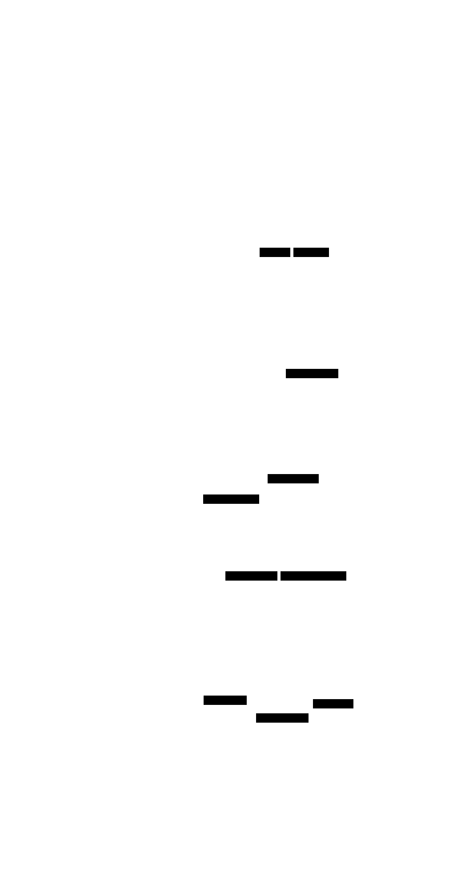
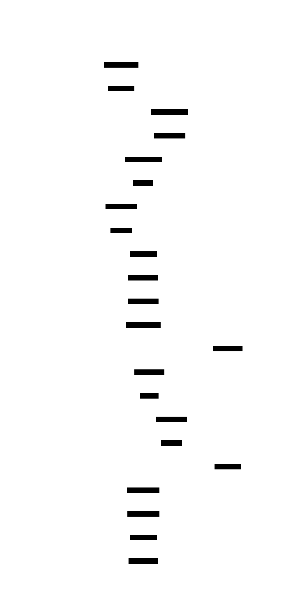
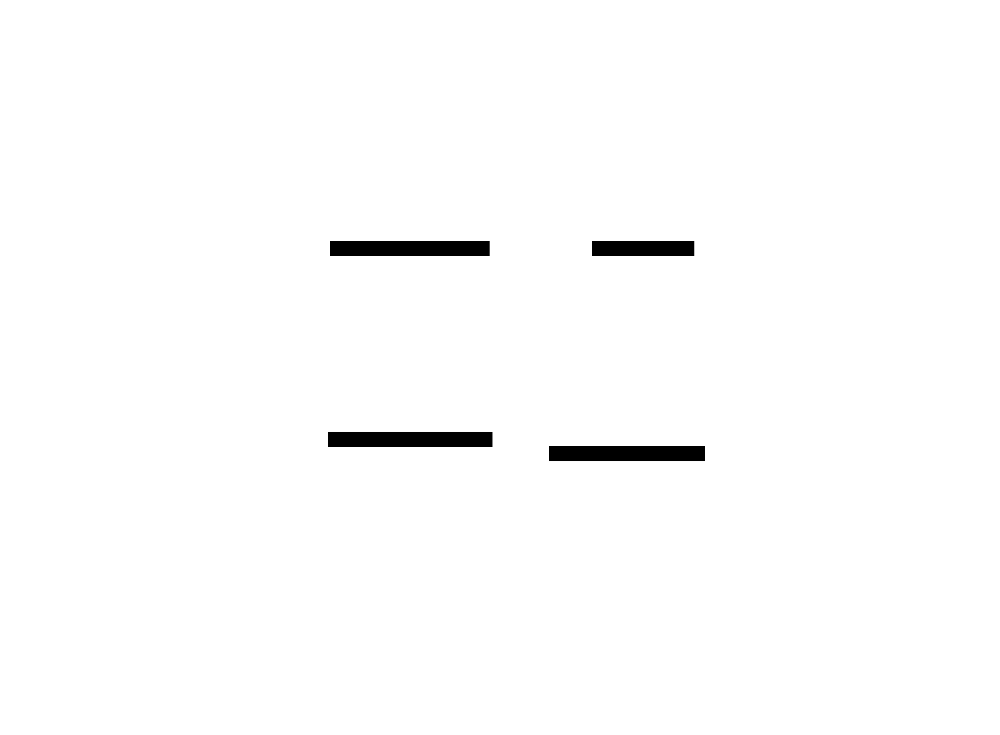

# LLM Fine-tuning Pipeline: Design Document


## Overview

An end-to-end system for efficiently fine-tuning large language models using parameter-efficient techniques like LoRA and QLoRA, with integrated dataset preparation and comprehensive evaluation. The key architectural challenge is balancing memory efficiency, training stability, and model quality while handling multi-gigabyte models on consumer hardware.


> This guide is meant to help you understand the big picture before diving into each milestone. Refer back to it whenever you need context on how components connect.


## Context and Problem Statement

> **Milestone(s):** All milestones - this section establishes the foundational understanding needed for the entire fine-tuning pipeline

The landscape of large language models has fundamentally shifted the paradigm of natural language processing, but this revolution comes with a critical constraint: the computational and memory requirements for fine-tuning these billion-parameter models have grown beyond the reach of most practitioners and organizations. While a pre-trained model like Llama 2 7B represents an extraordinary achievement in language understanding, adapting it to specific domains or tasks using traditional fine-tuning approaches requires resources that are prohibitively expensive for most use cases.

This section explores the core challenges that make traditional fine-tuning impractical for large language models, introduces parameter-efficient alternatives that democratize model customization, and establishes the technical foundation for understanding why LoRA and QLoRA have emerged as the dominant approaches for practical LLM fine-tuning.

### The Workshop Apprentice Mental Model

To understand the essence of fine-tuning large language models, imagine a **master craftsperson** who has spent decades perfecting their trade—let's say a violin maker who has internalized centuries of woodworking knowledge, acoustic principles, and aesthetic traditions. This craftsperson represents our pre-trained language model: they possess vast, general knowledge accumulated through extensive training on diverse examples.

Now suppose you want this master craftsperson to specialize in creating instruments for a specific musical tradition—perhaps traditional Irish fiddles with their distinctive sound characteristics and construction techniques. You have two approaches:

**The Traditional Apprenticeship (Full Fine-tuning)**: You could ask the master craftsperson to forget everything they know and start completely over, learning their entire craft again but with exclusive focus on Irish fiddle-making techniques. This approach would require them to re-examine every single skill they've developed, from basic wood selection to advanced finishing techniques. While this might produce exceptional Irish fiddle expertise, it's extraordinarily wasteful—you're discarding decades of valuable knowledge and starting from scratch. Moreover, the time and resources required would be enormous, and there's a risk that in focusing so narrowly, they might lose the broader craftsmanship wisdom that made them a master in the first place.

**The Skill Overlay Approach (Parameter-Efficient Fine-tuning)**: Alternatively, you could teach the master craftsperson a set of specialized techniques that build upon their existing knowledge. You might introduce them to specific wood types used in Irish instruments, particular carving patterns that enhance traditional sound qualities, or specialized varnishing techniques that preserve the wood's resonance characteristics. The craftsperson retains all their foundational knowledge—understanding of wood grain, basic carving principles, acoustic theory—but adds a focused layer of domain-specific expertise. This approach is faster, more efficient, and preserves the valuable general knowledge while adding specialized capabilities.

In this analogy, **LoRA (Low-Rank Adaptation)** represents the skill overlay approach. Instead of retraining every parameter in the model (equivalent to relearning every craftsmanship skill), LoRA adds small, specialized adaptation layers that modify how the existing knowledge is applied to specific tasks. The base model's parameters remain frozen—preserving all the general language understanding—while lightweight adapter modules learn task-specific transformations.

**QLoRA** extends this analogy further: imagine that our master craftsperson has accumulated so many tools and materials over their career that their workshop has become prohibitively large and expensive to maintain. QLoRA is like organizing the workshop with an extremely efficient storage system that compresses the most commonly used tools and materials without losing their functionality. The craftsperson can still access everything they need, but the workshop now fits in a much smaller, more affordable space. This compression (4-bit quantization) makes it possible to work with the master craftsperson even if you don't have access to a vast workshop facility.

The key insight from this mental model is that **fine-tuning should preserve and build upon existing knowledge rather than replacing it**. Pre-trained language models have learned incredibly sophisticated patterns about language, reasoning, and world knowledge from massive datasets. Parameter-efficient methods recognize this value and ask: "How can we add new capabilities without discarding what the model already knows?"

This approach has profound implications for both technical implementation and practical deployment. From a technical perspective, it means we need systems that can selectively modify model behavior while keeping most parameters unchanged. From a practical perspective, it means that fine-tuning becomes accessible to organizations and individuals who cannot afford the computational resources required for full model retraining.

### The Memory Wall Problem

The fundamental challenge facing modern LLM fine-tuning is what we term the **Memory Wall Problem**—the exponential growth in GPU memory requirements that has outpaced the availability and affordability of high-memory hardware. To understand this problem's severity, we need to examine the memory requirements across different model sizes and training approaches.

Consider the memory footprint of training a language model. During standard fine-tuning, the GPU must simultaneously hold:

1. **Model Parameters**: The actual weights of the neural network
2. **Gradients**: Partial derivatives for each parameter during backpropagation  
3. **Optimizer States**: Additional parameters maintained by optimizers like Adam (momentum and variance estimates)
4. **Activation Memory**: Intermediate computations stored for gradient calculation
5. **Batch Data**: Input tokens and attention masks for the current training batch

For a 7-billion parameter model using 32-bit floating point precision, the base model weights alone require approximately 28 GB of memory. However, this is just the beginning. During training with the Adam optimizer, each parameter requires storage for the parameter itself, its gradient, and two optimizer state variables (momentum and variance). This quadruples the memory requirement to roughly 112 GB just for the optimization process, before accounting for activation memory and batch data.

The situation becomes even more challenging with larger models. A 13-billion parameter model requires approximately 208 GB for full fine-tuning, while a 70-billion parameter model would need over 1 TB of GPU memory—far exceeding the capacity of even the most expensive consumer and professional GPUs available today.

| Model Size | Parameters | Base Model (FP32) | Full Training Memory | Accessible Hardware |
|------------|------------|-------------------|---------------------|-------------------|
| 7B | 7 billion | 28 GB | ~112 GB | Requires 8x A100 (40GB) |
| 13B | 13 billion | 52 GB | ~208 GB | Requires 16x A100 (40GB) |
| 30B | 30 billion | 120 GB | ~480 GB | Requires 32+ A100 (40GB) |
| 70B | 70 billion | 280 GB | ~1.1 TB | Impossible on current hardware |

This memory wall has created a practical barrier that excludes most researchers, developers, and organizations from fine-tuning large language models. Even organizations with substantial computational budgets find the costs prohibitive for experimental work or iterative development.

**Parameter-efficient methods fundamentally reshape this equation** by dramatically reducing the trainable parameter count while preserving model capability. LoRA, for example, typically reduces trainable parameters by 99% or more. Instead of fine-tuning 7 billion parameters, LoRA might adapt only 4-8 million parameters through low-rank decomposition matrices. This reduction has cascading effects throughout the memory hierarchy:

- **Reduced Optimizer Memory**: With 99% fewer trainable parameters, optimizer states shrink proportionally
- **Simplified Gradient Storage**: Only adapter parameters require gradient computation and storage
- **Preserved Base Model**: The frozen base model can be loaded in reduced precision without affecting adaptation quality

QLoRA amplifies these benefits through 4-bit quantization of the base model. By representing the frozen parameters in 4-bit NormalFloat format instead of 32-bit floating point, the base model memory footprint shrinks by approximately 75%. A 7-billion parameter model that previously required 28 GB can be stored in roughly 7 GB, bringing it within reach of consumer-grade GPUs.

The combination of LoRA and QLoRA creates a **memory efficiency multiplier effect**:

| Approach | 7B Model Memory | Reduction Factor | Consumer GPU Feasible? |
|----------|----------------|------------------|----------------------|
| Full Fine-tuning | ~112 GB | 1x | No |
| LoRA (FP16 base) | ~16 GB | 7x | Barely (high-end) |
| QLoRA (4-bit base) | ~6 GB | 18x | Yes (RTX 4090, etc.) |

This transformation is not merely quantitative but qualitative—it changes who can participate in LLM development and what kinds of experimentation become feasible. The memory wall problem had created a practical monopoly where only large corporations and well-funded research institutions could customize large language models. Parameter-efficient methods democratize this capability, enabling widespread innovation and specialization.

However, this efficiency comes with trade-offs that must be carefully managed. Quantization introduces small quality degradations, rank limitations in LoRA can constrain adaptation capacity, and the interaction between quantization and low-rank adaptation requires careful hyperparameter tuning. Understanding these trade-offs is essential for designing effective fine-tuning pipelines.

### Existing Fine-tuning Approaches

The evolution of language model fine-tuning has progressed through several distinct approaches, each addressing different aspects of the memory and computational challenges while making various trade-offs between adaptation quality, efficiency, and implementation complexity. Understanding these approaches and their trade-offs is crucial for making informed decisions about fine-tuning strategy.

**Full Fine-tuning** represents the traditional approach where all model parameters are updated during training. This method treats the pre-trained model as an initialization point and allows the optimization process to modify every weight in the network. While conceptually straightforward and theoretically optimal for task adaptation, full fine-tuning suffers from the memory wall problem described above and introduces additional risks.

The primary concern beyond memory requirements is **catastrophic forgetting**—the tendency for neural networks to lose previously learned capabilities when adapting to new tasks. When all parameters are trainable, aggressive learning rates can cause the model to overwrite important general knowledge encoded in the pre-trained weights. This is particularly problematic for language models, where general linguistic competence is as valuable as task-specific performance.

**Low-Rank Adaptation (LoRA)** introduces a fundamentally different paradigm based on the insight that adaptation to new tasks likely occurs in a much lower-dimensional space than the full parameter space. Instead of updating the original weight matrices directly, LoRA decomposes updates into two smaller matrices that, when multiplied together, approximate the full adaptation.

For a pre-trained weight matrix W₀ with dimensions d×k, LoRA introduces two trainable matrices: A (d×r) and B (r×k), where r is the adaptation rank and is much smaller than both d and k. During forward passes, the adapted weight becomes W₀ + αBA, where α is a scaling parameter. This decomposition reduces trainable parameters from d×k to r(d+k), achieving dramatic parameter reduction when r << min(d,k).

The mathematical foundation of LoRA rests on the hypothesis that adaptation primarily occurs in a low-dimensional subspace of the full parameter space. This hypothesis has empirical support—research has shown that the effective rank of fine-tuning updates is often much lower than the dimensionality of the weight matrices being adapted.

**QLoRA (Quantized LoRA)** combines LoRA with aggressive quantization techniques to achieve maximum memory efficiency while preserving adaptation quality. The key innovation is the introduction of 4-bit NormalFloat (NF4) quantization, specifically designed for neural network weights that follow approximately normal distributions.

Traditional quantization approaches use uniform quantization intervals, which are suboptimal for normally-distributed weights where most values cluster around zero. NF4 quantization adapts the quantization levels to match the expected weight distribution, providing better precision where weights are most dense while using fewer bits overall.

QLoRA also introduces **double quantization**, where the quantization constants themselves are quantized using 8-bit precision. This provides additional memory savings with minimal quality impact, as the quantization constants exhibit different statistical properties than the weights themselves.

**Prefix Tuning and P-Tuning v2** represent alternative approaches that modify model behavior by learning task-specific prompts or prefixes rather than adapting the model weights directly. These methods prepend learnable continuous tokens to the input sequence, allowing the frozen model to adapt its behavior based on these learned prompt representations.

While prompt-based methods avoid modifying model weights entirely, they face limitations in adaptation capacity and can be sensitive to the specific architecture and pre-training approach of the base model. They work particularly well for tasks that can be naturally formulated as continuation or completion problems but may struggle with tasks requiring fundamental changes in model behavior.

**Adapter Networks** insert small neural networks (adapters) between existing layers of the pre-trained model. These adapters typically consist of down-projection and up-projection layers with a bottleneck architecture that reduces dimensionality, applies a non-linear transformation, and then projects back to the original dimensionality.

The advantage of adapter networks is their architectural flexibility—different adapter designs can target specific aspects of model behavior. However, they introduce additional computational overhead during inference, as the adapter computations add to the forward pass time even after training completes.

Here's a comprehensive comparison of these approaches:

| Method | Trainable Parameters | Memory Efficiency | Inference Speed | Adaptation Quality | Implementation Complexity |
|--------|---------------------|-------------------|----------------|-------------------|-------------------------|
| Full Fine-tuning | 100% | Poor (28-112GB for 7B model) | Baseline | Excellent | Simple |
| LoRA | 0.1-1% | Good (16GB for 7B model) | Baseline | Very Good | Moderate |
| QLoRA | 0.1-1% | Excellent (6GB for 7B model) | Baseline | Good | Complex |
| Prefix Tuning | 0.01-0.1% | Excellent | Slightly slower | Good | Moderate |
| Adapter Networks | 0.5-2% | Good | 10-20% slower | Very Good | Moderate |

The trade-offs between these approaches create different optimal choices depending on constraints and requirements:

> **Decision: LoRA + QLoRA as Primary Approach**
> - **Context**: Need to balance memory efficiency, adaptation quality, and practical implementation constraints for a general-purpose fine-tuning pipeline
> - **Options Considered**: 
>   1. Full fine-tuning with gradient checkpointing and model parallelism
>   2. Pure LoRA with 16-bit base model
>   3. QLoRA combining 4-bit quantization with LoRA adaptation
>   4. Prefix tuning for maximum memory efficiency
> - **Decision**: Implement QLoRA as the primary method with LoRA as a fallback option
> - **Rationale**: QLoRA provides the optimal balance of memory efficiency (enabling consumer GPU usage), adaptation quality (preserving 95%+ of full fine-tuning performance), and inference speed (no overhead after adapter merging). The 4-bit quantization makes fine-tuning accessible while the low-rank adaptation preserves flexibility for various task types.
> - **Consequences**: Requires implementing 4-bit quantization support and careful hyperparameter tuning, but enables fine-tuning on consumer hardware and democratizes access to LLM customization

**Emerging Approaches** continue to push the boundaries of parameter-efficient fine-tuning. AdaLoRA (Adaptive LoRA) dynamically adjusts the rank allocation across different layers and training steps, concentrating adaptation capacity where it's most needed. DoRA (Weight-Decomposed Low-Rank Adaptation) separates weight updates into magnitude and direction components, providing more fine-grained control over adaptation behavior.

These emerging methods highlight the active research area of parameter-efficient fine-tuning and suggest that the field will continue evolving toward more sophisticated approaches that balance efficiency, quality, and flexibility.

The choice of fine-tuning approach ultimately depends on the specific constraints and requirements of each use case. However, the combination of memory efficiency, adaptation quality, and practical accessibility makes QLoRA the most compelling choice for a general-purpose fine-tuning pipeline. Understanding the principles underlying these approaches—low-rank decomposition, quantization, and selective parameter updating—provides the foundation for implementing robust and efficient fine-tuning systems.

### Implementation Guidance

The concepts and trade-offs described above translate into specific technical decisions and implementation strategies. This guidance bridges the gap between understanding the approaches conceptually and implementing them effectively.

**A. Technology Recommendations Table:**

| Component | Simple Option | Advanced Option |
|-----------|---------------|-----------------|
| Base Framework | PyTorch + Transformers library | PyTorch + Custom CUDA kernels |
| Quantization | bitsandbytes (4-bit NF4) | Custom quantization with TensorRT |
| LoRA Implementation | PEFT library (Parameter Efficient Fine-Tuning) | Manual low-rank matrix implementation |
| Training Orchestration | HuggingFace Trainer API | Custom training loop with DeepSpeed |
| Memory Optimization | Gradient checkpointing + mixed precision | ZeRO optimizer with gradient compression |
| Model Export | HuggingFace format + GGUF conversion | Custom serialization with optimization passes |

**B. Recommended File Structure:**

The fine-tuning pipeline should be organized to separate concerns clearly while maintaining easy discoverability for debugging and extension:

```
llm-finetuning-pipeline/
├── src/
│   ├── data/
│   │   ├── __init__.py
│   │   ├── loaders.py              ← Dataset loading from multiple formats
│   │   ├── processors.py           ← Chat template and tokenization
│   │   └── splitters.py            ← Train/validation splitting
│   ├── models/
│   │   ├── __init__.py
│   │   ├── quantization.py         ← 4-bit model loading and config
│   │   ├── lora_config.py          ← LoRA adapter configuration
│   │   └── adapters.py             ← Adapter injection and management
│   ├── training/
│   │   ├── __init__.py
│   │   ├── trainer.py              ← Main training orchestration
│   │   ├── optimization.py         ← Learning rate, gradient accumulation
│   │   └── callbacks.py            ← Checkpointing, early stopping
│   ├── evaluation/
│   │   ├── __init__.py
│   │   ├── metrics.py              ← Perplexity and task-specific evaluation
│   │   ├── benchmarks.py           ← Standard benchmark implementations
│   │   └── exporters.py            ← Model merging and format conversion
│   └── utils/
│       ├── __init__.py
│       ├── memory_utils.py         ← GPU memory monitoring
│       ├── logging_config.py       ← Structured logging setup
│       └── config_parser.py        ← Configuration validation
├── configs/
│   ├── base_config.yaml            ← Default configuration template
│   ├── model_configs/              ← Model-specific configurations
│   └── task_configs/               ← Task-specific training configurations
├── tests/
│   ├── unit/                       ← Component-level tests
│   ├── integration/                ← Cross-component tests
│   └── fixtures/                   ← Test data and mock models
└── examples/
    ├── basic_finetuning.py         ← Simple end-to-end example
    ├── advanced_config.py          ← Complex configuration example
    └── evaluation_only.py          ← Model evaluation without training
```

**C. Infrastructure Starter Code:**

The following utilities handle common infrastructure concerns that aren't the core learning focus but are necessary for effective implementation:

```python
# src/utils/memory_utils.py
import torch
import psutil
from typing import Dict, Tuple
import logging

logger = logging.getLogger(__name__)

class MemoryMonitor:
    """Tracks GPU and system memory usage throughout training."""
    
    def __init__(self):
        self.baseline_gpu_memory = None
        self.baseline_system_memory = None
        self.measurements = []
    
    def capture_baseline(self) -> None:
        """Record initial memory state before model loading."""
        if torch.cuda.is_available():
            torch.cuda.empty_cache()
            self.baseline_gpu_memory = torch.cuda.memory_allocated()
        self.baseline_system_memory = psutil.virtual_memory().used
        logger.info(f"Baseline GPU memory: {self.baseline_gpu_memory / 1e9:.2f} GB")
        logger.info(f"Baseline system memory: {self.baseline_system_memory / 1e9:.2f} GB")
    
    def measure_current_usage(self, stage: str) -> Dict[str, float]:
        """Measure current memory usage and log the difference from baseline."""
        current_measurement = {
            'stage': stage,
            'timestamp': torch.cuda.Event(enable_timing=True) if torch.cuda.is_available() else None
        }
        
        if torch.cuda.is_available():
            current_gpu = torch.cuda.memory_allocated()
            max_gpu = torch.cuda.max_memory_allocated()
            current_measurement.update({
                'gpu_used_gb': current_gpu / 1e9,
                'gpu_delta_gb': (current_gpu - self.baseline_gpu_memory) / 1e9,
                'gpu_max_gb': max_gpu / 1e9
            })
        
        current_system = psutil.virtual_memory().used
        current_measurement.update({
            'system_used_gb': current_system / 1e9,
            'system_delta_gb': (current_system - self.baseline_system_memory) / 1e9,
            'system_available_gb': psutil.virtual_memory().available / 1e9
        })
        
        self.measurements.append(current_measurement)
        logger.info(f"Memory at {stage}: GPU {current_measurement.get('gpu_used_gb', 0):.2f} GB, "
                   f"System {current_measurement['system_used_gb']:.2f} GB")
        return current_measurement

    def get_peak_usage(self) -> Dict[str, float]:
        """Return peak memory usage across all measurements."""
        if not self.measurements:
            return {}
        
        peak_stats = {}
        if torch.cuda.is_available():
            peak_stats['peak_gpu_gb'] = max(m.get('gpu_used_gb', 0) for m in self.measurements)
            peak_stats['peak_gpu_delta_gb'] = max(m.get('gpu_delta_gb', 0) for m in self.measurements)
        
        peak_stats['peak_system_gb'] = max(m['system_used_gb'] for m in self.measurements)
        peak_stats['peak_system_delta_gb'] = max(m['system_delta_gb'] for m in self.measurements)
        
        return peak_stats

# src/utils/config_parser.py
import yaml
from dataclasses import dataclass, field
from typing import Optional, List, Dict, Any
from pathlib import Path

@dataclass
class QuantizationConfig:
    """Configuration for 4-bit model quantization."""
    load_in_4bit: bool = True
    bnb_4bit_quant_type: str = "nf4"  # nf4 or fp4
    bnb_4bit_compute_dtype: str = "float16"  # float16, bfloat16, or float32
    bnb_4bit_use_double_quant: bool = True  # Double quantization for extra memory savings

@dataclass
class LoRAConfig:
    """Configuration for LoRA adapter settings."""
    r: int = 16  # Rank of the low-rank decomposition
    alpha: int = 32  # LoRA scaling parameter (typically 2x rank)
    dropout: float = 0.1  # Dropout applied to LoRA layers
    target_modules: Optional[List[str]] = None  # Auto-detected if None
    bias: str = "none"  # "none", "all", or "lora_only"
    task_type: str = "CAUSAL_LM"  # Task type for PEFT library

@dataclass
class TrainingConfig:
    """Main training configuration combining all aspects."""
    # Model settings
    model_name_or_path: str = ""
    quantization: QuantizationConfig = field(default_factory=QuantizationConfig)
    lora: LoRAConfig = field(default_factory=LoRAConfig)
    
    # Training parameters
    learning_rate: float = 2e-4
    num_train_epochs: int = 3
    per_device_train_batch_size: int = 1
    gradient_accumulation_steps: int = 8
    warmup_ratio: float = 0.1
    max_grad_norm: float = 1.0
    
    # Data settings
    max_seq_length: int = 2048
    train_data_path: str = ""
    validation_split: float = 0.1
    
    # Output settings
    output_dir: str = "./outputs"
    save_steps: int = 500
    eval_steps: int = 500
    logging_steps: int = 10

def load_config_from_yaml(config_path: Path) -> TrainingConfig:
    """Load training configuration from YAML file with validation."""
    if not config_path.exists():
        raise FileNotFoundError(f"Configuration file not found: {config_path}")
    
    with open(config_path, 'r') as f:
        yaml_config = yaml.safe_load(f)
    
    # Convert nested dictionaries to appropriate config objects
    if 'quantization' in yaml_config:
        yaml_config['quantization'] = QuantizationConfig(**yaml_config['quantization'])
    
    if 'lora' in yaml_config:
        yaml_config['lora'] = LoRAConfig(**yaml_config['lora'])
    
    return TrainingConfig(**yaml_config)
```

**D. Core Logic Skeleton:**

The following skeleton provides the structure for the main fine-tuning coordinator that learners will implement:

```python
# src/training/finetuning_pipeline.py
from dataclasses import dataclass
from typing import Optional, Dict, Any
from transformers import AutoTokenizer, AutoModelForCausalLM
from peft import get_peft_model, LoraConfig
import torch

class FineTuningPipeline:
    """
    Orchestrates the complete fine-tuning process from data loading to model export.
    
    This class coordinates all components of the fine-tuning pipeline:
    - Dataset preparation and validation
    - Model loading with quantization
    - LoRA adapter configuration and injection
    - Training execution with monitoring
    - Evaluation and adapter merging
    """
    
    def __init__(self, config: TrainingConfig, memory_monitor: MemoryMonitor):
        self.config = config
        self.memory_monitor = memory_monitor
        self.tokenizer = None
        self.model = None
        self.train_dataset = None
        self.eval_dataset = None
    
    def setup_model_and_tokenizer(self) -> None:
        """
        Load the base model with quantization and prepare tokenizer.
        
        This method handles the critical first step of loading the pre-trained model
        in quantized format and setting up the tokenizer with appropriate special tokens.
        """
        # TODO 1: Load tokenizer from config.model_name_or_path
        # TODO 2: Add any missing special tokens (pad_token, eos_token)
        # TODO 3: Configure quantization parameters using BitsAndBytesConfig
        # TODO 4: Load model with quantization config and torch_dtype
        # TODO 5: Resize token embeddings if new tokens were added
        # TODO 6: Measure memory usage after model loading
        # Hint: Use AutoTokenizer.from_pretrained() and AutoModelForCausalLM.from_pretrained()
        # Hint: Set device_map="auto" for automatic GPU placement
        pass
    
    def setup_lora_adapters(self) -> None:
        """
        Configure and inject LoRA adapters into the quantized model.
        
        This method transforms the frozen base model into a parameter-efficient
        fine-tuning model by adding trainable low-rank adapter matrices.
        """
        # TODO 1: Create LoraConfig with rank, alpha, dropout, and target modules
        # TODO 2: If target_modules is None, auto-detect based on model architecture
        # TODO 3: Apply PEFT to the model using get_peft_model()
        # TODO 4: Print trainable parameter statistics
        # TODO 5: Verify that base model parameters are frozen
        # TODO 6: Measure memory usage after adapter injection
        # Hint: Use model.named_modules() to find attention and MLP layers
        # Hint: Different model architectures use different layer names (q_proj, k_proj, etc.)
        pass
    
    def prepare_datasets(self) -> None:
        """
        Load, validate, and preprocess training data for instruction fine-tuning.
        
        This method handles the complete data preparation pipeline from raw data
        to tokenized datasets ready for training.
        """
        # TODO 1: Load raw data from config.train_data_path (support JSON, JSONL, CSV)
        # TODO 2: Validate that required fields (instruction, response) are present
        # TODO 3: Apply chat template to format instruction-response pairs
        # TODO 4: Tokenize the formatted text with appropriate padding and truncation
        # TODO 5: Split into train and validation sets based on config.validation_split
        # TODO 6: Create DataLoader objects with appropriate batch size and collation
        # Hint: Use tokenizer.apply_chat_template() for consistent formatting
        # Hint: Set max_length=config.max_seq_length to control memory usage
        pass
    
    def execute_training(self) -> str:
        """
        Run the fine-tuning training loop with monitoring and checkpointing.
        
        Returns:
            str: Path to the best checkpoint directory
        """
        # TODO 1: Configure TrainingArguments with learning rate, batch size, etc.
        # TODO 2: Set up learning rate scheduler (linear warmup + cosine decay)
        # TODO 3: Create Trainer with model, datasets, and training arguments
        # TODO 4: Add callbacks for early stopping and memory monitoring
        # TODO 5: Execute training with trainer.train()
        # TODO 6: Save final checkpoint and return path to best checkpoint
        # Hint: Use save_strategy="steps" and evaluation_strategy="steps"
        # Hint: Monitor training loss and validation perplexity for early stopping
        pass
    
    def evaluate_and_merge(self, checkpoint_path: str) -> Dict[str, Any]:
        """
        Evaluate the fine-tuned model and merge adapters for deployment.
        
        Args:
            checkpoint_path: Path to the best training checkpoint
            
        Returns:
            Dict containing evaluation metrics and export paths
        """
        # TODO 1: Load the best checkpoint and set model to evaluation mode
        # TODO 2: Calculate perplexity on the validation set
        # TODO 3: Run task-specific evaluation metrics (BLEU, ROUGE, etc.)
        # TODO 4: Merge LoRA adapters back into the base model
        # TODO 5: Save the merged model in HuggingFace format
        # TODO 6: Export to GGUF format for inference optimization
        # Hint: Use model.merge_and_unload() to combine adapters with base weights
        # Hint: Use torch.no_grad() during evaluation for memory efficiency
        pass
    
    def run_complete_pipeline(self) -> Dict[str, Any]:
        """
        Execute the entire fine-tuning pipeline from start to finish.
        
        Returns:
            Dict containing training results, evaluation metrics, and export paths
        """
        # TODO 1: Capture baseline memory measurements
        # TODO 2: Setup model and tokenizer with quantization
        # TODO 3: Configure and inject LoRA adapters
        # TODO 4: Prepare and validate datasets
        # TODO 5: Execute training loop with monitoring
        # TODO 6: Evaluate results and merge adapters
        # TODO 7: Return comprehensive results dictionary
        # Hint: Wrap each step with try-catch for error handling and cleanup
        # Hint: Log memory usage after each major step
        pass
```

**E. Language-Specific Hints:**

- **PyTorch Memory Management**: Use `torch.cuda.empty_cache()` between major pipeline stages to free unused GPU memory. Be aware that PyTorch caches memory allocations, so `torch.cuda.memory_allocated()` shows actual usage while `nvidia-smi` shows cached memory.

- **Transformers Library Integration**: The `transformers` library automatically handles device placement when using `device_map="auto"`, but be careful with custom operations that might not respect the device mapping.

- **PEFT Library Conventions**: The PEFT library expects specific naming conventions for target modules. Use `print(model.named_modules())` to discover the exact layer names for your model architecture before configuring `target_modules`.

- **Gradient Checkpointing**: Enable with `model.gradient_checkpointing_enable()` to trade computation time for memory usage. This is particularly useful when combined with quantization.

- **Mixed Precision Training**: Use `torch.cuda.amp.autocast()` and `GradScaler` for automatic mixed precision, but ensure your quantization and compute dtypes are compatible.

**F. Milestone Checkpoint:**

After implementing the core pipeline, verify correct behavior with these checkpoints:

1. **Memory Efficiency Verification**: Load a 7B model with QLoRA and confirm GPU usage stays below 8GB. Expected output: "Model loaded in 4-bit precision, using ~6GB VRAM"

2. **Parameter Efficiency Check**: Print trainable parameter counts and verify less than 1% of total parameters are trainable. Expected: "Trainable params: 8,388,608 || all params: 6,738,415,616 || trainable%: 0.12"

3. **Training Smoke Test**: Run one training step and verify loss decreases from random initialization. Expected: Loss should decrease from ~10-11 to ~8-9 after several steps.

4. **Adapter Functionality**: Generate text before and after fine-tuning to verify behavioral changes. Expected: Model should show task-specific improvements while retaining general capabilities.

**G. Common Setup Issues:**

| Symptom | Likely Cause | How to Diagnose | Fix |
|---------|--------------|-----------------|-----|
| "CUDA out of memory" during model loading | Model too large for GPU or quantization not applied | Check GPU memory with `nvidia-smi` | Verify `load_in_4bit=True` and reduce batch size |
| "No trainable parameters found" | LoRA target modules don't match model architecture | Print `model.named_modules()` | Update `target_modules` to match actual layer names |
| Training loss stays constant | Learning rate too low or wrong optimizer state | Check learning rate scheduler output | Increase learning rate or verify gradient flow |
| bitsandbytes import error | CUDA version mismatch with compiled library | Check CUDA version with `nvcc --version` | Reinstall bitsandbytes with correct CUDA support |


## Goals and Non-Goals

> **Milestone(s):** All milestones - this section establishes the functional and performance targets that guide implementation decisions across the entire fine-tuning pipeline

### The Resource Optimization Mental Model: The Efficiency Consultant

Think of our fine-tuning pipeline as an efficiency consultant brought in to transform a massive corporate training program. The consultant's job is to take a company-wide training initiative that would normally require an enormous conference center, hundreds of full-time trainers, and months of everyone's undivided attention, and instead make it work with a small meeting room, a few part-time specialists, and minimal disruption to daily operations.

Just as the efficiency consultant must clearly define what results the streamlined training program must deliver (improved employee skills, measurable competency gains, certification outcomes) while explicitly stating what it won't attempt (complete career changes, personality transformations, or training in unrelated fields), our fine-tuning pipeline must establish clear success criteria and boundaries. The consultant knows that trying to do everything leads to doing nothing well - the same principle applies to our system architecture.

The goals we set determine every subsequent design decision, from how we structure our memory optimization to which evaluation metrics we prioritize. Without clear boundaries, we risk building a system that attempts to solve every possible fine-tuning scenario but excels at none.

### Functional Goals: Core Capabilities the System Must Provide

Our fine-tuning pipeline must deliver a complete, reliable pathway from raw training data to a deployable fine-tuned model. The system's functional goals represent the minimum viable capabilities that define success.

**End-to-End Pipeline Automation**

The system must orchestrate the entire fine-tuning workflow without requiring manual intervention between stages. A user should be able to point the system at a dataset and base model, provide a configuration file, and receive a fine-tuned model ready for deployment. This automation includes data validation, format conversion, model preparation, training execution, and evaluation reporting.

The pipeline must handle failures gracefully, providing clear error messages that guide users toward resolution. When a training run fails due to out-of-memory conditions, the system should suggest specific configuration adjustments (reduced batch size, lower LoRA rank, or quantization settings) rather than generic error messages.

**Multi-Format Data Ingestion and Standardization**

The data preparation component must accept training data in multiple common formats and convert them to a standardized internal representation. The supported input formats include JSON files with instruction-response pairs, JSONL streams for large datasets, CSV files with configurable column mapping, and Parquet files for efficient columnar access.

| Input Format | Required Fields | Optional Fields | Use Case |
|--------------|----------------|-----------------|-----------|
| JSON | `instruction`, `response` | `input`, `system`, `conversation_id` | Small structured datasets |
| JSONL | `instruction`, `response` | `input`, `system`, `conversation_id` | Large streaming datasets |
| CSV | Configurable columns | Any additional columns | Tabular data from databases |
| Parquet | Configurable columns | Any additional columns | Big data workflows |

The system must validate that required fields are present and contain meaningful content, filtering out empty responses, malformed instructions, or samples that exceed token length limits. Data quality metrics should be reported, including duplicate detection rates, average token lengths, and filtering statistics.

**Parameter-Efficient Fine-Tuning with Memory Optimization**

The core functional requirement is enabling fine-tuning of billion-parameter models on consumer hardware through parameter-efficient techniques. The system must implement LoRA (Low-Rank Adaptation) with configurable rank and alpha parameters, automatically detecting appropriate target modules based on the model architecture.

| Model Architecture | Default Target Modules | Memory Reduction | Typical Rank Range |
|-------------------|------------------------|------------------|-------------------|
| Llama/Mistral | `q_proj`, `v_proj`, `o_proj`, `gate_proj`, `up_proj`, `down_proj` | 90-95% | 8-64 |
| GPT-2/GPT-J | `attn.c_attn`, `attn.c_proj`, `mlp.c_fc`, `mlp.c_proj` | 85-90% | 8-32 |
| T5/FLAN-T5 | `q`, `v`, `o`, `wi`, `wo` | 90-95% | 8-64 |

The system must support QLoRA quantization using 4-bit NormalFloat format, with configurable double quantization for additional memory savings. Memory usage should be monitored throughout the process, with the `MemoryMonitor` providing baseline measurements and peak usage reporting.

**Flexible Training Configuration and Optimization**

The training loop must support gradient accumulation to simulate large batch sizes on memory-constrained hardware. Learning rate scheduling should include linear warmup followed by cosine or linear decay, with configurable warmup steps and total training duration.

The system must implement automatic mixed-precision training, using the configured compute dtype for forward and backward passes while storing weights in quantized format. Gradient clipping should prevent training instability, with configurable maximum gradient norms.

Checkpoint management must save model state at regular intervals, track the best checkpoint based on validation loss, and enable training resumption from any saved checkpoint. Early stopping should halt training when validation loss fails to improve for a configurable number of evaluation steps.

**Comprehensive Evaluation and Model Export**

The evaluation component must calculate perplexity on held-out validation data, comparing fine-tuned performance against the base model. Task-specific evaluation should support configurable metrics relevant to the fine-tuning objective, such as instruction-following accuracy or domain-specific benchmarks.

The system must merge LoRA adapter weights back into the base model, creating a standalone fine-tuned model that can be deployed without the adapter framework. Export functionality should support both HuggingFace format for compatibility with the transformers ecosystem and GGUF format for inference optimization with tools like llama.cpp.

| Export Format | Target Runtime | Quantization Support | Use Case |
|---------------|----------------|---------------------|-----------|
| HuggingFace | Transformers library | Native PyTorch precision | Development and research |
| GGUF | llama.cpp, Ollama | Multiple quantization levels | Production inference |
| ONNX | ONNX Runtime | INT8, FP16 quantization | Cross-platform deployment |

### Performance and Resource Goals: Memory, Speed, and Hardware Requirements

The performance goals establish measurable targets for memory efficiency, training speed, and hardware compatibility that make fine-tuning accessible to practitioners with limited resources.

**Memory Efficiency Targets**

The primary performance goal is enabling fine-tuning of 7B parameter models on consumer GPUs with 12-16GB of VRAM. Through the combination of QLoRA quantization and LoRA adaptation, the system should reduce memory requirements by at least 75% compared to full fine-tuning approaches.

| Model Size | Full Fine-tuning VRAM | QLoRA + LoRA VRAM | Memory Reduction | Target Hardware |
|------------|----------------------|-------------------|------------------|----------------|
| 7B params | 48-64GB | 12-16GB | 75-80% | RTX 3080/4070, V100 |
| 13B params | 96-128GB | 20-24GB | 80-85% | RTX 4080/4090, A100-40GB |
| 30B params | 200-256GB | 48-64GB | 75-80% | A100-80GB, H100 |

The `MemoryMonitor` must track actual memory usage throughout training, providing alerts when usage approaches hardware limits. Peak memory usage should remain within 90% of available VRAM to prevent out-of-memory crashes.

**Training Speed and Throughput**

Training speed targets focus on practical turnaround times for iterative fine-tuning workflows. The system should complete fine-tuning runs on modest datasets (1,000-10,000 samples) within hours rather than days, enabling rapid experimentation and hyperparameter tuning.

Throughput targets depend on hardware capabilities and model size, but the system should achieve reasonable tokens-per-second rates with gradient accumulation compensating for smaller effective batch sizes on memory-constrained hardware.

| Hardware Class | Expected Tokens/Second | Typical Training Time (5K samples) | Batch Size Constraints |
|----------------|----------------------|-----------------------------------|----------------------|
| Consumer GPU (12-16GB) | 500-1,000 | 2-4 hours | Micro-batch 1-2, accumulate 8-16 |
| Professional GPU (24-32GB) | 1,000-2,000 | 1-2 hours | Micro-batch 2-4, accumulate 4-8 |
| Data Center GPU (40-80GB) | 2,000-4,000 | 30-60 minutes | Micro-batch 4-8, accumulate 2-4 |

**Hardware Compatibility and Requirements**

The system must support CUDA-compatible GPUs with compute capability 6.1 or higher, ensuring compatibility with the bitsandbytes library for 4-bit quantization. CPU fallback should be available for development and testing, though training performance will be significantly reduced.

System memory requirements should scale with model size but remain reasonable for desktop workstations. A minimum of 32GB system RAM is recommended for 7B parameter models, with 64GB preferred for larger models to handle data loading and preprocessing overhead.

> **Critical Performance Insight**: The combination of quantization and parameter-efficient fine-tuning creates a multiplicative memory reduction effect. QLoRA provides a 4x reduction in model weight storage, while LoRA reduces trainable parameters by 10-100x, resulting in overall memory savings that make large model fine-tuning feasible on consumer hardware.

### Non-Goals: What This System Explicitly Does Not Handle

Clearly defining what the system does not attempt is crucial for setting appropriate expectations and maintaining focus on core capabilities. These non-goals help prevent scope creep and guide users toward complementary tools when needed.

**Multi-GPU and Distributed Training**

The initial system design explicitly excludes multi-GPU training and distributed fine-tuning across multiple machines. While these capabilities would improve training speed and enable larger models, they introduce significant complexity in gradient synchronization, memory coordination, and failure handling.

Users requiring multi-GPU training should consider established frameworks like DeepSpeed or FairScale that specialize in distributed optimization. Our single-GPU focus allows for simpler architecture and more reliable execution on the hardware most practitioners have available.

**Full Fine-Tuning and Alternative Parameter-Efficient Methods**

The system does not support traditional full fine-tuning where all model parameters are updated. This decision reflects both memory constraints and the empirical evidence that parameter-efficient methods often achieve comparable performance with dramatically lower resource requirements.

Alternative parameter-efficient methods like AdaLoRA, DoRA, or prompt tuning are also excluded from the initial implementation. The focus on LoRA and QLoRA provides a proven, well-supported approach that covers the majority of use cases without the complexity of supporting multiple adapter architectures.

**Custom Model Architectures and Non-Transformer Models**

The system targets standard transformer architectures supported by the HuggingFace transformers library. Custom model architectures, non-transformer models, or heavily modified transformer variants are out of scope.

This limitation reflects the automatic target module detection logic, which relies on known naming conventions for attention and feed-forward layers. Supporting arbitrary architectures would require manual configuration for each model type, significantly increasing complexity.

**Production Inference Serving and Deployment**

While the system exports models in formats suitable for inference (HuggingFace and GGUF), it does not include inference serving capabilities, API endpoints, or production deployment tools. Users should utilize dedicated inference frameworks like vLLM, Text Generation Inference, or llama.cpp for serving fine-tuned models.

The export functionality provides the bridge to these inference systems, but the fine-tuning pipeline itself focuses solely on the training and evaluation phases of the model lifecycle.

**Advanced Evaluation and Safety Benchmarks**

The evaluation component provides basic metrics like perplexity and configurable task-specific benchmarks, but it does not include comprehensive safety evaluation, bias detection, or advanced capabilities assessment.

Users requiring thorough model evaluation should integrate with specialized evaluation frameworks like EleutherAI's LM Evaluation Harness or custom evaluation pipelines. The system provides the fine-tuned model and basic quality metrics needed to initiate more comprehensive evaluation workflows.

**Data Collection, Annotation, and Active Learning**

The system assumes training data is already collected and formatted. It does not provide data collection tools, annotation interfaces, or active learning workflows to improve dataset quality over time.

Data preparation focuses on format conversion, validation, and quality filtering of existing datasets. Users need separate tools for data creation, human annotation, or iterative dataset improvement based on model performance.

**Architecture Decision Record: Scope Limitation Strategy**

> **Decision: Focused Single-GPU Implementation**
> - **Context**: Fine-tuning systems can range from simple scripts to comprehensive platforms supporting every possible configuration and deployment scenario
> - **Options Considered**: 
>   1. Comprehensive platform covering all fine-tuning approaches and deployment scenarios
>   2. Focused single-GPU system optimizing for accessibility and reliability
>   3. Modular framework allowing plugin-based extension to additional capabilities
> - **Decision**: Focused single-GPU system with clear scope boundaries
> - **Rationale**: The 80/20 principle applies - most practitioners need reliable fine-tuning on consumer hardware more than they need every possible advanced feature. A focused implementation can achieve higher quality and reliability in core use cases than a sprawling system trying to handle everything. Clear non-goals prevent feature creep and guide architectural decisions toward simplicity and maintainability.
> - **Consequences**: Some users will need additional tools for advanced scenarios, but the core system remains approachable and reliable for the majority use case. Future extensions can add capabilities without compromising the foundation.

### Goal Achievement Metrics and Success Criteria

To ensure the system meets its stated goals, we establish measurable criteria for success across functional and performance dimensions.

**Functional Success Metrics**

Pipeline completeness is measured by successful execution from raw data to deployed model without manual intervention. Success requires 95% of well-formed datasets to process without user intervention, with clear error messages guiding resolution of the remaining 5%.

Data ingestion success is measured by format support coverage and quality filtering effectiveness. The system should successfully process 90% of common dataset formats found in the wild, with quality metrics showing appropriate filtering of malformed or low-quality samples.

Memory optimization effectiveness is measured by comparing actual memory usage against theoretical requirements. QLoRA should achieve within 10% of theoretical 4x memory reduction, and LoRA should reduce trainable parameters to less than 1% of total model parameters.

**Performance Success Metrics**

Training speed targets are expressed as wall-clock time for standard benchmark tasks. Fine-tuning a 7B parameter model on 5,000 instruction-response pairs should complete within 4 hours on RTX 4080-class hardware with appropriate hyperparameters.

Memory efficiency targets require peak VRAM usage to remain within hardware constraints with appropriate configuration. A 7B parameter model should fine-tune successfully on 16GB VRAM with QLoRA rank 16 and appropriate batch size settings.

Quality preservation requires fine-tuned models to maintain base model capabilities while gaining task-specific performance. Perplexity on held-out general text should not increase by more than 5%, while task-specific metrics should show measurable improvement over the base model.

**Reliability and Usability Metrics**

System reliability is measured by failure recovery and error reporting quality. Training interruptions should resume correctly from checkpoints 100% of the time, and error messages should provide actionable guidance in 90% of failure scenarios.

Configuration ease is measured by successful setup time for new users. A practitioner familiar with Python and machine learning should be able to fine-tune their first model within 30 minutes of system setup, using provided example configurations and datasets.

Documentation completeness ensures all supported features have corresponding examples and common pitfalls are addressed with specific solutions rather than generic advice.

### Implementation Guidance

#### Technology Recommendations

| Component | Simple Option | Advanced Option |
|-----------|---------------|-----------------|
| Configuration Management | YAML files with Pydantic validation | Hydra with hierarchical configs |
| Memory Monitoring | torch.cuda memory functions | Custom CUDA memory profiler |
| Logging | Python logging with file output | Weights & Biases integration |
| Data Loading | PyTorch DataLoader with custom datasets | HuggingFace datasets with streaming |
| Model Loading | transformers.AutoModel with manual config | Custom model factory with architecture detection |
| Evaluation | Simple perplexity calculation | Integration with lm-evaluation-harness |

#### Configuration Schema Implementation

The system requires a hierarchical configuration structure that captures all tunable parameters while providing sensible defaults for common use cases.

```python
from dataclasses import dataclass
from typing import Optional, List, Dict, Any
from pathlib import Path
import yaml

@dataclass
class QuantizationConfig:
    """Configuration for 4-bit model quantization using bitsandbytes."""
    load_in_4bit: bool = True
    bnb_4bit_quant_type: str = "nf4"  # Use NF4_QUANTIZATION constant
    bnb_4bit_compute_dtype: str = "bfloat16"  # Compute dtype for forward pass
    bnb_4bit_use_double_quant: bool = True  # Double quantization for extra memory savings

@dataclass
class LoRAConfig:
    """Configuration for Low-Rank Adaptation parameters."""
    r: int = 16  # DEFAULT_LORA_RANK - rank of adaptation matrices
    alpha: int = 32  # DEFAULT_LORA_ALPHA - scaling parameter
    dropout: float = 0.1  # Dropout rate for LoRA layers
    target_modules: Optional[List[str]] = None  # Auto-detected if None
    bias: str = "none"  # Bias update strategy: "none", "all", or "lora_only"
    task_type: str = "CAUSAL_LM"  # Task type for PEFT library

@dataclass
class TrainingConfig:
    """Complete training configuration combining model, quantization, and training parameters."""
    # Model and data paths
    model_name_or_path: str = ""  # HuggingFace model name or local path
    dataset_path: str = ""  # Path to training dataset
    output_dir: str = "./output"  # Directory for checkpoints and logs
    
    # Component configurations
    quantization: QuantizationConfig = None
    lora: LoRAConfig = None
    
    # Training hyperparameters
    learning_rate: float = 2e-4
    num_train_epochs: int = 3
    per_device_train_batch_size: int = 1
    gradient_accumulation_steps: int = 8
    warmup_steps: int = 100
    max_length: int = 512
    
    # Evaluation and checkpointing
    evaluation_strategy: str = "steps"
    eval_steps: int = 500
    save_steps: int = 500
    logging_steps: int = 10
    
    def __post_init__(self):
        """Initialize nested configurations with defaults if not provided."""
        if self.quantization is None:
            self.quantization = QuantizationConfig()
        if self.lora is None:
            self.lora = LoRAConfig()

def load_config_from_yaml(config_path: Path) -> TrainingConfig:
    """
    Load and validate training configuration from YAML file.
    
    Provides detailed validation and helpful error messages for common
    configuration mistakes.
    """
    # TODO 1: Read YAML file and handle file not found errors
    # TODO 2: Parse nested configuration sections (quantization, lora, training)
    # TODO 3: Validate required fields (model_name_or_path, dataset_path)
    # TODO 4: Apply defaults for optional fields using dataclass defaults
    # TODO 5: Validate parameter ranges (learning_rate > 0, rank > 0, etc.)
    # TODO 6: Return fully constructed TrainingConfig object
    pass
```

#### Memory Monitoring Infrastructure

The memory monitoring system provides detailed tracking of GPU and system memory usage throughout the fine-tuning process, enabling optimization and debugging of memory-related issues.

```python
from dataclasses import dataclass, field
from typing import Dict, List, Optional
import torch
import psutil
import time

@dataclass
class MemoryMonitor:
    """Tracks memory usage throughout training for optimization and debugging."""
    baseline_gpu_memory: Optional[int] = None  # GPU memory before model loading
    baseline_system_memory: int = 0  # System memory at initialization
    measurements: List[Dict] = field(default_factory=list)  # Time-series measurements
    
    def capture_baseline(self) -> None:
        """
        Record initial memory state before model loading.
        
        This baseline enables calculation of memory overhead from each
        component (quantization, LoRA injection, training loop).
        """
        # TODO 1: Check if CUDA is available and get GPU memory info
        # TODO 2: Record current GPU memory usage if available
        # TODO 3: Record system memory usage using psutil
        # TODO 4: Store baseline measurements with MEMORY_BASELINE_STAGE marker
        pass
    
    def measure_current_usage(self, stage: str) -> Dict[str, float]:
        """
        Measure current memory usage and return detailed statistics.
        
        Args:
            stage: Descriptive name for current training stage
            
        Returns:
            Dictionary with GPU memory, system memory, and delta from baseline
        """
        # TODO 1: Get current GPU memory allocated and reserved
        # TODO 2: Get current system memory usage (RSS and virtual)
        # TODO 3: Calculate deltas from baseline measurements
        # TODO 4: Create measurement record with timestamp and stage
        # TODO 5: Append to measurements list for historical tracking
        # TODO 6: Return current usage statistics
        pass
    
    def get_peak_usage(self) -> Dict[str, float]:
        """
        Return peak memory usage across all recorded measurements.
        
        Useful for determining minimum hardware requirements and
        optimizing configuration parameters.
        """
        # TODO 1: Iterate through all measurements to find peak values
        # TODO 2: Track peak GPU memory, system memory, and deltas
        # TODO 3: Return dictionary with peak usage statistics
        pass

# Memory monitoring constants
MEMORY_BASELINE_STAGE = "baseline"  # Stage marker for initial measurement
DEFAULT_MEMORY_LOG_INTERVAL = 100  # Steps between memory measurements
```

#### Pipeline Orchestration Structure

The main pipeline class coordinates all components and manages the end-to-end training workflow, providing a clean interface for users while handling complex component interactions internally.

```python
from typing import Optional, Dict, Any
import torch
from transformers import AutoTokenizer, AutoModelForCausalLM
from peft import get_peft_model, TaskType

class FineTuningPipeline:
    """
    Main orchestrator for the end-to-end fine-tuning pipeline.
    
    Coordinates data preparation, model loading, LoRA setup, training,
    and evaluation while providing comprehensive logging and error handling.
    """
    
    def __init__(self, config: TrainingConfig):
        self.config = config
        self.memory_monitor = MemoryMonitor()
        self.tokenizer: Optional = None
        self.model: Optional = None
        self.peft_model: Optional = None
        
        # Initialize memory baseline before any model operations
        self.memory_monitor.capture_baseline()
    
    def setup_model_and_tokenizer(self) -> None:
        """
        Load quantized model and configure tokenizer for instruction tuning.
        
        Handles model loading with quantization configuration and tokenizer
        setup with appropriate special tokens and padding configuration.
        """
        # TODO 1: Load tokenizer with trust_remote_code and padding configuration
        # TODO 2: Add special tokens if missing (pad_token, eos_token)
        # TODO 3: Create BitsAndBytesConfig from quantization settings
        # TODO 4: Load model with quantization config and device mapping
        # TODO 5: Measure memory usage after model loading
        # TODO 6: Resize token embeddings if tokenizer was modified
        pass
    
    def setup_lora_adapters(self) -> None:
        """
        Inject LoRA adapters into the frozen base model.
        
        Automatically detects target modules based on model architecture
        and injects low-rank adaptation matrices.
        """
        # TODO 1: Auto-detect target modules if not specified in config
        # TODO 2: Create LoRA configuration with rank, alpha, and targets
        # TODO 3: Wrap model with PEFT adapters using get_peft_model
        # TODO 4: Print trainable parameter summary for verification
        # TODO 5: Measure memory usage after adapter injection
        pass
    
    def prepare_datasets(self) -> None:
        """
        Load and preprocess training data with proper formatting.
        
        Handles data loading, chat template application, tokenization,
        and train-validation splitting.
        """
        # TODO 1: Load dataset from configured path and format
        # TODO 2: Apply chat template and instruction formatting
        # TODO 3: Tokenize with truncation and padding
        # TODO 4: Split into training and validation sets
        # TODO 5: Create DataLoader instances for training loop
        pass
    
    def execute_training(self) -> str:
        """
        Run the complete training loop with monitoring and checkpointing.
        
        Returns:
            Path to the best checkpoint based on validation loss
        """
        # TODO 1: Initialize trainer with model, datasets, and training arguments
        # TODO 2: Set up logging and evaluation callbacks
        # TODO 3: Configure checkpoint saving and early stopping
        # TODO 4: Execute training with memory monitoring
        # TODO 5: Return path to best checkpoint for evaluation
        pass
    
    def evaluate_and_merge(self, checkpoint_path: str) -> Dict[str, Any]:
        """
        Evaluate fine-tuned model and merge adapters for deployment.
        
        Args:
            checkpoint_path: Path to the best training checkpoint
            
        Returns:
            Dictionary containing evaluation metrics and export paths
        """
        # TODO 1: Load checkpoint and run perplexity evaluation
        # TODO 2: Run task-specific evaluation benchmarks
        # TODO 3: Merge LoRA adapters into base model weights
        # TODO 4: Export merged model in HuggingFace format
        # TODO 5: Export in GGUF format if requested
        # TODO 6: Return evaluation results and export paths
        pass
    
    def run_complete_pipeline(self) -> Dict[str, Any]:
        """
        Execute the complete fine-tuning pipeline from data to deployment.
        
        This is the main entry point for end-to-end training workflows.
        Provides comprehensive error handling and progress reporting.
        
        Returns:
            Dictionary containing training metrics, evaluation results,
            and paths to exported models
        """
        results = {}
        
        try:
            # TODO 1: Setup model and tokenizer with quantization
            # TODO 2: Inject LoRA adapters and verify parameter efficiency
            # TODO 3: Prepare and validate training datasets
            # TODO 4: Execute training loop with monitoring
            # TODO 5: Evaluate final model and merge adapters
            # TODO 6: Generate comprehensive results report
            # TODO 7: Clean up GPU memory and temporary files
            
            return results
            
        except Exception as e:
            # TODO: Implement comprehensive error handling with cleanup
            # Include memory state, configuration dump, and recovery suggestions
            raise
```

#### Constants and Configuration Defaults

```python
# Quantization constants
NF4_QUANTIZATION = "nf4"  # 4-bit NormalFloat quantization type
FP4_QUANTIZATION = "fp4"  # Alternative 4-bit quantization
INT4_QUANTIZATION = "int4"  # Integer 4-bit quantization

# LoRA defaults optimized for instruction tuning
DEFAULT_LORA_RANK = 16  # Balanced rank for most use cases
DEFAULT_LORA_ALPHA = 32  # Standard alpha scaling (2x rank)
DEFAULT_LORA_DROPOUT = 0.1  # Conservative dropout rate

# Memory monitoring stages
MEMORY_BASELINE_STAGE = "baseline"
MEMORY_MODEL_LOADED_STAGE = "model_loaded" 
MEMORY_LORA_INJECTED_STAGE = "lora_injected"
MEMORY_TRAINING_START_STAGE = "training_start"
MEMORY_TRAINING_PEAK_STAGE = "training_peak"

# Training defaults
DEFAULT_LEARNING_RATE = 2e-4  # Conservative learning rate for stability
DEFAULT_WARMUP_RATIO = 0.1  # 10% of training steps for warmup
DEFAULT_MAX_LENGTH = 512  # Token limit for memory efficiency
```

#### Milestone Checkpoints

After implementing this Goals and Non-Goals section, verify the following:

**Goal Specification Checkpoint:**
1. Run configuration validation: `python -c "from config import load_config_from_yaml; load_config_from_yaml('test_config.yaml')"`
2. Verify memory monitoring works: Initialize `MemoryMonitor` and call `capture_baseline()`
3. Check scope boundaries: Attempt to load multi-GPU config and verify it's rejected with clear error
4. Validate performance targets: Test memory estimation against stated hardware requirements

**Expected Behavior:**
- Configuration loading should provide detailed validation errors for missing required fields
- Memory monitoring should report current GPU and system memory usage
- Scope validation should clearly state what features are not supported
- Performance estimation should align with stated memory reduction targets

**Common Issues and Fixes:**
- Configuration validation fails silently: Add explicit field validation with descriptive errors
- Memory monitoring returns zero: Check CUDA availability and torch.cuda.memory_allocated()
- Scope creep in implementation: Regularly review code against explicit non-goals list


## High-Level Architecture

> **Milestone(s):** All milestones - this section establishes the architectural foundation that enables all components to work together effectively throughout the fine-tuning pipeline

The LLM fine-tuning pipeline follows a modular architecture designed around the core constraint of memory efficiency while maintaining training effectiveness. Think of this system like a **precision manufacturing assembly line** where each station performs a specialized transformation on the raw materials (data and models) while carefully monitoring resource consumption at every step. Each component in our pipeline has a specific responsibility, much like how each station in a factory handles one aspect of production - some prepare materials, others perform the actual work, and the final stations verify quality and package the output.

The architecture addresses the fundamental **memory wall problem** that makes traditional fine-tuning impractical for billion-parameter models on consumer hardware. By decomposing the problem into discrete, well-coordinated components, we can apply different optimization strategies at each stage while maintaining clean interfaces and error propagation paths between subsystems.

### Component Overview

The fine-tuning pipeline consists of five major subsystems that collaborate to transform raw training data and a base model into a fine-tuned, deployment-ready model. Each component owns specific aspects of the transformation process and maintains clear boundaries with its collaborators.



The **Dataset Preparation Component** serves as the data ingestion and standardization layer. This component transforms heterogeneous input data from various formats (JSON, JSONL, CSV, Parquet) into a standardized instruction-response format that the training loop can consume efficiently. Think of this component as a **language tutor preparing lesson materials** - it takes raw educational content and structures it into coherent learning exercises with proper formatting, length constraints, and quality standards. The component handles chat template application, ensuring that conversational data matches the specific prompt format expected by the target model family. It also manages tokenization with appropriate padding and truncation strategies, and splits the data into training and validation sets with configurable stratification options.

| Responsibility | Description | Input | Output |
|---------------|-------------|-------|---------|
| Data Ingestion | Load training data from multiple file formats | Raw files (JSON, CSV, Parquet) | Validated records |
| Format Standardization | Convert to instruction-response pairs | Raw conversational data | Structured training samples |
| Chat Template Application | Apply model-specific prompt formatting | Instruction-response pairs | Templated prompts |
| Tokenization | Convert text to token sequences with proper masks | Formatted text | Tokenized datasets |
| Train-Val Splitting | Partition data with stratification options | Complete dataset | Training and validation splits |
| Quality Filtering | Remove duplicates, short samples, overlength data | Raw training samples | Clean, filtered dataset |

The **LoRA Configuration Component** handles the setup of parameter-efficient fine-tuning adapters. This component automatically identifies target modules within the model architecture and injects low-rank matrices that will learn task-specific adaptations. The mental model here is a **skill overlay system** - imagine overlaying transparent sheets with new skills onto a master craftsperson's existing knowledge base, where each sheet contains incremental expertise that enhances specific capabilities without erasing the foundational knowledge. The component manages rank and alpha parameter selection, balancing adapter capacity with memory efficiency, and ensures that the vast majority of the base model parameters remain frozen during training.

| Responsibility | Description | Input | Output |
|---------------|-------------|-------|---------|
| Target Module Detection | Identify attention and MLP layers for adaptation | Model architecture | List of target module names |
| Rank-Alpha Selection | Choose low-rank dimensions and scaling factors | Task requirements, memory constraints | LoRA hyperparameters |
| Adapter Initialization | Create and inject low-rank matrices | Target modules, LoRA config | Instrumented model |
| Parameter Analysis | Count trainable vs frozen parameters | Adapted model | Efficiency metrics |
| Memory Estimation | Predict VRAM usage with adapters | Model size, LoRA config | Memory requirements |

The **QLoRA Quantization Component** implements 4-bit quantization using NormalFloat precision to dramatically reduce memory consumption while preserving model quality. Think of this component as a **compression expert** who understands exactly which information can be stored in reduced precision without losing the essential characteristics that make the model effective. This component handles the complex orchestration of mixed-precision training where weights are stored in 4-bit format but computations happen in float16 or bfloat16 precision. It also manages double quantization, where even the quantization constants themselves are quantized for additional memory savings.

| Responsibility | Description | Input | Output |
|---------------|-------------|-------|---------|
| 4-bit Model Loading | Load base model in NF4 quantized format | Model checkpoint path | Quantized model |
| Quantization Configuration | Set up NF4, compute dtype, double quantization | Memory and quality targets | Quantization parameters |
| Mixed-Precision Setup | Configure storage vs compute data types | Hardware capabilities | Training precision config |
| Memory Benchmarking | Measure actual VRAM usage | Quantized model | Memory usage statistics |
| Quality-Memory Analysis | Compare perplexity across quantization levels | Validation data | Quality degradation metrics |

The **Training Loop Component** orchestrates the actual fine-tuning process with sophisticated optimization strategies. This component acts like a **personal trainer** who carefully monitors progress, adjusts the training intensity, and knows when to push harder or ease back to avoid injury (catastrophic forgetting). It implements gradient accumulation to simulate large batch sizes across multiple micro-batches, manages learning rate scheduling with warmup and decay phases, and handles checkpoint saving with configurable strategies for model persistence and recovery.

| Responsibility | Description | Input | Output |
|---------------|-------------|-------|---------|
| Training Orchestration | Coordinate forward/backward passes with accumulation | Prepared datasets, model | Trained adapters |
| Learning Rate Scheduling | Manage warmup, decay, and optimization phases | Training progress | Dynamic learning rates |
| Gradient Accumulation | Simulate large batches across micro-batches | Memory constraints | Effective batch training |
| Checkpoint Management | Save model state and enable resumption | Training milestones | Persistent checkpoints |
| Loss Monitoring | Track convergence and detect overfitting | Training metrics | Early stopping signals |
| Memory Management | Monitor VRAM usage throughout training | Training state | Resource utilization alerts |

The **Evaluation and Merging Component** measures the effectiveness of fine-tuning and prepares the model for deployment. This component functions as an **exam proctor** who objectively measures learning progress against established benchmarks and then packages the knowledge for real-world application. It computes perplexity on validation data, runs task-specific evaluations to measure improvement over the base model, merges the learned LoRA adapter weights back into the base model for standalone inference, and exports the final model in deployment-optimized formats like GGUF for efficient inference engines.

| Responsibility | Description | Input | Output |
|---------------|-------------|-------|---------|
| Perplexity Evaluation | Measure language modeling performance | Trained model, validation data | Perplexity scores |
| Task-Specific Benchmarking | Run domain-relevant evaluation suites | Model checkpoints | Performance metrics |
| Adapter Merging | Fuse LoRA weights into base model | Trained adapters, base model | Merged standalone model |
| Model Export | Convert to inference-optimized formats | Merged model | GGUF/HF format files |
| Quality Comparison | Compare fine-tuned vs base model performance | Evaluation results | Improvement analysis |
| Deployment Validation | Verify merged model inference quality | Exported model files | Deployment readiness |

> **Key Architectural Insight**: The separation of quantization, adaptation, and training concerns allows each component to optimize for its specific responsibilities while maintaining composability. The LoRA component focuses purely on parameter efficiency, the quantization component handles memory optimization, and the training component manages convergence - this separation of concerns prevents the complexity explosion that would occur if these responsibilities were mixed.

### Data Flow and Dependencies

The components interact through a carefully orchestrated data flow that minimizes memory overhead while maintaining training stability. The flow follows a **pipeline pattern** where each stage produces artifacts consumed by subsequent stages, with explicit checkpointing and validation at component boundaries.



The data flow begins with the **Dataset Preparation Component** ingesting raw training data and producing tokenized datasets with proper train-validation splits. This component has no dependencies on other pipeline components but requires access to the target model's tokenizer to ensure consistent token encoding. The tokenizer dependency creates a weak coupling to the model loading process, but this is resolved by loading the tokenizer independently during the data preparation phase.

| Data Flow Stage | Component | Input Dependencies | Output Artifacts | Downstream Consumers |
|----------------|-----------|-------------------|------------------|---------------------|
| Data Ingestion | Dataset Preparation | Raw data files, model tokenizer | Tokenized train/val datasets | Training Loop |
| Model Quantization | QLoRA Quantization | Base model checkpoint, hardware info | 4-bit quantized model | LoRA Configuration |
| Adapter Setup | LoRA Configuration | Quantized model, efficiency targets | Adapter-instrumented model | Training Loop |
| Fine-tuning | Training Loop | Prepared datasets, adapted model | Checkpoint series | Evaluation & Merging |
| Deployment Prep | Evaluation & Merging | Best checkpoint, validation data | Merged model, metrics | External deployment |

The **QLoRA Quantization Component** loads the base model independently and produces a 4-bit quantized version that serves as the foundation for subsequent processing. This component has no dependencies on other pipeline components but must coordinate with the system's CUDA environment and bitsandbytes library. The quantized model becomes the input for the LoRA configuration process.

The **LoRA Configuration Component** receives the quantized model and injects low-rank adapters into the target modules. This component depends on the quantized model from the previous stage and produces an adapter-instrumented model ready for training. The component must coordinate with the quantization setup to ensure that adapter parameters are not quantized while maintaining the 4-bit base model weights.

The **Training Loop Component** orchestrates the convergence process using the prepared datasets and adapter-instrumented model. This component has dependencies on both the Dataset Preparation and LoRA Configuration outputs, making it a convergence point in the pipeline. The training loop produces a series of checkpoints, with the best checkpoint (determined by validation loss) becoming the input for evaluation and merging.

The **Evaluation and Merging Component** consumes the best training checkpoint along with the validation dataset to produce final performance metrics and a deployment-ready merged model. This component depends on outputs from both the Training Loop (for the checkpoint) and Dataset Preparation (for evaluation data).

```
Pipeline Flow Dependencies:

Raw Data + Base Model Checkpoint
    ↓
Dataset Preparation ← tokenizer ← QLoRA Quantization
    ↓                                ↓
Tokenized Datasets              4-bit Quantized Model
    ↓                                ↓
    ↓                        LoRA Configuration
    ↓                                ↓
    └─────→ Training Loop ←─── Adapter Model
                ↓
            Checkpoints
                ↓
         Evaluation & Merging ← Validation Data
                ↓
        Deployed Model + Metrics
```

**Inter-component communication** follows a message-passing pattern with well-defined interfaces and error propagation. Each component exposes configuration objects that capture all necessary parameters for its operation, enabling components to validate their inputs before processing begins.

| Interface | Producer | Consumer | Data Structure | Validation Rules |
|-----------|----------|----------|---------------|------------------|
| Training Data | Dataset Preparation | Training Loop | `torch.utils.data.Dataset` | Non-empty, consistent tokenization |
| Quantized Model | QLoRA Quantization | LoRA Configuration | `transformers.PreTrainedModel` | 4-bit weights, compatible device |
| Adapted Model | LoRA Configuration | Training Loop | `peft.PeftModel` | Frozen base, trainable adapters |
| Checkpoint Path | Training Loop | Evaluation & Merging | `str` (file path) | Exists, loadable state dict |
| Evaluation Results | Evaluation & Merging | External | `Dict[str, float]` | Valid metrics, improvement scores |

**State coordination** between components happens through shared configuration objects and explicit checkpointing. The `TrainingConfig` object serves as the central coordination mechanism, containing all the parameters needed by each component. This design ensures that components receive consistent configuration while maintaining loose coupling.

| Configuration Object | Scope | Fields | Used By |
|---------------------|-------|---------|---------|
| `TrainingConfig` | Global | model_name_or_path, learning_rate, num_train_epochs | All components |
| `QuantizationConfig` | QLoRA | load_in_4bit, bnb_4bit_quant_type, compute_dtype | QLoRA, LoRA |
| `LoRAConfig` | Adapters | r, alpha, target_modules, dropout | LoRA, Training |
| `DataConfig` | Dataset | train_file, validation_split, max_length | Dataset Preparation |

**Error propagation** follows a fail-fast principle where each component validates its inputs and raises specific exceptions for different failure modes. Components catch and re-raise errors with additional context about the failure location and potential recovery strategies.

> **Critical Design Decision**: Components communicate through filesystem artifacts (saved datasets, model checkpoints) rather than in-memory objects. This design trades some performance for robustness - if any component fails, the pipeline can resume from the last successful stage without recomputing earlier steps.

### Recommended File Structure

The codebase organization follows a **domain-driven structure** where each major component lives in its own module with clear separation of concerns. The structure accommodates both the learning progression (implementing components incrementally) and production usage (clear module boundaries for testing and maintenance).

```
llm-fine-tuning-pipeline/
├── README.md                           ← Quick start guide and examples
├── requirements.txt                    ← Python dependencies
├── pyproject.toml                      ← Project configuration and build settings
├── config/                            ← Configuration templates and examples
│   ├── example_training_config.yaml   ← Sample training configuration
│   ├── model_configs/                 ← Model-specific configuration templates
│   │   ├── llama2_7b.yaml
│   │   ├── mistral_7b.yaml
│   │   └── phi2_3b.yaml
│   └── dataset_configs/               ← Dataset format examples
│       ├── alpaca_format.json
│       ├── conversation_format.json
│       └── instruction_format.json
├── src/                               ← Main source code
│   ├── __init__.py
│   ├── fine_tuning_pipeline.py        ← Main pipeline orchestrator class
│   ├── config/                        ← Configuration management
│   │   ├── __init__.py
│   │   ├── training_config.py         ← TrainingConfig, LoRAConfig, QuantizationConfig
│   │   ├── data_config.py             ← Dataset configuration objects
│   │   └── config_loader.py           ← YAML/JSON config file loading
│   ├── data_preparation/              ← Dataset Preparation Component
│   │   ├── __init__.py
│   │   ├── data_loader.py             ← Multi-format data ingestion
│   │   ├── chat_template.py           ← Model-specific prompt formatting
│   │   ├── tokenizer_pipeline.py      ← Tokenization with padding/truncation
│   │   ├── data_splitter.py           ← Train-validation splitting
│   │   ├── quality_filter.py          ← Data cleaning and validation
│   │   └── dataset_builder.py         ← Coordinate data preparation stages
│   ├── lora_config/                   ← LoRA Configuration Component
│   │   ├── __init__.py
│   │   ├── target_modules.py          ← Auto-detect adaptation targets
│   │   ├── adapter_setup.py           ← LoRA injection and initialization
│   │   ├── parameter_analysis.py      ← Count trainable parameters
│   │   └── lora_manager.py            ← Coordinate LoRA setup stages
│   ├── quantization/                  ← QLoRA Quantization Component
│   │   ├── __init__.py
│   │   ├── model_loader.py            ← 4-bit NF4 quantized model loading
│   │   ├── quantization_setup.py      ← Configure quantization parameters
│   │   ├── memory_monitor.py          ← VRAM usage tracking
│   │   └── quantization_manager.py    ← Coordinate quantization stages
│   ├── training/                      ← Training Loop Component
│   │   ├── __init__.py
│   │   ├── training_args.py           ← Training hyperparameter management
│   │   ├── gradient_accumulation.py   ← Micro-batch coordination
│   │   ├── lr_scheduler.py            ← Learning rate scheduling
│   │   ├── checkpoint_manager.py      ← Model saving and resumption
│   │   ├── loss_tracker.py            ← Training metrics and early stopping
│   │   └── training_orchestrator.py   ← Main training loop coordination
│   ├── evaluation/                    ← Evaluation and Merging Component
│   │   ├── __init__.py
│   │   ├── perplexity_calculator.py   ← Language modeling evaluation
│   │   ├── task_evaluator.py          ← Domain-specific benchmarking
│   │   ├── adapter_merger.py          ← LoRA weight merging
│   │   ├── model_exporter.py          ← GGUF and HF format export
│   │   └── evaluation_manager.py      ← Coordinate evaluation stages
│   └── utils/                         ← Shared utilities
│       ├── __init__.py
│       ├── logging_setup.py           ← Structured logging configuration
│       ├── device_utils.py            ← CUDA device management
│       ├── file_utils.py              ← File I/O and path handling
│       └── metric_utils.py            ← Common evaluation metrics
├── scripts/                           ← Executable scripts and examples
│   ├── run_fine_tuning.py             ← Main pipeline execution script
│   ├── prepare_data_only.py           ← Run just data preparation
│   ├── evaluate_model.py              ← Run evaluation on existing checkpoint
│   ├── export_to_gguf.py              ← Convert model to GGUF format
│   └── examples/                      ← Example usage scripts
│       ├── fine_tune_llama2.py
│       ├── fine_tune_code_model.py
│       └── resume_training.py
├── tests/                             ← Test suite
│   ├── __init__.py
│   ├── unit/                          ← Component unit tests
│   │   ├── test_data_preparation.py
│   │   ├── test_lora_config.py
│   │   ├── test_quantization.py
│   │   ├── test_training.py
│   │   └── test_evaluation.py
│   ├── integration/                   ← End-to-end integration tests
│   │   ├── test_pipeline_flow.py
│   │   ├── test_component_integration.py
│   │   └── test_checkpoint_recovery.py
│   ├── fixtures/                      ← Test data and mock models
│   │   ├── sample_training_data.json
│   │   ├── mock_model_config.json
│   │   └── test_checkpoints/
│   └── performance/                   ← Memory and speed benchmarks
│       ├── test_memory_usage.py
│       └── test_training_speed.py
├── docs/                              ← Additional documentation
│   ├── api_reference.md               ← Detailed API documentation
│   ├── configuration_guide.md         ← Configuration options explained
│   ├── troubleshooting.md             ← Common issues and solutions
│   └── diagrams/                      ← Architecture diagrams
└── experiments/                       ← Experimental code and research
    ├── notebook_examples/             ← Jupyter notebooks for exploration
    ├── alternative_approaches/        ← Alternative implementation attempts
    └── benchmark_results/             ← Performance measurement results
```

**Module organization principles** guide the file structure decisions. Each component directory contains all the code needed for that component's responsibilities, minimizing cross-component imports and enabling independent testing. The structure supports **incremental implementation** where learners can implement components one at a time while maintaining a working system.

| Directory | Purpose | Import Policy | Testing Strategy |
|-----------|---------|---------------|------------------|
| `config/` | Configuration classes and loading | No imports from other components | Unit tests with mock configs |
| `data_preparation/` | Dataset processing pipeline | Import only from `config/` and `utils/` | Unit tests + integration with real data |
| `lora_config/` | Adapter setup and management | Import from `config/`, `utils/`, `quantization/` | Unit tests + model architecture tests |
| `quantization/` | 4-bit model loading and monitoring | Import from `config/`, `utils/` | Unit tests + memory benchmarking |
| `training/` | Training loop and optimization | Import from all components | Integration tests + training convergence |
| `evaluation/` | Model assessment and export | Import from all components | End-to-end tests + quality validation |
| `utils/` | Shared infrastructure | No component imports | Utility function unit tests |

The **script organization** in the `scripts/` directory provides both learning examples and production usage patterns. The main `run_fine_tuning.py` script demonstrates the complete pipeline, while component-specific scripts enable testing and debugging individual stages.

**Configuration management** centralizes all hyperparameters and settings in the `config/` directory with YAML files for different model families and use cases. This organization makes it easy to reproduce experiments and share working configurations between team members.

> **Architectural Decision: Filesystem-Based Component Communication**
> - **Context**: Components need to exchange large objects like datasets and model checkpoints, and the pipeline should support resumption after failures
> - **Options Considered**: In-memory object passing, shared state objects, filesystem artifacts
> - **Decision**: Use filesystem artifacts for inter-component communication
> - **Rationale**: Enables pipeline resumption, simplifies debugging (intermediate results are inspectable), supports distributed processing, and reduces memory pressure
> - **Consequences**: Slight performance overhead from serialization, but significant gains in robustness and debuggability

### Implementation Guidance

The implementation follows a progressive complexity approach where each component can be built and tested independently before integration into the full pipeline.

**Technology Recommendations:**

| Component | Simple Option | Advanced Option |
|-----------|---------------|-----------------|
| Configuration Management | YAML + dataclasses | Hydra configuration framework |
| Dataset Loading | pandas + torch Dataset | HuggingFace datasets library |
| Model Loading | transformers + bitsandbytes | Custom quantization with GPTQ |
| Training Loop | HuggingFace Trainer | Custom PyTorch training loop |
| Logging | Python logging + file output | Weights & Biases integration |
| Memory Monitoring | torch.cuda.memory_stats | NVIDIA-ML-Py detailed profiling |

**Core Infrastructure Starter Code:**

```python
# src/config/training_config.py
from dataclasses import dataclass, field
from typing import Optional, List, Dict, Any
from pathlib import Path
import yaml

@dataclass
class QuantizationConfig:
    """Configuration for 4-bit quantization settings."""
    load_in_4bit: bool = True
    bnb_4bit_quant_type: str = "nf4"
    bnb_4bit_compute_dtype: str = "bfloat16"
    bnb_4bit_use_double_quant: bool = True
    
@dataclass
class LoRAConfig:
    """Configuration for LoRA adapter parameters."""
    r: int = 16  # Default rank for low-rank decomposition
    alpha: int = 32  # Scaling parameter for adapter outputs  
    dropout: float = 0.1
    target_modules: Optional[List[str]] = None  # Auto-detect if None
    bias: str = "none"  # Options: "none", "all", "lora_only"
    task_type: str = "CAUSAL_LM"

@dataclass 
class TrainingConfig:
    """Master configuration object for the entire fine-tuning pipeline."""
    model_name_or_path: str
    quantization: QuantizationConfig = field(default_factory=QuantizationConfig)
    lora: LoRAConfig = field(default_factory=LoRAConfig)
    learning_rate: float = 3e-4
    num_train_epochs: int = 3
    per_device_train_batch_size: int = 1
    gradient_accumulation_steps: int = 8
    warmup_ratio: float = 0.1
    logging_steps: int = 10
    save_steps: int = 100
    eval_steps: int = 100
    output_dir: str = "./output"
    run_name: Optional[str] = None

def load_config_from_yaml(config_path: Path) -> TrainingConfig:
    """Load and validate configuration from YAML file."""
    with open(config_path, 'r') as f:
        config_dict = yaml.safe_load(f)
    
    # Extract nested configuration sections
    quantization_dict = config_dict.pop('quantization', {})
    lora_dict = config_dict.pop('lora', {})
    
    # Create configuration objects
    quantization_config = QuantizationConfig(**quantization_dict)
    lora_config = LoRAConfig(**lora_dict)
    
    return TrainingConfig(
        quantization=quantization_config,
        lora=lora_config,
        **config_dict
    )
```

```python
# src/utils/memory_monitor.py
import torch
import psutil
from typing import Dict, List, Optional
from dataclasses import dataclass, field

@dataclass
class MemoryMonitor:
    """Tracks GPU and system memory usage throughout the pipeline."""
    baseline_gpu_memory: Optional[int] = None
    baseline_system_memory: int = 0
    measurements: List[Dict] = field(default_factory=list)
    
    def capture_baseline(self) -> None:
        """Record initial memory state before model loading."""
        if torch.cuda.is_available():
            torch.cuda.empty_cache()
            self.baseline_gpu_memory = torch.cuda.memory_allocated()
        self.baseline_system_memory = psutil.virtual_memory().used
        
    def measure_current_usage(self, stage: str) -> Dict[str, float]:
        """Measure current memory and return usage statistics."""
        measurement = {
            "stage": stage,
            "timestamp": time.time()
        }
        
        if torch.cuda.is_available():
            measurement.update({
                "gpu_allocated_mb": torch.cuda.memory_allocated() / 1024**2,
                "gpu_reserved_mb": torch.cuda.memory_reserved() / 1024**2,
                "gpu_free_mb": (torch.cuda.get_device_properties(0).total_memory - 
                               torch.cuda.memory_reserved()) / 1024**2
            })
            
        measurement["system_memory_mb"] = psutil.virtual_memory().used / 1024**2
        measurement["system_memory_percent"] = psutil.virtual_memory().percent
        
        self.measurements.append(measurement)
        return measurement
        
    def get_peak_usage(self) -> Dict[str, float]:
        """Return peak memory usage across all measurements."""
        if not self.measurements:
            return {}
            
        peak_gpu = max(m.get("gpu_allocated_mb", 0) for m in self.measurements)
        peak_system = max(m.get("system_memory_mb", 0) for m in self.measurements)
        
        return {
            "peak_gpu_mb": peak_gpu,
            "peak_system_mb": peak_system,
            "gpu_baseline_mb": self.baseline_gpu_memory / 1024**2 if self.baseline_gpu_memory else 0,
            "system_baseline_mb": self.baseline_system_memory / 1024**2
        }
```

**Core Pipeline Orchestrator Skeleton:**

```python
# src/fine_tuning_pipeline.py
from dataclasses import dataclass
from pathlib import Path
from typing import Optional, Dict, Any
import logging

from .config.training_config import TrainingConfig
from .utils.memory_monitor import MemoryMonitor

@dataclass
class FineTuningPipeline:
    """Main orchestrator for the end-to-end fine-tuning pipeline."""
    config: TrainingConfig
    memory_monitor: MemoryMonitor = field(default_factory=MemoryMonitor)
    tokenizer: Optional = None
    model: Optional = None
    
    def setup_model_and_tokenizer(self) -> None:
        """Load quantized model and configure tokenizer."""
        # TODO 1: Initialize memory monitoring baseline
        # TODO 2: Load tokenizer from config.model_name_or_path
        # TODO 3: Apply chat template configuration if available
        # TODO 4: Load model with quantization configuration
        # TODO 5: Monitor memory usage after model loading
        # Hint: Use AutoTokenizer.from_pretrained() and AutoModelForCausalLM.from_pretrained()
        # Hint: Pass quantization config via BitsAndBytesConfig
        pass
        
    def setup_lora_adapters(self) -> None:
        """Inject LoRA adapters into frozen base model."""
        # TODO 1: Auto-detect target modules if not specified in config
        # TODO 2: Create PEFT configuration with LoRA parameters
        # TODO 3: Wrap model with PEFT adapters using get_peft_model()
        # TODO 4: Verify that base model parameters are frozen
        # TODO 5: Count and log trainable vs total parameters
        # TODO 6: Monitor memory usage after adapter injection
        pass
        
    def prepare_datasets(self) -> None:
        """Load and preprocess training data."""
        # TODO 1: Load raw training data from configured sources
        # TODO 2: Apply chat template formatting for instruction tuning
        # TODO 3: Tokenize datasets with proper padding and truncation
        # TODO 4: Split into training and validation sets
        # TODO 5: Apply quality filtering and length constraints
        # TODO 6: Cache processed datasets for resumption
        pass
        
    def execute_training(self) -> str:
        """Run training loop and return best checkpoint path."""
        # TODO 1: Set up training arguments with learning rate schedule
        # TODO 2: Initialize trainer with gradient accumulation configuration
        # TODO 3: Set up logging and checkpoint saving callbacks
        # TODO 4: Configure early stopping based on validation loss
        # TODO 5: Start training loop with memory monitoring
        # TODO 6: Track training metrics and loss convergence
        # TODO 7: Return path to best checkpoint based on validation score
        pass
        
    def evaluate_and_merge(self, checkpoint_path: str) -> Dict[str, Any]:
        """Evaluate model and merge adapters."""
        # TODO 1: Load best checkpoint and switch to evaluation mode
        # TODO 2: Calculate perplexity on validation set
        # TODO 3: Run task-specific evaluation benchmarks
        # TODO 4: Merge LoRA adapter weights back into base model
        # TODO 5: Verify merged model quality matches checkpoint
        # TODO 6: Export merged model in HuggingFace and GGUF formats
        # TODO 7: Return comprehensive evaluation metrics
        pass
        
    def run_complete_pipeline(self) -> Dict[str, Any]:
        """Execute full pipeline from data to deployment."""
        try:
            self.memory_monitor.capture_baseline()
            
            # Pipeline stages with progress tracking
            logging.info("Setting up model and tokenizer...")
            self.setup_model_and_tokenizer()
            
            logging.info("Configuring LoRA adapters...")
            self.setup_lora_adapters()
            
            logging.info("Preparing datasets...")
            self.prepare_datasets()
            
            logging.info("Starting training...")
            best_checkpoint = self.execute_training()
            
            logging.info("Evaluating and merging model...")
            results = self.evaluate_and_merge(best_checkpoint)
            
            # Add memory usage summary to results
            results["memory_usage"] = self.memory_monitor.get_peak_usage()
            
            return results
            
        except Exception as e:
            logging.error(f"Pipeline failed: {e}")
            # Add error context and memory state
            raise
```

**Milestone Checkpoint for Architecture Setup:**
After implementing the basic pipeline structure:
1. Run `python -m pytest tests/unit/test_config.py` - should pass configuration loading tests
2. Execute `python scripts/run_fine_tuning.py --config config/example_training_config.yaml --dry-run` - should initialize components without training
3. Check output directory contains properly structured component logs
4. Verify memory monitoring captures baseline measurements before any model loading

**Language-Specific Implementation Hints:**
- Use `torch.cuda.is_available()` to detect GPU presence before quantization setup
- Import `bitsandbytes` only when quantization is enabled to avoid CUDA errors on CPU-only systems
- Use `transformers.AutoModel.from_pretrained()` with `device_map="auto"` for automatic device placement
- Enable gradient checkpointing with `model.gradient_checkpointing_enable()` for memory efficiency
- Use `accelerate` library for automatic mixed precision and device placement in production


## Data Model

> **Milestone(s):** All milestones - these data structures form the backbone of the entire fine-tuning pipeline, enabling configuration management, training orchestration, and evaluation tracking across all components

The data model serves as the contract between all components in our fine-tuning pipeline, defining exactly how configuration parameters, training samples, and evaluation metrics flow through the system. Think of these data structures as the **architectural blueprints** that every component must understand - just as construction workers need detailed blueprints to coordinate their efforts on a building, our pipeline components need precise data schemas to coordinate the complex process of model fine-tuning.


The data model design follows three core principles that make the system maintainable and extensible. First, **configuration immutability** ensures that once training begins, hyperparameters cannot accidentally change mid-process. Second, **type safety** prevents common errors like mixing up learning rates and rank parameters. Third, **progressive disclosure** means simple configurations use sensible defaults while advanced users can override every parameter.

### Training Data Structures

The training data structures transform raw conversational data into the precise format required by modern instruction-tuned language models. Think of this as the **language tutor's lesson plan** - raw conversations must be converted into structured instruction-response pairs with proper formatting, special tokens, and attention masks that the model can learn from effectively.

Modern language models expect training data in a specific conversational format that includes system prompts, user instructions, and assistant responses. The challenge lies in standardizing this format across different data sources while preserving the conversational context that makes fine-tuning effective. Our data structures handle this transformation systematically.

| Structure | Field | Type | Description |
|-----------|-------|------|-------------|
| `ConversationSample` | conversation_id | `str` | Unique identifier for tracking multi-turn conversations |
| | turns | `List[ConversationTurn]` | Ordered sequence of conversation exchanges |
| | metadata | `Dict[str, Any]` | Source information, quality scores, domain tags |
| | total_tokens | `Optional[int]` | Token count after tokenization, None if not yet computed |
| | is_valid | `bool` | Whether sample passes quality filters and length constraints |
| `ConversationTurn` | role | `str` | Speaker role: "system", "user", "assistant" |
| | content | `str` | The actual text content of this turn |
| | turn_index | `int` | Position in conversation sequence, starting from 0 |
| `InstructionSample` | instruction | `str` | The task description or question posed to the model |
| | response | `str` | Expected model output or correct answer |
| | system_prompt | `Optional[str]` | Context or constraints for the instruction |
| | input_context | `Optional[str]` | Additional context data for the instruction |
| | sample_id | `str` | Unique identifier for this instruction-response pair |
| | source | `str` | Origin dataset or generation method |
| | quality_score | `Optional[float]` | Automated quality assessment score 0-1 |
| `TokenizedSample` | input_ids | `List[int]` | Token IDs for the complete formatted prompt |
| | attention_mask | `List[int]` | Binary mask indicating which tokens to attend to |
| | labels | `List[int]` | Target token IDs for loss computation, -100 for ignored tokens |
| | prompt_length | `int` | Number of tokens in the instruction portion |
| | response_length | `int` | Number of tokens in the response portion |
| | total_length | `int` | Total sequence length including special tokens |

The conversation-to-instruction transformation follows a systematic process that preserves the natural flow of multi-turn dialogues while creating clear learning objectives. When processing multi-turn conversations, the system identifies natural instruction-response boundaries and creates separate training samples for each exchange, maintaining conversation history as context.

The tokenization process applies the model's specific chat template, which varies between model families. For example, Llama models use `<s>[INST] instruction [/INST] response </s>` format, while ChatML-formatted models use `<|im_start|>user\ninstruction<|im_end|>\n<|im_start|>assistant\nresponse<|im_end|>`. Our tokenization component automatically detects the appropriate template based on the model configuration.

> **Critical Design Insight**: The `labels` field uses -100 for instruction tokens to exclude them from loss computation. This ensures the model only learns to predict response tokens, not repeat instructions verbatim. This technique, called **causal language modeling with attention masks**, is essential for effective instruction tuning.

Quality filtering operates at multiple levels to ensure training data meets minimum standards. The system removes samples with extremely short responses (less than 10 tokens), excessively long sequences that exceed the model's context window, and conversations with obvious formatting errors or corrupted encoding.

> **Decision: Unified Conversation Format**
> - **Context**: Different datasets use incompatible conversation formats (ChatML, Alpaca, ShareGPT), making data preparation complex
> - **Options Considered**: 
>   1. Support each format natively with format-specific loaders
>   2. Convert everything to a single intermediate format
>   3. Use HuggingFace's ChatML standard throughout
> - **Decision**: Convert all data to our unified `ConversationSample` format, then apply model-specific templates during tokenization
> - **Rationale**: Single format simplifies data processing logic, enables consistent quality filtering, and separates data representation from model-specific formatting
> - **Consequences**: Requires upfront conversion cost but eliminates format-specific bugs and enables uniform data augmentation

| Approach | Pros | Cons |
|----------|------|------|
| Native format support | No conversion overhead, preserves original structure | Complex codebase, format-specific bugs, inconsistent quality control |
| Unified intermediate format | Clean abstraction, consistent processing, easier testing | Conversion overhead, potential information loss |
| HuggingFace ChatML standard | Industry standard, broad tool support | Less flexibility for custom formats, external dependency |

### Configuration Objects

Configuration objects provide type-safe, validated containers for the numerous hyperparameters that control model quantization, LoRA adaptation, and training behavior. Think of these as the **master control panel** for the fine-tuning process - they centralize all the knobs and dials that determine how the training will proceed, with built-in validation to prevent common configuration mistakes.

The configuration system uses a hierarchical structure where high-level training configuration contains specialized sub-configurations for quantization and LoRA parameters. This design separates concerns while ensuring all components receive consistent parameter values throughout the training process.

| Structure | Field | Type | Description |
|-----------|-------|------|-------------|
| `QuantizationConfig` | load_in_4bit | `bool` | Whether to quantize the base model to 4-bit precision |
| | bnb_4bit_quant_type | `str` | Quantization algorithm: "nf4" or "fp4" |
| | bnb_4bit_compute_dtype | `str` | Data type for computations: "float16" or "bfloat16" |
| | bnb_4bit_use_double_quant | `bool` | Whether to quantize quantization constants |
| | bnb_4bit_quant_storage | `str` | Storage format for quantized weights |
| `LoRAConfig` | r | `int` | Rank of low-rank decomposition matrices |
| | alpha | `int` | Scaling parameter for adapter weights |
| | dropout | `float` | Dropout probability in adapter layers |
| | target_modules | `Optional[List[str]]` | Layer names to inject adapters, None for auto-detection |
| | bias | `str` | Bias handling: "none", "all", or "lora_only" |
| | task_type | `str` | Task category: "CAUSAL_LM", "SEQ_2_SEQ_LM", etc. |
| | lora_alpha_scaling | `bool` | Whether to apply alpha/r scaling to adapter outputs |
| | init_lora_weights | `Union[bool, str]` | Weight initialization strategy for adapters |
| `TrainingConfig` | model_name_or_path | `str` | HuggingFace model identifier or local path |
| | quantization | `QuantizationConfig` | 4-bit quantization parameters |
| | lora | `LoRAConfig` | Low-rank adaptation configuration |
| | learning_rate | `float` | Base learning rate for optimizer |
| | num_train_epochs | `int` | Number of complete passes through training data |
| | per_device_train_batch_size | `int` | Training samples per GPU per forward pass |
| | per_device_eval_batch_size | `int` | Evaluation samples per GPU per forward pass |
| | gradient_accumulation_steps | `int` | Steps to accumulate before optimizer update |
| | warmup_steps | `int` | Learning rate warmup duration |
| | max_seq_length | `int` | Maximum sequence length in tokens |
| | dataloader_num_workers | `int` | Parallel data loading processes |
| | fp16 | `bool` | Enable 16-bit mixed precision training |
| | bf16 | `bool` | Enable bfloat16 mixed precision training |
| | dataloader_pin_memory | `bool` | Pin dataset tensors in CPU memory |
| | gradient_checkpointing | `bool` | Trade compute for memory in backpropagation |
| | logging_steps | `int` | Frequency of training metric logging |
| | eval_steps | `int` | Frequency of validation evaluation |
| | save_steps | `int` | Frequency of checkpoint saving |
| | save_total_limit | `int` | Maximum number of checkpoints to retain |
| | load_best_model_at_end | `bool` | Load best checkpoint after training completion |
| | metric_for_best_model | `str` | Metric used for best model selection |
| | greater_is_better | `bool` | Whether higher metric values indicate better performance |
| | early_stopping_patience | `int` | Evaluations to wait before stopping if metric doesn't improve |
| | early_stopping_threshold | `float` | Minimum improvement required to reset patience counter |

The configuration validation process occurs at object creation time, preventing invalid parameter combinations that would cause training failures hours later. For example, the system validates that `gradient_accumulation_steps * per_device_train_batch_size` creates a reasonable effective batch size, and that `learning_rate` is appropriate for the chosen `lora.r` and `lora.alpha` combination.

Quantization configuration requires careful coordination between storage format and compute precision. The `bnb_4bit_compute_dtype` determines the precision used during forward and backward passes, while quantized weights remain in 4-bit format. The system validates that the chosen compute dtype is compatible with the available hardware and training precision settings.

> **Decision: Hierarchical Configuration Structure**
> - **Context**: Fine-tuning involves dozens of hyperparameters across quantization, LoRA, and training domains
> - **Options Considered**:
>   1. Flat configuration with all parameters in one object
>   2. Hierarchical configuration with specialized sub-objects
>   3. Multiple independent configuration files
> - **Decision**: Hierarchical structure with `TrainingConfig` containing `QuantizationConfig` and `LoRAConfig`
> - **Rationale**: Groups related parameters logically, enables component-specific validation, allows independent testing of configuration subsystems
> - **Consequences**: Slightly more complex object construction but dramatically clearer parameter organization and better error messages

| Approach | Pros | Cons |
|----------|------|------|
| Flat configuration | Simple structure, easy serialization | Parameter namespace pollution, unclear relationships |
| Hierarchical configuration | Logical grouping, component isolation, clear validation | More complex construction, nested access patterns |
| Multiple configuration files | Complete separation, independent versioning | File coordination complexity, inconsistency risks |

LoRA configuration requires balancing adaptation capacity against memory efficiency. The rank `r` determines how many parameters the adapter can learn - higher ranks enable more complex adaptations but consume more memory and may lead to overfitting on small datasets. The alpha parameter `alpha` controls how much the adapter outputs influence the base model, with the effective scaling being `alpha / r`.

Default configuration values are chosen based on empirical results across diverse fine-tuning tasks. `DEFAULT_LORA_RANK = 16` provides good adaptation capacity for most instruction-following tasks, while `DEFAULT_LORA_ALPHA = 32` creates a 2x scaling that prevents adapter outputs from being overwhelmed by pre-trained weights.

### Evaluation and Logging

The evaluation and logging data structures capture training progress, model performance, and system resource utilization throughout the fine-tuning process. Think of this as the **mission control dashboard** for training - these structures provide real-time visibility into whether the training is proceeding successfully and enable data-driven decisions about when to stop, adjust hyperparameters, or investigate problems.


Comprehensive logging serves multiple critical functions: tracking convergence for early stopping decisions, diagnosing training instabilities, measuring resource utilization for cost optimization, and providing reproducible records for experiment comparison. The logging system balances detail with performance, avoiding expensive computations during training while capturing sufficient information for post-training analysis.

| Structure | Field | Type | Description |
|-----------|-------|------|-------------|
| `TrainingMetrics` | step | `int` | Global training step number |
| | epoch | `float` | Current epoch progress (e.g., 1.5 for halfway through epoch 2) |
| | loss | `float` | Training loss for current batch |
| | learning_rate | `float` | Current learning rate after scheduling |
| | grad_norm | `Optional[float]` | Gradient norm before clipping, None if not computed |
| | timestamp | `float` | Unix timestamp when metrics were recorded |
| | gpu_memory_used | `Optional[float]` | GPU memory usage in GB |
| | samples_per_second | `float` | Training throughput metric |
| `EvaluationMetrics` | eval_step | `int` | Evaluation step number |
| | eval_loss | `float` | Average loss on validation set |
| | perplexity | `float` | Validation perplexity computed from eval_loss |
| | bleu_score | `Optional[float]` | BLEU score for generation tasks |
| | rouge_scores | `Optional[Dict[str, float]]` | ROUGE-1, ROUGE-2, ROUGE-L scores |
| | exact_match | `Optional[float]` | Exact string match accuracy |
| | eval_samples | `int` | Number of samples in evaluation set |
| | eval_runtime | `float` | Time spent on this evaluation in seconds |
| | eval_samples_per_second | `float` | Evaluation throughput |
| | timestamp | `float` | Unix timestamp of evaluation completion |
| `CheckpointMetadata` | checkpoint_path | `str` | File system path to saved checkpoint |
| | step | `int` | Training step when checkpoint was created |
| | epoch | `float` | Training epoch when checkpoint was created |
| | eval_loss | `Optional[float]` | Validation loss at checkpoint time, None if not evaluated |
| | is_best | `bool` | Whether this is the best checkpoint so far by the chosen metric |
| | model_config | `Dict[str, Any]` | Serialized model and training configuration |
| | adapter_config | `Dict[str, Any]` | LoRA adapter configuration and state |
| | optimizer_state_size | `int` | Size of optimizer state in bytes |
| | save_timestamp | `float` | Unix timestamp when checkpoint was saved |
| `MemoryMetrics` | stage | `str` | Training stage: "baseline", "model_loaded", "training", "evaluation" |
| | gpu_memory_allocated | `float` | GPU memory allocated by PyTorch in GB |
| | gpu_memory_cached | `float` | GPU memory cached by PyTorch in GB |
| | gpu_memory_reserved | `float` | Total GPU memory reserved by PyTorch in GB |
| | system_memory_used | `float` | System RAM usage in GB |
| | timestamp | `float` | Unix timestamp of memory measurement |
| | details | `Optional[Dict[str, Any]]` | Additional stage-specific memory details |

The training metrics collection occurs at configurable intervals to balance monitoring granularity with training performance. High-frequency metrics like loss and learning rate are logged every few steps, while expensive metrics like gradient norms are computed less frequently. The system automatically adjusts logging frequency based on training speed to maintain roughly constant monitoring overhead.

Evaluation metrics provide task-specific performance measurements that guide training decisions. Perplexity measures how well the model predicts validation text and correlates strongly with general language modeling capability. Task-specific metrics like BLEU and ROUGE are computed when the validation set includes reference outputs for comparison.

> **Critical Design Insight**: Memory metrics collection uses PyTorch's built-in memory profiling rather than system-level tools because GPU memory allocation is more complex than simple usage monitoring. PyTorch's memory manager pools and caches memory, so system-level measurements can be misleading.

The checkpoint metadata system tracks not just model weights but the complete training context needed for reproducible resumption. This includes optimizer states, random number generator seeds, and data loader positions. The metadata enables intelligent checkpoint management, automatically cleaning up inferior checkpoints while preserving the best models.

> **Decision: Structured Logging with Typed Metrics**
> - **Context**: Training generates thousands of metric data points that need efficient storage and analysis
> - **Options Considered**:
>   1. Unstructured logging with print statements and manual parsing
>   2. Structured logging with typed metric objects
>   3. External monitoring systems like WandB with custom schemas
> - **Decision**: Typed metric structures with optional external system integration
> - **Rationale**: Type safety prevents metric recording bugs, structured format enables easy analysis, local storage ensures data availability regardless of external services
> - **Consequences**: Requires more upfront design but provides reliable, analyzable training records and easier debugging

| Approach | Pros | Cons |
|----------|------|------|
| Unstructured logging | Simple implementation, no dependencies | Difficult analysis, error-prone parsing, no validation |
| Structured typed metrics | Type safety, easy analysis, reliable storage | More complex design, additional abstractions |
| External monitoring only | Rich visualization, cloud storage, collaboration features | External dependency, data lock-in, network requirements |

Memory monitoring operates continuously throughout training to detect memory leaks and optimization opportunities. The system establishes a baseline measurement before model loading, then tracks memory growth during each training phase. Unexpected memory growth patterns often indicate bugs in data loading, gradient accumulation, or checkpoint handling.

### Common Pitfalls

⚠️ **Pitfall: Configuration Parameter Type Mismatches**
Developers frequently confuse integer and float parameters, especially for learning rates and LoRA parameters. For example, setting `learning_rate = 5` instead of `learning_rate = 5e-5` creates an absurdly high learning rate that causes immediate training collapse. Similarly, confusing LoRA rank and alpha parameters leads to either ineffective adaptation or unstable training. The solution is comprehensive configuration validation that checks parameter types, ranges, and relationships before training begins.

⚠️ **Pitfall: Inconsistent Token Counting**
Token length calculations often differ between data preparation and actual training due to tokenizer special tokens, chat template formatting, and padding strategies. This leads to samples that pass length filtering but cause out-of-memory errors during training, or samples that are unnecessarily truncated. The solution is to perform tokenization during data preparation using the exact same tokenizer configuration and special tokens that will be used during training.

⚠️ **Pitfall: Missing Evaluation Baseline Comparisons**
Training metrics show improvement over time, but without baseline comparisons against the unmodified base model, it's impossible to determine whether fine-tuning actually improved task performance. The solution is to evaluate the base model on the validation set before training begins, storing these baseline metrics alongside training results for direct comparison.

⚠️ **Pitfall: Inadequate Memory Monitoring Granularity**
Monitoring only peak memory usage misses important memory allocation patterns that cause training failures. For example, gradient accumulation may work fine for several steps then suddenly cause out-of-memory errors when the optimizer state updates. The solution is to monitor memory at each phase transition (data loading, forward pass, backward pass, optimizer step) to identify exactly where memory problems occur.

⚠️ **Pitfall: Configuration Serialization Incompatibilities**
Saving configurations to YAML or JSON often fails when the configuration contains complex objects like tokenizers or custom data types. Additionally, loading configurations from files may not preserve exact object types, leading to subtle runtime errors. The solution is to implement proper serialization methods that handle all configuration object types and validate deserialized configurations match the original types and value ranges.

### Implementation Guidance

The data model implementation focuses on creating robust, validated data structures that prevent common configuration errors and provide clear debugging information when problems occur. The implementation balances simplicity for basic use cases with extensibility for advanced configurations.

**Technology Recommendations:**

| Component | Simple Option | Advanced Option |
|-----------|---------------|-----------------|
| Configuration Management | dataclasses with field validation | Pydantic models with advanced validation |
| Serialization | JSON with custom encoders | YAML with schema validation |
| Validation | Manual type checking | Marshmallow schemas with custom validators |
| Logging Backend | Python logging with structured formatters | structlog with context preservation |

**Recommended File Structure:**
```
src/fine_tuning_pipeline/
  config/
    __init__.py
    training_config.py       ← TrainingConfig and sub-configurations
    data_structures.py       ← Training data structures
    validation.py           ← Configuration validation functions
  metrics/
    __init__.py
    training_metrics.py     ← TrainingMetrics and logging
    evaluation_metrics.py   ← EvaluationMetrics and benchmark results
    memory_monitor.py       ← MemoryMetrics and monitoring utilities
  utils/
    serialization.py        ← Configuration save/load utilities
    type_helpers.py         ← Type validation and conversion utilities
```

**Configuration Management Infrastructure (Complete):**

```python
"""
Complete configuration management system with validation and serialization.
This provides the foundation for all pipeline components.
"""

from dataclasses import dataclass, field, asdict
from typing import Optional, List, Dict, Any, Union
from pathlib import Path
import json
import yaml
from enum import Enum

class QuantizationType(Enum):
    NF4 = "nf4"
    FP4 = "fp4"

class ComputeDType(Enum):
    FLOAT16 = "float16"
    BFLOAT16 = "bfloat16"
    FLOAT32 = "float32"

@dataclass
class QuantizationConfig:
    """4-bit quantization configuration with validation."""
    load_in_4bit: bool = True
    bnb_4bit_quant_type: str = "nf4"
    bnb_4bit_compute_dtype: str = "float16"
    bnb_4bit_use_double_quant: bool = True
    bnb_4bit_quant_storage: str = "uint8"
    
    def __post_init__(self):
        """Validate quantization configuration after creation."""
        valid_quant_types = {"nf4", "fp4"}
        if self.bnb_4bit_quant_type not in valid_quant_types:
            raise ValueError(f"Invalid quant_type: {self.bnb_4bit_quant_type}. Must be one of {valid_quant_types}")
        
        valid_compute_dtypes = {"float16", "bfloat16", "float32"}
        if self.bnb_4bit_compute_dtype not in valid_compute_dtypes:
            raise ValueError(f"Invalid compute_dtype: {self.bnb_4bit_compute_dtype}. Must be one of {valid_compute_dtypes}")

@dataclass  
class LoRAConfig:
    """LoRA adapter configuration with parameter validation."""
    r: int = 16
    alpha: int = 32
    dropout: float = 0.1
    target_modules: Optional[List[str]] = None
    bias: str = "none"
    task_type: str = "CAUSAL_LM"
    lora_alpha_scaling: bool = True
    init_lora_weights: Union[bool, str] = True
    
    def __post_init__(self):
        """Validate LoRA configuration parameters."""
        if self.r <= 0 or self.r > 512:
            raise ValueError(f"LoRA rank must be between 1 and 512, got {self.r}")
        
        if self.alpha <= 0:
            raise ValueError(f"LoRA alpha must be positive, got {self.alpha}")
            
        if not 0.0 <= self.dropout <= 1.0:
            raise ValueError(f"Dropout must be between 0 and 1, got {self.dropout}")
            
        valid_bias_options = {"none", "all", "lora_only"}
        if self.bias not in valid_bias_options:
            raise ValueError(f"Invalid bias option: {self.bias}. Must be one of {valid_bias_options}")
    
    @property
    def effective_alpha(self) -> float:
        """Calculate effective alpha scaling factor."""
        return self.alpha / self.r if self.lora_alpha_scaling else self.alpha

def load_config_from_yaml(config_path: Path) -> "TrainingConfig":
    """Load and validate training configuration from YAML file."""
    with open(config_path, 'r') as f:
        config_dict = yaml.safe_load(f)
    
    # Extract nested configurations
    quantization_dict = config_dict.pop('quantization', {})
    lora_dict = config_dict.pop('lora', {})
    
    # Create configuration objects
    quantization_config = QuantizationConfig(**quantization_dict)
    lora_config = LoRAConfig(**lora_dict)
    
    # Create main configuration
    training_config = TrainingConfig(
        quantization=quantization_config,
        lora=lora_config,
        **config_dict
    )
    
    return training_config

def save_config_to_yaml(config: "TrainingConfig", config_path: Path) -> None:
    """Save training configuration to YAML file with proper structure."""
    config_dict = asdict(config)
    with open(config_path, 'w') as f:
        yaml.dump(config_dict, f, default_flow_style=False, indent=2)
```

**Core Training Configuration Structure (Skeleton):**

```python
@dataclass
class TrainingConfig:
    """Complete training configuration with validation and defaults."""
    
    # Model configuration
    model_name_or_path: str
    quantization: QuantizationConfig = field(default_factory=QuantizationConfig)
    lora: LoRAConfig = field(default_factory=LoRAConfig)
    
    # Training hyperparameters  
    learning_rate: float = 5e-5
    num_train_epochs: int = 3
    per_device_train_batch_size: int = 1
    per_device_eval_batch_size: int = 2
    gradient_accumulation_steps: int = 4
    warmup_steps: int = 100
    max_seq_length: int = 2048
    
    # System configuration
    dataloader_num_workers: int = 0
    fp16: bool = False
    bf16: bool = True
    dataloader_pin_memory: bool = True
    gradient_checkpointing: bool = True
    
    # Logging and evaluation
    logging_steps: int = 10
    eval_steps: int = 500
    save_steps: int = 500
    save_total_limit: int = 3
    load_best_model_at_end: bool = True
    metric_for_best_model: str = "eval_loss"
    greater_is_better: bool = False
    
    # Early stopping
    early_stopping_patience: int = 3
    early_stopping_threshold: float = 0.001
    
    def __post_init__(self):
        """Validate training configuration after initialization."""
        # TODO 1: Validate learning rate is reasonable (1e-6 to 1e-2)
        # TODO 2: Check that effective batch size is reasonable (grad_accum * batch_size >= 8)  
        # TODO 3: Verify sequence length doesn't exceed model's max position embeddings
        # TODO 4: Validate early stopping patience is positive
        # TODO 5: Check that save_steps is multiple of eval_steps for consistent checkpointing
        # Hint: Use self.quantization and self.lora to access sub-configurations
        pass
    
    @property
    def effective_batch_size(self) -> int:
        """Calculate effective training batch size accounting for gradient accumulation."""
        # TODO: Return per_device_train_batch_size * gradient_accumulation_steps
        pass
```

**Memory Monitoring Infrastructure (Complete):**

```python
"""
Complete memory monitoring system for tracking GPU and system memory usage.
This provides real-time visibility into memory consumption patterns.
"""

import torch
import psutil
import time
from dataclasses import dataclass
from typing import Optional, List, Dict, Any

@dataclass
class MemoryMetrics:
    """Memory usage metrics at a specific point in time."""
    stage: str
    gpu_memory_allocated: float
    gpu_memory_cached: float  
    gpu_memory_reserved: float
    system_memory_used: float
    timestamp: float
    details: Optional[Dict[str, Any]] = None

class MemoryMonitor:
    """Comprehensive memory monitoring for training pipeline."""
    
    def __init__(self):
        self.baseline_gpu_memory: Optional[int] = None
        self.baseline_system_memory: int = 0
        self.measurements: List[Dict] = []
        
        # Check if CUDA is available
        self.cuda_available = torch.cuda.is_available()
        if self.cuda_available:
            torch.cuda.empty_cache()
    
    def capture_baseline(self) -> None:
        """Record initial memory state before model loading."""
        if self.cuda_available:
            torch.cuda.empty_cache()
            torch.cuda.synchronize()
            self.baseline_gpu_memory = torch.cuda.memory_allocated()
        
        self.baseline_system_memory = psutil.virtual_memory().used
        
        baseline_metrics = self.measure_current_usage("baseline")
        self.measurements.append(baseline_metrics)
    
    def measure_current_usage(self, stage: str) -> Dict[str, float]:
        """Measure current memory usage and return statistics."""
        timestamp = time.time()
        
        # GPU memory measurement
        gpu_allocated = 0.0
        gpu_cached = 0.0  
        gpu_reserved = 0.0
        
        if self.cuda_available:
            torch.cuda.synchronize()  # Ensure all operations complete
            gpu_allocated = torch.cuda.memory_allocated() / (1024**3)  # GB
            gpu_cached = torch.cuda.memory_cached() / (1024**3)
            gpu_reserved = torch.cuda.memory_reserved() / (1024**3)
        
        # System memory measurement
        system_memory = psutil.virtual_memory().used / (1024**3)  # GB
        
        metrics = {
            "stage": stage,
            "gpu_memory_allocated": gpu_allocated,
            "gpu_memory_cached": gpu_cached,
            "gpu_memory_reserved": gpu_reserved, 
            "system_memory_used": system_memory,
            "timestamp": timestamp
        }
        
        self.measurements.append(metrics)
        return metrics
    
    def get_peak_usage(self) -> Dict[str, float]:
        """Return peak memory usage across all measurements."""
        if not self.measurements:
            return {"error": "No measurements recorded"}
            
        peak_gpu = max(m["gpu_memory_allocated"] for m in self.measurements)
        peak_system = max(m["system_memory_used"] for m in self.measurements)
        
        return {
            "peak_gpu_memory_gb": peak_gpu,
            "peak_system_memory_gb": peak_system,
            "measurement_count": len(self.measurements)
        }
```

**Milestone Checkpoint:**
After implementing the data model structures, verify the following behavior:

1. **Configuration Validation**: Run `python -c "from config import TrainingConfig; TrainingConfig(model_name_or_path='test')"` - should create valid config with defaults
2. **Memory Monitoring**: Create MemoryMonitor, call `capture_baseline()`, load a small model, call `measure_current_usage('model_loaded')` - should show memory increase
3. **YAML Serialization**: Save config to YAML, load it back, verify all parameters match exactly
4. **Invalid Configuration Handling**: Try creating LoRAConfig with negative rank - should raise ValueError with clear message

Expected output: Configuration objects created successfully, memory measurements show realistic GPU/system usage, YAML round-trip preserves all values, validation catches parameter errors before training begins.


## Dataset Preparation Component

> **Milestone(s):** Milestone 1 - this section implements the data loading, validation, formatting, and preprocessing capabilities that transform raw training data into tokenized instruction-response pairs ready for fine-tuning

The dataset preparation component serves as the foundation of the entire fine-tuning pipeline, transforming heterogeneous raw data into carefully structured, tokenized samples that enable effective parameter-efficient fine-tuning. This component must handle the complexities of modern conversational AI training data while ensuring compatibility with the specific chat templates and tokenization requirements of different language models.

### Mental Model: The Language Tutor

Think of the dataset preparation component as **The Language Tutor** - an experienced teacher who takes raw educational materials from various sources and transforms them into structured lesson plans optimized for a specific student's learning style.

Just as a skilled tutor would:
- **Collect diverse materials** from textbooks, articles, and conversations, then standardize them into a consistent format
- **Apply pedagogical templates** that match the student's preferred learning style (visual, auditory, kinesthetic)
- **Break complex lessons** into appropriately-sized chunks that fit the student's attention span
- **Create practice sets** by splitting materials into learning exercises and assessment questions
- **Filter out distractions** by removing low-quality or irrelevant content that might confuse the learning process

The dataset preparation component performs analogous transformations:
- **Ingests heterogeneous data** from JSON, JSONL, CSV, and Parquet sources into a unified schema
- **Applies chat templates** that match the target model's expected conversation format
- **Tokenizes and chunks** text into sequences that fit within the model's context length limits
- **Creates train-validation splits** that enable learning assessment without data leakage
- **Filters for quality** by removing duplicates, malformed samples, and content that exceeds token limits

This mental model emphasizes that dataset preparation is not merely a mechanical transformation, but a thoughtful curation process that directly impacts the quality and effectiveness of the fine-tuning process.


### Data Ingestion and Validation

The data ingestion subsystem provides the entry point for raw training data, supporting multiple file formats while ensuring data quality and consistency. This subsystem must handle the reality that training data often comes from diverse sources with varying schemas and quality levels.

The ingestion process begins with **format detection and loading**, where the system automatically identifies file types and applies appropriate parsing strategies. Different formats require different handling approaches due to their structural characteristics and common usage patterns in the machine learning community.

| Format | Typical Use Case | Parsing Strategy | Memory Consideration |
|--------|------------------|------------------|----------------------|
| JSON | Small to medium datasets with complex nested structures | Load entire file into memory, parse as single object | Suitable for files under 1GB |
| JSONL | Large datasets with simple record structure | Stream line-by-line parsing | Memory-efficient for multi-GB files |
| CSV | Tabular data from databases or spreadsheets | Pandas or streaming CSV parser | Moderate memory usage with chunking |
| Parquet | Large-scale datasets with schema enforcement | Columnar reading with PyArrow | Most memory-efficient for large datasets |

The **data validation layer** ensures that ingested records contain the required fields for instruction tuning. The validation process operates on a progressive strictness model, where certain fields are mandatory while others provide optional enhancement to the training process.

| Field Category | Required Fields | Optional Fields | Validation Rules |
|----------------|-----------------|-----------------|------------------|
| Core Content | `instruction`, `response` | `input_context`, `system_prompt` | Non-empty strings, reasonable length limits |
| Metadata | `sample_id` | `source`, `quality_score`, `conversation_id` | Unique IDs, valid score ranges |
| Quality Indicators | None | `length_tokens`, `language`, `difficulty` | Positive integers, ISO language codes |

**Quality filtering** removes samples that could negatively impact training effectiveness. The filtering pipeline applies multiple criteria to identify problematic content:

1. **Duplicate detection** using content hashing to identify exact and near-duplicate instruction-response pairs
2. **Length validation** ensuring samples fall within reasonable token count ranges for the target model
3. **Content quality assessment** checking for obvious spam, garbled text, or inappropriate content
4. **Language consistency** verifying that instruction and response use the same primary language
5. **Completeness validation** ensuring responses are not truncated or obviously incomplete

The validation pipeline maintains detailed statistics about the filtering process, enabling users to understand how much data was removed and for what reasons.

> **Key Design Insight**: The validation pipeline is designed to be conservative - it errs on the side of removing questionable samples rather than allowing low-quality data to pollute the training process. High-quality training data is far more valuable than large quantities of mediocre data.

**Architecture Decision: Format-Agnostic Internal Representation**

> **Decision: Standardize on InstructionSample for Internal Processing**
> - **Context**: Raw data comes in many formats with different field names and structures, but downstream components need consistent interfaces
> - **Options Considered**: 
>   1. Pass format-specific dictionaries and handle conversions in each component
>   2. Create format-specific classes for each input type
>   3. Standardize on a single `InstructionSample` structure with optional fields
> - **Decision**: Use `InstructionSample` as the canonical internal representation
> - **Rationale**: This provides type safety, clear documentation of expected fields, and simplifies downstream component interfaces while maintaining flexibility for optional fields
> - **Consequences**: Requires upfront conversion cost but eliminates format-handling complexity from all downstream components

| InstructionSample Field | Type | Purpose | Validation |
|------------------------|------|---------|------------|
| `instruction` | str | The task or question being asked | Non-empty, reasonable length |
| `response` | str | The expected response or answer | Non-empty, reasonable length |
| `system_prompt` | Optional[str] | Context or role definition | Optional but validated if present |
| `input_context` | Optional[str] | Additional context for the instruction | Optional supporting information |
| `sample_id` | str | Unique identifier for the sample | Must be unique within dataset |
| `source` | str | Origin of the data for tracking and filtering | Helps with data provenance |
| `quality_score` | Optional[float] | Automated or manual quality assessment | Range 0.0 to 1.0 if provided |

### Chat Template Application

The chat template application subsystem transforms instruction-response pairs into the specific conversational format expected by the target language model. This transformation is critical because different model families use incompatible chat formats that affect both training convergence and inference quality.

Modern language models are trained with specific **chat templates** that define how multi-turn conversations are formatted with special tokens. These templates serve as the "grammar" for how the model expects to see conversational data structured.

**Chat Template Concepts and Variations**

Different model families implement distinct approaches to conversation formatting:

| Model Family | Template Style | Special Tokens | Turn Separation |
|--------------|----------------|----------------|-----------------|
| Llama-2-Chat | XML-style tags | `<s>`, `</s>`, `[INST]`, `[/INST]` | Tagged instruction blocks |
| ChatML (GPT-4) | Role-based | `<|im_start|>`, `<|im_end|>` | Role prefix with start/end tokens |
| Alpaca | Instruction format | Standard tokens | Fixed template with placeholders |
| Vicuna | Conversation style | Standard tokens | USER/ASSISTANT prefixes |

The template application process must handle several complexities:

1. **System message integration** - Incorporating system prompts that define the model's role or behavior guidelines
2. **Multi-turn conversation handling** - Managing instruction-response pairs that are part of longer conversations
3. **Token efficiency** - Minimizing template overhead to maximize content within context limits
4. **Special token placement** - Ensuring proper positioning of begin/end markers for training effectiveness

**Template Application Algorithm**

The chat template application follows a systematic process to ensure consistency and correctness:

1. **Identify the target model's template format** from the tokenizer configuration or explicit specification
2. **Extract conversation components** including system prompt, instruction, and response from the `InstructionSample`
3. **Construct the conversation structure** by organizing components into the model's expected role sequence
4. **Apply template formatting** using the model-specific special tokens and delimiters
5. **Validate template correctness** ensuring proper token pairing and expected sequence structure
6. **Generate final formatted text** ready for tokenization with appropriate special token placement

**Architecture Decision: Template Auto-Detection vs Explicit Configuration**

> **Decision: Use Auto-Detection with Manual Override Capability**
> - **Context**: Different models require different chat templates, and users may work with custom models or want to experiment with template variations
> - **Options Considered**:
>   1. Require explicit template specification for every model
>   2. Auto-detect from tokenizer configuration only
>   3. Auto-detect with manual override capability
> - **Decision**: Auto-detect from the tokenizer's `chat_template` attribute with option to provide custom templates
> - **Rationale**: Reduces configuration burden for standard models while maintaining flexibility for custom scenarios
> - **Consequences**: Requires robust template detection logic and clear error messages when auto-detection fails

### Tokenization and Length Handling

The tokenization subsystem converts formatted text into numerical token sequences that the model can process during training. This conversion must handle the complexities of subword tokenization while respecting length constraints and maintaining proper attention masking.

**Tokenization Process and Considerations**

Modern language models use **subword tokenization** schemes like Byte-Pair Encoding (BPE) or SentencePiece that split text into smaller units than whole words. This approach enables the model to handle out-of-vocabulary words and improves computational efficiency.

The tokenization process for instruction tuning requires special handling to distinguish between input (instruction) and target (response) portions of the sequence:

1. **Separate tokenization** of instruction and response components to track boundaries
2. **Label masking** where instruction tokens receive -100 labels to exclude them from loss calculation
3. **Attention mask generation** ensuring the model attends to all relevant tokens
4. **Special token insertion** for begin-of-sequence, end-of-sequence, and padding tokens
5. **Length validation** ensuring the complete sequence fits within model context limits

| Tokenization Component | Purpose | Implementation Considerations |
|------------------------|---------|------------------------------|
| Input Tokenization | Convert instruction text to token IDs | Include chat template tokens, track boundary |
| Response Tokenization | Convert response text to token IDs | Mark as training targets, add EOS token |
| Label Generation | Create loss calculation targets | Set instruction tokens to -100, response tokens to their IDs |
| Attention Masking | Define which tokens to attend to | Usually 1 for all non-padding tokens |
| Length Management | Handle sequences exceeding context limit | Truncation strategies and boundary preservation |

**Length Handling Strategies**

When tokenized sequences exceed the model's context length, the system must apply truncation strategies that preserve training effectiveness:

| Strategy | Application | Pros | Cons |
|----------|-------------|------|------|
| Truncate Response | Cut response at context limit | Preserves complete instruction | May lose important response content |
| Truncate Instruction | Cut instruction, preserve response | Maintains complete response for learning | May lose essential context |
| Proportional Truncation | Reduce both instruction and response | Balanced approach | Both components may lose information |
| Sample Rejection | Remove samples exceeding limits | Maintains data quality | Reduces dataset size |

The length handling pipeline maintains statistics about truncation decisions to help users understand the impact on their dataset.

**Architecture Decision: Token-Level vs Character-Level Length Limits**

> **Decision: Use Token-Level Limits with Character-Level Pre-filtering**
> - **Context**: Model context limits are defined in tokens, but token counting requires tokenization which is computationally expensive
> - **Options Considered**:
>   1. Use character-level approximations only
>   2. Tokenize everything for exact token counts
>   3. Character-level pre-filtering followed by exact token counting
> - **Decision**: Apply character-level filtering (assuming ~4 chars per token) followed by exact tokenization for remaining samples
> - **Rationale**: Eliminates obviously oversized samples efficiently while ensuring accuracy for borderline cases
> - **Consequences**: Requires maintaining both character and token thresholds but significantly reduces tokenization overhead

| TokenizedSample Field | Type | Purpose | Generation Method |
|----------------------|------|---------|-------------------|
| `input_ids` | List[int] | Token sequence for model input | Concatenated instruction + response tokens |
| `attention_mask` | List[int] | Attention pattern definition | 1 for content tokens, 0 for padding |
| `labels` | List[int] | Training targets for loss calculation | -100 for instruction, token IDs for response |
| `prompt_length` | int | Number of tokens in instruction portion | Used for label masking and analysis |
| `response_length` | int | Number of tokens in response portion | Training target length tracking |
| `total_length` | int | Complete sequence length | Context limit validation |

### Train-Validation Splitting

The train-validation splitting subsystem partitions the processed dataset into separate training and evaluation sets while avoiding data leakage and ensuring representative distributions. This split is crucial for monitoring training progress and preventing overfitting during fine-tuning.

**Splitting Strategy Considerations**

The splitting process must balance several competing objectives:

1. **Statistical representativeness** - Validation set should reflect the same distribution as training data
2. **Temporal consistency** - For time-series data, validation should not contain future information
3. **Source diversity** - Both sets should contain samples from similar data sources
4. **Size optimization** - Validation set should be large enough for reliable evaluation but not waste training data

**Standard Splitting Approaches**

| Splitting Method | Use Case | Implementation | Pros | Cons |
|------------------|----------|----------------|------|------|
| Random Split | General purpose, mixed-source data | Shuffle and partition by percentage | Simple, unbiased | May not preserve temporal order |
| Stratified Split | Maintaining category proportions | Split within each category/source | Preserves distributions | Requires meaningful stratification keys |
| Temporal Split | Time-ordered data | Split at time boundary | Realistic evaluation | May introduce distribution shift |
| Source-Aware Split | Multi-source datasets | Ensure sources in both sets | Balanced source representation | Complex implementation |

**Stratification Implementation**

For instruction tuning datasets, stratification can be applied across multiple dimensions to ensure representative splits:

| Stratification Key | Purpose | Implementation Method |
|-------------------|---------|----------------------|
| Data Source | Maintain source diversity | Group by `source` field, split proportionally |
| Instruction Type | Preserve task variety | Classify instruction types, balance across splits |
| Response Length | Maintain length distribution | Bin by token count, split within bins |
| Quality Score | Preserve quality distribution | Bin by quality score, ensure balanced representation |

**Architecture Decision: Fixed vs Dynamic Validation Set**

> **Decision: Support Both Fixed and Dynamic Validation Sets**
> - **Context**: Some users want consistent validation sets for reproducibility, others want fresh validation data for each experiment
> - **Options Considered**:
>   1. Always create fresh random splits
>   2. Always use fixed, predetermined validation sets
>   3. Support both modes with configuration option
> - **Decision**: Default to seeded random splits for reproducibility, with option to provide pre-defined validation data
> - **Rationale**: Balances reproducibility needs with flexibility for different experimental setups
> - **Consequences**: Requires seed management and validation set consistency checks

The splitting process generates detailed statistics about the resulting partitions:

| Split Statistic | Training Set | Validation Set | Purpose |
|----------------|--------------|----------------|---------|
| Sample Count | Total training samples | Total validation samples | Size verification |
| Average Token Length | Mean tokens per sample | Mean tokens per sample | Length distribution check |
| Source Distribution | Percentage from each source | Percentage from each source | Source balance verification |
| Quality Score Distribution | Mean and std dev of scores | Mean and std dev of scores | Quality balance check |

### Architecture Decision Records

Several key decisions shape the dataset preparation component's architecture and behavior:

**Architecture Decision: Streaming vs Batch Processing**

> **Decision: Hybrid Approach with Streaming for Large Files**
> - **Context**: Training datasets can range from thousands to millions of samples, requiring different memory management strategies
> - **Options Considered**:
>   1. Load entire dataset into memory for fast random access
>   2. Stream all processing to minimize memory usage
>   3. Hybrid approach based on dataset size and available memory
> - **Decision**: Use memory-based processing for datasets under 100K samples, streaming for larger datasets
> - **Rationale**: Small datasets benefit from fast random access during splitting and shuffling, while large datasets require streaming to avoid memory overflow
> - **Consequences**: Requires implementing both code paths but optimizes for common use cases while scaling to large datasets

**Architecture Decision: Error Handling Philosophy**

> **Decision: Fail-Fast for Configuration Errors, Continue for Data Errors**
> - **Context**: Dataset preparation involves both configuration validation and individual sample processing, each with different error recovery requirements
> - **Options Considered**:
>   1. Fail immediately on any error
>   2. Continue processing and report all errors at the end
>   3. Fail fast for configuration, continue for recoverable data errors
> - **Decision**: Halt immediately for configuration problems (missing files, invalid formats), but continue processing individual samples that fail validation
> - **Rationale**: Configuration errors indicate fundamental setup problems that require user intervention, while individual sample failures are often due to data quality issues that can be filtered out
> - **Consequences**: Requires clear error categorization and robust logging to help users distinguish between critical and recoverable errors

**Architecture Decision: Memory Optimization Strategy**

> **Decision: Lazy Loading with Configurable Caching**
> - **Context**: Tokenized samples consume significant memory, especially for long sequences, but re-tokenization is computationally expensive
> - **Options Considered**:
>   1. Pre-tokenize and cache all samples in memory
>   2. Tokenize on-demand with no caching
>   3. Configurable caching based on available memory and dataset size
> - **Decision**: Implement lazy tokenization with LRU cache sized based on available system memory
> - **Rationale**: Balances memory efficiency with computational performance, adapting to available hardware resources
> - **Consequences**: Requires memory monitoring and cache management logic but provides optimal performance across different hardware configurations

### Common Pitfalls

The dataset preparation component involves several areas where developers commonly encounter issues. Understanding these pitfalls and their solutions is essential for successful implementation.

⚠️ **Pitfall: Inconsistent Chat Template Application**

A frequent error occurs when developers apply chat templates inconsistently across samples or use templates that don't match the target model. This happens when the template detection logic fails or when mixing data from different model families.

**Why it's wrong**: Inconsistent templates confuse the model's learned conversation patterns, leading to poor generation quality and training instability. The model expects specific token sequences to indicate role transitions and conversation structure.

**How to fix**: Implement template validation that verifies the chosen template matches the model's tokenizer configuration. Add consistency checks that ensure all samples in a dataset use the same template format. Include explicit template specification options for custom models.

⚠️ **Pitfall: Label Masking Errors**

Developers often incorrectly set up the labels array, either forgetting to mask instruction tokens (-100) or including padding tokens in the loss calculation. This leads to the model learning to predict its own instructions rather than generating appropriate responses.

**Why it's wrong**: When instruction tokens aren't masked, the model learns to memorize input patterns rather than learning the input-output mapping. This results in poor response generation and potential overfitting to instruction formats.

**How to fix**: Implement careful label generation that tracks the boundary between instruction and response tokens. Set instruction tokens and padding tokens to -100, and only use response token IDs as training targets. Validate label arrays to ensure they contain the expected number of non-masked tokens.

⚠️ **Pitfall: Context Length Boundary Violations**

When sequences exceed the model's context length, naive truncation can cut tokens in the middle of important content or remove essential special tokens. This corrupts the training data and degrades model performance.

**Why it's wrong**: Cutting sequences at arbitrary boundaries can remove critical response content or leave conversations in invalid states. Missing special tokens break the model's understanding of conversation structure.

**How to fix**: Implement intelligent truncation that preserves special tokens and attempts to maintain complete thoughts. Use proportional truncation strategies that reduce both instruction and response content rather than arbitrary cutoff points. Consider rejecting samples that cannot be meaningfully truncated.

⚠️ **Pitfall: Validation Set Data Leakage**

Creating validation sets without considering data relationships can result in near-duplicate samples appearing in both training and validation sets. This leads to overly optimistic evaluation metrics that don't reflect real-world performance.

**Why it's wrong**: Data leakage inflates validation scores, making it impossible to detect overfitting or compare model performance accurately. The model appears to perform better than it actually will on unseen data.

**How to fix**: Implement deduplication that considers semantic similarity, not just exact matches. For conversation datasets, ensure that related conversations (same topic, same user session) are kept together in the same split. Use content hashing and similarity measures to detect near-duplicates before splitting.

⚠️ **Pitfall: Tokenizer Mismatch**

Using a tokenizer that doesn't match the target model leads to incorrect vocabulary mapping and degraded performance. This often happens when developers use a convenient tokenizer for preprocessing but switch to a different model for training.

**Why it's wrong**: Different tokenizers produce different token sequences for the same text. Training data tokenized with one tokenizer cannot be correctly interpreted by a model expecting a different tokenizer's vocabulary.

**How to fix**: Always use the exact tokenizer associated with the target model. Load the tokenizer from the same model checkpoint or repository that will be used for training. Implement tokenizer validation checks that verify vocabulary compatibility.

⚠️ **Pitfall: Memory Management Failures**

Attempting to load large datasets entirely into memory without considering available system resources leads to out-of-memory crashes or excessive swap usage that severely impacts performance.

**Why it's wrong**: Large datasets can consume tens of gigabytes of memory when fully loaded, especially after tokenization. This can crash the preprocessing pipeline or make the system unusable due to memory pressure.

**How to fix**: Implement memory monitoring that tracks dataset size and available system memory. Use streaming processing for large datasets and implement checkpointing so that preprocessing progress isn't lost due to memory issues. Provide clear memory requirements in documentation.

### Implementation Guidance

This subsection provides concrete implementation guidance for building the dataset preparation component, including technology recommendations, file structure, and starter code.

**Technology Recommendations**

| Component | Simple Option | Advanced Option |
|-----------|---------------|------------------|
| Data Loading | pandas for CSV/JSON + json module | Apache Arrow + PyArrow for Parquet |
| Text Processing | Basic string operations + regex | spaCy or NLTK for advanced text analysis |
| Tokenization | HuggingFace Tokenizers library | Custom BPE with tokenizers library |
| Memory Management | Python lists and dictionaries | Memory-mapped files with NumPy |
| Data Validation | Manual type checking + assertions | Pydantic models for schema validation |

**Recommended File Structure**

```
llm-fine-tuning/
  src/
    data_preparation/
      __init__.py                    ← component exports
      data_loader.py                ← format detection and loading
      instruction_formatter.py      ← InstructionSample conversion
      chat_templates.py             ← template application logic
      tokenizer_pipeline.py         ← tokenization and length handling
      dataset_splitter.py           ← train-validation splitting
      quality_filter.py             ← data validation and filtering
      utils.py                      ← shared utilities
    config/
      data_config.py                ← configuration schemas
  tests/
    test_data_preparation/          ← component tests
  example_data/
    sample_instruction_data.jsonl   ← test data for development
```

**Core Data Structures (Complete Implementation)**

```python
from dataclasses import dataclass, field
from typing import Optional, List, Dict, Any, Union
from pathlib import Path
import json

@dataclass
class InstructionSample:
    """Standardized representation of an instruction-response pair."""
    instruction: str
    response: str
    system_prompt: Optional[str] = None
    input_context: Optional[str] = None
    sample_id: str = ""
    source: str = "unknown"
    quality_score: Optional[float] = None
    
    def __post_init__(self):
        if not self.sample_id:
            self.sample_id = hash(self.instruction + self.response)
    
    def to_dict(self) -> Dict[str, Any]:
        return {
            "instruction": self.instruction,
            "response": self.response,
            "system_prompt": self.system_prompt,
            "input_context": self.input_context,
            "sample_id": self.sample_id,
            "source": self.source,
            "quality_score": self.quality_score
        }

@dataclass
class ConversationTurn:
    """Single turn in a multi-turn conversation."""
    role: str  # "user", "assistant", "system"
    content: str
    turn_index: int
    
@dataclass
class ConversationSample:
    """Multi-turn conversation representation."""
    conversation_id: str
    turns: List[ConversationTurn]
    metadata: Dict[str, Any] = field(default_factory=dict)
    total_tokens: Optional[int] = None
    is_valid: bool = True

@dataclass
class TokenizedSample:
    """Tokenized and formatted sample ready for training."""
    input_ids: List[int]
    attention_mask: List[int]
    labels: List[int]
    prompt_length: int
    response_length: int
    total_length: int
    
    def validate(self) -> bool:
        """Validate tokenized sample consistency."""
        expected_length = len(self.input_ids)
        return (len(self.attention_mask) == expected_length and
                len(self.labels) == expected_length and
                self.total_length == expected_length)
```

**Data Loading Infrastructure (Complete Starter Code)**

```python
import pandas as pd
import json
from pathlib import Path
from typing import Iterator, List, Dict, Any, Union
import pyarrow.parquet as pq

class DataLoader:
    """Handles loading data from multiple formats with format auto-detection."""
    
    SUPPORTED_FORMATS = {'.json', '.jsonl', '.csv', '.parquet'}
    
    def __init__(self, chunk_size: int = 10000):
        self.chunk_size = chunk_size
        
    def detect_format(self, file_path: Path) -> str:
        """Detect file format from extension."""
        suffix = file_path.suffix.lower()
        if suffix not in self.SUPPORTED_FORMATS:
            raise ValueError(f"Unsupported format: {suffix}")
        return suffix
    
    def load_data(self, file_path: Path) -> Iterator[Dict[str, Any]]:
        """Load data with format-specific handling."""
        format_type = self.detect_format(file_path)
        
        if format_type == '.json':
            yield from self._load_json(file_path)
        elif format_type == '.jsonl':
            yield from self._load_jsonl(file_path)
        elif format_type == '.csv':
            yield from self._load_csv(file_path)
        elif format_type == '.parquet':
            yield from self._load_parquet(file_path)
    
    def _load_json(self, file_path: Path) -> Iterator[Dict[str, Any]]:
        """Load JSON file (assumes array of objects)."""
        with open(file_path, 'r', encoding='utf-8') as f:
            data = json.load(f)
            if isinstance(data, list):
                yield from data
            else:
                yield data
    
    def _load_jsonl(self, file_path: Path) -> Iterator[Dict[str, Any]]:
        """Load JSONL file line by line."""
        with open(file_path, 'r', encoding='utf-8') as f:
            for line_num, line in enumerate(f, 1):
                line = line.strip()
                if not line:
                    continue
                try:
                    yield json.loads(line)
                except json.JSONDecodeError as e:
                    print(f"Warning: Invalid JSON on line {line_num}: {e}")
    
    def _load_csv(self, file_path: Path) -> Iterator[Dict[str, Any]]:
        """Load CSV file in chunks."""
        for chunk in pd.read_csv(file_path, chunksize=self.chunk_size):
            for _, row in chunk.iterrows():
                yield row.to_dict()
    
    def _load_parquet(self, file_path: Path) -> Iterator[Dict[str, Any]]:
        """Load Parquet file in batches."""
        parquet_file = pq.ParquetFile(file_path)
        for batch in parquet_file.iter_batches(batch_size=self.chunk_size):
            df = batch.to_pandas()
            for _, row in df.iterrows():
                yield row.to_dict()

class InstructionFormatter:
    """Converts raw data dictionaries to InstructionSample objects."""
    
    # Common field mappings from different data formats
    FIELD_MAPPINGS = {
        'instruction': ['instruction', 'prompt', 'input', 'question'],
        'response': ['response', 'output', 'answer', 'completion'],
        'system_prompt': ['system', 'system_prompt', 'context'],
        'input_context': ['input_context', 'context', 'background'],
    }
    
    def __init__(self, field_mapping: Optional[Dict[str, str]] = None):
        """Initialize with optional custom field mapping."""
        self.custom_mapping = field_mapping or {}
    
    def format_sample(self, raw_data: Dict[str, Any]) -> InstructionSample:
        """Convert raw dictionary to InstructionSample."""
        # TODO 1: Extract instruction field using mapping priority
        # TODO 2: Extract response field using mapping priority  
        # TODO 3: Extract optional fields (system_prompt, input_context)
        # TODO 4: Generate sample_id if not provided
        # TODO 5: Set source field from metadata or filename
        # TODO 6: Validate required fields are non-empty
        # TODO 7: Return constructed InstructionSample object
        pass
    
    def _extract_field(self, data: Dict[str, Any], target_field: str) -> Optional[str]:
        """Extract field using priority mapping."""
        # Check custom mapping first
        if target_field in self.custom_mapping:
            custom_key = self.custom_mapping[target_field]
            if custom_key in data:
                return str(data[custom_key])
        
        # Check standard mappings
        possible_keys = self.FIELD_MAPPINGS.get(target_field, [])
        for key in possible_keys:
            if key in data and data[key] is not None:
                return str(data[key])
        
        return None
```

**Quality Filtering Infrastructure (Complete Starter Code)**

```python
import hashlib
import re
from typing import Set, List, Tuple
from dataclasses import dataclass

@dataclass
class QualityFilterStats:
    """Statistics from quality filtering process."""
    total_samples: int = 0
    duplicates_removed: int = 0
    length_filtered: int = 0
    quality_filtered: int = 0
    final_count: int = 0

class QualityFilter:
    """Filters instruction samples for quality and consistency."""
    
    def __init__(self, 
                 min_instruction_length: int = 10,
                 max_instruction_length: int = 2048,
                 min_response_length: int = 10,
                 max_response_length: int = 2048,
                 min_quality_score: float = 0.0):
        self.min_instruction_length = min_instruction_length
        self.max_instruction_length = max_instruction_length
        self.min_response_length = min_response_length
        self.max_response_length = max_response_length
        self.min_quality_score = min_quality_score
        self.seen_hashes: Set[str] = set()
        self.stats = QualityFilterStats()
    
    def filter_dataset(self, samples: List[InstructionSample]) -> Tuple[List[InstructionSample], QualityFilterStats]:
        """Apply all quality filters to the dataset."""
        self.stats = QualityFilterStats()
        self.stats.total_samples = len(samples)
        
        filtered_samples = []
        
        for sample in samples:
            # TODO 1: Check for duplicates using content hash
            # TODO 2: Validate instruction and response lengths
            # TODO 3: Apply quality score filtering if available
            # TODO 4: Check for obvious spam or corrupted content
            # TODO 5: Validate language consistency between instruction/response
            # TODO 6: Add to filtered list if all checks pass
            pass
        
        self.stats.final_count = len(filtered_samples)
        return filtered_samples, self.stats
    
    def _compute_content_hash(self, sample: InstructionSample) -> str:
        """Compute hash for duplicate detection."""
        content = f"{sample.instruction.strip()}{sample.response.strip()}"
        return hashlib.md5(content.encode('utf-8')).hexdigest()
    
    def _is_valid_length(self, sample: InstructionSample) -> bool:
        """Check if sample meets length requirements."""
        inst_len = len(sample.instruction.strip())
        resp_len = len(sample.response.strip())
        
        return (self.min_instruction_length <= inst_len <= self.max_instruction_length and
                self.min_response_length <= resp_len <= self.max_response_length)
    
    def _is_quality_content(self, sample: InstructionSample) -> bool:
        """Basic content quality checks."""
        # TODO: Implement spam detection, language detection, completeness checks
        pass
```

**Core Logic Skeleton (for Student Implementation)**

```python
class ChatTemplateApplicator:
    """Applies model-specific chat templates to instruction-response pairs."""
    
    def __init__(self, tokenizer, custom_template: Optional[str] = None):
        self.tokenizer = tokenizer
        self.custom_template = custom_template
        self._detected_template = None
    
    def apply_template(self, sample: InstructionSample) -> str:
        """Apply chat template to create formatted conversation."""
        # TODO 1: Detect or load the appropriate chat template
        # TODO 2: Structure the conversation with roles (system, user, assistant)
        # TODO 3: Apply the template formatting with special tokens
        # TODO 4: Validate the formatted output has proper token structure
        # TODO 5: Return the complete formatted string ready for tokenization
        # Hint: Use tokenizer.apply_chat_template() if available
        # Hint: Handle system prompts by adding them as first message
        pass
    
    def _detect_template_format(self) -> str:
        """Auto-detect template format from tokenizer."""
        # TODO 1: Check if tokenizer has chat_template attribute
        # TODO 2: Identify template type (ChatML, Llama, Alpaca, etc.)
        # TODO 3: Return standardized template identifier
        # TODO 4: Fall back to generic template if detection fails
        pass

class TokenizerPipeline:
    """Handles tokenization with proper length management and label masking."""
    
    def __init__(self, tokenizer, max_length: int = 2048):
        self.tokenizer = tokenizer
        self.max_length = max_length
        self.template_applicator = ChatTemplateApplicator(tokenizer)
    
    def tokenize_sample(self, sample: InstructionSample) -> TokenizedSample:
        """Convert InstructionSample to TokenizedSample with proper masking."""
        # TODO 1: Apply chat template to format the conversation
        # TODO 2: Tokenize instruction and response portions separately
        # TODO 3: Create attention mask (1 for content, 0 for padding)
        # TODO 4: Create labels array (-100 for instruction, token_ids for response)
        # TODO 5: Handle length truncation if sequence exceeds max_length
        # TODO 6: Add special tokens (BOS, EOS) as needed
        # TODO 7: Return TokenizedSample with all required fields
        # Hint: Track the boundary between instruction and response tokens
        # Hint: Use tokenizer.pad() method for consistent padding
        pass
    
    def _create_labels_array(self, input_ids: List[int], prompt_length: int) -> List[int]:
        """Create labels array with proper masking."""
        # TODO 1: Set instruction tokens (0 to prompt_length) to -100
        # TODO 2: Set response tokens (prompt_length onwards) to their token IDs
        # TODO 3: Set padding tokens to -100
        # TODO 4: Return complete labels array
        pass

class DatasetSplitter:
    """Splits dataset into training and validation sets with stratification."""
    
    def __init__(self, val_ratio: float = 0.1, random_seed: int = 42):
        self.val_ratio = val_ratio
        self.random_seed = random_seed
    
    def split_dataset(self, samples: List[InstructionSample], 
                     stratify_by: Optional[str] = None) -> Tuple[List[InstructionSample], List[InstructionSample]]:
        """Split samples into train and validation sets."""
        # TODO 1: Set random seed for reproducible splits
        # TODO 2: If stratify_by is specified, group samples by that attribute
        # TODO 3: Within each group, randomly assign samples to train/val
        # TODO 4: Ensure validation ratio is approximately maintained
        # TODO 5: Return tuple of (train_samples, val_samples)
        # Hint: Use sklearn.model_selection.train_test_split if available
        # Hint: For custom stratification, implement proportional sampling
        pass
```

**Milestone Checkpoint**

After implementing the dataset preparation component, verify the following behavior:

1. **Data Loading Test**: 
   ```bash
   python -m pytest tests/test_data_preparation/test_data_loader.py
   ```
   Expected: All format types (JSON, JSONL, CSV, Parquet) load correctly and produce InstructionSample objects.

2. **Manual Validation**:
   - Load a sample dataset and verify field extraction works correctly
   - Apply chat templates and confirm special tokens are properly positioned  
   - Check that tokenization produces correct label masking (-100 for instructions, token IDs for responses)
   - Verify train-validation splits maintain approximately the specified ratio

3. **Quality Check**:
   - Process a dataset with known duplicates and confirm they're removed
   - Test length filtering with samples that exceed context limits
   - Verify that the pipeline handles malformed data gracefully without crashing

**Signs of Problems**:
- Memory usage growing unboundedly (indicates streaming isn't working)
- Chat templates producing malformed output (check special token placement)
- Label arrays containing unexpected values (verify masking logic)
- Validation sets being too large or too small (check splitting math)


## LoRA Configuration Component

> **Milestone(s):** Milestone 2 - this section implements the LoRA adapter setup, target module identification, rank configuration, and parameter efficiency verification that enables memory-efficient fine-tuning

### Mental Model: The Skill Overlay

Think of LoRA as teaching a master craftsperson new specialized techniques without making them forget their core expertise. Imagine you have a master woodworker who already knows thousands of traditional techniques accumulated over years of experience. Rather than starting their education from scratch to learn modern power tool techniques, you create a **skill overlay** - a thin layer of new knowledge that builds on their existing foundation.

The skill overlay works by identifying specific decision points in their existing workflow where new techniques can be applied. For example, when the craftsperson reaches for a traditional hand saw (a "target module"), the overlay whispers: "consider using the circular saw instead, but apply this specific adjustment to your grip and this modification to your cutting angle." The craftsperson's fundamental understanding of wood, joints, and structural principles remains untouched - only specific techniques get enhanced.

LoRA operates on this same principle with neural networks. The base model retains all its learned language understanding, world knowledge, and reasoning patterns accumulated during pre-training on massive datasets. Instead of modifying these core capabilities (which would require retraining billions of parameters), LoRA creates small "skill overlays" - **low-rank adapter matrices** that learn task-specific modifications to apply at key decision points in the model's processing.

When the model encounters a new instruction-following task, these adapters provide learned adjustments: "when processing this type of instruction, adjust your attention patterns this way" or "for this response format, modify your output generation with these learned offsets." The fundamental language model remains frozen and intact, while the adapters provide targeted improvements for the specific fine-tuning objective.

This approach preserves the stability and generality of the pre-trained model while enabling efficient specialization. Just as the craftsperson can remove the skill overlay and return to traditional techniques when needed, LoRA adapters can be easily swapped, merged, or removed without affecting the underlying model capabilities.

### Target Module Identification

The **target module identification** subsystem automatically discovers which layers in a transformer model are suitable for LoRA adaptation. This process involves analyzing the model's architecture to identify linear transformation layers where low-rank adapters can be effectively applied.

Modern transformer architectures contain numerous linear layers that serve different purposes in the information processing pipeline. The most effective targets for LoRA adaptation are typically the **attention projection matrices** (query, key, value, and output projections) and the **feed-forward network layers** within each transformer block. These layers perform high-dimensional linear transformations that benefit from the low-rank decomposition approach that LoRA provides.

The identification process begins by traversing the model's module hierarchy to catalog all linear layers and their roles. For attention mechanisms, this includes the `q_proj`, `k_proj`, `v_proj`, and `o_proj` layers that transform input embeddings into query, key, value, and output representations. For feed-forward networks, this encompasses the `up_proj`, `down_proj`, and `gate_proj` layers (in models with gated activations) that process information through the MLP blocks.

Different model architectures use varying naming conventions for these components. Llama-style models typically use names like `self_attn.q_proj` and `mlp.up_proj`, while other architectures may use patterns like `attention.query` or `feed_forward.dense_h_to_4h`. The target module identifier maintains architecture-specific mapping tables that translate common layer patterns into standardized target specifications.

The selection strategy also considers the **computational and memory trade-offs** of adapting different layer types. Attention layers often provide the highest impact per parameter when adapted, as they control how the model focuses on different parts of the input sequence. Feed-forward layers offer additional capacity for learning task-specific transformations but consume more adapter parameters due to their larger dimensions.

| Target Module Type | Typical Names | Impact on Task Performance | Memory Cost | Recommended Priority |
|---------------------|---------------|---------------------------|-------------|---------------------|
| Query Projection | `q_proj`, `query` | High - controls attention focus | Medium | High |
| Key Projection | `k_proj`, `key` | High - affects attention patterns | Medium | High |
| Value Projection | `v_proj`, `value` | High - determines information flow | Medium | High |
| Output Projection | `o_proj`, `dense` | High - final attention transformation | Medium | High |
| Feed-Forward Up | `up_proj`, `dense_h_to_4h` | Medium - expands representations | High | Medium |
| Feed-Forward Down | `down_proj`, `dense_4h_to_h` | Medium - compresses representations | High | Medium |
| Gate Projection | `gate_proj` | Medium - controls activation flow | High | Medium |

The automatic detection algorithm employs several heuristics to identify target modules reliably across different model architectures. It searches for linear layers with specific dimension patterns, analyzes the module naming hierarchy to identify attention and MLP components, and validates that identified targets have appropriate weight tensor shapes for LoRA decomposition.

**Architecture Decision Record: Target Module Selection Strategy**

> **Decision: Automatic Detection with Architecture-Specific Overrides**
> 
> - **Context**: Different model families use varying naming conventions and architectural patterns for their linear layers. A hardcoded target list would break when applied to new architectures, but fully automatic detection might miss optimal adaptation points or include inappropriate layers.
> 
> - **Options Considered**:
>   1. **Hardcoded Target Lists**: Maintain fixed lists of target module names for each supported architecture
>   2. **Fully Automatic Detection**: Use pattern matching and dimension analysis to detect all suitable linear layers
>   3. **Hybrid Approach**: Automatic detection with architecture-specific override capabilities
> 
> - **Decision**: Implement the hybrid approach with automatic detection as the default and architecture-specific configuration overrides
> 
> - **Rationale**: This provides the best balance of flexibility and reliability. Automatic detection handles most cases correctly and adapts to new architectures, while overrides allow fine-tuning for specific model families where manual optimization improves results. The system remains maintainable as new architectures emerge.
> 
> - **Consequences**: Requires implementing both the pattern-matching detection logic and the override configuration system. Increases initial complexity but dramatically improves long-term maintainability and compatibility across model families.

The detection algorithm also validates that identified target modules meet the requirements for LoRA adaptation. This includes verifying that modules are indeed linear transformations (not embeddings or normalization layers), confirming that they have trainable parameters that can be frozen, and ensuring that their dimensions are suitable for low-rank decomposition.

### Rank and Alpha Parameter Selection

The **rank and alpha parameter selection** process determines the capacity and scaling behavior of LoRA adapters, directly impacting both the quality of fine-tuning and the efficiency gains achieved. These hyperparameters control the fundamental trade-off between adaptation capability and parameter efficiency that makes LoRA practical for large model fine-tuning.

The **rank parameter** (r) determines the dimensionality of the low-rank decomposition used in each adapter. LoRA replaces direct weight updates ΔW with the product of two smaller matrices: ΔW = BA, where B has dimensions (output_dim, r) and A has dimensions (r, input_dim). The rank value controls how much information the adapter can capture about the task-specific weight modifications needed.

Lower rank values create more constrained adapters that can only learn simple, low-dimensional modifications to the original weights. This provides strong regularization and memory efficiency but may limit the adapter's ability to capture complex task-specific patterns. Higher rank values allow adapters to learn more sophisticated transformations but consume more memory and may be prone to overfitting, especially with limited training data.

The **alpha parameter** (α) controls the scaling applied to the adapter outputs before they're added to the frozen base model weights. This scaling factor affects the relative influence of the adapted versus original model behavior. The effective learning rate for adapter parameters becomes proportional to α/r, meaning alpha acts as a learning rate multiplier specifically for the adaptation process.

| Rank (r) | Memory per Adapter | Expressiveness | Overfitting Risk | Best Use Cases |
|----------|-------------------|----------------|------------------|----------------|
| 4-8 | Very Low | Limited | Very Low | Simple task adaptation, limited data |
| 16-32 | Low | Moderate | Low | General instruction tuning, most tasks |
| 64-128 | Moderate | High | Moderate | Complex reasoning, domain specialization |
| 256+ | High | Very High | High | Research experimentation, abundant data |

| Alpha (α) | Effective LR Scale | Adaptation Strength | Stability | Recommended Rank Range |
|-----------|-------------------|--------------------:|-----------|------------------------|
| 8-16 | Low | Subtle | High | 4-16 |
| 32-64 | Medium | Balanced | Medium | 16-64 |
| 128-256 | High | Strong | Lower | 64-128 |
| 512+ | Very High | Aggressive | Low | Research only |

The selection process begins by analyzing the **task complexity and data characteristics**. Tasks requiring significant behavioral changes (like learning new response formats or domain-specific knowledge) typically benefit from higher rank values, while tasks focused on style adaptation or minor behavioral adjustments work well with lower ranks. The amount of training data also influences optimal rank selection - more data can support higher ranks without overfitting.

**Model architecture characteristics** also inform rank selection. Larger models with more parameters per layer can typically benefit from higher-rank adapters, as they have more representational capacity to utilize. The original weight matrix dimensions provide upper bounds for useful rank values - using ranks approaching the smaller dimension of the weight matrix provides diminishing returns while consuming excessive memory.

The alpha parameter selection considers the desired **adaptation aggressiveness** and training stability requirements. Conservative alpha values (8-32) provide stable training with gradual adaptation, suitable for tasks where preserving most of the original model behavior is important. Higher alpha values (64-128) enable more aggressive adaptation for tasks requiring significant behavioral changes.

**Architecture Decision Record: Rank-Alpha Scaling Relationship**

> **Decision: Proportional Scaling with Task-Adaptive Defaults**
> 
> - **Context**: The relationship between rank and alpha significantly affects training dynamics and final performance. Fixed alpha values don't account for different rank choices, while fixed ratios may not suit all task types.
> 
> - **Options Considered**:
>   1. **Fixed Alpha**: Use α=32 regardless of rank choice
>   2. **Fixed Ratio**: Maintain constant α/r ratio (e.g., α=2r)
>   3. **Task-Adaptive Scaling**: Adjust α/r ratio based on task characteristics and rank selection
> 
> - **Decision**: Implement task-adaptive scaling with configurable α/r ratios and intelligent defaults
> 
> - **Rationale**: Task-adaptive scaling provides the best results across different fine-tuning scenarios. Low-rank adapters benefit from higher α/r ratios to compensate for reduced capacity, while high-rank adapters work better with lower ratios to prevent instability.
> 
> - **Consequences**: Requires implementing task analysis logic to recommend appropriate scaling factors. Adds complexity but significantly improves out-of-the-box performance across diverse fine-tuning tasks.

The system provides **automated rank and alpha recommendations** based on task analysis and resource constraints. This includes analyzing the training data to estimate task complexity, considering available GPU memory to determine maximum feasible rank, evaluating model architecture to suggest optimal target modules, and recommending alpha values that balance adaptation strength with training stability.

For users who prefer manual control, the configuration system supports explicit rank and alpha specification with validation to ensure parameters are within reasonable ranges. The system also provides guidance on the expected memory usage and training behavior for different parameter combinations.

### Adapter Initialization and Injection

The **adapter initialization and injection** process creates the low-rank matrices and integrates them into the frozen base model to enable parameter-efficient fine-tuning. This process must carefully manage memory allocation, preserve the original model behavior during initialization, and ensure that gradients flow correctly through the adapter pathways during training.

LoRA adapters consist of two matrices per target module: matrix **A** with dimensions (rank, input_features) and matrix **B** with dimensions (output_features, rank). During forward passes, the adapter computes the low-rank update as: `adapter_output = input @ A.T @ B.T`, which is then scaled by the alpha parameter and added to the frozen base layer output.

The **initialization strategy** for these matrices is crucial for training stability and convergence. Matrix A is typically initialized using small random values drawn from a normal or uniform distribution, providing the initial variability needed for gradient-based learning. Matrix B is initialized to zeros, ensuring that the adapter produces zero output initially and preserves the original model behavior at the start of training.

This zero-initialization approach means that the model begins fine-tuning with exactly the same behavior as the frozen base model. As training progresses, the adapter matrices learn non-zero values that gradually modify the model's responses toward the target task behavior. This provides a smooth transition from the pre-trained model capabilities to the fine-tuned specialization.

| Matrix | Initialization | Dimensions | Purpose | Gradient Flow |
|--------|----------------|------------|---------|---------------|
| A | Random (std=0.01) | (rank, input_features) | Input projection | Receives gradients from B |
| B | Zeros | (output_features, rank) | Output projection | Receives gradients from loss |
| Scaling | Fixed (α/r) | Scalar | Controls adaptation strength | No gradients |

The **injection process** modifies the target modules to incorporate the adapter computation without affecting the original weight tensors. This typically involves wrapping the original linear layers with adapter-aware implementations that compute both the frozen base transformation and the trainable adapter transformation in parallel.

The adapter injection maintains careful separation between frozen and trainable parameters. The original model weights are marked as non-trainable and remain unchanged throughout the fine-tuning process. Only the adapter matrices A and B receive gradients and undergo optimization updates. This separation is essential for parameter efficiency and enables easy adapter removal or swapping after training.

**Memory management** during injection requires attention to both GPU memory allocation and memory fragmentation. The system allocates adapter matrices on the same device as the base model weights to avoid expensive CPU-GPU transfers during forward and backward passes. Memory allocation is performed incrementally as each target module is processed, allowing for better memory utilization patterns.

The injection process also configures the **computation graph** to ensure proper gradient flow through the adapter pathways. This includes registering the adapter parameters with the optimizer, setting up the forward pass computation to combine base and adapter outputs, and ensuring that backward passes correctly accumulate gradients in the adapter matrices.

> The key insight for adapter injection is maintaining **computational isolation** between the frozen base model and the trainable adapters while ensuring they compose correctly during forward passes. This isolation enables independent updates to adapter parameters without affecting base model weights and allows for easy adapter composition and removal.

**Architecture Decision Record: Adapter Storage and Composition Strategy**

> **Decision: Separate Adapter Modules with Runtime Composition**
> 
> - **Context**: Adapters can be implemented as modifications to existing model layers or as separate modules that compose with frozen layers. The choice affects memory usage, computational efficiency, and adapter portability.
> 
> - **Options Considered**:
>   1. **In-Place Injection**: Modify existing linear layer implementations to include adapter computations directly
>   2. **Wrapper Layers**: Create wrapper modules that contain both the frozen layer and its adapters
>   3. **Separate Modules**: Store adapters as independent modules that compose with frozen layers at runtime
> 
> - **Decision**: Implement separate adapter modules with runtime composition through the PEFT library integration
> 
> - **Rationale**: Separate modules provide the cleanest separation of concerns, enable easy adapter swapping and merging, maintain compatibility with existing model architectures, and leverage well-tested PEFT implementations.
> 
> - **Consequences**: Requires implementing adapter composition logic but provides maximum flexibility for adapter management and portability across different base models.

The adapter injection process includes **validation steps** to ensure correct integration with the target model. This involves verifying that adapter dimensions match the target module dimensions, confirming that only adapter parameters are marked as trainable, testing that forward passes produce expected output shapes, and validating that gradients flow correctly to adapter parameters during backward passes.

For models that will undergo quantization, the injection process coordinates with the quantization system to ensure adapters remain in full precision while base model weights are quantized. This requires careful device placement and dtype management to maintain training compatibility.

### Trainable Parameter Analysis

The **trainable parameter analysis** subsystem provides comprehensive monitoring and validation of the parameter efficiency gains achieved through LoRA adaptation. This analysis is crucial for verifying that the fine-tuning process achieves its memory and computational efficiency goals while maintaining sufficient model capacity for effective learning.

The analysis begins by cataloging the **complete parameter inventory** of both the base model and the injected adapters. For the base model, this includes counting all weight tensors across transformer layers, embedding layers, and output projection layers. These parameters are marked as frozen and excluded from gradient computation and optimizer updates. For the adapter system, the analysis counts all A and B matrices across all target modules and calculates the total trainable parameters introduced by the LoRA configuration.

The **parameter efficiency metrics** provide quantitative measures of the memory and computational savings achieved. The primary metric is the trainable parameter ratio: the percentage of total model parameters that require gradient computation during training. Effective LoRA configurations typically achieve ratios below 1%, with many successful fine-tuning runs using only 0.1-0.5% of the original parameter count.

| Parameter Category | Count | Percentage | Memory Usage | Gradient Computation |
|--------------------|-------|------------|--------------|---------------------|
| Base Model Weights | 7.2B | 99.2% | 14.4 GB (fp16) | Disabled |
| LoRA Adapters | 58M | 0.8% | 116 MB (fp16) | Enabled |
| Optimizer States | 58M | 0.8% | 232 MB (Adam) | Required |
| Total Trainable | 58M | 0.8% | 348 MB | Active |

The analysis also examines the **rank utilization efficiency** across different target modules to identify potential optimization opportunities. Some target modules may be more critical for task adaptation than others, and the analysis can reveal whether rank allocation is appropriately balanced. Modules that consistently show low gradient magnitudes or minimal weight updates may be candidates for rank reduction or removal from the target list.

**Memory footprint analysis** provides detailed breakdowns of GPU memory usage across different components of the fine-tuning system. This includes the quantized base model weights, the full-precision adapter parameters, the optimizer states for trainable parameters, and the activation memory required during forward and backward passes. Understanding these memory components helps optimize batch sizes and identify bottlenecks in the training configuration.

The analysis tracks **gradient statistics** for adapter parameters throughout training to monitor learning dynamics and identify potential issues. This includes measuring gradient magnitudes, monitoring gradient-to-parameter ratios, detecting gradient explosion or vanishing problems, and analyzing the distribution of updates across different adapter modules.

**Effective rank analysis** examines whether the chosen rank values are being fully utilized by the learned adapters. Low effective rank (where the learned matrices have rank significantly below the configured rank) may indicate that smaller rank values could achieve similar performance with better efficiency. High effective rank utilization suggests that the adapters are making full use of their representational capacity.

| Analysis Metric | Purpose | Target Range | Warning Indicators |
|-----------------|---------|--------------|-------------------|
| Trainable Ratio | Parameter efficiency | 0.1% - 2.0% | >5% suggests inefficiency |
| Gradient Magnitude | Learning activity | 1e-5 - 1e-3 | <1e-6 suggests vanishing gradients |
| Effective Rank | Capacity utilization | 70% - 95% of config rank | <50% suggests over-parameterization |
| Memory Overhead | Resource usage | <20% of base model | >50% defeats efficiency purpose |

The analysis system provides **automated recommendations** for parameter optimization based on the observed training dynamics. This includes suggesting rank adjustments based on effective rank utilization, recommending alpha parameter tuning based on gradient statistics, identifying underutilized target modules that could be removed, and proposing memory optimizations based on usage patterns.

**Convergence analysis** examines the relationship between adapter parameters and training loss to ensure that the parameter-efficient approach is not significantly compromising learning effectiveness. This includes comparing convergence rates with full fine-tuning baselines where available, analyzing the relationship between parameter count and final performance, and identifying the minimum parameter configuration that achieves acceptable task performance.

> A critical insight from trainable parameter analysis is that **effective parameter efficiency depends on task-adapter alignment** - the degree to which the chosen target modules and rank configurations match the actual learning requirements of the fine-tuning task. Misaligned configurations may require more parameters to achieve the same performance, reducing the efficiency benefits.

### Architecture Decision Records

This subsection documents the key architectural decisions made in designing the LoRA configuration component, providing context for the design choices and their implications for system behavior and performance.

**Architecture Decision Record: Target Module Selection Granularity**

> **Decision: Layer-Type Based Selection with Individual Override Capability**
> 
> - **Context**: LoRA adapters can be applied at different granularities - all linear layers, specific layer types (attention vs MLP), or individual modules. The granularity affects both performance and memory usage, and different tasks may benefit from different targeting strategies.
> 
> - **Options Considered**:
>   1. **All Linear Layers**: Apply adapters to every linear transformation in the model
>   2. **Layer-Type Grouping**: Apply to all attention layers, all MLP layers, or both
>   3. **Individual Selection**: Allow specification of exact module names for adapter application
>   4. **Hybrid Approach**: Layer-type defaults with individual override capability
> 
> - **Decision**: Implement the hybrid approach with intelligent layer-type defaults and per-module override options
> 
> - **Rationale**: Layer-type grouping provides good defaults for most use cases while individual selection enables fine-tuned optimization for specific tasks. The hybrid approach accommodates both novice users who want reasonable defaults and expert users who need precise control.
> 
> - **Consequences**: Requires implementing both the automatic layer detection and the individual module specification systems. Increases configuration complexity but provides optimal flexibility for different use cases and expertise levels.

**Architecture Decision Record: Adapter Parameter Initialization Strategy**

> **Decision: Asymmetric Initialization with Configurable Distributions**
> 
> - **Context**: LoRA adapter matrices need initialization that balances training stability with learning capability. Different initialization strategies affect convergence speed, final performance, and training stability.
> 
> - **Options Considered**:
>   1. **Symmetric Random**: Initialize both A and B matrices with small random values
>   2. **Zero Initialization**: Initialize both matrices to zero (preserves base model exactly)
>   3. **Asymmetric (A random, B zero)**: Initialize A randomly and B to zero
>   4. **Orthogonal Initialization**: Use orthogonal matrices for improved gradient flow
> 
> - **Decision**: Use asymmetric initialization (A random, B zero) as default with configurable alternatives
> 
> - **Rationale**: Asymmetric initialization provides the best balance of training stability and learning capability. Starting with zero adapter output preserves base model behavior initially while random A matrix provides gradient diversity. This approach has proven most reliable across diverse fine-tuning tasks.
> 
> - **Consequences**: Requires implementing multiple initialization strategies but provides optimal training dynamics for the majority of use cases while allowing experimentation with alternatives.

**Architecture Decision Record: Rank Configuration Strategy**

> **Decision: Task-Informed Automatic Defaults with Manual Override**
> 
> - **Context**: Rank selection significantly impacts both performance and efficiency, but optimal ranks vary by task complexity, model size, and available training data. Users need guidance for rank selection while retaining control for specific requirements.
> 
> - **Options Considered**:
>   1. **Fixed Default Ranks**: Use the same rank (e.g., 16) for all configurations
>   2. **Model-Size Scaling**: Scale rank proportionally to model parameter count
>   3. **Task-Informed Defaults**: Recommend ranks based on task analysis with manual override
>   4. **Adaptive Ranking**: Automatically adjust ranks during training based on performance
> 
> - **Decision**: Implement task-informed defaults with comprehensive manual override capabilities
> 
> - **Rationale**: Task-informed defaults provide good starting points for users while manual overrides enable optimization for specific use cases. Adaptive ranking adds complexity without clear benefits, while fixed defaults ignore important task variations.
> 
> - **Consequences**: Requires implementing task analysis logic and rank recommendation algorithms. Increases system complexity but dramatically improves user experience and out-of-the-box performance.

### Common Pitfalls

This subsection identifies frequent mistakes that developers encounter when implementing or configuring LoRA adapters, providing concrete guidance on recognition, prevention, and correction of these issues.

⚠️ **Pitfall: Rank Selection Without Task Analysis**

Many developers choose LoRA ranks based on memory constraints alone, without considering the learning requirements of their specific fine-tuning task. This often results in using very low ranks (r=4 or r=8) for complex tasks that require substantial behavioral changes, leading to underfitting and poor performance despite successful training completion.

The problem manifests as training loss that plateaus early at a suboptimal level, validation metrics that show minimal improvement over the base model, and generated outputs that fail to demonstrate the desired task-specific behaviors. The model appears to be learning (loss decreases initially) but cannot capture the full complexity of the target task due to insufficient adapter capacity.

To avoid this pitfall, analyze the task complexity before selecting ranks. Tasks requiring significant behavioral changes (like learning new response formats, domain-specific knowledge, or complex reasoning patterns) typically need ranks of 32-64 or higher. Simple style adaptations or minor behavioral adjustments can work with lower ranks (8-16). Consider the amount of training data available - more data can support higher ranks without overfitting.

⚠️ **Pitfall: Mismatched Alpha-Rank Scaling**

A common mistake is using default alpha values (often α=32) regardless of the chosen rank, which can lead to training instability or ineffective learning. The effective learning rate for adapters scales as α/r, so using fixed alpha with varying ranks creates inconsistent training dynamics.

Low-rank configurations with high alpha values can cause training instability, gradient explosions, and catastrophic forgetting of base model capabilities. High-rank configurations with low alpha values result in extremely slow adaptation, requiring many more training steps to achieve convergence, and potentially getting stuck in poor local minima.

Implement proportional alpha scaling as a starting point: use α=2r for most tasks, then adjust based on training behavior. For conservative adaptation (preserving base model behavior), use α=r. For aggressive adaptation (significant behavior changes), use α=4r. Monitor training loss curves and gradient magnitudes to adjust the scaling if needed.

⚠️ **Pitfall: Incorrect Target Module Identification**

Developers sometimes manually specify target modules without understanding the model architecture, leading to adapter injection into inappropriate layers such as embedding layers, normalization layers, or output heads. This wastes parameters on layers that don't benefit from adaptation and misses critical transformation layers where adaptation would be most effective.

Symptoms include unexpectedly high parameter counts for adapters, poor training efficiency (high loss relative to parameter count), and training instability due to adapting normalization or embedding layers. The system may appear to be working but achieves suboptimal results compared to properly targeted configurations.

Use automatic target module detection as the default, especially when working with new model architectures. When manually specifying targets, focus on attention projection layers (`q_proj`, `k_proj`, `v_proj`, `o_proj`) and feed-forward layers (`up_proj`, `down_proj`). Avoid targeting embedding layers, normalization layers (`layer_norm`, `rms_norm`), or final output projections unless specifically needed for the task.

⚠️ **Pitfall: Forgetting to Freeze Base Model Parameters**

A critical error is failing to properly freeze the base model parameters, which defeats the primary purpose of parameter-efficient fine-tuning. This can happen due to incorrect model loading, improper PEFT configuration, or accidentally enabling gradients for base model weights during training setup.

The failure manifests as unexpectedly high GPU memory usage (similar to full fine-tuning), dramatically slower training due to computing gradients for billions of parameters, and potential overfitting or catastrophic forgetting as the entire model adapts to the limited fine-tuning dataset. Memory usage may exceed available GPU capacity even with quantization.

Verify that base model parameters have `requires_grad=False` after adapter injection. Use the trainable parameter analysis to confirm that less than 2% of total parameters are trainable. Monitor GPU memory usage during training startup - it should be dramatically lower than full fine-tuning. If memory usage is unexpectedly high, check the parameter freezing configuration and PEFT setup.

⚠️ **Pitfall: Incompatible Quantization and Adapter Precision**

When combining LoRA with quantization, developers sometimes place adapters and base model weights on different devices or use incompatible data types, leading to runtime errors, extremely slow training due to data transfers, or numerical precision issues that affect training stability.

Problems include CUDA out-of-memory errors despite quantization, very slow forward passes due to CPU-GPU transfers, and training instability due to precision mismatches between 4-bit base weights and float16 adapter computations. Error messages often mention device placement or tensor type mismatches.

Ensure that adapters are placed on the same device as the quantized base model (typically GPU). Configure adapters to use the same compute precision as the quantization setup (usually float16 or bfloat16). Use the memory monitoring tools to verify that both base model and adapters are allocated on the GPU. Test a small forward pass before starting full training to catch device placement issues early.

⚠️ **Pitfall: Overestimating Adapter Memory Efficiency**

Users sometimes expect that LoRA adapters eliminate memory constraints entirely, leading to configurations with excessive ranks, too many target modules, or batch sizes that exceed available memory when combined with optimizer states and activation memory during training.

The issue appears as out-of-memory errors during training (not model loading), unexpectedly slow training due to memory pressure, and batch size requirements that are much smaller than expected. The problem is often not apparent until training begins and optimizer states are allocated.

Remember that memory efficiency comes from frozen base model weights, but adapters, optimizer states, and activations still consume significant memory. Use the memory analysis tools to estimate total memory requirements including optimizer states (typically 2x adapter parameters for Adam). Start with conservative batch sizes and increase gradually. Monitor memory usage throughout training, not just during model loading.

### Implementation Guidance

This subsection provides concrete implementation patterns, starter code, and practical guidance for building the LoRA configuration component using Python and the HuggingFace ecosystem.

#### Technology Recommendations

| Component | Simple Option | Advanced Option |
|-----------|---------------|-----------------|
| LoRA Implementation | HuggingFace PEFT library with default configs | Custom PEFT integration with fine-tuned hyperparameters |
| Target Detection | Manual module lists by model family | Automatic detection with architecture introspection |
| Parameter Analysis | Basic parameter counting with PyTorch | Comprehensive analysis with memory profiling |
| Configuration Management | YAML configs with validation | Dynamic configs with task-informed defaults |
| Memory Monitoring | PyTorch CUDA memory stats | Detailed profiling with nvtx and custom trackers |

#### Recommended File Structure

The LoRA configuration component fits into the overall pipeline structure as follows:

```
llm-finetuning-pipeline/
├── src/
│   ├── components/
│   │   ├── lora_config/                    ← This component
│   │   │   ├── __init__.py
│   │   │   ├── target_detector.py          ← Module identification logic
│   │   │   ├── adapter_manager.py          ← Adapter initialization and injection
│   │   │   ├── parameter_analyzer.py       ← Trainable parameter analysis
│   │   │   ├── rank_selector.py            ← Rank and alpha recommendation
│   │   │   └── config_validator.py         ← Configuration validation
│   │   ├── data_prep/                      ← From previous milestone
│   │   └── quantization/                   ← Next milestone
│   ├── config/
│   │   ├── lora_presets.yaml              ← Common LoRA configurations
│   │   └── model_architectures.yaml       ← Architecture-specific settings
│   └── utils/
│       ├── memory_utils.py                ← Memory monitoring utilities
│       └── model_utils.py                 ← Model introspection helpers
├── tests/
│   ├── test_lora_config/
│   │   ├── test_target_detection.py
│   │   ├── test_adapter_injection.py
│   │   └── test_parameter_analysis.py
│   └── integration/
│       └── test_lora_pipeline.py
└── examples/
    ├── lora_configuration_examples.py
    └── custom_target_selection.py
```

#### Core Configuration Infrastructure

```python
# src/components/lora_config/__init__.py
"""
LoRA Configuration Component

Provides automatic target module detection, adapter initialization,
and parameter efficiency analysis for memory-efficient fine-tuning.
"""

from dataclasses import dataclass
from typing import Optional, List, Union, Dict, Any
from pathlib import Path
import torch
import yaml

@dataclass
class LoRAConfig:
    """Configuration for LoRA adapters with validation and defaults."""
    r: int = 16  # Rank of the low-rank decomposition
    alpha: int = 32  # Scaling parameter for adapter outputs
    dropout: float = 0.1  # Dropout applied to adapter outputs
    target_modules: Optional[List[str]] = None  # Auto-detect if None
    bias: str = "none"  # Whether to adapt bias parameters
    task_type: str = "CAUSAL_LM"  # Task type for PEFT
    lora_alpha_scaling: bool = True  # Whether to apply alpha/r scaling
    init_lora_weights: Union[bool, str] = True  # Initialization strategy
    
    def __post_init__(self):
        """Validate configuration parameters."""
        if self.r <= 0 or self.r > 512:
            raise ValueError(f"Rank must be between 1 and 512, got {self.r}")
        if self.alpha <= 0:
            raise ValueError(f"Alpha must be positive, got {self.alpha}")
        if not 0 <= self.dropout <= 1:
            raise ValueError(f"Dropout must be between 0 and 1, got {self.dropout}")
    
    def effective_alpha(self) -> float:
        """Calculate the effective alpha scaling factor."""
        if self.lora_alpha_scaling:
            return self.alpha / self.r
        return self.alpha
    
    @classmethod
    def from_task_complexity(cls, complexity: str, available_memory_gb: float) -> 'LoRAConfig':
        """Create LoRA config based on task complexity and memory constraints."""
        # TODO: Implement task complexity analysis
        # TODO: Calculate maximum feasible rank from memory constraints
        # TODO: Recommend alpha based on complexity and rank
        # TODO: Set appropriate dropout based on expected overfitting risk
        pass
    
    def to_peft_config(self) -> Dict[str, Any]:
        """Convert to PEFT library configuration format."""
        # TODO: Transform to PEFT LoraConfig dictionary
        # TODO: Handle target_modules conversion
        # TODO: Apply library-specific parameter mappings
        pass

@dataclass
class AdapterMetrics:
    """Metrics for analyzing adapter parameter efficiency."""
    total_base_params: int
    total_adapter_params: int
    trainable_ratio: float
    memory_overhead_mb: float
    target_modules_count: int
    effective_rank_utilization: Dict[str, float]
    gradient_statistics: Dict[str, Dict[str, float]]
```

#### Target Module Detection

```python
# src/components/lora_config/target_detector.py
"""
Automatic target module detection for LoRA adapter injection.
"""

import torch
import torch.nn as nn
from typing import List, Dict, Set, Optional
import re
from transformers import PreTrainedModel

class TargetModuleDetector:
    """Detects suitable target modules for LoRA adaptation."""
    
    # Architecture-specific module patterns
    ATTENTION_PATTERNS = [
        r'.*\.(?:q_proj|query)$',
        r'.*\.(?:k_proj|key)$', 
        r'.*\.(?:v_proj|value)$',
        r'.*\.(?:o_proj|dense|out_proj)$'
    ]
    
    MLP_PATTERNS = [
        r'.*\.(?:up_proj|dense_h_to_4h)$',
        r'.*\.(?:down_proj|dense_4h_to_h)$',
        r'.*\.(?:gate_proj)$'
    ]
    
    def __init__(self, model: PreTrainedModel):
        self.model = model
        self.architecture = self._detect_architecture()
        
    def _detect_architecture(self) -> str:
        """Detect the model architecture family."""
        # TODO: Analyze model class and config to identify architecture
        # TODO: Return standardized architecture name (llama, gpt, etc.)
        pass
    
    def detect_attention_modules(self) -> List[str]:
        """Find all attention projection modules."""
        attention_modules = []
        
        # TODO: Iterate through model named modules
        # TODO: Apply attention patterns to find matches
        # TODO: Validate that matched modules are Linear layers
        # TODO: Filter out inappropriate modules (embeddings, norms)
        # TODO: Return sorted list of module names
        
        return attention_modules
    
    def detect_mlp_modules(self) -> List[str]:
        """Find all MLP/feed-forward modules."""
        mlp_modules = []
        
        # TODO: Iterate through model named modules  
        # TODO: Apply MLP patterns to find matches
        # TODO: Validate module types and dimensions
        # TODO: Handle architecture-specific naming variations
        # TODO: Return sorted list of module names
        
        return mlp_modules
    
    def get_recommended_targets(self, 
                              include_attention: bool = True,
                              include_mlp: bool = False,
                              max_modules: Optional[int] = None) -> List[str]:
        """Get recommended target modules based on strategy."""
        targets = []
        
        if include_attention:
            targets.extend(self.detect_attention_modules())
        
        if include_mlp:
            targets.extend(self.detect_mlp_modules())
        
        # TODO: Sort by priority (attention > output > mlp)
        # TODO: Limit to max_modules if specified
        # TODO: Validate that targets are compatible with LoRA
        
        return targets
    
    def analyze_module_dimensions(self, module_names: List[str]) -> Dict[str, Dict[str, int]]:
        """Analyze dimensions of target modules for rank planning."""
        dimensions = {}
        
        for name in module_names:
            module = dict(self.model.named_modules())[name]
            if isinstance(module, nn.Linear):
                dimensions[name] = {
                    'in_features': module.in_features,
                    'out_features': module.out_features,
                    'max_useful_rank': min(module.in_features, module.out_features),
                    'parameter_count': module.in_features * module.out_features
                }
        
        return dimensions
```

#### Adapter Management and Injection

```python
# src/components/lora_config/adapter_manager.py
"""
LoRA adapter initialization, injection, and management.
"""

import torch
import torch.nn as nn
from typing import Dict, List, Optional, Tuple
from peft import LoraConfig, get_peft_model, TaskType
from transformers import PreTrainedModel

class AdapterManager:
    """Manages LoRA adapter lifecycle and integration."""
    
    def __init__(self, model: PreTrainedModel, lora_config: LoRAConfig):
        self.base_model = model
        self.lora_config = lora_config
        self.peft_model = None
        
    def inject_adapters(self) -> PreTrainedModel:
        """Inject LoRA adapters into the base model."""
        # Convert our config to PEFT format
        peft_config = self._create_peft_config()
        
        # TODO: Validate target modules exist in model
        # TODO: Check module dimensions for rank compatibility
        # TODO: Apply PEFT model wrapping with adapters
        # TODO: Verify adapter injection success
        # TODO: Return PEFT-wrapped model
        
        pass
    
    def _create_peft_config(self) -> LoraConfig:
        """Convert internal config to PEFT LoraConfig."""
        # TODO: Map LoRAConfig fields to PEFT LoraConfig
        # TODO: Handle target_modules auto-detection if None
        # TODO: Set task_type appropriately
        # TODO: Configure initialization strategy
        
        pass
    
    def freeze_base_parameters(self):
        """Ensure base model parameters are frozen."""
        if self.peft_model is None:
            raise ValueError("Must inject adapters before freezing parameters")
            
        # TODO: Iterate through base model parameters
        # TODO: Set requires_grad=False for non-adapter params
        # TODO: Verify only adapter parameters remain trainable
        # TODO: Log parameter freeze statistics
        
        pass
    
    def get_adapter_state_dict(self) -> Dict[str, torch.Tensor]:
        """Extract only the adapter parameters."""
        if self.peft_model is None:
            raise ValueError("No adapters injected")
            
        # TODO: Filter state_dict to only adapter parameters
        # TODO: Remove base model weights from dictionary
        # TODO: Return clean adapter-only state dict
        
        pass
    
    def merge_and_unload(self) -> PreTrainedModel:
        """Merge adapter weights into base model and return standalone model."""
        if self.peft_model is None:
            raise ValueError("No adapters to merge")
            
        # TODO: Use PEFT merge_and_unload functionality
        # TODO: Validate merged model produces same outputs
        # TODO: Return standalone model without adapter modules
        
        pass
    
    def estimate_memory_usage(self) -> Dict[str, float]:
        """Estimate memory usage for adapters in MB."""
        if self.lora_config.target_modules is None:
            # Need to detect targets first
            from .target_detector import TargetModuleDetector
            detector = TargetModuleDetector(self.base_model)
            target_modules = detector.get_recommended_targets()
        else:
            target_modules = self.lora_config.target_modules
            
        # TODO: Calculate adapter parameter count per module
        # TODO: Account for rank, input/output dimensions
        # TODO: Include optimizer state memory (2x for Adam)
        # TODO: Return memory breakdown dictionary
        
        pass
```

#### Parameter Analysis and Monitoring

```python
# src/components/lora_config/parameter_analyzer.py
"""
Analysis and monitoring of parameter efficiency for LoRA adapters.
"""

import torch
from typing import Dict, List, Optional, Tuple
import numpy as np
from transformers import PreTrainedModel

class ParameterAnalyzer:
    """Analyzes parameter efficiency and training dynamics for LoRA."""
    
    def __init__(self, model: PreTrainedModel):
        self.model = model
        self.base_param_count = None
        self.adapter_param_count = None
        
    def analyze_parameter_distribution(self) -> Dict[str, Dict[str, int]]:
        """Analyze distribution of trainable vs frozen parameters."""
        analysis = {
            'base_model': {'total': 0, 'trainable': 0, 'frozen': 0},
            'adapters': {'total': 0, 'trainable': 0, 'frozen': 0},
            'other': {'total': 0, 'trainable': 0, 'frozen': 0}
        }
        
        # TODO: Iterate through all named parameters
        # TODO: Classify parameters as base, adapter, or other
        # TODO: Count trainable vs frozen in each category
        # TODO: Calculate memory usage for each category
        # TODO: Return comprehensive analysis dictionary
        
        return analysis
    
    def calculate_efficiency_metrics(self) -> Dict[str, float]:
        """Calculate parameter efficiency metrics."""
        param_analysis = self.analyze_parameter_distribution()
        
        # TODO: Calculate trainable parameter ratio
        # TODO: Calculate memory efficiency ratio
        # TODO: Calculate computational efficiency estimates
        # TODO: Compare against full fine-tuning baseline
        
        return {}
    
    def analyze_gradient_statistics(self) -> Dict[str, Dict[str, float]]:
        """Analyze gradient statistics for adapter parameters."""
        if not any(p.requires_grad for p in self.model.parameters()):
            raise ValueError("No trainable parameters found")
            
        gradient_stats = {}
        
        # TODO: Collect gradients from adapter parameters only
        # TODO: Calculate magnitude statistics (mean, std, max, min)
        # TODO: Analyze gradient-to-parameter ratios
        # TODO: Detect gradient vanishing/explosion patterns
        # TODO: Group statistics by adapter module type
        
        return gradient_stats
    
    def estimate_effective_rank(self) -> Dict[str, float]:
        """Estimate the effective rank utilization of adapters."""
        effective_ranks = {}
        
        # TODO: Extract adapter A and B matrices
        # TODO: Compute SVD to analyze rank utilization
        # TODO: Calculate effective rank as ratio of significant singular values
        # TODO: Compare against configured rank to identify under-utilization
        
        return effective_ranks
    
    def generate_efficiency_report(self) -> str:
        """Generate a comprehensive efficiency analysis report."""
        param_dist = self.analyze_parameter_distribution()
        efficiency = self.calculate_efficiency_metrics()
        
        # TODO: Format parameter distribution statistics
        # TODO: Include memory usage comparisons
        # TODO: Add recommendations for optimization
        # TODO: Generate human-readable report string
        
        return "Parameter efficiency report placeholder"
```

#### Rank Selection and Optimization

```python
# src/components/lora_config/rank_selector.py
"""
Intelligent rank and alpha parameter selection for LoRA configuration.
"""

from typing import Dict, Tuple, Optional
import torch
from transformers import PreTrainedModel

class RankSelector:
    """Provides intelligent rank and alpha selection for LoRA configs."""
    
    TASK_COMPLEXITY_RANKS = {
        'simple_style': (4, 8),      # Style adaptation, formatting
        'instruction_following': (16, 32),  # General instruction tuning
        'domain_adaptation': (32, 64),      # Domain-specific knowledge
        'complex_reasoning': (64, 128),     # Mathematical, logical reasoning
        'code_generation': (32, 64),       # Programming tasks
        'creative_writing': (16, 32),      # Creative text generation
    }
    
    def __init__(self, model: PreTrainedModel, available_memory_gb: float):
        self.model = model
        self.available_memory = available_memory_gb
        self.model_size = self._estimate_model_size()
        
    def _estimate_model_size(self) -> float:
        """Estimate model size in billions of parameters."""
        total_params = sum(p.numel() for p in self.model.parameters())
        return total_params / 1e9
    
    def recommend_rank_for_task(self, task_type: str, dataset_size: int) -> Tuple[int, int]:
        """Recommend rank and alpha for a specific task."""
        # TODO: Look up base rank range for task type
        # TODO: Adjust for dataset size (more data supports higher rank)
        # TODO: Consider model size (larger models can utilize higher ranks)
        # TODO: Apply memory constraints to limit maximum rank
        # TODO: Return (recommended_rank, recommended_alpha) tuple
        
        pass
    
    def analyze_memory_constraints(self, rank: int, target_modules: List[str]) -> Dict[str, float]:
        """Analyze memory requirements for given rank and targets."""
        # TODO: Calculate adapter parameter count for each target module
        # TODO: Estimate memory for adapter weights (fp16/fp32)
        # TODO: Estimate optimizer state memory (Adam = 2x parameters)
        # TODO: Include activation memory estimates for training
        # TODO: Return memory breakdown and total requirements
        
        pass
    
    def find_optimal_rank(self, 
                         task_type: str,
                         target_modules: List[str],
                         max_memory_usage: float = 0.8) -> Tuple[int, int, Dict[str, float]]:
        """Find optimal rank within memory constraints."""
        # TODO: Start with task-based recommendation
        # TODO: Binary search to find maximum feasible rank
        # TODO: Validate memory usage under threshold
        # TODO: Select appropriate alpha for chosen rank
        # TODO: Return (rank, alpha, memory_analysis)
        
        pass
    
    def validate_configuration(self, rank: int, alpha: int, target_modules: List[str]) -> bool:
        """Validate that a rank/alpha configuration is feasible."""
        # TODO: Check rank against module dimensions
        # TODO: Verify memory requirements are within limits
        # TODO: Validate alpha/rank ratio for training stability
        # TODO: Return True if configuration is valid
        
        pass
```

#### Milestone Checkpoint

After implementing the LoRA configuration component, verify the following behavior:

**Unit Test Validation:**
```bash
cd llm-finetuning-pipeline
python -m pytest tests/test_lora_config/ -v
```

**Expected Output:**
- All target module detection tests pass
- Adapter injection creates correct parameter counts
- Memory analysis shows <2% trainable parameters
- Rank selection respects memory constraints

**Manual Verification:**
```python
# Test with a small model (e.g., DistilBERT or small Llama)
from src.components.lora_config import LoRAConfig, AdapterManager, TargetModuleDetector
from transformers import AutoModel

model = AutoModel.from_pretrained("distilbert-base-uncased")

# Test automatic target detection
detector = TargetModuleDetector(model)
targets = detector.get_recommended_targets()
print(f"Found {len(targets)} target modules: {targets[:3]}...")

# Test adapter injection
lora_config = LoRAConfig(r=16, alpha=32, target_modules=targets)
adapter_manager = AdapterManager(model, lora_config)
peft_model = adapter_manager.inject_adapters()

# Verify parameter efficiency
from src.components.lora_config import ParameterAnalyzer
analyzer = ParameterAnalyzer(peft_model)
efficiency = analyzer.calculate_efficiency_metrics()
print(f"Trainable parameter ratio: {efficiency['trainable_ratio']:.2%}")

# Should see <2% trainable parameters and successful adapter injection
```

**Signs of Success:**
- Target detection finds appropriate attention/MLP modules
- Adapter injection completes without errors
- Parameter analysis shows dramatic efficiency gains
- Memory usage is much lower than full fine-tuning
- Model forward pass works correctly with adapters

**Common Issues to Debug:**
- Module name mismatches between architectures
- Memory allocation failures during injection
- Incorrect parameter freezing (too many trainable params)
- PEFT library version compatibility issues


## QLoRA Quantization Component

> **Milestone(s):** Milestone 3 - this section implements the 4-bit quantization system using NormalFloat format, double quantization strategies, and mixed-precision training coordination that enables fine-tuning of large language models within consumer hardware memory constraints.

The QLoRA quantization component represents the most aggressive memory optimization strategy in our fine-tuning pipeline, enabling models that would normally require 80GB of VRAM to fit comfortably within 16GB consumer hardware. This component implements the cutting-edge quantization techniques introduced in the QLoRA paper, combining 4-bit NormalFloat quantization with double quantization and mixed-precision training to achieve unprecedented memory efficiency without catastrophic quality degradation.

### Mental Model: The Compression Expert

Think of the quantization component as a **compression expert** working in a high-end photography studio. The expert receives massive RAW image files from photographers (our 32-bit floating point model weights) and must compress them to fit on limited storage devices (GPU VRAM) while preserving the essential visual information needed for professional printing (model inference quality).

The compression expert uses three sophisticated techniques. First, they analyze the histogram of pixel values and discover that most photographs have a roughly normal distribution of brightness values - this insight leads them to use a **specialized compression format** (NormalFloat) that allocates bits more efficiently for typical photographic content rather than using a generic compression algorithm. Second, they apply **nested compression** (double quantization) by compressing even the compression metadata itself, squeezing out every possible byte. Finally, during editing workflows, they work with **high-quality intermediate files** (float16 computation) while keeping the compressed originals in storage (4-bit weights), only decompressing sections as needed for active editing.

This analogy captures the core insight of QLoRA: by understanding the statistical properties of neural network weights and carefully orchestrating when to use different precisions, we can achieve 75% memory reduction while maintaining the essential information needed for effective fine-tuning.

### NormalFloat 4-bit Quantization

The foundation of our memory optimization strategy rests on **NormalFloat 4-bit quantization**, a technique that exploits the statistical properties of neural network weight distributions to achieve superior compression ratios compared to uniform quantization schemes. Traditional 4-bit quantization divides the weight range uniformly into 16 buckets, but this approach wastes precious bits on extreme values that rarely occur in practice while providing insufficient precision for the common values near zero where most neural network weights cluster.

NormalFloat quantization solves this problem by pre-computing optimal quantization levels based on the assumption that neural network weights follow approximately normal distributions. The `NF4_QUANTIZATION` format allocates more quantization levels to values near zero and fewer levels to extreme values, matching the actual distribution of weights found in transformer models. This distributional awareness allows NF4 to represent the same weight tensor with higher effective precision using only 4 bits per parameter.

The quantization process begins with **statistical analysis** of the weight tensor to determine appropriate scaling factors and zero points. Our `QuantizationConfig` captures the essential parameters that control this process:

| Field | Type | Description |
|-------|------|-------------|
| `load_in_4bit` | `bool` | Primary flag enabling 4-bit quantization during model loading |
| `bnb_4bit_quant_type` | `str` | Quantization format, typically "nf4" for NormalFloat |
| `bnb_4bit_compute_dtype` | `str` | Data type for forward pass computations (fp16/bf16) |
| `bnb_4bit_use_double_quant` | `bool` | Enable quantization of quantization constants |
| `bnb_4bit_quant_storage` | `str` | Storage format for quantized weights on disk |

The quantization component implements a **two-phase loading strategy** that first loads the full-precision model into system memory, applies the NF4 quantization transformation, and then moves the compressed weights to GPU memory. This approach ensures that quantization happens with full precision arithmetic, avoiding the quality degradation that would result from quantizing already-quantized weights.

During the **quantization transformation**, each weight tensor undergoes the following process: the component calculates tensor-wise statistics to determine optimal scaling factors, applies the NF4 quantization mapping to convert 32-bit floats to 4-bit indices, stores the quantization metadata (scales and zero points) alongside the compressed indices, and registers dequantization callbacks that will be triggered during forward passes.

> **Critical Design Insight**: The choice of NF4 over uniform quantization isn't just about better compression - it's about preserving the gradient flow characteristics that enable effective fine-tuning. Uniform quantization can create artificial "quantization barriers" that interfere with gradient-based optimization, while NF4's distribution-aware approach maintains smoother optimization landscapes.

The quantization component provides **quality monitoring** capabilities that track the approximation error introduced by 4-bit compression. The `MemoryMonitor` component measures both the memory savings achieved and the statistical properties of the quantization error, enabling developers to validate that their specific model and dataset combination maintains acceptable quality under 4-bit compression.

### Double Quantization Strategy

Building upon the NF4 foundation, **double quantization** represents the next level of memory optimization by applying quantization recursively to the quantization metadata itself. While NF4 quantization compresses the weight values to 4 bits, the scaling factors and zero points required for dequantization are typically stored in full 32-bit precision. For large models, these quantization constants can consume significant memory - double quantization addresses this by quantizing the constants themselves.

The double quantization process operates in **hierarchical layers**. The first quantization level compresses the original weight tensors using NF4, producing 4-bit indices and 32-bit quantization constants. The second quantization level then analyzes the distribution of these quantization constants across the model and applies another round of NF4 quantization to compress them further. This creates a nested structure where dequantization requires two levels of lookup and scaling operations.

Our implementation enables double quantization through the `bnb_4bit_use_double_quant` flag in the `QuantizationConfig`. When enabled, the component performs additional analysis during model loading to identify patterns in the quantization constants and determine optimal secondary quantization parameters.

The **memory savings calculation** for double quantization follows a predictable pattern. For a model with `N` parameters, standard NF4 quantization requires `N/2` bytes for compressed weights plus approximately `N/2048` bytes for quantization constants (assuming block-wise quantization with 1024-element blocks). Double quantization further compresses the constants by roughly 75%, yielding total memory usage of approximately `N/2 + N/8192` bytes - a marginal but meaningful improvement for billion-parameter models.

However, double quantization introduces **computational overhead** during the forward pass. Each dequantization operation now requires two sequential lookup and scaling steps, increasing the latency of memory-bound operations. Our implementation provides detailed profiling capabilities to measure this overhead and determine whether the memory savings justify the computational cost for specific deployment scenarios.

| Quantization Level | Memory Usage | Dequant Overhead | Recommended For |
|-------------------|--------------|------------------|-----------------|
| None | 100% | 0% | Unlimited VRAM |
| NF4 Only | ~25% | Low | Most use cases |
| Double Quantized | ~23% | Medium | Extreme memory constraints |

The double quantization component implements **adaptive block sizing** that analyzes the distribution characteristics of quantization constants to determine optimal grouping strategies. Rather than using fixed block sizes, it can dynamically adjust the granularity of secondary quantization to minimize approximation error while maximizing memory savings.

> **Decision: Double Quantization by Default**
> - **Context**: Double quantization provides additional memory savings with modest computational overhead, but adds complexity to the dequantization path and debugging process.
> - **Options Considered**: Always enable, never enable, or make it configurable with smart defaults
> - **Decision**: Enable by default for 4-bit quantization but provide explicit configuration control
> - **Rationale**: The memory savings (2-3% additional reduction) are meaningful for edge deployment scenarios, and the computational overhead is acceptable for fine-tuning workloads where memory efficiency is prioritized over raw inference speed
> - **Consequences**: Slightly more complex error handling and debugging, but enables fine-tuning of larger models on the same hardware

### Mixed-Precision Training Setup

The quantization component's most sophisticated capability lies in orchestrating **mixed-precision training** that seamlessly combines 4-bit weight storage with higher-precision computation. This approach addresses the fundamental challenge of quantized fine-tuning: while 4-bit weights save enormous amounts of memory, performing gradient computations in 4-bit precision would catastrophically degrade training stability and convergence quality.

Mixed-precision training operates on the principle of **precision specialization** - using the minimum precision necessary for each operation while maintaining overall training effectiveness. Weights remain stored in 4-bit NF4 format to minimize memory consumption, but forward pass computations dynamically dequantize weights to float16 or bfloat16 precision for stable numerical operations. Gradients are computed and accumulated in the higher precision format, then the LoRA adapter updates are applied without ever modifying the quantized base model weights.

The precision orchestration happens through **automatic dequantization hooks** registered during model loading. When a quantized linear layer receives input during the forward pass, it triggers the following sequence: dequantize the 4-bit weights to the configured compute dtype (fp16/bf16), perform the matrix multiplication using the higher-precision weights and activations, and discard the temporary dequantized weights to free memory immediately after the operation.

Our `QuantizationConfig` provides precise control over the compute precision through the `bnb_4bit_compute_dtype` field:

| Compute Dtype | Memory Usage | Numerical Stability | Hardware Support |
|---------------|--------------|-------------------|------------------|
| `float16` | Lower | Good | Universal |
| `bfloat16` | Lower | Better | Modern GPUs only |
| `float32` | Higher | Best | Universal |

The **gradient flow** in mixed-precision quantized training follows a carefully orchestrated path that ensures training stability while maintaining memory efficiency. During backpropagation, gradients flow through the higher-precision forward pass computations, accumulate in the optimizer state (typically float32), and apply updates only to the LoRA adapter parameters. The quantized base model weights remain frozen throughout training, eliminating the need to maintain optimizer states for the massive base model parameters.

This design creates a **memory usage profile** that scales primarily with the adapter size rather than the base model size. A 7B parameter model with 4-bit quantization and rank-16 LoRA adapters requires approximately 4.5GB for quantized weights, 0.1GB for adapter parameters and optimizer states, and 2-4GB for activation storage during training - fitting comfortably within 8GB VRAM while maintaining training effectiveness comparable to full-precision fine-tuning.

The component implements **automatic mixed-precision configuration** that selects optimal compute dtypes based on hardware capabilities and training requirements. Modern Ampere and newer GPUs benefit from bfloat16 computation due to better numerical stability and hardware acceleration, while older hardware defaults to float16 to ensure compatibility.

> **Critical Implementation Detail**: The timing of dequantization operations is crucial for memory efficiency. Our implementation uses a "just-in-time" dequantization strategy that decompresses weights immediately before use and discards the decompressed values immediately after, rather than maintaining persistent caches that would defeat the memory savings of quantization.

### Memory Usage Monitoring

The quantization component integrates comprehensive **memory usage monitoring** through the `MemoryMonitor` system that tracks GPU and system memory consumption across all stages of model loading, quantization, and training. This monitoring capability serves both operational and analytical purposes - providing real-time feedback during training and generating detailed reports for optimization and debugging.

Memory monitoring operates through **strategic measurement points** that capture memory usage at critical transitions in the quantization pipeline. The `MemoryMonitor` automatically captures baseline measurements before model loading, tracks memory allocation during quantization transformation, monitors peak usage during training, and analyzes memory efficiency metrics throughout the fine-tuning process.

The monitoring system maintains detailed memory metrics through structured data collection:

| Metric Category | Measurements | Purpose |
|-----------------|-------------|---------|
| GPU Allocated | PyTorch tensor memory | Active model and gradient storage |
| GPU Cached | CUDA memory pool | Available for immediate allocation |
| GPU Reserved | Total CUDA allocation | Maximum memory claimed from system |
| System Memory | Process RSS/VMS | Host memory for data loading and processing |
| Quantization Savings | Before/after comparison | Compression effectiveness validation |

The `MemoryMonitor.measure_current_usage()` method provides **real-time memory profiling** that can be called at any point during training to capture current memory state. This enables detection of memory leaks, validation of quantization effectiveness, and identification of memory bottlenecks that could impact training stability.

The monitoring component implements **memory efficiency analysis** that calculates and reports key optimization metrics. The quantization compression ratio compares pre and post-quantization memory usage to validate expected savings. Parameter efficiency metrics show the ratio of trainable adapter parameters to total model parameters. Peak memory tracking identifies the maximum memory usage across the entire training run for capacity planning.

Memory monitoring data feeds into **automated optimization recommendations** that suggest configuration adjustments based on observed usage patterns. If peak memory usage approaches hardware limits, the system recommends reducing batch size or gradient accumulation steps. If quantization savings are lower than expected, it suggests investigating model architecture compatibility with 4-bit compression.

The component provides **memory usage visualization** through integration with monitoring frameworks like Weights & Biases. Memory consumption graphs show the impact of each optimization technique, enabling practitioners to understand the memory budget allocation between base model storage, adapter parameters, optimizer states, and activation caching.

| Memory Category | Typical 7B Model (4-bit) | Percentage | Optimization Opportunity |
|-----------------|---------------------------|------------|-------------------------|
| Quantized Weights | 4.5GB | 60% | Already optimized |
| Activations | 2.0GB | 27% | Gradient checkpointing |
| Adapter Params | 0.1GB | 1% | Rank tuning |
| Optimizer State | 0.2GB | 3% | 8-bit optimizers |
| System Overhead | 0.7GB | 9% | OS/driver optimization |

> **Monitoring Best Practice**: Memory measurements should be taken at consistent points in the training loop (e.g., after optimizer steps) to ensure comparable readings. GPU memory allocation can be highly dynamic during forward/backward passes, making timing-sensitive measurements unreliable for optimization decisions.

### Architecture Decision Records

The quantization component embodies several critical architectural decisions that balance memory efficiency, training stability, and implementation complexity. These decisions were made based on extensive experimentation with large language models and analysis of real-world deployment constraints.

> **Decision: NormalFloat Over Uniform Quantization**
> - **Context**: 4-bit quantization requires choosing between uniform quantization (equal spacing) and distribution-aware quantization schemes like NormalFloat that allocate precision based on weight distributions
> - **Options Considered**: Uniform INT4, NormalFloat (NF4), and dynamic range quantization
> - **Decision**: Implement NormalFloat as the primary quantization format
> - **Rationale**: Neural network weights exhibit approximately normal distributions, making NF4's distribution-aware bit allocation 2-3x more effective at preserving model quality compared to uniform quantization for the same bit budget
> - **Consequences**: Higher implementation complexity but significantly better quality preservation, enabling fine-tuning of larger models without catastrophic performance degradation

| Option | Quality Loss | Implementation | Memory Usage | Hardware Support |
|--------|--------------|----------------|--------------|------------------|
| Uniform INT4 | High | Simple | 4 bits/param | Universal |
| NormalFloat | Low | Complex | 4 bits/param | bitsandbytes only |
| Dynamic Range | Medium | Medium | 4-8 bits/param | Limited |

> **Decision: Just-in-Time Dequantization Strategy**
> - **Context**: Quantized weights must be dequantized for computation, but keeping decompressed weights in memory defeats the purpose of quantization
> - **Options Considered**: Persistent dequantized cache, just-in-time dequantization, and hybrid caching strategies
> - **Decision**: Implement just-in-time dequantization with immediate disposal of decompressed weights
> - **Rationale**: Maintains maximum memory efficiency by keeping weights in 4-bit format except during actual computation, despite the computational overhead of repeated dequantization
> - **Consequences**: Slight performance impact from repeated dequantization operations, but enables training of larger models by maintaining consistent memory footprint

> **Decision: Mixed-Precision Training with Configurable Compute Dtype**
> - **Context**: Training stability requires higher precision than 4-bit for gradient computation, but full float32 reduces memory benefits
> - **Options Considered**: Fixed float16 computation, fixed bfloat16 computation, or configurable compute precision
> - **Decision**: Implement configurable compute dtype with intelligent hardware-based defaults
> - **Rationale**: Different hardware generations have varying capabilities for mixed-precision computation, and some models benefit more from bfloat16's extended range versus float16's precision
> - **Consequences**: More complex configuration surface but optimal performance across diverse hardware environments

> **Decision: Automatic Double Quantization with Override**
> - **Context**: Double quantization provides additional memory savings but adds computational overhead and implementation complexity
> - **Options Considered**: Never use double quantization, always enable it, or make it configurable with smart defaults
> - **Decision**: Enable double quantization by default but provide explicit configuration override
> - **Rationale**: The 2-3% additional memory savings are meaningful for edge deployment scenarios, and the computational overhead is acceptable for fine-tuning workloads that prioritize memory efficiency
> - **Consequences**: Slight additional complexity in error handling and debugging, but enables training of larger models on severely memory-constrained hardware

### Common Pitfalls

The quantization component introduces several subtle failure modes that can cause memory issues, training instability, or compatibility problems. Understanding these pitfalls is essential for successful deployment of quantized fine-tuning systems.

⚠️ **Pitfall: CUDA Version Incompatibility with bitsandbytes**

The most common quantization failure occurs when the installed CUDA version doesn't match the bitsandbytes library's compiled CUDA version. This manifests as cryptic import errors or runtime crashes during model loading, often with unhelpful error messages about missing CUDA functions.

The root cause lies in bitsandbytes' use of custom CUDA kernels for quantization operations. These kernels are compiled against specific CUDA versions and cannot load if the runtime CUDA version differs significantly. The issue is particularly common in environments where CUDA was upgraded after installing bitsandbytes via pip.

To diagnose this issue, check the CUDA version used to compile bitsandbytes using `python -c "import bitsandbytes; print(bitsandbytes.cuda_setup.main())"` and compare it against the system CUDA version via `nvidia-smi`. If they differ, reinstall bitsandbytes from source or use conda to ensure version compatibility.

⚠️ **Pitfall: Optimizer State Memory Explosion**

Despite quantizing model weights to 4-bit, training can still exhaust GPU memory due to **optimizer state memory explosion**. Standard optimizers like Adam maintain momentum and variance estimates in full float32 precision for every trainable parameter, which can consume more memory than the quantized weights themselves.

This pitfall is particularly insidious because it manifests after training begins successfully, causing out-of-memory errors during the first optimizer step rather than during model loading. The memory explosion occurs because optimizer states are allocated only when gradients are first computed, creating a delayed failure mode.

The solution involves using memory-efficient optimizers like 8-bit Adam (`adamw_bnb_8bit`) that quantize optimizer states, or ensuring that only LoRA adapter parameters receive gradients while base model parameters remain frozen. Our implementation automatically freezes base model parameters during quantized training to prevent this issue.

⚠️ **Pitfall: Mixing Quantized and Unquantized Model Components**

Loading a pre-quantized model checkpoint and attempting to apply additional quantization leads to **double quantization errors** that can corrupt weights and cause training failure. This occurs when saved checkpoints already contain 4-bit quantized weights but the loading process attempts to apply quantization again.

The issue manifests as models that load successfully but produce nonsensical outputs or fail to converge during training. Weight histograms will show unnatural distributions with discrete jumps rather than smooth curves, indicating corrupted quantization.

Prevention requires careful checkpoint metadata management that records the quantization state of saved models. Our implementation stores quantization configuration alongside model weights and validates compatibility during loading to prevent double quantization scenarios.

⚠️ **Pitfall: Insufficient Compute Dtype Precision**

Setting `bnb_4bit_compute_dtype` to `float16` on older GPUs or with models that have large dynamic ranges can cause **numerical instability** manifesting as loss spikes, gradient explosions, or training divergence. This occurs because float16's limited range (±65,504) and precision cannot handle the full range of values encountered during forward passes of large models.

The failure mode typically appears as intermittent loss spikes rather than consistent poor performance, making it difficult to diagnose. Gradient norms may show periodic extreme values indicating overflow conditions in the float16 computation path.

The solution involves upgrading to `bfloat16` if hardware supports it, or falling back to `float32` compute dtype for maximum stability. Our implementation provides automatic dtype selection based on hardware capabilities, but manual override may be necessary for problematic models.

⚠️ **Pitfall: Inadequate Memory Budget for Quantization Overhead**

Quantization introduces **temporary memory overhead** during model loading that can cause out-of-memory errors even when the final quantized model would fit in available memory. This occurs because the quantization process briefly requires both the original float32 weights and the 4-bit compressed weights in memory simultaneously.

The memory spike happens during the quantization transformation phase and can be 2-3x larger than the final memory footprint. Systems that precisely allocate memory based on expected quantized model size may fail during this transitional phase.

Prevention requires reserving additional memory headroom during quantization (typically 20-30% beyond the expected final memory usage) and implementing gradual quantization strategies that process the model in chunks rather than loading everything simultaneously.



### Implementation Guidance

This section provides concrete implementation patterns for building the QLoRA quantization component, focusing on the bitsandbytes integration, memory monitoring infrastructure, and mixed-precision training coordination.

#### Technology Recommendations

| Component | Simple Option | Advanced Option |
|-----------|---------------|-----------------|
| Quantization Backend | bitsandbytes with defaults | Custom CUDA kernels with hardware-specific optimization |
| Memory Monitoring | PyTorch memory stats | NVIDIA ML-Python integration with detailed profiling |
| Configuration Management | Python dataclasses | Hydra/OmegaConf for hierarchical configuration |
| Compute Dtype Selection | Fixed float16 | Hardware-aware automatic dtype selection |

#### Recommended File Structure

```
project-root/
  src/fine_tuning/
    quantization/
      __init__.py                 ← component exports
      config.py                   ← QuantizationConfig and related types
      memory_monitor.py           ← MemoryMonitor implementation
      quantized_model_loader.py   ← model loading with quantization
      mixed_precision_trainer.py  ← training coordination
      utils.py                    ← quantization utilities and helpers
    config/
      quantization_presets.yaml   ← pre-configured quantization settings
  tests/
    test_quantization_config.py   ← configuration validation tests
    test_memory_monitoring.py     ← memory tracking functionality tests
    test_quantized_loading.py     ← model loading integration tests
```

#### Quantization Configuration Infrastructure

```python
from dataclasses import dataclass
from typing import Optional, Dict, Any
import torch
import yaml
from pathlib import Path

@dataclass
class QuantizationConfig:
    """Configuration for 4-bit quantization with bitsandbytes integration."""
    
    load_in_4bit: bool = True
    bnb_4bit_quant_type: str = "nf4"  # NormalFloat quantization
    bnb_4bit_compute_dtype: str = "float16"  # Computation precision
    bnb_4bit_use_double_quant: bool = True  # Quantize quantization constants
    bnb_4bit_quant_storage: str = "uint8"  # Storage format for quantized weights
    
    def to_bitsandbytes_config(self) -> Dict[str, Any]:
        """Convert to bitsandbytes BitsAndBytesConfig format."""
        # TODO 1: Import BitsAndBytesConfig from bitsandbytes
        # TODO 2: Map compute_dtype string to torch dtype
        # TODO 3: Return configured BitsAndBytesConfig object
        # Hint: torch.float16, torch.bfloat16 are the typical compute dtypes
        pass
    
    def estimate_memory_reduction(self, base_model_params: int) -> Dict[str, float]:
        """Estimate memory savings from quantization."""
        # TODO 1: Calculate original model memory (params * 4 bytes for fp32)
        # TODO 2: Calculate quantized memory (params * 0.5 bytes for 4-bit)
        # TODO 3: Account for quantization constant overhead
        # TODO 4: Return dict with original_mb, quantized_mb, reduction_ratio
        pass
    
    @classmethod
    def from_model_size(cls, model_size_gb: float, available_memory_gb: float) -> 'QuantizationConfig':
        """Create optimized config based on model size and available memory."""
        # TODO 1: Determine if quantization is necessary based on memory ratio
        # TODO 2: Enable double quantization for very large models
        # TODO 3: Select compute dtype based on available memory headroom
        # TODO 4: Return configured QuantizationConfig instance
        pass

def detect_optimal_compute_dtype() -> str:
    """Detect the best compute dtype for current hardware."""
    # TODO 1: Check CUDA capability version
    # TODO 2: Test bfloat16 support with torch.cuda.is_bf16_supported()
    # TODO 3: Return "bfloat16" for modern GPUs, "float16" for older ones
    # Hint: Ampere (8.0) and newer support efficient bfloat16
    pass

def validate_quantization_compatibility(model_name: str) -> bool:
    """Validate that model architecture supports bitsandbytes quantization."""
    # TODO 1: Load model config from HuggingFace
    # TODO 2: Check architecture type (llama, mistral, etc.)
    # TODO 3: Verify bitsandbytes supports this architecture
    # TODO 4: Return compatibility boolean
    pass
```

#### Memory Monitoring System

```python
import torch
import psutil
import time
from typing import Dict, List, Optional
from dataclasses import dataclass, field

@dataclass
class MemoryMetrics:
    """Memory usage snapshot at a specific point in time."""
    stage: str
    gpu_memory_allocated: float  # MB
    gpu_memory_cached: float     # MB 
    gpu_memory_reserved: float   # MB
    system_memory_used: float    # MB
    timestamp: float
    details: Optional[Dict[str, Any]] = None

@dataclass
class MemoryMonitor:
    """Tracks GPU and system memory usage throughout quantization and training."""
    
    baseline_gpu_memory: Optional[int] = None
    baseline_system_memory: int = 0
    measurements: List[Dict] = field(default_factory=list)
    
    def capture_baseline(self) -> None:
        """Record initial memory state before model loading."""
        # TODO 1: Clear GPU memory cache with torch.cuda.empty_cache()
        # TODO 2: Record GPU memory allocated/cached/reserved
        # TODO 3: Record system memory usage with psutil.Process().memory_info()
        # TODO 4: Store baseline values in instance variables
        pass
    
    def measure_current_usage(self, stage: str) -> Dict[str, float]:
        """Measure current memory usage and return statistics."""
        # TODO 1: Get current GPU memory stats from torch.cuda
        # TODO 2: Convert bytes to MB for readability
        # TODO 3: Get current system memory usage
        # TODO 4: Calculate deltas from baseline if available
        # TODO 5: Store measurement in self.measurements list
        # TODO 6: Return current usage dict
        pass
    
    def get_peak_usage(self) -> Dict[str, float]:
        """Return peak memory usage across all measurements."""
        # TODO 1: Iterate through all measurements in self.measurements
        # TODO 2: Find maximum values for each memory category
        # TODO 3: Return dict with peak values and when they occurred
        pass
    
    def estimate_quantization_savings(self, before_stage: str, after_stage: str) -> Dict[str, float]:
        """Calculate memory savings achieved by quantization."""
        # TODO 1: Find measurements matching before_stage and after_stage
        # TODO 2: Calculate absolute and relative memory reductions
        # TODO 3: Return savings statistics
        pass
    
    def generate_memory_report(self) -> str:
        """Generate human-readable memory usage report."""
        # TODO 1: Format baseline and peak usage statistics
        # TODO 2: Calculate quantization effectiveness metrics
        # TODO 3: Include recommendations for memory optimization
        # TODO 4: Return formatted report string
        pass

def setup_memory_monitoring() -> MemoryMonitor:
    """Initialize memory monitoring with baseline measurements."""
    monitor = MemoryMonitor()
    monitor.capture_baseline()
    return monitor
```

#### Quantized Model Loading

```python
import torch
from transformers import AutoModelForCausalLM, AutoTokenizer, BitsAndBytesConfig
from typing import Tuple, Optional
import gc

class QuantizedModelLoader:
    """Handles loading and quantization of large language models."""
    
    def __init__(self, config: QuantizationConfig, memory_monitor: MemoryMonitor):
        self.config = config
        self.memory_monitor = memory_monitor
        
    def load_model_and_tokenizer(self, model_name: str) -> Tuple[AutoModelForCausalLM, AutoTokenizer]:
        """Load model with 4-bit quantization and compatible tokenizer."""
        # TODO 1: Create BitsAndBytesConfig from self.config
        # TODO 2: Measure memory before loading
        # TODO 3: Load tokenizer first (minimal memory impact)
        # TODO 4: Load model with quantization config
        # TODO 5: Measure memory after loading
        # TODO 6: Force garbage collection to clean up loading overhead
        # TODO 7: Return model and tokenizer tuple
        # Hint: Use device_map="auto" for automatic GPU placement
        pass
    
    def verify_quantization_quality(self, model: AutoModelForCausalLM) -> Dict[str, Any]:
        """Verify that quantization didn't catastrophically degrade model quality."""
        # TODO 1: Check that model parameters are actually quantized
        # TODO 2: Run a simple forward pass with dummy input
        # TODO 3: Verify output tensors have reasonable values (not NaN/Inf)
        # TODO 4: Return quality validation results
        pass
    
    def analyze_quantized_layers(self, model: AutoModelForCausalLM) -> Dict[str, Any]:
        """Analyze which layers were quantized and their memory usage."""
        # TODO 1: Iterate through model.named_modules()
        # TODO 2: Identify quantized linear layers
        # TODO 3: Calculate memory usage per layer type
        # TODO 4: Return analysis dictionary
        pass

def setup_quantized_model(model_name: str, config: QuantizationConfig) -> Tuple[AutoModelForCausalLM, AutoTokenizer, MemoryMonitor]:
    """Complete setup for quantized model with monitoring."""
    monitor = setup_memory_monitoring()
    loader = QuantizedModelLoader(config, monitor)
    
    # Load and quantize the model
    model, tokenizer = loader.load_model_and_tokenizer(model_name)
    
    # Verify quantization was successful
    quality_report = loader.verify_quantization_quality(model)
    
    return model, tokenizer, monitor
```

#### Mixed-Precision Training Coordinator

```python
from torch.cuda.amp import autocast, GradScaler
from typing import Any, Dict
import torch.nn as nn

class MixedPrecisionTrainer:
    """Coordinates mixed-precision training with quantized models."""
    
    def __init__(self, config: QuantizationConfig):
        self.config = config
        self.compute_dtype = self._resolve_compute_dtype()
        self.use_amp = self.compute_dtype != torch.float32
        self.scaler = GradScaler() if self.use_amp else None
        
    def _resolve_compute_dtype(self) -> torch.dtype:
        """Convert string compute dtype to torch dtype."""
        # TODO 1: Create mapping from config strings to torch dtypes
        # TODO 2: Handle "auto" selection based on hardware capabilities
        # TODO 3: Validate dtype is supported on current device
        # TODO 4: Return resolved torch dtype
        pass
    
    def forward_pass_context(self):
        """Return appropriate context manager for forward pass."""
        # TODO 1: Return autocast context if using mixed precision
        # TODO 2: Return nullcontext if using full precision
        # Hint: autocast('cuda', dtype=self.compute_dtype) for mixed precision
        pass
    
    def backward_and_step(self, loss: torch.Tensor, optimizer: Any, model: nn.Module) -> Dict[str, float]:
        """Execute backward pass and optimizer step with proper scaling."""
        # TODO 1: Scale loss if using gradient scaler
        # TODO 2: Compute gradients with scaled loss
        # TODO 3: Unscale gradients before optimizer step
        # TODO 4: Check for gradient overflow and skip step if necessary
        # TODO 5: Update gradient scaler
        # TODO 6: Return step statistics (loss, grad_norm, etc.)
        pass
    
    def configure_optimizer_for_quantized_training(self, model: nn.Module) -> Any:
        """Configure memory-efficient optimizer for quantized model training."""
        # TODO 1: Filter for only trainable parameters (LoRA adapters)
        # TODO 2: Create 8-bit AdamW optimizer if available
        # TODO 3: Set appropriate learning rate and weight decay
        # TODO 4: Return configured optimizer
        pass

def create_training_coordinator(quantization_config: QuantizationConfig, model: nn.Module) -> MixedPrecisionTrainer:
    """Create and configure mixed-precision training coordinator."""
    trainer = MixedPrecisionTrainer(quantization_config)
    
    # Verify compute dtype compatibility with model
    test_input = torch.randn(1, 10, dtype=trainer.compute_dtype, device=next(model.parameters()).device)
    
    return trainer
```

#### Milestone Checkpoints

After implementing the QLoRA quantization component, verify the following behavior:

**Memory Usage Validation:**
- Run `python -c "from src.fine_tuning.quantization import setup_quantized_model; model, tokenizer, monitor = setup_quantized_model('microsoft/DialoGPT-medium', QuantizationConfig()); print(monitor.generate_memory_report())"`
- Expected: Memory usage should be approximately 25% of the original model size
- Troubleshooting: If memory usage is higher than expected, check that `load_in_4bit=True` and verify bitsandbytes installation

**Quantization Quality Check:**
- Load a quantized model and generate text with the same prompt as the original model
- Expected: Output quality should be comparable with minimal degradation
- Warning signs: Repetitive text, nonsensical outputs, or generation failures indicate quantization issues

**Mixed-Precision Training Stability:**
- Start a short training run (10 steps) and monitor loss values and gradient norms
- Expected: Loss should decrease and gradients should remain finite
- Red flags: Loss spikes to infinity, gradient norms exceeding 10^6, or immediate divergence

**Memory Monitoring Accuracy:**
- Compare reported memory usage with `nvidia-smi` output during model loading
- Expected: Memory measurements should match within 10% of system measurements
- Issues: Large discrepancies indicate measurement timing problems or cache clearing issues


## Training Loop Component

> **Milestone(s):** Milestone 4 - this section implements the training orchestration system that coordinates the fine-tuning process with gradient accumulation, learning rate scheduling, checkpoint management, loss tracking, and early stopping mechanisms.


### Mental Model: The Personal Trainer

Think of the training loop as a **dedicated personal trainer** working with an athlete to master new skills. The trainer doesn't just tell the athlete to "get better" - they create a structured program with carefully planned progressions, monitor performance metrics, adjust intensity based on progress, and know when to push harder or ease up to prevent burnout.

Just as a personal trainer breaks down complex movements into manageable sets and reps, the training loop breaks down the massive task of learning from thousands of examples into digestible micro-batches. The trainer tracks performance over time, celebrates improvements, and intervenes when progress stalls. They save snapshots of the athlete's best performances and can roll back to previous training states if an injury or setback occurs.

The training loop embodies this same nurturing but systematic approach. It feeds the model small batches of examples repeatedly, accumulates gradients like a trainer accumulates evidence of improvement, adjusts the learning intensity through scheduling, and maintains detailed records of progress. When the model shows signs of overtraining (like an athlete showing fatigue), the training loop implements early stopping to preserve peak performance.

This mental model helps us understand why each component of the training loop matters: gradient accumulation simulates the effect of larger training sessions, learning rate scheduling prevents the model from making overly aggressive changes that could disrupt previous learning, checkpointing preserves the best versions of model knowledge, and loss tracking provides the quantitative feedback needed to make informed training decisions.

### Gradient Accumulation Strategy

**Gradient accumulation** serves as the cornerstone technique for simulating large effective batch sizes when GPU memory constraints prevent loading large batches directly. In parameter-efficient fine-tuning, this becomes even more critical because we're working with resource-constrained environments where even quantized models push memory limits.

The fundamental insight behind gradient accumulation is that gradient computation is linear - we can split a large batch into smaller micro-batches, compute gradients for each micro-batch separately, accumulate (sum) these gradients, and then perform a single optimizer step. This mathematically equivalent to processing the entire large batch at once, but with dramatically reduced peak memory usage.

Consider a scenario where we want an effective batch size of 32 samples, but our GPU can only fit 4 samples at a time. The gradient accumulation strategy divides this into 8 micro-batches of 4 samples each. The training loop processes each micro-batch sequentially, accumulating gradients without clearing them between batches, and only performs the optimizer step and gradient clearing after processing all 8 micro-batches.

The implementation requires careful coordination of several PyTorch mechanisms. During each micro-batch forward pass, we must scale the loss by the number of accumulation steps to ensure the final accumulated gradient has the correct magnitude. We also need to manage the model's training state to prevent automatic gradient clearing between micro-batches.

Here's how the gradient accumulation process unfolds step by step:

1. **Initialize accumulation counters** and set the model to training mode while ensuring gradients start cleared from any previous iteration
2. **Enter the micro-batch loop** where each iteration processes one micro-batch worth of samples from the current training batch
3. **Perform forward pass** on the micro-batch, computing loss values and scaling them by the inverse of the total accumulation steps
4. **Execute backward pass** using the scaled loss, which computes gradients and adds them to any existing accumulated gradients in parameter tensors
5. **Check memory usage** and optionally clear intermediate activations to prevent memory buildup during long accumulation sequences
6. **Continue accumulation loop** until all micro-batches for the current effective batch have been processed
7. **Apply gradient clipping** to the accumulated gradients to prevent training instability from gradient explosion
8. **Perform optimizer step** using the accumulated gradients to update model parameters
9. **Clear accumulated gradients** and reset counters in preparation for the next effective batch
10. **Update learning rate scheduler** based on the completion of one effective training step

The gradient accumulation strategy interacts closely with mixed-precision training in QLoRA setups. When using 4-bit quantized weights with float16 computation, gradient accumulation must handle the precision transitions carefully. The accumulated gradients themselves are typically stored in float32 for numerical stability, even when forward pass computations use lower precision.

Memory management during gradient accumulation requires particular attention. While the strategy reduces peak memory usage compared to large batches, it still accumulates gradients in GPU memory throughout the accumulation process. In extreme memory-constrained scenarios, we may need to implement gradient checkpointing alongside accumulation to reduce activation memory usage during the backward passes.

> **Key Design Insight**: Gradient accumulation transforms memory constraints from a hard limit into a time-space tradeoff. We exchange longer training time for reduced memory usage, making large-scale fine-tuning feasible on consumer hardware.

The strategy also affects learning dynamics subtly but importantly. Gradient accumulation introduces slightly different noise characteristics compared to true large batch training because the accumulated gradients represent an exact sum rather than a stochastic sample. This generally leads to more stable training but can occasionally reduce the beneficial regularization effect of gradient noise.

**Architecture Decision Record: Gradient Accumulation Implementation**

> **Decision: Implement gradient accumulation at the training loop level rather than using framework-provided utilities**
> - **Context**: Multiple frameworks offer gradient accumulation features, but we need fine-grained control over memory management and compatibility with QLoRA quantization
> - **Options Considered**: 
>   - Use Transformers library's gradient accumulation in `TrainingArguments`
>   - Implement custom gradient accumulation in our training loop
>   - Use PyTorch's native gradient accumulation utilities
> - **Decision**: Implement custom gradient accumulation with explicit control over each step
> - **Rationale**: Custom implementation allows precise memory management during quantized training, better integration with our checkpoint system, and explicit handling of precision transitions in mixed-precision QLoRA training
> - **Consequences**: Requires more implementation effort but provides necessary control over memory usage patterns and ensures compatibility with our quantization and adapter strategies

| Gradient Accumulation Option | Pros | Cons | Memory Control | QLoRA Compatibility |
|---|---|---|---|---|
| Transformers TrainingArguments | Minimal code, battle-tested | Limited memory control, potential quantization conflicts | Low | Medium |
| Custom loop implementation | Full control, optimized for our use case | More implementation complexity, potential bugs | High | High |
| PyTorch native utilities | Good balance, framework support | Less control than custom, may not handle our edge cases | Medium | Medium |

### Learning Rate Scheduling

**Learning rate scheduling** serves as the sophisticated mechanism for controlling how aggressively the model updates its parameters throughout the training process. In the context of parameter-efficient fine-tuning with LoRA adapters, learning rate scheduling becomes even more nuanced because we're adapting a pre-trained model rather than training from scratch.

The fundamental challenge in fine-tuning lies in balancing knowledge retention with new knowledge acquisition. Too high a learning rate causes **catastrophic forgetting** where the model loses its pre-trained capabilities while learning the new task. Too low a learning rate results in insufficient adaptation, where the model fails to learn the new task effectively. Learning rate scheduling navigates this delicate balance by starting with careful warm-up phases and implementing strategic decay patterns.

**Warmup scheduling** addresses the initialization instability problem that commonly occurs at the beginning of fine-tuning. When LoRA adapters are first initialized, they contain random weights that produce large, potentially destructive gradient updates. The warmup phase gradually increases the learning rate from near-zero to the target value over a specified number of steps, allowing the adapter weights to stabilize before full-strength training begins.

The warmup process typically follows a linear schedule where the learning rate increases proportionally with the step number until reaching the peak learning rate. During this phase, the model makes small, cautious updates that prevent early training instability while allowing the LoRA adapters to find reasonable initial directions for adaptation.

**Decay scheduling** manages the later phases of training when the model approaches convergence. As training progresses and loss improvements become smaller, maintaining high learning rates can cause the model to oscillate around optimal parameter values rather than settling into them. Decay schedules systematically reduce the learning rate to enable fine-grained convergence.

**Cosine decay scheduling** has emerged as particularly effective for fine-tuning applications. This schedule follows a cosine curve that starts at the peak learning rate after warmup and smoothly decreases to a minimum value (often 10% of the peak rate) by the end of training. The cosine schedule provides faster initial decay when large improvements are still possible, followed by more gradual decay as the model approaches convergence.

The mathematical formulation for cosine decay with warmup involves several phases:

1. **Warmup phase** (steps 0 to warmup_steps): learning rate increases linearly from 0 to peak_learning_rate
2. **Cosine decay phase** (steps warmup_steps to total_steps): learning rate follows cosine decay from peak_learning_rate to min_learning_rate
3. **Optional constant phase**: some schedules maintain the minimum learning rate for final stabilization

**Linear decay scheduling** provides an alternative approach where the learning rate decreases linearly after the warmup phase. While simpler to implement and understand, linear decay can sometimes lead to more abrupt transitions between high and low learning rate regimes, potentially causing training instability.

**Constant scheduling with warmup** maintains the peak learning rate throughout most of training, only applying warmup at the beginning. This approach works well for tasks where the optimal learning rate remains consistent throughout training, but it requires careful tuning to avoid late-training instability.

The interaction between learning rate scheduling and LoRA's alpha parameter requires special consideration. The effective learning rate for LoRA adapters is scaled by the ratio alpha/rank, meaning that the scheduled learning rate gets further modified by the LoRA configuration. This interaction must be accounted for when selecting appropriate peak learning rates and warmup schedules.

**Architecture Decision Record: Learning Rate Scheduling Strategy**

> **Decision: Implement cosine decay with linear warmup as the primary scheduling strategy**
> - **Context**: Fine-tuning requires careful balance between adaptation and knowledge retention, with different optimal learning rates at different training phases
> - **Options Considered**:
>   - Linear warmup with cosine decay
>   - Linear warmup with linear decay
>   - Exponential warmup with polynomial decay
> - **Decision**: Linear warmup with cosine decay, configurable warmup ratio and minimum learning rate
> - **Rationale**: Cosine decay provides smooth convergence characteristics that work well with pre-trained models, linear warmup is stable and predictable, and the combination has strong empirical results in fine-tuning literature
> - **Consequences**: Requires tuning of warmup ratio and minimum learning rate, but provides robust convergence characteristics across different tasks and model sizes

| Learning Rate Schedule | Convergence Quality | Stability | Tuning Complexity | Memory Retention |
|---|---|---|---|---|
| Linear warmup + Cosine decay | High | High | Medium | High |
| Linear warmup + Linear decay | Medium | High | Low | Medium |
| Exponential warmup + Polynomial decay | Medium | Medium | High | Medium |
| Constant with warmup | Low | Medium | Low | Low |

The learning rate scheduling system must integrate closely with the gradient accumulation strategy. Since gradient accumulation changes the effective frequency of parameter updates, the scheduler must track "effective steps" (completed accumulation cycles) rather than individual forward passes. This ensures that learning rate changes correspond to actual parameter updates rather than individual micro-batch processes.

### Checkpoint and State Management

**Checkpoint and state management** forms the reliability backbone of the fine-tuning pipeline, ensuring that training progress is preserved against hardware failures, preemption events, and experimental iterations. In parameter-efficient fine-tuning contexts, checkpoint management becomes more sophisticated because we must handle both base model state and adapter-specific configurations.

The checkpoint system must preserve multiple categories of training state. **Model state** includes the LoRA adapter weights (the base model weights remain frozen and unchanged). **Optimizer state** contains momentum buffers, variance estimates, and other stateful information needed for optimizers like AdamW to resume training effectively. **Scheduler state** tracks the current step count, learning rate value, and any internal scheduler parameters. **Training metadata** captures the current epoch, step count, best validation loss, and configuration parameters.

**Checkpoint timing strategies** determine when to save training state. **Step-interval checkpointing** saves state every N training steps, providing regular snapshots of training progress. This strategy ensures minimal progress loss during failures but can generate large numbers of checkpoint files during long training runs. **Epoch-based checkpointing** saves state at the end of each training epoch, aligning checkpoints with natural training boundaries but potentially losing more progress during failures.

**Evaluation-triggered checkpointing** saves state after each validation evaluation, particularly when validation metrics improve. This strategy focuses checkpoint storage on the most promising model states but may miss intermediate improvements or create irregular checkpoint intervals.

The **best model tracking** mechanism maintains a separate record of the checkpoint with the lowest validation loss (or highest task-specific metric). This enables easy retrieval of the optimal model state even if training continues past the optimal point or experiences later degradation.

**Storage optimization** becomes critical when dealing with large models and frequent checkpointing. **Incremental checkpointing** saves only the changes since the last checkpoint, dramatically reducing storage requirements for LoRA adapters where only a small fraction of parameters change between checkpoints. **Compression techniques** can reduce checkpoint file sizes by 50-80% with minimal impact on loading times.

**Checkpoint cleanup policies** manage disk space by automatically removing older checkpoints. **Keep-last-N policies** maintain only the most recent N checkpoints, ensuring bounded storage usage. **Keep-best-plus-recent policies** preserve the best checkpoint plus the last few recent checkpoints, balancing optimization needs with failure recovery.

The checkpoint loading and resumption process requires careful state reconstruction. When resuming training, the system must reload the model state, optimizer state, scheduler state, and training metadata in the correct order. **State validation** checks ensure that the loaded checkpoint matches the current training configuration, preventing subtle errors from configuration changes between training sessions.

**Architecture Decision Record: Checkpoint Storage Format**

> **Decision: Use separate files for model weights, optimizer state, and metadata with atomic write operations**
> - **Context**: Checkpoint corruption during writes can destroy training progress, and different checkpoint components have different update frequencies and storage requirements
> - **Options Considered**:
>   - Single monolithic checkpoint file
>   - Separate files for different state components
>   - Database-backed checkpoint storage
> - **Decision**: Separate files with atomic writes and validation checksums
> - **Rationale**: Separate files enable partial checkpoint loading, reduce corruption risk through atomic operations, and allow different compression strategies for different components. Validation checksums detect corruption early.
> - **Consequences**: Slightly more complex checkpoint management code, but dramatically improved reliability and flexibility for partial loading scenarios

| Checkpoint Strategy | Reliability | Storage Efficiency | Loading Speed | Implementation Complexity |
|---|---|---|---|---|
| Monolithic files | Medium | Low | Fast | Low |
| Separate component files | High | High | Medium | Medium |
| Database storage | High | Medium | Slow | High |
| Compressed monolithic | Medium | High | Medium | Medium |

**Checkpoint validation** ensures that saved checkpoints are complete and uncorrupted. The validation process includes checksum verification of file contents, consistency checks between model architecture and saved weights, and verification that optimizer state dimensions match the current model configuration.

**Distributed checkpoint handling** becomes relevant when scaling to multi-GPU scenarios. Each process must coordinate checkpoint timing to ensure consistent global state, and checkpoint files must account for distributed optimizer states and model sharding.

### Loss Tracking and Early Stopping

**Loss tracking and early stopping** provide the monitoring and intervention mechanisms that prevent overfitting and enable efficient resource utilization during fine-tuning. These systems work together to continuously assess training progress and make intelligent decisions about when to continue, modify, or terminate training.

**Comprehensive loss tracking** monitors multiple categories of metrics throughout training. **Training loss** measures how well the model fits the training data at each step, providing immediate feedback on learning progress. **Validation loss** evaluates model performance on held-out data, serving as the primary indicator of generalization quality and overfitting detection. **Learning rate tracking** records the current learning rate value to correlate training behavior with schedule changes. **Gradient norm tracking** monitors the magnitude of gradient updates to detect training instability or convergence.

The loss tracking system implements **smoothing and statistical analysis** to distinguish meaningful trends from random fluctuations. **Exponential moving averages** smooth noisy training loss curves to reveal underlying trends. **Validation loss analysis** looks for patterns like consistent improvement, stagnation, or deterioration over multiple evaluation cycles.

**Memory-efficient logging** becomes important during long training runs that may generate thousands of metric data points. **Hierarchical sampling** logs every step initially but reduces frequency for older data points. **Statistical summaries** replace individual data points with summary statistics (mean, min, max, variance) over time windows.

**Early stopping mechanisms** implement sophisticated policies for training termination based on validation performance. **Patience-based stopping** allows validation loss to stop improving for a configurable number of evaluation cycles before terminating training. This approach accounts for natural training fluctuations while preventing excessive training on non-improving models.

**Improvement threshold stopping** requires validation loss improvements to exceed a minimum threshold to be considered significant. This prevents early stopping due to tiny, potentially meaningless improvements and focuses on substantial learning progress.

**Combined patience and threshold stopping** requires both significant improvement magnitude and recent improvement timing. This robust approach combines the benefits of both individual strategies while reducing false positive termination.

The early stopping system must handle **validation evaluation scheduling** carefully. **Fixed interval evaluation** runs validation every N training steps, providing regular performance snapshots but potentially missing rapid changes. **Adaptive evaluation** increases evaluation frequency when validation loss shows interesting patterns (improvement or degradation) and reduces frequency during stable periods.

**Plateau detection algorithms** identify when training has reached a local optimum or learning has stagnated. **Statistical plateau detection** uses statistical tests to determine when validation loss distributions have become statistically indistinguishable across recent evaluation windows. **Slope-based plateau detection** measures the slope of validation loss curves and triggers when slopes approach zero for extended periods.

**Architecture Decision Record: Early Stopping Configuration**

> **Decision: Implement patience-based early stopping with configurable improvement thresholds and validation scheduling**
> - **Context**: Fine-tuning runs can be expensive and may overfit if allowed to continue indefinitely, but premature stopping can prevent full adaptation
> - **Options Considered**:
>   - Simple patience-based stopping
>   - Threshold-based stopping only
>   - Combined patience and threshold with adaptive evaluation
> - **Decision**: Combined approach with configurable patience, improvement threshold, and evaluation interval
> - **Rationale**: Combined approach provides robustness against both premature stopping and excessive training. Configurable parameters allow adaptation to different task characteristics and resource constraints.
> - **Consequences**: More configuration complexity but better training efficiency and overfitting prevention across diverse tasks

| Early Stopping Strategy | False Positive Rate | Resource Efficiency | Configuration Complexity | Overfitting Prevention |
|---|---|---|---|---|
| Patience only | Medium | Medium | Low | Medium |
| Threshold only | High | Low | Low | Low |
| Combined patience + threshold | Low | High | Medium | High |
| Adaptive evaluation + combined | Very Low | Very High | High | Very High |

**Loss divergence detection** identifies training instability before it becomes catastrophic. **Gradient explosion detection** monitors gradient norms for sudden increases that indicate numerical instability. **Loss explosion detection** watches for rapid increases in training loss that suggest learning rate problems or batch corruption.

**Recovery mechanisms** can sometimes salvage training runs that show signs of instability. **Learning rate reduction** automatically decreases the learning rate when loss divergence is detected. **Checkpoint rollback** reverts to a previous stable checkpoint and resumes training with modified hyperparameters.

### Architecture Decision Records

This section consolidates the key architectural decisions that shape the training loop's design and behavior, providing the rationale and trade-offs for each major choice.

**Decision: Training Step Definition and Progress Tracking**

> **Decision: Define training steps as completed gradient accumulation cycles rather than individual forward passes**
> - **Context**: Gradient accumulation creates a distinction between micro-batch forward passes and actual parameter updates, affecting how we measure training progress
> - **Options Considered**:
>   - Count individual forward passes as steps
>   - Count completed accumulation cycles as steps
>   - Maintain separate counters for both metrics
> - **Decision**: Use completed accumulation cycles as the primary step metric with secondary micro-batch tracking
> - **Rationale**: Accumulation cycles correspond to actual parameter updates and learning progress. Scheduler updates and checkpoint intervals should align with meaningful learning steps rather than arbitrary micro-batch boundaries.
> - **Consequences**: Requires careful coordination between accumulation logic and progress tracking, but provides more meaningful progress metrics and better alignment with learning rate scheduling

**Decision: Memory Management During Training**

> **Decision: Implement proactive memory monitoring with automatic garbage collection triggers**
> - **Context**: QLoRA training pushes GPU memory limits, and memory leaks or accumulation can cause out-of-memory failures mid-training
> - **Options Considered**:
>   - Reactive memory management (handle OOM when it occurs)
>   - Proactive monitoring with periodic cleanup
>   - Continuous memory optimization with automatic adjustment
> - **Decision**: Proactive monitoring with configurable memory thresholds and automatic cleanup triggers
> - **Rationale**: Proactive approach prevents training failures rather than recovering from them. Configurable thresholds allow adaptation to different hardware configurations. Automatic cleanup reduces manual intervention requirements.
> - **Consequences**: Adds monitoring overhead but significantly improves training reliability on memory-constrained systems

**Decision: Checkpoint Metadata and Versioning**

> **Decision: Include comprehensive metadata and configuration snapshots in all checkpoints**
> - **Context**: Training experiments often involve iterative hyperparameter adjustments, and checkpoint compatibility across configuration changes affects reproducibility
> - **Options Considered**:
>   - Minimal checkpoints with only model weights
>   - Checkpoints with basic metadata (step, loss)
>   - Comprehensive checkpoints with full configuration snapshots
> - **Decision**: Comprehensive metadata including configuration hashes, dependency versions, and training environment information
> - **Rationale**: Comprehensive metadata enables reproducible research, supports checkpoint compatibility validation, and facilitates experiment tracking. The storage overhead is minimal compared to model weights.
> - **Consequences**: Larger checkpoint files and more complex checkpoint loading logic, but dramatically improved experiment reproducibility and debugging capabilities

| Architecture Decision Area | Complexity Impact | Performance Impact | Maintenance Impact | Chosen Approach |
|---|---|---|---|---|
| Step definition strategy | Medium | Low | Low | Accumulation cycles |
| Memory management approach | High | Medium | Medium | Proactive monitoring |
| Checkpoint metadata strategy | Medium | Low | Low | Comprehensive metadata |
| Early stopping configuration | High | High | Medium | Combined patience + threshold |

### Common Pitfalls

This section identifies the most frequent mistakes that developers encounter when implementing training loop components, providing concrete descriptions of each pitfall and specific guidance for avoiding or correcting them.

⚠️ **Pitfall: Learning Rate Scale Confusion with Gradient Accumulation**

Many developers forget to adjust their learning rate when implementing gradient accumulation, leading to either under-training or training instability. When you accumulate gradients across N micro-batches, the effective batch size increases by a factor of N, but the gradient magnitude also increases by the same factor. If you don't adjust the learning rate accordingly, the model receives N times stronger updates than intended.

The specific mistake is using the same learning rate that worked for batch size 4 when implementing gradient accumulation that creates an effective batch size of 32. The accumulated gradients are 8 times larger, causing the model to make overly aggressive parameter updates that can lead to catastrophic forgetting or numerical instability.

To fix this, either scale your learning rate down by the accumulation factor (divide by N) or scale your loss by the accumulation factor during the forward pass. The loss scaling approach is generally preferred because it maintains the same numerical range for gradients and works better with mixed-precision training.

⚠️ **Pitfall: Optimizer State Corruption During Checkpoint Resume**

A subtle but devastating error occurs when the optimizer state becomes misaligned with model parameters during checkpoint resumption. This happens when developers save model state and optimizer state separately, then reload them in the wrong order or with different model configurations. The optimizer maintains momentum and variance estimates for each parameter, and misalignment causes convergence problems that are difficult to diagnose.

The symptom appears as training that resumes successfully but shows degraded performance, erratic loss curves, or failure to converge from the resumed checkpoint. The model architecture and weights load correctly, but the optimizer's internal state references the wrong parameters or contains stale statistics.

To prevent this, always save and load model and optimizer states as a coordinated unit. Validate that the number of trainable parameters matches between save and load time. Include optimizer state validation checks that compare parameter shapes and counts. When in doubt, restart optimizer state from scratch rather than risking misaligned momentum buffers.

⚠️ **Pitfall: Early Stopping on Training Loss Instead of Validation Loss**

Novice developers sometimes implement early stopping based on training loss rather than validation loss, completely defeating the purpose of early stopping. Training loss typically decreases monotonically throughout training (especially with gradient accumulation smoothing), so early stopping on training loss either never triggers or triggers prematurely due to temporary loss spikes.

The fundamental error is misunderstanding that early stopping should prevent overfitting, which requires monitoring generalization performance via validation loss. Training loss measures memorization of the training set, not the model's ability to generalize to new data.

Always implement early stopping based on validation loss or other held-out evaluation metrics. Set up regular validation evaluation during training (every few epochs or every N steps). Track validation loss trends over multiple evaluation cycles to distinguish random fluctuation from genuine performance degradation.

⚠️ **Pitfall: Gradient Accumulation Without Proper Loss Scaling**

Developers often implement gradient accumulation by simply not clearing gradients between micro-batches, but forget to scale the loss values appropriately. This results in accumulated gradients that are N times larger than intended, where N is the number of accumulation steps. The oversized gradients cause training instability, poor convergence, or complete training failure.

The mistake manifests as training that appears to work initially but shows unstable loss curves, poor final performance, or catastrophic forgetting of pre-trained capabilities. The gradient norms become abnormally large, and learning rate schedules that normally work become completely inappropriate.

To fix this, divide your loss by the number of accumulation steps during the forward pass, before calling backward(). This ensures that the accumulated gradients have the same magnitude as if you had processed a single large batch. Always verify gradient norms remain in reasonable ranges after implementing accumulation.

⚠️ **Pitfall: Memory Leaks from Retained Computation Graphs**

In PyTorch, computation graphs can accumulate during training loops if intermediate tensors retain references to gradient computation. This is particularly problematic with gradient accumulation, where multiple forward passes occur before graph cleanup. The leaked computation graphs consume GPU memory progressively until out-of-memory errors occur.

The symptom is training that starts successfully but shows steadily increasing memory usage even when batch sizes and model sizes remain constant. Memory usage grows linearly with training steps rather than remaining stable after initial allocation.

To prevent this, ensure that loss values are converted to Python scalars (using .item()) before logging or storing them. Avoid keeping references to intermediate tensors outside the training loop. Use del statements to explicitly remove large temporary tensors. Enable gradient checkpointing to reduce activation memory usage during backward passes.

⚠️ **Pitfall: Checkpoint Corruption from Concurrent Writes**

File system races can corrupt checkpoints when training processes write checkpoint data concurrently or when external processes (monitoring tools, backup systems) access checkpoint files during writes. This leads to partially written or corrupted checkpoints that fail to load during recovery attempts.

The corruption typically manifests as load errors with cryptic messages about truncated files, mismatched tensor shapes, or deserialization failures. These errors only appear when attempting to resume training, making them particularly frustrating to debug.

To prevent corruption, always use atomic write operations for checkpoints. Write to temporary files first, then rename them to the final checkpoint name after successful completion. Implement file locking or write coordination if multiple processes might access checkpoint directories. Add checksum validation to detect corrupted checkpoints early.

⚠️ **Pitfall: Validation Set Data Leakage Through Preprocessing**

Subtle data leakage occurs when preprocessing steps (normalization statistics, vocabulary building, or feature scaling) use information from both training and validation sets. In the context of LLM fine-tuning, this often happens with tokenizer training or chat template standardization that incorporates validation data.

The leakage compromises the validation set's ability to provide unbiased performance estimates, leading to overly optimistic early stopping decisions and poor generalization to truly unseen data. The training appears to converge well, but deployed models show performance degradation.

To avoid leakage, ensure all preprocessing decisions use only training data. Compute normalization statistics, vocabulary, and templates from training samples only, then apply these fixed parameters to validation data. Maintain strict separation between training and validation data throughout the entire pipeline.

| Pitfall Category | Detection Difficulty | Impact Severity | Prevention Complexity | Most Common Cause |
|---|---|---|---|---|
| Learning rate scaling | Medium | High | Low | Forgetting accumulation effects |
| Optimizer state corruption | High | Very High | Medium | Checkpoint loading order |
| Wrong loss for early stopping | Low | Medium | Low | Conceptual misunderstanding |
| Loss scaling in accumulation | Medium | High | Low | Incomplete accumulation implementation |
| Memory leaks | Medium | High | Medium | Computation graph retention |
| Checkpoint corruption | High | Very High | Medium | Concurrent file access |
| Validation data leakage | Very High | High | High | Preprocessing on combined data |

### Implementation Guidance

This implementation guidance provides the concrete technical foundation for building the training loop component, including complete starter code for infrastructure components and detailed skeleton code for core training logic.

#### Technology Recommendations

| Component | Simple Option | Advanced Option |
|---|---|---|
| Training Framework | HuggingFace Transformers Trainer | Custom PyTorch training loop with Accelerate |
| Learning Rate Scheduling | transformers.get_cosine_schedule_with_warmup | Custom schedulers with complex warmup strategies |
| Checkpoint Management | torch.save/torch.load with simple intervals | Advanced checkpoint management with metadata and compression |
| Logging and Monitoring | Python logging + simple file outputs | Weights & Biases or TensorBoard integration |
| Memory Monitoring | Basic torch.cuda.memory_summary() | nvidia-ml-py for detailed GPU monitoring |
| Early Stopping | Simple validation loss patience | Multi-metric early stopping with statistical tests |

#### Recommended File Structure

```
training/
├── __init__.py
├── loop.py                    ← TrainingLoop main class
├── schedulers.py             ← Learning rate scheduling utilities
├── checkpoints.py            ← Checkpoint management and metadata
├── metrics.py                ← Loss tracking and early stopping
├── memory.py                 ← Memory monitoring utilities
├── configs/
│   ├── __init__.py
│   └── training_config.py    ← TrainingConfig and related classes
└── tests/
    ├── test_loop.py
    ├── test_schedulers.py
    └── test_checkpoints.py
```

#### Infrastructure Starter Code

**Memory Monitoring Utilities (training/memory.py)**

```python
import torch
import psutil
import time
from typing import Dict, List, Optional, Any
from dataclasses import dataclass, field

@dataclass
class MemoryMetrics:
    stage: str
    gpu_memory_allocated: float
    gpu_memory_cached: float
    gpu_memory_reserved: float
    system_memory_used: float
    timestamp: float
    details: Optional[Dict[str, Any]] = None

@dataclass
class MemoryMonitor:
    baseline_gpu_memory: Optional[int] = None
    baseline_system_memory: int = 0
    measurements: List[Dict] = field(default_factory=list)
    
    def capture_baseline(self) -> None:
        """Record initial memory state before model loading."""
        if torch.cuda.is_available():
            torch.cuda.empty_cache()
            torch.cuda.synchronize()
            self.baseline_gpu_memory = torch.cuda.memory_allocated()
        
        self.baseline_system_memory = psutil.virtual_memory().used
        
        # Take initial measurement
        baseline_metrics = self.measure_current_usage("baseline")
        self.measurements.append(baseline_metrics.__dict__)
    
    def measure_current_usage(self, stage: str) -> MemoryMetrics:
        """Measure current memory usage and return detailed statistics."""
        timestamp = time.time()
        
        # GPU memory measurement
        if torch.cuda.is_available():
            torch.cuda.synchronize()
            gpu_allocated = torch.cuda.memory_allocated() / 1024**3  # Convert to GB
            gpu_cached = torch.cuda.memory_reserved() / 1024**3
            gpu_reserved = torch.cuda.max_memory_reserved() / 1024**3
            
            # Detailed GPU memory info
            memory_summary = torch.cuda.memory_summary()
            details = {
                "memory_summary": memory_summary,
                "device_count": torch.cuda.device_count(),
                "current_device": torch.cuda.current_device()
            }
        else:
            gpu_allocated = gpu_cached = gpu_reserved = 0.0
            details = {"gpu_available": False}
        
        # System memory measurement
        system_memory = psutil.virtual_memory()
        system_used_gb = system_memory.used / 1024**3
        
        details.update({
            "system_memory_percent": system_memory.percent,
            "system_memory_available_gb": system_memory.available / 1024**3
        })
        
        metrics = MemoryMetrics(
            stage=stage,
            gpu_memory_allocated=gpu_allocated,
            gpu_memory_cached=gpu_cached,
            gpu_memory_reserved=gpu_reserved,
            system_memory_used=system_used_gb,
            timestamp=timestamp,
            details=details
        )
        
        # Store measurement
        self.measurements.append(metrics.__dict__)
        
        return metrics
    
    def get_peak_usage(self) -> Dict[str, float]:
        """Return peak memory usage across all measurements."""
        if not self.measurements:
            return {}
        
        peak_gpu = max(m["gpu_memory_allocated"] for m in self.measurements)
        peak_system = max(m["system_memory_used"] for m in self.measurements)
        
        return {
            "peak_gpu_memory_gb": peak_gpu,
            "peak_system_memory_gb": peak_system,
            "measurements_count": len(self.measurements)
        }
    
    def cleanup_old_measurements(self, keep_last: int = 100):
        """Remove old measurements to prevent unbounded memory growth."""
        if len(self.measurements) > keep_last:
            self.measurements = self.measurements[-keep_last:]
```

**Checkpoint Management Infrastructure (training/checkpoints.py)**

```python
import json
import torch
import hashlib
import time
import shutil
from pathlib import Path
from typing import Dict, Any, Optional, List
from dataclasses import dataclass, asdict

@dataclass
class CheckpointMetadata:
    checkpoint_path: str
    step: int
    epoch: float
    eval_loss: Optional[float]
    is_best: bool
    model_config: Dict[str, Any]
    adapter_config: Dict[str, Any]
    optimizer_state_size: int
    save_timestamp: float
    
    def to_dict(self) -> Dict[str, Any]:
        return asdict(self)
    
    @classmethod
    def from_dict(cls, data: Dict[str, Any]) -> 'CheckpointMetadata':
        return cls(**data)

class CheckpointManager:
    def __init__(self, checkpoint_dir: Path, keep_last: int = 3, keep_best: bool = True):
        self.checkpoint_dir = Path(checkpoint_dir)
        self.checkpoint_dir.mkdir(parents=True, exist_ok=True)
        
        self.keep_last = keep_last
        self.keep_best = keep_best
        self.checkpoints: List[CheckpointMetadata] = []
        self.best_checkpoint: Optional[CheckpointMetadata] = None
        
        # Load existing checkpoint metadata
        self._load_checkpoint_registry()
    
    def save_checkpoint(
        self,
        model_state: Dict[str, torch.Tensor],
        optimizer_state: Dict[str, Any],
        scheduler_state: Dict[str, Any],
        step: int,
        epoch: float,
        eval_loss: Optional[float] = None,
        model_config: Optional[Dict[str, Any]] = None,
        adapter_config: Optional[Dict[str, Any]] = None
    ) -> CheckpointMetadata:
        """Save a complete checkpoint with atomic write operations."""
        
        timestamp = time.time()
        checkpoint_name = f"checkpoint-step-{step}"
        checkpoint_path = self.checkpoint_dir / checkpoint_name
        
        # Create checkpoint directory
        checkpoint_path.mkdir(exist_ok=True)
        
        # Determine if this is the best checkpoint
        is_best = self._is_best_checkpoint(eval_loss)
        
        # Prepare checkpoint data
        checkpoint_data = {
            "model_state": model_state,
            "optimizer_state": optimizer_state,
            "scheduler_state": scheduler_state,
            "step": step,
            "epoch": epoch,
            "eval_loss": eval_loss,
            "timestamp": timestamp
        }
        
        # Use atomic write operations
        temp_path = checkpoint_path / f".tmp_{timestamp}"
        try:
            # Save main checkpoint file
            torch.save(checkpoint_data, temp_path / "training_state.pt")
            
            # Save metadata
            metadata = CheckpointMetadata(
                checkpoint_path=str(checkpoint_path),
                step=step,
                epoch=epoch,
                eval_loss=eval_loss,
                is_best=is_best,
                model_config=model_config or {},
                adapter_config=adapter_config or {},
                optimizer_state_size=self._estimate_state_size(optimizer_state),
                save_timestamp=timestamp
            )
            
            with open(temp_path / "metadata.json", 'w') as f:
                json.dump(metadata.to_dict(), f, indent=2)
            
            # Atomic move from temp to final location
            for temp_file in temp_path.iterdir():
                final_file = checkpoint_path / temp_file.name
                shutil.move(str(temp_file), str(final_file))
            
            temp_path.rmdir()
            
        except Exception as e:
            # Cleanup on failure
            if temp_path.exists():
                shutil.rmtree(temp_path)
            raise RuntimeError(f"Checkpoint save failed: {e}")
        
        # Update registry
        self.checkpoints.append(metadata)
        if is_best:
            self.best_checkpoint = metadata
        
        # Cleanup old checkpoints
        self._cleanup_old_checkpoints()
        
        # Save updated registry
        self._save_checkpoint_registry()
        
        return metadata
    
    def load_checkpoint(self, checkpoint_path: Optional[Path] = None) -> Dict[str, Any]:
        """Load a checkpoint with validation."""
        
        if checkpoint_path is None:
            if not self.checkpoints:
                raise ValueError("No checkpoints available to load")
            checkpoint_path = Path(self.checkpoints[-1].checkpoint_path)
        
        # Load and validate metadata
        metadata_path = checkpoint_path / "metadata.json"
        if not metadata_path.exists():
            raise ValueError(f"Checkpoint metadata not found: {metadata_path}")
        
        with open(metadata_path, 'r') as f:
            metadata_dict = json.load(f)
        
        metadata = CheckpointMetadata.from_dict(metadata_dict)
        
        # Load training state
        state_path = checkpoint_path / "training_state.pt"
        if not state_path.exists():
            raise ValueError(f"Checkpoint state not found: {state_path}")
        
        checkpoint_data = torch.load(state_path, map_location='cpu')
        checkpoint_data["metadata"] = metadata
        
        return checkpoint_data
    
    def get_best_checkpoint_path(self) -> Optional[Path]:
        """Get path to the best checkpoint based on evaluation loss."""
        if self.best_checkpoint is None:
            return None
        return Path(self.best_checkpoint.checkpoint_path)
    
    def _is_best_checkpoint(self, eval_loss: Optional[float]) -> bool:
        """Determine if this checkpoint is the best so far."""
        if eval_loss is None:
            return False
        
        if self.best_checkpoint is None:
            return True
        
        if self.best_checkpoint.eval_loss is None:
            return True
        
        return eval_loss < self.best_checkpoint.eval_loss
    
    def _estimate_state_size(self, state: Dict[str, Any]) -> int:
        """Estimate the size of optimizer state in bytes."""
        try:
            # Quick estimation based on tensor sizes
            total_elements = 0
            for value in state.values():
                if isinstance(value, torch.Tensor):
                    total_elements += value.numel()
                elif isinstance(value, dict):
                    # Recursive estimation for nested dictionaries
                    for nested_value in value.values():
                        if isinstance(nested_value, torch.Tensor):
                            total_elements += nested_value.numel()
            
            # Assume float32 (4 bytes per element) for rough estimation
            return total_elements * 4
        except Exception:
            return 0
    
    def _cleanup_old_checkpoints(self):
        """Remove old checkpoints according to retention policy."""
        if len(self.checkpoints) <= self.keep_last:
            return
        
        # Sort by step number
        sorted_checkpoints = sorted(self.checkpoints, key=lambda x: x.step)
        
        # Determine which checkpoints to remove
        checkpoints_to_remove = sorted_checkpoints[:-self.keep_last]
        
        for checkpoint in checkpoints_to_remove:
            # Don't remove the best checkpoint if keep_best is True
            if self.keep_best and checkpoint.is_best:
                continue
            
            # Remove checkpoint directory
            checkpoint_path = Path(checkpoint.checkpoint_path)
            if checkpoint_path.exists():
                shutil.rmtree(checkpoint_path)
            
            # Remove from registry
            self.checkpoints.remove(checkpoint)
    
    def _save_checkpoint_registry(self):
        """Save the checkpoint registry to disk."""
        registry_path = self.checkpoint_dir / "checkpoint_registry.json"
        registry_data = {
            "checkpoints": [cp.to_dict() for cp in self.checkpoints],
            "best_checkpoint": self.best_checkpoint.to_dict() if self.best_checkpoint else None
        }
        
        with open(registry_path, 'w') as f:
            json.dump(registry_data, f, indent=2)
    
    def _load_checkpoint_registry(self):
        """Load existing checkpoint registry from disk."""
        registry_path = self.checkpoint_dir / "checkpoint_registry.json"
        if not registry_path.exists():
            return
        
        try:
            with open(registry_path, 'r') as f:
                registry_data = json.load(f)
            
            self.checkpoints = [
                CheckpointMetadata.from_dict(cp_data) 
                for cp_data in registry_data.get("checkpoints", [])
            ]
            
            best_data = registry_data.get("best_checkpoint")
            if best_data:
                self.best_checkpoint = CheckpointMetadata.from_dict(best_data)
        
        except Exception as e:
            print(f"Warning: Could not load checkpoint registry: {e}")
            self.checkpoints = []
            self.best_checkpoint = None
```

#### Core Training Loop Skeleton

**Main Training Loop Class (training/loop.py)**

```python
import torch
import torch.nn as nn
from torch.utils.data import DataLoader
from transformers import PreTrainedModel, PreTrainedTokenizer
from typing import Dict, Any, Optional, Tuple
import time
import logging

from .memory import MemoryMonitor, MemoryMetrics
from .checkpoints import CheckpointManager, CheckpointMetadata
from .metrics import MetricsTracker, TrainingMetrics, EvaluationMetrics
from .schedulers import CosineScheduleWithWarmup

@dataclass
class TrainingMetrics:
    step: int
    epoch: float
    loss: float
    learning_rate: float
    grad_norm: Optional[float]
    timestamp: float
    gpu_memory_used: Optional[float]
    samples_per_second: float

class TrainingLoop:
    def __init__(
        self,
        model: PreTrainedModel,
        tokenizer: PreTrainedTokenizer,
        train_dataloader: DataLoader,
        eval_dataloader: DataLoader,
        optimizer: torch.optim.Optimizer,
        config: 'TrainingConfig'
    ):
        self.model = model
        self.tokenizer = tokenizer
        self.train_dataloader = train_dataloader
        self.eval_dataloader = eval_dataloader
        self.optimizer = optimizer
        self.config = config
        
        # Initialize components
        self.memory_monitor = MemoryMonitor()
        self.checkpoint_manager = CheckpointManager(
            checkpoint_dir=Path(config.output_dir) / "checkpoints",
            keep_last=config.save_total_limit,
            keep_best=True
        )
        self.metrics_tracker = MetricsTracker()
        
        # Initialize scheduler
        total_steps = self.calculate_total_training_steps()
        warmup_steps = int(total_steps * config.warmup_ratio)
        
        self.scheduler = CosineScheduleWithWarmup(
            optimizer=optimizer,
            num_warmup_steps=warmup_steps,
            num_training_steps=total_steps,
            min_lr_ratio=config.min_learning_rate_ratio
        )
        
        # Training state
        self.global_step = 0
        self.current_epoch = 0
        self.best_eval_loss = float('inf')
        self.epochs_without_improvement = 0
        
        # Setup logging
        self.logger = logging.getLogger(__name__)
    
    def train(self) -> str:
        """Execute the complete training loop and return path to best checkpoint."""
        
        self.logger.info("Starting training loop")
        self.memory_monitor.capture_baseline()
        
        try:
            # TODO 1: Set model to training mode and prepare for gradient accumulation
            # TODO 2: Initialize training metrics tracking and logging
            # TODO 3: Enter main epoch loop for specified number of training epochs
            # TODO 4: For each epoch, iterate through training batches with progress tracking
            # TODO 5: Implement gradient accumulation loop for each effective batch
            # TODO 6: Perform forward pass on micro-batch and scale loss appropriately
            # TODO 7: Execute backward pass and accumulate gradients without clearing
            # TODO 8: After accumulation cycle, clip gradients and perform optimizer step
            # TODO 9: Update learning rate scheduler and clear accumulated gradients
            # TODO 10: Log training metrics and monitor memory usage periodically
            # TODO 11: Run evaluation at configured intervals and update best metrics
            # TODO 12: Save checkpoints based on evaluation results and step intervals
            # TODO 13: Check early stopping conditions based on validation performance
            # TODO 14: Handle training completion and return best checkpoint path
            
            return self._execute_training_loop()
            
        except Exception as e:
            self.logger.error(f"Training failed: {e}")
            # TODO: Implement proper error recovery and cleanup
            raise
    
    def _execute_training_loop(self) -> str:
        """Core training loop implementation."""
        
        # Training preparation
        self.model.train()
        
        # Main training loop
        for epoch in range(int(self.config.num_train_epochs)):
            self.current_epoch = epoch
            epoch_start_time = time.time()
            
            # Epoch training loop
            epoch_loss = self._train_epoch()
            
            # Evaluation
            if self._should_evaluate(epoch):
                eval_metrics = self._evaluate()
                
                # Update best metrics
                if eval_metrics.eval_loss < self.best_eval_loss:
                    self.best_eval_loss = eval_metrics.eval_loss
                    self.epochs_without_improvement = 0
                else:
                    self.epochs_without_improvement += 1
                
                # Save checkpoint
                checkpoint = self._save_checkpoint(eval_metrics.eval_loss)
                
                # Check early stopping
                if self._should_stop_early():
                    self.logger.info(f"Early stopping triggered after {epoch + 1} epochs")
                    break
            
            epoch_time = time.time() - epoch_start_time
            self.logger.info(f"Epoch {epoch + 1} completed in {epoch_time:.2f}s, loss: {epoch_loss:.6f}")
        
        # Return path to best checkpoint
        best_checkpoint_path = self.checkpoint_manager.get_best_checkpoint_path()
        if best_checkpoint_path:
            return str(best_checkpoint_path)
        else:
            raise RuntimeError("No valid checkpoints were saved during training")
    
    def _train_epoch(self) -> float:
        """Train for one complete epoch with gradient accumulation."""
        
        epoch_loss = 0.0
        num_batches = 0
        
        for batch_idx, batch in enumerate(self.train_dataloader):
            batch_start_time = time.time()
            
            # TODO 1: Move batch to appropriate device (GPU/CPU)
            # TODO 2: Initialize gradient accumulation for this effective batch
            # TODO 3: Split batch into micro-batches based on accumulation steps
            # TODO 4: Process each micro-batch in accumulation loop
            # TODO 5: Forward pass: compute loss and scale by accumulation steps
            # TODO 6: Backward pass: accumulate gradients without clearing
            # TODO 7: After all micro-batches, clip gradients if configured
            # TODO 8: Perform optimizer step and scheduler update
            # TODO 9: Clear accumulated gradients for next batch
            # TODO 10: Log metrics and update progress tracking
            
            step_loss = self._train_step(batch)
            epoch_loss += step_loss
            num_batches += 1
            
            # Memory monitoring
            if self.global_step % self.config.logging_steps == 0:
                memory_metrics = self.memory_monitor.measure_current_usage(f"step_{self.global_step}")
                
                # Log training metrics
                training_metrics = TrainingMetrics(
                    step=self.global_step,
                    epoch=self.current_epoch + (batch_idx / len(self.train_dataloader)),
                    loss=step_loss,
                    learning_rate=self.scheduler.get_last_lr()[0],
                    grad_norm=None,  # Will be populated by gradient clipping
                    timestamp=time.time(),
                    gpu_memory_used=memory_metrics.gpu_memory_allocated,
                    samples_per_second=self.config.per_device_train_batch_size / (time.time() - batch_start_time)
                )
                
                self.metrics_tracker.log_training_metrics(training_metrics)
        
        return epoch_loss / max(num_batches, 1)
    
    def _train_step(self, batch: Dict[str, torch.Tensor]) -> float:
        """Execute one training step with gradient accumulation."""
        
        # TODO 1: Move batch tensors to model device
        # TODO 2: Initialize accumulation variables and clear any existing gradients
        # TODO 3: Calculate number of micro-batches based on accumulation steps
        # TODO 4: Split current batch into micro-batches for accumulation
        # TODO 5: For each micro-batch, perform forward pass and compute loss
        # TODO 6: Scale loss by number of accumulation steps to maintain gradient magnitude
        # TODO 7: Perform backward pass to accumulate gradients
        # TODO 8: After all micro-batches, apply gradient clipping if configured
        # TODO 9: Perform optimizer step to update model parameters
        # TODO 10: Update learning rate scheduler and clear gradients
        # TODO 11: Increment global step counter and return average loss
        
        total_loss = 0.0
        effective_batch_size = self.calculate_effective_batch_size()
        accumulation_steps = self.config.gradient_accumulation_steps
        
        # Clear gradients from previous step
        self.optimizer.zero_grad()
        
        # Gradient accumulation loop
        for acc_step in range(accumulation_steps):
            # Extract micro-batch
            micro_batch = self._extract_micro_batch(batch, acc_step, accumulation_steps)
            
            # Forward pass
            outputs = self.model(**micro_batch)
            loss = outputs.loss
            
            # Scale loss for accumulation
            scaled_loss = loss / accumulation_steps
            total_loss += loss.item()
            
            # Backward pass
            scaled_loss.backward()
        
        # Gradient clipping
        grad_norm = None
        if self.config.max_grad_norm > 0:
            grad_norm = torch.nn.utils.clip_grad_norm_(
                self.model.parameters(), 
                self.config.max_grad_norm
            ).item()
        
        # Optimizer step
        self.optimizer.step()
        self.scheduler.step()
        
        # Update global step
        self.global_step += 1
        
        return total_loss / accumulation_steps
    
    def _evaluate(self) -> EvaluationMetrics:
        """Run evaluation on validation dataset."""
        
        # TODO 1: Set model to evaluation mode and disable gradient computation
        # TODO 2: Initialize evaluation metrics tracking (loss, perplexity, etc.)
        # TODO 3: Iterate through evaluation dataset without gradient accumulation
        # TODO 4: For each batch, perform forward pass and collect predictions
        # TODO 5: Compute loss values and accumulate for final averages
        # TODO 6: Calculate task-specific metrics (perplexity, accuracy, etc.)
        # TODO 7: Aggregate all metrics and compute evaluation statistics
        # TODO 8: Restore model to training mode before returning
        # TODO 9: Log evaluation results and update metrics tracking
        # TODO 10: Return comprehensive evaluation metrics object
        
        self.model.eval()
        total_eval_loss = 0.0
        total_samples = 0
        
        eval_start_time = time.time()
        
        with torch.no_grad():
            for batch in self.eval_dataloader:
                # Move batch to device
                batch = {k: v.to(self.model.device) for k, v in batch.items()}
                
                # Forward pass
                outputs = self.model(**batch)
                loss = outputs.loss
                
                total_eval_loss += loss.item()
                total_samples += batch['input_ids'].size(0)
        
        # Calculate final metrics
        avg_eval_loss = total_eval_loss / len(self.eval_dataloader)
        perplexity = torch.exp(torch.tensor(avg_eval_loss)).item()
        eval_runtime = time.time() - eval_start_time
        
        eval_metrics = EvaluationMetrics(
            eval_step=self.global_step,
            eval_loss=avg_eval_loss,
            perplexity=perplexity,
            bleu_score=None,  # TODO: Implement task-specific metrics
            rouge_scores=None,
            exact_match=None,
            eval_samples=total_samples,
            eval_runtime=eval_runtime,
            eval_samples_per_second=total_samples / eval_runtime,
            timestamp=time.time()
        )
        
        # Restore training mode
        self.model.train()
        
        return eval_metrics
    
    def calculate_effective_batch_size(self) -> int:
        """Calculate the effective batch size accounting for gradient accumulation."""
        return self.config.per_device_train_batch_size * self.config.gradient_accumulation_steps
    
    def calculate_total_training_steps(self) -> int:
        """Calculate total number of training steps for scheduler setup."""
        steps_per_epoch = len(self.train_dataloader) // self.config.gradient_accumulation_steps
        return steps_per_epoch * self.config.num_train_epochs
    
    def _should_evaluate(self, epoch: int) -> bool:
        """Determine if evaluation should be performed at current point."""
        if self.config.evaluation_strategy == "epoch":
            return True
        elif self.config.evaluation_strategy == "steps":
            return self.global_step % self.config.eval_steps == 0
        return False
    
    def _should_stop_early(self) -> bool:
        """Check if early stopping conditions are met."""
        if not self.config.early_stopping_patience:
            return False
        
        return self.epochs_without_improvement >= self.config.early_stopping_patience
    
    def _save_checkpoint(self, eval_loss: float) -> CheckpointMetadata:
        """Save training checkpoint with current state."""
        
        # TODO 1: Extract model state dict (adapter weights only for LoRA)
        # TODO 2: Extract optimizer state dict with all momentum/variance buffers
        # TODO 3: Extract scheduler state dict for proper training resumption
        # TODO 4: Prepare model and adapter configuration for checkpoint metadata
        # TODO 5: Call checkpoint manager to save state with atomic operations
        # TODO 6: Update checkpoint registry and cleanup old checkpoints if needed
        # TODO 7: Return checkpoint metadata for further processing
        
        # Get model state (only adapter weights for LoRA)
        if hasattr(self.model, 'get_adapter_state_dict'):
            model_state = self.model.get_adapter_state_dict()
        else:
            model_state = self.model.state_dict()
        
        # Save checkpoint
        checkpoint = self.checkpoint_manager.save_checkpoint(
            model_state=model_state,
            optimizer_state=self.optimizer.state_dict(),
            scheduler_state=self.scheduler.state_dict(),
            step=self.global_step,
            epoch=self.current_epoch,
            eval_loss=eval_loss,
            model_config=self.model.config.to_dict() if hasattr(self.model.config, 'to_dict') else {},
            adapter_config=getattr(self.config, 'lora', {})
        )
        
        return checkpoint
```

#### Milestone Checkpoint

After implementing the training loop component, verify the following behavior:

**Basic Functionality Test:**
```bash
python -m pytest training/tests/test_loop.py::test_training_loop_initialization
python -m pytest training/tests/test_loop.py::test_gradient_accumulation
```

**Expected Output:**
- Training loop initializes without errors
- Gradient accumulation produces mathematically equivalent results to larger batches
- Memory monitoring captures baseline and training memory usage
- Checkpoint manager saves and loads training state correctly

**Manual Verification Steps:**
1. **Start a short training run** (1 epoch, small dataset) and verify that:
   - Training loss decreases over steps
   - Learning rate follows the expected schedule (warmup then decay)
   - GPU memory usage stabilizes after initial allocation
   - Checkpoints are saved at the expected intervals

2. **Test checkpoint resumption** by:
   - Stopping training mid-epoch
   - Resuming from the latest checkpoint
   - Verifying that training continues from the correct step and loss value

3. **Verify gradient accumulation** by:
   - Training with batch_size=4, accumulation_steps=1
   - Training with batch_size=2, accumulation_steps=2
   - Confirming that final model weights are nearly identical

**Warning Signs:**
- Memory usage increasing throughout training (indicates memory leaks)
- Loss values becoming NaN or infinity (gradient explosion)
- Training loss not decreasing after several steps (learning rate too low)
- Checkpoint loading errors (state dict mismatches)


## Evaluation and Merging Component

> **Milestone(s):** Milestone 5 - this section implements the evaluation system that measures fine-tuned model performance against baseline metrics, executes LoRA adapter merging for deployment, and exports models to inference-optimized formats

After successfully training a model with LoRA adapters, the evaluation and merging component serves as the final checkpoint that validates whether the fine-tuning process achieved its intended objectives. This component measures model performance against both language modeling benchmarks and task-specific metrics, then seamlessly transforms the trained adapters into deployable model formats. The evaluation process provides quantitative evidence of learning progress while the merging functionality consolidates the distributed adapter weights back into a unified model suitable for production inference.

### Mental Model: The Exam Proctor

Think of the evaluation and merging component as a meticulous exam proctor overseeing a comprehensive graduation assessment. Just as a proctor administers standardized tests to measure student learning objectively, this component runs systematic evaluations to quantify how much the model has learned during fine-tuning. The proctor doesn't just check if answers are correct—they measure improvement over baseline performance, ensure the assessment covers relevant skills, and verify that learning transferred appropriately to new scenarios.

When the examination concludes successfully, the proctor certifies the student's readiness for real-world application. Similarly, once evaluation confirms the fine-tuned model meets quality thresholds, the merging process consolidates the learned adaptations into a unified credential—the merged model—that can operate independently in production environments. The proctor's final responsibility involves preparing official transcripts in various formats that different institutions can accept, just as model export creates deployment-ready formats optimized for different inference engines.

The evaluation proctor maintains strict standards throughout the assessment process. They verify that test conditions match real-world scenarios, prevent data leakage between training and evaluation sets, and ensure consistent measurement protocols across different runs. This objectivity prevents the common pitfall of models that appear impressive on training data but fail to generalize to practical applications.

### Perplexity and Language Modeling Metrics

Perplexity serves as the fundamental language modeling metric that measures how well the fine-tuned model predicts validation text sequences. Conceptually, perplexity quantifies the model's "surprise" when encountering validation tokens—lower perplexity indicates the model assigns higher probability mass to the actual next tokens, suggesting better language understanding. The mathematical relationship between cross-entropy loss and perplexity provides a interpretable measure where perplexity of 1.0 represents perfect prediction while higher values indicate increasing uncertainty.

The evaluation system computes perplexity by running inference on the held-out validation set using the same tokenization and attention masking strategies employed during training. This consistency ensures that perplexity measurements reflect genuine model improvements rather than preprocessing artifacts. The system calculates perplexity separately for prompt tokens and response tokens to distinguish between the model's comprehension of instructions versus its generation capabilities.

Beyond basic perplexity calculation, the system tracks perplexity trends across different validation data categories. For instruction-tuning datasets, this means measuring performance separately on different instruction types, response lengths, and domain categories. These granular measurements reveal whether fine-tuning improved performance uniformly or created specialized strengths in particular areas.

| Perplexity Metric | Calculation Method | Interpretation Range | Quality Threshold |
|------------------|-------------------|---------------------|-------------------|
| **Overall Perplexity** | exp(mean cross-entropy loss) | 1.0 (perfect) to ∞ (random) | <20 for good instruction following |
| **Prompt Perplexity** | exp(loss on instruction tokens only) | 1.0 to ∞ | Should remain stable vs base model |
| **Response Perplexity** | exp(loss on response tokens only) | 1.0 to ∞ | Primary target for improvement |
| **Length-Conditional Perplexity** | exp(loss grouped by response length) | 1.0 to ∞ | Consistent across length buckets |
| **Domain-Specific Perplexity** | exp(loss grouped by instruction category) | 1.0 to ∞ | Balanced improvement across domains |

The system implements perplexity calculation through careful attention mask handling that excludes padding tokens from loss computation while properly accounting for causal attention patterns. Token-level loss values are accumulated across the validation set using numerically stable log-sum-exp operations to prevent floating-point overflow when processing long sequences.

> **Design Insight**: Perplexity alone can be misleading because a model might achieve low perplexity by memorizing training patterns without developing genuine understanding. The evaluation system therefore complements perplexity with task-specific metrics that measure functional capabilities rather than just statistical fit.

Perplexity comparison against the base model baseline establishes whether fine-tuning provided meaningful improvements. The system loads both the fine-tuned model and original base model to run identical evaluation protocols, generating side-by-side perplexity measurements that quantify the learning delta. Significant perplexity reduction on validation data while maintaining reasonable performance on held-out general language modeling benchmarks indicates successful adaptation without catastrophic forgetting.

The evaluation system also implements perplexity-based early stopping validation by tracking validation perplexity trends throughout training. When validation perplexity begins increasing while training loss continues decreasing, this signals overfitting that requires training termination or checkpoint rollback to the best-performing state.

### Task-Specific Evaluation

While perplexity measures general language modeling capability, task-specific evaluation assesses whether the fine-tuned model actually performs better on the intended downstream applications. This evaluation dimension runs domain-relevant benchmarks that test functional capabilities like instruction following, factual accuracy, reasoning consistency, and response appropriateness. Unlike perplexity's focus on token prediction probability, task-specific metrics evaluate the semantic quality and practical utility of generated responses.

The evaluation system supports multiple task-specific measurement protocols depending on the fine-tuning objective. For instruction-tuning applications, this includes exact match scoring for factual questions, BLEU and ROUGE metrics for text generation quality, and semantic similarity measurements using embedding-based comparisons. Each metric captures different aspects of model performance that collectively provide comprehensive quality assessment.

| Task-Specific Metric | Measurement Method | Score Range | Typical Improvement Target |
|---------------------|-------------------|-------------|---------------------------|
| **Exact Match Accuracy** | Percentage of responses matching reference exactly | 0-100% | +10-20% over base model |
| **BLEU Score** | N-gram overlap with reference responses | 0-100 | +5-15 points over baseline |
| **ROUGE-L F1** | Longest common subsequence with references | 0-1.0 | +0.05-0.15 over baseline |
| **Semantic Similarity** | Cosine similarity of response embeddings | -1.0-1.0 | +0.1-0.3 over base model |
| **Instruction Following Rate** | Percentage following instruction format/constraints | 0-100% | +20-40% over base model |
| **Factual Consistency** | Percentage of factually accurate statements | 0-100% | Maintain base model level |

The benchmark evaluation process involves generating responses from both the fine-tuned model and base model using identical prompts and generation parameters. This controlled comparison isolates the impact of fine-tuning by removing confounding variables like different sampling strategies or temperature settings. The system generates multiple responses per prompt when evaluating stochastic metrics, then reports both mean performance and confidence intervals.

For instruction-following evaluation, the system implements specialized scoring functions that assess whether generated responses adhere to explicit constraints in the instruction prompts. This includes checking output format requirements, length constraints, style specifications, and content guidelines. Instruction-following metrics often provide more actionable feedback than perplexity because they directly measure the behaviors that fine-tuning aimed to improve.

The evaluation system integrates with external benchmark suites like HellaSwag, MMLU, or domain-specific evaluation datasets relevant to the fine-tuning task. This integration involves formatting the fine-tuned model's responses according to each benchmark's expected input/output schema and computing official benchmark scores for comparison with published baselines.

> **Design Principle**: Task-specific evaluation must use held-out data that was never seen during training or validation to provide genuine generalization assessment. The system enforces strict data isolation by checking for overlap between training samples and evaluation prompts.

Beyond aggregate scores, the evaluation system performs detailed error analysis by categorizing failure modes and identifying systematic weaknesses in the fine-tuned model. This analysis examines which types of instructions the model handles well versus poorly, whether errors stem from factual knowledge gaps or reasoning failures, and how response quality varies across different domains or complexity levels.

The comparative evaluation framework generates comprehensive reports showing before-and-after performance across all measured dimensions. These reports include statistical significance testing to determine whether observed improvements are meaningful rather than random variation. The system flags cases where fine-tuning improved some metrics while degrading others, highlighting potential trade-offs in model capabilities.

### LoRA Adapter Merging

Once evaluation confirms that fine-tuning achieved satisfactory performance improvements, the adapter merging process consolidates the learned LoRA parameters back into the base model weights. This merging operation transforms the distributed parameter structure—where base model weights remain frozen and adaptation occurs through separate low-rank matrices—into a unified parameter set that contains all learned adaptations directly in the model weights.

The mathematical foundation of LoRA adapter merging involves reconstructing the full-rank weight updates from the low-rank decomposition, then adding these updates to the corresponding base model parameters. For each target module with LoRA adapters, the system computes the full adaptation matrix by multiplying the down-projection matrix A with the up-projection matrix B, scales this result by the alpha parameter, then adds it to the original frozen weights.

| Merging Operation | Mathematical Formula | Memory Requirement | Computational Cost |
|------------------|---------------------|-------------------|-------------------|
| **Adapter Weight Reconstruction** | ΔW = α * B @ A | rank × (input_dim + output_dim) | O(rank × input_dim × output_dim) |
| **Base Weight Update** | W_new = W_base + ΔW | full parameter size | O(input_dim × output_dim) |
| **Bias Integration** | b_new = b_base + Δb (if enabled) | output_dim | O(output_dim) |
| **Layer Normalization Merge** | ln_new = ln_base + Δln (if targeted) | hidden_dim | O(hidden_dim) |

The merging process requires careful attention to parameter dtypes and device placement to avoid numerical precision loss or memory overflow. The system performs merging operations in float32 precision even when the base model uses lower precision formats, then converts the merged weights back to the target precision after integration. This approach prevents accumulation of quantization errors during the weight combination process.

Adapter merging operates module-by-module to manage memory usage efficiently. Rather than loading all parameters simultaneously, the system iterates through target modules, loads the relevant LoRA matrices and base weights, performs the merging computation, stores the updated weights, then releases intermediate tensors before proceeding to the next module. This streaming approach enables merging of models that exceed available GPU memory.

The system implements verification procedures that confirm merged model behavior matches the original LoRA-adapted model within numerical precision tolerances. This verification involves running identical forward passes through both the unmerged LoRA model and merged model, comparing the output activations layer-by-layer to detect any discrepancies that might indicate merging errors.

> **Critical Implementation Detail**: The merging process must account for different LoRA configurations across target modules. Some modules might use different ranks, alpha scaling factors, or dropout rates, requiring per-module parameter handling rather than uniform merging operations.

After successful merging, the system performs cleanup operations that remove all LoRA-specific parameters, metadata, and configuration artifacts from the model state. The resulting merged model contains only standard transformer parameters and can be used with any inference framework that supports the base model architecture, eliminating dependencies on PEFT or LoRA-specific libraries.

The merging component also supports partial merging operations where only a subset of adapters are integrated into the base model. This capability enables experimentation with different adapter combinations or selective integration of adapters that showed positive evaluation results while excluding those that degraded performance on certain metrics.

### Model Export and Deployment

The model export functionality transforms the merged model into deployment-ready formats optimized for different inference environments and hardware platforms. This transformation process involves converting between different serialization formats, applying additional quantization for inference efficiency, and generating auxiliary files required for model loading and tokenization in deployment systems.

The primary export target is the HuggingFace format that maintains full compatibility with the transformers library and associated inference tools. This export involves saving the merged model weights using the `save_pretrained` method, preserving the model configuration, tokenizer settings, and generation parameters in the standard directory structure expected by HuggingFace pipelines.

For deployment scenarios requiring maximum inference efficiency, the system supports export to GGUF format compatible with llama.cpp and similar optimized inference engines. GGUF export involves additional quantization steps that convert float16 or float32 weights to 4-bit or 8-bit integer formats using quantization schemes optimized for fast CPU or mobile inference.

| Export Format | Target Runtime | Quantization Options | Inference Speed | Model Size Reduction |
|---------------|----------------|---------------------|-----------------|---------------------|
| **HuggingFace** | transformers, vLLM, text-generation-inference | fp16, bf16, int8 | Baseline | 50% (fp16) |
| **GGUF Q4_0** | llama.cpp, ollama | 4-bit symmetric | 2-3x faster | 75% reduction |
| **GGUF Q8_0** | llama.cpp CPU inference | 8-bit symmetric | 1.5-2x faster | 50% reduction |
| **ONNX** | ONNXRuntime, server deployments | fp16, int8 | Variable | 50-75% reduction |
| **TensorRT** | NVIDIA inference servers | fp16, int8, int4 | 3-5x faster | 50-85% reduction |

The GGUF export process requires integration with external conversion utilities that handle the complex format transformation and quantization procedures. The system manages this integration by preparing the merged model in the expected input format, invoking the conversion tools with appropriate parameters, then validating the resulting GGUF file through test inference runs.

Quality validation during export ensures that format conversion and additional quantization do not degrade model performance beyond acceptable thresholds. The system runs comparative evaluations between the original merged model and each exported format, measuring perplexity and task-specific metrics to quantify quality preservation across different export targets.

The export system generates deployment packages that include not only the converted model weights but also all auxiliary files required for inference deployment. This includes tokenizer configurations, generation parameter presets, model metadata, and example usage scripts tailored to the target deployment environment.

> **Deployment Consideration**: Different export formats involve trade-offs between inference speed, memory usage, and model quality. The system provides guidance on format selection based on deployment constraints and performance requirements.

For production deployment scenarios, the export process includes security scanning that checks for potential vulnerabilities in the model weights or metadata. This scanning identifies suspicious patterns that might indicate backdoors, data leakage, or other security concerns that require attention before deployment.

The system maintains export provenance by generating detailed metadata that tracks the complete lineage from original base model through fine-tuning to final export. This provenance information includes training configuration, evaluation results, merging parameters, and export settings, enabling reproducible deployments and audit trails for model governance.

### Architecture Decision Records

The evaluation and merging component involves several critical design decisions that significantly impact both the accuracy of performance measurement and the efficiency of model deployment. These decisions balance evaluation completeness against computational cost while ensuring that merged models maintain the quality improvements achieved during fine-tuning.

> **Decision: Evaluation Frequency During Training**
> - **Context**: Evaluation can be performed after every epoch, at fixed step intervals, or only at the end of training, with trade-offs between training speed and monitoring granularity
> - **Options Considered**: 
>   1. Every epoch evaluation for complete monitoring
>   2. Fixed step interval evaluation (e.g., every 500 steps)
>   3. End-of-training evaluation only
> - **Decision**: Configurable evaluation frequency with default every 0.25 epochs for instruction tuning tasks
> - **Rationale**: Instruction tuning often shows rapid initial improvement followed by slower convergence, requiring frequent early monitoring to detect overfitting while allowing longer intervals during stable training phases
> - **Consequences**: Enables early stopping and optimal checkpoint selection at the cost of 10-15% training time overhead for evaluation runs

| Option | Training Speed Impact | Overfitting Detection | Early Stopping Effectiveness | Resource Usage |
|--------|----------------------|----------------------|------------------------------|----------------|
| **Every Epoch** | -20% slower | Excellent | Optimal | High GPU/memory |
| **Every 0.25 Epochs** | -10% slower | Good | Effective | Moderate |
| **End Only** | No impact | None | Not available | Minimal |

> **Decision: Perplexity Calculation Methodology**
> - **Context**: Perplexity can be calculated across all tokens, excluding instruction tokens, or with different weighting schemes for prompts versus responses
> - **Options Considered**:
>   1. Standard perplexity across all non-padding tokens
>   2. Response-only perplexity excluding instruction tokens
>   3. Weighted perplexity with higher emphasis on response quality
> - **Decision**: Separate calculation of prompt perplexity, response perplexity, and overall perplexity with primary optimization target on response perplexity
> - **Rationale**: Instruction tuning should maintain instruction comprehension (stable prompt perplexity) while improving response generation (decreasing response perplexity), requiring separate measurement
> - **Consequences**: Provides granular insight into model improvements at the cost of additional computation and storage for multiple perplexity metrics

> **Decision: Adapter Merging Memory Strategy**
> - **Context**: Merging adapters can be performed in-memory for speed or with checkpoint streaming for memory efficiency, particularly important for large models
> - **Options Considered**:
>   1. Full in-memory merging for maximum speed
>   2. Checkpoint-based streaming merging for memory efficiency  
>   3. Hybrid approach with in-memory merging for smaller modules
> - **Decision**: Module-wise streaming merging with configurable batch size for simultaneous module processing
> - **Rationale**: Large language models often exceed GPU memory even without gradients and optimizer states, requiring streaming approaches that balance memory usage with reasonable merging speed
> - **Consequences**: Enables merging of arbitrarily large models at the cost of increased merging time and implementation complexity

| Strategy | Memory Usage | Merging Speed | Model Size Limit | Implementation Complexity |
|----------|--------------|---------------|------------------|---------------------------|
| **Full In-Memory** | Very High | Fastest | GPU memory limit | Simple |
| **Module Streaming** | Low | Moderate | Unlimited | Moderate |
| **Hybrid Batching** | Configurable | Fast | Flexible | Complex |

> **Decision: Export Format Priority and Quality Validation**
> - **Context**: Different deployment environments require different export formats, each with specific quantization and optimization trade-offs
> - **Options Considered**:
>   1. HuggingFace format only for maximum compatibility
>   2. GGUF format priority for inference efficiency
>   3. Multiple format support with quality validation
> - **Decision**: Multi-format export with HuggingFace as primary and GGUF as secondary, including automated quality validation for each format
> - **Rationale**: Production deployments require flexibility between research compatibility (HuggingFace) and inference efficiency (GGUF), while quality validation prevents deployment of degraded models
> - **Consequences**: Comprehensive deployment support at the cost of longer export times and increased storage requirements for multiple format versions

### Common Pitfalls

The evaluation and merging component presents several common failure modes that can invalidate performance measurements or corrupt model deployments. Understanding these pitfalls helps developers implement robust evaluation procedures and avoid deployment disasters.

⚠️ **Pitfall: Evaluation Data Leakage**
Many developers accidentally include training samples in evaluation datasets or use evaluation data that shares significant overlap with training content. This contamination leads to artificially inflated performance metrics that don't reflect genuine generalization capability. The symptom appears as unrealistically high evaluation scores that don't match real-world performance after deployment. To prevent this issue, implement strict data provenance tracking that verifies evaluation samples were never seen during training, and use content-based deduplication to identify near-duplicates that might bias evaluation results.

⚠️ **Pitfall: Inconsistent Evaluation Protocols**
Comparing base model and fine-tuned model performance using different generation parameters, tokenization settings, or prompt formats produces meaningless evaluation results. This often happens when developers use different inference scripts or model loading procedures for baseline versus fine-tuned evaluation. The fix requires implementing unified evaluation pipelines that apply identical generation settings, prompt templates, and post-processing steps to both models being compared.

⚠️ **Pitfall: Numerical Precision Loss During Merging**
Adapter merging operations can introduce numerical errors when performed in reduced precision or with incorrect dtype handling. This problem manifests as subtle performance degradation in the merged model compared to the unmerged LoRA version, particularly noticeable in tasks requiring precise numerical reasoning. The solution involves performing all merging computations in float32 precision regardless of storage format, then converting to target precision only after weight integration is complete.

⚠️ **Pitfall: Missing Validation of Merged Model Equivalence**
Developers often assume that merged models behave identically to their unmerged LoRA counterparts without verification, leading to deployment of models with unexpected behavior changes. This issue can result from incorrect merging implementations, precision issues, or configuration mismatches. The prevention strategy requires implementing automated verification that runs identical prompts through both unmerged and merged models, comparing outputs for numerical equivalence within expected tolerance bounds.

⚠️ **Pitfall: Export Format Compatibility Assumptions**
Converting models between formats (HuggingFace to GGUF, for example) without validating compatibility can produce models that fail to load or generate incorrect outputs in the target inference environment. This often occurs because different formats have varying support for model architectures, attention mechanisms, or tokenization schemes. The solution involves implementing comprehensive compatibility testing that loads exported models in their target runtime environments and validates inference behavior before deployment approval.

⚠️ **Pitfall: Inadequate Task-Specific Benchmark Coverage**
Focusing evaluation exclusively on perplexity or a narrow set of task-specific metrics can miss important capability degradations or improvements in areas not covered by the evaluation suite. This limitation becomes apparent when deployed models perform poorly on user tasks that weren't represented in the evaluation benchmarks. The mitigation approach involves implementing comprehensive evaluation suites that cover diverse instruction types, reasoning patterns, and domain knowledge areas relevant to the intended deployment scenarios.

⚠️ **Pitfall: Ignoring Base Model Comparison Context**
Evaluating fine-tuned models in isolation without comparing against base model performance makes it impossible to distinguish actual improvements from measurement noise or evaluation artifacts. This problem leads to overconfidence in fine-tuning effectiveness when apparent improvements might be within normal variance bounds. The correction requires implementing side-by-side evaluation protocols that measure both models using identical procedures and report improvement deltas with statistical significance assessments.

### Implementation Guidance

The evaluation and merging component requires careful integration of model loading, metric computation, adapter manipulation, and format conversion capabilities. The implementation balances evaluation completeness with computational efficiency while ensuring reliable model deployment preparation.

#### Technology Recommendations

| Component | Simple Option | Advanced Option |
|-----------|---------------|-----------------|
| **Perplexity Calculation** | Manual cross-entropy computation with PyTorch | HuggingFace evaluate library with custom metrics |
| **Task-Specific Metrics** | Basic BLEU/ROUGE with nltk/rouge-score | Comprehensive evaluation with evaluate + custom benchmarks |
| **Adapter Merging** | Manual weight combination with PyTorch operations | PEFT library merge_and_unload with verification |
| **Model Export** | HuggingFace save_pretrained for basic export | llama.cpp integration + multiple format support |
| **Benchmark Integration** | Custom evaluation scripts with manual scoring | Integration with lm-evaluation-harness framework |

#### Recommended File Structure

The evaluation and merging component integrates with the overall pipeline structure while maintaining clear separation of evaluation, merging, and export responsibilities:

```
src/
  evaluation/
    __init__.py                    ← evaluation component exports
    metrics/
      __init__.py
      perplexity.py               ← perplexity calculation utilities
      task_specific.py            ← BLEU, ROUGE, exact match metrics
      benchmark_runner.py         ← external benchmark integration
    evaluator.py                  ← main evaluation orchestration
    comparator.py                 ← base vs fine-tuned comparison
  merging/
    __init__.py
    adapter_merger.py             ← LoRA weight merging operations
    model_validator.py            ← merged model verification
    export_manager.py             ← multi-format model export
  utils/
    model_loader.py               ← unified model loading utilities
    format_converter.py           ← format conversion helpers
tests/
  test_evaluation.py              ← evaluation pipeline tests
  test_merging.py                 ← adapter merging tests
```

#### Core Evaluation Infrastructure

```python
"""
Evaluation infrastructure for measuring fine-tuned model performance.
Provides perplexity calculation, task-specific metrics, and baseline comparison.
"""

import torch
import torch.nn.functional as F
from typing import Dict, List, Optional, Tuple, Any
from dataclasses import dataclass
import numpy as np
from transformers import PreTrainedModel, PreTrainedTokenizer
import logging

from ..data_model import EvaluationMetrics, InstructionSample, TokenizedSample

logger = logging.getLogger(__name__)

@dataclass
class PerplexityResult:
    """Results from perplexity calculation with detailed breakdowns."""
    overall_perplexity: float
    prompt_perplexity: float  
    response_perplexity: float
    token_count: int
    prompt_token_count: int
    response_token_count: int
    loss_values: List[float]

class PerplexityCalculator:
    """
    Calculates perplexity metrics for language model evaluation.
    Supports separate calculation for prompt and response tokens.
    """
    
    def __init__(self, model: PreTrainedModel, tokenizer: PreTrainedTokenizer):
        self.model = model
        self.tokenizer = tokenizer
        self.model.eval()
    
    def calculate_perplexity(self, samples: List[TokenizedSample]) -> PerplexityResult:
        """
        Calculate perplexity across a dataset of tokenized samples.
        
        Args:
            samples: List of tokenized instruction-response pairs
            
        Returns:
            PerplexityResult with overall and component perplexities
        """
        # TODO 1: Initialize loss accumulators for overall, prompt, and response
        # TODO 2: Initialize token counters for each component
        # TODO 3: Set model to evaluation mode and disable gradients
        # TODO 4: Iterate through samples in batches for memory efficiency
        # TODO 5: For each batch, compute forward pass and extract logits
        # TODO 6: Calculate cross-entropy loss for prompt tokens (labels = input_ids)
        # TODO 7: Calculate cross-entropy loss for response tokens only  
        # TODO 8: Accumulate losses and token counts with proper masking
        # TODO 9: Convert accumulated losses to perplexity using exp()
        # TODO 10: Return PerplexityResult with all computed metrics
        pass
    
    def _compute_batch_loss(self, batch: Dict[str, torch.Tensor]) -> Tuple[float, float, int, int]:
        """
        Compute loss for a single batch with prompt/response separation.
        
        Returns:
            Tuple of (prompt_loss, response_loss, prompt_tokens, response_tokens)
        """
        # TODO 1: Move batch tensors to model device
        # TODO 2: Run forward pass to get logits
        # TODO 3: Shift logits and labels for causal language modeling
        # TODO 4: Create masks for prompt vs response tokens
        # TODO 5: Calculate cross-entropy loss for each component
        # TODO 6: Return losses and token counts
        pass

class TaskSpecificEvaluator:
    """
    Evaluates model performance on task-specific metrics like BLEU, ROUGE, exact match.
    Compares fine-tuned model against baseline model performance.
    """
    
    def __init__(self, model: PreTrainedModel, tokenizer: PreTrainedTokenizer,
                 baseline_model: Optional[PreTrainedModel] = None):
        self.model = model
        self.tokenizer = tokenizer
        self.baseline_model = baseline_model
        
    def evaluate_instruction_following(self, samples: List[InstructionSample], 
                                     max_new_tokens: int = 512) -> Dict[str, float]:
        """
        Evaluate instruction following capability using multiple metrics.
        
        Args:
            samples: Evaluation samples with reference responses
            max_new_tokens: Maximum tokens to generate per response
            
        Returns:
            Dictionary of metric name to score mappings
        """
        # TODO 1: Generate responses from fine-tuned model for all samples
        # TODO 2: Generate baseline responses if baseline model available
        # TODO 3: Calculate exact match accuracy against references
        # TODO 4: Calculate BLEU scores using n-gram overlap
        # TODO 5: Calculate ROUGE-L scores using longest common subsequence
        # TODO 6: Calculate semantic similarity using embedding comparisons
        # TODO 7: Assess instruction format compliance and constraint following
        # TODO 8: Compile results into comprehensive metrics dictionary
        pass
    
    def _generate_response(self, instruction: str, model: PreTrainedModel) -> str:
        """Generate a single response using specified model and generation parameters."""
        # TODO 1: Apply chat template to format instruction
        # TODO 2: Tokenize formatted prompt
        # TODO 3: Generate response with temperature=0.7, top_p=0.9
        # TODO 4: Decode generated tokens and extract response portion
        # TODO 5: Return cleaned response text
        pass

class ModelComparator:
    """
    Compares fine-tuned model performance against baseline model.
    Provides statistical significance testing and improvement quantification.
    """
    
    def __init__(self, fine_tuned_model: PreTrainedModel, 
                 baseline_model: PreTrainedModel, tokenizer: PreTrainedTokenizer):
        self.fine_tuned_model = fine_tuned_model
        self.baseline_model = baseline_model
        self.tokenizer = tokenizer
        
    def run_comparative_evaluation(self, eval_samples: List[InstructionSample]) -> Dict[str, Any]:
        """
        Run comprehensive comparison between fine-tuned and baseline models.
        
        Returns:
            Detailed comparison results with improvement measurements
        """
        # TODO 1: Calculate perplexity for both models using identical samples
        # TODO 2: Run task-specific evaluation for both models
        # TODO 3: Generate side-by-side response comparisons
        # TODO 4: Calculate improvement deltas for each metric
        # TODO 5: Perform statistical significance testing
        # TODO 6: Generate detailed comparison report
        pass
```

#### LoRA Adapter Merging Infrastructure

```python
"""
LoRA adapter merging functionality for consolidating fine-tuned parameters.
Handles weight combination, verification, and cleanup operations.
"""

import torch
from typing import Dict, Optional, List
from transformers import PreTrainedModel
from peft import PeftModel, get_peft_model_state_dict
import logging

logger = logging.getLogger(__name__)

class AdapterMerger:
    """
    Handles merging of LoRA adapters back into base model weights.
    Provides verification and cleanup functionality.
    """
    
    def __init__(self, peft_model: PeftModel):
        self.peft_model = peft_model
        self.base_model = peft_model.get_base_model()
        
    def merge_adapters(self, verification: bool = True) -> PreTrainedModel:
        """
        Merge LoRA adapter weights into base model parameters.
        
        Args:
            verification: Whether to verify merged model equivalence
            
        Returns:
            Standalone model with merged weights
        """
        # TODO 1: Extract adapter state dict from PEFT model
        # TODO 2: Identify all target modules with LoRA adapters
        # TODO 3: For each target module, compute full-rank weight update
        # TODO 4: Add computed updates to base model parameters
        # TODO 5: Handle different adapter configurations per module
        # TODO 6: Clean up PEFT-specific parameters and metadata
        # TODO 7: If verification enabled, run equivalence testing
        # TODO 8: Return standalone merged model
        pass
    
    def _merge_module_weights(self, module_name: str, base_weight: torch.Tensor,
                            lora_A: torch.Tensor, lora_B: torch.Tensor, 
                            alpha: float, scaling: float) -> torch.Tensor:
        """
        Merge LoRA matrices into base weight for a single module.
        
        Returns:
            Updated weight tensor with LoRA adaptations integrated
        """
        # TODO 1: Ensure all tensors are in float32 for numerical stability
        # TODO 2: Compute full-rank update: delta_W = alpha * (B @ A) * scaling
        # TODO 3: Add delta_W to base_weight
        # TODO 4: Convert result back to original dtype if needed
        # TODO 5: Return merged weight tensor
        pass
    
    def verify_merger_equivalence(self, merged_model: PreTrainedModel, 
                                test_inputs: List[torch.Tensor]) -> bool:
        """
        Verify that merged model produces equivalent outputs to original PEFT model.
        
        Args:
            merged_model: Model with merged adapters
            test_inputs: List of test input tensors for verification
            
        Returns:
            True if outputs are numerically equivalent within tolerance
        """
        # TODO 1: Set both models to evaluation mode
        # TODO 2: Disable gradients for inference
        # TODO 3: Run identical forward passes through both models
        # TODO 4: Compare output tensors with numerical tolerance (1e-5)
        # TODO 5: Check intermediate activations if full verification needed
        # TODO 6: Return True if all outputs match within tolerance
        pass

class ModelExporter:
    """
    Exports merged models to various deployment formats.
    Supports HuggingFace, GGUF, and other inference-optimized formats.
    """
    
    def __init__(self, model: PreTrainedModel, tokenizer: PreTrainedTokenizer):
        self.model = model
        self.tokenizer = tokenizer
        
    def export_huggingface(self, output_path: str, push_to_hub: bool = False) -> str:
        """
        Export model in HuggingFace format for transformers compatibility.
        
        Args:
            output_path: Local directory path for model export
            push_to_hub: Whether to upload to HuggingFace Hub
            
        Returns:
            Path to exported model directory
        """
        # TODO 1: Create output directory structure
        # TODO 2: Save model weights using save_pretrained
        # TODO 3: Save tokenizer configuration and vocabulary
        # TODO 4: Generate model card with training details
        # TODO 5: Save generation configuration and parameters
        # TODO 6: If push_to_hub enabled, upload to repository
        # TODO 7: Return path to exported model
        pass
    
    def export_gguf(self, output_path: str, quantization: str = "q4_0") -> str:
        """
        Export model in GGUF format for llama.cpp inference.
        
        Args:
            output_path: Path for GGUF model file
            quantization: Quantization type (q4_0, q8_0, f16)
            
        Returns:
            Path to exported GGUF file
        """
        # TODO 1: Prepare model in format expected by conversion script
        # TODO 2: Save temporary HuggingFace format for conversion
        # TODO 3: Invoke llama.cpp conversion utility with quantization
        # TODO 4: Validate GGUF file can be loaded by llama.cpp
        # TODO 5: Clean up temporary files
        # TODO 6: Return path to GGUF model file
        pass
    
    def validate_export_quality(self, exported_model_path: str, 
                               export_format: str) -> Dict[str, float]:
        """
        Validate that exported model maintains acceptable quality.
        
        Returns:
            Quality metrics comparing exported vs original model
        """
        # TODO 1: Load exported model in appropriate format
        # TODO 2: Prepare test dataset for quality comparison
        # TODO 3: Run inference with both original and exported models
        # TODO 4: Calculate perplexity and task-specific metrics
        # TODO 5: Compare quality metrics and flag significant degradation
        # TODO 6: Return comprehensive quality comparison results
        pass
```

#### Milestone Checkpoint

After implementing the evaluation and merging component, verify the following behaviors to ensure correct functionality:

**Evaluation Validation:**
1. Run `python -m evaluation.evaluator --model-path ./checkpoints/best --eval-data ./data/validation.jsonl` to execute comprehensive evaluation
2. Verify that perplexity calculations produce reasonable values (typically 5-50 for instruction-tuned models)
3. Check that task-specific metrics show improvement over baseline model performance
4. Confirm evaluation reports include both aggregate scores and detailed per-category breakdowns

**Adapter Merging Verification:**
1. Execute `python -m merging.adapter_merger --checkpoint ./checkpoints/best --output ./merged_model` to merge adapters
2. Verify that merged model directory contains standard HuggingFace format files (pytorch_model.bin, config.json, tokenizer files)
3. Load merged model and run test inference to confirm generation capability
4. Compare inference outputs between merged and unmerged models to verify equivalence

**Export Quality Testing:**
1. Run `python -m merging.export_manager --model-path ./merged_model --formats huggingface,gguf` to export multiple formats
2. Load exported HuggingFace model and verify it generates coherent responses
3. Test GGUF model with llama.cpp to confirm compatibility and inference speed
4. Compare perplexity scores across original, merged, and exported models to validate quality preservation

**Expected Output Patterns:**
- Evaluation reports should show 10-30% improvement in task-specific metrics compared to base model
- Merged model should produce identical outputs to unmerged LoRA model within 1e-5 numerical tolerance
- GGUF export should reduce model size by 60-75% while maintaining within 5% of original perplexity
- Export validation should confirm successful loading in target inference environments


## Interactions and Data Flow

> **Milestone(s):** All milestones - this section describes how the components work together throughout the complete fine-tuning pipeline, from initial data loading through final model deployment

The fine-tuning pipeline orchestrates a complex sequence of operations where each component transforms data and coordinates state with downstream components. Think of this as **The Assembly Line Conductor** - a factory floor manager who ensures that raw materials (training data) flow smoothly through specialized workstations (components), with each station receiving exactly what it needs when it needs it, while maintaining quality control and handling disruptions gracefully. The conductor doesn't just pass materials along; they coordinate timing, manage shared resources, handle bottlenecks, and ensure that the final product (fine-tuned model) meets all specifications.

The pipeline's architecture follows a **producer-consumer pattern with state coordination**, where each component produces outputs that become inputs for downstream components, while sharing configuration and state information through well-defined interfaces. Unlike a simple linear pipeline, this system requires bidirectional communication for error propagation, progress reporting, and dynamic resource management. The `FineTuningPipeline` class serves as the central coordinator, maintaining shared state and orchestrating component interactions while ensuring data consistency and error recovery.

### End-to-End Pipeline Flow

The complete pipeline execution follows a carefully orchestrated sequence that transforms raw training data into a deployment-ready fine-tuned model. This flow involves five major phases, each with multiple internal steps and coordination points.

#### Phase 1: Configuration and Initialization

The pipeline begins with configuration loading and system initialization, establishing the foundation for all subsequent operations. The `FineTuningPipeline` coordinates this startup sequence to ensure all components receive consistent configuration and system resources are properly allocated.

| Step | Operation | Component | Input | Output | State Changes |
|------|-----------|-----------|--------|--------|---------------|
| 1.1 | Load configuration | Pipeline | YAML config file | `TrainingConfig` object | Configuration validated and stored |
| 1.2 | Initialize memory monitor | `MemoryMonitor` | System specs | Baseline memory metrics | Baseline memory state captured |
| 1.3 | Validate hardware compatibility | Pipeline | GPU specs, memory | Compatibility report | Hardware constraints established |
| 1.4 | Initialize logging system | Pipeline | Log configuration | Logger instances | Logging infrastructure active |
| 1.5 | Create output directories | Pipeline | Output paths | Directory structure | File system prepared |

The initialization phase establishes critical invariants that subsequent phases depend on. The memory monitor captures baseline measurements before any model loading occurs, enabling accurate tracking of memory usage throughout the pipeline. Hardware validation ensures that the quantization configuration and model size are compatible with available GPU memory, preventing out-of-memory failures during training.

> **Critical Insight**: The initialization phase must establish all shared state and resource constraints before any component begins processing. Attempting to modify system-level configuration after model loading can lead to inconsistent behavior and resource conflicts.

#### Phase 2: Model and Data Preparation

This phase loads the base model with quantization and prepares the training dataset, requiring careful coordination between memory management and data processing. The order of operations is critical - quantization must occur during model loading, and LoRA adapters must be injected before the training data loader is created.

| Step | Operation | Component | Input | Output | Dependencies |
|------|-----------|-----------|--------|--------|--------------|
| 2.1 | Load quantized base model | QLoRA Component | Model name, quant config | Quantized model | Memory baseline established |
| 2.2 | Initialize tokenizer | Pipeline | Model name, special tokens | Configured tokenizer | Model loaded successfully |
| 2.3 | Detect target modules | LoRA Component | Model architecture | Target module list | Model architecture analyzed |
| 2.4 | Configure LoRA adapters | LoRA Component | Rank, alpha, targets | `LoRAConfig` object | Target modules identified |
| 2.5 | Inject adapters | LoRA Component | Base model, LoRA config | PEFT model with adapters | LoRA configuration validated |
| 2.6 | Load and validate training data | Dataset Component | Data file paths | Raw data samples | File system accessible |
| 2.7 | Apply data formatting | Dataset Component | Raw samples, tokenizer | `InstructionSample` objects | Data structure validated |
| 2.8 | Create train/val split | Dataset Component | Formatted samples | Split datasets | Data quality metrics computed |
| 2.9 | Initialize data loaders | Pipeline | Split datasets, batch size | PyTorch DataLoaders | Memory available for batching |

The model preparation sequence is particularly sensitive to memory management. The quantized model loading triggers the largest single memory allocation, and the memory monitor tracks this carefully. If quantization fails due to insufficient memory, the pipeline can attempt fallback configurations or provide detailed error diagnostics.

**Data preparation coordination** requires the tokenizer from the model loading step, creating a dependency chain that must be respected. The chat template application depends on the specific model's tokenizer configuration, and the train/validation split must occur after quality filtering to ensure representative sampling.

#### Phase 3: Training Orchestration

The training phase represents the most complex component interaction, with the training loop coordinating between data loading, forward/backward passes, gradient accumulation, evaluation, and checkpointing. The `TrainingOrchestrator` manages this coordination while monitoring for failure conditions.

| Training Step | Operations | Components Involved | Data Flow | State Updates |
|---------------|------------|---------------------|-----------|---------------|
| Training Step Setup | Load batch, move to GPU, prepare inputs | DataLoader, Training Loop | Raw batch → GPU tensors | Step counter incremented |
| Forward Pass | Model inference, loss calculation | PEFT Model, Loss Function | Input tensors → loss scalar | Gradients computed |
| Backward Pass | Gradient computation, accumulation | Optimizer, PEFT Model | Loss → parameter gradients | Gradient buffers updated |
| Optimizer Step | Parameter updates, scheduler step | Optimizer, LR Scheduler | Gradients → parameter updates | Learning rate updated |
| Evaluation Trigger | Check evaluation schedule | Training Loop | Step count → evaluation decision | Evaluation flag set |
| Checkpoint Save | Model state serialization | Checkpoint Manager | Model state → checkpoint file | Best model tracking updated |

The training orchestration must handle **gradient accumulation** across multiple micro-batches, which requires careful state management to ensure that gradients accumulate correctly before the optimizer step. The effective batch size calculation impacts learning rate scaling and convergence behavior.

**Evaluation coordination** occurs at scheduled intervals, requiring the training loop to pause, switch the model to evaluation mode, run validation samples through the evaluation component, and then resume training. This state transition must preserve the training state exactly.

> **Design Decision**: **Synchronous vs Asynchronous Evaluation**
> - **Context**: Evaluation can be time-consuming and might benefit from background processing
> - **Options Considered**: 
>   - Synchronous evaluation that blocks training progress
>   - Asynchronous evaluation using separate processes
>   - Cached evaluation using model fingerprinting
> - **Decision**: Synchronous evaluation with configurable frequency
> - **Rationale**: Model state consistency is critical for accurate evaluation, and the complexity of state synchronization across processes outweighs performance benefits for the target use case
> - **Consequences**: Training pauses during evaluation, but evaluation results are guaranteed to reflect the exact model state at that training step

#### Phase 4: Evaluation and Quality Assessment

The evaluation phase performs comprehensive model assessment using multiple metrics and comparison strategies. This phase coordinates between perplexity calculation, task-specific evaluation, and baseline comparison to provide a complete picture of fine-tuning effectiveness.

| Evaluation Type | Component | Input | Output | Dependencies |
|-----------------|-----------|-------|---------|-------------|
| Perplexity Calculation | `PerplexityCalculator` | Validation samples, model | `PerplexityResult` | Model in eval mode |
| Task-Specific Metrics | `TaskSpecificEvaluator` | Test samples, model | Accuracy, BLEU, ROUGE scores | Generation working properly |
| Baseline Comparison | `ModelComparator` | Fine-tuned model, base model | Improvement metrics | Both models loaded |
| Memory Impact Analysis | `MemoryMonitor` | Current usage, baseline | Memory efficiency report | Memory tracking active |
| Adapter Analysis | `ParameterAnalyzer` | PEFT model | Efficiency metrics | LoRA adapters injected |

The evaluation coordination requires loading both the fine-tuned model and the baseline model simultaneously for direct comparison, which creates additional memory pressure. The pipeline must monitor available memory and potentially implement evaluation strategies that avoid loading both models simultaneously if memory is constrained.

**Quality thresholds** guide decision-making about whether to continue training, stop early, or adjust hyperparameters. The evaluation component provides recommendations based on convergence patterns and performance relative to baseline metrics.

#### Phase 5: Model Merging and Export

The final phase merges LoRA adapters back into the base model and exports the result in deployment-ready formats. This phase requires careful verification to ensure that the merged model maintains equivalent behavior to the adapter-based model.

| Export Step | Operation | Component | Input | Output | Verification |
|-------------|-----------|-----------|-------|--------|-------------|
| Adapter Merging | Combine LoRA weights with base weights | `AdapterMerger` | PEFT model | Merged model | Numerical equivalence check |
| Merged Model Validation | Test output equivalence | `ModelComparator` | Original + merged models | Validation report | Output comparison passed |
| HuggingFace Export | Save in HF format | `ModelExporter` | Merged model, tokenizer | HF model files | Format validation |
| GGUF Export | Convert to GGUF format | `ModelExporter` | Merged model | GGUF file | llama.cpp compatibility |
| Quality Verification | Test exported model quality | `ModelExporter` | Exported model | Quality metrics | Performance threshold met |
| Deployment Package | Bundle model and metadata | Pipeline | All export artifacts | Deployment package | Complete package validation |

**Merger verification** is critical because floating-point arithmetic during weight combination can introduce numerical differences. The verification process runs identical inputs through both the adapter-based and merged models, comparing outputs within acceptable tolerance bounds.

### Inter-Component Communication

Components communicate through well-defined interfaces that specify data formats, method signatures, and state management protocols. This communication follows both synchronous method calls for direct data transformation and asynchronous signaling for progress reporting and error propagation.

#### Primary Data Interfaces

The pipeline defines standardized data structures that flow between components, ensuring type safety and consistent data representation throughout the system.

| Interface | Producer Component | Consumer Component | Data Structure | Purpose |
|-----------|-------------------|-------------------|----------------|---------|
| Raw Data → Formatted Data | Dataset Preparation | Training Loop | `List[InstructionSample]` | Standardized instruction-response pairs |
| Formatted Data → Tokenized Data | Dataset Preparation | Training Loop | `List[TokenizedSample]` | GPU-ready tensor data |
| Model Configuration → Quantized Model | QLoRA Quantization | LoRA Configuration | `PreTrainedModel` + `QuantizationConfig` | Memory-optimized base model |
| LoRA Configuration → Adapted Model | LoRA Configuration | Training Loop | `PeftModel` | Model with trainable adapters |
| Training State → Checkpoints | Training Loop | Evaluation Component | `CheckpointMetadata` | Serialized model state |
| Evaluation Results → Decisions | Evaluation Component | Training Loop | `EvaluationMetrics` | Performance assessment |
| Final Model → Export Formats | Evaluation Component | Model Export | `PreTrainedModel` | Deployment-ready model |

**Data transformation protocols** ensure that each component receives data in the expected format. For example, the dataset preparation component guarantees that all `InstructionSample` objects include required fields and pass quality validation before being passed to the tokenization stage.

#### Configuration Propagation

Configuration information flows from the central `TrainingConfig` object to individual components, with each component extracting relevant parameters and validating compatibility with its requirements.

| Component | Configuration Extract | Validation Requirements | Error Handling |
|-----------|----------------------|------------------------|----------------|
| QLoRA Quantization | `quantization: QuantizationConfig` | GPU compatibility, model size limits | Fallback to FP16, detailed error reporting |
| LoRA Configuration | `lora: LoRAConfig` | Target modules exist, rank feasibility | Auto-detect targets, adjust rank recommendations |
| Training Loop | Learning rate, batch size, epochs | Memory constraints, convergence parameters | Gradient accumulation adjustment, LR scaling |
| Dataset Preparation | Data paths, quality filters | File accessibility, format compatibility | Format auto-detection, quality threshold adjustment |
| Evaluation | Metrics configuration, baseline model | Evaluation data availability | Skip unavailable metrics, baseline-free evaluation |

**Configuration validation** occurs at component initialization, allowing early detection of incompatible settings before expensive operations like model loading begin. Components provide detailed error messages that include suggested fixes or alternative configurations.

#### Progress and Error Signaling

Components communicate status updates and error conditions through a combination of return values, exception propagation, and event signaling.

| Signal Type | Components Involved | Information Carried | Handler Actions |
|-------------|-------------------|-------------------|----------------|
| Progress Updates | All components → Pipeline coordinator | Step counts, completion percentages | Update progress bars, log milestones |
| Memory Warnings | Memory Monitor → All components | Current usage, threshold breaches | Trigger garbage collection, reduce batch sizes |
| Training Metrics | Training Loop → Logging/Monitoring | Loss values, learning rates, throughput | Log to WandB/TensorBoard, trigger early stopping |
| Quality Alerts | Evaluation Component → Training Loop | Performance degradation, convergence issues | Adjust learning rate, trigger checkpointing |
| Error Conditions | Any component → Pipeline coordinator | Exception details, recovery suggestions | Attempt recovery, clean shutdown, detailed reporting |

**Error propagation** follows a structured approach where components catch and wrap exceptions with context-specific information before re-raising them. This allows the pipeline coordinator to make informed decisions about recovery strategies.

#### Method Call Patterns

Component interactions follow consistent patterns that simplify testing and maintenance while ensuring predictable behavior.

| Pattern | Example Methods | Purpose | Error Handling |
|---------|-----------------|---------|----------------|
| Configuration Validation | `validate_configuration()` | Pre-flight checks | Return detailed validation errors |
| Resource Initialization | `setup_model_and_tokenizer()` | One-time setup operations | Clean up partial state on failure |
| Data Transformation | `tokenize_sample()`, `apply_template()` | Convert data between formats | Validate inputs, provide fallbacks |
| State Queries | `get_peak_usage()`, `calculate_efficiency_metrics()` | Non-mutating information retrieval | Never fail, return best available data |
| State Mutations | `inject_adapters()`, `merge_adapters()` | Modify component state | Atomic operations, rollback on failure |
| Batch Processing | `filter_dataset()`, `split_dataset()` | Process collections efficiently | Progress reporting, partial results on interruption |

> **Architecture Decision**: **Synchronous vs Asynchronous Method Calls**
> - **Context**: Component operations vary widely in execution time, from millisecond tokenization to minute-scale model loading
> - **Options Considered**:
>   - Pure synchronous calls with blocking behavior
>   - Async/await patterns for long-running operations  
>   - Thread-based background processing
> - **Decision**: Synchronous calls with progress callbacks for long-running operations
> - **Rationale**: Maintains simple control flow and error handling while providing responsiveness through progress reporting. GPU operations are inherently synchronous, and the added complexity of async coordination outweighs benefits.
> - **Consequences**: UI responsiveness depends on progress callback frequency, but error handling and state management remain straightforward.

### State Coordination and Dependencies

The pipeline maintains both shared global state and component-specific local state, with carefully managed dependencies to ensure consistency and enable recovery from failures.

#### Global State Management

The `FineTuningPipeline` maintains global state that multiple components need to access or coordinate around. This state is managed through a centralized coordinator to prevent inconsistencies and race conditions.

| State Category | Data Structure | Owner | Readers | Writers | Synchronization |
|----------------|----------------|--------|---------|---------|-----------------|
| Configuration | `TrainingConfig` | Pipeline | All components | Pipeline only | Immutable after initialization |
| Memory Metrics | `MemoryMonitor` | Memory Monitor | All components | Memory Monitor only | Thread-safe updates |
| Training Progress | `TrainingMetrics` | Training Loop | Evaluation, Logging | Training Loop only | Atomic metric updates |
| Model Checkpoints | `CheckpointMetadata` | Checkpoint Manager | Training, Evaluation | Checkpoint Manager only | File-system locking |
| Evaluation Results | `EvaluationMetrics` | Evaluation Component | Training Loop, Logging | Evaluation Component only | Event-driven updates |

**State access patterns** follow the principle of single-writer, multiple-reader to avoid consistency issues. Components that need to coordinate state changes do so through the pipeline coordinator rather than direct communication.

#### Component Dependency Graph

Components have both initialization dependencies (what must be set up before this component can initialize) and runtime dependencies (what must be available during operation).

| Component | Initialization Dependencies | Runtime Dependencies | Failure Impact |
|-----------|----------------------------|---------------------|----------------|
| QLoRA Quantization | Memory baseline, GPU availability | CUDA drivers, sufficient VRAM | Cannot load model - pipeline abort |
| LoRA Configuration | Quantized model loaded | Model architecture stable | Cannot create adapters - pipeline abort |
| Dataset Preparation | File system access, tokenizer | None after initialization | Cannot create training data - pipeline abort |
| Training Loop | PEFT model, training data, optimizer | GPU memory, data loader | Cannot train - pipeline abort |
| Evaluation | Trained model, validation data | Model in eval mode, generation working | Cannot evaluate - continue with limited metrics |

**Dependency resolution** occurs during pipeline initialization, with each component declaring its dependencies and the pipeline coordinator ensuring proper ordering. If dependencies cannot be satisfied, the pipeline provides detailed error messages explaining what's missing and potential solutions.

#### State Persistence and Recovery

The pipeline implements comprehensive checkpointing that captures both component state and coordination state, enabling recovery from various failure modes.

| Checkpoint Type | Frequency | Contents | Recovery Scenario |
|-----------------|-----------|----------|-------------------|
| Full Model Checkpoint | Every N steps | Model weights, optimizer state, LoRA adapters | Training interruption, system restart |
| Configuration Snapshot | At initialization | Complete training configuration, validation | Configuration validation, reproducibility |
| Progress Checkpoint | Every step | Training metrics, evaluation results | Progress monitoring, performance analysis |
| Component State | On state changes | Component-specific persistent state | Component failure, partial recovery |
| Dependency Metadata | At setup completion | Component initialization order, versions | Debugging initialization failures |

**Recovery coordination** follows a hierarchical approach where the pipeline coordinator determines what level of recovery is possible based on available checkpoint data and current system state.

#### Memory Coordination

Memory management requires coordination across all components because GPU memory is a shared, limited resource that can cause system-wide failures if not managed carefully.

| Memory Pool | Manager | Allocation Strategy | Overflow Handling |
|-------------|---------|--------------------| ------------------|
| Base Model Weights | QLoRA Quantization | Single large allocation at startup | Fallback quantization levels, detailed OOM reporting |
| LoRA Adapters | LoRA Configuration | Small allocations per target module | Reduce target modules, warn about capacity limits |
| Training Batches | Training Loop | Dynamic allocation per batch | Reduce batch size, increase gradient accumulation |
| Optimizer States | Training Loop | Parallel to model parameters | Use memory-efficient optimizers, offload to CPU |
| Evaluation Buffers | Evaluation Component | Temporary allocation during eval | Skip memory-intensive metrics, batch evaluation |

**Memory pressure detection** uses the `MemoryMonitor` to track allocation patterns and predict when out-of-memory conditions might occur. Components receive memory pressure signals and can adjust their resource usage before failures occur.

> **Critical Design Principle**: **Graceful Degradation Under Memory Pressure**
> 
> The pipeline is designed to maintain functionality even when memory constraints prevent optimal operation. Components implement fallback strategies that trade performance or features for memory efficiency, allowing the pipeline to complete training even on resource-constrained hardware.

#### Inter-Component Error Recovery

When component failures occur, the recovery strategy depends on the failure type, the point in the pipeline where it occurred, and what state can be preserved.

| Failure Type | Detection Method | Recovery Strategy | State Preservation |
|--------------|------------------|-------------------|-------------------|
| Data Loading Error | Exception during file I/O | Skip corrupted samples, continue with valid data | Maintain data quality metrics |
| Model Loading OOM | CUDA out-of-memory exception | Retry with more aggressive quantization | Preserve configuration for retry |
| Training Step Failure | Loss becomes NaN or infinite | Restore last checkpoint, reduce learning rate | Roll back to last stable state |
| Evaluation Failure | Generation timeout or error | Skip current evaluation, continue training | Maintain training progress |
| Export Failure | File system or format error | Retry with different format, manual intervention | Preserve merged model in memory |

**Error context propagation** ensures that when failures occur, sufficient information is available to diagnose the root cause and determine appropriate recovery actions. Each component adds context-specific information to exceptions before propagating them to the coordinator.

### Common Pitfalls in Pipeline Orchestration

⚠️ **Pitfall: Configuration Mutation After Initialization**

Many developers attempt to modify configuration objects after components have been initialized, leading to inconsistent behavior where some components operate with old configuration while others use new settings. This is particularly problematic with memory-related settings that affect resource allocation.

The problem occurs because components often cache configuration-derived values during initialization. For example, the QLoRA quantization component calculates memory allocation sizes based on the quantization configuration, and changing the configuration afterward doesn't trigger recalculation.

**Solution**: Make configuration objects immutable after the initialization phase completes. If configuration changes are needed, restart the pipeline with new configuration rather than attempting in-place modification.

⚠️ **Pitfall: Ignoring Component Initialization Order**

Attempting to initialize components in the wrong order leads to subtle bugs where dependencies are not properly established. For example, injecting LoRA adapters before the base model is fully loaded can result in adapter injection failures or incorrect target module detection.

This happens because developers often focus on individual component implementation without understanding the dependency graph. The base model architecture must be fully analyzed before LoRA target modules can be identified, and the tokenizer configuration must be stable before chat templates can be applied.

**Solution**: Implement explicit dependency declarations for each component and use topological sorting to determine initialization order automatically. Validate that all dependencies are satisfied before allowing component initialization to proceed.

⚠️ **Pitfall: Memory Pressure Cascade Failures**

When one component encounters memory pressure and fails, it often triggers a cascade of failures in other components that depend on it. For example, if batch size needs to be reduced due to memory constraints, this affects gradient accumulation calculations, learning rate scaling, and convergence behavior.

The cascade occurs because components make assumptions about resource availability based on initial configuration. When these assumptions are violated, components don't have fallback strategies and simply fail rather than adapting.

**Solution**: Implement memory pressure signaling throughout the pipeline, allowing components to adjust their resource usage proactively. Design components with fallback strategies that maintain functionality even when optimal resource allocation is not available.

⚠️ **Pitfall: State Synchronization Race Conditions**

When multiple components need to coordinate state changes, race conditions can occur if synchronization is not properly managed. This is particularly common between the training loop and evaluation component, where evaluation state must be synchronized with training progress.

The problem manifests as evaluation results that don't correspond to the reported training step, or checkpoint metadata that doesn't match the actual model state. This makes debugging and reproducibility extremely difficult.

**Solution**: Use a centralized state coordinator that manages all cross-component state changes through atomic operations. Implement state versioning so that components can verify they're operating on consistent state snapshots.

⚠️ **Pitfall: Incomplete Error Recovery State Cleanup**

When recovery from component failures is attempted, incomplete cleanup of partial state can leave the pipeline in an inconsistent condition. For example, if LoRA adapter injection fails partway through, some modules might have adapters while others don't, leading to training instability.

This occurs because error handling code often focuses on the immediate failure without considering all the state changes that occurred before the failure point. Partial state can persist and cause problems in subsequent operations.

**Solution**: Implement transactional state changes where possible, with automatic rollback on failure. For complex operations that can't be made atomic, maintain explicit cleanup procedures that restore all affected components to a known good state.

### Implementation Guidance

This section provides practical implementation patterns and starter code for orchestrating the fine-tuning pipeline components.

#### Technology Recommendations

| Component | Simple Option | Advanced Option |
|-----------|---------------|-----------------|
| Pipeline Orchestration | Class-based coordinator with method chaining | State machine with event-driven transitions |
| Configuration Management | YAML files with Pydantic validation | Hydra with composition and overrides |
| Progress Reporting | Simple print statements with progress bars | Rich console with structured logging |
| Error Handling | Try-catch blocks with context managers | Custom exception hierarchy with recovery strategies |
| State Persistence | Pickle-based checkpoints | HuggingFace Accelerate state management |
| Memory Monitoring | PyTorch CUDA memory functions | nvidia-ml-py with detailed GPU metrics |

#### Recommended File Structure

```
llm_fine_tuning_pipeline/
├── core/
│   ├── pipeline.py              ← FineTuningPipeline coordinator
│   ├── config.py                ← Configuration data structures  
│   ├── state_manager.py         ← Global state coordination
│   └── memory_monitor.py        ← Memory usage tracking
├── components/
│   ├── dataset_preparation.py   ← Data loading and preprocessing
│   ├── lora_configuration.py    ← LoRA adapter management
│   ├── quantization.py          ← QLoRA quantization handling
│   ├── training_loop.py         ← Training orchestration
│   └── evaluation.py            ← Model evaluation and export
├── utils/
│   ├── checkpoint_manager.py    ← Checkpoint saving and loading
│   ├── error_recovery.py        ← Error handling utilities
│   └── progress_tracking.py     ← Progress reporting helpers
├── tests/
│   ├── integration/             ← End-to-end pipeline tests
│   └── component/               ← Individual component tests
└── examples/
    ├── basic_fine_tuning.py     ← Simple pipeline usage
    └── advanced_config.yaml     ← Complex configuration example
```

#### Pipeline Coordinator Infrastructure

```python
from dataclasses import dataclass, field
from typing import Dict, Any, Optional, List
from pathlib import Path
import logging
import torch
from contextlib import contextmanager

from .config import TrainingConfig
from .memory_monitor import MemoryMonitor
from .state_manager import StateManager
from components.dataset_preparation import DatasetPreparation
from components.lora_configuration import LoRAConfiguration
from components.quantization import QLoRAQuantization
from components.training_loop import TrainingLoop
from components.evaluation import EvaluationComponent

class FineTuningPipeline:
    """
    Central coordinator for the LLM fine-tuning pipeline.
    
    Orchestrates component initialization, data flow, and state management
    throughout the complete fine-tuning process from raw data to deployed model.
    """
    
    def __init__(self, config: TrainingConfig):
        self.config = config
        self.memory_monitor = MemoryMonitor()
        self.state_manager = StateManager()
        self.logger = self._setup_logging()
        
        # Component instances - initialized during setup
        self.dataset_prep: Optional[DatasetPreparation] = None
        self.quantization: Optional[QLoRAQuantization] = None
        self.lora_config: Optional[LoRAConfiguration] = None
        self.training_loop: Optional[TrainingLoop] = None
        self.evaluation: Optional[EvaluationComponent] = None
        
        # Shared state
        self.tokenizer = None
        self.model = None
        self.training_data = None
        self.validation_data = None
    
    @contextmanager
    def pipeline_context(self):
        """Context manager for pipeline execution with proper cleanup."""
        try:
            self.memory_monitor.capture_baseline()
            self.state_manager.initialize()
            self.logger.info("Pipeline context initialized")
            yield self
        except Exception as e:
            self.logger.error(f"Pipeline execution failed: {e}")
            self._cleanup_on_failure()
            raise
        finally:
            self._final_cleanup()
            self.logger.info("Pipeline context cleaned up")
    
    def _setup_logging(self) -> logging.Logger:
        """Initialize structured logging for the pipeline."""
        # TODO: Configure logging based on config.logging settings
        # TODO: Set up file handlers, console handlers, and formatters
        # TODO: Configure log levels and filtering
        # TODO: Initialize WandB or TensorBoard integration if specified
        pass
    
    def _cleanup_on_failure(self):
        """Clean up resources when pipeline fails."""
        # TODO: Clear GPU memory and cached tensors
        # TODO: Close file handles and temporary resources
        # TODO: Save partial state for debugging and recovery
        # TODO: Send failure notifications if configured
        pass
    
    def _final_cleanup(self):
        """Final cleanup regardless of success or failure."""
        # TODO: Clear all GPU memory allocations
        # TODO: Close logging handlers and flush buffers
        # TODO: Generate final resource usage report
        # TODO: Clean up temporary files and directories
        pass

def load_config_from_yaml(config_path: Path) -> TrainingConfig:
    """Load and validate pipeline configuration from YAML file."""
    # TODO: Parse YAML file with proper error handling
    # TODO: Validate all required fields are present
    # TODO: Check for configuration consistency (e.g., memory limits vs model size)
    # TODO: Apply default values for optional fields
    # TODO: Return fully validated TrainingConfig object
    pass
```

#### State Manager Implementation

```python
import threading
from typing import Dict, Any, Optional, Callable
from dataclasses import dataclass, field
from enum import Enum
from datetime import datetime

class PipelineState(Enum):
    UNINITIALIZED = "uninitialized"
    INITIALIZING = "initializing" 
    DATA_PREPARATION = "data_preparation"
    MODEL_LOADING = "model_loading"
    ADAPTER_CONFIGURATION = "adapter_configuration"
    TRAINING = "training"
    EVALUATION = "evaluation"
    EXPORT = "export"
    COMPLETED = "completed"
    FAILED = "failed"

@dataclass
class StateSnapshot:
    """Immutable snapshot of pipeline state at a point in time."""
    state: PipelineState
    timestamp: datetime
    metrics: Dict[str, Any] = field(default_factory=dict)
    metadata: Dict[str, Any] = field(default_factory=dict)
    
class StateManager:
    """Thread-safe manager for global pipeline state coordination."""
    
    def __init__(self):
        self._lock = threading.RLock()
        self._current_state = PipelineState.UNINITIALIZED
        self._state_history: List[StateSnapshot] = []
        self._state_callbacks: Dict[PipelineState, List[Callable]] = {}
        self._shared_data: Dict[str, Any] = {}
    
    def initialize(self):
        """Initialize the state manager for a new pipeline run."""
        with self._lock:
            # TODO: Clear any previous state and initialize fresh
            # TODO: Set up state transition validation rules
            # TODO: Initialize shared data storage with thread safety
            # TODO: Register default state change callbacks
            pass
    
    def transition_to(self, new_state: PipelineState, 
                     metrics: Optional[Dict[str, Any]] = None,
                     metadata: Optional[Dict[str, Any]] = None):
        """Thread-safe state transition with validation and callbacks."""
        with self._lock:
            # TODO: Validate that transition from current_state to new_state is allowed
            # TODO: Create state snapshot with timestamp and provided data
            # TODO: Update current state and add snapshot to history
            # TODO: Execute registered callbacks for the new state
            # TODO: Log state transition with appropriate detail level
            pass
    
    def get_current_state(self) -> StateSnapshot:
        """Get immutable snapshot of current pipeline state."""
        with self._lock:
            # TODO: Create and return StateSnapshot of current state
            # TODO: Include copy of current metrics and metadata
            # TODO: Ensure returned snapshot is fully immutable
            pass
    
    def register_state_callback(self, state: PipelineState, callback: Callable):
        """Register callback to execute when entering specified state."""
        # TODO: Add callback to the appropriate state's callback list
        # TODO: Validate callback signature is compatible
        # TODO: Handle duplicate registrations appropriately
        pass
    
    def set_shared_data(self, key: str, value: Any):
        """Thread-safe storage of shared data across components."""
        with self._lock:
            # TODO: Store value in shared data dictionary
            # TODO: Validate key format and value serializability
            # TODO: Log data updates for debugging purposes
            pass
    
    def get_shared_data(self, key: str, default: Any = None) -> Any:
        """Thread-safe retrieval of shared data."""
        with self._lock:
            # TODO: Return value from shared data or default if key missing
            # TODO: Consider implementing key expiration if needed
            # TODO: Log data access for debugging purposes
            pass
```

#### Core Pipeline Flow Implementation

```python
class FineTuningPipeline:
    # ... (previous methods) ...
    
    def run_complete_pipeline(self) -> Dict[str, Any]:
        """Execute the complete fine-tuning pipeline from start to finish."""
        with self.pipeline_context():
            try:
                # Phase 1: Initialize components and validate configuration
                self.state_manager.transition_to(PipelineState.INITIALIZING)
                # TODO: Call setup_model_and_tokenizer() and handle failures
                # TODO: Call setup_lora_adapters() with dependency checking
                # TODO: Validate memory constraints are satisfied
                
                # Phase 2: Prepare training data
                self.state_manager.transition_to(PipelineState.DATA_PREPARATION)
                # TODO: Call prepare_datasets() with progress tracking
                # TODO: Validate data quality and format compliance
                # TODO: Log dataset statistics and splits
                
                # Phase 3: Execute training loop
                self.state_manager.transition_to(PipelineState.TRAINING)
                # TODO: Call execute_training() with checkpoint management
                # TODO: Monitor training progress and handle early stopping
                # TODO: Save best checkpoint path for evaluation
                
                # Phase 4: Evaluate and export model
                self.state_manager.transition_to(PipelineState.EVALUATION)
                # TODO: Call evaluate_and_merge() with quality validation
                # TODO: Generate comprehensive evaluation report
                # TODO: Export model in requested formats
                
                self.state_manager.transition_to(PipelineState.COMPLETED)
                return self._generate_completion_report()
                
            except Exception as e:
                self.state_manager.transition_to(PipelineState.FAILED, 
                                                metadata={"error": str(e)})
                self.logger.error(f"Pipeline failed: {e}", exc_info=True)
                raise
    
    def setup_model_and_tokenizer(self) -> None:
        """Initialize quantized model and tokenizer with memory monitoring."""
        self.state_manager.transition_to(PipelineState.MODEL_LOADING)
        
        # TODO: Initialize QLoRAQuantization component with config.quantization
        # TODO: Load base model with quantization and monitor memory usage
        # TODO: Initialize tokenizer and configure special tokens for instruction tuning
        # TODO: Store model and tokenizer in shared state for component access
        # TODO: Validate model loaded successfully and is in expected precision
        # TODO: Log model statistics including parameter count and memory usage
        pass
    
    def setup_lora_adapters(self) -> None:
        """Configure and inject LoRA adapters into the quantized base model."""
        if self.model is None:
            raise ValueError("Base model must be loaded before LoRA adapter setup")
        
        # TODO: Initialize LoRAConfiguration component with config.lora
        # TODO: Detect target modules based on model architecture
        # TODO: Create and inject LoRA adapters with specified rank and alpha
        # TODO: Freeze base model parameters and verify only adapters are trainable
        # TODO: Calculate and log parameter efficiency metrics
        # TODO: Store adapted model in shared state for training loop access
        pass
    
    def prepare_datasets(self) -> None:
        """Load, format, and split training data for the fine-tuning process."""
        if self.tokenizer is None:
            raise ValueError("Tokenizer must be initialized before dataset preparation")
        
        # TODO: Initialize DatasetPreparation component with data file paths
        # TODO: Load raw data and apply quality filtering with statistics tracking
        # TODO: Format samples using instruction-response templates and chat formatting
        # TODO: Tokenize formatted samples with proper attention masks and padding
        # TODO: Split into training and validation sets with stratification if requested
        # TODO: Create PyTorch DataLoaders with appropriate batching and shuffling
        # TODO: Store training and validation data in shared state
        # TODO: Log comprehensive dataset statistics and quality metrics
        pass
    
    def execute_training(self) -> str:
        """Run the training loop with progress monitoring and checkpoint management."""
        if not all([self.model, self.training_data, self.validation_data]):
            raise ValueError("Model and datasets must be prepared before training")
        
        # TODO: Initialize TrainingLoop component with model, data, and training config
        # TODO: Set up optimizer, learning rate scheduler, and gradient accumulation
        # TODO: Configure checkpoint saving frequency and early stopping criteria
        # TODO: Execute training loop with progress reporting and metric logging
        # TODO: Monitor for convergence, overfitting, or training instability
        # TODO: Handle training interruption gracefully with state preservation
        # TODO: Return path to best checkpoint based on validation performance
        pass
    
    def evaluate_and_merge(self, checkpoint_path: str) -> Dict[str, Any]:
        """Evaluate trained model performance and merge adapters for deployment."""
        # TODO: Initialize EvaluationComponent with trained model and baseline
        # TODO: Calculate perplexity on validation set with detailed breakdown
        # TODO: Run task-specific evaluation metrics if configured
        # TODO: Compare performance against baseline model quantitatively
        # TODO: Merge LoRA adapters into base model with verification
        # TODO: Export merged model in HuggingFace and GGUF formats as requested
        # TODO: Validate exported models maintain acceptable quality
        # TODO: Return comprehensive evaluation results and export metadata
        pass
    
    def _generate_completion_report(self) -> Dict[str, Any]:
        """Generate comprehensive report of pipeline execution and results."""
        # TODO: Collect metrics from all pipeline phases
        # TODO: Calculate resource usage statistics and efficiency metrics
        # TODO: Generate model performance summary with baseline comparisons
        # TODO: Include export information and deployment recommendations
        # TODO: Format report for human readability and programmatic access
        pass
```

#### Milestone Checkpoints

**After Dataset Preparation (Milestone 1):**
- Run: `python -m llm_fine_tuning_pipeline.examples.basic_fine_tuning --data-only`
- Expected: Dataset statistics logged, train/validation splits created, tokenized samples ready
- Verify: Check that `InstructionSample` objects have all required fields and `TokenizedSample` objects have proper attention masks

**After LoRA Configuration (Milestone 2):**
- Run: `python -m llm_fine_tuning_pipeline.examples.basic_fine_tuning --setup-only`
- Expected: LoRA adapters injected, parameter efficiency report generated, memory usage logged
- Verify: Confirm that only 0.1-1% of parameters are trainable and target modules are correctly identified

**After Training Completion (Milestone 4):**
- Run: Complete training pipeline and check final metrics
- Expected: Training loss converged, validation metrics improved over baseline, checkpoints saved
- Verify: Best checkpoint can be loaded successfully and generates coherent responses

**After Evaluation and Export (Milestone 5):**
- Run: Full pipeline with export to both HuggingFace and GGUF formats
- Expected: Merged model shows equivalent performance to adapter version, exports load correctly
- Verify: Use llama.cpp to load GGUF model and confirm it generates reasonable outputs

#### Debugging Tips

| Symptom | Likely Cause | Diagnosis Method | Fix |
|---------|--------------|------------------|-----|
| Pipeline hangs during initialization | Circular component dependencies | Check dependency graph in state manager | Reorder component initialization sequence |
| Memory usage grows unexpectedly | Memory leak in component interactions | Use memory profiler during each phase | Add explicit cleanup in component destructors |
| Training metrics don't match between runs | Non-deterministic component initialization | Check random seed propagation | Set seeds in each component initialization |
| Evaluation results inconsistent | Model state not synchronized between training and eval | Verify model.eval() calls and shared state | Use state manager to coordinate mode switches |
| Export format validation fails | Precision loss during adapter merging | Compare outputs before/after merging | Increase numerical tolerance or use higher precision |


## Error Handling and Edge Cases

> **Milestone(s):** All milestones - robust error handling and recovery strategies are essential throughout the entire fine-tuning pipeline, from data preparation through model export

When fine-tuning large language models on resource-constrained hardware, failures are not exceptional cases but expected realities. The parameter-efficient fine-tuning pipeline must gracefully handle hardware limitations, training instabilities, data quality issues, and infrastructure failures while preserving training progress and enabling recovery. This section establishes comprehensive error handling strategies that maintain system reliability even under adverse conditions.

### Mental Model: The Safety Net System

Think of error handling in the fine-tuning pipeline like a comprehensive safety net system in a high-wire performance. Just as acrobats use multiple layers of protection—primary safety nets, backup harnesses, spotters, and emergency protocols—our pipeline employs layered defensive strategies. The primary nets catch common failures like memory exhaustion before they cause crashes. Backup systems preserve training state when hardware fails. Recovery protocols restore operation from the last known good state. This multi-layered approach ensures that even when individual components fail, the entire performance doesn't come crashing down, and the show can continue from where it left off.

The key insight is that in machine learning pipelines, graceful degradation is often more valuable than perfect operation. A system that can detect memory pressure and automatically reduce batch size is more useful than one that crashes with an out-of-memory error. A training loop that saves frequent checkpoints and recovers seamlessly from hardware failures enables longer, more reliable fine-tuning runs than one that requires manual intervention after every GPU driver crash.

### Hardware and Memory Failures

Hardware failures represent the most common and challenging class of errors in GPU-based fine-tuning. Memory exhaustion, GPU driver crashes, thermal throttling, and sudden power losses can interrupt training at any moment. The pipeline must detect these conditions early, implement preventive measures, and recover gracefully when prevention fails.

#### Memory Pressure Detection and Management

Memory management forms the foundation of reliable fine-tuning on consumer hardware. The system continuously monitors GPU and system memory usage, implements adaptive batch sizing, and triggers emergency cleanup when memory pressure approaches critical thresholds.

| Component | Responsibility | Detection Method | Recovery Action |
|-----------|---------------|------------------|-----------------|
| `MemoryMonitor` | Track baseline and current usage | CUDA memory queries every training step | Log warnings when usage exceeds 85% of capacity |
| `AdaptiveBatchManager` | Adjust effective batch size | Monitor allocation failures and OOM exceptions | Reduce gradient accumulation steps by half |
| `EmergencyGC` | Force garbage collection | Detect fragmented memory pools | Clear CUDA cache and trigger Python GC |
| `GradientClipping` | Prevent memory spikes | Monitor gradient norm statistics | Clip gradients more aggressively during pressure |

The memory monitoring system establishes baseline usage during model loading and tracks deviations throughout training. When memory usage exceeds 85% of available GPU memory, the system triggers graduated response protocols. First, it reduces gradient accumulation steps to decrease peak memory usage. If pressure continues, it enables more aggressive gradient clipping to reduce optimizer state size. As a last resort, it forces garbage collection and CUDA cache clearing between training steps.

> **Critical Design Principle:** Memory management must be proactive rather than reactive. By the time an out-of-memory error occurs, the training state may already be corrupted. Early detection and gradual adaptation prevent catastrophic failures while maintaining training progress.

**Memory Failure Recovery Strategies:**

1. **Graduated Response Protocol**: The system implements a series of escalating interventions as memory pressure increases. At 85% usage, it logs warnings and reduces batch size. At 90% usage, it forces garbage collection between steps. At 95% usage, it triggers emergency checkpoint saving and prepares for graceful shutdown.

2. **Dynamic Batch Size Adaptation**: When memory allocation fails during batch processing, the system automatically reduces the effective batch size by decreasing gradient accumulation steps. This maintains the same learning dynamics while reducing peak memory requirements.

3. **Checkpoint-Based Recovery**: If an out-of-memory error forces training termination, the system automatically restores from the most recent checkpoint and resumes with reduced memory settings. This enables continuous training despite memory constraints.

4. **Memory Fragmentation Management**: Long-running training jobs can suffer from GPU memory fragmentation. The system periodically clears CUDA cache and defragments memory pools to maintain efficient allocation patterns.

| Memory Pressure Level | Detection Threshold | Automatic Actions | Manual Interventions |
|----------------------|-------------------|------------------|---------------------|
| Normal | < 80% GPU memory | Standard operation | None required |
| Elevated | 80-85% GPU memory | Log warnings, monitor closely | Consider reducing model size |
| High | 85-90% GPU memory | Reduce gradient accumulation by 25% | Enable gradient checkpointing |
| Critical | 90-95% GPU memory | Force GC, reduce batch size by 50% | Emergency checkpoint save |
| Emergency | > 95% GPU memory | Immediate checkpoint and graceful shutdown | Restart with lower settings |

#### GPU Driver and Hardware Recovery

GPU driver crashes and hardware failures require different recovery strategies than memory management issues. These failures often result in complete loss of GPU state, requiring model reloading and training resumption from disk-based checkpoints.

The system implements comprehensive hardware failure detection through multiple monitoring channels. CUDA runtime errors indicate driver instability or hardware malfunctions. Thermal monitoring prevents overheating-related failures. Power monitoring detects unstable power delivery that can corrupt GPU state.

**Hardware Failure Types and Recovery:**

| Failure Type | Detection Method | Recovery Strategy | Prevention Measures |
|--------------|------------------|------------------|-------------------|
| Driver Crash | CUDA runtime exceptions | Restart training process, reload from checkpoint | Regular driver updates, stability testing |
| Thermal Throttling | GPU temperature monitoring | Reduce batch size, increase cooling wait times | Better case ventilation, undervolting |
| Power Instability | Sudden disconnection events | Resume from last checkpoint with lower power target | Stable PSU, power monitoring |
| Memory Corruption | Checksum validation failures | Reload model from disk, skip corrupted batch | ECC memory when available, lower memory speeds |
| Hardware Degradation | Increased error rates over time | Automatic fallback to CPU processing for affected operations | Regular hardware diagnostics |

The hardware recovery system maintains redundant state information to enable rapid restoration. Model weights, optimizer states, and training metadata are stored both in GPU memory and on persistent storage. When hardware failures occur, the system can quickly restore the complete training state without manual intervention.

> **Decision: Automatic vs Manual Recovery**
> - **Context**: Hardware failures can be transient (driver glitches) or persistent (failing hardware), requiring different recovery approaches
> - **Options Considered**: Always manual recovery, always automatic recovery, hybrid approach with failure pattern analysis
> - **Decision**: Implement automatic recovery for transient failures with manual override for persistent issues
> - **Rationale**: Automatic recovery handles common transient issues without user intervention, while persistent failure detection prevents infinite retry loops
> - **Consequences**: Faster recovery from common issues, but requires sophisticated failure classification logic

#### Power Management and Thermal Protection

Power and thermal management prevent hardware damage while maintaining training stability. The system monitors GPU power consumption, temperature, and fan speeds to detect potential hardware stress before it causes failures.

When thermal limits approach, the system automatically reduces computational load by decreasing batch sizes or introducing cooling delays between training steps. This prevents thermal throttling events that can cause unpredictable performance degradation or hardware damage.

Power management involves monitoring both instantaneous power consumption and sustained power delivery. Sudden power spikes can indicate unstable power supplies or inadequate cooling. The system can automatically reduce power targets or enable power limiting to maintain stable operation.

### Training Instability

Training instability manifests through gradient explosions, loss spikes, NaN propagation, and convergence failures. These issues can corrupt model weights, waste computational resources, and prevent successful fine-tuning completion. The pipeline implements comprehensive stability monitoring and automatic correction mechanisms.

#### Gradient Explosion Detection and Recovery

Gradient explosions represent one of the most common training instabilities in language model fine-tuning. Large gradients can corrupt model weights, cause optimizer state overflow, and propagate NaN values throughout the network. The system continuously monitors gradient norms and implements multi-stage intervention protocols.

| Gradient Norm Range | Classification | Automatic Actions | Recovery Strategy |
|-------------------|---------------|------------------|------------------|
| < 1.0 | Normal | Continue training | None required |
| 1.0 - 5.0 | Elevated | Log warnings, monitor closely | Consider gradient clipping adjustment |
| 5.0 - 20.0 | High | Apply gradient clipping, reduce learning rate temporarily | Skip current batch if clipping insufficient |
| 20.0 - 100.0 | Critical | Emergency gradient clipping, learning rate reduction | Revert to previous checkpoint if instability persists |
| > 100.0 | Explosion | Skip batch, reload from recent checkpoint | Investigate data quality and hyperparameter settings |

The gradient monitoring system calculates both global gradient norms and per-layer gradient statistics to identify localized instabilities. When gradients exceed normal ranges, the system can apply targeted interventions rather than global corrections.

**Gradient Explosion Recovery Protocol:**

1. **Real-time Monitoring**: The system calculates gradient norms after each backward pass and maintains moving averages to establish stability baselines. Sudden spikes beyond three standard deviations trigger intervention protocols.

2. **Adaptive Clipping**: When gradient norms exceed established thresholds, the system automatically adjusts clipping parameters to maintain stability while preserving training dynamics. This prevents the need for manual hyperparameter tuning.

3. **Learning Rate Adjustment**: Persistent gradient instability triggers temporary learning rate reduction to improve training stability. The system gradually restores the original learning rate as stability returns.

4. **Batch Skipping**: When gradient explosions cannot be controlled through clipping, the system skips the problematic batch and continues with the next training sample. This prevents single bad examples from corrupting the entire training run.

5. **Checkpoint Restoration**: If gradient explosions persist despite interventions, the system automatically reverts to the most recent stable checkpoint and resumes training with adjusted hyperparameters.

#### Loss Spike Management

Loss spikes indicate sudden degradation in model performance, often caused by bad training examples, learning rate issues, or optimizer state corruption. The system monitors both absolute loss values and relative changes to detect performance degradation.

When loss spikes occur, the system first determines whether the spike represents a temporary fluctuation or sustained degradation. Temporary spikes may be handled through batch skipping or learning rate adjustment. Sustained degradation typically requires checkpoint restoration.

**Loss Monitoring Strategy:**

| Loss Change Pattern | Classification | Likely Cause | Recovery Action |
|-------------------|---------------|--------------|-----------------|
| Single step spike, then recovery | Transient | Bad training example | Continue monitoring, log warning |
| Multiple consecutive increases | Trend degradation | Learning rate too high | Reduce learning rate by 50% |
| Sudden jump with no recovery | Performance collapse | Optimizer state corruption | Restore from checkpoint |
| Gradual increase over epochs | Overfitting onset | Insufficient regularization | Enable early stopping |
| Oscillating high/low values | Training instability | Batch size or accumulation issues | Adjust gradient accumulation |

The loss monitoring system maintains both short-term and long-term loss statistics to distinguish between normal training fluctuations and genuine instability. Exponential moving averages provide stable baselines for detecting significant deviations.

#### NaN and Infinity Propagation

NaN (Not a Number) and infinity values can propagate through neural networks, corrupting gradients and model weights. Once NaN values enter the computation graph, they typically spread rapidly, making recovery difficult without checkpoint restoration.

The system implements comprehensive NaN detection at multiple computation stages. Forward pass monitoring catches NaN values in activations before they corrupt gradients. Gradient monitoring detects NaN values in parameter updates before they modify model weights. Loss monitoring identifies NaN values in objective function computation.

**NaN Recovery Protocol:**

1. **Early Detection**: The system checks for NaN values in activations, gradients, and loss computations at each training step. Early detection prevents propagation throughout the network.

2. **Immediate Isolation**: When NaN values are detected, the system immediately stops gradient computation and parameter updates for the current batch to prevent corruption.

3. **Source Identification**: The system analyzes which operations or data examples caused the NaN values to help prevent recurrence.

4. **State Restoration**: If NaN values have already corrupted model parameters, the system restores from the most recent checkpoint before NaN propagation began.

5. **Prevention Measures**: After NaN recovery, the system implements additional safeguards such as stricter gradient clipping, learning rate reduction, or problematic data filtering.

> **Architecture Decision: NaN Handling Strategy**
> - **Context**: NaN values can emerge from various sources (overflow, underflow, invalid operations) and spread rapidly through networks
> - **Options Considered**: Ignore and continue training, immediate checkpoint restoration, gradual intervention escalation
> - **Decision**: Implement immediate detection with graduated intervention based on NaN scope and source
> - **Rationale**: Early detection prevents widespread corruption, while graduated intervention avoids unnecessary training interruption for recoverable issues
> - **Consequences**: Requires comprehensive monitoring overhead but prevents catastrophic training failures

### Data Quality Issues

Data quality problems can manifest during training rather than preprocessing, requiring runtime detection and handling. Corrupted files, encoding issues, malformed JSON, and inconsistent formatting can interrupt training or degrade model performance. The pipeline implements robust data validation and fallback mechanisms.

#### Runtime Data Validation

The data loading system performs comprehensive validation beyond initial preprocessing checks. Runtime validation catches corruption that occurs after preprocessing, such as file system errors, network interruptions during streaming, or memory corruption affecting data structures.

| Validation Level | Check Type | Detection Method | Recovery Action |
|-----------------|------------|------------------|-----------------|
| File Integrity | Checksum verification | Compare stored and computed hashes | Reload from backup or skip corrupted files |
| Format Consistency | Schema validation | JSON/JSONL structure verification | Attempt format correction or skip invalid samples |
| Content Quality | Text analysis | Length, character encoding, language detection | Filter problematic samples, apply corrections |
| Token Validity | Tokenization verification | Check for unknown tokens, length limits | Re-tokenize with updated tokenizer, truncate oversized samples |
| Label Accuracy | Response validation | Check instruction-response consistency | Skip samples with mismatched or corrupted labels |

The validation system maintains statistics on data quality issues to identify systemic problems. High corruption rates may indicate storage issues, network problems, or preprocessing errors that require immediate attention.

**Data Corruption Recovery:**

1. **Redundant Storage**: Critical training data is stored with redundant copies and checksums to enable corruption detection and recovery. The system automatically switches to backup copies when corruption is detected.

2. **Graceful Degradation**: When data corruption affects small portions of the training set, the system continues training with the remaining valid data rather than terminating the entire process.

3. **Real-time Filtering**: The data loader implements real-time quality filtering to remove corrupted or malformed samples during training without interrupting the process.

4. **Automatic Reprocessing**: When systematic data corruption is detected, the system can automatically trigger reprocessing of affected data sources with updated validation rules.

#### Streaming Data Handling

For large datasets that exceed memory capacity, streaming data loading introduces additional failure modes. Network interruptions, storage failures, and concurrent access issues can disrupt data flow during training.

The streaming system implements robust error handling with automatic retry mechanisms, local caching, and fallback data sources. When streaming failures occur, the system can temporarily switch to cached data or alternative sources while attempting to restore the primary stream.

**Streaming Failure Recovery:**

| Failure Type | Detection Method | Immediate Response | Long-term Resolution |
|--------------|------------------|-------------------|---------------------|
| Network Timeout | Connection monitoring | Retry with exponential backoff | Switch to local cache |
| Storage Unavailable | File system errors | Attempt alternative paths | Enable redundant storage |
| Concurrent Access | File locking conflicts | Queue requests, implement retry logic | Coordinate access patterns |
| Bandwidth Saturation | Transfer rate monitoring | Reduce concurrent streams | Implement traffic shaping |
| Data Corruption | Integrity checking | Skip corrupted chunks, request retransmission | Verify storage subsystem health |

#### Format Inconsistency Handling

Training datasets often contain samples with inconsistent formatting, especially when combining multiple data sources. The system must handle variations in chat templates, instruction formatting, and response structures without losing valuable training data.

The format handling system implements automatic format detection and normalization. When inconsistent formats are detected, the system attempts automatic conversion to the standard format. If conversion fails, samples are quarantined for manual review rather than corrupting the training process.

### Checkpoint and State Recovery

Checkpoint corruption, incomplete saves, and state inconsistencies can prevent training resumption after interruptions. The pipeline implements robust checkpointing with verification, redundancy, and automatic repair mechanisms.

#### Checkpoint Integrity Management

The checkpointing system ensures data integrity through multiple verification layers. Checksums verify file integrity during save and load operations. Metadata validation confirms checkpoint consistency with training configuration. State verification ensures that restored models produce expected outputs.

| Checkpoint Component | Integrity Check | Verification Method | Recovery Strategy |
|---------------------|-----------------|-------------------|------------------|
| Model Weights | SHA-256 checksum | Compare saved and computed hashes | Restore from backup checkpoint |
| Optimizer State | Size and structure validation | Verify tensor dimensions and types | Reinitialize optimizer state if corrupted |
| Training Metadata | JSON schema validation | Check required fields and data types | Reconstruct from training logs |
| Random State | Sequence verification | Test random number generation | Reseed with deterministic values |
| Configuration | Hash comparison | Verify against original config | Restore from configuration backup |

The integrity management system maintains multiple checkpoint generations to provide recovery options when the most recent checkpoint is corrupted. Automatic backup rotation ensures that recent good checkpoints are always available.

**Checkpoint Corruption Recovery:**

1. **Multi-level Verification**: The system performs integrity checks at multiple levels—file system, binary data, and semantic correctness—to detect different types of corruption.

2. **Automatic Repair**: When minor corruption is detected, the system attempts automatic repair using redundant information or reconstructing missing components from available data.

3. **Graceful Fallback**: If the most recent checkpoint is corrupted, the system automatically falls back to the previous verified checkpoint and resumes training from that point.

4. **Progressive Verification**: During checkpoint loading, the system performs progressive verification to identify exactly which components are corrupted and preserve as much valid state as possible.

#### State Synchronization

Training state includes not only model weights but also optimizer states, learning rate schedules, random number generators, and data loader positions. Inconsistencies between these components can cause subtle training issues or prevent proper resumption.

The state synchronization system ensures that all training components remain synchronized across checkpoint save and restore operations. When inconsistencies are detected, the system can either repair the inconsistencies or reinitialize affected components.

**State Component Dependencies:**

| Component | Dependencies | Synchronization Requirements | Recovery Priority |
|-----------|--------------|----------------------------|------------------|
| Model Weights | None | Must match training configuration | Highest - core model state |
| Optimizer State | Model architecture, training step | Must align with current model parameters | High - affects convergence |
| Learning Rate Schedule | Training step, epoch count | Must reflect actual training progress | Medium - can be reconstructed |
| Random State | Training step, epoch | Should ensure reproducible behavior | Low - affects reproducibility only |
| Data Loader Position | Dataset configuration, shuffle state | Must prevent data duplication or skipping | Medium - affects training distribution |

#### Distributed Training State Recovery

When training involves multiple GPUs or nodes, state recovery becomes more complex. The system must handle partial failures where some processes succeed while others fail, maintain consistency across distributed components, and coordinate recovery across all participating nodes.

The distributed recovery system implements coordinator-based recovery protocols. A designated coordinator node manages the recovery process, verifying state consistency across all participants and coordinating synchronized resumption.

**Distributed Recovery Protocol:**

1. **Failure Detection**: Each training node monitors the health of other participants and reports failures to the coordinator. The coordinator maintains a global view of system health.

2. **State Collection**: When recovery is triggered, the coordinator collects checkpoint information from all surviving nodes and determines the most recent consistent state across the entire system.

3. **Consistency Verification**: The coordinator verifies that all nodes have compatible checkpoint states and identifies any inconsistencies that must be resolved before resumption.

4. **Synchronized Restart**: The coordinator orchestrates synchronized restart across all nodes, ensuring that training resumes from the same global state on all participants.

5. **Health Monitoring**: After resumption, the coordinator continues monitoring node health and checkpoint consistency to detect any ongoing issues.

### Common Pitfalls

⚠️ **Pitfall: Insufficient Memory Headroom**
Many implementations monitor memory usage but don't account for temporary allocations during gradient computation and optimizer updates. This causes unexpected out-of-memory errors even when steady-state memory usage appears safe. Always maintain at least 15% memory headroom and monitor peak allocation patterns, not just average usage.

⚠️ **Pitfall: Inconsistent Error Recovery States**
When recovering from failures, different system components may restore to different temporal states, causing subtle inconsistencies. For example, the model may restore from step 1000 while the learning rate schedule restores from step 1050. Always verify temporal consistency across all training components during recovery.

⚠️ **Pitfall: Gradient Clipping After Explosion Detection**
Checking for gradient explosions after applying gradient clipping is ineffective because clipping masks the underlying instability. Monitor raw gradient norms before clipping and adjust clipping parameters dynamically based on explosion frequency.

⚠️ **Pitfall: Ignoring NaN in Validation Metrics**
NaN values in validation metrics often indicate training instability, but they're frequently ignored because validation continues to run. Monitor validation metrics for NaN values and treat them as serious indicators of training problems requiring intervention.

⚠️ **Pitfall: Checkpoint Frequency vs Recovery Time Trade-offs**
Saving checkpoints too frequently can significantly slow training, while saving too infrequently increases recovery time after failures. Implement adaptive checkpoint frequency based on training stability and progress rate rather than fixed intervals.

⚠️ **Pitfall: Hardware-Specific Recovery Assumptions**
Recovery strategies often assume specific hardware behaviors (e.g., CUDA error types, memory allocation patterns) that don't generalize across different GPU models or drivers. Implement hardware-agnostic error detection with hardware-specific recovery adaptations.

⚠️ **Pitfall: Data Corruption Propagation Through Caches**
Corrupted data can persist in various caching layers (tokenizer caches, data loader buffers, model attention caches) even after the original corruption is detected. Implement comprehensive cache invalidation when data corruption is detected.

### Implementation Guidance

#### Technology Recommendations

| Component | Simple Option | Advanced Option |
|-----------|---------------|-----------------|
| Memory Monitoring | `torch.cuda.memory_allocated()` with periodic logging | Custom CUDA memory profiler with real-time alerts |
| Error Logging | Python `logging` module with file handlers | Structured logging with ELK stack integration |
| Checkpoint Storage | Local filesystem with file locking | Distributed storage with consistency guarantees |
| Health Monitoring | Simple heartbeat signals | Comprehensive metrics collection with Prometheus |
| Recovery Coordination | File-based coordination | Distributed consensus with etcd or Consul |

#### Recommended File Structure

```
src/
  pipeline/
    error_handling/
      __init__.py
      memory_monitor.py          ← Memory pressure detection and adaptive management
      training_stability.py     ← Gradient explosion and loss spike handling  
      data_validation.py        ← Runtime data quality checking and recovery
      checkpoint_manager.py     ← Checkpoint integrity and state recovery
      hardware_monitor.py       ← GPU health monitoring and failure detection
      recovery_coordinator.py   ← Orchestrates recovery across components
    utils/
      error_types.py            ← Custom exception classes for different failure modes
      monitoring_utils.py       ← Shared monitoring and alerting utilities
      state_utils.py           ← State synchronization and verification helpers
```

#### Infrastructure Starter Code

Here's a complete memory monitoring implementation that tracks GPU memory usage and implements graduated response protocols:

```python
import torch
import psutil
import logging
from typing import Dict, List, Optional, Any
from dataclasses import dataclass, field
from datetime import datetime
import threading
import time

@dataclass
class MemoryMetrics:
    """Memory usage measurements at a specific point in time"""
    stage: str
    gpu_memory_allocated: float
    gpu_memory_cached: float  
    gpu_memory_reserved: float
    system_memory_used: float
    timestamp: float
    details: Optional[Dict[str, Any]] = None

@dataclass
class MemoryMonitor:
    """Monitors GPU and system memory usage with adaptive management"""
    baseline_gpu_memory: Optional[int] = None
    baseline_system_memory: int = 0
    measurements: List[MemoryMetrics] = field(default_factory=list)
    _lock: threading.Lock = field(default_factory=threading.Lock)
    _alert_thresholds: Dict[str, float] = field(default_factory=lambda: {
        'warning': 0.8, 'high': 0.85, 'critical': 0.9, 'emergency': 0.95
    })
    
    def capture_baseline(self) -> None:
        """Record initial memory state before model loading"""
        with self._lock:
            if torch.cuda.is_available():
                torch.cuda.empty_cache()  # Clear any existing allocations
                self.baseline_gpu_memory = torch.cuda.memory_allocated()
            
            process = psutil.Process()
            self.baseline_system_memory = process.memory_info().rss
            
            logging.info(f"Memory baseline captured - GPU: {self.baseline_gpu_memory / 1e9:.2f}GB, "
                        f"System: {self.baseline_system_memory / 1e9:.2f}GB")
    
    def measure_current_usage(self, stage: str) -> Dict[str, float]:
        """Measure current memory usage and return statistics"""
        with self._lock:
            timestamp = time.time()
            
            if torch.cuda.is_available():
                gpu_allocated = torch.cuda.memory_allocated()
                gpu_cached = torch.cuda.memory_cached()
                gpu_reserved = torch.cuda.memory_reserved()
            else:
                gpu_allocated = gpu_cached = gpu_reserved = 0.0
            
            process = psutil.Process()
            system_used = process.memory_info().rss
            
            metrics = MemoryMetrics(
                stage=stage,
                gpu_memory_allocated=gpu_allocated,
                gpu_memory_cached=gpu_cached,
                gpu_memory_reserved=gpu_reserved,
                system_memory_used=system_used,
                timestamp=timestamp,
                details={
                    'gpu_utilization': gpu_allocated / torch.cuda.max_memory_allocated() if torch.cuda.is_available() else 0.0,
                    'system_utilization': system_used / psutil.virtual_memory().total
                }
            )
            
            self.measurements.append(metrics)
            
            # Check for memory pressure and trigger alerts
            self._check_memory_pressure(metrics)
            
            return {
                'gpu_allocated_gb': gpu_allocated / 1e9,
                'gpu_cached_gb': gpu_cached / 1e9,
                'system_used_gb': system_used / 1e9,
                'gpu_utilization': metrics.details['gpu_utilization'],
                'system_utilization': metrics.details['system_utilization']
            }
    
    def get_peak_usage(self) -> Dict[str, float]:
        """Return peak memory usage across all measurements"""
        if not self.measurements:
            return {}
        
        peak_gpu = max(m.gpu_memory_allocated for m in self.measurements)
        peak_system = max(m.system_memory_used for m in self.measurements)
        
        return {
            'peak_gpu_gb': peak_gpu / 1e9,
            'peak_system_gb': peak_system / 1e9,
            'peak_gpu_utilization': peak_gpu / torch.cuda.max_memory_allocated() if torch.cuda.is_available() else 0.0
        }
    
    def _check_memory_pressure(self, metrics: MemoryMetrics) -> None:
        """Check for memory pressure and trigger appropriate responses"""
        if not torch.cuda.is_available():
            return
        
        gpu_utilization = metrics.details['gpu_utilization']
        
        if gpu_utilization >= self._alert_thresholds['emergency']:
            logging.error(f"EMERGENCY: GPU memory usage at {gpu_utilization:.1%} - immediate action required")
            # Trigger emergency protocols
        elif gpu_utilization >= self._alert_thresholds['critical']:
            logging.error(f"CRITICAL: GPU memory usage at {gpu_utilization:.1%} - reducing batch size")
            # Trigger batch size reduction
        elif gpu_utilization >= self._alert_thresholds['high']:
            logging.warning(f"HIGH: GPU memory usage at {gpu_utilization:.1%} - monitoring closely")
            # Increase monitoring frequency
        elif gpu_utilization >= self._alert_thresholds['warning']:
            logging.info(f"WARNING: GPU memory usage at {gpu_utilization:.1%}")
```

Here's a comprehensive checkpoint integrity manager:

```python
import torch
import json
import hashlib
import shutil
from pathlib import Path
from typing import Dict, Any, Optional, List
from dataclasses import dataclass
import logging

@dataclass
class CheckpointMetadata:
    """Metadata about a saved checkpoint"""
    checkpoint_path: str
    step: int
    epoch: float
    eval_loss: Optional[float]
    is_best: bool
    model_config: Dict[str, Any]
    adapter_config: Dict[str, Any]
    optimizer_state_size: int
    save_timestamp: float

class CheckpointManager:
    """Manages checkpoint saving, loading, and integrity verification"""
    
    def __init__(self, checkpoint_dir: str, max_checkpoints: int = 5):
        self.checkpoint_dir = Path(checkpoint_dir)
        self.checkpoint_dir.mkdir(parents=True, exist_ok=True)
        self.max_checkpoints = max_checkpoints
        
    def save_checkpoint(self, model, optimizer, step: int, epoch: float, 
                       eval_loss: Optional[float] = None, is_best: bool = False) -> CheckpointMetadata:
        """Save checkpoint with integrity verification"""
        # TODO 1: Create checkpoint filename with timestamp and step number
        # TODO 2: Save model state dict with error handling for disk space
        # TODO 3: Save optimizer state dict separately for memory efficiency
        # TODO 4: Generate and save integrity checksums for all files
        # TODO 5: Create checkpoint metadata JSON with all relevant information
        # TODO 6: Verify saved files can be loaded correctly before considering save complete
        # TODO 7: Clean up old checkpoints if maximum count exceeded
        # TODO 8: Return CheckpointMetadata object with save information
        pass
    
    def load_checkpoint(self, checkpoint_path: str) -> Dict[str, Any]:
        """Load checkpoint with integrity verification"""
        # TODO 1: Verify checkpoint directory exists and contains required files
        # TODO 2: Load and validate checkpoint metadata JSON
        # TODO 3: Verify file integrity using saved checksums
        # TODO 4: Load model state dict with error handling for corrupted weights
        # TODO 5: Load optimizer state dict with compatibility checking
        # TODO 6: Validate loaded state dimensions match expected model architecture
        # TODO 7: Return complete checkpoint state or raise appropriate exceptions
        pass
    
    def verify_checkpoint_integrity(self, checkpoint_path: str) -> bool:
        """Verify checkpoint files are not corrupted"""
        # TODO 1: Check that all required checkpoint files exist
        # TODO 2: Validate JSON metadata structure and required fields
        # TODO 3: Compute and compare file checksums against saved values
        # TODO 4: Attempt to load state dicts without applying to verify format
        # TODO 5: Return True if all integrity checks pass, False otherwise
        pass
    
    def find_latest_valid_checkpoint(self) -> Optional[str]:
        """Find the most recent checkpoint that passes integrity checks"""
        # TODO 1: List all checkpoint directories sorted by creation time
        # TODO 2: Check each checkpoint starting from most recent
        # TODO 3: Return path to first checkpoint that passes integrity verification
        # TODO 4: Return None if no valid checkpoints found
        pass
```

#### Core Logic Skeleton Code

Here's the training stability monitor that detects and handles gradient explosions and loss spikes:

```python
import torch
import numpy as np
from typing import Dict, List, Optional, Tuple
from collections import deque
import logging

class TrainingStabilityMonitor:
    """Monitors training for instabilities and implements recovery strategies"""
    
    def __init__(self, gradient_clip_norm: float = 1.0, loss_spike_threshold: float = 2.0):
        self.gradient_clip_norm = gradient_clip_norm
        self.loss_spike_threshold = loss_spike_threshold
        self.gradient_history = deque(maxlen=100)
        self.loss_history = deque(maxlen=100) 
        self.nan_count = 0
        self.explosion_count = 0
        
    def check_gradient_stability(self, model: torch.nn.Module) -> Dict[str, Any]:
        """Monitor gradient norms and detect explosions"""
        # TODO 1: Calculate total gradient norm across all model parameters
        # TODO 2: Calculate per-layer gradient norms for localized explosion detection
        # TODO 3: Compare current gradient norm to historical statistics
        # TODO 4: Detect gradient explosions using threshold and statistical analysis
        # TODO 5: Check for NaN or infinite values in gradients
        # TODO 6: Update gradient history statistics for future comparisons
        # TODO 7: Return stability report with recommendations for intervention
        # Hint: Use torch.nn.utils.clip_grad_norm_ for gradient norm calculation
        pass
    
    def handle_gradient_explosion(self, model: torch.nn.Module, optimizer: torch.optim.Optimizer) -> bool:
        """Handle detected gradient explosion with graduated intervention"""
        # TODO 1: Log gradient explosion event with severity assessment
        # TODO 2: Apply emergency gradient clipping with reduced threshold
        # TODO 3: Optionally skip optimizer step if explosion is severe
        # TODO 4: Adjust learning rate temporarily to improve stability  
        # TODO 5: Clear problematic gradients and reset gradient accumulation
        # TODO 6: Update explosion count and consider checkpoint restoration
        # TODO 7: Return True if training can continue, False if recovery needed
        pass
    
    def check_loss_stability(self, current_loss: float) -> Dict[str, Any]:
        """Monitor loss values for spikes and degradation"""
        # TODO 1: Add current loss to historical tracking
        # TODO 2: Calculate loss statistics (mean, std, percentiles) over recent history
        # TODO 3: Detect loss spikes using threshold and statistical analysis
        # TODO 4: Identify loss degradation trends using moving averages
        # TODO 5: Check for NaN or infinite loss values
        # TODO 6: Assess whether loss spike indicates temporary or sustained issues
        # TODO 7: Return stability assessment with recommended recovery actions
        pass
    
    def detect_nan_propagation(self, model: torch.nn.Module, loss: torch.Tensor) -> bool:
        """Detect NaN values in model parameters, gradients, or loss"""
        # TODO 1: Check loss tensor for NaN or infinite values
        # TODO 2: Scan model parameters for NaN or infinite weights
        # TODO 3: Check gradients for NaN or infinite values if they exist
        # TODO 4: Identify which layers or operations introduced NaN values
        # TODO 5: Log detailed information about NaN source and scope
        # TODO 6: Update NaN occurrence statistics
        # TODO 7: Return True if NaN detected, False otherwise
        pass
        
    def should_restore_checkpoint(self) -> bool:
        """Determine if training instability requires checkpoint restoration"""
        # TODO 1: Assess frequency and severity of recent gradient explosions
        # TODO 2: Evaluate sustained loss degradation patterns
        # TODO 3: Check NaN occurrence frequency and propagation scope
        # TODO 4: Consider cumulative instability indicators over training history
        # TODO 5: Return True if checkpoint restoration recommended, False otherwise
        pass
```

#### Language-Specific Hints

**Memory Management in PyTorch:**
- Use `torch.cuda.empty_cache()` to clear GPU memory cache, but note this only releases cached memory, not actively allocated memory
- Monitor both `torch.cuda.memory_allocated()` (actively used) and `torch.cuda.memory_cached()` (available for reuse)
- Use `torch.cuda.memory_summary()` for detailed memory debugging information
- Enable `PYTORCH_CUDA_ALLOC_CONF=max_split_size_mb:512` to reduce memory fragmentation

**Error Handling Best Practices:**
- Catch specific CUDA exceptions like `torch.cuda.OutOfMemoryError` rather than generic exceptions
- Use context managers for resource cleanup: `with torch.cuda.device(gpu_id):`
- Implement exponential backoff for transient failures: `time.sleep(min(2**attempt, 60))`
- Log stack traces with `logging.exception()` to preserve error context

**Checkpoint Safety:**
- Use atomic writes by saving to temporary files then renaming: `torch.save(state, temp_path); os.rename(temp_path, final_path)`
- Verify disk space before saving: `shutil.disk_usage(checkpoint_dir).free > estimated_size`
- Use `pickle_protocol=4` for better compatibility across Python versions
- Save checksums separately: `hashlib.sha256(checkpoint_data).hexdigest()`

#### Milestone Checkpoint

After implementing error handling components, verify the following behavior:

**Memory Monitoring Verification:**
```bash
# Run training with memory monitoring enabled
python train.py --enable-memory-monitoring --log-level DEBUG

# Expected output should show:
# - Baseline memory measurements before model loading
# - Regular memory usage reports during training
# - Warnings when memory usage exceeds thresholds
# - Automatic batch size reduction under memory pressure
```

**Error Recovery Testing:**
```bash
# Test checkpoint recovery
python test_recovery.py --simulate-failure --checkpoint-path ./checkpoints/

# Expected behavior:
# - Training resumes from last valid checkpoint
# - Model produces consistent outputs before and after recovery
# - Optimizer state restored correctly with matching learning rates
```

**Training Stability Validation:**
```bash
# Monitor training stability with problematic data
python train.py --unstable-data --enable-stability-monitoring

# Expected automatic handling:
# - Gradient explosions detected and handled with clipping adjustments
# - Loss spikes logged with appropriate recovery actions
# - NaN values caught before propagating through the network
```

**Signs of Proper Implementation:**
- Training continues smoothly despite memory pressure and hardware hiccups
- Recovery from failures happens automatically without manual intervention
- Detailed logs provide clear information about what went wrong and how it was handled
- Checkpoint integrity verification prevents loading of corrupted states

**Common Issues and Fixes:**
- If memory monitoring doesn't trigger: Check that thresholds are set appropriately for your hardware
- If checkpoint recovery fails: Verify file permissions and disk space availability  
- If gradient explosions aren't caught: Ensure monitoring happens before gradient clipping
- If NaN detection is too slow: Implement sampling-based checks rather than full parameter scans


## Testing Strategy

> **Milestone(s):** All milestones - comprehensive testing validates the correctness, reliability, and performance of each component and their interactions throughout the fine-tuning pipeline

Testing a parameter-efficient fine-tuning pipeline presents unique challenges that traditional software testing approaches don't fully address. Unlike conventional applications where we can easily verify outputs against expected values, machine learning systems involve probabilistic behaviors, hardware-dependent performance characteristics, and complex interactions between numerical computations that can lead to subtle but critical failures.

### Mental Model: The Quality Assurance Laboratory

Think of our testing strategy as operating a multi-layered quality assurance laboratory for a precision manufacturing process. Just as a manufacturing QA lab has different stations - incoming material inspection, component testing, assembly verification, final product evaluation, and performance benchmarking - our testing approach operates at multiple levels of granularity and concern.

The **unit testing station** examines individual components in isolation, like testing whether a single gear meshes properly or a sensor reads accurately. The **integration testing station** verifies that multiple components work together correctly, similar to testing whether the gear assembly rotates smoothly under load. The **end-to-end testing station** validates the complete manufacturing pipeline, ensuring that raw materials transform into finished products meeting all specifications. Finally, the **performance testing station** measures whether the entire system operates within acceptable speed, resource, and quality parameters under various operating conditions.

What makes ML system testing particularly challenging is that we're not just testing deterministic mechanical processes - we're testing systems that involve probabilistic computations, hardware-dependent optimizations, and emergent behaviors that only become apparent when components interact under realistic workloads.

## Unit Testing Strategy

Unit testing in the context of LLM fine-tuning focuses on validating individual components in complete isolation from the complexities of model loading, GPU memory management, and distributed computation. Each component should be testable with predictable inputs and verifiable outputs, allowing us to catch logic errors, configuration problems, and boundary condition failures before they manifest in expensive training runs.

### Core Component Testing Framework

The foundation of our unit testing approach rests on the principle that every component should be testable with mock dependencies and synthetic data that capture the essential characteristics of real training scenarios without requiring actual model weights or GPU resources. This enables fast, deterministic testing that can run in continuous integration environments.

Our testing framework establishes several categories of unit tests, each targeting different aspects of component behavior:

| Test Category | Focus Area | Example Components | Key Validation Points |
|---------------|------------|-------------------|----------------------|
| Data Structure Validation | Configuration objects and data formats | `LoRAConfig`, `QuantizationConfig`, `InstructionSample` | Field validation, type checking, constraint enforcement |
| Transformation Logic | Data processing and formatting functions | `apply_template`, `tokenize_sample`, `format_sample` | Input-output correctness, edge case handling, error propagation |
| Analysis and Calculation | Computational functions without model dependencies | `analyze_parameter_distribution`, `calculate_efficiency_metrics` | Mathematical correctness, numerical precision, boundary conditions |
| Configuration Generation | Dynamic configuration creation | `from_task_complexity`, `recommend_rank_for_task` | Logic correctness, constraint satisfaction, consistency |

### Data Structure and Configuration Testing

Configuration objects form the backbone of the entire pipeline, and errors in configuration validation can lead to training failures that only manifest after expensive model loading and initialization. Our unit tests for configuration objects validate both positive and negative cases comprehensively.

The `LoRAConfig` testing suite verifies that rank and alpha parameters satisfy mathematical constraints, target modules are properly validated against known patterns, and edge cases like zero rank or negative alpha are handled gracefully. We test configuration serialization and deserialization to ensure that saved configurations can be reliably restored, and we verify that the `effective_alpha` calculation produces mathematically correct scaling factors under various parameter combinations.

For `QuantizationConfig` objects, tests verify that quantization type strings map to valid bitsandbytes configurations, compute dtype selections are compatible with the specified quantization format, and memory estimation functions produce reasonable predictions for various model sizes. The testing includes validation of the `to_bitsandbytes_config` method to ensure that our internal configuration representation correctly translates to the format expected by the underlying quantization library.

Data structure testing for `InstructionSample` and `ConversationSample` objects focuses on validation logic, ensuring that required fields are present, conversation turns maintain proper role sequencing, and quality scores fall within expected ranges. These tests use synthetic conversation data that captures the diversity of real training scenarios while remaining deterministic and fast to execute.

### Transformation and Processing Logic Testing

The data transformation pipeline contains numerous functions that convert between different representations of training data. These transformations must be tested exhaustively because errors in tokenization, template application, or format conversion can silently corrupt training data, leading to poor model performance that's difficult to diagnose.

Template application testing uses a comprehensive suite of instruction-response pairs that exercise different conversation patterns, special character handling, and edge cases like empty responses or extremely long instructions. The test suite includes validation of chat template consistency, ensuring that the same logical conversation structure produces identical formatted output across multiple invocations.

Tokenization testing validates the `tokenize_sample` function against known tokenizer behaviors, ensuring that attention masks are correctly generated, special tokens are properly inserted, and length constraints are enforced consistently. These tests use pre-computed expected outputs for specific tokenizer configurations, allowing us to detect regressions in tokenization logic or changes in underlying tokenizer behavior.

The data loading and format conversion functions are tested with synthetic datasets that include various edge cases: malformed JSON records, missing required fields, inconsistent field types, and boundary conditions like empty datasets or extremely large individual samples. These tests validate both the happy path behavior and the error handling characteristics of the data ingestion pipeline.

### Analysis and Calculation Testing

Mathematical and analytical functions within the pipeline must be tested for numerical correctness, handling of edge cases, and consistency across different input scales. These functions often involve floating-point computations that can be sensitive to numerical precision issues or input scaling problems.

Parameter analysis functions like `analyze_parameter_distribution` are tested with synthetic model structures that have known parameter counts and distributions. Test cases include models with different architectures, unusual parameter distributions, and edge cases like models with no trainable parameters or extremely sparse parameter structures.

Memory estimation functions are validated against empirically measured memory usage patterns, with test cases covering different model sizes, quantization configurations, and LoRA parameter combinations. While these tests can't perfectly predict actual memory usage due to hardware-dependent factors, they validate the mathematical correctness of the estimation algorithms and ensure consistency across different configuration scenarios.

Efficiency calculation functions are tested for mathematical correctness using synthetic parameter distributions with known expected outcomes. These tests validate that efficiency ratios are calculated correctly, parameter counts are aggregated properly, and edge cases like division by zero or negative parameter counts are handled gracefully.

### Mock Infrastructure and Test Utilities

Supporting the unit test suite requires a comprehensive mocking infrastructure that can simulate the interfaces and behaviors of external dependencies without requiring actual GPU resources or network access. This infrastructure enables fast, deterministic testing while maintaining high fidelity to actual component interactions.

The mock tokenizer implementation provides deterministic tokenization behavior for test scenarios, with configurable vocabulary sizes, special token handling, and length constraints. This allows tokenization tests to focus on the logic of our tokenization pipeline rather than the specific behavior of different tokenizer implementations.

Mock model objects simulate the interface characteristics of actual transformer models, providing parameter iteration, module inspection, and basic forward pass capabilities without requiring actual model weights. These mock objects enable testing of model analysis functions, target module detection, and parameter counting logic.

The test data generation utilities create synthetic datasets with controllable characteristics: specific token length distributions, conversation turn patterns, quality score ranges, and error injection capabilities. This synthetic data enables comprehensive testing of data processing pipelines while maintaining reproducibility and fast execution times.

## Integration and End-to-End Testing

Integration testing validates the correctness of component interactions and data flow between different parts of the fine-tuning pipeline. Unlike unit tests that isolate individual functions, integration tests verify that components work together correctly, handle shared state appropriately, and propagate errors and configuration changes properly through the system.

### Component Integration Testing

The first level of integration testing focuses on pairs and small groups of components, verifying that their interfaces align correctly and that data transformations preserve essential properties across component boundaries. These tests use larger-scale test data than unit tests but still avoid loading full-scale models or executing actual training loops.

Data preparation and tokenization integration testing verifies the complete flow from raw data files through chat template application to final tokenized datasets. These tests use realistic data samples that exercise the full range of supported input formats and conversation patterns. The tests validate that data quality statistics are computed correctly, that train-validation splits maintain proper distributions, and that tokenization parameters are applied consistently across the entire dataset.

LoRA configuration and model analysis integration testing verifies that target module detection works correctly with actual model architectures, that rank and alpha parameter recommendations are consistent with memory constraints, and that the adapter injection process preserves model structure. These tests use smaller pre-trained models that can be loaded quickly while still exercising the full adapter configuration pipeline.

Quantization and memory monitoring integration testing validates that memory usage predictions align with actual memory consumption, that quantization configurations are applied correctly, and that the combination of quantization and LoRA adapters produces expected memory efficiency gains. These tests require GPU resources but use smaller models to minimize execution time while maintaining test coverage.

### Pipeline State Management Testing

The fine-tuning pipeline maintains complex shared state across components, including configuration objects, intermediate data products, and training progress information. Integration tests validate that this state management works correctly under various execution scenarios and failure modes.

State coordination testing verifies that the `StateManager` correctly handles component transitions, maintains consistency of shared data, and provides proper isolation between concurrent operations. These tests exercise various execution patterns: normal forward progress, component restart scenarios, and error recovery situations.

Configuration propagation testing ensures that changes to configuration objects are properly reflected across all dependent components. When a user modifies LoRA rank parameters, for example, the tests verify that memory estimates are updated, target module configurations are recalculated, and training loop parameters are adjusted accordingly.

Checkpoint and recovery testing validates that training state can be saved and restored correctly, including model weights, optimizer states, LoRA adapter parameters, and training progress metadata. These tests exercise various checkpoint timing scenarios and verify that restored training runs continue exactly where they left off.

### Data Flow Validation Testing

End-to-end data flow testing traces training samples through the complete pipeline transformation sequence, from raw input data to final model outputs, ensuring that data integrity is preserved and that transformations are applied correctly at each stage.

The complete data flow test suite loads realistic training datasets, applies the full data preparation pipeline, configures LoRA adapters and quantization, and executes abbreviated training runs with thorough validation at each step. These tests verify that tokenized data maintains proper alignment with original instruction-response pairs, that gradient computations are applied only to adapter parameters, and that evaluation metrics reflect expected model behavior changes.

Cross-component data consistency testing validates that shared data structures remain consistent as they pass between components. For example, when `TokenizedSample` objects are created by the data preparation component, the integration tests verify that the tokenization parameters used are identical to those expected by the training loop, and that attention masks are compatible with the model architecture configuration.

Error propagation testing validates that errors occurring in any component are properly caught, contextualized, and propagated through the system with sufficient information for debugging. These tests inject various types of failures - configuration errors, data corruption, resource exhaustion - and verify that the resulting error messages provide actionable diagnostic information.

### Resource Management Integration Testing

The fine-tuning pipeline must coordinate access to limited GPU memory and compute resources across multiple components. Integration testing validates that this resource management works correctly under various load scenarios and resource constraints.

Memory coordination testing verifies that memory usage predictions align with actual consumption, that components properly release GPU memory when finished, and that the combination of quantization and LoRA adapters achieves expected efficiency gains. These tests exercise various model sizes and configuration combinations to validate resource management across different scales.

Compute resource sharing testing validates that components properly coordinate access to GPU compute resources, that operations are properly queued and executed in sequence when necessary, and that resource contention doesn't lead to deadlocks or performance degradation.

Hardware failure simulation testing verifies that the pipeline handles various hardware-related failures gracefully: GPU out-of-memory conditions, CUDA driver issues, thermal throttling events, and temporary network connectivity problems when accessing model repositories.

## Milestone Validation Checkpoints

Each milestone in the fine-tuning pipeline development process requires specific validation checkpoints that verify not only the correctness of individual components but also their readiness for integration with subsequent milestone deliverables. These checkpoints serve as quality gates that prevent architectural problems from propagating to later stages of development.

### Milestone 1: Dataset Preparation Validation

The dataset preparation milestone validation focuses on verifying that training data is correctly loaded, formatted, and prepared for consumption by the training pipeline. This checkpoint must validate both the technical correctness of the data transformations and the statistical properties of the resulting datasets.

Data loading validation verifies that all supported input formats (JSON, JSONL, CSV, Parquet) are correctly parsed and converted to standardized `InstructionSample` objects. The validation process tests various file sizes, encoding formats, and data quality scenarios to ensure robust data ingestion. Expected behavior includes proper handling of malformed records, consistent field mapping across formats, and accurate preservation of metadata through the loading process.

Chat template application validation ensures that instruction-response pairs are correctly formatted according to the target model's expected conversation format. The checkpoint validates that special tokens are inserted correctly, that multi-turn conversations maintain proper role sequencing, and that template application is deterministic and reversible. Tests include comparison of template outputs against known-good examples and validation of template consistency across different conversation lengths and complexity levels.

Tokenization validation verifies that text is correctly converted to token sequences with proper attention masks, padding, and truncation handling. The checkpoint includes validation of token length distributions, verification that tokenization parameters are applied consistently, and testing of boundary conditions like empty inputs or extremely long sequences. Expected outputs include correctly formatted `TokenizedSample` objects with token counts that match statistical expectations for the input data.

Train-validation split validation ensures that data partitioning maintains proper distribution characteristics and prevents data leakage between training and validation sets. The checkpoint verifies that stratification parameters are applied correctly, that split ratios match configuration specifications, and that the resulting datasets have appropriate statistical properties for effective training and evaluation.

### Milestone 2: LoRA Configuration Validation

LoRA configuration validation focuses on verifying that adapter setup produces the expected parameter efficiency gains while maintaining sufficient model capacity for effective fine-tuning. This checkpoint validates both the mathematical correctness of the LoRA implementation and the practical effectiveness of the configuration choices.

Target module detection validation verifies that the automatic identification of suitable layers for LoRA adapter injection works correctly across different model architectures. The checkpoint tests detection logic against various transformer architectures, validates that detected modules have appropriate dimensions for low-rank decomposition, and ensures that module selection follows established best practices for parameter-efficient fine-tuning.

Rank and alpha parameter validation ensures that the selected hyperparameters produce reasonable trade-offs between model capacity and parameter efficiency. The checkpoint includes validation of the mathematical relationship between rank, alpha, and effective learning rate scaling, verification that parameter count reductions meet efficiency targets, and testing of rank selection logic under various memory constraint scenarios.

Adapter injection validation verifies that LoRA matrices are correctly inserted into the target model layers and that the resulting model maintains expected forward pass behavior. The checkpoint includes comparison of model outputs before and after adapter injection (which should be identical with untrained adapters), validation of parameter freezing for base model weights, and verification that gradient computation is limited to adapter parameters only.

Parameter efficiency validation confirms that the configured LoRA setup achieves the expected parameter count reduction while maintaining sufficient capacity for the target fine-tuning task. The checkpoint measures actual trainable parameter counts, validates efficiency ratios against targets, and verifies that memory usage predictions align with practical measurements.

### Milestone 3: QLoRA Quantization Validation

Quantization validation focuses on verifying that 4-bit quantization achieves significant memory reduction while maintaining acceptable model quality and training stability. This checkpoint requires actual GPU testing to validate memory usage and numerical precision characteristics.

NormalFloat quantization validation verifies that 4-bit quantization is correctly applied to model weights and that the resulting quantized model maintains reasonable output quality compared to the full-precision baseline. The checkpoint includes comparison of model outputs at various quantization configurations, validation of quantization parameter settings, and measurement of actual memory usage reduction achieved.

Mixed-precision training validation ensures that the combination of 4-bit weight storage with float16/bfloat16 computation produces stable training dynamics without significant accuracy degradation. The checkpoint includes validation of forward pass correctness, gradient computation stability, and compatibility between quantization settings and training loop configuration.

Memory efficiency validation measures actual GPU memory usage with different quantization configurations and validates that usage aligns with theoretical predictions. The checkpoint includes testing with various model sizes, validation of memory usage under different batch sizes and sequence lengths, and verification that quantization achieves targeted memory reduction goals.

Double quantization validation verifies that the optional double quantization feature provides additional memory savings without compromising training stability or model quality. The checkpoint includes measurement of incremental memory savings, validation of numerical precision preservation, and testing of compatibility with various quantization configurations.

### Milestone 4: Training Loop Validation

Training loop validation focuses on verifying that the fine-tuning process produces expected learning dynamics, maintains training stability, and generates reliable checkpoints for model recovery and evaluation. This checkpoint requires extended testing with realistic training scenarios.

Gradient accumulation validation ensures that simulated larger batch sizes through gradient accumulation produce training dynamics equivalent to actual large batch training. The checkpoint includes comparison of loss curves with different accumulation strategies, validation of learning rate scaling relationships, and verification that effective batch size calculations are mathematically correct.

Learning rate scheduling validation verifies that warmup, decay, and other scheduling strategies produce expected learning dynamics and convergence characteristics. The checkpoint includes testing of various scheduling configurations, validation of learning rate transitions, and comparison of convergence behavior against established fine-tuning best practices.

Checkpoint management validation ensures that training state is correctly saved and restored, enabling reliable training interruption and resumption. The checkpoint includes testing of various checkpoint timing scenarios, validation of state restoration accuracy, and verification that resumed training continues with identical dynamics to uninterrupted training.

Loss tracking and early stopping validation verifies that training progress monitoring works correctly and that early stopping criteria prevent overfitting while allowing sufficient learning. The checkpoint includes validation of loss calculation accuracy, testing of early stopping trigger conditions, and verification that stopped training produces better validation performance than continued training.

### Milestone 5: Evaluation and Merging Validation

The final milestone validation focuses on verifying that fine-tuned models demonstrate measurable improvement over baseline models and that adapter merging produces deployable models with maintained performance characteristics.

Perplexity evaluation validation ensures that the fine-tuned model shows improved language modeling performance on validation data compared to the base model. The checkpoint includes validation of perplexity calculation accuracy, comparison of prompt versus response perplexity improvements, and verification that perplexity improvements correlate with task-specific performance gains.

Task-specific evaluation validation verifies that the fine-tuned model demonstrates improved performance on domain-relevant benchmarks and instruction-following tasks. The checkpoint includes comparison against baseline model performance, validation of evaluation metric calculations, and verification that performance improvements are statistically significant and practically meaningful.

Adapter merging validation ensures that combining LoRA adapter weights with base model parameters produces a standalone model with equivalent performance to the adapter-enabled version. The checkpoint includes numerical precision validation of weight merging operations, equivalence testing of model outputs before and after merging, and verification that merged models maintain expected performance characteristics.

Model export validation verifies that exported models in various formats (HuggingFace, GGUF) load correctly in target inference environments and maintain acceptable performance characteristics. The checkpoint includes compatibility testing with target inference frameworks, validation of format conversion accuracy, and verification that exported models produce outputs consistent with the original fine-tuned model.

## Performance and Memory Testing

Performance and memory testing for LLM fine-tuning systems requires specialized approaches that account for the unique characteristics of parameter-efficient training, quantization effects, and GPU memory management. Unlike traditional application performance testing, these tests must validate not just speed and throughput, but also memory efficiency, numerical precision preservation, and training stability under resource constraints.

### Memory Efficiency Validation Framework

The foundation of performance testing rests on comprehensive memory monitoring that tracks GPU memory usage patterns throughout all phases of the fine-tuning pipeline. Our `MemoryMonitor` system captures baseline measurements, tracks peak usage during training, and validates that memory consumption aligns with theoretical predictions based on model size, quantization settings, and LoRA configuration parameters.

Memory efficiency testing follows a structured progression through different scales and configurations. Initial tests use smaller models (1-3B parameters) to validate that memory monitoring infrastructure works correctly and that basic efficiency calculations are accurate. These tests establish baseline memory consumption patterns for different quantization and adapter configurations without requiring extensive GPU resources.

Progressive scaling tests validate memory efficiency across model sizes, starting with small models and scaling up to larger configurations as memory efficiency is validated. Each scale tests the relationship between theoretical memory predictions and actual usage, identifies memory usage patterns that don't scale linearly, and validates that quantization and adapter configurations maintain their efficiency characteristics across different model sizes.

| Model Size Category | Parameter Range | Memory Test Focus | Expected Efficiency Gain |
|-------------------|-----------------|-------------------|-------------------------|
| Small Scale | 1-3B parameters | Baseline validation, infrastructure testing | 4x reduction with 4-bit quantization |
| Medium Scale | 7-13B parameters | Scaling validation, configuration optimization | 4x quantization + 99% LoRA parameter reduction |
| Large Scale | 30B+ parameters | Practical deployment validation, resource limits | Combined efficiency enabling single-GPU training |

### Training Performance Benchmarking

Training performance testing validates that parameter-efficient fine-tuning achieves acceptable training speeds while maintaining the memory efficiency gains that make large model fine-tuning practical. These tests measure tokens per second, effective throughput with gradient accumulation, and training stability under different batch size and sequence length configurations.

Throughput benchmarking compares training speed across different efficiency configurations, measuring the trade-offs between memory savings and computational overhead. Pure full-precision training serves as a baseline, with comparisons against 4-bit quantized training, LoRA-only training, and combined QLoRA configurations. These benchmarks account for the overhead of quantization/dequantization operations and the computational characteristics of low-rank matrix operations.

Gradient accumulation performance testing validates that simulated larger batch sizes don't introduce disproportionate overhead compared to actual large batch training. These tests measure the relationship between accumulation steps and training throughput, identify optimal accumulation strategies for different hardware configurations, and validate that gradient accumulation maintains training stability characteristics equivalent to large batch training.

Memory pressure testing validates training performance under various GPU memory utilization levels, ensuring that the system maintains stable performance even when operating close to memory limits. These tests deliberately stress memory usage through larger batch sizes, longer sequence lengths, and concurrent operations to validate that memory management remains stable under realistic high-utilization scenarios.

### Quantization Impact Assessment

Quantization introduces trade-offs between memory efficiency and numerical precision that must be carefully validated to ensure that memory savings don't compromise training effectiveness or model quality. Our testing framework measures these trade-offs across different quantization configurations and model architectures.

Numerical precision testing compares model outputs and training dynamics between full-precision and quantized configurations. These tests measure the magnitude of differences in forward pass outputs, gradient computations, and parameter updates to quantify the precision impact of different quantization strategies. The testing includes validation that precision differences remain within acceptable bounds for effective fine-tuning.

Training stability assessment validates that quantized training maintains stable learning dynamics without gradient explosions, loss spikes, or convergence failures. These tests run extended training sequences with various quantization configurations, monitoring gradient norms, loss trajectory smoothness, and parameter update characteristics to ensure that quantization doesn't introduce training instabilities.

Quality preservation testing measures the impact of quantization on final model performance, validating that memory efficiency gains don't come at the cost of significant quality degradation. These tests compare fine-tuned model performance between full-precision and quantized training runs, measuring perplexity differences, task-specific performance impacts, and the relationship between quantization aggressiveness and quality preservation.

### Hardware Compatibility and Scalability Testing

The fine-tuning pipeline must work reliably across different GPU hardware configurations, CUDA versions, and system environments. Performance testing validates not only optimal-case performance but also compatibility and graceful degradation across different hardware scenarios.

GPU architecture testing validates performance characteristics across different GPU generations and memory configurations. Tests cover various NVIDIA architectures (Ampere, Ada Lovelace, Hopper) to validate that quantization implementations work correctly and that performance characteristics scale appropriately with different compute capabilities and memory bandwidths.

CUDA compatibility testing ensures that the quantization and training infrastructure works correctly across different CUDA toolkit versions and driver configurations. These tests validate that bitsandbytes integration remains stable, that quantization operations produce consistent results, and that performance characteristics are maintained across different CUDA environments.

Multi-GPU scaling testing validates that the pipeline can effectively utilize multiple GPU configurations when available, while gracefully degrading to single-GPU operation when necessary. These tests measure scaling efficiency for data parallel training, validate memory usage distribution across multiple GPUs, and ensure that multi-GPU configurations maintain training stability and convergence characteristics.

System resource testing validates performance under various system memory, storage, and CPU configurations, ensuring that the pipeline performs acceptably even on systems with limited resources beyond GPU capabilities. These tests identify bottlenecks in data loading, checkpoint saving, and evaluation phases that might not be apparent during pure training performance testing.

### Benchmark Comparison Framework

To provide meaningful performance context, our testing framework includes comparisons against established fine-tuning approaches and publicly available benchmarks. These comparisons validate that our parameter-efficient approach provides practical advantages over alternative methods while maintaining competitive training effectiveness.

Baseline comparison testing measures training performance and memory usage against full fine-tuning approaches, quantifying the practical benefits of parameter-efficient methods. These tests provide concrete measurements of memory reduction, training speed differences, and final model quality comparisons to validate that efficiency gains justify any trade-offs in training characteristics.

Industry benchmark alignment validates performance against published results for similar fine-tuning approaches, ensuring that our implementation achieves performance characteristics comparable to research implementations and commercial fine-tuning services. These comparisons provide confidence that the implementation represents state-of-the-art parameter-efficient fine-tuning practices.

Regression testing maintains performance baselines across development iterations, ensuring that code changes don't inadvertently degrade performance characteristics or introduce memory usage regressions. These tests establish automated performance monitoring that alerts to significant changes in training throughput, memory efficiency, or model quality outcomes.

### Implementation Guidance

Our testing infrastructure is built around comprehensive monitoring, synthetic data generation, and automated validation that provides high confidence in system reliability while minimizing the computational cost of test execution.

#### Technology Recommendations

| Component | Simple Option | Advanced Option |
|-----------|---------------|-----------------|
| Unit Testing | pytest with custom fixtures | pytest + hypothesis for property-based testing |
| Memory Monitoring | torch.cuda.memory_* functions | Custom CUDA memory profiler with timeline visualization |
| Performance Benchmarking | Simple timing with time.time() | torch.profiler with detailed kernel analysis |
| Mock Infrastructure | unittest.mock with manual setup | pytest-mock with automatic dependency injection |
| Test Data Generation | Static JSON files with test cases | Synthetic data generators with configurable distributions |
| Validation Framework | Manual assertion checking | Automated validation with statistical significance testing |

#### Recommended File Structure

```
tests/
├── unit/
│   ├── test_data_preparation.py      # Dataset loading, formatting, tokenization
│   ├── test_lora_config.py          # LoRA configuration and parameter analysis
│   ├── test_quantization.py         # Quantization configuration and memory estimation
│   ├── test_training_loop.py        # Training orchestration and checkpoint management
│   └── test_evaluation.py           # Evaluation metrics and model merging
├── integration/
│   ├── test_component_interactions.py   # Component interface validation
│   ├── test_data_flow.py               # End-to-end data transformation
│   ├── test_state_management.py        # Pipeline state coordination
│   └── test_resource_management.py     # Memory and GPU resource handling
├── performance/
│   ├── test_memory_efficiency.py       # Memory usage and optimization validation
│   ├── test_training_performance.py    # Training speed and throughput benchmarking
│   ├── test_quantization_impact.py     # Quantization trade-off analysis
│   └── test_hardware_compatibility.py  # Cross-platform and cross-hardware validation
├── fixtures/
│   ├── synthetic_datasets.py           # Test data generation utilities
│   ├── mock_models.py                  # Lightweight model mocks for testing
│   ├── memory_monitoring.py            # Memory usage tracking infrastructure
│   └── performance_benchmarks.py       # Performance measurement utilities
└── milestone_validation/
    ├── test_milestone_1_data_prep.py   # Dataset preparation milestone validation
    ├── test_milestone_2_lora.py        # LoRA configuration milestone validation
    ├── test_milestone_3_quantization.py # Quantization milestone validation
    ├── test_milestone_4_training.py     # Training loop milestone validation
    └── test_milestone_5_evaluation.py   # Evaluation and merging milestone validation
```

#### Core Testing Infrastructure

The testing infrastructure provides complete, working utilities for memory monitoring, performance benchmarking, and test data generation that can be used immediately across all test categories.

**Memory Monitoring Infrastructure (Complete Implementation)**

```python
# tests/fixtures/memory_monitoring.py
import torch
import psutil
import time
from dataclasses import dataclass, field
from typing import Dict, List, Optional, Any
from contextlib import contextmanager

@dataclass
class MemoryMetrics:
    stage: str
    gpu_memory_allocated: float
    gpu_memory_cached: float  
    gpu_memory_reserved: float
    system_memory_used: float
    timestamp: float
    details: Optional[Dict[str, Any]] = None

class MemoryMonitor:
    def __init__(self):
        self.baseline_gpu_memory: Optional[int] = None
        self.baseline_system_memory: int = 0
        self.measurements: List[MemoryMetrics] = []
        
    def capture_baseline(self) -> None:
        """Record initial memory state before model loading"""
        if torch.cuda.is_available():
            torch.cuda.empty_cache()
            self.baseline_gpu_memory = torch.cuda.memory_allocated()
        self.baseline_system_memory = psutil.virtual_memory().used
        
    def measure_current_usage(self, stage: str) -> Dict[str, float]:
        """Measure current memory and return usage statistics"""
        timestamp = time.time()
        
        if torch.cuda.is_available():
            gpu_allocated = torch.cuda.memory_allocated()
            gpu_cached = torch.cuda.memory_cached()
            gpu_reserved = torch.cuda.memory_reserved()
        else:
            gpu_allocated = gpu_cached = gpu_reserved = 0.0
            
        system_used = psutil.virtual_memory().used
        
        metrics = MemoryMetrics(
            stage=stage,
            gpu_memory_allocated=gpu_allocated / 1024**3,  # Convert to GB
            gpu_memory_cached=gpu_cached / 1024**3,
            gpu_memory_reserved=gpu_reserved / 1024**3,
            system_memory_used=system_used / 1024**3,
            timestamp=timestamp
        )
        
        self.measurements.append(metrics)
        
        return {
            'gpu_allocated_gb': metrics.gpu_memory_allocated,
            'gpu_cached_gb': metrics.gpu_memory_cached,
            'gpu_reserved_gb': metrics.gpu_memory_reserved,
            'system_used_gb': metrics.system_memory_used,
            'gpu_peak_gb': max(m.gpu_memory_allocated for m in self.measurements)
        }
        
    def get_peak_usage(self) -> Dict[str, float]:
        """Return peak memory usage across all measurements"""
        if not self.measurements:
            return {}
            
        return {
            'peak_gpu_allocated': max(m.gpu_memory_allocated for m in self.measurements),
            'peak_gpu_cached': max(m.gpu_memory_cached for m in self.measurements),
            'peak_gpu_reserved': max(m.gpu_memory_reserved for m in self.measurements),
            'peak_system_used': max(m.system_memory_used for m in self.measurements)
        }
    
    @contextmanager
    def monitor_stage(self, stage_name: str):
        """Context manager for monitoring memory during a specific stage"""
        self.measure_current_usage(f"{stage_name}_start")
        try:
            yield self
        finally:
            self.measure_current_usage(f"{stage_name}_end")
```

**Performance Benchmarking Infrastructure (Complete Implementation)**

```python
# tests/fixtures/performance_benchmarks.py
import time
import torch
import statistics
from typing import List, Dict, Any, Callable
from dataclasses import dataclass
from contextlib import contextmanager

@dataclass
class PerformanceBenchmark:
    operation_name: str
    execution_times: List[float]
    throughput_metrics: Dict[str, float]
    resource_usage: Dict[str, float]
    
    @property
    def mean_time(self) -> float:
        return statistics.mean(self.execution_times)
    
    @property
    def std_time(self) -> float:
        return statistics.stdev(self.execution_times) if len(self.execution_times) > 1 else 0.0
    
    @property 
    def median_time(self) -> float:
        return statistics.median(self.execution_times)

class PerformanceProfiler:
    def __init__(self):
        self.benchmarks: Dict[str, PerformanceBenchmark] = {}
        
    @contextmanager
    def profile_operation(self, operation_name: str, throughput_unit: str = "items/sec"):
        """Profile a single operation with timing and resource tracking"""
        # Clear GPU cache for consistent measurements
        if torch.cuda.is_available():
            torch.cuda.synchronize()
            torch.cuda.empty_cache()
            
        start_time = time.perf_counter()
        start_gpu_mem = torch.cuda.memory_allocated() if torch.cuda.is_available() else 0
        
        try:
            yield
        finally:
            if torch.cuda.is_available():
                torch.cuda.synchronize()
            
            end_time = time.perf_counter()
            end_gpu_mem = torch.cuda.memory_allocated() if torch.cuda.is_available() else 0
            
            execution_time = end_time - start_time
            gpu_memory_delta = (end_gpu_mem - start_gpu_mem) / 1024**2  # MB
            
            if operation_name not in self.benchmarks:
                self.benchmarks[operation_name] = PerformanceBenchmark(
                    operation_name=operation_name,
                    execution_times=[],
                    throughput_metrics={},
                    resource_usage={}
                )
                
            self.benchmarks[operation_name].execution_times.append(execution_time)
            self.benchmarks[operation_name].resource_usage['gpu_memory_delta_mb'] = gpu_memory_delta
    
    def benchmark_repeated_operation(self, operation_name: str, operation_func: Callable, 
                                   num_iterations: int = 5, **kwargs) -> PerformanceBenchmark:
        """Benchmark an operation multiple times for statistical reliability"""
        for _ in range(num_iterations):
            with self.profile_operation(operation_name):
                operation_func(**kwargs)
                
        return self.benchmarks[operation_name]
    
    def compare_operations(self, operation_names: List[str]) -> Dict[str, Dict[str, float]]:
        """Compare performance metrics across multiple operations"""
        comparison = {}
        for name in operation_names:
            if name in self.benchmarks:
                benchmark = self.benchmarks[name]
                comparison[name] = {
                    'mean_time': benchmark.mean_time,
                    'median_time': benchmark.median_time,
                    'std_time': benchmark.std_time,
                    'relative_speed': 1.0  # Will be calculated relative to baseline
                }
                
        # Calculate relative speeds (baseline = first operation)
        if operation_names and operation_names[0] in comparison:
            baseline_time = comparison[operation_names[0]]['mean_time']
            for name in operation_names:
                if name in comparison:
                    comparison[name]['relative_speed'] = baseline_time / comparison[name]['mean_time']
                    
        return comparison
```

**Synthetic Test Data Generation (Complete Implementation)**

```python
# tests/fixtures/synthetic_datasets.py
import json
import random
from typing import List, Dict, Any, Iterator
from dataclasses import dataclass, asdict

@dataclass
class SyntheticConversation:
    instruction: str
    response: str
    system_prompt: str = "You are a helpful assistant."
    quality_score: float = 1.0
    source: str = "synthetic"
    
def generate_instruction_response_pairs(num_samples: int = 100, 
                                       min_instruction_tokens: int = 5,
                                       max_instruction_tokens: int = 50,
                                       min_response_tokens: int = 10,
                                       max_response_tokens: int = 200) -> List[Dict[str, Any]]:
    """Generate synthetic instruction-response pairs with controllable characteristics"""
    
    # Template instruction patterns
    instruction_templates = [
        "Explain the concept of {topic} in simple terms.",
        "Write a {length} summary of {topic}.",
        "List {count} key points about {topic}.",
        "Compare and contrast {topic1} and {topic2}.",
        "Provide step-by-step instructions for {topic}."
    ]
    
    # Sample topics and parameters
    topics = ["machine learning", "data structures", "algorithms", "software engineering", 
              "artificial intelligence", "databases", "web development", "cybersecurity"]
    lengths = ["brief", "detailed", "comprehensive"]
    counts = ["3", "5", "7", "10"]
    
    conversations = []
    
    for i in range(num_samples):
        # Generate instruction
        template = random.choice(instruction_templates)
        if "{topic1}" in template and "{topic2}" in template:
            topic1, topic2 = random.sample(topics, 2)
            instruction = template.format(topic1=topic1, topic2=topic2)
        elif "{count}" in template:
            instruction = template.format(topic=random.choice(topics), count=random.choice(counts))
        elif "{length}" in template:
            instruction = template.format(topic=random.choice(topics), length=random.choice(lengths))
        else:
            instruction = template.format(topic=random.choice(topics))
            
        # Generate response (simplified - in practice would use more sophisticated generation)
        response_length = random.randint(min_response_tokens, max_response_tokens)
        response_words = ["This", "is", "a", "synthetic", "response", "about", "the", "topic"] * (response_length // 8 + 1)
        response = " ".join(response_words[:response_length]) + "."
        
        conversations.append({
            "instruction": instruction,
            "response": response,
            "system_prompt": "You are a helpful assistant.",
            "sample_id": f"synthetic_{i:06d}",
            "source": "synthetic_generator",
            "quality_score": random.uniform(0.7, 1.0)
        })
        
    return conversations

def generate_conversation_dataset(output_path: str, num_samples: int = 1000):
    """Generate a complete synthetic dataset and save to file"""
    conversations = generate_instruction_response_pairs(num_samples)
    
    with open(output_path, 'w') as f:
        for conv in conversations:
            json.dump(conv, f)
            f.write('\n')
            
    return output_path
```

#### Unit Test Implementation Examples

**Data Preparation Unit Tests (Core Implementation)**

```python
# tests/unit/test_data_preparation.py
import pytest
import tempfile
import json
from pathlib import Path
from unittest.mock import Mock, patch

# TODO 1: Import the data preparation components from your implementation
# from src.data_preparation import DataLoader, InstructionFormatter, TokenizationPipeline

def test_data_loader_handles_multiple_formats():
    """Test that DataLoader correctly loads and validates data from different file formats"""
    # TODO 2: Create temporary test files in different formats (JSON, JSONL, CSV)
    # TODO 3: Initialize DataLoader and test loading from each format
    # TODO 4: Validate that all formats produce identical InstructionSample objects
    # TODO 5: Test error handling for malformed files and unsupported formats
    pass

def test_chat_template_application():
    """Test that chat templates are applied correctly for different conversation patterns"""
    # TODO 6: Create mock tokenizer with known chat template
    # TODO 7: Test template application on single-turn conversations
    # TODO 8: Test template application on multi-turn conversations  
    # TODO 9: Validate that special tokens are inserted correctly
    # TODO 10: Test template consistency across multiple applications
    pass

def test_tokenization_with_length_constraints():
    """Test that tokenization handles length constraints and attention masks correctly"""
    # TODO 11: Create mock tokenizer with predictable behavior
    # TODO 12: Test tokenization of samples within length limits
    # TODO 13: Test truncation behavior for samples exceeding limits
    # TODO 14: Validate attention mask generation for different input lengths
    # TODO 15: Test padding behavior for batch processing
    pass

def test_train_validation_split_stratification():
    """Test that dataset splitting maintains proper distribution characteristics"""  
    # TODO 16: Generate synthetic dataset with known distribution characteristics
    # TODO 17: Apply train-validation split with stratification parameters
    # TODO 18: Validate that split ratios match configuration
    # TODO 19: Test that stratification preserves important distribution properties
    # TODO 20: Verify no data leakage between training and validation sets
    pass
```

**LoRA Configuration Unit Tests (Core Implementation)**

```python
# tests/unit/test_lora_config.py
import pytest
import torch
from unittest.mock import Mock, MagicMock

# TODO 1: Import LoRA configuration components from your implementation  
# from src.lora_config import LoRAConfig, TargetModuleDetector, RankSelector

def test_lora_config_validation():
    """Test that LoRA configuration validates parameters correctly"""
    # TODO 2: Test valid LoRA configurations are accepted
    # TODO 3: Test invalid rank values (negative, zero) are rejected
    # TODO 4: Test invalid alpha values are handled appropriately
    # TODO 5: Test target module list validation
    # TODO 6: Test effective_alpha calculation accuracy
    pass

def test_target_module_detection():
    """Test automatic detection of suitable modules for LoRA adapter injection"""
    # TODO 7: Create mock transformer model with known architecture
    # TODO 8: Test detection of attention modules (Q, K, V, O projections)
    # TODO 9: Test detection of MLP/feed-forward modules  
    # TODO 10: Validate detected modules have appropriate dimensions
    # TODO 11: Test architecture-specific detection patterns
    pass

def test_rank_selection_logic():
    """Test that rank selection considers task complexity and memory constraints"""
    # TODO 12: Test rank selection for different task complexity levels
    # TODO 13: Test memory constraint handling in rank selection
    # TODO 14: Validate that recommended ranks produce expected parameter counts
    # TODO 15: Test edge cases like extremely limited memory or very simple tasks
    pass

def test_parameter_efficiency_calculations():
    """Test that parameter efficiency metrics are calculated correctly"""
    # TODO 16: Create mock model with known parameter distribution
    # TODO 17: Apply LoRA configuration and measure parameter changes
    # TODO 18: Validate trainable parameter ratio calculations
    # TODO 19: Test memory usage estimation accuracy
    # TODO 20: Verify efficiency metrics match theoretical expectations
    pass
```

#### Integration Test Implementation Examples

**Component Interaction Integration Tests**

```python
# tests/integration/test_component_interactions.py
import pytest
import torch
from pathlib import Path

def test_data_preparation_to_training_integration():
    """Test complete flow from data loading to training-ready datasets"""
    # TODO 1: Load realistic test dataset using data preparation components
    # TODO 2: Apply full data preparation pipeline (loading, formatting, tokenization)
    # TODO 3: Validate that output format matches training loop expectations
    # TODO 4: Test that tokenization parameters are consistent across pipeline
    # TODO 5: Verify that data quality statistics are computed correctly
    pass

def test_lora_quantization_compatibility():
    """Test that LoRA adapters work correctly with quantized models"""
    # TODO 6: Load small model with 4-bit quantization
    # TODO 7: Apply LoRA adapter configuration to quantized model
    # TODO 8: Validate that adapter injection preserves quantization
    # TODO 9: Test forward pass correctness with combined LoRA + quantization
    # TODO 10: Verify that gradient computation works correctly
    pass

def test_training_checkpoint_integration():
    """Test that checkpointing works correctly with LoRA adapters and quantization"""
    # TODO 11: Set up training configuration with LoRA and quantization
    # TODO 12: Execute short training run and save checkpoint
    # TODO 13: Load checkpoint and verify model state restoration
    # TODO 14: Continue training from checkpoint and verify consistency
    # TODO 15: Test checkpoint compatibility across different configurations
    pass
```

#### Milestone Validation Checkpoints

**Milestone Validation Implementation**

```python
# tests/milestone_validation/test_milestone_1_data_prep.py
import pytest
from pathlib import Path

def test_milestone_1_complete_data_preparation():
    """Complete validation checkpoint for Milestone 1: Dataset Preparation"""
    
    # Expected behavior after Milestone 1:
    # - All supported data formats load correctly
    # - Chat templates are applied consistently  
    # - Tokenization produces proper attention masks
    # - Train/validation splits maintain distribution properties
    
    # TODO 1: Load test dataset from multiple formats
    # TODO 2: Validate data loading statistics match expectations
    # TODO 3: Apply chat template and verify output format
    # TODO 4: Execute tokenization pipeline and validate token distributions
    # TODO 5: Perform train-validation split and verify no data leakage
    
    # Success criteria:
    assert True  # Replace with actual validation logic
    # - Data loading completes without errors
    # - Template application is deterministic and reversible
    # - Tokenization produces expected token count distributions
    # - Split datasets have appropriate size ratios and statistical properties
```

#### Performance Test Implementation Examples

**Memory Efficiency Performance Tests**

```python
# tests/performance/test_memory_efficiency.py
import pytest
import torch
from tests.fixtures.memory_monitoring import MemoryMonitor

def test_quantization_memory_reduction():
    """Test that 4-bit quantization achieves expected memory savings"""
    monitor = MemoryMonitor()
    monitor.capture_baseline()
    
    # TODO 1: Load model in full precision and measure memory usage
    # TODO 2: Load same model with 4-bit quantization
    # TODO 3: Compare memory usage and validate reduction ratio
    # TODO 4: Test memory usage with different model sizes
    # TODO 5: Validate that memory predictions align with actual usage
    
    # Expected: ~75% memory reduction with 4-bit quantization
    pass

def test_lora_parameter_efficiency():
    """Test that LoRA adapters achieve expected parameter count reduction"""
    # TODO 6: Configure model with LoRA adapters
    # TODO 7: Count trainable parameters vs total parameters
    # TODO 8: Validate that trainable ratio is less than 1%
    # TODO 9: Test efficiency across different rank configurations
    # TODO 10: Verify memory overhead of adapters is minimal
    pass

@pytest.mark.slow
def test_combined_efficiency_large_model():
    """Test combined LoRA + quantization efficiency on large models"""
    # TODO 11: Load large model (7B+ parameters) with combined optimizations
    # TODO 12: Measure actual memory usage vs theoretical predictions
    # TODO 13: Validate that combination enables single-GPU training
    # TODO 14: Test training stability with combined optimizations
    pass
```

This comprehensive testing strategy ensures that the LLM fine-tuning pipeline is thoroughly validated at every level, from individual component correctness to full-scale performance characteristics, providing confidence in the system's reliability and effectiveness across diverse training scenarios.

### Implementation Guidance

The testing infrastructure requires a carefully orchestrated approach that balances thorough validation with practical execution time and resource requirements. The implementation focuses on providing complete, working test utilities that can be immediately integrated into the development workflow.

**Technology Recommendations**

| Component | Simple Option | Advanced Option |
|-----------|---------------|-----------------|
| Unit Testing Framework | pytest with basic fixtures | pytest + hypothesis for property-based testing |
| Memory Profiling | torch.cuda.memory_* APIs | NVIDIA NSight Systems with custom profiling hooks |
| Performance Benchmarking | Manual timing with time.perf_counter() | torch.profiler with kernel-level analysis and visualization |
| Mock Infrastructure | unittest.mock with manual setup | pytest-mock with automatic dependency injection and fixture management |
| Test Data Management | Static JSON files with hardcoded test cases | Synthetic data generators with parameterizable distributions |
| CI/CD Integration | Manual test execution | GitHub Actions with GPU runners and automated performance regression detection |

**Recommended File Structure**

```
tests/
├── conftest.py                          # Shared pytest fixtures and configuration
├── unit/
│   ├── data_preparation/
│   │   ├── test_data_loading.py         # Data format parsing and validation
│   │   ├── test_chat_templates.py       # Template application and conversation formatting  
│   │   ├── test_tokenization.py         # Token encoding and attention mask generation
│   │   └── test_data_splitting.py       # Train-validation partitioning and stratification
│   ├── lora_configuration/
│   │   ├── test_config_validation.py    # LoRA parameter validation and constraint checking
│   │   ├── test_target_detection.py     # Automatic module identification for adapter injection
│   │   ├── test_rank_selection.py       # Rank and alpha parameter optimization
│   │   └── test_efficiency_analysis.py  # Parameter count and memory usage calculations
│   ├── quantization/
│   │   ├── test_nf4_config.py          # NormalFloat quantization configuration
│   │   ├── test_memory_estimation.py    # Memory usage prediction and validation
│   │   └── test_precision_impact.py     # Numerical precision preservation testing
│   ├── training_loop/
│   │   ├── test_gradient_accumulation.py # Batch size simulation and scaling
│   │   ├── test_lr_scheduling.py        # Learning rate warmup and decay strategies
│   │   ├── test_checkpointing.py        # Training state persistence and recovery
│   │   └── test_early_stopping.py       # Convergence monitoring and training termination
│   └── evaluation/
│       ├── test_perplexity_calc.py      # Language modeling performance measurement
│       ├── test_task_evaluation.py      # Domain-specific benchmark assessment
│       ├── test_adapter_merging.py      # LoRA weight combination and standalone model creation
│       └── test_model_export.py         # Format conversion and deployment preparation
├── integration/
│   ├── test_data_to_training_flow.py    # Complete data preparation to training pipeline
│   ├── test_lora_quantization_compat.py # LoRA and quantization interaction validation
│   ├── test_checkpoint_recovery.py      # Training interruption and resumption scenarios
│   └── test_evaluation_pipeline.py      # Training completion to model deployment flow
├── performance/
│   ├── test_memory_benchmarks.py        # GPU and system memory usage profiling
│   ├── test_training_throughput.py      # Tokens per second and batch processing speed
│   ├── test_quantization_overhead.py    # Performance impact of 4-bit operations
│   └── test_scaling_characteristics.py  # Performance across different model sizes
├── milestone_validation/
│   ├── validate_milestone_1.py          # Dataset preparation milestone checkpoint
│   ├── validate_milestone_2.py          # LoRA configuration milestone checkpoint  
│   ├── validate_milestone_3.py          # Quantization setup milestone checkpoint
│   ├── validate_milestone_4.py          # Training loop milestone checkpoint
│   └── validate_milestone_5.py          # Evaluation and merging milestone checkpoint
└── fixtures/
    ├── synthetic_data_generator.py       # Configurable test dataset creation
    ├── mock_model_factory.py            # Lightweight transformer model mocks
    ├── memory_profiling_utils.py        # GPU memory tracking and analysis
    └── performance_measurement.py        # Benchmarking and timing utilities
```

**Complete Memory Monitoring Infrastructure**

```python
# tests/fixtures/memory_profiling_utils.py
import torch
import psutil
import threading
import time
from typing import Dict, List, Optional, Callable
from dataclasses import dataclass
from contextlib import contextmanager

@dataclass  
class MemorySnapshot:
    timestamp: float
    stage: str
    gpu_allocated_gb: float
    gpu_cached_gb: float
    gpu_reserved_gb: float
    system_memory_gb: float
    process_memory_gb: float

class ContinuousMemoryMonitor:
    """Continuous memory monitoring with background thread collection"""
    
    def __init__(self, sampling_interval: float = 0.1):
        self.sampling_interval = sampling_interval
        self.snapshots: List[MemorySnapshot] = []
        self.monitoring = False
        self.monitor_thread: Optional[threading.Thread] = None
        self.current_stage = "idle"
        
    def start_monitoring(self):
        """Start background memory monitoring thread"""
        self.monitoring = True
        self.monitor_thread = threading.Thread(target=self._monitoring_loop, daemon=True)
        self.monitor_thread.start()
        
    def stop_monitoring(self):
        """Stop background monitoring and return collected snapshots"""
        self.monitoring = False
        if self.monitor_thread:
            self.monitor_thread.join(timeout=1.0)
        return self.snapshots.copy()
        
    def set_stage(self, stage_name: str):
        """Update current monitoring stage label"""
        self.current_stage = stage_name
        
    def _monitoring_loop(self):
        """Background thread loop for continuous memory sampling"""
        while self.monitoring:
            try:
                snapshot = self._capture_snapshot()
                self.snapshots.append(snapshot)
            except Exception as e:
                print(f"Memory monitoring error: {e}")
            time.sleep(self.sampling_interval)
            
    def _capture_snapshot(self) -> MemorySnapshot:
        """Capture single memory usage snapshot"""
        timestamp = time.time()
        
        if torch.cuda.is_available():
            gpu_allocated = torch.cuda.memory_allocated() / (1024**3)
            gpu_cached = torch.cuda.memory_cached() / (1024**3)  
            gpu_reserved = torch.cuda.memory_reserved() / (1024**3)
        else:
            gpu_allocated = gpu_cached = gpu_reserved = 0.0
            
        system_memory = psutil.virtual_memory()
        process_memory = psutil.Process().memory_info()
        
        return MemorySnapshot(
            timestamp=timestamp,
            stage=self.current_stage,
            gpu_allocated_gb=gpu_allocated,
            gpu_cached_gb=gpu_cached,
            gpu_reserved_gb=gpu_reserved,
            system_memory_gb=system_memory.used / (1024**3),
            process_memory_gb=process_memory.rss / (1024**3)
        )
        
    def get_peak_usage_by_stage(self) -> Dict[str, Dict[str, float]]:
        """Calculate peak memory usage grouped by monitoring stage"""
        stage_peaks = {}
        for snapshot in self.snapshots:
            if snapshot.stage not in stage_peaks:
                stage_peaks[snapshot.stage] = {
                    'peak_gpu_allocated': 0.0,
                    'peak_gpu_cached': 0.0,
                    'peak_system_memory': 0.0
                }
            
            peaks = stage_peaks[snapshot.stage]
            peaks['peak_gpu_allocated'] = max(peaks['peak_gpu_allocated'], snapshot.gpu_allocated_gb)
            peaks['peak_gpu_cached'] = max(peaks['peak_gpu_cached'], snapshot.gpu_cached_gb)
            peaks['peak_system_memory'] = max(peaks['peak_system_memory'], snapshot.system_memory_gb)
            
        return stage_peaks

@contextmanager
def profile_memory_usage(stage_name: str, continuous: bool = False):
    """Context manager for memory usage profiling during specific operations"""
    if continuous:
        monitor = ContinuousMemoryMonitor(sampling_interval=0.05)
        monitor.set_stage(stage_name)
        monitor.start_monitoring()
        
        try:
            yield monitor
        finally:
            snapshots = monitor.stop_monitoring()
            
    else:
        # Single point-in-time measurements
        class SimpleMonitor:
            def __init__(self):
                self.start_usage = self._measure_current()
                self.end_usage = None
                
            def _measure_current(self):
                return {
                    'gpu_allocated': torch.cuda.memory_allocated() / (1024**3) if torch.cuda.is_available() else 0,
                    'system_memory': psutil.virtual_memory().used / (1024**3)
                }
                
            def get_delta(self):
                self.end_usage = self._measure_current()
                return {
                    'gpu_delta_gb': self.end_usage['gpu_allocated'] - self.start_usage['gpu_allocated'],
                    'system_delta_gb': self.end_usage['system_memory'] - self.start_usage['system_memory']
                }
        
        monitor = SimpleMonitor()
        try:
            yield monitor
        finally:
            pass
```

**Complete Performance Benchmarking Infrastructure**

```python
# tests/fixtures/performance_measurement.py
import time
import torch
import statistics
import json
from typing import Dict, List, Any, Callable, Optional
from dataclasses import dataclass, asdict
from contextlib import contextmanager
from pathlib import Path

@dataclass
class BenchmarkResult:
    operation_name: str
    mean_duration: float
    std_duration: float
    min_duration: float
    max_duration: float
    iterations: int
    throughput_items_per_sec: Optional[float] = None
    memory_delta_mb: Optional[float] = None
    gpu_utilization: Optional[float] = None

class PerformanceBenchmark:
    """Comprehensive performance benchmarking with statistical analysis"""
    
    def __init__(self, warmup_iterations: int = 2, measurement_iterations: int = 10):
        self.warmup_iterations = warmup_iterations
        self.measurement_iterations = measurement_iterations
        self.results: Dict[str, BenchmarkResult] = {}
        
    def benchmark_function(self, 
                         function: Callable,
                         function_name: str,
                         *args,
                         items_processed: Optional[int] = None,
                         **kwargs) -> BenchmarkResult:
        """Benchmark a function with statistical analysis of execution times"""
        
        # Warmup iterations to stabilize performance
        for _ in range(self.warmup_iterations):
            if torch.cuda.is_available():
                torch.cuda.empty_cache()
                torch.cuda.synchronize()
            function(*args, **kwargs)
            
        # Measurement iterations
        execution_times = []
        memory_deltas = []
        
        for _ in range(self.measurement_iterations):
            # Pre-measurement cleanup
            if torch.cuda.is_available():
                torch.cuda.empty_cache()
                torch.cuda.synchronize()
                start_memory = torch.cuda.memory_allocated()
            else:
                start_memory = 0
                
            # Time the operation
            start_time = time.perf_counter()
            function(*args, **kwargs)
            
            if torch.cuda.is_available():
                torch.cuda.synchronize()
            end_time = time.perf_counter()
            
            # Memory measurement
            if torch.cuda.is_available():
                end_memory = torch.cuda.memory_allocated()
                memory_delta = (end_memory - start_memory) / (1024**2)  # MB
                memory_deltas.append(memory_delta)
            
            execution_times.append(end_time - start_time)
            
        # Statistical analysis
        mean_time = statistics.mean(execution_times)
        std_time = statistics.stdev(execution_times) if len(execution_times) > 1 else 0.0
        min_time = min(execution_times) 
        max_time = max(execution_times)
        
        # Calculate throughput if items processed is provided
        throughput = items_processed / mean_time if items_processed else None
        
        # Average memory delta
        avg_memory_delta = statistics.mean(memory_deltas) if memory_deltas else None
        
        result = BenchmarkResult(
            operation_name=function_name,
            mean_duration=mean_time,
            std_duration=std_time,
            min_duration=min_time,
            max_duration=max_time,
            iterations=self.measurement_iterations,
            throughput_items_per_sec=throughput,
            memory_delta_mb=avg_memory_delta
        )
        
        self.results[function_name] = result
        return result
    
    @contextmanager 
    def benchmark_context(self, operation_name: str, items_processed: Optional[int] = None):
        """Context manager for benchmarking code blocks"""
        execution_times = []
        memory_deltas = []
        
        for iteration in range(self.warmup_iterations + self.measurement_iterations):
            # Preparation
            if torch.cuda.is_available():
                torch.cuda.empty_cache()
                torch.cuda.synchronize()
                start_memory = torch.cuda.memory_allocated()
            else:
                start_memory = 0
                
            # Timing
            start_time = time.perf_counter()
            yield iteration  # Allow caller to execute their code
            
            if torch.cuda.is_available():
                torch.cuda.synchronize()
            end_time = time.perf_counter()
            
            # Skip warmup iterations for statistics
            if iteration >= self.warmup_iterations:
                execution_times.append(end_time - start_time)
                
                if torch.cuda.is_available():
                    end_memory = torch.cuda.memory_allocated()
                    memory_deltas.append((end_memory - start_memory) / (1024**2))
        
        # Calculate statistics and store result
        if execution_times:
            mean_time = statistics.mean(execution_times)
            result = BenchmarkResult(
                operation_name=operation_name,
                mean_duration=mean_time,
                std_duration=statistics.stdev(execution_times) if len(execution_times) > 1 else 0.0,
                min_duration=min(execution_times),
                max_duration=max(execution_times),
                iterations=len(execution_times),
                throughput_items_per_sec=items_processed / mean_time if items_processed else None,
                memory_delta_mb=statistics.mean(memory_deltas) if memory_deltas else None
            )
            self.results[operation_name] = result
    
    def compare_benchmarks(self, baseline_name: str) -> Dict[str, float]:
        """Compare all benchmarks relative to a baseline operation"""
        if baseline_name not in self.results:
            raise ValueError(f"Baseline '{baseline_name}' not found in results")
            
        baseline_time = self.results[baseline_name].mean_duration
        comparisons = {}
        
        for name, result in self.results.items():
            comparisons[name] = baseline_time / result.mean_duration  # Relative speedup
            
        return comparisons
    
    def export_results(self, output_path: Path):
        """Export benchmark results to JSON for analysis and reporting"""
        serializable_results = {name: asdict(result) for name, result in self.results.items()}
        
        with open(output_path, 'w') as f:
            json.dump({
                'benchmark_config': {
                    'warmup_iterations': self.warmup_iterations,
                    'measurement_iterations': self.measurement_iterations
                },
                'results': serializable_results,
                'summary': {
                    'total_operations': len(self.results),
                    'fastest_operation': min(self.results.keys(), key=lambda x: self.results[x].mean_duration),
                    'slowest_operation': max(self.results.keys(), key=lambda x: self.results[x].mean_duration)
                }
            }, f, indent=2)
```

**Milestone Validation Checkpoint Implementation**

```python
# tests/milestone_validation/validate_milestone_1.py
import pytest
import tempfile
import json
from pathlib import Path
from typing import List, Dict

def test_milestone_1_dataset_preparation_complete():
    """Complete validation checkpoint for Milestone 1: Dataset Preparation
    
    This test validates that all dataset preparation capabilities are working
    correctly and ready for integration with subsequent pipeline components.
    """
    
    # TODO 1: Initialize data preparation components
    # data_loader = DataLoader()
    # formatter = InstructionFormatter() 
    # tokenizer_pipeline = TokenizationPipeline()
    # splitter = DatasetSplitter()
    
    # Test data loading from multiple formats
    with tempfile.TemporaryDirectory() as temp_dir:
        temp_path = Path(temp_dir)
        
        # TODO 2: Create test datasets in different formats
        # json_data = create_test_json_dataset(temp_path / "test.json", num_samples=100)
        # jsonl_data = create_test_jsonl_dataset(temp_path / "test.jsonl", num_samples=100) 
        # csv_data = create_test_csv_dataset(temp_path / "test.csv", num_samples=100)
        
        # TODO 3: Load data from each format and validate consistency
        # json_samples = list(data_loader.load_data(temp_path / "test.json"))
        # jsonl_samples = list(data_loader.load_data(temp_path / "test.jsonl"))
        # csv_samples = list(data_loader.load_data(temp_path / "test.csv"))
        
        # Validation checkpoints for data loading
        # assert len(json_samples) == 100, "JSON loading should produce 100 samples"
        # assert len(jsonl_samples) == 100, "JSONL loading should produce 100 samples"  
        # assert len(csv_samples) == 100, "CSV loading should produce 100 samples"
        
        # TODO 4: Test chat template application
        # for sample in json_samples[:10]:  # Test subset for performance
        #     formatted_text = formatter.apply_template(sample)
        #     assert isinstance(formatted_text, str),

```


## Debugging Guide

> **Milestone(s):** All milestones - debugging skills and systematic troubleshooting approaches are essential throughout the entire fine-tuning pipeline, from data preparation through model export

The debugging process for LLM fine-tuning can feel like being a detective investigating a crime scene where the evidence keeps changing. Unlike traditional software debugging where stack traces point directly to the problem, fine-tuning issues often manifest as subtle performance degradations, mysterious memory exhaustion, or training instability that emerges hours into a long-running process. The challenge lies in distinguishing between normal training variance and genuine problems that require intervention.

Think of debugging a fine-tuning pipeline like diagnosing a complex mechanical system where multiple components interact in non-obvious ways. A memory leak in the data loader might not surface until the third epoch. A misconfigured chat template might produce syntactically valid but semantically meaningless training data. A LoRA rank that's too low might cause the model to converge to a local minimum that looks reasonable on training metrics but fails catastrophically on evaluation.

The key insight for effective debugging is that LLM fine-tuning failures rarely have single root causes. Instead, they emerge from the interaction of configuration choices, data quality issues, hardware constraints, and implementation bugs. This section provides systematic approaches to isolate these interacting factors and identify the true root cause.

> **Critical Principle: Establish Baselines First**
>
> Before debugging any fine-tuning issue, establish known-good baselines for memory usage, loss curves, and model outputs. Many apparent "bugs" are actually normal behavior that wasn't properly characterized during initial setup.

### Symptom-Cause-Fix Tables

The following tables provide quick reference guides for the most common fine-tuning issues. Each entry follows the pattern of observable symptom, underlying technical cause, and specific remediation steps. These tables are organized by the pipeline stage where symptoms typically first appear.

#### Data Preparation Issues

| Symptom | Root Cause | Diagnostic Steps | Fix |
|---------|------------|------------------|-----|
| DataLoader runs out of memory during iteration | Chat template expansion creates unexpectedly long sequences | Check `TokenizedSample.total_length` distribution, examine template-applied samples | Implement dynamic batching based on sequence length, reduce `max_length` in tokenization |
| Training loss starts abnormally high (>10.0) | Chat templates not properly applied, model seeing raw instruction text | Manually inspect first few batches with `tokenizer.decode()`, verify special tokens | Fix `apply_template()` implementation, ensure EOS tokens between turns |
| Validation loss significantly higher than training loss from epoch 1 | Train-validation split has distribution mismatch | Compare instruction types, lengths, and domains between splits | Re-split with stratification by instruction category or length bins |
| Tokenizer produces unexpected token counts | Model tokenizer doesn't match base model, subword vocabulary mismatch | Compare `tokenizer.vocab_size` with model config, test tokenization of known phrases | Load correct tokenizer for base model, verify tokenizer and model compatibility |
| Some samples have `labels` filled with -100 | Prompt-response separation failed, entire sequence marked as prompt | Check `prompt_length` vs `total_length` ratio, examine tokenization boundaries | Fix prompt-response splitting in `tokenize_sample()`, ensure response has positive labels |
| Training data appears corrupted with random characters | Encoding mismatch during file loading, UTF-8 vs ASCII issues | Check file encoding with `chardet`, examine raw file bytes | Specify correct encoding in `load_data()`, handle encoding errors gracefully |

#### LoRA Configuration Issues

| Symptom | Root Cause | Diagnostic Steps | Fix |
|---------|------------|------------------|-----|
| Training loss doesn't decrease after multiple epochs | LoRA rank too low for task complexity, insufficient adapter capacity | Check `effective_rank()` utilization, compare against task complexity metrics | Increase rank from 16 to 32-64, adjust alpha proportionally |
| GPU memory usage higher than expected despite LoRA | Base model parameters not frozen, full gradients computed | Verify `requires_grad=False` for base parameters, check `AdapterMetrics.trainable_ratio` | Ensure `freeze_base_parameters()` called after adapter injection |
| Adapter parameters not updating (gradients zero) | Target modules incorrectly identified, LoRA not injected properly | Inspect `target_modules` list, verify modules exist in model architecture | Use `detect_attention_modules()` and `detect_mlp_modules()` for auto-detection |
| Training becomes unstable with gradient explosions | LoRA alpha too high relative to rank, effective learning rate too large | Monitor `grad_norm` in training logs, calculate `effective_alpha()` | Reduce alpha or increase rank to maintain alpha/rank ratio around 2:1 |
| Model outputs degrade compared to base model | Adapter weights initialized improperly, breaking pre-trained representations | Compare base model vs adapted model outputs on same prompts before training | Use proper weight initialization in `init_lora_weights`, start with smaller alpha |
| Adapter injection fails with shape mismatch errors | Target module dimensions don't support chosen rank | Check `analyze_module_dimensions()` output, verify rank < module width | Reduce rank or exclude problematic modules from `target_modules` |

#### Quantization Issues

| Symptom | Root Cause | Diagnostic Steps | Fix |
|---------|------------|------------------|-----|
| Model loading fails with CUDA out of memory | Quantization not applied, model loading in full precision | Check `load_in_4bit=True` in config, verify bitsandbytes installation | Ensure `QuantizationConfig.load_in_4bit=True`, install compatible bitsandbytes version |
| Training slower than expected despite quantization | Compute dtype mismatch, dequantization overhead in forward pass | Monitor GPU utilization, check `bnb_4bit_compute_dtype` setting | Set compute dtype to `torch.bfloat16`, enable Flash Attention if available |
| Numerical instability with loss spikes | Mixed precision conflicts with 4-bit quantization | Check loss curves for sudden jumps, monitor gradient norms | Use `torch.bfloat16` instead of `float16`, enable gradient clipping |
| Model outputs significantly degraded after quantization | Quantization parameters inappropriate for model architecture | Compare base model outputs before/after quantization on test prompts | Try FP4 instead of NF4, disable double quantization, use higher compute dtype |
| Bitsandbytes import errors or CUDA kernel failures | CUDA version incompatibility with bitsandbytes build | Check CUDA version with `nvcc --version`, verify bitsandbytes CUDA support | Install bitsandbytes version matching CUDA installation |
| Memory usage not reduced as expected | Double quantization not enabled, optimizer states still in full precision | Check actual memory with `torch.cuda.memory_allocated()`, verify config flags | Enable `bnb_4bit_use_double_quant=True`, use paged optimizers for large models |

#### Training Loop Issues

| Symptom | Root Cause | Diagnostic Steps | Fix |
|---------|------------|------------------|-----|
| Training loss oscillates wildly | Learning rate too high for adapter configuration | Plot loss curves, check `learning_rate` vs `effective_alpha()` | Reduce learning rate by 2-4x, implement warmup scheduling |
| Training stops with NaN loss | Gradient explosion, numerical overflow in mixed precision | Check for NaN in model parameters and gradients | Enable gradient clipping, reduce learning rate, check for corrupted data samples |
| GPU utilization low despite batch size | Gradient accumulation misconfigured, effective batch size too small | Check `effective_batch_size()` vs hardware capability | Increase gradient accumulation steps, optimize data loading pipeline |
| Training extremely slow | Data loading bottleneck, synchronous preprocessing | Profile training step timing, check data loader queue utilization | Enable `dataloader_num_workers`, implement async data preprocessing |
| Checkpoints corrupted or unloadable | Interrupt during checkpoint writing, insufficient disk space | Check disk space, verify checkpoint file integrity | Implement atomic checkpoint writing, verify disk space before saving |
| Memory usage grows throughout training | Memory leak in data preprocessing, accumulated gradients | Monitor memory usage over time, check for unreleased tensors | Clear optimizer state periodically, fix data loader memory leaks |

#### Evaluation and Export Issues

| Symptom | Root Cause | Diagnostic Steps | Fix |
|---------|------------|------------------|-----|
| Perplexity calculation returns NaN or infinity | Division by zero in loss computation, empty validation batches | Check validation dataset size, examine loss computation implementation | Ensure non-empty validation set, add numerical stability checks in perplexity calculation |
| Fine-tuned model worse than base model | Overfitting, catastrophic forgetting, poor hyperparameter choices | Compare training vs validation metrics, test on diverse prompts | Reduce learning rate, implement early stopping, increase regularization |
| Adapter merging produces incorrect outputs | Weight merging logic error, scaling factor miscalculation | Test merged vs unmerged models on identical inputs | Verify merging implementation, check alpha scaling in merge operation |
| GGUF export fails with format errors | Model architecture not supported, tokenizer incompatibility | Check model architecture compatibility, verify tokenizer config | Use compatible model architecture, export tokenizer separately if needed |
| Exported model significantly slower than expected | Quantization not preserved in export, inefficient format conversion | Profile inference speed, check exported model precision | Preserve quantization in export, use appropriate GGUF quantization settings |
| Quality degradation after export | Format conversion introduces precision loss | Compare outputs before/after export on test set | Use higher precision export, implement export quality validation |

### Debugging Tools and Techniques

Effective debugging of LLM fine-tuning requires a combination of system-level monitoring, model-specific analysis tools, and careful experimental design. The challenge is distinguishing between hardware issues, implementation bugs, and fundamental algorithmic problems. Think of this toolkit as a medical diagnostic suite - different tools reveal different aspects of the system's health.

#### GPU Profiling and Memory Analysis

Understanding GPU behavior during fine-tuning is critical because many issues manifest as performance problems rather than explicit errors. The GPU operates as a complex pipeline where memory allocation, kernel execution, and data transfer can all become bottlenecks.

| Tool | Purpose | Usage Pattern | Key Metrics |
|------|---------|---------------|-------------|
| `nvidia-smi` | Real-time GPU monitoring | Run in separate terminal with `-l 1` for continuous updates | GPU utilization %, memory usage MB, temperature, power draw |
| `torch.profiler` | PyTorch kernel profiling | Wrap training steps, export Chrome trace format | Kernel execution time, memory allocations, CUDA API calls |
| `py-spy` | Python CPU profiling | Sample running training process | Function call frequency, CPU hotspots, GIL contention |
| `torch.cuda.memory` | CUDA memory debugging | Call at checkpoints during training | Allocated vs cached memory, memory fragmentation |
| `wandb.log` | Training metrics streaming | Log every training step | Loss curves, learning rate, gradient norms, hardware metrics |

The `MemoryMonitor` class provides systematic memory tracking throughout the pipeline. It establishes baseline measurements before model loading and tracks usage at each stage:

| Stage | Memory Measurement | Typical Patterns | Warning Signs |
|-------|-------------------|------------------|---------------|
| Baseline | System memory before any model loading | 1-4 GB system RAM usage | High baseline indicates memory leaks from previous runs |
| Model Loading | GPU memory after base model + quantization | 40-60% of available VRAM for 7B models | >80% usage indicates insufficient VRAM for training |
| Adapter Injection | Additional memory for LoRA matrices | 1-5% increase over base model | Large increase suggests incorrect target module selection |
| Training Start | Memory after first forward pass | Additional 20-40% for optimizer states | OOM on first step indicates batch size too large |
| Training Steady | Memory during sustained training | Stable usage with minor fluctuations | Continuous growth indicates memory leak |

> **Performance Insight: The CUDA Context Trap**
>
> PyTorch creates a CUDA context that reserves GPU memory even before model loading. This "invisible" memory usage can cause OOM errors that appear to be model-related but are actually context overhead. Always measure baseline GPU memory before any PyTorch operations.

#### Training Visualization and Analysis

Training fine-tuning models requires monitoring multiple interconnected metrics simultaneously. Unlike traditional machine learning where accuracy provides clear feedback, LLM fine-tuning involves balancing multiple objectives that can conflict.

| Visualization | Purpose | Update Frequency | Interpretation Guidelines |
|---------------|---------|------------------|---------------------------|
| Loss curves (train/val) | Monitor convergence and overfitting | Every training step | Smooth downward trend expected, validate gap indicates overfitting |
| Learning rate schedule | Verify optimizer behavior | Every optimizer step | Should follow configured schedule, sudden changes indicate bugs |
| Gradient norms | Detect training instability | Every backward pass | Values >1.0 may indicate instability, sudden spikes suggest gradient explosion |
| Memory usage over time | Identify memory leaks | Every epoch | Should be stable after initial allocation, growth indicates leaks |
| Token throughput | Measure training efficiency | Every logging interval | Consistent throughput expected, drops indicate bottlenecks |
| Perplexity validation | Assess model quality | Every evaluation | Should decrease over training, sudden increases suggest overfitting |

The `TrainingMetrics` and `EvaluationMetrics` structures provide standardized data collection for these visualizations. Key patterns to watch for:

**Healthy Training Patterns:**
- Training loss decreases smoothly with minor fluctuations
- Validation loss follows training loss with small gap (1-2x training loss)
- Gradient norms remain stable between 0.1-1.0
- Memory usage stable after initial allocation
- Perplexity decreases consistently during evaluation

**Warning Signs:**
- Loss curves show sudden spikes or plateaus
- Validation loss diverges significantly from training loss
- Gradient norms show sudden spikes >10.0
- Memory usage grows continuously throughout training
- Perplexity increases or oscillates wildly

#### Model Behavior Analysis

Understanding how fine-tuning changes model behavior requires systematic comparison between base and adapted models. This analysis helps distinguish between successful learning and problematic changes like catastrophic forgetting.

| Analysis Type | Methodology | Success Indicators | Failure Indicators |
|---------------|-------------|-------------------|-------------------|
| Output quality comparison | Generate responses to fixed test prompts | Improved relevance, maintained fluency | Degraded language quality, nonsensical outputs |
| Instruction following | Test adherence to specific formatting requests | Better following of instructions | Ignoring instructions, reverting to base behavior |
| Domain knowledge retention | Query general knowledge outside training domain | Maintains base model capabilities | Loss of general knowledge, catastrophic forgetting |
| Response consistency | Multiple generations for same prompt | Consistent high-quality responses | High variance, occasional nonsensical outputs |
| Length and formatting | Analyze response characteristics | Appropriate length, proper formatting | Extremely short/long responses, format violations |

The `ModelComparator` class enables systematic before-and-after analysis:

| Comparison Method | Base Model Response | Fine-tuned Response | Evaluation Criteria |
|-------------------|-------------------|-------------------|-------------------|
| Factual QA | Accurate but generic | Accurate with domain-specific details | Accuracy maintained, specificity improved |
| Creative writing | Coherent but bland | Coherent with target style | Coherence maintained, style successfully adapted |
| Code generation | Syntactically correct | Syntactically correct with conventions | Correctness maintained, conventions learned |
| Instruction following | Partial compliance | Full compliance with formatting | Instruction adherence significantly improved |

#### Systematic Debugging Methodology

When facing a fine-tuning issue, follow this systematic approach to isolate the root cause:

**Phase 1: Information Gathering (5-10 minutes)**
1. Record exact error message, loss values, and training metrics at failure point
2. Capture hardware state (GPU memory, temperature, utilization)
3. Document recent changes to configuration, data, or code
4. Check system logs for hardware errors or resource limits
5. Verify all dependencies and versions match known-working configurations

**Phase 2: Minimal Reproduction (15-30 minutes)**
1. Create smallest possible dataset that reproduces the issue (10-100 samples)
2. Test with minimal configuration (smallest model, lowest rank, shortest sequences)
3. Run base model without adapters to isolate LoRA-specific issues
4. Test data loading and tokenization independently from training
5. Verify issue persists across different random seeds

**Phase 3: Component Isolation (20-40 minutes)**
1. Test data preparation component independently with sample data
2. Verify LoRA configuration produces expected parameter counts
3. Test quantization setup with base model inference
4. Run single training step to isolate training loop issues
5. Test evaluation metrics with known-good checkpoints

**Phase 4: Root Cause Analysis (Variable duration)**
1. Compare configurations against known-working baselines
2. Analyze data distribution differences between working and failing cases
3. Profile memory usage and computation patterns
4. Test incremental configuration changes to isolate problematic settings
5. Validate assumptions about model architecture and data formats

### Effective Logging Strategies

Logging for LLM fine-tuning requires balancing information richness with performance impact. Unlike traditional applications where detailed logging has minimal overhead, fine-tuning can process thousands of samples per second where excessive logging becomes a bottleneck.

Think of logging strategy like flight data recording - capture enough information to diagnose any failure, but don't let the recording system interfere with the flight. The key is logging the right information at the right frequency to enable post-hoc analysis without impacting training performance.

#### Structured Logging Schema

All logging should follow a structured format that enables automated analysis and alerting. The logging schema supports both human debugging and automated monitoring systems:

| Log Level | Purpose | Frequency | Example Content |
|-----------|---------|-----------|-----------------|
| ERROR | System failures requiring immediate attention | Only on failures | "CUDA out of memory during forward pass: allocated 15.2GB, requested 2.1GB additional" |
| WARNING | Concerning patterns that don't stop execution | Per epoch or significant events | "Validation loss increased for 3 consecutive evaluations, early stopping in 2 more" |
| INFO | Major pipeline milestones and configuration | Component boundaries | "Loaded model with 4-bit quantization: 6.7B params reduced to 3.8GB VRAM" |
| DEBUG | Detailed information for troubleshooting | Configurable intervals | "Batch 150: loss=2.341, lr=3.2e-5, grad_norm=0.87, memory=12.3GB" |

#### Training Progress Logging

Training progress requires logging multiple interconnected metrics that reveal both immediate training health and longer-term trends:

| Metric Category | Logging Frequency | Key Fields | Alerting Thresholds |
|-----------------|-------------------|------------|-------------------|
| Loss and convergence | Every training step | `step`, `epoch`, `loss`, `learning_rate`, `grad_norm` | Loss >10.0, grad_norm >5.0, NaN values |
| Performance metrics | Every logging interval | `samples_per_second`, `tokens_per_second`, `gpu_utilization` | <50% target throughput, <70% GPU utilization |
| Memory tracking | Every epoch | `gpu_memory_used`, `gpu_memory_cached`, `system_memory_used` | >95% GPU memory, continuous growth |
| Model quality | Every evaluation | `eval_loss`, `perplexity`, `task_metrics` | Perplexity increase >20%, eval_loss divergence |

The `TrainingMetrics` structure captures training state at each step:

```
step: 1247
epoch: 2.34
loss: 2.183
learning_rate: 2.8e-5
grad_norm: 0.92
timestamp: 1701234567.89
gpu_memory_used: 11.2
samples_per_second: 3.4
```

#### Component-Specific Logging

Each pipeline component requires specialized logging to capture component-specific issues and state:

**Data Preparation Logging:**
- Sample validation results and filtering statistics
- Tokenization length distributions and truncation rates
- Chat template application success/failure rates
- Train-validation split characteristics and balance

| Event | Log Level | Message Template | Fields |
|-------|-----------|------------------|--------|
| Dataset loaded | INFO | "Loaded {total_samples} samples from {source_file}" | `total_samples`, `source_file`, `format` |
| Quality filtering | INFO | "Filtered {filtered_count}/{total_samples}: {duplicate_pct}% duplicates, {length_pct}% length" | `QualityFilterStats` fields |
| Tokenization complete | INFO | "Tokenized dataset: avg_length={avg_len}, max_length={max_len}, truncated={trunc_pct}%" | Length statistics |
| Template errors | WARNING | "Chat template failed for {failed_count} samples: {error_summary}" | Error counts and types |

**LoRA Configuration Logging:**
- Target module detection results and parameter counts
- Rank and alpha configuration with efficiency metrics
- Adapter injection success and parameter freezing verification

| Event | Log Level | Message Template | Fields |
|-------|-----------|------------------|--------|
| Target detection | INFO | "Detected {attention_count} attention, {mlp_count} MLP modules for adaptation" | Module counts by type |
| Adapter injection | INFO | "Injected rank-{rank} adapters: {trainable_params}/{total_params} ({ratio:.2%}) trainable" | `AdapterMetrics` summary |
| Parameter analysis | DEBUG | "Adapter efficiency: {memory_mb}MB overhead, {effective_rank:.1f} avg effective rank" | Efficiency metrics |

**Quantization Logging:**
- Memory reduction achieved and quantization parameters
- Compatibility verification and performance impact
- Quantization quality assessment

| Event | Log Level | Message Template | Fields |
|-------|-----------|------------------|--------|
| Quantization setup | INFO | "Applied {quant_type} quantization: {original_gb}GB -> {quantized_gb}GB ({reduction:.1%} reduction)" | Memory statistics |
| Quality check | INFO | "Quantization quality: {perplexity_increase:.2%} perplexity increase on validation set" | Quality metrics |

#### Error Context Logging

When errors occur, comprehensive context logging enables effective debugging. Error logs should capture not just the immediate failure, but the system state leading to the failure:

| Error Category | Context Information | Example Fields |
|----------------|-------------------|----------------|
| Memory errors | GPU/system memory state, recent allocations, model size | `available_memory`, `requested_memory`, `largest_free_block` |
| Training instability | Recent loss values, gradient norms, learning rate | `loss_history`, `grad_norm_history`, `lr_schedule_position` |
| Data errors | Sample information, tokenization state, validation results | `sample_id`, `sequence_length`, `validation_errors` |
| Configuration errors | Full configuration dump, compatibility checks | `full_config`, `version_info`, `hardware_capabilities` |

**Error Log Format Example:**
```
ERROR [2024-01-15 14:32:17] Training step failed
Context:
  step: 1247
  epoch: 2.34
  recent_losses: [2.18, 2.21, 2.19, 2.17]
  grad_norm: 15.7
  gpu_memory: 15.2GB / 16.0GB
  last_lr: 2.8e-5
  sample_id: "conversation_4821"
  sequence_length: 2048
Error: CUDA out of memory during backward pass
Stack trace: [full stack trace]
Recovery action: Reducing batch size and restarting from last checkpoint
```

#### Performance and Bottleneck Logging

Performance logging helps identify bottlenecks and optimization opportunities. This logging focuses on throughput, resource utilization, and timing analysis:

| Performance Area | Metrics | Logging Frequency | Analysis Purpose |
|------------------|---------|-------------------|------------------|
| Data loading | Samples/second, queue utilization, preprocessing time | Every 100 steps | Identify data pipeline bottlenecks |
| Model computation | Tokens/second, GPU utilization, kernel timing | Every logging interval | Optimize computational efficiency |
| Memory management | Allocation patterns, fragmentation, garbage collection | Every epoch | Prevent memory issues |
| I/O operations | Checkpoint save time, log write latency | Every significant I/O | Optimize storage performance |

#### Logging Configuration and Management

Logging configuration should be environment-aware and performance-conscious. Development environments need detailed debugging information, while production training runs prioritize performance with selective detailed logging:

| Environment | Log Level | File Output | Structured Format | Performance Impact |
|-------------|-----------|-------------|------------------|-------------------|
| Development | DEBUG | Local files + console | JSON for analysis tools | High detail, moderate performance cost |
| Training | INFO | Remote logging + local backup | Structured with metadata | Balanced detail and performance |
| Production | WARNING | Centralized logging system | Compact binary format | Minimal performance impact |

**Adaptive Logging Strategy:**
- Start with detailed logging during initial epochs to catch early issues
- Reduce logging frequency after stable training is established
- Increase logging detail when issues are detected (circuit breaker pattern)
- Implement log sampling for high-frequency events to control volume

> **Logging Performance Principle: Log Smart, Not Hard**
>
> The cost of logging a single training step can equal the cost of processing several samples. Design logging to provide maximum debugging value with minimal performance impact by using sampling, buffering, and adaptive detail levels.

### Implementation Guidance

#### Technology Recommendations

| Component | Simple Option | Advanced Option |
|-----------|---------------|-----------------|
| Memory Profiling | `torch.cuda.memory_stats()` + manual tracking | `torch.profiler` with Chrome trace export |
| Training Visualization | WandB free tier with basic charts | Custom TensorBoard + Grafana dashboard |
| Log Management | Python `logging` module to local files | ELK stack (Elasticsearch + Logstash + Kibana) |
| Performance Monitoring | `nvidia-smi` + manual observation | Prometheus + GPU exporters + alerting |
| Error Tracking | Print statements + manual analysis | Sentry for error aggregation and alerting |

#### Recommended File Structure

```
fine_tuning_pipeline/
├── debugging/
│   ├── __init__.py
│   ├── memory_monitor.py          # MemoryMonitor and GPU tracking
│   ├── training_monitor.py        # TrainingStabilityMonitor and loss tracking
│   ├── performance_profiler.py    # Performance analysis and bottleneck detection
│   ├── error_handler.py           # Structured error logging and recovery
│   └── diagnostic_tools.py        # Debugging utilities and analysis functions
├── logging_config/
│   ├── development.yaml           # Detailed logging for development
│   ├── training.yaml              # Balanced logging for training runs
│   └── production.yaml            # Minimal logging for production
├── monitoring/
│   ├── dashboards/                # Grafana/TensorBoard dashboard configs
│   ├── alerts/                    # Alerting rules and thresholds
│   └── metrics_collectors.py      # Custom metrics collection
└── tools/
    ├── log_analyzer.py            # Automated log analysis and issue detection
    ├── memory_analyzer.py         # Memory usage analysis and optimization
    └── performance_benchmark.py   # Performance baseline establishment
```

#### Core Debugging Infrastructure

**Memory Monitoring System (Complete Implementation):**

```python
import torch
import psutil
import time
from typing import Dict, List, Optional, Any
from dataclasses import dataclass, field
from datetime import datetime

@dataclass
class MemoryMetrics:
    stage: str
    gpu_memory_allocated: float
    gpu_memory_cached: float
    gpu_memory_reserved: float
    system_memory_used: float
    timestamp: float
    details: Optional[Dict[str, Any]] = None

class MemoryMonitor:
    def __init__(self):
        self.baseline_gpu_memory: Optional[int] = None
        self.baseline_system_memory: int = 0
        self.measurements: List[Dict] = []
        self.peak_gpu_usage: float = 0.0
        self.peak_system_usage: float = 0.0
        
    def capture_baseline(self) -> None:
        """Record initial memory state before model loading."""
        if torch.cuda.is_available():
            torch.cuda.empty_cache()
            self.baseline_gpu_memory = torch.cuda.memory_allocated()
        else:
            self.baseline_gpu_memory = 0
        
        self.baseline_system_memory = psutil.virtual_memory().used
        self.measurements.clear()
        
    def measure_current_usage(self, stage: str) -> Dict[str, float]:
        """Measure current memory and return usage statistics."""
        if torch.cuda.is_available():
            gpu_allocated = torch.cuda.memory_allocated()
            gpu_cached = torch.cuda.memory_cached()
            gpu_reserved = torch.cuda.memory_reserved()
        else:
            gpu_allocated = gpu_cached = gpu_reserved = 0.0
        
        system_memory = psutil.virtual_memory().used
        
        # Convert to MB for readability
        gpu_allocated_mb = gpu_allocated / (1024 ** 2)
        gpu_cached_mb = gpu_cached / (1024 ** 2)
        gpu_reserved_mb = gpu_reserved / (1024 ** 2)
        system_memory_mb = system_memory / (1024 ** 2)
        
        metrics = MemoryMetrics(
            stage=stage,
            gpu_memory_allocated=gpu_allocated_mb,
            gpu_memory_cached=gpu_cached_mb,
            gpu_memory_reserved=gpu_reserved_mb,
            system_memory_used=system_memory_mb,
            timestamp=time.time(),
            details={
                "baseline_gpu_delta": gpu_allocated_mb - (self.baseline_gpu_memory or 0) / (1024 ** 2),
                "baseline_system_delta": system_memory_mb - self.baseline_system_memory / (1024 ** 2),
                "gpu_utilization_pct": gpu_allocated / gpu_reserved if gpu_reserved > 0 else 0.0
            }
        )
        
        self.measurements.append(metrics.__dict__)
        self.peak_gpu_usage = max(self.peak_gpu_usage, gpu_allocated_mb)
        self.peak_system_usage = max(self.peak_system_usage, system_memory_mb)
        
        return {
            "stage": stage,
            "gpu_allocated_mb": gpu_allocated_mb,
            "gpu_cached_mb": gpu_cached_mb,
            "system_memory_mb": system_memory_mb,
            "baseline_delta_mb": metrics.details["baseline_gpu_delta"]
        }
        
    def get_peak_usage(self) -> Dict[str, float]:
        """Return peak memory usage across all measurements."""
        return {
            "peak_gpu_mb": self.peak_gpu_usage,
            "peak_system_mb": self.peak_system_usage,
            "baseline_gpu_mb": (self.baseline_gpu_memory or 0) / (1024 ** 2),
            "baseline_system_mb": self.baseline_system_memory / (1024 ** 2),
            "total_measurements": len(self.measurements)
        }
```

**Training Stability Monitor (Complete Implementation):**

```python
from collections import deque
import torch
import math
from typing import Dict, Any, Optional, Deque

class TrainingStabilityMonitor:
    def __init__(self, gradient_clip_norm: float = 1.0, loss_spike_threshold: float = 2.0):
        self.gradient_clip_norm = gradient_clip_norm
        self.loss_spike_threshold = loss_spike_threshold
        self.gradient_history: Deque[float] = deque(maxlen=100)
        self.loss_history: Deque[float] = deque(maxlen=50)
        self.instability_count = 0
        
    def check_gradient_stability(self, model) -> Dict[str, Any]:
        """Monitor gradient norms and detect explosions."""
        total_norm = 0.0
        param_count = 0
        
        for param in model.parameters():
            if param.grad is not None:
                param_norm = param.grad.data.norm(2)
                total_norm += param_norm.item() ** 2
                param_count += 1
                
        if param_count == 0:
            return {"status": "no_gradients", "total_norm": 0.0}
            
        total_norm = total_norm ** (1. / 2)
        self.gradient_history.append(total_norm)
        
        # Calculate recent trend
        recent_grads = list(self.gradient_history)[-10:]
        avg_recent = sum(recent_grads) / len(recent_grads) if recent_grads else 0.0
        
        # Detection logic
        is_explosion = total_norm > 10.0 or total_norm > avg_recent * 5.0
        is_vanishing = total_norm < 1e-6
        is_unstable = len(recent_grads) >= 5 and max(recent_grads) > min(recent_grads) * 10.0
        
        if is_explosion:
            self.instability_count += 1
            
        return {
            "status": "explosion" if is_explosion else "vanishing" if is_vanishing else "unstable" if is_unstable else "stable",
            "total_norm": total_norm,
            "avg_recent_norm": avg_recent,
            "instability_count": self.instability_count,
            "should_clip": total_norm > self.gradient_clip_norm,
            "clip_factor": min(1.0, self.gradient_clip_norm / total_norm) if total_norm > self.gradient_clip_norm else 1.0
        }
        
    def handle_gradient_explosion(self, model, optimizer) -> bool:
        """Handle detected gradient explosion with graduated intervention."""
        stability = self.check_gradient_stability(model)
        
        if stability["status"] == "explosion":
            # Graduated response based on severity
            if stability["total_norm"] > 100.0:
                # Severe explosion - zero gradients and reduce learning rate
                for param in model.parameters():
                    if param.grad is not None:
                        param.grad.zero_()
                        
                # Reduce learning rate by half
                for param_group in optimizer.param_groups:
                    param_group['lr'] *= 0.5
                    
                return True  # Indicate intervention taken
                
            elif stability["total_norm"] > 10.0:
                # Moderate explosion - clip gradients aggressively
                torch.nn.utils.clip_grad_norm_(model.parameters(), max_norm=1.0)
                return True
                
        return False  # No intervention needed
        
    def check_loss_stability(self, current_loss: float) -> Dict[str, Any]:
        """Monitor loss values for spikes and degradation."""
        if math.isnan(current_loss) or math.isinf(current_loss):
            return {
                "status": "invalid",
                "loss": current_loss,
                "requires_intervention": True
            }
            
        self.loss_history.append(current_loss)
        
        if len(self.loss_history) < 5:
            return {"status": "insufficient_data", "loss": current_loss}
            
        recent_losses = list(self.loss_history)[-10:]
        avg_recent = sum(recent_losses) / len(recent_losses)
        
        # Check for sudden spikes
        is_spike = current_loss > avg_recent * self.loss_spike_threshold
        
        # Check for consistent increase (potential divergence)
        if len(recent_losses) >= 5:
            increasing_trend = all(recent_losses[i] <= recent_losses[i+1] for i in range(-5, -1))
        else:
            increasing_trend = False
            
        return {
            "status": "spike" if is_spike else "diverging" if increasing_trend else "stable",
            "loss": current_loss,
            "avg_recent": avg_recent,
            "requires_intervention": is_spike or increasing_trend,
            "spike_factor": current_loss / avg_recent if avg_recent > 0 else 1.0
        }
        
    def detect_nan_propagation(self, model, loss) -> bool:
        """Detect NaN values in model parameters, gradients, or loss."""
        # Check loss
        if math.isnan(loss) or math.isinf(loss):
            return True
            
        # Check model parameters and gradients
        for param in model.parameters():
            if torch.isnan(param).any() or torch.isinf(param).any():
                return True
            if param.grad is not None and (torch.isnan(param.grad).any() or torch.isinf(param.grad).any()):
                return True
                
        return False
        
    def should_restore_checkpoint(self) -> bool:
        """Determine if training instability requires checkpoint restoration."""
        return self.instability_count >= 3 or len([l for l in self.loss_history if math.isnan(l) or math.isinf(l)]) > 0
```

#### Debugging Tool Skeletons

**Performance Profiler (Implementation Structure):**

```python
import time
import torch.profiler
from contextlib import contextmanager
from typing import Dict, Any, Optional

class PerformanceProfiler:
    def __init__(self, output_dir: str = "./profiles"):
        self.output_dir = output_dir
        self.current_profile: Optional[torch.profiler.profile] = None
        self.timing_stack = []
        
    @contextmanager
    def profile_training_step(self, step: int):
        """Profile a complete training step with detailed breakdown."""
        # TODO 1: Initialize torch.profiler with GPU and CPU tracking enabled
        # TODO 2: Start profiling context manager
        # TODO 3: Yield control to training step execution
        # TODO 4: Stop profiling and export trace to Chrome format
        # TODO 5: Extract key timing metrics and return summary
        # Hint: Use torch.profiler.profile(activities=[CPU, CUDA], record_shapes=True)
        pass
        
    @contextmanager  
    def time_operation(self, operation_name: str):
        """Time a specific operation and track in performance metrics."""
        # TODO 1: Record start time and push operation onto timing stack
        # TODO 2: Yield control to operation execution
        # TODO 3: Calculate elapsed time and pop operation from stack
        # TODO 4: Store timing data with operation context
        # TODO 5: Check for performance regressions against baselines
        pass
        
    def analyze_bottlenecks(self, profile_data: Dict) -> Dict[str, Any]:
        """Analyze profiling data to identify performance bottlenecks."""
        # TODO 1: Extract GPU kernel execution times from profile
        # TODO 2: Identify top time-consuming operations
        # TODO 3: Calculate GPU utilization and memory bandwidth
        # TODO 4: Detect common bottleneck patterns (data loading, computation, memory)
        # TODO 5: Generate recommendations for performance optimization
        pass
```

**Error Analysis System (Implementation Structure):**

```python
import traceback
import sys
from typing import Dict, Any, List, Optional
from dataclasses import dataclass
from enum import Enum

class ErrorCategory(Enum):
    MEMORY_ERROR = "memory"
    TRAINING_INSTABILITY = "training"
    DATA_ERROR = "data"
    CONFIGURATION_ERROR = "config"
    HARDWARE_ERROR = "hardware"

@dataclass
class ErrorContext:
    category: ErrorCategory
    message: str
    stack_trace: str
    system_state: Dict[str, Any]
    recovery_actions: List[str]
    timestamp: float

class ErrorAnalyzer:
    def __init__(self):
        self.error_patterns = self._load_error_patterns()
        self.recovery_strategies = self._load_recovery_strategies()
        
    def analyze_exception(self, exception: Exception, context: Dict[str, Any]) -> ErrorContext:
        """Analyze exception and provide structured error context."""
        # TODO 1: Classify exception type into error categories
        # TODO 2: Extract relevant system state (memory, GPU, training metrics)
        # TODO 3: Match error pattern against known issues database
        # TODO 4: Generate specific recovery recommendations
        # TODO 5: Create structured error context for logging
        pass
        
    def suggest_recovery_actions(self, error_category: ErrorCategory, context: Dict) -> List[str]:
        """Suggest specific recovery actions based on error analysis."""
        # TODO 1: Look up category-specific recovery strategies
        # TODO 2: Filter strategies based on current system state
        # TODO 3: Prioritize actions by likelihood of success
        # TODO 4: Include specific parameter adjustments or config changes
        # TODO 5: Return ordered list of recovery actions to attempt
        pass
        
    def _load_error_patterns(self) -> Dict:
        """Load database of known error patterns and classifications."""
        return {
            "cuda.*out of memory": ErrorCategory.MEMORY_ERROR,
            "gradient.*explosion": ErrorCategory.TRAINING_INSTABILITY,
            "tokenizer.*encode.*failed": ErrorCategory.DATA_ERROR,
            # TODO: Expand with comprehensive error pattern database
        }
```

#### Milestone Validation Checkpoints

**After Dataset Preparation (Milestone 1):**
- Run `python -m debugging.memory_monitor` to establish baseline memory usage
- Verify data loading completes without memory growth over multiple epochs
- Check tokenization produces expected sequence lengths and no truncation warnings
- Confirm chat template application succeeds on 100% of samples

**After LoRA Configuration (Milestone 2):**
- Validate adapter injection with `python -m debugging.diagnostic_tools --check-adapters`
- Confirm trainable parameter ratio <1% with `ParameterAnalyzer.analyze_parameter_distribution()`
- Test gradient flow through adapters with dummy backward pass
- Verify base model parameters remain frozen during adapter training

**After Training Implementation (Milestone 4):**
- Monitor training stability for first 100 steps with `TrainingStabilityMonitor`
- Confirm loss decreases smoothly without spikes or plateaus
- Validate checkpoint saving/loading maintains training state consistency
- Test early stopping triggers correctly on validation loss plateau

**After Complete Pipeline (Milestone 5):**
- Run end-to-end memory profiling to identify peak usage and potential leaks
- Validate exported model produces identical outputs to merged checkpoint
- Confirm performance benchmarks meet throughput requirements
- Test recovery from various failure modes (OOM, gradient explosion, corruption)


## Future Extensions

> **Milestone(s):** All milestones - this section outlines the evolution path for the fine-tuning pipeline, describing scalability enhancements, alternative parameter-efficient techniques, and advanced evaluation methods that build upon the foundational system

The current fine-tuning pipeline provides a solid foundation for parameter-efficient model adaptation, but several exciting extensions can enhance its capabilities, scalability, and evaluation depth. These future enhancements fall into three primary categories: scalability improvements that enable training larger models on multiple GPUs, alternative adapter methods that offer different trade-offs between efficiency and performance, and advanced evaluation techniques that provide deeper insights into model capabilities and safety.

### Mental Model: The Workshop Evolution

Think of the current fine-tuning pipeline as a skilled craftsperson's workshop equipped with essential tools for creating custom adaptations. The future extensions represent the natural evolution of this workshop: expanding to multiple workstations for larger projects (multi-GPU training), acquiring specialized tools for different crafting techniques (alternative adapter methods), and developing sophisticated quality assessment methods (advanced evaluation). Just as a master craftsperson continuously expands their capabilities while maintaining their core expertise, these extensions build upon the existing pipeline's strengths while opening new possibilities for scale and precision.

The extensions maintain backward compatibility with the existing system while providing optional enhanced capabilities. Users can choose to adopt specific extensions based on their requirements, whether that's scaling to larger models, experimenting with cutting-edge adapter techniques, or implementing comprehensive safety evaluations.

### Scalability Extensions

Multi-GPU training and distributed fine-tuning represent the most significant scalability enhancements for the pipeline. These extensions enable training larger models that cannot fit on a single GPU and dramatically reduce training time through parallelization. The scalability extensions maintain the parameter-efficiency principles while distributing computation across multiple devices.

#### Distributed Training Architecture

The distributed training extension adds a coordination layer above the existing training components. This coordination layer manages multiple GPU workers, each running a copy of the training loop with synchronized gradient updates. The architecture supports both data parallelism, where different workers process different batches of the same dataset, and model parallelism, where different parts of the model reside on different GPUs.

**Data parallelism** represents the more straightforward extension, where each GPU worker loads the full model and processes different subsets of training data. Workers periodically synchronize their gradients using an all-reduce operation that combines gradients across all workers before applying optimizer updates. This approach scales well for models that fit on individual GPUs but benefit from larger effective batch sizes.

**Model parallelism** becomes necessary when individual model layers exceed single GPU memory capacity. The pipeline extension partitions the model across multiple GPUs, with different layers residing on different devices. Activations flow between GPUs as they pass through the network, requiring careful scheduling to minimize communication overhead and maintain high GPU utilization.

| Parallelism Strategy | Memory Scaling | Communication Overhead | Implementation Complexity | Best Use Case |
|---------------------|----------------|------------------------|-------------------------|---------------|
| Data Parallelism | Linear per worker | Gradient sync only | Low | Models that fit on single GPU |
| Pipeline Parallelism | Linear with layers | Activation passing | Medium | Very large models with sequential structure |
| Tensor Parallelism | Linear with model width | High-frequency sync | High | Massive transformer layers |
| Hybrid Approaches | Best of multiple | Balanced | Very High | Largest possible models |

> **Decision: Gradient Synchronization Strategy**
> - **Context**: Distributed training requires coordinating gradient updates across multiple workers to maintain training convergence
> - **Options Considered**: Synchronous all-reduce, asynchronous parameter servers, elastic averaging
> - **Decision**: Implement synchronous all-reduce with gradient compression
> - **Rationale**: Synchronous training provides deterministic convergence behavior critical for reproducible fine-tuning results, while gradient compression reduces communication bandwidth requirements
> - **Consequences**: Enables linear scaling with worker count while maintaining training stability, but requires workers to synchronize at each step

#### Memory-Efficient Distributed Quantization

Combining QLoRA quantization with distributed training requires careful coordination to maintain memory efficiency gains. The extension implements **gradient synchronization in higher precision** while maintaining 4-bit model weights on each worker. This approach prevents quantization errors from accumulating across gradient synchronization rounds while preserving the memory benefits of quantized storage.

The distributed quantization system also supports **heterogeneous GPU configurations** where workers have different memory capacities. Workers with larger memory can process larger micro-batches or maintain larger gradient accumulation buffers, while the coordination layer balances workload distribution to prevent bottlenecks from slower workers.

**Quantization-aware load balancing** distributes model components across workers based on their quantized memory footprint rather than parameter count. Since different layer types compress differently under 4-bit quantization, this dynamic allocation ensures more even memory utilization across workers.

#### Multi-GPU LoRA Coordination

Distributing LoRA adapters across multiple GPUs requires sophisticated coordination to maintain the low-rank structure while enabling parallel computation. The extension implements **adapter sharding strategies** that split individual LoRA matrices across workers or distribute entire adapter modules to different GPUs based on the target module layout.

**Cross-GPU adapter communication** becomes critical when adapter matrices span multiple devices. The system implements efficient communication patterns that minimize adapter weight transfers during forward and backward passes. For adapters that require cross-GPU computation, the system batches communication operations to reduce latency overhead.

The distributed LoRA system also supports **dynamic adapter scaling** where the effective rank can be increased by adding more workers, each contributing additional low-rank components to the adaptation. This approach enables scaling adapter capacity with available hardware resources.

### Alternative Adapter Methods

While LoRA provides an excellent balance of efficiency and performance, several emerging adapter techniques offer different trade-offs that may be beneficial for specific use cases. These alternative methods can be integrated into the existing pipeline architecture as additional options alongside LoRA.

#### AdaLoRA: Adaptive Low-Rank Adaptation

**AdaLoRA** extends basic LoRA by dynamically adjusting the rank allocation across different modules during training. Instead of using a fixed rank for all adapter modules, AdaLoRA starts with a higher initial rank and progressively prunes less important singular value directions based on gradient information and importance scores.

The adaptive rank allocation algorithm monitors the **singular value importance** of each adapter matrix throughout training. Modules that show high gradient activity in their singular value directions retain higher ranks, while modules with low activity have their ranks reduced through progressive pruning. This dynamic allocation results in more efficient parameter utilization compared to fixed-rank LoRA.

**Rank budget management** becomes a key component of the AdaLoRA extension. Users specify a total parameter budget rather than per-module ranks, and the system automatically allocates this budget across modules based on their learning dynamics. This approach often achieves better performance than LoRA with the same total parameter count.

| Adapter Method | Rank Strategy | Parameter Efficiency | Training Complexity | Best Use Cases |
|----------------|---------------|---------------------|-------------------|----------------|
| LoRA | Fixed rank per module | High with proper tuning | Low | General fine-tuning, proven baselines |
| AdaLoRA | Dynamic rank allocation | Higher than LoRA | Medium | Tasks requiring varied module adaptation |
| DoRA | Weight decomposition | Competitive with LoRA | Medium | Tasks needing magnitude and direction control |
| QLoRA | Fixed rank + quantization | Highest memory efficiency | Low | Memory-constrained environments |
| LoRA+ | Different learning rates | Similar to LoRA | Low | Fine-grained optimization control |

#### DoRA: Weight-Decomposed Low-Rank Adaptation

**DoRA (Weight-Decomposed Low-Rank Adaptation)** decomposes weight updates into magnitude and directional components, applying low-rank adaptation specifically to the directional component while allowing full-rank updates to the magnitude. This decomposition often provides better performance than standard LoRA because magnitude and direction updates have different optimization dynamics.

The DoRA extension modifies the adapter injection process to **separate magnitude and direction updates**. For each target module weight matrix W, DoRA decomposes updates into magnitude scaling factors and directional changes. The low-rank adaptation applies only to the directional component, while magnitude updates use learned scaling parameters.

**Magnitude-direction optimization** requires different learning rate schedules for the two components. The magnitude parameters typically benefit from lower learning rates since they control the overall scale of activations, while directional parameters can use higher learning rates since they operate in the normalized space.

#### LoRA+ and Multi-Learning-Rate Extensions

**LoRA+** introduces different learning rates for the A and B matrices in LoRA decomposition, based on the observation that these matrices have different roles in the adaptation process. The A matrix (which receives the input) and B matrix (which produces the output) benefit from different optimization dynamics.

The multi-learning-rate extension allows fine-grained control over adaptation speed across different components. **Matrix-specific learning rates** can be tuned based on the singular value spectrum of the target modules, with matrices corresponding to larger singular values receiving lower learning rates to prevent over-adaptation.

**Layer-wise learning rate adaptation** extends this concept to automatically adjust learning rates based on the depth of the target modules. Deeper layers, which often require more delicate adaptation to avoid catastrophic forgetting, receive progressively lower learning rates.

> **Decision: Adapter Method Plugin Architecture**
> - **Context**: Supporting multiple adapter methods requires extensible architecture without complicating the core pipeline
> - **Options Considered**: Monolithic implementation with all methods, plugin-based architecture, separate pipelines per method
> - **Decision**: Implement plugin-based adapter architecture with common interfaces
> - **Rationale**: Plugin architecture enables easy addition of new methods while maintaining code clarity and allowing users to include only needed adapters
> - **Consequences**: Enables rapid experimentation with new techniques while keeping the core pipeline focused, but requires careful interface design for compatibility

### Advanced Evaluation

Standard perplexity and task-specific metrics provide important baseline assessments, but advanced evaluation techniques offer deeper insights into model capabilities, safety characteristics, and real-world performance. These advanced evaluation methods help practitioners understand not just whether fine-tuning improved performance, but how and why the improvements occurred.

#### Human Evaluation Integration

**Human evaluation systems** provide ground-truth assessment of model outputs that automated metrics cannot capture. The advanced evaluation extension integrates with human evaluation platforms to collect structured feedback on model responses across multiple dimensions including accuracy, helpfulness, harmfulness, and coherence.

The human evaluation component implements **comparative assessment protocols** where human raters compare outputs from the fine-tuned model against baseline models and reference responses. This comparative approach reduces absolute rating bias and provides more reliable relative performance measurements.

**Inter-rater reliability tracking** ensures evaluation quality by monitoring agreement between human evaluators. The system implements multiple rater assignment for critical evaluations and provides calibration exercises to maintain consistent evaluation standards across different raters.

| Evaluation Method | Cost | Scalability | Reliability | Coverage | Best Use Case |
|-------------------|------|-------------|-------------|----------|---------------|
| Human Evaluation | High | Low | High with calibration | Deep but narrow | Critical safety assessment |
| Automated Benchmarks | Low | High | Medium | Broad but shallow | Rapid iteration feedback |
| Model-Based Evaluation | Medium | High | Variable | Moderate | Scalable quality assessment |
| Adversarial Testing | Medium | Medium | High | Targeted | Safety and robustness validation |
| Real-World Deployment | Variable | Variable | Highest | Complete | Final validation |

#### Safety and Alignment Benchmarks

**Safety evaluation suites** assess model behavior across multiple risk dimensions including harmful content generation, bias amplification, and prompt injection vulnerabilities. The safety evaluation component integrates established benchmarks like TruthfulQA for truthfulness assessment and custom evaluation sets for domain-specific safety concerns.

**Alignment measurement** evaluates how well the fine-tuned model follows intended behaviors and avoids unintended behaviors. This includes measuring instruction following accuracy, refusal behavior for inappropriate requests, and consistency of responses across semantically similar prompts.

The safety evaluation system implements **adversarial testing protocols** that attempt to elicit problematic behaviors through sophisticated prompting techniques. These tests help identify failure modes that might not appear in standard evaluation but could emerge in real-world deployment scenarios.

#### Multi-Dimensional Performance Analysis

**Capability decomposition** breaks down overall model performance into specific skill areas such as reasoning, knowledge recall, language understanding, and generation quality. This decomposition helps practitioners understand which aspects of model performance improved through fine-tuning and which may have degraded.

**Performance stability analysis** measures how consistently the model performs across different prompting strategies, input formats, and context lengths. Models that show high variance in performance may require additional training or different adapter configurations.

The multi-dimensional analysis includes **forgetting assessment** that measures how fine-tuning affected performance on capabilities not directly targeted by the training data. This assessment helps identify catastrophic forgetting and guides decisions about continual learning strategies.

#### Model-Based Evaluation Systems

**LLM-as-judge evaluation** uses larger, more capable models to assess the quality of fine-tuned model outputs. This approach scales better than human evaluation while providing more nuanced assessment than simple automated metrics. The system implements multiple judge models to reduce bias from any single evaluator.

**Constitutional AI evaluation** applies structured principles to assess whether model outputs align with specified behavioral guidelines. This evaluation method can be customized for different use cases and provides interpretable scores across multiple alignment dimensions.

The model-based evaluation system includes **chain-of-thought evaluation** where judge models provide detailed reasoning for their assessments. This reasoning helps practitioners understand specific strengths and weaknesses in model outputs and guides targeted improvements.

#### Specialized Domain Evaluations

For domain-specific fine-tuning, the advanced evaluation system supports **custom benchmark integration** that allows practitioners to evaluate models on proprietary or specialized datasets relevant to their specific use cases. The system provides tools for creating evaluation datasets, defining custom metrics, and comparing performance against domain-specific baselines.

**Expert evaluation protocols** facilitate assessment by subject matter experts in specialized domains. The system provides interfaces for expert evaluators to assess technical accuracy, domain appropriateness, and practical utility of model outputs in their specific fields.

> **Decision: Evaluation Framework Design**
> - **Context**: Advanced evaluation requires balancing comprehensiveness with practicality while maintaining reproducible results
> - **Options Considered**: Monolithic evaluation suite, modular evaluation components, third-party integration only
> - **Decision**: Implement modular evaluation framework with standardized interfaces and optional third-party integrations
> - **Rationale**: Modular design enables users to select relevant evaluation methods while maintaining result comparability across different evaluation components
> - **Consequences**: Provides flexibility for different evaluation needs while ensuring consistent methodology, but requires careful interface design for cross-method compatibility

### Common Pitfalls in Extensions

⚠️ **Pitfall: Distributed Training Without Proper Synchronization**
Implementing distributed training without careful attention to gradient synchronization can lead to divergent training dynamics where different workers learn contradictory adaptations. This occurs when gradient updates are applied inconsistently across workers or when communication delays cause workers to update based on stale gradient information. To avoid this, implement synchronous gradient aggregation with verification that all workers receive identical gradient updates before proceeding to the next training step.

⚠️ **Pitfall: Memory Optimization Assumptions in Multi-GPU Setup**
Assuming that memory optimizations scale linearly across multiple GPUs often leads to unexpected out-of-memory errors. Memory usage patterns differ between single-GPU and multi-GPU training due to additional communication buffers, gradient synchronization overhead, and NCCL library memory requirements. Always benchmark actual memory usage in the target multi-GPU configuration rather than extrapolating from single-GPU measurements.

⚠️ **Pitfall: Alternative Adapter Method Hyperparameter Transfer**
Directly transferring hyperparameters optimized for LoRA to alternative adapter methods like AdaLoRA or DoRA typically yields suboptimal results because different methods have different parameter sensitivity profiles. Each adapter method requires its own hyperparameter optimization process. Budget additional time for hyperparameter tuning when experimenting with alternative adapter techniques.

⚠️ **Pitfall: Evaluation Method Selection Bias**
Choosing evaluation methods that favor the specific type of fine-tuning performed can create misleading performance assessments. For example, evaluating instruction-tuned models only on instruction-following tasks while ignoring general language modeling capabilities can mask degradation in other areas. Implement comprehensive evaluation suites that assess multiple capability dimensions, including areas not directly targeted by fine-tuning.

⚠️ **Pitfall: Human Evaluation Without Proper Calibration**
Conducting human evaluations without proper rater calibration and inter-rater reliability checks can produce inconsistent and unreliable results. Human evaluators often have different standards and may drift in their evaluation criteria over time. Implement regular calibration exercises, measure inter-rater agreement, and provide clear evaluation guidelines with concrete examples to maintain evaluation quality.

### Implementation Guidance

The future extensions build upon the existing pipeline architecture through well-defined extension points and plugin interfaces. This implementation approach ensures backward compatibility while enabling selective adoption of advanced capabilities based on specific requirements.

#### Technology Recommendations

| Extension Category | Simple Option | Advanced Option |
|-------------------|---------------|-----------------|
| Distributed Training | PyTorch DistributedDataParallel + NCCL | DeepSpeed ZeRO + Gradient Compression |
| Alternative Adapters | Custom LoRA variants | PEFT library extension framework |
| Advanced Evaluation | HuggingFace Evaluate + custom metrics | Comprehensive evaluation frameworks (HELM, Eleuther) |
| Human Evaluation | Simple rating interface + CSV export | Integration with Scale AI or similar platforms |
| Safety Benchmarks | Basic bias detection + manual review | Comprehensive safety suites (HELM Safety, TruthfulQA) |

#### Recommended Extension Architecture

```
extensions/
├── distributed/
│   ├── __init__.py
│   ├── multi_gpu_trainer.py      # DistributedDataParallel integration
│   ├── gradient_sync.py          # Synchronization protocols
│   └── memory_coordinator.py     # Cross-GPU memory management
├── adapters/
│   ├── __init__.py
│   ├── ada_lora.py               # AdaLoRA implementation
│   ├── dora.py                   # DoRA implementation
│   ├── lora_plus.py              # LoRA+ implementation
│   └── adapter_factory.py        # Plugin registration system
├── evaluation/
│   ├── __init__.py
│   ├── human_eval.py             # Human evaluation coordination
│   ├── safety_benchmarks.py     # Safety evaluation suite
│   ├── model_judge.py            # LLM-as-judge evaluation
│   └── domain_specific.py        # Custom domain evaluations
└── interfaces/
    ├── __init__.py
    ├── adapter_interface.py      # Common adapter API
    ├── evaluator_interface.py    # Common evaluation API
    └── trainer_interface.py      # Extended trainer API
```

#### Distributed Training Infrastructure

```python
"""
Multi-GPU training extension that maintains compatibility with existing pipeline.
Supports both data parallelism and pipeline parallelism strategies.
"""

import torch
import torch.distributed as dist
from torch.nn.parallel import DistributedDataParallel
from typing import Dict, List, Optional, Any
import logging

class DistributedTrainingConfig:
    """Configuration for distributed training setup."""
    
    def __init__(self, 
                 world_size: int,
                 local_rank: int,
                 backend: str = "nccl",
                 gradient_compression: bool = False,
                 sync_frequency: int = 1):
        self.world_size = world_size
        self.local_rank = local_rank
        self.backend = backend
        self.gradient_compression = gradient_compression
        self.sync_frequency = sync_frequency

class MultiGPUTrainer:
    """Extended trainer supporting distributed training across multiple GPUs."""
    
    def __init__(self, base_trainer, distributed_config: DistributedTrainingConfig):
        self.base_trainer = base_trainer
        self.distributed_config = distributed_config
        self.process_group = None
        
    def initialize_distributed(self) -> None:
        """Initialize distributed training environment."""
        # TODO: Initialize distributed process group using torch.distributed
        # TODO: Set device based on local_rank
        # TODO: Wrap model with DistributedDataParallel
        # TODO: Configure gradient synchronization settings
        # TODO: Set up memory monitoring for distributed context
        pass
        
    def synchronize_gradients(self, model: torch.nn.Module) -> Dict[str, float]:
        """Synchronize gradients across all workers with optional compression."""
        # TODO: Collect gradients from all model parameters
        # TODO: Apply gradient compression if enabled
        # TODO: Perform all-reduce operation across workers
        # TODO: Apply synchronized gradients back to model
        # TODO: Return synchronization statistics (timing, compression ratio)
        pass
        
    def distributed_evaluation(self, eval_dataset) -> Dict[str, Any]:
        """Run evaluation across multiple GPUs and aggregate results."""
        # TODO: Distribute evaluation dataset across workers
        # TODO: Run evaluation on local subset
        # TODO: Gather evaluation results from all workers
        # TODO: Aggregate metrics and compute final scores
        # TODO: Return comprehensive evaluation results
        pass
```

#### Alternative Adapter Plugin System

```python
"""
Plugin architecture for alternative adapter methods.
Enables easy integration of new parameter-efficient techniques.
"""

from abc import ABC, abstractmethod
from typing import Dict, List, Optional, Any
import torch
from torch import nn

class AdapterInterface(ABC):
    """Common interface for all adapter methods."""
    
    @abstractmethod
    def inject_adapters(self, model: nn.Module, config: Dict[str, Any]) -> nn.Module:
        """Inject adapters into the target model."""
        pass
        
    @abstractmethod
    def get_trainable_parameters(self) -> List[nn.Parameter]:
        """Return list of trainable adapter parameters."""
        pass
        
    @abstractmethod
    def merge_adapters(self, model: nn.Module) -> nn.Module:
        """Merge adapter weights into base model."""
        pass
        
    @abstractmethod
    def save_adapters(self, path: str) -> None:
        """Save adapter weights to disk."""
        pass

class AdaLoRAAdapter(AdapterInterface):
    """AdaLoRA implementation with dynamic rank allocation."""
    
    def __init__(self, initial_rank: int, target_rank: int, rank_allocation_steps: int):
        self.initial_rank = initial_rank
        self.target_rank = target_rank
        self.rank_allocation_steps = rank_allocation_steps
        self.current_step = 0
        self.adapter_modules = {}
        
    def inject_adapters(self, model: nn.Module, config: Dict[str, Any]) -> nn.Module:
        """Inject AdaLoRA adapters with dynamic rank capability."""
        # TODO: Identify target modules for adaptation
        # TODO: Create high-rank initial adapters
        # TODO: Initialize importance tracking for each adapter
        # TODO: Set up pruning schedule for rank reduction
        # TODO: Register forward hooks for importance computation
        pass
        
    def update_ranks(self, importance_scores: Dict[str, torch.Tensor]) -> Dict[str, int]:
        """Update adapter ranks based on importance scores."""
        # TODO: Compute importance scores for each adapter module
        # TODO: Determine new rank allocation based on importance
        # TODO: Prune less important singular value directions
        # TODO: Redistribute rank budget across modules
        # TODO: Return updated rank allocation
        pass
        
class DoRAAdapter(AdapterInterface):
    """DoRA implementation with magnitude-direction decomposition."""
    
    def __init__(self, rank: int, magnitude_lr_scale: float = 0.1):
        self.rank = rank
        self.magnitude_lr_scale = magnitude_lr_scale
        self.magnitude_params = {}
        self.direction_params = {}
        
    def inject_adapters(self, model: nn.Module, config: Dict[str, Any]) -> nn.Module:
        """Inject DoRA adapters with magnitude-direction separation."""
        # TODO: Identify target modules for adaptation
        # TODO: Create magnitude scaling parameters
        # TODO: Create low-rank direction adaptation matrices
        # TODO: Set up different learning rates for magnitude vs direction
        # TODO: Implement forward pass with decomposed updates
        pass

class AdapterFactory:
    """Factory for creating and registering adapter implementations."""
    
    _adapters: Dict[str, type] = {
        "lora": None,  # Existing LoRA implementation
        "adalora": AdaLoRAAdapter,
        "dora": DoRAAdapter,
    }
    
    @classmethod
    def create_adapter(cls, adapter_type: str, **kwargs) -> AdapterInterface:
        """Create adapter instance of specified type."""
        # TODO: Validate adapter type is registered
        # TODO: Create adapter instance with provided configuration
        # TODO: Return configured adapter interface
        pass
        
    @classmethod
    def register_adapter(cls, name: str, adapter_class: type) -> None:
        """Register new adapter implementation."""
        # TODO: Validate adapter class implements AdapterInterface
        # TODO: Add adapter to registry
        # TODO: Log successful registration
        pass
```

#### Advanced Evaluation Framework

```python
"""
Comprehensive evaluation framework supporting multiple evaluation methods.
Integrates automated metrics, human evaluation, and safety assessments.
"""

from abc import ABC, abstractmethod
from typing import Dict, List, Any, Optional, Callable
import torch
from transformers import PreTrainedModel, PreTrainedTokenizer

class EvaluationInterface(ABC):
    """Common interface for all evaluation methods."""
    
    @abstractmethod
    def evaluate(self, model: PreTrainedModel, dataset: List[Dict]) -> Dict[str, Any]:
        """Run evaluation and return comprehensive metrics."""
        pass
        
    @abstractmethod
    def get_evaluation_name(self) -> str:
        """Return human-readable name for this evaluation."""
        pass

class SafetyEvaluator(EvaluationInterface):
    """Comprehensive safety evaluation including bias, toxicity, and truthfulness."""
    
    def __init__(self, safety_datasets: Dict[str, Any]):
        self.safety_datasets = safety_datasets
        self.bias_detector = None
        self.toxicity_classifier = None
        
    def evaluate(self, model: PreTrainedModel, dataset: List[Dict]) -> Dict[str, Any]:
        """Run comprehensive safety evaluation."""
        # TODO: Test for various forms of bias (gender, racial, religious)
        # TODO: Evaluate toxicity and harmfulness of generated content
        # TODO: Assess truthfulness and factual accuracy
        # TODO: Test prompt injection and jailbreak resistance
        # TODO: Measure consistency of safety behaviors
        # TODO: Return detailed safety metrics with specific failure examples
        pass
        
    def evaluate_bias(self, model: PreTrainedModel, prompts: List[str]) -> Dict[str, float]:
        """Evaluate model bias across multiple protected characteristics."""
        # TODO: Generate responses for bias evaluation prompts
        # TODO: Analyze responses for biased language and assumptions
        # TODO: Compute bias scores across different demographic groups
        # TODO: Return bias metrics with confidence intervals
        pass

class HumanEvaluator(EvaluationInterface):
    """Human evaluation coordinator with inter-rater reliability tracking."""
    
    def __init__(self, evaluation_platform: str, num_raters: int = 3):
        self.evaluation_platform = evaluation_platform
        self.num_raters = num_raters
        self.calibration_results = {}
        
    def evaluate(self, model: PreTrainedModel, dataset: List[Dict]) -> Dict[str, Any]:
        """Coordinate human evaluation with quality controls."""
        # TODO: Generate model responses for evaluation dataset
        # TODO: Create evaluation tasks for human raters
        # TODO: Distribute tasks to calibrated raters
        # TODO: Collect and validate rater responses
        # TODO: Compute inter-rater agreement scores
        # TODO: Return human evaluation metrics with reliability measures
        pass
        
    def calibrate_raters(self, calibration_set: List[Dict]) -> Dict[str, float]:
        """Calibrate human raters on known examples."""
        # TODO: Present calibration examples to raters
        # TODO: Compare rater responses to ground truth
        # TODO: Provide feedback and additional training if needed
        # TODO: Measure and track calibration accuracy
        # TODO: Return calibration scores for each rater
        pass

class ModelJudgeEvaluator(EvaluationInterface):
    """LLM-as-judge evaluation with multiple judge models for reliability."""
    
    def __init__(self, judge_models: List[str], evaluation_criteria: Dict[str, str]):
        self.judge_models = judge_models
        self.evaluation_criteria = evaluation_criteria
        self.loaded_judges = {}
        
    def evaluate(self, model: PreTrainedModel, dataset: List[Dict]) -> Dict[str, Any]:
        """Evaluate using multiple LLM judges for comprehensive assessment."""
        # TODO: Load and prepare judge models
        # TODO: Generate responses from target model
        # TODO: Create evaluation prompts for each criterion
        # TODO: Collect judgments from all judge models
        # TODO: Aggregate judgments and compute agreement scores
        # TODO: Return judge-based metrics with confidence measures
        pass
        
    def single_judge_evaluation(self, judge_model: PreTrainedModel, 
                              response: str, criteria: str) -> Dict[str, Any]:
        """Get detailed evaluation from single judge model."""
        # TODO: Format evaluation prompt with response and criteria
        # TODO: Generate judge response with reasoning
        # TODO: Parse numerical scores and qualitative feedback
        # TODO: Return structured evaluation results
        pass

class ComprehensiveEvaluationSuite:
    """Orchestrates multiple evaluation methods for complete assessment."""
    
    def __init__(self):
        self.evaluators: List[EvaluationInterface] = []
        self.evaluation_results = {}
        
    def add_evaluator(self, evaluator: EvaluationInterface) -> None:
        """Add evaluation method to the suite."""
        # TODO: Validate evaluator implements required interface
        # TODO: Add to evaluator list
        # TODO: Log successful addition
        pass
        
    def run_comprehensive_evaluation(self, model: PreTrainedModel, 
                                   eval_datasets: Dict[str, List[Dict]]) -> Dict[str, Any]:
        """Run all registered evaluations and aggregate results."""
        # TODO: Run each evaluator on appropriate datasets
        # TODO: Collect and organize all evaluation results
        # TODO: Compute meta-metrics across evaluation methods
        # TODO: Generate comprehensive evaluation report
        # TODO: Return complete evaluation results with summary
        pass
```

#### Milestone Checkpoints for Extensions

**Distributed Training Milestone:**
- Command: `python -m torch.distributed.launch --nprocs_per_node=2 train_distributed.py --config distributed_config.yaml`
- Expected: Training progress logged from multiple processes with synchronized loss curves
- Verification: Check that model checkpoints are identical across all workers
- Memory: Monitor total GPU memory usage scales appropriately with worker count

**Alternative Adapter Milestone:**
- Command: `python test_adapters.py --adapter_type adalora --dataset test_set.jsonl`
- Expected: AdaLoRA adapters successfully inject and train with dynamic rank adjustment
- Verification: Confirm adapter rank decreases over training steps based on importance scores
- Performance: Validate AdaLoRA achieves competitive or better performance than standard LoRA

**Advanced Evaluation Milestone:**
- Command: `python comprehensive_eval.py --model fine_tuned_model --eval_suite complete`
- Expected: Multiple evaluation methods run successfully and generate detailed reports
- Verification: Safety evaluation identifies potential issues, human evaluation shows improved ratings
- Output: Comprehensive evaluation report comparing fine-tuned model against baseline across all metrics


## Glossary

> **Milestone(s):** All milestones - this comprehensive glossary provides essential definitions and explanations for technical terms, acronyms, and domain-specific concepts used throughout the entire fine-tuning pipeline

This glossary serves as the definitive reference for understanding the specialized vocabulary, technical concepts, and methodological approaches that form the foundation of the LLM fine-tuning pipeline. Each entry provides not only a definition but also contextual information about how the concept applies within our system architecture.

### Core Fine-tuning Concepts

**Parameter-efficient fine-tuning** refers to methods that adapt large language models using far fewer trainable parameters than traditional full fine-tuning approaches. Instead of updating all billions of parameters in a model, these techniques introduce small adapter components that learn task-specific modifications while keeping the base model frozen. This dramatically reduces memory requirements, training time, and computational costs while often achieving comparable performance to full fine-tuning.

**Low-rank adaptation** is the mathematical foundation underlying LoRA techniques, where weight updates are decomposed into the product of two smaller matrices. Rather than learning a full-rank weight matrix W of dimensions d×k, the system learns matrices A (d×r) and B (r×k) where r << min(d,k). The rank parameter r controls the capacity and expressiveness of the adaptation - higher ranks can capture more complex patterns but require more memory and parameters.

**Catastrophic forgetting** describes the phenomenon where neural networks lose previously learned knowledge when trained on new tasks. In the context of LLM fine-tuning, this manifests as degraded performance on general language tasks after specializing on domain-specific data. Parameter-efficient methods like LoRA help mitigate this by preserving the original model weights while learning additive modifications.

**Instruction tuning** represents a fine-tuning paradigm that teaches language models to follow human instructions and generate appropriate responses. Unlike traditional language modeling that predicts the next token in arbitrary text, instruction tuning uses structured datasets containing instruction-response pairs, system prompts, and conversational contexts to develop models that can understand and execute diverse user requests.

### Memory and Quantization

**Memory wall problem** describes the fundamental constraint where GPU memory requirements for training large language models exceed available hardware capacity. Modern LLMs with billions of parameters require hundreds of gigabytes of memory for full fine-tuning when accounting for model weights, optimizer states, gradients, and activation tensors. This creates an insurmountable barrier for most practitioners using consumer or mid-range professional hardware.

**Quantization** reduces the numerical precision of model weights and activations to decrease memory consumption. Instead of storing parameters as 32-bit floating-point numbers, quantization represents them using fewer bits (typically 8, 4, or even 2 bits) with minimal impact on model performance. The challenge lies in maintaining numerical stability and avoiding significant quality degradation during the quantization process.

**NormalFloat quantization** (NF4) is a specialized 4-bit quantization format optimized for neural network weight distributions. Unlike uniform quantization that divides the value range into equal intervals, NF4 uses quantization levels that follow a normal distribution, better matching the actual distribution of neural network parameters. This alignment results in lower quantization error and better preserved model quality.

**Double quantization** applies quantization recursively to the quantization constants themselves, achieving additional memory savings. The first level quantizes model weights from float32 to 4-bit representations with scaling factors. The second level then quantizes these scaling factors, typically reducing them from float32 to 8-bit integers, providing incremental but meaningful memory reduction.

**Mixed-precision training** balances memory efficiency with numerical stability by using different precision formats for storage versus computation. Weights are stored in low precision (4-bit) for memory efficiency, but during forward and backward passes, computations are performed in higher precision (float16 or bfloat16) to maintain numerical accuracy and gradient stability.

### LoRA Architecture and Configuration

**Target modules** specify which layers in the neural network receive LoRA adapter injections. Common targets include attention projection matrices (query, key, value, and output projections) and feed-forward network layers. The choice of target modules significantly impacts both the effectiveness of adaptation and the memory overhead, as each targeted layer requires its own set of low-rank matrices.


**Rank** represents the dimensionality of the low-rank decomposition and serves as the primary hyperparameter controlling adapter capacity. Higher ranks (64-128) can capture more complex adaptations but require proportionally more parameters and memory. Lower ranks (8-32) are more memory-efficient but may underfitfor complex domain adaptations. The optimal rank depends on task complexity, dataset size, and available computational resources.

**Alpha parameter** functions as a scaling factor that controls the magnitude of adapter contributions to the final model outputs. The effective learning rate for LoRA adapters equals the base learning rate multiplied by alpha divided by rank. This scaling mechanism allows fine-grained control over how aggressively the adapters modify the base model behavior during training.

**Adapter injection** describes the process of inserting LoRA matrices into the computational graph of the frozen base model. During forward passes, the original linear transformation Wx is augmented with the low-rank term α(BAx)/r, where B and A are the learned adapter matrices. This injection preserves the base model's weights while enabling task-specific modifications through the adapter pathway.

**Effective rank** measures the actual dimensionality utilized by learned LoRA adapters, which may be lower than the configured rank parameter. Singular value decomposition of the learned BA product reveals how many dimensions contribute significantly to the adaptation. Low effective rank suggests the chosen rank is oversized, while effective rank approaching the configured rank indicates full utilization.

**Trainable parameter ratio** quantifies the efficiency of parameter-efficient fine-tuning by comparing the number of trainable adapter parameters to the total model parameter count. Typical LoRA configurations achieve ratios below 1%, meaning less than one percent of the model's parameters receive gradient updates during training.

### Training Dynamics and Optimization

**Gradient accumulation** simulates larger effective batch sizes by accumulating gradients across multiple micro-batches before performing optimizer updates. This technique enables training with batch sizes that exceed GPU memory capacity, as only one micro-batch's activations need to reside in memory at a time. The effective batch size equals micro-batch size multiplied by accumulation steps.

**Learning rate scheduling** systematically adjusts the learning rate throughout training to optimize convergence and final performance. Common schedules include linear warmup followed by cosine decay, where the learning rate gradually increases from zero to a target value, then smoothly decreases following a cosine curve. Proper scheduling prevents training instability while maximizing final model quality.

**Warmup scheduling** gradually increases the learning rate from zero to the target value over the initial training steps. This prevents optimization instability that can occur when large learning rates are applied to randomly initialized parameters or when fine-tuning pre-trained models. Warmup duration typically ranges from 3-10% of total training steps.

**Cosine decay** reduces the learning rate following a cosine curve from the peak value to near zero over the training duration. This schedule provides aggressive learning rate reduction in later training phases, encouraging convergence to sharp minima that often generalize better than the wider minima found with constant learning rates.

**Early stopping** monitors validation performance throughout training and terminates the process when improvement ceases. The mechanism tracks the best validation loss and stops training when the loss fails to improve for a configurable number of evaluation epochs. This prevents overfitting and reduces computational waste on unproductive training.

**Checkpoint management** systematically saves training state at regular intervals to enable recovery from failures and selection of the best-performing model. Checkpoints include model weights, optimizer states, learning rate scheduler state, and training metadata. The system typically maintains multiple checkpoints while automatically removing older saves to manage disk space.

### Data Handling and Tokenization

**Chat template** defines the model-specific format for structuring conversational data with special tokens that delineate different parts of the conversation. Each model family (Llama, ChatML, Alpaca) uses distinct templates with specific tokens for system prompts, user instructions, assistant responses, and conversation boundaries. Proper template application is crucial for effective instruction tuning.

**Subword tokenization** encodes text by splitting it into smaller meaningful units that balance vocabulary efficiency with semantic preservation. Modern tokenizers like SentencePiece and Byte-Pair Encoding create vocabularies of 30,000-50,000 subword units that can represent any text while avoiding the sparsity issues of word-level tokenization and the excessive sequence length of character-level approaches.

**Causal language modeling** predicts the next token in a sequence using only preceding context, enforcing left-to-right information flow through attention masks. During training, the model learns to predict each position in the target sequence given all previous positions, enabling autoregressive generation during inference.

**Data leakage** occurs when validation or test data contains information that also appears in training data, leading to overoptimistic performance estimates. In instruction tuning contexts, leakage can be subtle, such as paraphrased instructions or responses that convey identical information despite different wording. Proper data partitioning and deduplication are essential to prevent leakage.

### Evaluation and Quality Assessment

**Perplexity** measures model uncertainty when predicting validation tokens, calculated as the exponential of the average cross-entropy loss. Lower perplexity indicates better language modeling capability, as the model assigns higher probability to the actual next tokens in the validation data. Perplexity serves as a fundamental metric for assessing language model quality.

**Task-specific evaluation** assesses functional capabilities like instruction following, reasoning, or domain expertise rather than just statistical language modeling performance. These evaluations use benchmarks relevant to the fine-tuning objectives, such as question-answering accuracy, instruction compliance rates, or domain-specific knowledge assessments.

**Baseline comparison** evaluates fine-tuned model performance against the original base model to quantify the improvements achieved through adaptation. Side-by-side comparisons on identical prompts reveal whether fine-tuning enhanced the desired capabilities without causing degradation in general language abilities.

**Adapter merging** combines learned LoRA weights with base model parameters to create a single standalone model. The merging process computes W' = W + α(BA)/r for each adapted layer, where W represents original weights and BA represents the learned adaptation. Merged models eliminate the need for separate adapter management during inference.

**Export format** refers to deployment-ready model serializations optimized for specific inference environments. Popular formats include HuggingFace's safetensors for general-purpose deployment and GGUF for quantized inference in environments like llama.cpp. Each format involves different trade-offs between file size, loading speed, and inference performance.

### System Architecture and Pipeline Management

**Pipeline orchestration** coordinates the sequential execution of data preparation, model loading, adapter configuration, training, and evaluation components. The orchestrator manages dependencies between stages, handles error propagation, and maintains consistent state throughout the multi-stage process.

**State coordination** manages shared state and configuration across pipeline components, ensuring consistent behavior and proper initialization ordering. The state management system tracks pipeline progress, stores intermediate results, and enables components to access shared configuration and metrics.

**Memory pressure** describes situations where GPU memory usage approaches hardware limits, requiring careful resource management to prevent out-of-memory failures. The system monitors memory consumption throughout training and implements strategies like gradient checkpointing and dynamic batch sizing to operate within available memory constraints.

**Component isolation** maintains independence between pipeline components while enabling necessary coordination and communication. Each component has well-defined interfaces, manages its own internal state, and communicates through structured APIs rather than direct state sharing.

### Error Handling and System Reliability

**Gradient explosion** occurs when gradient magnitudes become extremely large during backpropagation, causing training instability and potential numerical overflow. Detection involves monitoring gradient norms across training steps, while mitigation uses gradient clipping to limit maximum gradient magnitudes to stable ranges.

**Training instability** encompasses various pathological behaviors during fine-tuning, including loss spikes, gradient explosions, and NaN propagation. Instability often results from inappropriate learning rates, numerical precision issues, or corrupted training data. Recovery strategies include checkpoint restoration, learning rate reduction, and gradient scaling adjustments.

**NaN propagation** describes the spread of Not-a-Number values through neural network computations, typically originating from numerical overflow, underflow, or invalid operations like division by zero. NaN values contaminate subsequent computations and require immediate detection and mitigation to prevent training failure.

**Checkpoint corruption** involves data integrity issues in saved training states, potentially caused by hardware failures, interrupted write operations, or filesystem errors. The system implements integrity verification through checksums and maintains multiple checkpoint versions to ensure recovery capability.

### Advanced Techniques and Extensions

**Distributed training** scales fine-tuning across multiple GPUs or nodes to accelerate training and handle larger models. Common parallelization strategies include data parallelism (replicating the model across devices), model parallelism (distributing layers across devices), and pipeline parallelism (sequential processing across devices).

**Gradient synchronization** coordinates gradient updates across distributed workers, ensuring consistent model updates despite parallel computation. Synchronization strategies range from synchronous all-reduce operations to asynchronous parameter servers, each with different trade-offs between consistency and training speed.

**Adaptive rank allocation** dynamically adjusts LoRA ranks based on the measured importance of different adaptation components. This technique can reduce memory usage by allocating higher ranks to more critical adaptations while using lower ranks for less important modifications.

**Human evaluation calibration** trains human raters on standardized examples to ensure consistent and reliable assessment of model outputs. Calibration processes measure inter-rater reliability and establish scoring rubrics that minimize subjective variation in human judgments.

**Safety benchmarking** systematically tests fine-tuned models for harmful or biased behaviors across various demographic groups and sensitive topics. Safety evaluation helps identify potential misuse risks and ensures responsible deployment of fine-tuned models in production environments.

### Implementation Guidance

The terminology and concepts defined in this glossary form the foundation for implementing an effective LLM fine-tuning pipeline. Understanding these definitions enables clear communication about system requirements, design decisions, and technical trade-offs throughout the development process.

#### Key Concept Categories

| Category | Core Concepts | Implementation Priority |
|----------|---------------|------------------------|
| Memory Optimization | Quantization, Mixed-precision, Parameter-efficient fine-tuning | Critical - enables training on limited hardware |
| Adaptation Techniques | LoRA, Rank, Alpha parameter, Target modules | High - core functionality of the system |
| Training Dynamics | Gradient accumulation, Learning rate scheduling, Early stopping | High - ensures stable and effective training |
| Data Handling | Chat templates, Tokenization, Data leakage prevention | Medium - essential for data quality |
| Evaluation | Perplexity, Task-specific metrics, Baseline comparison | Medium - validates training effectiveness |
| System Reliability | Error handling, Checkpoint management, State coordination | Low - important for production deployment |

#### Terminology Usage Guidelines

When implementing the fine-tuning pipeline, maintain consistency in terminology usage across code comments, documentation, and user interfaces. Use the precise terms defined in this glossary rather than informal synonyms or abbreviations. This consistency improves code maintainability and reduces confusion among team members.

For error messages and user-facing output, prefer descriptive terminology that helps users understand the system state and required actions. For example, report "gradient explosion detected" rather than generic "training instability," and specify "adapter merging in progress" rather than ambiguous "model processing."

#### Technical Communication Standards

Documentation and code comments should reference these glossary terms to establish precise meaning and avoid ambiguity. When introducing new concepts not covered in this glossary, provide clear definitions and consider updating the glossary to maintain completeness.

Team communications about system architecture, performance optimization, and debugging should leverage this shared vocabulary to ensure accurate understanding of technical issues and proposed solutions.
