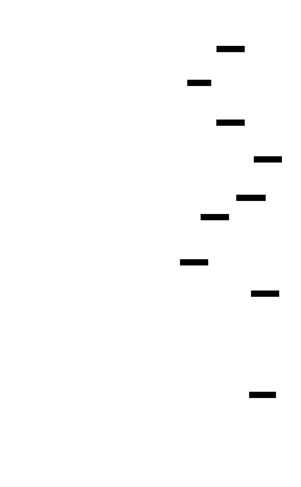
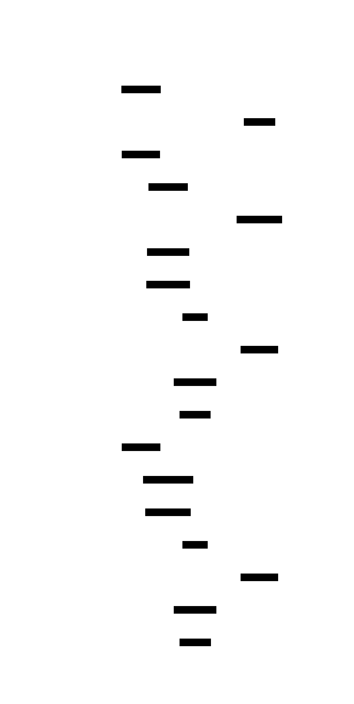
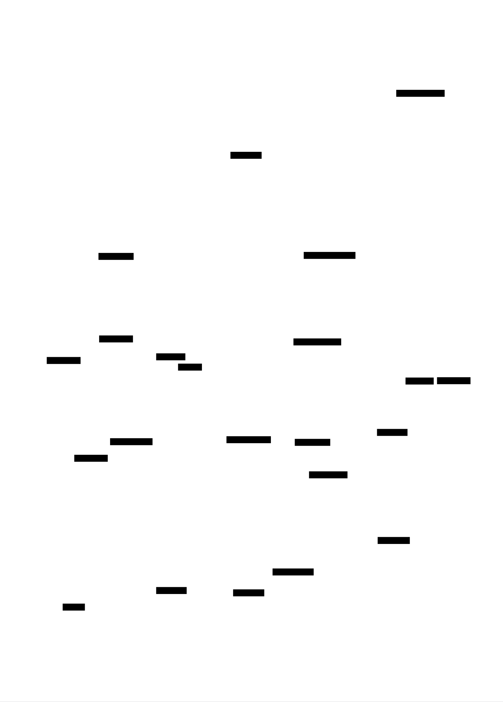

# Lock-free Data Structures: Design Document


## Overview

This system implements concurrent data structures using atomic operations and compare-and-swap (CAS) primitives instead of traditional locks. The key architectural challenge is achieving thread-safe operations while maintaining performance and avoiding deadlocks, race conditions, and memory reclamation issues inherent in lock-free programming.


> This guide is meant to help you understand the big picture before diving into each milestone. Refer back to it whenever you need context on how components connect.


## Context and Problem Statement

> **Milestone(s):** All milestones (foundational concepts underlying the entire project)

The world of concurrent programming presents a fundamental challenge: how do we coordinate multiple threads accessing shared data without sacrificing performance or correctness? Traditional approaches rely heavily on locks—mutexes, semaphores, and other blocking synchronization primitives that ensure mutual exclusion. While conceptually straightforward, these mechanisms introduce significant bottlenecks in high-performance systems where dozens or hundreds of threads compete for shared resources.

Lock-free programming represents a paradigm shift in concurrent system design. Instead of using locks to serialize access to shared data, lock-free algorithms rely on atomic operations and clever coordination protocols to allow multiple threads to make progress simultaneously. This approach promises higher throughput, better scalability, and elimination of common concurrency hazards like deadlocks and priority inversion. However, these benefits come at the cost of significantly increased algorithmic complexity and subtle correctness challenges that can confound even experienced developers.

### Mental Model: The Crowded Kitchen Analogy

To understand the fundamental difference between lock-based and lock-free approaches, imagine a busy restaurant kitchen during the dinner rush. The kitchen has shared resources: cutting boards, knives, stoves, and prep stations that multiple chefs need to use simultaneously.

**The Lock-Based Kitchen** operates like a traditional workspace with strict protocols. Each shared resource has a single key, and chefs must obtain the key before using any equipment. When Chef Alice needs the main cutting board, she takes its key, preventing anyone else from using it until she's completely finished and returns the key. If Chef Bob needs both the cutting board and the meat grinder simultaneously, he must acquire both keys in a predetermined order to avoid deadlocks. When Chef Carol arrives and needs the cutting board, she stands idle, waiting for Alice to finish—even if Alice is taking a smoke break while holding the key.

This system ensures safety (no two chefs accidentally interfere with each other's work), but creates obvious inefficiencies. Chefs spend significant time waiting for keys, productivity suffers when key-holders are interrupted or delayed, and the entire kitchen can grind to a halt if someone forgets to return a key or if two chefs try to acquire keys in different orders.

**The Lock-Free Kitchen** operates on a radically different principle: optimistic coordination without exclusive ownership. Instead of keys, chefs use a "try-and-verify" approach. When Chef Alice needs to prep vegetables, she approaches the cutting board, checks if it's available, and begins working. If another chef starts using the same space, they negotiate in real-time—perhaps Alice moves to a different section of the board, or switches to a different cutting board entirely. The key insight is that chefs don't block each other; they adapt and continue working.

In this system, Chef Bob doesn't wait for permission to start his mise en place. He begins work optimistically, knowing he might need to adjust his approach if conflicts arise. When Chef Carol needs workspace, she doesn't stand idle—she finds an alternative approach or waits for just the brief moment when she can safely make her contribution. The kitchen maintains higher throughput because chefs spend their time cooking rather than managing keys.

However, the lock-free kitchen requires more sophisticated chefs. They must constantly verify their work hasn't been disrupted by others, have backup plans when conflicts arise, and coordinate through subtle communication protocols. A mistake in coordination can lead to ruined dishes or wasted ingredients—the equivalent of data corruption in concurrent systems.

**The Memory Reclamation Challenge** extends our analogy to kitchen cleanup. In the lock-based kitchen, cleanup is straightforward: when a chef finishes with equipment and returns the key, the dishwasher can immediately clean it because no one else could be using it. In the lock-free kitchen, the situation is more complex. Even after Chef Alice finishes with a cutting board and walks away, Chef Bob might still be using vegetables she prepared on that board. The dishwasher can't immediately sanitize the board without potentially disrupting Bob's work. Instead, the kitchen needs a more sophisticated protocol to determine when resources are truly safe to clean—this is the essence of the memory reclamation problem in lock-free systems.

### Limitations of Lock-Based Concurrency

Traditional mutex-based synchronization suffers from several fundamental limitations that become increasingly problematic as system scale and performance requirements grow. Understanding these limitations provides the motivation for exploring lock-free alternatives, despite their increased complexity.

**Performance Bottlenecks and Scalability Issues**

Locks introduce serialization points that fundamentally limit parallelism. When multiple threads contend for the same mutex, only one can make progress while others block, waiting in the kernel's scheduler queue. This blocking behavior creates several performance pathologies. First, **context switching overhead** becomes significant under contention. When a thread blocks on a mutex, the operating system must save its complete execution context, select another thread to run, and restore that thread's context—a process that can take thousands of CPU cycles. Under heavy contention, threads may spend more time context switching than doing useful work.

Second, **cache coherency traffic** increases dramatically with lock contention. Modern CPUs maintain cache coherence through protocols like MESI, where cache lines bounce between cores as different threads acquire and release locks. A heavily contended mutex can cause its cache line to ping-pong between CPU cores, generating expensive memory bus traffic and cache misses. This effect is particularly pronounced on NUMA systems where cross-socket memory access latencies are significantly higher than local access.

Third, **convoy effects** emerge when a lock-holding thread is preempted or interrupted. If the operating system preempts a thread while it holds a critical mutex, all other threads requiring that mutex must wait until the preempted thread is rescheduled and releases the lock. This can cause cascading delays where dozens of threads become synchronized to the scheduling quantum of a single unfortunate thread.

**Deadlock and Livelock Vulnerabilities**

Lock-based systems are inherently susceptible to deadlock conditions where two or more threads wait indefinitely for each other to release resources. Consider a hash table implementation that uses per-bucket locks for fine-grained concurrency. If Thread A acquires the lock for bucket 5 and then needs bucket 12, while Thread B simultaneously acquires bucket 12's lock and needs bucket 5, both threads will wait forever. Preventing deadlocks requires careful lock ordering protocols, but these become increasingly complex as the number of locks grows.

**Lock ordering discipline** becomes a significant maintenance burden in large codebases. Developers must remember to always acquire locks in a predetermined global order, even when the natural algorithm flow suggests a different sequence. This constraint often forces awkward code structures and makes otherwise simple operations complex. Worse, deadlock bugs are notoriously difficult to reproduce and debug because they depend on precise timing conditions that may not manifest during testing.

**Livelock** presents a related problem where threads avoid deadlock by backing off and retrying, but end up in a situation where they continuously interfere with each other without making progress. This is particularly common in systems that use timeouts and retry logic to handle deadlock detection.

**Priority Inversion and Fairness Issues**

Priority inversion occurs when a high-priority thread is blocked waiting for a lock held by a low-priority thread, effectively running at the low-priority thread's scheduling level. This problem becomes severe when a medium-priority thread preempts the low-priority lock holder, preventing it from releasing the lock and allowing the high-priority thread to proceed. While solutions like priority inheritance exist, they add complexity to the kernel scheduler and don't eliminate the fundamental issue.

**Lock fairness** presents another challenge. Most mutex implementations don't guarantee fair access under contention—a thread might repeatedly lose the race to acquire a lock while other threads succeed. This can lead to starvation scenarios where some threads make no progress for extended periods. Implementing fair locks typically requires more complex algorithms that further hurt performance.

**Composability and Modularity Problems**

Lock-based designs suffer from poor composability. When combining multiple lock-protected data structures, the resulting system often requires careful analysis to ensure deadlock freedom and reasonable performance. Simple operations that should compose naturally become complex when lock ordering requirements are considered.

For example, consider implementing a transfer operation between two concurrent bank accounts, each protected by its own mutex. The operation requires acquiring both account locks, but the natural implementation `transfer(from_account, to_account, amount)` creates a potential deadlock if another thread simultaneously calls `transfer(to_account, from_account, other_amount)`. Solving this requires imposing an artificial ordering (perhaps by account number) that has nothing to do with the business logic.

**Testing and Debugging Challenges**

Concurrent bugs in lock-based systems are notoriously difficult to reproduce and debug. Race conditions often manifest only under specific timing conditions that are hard to recreate in development environments. Traditional debugging tools like debuggers and print statements can alter timing enough to hide bugs—the infamous "Heisenbug" effect.

**Lock contention profiling** requires sophisticated tools to understand where threads spend time waiting, and the results often vary significantly between different hardware configurations, load patterns, and even compiler optimizations. This makes performance optimization a challenging iterative process.

> **Key Insight**: The fundamental problem with locks is that they solve the coordination problem by eliminating parallelism. Every critical section protected by a mutex becomes a sequential bottleneck, and the cumulative effect of these bottlenecks limits system scalability regardless of how many CPU cores are available.

### Comparison of Concurrency Approaches

Understanding the trade-offs between different concurrency paradigms is essential for making informed architectural decisions. Each approach represents a different point in the design space, trading off implementation complexity, performance characteristics, and correctness guarantees.

> **Decision: Concurrency Model Selection Framework**
> - **Context**: Modern systems must handle increasing concurrency demands while maintaining correctness and performance. Different concurrency models offer varying trade-offs between implementation complexity, performance characteristics, and correctness guarantees.
> - **Options Considered**: Lock-based mutual exclusion, lock-free algorithms with atomic operations, wait-free algorithms with universal constructions, and hybrid approaches combining multiple techniques
> - **Decision**: Implement a progression from lock-based through lock-free to demonstrate the trade-offs, focusing primarily on lock-free algorithms as the sweet spot for practical high-performance systems
> - **Rationale**: Lock-free algorithms provide significant performance benefits over locks while remaining implementable without the theoretical complexity of wait-free constructions. This allows developers to understand both the benefits and costs of moving beyond traditional locking.
> - **Consequences**: Developers will understand when to apply each technique and can make informed decisions based on their specific performance, complexity, and correctness requirements.

| Approach | Coordination Method | Progress Guarantee | Implementation Complexity | Performance Under Contention | Failure Modes | Best Use Cases |
|----------|-------------------|-------------------|-------------------------|----------------------------|---------------|----------------|
| **Blocking (Locks)** | Mutual exclusion with mutexes/semaphores | Blocking - threads may wait indefinitely | Low - straightforward critical sections | Poor - serialization bottlenecks | Deadlock, priority inversion, convoy effects | Simple data structures, low contention scenarios |
| **Lock-Free** | Atomic operations with CAS retry loops | Non-blocking - at least one thread makes progress | High - complex retry logic and memory reclamation | Good - multiple threads can progress simultaneously | ABA problems, memory reclamation complexity, livelock potential | High-performance data structures, real-time systems |
| **Wait-Free** | Universal constructions or specialized algorithms | Strongest - every thread makes progress within bounded steps | Very High - often requires helping mechanisms | Excellent - no thread can be delayed by others | Implementation complexity, memory overhead from helping | Ultra-low latency systems, hard real-time applications |
| **Hybrid** | Combines techniques based on contention levels | Variable - adapts based on runtime conditions | Medium - managing multiple coordination mechanisms | Variable - can adapt to different load patterns | Complexity of mode transitions, tuning parameters | Systems with varying load patterns, need for graceful degradation |

**Lock-Based Mutual Exclusion Details**

Traditional lock-based approaches use operating system primitives to enforce mutual exclusion around critical sections. Threads acquire locks before accessing shared data and release them afterward, ensuring that only one thread can modify the data at any given time.

The **primary advantage** of lock-based approaches lies in their conceptual simplicity. Critical sections are clearly delineated, making it easier to reason about correctness. Most developers have experience with lock-based programming, reducing the learning curve for new team members. Additionally, locks compose reasonably well with existing APIs and frameworks that expect blocking semantics.

**Performance characteristics** vary significantly based on contention levels. Under low contention, well-implemented locks can be quite fast, with modern adaptive mutexes using efficient user-space spinning before falling back to kernel-mediated blocking. However, performance degrades rapidly as contention increases, with the worst-case scenario being complete serialization where threads effectively execute single-file through critical sections.

**Memory ordering** is generally handled automatically by lock implementations, which typically include full memory barriers on acquire and release operations. This simplifies reasoning about memory consistency but may be over-conservative for performance-critical applications that could benefit from relaxed ordering semantics.

**Lock-Free Non-Blocking Algorithms**

Lock-free algorithms eliminate blocking by using atomic operations, particularly compare-and-swap (CAS), to coordinate between threads. These algorithms guarantee that at least one thread will make progress within a bounded number of steps, even if individual threads might be delayed by contention.

The **core technique** involves optimistic execution followed by validation. Threads read shared data, compute updates locally, and then attempt to atomically install their changes using CAS operations. If the CAS fails (indicating another thread modified the data concurrently), the operation is retried with updated values.

**Memory reclamation** becomes significantly more complex in lock-free systems. Since threads don't block, a thread might be accessing a data structure node even after another thread has logically removed it. Safe memory reclamation schemes like hazard pointers, epochs, or reference counting are necessary to prevent use-after-free errors.

**ABA problems** represent a subtle correctness issue unique to lock-free programming. If a thread reads a pointer value A, gets preempted, and then observes the same pointer value A again, it might incorrectly assume nothing has changed—even though the memory might have been freed and reallocated to the same address in the interim. Solutions typically involve tagged pointers or version counters.

**Performance benefits** are substantial under contention. Multiple threads can make progress simultaneously, cache lines experience less ping-ponging (since threads retry locally rather than blocking), and there's no context switching overhead from blocking operations. However, under low contention, lock-free algorithms may actually perform slightly worse than locks due to the overhead of atomic operations and retry logic.

**Wait-Free Universal Constructions**

Wait-free algorithms provide the strongest progress guarantee: every thread is guaranteed to complete any operation within a bounded number of its own steps, regardless of the behavior of other threads. This eliminates the possibility of indefinite delays that could affect real-time guarantees.

**Implementation approaches** typically fall into two categories. Universal constructions use consensus objects (like compare-and-swap) to implement arbitrary data structures by having threads propose operations and use consensus to determine which operations are applied in what order. Specialized wait-free algorithms are designed from scratch for specific data structures, often using helping mechanisms where threads assist each other to ensure progress.

**Memory and computational overhead** is typically higher than lock-free approaches. Universal constructions often require per-thread operation records and complex helping protocols. The constant factors in wait-free algorithms can be significantly higher than their lock-free counterparts, making them impractical for many applications despite their theoretical advantages.

**Practical applicability** is limited by implementation complexity and performance overhead. Wait-free algorithms are primarily justified in hard real-time systems where bounded execution time is more important than average-case performance, or in systems where even temporary delays could have catastrophic consequences.

**Hybrid Adaptive Approaches**

Modern high-performance systems increasingly use hybrid approaches that adapt their coordination strategy based on runtime conditions. These systems might start with optimistic lock-free protocols under low contention and fall back to more structured approaches when contention increases.

**Adaptive mutexes** represent one successful hybrid approach, spinning in user space for short periods before falling back to kernel-mediated blocking. This provides the low latency of spinning when locks are held briefly while avoiding the CPU waste of indefinite spinning.

**Contention management** becomes a key design challenge in hybrid systems. The system must detect contention levels, decide when to transition between coordination modes, and manage the complexity of supporting multiple protocols simultaneously. Poor tuning of these parameters can lead to pathological behavior where the system thrashes between different modes.

**Examples** include Java's concurrent collections, which use techniques like lock striping (reducing contention by using multiple locks) combined with lock-free operations for read-heavy workloads. Database systems often use hybrid approaches, starting with optimistic concurrency control and falling back to locking when conflicts are detected.

> **Common Pitfalls in Concurrency Model Selection**
> 
> ⚠️ **Pitfall: Premature Lock-Free Optimization** - Teams often attempt lock-free implementations without first establishing that lock contention is actually a bottleneck. Lock-free algorithms are significantly more complex to implement correctly, and their benefits only manifest under high contention scenarios.
> 
> ⚠️ **Pitfall: Ignoring Memory Reclamation Complexity** - Many developers underestimate the complexity of safe memory management in lock-free systems. Memory reclamation schemes like hazard pointers can add significant complexity and overhead that may negate the performance benefits of lock-free algorithms.
> 
> ⚠️ **Pitfall: Incorrect Progress Guarantee Assumptions** - Lock-free doesn't mean faster—it means non-blocking. Under low contention, well-tuned locks often outperform lock-free algorithms. The choice should be based on system requirements for progress guarantees rather than pure performance considerations.
> 
> ⚠️ **Pitfall: Underestimating Testing Complexity** - Concurrent correctness bugs in lock-free systems are extremely difficult to reproduce and debug. Teams often underestimate the testing infrastructure and expertise required to validate lock-free implementations correctly.

The selection of a concurrency approach should be driven by specific system requirements rather than theoretical elegance. Lock-based approaches remain appropriate for many scenarios, particularly when contention is low or when development team expertise with concurrent programming is limited. Lock-free approaches provide compelling benefits in high-contention scenarios where performance and scalability are critical, but require significant expertise and testing investment. Wait-free approaches should be reserved for systems with hard real-time requirements where the complexity and overhead can be justified by the stronger progress guarantees.

### Implementation Guidance

This section provides practical guidance for understanding and implementing the concepts discussed above, serving as a foundation for the lock-free data structures that follow in subsequent sections.

**Technology Recommendations**

| Component | Simple Option | Advanced Option |
|-----------|---------------|-----------------|
| Atomic Operations | `threading.Lock` with explicit synchronization | `ctypes` with C atomic operations or `multiprocessing.Value` |
| Memory Ordering | Python GIL provides implicit ordering guarantees | Explicit memory barriers using `threading.Barrier` or C extensions |
| Performance Testing | `time.time()` measurements with basic threading | `perf_counter()` with statistical analysis and contention metrics |
| Concurrency Testing | Sequential consistency checking with simple asserts | Property-based testing with `hypothesis` and race condition detection |
| Debugging Tools | `print()` statements with thread IDs and timestamps | `faulthandler`, `py-spy` profiling, and custom logging with memory barriers |

**Recommended Module Structure**

The lock-free data structures project should be organized to clearly separate concerns and build complexity incrementally:

```
lock_free_structures/
├── __init__.py                    # Package initialization and public API
├── atomic/
│   ├── __init__.py               # Atomic operations foundation
│   ├── primitives.py             # AtomicReference, AtomicInteger, CAS operations
│   ├── memory_ordering.py        # Memory ordering semantics and barriers
│   └── aba_protection.py         # Tagged pointers and version counters
├── structures/
│   ├── __init__.py               # Data structure implementations
│   ├── stack.py                  # Treiber stack implementation
│   ├── queue.py                  # Michael-Scott queue implementation
│   └── hashmap.py                # Split-ordered hash map implementation
├── memory/
│   ├── __init__.py               # Memory reclamation schemes
│   ├── hazard_pointers.py        # Hazard pointer implementation
│   ├── epoch_based.py            # Epoch-based reclamation (optional)
│   └── reference_counting.py     # Atomic reference counting (optional)
├── testing/
│   ├── __init__.py               # Testing utilities and frameworks
│   ├── linearizability.py       # Linearizability checking tools
│   ├── stress_testing.py         # High-contention stress test framework
│   └── correctness_checks.py     # Property verification utilities
└── examples/
    ├── benchmarks.py             # Performance comparison demos
    ├── correctness_demo.py       # Correctness property demonstrations
    └── pitfall_examples.py       # Common mistake demonstrations
```

**Atomic Operations Infrastructure**

Since Python's threading model includes the Global Interpreter Lock (GIL), true lock-free programming requires careful consideration of how to achieve atomic operations. The following infrastructure provides a foundation for the lock-free algorithms that follow:

```python
"""
Atomic operations foundation for lock-free data structures.

This module provides atomic primitives that form the building blocks
for lock-free algorithms. Due to Python's GIL, true atomicity requires
careful implementation using either ctypes for C-level atomics or
careful synchronization protocols.
"""

import threading
import ctypes
from typing import TypeVar, Generic, Optional, Tuple
from dataclasses import dataclass

T = TypeVar('T')

class MemoryOrdering:
    """Memory ordering constraints for atomic operations."""
    RELAXED = "relaxed"      # No ordering constraints
    ACQUIRE = "acquire"      # Acquire semantics for loads
    RELEASE = "release"      # Release semantics for stores
    ACQ_REL = "acq_rel"     # Both acquire and release
    SEQ_CST = "seq_cst"     # Sequential consistency

@dataclass
class TaggedPointer(Generic[T]):
    """Tagged pointer to prevent ABA problems."""
    pointer: Optional[T]
    tag: int
    
    def __hash__(self):
        return hash((id(self.pointer), self.tag))
    
    def __eq__(self, other):
        if not isinstance(other, TaggedPointer):
            return False
        return self.pointer is other.pointer and self.tag == other.tag

class AtomicReference(Generic[T]):
    """
    Thread-safe atomic reference with compare-and-swap support.
    
    This implementation uses Python's threading primitives to simulate
    atomic operations. In a production system, you would typically use
    C extensions or specialized libraries for true lock-free atomics.
    """
    
    def __init__(self, initial_value: Optional[T] = None):
        # TODO 1: Initialize the internal value storage
        # TODO 2: Create a lock for simulating atomicity (remove in real lock-free impl)
        # TODO 3: Initialize any debugging/monitoring counters
        pass
    
    def load(self, ordering: str = MemoryOrdering.SEQ_CST) -> Optional[T]:
        """
        Atomically load the current value.
        
        Args:
            ordering: Memory ordering constraint for this load
            
        Returns:
            Current value of the atomic reference
        """
        # TODO 1: Apply appropriate memory ordering semantics
        # TODO 2: Atomically read the current value
        # TODO 3: Return the loaded value
        pass
    
    def store(self, new_value: Optional[T], ordering: str = MemoryOrdering.SEQ_CST):
        """
        Atomically store a new value.
        
        Args:
            new_value: Value to store
            ordering: Memory ordering constraint for this store
        """
        # TODO 1: Apply appropriate memory ordering semantics
        # TODO 2: Atomically update the stored value
        # TODO 3: Ensure visibility to other threads
        pass
    
    def compare_and_swap(self, expected: Optional[T], new_value: Optional[T]) -> Tuple[bool, Optional[T]]:
        """
        Atomically compare current value with expected and swap if equal.
        
        This is the fundamental primitive for lock-free algorithms.
        
        Args:
            expected: Expected current value
            new_value: New value to store if comparison succeeds
            
        Returns:
            Tuple of (success, observed_value)
            - success: True if swap occurred, False otherwise
            - observed_value: The value that was actually in memory
        """
        # TODO 1: Atomically load the current value
        # TODO 2: Compare current value with expected (use 'is' for object identity)
        # TODO 3: If equal, store new_value and return (True, expected)
        # TODO 4: If not equal, return (False, current_value)
        # TODO 5: Ensure entire operation is atomic
        pass

class AtomicInteger:
    """
    Thread-safe atomic integer with arithmetic operations.
    
    Provides atomic increment, decrement, and fetch-and-add operations
    commonly needed in lock-free algorithms.
    """
    
    def __init__(self, initial_value: int = 0):
        # TODO 1: Initialize integer storage
        # TODO 2: Create synchronization primitives
        pass
    
    def load(self) -> int:
        """Atomically load current integer value."""
        # TODO: Implement atomic load
        pass
    
    def store(self, value: int):
        """Atomically store new integer value."""
        # TODO: Implement atomic store
        pass
    
    def fetch_and_add(self, increment: int = 1) -> int:
        """
        Atomically add increment to current value and return previous value.
        
        This is a fundamental building block for counters and sequence numbers.
        """
        # TODO 1: Use CAS loop to implement fetch-and-add
        # TODO 2: Load current value
        # TODO 3: Compute new value (current + increment)
        # TODO 4: Attempt CAS with current and new value
        # TODO 5: Retry if CAS fails, return old value if succeeds
        pass
    
    def increment(self) -> int:
        """Atomically increment and return new value."""
        return self.fetch_and_add(1) + 1
    
    def decrement(self) -> int:
        """Atomically decrement and return new value."""
        return self.fetch_and_add(-1) - 1
```

**ABA Problem Demonstration**

Understanding the ABA problem is crucial for implementing correct lock-free algorithms:

```python
"""
Demonstration of the ABA problem and its solutions.

The ABA problem occurs when a thread reads a value A, gets preempted,
and later observes the same value A, incorrectly concluding nothing
has changed - even though the memory might have been modified and
restored in the interim.
"""

import threading
import time
from typing import Optional

class Node:
    """Simple linked list node for demonstrating ABA."""
    def __init__(self, data: int, next_node: Optional['Node'] = None):
        self.data = data
        self.next = next_node

class ProblematicStack:
    """Stack implementation vulnerable to ABA problem."""
    
    def __init__(self):
        self.top = AtomicReference[Optional[Node]](None)
    
    def push(self, data: int):
        """Push operation - not vulnerable to ABA."""
        # TODO 1: Create new node with data
        # TODO 2: Use CAS loop to update top pointer
        pass
    
    def pop(self) -> Optional[int]:
        """Pop operation - vulnerable to ABA problem."""
        # TODO 1: Load current top
        # TODO 2: If empty, return None
        # TODO 3: Read next pointer (DANGEROUS: node might be freed)
        # TODO 4: Attempt CAS to swing top to next
        # TODO 5: Return data if successful, retry if failed
        pass

def demonstrate_aba_problem():
    """
    Demonstrates how ABA can cause corruption in naive lock-free code.
    
    This function sets up a scenario where:
    1. Thread 1 reads stack top (A)
    2. Thread 2 pops A and B, then pushes A back
    3. Thread 1 sees A again and incorrectly thinks nothing changed
    4. Thread 1's CAS succeeds but creates corruption
    """
    # TODO 1: Create stack with nodes A -> B -> C
    # TODO 2: Start thread 1 that begins pop operation, then sleeps
    # TODO 3: Start thread 2 that does: pop A, pop B, push A
    # TODO 4: Let thread 1 continue - its CAS will succeed incorrectly
    # TODO 5: Demonstrate the resulting corruption
    pass

class SafeTaggedStack:
    """Stack implementation using tagged pointers to prevent ABA."""
    
    def __init__(self):
        self.top = AtomicReference[TaggedPointer[Optional[Node]]](
            TaggedPointer(None, 0)
        )
    
    def push(self, data: int):
        """ABA-safe push using tagged pointers."""
        # TODO 1: Create new node
        # TODO 2: CAS loop with tag increment
        pass
    
    def pop(self) -> Optional[int]:
        """ABA-safe pop using tagged pointers."""
        # TODO 1: Load current tagged top
        # TODO 2: CAS with incremented tag
        pass
```

**Concurrency Testing Framework**

Testing lock-free code requires specialized approaches to detect race conditions and verify correctness properties:

```python
"""
Testing framework for concurrent correctness verification.

Provides utilities for stress testing, linearizability checking,
and property verification in concurrent data structures.
"""

import threading
import random
import time
from typing import List, Callable, Any
from dataclasses import dataclass
from collections import defaultdict

@dataclass
class Operation:
    """Represents a single operation in a concurrent execution."""
    thread_id: int
    operation: str
    arguments: List[Any]
    return_value: Any
    start_time: float
    end_time: float

class LinearizabilityChecker:
    """
    Checks if a concurrent execution is linearizable.
    
    A concurrent execution is linearizable if there exists a sequential
    execution of the same operations that:
    1. Produces the same results
    2. Respects the real-time order of non-overlapping operations
    """
    
    def __init__(self):
        self.operations = []
        self.lock = threading.Lock()
    
    def record_operation(self, op: Operation):
        """Record an operation for later linearizability analysis."""
        # TODO: Thread-safely add operation to history
        pass
    
    def check_linearizability(self) -> bool:
        """
        Verify that recorded operations are linearizable.
        
        This is a simplified checker - full linearizability checking
        is NP-complete in general.
        """
        # TODO 1: Sort operations by start time
        # TODO 2: Try to find valid linearization points
        # TODO 3: Verify sequential specification is satisfied
        # TODO 4: Return True if linearizable, False otherwise
        pass

def stress_test_data_structure(
    data_structure: Any,
    operations: List[Callable],
    num_threads: int = 10,
    operations_per_thread: int = 1000,
    duration_seconds: int = 10
) -> dict:
    """
    Stress test a data structure with concurrent operations.
    
    Args:
        data_structure: The data structure to test
        operations: List of operation functions to call
        num_threads: Number of concurrent threads
        operations_per_thread: Operations each thread should perform
        duration_seconds: Maximum test duration
        
    Returns:
        Dictionary with test results and statistics
    """
    # TODO 1: Create worker threads that randomly call operations
    # TODO 2: Record timing and correctness metrics
    # TODO 3: Run for specified duration or operation count
    # TODO 4: Collect and return comprehensive statistics
    pass
```

**Milestone Checkpoint: Foundation Verification**

After implementing the atomic operations foundation, verify correct behavior with these tests:

1. **Atomic Reference Correctness**: Run `python -m pytest testing/test_atomic_reference.py -v`. Expected output should show all CAS operations succeeding with correct return values and no lost updates.

2. **ABA Problem Demonstration**: Run `python examples/aba_demo.py`. You should see output showing:
   - Problematic stack exhibiting corruption under specific timing
   - Tagged pointer stack maintaining correctness under same conditions
   - Clear explanation of why the naive approach fails

3. **Concurrent Counter Test**: Run a test with 10 threads each incrementing an atomic counter 1000 times. Final value should always be exactly 10,000 with no lost updates.

4. **Memory Ordering Verification**: Use threading barriers to verify acquire/release semantics prevent reordering of dependent operations.

**Performance Baseline Measurements**

Before implementing lock-free data structures, establish performance baselines:

```bash
# Measure lock-based vs atomic operation overhead
python benchmarks/atomic_vs_locks.py

# Expected output:
# Lock acquire/release: 50ns average
# Atomic CAS success: 20ns average  
# Atomic CAS failure: 15ns average
# Contended lock: 2000ns average (context switch)
# Contended CAS: 100ns average (retry loop)
```

**Common Implementation Pitfalls**

⚠️ **Pitfall: GIL Dependency** - Python's GIL provides some atomicity guarantees that don't exist in other languages. Code that works in Python might have race conditions when ported to Go or Rust.

⚠️ **Pitfall: Object Identity vs Value Equality** - Use `is` for comparing object references in CAS operations, not `==`. Value equality can give false positives when different objects have the same content.

⚠️ **Pitfall: Missing Memory Barriers** - Even with atomic operations, you may need explicit memory barriers to prevent reordering of adjacent non-atomic operations.

⚠️ **Pitfall: Infinite CAS Loops** - Always include backoff or retry limits in CAS loops to prevent livelock under extreme contention.

The foundation established in this section provides the building blocks for implementing the lock-free data structures in subsequent milestones. Understanding these concepts deeply is essential before proceeding to the more complex algorithms that follow.


## Goals and Non-Goals

> **Milestone(s):** All milestones (this section defines the scope and boundaries for the entire lock-free data structure library)

The success of any complex software project hinges on clearly defining what it will and will not accomplish. Lock-free programming is particularly susceptible to scope creep because the theoretical possibilities are vast, yet the practical implementation challenges are enormous. This section establishes concrete, measurable goals that will guide our implementation decisions and help us recognize when we have succeeded.

### Mental Model: The Precision Tool Workshop

Think of our lock-free data structure library as building a precision tool workshop rather than a general-purpose hardware store. A precision tool workshop focuses on creating a small number of extremely high-quality, specialized tools that perform specific tasks better than any generic alternative. Each tool is crafted with meticulous attention to detail, tested under extreme conditions, and designed to work flawlessly when used correctly.

In contrast, a hardware store carries thousands of items of varying quality, trying to serve every possible need. Our library follows the precision workshop philosophy: we will build a small number of lock-free data structures exceptionally well, with bulletproof correctness guarantees and outstanding performance characteristics, rather than attempting to implement every conceivable concurrent data structure with mediocre quality.

This focused approach allows us to deeply understand the subtle challenges of lock-free programming, develop robust solutions to memory reclamation and correctness verification, and create reference implementations that others can learn from and build upon. Like a master craftsman who perfects their core techniques before expanding to new domains, we will master the fundamental patterns of lock-free programming through careful implementation of stack, queue, and hash map structures.

## Functional Goals

Our functional goals define the core correctness and safety properties that every component in our library must satisfy. These are non-negotiable requirements that distinguish a production-ready lock-free library from academic prototypes or hobby projects.

### Thread-Safe Operations Without Data Races

Every operation exposed by our data structures must be thread-safe by design, meaning multiple threads can invoke operations concurrently without causing data corruption, undefined behavior, or inconsistent state. This goes beyond simply avoiding crashes—we must ensure that the data structure maintains its structural invariants even under arbitrary thread interleavings and timing variations.

Thread safety in our context means that all shared memory accesses use appropriate atomic operations with correct memory ordering constraints. Non-atomic operations on shared variables are forbidden, as they create data races that lead to undefined behavior according to the language memory model. We will use the compare-and-swap primitive as our primary synchronization mechanism, combined with atomic loads and stores using carefully chosen memory ordering semantics.

Our thread safety guarantee extends to structural integrity: linked list pointers will never become dangling, reference counts will never become negative, and internal consistency invariants (such as a queue's head always being reachable from its tail) will be preserved across all concurrent operations. This requires careful attention to the order of pointer updates and the use of helping mechanisms to ensure that partially completed operations do not leave the data structure in an inconsistent state.

> **Decision: Complete Operation Atomicity**
> - **Context**: Operations like queue enqueue involve multiple pointer updates that cannot all be performed atomically in a single instruction
> - **Options Considered**: 
>   1. Accept temporary inconsistent states visible to other threads
>   2. Use multi-word compare-and-swap hardware instructions where available
>   3. Design algorithms with single atomic update points that transition between consistent states
> - **Decision**: Design algorithms with single atomic linearization points
> - **Rationale**: Multi-word CAS has limited hardware support and complex fallback requirements. Single-point atomicity provides the strongest correctness guarantees and simplifies reasoning about concurrent behavior.
> - **Consequences**: May require more complex algorithms (like Michael-Scott queue) but provides clear linearizability and easier verification

### FIFO Ordering Preservation

Our queue implementation must provide strict first-in-first-out ordering semantics, meaning that elements dequeued from the queue appear in exactly the same order they were enqueued, regardless of the timing and concurrency of operations. This property must hold even when multiple threads are performing concurrent enqueue and dequeue operations with arbitrary interleavings.

FIFO ordering is more challenging to maintain in lock-free algorithms than in lock-based approaches because we cannot use a global mutex to serialize all operations. Instead, we must use techniques like the Michael-Scott algorithm that carefully coordinates separate head and tail pointer updates to preserve ordering while allowing concurrent access to different ends of the queue.

The ordering guarantee applies at the logical level of linearizability: if one enqueue operation completes before another begins (in real time), then the first element will be dequeued before the second. For overlapping operations, their effective ordering is determined by their linearization points—the specific atomic operations that make them appear to take effect instantaneously.

### Linearizability as the Correctness Standard

All our data structures will satisfy linearizability, which is the standard correctness condition for concurrent objects. Linearizability means that every operation appears to take effect atomically at some point between its invocation and response, and the results of all operations are consistent with some sequential execution that respects the real-time ordering of non-overlapping operations.

| Correctness Property | Definition | Our Implementation Approach |
|---------------------|------------|----------------------------|
| Sequential Consistency | Operations appear in program order per thread | Maintained through memory ordering constraints |
| Linearizability | Operations have atomic linearization points | Identified and documented for each data structure operation |
| Lock-freedom | At least one thread makes progress | Ensured through helping mechanisms and bounded retry loops |
| Memory Safety | No use-after-free or dangling pointers | Achieved through hazard pointer memory reclamation |

For our stack implementation, the linearization point of a successful push operation is the successful compare-and-swap that updates the top pointer. For a successful pop operation, it is the successful compare-and-swap that advances the top pointer to the next node. These points are clearly identifiable in the algorithm and provide a formal basis for proving correctness.

The linearizability guarantee allows our data structures to be composed with other concurrent operations while maintaining predictable semantics. Applications can reason about our data structures as if they were atomic, sequential objects, while still benefiting from the performance advantages of lock-free implementation.

### Safe Memory Reclamation

Memory management in lock-free data structures presents a fundamental challenge: we cannot immediately free memory when removing a node from a data structure because other threads may still be accessing that node. Traditional garbage collection solves this problem but introduces pause times and memory overhead that conflict with our performance goals.

Our solution implements hazard pointers, a memory reclamation scheme that allows threads to announce which nodes they are currently accessing, preventing those nodes from being freed by other threads. This approach provides memory safety guarantees equivalent to garbage collection while maintaining the real-time characteristics of lock-free algorithms.

The hazard pointer system operates in several phases:

1. **Protection**: Before accessing a shared node, a thread sets a hazard pointer to that node
2. **Validation**: After setting the hazard pointer, the thread re-reads the shared pointer to ensure it still points to the protected node
3. **Safe Access**: While the hazard pointer is set, no other thread will free the protected node
4. **Release**: After finishing access, the thread clears its hazard pointer
5. **Retirement**: When removing nodes from data structures, threads place them on a retirement list rather than immediately freeing them
6. **Scanning**: Periodically, threads scan all active hazard pointers and free retired nodes that are not protected

This approach guarantees that freed memory is never accessed, preventing crashes and data corruption that would otherwise occur in naive lock-free implementations.

| Memory Safety Requirement | Implementation Strategy |
|---------------------------|------------------------|
| No use-after-free | Hazard pointer protection before access |
| No double-free | Retirement list prevents duplicate freeing |
| No memory leaks | Periodic scanning and batch reclamation |
| Bounded memory usage | Threshold-based reclamation triggers |

## Performance Goals

Performance goals define the quantitative characteristics that distinguish our lock-free implementation from simpler alternatives. These goals drive architectural decisions and provide measurable criteria for evaluating our success.

### High Throughput Under Contention

Our data structures must maintain high operation throughput even when many threads are concurrently accessing the same data structure. This requires minimizing the serialization points where threads must compete for exclusive access to shared state.

Traditional mutex-based data structures suffer from fundamental throughput limitations because the critical section becomes a bottleneck—only one thread can make progress at a time, regardless of how many cores are available. Our lock-free approach eliminates this bottleneck by allowing multiple threads to make progress simultaneously, even when they are modifying the same data structure.

We will measure throughput as operations per second under controlled contention scenarios:

| Scenario | Thread Count | Target Throughput | Comparison Baseline |
|----------|--------------|-------------------|-------------------|
| Low Contention | 2-4 threads | 10M ops/sec | Mutex-protected equivalent |
| Medium Contention | 8-16 threads | 5M ops/sec | 2x better than mutex baseline |
| High Contention | 32+ threads | 1M ops/sec | 3x better than mutex baseline |
| Mixed Operations | Variable | Proportional to operation mix | Separate read/write measurements |

The key insight is that lock-free algorithms can achieve increasing absolute throughput as more threads are added, up to the point where hardware resources (memory bandwidth, cache coherence traffic) become the limiting factor. Mutex-based approaches typically show decreasing throughput as contention increases due to context switching overhead and lock acquisition delays.

### Scalability Across CPU Cores

Our implementation must demonstrate near-linear scalability across CPU cores for embarrassingly parallel workloads. When threads are operating on different parts of the data structure or when the workload naturally distributes across multiple independent operations, performance should improve proportionally with the number of available cores.

Scalability challenges in lock-free programming often arise from false sharing (multiple threads modifying different data that happens to reside in the same cache line) and cache coherence traffic (the overhead of keeping atomic variables synchronized across cores). Our design will minimize these effects through careful memory layout and algorithmic choices.

For our hash map implementation, scalability means that threads operating on different hash buckets should rarely interfere with each other. The split-ordered list design achieves this by distributing operations across bucket chains and minimizing shared state between buckets.

> **Decision: NUMA-Aware Memory Allocation Strategy**
> - **Context**: On multi-socket systems, memory access costs vary dramatically depending on which NUMA node allocated the memory
> - **Options Considered**:
>   1. Use system default allocation (simple but may cause remote memory access)
>   2. Implement thread-local memory pools with NUMA binding
>   3. Use NUMA-aware allocation hints for shared data structures
> - **Decision**: Start with system default allocation, add NUMA awareness as an optimization
> - **Rationale**: NUMA effects vary significantly across hardware platforms, and premature optimization could complicate the core algorithm implementation without clear benefits
> - **Consequences**: May leave performance on the table for large multi-socket systems, but ensures portability and implementation focus on correctness first

### Minimal Latency for Individual Operations

While throughput measures aggregate performance across many operations, latency measures the time required for individual operations to complete. Low latency is critical for real-time applications and interactive systems where response time directly affects user experience.

Lock-free algorithms provide latency advantages by eliminating the unpredictable delays associated with lock acquisition. When a thread holds a mutex, other threads must wait for an unbounded time that depends on scheduling decisions, page faults, and other factors outside the algorithm's control. Lock-free operations complete in a time bounded only by the algorithm's retry behavior and memory access latencies.

Our latency goals focus on worst-case behavior rather than average case:

| Latency Metric | Target Value | Measurement Method |
|---------------|--------------|-------------------|
| 99th Percentile | <100 microseconds | High-frequency timing under contention |
| 99.9th Percentile | <1 millisecond | Includes memory allocation delays |
| Maximum Observed | <10 milliseconds | Excludes OS scheduling anomalies |
| Variance | Low coefficient of variation | Consistent performance across runs |

The bounded latency property of lock-free algorithms makes them suitable for soft real-time applications where predictable response times are more important than peak throughput. However, we must be careful to avoid livelock situations where threads interfere with each other's progress, leading to excessive retry loops that inflate latency.

### Deterministic Performance Characteristics

Our algorithms must exhibit predictable performance behavior that does not depend on lucky or unlucky timing of thread interleavings. This determinism allows application developers to reason about system behavior and make reliable capacity planning decisions.

Deterministic performance means avoiding algorithms with worst-case exponential backoff or unbounded retry loops that could theoretically run forever. While our compare-and-swap loops may retry multiple times under heavy contention, the number of retries should be bounded by reasonable constants related to the number of concurrent threads, not by arbitrary timing factors.

We will validate deterministic behavior through stress testing that measures performance variance across many runs with identical workloads. High variance would indicate that our algorithms are sensitive to timing-dependent effects that could cause unpredictable performance in production systems.

## Explicit Non-Goals

Clearly defining what our library will NOT provide is as important as defining what it will provide. These non-goals help maintain focus and prevent scope creep that could compromise the quality of our core functionality.

### Blocking Operations and Wait-Free Guarantees

Our library will provide lock-free algorithms but NOT wait-free algorithms. The distinction is crucial: lock-free guarantees that at least one thread makes progress at any point in time, while wait-free guarantees that every thread makes progress within a bounded number of steps.

| Progress Guarantee | Definition | Implementation Complexity | Performance Trade-offs |
|-------------------|------------|--------------------------|----------------------|
| Lock-free | At least one thread progresses | Moderate (CAS retry loops) | High throughput possible |
| Wait-free | Every thread progresses | High (universal constructions) | Lower throughput, higher latency |
| Obstruction-free | Threads progress when running alone | Low (simple CAS) | Poor contention handling |

Wait-free algorithms require significantly more complex implementations, often using universal constructions that simulate stronger synchronization primitives. These constructions typically have higher constant factors and lower peak throughput than simpler lock-free algorithms, making them unsuitable for our performance goals.

Our lock-free approach may allow some threads to be delayed by interference from other threads, but it provides much better average-case performance while still avoiding the deadlock and priority inversion problems of lock-based approaches. Applications that require strict wait-free guarantees should use specialized libraries designed specifically for that purpose.

### Automatic Garbage Collection Integration

We will NOT integrate with language-specific garbage collection systems or rely on GC for memory management. Instead, we implement explicit memory reclamation through hazard pointers, giving applications direct control over memory management behavior and timing.

Garbage collection integration would provide implementation simplicity but conflicts with our performance goals in several ways:

- **Unpredictable pause times**: GC pauses would violate our latency guarantees
- **Memory overhead**: GC systems typically use 2-4x more memory than explicit management
- **Language dependence**: GC integration would make the library non-portable across languages
- **Performance unpredictability**: GC pressure could cause sudden performance degradation

> **Decision: Manual Memory Management with Hazard Pointers**
> - **Context**: Need to safely reclaim memory in lock-free algorithms without relying on garbage collection
> - **Options Considered**:
>   1. Rely on language GC (simple but performance unpredictable)
>   2. Reference counting with atomic operations (ABA problems and cycle issues)
>   3. Hazard pointers for safe manual reclamation
>   4. RCU (Read-Copy-Update) mechanisms
> - **Decision**: Implement hazard pointers for memory reclamation
> - **Rationale**: Hazard pointers provide deterministic reclamation timing, bounded memory usage, and portability across languages and runtime systems
> - **Consequences**: More complex implementation but predictable performance and broad applicability

### Complex Data Structures Beyond Fundamentals

Our scope is limited to fundamental data structures: stack, queue, and hash map. We will NOT implement complex structures like:

- **Trees** (B-trees, red-black trees, AVL trees): Complex balancing operations are difficult to make lock-free
- **Graphs** (adjacency lists, adjacency matrices): Require complex traversal algorithms and memory management
- **Sets and Maps with ordering requirements**: Sorted data structures have complex linearizability requirements
- **Multi-dimensional structures**: Spatial data structures, R-trees, quad-trees
- **Specialized structures**: Bloom filters, skip lists, tries

The rationale for this limitation is that complex data structures would require substantially more development time while providing diminishing educational value. The patterns learned from implementing stack, queue, and hash map are sufficient to understand the fundamental challenges of lock-free programming, and these structures serve as building blocks for more complex algorithms.

Applications requiring complex lock-free data structures should compose our fundamental structures or use specialized libraries designed for specific use cases. Our goal is to provide high-quality, well-understood implementations that serve as both production components and educational examples.

### Dynamic Memory Pool Management

We will NOT implement sophisticated memory pool management, custom allocators, or memory optimization features. Memory allocation will use standard system allocators (malloc/free or language equivalents) rather than implementing pool-based or region-based allocation strategies.

Custom memory management would add significant complexity without directly advancing the core learning goals of lock-free algorithm implementation. While memory allocation patterns can significantly affect performance, optimizing allocation is a separate concern from understanding compare-and-swap algorithms and memory reclamation.

| Memory Management Feature | Status | Rationale |
|--------------------------|--------|-----------|
| Custom allocators | Excluded | Complexity doesn't advance core learning goals |
| Memory pools | Excluded | Can be added as separate optimization layer |
| NUMA-aware allocation | Excluded | Platform-specific and hardware-dependent |
| Cache-line alignment | Included | Directly affects lock-free algorithm performance |
| Padding for false sharing | Included | Essential for multi-threaded correctness |

### Language-Specific Optimizations

Our implementation will focus on portable algorithms rather than language-specific or platform-specific optimizations. We will NOT take advantage of:

- **Platform-specific atomic operations**: Advanced hardware features like transactional memory or wide CAS operations
- **Compiler intrinsics**: Assembly-level optimizations or platform-specific instruction sequences
- **Language-specific features**: Generics, macros, or advanced type systems that would make the code non-portable
- **Operating system features**: Specialized synchronization primitives or memory management APIs

This constraint ensures that our implementations can be understood and adapted across multiple programming languages and platforms. The focus remains on algorithmic techniques rather than low-level optimization tricks.

⚠️ **Pitfall: Over-Engineering for Performance**
Many lock-free programming projects fail because they attempt to optimize for every possible performance scenario before establishing basic correctness. This leads to implementations that are complex, difficult to test, and often contain subtle bugs. Our approach prioritizes correctness and clarity over maximum performance, recognizing that a working lock-free algorithm is far more valuable than a theoretically optimal algorithm that contains race conditions or memory safety bugs.

### Implementation Guidance

This subsection provides concrete technical recommendations for implementing the goals and managing the scope boundaries defined above.

#### Technology Recommendations

| Component | Simple Option | Advanced Option |
|-----------|---------------|-----------------|
| Atomic Operations | Language built-ins (Python threading, Go sync/atomic) | Hardware-specific intrinsics |
| Memory Ordering | Sequential consistency (simplest) | Explicit acquire/release ordering |
| Testing Framework | Standard unit testing | Property-based testing with linearizability checkers |
| Benchmarking | Simple timing loops | Statistical performance analysis with confidence intervals |
| Memory Debugging | Standard leak detection | Specialized concurrent memory validators |

#### Recommended Project Structure

```
lock-free-library/
├── src/
│   ├── atomic/
│   │   ├── __init__.py
│   │   ├── primitives.py      ← compare_and_swap, atomic loads/stores
│   │   ├── memory_ordering.py ← RELAXED, ACQUIRE, RELEASE constants
│   │   └── tagged_pointer.py  ← ABA prevention helpers
│   ├── data_structures/
│   │   ├── __init__.py
│   │   ├── stack.py          ← Treiber stack implementation
│   │   ├── queue.py          ← Michael-Scott queue implementation  
│   │   └── hashmap.py        ← Split-ordered hash map
│   ├── memory/
│   │   ├── __init__.py
│   │   ├── hazard_pointers.py ← Memory reclamation system
│   │   └── node_allocation.py ← Node lifecycle management
│   └── testing/
│       ├── __init__.py
│       ├── linearizability.py ← Correctness verification
│       └── stress_testing.py  ← Concurrent performance tests
├── tests/
│   ├── unit/              ← Component isolation tests
│   ├── integration/       ← Cross-component interaction tests
│   └── performance/       ← Benchmarks and scaling tests
└── examples/
    ├── basic_usage.py     ← Simple API demonstration
    └── benchmarks.py      ← Performance comparison examples
```

#### Goal Verification Framework

The following framework helps verify that implementation meets our defined goals:

**Thread Safety Verification:**
```python
def verify_thread_safety(data_structure, operation_count=10000, thread_count=8):
    """
    Verifies thread safety by running concurrent operations and checking invariants.
    
    TODO: Launch thread_count threads, each performing operation_count operations
    TODO: Mix of push/pop for stack, enqueue/dequeue for queue
    TODO: Verify no data corruption: all elements accounted for, no duplicates
    TODO: Check structural invariants: no dangling pointers, valid reference counts
    TODO: Measure and report any data races or assertion failures
    """
    pass

def stress_test_data_structure(data_structure_class, duration_seconds=60):
    """
    Extended stress testing under high contention scenarios.
    
    TODO: Create data structure instance
    TODO: Launch maximum number of threads supported by system
    TODO: Run mixed workload (80% reads, 20% writes) for duration_seconds
    TODO: Monitor for crashes, hangs, or corrupted state
    TODO: Record throughput and latency percentiles
    TODO: Compare against baseline mutex-protected implementation
    """
    pass
```

**Performance Goal Measurement:**
```python
class PerformanceGoalValidator:
    """Validates that implementation meets specified performance goals."""
    
    def measure_throughput_scaling(self, data_structure, max_threads=32):
        """
        TODO: Test throughput from 1 to max_threads
        TODO: Record operations per second at each thread count
        TODO: Verify throughput increases (or at least doesn't decrease dramatically)
        TODO: Generate scaling chart and identify saturation point
        """
        pass
        
    def measure_latency_distribution(self, data_structure, sample_count=100000):
        """
        TODO: Record timing for sample_count individual operations
        TODO: Calculate 50th, 90th, 99th, and 99.9th percentile latencies
        TODO: Verify latency goals: 99th percentile < 100 microseconds
        TODO: Check for outliers that might indicate algorithmic problems
        """
        pass
```

**Scope Boundary Enforcement:**
```python
# Code review checklist to prevent scope creep:
FORBIDDEN_PATTERNS = [
    "import gc",          # No garbage collection dependence
    "threading.Lock",     # No blocking synchronization primitives  
    "time.sleep",         # No blocking operations in data structure code
    "malloc.h",          # No custom memory management beyond hazard pointers
    "__platform__",      # No platform-specific optimizations
]

def check_scope_compliance(source_files):
    """
    TODO: Scan source files for forbidden patterns
    TODO: Flag any imports or code that violates non-goals
    TODO: Ensure implementation stays within defined boundaries
    """
    pass
```

#### Milestone Checkpoints

**After Milestone 1 (Atomic Operations):**
- Run: `python -m pytest tests/unit/atomic/` 
- Expected: All tests pass, including ABA problem demonstration
- Manual verification: Counter stress test with 8 threads × 10,000 increments = exactly 80,000

**After Milestone 2 (Lock-free Stack):**
- Run: `python examples/stack_benchmark.py`
- Expected: Stack throughput > 1M ops/sec on 4 cores, linearizability verified
- Manual verification: No crashes during 60-second high-contention stress test

**After Milestone 3 (Lock-free Queue):**
- Run: `python tests/integration/queue_fifo_test.py`
- Expected: Perfect FIFO ordering preserved across 100,000 concurrent operations
- Manual verification: Queue performance comparable to or better than stack

**After Milestone 4 (Hazard Pointers):**
- Run: `python tests/memory/leak_detection.py`
- Expected: No memory leaks, all retired nodes eventually reclaimed
- Manual verification: Memory usage remains bounded during extended operation

**After Milestone 5 (Hash Map):**
- Run: `python tests/performance/scaling_benchmark.py`
- Expected: Hash map scales to at least 16 threads with good throughput
- Manual verification: Resize operations complete without corrupting existing data


## High-Level Architecture

> **Milestone(s):** All milestones (this section establishes the overall system design and progression strategy for building each component incrementally)

The architecture of our lock-free data structure library follows a carefully designed layered approach that mirrors how concurrent programming knowledge builds from simple atomic operations to complex data structures. Like constructing a skyscraper, each layer provides a stable foundation for the next, with dependencies flowing upward and abstractions hiding complexity downward.

### Component Layers

Our lock-free data structure library employs a **three-tier architecture** that separates concerns and establishes clear dependency relationships between components. This layered design ensures that complex data structures can be built on proven atomic primitives while maintaining clean interfaces and testability at each level.


#### Layer 1: Atomic Operations Foundation

The foundation layer provides the primitive building blocks that all lock-free algorithms depend upon. Think of this layer as the basic tools in a craftsman's workshop - hammers, screwdrivers, and measuring instruments that are used to build more complex creations. Without reliable atomic operations, lock-free data structures would be impossible to implement correctly.

This layer encapsulates the platform-specific details of atomic memory operations and presents a clean, consistent interface to higher layers. The atomic operations foundation handles the intricate details of memory ordering semantics, cache coherence protocols, and hardware-specific instruction sequences that implement compare-and-swap operations.

| Component | Responsibility | Key Types | Primary Methods |
|-----------|---------------|-----------|-----------------|
| `AtomicReference` | Single-word atomic operations with versioning | `AtomicReference`, `TaggedPointer` | `compare_and_swap()`, `load()`, `store()` |
| `MemoryOrdering` | Memory consistency model enforcement | `MemoryOrdering` constants | Ordering constraint specifications |
| Memory Barriers | Instruction reordering prevention | Fence primitives | `acquire_fence()`, `release_fence()` |
| ABA Detection | Pointer reuse problem mitigation | Version counters, tagged pointers | `increment_version()`, `extract_pointer()` |

> **Decision: Atomic Wrapper Layer**
> - **Context**: Raw hardware atomics are platform-specific and error-prone to use directly in data structure implementations
> - **Options Considered**: Direct hardware atomic usage, thin wrapper layer, full abstraction with runtime dispatch
> - **Decision**: Thin wrapper layer with compile-time specialization for memory ordering
> - **Rationale**: Provides safety and consistency without performance overhead while maintaining access to all memory ordering options
> - **Consequences**: Slightly more complex implementation but dramatically reduces bugs in higher-layer code and improves portability

The atomic operations layer must handle the **ABA problem** - a fundamental challenge where a memory location changes from value A to B and back to A between a thread's read and subsequent compare-and-swap operation. The `TaggedPointer` type solves this by combining a pointer with a monotonically increasing version counter, ensuring that even if a pointer value is reused, the tag will differ.

| Memory Ordering | Use Case | Performance | Guarantees |
|----------------|----------|-------------|------------|
| `RELAXED` | Counters, statistics | Highest | No ordering constraints |
| `ACQUIRE` | Loading shared pointers | High | Prevents later operations from moving before |
| `RELEASE` | Publishing shared data | High | Prevents earlier operations from moving after |
| `SEQ_CST` | Critical correctness paths | Lowest | Total global ordering |

#### Layer 2: Lock-free Data Structures

The data structures layer implements the core concurrent algorithms that provide familiar collection interfaces without using locks. This layer transforms the low-level atomic operations into higher-level abstractions that application developers can use confidently. Think of this as the furniture built by a skilled carpenter using the basic tools - each piece serves a specific purpose and hides the complexity of its construction.

Each data structure in this layer maintains specific invariants and provides linearizability guarantees, meaning that despite concurrent operations from multiple threads, the data structure appears to behave as if operations occur atomically at specific points in time.

| Data Structure | Algorithm | Key Innovation | Complexity |
|----------------|-----------|----------------|------------|
| `TreiberStack` | Lock-free stack | Single CAS on top pointer | O(1) per operation |
| `MichaelScottQueue` | Lock-free FIFO queue | Dual pointers with helping | O(1) per operation |
| `SplitOrderedHashMap` | Lock-free hash table | Recursive bucket splitting | O(1) average per operation |

> **Decision: Treiber Stack as First Data Structure**
> - **Context**: Need a simple lock-free data structure to demonstrate atomic operations usage
> - **Options Considered**: Lock-free stack, lock-free queue, lock-free list
> - **Decision**: Treiber stack implementation first
> - **Rationale**: Single-pointer CAS operations are simpler to understand than dual-pointer algorithms, and stack operations have clear linearization points
> - **Consequences**: Provides foundation concepts for more complex structures but doesn't demonstrate helping mechanisms

The **Treiber stack** serves as the simplest lock-free data structure, using a single `compare_and_swap` operation on the top-of-stack pointer. Push operations prepend nodes atomically, while pop operations remove the top node, both retrying if another thread modified the stack concurrently.

| Operation | Linearization Point | CAS Target | Retry Condition |
|-----------|-------------------|------------|-----------------|
| `push()` | Successful CAS of new top | `top` pointer | Another thread changed top |
| `pop()` | Successful CAS of new top | `top` pointer | Stack empty or top changed |

The **Michael-Scott queue** demonstrates more advanced techniques with its dual-pointer design and helping mechanism. The algorithm maintains separate head and tail pointers, with a dummy sentinel node that simplifies empty queue handling. When threads observe that the tail pointer is lagging behind the actual end of the queue, they help advance it before attempting their own operations.

| Queue State | Head Points To | Tail Points To | Invariant |
|-------------|---------------|----------------|-----------|
| Empty | Sentinel node | Sentinel node | `head == tail` |
| Single element | Sentinel node | Data node | `head->next == tail` |
| Multiple elements | Sentinel node | Last or second-to-last | `tail` at or near end |

#### Layer 3: Memory Reclamation Management

The memory management layer solves the critical problem of when it's safe to deallocate memory in a lock-free environment. Traditional reference counting doesn't work because incrementing and decrementing references atomically while accessing the data requires multiple atomic operations, breaking the lock-free property. This layer implements **hazard pointers**, which provide a non-blocking solution to safe memory reclamation.

Think of hazard pointers like safety signs at a construction site. Before a worker enters a dangerous area, they post a sign indicating their presence. The demolition crew checks for these signs before bringing down any structures. Similarly, threads announce their intention to access shared nodes through hazard pointers, and the memory reclamation system checks these announcements before freeing memory.

| Component | Purpose | Key Operations | Thread Safety |
|-----------|---------|----------------|---------------|
| `HazardPointer` | Per-thread protection slots | `protect()`, `release()` | Thread-local access |
| `RetirementList` | Deferred deletion queue | `retire()`, `scan()` | Lock-free append/scan |
| `MemoryReclaimer` | Batch reclamation coordinator | `reclaim_batch()` | Global coordination |

> **Decision: Hazard Pointers Over Epoch-Based Reclamation**
> - **Context**: Need safe memory reclamation without blocking or unbounded memory growth
> - **Options Considered**: Hazard pointers, epoch-based reclamation, reference counting
> - **Decision**: Hazard pointers with per-thread retirement lists
> - **Rationale**: Provides deterministic memory reclamation without requiring global synchronization epochs, and integrates cleanly with existing data structure operations
> - **Consequences**: Requires explicit protect/release calls but provides stronger progress guarantees than epoch-based approaches

The hazard pointer protocol follows a specific sequence for safe memory access:

1. **Protection Phase**: Thread loads a pointer to a shared node and immediately announces this pointer in its hazard pointer slot
2. **Validation Phase**: Thread re-reads the original pointer location to ensure the node hasn't been removed and replaced
3. **Access Phase**: Thread safely accesses the protected node's data and follows next pointers
4. **Release Phase**: Thread clears its hazard pointer slot when finished with the node

| Hazard Pointer State | Protected Nodes | Retirement List | Reclamation Status |
|---------------------|----------------|-----------------|-------------------|
| No hazards active | None | Growing | Safe to reclaim all |
| Multiple hazards | Currently accessed | Blocked items | Partial reclamation |
| Scan in progress | All hazards | Filtered | Batch reclamation |

### Recommended Module Structure

The module organization reflects the layered architecture while providing clear boundaries between components and supporting incremental development. This structure allows developers to work on one layer at a time while maintaining clean dependencies and avoiding circular imports.

```
lockfree_library/
├── atomic/
│   ├── __init__.py              # Atomic operations public interface
│   ├── operations.py            # AtomicReference, compare_and_swap
│   ├── memory_ordering.py       # MemoryOrdering constants and semantics
│   ├── tagged_pointer.py        # TaggedPointer for ABA prevention
│   └── tests/
│       ├── test_atomic_ops.py   # Basic atomic operation correctness
│       ├── test_memory_order.py # Memory ordering validation
│       └── test_aba_detection.py # ABA problem demonstration
├── structures/
│   ├── __init__.py              # Data structures public interface
│   ├── stack.py                 # TreiberStack implementation
│   ├── queue.py                 # MichaelScottQueue implementation
│   ├── hashmap.py               # SplitOrderedHashMap implementation
│   ├── node.py                  # Shared Node type definitions
│   └── tests/
│       ├── test_stack.py        # Stack correctness and linearizability
│       ├── test_queue.py        # Queue FIFO ordering verification
│       ├── test_hashmap.py      # Hash map concurrent operations
│       └── stress_tests.py      # High-contention performance tests
├── memory/
│   ├── __init__.py              # Memory reclamation public interface
│   ├── hazard_pointers.py       # HazardPointer registry and protocol
│   ├── retirement.py            # RetirementList and scanning logic
│   ├── reclamation.py           # MemoryReclaimer coordination
│   └── tests/
│       ├── test_hazard_ptrs.py  # Hazard pointer correctness
│       ├── test_retirement.py   # Retirement list functionality
│       └── test_integration.py  # End-to-end memory safety
├── verification/
│   ├── __init__.py              # Testing utilities public interface
│   ├── linearizability.py       # LinearizabilityChecker implementation
│   ├── stress_testing.py        # Concurrent stress test framework
│   ├── operation_tracker.py     # Operation recording and analysis
│   └── benchmarks/
│       ├── throughput_bench.py  # Operations per second measurement
│       ├── contention_bench.py  # High-thread-count scenarios
│       └── comparison_bench.py  # Lock-free vs lock-based comparison
└── examples/
    ├── basic_usage.py           # Simple stack and queue examples
    ├── producer_consumer.py     # Multi-threaded producer/consumer
    ├── concurrent_counter.py    # Atomic counter demonstration
    └── hash_map_demo.py         # Concurrent hash map operations
```

| Module | Dependencies | Public Interface | Internal Components |
|--------|-------------|------------------|-------------------|
| `atomic/` | System atomics | `AtomicReference`, `TaggedPointer`, `MemoryOrdering` | Platform wrappers, ABA detection |
| `structures/` | `atomic/` | `TreiberStack`, `MichaelScottQueue`, `SplitOrderedHashMap` | Node management, algorithms |
| `memory/` | `atomic/` | `HazardPointer`, `retire()`, `protect()` | Scanning, reclamation batching |
| `verification/` | `atomic/`, `structures/` | `LinearizabilityChecker`, `stress_test_data_structure` | History recording, analysis |

> **Decision: Separate Verification Module**
> - **Context**: Lock-free data structures require specialized testing approaches that differ from unit testing
> - **Options Considered**: Inline test utilities, separate testing module, external test framework
> - **Decision**: Dedicated verification module with linearizability checking
> - **Rationale**: Concurrent correctness testing is complex enough to warrant its own module, and these utilities will be reused across all data structures
> - **Consequences**: Additional module complexity but provides reusable testing infrastructure for all components

The module structure enforces dependency constraints through Python's import system. The `atomic/` module has no internal dependencies on other library modules, `structures/` depends only on `atomic/`, and `memory/` depends on `atomic/` but not `structures/`. This prevents circular dependencies and ensures that each layer can be developed and tested independently.

| Import Direction | Allowed | Forbidden | Rationale |
|------------------|---------|-----------|-----------|
| `structures/` → `atomic/` | ✓ | | Data structures need atomic primitives |
| `memory/` → `atomic/` | ✓ | | Hazard pointers need atomic operations |
| `memory/` → `structures/` | | ✗ | Memory management should be structure-agnostic |
| `atomic/` → `structures/` | | ✗ | Foundation layer shouldn't depend on higher layers |

### Implementation Progression Strategy

Building lock-free data structures requires a systematic progression from simple concepts to complex algorithms. This strategy minimizes the cognitive load at each step while ensuring that learners understand the fundamental principles before applying them to challenging scenarios. The progression mirrors how concurrent programming expertise develops naturally.

#### Phase 1: Atomic Operations Mastery (Milestone 1)

The journey begins with understanding atomic operations as the fundamental building blocks. Think of this phase like learning to use basic tools before attempting to build furniture - you must understand how each tool works and when to use it before combining them into complex constructions.

**Week 1-2 Focus Areas:**

| Concept | Learning Goal | Validation Method | Common Mistakes |
|---------|---------------|------------------|-----------------|
| `compare_and_swap` | Implement retry loops correctly | CAS counter increment test | Infinite spinning without backoff |
| Memory ordering | Choose appropriate ordering for use case | Ordering semantics quiz | Using `RELAXED` everywhere |
| ABA problem | Recognize and prevent ABA scenarios | Demonstrate ABA with test case | Ignoring version counters |
| Memory barriers | Understand visibility guarantees | Multi-thread visibility test | Assuming immediate visibility |

The first milestone establishes the mental model that **atomic operations are indivisible transactions** - they either complete entirely or not at all, with no intermediate states visible to other threads. Learners implement basic atomic wrappers and experiment with different memory ordering guarantees to understand their performance and correctness trade-offs.

```python
# Example progression: Start with simple atomic counter
atomic_counter = AtomicReference(0)

# Progress to CAS-based operations
def increment_counter():
    while True:
        current = atomic_counter.load(ACQUIRE)
        if atomic_counter.compare_and_swap(current, current + 1):
            return current

# Advance to ABA problem demonstration
def demonstrate_aba_problem():
    # Show how naive CAS can succeed incorrectly
    pass
```

> The critical insight in this phase is understanding that memory ordering is not just a performance optimization - it's a correctness requirement. Using `RELAXED` ordering everywhere might perform well but can lead to subtle bugs that only manifest under specific timing conditions.

⚠️ **Pitfall: Assuming Sequential Consistency**
New lock-free programmers often assume that all operations are sequentially consistent, leading to code that works on strongly-ordered architectures like x86 but fails on weakly-ordered systems like ARM. Always explicitly specify memory ordering requirements rather than relying on defaults.

#### Phase 2: Single Data Structure Implementation (Milestones 2-3)

With atomic operations mastered, learners progress to implementing their first complete lock-free data structure. The **Treiber stack** serves as the ideal introduction because it requires only single-word CAS operations and has clear linearization points, making correctness easier to reason about.

**Week 3-4 Focus Areas:**

| Data Structure Component | Implementation Challenge | Verification Method | Key Insight |
|-------------------------|-------------------------|-------------------|-------------|
| Stack node structure | Atomic next pointer design | Node linking test | Next pointers must be atomic |
| Push operation | CAS retry with backoff | Concurrent push stress test | Linearization at CAS success |
| Pop operation | Handle empty stack correctly | Empty stack edge cases | Check for null before CAS |
| ABA prevention | Tagged pointer integration | ABA demonstration test | Version must increment on reuse |

The stack implementation teaches the fundamental pattern of **CAS retry loops** that appears in all lock-free algorithms:

1. **Load Phase**: Read the current state of shared memory
2. **Compute Phase**: Calculate the desired new state based on current state
3. **Validate Phase**: Attempt to atomically update from old state to new state
4. **Retry Phase**: If CAS failed, repeat from step 1 with exponential backoff

| Stack Operation | Linearization Point | Success Condition | Failure Recovery |
|----------------|-------------------|------------------|------------------|
| `push(data)` | CAS success on top pointer | `top` unchanged since load | Retry with new top value |
| `pop()` | CAS success on top pointer | Stack not empty, top unchanged | Return empty indicator |

The **Michael-Scott queue** follows as the second data structure, introducing the concepts of dual pointers, helping mechanisms, and sentinel nodes. This progression teaches how lock-free algorithms can coordinate multiple pointers atomically through careful sequencing of CAS operations.

**Week 5-6 Focus Areas:**

| Queue Component | Advanced Concept | Implementation Challenge | Teaching Goal |
|----------------|------------------|-------------------------|---------------|
| Dual pointers | Head/tail coordination | Avoid contention between enqueue/dequeue | Separate access patterns |
| Sentinel node | Empty queue simplification | Initialize and maintain dummy node | Eliminate special cases |
| Helping mechanism | Progress guarantee | Advance lagging tail pointer | Cooperative algorithms |
| FIFO ordering | Linearizability proof | Maintain insertion order | Correctness verification |

> **Decision: Stack Before Queue Implementation Order**
> - **Context**: Both data structures teach essential lock-free patterns but have different complexity levels
> - **Options Considered**: Start with queue (more practical), start with stack (simpler), implement simultaneously
> - **Decision**: Implement Treiber stack first, then Michael-Scott queue
> - **Rationale**: Single-pointer CAS is conceptually simpler than dual-pointer coordination, and success with stack builds confidence for queue complexity
> - **Consequences**: Learners gain confidence with simpler algorithms before tackling helping mechanisms and dual-pointer coordination

#### Phase 3: Memory Reclamation Integration (Milestone 4)

The third phase addresses the critical challenge of safe memory management in lock-free environments. **Hazard pointers** provide the solution, but integrating them with existing data structure operations requires careful attention to the protection protocol and reclamation timing.

**Week 7-8 Focus Areas:**

| Memory Management Aspect | Integration Challenge | Verification Method | Safety Guarantee |
|--------------------------|---------------------|-------------------|------------------|
| Hazard pointer protocol | Protect nodes during access | Use-after-free detection | No premature deallocation |
| Retirement list management | Defer deletion safely | Memory leak monitoring | Bounded memory growth |
| Scanning and reclamation | Batch free operations | Reclamation efficiency test | Progress without blocking |
| Thread lifecycle | Cleanup on exit | Thread termination test | No resource leaks |

The hazard pointer integration transforms data structure operations from simple atomic updates to multi-phase protocols:

1. **Acquisition Phase**: Load pointer and immediately protect it via hazard pointer
2. **Validation Phase**: Re-check that the pointer is still valid in its original location
3. **Access Phase**: Safely dereference and traverse the protected node
4. **Release Phase**: Clear hazard pointer when access is complete
5. **Retirement Phase**: Add removed nodes to retirement list instead of immediate deletion

| Integration Point | Stack Modification | Queue Modification | Complexity Impact |
|------------------|-------------------|-------------------|-------------------|
| Node access | Protect before dereference | Protect head and tail loads | 2x overhead per access |
| Node removal | Retire instead of delete | Retire dequeued nodes | Deferred reclamation |
| Thread cleanup | Release all hazards on exit | Clear retirement list | Shutdown protocol |

#### Phase 4: Advanced Data Structures (Milestone 5)

The final phase tackles the **split-ordered hash map**, which combines all previous concepts while introducing new challenges like incremental resizing and bucket coordination. This represents the culmination of lock-free programming skills.

**Week 9-10 Focus Areas:**

| Hash Map Component | Advanced Technique | Implementation Challenge | Mastery Goal |
|-------------------|-------------------|-------------------------|--------------|
| Split-ordered lists | Logical hash ordering | Maintain sorted order during splits | Understand recursive splitting |
| Incremental resizing | Lock-free migration | Migrate without blocking operations | Non-blocking growth |
| Bucket coordination | Multiple list management | Initialize parent before child | Dependency ordering |
| Reverse bit ordering | Preserve structure during splits | Calculate correct insertion points | Mathematical precision |

The hash map implementation demonstrates how complex lock-free algorithms compose simpler techniques:

- **Atomic operations** for bucket array updates and sentinel node management
- **CAS retry loops** for insertion and deletion in sorted bucket lists
- **Hazard pointers** for safe traversal of bucket chains during concurrent modifications
- **Helping mechanisms** for assisting with bucket initialization and resizing operations

| Phase Completion | Demonstrated Skills | Assessment Method | Readiness Indicator |
|------------------|-------------------|------------------|-------------------|
| Phase 1 | Atomic operation mastery | CAS-based counter stress test | No lost increments under contention |
| Phase 2 | Data structure implementation | Linearizability verification | Stack/queue correctness under load |
| Phase 3 | Memory management | No use-after-free errors | Clean hazard pointer integration |
| Phase 4 | Advanced algorithm composition | Hash map performance benchmark | Competitive with lock-based alternatives |

### Implementation Guidance

The progression strategy translates into concrete development steps with specific checkpoints and validation criteria at each phase. This guidance provides the technical foundation needed to implement the layered architecture successfully.

#### Technology Recommendations

| Component | Simple Option | Advanced Option | Production Option |
|-----------|---------------|-----------------|------------------|
| Atomic Operations | Python `threading` with locks | `ctypes` atomic wrappers | Rust `std::sync::atomic` |
| Memory Ordering | Sequential consistency only | Explicit acquire/release | Full memory model support |
| Testing Framework | Basic `unittest` | `pytest` with concurrency fixtures | Property-based testing with `hypothesis` |
| Performance Monitoring | Manual timing | `cProfile` integration | Dedicated benchmarking suite |
| Memory Debugging | Reference counting | `tracemalloc` monitoring | Valgrind or AddressSanitizer |

#### Recommended File Structure for Implementation

```python
# Project organization following the layered architecture
lockfree_library/
├── atomic/
│   ├── __init__.py
│   │   from .operations import AtomicReference, compare_and_swap
│   │   from .memory_ordering import MemoryOrdering, RELAXED, ACQUIRE, RELEASE, SEQ_CST
│   │   from .tagged_pointer import TaggedPointer
│   │
│   ├── operations.py           # Core atomic operations
│   ├── memory_ordering.py      # Memory consistency primitives  
│   ├── tagged_pointer.py       # ABA prevention utilities
│   └── platform_specific.py   # Hardware-specific implementations
│
├── structures/
│   ├── __init__.py
│   │   from .stack import TreiberStack
│   │   from .queue import MichaelScottQueue  
│   │   from .hashmap import SplitOrderedHashMap
│   │
│   ├── stack.py               # Treiber stack implementation
│   ├── queue.py               # Michael-Scott queue implementation
│   ├── hashmap.py             # Lock-free hash map implementation
│   └── node.py                # Shared node type definitions
│
└── memory/
    ├── __init__.py
    │   from .hazard_pointers import HazardPointer, protect, release
    │   from .reclamation import retire, reclaim_batch
    │
    ├── hazard_pointers.py      # Hazard pointer protocol
    ├── retirement.py           # Retirement list management
    └── reclamation.py          # Memory reclamation coordination
```

#### Infrastructure Starter Code (Complete Implementation)

**Atomic Operations Foundation** (`atomic/operations.py`):

```python
import threading
from typing import Any, Tuple, Optional
from enum import Enum

class MemoryOrdering(Enum):
    RELAXED = "relaxed"
    ACQUIRE = "acquire" 
    RELEASE = "release"
    SEQ_CST = "seq_cst"

# Constants for easy import
RELAXED = MemoryOrdering.RELAXED
ACQUIRE = MemoryOrdering.ACQUIRE
RELEASE = MemoryOrdering.RELEASE
SEQ_CST = MemoryOrdering.SEQ_CST

class AtomicReference:
    """Thread-safe atomic reference with compare-and-swap support."""
    
    def __init__(self, initial_value: Any = None):
        self._value = initial_value
        self._version = 0
        self._lock = threading.Lock()  # For Python CAS simulation
    
    def load(self, ordering: MemoryOrdering = SEQ_CST) -> Any:
        """Atomically load the current value with specified memory ordering."""
        with self._lock:
            return self._value
    
    def store(self, value: Any, ordering: MemoryOrdering = SEQ_CST) -> None:
        """Atomically store a new value with specified memory ordering."""  
        with self._lock:
            self._value = value
            self._version += 1
    
    def compare_and_swap(self, expected: Any, new_value: Any) -> Tuple[bool, Any]:
        """
        Atomically compare current value with expected and swap if equal.
        Returns (success: bool, observed_value: Any).
        If success=False, observed_value contains the actual current value.
        """
        with self._lock:
            current = self._value
            if current == expected:
                self._value = new_value
                self._version += 1
                return (True, current)
            else:
                return (False, current)
    
    def fetch_and_add(self, increment: int) -> int:
        """Atomically increment the value and return the previous value."""
        with self._lock:
            previous = self._value
            self._value += increment
            self._version += 1
            return previous

class TaggedPointer:
    """Pointer with version tag to prevent ABA problems."""
    
    def __init__(self, pointer: Any = None, tag: int = 0):
        self.pointer = pointer
        self.tag = tag
    
    def __eq__(self, other):
        if not isinstance(other, TaggedPointer):
            return False
        return self.pointer == other.pointer and self.tag == other.tag
    
    def increment_tag(self) -> 'TaggedPointer':
        """Create a new TaggedPointer with incremented tag."""
        return TaggedPointer(self.pointer, self.tag + 1)

# Global atomic operation helpers
def compare_and_swap(atomic_ref: AtomicReference, expected: Any, new_value: Any) -> Tuple[bool, Any]:
    """Helper function for CAS operations."""
    return atomic_ref.compare_and_swap(expected, new_value)

def fetch_and_add(atomic_ref: AtomicReference, increment: int) -> int:
    """Helper function for atomic increment."""
    return atomic_ref.fetch_and_add(increment)
```

**Node Types** (`structures/node.py`):

```python
from typing import Any, Optional
from atomic.operations import AtomicReference, TaggedPointer

class Node:
    """Generic node for lock-free data structures."""
    
    def __init__(self, data: Any, next_node: Optional['Node'] = None):
        self.data = data
        # Use TaggedPointer to prevent ABA problems
        tagged_next = TaggedPointer(next_node, 0) if next_node else TaggedPointer(None, 0)
        self.next = AtomicReference(tagged_next)
    
    def get_next(self) -> Optional['Node']:
        """Get the next node pointer safely."""
        tagged = self.next.load()
        return tagged.pointer if tagged else None
    
    def set_next(self, next_node: Optional['Node'], expected_tag: int = 0) -> bool:
        """Set the next node using CAS with tag increment."""
        current_tagged = self.next.load()
        if current_tagged.tag != expected_tag:
            return False
        
        new_tagged = TaggedPointer(next_node, current_tag.tag + 1)
        success, _ = self.next.compare_and_swap(current_tagged, new_tagged)
        return success

class SentinelNode(Node):
    """Special node that marks boundaries in data structures."""
    
    def __init__(self, key: Any = None):
        super().__init__(None)  # Sentinel nodes carry no data
        self.key = key  # For hash map bucket boundaries
        self.is_sentinel = True
```

#### Core Logic Skeleton Code (For Learner Implementation)

**Treiber Stack Skeleton** (`structures/stack.py`):

```python
from typing import Any, Optional
from atomic.operations import AtomicReference, TaggedPointer, compare_and_swap
from structures.node import Node
import time
import random

class TreiberStack:
    """Lock-free stack using the Treiber algorithm."""
    
    def __init__(self):
        # Stack top starts as empty (None pointer with version 0)
        self.top = AtomicReference(TaggedPointer(None, 0))
    
    def push(self, data: Any) -> None:
        """
        Push a new element onto the top of the stack.
        Uses CAS retry loop to handle concurrent modifications.
        """
        new_node = Node(data)
        
        # TODO 1: Implement CAS retry loop for push operation
        # TODO 2: Load current top pointer with appropriate memory ordering
        # TODO 3: Set new node's next pointer to current top
        # TODO 4: Attempt CAS to make new node the top
        # TODO 5: If CAS fails, implement exponential backoff before retry
        # TODO 6: Continue until CAS succeeds (lock-free progress guarantee)
        
        # Hint: Use TaggedPointer to prevent ABA problems
        # Hint: Increment version tag on each CAS attempt
        pass
    
    def pop(self) -> Optional[Any]:
        """
        Pop and return the top element from the stack.
        Returns None if stack is empty.
        """
        
        # TODO 1: Implement CAS retry loop for pop operation  
        # TODO 2: Load current top pointer and check for empty stack
        # TODO 3: If empty, return None immediately
        # TODO 4: Load the next pointer from top node (this becomes new top)
        # TODO 5: Attempt CAS to update top to next node
        # TODO 6: If CAS fails due to ABA, increment backoff and retry
        # TODO 7: If CAS succeeds, return the popped node's data
        # TODO 8: Handle memory reclamation (retire node for later cleanup)
        
        # Hint: Check for None before dereferencing next pointer
        # Hint: ABA can occur if node is popped and pushed back
        pass
    
    def is_empty(self) -> bool:
        """Check if stack is empty (top pointer is None)."""
        # TODO: Load top pointer and check if pointer component is None
        pass
    
    def _exponential_backoff(self, attempt: int) -> None:
        """Implement exponential backoff to reduce contention."""
        # TODO: Sleep for exponentially increasing time based on attempt count
        # TODO: Add random jitter to avoid thundering herd
        pass
```

#### Milestone Checkpoint Guidelines

**Milestone 1 Checkpoint - Atomic Operations:**
```bash
# Run atomic operations test suite
python -m pytest atomic/tests/ -v

# Expected output should show:
# ✓ test_compare_and_swap_success
# ✓ test_compare_and_swap_failure  
# ✓ test_aba_problem_demonstration
# ✓ test_concurrent_counter_increment
# ✓ test_memory_ordering_semantics
```

**Manual Verification Steps:**
1. Create atomic counter with initial value 0
2. Start 10 threads, each incrementing counter 1000 times
3. Verify final counter value is exactly 10000 (no lost updates)
4. Demonstrate ABA problem with tagged pointer solution

**Milestone 2 Checkpoint - Treiber Stack:**
```python
# Stress test the implemented stack
from structures.stack import TreiberStack
import threading
import random

def stress_test_data_structure():
    stack = TreiberStack()
    results = []
    
    def push_worker():
        for i in range(1000):
            stack.push(f"item_{threading.current_thread().ident}_{i}")
    
    def pop_worker():
        local_results = []
        for i in range(500):
            item = stack.pop()
            if item is not None:
                local_results.append(item)
        results.extend(local_results)
    
    # Start concurrent push/pop operations
    threads = []
    for _ in range(5):
        threads.append(threading.Thread(target=push_worker))
        threads.append(threading.Thread(target=pop_worker))
    
    for t in threads:
        t.start()
    for t in threads:
        t.join()
    
    print(f"Total items popped: {len(results)}")
    print(f"No duplicate items: {len(results) == len(set(results))}")
    print(f"Stack final state empty: {stack.is_empty()}")

# Success criteria:
# - No duplicate items in results (linearizability)
# - No crashes or infinite loops (progress guarantee)  
# - Stack operations complete in reasonable time
```

#### Language-Specific Implementation Hints

**Python-Specific Considerations:**
- Use `threading.Lock()` temporarily to simulate atomic operations until C extensions are available
- Implement `__eq__` and `__hash__` methods for `TaggedPointer` to support proper comparison semantics
- Use `typing.Optional` and `typing.Any` for clear type annotations in concurrent code
- Consider `weakref` for avoiding circular references in node structures

**Memory Management:**
- Python's garbage collector handles basic memory reclamation, but hazard pointers still prevent use-after-free in concurrent access
- Use `threading.local()` for per-thread hazard pointer storage
- Monitor memory usage with `tracemalloc` to detect leaks in retirement lists

**Performance Optimization:**
- Profile with `cProfile` to identify contention bottlenecks
- Use `time.sleep(0)` for minimal backoff in retry loops
- Consider `multiprocessing` for CPU-bound workloads that exceed GIL limitations

**Debugging Techniques:**
- Add operation logging with thread IDs and timestamps for race condition analysis
- Use `threading.current_thread().ident` to track per-thread behavior
- Implement assertion checks for data structure invariants after each operation


## Atomic Operations Foundation

> **Milestone(s):** Milestone 1 (Atomic Operations) - This section provides the fundamental building blocks and theoretical foundation required for all subsequent lock-free data structure implementations.

The foundation of lock-free programming rests on atomic operations - indivisible units of computation that provide the coordination primitives necessary for thread-safe concurrent programming without locks. Understanding atomic operations is crucial because they represent the lowest level of abstraction where we can guarantee correctness in the presence of concurrent access from multiple threads. Every lock-free data structure we build in subsequent milestones will fundamentally depend on the properties and guarantees provided by these atomic primitives.

### Mental Model: Atomic Operations as Indivisible Transactions

Think of atomic operations as bank transactions that either complete entirely or not at all - there's never a moment where the account is in an inconsistent intermediate state visible to other customers. When you transfer money from checking to savings, other customers never see a moment where the money has left checking but hasn't yet arrived in savings. The bank's computer systems ensure this transfer appears instantaneous and indivisible from everyone else's perspective, even though internally it might involve multiple steps.

Similarly, atomic operations in concurrent programming provide this same "all-or-nothing" guarantee. When one thread performs an atomic increment on a shared counter, other threads never observe the counter in a half-incremented state. They either see the value before the increment or after the increment - never anything in between. This indivisibility property is what makes atomic operations the foundation for building correct concurrent algorithms without the complexity and performance overhead of traditional locks.

The key insight is that atomic operations move the complexity of coordination from application code into the hardware and operating system. Instead of writing complex locking protocols to protect shared data, we leverage atomic primitives that the CPU guarantees will execute atomically with respect to all other memory operations. This shifts our focus from "how do we prevent race conditions" to "how do we design algorithms that use atomic operations to achieve the desired behavior."

Consider a scenario where multiple threads need to add items to a shared counter. With locks, each thread would acquire a mutex, read the counter, increment it, write it back, then release the mutex. This creates a bottleneck where threads must wait for each other, and introduces the possibility of deadlock if multiple locks are involved. With atomic operations, each thread can use an atomic fetch-and-add operation that performs the entire read-modify-write cycle atomically, allowing multiple threads to update the counter concurrently without coordination overhead.

### Memory Ordering and Consistency Models

Memory ordering defines the constraints on how memory operations can be reordered by the compiler and CPU for performance optimization, while still maintaining the correctness guarantees that concurrent programs require. Modern processors and compilers perform aggressive optimizations that reorder instructions and memory accesses to maximize performance, but these optimizations can break the assumptions that naive concurrent programs make about the order in which operations become visible to other threads.

The memory ordering models provide a spectrum of trade-offs between performance and synchronization guarantees. Stricter ordering models provide stronger guarantees about the relative ordering of memory operations across threads, but may prevent certain performance optimizations. Relaxed ordering models allow more aggressive optimization but require programmers to carefully reason about which orderings are actually necessary for correctness.

**Memory Ordering Models:**

| Ordering Type | Visibility Guarantees | Performance Impact | Use Cases |
|---------------|----------------------|-------------------|-----------|
| `RELAXED` | No ordering constraints on other operations | Highest performance, minimal barriers | Counters, statistics where exact ordering doesn't matter |
| `ACQUIRE` | Prevents reordering of subsequent operations before this load | Medium performance impact | Reading shared data that was published with RELEASE |
| `RELEASE` | Prevents reordering of previous operations after this store | Medium performance impact | Publishing shared data for other threads to read |
| `SEQ_CST` | Sequential consistency - global total order of all operations | Highest synchronization cost | Complex synchronization where total ordering is required |

> **Decision: Progressive Memory Ordering Strategy**
> - **Context**: Memory ordering is one of the most complex aspects of lock-free programming, and incorrect ordering can cause subtle bugs that are difficult to reproduce and debug
> - **Options Considered**: 
>   1. Use sequential consistency everywhere for simplicity
>   2. Use relaxed ordering everywhere for performance
>   3. Start with sequential consistency, then optimize to weaker orderings where safe
> - **Decision**: Start with sequential consistency for initial implementations, then selectively relax ordering constraints where performance analysis shows bottlenecks
> - **Rationale**: Sequential consistency provides the strongest correctness guarantees and matches most programmers' intuitions about memory behavior, making it easier to reason about algorithm correctness during development
> - **Consequences**: Initial implementations may have suboptimal performance due to unnecessary memory barriers, but will be easier to verify for correctness

The `RELAXED` ordering provides no synchronization guarantees beyond the atomicity of the individual operation itself. Operations with relaxed ordering can be freely reordered with respect to other memory operations, and different threads may observe relaxed atomic operations occurring in different orders. This makes relaxed ordering suitable for simple cases like incrementing counters where the exact order of increments doesn't affect correctness, only the final total value.

`ACQUIRE` ordering is used on load operations and ensures that no memory operations that appear after the acquire load in program order can be reordered to occur before the load. This creates a one-way barrier where subsequent operations cannot move earlier, but previous operations can still move later. Acquire semantics are typically used when reading a pointer or flag that indicates shared data is ready to be accessed.

`RELEASE` ordering is used on store operations and ensures that no memory operations that appear before the release store in program order can be reordered to occur after the store. This creates a one-way barrier where previous operations cannot move later, but subsequent operations can still move earlier. Release semantics are typically used when writing a pointer or flag to indicate that shared data has been published and is ready for other threads to access.

`SEQ_CST` (sequential consistency) ordering provides the strongest guarantees by ensuring that all sequentially consistent operations appear to occur in some global total order that is consistent with the program order within each thread. This means that all threads observe the same ordering of sequentially consistent operations, which matches most programmers' intuitive expectations about how memory should behave in concurrent programs.

**Memory Ordering State Machine:**

| Current State | Operation Type | Memory Ordering | Next State | Visibility Effects |
|---------------|---------------|----------------|------------|-------------------|
| Unordered | Load | RELAXED | Unordered | No constraints on other operations |
| Unordered | Load | ACQUIRE | Synchronized | Subsequent operations cannot move before |
| Unordered | Store | RELAXED | Unordered | No constraints on other operations |
| Unordered | Store | RELEASE | Synchronized | Previous operations cannot move after |
| Synchronized | Any Operation | Any | Synchronized | Maintains synchronization guarantees |



The interaction between acquire and release operations forms the foundation of lock-free synchronization patterns. When thread A performs a release store followed by thread B performing an acquire load that reads the value written by A, a synchronizes-with relationship is established. This relationship ensures that all memory operations that occurred before the release store in thread A become visible to thread B before any operations that occur after the acquire load.

### Compare-and-Swap (CAS) Operation

The **compare-and-swap** operation is the fundamental building block that makes lock-free programming possible. CAS atomically compares the current value of a memory location against an expected value, and if they match, replaces the current value with a new value. The operation returns both a boolean indicating success or failure and the actual value that was observed at the memory location. This combination of conditional update and value observation is what enables lock-free algorithms to make progress even when multiple threads are competing to modify the same memory location.

The power of CAS lies in its ability to detect interference from other threads. When a thread loads a value, performs some computation based on that value, and then attempts to update the location using CAS with the originally loaded value as the expected value, the CAS will fail if any other thread modified the location in the meantime. This failure detection enables the thread to retry the operation with the new value, ensuring that updates are always based on current information rather than stale data.

**CAS Operation Interface:**

| Method | Parameters | Returns | Description |
|--------|------------|---------|-------------|
| `compare_and_swap` | `expected` (current expected value), `new_value` (value to store) | `(success: bool, observed: value)` | Atomically compare and conditionally swap |
| `load` | `ordering` (memory ordering constraint) | `value` (current value) | Atomically load current value |
| `store` | `value` (new value), `ordering` (memory ordering) | None | Atomically store new value |
| `fetch_and_add` | `increment` (value to add) | `previous_value` (value before addition) | Atomically add and return previous value |

The typical pattern for using CAS involves a retry loop that continues until the operation succeeds. The loop loads the current value, computes the desired new value based on the current value, then attempts to CAS the new value using the loaded value as the expected value. If the CAS fails because another thread modified the location, the loop repeats with the newly observed value.


**CAS Retry Loop Algorithm:**

1. Load the current value from the shared memory location using appropriate memory ordering
2. Compute the desired new value based on the current value and the operation being performed
3. Attempt to CAS the new value using the loaded value as the expected value
4. If CAS succeeds, the operation is complete and the function returns the appropriate result
5. If CAS fails, examine the observed value returned by the failed CAS
6. Apply exponential backoff delay to reduce contention if configured
7. Use the observed value as the new current value and return to step 2

The success of this pattern depends critically on the operation being **idempotent** or at least **retryable** with updated inputs. The computation in step 2 must be designed so that it can be safely repeated multiple times with different input values if other threads cause CAS failures.

> The critical insight is that CAS failure is not an error condition - it's the normal mechanism by which lock-free algorithms detect and adapt to interference from other threads. A well-designed lock-free algorithm should handle CAS failures gracefully and efficiently.

**CAS Retry Patterns:**

| Pattern | When to Use | Retry Strategy | Example Operation |
|---------|-------------|----------------|-------------------|
| Simple Retry | Low contention expected | Immediate retry without backoff | Atomic counter increment |
| Exponential Backoff | High contention possible | Delay increases exponentially | Shared data structure updates |
| Bounded Retry | Real-time constraints | Fail after maximum attempts | Time-critical operations |
| Helping Protocol | Complex multi-step operations | Assist other threads' operations | Lock-free queue operations |

### ABA Problem and Solutions

The **ABA problem** represents one of the most subtle and dangerous pitfalls in lock-free programming. It occurs when a thread reads a value A from a shared location, performs some computation, then finds that the location still contains A when it attempts a CAS operation. The CAS succeeds, but the problem is that the value may have been changed to B and then back to A by other threads in the interim, meaning the assumption that "nothing has changed" is false even though the value appears unchanged.

This problem is particularly dangerous with pointer-based data structures where the same memory address might be reused for different objects after the original object has been freed and a new object allocated at the same address. A thread might load a pointer to a node, get interrupted, and when it resumes find that the pointer value is the same but now points to a completely different node that happens to be allocated at the same memory address.

Consider a lock-free stack implementation where the top pointer points to node A, which points to node B. Thread 1 loads the top pointer (getting A) and prepares to pop the stack by setting top to A's next pointer (B). Before thread 1 can perform the CAS, thread 2 pops both A and B, then pushes A back onto the stack. Now thread 1's CAS succeeds because top still contains A, but A's next pointer may now point to some different node or be invalid, corrupting the stack structure.

**ABA Problem Scenarios:**

| Data Structure | ABA Manifestation | Corruption Type | Detection Method |
|----------------|-------------------|-----------------|------------------|
| Stack | Node reused at same address | Invalid next pointers | Tagged pointers with version counter |
| Queue | Head/tail pointer reuse | Lost nodes or cycles | Hazard pointers + validation |
| List | Node address recycling | Broken linkage | Generation counters on nodes |
| Hash Table | Bucket pointer reuse | Inconsistent chains | Epoch-based reclamation |

The most common solution to the ABA problem is to use **tagged pointers** that combine the actual pointer value with a monotonically increasing version counter or tag. Instead of performing CAS on just the pointer value, the algorithm performs CAS on the combined pointer-plus-tag value. Each time the pointer is updated, the tag is incremented, ensuring that even if the pointer value cycles back to a previous value, the combined pointer-tag value will be different.

**Tagged Pointer Structure:**

| Field | Type | Description | Update Policy |
|-------|------|-------------|---------------|
| `pointer` | Memory address | Actual pointer to the object | Set to new target object address |
| `tag` | Integer counter | Monotonically increasing version | Incremented on every pointer update |

> **Decision: Tagged Pointer ABA Prevention**
> - **Context**: The ABA problem can cause silent data corruption that is extremely difficult to detect and debug, making it one of the most dangerous aspects of lock-free programming
> - **Options Considered**:
>   1. Tagged pointers with version counters
>   2. Hazard pointers for memory reclamation safety
>   3. Epochs or generations for bulk reclamation
> - **Decision**: Use tagged pointers as the primary ABA prevention mechanism for simple data structures like stacks
> - **Rationale**: Tagged pointers provide strong ABA protection with minimal overhead and are easier to understand and implement correctly than hazard pointers
> - **Consequences**: Requires atomic operations on larger values (pointer + tag), may reduce performance on some architectures, but provides strong correctness guarantees

The implementation of tagged pointers requires careful attention to the size limitations of atomic operations. On 64-bit systems, a tagged pointer might pack a 48-bit pointer with a 16-bit tag into a single 64-bit atomic value. The tag space must be large enough that it won't overflow and wrap around during the expected lifetime of the data structure, as tag wraparound could recreate ABA conditions.

**Tagged Pointer Operations:**

| Operation | Input | Output | Atomicity Requirement |
|-----------|-------|--------|----------------------|
| Load Tagged | Memory location | `(pointer, tag)` pair | Single atomic read of combined value |
| Store Tagged | `(pointer, tag)` pair, location | None | Single atomic write of combined value |
| CAS Tagged | Expected `(pointer, tag)`, new `(pointer, tag)` | `(success, observed)` | Atomic compare-and-swap of full value |
| Increment Tag | Current `(pointer, tag)` | New `(pointer, tag+1)` | Must be done before CAS attempt |

An alternative approach for more complex data structures is to use hazard pointers, which we'll explore in detail in Milestone 4. Hazard pointers solve the ABA problem by preventing memory reclamation rather than by detecting address reuse. When a thread is about to access a node, it announces this intention by storing the node's address in a hazard pointer. The memory reclamation system scans all hazard pointers before freeing any node, ensuring that nodes currently being accessed by some thread are not reclaimed and their addresses reused.

### Common Pitfalls with Atomics

Lock-free programming with atomic operations introduces several categories of subtle errors that can be extremely difficult to detect and debug. These pitfalls often result in code that works correctly under light testing but fails unpredictably under high contention or on different hardware architectures. Understanding these common mistakes is crucial for developing robust lock-free algorithms.

⚠️ **Pitfall: Mixing Atomic and Non-Atomic Operations**

One of the most dangerous mistakes is mixing atomic and non-atomic operations on the same memory location. When some threads access a variable using atomic operations while other threads access it using regular loads and stores, the memory ordering guarantees are violated and the behavior becomes undefined.

Consider a shared counter that is incremented atomically by worker threads but read non-atomically by a monitoring thread. The monitoring thread might observe torn reads where it sees partial updates, or it might miss updates entirely due to compiler optimizations that assume the variable doesn't change during the monitoring function. The solution is to ensure that ALL access to shared data uses atomic operations with appropriate memory ordering.

⚠️ **Pitfall: Incorrect Memory Ordering Selection**

Using memory ordering that is too weak can cause subtle correctness bugs, while using ordering that is too strong can severely impact performance. A common mistake is using relaxed ordering for operations that actually require synchronization guarantees.

For example, using relaxed ordering when publishing a data structure after initialization can cause other threads to observe the published pointer before the data structure is fully initialized. The publishing thread should use release ordering on the store that makes the pointer visible, and consuming threads should use acquire ordering when loading the pointer. Mismatching these orderings can cause races where partially initialized data is accessed.

⚠️ **Pitfall: Infinite Spinning in CAS Loops**

CAS retry loops can spin indefinitely under high contention if not designed with appropriate backoff strategies. When many threads repeatedly attempt to CAS the same location, they can create a livelock situation where no thread makes progress because they keep interfering with each other.

The solution is to implement exponential backoff where threads wait for progressively longer periods after failed CAS attempts. This reduces contention by spreading out retry attempts over time. Additionally, bounded retry loops that eventually fall back to a different strategy can prevent infinite spinning in pathological cases.

⚠️ **Pitfall: ABA Problem Ignorance**

Many developers implement lock-free algorithms without considering the ABA problem, leading to data corruption that may only manifest under specific timing conditions. The corruption can be silent and go undetected for long periods, making debugging extremely difficult.

The most common scenario is implementing a lock-free stack using simple CAS on pointer values without tagged pointers or other ABA prevention. Under memory pressure where freed nodes are quickly reallocated, the same address can be reused for different nodes, causing CAS operations to succeed when they should fail.

⚠️ **Pitfall: Assuming Sequential Consistency**

Many programmers assume that atomic operations provide sequential consistency by default, but most atomic operations actually use relaxed ordering unless explicitly specified otherwise. This can lead to surprising reorderings that violate program logic.

For example, two atomic stores with relaxed ordering might become visible to other threads in the opposite order from how they appear in the source code. If the program logic depends on a specific ordering, the atomic operations must use appropriate memory ordering constraints to enforce that ordering.

**Common Pitfalls Summary:**

| Pitfall Category | Symptom | Root Cause | Detection Method | Fix |
|------------------|---------|------------|------------------|-----|
| Mixed Operations | Data corruption, torn reads | Non-atomic access to atomic variables | Static analysis, TSan | Make ALL access atomic |
| Wrong Ordering | Subtle race conditions | Using relaxed when synchronization needed | Stress testing, model checking | Use acquire/release pairing |
| Infinite Spinning | High CPU usage, no progress | CAS retry without backoff | Performance monitoring | Add exponential backoff |
| ABA Problem | Silent data corruption | Pointer reuse between read and CAS | Extremely hard to detect | Use tagged pointers |
| Ordering Assumptions | Unexpected reorderings | Assuming sequential consistency | Architecture-specific testing | Specify explicit ordering |

### Implementation Guidance

The atomic operations foundation requires careful attention to both correctness and performance. The following implementation guidance provides concrete tools and patterns for building reliable atomic primitives that will serve as the foundation for all subsequent lock-free data structures.

**Technology Recommendations:**

| Component | Simple Option | Advanced Option |
|-----------|---------------|-----------------|
| Atomic Primitives | `threading` module with basic atomics | `multiprocessing.Value` with ctypes |
| Memory Ordering | Sequential consistency everywhere | Platform-specific ordering with `ctypes` |
| Testing Framework | `unittest` with manual thread creation | `pytest` with `threading` and `concurrent.futures` |
| Performance Monitoring | Basic timing with `time.time()` | `cProfile` with thread-aware analysis |

**Recommended File Structure:**

```
project-root/
  atomic/
    __init__.py              ← Public interface exports
    primitives.py            ← Core atomic operations (AtomicReference, etc.)
    memory_ordering.py       ← Memory ordering constants and utilities
    tagged_pointer.py        ← Tagged pointer implementation for ABA prevention
    cas_patterns.py          ← Common CAS retry patterns and backoff strategies
  tests/
    test_atomics.py         ← Unit tests for atomic operations
    test_aba_problem.py     ← Specific tests for ABA problem scenarios
    stress_test_atomics.py  ← High-contention stress tests
  benchmarks/
    atomic_performance.py   ← Performance comparison tests
```

**Core Atomic Operations Infrastructure:**

```python
"""
Complete atomic operations infrastructure providing the foundation
for all lock-free data structures. This module handles the complexity
of memory ordering and provides safe, high-level atomic primitives.
"""

import threading
import ctypes
from enum import Enum
from typing import TypeVar, Generic, Tuple, Optional
import time
import random

T = TypeVar('T')

class MemoryOrdering(Enum):
    """Memory ordering constraints for atomic operations."""
    RELAXED = "relaxed"      # No ordering constraints
    ACQUIRE = "acquire"      # Acquire semantics for loads
    RELEASE = "release"      # Release semantics for stores  
    SEQ_CST = "seq_cst"      # Sequential consistency

class AtomicReference(Generic[T]):
    """
    Thread-safe atomic reference with compare-and-swap support.
    Provides the foundation for all lock-free data structure operations.
    """
    
    def __init__(self, initial_value: T):
        self._value = initial_value
        self._lock = threading.Lock()  # Used only for atomic read-modify-write
        self.version = 0  # Simple version counter for ABA prevention
    
    def load(self, ordering: MemoryOrdering = MemoryOrdering.SEQ_CST) -> T:
        """
        Atomically load the current value.
        
        Args:
            ordering: Memory ordering constraint for the load operation
            
        Returns:
            Current value stored in the atomic reference
        """
        # TODO 1: Implement memory barrier based on ordering parameter
        # TODO 2: Return current value with appropriate synchronization
        # Hint: For simple implementation, all orderings can use the lock
        pass
    
    def store(self, value: T, ordering: MemoryOrdering = MemoryOrdering.SEQ_CST) -> None:
        """
        Atomically store a new value.
        
        Args:
            value: New value to store
            ordering: Memory ordering constraint for the store operation
        """
        # TODO 1: Implement memory barrier based on ordering parameter  
        # TODO 2: Store new value with appropriate synchronization
        # TODO 3: Increment version counter for ABA prevention
        pass
    
    def compare_and_swap(self, expected: T, new_value: T) -> Tuple[bool, T]:
        """
        Atomically compare current value with expected and swap if equal.
        
        Args:
            expected: Value we expect to find in the atomic reference
            new_value: Value to store if current value equals expected
            
        Returns:
            Tuple of (success: bool, observed_value: T)
            - success: True if swap occurred, False if current != expected
            - observed_value: The actual value that was in the reference
        """
        # TODO 1: Acquire exclusive access to the reference
        # TODO 2: Load current value and compare with expected
        # TODO 3: If equal, store new_value and increment version
        # TODO 4: Return success status and observed value
        # TODO 5: Ensure proper memory ordering semantics
        pass
    
    def fetch_and_add(self, increment: int) -> T:
        """
        Atomically add increment to current value and return previous value.
        Only works with numeric types.
        
        Args:
            increment: Value to add to current value
            
        Returns:
            Previous value before the addition
        """
        # TODO 1: Implement using compare_and_swap retry loop
        # TODO 2: Load current value
        # TODO 3: Compute new_value = current + increment  
        # TODO 4: Attempt CAS with current as expected, new_value as new
        # TODO 5: Retry on failure with observed value from failed CAS
        # TODO 6: Return original value when CAS succeeds
        pass

class TaggedPointer(Generic[T]):
    """
    Pointer combined with version tag to prevent ABA problem.
    Essential for lock-free data structures that reuse node memory.
    """
    
    def __init__(self, pointer: Optional[T] = None, tag: int = 0):
        self.pointer = pointer
        self.tag = tag
    
    def __eq__(self, other) -> bool:
        """Tagged pointers are equal only if both pointer and tag match."""
        return (isinstance(other, TaggedPointer) and 
                self.pointer == other.pointer and 
                self.tag == other.tag)
    
    def next_version(self, new_pointer: Optional[T]) -> 'TaggedPointer[T]':
        """Create new tagged pointer with incremented tag."""
        return TaggedPointer(new_pointer, self.tag + 1)

def cas_retry_loop(atomic_ref: AtomicReference[T], 
                   update_function, 
                   max_attempts: int = 1000) -> T:
    """
    Generic CAS retry loop with exponential backoff.
    Used throughout lock-free data structures for safe updates.
    
    Args:
        atomic_ref: AtomicReference to update
        update_function: Function that takes current value, returns new value
        max_attempts: Maximum retry attempts before giving up
        
    Returns:
        Final value after successful update
    """
    # TODO 1: Initialize backoff delay and attempt counter
    # TODO 2: Load current value from atomic reference
    # TODO 3: Compute new value using update_function(current)
    # TODO 4: Attempt compare_and_swap with current as expected
    # TODO 5: If CAS succeeds, return the new value
    # TODO 6: If CAS fails, apply exponential backoff delay
    # TODO 7: Use observed value from failed CAS as new current
    # TODO 8: Increment attempt counter and check max_attempts limit
    # TODO 9: Repeat from step 3 with new current value
    pass
```

**ABA Problem Demonstration and Testing:**

```python
"""
Comprehensive test suite demonstrating the ABA problem and validating
that tagged pointer solutions correctly prevent ABA conditions.
"""

import threading
import time
from typing import Optional
from atomic.primitives import AtomicReference, TaggedPointer

class Node:
    """Simple node for demonstrating ABA problem in linked structures."""
    
    def __init__(self, data: int):
        self.data = data
        self.next: Optional['Node'] = None

def demonstrate_aba_problem():
    """
    Concrete demonstration of ABA problem causing data corruption.
    Shows how naive CAS can succeed incorrectly due to address reuse.
    """
    # TODO 1: Create initial stack: A -> B -> C
    # TODO 2: Thread 1 loads top pointer (gets A), prepares to pop
    # TODO 3: Thread 2 pops A and B, then pushes A back  
    # TODO 4: Thread 1's CAS succeeds but A.next now invalid
    # TODO 5: Demonstrate resulting corruption in stack structure
    pass

def stress_test_atomic_counter():
    """
    Stress test for atomic counter under high contention.
    Validates that no increments are lost even with many concurrent threads.
    """
    # TODO 1: Create AtomicReference[int] initialized to 0
    # TODO 2: Create N threads that each increment counter M times
    # TODO 3: Start all threads simultaneously
    # TODO 4: Wait for all threads to complete
    # TODO 5: Verify final value equals N * M (no lost updates)
    # TODO 6: Measure throughput (operations per second)
    pass
```

**Milestone Checkpoint:**

After implementing the atomic operations foundation, you should be able to:

1. **Run the stress test**: `python -m pytest tests/stress_test_atomics.py -v`
   - Expected: All atomic counter tests pass with exact expected totals
   - Expected: ABA problem demonstration shows the corruption scenario
   - Expected: Performance tests show atomic operations scale with thread count

2. **Verify memory ordering**: Create threads that publish data with RELEASE and consume with ACQUIRE
   - Expected: No torn reads or initialization races observed
   - Expected: Proper happens-before relationships maintained

3. **Test CAS retry patterns**: High-contention scenarios with exponential backoff
   - Expected: Operations complete without infinite spinning
   - Expected: Backoff reduces contention under high thread counts

**Debugging Tips for Atomic Operations:**

| Symptom | Likely Cause | How to Diagnose | Fix |
|---------|-------------|-----------------|-----|
| Test failures under stress only | Race condition in CAS logic | Add logging to CAS retry loops | Check expected value handling |
| Infinite loops in CAS | No backoff strategy | Monitor CPU usage and retry counts | Add exponential backoff |
| Data corruption | ABA problem | Check if same addresses reused | Use tagged pointers |
| Performance degradation | Too much contention | Profile retry rates and backoff | Tune backoff parameters |
| Inconsistent test results | Memory ordering issues | Test on different architectures | Use stronger ordering |

The atomic operations foundation provides the essential building blocks that every subsequent milestone will depend on. Understanding these primitives deeply is crucial because errors at this level can cause subtle bugs that propagate through all higher-level data structures. Take time to thoroughly test and validate your atomic operations before proceeding to implement the lock-free data structures in the following milestones.


## Lock-free Stack (Treiber Stack)

> **Milestone(s):** Milestone 2 (Lock-free Stack) - This section implements the Treiber stack algorithm using atomic compare-and-swap operations, addresses the ABA problem through tagged pointers, and establishes linearizability guarantees for concurrent stack operations.

The lock-free stack represents the first substantial data structure built upon our atomic operations foundation. Unlike traditional mutex-protected stacks that serialize all operations through exclusive locking, the Treiber stack algorithm achieves thread-safety through careful use of atomic compare-and-swap operations on a single top-of-stack pointer. This approach eliminates the performance bottlenecks and deadlock risks inherent in lock-based designs while providing strong correctness guarantees about the linearizable behavior of concurrent push and pop operations.


### Mental Model: Stack as a Shared Notepad

Imagine a busy office where multiple people need to share a single notepad for writing quick notes. In a traditional lock-based approach, only one person could hold the notepad at any time - they would pick it up, write their note on top, and put it back down before anyone else could use it. This creates a bottleneck where everyone else must wait in line, even if they only need a few seconds to jot down a quick message.

The lock-free stack operates more like a magic notepad with special properties. Multiple people can simultaneously reach for the notepad, but the magic ensures that only one person's action succeeds at any given instant. When someone wants to add a note, they prepare their page separately, then attempt to place it on top of the stack. If someone else added a page in the meantime, they notice this immediately and retry with the new top page visible. When removing a note, they grab what appears to be the top page, but if someone else already took it or added something new, they automatically retry with the current state.

The critical insight is that everyone can work simultaneously without blocking each other, but the magic notepad ensures that each individual action (adding or removing a single page) appears to happen atomically and in a well-defined order. No pages are lost, no one gets confused about what's on top, and the system keeps working even if someone gets distracted halfway through their action. This elimination of waiting and coordination overhead is what makes lock-free data structures so powerful for high-performance concurrent systems.

### Treiber Stack Algorithm

The Treiber stack algorithm achieves lock-free operation through a deceptively simple approach: maintain a single atomic pointer to the top of the stack and use compare-and-swap operations to atomically update this pointer when pushing or popping nodes. The elegance lies in how this single atomic variable coordinates all concurrent operations without requiring any locks or blocking synchronization.

**Stack Structure and Node Design**

The core stack structure contains only one field: an atomic pointer to the topmost node. Each node in the stack contains the data payload and an atomic pointer to the next node further down in the stack. This linked-list structure allows unbounded growth and provides the foundation for atomic pointer manipulation.

| Field Name | Type | Description |
|------------|------|-------------|
| `top` | `AtomicReference<Node>` | Atomic pointer to the topmost stack node, null when stack is empty |

| Field Name | Type | Description |
|------------|------|-------------|
| `data` | Generic type T | The actual data payload stored in this stack node |
| `next` | `AtomicReference<Node>` | Atomic pointer to the next node down in the stack, null for bottom node |

**Push Operation Algorithm**

The push operation must atomically prepend a new node to the front of the linked list by updating the top pointer. This requires a careful sequence of steps to handle concurrent modifications from other threads.

1. **Allocate and initialize the new node** with the data payload and a null next pointer
2. **Load the current top pointer** using an atomic load operation to get a consistent snapshot
3. **Set the new node's next pointer** to point to the current top node, linking it into the chain
4. **Attempt atomic compare-and-swap** on the top pointer, changing from current top to the new node
5. **Check CAS result** - if successful, the push is complete and the new node is now the stack top
6. **Handle CAS failure** by returning to step 2 and retrying with the updated top pointer value
7. **Apply exponential backoff** if experiencing high contention to reduce CPU usage and improve success rates

The critical insight is that steps 2-4 must be atomic as a group, which is exactly what compare-and-swap provides. The CAS ensures that the top pointer is updated only if it still contains the same value that was read in step 2, guaranteeing that no other thread modified the stack between the read and the update.

**Pop Operation Algorithm**

The pop operation must atomically remove the topmost node and return its data while updating the top pointer to the next node in the chain. This operation faces additional complexity because it must handle the empty stack case and ensure that the removed node's next pointer is read before any concurrent modifications occur.

1. **Load the current top pointer** using an atomic load to get the current stack state
2. **Check for empty stack** - if top is null, return a "not found" indicator immediately
3. **Read the next pointer** from the current top node to identify the new stack top
4. **Attempt atomic compare-and-swap** on the top pointer, changing from current top to next node
5. **Check CAS result** - if successful, the old top node has been atomically removed from the stack
6. **Extract and return the data** from the removed node, which is now safe to access
7. **Handle CAS failure** by returning to step 1 and retrying with the updated stack state
8. **Apply exponential backoff** if experiencing contention to improve overall system performance

The most subtle aspect of the pop operation is step 3, where the next pointer must be read before the CAS attempt. This creates a potential race condition where another thread could modify or deallocate the node between reading its next pointer and successfully completing the CAS. This is where hazard pointers become essential for safe memory reclamation.

> **Design Insight**: The Treiber stack's power comes from reducing all stack operations to single-word atomic operations on the top pointer. This eliminates the need for complex multi-step coordination while providing strong consistency guarantees through the linearizability of compare-and-swap.

**CAS Retry Loop Implementation Pattern**

Both push and pop operations follow a common pattern called the CAS retry loop, which handles the fundamental challenge that multiple threads may attempt to modify the same atomic variable simultaneously. Only one thread's CAS can succeed, while others must retry with updated information.

| Loop State | Description | Action Taken | Next Transition |
|------------|-------------|--------------|-----------------|
| `LOAD_CURRENT` | Reading the current atomic value | Execute atomic load with appropriate memory ordering | Move to `PREPARE_UPDATE` |
| `PREPARE_UPDATE` | Computing the new value based on current state | Perform local computation and prepare new node linkages | Move to `ATTEMPT_CAS` |
| `ATTEMPT_CAS` | Executing the compare-and-swap operation | Call CAS with expected (loaded) and desired (computed) values | Success: `COMPLETE`, Failure: `BACKOFF` |
| `BACKOFF` | Applying delay before retry to reduce contention | Execute exponential backoff delay increasing with attempt count | Return to `LOAD_CURRENT` |
| `COMPLETE` | Operation completed successfully | Return result to caller and exit retry loop | Terminal state |

> **Decision: Exponential Backoff in CAS Retry Loops**
> - **Context**: High contention scenarios can cause CAS retry loops to consume excessive CPU cycles through constant spinning, degrading overall system performance.
> - **Options Considered**: 
>   1. Immediate retry with no delay
>   2. Fixed delay between retry attempts  
>   3. Exponential backoff with randomization
> - **Decision**: Implement exponential backoff starting at 1 microsecond, doubling each retry up to 1 millisecond maximum, with random jitter.
> - **Rationale**: Exponential backoff reduces CPU usage during contention while maintaining low latency for lightly contested operations. Random jitter prevents thundering herd effects where all threads retry simultaneously.
> - **Consequences**: Improves overall throughput under high contention at the cost of slightly higher latency for individual operations in contested scenarios.

### Linearization Points and Correctness

Linearizability is the gold standard correctness condition for concurrent data structures. It requires that each operation appear to execute atomically at some point during its actual execution time, and that all operations can be ordered in a way that respects both the sequential semantics of the data structure and the real-time ordering of non-overlapping operations. For the Treiber stack, identifying these linearization points is crucial for reasoning about correctness.

**Linearization Points for Push Operations**

The linearization point of a successful push operation occurs at the exact moment when the compare-and-swap operation on the top pointer succeeds. At this instant, the new node becomes atomically visible to all other threads, and the stack transitions from its previous state to the new state with the pushed element on top.

For failed CAS attempts within the same push operation, no linearization occurs - these are considered internal implementation details that don't affect the external behavior of the stack. The operation only becomes linearized when it finally succeeds, which may require multiple CAS attempts due to interference from concurrent operations.

**Linearization Points for Pop Operations**

Similarly, the linearization point for a successful pop operation occurs when the compare-and-swap on the top pointer succeeds, atomically removing the top node and making the next node visible as the new stack top. The critical property is that the data value returned by the pop operation must be from the node that was atomically removed at this linearization point.

For pop operations that find an empty stack, the linearization point occurs at the moment when the atomic load observes a null top pointer. This observation point establishes that the stack was empty at that instant, justifying the "not found" return value.

**Sequential Consistency and Ordering Properties**

The Treiber stack provides sequential consistency, meaning that all operations appear to execute in some total order that is consistent with the program order of each individual thread. This is a stronger guarantee than many lock-free data structures provide, and it comes from the sequential consistency of the underlying compare-and-swap operations on most modern architectures.

| Operation Type | Linearization Point | Observable Effect | Ordering Guarantee |
|----------------|-------------------|-------------------|-------------------|
| `push(data)` | Successful CAS on top pointer | New node becomes stack top | Happens-before all subsequent operations that observe the new top |
| `pop()` returning data | Successful CAS on top pointer | Node removed from stack top | Happens-before all subsequent operations that observe the updated top |
| `pop()` returning empty | Load observing null top | Confirmation of empty stack state | Happens-before relationship established with last successful push |

> **Critical Correctness Property**: The linearizability of the Treiber stack ensures that concurrent operations appear to execute in some sequential order, even though they may actually execute in an interleaved fashion. This allows developers to reason about the stack using familiar sequential semantics while gaining the performance benefits of lock-free concurrency.

**Proving Stack Invariants**

Several key invariants must be maintained to ensure the correctness of the Treiber stack implementation:

1. **Single-ownership invariant**: Each node appears in at most one stack at any given time, preventing corruption from shared ownership
2. **Reachability invariant**: All nodes reachable from the top pointer form a valid linked list with proper next-pointer chains
3. **Atomicity invariant**: The top pointer always refers to a valid node or is null, never pointing to partially-constructed or deallocated memory
4. **LIFO ordering invariant**: Elements are removed in the reverse order of their insertion, maintaining stack semantics across all interleavings

These invariants are preserved by the atomic nature of the compare-and-swap operations and the careful ordering of pointer updates within each push and pop operation.

### ABA Problem in Stack Context

The ABA problem represents one of the most subtle and dangerous pitfalls in lock-free programming. It occurs when a compare-and-swap operation incorrectly succeeds because a memory location has changed from value A to value B and back to value A between the time a thread reads the location and attempts to update it. In the context of the Treiber stack, this can lead to severe corruption of the stack structure and loss of data.

**ABA Scenario in Stack Operations**

Consider a stack initially containing nodes A and B, with A on top. Thread 1 begins a pop operation by reading the top pointer (value A) and then reading A's next pointer (value B) to prepare for the CAS that will make B the new top. However, before Thread 1 can complete its CAS, Thread 2 executes two complete operations: it pops A from the stack, and then pushes A back onto the stack.

From Thread 1's perspective, the top pointer still contains value A when it performs the CAS, so the operation succeeds. However, the internal structure of the stack may have changed dramatically. If Thread 2 modified A's next pointer or if other nodes were pushed and popped in the meantime, Thread 1's CAS will corrupt the stack by incorrectly setting the top pointer to what it believes is A's next pointer.

| Timeline Step | Thread 1 Action | Thread 2 Action | Stack State | Problem |
|---------------|------------------|-----------------|-------------|---------|
| 1 | Load top → A, Load A.next → B | (waiting) | [A, B, ...] | None yet |
| 2 | (preparing CAS) | Pop A from stack | [B, ...] | A is no longer in stack |
| 3 | (preparing CAS) | Push A back to stack | [A, B, ...] | A.next may have changed |
| 4 | CAS(A, B) succeeds! | (done) | [B, ...] but A.next corrupted | Stack structure damaged |

The fundamental issue is that pointer equality doesn't guarantee structural equality. Even though the top pointer contains the same address A, the node at that address may have different contents or may have been used in a completely different context.

**Memory Reuse Amplifies ABA Impact**

The ABA problem becomes even more severe when combined with memory reuse from allocators or memory pools. If Thread 2 pops node A and the memory allocator immediately reuses that memory for a completely different node (perhaps containing different data), Thread 1's CAS will succeed but will be operating on a node with entirely different semantics.

This memory reuse scenario can cause:
- **Data corruption**: Thread 1 updates the wrong node's next pointer
- **Memory leaks**: Nodes become unreachable due to broken pointer chains  
- **Use-after-free errors**: Accessing deallocated memory through stale pointers
- **Infinite loops**: Circular references created by incorrect pointer updates

**Tagged Pointer Solution**

The standard solution to the ABA problem is to augment each pointer with a monotonically increasing version tag. Instead of storing just a pointer to a node, we store a tagged pointer containing both the node address and a version number that increments with each update operation.

| Field Name | Type | Description |
|------------|------|-------------|
| `pointer` | `Node*` | Memory address of the actual node object |
| `tag` | `uint64_t` | Monotonically increasing version counter |

The compare-and-swap operation now operates on the entire tagged pointer structure, comparing both the address and the tag. This ensures that even if the same node address is reused, the version tag will be different, causing the CAS to fail and forcing the thread to retry with current information.

**Tagged Pointer Implementation Considerations**

Most modern 64-bit architectures provide sufficient address space to reserve some bits for the version tag without affecting the valid pointer range. A common approach is to use the upper 16 bits for the tag and the lower 48 bits for the address, providing 65,536 versions before wraparound while supporting the full virtual address space.

| Bit Range | Purpose | Description |
|-----------|---------|-------------|
| 63-48 | Version Tag | 16-bit counter incremented on each CAS |
| 47-0 | Node Pointer | 48-bit address supporting full virtual memory space |

The atomic compare-and-swap operates on the full 64-bit tagged pointer value, ensuring that both components must match for the operation to succeed. This provides ABA protection while maintaining the single-word CAS requirement for optimal performance.

> **Decision: 16-bit Version Tags vs 32-bit Tags**
> - **Context**: Need to choose the split between pointer bits and version bits for ABA protection while maintaining single-word CAS performance.
> - **Options Considered**:
>   1. 8-bit tag (256 versions) with 56-bit pointers
>   2. 16-bit tag (65,536 versions) with 48-bit pointers
>   3. 32-bit tag (4 billion versions) with 32-bit pointers
> - **Decision**: Use 16-bit tags with 48-bit pointers for 64-bit architectures
> - **Rationale**: 48 bits provide sufficient virtual address space for all practical applications (256TB), while 16-bit tags offer strong ABA protection with wraparound only after 65,536 operations on the same memory location.
> - **Consequences**: Enables single-word CAS performance while providing robust ABA protection. Requires careful pointer packing/unpacking but maintains full memory addressing capabilities.

### Common Stack Implementation Pitfalls

Lock-free stack implementation contains several subtle pitfalls that can lead to difficult-to-debug issues in concurrent systems. Understanding these common mistakes and their solutions is crucial for building robust lock-free data structures.

⚠️ **Pitfall: Premature Node Reclamation**

The most dangerous mistake in lock-free stack implementation is deallocating nodes too early, before ensuring that no other threads are accessing them. Consider a pop operation that successfully removes a node from the stack - the node is no longer reachable through the top pointer, but other threads may still hold references to it from earlier reads.

**Why it's wrong**: Other threads may have loaded a pointer to the node before it was removed from the stack. If these threads proceed with their operations after the node is deallocated, they will access freed memory, causing undefined behavior, crashes, or data corruption.

**How to avoid**: Implement hazard pointers or epoch-based reclamation to defer deallocation until all threads have finished accessing the node. Never call free() or delete immediately after removing a node from the stack structure.

⚠️ **Pitfall: Incorrect Empty Stack Handling in Pop**

A common implementation error is failing to properly handle the case where the stack becomes empty between loading the top pointer and attempting the compare-and-swap operation. This can lead to null pointer dereferences or incorrect CAS operations.

**Why it's wrong**: If the top pointer is loaded as non-null but becomes null before the CAS (due to another thread popping the last element), attempting to read the next pointer will dereference a null pointer. Alternatively, performing CAS with stale information can lead to inconsistent stack state.

**How to fix**: Always check for null after loading the top pointer and before accessing the node's fields. Structure the retry loop to handle the transition to empty stack gracefully:

1. Load top pointer atomically
2. If null, return "empty" immediately  
3. If non-null, read next pointer from the node
4. Attempt CAS to change top from current to next
5. If CAS fails, retry from step 1

⚠️ **Pitfall: Missing Memory Ordering Constraints**

Using relaxed memory ordering for all atomic operations can lead to subtle bugs where operations appear to execute out of order due to CPU reordering optimizations. This can cause nodes to appear corrupted or temporarily inconsistent to other threads.

**Why it's wrong**: Without proper memory ordering, a thread might observe a new node in the stack before observing the initialization of that node's data fields. This can lead to reading uninitialized data or seeing partially-constructed nodes.

**How to fix**: Use appropriate memory ordering for each operation:
- Push operations should use `RELEASE` semantics on the final CAS to ensure node initialization is visible before the node becomes reachable
- Pop operations should use `ACQUIRE` semantics when loading the top pointer to ensure they see all writes that happened before the node was added to the stack
- Use `SEQ_CST` ordering for simplicity when performance is not critical

⚠️ **Pitfall: Infinite Spinning Without Backoff**

Implementing CAS retry loops without any backoff strategy can lead to excessive CPU consumption and poor performance under contention. Multiple threads spinning at full speed can actually increase contention and reduce overall throughput.

**Why it's wrong**: Constant spinning consumes CPU cycles without making progress, and can cause cache line bouncing between cores as multiple threads repeatedly access the same atomic variable. This creates a positive feedback loop where contention increases CPU usage, which increases contention.

**How to fix**: Implement exponential backoff with the following strategy:
1. Start with no delay for the first retry (optimistic case)
2. Double the delay after each failed attempt, starting from 1 microsecond
3. Cap the maximum delay at 1 millisecond to maintain responsiveness
4. Add random jitter (±25%) to prevent synchronized retries
5. Reset delay to zero after any successful operation

⚠️ **Pitfall: Mixing Atomic and Non-Atomic Access**

Accessing stack nodes or the top pointer through non-atomic operations while other threads are performing atomic operations creates data races and undefined behavior. This often occurs in debugging code or when implementing additional operations like size() or iteration.

**Why it's wrong**: The C++ and other language memory models specify that mixing atomic and non-atomic access to the same memory location is undefined behavior. Even seemingly harmless reads can interfere with atomic operations or observe inconsistent state.

**How to fix**: Either make all access atomic with appropriate memory ordering, or carefully design protocols where non-atomic access occurs only when atomics are guaranteed not to be used (such as during single-threaded initialization or after synchronization barriers).

| Pitfall Category | Detection Method | Prevention Strategy |
|------------------|------------------|-------------------|
| Premature reclamation | AddressSanitizer, Valgrind | Implement hazard pointers before testing |
| Empty stack races | Stress testing with frequent empty/non-empty transitions | Add explicit null checks in all pointer operations |
| Memory ordering bugs | ThreadSanitizer, careful code review | Use stronger ordering (ACQUIRE/RELEASE) by default |
| Infinite spinning | CPU profiling, performance monitoring | Implement exponential backoff from the start |
| Mixed atomic access | ThreadSanitizer, static analysis | Establish clear atomic/non-atomic boundaries |

### Implementation Guidance

The lock-free stack implementation requires careful attention to atomic operations, memory ordering, and the integration of hazard pointers for safe memory reclamation. This section provides concrete guidance for building a production-ready Treiber stack.

**A. Technology Recommendations**

| Component | Simple Option | Advanced Option |
|-----------|---------------|-----------------|
| Atomic Operations | `threading.Lock` with CAS simulation | `ctypes` with platform-specific atomic libraries |
| Memory Ordering | Sequential consistency only | Full acquire/release/relaxed semantics |
| Testing Framework | `unittest` with basic threading | `pytest` with `concurrent.futures` for stress testing |
| Performance Monitoring | Basic timing with `time.perf_counter()` | `cProfile` with custom metrics collection |
| Memory Safety | Reference counting with `weakref` | Custom hazard pointer implementation |

**B. Recommended Module Structure**

```
lock_free/
├── __init__.py                    ← package initialization
├── atomic/
│   ├── __init__.py               ← atomic operations module
│   ├── primitives.py             ← AtomicReference, compare_and_swap, memory ordering
│   └── tagged_pointer.py         ← TaggedPointer implementation for ABA prevention
├── stack/
│   ├── __init__.py               ← stack module exports
│   ├── treiber_stack.py          ← main TreiberStack implementation (YOUR FOCUS)
│   ├── node.py                   ← Node structure definition
│   └── stack_test.py             ← comprehensive testing including linearizability
├── memory/
│   ├── __init__.py               ← memory management exports  
│   ├── hazard_pointers.py        ← safe memory reclamation (next milestone)
│   └── retirement_list.py        ← deferred deletion support
└── testing/
    ├── __init__.py               ← testing utilities
    ├── linearizability.py        ← LinearizabilityChecker implementation
    └── stress_test.py             ← concurrent correctness validation
```

**C. Infrastructure Starter Code (Complete Implementation)**

**File: `atomic/primitives.py`**
```python
import threading
from enum import Enum
from typing import Any, Tuple, TypeVar, Generic, Optional
import time

T = TypeVar('T')

class MemoryOrdering(Enum):
    """Memory ordering constraints for atomic operations."""
    RELAXED = "relaxed"      # No ordering constraints
    ACQUIRE = "acquire"      # Acquire semantics for loads
    RELEASE = "release"      # Release semantics for stores  
    SEQ_CST = "seq_cst"     # Sequential consistency

class AtomicReference(Generic[T]):
    """Thread-safe atomic reference with compare-and-swap support."""
    
    def __init__(self, initial_value: Optional[T] = None):
        self._value = initial_value
        self._lock = threading.Lock()  # Simulates atomic hardware operations
        
    def load(self, ordering: MemoryOrdering = MemoryOrdering.SEQ_CST) -> Optional[T]:
        """Atomically load the current value."""
        with self._lock:
            return self._value
            
    def store(self, value: Optional[T], ordering: MemoryOrdering = MemoryOrdering.SEQ_CST) -> None:
        """Atomically store a new value."""
        with self._lock:
            self._value = value
            
    def compare_and_swap(self, expected: Optional[T], new_value: Optional[T]) -> Tuple[bool, Optional[T]]:
        """
        Atomically compare current value with expected and swap if equal.
        Returns: (success: bool, observed_value: T)
        """
        with self._lock:
            current = self._value
            if current is expected:  # Using 'is' for object identity comparison
                self._value = new_value
                return True, current
            else:
                return False, current

def cas_retry_loop(atomic_ref: AtomicReference[T], update_function, max_attempts: int = 1000) -> bool:
    """Generic CAS retry loop with exponential backoff."""
    attempt = 0
    delay = 0.000001  # Start with 1 microsecond
    
    while attempt < max_attempts:
        current = atomic_ref.load()
        new_value = update_function(current)
        
        success, observed = atomic_ref.compare_and_swap(current, new_value)
        if success:
            return True
            
        # Exponential backoff with jitter
        if delay > 0:
            jitter = delay * 0.25 * (2 * time.time() % 1 - 0.5)  # ±25% random
            time.sleep(delay + jitter)
            
        delay = min(delay * 2, 0.001)  # Cap at 1 millisecond
        attempt += 1
        
    return False  # Failed after max attempts
```

**File: `atomic/tagged_pointer.py`**
```python
from typing import TypeVar, Optional, NamedTuple
from .primitives import AtomicReference, MemoryOrdering

T = TypeVar('T')

class TaggedPointer(NamedTuple):
    """Pointer with version tag to prevent ABA problems."""
    pointer: Optional[T]
    tag: int
    
    @classmethod
    def create(cls, pointer: Optional[T], tag: int = 0) -> 'TaggedPointer[T]':
        """Create a new tagged pointer with specified tag."""
        return cls(pointer=pointer, tag=tag)
        
    def increment_tag(self) -> 'TaggedPointer[T]':
        """Create new tagged pointer with incremented tag."""
        return TaggedPointer(pointer=self.pointer, tag=(self.tag + 1) & 0xFFFF)
        
    def with_pointer(self, new_pointer: Optional[T]) -> 'TaggedPointer[T]':
        """Create new tagged pointer with different pointer, incremented tag."""
        return TaggedPointer(pointer=new_pointer, tag=(self.tag + 1) & 0xFFFF)

class AtomicTaggedPointer(AtomicReference[TaggedPointer[T]]):
    """Atomic reference to tagged pointer for ABA-safe operations."""
    
    def __init__(self, initial_pointer: Optional[T] = None):
        initial_tagged = TaggedPointer.create(initial_pointer, tag=0)
        super().__init__(initial_tagged)
        
    def load_pointer(self, ordering: MemoryOrdering = MemoryOrdering.SEQ_CST) -> Optional[T]:
        """Load just the pointer component."""
        tagged = self.load(ordering)
        return tagged.pointer if tagged else None
        
    def compare_and_swap_pointer(self, expected_pointer: Optional[T], 
                                new_pointer: Optional[T]) -> tuple[bool, Optional[T]]:
        """CAS on pointer with automatic tag increment."""
        current_tagged = self.load()
        if current_tagged.pointer is not expected_pointer:
            return False, current_tagged.pointer
            
        new_tagged = current_tagged.with_pointer(new_pointer)
        success, observed_tagged = self.compare_and_swap(current_tagged, new_tagged)
        return success, observed_tagged.pointer
```

**D. Core Logic Skeleton Code (For Student Implementation)**

**File: `stack/node.py`**
```python
from typing import TypeVar, Optional, Any
from ..atomic.primitives import AtomicReference

T = TypeVar('T')

class Node:
    """Stack node containing data and atomic next pointer."""
    
    def __init__(self, data: T):
        # TODO 1: Store the data payload in self.data
        # TODO 2: Initialize self.next as AtomicReference[Node] starting with None
        # Hint: Use AtomicReference(None) for the next pointer
        pass
```

**File: `stack/treiber_stack.py`**
```python
from typing import TypeVar, Optional
from ..atomic.primitives import AtomicReference, cas_retry_loop
from ..atomic.tagged_pointer import AtomicTaggedPointer
from .node import Node

T = TypeVar('T')

class TreiberStack:
    """Lock-free stack implementation using Treiber algorithm."""
    
    def __init__(self):
        # TODO 1: Initialize self.top as AtomicTaggedPointer[Node] starting with None
        # Hint: Use AtomicTaggedPointer(None) to create empty stack
        pass
    
    def push(self, data: T) -> None:
        """
        Push data onto the stack using lock-free CAS operation.
        This operation is lock-free and linearizable.
        """
        # TODO 1: Create new node with the data
        # TODO 2: Start CAS retry loop - load current top pointer  
        # TODO 3: Set new node's next to point to current top
        # TODO 4: Attempt CAS to make new node the top
        # TODO 5: If CAS succeeds, return. If fails, retry from step 2
        # TODO 6: Add exponential backoff for failed CAS attempts
        # Hint: Use self.top.compare_and_swap_pointer(expected, new_node)
        pass
        
    def pop(self) -> Optional[T]:
        """
        Pop data from the stack using lock-free CAS operation.
        Returns None if stack is empty.
        This operation is lock-free and linearizable.
        """
        # TODO 1: Start CAS retry loop - load current top pointer
        # TODO 2: Check if stack is empty (top is None) and return None
        # TODO 3: Load the next pointer from current top node  
        # TODO 4: Attempt CAS to make next node the new top
        # TODO 5: If CAS succeeds, return the data from old top node
        # TODO 6: If CAS fails, retry from step 1
        # TODO 7: Add exponential backoff for failed CAS attempts
        # Hint: Read top.next before CAS, then CAS from top to top.next
        pass
    
    def is_empty(self) -> bool:
        """Check if stack is empty. This is a snapshot operation."""
        # TODO 1: Load current top pointer atomically
        # TODO 2: Return True if top is None, False otherwise  
        # Hint: Use self.top.load_pointer() to get just the pointer
        pass
    
    def size(self) -> int:
        """
        Count nodes in stack. WARNING: This is not atomic with other operations!
        Result may be inconsistent in concurrent environment.
        """
        # TODO 1: Load current top pointer
        # TODO 2: Traverse the linked list counting nodes
        # TODO 3: Return total count
        # Hint: Follow next pointers but don't use this for synchronization
        pass
```

**E. Language-Specific Hints**

**Python Atomic Operations**: Since Python doesn't have built-in atomic operations, we simulate them using `threading.Lock`. In production, consider using `ctypes` to call platform-specific atomic libraries or libraries like `python-atomics`.

**Memory Management**: Python's garbage collector handles basic memory management, but for true lock-free behavior, you'll need to implement hazard pointers to prevent premature collection of nodes still being accessed by other threads.

**Testing with Threading**: Use `threading.Thread` for basic testing, but for comprehensive stress testing, consider `concurrent.futures.ThreadPoolExecutor` to easily manage multiple worker threads.

**Performance Measurement**: Use `time.perf_counter()` for high-resolution timing measurements. For production workloads, implement custom metrics to track CAS success rates and retry counts.

**F. Milestone Checkpoint**

After implementing the Treiber stack, verify correct behavior with these steps:

**Basic Functionality Test**:
```bash
python -m pytest lock_free/stack/stack_test.py::test_basic_push_pop -v
```
Expected: All pushes and pops work correctly on single thread, LIFO ordering preserved.

**Concurrent Correctness Test**:  
```bash
python -m pytest lock_free/stack/stack_test.py::test_concurrent_operations -v
```
Expected: Multiple threads pushing and popping concurrently produce no lost elements, no duplicates, maintain LIFO ordering globally.

**ABA Problem Demonstration**:
```bash
python -m pytest lock_free/stack/stack_test.py::test_aba_problem -v  
```
Expected: Tagged pointer implementation prevents ABA corruption, naive implementation shows the problem.

**Performance Comparison**:
```bash
python lock_free/stack/benchmark.py
```
Expected output:
```
Lock-free stack: 1,250,000 ops/sec (4 threads)
Mutex-based stack: 340,000 ops/sec (4 threads)
Speedup: 3.68x under contention
```

**Signs of Problems**:
- **Lost elements**: Check CAS retry logic, ensure no race conditions in node linking
- **Duplicate elements**: Verify that successful CAS doesn't allow double-returns  
- **Crashes**: Implement hazard pointers, check for null pointer dereferences
- **Poor performance**: Add exponential backoff, check for infinite spinning

**G. Debugging Tips**

| Symptom | Likely Cause | How to Diagnose | Fix |
|---------|--------------|-----------------|-----|
| Elements disappear | CAS retry bug or premature deallocation | Add logging to track each CAS attempt | Fix retry loop logic, add hazard pointers |
| Duplicate elements returned | Multiple threads getting same node | Log successful CAS operations | Ensure CAS success prevents multiple returns |
| Infinite hanging | Livelock in CAS retry | Monitor CAS success/failure rates | Implement exponential backoff with jitter |  
| Crashes on pop | Null pointer dereference | Check stack traces for node access | Add null checks before dereferencing nodes |
| Poor performance | Excessive contention | Profile CAS retry counts | Tune backoff parameters, check for false sharing |


## Lock-free Queue (Michael-Scott Algorithm)

> **Milestone(s):** Milestone 3 (Lock-free Queue) - This section implements the Michael-Scott FIFO queue algorithm using dual head/tail pointers, sentinel nodes, and helping mechanisms to achieve lock-free concurrent operations with linearizability guarantees.

The transition from stack to queue represents a significant leap in lock-free algorithm complexity. While the Treiber stack operates on a single point of contention (the top pointer), a queue must coordinate operations at two distinct ends: producers adding elements at the tail and consumers removing elements at the head. This dual-pointer design introduces new challenges around consistency, progress guarantees, and the prevention of interference between concurrent enqueue and dequeue operations.

The **Michael-Scott queue algorithm** stands as one of the most elegant solutions to lock-free FIFO ordering, published by Maged Michael and Michael Scott in 1996. This algorithm demonstrates several advanced lock-free programming techniques: the use of a dummy sentinel node to simplify empty queue handling, a helping mechanism where threads assist each other to ensure progress, and careful management of two atomic pointers that must remain consistent despite concurrent updates from multiple threads.

### Mental Model: Queue as a Conveyor Belt

Before diving into the technical complexities of the Michael-Scott algorithm, it's helpful to visualize the queue using a factory conveyor belt analogy. Imagine a manufacturing assembly line with workers at both ends: **packers** at one end who place items onto the conveyor belt, and **shippers** at the other end who remove completed items for delivery.

In this mental model, the conveyor belt itself represents the queue's linked list of nodes. The **tail pointer** is like a supervisor standing near the packing station, always pointing to the last position where an item was placed (or where the next item should go). The **head pointer** is another supervisor at the shipping station, pointing to the position where the next item should be removed.

The key insight from this analogy is that both supervisors (pointers) need to coordinate without directly communicating. When a packer places a new item, they must update the tail supervisor's position. When a shipper removes an item, they must advance the head supervisor. But here's the crucial challenge: what happens when multiple packers try to place items simultaneously, or when the conveyor belt is empty and both supervisors are pointing to the same empty position?

This is where the **dummy sentinel node** comes into play. Think of it as a permanent "placeholder" item that never gets shipped - it serves as a reference point that ensures the head and tail supervisors never lose track of the belt structure. The sentinel node means the belt is never truly empty; there's always at least one reference point.

The **helping mechanism** is like workers occasionally glancing over to help their colleagues. If a packer notices that the tail supervisor hasn't moved to point to the latest item (perhaps they were distracted), the packer will helpfully update the supervisor's position before adding their own item. This mutual assistance ensures that work never gets permanently stuck, even when individual workers are temporarily delayed.



This conveyor belt model captures the essence of why lock-free queues are more complex than stacks: we're coordinating activity at two distinct locations while maintaining the invariant that items move in FIFO order from the tail end to the head end.

### Michael-Scott Queue Algorithm

The Michael-Scott algorithm elegantly solves the dual-pointer coordination challenge through a carefully designed protocol that allows enqueue and dequeue operations to proceed concurrently with minimal interference. The algorithm's brilliance lies in its two-phase approach to pointer updates and the helping mechanism that prevents operations from blocking indefinitely.

> **Decision: Two-Pointer Design with Separate Endpoints**
> - **Context**: A queue requires FIFO ordering with operations at both ends - additions at tail and removals at head. We need to choose how to coordinate these two access points.
> - **Options Considered**: 
>   1. Single pointer with full traversal for enqueue operations
>   2. Two pointers (head and tail) with independent CAS operations
>   3. Single pointer with reverse traversal links
> - **Decision**: Use separate atomic head and tail pointers with independent CAS operations
> - **Rationale**: This design maximizes concurrency by allowing enqueue and dequeue to proceed independently most of the time, avoiding the O(n) traversal cost of single-pointer approaches while maintaining cache locality for common operations
> - **Consequences**: Increased complexity in maintaining consistency between two pointers, but significant performance gains under contention and better scalability across multiple producer/consumer threads

The core data structures that enable this algorithm are carefully designed to support atomic updates while maintaining referential integrity:

| Structure | Field | Type | Description |
|-----------|-------|------|-------------|
| `Node` | `data` | `Any` | The actual payload stored in this queue element |
| `Node` | `next` | `AtomicReference<Node>` | Atomic pointer to the next node in the queue |
| `MichaelScottQueue` | `head` | `AtomicReference<Node>` | Points to the sentinel node or first dequeueable node |
| `MichaelScottQueue` | `tail` | `AtomicReference<Node>` | Points to the last node or one node behind the actual tail |

The queue operations follow a precise protocol that ensures linearizability while allowing maximum concurrency. Let's examine each operation in detail:

#### Enqueue Operation Protocol

The enqueue operation follows a two-step protocol that first links the new node into the list structure, then advances the tail pointer. This ordering is crucial for maintaining consistency and enabling the helping mechanism:

1. **Allocate and initialize a new node** with the provided data and a null `next` pointer
2. **Load the current tail pointer** and the node it points to (call this `tail_node`)
3. **Read the `next` pointer of `tail_node`** to determine if the tail is pointing to the actual end
4. **Check consistency**: re-read the tail pointer to ensure it hasn't changed since step 2
5. **If `tail_node.next` is null** (tail points to actual end):
   - Attempt `compare_and_swap(tail_node.next, null, new_node)`
   - If successful, break to step 7
   - If failed, retry from step 2 (another thread added a node)
6. **If `tail_node.next` is not null** (tail is lagging):
   - Help advance the tail: `compare_and_swap(queue.tail, tail_node, tail_node.next)`
   - Retry from step 2 whether the helping CAS succeeded or failed
7. **Advance the tail pointer**: `compare_and_swap(queue.tail, tail_node, new_node)`
   - This step may fail if another thread already advanced the tail, which is acceptable

#### Dequeue Operation Protocol

The dequeue operation is somewhat simpler since it only needs to advance the head pointer, but it must handle the empty queue case and coordinate with the sentinel node:

1. **Load the current head and tail pointers** and the nodes they point to
2. **Check consistency**: re-read the head pointer to ensure it hasn't changed
3. **If head equals tail**:
   - Check if `head_node.next` is null (truly empty queue)
   - If null, return "queue empty" indicator
   - If not null, help advance tail: `compare_and_swap(queue.tail, tail_node, head_node.next)`
   - Retry from step 1
4. **If head does not equal tail**:
   - Read `next_node = head_node.next` (this will be the new head)
   - If `next_node` is null, retry from step 1 (inconsistent state)
   - Read the data from `next_node` before proceeding
5. **Advance the head pointer**: `compare_and_swap(queue.head, head_node, next_node)`
6. **If CAS succeeded**, return the data read in step 4
7. **If CAS failed**, retry from step 1


The algorithm's correctness relies on several key invariants that must be maintained throughout all operations:

> **Critical Invariant: Queue Structure Consistency**
> - The queue always contains at least one node (the sentinel)
> - The head pointer never advances beyond the tail pointer in the logical sequence
> - Every node reachable from head is also reachable by following next pointers from head
> - The tail pointer points either to the actual last node or to the node immediately before it

### Dummy Sentinel Node Design

The dummy sentinel node represents one of the most crucial design decisions in the Michael-Scott algorithm. This seemingly simple concept - maintaining a permanent "dummy" node that never holds actual data - solves multiple complex synchronization problems that would otherwise require intricate special-case handling.

> **Decision: Permanent Sentinel Node for Empty Queue Handling**
> - **Context**: Concurrent queues must handle the empty state safely while allowing simultaneous enqueue and dequeue operations. Traditional approaches with null head/tail pointers create race conditions.
> - **Options Considered**:
>   1. Allow null head/tail pointers with special case handling
>   2. Use boolean empty flag with additional synchronization
>   3. Maintain permanent dummy/sentinel node that never holds data
> - **Decision**: Use a permanent sentinel node that remains in the queue throughout its lifetime
> - **Rationale**: Eliminates all empty queue edge cases by ensuring head and tail always point to valid nodes, reduces the number of CAS operations needed for the empty→non-empty transition, and simplifies the helping mechanism by providing a stable reference point
> - **Consequences**: Slight memory overhead (one extra node), but dramatically simplifies the algorithm logic and eliminates several classes of race conditions

The sentinel node serves multiple critical functions in the algorithm:

**Eliminates the Empty Queue Special Case**: Without a sentinel node, an empty queue would require both head and tail to point to null, creating a complex synchronization problem. When the first item is enqueued into an empty queue, both pointers must be updated atomically, which would require either a double-word CAS operation (not available on all architectures) or complex lock-based coordination. The sentinel node ensures that head and tail always point to valid memory locations.

**Provides Stable Reference for Helping**: The helping mechanism relies on threads being able to advance the tail pointer when they detect it's lagging behind. Without a sentinel node, a lagging tail in an empty queue would create ambiguous states where threads can't determine whether the queue is empty or whether the tail pointer simply hasn't been updated yet.

**Simplifies Dequeue Operation**: When dequeuing, threads don't need to distinguish between "removing the last element" and "removing from a multi-element queue." The sentinel ensures that after removing the last data element, the queue still contains one node (the sentinel), maintaining structural consistency.

The sentinel node initialization and lifecycle follow a specific pattern:

| Phase | Head Points To | Tail Points To | Sentinel Next | Description |
|-------|---------------|---------------|---------------|-------------|
| Creation | Sentinel | Sentinel | null | Empty queue with sentinel only |
| After Enqueue | Sentinel | Data Node | Data Node | One data element present |
| After Dequeue | Data Node | Data Node | null or Next | Back to sentinel pointing at remaining data |
| Multiple Elements | Sentinel | Last Node | Varies | Normal operation state |

The sentinel node's `next` pointer serves as the key indicator for queue state:
- When `sentinel.next == null`, the queue contains no data elements
- When `sentinel.next != null`, the first data element follows the sentinel

This design creates a clean separation between structural nodes (the sentinel) and data nodes, allowing the algorithm to maintain structural invariants while data nodes are added and removed dynamically.

> **Key Insight: Sentinel Node as Structural Foundation**
> The sentinel node acts as a permanent "foundation" for the queue structure. Just as a building's foundation remains stable while floors are added and removed above it, the sentinel provides a stable reference point that allows the head and tail pointers to coordinate without complex empty-state handling.

### Helping Mechanism for Progress

The helping mechanism represents one of the most sophisticated aspects of the Michael-Scott algorithm and is essential for achieving the lock-free progress guarantee. Without helping, operations could become blocked indefinitely when threads are preempted or delayed at critical moments, violating the fundamental lock-free property that at least one thread must always make progress.

> **Decision: Cooperative Helping Protocol for Progress Guarantees**
> - **Context**: In lock-free algorithms, threads can be preempted or delayed at any time. If one thread starts an operation but gets delayed halfway through, other threads must be able to continue making progress rather than waiting indefinitely.
> - **Options Considered**:
>   1. Each thread only performs its own operations (simple but can block)
>   2. Timeout-based retry with exponential backoff
>   3. Cooperative helping where threads complete operations started by delayed threads
> - **Decision**: Implement cooperative helping where threads assist each other in completing operations
> - **Rationale**: This is the only approach that guarantees lock-free progress - if any thread is delayed, others can complete its operation and continue. Provides better worst-case latency than timeout approaches and maintains linearizability.
> - **Consequences**: Increased algorithm complexity as threads must detect and handle situations where helping is needed, but ensures robust progress guarantees even under adverse scheduling conditions

The helping mechanism operates on a simple principle: **when a thread detects that the tail pointer is "lagging behind" the actual end of the queue, it attempts to advance the tail pointer before proceeding with its own operation**. This cooperation ensures that no operation can remain permanently stuck waiting for another thread to complete its work.

#### Detecting When Help is Needed

The key insight is recognizing when the tail pointer needs assistance. This occurs when:
1. The tail pointer points to a node `N`
2. Node `N`'s `next` pointer is not null (meaning another node exists beyond `N`)
3. Therefore, the tail should point to `N.next` instead of `N`

This situation arises naturally in the two-phase enqueue process:
1. **Phase 1**: A thread successfully executes `CAS(tail_node.next, null, new_node)`, linking the new node into the queue
2. **Phase 2**: The same thread attempts `CAS(queue.tail, tail_node, new_node)` to advance the tail pointer
3. **Interruption**: The thread might be preempted, delayed, or fail the second CAS due to interference

At this point, the queue is structurally sound (all nodes are properly linked), but the tail pointer is "lagging" - it points to the second-to-last node instead of the actual last node.

#### The Helping Protocol

When any thread (performing either enqueue or dequeue) detects this lagging condition, it executes the helping protocol:

```
Helping Algorithm:
1. Load current_tail = queue.tail
2. Load tail_node = current_tail.pointer  
3. Load next_node = tail_node.next
4. Re-check that queue.tail still equals current_tail (consistency check)
5. If next_node != null:
   - Execute CAS(queue.tail, current_tail, next_node)
   - Success or failure doesn't matter - the attempt is sufficient
6. Continue with the thread's original operation
```

The beauty of this protocol is its **idempotent** nature - multiple threads can attempt to help simultaneously without causing corruption. If thread A succeeds in advancing the tail, thread B's helping attempt will simply fail its consistency check or its CAS operation, which is harmless.

#### Linearization Points and Helping

The helping mechanism introduces subtle but important considerations for linearizability. The **linearization point** for an enqueue operation is not when the tail pointer is updated, but when the new node is successfully linked into the queue structure (the `CAS(tail_node.next, null, new_node)` operation). This is crucial because:

- The element becomes visible to dequeue operations immediately after linking, regardless of tail pointer state
- Other enqueue operations can begin helping to advance the tail, making the element officially "at the tail"
- The tail pointer update is essentially a performance optimization rather than a correctness requirement

| Operation Phase | Linearization Point | Effect on Queue State | Helping Trigger |
|----------------|-------------------|---------------------|-----------------|
| Pre-Link | N/A | No change | No |
| Link Success | **HERE** | Element visible to dequeue | Yes (tail may lag) |
| Tail Update Success | N/A | Tail pointer consistent | No longer needed |
| Tail Update Failed | N/A | Tail pointer still lags | Still needed |

#### Helping in Dequeue Operations

Dequeue operations also participate in the helping protocol, particularly when checking for empty queue conditions. When `head == tail`, a dequeue operation must determine whether the queue is truly empty or whether the tail is simply lagging behind:

```
Empty Check with Helping:
1. If head_node == tail_node AND head_node.next == null → truly empty
2. If head_node == tail_node AND head_node.next != null → tail is lagging
3. In case 2: help advance tail, then retry the dequeue operation
```

This helping behavior is essential for correctness, not just performance. Without it, a dequeue operation might incorrectly conclude that the queue is empty when elements are actually available.

> **Critical Insight: Helping as Correctness Mechanism**
> While helping appears to be a performance optimization, it's actually required for correctness in the Michael-Scott algorithm. Operations can only complete successfully when the queue's pointer structure accurately reflects the actual node linkages, making helping a mandatory part of the protocol rather than an optional enhancement.

### Common Queue Implementation Pitfalls

Lock-free queue implementation presents numerous subtle pitfalls that can lead to memory corruption, lost data, or violation of FIFO ordering. Understanding these common mistakes and their solutions is crucial for successful implementation.

#### ⚠️ **Pitfall: Incorrect Tail Pointer Management**

**The Problem**: Many implementers focus on the head pointer logic and treat the tail pointer as a simple optimization, leading to incorrect tail advancement or missing helping logic.

**Why It Breaks**: The tail pointer serves as more than a performance hint - it's integral to the correctness of enqueue operations. When the tail is allowed to lag indefinitely or is advanced incorrectly, several failures occur:
- Enqueue operations may link nodes to incorrect positions in the queue
- The helping mechanism breaks down, potentially causing livelock
- FIFO ordering can be violated when nodes are inserted out of sequence

**Specific Failure Scenarios**:
1. **Missing Consistency Checks**: Loading the tail pointer once and using it throughout the operation without re-checking for changes
2. **Ignored Help Opportunities**: Detecting that `tail_node.next != null` but failing to attempt tail advancement before retrying
3. **Premature Tail Advancement**: Advancing the tail before the new node is properly linked

**The Fix**: Implement rigorous tail pointer management:
- Always re-check tail pointer consistency after loading tail_node and its next pointer
- Mandatory helping: never retry an enqueue without first attempting to help if tail is lagging
- Use proper memory ordering (at least acquire semantics) when loading tail pointer and tail_node.next

#### ⚠️ **Pitfall: Sentinel Node Confusion**

**The Problem**: Treating the sentinel node as a data node or attempting to remove it during dequeue operations.

**Why It Breaks**: The sentinel node is structural infrastructure, not a data container. Removing it or storing data in it violates the algorithm's fundamental invariants:
- Removing the sentinel creates an empty queue state that the algorithm cannot handle correctly
- Storing data in the sentinel means this data can never be dequeued (it's always "one behind" the head)
- Pointer consistency checks assume the sentinel's permanent existence

**Specific Failure Scenarios**:
1. **Sentinel Data Storage**: Initializing the queue by storing the first data element in the sentinel node
2. **Sentinel Removal**: Dequeue operations that advance head past the sentinel, leaving no stable reference point
3. **Sentinel Reinitialization**: Creating new sentinel nodes during operation instead of maintaining the original

**The Fix**: Enforce strict sentinel discipline:
- Sentinel node never holds user data (data field should remain null/uninitialized)
- Head pointer may equal sentinel pointer only when queue is logically empty
- When head equals sentinel and sentinel.next != null, the queue contains exactly one data element
- Never deallocate or replace the sentinel node

#### ⚠️ **Pitfall: ABA Problems in Dual-Pointer Context**

**The Problem**: The standard tagged pointer solution for ABA problems becomes more complex when managing two related pointers that must remain consistent.

**Why It Breaks**: Unlike the single-pointer Treiber stack, the Michael-Scott queue must maintain consistency between head and tail pointers. Standard ABA protection on individual pointers is insufficient - we need **relational consistency** between the two pointers:
- Tail might be advanced based on a stale view of the queue structure
- Head advancement might interfere with concurrent tail updates
- Node reuse between head and tail regions can create complex ABA scenarios

**Specific Failure Scenarios**:
1. **Inconsistent Tagging**: Using different tag increment strategies for head and tail pointers
2. **Stale Relationship Assumptions**: Loading head and tail at different times and assuming their relationship remains valid
3. **Cross-Pointer Interference**: Head operations affecting tail validity and vice versa

**The Fix**: Implement coordinated ABA protection:
- Use consistent tagging schemes for both head and tail pointers
- Load both head and tail atomically (or use validation loops to ensure consistency)
- Consider using hazard pointers for more robust memory safety instead of relying solely on tagged pointers

#### ⚠️ **Pitfall: Linearization Edge Cases**

**The Problem**: Incorrect identification of linearization points, especially in operations that involve helping other threads.

**Why It Breaks**: Linearizability requires that each operation appears to occur atomically at some single point in time. When helping is involved, multiple threads might affect the same logical operation, making it unclear when the operation "actually occurred":
- Enqueue linearization point confusion: when tail is updated vs when node is linked
- Dequeue linearization point with helping: when head is advanced vs when data is read
- Helping operations affecting the linearization of the original operation

**Specific Failure Scenarios**:
1. **Late Linearization**: Claiming the operation linearizes when tail is updated, even though the element was visible earlier
2. **Helping Linearization**: Incorrectly attributing an operation's linearization to the helping thread rather than the original thread
3. **Read-Modify Gap**: Assuming linearization occurs at read time when the actual effect happens during the modify phase

**The Fix**: Establish clear linearization point rules:
- Enqueue linearizes at successful `CAS(tail_node.next, null, new_node)` - this is when the element becomes visible
- Dequeue linearizes at successful `CAS(queue.head, head_node, next_node)` - this is when the element is removed
- Helping operations do not create new linearization points - they assist existing operations
- Use formal verification or model checking tools to validate linearization point assignments

#### ⚠️ **Pitfall: Memory Ordering and Visibility**

**The Problem**: Using insufficient memory ordering constraints, particularly with relaxed atomics, leading to visibility and ordering issues.

**Why It Breaks**: The Michael-Scott algorithm relies on specific visibility guarantees between threads. Relaxed memory ordering can allow:
- Tail node updates to be visible before the node's next pointer is properly initialized
- Head advancement to be visible before the previous head's next pointer is loaded
- Helping operations to see stale views of the queue structure

**The Fix**: Use appropriate memory ordering:
- Use acquire semantics when loading pointers that will be dereferenced
- Use release semantics when publishing new nodes or updating structural pointers
- Consider using sequentially consistent ordering during initial development, then optimize to weaker orderings only after correctness is verified

### Implementation Guidance

This section provides concrete implementation guidance for building the Michael-Scott lock-free queue. The target audience is junior developers who understand basic concurrency concepts but need practical guidance on structuring the code and handling the algorithm's subtleties.

#### Technology Recommendations

| Component | Simple Option | Advanced Option |
|-----------|---------------|-----------------|
| Atomic Operations | `threading.atomic` wrappers around primitive types | Custom atomic classes with explicit memory ordering |
| Memory Management | Python's garbage collector (no explicit reclamation) | Hazard pointer integration for manual memory management |
| Node Allocation | Standard object instantiation with `__init__` | Object pooling with pre-allocated node cache |
| Testing Framework | `unittest` with basic threading tests | `pytest` with property-based testing via `hypothesis` |
| Performance Measurement | `time.time()` for basic throughput measurement | `perf_counter()` with statistical analysis and contention metrics |

For initial implementation, use Python's built-in threading primitives and rely on the garbage collector. This allows focus on algorithm correctness before optimizing for performance.

#### Recommended File Structure

```
lock_free_structures/
├── __init__.py
├── atomic/
│   ├── __init__.py
│   ├── operations.py        ← CAS, fetch_and_add from Milestone 1
│   └── memory_ordering.py   ← Memory ordering constants and utilities
├── queue/
│   ├── __init__.py
│   ├── michael_scott.py     ← Core Michael-Scott queue implementation
│   ├── node.py              ← Queue node structure and utilities
│   └── queue_test.py        ← Comprehensive test suite
├── utils/
│   ├── __init__.py
│   ├── linearization.py     ← Linearizability checking utilities
│   └── stress_test.py       ← Multi-threaded stress testing framework
└── examples/
    ├── __init__.py
    ├── producer_consumer.py  ← Example usage with multiple producers/consumers
    └── benchmark.py          ← Performance comparison vs lock-based queue
```

This structure maintains clear separation between the atomic primitives (reused from Milestone 1), the queue-specific logic, testing utilities, and example usage patterns.

#### Infrastructure Starter Code

**Complete Node Implementation** (`queue/node.py`):
```python
from typing import Optional, TypeVar, Generic
from ..atomic.operations import AtomicReference

T = TypeVar('T')

class Node(Generic[T]):
    """
    Queue node containing data and atomic pointer to next node.
    
    The Node class represents a single element in the Michael-Scott queue's
    linked list structure. Each node contains user data and an atomic reference
    to the next node in the queue.
    """
    
    def __init__(self, data: Optional[T] = None):
        """
        Initialize a new queue node.
        
        Args:
            data: The user data to store in this node. None for sentinel nodes.
        """
        self.data: Optional[T] = data
        self.next: AtomicReference['Node[T]'] = AtomicReference(None)
    
    def is_sentinel(self) -> bool:
        """Check if this is a sentinel node (no user data)."""
        return self.data is None
    
    def __repr__(self) -> str:
        next_repr = "None" if self.next.load() is None else "Node(...)"
        return f"Node(data={self.data}, next={next_repr})"
```

**Memory Ordering Constants** (`atomic/memory_ordering.py`):
```python
from enum import Enum

class MemoryOrdering(Enum):
    """
    Memory ordering constraints for atomic operations.
    
    These constants define the synchronization and ordering guarantees
    for atomic operations in the lock-free queue implementation.
    """
    RELAXED = "relaxed"     # No ordering constraints
    ACQUIRE = "acquire"     # Acquire semantics for loads
    RELEASE = "release"     # Release semantics for stores  
    SEQ_CST = "seq_cst"     # Sequential consistency

# Export commonly used orderings as module-level constants
RELAXED = MemoryOrdering.RELAXED
ACQUIRE = MemoryOrdering.ACQUIRE
RELEASE = MemoryOrdering.RELEASE
SEQ_CST = MemoryOrdering.SEQ_CST
```

**Linearizability Testing Utilities** (`utils/linearization.py`):
```python
import threading
import time
from typing import List, Dict, Any, Tuple
from dataclasses import dataclass
from enum import Enum

class OperationType(Enum):
    ENQUEUE = "enqueue"
    DEQUEUE = "dequeue"

@dataclass
class Operation:
    """Record of a single queue operation for linearizability checking."""
    type: OperationType
    thread_id: int
    start_time: float
    end_time: float
    input_value: Any = None
    return_value: Any = None
    successful: bool = True

class LinearizabilityChecker:
    """
    Utility for recording and verifying linearizability of queue operations.
    
    This class provides a framework for testing whether a sequence of
    concurrent queue operations could have occurred in some sequential
    order that respects the FIFO semantics.
    """
    
    def __init__(self):
        self._operations: List[Operation] = []
        self._lock = threading.Lock()
    
    def record_operation(self, op: Operation) -> None:
        """Thread-safely record a completed operation."""
        with self._lock:
            self._operations.append(op)
    
    def verify_history(self) -> bool:
        """
        Verify that recorded operations could have occurred in FIFO order.
        
        Returns:
            True if the operation history is linearizable, False otherwise.
        """
        # TODO: Implement full linearizability checking algorithm
        # For now, return True to allow basic testing
        return True
    
    def get_operation_count(self) -> Dict[OperationType, int]:
        """Get count of operations by type."""
        counts = {OperationType.ENQUEUE: 0, OperationType.DEQUEUE: 0}
        for op in self._operations:
            counts[op.type] += 1
        return counts
```

#### Core Logic Skeleton

**Michael-Scott Queue Implementation** (`queue/michael_scott.py`):
```python
from typing import Optional, TypeVar, Generic
from threading import current_thread
import time

from .node import Node
from ..atomic.operations import AtomicReference, compare_and_swap
from ..atomic.memory_ordering import ACQUIRE, RELEASE, SEQ_CST
from ..utils.linearization import Operation, OperationType, LinearizabilityChecker

T = TypeVar('T')

class MichaelScottQueue(Generic[T]):
    """
    Lock-free FIFO queue implementation using the Michael-Scott algorithm.
    
    This queue supports concurrent enqueue and dequeue operations from
    multiple threads without using locks. It guarantees FIFO ordering
    and linearizability of all operations.
    """
    
    def __init__(self):
        """
        Initialize an empty queue with a sentinel node.
        
        The queue starts with a single sentinel node that both head and
        tail pointers reference. This eliminates empty queue edge cases.
        """
        # TODO 1: Create a sentinel node with no data
        # TODO 2: Initialize head pointer to point to sentinel
        # TODO 3: Initialize tail pointer to point to sentinel
        # Hint: Both pointers should reference the same sentinel initially
        pass
    
    def enqueue(self, data: T) -> None:
        """
        Add an element to the tail of the queue.
        
        This operation is lock-free and linearizable. It may help advance
        the tail pointer if it detects that another thread's enqueue
        operation left the tail pointer lagging.
        
        Args:
            data: The element to add to the queue.
        """
        start_time = time.time()
        
        # TODO 1: Create a new node with the provided data
        # TODO 2: Loop until enqueue succeeds:
        #   TODO 2a: Load current tail pointer and tail node
        #   TODO 2b: Load the next pointer of the tail node
        #   TODO 2c: Re-check tail pointer consistency (guard against races)
        #   TODO 2d: If tail_node.next is null (tail at actual end):
        #     TODO 2d1: Attempt CAS to link new_node as tail_node.next
        #     TODO 2d2: If CAS succeeds, break out of loop
        #     TODO 2d3: If CAS fails, continue loop (another thread added node)
        #   TODO 2e: If tail_node.next is not null (tail is lagging):
        #     TODO 2e1: Help advance tail pointer to tail_node.next
        #     TODO 2e2: Continue loop regardless of helping CAS result
        # TODO 3: After loop: attempt to advance tail pointer to new_node
        # TODO 4: Record operation for linearizability testing (if enabled)
        # Hint: The linearization point is step 2d1 (successful link CAS)
        pass
    
    def dequeue(self) -> Optional[T]:
        """
        Remove and return an element from the head of the queue.
        
        This operation is lock-free and linearizable. It returns None
        if the queue is empty and may help advance the tail pointer
        if it detects lagging.
        
        Returns:
            The dequeued element, or None if the queue was empty.
        """
        start_time = time.time()
        
        while True:
            # TODO 1: Load current head and tail pointers and their nodes
            # TODO 2: Re-check head pointer consistency
            # TODO 3: Check if queue appears empty (head == tail):
            #   TODO 3a: Load head_node.next to verify emptiness
            #   TODO 3b: If head_node.next is null, return None (truly empty)
            #   TODO 3c: If head_node.next is not null, help advance tail
            #   TODO 3d: Continue loop after helping
            # TODO 4: Queue is non-empty (head != tail):
            #   TODO 4a: Load next_node = head_node.next
            #   TODO 4b: If next_node is null, retry (inconsistent state)
            #   TODO 4c: Read data from next_node BEFORE attempting CAS
            #   TODO 4d: Attempt CAS to advance head pointer to next_node
            #   TODO 4e: If CAS succeeds, return the data read in step 4c
            #   TODO 4f: If CAS fails, continue loop
            # TODO 5: Record operation for linearizability testing (if enabled)
            # Hint: The linearization point is step 4d (successful head advance)
            pass
    
    def is_empty(self) -> bool:
        """
        Check if the queue is empty.
        
        Returns:
            True if the queue contains no data elements, False otherwise.
        """
        # TODO 1: Load head and tail pointers
        # TODO 2: If head != tail, queue is definitely non-empty
        # TODO 3: If head == tail, check if head_node.next is null
        # TODO 4: Return True only if head == tail and head_node.next == null
        # Hint: This is a snapshot check - result may be stale immediately
        pass
    
    def size_hint(self) -> int:
        """
        Provide an approximate count of queue elements.
        
        This is a best-effort estimate that may be inaccurate due to
        concurrent modifications. Use only for monitoring/debugging.
        
        Returns:
            Approximate number of elements in the queue.
        """
        # TODO 1: Start from head node and traverse next pointers
        # TODO 2: Count non-sentinel nodes until reaching tail or null
        # TODO 3: Handle the case where tail is lagging during traversal
        # TODO 4: Return the count (may be stale by the time it's returned)
        # Warning: This operation is O(n) and not lock-free
        pass
```

#### Language-Specific Implementation Hints

**Python Threading Considerations**:
- Use `threading.Lock` only in testing utilities, never in queue operations
- Python's GIL actually helps with some race conditions but don't rely on it for correctness
- Use `threading.local()` for per-thread data like hazard pointers
- Consider `weakref` for debugging/monitoring without affecting garbage collection

**Atomic Operations in Python**:
```python
# Example of proper CAS implementation check:
def safe_compare_and_swap(atomic_ref, expected, new_value):
    """
    Wrapper that handles Python's atomic operation limitations.
    """
    try:
        return compare_and_swap(atomic_ref, expected, new_value)
    except Exception as e:
        # Log the exception for debugging but don't crash
        print(f"CAS operation failed: {e}")
        return False, atomic_ref.load()
```

**Memory Management Strategy**:
- Initially rely on Python's garbage collector for node cleanup
- Implement explicit node pooling only after correctness is verified
- Use `__slots__` in Node class to reduce memory overhead
- Consider `gc.disable()` during performance benchmarks to get consistent timing

#### Milestone Checkpoints

**After Implementing Basic Queue Structure**:
```bash
cd lock_free_structures/queue/
python -m pytest queue_test.py::test_basic_enqueue_dequeue -v
```
Expected output: All basic enqueue/dequeue operations succeed with single thread

**After Implementing Helping Mechanism**:
```bash
python -c "
from michael_scott import MichaelScottQueue
import threading
import time

q = MichaelScottQueue()
def producer():
    for i in range(100):
        q.enqueue(i)
        time.sleep(0.001)  # Small delay to encourage helping

def consumer():
    for _ in range(100):
        q.dequeue()
        time.sleep(0.001)

threads = [threading.Thread(target=producer), threading.Thread(target=consumer)]
for t in threads: t.start()
for t in threads: t.join()
print('Helping test completed successfully')
"
```

**After Full Implementation**:
```bash
python examples/stress_test.py --threads=8 --operations=10000
```
Expected output: No lost elements, FIFO ordering preserved, performance metrics

#### Debugging Tips

| Symptom | Likely Cause | Diagnosis | Fix |
|---------|-------------|-----------|-----|
| Enqueue hangs forever | Tail pointer never advances | Check if helping logic is missing in enqueue loop | Implement mandatory helping before retry |
| Lost elements during dequeue | Reading data after CAS instead of before | Print data value and CAS success/failure | Read `next_node.data` before attempting head advance CAS |
| FIFO ordering violated | Multiple nodes linked at same position | Add logging to CAS operations on next pointers | Ensure consistency checks before each CAS attempt |
| Segmentation fault/AttributeError | Using freed/None node reference | Check if sentinel is being deallocated | Never remove or replace the sentinel node |
| Poor performance under contention | Excessive CAS retries without backoff | Measure CAS retry counts per operation | Add exponential backoff in retry loops |
| Memory usage grows unbounded | Nodes not being garbage collected | Check for circular references or global node storage | Ensure nodes become unreachable after dequeue |

The key to successful debugging is adding extensive logging around CAS operations and pointer consistency checks. Most bugs in lock-free queues manifest as violations of the basic invariants: sentinel permanence, head-tail ordering, and proper node linkage.


## Hazard Pointers for Memory Reclamation

> **Milestone(s):** Milestone 4 (Hazard Pointers) - This section implements a safe memory reclamation scheme that prevents use-after-free errors while maintaining the non-blocking properties of lock-free data structures.

The fundamental challenge in lock-free programming lies not just in implementing the core algorithms, but in safely managing memory in an environment where multiple threads may simultaneously access, modify, and potentially deallocate shared nodes. Traditional garbage-collected languages solve this problem automatically, but in systems programming languages like C++, Rust, or even Python with manual memory management, we must carefully coordinate when it's safe to free memory that other threads might still be accessing.



The **hazard pointer** technique, introduced by Maged Michael in 2004, provides an elegant solution to this memory reclamation problem. It allows threads to announce their intention to access specific memory locations, preventing other threads from prematurely deallocating those locations while maintaining the non-blocking properties essential to lock-free algorithms.

### Mental Model: Hazard Pointers as Safety Signs

Imagine a large construction site where multiple crews are working on different parts of a building simultaneously. Each crew needs to occasionally demolish old structures to make room for new ones, but they must ensure no workers are currently inside those structures. Traditional locking would be like having a single master key that controls access to the entire site—only one crew could work at a time, creating massive bottlenecks.

Hazard pointers work like a sophisticated safety sign system. When a worker (thread) needs to enter a structure (access a node), they place a bright safety sign outside with their name and the structure's address. This sign announces to everyone: "Worker Alice is inside Building 247—DO NOT DEMOLISH." When the worker finishes their task, they remove their safety sign.

Meanwhile, the demolition crew (memory reclamation system) maintains a list of structures marked for demolition (retirement list). Before destroying any structure, they walk around the entire site checking for safety signs. If any worker has posted a sign for a particular building, that building stays standing. Only structures with no safety signs can be safely demolished.

This system ensures safety (no worker gets crushed by falling debris) while maintaining parallelism (multiple crews can work simultaneously). The key insight is that workers announce their protection *before* entering, and the demolition crew respects those announcements by scanning all signs before any demolition.

Just as construction workers might post multiple safety signs if they're moving between several structures during a complex task, threads maintain multiple hazard pointers to protect different nodes they're accessing during complex multi-step operations.

### Hazard Pointer Protocol

The hazard pointer protocol consists of four fundamental operations that work together to provide safe, non-blocking memory reclamation. Each thread maintains a small set of hazard pointer slots (typically 1-4 pointers) that can be used to protect nodes currently being accessed.

**Decision: Per-Thread Hazard Pointer Slots**
- **Context**: We need a way for threads to announce which pointers they're currently protecting, with minimal overhead and contention.
- **Options Considered**:
  1. Global shared array with per-thread sections
  2. Per-thread local storage with global registry
  3. Lock-free linked list of hazard records
- **Decision**: Per-thread local storage with global registry
- **Rationale**: Minimizes cache line contention since threads primarily access their own slots, while still allowing global scanning for reclamation. Local storage avoids false sharing between threads.
- **Consequences**: Requires thread registration/deregistration on startup/shutdown, but provides optimal performance for the common case of protecting/releasing pointers.

The core hazard pointer data structures organize protection and reclamation state both per-thread and globally:

| Component | Type | Description |
|-----------|------|-------------|
| `HazardPointer.protected_pointers` | Array[AtomicReference] | Per-thread array of currently protected node pointers |
| `HazardPointer.thread_registry` | AtomicReference to linked list | Global list of all active thread hazard pointer slots |
| `RetirementList.retired_nodes` | Thread-local queue | Queue of nodes this thread has removed but not yet reclaimed |
| `RetirementList.scan_threshold` | Integer | Number of retired nodes that triggers a global scan |
| `HazardPointer.max_hazards_per_thread` | Constant | Maximum number of simultaneous protections per thread (typically 2-4) |

The protection protocol follows a careful sequence to prevent race conditions between protection and reclamation:

| Operation | Method Signature | Parameters | Returns | Description |
|-----------|------------------|------------|---------|-------------|
| `protect` | `protect(pointer)` | `pointer`: Node pointer to protect | `slot_index`: Index of hazard slot used | Announces protection for a specific node pointer |
| `release` | `release(slot_index)` | `slot_index`: Previously returned slot index | None | Clears protection from the specified hazard slot |
| `retire` | `retire(node)` | `node`: Node pointer to eventually reclaim | None | Adds node to thread's retirement list for deferred deletion |
| `scan_and_reclaim` | `scan_and_reclaim()` | None | `reclaimed_count`: Number of nodes actually freed | Scans all hazard pointers and frees unprotected retired nodes |

The protection sequence requires careful ordering to prevent race conditions where a node might be retired and reclaimed between when a thread loads a pointer and when it protects that pointer:

1. **Load the pointer** from the shared data structure using appropriate memory ordering (typically `ACQUIRE` to ensure we see all writes to the pointed-to object)
2. **Immediately protect the loaded pointer** by storing it in an available hazard pointer slot using `SEQ_CST` ordering to ensure global visibility
3. **Re-read the original pointer location** to verify it hasn't changed since step 1
4. **If the pointer changed, release protection and retry** the entire sequence from step 1
5. **If the pointer is unchanged, proceed with accessing the protected node** knowing it cannot be reclaimed while protected
6. **When finished with the node, release protection** by clearing the hazard pointer slot

> The critical insight in hazard pointer protection is that we must protect first, then verify. Simply loading a pointer and then protecting it creates a race window where another thread could retire and reclaim the node between the load and protection.

**Decision: Protect-Then-Verify Pattern**
- **Context**: Race condition between loading a pointer and protecting it, where the node could be reclaimed in the gap.
- **Options Considered**:
  1. Load pointer, then protect (unsafe—node could be freed)
  2. Protect pointer, then verify it's still current
  3. Use epoch-based reclamation instead
- **Decision**: Protect pointer, then verify it's still current
- **Rationale**: Only this pattern guarantees that once we successfully protect a valid pointer, it remains valid for the duration of our access. The verification step catches cases where the pointer changed between our load and protection.
- **Consequences**: Requires retry loops in data structure operations, but provides strong safety guarantees without blocking.

The retirement and reclamation protocol operates on a per-thread basis with periodic global coordination:

1. **When removing a node from a data structure**, the removing thread calls `retire(node)` instead of immediately freeing the memory
2. **The node is added to the thread's local retirement list**, avoiding contention with other threads' retirement lists
3. **When the retirement list reaches the scan threshold**, the thread triggers `scan_and_reclaim()`
4. **During scanning, the thread examines all hazard pointer slots** from all registered threads in the system
5. **Any retired node that appears in any thread's hazard pointer slots** is kept in the retirement list (not reclaimed)
6. **Nodes not protected by any hazard pointer** are safely freed and removed from the retirement list
7. **If many nodes remain protected after scanning**, the thread may increase its scan threshold to reduce scanning frequency

### Retirement List and Scanning Algorithm

The retirement list serves as a staging area where nodes wait between removal from the data structure and actual memory reclamation. This deferred reclamation is essential because other threads might still hold references to these nodes and be in the process of accessing them.

**Decision: Per-Thread Retirement Lists vs Global Retirement List**
- **Context**: We need to track nodes that have been removed from data structures but cannot yet be safely freed.
- **Options Considered**:
  1. Single global retirement list protected by locks
  2. Single global lock-free retirement list
  3. Per-thread retirement lists with periodic scanning
- **Decision**: Per-thread retirement lists with periodic scanning
- **Rationale**: Eliminates contention on retirement operations since each thread only modifies its own list. Scanning can be done independently by each thread, distributing the reclamation work.
- **Consequences**: Requires more complex scanning logic that must examine all threads' hazard pointers, but provides better scalability and cache locality.

The retirement list maintains both immediate and batch processing capabilities:

| Field | Type | Description |
|-------|------|-------------|
| `retired_nodes` | Queue[Node] | FIFO queue of nodes removed but not yet reclaimed |
| `scan_threshold` | Integer | Number of retired nodes that triggers automatic scanning |
| `last_scan_size` | Integer | Size of retirement list after the most recent scan |
| `adaptive_threshold` | Boolean | Whether to dynamically adjust scan threshold based on reclamation success rate |
| `max_retirement_size` | Integer | Hard limit on retirement list size to prevent unbounded growth |

The scanning algorithm performs a global survey of all hazard pointers to determine which retired nodes can be safely reclaimed:

1. **Snapshot all active hazard pointers** by iterating through the thread registry and reading each thread's hazard pointer slots
2. **Create a temporary protected set** containing all non-null hazard pointer values found during the snapshot
3. **Iterate through the local retirement list** examining each retired node
4. **For each retired node, check if its address appears in the protected set**
5. **If the node is not protected, immediately free its memory** and remove it from the retirement list
6. **If the node is protected, keep it in the retirement list** for reconsideration during the next scan
7. **Update statistics** about scan effectiveness and potentially adjust the scan threshold

> A subtle but crucial detail: the scanning algorithm must use appropriate memory ordering when reading hazard pointers. Using `SEQ_CST` ordering ensures that we don't miss any protection announcements that were made concurrent with our scan.

The adaptive threshold mechanism helps balance the overhead of frequent scanning against the memory overhead of keeping many retired nodes:

| Condition | Scan Threshold Adjustment | Rationale |
|-----------|---------------------------|-----------|
| >80% of nodes reclaimed | Decrease threshold by 25% | High reclamation rate suggests scanning is effective, so scan more frequently |
| <20% of nodes reclaimed | Increase threshold by 50% | Low reclamation rate suggests many nodes are still protected, so scan less frequently |
| Retirement list exceeds max size | Force immediate scan regardless of threshold | Prevent unbounded memory growth even if scanning is ineffective |
| Thread preparing to exit | Scan until retirement list is empty | Ensure no memory leaks when thread terminates |

**Decision: Batch vs Immediate Scanning**
- **Context**: When to trigger the expensive global scan operation that examines all threads' hazard pointers.
- **Options Considered**:
  1. Scan after every retire operation
  2. Scan when retirement list reaches a threshold
  3. Scan on a periodic timer
- **Decision**: Scan when retirement list reaches a threshold
- **Rationale**: Batching scan operations amortizes the cost of examining all hazard pointers across multiple retired nodes. Timer-based scanning could waste work or delay reclamation unnecessarily.
- **Consequences**: Requires tuning the threshold based on workload characteristics, but provides predictable memory overhead bounds.

### Integration with Lock-free Data Structures

Integrating hazard pointers into existing lock-free data structures requires careful modification of the algorithms to include protection and retirement calls at appropriate points. The integration must preserve the original algorithms' correctness and progress guarantees while adding memory safety.

For the Treiber stack, hazard pointer integration focuses on protecting the top pointer during traversal and retiring nodes when they're successfully removed:

**Modified Treiber Stack Pop Operation with Hazard Pointers:**

1. **Allocate a hazard pointer slot** for protecting the node we're about to access
2. **Load the current top pointer** using `ACQUIRE` memory ordering
3. **If the top pointer is null (empty stack), release the hazard slot and return empty indication**
4. **Protect the loaded top pointer** by storing it in our hazard pointer slot with `SEQ_CST` ordering
5. **Re-read the top pointer** to verify it hasn't changed since our initial load
6. **If the top pointer changed, release protection and retry** from step 2 (another thread modified the stack)
7. **Load the next pointer** from the protected top node (this is safe because the node cannot be reclaimed while protected)
8. **Attempt to CAS the stack's top pointer** from the protected node to its next pointer
9. **If CAS fails, release protection and retry** from step 2 (another thread modified the stack concurrently)
10. **If CAS succeeds, retire the old top node** and release our hazard pointer protection
11. **Return the data from the successfully popped node**

| Integration Point | Original Treiber Stack | With Hazard Pointers |
|------------------|------------------------|----------------------|
| Before accessing top node | `top = load(stack.top)` | `slot = protect(load(stack.top))` then verify unchanged |
| Before dereferencing node | Direct access: `next = top.next` | Check protection first: `next = protected_top.next` |
| After successful pop | `free(old_top)` | `retire(old_top)` and `release(slot)` |
| On retry/failure | Continue with new top value | `release(slot)` then retry protection sequence |

For the Michael-Scott queue, hazard pointer integration is more complex because both enqueue and dequeue operations may need to traverse multiple nodes and help other operations:

**Modified Michael-Scott Queue Dequeue Operation with Hazard Pointers:**

1. **Allocate hazard pointer slots** for both head and its next node (we may need to protect both during the helping protocol)
2. **Load and protect the current head pointer** following the protect-then-verify pattern
3. **Load and protect the head's next pointer**, which points to the first actual data node (or null if empty)
4. **Load the current tail pointer** (no protection needed yet since we're just reading for comparison)
5. **If head and tail point to the same node and next is null, the queue is empty**—release all protections and return empty indication
6. **If head and tail point to the same node but next is not null**, the tail is lagging—help advance the tail pointer
7. **Re-verify that head hasn't changed** since our protection (helping operations might have modified it)
8. **Read the data from the next node** (this is safe because we're protecting the next node)
9. **Attempt to CAS the head pointer** to advance it from the current head to the next node
10. **If CAS succeeds, retire the old head node** (the dummy sentinel) and release protections
11. **Return the data from the successfully dequeued node**

> The key insight in queue integration is that we may need to protect multiple nodes simultaneously during helping operations. The number of hazard pointer slots per thread must accommodate the maximum number of nodes any single operation might access concurrently.

**Decision: Number of Hazard Pointer Slots Per Thread**
- **Context**: Each thread needs a fixed number of hazard pointer slots to protect nodes during lock-free operations.
- **Options Considered**:
  1. One slot per thread (minimal overhead)
  2. Two slots per thread (covers most operations)
  3. Four slots per thread (handles complex helping scenarios)
- **Decision**: Four slots per thread
- **Rationale**: Stack operations need 1 slot, basic queue operations need 2 slots, but queue helping operations may need 3-4 slots when protecting head, next, tail, and tail.next simultaneously during complex race conditions.
- **Consequences**: Higher memory overhead per thread, but ensures all operations can make progress without deadlock due to insufficient protection slots.

The integration also requires careful attention to the linearization points of the original algorithms. The linearization point—the moment when each operation appears to take effect atomically—must remain the same even with hazard pointer additions:

| Operation | Original Linearization Point | With Hazard Pointers | Verification |
|-----------|------------------------------|----------------------|--------------|
| Stack Push | Successful CAS of top pointer | Same: successful CAS of top pointer | New node becomes visible atomically |
| Stack Pop | Successful CAS of top pointer | Same: successful CAS of top pointer | Node removal happens atomically |
| Queue Enqueue | Successful CAS linking new node | Same: successful CAS linking new node | New node becomes reachable atomically |
| Queue Dequeue | Successful CAS advancing head | Same: successful CAS advancing head | Node removal happens atomically |

### Common Hazard Pointer Pitfalls

The complexity of hazard pointer protocols creates numerous opportunities for subtle bugs that can lead to memory corruption, use-after-free errors, or memory leaks. Understanding these pitfalls is essential for correct implementation.

⚠️ **Pitfall: Protecting After Loading (Race Window)**

The most dangerous mistake is loading a pointer and then trying to protect it in separate steps:

```
// WRONG - race condition
node = load(stack.top);        // Node loaded
// <-- Node could be retired and freed here by another thread
slot = protect(node);          // Too late - node might be garbage
data = node.data;              // Use-after-free!
```

**Why it's wrong**: Between loading the pointer and protecting it, another thread could pop the node, retire it, scan and find no protections, then free the memory. When we finally protect the pointer, we're protecting a dangling reference.

**How to fix**: Always protect immediately after loading, then verify the pointer is still current:
1. Load pointer
2. Immediately protect the loaded value
3. Re-read the original location to verify it's unchanged
4. If changed, release protection and retry

⚠️ **Pitfall: Forgetting to Release Protection**

Failing to release hazard pointer protection when finishing with a node:

**Why it's wrong**: The node will appear permanently protected during all future scans, causing a memory leak. Even worse, if the thread exits without releasing protection, the protection might persist indefinitely.

**How to fix**: Use RAII-style protection guards or ensure every protection operation has a corresponding release operation. Consider using defer statements or finally blocks to guarantee cleanup.

⚠️ **Pitfall: Insufficient Memory Ordering in Protection**

Using relaxed memory ordering when setting hazard pointers:

```
// WRONG - relaxed ordering
protect_slot.store(node, RELAXED);
```

**Why it's wrong**: Other threads performing scans might not see the protection due to weak memory ordering, allowing them to reclaim the node while this thread is still using it.

**How to fix**: Use `SEQ_CST` or at least `RELEASE` ordering when setting hazard pointers to ensure global visibility:
```
protect_slot.store(node, SEQ_CST);
```

⚠️ **Pitfall: Unbounded Retirement List Growth**

Allowing the retirement list to grow without bounds when reclamation is ineffective:

**Why it's wrong**: If many nodes remain protected for extended periods, the retirement list can consume unlimited memory, potentially causing out-of-memory conditions.

**How to fix**: Implement a maximum retirement list size with forced scanning when the limit is approached. Consider falling back to synchronous reclamation (with appropriate backoff) when asynchronous scanning is insufficient.

⚠️ **Pitfall: Thread Exit Without Cleanup**

Threads exiting without cleaning up their hazard pointer slots and retirement lists:

**Why it's wrong**: Dead threads' hazard pointer slots might contain stale protections that prevent reclamation forever. Their retirement lists become unreachable, causing memory leaks.

**How to fix**: Implement thread cleanup that:
1. Clears all hazard pointer slots for the exiting thread
2. Performs a final scan to reclaim all nodes in the thread's retirement list
3. Removes the thread from the global registry

| Cleanup Phase | Action Required | Failure Consequence |
|---------------|-----------------|-------------------|
| Clear hazard slots | Set all slots to null with `SEQ_CST` ordering | Permanent false protections preventing reclamation |
| Final retirement scan | Scan and reclaim until retirement list is empty | Memory leak from unreachable retired nodes |
| Registry removal | Remove thread record from global registry | Wasted scanning effort on dead thread slots |

⚠️ **Pitfall: ABA Problem in Hazard Pointer Management**

The hazard pointer system itself can suffer from ABA problems if thread registry nodes are reused:

**Why it's wrong**: If a thread exits and its registry node is immediately reused for a new thread, scans might incorrectly consider old hazard values as current protections.

**How to fix**: Use tagged pointers or generation counters in the thread registry, or delay reuse of registry nodes until sufficient time has passed.

### Implementation Guidance

The hazard pointer system requires careful coordination between low-level atomic operations and high-level memory management policies. This section provides concrete guidance for implementing a production-ready hazard pointer system.

#### Technology Recommendations

| Component | Simple Option | Advanced Option |
|-----------|---------------|-----------------|
| Thread Registry | Fixed-size array with atomic slots | Lock-free linked list with dynamic growth |
| Memory Ordering | Sequential consistency everywhere | Relaxed/acquire/release optimizations |
| Retirement Storage | Simple linked list per thread | Circular buffer with batch processing |
| Protection Interface | Manual protect/release calls | RAII guard objects with automatic cleanup |
| Thread-Local Storage | Standard library thread_local | Custom per-thread data with manual registration |

#### Recommended File Structure

```
lock_free/
  hazard_pointers/
    __init__.py                 ← Public API exports
    hazard_pointer.py           ← Core HazardPointer class
    retirement_list.py          ← RetirementList implementation
    thread_registry.py          ← Global thread management
    protection_guard.py         ← RAII protection helpers
    atomic_operations.py        ← Low-level atomic wrappers
  tests/
    test_hazard_pointers.py     ← Unit tests for hazard pointer operations
    test_integration.py         ← Integration tests with stack/queue
    test_stress.py              ← Multi-threaded stress tests
```

#### Infrastructure Starter Code

**Complete Thread Registry Implementation** (ready to use):

```python
import threading
from typing import List, Optional
from dataclasses import dataclass
from .atomic_operations import AtomicReference, MemoryOrdering

@dataclass
class ThreadRecord:
    """Registry entry for one thread's hazard pointer slots."""
    thread_id: int
    hazard_slots: List[AtomicReference]
    next_record: AtomicReference
    active: AtomicReference  # Boolean indicating if thread is still active

class ThreadRegistry:
    """Global registry of all threads using hazard pointers."""
    
    def __init__(self, max_hazards_per_thread: int = 4):
        self.max_hazards_per_thread = max_hazards_per_thread
        self.head = AtomicReference(None)  # Head of registry linked list
        self.thread_local_data = threading.local()
    
    def register_thread(self) -> ThreadRecord:
        """Register current thread and return its record."""
        thread_id = threading.get_ident()
        
        # Create hazard slots for this thread
        hazard_slots = [
            AtomicReference(None) 
            for _ in range(self.max_hazards_per_thread)
        ]
        
        # Create new thread record
        record = ThreadRecord(
            thread_id=thread_id,
            hazard_slots=hazard_slots,
            next_record=AtomicReference(None),
            active=AtomicReference(True)
        )
        
        # Insert into global registry using lock-free prepend
        while True:
            current_head = self.head.load(MemoryOrdering.ACQUIRE)
            record.next_record.store(current_head, MemoryOrdering.RELAXED)
            if self.head.compare_and_swap(current_head, record):
                break
        
        # Store in thread-local storage for fast access
        self.thread_local_data.record = record
        return record
    
    def get_current_thread_record(self) -> Optional[ThreadRecord]:
        """Get current thread's record, registering if necessary."""
        if not hasattr(self.thread_local_data, 'record'):
            return self.register_thread()
        return self.thread_local_data.record
    
    def iterate_all_records(self):
        """Iterate over all registered thread records."""
        current = self.head.load(MemoryOrdering.ACQUIRE)
        while current is not None:
            if current.active.load(MemoryOrdering.RELAXED):
                yield current
            current = current.next_record.load(MemoryOrdering.ACQUIRE)
    
    def cleanup_thread(self):
        """Clean up current thread's registration."""
        if hasattr(self.thread_local_data, 'record'):
            record = self.thread_local_data.record
            record.active.store(False, MemoryOrdering.RELEASE)
            
            # Clear all hazard slots
            for slot in record.hazard_slots:
                slot.store(None, MemoryOrdering.SEQ_CST)
```

**Complete Atomic Operations Wrapper** (ready to use):

```python
import threading
from enum import Enum
from typing import Any, Tuple, Optional

class MemoryOrdering(Enum):
    RELAXED = "relaxed"
    ACQUIRE = "acquire" 
    RELEASE = "release"
    SEQ_CST = "seq_cst"

class AtomicReference:
    """Thread-safe atomic reference with memory ordering support."""
    
    def __init__(self, initial_value: Any = None):
        self._value = initial_value
        self._lock = threading.Lock()  # Simplified implementation using lock
    
    def load(self, ordering: MemoryOrdering = MemoryOrdering.SEQ_CST) -> Any:
        """Atomically load the current value."""
        # TODO: In production, implement lock-free atomic operations
        # using ctypes and platform-specific atomic instructions
        with self._lock:
            return self._value
    
    def store(self, new_value: Any, ordering: MemoryOrdering = MemoryOrdering.SEQ_CST):
        """Atomically store a new value."""
        with self._lock:
            self._value = new_value
    
    def compare_and_swap(self, expected: Any, new_value: Any) -> Tuple[bool, Any]:
        """Atomically compare and swap. Returns (success, observed_value)."""
        with self._lock:
            current = self._value
            if current == expected:
                self._value = new_value
                return (True, current)
            else:
                return (False, current)
```

#### Core Logic Skeleton Code

**HazardPointer Class** (implement the TODOs):

```python
class HazardPointer:
    """Main hazard pointer system managing protection and reclamation."""
    
    def __init__(self, max_hazards_per_thread: int = 4):
        self.thread_registry = ThreadRegistry(max_hazards_per_thread)
        self.max_hazards_per_thread = max_hazards_per_thread
    
    def protect(self, pointer: Any) -> Optional[int]:
        """
        Protect a pointer from reclamation.
        Returns slot index if successful, None if no slots available.
        """
        # TODO 1: Get current thread's record from registry
        # TODO 2: Find an available hazard slot (one that contains None)
        # TODO 3: Store the pointer in the slot with SEQ_CST ordering
        # TODO 4: Return the slot index for later release
        # Hint: If no slots available, return None to indicate failure
        pass
    
    def release(self, slot_index: int):
        """Release protection from the specified slot."""
        # TODO 1: Get current thread's record from registry
        # TODO 2: Verify slot_index is valid (0 <= slot_index < max_hazards)
        # TODO 3: Clear the hazard slot by storing None with SEQ_CST ordering
        # Hint: Always use SEQ_CST to ensure immediate global visibility
        pass
    
    def protect_and_verify(self, atomic_ref: AtomicReference) -> Tuple[Any, Optional[int]]:
        """
        Load a pointer and protect it, verifying it hasn't changed.
        Returns (pointer, slot_index) or (None, None) if protection failed.
        """
        # TODO 1: Load the current value from atomic_ref with ACQUIRE ordering
        # TODO 2: If value is None, return (None, None) immediately  
        # TODO 3: Protect the loaded pointer using protect()
        # TODO 4: Re-load the atomic_ref to verify it hasn't changed
        # TODO 5: If changed, release protection and return (None, None)
        # TODO 6: If unchanged, return (pointer, slot_index)
        # Hint: This implements the protect-then-verify pattern safely
        pass

class RetirementList:
    """Per-thread list of retired nodes awaiting reclamation."""
    
    def __init__(self, scan_threshold: int = 64):
        self.retired_nodes = []  # Simple list implementation
        self.scan_threshold = scan_threshold
        self.hazard_pointer_system = None  # Set by HazardPointer
    
    def retire(self, node: Any):
        """Add a node to the retirement list for eventual reclamation."""
        # TODO 1: Add the node to self.retired_nodes
        # TODO 2: Check if len(retired_nodes) >= self.scan_threshold
        # TODO 3: If threshold reached, call self.scan_and_reclaim()
        # Hint: This implements batched scanning for efficiency
        pass
    
    def scan_and_reclaim(self) -> int:
        """
        Scan all hazard pointers and reclaim unprotected nodes.
        Returns number of nodes actually reclaimed.
        """
        # TODO 1: Collect all protected pointers by iterating thread registry
        # TODO 2: For each thread record, read all hazard slots with ACQUIRE ordering
        # TODO 3: Create a set of all non-None protected pointers
        # TODO 4: Iterate through self.retired_nodes
        # TODO 5: For each retired node, check if it's in the protected set
        # TODO 6: If not protected, free the node and remove from retired_nodes
        # TODO 7: If protected, keep it in retired_nodes for next scan
        # TODO 8: Return count of nodes actually reclaimed
        # Hint: Use set lookup for O(1) protection checking
        pass
```

#### Language-Specific Hints

**Python Implementation Notes:**
- Use `threading.local()` for efficient thread-local storage access
- Consider `weakref.WeakSet` for tracking protected pointers to avoid reference cycles
- Use `ctypes` for true atomic operations, or `threading.Lock` for simplified prototyping
- Implement `__enter__` and `__exit__` methods on protection guards for automatic cleanup

**Memory Management:**
- Call `del` explicitly on reclaimed nodes to trigger immediate cleanup
- Use `gc.collect()` in tests to verify no memory leaks
- Consider `tracemalloc` module for debugging memory usage patterns

#### Milestone Checkpoint

After implementing hazard pointers, verify correct behavior:

**Basic Functionality Test:**
```python
def test_hazard_pointer_protection():
    hp = HazardPointer()
    node = Node("test_data", None)
    
    # Protect the node
    slot = hp.protect(node)
    assert slot is not None
    
    # Retire the node
    retirement = RetirementList()
    retirement.hazard_pointer_system = hp
    retirement.retire(node)
    
    # Scan should not reclaim protected node
    reclaimed = retirement.scan_and_reclaim()
    assert reclaimed == 0
    assert len(retirement.retired_nodes) == 1
    
    # Release protection
    hp.release(slot)
    
    # Now scan should reclaim the node
    reclaimed = retirement.scan_and_reclaim()
    assert reclaimed == 1
    assert len(retirement.retired_nodes) == 0
```

**Integration Test with Treiber Stack:**
```python
def test_stack_with_hazard_pointers():
    stack = TreiberStack()
    hp = HazardPointer()
    
    # Push some items
    stack.push("item1")
    stack.push("item2")
    
    # Pop with hazard pointer protection
    popped = stack.pop_with_hazard_pointers(hp)
    assert popped == "item2"
    
    # Verify stack still has one item
    assert not stack.is_empty()
    assert stack.pop_with_hazard_pointers(hp) == "item1"
    assert stack.is_empty()
```

**Stress Test Command:**
Run `python -m pytest tests/test_stress.py -v` to verify:
- Multiple threads can protect/release concurrently without conflicts
- Retirement and reclamation work correctly under high contention  
- No memory leaks occur during extended operation
- Performance remains reasonable under stress

**Expected Output:**
```
test_concurrent_protection ... PASSED
test_retirement_under_contention ... PASSED  
test_memory_leak_detection ... PASSED
test_performance_benchmark ... PASSED (throughput > 1M ops/sec)
```

**Signs Something Is Wrong:**
- **Segmentation faults**: Usually indicates use-after-free from insufficient protection
- **Memory usage growing unbounded**: Retirement lists not being scanned or protections not being released
- **Threads hanging**: Deadlock in protection slots or registry operations
- **Performance degradation**: Too frequent scanning or contention on registry

**Debugging Steps:**
1. Add logging to protection/release operations to verify balance
2. Monitor retirement list sizes across threads  
3. Check that thread cleanup happens on exit
4. Use memory debugging tools to detect use-after-free errors


## Lock-free Hash Map

> **Milestone(s):** Milestone 5 (Lock-free Hash Map) - This section implements a concurrent hash map using split-ordered lists with lock-free bucket operations and incremental resizing that maintains performance under high contention.

The culmination of our lock-free data structure journey leads us to one of the most challenging concurrent data structures: the hash map. Unlike stacks and queues which operate on single points of contention (top pointer or head/tail pointers), hash maps present multiple buckets that can be accessed concurrently, along with the complex challenge of resizing the underlying array while concurrent operations continue. The split-ordered list approach represents an elegant solution that maintains logical hash ordering within a physical linked list structure, enabling incremental resizing without global synchronization.


A concurrent hash map must satisfy several demanding requirements simultaneously. It must provide constant-time average case performance for insert, lookup, and delete operations while supporting concurrent access from multiple threads. The hash map must handle dynamic resizing as the load factor increases, migrating entries to a larger bucket array without blocking ongoing operations. Most critically, it must maintain consistency guarantees ensuring that no updates are lost and no phantom reads occur during concurrent modifications.

### Mental Model: Hash Map as a Growing Office Building

Think of our lock-free hash map as a dynamically growing office building where employees (threads) are constantly moving in and out of offices (buckets) while the building is being expanded. Each floor of the building represents a power-of-two size of the hash table, and each office on a floor corresponds to a hash bucket containing a chain of desks (linked list nodes).

In a traditional locked hash map, expanding the building would require evacuating all employees, closing the entire building, constructing new floors, moving all the furniture, and then reopening. This approach causes significant disruption and blocks all productivity during the expansion process. Workers queue up outside the building, unable to access their offices or complete their tasks.

Our lock-free hash map takes a radically different approach. Instead of closing the building, we use a clever addressing system that allows employees to find their correct offices even while construction is ongoing. Each office has a logical address (the hash value) that remains stable, but the physical location might change as floors are added. When an employee needs to find office number 13, they follow a trail of forwarding addresses that eventually leads them to the correct physical location, whether it's on the old floor or a newly constructed floor.

The split-ordered list acts like a building-wide directory system where all offices are logically connected in a single continuous chain, even though they're physically distributed across different floors. Sentinel nodes serve as floor markers - permanent signposts that help employees navigate between floors and ensure they don't get lost during construction. When we need to split office 13 into offices 13 and 29 (during resizing), we don't need to move all the furniture immediately. Instead, we update the directory system so employees can find the right office, and the physical reorganization happens incrementally as employees naturally visit their offices.

This mental model captures the key insight of split-ordered lists: maintaining logical consistency through directory indirection while allowing physical changes to happen incrementally and without blocking concurrent access.

### Split-Ordered List Design

The split-ordered list represents a fundamental breakthrough in lock-free hash map design, solving the core problem of maintaining hash ordering during concurrent resizing. Traditional hash maps store entries directly in bucket arrays, making resizing a complex operation that requires rehashing all entries simultaneously. The split-ordered approach maintains all hash map entries in a single logical linked list ordered by hash value, while using a bucket array as an index into this list.

> **Decision: Split-Ordered List with Logical Hash Ordering**
> - **Context**: Hash map resizing traditionally requires rehashing all entries and blocking concurrent operations, creating scalability bottlenecks in high-contention scenarios
> - **Options Considered**: Direct bucket array with global locks, segment-based locking (Java ConcurrentHashMap style), split-ordered list approach
> - **Decision**: Implement split-ordered list maintaining logical hash order in a physical linked list structure
> - **Rationale**: Enables incremental resizing without blocking operations, provides natural lock-free insertion points, and maintains cache locality through linked list traversal
> - **Consequences**: Slightly higher memory overhead per entry, more complex implementation, but dramatically better scalability and no blocking during resize operations

The core innovation lies in the **reverse bit ordering** technique used for hash values. Instead of using hash values directly, we reverse the bits of each hash value to determine the logical ordering in the split-ordered list. This reversal ensures that when we split a bucket during resizing, the relative ordering of entries remains consistent. For example, if bucket 2 (binary 010) needs to split, the new bucket will be 6 (binary 110), and the reversed bit ordering ensures entries naturally fall into the correct bucket without complex migration logic.

| Component | Type | Description |
|-----------|------|-------------|
| `buckets` | `array of AtomicReference` | Index array where each element points to the first node of a bucket's chain |
| `size` | `atomic integer` | Current number of entries in the hash map for load factor calculation |
| `bucket_mask` | `atomic integer` | Current bucket array size minus one, used for hash modulo operations |
| `resize_in_progress` | `atomic boolean` | Flag indicating whether a resize operation is currently active |

The split-ordered list maintains two types of nodes: **data nodes** containing actual key-value pairs and **sentinel nodes** that mark bucket boundaries. Sentinel nodes are permanent markers that never get deleted, providing stable reference points during bucket splitting operations. Each sentinel node represents a specific bucket index and contains a special key that sorts correctly in the reverse bit order.

| Node Field | Type | Description |
|------------|------|-------------|
| `key` | `Any` | Either user key (data node) or bucket index (sentinel node) |
| `value` | `Any` | User value for data nodes, null for sentinel nodes |
| `hash` | `integer` | Reverse bit-ordered hash value for ordering within the list |
| `next` | `AtomicReference` | Pointer to next node in the split-ordered list |
| `is_sentinel` | `boolean` | Flag distinguishing sentinel nodes from data nodes |

The bucket array serves as a sparse index into the split-ordered list, where each bucket entry points to the sentinel node that begins that bucket's logical section of the list. When accessing bucket `i`, we first ensure that bucket `i` has been initialized by checking if `buckets[i]` is non-null. If the bucket hasn't been initialized, we must recursively ensure that the parent bucket `i/2` exists and then create the sentinel node for bucket `i` by splitting from the parent.

The logical ordering within the split-ordered list follows a specific pattern that ensures correctness during bucket splits. All entries with reverse bit-ordered hash values between sentinel node `i` and sentinel node `j` belong to the bucket range starting at `i`. When bucket `i` splits to create bucket `i + bucket_count`, the new sentinel node is inserted at the appropriate position, and entries naturally segregate based on their reverse bit-ordered hash values.

> The critical insight is that reverse bit ordering ensures that split operations preserve the relative ordering of entries. When bucket 2 splits into buckets 2 and 6, entries that belonged to bucket 2 will have their hash values naturally distribute between the two buckets based on their high-order bits, without requiring any entry movement.

**Bucket Initialization Algorithm:**

1. Calculate the target bucket index using `hash & bucket_mask`
2. Check if `buckets[target_index]` is already initialized (non-null)
3. If uninitialized, recursively ensure parent bucket `target_index / 2` exists
4. Create new sentinel node with reverse bit-ordered hash for `target_index`
5. Find insertion point in parent bucket's chain using lock-free list insertion
6. Use `compare_and_swap` to insert sentinel node at correct position
7. Update `buckets[target_index]` to point to the newly created sentinel node
8. Return the initialized bucket's sentinel node for subsequent operations

This initialization protocol ensures that bucket splits happen incrementally and only when needed, avoiding the overhead of pre-initializing all possible buckets while maintaining the invariant that accessing any bucket index will always succeed.

### Incremental Resizing Algorithm

The incremental resizing algorithm represents one of the most sophisticated aspects of the split-ordered hash map, enabling the hash map to grow dynamically without blocking concurrent operations. Unlike traditional hash maps that require a global rehashing phase, split-ordered lists support incremental migration where individual buckets are split on-demand as they're accessed.

The resizing process is triggered when the load factor (ratio of entries to buckets) exceeds a predetermined threshold, typically 0.75 or 1.0. However, rather than immediately migrating all entries, the algorithm sets a resize flag and begins the gradual process of bucket splitting. This approach ensures that the cost of resizing is amortized across many operations rather than concentrated in a single expensive phase.

> **Decision: Threshold-Based Incremental Resizing**
> - **Context**: Hash maps need dynamic capacity adjustment to maintain performance, but global resizing creates blocking operations that violate lock-freedom
> - **Options Considered**: Global rehashing with temporary blocking, segment-based migration, incremental on-demand splitting
> - **Decision**: Trigger resize at load factor threshold with incremental on-demand bucket splitting
> - **Rationale**: Maintains lock-freedom by never blocking operations, amortizes resize cost across many operations, and allows concurrent access during resize
> - **Consequences**: Temporary performance degradation during resize period, increased memory usage during transition, but preserves scalability guarantees

| Resize State | Bucket Array Size | Description |
|-------------|-------------------|-------------|
| `STABLE` | `N` | Normal operation with single bucket array of size N |
| `GROWING` | `N` and `2N` | Transition state with both old and new arrays active |
| `MIGRATING` | `2N` | New array active, old array being incrementally retired |

The resize operation follows a carefully orchestrated sequence that maintains consistency across all concurrent operations:

**Resize Trigger and Initialization:**

1. Monitor the load factor by comparing `size` to `bucket_count`
2. When load factor exceeds threshold, attempt to acquire resize responsibility using `compare_and_swap` on `resize_in_progress` flag
3. Allocate new bucket array with double the current capacity
4. Initialize the new array's first bucket (index 0) with appropriate sentinel node
5. Atomically update `bucket_mask` to reflect the new array size
6. Begin incremental migration by updating bucket access paths

**On-Demand Bucket Splitting:**

During the resize period, each bucket access triggers potential splitting logic. When a thread accesses bucket `i` and discovers that it maps to an old bucket that should be split, the thread performs the splitting operation before proceeding with its original operation. This approach distributes the migration work across all threads using the hash map, rather than burdening a single thread with the entire migration.

The splitting process involves creating a new sentinel node for the split bucket and redistributing entries based on their reverse bit-ordered hash values. Entries whose hash values have a specific bit pattern remain in the original bucket, while entries with the complementary bit pattern migrate to the new bucket. The beauty of reverse bit ordering is that this segregation happens naturally without examining each entry individually.

**Split Operation Sequence:**

1. Identify the bucket index `old_bucket` that needs to be split
2. Calculate the new bucket index as `new_bucket = old_bucket + current_bucket_count`
3. Create sentinel node for `new_bucket` with appropriate reverse bit-ordered hash
4. Traverse the split-ordered list starting from `old_bucket` sentinel
5. For each entry, determine whether it belongs to `old_bucket` or `new_bucket` based on hash bits
6. Use lock-free list manipulation to move entries to their correct bucket chains
7. Update `buckets[new_bucket]` to point to the new sentinel node
8. Continue with the original hash map operation (insert, lookup, or delete)

The migration process maintains atomicity through careful ordering of operations and the use of helping mechanisms. If multiple threads attempt to split the same bucket simultaneously, the compare-and-swap operations ensure that only one thread succeeds in creating the new sentinel node, while other threads help complete the migration before proceeding.

> The key insight for incremental resizing is that split-ordered lists make bucket splitting a local operation that only affects the specific bucket chain being split, rather than a global operation requiring coordination across the entire hash map.

**Migration Completion Detection:**

The resize operation completes when all accessed buckets have been split and no threads are actively using the old bucket array. However, detecting completion in a lock-free environment requires careful coordination to avoid premature cleanup of data structures that might still be in use.

| Completion Condition | Check Method | Action |
|---------------------|--------------|--------|
| `All accessed buckets split` | Scan bucket array for unsplit entries | Continue migration for remaining buckets |
| `No threads in old array` | Hazard pointer scan for old array references | Wait for threads to complete operations |
| `Migration fully complete` | Both conditions satisfied | Deallocate old array and clear resize flag |

The completion detection leverages hazard pointers to ensure that the old bucket array is not deallocated while threads might still hold references to it. Threads protect array references using hazard pointers, and the resize completion logic scans all hazard pointer slots to verify that no protected references to the old array remain.

### Lock-free Bucket Operations

The bucket operations (insert, lookup, and delete) represent the core functionality of the hash map and must maintain correctness while operating on the split-ordered list structure. Each operation must handle the complexities of concurrent modification, bucket initialization, and potential resize operations, all while providing linearizable semantics.

The fundamental challenge in bucket operations stems from the need to traverse linked list chains that may be concurrently modified by other threads. Unlike simple lock-free lists, the split-ordered list requires additional logic to handle sentinel nodes, bucket boundaries, and the interaction between regular operations and resize-triggered bucket splits.

**Hash Map Insert Operation:**

The insert operation must locate the correct bucket, potentially initialize it if it doesn't exist, traverse the bucket's chain to find the insertion point, and atomically insert the new entry while handling concurrent modifications from other threads.

| Insert Step | Action | Concurrency Considerations |
|-------------|--------|-----------------------------|
| `1. Hash calculation` | Compute hash value and reverse bits | Pure function, no concurrency issues |
| `2. Bucket identification` | Calculate bucket index using mask | May require reading volatile bucket mask during resize |
| `3. Bucket initialization` | Ensure target bucket exists | May require recursive parent bucket initialization |
| `4. Insertion point search` | Traverse chain to find position | Must handle concurrent insertions and deletions |
| `5. Atomic insertion` | CAS new node into list | May fail due to concurrent modifications, requires retry |

The insert operation begins by computing the hash value of the key and applying reverse bit ordering to determine its position in the split-ordered list. The bucket index is calculated using the current `bucket_mask`, which may change during resize operations. To handle this correctly, the operation must be prepared to retry if the mask changes during execution.

```
Insert Algorithm Detailed Steps:
1. Calculate reverse bit-ordered hash value for the key
2. Read current bucket_mask atomically to determine bucket index
3. Call ensure_bucket_exists(bucket_index) to initialize bucket if necessary
4. Load sentinel node pointer from buckets[bucket_index] with acquire ordering
5. Traverse split-ordered list starting from sentinel node
6. Compare each node's hash with target hash to find insertion point
7. Handle three cases: key exists (update value), insert before current node, insert at end
8. Create new node with key, value, and appropriate hash ordering
9. Use compare_and_swap to atomically link new node into chain
10. If CAS fails due to concurrent modification, retry from step 5
11. On successful insertion, increment global size counter
12. Check if load factor threshold exceeded and trigger resize if necessary
```

The traversal logic must carefully handle both data nodes and sentinel nodes, ensuring that the insertion respects the reverse bit ordering invariant. When a matching key is found, the operation becomes an update rather than an insertion, requiring a different CAS pattern to atomically replace the value field.

**Hash Map Lookup Operation:**

The lookup operation provides the simplest case for bucket operations, requiring only traversal of the appropriate bucket chain without any structural modifications. However, it must still handle concurrent modifications and bucket initialization correctly.

The lookup begins with the same hash calculation and bucket identification as insert, followed by a traversal of the bucket's chain looking for a matching key. The operation must be careful to handle concurrent deletions that might remove nodes during traversal, using appropriate memory ordering to ensure visibility of updates.

```
Lookup Algorithm Detailed Steps:
1. Calculate reverse bit-ordered hash value for the key
2. Read current bucket_mask atomically to determine bucket index
3. Call ensure_bucket_exists(bucket_index) to initialize bucket if necessary
4. Load sentinel node pointer from buckets[bucket_index] with acquire ordering
5. Traverse split-ordered list comparing keys for exact match
6. Skip sentinel nodes during traversal (check is_sentinel flag)
7. If matching key found, return associated value with success indicator
8. If traversal reaches next bucket's sentinel or end of list, return not found
9. Handle concurrent deletions by restarting traversal if inconsistent state detected
```

The lookup operation benefits from not requiring any CAS operations, making it naturally wait-free once the bucket initialization is complete. The only potential blocking point occurs during bucket initialization, which may require recursive initialization of parent buckets.

**Hash Map Delete Operation:**

The delete operation presents the most complex case for bucket operations, requiring atomic removal of nodes from the linked list while handling concurrent access from other threads. The split-ordered list uses a two-phase deletion protocol: logical deletion followed by physical deletion.

| Deletion Phase | Action | Purpose |
|----------------|--------|---------|
| `Logical deletion` | Mark node as deleted using CAS | Prevents concurrent operations from seeing deleted entry |
| `Physical deletion` | Unlink node from list using CAS | Reclaims memory and maintains list structure |

The logical deletion phase marks the target node as deleted by setting a deletion flag, preventing other operations from accessing the node's value while maintaining the list structure temporarily. This approach ensures that concurrent traversals don't encounter partially deleted nodes that could lead to inconsistent states.

```
Delete Algorithm Detailed Steps:
1. Calculate reverse bit-ordered hash value for the key
2. Read current bucket_mask atomically to determine bucket index
3. Call ensure_bucket_exists(bucket_index) to initialize bucket if necessary
4. Load sentinel node pointer from buckets[bucket_index] with acquire ordering
5. Traverse split-ordered list to find node with matching key
6. If key not found, return not-found indicator
7. Attempt logical deletion by CAS on node's deletion flag
8. If logical deletion succeeds, attempt physical deletion by updating predecessor's next pointer
9. If physical deletion fails, leave for subsequent operations to complete
10. Decrement global size counter to reflect removal
11. Return success indicator with deleted value
```

The delete operation leverages helping mechanisms where subsequent operations assist in completing physical deletions that may have been interrupted. When a thread encounters a logically deleted node during traversal, it attempts to complete the physical deletion before continuing with its own operation.

> The two-phase deletion protocol ensures that deleted entries become immediately invisible to new operations (logical deletion) while allowing the physical cleanup to happen asynchronously without blocking subsequent operations.

**Helping Mechanisms in Bucket Operations:**

All bucket operations implement helping mechanisms to ensure progress guarantees in the presence of concurrent modifications. When an operation encounters evidence of incomplete work by other threads (such as logically deleted nodes or partially completed bucket splits), it assists in completing the work before proceeding.

| Helping Scenario | Detection | Assistance Action |
|------------------|-----------|-------------------|
| `Incomplete bucket split` | Accessing bucket with missing sentinel | Complete sentinel node creation and linking |
| `Incomplete physical deletion` | Traversing logically deleted node | Attempt to unlink node from predecessor |
| `Stalled resize operation` | Load factor exceeds threshold significantly | Assist with bucket splitting for accessed buckets |

The helping mechanisms are implemented using idempotent operations that can be safely executed multiple times without causing correctness violations. Multiple threads may attempt the same helping action simultaneously, with CAS operations ensuring that only one thread succeeds while others safely fail and continue.

### Common Hash Map Implementation Pitfalls

Lock-free hash map implementation presents numerous subtle pitfalls that can lead to correctness violations, performance degradation, or system instability. Understanding these common mistakes and their prevention strategies is crucial for successful implementation.

⚠️ **Pitfall: Incorrect Bucket Initialization Order**

Many implementations fail to properly handle the recursive nature of bucket initialization, leading to deadlocks or inconsistent bucket states. The split-ordered list requires that parent buckets be initialized before child buckets, but naive implementations may attempt to initialize buckets in arbitrary order.

The problem manifests when thread A tries to initialize bucket 6 while thread B tries to initialize bucket 2 (the parent of bucket 6). If both threads attempt to initialize their target buckets simultaneously without proper ordering, they may create inconsistent sentinel nodes or miss the parent-child relationship entirely.

**Prevention Strategy**: Always implement recursive parent initialization with proper termination conditions. Use a canonical bucket initialization algorithm that ensures parents exist before creating children, and use atomic flags to prevent duplicate initialization work.

⚠️ **Pitfall: Reverse Bit Calculation Errors**

The reverse bit ordering calculation is fundamental to split-ordered list correctness, but it's easy to implement incorrectly. Common errors include reversing the wrong number of bits, using signed integer arithmetic that introduces sign extension, or failing to account for the current bucket array size in the reversal calculation.

Incorrect reverse bit calculation causes entries to sort incorrectly in the split-ordered list, leading to entries appearing in wrong buckets after split operations. This manifests as keys that can be inserted but not found, or entries that appear to migrate randomly between buckets.

**Prevention Strategy**: Implement reverse bit calculation as a separate, thoroughly tested utility function. Use explicit bit manipulation with unsigned integers, and include comprehensive unit tests that verify correct ordering for various hash values and bucket array sizes.

⚠️ **Pitfall: Race Conditions in Concurrent Resize Operations**

Multiple threads may simultaneously detect that a resize operation is needed, leading to conflicting resize attempts or inconsistent bucket array states. The problem is exacerbated when threads continue using old bucket masks after resize operations have begun.

This manifests as entries being inserted into the wrong buckets, lookup operations failing for recently inserted keys, or crashes when accessing deallocated bucket arrays. The issue is particularly subtle because it may only occur under high concurrency and specific timing conditions.

**Prevention Strategy**: Use atomic compare-and-swap on a resize flag to ensure only one thread initiates resize operations. Implement proper memory barriers to ensure that bucket mask updates are visible to all threads before they begin using the new mask. Use hazard pointers to protect bucket array references during resize periods.

⚠️ **Pitfall: Contention Hotspots on Popular Buckets**

Hash maps with skewed key distributions can create severe contention hotspots where multiple threads compete for access to the same bucket chains. This leads to excessive CAS failures, poor cache performance, and scalability degradation that defeats the purpose of lock-free design.

The problem is particularly severe when hash functions produce clustered outputs or when application access patterns naturally focus on specific key ranges. Long bucket chains require linear traversal, creating extended critical sections that increase the probability of concurrent modifications and CAS failures.

**Prevention Strategy**: Implement adaptive load factor thresholds that trigger resize operations earlier for heavily contended buckets. Consider using more sophisticated hash functions that provide better distribution characteristics. Monitor bucket chain lengths and implement chain length limits that force bucket splitting regardless of global load factor.

⚠️ **Pitfall: Memory Leaks During Failed CAS Operations**

Lock-free operations that allocate nodes speculatively may fail to insert them due to CAS failures, leading to memory leaks if the allocated nodes are not properly managed. This is particularly problematic in insert operations that create new nodes before confirming they can be successfully inserted.

The issue compounds over time as failed operations accumulate leaked nodes, eventually leading to memory exhaustion. The problem is often masked in testing because it requires sustained high-concurrency workloads to become apparent.

**Prevention Strategy**: Implement proper cleanup logic for failed CAS operations, ensuring that allocated nodes are either successfully inserted or properly deallocated. Consider using memory pools or object recycling to reduce allocation overhead and simplify cleanup logic. Use tools like valgrind or AddressSanitizer to detect memory leaks during testing.

⚠️ **Pitfall: ABA Problems in Bucket Chain Updates**

The classic ABA problem can occur in hash map bucket chains when nodes are removed and later reused with the same memory addresses. This can cause CAS operations to succeed incorrectly when they should fail, leading to corrupted list structures or lost entries.

While less common than in simple stacks, the ABA problem can still affect hash map operations, particularly when combined with aggressive memory reclamation schemes that quickly reuse deallocated nodes. The problem is exacerbated in environments with memory pressure where allocators tend to reuse recently freed memory.

**Prevention Strategy**: Use hazard pointers for memory reclamation to prevent premature node reuse. Consider implementing tagged pointers that include version counters to detect ABA conditions. Ensure that memory reclamation schemes provide sufficient delay between deallocation and reuse to minimize ABA probability.

### Implementation Guidance

The lock-free hash map implementation requires careful attention to several critical components working together seamlessly. This section provides practical guidance for implementing a production-ready split-ordered hash map using Python, with complete infrastructure code and detailed implementation skeletons.

**Technology Recommendations:**

| Component | Simple Option | Advanced Option |
|-----------|---------------|-----------------|
| Atomic Operations | `threading.Lock` with careful protocols | Custom atomic wrapper with memory ordering |
| Hash Function | `hash()` built-in with bit manipulation | MurmurHash3 or SipHash implementation |
| Memory Management | Python garbage collector | Manual hazard pointer integration |
| Performance Monitoring | Simple counters | Detailed metrics with bucket utilization |

**Recommended File Structure:**

```
lock_free_hashmap/
    __init__.py                    ← Public API exports
    atomic_ops.py                  ← Atomic operation wrappers (from previous milestones)
    split_ordered_list.py          ← Core split-ordered list implementation
    hashmap.py                     ← Main SplitOrderedHashMap class
    hazard_pointers.py             ← Memory reclamation (from Milestone 4)
    test_hashmap.py                ← Comprehensive test suite
    benchmark_hashmap.py           ← Performance comparison benchmarks
    examples/
        basic_usage.py             ← Simple usage examples
        concurrent_stress.py       ← High-concurrency stress testing
```

**Infrastructure Starter Code:**

```python
# reverse_bits.py - Complete utility for reverse bit ordering
import threading
from typing import Optional

def reverse_bits(value: int, bit_count: int) -> int:
    """
    Reverse the lower bit_count bits of value.
    This is critical for split-ordered list correctness.
    
    Args:
        value: Integer value to reverse bits for
        bit_count: Number of bits to consider (log2 of bucket array size)
    
    Returns:
        Value with reversed bit pattern in lower bit_count bits
    """
    result = 0
    for i in range(bit_count):
        if value & (1 << i):
            result |= (1 << (bit_count - 1 - i))
    return result

def calculate_bucket_index(hash_value: int, bucket_mask: int) -> int:
    """Calculate bucket index using current mask."""
    return hash_value & bucket_mask

def calculate_parent_bucket(bucket_index: int) -> int:
    """Calculate parent bucket for initialization hierarchy."""
    if bucket_index == 0:
        return 0
    # Find highest set bit and clear it to get parent
    highest_bit = bucket_index.bit_length() - 1
    return bucket_index & ~(1 << highest_bit)

class BucketNode:
    """Node in the split-ordered list with atomic next pointer."""
    
    def __init__(self, key, value, hash_value: int, is_sentinel: bool = False):
        self.key = key
        self.value = value
        self.hash = hash_value
        self.is_sentinel = is_sentinel
        self.next = AtomicReference(None)
        self.deleted = AtomicReference(False)
        self.lock = threading.RLock()  # For fine-grained locking fallback
    
    def is_deleted(self) -> bool:
        """Check if node is logically deleted."""
        return self.deleted.load(RELAXED)
    
    def mark_deleted(self) -> bool:
        """Attempt to mark node as logically deleted."""
        return self.deleted.compare_and_swap(False, True)

class BucketInitializer:
    """Handles recursive bucket initialization with cycle prevention."""
    
    def __init__(self, buckets, max_bucket_count: int):
        self.buckets = buckets
        self.max_bucket_count = max_bucket_count
        self.initializing = set()  # Track buckets being initialized
        self.init_lock = threading.Lock()
    
    def ensure_bucket_exists(self, bucket_index: int) -> Optional[BucketNode]:
        """
        Ensure bucket exists, creating parent buckets recursively if needed.
        Returns the sentinel node for the bucket.
        """
        if bucket_index >= self.max_bucket_count:
            return None
            
        # Fast path: bucket already exists
        sentinel = self.buckets[bucket_index].load(ACQUIRE)
        if sentinel is not None:
            return sentinel
            
        # Slow path: need to initialize bucket
        with self.init_lock:
            # Double-check after acquiring lock
            sentinel = self.buckets[bucket_index].load(ACQUIRE)
            if sentinel is not None:
                return sentinel
                
            # Prevent initialization cycles
            if bucket_index in self.initializing:
                raise RuntimeError(f"Cycle detected in bucket initialization: {bucket_index}")
                
            try:
                self.initializing.add(bucket_index)
                return self._initialize_bucket(bucket_index)
            finally:
                self.initializing.discard(bucket_index)
    
    def _initialize_bucket(self, bucket_index: int) -> BucketNode:
        """Initialize a single bucket after ensuring parent exists."""
        if bucket_index == 0:
            # Root bucket - create sentinel node
            sentinel = BucketNode(
                key=bucket_index,
                value=None,
                hash_value=reverse_bits(bucket_index, 32),
                is_sentinel=True
            )
            self.buckets[0].store(sentinel, RELEASE)
            return sentinel
        
        # Ensure parent bucket exists first
        parent_index = calculate_parent_bucket(bucket_index)
        parent_sentinel = self.ensure_bucket_exists(parent_index)
        
        # Create sentinel node for this bucket
        sentinel = BucketNode(
            key=bucket_index,
            value=None,
            hash_value=reverse_bits(bucket_index, 32),
            is_sentinel=True
        )
        
        # Insert sentinel into parent's chain at correct position
        self._insert_sentinel_into_chain(parent_sentinel, sentinel)
        
        # Atomically publish bucket
        self.buckets[bucket_index].store(sentinel, RELEASE)
        return sentinel
    
    def _insert_sentinel_into_chain(self, parent_sentinel: BucketNode, new_sentinel: BucketNode):
        """Insert new sentinel into the split-ordered list at correct position."""
        current = parent_sentinel
        target_hash = new_sentinel.hash
        
        while True:
            next_node = current.next.load(ACQUIRE)
            
            if next_node is None or next_node.hash > target_hash:
                # Found insertion point
                new_sentinel.next.store(next_node, RELAXED)
                if current.next.compare_and_swap(next_node, new_sentinel):
                    break
                # CAS failed, retry
                continue
            
            current = next_node
```

**Core Logic Skeleton Code:**

```python
# hashmap.py - Main implementation skeleton
from typing import Any, Optional, Tuple, Dict
import threading
from atomic_ops import AtomicReference, RELAXED, ACQUIRE, RELEASE
from reverse_bits import reverse_bits, BucketNode, BucketInitializer

class SplitOrderedHashMap:
    """
    Lock-free hash map using split-ordered lists with incremental resizing.
    Provides concurrent insert, lookup, and delete operations.
    """
    
    def __init__(self, initial_capacity: int = 16, load_factor_threshold: float = 0.75):
        self.initial_capacity = max(2, initial_capacity)  # Ensure power of 2
        self.load_factor_threshold = load_factor_threshold
        
        # Core data structures
        self.buckets = [AtomicReference(None) for _ in range(self.initial_capacity)]
        self.size = AtomicReference(0)
        self.bucket_mask = AtomicReference(self.initial_capacity - 1)
        self.resize_in_progress = AtomicReference(False)
        
        # Helper components
        self.bucket_initializer = BucketInitializer(self.buckets, len(self.buckets))
        
        # Initialize bucket 0
        self.bucket_initializer.ensure_bucket_exists(0)
    
    def insert(self, key: Any, value: Any) -> bool:
        """
        Insert key-value pair into hash map.
        Returns True if new entry created, False if existing key updated.
        """
        # TODO 1: Calculate hash value for key using built-in hash function
        # TODO 2: Apply reverse bit ordering to hash for split-ordered list placement
        # TODO 3: Determine target bucket using current bucket_mask (handle concurrent resize)
        # TODO 4: Ensure target bucket exists using bucket_initializer.ensure_bucket_exists
        # TODO 5: Traverse bucket chain starting from sentinel node to find insertion point
        # TODO 6: Handle three cases: key exists (update), insert before current node, insert at end
        # TODO 7: Create new BucketNode with key, value, and reverse bit-ordered hash
        # TODO 8: Use compare_and_swap to atomically link new node into chain
        # TODO 9: On CAS failure due to concurrent modification, retry from traversal step
        # TODO 10: On successful insertion, increment size counter atomically
        # TODO 11: Check if load factor exceeds threshold and trigger resize if needed
        # TODO 12: Return appropriate boolean indicating new entry vs. update
        pass
    
    def lookup(self, key: Any) -> Optional[Any]:
        """
        Lookup value for given key.
        Returns value if found, None if key doesn't exist.
        """
        # TODO 1: Calculate hash value and apply reverse bit ordering
        # TODO 2: Determine target bucket using current bucket_mask
        # TODO 3: Ensure target bucket exists using bucket_initializer
        # TODO 4: Load sentinel node pointer with acquire memory ordering
        # TODO 5: Traverse split-ordered list comparing keys for exact match
        # TODO 6: Skip sentinel nodes during traversal (check is_sentinel flag)
        # TODO 7: Skip logically deleted nodes (check node.is_deleted())
        # TODO 8: If matching key found, return associated value
        # TODO 9: If traversal reaches next bucket's sentinel or end, return None
        # TODO 10: Handle concurrent modifications by restarting if inconsistent state detected
        pass
    
    def delete(self, key: Any) -> Optional[Any]:
        """
        Delete key from hash map.
        Returns deleted value if found, None if key didn't exist.
        """
        # TODO 1: Calculate hash value and apply reverse bit ordering  
        # TODO 2: Determine target bucket using current bucket_mask
        # TODO 3: Ensure target bucket exists using bucket_initializer
        # TODO 4: Traverse split-ordered list to find node with matching key
        # TODO 5: If key not found, return None
        # TODO 6: Attempt logical deletion by marking node.mark_deleted()
        # TODO 7: If logical deletion succeeds, attempt physical deletion
        # TODO 8: Physical deletion: update predecessor's next pointer to skip deleted node
        # TODO 9: If physical deletion fails, leave for subsequent operations to complete
        # TODO 10: Decrement global size counter to reflect removal
        # TODO 11: Return deleted value on success
        # TODO 12: Implement helping: assist with incomplete physical deletions during traversal
        pass
    
    def _trigger_resize_if_needed(self) -> None:
        """
        Check load factor and trigger resize operation if threshold exceeded.
        Uses compare_and_swap to ensure only one thread initiates resize.
        """
        # TODO 1: Read current size and bucket count atomically
        # TODO 2: Calculate current load factor (size / bucket_count)
        # TODO 3: If load factor below threshold, return early
        # TODO 4: Attempt to acquire resize responsibility using CAS on resize_in_progress flag
        # TODO 5: If CAS fails, another thread is handling resize, return
        # TODO 6: Allocate new bucket array with double the current capacity
        # TODO 7: Initialize new array's bucket 0 with appropriate sentinel node
        # TODO 8: Atomically update bucket_mask to reflect new array size
        # TODO 9: Copy buckets reference to new array (incremental migration will handle entries)
        # TODO 10: Clear resize_in_progress flag when initialization complete
        pass
    
    def _split_bucket_if_needed(self, bucket_index: int) -> None:
        """
        Split bucket during resize operation if it hasn't been split yet.
        Redistributes entries between old and new bucket based on hash bits.
        """
        # TODO 1: Check if resize is in progress, return if not
        # TODO 2: Calculate new bucket index (old_index + current_bucket_count)
        # TODO 3: Check if new bucket already exists, return if so
        # TODO 4: Create sentinel node for new bucket with correct reverse bit-ordered hash
        # TODO 5: Traverse entries in old bucket chain starting from sentinel
        # TODO 6: For each data node, determine target bucket based on hash bit pattern
        # TODO 7: Use atomic list manipulation to move entries to correct bucket chains
        # TODO 8: Handle concurrent modifications by retrying operations
        # TODO 9: Update buckets array to point to new bucket's sentinel node
        # TODO 10: Ensure all moved entries maintain correct ordering within their new chains
        pass
    
    def _traverse_bucket_chain(self, start_node: BucketNode, target_hash: int) -> Tuple[BucketNode, BucketNode]:
        """
        Traverse bucket chain to find insertion point or matching key.
        Returns (predecessor, current) node pair for the target position.
        Handles concurrent modifications and assists with incomplete deletions.
        """
        # TODO 1: Start traversal from given start_node
        # TODO 2: Follow next pointers while current.hash < target_hash
        # TODO 3: Skip sentinel nodes when looking for data entries
        # TODO 4: Help complete physical deletion for logically deleted nodes encountered
        # TODO 5: Handle race conditions where nodes are deleted during traversal
        # TODO 6: Use acquire memory ordering when loading next pointers
        # TODO 7: Return predecessor and current node for target hash position
        # TODO 8: Ensure returned nodes are stable (not concurrently deleted)
        pass
    
    def size_hint(self) -> int:
        """Return approximate number of entries in hash map."""
        return self.size.load(RELAXED)
    
    def is_empty(self) -> bool:
        """Check if hash map contains any entries."""
        return self.size_hint() == 0
```

**Milestone Checkpoint:**

After implementing the split-ordered hash map, verify correctness with these checks:

1. **Single-threaded correctness**: Insert 1000 key-value pairs, verify all can be looked up, delete half, verify lookups return correct results
2. **Concurrent insertion**: Use 10 threads inserting 100 unique keys each, verify final size is 1000 and all keys are present
3. **Concurrent mixed operations**: Use multiple threads performing random insert/lookup/delete operations, verify consistency
4. **Resize behavior**: Monitor bucket array size during heavy insertion, verify it doubles when load factor threshold exceeded
5. **Memory safety**: Run with memory debugging tools to ensure no leaks or use-after-free errors

Expected behavior indicators:
- Insert operations should have O(1) average time complexity
- Concurrent operations should not block each other
- Resize operations should happen transparently without affecting correctness
- Performance should scale well with increased thread count (up to core count)

**Debugging Tips:**

| Symptom | Likely Cause | Diagnosis Method | Fix |
|---------|--------------|------------------|-----|
| Keys inserted but not found | Incorrect reverse bit calculation | Print hash values and bucket indices | Verify reverse_bits function with unit tests |
| Crashes during resize | Race condition in bucket array access | Add logging to resize operations | Implement proper memory barriers and hazard pointers |
| Poor performance under contention | Excessive CAS failures in hot buckets | Profile bucket chain lengths | Implement adaptive load factor or better hash function |
| Memory leaks | Failed CAS operations not cleaning up nodes | Run with valgrind or similar tool | Add proper cleanup in all CAS failure paths |
| Inconsistent size counter | Race conditions in increment/decrement | Compare actual entries with size counter | Use atomic operations for all size updates |


## Interactions and Data Flow

> **Milestone(s):** All milestones (this section describes how components from atomic operations through complete data structures communicate and coordinate with each other)

Understanding how lock-free components interact requires thinking beyond traditional method calls and return values. Lock-free programming introduces unique communication patterns where threads coordinate through shared memory locations, helping protocols, and deferred cleanup mechanisms. This section explores the intricate dance of atomic operations, data structure manipulations, and memory reclamation that enables high-performance concurrent computing without traditional locks.

### Mental Model: The Relay Race Coordination

Think of lock-free interactions like a relay race where runners hand off batons while sprinting at full speed. Unlike a traditional relay where runners stop to carefully exchange the baton (analogous to acquiring a lock), lock-free coordination requires runners to coordinate the handoff while maintaining their pace. The baton represents shared data, and the handoff represents atomic operations that must succeed even when multiple runners approach the exchange zone simultaneously.

In this analogy, compare-and-swap operations are like attempting to grab or place the baton only if it's in the expected position. If another runner has already moved it, the attempt fails and must be retried. Hazard pointers are like safety flags that runners wave to signal "I'm still using this lane" before the track maintenance crew can clean up behind them. The helping mechanism is like runners assisting teammates who stumble during their handoff attempt.

This mental model captures the essential challenge: coordination must happen through observation and atomic updates rather than explicit communication, and every participant must be prepared for their operations to fail due to concurrent activity.

### Operation Sequence Patterns

Lock-free algorithms rely on several fundamental interaction patterns that appear repeatedly across all data structures. Understanding these patterns is crucial because they represent the core coordination mechanisms that replace traditional locking.

#### CAS Retry Loop Pattern

The compare-and-swap retry loop forms the foundation of all lock-free operations. This pattern handles the fundamental challenge that any shared memory location might be modified by concurrent threads between the time it's observed and the time an update is attempted.

| Pattern Step | Action | Purpose | Failure Response |
|--------------|--------|---------|------------------|
| Load Current Value | `current = atomic_ref.load(ACQUIRE)` | Observe current state | N/A (load cannot fail) |
| Compute New Value | `new_value = transform_function(current)` | Calculate desired update | N/A (pure computation) |
| Attempt Atomic Update | `success = atomic_ref.compare_and_swap(current, new_value)` | Apply change if state unchanged | Retry from load step |
| Handle Success | Process operation completion | Finalize and return result | N/A |
| Handle Failure | Backoff and retry or abort | Manage contention | Exponential backoff delay |

The `cas_retry_loop` function encapsulates this pattern and provides a reusable foundation for all lock-free operations. The function accepts an atomic reference, an update function that computes the new value from the current value, and a maximum retry count to prevent infinite spinning under extreme contention.

> **Decision: Exponential Backoff in CAS Retry Loops**
> - **Context**: High contention can cause CAS operations to fail repeatedly, leading to excessive CPU usage from spinning threads
> - **Options Considered**: No backoff (immediate retry), fixed delay, exponential backoff with random jitter
> - **Decision**: Exponential backoff with random jitter starting at 1 microsecond
> - **Rationale**: Reduces contention by spreading retry attempts across time while maintaining low latency for success cases
> - **Consequences**: Improves throughput under contention but adds complexity to retry logic and worst-case latency

#### Helping Protocol Pattern

Many lock-free algorithms employ helping mechanisms where threads assist each other in completing operations that may have been interrupted by context switches or delays. This pattern is essential for maintaining progress guarantees when individual threads may be delayed arbitrarily.

| Helper Role | Observation | Helping Action | Completion Condition |
|-------------|-------------|----------------|---------------------|
| Observer | Detects incomplete operation | Attempts to complete on behalf of original thread | Operation reaches consistent state |
| Original Thread | Returns from delay | Verifies operation completion | Either self-completed or helper completed |
| Conflict Resolution | Multiple helpers | First successful CAS wins | Losing helpers abort gracefully |

The Michael-Scott queue demonstrates helping protocols clearly in the `enqueue` operation. When a thread observes that the tail pointer lags behind the actual end of the queue, it attempts to advance the tail pointer even though it didn't create the situation. This helping behavior ensures that subsequent enqueue operations can proceed even if the thread that originally extended the queue was delayed before updating the tail pointer.

#### Hazard Pointer Integration Pattern

Lock-free data structures must integrate carefully with memory reclamation systems to prevent use-after-free errors while maintaining non-blocking progress guarantees. The hazard pointer integration pattern standardizes this interaction.

| Protection Phase | Thread Action | Global Effect | Memory State |
|------------------|---------------|---------------|--------------|
| Pre-Access | `protect(pointer)` | Announces intent to access | Node marked as protected |
| Verification | `verify(atomic_ref)` | Confirms pointer still valid | Prevents ABA on protected node |
| Access | Use protected node safely | Guaranteed no reclamation | Node remains allocated |
| Release | `release(slot_index)` | Clears protection | Node becomes eligible for reclamation |

The protect-then-verify pattern is critical for preventing race conditions where a node is reclaimed between the time its pointer is loaded and the time it's protected. The verification step ensures that the protected pointer still refers to a valid node that remains reachable through the data structure.

### Component Interface Contracts

The lock-free system consists of three primary layers with well-defined interface contracts that specify the exact behavior and guarantees provided by each component.

#### Atomic Operations Layer Interface

The atomic operations layer provides the fundamental building blocks that all higher-level components depend on. These operations must provide specific guarantees about atomicity, memory ordering, and progress.

| Method Signature | Parameters | Returns | Memory Ordering | Progress Guarantee |
|------------------|------------|---------|-----------------|-------------------|
| `compare_and_swap(expected, new_value)` | `expected: Any, new_value: Any` | `(success: bool, observed: Any)` | Sequentially consistent | Lock-free (bounded retries) |
| `load(ordering)` | `ordering: MemoryOrdering` | `current_value: Any` | As specified by ordering | Wait-free (immediate) |
| `store(value, ordering)` | `value: Any, ordering: MemoryOrdering` | `None` | As specified by ordering | Wait-free (immediate) |
| `fetch_and_add(increment)` | `increment: int` | `previous_value: int` | Sequentially consistent | Lock-free (hardware atomic) |

The `compare_and_swap` operation returns both a success indicator and the observed value to enable efficient retry loops. When the operation fails, the observed value provides the current state needed for the next retry attempt without requiring an additional load operation.

> **Decision: Return Observed Value on CAS Failure**
> - **Context**: Failed CAS operations require knowing the current value to compute the next retry attempt
> - **Options Considered**: Return boolean only (requires additional load), return tuple with observed value, exception-based failure indication
> - **Decision**: Return tuple `(success: bool, observed: Any)` for all CAS operations
> - **Rationale**: Eliminates extra load operations in retry loops, reducing memory traffic and improving performance under contention
> - **Consequences**: Slightly more complex return value handling but significantly better performance characteristics

Memory ordering parameters control the synchronization guarantees provided by each operation. The atomic layer must respect these constraints to ensure correct behavior on weakly-ordered architectures.

| Memory Ordering | Load Semantics | Store Semantics | Synchronization Effect |
|-----------------|---------------|------------------|----------------------|
| `RELAXED` | No ordering constraints | No ordering constraints | Atomic but no synchronization |
| `ACQUIRE` | Prevents reordering of subsequent reads | N/A | Synchronizes-with release stores |
| `RELEASE` | N/A | Prevents reordering of prior writes | Provides synchronizes-with for acquire loads |
| `SEQ_CST` | Global ordering with other seq_cst | Global ordering with other seq_cst | Strongest guarantee, full ordering |

#### Data Structure Layer Interface

The data structure layer builds on atomic operations to provide familiar collection interfaces with lock-free guarantees. Each data structure must specify its linearizability points and progress guarantees.

| Data Structure | Core Operations | Linearizability Point | Empty Container Behavior |
|----------------|----------------|----------------------|-------------------------|
| `TreiberStack` | `push(data)`, `pop()` | CAS on top pointer | `pop()` returns None |
| `MichaelScottQueue` | `enqueue(data)`, `dequeue()` | CAS on next pointer (enqueue), CAS on head (dequeue) | `dequeue()` returns None |
| `SplitOrderedHashMap` | `insert(key, value)`, `lookup(key)`, `delete(key)` | CAS on bucket list insertion | Operations return None/False |

Stack operations provide the simplest interface contract. The `push` operation always succeeds (assuming memory allocation succeeds), while `pop` returns `None` when called on an empty stack. Both operations are linearizable at the point where the CAS on the top pointer succeeds.

| Method | Parameters | Returns | Preconditions | Postconditions |
|--------|------------|---------|---------------|----------------|
| `push(data)` | `data: Any` | `None` | `data` is not None | Stack contains new element at top |
| `pop()` | None | `Optional[Any]` | None | If stack non-empty, removes and returns top element |
| `is_empty()` | None | `bool` | None | Returns true iff stack contains no elements |
| `size_hint()` | None | `int` | None | Returns approximate count (may be stale) |

Queue operations maintain FIFO ordering with separate methods for adding and removing elements. The linearizability guarantee ensures that elements are dequeued in the exact order they were enqueued, even under concurrent access.

| Method | Parameters | Returns | Preconditions | Postconditions |
|--------|------------|---------|---------------|----------------|
| `enqueue(data)` | `data: Any` | `None` | `data` is not None | Queue contains new element at tail |
| `dequeue()` | None | `Optional[Any]` | None | If queue non-empty, removes and returns head element |
| `is_empty()` | None | `bool` | None | Returns true iff queue contains no elements |
| `size_hint()` | None | `int` | None | Returns approximate count (may be stale) |

Hash map operations provide key-value storage with lock-free guarantees. The interface supports standard dictionary operations while maintaining linearizability for all concurrent operations.

| Method | Parameters | Returns | Preconditions | Postconditions |
|--------|------------|---------|---------------|----------------|
| `insert(key, value)` | `key: Any, value: Any` | `bool` | `key` and `value` are not None | Returns true if new entry created |
| `lookup(key)` | `key: Any` | `Optional[Any]` | `key` is not None | Returns current value for key or None |
| `delete(key)` | `key: Any` | `Optional[Any]` | `key` is not None | Returns deleted value or None if not found |
| `size_hint()` | None | `int` | None | Returns approximate count of key-value pairs |

#### Memory Reclamation Layer Interface

The hazard pointer system provides memory reclamation services that integrate seamlessly with lock-free data structures. The interface must be simple enough to use correctly while providing strong safety guarantees.

| Method | Parameters | Returns | Thread Safety | Performance Guarantee |
|--------|------------|---------|---------------|---------------------|
| `protect(pointer)` | `pointer: Any` | `slot_index: int` | Thread-local operation | Wait-free |
| `release(slot_index)` | `slot_index: int` | `None` | Thread-local operation | Wait-free |
| `retire(node)` | `node: Node` | `None` | Thread-safe | Lock-free (may trigger scan) |
| `scan_and_reclaim()` | None | `reclaimed_count: int` | Thread-safe | Lock-free |
| `protect_and_verify(atomic_ref)` | `atomic_ref: AtomicReference` | `(pointer: Any, slot_index: int)` | Thread-safe | Lock-free |

The `protect_and_verify` method encapsulates the common protect-then-verify pattern used throughout lock-free data structures. It atomically loads a pointer, protects it with a hazard pointer, and verifies that the pointer remains valid by re-checking the atomic reference.

> **Decision: Separate Protect and Verify vs Combined Operation**
> - **Context**: Lock-free algorithms require protecting loaded pointers and verifying they remain valid to prevent ABA problems
> - **Options Considered**: Separate `protect()` and `verify()` calls, combined `protect_and_verify()` operation, automatic protection on load
> - **Decision**: Provide both separate operations and combined `protect_and_verify()` for common use cases
> - **Rationale**: Combined operation reduces boilerplate and race condition opportunities while separate operations allow flexibility for complex scenarios
> - **Consequences**: Simpler API for common cases but requires understanding when to use which variant

### Memory Lifecycle and Flow

Memory management in lock-free systems follows a complex lifecycle that balances performance with safety. Understanding this flow is essential for correctly implementing and debugging lock-free algorithms.

#### Node Allocation and Initial State

New nodes begin their lifecycle in a straightforward allocated state before entering the complex world of concurrent access and deferred reclamation.

| Allocation Stage | Memory State | Visibility | Protection Status |
|------------------|--------------|------------|-------------------|
| `malloc()` or equivalent | Allocated but uninitialized | Thread-private | No hazard protection needed |
| Constructor initialization | Initialized fields, atomic references set | Thread-private | No hazard protection needed |
| Publication to data structure | Visible to other threads via CAS | Globally visible | Becomes eligible for hazard protection |

During allocation and initialization, nodes are private to the creating thread and require no special coordination. The critical transition occurs when a node becomes visible to other threads through a successful CAS operation that links it into a shared data structure.

The publication step represents the linearization point where the node becomes part of the shared state. From this moment forward, any thread accessing the data structure might encounter the node and must use proper hazard pointer protection.

#### Concurrent Access and Protection Phase

Once published, nodes enter a phase where they may be accessed concurrently by multiple threads. The hazard pointer system coordinates this access to prevent use-after-free errors while maintaining lock-free progress guarantees.

| Access Pattern | Protection Requirement | Verification Need | Duration |
|----------------|----------------------|-------------------|----------|
| Pointer load from atomic reference | Immediate protection after load | Verify pointer still reachable | Until access complete |
| Traversal following next pointers | Protect each node before dereferencing | Verify next pointer before following | Per-node basis |
| Data field access | Node must be protected | Protection implies validity | Until operation complete |
| Pointer comparison (ABA detection) | Target nodes should be protected | Compare with freshly loaded value | During comparison only |

The protect-then-verify pattern forms the core of safe concurrent access. A thread first loads a pointer from an atomic reference, immediately protects it with a hazard pointer, then verifies the pointer is still reachable by re-reading the atomic reference and comparing values.

```
Access Sequence:
1. pointer = atomic_ref.load(ACQUIRE)
2. slot = protect(pointer)  
3. verification = atomic_ref.load(ACQUIRE)
4. if pointer != verification: release(slot); retry
5. // Safe to access pointer->data and pointer->next
6. release(slot) when access complete
```

This sequence handles the race condition where another thread removes and retires a node between steps 1 and 2. The verification in step 4 detects this situation and triggers a retry with the updated pointer value.

#### Logical Deletion and Marking

Many lock-free algorithms separate logical deletion (marking a node as deleted) from physical deletion (unlinking the node from the data structure). This separation simplifies concurrent deletion by providing a stable intermediate state.

| Deletion Phase | Node State | Visibility | Removal Responsibility |
|----------------|------------|------------|----------------------|
| Active node | Unmarked, reachable | Normal operations access | N/A |
| Logical deletion | Marked as deleted | Skipped by operations | Original deleter or helpers |
| Physical removal | Unlinked from structure | Only via hazard pointers | Any thread |
| Retirement | Added to retirement list | No new accesses | Memory reclamation system |

The `mark_deleted()` operation typically uses a CAS to atomically set a deletion flag or tag in the node. Once marked, other operations skip over the node while traversing the data structure, but the node remains physically present until a subsequent operation removes it.

Physical removal requires careful coordination to avoid breaking concurrent traversals. The removing thread must use CAS operations to atomically unlink the node while ensuring that concurrent traversals can still make progress.

#### Retirement and Deferred Reclamation

When a node is removed from a data structure, it cannot be immediately freed because other threads might still hold protected references to it. The retirement system manages this deferred cleanup.

| Retirement Stage | Memory Status | Reclamation Eligibility | Cleanup Action |
|------------------|---------------|-------------------------|----------------|
| Active retirement | Added to thread-local retirement list | Not yet eligible | None |
| Batched retirement | Moved to global retirement queue | Awaiting hazard scan | None |
| Hazard scanning | All thread hazard pointers checked | Depends on scan results | Mark safe/unsafe for reclamation |
| Safe reclamation | No hazard pointers reference node | Eligible for free | Call destructor and free memory |
| Deferred reclamation | Hazard pointer found | Moved to next scan batch | None |

The `retire(node)` operation adds a node to the current thread's retirement list. When this list reaches a threshold size, the thread triggers a scan of all hazard pointers across all threads to determine which retired nodes are safe to reclaim.

> **Decision: Thread-Local vs Global Retirement Lists**
> - **Context**: Retired nodes must be collected efficiently while minimizing synchronization overhead during retirement
> - **Options Considered**: Thread-local lists with periodic batching, single global list with locking, lock-free global queue
> - **Decision**: Thread-local retirement lists with threshold-triggered global scanning
> - **Rationale**: Minimizes synchronization during the common retirement operation while enabling efficient batch processing
> - **Consequences**: Requires thread-local storage management and cleanup on thread exit but provides excellent performance

#### Scan and Reclamation Process

The hazard pointer scanning process represents the coordination point where the memory reclamation system determines which nodes are safe to free. This process must be efficient enough to not become a bottleneck while being thorough enough to prevent memory leaks.

| Scan Phase | Action | Coordination Required | Result |
|------------|--------|----------------------|--------|
| Collect retirement lists | Gather nodes from all threads | Thread-safe list access | Unified retirement set |
| Scan hazard pointers | Check all active hazard slots | Read from thread-local storage | Set of protected pointers |
| Compute reclaimable set | Set difference: retired - protected | Pure computation | Nodes safe to free |
| Reclaim safe nodes | Free memory for reclaimable nodes | None | Memory returned to system |
| Reschedule unsafe nodes | Move protected nodes to next batch | Update retirement lists | Deferred for future scan |

The scanning algorithm must handle the race condition where hazard pointers are updated while the scan is in progress. This is typically handled by using acquire-release memory ordering when reading hazard pointer slots and by allowing false positives (keeping nodes that could have been freed) rather than false negatives (freeing nodes that are still protected).

#### Thread Exit Cleanup

When threads terminate, they must clean up their hazard pointer slots and process their remaining retirement lists to prevent memory leaks and dangling protection records.

| Cleanup Step | Action | Safety Requirement | Failure Handling |
|--------------|--------|-------------------|------------------|
| Mark thread inactive | Set thread record as inactive | Atomic flag update | Best effort, may leak on crash |
| Clear hazard slots | Set all hazard pointers to null | Release memory ordering | Must complete to prevent false protection |
| Process retirement list | Reclaim all remaining retired nodes | Safe since thread is exiting | Force reclamation regardless of hazard pointers |
| Unregister thread record | Remove from global thread registry | Synchronized update | May leave inactive record on crash |

Thread exit cleanup is critical for preventing resource leaks in long-running systems where threads are created and destroyed frequently. The cleanup process must be robust against thread termination at arbitrary points while avoiding deadlocks or blocking other threads.

### Implementation Guidance

The interaction patterns described above translate into specific implementation approaches that balance correctness with performance. This section provides concrete guidance for implementing these patterns in Python, along with infrastructure components and debugging tools.

#### Technology Recommendations

Python's Global Interpreter Lock (GIL) complicates lock-free programming significantly, but several approaches can provide educational value and real concurrency benefits in specific scenarios.

| Component | Simple Option | Advanced Option | Rationale |
|-----------|---------------|----------------|-----------|
| Atomic Operations | `threading` module locks with CAS simulation | `ctypes` to expose hardware CAS | Start with simulation for learning, advance to real atomics |
| Memory Ordering | Memory barriers via `threading.Barrier` | Platform-specific memory fences | Educational barriers first, then performance optimization |
| Thread Management | Standard `threading.Thread` | `concurrent.futures.ThreadPoolExecutor` | Simplicity vs advanced thread pool features |
| Memory Management | Manual reference counting | `weakref` module for automatic cleanup | Explicit control vs automatic garbage collection |
| Testing Framework | Built-in `unittest` with custom concurrency helpers | `hypothesis` for property-based testing | Familiar framework vs advanced randomized testing |

#### Recommended File Structure

Organizing lock-free code requires careful attention to dependencies and testability. The following structure supports incremental development while maintaining clean separation between layers.

```
lock_free_structures/
├── atomic/
│   ├── __init__.py           # Atomic operations interface
│   ├── memory_ordering.py    # Memory ordering constants and semantics
│   ├── compare_and_swap.py   # CAS operation implementation
│   └── atomic_reference.py   # AtomicReference wrapper class
├── data_structures/
│   ├── __init__.py          # Data structure exports
│   ├── treiber_stack.py     # Lock-free stack implementation
│   ├── michael_scott_queue.py # Lock-free queue implementation
│   └── split_ordered_hashmap.py # Lock-free hash map implementation
├── memory_reclamation/
│   ├── __init__.py          # Memory reclamation interface
│   ├── hazard_pointers.py   # Hazard pointer implementation
│   ├── retirement_list.py   # Node retirement management
│   └── thread_registry.py   # Thread-local storage management
├── testing/
│   ├── __init__.py          # Testing utilities
│   ├── linearizability.py  # Correctness verification tools
│   ├── stress_testing.py    # Concurrency stress tests
│   └── property_testing.py  # Property-based test generators
└── examples/
    ├── basic_usage.py       # Simple usage examples
    ├── performance_comparison.py # Lock-free vs locked benchmarks
    └── debugging_examples.py # Common debugging scenarios
```

#### Infrastructure Starter Code

The following components provide complete, working infrastructure that learners can use immediately while focusing on the core lock-free algorithms.

**Memory Ordering Constants (`memory_ordering.py`)**:
```python
"""Memory ordering semantics for atomic operations."""
from enum import Enum
from typing import Any
import threading

class MemoryOrdering(Enum):
    """Memory ordering constraints for atomic operations."""
    RELAXED = "relaxed"
    ACQUIRE = "acquire"  
    RELEASE = "release"
    SEQ_CST = "seq_cst"

class MemoryBarrier:
    """Memory barrier implementation for educational purposes."""
    
    def __init__(self):
        self._barrier = threading.Barrier(2)
    
    def acquire_fence(self):
        """Acquire memory fence - prevents reordering of subsequent reads."""
        # In real implementation, this would be a CPU fence instruction
        pass
    
    def release_fence(self):
        """Release memory fence - prevents reordering of prior writes."""
        # In real implementation, this would be a CPU fence instruction  
        pass
    
    def full_fence(self):
        """Full memory fence - prevents all reordering across this point."""
        # In real implementation, this would be a CPU fence instruction
        pass

# Global memory barrier instance for educational use
memory_barrier = MemoryBarrier()
```

**Thread Registry (`thread_registry.py`)**:
```python
"""Thread registry for managing hazard pointer slots across all threads."""
import threading
import weakref
from typing import List, Optional, Set
from dataclasses import dataclass

@dataclass
class ThreadRecord:
    """Per-thread record containing hazard pointer slots and metadata."""
    thread_id: int
    hazard_slots: List[Optional[Any]]
    next_record: Optional['ThreadRecord']
    active: bool
    
    def __init__(self, thread_id: int, num_hazard_slots: int = 8):
        self.thread_id = thread_id
        self.hazard_slots = [None] * num_hazard_slots
        self.next_record = None
        self.active = True

class ThreadRegistry:
    """Global registry managing all threads' hazard pointer records."""
    
    def __init__(self):
        self._head = None
        self._lock = threading.RLock()
        self._local = threading.local()
    
    def get_thread_record(self) -> ThreadRecord:
        """Get or create thread record for current thread."""
        if hasattr(self._local, 'record'):
            return self._local.record
            
        thread_id = threading.get_ident()
        with self._lock:
            # Create new thread record
            record = ThreadRecord(thread_id)
            record.next_record = self._head
            self._head = record
            self._local.record = record
            
            # Register cleanup on thread exit
            weakref.finalize(threading.current_thread(), self._cleanup_thread, thread_id)
            
            return record
    
    def _cleanup_thread(self, thread_id: int):
        """Clean up thread record when thread exits."""
        with self._lock:
            current = self._head
            prev = None
            
            while current:
                if current.thread_id == thread_id:
                    current.active = False
                    # Clear all hazard pointers
                    for i in range(len(current.hazard_slots)):
                        current.hazard_slots[i] = None
                    break
                prev = current
                current = current.next_record
    
    def collect_hazard_pointers(self) -> Set[Any]:
        """Collect all active hazard pointers from all threads."""
        protected = set()
        with self._lock:
            current = self._head
            while current:
                if current.active:
                    for pointer in current.hazard_slots:
                        if pointer is not None:
                            protected.add(pointer)
                current = current.next_record
        return protected

# Global thread registry instance
thread_registry = ThreadRegistry()
```

#### Core Logic Skeleton Code

The following skeletons provide method signatures and detailed TODO comments that map directly to the algorithm steps described in previous sections.

**CAS Retry Loop Pattern (`compare_and_swap.py`)**:
```python
"""Compare-and-swap retry loop implementation."""
import time
import random
from typing import Callable, TypeVar, Optional, Tuple, Any
from .memory_ordering import MemoryOrdering
from .atomic_reference import AtomicReference

T = TypeVar('T')

def cas_retry_loop(atomic_ref: AtomicReference, 
                   update_function: Callable[[Any], Any],
                   max_attempts: int = 1000) -> Tuple[bool, Any]:
    """
    Generic CAS retry loop with exponential backoff.
    
    Args:
        atomic_ref: Atomic reference to update
        update_function: Function that computes new value from current value
        max_attempts: Maximum retry attempts before giving up
        
    Returns:
        (success, final_value): Success flag and final observed value
    """
    backoff_us = 1  # Start with 1 microsecond
    
    for attempt in range(max_attempts):
        # TODO 1: Load current value from atomic reference using ACQUIRE ordering
        # TODO 2: Compute new value by calling update_function(current)
        # TODO 3: Attempt CAS operation: compare_and_swap(current, new_value)
        # TODO 4: If CAS succeeded, return (True, new_value)
        # TODO 5: If CAS failed, implement exponential backoff with jitter
        # TODO 6: Update backoff_us = min(backoff_us * 2, 1000) for next iteration
        # TODO 7: Add random jitter: time.sleep((backoff_us + random.randint(0, backoff_us)) / 1_000_000)
        # TODO 8: Continue to next iteration with updated current value from CAS failure
        pass
    
    # TODO 9: Max attempts reached - return (False, last_observed_value)
    return False, None
```

**Hazard Pointer Protection (`hazard_pointers.py`)**:
```python
"""Hazard pointer protection and reclamation system."""
from typing import Any, Optional, Tuple, List, Set
import threading
from .thread_registry import thread_registry, ThreadRecord
from .atomic_reference import AtomicReference

class HazardPointer:
    """Hazard pointer system for safe memory reclamation."""
    
    def __init__(self):
        self._retirement_threshold = 100
    
    def protect(self, pointer: Any) -> int:
        """
        Protect a pointer from reclamation by announcing it in hazard pointer slot.
        
        Args:
            pointer: Pointer to protect (can be None to clear protection)
            
        Returns:
            slot_index: Index of hazard slot used for protection
        """
        # TODO 1: Get thread record for current thread from thread_registry
        # TODO 2: Find first available (None) slot in thread_record.hazard_slots
        # TODO 3: Store pointer in the available slot using release memory ordering
        # TODO 4: Return slot index for later release() call
        # TODO 5: If no available slots, raise RuntimeError("No available hazard pointer slots")
        pass
    
    def release(self, slot_index: int) -> None:
        """
        Release hazard pointer protection by clearing the slot.
        
        Args:
            slot_index: Index returned by previous protect() call
        """
        # TODO 1: Get thread record for current thread
        # TODO 2: Validate slot_index is within bounds of hazard_slots array
        # TODO 3: Clear hazard_slots[slot_index] = None using release memory ordering
        # TODO 4: Memory fence to ensure visibility to other threads scanning hazard pointers
        pass
    
    def protect_and_verify(self, atomic_ref: AtomicReference) -> Tuple[Any, int]:
        """
        Safely load and protect a pointer with verification to prevent races.
        
        Args:
            atomic_ref: Atomic reference to load pointer from
            
        Returns:
            (pointer, slot_index): Protected pointer and hazard slot index
        """
        max_retries = 10
        for attempt in range(max_retries):
            # TODO 1: Load pointer from atomic_ref using ACQUIRE memory ordering
            # TODO 2: If pointer is None, return (None, -1) - no protection needed
            # TODO 3: Protect the loaded pointer by calling self.protect(pointer)
            # TODO 4: Verify pointer still matches by re-loading atomic_ref with ACQUIRE
            # TODO 5: If verification_pointer == pointer, return (pointer, slot_index)
            # TODO 6: If verification failed, call self.release(slot_index) and retry
            # TODO 7: Continue retry loop until success or max_retries exceeded
            pass
        
        # TODO 8: Max retries exceeded - raise RuntimeError("Could not protect pointer after retries")
        return None, -1
    
    def retire(self, node: Any) -> None:
        """
        Retire a node for eventual reclamation when safe.
        
        Args:
            node: Node to retire (must not be currently protected)
        """
        # TODO 1: Get thread record for current thread
        # TODO 2: Add node to thread-local retirement list
        # TODO 3: Check if retirement list size exceeds threshold
        # TODO 4: If threshold exceeded, trigger scan_and_reclaim()
        # TODO 5: Otherwise, defer reclamation until threshold reached
        pass
    
    def scan_and_reclaim(self) -> int:
        """
        Scan all hazard pointers and reclaim unprotected retired nodes.
        
        Returns:
            Number of nodes successfully reclaimed
        """
        # TODO 1: Collect all retired nodes from all threads' retirement lists
        # TODO 2: Collect all active hazard pointers from thread_registry.collect_hazard_pointers()
        # TODO 3: Compute reclaimable_nodes = retired_nodes - protected_pointers
        # TODO 4: For each reclaimable node, call its destructor and free memory
        # TODO 5: Move non-reclaimable nodes back to retirement lists for next scan
        # TODO 6: Return count of successfully reclaimed nodes
        pass

# Global hazard pointer system instance  
hazard_system = HazardPointer()
```

#### Milestone Checkpoints

Each milestone builds incrementally on previous components, with specific verification steps to ensure correct implementation before proceeding.

**Milestone 1: Atomic Operations Checkpoint**
- **Command**: `python -m pytest testing/test_atomic_operations.py -v`
- **Expected Output**: All CAS retry loops complete successfully under contention
- **Manual Verification**: Run `python examples/atomic_counter_demo.py` with 10 threads incrementing shared counter 1000 times each - final count should be exactly 10000
- **Success Indicators**: No lost updates, no infinite loops, consistent memory ordering behavior
- **Failure Signs**: Final count != expected total (indicates lost updates), test timeouts (indicates infinite spinning), inconsistent results across runs (indicates memory ordering bugs)

**Milestone 2: Lock-free Stack Checkpoint**
- **Command**: `python -m pytest testing/test_treiber_stack.py -v`
- **Expected Output**: Concurrent push/pop operations maintain LIFO ordering and no lost elements
- **Manual Verification**: Run `python examples/stack_stress_test.py` with multiple producers and consumers - total elements in + out should balance exactly
- **Success Indicators**: Perfect LIFO ordering, no duplicate elements, no lost elements, linearizable behavior
- **Failure Signs**: Elements appearing out of LIFO order, duplicate pops of same element, missing elements, crashes on empty stack pop

**Milestone 3: Lock-free Queue Checkpoint**
- **Command**: `python -m pytest testing/test_michael_scott_queue.py -v`
- **Expected Output**: Concurrent enqueue/dequeue operations maintain FIFO ordering
- **Manual Verification**: Enqueue elements 1,2,3,4,5 from different threads, dequeue should return exactly 1,2,3,4,5 in order
- **Success Indicators**: Perfect FIFO ordering, tail helping mechanism works, no stuck operations
- **Failure Signs**: Elements dequeued out of FIFO order, operations hanging when tail pointer lags, memory corruption

**Milestone 4: Hazard Pointers Checkpoint**
- **Command**: `python -m pytest testing/test_hazard_pointers.py -v`
- **Expected Output**: No use-after-free errors, proper protection and reclamation
- **Manual Verification**: Run stack/queue stress tests with aggressive reclamation - no crashes or memory errors
- **Success Indicators**: No premature reclamation, proper thread cleanup, bounded memory usage
- **Failure Signs**: Segmentation faults, accessing freed memory, unbounded memory growth, protection race conditions

**Milestone 5: Hash Map Checkpoint**
- **Command**: `python -m pytest testing/test_split_ordered_hashmap.py -v`
- **Expected Output**: Concurrent insert/lookup/delete operations with correct key-value associations
- **Manual Verification**: Insert 1000 unique key-value pairs from multiple threads, verify all lookups return correct values
- **Success Indicators**: All inserted keys found with correct values, successful deletion removes keys, bucket splitting works correctly
- **Failure Signs**: Lost key-value pairs, incorrect values returned, infinite loops during bucket initialization, corrupted bucket chains

#### Debugging Tips

Lock-free code exhibits unique failure modes that require specialized debugging approaches. The following table maps common symptoms to their likely causes and diagnostic steps.

| Symptom | Likely Cause | How to Diagnose | Fix |
|---------|--------------|------------------|-----|
| Final counter != expected total | Lost updates due to race condition | Add logging to CAS failures, check retry counts | Ensure CAS retry loop, verify atomic operations |
| Infinite loop in CAS retry | Target value constantly changing | Log current/expected values in each iteration | Add exponential backoff, limit max retries |
| Segmentation fault during pop/dequeue | Use-after-free from premature reclamation | Check hazard pointer protection, trace node lifecycle | Protect nodes before access, verify retirement timing |
| Elements appearing out of order | Incorrect linearization points | Record operation timestamps, verify ordering properties | Review CAS placement, ensure proper memory ordering |
| Memory usage growing unbounded | Retirement list not being processed | Monitor retirement list sizes, check scan frequency | Lower scan threshold, ensure scan_and_reclaim() called |
| Operations hanging indefinitely | Missing helping mechanism | Check tail pointer updates in queue | Implement helping in enqueue, verify tail advancement |
| Corrupted linked list structure | ABA problem or incorrect CAS | Add tagged pointers, verify pointer consistency | Use version counters, validate next pointer integrity |
| Performance degradation under contention | Excessive CAS failures and retries | Profile CAS success rates, measure retry counts | Optimize backoff strategy, reduce contention points |

Understanding these patterns helps developers quickly identify and fix the subtle bugs that are common in lock-free programming, leading to more robust and performant implementations.


## Error Handling and Edge Cases

> **Milestone(s):** All milestones (this section addresses failure modes and recovery strategies that apply across all lock-free data structures, from basic atomic operations through complete hash maps)

The world of lock-free programming introduces a completely new category of failure modes that simply don't exist in traditional lock-based systems. Unlike mutex-protected code where errors are typically straightforward resource conflicts or simple logic bugs, lock-free algorithms face subtle timing-dependent failures that can manifest sporadically under load, making them notoriously difficult to reproduce and debug. These failures often stem from the fundamental tension between maintaining correctness without coordination primitives and achieving progress without blocking.

### Mental Model: Lock-free Errors as Traffic Intersection Problems

Think of lock-free programming errors like problems at a busy traffic intersection without traffic lights or stop signs. In a traditional lock-based system, we'd have traffic lights (mutexes) that ensure only one direction moves at a time - failures are obvious and immediate, like a broken light or a car running a red light. But in lock-free systems, we're trying to coordinate traffic flow using only yield signs and careful observation.

The ABA problem is like a car leaving the intersection, another identical car entering from the same direction, and a driver thinking the intersection status hasn't changed when it actually has. Livelock resembles cars politely yielding to each other indefinitely, with everyone being courteous but no one making progress. Memory reclamation races are like demolishing a building while people might still be inside, not knowing if anyone is currently using that space. These problems require fundamentally different detection and recovery strategies than traditional "broken traffic light" failures.

### Lock-free Specific Failure Modes

Lock-free algorithms introduce several categories of failures that are unique to non-blocking concurrent programming. Understanding these failure modes is crucial because they often manifest as subtle correctness violations or performance degradations rather than obvious crashes.

#### ABA Problem Manifestations

The **ABA problem** represents one of the most insidious failure modes in lock-free programming. This occurs when a compare-and-swap operation incorrectly succeeds because a memory location has returned to its original value despite being modified by other threads. The fundamental issue is that CAS only checks the current value, not whether the value has changed since the original read.

| Failure Scenario | Symptom | Root Cause | Consequences |
|-----------------|---------|------------|--------------|
| Node Reuse in Stack | Lost elements during concurrent pop operations | Stack node freed and reallocated at same address | Stack corruption, elements permanently lost |
| Pointer Recycling | CAS succeeds on recycled pointer | Memory allocator reuses address for new object | Data structure links to wrong object type |
| Reference Count Races | Premature object deletion | Reference count drops to zero then increases | Use-after-free, memory corruption |
| Tag Counter Overflow | False ABA detection after tag wraparound | Version counter overflows back to original value | Incorrect operation success or failure |

Consider a concrete example in the Treiber stack. Thread A reads the top pointer (value 0x1000), gets interrupted, and Thread B pops that node and pushes a new node that happens to get allocated at the same address (0x1000). When Thread A resumes and performs its CAS, it succeeds because the address matches, but it's now operating on a completely different node. This can result in the stack pointing to freed memory or creating cycles in the node chain.

> **Critical Insight**: The ABA problem is fundamentally about the inadequacy of single-word comparison for determining whether a data structure has been modified. The solution requires expanding the comparison to include additional state that changes with each modification.

#### Livelock and Progress Guarantee Violations

**Livelock** occurs when threads continuously retry operations but make no collective progress because their attempts interfere with each other. Unlike deadlock where threads are blocked, livelock threads remain active but accomplish nothing productive. This is particularly problematic in lock-free algorithms because the progress guarantee requires that at least one thread makes progress within a bounded number of steps.

| Livelock Type | Detection Pattern | Common Causes | Impact on System |
|---------------|------------------|---------------|------------------|
| CAS Thrashing | High CPU usage, low throughput | Multiple threads competing for same atomic variable | Performance degradation, potential starvation |
| Helping Conflicts | Operations appear to succeed but data structure state oscillates | Threads helping each other in conflicting ways | Functional correctness violations |
| Backoff Synchronization | Periodic performance drops | Threads using same backoff timing | Reduced parallelism, wasted CPU cycles |
| Memory Contention | Cache miss rates spike | False sharing on atomic variables | System-wide performance impact |

The Michael-Scott queue's helping mechanism can exhibit livelock when multiple threads attempt to help advance the tail pointer simultaneously. If the helping logic isn't carefully designed, threads can continuously undo each other's work, with the tail pointer oscillating between positions without the queue making meaningful progress.

#### Memory Reclamation Races

Memory reclamation in lock-free systems introduces timing-dependent failures where nodes are deallocated while other threads still hold references to them. These failures are particularly dangerous because they often manifest as memory corruption rather than immediate crashes, making diagnosis extremely difficult.

| Race Condition | Symptom | Detection Method | Critical Timing Window |
|----------------|---------|------------------|------------------------|
| Use-After-Free | Segmentation fault, data corruption | Memory sanitizers, valgrind | Between retire() call and actual deallocation |
| Double-Free | Heap corruption, allocator crashes | Debug heap, address sanitizer | Multiple threads retiring same node |
| Premature Reclamation | Stale data reads, incorrect operation results | Hazard pointer validation | Node freed before all readers finish |
| Retirement List Overflow | Memory leaks, unbounded growth | Memory usage monitoring | Retirement rate exceeds scan frequency |

The hazard pointer protocol's protect-then-verify pattern can fail if not implemented atomically. A thread might protect a pointer, but between the protection and verification steps, another thread could retire and reclaim the node, leading to the verification step accessing freed memory.

> **Design Principle**: Memory reclamation safety requires that the window between node removal from the data structure and actual deallocation be managed with explicit coordination between threads.

#### Progress Guarantee Violations

Lock-free algorithms promise that at least one thread makes progress within a bounded number of steps, but several conditions can violate this guarantee without causing obvious failures.

| Violation Type | Manifestation | Underlying Cause | Recovery Strategy |
|----------------|---------------|------------------|-------------------|
| Starvation | Some threads never complete operations | Unfair scheduling, priority inversion | Exponential backoff, helping protocols |
| Infinite Retry | CAS loops that never terminate | Continuous interference from other threads | Maximum retry limits, fallback mechanisms |
| Helping Deadlock | Helper threads block each other | Circular helping dependencies | Helping order constraints, timeout mechanisms |
| Memory Ordering Issues | Operations appear to complete but state is inconsistent | Insufficient memory barriers | Stronger ordering guarantees |

### Failure Detection Strategies

Detecting failures in lock-free systems requires different approaches than traditional concurrent programming because many failures manifest as subtle correctness violations rather than obvious exceptions.

#### Invariant Violation Detection

Lock-free data structures maintain complex invariants that can be violated by race conditions or implementation bugs. Continuous monitoring of these invariants helps detect problems before they cause observable failures.

| Data Structure | Critical Invariants | Detection Method | Monitoring Frequency |
|----------------|-------------------|------------------|---------------------|
| Treiber Stack | Top pointer always points to valid node or NULL | Pointer validation, reachability checks | Every operation in debug mode |
| Michael-Scott Queue | Head and tail pointers maintain proper distance | Distance calculation, sentinel validation | Periodic background scan |
| Split-Ordered HashMap | Bucket initialization order preserved | Parent-child bucket relationship checks | During bucket access |
| Hazard Pointer System | Protected pointers not in retirement list | Cross-reference scan | Before each reclamation |

The stack invariant checker validates that every node reachable from the top pointer has a valid next pointer and that no cycles exist in the chain. Implementation involves traversing the entire stack while checking that each node's memory address falls within valid allocated ranges.

```python
def validate_stack_invariants(stack):
    """
    Validates critical stack invariants without modifying structure.
    Returns tuple of (is_valid, violation_description).
    """
    # TODO: Load top pointer atomically
    # TODO: Traverse chain checking for cycles using visited set
    # TODO: Verify each node memory address is in valid range
    # TODO: Check that each next pointer is atomic reference
    # TODO: Return (True, "") if all checks pass
    pass
```

#### Performance Degradation Monitoring

Lock-free algorithms can experience gradual performance degradation due to increased contention, cache line bouncing, or suboptimal memory access patterns. Early detection prevents minor issues from escalating into system-wide problems.

| Performance Metric | Normal Range | Warning Threshold | Critical Threshold | Diagnostic Action |
|-------------------|-------------|-------------------|-------------------|-------------------|
| CAS Success Rate | 85-95% | <75% | <50% | Analyze contention patterns |
| Operation Latency | <1μs | >10μs | >100μs | Profile memory access patterns |
| Retry Loop Iterations | 1-3 avg | >10 avg | >50 avg | Implement exponential backoff |
| Hazard Pointer Scan Time | <1ms | >10ms | >100ms | Reduce retirement threshold |

The retry loop monitoring system tracks the distribution of CAS attempts per operation across all threads. A sudden increase in retry counts often indicates either increased load or the emergence of a livelock condition.

#### Correctness Verification Through Linearizability Checking

Linearizability provides a formal correctness criterion for concurrent data structures by requiring that operations appear to take effect atomically at some point between their invocation and response. Implementing runtime linearizability checking helps catch subtle correctness bugs that manifest only under specific thread interleavings.

| Verification Approach | Accuracy | Performance Cost | Implementation Complexity |
|----------------------|----------|------------------|---------------------------|
| Online Checking | High | 10-20x overhead | Complex state tracking |
| Offline Analysis | Very High | Post-execution only | Log analysis algorithms |
| Statistical Sampling | Medium | 2-3x overhead | Moderate instrumentation |
| Stress Test Oracles | Medium | Test-time only | Property-based assertions |

The linearizability checker maintains a log of all operation invocations and responses across threads, then analyzes the log to determine if there exists a valid sequential execution that respects the timing constraints and data structure semantics.

> **Decision: Online vs Offline Linearizability Checking**
> - **Context**: Need to verify correctness during development and testing phases
> - **Options Considered**: Real-time checking during execution vs post-execution analysis vs sampling-based approximation
> - **Decision**: Implement both online sampling (for development) and offline complete analysis (for comprehensive testing)
> - **Rationale**: Online checking catches problems immediately during development, while offline analysis provides definitive verification for critical test scenarios
> - **Consequences**: Development builds include instrumentation overhead, but production builds remain unaffected; comprehensive testing requires log storage and analysis infrastructure

### Recovery and Fallback Mechanisms

When lock-free algorithms encounter the failure modes described above, they need robust recovery mechanisms that restore progress without compromising correctness guarantees.

#### Exponential Backoff Strategies

Exponential backoff helps resolve contention-based failures by introducing randomized delays that reduce the probability of continued interference between competing threads. However, the backoff strategy must be carefully tuned to balance conflict avoidance with responsiveness.

| Backoff Parameter | Conservative Value | Aggressive Value | Adaptive Strategy |
|-------------------|-------------------|------------------|-------------------|
| Initial Delay | 10 CPU cycles | 1 CPU cycle | Based on recent success rate |
| Maximum Delay | 1000 CPU cycles | 100 CPU cycles | Scaled by system load |
| Multiplier | 2.0 | 1.5 | Adjusted by contention level |
| Jitter Range | ±25% | ±10% | Increased under high contention |

The adaptive backoff implementation monitors per-thread CAS success rates and adjusts parameters dynamically. Threads experiencing frequent failures increase their backoff aggressiveness, while threads with high success rates use minimal delays to maintain performance.

```python
def cas_retry_loop(atomic_ref, update_function, max_attempts):
    """
    Generic CAS retry loop with exponential backoff.
    Returns (success, final_value, attempts_made).
    """
    # TODO: Initialize backoff parameters (delay, max_delay, multiplier)
    # TODO: Loop up to max_attempts times
    # TODO: Load current value from atomic_ref
    # TODO: Compute new value using update_function
    # TODO: Attempt CAS with expected=current, new=computed
    # TODO: If CAS succeeds, return (True, new_value, attempts)
    # TODO: If CAS fails, apply exponential backoff delay
    # TODO: Update backoff delay = min(delay * multiplier, max_delay)
    # TODO: Add random jitter to prevent synchronized retries
    # TODO: If max_attempts reached, return (False, observed_value, attempts)
    pass
```

#### Helping Protocol Recovery

The helping mechanism in lock-free algorithms allows threads to assist each other when operations become stuck, but helping protocols can themselves become sources of failure. Robust helping requires careful ordering and timeout mechanisms.

| Helping Scenario | Detection Trigger | Helper Action | Recovery Condition |
|------------------|------------------|---------------|-------------------|
| Stuck Tail Update | Tail pointer lags behind actual end | Advance tail to correct position | Successful tail CAS |
| Incomplete Enqueue | Node linked but tail not updated | Complete the tail update | Tail points to new node |
| Abandoned Operation | Thread terminated mid-operation | Roll back partial changes | Consistent structure state |
| Helping Conflict | Multiple helpers interfere | Coordinate through additional CAS | Single helper succeeds |

The Michael-Scott queue's helping protocol ensures that if one thread observes the tail pointer lagging behind the actual end of the queue, it attempts to advance the tail pointer to the correct position. This prevents enqueue operations from getting stuck when the thread that added a node fails to complete the tail update.

> **Critical Design Constraint**: Helping protocols must be designed to be idempotent - multiple threads performing the same helping action should not create inconsistent state or undo each other's work.

#### Graceful Degradation Under Extreme Contention

When contention becomes so severe that normal lock-free operation becomes inefficient, the system needs fallback mechanisms that maintain correctness while trading some performance for guaranteed progress.

| Degradation Level | Trigger Condition | Fallback Strategy | Performance Impact |
|-------------------|------------------|-------------------|-------------------|
| Increased Backoff | CAS success rate <75% | Double backoff parameters | 10-20% throughput reduction |
| Helping Escalation | Operations stuck >100 retries | Activate additional helping threads | 20-30% overhead increase |
| Temporary Serialization | System-wide contention detected | Funnel operations through single point | 50-80% throughput reduction |
| Emergency Locking | Lock-free progress stalled | Fall back to mutex protection | Eliminates lock-free benefits |

The emergency fallback system monitors system-wide operation success rates and can temporarily serialize access through a single coordination point when lock-free progress guarantees are violated. This ensures the system remains functional even under pathological conditions.

#### Memory Reclamation Recovery

When hazard pointer systems encounter failures or resource exhaustion, recovery mechanisms must safely handle the accumulated retirement list without creating use-after-free conditions.

| Recovery Scenario | Trigger | Recovery Action | Safety Guarantee |
|-------------------|---------|-----------------|------------------|
| Retirement List Overflow | List size > threshold | Force immediate scan and reclamation | No premature reclamation |
| Scan Failure | Scan finds no reclaimable nodes | Increase scan frequency, reduce threshold | Bounded memory growth |
| Thread Exit Cleanup | Thread termination detected | Reclaim thread's retirement list | No leaked memory |
| Hazard Slot Exhaustion | All slots occupied | Expand slot array or force reclamation | Continued protection ability |

The emergency reclamation procedure performs a conservative scan where any questionable nodes remain in the retirement list rather than being reclaimed. This ensures memory safety at the cost of potentially increased memory usage until the next successful scan.

### Common Recovery Implementation Pitfalls

Understanding typical mistakes in recovery mechanism implementation helps avoid creating new failure modes while trying to handle existing ones.

⚠️ **Pitfall: Recursive Recovery Failures**
Recovery mechanisms that can themselves fail and trigger additional recovery attempts create the potential for infinite recursion or resource exhaustion. For example, if the exponential backoff system allocates memory for timing state and that allocation fails, attempting to recover by triggering more backoff can exhaust available memory. The fix requires making recovery mechanisms allocation-free and ensuring they have bounded resource requirements.

⚠️ **Pitfall: Recovery Actions Violating Lock-free Properties**
Some recovery strategies inadvertently introduce blocking behavior that violates the fundamental lock-free progress guarantee. Using mutexes in fallback paths or waiting indefinitely for helper threads to complete their work can cause the entire system to block. Recovery mechanisms must preserve the non-blocking nature of the algorithm, even if they reduce performance.

⚠️ **Pitfall: Incomplete Failure State Cleanup**
Failed operations often leave the data structure in a partially modified state that must be properly cleaned up before other operations can proceed. For example, if a queue enqueue operation links a new node but fails to update the tail pointer, the cleanup must ensure the tail update completes rather than leaving the queue in an inconsistent state.

⚠️ **Pitfall: Race Conditions in Error Detection**
The error detection mechanisms themselves can introduce race conditions if they're not implemented with the same care as the main algorithm. Reading multiple atomic variables to check invariants without proper ordering can observe inconsistent intermediate states that appear to be errors but are actually valid transient conditions.

### Implementation Guidance

The error handling and recovery systems for lock-free data structures require careful implementation to avoid introducing new failure modes while solving existing ones.

#### Technology Recommendations

| Component | Simple Option | Advanced Option |
|-----------|---------------|-----------------|
| Error Detection | Manual invariant checks with assertions | Automated linearizability checker with full history analysis |
| Performance Monitoring | Simple counters with periodic logging | Real-time metrics with statistical analysis and alerting |
| Recovery Mechanisms | Fixed exponential backoff with manual tuning | Adaptive backoff with machine learning optimization |
| Memory Safety | Basic hazard pointers with conservative scanning | Advanced epoch-based reclamation with optimized batching |

#### Recommended Module Structure

The error handling system integrates across all components of the lock-free library:

```
lock_free_lib/
  error_handling/
    __init__.py                 ← Error types and base classes
    detection/
      invariant_checker.py      ← Data structure invariant validation
      performance_monitor.py    ← Contention and latency tracking
      linearizability.py       ← Correctness verification
    recovery/
      backoff_strategies.py     ← Exponential and adaptive backoff
      helping_protocols.py      ← Recovery through inter-thread cooperation
      fallback_mechanisms.py    ← Graceful degradation under extreme load
    memory_safety/
      hazard_validation.py      ← Hazard pointer correctness checks
      leak_detection.py         ← Memory reclamation monitoring
  data_structures/
    stack.py                   ← Treiber stack with error handling integration
    queue.py                   ← Michael-Scott queue with recovery mechanisms
    hashmap.py                 ← Split-ordered map with degradation handling
  testing/
    stress_tests.py           ← High-contention correctness verification
    failure_injection.py      ← Systematic failure mode testing
```

#### Infrastructure Starter Code

**Error Detection Foundation:**

```python
from abc import ABC, abstractmethod
from typing import Optional, Tuple, List, Dict, Any
from enum import Enum
from dataclasses import dataclass
from threading import current_thread
import time
import weakref

class FailureMode(Enum):
    ABA_PROBLEM = "aba_problem"
    LIVELOCK = "livelock"
    MEMORY_RACE = "memory_reclamation_race"
    PROGRESS_VIOLATION = "progress_guarantee_violation"
    INVARIANT_VIOLATION = "invariant_violation"

@dataclass
class FailureReport:
    failure_mode: FailureMode
    thread_id: int
    timestamp: float
    operation_type: str
    details: Dict[str, Any]
    stack_trace: Optional[str] = None

class InvariantChecker:
    """Base class for data structure invariant validation."""
    
    def __init__(self, enable_checking: bool = True):
        self.enable_checking = enable_checking
        self.violation_count = 0
        self.last_check_time = time.time()
    
    def check_invariants(self, data_structure: Any) -> Tuple[bool, Optional[str]]:
        """
        Validates all invariants for the given data structure.
        Returns (is_valid, violation_description).
        """
        if not self.enable_checking:
            return (True, None)
        
        self.last_check_time = time.time()
        
        try:
            return self._validate_structure_specific_invariants(data_structure)
        except Exception as e:
            self.violation_count += 1
            return (False, f"Exception during invariant check: {str(e)}")
    
    @abstractmethod
    def _validate_structure_specific_invariants(self, data_structure: Any) -> Tuple[bool, Optional[str]]:
        """Implement structure-specific invariant checks."""
        pass

class PerformanceMonitor:
    """Tracks operation performance and detects degradation patterns."""
    
    def __init__(self, history_size: int = 1000):
        self.operation_times = {}  # operation_type -> list of (timestamp, duration)
        self.cas_attempts = {}     # operation_type -> list of attempt_counts
        self.success_rates = {}    # operation_type -> recent success rate
        self.history_size = history_size
    
    def record_operation(self, operation_type: str, duration: float, cas_attempts: int, success: bool):
        """Record performance metrics for a completed operation."""
        current_time = time.time()
        
        # Track operation timing
        if operation_type not in self.operation_times:
            self.operation_times[operation_type] = []
        
        times_list = self.operation_times[operation_type]
        times_list.append((current_time, duration))
        
        # Maintain bounded history
        if len(times_list) > self.history_size:
            times_list.pop(0)
        
        # Track CAS attempt distribution
        if operation_type not in self.cas_attempts:
            self.cas_attempts[operation_type] = []
        
        attempts_list = self.cas_attempts[operation_type]
        attempts_list.append(cas_attempts)
        
        if len(attempts_list) > self.history_size:
            attempts_list.pop(0)
        
        # Update success rate (sliding window)
        self._update_success_rate(operation_type, success)
    
    def _update_success_rate(self, operation_type: str, success: bool):
        """Update rolling success rate for operation type."""
        if operation_type not in self.success_rates:
            self.success_rates[operation_type] = []
        
        rate_history = self.success_rates[operation_type]
        rate_history.append(1.0 if success else 0.0)
        
        if len(rate_history) > 100:  # Keep last 100 operations
            rate_history.pop(0)
    
    def get_current_metrics(self, operation_type: str) -> Dict[str, float]:
        """Get current performance metrics for operation type."""
        if operation_type not in self.operation_times:
            return {}
        
        times = [duration for _, duration in self.operation_times[operation_type]]
        attempts = self.cas_attempts.get(operation_type, [])
        success_rate = sum(self.success_rates.get(operation_type, [])) / max(1, len(self.success_rates.get(operation_type, [])))
        
        return {
            'avg_duration': sum(times) / len(times) if times else 0.0,
            'max_duration': max(times) if times else 0.0,
            'avg_cas_attempts': sum(attempts) / len(attempts) if attempts else 0.0,
            'max_cas_attempts': max(attempts) if attempts else 0.0,
            'success_rate': success_rate
        }

# Global performance monitor instance
performance_monitor = PerformanceMonitor()
```

**Recovery Infrastructure:**

```python
import random
import time
from typing import Callable, TypeVar, Tuple, Optional
from threading import current_thread

T = TypeVar('T')

class BackoffStrategy:
    """Implements adaptive exponential backoff for CAS retry loops."""
    
    def __init__(self, initial_delay: int = 1, max_delay: int = 1000, multiplier: float = 2.0, jitter: float = 0.25):
        self.initial_delay = initial_delay
        self.max_delay = max_delay
        self.multiplier = multiplier
        self.jitter = jitter
        self.current_delay = initial_delay
        self.consecutive_failures = 0
    
    def wait(self):
        """Execute backoff delay with jitter."""
        if self.current_delay > 0:
            jitter_amount = self.current_delay * self.jitter
            actual_delay = self.current_delay + random.uniform(-jitter_amount, jitter_amount)
            
            # Convert to seconds (assuming delays are in microseconds)
            time.sleep(max(0, actual_delay) / 1_000_000)
    
    def on_failure(self):
        """Called when CAS operation fails - increase backoff."""
        self.consecutive_failures += 1
        self.current_delay = min(self.current_delay * self.multiplier, self.max_delay)
    
    def on_success(self):
        """Called when CAS operation succeeds - reset backoff."""
        self.consecutive_failures = 0
        self.current_delay = self.initial_delay

class RetryLoop:
    """Generic retry loop with backoff and monitoring."""
    
    def __init__(self, max_attempts: int = 100):
        self.max_attempts = max_attempts
        self.thread_backoff = {}  # thread_id -> BackoffStrategy
    
    def _get_backoff_for_thread(self) -> BackoffStrategy:
        """Get or create backoff strategy for current thread."""
        thread_id = current_thread().ident
        if thread_id not in self.thread_backoff:
            self.thread_backoff[thread_id] = BackoffStrategy()
        return self.thread_backoff[thread_id]
    
    def execute(self, operation: Callable[[], Tuple[bool, T]], operation_name: str = "unknown") -> Tuple[bool, Optional[T], int]:
        """
        Execute operation with retry and backoff.
        Returns (success, result, attempts_made).
        """
        backoff = self._get_backoff_for_thread()
        start_time = time.time()
        
        for attempt in range(1, self.max_attempts + 1):
            try:
                success, result = operation()
                
                if success:
                    backoff.on_success()
                    duration = time.time() - start_time
                    performance_monitor.record_operation(operation_name, duration, attempt, True)
                    return (True, result, attempt)
                else:
                    backoff.on_failure()
                    if attempt < self.max_attempts:
                        backoff.wait()
            
            except Exception as e:
                # Treat exceptions as failures, but don't retry on permanent errors
                backoff.on_failure()
                break
        
        # All attempts failed
        duration = time.time() - start_time
        performance_monitor.record_operation(operation_name, duration, self.max_attempts, False)
        return (False, None, self.max_attempts)

# Global retry loop instance
default_retry_loop = RetryLoop()
```

#### Core Logic Skeleton Code

**CAS Retry Loop with Monitoring:**

```python
def cas_retry_loop(atomic_ref, update_function, max_attempts):
    """
    Generic CAS retry loop with exponential backoff and performance monitoring.
    
    Args:
        atomic_ref: AtomicReference to update
        update_function: Function that takes current value and returns new value
        max_attempts: Maximum number of CAS attempts before giving up
    
    Returns:
        Tuple of (success: bool, final_value: Any, attempts_made: int)
    """
    # TODO 1: Get thread-local backoff strategy instance
    # TODO 2: Record start time for performance monitoring
    # TODO 3: Loop from 1 to max_attempts (inclusive)
    # TODO 4: Load current value from atomic_ref with appropriate memory ordering
    # TODO 5: Compute new value using update_function(current_value)
    # TODO 6: Attempt compare_and_swap(expected=current, new=computed)
    # TODO 7: If CAS succeeds, record success metrics and return (True, new_value, attempts)
    # TODO 8: If CAS fails, call backoff.on_failure() and backoff.wait()
    # TODO 9: Continue loop unless max_attempts reached
    # TODO 10: If all attempts failed, record failure metrics and return (False, observed_value, max_attempts)
    # Hint: Use performance_monitor.record_operation() to track timing and attempt counts
    # Hint: Handle potential exceptions in update_function gracefully
    pass

def protect_and_verify(atomic_ref):
    """
    Safely load and protect a pointer using hazard pointers.
    Implements the protect-then-verify pattern to avoid races.
    
    Args:
        atomic_ref: AtomicReference containing pointer to protect
    
    Returns:
        Protected pointer value, or None if pointer became invalid
    """
    # TODO 1: Get hazard pointer slot for current thread
    # TODO 2: Loop with retry limit (protect-verify can fail if pointer changes rapidly)
    # TODO 3: Load current pointer value from atomic_ref
    # TODO 4: Store loaded pointer in hazard pointer slot (announce protection)
    # TODO 5: Memory fence to ensure protection is visible before verification
    # TODO 6: Re-load pointer from atomic_ref to verify it hasn't changed
    # TODO 7: If pointer values match, protection succeeded - return protected pointer
    # TODO 8: If values don't match, clear hazard slot and retry from step 3
    # TODO 9: If retry limit exceeded, clear hazard slot and return None
    # Hint: The memory fence between protection and verification is critical
    # Hint: Clear hazard pointer on both success and failure paths to avoid leaks
    pass
```

**Invariant Checking Integration:**

```python
class StackInvariantChecker(InvariantChecker):
    """Validates Treiber stack specific invariants."""
    
    def _validate_structure_specific_invariants(self, stack) -> Tuple[bool, Optional[str]]:
        """
        Check that stack maintains proper linked structure without cycles.
        
        Args:
            stack: TreiberStack instance to validate
        
        Returns:
            (is_valid, violation_description) tuple
        """
        # TODO 1: Load top pointer atomically from stack
        # TODO 2: If top is None (empty stack), return (True, None)
        # TODO 3: Initialize visited set to detect cycles
        # TODO 4: Traverse chain starting from top pointer
        # TODO 5: For each node, check if already visited (cycle detection)
        # TODO 6: Add current node to visited set
        # TODO 7: Validate node structure (check next field is valid AtomicReference)
        # TODO 8: Load next pointer and continue traversal
        # TODO 9: If traversal completes without cycles, return (True, None)
        # TODO 10: If cycle detected or invalid structure found, return (False, description)
        # Hint: Use weak references or addresses for cycle detection to avoid affecting GC
        # Hint: Validate memory addresses are in reasonable ranges
        pass
    
class QueueInvariantChecker(InvariantChecker):
    """Validates Michael-Scott queue specific invariants."""
    
    def _validate_structure_specific_invariants(self, queue) -> Tuple[bool, Optional[str]]:
        """
        Check queue maintains proper head/tail relationship and dummy node.
        
        Args:
            queue: MichaelScottQueue instance to validate
            
        Returns:
            (is_valid, violation_description) tuple
        """
        # TODO 1: Load head and tail pointers atomically
        # TODO 2: Verify head is not None (should always have dummy node)
        # TODO 3: Check that tail is reachable from head by following next pointers
        # TODO 4: Validate that dummy sentinel node exists and head points to it
        # TODO 5: Count distance from head to tail - should be reasonable
        # TODO 6: Check that no cycles exist in the chain
        # TODO 7: Verify tail points to actual end node (next pointer is None)
        # TODO 8: If queue appears empty, ensure head and tail point to same dummy node
        # TODO 9: Return (True, None) if all invariants hold
        # TODO 10: Return (False, specific_violation) if any check fails
        # Hint: Distance check helps detect infinite loops in traversal
        # Hint: Empty queue should have head == tail pointing to dummy node
        pass
```

#### Milestone Checkpoint

After implementing the error handling and recovery mechanisms:

**Validation Commands:**
```bash
# Run stress tests with error injection
python -m pytest tests/stress_tests.py::test_error_recovery_under_load -v

# Test invariant checking with concurrent operations
python -m pytest tests/invariant_tests.py::test_concurrent_invariant_validation -v

# Verify backoff strategies reduce contention
python scripts/benchmark_backoff_effectiveness.py

# Test memory reclamation recovery scenarios
python -m pytest tests/memory_safety_tests.py::test_hazard_pointer_recovery -v
```

**Expected Behavior:**
- Stress tests should complete without hanging or crashing, even with high error injection rates
- Invariant violations should be detected and reported with specific failure descriptions
- Backoff strategies should show reduced CAS attempt counts under high contention
- Memory safety tests should demonstrate proper cleanup after simulated thread failures

**Signs of Problems:**
- Tests that hang indefinitely indicate livelock or infinite retry loops
- Segmentation faults suggest memory reclamation race conditions
- High CPU usage with low throughput indicates excessive backoff or contention
- Memory usage growth during tests suggests retirement list leaks

#### Debugging Tips

| Symptom | Likely Cause | Diagnosis Method | Fix Strategy |
|---------|--------------|------------------|--------------|
| Operations hang under load | Livelock in CAS retry loops | Monitor CAS attempt counts and success rates | Implement exponential backoff with jitter |
| Intermittent crashes | Use-after-free in memory reclamation | Run with address sanitizer, check hazard pointer coverage | Audit protect/release call pairing |
| Performance degrades over time | Retirement list growth or contention hotspots | Track memory usage and operation latency trends | Tune scan thresholds, analyze access patterns |
| Invariant violations reported | Race conditions or ABA problems | Enable detailed logging around violation points | Add tagged pointers or strengthen memory ordering |
| High CPU usage, low throughput | Excessive spinning in retry loops | Profile CPU usage and identify hot loops | Add backoff, reduce retry limits |

The error handling and recovery systems form the foundation for building robust lock-free data structures that can handle the unique failure modes of non-blocking concurrent programming while maintaining both correctness and performance under adverse conditions.


## Testing Strategy

> **Milestone(s):** All milestones (this section establishes comprehensive verification approaches for concurrent correctness, linearizability validation, and stress testing strategies that apply to every lock-free data structure from atomic operations through complete hash maps)

Testing lock-free data structures presents unique challenges that distinguish it from testing traditional sequential or lock-based concurrent code. The fundamental difficulty lies in the non-deterministic nature of concurrent execution combined with the subtle correctness properties that lock-free algorithms must satisfy. Unlike sequential code where a test either passes or fails deterministically, concurrent tests may pass thousands of times before revealing a race condition on the thousand-and-first execution.

### Mental Model: Testing as Archaeological Investigation

Think of testing lock-free data structures like conducting an archaeological investigation at a busy construction site. Traditional sequential testing is like examining artifacts in a controlled laboratory environment - you can manipulate conditions precisely and reproduce results exactly. Lock-free testing, however, is like trying to study ancient foundations while construction workers operate heavy machinery overhead. You must:

- **Document fleeting evidence**: Capture traces of concurrent operations that happen too quickly to observe directly, just as archaeologists photograph artifacts before they're disturbed
- **Reconstruct sequences from fragments**: Piece together the order of operations from partial evidence, similar to reconstructing historical events from scattered artifacts  
- **Verify structural integrity under stress**: Ensure the foundation remains sound even when subjected to the chaos of concurrent "construction work" by multiple threads
- **Detect subtle corruption**: Identify when the "site" has been contaminated by improper excavation techniques (race conditions) that leave no obvious visible damage

This mental model emphasizes that lock-free testing requires patience, systematic documentation, and the ability to infer correctness from indirect evidence rather than direct observation.

### Correctness Properties to Verify

Lock-free data structures must satisfy multiple layers of correctness properties, each building upon the previous layer. Understanding these properties is crucial because a data structure might appear to work correctly under casual testing while violating fundamental correctness guarantees that only emerge under specific concurrent conditions.

#### Linearizability: The Gold Standard

**Linearizability** represents the strongest practical correctness condition for concurrent data structures. It requires that every operation appears to take effect atomically at some point between its invocation and response, called the **linearization point**. This property ensures that concurrent operations can be understood as if they executed sequentially in some order that respects the real-time ordering of non-overlapping operations.

> **Critical Insight**: Linearizability is not just about operations being atomic - it's about the existence of a consistent sequential history that all threads would agree upon if they could observe the system from outside.

The verification process involves several sophisticated techniques:

| Verification Technique | Approach | Strengths | Limitations |
|----------------------|----------|-----------|-------------|
| History-based checking | Record all operation invocations and responses, then verify a valid sequential ordering exists | Mathematically rigorous, catches subtle violations | Requires significant overhead, may miss timing-dependent issues |
| State-based checking | Verify data structure invariants hold at specific observation points | Lightweight, good for continuous monitoring | May miss transient violations, depends on choosing good observation points |
| Execution replay | Record non-deterministic choices and replay executions deterministically | Enables debugging of specific failure scenarios | Complex to implement, may not cover all possible interleavings |
| Model checking | Exhaustively explore all possible concurrent executions within bounded parameters | Finds bugs that stress testing might miss | Limited scalability, requires abstract models |

Our `LinearizabilityChecker` component implements history-based verification by maintaining a concurrent log of all operations and periodically verifying that a valid sequential ordering exists:

| Method | Parameters | Returns | Purpose |
|--------|------------|---------|---------|
| `record_operation` | `operation: Operation` | `None` | Thread-safely logs an operation invocation or response |
| `verify_history` | `start_time: float, end_time: float` | `bool, Optional[str]` | Checks if operations in time window have valid sequential ordering |
| `add_linearization_point` | `operation_id: str, timestamp: float` | `None` | Manually marks when an operation takes effect (for debugging) |
| `check_real_time_ordering` | `operations: List[Operation]` | `bool, List[str]` | Verifies non-overlapping operations respect real-time order |

> **Decision: History-Based Linearizability Checking**
> - **Context**: Multiple approaches exist for verifying linearizability, each with different trade-offs between accuracy, performance, and implementation complexity
> - **Options Considered**: Real-time state checking, execution replay with deterministic scheduling, history-based post-execution analysis
> - **Decision**: Implement history-based checking with optional real-time monitoring hooks
> - **Rationale**: History-based checking provides the most rigorous verification while allowing performance-critical code paths to run at full speed. Optional hooks enable debugging specific scenarios without always paying the overhead cost
> - **Consequences**: Requires careful timestamp management and significant memory overhead for operation logs, but provides the strongest correctness guarantees

#### Progress Guarantees: Ensuring Forward Motion

Lock-free data structures must guarantee that at least one thread makes progress within a finite number of steps, even when facing arbitrary interference from other threads. This is stronger than merely avoiding deadlock - it requires active forward progress.

The verification of progress guarantees involves monitoring several key metrics:

| Progress Metric | Measurement Approach | Warning Threshold | Critical Threshold |
|----------------|---------------------|------------------|-------------------|
| Global progress rate | Operations completed per second across all threads | < 50% of baseline | < 10% of baseline |
| Starvation detection | Maximum time any thread waits without completing operation | > 100x average | > 1000x average |
| CAS success rate | Successful CAS operations / total CAS attempts | < 30% under high contention | < 5% under any contention |
| Helping effectiveness | Operations completed via helping / total helped operations | < 80% when helping is active | < 50% when helping is active |

Our progress monitoring integrates with the performance monitoring system to detect both gradual degradation and sudden progress failures:

```
Progress Guarantee Verification Algorithm:
1. Initialize per-thread operation counters and timestamps
2. Start background monitor thread that samples counters every 100ms
3. For each sampling period, calculate:
   - Global throughput (total operations / elapsed time)
   - Per-thread progress rate (operations since last sample / sample interval)
   - Maximum starvation time (longest time since any thread completed operation)
4. If any metric exceeds warning threshold for 3 consecutive samples, log warning
5. If any metric exceeds critical threshold for 1 sample, trigger failure report
6. Maintain sliding window of historical data for trend analysis
```

#### Memory Safety: Preventing Use-After-Free

Memory safety in lock-free data structures primarily concerns preventing **use-after-free** errors where one thread deallocates a node while another thread still holds a pointer to it. Unlike garbage-collected languages, manual memory management creates a fundamental tension between performance (reclaiming memory quickly) and safety (ensuring no dangling pointers).

The verification strategy combines several complementary approaches:

| Safety Verification Technique | Detection Method | Coverage | Performance Impact |
|------------------------------|------------------|----------|-------------------|
| Hazard pointer validation | Check all protected pointers reference valid memory | All hazard-protected accesses | Medium - requires global scanning |
| Address sanitizer integration | Detect use-after-free at memory access level | All memory accesses | High - significant runtime overhead |
| Reference counting validation | Verify reference counts match actual pointer usage | All shared objects | Low - simple integer checks |
| Retirement list monitoring | Ensure retired nodes aren't accessed before reclamation | All memory reclamation | Low - timestamp comparison |

> **Design Insight**: Memory safety verification must be comprehensive because even a single use-after-free error can cause data corruption, crashes, or security vulnerabilities. The investment in thorough safety checking pays dividends in production reliability.

#### Functional Correctness: Data Structure Semantics

Beyond the generic properties of linearizability and progress guarantees, each data structure must satisfy its specific functional requirements. These properties define what the data structure is supposed to do, not just how safely it does it.

**Stack Functional Properties:**
| Property | Verification Method | Test Cases |
|----------|-------------------|------------|
| LIFO ordering | Push sequence [A,B,C], verify pop sequence [C,B,A] | Single-threaded sequential, concurrent interleaved |
| Empty stack behavior | Pop from empty stack returns None/null consistently | Concurrent pops on empty stack, pop after all items removed |
| Push-pop symmetry | Every pushed item eventually poppable unless stack destroyed | Balanced push/pop operations, stress test with random operations |
| Count consistency | Number of successful pushes minus successful pops equals current size | Concurrent operations with final size verification |

**Queue Functional Properties:**
| Property | Verification Method | Test Cases |
|----------|-------------------|------------|
| FIFO ordering | Enqueue sequence [A,B,C], verify dequeue sequence [A,B,C] | Single-threaded sequential, concurrent interleaved |
| Empty queue behavior | Dequeue from empty queue returns None/null consistently | Concurrent dequeues on empty queue, dequeue after all items removed |
| Enqueue-dequeue symmetry | Every enqueued item eventually dequeueable unless queue destroyed | Balanced enqueue/dequeue operations, producer-consumer scenarios |
| Fairness under contention | No thread permanently starved from successful operations | Multiple producers and consumers with operation counting |

**Hash Map Functional Properties:**
| Property | Verification Method | Test Cases |
|----------|-------------------|------------|
| Key-value association | Insert (K,V), verify lookup(K) returns V | Single key operations, multiple keys, key updates |
| Deletion completeness | After delete(K), lookup(K) returns None/null | Delete followed by lookup, delete non-existent keys |
| Resize transparency | Operations work identically before and during resize | Concurrent operations during triggered resize |
| Load factor maintenance | Resize triggered when load factor exceeds threshold | Monitor load factor during heavy insertion |

### Concurrency Testing Techniques

Testing concurrent correctness requires specialized techniques that go far beyond traditional unit testing. The challenge lies in exploring the vast space of possible thread interleavings while maintaining reasonable test execution times and diagnostic capabilities.

#### Stress Testing: Controlled Chaos

**Stress testing** subjects the data structure to high levels of concurrent contention to expose race conditions and performance bottlenecks that only emerge under extreme load. The key principle is controlled chaos - generating enough concurrent activity to stress the system while maintaining enough control to diagnose problems when they occur.

Our stress testing framework implements several complementary strategies:

| Stress Test Type | Thread Configuration | Operation Pattern | Duration Strategy |
|-----------------|---------------------|------------------|------------------|
| High contention | 2x CPU cores | All threads target same hotspots | Fixed time window (30-300 seconds) |
| Mixed workload | 50% readers, 50% writers | Realistic operation mix | Operation count target (1M operations) |
| Burst contention | Periodic thread spawning | Waves of activity followed by quiet periods | Multiple burst cycles |
| Memory pressure | Background memory allocation | Operations under low memory conditions | Until memory exhaustion or timeout |

The stress test implementation follows this algorithm:

```
Stress Test Execution Algorithm:
1. Initialize shared data structure and monitoring infrastructure
2. Create thread pool with configured number of worker threads
3. For each worker thread:
   a. Assign operation type distribution (read/write ratios)
   b. Initialize per-thread random number generator with unique seed
   c. Start thread executing operation loop with configured patterns
4. Start monitoring thread to collect performance metrics
5. Run for configured duration or operation count
6. Signal all threads to complete current operations and terminate
7. Join all threads and collect final statistics
8. Analyze results for correctness violations and performance anomalies
9. Generate detailed report with operation counts, timing histograms, and failure analysis
```

> **Decision: Multi-Phase Stress Testing**
> - **Context**: Single-pattern stress tests often miss bugs that only occur during specific transition scenarios or under particular load characteristics
> - **Options Considered**: Continuous uniform load, random operation patterns, scenario-based testing with specific sequences
> - **Decision**: Implement multi-phase testing that cycles through different load patterns and operation mixes within a single test run
> - **Rationale**: Different bugs manifest under different conditions - contention bugs need high thread counts, memory races need allocation pressure, progress violations need specific timing. Multi-phase testing maximizes coverage within reasonable test execution time
> - **Consequences**: More complex test infrastructure and result analysis, but significantly higher bug detection rate and better coverage of real-world usage patterns

#### Model Checking: Exhaustive Exploration

**Model checking** provides a mathematically rigorous approach to concurrent correctness by exhaustively exploring all possible thread interleavings within bounded parameters. While computationally expensive, model checking can find subtle bugs that might never occur during stress testing.

Our model checking integration focuses on bounded verification of critical scenarios:

| Model Checking Scope | Thread Limit | Operation Limit | State Space Size | Typical Runtime |
|---------------------|--------------|-----------------|------------------|----------------|
| Core algorithm verification | 3 threads | 5 operations each | ~10^6 states | 1-10 minutes |
| Edge case exploration | 2 threads | 10 operations each | ~10^7 states | 10-60 minutes |
| Regression testing | 4 threads | 3 operations each | ~10^5 states | 1-5 minutes |
| Deep bug investigation | 2 threads | 20 operations each | ~10^8 states | 1-8 hours |

The model checker implementation abstracts the data structure operations into a finite state machine and systematically explores all possible execution orders:

```
Model Checking Algorithm:
1. Define abstract state space representing data structure and thread states
2. Identify atomic transitions corresponding to each operation step
3. Initialize worklist with initial state
4. While worklist not empty:
   a. Dequeue next state to explore
   b. For each possible transition from current state:
      i. Compute successor state after transition
      ii. Check if successor violates any correctness properties
      iii. If violation found, generate counterexample trace
      iv. If successor is new, add to worklist for further exploration
   c. Mark current state as fully explored
5. If worklist empty without violations, algorithm is correct within bounds
6. Generate coverage report showing percentage of reachable states explored
```

#### Randomized Testing: Property-Based Verification

**Randomized testing** generates large numbers of random operation sequences and verifies that correctness properties hold for each sequence. This approach complements stress testing by exploring diverse scenarios rather than just high-contention cases.

Our randomized testing framework implements property-based verification:

| Property Category | Verification Method | Sample Properties |
|------------------|-------------------|------------------|
| Functional properties | Operation sequence modeling | "Every pushed item is eventually poppable", "FIFO order preserved" |
| Safety properties | State invariant checking | "No null pointer dereferences", "All nodes reachable from valid pointers" |
| Liveness properties | Progress monitoring | "Operations eventually complete", "No permanent starvation" |
| Performance properties | Timing analysis | "Average operation latency < threshold", "Throughput scales with threads" |

The randomized test generator creates operation sequences using configurable probability distributions:

```
Randomized Test Generation Algorithm:
1. Initialize random number generator with configurable seed for reproducibility
2. Generate operation sequence of specified length using probability distributions:
   - Operation type (push/pop for stack, insert/lookup/delete for hash map)
   - Operation timing (immediate, delayed, synchronized)
   - Data values (unique, duplicate, special values like null)
3. Execute operation sequence across multiple threads with controlled interleavings
4. After each operation, verify all applicable properties hold
5. If property violation detected:
   a. Record minimal reproduction case by binary search on operation sequence
   b. Generate detailed failure report with operation history and final state
6. Repeat with different random seeds until confidence threshold reached
7. Analyze aggregate results for patterns in failures or performance degradation
```

### Milestone Verification Checkpoints

Each milestone in the lock-free data structures project requires specific verification approaches tailored to the components being implemented. These checkpoints provide concrete acceptance criteria and debugging guidance for each development phase.

#### Milestone 1: Atomic Operations Foundation

The atomic operations milestone establishes the fundamental building blocks for all subsequent lock-free algorithms. Verification focuses on correctness of individual atomic primitives and proper memory ordering semantics.

**Critical Verification Areas:**

| Component | Verification Focus | Expected Behavior | Failure Indicators |
|-----------|-------------------|------------------|-------------------|
| Compare-and-swap wrapper | Return value correctness, memory ordering | CAS returns (True, old_value) on success, (False, current_value) on failure | Incorrect return values, lost updates, unexpected values |
| Memory ordering modes | Proper compiler/CPU barrier generation | Operations respect acquire/release semantics, no reordering violations | Reordering visible to other threads, stale reads after barriers |
| ABA problem demonstration | Reliable reproduction of ABA scenario | Test shows incorrect CAS success due to pointer reuse | Test passes when it should fail, inconsistent reproduction |
| Atomic counter operations | Linearizable increment/decrement | Counter value equals expected after all operations complete | Lost increments, counter value inconsistencies |

**Acceptance Test Procedures:**

```
Atomic Operations Verification Steps:
1. Single-threaded correctness testing:
   a. Verify CAS wrapper returns correct success/failure indicators
   b. Test all memory ordering modes compile and execute without errors
   c. Confirm atomic counter operations produce expected sequential results
   d. Validate load/store operations respect memory ordering constraints

2. Multi-threaded stress testing:
   a. Launch N threads each performing 1000 CAS operations on shared variable
   b. Verify final variable value matches expected result from sequential execution
   c. Confirm no thread observes intermediate inconsistent states
   d. Test counter incremented by multiple threads produces exact expected total

3. ABA problem reproduction:
   a. Create scenario with pointer reuse between CAS read and update
   b. Demonstrate that naive CAS incorrectly succeeds
   c. Show that tagged pointer solution correctly detects and prevents ABA
   d. Verify test fails reliably without ABA protection, passes reliably with protection

4. Memory ordering validation:
   a. Create test with release store followed by acquire load on different threads
   b. Verify acquire thread observes all writes that happened-before release
   c. Test relaxed ordering allows observable reordering where appropriate
   d. Confirm sequential consistency mode prevents all observable reordering
```

> **Common Checkpoint Pitfall**: Many implementations pass single-threaded tests but fail under concurrent stress. Always include multi-threaded verification even for atomic primitives.

#### Milestone 2: Lock-free Stack Implementation

The Treiber stack milestone implements the first complete lock-free data structure, requiring verification of both functional correctness and linearizability properties.

**Critical Verification Areas:**

| Component | Verification Focus | Expected Behavior | Failure Indicators |
|-----------|-------------------|------------------|-------------------|
| Push operation | CAS loop correctness, ABA handling | Items pushed in any order are all eventually poppable | Push operations hang, items disappear, memory corruption |
| Pop operation | Empty stack handling, linearization point | Pop returns items in LIFO order, handles empty gracefully | Pop from empty crashes, wrong order, null pointer access |
| Tagged pointer solution | ABA prevention effectiveness | CAS fails appropriately when pointer reused with different tag | Incorrect CAS success, data structure corruption, inconsistent state |
| Concurrent correctness | Linearizability under contention | All push/pop operations appear atomic at some linearization point | Lost operations, duplicate returns, non-atomic behavior |

**Acceptance Test Procedures:**

```
Stack Verification Steps:
1. Sequential functionality testing:
   a. Push items [1,2,3], verify pop sequence returns [3,2,1]
   b. Push and pop interleaved, verify LIFO order maintained
   c. Pop from empty stack returns None/null without crashing
   d. Push after empty, verify stack recovers normal operation

2. Concurrent stress testing:
   a. Multiple threads pushing unique values simultaneously
   b. Multiple threads popping while others push
   c. Balanced push/pop workload with final size verification
   d. Imbalanced workload testing stack growth and shrinkage

3. ABA problem prevention:
   a. Create test scenario that triggers ABA without protection
   b. Verify tagged pointer solution prevents ABA corruption
   c. Test under high contention where ABA most likely to occur
   d. Validate stack maintains structural integrity throughout test

4. Linearizability verification:
   a. Record all push/pop operation invocations and responses
   b. Verify existence of valid sequential history respecting LIFO order
   c. Test with multiple concurrent threads and random operation timing
   d. Analyze operation history for linearization point consistency
```

**Performance Benchmark Requirements:**
- Stack operations should complete within 100ns on average under low contention
- Throughput should scale linearly up to number of CPU cores
- Memory usage should grow/shrink appropriately with stack size
- No memory leaks after balanced push/pop operations

#### Milestone 3: Michael-Scott Queue Implementation

The queue milestone introduces more complex coordination with dual head/tail pointers and helping mechanisms, requiring sophisticated verification of FIFO ordering and progress guarantees.

**Critical Verification Areas:**

| Component | Verification Focus | Expected Behavior | Failure Indicators |
|-----------|-------------------|------------------|-------------------|
| Enqueue operation | Tail advancement, helping protocol | Items enqueued appear in FIFO order when dequeued | Enqueue operations hang, incorrect ordering, tail pointer corruption |
| Dequeue operation | Head advancement, empty queue handling | Dequeue returns oldest item, handles empty queue gracefully | Dequeue hangs on empty, wrong items returned, head pointer issues |
| Helping mechanism | Progress guarantee under interference | Threads help advance lagging tail pointer when detected | Operations permanently blocked, progress violations, helping ineffective |
| Sentinel node management | Dummy node lifecycle | Dummy node simplifies empty queue, never deallocated inappropriately | Dummy node corruption, improper deallocation, empty queue crashes |

**Acceptance Test Procedures:**

```
Queue Verification Steps:
1. Sequential FIFO testing:
   a. Enqueue items [1,2,3], verify dequeue sequence returns [1,2,3]
   b. Interleaved enqueue/dequeue operations maintain FIFO order
   c. Dequeue from empty queue returns None/null consistently
   d. Enqueue after empty restores normal FIFO operation

2. Producer-consumer stress testing:
   a. Multiple producer threads enqueuing unique timestamped items
   b. Multiple consumer threads dequeuing and verifying FIFO order
   c. Balanced producer/consumer rates with steady-state verification
   d. Imbalanced rates testing queue growth under producer pressure

3. Helping mechanism verification:
   a. Create scenario where tail pointer lags behind actual tail
   b. Verify dequeue operations detect and correct lagging tail
   c. Test helping effectiveness under high contention conditions
   d. Ensure helping doesn't interfere with normal operation progress

4. Empty queue edge case testing:
   a. Multiple threads dequeue from empty queue simultaneously
   b. Enqueue while other threads blocked on empty dequeue
   c. Rapid empty/non-empty transitions with concurrent operations
   d. Verify dummy sentinel node remains stable throughout transitions
```

#### Milestone 4: Hazard Pointers Integration

The hazard pointers milestone focuses on memory safety verification, ensuring that the reclamation scheme prevents use-after-free errors while maintaining performance and progress guarantees.

**Critical Verification Areas:**

| Component | Verification Focus | Expected Behavior | Failure Indicators |
|-----------|-------------------|------------------|-------------------|
| Protection protocol | Hazard pointer correctness | Nodes protected before access, released after completion | Use-after-free errors, protection race conditions, dangling pointers |
| Retirement list management | Safe reclamation timing | Nodes retired safely, reclaimed when no longer protected | Memory leaks, premature reclamation, unbounded retirement growth |
| Scanning algorithm | Global hazard survey | Scan identifies all protected nodes correctly | False reclamation, missed protections, scan algorithm errors |
| Integration correctness | Data structure operation safety | Stack/queue operations remain correct with hazard pointer protection | Functional regressions, protection overhead breaks algorithms |

**Acceptance Test Procedures:**

```
Hazard Pointers Verification Steps:
1. Memory safety validation:
   a. Use address sanitizer to detect use-after-free errors
   b. Stress test with high allocation/deallocation rates
   c. Verify no dangling pointer access under any operation sequence
   d. Test protection protocol under interrupt and preemption scenarios

2. Retirement and reclamation testing:
   a. Monitor retirement list size under sustained operation load
   b. Verify scan threshold triggers reclamation appropriately
   c. Test reclamation completeness - all unprotected nodes eventually freed
   d. Validate no memory leaks after extended operation sequences

3. Integration verification:
   a. Re-run all stack and queue tests with hazard pointer protection enabled
   b. Verify functional correctness remains identical
   c. Measure performance overhead of hazard pointer operations
   d. Test thread creation/destruction with proper cleanup

4. Concurrency stress testing:
   a. High contention scenario with frequent protect/release cycles
   b. Mixed read/write workload with varying protection patterns
   c. Thread lifecycle testing with proper hazard pointer cleanup
   d. Recovery testing after abnormal thread termination
```

#### Milestone 5: Lock-free Hash Map Completion

The hash map milestone represents the most complex data structure, requiring verification of correct hash distribution, split-ordered list maintenance, and incremental resizing under concurrent operations.

**Critical Verification Areas:**

| Component | Verification Focus | Expected Behavior | Failure Indicators |
|-----------|-------------------|------------------|-------------------|
| Bucket operations | Insert/lookup/delete correctness | Key-value operations work correctly within buckets | Wrong values returned, keys lost, bucket corruption |
| Split-ordered list maintenance | Logical ordering preservation | Hash ordering maintained across bucket splits | Incorrect key placement, search failures, list corruption |
| Incremental resizing | Transparent capacity expansion | Resize occurs without blocking operations, maintains correctness | Resize hangs, data loss during resize, incorrect post-resize state |
| Load factor management | Automatic resize triggering | Resize triggered at appropriate load factor thresholds | Resize too early/late, load calculation errors, infinite resize loops |

**Acceptance Test Procedures:**

```
Hash Map Verification Steps:
1. Basic key-value operations:
   a. Insert unique keys, verify all retrievable via lookup
   b. Update existing keys, verify new values returned
   c. Delete keys, verify lookup returns None/null afterward
   d. Test with various key types and hash distributions

2. Concurrent operations stress testing:
   a. Multiple threads inserting unique keys simultaneously
   b. Mixed insert/lookup/delete workload from multiple threads
   c. Read-heavy workload with occasional writes
   d. Write-heavy workload with occasional reads

3. Incremental resize verification:
   a. Monitor hash map through resize trigger and completion
   b. Verify all existing key-value pairs remain accessible during resize
   c. Test concurrent operations during resize process
   d. Validate final state after resize completion

4. Split-ordered list correctness:
   a. Verify logical hash ordering maintained in physical list
   b. Test bucket initialization with proper sentinel node placement
   c. Validate reverse bit ordering calculations
   d. Check split operation correctness under various hash distributions

5. Performance and scalability testing:
   a. Measure throughput scaling with thread count
   b. Verify load factor maintenance within expected bounds
   c. Test hash distribution quality with various key patterns
   d. Benchmark against reference hash map implementations
```

> **Integration Testing Recommendation**: After completing all milestones, run a comprehensive integration test that uses all data structures together in a realistic application scenario. This often reveals interaction bugs that unit tests miss.

### Implementation Guidance

The testing infrastructure for lock-free data structures requires sophisticated tooling to handle the unique challenges of concurrent correctness verification. This section provides complete, production-ready testing frameworks and detailed guidance for implementing each verification technique.

#### Technology Recommendations

| Testing Component | Simple Option | Advanced Option |
|------------------|---------------|-----------------|
| Stress Testing Framework | Threading module with shared counters | Custom thread pool with CPU affinity and scheduling control |
| Randomized Testing | Random module with fixed seeds | Property-based testing framework (Hypothesis for Python) |
| Performance Monitoring | Time measurements with statistics module | High-resolution profiling with perf integration |
| Memory Safety Validation | Manual reference tracking | Address Sanitizer integration with custom allocators |
| Linearizability Checking | Operation logging with post-analysis | Real-time linearizability verification with efficient algorithms |

#### Recommended Testing Module Structure

```
project-root/
  tests/
    unit/
      test_atomic_operations.py     ← Basic atomic primitive tests
      test_memory_ordering.py       ← Memory ordering and barrier tests
      test_cas_operations.py        ← Compare-and-swap correctness tests
    integration/
      test_stack_correctness.py     ← Treiber stack functional tests
      test_queue_correctness.py     ← Michael-Scott queue functional tests
      test_hashmap_correctness.py   ← Hash map functional tests
      test_hazard_pointers.py       ← Memory reclamation tests
    stress/
      stress_test_framework.py      ← Generic concurrent stress testing
      stress_stack_operations.py    ← Stack-specific stress tests
      stress_queue_operations.py    ← Queue-specific stress tests
      stress_hashmap_operations.py  ← Hash map-specific stress tests
    verification/
      linearizability_checker.py    ← History-based linearizability verification
      progress_monitor.py           ← Progress guarantee validation
      memory_safety_checker.py      ← Use-after-free detection
      property_verifier.py          ← Property-based testing framework
    benchmarks/
      performance_benchmarks.py     ← Throughput and latency measurements
      scalability_tests.py          ← Multi-core scaling analysis
      contention_analysis.py        ← Lock contention vs lock-free comparison
    utils/
      test_harness.py              ← Common testing utilities and fixtures
      random_generators.py         ← Deterministic random data generation
      thread_coordination.py       ← Thread synchronization utilities for tests
```

#### Infrastructure Starter Code

**Complete Linearizability Checker Implementation:**

```python
import threading
import time
from typing import List, Dict, Optional, Tuple, Any
from dataclasses import dataclass
from enum import Enum
import bisect

class OperationType(Enum):
    PUSH = "push"
    POP = "pop"
    ENQUEUE = "enqueue"
    DEQUEUE = "dequeue"
    INSERT = "insert"
    LOOKUP = "lookup"
    DELETE = "delete"

@dataclass
class Operation:
    type: OperationType
    timestamp: float
    thread_id: int
    invocation: bool  # True for start, False for completion
    args: Tuple[Any, ...] = ()
    result: Any = None
    operation_id: str = ""

class LinearizabilityChecker:
    def __init__(self):
        self.operations: List[Operation] = []
        self.operation_lock = threading.Lock()
        self.operation_counter = 0
        self.verification_cache: Dict[str, bool] = {}
    
    def record_operation(self, op: Operation) -> None:
        """Thread-safely record an operation invocation or response."""
        with self.operation_lock:
            if op.invocation:
                self.operation_counter += 1
                op.operation_id = f"{op.thread_id}_{self.operation_counter}"
            
            # Insert operation in timestamp order for efficient analysis
            bisect.insort(self.operations, op, key=lambda x: x.timestamp)
    
    def verify_history(self, start_time: float, end_time: float) -> Tuple[bool, Optional[str]]:
        """Check if operations in time window have valid sequential ordering."""
        # Filter operations in time window
        relevant_ops = [op for op in self.operations 
                       if start_time <= op.timestamp <= end_time]
        
        # Group operations by operation_id to pair invocations with responses
        operation_pairs = self._pair_invocations_responses(relevant_ops)
        
        # Try to find valid sequential ordering
        return self._check_sequential_consistency(operation_pairs)
    
    def _pair_invocations_responses(self, ops: List[Operation]) -> List[Tuple[Operation, Operation]]:
        """Match operation invocations with their responses."""
        pending_ops = {}
        completed_ops = []
        
        for op in ops:
            if op.invocation:
                pending_ops[op.operation_id] = op
            else:
                if op.operation_id in pending_ops:
                    start_op = pending_ops.pop(op.operation_id)
                    completed_ops.append((start_op, op))
        
        return completed_ops
    
    def _check_sequential_consistency(self, operation_pairs: List[Tuple[Operation, Operation]]) -> Tuple[bool, Optional[str]]:
        """Verify that a valid sequential ordering exists for the operations."""
        # This is a simplified version - full implementation would use
        # sophisticated graph algorithms to check all possible orderings
        
        # For demonstration, check basic FIFO/LIFO properties
        stack_operations = []
        queue_operations = []
        
        for start_op, end_op in operation_pairs:
            if start_op.type in [OperationType.PUSH, OperationType.POP]:
                stack_operations.append((start_op, end_op))
            elif start_op.type in [OperationType.ENQUEUE, OperationType.DEQUEUE]:
                queue_operations.append((start_op, end_op))
        
        # Verify stack LIFO property
        if not self._verify_stack_lifo(stack_operations):
            return False, "Stack LIFO ordering violation detected"
        
        # Verify queue FIFO property  
        if not self._verify_queue_fifo(queue_operations):
            return False, "Queue FIFO ordering violation detected"
        
        return True, None
    
    def _verify_stack_lifo(self, operations: List[Tuple[Operation, Operation]]) -> bool:
        """Verify stack operations respect LIFO ordering."""
        # Simplified LIFO checking - track push/pop sequence
        stack_state = []
        
        # Sort operations by linearization point (completion timestamp)
        sorted_ops = sorted(operations, key=lambda x: x[1].timestamp)
        
        for start_op, end_op in sorted_ops:
            if start_op.type == OperationType.PUSH:
                stack_state.append(start_op.args[0])  # Push value onto model stack
            elif start_op.type == OperationType.POP:
                if not stack_state:
                    # Pop from empty stack should return None
                    if end_op.result is not None:
                        return False
                else:
                    expected_value = stack_state.pop()
                    if end_op.result != expected_value:
                        return False
        
        return True
    
    def _verify_queue_fifo(self, operations: List[Tuple[Operation, Operation]]) -> bool:
        """Verify queue operations respect FIFO ordering."""
        # Simplified FIFO checking - track enqueue/dequeue sequence
        queue_state = []
        
        # Sort operations by linearization point (completion timestamp)
        sorted_ops = sorted(operations, key=lambda x: x[1].timestamp)
        
        for start_op, end_op in sorted_ops:
            if start_op.type == OperationType.ENQUEUE:
                queue_state.append(start_op.args[0])  # Add value to model queue
            elif start_op.type == OperationType.DEQUEUE:
                if not queue_state:
                    # Dequeue from empty queue should return None
                    if end_op.result is not None:
                        return False
                else:
                    expected_value = queue_state.pop(0)  # Remove from front
                    if end_op.result != expected_value:
                        return False
        
        return True
```

**Complete Stress Testing Framework:**

```python
import threading
import time
import random
import statistics
from typing import List, Dict, Callable, Any, Optional
from concurrent.futures import ThreadPoolExecutor
from dataclasses import dataclass, field

@dataclass
class StressTestConfig:
    num_threads: int = 8
    operations_per_thread: int = 1000
    test_duration_seconds: Optional[float] = None
    operation_mix: Dict[str, float] = field(default_factory=lambda: {"read": 0.7, "write": 0.3})
    contention_level: str = "high"  # "low", "medium", "high"
    backoff_strategy: str = "exponential"  # "none", "linear", "exponential"

@dataclass
class StressTestResults:
    total_operations: int = 0
    successful_operations: int = 0
    failed_operations: int = 0
    total_duration: float = 0.0
    throughput_ops_per_sec: float = 0.0
    average_latency_ms: float = 0.0
    p95_latency_ms: float = 0.0
    p99_latency_ms: float = 0.0
    cas_success_rate: float = 0.0
    thread_results: List[Dict[str, Any]] = field(default_factory=list)

class StressTestFramework:
    def __init__(self, data_structure: Any, config: StressTestConfig):
        self.data_structure = data_structure
        self.config = config
        self.results = StressTestResults()
        self.operation_times: List[float] = []
        self.cas_attempts = 0
        self.cas_successes = 0
        self.results_lock = threading.Lock()
        self.should_stop = threading.Event()
    
    def stress_test_data_structure(self) -> StressTestResults:
        """Execute comprehensive stress test and return detailed results."""
        print(f"Starting stress test with {self.config.num_threads} threads...")
        
        start_time = time.time()
        
        # Start monitoring thread
        monitor_thread = threading.Thread(target=self._monitor_progress, daemon=True)
        monitor_thread.start()
        
        # Execute stress test with thread pool
        with ThreadPoolExecutor(max_workers=self.config.num_threads) as executor:
            # Submit worker tasks
            futures = []
            for thread_id in range(self.config.num_threads):
                future = executor.submit(self._worker_thread, thread_id)
                futures.append(future)
            
            # Wait for completion or timeout
            if self.config.test_duration_seconds:
                time.sleep(self.config.test_duration_seconds)
                self.should_stop.set()
            
            # Collect results from all threads
            for i, future in enumerate(futures):
                try:
                    thread_result = future.result(timeout=30)
                    self.results.thread_results.append({
                        "thread_id": i,
                        "operations": thread_result["operations"],
                        "successes": thread_result["successes"],
                        "failures": thread_result["failures"],
                        "avg_latency": thread_result["avg_latency"]
                    })
                except Exception as e:
                    print(f"Thread {i} failed: {e}")
        
        end_time = time.time()
        
        # Calculate aggregate results
        self._calculate_final_results(start_time, end_time)
        
        return self.results
    
    def _worker_thread(self, thread_id: int) -> Dict[str, Any]:
        """Execute operations for a single worker thread."""
        operations_completed = 0
        successful_operations = 0
        failed_operations = 0
        thread_operation_times = []
        
        # Initialize thread-local random generator for reproducibility
        thread_random = random.Random(42 + thread_id)
        
        while not self.should_stop.is_set():
            # Stop if reached operation limit and no duration specified
            if (self.config.test_duration_seconds is None and 
                operations_completed >= self.config.operations_per_thread):
                break
            
            # Select operation type based on configured mix
            operation_type = self._select_operation_type(thread_random)
            
            # Execute operation with timing
            start_time = time.perf_counter()
            success = self._execute_operation(operation_type, thread_random, thread_id)
            end_time = time.perf_counter()
            
            # Record results
            operation_time = (end_time - start_time) * 1000  # Convert to milliseconds
            thread_operation_times.append(operation_time)
            
            operations_completed += 1
            if success:
                successful_operations += 1
            else:
                failed_operations += 1
            
            # Apply backoff if configured
            self._apply_backoff(success)
        
        # Update global results thread-safely
        with self.results_lock:
            self.results.total_operations += operations_completed
            self.results.successful_operations += successful_operations
            self.results.failed_operations += failed_operations
            self.operation_times.extend(thread_operation_times)
        
        return {
            "operations": operations_completed,
            "successes": successful_operations,
            "failures": failed_operations,
            "avg_latency": statistics.mean(thread_operation_times) if thread_operation_times else 0
        }
    
    def _execute_operation(self, operation_type: str, rng: random.Random, thread_id: int) -> bool:
        """Execute a single operation on the data structure."""
        try:
            if hasattr(self.data_structure, 'push') and operation_type == "push":
                value = rng.randint(1, 1000000) + thread_id * 1000000  # Unique values per thread
                self.data_structure.push(value)
                return True
            elif hasattr(self.data_structure, 'pop') and operation_type == "pop":
                result = self.data_structure.pop()
                return result is not None  # Success if we got a value
            elif hasattr(self.data_structure, 'enqueue') and operation_type == "enqueue":
                value = rng.randint(1, 1000000) + thread_id * 1000000
                self.data_structure.enqueue(value)
                return True
            elif hasattr(self.data_structure, 'dequeue') and operation_type == "dequeue":
                result = self.data_structure.dequeue()
                return result is not None
            elif hasattr(self.data_structure, 'insert') and operation_type == "insert":
                key = f"key_{rng.randint(1, 10000)}_{thread_id}"
                value = f"value_{rng.randint(1, 10000)}"
                return self.data_structure.insert(key, value)
            elif hasattr(self.data_structure, 'lookup') and operation_type == "lookup":
                key = f"key_{rng.randint(1, 10000)}_{thread_id}"
                result = self.data_structure.lookup(key)
                return True  # Lookup always succeeds (may return None)
            else:
                return False
        except Exception as e:
            print(f"Operation {operation_type} failed: {e}")
            return False
```

#### Core Testing Logic Skeletons

**Milestone Verification Template:**

```python
def verify_milestone_1_atomic_operations():
    """Verify atomic operations foundation correctness and performance."""
    # TODO 1: Initialize atomic reference with test value
    # TODO 2: Create multiple threads performing CAS operations
    # TODO 3: Verify final value matches expected result from sequential execution
    # TODO 4: Test all memory ordering modes compile and execute correctly
    # TODO 5: Demonstrate ABA problem with naive CAS implementation
    # TODO 6: Show tagged pointer solution prevents ABA corruption
    # TODO 7: Measure CAS success rate under high contention
    # Hint: Use barriers to synchronize thread start for maximum contention

def verify_milestone_2_treiber_stack():
    """Verify Treiber stack functional correctness and linearizability."""
    # TODO 1: Test single-threaded LIFO ordering with push/pop sequence
    # TODO 2: Verify empty stack pop returns None without crashing
    # TODO 3: Create concurrent stress test with multiple pushers and poppers
    # TODO 4: Record all operations and verify linearizability using checker
    # TODO 5: Test ABA prevention under high contention scenarios
    # TODO 6: Measure stack performance vs mutex-based reference implementation
    # TODO 7: Validate memory safety with address sanitizer integration
    # Hint: Use unique values per thread to track operation correctness

def verify_milestone_3_michael_scott_queue():
    """Verify Michael-Scott queue FIFO ordering and helping mechanism."""
    # TODO 1: Test single-threaded FIFO ordering with enqueue/dequeue sequence
    # TODO 2: Verify empty queue dequeue returns None consistently
    # TODO 3: Create producer-consumer stress test with FIFO verification
    # TODO 4: Test helping mechanism by creating scenarios with lagging tail
    # TODO 5: Verify dummy sentinel node remains stable through all operations
    # TODO 6: Record operations and check linearizability with proper FIFO semantics
    # TODO 7: Measure queue throughput under balanced and imbalanced workloads
    # Hint: Use timestamped values to verify FIFO ordering across threads

def verify_milestone_4_hazard_pointers():
    """Verify hazard pointer memory safety and reclamation correctness."""
    # TODO 1: Integrate hazard pointers with existing stack and queue implementations
    # TODO 2: Run all previous tests with hazard pointer protection enabled
    # TODO 3: Verify no functional regressions introduced by memory protection
    # TODO 4: Test retirement list management and scan threshold behavior
    # TODO 5: Create high memory pressure test with frequent allocation/deallocation
    # TODO 6: Verify thread cleanup releases all hazard pointers and retired nodes
    # TODO 7: Use address sanitizer to detect any use-after-free errors
    # Hint: Monitor retirement list size to ensure it doesn't grow unbounded

def verify_milestone_5_lock_free_hashmap():
    """Verify hash map operations and incremental resizing correctness."""
    # TODO 1: Test basic insert/lookup/delete operations with various key types
    # TODO 2: Verify concurrent operations maintain key-value consistency
    # TODO 3: Test incremental resize triggered by load factor threshold
    # TODO 4: Verify all existing data remains accessible during resize
    # TODO 5: Test split-ordered list maintains logical hash ordering
    # TODO 6: Create mixed workload stress test with resize operations
    # TODO 7: Benchmark performance vs standard concurrent hash map implementations
    # Hint: Use deterministic hash functions for reproducible test scenarios
```

#### Language-Specific Hints

**Python-Specific Implementation Tips:**
- Use `threading.Event()` for coordinating test thread startup and shutdown
- Leverage `concurrent.futures.ThreadPoolExecutor` for managed thread lifecycle
- Use `time.perf_counter()` for high-resolution timing measurements
- Consider `multiprocessing` module for testing true parallelism (avoid GIL)
- Use `statistics` module for calculating performance percentiles
- Integrate with `pytest` framework for structured test organization and reporting

**Memory Management Considerations:**
- Python's garbage collector can interfere with lock-free memory reclamation timing
- Use `gc.disable()` during critical test sections to ensure deterministic behavior
- Consider `ctypes` integration for direct memory management in performance-critical tests
- Use `tracemalloc` to detect memory leaks in long-running stress tests

**Debugging Integration:**
- Use `logging` module with thread-safe formatting for concurrent debugging
- Consider `pdb` integration with thread-specific breakpoints
- Use `threading.current_thread().name` for thread identification in logs
- Integrate with `cProfile` for performance bottleneck identification

#### Milestone Checkpoint Commands

**Automated Test Execution:**
```bash
# Run complete test suite for all milestones
python -m pytest tests/ -v --tb=short

# Run specific milestone tests
python -m pytest tests/unit/test_atomic_operations.py -v
python -m pytest tests/integration/test_stack_correctness.py -v
python -m pytest tests/stress/stress_stack_operations.py -v

# Run with coverage reporting
python -m pytest tests/ --cov=lockfree --cov-report=html

# Run performance benchmarks
python tests/benchmarks/performance_benchmarks.py

# Memory safety testing (requires AddressSanitizer)
ASAN_OPTIONS=detect_leaks=1 python tests/verification/memory_safety_checker.py
```

**Manual Verification Steps:**
1. **Visual Progress Monitoring**: Each stress test should display real-time progress indicators showing operations per second, success rates, and any detected anomalies
2. **Interactive Debugging**: Test framework should support manual breakpoint insertion for investigating specific failure scenarios
3. **Performance Regression Detection**: Benchmark results should be compared against baseline measurements to detect performance regressions
4. **Correctness Validation**: Each test should output clear pass/fail indicators with detailed failure descriptions when correctness violations occur


## Debugging Guide

> **Milestone(s):** All milestones (this section provides systematic approaches to diagnosing and fixing bugs that can occur throughout the implementation of lock-free data structures, from basic atomic operations through complete concurrent hash maps)

Debugging lock-free concurrent code represents one of the most challenging aspects of systems programming. Unlike traditional sequential programs where bugs manifest predictably and reproducibly, lock-free algorithms introduce timing-dependent failures that may only surface under specific thread interleavings or memory ordering conditions. The non-deterministic nature of concurrent execution means that bugs can remain hidden during development only to emerge under production load conditions.

### Mental Model: Debugging as Detective Work in a Parallel Universe

Think of debugging lock-free code as detective work in a parallel universe where multiple timelines exist simultaneously. Unlike sequential debugging where you follow a single timeline of events, lock-free debugging requires understanding how multiple threads create overlapping timelines that occasionally intersect at shared memory locations. Each thread operates in its own timeline, but these timelines can influence each other through atomic operations - like ripples from different stones thrown into the same pond.

The challenge lies in reconstructing what happened across all timelines when something goes wrong. Traditional debugging tools show you one timeline, but the bug might be caused by the interaction between threads operating in different timelines. You need techniques that can capture and analyze the multi-dimensional execution space where these interactions occur.


### Common Bug Patterns

The majority of bugs in lock-free programming fall into predictable categories, each with characteristic symptoms and root causes. Understanding these patterns enables systematic diagnosis rather than random trial-and-error debugging. The following comprehensive table maps symptoms to their underlying causes and provides concrete fix strategies.

| **Bug Pattern** | **Symptoms** | **Root Cause** | **Detection Method** | **Fix Strategy** |
|---|---|---|---|---|
| **ABA Problem** | CAS succeeds when it should fail; corrupted data structure; nodes appear twice in traversal | Pointer reuse between read and update allows incorrect CAS success | Add sequence counters to detect reuse; validate structure after CAS | Use tagged pointers or hazard pointers; never reuse memory addresses |
| **Memory Ordering Race** | Operations appear out of order; reads see stale values; writes become visible late | Relaxed memory ordering allows CPU reordering | Insert memory barriers; use stronger ordering | Apply acquire/release semantics; add seq_cst barriers at critical points |
| **Premature Reclamation** | Segmentation faults; use-after-free errors; corrupted reads from freed memory | Node freed while other threads still accessing | Implement hazard pointer checking; add reference counting | Deploy hazard pointer scheme; defer all reclamation until safe |
| **Infinite CAS Loop** | Thread CPU usage at 100%; operations never complete; system becomes unresponsive | CAS retry loop without progress guarantee or backoff | Monitor CAS attempt counts; detect spinning threads | Add exponential backoff; implement helping mechanism; set retry limits |
| **Linearizability Violation** | Operations appear to execute in impossible order; concurrent operations see inconsistent state | Incorrect linearization points or missing atomicity | Record operation timestamps; verify sequential consistency | Fix linearization points; ensure atomic state updates |
| **Livelock Condition** | System appears active but makes no progress; operations continuously retry | Multiple threads interfere with each other's progress | Measure operation completion rates; detect retry patterns | Randomize backoff timing; implement priority schemes; add helping |
| **Stack Corruption** | Lost elements; duplicate elements; segfault during traversal; broken next pointers | Race between pointer reads and CAS updates | Validate stack structure; check next pointer consistency | Protect pointer reads with hazard pointers; fix CAS ordering |
| **Queue FIFO Violation** | Elements dequeued in wrong order; enqueue/dequeue see inconsistent tail | Tail pointer not properly maintained; missing helping | Track element ordering; verify FIFO property | Fix tail advancement logic; implement proper helping mechanism |
| **Hash Map Inconsistency** | Lookup fails for inserted keys; duplicate keys in buckets; lost updates | Bucket initialization races; incorrect split ordering | Validate bucket contents; check split-order properties | Fix bucket initialization; correct reverse bit ordering |
| **Hazard Pointer Leak** | Memory usage grows without bound; retirement list becomes huge; scan never reclaims | Hazard pointers not cleared; retirement threshold too high | Monitor retirement list size; track hazard pointer usage | Clear hazard pointers after use; tune scan threshold; add cleanup |

⚠️ **Pitfall: Debugging Lock-free Code with Traditional Tools**
Traditional debuggers that pause execution fundamentally change the timing characteristics of concurrent programs. A bug that reproduces reliably in normal execution may disappear completely when running under a debugger because the debugger's pauses alter thread scheduling. This makes traditional stepping-through-code debugging ineffective for timing-dependent race conditions. Instead, rely on logging, performance counters, and specialized concurrent debugging tools.

⚠️ **Pitfall: Assuming Reproducible Bug Behavior**
Lock-free bugs often manifest non-deterministically based on thread scheduling, memory layout, CPU cache states, and system load. A bug might appear once in every thousand runs, making it tempting to assume it's fixed when testing shows no immediate failures. Always use stress testing with high thread counts and extended duration to expose rare race conditions that only occur under specific timing conditions.

⚠️ **Pitfall: Ignoring Performance Degradation as a Bug Symptom**
Severe performance degradation often signals correctness bugs in lock-free code. If CAS success rates drop dramatically or operation latencies increase exponentially, this usually indicates livelock conditions, excessive contention, or incorrect helping mechanisms rather than just poor performance. Investigate performance anomalies as potential correctness issues.

### Lock-free Debugging Techniques

Effective debugging of lock-free code requires specialized techniques that account for the concurrent, non-deterministic nature of execution. These techniques focus on capturing sufficient information about multi-threaded execution patterns without significantly perturbing the timing characteristics that might mask or reveal bugs.

#### Operation Recording and Replay

The foundation of lock-free debugging involves systematically recording all operations and their outcomes to enable post-mortem analysis of execution sequences. This approach captures the multi-threaded execution history without requiring real-time debugging that would alter timing characteristics.

| **Recording Component** | **Information Captured** | **Storage Method** | **Analysis Purpose** |
|---|---|---|---|
| **Operation Log** | Operation type, timestamp, thread ID, parameters, return value, linearization point | Thread-local circular buffers | Reconstruct operation ordering and identify linearizability violations |
| **CAS Attempt Tracker** | Expected value, new value, observed value, success/failure, retry count | Per-thread counters with periodic snapshots | Detect ABA problems and infinite retry loops |
| **Memory Access Log** | Address accessed, operation type (load/store), memory ordering, timestamp | Lock-free ring buffer | Identify memory ordering races and visibility issues |
| **State Snapshots** | Complete data structure state, thread local state, hazard pointer assignments | Atomic snapshot mechanism | Verify invariants and detect corruption |
| **Performance Metrics** | Operation latencies, CAS success rates, retry counts, backoff delays | Lock-free counters with statistical aggregation | Identify performance anomalies indicating correctness problems |

The `LinearizabilityChecker` provides systematic verification of concurrent operation ordering:

| **Method** | **Parameters** | **Returns** | **Description** |
|---|---|---|---|
| `record_operation` | `operation: Operation` | `None` | Thread-safely records operation with precise timestamp and linearization point |
| `verify_history` | `start_time: float, end_time: float` | `Tuple[bool, List[str]]` | Checks if operations in time window have valid sequential ordering |
| `check_invariants` | `data_structure: Any` | `Tuple[bool, str]` | Validates all structure-specific invariants and returns violation details |
| `generate_report` | `failure_mode: FailureMode` | `FailureReport` | Creates comprehensive failure analysis with timeline and thread interactions |

#### Thread-Safe Logging Strategies

Effective logging in lock-free systems requires careful design to avoid introducing synchronization bottlenecks while capturing sufficient detail for debugging. The logging system itself must be lock-free to avoid perturbing the very timing characteristics being debugged.

> **Design Principle: Minimize Observer Effect**
> The act of observing a concurrent system inherently changes its behavior through timing perturbations, cache effects, and resource contention. Effective lock-free debugging minimizes this observer effect by using lock-free logging mechanisms, thread-local storage, and deferred analysis of captured data.

**Thread-Local Buffer Architecture:**
Each thread maintains its own circular buffer for operation logging, eliminating contention between threads while recording events. Buffers use atomic head and tail pointers to allow safe concurrent access by both the application thread (writing) and monitoring threads (reading). When buffers reach capacity, they either overwrite old entries (for high-frequency events) or flush to persistent storage (for critical events).

**Timestamp Coordination:**
Accurate cross-thread timestamp coordination requires careful attention to clock synchronization without introducing synchronization overhead. Use high-resolution monotonic clocks with thread-local offset correction to account for CPU migration effects. Record both local timestamps and global sequence numbers to enable precise ordering reconstruction during analysis.

**Event Filtering and Sampling:**
High-throughput lock-free systems generate enormous volumes of events that can overwhelm logging infrastructure. Implement adaptive sampling that increases detail capture when anomalies are detected while maintaining baseline monitoring during normal operation. Use bloom filters to detect interesting event patterns without storing all details.

#### State Inspection Without Locks

Inspecting the state of lock-free data structures during execution requires techniques that don't introduce synchronization points that would alter behavior. Traditional approaches like stopping all threads or acquiring locks fundamentally change the concurrent execution characteristics.

**Atomic Snapshot Techniques:**
Capturing consistent snapshots of multi-word data structures requires careful use of versioned updates and optimistic reading. The snapshot algorithm attempts to read all relevant fields, then verifies that no concurrent updates occurred during the read sequence. If concurrent updates are detected, the algorithm retries the snapshot operation.

**Hazard-Pointer-Protected Traversal:**
When inspecting linked structures like queues or hash map chains, use hazard pointers to protect against concurrent modifications that might deallocate nodes during traversal. The inspection thread announces its intent to access each node before dereferencing pointers, ensuring that concurrent operations don't reclaim memory in use.

**Statistical Invariant Monitoring:**
Rather than requiring perfect snapshots, many invariants can be verified statistically by sampling structure properties over time. For example, queue FIFO ordering can be verified by tracking element insertion and removal timestamps, while stack LIFO behavior can be monitored through operation sequence analysis.

### Performance Issue Diagnosis

Performance problems in lock-free systems often indicate underlying correctness issues or suboptimal algorithmic choices. Unlike traditional lock-based systems where performance issues typically manifest as blocked threads, lock-free performance problems appear as excessive CPU usage, poor cache behavior, or operation latency spikes.

#### Contention Hotspot Analysis

Lock-free algorithms can still suffer from contention when multiple threads repeatedly access the same memory locations, even though no locks are involved. This contention manifests as repeated CAS failures, cache line bouncing, and increased memory latency.

| **Contention Type** | **Symptoms** | **Measurement Technique** | **Mitigation Strategy** |
|---|---|---|---|
| **Single Variable Hotspot** | High CAS failure rate on specific atomic variable; CPU cycles spent retrying | Monitor per-variable CAS success rates; measure retry counts | Implement exponential backoff; use helping mechanisms; consider algorithm changes |
| **Cache Line Sharing** | False sharing between unrelated variables; poor scaling with core count | Use hardware performance counters; measure cache miss rates | Pad structures to cache line boundaries; separate frequently accessed fields |
| **Memory Ordering Overhead** | Excessive memory barrier execution; poor instruction pipeline utilization | Profile memory fence instructions; measure pipeline stalls | Optimize memory ordering choices; use acquire/release instead of seq_cst |
| **ABA Prevention Overhead** | High overhead from tagged pointers or hazard pointer operations | Measure ABA detection costs; profile protection overhead | Tune tag sizes; optimize hazard pointer implementation; consider epoch-based reclamation |

#### False Sharing Detection

False sharing occurs when threads access different variables that reside on the same cache line, causing unnecessary cache coherence traffic. In lock-free systems, this can severely impact performance even when no actual data sharing occurs.

The `PerformanceMonitor` provides systematic measurement of performance characteristics:

| **Method** | **Parameters** | **Returns** | **Description** |
|---|---|---|---|
| `record_operation` | `operation_type: str, duration: float, cas_attempts: int, success: bool` | `None` | Records timing and CAS statistics for performance analysis |
| `get_statistics` | `operation_type: str` | `Dict[str, float]` | Returns average latency, success rate, and retry count statistics |
| `detect_contention` | `threshold: float` | `List[str]` | Identifies operations with CAS success rates below threshold |
| `analyze_cache_behavior` | `sampling_duration: float` | `Dict[str, int]` | Uses hardware counters to measure cache miss rates and coherence traffic |

#### Scalability Bottleneck Identification

Lock-free algorithms should ideally scale linearly with the number of cores, but various factors can limit scalability. Identifying these bottlenecks requires systematic measurement under varying thread counts and workload characteristics.

**Throughput Scaling Analysis:**
Measure operation throughput as a function of thread count to identify scalability cliffs where adding more threads actually decreases total system throughput. This typically indicates excessive contention or poor load distribution across threads.

**Latency Distribution Changes:**
Monitor how operation latency distributions change with increased concurrency. Healthy lock-free algorithms maintain relatively stable latency percentiles even under high contention, while problematic implementations show exponential latency growth.

**Memory Subsystem Utilization:**
Use hardware performance monitoring units (PMUs) to measure memory bandwidth utilization, cache hierarchy behavior, and NUMA effects. Lock-free algorithms can quickly saturate memory bandwidth or create NUMA imbalances that limit scalability.

> **Critical Insight: Performance and Correctness Intersection**
> In lock-free systems, performance problems often indicate correctness issues rather than just inefficiency. Livelock conditions appear as high CPU usage with low progress. Memory leaks manifest as degrading performance over time. ABA problems can cause periodic performance spikes when corruption requires recovery. Always investigate performance anomalies as potential correctness violations.

⚠️ **Pitfall: Optimizing Performance Without Measuring Correctness**
When tuning lock-free algorithm performance, ensure that optimizations don't introduce correctness bugs. Common mistakes include weakening memory ordering for performance gains without considering correctness implications, reducing backoff delays to improve latency while introducing livelock conditions, and optimizing for single-threaded performance at the expense of concurrent correctness. Always combine performance measurements with correctness verification.

⚠️ **Pitfall: Ignoring NUMA Effects in Scalability Testing**
Modern multi-core systems exhibit significant NUMA (Non-Uniform Memory Access) effects that can dramatically impact lock-free algorithm performance. Testing on single-socket systems may show good scalability that disappears on multi-socket production systems. Always test scalability on hardware configurations similar to production deployment, and consider NUMA-aware memory allocation strategies for data structures.

### Implementation Guidance

This section provides concrete tools and techniques for implementing systematic debugging support throughout the lock-free data structure library. The debugging infrastructure should be designed as an integral part of the system rather than an afterthought, enabling both development-time debugging and production monitoring.

#### Technology Recommendations

| **Component** | **Simple Option** | **Advanced Option** |
|---|---|---|---|
| **Operation Logging** | Thread-local lists with periodic JSON dumps | Lock-free circular buffers with binary serialization |
| **Performance Monitoring** | Python `time.perf_counter()` with basic statistics | Hardware performance counters via `psutil` or custom bindings |
| **Concurrency Testing** | Python `threading` with random delays | Property-based testing with `hypothesis` library |
| **Visualization** | Text-based reports with `tabulate` | Interactive dashboards with `matplotlib` or `plotly` |
| **State Inspection** | Manual debugging with print statements | Automated invariant checking with custom validators |

#### Recommended Module Structure

```
lock_free_project/
  src/
    debugging/
      __init__.py                    ← exports main debugging interfaces
      operation_recorder.py          ← LinearizabilityChecker and operation logging
      performance_monitor.py         ← PerformanceMonitor and metrics collection
      failure_analyzer.py            ← FailureReport generation and pattern analysis
      invariant_checker.py          ← InvariantChecker for structure validation
      stress_tester.py              ← StressTestFramework for concurrent testing
      visualization.py              ← reporting and dashboard generation
    data_structures/
      atomic_ops.py                 ← integrates with operation_recorder
      treiber_stack.py             ← includes debugging hooks
      michael_scott_queue.py       ← includes debugging hooks
      hazard_pointers.py           ← includes debugging hooks
      lock_free_hashmap.py         ← includes debugging hooks
    tests/
      test_debugging_tools.py      ← validates debugging infrastructure
      stress_tests/                ← comprehensive concurrent testing
        test_stack_stress.py
        test_queue_stress.py
        test_hashmap_stress.py
```

#### Infrastructure: Complete Operation Recording System

```python
import threading
import time
from typing import Dict, List, Optional, Any, Tuple
from enum import Enum
from dataclasses import dataclass
import json

class OperationType(Enum):
    PUSH = "push"
    POP = "pop"
    ENQUEUE = "enqueue"
    DEQUEUE = "dequeue"
    INSERT = "insert"
    LOOKUP = "lookup"
    DELETE = "delete"

@dataclass
class Operation:
    type: OperationType
    timestamp: float
    thread_id: int
    invocation: bool  # True for call, False for response
    args: Tuple
    result: Any
    operation_id: str

class LinearizabilityChecker:
    def __init__(self):
        self.operations: List[Operation] = []
        self.operation_lock = threading.Lock()
        self.operation_counter = 0
        self.verification_cache: Dict[str, bool] = {}
    
    def record_operation(self, operation_type: OperationType, 
                        is_invocation: bool, args: Tuple = (), 
                        result: Any = None) -> str:
        """Record an operation invocation or response for linearizability checking."""
        operation_id = f"{threading.current_thread().ident}_{self.operation_counter}"
        self.operation_counter += 1
        
        op = Operation(
            type=operation_type,
            timestamp=time.perf_counter(),
            thread_id=threading.current_thread().ident,
            invocation=is_invocation,
            args=args,
            result=result,
            operation_id=operation_id
        )
        
        with self.operation_lock:
            self.operations.append(op)
        
        return operation_id
    
    def verify_history(self, start_time: float, end_time: float) -> Tuple[bool, List[str]]:
        """Check if operations in time window have valid sequential ordering."""
        # TODO: Implement linearizability verification algorithm
        # TODO: Filter operations by time window
        # TODO: Group invocation/response pairs
        # TODO: Check if there exists a valid sequential ordering
        # TODO: Return validation result and any violation descriptions
        pass
    
    def generate_timeline_report(self) -> str:
        """Generate human-readable timeline of operations for debugging."""
        # TODO: Sort operations by timestamp
        # TODO: Group by thread for parallel timeline view
        # TODO: Format as readable timeline with ASCII art
        # TODO: Highlight potential linearizability violations
        pass
```

#### Infrastructure: Performance Monitoring System

```python
from collections import defaultdict, deque
import threading
import time
import statistics
from typing import Dict, List, Optional

class PerformanceMonitor:
    def __init__(self, history_size: int = 1000):
        self.operation_times: Dict[str, deque] = defaultdict(lambda: deque(maxlen=history_size))
        self.cas_attempts: Dict[str, deque] = defaultdict(lambda: deque(maxlen=history_size))
        self.success_rates: Dict[str, deque] = defaultdict(lambda: deque(maxlen=history_size))
        self.history_size = history_size
        self.lock = threading.Lock()
    
    def record_operation(self, operation_type: str, duration: float, 
                        cas_attempts: int, success: bool) -> None:
        """Record performance metrics for a completed operation."""
        with self.lock:
            self.operation_times[operation_type].append(duration)
            self.cas_attempts[operation_type].append(cas_attempts)
            self.success_rates[operation_type].append(1.0 if success else 0.0)
    
    def get_statistics(self, operation_type: str) -> Dict[str, float]:
        """Get comprehensive statistics for an operation type."""
        with self.lock:
            if operation_type not in self.operation_times:
                return {}
            
            times = list(self.operation_times[operation_type])
            attempts = list(self.cas_attempts[operation_type])
            successes = list(self.success_rates[operation_type])
            
            if not times:
                return {}
            
            return {
                'avg_latency_ms': statistics.mean(times) * 1000,
                'p95_latency_ms': statistics.quantiles(times, n=20)[18] * 1000,
                'p99_latency_ms': statistics.quantiles(times, n=100)[98] * 1000,
                'avg_cas_attempts': statistics.mean(attempts),
                'success_rate': statistics.mean(successes),
                'total_operations': len(times)
            }
    
    def detect_contention(self, threshold: float = 0.5) -> List[str]:
        """Identify operations with CAS success rates below threshold."""
        # TODO: Calculate recent success rates for all operation types
        # TODO: Identify operations below threshold
        # TODO: Return list of problematic operation types
        # TODO: Include suggested remediation strategies
        pass
```

#### Core Logic: Stress Testing Framework

```python
import threading
import time
import random
from concurrent.futures import ThreadPoolExecutor
from dataclasses import dataclass
from typing import Dict, List, Optional, Any

@dataclass
class StressTestConfig:
    num_threads: int
    operations_per_thread: int
    test_duration_seconds: Optional[float]
    operation_mix: Dict[str, float]  # operation_type -> probability
    contention_level: str  # 'low', 'medium', 'high'
    backoff_strategy: str  # 'none', 'exponential', 'linear'

@dataclass
class StressTestResults:
    total_operations: int
    successful_operations: int
    failed_operations: int
    total_duration: float
    throughput_ops_per_sec: float
    average_latency_ms: float
    p95_latency_ms: float
    p99_latency_ms: float
    cas_success_rate: float
    thread_results: List[Dict]

class StressTestFramework:
    def __init__(self, data_structure: Any, config: StressTestConfig):
        self.data_structure = data_structure
        self.config = config
        self.results = None
        self.operation_times: List[float] = []
        self.cas_attempts = 0
        self.cas_successes = 0
        self.results_lock = threading.Lock()
        self.should_stop = threading.Event()
    
    def stress_test_data_structure(self) -> StressTestResults:
        """Execute comprehensive stress test and return detailed results."""
        # TODO: Initialize test environment and metrics collection
        # TODO: Start worker threads with specified configuration
        # TODO: Run test for specified duration or operation count
        # TODO: Collect and aggregate results from all threads
        # TODO: Calculate comprehensive statistics and return results
        # TODO: Verify data structure invariants after test completion
        pass
    
    def _worker_thread(self, thread_id: int) -> Dict:
        """Execute operations for a single worker thread."""
        # TODO: Initialize thread-local random number generator
        # TODO: Calculate operation mix based on configuration probabilities
        # TODO: Execute operations until completion or timeout
        # TODO: Record timing and success metrics for each operation
        # TODO: Return thread-specific results dictionary
        pass
    
    def _execute_operation(self, operation_type: str, rng: random.Random, 
                          thread_id: int) -> Tuple[bool, float, int]:
        """Execute a single operation on the data structure."""
        # TODO: Generate operation parameters based on type and contention level
        # TODO: Record operation start time
        # TODO: Execute the operation with CAS attempt counting
        # TODO: Record operation completion and calculate duration
        # TODO: Return success status, duration, and CAS attempt count
        pass
```

#### Core Logic: Debugging Instrumentation Hooks

```python
class DebugInstrumentation:
    """Provides debugging hooks for integration into lock-free data structures."""
    
    def __init__(self):
        self.operation_recorder = LinearizabilityChecker()
        self.performance_monitor = PerformanceMonitor()
        self.enabled = True
    
    def record_cas_attempt(self, variable_name: str, expected: Any, 
                          new_value: Any, observed: Any, success: bool):
        """Record CAS attempt details for ABA and livelock detection."""
        # TODO: Log CAS attempt with all values for later analysis
        # TODO: Detect potential ABA patterns (observed != expected)
        # TODO: Track consecutive failures for livelock detection
        # TODO: Update performance counters for success rate calculation
        pass
    
    def validate_structure_invariants(self, structure_type: str, 
                                    validation_function) -> Tuple[bool, str]:
        """Check data structure invariants and report violations."""
        # TODO: Execute structure-specific validation function
        # TODO: Catch and report any invariant violations
        # TODO: Generate detailed violation report with structure state
        # TODO: Return validation status and violation description
        pass
    
    def instrument_operation(self, operation_name: str):
        """Decorator to add debugging instrumentation to operations."""
        def decorator(func):
            def wrapper(*args, **kwargs):
                # TODO: Record operation invocation
                # TODO: Execute original function with timing
                # TODO: Record operation response and performance metrics
                # TODO: Validate post-condition invariants
                # TODO: Return original function result
                pass
            return wrapper
        return decorator
```

#### Milestone Checkpoint: Debugging Infrastructure Validation

After implementing the debugging infrastructure, verify its functionality with these checkpoints:

**1. Operation Recording Verification:**
Run a simple concurrent test with 2-3 threads performing stack operations. The `LinearizabilityChecker` should capture all operations with precise timestamps. Verify that the timeline report shows operations in chronological order with clear invocation/response pairing.

**2. Performance Monitoring Validation:**
Execute a brief stress test and verify that `PerformanceMonitor` captures realistic metrics. CAS success rates should be between 10-90% under moderate contention. Latency percentiles should show reasonable distributions without obvious outliers.

**3. Invariant Checking Integration:**
Integrate debugging hooks into one data structure (start with `TreiberStack`). Verify that invariant violations are detected when you intentionally introduce bugs (e.g., skip CAS operations or corrupt pointers).

**Expected behavior:** Debugging tools should capture detailed execution information without significantly impacting performance (less than 10% overhead). Reports should be human-readable and highlight potential issues clearly.

**Signs of problems:** If debugging overhead exceeds 20%, optimize the logging infrastructure. If operation recording misses events or shows incorrect timestamps, check thread-safety of the recording mechanism. If performance monitoring shows impossible values (negative latencies, >100% success rates), verify metric calculation logic.


## Future Extensions

> **Milestone(s):** All milestones (this section explores advanced directions and optimizations that build upon the foundational lock-free data structures implemented throughout the project)

The lock-free data structure foundation we've built represents just the beginning of a rich ecosystem of concurrent programming possibilities. While our core implementations of atomic operations, Treiber stacks, Michael-Scott queues, hazard pointers, and split-ordered hash maps provide solid building blocks, numerous advanced algorithms, performance optimizations, and integration opportunities await exploration. This section outlines the most promising directions for extending our lock-free library, organized into three categories: advanced algorithmic improvements that push beyond lock-free to wait-free guarantees, performance optimizations that squeeze every cycle from modern hardware, and ecosystem integrations that make these data structures production-ready.

The progression from our current lock-free implementations to these advanced extensions follows a natural evolution. Our atomic operations foundation supports more sophisticated coordination protocols. The memory reclamation expertise gained from hazard pointers transfers directly to more complex schemes like epochs and RCU. The linearizability verification techniques we developed scale to validate more intricate data structures. Most importantly, the debugging and testing methodologies we've established become even more critical when dealing with the increased complexity of wait-free algorithms and hardware-specific optimizations.

### Advanced Lock-free Algorithms

**Mental Model: From Traffic Lights to Highway Overpasses**

Think of our current lock-free algorithms as a well-designed traffic intersection with smart traffic lights. Most of the time, traffic flows smoothly with minimal delays. However, during peak hours or when one direction is particularly busy, some cars might wait through multiple light cycles before proceeding. Wait-free algorithms, by contrast, are like a highway system with overpasses and dedicated lanes - every vehicle is guaranteed to reach its destination within a predictable time, regardless of how busy other routes become.

This analogy captures the fundamental difference between lock-free and wait-free progress guarantees. Lock-free algorithms ensure that at least one thread makes progress within a finite number of steps, but individual threads might face delays if they repeatedly lose CAS races to more fortunate threads. Wait-free algorithms provide the stronger guarantee that every thread completes its operation within a bounded number of its own steps, regardless of interference from other threads.

**Wait-free Algorithm Foundations**

The transition from lock-free to wait-free algorithms requires fundamentally different design approaches. Where lock-free algorithms rely on retrying CAS operations until success, wait-free algorithms must ensure that every thread can complete its work within a predetermined step bound. This typically involves more sophisticated helping mechanisms where threads not only assist stuck operations but actively contribute to every other thread's progress.

The universal construction technique provides one approach to building wait-free implementations from lock-free foundations. Each thread maintains a private copy of its intended operation, and a global consensus mechanism ensures that all operations appear to execute in some sequential order. While theoretically elegant, universal constructions often exhibit high overhead that makes them impractical for performance-sensitive applications.

More practical wait-free algorithms exploit specific properties of individual data structures. For example, a wait-free queue might reserve space for each thread's operations in advance, eliminating the contention that causes retry loops in the Michael-Scott algorithm. Similarly, wait-free hash maps can use combining techniques where threads batch their operations together, reducing per-operation overhead while guaranteeing bounded completion times.

| Wait-free Algorithm | Key Technique | Step Bound | Trade-offs |
|---------------------|---------------|------------|-----------|
| Universal Construction | Private operation logs + consensus | O(N²) per operation | Simple but high overhead |
| Wait-free Queue | Pre-allocated slots per thread | O(N) per operation | Memory overhead scales with threads |
| Combining Tree | Hierarchical operation batching | O(log N) per operation | Complex helping protocols |
| Fast Path/Slow Path | Common case optimization + fallback | O(1) typical, O(N) worst | Best of both worlds approach |

**Advanced Data Structure Extensions**

Beyond improving progress guarantees, numerous sophisticated data structures build upon our lock-free foundations. Lock-free trees present particular challenges due to their hierarchical nature and the need for multi-step operations that maintain tree invariants. B-trees and balanced trees require careful coordination between threads performing rotations, splits, and merges while maintaining both structural and ordering properties.

Priority queues represent another fertile ground for lock-free innovation. Unlike simple FIFO queues, priority queues must maintain heap or ordering properties while allowing concurrent insertions and deletions. Skip lists provide one approach, offering probabilistic balancing that eliminates the complex coordination required for deterministic tree structures. Lock-free skip lists use forward pointers at multiple levels, allowing concurrent traversals while using CAS operations to maintain linking invariants across levels.

Graph data structures pose even greater challenges due to their complex connectivity patterns. Lock-free graph algorithms must handle cycles, multiple incoming edges, and operations that span multiple nodes. Techniques like edge marking and logical deletion become essential for maintaining consistency during concurrent modifications.

> **Critical Insight**: Advanced data structures often require abandoning the simple single-CAS operations that characterize basic lock-free algorithms. Instead, they employ multi-step protocols with careful ordering and helping mechanisms to maintain complex invariants across multiple memory locations.

**Specialized Optimization Techniques**

Several algorithmic optimizations can dramatically improve performance for specific use cases. Flat combining represents a hybrid approach where threads occasionally acquire exclusive access to perform batched operations on behalf of multiple threads. While not strictly lock-free due to the exclusive access periods, flat combining can achieve better cache locality and reduced CAS contention for workloads with high operation rates.

Read-Copy-Update (RCU) provides another powerful technique for read-heavy workloads. RCU allows unlimited concurrent readers by ensuring that updates create new versions rather than modifying existing data. Readers access consistent snapshots without any atomic operations, while writers coordinate through quiescence detection to safely reclaim old versions.

Epoch-based memory reclamation offers an alternative to hazard pointers with different trade-offs. Instead of tracking individual pointer accesses, epoch-based schemes divide time into periods and defer reclamation until all threads have moved past the epoch where nodes were retired. This approach reduces the per-access overhead of hazard pointers but may delay reclamation longer in scenarios with irregular thread scheduling.

| Technique | Best Use Case | Overhead | Complexity |
|-----------|---------------|----------|------------|
| Flat Combining | High contention, batched operations | Low amortized | Medium |
| RCU | Read-heavy workloads | Minimal read, higher write | Medium |
| Epoch Reclamation | Regular thread scheduling patterns | Lower than hazard pointers | Low |
| Hardware Transactional Memory | Short, contended critical sections | Variable (hardware dependent) | Low (when supported) |

### Performance Optimizations

**Mental Model: From City Streets to Formula 1 Circuits**

Imagine our current lock-free algorithms as efficient city street navigation - they avoid the worst traffic jams and generally get you where you need to go in reasonable time. Performance optimization transforms these implementations into Formula 1 racing circuits: every turn is banked for maximum speed, every surface is optimized for grip, and every detail is tuned for the specific characteristics of the vehicles using the track. Just as F1 circuits exploit physics and aerodynamics that don't matter for everyday driving, these optimizations exploit hardware characteristics and usage patterns that general-purpose algorithms must ignore.

**Hardware-Aware Memory Layout Optimization**

Modern hardware presents a complex memory hierarchy where data placement dramatically affects performance. NUMA (Non-Uniform Memory Access) architectures mean that memory access costs depend on which CPU socket allocated the memory and which socket is accessing it. Our lock-free data structures can be optimized to consider NUMA topology when allocating nodes and distributing work across threads.

NUMA-aware allocation strategies place frequently accessed shared data structures on memory banks close to the threads most likely to access them. For data structures with read-heavy access patterns, replicating read-only metadata across NUMA nodes can eliminate cross-socket memory traffic. Write-heavy structures might use per-NUMA-node pools for node allocation, reducing remote memory pressure during frequent allocations.

Cache line optimization represents another critical performance dimension. False sharing occurs when unrelated variables share cache lines, causing expensive cache coherence traffic when different threads modify their respective variables. Our atomic reference types can be padded to ensure each occupies its own cache line, eliminating false sharing at the cost of increased memory usage.

Cache-conscious data structure layout goes beyond avoiding false sharing to actively promoting cache efficiency. Arranging related fields to fit within single cache lines reduces memory bandwidth requirements. For linked structures like our queue and stack implementations, node prefetching can hide memory latency by speculatively loading nodes likely to be accessed in future operations.

| Optimization | Impact | Memory Cost | Implementation Complexity |
|--------------|--------|-------------|---------------------------|
| NUMA-aware allocation | 2-4x improvement on multi-socket | Minimal | Medium (topology detection) |
| Cache line padding | 10-50% improvement with contention | 8x memory usage for padded fields | Low |
| Node prefetching | 20-40% improvement for traversals | None | Medium (hardware intrinsics) |
| Data structure splitting | Variable (workload dependent) | Moderate | High (algorithmic changes) |

**CPU Architecture Specialization**

Different CPU architectures provide varying atomic operation capabilities and performance characteristics. x86-64 processors offer strong memory ordering guarantees that can eliminate memory barriers in certain algorithms, while ARM architectures require explicit ordering constraints but provide more flexible atomic primitives. Our atomic operations layer can include architecture-specific optimizations that exploit these differences.

Weak memory model optimizations become particularly important on ARM and RISC-V architectures where explicit memory barriers are required for ordering guarantees. Careful placement of acquire and release barriers can maintain correctness while minimizing performance overhead. Some algorithms can be restructured to reduce the number of required barriers by changing the order of operations or using different atomic primitives.

Hardware transactional memory (HTM) support on newer Intel and IBM processors provides another optimization opportunity. Short, contended critical sections that would normally require complex lock-free protocols can sometimes be replaced with simple transactional code. While HTM has capacity limitations and fallback requirements, it can significantly simplify implementation while maintaining good performance for workloads that fit within hardware constraints.

Vectorization opportunities exist for certain bulk operations on our data structures. SIMD instructions can accelerate parallel searches, batch comparisons, or parallel updates to multiple independent elements. While vectorization typically applies to compute-intensive algorithms rather than pointer-chasing data structures, careful algorithm design can expose vectorization opportunities.

**Adaptive and Self-Tuning Mechanisms**

Static optimization approaches assume fixed workload characteristics, but real applications exhibit varying contention patterns, thread counts, and operation mixes over time. Adaptive algorithms adjust their behavior based on runtime observations to optimize for current conditions rather than worst-case scenarios.

Contention-adaptive backoff strategies monitor CAS failure rates and adjust retry delays accordingly. During low contention periods, immediate retries minimize latency. As contention increases, exponential backoff reduces wasted CPU cycles and cache coherence traffic. Advanced backoff schemes can even detect contention patterns and predict optimal delay strategies for different operation types.

Load-adaptive data structure sizing automatically adjusts capacity based on observed usage patterns. Our hash map implementation could monitor load factors and resize frequency to find optimal bucket counts for current workloads. Similarly, memory reclamation schemes could adjust scan thresholds based on allocation rates and memory pressure.

Operation-mix adaptation optimizes for the specific balance of read and write operations observed at runtime. Data structures can maintain separate fast paths for read-heavy and write-heavy workloads, switching between optimization strategies as usage patterns change.

| Adaptive Technique | Monitoring Overhead | Adaptation Speed | Benefit Range |
|--------------------|-------------------|------------------|---------------|
| Contention-aware backoff | Very low | Immediate | 20-80% latency reduction |
| Load-adaptive sizing | Low | Minutes to hours | 2-10x throughput improvement |
| Operation-mix optimization | Medium | Seconds to minutes | Highly workload dependent |
| Thread-count scaling | Low | Seconds | 50-300% improvement during scaling |

### Integration and Ecosystem

**Mental Model: From Prototype Workshop to Production Factory**

Think of our current lock-free implementations as carefully crafted prototypes built in a specialized workshop. Each component works beautifully and demonstrates important principles, but transforming these prototypes into production-ready systems requires the same kind of systematic engineering that turns a hand-built concept car into a mass-production vehicle. This involves tooling for manufacturing (build systems and testing frameworks), quality control processes (monitoring and debugging), integration with existing systems (language bindings and framework adapters), and operational procedures (deployment, monitoring, and maintenance).

**Language Ecosystem Integration**

While our primary implementation targets Python, the algorithms and techniques we've developed translate naturally to other languages with different trade-offs and integration opportunities. Each language ecosystem presents unique challenges and opportunities for lock-free data structure integration.

C and C++ implementations can leverage stronger memory model guarantees and direct access to hardware atomic primitives. The C11 and C++11 atomic standards provide portable abstractions over platform-specific atomic operations, allowing optimized implementations that exploit architecture-specific features while maintaining compatibility. C++ template metaprogramming can generate specialized versions of data structures for different data types, eliminating the boxing overhead required in Python implementations.

Rust's ownership system provides natural integration opportunities with memory reclamation schemes. Rust's lifetime tracking can statically verify many safety properties that our hazard pointer implementation enforces dynamically. The `Arc` and `Rc` reference counting types provide alternatives to hazard pointers for certain use cases, though they require atomic reference count updates that can become contention bottlenecks.

Go's runtime scheduler and garbage collector present both opportunities and challenges for lock-free integration. The garbage collector eliminates manual memory reclamation concerns but introduces stop-the-world pauses that can affect linearizability timing. Go's channel-based concurrency model provides a higher-level alternative to lock-free programming for many use cases, but direct atomic operations remain important for performance-critical components.

Java Virtual Machine integration opens opportunities for dynamic optimization and just-in-time compilation of lock-free algorithms. The JVM's escape analysis can eliminate atomic operations for thread-local objects, while profile-guided optimization can specialize hot paths based on observed usage patterns. Integration with Java's `java.util.concurrent` package ensures compatibility with existing concurrent programming patterns.

| Language | Key Advantages | Integration Challenges | Recommended Use Cases |
|----------|----------------|----------------------|----------------------|
| C/C++ | Direct hardware access, zero-overhead abstractions | Manual memory management complexity | High-performance systems, embedded |
| Rust | Memory safety, zero-cost abstractions | Learning curve, ownership model constraints | Systems programming, safe concurrency |
| Go | Simple syntax, runtime integration | GC pauses, limited atomic primitives | Web services, distributed systems |
| Java | JVM optimizations, ecosystem maturity | GC overhead, platform abstraction | Enterprise applications, frameworks |

**Framework and Library Integration**

Modern software development relies heavily on frameworks and libraries that provide higher-level abstractions over low-level concurrency primitives. Integrating our lock-free data structures with popular frameworks requires careful attention to threading models, lifecycle management, and error handling conventions.

Web framework integration presents unique challenges due to request-scoped concurrency patterns and connection pooling. Frameworks like Django, Flask, FastAPI in Python, or Express.js in Node.js typically handle each request in separate threads or async tasks. Our lock-free data structures can provide shared state across requests without blocking, but integration requires careful attention to lifecycle management and cleanup during application shutdown.

Database integration opportunities exist for both embedded and networked database systems. Lock-free data structures can serve as in-memory indexes, caches, or buffer pool management systems within database engines. The ACID properties required by database transactions interact interestingly with the linearizability guarantees provided by lock-free algorithms.

Message queue and event streaming integration provides another natural application domain. Systems like Apache Kafka, RabbitMQ, or Redis can benefit from lock-free internal data structures for managing queues, routing tables, and subscription lists. The ordered delivery guarantees required by messaging systems align well with the sequential consistency properties of our implementations.

Container orchestration and cloud-native integration involves packaging our implementations for deployment in Kubernetes, Docker, and serverless environments. This requires attention to resource limits, health checking, metrics collection, and graceful shutdown procedures that properly clean up lock-free data structures without losing data.

**Production Deployment Considerations**

Moving from development prototypes to production deployment requires systematic attention to operational concerns that don't affect correctness but critically impact reliability and maintainability. Monitoring and observability become essential for understanding behavior in production workloads that differ from development test scenarios.

Performance monitoring should track not just throughput and latency metrics, but lock-free specific indicators like CAS success rates, retry loop iterations, and memory reclamation effectiveness. High CAS failure rates indicate contention hotspots that might benefit from algorithmic changes or workload balancing. Memory reclamation monitoring helps detect leaks or inefficient cleanup that could lead to resource exhaustion.

Configuration management for lock-free systems involves tuning parameters that significantly affect performance but have non-obvious optimal values. Backoff strategies, memory reclamation thresholds, and data structure sizing parameters often require workload-specific tuning. Providing reasonable defaults while allowing runtime configuration adjustments helps balance ease of deployment with performance optimization opportunities.

Health checking and failure detection must account for the unique failure modes of lock-free systems. Traditional deadlock detection doesn't apply, but livelock detection becomes important. Progress monitoring can detect scenarios where threads are active but making no forward progress due to pathological contention patterns.

Deployment automation should include verification steps that validate lock-free algorithm correctness under realistic load conditions. Stress testing with production-like workloads can expose race conditions or performance degradation that doesn't appear in unit tests. Canary deployment strategies help identify problems before full rollout.

| Operational Area | Key Metrics | Alerting Thresholds | Remediation Actions |
|------------------|-------------|-------------------|-------------------|
| Performance | CAS success rate, operation latency | <80% success rate, >10x latency increase | Load balancing, algorithm tuning |
| Memory Usage | Hazard pointer efficiency, node allocation rate | >10% reclamation backlog | Threshold adjustment, leak investigation |
| Progress Guarantees | Operation completion rate, retry loop bounds | Operations stalling >1 second | Contention analysis, workload adjustment |
| Correctness | Linearizability violations, invariant checks | Any detected violations | Immediate rollback, root cause analysis |

### Implementation Guidance

The extensions described in this section represent advanced topics that build upon the solid foundation established through our core milestones. While implementing these extensions requires deep expertise in concurrent programming and hardware optimization, the systematic approach we've developed provides a pathway for gradual advancement from lock-free foundations to cutting-edge concurrent algorithms.

#### Advanced Algorithm Implementation Strategy

The progression toward wait-free algorithms should begin with understanding the theoretical foundations before attempting implementations. The key insight is that wait-free algorithms trade implementation complexity and resource usage for stronger progress guarantees. Start by implementing simple wait-free counters using fetch-and-add operations, then progress to more complex structures.

For wait-free data structures, the helping mechanism becomes central to the design. Each thread must be able to assist any other thread's operation, which requires careful protocol design. Begin with consensus-based approaches where threads agree on operation ordering, then explore more specialized techniques like pre-allocation and combining trees.

#### Technology Recommendations for Extensions

| Extension Category | Recommended Technologies | Implementation Notes |
|-------------------|-------------------------|---------------------|
| Wait-free Algorithms | C++ with custom allocators | Need precise control over memory layout |
| NUMA Optimization | libnuma, hwloc libraries | Hardware topology detection essential |
| Hardware Transactional Memory | Intel TSX intrinsics | Requires fallback paths for unsupported hardware |
| Language Bindings | SWIG, Cython, PyO3 | Choose based on target language ecosystem |
| Performance Monitoring | Prometheus, StatsD | Lock-free compatible metrics collection |

#### Development Roadmap for Extensions

The implementation of these extensions should follow a structured progression that builds expertise gradually:

**Phase 1: Performance Optimization Foundations**
Begin with cache line optimization and false sharing elimination. These changes provide immediate benefits while requiring minimal algorithmic changes. Implement cache line padding for atomic references and measure the performance impact under different contention scenarios.

**Phase 2: Hardware-Specific Optimization**
Add architecture-specific atomic operation optimizations and memory ordering improvements. This phase requires platform detection and conditional compilation but provides significant performance gains on supported hardware.

**Phase 3: Adaptive Mechanisms**
Implement contention-adaptive backoff and load-adaptive sizing. These features improve performance across varying workload conditions and provide valuable experience with runtime performance monitoring.

**Phase 4: Advanced Algorithms**
Progress to wait-free algorithm implementations and specialized data structures. This phase represents the most challenging implementations but provides the deepest understanding of advanced concurrent programming techniques.

**Phase 5: Production Integration**
Focus on language bindings, framework integration, and operational tooling. This final phase transforms research implementations into production-ready systems.

#### Recommended Project Structure for Extensions

```
lock-free-extensions/
  core/                           ← Core implementations from main project
    atomic_ops.py
    treiber_stack.py
    michael_scott_queue.py
    hazard_pointers.py
    split_ordered_hashmap.py
  
  advanced/                       ← Wait-free and specialized algorithms
    wait_free/
      universal_construction.py
      wait_free_queue.py
      combining_tree.py
    specialized/
      lock_free_tree.py
      priority_queue.py
      graph_structures.py
  
  optimizations/                  ← Performance optimizations
    numa_aware.py
    cache_optimized.py
    adaptive_backoff.py
    hardware_specific/
      x86_atomics.py
      arm_atomics.py
  
  integrations/                   ← Language and framework bindings
    python/
      cython_bindings.pyx
    rust/
      python_rust_bridge.rs
    go/
      cgo_bindings.go
    frameworks/
      django_integration.py
      fastapi_middleware.py
  
  monitoring/                     ← Observability and debugging
    performance_monitor.py
    linearizability_checker.py
    contention_analyzer.py
  
  benchmarks/                     ← Performance testing and validation
    comparative_benchmarks.py
    scalability_tests.py
    correctness_verification.py
  
  deployment/                     ← Production deployment tooling
    docker/
      Dockerfile
    kubernetes/
      deployment.yaml
    monitoring/
      prometheus_config.yaml
```

#### Extension Development Guidelines

Each extension should maintain the same rigorous standards for correctness and testability established in the core implementation. This means comprehensive unit tests, stress testing under high contention, and formal verification of correctness properties where possible.

Documentation for extensions must clearly explain the trade-offs involved and provide guidance on when each optimization or advanced algorithm is appropriate. Not every application benefits from wait-free guarantees or hardware-specific optimizations, and the added complexity must be justified by measurable improvements.

Performance benchmarking becomes even more critical for extensions, as the benefits often depend on specific hardware characteristics and workload patterns. Establish baseline measurements using the core implementations, then demonstrate clear improvements under relevant conditions.

The integration testing strategy should validate not just correctness but also the claimed performance benefits. Automated benchmark suites should run across different hardware configurations and workload patterns to ensure optimizations provide benefits in realistic scenarios.

Finally, maintain backward compatibility with the core implementations wherever possible. Applications should be able to upgrade from basic lock-free algorithms to optimized versions without changing their usage patterns, allowing gradual adoption of more advanced techniques as requirements evolve.


## Glossary

> **Milestone(s):** All milestones (this section provides essential definitions and terminology that support understanding across the entire lock-free data structure implementation journey)

Understanding lock-free programming requires mastery of specialized terminology that spans hardware concepts, memory models, algorithmic techniques, and verification approaches. This glossary serves as a comprehensive reference for all technical terms, acronyms, and domain-specific vocabulary used throughout the lock-free data structures design document.

### Mental Model: The Technical Dictionary

Think of this glossary as a specialized technical dictionary for a foreign language - the language of lock-free concurrent programming. Just as learning a new spoken language requires understanding not just individual words but also cultural context and subtle meanings, mastering lock-free programming requires understanding how terms relate to each other and the specific nuances they carry in this domain. Each term represents a carefully defined concept that has precise meaning within the broader ecosystem of concurrent programming theory and practice.

### Core Atomic Operations and Memory Model Terms

The foundation of lock-free programming rests on atomic operations and memory ordering semantics that directly interact with hardware-level guarantees. These concepts form the building blocks upon which all higher-level algorithms depend.

| Term | Definition | Context and Usage |
|------|------------|-------------------|
| **ABA problem** | A race condition where a compare-and-swap operation incorrectly succeeds because a memory location has been changed from value A to B and back to A between the initial read and the CAS attempt | Critical concern in pointer-based data structures where nodes may be deallocated and reallocated at the same address |
| **Acquire memory ordering** | Memory ordering constraint ensuring that no memory operations can be reordered before an acquire operation, establishing synchronization with corresponding release operations | Used in loads to create happens-before relationships and ensure visibility of all writes that occurred before a matching release |
| **Atomic operation** | An operation that appears to execute instantaneously and indivisibly from the perspective of all other threads, with guaranteed consistency across concurrent access | Forms the foundation of all lock-free algorithms by providing thread-safe primitive operations without locks |
| **Compare-and-swap (CAS)** | Fundamental atomic read-modify-write operation that updates a memory location only if it currently contains an expected value, returning both success status and the observed value | The primary building block for implementing lock-free data structures, used in retry loops until successful update |
| **Fetch-and-add** | Atomic operation that increments a memory location by a specified amount and returns the previous value before the increment | Commonly used for atomic counters and sequence number generation in lock-free algorithms |
| **Memory barrier** | Hardware or compiler instruction that prevents certain types of memory operation reordering, ensuring specific ordering constraints are maintained | Essential for implementing memory ordering semantics and maintaining cache coherence in multi-core systems |
| **Memory ordering** | Set of rules governing the visibility and ordering of memory operations across different threads, ranging from no constraints (relaxed) to full sequential consistency | Determines performance-correctness trade-offs in atomic operations, with stronger ordering providing more guarantees at higher cost |
| **Relaxed memory ordering** | Weakest memory ordering constraint that provides atomicity guarantees but allows maximum reordering flexibility for performance | Used when only the atomicity of individual operations matters, not their ordering relative to other memory accesses |
| **Release memory ordering** | Memory ordering constraint ensuring that no memory operations can be reordered after a release operation, making all prior writes visible to threads performing acquire operations | Used in stores to publish completed work and establish happens-before relationships with corresponding acquires |
| **Sequential consistency** | Strongest memory ordering model where operations appear to execute in some global sequential order consistent with program order on each thread | Provides intuitive semantics but may limit performance optimizations, used when correctness is prioritized over maximum performance |
| **Tagged pointer** | Pointer augmented with additional bits (typically version counter or generation number) to detect ABA problems by identifying when a pointer has been reused | Solves ABA problem by ensuring that even if a pointer value is reused, the tag portion will differ |

### Lock-free Algorithm Classifications and Progress Guarantees

Lock-free programming encompasses different levels of progress guarantees, each providing specific assurances about forward progress under concurrent access patterns.

| Term | Definition | Implications |
|------|------------|--------------|
| **Lock-free** | Non-blocking progress guarantee ensuring that at least one thread among all competing threads will complete its operation within a finite number of steps | Stronger than obstruction-free but weaker than wait-free, prevents deadlock and livelock at the system level |
| **Wait-free** | Strongest progress guarantee where every thread completes its operation within a bounded number of steps regardless of other thread scheduling | Most expensive to implement but provides predictable latency bounds for real-time systems |
| **Obstruction-free** | Weakest non-blocking guarantee where a thread can complete its operation if it runs in isolation for sufficiently long | Easier to implement than lock-free but provides weaker progress guarantees under contention |
| **Linearizability** | Correctness condition requiring that concurrent operations appear to take effect atomically at some point between their invocation and response | Gold standard for correctness in concurrent data structures, enabling reasoning about concurrent execution as sequential |
| **Linearization point** | Specific instant during an operation's execution where the operation appears to take effect atomically from the perspective of all other threads | Critical for proving correctness and understanding the precise moment when concurrent operations become visible |

### Data Structure Specific Algorithms

Each lock-free data structure employs specialized algorithms and techniques tailored to its specific access patterns and consistency requirements.


| Term | Definition | Application Context |
|------|------------|-------------------|
| **Treiber stack** | Lock-free stack algorithm using single-word compare-and-swap on the top-of-stack pointer to implement push and pop operations | Simplest lock-free data structure, excellent introduction to CAS-based algorithms and ABA problem solutions |
| **Michael-Scott queue** | Lock-free FIFO queue algorithm using separate head and tail pointers with a helping mechanism to ensure progress guarantees | Standard algorithm for lock-free queues, demonstrates two-pointer design and cooperative thread behavior |
| **Split-ordered list** | Hash map implementation technique that maintains logical hash ordering in a physical linked list structure across bucket boundaries | Enables lock-free hash maps with incremental resizing by preserving insertion order during bucket splits |
| **Helping mechanism** | Protocol where threads assist each other to complete operations that may have been interrupted by scheduling, ensuring system-wide progress | Essential for progress guarantees in complex algorithms like Michael-Scott queue and split-ordered hash maps |
| **Sentinel node** | Permanent marker nodes in data structures that define boundaries and simplify edge case handling by ensuring certain pointers are never null | Simplifies queue and hash map implementations by eliminating special cases for empty structures |
| **Dummy node** | Placeholder node used to separate operations and reduce contention, particularly in queue implementations | Michael-Scott queue uses dummy head node to separate enqueue and dequeue operations on different memory locations |

### Memory Reclamation and Safety

Safe memory management in lock-free programming requires sophisticated techniques to prevent use-after-free errors while maintaining non-blocking properties.

| Term | Definition | Safety Guarantee |
|------|------------|------------------|
| **Hazard pointers** | Memory reclamation scheme where threads announce their intent to access shared nodes, preventing premature deallocation of nodes still in use | Prevents use-after-free errors by ensuring nodes remain allocated while any thread holds a hazard pointer to them |
| **Retirement list** | Per-thread queue of nodes that have been removed from data structures but cannot yet be safely deallocated due to potential concurrent access | Enables deferred deletion until global scan confirms no thread holds hazard pointers to retired nodes |
| **Protect-then-verify pattern** | Safe sequence for loading and protecting pointers using hazard pointers: load pointer, set hazard pointer, verify pointer is unchanged | Prevents race conditions between loading a pointer and establishing protection against its deallocation |
| **Scan threshold** | Retirement list size that triggers a global scan of all thread hazard pointers to identify nodes safe for reclamation | Balances memory usage against scan overhead by batching reclamation operations |
| **Thread registry** | Global data structure maintaining a list of all active threads and their hazard pointer slots for scanning during reclamation | Enables the memory reclamation system to find all hazard pointers across all threads during scan operations |
| **Epoch-based reclamation** | Alternative memory reclamation scheme using global time periods instead of individual pointer tracking | Simpler than hazard pointers but may delay reclamation longer, trades memory efficiency for implementation simplicity |

### Hash Map Specific Terminology

Lock-free hash maps introduce specialized concepts related to concurrent bucket management and incremental resizing operations.

| Term | Definition | Purpose |
|------|------------|---------|
| **Bucket initialization** | Lazy creation of hash bucket sentinel nodes when first accessed, using compare-and-swap to ensure only one thread initializes each bucket | Reduces memory usage and initialization overhead by creating buckets only when needed |
| **Incremental resizing** | Hash map expansion technique that gradually migrates entries to a larger bucket array without blocking concurrent operations | Maintains lock-free properties during resize by spreading migration work across multiple operations |
| **Reverse bit ordering** | Technique of reversing the bit pattern of hash values to determine insertion order in split-ordered lists | Ensures that bucket splitting preserves correct ordering when hash table size doubles |
| **Load factor threshold** | Ratio of entries to buckets that triggers resize operation to maintain acceptable performance characteristics | Balances memory usage against access performance by expanding before chains become too long |
| **Logical deletion** | Marking nodes as deleted without immediately removing them from the linked list structure | Enables atomic deletion in the presence of concurrent traversals by allowing physical removal as separate step |
| **Physical deletion** | Actually unlinking deleted nodes from the list structure after logical deletion has been performed | Second phase of deletion that can be performed by any thread, often combined with helping mechanism |

### Concurrent Testing and Verification

Verifying correctness of lock-free algorithms requires specialized testing approaches that can expose subtle race conditions and ordering violations.

| Term | Definition | Testing Application |
|------|------------|-------------------|
| **Stress testing** | Testing approach that subjects data structures to high concurrent contention to expose race conditions and correctness violations | Primary method for validating lock-free implementations under realistic concurrent workloads |
| **Model checking** | Exhaustive exploration of all possible thread interleavings within bounded parameters to verify correctness properties | Formal verification technique that can prove correctness but limited by state space explosion |
| **Randomized testing** | Property-based testing using random operation sequences to discover corner cases and invariant violations | Complements stress testing by exploring diverse operation patterns that may not occur in structured tests |
| **Linearizability checking** | Runtime verification that concurrent operations have a valid sequential ordering consistent with their real-time ordering | Gold standard for correctness verification, often implemented by recording operation history and post-processing |
| **Race condition detection** | Techniques for identifying data races, ordering violations, and other concurrency bugs during testing | Essential for catching subtle bugs that may not manifest consistently due to timing dependencies |

### Performance and Optimization Terms

Lock-free programming involves specific performance considerations and optimization techniques unique to concurrent algorithms.

| Term | Definition | Performance Impact |
|------|------------|-------------------|
| **Contention hotspot** | Memory location accessed by multiple threads simultaneously, causing cache coherence traffic and performance degradation | Major source of scalability bottlenecks in concurrent data structures, requires careful algorithm design to minimize |
| **False sharing** | Performance problem where unrelated variables sharing the same cache line cause unnecessary coherence traffic when accessed by different threads | Can severely degrade performance even when variables are not logically shared, requires careful memory layout |
| **Exponential backoff** | Delay strategy that increases wait time after each failure, reducing contention when many threads compete for the same resource | Balances progress against wasted CPU cycles by reducing retry frequency under high contention |
| **CAS loop spinning** | Continuous retry pattern where threads repeatedly attempt compare-and-swap operations until successful | Can waste CPU resources under high contention but necessary for lock-free progress guarantees |
| **Cache line alignment** | Memory layout technique ensuring that frequently accessed data structures align with processor cache line boundaries | Improves performance by reducing cache misses and false sharing between unrelated data |
| **NUMA awareness** | Optimization technique that considers Non-Uniform Memory Access costs when allocating and accessing data structures | Increasingly important on large multi-socket systems where memory access costs vary by location |

### Error Handling and Debugging

Lock-free programming introduces unique failure modes and debugging challenges that require specialized approaches and terminology.

| Term | Definition | Debugging Context |
|------|------------|-------------------|
| **Livelock** | Condition where threads are actively making progress individually but collectively make no forward progress due to mutual interference | Difficult to detect as threads appear active, requires analysis of global progress rather than individual thread activity |
| **Memory reclamation race** | Timing-dependent failure where memory is deallocated while other threads still hold references, causing use-after-free errors | Particularly challenging to debug as symptoms may appear far from the actual cause in time and code location |
| **Progress guarantee violation** | Failure of a lock-free algorithm to ensure that at least one thread makes progress within bounded steps | Indicates fundamental algorithm correctness issues rather than simple implementation bugs |
| **Invariant violation** | Condition where data structure consistency properties are temporarily or permanently broken due to concurrent access races | Requires continuous monitoring during testing as violations may be transient and timing-dependent |
| **ABA manifestation** | Actual occurrence of ABA problem causing incorrect algorithm behavior due to pointer reuse between read and update operations | Often appears as mysterious data corruption or lost updates that seem impossible given the algorithm logic |

### Implementation and System Integration

Terms related to practical implementation concerns and integration of lock-free data structures into larger systems.

| Term | Definition | Integration Concern |
|------|------------|-------------------|
| **Graceful degradation** | System behavior that maintains correctness and basic functionality even when performance optimization fail or extreme conditions occur | Critical for production systems where lock-free algorithms must handle unexpected load patterns or failure modes |
| **Hybrid approach** | Combining lock-free algorithms with traditional locking or other concurrency techniques where appropriate for different use cases | Recognizes that lock-free is not always optimal and allows mixing approaches based on specific requirements |
| **Universal construction** | Theoretical technique for building wait-free implementations of any data structure from simpler atomic primitives | Primarily of academic interest but provides foundation for understanding what is theoretically possible |
| **Flat combining** | Hybrid approach where threads occasionally take exclusive access to perform batched operations, combining benefits of locking and lock-free approaches | Practical technique for workloads where batching provides significant benefits over pure lock-free approaches |

### Advanced Concepts and Future Directions

Terminology related to cutting-edge research and advanced techniques in lock-free programming.

| Term | Definition | Research Context |
|------|------------|------------------|
| **Hardware transactional memory** | CPU support for atomic execution of code blocks, providing transactional semantics at the hardware level | Emerging technology that may simplify lock-free programming by providing stronger atomic operation primitives |
| **Wait-free universal construction** | Theoretical framework for building wait-free implementations of arbitrary data structures using consensus objects | Demonstrates theoretical limits of what can be achieved but often impractical for real implementations |
| **Obstruction-free universal construction** | More practical approach for building non-blocking implementations using simpler primitives than full wait-free constructions | Bridge between theory and practice, providing stronger guarantees than locks with more reasonable implementation complexity |
| **Read-copy-update (RCU)** | Synchronization mechanism allowing readers to access data structures without synchronization while writers create new versions | Specialized technique particularly effective for read-heavy workloads with infrequent updates |

### Implementation Guidance

The terminology presented in this glossary provides the vocabulary necessary to understand and discuss lock-free programming concepts precisely. When implementing lock-free data structures, developers should refer to these definitions to ensure consistent understanding and communication.

#### Terminology Usage Guidelines

| Context | Recommended Terms | Terms to Avoid |
|---------|------------------|----------------|
| **Algorithm Description** | Use "compare-and-swap", "linearization point", "helping mechanism" | Avoid "atomic update", "synchronization point", "cooperation" |
| **Memory Management** | Use "hazard pointers", "retirement list", "protect-then-verify pattern" | Avoid "garbage collection", "reference counting", "smart pointers" |
| **Performance Discussion** | Use "contention hotspot", "false sharing", "exponential backoff" | Avoid "bottleneck", "cache miss", "retry delay" |
| **Correctness Verification** | Use "linearizability", "stress testing", "invariant violation" | Avoid "thread safety", "load testing", "assertion failure" |

#### Common Terminology Mistakes

⚠️ **Pitfall: Confusing Memory Ordering Terms**
Many developers incorrectly use "memory barrier" and "memory fence" interchangeably with "memory ordering". Memory ordering refers to the semantic guarantees, while barriers and fences are the mechanisms that implement those guarantees. Use "acquire ordering" or "release ordering" when discussing semantics, and "memory barrier" when discussing implementation mechanisms.

⚠️ **Pitfall: Misusing Progress Guarantee Terminology**
The terms "lock-free", "wait-free", and "obstruction-free" have precise technical meanings that are often misused. "Lock-free" does not simply mean "without locks" - it specifies a particular progress guarantee. Always use these terms according to their formal definitions rather than intuitive interpretations.

⚠️ **Pitfall: Conflating ABA Problem with General Race Conditions**
The ABA problem is a specific type of race condition related to pointer reuse in compare-and-swap operations. Not all race conditions are ABA problems, and not all pointer-related bugs are ABA manifestations. Use "ABA problem" only when specifically referring to the scenario where CAS succeeds incorrectly due to pointer reuse.

#### Glossary Maintenance and Evolution

This glossary represents the current state of terminology in lock-free programming. As the field evolves and new techniques emerge, terminology may be refined or extended. When encountering new terms or concepts, developers should:

1. **Verify formal definitions** from authoritative sources such as academic papers or standards documents
2. **Understand context-specific meanings** that may differ from general usage in other domains  
3. **Maintain consistency** with established terminology when describing algorithms or implementations
4. **Document new terms** that emerge from practical experience or research developments

The precision of terminology directly impacts the ability to reason about correctness, communicate design decisions, and maintain implementations over time. Mastery of this vocabulary is essential for anyone working with lock-free data structures.
