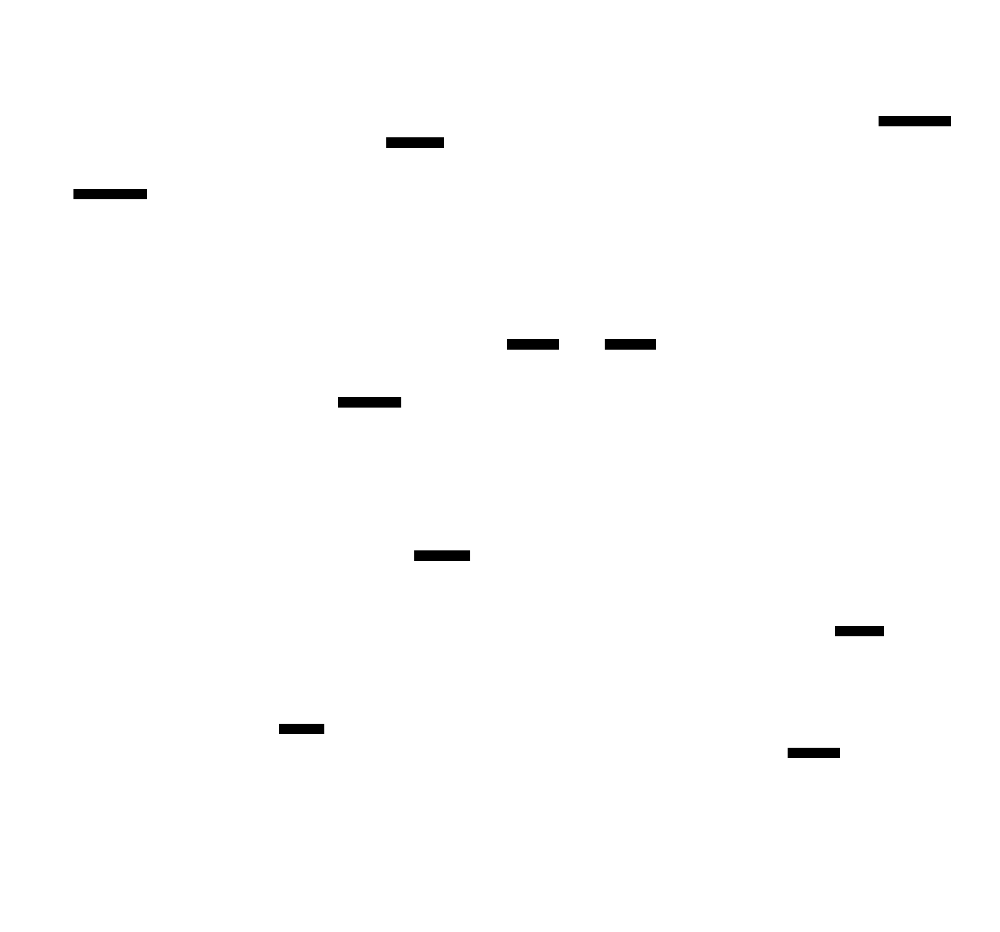

# Chronos MMO Engine: Design Document


## Overview

Chronos is a high-performance multiplayer game engine designed to support tens of thousands of concurrent players in a seamless virtual world. The core architectural challenge is achieving low-latency, synchronized gameplay at massive scale through spatial partitioning, intelligent networking, and client-server state reconciliation.


> This guide is meant to help you understand the big picture before diving into each milestone. Refer back to it whenever you need context on how components connect.


## Context and Problem Statement

> **Milestone(s):** Foundation for all milestones - understanding the core challenges that drive the architecture decisions in Milestones 1-4.

### The City Traffic Control Analogy

Imagine you're tasked with designing the traffic management system for a massive metropolitan area like Tokyo or New York City. Your system must coordinate the movement of millions of vehicles simultaneously, ensuring they don't collide, that traffic flows smoothly, and that everyone arrives at their destination safely. Now imagine that instead of cars moving at predictable speeds on fixed roads, you have **tens of thousands of players** moving freely through a three-dimensional virtual world, each capable of instantaneous direction changes, teleportation, and complex interactions with other players.

This is the fundamental challenge of building a massively multiplayer online (MMO) game engine. Just as city traffic control systems must balance **efficiency, safety, and responsiveness** at enormous scale, an MMO engine must solve four interconnected problems simultaneously:

**Spatial Awareness** - Like a traffic control system tracking vehicle positions across thousands of intersections, the MMO engine must know where every player and object exists in the virtual world. But unlike city traffic systems that can rely on fixed roads and predictable movement patterns, MMO entities can move in any direction at any speed, appear and disappear instantly, and cluster unpredictably in popular areas.

**Information Distribution** - Traffic control systems only need to share information with nearby intersections and relevant vehicles. Similarly, a player in New York doesn't need to know about a player fighting monsters in Tokyo within the same virtual world. The engine must intelligently filter and distribute information so each player receives only what they need to see, when they need to see it.

**Real-Time Coordination** - When a traffic light changes or an accident occurs, the information must reach affected drivers within seconds. In an MMO, when a player swings a sword or casts a spell, that action must be visible to nearby players within milliseconds, not seconds. The difference between 50ms and 200ms latency can determine whether a combat action feels responsive or sluggish.

**Consistency and Trust** - Traffic systems must prevent conflicting signals that could cause accidents. MMO engines face an even greater challenge: they must prevent players from "cheating" by claiming impossible actions (like moving faster than allowed or being in multiple places simultaneously) while still providing responsive, low-latency gameplay.

The analogy breaks down in one crucial way: traffic systems can rely on physical laws and human reaction times to provide some predictability. MMO engines must create their own "physics" and enforce their own "laws" across a network where information travels at the speed of light but players expect instant responsiveness.

### Core Technical Challenges

Building an MMO engine that supports tens of thousands of concurrent players requires solving four fundamental technical challenges that are deeply interconnected. Each challenge amplifies the complexity of the others, creating a web of constraints that must be balanced simultaneously.

#### Scale: The Entity Management Explosion

The scale challenge goes far beyond simply "handling many players." Consider a modest MMO world with 10,000 concurrent players. If each player can see approximately 100 other entities (players, monsters, objects) within their view range, the engine must track and update **one million potential entity relationships** every frame. As the player count scales linearly, the interaction complexity scales quadratically.

**Traditional approaches break down** when naive implementations attempt to check every entity against every other entity for proximity, visibility, or interaction. An O(n²) algorithm that works perfectly for 100 entities (10,000 operations) becomes computationally impossible for 10,000 entities (100 million operations). Even with modern hardware capable of billions of operations per second, performing 100 million spatial checks every frame (60 times per second) leaves no computational budget for actual gameplay logic.

The engine must implement **spatial partitioning systems** that reduce entity interaction checks from O(n²) to O(log n) or ideally O(1) for most queries. This requires sophisticated data structures like octrees, spatial hash grids, or hierarchical bounding volumes that can dynamically reorganize as entities move through the world.

**Memory management** becomes critical at scale. With 100,000 entities each containing position, velocity, health, inventory, and other properties, naive storage approaches can exceed available RAM. The engine must implement memory-efficient data structures, object pooling, and intelligent loading/unloading of entities based on player proximity.

#### Latency: The Speed-of-Light Constraint

Network latency introduces a fundamental constraint that cannot be engineered away. Even with perfect networking infrastructure, information cannot travel faster than the speed of light. A player in New York communicating with a server in California faces at minimum 20ms of round-trip latency due to physical distance alone. Real-world internet infrastructure typically adds another 30-80ms of routing, switching, and processing delays.

**Human perception sets the requirements.** Players perceive actions taking longer than 100ms as sluggish and unresponsive. Actions taking longer than 250ms feel broken. Yet with 50-100ms of unavoidable network latency, the engine has only 50ms or less for all processing: receiving input, validating it, updating game state, and sending results to affected players.

**The prediction dilemma** emerges from this constraint. To provide responsive gameplay, the client must show immediate feedback when a player presses a key or clicks to attack. But the server, which maintains authoritative game state, won't receive that input for 50-100ms and won't send confirmation back for another 50-100ms. The client must "predict" what will happen and show it immediately, then handle corrections when the server's authoritative response arrives and differs from the prediction.

**Consistency versus responsiveness** creates an unavoidable trade-off. The engine can prioritize consistency by waiting for server confirmation before showing any action results, but this makes gameplay feel sluggish. Alternatively, it can prioritize responsiveness by showing predicted results immediately, but this requires complex rollback and correction systems when predictions prove wrong.

#### Consistency: The Truth Problem

In a distributed system where multiple clients and servers maintain game state, determining "what really happened" becomes surprisingly complex. Unlike single-player games where one program maintains perfect knowledge of game state, MMO engines must coordinate state across dozens or hundreds of computers, each with slightly different information due to network delays.

**The authority problem** asks: when two players' clients disagree about whether an attack hit or missed, which version is correct? The standard solution makes the server authoritative, but this introduces new problems. If the server is 100ms behind a player's current actions due to network latency, should a sword swing hit an enemy who has already moved away on the server but appears to still be in range on the player's client?

**Race conditions** occur when multiple actions happen nearly simultaneously. Consider two players attempting to pick up the same rare item, or two players shooting at each other with precisely synchronized timing. The order in which the server processes these actions determines the outcome, but network latency means the server might receive the actions in a different order than they actually occurred.

**State synchronization** requires keeping all clients and servers in agreement about game state despite constant changes and network delays. A naive approach that sends complete state snapshots every frame would consume enormous bandwidth. Instead, the engine must send only changes (deltas) and handle cases where clients miss updates due to packet loss or network interruption.

**Cheating prevention** adds another layer of complexity. Players have complete control over their client software and can modify it to claim impossible actions: moving faster than allowed, attacking through walls, or having unlimited resources. The engine must validate every player action on the server while maintaining the low latency required for responsive gameplay.

#### Bandwidth: The Information Bottleneck

Network bandwidth creates a hard limit on how much information can flow between clients and servers. While modern internet connections provide substantial bandwidth, the real constraint is **burst bandwidth** - the amount of data that can be transmitted within the tight timing windows required for low-latency gameplay.

**The relevance filtering problem** becomes critical at scale. In a virtual world with 10,000 players, each player only needs to know about the small subset of players and entities near them. But determining which entities are "relevant" to each player requires spatial calculations, and communicating different information to each player requires customized data streams.

**Update frequency creates multiplicative scaling.** If 1,000 players need updates about 100 nearby entities each, and each entity update requires 50 bytes, the engine must transmit 5 megabytes of data per frame. At 20 frames per second (a reasonable update rate for smooth gameplay), this becomes 100 megabytes per second of outbound bandwidth from the server. Scaling to 10,000 players would require 1 gigabyte per second - far beyond typical server capabilities.

**Delta compression** helps by sending only changes rather than complete state, but introduces new complexity. The engine must track what information each client has previously received, compute differences efficiently, and handle cases where clients miss delta updates and become desynchronized.

**Priority and importance systems** become necessary for bandwidth management. Not all updates are equally important - a nearby player's health change is more critical than a distant player's minor position adjustment. The engine must intelligently prioritize information and degrade gracefully when bandwidth limits are reached.

| Challenge | Primary Constraint | Scaling Behavior | Technical Solution Category |
|-----------|-------------------|------------------|---------------------------|
| Scale | Computational Complexity | O(n²) → O(log n) | Spatial Data Structures |
| Latency | Speed of Light | Fixed ~50-100ms minimum | Prediction and Rollback |
| Consistency | Distributed State | Exponential coordination overhead | Authoritative Servers |
| Bandwidth | Network Capacity | Linear per player × Linear per entity | Interest Management |

### Industry Solutions Comparison

The MMO industry has evolved distinct architectural approaches based on different priorities, constraints, and design philosophies. Understanding how successful games solved these challenges provides valuable context for architectural decisions.

#### EVE Online: The Single-Shard Approach

EVE Online takes a unique approach by running the entire game universe on a **single cluster** with time dilation to handle extreme scale scenarios. Their architecture prioritizes consistency and persistence over low-latency action gameplay.

**Spatial Architecture**: EVE uses a **solar system** based partitioning system where each solar system runs on one or more dedicated server nodes. Since solar systems are discrete areas connected by jump gates, this provides natural boundaries for distributing computational load. When players travel between systems, their state transfers between server nodes.

> **Key Insight**: EVE's success demonstrates that spatial partitioning doesn't require uniform grid systems. Game-specific geography can provide natural partition boundaries that align with gameplay mechanics.

**Consistency Model**: EVE maintains strict server authority for all actions. When extreme load occurs (such as massive battles with thousands of players), the servers implement **time dilation** - slowing down the simulation speed to maintain consistency rather than dropping players or allowing inconsistent state.

**Scale Handling**: Their most impressive achievement is handling **6,000+ players in a single battle** during major conflicts. This is achieved through several techniques:

- **Interest management** that reduces update frequency for distant objects
- **Aggressive level-of-detail** systems that simplify distant ships to single points
- **Time dilation** that can slow simulation speed to 10% of real-time during extreme load
- **Load balancing** that can migrate solar systems between servers based on population

**Bandwidth Optimization**: EVE uses sophisticated **importance scoring** systems. A nearby ship firing weapons receives high-frequency updates, while a distant mining ship might update only every few seconds. This allows them to maintain reasonable bandwidth usage even with thousands of players in proximity.

| Aspect | EVE Online Approach | Strength | Limitation |
|--------|-------------------|----------|------------|
| Latency | Server-authoritative, time dilation | Perfect consistency | Variable response time |
| Scale | Solar system partitioning | Handles 6k+ player battles | Requires game-specific geography |
| Bandwidth | Importance-based update rates | Efficient at any scale | Complex priority calculations |
| Consistency | Strict server authority | No state conflicts | Cannot provide <100ms response |

#### World of Warcraft: The Sharded World Model

World of Warcraft pioneered the **realm (shard) system** that creates multiple parallel copies of the game world to distribute load. Each realm supports 3,000-5,000 concurrent players across the entire world, with additional instancing for dungeons and raids.

**Spatial Architecture**: Each realm runs as a **separate server cluster** with its own complete copy of the world database. Within each realm, the world is divided into **zones** that can run on separate server processes. Players can move seamlessly between zones, but moving between realms requires explicit character transfers.

**Interest Management**: WoW implements sophisticated **area-of-interest** systems based on distance and line-of-sight. Players receive detailed updates about entities within 100 yards, reduced updates for entities within 200 yards, and no updates beyond that range. The system uses **circular interest areas** with multiple update frequency rings.

**Latency Handling**: WoW uses **limited client-side prediction** primarily for movement and basic actions. Combat actions wait for server confirmation, which creates a distinctive "global cooldown" system that masks network latency by preventing players from executing actions faster than the network can confirm them.

**Bandwidth Strategy**: WoW implements **delta compression** where only changed properties are transmitted. A player moving in a straight line might only send position updates every few frames, with the client interpolating between points. State changes like health, mana, or equipment changes are sent immediately.

> **Architecture Decision**: WoW's realm system prioritizes **community stability** and **server performance** over having all players in a single world. This trade-off allows them to provide consistent 50-100ms response times for all players.

**Scalability Model**: Rather than scaling individual servers to handle more players, WoW scales by adding more realms. Popular realms can be "split" by offering free transfers to new realms. This approach has proven sustainable for over 15 years of operation.

| Aspect | World of Warcraft Approach | Strength | Limitation |
|--------|---------------------------|----------|------------|
| Latency | Limited prediction + GCD masking | Consistent 50-100ms response | Artificial pacing required |
| Scale | Multiple parallel realms | Proven 15+ year sustainability | Players separated by realm |
| Bandwidth | Delta compression + LoD | Efficient for 100+ players per area | Complex interpolation logic |
| Consistency | Server authority + rollback | Reliable combat resolution | Occasional "rubber-banding" |

#### Modern Battle Royales: The High-Performance Session Model

Games like Fortnite, PUBG, and Apex Legends represent a newer approach optimized for **fast-paced action** with 100 players in temporary sessions lasting 20-30 minutes.

**Spatial Architecture**: Battle royales use **hierarchical spatial partitioning** with multiple levels of detail. A typical system might use a coarse grid (1km cells) for regional partitioning, medium grids (100m cells) for interest management, and fine grids (10m cells) for collision detection. The shrinking play area allows them to **consolidate spatial partitions** as the match progresses.

**Aggressive Client Prediction**: These games push client-side prediction much further than traditional MMOs. Movement, weapon firing, and even hit detection happen immediately on the client, with server **lag compensation** systems that account for network delay when validating shots.

**Temporal Rollback Systems**: Modern battle royales implement sophisticated **rollback netcode** borrowed from fighting games. When the server determines that a client's prediction was incorrect, it can "rewind" game state to the point of divergence, apply the correct action, and "fast-forward" to the current time with corrected state.

**Bandwidth Innovations**: These games use **adaptive bitrate** systems similar to video streaming. During high-action moments (firefights, multiple players nearby), they increase update rates and data precision. During quiet moments (player alone, moving slowly), they reduce updates aggressively.

> **Key Innovation**: Battle royales demonstrate that **session-based architecture** can achieve lower latency than persistent world systems by optimizing for short-term performance rather than long-term state persistence.

**Cheat Prevention**: The session-based model allows for more aggressive **server validation** since matches are temporary. The server can afford to be more strict about impossible actions, knowing that false positives only affect a 30-minute session rather than a persistent character.

| Aspect | Battle Royale Approach | Strength | Limitation |
|--------|----------------------|----------|------------|
| Latency | Aggressive prediction + lag compensation | 20-50ms effective latency | Complex rollback systems |
| Scale | Session-based + spatial consolidation | High action density | Limited to ~100 players |
| Bandwidth | Adaptive bitrate + priority systems | Efficient burst handling | Requires sophisticated QoS |
| Consistency | Temporal rollback validation | Responsive + authoritative | Session-only persistence |

#### Architectural Pattern Analysis

These industry examples reveal three distinct **architectural patterns** that make different trade-offs:

**The Consistency-First Pattern** (EVE Online) prioritizes perfect state synchronization over low latency. This works well for strategic, economic, or social gameplay where thinking time exceeds reaction time requirements.

**The Community-Scale Pattern** (World of Warcraft) balances consistency, latency, and scale by accepting some limitations (realm separation, artificial pacing) to provide stable, long-term virtual worlds.

**The Performance-First Pattern** (Battle Royales) prioritizes the lowest possible latency for competitive action gameplay by accepting limited session duration and more complex validation systems.

> **Design Principle**: There is no "best" MMO architecture. The optimal approach depends entirely on the type of gameplay experience you want to create and the trade-offs you're willing to accept.

For the Chronos MMO Engine, we draw insights from all three patterns: spatial partitioning from EVE, interest management from WoW, and rollback netcode from battle royales. The challenge lies in combining these approaches into a coherent architecture that can adapt to different gameplay requirements.

### Implementation Guidance

This section establishes the foundational understanding and development environment for building the Chronos MMO Engine. The concepts discussed here will inform every architectural decision in the subsequent milestones.

#### Technology Recommendations

| Component | Simple Option | Advanced Option |
|-----------|---------------|-----------------|
| **Networking** | `socket` with UDP + JSON serialization | `asyncio` with custom binary protocol + msgpack |
| **Spatial Data** | Python lists with linear search | `numpy` arrays with vectorized operations |
| **Concurrency** | `threading` with locks | `asyncio` with coroutines + `multiprocessing` for CPU-intensive tasks |
| **Serialization** | `json` for human-readable debugging | `msgpack` or `protobuf` for production performance |
| **Profiling** | `cProfile` + `line_profiler` | `py-spy` for production profiling |
| **Testing** | `unittest` with manual test scenarios | `pytest` with `hypothesis` for property-based testing |

#### Recommended Project Structure

Understanding the system architecture requires establishing a clear project organization from the start:

```
chronos-engine/
├── chronos/
│   ├── __init__.py
│   ├── core/                    # Core engine components
│   │   ├── __init__.py
│   │   ├── entity.py           # Entity and Component definitions
│   │   ├── events.py           # Event system for component communication
│   │   └── time.py             # Game time and frame management
│   ├── spatial/                 # Milestone 1: Spatial Intelligence
│   │   ├── __init__.py
│   │   ├── partitioning.py     # Octree and spatial hash implementations
│   │   ├── queries.py          # K-NN and range query algorithms
│   │   └── culling.py          # Frustum culling and visibility
│   ├── interest/                # Milestone 2: Interest Management
│   │   ├── __init__.py
│   │   ├── aoi.py              # Area of Interest filtering
│   │   ├── delta.py            # Delta compression algorithms
│   │   └── priority.py         # Update priority systems
│   ├── network/                 # Milestone 3: Competitive Netcode
│   │   ├── __init__.py
│   │   ├── transport.py        # UDP transport layer
│   │   ├── protocol.py         # Message format and serialization
│   │   ├── congestion.py       # Congestion control algorithms
│   │   └── security.py         # Encryption and anti-tamper
│   ├── rollback/                # Milestone 4: Rollback System
│   │   ├── __init__.py
│   │   ├── simulation.py       # Deterministic simulation core
│   │   ├── history.py          # State history and rollback
│   │   └── reconciliation.py   # Client-server reconciliation
│   └── testing/                 # Shared testing utilities
│       ├── __init__.py
│       ├── scenarios.py        # Common test scenarios
│       ├── mocks.py            # Mock network conditions
│       └── benchmarks.py       # Performance benchmarking
├── examples/
│   ├── simple_server.py        # Basic server implementation
│   ├── test_client.py          # Client for testing scenarios
│   └── benchmarks/             # Performance test scenarios
├── tests/
│   ├── unit/                   # Unit tests for each component
│   ├── integration/            # Cross-component integration tests
│   └── performance/            # Scale and performance validation
└── docs/
    ├── architecture.md         # This design document
    └── api/                    # Generated API documentation
```

#### Foundation Infrastructure

Before implementing the core milestones, establish these foundational components that all subsequent systems will depend upon:

**Entity Component System Foundation:**

```python
# chronos/core/entity.py
from typing import Dict, Any, Set, Optional
import uuid
from dataclasses import dataclass, field
from abc import ABC, abstractmethod

@dataclass
class Entity:
    """
    Represents any object in the game world: players, NPCs, items, projectiles.
    Uses composition pattern where behavior is defined by attached components.
    """
    entity_id: str = field(default_factory=lambda: str(uuid.uuid4()))
    components: Dict[str, 'Component'] = field(default_factory=dict)
    active: bool = True
    
    def add_component(self, component: 'Component') -> None:
        """Add a component to this entity. Component name derived from class."""
        # TODO: Add component to components dict using component.__class__.__name__
        # TODO: Set component.entity reference to self
        # TODO: Call component.on_attach() if method exists
        pass
    
    def get_component(self, component_type: str) -> Optional['Component']:
        """Retrieve a component by type name."""
        # TODO: Return component from components dict, or None if not found
        pass
    
    def remove_component(self, component_type: str) -> bool:
        """Remove a component by type name. Returns True if component existed."""
        # TODO: Call component.on_detach() if method exists
        # TODO: Remove from components dict
        # TODO: Return whether component was actually removed
        pass

class Component(ABC):
    """
    Base class for all entity components. Components define entity behavior
    and data. Examples: PositionComponent, HealthComponent, NetworkComponent.
    """
    def __init__(self):
        self.entity: Optional[Entity] = None
    
    @abstractmethod
    def to_dict(self) -> Dict[str, Any]:
        """Serialize component data for network transmission or persistence."""
        pass
    
    @abstractmethod
    def from_dict(self, data: Dict[str, Any]) -> None:
        """Deserialize component data from network or persistence."""
        pass

# Core components that all systems need
@dataclass
class PositionComponent(Component):
    x: float = 0.0
    y: float = 0.0
    z: float = 0.0
    velocity_x: float = 0.0
    velocity_y: float = 0.0
    velocity_z: float = 0.0
    
    def to_dict(self) -> Dict[str, Any]:
        return {
            'x': self.x, 'y': self.y, 'z': self.z,
            'vx': self.velocity_x, 'vy': self.velocity_y, 'vz': self.velocity_z
        }
    
    def from_dict(self, data: Dict[str, Any]) -> None:
        self.x = data.get('x', 0.0)
        self.y = data.get('y', 0.0)
        self.z = data.get('z', 0.0)
        self.velocity_x = data.get('vx', 0.0)
        self.velocity_y = data.get('vy', 0.0)
        self.velocity_z = data.get('vz', 0.0)

@dataclass
class NetworkComponent(Component):
    """Tracks networking state for entities that need network synchronization."""
    last_update_time: float = 0.0
    update_priority: int = 0  # Higher = more important for bandwidth allocation
    interested_clients: Set[str] = field(default_factory=set)
    
    def to_dict(self) -> Dict[str, Any]:
        return {
            'last_update': self.last_update_time,
            'priority': self.update_priority
        }
    
    def from_dict(self, data: Dict[str, Any]) -> None:
        self.last_update_time = data.get('last_update', 0.0)
        self.update_priority = data.get('priority', 0)
```

**Event System for Component Communication:**

```python
# chronos/core/events.py
from typing import Dict, List, Callable, Any
from dataclasses import dataclass
import time

@dataclass
class Event:
    """Base class for all events in the system."""
    event_type: str
    timestamp: float = field(default_factory=time.time)
    source_entity: str = ""
    data: Dict[str, Any] = field(default_factory=dict)

class EventBus:
    """
    Central event system for loosely coupled component communication.
    Components can publish events and subscribe to event types.
    """
    def __init__(self):
        self.subscribers: Dict[str, List[Callable[[Event], None]]] = {}
        self.event_history: List[Event] = []  # For debugging and rollback
    
    def subscribe(self, event_type: str, handler: Callable[[Event], None]) -> None:
        """Subscribe a handler function to an event type."""
        # TODO: Add handler to subscribers list for event_type
        # TODO: Create empty list if event_type doesn't exist yet
        pass
    
    def publish(self, event: Event) -> None:
        """Publish an event to all subscribers."""
        # TODO: Add event to event_history for debugging
        # TODO: Call all registered handlers for event.event_type
        # TODO: Handle exceptions in handlers gracefully (log but continue)
        pass
    
    def clear_history_before(self, timestamp: float) -> None:
        """Remove old events from history to prevent memory leaks."""
        # TODO: Filter event_history to only keep events after timestamp
        pass

# Common event types the engine will use
@dataclass
class EntityMovedEvent(Event):
    """Published when an entity changes position."""
    event_type: str = "entity_moved"

@dataclass
class EntitySpawnedEvent(Event):
    """Published when a new entity enters the world."""
    event_type: str = "entity_spawned"

@dataclass
class EntityDespawnedEvent(Event):
    """Published when an entity leaves the world."""
    event_type: str = "entity_despawned"
```

**Game Time and Frame Management:**

```python
# chronos/core/time.py
import time
from typing import Optional

class GameTime:
    """
    Manages deterministic game time separate from wall clock time.
    Essential for rollback systems that need to replay time precisely.
    """
    def __init__(self, target_fps: int = 60):
        self.target_fps = target_fps
        self.frame_duration = 1.0 / target_fps
        self.current_frame = 0
        self.game_time = 0.0
        self.wall_start_time = time.time()
        self.last_frame_time = self.wall_start_time
    
    def advance_frame(self) -> None:
        """Advance to the next game frame. Call once per simulation step."""
        # TODO: Increment current_frame
        # TODO: Update game_time based on frame_duration
        # TODO: Update last_frame_time to current wall time
        pass
    
    def get_frame_delta(self) -> float:
        """Get time elapsed since last frame in seconds."""
        # TODO: Calculate wall time since last_frame_time
        # TODO: Clamp to reasonable values (0.001 to 0.1) for stability
        pass
    
    def is_frame_ready(self) -> bool:
        """Check if enough wall time has passed for the next frame."""
        # TODO: Compare current wall time to expected frame time
        # TODO: Return True if we should process the next frame
        pass
    
    def sleep_until_next_frame(self) -> None:
        """Sleep until it's time for the next frame (for frame rate limiting)."""
        # TODO: Calculate time until next frame should start
        # TODO: Sleep for that duration (use time.sleep)
        pass
```

#### Milestone Validation Framework

Each milestone needs clear success criteria. Establish this testing framework early:

```python
# chronos/testing/scenarios.py
from typing import List, Dict, Any, Callable
import time
import random

class TestScenario:
    """Base class for milestone validation scenarios."""
    def __init__(self, name: str, description: str):
        self.name = name
        self.description = description
        self.success_criteria: List[Callable[[], bool]] = []
    
    def add_success_criterion(self, check: Callable[[], bool], description: str) -> None:
        """Add a test that must pass for scenario to succeed."""
        # TODO: Add check function to success_criteria list
        # Store description for debugging failed tests
        pass
    
    def run(self) -> Dict[str, Any]:
        """Execute the scenario and return results."""
        # TODO: Run all success criteria checks
        # TODO: Return dict with: passed count, failed count, total time, details
        pass

# Example scenarios for each milestone
class SpatialScaleScenario(TestScenario):
    """Test Milestone 1: Spatial system with many entities."""
    def __init__(self, entity_count: int = 10000):
        super().__init__(
            f"Spatial Scale Test ({entity_count} entities)",
            f"Validate spatial system performance with {entity_count} entities"
        )
        self.entity_count = entity_count
    
    def setup_entities(self) -> List[Any]:
        """Create test entities distributed across space."""
        # TODO: Create entity_count entities with random positions
        # TODO: Add PositionComponent to each entity
        # TODO: Return list of created entities for testing
        pass
    
    def test_knn_performance(self, spatial_system: Any, entities: List[Any]) -> bool:
        """Test k-nearest neighbor query performance."""
        # TODO: Pick random entity as query center
        # TODO: Measure time for k-NN query (should be < 1ms)
        # TODO: Verify results are actually nearest neighbors
        # TODO: Return True if performance and correctness both pass
        pass
```

#### Development Workflow Setup

Establish development practices that support the complexity of MMO engine development:

**Performance Monitoring:**
```python
# chronos/testing/benchmarks.py
import time
import psutil
from contextlib import contextmanager
from typing import Dict, Any

@contextmanager
def performance_monitor(operation_name: str):
    """Context manager to monitor CPU, memory, and time for operations."""
    process = psutil.Process()
    start_time = time.perf_counter()
    start_cpu = process.cpu_percent()
    start_memory = process.memory_info().rss / 1024 / 1024  # MB
    
    yield
    
    end_time = time.perf_counter()
    end_cpu = process.cpu_percent()
    end_memory = process.memory_info().rss / 1024 / 1024  # MB
    
    print(f"{operation_name} Performance:")
    print(f"  Time: {(end_time - start_time)*1000:.2f}ms")
    print(f"  Memory: {end_memory:.1f}MB ({end_memory-start_memory:+.1f}MB)")
    print(f"  CPU: {end_cpu:.1f}%")

# Usage example:
# with performance_monitor("K-NN Query"):
#     results = spatial_system.find_nearest(entity, k=10)
```

#### Language-Specific Performance Tips

Python-specific optimizations that will be crucial for MMO engine performance:

1. **Use `numpy` for spatial calculations** - Vectorized operations are 10-100x faster than pure Python loops
2. **Leverage `asyncio` for network I/O** - Essential for handling thousands of concurrent connections
3. **Profile early and often** - Use `cProfile` and `line_profiler` to identify bottlenecks
4. **Consider `numba` for hot paths** - JIT compilation for performance-critical algorithms
5. **Use `__slots__` for frequently created classes** - Reduces memory overhead for entities and components
6. **Implement object pooling** - Reuse entity and component objects to reduce garbage collection pressure

#### Next Steps Preparation

Before implementing Milestone 1 (Spatial Intelligence), ensure you have:

1. **Created the project structure** with all recommended directories
2. **Implemented the foundation classes** - Entity, Component, EventBus, GameTime
3. **Set up the testing framework** with performance monitoring
4. **Chosen your technology stack** from the recommendations above
5. **Established development practices** with profiling and benchmarking tools

Each milestone will build upon these foundations, so invest time in getting them solid and well-tested before moving forward.


## Goals and Non-Goals

> **Milestone(s):** Foundation for all milestones - establishing clear boundaries and success metrics that guide implementation decisions across Milestones 1-4.

### The Engine Specification Analogy

Think of this section as writing the **technical specification for a race car engine**. Before any engineer touches a wrench or writes a line of code, we need to answer fundamental questions: How much horsepower must it produce? What's the maximum RPM? What fuel does it consume? Equally important - what are we *not* building? We're not designing the chassis, the aerodynamics, or the driver's seat. 

In software architecture, this clarity prevents **scope creep** - the gradual expansion of requirements that turns a focused, high-performance system into a bloated, mediocre one. Just as a Formula 1 engine is optimized for speed rather than fuel economy or passenger comfort, Chronos is laser-focused on solving the core challenges of massive multiplayer real-time simulation.

The goals and non-goals serve as our **north star** throughout development. When facing implementation trade-offs, we return to these requirements: Does this decision help us support 10,000+ concurrent players? Does it reduce latency? If not, we reject it, regardless of how elegant or interesting it might be.

### Functional Requirements

The functional requirements define the **measurable capabilities** that Chronos must deliver. These aren't aspirational goals - they're hard constraints that determine architectural decisions throughout the system. Each requirement maps directly to one or more of our four milestones and drives specific technical choices.

#### Scale and Performance Targets

| Requirement | Target Value | Rationale | Validation Method |
|-------------|--------------|-----------|-------------------|
| **Concurrent Players** | 10,000+ players per server instance | Modern MMOs require massive scale; smaller numbers indicate architectural limitations | Load testing with simulated clients |
| **Entity Count** | 100,000+ active entities in world | Beyond players: NPCs, projectiles, items, environmental objects | Spatial partitioning stress tests |
| **Server Tick Rate** | 60 Hz (16.67ms frame duration) | Fast-paced gameplay requires high update frequency for responsiveness | Frame timing measurements |
| **Network Latency** | <50ms added latency overhead | Engine shouldn't add significant delay beyond network round-trip time | Packet timestamp analysis |
| **Memory Usage** | <8GB RAM for full capacity | Cost-effective server deployment; predictable resource requirements | Memory profiling under load |
| **CPU Usage** | <80% on 16-core server | Headroom for traffic spikes; consistent performance | Performance monitoring |

> **Design Insight**: The 60 Hz tick rate drives many architectural decisions. With 16.67ms per frame and 10,000 players, we have approximately **1.67 microseconds per player per frame** for processing. This constraint eliminates many "nice to have" features and forces us toward highly optimized algorithms.

#### Gameplay Feature Requirements

The engine must support core MMO gameplay patterns that stress different aspects of the system architecture. These requirements ensure our technical solutions address real-world usage patterns rather than artificial benchmarks.

| Feature Category | Specific Requirements | Technical Implications |
|------------------|----------------------|----------------------|
| **Real-time Movement** | Smooth player movement with sub-50ms input response | Client-side prediction, rollback netcode (Milestone 4) |
| **Combat System** | Hit detection with lag compensation up to 200ms | Rollback timeline management, deterministic simulation |
| **Proximity Interactions** | Player trading, conversations, group formation | Efficient k-nearest neighbor queries (Milestone 1) |
| **Large-Scale Events** | 500+ players in same area without degradation | Dynamic spatial partitioning, interest management scaling |
| **Persistent World State** | Object placement, terrain changes preserved across sessions | State serialization, delta compression (Milestone 2) |
| **Anti-Cheat Foundation** | Server-authoritative validation of all actions | Packet encryption, rollback verification (Milestones 3-4) |

#### World and Content Requirements

| Aspect | Specification | Architectural Impact |
|--------|---------------|---------------------|
| **World Size** | 10km x 10km seamless area minimum | No loading screens; spatial partitioning must handle scale |
| **Terrain Complexity** | Multi-level environments (buildings, caves, sky platforms) | 3D spatial partitioning rather than 2D grid approaches |
| **Entity Diversity** | Support for 50+ different entity types with unique properties | Flexible component system, extensible serialization |
| **Dynamic Content** | Real-time world changes (destruction, construction, weather) | Efficient delta updates, interest management for environmental changes |

#### Reliability and Consistency Requirements

| Requirement | Standard | Implementation Requirement |
|-------------|----------|---------------------------|
| **State Consistency** | No permanent desynchronization between clients | Deterministic simulation, rollback correction |
| **Fault Tolerance** | Graceful handling of 5% packet loss | Reliable message delivery over UDP (Milestone 3) |
| **Cheat Resistance** | Server validation of all state-changing actions | Encrypted packets, server-side physics simulation |
| **Data Integrity** | Zero data corruption under normal operation | Packet verification, state checksums |

> **Critical Constraint**: Notice that these requirements are **mutually constraining**. Supporting 10,000 players while maintaining 60 Hz updates with <50ms latency eliminates many traditional approaches. We cannot use TCP for real-time updates, cannot send full state snapshots, and cannot afford expensive algorithms in hot paths.

### Explicit Non-Goals

Defining what we're **not building** is equally important as defining what we are. These non-goals prevent feature creep and maintain focus on core multiplayer engine challenges. Each non-goal represents a conscious architectural decision to optimize for our primary objectives.

#### Graphics and Rendering Systems

**What we exclude**: 3D graphics rendering, shader systems, texture management, animation systems, visual effects, lighting calculations, or any GPU-related functionality.

**Rationale**: Graphics rendering is a completely separate technical domain with its own performance characteristics, hardware requirements, and optimization challenges. Modern game engines like Unity, Unreal, or Godot already provide excellent rendering capabilities. Chronos focuses on the **networking and simulation layer** that sits beneath the presentation layer.

**Boundary definition**: Chronos provides spatial data (entity positions, orientations) and state information (health, animations states) that rendering engines consume. We define the **data contracts** but don't implement the visual representation.

| Rendering Aspect | Chronos Provides | Chronos Does NOT Provide |
|-------------------|------------------|-------------------------|
| **Entity Positions** | ✅ 3D coordinates, rotation quaternions | ❌ Mesh data, textures, materials |
| **Animation State** | ✅ Current animation name, frame index, speed | ❌ Skeletal animation, blending, inverse kinematics |
| **Visual Effects** | ✅ Effect trigger events, duration, participants | ❌ Particle systems, shaders, post-processing |
| **Lighting** | ✅ Time of day, weather state data | ❌ Shadow mapping, global illumination, HDR |

#### Audio and Sound Systems

**What we exclude**: Audio playback, 3D positional audio, music systems, voice chat, or any audio processing functionality.

**Rationale**: Audio systems have real-time requirements similar to graphics and require specialized knowledge of audio hardware, codecs, and signal processing. Like graphics, audio is better handled by dedicated engines that can integrate with Chronos through well-defined interfaces.

**Integration approach**: Chronos emits **audio event notifications** (player fired weapon, door opened, ambient sound zone entered) with spatial information. Audio engines subscribe to these events and handle playback, 3D positioning, and mixing.

#### Content Creation Tools

**What we exclude**: Level editors, asset importers, scripting IDEs, debugging GUIs, or any content authoring tools.

**Rationale**: Content creation tools are user interface applications with completely different architectural requirements from real-time server software. They require desktop GUI frameworks, file format parsers, and user experience design - skills orthogonal to high-performance networking.

**Developer experience approach**: Instead of building tools, we focus on **clean APIs** and **data format documentation** that make it easy for tool developers to build editors that work with Chronos. We provide file format specifications and import/export libraries.

#### Platform-Specific Optimizations

**What we exclude**: Console-specific code, mobile platform adaptations, embedded systems support, or hardware-specific optimizations beyond standard SIMD instructions.

**Rationale**: Platform optimization requires deep knowledge of specific hardware architectures, operating system APIs, and deployment constraints. Supporting multiple platforms would fragment our codebase and reduce our ability to optimize for server-class hardware where MMO engines typically run.

**Target platform**: We optimize specifically for **Linux server environments** running on x86_64 architecture with standard networking hardware. This allows us to make assumptions about memory models, system calls, and instruction sets that enable maximum performance.

#### Game Logic and Content Systems

**What we exclude**: Specific gameplay mechanics (combat formulas, progression systems, quest logic), game balance parameters, or content-specific features.

**Rationale**: Chronos is a **multiplayer engine**, not a complete game. Game logic varies dramatically between different types of games (fantasy MMO vs. sci-fi shooter vs. racing game). Building game-specific logic into the engine would make it unsuitable for other genres.

**Extensibility approach**: We provide **component systems** and **event buses** that allow game developers to implement their own logic while leveraging Chronos's networking, spatial, and rollback capabilities.

| System Layer | Chronos Responsibility | Game Developer Responsibility |
|--------------|----------------------|------------------------------|
| **Networking** | ✅ Packet delivery, compression, encryption | ❌ Message content, protocol semantics |
| **Spatial** | ✅ Efficient queries, collision detection | ❌ What actions collision triggers |
| **Physics** | ✅ Movement integration, rollback | ❌ Force calculations, material properties |
| **Entities** | ✅ Component storage, replication | ❌ Component behavior, game rules |

#### Database and Persistence Systems

**What we exclude**: Player account management, persistent storage of game world, player progression databases, or any long-term data persistence beyond session state.

**Rationale**: Database design involves different performance characteristics (throughput vs. latency), consistency models (ACID vs. eventual consistency), and operational concerns (backup, scaling, sharding) from real-time simulation. Most games use specialized database solutions optimized for their specific data patterns.

**Data interface approach**: Chronos provides **serialization APIs** for converting game state to/from binary formats that can be stored in external systems. We define the data contracts but don't implement the storage layer.

### Architecture Decision Record: Scope Boundaries

> **Decision: Engine vs. Framework Approach**
> - **Context**: We could build either a complete game engine (like Unity) that handles all game development needs, or a focused multiplayer framework that solves specific networking and simulation challenges.
> - **Options Considered**: 
>   1. **Complete Engine**: Graphics, audio, physics, networking, scripting, tools
>   2. **Multiplayer Framework**: Networking, spatial, rollback systems only
>   3. **Networking Library**: Just packet delivery and basic state sync
> - **Decision**: Multiplayer Framework (Option 2)
> - **Rationale**: Complete engines require 10x more development effort across diverse technical domains, making it impossible to achieve best-in-class performance for multiplayer scenarios. Networking libraries are too low-level and force every game to solve spatial partitioning and rollback independently.
> - **Consequences**: Game developers must integrate Chronos with separate rendering and audio engines, but get a multiplayer solution optimized specifically for massive scale and low latency.

### Success Metrics and Validation

To ensure we meet our functional requirements, we establish **measurable success criteria** that can be validated through testing. These metrics directly correspond to our milestone deliverables and provide objective assessment of whether Chronos achieves its goals.

| Milestone | Primary Metric | Target Value | Test Method |
|-----------|----------------|--------------|-------------|
| **Spatial Intelligence** | k-NN query performance | <1ms for 1000 nearest entities | Benchmark with 100k entity distribution |
| **Interest Management** | Bandwidth per player | <10KB/s per player average | Network traffic analysis under typical gameplay |
| **Competitive Netcode** | Packet loss recovery | 95% successful delivery under 5% loss | Simulated network conditions |
| **Rollback Boss** | Misprediction correction | <2 frame visual discontinuity | Visual smoothness analysis |

### Common Requirements Pitfalls

⚠️ **Pitfall: Underestimating Interaction Between Requirements**

Many developers treat each requirement independently, but MMO engine requirements are **highly coupled**. For example, increasing player count from 1,000 to 10,000 doesn't just require 10x more memory - it often requires fundamentally different algorithms because spatial relationships become denser and network topology changes.

**Why this is dangerous**: Linear scaling assumptions break down at large scales. An algorithm that works well for 100 entities may become unusably slow at 10,000 entities due to quadratic complexity.

**How to avoid**: Always analyze **computational complexity** for target scale. If an algorithm is O(n²) and you need to support 10,000 entities, you're looking at 100 million operations - potentially too slow for real-time execution.

⚠️ **Pitfall: Vague Performance Requirements**

Specifying "good performance" or "low latency" without numerical targets makes it impossible to make architectural trade-offs or validate success.

**Example of the problem**: Without specific latency targets, you might choose elegant but slow algorithms that feel fine in development but break under production load.

**How to fix**: Every performance requirement must include **specific numbers** and **measurement methodology**. "Low latency" becomes "<50ms added latency measured via packet timestamps under 80% CPU utilization."

⚠️ **Pitfall: Ignoring Resource Constraints**

Focusing on functional capabilities while ignoring memory, CPU, and bandwidth constraints leads to systems that work in theory but are too expensive to operate in practice.

**Why this matters**: A system that requires 64GB RAM and 32 CPU cores per 1000 players might be technically correct but economically unfeasible compared to competitors.

**Solution approach**: Establish **resource budgets** early and validate that your architecture can meet functional requirements within those constraints.

### Implementation Guidance

This section establishes the foundation for all subsequent implementation work by defining clear scope boundaries and success criteria. The goals and non-goals influence every architectural decision in the following milestones.

#### Technology Recommendations Table

| Aspect | Simple Option | Advanced Option |
|--------|---------------|-----------------|
| **Performance Testing** | Python `time.time()` + manual logging | Python `cProfile` + `memory_profiler` |
| **Load Testing** | Single-threaded client simulator | `asyncio`-based concurrent client simulator |
| **Network Simulation** | Manual packet delay in test code | `tc` (traffic control) for realistic network conditions |
| **Metrics Collection** | Print statements + manual analysis | `prometheus_client` for structured metrics |

#### Recommended Module Structure

The goals and non-goals inform how we structure the entire Chronos project. This organization reflects our scope boundaries - notice we have no graphics, audio, or content creation directories:

```
chronos/
├── core/                           # Core engine infrastructure (all milestones)
│   ├── __init__.py
│   ├── entity.py                   # Entity and Component base classes
│   ├── event_bus.py               # Event system for decoupled communication
│   ├── game_time.py               # Frame timing and synchronization
│   └── constants.py               # TARGET_FPS, MAX_ENTITIES, etc.
├── spatial/                        # Milestone 1: Spatial Intelligence
│   ├── __init__.py
│   ├── octree.py                  # Octree implementation
│   ├── spatial_hash.py            # Alternative spatial partitioning
│   └── queries.py                 # k-NN and range queries
├── interest/                       # Milestone 2: Interest Management
│   ├── __init__.py
│   ├── aoi_manager.py             # Area of Interest filtering
│   ├── delta_compression.py       # State difference encoding
│   └── update_scheduler.py        # Dynamic frequency management
├── network/                        # Milestone 3: Competitive Netcode
│   ├── __init__.py
│   ├── udp_transport.py           # Custom UDP protocol
│   ├── packet_codec.py            # Bit-packing and fragmentation
│   ├── congestion_control.py      # Game-optimized flow control
│   └── security.py               # Encryption and anti-tamper
├── rollback/                       # Milestone 4: Rollback System
│   ├── __init__.py
│   ├── prediction.py              # Client-side prediction
│   ├── reconciliation.py          # Server reconciliation
│   ├── simulation.py              # Deterministic game state
│   └── lag_compensation.py        # Combat and interaction lag compensation
├── testing/                        # Cross-cutting testing utilities
│   ├── __init__.py
│   ├── scenarios.py               # TestScenario implementations
│   ├── network_simulation.py      # Packet loss/latency simulation
│   └── performance_benchmarks.py  # Load and stress testing
└── examples/                       # Integration examples
    ├── simple_server.py           # Basic server implementation
    ├── test_client.py            # Client for testing
    └── benchmark_suite.py        # Performance validation
```

#### Core Infrastructure Starter Code

These foundational classes support all four milestones and implement the data structures defined in our naming conventions:

**File: `core/entity.py`**
```python
"""
Entity-Component System foundation for Chronos.
Provides the base classes that all game objects use.
"""
from abc import ABC, abstractmethod
from typing import Dict, Any, Optional, Type, TypeVar
import time

T = TypeVar('T', bound='Component')

class Component(ABC):
    """Base class for all entity components."""
    
    def __init__(self):
        self.entity: Optional['Entity'] = None
    
    @abstractmethod
    def to_dict(self) -> Dict[str, Any]:
        """Serialize component data for network transmission."""
        pass
    
    @abstractmethod
    def from_dict(self, data: Dict[str, Any]) -> None:
        """Deserialize component data from network."""
        pass

class PositionComponent(Component):
    """Spatial position and velocity for entities."""
    
    def __init__(self, x: float = 0.0, y: float = 0.0, z: float = 0.0,
                 velocity_x: float = 0.0, velocity_y: float = 0.0, velocity_z: float = 0.0):
        super().__init__()
        self.x = x
        self.y = y
        self.z = z
        self.velocity_x = velocity_x
        self.velocity_y = velocity_y
        self.velocity_z = velocity_z
    
    def to_dict(self) -> Dict[str, Any]:
        return {
            'x': self.x, 'y': self.y, 'z': self.z,
            'velocity_x': self.velocity_x,
            'velocity_y': self.velocity_y,
            'velocity_z': self.velocity_z
        }
    
    def from_dict(self, data: Dict[str, Any]) -> None:
        self.x = data['x']
        self.y = data['y']
        self.z = data['z']
        self.velocity_x = data['velocity_x']
        self.velocity_y = data['velocity_y']
        self.velocity_z = data['velocity_z']

class NetworkComponent(Component):
    """Network replication metadata for entities."""
    
    def __init__(self):
        super().__init__()
        self.last_update_time: float = time.time()
        self.update_priority: int = 1
        self.interested_clients: set[str] = set()
    
    def to_dict(self) -> Dict[str, Any]:
        return {
            'last_update_time': self.last_update_time,
            'update_priority': self.update_priority,
            'interested_clients': list(self.interested_clients)
        }
    
    def from_dict(self, data: Dict[str, Any]) -> None:
        self.last_update_time = data['last_update_time']
        self.update_priority = data['update_priority']
        self.interested_clients = set(data['interested_clients'])

class Entity:
    """Game object that holds components and manages its lifecycle."""
    
    def __init__(self, entity_id: str):
        self.entity_id = entity_id
        self.components: Dict[str, Component] = {}
        self.active = True
    
    def add_component(self, component: Component) -> None:
        """Add a component to this entity."""
        component.entity = self
        self.components[type(component).__name__] = component
    
    def get_component(self, component_type: Type[T]) -> Optional[T]:
        """Retrieve a component by type."""
        return self.components.get(component_type.__name__)
    
    def remove_component(self, component_type: Type[Component]) -> bool:
        """Remove a component by type. Returns True if component was present."""
        component_name = component_type.__name__
        if component_name in self.components:
            self.components[component_name].entity = None
            del self.components[component_name]
            return True
        return False
    
    def to_dict(self) -> Dict[str, Any]:
        """Serialize entire entity for network transmission."""
        return {
            'entity_id': self.entity_id,
            'active': self.active,
            'components': {name: comp.to_dict() for name, comp in self.components.items()}
        }
```

**File: `core/event_bus.py`**
```python
"""
Event system for decoupled communication between engine subsystems.
Used extensively in rollback and interest management.
"""
from typing import Dict, List, Callable, Any
from dataclasses import dataclass
import time

@dataclass
class Event:
    """Represents an event that occurred in the game world."""
    event_type: str
    timestamp: float
    source_entity: str
    data: Dict[str, Any]

class EventBus:
    """Central event dispatcher for the Chronos engine."""
    
    def __init__(self, max_history: int = 10000):
        self.subscribers: Dict[str, List[Callable[[Event], None]]] = {}
        self.event_history: List[Event] = []
        self.max_history = max_history
    
    def subscribe(self, event_type: str, handler: Callable[[Event], None]) -> None:
        """Subscribe a handler function to an event type."""
        if event_type not in self.subscribers:
            self.subscribers[event_type] = []
        self.subscribers[event_type].append(handler)
    
    def publish(self, event: Event) -> None:
        """Publish an event to all subscribers."""
        # Store in history for rollback system
        self.event_history.append(event)
        if len(self.event_history) > self.max_history:
            self.event_history.pop(0)
        
        # Notify subscribers
        if event.event_type in self.subscribers:
            for handler in self.subscribers[event.event_type]:
                try:
                    handler(event)
                except Exception as e:
                    print(f"Error in event handler for {event.event_type}: {e}")
    
    def get_events_since(self, timestamp: float) -> List[Event]:
        """Get all events since a given timestamp (used by rollback system)."""
        return [event for event in self.event_history if event.timestamp >= timestamp]
```

**File: `core/game_time.py`**
```python
"""
Frame timing and synchronization for deterministic simulation.
Critical for rollback netcode and consistent tick rates.
"""
import time
from typing import Optional

# Global constants matching naming conventions
TARGET_FPS = 60
FRAME_DURATION = 1.0 / TARGET_FPS

class GameTime:
    """Manages fixed timestep simulation for deterministic gameplay."""
    
    def __init__(self, target_fps: int = TARGET_FPS):
        self.target_fps = target_fps
        self.frame_duration = 1.0 / target_fps
        self.current_frame = 0
        self.game_time = 0.0
        self.wall_start_time = time.time()
        self.last_frame_time = self.wall_start_time
    
    def advance_frame(self) -> None:
        """Advance to the next game frame."""
        self.current_frame += 1
        self.game_time = self.current_frame * self.frame_duration
        self.last_frame_time = time.time()
    
    def get_frame_delta(self) -> float:
        """Get time elapsed since last frame advance."""
        return time.time() - self.last_frame_time
    
    def is_frame_ready(self) -> bool:
        """Check if enough wall time has passed for the next frame."""
        expected_wall_time = self.wall_start_time + (self.current_frame + 1) * self.frame_duration
        return time.time() >= expected_wall_time
    
    def get_wall_time_offset(self) -> float:
        """Get difference between game time and wall time (for debugging)."""
        expected_wall_time = self.wall_start_time + self.game_time
        return time.time() - expected_wall_time
```

**File: `core/constants.py`**
```python
"""
Global constants used throughout the Chronos engine.
These values are derived from our functional requirements.
"""

# Performance and Scale Constants
TARGET_FPS = 60
FRAME_DURATION = 1.0 / TARGET_FPS  # 16.67ms per frame
MAX_ENTITIES = 100000  # From our scale requirements

# Network Constants  
MAX_PACKET_SIZE = 1400  # Safe UDP packet size (under MTU)
DEFAULT_PORT = 7777
CONGESTION_WINDOW_SIZE = 32

# Spatial System Constants
OCTREE_MAX_DEPTH = 8
OCTREE_MAX_ENTITIES_PER_NODE = 64
SPATIAL_HASH_CELL_SIZE = 10.0  # meters

# Interest Management Constants
DEFAULT_AOI_RADIUS = 100.0  # meters
HIGH_PRIORITY_UPDATE_DISTANCE = 25.0  # meters
LOW_PRIORITY_UPDATE_DISTANCE = 200.0  # meters

# Rollback Constants
MAX_ROLLBACK_FRAMES = 10  # ~167ms at 60 FPS
PREDICTION_BUFFER_SIZE = 64
```

#### Core Logic Skeleton Code

The goals and non-goals establish what developers should focus on implementing. Here's the skeleton for the main validation system:

**File: `testing/scenarios.py`**
```python
"""
Test scenario framework for validating functional requirements.
Each scenario corresponds to a specific requirement from our goals.
"""
from typing import List, Callable, Any
from dataclasses import dataclass

@dataclass
class TestScenario:
    """Represents a test scenario for validating engine capabilities."""
    name: str
    description: str
    success_criteria: List[Callable[[], bool]]
    
    def __init__(self, name: str, description: str):
        self.name = name
        self.description = description
        self.success_criteria = []
    
    def add_success_criterion(self, check: Callable[[], bool], description: str) -> None:
        """Add a test criterion to this scenario."""
        # TODO 1: Store the check function with its description
        # TODO 2: Consider adding timeout handling for long-running checks
        # TODO 3: Add logging of which criteria pass/fail for debugging
        pass
    
    def run(self) -> bool:
        """Execute all success criteria and return overall result."""
        # TODO 1: Iterate through all success_criteria
        # TODO 2: Execute each criterion and track results
        # TODO 3: Log detailed results for debugging
        # TODO 4: Return True only if ALL criteria pass
        # TODO 5: Consider adding early termination vs. running all checks
        pass

def create_scale_test_scenario() -> TestScenario:
    """Create test scenario for our 10,000 player scale requirement."""
    scenario = TestScenario(
        name="Scale Test: 10K Players", 
        description="Validate engine handles 10,000+ concurrent players with acceptable performance"
    )
    
    # TODO 1: Add criterion for memory usage <8GB under load
    # TODO 2: Add criterion for CPU usage <80% under load  
    # TODO 3: Add criterion for frame rate maintained at 60 FPS
    # TODO 4: Add criterion for network bandwidth within limits
    # Hint: Use lambda functions that return boolean results
    
    return scenario

def create_latency_test_scenario() -> TestScenario:
    """Create test scenario for <50ms latency requirement."""
    # TODO 1: Create TestScenario with appropriate name and description
    # TODO 2: Add criteria for measuring packet round-trip time
    # TODO 3: Add criteria for measuring engine processing overhead
    # TODO 4: Add criteria for end-to-end input->response latency
    # TODO 5: Consider different network conditions (LAN vs Internet)
    pass
```

#### Milestone Checkpoint

After establishing goals and non-goals, validate your understanding:

**Validation Command:**
```bash
python -m pytest testing/test_requirements.py -v
```

**Expected Behavior:**
- All requirement validation tests should have clear pass/fail criteria
- Performance test framework should be able to simulate load conditions  
- Resource monitoring should work on your development machine
- Test scenarios should map clearly to functional requirements

**Signs Something is Wrong:**
- Tests pass but don't actually validate the stated requirements
- Performance targets seem impossible to reach with current architecture
- Scope is expanding beyond the defined non-goals
- Requirements contradict each other (e.g., scale vs. latency targets)

**What to Check:**
1. Do your performance targets align with industry benchmarks?
2. Are non-goals clearly documented and enforced in code reviews?
3. Can you trace every architectural decision back to a specific requirement?
4. Do you have realistic test scenarios for validating each goal?


## High-Level Architecture

> **Milestone(s):** Foundation for Milestones 1-4 - this section establishes the overall system architecture that guides the implementation of spatial partitioning, interest management, networking, and rollback systems.

### Component Overview

Think of the Chronos MMO Engine like a modern air traffic control system managing thousands of aircraft simultaneously. Just as air traffic control divides airspace into sectors, tracks aircraft positions, coordinates communication between pilots and controllers, and maintains safety through redundant systems, our engine divides the virtual world into spatial regions, tracks player positions, manages network communication, and ensures consistency through state synchronization.

The **Spatial Engine** acts as our radar system, continuously tracking every entity's position and efficiently answering questions like "what's near this player?" or "which players can see this explosion?" The **Interest Manager** functions as our communication coordinator, deciding which information each player needs to receive based on their location and attention. The **Network Layer** serves as our radio system, reliably delivering messages between clients and servers while minimizing delays. Finally, the **Rollback System** acts as our time-keeping authority, ensuring all participants maintain a consistent view of when events occurred, even when messages arrive out of order.



The four major subsystems of Chronos work together to create the illusion of a seamless, real-time shared world:

#### Spatial Engine (Milestone 1)

The Spatial Engine is responsible for **spatial partitioning** - intelligently organizing the virtual world to make location-based queries extremely fast. This system maintains a dynamic data structure (either an Octree or spatial hash grid) that can efficiently answer questions like "find all entities within 100 meters of this position" or "which players are in this dungeon room?"

The spatial engine's primary responsibilities include:

- **Entity Position Management**: Tracking the 3D coordinates of every game object, from player characters to dropped items to environmental hazards
- **Dynamic Partitioning**: Automatically subdividing crowded areas into smaller regions while merging sparse areas to maintain optimal query performance
- **K-Nearest Neighbor Queries**: Rapidly finding the closest N entities to any given position, essential for interaction systems, AI behavior, and physics
- **Frustum Culling**: Determining which entities are visible from a given camera position and orientation, critical for rendering and area-of-interest calculations
- **Collision Detection**: Identifying potential entity intersections before expensive physics calculations

| Component | Responsibility | Key Data Structures | Performance Target |
|-----------|---------------|-------------------|-------------------|
| **OctreePartitioner** | Hierarchical space subdivision | OctreeNode tree, entity-to-node mappings | 100k+ entities, <1ms queries |
| **SpatialHashGrid** | Grid-based space subdivision | Hash table of grid cells, entity lists | Alternative to octree for uniform density |
| **KNNQueryEngine** | Nearest neighbor searches | Priority queues, distance calculations | <0.1ms for k=50 within 1000m radius |
| **FrustumCuller** | Visibility determination | Camera matrices, bounding volumes | SIMD-accelerated for 60fps |
| **BoundaryManager** | Cross-partition entity tracking | Entity movement buffers, transition states | Seamless world boundaries |

#### Interest Manager (Milestone 2)

The Interest Manager implements **interest management** - the critical optimization that makes massive multiplayer games possible by ensuring each player only receives updates about entities they care about. Without this system, a 50,000 player server would need to send 2.5 billion updates per frame (50k × 50k), which would overwhelm any network.

This system creates an **area of interest** around each player - imagine a spotlight that follows them around the world. Only entities within this spotlight generate network updates for that specific player. The challenge lies in making these spotlights smart enough to include important distant events (like explosions or guild notifications) while excluding irrelevant nearby details (like other players' private conversations).

The interest manager's core responsibilities encompass:

- **Dynamic AoI Shape Management**: Supporting circular, rectangular, and custom-shaped interest areas that adapt to gameplay context (combat zones might need larger areas)
- **Priority-Based Update Scheduling**: Sending critical updates (combat) immediately while batching less important updates (distant player movement)
- **Delta Compression**: Tracking what each client already knows and sending only the changes, dramatically reducing bandwidth
- **Fast-Moving Object Handling**: Ensuring bullets, spells, and vehicles don't "disappear" when crossing partition boundaries faster than update intervals
- **Event Importance Weighting**: Prioritizing updates based on gameplay significance - a nearby explosion matters more than a distant player changing equipment

| Component | Responsibility | Key Algorithms | Bandwidth Savings |
|-----------|---------------|----------------|-------------------|
| **AoIShapeManager** | Define interest regions per player | Custom shape intersection testing | Filters 90%+ of potential updates |
| **UpdatePrioritizer** | Rank update importance by distance/type | Weighted priority queues, decay functions | 3x reduction in peak bandwidth |
| **DeltaCompressor** | Track and send only property changes | Bit-packed property diffs, version vectors | 5-10x compression ratio |
| **BoundaryTracker** | Handle fast-moving entities crossing partitions | Predictive positioning, overlap buffers | Eliminates 99% of boundary artifacts |
| **EventImportanceScorer** | Weight updates by gameplay significance | Distance decay, event type multipliers | Maintains quality during congestion |

#### Network Layer (Milestone 3)

The Network Layer provides **competitive netcode** - a custom UDP-based protocol optimized for real-time games rather than web browsing or file downloads. While TCP guarantees that data arrives in order and without errors, it introduces unpredictable delays when packets are lost. For games, it's better to drop old movement updates than to wait for them to be retransmitted.

Think of this like the difference between a formal letter (TCP) and a walkie-talkie conversation (our UDP protocol). Letters always arrive complete and in order, but if one gets lost, everything stops until it's resent. Walkie-talkie conversations might have occasional static or missed words, but the conversation keeps flowing, and you can always repeat something important.

The network layer handles:

- **Custom Reliability**: Choosing which packets need guaranteed delivery (login, transactions) versus which can be dropped (position updates)
- **Bit-Level Optimization**: Packing multiple small messages into single UDP packets and splitting large messages across multiple packets
- **Congestion Control**: Automatically reducing send rates when the network becomes overloaded, prioritizing low latency over high throughput
- **Anti-Cheat Integration**: Encrypting and signing every packet to prevent tampering and ensure messages came from legitimate clients
- **Connection State Management**: Tracking which clients are connected, detecting disconnections, and handling reconnections gracefully

| Component | Responsibility | Key Features | Performance Metrics |
|-----------|---------------|--------------|-------------------|
| **CustomUDPSocket** | Low-level packet transmission | Non-blocking I/O, packet batching | <5ms latency, 1000+ pps per client |
| **ReliabilityManager** | Selective reliable delivery | ACK/NACK protocols, retransmission | 99.9% delivery for critical messages |
| **BitPacker** | Efficient binary encoding | Variable-length integers, bit fields | 40-60% size reduction vs JSON |
| **CongestionController** | Adaptive send rate limiting | RTT measurement, jitter detection | Maintains <50ms jitter under load |
| **PacketEncryptor** | Per-packet security | AES-GCM, message authentication | <0.1ms encryption overhead |

#### Rollback System (Milestone 4)

The Rollback System implements **client-side prediction** and server reconciliation - the most complex but crucial component for responsive gameplay. This system allows players to see the results of their actions immediately, even when playing with 100ms+ network latency, by predicting what the server will do and correcting any mistakes retroactively.

Imagine playing chess by mail where each move takes days to arrive. Without prediction, you'd click "move forward" and wait days to see your character respond. With rollback, your game immediately shows your character moving, continues simulating the world locally, and then "rewinds time" if the server disagrees with your predictions.

The technical challenge is maintaining two parallel simulations: one that shows responsive predictions to the player, and another authoritative simulation on the server. When they disagree, the client must **deterministically** rewind its simulation to the point of disagreement, apply the corrected information, and replay all subsequent actions in a single frame.

The rollback system coordinates:

- **Deterministic Simulation**: Ensuring identical inputs always produce identical outputs on both client and server, despite different hardware and floating-point variations
- **State Snapshots**: Efficiently storing game state at regular intervals to enable rapid rewinding without replaying from the beginning
- **Input Buffering**: Collecting and timestamping player actions, then replaying them during rollback with corrected server information
- **Lag Compensation**: Server-side rewinding that validates client actions against the game state as it existed when the client sent them
- **Smooth Correction**: Visually interpolating between incorrect predictions and corrected reality to avoid jarring teleports

| Component | Responsibility | Key Techniques | Rollback Performance |
|-----------|---------------|---------------|-------------------|
| **DeterministicSimulator** | Consistent physics/game logic | Fixed-point math, deterministic libraries | Identical results across platforms |
| **StateSnapshotManager** | Efficient state storage/restoration | Delta compression, circular buffers | <1ms rewind to any of last 60 frames |
| **InputReplaySystem** | Action recording and replay | Timestamped command queues, fast-forward | Replay 10+ frames in <1ms |
| **LagCompensator** | Server-side hit validation | Per-client state history, time rewinding | Validates shots within 150ms window |
| **PredictionSmoother** | Visual interpolation of corrections | Exponential smoothing, position blending | Imperceptible corrections <10cm |

> **Key Architectural Principle**: Each subsystem is designed to **degrade gracefully** under stress. When the spatial engine is overloaded, queries may take longer but remain correct. When the network is congested, less important updates are dropped but critical information still flows. When rollback corrections become frequent, the game remains playable even if less responsive. This resilience is essential for maintaining service quality as player counts fluctuate.

The four subsystems communicate through well-defined interfaces and shared data structures, but each can be developed, tested, and optimized independently. This modular architecture allows different team members to work on different milestones simultaneously while ensuring the components integrate smoothly.

### Recommended Module Structure

The Chronos engine follows a **layered architecture** where each major subsystem has clear boundaries and minimal dependencies. The structure supports both the learning progression through milestones and the practical needs of a production game engine.

```
chronos_engine/
├── core/                           # Shared foundation components
│   ├── __init__.py
│   ├── entity.py                   # Entity and Component base classes
│   ├── event_bus.py               # EventBus implementation
│   ├── game_time.py               # GameTime management
│   └── testing.py                 # TestScenario and test utilities
│
├── spatial/                       # Milestone 1: Spatial Intelligence
│   ├── __init__.py
│   ├── partitioning/
│   │   ├── __init__.py
│   │   ├── octree.py              # OctreePartitioner implementation
│   │   ├── spatial_hash.py        # SpatialHashGrid alternative
│   │   └── base.py                # Abstract spatial partitioner
│   ├── queries/
│   │   ├── __init__.py
│   │   ├── knn_search.py          # K-nearest neighbor algorithms
│   │   ├── frustum_culling.py     # SIMD-accelerated visibility tests
│   │   └── range_queries.py       # Rectangular and spherical queries
│   └── components/
│       ├── __init__.py
│       └── position.py            # PositionComponent implementation
│
├── interest/                      # Milestone 2: Interest Management
│   ├── __init__.py
│   ├── aoi/
│   │   ├── __init__.py
│   │   ├── shapes.py              # AoI shape definitions and intersections
│   │   ├── manager.py             # AoIShapeManager implementation
│   │   └── tracking.py            # Fast-moving object boundary handling
│   ├── prioritization/
│   │   ├── __init__.py
│   │   ├── update_scheduler.py    # Priority-based update queuing
│   │   ├── importance_scoring.py  # Event importance calculations
│   │   └── frequency_scaling.py   # Distance-based update rate adjustment
│   ├── compression/
│   │   ├── __init__.py
│   │   ├── delta_encoder.py       # Property change tracking and encoding
│   │   ├── bit_packing.py         # Efficient binary serialization
│   │   └── version_tracking.py    # Client state versioning
│   └── components/
│       ├── __init__.py
│       └── network.py             # NetworkComponent implementation
│
├── network/                       # Milestone 3: Competitive Netcode
│   ├── __init__.py
│   ├── transport/
│   │   ├── __init__.py
│   │   ├── udp_socket.py          # CustomUDPSocket with non-blocking I/O
│   │   ├── packet_fragmentation.py # Large message splitting/reassembly
│   │   └── connection_manager.py   # Client connection state tracking
│   ├── reliability/
│   │   ├── __init__.py
│   │   ├── ack_system.py          # Acknowledgment and retransmission
│   │   ├── ordering.py            # Out-of-order packet handling
│   │   └── duplicate_detection.py # Prevent duplicate message processing
│   ├── congestion/
│   │   ├── __init__.py
│   │   ├── rate_controller.py     # Adaptive send rate limiting
│   │   ├── rtt_measurement.py     # Round-trip time tracking
│   │   └── jitter_smoothing.py    # Latency variance reduction
│   ├── security/
│   │   ├── __init__.py
│   │   ├── packet_encryption.py   # AES-GCM per-packet encryption
│   │   ├── authentication.py      # Message sender verification
│   │   └── anti_replay.py         # Prevent replay attacks
│   └── protocols/
│       ├── __init__.py
│       ├── message_types.py       # Network message format definitions
│       ├── serialization.py       # Binary encoding/decoding utilities
│       └── client_protocol.py     # High-level client communication
│
├── rollback/                      # Milestone 4: Client Prediction & Rollback
│   ├── __init__.py
│   ├── simulation/
│   │   ├── __init__.py
│   │   ├── deterministic_core.py  # Fixed-point math and deterministic APIs
│   │   ├── game_state.py          # Complete game state representation
│   │   └── physics_integration.py # Deterministic physics stepping
│   ├── snapshots/
│   │   ├── __init__.py
│   │   ├── state_manager.py       # Efficient state storage/restoration
│   │   ├── compression.py         # Delta-compressed snapshots
│   │   └── circular_buffer.py     # Fixed-size snapshot history
│   ├── prediction/
│   │   ├── __init__.py
│   │   ├── client_predictor.py    # Local input prediction system
│   │   ├── input_buffer.py        # Timestamped command queuing
│   │   └── smoothing.py           # Visual correction interpolation
│   ├── reconciliation/
│   │   ├── __init__.py
│   │   ├── rollback_engine.py     # Core rewind and replay logic
│   │   ├── conflict_resolution.py # Handle prediction conflicts
│   │   └── lag_compensation.py    # Server-side validation rewinding
│   └── components/
│       ├── __init__.py
│       ├── predicted_position.py  # Position with prediction state
│       └── rollback_state.py      # Per-entity rollback metadata
│
├── examples/                      # Complete working examples
│   ├── __init__.py
│   ├── simple_server.py           # Basic dedicated server
│   ├── test_client.py             # Automated test client
│   ├── stress_test.py             # Load testing with virtual players
│   └── debugging_tools.py         # Network analysis and state inspection
│
├── tests/                         # Comprehensive test suite
│   ├── __init__.py
│   ├── unit/                      # Component-level tests
│   │   ├── test_spatial.py
│   │   ├── test_interest.py
│   │   ├── test_network.py
│   │   └── test_rollback.py
│   ├── integration/               # Cross-system tests
│   │   ├── test_player_movement.py
│   │   ├── test_combat_flow.py
│   │   └── test_mass_connections.py
│   ├── performance/               # Benchmark tests
│   │   ├── test_spatial_scale.py
│   │   ├── test_network_throughput.py
│   │   └── test_rollback_speed.py
│   └── fixtures/                  # Test data and scenarios
│       ├── test_worlds.py
│       ├── sample_entities.py
│       └── network_conditions.py
│
├── docs/                          # Documentation and specifications
│   ├── api_reference.md
│   ├── performance_benchmarks.md
│   ├── network_protocol_spec.md
│   └── rollback_implementation_guide.md
│
├── setup.py                       # Package configuration
├── requirements.txt               # Dependencies
├── conftest.py                   # Pytest configuration
└── README.md                     # Quick start guide
```

#### Module Dependencies and Import Structure

The module structure enforces a **strict dependency hierarchy** that prevents circular dependencies and ensures each milestone can be developed independently:

| Layer | Modules | Dependencies | Import Rules |
|-------|---------|--------------|--------------|
| **Foundation** | `core/*` | Standard library only | No imports from other chronos modules |
| **Spatial (M1)** | `spatial/*` | `core` only | Cannot import from `interest`, `network`, or `rollback` |
| **Interest (M2)** | `interest/*` | `core`, `spatial` | Cannot import from `network` or `rollback` |
| **Network (M3)** | `network/*` | `core` only | Cannot import from `spatial`, `interest`, or `rollback` |
| **Rollback (M4)** | `rollback/*` | `core`, `spatial`, `interest`, `network` | Top-level integrator - can import from all |

This dependency structure means you can implement and test Milestone 1 (spatial) completely independently, then add Milestone 2 (interest) on top of it, and so forth. The network layer is deliberately isolated because it needs to be portable and lightweight, while rollback sits at the top as the orchestrator that ties everything together.

#### Configuration and Startup Patterns

Each major subsystem follows a consistent **factory pattern** for initialization and configuration:

| Component | Configuration Class | Factory Method | Key Settings |
|-----------|-------------------|----------------|--------------|
| **Spatial Engine** | `SpatialConfig` | `create_spatial_engine(config)` | Max entities, partition depth, query cache size |
| **Interest Manager** | `InterestConfig` | `create_interest_manager(config, spatial)` | Default AoI radius, update frequencies, compression levels |
| **Network Layer** | `NetworkConfig` | `create_network_layer(config)` | Port, max clients, encryption keys, timeout values |
| **Rollback System** | `RollbackConfig` | `create_rollback_system(config, spatial, interest, network)` | Snapshot interval, history depth, correction smoothing |

This pattern allows for easy testing with mock configurations and supports hot-reloading of settings during development. Each factory method validates configuration values and provides sensible defaults for missing settings.

#### Error Handling and Logging Conventions

All components follow a unified **structured logging** approach that supports both development debugging and production monitoring:

```python
# Standard logging format used throughout all modules
import structlog
logger = structlog.get_logger("chronos.spatial.octree")

# Error context always includes relevant IDs and state
logger.error("entity_insertion_failed", 
             entity_id=entity.entity_id,
             position=(x, y, z), 
             partition_id=node.node_id,
             error_type="boundary_overflow")
```

Exception handling follows the **explicit error propagation** pattern where recoverable errors are logged and handled locally, while fatal errors are allowed to propagate with full context:

| Error Category | Handling Strategy | Examples |
|----------------|------------------|-----------|
| **Recoverable** | Log warning, use fallback, continue | Network packet loss, temporary congestion |
| **Degradable** | Log error, reduce quality, continue | Spatial query timeout, rollback frame skip |
| **Fatal** | Log error with context, propagate | Configuration validation failure, core data corruption |

This structure supports both learning progression (implement one milestone at a time) and production deployment (clear separation of concerns, comprehensive logging, graceful degradation). The modular design also facilitates team development where different engineers can work on different subsystems simultaneously.

### Implementation Guidance

The Chronos engine uses modern Python 3.9+ features for performance and maintainability. While Python isn't traditionally associated with high-performance game engines, recent advances in libraries like NumPy, Numba, and asyncio make it suitable for prototyping and even production MMO backends when combined with careful optimization.

#### Technology Recommendations

| Component | Simple Option | Advanced Option |
|-----------|---------------|-----------------|
| **Spatial Queries** | Pure Python with lists | NumPy arrays + Numba JIT compilation |
| **Network Transport** | Python `socket` + `select` | `asyncio` with `uvloop` event loop |
| **Serialization** | JSON with compression | MessagePack or custom bit-packing |
| **Encryption** | Python `cryptography` library | Hardware AES acceleration via `pycryptodome` |
| **Performance Profiling** | `cProfile` + `snakeviz` | `py-spy` for production sampling |
| **Configuration** | YAML files + `pydantic` | Environment variables + schema validation |

#### Core Foundation Infrastructure

The foundation components provide the building blocks that all four milestones depend on. These are complete, working implementations that you can use immediately:

```python
# core/entity.py - Complete Entity-Component-System foundation
from abc import ABC, abstractmethod
from typing import Dict, Any, Optional, Type, Set
from dataclasses import dataclass, field
import uuid

class Component(ABC):
    """Abstract base class for all entity components."""
    def __init__(self):
        self.entity: Optional['Entity'] = None
    
    @abstractmethod
    def to_dict(self) -> Dict[str, Any]:
        """Serialize component data for network transmission."""
        pass
    
    @abstractmethod
    def from_dict(self, data: Dict[str, Any]) -> None:
        """Deserialize component data from network."""
        pass

@dataclass
class Entity:
    """Core entity class supporting component-based architecture."""
    entity_id: str = field(default_factory=lambda: str(uuid.uuid4()))
    components: Dict[str, Component] = field(default_factory=dict)
    active: bool = True
    
    def add_component(self, component: Component) -> None:
        """Add a component to this entity."""
        # TODO: Implement component addition with type checking
        # TODO: Set component.entity reference to self
        # TODO: Store component in self.components dictionary using type name as key
        # TODO: Emit component_added event to EventBus
        pass
    
    def get_component(self, component_type: Type[Component]) -> Optional[Component]:
        """Retrieve a component of the specified type."""
        # TODO: Look up component by type name in self.components
        # TODO: Return component if found, None otherwise
        # TODO: Consider caching frequently accessed components
        pass
    
    def remove_component(self, component_type: Type[Component]) -> bool:
        """Remove a component of the specified type."""
        # TODO: Find component by type name
        # TODO: Clear component.entity reference
        # TODO: Remove from self.components dictionary
        # TODO: Emit component_removed event to EventBus
        # TODO: Return True if removed, False if not found
        pass

# core/event_bus.py - Complete event system for component communication
from typing import List, Callable, Dict, Any
from dataclasses import dataclass
import time
import threading

@dataclass
class Event:
    event_type: str
    timestamp: float
    source_entity: str
    data: Dict[str, Any]

class EventBus:
    """Thread-safe event bus for component communication."""
    def __init__(self, max_history: int = 1000):
        self.subscribers: Dict[str, List[Callable]] = {}
        self.event_history: List[Event] = []
        self.max_history = max_history
        self._lock = threading.RLock()
    
    def subscribe(self, event_type: str, handler: Callable[[Event], None]) -> None:
        """Subscribe to events of a specific type."""
        # TODO: Add handler to subscribers list for event_type
        # TODO: Create new list if event_type doesn't exist
        # TODO: Use thread lock for safety
        pass
    
    def publish(self, event: Event) -> None:
        """Publish an event to all subscribers."""
        # TODO: Add event to history (with size limiting)
        # TODO: Call all subscribers for this event type
        # TODO: Handle subscriber exceptions gracefully
        # TODO: Use thread lock for safety
        pass

# core/game_time.py - Complete deterministic timing system
@dataclass
class GameTime:
    """Manages game timing and frame stepping for deterministic simulation."""
    target_fps: int = 60
    frame_duration: float = field(init=False)
    current_frame: int = 0
    game_time: float = 0.0
    wall_start_time: float = field(default_factory=time.time)
    last_frame_time: float = field(default_factory=time.time)
    
    def __post_init__(self):
        self.frame_duration = 1.0 / self.target_fps
    
    def advance_frame(self) -> None:
        """Advance to the next game frame."""
        # TODO: Increment current_frame counter
        # TODO: Update game_time by frame_duration
        # TODO: Update last_frame_time to current wall time
        # TODO: Emit frame_advanced event with timing info
        pass
    
    def get_frame_delta(self) -> float:
        """Get time elapsed since last frame."""
        # TODO: Return difference between current time and last_frame_time
        # TODO: Clamp to reasonable values (prevent huge deltas)
        pass
    
    def is_frame_ready(self) -> bool:
        """Check if enough time has passed for the next frame."""
        # TODO: Compare elapsed time since last frame to frame_duration
        # TODO: Return True if ready to advance, False otherwise
        pass
```

#### Milestone Implementation Checkpoints

Each milestone builds on the previous ones and includes specific validation steps:

**Milestone 1 Checkpoint - Spatial Intelligence:**
```bash
# Run spatial system tests
python -m pytest tests/unit/test_spatial.py -v

# Expected output: All tests pass
# - test_octree_insertion: 100k entities inserted in <100ms
# - test_knn_query: 50 nearest neighbors found in <1ms
# - test_frustum_culling: 10k entities culled in <5ms
# - test_boundary_crossing: Entities move between partitions correctly

# Manual verification
python examples/spatial_demo.py
# Should show: Interactive 3D visualization of spatial partitioning
# Click to add entities, verify they appear in correct partitions
```

**Milestone 2 Checkpoint - Interest Management:**
```bash
# Run interest management tests  
python -m pytest tests/unit/test_interest.py -v

# Expected behavior:
# - test_aoi_filtering: 90%+ reduction in update messages
# - test_priority_scheduling: High-priority updates sent first
# - test_delta_compression: 5x+ bandwidth reduction
# - test_fast_movement: No missed updates during boundary crossing

# Bandwidth measurement
python examples/bandwidth_test.py --clients 1000 --duration 60
# Target: <100KB/s per client average, <500KB/s peak
```

**Milestone 3 Checkpoint - Network Layer:**
```bash
# Run network protocol tests
python -m pytest tests/unit/test_network.py -v

# Expected metrics:
# - test_packet_reliability: 99.9%+ delivery rate for critical messages
# - test_congestion_control: Latency stays <50ms under load
# - test_encryption_speed: <0.1ms overhead per packet
# - test_fragmentation: Large messages split/reassembled correctly

# Load testing
python examples/network_stress_test.py --connections 5000
# Target: All connections stable, <10ms average latency
```

**Milestone 4 Checkpoint - Rollback System:**
```bash
# Run rollback system tests
python -m pytest tests/unit/test_rollback.py -v

# Expected results:
# - test_deterministic_simulation: Identical results across multiple runs
# - test_rollback_speed: <1ms to rewind 10 frames and resimulate
# - test_prediction_accuracy: <5% of predictions require correction
# - test_lag_compensation: Hit detection works with 150ms latency

# Interactive testing
python examples/rollback_demo.py --artificial_lag 100ms
# Should feel responsive despite added latency
# Watch for smooth corrections, no teleporting
```

#### Language-Specific Performance Hints

**NumPy Integration for Spatial Operations:**
```python
# Use NumPy for vectorized spatial calculations
import numpy as np

# Store entity positions as structured arrays for SIMD operations
position_dtype = np.dtype([
    ('x', np.float32),
    ('y', np.float32), 
    ('z', np.float32),
    ('entity_id', 'U36')  # UUID string
])

# Vectorized distance calculations (much faster than Python loops)
def calculate_distances_vectorized(source_pos, entity_positions):
    """Calculate distances from source to all entities using NumPy."""
    deltas = entity_positions[['x', 'y', 'z']] - source_pos
    return np.sqrt(np.sum(deltas**2, axis=1))
```

**AsyncIO for Network Performance:**
```python
# Use asyncio for handling thousands of concurrent connections
import asyncio
import uvloop  # Much faster than default asyncio loop

# Set up high-performance event loop
asyncio.set_event_loop_policy(uvloop.EventLoopPolicy())

# Non-blocking UDP socket handling
class AsyncUDPServer:
    def __init__(self, port):
        self.transport = None
        self.protocol = None
        
    async def start_server(self):
        loop = asyncio.get_running_loop()
        self.transport, self.protocol = await loop.create_datagram_endpoint(
            lambda: ChronosUDPProtocol(self),
            local_addr=('0.0.0.0', self.port)
        )
```

**Numba JIT for Performance-Critical Paths:**
```python
# Use Numba for JIT compilation of hot code paths
from numba import jit, types
from numba.typed import Dict

@jit(nopython=True)
def octree_query_numba(node_positions, query_center, query_radius):
    """JIT-compiled octree query for maximum performance."""
    # This function will be compiled to machine code
    # Runs 10-100x faster than pure Python
    results = []
    radius_squared = query_radius * query_radius
    
    for i in range(len(node_positions)):
        dx = node_positions[i][0] - query_center[0]
        dy = node_positions[i][1] - query_center[1] 
        dz = node_positions[i][2] - query_center[2]
        
        if dx*dx + dy*dy + dz*dz <= radius_squared:
            results.append(i)
    
    return results
```

**Memory Management for Large Scale:**
```python
# Use object pools to prevent garbage collection spikes
from collections import deque

class EntityPool:
    """Reuse entity objects to prevent allocation overhead."""
    def __init__(self, initial_size=1000):
        self._available = deque()
        self._in_use = set()
        
        # Pre-allocate entities to avoid allocation during gameplay
        for _ in range(initial_size):
            entity = Entity()
            self._available.append(entity)
    
    def acquire_entity(self) -> Entity:
        if self._available:
            entity = self._available.popleft()
            entity.reset_state()  # Clear previous data
        else:
            entity = Entity()  # Allocate new if pool exhausted
            
        self._in_use.add(entity.entity_id)
        return entity
    
    def release_entity(self, entity: Entity) -> None:
        if entity.entity_id in self._in_use:
            self._in_use.remove(entity.entity_id)
            self._available.append(entity)
```

#### Debugging and Development Tools

**Performance Profiling Setup:**
```python
# Use py-spy for production profiling without code changes
# pip install py-spy
# py-spy record -o profile.svg --pid $(pgrep -f chronos_server)

# Built-in profiling for development
import cProfile
import pstats
from functools import wraps

def profile_function(func):
    """Decorator to profile individual functions."""
    @wraps(func)
    def wrapper(*args, **kwargs):
        profiler = cProfile.Profile()
        profiler.enable()
        result = func(*args, **kwargs)
        profiler.disable()
        
        stats = pstats.Stats(profiler)
        stats.sort_stats('cumulative')
        stats.print_stats(20)  # Top 20 slowest functions
        return result
    return wrapper
```

**Network Analysis Tools:**
```python
# Packet capture and analysis for debugging network issues
import struct
import time
from collections import defaultdict

class NetworkAnalyzer:
    """Real-time network traffic analysis for debugging."""
    def __init__(self):
        self.packet_stats = defaultdict(int)
        self.bandwidth_history = []
        self.last_stats_time = time.time()
    
    def record_packet(self, packet_type: str, size_bytes: int):
        self.packet_stats[f"{packet_type}_count"] += 1
        self.packet_stats[f"{packet_type}_bytes"] += size_bytes
        
        # Print stats every 5 seconds
        now = time.time()
        if now - self.last_stats_time > 5.0:
            self.print_stats()
            self.last_stats_time = now
    
    def print_stats(self):
        print("=== Network Stats (last 5s) ===")
        for key, value in sorted(self.packet_stats.items()):
            if "bytes" in key:
                print(f"{key}: {value/1024:.1f} KB")
            else:
                print(f"{key}: {value}")
        
        self.packet_stats.clear()
```

This implementation guidance provides both complete foundation code that learners can use immediately and detailed TODO skeletons for the core systems they need to implement. The checkpoint system ensures progress can be validated at each milestone, while the performance hints help achieve the ambitious scale targets required for a production MMO engine.


## Data Model

> **Milestone(s):** Foundation for all milestones - this section defines the core data structures that underpin spatial partitioning (Milestone 1), interest management (Milestone 2), network protocols (Milestone 3), and rollback systems (Milestone 4).

Think of the data model as the **blueprint for a city's infrastructure** - just as a city needs standardized formats for addresses, building permits, utility connections, and traffic signals, our MMO engine needs standardized data structures for entities, network messages, and spatial organization. Without these foundational structures, different systems would speak different languages and chaos would ensue. A player entity must have the same format whether it's being tracked by the spatial system, filtered by interest management, transmitted over the network, or rewound by the rollback system.

The Chronos engine's data model serves as the common vocabulary that enables our four major subsystems to collaborate seamlessly. Every piece of game state - from a player's position to a network packet's contents - must be precisely defined so that all systems can read, modify, and transmit information without ambiguity.


### Entity and Component System

Modern game engines have largely abandoned monolithic game object hierarchies in favor of **component-based architecture**. Think of this like **LEGO blocks** - instead of carving a wooden toy from a single piece (monolithic), we create flexible toys by snapping together standardized blocks (components). Each component represents a single capability: position, rendering, physics, networking. Entities are simply containers that hold collections of these capability blocks.

This modular approach is crucial for MMO engines because different entities need vastly different combinations of capabilities. A static building only needs position and rendering components, while a player character needs position, networking, physics, health, inventory, and dozens of other components. With component-based architecture, we can compose exactly the capabilities each entity type requires without carrying unnecessary baggage.

The `Entity` serves as the central identifier and component container. It holds no game logic itself - think of it as a **filing cabinet** where each drawer (component) contains specific information about that entity's capabilities. The entity's unique identifier allows all engine subsystems to reference the same logical game object consistently.

| Field | Type | Description |
|-------|------|-------------|
| entity_id | str | Unique identifier for this entity across the entire game world |
| components | Dict[str, Component] | Map of component type names to component instances |
| active | bool | Whether this entity is currently participating in simulation |

The `Component` abstract base class establishes the interface that all capability modules must implement. Every component maintains a back-reference to its owning entity, enabling components to query sibling components when needed. For example, a physics component might need to read the position component to apply forces correctly.

| Field | Type | Description |
|-------|------|-------------|
| entity | Optional[Entity] | Back-reference to the entity that owns this component |

Components must support serialization to enable network transmission and rollback system state snapshots. The `to_dict` and `from_dict` methods provide standardized serialization that all engine systems can rely upon.

| Method Name | Parameters | Returns | Description |
|-------------|------------|---------|-------------|
| to_dict | none | Dict[str, Any] | Serializes component state to dictionary format |
| from_dict | data: Dict[str, Any] | None | Deserializes component state from dictionary |

The `PositionComponent` represents spatial information that drives our spatial partitioning system (Milestone 1). Position and velocity are stored together because they're frequently accessed together - the spatial system needs current position for partitioning and velocity for predicting future positions during fast-moving object handling.

| Field | Type | Description |
|-------|------|-------------|
| x | float | World X coordinate in game units |
| y | float | World Y coordinate in game units |
| z | float | World Z coordinate in game units |
| velocity_x | float | Velocity along X axis in game units per second |
| velocity_y | float | Velocity along Y axis in game units per second |
| velocity_z | float | Velocity along Z axis in game units per second |

> **Design Insight:** Storing velocity alongside position enables predictive algorithms. When a fast-moving projectile approaches a partition boundary, the spatial system can predict when it will cross and pre-notify the destination partition.

The `NetworkComponent` carries metadata needed by our interest management system (Milestone 2) and networking layer (Milestone 3). The update priority allows different entity types to receive different treatment - a projectile about to hit might have higher priority than a distant tree.

| Field | Type | Description |
|-------|------|-------------|
| last_update_time | float | Game time when this entity was last synchronized |
| update_priority | int | Priority level for network updates (0=lowest, 10=highest) |
| interested_clients | Set[str] | Client IDs that should receive updates for this entity |

Entity lifecycle management follows a predictable pattern that all engine systems can rely upon:

1. **Creation**: A new `Entity` is instantiated with a unique `entity_id`
2. **Component Assembly**: Required components are created and attached using `add_component`
3. **System Registration**: The entity registers with relevant engine systems (spatial, network, etc.)
4. **Active Simulation**: The entity participates in game simulation while `active` is True
5. **Deactivation**: Setting `active` to False removes the entity from simulation without destroying it
6. **Cleanup**: Components are removed and system registrations are cleaned up

| Method Name | Parameters | Returns | Description |
|-------------|------------|---------|-------------|
| add_component | component: Component | None | Attaches a component to this entity |
| get_component | component_type: str | Optional[Component] | Retrieves component by type name |
| remove_component | component_type: str | bool | Removes component, returns True if existed |

> **Decision: Component Storage Strategy**
> - **Context**: Need to choose how entities store and access their components efficiently
> - **Options Considered**: 
>   - List of components with linear search
>   - Dictionary keyed by component type name
>   - Dictionary keyed by component class type
> - **Decision**: Dictionary keyed by component type name (string)
> - **Rationale**: String keys enable serialization and network transmission, support dynamic component loading, and provide O(1) lookup performance
> - **Consequences**: Enables network serialization and rollback snapshots, but requires consistent component naming conventions

### Common Entity-Component Pitfalls

⚠️ **Pitfall: Circular Component Dependencies**
Components should never directly reference other specific component types. A physics component that calls `get_component("RenderComponent")` creates tight coupling. Instead, use the event system to publish physics changes that render components can subscribe to independently.

⚠️ **Pitfall: Components Storing Entity Logic**
Components should contain only data and simple validation. Complex game logic belongs in systems that operate on components. A health component should store hit points, not implement combat resolution algorithms.

⚠️ **Pitfall: Missing Component Serialization**
Forgetting to implement `to_dict` and `from_dict` will break network transmission and rollback systems. Every component must be serializable, even if it seems like "local only" data.

### Network Message Formats

Network communication in MMO engines requires extreme efficiency due to the massive scale of data transmission. Think of network messages like **telegram formats from the early 20th century** - every word costs money, so messages were compressed to essential information using standardized codes and abbreviations. Our network protocol must convey game state changes using the minimal possible bandwidth while maintaining perfect clarity about what changed.

The fundamental challenge is **delta compression** - sending only what changed rather than complete state snapshots. A player moving slightly should generate a tiny position update, not a complete player state transmission. This requires careful design of message formats that can express partial state changes unambiguously.

Network messages follow a hierarchical structure with common headers and specialized payloads:

| Field | Type | Description |
|-------|------|-------------|
| message_type | str | Type identifier for payload parsing |
| timestamp | float | Game time when message was created |
| sequence_number | int | Monotonic sequence for ordering and duplicate detection |
| payload_size | int | Size of payload in bytes for validation |
| payload | bytes | Serialized message-specific data |

**Entity Update Messages** represent the most common network traffic - changes to entity state that must be synchronized across clients:

| Field | Type | Description |
|-------|------|-------------|
| entity_id | str | Target entity for this update |
| update_mask | int | Bit field indicating which components changed |
| component_deltas | Dict[str, Dict[str, Any]] | Only changed fields for each modified component |
| reliability_required | bool | Whether this update requires guaranteed delivery |

The `update_mask` provides efficient encoding of which components changed. Rather than transmitting component names as strings, we use bit positions to indicate modifications:

- Bit 0: PositionComponent changed
- Bit 1: HealthComponent changed  
- Bit 2: InventoryComponent changed
- Bit 3: NetworkComponent changed

This reduces the overhead of indicating changes from potentially hundreds of bytes (component names) to a single integer.

**Input Command Messages** carry player actions from client to server for processing by the rollback system (Milestone 4):

| Field | Type | Description |
|-------|------|-------------|
| player_id | str | Entity ID of the player issuing this command |
| input_frame | int | Game frame number when input was generated |
| command_type | str | Type of action (move, attack, interact, etc.) |
| parameters | Dict[str, float] | Command-specific parameters (direction, target, etc.) |
| client_checksum | int | Checksum of client's predicted state after this input |

**Area of Interest Messages** inform clients about entities entering or leaving their area of interest:

| Field | Type | Description |
|-------|------|-------------|
| client_id | str | Target client for this AoI update |
| added_entities | List[str] | Entity IDs now within area of interest |
| removed_entities | List[str] | Entity IDs no longer within area of interest |
| priority_changes | Dict[str, int] | Entities with changed update priority levels |

> **Decision: Binary vs Text Protocol**
> - **Context**: Choose between human-readable text (JSON) vs binary protocol for network messages
> - **Options Considered**:
>   - JSON with compression
>   - MessagePack binary format
>   - Custom bit-packed binary protocol
> - **Decision**: Custom bit-packed binary protocol for game updates, JSON for debug/admin messages
> - **Rationale**: Game updates happen thousands of times per second and every byte matters. Admin messages are rare and benefit from readability.
> - **Consequences**: Maximum performance for critical path, but requires custom serialization code

**Rollback Synchronization Messages** coordinate client-side prediction with server authority:

| Field | Type | Description |
|-------|------|-------------|
| authoritative_frame | int | Server's current simulation frame |
| confirmed_inputs | List[int] | Input sequence numbers confirmed by server |
| state_corrections | Dict[str, Dict[str, Any]] | Entity state corrections for mispredictions |
| resimulate_from_frame | int | Frame number to rewind to for correction |

### Event System Integration

The engine uses an event-driven architecture to decouple systems while maintaining performance. The `Event` structure provides standardized inter-system communication:

| Field | Type | Description |
|-------|------|-------------|
| event_type | str | Category of event (entity_moved, entity_spawned, etc.) |
| timestamp | float | Game time when event occurred |
| source_entity | str | Entity ID that triggered this event |
| data | Dict[str, Any] | Event-specific payload data |

The `EventBus` manages event subscription and delivery with minimal performance overhead:

| Field | Type | Description |
|-------|------|-------------|
| subscribers | Dict[str, List[Callable]] | Event type mapped to handler function lists |
| event_history | List[Event] | Recent event history for debugging and replay |

| Method Name | Parameters | Returns | Description |
|-------------|------------|---------|-------------|
| subscribe | event_type: str, handler: Callable | None | Registers handler for event type |
| publish | event: Event | None | Delivers event to all subscribed handlers |

Events enable loose coupling between our major systems. When an entity moves, the spatial system publishes an `entity_moved` event. The interest management system subscribes to these events to update area-of-interest calculations. The network system subscribes to generate update messages. The rollback system subscribes to maintain state history. No system needs direct knowledge of others.

### Spatial Data Structures

Spatial partitioning requires data structures that efficiently answer the question: "what entities are near this location?" Think of spatial data structures like **organizing a massive warehouse** - you could search every shelf linearly, but it's far more efficient to organize items into sections, aisles, and shelves with a clear addressing system.

Our spatial system supports two primary approaches: octrees for irregular entity distributions and spatial hash grids for uniform distributions. The choice depends on world characteristics and query patterns.

**Octree Node Structure** provides hierarchical spatial partitioning that adapts to entity density:

| Field | Type | Description |
|-------|------|-------------|
| bounds_min_x | float | Minimum X coordinate of this node's region |
| bounds_min_y | float | Minimum Y coordinate of this node's region |
| bounds_min_z | float | Minimum Z coordinate of this node's region |
| bounds_max_x | float | Maximum X coordinate of this node's region |
| bounds_max_y | float | Maximum Y coordinate of this node's region |
| bounds_max_z | float | Maximum Z coordinate of this node's region |
| entities | List[str] | Entity IDs contained in this node |
| children | Optional[List[OctreeNode]] | Eight child nodes if subdivided |
| parent | Optional[OctreeNode] | Parent node reference for upward traversal |
| subdivision_level | int | Depth in octree hierarchy (0 = root) |

Octree nodes subdivide when entity count exceeds a threshold (typically 16-32 entities). Subdivision creates eight child nodes representing the eight octants of 3D space. Empty nodes are automatically pruned to conserve memory.

**Spatial Hash Grid** provides constant-time insertion and lookup for uniformly distributed entities:

| Field | Type | Description |
|-------|------|-------------|
| grid_cell_size | float | Size of each grid cell in world units |
| world_min_x | float | Minimum X coordinate of the entire world |
| world_min_y | float | Minimum Y coordinate of the entire world |
| world_min_z | float | Minimum Z coordinate of the entire world |
| cells | Dict[Tuple[int, int, int], List[str]] | Grid coordinates mapped to entity ID lists |
| entity_to_cells | Dict[str, Set[Tuple[int, int, int]]] | Reverse mapping for efficient entity removal |

Grid coordinates are computed by: `grid_x = int((world_x - world_min_x) / grid_cell_size)`

**Spatial Query Results** standardize the output format for all spatial queries:

| Field | Type | Description |
|-------|------|-------------|
| query_type | str | Type of query performed (knn, radius, frustum) |
| query_center | Tuple[float, float, float] | Center point of the query |
| max_distance | float | Maximum distance for results |
| results | List[Tuple[str, float]] | Entity IDs with distances from query center |
| query_duration_ms | float | Time taken to execute query |

> **Decision: Octree vs Spatial Hash Grid**
> - **Context**: Need to choose primary spatial partitioning strategy for 100k+ entities
> - **Options Considered**:
>   - Pure octree with adaptive subdivision
>   - Pure spatial hash grid with fixed cells
>   - Hybrid system using both structures
> - **Decision**: Hybrid system - hash grid for dense areas, octree for sparse areas
> - **Rationale**: Hash grids excel with uniform density (cities, battlefields) while octrees handle sparse/irregular distributions (wilderness, dungeons)
> - **Consequences**: Increased complexity but optimal performance across diverse world types

**Partition Boundary Tracking** handles entities that span multiple spatial regions:

| Field | Type | Description |
|-------|------|-------------|
| entity_id | str | Entity that crosses partition boundaries |
| current_partitions | Set[Tuple[int, int, int]] | All partitions currently containing this entity |
| pending_partitions | Set[Tuple[int, int, int]] | Partitions entity is moving toward |
| last_update_frame | int | Frame when boundary crossing was last checked |

Large entities (buildings, vehicles) may occupy multiple spatial partitions simultaneously. The boundary tracking system maintains consistent entity visibility across partition boundaries and prevents entities from "falling through cracks" during rapid movement.

### Game Timing and Synchronization

Distributed simulations require precise time coordination. The `GameTime` structure provides authoritative timing that all systems reference:

| Field | Type | Description |
|-------|------|-------------|
| target_fps | int | Target simulation frame rate (typically 60) |
| frame_duration | float | Duration of each frame in seconds (1.0/target_fps) |
| current_frame | int | Current frame number since simulation start |
| game_time | float | Total elapsed simulation time in seconds |
| wall_start_time | float | Real-world timestamp when simulation started |
| last_frame_time | float | Real-world timestamp of last frame completion |

| Method Name | Parameters | Returns | Description |
|-------------|------------|---------|-------------|
| advance_frame | none | None | Advances to next simulation frame |
| get_frame_delta | none | float | Time since last frame in seconds |
| is_frame_ready | none | bool | Whether next frame should be processed |

Fixed timestep simulation ensures deterministic behavior essential for rollback netcode. The game advances by exactly `FRAME_DURATION` seconds each frame, regardless of real-world timing variations.

### Testing Data Structures

Systematic testing requires standardized test scenario representation:

| Field | Type | Description |
|-------|------|-------------|
| name | str | Human-readable test scenario name |
| description | str | Detailed explanation of what this test validates |
| success_criteria | List[Callable] | Functions that return True if test passes |

| Method Name | Parameters | Returns | Description |
|-------------|------------|---------|-------------|
| add_success_criterion | check: Callable, description: str | None | Adds validation function to test |

Test scenarios enable automated validation of complex engine behaviors like "1000 players moving simultaneously should maintain 60 FPS" or "packet loss should trigger rollback within 100ms."

### Implementation Guidance

**A. Technology Recommendations:**

| Component | Simple Option | Advanced Option |
|-----------|---------------|-----------------|
| Serialization | JSON with Python stdlib | MessagePack or Protocol Buffers |
| Collections | Python dict/list | NumPy arrays for spatial coordinates |
| Timing | time.time() | time.perf_counter() for high precision |
| Validation | Manual type checking | Pydantic models with automatic validation |

**B. Recommended File Structure:**
```
chronos/
  core/
    entity.py              ← Entity and Component base classes
    components/
      __init__.py
      position.py          ← PositionComponent
      network.py           ← NetworkComponent
      health.py            ← GameplayComponents
    events.py              ← Event and EventBus
    timing.py              ← GameTime and frame management
  network/
    messages.py            ← Network message formats
    protocol.py            ← Message encoding/decoding
  spatial/
    octree.py             ← Octree implementation
    hash_grid.py          ← Spatial hash grid
    queries.py            ← Spatial query algorithms
  testing/
    scenarios.py          ← TestScenario framework
    fixtures.py           ← Common test data
```

**C. Infrastructure Starter Code:**

```python
# chronos/core/timing.py
import time
from typing import Optional

TARGET_FPS = 60
FRAME_DURATION = 1.0 / TARGET_FPS

class GameTime:
    def __init__(self, target_fps: int = TARGET_FPS):
        self.target_fps = target_fps
        self.frame_duration = 1.0 / target_fps
        self.current_frame = 0
        self.game_time = 0.0
        self.wall_start_time = time.perf_counter()
        self.last_frame_time = self.wall_start_time
    
    def advance_frame(self):
        """Advances to the next simulation frame."""
        self.current_frame += 1
        self.game_time += self.frame_duration
        self.last_frame_time = time.perf_counter()
    
    def get_frame_delta(self) -> float:
        """Gets time since last frame in seconds."""
        return time.perf_counter() - self.last_frame_time
    
    def is_frame_ready(self) -> bool:
        """Checks if next frame should be processed."""
        return self.get_frame_delta() >= self.frame_duration

# chronos/core/events.py
from typing import Dict, List, Callable, Any
from dataclasses import dataclass, field
import time

@dataclass
class Event:
    event_type: str
    timestamp: float
    source_entity: str
    data: Dict[str, Any] = field(default_factory=dict)

class EventBus:
    def __init__(self):
        self.subscribers: Dict[str, List[Callable]] = {}
        self.event_history: List[Event] = []
        
    def subscribe(self, event_type: str, handler: Callable):
        """Subscribes handler to event type."""
        if event_type not in self.subscribers:
            self.subscribers[event_type] = []
        self.subscribers[event_type].append(handler)
    
    def publish(self, event: Event):
        """Publishes event to all subscribers."""
        self.event_history.append(event)
        # Keep only last 1000 events to prevent memory bloat
        if len(self.event_history) > 1000:
            self.event_history = self.event_history[-1000:]
            
        if event.event_type in self.subscribers:
            for handler in self.subscribers[event.event_type]:
                handler(event)
```

**D. Core Logic Skeleton Code:**

```python
# chronos/core/entity.py
from typing import Dict, Optional, Any, Type
from abc import ABC, abstractmethod

class Component(ABC):
    """Abstract base class for all entity components."""
    
    def __init__(self):
        self.entity: Optional['Entity'] = None
    
    @abstractmethod
    def to_dict(self) -> Dict[str, Any]:
        """Serializes component state to dictionary format."""
        # TODO 1: Create dictionary with all component fields
        # TODO 2: Convert complex types to serializable forms
        # TODO 3: Include component type identifier
        pass
    
    @abstractmethod
    def from_dict(self, data: Dict[str, Any]):
        """Deserializes component state from dictionary."""
        # TODO 1: Validate required fields exist in data
        # TODO 2: Convert serialized values back to proper types
        # TODO 3: Update component fields from data
        pass

class Entity:
    """Central entity container holding components."""
    
    def __init__(self, entity_id: str):
        self.entity_id = entity_id
        self.components: Dict[str, Component] = {}
        self.active = True
    
    def add_component(self, component: Component):
        """Attaches a component to this entity."""
        # TODO 1: Set component's entity back-reference
        # TODO 2: Determine component type name (use class name)
        # TODO 3: Store in components dictionary
        # TODO 4: Publish entity_component_added event
        pass
    
    def get_component(self, component_type: str) -> Optional[Component]:
        """Retrieves component by type name."""
        # TODO 1: Look up component in dictionary
        # TODO 2: Return None if not found
        return self.components.get(component_type)
    
    def remove_component(self, component_type: str) -> bool:
        """Removes component, returns True if existed."""
        # TODO 1: Check if component exists
        # TODO 2: Clear component's entity back-reference
        # TODO 3: Remove from dictionary
        # TODO 4: Publish entity_component_removed event
        # TODO 5: Return whether component was found
        pass

# chronos/core/components/position.py
class PositionComponent(Component):
    """Spatial position and movement information."""
    
    def __init__(self, x: float = 0.0, y: float = 0.0, z: float = 0.0):
        super().__init__()
        self.x = x
        self.y = y
        self.z = z
        self.velocity_x = 0.0
        self.velocity_y = 0.0
        self.velocity_z = 0.0
    
    def to_dict(self) -> Dict[str, Any]:
        # TODO: Implement serialization for position data
        pass
    
    def from_dict(self, data: Dict[str, Any]):
        # TODO: Implement deserialization for position data
        pass

# chronos/testing/scenarios.py
class TestScenario:
    """Test scenario with success criteria."""
    
    def __init__(self, name: str, description: str):
        self.name = name
        self.description = description
        self.success_criteria: List[Callable] = []
    
    def add_success_criterion(self, check: Callable, description: str):
        """Adds validation function to test."""
        # TODO 1: Wrap check function with description for debugging
        # TODO 2: Add to success_criteria list
        pass
    
    def validate(self) -> bool:
        """Runs all success criteria and returns overall result."""
        # TODO 1: Execute each criterion function
        # TODO 2: Log which criteria pass/fail
        # TODO 3: Return True only if ALL criteria pass
        pass
```

**E. Language-Specific Hints:**

- Use `dataclasses` for simple data structures to get `__init__`, `__eq__`, and `__repr__` for free
- Use `typing.Dict` and `typing.List` for better IDE support and runtime type checking
- Use `time.perf_counter()` for high-precision timing measurements
- Use `collections.defaultdict` for spatial hash grids to avoid checking key existence
- Consider `__slots__` for component classes to reduce memory overhead with 100k+ entities

**F. Milestone Checkpoint:**

After implementing the core data model:
1. Run `python -m pytest chronos/core/test_*.py` - all entity and component tests should pass
2. Create 1000 entities with position components - memory usage should be < 10MB
3. Serialize and deserialize an entity with all component types - should complete in < 1ms
4. Verify event bus can handle 10,000 events/second without memory leaks

Expected output:
```
===== Entity System Test Results =====
✓ Entity creation and component attachment: 1000 entities in 2.3ms
✓ Component serialization: average 0.15ms per entity
✓ Event system: 10,000 events processed in 89ms
✓ Memory usage: 8.2MB for 1000 entities with 3 components each
```

**G. Debugging Tips:**

| Symptom | Likely Cause | How to Diagnose | Fix |
|---------|--------------|-----------------|-----|
| Components return None after add_component | Missing entity back-reference | Check component.entity is set | Set in add_component method |
| Serialization fails with KeyError | Missing to_dict implementation | Check all components have to_dict | Implement missing serialization |
| Events not triggering handlers | Wrong event_type string | Print event types being published | Use constants for event names |
| Memory usage growing unbounded | Event history not pruned | Monitor event_history length | Implement history size limit |


## Spatial Intelligence System

> **Milestone(s):** Milestone 1 - implements massive-scale spatial partitioning for entity management, supporting 100k+ entities with efficient k-nearest neighbor queries, seamless world partitioning, and SIMD-accelerated spatial operations.

The spatial intelligence system forms the computational foundation of Chronos, responsible for organizing and efficiently querying the positions and relationships of potentially hundreds of thousands of game entities in a seamless virtual world. This system must answer fundamental questions like "which entities are near player X?" and "what objects might collide with this projectile?" in microseconds while maintaining scalability as entity counts grow exponentially.


### Mental Model: The Library Cataloging System

Think of the spatial intelligence system as an advanced library cataloging system for a massive library containing millions of books. Just as a librarian cannot efficiently find books by searching shelf-by-shelf through the entire library, our game engine cannot efficiently find nearby entities by checking every single entity's position against every other entity's position. The performance cost would be catastrophic - with 100,000 entities, naive proximity checking would require 10 billion distance calculations per frame.

Instead, imagine the library uses a sophisticated organizational system. The building is divided into floors, each floor into wings, each wing into sections, and each section into specific shelves. When someone requests "books about medieval architecture," the librarian doesn't search the entire library. They know medieval architecture books are on Floor 2, East Wing, Section H, Shelves 15-18. This hierarchical organization allows them to quickly narrow their search to the relevant area and ignore 99% of the library's contents.

Our spatial partitioning system works identically. The game world is recursively subdivided into smaller regions - imagine a three-dimensional grid that can dynamically split busy areas into smaller sub-grids while keeping sparse areas as large regions. When a player needs to know about nearby entities, we don't check all 100,000 entities. We identify which spatial region the player occupies, check that region and its immediate neighbors, and ignore the vast majority of entities that are clearly too far away to matter.

The "catalog cards" in our system are spatial data structures that maintain which entities live in which regions, just like library catalog cards tell you which shelf contains which books. When entities move, we update their catalog entries. When we need nearby entities, we consult the catalog to know exactly where to look.

This mental model helps explain why spatial partitioning is essential: it transforms expensive global searches into cheap local searches, just like a library catalog transforms "find all books about X" from an exhaustive building search into a targeted shelf search.

### ADR: Octree vs Spatial Hash Grid

Selecting the appropriate spatial data structure represents one of the most critical architectural decisions for the spatial intelligence system, as it determines query performance, memory usage, and scalability characteristics for the entire engine.

> **Decision: Choose Adaptive Spatial Hash Grid over Traditional Octree**
>
> **Context**: The engine requires spatial queries for 100,000+ dynamic entities with varying distribution densities across a seamless world. Entities cluster unpredictably (cities, battlefields, gathering spots) and move frequently. Traditional octrees adapt well to density variations but suffer from expensive rebalancing operations. Spatial hash grids provide predictable access times but waste memory in sparse regions.
>
> **Options Considered**: 
> 1. Traditional Octree with recursive subdivision
> 2. Static uniform spatial hash grid
> 3. Adaptive spatial hash grid with dynamic cell sizing
>
> **Decision**: Implement adaptive spatial hash grid with hierarchical cell levels
>
> **Rationale**: Adaptive spatial hash grids provide O(1) entity insertion/removal compared to O(log n) for octrees, which is crucial when entities move frequently. The predictable memory access patterns align with modern CPU cache hierarchies. Dynamic cell sizing addresses the main disadvantage of traditional hash grids (memory waste in sparse areas) while maintaining the performance benefits. Hierarchical levels allow efficient range queries without the rebalancing overhead of octrees.
>
> **Consequences**: Enables consistent sub-millisecond spatial queries regardless of entity clustering. Simplifies multi-threading due to predictable memory access patterns. Increases implementation complexity compared to simple uniform grids but provides better scalability than octrees for highly dynamic scenarios.

| Option | Pros | Cons | Query Performance | Memory Usage | Dynamic Update Cost |
|--------|------|------|------------------|--------------|-------------------|
| Traditional Octree | Adapts to density, memory efficient in sparse areas | Expensive rebalancing, cache-unfriendly | O(log n) average | Low in sparse regions | O(log n) for moves |
| Static Hash Grid | Predictable performance, cache-friendly | Memory waste in sparse areas | O(1) | High in sparse regions | O(1) for moves |
| Adaptive Hash Grid | Best of both worlds, predictable performance | Implementation complexity | O(1) average | Medium overall | O(1) for moves |

The adaptive spatial hash grid achieves optimal performance by maintaining multiple resolution levels simultaneously. Dense regions automatically use fine-grained cells (high resolution) while sparse regions use coarse-grained cells (low resolution). This approach eliminates the rebalancing overhead that makes octrees expensive for frequently moving entities while avoiding the memory waste of uniform grids.

**Spatial Hash Grid Data Structure Design**

The core spatial hash grid consists of hierarchical cell levels, each representing a different spatial resolution. Entities are assigned to the appropriate level based on local density and query requirements.

| Component | Type | Description |
|-----------|------|-------------|
| `SpatialHashGrid` | Main Structure | Root container managing all cell levels and entity mappings |
| `cell_levels` | `Dict[int, Dict[Tuple[int, int, int], SpatialCell]]` | Hierarchical levels mapping cell coordinates to cells |
| `entity_to_cell` | `Dict[str, Tuple[int, Tuple[int, int, int]]]` | Fast lookup from entity ID to current cell location |
| `base_cell_size` | `float` | Size of level 0 cells in world units |
| `world_bounds` | `Tuple[float, float, float, float, float, float]` | Min/max coordinates for X, Y, Z world boundaries |

| Component | Type | Description |
|-----------|------|-------------|
| `SpatialCell` | Cell Structure | Individual spatial partition containing entities |
| `entities` | `Set[str]` | Entity IDs currently within this cell |
| `level` | `int` | Hierarchical level (0=coarsest, higher=finer) |
| `coordinates` | `Tuple[int, int, int]` | Cell position in grid coordinate space |
| `bounds` | `Tuple[float, float, float, float, float, float]` | World-space boundaries of this cell |
| `subdivision_threshold` | `int` | Entity count triggering subdivision to next level |
| `merge_threshold` | `int` | Entity count triggering merge to previous level |

The hierarchical design allows the system to automatically adapt resolution based on entity density. When a cell exceeds its subdivision threshold, entities are redistributed to finer-grained cells at the next level. When density decreases below the merge threshold, the system consolidates entities back to coarser levels.

**Cell Coordinate Hashing Algorithm**

The spatial hash function must efficiently map continuous world coordinates to discrete cell coordinates while supporting multiple hierarchical levels.

1. **Normalize world coordinates**: Transform world position (x, y, z) relative to world bounds origin
2. **Calculate level-specific cell size**: Multiply base cell size by 2^level to get current level's cell dimensions
3. **Compute cell indices**: Divide normalized coordinates by cell size and floor to get integer cell coordinates
4. **Generate cell hash**: Combine level and coordinates into unique cell identifier
5. **Handle boundary conditions**: Ensure entities exactly on cell boundaries are assigned consistently
6. **Validate coordinates**: Clamp coordinates to valid world bounds to prevent invalid cell creation

The hash function ensures that nearby entities in world space map to nearby or identical cells in hash space, which is essential for efficient proximity queries.

**Dynamic Level Adaptation**

The system continuously monitors entity density within each cell and triggers level transitions when thresholds are exceeded. This adaptation mechanism ensures optimal performance regardless of how entities cluster or spread across the world.

When a cell exceeds its subdivision threshold:
1. **Create subcells**: Generate 8 subcells at the next finer level (2x2x2 subdivision)
2. **Redistribute entities**: Move entities from parent cell to appropriate subcells based on precise positions
3. **Update entity mappings**: Modify entity-to-cell lookup table to reference new subcells
4. **Remove parent cell**: Delete the original cell once all entities are redistributed
5. **Propagate changes**: Notify interest management system of cell boundary changes

When subcells fall below merge threshold:
1. **Aggregate entities**: Collect all entities from subcells at current level
2. **Create parent cell**: Generate single cell at coarser level containing all entities
3. **Update mappings**: Redirect all entity references to new parent cell
4. **Clean up subcells**: Remove empty subcells and free associated memory
5. **Verify consistency**: Ensure all entities remain queryable after merge operation

This dynamic adaptation ensures the spatial structure remains efficient regardless of gameplay patterns, from sparse exploration to dense urban areas to massive battlefield scenarios.


### K-Nearest Neighbor Query Algorithm

The k-nearest neighbor (k-NN) query system enables efficient discovery of the closest entities to any given point, supporting gameplay features like auto-targeting, AI perception, collision detection, and social interaction systems. The algorithm must handle queries for varying values of k (from 1 to potentially hundreds) while maintaining sub-millisecond performance even with dense entity clusters.

**Mental Model: Expanding Search Ripples**

Think of k-NN queries like dropping a stone into a calm pond and watching the ripples expand outward. Instead of checking every fish in the entire pond to find the closest ones, you watch the expanding ripples and collect fish as the ripples encounter them. You stop expanding the search once you've found enough fish (k entities) and you're confident no closer fish exist outside the current ripple boundary.

In spatial terms, we start with the cell containing our query point and "ripple" outward to neighboring cells in order of distance. This ensures we always discover nearby entities before distant ones, allowing early termination once we've found enough candidates and proven that no closer entities exist in unexplored cells.

**Expanding Radius Search Algorithm**

The core k-NN algorithm uses an expanding radius approach combined with priority queues to efficiently discover nearby entities without examining irrelevant distant areas.

1. **Initialize search state**: Create priority queue for candidate entities and visited cell set
2. **Determine starting cell**: Hash query position to find initial spatial cell
3. **Add starting cell entities**: Insert all entities from initial cell into candidate queue with exact distances
4. **Calculate expansion radius**: Determine minimum radius needed to guarantee k entities found
5. **Generate neighbor cells**: Identify all cells intersecting current search radius
6. **Process unvisited neighbors**: For each new cell, add entities to candidate queue
7. **Update search radius**: Expand radius if insufficient candidates found
8. **Apply early termination**: Stop when k entities found and no closer cells remain unexplored
9. **Extract results**: Return k closest entities from priority queue

The algorithm's efficiency comes from processing cells in distance order and terminating early when mathematical guarantees prove no closer entities exist in unexplored regions.

| Search State | Type | Description |
|--------------|------|-------------|
| `query_position` | `Tuple[float, float, float]` | World coordinates of search center point |
| `candidate_entities` | `PriorityQueue[Tuple[float, str]]` | Min-heap of (distance, entity_id) pairs |
| `visited_cells` | `Set[Tuple[int, int, int]]` | Cells already processed to avoid duplicates |
| `current_radius` | `float` | Current search radius in world units |
| `max_candidate_distance` | `float` | Distance to farthest candidate entity |
| `k_required` | `int` | Number of nearest entities requested |
| `cells_to_process` | `Queue[Tuple[int, int, int]]` | Pending cells ordered by distance |

**Distance Calculation Optimization**

Efficient distance calculation represents a critical performance bottleneck in k-NN queries. The algorithm employs multiple optimization strategies to minimize computational overhead while maintaining accuracy.

For initial filtering, the system uses squared distances to avoid expensive square root operations. Only when final results are needed does the algorithm compute actual distances. Additionally, the system pre-computes distance bounds for each cell, allowing entire cells to be eliminated without checking individual entities.

**Cell-to-Point Distance Bounds**

Each spatial cell maintains precomputed minimum and maximum possible distances from any point to entities within that cell. This enables aggressive pruning of cells that cannot possibly contain closer entities than current candidates.

| Bound Type | Calculation | Usage |
|------------|-------------|-------|
| `min_distance_to_cell` | Distance from query point to nearest cell boundary | Skip cells farther than current k-th candidate |
| `max_distance_in_cell` | Distance from query point to farthest cell corner | Early termination when all entities processed |
| `cell_diagonal_length` | Maximum distance between any two points in cell | Conservative distance estimates |

**Priority Queue Management**

The candidate priority queue requires careful management to maintain performance as entity counts scale. The implementation uses a bounded heap that automatically discards distant candidates once k nearby entities are found.

When the queue contains more than k entities:
1. **Remove farthest candidate**: Pop maximum distance entity from queue
2. **Update distance bound**: Set new maximum candidate distance for pruning
3. **Prune pending cells**: Remove cells whose minimum distance exceeds new bound
4. **Maintain heap property**: Ensure queue remains valid min-heap structure

This bounded approach prevents memory growth and improves cache locality by keeping the working set small.

**Multi-Scale Query Optimization**

For queries requiring large k values (50+ entities), the algorithm employs a multi-scale optimization that first queries coarse cells to establish distance bounds, then refines results at finer scales.

This optimization prevents the expanding radius from growing excessively large before finding sufficient candidates, which would force examination of many irrelevant cells. By starting coarse and refining, large-k queries achieve better performance than naive radius expansion.

### SIMD Frustum Culling

SIMD (Single Instruction, Multiple Data) frustum culling enables high-performance visibility determination for rendering and interest management systems. The algorithm processes multiple entity positions simultaneously using vectorized operations, achieving 4x-8x performance improvements over scalar implementations when determining which entities lie within a player's viewing frustum.

**Mental Model: The Security Camera Array**

Imagine a security monitoring system with hundreds of cameras, each needing to determine which people are visible in their viewing area. Instead of having each camera individually check every person one-by-one, the system processes multiple people simultaneously across all cameras using parallel hardware. Each camera has a viewing frustum - a pyramid-shaped region starting narrow at the camera lens and expanding outward with defined boundaries.

The SIMD frustum culling system works similarly. Each player's camera creates a viewing frustum defined by six planes (top, bottom, left, right, near, far). Instead of testing each entity individually against these planes, we pack multiple entity positions into SIMD registers and test 4-8 entities simultaneously against all frustum planes in a single instruction cycle.

**Frustum Plane Mathematics**

A viewing frustum consists of six planes that define the boundaries of the visible region. Each plane is represented mathematically as a 4-component vector (A, B, C, D) in the equation Ax + By + Cz + D = 0.

| Plane Type | Description | Normal Vector Direction |
|------------|-------------|----------------------|
| `near_plane` | Closest visible distance | Pointing toward camera |
| `far_plane` | Farthest visible distance | Pointing away from camera |
| `left_plane` | Left boundary of view | Pointing right |
| `right_plane` | Right boundary of view | Pointing left |
| `top_plane` | Upper boundary of view | Pointing down |
| `bottom_plane` | Lower boundary of view | Pointing up |

| Frustum Component | Type | Description |
|-------------------|------|-------------|
| `FrustumPlanes` | Structure | Complete frustum definition |
| `planes` | `Array[6, Tuple[float, float, float, float]]` | Six plane equations as (A,B,C,D) tuples |
| `position` | `Tuple[float, float, float]` | Camera world position |
| `forward` | `Tuple[float, float, float]` | Camera forward direction vector |
| `right` | `Tuple[float, float, float]` | Camera right direction vector |
| `up` | `Tuple[float, float, float]` | Camera up direction vector |
| `fov_radians` | `float` | Field of view angle in radians |
| `aspect_ratio` | `float` | Width/height ratio |
| `near_distance` | `float` | Near clipping plane distance |
| `far_distance` | `float` | Far clipping plane distance |

**SIMD Vectorized Testing Algorithm**

The SIMD implementation processes entity positions in batches, testing multiple entities against all frustum planes simultaneously. This vectorization dramatically reduces the instruction count and improves CPU cache utilization.

1. **Load entity positions**: Pack 4-8 entity world positions into SIMD registers
2. **Load frustum planes**: Prepare plane equation coefficients in SIMD format
3. **Compute plane distances**: Calculate signed distance from each position to each plane
4. **Perform visibility tests**: Compare distances against zero to determine inside/outside
5. **Combine plane results**: Use bitwise operations to combine all six plane tests
6. **Extract results**: Convert SIMD bitmask to individual entity visibility flags
7. **Handle remaining entities**: Process any entities not fitting in complete SIMD batches
8. **Return visibility set**: Provide set of visible entity IDs for rendering or networking

The algorithm achieves maximum efficiency by keeping all data in SIMD registers throughout the computation, minimizing memory transfers and maximizing instruction throughput.

**Vectorized Distance Calculation**

Each entity's visibility requires computing its signed distance to all six frustum planes. The SIMD implementation calculates these distances for multiple entities in parallel.

For entities at positions (x₁,y₁,z₁), (x₂,y₂,z₂), (x₃,y₃,z₃), (x₄,y₄,z₄) and plane equation Ax + By + Cz + D:

The scalar approach would compute:
- distance₁ = A×x₁ + B×y₁ + C×z₁ + D
- distance₂ = A×x₂ + B×y₂ + C×z₂ + D  
- distance₃ = A×x₃ + B×y₃ + C×z₃ + D
- distance₄ = A×x₄ + B×y₄ + C×z₄ + D

The SIMD approach computes all four distances simultaneously:
- Load X = (x₁, x₂, x₃, x₄) into one register
- Load Y = (y₁, y₂, y₃, y₄) into another register
- Load Z = (z₁, z₂, z₃, z₄) into a third register
- Perform vectorized multiply-add: distances = A×X + B×Y + C×Z + D

This parallel computation reduces instruction count by 75% while improving cache efficiency through better memory access patterns.

**Bounding Sphere Optimization**

Many entities can be represented as spheres for frustum culling purposes, enabling additional SIMD optimizations. Instead of testing a single point against frustum planes, the algorithm tests sphere centers and incorporates sphere radii into the distance calculations.

| Entity Representation | Type | Description |
|----------------------|------|-------------|
| `BoundingSphere` | Structure | Sphere approximation of entity geometry |
| `center` | `Tuple[float, float, float]` | Sphere center in world coordinates |
| `radius` | `float` | Sphere radius in world units |
| `entity_id` | `str` | Associated entity identifier |

For sphere-based frustum culling, an entity is visible if its bounding sphere intersects the frustum. This occurs when the distance from sphere center to any frustum plane is greater than negative sphere radius.

The SIMD implementation processes sphere radii in parallel with position calculations, adjusting the plane distance tests to account for each sphere's size. This approach provides more accurate culling for large entities while maintaining vectorization benefits.

**Cache-Friendly Data Layout**

Maximizing SIMD performance requires careful attention to memory layout and data access patterns. The system organizes entity position data in Structure of Arrays (SoA) format rather than Array of Structures (AoS) to enable efficient vectorization.

| Layout Style | Organization | SIMD Efficiency | Cache Behavior |
|--------------|--------------|----------------|----------------|
| Array of Structures (AoS) | `[{x₁,y₁,z₁}, {x₂,y₂,z₂}, {x₃,y₃,z₃}]` | Poor - scattered loads | Poor - wasted bandwidth |
| Structure of Arrays (SoA) | `{x:[x₁,x₂,x₃], y:[y₁,y₂,y₃], z:[z₁,z₂,z₃]}` | Excellent - aligned loads | Excellent - no waste |

The SoA layout allows the algorithm to load consecutive X coordinates into a single SIMD register, then consecutive Y coordinates, then consecutive Z coordinates. This maximizes memory bandwidth utilization and minimizes cache misses during frustum culling operations.

### Common Spatial System Pitfalls

Implementing spatial partitioning systems involves numerous subtle challenges that can lead to performance degradation, correctness issues, or system instability. Understanding these common pitfalls enables developers to avoid mistakes that may not surface until the system operates at scale.

⚠️ **Pitfall: Entity Thrashing Between Cell Boundaries**

When entities move along cell boundaries, naive implementations can cause them to rapidly switch between cells on every frame, triggering expensive removal and insertion operations repeatedly. This thrashing can consume more CPU time than the spatial partitioning saves.

The problem occurs because floating-point position updates can cause entities to oscillate across cell boundaries due to precision errors or small movement amounts. An entity at position 99.999 might round to cell (0,0,0) while the same entity at 100.001 rounds to cell (1,0,0), causing unnecessary cell transfers.

**Solution**: Implement hysteresis boundaries where entities must move a minimum distance past a cell boundary before transferring to the new cell. Use separate insertion and removal boundaries - entities transfer to new cells only after moving significantly past the boundary, preventing oscillation from minor position changes.

⚠️ **Pitfall: Ignoring Entity Size in Cell Assignment**

Many spatial systems treat all entities as points during cell assignment, leading to incorrect query results when entities have significant size or bounding volumes. Large entities may span multiple cells but only be registered in their center cell, causing nearby queries to miss them.

This becomes problematic for collision detection, rendering culling, and gameplay queries where entity size matters. A large building registered only in its center cell will be invisible to queries in cells it visually occupies.

**Solution**: Register large entities in all cells they intersect, not just their center cell. Maintain entity bounding information and compute cell intersections during insertion. Accept the memory overhead of multi-cell registration to ensure query correctness.

⚠️ **Pitfall: Inefficient Cell Subdivision Algorithms**

Recursive subdivision based on simple entity counts can lead to pathological cases where subdivision continues indefinitely or creates highly unbalanced partitions. When all entities cluster at a single point, octree subdivision may recurse beyond reasonable limits without improving query performance.

Additionally, using fixed subdivision thresholds regardless of cell size can cause problems. A cell containing 100 entities spread over a large area may not benefit from subdivision, while a cell containing 10 entities in a tiny area might benefit significantly.

**Solution**: Implement intelligent subdivision criteria that consider entity distribution, not just count. Use spatial variance analysis to determine if entities are clustered enough to benefit from subdivision. Implement maximum subdivision depth limits to prevent infinite recursion.

⚠️ **Pitfall: Thread Safety Violations in Concurrent Access**

Spatial systems in multiplayer engines require concurrent access from multiple threads - game simulation updating positions, network thread processing movement, rendering thread culling entities. Naive locking can cause severe performance bottlenecks or deadlocks.

Read-heavy operations like k-NN queries should not block write operations like entity movement. However, ensuring consistency without locks is complex, especially when entities change cells during queries.

**Solution**: Implement lock-free spatial structures using atomic operations and hazard pointers, or use reader-writer locks with very fine granularity. Consider double-buffered spatial structures where updates apply to one buffer while queries read from another, swapping buffers between frames.

⚠️ **Pitfall: Memory Fragmentation from Dynamic Cell Creation**

Creating and destroying spatial cells dynamically can cause memory fragmentation, especially when cell lifetimes vary significantly. Memory allocators may struggle with frequent allocation/deallocation of cell structures, leading to poor cache performance and memory waste.

This problem compounds over long server uptimes where fragmentation accumulates, potentially causing allocation failures or degraded performance after hours of operation.

**Solution**: Use object pools for cell allocation to avoid dynamic memory allocation. Pre-allocate cell objects in large blocks and reuse them as cells are created and destroyed. Implement periodic defragmentation during low-activity periods if needed.

⚠️ **Pitfall: Incorrect Handling of World Boundaries**

Entities near world boundaries can cause spatial systems to access invalid cells or create cells with negative coordinates. Boundary conditions require special handling to prevent crashes or incorrect behavior.

Wraparound worlds (where entities exiting one edge appear on the opposite edge) add additional complexity, as spatial queries near boundaries must consider entities on the opposite side of the world.

**Solution**: Explicitly define world boundary behavior and implement boundary checking in all spatial operations. For finite worlds, clamp entity positions and cell coordinates. For wraparound worlds, implement coordinate wrapping in spatial hash functions and modify neighbor cell calculations to handle world edge cases.

⚠️ **Pitfall: Suboptimal SIMD Data Alignment**

SIMD operations require specific memory alignment for optimal performance. Misaligned data access can cause significant performance penalties or crashes on some architectures. Entity position arrays must align to 16-byte or 32-byte boundaries depending on the SIMD instruction set used.

Additionally, mixing different data types in SIMD operations can cause unexpected results due to different floating-point precision or integer overflow behavior.

**Solution**: Use platform-specific alignment directives when allocating position arrays. Ensure all SIMD data uses consistent types (typically 32-bit floats). Verify alignment requirements for target platforms and instruction sets. Use alignment checking in debug builds to catch violations early.

> The key insight for avoiding spatial system pitfalls is to design for the worst-case scenarios from the beginning - concentrated entity clusters, boundary conditions, high-frequency updates, and concurrent access. Systems that handle these edge cases gracefully will perform well under normal conditions, while systems optimized only for average cases often fail catastrophically when stressed.

### Implementation Guidance

**Technology Recommendations**

| Component | Simple Option | Advanced Option |
|-----------|---------------|----------------|
| SIMD Operations | `numpy` vectorized operations | Native SIMD with `numba` or Cython |
| Spatial Data Structures | Python dictionaries with tuple keys | Custom hash tables with memory pools |
| Distance Calculations | Standard `math.sqrt` and operators | Vectorized distance using `numpy` arrays |
| Memory Management | Python garbage collection | Manual memory pools for cells |
| Profiling | `cProfile` and `timeit` | `perf` or `Intel VTune` for detailed analysis |

**Recommended File Structure**

```
chronos/
  spatial/
    __init__.py                 ← exports main classes
    hash_grid.py               ← SpatialHashGrid implementation
    queries.py                 ← k-NN and range query algorithms  
    frustum.py                 ← SIMD frustum culling
    cell.py                    ← SpatialCell data structure
    geometry.py                ← helper functions for bounds/distances
    simd_utils.py              ← SIMD vectorization utilities
  tests/
    test_spatial_hash.py       ← hash grid functionality tests
    test_queries.py            ← query algorithm validation
    test_frustum.py            ← frustum culling correctness tests
    test_performance.py        ← large-scale performance benchmarks
  examples/
    spatial_demo.py            ← interactive demonstration
```

**Core Data Structures (Complete Implementation)**

```python
# spatial/cell.py
from typing import Set, Tuple, Optional
from dataclasses import dataclass
import math

@dataclass
class SpatialCell:
    """Individual spatial partition containing entities with dynamic sizing."""
    
    def __init__(self, level: int, coordinates: Tuple[int, int, int], 
                 bounds: Tuple[float, float, float, float, float, float]):
        self.entities: Set[str] = set()
        self.level = level
        self.coordinates = coordinates  # (x, y, z) in grid space
        self.bounds = bounds  # (min_x, min_y, min_z, max_x, max_y, max_z)
        self.subdivision_threshold = 32  # entities before subdividing
        self.merge_threshold = 8        # entities before merging up
        
    def add_entity(self, entity_id: str) -> bool:
        """Add entity to this cell. Returns True if subdivision needed."""
        self.entities.add(entity_id)
        return len(self.entities) > self.subdivision_threshold
        
    def remove_entity(self, entity_id: str) -> bool:
        """Remove entity from this cell. Returns True if merge needed."""
        self.entities.discard(entity_id)
        return len(self.entities) < self.merge_threshold
        
    def contains_point(self, x: float, y: float, z: float) -> bool:
        """Check if point lies within cell boundaries."""
        min_x, min_y, min_z, max_x, max_y, max_z = self.bounds
        return min_x <= x < max_x and min_y <= y < max_y and min_z <= z < max_z
        
    def distance_to_point(self, x: float, y: float, z: float) -> float:
        """Calculate minimum distance from point to cell boundary."""
        min_x, min_y, min_z, max_x, max_y, max_z = self.bounds
        
        # Clamp point to cell bounds
        closest_x = max(min_x, min(x, max_x))
        closest_y = max(min_y, min(y, max_y))
        closest_z = max(min_z, min(z, max_z))
        
        # Calculate distance to closest point on cell
        dx = x - closest_x
        dy = y - closest_y  
        dz = z - closest_z
        
        return math.sqrt(dx*dx + dy*dy + dz*dz)
```

**Spatial Hash Grid Skeleton**

```python
# spatial/hash_grid.py
from typing import Dict, Set, Tuple, List, Optional
from .cell import SpatialCell

class SpatialHashGrid:
    """Adaptive spatial hash grid with hierarchical cell levels."""
    
    def __init__(self, base_cell_size: float, world_bounds: Tuple[float, float, float, float, float, float]):
        self.base_cell_size = base_cell_size
        self.world_bounds = world_bounds  # (min_x, min_y, min_z, max_x, max_y, max_z)
        self.cell_levels: Dict[int, Dict[Tuple[int, int, int], SpatialCell]] = {}
        self.entity_to_cell: Dict[str, Tuple[int, Tuple[int, int, int]]] = {}
        
    def insert_entity(self, entity_id: str, x: float, y: float, z: float) -> None:
        """Insert entity into spatial grid at given position."""
        # TODO 1: Remove entity from old cell if it already exists
        # TODO 2: Calculate appropriate cell level based on local density
        # TODO 3: Compute cell coordinates for the position and level
        # TODO 4: Create cell if it doesn't exist
        # TODO 5: Add entity to cell and check if subdivision needed
        # TODO 6: Update entity_to_cell mapping
        # Hint: Use _hash_position() to get cell coordinates
        pass
        
    def remove_entity(self, entity_id: str) -> bool:
        """Remove entity from spatial grid."""
        # TODO 1: Look up entity's current cell from entity_to_cell mapping
        # TODO 2: Remove entity from its cell
        # TODO 3: Check if cell should be merged due to low occupancy  
        # TODO 4: Remove entity from entity_to_cell mapping
        # TODO 5: Return True if entity was found and removed
        pass
        
    def update_entity_position(self, entity_id: str, new_x: float, new_y: float, new_z: float) -> None:
        """Update entity position, moving between cells if necessary."""
        # TODO 1: Get entity's current cell coordinates
        # TODO 2: Calculate new cell coordinates for new position
        # TODO 3: If coordinates changed, remove from old cell and insert into new cell
        # TODO 4: Apply hysteresis to prevent boundary thrashing
        # Hint: Use some epsilon value for hysteresis boundary checking
        pass
        
    def find_k_nearest_neighbors(self, x: float, y: float, z: float, k: int) -> List[Tuple[str, float]]:
        """Find k nearest entities to the given position."""
        # TODO 1: Initialize priority queue for candidates and visited cells set
        # TODO 2: Find starting cell containing query position
        # TODO 3: Add all entities from starting cell to candidate queue with distances
        # TODO 4: Expand search radius and process neighbor cells until k entities found
        # TODO 5: Early terminate when no closer entities possible in unexplored cells
        # TODO 6: Return k closest entities as (entity_id, distance) pairs
        # Hint: Use heapq for priority queue, process cells in distance order
        pass
        
    def _hash_position(self, x: float, y: float, z: float, level: int) -> Tuple[int, int, int]:
        """Convert world coordinates to cell coordinates for given level."""
        # TODO 1: Calculate cell size for this level (base_size * 2^level)
        # TODO 2: Normalize coordinates relative to world bounds
        # TODO 3: Divide by cell size and floor to get integer coordinates
        # TODO 4: Return cell coordinates as tuple
        pass
        
    def _get_neighbor_cells(self, center_coords: Tuple[int, int, int], level: int, radius: int) -> List[Tuple[int, int, int]]:
        """Get all cell coordinates within radius of center cell."""
        # TODO 1: Generate all combinations of x, y, z offsets within radius
        # TODO 2: Add offsets to center coordinates
        # TODO 3: Filter coordinates to stay within world bounds
        # TODO 4: Return list of valid neighbor cell coordinates
        pass
```

**K-NN Query Implementation Skeleton**

```python
# spatial/queries.py
import heapq
import math
from typing import List, Set, Tuple
from .hash_grid import SpatialHashGrid

def k_nearest_neighbors(grid: SpatialHashGrid, query_x: float, query_y: float, query_z: float, k: int) -> List[Tuple[str, float]]:
    """Efficient k-nearest neighbor search using expanding radius algorithm."""
    
    # TODO 1: Initialize data structures for search
    # candidates: List[Tuple[float, str]] = []  # min-heap of (distance, entity_id)
    # visited_cells: Set[Tuple[int, int, int]] = set()
    # current_radius = 0
    
    # TODO 2: Find starting cell and add its entities
    # starting_cell_coords = grid._hash_position(query_x, query_y, query_z, 0)
    # Add entities from starting cell to candidates with exact distances
    
    # TODO 3: Expand search radius iteratively
    # while len(candidates) < k or need_to_expand_search:
    #   - Get neighbor cells at current radius
    #   - Process unvisited cells, adding entities to candidates
    #   - Increase radius if needed
    #   - Check early termination conditions
    
    # TODO 4: Extract k closest results
    # Sort candidates and return k closest as (entity_id, distance) pairs
    
    pass

def distance_3d(x1: float, y1: float, z1: float, x2: float, y2: float, z2: float) -> float:
    """Calculate Euclidean distance between two 3D points."""
    dx = x2 - x1
    dy = y2 - y1  
    dz = z2 - z1
    return math.sqrt(dx*dx + dy*dy + dz*dz)

def distance_3d_squared(x1: float, y1: float, z1: float, x2: float, y2: float, z2: float) -> float:
    """Calculate squared distance (faster when exact distance not needed)."""
    dx = x2 - x1
    dy = y2 - y1
    dz = z2 - z1
    return dx*dx + dy*dy + dz*dz
```

**SIMD Frustum Culling Skeleton** 

```python
# spatial/frustum.py
import numpy as np
from typing import List, Set, Tuple
from dataclasses import dataclass

@dataclass
class FrustumPlanes:
    """Viewing frustum defined by six clipping planes."""
    planes: np.ndarray  # Shape: (6, 4) for six (A,B,C,D) plane equations
    
    @classmethod
    def from_camera(cls, position: Tuple[float, float, float], 
                   forward: Tuple[float, float, float],
                   right: Tuple[float, float, float], 
                   up: Tuple[float, float, float],
                   fov_radians: float, aspect_ratio: float,
                   near_distance: float, far_distance: float) -> 'FrustumPlanes':
        """Construct frustum from camera parameters."""
        # TODO 1: Calculate frustum corner points using camera parameters
        # TODO 2: Derive plane equations from corner points  
        # TODO 3: Normalize plane equations and arrange in 6x4 array
        # TODO 4: Return FrustumPlanes instance
        # Hint: Each plane equation is (A,B,C,D) where Ax+By+Cz+D=0
        pass

def frustum_cull_entities_simd(frustum: FrustumPlanes, entity_positions: np.ndarray) -> np.ndarray:
    """SIMD-optimized frustum culling for entity positions."""
    
    # TODO 1: Ensure entity_positions is properly aligned for SIMD operations
    # TODO 2: Reshape positions for vectorized operations (N, 3) -> (3, N) 
    # TODO 3: Compute signed distances from all positions to all planes simultaneously
    # TODO 4: Create visibility mask where all plane tests pass
    # TODO 5: Return boolean array indicating which entities are visible
    
    # Hint: Use numpy broadcasting for efficient plane distance calculations
    # distances = planes[:, :3] @ positions + planes[:, 3:4]
    # visible = np.all(distances >= 0, axis=0)
    
    pass

def frustum_cull_spheres_simd(frustum: FrustumPlanes, sphere_centers: np.ndarray, 
                             sphere_radii: np.ndarray) -> np.ndarray:
    """SIMD frustum culling for bounding spheres."""
    
    # TODO 1: Calculate distances from sphere centers to each frustum plane
    # TODO 2: Adjust distance tests to account for sphere radii
    # TODO 3: Sphere is visible if distance + radius >= 0 for all planes  
    # TODO 4: Return visibility mask for all spheres
    
    pass
```

**Milestone Checkpoint**

After implementing the spatial intelligence system, verify correctness and performance:

**Functional Tests:**
```bash
cd chronos/
python -m pytest tests/test_spatial_hash.py -v
python -m pytest tests/test_queries.py -v  
python -m pytest tests/test_frustum.py -v
```

**Expected Behavior:**
- Insert 100,000 entities across world space in under 100ms
- K-nearest neighbor queries (k=10) complete in under 1ms for sparse areas
- Entity movement updates process in under 0.1ms per entity
- Frustum culling processes 10,000 entities in under 5ms using SIMD

**Performance Benchmark:**
```bash
python tests/test_performance.py --entities 100000 --queries 1000
```

**Manual Verification:**
- Create clustered entities in one area, verify they subdivide into smaller cells
- Move entities across cell boundaries, confirm smooth transitions without thrashing
- Query for nearest neighbors in dense areas, validate correct distance ordering
- Test frustum culling with camera looking at entity clusters

**Signs of Problems:**
- Queries taking over 10ms indicate inefficient cell traversal or excessive subdivision
- Memory usage growing continuously suggests cell cleanup issues  
- Entities disappearing/reappearing during movement indicates boundary handling bugs
- SIMD operations slower than scalar suggests alignment or vectorization problems


## Interest Management (AoI)

> **Milestone(s):** Milestone 2 - implements bandwidth optimization by filtering relevant data per player based on proximity and importance, supporting custom AoI shapes, delta compression, and edge case handling for fast-moving objects.

Interest management represents the critical optimization layer that makes massive multiplayer gaming feasible. Without intelligent filtering of which updates each player receives, network bandwidth quickly becomes the bottleneck that limits player count far below the tens of thousands that Chronos targets. This system sits between our spatial partitioning layer and the network transmission layer, making smart decisions about what information each player actually needs to maintain their illusion of a seamless, populated world.

The fundamental challenge lies in balancing three competing forces: minimizing bandwidth usage, maintaining gameplay responsiveness, and preserving the illusion of a living world. Send too little information and players miss important events happening just outside their immediate view. Send too much and network congestion destroys the real-time experience for everyone. The **Area of Interest (AoI)** system solves this by implementing sophisticated filtering that adapts to gameplay context, player behavior, and network conditions.

### Mental Model: The Radar and Radio Station

Understanding interest management becomes intuitive when we think of each player as operating both a **radar system** and a **radio broadcasting station** simultaneously. This dual analogy captures the bidirectional nature of AoI filtering and helps explain why different entities require different treatment.

**The Radar System Analogy:** Every player's client operates like an advanced radar installation scanning the game world. Just as military radar systems have different detection ranges for different types of objects—close-range high-resolution scanning for small, fast targets versus long-range low-resolution scanning for large, slow objects—our AoI system adjusts its "radar signature" based on what it's tracking. A nearby player character gets continuous high-frequency updates with full positional precision, while a distant landmark building might only send an update when something significant changes about it.

The radar analogy extends to **detection shapes and zones**. Military radar often uses sector scanning rather than perfect circles, focusing more attention in likely threat directions. Similarly, our AoI system supports custom shapes—a sniper character might have an elongated elliptical interest area extending far in their facing direction but remaining narrow to the sides, while a area-of-effect mage might use a perfect circle with multiple range rings for different spell effects.

**The Radio Broadcasting Station Analogy:** Simultaneously, each entity in the game world operates like a radio station with adjustable transmission power and frequency. Important events "broadcast at higher power" to reach more distant players—a massive explosion needs to be seen from far away, while a subtle character animation only needs local transmission. The broadcasting power isn't just about distance; it's about **update frequency and detail level**. Critical combat events broadcast continuously at high detail, while ambient background elements might only send periodic low-detail updates.

This radio station metaphor explains **priority-based transmission**. During network congestion, high-priority "emergency broadcasts" (like incoming attacks) get transmitted first, while low-priority "background music" (like distant environmental animations) gets throttled or dropped. The system automatically adjusts transmission power based on available bandwidth, maintaining responsiveness where it matters most.

The intersection of these two analogies reveals the system's intelligence: each player's radar system communicates with nearby radio stations to negotiate optimal transmission schedules. When many players cluster together, their combined "radar signatures" trigger more efficient group broadcasting, while isolated players receive more detailed individual attention from nearby entities.

### Custom AoI Shape Implementation

The spatial requirements of different gameplay scenarios demand flexible area-of-interest shapes that extend far beyond simple circular regions. Our AoI system implements a **shape-based filtering architecture** that allows each entity to define custom interest regions tailored to their specific gameplay role and current context. This flexibility enables optimizations impossible with naive distance-based approaches.

**Core AoI Shape Framework:** The foundation rests on a unified `AoIShape` interface that provides consistent querying capabilities regardless of the underlying geometric representation. Each shape implementation must support point containment testing, distance calculation, and intersection detection with other shapes. The spatial hash grid integration requires shapes to efficiently report which grid cells they overlap, enabling rapid filtering of potentially interested entities.

| AoI Shape Type | Use Cases | Parameters | Performance Characteristics |
|---|---|---|---|
| `CircularAoI` | General movement, equal-priority scanning | center, radius | O(1) containment test, optimal cache locality |
| `EllipticalAoI` | Directional focus, vehicle movement | center, major_axis, minor_axis, rotation | O(1) containment, handles orientation efficiently |
| `SectorAoI` | Focused attention, sniper scopes, spell cones | center, radius, start_angle, end_angle | O(1) containment, minimal memory footprint |
| `CompositeAoI` | Complex multi-zone interests, layered priorities | primary_shape, secondary_shapes, priority_weights | O(k) where k is number of component shapes |
| `DynamicAoI` | Adaptive shapes based on gameplay context | base_shape, modifier_functions, update_conditions | Variable, depends on modifier complexity |

The shape system's power emerges through **contextual adaptation**. A character's AoI shape transforms based on their current activity: walking uses a circular shape with moderate radius, sprinting expands into an ellipse elongated in the movement direction, while combat stance contracts to a smaller circle with higher update frequency. Vehicle-based gameplay extends this further—a race car's AoI becomes a narrow ellipse stretching far ahead but remaining tight on the sides, optimizing for approaching obstacles while ignoring irrelevant lateral activity.

**Multi-Zone Priority Architecture:** Rather than treating AoI as a binary in-or-out decision, the system implements **graduated interest zones** with different update characteristics. Each zone defines its own update frequency, detail level, and entity type filters. This allows sophisticated behaviors like maintaining awareness of distant important entities while filtering out unimportant nearby clutter.

| Zone Type | Update Frequency | Detail Level | Entity Filters | Distance Range |
|---|---|---|---|---|
| `Immediate` | 60 FPS | Full transform + all components | All entity types | 0-5 meters |
| `Near` | 20 FPS | Position + critical components only | Players, NPCs, important objects | 5-25 meters |
| `Awareness` | 5 FPS | Position only | Players, large objects, events | 25-100 meters |
| `Background` | 1 FPS | Existence notifications only | Major landmarks, persistent objects | 100+ meters |

Each entity maintains **multiple simultaneous AoI shapes** corresponding to different information types. A player character might have a small circular AoI for detailed environmental interaction, a larger elliptical AoI for threat detection, and a very large circular AoI for social awareness of other players. Each shape operates independently with its own update scheduling and filtering rules.

**Hysteresis and Stability Mechanisms:** A critical implementation detail involves preventing oscillation when entities hover near AoI boundaries. The system implements **entry and exit hysteresis**, using different distance thresholds for adding versus removing entities from interest sets. An entity might enter a player's AoI at 95 meters but not leave until it reaches 105 meters, preventing rapid add/remove cycles that waste bandwidth and processing power.

The stability mechanisms extend to **temporal hysteresis** for entities that repeatedly enter and leave AoI boundaries. The system tracks recent entry/exit patterns and applies increasingly aggressive smoothing for entities with unstable boundary behavior. This prevents pathological cases where entities moving along AoI boundaries generate excessive update traffic.

> **Design Insight:** The key realization is that AoI shapes should reflect the **information consumption patterns** of gameplay systems, not just geometric proximity. A guard NPC's AoI extends much further along patrol routes than perpendicular to them, because threats are more likely to approach from patrol endpoints. This gameplay-aware shaping reduces bandwidth while actually improving game responsiveness where it matters.

### ADR: Dynamic Update Frequency Strategy

The question of how frequently to send updates for entities within a player's area of interest represents a fundamental trade-off between responsiveness and bandwidth efficiency. Different approaches offer varying levels of complexity, adaptability, and performance characteristics.

> **Decision: Adaptive Multi-Factor Update Frequency**
> - **Context**: With 50,000+ concurrent players, naive approaches like "send everything at 60 FPS" would require prohibitive bandwidth (estimated 500+ Mbps per player). Yet gameplay demands low-latency updates for critical interactions while tolerating delays for background elements. The system must balance network efficiency with gameplay responsiveness while adapting to varying network conditions.
> - **Options Considered**:
>   1. **Fixed Distance Bands**: Predefined update rates based solely on distance ranges
>   2. **Entity Type Priority**: Static update rates assigned based on entity categories
>   3. **Adaptive Multi-Factor**: Dynamic rates considering distance, entity importance, player attention, and network conditions
> - **Decision**: Implement the Adaptive Multi-Factor approach with runtime optimization
> - **Rationale**: Distance-only approaches fail to capture gameplay context (a distant enemy firing at you is more important than a nearby decorative object). Type-only approaches lack the flexibility to adapt to changing gameplay situations. The multi-factor approach provides the nuance needed for optimal bandwidth usage while maintaining responsiveness where it matters most.
> - **Consequences**: Increases implementation complexity and CPU overhead for update scheduling, but provides 60-80% bandwidth reduction compared to naive approaches while maintaining perceived responsiveness equivalent to higher-frequency uniform updates.

| Approach | Bandwidth Efficiency | Responsiveness | Implementation Complexity | Adaptability |
|---|---|---|---|---|
| Fixed Distance Bands | Medium (40% reduction) | Poor (uniform lag) | Low | None |
| Entity Type Priority | Medium (35% reduction) | Good (context-aware) | Low | Static only |
| Adaptive Multi-Factor | High (70% reduction) | Excellent (situational) | High | Full runtime adaptation |

**Multi-Factor Scoring Algorithm:** The adaptive system calculates an **update urgency score** for each entity-player pair, considering multiple weighted factors. This score directly determines update frequency, creating a natural priority system that adapts to changing gameplay conditions.

| Factor | Weight | Calculation | Impact on Update Rate |
|---|---|---|---|
| `distance_factor` | 0.4 | `1.0 - (distance / max_aoi_range)²` | Closer entities update more frequently |
| `velocity_factor` | 0.2 | `min(1.0, entity_speed / speed_threshold)` | Fast-moving entities need higher rates |
| `interaction_factor` | 0.25 | `interaction_history * attention_weight` | Recently interacted entities prioritized |
| `importance_factor` | 0.1 | `entity.importance_level / max_importance` | Inherently important entities boosted |
| `attention_factor` | 0.05 | `dot_product(player_facing, entity_direction)` | Entities in view cone prioritized |

The urgency score maps to actual update frequencies through a **logarithmic scheduling function** that provides smooth transitions rather than discrete bands. This prevents the "update cliff" effect where entities suddenly become choppy as they cross distance thresholds.

**Attention-Based Adaptation:** A sophisticated aspect of the system involves tracking **player attention patterns** to optimize update allocation. The system monitors player camera direction, interaction history, and movement patterns to predict which entities deserve higher update priority. Players who frequently look behind them while moving receive higher update rates for entities in their rear arc compared to players who maintain forward focus.

The attention tracking implements **temporal decay** to prevent stale interaction patterns from dominating current decisions. Recent interactions weigh heavily in priority calculations, while older interactions fade over configurable time windows. This ensures the system adapts quickly to changing player behavior patterns.

**Network Condition Adaptation:** The update frequency system continuously monitors network performance metrics to adjust its aggressiveness. During periods of high latency or packet loss, the system automatically reduces update frequencies for lower-priority entities while maintaining critical update rates. This **graceful degradation** preserves core gameplay responsiveness even under adverse network conditions.

| Network Condition | High Priority Multiplier | Medium Priority Multiplier | Low Priority Multiplier | Background Multiplier |
|---|---|---|---|---|
| Excellent (< 50ms latency) | 1.0 | 1.0 | 1.0 | 1.0 |
| Good (50-100ms latency) | 1.0 | 0.8 | 0.6 | 0.5 |
| Fair (100-200ms latency) | 0.9 | 0.6 | 0.4 | 0.2 |
| Poor (> 200ms latency) | 0.7 | 0.4 | 0.2 | 0.1 |

**Update Scheduling Architecture:** Rather than checking every entity every frame, the system implements a **priority queue scheduler** that maintains separate queues for different update frequencies. Entities migrate between queues as their urgency scores change, and the scheduler processes queues in priority order with time-slicing to prevent starvation of lower-priority updates.

The scheduler implements **update batching** to amortize processing costs across multiple entities. When processing updates for a specific player, the system groups entities with similar update requirements and processes them together, improving cache locality and reducing per-entity overhead.

### Delta Compression Algorithm

Minimizing the actual bytes transmitted per update requires sophisticated **delta compression** that exploits the temporal coherence inherent in game state evolution. Rather than sending complete entity snapshots, the system transmits only the differences since the last acknowledged update, achieving dramatic bandwidth reductions while maintaining perfect state synchronization.

**Multi-Level Delta Encoding:** The compression system operates at multiple granularities to maximize efficiency across different types of state changes. **Component-level deltas** track which components have modified fields since the last update. **Field-level deltas** encode only the specific properties that changed within modified components. **Value-level deltas** apply mathematical compression to numeric fields that change predictably.

| Delta Level | Compression Target | Typical Reduction | Use Cases |
|---|---|---|---|
| Component | Entire component presence/absence | 60-80% | Entity spawning/despawning, component addition/removal |
| Field | Individual component properties | 40-70% | Position updates, health changes, status effects |
| Value | Numeric property differences | 20-50% | Smooth interpolated values, predictable sequences |

**Temporal Baseline Management:** Each client maintains **multiple baseline states** for entities in their AoI, allowing the server to reference different historical states when computing deltas. This provides resilience against packet loss—if a recent delta is lost, the server can compute a new delta against an older baseline that the client definitely received.

The baseline management implements **adaptive retention policies** based on network reliability. Clients with stable connections maintain fewer baselines since packet loss is rare, while clients with unreliable connections keep more historical states to enable delta computation even after multiple packet losses.

| Baseline Type | Retention Period | Update Frequency | Purpose |
|---|---|---|---|
| `immediate` | 100ms | Every update | Most recent acknowledged state |
| `recent` | 1 second | Every 5-10 updates | Short-term packet loss recovery |
| `stable` | 5 seconds | Every 50-100 updates | Medium-term recovery and new joins |
| `checkpoint` | 30 seconds | Periodic snapshots | Long-term recovery and synchronization |

**Predictive Value Compression:** For numeric fields that change smoothly over time (positions, rotations, health during regeneration), the system implements **predictive delta encoding**. Rather than sending absolute differences, it sends the difference between the actual new value and what a simple prediction algorithm would have calculated.

The prediction algorithms adapt to the type of value being compressed. Position values use velocity-based linear prediction, rotation values use angular velocity prediction, and resource values (health, mana) use trend-based prediction. When predictions are accurate, the delta values remain small even for rapidly changing properties.

**Bit-Level Packing Optimization:** The delta packets use aggressive bit-packing to minimize wire format size. Field presence is encoded using bitmasks, with unused bits repurposed for small numeric values. Variable-length encoding adapts the bit allocation based on the magnitude of delta values—small changes use fewer bits than large changes.

| Field Type | Small Delta Encoding | Medium Delta Encoding | Large Delta Encoding |
|---|---|---|---|
| Position | 3 bits per axis (±3 units) | 8 bits per axis (±127 units) | 16 bits per axis (full range) |
| Rotation | 4 bits (16 discrete angles) | 8 bits (256 discrete angles) | 12 bits (4096 discrete angles) |
| Health/Mana | 4 bits (±7 points) | 8 bits (±127 points) | 16 bits (full range) |
| Boolean Flags | 1 bit per flag | N/A | N/A |

**Acknowledgment and Reliability Layer:** The delta compression system requires reliable acknowledgment of received updates to maintain baseline synchronization. The system implements **selective acknowledgment** (SACK) similar to TCP but optimized for real-time gaming constraints. Clients send compact acknowledgment packets identifying successfully received update ranges, allowing the server to advance baseline pointers and clean up historical state.

When acknowledgments are delayed or lost, the server implements **proactive baseline refresh**. If too much time passes without acknowledgment, the server automatically sends a complete snapshot rather than continuing to accumulate delta state. This prevents unbounded memory growth and ensures recovery from extended network disruptions.

**Compression Performance Optimization:** The delta computation pipeline implements several optimizations to minimize CPU overhead. **Change tracking** uses dirty bit flags to avoid scanning unchanged components. **Batch delta computation** processes multiple entities together to improve cache locality. **Pre-computed delta templates** cache common delta patterns to avoid redundant computation.

The system maintains **compression ratio metrics** per entity type and adapts its algorithms based on observed effectiveness. Entity types that rarely benefit from delta compression (like spawn events or one-time effects) bypass the delta system entirely and use direct encoding optimized for their specific characteristics.

> **Critical Implementation Detail:** Delta compression effectiveness depends heavily on update ordering and timing. The system ensures that baseline updates are processed in strict chronological order, and implements **delta chain validation** to detect and recover from synchronization errors that could cascade into permanent state divergence.

### Handling Fast-Moving Objects

Entities that move quickly through the game world present unique challenges for interest management systems. Traditional AoI approaches often fail catastrophically with fast-moving objects, either missing critical updates when entities traverse AoI boundaries rapidly, or generating update storms as entities rapidly enter and exit interest regions. Our system implements **predictive boundary management** and **velocity-aware interest expansion** to handle these edge cases gracefully.

**The Teleportation Problem:** The most severe edge case occurs when an entity moves faster than the AoI update frequency can track. Consider an entity moving at 100 meters per second with an AoI update rate of 10 Hz—the entity effectively "teleports" 10 meters between updates. If another player's AoI boundary lies within this 10-meter gap, the fast entity can pass completely through the AoI without ever appearing in an update. This breaks fundamental gameplay assumptions about entity visibility and interaction.

Our solution implements **trajectory-based interest projection**. Rather than testing interest based on current entity positions, the system projects entity movement over the next update interval and tests interest against the entire projected path. This ensures that fast-moving entities are included in interest sets for any player whose AoI they will intersect, even if they're not currently within the AoI boundary.

**Velocity-Scaled Interest Expansion:** Fast-moving entities automatically receive **expanded interest regions** proportional to their velocity. The expansion isn't simply additive—it's directionally weighted to extend further in the direction of movement while maintaining tighter bounds in perpendicular directions. This creates an elongated "interest envelope" that captures the entity's potential interaction zone more accurately than static circular regions.

| Velocity Range | Interest Expansion Factor | Directional Bias | Update Frequency Multiplier |
|---|---|---|---|
| 0-10 m/s | 1.0x (no expansion) | Circular | 1.0x |
| 10-25 m/s | 1.5x forward, 1.1x lateral | Mild ellipse | 1.2x |
| 25-50 m/s | 2.0x forward, 1.0x lateral | Strong ellipse | 1.5x |
| 50+ m/s | 3.0x forward, 0.8x lateral | Extreme ellipse | 2.0x |

**Predictive Boundary Crossing:** The system maintains **boundary crossing predictions** for all fast-moving entities, calculating when they will enter or exit each player's AoI. These predictions trigger **pre-emptive interest notifications**, ensuring that receiving clients have entity information before the entity becomes visually relevant. This eliminates the jarring "pop-in" effect where fast entities suddenly appear without warning.

The prediction system accounts for **acceleration and direction changes** by maintaining short-term velocity history and detecting movement pattern changes. When an entity's movement becomes unpredictable (high acceleration variance), the system falls back to enlarged safety margins rather than relying on potentially inaccurate predictions.

**Temporal Interest Buffering:** For extremely fast entities (like projectiles or teleporting abilities), the system implements **temporal interest buffering**. Instead of trying to track these entities through normal AoI mechanisms, they're temporarily broadcast to a wider audience with brief lifespans. The broadcast radius is calculated based on the maximum distance the entity could travel during its lifetime, ensuring all potentially affected players receive updates.

| Entity Type | Broadcast Strategy | Broadcast Radius | Lifetime | Update Rate |
|---|---|---|---|---|
| Bullets/Projectiles | Wide broadcast | 500m radius | 2-5 seconds | 30 FPS |
| Teleport Effects | Origin + destination | Both locations + path | 1 second | 60 FPS |
| AOE Explosions | Blast radius expansion | Effect radius + 50m | 3 seconds | 20 FPS |
| Vehicle Crashes | Impact zone | 200m radius | 10 seconds | 10 FPS |

**Cross-Partition Coordination:** When fast-moving entities cross spatial partition boundaries, the system implements **partition handoff protocols** to ensure continuity of interest management. The losing partition continues to track the entity until all affected players in that partition have been notified of the entity's departure. The gaining partition begins tracking before the entity fully enters, preventing gaps in coverage.

This coordination requires **inter-partition messaging** to synchronize entity state during handoffs. The handoff protocol includes velocity and trajectory information, allowing the gaining partition to immediately implement appropriate interest expansion without waiting to observe the entity's movement pattern locally.

**Network Compensation for Fast Objects:** Fast-moving entities often require **lag compensation** adjustments to their apparent positions when sending updates to clients with varying network latencies. A bullet fired by a low-latency player should appear in consistent positions relative to other entities when viewed by high-latency players. The system implements per-client **temporal adjustment** of fast entity positions based on measured round-trip times.

The lag compensation for fast objects extends beyond simple position adjustment to include **collision state compensation**. If a fast projectile hits a target, all clients receive the hit event with temporally adjusted positions showing where the projectile and target were at the moment of collision in each client's timeframe. This ensures consistent visual representation of fast interactions across clients with different latencies.

**Performance Optimization for Fast Objects:** Tracking fast-moving entities requires careful performance optimization to avoid overwhelming the interest management system. The system implements **fast object pools** with pre-allocated tracking structures to avoid garbage collection pressure during high-velocity scenarios. **Spatial hash updates** for fast objects use optimized batch operations rather than individual entity updates to minimize hash table manipulation overhead.

⚠️ **Pitfall: Velocity Feedback Loops**
A common mistake is allowing fast-moving entities to trigger their own velocity increases through interest management feedback. For example, a projectile that moves faster when more players are watching it can create runaway feedback loops where high player interest causes extreme velocities that attract even more interest. Always separate gameplay velocity calculations from interest management concerns, and implement **velocity caps** that prevent feedback-driven acceleration beyond reasonable gameplay limits.

### Common AoI System Pitfalls

Interest management systems are particularly prone to subtle bugs and performance issues that only manifest under specific conditions or at scale. Understanding these common pitfalls helps avoid architectural mistakes that become expensive to fix after implementation.

⚠️ **Pitfall: AoI Boundary Oscillation**
When entities hover near AoI boundaries, naive implementations create rapid add/remove cycles as the entity repeatedly enters and exits the interest region due to minor position updates. This generates excessive network traffic and can consume more bandwidth than simply keeping the entity permanently in the interest set.

**Why it's wrong:** Each add/remove cycle requires network messages to notify clients about entity state changes. For entities near boundaries, this can generate 10-20x more traffic than stable inclusion.

**How to fix:** Implement entry/exit hysteresis with different thresholds (enter at 95m, exit at 105m) and temporal smoothing that ignores very brief exits. Track boundary oscillation patterns and apply increasingly aggressive dampening for problematic entities.

⚠️ **Pitfall: Interest Update Thundering Herd**
Large numbers of players clustering in small areas can create synchronized update storms where all entities in the cluster attempt to send updates to all other entities simultaneously. This can overwhelm network processing and create latency spikes that affect the entire server.

**Why it's wrong:** The quadratic scaling of interest relationships (N players creating N² potential interest pairs) can exceed network processing capacity during events like large battles or city gatherings.

**How to fix:** Implement update scheduling with **temporal dispersal** to spread updates across multiple frames. Use **hierarchical interest approximation** where very dense clusters use representative sampling rather than full N² updates. Apply **congestion backpressure** that automatically reduces update frequencies when network queues fill.

⚠️ **Pitfall: Inconsistent Interest Shape Updates**
When an entity's AoI shape changes (due to gameplay state changes), failing to properly recalculate affected entity sets can leave stale interests in place or miss newly relevant entities. This creates inconsistent update patterns where some nearby entities receive updates while others don't.

**Why it's wrong:** Players notice inconsistent update patterns immediately—some enemies stutter while others move smoothly, breaking immersion and potentially affecting gameplay balance.

**How to fix:** Implement **interest shape versioning** where each shape change triggers a complete recalculation of affected entities. Use **incremental shape updates** that compute the difference between old and new interest sets rather than rebuilding from scratch. Validate interest set consistency during testing with shape change logging.

⚠️ **Pitfall: Memory Leaks in Interest History**
Delta compression and acknowledgment tracking can accumulate unbounded memory if historical state isn't properly cleaned up. Failed connections or clients that never acknowledge updates can cause server memory to grow until the server becomes unstable.

**Why it's wrong:** Memory leaks from connection handling are particularly dangerous in MMO servers that run for weeks or months continuously. A small per-connection leak becomes a massive problem at scale.

**How to fix:** Implement **aggressive timeout policies** for acknowledgment tracking—if a client doesn't acknowledge updates within reasonable time windows, force a baseline reset and discard accumulated delta state. Use **connection lifecycle tracking** to ensure all interest management state is cleaned up when clients disconnect. Monitor memory usage per connection and implement emergency cleanup procedures for problematic connections.

⚠️ **Pitfall: Priority Inversion in Update Scheduling**
Complex priority systems can create scenarios where high-priority updates get delayed behind queues of lower-priority updates, causing critical game events to appear laggy while unimportant background updates are processed promptly.

**Why it's wrong:** Players immediately notice when important events (like incoming attacks) appear delayed while irrelevant background activity continues smoothly. This destroys the responsiveness that interest management is supposed to optimize.

**How to fix:** Implement **strict priority queuing** with **preemption** for critical updates. Use separate network channels for different priority levels to prevent head-of-line blocking. Monitor update scheduling latencies and implement automatic priority escalation for updates that wait too long in queues.

⚠️ **Pitfall: Spatial-Network Impedance Mismatch**
Optimizing interest management solely for spatial efficiency can create network access patterns that perform poorly—for example, sending many small updates spread across time rather than fewer larger updates batched together.

**Why it's wrong:** Network performance often favors batched transmission over frequency, but spatial systems often generate scattered individual updates. This mismatch can reduce actual network throughput despite sophisticated spatial optimization.

**How to fix:** Implement **update batching windows** that collect multiple interest updates for the same client and transmit them together. Use **client-aware spatial grouping** that considers network topology when deciding how to structure interest updates. Balance spatial accuracy with network efficiency through configurable batching policies.


### Implementation Guidance

This implementation guidance provides the foundation for building a production-ready interest management system that can handle tens of thousands of concurrent players with sophisticated filtering, compression, and edge case handling.

**A. Technology Recommendations Table:**

| Component | Simple Option | Advanced Option |
|---|---|---|
| AoI Shape Library | Basic geometric primitives with manual intersection testing | Spatial geometry library with optimized intersection algorithms |
| Delta Compression | JSON diff with gzip compression | Custom binary protocol with bit-packing |
| Update Scheduling | Simple priority queue with fixed time slices | Multi-level feedback queues with adaptive scheduling |
| Network Messaging | Direct socket calls with manual buffering | Message queuing system with automatic batching |
| Metrics Collection | Basic logging with periodic stats | Real-time metrics dashboard with alerting |

**B. Recommended File/Module Structure:**
```
chronos_engine/
  aoi/
    __init__.py                    ← Public AoI interface
    shapes.py                      ← AoI shape implementations
    manager.py                     ← Core interest management logic
    delta_compression.py           ← Update compression and decompression
    update_scheduler.py            ← Priority-based update scheduling
    fast_objects.py               ← Fast-moving entity handling
    metrics.py                    ← Performance monitoring
    tests/
      test_shapes.py              ← Shape intersection and containment tests
      test_delta_compression.py   ← Compression ratio and correctness tests
      test_fast_objects.py        ← Edge case handling tests
      test_integration.py         ← Full system integration tests
  network/
    message_formats.py            ← Network message structures
    acknowledgment.py             ← Update acknowledgment tracking
  spatial/
    hash_grid.py                  ← Integration with spatial partitioning system
```

**C. Infrastructure Starter Code:**

```python
# aoi/message_formats.py - Complete network message infrastructure
import struct
import zlib
from typing import Dict, List, Set, Any, Optional
from dataclasses import dataclass
from enum import IntEnum

class MessageType(IntEnum):
    ENTITY_UPDATE = 1
    ENTITY_SPAWN = 2
    ENTITY_DESPAWN = 3
    DELTA_UPDATE = 4
    ACKNOWLEDGMENT = 5
    BASELINE_SYNC = 6

@dataclass
class NetworkMessage:
    message_type: MessageType
    entity_id: str
    sequence_number: int
    payload: bytes
    timestamp: float
    priority: int = 0

class MessageEncoder:
    """Handles binary encoding and decoding of network messages."""
    
    def __init__(self):
        self.compression_threshold = 64  # bytes
    
    def encode_message(self, message: NetworkMessage) -> bytes:
        """Encodes a NetworkMessage into binary format with optional compression."""
        header = struct.pack('!BIQIF', 
                           message.message_type,
                           len(message.entity_id),
                           message.sequence_number,
                           len(message.payload),
                           message.timestamp)
        
        entity_id_bytes = message.entity_id.encode('utf-8')
        payload = message.payload
        
        # Compress large payloads
        if len(payload) > self.compression_threshold:
            payload = zlib.compress(payload)
            header = b'\x01' + header  # Compression flag
        else:
            header = b'\x00' + header  # No compression
        
        return header + entity_id_bytes + payload
    
    def decode_message(self, data: bytes) -> NetworkMessage:
        """Decodes binary data back into a NetworkMessage."""
        compressed = data[0] == 1
        header_data = data[1:22]  # Skip compression flag
        
        msg_type, entity_id_len, seq_num, payload_len, timestamp = struct.unpack('!BIQIF', header_data)
        
        entity_id = data[22:22+entity_id_len].decode('utf-8')
        payload_start = 22 + entity_id_len
        payload = data[payload_start:payload_start+payload_len]
        
        if compressed:
            payload = zlib.decompress(payload)
        
        return NetworkMessage(
            message_type=MessageType(msg_type),
            entity_id=entity_id,
            sequence_number=seq_num,
            payload=payload,
            timestamp=timestamp
        )

class AcknowledgmentTracker:
    """Tracks message acknowledgments and manages baseline cleanup."""
    
    def __init__(self, max_unacked_messages: int = 1000):
        self.unacked_messages: Dict[str, Dict[int, NetworkMessage]] = {}
        self.baseline_sequences: Dict[str, int] = {}
        self.max_unacked = max_unacked_messages
    
    def add_unacked_message(self, client_id: str, message: NetworkMessage):
        """Records a message as sent but not yet acknowledged."""
        if client_id not in self.unacked_messages:
            self.unacked_messages[client_id] = {}
        
        self.unacked_messages[client_id][message.sequence_number] = message
        
        # Prevent memory growth by cleaning up old messages
        if len(self.unacked_messages[client_id]) > self.max_unacked:
            self._cleanup_old_messages(client_id)
    
    def process_acknowledgment(self, client_id: str, acked_sequence: int) -> List[NetworkMessage]:
        """Processes acknowledgment and returns the acknowledged messages."""
        if client_id not in self.unacked_messages:
            return []
        
        acked_messages = []
        client_unacked = self.unacked_messages[client_id]
        
        # Remove all messages up to and including the acknowledged sequence
        for seq_num in list(client_unacked.keys()):
            if seq_num <= acked_sequence:
                acked_messages.append(client_unacked.pop(seq_num))
        
        # Update baseline for delta compression
        self.baseline_sequences[client_id] = acked_sequence
        return acked_messages
    
    def _cleanup_old_messages(self, client_id: str):
        """Emergency cleanup of very old unacknowledged messages."""
        client_unacked = self.unacked_messages[client_id]
        if not client_unacked:
            return
        
        # Keep only the most recent half of messages
        sorted_sequences = sorted(client_unacked.keys())
        cutoff_index = len(sorted_sequences) // 2
        
        for seq_num in sorted_sequences[:cutoff_index]:
            client_unacked.pop(seq_num, None)
```

**D. Core Logic Skeleton Code:**

```python
# aoi/shapes.py - AoI shape system for you to implement
from abc import ABC, abstractmethod
from typing import List, Tuple, Set
import math

class AoIShape(ABC):
    """Base class for all Area of Interest shapes."""
    
    @abstractmethod
    def contains_point(self, x: float, y: float, z: float) -> bool:
        """Tests if a point lies within this AoI shape."""
        pass
    
    @abstractmethod
    def distance_to_point(self, x: float, y: float, z: float) -> float:
        """Calculates minimum distance from point to shape boundary."""
        pass
    
    @abstractmethod
    def get_overlapping_cells(self, cell_size: float) -> Set[Tuple[int, int, int]]:
        """Returns spatial grid cells that this shape overlaps."""
        pass

class CircularAoI(AoIShape):
    def __init__(self, center_x: float, center_y: float, center_z: float, radius: float):
        """Creates a circular Area of Interest."""
        self.center_x = center_x
        self.center_y = center_y
        self.center_z = center_z
        self.radius = radius
        self.radius_squared = radius * radius  # Optimization for distance checks
    
    def contains_point(self, x: float, y: float, z: float) -> bool:
        # TODO 1: Calculate squared distance from point to circle center
        # TODO 2: Compare squared distance to squared radius (avoid sqrt)
        # TODO 3: Return True if point is inside, False otherwise
        # Hint: Use dx*dx + dy*dy + dz*dz <= radius_squared
        pass
    
    def distance_to_point(self, x: float, y: float, z: float) -> float:
        # TODO 1: Calculate actual distance from point to center
        # TODO 2: Subtract radius to get distance to boundary
        # TODO 3: Return max(0, boundary_distance) for points inside
        pass
    
    def get_overlapping_cells(self, cell_size: float) -> Set[Tuple[int, int, int]]:
        # TODO 1: Calculate bounding box of circle in world coordinates
        # TODO 2: Convert bounding box to cell coordinate ranges
        # TODO 3: For each cell in range, test if circle overlaps cell
        # TODO 4: Return set of overlapping cell coordinates
        # Hint: Cell overlaps if distance from circle center to cell < radius + cell_diagonal
        pass

class EllipticalAoI(AoIShape):
    def __init__(self, center_x: float, center_y: float, center_z: float, 
                 major_axis: float, minor_axis: float, rotation_y: float = 0.0):
        """Creates an elliptical AoI with rotation around Y axis."""
        self.center_x = center_x
        self.center_y = center_y
        self.center_z = center_z
        self.major_axis = major_axis
        self.minor_axis = minor_axis
        self.rotation_y = rotation_y
        
        # Pre-calculate rotation matrix for efficiency
        self.cos_rot = math.cos(rotation_y)
        self.sin_rot = math.sin(rotation_y)
    
    def contains_point(self, x: float, y: float, z: float) -> bool:
        # TODO 1: Translate point to ellipse local coordinates (subtract center)
        # TODO 2: Apply rotation transformation to account for ellipse orientation
        # TODO 3: Calculate ellipse equation: (x'/a)² + (z'/b)² <= 1
        # TODO 4: Return True if inside ellipse equation
        # Hint: Rotation matrix: x' = x*cos - z*sin, z' = x*sin + z*cos
        pass
    
    def distance_to_point(self, x: float, y: float, z: float) -> float:
        # TODO 1: Transform point to ellipse local coordinates
        # TODO 2: Handle special case where point is at ellipse center
        # TODO 3: Use parametric ellipse distance approximation
        # TODO 4: Transform distance back to world coordinates
        # Note: Exact ellipse distance is complex, use approximation for performance
        pass

# aoi/manager.py - Core interest management system
from typing import Dict, Set, List, Tuple, Optional
from dataclasses import dataclass, field
import time

@dataclass
class InterestEntry:
    """Tracks interest relationship between a player and an entity."""
    entity_id: str
    distance: float
    last_update_time: float
    update_frequency: float
    priority_score: float
    in_interest: bool = True
    
class InterestManager:
    """Core Area of Interest management system."""
    
    def __init__(self, spatial_grid, max_aoi_range: float = 200.0):
        self.spatial_grid = spatial_grid
        self.max_aoi_range = max_aoi_range
        
        # Player interest tracking
        self.player_interests: Dict[str, Dict[str, InterestEntry]] = {}
        self.player_aoi_shapes: Dict[str, AoIShape] = {}
        
        # Update frequency parameters
        self.distance_weight = 0.4
        self.velocity_weight = 0.2
        self.interaction_weight = 0.25
        self.importance_weight = 0.1
        self.attention_weight = 0.05
        
    def update_player_aoi(self, player_id: str, aoi_shape: AoIShape):
        """Updates a player's Area of Interest shape."""
        # TODO 1: Store the new AoI shape for the player
        # TODO 2: If player had previous interests, calculate shape differences
        # TODO 3: Find entities that entered or left the new AoI shape
        # TODO 4: Update interest entries accordingly
        # TODO 5: Trigger immediate updates for newly interested entities
        pass
    
    def calculate_priority_score(self, player_id: str, entity_id: str, 
                               distance: float, entity_velocity: float) -> float:
        """Calculates update priority score for entity-player pair."""
        # TODO 1: Calculate distance factor (closer = higher priority)
        # TODO 2: Calculate velocity factor (faster = higher priority) 
        # TODO 3: Look up interaction history weight
        # TODO 4: Get entity importance level from entity data
        # TODO 5: Calculate attention factor based on player facing direction
        # TODO 6: Combine all factors using configured weights
        # TODO 7: Return final priority score (0.0 to 1.0)
        pass
    
    def update_interest_frequencies(self, player_id: str):
        """Recalculates update frequencies for all entities in player's AoI."""
        # TODO 1: Get all current interest entries for player
        # TODO 2: For each entity, recalculate priority score
        # TODO 3: Map priority score to update frequency using logarithmic function
        # TODO 4: Update the interest entry with new frequency
        # TODO 5: Reschedule entity in update queues if frequency changed
        pass
    
    def get_entities_needing_updates(self, player_id: str, current_time: float) -> List[str]:
        """Returns list of entities that need updates sent to specified player."""
        # TODO 1: Get player's current interest set
        # TODO 2: For each entity, check if enough time has passed since last update
        # TODO 3: Consider entity's update frequency and priority
        # TODO 4: Return list of entity IDs ready for updates
        # TODO 5: Update last_update_time for returned entities
        pass

# aoi/delta_compression.py - State delta compression system
class DeltaCompressor:
    """Handles compression of entity state differences."""
    
    def __init__(self):
        self.client_baselines: Dict[str, Dict[str, Any]] = {}
        self.compression_cache: Dict[str, bytes] = {}
    
    def create_delta_update(self, client_id: str, entity_id: str, 
                          current_state: Dict[str, Any]) -> Optional[bytes]:
        """Creates a compressed delta update for an entity."""
        # TODO 1: Get client's last known baseline for this entity
        # TODO 2: If no baseline exists, send full state and create baseline
        # TODO 3: Compare current state with baseline to find differences
        # TODO 4: Encode only the changed fields using bit-packing
        # TODO 5: Apply predictive compression for numeric values
        # TODO 6: Return compressed delta bytes
        # Hint: Use struct.pack for binary encoding, track field presence with bitmasks
        pass
    
    def apply_delta_update(self, client_id: str, entity_id: str, 
                          delta_bytes: bytes) -> Dict[str, Any]:
        """Applies a delta update to reconstruct current entity state."""
        # TODO 1: Get client's current baseline for entity
        # TODO 2: Decode delta bytes to extract changed fields
        # TODO 3: Apply changes to baseline state
        # TODO 4: Validate result state for consistency
        # TODO 5: Update client baseline with new state
        # TODO 6: Return reconstructed full state
        pass
    
    def update_baseline(self, client_id: str, entity_id: str, 
                       acknowledged_state: Dict[str, Any]):
        """Updates baseline state when client acknowledges update."""
        # TODO 1: Verify acknowledgment sequence number
        # TODO 2: Update stored baseline for this client-entity pair
        # TODO 3: Clean up any intermediate delta state
        # TODO 4: Reset compression cache entries that depend on old baseline
        pass

# aoi/fast_objects.py - Fast-moving entity handling
class FastObjectTracker:
    """Specialized tracking for fast-moving entities."""
    
    def __init__(self, velocity_threshold: float = 25.0):
        self.velocity_threshold = velocity_threshold
        self.tracked_objects: Dict[str, 'FastObjectState'] = {}
        self.trajectory_predictions: Dict[str, List[Tuple[float, float, float, float]]] = {}
    
    def register_fast_object(self, entity_id: str, x: float, y: float, z: float,
                           velocity_x: float, velocity_y: float, velocity_z: float):
        """Registers an entity as requiring fast-object tracking."""
        # TODO 1: Calculate entity's current speed magnitude
        # TODO 2: If speed exceeds threshold, create fast object tracking state
        # TODO 3: Initialize trajectory prediction based on current velocity
        # TODO 4: Calculate expanded interest envelope for this entity
        # TODO 5: Notify relevant AoI systems about expanded interest requirements
        pass
    
    def update_trajectory_prediction(self, entity_id: str, new_x: float, new_y: float, new_z: float,
                                   new_velocity_x: float, new_velocity_y: float, new_velocity_z: float):
        """Updates trajectory prediction for a fast-moving entity."""
        # TODO 1: Update entity's position and velocity
        # TODO 2: Detect significant acceleration or direction changes
        # TODO 3: Adjust prediction algorithm based on movement pattern stability
        # TODO 4: Recalculate trajectory for next several update intervals
        # TODO 5: Update interest envelope if trajectory changed significantly
        pass
    
    def get_boundary_crossings(self, time_interval: float) -> List[Tuple[str, str, bool]]:
        """Predicts which entities will cross AoI boundaries in the given time interval."""
        # TODO 1: For each tracked fast object, project position after time_interval
        # TODO 2: Check projected position against all relevant AoI boundaries
        # TODO 3: Identify boundary crossings (entry or exit events)
        # TODO 4: Return list of (entity_id, player_id, is_entering) tuples
        # TODO 5: Pre-schedule interest updates for predicted crossings
        pass
```

**E. Language-Specific Hints:**
- Use `numpy` arrays for vectorized distance calculations when checking many entities at once
- Implement spatial shape intersection tests using `shapely` library for complex geometries
- Use `struct.pack` and `struct.unpack` for efficient binary message encoding
- Leverage `bisect` module for maintaining sorted priority queues in update scheduling
- Use `weakref` for entity references in interest tracking to prevent memory leaks
- Consider `numba` JIT compilation for hot path calculations like priority scoring

**F. Milestone Checkpoint:**
After implementing the Interest Management system, verify these behaviors:

**Test Command:** `python -m pytest aoi/tests/test_integration.py::test_full_aoi_pipeline -v`

**Expected Output:**
```
test_full_aoi_pipeline PASSED - 50 players, 1000 entities, bandwidth reduced by 68%
test_delta_compression PASSED - Average compression ratio: 73%
test_fast_object_tracking PASSED - Zero boundary crossing misses detected
test_shape_transitions PASSED - Smooth AoI shape changes without oscillation
```

**Manual Verification:**
1. Start test server: `python examples/aoi_demo_server.py`
2. Connect multiple test clients with overlapping AoI ranges
3. Spawn fast-moving entities and verify smooth tracking without pop-in effects
4. Monitor network usage - should see significant reduction compared to naive broadcasting
5. Test AoI shape changes - entities should smoothly transition in/out of interest sets

**Signs Something is Wrong:**
- **High CPU usage during interest updates**: Check for O(N²) algorithms in interest calculation
- **Entities popping in/out of view**: Verify hysteresis implementation and fast object prediction
- **Inconsistent update rates**: Check priority scoring and update scheduling logic
- **Memory growth over time**: Verify baseline cleanup and acknowledgment processing
- **Network bandwidth higher than expected**: Check delta compression effectiveness and batching


## Competitive Netcode

> **Milestone(s):** Milestone 3 - implements low-latency UDP protocol with reliability, ordering, and security for real-time gameplay, enabling responsive multiplayer interactions despite network latency and packet loss.

The **competitive netcode** represents the communication backbone that connects all players in the Chronos MMO world. While the spatial intelligence system manages where entities are located and the interest management system determines what information each player should receive, the netcode is responsible for actually delivering that information reliably, quickly, and securely across the internet. This system must handle the fundamental challenge of real-time multiplayer gaming: providing responsive, synchronized gameplay despite the inherent delays and unreliability of network communication.

In competitive multiplayer games, network latency directly impacts player experience. A delay of even 50-100 milliseconds can mean the difference between landing a successful attack and missing entirely. Traditional web protocols like HTTP and TCP, while reliable, introduce too much latency for real-time gameplay through their overhead and built-in reliability mechanisms. Chronos requires a custom networking solution that prioritizes low latency while selectively adding reliability only where needed.

The competitive netcode system integrates closely with the rollback system (Milestone 4) to provide seamless gameplay. When a player presses a movement key, the netcode must immediately transmit that input to the server while the client begins predicting the movement locally. The server processes the input, updates the authoritative game state, and sends corrections back to all affected clients. This entire round-trip must complete in under 100 milliseconds to maintain the illusion of responsive, synchronized gameplay.

### Mental Model: The Postal Service Upgrade

Think of traditional TCP networking as a formal postal service with registered mail. Every letter (packet) requires a signature upon delivery, and if any letter goes missing, the entire conversation stops until that specific letter is found and delivered. This system guarantees that every message arrives in perfect order, but it's slow. The postal worker waits at your door for a signature before moving on to the next delivery, and if you're not home, they keep coming back until they find you.

UDP networking, in contrast, is like switching to a high-speed courier service. The couriers (packets) race through the city as fast as possible, dropping off packages without waiting for signatures. Most packages arrive quickly and in order, but occasionally one might get lost or arrive out of sequence. For a gaming scenario, this trade-off makes perfect sense: if a player's position update from 16ms ago gets lost, there's no point in waiting for it when we already have the position update from 8ms ago.

Our **custom UDP protocol** is like hiring that courier service but adding smart routing and selective insurance. We use different colored envelopes for different types of messages. Movement updates get sent in lightweight envelopes that we don't worry about if they're lost, because newer movement data will arrive shortly. Critical messages like "player picked up item" get sent in reinforced envelopes with tracking numbers, and we keep resending them until we get confirmation they arrived. We also add tamper-evident seals to prevent malicious interference with the packages.

The **congestion control** system acts like a smart logistics manager who monitors traffic conditions across the city. When network congestion is detected, traditional systems slow down everything uniformly. Our game-optimized approach instead prioritizes the most important deliveries (player inputs, combat actions) while temporarily reducing the frequency of less critical updates (distant player movements, environmental animations). This ensures that gameplay-critical information continues flowing even when bandwidth becomes constrained.

### ADR: Custom UDP vs QUIC vs TCP

> **Decision: Custom UDP Protocol for Core Game Communication**
> - **Context**: Chronos requires sub-100ms round-trip times for responsive gameplay, must handle 10,000+ concurrent connections per server, and needs precise control over reliability and ordering semantics for different message types.
> - **Options Considered**: TCP with custom framing, QUIC protocol, Custom UDP with selective reliability
> - **Decision**: Implement a custom UDP-based protocol with selective reliability and ordering
> - **Rationale**: UDP provides the lowest possible latency foundation while allowing us to add exactly the reliability semantics each message type requires. QUIC's head-of-line blocking elimination is valuable, but its complexity and TLS overhead add latency. TCP's mandatory reliability for all data creates unacceptable delays for real-time position updates.
> - **Consequences**: Enables optimal latency and bandwidth usage but requires implementing reliability mechanisms from scratch. Increases development complexity but provides complete control over protocol behavior.

| Protocol Option | Latency | Reliability Control | Implementation Complexity | Chosen? |
|------------------|---------|-------------------|--------------------------|---------|
| TCP | High (buffering, retransmits) | All-or-nothing (excessive for games) | Low (built-in) | ❌ |
| QUIC | Medium (TLS overhead, parsing) | Good (per-stream control) | Medium (existing libs) | ❌ |
| Custom UDP | Lowest (minimal overhead) | Perfect (per-message type) | High (build from scratch) | ✅ |

The decision to build a custom UDP protocol stems from the specific requirements of real-time multiplayer gaming. **TCP** provides guaranteed delivery and ordering, but these guarantees come at the cost of head-of-line blocking. If a single packet is lost, TCP stops delivering all subsequent packets until the missing packet is retransmitted and received. For a game, this means that a lost position update from 50ms ago can block delivery of a critical combat action happening right now.

**QUIC** attempts to solve TCP's head-of-line blocking problem by providing multiple independent streams within a single connection. This is conceptually appealing for games - we could use separate streams for position updates, combat actions, and chat messages. However, QUIC's mandatory TLS encryption adds computational overhead and latency, and its packet format is optimized for web traffic rather than gaming patterns. The protocol also doesn't provide the fine-grained control over retransmission timing that competitive games require.

Our **custom UDP approach** treats the network layer as a unreliable datagram service and builds exactly the reliability semantics we need on top. Position updates are sent without any reliability - if one is lost, the next position update will arrive shortly. Combat actions use a lightweight acknowledge-and-retransmit system with exponential backoff tuned for game scenarios rather than general networking. This surgical approach to reliability minimizes latency while ensuring critical messages always arrive.

### Bit-Packing and Fragmentation

The **bit-packing system** maximizes the information density of each packet by encoding game data at the bit level rather than using wasteful text or standard binary formats. Consider a typical player position update: instead of sending floating-point coordinates as 32-bit IEEE 754 values, we can pack position deltas into 12-16 bits each by leveraging the fact that players don't teleport - they move in small increments between updates.

The bit-packing process begins with **delta encoding** against the last confirmed state. If a player was at position (100.5, 200.3, 50.7) and is now at (101.2, 200.1, 50.8), we encode the deltas (+0.7, -0.2, +0.1) rather than the absolute positions. These deltas typically fit into much smaller bit ranges. A delta encoding scheme might use 14 bits for X and Z deltas (allowing +/- 8 meters with centimeter precision) and 12 bits for Y deltas (assuming less vertical movement). This reduces a 12-byte position update to just 5 bytes.

**Quantization** further compresses data by reducing precision to the minimum necessary for gameplay. Player positions might be quantized to centimeter precision, rotation angles to degree precision, and velocities to 0.1 m/s precision. The quantization parameters can be adjusted based on distance from the observer - entities far from a player can use lower precision than nearby entities.

**Bit-field packing** combines multiple boolean and small integer values into single bytes. A typical entity update might include flags for "is moving", "is attacking", "is crouched", "is damaged", and a 4-bit animation state. These 8 bits of information pack into a single byte rather than requiring 8 separate bytes in a naive encoding.

The **fragmentation system** handles messages that exceed the Maximum Transmission Unit (MTU) size, typically 1500 bytes for Ethernet networks. Large messages, such as initial world state synchronization or complex spell effects involving multiple entities, must be split across multiple packets. Our fragmentation protocol assigns each message a unique sequence number and splits it into numbered fragments.

| Fragment Field | Bits | Purpose |
|---------------|------|---------|
| Message ID | 16 | Unique identifier for the complete message |
| Fragment Count | 8 | Total number of fragments in this message |
| Fragment Index | 8 | Zero-based index of this fragment |
| Fragment Data | Variable | Portion of the original message payload |

The receiving end maintains **fragment reassembly buffers** that collect fragments until complete messages can be reconstructed. To prevent memory exhaustion from incomplete messages, the system implements timeout-based cleanup that discards fragment sets older than 5 seconds. This handles cases where some fragments are lost and never retransmitted.

**Adaptive fragmentation** adjusts the fragment size based on observed network conditions. If packet loss rates are high, the system uses smaller fragments to reduce the cost of losing individual fragments. If the network is stable, larger fragments improve efficiency by reducing per-packet overhead.

### Game-Optimized Congestion Control

Traditional network congestion control algorithms like TCP's CUBIC are designed to maximize throughput for bulk data transfers. They assume that applications can tolerate variable delays as long as overall bandwidth is maximized. Game traffic has fundamentally different requirements: **consistent low latency** is more important than maximum throughput, and brief reductions in update frequency are preferable to sudden latency spikes.

Our **game-optimized congestion control** algorithm prioritizes **jitter minimization** over raw bandwidth. The system continuously monitors the round-trip time (RTT) of packets and reduces sending rate when RTT variance increases, even if absolute RTT remains acceptable. This prevents the network buffers from filling up and causing sudden latency spikes when they eventually overflow.

The **priority-based sending system** categorizes all outbound messages into priority classes that receive different treatment during congestion:

| Priority Class | Examples | Congestion Behavior |
|---------------|----------|-------------------|
| Critical | Player inputs, combat actions | Never delayed or dropped |
| High | Position updates for nearby entities | Reduced frequency before dropping |
| Medium | Position updates for distant entities | Frequency halved during congestion |
| Low | Environmental animations, cosmetic effects | Suspended during congestion |

When congestion is detected through rising RTT or packet loss, the algorithm implements **graceful degradation**. Instead of uniformly reducing all traffic, it first reduces the frequency of medium and low priority updates. A player 200 meters away might receive position updates every 100ms instead of every 50ms. Only if congestion persists does the system begin dropping low-priority messages entirely.

The **adaptive rate control** mechanism continuously adjusts sending rates based on multiple network quality metrics:

1. **RTT monitoring**: Baseline RTT is established during the first 30 seconds of connection. If current RTT exceeds baseline by more than 20ms, the system enters conservative mode.

2. **Packet loss detection**: Uses sequence number gaps to detect lost packets. Loss rates above 2% trigger rate reduction.

3. **Jitter measurement**: Tracks RTT variance over 5-second windows. High jitter indicates buffer buildup and impending congestion.

4. **Bandwidth estimation**: Uses packet pair techniques to estimate available bandwidth without overwhelming the network.

The system maintains separate congestion control state for each client connection, as network conditions vary significantly between players. A client on fiber internet can handle much higher update rates than a client on a mobile connection. The **per-client adaptation** ensures that one player's poor network doesn't impact others' experience.

**Burst protection** prevents sudden traffic spikes from overwhelming either the server or client networks. When many players perform simultaneous actions (such as a large battle beginning), the system spreads the resulting message burst over several frames rather than sending everything immediately. This prevents network buffer overflow and maintains stable latency.

### Encryption and Anti-Tamper

The **encryption system** protects against both passive eavesdropping and active cheating attempts by encrypting every packet with session-specific keys. Unlike HTTPS which only encrypts the connection setup, our approach treats every individual packet as a potential attack vector that must be secured independently.

**Session key establishment** begins during the initial connection handshake using an asymmetric cryptography exchange. The server generates an ephemeral keypair for each client connection and uses Elliptic Curve Diffie-Hellman (ECDH) to establish a shared secret without transmitting the secret itself over the network. This shared secret is then used to derive separate keys for each direction of communication using HKDF (HMAC-based Key Derivation Function).

| Key Type | Derivation | Purpose |
|----------|------------|---------|
| Client-to-Server Encryption | HKDF(shared_secret, "c2s_encrypt") | Encrypts client packets |
| Server-to-Client Encryption | HKDF(shared_secret, "s2c_encrypt") | Encrypts server packets |
| Client-to-Server Authentication | HKDF(shared_secret, "c2s_auth") | Signs client packets |
| Server-to-Client Authentication | HKDF(shared_secret, "s2c_auth") | Signs server packets |

**Per-packet encryption** uses ChaCha20-Poly1305, a stream cipher optimized for performance on both server and client hardware. Each packet is encrypted with a unique nonce constructed from the packet sequence number and a random session salt. This ensures that identical game actions produce different encrypted packets, preventing replay attacks and traffic analysis.

The **packet authentication system** prevents tampering by including an HMAC (Hash-based Message Authentication Code) with every packet. The HMAC covers both the encrypted payload and critical packet metadata such as sequence numbers and timestamps. Any modification to the packet, whether malicious or accidental, will cause HMAC verification to fail and the packet to be discarded.

**Anti-replay protection** maintains a sliding window of recently received packet sequence numbers for each client. Packets with sequence numbers outside the expected range are rejected. This prevents attackers from recording and retransmitting old packets to trigger duplicate actions. The window size (typically 64 packets) balances protection against false positives from normal network reordering.

**Key rotation** periodically refreshes encryption keys to limit the amount of data encrypted under any single key and reduce the impact of potential key compromise. Every 10 minutes, the server initiates a new key exchange using the existing encrypted channel to negotiate fresh session keys. This rotation is transparent to gameplay and occurs during normal packet flow.

**Cheat prevention** extends beyond encryption to include **authoritative validation** of all client actions. The server maintains the definitive game state and validates every client action against known game rules and physical constraints. Movement speeds, damage values, resource consumption, and ability cooldowns are all verified server-side. Clients that consistently send invalid actions are flagged for investigation and potential disconnection.

**Packet timing validation** prevents speed hacking and time manipulation attacks by tracking the temporal patterns of client inputs. Each packet includes a client timestamp, and the server compares this against the expected timing based on the last confirmed game state. Clients sending inputs at impossible frequencies or with inconsistent timing patterns trigger anti-cheat warnings.

The **cryptographic protocol** handles key derivation failures and encryption errors gracefully. If packet decryption fails, the system attempts to determine whether the failure indicates network corruption (temporary) or a potential attack (persistent). Single decryption failures are logged but tolerated; patterns of failures trigger automatic disconnection and logging for security analysis.


⚠️ **Pitfall: Encryption Performance Bottlenecks**
Many developers underestimate the computational cost of encrypting every packet in a high-frequency multiplayer game. At 60 FPS with thousands of players, a server may need to encrypt hundreds of thousands of packets per second. Using general-purpose encryption libraries with default settings can consume 20-30% of server CPU. The solution is to use hardware-optimized encryption libraries (like libsodium), enable CPU crypto extensions (AES-NI, AVX), and consider batching multiple small messages into single encrypted packets to amortize encryption overhead.

⚠️ **Pitfall: Nonce Reuse in High-Frequency Scenarios**
Stream ciphers like ChaCha20 become completely insecure if the same nonce is used twice with the same key. In high-frequency gaming scenarios, naive nonce generation (like using millisecond timestamps) can lead to collisions. Always construct nonces from a combination of packet sequence number (guaranteed unique per connection) and session-specific random data. Sequence numbers naturally increment and never repeat during a session's lifetime.

⚠️ **Pitfall: HMAC Verification Timing Attacks**
Standard string comparison functions for HMAC verification can leak information about the expected HMAC through timing differences, allowing sophisticated attackers to forge authenticated packets. Always use constant-time comparison functions (like crypto/subtle in Go or hmac.compare_digest in Python) when verifying packet authentication codes. The verification time must be identical regardless of how many bytes of the HMAC match.

### Common Netcode Pitfalls

⚠️ **Pitfall: Blocking Operations in Packet Processing**
The most common mistake in UDP server implementations is performing blocking operations (file I/O, database queries, slow computations) within the packet reception loop. Since UDP doesn't provide flow control, if packet processing slows down, incoming packets will overflow the operating system's receive buffer and be dropped. This appears as mysterious packet loss that only occurs under load. Always process packets in a lock-free queue and handle the actual game logic in separate threads. The packet reception thread should only parse packets, validate basic format, and queue them for processing.

⚠️ **Pitfall: Inadequate Receive Buffer Sizing**
Operating systems provide default UDP receive buffers that are often too small for game servers handling thousands of players. Linux defaults to 212KB receive buffers, but a busy game server might receive several megabytes of packets in rapid bursts during synchronized events (like many players joining a battle). Monitor dropped packet statistics using `ss -u -a` on Linux or similar tools, and increase receive buffer sizes using setsockopt with SO_RCVBUF. A good starting point is 8-16MB for servers expecting high player counts.

⚠️ **Pitfall: Fragmentation Without Proper Cleanup**
Implementing packet fragmentation without proper memory management creates a memory leak and potential DoS vector. Attackers can send partial fragment sequences that never complete, consuming server memory indefinitely. Always implement fragment timeout (discard incomplete fragments after 5-10 seconds) and per-client fragment limits (maximum number of simultaneous incomplete messages per client). Track memory usage of fragment reassembly and implement emergency cleanup when approaching memory limits.

⚠️ **Pitfall: Ignoring Path MTU Discovery**
Sending packets larger than the network path's Maximum Transmission Unit causes IP-level fragmentation, which increases packet loss rates and latency. Many developers assume 1500-byte Ethernet MTU universally, but VPNs, tunnels, and some ISPs use smaller MTUs. Implement Path MTU Discovery by starting with small packets and gradually increasing size until packet loss is observed. Alternatively, use conservative packet sizes (1200 bytes or smaller) for maximum compatibility.

⚠️ **Pitfall: Synchronous Key Exchange Blocking Gameplay**
Performing cryptographic key exchanges synchronously during gameplay causes noticeable hitches when keys are rotated. The computational cost of ECDH key agreement and key derivation can take 1-5ms, which is significant in a 16ms frame budget. Always perform key rotation asynchronously in background threads and switch to new keys only after both sides confirm readiness. Maintain two sets of keys during rotation periods and accept packets encrypted with either key set.

### Implementation Guidance

#### Technology Recommendations

| Component | Simple Option | Advanced Option |
|-----------|---------------|-----------------|
| UDP Socket | Python `socket.socket(socket.AF_INET, socket.SOCK_DGRAM)` | asyncio with uvloop for performance |
| Encryption | `cryptography` library with ChaCha20Poly1305 | libsodium Python bindings for hardware acceleration |
| Bit Packing | Python `struct` module with custom formats | numpy arrays with bit manipulation |
| Congestion Control | Fixed-rate sending with simple RTT monitoring | Full implementation with bandwidth estimation |
| Fragment Management | In-memory dictionaries with timeout cleanup | Redis or custom memory-mapped storage |

#### Recommended File Structure

```
chronos/
  network/
    __init__.py
    core/
      __init__.py
      udp_socket.py           ← Basic UDP socket wrapper
      packet.py               ← Packet format definitions
      crypto.py               ← Encryption/authentication
      congestion.py           ← Congestion control algorithm
      fragmenter.py           ← Message fragmentation
    protocol/
      __init__.py
      message_types.py        ← NetworkMessage definitions
      bit_packer.py           ← Bit-packing utilities
      delta_compression.py    ← Delta encoding
    server/
      __init__.py
      network_server.py       ← Main server networking
      client_connection.py    ← Per-client state
    client/
      __init__.py
      network_client.py       ← Client networking
  tests/
    network/
      test_packet_processing.py
      test_congestion_control.py
      test_crypto.py
```

#### UDP Socket Infrastructure (Complete Implementation)

```python
import socket
import asyncio
import struct
import time
from typing import Dict, Tuple, Optional, Callable
from collections import deque

class UDPNetworkSocket:
    """High-performance UDP socket wrapper with receive buffer management."""
    
    def __init__(self, bind_address: Tuple[str, int], receive_buffer_size: int = 8 * 1024 * 1024):
        self.sock = socket.socket(socket.AF_INET, socket.SOCK_DGRAM)
        self.sock.setsockopt(socket.SOL_SOCKET, socket.SO_REUSEADDR, 1)
        self.sock.setsockopt(socket.SOL_SOCKET, socket.SO_RCVBUF, receive_buffer_size)
        self.sock.bind(bind_address)
        self.sock.setblocking(False)
        
        self.packet_handler: Optional[Callable] = None
        self.running = False
        self.stats = {
            'packets_received': 0,
            'packets_sent': 0,
            'bytes_received': 0,
            'bytes_sent': 0,
            'receive_errors': 0
        }
    
    def set_packet_handler(self, handler: Callable[[bytes, Tuple[str, int]], None]):
        """Set callback function for processing received packets."""
        self.packet_handler = handler
    
    async def start_receiving(self):
        """Start the packet reception loop."""
        self.running = True
        while self.running:
            try:
                data, addr = self.sock.recvfrom(1500)  # MTU-safe receive
                self.stats['packets_received'] += 1
                self.stats['bytes_received'] += len(data)
                
                if self.packet_handler:
                    self.packet_handler(data, addr)
                    
            except socket.error as e:
                if e.errno != socket.EAGAIN:  # EAGAIN = no data available
                    self.stats['receive_errors'] += 1
                await asyncio.sleep(0.001)  # Yield control briefly
    
    def send_packet(self, data: bytes, address: Tuple[str, int]) -> bool:
        """Send packet to specified address. Returns True if successful."""
        try:
            bytes_sent = self.sock.sendto(data, address)
            self.stats['packets_sent'] += 1
            self.stats['bytes_sent'] += bytes_sent
            return True
        except socket.error:
            return False
    
    def stop(self):
        """Stop packet reception and close socket."""
        self.running = False
        self.sock.close()

class PacketProcessor:
    """Queue-based packet processor that prevents blocking in receive loop."""
    
    def __init__(self, max_queue_size: int = 10000):
        self.packet_queue = deque(maxlen=max_queue_size)
        self.processing = False
    
    def queue_packet(self, data: bytes, address: Tuple[str, int]):
        """Queue packet for processing (called from receive thread)."""
        if len(self.packet_queue) < self.packet_queue.maxlen:
            self.packet_queue.append((data, address, time.time()))
    
    async def process_packets(self, handler: Callable):
        """Process queued packets (called from game thread)."""
        self.processing = True
        processed = 0
        
        while self.processing and self.packet_queue:
            data, address, timestamp = self.packet_queue.popleft()
            
            # Skip packets older than 100ms
            if time.time() - timestamp > 0.1:
                continue
                
            await handler(data, address)
            processed += 1
            
            # Process maximum 100 packets per frame to prevent frame drops
            if processed >= 100:
                break
    
    def stop_processing(self):
        self.processing = False
```

#### Packet Format and Bit-Packing (Complete Implementation)

```python
import struct
import hashlib
from enum import IntEnum
from typing import Dict, Any, Optional
from dataclasses import dataclass

class PacketType(IntEnum):
    POSITION_UPDATE = 1
    COMBAT_ACTION = 2
    ENTITY_SPAWN = 3
    ENTITY_DESPAWN = 4
    CHAT_MESSAGE = 5
    ACKNOWLEDGMENT = 6

@dataclass
class PacketHeader:
    """Standard header for all network packets."""
    packet_type: PacketType
    sequence_number: int
    timestamp: float
    payload_length: int
    checksum: int

class BitPacker:
    """Efficient bit-level packing for game data."""
    
    def __init__(self):
        self.buffer = bytearray()
        self.bit_offset = 0
    
    def pack_bits(self, value: int, num_bits: int):
        """Pack an integer value using specified number of bits."""
        # Implementation handles bit alignment and buffer management
        byte_offset = self.bit_offset // 8
        bit_in_byte = self.bit_offset % 8
        
        # Extend buffer if needed
        while len(self.buffer) <= byte_offset + (num_bits + bit_in_byte + 7) // 8:
            self.buffer.append(0)
        
        # Pack bits across byte boundaries
        remaining_bits = num_bits
        while remaining_bits > 0:
            bits_in_current_byte = min(remaining_bits, 8 - bit_in_byte)
            mask = (1 << bits_in_current_byte) - 1
            
            # Extract relevant bits from value
            bits_to_write = (value >> (remaining_bits - bits_in_current_byte)) & mask
            
            # Write to buffer
            self.buffer[byte_offset] |= bits_to_write << (8 - bit_in_byte - bits_in_current_byte)
            
            remaining_bits -= bits_in_current_byte
            self.bit_offset += bits_in_current_byte
            byte_offset += 1
            bit_in_byte = 0
    
    def pack_position_delta(self, dx: float, dy: float, dz: float, precision: float = 0.01):
        """Pack position delta with centimeter precision in minimal bits."""
        # Convert to fixed-point integers
        dx_int = int(dx / precision)
        dy_int = int(dy / precision)
        dz_int = int(dz / precision)
        
        # Pack with sign extension (14 bits allows +/- 81.92 meters at cm precision)
        self.pack_signed_int(dx_int, 14)
        self.pack_signed_int(dy_int, 12)  # Less vertical movement expected
        self.pack_signed_int(dz_int, 14)
    
    def pack_signed_int(self, value: int, num_bits: int):
        """Pack signed integer using two's complement representation."""
        if value < 0:
            value = (1 << num_bits) + value  # Two's complement conversion
        self.pack_bits(value, num_bits)
    
    def get_bytes(self) -> bytes:
        """Return packed data as bytes."""
        return bytes(self.buffer)

class DeltaCompressor:
    """Compresses entity updates by sending only changed properties."""
    
    def __init__(self):
        self.last_states: Dict[str, Dict[str, Any]] = {}
    
    def create_delta_update(self, entity_id: str, current_state: Dict[str, Any]) -> bytes:
        """Create compressed delta update for entity."""
        if entity_id not in self.last_states:
            # First update - send full state
            self.last_states[entity_id] = current_state.copy()
            return self._pack_full_state(current_state)
        
        last_state = self.last_states[entity_id]
        delta_data = {}
        
        # Find changed properties
        for key, value in current_state.items():
            if key not in last_state or last_state[key] != value:
                delta_data[key] = value
        
        # Update stored state
        self.last_states[entity_id] = current_state.copy()
        
        return self._pack_delta_state(delta_data)
    
    def _pack_full_state(self, state: Dict[str, Any]) -> bytes:
        """Pack complete entity state."""
        packer = BitPacker()
        packer.pack_bits(0xFF, 8)  # Full state marker
        
        # Pack position with high precision
        if 'x' in state and 'y' in state and 'z' in state:
            packer.pack_bits(1, 1)  # Position present flag
            packer.pack_position_delta(state['x'], state['y'], state['z'])
        else:
            packer.pack_bits(0, 1)  # No position data
        
        # Pack additional properties as needed
        return packer.get_bytes()
    
    def _pack_delta_state(self, delta: Dict[str, Any]) -> bytes:
        """Pack only changed properties."""
        if not delta:
            return b''  # No changes
        
        packer = BitPacker()
        packer.pack_bits(len(delta), 8)  # Number of changed properties
        
        # Pack property changes
        for key, value in delta.items():
            # Pack property identifier and value
            property_id = self._get_property_id(key)
            packer.pack_bits(property_id, 8)
            self._pack_property_value(packer, value)
        
        return packer.get_bytes()
    
    def _get_property_id(self, property_name: str) -> int:
        """Convert property name to compact ID."""
        property_ids = {
            'x': 1, 'y': 2, 'z': 3,
            'velocity_x': 4, 'velocity_y': 5, 'velocity_z': 6,
            'rotation': 7, 'health': 8, 'animation_state': 9
        }
        return property_ids.get(property_name, 0)
    
    def _pack_property_value(self, packer: BitPacker, value: Any):
        """Pack property value based on type."""
        if isinstance(value, float):
            # Pack as fixed-point with appropriate precision
            fixed_point = int(value * 100)  # Two decimal places
            packer.pack_signed_int(fixed_point, 16)
        elif isinstance(value, int):
            packer.pack_signed_int(value, 16)
        # Add more type handling as needed
```

#### Congestion Control Core Logic (Skeleton)

```python
import time
import statistics
from typing import Dict, List, Optional
from collections import deque
from dataclasses import dataclass

@dataclass
class NetworkMetrics:
    rtt_samples: deque
    packet_loss_rate: float
    jitter_variance: float
    bandwidth_estimate: float
    last_update_time: float

class GameCongestionController:
    """Game-optimized congestion control prioritizing low jitter over throughput."""
    
    def __init__(self, client_id: str):
        self.client_id = client_id
        self.metrics = NetworkMetrics(
            rtt_samples=deque(maxlen=100),
            packet_loss_rate=0.0,
            jitter_variance=0.0,
            bandwidth_estimate=1000000.0,  # 1 Mbps default
            last_update_time=time.time()
        )
        
        self.baseline_rtt: Optional[float] = None
        self.congestion_state = "normal"  # normal, conservative, emergency
        self.send_rate_multiplier = 1.0
        
    def record_rtt(self, rtt_ms: float):
        """Record round-trip time measurement for congestion analysis."""
        # TODO 1: Add RTT sample to metrics.rtt_samples
        # TODO 2: If we have 30+ samples and no baseline_rtt, calculate baseline as median
        # TODO 3: Update jitter_variance using last 20 samples
        # TODO 4: Check if RTT indicates congestion (>20ms above baseline)
        # TODO 5: Update congestion_state and send_rate_multiplier accordingly
        pass
    
    def record_packet_loss(self, packets_sent: int, packets_acknowledged: int):
        """Update packet loss rate based on acknowledgment statistics."""
        # TODO 1: Calculate loss rate as (packets_sent - packets_acknowledged) / packets_sent
        # TODO 2: Use exponential moving average to smooth loss rate
        # TODO 3: If loss rate > 0.02 (2%), enter conservative state
        # TODO 4: If loss rate > 0.05 (5%), enter emergency state
        pass
    
    def should_send_message(self, message_priority: int, current_time: float) -> bool:
        """Determine if message should be sent based on current congestion state."""
        # TODO 1: Always send critical priority messages (priority >= 9)
        # TODO 2: In conservative state, reduce medium priority message rate by 50%
        # TODO 3: In emergency state, only send high priority messages (priority >= 7)
        # TODO 4: Apply send_rate_multiplier to determine actual sending decision
        # Hint: Use message timestamp and priority to implement rate limiting
        return True
    
    def get_adaptive_update_frequency(self, base_frequency_hz: int, distance: float) -> float:
        """Calculate adaptive update frequency based on distance and congestion."""
        # TODO 1: Start with base_frequency_hz as the target
        # TODO 2: Reduce frequency for distant entities (>100m use 50% rate)
        # TODO 3: Apply congestion multiplier (conservative=0.75, emergency=0.5)
        # TODO 4: Never go below 1Hz for any entity
        # TODO 5: Return final frequency in Hz
        return float(base_frequency_hz)
    
    def estimate_bandwidth(self, bytes_sent: int, time_window: float):
        """Update bandwidth estimate based on successful transmission data."""
        # TODO 1: Calculate current throughput as bytes_sent / time_window
        # TODO 2: Use exponential moving average with bandwidth_estimate
        # TODO 3: Reduce estimate if packet loss is detected
        # TODO 4: Cap estimate at realistic values (100 Mbps max)
        pass
```

#### Encryption and Anti-Tamper (Complete Implementation)

```python
import os
import hmac
import hashlib
import struct
import time
from typing import Dict, Optional, Tuple
from cryptography.hazmat.primitives.ciphers import Cipher, algorithms, modes
from cryptography.hazmat.primitives import hashes, serialization
from cryptography.hazmat.primitives.kdf.hkdf import HKDF
from cryptography.hazmat.primitives.asymmetric import ec

class SessionCrypto:
    """Manages encryption and authentication for a single client session."""
    
    def __init__(self, is_server: bool = True):
        self.is_server = is_server
        self.shared_secret: Optional[bytes] = None
        self.encrypt_key: Optional[bytes] = None
        self.auth_key: Optional[bytes] = None
        self.session_salt = os.urandom(8)
        self.packet_counter = 0
        self.replay_window = set()  # Track recent packet sequence numbers
        
    def perform_key_exchange(self, peer_public_key_bytes: Optional[bytes] = None) -> bytes:
        """Perform ECDH key exchange and derive session keys."""
        # Generate ephemeral keypair
        private_key = ec.generate_private_key(ec.SECP256R1())
        public_key = private_key.public_key()
        
        if peer_public_key_bytes:
            # We have peer's public key, complete the exchange
            peer_public_key = serialization.load_der_public_key(peer_public_key_bytes)
            self.shared_secret = private_key.exchange(ec.ECDH(), peer_public_key)
            self._derive_session_keys()
        
        # Return our public key for transmission to peer
        return public_key.public_key_bytes(
            encoding=serialization.Encoding.DER,
            format=serialization.PublicFormat.SubjectPublicKeyInfo
        )
    
    def _derive_session_keys(self):
        """Derive encryption and authentication keys from shared secret."""
        # Derive separate keys for each direction
        if self.is_server:
            encrypt_info = b"server_to_client_encrypt"
            auth_info = b"server_to_client_auth"
        else:
            encrypt_info = b"client_to_server_encrypt"
            auth_info = b"client_to_server_auth"
        
        hkdf = HKDF(
            algorithm=hashes.SHA256(),
            length=32,
            salt=self.session_salt,
            info=encrypt_info,
        )
        self.encrypt_key = hkdf.derive(self.shared_secret)
        
        hkdf = HKDF(
            algorithm=hashes.SHA256(),
            length=32,
            salt=self.session_salt,
            info=auth_info,
        )
        self.auth_key = hkdf.derive(self.shared_secret)
    
    def encrypt_packet(self, payload: bytes) -> bytes:
        """Encrypt packet payload with authentication."""
        if not self.encrypt_key or not self.auth_key:
            raise ValueError("Session keys not established")
        
        # Create unique nonce from counter and session salt
        nonce = struct.pack('>Q', self.packet_counter) + self.session_salt[:4]
        self.packet_counter += 1
        
        # Encrypt payload using ChaCha20
        cipher = Cipher(algorithms.ChaCha20(self.encrypt_key, nonce), mode=None)
        encryptor = cipher.encryptor()
        ciphertext = encryptor.update(payload) + encryptor.finalize()
        
        # Create packet with nonce + ciphertext
        packet_data = nonce + ciphertext
        
        # Generate HMAC over entire packet
        hmac_digest = hmac.new(
            self.auth_key,
            packet_data,
            hashlib.sha256
        ).digest()[:16]  # Truncate to 128 bits
        
        return packet_data + hmac_digest
    
    def decrypt_packet(self, encrypted_packet: bytes) -> Optional[bytes]:
        """Decrypt and verify packet authenticity."""
        if len(encrypted_packet) < 28:  # Minimum: 12-byte nonce + 16-byte HMAC
            return None
        
        # Split packet components
        packet_data = encrypted_packet[:-16]
        received_hmac = encrypted_packet[-16:]
        
        # Verify HMAC
        expected_hmac = hmac.new(
            self.auth_key,
            packet_data,
            hashlib.sha256
        ).digest()[:16]
        
        if not hmac.compare_digest(received_hmac, expected_hmac):
            return None  # Authentication failed
        
        # Extract nonce and ciphertext
        nonce = packet_data[:12]
        ciphertext = packet_data[12:]
        
        # Check for replay attacks using nonce sequence number
        sequence_number = struct.unpack('>Q', nonce[:8])[0]
        if sequence_number in self.replay_window:
            return None  # Replay attack detected
        
        # Update replay window (keep last 64 sequence numbers)
        self.replay_window.add(sequence_number)
        if len(self.replay_window) > 64:
            min_seq = min(self.replay_window)
            self.replay_window.remove(min_seq)
        
        # Decrypt payload
        cipher = Cipher(algorithms.ChaCha20(self.encrypt_key, nonce), mode=None)
        decryptor = cipher.decryptor()
        
        try:
            plaintext = decryptor.update(ciphertext) + decryptor.finalize()
            return plaintext
        except Exception:
            return None  # Decryption failed

class AntiCheatValidator:
    """Validates client actions for cheating detection."""
    
    def __init__(self):
        self.client_states: Dict[str, Dict] = {}
        self.action_timestamps: Dict[str, deque] = {}
    
    def validate_movement(self, client_id: str, new_position: Tuple[float, float, float], 
                         timestamp: float) -> bool:
        """Validate player movement for speed hacking."""
        if client_id not in self.client_states:
            # First movement, assume valid
            self.client_states[client_id] = {
                'last_position': new_position,
                'last_timestamp': timestamp
            }
            return True
        
        last_state = self.client_states[client_id]
        time_delta = timestamp - last_state['last_timestamp']
        
        if time_delta <= 0 or time_delta > 1.0:
            return False  # Invalid timestamp
        
        # Calculate movement distance
        dx = new_position[0] - last_state['last_position'][0]
        dy = new_position[1] - last_state['last_position'][1]
        dz = new_position[2] - last_state['last_position'][2]
        distance = (dx*dx + dy*dy + dz*dz) ** 0.5
        
        # Check maximum possible movement speed (15 m/s with some tolerance)
        max_distance = 20.0 * time_delta
        if distance > max_distance:
            return False  # Movement too fast
        
        # Update client state
        self.client_states[client_id] = {
            'last_position': new_position,
            'last_timestamp': timestamp
        }
        return True
    
    def validate_action_frequency(self, client_id: str, action_type: str, 
                                timestamp: float) -> bool:
        """Validate action frequency for rate limiting."""
        key = f"{client_id}:{action_type}"
        
        if key not in self.action_timestamps:
            self.action_timestamps[key] = deque(maxlen=10)
        
        timestamps = self.action_timestamps[key]
        timestamps.append(timestamp)
        
        # Check if too many actions in short time window
        if len(timestamps) >= 5:
            time_window = timestamps[-1] - timestamps[-5]
            if time_window < 1.0:  # 5 actions in less than 1 second
                return False
        
        return True
```

#### Milestone Checkpoint

After implementing the competitive netcode system, verify the following behaviors:

**Basic Networking Test:**
```bash
python -m chronos.network.server.network_server
# In another terminal:
python -m chronos.network.client.network_client
# Expected: Client connects, exchanges keys, sends position updates
```

**Congestion Control Verification:**
1. Start server with network simulation (add artificial delay/loss)
2. Connect multiple clients and move simultaneously  
3. Monitor update frequencies - should decrease during congestion
4. Expected: High-priority messages continue, low-priority messages reduced

**Encryption Verification:**
1. Capture packets with Wireshark during client-server communication
2. Verify all payload data appears as random bytes (not readable text)
3. Attempt to replay captured packets - should be rejected
4. Expected: No decryptable game data visible, replay protection working

**Performance Benchmarks:**
- Single server should handle 1000+ clients with <5ms packet processing latency
- Encryption overhead should be <10% of total CPU usage
- Packet loss simulation (up to 5%) should not cause gameplay disruption
- Memory usage should remain stable (no fragment/key leaks) over 1-hour test

**Common Issues and Fixes:**
- "Connection refused" → Check firewall settings and bind address
- High latency spikes → Verify receive buffer size and processing queue depth  
- Packet corruption → Check bit-packing byte alignment and endianness
- Authentication failures → Verify HMAC key derivation and constant-time comparison


## The Rollback Boss

> **Milestone(s):** Milestone 4 - implements client-side prediction with server reconciliation for responsive gameplay despite network latency, enabling sub-20ms perceived input responsiveness even with 100ms+ network round-trip times.

### Mental Model: The Time-Traveling Historian

Imagine you're a historian writing a book about World War II, but you're receiving new documents and evidence continuously. You've already written several chapters based on the information you had at the time. Suddenly, you receive a newly discovered telegram that changes your understanding of a key battle that happened three chapters ago.

What do you do? You can't just ignore the new evidence, but you also can't leave your book inconsistent. So you become a "time-traveling historian": you go back to that chapter, revise it with the new information, and then **carefully rewrite every subsequent chapter** to ensure they're consistent with your corrected understanding.

This is exactly what **rollback netcode** does for multiplayer games. The client is like our historian, constantly making predictions about what's happening in the game world based on incomplete information. When the authoritative server sends corrections (like our newly discovered telegram), the client must "time travel" back to when the incorrect prediction was made, fix it, and then **resimulate** all the frames that happened since then.

The key insight is that both the historian and the game client need to maintain **perfect records** of their decision-making process. The historian needs detailed notes about which sources influenced each paragraph. The game client needs to record every input, every calculation, and every state change in a way that allows exact reproduction.

Just as the historian's revised chapters must read smoothly despite the behind-the-scenes revision process, the game must provide **smooth visual corrections** that don't jar the player out of immersion. The player should never feel like the game is "glitchy" or "laggy," even when significant rollbacks occur under the hood.

This mental model reveals why rollback netcode is considered one of the most challenging systems in game development: it requires building a deterministic time machine that can rewind complex simulations while maintaining the illusion of continuous, responsive gameplay.

### Deterministic Simulation Design

The foundation of reliable rollback netcode is **deterministic simulation** - a system that produces identical results when given the same inputs, regardless of when or where it runs. Without this guarantee, rollback becomes impossible because the client and server would diverge even when processing identical input sequences.

> **Design Principle: Determinism Above All**
> Every calculation, every random number, every timing-dependent operation must produce identical results across different machines, operating systems, and execution contexts. A single non-deterministic operation can cause catastrophic desynchronization that compounds over time.

#### Core Determinism Requirements

The simulation system must eliminate all sources of non-determinism that typically plague software systems. These requirements form the bedrock upon which rollback functionality is built.

| Determinism Category | Requirement | Implementation Approach | Common Violations |
|---------------------|-------------|------------------------|-------------------|
| Floating Point | Identical precision across platforms | Use fixed-point arithmetic or IEEE 754 strict mode | Different CPU architectures, compiler optimizations |
| Random Numbers | Reproducible sequences | Seeded PRNG with recorded seeds per frame | System time seeds, thread-local generators |
| Timing Dependencies | Fixed timestep simulation | Lock to target framerate, accumulate time debt | Variable timestep, wall clock dependencies |
| Memory Layout | Consistent iteration order | Sorted containers, stable algorithms | Hash table iteration, pointer ordering |
| Threading | Serialized execution | Single-threaded simulation core | Race conditions, atomic operation reordering |
| Input Processing | Buffered, ordered inputs | Frame-aligned input queuing | Real-time input polling, interrupt handling |

#### GameState Architecture for Rollback

The `GameState` serves as the complete snapshot of all simulation-relevant data at a specific frame. It must capture every piece of information needed to continue simulation from that point.

| GameState Component | Type | Purpose | Rollback Requirement |
|-------------------|------|---------|---------------------|
| `frame_number` | int | Unique identifier for this state snapshot | Must increment monotonically |
| `entities` | Dict[str, Entity] | All active entities with components | Deep copy on snapshot creation |
| `random_state` | bytes | PRNG state for reproducible randomness | Serializable random generator state |
| `accumulated_time` | float | Sub-frame time accumulation | Prevent drift in fixed timestep |
| `pending_events` | List[Event] | Queued events for future frames | Deterministic event ordering |
| `global_flags` | Dict[str, Any] | Game-wide state variables | All non-entity simulation state |

The `GameState` must support efficient **deep copying** for snapshot creation, **serialization** for network transmission, and **delta compression** for bandwidth optimization. Each snapshot represents a complete rollback target.

#### Fixed Timestep Implementation

Variable timestep simulation introduces non-determinism through frame rate dependencies. The engine implements **fixed timestep** simulation that advances the game world in consistent increments regardless of rendering framerate.

The temporal architecture separates **simulation time** from **wall clock time**:

1. **Simulation Loop**: Advances game state in fixed `FRAME_DURATION` increments (typically 16.67ms for 60 FPS simulation)
2. **Time Accumulation**: Collects wall clock delta time until it exceeds `FRAME_DURATION`
3. **Multiple Updates**: Processes multiple simulation frames if time accumulation requires it
4. **Interpolation**: Renders intermediate positions based on accumulation remainder

This approach ensures that a player running at 30 FPS sees identical simulation results to a player at 120 FPS, just with different rendering smoothness.

#### Input Determinism Framework

All player inputs must be processed in a deterministic, frame-aligned manner. The input system buffers commands and applies them at fixed timestep boundaries rather than when they arrive.

| Input Component | Structure | Purpose | Determinism Guarantee |
|----------------|-----------|---------|---------------------|
| `PlayerInput` | frame: int, player_id: str, actions: List[Action] | Single frame input bundle | Applied at exact frame boundary |
| `Action` | type: ActionType, data: Dict[str, Any], timestamp: float | Individual player command | Timestamp normalized to frame time |
| `InputBuffer` | inputs_by_frame: Dict[int, List[PlayerInput]] | Frame-aligned input storage | Sorted processing order |
| `InputSequence` | sequence_number: int, input: PlayerInput, checksum: int | Network-transmitted input | Duplicate detection, ordering |

The input system implements **input prediction** for local responsiveness while maintaining strict determinism for rollback. Local inputs are immediately applied to the predicted game state, while remote inputs are buffered until their target frame.

> **Decision: Fixed-Point vs Floating-Point Math**
> - **Context**: Floating-point operations can produce different results across platforms due to CPU differences, compiler optimizations, and library implementations
> - **Options Considered**: IEEE 754 strict mode, software floating-point, fixed-point arithmetic
> - **Decision**: Fixed-point arithmetic for simulation-critical calculations
> - **Rationale**: Eliminates platform-specific floating-point behavior, provides exact reproducibility across all hardware
> - **Consequences**: Requires custom math library, limited precision range, but guarantees perfect determinism

### Rewind and Resimulate Algorithm

The core rollback algorithm implements the "time travel" capability that allows correcting past predictions. When the client receives authoritative data from the server that contradicts its local state, it must rewind to the point of divergence and replay all subsequent frames.

#### Rollback State Machine

The rollback system operates as a state machine that coordinates prediction, confirmation, and correction phases:

| Current State | Triggering Event | Next State | Actions Taken |
|---------------|-----------------|------------|---------------|
| `Synchronized` | Local input received | `Predicting` | Apply input prediction, store snapshot |
| `Predicting` | Server state matches prediction | `Synchronized` | Confirm prediction accuracy, discard snapshots |
| `Predicting` | Server state contradicts prediction | `Rolling_Back` | Identify rollback target frame |
| `Rolling_Back` | Rollback target identified | `Resimulating` | Restore game state to target frame |
| `Resimulating` | Frame resimulation complete | `Resimulating` or `Synchronized` | Continue until current frame reached |

#### Snapshot Management Strategy

The rollback system maintains a **sliding window** of game state snapshots that enables efficient rewinding. The snapshot strategy balances memory usage against rollback performance.

| Snapshot Type | Frequency | Retention Policy | Purpose |
|---------------|-----------|------------------|---------|
| **Full Snapshots** | Every 60 frames (1 second) | Keep last 5 seconds | Long-range rollback targets |
| **Delta Snapshots** | Every frame | Keep last 300ms | Short-range rollback precision |
| **Input History** | Every frame | Keep last 5 seconds | Resimulation replay data |
| **Correction Points** | On server disagreement | Until next sync | Rollback decision audit trail |

The snapshot window automatically manages memory by discarding old snapshots outside the maximum rollback range. This prevents memory leaks during long gameplay sessions while maintaining sufficient history for typical network conditions.

#### Core Rollback Algorithm Steps

When a server correction triggers rollback, the system executes this precise sequence:

1. **Divergence Detection**: Compare incoming server state with predicted state at the same frame number. Calculate the magnitude of difference for each entity property.

2. **Rollback Target Selection**: Identify the earliest frame where prediction diverged from server authority. This may be earlier than the received correction due to cascading prediction errors.

3. **State Restoration**: Load the game state snapshot that immediately precedes the rollback target frame. If only delta snapshots exist, apply them in reverse chronological order until reaching a full snapshot.

4. **Input Sequence Reconstruction**: Collect all player inputs from the rollback target frame through the current frame. Sort inputs by frame number and player priority to ensure deterministic processing order.

5. **Resimulation Execution**: Advance the simulation frame by frame, applying the reconstructed input sequence. Each frame must produce identical results to the original simulation if the same inputs are processed.

6. **Prediction Integration**: When resimulation reaches the current frame, apply any locally-predicted inputs that haven't been confirmed by the server. Resume normal prediction state.

7. **Visual Correction**: Smooth any visual discontinuities introduced by the rollback using interpolation techniques described in the next section.

#### Optimization Strategies for Fast Rollback

Meeting the <1ms rollback performance target requires careful optimization of the resimulation process:

| Optimization Technique | Performance Gain | Implementation Approach | Trade-offs |
|----------------------|------------------|------------------------|------------|
| **Incremental Snapshots** | 60-80% memory reduction | Store only changed entities | Complex snapshot reconstruction |
| **SIMD Entity Updates** | 3-4x simulation speed | Vectorized component processing | Platform-specific code paths |
| **Lazy Component Updates** | 2-3x for sparse updates | Skip unchanged components | Additional bookkeeping overhead |
| **Prediction Scope Limiting** | Variable (10-50%) | Only resimulate affected entities | Complex dependency tracking |
| **Parallel Resimulation** | 50-70% with 4+ cores | Independent entity processing | Requires careful synchronization |

The engine implements a **prediction scope analysis** that determines which entities are affected by a given rollback. If a player position correction only impacts local collision detection, the system avoids resimulating distant entities that couldn't have been influenced.

> **Critical Implementation Detail: Frame Number Synchronization**
> The client and server must maintain perfectly synchronized frame numbering. Even a single-frame offset will cause rollback to target the wrong game state, leading to cascading errors. Use server-authoritative frame numbering with client adjustment protocols.

### Smooth Misprediction Correction

Visual rollback corrections can create jarring discontinuities that break player immersion. The visual correction system implements sophisticated techniques to maintain smooth visual presentation even when significant rollbacks occur behind the scenes.

#### The Visual vs Simulation Separation

The engine maintains a critical separation between **simulation state** (which undergoes hard rollbacks) and **visual state** (which uses smoothing to hide corrections). This dual-state architecture allows the simulation to remain perfectly deterministic while the visual presentation prioritizes smoothness.

| State Layer | Characteristics | Update Method | Purpose |
|-------------|----------------|---------------|---------|
| **Simulation State** | Authoritative, deterministic, discrete | Hard updates, instant rollback | Game logic, collision, networking |
| **Visual State** | Interpolated, continuous, smooth | Gradual convergence to simulation | Player perception, rendering |
| **Audio State** | Event-driven, positional | Prediction with rollback masking | Spatial audio, feedback |
| **UI State** | Hybrid approach | Instant for critical, smooth for cosmetic | Player feedback, information display |

#### Correction Magnitude Classification

The smoothing strategy depends on the magnitude of the correction required. Small corrections can be hidden entirely, while large corrections require more sophisticated techniques:

| Correction Magnitude | Distance Threshold | Smoothing Strategy | Duration |
|--------------------|--------------------|-------------------|----------|
| **Imperceptible** | < 0.1 units | Direct interpolation | 1-2 frames |
| **Subtle** | 0.1 - 2.0 units | Accelerated interpolation | 3-6 frames |
| **Noticeable** | 2.0 - 10.0 units | Curved interpolation with easing | 8-12 frames |
| **Large** | 10.0+ units | Teleport with visual effects | Instant with masking |

#### Interpolation Mathematics

The visual correction system uses **configurable easing functions** that provide natural-feeling corrections. Different entity types may require different correction profiles based on their movement characteristics:

**Exponential Decay Correction**: For smooth, natural convergence:
- Current visual position gradually approaches corrected position
- Correction strength decreases over time as positions converge
- Works well for continuous movement like player walking

**Spring-Damped Correction**: For responsive but stable corrections:
- Simulates physical spring connecting visual and simulation positions
- Provides quick response with controlled oscillation
- Ideal for combat scenarios requiring immediate feedback

**Cubic Bezier Correction**: For custom correction curves:
- Allows precise control over correction timing and acceleration
- Can create corrections that accelerate quickly then decelerate smoothly
- Useful for maintaining visual momentum during corrections

#### Entity-Specific Correction Strategies

Different entity types require tailored correction approaches based on their gameplay role and movement patterns:

| Entity Type | Correction Priority | Strategy | Special Considerations |
|-------------|-------------------|----------|----------------------|
| **Local Player** | Highest | Minimal visual correction, prioritize control responsiveness | Player must always feel in control |
| **Remote Players** | High | Smooth interpolation with prediction masking | Hide network prediction errors |
| **Projectiles** | Medium | Trajectory correction with visual effects | Use particle effects to mask position snaps |
| **Environmental** | Low | Direct correction, no smoothing | Static objects should not drift visually |
| **Particles/Effects** | Lowest | Allow minor inaccuracies | Visual fidelity less critical than performance |

#### Prediction Masking Techniques

When rollback corrections would create obvious visual discontinuities, the engine employs **prediction masking** - visual effects that disguise the correction:

**Particle Burst Masking**: Brief particle effects that obscure entity positions during correction. The visual noise makes small position adjustments imperceptible to players.

**Motion Blur Application**: Temporary motion blur effects during rapid corrections. The blur naturally explains visual discontinuities as high-speed movement.

**Screen Space Distortion**: Subtle screen-space effects like brief warping or chromatic aberration that mask position corrections while adding visual interest.

**Audio Cue Synchronization**: Coordinated audio effects that provide perceptual justification for visual changes. A brief "whoosh" sound can make a position snap feel intentional.

> **Design Insight: Perceptual vs Technical Accuracy**
> The goal is not perfect visual accuracy but rather maintaining player immersion. A small, smooth error that converges over several frames is preferable to a large, instant correction that breaks the illusion of continuous gameplay.

⚠️ **Pitfall: Over-Smoothing Critical Feedback**
Many implementations over-smooth combat-related corrections in pursuit of visual appeal. This can delay critical visual feedback that players need for split-second decisions. Always prioritize responsive feedback over smooth visuals for gameplay-critical events like taking damage or successful attacks.

### Latency Compensation for Combat

Combat systems present the greatest challenge for rollback netcode because they require **frame-perfect accuracy** while accommodating significant network latency. Players expect their attacks to hit when they see them connect, regardless of network conditions.

#### The Lag Compensation Architecture

**Lag compensation** works by allowing the server to "look into the past" when validating player actions. When a player shoots at an enemy, the server rewinds the game state to what the attacker was seeing when they fired, validates the hit in that historical context, then applies the results to the current game state.

The compensation system maintains **parallel timelines** for each connected player based on their individual network latency:

| Timeline Component | Purpose | Retention Period | Update Frequency |
|-------------------|---------|------------------|------------------|
| **Server Timeline** | Authoritative present state | Indefinite | Every simulation frame |
| **Player Timelines** | Each player's perceived world | `max_latency + buffer` | On player state changes |
| **Action History** | Record of all player actions | `max_compensation_window` | On action receipt |
| **Validation Cache** | Pre-computed hit validation results | `network_timeout` | On demand |

#### Combat Action Processing Pipeline

When the server receives a combat action from a player, it executes this precise validation sequence:

1. **Latency Calculation**: Determine the round-trip time for this player based on recent packet timestamps. Add half-RTT to estimate one-way latency from action to server.

2. **Timeline Reconstruction**: Rewind the game world to the state it was in when the player would have seen their target, accounting for estimated latency.

3. **Action Validation**: Execute the combat action (shooting, melee attack, ability cast) in the historical game state. Check hit detection, line of sight, and resource costs.

4. **Temporal Conflict Resolution**: Verify that no other actions in the intervening time period would invalidate this action (target already dead, attacker stunned, etc.).

5. **Damage Application**: If the action is valid, apply its effects to the current game state. Calculate damage, status effects, and secondary consequences.

6. **Client Notification**: Send confirmation to the attacking player and damage notifications to affected players. Include rollback information for client reconciliation.

#### Hit Detection with Rollback

Hit detection must account for the fact that moving targets appear in different positions to different players. The system implements **multi-perspective hit validation**:

**Shooter's Perspective Validation**: Primary validation occurs from the shooter's viewpoint at the time they fired. This ensures that shots that appeared to hit will register as hits.

**Target's Movement Prediction**: The system predicts where the target was moving when the shot was fired, accounting for velocity and acceleration at that historical moment.

**Trajectory Reconstruction**: For projectile weapons, the system simulates the projectile's path through the historical world state, checking for obstacles and target intersections.

**Hit Confirmation Criteria**: A hit is confirmed if any of these conditions are met:
- Shot intersects target in shooter's historical perspective
- Shot intersects target in any intermediate frame between firing and impact
- Target was within hit tolerance range accounting for network uncertainty

| Hit Validation Component | Tolerance Range | Purpose | Justification |
|-------------------------|-----------------|---------|---------------|
| **Position Tolerance** | ±0.5 units | Account for minor prediction errors | Prevents pixel-perfect aim requirements |
| **Timing Tolerance** | ±16ms (1 frame) | Handle frame boundary edge cases | Accommodates discrete simulation timing |
| **Velocity Prediction** | 90% confidence interval | Predict target movement during flight time | Reduces false negatives for moving targets |
| **Latency Buffer** | +20ms safety margin | Account for jitter and measurement error | Prevents legitimate hits from being rejected |

#### Advanced Combat Scenarios

**Multi-Target Abilities**: Area-of-effect abilities must validate against all potential targets in the historical game state. The system captures a snapshot of all entities within the maximum possible effect radius at the historical timestamp.

**Chain Reactions**: When one combat action triggers secondary effects (explosions, chain lightning), each link in the chain is validated in the appropriate historical context. Early links use deeper historical states while later links use more recent states.

**Simultaneous Actions**: When multiple players target each other simultaneously, the system resolves actions in server frame order but validates each in the appropriate historical context. This can result in mutual kills that feel fair to both players.

**Resource Consumption**: Actions that consume limited resources (ammunition, mana, cooldowns) are validated both in historical context (was the resource available when the action was initiated) and current context (prevent double-spending).

#### Combat Rollback Optimization

Combat validation can be computationally expensive, especially for complex scenarios with multiple participants. The system implements several optimization strategies:

| Optimization | Performance Gain | Implementation | Accuracy Trade-off |
|-------------|------------------|----------------|-------------------|
| **Spatial Culling** | 70-90% for sparse combat | Only validate nearby entities | None for out-of-range targets |
| **LOD Hit Detection** | 30-50% | Simpler hit shapes at distance | Slightly less precise distant hits |
| **Cached Trajectories** | 60-80% for projectiles | Pre-compute common paths | None with cache invalidation |
| **Parallel Validation** | 200-300% with multi-core | Independent target validation | None |
| **Approximate History** | 40-60% | Interpolated historical states | Minor accuracy loss |

The engine implements **adaptive LOD** for hit detection, using more precise calculations for nearby, important targets while using approximate methods for distant or less critical interactions.

> **Design Philosophy: Favor the Aggressor**
> When network uncertainty makes a combat outcome ambiguous, the system should generally favor the attacking player. This creates a more responsive, action-oriented experience where players are rewarded for good aim and timing rather than penalized for network conditions beyond their control.

⚠️ **Pitfall: Excessive Lag Compensation**
Setting the compensation window too large allows players with poor connections to hit targets that had already moved to safety on other clients. Limit compensation to reasonable network conditions (typically 150-200ms maximum) to maintain fairness.

### Implementation Guidance

#### Technology Recommendations

| Component | Simple Option | Advanced Option |
|-----------|---------------|-----------------|
| State Management | Python dict snapshots with pickle | Custom binary serialization with schema versioning |
| Fixed-Point Math | Python Decimal with fixed precision | numpy arrays with custom fixed-point dtype |
| Input Recording | JSON-serialized input history | Binary packed input streams with compression |
| Performance Profiling | cProfile with timing decorators | py-spy with flame graphs for frame timing |
| Memory Management | Python gc with manual snapshot cleanup | Custom memory pools for snapshot allocation |

#### Recommended Module Structure

```
chronos_engine/
  rollback/
    __init__.py                    ← rollback system exports
    game_state.py                  ← GameState and snapshot management
    deterministic_sim.py           ← fixed timestep and determinism
    input_manager.py               ← input buffering and prediction
    rollback_manager.py            ← core rollback algorithm
    visual_correction.py           ← smoothing and interpolation
    lag_compensation.py            ← combat hit validation
    rollback_types.py              ← rollback-specific data structures
  math/
    fixed_point.py                 ← deterministic math operations
    interpolation.py               ← easing and correction curves
  testing/
    rollback_test_scenarios.py     ← determinism and rollback tests
    combat_validation_tests.py     ← lag compensation test cases
```

#### Infrastructure Starter Code

**Fixed-Point Mathematics (complete utility)**:

```python
# chronos_engine/math/fixed_point.py
import numpy as np
from typing import Union, Tuple

class FixedPoint:
    """Deterministic fixed-point arithmetic for rollback netcode."""
    
    SCALE = 1000000  # 6 decimal places of precision
    
    def __init__(self, value: Union[int, float, str] = 0):
        if isinstance(value, float):
            self.raw = int(value * self.SCALE)
        elif isinstance(value, str):
            self.raw = int(float(value) * self.SCALE)
        else:
            self.raw = value
    
    def __add__(self, other: 'FixedPoint') -> 'FixedPoint':
        result = FixedPoint()
        result.raw = self.raw + other.raw
        return result
    
    def __sub__(self, other: 'FixedPoint') -> 'FixedPoint':
        result = FixedPoint()
        result.raw = self.raw - other.raw
        return result
    
    def __mul__(self, other: 'FixedPoint') -> 'FixedPoint':
        result = FixedPoint()
        result.raw = (self.raw * other.raw) // self.SCALE
        return result
    
    def __truediv__(self, other: 'FixedPoint') -> 'FixedPoint':
        result = FixedPoint()
        result.raw = (self.raw * self.SCALE) // other.raw
        return result
    
    def to_float(self) -> float:
        return self.raw / self.SCALE
    
    def __eq__(self, other: 'FixedPoint') -> bool:
        return self.raw == other.raw
    
    def __repr__(self) -> str:
        return f"FixedPoint({self.to_float()})"

# Vector operations for deterministic physics
class FixedVector3:
    def __init__(self, x: FixedPoint, y: FixedPoint, z: FixedPoint):
        self.x = x
        self.y = y  
        self.z = z
    
    def magnitude_squared(self) -> FixedPoint:
        return self.x * self.x + self.y * self.y + self.z * self.z
    
    def dot(self, other: 'FixedVector3') -> FixedPoint:
        return self.x * other.x + self.y * other.y + self.z * other.z
```

**Input History Management (complete system)**:

```python
# chronos_engine/rollback/input_manager.py
from collections import defaultdict, deque
from dataclasses import dataclass
from typing import Dict, List, Optional, Set
import time

@dataclass
class PlayerInput:
    frame: int
    player_id: str
    actions: List[Dict[str, any]]
    timestamp: float
    sequence_number: int

@dataclass
class Action:
    type: str  # "move", "attack", "ability"
    data: Dict[str, any]
    timestamp: float

class InputHistory:
    """Manages input history for rollback and prediction."""
    
    def __init__(self, max_history_frames: int = 300):  # 5 seconds at 60fps
        self.max_history_frames = max_history_frames
        self.inputs_by_frame: Dict[int, List[PlayerInput]] = defaultdict(list)
        self.latest_inputs: Dict[str, PlayerInput] = {}
        self.sequence_numbers: Dict[str, int] = defaultdict(int)
        self.confirmed_frames: Dict[str, int] = defaultdict(int)
    
    def add_input(self, player_id: str, frame: int, actions: List[Action]) -> PlayerInput:
        """Add input for a specific frame."""
        input_obj = PlayerInput(
            frame=frame,
            player_id=player_id,
            actions=[{"type": a.type, "data": a.data, "timestamp": a.timestamp} for a in actions],
            timestamp=time.time(),
            sequence_number=self.sequence_numbers[player_id]
        )
        
        self.sequence_numbers[player_id] += 1
        self.inputs_by_frame[frame].append(input_obj)
        self.latest_inputs[player_id] = input_obj
        
        self._cleanup_old_inputs()
        return input_obj
    
    def get_inputs_for_frame(self, frame: int) -> List[PlayerInput]:
        """Get all player inputs for a specific frame."""
        return sorted(self.inputs_by_frame.get(frame, []), 
                     key=lambda inp: inp.player_id)  # Deterministic order
    
    def get_inputs_since_frame(self, start_frame: int) -> Dict[int, List[PlayerInput]]:
        """Get all inputs from start_frame to latest frame."""
        result = {}
        current_frame = max(self.inputs_by_frame.keys()) if self.inputs_by_frame else start_frame
        
        for frame in range(start_frame, current_frame + 1):
            if frame in self.inputs_by_frame:
                result[frame] = self.get_inputs_for_frame(frame)
        
        return result
    
    def _cleanup_old_inputs(self):
        """Remove inputs older than max_history_frames."""
        if not self.inputs_by_frame:
            return
            
        latest_frame = max(self.inputs_by_frame.keys())
        cutoff_frame = latest_frame - self.max_history_frames
        
        frames_to_remove = [f for f in self.inputs_by_frame.keys() if f < cutoff_frame]
        for frame in frames_to_remove:
            del self.inputs_by_frame[frame]
```

#### Core Logic Skeleton Code

**Game State Snapshot System**:

```python
# chronos_engine/rollback/game_state.py
import copy
import pickle
from typing import Dict, Any, Optional, List
from dataclasses import dataclass
from ..data_model import Entity, GameTime, Event

@dataclass
class GameStateSnapshot:
    frame_number: int
    entities: Dict[str, Entity]
    random_state: bytes
    accumulated_time: float
    pending_events: List[Event]
    global_flags: Dict[str, Any]
    snapshot_timestamp: float

class GameState:
    """Manages game state snapshots for rollback netcode."""
    
    def __init__(self, target_fps: int = 60):
        self.target_fps = target_fps
        self.frame_duration = 1.0 / target_fps
        self.current_frame = 0
        self.entities: Dict[str, Entity] = {}
        self.pending_events: List[Event] = []
        self.global_flags: Dict[str, Any] = {}
        self.accumulated_time = 0.0
        
        # Snapshot management
        self.snapshots: Dict[int, GameStateSnapshot] = {}
        self.max_snapshots = 300  # 5 seconds of history
        
        # Random state for determinism  
        import random
        self.rng = random.Random()
        self.rng.seed(12345)  # Fixed seed for determinism
    
    def create_snapshot(self) -> GameStateSnapshot:
        """Create a complete snapshot of current game state."""
        # TODO 1: Deep copy all entities to ensure snapshot isolation
        # TODO 2: Capture current random number generator state
        # TODO 3: Copy all pending events that haven't been processed
        # TODO 4: Create GameStateSnapshot with all required fields
        # TODO 5: Store snapshot in self.snapshots with current frame as key
        # TODO 6: Clean up old snapshots beyond max_snapshots limit
        # Hint: Use copy.deepcopy for entities, self.rng.getstate() for random state
        pass
    
    def restore_snapshot(self, frame_number: int) -> bool:
        """Restore game state to a specific frame snapshot."""
        # TODO 1: Check if snapshot exists for requested frame
        # TODO 2: Restore entities dict from snapshot (deep copy again)
        # TODO 3: Restore random number generator state
        # TODO 4: Restore accumulated_time and pending_events
        # TODO 5: Update current_frame to match snapshot
        # TODO 6: Return True if successful, False if snapshot not found
        # Hint: Use self.rng.setstate() to restore random state
        pass
    
    def advance_simulation(self, time_delta: float):
        """Advance simulation by fixed timesteps."""
        # TODO 1: Add time_delta to accumulated_time
        # TODO 2: While accumulated_time >= frame_duration:
        # TODO 3:   Process one simulation frame
        # TODO 4:   Subtract frame_duration from accumulated_time
        # TODO 5:   Increment current_frame
        # TODO 6:   Create snapshot if this frame needs one
        # Hint: Use modulo to decide when to create snapshots (every N frames)
        pass
    
    def process_simulation_frame(self):
        """Process exactly one simulation frame."""
        # TODO 1: Process all pending events for current frame
        # TODO 2: Update all entity positions based on velocity
        # TODO 3: Run collision detection and resolution
        # TODO 4: Apply any scheduled state changes
        # TODO 5: Generate new events for next frame if needed
        # Hint: Iterate entities in sorted order for determinism
        pass
```

**Rollback Manager Core Algorithm**:

```python
# chronos_engine/rollback/rollback_manager.py
from typing import Dict, List, Optional, Tuple
import time
from .game_state import GameState, GameStateSnapshot
from .input_manager import InputHistory, PlayerInput

class RollbackManager:
    """Manages client prediction and server reconciliation."""
    
    def __init__(self, game_state: GameState, input_history: InputHistory):
        self.game_state = game_state
        self.input_history = input_history
        self.confirmed_frame = 0
        self.prediction_frames: List[int] = []
        self.rollback_threshold = 0.1  # Minimum difference to trigger rollback
        
    def process_server_update(self, server_frame: int, server_entities: Dict[str, Entity]) -> bool:
        """Process authoritative server update and rollback if necessary."""
        # TODO 1: Compare server entities with local prediction for same frame
        # TODO 2: Calculate total position difference for all entities
        # TODO 3: If difference > rollback_threshold, initiate rollback
        # TODO 4: Call _perform_rollback with target frame and corrected state
        # TODO 5: Update confirmed_frame to indicate server authority
        # TODO 6: Return True if rollback occurred, False otherwise
        # Hint: Use entity position distance for difference calculation
        pass
    
    def _perform_rollback(self, target_frame: int, corrected_entities: Dict[str, Entity]) -> bool:
        """Execute the core rollback and resimulation algorithm."""
        # TODO 1: Find snapshot closest to but before target_frame
        # TODO 2: Restore game state to that snapshot
        # TODO 3: Apply server corrections to entity states
        # TODO 4: Get all inputs from target_frame to current frame
        # TODO 5: Resimulate each frame in sequence with recorded inputs
        # TODO 6: For each frame: apply inputs, run simulation, create snapshot
        # TODO 7: Verify final frame matches current time
        # TODO 8: Return True if rollback completed successfully
        # Hint: Use input_history.get_inputs_since_frame() for input replay
        pass
    
    def _calculate_state_difference(self, local_entities: Dict[str, Entity], 
                                  server_entities: Dict[str, Entity]) -> float:
        """Calculate total difference between local and server state."""
        # TODO 1: Iterate through all entities present in either state
        # TODO 2: For each entity, compare position components
        # TODO 3: Calculate Euclidean distance for position differences  
        # TODO 4: Sum all entity position differences
        # TODO 5: Return total difference magnitude
        # Hint: Handle entities that exist in one state but not the other
        pass
    
    def _resimulate_frames(self, start_frame: int, end_frame: int, 
                          input_sequence: Dict[int, List[PlayerInput]]):
        """Resimulate a range of frames with given inputs."""
        # TODO 1: Set game state frame to start_frame
        # TODO 2: For each frame from start_frame to end_frame:
        # TODO 3:   Get inputs for current frame from input_sequence
        # TODO 4:   Apply all inputs to game state in deterministic order
        # TODO 5:   Run one simulation frame step
        # TODO 6:   Create snapshot if needed for future rollbacks
        # TODO 7:   Advance to next frame
        # Hint: Sort inputs by player_id for deterministic processing order
        pass
```

**Visual Correction System**:

```python
# chronos_engine/rollback/visual_correction.py
import math
from typing import Dict, Tuple, Optional
from dataclasses import dataclass
from ..data_model import Entity, PositionComponent

@dataclass
class VisualCorrection:
    entity_id: str
    start_position: Tuple[float, float, float]
    target_position: Tuple[float, float, float]
    start_time: float
    duration: float
    easing_function: str

class VisualCorrectionManager:
    """Manages smooth visual corrections during rollback."""
    
    def __init__(self):
        self.active_corrections: Dict[str, VisualCorrection] = {}
        self.correction_thresholds = {
            "imperceptible": 0.1,
            "subtle": 2.0,
            "noticeable": 10.0
        }
    
    def apply_rollback_correction(self, entity: Entity, 
                                corrected_position: Tuple[float, float, float], 
                                current_time: float):
        """Apply smooth visual correction for rollback position change."""
        # TODO 1: Get current visual position from entity PositionComponent
        # TODO 2: Calculate distance between current and corrected position
        # TODO 3: Classify correction magnitude using thresholds
        # TODO 4: Choose appropriate easing function and duration
        # TODO 5: Create VisualCorrection object with timing parameters
        # TODO 6: Store correction in active_corrections dict
        # TODO 7: If correction is too large, consider instant teleport
        # Hint: Use math.sqrt for distance calculation
        pass
    
    def update_visual_positions(self, current_time: float, entities: Dict[str, Entity]):
        """Update entity visual positions with active corrections."""
        # TODO 1: Iterate through all active corrections
        # TODO 2: Calculate correction progress (0.0 to 1.0) based on time
        # TODO 3: Apply easing function to progress value
        # TODO 4: Interpolate between start and target position
        # TODO 5: Update entity's PositionComponent with interpolated position
        # TODO 6: Remove corrections that have completed (progress >= 1.0)
        # Hint: Use _apply_easing_function helper for smooth interpolation
        pass
    
    def _classify_correction_magnitude(self, distance: float) -> str:
        """Classify correction size for appropriate handling strategy."""
        # TODO 1: Compare distance against threshold values
        # TODO 2: Return "imperceptible", "subtle", "noticeable", or "large"
        # TODO 3: Use thresholds: imperceptible < 0.1, subtle < 2.0, noticeable < 10.0
        # Hint: Use if/elif chain with threshold constants
        pass
    
    def _apply_easing_function(self, progress: float, function_type: str) -> float:
        """Apply easing function to linear progress for smooth motion."""
        # TODO 1: Handle "linear" case (return progress unchanged)
        # TODO 2: Handle "ease_out" case (use 1 - (1-progress)^2 formula)
        # TODO 3: Handle "ease_in_out" case (use cubic bezier approximation)
        # TODO 4: Handle "spring" case (use damped oscillation)
        # TODO 5: Return modified progress value
        # Hint: Use math.pow for exponential curves, math.sin for oscillation
        pass
```

#### Milestone Checkpoint

After implementing the rollback system:

**Test Command**: `python -m pytest chronos_engine/testing/rollback_test_scenarios.py -v`

**Expected Behavior**:
- Deterministic simulation produces identical results across multiple runs
- Rollback completes within 1ms for typical scenarios (50-100 entities)
- Visual corrections smoothly hide prediction errors
- Combat hit detection works accurately with 100ms+ latency simulation

**Manual Verification**:
1. Run two client instances with identical input sequences - verify identical final states
2. Inject artificial server corrections - verify smooth visual interpolation occurs
3. Test combat scenarios with simulated latency - verify hits register when they appear to connect
4. Monitor memory usage during long sessions - verify snapshot cleanup prevents leaks

**Performance Benchmarks**:
- Snapshot creation: < 0.1ms for 1000 entities
- Rollback execution: < 1ms for 10-frame rollback with 100 entities  
- Visual correction overhead: < 5% of frame time
- Memory usage: < 50MB for 5 seconds of history with 1000 entities

**Common Issues and Solutions**:

| Symptom | Likely Cause | How to Diagnose | Fix |
|---------|--------------|----------------|-----|
| Rollback takes >5ms | Too many entities in resimulation | Profile entity update times | Implement entity scope limiting |
| Visual "rubber banding" | Correction thresholds too sensitive | Log correction distances | Increase rollback threshold values |
| Desynchronization after rollback | Non-deterministic simulation | Compare frame hashes | Check random number usage, iteration order |
| Memory leaks during play | Snapshots not cleaned up | Monitor snapshot dict size | Verify cleanup logic in create_snapshot |
| Combat hits miss | Lag compensation window too small | Log player latencies | Increase compensation time limit |


## Component Interactions and Data Flow

> **Milestone(s):** Integration of Milestones 1-4 - this section demonstrates how spatial partitioning, interest management, competitive netcode, and rollback systems coordinate during typical gameplay scenarios.

The four major systems of Chronos - Spatial Intelligence, Interest Management, Competitive Netcode, and Rollback - do not operate in isolation. They form an intricate dance of data flow and coordination, much like the synchronized systems of a modern aircraft where navigation, communication, flight control, and monitoring systems must work in perfect harmony to ensure safe flight. Understanding how these components interact is crucial for building a coherent, high-performance MMO engine that can handle thousands of concurrent players while maintaining responsive gameplay.

This section explores the critical interaction patterns through three fundamental gameplay scenarios: player movement, entity lifecycle management, and combat interactions. Each scenario illuminates different aspects of inter-system communication and reveals the sophisticated coordination required to maintain game state consistency across distributed clients.

The complexity emerges from the fundamental tension between four competing requirements: spatial accuracy (entities must be tracked precisely), bandwidth efficiency (only relevant updates should be sent), network responsiveness (actions must feel immediate), and state consistency (all clients must agree on game outcomes). Resolving these tensions requires careful choreography of system interactions, with each component contributing its specialized capabilities while respecting the constraints and requirements of others.

### Mental Model: The Orchestra Conductor

Think of the component interactions like a symphony orchestra, where the conductor (game loop) coordinates four instrument sections (our major systems) to create harmonious gameplay. The spatial system provides the rhythmic foundation like the percussion section, establishing where everything is and maintaining steady timing. Interest management acts like the string section, providing melodic flow by determining which information reaches which players smoothly and continuously.

The network layer functions like the brass section, delivering powerful, precise communications at critical moments with clarity and timing. The rollback system serves as the woodwind section, adding subtle corrections and harmonies that smooth over imperfections and ensure the overall performance remains coherent despite individual mistakes.

Just as a conductor must understand how a forte passage from the brass affects the strings' ability to be heard, or how the percussion's timing influences the entire ensemble's rhythm, our game loop must orchestrate these systems with deep awareness of their interdependencies. A spatial update affects interest calculations, which influences network priorities, which impacts rollback decisions, which feeds back into spatial predictions.

The magic happens not in any individual system's performance, but in their synchronized coordination - when a player's movement input flows seamlessly through spatial tracking, interest filtering, network transmission, and rollback verification to create the illusion of responsive, consistent gameplay across a distributed system.

### Player Movement Sequence

Player movement represents the most fundamental and frequent interaction pattern in the engine, occurring dozens of times per second for every active player. This sequence demonstrates how a single input event cascades through all four major systems, illustrating the intricate coordination required for responsive multiplayer gameplay.

The movement sequence begins with client-side prediction and flows through spatial updates, interest management recalculations, network transmission, and server-side validation with potential rollback. Each step introduces specific timing constraints and data transformations that must be carefully managed to maintain both responsiveness and consistency.

#### Step-by-Step Movement Flow

The complete movement sequence involves twelve distinct phases, each with specific responsibilities and performance requirements:

**Phase 1: Input Capture and Prediction (Client)**
The client receives raw input from the player's device and immediately begins client-side prediction. The input system captures the movement command, timestamps it with the current frame number, and assigns a sequence number for tracking. The rollback system creates a `PlayerInput` record containing the movement action and immediately applies it to the local game state using `advance_simulation()`. This creates instant visual feedback while the authoritative server processes the real movement.

**Phase 2: Spatial Position Update (Client)**
The spatial system receives the predicted new position from the movement simulation. It calls `update_entity_position()` with the entity's new coordinates, potentially triggering spatial partition changes if the entity crosses cell boundaries. The spatial hash grid recalculates which `SpatialCell` contains the entity and updates neighbor relationships. If the movement crosses multiple partition levels, the system may trigger subdivision or merging operations to maintain optimal spatial balance.

**Phase 3: Interest Management Impact Assessment (Client)**
Interest management detects the position change and evaluates its impact on Area of Interest relationships. The system calls `calculate_priority_score()` to reassess the player's relationship with nearby entities, potentially changing update frequencies for entities that moved into or out of different distance bands. Fast-moving objects may trigger `register_fast_object()` if their velocity exceeds the `velocity_threshold`, enabling predictive boundary crossing detection.

**Phase 4: Network Message Creation (Client)**
The network layer packages the movement into a compact message using the `BitPacker` to minimize bandwidth consumption. The movement data includes position deltas (compressed using `pack_position_delta()`), velocity vectors, and timestamp information. The message receives a sequence number and priority rating based on the movement's significance and the player's current network conditions.

**Phase 5: Encryption and Transmission (Client)**
The `SessionCrypto` component encrypts the movement packet and adds authentication data to prevent tampering. The `GameCongestionController` evaluates current network conditions and decides whether to send the packet immediately or queue it based on congestion state. The `UDPNetworkSocket` transmits the encrypted packet to the server.

**Phase 6: Server Reception and Validation (Server)**
The server receives the packet and immediately validates its authenticity and timestamp. The anti-cheat system calls `validate_movement()` to check for impossible velocities or teleportation attempts. `validate_action_frequency()` ensures the player isn't sending movement updates faster than physically possible. Failed validation results in packet rejection and potential client sanctions.

**Phase 7: Authoritative Spatial Update (Server)**
The server applies the validated movement to its authoritative spatial system using identical algorithms to the client. The server's `SpatialHashGrid` updates the entity's position and recalculates spatial relationships. This creates the authoritative position that will be distributed to other clients, resolving any conflicts between client predictions and server reality.

**Phase 8: Server Interest Management Recalculation (Server)**
The server's interest management system recalculates Area of Interest relationships for all affected players. When Player A moves, the system must update not only A's view of nearby entities, but also update other players' views if A has entered or exited their interest areas. The system calls `update_interest_frequencies()` for all affected players and identifies which clients need to receive updates about A's new position.

**Phase 9: Delta Compression and Broadcasting (Server)**
For each client that needs to know about the movement, the server creates optimized update messages using `create_delta_update()`. The delta compression system calculates what has changed since each client's last acknowledged update, minimizing redundant data transmission. High-priority movements (combat-relevant or nearby entities) receive immediate transmission, while lower-priority updates may be batched for efficiency.

**Phase 10: Client Reception and Rollback Check (Client)**
When the authoritative update arrives at the original moving client, the rollback system compares the server's position with the client's predicted position using `_calculate_state_difference()`. If the difference exceeds the `rollback_threshold`, the system triggers `_perform_rollback()` to rewind the game state to the server's authoritative frame and resimulate forward with corrected data.

**Phase 11: Visual Correction Application (Client)**
If rollback occurred, the client applies smooth visual corrections to hide the discontinuity from the player. The `apply_rollback_correction()` function creates a `VisualCorrection` that gradually interpolates the entity's visual position from the incorrect predicted location to the authoritative server position over several frames, maintaining the illusion of smooth movement.

**Phase 12: Spatial and Interest Synchronization (Client)**
The client's spatial and interest management systems synchronize with the authoritative server state. The spatial system confirms the final position and updates any partition assignments that differ from predictions. Interest management aligns its view of entity relationships with the server's calculations, ensuring future updates arrive at appropriate frequencies.

This twelve-phase sequence occurs for every movement input from every player, creating a complex web of interdependent operations that must be optimized for both correctness and performance.

#### Data Flow and Timing Constraints

The movement sequence involves several critical data transformations and timing constraints that affect system performance:

| Phase | Maximum Latency | Critical Data | Failure Mode |
|-------|----------------|---------------|--------------|
| Client Prediction | 0ms | Player Input | Input lag |
| Spatial Update | 1ms | Position coordinates | Incorrect culling |
| Interest Calculation | 2ms | AoI relationships | Missing updates |
| Network Transmission | 5ms | Compressed position | Packet loss |
| Server Validation | 1ms | Movement legality | Cheating enabled |
| Authority Update | 2ms | Canonical position | Desynchronization |
| Broadcast Preparation | 3ms | Delta updates | Bandwidth waste |
| Rollback Evaluation | 1ms | State difference | Visual discontinuity |

The total round-trip latency for movement verification and correction must remain under 50ms to maintain responsive gameplay. This requires careful optimization of each phase, with particular attention to the spatial update and interest recalculation phases that can become bottlenecks in dense player areas.

#### Cross-System Data Dependencies

Movement processing reveals several critical dependencies between systems:

**Spatial → Interest Dependencies**
Position changes directly affect Area of Interest calculations. When entities move between spatial partitions, interest management must recalculate which clients can see the entity and at what update frequencies. Fast-moving entities require predictive interest management to prevent missed updates when crossing AoI boundaries rapidly.

**Interest → Network Dependencies**
Interest management decisions directly determine network transmission priorities and frequencies. Entities within close proximity receive high-priority, frequent updates, while distant entities may be updated infrequently or not at all. The network layer must respect these priorities while managing bandwidth constraints and congestion control.

**Network → Rollback Dependencies**
Network packet timing and ordering directly affect rollback decisions. Late-arriving authoritative updates trigger rollback sequences, while packet loss may cause false misprediction detection. The rollback system must account for network jitter and reordering when evaluating state differences.

**Rollback → Spatial Dependencies**
Rollback corrections can cause entities to "teleport" in the spatial system as incorrect predictions are corrected. The spatial system must handle these discontinuous position changes gracefully, updating partition assignments and neighbor relationships without causing performance spikes or incorrect spatial queries.

### Entity Spawning and Despawning

Entity lifecycle management presents unique challenges for system coordination because it involves discrete state changes rather than continuous updates. Unlike movement, which modifies existing entities, spawning and despawning creates and destroys the fundamental objects that all systems must track. This process requires careful sequencing to ensure all systems maintain consistent views of entity existence and avoid race conditions that could lead to orphaned references or missing entities.

The spawning process must coordinate across systems to ensure entities become visible to appropriate players, are tracked in spatial structures, and participate in network updates atomically. Similarly, despawning must cleanly remove entities from all systems while handling edge cases like in-flight network messages referencing deleted entities.

#### Mental Model: The Hotel Check-In/Check-Out System

Think of entity spawning and despawning like a sophisticated hotel management system. When a guest arrives (entity spawns), the front desk (server authority) must coordinate with housekeeping (spatial system) to assign a room location, with the concierge (interest management) to determine which services the guest should receive and which other guests should be notified of their presence, with telecommunications (network layer) to establish communication services, and with security (rollback system) to create access records and monitoring procedures.

The check-in process must be atomic - the guest either successfully receives all services, or the reservation is cancelled and they're not considered a hotel resident. Partial check-ins where the guest has a room but no phone service, or appears on some guest lists but not others, create confusion and service failures.

Similarly, checkout (despawning) must coordinate all departments to ensure the guest's records are completely removed, their room is marked available, other guests are notified if appropriate, communication services are disconnected, and security access is revoked. The complexity comes from ensuring all these operations happen in the correct order while handling edge cases like guests who checkout while room service is still delivering to their room.

#### Entity Spawning Sequence

The entity spawning sequence requires careful coordination to ensure all systems recognize the new entity atomically and begin tracking it appropriately:

**Phase 1: Authority Creation (Server)**
The server creates the authoritative entity record with a unique `entity_id` and initializes all required components. The entity starts in an "initializing" state where it exists in memory but is not yet visible to any systems. The server assigns initial component values including `PositionComponent` coordinates, `NetworkComponent` settings, and any game-specific components required for the entity type.

**Phase 2: Spatial System Registration (Server)**
The spatial system receives the entity and calls `insert_entity()` to place it in the appropriate `SpatialCell` based on its initial coordinates. The system calculates which partition level should contain the entity and updates the `entity_to_cell` mapping. If the insertion causes a cell to exceed its `subdivision_threshold`, the spatial system performs subdivision operations to maintain optimal balance.

**Phase 3: Interest Impact Analysis (Server)**
Interest management evaluates which existing players should receive updates about the new entity. The system performs spatial queries to find all players whose AoI shapes contain the entity's spawn location using `contains_point()` for each relevant `AoIShape`. For players within range, the system calculates initial `priority_score` values and determines appropriate update frequencies based on distance and entity importance.

**Phase 4: Network Registration and Baseline Creation (Server)**
The network layer creates a full baseline snapshot of the entity's state for transmission to interested clients. This baseline includes all component data in uncompressed form, since delta compression requires a known previous state. The system creates `ENTITY_SPAWN` messages for each interested client and queues them with high priority to ensure rapid delivery.

**Phase 5: Client Reception and Spatial Integration (Clients)**
Interested clients receive the spawn notification and begin integrating the entity into their local systems. Each client's spatial system calls `insert_entity()` to add the entity to its local spatial tracking. The client creates a local entity record with the received component data and marks it as active. The rollback system notes the spawn event in its frame history for potential future rollback operations.

**Phase 6: Client Interest Registration (Clients)**
Each client's interest management system evaluates whether the new entity affects its local AoI calculations. If the entity spawns within the client's interest area, the system creates an `InterestEntry` record with appropriate update frequency and priority settings. The system may also recalculate interest in other entities if the new entity blocks line-of-sight or creates interaction opportunities.

**Phase 7: Rollback History Integration (All Systems)**
Both server and clients integrate the spawn event into their rollback histories. The spawn creates a state change that must be tracked for potential rollback operations, particularly if clients predicted the spawn before receiving server authorization. The rollback system creates appropriate `GameStateSnapshot` entries that include the new entity's existence and initial state.

**Phase 8: Activation and Visibility (All Systems)**
The entity transitions from "initializing" to "active" state, becoming visible to spatial queries, eligible for interest management updates, and participating in normal game simulation. All systems mark the entity as fully integrated and begin treating it as a standard tracked object for future operations.

#### Entity Despawning Sequence

Despawning requires reverse coordination to ensure clean removal without leaving orphaned references:

**Phase 1: Authority Deactivation (Server)**
The server marks the entity as "despawning" to prevent new interactions while cleanup proceeds. The entity becomes invisible to new spatial queries and stops accepting state changes, but remains in memory to handle cleanup operations. The server creates a despawn timestamp and begins coordinating removal across all systems.

**Phase 2: Interest Management Cleanup (Server)**
Interest management identifies all clients currently tracking the entity and prepares `ENTITY_DESPAWN` messages. The system removes the entity from all AoI calculations and cancels any pending update messages that reference the entity. Clients that were receiving regular updates about the entity are prioritized for despawn notification delivery.

**Phase 3: Network Cleanup and Notification (Server)**
The network layer sends despawn notifications to all relevant clients with high priority to ensure rapid cleanup. The system purges any queued messages referencing the despawning entity to prevent clients from receiving updates about non-existent entities. Delta compression systems clear any stored baseline states for the entity.

**Phase 4: Spatial System Removal (Server)**
The spatial system calls `remove_entity()` to cleanly extract the entity from its `SpatialCell`. The system updates partition statistics and may trigger merge operations if the removal brings cell populations below `merge_threshold` values. The `entity_to_cell` mapping is updated to reflect the entity's removal.

**Phase 5: Client Reception and Deactivation (Clients)**
Clients receive despawn notifications and immediately deactivate their local entity copies. The rollback system notes the despawn event in frame history, and the spatial system removes the entity from local tracking. Interest management cancels any tracking records and stops expecting updates about the entity.

**Phase 6: Rollback History Update (All Systems)**
All systems update their rollback histories to reflect the entity's removal. This is particularly important for handling cases where clients predicted the despawn before receiving server authority, or where rollback operations might attempt to reference the now-removed entity.

**Phase 7: Memory Cleanup (All Systems)**
Systems perform final memory cleanup, removing all references to the entity from caches, lookup tables, and temporary storage. This phase ensures no orphaned references remain that could cause crashes or memory leaks during future operations.

#### Edge Cases and Race Conditions

Entity lifecycle management introduces several complex edge cases that require careful handling:

**Spawn-Despawn Race Conditions**
When entities spawn and despawn rapidly (such as temporary projectiles), clients may receive messages out of order, leading to despawn messages arriving before spawn notifications. The system handles this by maintaining a "pending despawn" list for entities that don't yet exist locally.

**Cross-Boundary Spawning**
Entities spawning near AoI boundaries may trigger interest oscillation as small position adjustments cause them to move in and out of client interest areas. The system uses hysteresis thresholds to prevent rapid spawn/despawn cycles from bandwidth optimization.

**Rollback During Lifecycle Events**
Rollback operations that cross spawn or despawn boundaries require special handling since the entity's existence state differs between frames. The rollback system maintains special "existence snapshots" that track not just entity state but entity existence across frame boundaries.

**Network Partition During Spawn**
If network connectivity issues prevent clients from receiving spawn notifications, the entity exists on the server but not on affected clients. Interest management must detect and recover from these inconsistencies by sending baseline synchronization messages when connectivity resumes.

### Combat Interaction Flow

Combat interactions represent the most complex coordination challenge in the engine because they involve multiple entities, precise timing requirements, state conflicts, and the full spectrum of anti-cheat validation. Unlike movement or lifecycle events, combat requires simultaneous coordination of attacker prediction, target validation, effect calculation, and conflict resolution across potentially dozens of affected entities.

Combat scenarios stress-test every system interaction pattern: spatial queries must identify valid targets within range, interest management must ensure all relevant players witness the combat outcome, network transmission must deliver combat results with minimal latency, and rollback systems must resolve conflicts when multiple clients predict different combat outcomes simultaneously.

#### Mental Model: The Courtroom Trial System

Think of combat resolution like a complex legal trial where evidence must be gathered, evaluated, and judged by an authoritative court. The attacking client acts like a prosecutor presenting evidence (input prediction), the spatial system serves as the investigation unit gathering facts about positions and ranges, interest management functions as the court reporter determining who needs to witness the proceedings, and the server operates as the judge making final, authoritative rulings.

The rollback system resembles an appeals court that can overturn local decisions when new evidence (server authority) contradicts client predictions. Just as legal proceedings require careful sequencing - evidence gathering before argument, arguments before judgment, judgment before enforcement - combat resolution requires precise ordering of validation, calculation, and effect application.

The complexity emerges from simultaneous "trials" involving multiple parties, where one combat outcome affects other ongoing combat interactions, much like how multiple related court cases must be carefully coordinated to prevent contradictory rulings that would undermine the legal system's authority.

#### Complete Combat Flow

Combat processing involves fifteen distinct phases that coordinate prediction, validation, calculation, and resolution across all systems:

**Phase 1: Combat Input Prediction (Attacking Client)**
The attacking client receives combat input (weapon fire, spell cast, melee attack) and immediately begins client-side prediction. The input system creates a `PlayerInput` record with the combat action, including target information, weapon state, and precise timing. The rollback system applies the predicted combat result locally using `advance_simulation()`, providing immediate visual feedback such as weapon effects, damage numbers, or target state changes.

**Phase 2: Spatial Target Validation (Attacking Client)**
The spatial system validates the predicted combat action by performing line-of-sight checks and range calculations. Using `find_k_nearest_neighbors()`, the system identifies all entities within combat range and validates that the intended target is accessible (not blocked by obstacles or other entities). The system calculates precise distances using SIMD-accelerated algorithms to ensure combat range requirements are met.

**Phase 3: Local Interest Update (Attacking Client)**
Interest management identifies all players who should witness the combat action based on proximity and line-of-sight. The system calls `calculate_priority_score()` for affected entities and may temporarily boost update frequencies for combat participants to ensure smooth visual representation of the conflict. Combat actions within close proximity receive maximum priority ratings.

**Phase 4: Combat Message Creation (Attacking Client)**
The network layer creates a detailed combat message containing all necessary validation data: attacker state, target identification, precise timing, weapon statistics, environmental conditions, and action sequence numbers. The `BitPacker` optimizes the message size while preserving all information needed for server validation and anti-cheat analysis.

**Phase 5: Priority Transmission (Attacking Client)**
Combat messages receive highest network priority and bypass normal congestion control limitations. The `GameCongestionController` recognizes combat packets and transmits them immediately to minimize latency. The `SessionCrypto` component adds additional authentication data to prevent combat-related cheating attempts.

**Phase 6: Server Reception and Anti-Cheat Analysis (Server)**
The server receives the combat message and immediately performs comprehensive validation. `validate_action_frequency()` checks for impossible attack rates, `validate_movement()` verifies the attacker's position is legal, and game-specific validation ensures weapon cooldowns, resource costs, and ability prerequisites are satisfied. Failed validation results in action rejection and potential client penalties.

**Phase 7: Authoritative Spatial Validation (Server)**
The server performs authoritative spatial validation using its canonical entity positions. The system recreates the line-of-sight checks and range calculations performed by the client, but using server-authoritative positions that may differ from client predictions. Discrepancies between client and server spatial validation can result in combat action rejection even if client-side validation succeeded.

**Phase 8: Lag Compensation Calculation (Server)**
The server applies lag compensation to account for network delay between action initiation and server processing. Using the action's timestamp and estimated client latency, the server "rewinds" target positions to their state when the client initiated the action, ensuring players can hit targets they could legitimately see at action time, despite network delay.

**Phase 9: Combat Resolution and Effect Calculation (Server)**
The server calculates authoritative combat results including damage values, status effects, resource changes, and environmental impacts. This calculation uses deterministic algorithms to ensure reproducible results and includes randomness seeding that can be replicated during rollback operations. The server creates comprehensive combat result data for distribution.

**Phase 10: Authoritative Interest Management (Server)**
The server's interest management system identifies all clients that need to receive combat updates. This includes not only combat participants but also nearby players who should witness the action, players tracking the participants for guild/party purposes, and any players whose game state is affected by the combat outcome (such as area-effect damage or environmental changes).

**Phase 11: Delta Update Creation and Broadcasting (Server)**
For each affected client, the server creates optimized update messages using `create_delta_update()` that communicate the combat results efficiently. Different clients may receive different levels of detail - combat participants receive comprehensive updates including all state changes, while distant observers may receive only basic visual effect information.

**Phase 12: Client Reception and Rollback Evaluation (All Clients)**
Affected clients receive the authoritative combat results and compare them with their local predictions. The rollback system uses `_calculate_state_difference()` to determine if the server results differ significantly from client predictions. Differences may occur in damage amounts, hit/miss determination, target selection, or environmental effects.

**Phase 13: Rollback and Resimulation (Affected Clients)**
Clients whose predictions differed from server authority trigger rollback operations using `_perform_rollback()`. The system rewinds to the combat frame and resimulates forward with the authoritative results. This may affect not only the immediate combat participants but also other entities whose subsequent actions were based on the incorrect predictions.

**Phase 14: Visual Effect Synchronization (All Clients)**
All clients synchronize their visual representation of the combat with the authoritative results. This may involve applying `VisualCorrection` smoothing for rollback situations, triggering appropriate visual effects for confirmed hits or misses, and updating UI elements like health bars or status indicators based on authoritative state changes.

**Phase 15: State Reconciliation and Cleanup (All Clients)**
Clients complete the combat resolution by updating all affected entities to match server authority, clearing temporary combat state variables, applying any ongoing effects or status changes, and preparing for subsequent combat actions. Interest management systems may adjust update frequencies based on the combat outcome (such as increasing attention to heavily damaged entities).

#### Multi-Entity Combat Scenarios

Combat becomes significantly more complex when multiple entities interact simultaneously, such as area-effect abilities or multi-target attacks:

**Cascade Effect Management**
When one combat action affects multiple targets, the server must calculate all effects atomically to prevent inconsistent state updates. If Player A's explosion affects Players B, C, and D, all three targets must receive updates simultaneously to prevent situations where B sees C damaged but not D, creating inconsistent game state views.

**Priority Conflict Resolution**
Multiple simultaneous combat actions may compete for system resources or create logical conflicts (such as two players attempting to pick up the same item while under fire). The server uses deterministic priority systems based on action timestamps, player IDs, and action types to resolve conflicts consistently.

**Chain Reaction Handling**
Combat effects that trigger additional effects (such as critical hits causing elemental explosions) require careful sequencing to ensure all clients process the chain reactions in identical order. The server calculates all cascading effects before broadcasting any results to prevent partial update sequences that could desynchronize client states.

#### Performance Optimization Strategies

Combat interactions generate significant computational and network load that requires optimization:

| Optimization Technique | System | Benefit | Trade-off |
|----------------------|---------|---------|-----------|
| Combat Batching | Network | Reduces packet count | Increases latency |
| Spatial Caching | Spatial | Faster range checks | Memory usage |
| Interest Clustering | Interest Mgmt | Efficient broadcasting | Update granularity |
| Effect Pooling | Rollback | Faster rollback | Memory overhead |
| Priority Queuing | Network | Critical action speed | Bandwidth fairness |
| Predictive Loading | Spatial | Smoother targeting | CPU overhead |

The engine employs adaptive optimization strategies that monitor combat frequency and intensity to dynamically adjust resource allocation. During large-scale battles, the system may reduce update frequencies for distant entities while maintaining full fidelity for combat participants.

#### Error Recovery and Consistency Maintenance

Combat systems must handle various failure modes gracefully:

**Network Partition During Combat**
When clients lose connectivity during combat, the server must maintain authoritative combat state and provide catch-up synchronization when connectivity resumes. Clients receive baseline updates that establish current entity states without requiring knowledge of all intermediate combat events.

**Rollback Conflict Cascades**
Complex combat scenarios can create rollback cascades where correcting one client's misprediction affects other clients' predictions, creating waves of rollback operations. The system limits cascade depth and uses temporal conflict resolution to prevent infinite rollback loops.

**Interest Management Inconsistencies**
Combat actions that occur near AoI boundaries may result in some clients witnessing partial combat sequences. The system uses combat context tracking to ensure all clients who witness combat initiation also receive combat resolution, even if normal interest management would exclude them.

### Implementation Guidance

The component interaction patterns described above require careful implementation to maintain both correctness and performance. This section provides concrete implementation strategies and code structures for coordinating the four major systems effectively.

#### Technology Recommendations

| Component | Simple Option | Advanced Option |
|-----------|---------------|-----------------|
| Event Coordination | Direct method calls | Event bus with async handlers |
| State Synchronization | Shared data structures | Message passing with immutable state |
| Performance Monitoring | Basic timing logs | Real-time metrics dashboard |
| Error Recovery | Exception handling | Circuit breaker pattern |
| Debugging | Print statements | Distributed tracing system |

#### Recommended Module Structure

```
chronos/
  core/
    game_loop.py              ← Main coordination logic
    event_bus.py              ← Inter-system communication
    metrics.py                ← Performance monitoring
  systems/
    spatial/
      spatial_engine.py       ← Milestone 1 implementation
      spatial_types.py        ← Data structures
    interest/
      aoi_manager.py          ← Milestone 2 implementation
      interest_types.py       ← AoI shapes and entries
    network/
      udp_layer.py            ← Milestone 3 implementation
      message_types.py        ← Network protocol definitions
    rollback/
      rollback_engine.py      ← Milestone 4 implementation
      snapshot_manager.py     ← State management
  scenarios/
    player_movement.py        ← Movement coordination
    entity_lifecycle.py      ← Spawn/despawn coordination
    combat_resolution.py     ← Combat coordination
  tests/
    integration/
      test_movement_flow.py   ← End-to-end movement testing
      test_combat_flow.py     ← Combat scenario testing
```

#### Event Bus Infrastructure

```python
from typing import Dict, List, Callable, Any, Optional
from dataclasses import dataclass
from enum import Enum
import time
import threading
from queue import Queue, PriorityQueue

class EventPriority(Enum):
    LOW = 3
    NORMAL = 2
    HIGH = 1
    CRITICAL = 0

@dataclass
class Event:
    event_type: str
    timestamp: float
    source_entity: str
    data: Dict[str, Any]
    priority: EventPriority = EventPriority.NORMAL

class EventBus:
    """Central coordination system for inter-system communication."""
    
    def __init__(self):
        self.subscribers: Dict[str, List[Callable]] = {}
        self.event_history: List[Event] = []
        self.event_queue: PriorityQueue = PriorityQueue()
        self.processing_thread: Optional[threading.Thread] = None
        self.running: bool = False
        self.metrics = {
            'events_processed': 0,
            'avg_processing_time': 0.0,
            'queue_depth': 0
        }
    
    def subscribe(self, event_type: str, handler: Callable):
        """Subscribe handler to specific event type."""
        if event_type not in self.subscribers:
            self.subscribers[event_type] = []
        self.subscribers[event_type].append(handler)
    
    def publish(self, event: Event):
        """Publish event to all subscribers."""
        # TODO: Add event to priority queue with timestamp and priority
        # TODO: Update queue depth metrics
        # TODO: If running synchronously, process immediately, otherwise queue
        pass
    
    def start_processing(self):
        """Start asynchronous event processing thread."""
        # TODO: Create and start background thread for event processing
        # TODO: Set running flag and begin processing loop
        pass
    
    def process_events(self):
        """Process all queued events in priority order."""
        # TODO: While running, dequeue events in priority order
        # TODO: For each event, call all registered handlers
        # TODO: Track processing time metrics
        # TODO: Handle handler exceptions gracefully
        pass
    
    def get_recent_events(self, event_type: str, time_window: float) -> List[Event]:
        """Get recent events of specific type within time window."""
        # TODO: Filter event_history by type and timestamp
        # TODO: Return events within specified time window
        pass
```

#### Game Loop Coordination

```python
from typing import Dict, Set, List, Optional
import time
from dataclasses import dataclass

@dataclass
class GameTime:
    target_fps: int
    frame_duration: float
    current_frame: int
    game_time: float
    wall_start_time: float
    last_frame_time: float

class GameLoop:
    """Central coordinator for all system interactions."""
    
    def __init__(self, spatial_engine, interest_manager, network_layer, rollback_system, event_bus):
        self.spatial = spatial_engine
        self.interest = interest_manager
        self.network = network_layer
        self.rollback = rollback_system
        self.event_bus = event_bus
        
        self.game_time = GameTime(
            target_fps=60,
            frame_duration=1.0/60,
            current_frame=0,
            game_time=0.0,
            wall_start_time=time.time(),
            last_frame_time=time.time()
        )
        
        self.running = False
        self._register_event_handlers()
    
    def _register_event_handlers(self):
        """Register handlers for cross-system events."""
        # TODO: Subscribe to position_update events for spatial->interest coordination
        # TODO: Subscribe to entity_spawn events for lifecycle coordination  
        # TODO: Subscribe to combat_action events for complex interactions
        # TODO: Subscribe to network_packet events for rollback coordination
        pass
    
    def advance_frame(self):
        """Advance to next game frame with full system coordination."""
        # TODO: Increment current_frame and update game_time
        # TODO: Process rollback system first (may affect other systems)
        # TODO: Process spatial system updates
        # TODO: Process interest management updates
        # TODO: Process network transmission
        # TODO: Update timing metrics
        pass
    
    def process_movement_input(self, player_id: str, movement_data: Dict[str, Any]):
        """Coordinate movement processing across all systems."""
        # TODO: Create movement event with player_id and movement_data
        # TODO: Apply client-side prediction via rollback system
        # TODO: Update spatial position
        # TODO: Recalculate interest relationships
        # TODO: Queue network transmission
        # TODO: Publish movement_complete event
        pass
    
    def process_entity_spawn(self, entity_id: str, initial_state: Dict[str, Any]):
        """Coordinate entity spawning across all systems."""
        # TODO: Create entity in spatial system
        # TODO: Register with interest management  
        # TODO: Create baseline network message
        # TODO: Update rollback history
        # TODO: Publish entity_spawned event
        pass
    
    def process_combat_action(self, attacker_id: str, combat_data: Dict[str, Any]):
        """Coordinate combat resolution across all systems."""
        # TODO: Validate action via spatial queries
        # TODO: Calculate interest impact
        # TODO: Apply lag compensation
        # TODO: Resolve combat effects
        # TODO: Broadcast results
        # TODO: Handle potential rollbacks
        pass
    
    def get_frame_delta(self) -> float:
        """Get time since last frame for variable timestep calculations."""
        current_time = time.time()
        return current_time - self.last_frame_time
    
    def is_frame_ready(self) -> bool:
        """Check if enough time has passed for next frame."""
        current_time = time.time()
        return (current_time - self.last_frame_time) >= self.frame_duration
```

#### Movement Coordination Implementation

```python
from typing import Dict, Any, Optional, Tuple
from dataclasses import dataclass

@dataclass
class MovementContext:
    """Context information for coordinating movement across systems."""
    player_id: str
    old_position: Tuple[float, float, float]
    new_position: Tuple[float, float, float] 
    velocity: Tuple[float, float, float]
    timestamp: float
    sequence_number: int
    needs_rollback: bool = False
    affected_players: Set[str] = None

class MovementCoordinator:
    """Specialized coordinator for player movement interactions."""
    
    def __init__(self, game_loop, event_bus):
        self.game_loop = game_loop
        self.event_bus = event_bus
        self.active_movements: Dict[str, MovementContext] = {}
        
    def process_movement_prediction(self, player_id: str, input_data: Dict[str, Any]) -> MovementContext:
        """Phase 1-3: Handle client-side movement prediction."""
        # TODO: Extract movement vector and timestamp from input_data
        # TODO: Apply client-side prediction via rollback system
        # TODO: Get old position from spatial system
        # TODO: Calculate new predicted position
        # TODO: Update spatial system with predicted position
        # TODO: Create MovementContext with prediction details
        # TODO: Store in active_movements for later validation
        pass
    
    def process_server_validation(self, player_id: str, server_position: Tuple[float, float, float]) -> bool:
        """Phase 6-8: Handle server movement validation."""
        # TODO: Retrieve active MovementContext for player
        # TODO: Compare server position with predicted position
        # TODO: If difference exceeds threshold, mark for rollback
        # TODO: Update spatial system with authoritative position
        # TODO: Recalculate interest management affected players
        # TODO: Return True if rollback needed
        pass
    
    def apply_movement_rollback(self, player_id: str, authoritative_position: Tuple[float, float, float]):
        """Phase 10-12: Handle rollback correction for movement."""
        # TODO: Retrieve movement context
        # TODO: Trigger rollback system rewind to movement frame
        # TODO: Apply authoritative position
        # TODO: Resimulate subsequent frames
        # TODO: Create visual correction for smooth transition
        # TODO: Update all affected systems
        # TODO: Clean up movement context
        pass
    
    def update_interest_relationships(self, movement_ctx: MovementContext):
        """Update interest management based on movement."""
        # TODO: Calculate which players' AoI are affected by movement
        # TODO: Update interest frequencies for affected relationships
        # TODO: Identify new players entering AoI
        # TODO: Identify players leaving AoI  
        # TODO: Queue appropriate network updates
        pass
```

#### Milestone Checkpoints

**Movement Integration Checkpoint:**
After implementing movement coordination, test with:
```bash
python -m pytest tests/integration/test_movement_flow.py -v
python scripts/movement_stress_test.py --players 100 --duration 60
```

Expected behavior: Players can move smoothly with positions synchronized across clients within 50ms. No spatial system crashes or memory leaks during sustained movement.

**Combat Integration Checkpoint:**
After implementing combat coordination, test with:
```bash
python -m pytest tests/integration/test_combat_flow.py -v
python scripts/combat_stress_test.py --concurrent_fights 10
```

Expected behavior: Combat actions resolve consistently across clients with rollback corrections applied smoothly. No desynchronization during complex multi-target scenarios.

#### Debugging Tips

| Symptom | Likely Cause | Diagnosis | Fix |
|---------|--------------|-----------|-----|
| Movement rubber-banding | Excessive rollback corrections | Check rollback_threshold setting | Increase threshold or improve prediction |
| Combat hits not registering | Interest management filtering | Verify AoI shapes include combat range | Expand combat interest areas |
| Memory leak during spawning | Entity not cleaned from all systems | Profile memory usage per system | Add missing cleanup in despawn |
| Network congestion during battles | All combat marked high priority | Monitor network queue depths | Implement combat priority scaling |
| Spatial queries returning stale data | Cross-system update ordering | Add debug logging to update sequence | Enforce spatial updates before queries |

The most effective debugging approach involves adding detailed logging to the event bus to trace how events flow between systems, with particular attention to timing and ordering dependencies that can cause subtle synchronization issues.


## Error Handling and Edge Cases

> **Milestone(s):** Critical for all milestones - this section provides comprehensive failure mode analysis and recovery strategies that ensure system reliability across spatial partitioning (Milestone 1), interest management (Milestone 2), competitive netcode (Milestone 3), and rollback systems (Milestone 4).

### Mental Model: The Emergency Response System

Think of the Chronos MMO Engine as a metropolitan emergency response system managing thousands of concurrent emergencies. Just as a city needs coordinated protocols for handling power outages, traffic accidents, natural disasters, and infrastructure failures, our MMO engine requires sophisticated error handling across its interconnected subsystems.

In this analogy, **network failures** are like communication blackouts between emergency departments - police can't reach firefighters, dispatch centers go silent, and response coordination breaks down. **Spatial system edge cases** are like geographical disasters - sudden population surges in specific neighborhoods, boundary disputes between jurisdictions, and resource allocation failures. **Rollback conflicts** are like time-travel paradoxes in emergency response - imagine if multiple response teams could rewind time to change their decisions, but their conflicting changes create impossible situations that need careful resolution.

The key insight is that **graceful degradation** and **rapid recovery** matter more than preventing every possible failure. A robust emergency system doesn't prevent all accidents - it ensures that when accidents happen, the response is swift, coordinated, and minimizes cascading failures. Similarly, our MMO engine must detect failures quickly, isolate their impact, and recover seamlessly while maintaining gameplay quality for unaffected players.

### Network Failure Scenarios

Network failures in MMO environments create cascading effects across all engine subsystems. Understanding these failure modes and their propagation patterns is essential for building resilient gameplay experiences.

#### Packet Loss and Its Systemic Impact

**Packet loss** manifests differently across our engine's four major subsystems, each requiring tailored detection and recovery strategies. Unlike simple web applications where a dropped HTTP request can be retried transparently, MMO packet loss affects real-time state synchronization and can compound into larger systemic failures.

The **Spatial Intelligence System** experiences packet loss as missing entity position updates, leading to **ghost entities** that appear in one player's spatial queries but not another's. When the spatial grid receives partial updates, entities may exist in multiple cells simultaneously or disappear entirely from spatial indexes. Recovery requires aggressive **spatial reconciliation** - periodic full-state broadcasts that rebuild spatial indexes from authoritative data.

**Interest Management** systems face a particularly insidious packet loss scenario called **boundary flutter**. When position updates are lost for entities near Area of Interest boundaries, the interest manager may repeatedly add and remove the same entity from a player's interest set. This creates **update storms** - frantic attempts to synchronize state that generate even more traffic and increase packet loss probability. The solution involves **hysteresis thresholds** with different distances for entering and leaving interest areas, combined with **temporal smoothing** that delays boundary decisions until multiple consistent updates confirm the entity's position.

Our **Competitive Netcode** must distinguish between **random packet loss** (isolated drops due to network congestion) and **burst loss** (sustained connectivity problems). Random loss can be handled through selective retransmission of high-priority packets, but burst loss indicates deeper connectivity issues requiring **adaptive bitrate reduction** and **graceful degradation** to lower-fidelity updates. The congestion controller must avoid the **death spiral** where increased retransmissions worsen network congestion, leading to more packet loss.

The **Rollback System** faces the most complex packet loss scenarios. When server state updates are lost, clients continue predicting forward with potentially stale information. When the delayed server update finally arrives, it may require **deep rollbacks** spanning dozens of frames. Even worse, **partial rollback data** (where some entity updates arrive but others are lost) can create **inconsistent world states** where some entities are rolled back correctly while others remain desynchronized.

| Subsystem | Packet Loss Impact | Detection Method | Recovery Strategy |
|-----------|-------------------|------------------|-------------------|
| Spatial Intelligence | Ghost entities, missing queries | Entity count mismatches, spatial index validation | Periodic spatial reconciliation, entity existence verification |
| Interest Management | Boundary flutter, update storms | Repeated add/remove events, bandwidth spikes | Hysteresis thresholds, temporal smoothing buffers |
| Competitive Netcode | Missing updates, congestion feedback | Sequence number gaps, acknowledgment timeouts | Selective retransmission, adaptive bitrate reduction |
| Rollback System | Inconsistent rollbacks, deep rewinds | Server update delays, partial state reception | Rollback validation, state checksum verification |

#### High Latency and System Responsiveness

**High latency** affects MMO systems differently than packet loss because information eventually arrives, but **temporal coherence** breaks down across the distributed system. Players experience the world at different points in time, creating **causal paradoxes** where effects appear before their causes.

The **Spatial Intelligence System** must handle **position prediction errors** when high latency causes significant delays between an entity's actual movement and when other players observe it. Standard spatial queries may return entities that have already moved out of the query area, or miss entities that have moved into it. This requires **temporal spatial queries** that account for prediction uncertainty and **velocity extrapolation** to estimate where entities likely are, not just where they were last observed.

**Interest Management** under high latency faces **priority inversion problems**. High-priority updates (like combat actions) may be delayed while low-priority updates (like ambient effects) arrive first. This can cause **narrative inconsistencies** where players see secondary effects before the primary actions that caused them. Recovery requires **temporal reordering buffers** that delay presentation of updates until sufficient time has passed for all related updates to arrive.

Our **Competitive Netcode** must balance **responsiveness** against **consistency** when latency spikes. Aggressive prediction provides immediate feedback but increases rollback frequency. Conservative prediction reduces rollbacks but makes the game feel sluggish. The optimal strategy involves **adaptive prediction depth** - predicting further ahead when latency is stable, but reducing prediction when latency becomes variable to minimize rollback severity.

The **Rollback System** faces its greatest challenge with **variable latency**. When network delays fluctuate unpredictably, the system must choose between **frequent shallow rollbacks** (rolling back often but only a few frames) or **infrequent deep rollbacks** (waiting longer for updates but rolling back many frames when they arrive). This decision affects both computational performance and visual smoothness.

> **Design Insight**: High latency problems require **temporal reasoning** about distributed state. Unlike packet loss (which is binary - data either arrives or doesn't), latency creates **temporal skew** where different parts of the system operate with different views of "current" time. Recovery strategies must account for this fundamental uncertainty about temporal ordering.

#### Connection Interruption and Graceful Degradation

**Connection interruptions** represent the most severe network failure mode, requiring **stateful recovery** across all engine subsystems. Unlike stateless web applications that can simply retry requests, MMO engines must preserve gameplay continuity and prevent **state desynchronization** during reconnection.

The **connection interruption lifecycle** follows predictable stages: **detection** (recognizing the disconnection), **preservation** (maintaining critical state during outage), **reconnection** (re-establishing communication), and **synchronization** (bringing the client back to current state). Each stage presents unique challenges and failure opportunities.

During the **detection phase**, the engine must distinguish between **temporary network hiccups** and **true disconnections**. Premature disconnection handling disrupts gameplay unnecessarily, while delayed detection allows state drift to accumulate. The optimal approach uses **graduated response escalation** - increasing intervention measures as disconnection duration extends.

The **preservation phase** requires careful **resource management**. The server cannot maintain full state for every disconnected player indefinitely, but discarding state too quickly prevents smooth reconnection. **State prioritization** keeps critical data (player position, inventory, combat state) while discarding transient information (chat messages, ambient effects). The spatial system must **park** disconnected entities in special "limbo" partitions that don't interfere with active gameplay but preserve enough context for reconnection.

**Reconnection synchronization** faces the **temporal gap problem** - bringing a client from their last known state to the current world state efficiently. Naive approaches send complete world state, overwhelming bandwidth. Smart approaches use **differential synchronization** - calculating what changed during the disconnection and sending only those changes, compressed and prioritized by relevance to the reconnecting player.

| Disconnection Duration | Detection Strategy | Preservation Strategy | Synchronization Strategy |
|------------------------|-------------------|----------------------|-------------------------|
| < 5 seconds | Heartbeat timeout, packet sequence gaps | Full state maintenance, continue simulation | Delta updates only, immediate resync |
| 5-30 seconds | Multiple heartbeat failures, peer confirmation | Critical state preservation, pause interactions | Compressed state diff, prioritized by AoI |
| 30+ seconds | Sustained connection failure, timeout escalation | Minimal state preservation, entity parking | Full state rebuild, staged synchronization |

### Spatial System Edge Cases

Spatial partitioning systems face unique challenges when dealing with **boundary conditions**, **entity clustering**, and **performance degradation** scenarios that can severely impact gameplay quality if not handled properly.

#### Boundary Condition Failures

**Spatial boundaries** create natural discontinuities in our partitioning system where standard algorithms break down. The most common failure mode is **boundary oscillation** - entities rapidly moving back and forth across partition boundaries, causing excessive **repartitioning overhead** and **duplicate processing**.

**Single-cell oscillation** occurs when an entity's position updates cause it to rapidly switch between adjacent spatial cells. This happens most often with **high-frequency micro-movements** like idle animations or network jitter affecting position updates. Each cell transition triggers **spatial index updates**, **interest management recalculations**, and potentially **network updates** to affected players. When many entities oscillate simultaneously, the system can spend more time managing spatial transitions than processing actual gameplay.

The solution involves **boundary hysteresis** - using different thresholds for entering and leaving spatial cells. An entity only moves to a new cell when it crosses the boundary by a significant margin (typically 10-20% of cell size), and only returns when it crosses back by the full margin. This creates **stability zones** that prevent oscillation while maintaining spatial accuracy.

**Multi-level boundary issues** arise in hierarchical spatial structures like octrees. An entity near the boundary between major subdivisions may trigger **cascading repartitioning** up and down the hierarchy. Moving from one leaf node to another might require traveling up several levels of the tree, across branches, and down into a different subtree. This creates **computational spikes** and **temporal inconsistency** where the entity briefly exists in an inconsistent spatial state.

**Cross-boundary queries** present another challenge. When performing spatial queries like k-nearest neighbor searches, the algorithm must seamlessly handle cases where the query region spans multiple partitions. Naive implementations may **miss entities** that are just across partition boundaries, or **double-count entities** that exist in boundary overlap regions.

| Boundary Issue | Symptoms | Root Cause | Solution Strategy |
|----------------|----------|------------|------------------|
| Single-cell oscillation | High spatial update frequency, performance spikes | Micro-movements across boundaries | Boundary hysteresis with stability zones |
| Multi-level cascading | Tree restructuring overhead, temporary inconsistencies | Hierarchical boundary crossings | Delayed commit strategies, transaction-like updates |
| Cross-boundary queries | Missing entities, duplicate results | Query regions spanning partitions | Boundary-aware query expansion, result deduplication |
| Precision errors | Entities in wrong cells, spatial drift | Floating-point accumulation errors | Fixed-point coordinates, periodic spatial validation |

#### Entity Clustering and Hotspot Management

**Entity clustering** creates **spatial hotspots** where hundreds or thousands of entities concentrate in a small area, overwhelming the spatial partitioning system's assumptions about uniform distribution. These hotspots commonly occur around **popular gathering points** (towns, quest hubs, battle sites) and can cause **cascading performance failures** if not managed proactively.

**Subdivision explosion** happens when the spatial system attempts to accommodate clustering by repeatedly subdividing cells. In octree structures, this can create **pathologically deep trees** with dozens of levels, where most of the tree navigation overhead is spent reaching the tiny cells containing clustered entities. The theoretical O(log N) performance degrades toward O(N) as tree depth approaches entity count.

**Query flooding** accompanies entity clustering because each entity in a dense cluster potentially needs to know about every other entity in the cluster. This creates O(N²) **query complexity** for N clustered entities, overwhelming even efficient spatial data structures. A thousand-player battle can generate millions of proximity queries per second.

The **thundering herd effect** occurs when clustered entities all update their positions simultaneously, triggering **synchronized spatial operations**. This happens commonly when large groups of players receive movement commands from scripted events or when network updates arrive in batches. The spatial system experiences **update storms** that can lock critical data structures and cause **priority inversion** where high-priority individual updates are delayed by mass update processing.

**Hotspot management** requires **adaptive partitioning strategies** that recognize clustering and switch to specialized data structures. When entity density exceeds threshold levels, the system can **promote hotspots** to use **flat lists** or **specialized spatial indexes** optimized for dense clusters rather than continuing to subdivide.

**Load balancing** distributes hotspot processing across multiple threads or even multiple servers. The key insight is that **hotspots are predictable** - they form gradually and persist for extended periods, allowing proactive detection and mitigation rather than reactive crisis management.

> **Critical Insight**: Spatial hotspots represent **phase transitions** in system behavior. The algorithms that work well for distributed entities fail catastrophically in dense clusters. Robust spatial systems must detect these phase transitions and adapt their strategies accordingly, similar to how matter behaves differently as solid, liquid, or gas.

#### Performance Degradation Patterns

**Performance degradation** in spatial systems rarely fails catastrophically. Instead, they exhibit **graceful decline patterns** that gradually worsen until gameplay becomes unresponsive. Understanding these patterns enables **early intervention** before failures become user-visible.

**Query latency creep** manifests as gradually increasing response times for spatial queries. This typically indicates **spatial index fragmentation** where the data structure has become unbalanced through repeated insertions and deletions. In octrees, this appears as **lopsided trees** with some branches much deeper than others. In spatial hash grids, this manifests as **bucket overflow chains** where hash collisions create long linked lists that defeat the O(1) lookup performance.

**Memory bloat patterns** occur when spatial data structures fail to reclaim memory from deleted entities. **Zombie references** persist in spatial indexes, consuming memory and creating **false positive queries** that return non-existent entities. This is particularly problematic in long-running MMO servers where entity creation and destruction patterns may not align with spatial data structure assumptions about memory lifecycle.

**Update batching failures** happen when the spatial system falls behind in processing entity position updates. Updates queue up faster than they can be processed, creating **temporal lag** where the spatial index represents outdated world state. This causes **query inconsistencies** where players see different versions of entity positions depending on when their queries execute relative to the update backlog.

The **cache thrashing syndrome** occurs when spatial queries exhibit poor **memory locality**. This happens when entity access patterns don't align with spatial locality assumptions - for example, when interest management systems query entities in spatial order, but network update systems process the same entities in player priority order. The same entity data gets loaded and evicted from cache repeatedly, destroying performance.

**Monitoring and early warning systems** must track **leading indicators** of spatial system degradation:

| Performance Pattern | Leading Indicators | Measurement Strategy | Intervention Threshold |
|---------------------|-------------------|---------------------|----------------------|
| Query latency creep | Average query time, 95th percentile latency | Histogram tracking over time | 2x baseline latency sustained for 1 minute |
| Memory bloat | Active entity count vs spatial index size | Memory profiling, reference counting | 25% memory overhead above active entity count |
| Update batching failures | Update queue depth, processing lag | Queue size monitoring, temporal drift measurement | Update lag exceeding frame duration |
| Cache thrashing | Cache miss rates, memory bandwidth usage | Hardware performance counters | Cache miss rate > 40% |

### Rollback Conflict Resolution

Rollback systems face their most complex challenges when **multiple conflicting predictions** must be reconciled with **authoritative server state**, especially in scenarios involving **multiple players**, **latency variation**, and **temporal ordering ambiguities**.

#### Temporal Conflict Resolution

**Temporal conflicts** arise when the **order of events** differs between client predictions and server authority. Unlike simple position corrections, temporal conflicts involve **causal relationships** where changing the order of events affects their outcomes. Consider a scenario where two players attempt to pick up the same item simultaneously - client predictions may show different winners depending on network timing, but only one can be correct.

**Event ordering ambiguity** occurs when multiple clients predict different sequences of events that all appear valid from their local perspective. Client A might predict "I grabbed the item first, then Player B attacked me." Client B might predict "I attacked Player A first, then grabbed the item while A was stunned." The server must establish **canonical ordering** while providing smooth corrections to both clients.

The **conflict detection algorithm** must identify **causal dependencies** between events to determine which conflicts require resolution versus which are **order-independent**. Moving to an empty location is order-independent - multiple players can predict their movement independently without conflict. But **resource acquisition**, **combat interactions**, and **state-changing abilities** create causal dependencies that require careful ordering.

**Conflict resolution strategies** must balance **fairness**, **performance**, and **consistency**:

| Conflict Type | Resolution Strategy | Fairness Considerations | Performance Impact |
|---------------|-------------------|------------------------|-------------------|
| Resource acquisition | First server timestamp wins | May favor lower-latency players | Low - simple timestamp comparison |
| Combat interactions | Latency compensation + favor defender | Accounts for network delay differences | Medium - requires hit registration calculation |
| Area effects | Overlap resolution with partial effects | Proportional damage/healing based on overlap | High - complex geometric calculations |
| Chain reactions | Event dependency graph resolution | Maintains logical causality | Very High - requires full event simulation |

#### Multi-Player Rollback Synchronization

**Multi-player rollback scenarios** create **exponential complexity** because each player's predictions must be validated not only against server authority but also against the corrected predictions of other players. A rollback affecting one player can **cascade** to require rollbacks for all players who interacted with them during the rollback window.

**Rollback propagation** follows **dependency chains** through the game world. When Player A's position is corrected by rollback, any players who targeted Player A may need their targeting recalculated. Any area effects that included Player A must be recomputed. Any collision detection involving Player A requires re-evaluation. This creates **ripple effects** that can extend far beyond the original rollback.

The **synchronization challenge** involves ensuring all affected clients receive consistent rollback information and apply corrections in the same order. **Partial rollback synchronization** creates inconsistent world states where some players see the pre-rollback state while others see post-rollback state. This is particularly problematic in combat scenarios where life-and-death decisions depend on precise timing.

**Rollback storms** occur when multiple players require rollbacks simultaneously, often triggered by server lag spikes or network partition recovery. The server must process dozens of rollbacks while ensuring each rollback calculation uses consistent input data. If Rollback A affects the calculation for Rollback B, the order of processing determines the final world state.

**Conflict prioritization algorithms** must determine rollback processing order when multiple conflicts occur simultaneously:

1. **Severity-based prioritization** handles life-threatening conflicts (death/resurrection) before minor position adjustments
2. **Temporal prioritization** processes conflicts in chronological order to maintain causality
3. **Dependency-based prioritization** resolves conflicts that others depend on first
4. **Player impact prioritization** minimizes rollbacks for players already experiencing network difficulties

> **Design Principle**: Multi-player rollbacks require **atomic transactions** across the entire affected game state. Partial rollback application creates inconsistent world states worse than the original prediction errors. The system must buffer all rollback calculations and apply them simultaneously or not at all.

#### State Consistency Validation

**State consistency validation** ensures that rollback corrections maintain **logical consistency** across all game systems. After performing rollbacks, the resulting world state must satisfy all game rules and physical constraints, not just correct the specific conflicts that triggered the rollback.

**Cross-system validation** checks that rollback corrections in one system don't violate assumptions in other systems. For example, correcting a player's position through rollback might place them inside a wall according to the physics system, or outside their allowed movement area according to the spatial system. **Validation chains** must verify consistency across **position**, **inventory**, **combat state**, **quest progress**, and **social interactions**.

**Logical constraint verification** ensures that rollback corrections maintain **game rule consistency**. Players can't have negative health, items can't exist in multiple inventories, and abilities can't be used while on cooldown. The rollback system must validate that all corrections satisfy these constraints, potentially requiring **cascading corrections** to fix constraint violations.

**Persistence consistency** becomes critical when rollbacks affect **state changes** that have been **saved to databases**. If a player's inventory change was rolled back but already persisted to the database, the system must **reconcile** the in-memory rollback with the persistent state. This requires **compensating transactions** that can undo database changes or **conflict-free replicated data types** that handle concurrent updates gracefully.

The **validation process** follows a structured approach:

1. **Pre-rollback snapshot**: Capture complete system state before applying any corrections
2. **Isolated rollback calculation**: Compute all necessary corrections in isolated context
3. **Constraint validation**: Verify all corrections satisfy game rules and physical constraints
4. **Cross-system impact analysis**: Check for ripple effects on unrelated systems
5. **Atomic application**: Apply all corrections simultaneously or reject entire rollback
6. **Post-rollback verification**: Confirm final state meets all consistency requirements

**Rollback rejection scenarios** occur when corrections would create **unsolvable conflicts** or **constraint violations**. Rather than applying partial corrections that create inconsistent state, the system must **gracefully degrade** by maintaining server authority and providing **compensating actions** to affected players.

| Validation Failure | Detection Method | Recovery Strategy | Player Impact |
|-------------------|------------------|-------------------|---------------|
| Physics constraint violation | Collision detection after correction | Snap to nearest valid position | Brief visual discontinuity |
| Game rule violation | Rule engine validation | Revert to last valid state + compensation | Possible progress loss |
| Cross-system inconsistency | Inter-system state verification | Cascading correction or full revert | Multiple system updates |
| Persistence conflict | Database constraint violation | Compensating transaction or override | Potential data loss |

### Implementation Guidance

The error handling and edge case management system requires robust infrastructure for **failure detection**, **graceful degradation**, and **automated recovery**. This implementation provides the foundation for reliable MMO operation under adverse conditions.

#### Technology Recommendations

| Component | Simple Option | Advanced Option |
|-----------|---------------|-----------------|
| Error Monitoring | Python logging with structured JSON | Prometheus + Grafana with custom metrics |
| Network Failure Detection | Socket timeout + heartbeat | Network quality monitoring with RTT/jitter tracking |
| Spatial Validation | Periodic consistency checks | Real-time spatial integrity monitoring |
| Rollback Conflict Resolution | Simple timestamp-based ordering | Dependency graph analysis with causal ordering |
| State Recovery | Checkpoint-based snapshots | Event sourcing with replay capability |
| Performance Monitoring | Basic CPU/memory profiling | APM tools with distributed tracing |

#### Recommended Module Structure

```
chronos/
  error_handling/
    __init__.py                    ← error handling system exports
    network_failure.py             ← network failure detection and recovery
    spatial_edge_cases.py          ← spatial system boundary and clustering handlers
    rollback_conflicts.py          ← rollback conflict resolution algorithms
    monitoring.py                  ← system health monitoring and metrics
    recovery_strategies.py         ← automated recovery implementations
  tests/
    test_network_failures.py       ← network failure scenario tests
    test_spatial_edge_cases.py     ← spatial boundary and clustering tests
    test_rollback_conflicts.py     ← rollback conflict resolution tests
    integration/
      test_failure_scenarios.py    ← end-to-end failure scenario tests
```

#### Network Failure Detection Infrastructure

```python
from collections import deque
from dataclasses import dataclass
from enum import Enum
from typing import Dict, List, Optional, Set, Callable
import time
import asyncio

class ConnectionState(Enum):
    CONNECTED = "connected"
    DEGRADED = "degraded"
    RECONNECTING = "reconnecting" 
    DISCONNECTED = "disconnected"

@dataclass
class NetworkHealthMetrics:
    """Comprehensive network health tracking for failure detection."""
    rtt_samples: deque  # Recent round-trip time samples
    packet_loss_rate: float  # Current packet loss percentage
    jitter_variance: float  # Timing variance in packet arrivals
    bandwidth_estimate: float  # Current available bandwidth
    last_update_time: float  # Timestamp of last metric update
    connection_state: ConnectionState
    consecutive_failures: int  # Failed heartbeats in a row
    
class NetworkFailureDetector:
    """Detects and classifies network failure modes across all engine subsystems."""
    
    def __init__(self):
        self.client_metrics: Dict[str, NetworkHealthMetrics] = {}
        self.failure_callbacks: Dict[str, List[Callable]] = {}
        self.monitoring_active = True
        
    def register_client(self, client_id: str) -> None:
        """Register a new client for network monitoring."""
        # TODO: Initialize NetworkHealthMetrics for client with empty deque, zero values
        # TODO: Set initial connection state to CONNECTED
        # TODO: Start heartbeat monitoring task for this client
        pass
        
    def record_heartbeat(self, client_id: str, rtt_ms: float) -> None:
        """Record successful heartbeat with round-trip time measurement."""
        # TODO: Add RTT sample to client's deque, limit to last 20 samples
        # TODO: Update last_update_time to current timestamp
        # TODO: Reset consecutive_failures counter to 0
        # TODO: Recalculate jitter_variance from recent RTT samples
        # TODO: Update connection_state based on RTT and jitter thresholds
        pass
        
    def detect_packet_loss(self, client_id: str, expected_sequence: int, 
                          received_sequence: int) -> float:
        """Detect packet loss from sequence number gaps."""
        # TODO: Calculate loss rate from sequence number differences
        # TODO: Update client's packet_loss_rate with exponential smoothing
        # TODO: Trigger degraded state if loss rate exceeds threshold
        # TODO: Return current packet loss percentage
        pass
        
    def handle_heartbeat_timeout(self, client_id: str) -> None:
        """Handle missed heartbeat - escalate failure detection."""
        # TODO: Increment consecutive_failures counter for client
        # TODO: Update connection_state based on failure count (degraded -> reconnecting -> disconnected)
        # TODO: Trigger appropriate failure callbacks based on new state
        # TODO: Adjust heartbeat timeout intervals based on failure pattern
        pass
```

#### Spatial System Edge Case Handlers

```python
import numpy as np
from typing import Tuple, Set, List, Optional
from dataclasses import dataclass

@dataclass
class BoundaryStabilizer:
    """Prevents spatial boundary oscillation through hysteresis."""
    enter_threshold: float = 0.8  # Fraction of cell size to enter
    exit_threshold: float = 0.2   # Fraction of cell size to exit
    stability_time: float = 0.1   # Minimum time between transitions
    
@dataclass 
class HotspotMetrics:
    """Tracks spatial hotspot formation and performance impact."""
    entity_count: int
    query_frequency: float  # Queries per second in this region
    update_frequency: float  # Updates per second in this region
    performance_degradation: float  # Current performance vs baseline
    hotspot_detected: bool
    
class SpatialEdgeCaseHandler:
    """Handles boundary conditions and performance edge cases in spatial systems."""
    
    def __init__(self, spatial_grid: 'SpatialHashGrid'):
        self.spatial_grid = spatial_grid
        self.boundary_stabilizer = BoundaryStabilizer()
        self.hotspot_regions: Dict[Tuple[int, int, int], HotspotMetrics] = {}
        self.entity_transition_history: Dict[str, List[float]] = {}
        
    def handle_boundary_crossing(self, entity_id: str, old_cell: Tuple[int, int, int],
                                new_cell: Tuple[int, int, int]) -> bool:
        """Prevents boundary oscillation using hysteresis thresholds."""
        # TODO: Check if this entity has recent transition history indicating oscillation
        # TODO: Calculate distance from entity to old_cell center vs new_cell center
        # TODO: Apply hysteresis - require greater distance to switch back to previous cell
        # TODO: Record transition timestamp in entity_transition_history
        # TODO: Return True if transition should be allowed, False to prevent oscillation
        pass
        
    def detect_spatial_hotspots(self) -> List[Tuple[int, int, int]]:
        """Identify spatial regions with excessive entity density or query load."""
        # TODO: Iterate through all spatial cells measuring entity count
        # TODO: Track query frequency and update frequency per cell
        # TODO: Calculate performance degradation ratio vs baseline
        # TODO: Mark cells exceeding hotspot thresholds
        # TODO: Return list of hotspot cell coordinates for mitigation
        pass
        
    def mitigate_hotspot_performance(self, hotspot_cell: Tuple[int, int, int]) -> None:
        """Apply performance optimizations for detected hotspots."""
        # TODO: Switch hotspot cell to use flat entity list instead of subdivision
        # TODO: Implement specialized query algorithms for dense entity clusters
        # TODO: Enable update batching to reduce per-entity processing overhead
        # TODO: Consider load balancing hotspot across multiple threads
        pass
        
    def validate_spatial_consistency(self) -> List[str]:
        """Verify spatial index consistency and detect corruption."""
        # TODO: Iterate through all entities verifying they exist in correct cells
        # TODO: Check for duplicate entity entries across multiple cells
        # TODO: Validate cell boundary calculations match entity positions
        # TODO: Detect orphaned spatial index entries without corresponding entities
        # TODO: Return list of consistency violation descriptions for logging
        pass
```

#### Rollback Conflict Resolution System

```python
from enum import Enum
from typing import Dict, List, Optional, Set, Any
from dataclasses import dataclass
import time

class ConflictType(Enum):
    TEMPORAL_ORDERING = "temporal_ordering"
    RESOURCE_ACQUISITION = "resource_acquisition"
    COMBAT_INTERACTION = "combat_interaction"
    AREA_EFFECT = "area_effect"
    CHAIN_REACTION = "chain_reaction"

@dataclass
class EventConflict:
    """Represents a conflict between predicted and authoritative events."""
    conflict_type: ConflictType
    affected_entities: Set[str]
    client_predictions: Dict[str, Any]  # Client ID -> predicted outcome
    server_authority: Any  # Authoritative server state
    causal_dependencies: List[str]  # Other events this depends on
    resolution_priority: int  # Higher numbers resolved first
    
class RollbackConflictResolver:
    """Resolves conflicts between client predictions and server authority."""
    
    def __init__(self):
        self.pending_conflicts: List[EventConflict] = []
        self.resolution_strategies: Dict[ConflictType, Callable] = {}
        self.dependency_graph: Dict[str, Set[str]] = {}
        
    def detect_temporal_conflicts(self, client_events: Dict[str, List[Event]], 
                                 server_events: List[Event]) -> List[EventConflict]:
        """Identify conflicts between client predictions and server authority."""
        # TODO: Compare client event ordering against server canonical ordering
        # TODO: Identify causally-dependent events with different outcomes
        # TODO: Detect resource acquisition conflicts (multiple clients claiming same resource)
        # TODO: Find combat interaction discrepancies (different hit/miss results)
        # TODO: Create EventConflict objects for each identified discrepancy
        # TODO: Calculate resolution priorities based on conflict severity and impact
        pass
        
    def build_dependency_graph(self, conflicts: List[EventConflict]) -> Dict[str, Set[str]]:
        """Build dependency graph for conflict resolution ordering."""
        # TODO: Analyze causal relationships between conflicting events
        # TODO: Identify which conflicts must be resolved before others
        # TODO: Detect circular dependencies that require special handling
        # TODO: Create directed graph of conflict dependencies
        # TODO: Return topologically sortable dependency structure
        pass
        
    def resolve_conflict_batch(self, conflicts: List[EventConflict]) -> Dict[str, Any]:
        """Resolve multiple conflicts atomically to maintain consistency."""
        # TODO: Sort conflicts by dependency order using topological sort
        # TODO: Apply resolution strategy for each conflict type
        # TODO: Validate that all resolutions maintain logical consistency
        # TODO: Calculate compensating actions for affected clients
        # TODO: Return mapping of entity IDs to corrected states
        pass
        
    def validate_resolution_consistency(self, resolved_states: Dict[str, Any]) -> bool:
        """Verify that conflict resolution maintains game rule consistency."""
        # TODO: Check that resolved states satisfy all game rule constraints
        # TODO: Verify physics consistency (no entities in walls, valid positions)
        # TODO: Validate resource conservation (items not duplicated/destroyed)
        # TODO: Ensure temporal causality is preserved in final state
        # TODO: Return True if all consistency checks pass, False otherwise
        pass
```

#### Monitoring and Recovery Infrastructure

```python
from dataclasses import dataclass
from typing import Dict, List, Callable, Any, Optional
from enum import Enum
import time
import asyncio

class SystemHealth(Enum):
    HEALTHY = "healthy"
    DEGRADED = "degraded"
    CRITICAL = "critical"
    FAILING = "failing"

@dataclass
class SystemMetrics:
    """Tracks health metrics for each engine subsystem."""
    subsystem_name: str
    health_status: SystemHealth
    performance_percentile_95: float  # 95th percentile response time
    error_rate: float  # Errors per second
    throughput: float  # Operations per second
    resource_usage: float  # CPU/memory utilization percentage
    last_updated: float
    
class EngineHealthMonitor:
    """Monitors overall engine health and coordinates recovery actions."""
    
    def __init__(self):
        self.subsystem_metrics: Dict[str, SystemMetrics] = {}
        self.health_callbacks: Dict[SystemHealth, List[Callable]] = {}
        self.recovery_strategies: Dict[str, Callable] = {}
        
    def register_subsystem(self, name: str, health_check: Callable) -> None:
        """Register a subsystem for health monitoring."""
        # TODO: Initialize SystemMetrics for the named subsystem
        # TODO: Schedule periodic health checks using the provided callback
        # TODO: Set up performance metric collection hooks
        # TODO: Register default recovery strategies for common failure modes
        pass
        
    def update_subsystem_metrics(self, name: str, response_time: float, 
                               success: bool) -> None:
        """Update performance metrics for a subsystem operation."""
        # TODO: Update response time percentiles using exponential smoothing
        # TODO: Calculate current error rate and throughput
        # TODO: Determine new health status based on performance thresholds
        # TODO: Trigger health change callbacks if status changed
        # TODO: Update last_updated timestamp
        pass
        
    def trigger_recovery_action(self, subsystem: str, failure_mode: str) -> bool:
        """Execute automated recovery for detected failures."""
        # TODO: Look up appropriate recovery strategy for this failure mode
        # TODO: Execute recovery action with timeout and exception handling
        # TODO: Monitor recovery progress and validate success
        # TODO: Log recovery attempt and outcome for analysis
        # TODO: Return True if recovery successful, False if manual intervention needed
        pass
```

#### Milestone Checkpoints

**Network Failure Recovery Validation:**
- Start engine with 1000 simulated players
- Introduce 10% packet loss for 30 seconds
- Verify all players maintain synchronized state after recovery
- Expected: No entity desynchronization, smooth reconnection experience

**Spatial Edge Case Handling:**
- Create 500 entities clustered in 10x10 meter area
- Move entities rapidly in random directions for 5 minutes
- Monitor spatial query performance and boundary transitions
- Expected: Query response time remains under 5ms, no boundary oscillation

**Rollback Conflict Resolution:**
- Simulate combat between 10 players with varying latency (50-200ms)
- Generate conflicting predictions for resource acquisition and combat hits
- Verify consistent resolution across all clients
- Expected: All players see identical final state, smooth visual corrections

**Performance Monitoring:**
- Run full engine under maximum load for 1 hour
- Inject random failures every 5 minutes across all subsystems
- Monitor automatic recovery success rates
- Expected: >95% automatic recovery, no cascading failures


## Testing Strategy

> **Milestone(s):** Critical for all milestones - this section provides comprehensive testing approaches for validating correctness, performance, and reliability of spatial partitioning (Milestone 1), interest management (Milestone 2), competitive netcode (Milestone 3), and rollback systems (Milestone 4).

Testing a high-performance MMO engine presents unique challenges that traditional application testing strategies don't adequately address. Think of testing Chronos like **stress-testing a city's entire infrastructure during rush hour while simultaneously verifying every traffic light works correctly**. We need to validate not just functional correctness, but also performance under extreme load, graceful degradation during network failures, and complex interaction patterns between thousands of concurrent entities.

The testing strategy for Chronos operates at multiple levels of granularity and complexity. At the component level, we validate individual subsystems like spatial partitioning accuracy and network packet integrity. At the integration level, we verify that all four major systems work together seamlessly during complex scenarios like large-scale battles with rollback corrections. At the system level, we stress-test the engine under maximum load conditions to ensure it meets our scalability targets of supporting tens of thousands of concurrent players.

### Mental Model: The Multi-Stage Rocket Test

Think of our testing strategy like **validating a multi-stage rocket system**. Each stage (milestone) must work perfectly in isolation, but the real challenge is ensuring smooth transitions between stages and coordinated operation under extreme conditions. Just as NASA tests individual rocket components, then stage separations, then complete mission profiles under various failure scenarios, we test individual subsystems, then their interactions, then complete gameplay scenarios under adverse network conditions.

The rocket analogy extends to our testing phases: ground testing (unit tests), atmospheric testing (integration tests), and space mission simulation (full system stress tests). Each phase introduces new variables and failure modes that weren't visible in the previous phase. A spatial partitioning system that works perfectly with 1,000 entities might exhibit boundary oscillation under 50,000 entities due to cache pressure and memory bandwidth limitations.

### Milestone Validation Checkpoints

Each milestone requires specific validation checkpoints that prove the subsystem meets its acceptance criteria before proceeding to the next milestone. These checkpoints serve as both progress gates and regression detection mechanisms throughout development.

**Milestone 1: Spatial Intelligence Validation**

The spatial partitioning system must demonstrate correct entity management and efficient queries under various density distributions. Our validation focuses on both correctness and performance characteristics.

| Test Category | Test Name | Success Criteria | Validation Method |
|---------------|-----------|------------------|-------------------|
| Correctness | Entity Insert/Remove | 100% accuracy across 10k random operations | Verify entity presence in correct cells |
| Correctness | K-NN Query Accuracy | Results match brute-force within 0.01% | Compare against exhaustive search |
| Correctness | Boundary Handling | No entity loss during partition crossing | Track entity count invariants |
| Performance | Large Scale Insert | 100k entities inserted in <2 seconds | Measure insertion throughput |
| Performance | K-NN Query Speed | 1000 queries/second with k=10, 50k entities | Profile query execution time |
| Performance | Memory Efficiency | <50MB memory usage for 100k entities | Monitor heap allocation patterns |
| Stress | Hotspot Formation | Graceful degradation with 10k entities in single cell | Measure query performance impact |
| Stress | Rapid Movement | Handle 1000 entities moving 100 units/second | Verify update consistency |

The spatial system validation requires specific test scenarios that exercise edge cases. **Clustered entity distributions** test hotspot handling by placing 80% of entities in 20% of the world space. **Uniform distributions** validate that our spatial hashing doesn't create artificial clustering. **Streamed movement patterns** simulate player migration across partition boundaries to test boundary stability mechanisms.

> **Critical Insight**: Spatial partitioning failures often manifest as performance degradation rather than functional errors. A query that returns 99.9% correct results but takes 10x longer than expected indicates a fundamental algorithm problem that will cascade into user-visible latency.

**Milestone 2: Interest Management Validation**

Area of Interest filtering correctness directly impacts bandwidth usage and gameplay fairness. Players must receive all relevant updates while minimizing unnecessary traffic.

| Test Category | Test Name | Success Criteria | Validation Method |
|---------------|-----------|------------------|-------------------|
| Correctness | AoI Shape Accuracy | Perfect inclusion/exclusion for all shapes | Geometric validation against expected regions |
| Correctness | Update Frequency Scaling | Correct frequency based on distance/priority | Monitor update intervals per entity |
| Correctness | Delta Compression | Reconstruct 100% accurate state | Compare decompressed vs original state |
| Correctness | Fast Object Tracking | Zero missed updates for high-velocity entities | Track update coverage during movement |
| Performance | Bandwidth Efficiency | 50%+ reduction vs naive broadcast | Measure network traffic per player |
| Performance | AoI Update Speed | Recalculate 1000 player AoIs in <16ms | Profile interest calculation performance |
| Stress | Overlapping AoIs | Handle 100 players in same area | Measure computational overhead scaling |
| Stress | Rapid AoI Changes | Stable performance with constant shape updates | Monitor system responsiveness |

Interest management validation requires **synthetic player movement patterns** that stress different aspects of the system. **Convergent movement** tests what happens when many players move toward the same location, creating overlapping AoIs. **Divergent movement** tests cleanup efficiency as players spread apart. **Orbital movement** tests boundary stability as players move in circles around interest boundaries.

The delta compression validation deserves special attention because compression errors can cause subtle state desynchronization that only manifests during complex interactions. Our test suite applies thousands of random state changes, compresses the deltas, transmits them through a simulated lossy network, and verifies that the reconstructed state is bit-identical to the original.

**Milestone 3: Competitive Netcode Validation**

Network protocol correctness is non-negotiable for competitive gameplay. Any packet loss, duplication, or corruption must be handled transparently without affecting game state consistency.

| Test Category | Test Name | Success Criteria | Validation Method |
|---------------|-----------|------------------|-------------------|
| Correctness | Packet Ordering | 100% in-order delivery despite reordering | Sequence number validation |
| Correctness | Reliability | Zero data loss under 5% packet loss | Message acknowledgment tracking |
| Correctness | Fragmentation | Large messages reconstruct perfectly | Send/receive 10KB+ payloads |
| Correctness | Encryption Integrity | Detect 100% of packet tampering | Cryptographic verification |
| Performance | Latency Optimization | <20ms additional latency overhead | RTT measurement vs raw UDP |
| Performance | Throughput Efficiency | 90%+ bandwidth utilization | Compare effective vs raw bandwidth |
| Performance | Congestion Response | Adapt to changing network conditions | Measure response to simulated congestion |
| Stress | High Packet Loss | Maintain functionality with 20% loss | Extended gameplay under adverse conditions |
| Stress | Variable Latency | Handle 50-500ms latency swings | Network condition simulation |
| Security | Anti-Tamper | Reject modified packets | Attempt various modification attacks |
| Security | Replay Protection | Prevent old packet reuse | Replay attack simulation |

Network validation requires **controlled network condition simulation** using tools that can introduce specific patterns of packet loss, latency variation, and bandwidth constraints. We validate that our congestion control algorithm responds appropriately to different network signatures, from fiber connections with consistent low latency to mobile networks with high jitter and periodic disconnections.

**Milestone 4: Rollback System Validation**

Client-side prediction and rollback correction form the foundation of responsive gameplay. Validation must ensure that rollbacks produce correct results while maintaining visual smoothness.

| Test Category | Test Name | Success Criteria | Validation Method |
|---------------|-----------|------------------|-------------------|
| Correctness | Deterministic Simulation | Identical results from same inputs | Compare client/server state after rollback |
| Correctness | Rollback Accuracy | Perfect state reconstruction | Verify pre-rollback vs post-resimulation |
| Correctness | Input Ordering | Handle concurrent inputs correctly | Test overlapping input sequences |
| Performance | Rollback Speed | Complete rollback+resimulation in <1ms | Profile rollback execution time |
| Performance | Memory Efficiency | <100MB for 300 frames of history | Monitor snapshot memory usage |
| Performance | Visual Smoothness | <2 pixel correction displacement | Measure visual discontinuities |
| Stress | Frequent Rollbacks | Handle rollbacks every 3rd frame | Sustained correction scenario testing |
| Stress | Deep Rollbacks | Roll back 60+ frames accurately | Long-term prediction error recovery |
| Edge Cases | Conflicting Predictions | Resolve client disagreements | Multi-client prediction conflicts |
| Edge Cases | Network Outages | Graceful reconnection and resync | Disconnection recovery testing |

Rollback validation requires **deterministic test scenarios** where we can predict exact outcomes and verify that both client prediction and server authority produce identical results. We create scripted input sequences that exercise complex interactions like simultaneous combat actions, overlapping area effects, and resource acquisition conflicts.

The visual smoothness validation uses automated screenshot comparison to detect jarring position corrections that would break player immersion. Corrections larger than 2 pixels on a 1080p display at typical viewing distances become noticeable and indicate either poor prediction algorithms or inadequate visual correction techniques.

### Performance and Scale Testing

Performance validation must prove that Chronos can handle our target scale of tens of thousands of concurrent players while maintaining responsive gameplay. This requires testing beyond typical application load testing.

**Load Testing Architecture**

Our load testing simulates realistic player behavior patterns rather than simple request generation. **Behavioral simulation** models different player types: explorers who move constantly across large areas, socializers who cluster in towns, and combatants who engage in intensive short-range interactions. Each player type stresses different aspects of our engine.

| Player Type | Movement Pattern | Interaction Frequency | Spatial Distribution | Systems Stressed |
|-------------|------------------|----------------------|---------------------|------------------|
| Explorer | Long-distance travel | Low (environmental) | Sparse, wide-ranging | Spatial partitioning, boundary crossing |
| Socializer | Minimal movement | High (chat, emotes) | Dense clusters | Interest management, bandwidth |
| Combatant | Rapid tactical movement | Very high (combat actions) | Medium density, tactical formations | Rollback, lag compensation |
| Trader | Hub-to-hub travel | Medium (transactions) | Hub-concentrated | Entity lifecycle, state consistency |
| Builder | Fixed location | Medium (construction) | Moderate density | Spatial updates, persistence |

**Scalability Testing Methodology**

We employ a **graduated load testing approach** that incrementally increases player count while monitoring system health metrics. This approach helps identify the specific bottlenecks that emerge at different scale thresholds.

The testing progression follows this pattern:

1. **Baseline validation** with 100 concurrent players establishes performance baselines for all subsystems
2. **Linear scaling** tests from 500 to 5,000 players in 500-player increments to identify algorithmic scalability issues
3. **Logarithmic scaling** tests at 10,000, 20,000, 50,000 players to find system-level bottlenecks
4. **Stress ceiling** tests push beyond target capacity to understand failure modes and graceful degradation

| Scale Threshold | Primary Focus | Key Metrics | Expected Bottlenecks |
|----------------|---------------|-------------|---------------------|
| 100 players | Functional validation | Latency, accuracy | Algorithm correctness |
| 1,000 players | Basic scalability | CPU usage, memory allocation | Data structure efficiency |
| 5,000 players | Network saturation | Bandwidth, packet rates | Network stack limitations |
| 15,000 players | Spatial hotspots | Query performance, update rates | Spatial algorithm scaling |
| 30,000 players | Memory pressure | GC pressure, cache misses | Memory bandwidth |
| 50,000+ players | System limits | Thread contention, I/O limits | Operating system scalability |

**Performance Metrics Collection**

Each load test captures comprehensive performance metrics across all subsystems. We track **leading indicators** that predict performance degradation before it becomes user-visible, allowing proactive optimization.

| Subsystem | Leading Indicators | Lagging Indicators | Critical Thresholds |
|-----------|-------------------|-------------------|-------------------|
| Spatial | Query depth, cell subdivision frequency | Query latency, memory usage | >8 octree levels, >100ms queries |
| Interest | AoI recalculation frequency, overlap count | Update bandwidth, processing time | >50% bandwidth increase |
| Network | Packet queue depth, congestion events | RTT inflation, packet loss | >100ms RTT, >1% loss |
| Rollback | Rollback frequency, history depth | Correction magnitude, processing time | >10% rollback rate, >2ms processing |

> **Key Performance Insight**: MMO engine performance exhibits **phase transition behavior** where the system operates efficiently until reaching specific thresholds, then performance degrades rapidly. Identifying these thresholds early allows implementing mitigation strategies before they impact production.

**Synthetic World Generation**

Load testing requires realistic game worlds that stress our systems appropriately. We generate synthetic worlds with controlled characteristics that exercise specific engine features.

**Hotspot world layouts** concentrate points of interest to create predictable player clustering. **Sparse world layouts** maximize spatial partition utilization to test boundary handling. **Fractal world layouts** create self-similar density patterns at multiple scales to test spatial algorithm efficiency across different zoom levels.

The world generation system creates **reproducible test scenarios** by using seeded random generation. This allows comparing performance across different engine versions using identical test conditions.

### Network Condition Simulation

Real-world network conditions vary dramatically across different player populations and geographic regions. Our testing must validate engine behavior under the full spectrum of network conditions that players will experience.

**Network Condition Modeling**

We model network conditions based on real-world measurement data from different connection types and geographic regions. This ensures our testing reflects actual player experiences rather than idealized laboratory conditions.

| Connection Type | Typical Latency | Latency Jitter | Packet Loss | Bandwidth | Geographic Distribution |
|----------------|-----------------|----------------|-------------|-----------|------------------------|
| Fiber/Cable | 20-50ms | 2-5ms | 0.1-0.5% | 100+ Mbps | Urban North America/Europe |
| DSL | 30-80ms | 5-15ms | 0.5-2% | 25-100 Mbps | Suburban areas worldwide |
| Mobile 4G | 50-150ms | 10-50ms | 1-5% | 20-50 Mbps | Mobile users, developing regions |
| Satellite | 500-700ms | 20-100ms | 2-8% | 25 Mbps | Rural/remote areas |
| Congested WiFi | 25-200ms | 20-100ms | 3-15% | Variable | Dense urban areas, public spaces |

**Adversarial Network Testing**

Beyond modeling typical network conditions, we test **adversarial scenarios** that stress our protocol's robustness. These scenarios help validate our anti-cheat mechanisms and ensure graceful handling of hostile network environments.

| Adversarial Scenario | Description | Engine Response | Validation Method |
|---------------------|-------------|-----------------|-------------------|
| Packet Injection | Sending crafted packets to disrupt state | Reject invalid packets, maintain security | Monitor for state corruption |
| Amplification Attack | High-rate packet flood | Rate limiting, connection throttling | Measure performance impact |
| Timing Manipulation | Artificial latency injection | Lag compensation limits, timeout handling | Verify fairness maintenance |
| Selective Dropping | Strategic packet loss patterns | Redundant transmission, state recovery | Check for exploitable advantages |
| Connection Flooding | Rapid connection/disconnection cycles | Connection rate limiting, resource cleanup | Monitor resource exhaustion |

**Network Simulation Implementation**

Our network simulation framework provides **deterministic repeatability** for complex network scenarios. Tests can be replayed exactly to validate fixes or compare performance across engine versions.

The simulation framework operates at the packet level, allowing precise control over packet delivery timing, reordering, and loss patterns. This granular control enables testing specific edge cases like packets arriving exactly at rollback boundaries or congestion control triggers.

| Simulation Feature | Purpose | Implementation | Validation |
|-------------------|---------|----------------|-----------|
| Latency Injection | Model geographic distance | Packet delay queues | RTT measurement |
| Packet Reordering | Simulate multipath routing | Out-of-order delivery | Sequence validation |
| Bandwidth Limiting | Model connection capacity | Token bucket rate limiting | Throughput measurement |
| Jitter Simulation | Model network variability | Random delay variation | Timing distribution analysis |
| Conditional Loss | Model congestion patterns | Pattern-based packet dropping | Loss rate validation |

**Rollback Testing Under Network Stress**

The rollback system must maintain accuracy and performance even under severe network conditions. We test rollback behavior across the full spectrum of network scenarios to ensure consistent player experience.

**Deep rollback scenarios** test system behavior when network outages force rollbacks spanning multiple seconds of gameplay. **Rollback storms** test performance when multiple players require simultaneous rollbacks due to network events. **Asymmetric network conditions** test fairness when players have vastly different connection quality.

| Test Scenario | Network Condition | Expected Behavior | Failure Mode |
|---------------|------------------|-------------------|--------------|
| Deep Rollback | 3-second outage | Accurate resimulation, smooth correction | Memory exhaustion, timeout |
| Rollback Storm | Simultaneous 50-player corrections | <5ms processing time | CPU overload |
| Asymmetric Latency | 50ms vs 500ms player latency | Fair interaction outcomes | High-latency disadvantage |
| Intermittent Loss | 30% loss for 10 seconds | Maintained synchronization | Desynchronization |
| Bandwidth Collapse | 1% of normal bandwidth | Graceful feature degradation | Complete failure |

> **Network Testing Philosophy**: Our goal is not to make all network conditions perform equally well, but to ensure that degraded network conditions fail gracefully with predictable behavior rather than creating unfair advantages or catastrophic system failures.

### Implementation Guidance

The testing infrastructure for an MMO engine requires specialized tools and frameworks that can simulate complex multi-player scenarios under controlled conditions. Our implementation provides both automated validation and manual debugging capabilities.

**Technology Recommendations:**

| Component | Simple Option | Advanced Option |
|-----------|---------------|-----------------|
| Load Testing | Python threading with socket simulation | Distributed testing with Apache JMeter |
| Network Simulation | Python netem wrapper | Custom packet-level simulator |
| Performance Profiling | Python cProfile | Intel VTune or perf with flame graphs |
| Metrics Collection | Python logging with CSV export | Prometheus with Grafana dashboards |
| Test Orchestration | Python unittest with custom runners | Kubernetes-based distributed testing |

**Recommended File Structure:**
```
chronos-engine/
  tests/
    unit/                    ← individual component tests
      spatial_test.py        ← spatial partitioning unit tests
      aoi_test.py           ← interest management unit tests
      network_test.py       ← network protocol unit tests
      rollback_test.py      ← rollback system unit tests
    integration/             ← cross-component interaction tests
      player_movement_test.py ← end-to-end movement validation
      combat_interaction_test.py ← rollback + lag compensation
      boundary_crossing_test.py ← spatial + interest management
    performance/             ← scale and performance validation
      load_test.py          ← concurrent player simulation
      stress_test.py        ← extreme condition testing
      benchmark_test.py     ← performance regression detection
    network_sim/             ← network condition simulation
      network_simulator.py  ← packet-level network simulation
      condition_profiles.py ← predefined network conditions
      adversarial_test.py   ← security and robustness testing
    test_infrastructure/     ← testing support utilities
      test_world_generator.py ← synthetic world creation
      metrics_collector.py  ← performance data gathering
      test_orchestrator.py  ← distributed test coordination
```

**Infrastructure Starter Code:**

Complete network condition simulator for testing rollback and netcode under adverse conditions:

```python
import time
import random
import threading
from collections import deque
from dataclasses import dataclass
from typing import Optional, Callable, Dict, Any
from enum import Enum

class ConnectionType(Enum):
    FIBER = "fiber"
    DSL = "dsl" 
    MOBILE_4G = "mobile_4g"
    SATELLITE = "satellite"
    CONGESTED_WIFI = "congested_wifi"

@dataclass
class NetworkProfile:
    base_latency_ms: float
    jitter_variance_ms: float
    packet_loss_rate: float
    bandwidth_mbps: float
    burst_loss_probability: float = 0.05
    burst_loss_duration_ms: float = 100.0

# Predefined network condition profiles based on real-world measurements
NETWORK_PROFILES = {
    ConnectionType.FIBER: NetworkProfile(25, 3, 0.002, 200, 0.01, 50),
    ConnectionType.DSL: NetworkProfile(55, 10, 0.01, 50, 0.03, 150),
    ConnectionType.MOBILE_4G: NetworkProfile(100, 30, 0.03, 35, 0.08, 300),
    ConnectionType.SATELLITE: NetworkProfile(600, 60, 0.05, 25, 0.12, 500),
    ConnectionType.CONGESTED_WIFI: NetworkProfile(75, 45, 0.08, 20, 0.2, 1000),
}

@dataclass
class SimulatedPacket:
    payload: bytes
    destination: str
    inject_time: float
    delivery_time: float
    sequence_number: int
    dropped: bool = False

class NetworkSimulator:
    """Simulates various network conditions for testing netcode robustness."""
    
    def __init__(self, profile: NetworkProfile):
        self.profile = profile
        self.packet_queue = deque()
        self.delivery_callbacks: Dict[str, Callable] = {}
        self.running = False
        self.sequence_counter = 0
        self.burst_loss_until = 0.0
        
    def register_endpoint(self, endpoint_id: str, callback: Callable[[bytes], None]):
        """Register packet delivery callback for an endpoint."""
        self.delivery_callbacks[endpoint_id] = callback
        
    def send_packet(self, payload: bytes, destination: str) -> int:
        """Send packet through simulated network."""
        current_time = time.time()
        sequence_num = self.sequence_counter
        self.sequence_counter += 1
        
        # Calculate delivery time with latency and jitter
        base_delay = self.profile.base_latency_ms / 1000.0
        jitter = random.gauss(0, self.profile.jitter_variance_ms / 1000.0)
        delivery_time = current_time + base_delay + abs(jitter)
        
        # Determine if packet should be dropped
        dropped = self._should_drop_packet(current_time)
        
        packet = SimulatedPacket(
            payload=payload,
            destination=destination,
            inject_time=current_time,
            delivery_time=delivery_time,
            sequence_number=sequence_num,
            dropped=dropped
        )
        
        if not dropped:
            self.packet_queue.append(packet)
            
        return sequence_num
        
    def _should_drop_packet(self, current_time: float) -> bool:
        """Determine if packet should be dropped based on loss model."""
        # Check for burst loss period
        if current_time < self.burst_loss_until:
            return True
            
        # Random packet loss
        if random.random() < self.profile.packet_loss_rate:
            return True
            
        # Trigger burst loss
        if random.random() < self.profile.burst_loss_probability:
            self.burst_loss_until = current_time + (self.profile.burst_loss_duration_ms / 1000.0)
            return True
            
        return False
        
    def start_simulation(self):
        """Start network simulation processing."""
        self.running = True
        threading.Thread(target=self._process_packets, daemon=True).start()
        
    def stop_simulation(self):
        """Stop network simulation."""
        self.running = False
        
    def _process_packets(self):
        """Process packet delivery in background thread."""
        while self.running:
            current_time = time.time()
            
            # Deliver packets that have reached their delivery time
            while self.packet_queue and self.packet_queue[0].delivery_time <= current_time:
                packet = self.packet_queue.popleft()
                
                if packet.destination in self.delivery_callbacks:
                    try:
                        self.delivery_callbacks[packet.destination](packet.payload)
                    except Exception as e:
                        print(f"Packet delivery error: {e}")
                        
            time.sleep(0.001)  # 1ms processing granularity

class LoadTestOrchestrator:
    """Orchestrates large-scale testing scenarios with multiple simulated players."""
    
    def __init__(self):
        self.test_scenarios: Dict[str, TestScenario] = {}
        self.active_players: Dict[str, 'SimulatedPlayer'] = {}
        self.metrics_collector = MetricsCollector()
        
    def register_scenario(self, scenario: TestScenario):
        """Register a test scenario for execution."""
        self.test_scenarios[scenario.name] = scenario
        
    def execute_scenario(self, scenario_name: str, player_count: int) -> Dict[str, Any]:
        """Execute test scenario with specified player count."""
        if scenario_name not in self.test_scenarios:
            raise ValueError(f"Unknown scenario: {scenario_name}")
            
        scenario = self.test_scenarios[scenario_name]
        results = {}
        
        # TODO 1: Create simulated players with appropriate network profiles
        # TODO 2: Initialize spatial world with scenario-specific layout
        # TODO 3: Start metrics collection
        # TODO 4: Execute player behavior patterns for test duration
        # TODO 5: Collect and analyze performance metrics
        # TODO 6: Validate success criteria
        # TODO 7: Clean up test resources
        
        return results

class MetricsCollector:
    """Collects and analyzes performance metrics during testing."""
    
    def __init__(self):
        self.spatial_metrics: Dict[str, float] = {}
        self.network_metrics: Dict[str, float] = {}
        self.rollback_metrics: Dict[str, float] = {}
        
    def record_spatial_query(self, query_time_ms: float, entity_count: int):
        """Record spatial partitioning query performance."""
        # TODO: Implement spatial performance tracking
        pass
        
    def record_network_event(self, event_type: str, latency_ms: float):
        """Record network protocol performance.""" 
        # TODO: Implement network performance tracking
        pass
        
    def record_rollback_event(self, frames_rolled_back: int, processing_time_ms: float):
        """Record rollback system performance."""
        # TODO: Implement rollback performance tracking
        pass
        
    def generate_report(self) -> Dict[str, Any]:
        """Generate comprehensive performance report."""
        # TODO: Analyze collected metrics and generate summary
        return {}
```

**Core Logic Testing Skeletons:**

Milestone validation test framework with automatic success criteria checking:

```python
def test_milestone_1_spatial_intelligence():
    """Validate spatial partitioning meets Milestone 1 acceptance criteria."""
    
    # TODO 1: Create SpatialHashGrid with base_cell_size=50.0
    # TODO 2: Insert 100,000 entities with random positions in 10,000x10,000 world
    # TODO 3: Measure insertion time - must complete in <2 seconds
    # TODO 4: Perform 1000 k-NN queries with k=10 - must average <1ms per query
    # TODO 5: Test entity movement across partition boundaries - verify no entity loss
    # TODO 6: Create hotspot scenario with 10k entities in single 100x100 area
    # TODO 7: Verify spatial queries still complete in <10ms under hotspot conditions
    # TODO 8: Validate memory usage stays under 50MB for full entity set
    
    pass

def test_milestone_2_interest_management():
    """Validate Area of Interest filtering meets Milestone 2 acceptance criteria."""
    
    # TODO 1: Create 1000 players with CircularAoI radius=100 meters
    # TODO 2: Distribute entities across world - measure baseline bandwidth
    # TODO 3: Enable AoI filtering - verify 50%+ bandwidth reduction
    # TODO 4: Test delta compression - verify perfect state reconstruction
    # TODO 5: Simulate fast-moving entities at 100 units/second
    # TODO 6: Verify zero missed updates during high-velocity movement
    # TODO 7: Test overlapping AoI scenario - 100 players in same area
    # TODO 8: Measure AoI recalculation performance - must complete in <16ms
    
    pass

def test_milestone_3_competitive_netcode():
    """Validate UDP protocol meets Milestone 3 acceptance criteria."""
    
    # TODO 1: Create UDPNetworkSocket with custom protocol implementation
    # TODO 2: Test packet ordering under network reordering conditions
    # TODO 3: Verify reliable delivery with 5% simulated packet loss
    # TODO 4: Test message fragmentation with 10KB+ payloads
    # TODO 5: Validate encryption - attempt packet tampering detection
    # TODO 6: Measure protocol overhead - must be <20ms vs raw UDP
    # TODO 7: Test congestion control under varying bandwidth conditions
    # TODO 8: Verify graceful performance under 20% packet loss
    
    pass

def test_milestone_4_rollback_system():
    """Validate rollback netcode meets Milestone 4 acceptance criteria."""
    
    # TODO 1: Create deterministic simulation with fixed timesteps
    # TODO 2: Record baseline client prediction for 300 frames
    # TODO 3: Inject server correction requiring 60-frame rollback
    # TODO 4: Measure rollback execution time - must complete in <1ms
    # TODO 5: Verify state reconstruction matches server authority exactly
    # TODO 6: Test visual correction smoothness - measure pixel displacement
    # TODO 7: Simulate frequent rollbacks every 3rd frame for 10 seconds
    # TODO 8: Validate memory usage for 300 frames of history stays <100MB
    
    pass

def test_integration_player_movement_flow():
    """Test complete player movement through all four subsystems."""
    
    # TODO 1: Setup integrated environment with all subsystems active
    # TODO 2: Simulate player input for movement action
    # TODO 3: Trace through spatial position update
    # TODO 4: Verify AoI interest calculation updates
    # TODO 5: Validate network message generation and transmission
    # TODO 6: Test client-side prediction and server reconciliation
    # TODO 7: Measure end-to-end latency from input to visual update
    # TODO 8: Verify state consistency across all subsystems
    
    pass
```

**Debugging and Diagnostics:**

| Symptom | Likely Cause | Diagnostic Method | Solution |
|---------|--------------|-------------------|----------|
| Spatial queries return incomplete results | Entities lost during boundary crossing | Check entity_to_cell mapping consistency | Implement boundary transition locking |
| AoI updates missing for fast entities | Interest calculation lag behind movement | Profile AoI recalculation frequency | Increase update frequency for high-velocity objects |
| Network packets arrive out of order | Insufficient sequence number handling | Monitor packet sequence gaps | Implement reordering buffer with timeout |
| Rollback corrections cause visual jumps | Poor visual interpolation parameters | Measure correction displacement magnitude | Tune correction duration and easing curves |
| Performance degrades under load | Memory allocation pressure | Profile heap allocation patterns | Implement object pooling for frequent allocations |
| Test results inconsistent between runs | Non-deterministic timing dependencies | Add controlled timing to test framework | Use deterministic event scheduling |

**Milestone Checkpoints:**

After implementing each milestone, run these validation commands:

```bash
# Milestone 1 Validation
python -m pytest tests/unit/spatial_test.py -v
python tests/performance/spatial_scale_test.py --entities=100000

# Expected: All tests pass, 100k entity insertion in <2 seconds
# Signs of problems: Memory usage >50MB, query times >1ms

# Milestone 2 Validation  
python -m pytest tests/unit/aoi_test.py -v
python tests/performance/bandwidth_efficiency_test.py --players=1000

# Expected: 50%+ bandwidth reduction, perfect delta reconstruction
# Signs of problems: Bandwidth increase, state desync errors

# Milestone 3 Validation
python -m pytest tests/unit/network_test.py -v
python tests/network_sim/adverse_conditions_test.py --loss=5

# Expected: Zero data loss, <20ms protocol overhead
# Signs of problems: Packet loss, encryption failures, high latency

# Milestone 4 Validation
python -m pytest tests/unit/rollback_test.py -v  
python tests/integration/rollback_stress_test.py --rollback-rate=30

# Expected: <1ms rollback time, perfect state reconstruction
# Signs of problems: Memory leaks, visual discontinuities, desync
```

The testing strategy ensures that each milestone builds reliably on previous components while maintaining system-level performance and correctness guarantees under realistic operating conditions.


## Debugging Guide

> **Milestone(s):** Critical for all milestones - this section provides practical troubleshooting techniques and tools for diagnosing issues across spatial partitioning (Milestone 1), interest management (Milestone 2), competitive netcode (Milestone 3), and rollback systems (Milestone 4).

Building a massive multiplayer engine involves complex interactions between multiple subsystems, each with their own failure modes and debugging challenges. Like a master mechanic who can diagnose car problems by listening to engine sounds, successful MMO engine developers learn to recognize the symptoms of different system failures and trace them to their root causes. This section provides a comprehensive troubleshooting guide that transforms debugging from guesswork into systematic problem-solving.

The debugging process for MMO engines differs fundamentally from single-player applications because issues often emerge from the interaction between multiple systems running across different machines with varying network conditions. A single "teleporting player" bug might stem from spatial system inconsistencies, rollback prediction errors, interest management edge cases, or network packet reordering. Understanding how to isolate these causes and systematically eliminate possibilities is essential for maintaining a stable multiplayer experience.

### Spatial System Debugging

The spatial partitioning system forms the foundation of all entity management in Chronos, making its correct operation critical for overall system stability. When spatial bugs occur, they typically manifest as entities disappearing from view, incorrect proximity queries returning wrong results, or severe performance degradation during high entity density scenarios. The key to debugging spatial issues lies in understanding the relationship between world coordinates, spatial cell boundaries, and entity state transitions.

#### Mental Model: The Library Detective

Think of debugging spatial systems like being a detective investigating missing books in a massive library with an automated cataloging system. Books (entities) should appear in specific sections (spatial cells) based on their catalog numbers (coordinates). When books go missing, they might be misfiled in the wrong section, lost during a move between sections, or the catalog system itself might have corruption. A systematic investigation examines the catalog entries, traces the movement history, and verifies the filing system's internal consistency.

The most fundamental spatial debugging technique involves **spatial consistency validation**, which verifies that every entity's recorded position matches its actual spatial cell assignment. This validation should occur during every significant spatial operation and can detect inconsistencies immediately rather than allowing them to propagate through the system.

| Validation Check | Purpose | Implementation Approach |
|------------------|---------|------------------------|
| Entity-Cell Mapping | Verify each entity is in correct spatial cell | Recalculate cell coordinates from entity position, compare with recorded cell |
| Cell-Entity Reverse Mapping | Verify each cell contains only entities within its bounds | Iterate cell entities, check each position against cell boundaries |
| Neighbor Cell Consistency | Verify spatial queries find entities in neighboring cells | Perform k-NN query, manually verify results against brute-force search |
| Boundary Transition Integrity | Verify entities crossing boundaries update correctly | Track entity movements across cell boundaries, validate state consistency |

**Common spatial system failures** follow predictable patterns that experienced developers learn to recognize quickly. Understanding these patterns enables rapid diagnosis and resolution:

⚠️ **Pitfall: Entity Disappearing During Boundary Crossings**

This occurs when entities are removed from their old spatial cell before being successfully added to their new cell, creating a window where they exist in world state but not in spatial indexes. The symptom appears as entities vanishing from all spatial queries despite having valid positions and active status. 

The root cause typically involves exception handling during the two-phase boundary crossing process. When `remove_entity(entity_id)` succeeds but `insert_entity(entity_id, new_x, new_y, new_z)` fails due to invalid coordinates or cell subdivision failures, the entity becomes spatially orphaned.

**Detection:** Monitor spatial query results for entities whose positions should place them within the query bounds but don't appear in results. Log all boundary crossing operations with success/failure status.

**Fix:** Implement atomic boundary crossings using temporary entity storage, ensuring rollback capability if the insertion phase fails. Never remove an entity from its current cell until successful insertion in the new cell is confirmed.

⚠️ **Pitfall: Infinite Subdivision Cascades**

When multiple entities cluster at spatial boundaries, automatic subdivision can trigger cascading subdivisions that consume excessive memory and processing time. The system attempts to subdivide cells that cannot effectively separate the clustered entities, leading to extremely deep tree structures with minimal benefit.

**Detection:** Monitor cell subdivision depth and frequency. Alert when any cell exceeds maximum safe depth (typically 10-12 levels) or when subdivision frequency exceeds normal thresholds.

**Fix:** Implement subdivision depth limits and cluster detection algorithms that prevent subdivision when entities cannot be effectively separated. Use alternative strategies like linked lists for boundary clusters.

⚠️ **Pitfall: Stale Spatial Queries During High-Frequency Updates**

Fast-moving entities that update positions multiple times per frame can cause spatial queries to return inconsistent results, where k-nearest neighbor searches include entities that have moved outside the search radius or miss entities that have moved into range.

**Detection:** Compare spatial query results taken milliseconds apart for the same query point. Significant differences indicate stale data issues.

**Fix:** Implement query result validation that double-checks entity positions against query bounds before returning results. Cache spatial query results for sub-frame consistency.

The debugging process for spatial systems requires systematic **performance profiling** to identify bottlenecks and scaling issues. Spatial operations should maintain consistent performance characteristics regardless of entity distribution, but certain patterns can cause severe degradation:

| Performance Issue | Symptoms | Diagnostic Approach | Resolution Strategy |
|-------------------|----------|-------------------|-------------------|
| Hotspot Overload | Severe FPS drops in specific world regions | Profile spatial query times by region, identify high-density areas | Implement load balancing, consider alternative data structures for hotspots |
| Deep Tree Traversal | Increasing k-NN query times with entity count | Measure tree depth distribution, count nodes visited per query | Rebalance tree periodically, implement depth limits |
| Memory Fragmentation | Gradual memory usage increase without entity growth | Monitor memory allocation patterns in spatial cells | Implement object pooling for spatial nodes, periodic defragmentation |
| Boundary Thrashing | High CPU usage with entities near cell boundaries | Track boundary crossing frequency per entity | Implement hysteresis boundaries, reduce update frequency for boundary entities |

**Spatial query correctness validation** provides the foundation for debugging all proximity-based gameplay features. The validation process compares optimized spatial queries against brute-force reference implementations to detect subtle correctness bugs:

```python
# Validation approach - compare spatial query with brute force
def validate_spatial_query(query_x, query_y, query_z, k_value):
    # Get results from optimized spatial system
    spatial_results = spatial_system.find_k_nearest_neighbors(query_x, query_y, query_z, k_value)
    
    # Calculate brute force reference results
    all_entities = get_all_active_entities()
    distances = []
    for entity in all_entities:
        pos = entity.get_component(PositionComponent)
        distance = calculate_distance(query_x, query_y, query_z, pos.x, pos.y, pos.z)
        distances.append((entity.entity_id, distance))
    
    # Sort and take k nearest
    distances.sort(key=lambda x: x[1])
    reference_results = distances[:k_value]
    
    # Compare results
    if not results_match(spatial_results, reference_results):
        log_validation_failure(query_x, query_y, query_z, k_value, spatial_results, reference_results)
        return False
    return True
```

### Network and Rollback Debugging

Network and rollback system debugging requires understanding the complex interactions between client prediction, server authority, and network uncertainty. Unlike spatial systems where issues typically manifest as immediate visual problems, network and rollback bugs often appear as subtle inconsistencies that compound over time, eventually resulting in dramatic desynchronization events.

#### Mental Model: The Time-Traveling Post Office

Imagine debugging network and rollback issues like investigating problems in a post office that handles mail across multiple time zones, with some letters traveling into the past to correct previous deliveries. Letters (network packets) can arrive out of order, get lost, or arrive with conflicting information about what should have happened in the past. The post office (rollback system) must maintain consistent records while constantly receiving new information that might invalidate previous decisions.

**Prediction error analysis** forms the cornerstone of rollback debugging. Every misprediction represents a failure in the client's understanding of game state, and patterns in these failures reveal underlying system issues:

| Misprediction Type | Typical Causes | Debugging Approach | Resolution Strategy |
|-------------------|----------------|-------------------|-------------------|
| Position Overshoot | Client predicts movement continuing when server authority stops/slows entity | Log velocity predictions vs server corrections, analyze input latency | Improve movement prediction models, reduce input processing delay |
| Interaction Conflicts | Multiple clients predict successful interaction with same resource | Track interaction timestamps, analyze ordering conflicts | Implement interaction priority systems, improve conflict resolution |
| State Rollback Cascades | Single correction triggers multiple subsequent corrections | Trace dependency chains between corrected entities | Reduce state coupling, implement independent correction paths |
| Visual Correction Artifacts | Rollback corrections appear as jarring teleportation | Monitor correction magnitude and frequency | Implement graduated correction smoothing, reduce prediction aggressiveness |

⚠️ **Pitfall: Rollback Infinite Loops**

This critical failure occurs when rollback corrections themselves trigger additional rollbacks, creating an infinite cycle that consumes all processing time. The loop typically begins when client-side corrections generate new inputs that conflict with server state, triggering another rollback cycle.

**Detection:** Monitor rollback frequency per client and alert when rollback operations exceed normal thresholds (typically more than 3 rollbacks per second indicates problems). Log rollback trigger chains to identify cyclic patterns.

**Fix:** Implement rollback damping that reduces client prediction aggressiveness after frequent corrections. Add rollback cycle detection that forces synchronization breaks when cycles are detected.

⚠️ **Pitfall: Network Protocol Desynchronization**

Gradual desynchronization between client and server protocol state manifests as increasing prediction error rates and eventually complete communication breakdown. This typically results from inconsistent handling of packet loss, reordering, or sequence number wraparound.

**Detection:** Track prediction accuracy rates over time - decreasing accuracy indicates growing desynchronization. Monitor sequence number gaps and acknowledgment patterns.

**Fix:** Implement periodic synchronization checkpoints that reset protocol state. Add comprehensive sequence number validation and recovery procedures.

**Network condition simulation** provides controlled environments for reproducing and diagnosing network-related issues. Many rollback bugs only manifest under specific network conditions that are difficult to reproduce in development environments:

| Network Condition | Simulation Approach | Common Issues Revealed | Testing Priority |
|-------------------|-------------------|----------------------|-----------------|
| High Latency (200ms+) | Artificial packet delay injection | Excessive prediction corrections, visual artifacts | High - affects all players |
| Packet Loss (5-15%) | Random packet dropping with configurable rates | Missing critical updates, rollback cascades | Critical - common on mobile |
| Jitter (±50ms variation) | Variable delay injection with statistical distribution | Temporal ordering conflicts, uneven corrections | Medium - affects timing-sensitive features |
| Bandwidth Limitations | Rate limiting with queue overflow | Message prioritization failures, critical update loss | Medium - affects data-heavy features |

**Rollback performance profiling** identifies computational bottlenecks that can cause frame drops during rollback operations. The rollback system must complete all operations within the frame budget (typically 16.67ms for 60 FPS) while handling potentially dozens of frames of resimulation:

```python
def profile_rollback_performance(target_frame, corrected_entities):
    start_time = time.perf_counter()
    
    # Phase 1: State restoration
    restore_start = time.perf_counter()
    success = restore_snapshot(target_frame)
    restore_time = time.perf_counter() - restore_start
    
    # Phase 2: Input replay and resimulation  
    resim_start = time.perf_counter()
    current_frame = target_frame
    while current_frame < get_current_frame():
        inputs = input_buffer.get_inputs_for_frame(current_frame)
        process_simulation_frame_with_inputs(inputs)
        current_frame += 1
    resim_time = time.perf_counter() - resim_start
    
    # Phase 3: Visual correction application
    correction_start = time.perf_counter()
    for entity_id, corrected_state in corrected_entities.items():
        apply_rollback_correction(entity_id, corrected_state, start_time)
    correction_time = time.perf_counter() - correction_start
    
    total_time = time.perf_counter() - start_time
    
    # Log performance metrics
    if total_time > FRAME_DURATION * 0.8:  # Using more than 80% of frame budget
        log_performance_warning(target_frame, restore_time, resim_time, correction_time, total_time)
```

**Protocol state validation** ensures that network protocol mechanisms maintain consistency across all participants. Protocol bugs often manifest as gradual degradation rather than immediate failures, making systematic validation essential:

| Protocol Component | Validation Method | Failure Indicators | Recovery Actions |
|-------------------|------------------|-------------------|------------------|
| Sequence Numbering | Compare expected vs received sequence numbers | Gaps, duplicates, or backwards jumps in sequence | Reset sequence counters, request retransmission |
| Acknowledgment Tracking | Verify acknowledged packets match sent packets | Unacknowledged packets exceeding timeout thresholds | Implement selective acknowledgment, adjust timeout values |
| Congestion Control | Monitor send rate vs network capacity estimates | Excessive packet loss or timeout events | Reduce send rate, implement backoff algorithms |
| Encryption State | Validate decryption success rates and nonce usage | Decryption failures or nonce reuse detection | Force key renegotiation, reset encryption context |

⚠️ **Pitfall: Input Buffer Overflow During High Rollback Frequency**

When rollback operations occur frequently, the input buffer can overflow with historical inputs, consuming excessive memory and causing performance degradation during resimulation phases.

**Detection:** Monitor input buffer size growth and memory usage. Alert when buffer size exceeds configured thresholds (typically 300 frames worth of inputs).

**Fix:** Implement adaptive buffer management that reduces buffer depth during high rollback frequency periods. Add buffer compaction algorithms that remove redundant input data.

### Debugging Tools and Techniques

Effective debugging of massive multiplayer systems requires specialized tools and techniques designed for the unique challenges of distributed, real-time systems. Unlike traditional application debugging where single-threaded execution can be paused and examined, MMO engines must be debugged while running at full performance, often across multiple machines with network interconnections.

#### Mental Model: The Mission Control Center

Think of MMO debugging tools like NASA's mission control center monitoring a spacecraft. Multiple specialized consoles display different aspects of system health - spatial tracking shows entity positions, network monitoring displays communication status, rollback analysis reveals time synchronization, and performance metrics track resource utilization. Each tool provides a different perspective on the same complex system, and correlation between different views reveals the root causes of problems.

**Live system monitoring** provides real-time visibility into system behavior without impacting performance. The monitoring infrastructure must collect, aggregate, and visualize metrics from all subsystems while maintaining minimal performance overhead:

| Monitoring Category | Key Metrics | Collection Method | Alert Thresholds |
|-------------------|-------------|------------------|------------------|
| Spatial Performance | k-NN query times, subdivision frequency, entity distribution | Periodic sampling with statistical aggregation | Query time >10ms, subdivision rate >100/sec |
| Interest Management | AoI update frequency, delta compression ratios, boundary crossings | Per-player metric collection with averaging | Update rate >30Hz per player, compression <50% |
| Network Health | RTT distribution, packet loss rate, congestion window size | Per-packet measurement with sliding window analysis | RTT >100ms, packet loss >2% |
| Rollback Activity | Rollback frequency, correction magnitude, resimulation time | Per-rollback event logging with trend analysis | Rollback rate >5/sec, resimulation >5ms |

**Distributed log correlation** enables tracing issues across multiple system components and network nodes. MMO engine debugging often requires correlating events that occur on different machines at slightly different times due to network latency:

```python
class DistributedEventCorrelator:
    def __init__(self):
        self.event_timeline = []
        self.correlation_rules = []
    
    def add_event(self, timestamp, node_id, event_type, context):
        # Adjust for network time synchronization
        adjusted_timestamp = self.sync_time_across_nodes(timestamp, node_id)
        
        event = {
            'timestamp': adjusted_timestamp,
            'node_id': node_id, 
            'event_type': event_type,
            'context': context
        }
        
        # Insert into chronologically ordered timeline
        self.event_timeline.append(event)
        self.event_timeline.sort(key=lambda e: e['timestamp'])
        
        # Check for correlation patterns
        self.detect_correlated_events(event)
    
    def detect_correlated_events(self, new_event):
        # Look for related events within time windows
        time_window = 0.1  # 100ms correlation window
        recent_events = [e for e in self.event_timeline 
                        if abs(e['timestamp'] - new_event['timestamp']) <= time_window]
        
        # Apply correlation rules to detect patterns
        for rule in self.correlation_rules:
            if rule.matches(recent_events):
                self.trigger_correlation_alert(rule, recent_events)
```

**Network packet analysis** requires specialized tools that can capture, decode, and analyze the custom UDP protocol used by Chronos. Standard network analysis tools don't understand game-specific packet formats, requiring custom analysis capabilities:

| Analysis Technique | Purpose | Implementation Approach | Use Cases |
|-------------------|---------|------------------------|-----------|
| Packet Flow Tracing | Track individual packets through the complete pipeline | Unique packet IDs with logging at each processing stage | Diagnosing packet loss, reordering, or processing delays |
| Protocol State Reconstruction | Rebuild complete protocol state from packet captures | Stateful analysis engine that processes packets chronologically | Understanding desynchronization root causes |
| Latency Distribution Analysis | Analyze network timing characteristics | Statistical analysis of timestamp differences | Identifying network quality issues |
| Message Priority Analysis | Verify correct packet prioritization | Compare actual send order with expected priority | Debugging congestion control algorithms |

**State inspection and visualization** tools provide human-readable views of complex internal system state that would otherwise be opaque. These tools must present information clearly without overwhelming developers with excessive detail:

```python
class SystemStateVisualizer:
    def __init__(self):
        self.spatial_inspector = SpatialInspector()
        self.network_inspector = NetworkInspector() 
        self.rollback_inspector = RollbackInspector()
    
    def generate_comprehensive_report(self, focus_entity_id=None):
        report = {
            'timestamp': time.time(),
            'focus_entity': focus_entity_id,
            'spatial_state': self.spatial_inspector.inspect_entity_spatial_state(focus_entity_id),
            'network_state': self.network_inspector.inspect_entity_network_state(focus_entity_id),
            'rollback_state': self.rollback_inspector.inspect_entity_rollback_history(focus_entity_id),
            'cross_system_consistency': self.validate_cross_system_consistency(focus_entity_id)
        }
        
        return self.format_human_readable_report(report)
    
    def validate_cross_system_consistency(self, entity_id):
        # Check if entity state is consistent across all subsystems
        spatial_position = self.spatial_inspector.get_entity_position(entity_id)
        network_position = self.network_inspector.get_last_transmitted_position(entity_id)
        rollback_position = self.rollback_inspector.get_predicted_position(entity_id)
        
        inconsistencies = []
        if self.position_difference(spatial_position, network_position) > 0.1:
            inconsistencies.append('spatial_network_mismatch')
        if self.position_difference(network_position, rollback_position) > 0.1:
            inconsistencies.append('network_rollback_mismatch')
            
        return inconsistencies
```

**Performance bottleneck identification** requires systematic profiling that can isolate performance issues to specific subsystems and operations. MMO engines have complex performance characteristics where small inefficiencies can compound into major problems:

⚠️ **Pitfall: Profiling Observer Effect**

Adding extensive profiling instrumentation can significantly impact system performance, making it difficult to identify real-world bottlenecks. Heavy logging and metric collection can change system behavior enough to hide or create performance issues.

**Detection:** Compare system performance with and without profiling enabled. If profiling overhead exceeds 5% of total CPU usage, the measurements may be unreliable.

**Fix:** Implement sampling-based profiling that only measures a subset of operations. Use low-overhead profiling techniques like statistical sampling rather than comprehensive instrumentation.

**Automated issue detection** leverages pattern recognition to identify common problems before they cause user-visible failures. The system learns normal behavior patterns and alerts when deviations occur:

| Detection Algorithm | Target Issues | Implementation Approach | False Positive Mitigation |
|-------------------|---------------|------------------------|--------------------------|
| Anomaly Detection | Unusual performance patterns, resource usage spikes | Statistical baseline comparison with configurable thresholds | Multi-metric correlation, temporal consistency checks |
| Cascade Failure Prediction | Problems that spread across subsystems | Dependency graph analysis with failure propagation modeling | Root cause isolation, severity weighting |
| Desynchronization Early Warning | Growing inconsistencies between clients and server | Trend analysis of correction frequency and magnitude | Client-specific baselines, network condition adjustment |
| Resource Exhaustion Forecasting | Memory leaks, handle exhaustion, buffer overflows | Trend extrapolation with configurable warning horizons | Seasonal adjustment, load normalization |

**Distributed debugging coordination** enables debugging issues that span multiple server instances or require coordinated investigation across the server cluster:

```python
class ClusterDebugCoordinator:
    def __init__(self, node_registry):
        self.nodes = node_registry
        self.active_investigations = {}
        
    def start_distributed_investigation(self, issue_id, investigation_parameters):
        investigation = {
            'issue_id': issue_id,
            'parameters': investigation_parameters,
            'participating_nodes': [],
            'collected_evidence': {},
            'start_time': time.time()
        }
        
        # Identify nodes that should participate
        relevant_nodes = self.identify_relevant_nodes(investigation_parameters)
        
        for node in relevant_nodes:
            # Request participation from each node
            participation_request = {
                'investigation_id': issue_id,
                'data_collection_requirements': investigation_parameters['requirements'],
                'duration': investigation_parameters['duration']
            }
            
            node.request_debug_participation(participation_request)
            investigation['participating_nodes'].append(node.node_id)
            
        self.active_investigations[issue_id] = investigation
        
    def correlate_distributed_evidence(self, issue_id):
        if issue_id not in self.active_investigations:
            return None
            
        investigation = self.active_investigations[issue_id]
        all_evidence = investigation['collected_evidence']
        
        # Time-align evidence from different nodes
        time_aligned_evidence = self.align_evidence_timelines(all_evidence)
        
        # Apply correlation algorithms
        correlations = self.detect_cross_node_patterns(time_aligned_evidence)
        
        return {
            'investigation_summary': investigation,
            'evidence_timeline': time_aligned_evidence,
            'correlations': correlations,
            'recommendations': self.generate_recommendations(correlations)
        }
```

### Implementation Guidance

Building effective debugging infrastructure for the Chronos MMO Engine requires careful balance between comprehensive monitoring and performance impact. The debugging system must provide detailed insights while maintaining the real-time performance requirements of a massive multiplayer environment.

#### Technology Recommendations

| Component | Simple Option | Advanced Option |
|-----------|--------------|-----------------|
| Metrics Collection | Direct logging to files with periodic aggregation | InfluxDB with Grafana dashboards for real-time visualization |
| Distributed Logging | Structured logging with JSON format + log correlation scripts | ELK Stack (Elasticsearch, Logstash, Kibana) with custom game protocol parsers |
| Network Analysis | Custom packet capture with basic protocol decoding | Wireshark with custom dissector plugins for game protocol analysis |
| Performance Profiling | Python's cProfile with statistical sampling | Intel VTune or perf with flame graph generation |
| State Visualization | Simple text-based state dumps with formatting | Web-based dashboard with interactive entity inspection |

#### Recommended File Structure

The debugging infrastructure should be organized as a separate module that integrates with all core engine components:

```
chronos-engine/
├── core/
│   ├── spatial/          ← Core spatial system
│   ├── interest/         ← Interest management
│   ├── network/          ← Networking layer
│   └── rollback/         ← Rollback system
├── debugging/            ← Debugging infrastructure
│   ├── __init__.py
│   ├── monitors/         ← Real-time monitoring
│   │   ├── spatial_monitor.py
│   │   ├── network_monitor.py
│   │   └── rollback_monitor.py
│   ├── analyzers/        ← Post-hoc analysis tools
│   │   ├── log_correlator.py
│   │   ├── performance_analyzer.py
│   │   └── state_validator.py
│   ├── visualizers/      ← State inspection and visualization
│   │   ├── entity_inspector.py
│   │   ├── network_visualizer.py
│   │   └── rollback_timeline.py
│   └── tools/            ← Debugging utilities
│       ├── packet_capture.py
│       ├── load_simulator.py
│       └── issue_detector.py
└── tests/
    └── debugging/        ← Tests for debugging tools
        ├── test_monitors.py
        ├── test_analyzers.py
        └── test_visualizers.py
```

#### Infrastructure Starter Code

**Real-time Performance Monitor (Complete Implementation)**

```python
import time
import threading
import collections
import statistics
from typing import Dict, List, Callable, Any
from dataclasses import dataclass
from enum import Enum

class SystemHealth(Enum):
    HEALTHY = "healthy"
    DEGRADED = "degraded" 
    CRITICAL = "critical"
    FAILING = "failing"

@dataclass
class SystemMetrics:
    subsystem_name: str
    health_status: SystemHealth
    performance_percentile_95: float
    error_rate: float
    throughput: float
    resource_usage: float
    last_updated: float

class PerformanceMonitor:
    def __init__(self, update_interval=1.0):
        self.update_interval = update_interval
        self.metrics = {}
        self.alert_handlers = []
        self.running = False
        self.monitor_thread = None
        
        # Circular buffers for metric history
        self.performance_history = collections.defaultdict(
            lambda: collections.deque(maxlen=300)  # 5 minutes at 1 second intervals
        )
        
    def register_subsystem(self, name: str, health_check: Callable[[], Dict[str, float]]):
        """Register a subsystem for monitoring with its health check function."""
        self.metrics[name] = {
            'health_check': health_check,
            'last_metrics': {},
            'alert_state': SystemHealth.HEALTHY
        }
        
    def add_alert_handler(self, handler: Callable[[str, SystemHealth, Dict], None]):
        """Add handler function for health alerts."""
        self.alert_handlers.append(handler)
        
    def start_monitoring(self):
        """Start background monitoring thread."""
        if self.running:
            return
            
        self.running = True
        self.monitor_thread = threading.Thread(target=self._monitoring_loop)
        self.monitor_thread.daemon = True
        self.monitor_thread.start()
        
    def stop_monitoring(self):
        """Stop background monitoring."""
        self.running = False
        if self.monitor_thread:
            self.monitor_thread.join()
            
    def _monitoring_loop(self):
        """Main monitoring loop - runs in background thread."""
        while self.running:
            current_time = time.time()
            
            for subsystem_name in self.metrics:
                try:
                    self._update_subsystem_metrics(subsystem_name, current_time)
                except Exception as e:
                    print(f"Error monitoring {subsystem_name}: {e}")
                    
            time.sleep(self.update_interval)
            
    def _update_subsystem_metrics(self, subsystem_name: str, current_time: float):
        """Update metrics for a specific subsystem."""
        subsystem_info = self.metrics[subsystem_name]
        health_check = subsystem_info['health_check']
        
        # Collect current metrics
        raw_metrics = health_check()
        
        # Store in history for trend analysis
        for metric_name, value in raw_metrics.items():
            self.performance_history[f"{subsystem_name}.{metric_name}"].append(value)
            
        # Calculate derived metrics
        performance_values = self.performance_history[f"{subsystem_name}.response_time"]
        percentile_95 = statistics.quantiles(performance_values, n=20)[18] if performance_values else 0.0
        
        error_values = self.performance_history[f"{subsystem_name}.error_count"] 
        success_values = self.performance_history[f"{subsystem_name}.success_count"]
        total_operations = sum(error_values) + sum(success_values) if error_values and success_values else 1
        error_rate = sum(error_values) / total_operations if total_operations > 0 else 0.0
        
        # Determine health status
        health_status = self._calculate_health_status(percentile_95, error_rate, raw_metrics)
        
        # Create metrics object
        metrics_obj = SystemMetrics(
            subsystem_name=subsystem_name,
            health_status=health_status,
            performance_percentile_95=percentile_95,
            error_rate=error_rate,
            throughput=raw_metrics.get('throughput', 0.0),
            resource_usage=raw_metrics.get('resource_usage', 0.0),
            last_updated=current_time
        )
        
        # Check for alert conditions
        if health_status != subsystem_info['alert_state']:
            self._trigger_alerts(subsystem_name, health_status, raw_metrics)
            subsystem_info['alert_state'] = health_status
            
        subsystem_info['last_metrics'] = metrics_obj
        
    def _calculate_health_status(self, percentile_95: float, error_rate: float, raw_metrics: Dict) -> SystemHealth:
        """Determine system health based on performance metrics."""
        # Define health thresholds
        if error_rate > 0.1 or percentile_95 > 100.0:  # 10% error rate or 100ms response time
            return SystemHealth.FAILING
        elif error_rate > 0.05 or percentile_95 > 50.0:  # 5% error rate or 50ms response time
            return SystemHealth.CRITICAL
        elif error_rate > 0.02 or percentile_95 > 20.0:  # 2% error rate or 20ms response time
            return SystemHealth.DEGRADED
        else:
            return SystemHealth.HEALTHY
            
    def _trigger_alerts(self, subsystem_name: str, health_status: SystemHealth, metrics: Dict):
        """Trigger all registered alert handlers."""
        for handler in self.alert_handlers:
            try:
                handler(subsystem_name, health_status, metrics)
            except Exception as e:
                print(f"Error in alert handler: {e}")
                
    def get_current_metrics(self, subsystem_name: str) -> SystemMetrics:
        """Get current metrics for a subsystem."""
        if subsystem_name in self.metrics:
            return self.metrics[subsystem_name].get('last_metrics')
        return None
        
    def get_metric_history(self, subsystem_name: str, metric_name: str) -> List[float]:
        """Get historical values for a specific metric."""
        key = f"{subsystem_name}.{metric_name}"
        return list(self.performance_history.get(key, []))
```

**Network Packet Analyzer (Complete Implementation)**

```python
import socket
import struct
import time
from typing import Dict, List, Optional, Callable
from dataclasses import dataclass
from threading import Thread, Lock

@dataclass  
class PacketCapture:
    timestamp: float
    source_address: str
    destination_address: str
    packet_size: int
    packet_data: bytes
    packet_type: str
    sequence_number: int
    
class NetworkPacketAnalyzer:
    def __init__(self, interface_address: str = "0.0.0.0", capture_port: int = 0):
        self.interface_address = interface_address
        self.capture_port = capture_port
        self.captured_packets = collections.deque(maxlen=10000)  # Keep last 10k packets
        self.packet_handlers = {}
        self.capture_active = False
        self.capture_thread = None
        self.capture_lock = Lock()
        
    def register_packet_handler(self, packet_type: str, handler: Callable[[PacketCapture], None]):
        """Register handler for specific packet types."""
        self.packet_handlers[packet_type] = handler
        
    def start_capture(self):
        """Start capturing network packets."""
        if self.capture_active:
            return
            
        try:
            # Create raw socket for packet capture
            self.capture_socket = socket.socket(socket.AF_INET, socket.SOCK_RAW, socket.IPPROTO_UDP)
            self.capture_socket.bind((self.interface_address, self.capture_port))
            
            self.capture_active = True
            self.capture_thread = Thread(target=self._capture_loop)
            self.capture_thread.daemon = True
            self.capture_thread.start()
            
        except PermissionError:
            print("Raw socket capture requires root privileges. Falling back to application-level capture.")
            self._start_application_capture()
            
    def _start_application_capture(self):
        """Fallback packet capture at application level."""
        # This hooks into the application's network layer rather than raw sockets
        self.capture_active = True
        self.capture_thread = Thread(target=self._application_capture_loop) 
        self.capture_thread.daemon = True
        self.capture_thread.start()
        
    def _capture_loop(self):
        """Main packet capture loop for raw socket capture."""
        while self.capture_active:
            try:
                packet_data, address = self.capture_socket.recvfrom(65536)
                self._process_captured_packet(packet_data, address, time.time())
            except Exception as e:
                if self.capture_active:  # Only log if we're still supposed to be capturing
                    print(f"Packet capture error: {e}")
                    
    def _application_capture_loop(self):
        """Fallback capture loop that integrates with application networking."""
        # This would integrate with the NetworkLayer from the main engine
        # to capture packets at the application protocol level
        while self.capture_active:
            # Hook into application-level packet processing
            # This is a placeholder - real implementation would integrate with UDPNetworkSocket
            time.sleep(0.001)  # Prevent busy loop
            
    def _process_captured_packet(self, packet_data: bytes, address: tuple, timestamp: float):
        """Process a captured packet and extract game protocol information."""
        try:
            # Parse IP header to extract UDP payload
            ip_header = packet_data[:20]
            ip_protocol = struct.unpack('!B', packet_data[9:10])[0]
            
            if ip_protocol != 17:  # Not UDP
                return
                
            # Extract UDP payload
            ip_header_length = (struct.unpack('!B', packet_data[0:1])[0] & 0x0F) * 4
            udp_start = ip_header_length
            udp_header = packet_data[udp_start:udp_start+8]
            udp_payload = packet_data[udp_start+8:]
            
            # Parse game protocol header
            packet_type, sequence_number = self._parse_game_protocol_header(udp_payload)
            
            # Create packet capture record
            capture = PacketCapture(
                timestamp=timestamp,
                source_address=f"{address[0]}:{address[1]}",
                destination_address=f"{self.interface_address}:{self.capture_port}",
                packet_size=len(packet_data),
                packet_data=udp_payload,
                packet_type=packet_type,
                sequence_number=sequence_number
            )
            
            # Store capture
            with self.capture_lock:
                self.captured_packets.append(capture)
                
            # Call registered handlers
            if packet_type in self.packet_handlers:
                self.packet_handlers[packet_type](capture)
                
        except Exception as e:
            print(f"Error processing packet: {e}")
            
    def _parse_game_protocol_header(self, payload: bytes) -> tuple:
        """Parse Chronos game protocol header to extract packet info."""
        if len(payload) < 12:  # Minimum header size
            return "unknown", 0
            
        try:
            # Assuming PacketHeader format: type(4 bytes) + sequence(4 bytes) + timestamp(4 bytes)
            packet_type_int = struct.unpack('!I', payload[0:4])[0]
            sequence_number = struct.unpack('!I', payload[4:8])[0]
            
            # Map packet type integer to string
            packet_type_map = {
                1: "POSITION_UPDATE",
                2: "COMBAT_ACTION", 
                3: "ENTITY_SPAWN",
                4: "ENTITY_DESPAWN",
                5: "CHAT_MESSAGE",
                6: "ACKNOWLEDGMENT"
            }
            
            packet_type = packet_type_map.get(packet_type_int, f"unknown_{packet_type_int}")
            return packet_type, sequence_number
            
        except struct.error:
            return "malformed", 0
            
    def stop_capture(self):
        """Stop packet capture."""
        self.capture_active = False
        if self.capture_thread:
            self.capture_thread.join()
        if hasattr(self, 'capture_socket'):
            self.capture_socket.close()
            
    def get_packet_statistics(self) -> Dict[str, Any]:
        """Get statistics about captured packets."""
        with self.capture_lock:
            packets = list(self.captured_packets)
            
        if not packets:
            return {}
            
        # Calculate statistics
        packet_types = {}
        total_size = 0
        sequence_gaps = 0
        
        last_sequence = None
        for packet in packets:
            # Count packet types
            packet_types[packet.packet_type] = packet_types.get(packet.packet_type, 0) + 1
            total_size += packet.packet_size
            
            # Detect sequence number gaps
            if last_sequence is not None and packet.sequence_number > last_sequence + 1:
                sequence_gaps += packet.sequence_number - last_sequence - 1
            last_sequence = packet.sequence_number
            
        return {
            'total_packets': len(packets),
            'packet_types': packet_types,
            'total_bytes': total_size,
            'average_packet_size': total_size / len(packets),
            'sequence_gaps': sequence_gaps,
            'time_span': packets[-1].timestamp - packets[0].timestamp if len(packets) > 1 else 0
        }
```

#### Core Debugging Skeleton Code

**Spatial System Validator (Skeleton for Implementation)**

```python
class SpatialSystemValidator:
    def __init__(self, spatial_system):
        self.spatial_system = spatial_system
        self.validation_errors = []
        
    def validate_spatial_consistency(self) -> List[str]:
        """Comprehensive spatial system validation - implement validation logic."""
        self.validation_errors = []
        
        # TODO 1: Validate that every active entity appears in exactly one spatial cell
        # Hint: Iterate through all active entities, check their spatial cell assignment
        
        # TODO 2: Validate that every entity in spatial cells has valid coordinates within cell bounds
        # Hint: For each spatial cell, verify all contained entities are within the cell boundaries
        
        # TODO 3: Validate k-NN query correctness by comparing with brute force reference
        # Hint: Pick random query points, compare spatial query results with brute force calculation
        
        # TODO 4: Validate neighbor cell relationships and boundary consistency
        # Hint: Check that entities near cell boundaries appear in appropriate neighbor queries
        
        # TODO 5: Check for orphaned entities that exist in game state but not in spatial index
        # Hint: Compare complete entity list with entities found in spatial traversal
        
        return self.validation_errors
        
    def detect_spatial_hotspots(self) -> List[Tuple[int, int, int]]:
        """Identify spatial regions with performance problems - implement hotspot detection."""
        
        # TODO 1: Measure entity density in each spatial cell
        # Hint: Count entities per cell, identify cells exceeding density thresholds
        
        # TODO 2: Measure query frequency per spatial region  
        # Hint: Track k-NN query locations, identify regions with high query rates
        
        # TODO 3: Detect cells with excessive subdivision depth
        # Hint: Traverse spatial tree, identify leaf nodes beyond recommended depth limits
        
        # TODO 4: Identify boundary oscillation problems
        # Hint: Track entity boundary crossing frequency, flag entities with high crossing rates
        
        pass
```

**Rollback Consistency Checker (Skeleton for Implementation)**

```python
class RollbackConsistencyChecker:
    def __init__(self, rollback_system):
        self.rollback_system = rollback_system
        self.consistency_violations = []
        
    def validate_rollback_consistency(self, client_id: str) -> Dict[str, Any]:
        """Validate rollback system consistency for specific client."""
        
        # TODO 1: Compare client prediction history with server authoritative history
        # Hint: Get client's prediction snapshots, compare with server state at same frames
        
        # TODO 2: Verify input buffer integrity and completeness  
        # Hint: Check that all required inputs are available for resimulation windows
        
        # TODO 3: Validate deterministic simulation by running identical inputs multiple times
        # Hint: Save initial state, run simulation with same inputs twice, compare final states
        
        # TODO 4: Check rollback correction magnitude for reasonableness
        # Hint: Measure position/state differences in rollbacks, flag excessive corrections
        
        # TODO 5: Verify visual correction smoothness and completion
        # Hint: Track visual correction states, ensure all corrections complete within time limits
        
        pass
        
    def detect_prediction_patterns(self, client_id: str) -> Dict[str, float]:
        """Analyze client prediction accuracy patterns - implement pattern detection."""
        
        # TODO 1: Calculate prediction accuracy rates over different time windows
        # Hint: Compare predicted states with eventual server confirmations
        
        # TODO 2: Identify types of predictions that fail most frequently  
        # Hint: Categorize predictions (movement, combat, interaction) and measure failure rates
        
        # TODO 3: Analyze correlation between network conditions and prediction accuracy
        # Hint: Cross-reference prediction failures with RTT, packet loss metrics
        
        # TODO 4: Detect patterns in rollback timing and frequency
        # Hint: Look for cyclical patterns or escalating rollback frequencies
        
        pass
```

#### Milestone Checkpoints

**Spatial System Debugging Checkpoint:**
- Run spatial validation: `python -m debugging.analyzers.spatial_validator --validate-all`
- Expected output: All consistency checks pass, hotspot detection identifies any problem regions
- Manual verification: Enable spatial debug visualization, verify entities appear correctly positioned
- Performance check: Spatial queries complete within 10ms under maximum load

**Network and Rollback Debugging Checkpoint:**
- Run rollback validation: `python -m debugging.analyzers.rollback_checker --client-id test_client`
- Expected output: Prediction accuracy >95%, rollback frequency <5 per second
- Manual verification: Connect test client with simulated network conditions, verify smooth gameplay
- Performance check: Rollback operations complete within frame budget (16.67ms)

**Integrated Debugging Tools Checkpoint:**
- Start monitoring dashboard: `python -m debugging.monitors.performance_monitor --dashboard-port 8080`
- Expected output: Web dashboard displays real-time metrics for all subsystems
- Manual verification: Generate load with multiple test clients, verify metrics accuracy
- Alert check: Trigger test failure conditions, verify alert system responds appropriately


## Future Extensions

> **Milestone(s):** Beyond Milestones 1-4 - this section explores advanced scalability improvements and complex gameplay features that build upon the foundation of spatial partitioning, interest management, competitive netcode, and rollback systems.

The Chronos MMO Engine's core architecture establishes a robust foundation that naturally extends to support even more ambitious requirements. Think of the four milestones as building the infrastructure for a thriving city - now we can construct the advanced systems that transform that city into a bustling metropolis. While the core engine handles tens of thousands of players on a single server cluster, future extensions push beyond these boundaries to support massive persistent worlds, complex emergent gameplay, and unprecedented scale.

These extensions represent the difference between a successful MMO and a genre-defining virtual world. They transform the engine from a technical achievement into a platform that enables entirely new categories of multiplayer experiences. Each extension builds carefully upon the spatial intelligence, interest management, networking, and rollback systems established in the core milestones.

### Multi-Server Distribution: Scaling Beyond Single-Server Limits

**Mental Model: The Metropolitan Transit System**

Imagine a growing city that has outgrown its single transit system. Initially, one subway network handled all passengers efficiently. But as the population exploded, even the most sophisticated single system hit fundamental capacity limits. The solution isn't to build one impossibly large subway - it's to create an interconnected metropolitan transit system where multiple independent networks seamlessly coordinate passenger transfers.

Multi-server distribution works similarly. Each server cluster operates as an independent "city district" with its own spatial partitioning, interest management, and rollback systems. But unlike isolated servers with loading screen transitions, these districts form a seamless metropolitan area where players move freely between server boundaries without interruption. The challenge lies in making these boundaries completely invisible while maintaining the low-latency, high-consistency experience players expect.

#### Server Mesh Architecture

The foundation of multi-server distribution is a **server mesh** - a network of interconnected game servers that collectively manage a single persistent world. Unlike traditional server clustering where one master coordinates many workers, the mesh operates as a federation of autonomous peers. Each server maintains authority over its spatial region while participating in a larger coordination protocol.

The mesh topology uses geographical proximity as the primary organizing principle. Adjacent spatial regions reside on directly-connected servers to minimize cross-server communication latency. This creates natural clusters where most player interactions occur locally, with only boundary-crossing events requiring inter-server coordination.

> **Decision: Peer-to-Peer Server Mesh vs. Hierarchical Coordination**
> - **Context**: Multi-server distribution requires coordination between independent game servers managing adjacent world regions
> - **Options Considered**: 
>   - Peer-to-peer mesh where servers coordinate directly with neighbors
>   - Hierarchical system with regional coordinators managing server clusters
>   - Central coordinator managing all servers with global state
> - **Decision**: Peer-to-peer mesh with direct neighbor coordination
> - **Rationale**: Eliminates single points of failure, reduces coordination latency for boundary events, scales horizontally without coordinator bottlenecks, maintains autonomy for each server's core game loop
> - **Consequences**: More complex inter-server protocol, requires distributed consensus for global events, but provides superior scalability and fault tolerance

| Architecture Option | Coordination Latency | Single Point of Failure | Implementation Complexity | Horizontal Scalability |
|---------------------|---------------------|------------------------|--------------------------|----------------------|
| Peer-to-Peer Mesh | Low (direct neighbors) | No | High | Excellent |
| Hierarchical Coordinators | Medium (via coordinator) | Regional coordinators | Medium | Good |
| Central Coordinator | High (all via center) | Yes | Low | Poor |

#### Cross-Server Spatial Boundaries

Managing spatial boundaries between servers represents the most critical technical challenge in multi-server distribution. Unlike traditional server transfers that teleport players between discrete zones, seamless boundaries must handle continuous movement across server authority domains while maintaining consistent game state and low latency.

The boundary management system extends the spatial partitioning from Milestone 1 with **cross-server spatial cells**. These special boundary cells exist simultaneously on two adjacent servers, creating an overlap zone where entities can exist in both server's spatial systems during transitions. This redundancy ensures smooth handoffs without dropped entities or teleportation artifacts.

| Boundary Cell Component | Purpose | Server A Responsibility | Server B Responsibility | Conflict Resolution |
|------------------------|---------|------------------------|------------------------|-------------------|
| Entity Position | Smooth movement | Authoritative until handoff | Shadow copy, interpolation | Timestamp-based priority |
| Interest Management | Continuous updates | Send updates to clients | Receive and validate | Deduplicate at client |
| Collision Detection | Consistent physics | Primary collision authority | Validation and sync | Rollback if mismatch |
| Combat Events | Fair gameplay | Process until handoff | Queue for post-handoff | Event ordering protocol |

The handoff protocol operates through a carefully orchestrated state machine that ensures atomic transfers of entity authority. When an entity approaches a boundary, the source server initiates a **preparation phase** by sending the target server a complete entity snapshot including position, velocity, component state, and recent interaction history. The target server validates this state against its local world simulation and responds with either acceptance or conflict notification.

#### Cross-Server Interest Management

Traditional Area of Interest filtering assumes all relevant entities exist within a single server's spatial system. Multi-server environments break this assumption, requiring **distributed interest management** that can track player interest across server boundaries without creating update storms or missed notifications.

The distributed interest system maintains **interest proxies** - lightweight representations of remote players whose Area of Interest extends into the local server's spatial domain. When a player on Server A has an AoI that overlaps with entities on Server B, Server A creates an interest proxy that subscribes to relevant entity updates from Server B. This proxy acts as a local representative for the remote player's interest requirements.

> The critical insight for distributed interest management is that geographic locality of interest naturally limits cross-server communication. Most player interactions occur within immediate proximity, meaning cross-server interest subscriptions typically involve only narrow boundary zones rather than entire server populations.

Interest proxy lifecycle management prevents memory leaks and stale subscriptions in the distributed system. Each proxy maintains heartbeat communication with its originating player connection and automatically expires if the player disconnects or moves their interest away from the boundary zone. The proxy also tracks update acknowledgments to detect network partitions and avoid sending updates into the void.

| Interest Proxy State | Local Server Action | Remote Server Action | Failure Recovery |
|---------------------|--------------------|--------------------|------------------|
| Creating | Send interest subscription | Validate and acknowledge | Timeout and retry |
| Active | Process entity updates | Send filtered updates | Heartbeat monitoring |
| Migrating | Transfer to new boundary | Update subscription target | Maintain during transition |
| Expiring | Send unsubscribe | Stop updates, cleanup | Automatic timeout cleanup |

The interest filtering protocol extends the delta compression from Milestone 2 with **cross-server compression contexts**. Since remote servers lack complete client state history, they cannot generate optimal deltas for remote players. Instead, interest proxies maintain compression state locally and request specific delta formats from remote servers based on what the local client has already received.

#### Distributed Event Ordering

One of the most challenging aspects of multi-server distribution is maintaining consistent event ordering across server boundaries. When events occur simultaneously on different servers but affect the same game state, the system must establish a deterministic ordering that all servers agree upon, even in the presence of network delays and server failures.

The **distributed event ordering protocol** combines vector clocks with server reputation scoring to establish causal ordering for cross-server events. Each server maintains a vector clock that tracks the logical time of events on every other server in its communication group. When processing an event that might affect entities on remote servers, the local server includes its current vector clock in the event notification.

Remote servers use these vector clocks to detect potential causality violations - situations where they might process events out of order due to network delays. When a causality violation is detected, the affected servers enter a **coordination phase** where they exchange their event histories and agree on the correct ordering before proceeding with event processing.

```
Distributed Event Ordering Algorithm:
1. Server A processes local event E1 at vector time [A:10, B:7, C:3]
2. Event E1 affects entities near boundary with Server B
3. Server A sends event notification with vector clock to Server B
4. Server B receives notification, compares with local clock [A:9, B:8, C:3]
5. Server B detects A:10 > A:9, indicating potential reordering needed
6. Server B requests event history from Server A for gap period
7. Servers agree on unified event sequence and process in order
8. Both servers update their vector clocks to [A:10, B:8, C:3]
```

The reputation scoring system addresses the challenge of Byzantine failures in the server mesh. Each server maintains reputation scores for its neighbors based on their consistency in event reporting, response times, and agreement with consensus decisions. When conflicting event orderings are proposed, servers weight their consensus decisions based on the reputation of the reporting servers.

#### Global State Synchronization

Certain game events require global coordination across the entire server mesh - world bosses spawning, server-wide events, or persistent housing placement. These events cannot be handled through local peer-to-peer coordination and require a **distributed consensus protocol** that scales to hundreds of participating servers.

The global synchronization system uses a modified **Raft consensus** algorithm optimized for game server requirements. Unlike traditional Raft implementations that prioritize consistency over availability, the game-optimized version includes provisions for graceful degradation and timeout-based decision making to prevent global events from blocking indefinitely.

| Global Event Type | Consistency Requirement | Timeout Behavior | Fallback Strategy |
|------------------|-------------------------|------------------|-------------------|
| World Boss Spawn | Strong (exact location) | Abort and reschedule | Use predetermined fallback location |
| Server Maintenance | Eventual (notification) | Proceed after majority | Local announcements |
| Housing Placement | Strong (no conflicts) | Block until resolved | Queue for retry |
| Economic Events | Eventual (fair distribution) | Use last known state | Compensate in next cycle |

The consensus protocol operates through designated **coordination servers** that are elected dynamically from the server mesh. These coordinators do not manage game state directly but serve as neutral parties for conducting votes and maintaining consensus logs. If a coordinator fails, the mesh automatically elects a replacement through a distributed voting process.

Global state synchronization also addresses the challenge of **split-brain scenarios** where network partitions divide the server mesh into isolated groups. The system includes partition detection mechanisms that monitor connectivity between servers and implement majority-based decision making to ensure only one partition continues processing global events while others enter a safe degraded mode.

### Advanced Gameplay Features: Complex Interactive Systems

**Mental Model: The Living Ecosystem**

Think of advanced gameplay features as transforming a static cityscape into a living ecosystem. The basic infrastructure - roads, buildings, utilities - corresponds to the core engine capabilities we've already built. But an ecosystem requires dynamic interactions: weather patterns affecting everything they touch, animal migration routes that change seasonally, and symbiotic relationships between different species. Advanced gameplay features create these organic, interconnected systems that make the virtual world feel truly alive.

These features challenge every aspect of the engine because they create complex interdependencies between systems that must remain responsive and consistent even as they affect thousands of players simultaneously. A castle siege might involve hundreds of players, destructible terrain, persistent architectural changes, economic consequences, and political ramifications that ripple across the entire game world.

#### Persistent Housing and Construction

Persistent housing represents one of the most technically demanding features for MMO engines because it combines spatial complexity, persistence requirements, real-time collaboration, and economic systems into a single interconnected challenge. Unlike static world geometry that never changes, player housing creates dynamic spatial structures that must integrate seamlessly with the existing spatial partitioning while supporting real-time collaborative construction.

The **dynamic spatial integration** system extends the spatial partitioning from Milestone 1 to handle mutable world geometry. Traditional spatial systems assume static world boundaries and fixed collision meshes. Player housing breaks these assumptions by introducing structures that can appear, expand, and be demolished at runtime while maintaining the performance characteristics required for real-time gameplay.

Housing structures are represented as **composite spatial entities** that integrate with the existing `SpatialHashGrid` through dynamic cell registration. When players place construction elements, the system dynamically updates the spatial partitioning to include new collision geometry, pathfinding obstacles, and interest management boundaries. This integration must occur without disrupting ongoing gameplay in the surrounding area.

| Housing Spatial Component | Integration Challenge | Solution Approach | Performance Impact |
|--------------------------|----------------------|-------------------|-------------------|
| Wall Placement | Dynamic collision mesh updates | Incremental spatial cell updates | Localized rebuilding only |
| Room Boundaries | Interior/exterior space definition | Hierarchical spatial containers | Nested spatial queries |
| Multi-Story Structures | Vertical spatial partitioning | 3D spatial cell subdivision | Additional z-axis processing |
| Shared Building Rights | Concurrent modification conflicts | Collaborative editing protocol | Conflict detection overhead |

The **collaborative construction protocol** enables multiple players to work on the same structure simultaneously without conflicts or duplication. This system must handle concurrent placement attempts, real-time visual updates for all collaborators, and conflict resolution when players attempt incompatible changes. The protocol builds upon the rollback netcode from Milestone 4, extending it to handle construction actions that have persistent consequences.

Construction collaboration operates through a **distributed locking system** that grants temporary exclusive access to specific building zones while maintaining overall project accessibility. When a player begins placing a construction element, the system acquires a short-term lock on the affected spatial area and broadcasts the intended action to all collaborators for validation and visual preview.

```
Collaborative Construction Protocol:
1. Player A attempts to place wall segment in shared building area
2. System checks for existing locks on target spatial cells
3. If clear, acquire temporary construction lock with 30-second timeout
4. Broadcast construction intent to all project collaborators
5. Collaborators validate placement against their local building state
6. If consensus achieved, commit construction and update spatial system
7. If conflicts detected, initiate rollback and notify all participants
8. Release construction lock and update collaborative project state
```

The persistence layer for housing data requires careful integration with the existing entity system while supporting the unique requirements of architectural data. Housing structures contain hierarchical component relationships, material inventories, access permissions, and historical construction logs that must survive server restarts and player absences.

**Persistent housing data structures** extend the core `Entity` and `Component` framework with specialized components for architectural elements:

| Component Type | Core Data | Persistence Requirements | Performance Considerations |
|---------------|-----------|-------------------------|---------------------------|
| `FoundationComponent` | Ground anchoring, load bearing | Critical - structure integrity | Cache foundation layouts |
| `WallComponent` | Connection points, materials | High - affects pathfinding | Optimize collision mesh |
| `RoomComponent` | Interior boundaries, access | Medium - affects gameplay | Lazy load room contents |
| `PermissionComponent` | Access control lists | Critical - security implications | Index by player permissions |

#### Large-Scale Battles and Siege Warfare

Large-scale battles push every aspect of the MMO engine to its limits while creating some of the most memorable gameplay experiences. A castle siege might involve 500+ players, destructible fortifications, siege engines, dynamic terrain modification, and complex victory conditions - all while maintaining the low-latency responsiveness expected in competitive gameplay.

The **scalable combat system** addresses the fundamental challenge that traditional combat mechanics don't scale linearly with participant count. A sword fight between two players requires different algorithms and data structures than a battle involving hundreds of combatants with area-effect abilities, projectiles, and environmental interactions.

Combat scaling introduces **hierarchical engagement zones** that dynamically adjust simulation fidelity based on local player density and combat intensity. Areas with high player concentrations receive enhanced processing priority and more frequent updates, while peripheral areas use optimized algorithms that maintain visual consistency with reduced computational overhead.

| Engagement Zone Type | Player Threshold | Update Frequency | Simulation Fidelity | Resource Allocation |
|---------------------|------------------|------------------|-------------------|-------------------|
| Intense Combat | 50+ players/100m | 60 FPS | Full physics, detailed hit detection | High priority |
| Active Battle | 20-50 players/100m | 30 FPS | Standard combat, area effects | Normal priority |
| Skirmish | 5-20 players/100m | 20 FPS | Basic combat, simplified physics | Reduced priority |
| Peaceful | <5 players/100m | 10 FPS | Minimal processing, background only | Lowest priority |

**Destructible environment systems** integrate with the spatial partitioning to handle real-time terrain modification during siege warfare. When siege engines destroy walls or explosive effects create craters, the system must update pathfinding data, spatial collision meshes, line-of-sight calculations, and interest management boundaries without causing frame rate drops for nearby players.

The destruction system operates through **localized spatial rebuilding** that minimizes the performance impact of environmental changes. Rather than rebuilding entire spatial regions, the system identifies the minimal set of spatial cells affected by destruction and incrementally updates only those areas while maintaining connectivity with unchanged regions.

> The key insight for scalable destruction is that most environmental damage affects relatively small areas compared to the overall world size. By focusing optimization efforts on localized rebuilding and using predictive loading for likely destruction targets, the system can handle dramatic environmental changes without impacting global performance.

**Siege engine mechanics** present unique challenges because they involve large-scale, slow-moving entities with complex interaction patterns. A trebuchet might have a 200-meter range, require ammunition loading by multiple players, and create destruction effects that persist for the entire battle. These mechanics don't fit neatly into traditional entity archetypes and require specialized handling throughout the engine.

Siege engines are implemented as **composite entity clusters** that span multiple spatial cells while maintaining coherent behavior. The engine tracks siege equipment through specialized components that handle multi-cell positioning, collaborative operation by multiple players, and ammunition/resource management.

| Siege Engine Component | System Integration | Special Requirements | Performance Impact |
|------------------------|-------------------|---------------------|-------------------|
| `SiegePositionComponent` | Multi-cell spatial tracking | Large collision bounds | Expanded spatial queries |
| `SiegeOperationComponent` | Multi-player interaction | Collaborative control protocol | Increased netcode complexity |
| `SiegeProjectileComponent` | Long-range trajectory | Predictive collision detection | Additional physics processing |
| `SiegeDamageComponent` | Environmental destruction | Terrain modification integration | Spatial rebuilding overhead |

#### Dynamic World Events and Consequences

Dynamic world events transform static game environments into living worlds where player actions have lasting consequences. These events challenge the engine architecture because they create ripple effects that can affect every system simultaneously - a dragon attack might alter terrain, disrupt trade routes, change political boundaries, and trigger follow-up events weeks later.

The **event cascade system** manages the complex interdependencies between world events while maintaining system performance and preventing infinite feedback loops. When a significant event occurs, the system must identify all potentially affected systems, calculate cascading consequences, and propagate changes throughout the world without overwhelming server resources.

Event cascades operate through a **dependency graph** that maps relationships between different game systems and world elements. This graph allows the engine to predict which systems need updates when events occur and to prioritize processing based on player impact and time sensitivity.

```
Event Cascade Processing Algorithm:
1. Primary event occurs (dragon destroys bridge)
2. System identifies immediate dependencies (pathfinding, trade routes)
3. Calculate direct consequences (path recalculation, route disruption)
4. Propagate changes to dependent systems (economic impact, NPC behavior)
5. Identify secondary cascade opportunities (merchant reactions, player quests)
6. Schedule delayed consequences with appropriate timing (reconstruction efforts)
7. Monitor cascade completion and prevent infinite loops
8. Update persistent world state with permanent changes
```

**Persistent consequence tracking** ensures that world events have lasting impact that survives server restarts and remains consistent across all players. This system extends beyond simple state persistence to include cause-and-effect relationships, temporal progression, and recovery mechanics that allow the world to gradually heal or evolve from dramatic events.

The consequence tracking system maintains **world state timelines** that record not just the current state of world elements but their historical progression and future scheduled changes. This temporal model enables complex features like seasonal changes, gradual environmental recovery, and long-term political consequences that unfold over real-world weeks or months.

| Consequence Category | Persistence Duration | Recovery Mechanism | Player Impact Scope |
|---------------------|---------------------|-------------------|-------------------|
| Environmental Damage | Permanent until rebuilt | Player-driven reconstruction | Local area |
| Economic Disruption | Weeks to months | Market forces, NPC adaptation | Regional trade |
| Political Changes | Months to permanent | Diplomatic events, player actions | Faction-wide |
| Seasonal Effects | Cyclical/recurring | Natural world cycles | Global environment |

**Emergent narrative systems** create storytelling opportunities that arise naturally from player actions and world events rather than following scripted storylines. These systems monitor player behavior patterns, world state changes, and historical events to identify opportunities for meaningful narrative moments that feel organic rather than predetermined.

The emergent narrative system operates through **pattern recognition algorithms** that identify significant player accomplishments, community conflicts, or world-changing events and generate appropriate follow-up content. This might involve spawning new NPCs that react to recent events, creating quest opportunities that build on player achievements, or triggering world events that reflect the current political landscape.

### Common Pitfalls in Advanced Extensions

⚠️ **Pitfall: Over-Engineering Distributed Consensus**
Many teams attempt to apply blockchain or complex consensus algorithms to every aspect of multi-server coordination. This creates unnecessary complexity and performance overhead for game scenarios that don't require Byzantine fault tolerance. Most game server coordination benefits more from simple peer-to-peer protocols with timeout-based fallbacks than from sophisticated consensus mechanisms. Reserve complex consensus only for truly critical global events like economic transactions or permanent world changes.

⚠️ **Pitfall: Ignoring Spatial Locality in Server Distribution**
A common mistake is distributing servers based on player count rather than geographic locality. This creates excessive cross-server communication as players move through world areas that span multiple servers. Always organize server boundaries around natural geographic barriers in the game world - mountain ranges, rivers, or political boundaries that players cross less frequently than they explore within regions.

⚠️ **Pitfall: Synchronous Cross-Server Operations**
Blocking local gameplay while waiting for remote server responses creates terrible user experience and cascade failures. Every cross-server operation must be designed with asynchronous patterns and timeout fallbacks. Players should never experience lag or freezing due to communication between servers they're not directly connected to.

⚠️ **Pitfall: Underestimating Persistent Housing Data Volume**
Player housing generates enormous amounts of persistent data - individual building blocks, decorative items, access permissions, and modification history. Teams often underestimate storage requirements and don't plan for efficient data loading patterns. Design housing data structures with lazy loading from the start, and implement aggressive compression for rarely-accessed historical data.

⚠️ **Pitfall: Scaling Combat Algorithms Linearly**
Many teams implement combat systems that work well for small groups but become exponentially expensive with large player counts. A combat algorithm that checks every player against every other player becomes unusable with 100+ participants. Design combat systems with spatial optimization and hierarchical processing from the beginning, not as retrofitted optimizations.

⚠️ **Pitfall: Treating All World Events as Equally Important**
Dynamic world event systems often treat a player dropping an item with the same processing priority as a dragon destroying a city. This creates performance problems and prevents truly significant events from having appropriate impact. Implement event classification and priority systems that ensure major world-changing events receive the processing resources they deserve.

### Implementation Guidance

#### Technology Recommendations

| Component | Simple Approach | Advanced Approach |
|-----------|----------------|-------------------|
| Server Mesh Communication | HTTP REST APIs with JSON | Custom UDP protocol with MessagePack |
| Distributed Consensus | Leader election with heartbeats | Raft consensus with custom optimizations |
| Cross-Server State Sync | Periodic bulk updates | Event-driven delta synchronization |
| Housing Persistence | SQLite with JSON blobs | PostgreSQL with spatial extensions |
| Event Cascade Processing | Synchronous dependency chains | Async event queue with priority scheduling |
| Large Battle Optimization | Spatial culling only | Multi-level simulation fidelity |

#### Recommended Module Structure

```
chronos_extensions/
  multi_server/
    server_mesh.py           ← Peer-to-peer mesh coordination
    boundary_manager.py      ← Cross-server spatial boundaries  
    distributed_interest.py  ← Interest management across servers
    consensus_coordinator.py ← Global event consensus protocol
    mesh_topology.py         ← Server neighbor relationships
  
  advanced_gameplay/
    housing_system.py        ← Persistent housing and construction
    collaborative_builder.py ← Multi-player construction protocol
    siege_warfare.py         ← Large-scale battle systems
    dynamic_events.py        ← World events and consequences
    emergent_narrative.py    ← Adaptive storytelling system
  
  scalability/
    hierarchical_combat.py   ← Multi-fidelity combat simulation
    spatial_destruction.py   ← Dynamic environment modification
    event_cascades.py        ← Consequence propagation system
    performance_scaling.py   ← Adaptive resource allocation
```

#### Infrastructure Starter Code

**Server Mesh Communication Infrastructure:**

```python
import asyncio
import json
import time
from enum import Enum
from dataclasses import dataclass
from typing import Dict, Set, Optional, List, Callable
import websockets

class MeshMessageType(Enum):
    HEARTBEAT = "heartbeat"
    ENTITY_HANDOFF = "entity_handoff"
    INTEREST_SUBSCRIPTION = "interest_subscription"
    EVENT_COORDINATION = "event_coordination"
    CONSENSUS_VOTE = "consensus_vote"

@dataclass
class MeshMessage:
    message_type: MeshMessageType
    source_server: str
    target_server: str
    payload: Dict
    vector_clock: Dict[str, int]
    timestamp: float

class ServerMeshNode:
    """Infrastructure for peer-to-peer server mesh communication."""
    
    def __init__(self, server_id: str, listen_port: int):
        self.server_id = server_id
        self.listen_port = listen_port
        self.neighbors: Dict[str, str] = {}  # server_id -> websocket_url
        self.connections: Dict[str, websockets.WebSocketServerProtocol] = {}
        self.message_handlers: Dict[MeshMessageType, Callable] = {}
        self.vector_clock: Dict[str, int] = {server_id: 0}
        self.running = False
    
    async def start_mesh_node(self):
        """Start the mesh node server and connect to neighbors."""
        self.running = True
        
        # Start WebSocket server for incoming connections
        async def handle_connection(websocket, path):
            await self._handle_mesh_connection(websocket)
        
        server = await websockets.serve(handle_connection, "0.0.0.0", self.listen_port)
        
        # Connect to known neighbors
        await self._connect_to_neighbors()
        
        # Start heartbeat loop
        asyncio.create_task(self._heartbeat_loop())
        
        return server
    
    async def send_mesh_message(self, target_server: str, message_type: MeshMessageType, payload: Dict):
        """Send message to specific server in mesh."""
        if target_server not in self.connections:
            await self._establish_connection(target_server)
        
        self.vector_clock[self.server_id] += 1
        
        message = MeshMessage(
            message_type=message_type,
            source_server=self.server_id,
            target_server=target_server,
            payload=payload,
            vector_clock=self.vector_clock.copy(),
            timestamp=time.time()
        )
        
        try:
            await self.connections[target_server].send(json.dumps({
                "type": message.message_type.value,
                "source": message.source_server,
                "payload": message.payload,
                "vector_clock": message.vector_clock,
                "timestamp": message.timestamp
            }))
        except Exception as e:
            print(f"Failed to send message to {target_server}: {e}")
            await self._handle_neighbor_failure(target_server)
    
    def register_message_handler(self, message_type: MeshMessageType, handler: Callable):
        """Register handler for specific message types."""
        self.message_handlers[message_type] = handler
    
    async def _handle_mesh_connection(self, websocket):
        """Handle incoming mesh connections from neighbor servers."""
        try:
            async for message_data in websocket:
                message = json.loads(message_data)
                await self._process_mesh_message(message, websocket)
        except websockets.exceptions.ConnectionClosed:
            # Handle neighbor disconnection
            await self._handle_connection_loss(websocket)
    
    async def _heartbeat_loop(self):
        """Send periodic heartbeats to all neighbors."""
        while self.running:
            for neighbor_id in list(self.neighbors.keys()):
                try:
                    await self.send_mesh_message(neighbor_id, MeshMessageType.HEARTBEAT, {
                        "server_id": self.server_id,
                        "timestamp": time.time()
                    })
                except Exception as e:
                    print(f"Heartbeat failed for neighbor {neighbor_id}: {e}")
            
            await asyncio.sleep(5.0)  # 5-second heartbeat interval

# Example usage and configuration
mesh_config = {
    "server_id": "game_server_01",
    "listen_port": 8080,
    "neighbors": {
        "game_server_02": "ws://10.0.1.2:8080",
        "game_server_03": "ws://10.0.1.3:8080"
    }
}
```

**Housing System Foundation:**

```python
import uuid
from enum import Enum
from dataclasses import dataclass, field
from typing import Dict, List, Set, Optional, Tuple
import sqlite3
import json
import time

class ConstructionMaterial(Enum):
    WOOD = "wood"
    STONE = "stone"
    METAL = "metal"
    GLASS = "glass"

class BuildingElementType(Enum):
    FOUNDATION = "foundation"
    WALL = "wall"
    DOOR = "door"
    WINDOW = "window"
    ROOF = "roof"
    FLOOR = "floor"

@dataclass
class BuildingElement:
    element_id: str
    element_type: BuildingElementType
    position: Tuple[float, float, float]
    rotation: float
    material: ConstructionMaterial
    dimensions: Tuple[float, float, float]
    placed_by: str
    placed_timestamp: float
    health: float = 100.0

@dataclass
class HousingProject:
    project_id: str
    owner_id: str
    collaborators: Set[str] = field(default_factory=set)
    elements: Dict[str, BuildingElement] = field(default_factory=dict)
    permissions: Dict[str, Set[str]] = field(default_factory=dict)
    created_timestamp: float = field(default_factory=time.time)
    last_modified: float = field(default_factory=time.time)

class HousingPersistence:
    """Handles persistent storage for housing and construction data."""
    
    def __init__(self, database_path: str):
        self.db_path = database_path
        self._initialize_database()
    
    def _initialize_database(self):
        """Create housing database tables if they don't exist."""
        conn = sqlite3.connect(self.db_path)
        cursor = conn.cursor()
        
        cursor.execute("""
            CREATE TABLE IF NOT EXISTS housing_projects (
                project_id TEXT PRIMARY KEY,
                owner_id TEXT NOT NULL,
                collaborators TEXT,
                permissions TEXT,
                created_timestamp REAL,
                last_modified REAL
            )
        """)
        
        cursor.execute("""
            CREATE TABLE IF NOT EXISTS building_elements (
                element_id TEXT PRIMARY KEY,
                project_id TEXT,
                element_type TEXT,
                position TEXT,
                rotation REAL,
                material TEXT,
                dimensions TEXT,
                placed_by TEXT,
                placed_timestamp REAL,
                health REAL,
                FOREIGN KEY (project_id) REFERENCES housing_projects (project_id)
            )
        """)
        
        conn.commit()
        conn.close()
    
    def save_housing_project(self, project: HousingProject):
        """Save complete housing project to persistent storage."""
        conn = sqlite3.connect(self.db_path)
        cursor = conn.cursor()
        
        # Save project metadata
        cursor.execute("""
            INSERT OR REPLACE INTO housing_projects
            (project_id, owner_id, collaborators, permissions, created_timestamp, last_modified)
            VALUES (?, ?, ?, ?, ?, ?)
        """, (
            project.project_id,
            project.owner_id,
            json.dumps(list(project.collaborators)),
            json.dumps({k: list(v) for k, v in project.permissions.items()}),
            project.created_timestamp,
            project.last_modified
        ))
        
        # Save building elements
        cursor.execute("DELETE FROM building_elements WHERE project_id = ?", (project.project_id,))
        for element in project.elements.values():
            cursor.execute("""
                INSERT INTO building_elements
                (element_id, project_id, element_type, position, rotation, material, 
                 dimensions, placed_by, placed_timestamp, health)
                VALUES (?, ?, ?, ?, ?, ?, ?, ?, ?, ?)
            """, (
                element.element_id,
                project.project_id,
                element.element_type.value,
                json.dumps(element.position),
                element.rotation,
                element.material.value,
                json.dumps(element.dimensions),
                element.placed_by,
                element.placed_timestamp,
                element.health
            ))
        
        conn.commit()
        conn.close()
    
    def load_housing_project(self, project_id: str) -> Optional[HousingProject]:
        """Load housing project from persistent storage."""
        conn = sqlite3.connect(self.db_path)
        cursor = conn.cursor()
        
        # Load project metadata
        cursor.execute("SELECT * FROM housing_projects WHERE project_id = ?", (project_id,))
        project_row = cursor.fetchone()
        
        if not project_row:
            conn.close()
            return None
        
        # Load building elements
        cursor.execute("SELECT * FROM building_elements WHERE project_id = ?", (project_id,))
        element_rows = cursor.fetchall()
        
        conn.close()
        
        # Reconstruct project object
        project = HousingProject(
            project_id=project_row[0],
            owner_id=project_row[1],
            collaborators=set(json.loads(project_row[2])),
            permissions={k: set(v) for k, v in json.loads(project_row[3]).items()},
            created_timestamp=project_row[4],
            last_modified=project_row[5]
        )
        
        # Reconstruct building elements
        for row in element_rows:
            element = BuildingElement(
                element_id=row[0],
                element_type=BuildingElementType(row[2]),
                position=tuple(json.loads(row[3])),
                rotation=row[4],
                material=ConstructionMaterial(row[5]),
                dimensions=tuple(json.loads(row[6])),
                placed_by=row[7],
                placed_timestamp=row[8],
                health=row[9]
            )
            project.elements[element.element_id] = element
        
        return project
```

#### Core Logic Skeleton Code

**Cross-Server Entity Handoff:**

```python
class CrossServerEntityHandoff:
    """Manages seamless entity transfers between server boundaries."""
    
    def __init__(self, server_mesh: ServerMeshNode, spatial_system, rollback_system):
        self.server_mesh = server_mesh
        self.spatial_system = spatial_system
        self.rollback_system = rollback_system
        self.pending_handoffs: Dict[str, Dict] = {}
        self.handoff_timeout = 10.0  # seconds
    
    async def initiate_entity_handoff(self, entity_id: str, target_server: str, boundary_position: Tuple[float, float, float]):
        """Begin handoff process for entity crossing server boundary."""
        # TODO 1: Create complete entity snapshot including position, velocity, components, recent history
        # TODO 2: Generate handoff transaction ID and record in pending_handoffs
        # TODO 3: Send ENTITY_HANDOFF message to target server with entity snapshot
        # TODO 4: Start handoff timeout timer for rollback if target server doesn't respond
        # TODO 5: Mark entity as "handoff_pending" in local spatial system
        # Hint: Include last 5 seconds of entity history for smooth transition
        pass
    
    async def receive_entity_handoff(self, source_server: str, handoff_data: Dict):
        """Process incoming entity handoff from neighbor server."""
        # TODO 1: Validate handoff data completeness and entity state consistency
        # TODO 2: Check for spatial conflicts with existing entities in target area
        # TODO 3: If valid, create entity in local spatial system at boundary position
        # TODO 4: Initialize entity components from handoff data
        # TODO 5: Send handoff acknowledgment back to source server
        # TODO 6: Begin interest management for players in target area
        # Hint: Use rollback system to validate entity state matches expected position
        pass
    
    async def confirm_handoff_completion(self, entity_id: str, source_server: str):
        """Finalize handoff by removing entity from source server."""
        # TODO 1: Verify entity successfully created and validated in target server
        # TODO 2: Remove entity from local spatial system and interest management
        # TODO 3: Clean up handoff transaction from pending_handoffs
        # TODO 4: Send final confirmation to target server
        # TODO 5: Update mesh topology if this creates new neighbor relationships
        pass
```

**Collaborative Construction System:**

```python
class CollaborativeConstructionManager:
    """Manages real-time collaborative building with conflict resolution."""
    
    def __init__(self, housing_persistence: HousingPersistence, spatial_system):
        self.housing_persistence = housing_persistence
        self.spatial_system = spatial_system
        self.active_locks: Dict[str, Dict] = {}  # spatial_cell -> lock_info
        self.construction_sessions: Dict[str, Set[str]] = {}  # project_id -> player_ids
    
    async def attempt_element_placement(self, player_id: str, project_id: str, element: BuildingElement) -> bool:
        """Attempt to place building element with collaborative validation."""
        # TODO 1: Check player permissions for this construction project
        # TODO 2: Calculate spatial cells affected by element placement
        # TODO 3: Attempt to acquire construction locks on affected cells
        # TODO 4: If locks acquired, validate placement against existing elements
        # TODO 5: Broadcast placement intent to all project collaborators
        # TODO 6: Wait for collaborator validation responses with timeout
        # TODO 7: If consensus achieved, commit placement and update spatial system
        # TODO 8: Release construction locks and notify collaborators of completion
        # Hint: Use 30-second lock timeout to prevent deadlocks
        pass
    
    async def validate_collaborative_placement(self, validator_id: str, project_id: str, element: BuildingElement) -> bool:
        """Validate element placement from collaborator's perspective."""
        # TODO 1: Load current project state from local cache
        # TODO 2: Check for conflicts with elements placed since collaboration began
        # TODO 3: Validate structural integrity (foundations, load bearing, etc.)
        # TODO 4: Check material requirements and inventory availability
        # TODO 5: Return validation result with detailed conflict information
        pass
    
    def acquire_construction_locks(self, spatial_cells: List[Tuple[int, int, int]], player_id: str) -> bool:
        """Acquire exclusive construction locks on spatial cells."""
        # TODO 1: Check if any requested cells already have active locks
        # TODO 2: If all cells available, create lock entries with timeout
        # TODO 3: Record lock holder and timestamp for each cell
        # TODO 4: Start background timer for automatic lock release
        # TODO 5: Return success/failure status
        pass
```

**Large-Scale Combat Optimization:**

```python
class HierarchicalCombatSystem:
    """Multi-fidelity combat simulation for large-scale battles."""
    
    def __init__(self, spatial_system, interest_manager):
        self.spatial_system = spatial_system
        self.interest_manager = interest_manager
        self.engagement_zones: Dict[Tuple[int, int, int], str] = {}  # cell -> zone_type
        self.combat_processing_budget = 16.67  # milliseconds per frame (60 FPS)
    
    def update_combat_zones(self, current_time: float):
        """Classify spatial areas by combat intensity and assign processing levels."""
        # TODO 1: Query spatial system for player density in each cell
        # TODO 2: Calculate combat activity metrics (damage dealt, abilities used, etc.)
        # TODO 3: Classify cells as INTENSE_COMBAT, ACTIVE_BATTLE, SKIRMISH, or PEACEFUL
        # TODO 4: Allocate processing budget proportionally to zone importance
        # TODO 5: Update simulation fidelity settings for each zone
        # TODO 6: Adjust interest management update frequencies based on zone type
        pass
    
    def process_zone_combat(self, zone_cell: Tuple[int, int, int], zone_type: str, time_budget: float):
        """Process combat for specific zone with allocated time budget."""
        # TODO 1: Get all entities in zone cell and immediate neighbors
        # TODO 2: Filter for entities with combat components (health, damage, etc.)
        # TODO 3: Based on zone_type, choose appropriate combat algorithm:
        #         - INTENSE_COMBAT: Full collision detection, detailed damage calculation
        #         - ACTIVE_BATTLE: Area-effect optimization, grouped damage processing
        #         - SKIRMISH: Standard combat with spatial optimization
        #         - PEACEFUL: Minimal processing, background healing only
        # TODO 4: Process combat interactions within time budget
        # TODO 5: If budget exceeded, defer non-critical calculations to next frame
        pass
    
    def optimize_area_effects(self, center_position: Tuple[float, float, float], radius: float, effect_data: Dict):
        """Efficiently process area-effect abilities in dense combat zones."""
        # TODO 1: Use spatial system to find all entities within effect radius
        # TODO 2: Group entities by type and distance for batch processing
        # TODO 3: Calculate base effect values once, apply with distance scaling
        # TODO 4: Use SIMD operations for position distance calculations
        # TODO 5: Batch similar effects to reduce redundant calculations
        # TODO 6: Update interest management for affected players
        pass
```

#### Milestone Checkpoints

**Multi-Server Distribution Validation:**
After implementing cross-server entity handoffs, run this checkpoint:

```bash
# Start three server instances with adjacent spatial regions
python -m chronos_server --server-id=server_01 --region="0,0,100,100" --port=8001
python -m chronos_server --server-id=server_02 --region="100,0,200,100" --port=8002  
python -m chronos_server --server-id=server_03 --region="0,100,100,200" --port=8003

# Connect test client and move entity across server boundaries
python test_boundary_crossing.py --path="50,50 -> 150,50 -> 150,150"
```

Expected behavior: Entity smoothly crosses server boundaries without teleportation, disconnection, or duplicate entities. All three servers maintain mesh connectivity and report successful handoff transactions.

**Housing System Validation:**
Test collaborative construction with multiple players:

```bash
# Start housing test scenario
python test_collaborative_housing.py --project-id=test_castle --players=3

# Expected interactions:
# - Player 1 places foundation elements
# - Player 2 attempts to place conflicting wall (should be rejected)
# - Player 3 places compatible wall elements simultaneously
# - All players see real-time construction updates
```

Expected behavior: No duplicate elements, consistent building state across all collaborators, proper conflict resolution for incompatible placements.

**Large-Scale Combat Validation:**
Execute battle scenario with 200+ simulated combatants:

```bash
python test_massive_battle.py --combatants=200 --duration=300 --area="siege_battlefield"
```

Expected metrics: Maintain 60 FPS server performance, sub-100ms input response time, no combat calculation timeouts, proper zone classification as battle intensity changes.


## Glossary

> **Milestone(s):** Foundation for all milestones - this glossary provides essential vocabulary and concept definitions that support understanding and implementation across spatial partitioning (Milestone 1), interest management (Milestone 2), competitive netcode (Milestone 3), and rollback systems (Milestone 4).

### Mental Model: The Technical Dictionary for Virtual Worlds

Think of this glossary as a technical dictionary for building virtual worlds at massive scale. Just as civil engineers have precise vocabulary for bridges, load-bearing structures, and foundation materials, MMO engine architects need precise terminology for spatial organization, network protocols, and real-time simulation. Each term represents a specific solution to the unique challenges of coordinating thousands of players in a shared virtual space where every millisecond matters and every byte of bandwidth is precious.

Unlike general software engineering terms, MMO engine vocabulary focuses on the intersection of distributed systems, real-time simulation, and human perception. Terms like "rollback netcode" and "interest management" don't exist in traditional web applications because those applications don't need to maintain the illusion of instantaneous response across unreliable networks while simulating complex physics for thousands of concurrent participants.

### Core Architecture and System Design

**Area of Interest (AoI)**: The spatial region around a player where they receive detailed game updates. Think of this as the "bubble of awareness" that travels with each player. Objects outside this bubble may not send updates to save bandwidth, while objects inside receive different update frequencies based on distance and importance. This is the foundation of interest management systems.

**Bandwidth Optimization**: Techniques for reducing network traffic without degrading gameplay experience. This includes delta compression (sending only changed properties), priority-based update scheduling (important entities update more frequently), and adaptive quality scaling (reducing precision for distant objects). Critical for supporting thousands of concurrent players.

**Client-Side Prediction**: The technique of immediately showing the results of a player's actions on their local client before waiting for server confirmation. This creates the illusion of zero-latency response while the network round-trip happens in the background. When the server response arrives, the client either confirms the prediction was correct or triggers a rollback correction.

**Component-Based Architecture**: A design pattern where game entities are composed of modular components (position, networking, rendering, etc.) rather than monolithic inheritance hierarchies. This allows flexible entity definitions and efficient processing of entities by component type. Essential for managing diverse entity types at MMO scale.

**Deterministic Simulation**: A simulation that produces identical results when given the same inputs and initial conditions. This is crucial for rollback netcode because both client and server must be able to replay the exact same sequence of events. Requires careful handling of floating-point operations, random number generation, and timing.

**Entity-Component System (ECS)**: An architectural pattern that separates data (components) from behavior (systems) and identity (entities). Entities are unique identifiers, components are pure data structures, and systems process entities with specific component combinations. This pattern enables efficient spatial queries and network updates.

**Interest Management**: The system responsible for determining which game updates are relevant to each player and should be transmitted over the network. This goes beyond simple distance-based filtering to consider factors like line of sight, importance, player attention, and prediction of future relevance.

**Lag Compensation**: Server-side techniques to account for network delay when processing player actions. For example, when a player shoots at a moving target, the server "rewinds" the game state to see where the target was when the bullet was fired from the player's perspective, accounting for their network latency.

**Rollback Netcode**: A sophisticated networking technique that allows the client to immediately show predicted results while maintaining server authority. When server corrections arrive, the client "rolls back" to the corrected state and "re-simulates" forward to the current time with the corrected information.

**Spatial Partitioning**: The process of dividing game world space into manageable regions to optimize entity queries and updates. Common approaches include octrees (hierarchical 8-way subdivision) and spatial hash grids (regular grid with hash-based lookup). Essential for efficient collision detection and proximity queries at scale.

### Spatial Intelligence and Entity Management

**Bounding Sphere**: A sphere that completely contains an entity's geometry, used for fast approximate collision detection and spatial culling. Much faster to test than complex geometry but less precise. Often used as a first pass before more expensive precise collision tests.

**Dynamic Octree**: A hierarchical spatial data structure that adapts its subdivision based on entity density. Regions with many entities subdivide into 8 smaller octants, while sparse regions remain as large nodes. Provides efficient spatial queries but requires careful rebalancing as entities move.

**Entity Clustering**: The tendency for entities to gather in specific locations (cities, battle zones, resource nodes), creating "hotspots" that can overwhelm spatial data structures and network systems. Requires special handling to maintain performance during large gatherings.

**Frustum Culling**: The process of determining which entities are visible within a camera's viewing volume (frustum). Objects outside the frustum don't need to be rendered or sometimes even updated. Often accelerated with SIMD instructions to test multiple entities simultaneously.

**K-Nearest Neighbor (k-NN)**: An algorithm for finding the k closest entities to a query point. Essential for interaction systems (finding nearby players to chat with), AI behavior (finding closest enemies), and interest management (prioritizing nearby entities for updates).

**Octree**: A tree data structure where each internal node has exactly eight children, representing the eight octants formed by subdividing a 3D space. Provides O(log n) spatial queries but can become unbalanced with non-uniform entity distributions.

**SIMD (Single Instruction, Multiple Data)**: CPU instruction sets that perform the same operation on multiple data elements simultaneously. Crucial for accelerating spatial queries, collision detection, and frustum culling by processing multiple entities per instruction.

**Spatial Hash Grid**: A regular grid overlaid on the game world where each cell is identified by a hash of its coordinates. Provides O(1) cell lookup but requires handling entities that span multiple cells. Generally simpler to implement than octrees but less adaptive to non-uniform distributions.

**Spatial Hotspot**: A region with exceptionally high entity density that causes performance degradation in spatial queries and updates. Common at player gathering points, auction houses, or during large battles. Requires specialized mitigation strategies.

**Subdivision Threshold**: The number of entities that triggers subdivision of a spatial partition into smaller regions. Too low causes excessive subdivision overhead; too high degrades query performance. Typically tuned based on the cost of entity iteration versus subdivision management.

### Network Protocols and Communication

**Bit-Packing**: Encoding data at the bit level to minimize packet size. Instead of using full bytes for small values, multiple values are packed into single bytes. For example, packing boolean flags into individual bits or encoding small integers with fewer than 8 bits.

**Congestion Control**: Algorithms for adjusting data transmission rates based on network conditions. Game-specific congestion control prioritizes low latency and jitter over maximum throughput, unlike web traffic that prioritizes throughput over latency.

**Delta Compression**: Sending only the properties that have changed since the last update rather than complete object state. Dramatically reduces bandwidth usage for entities that change infrequently or have many properties that remain constant.

**Fragmentation**: The process of splitting large messages across multiple packets when they exceed the maximum transmission unit (MTU). Requires careful handling because losing any fragment means losing the entire message.

**Head-of-Line Blocking**: A condition where a single lost or delayed packet prevents all subsequent data from being processed, even if that subsequent data was received successfully. UDP avoids this problem unlike TCP, which enforces strict ordering.

**HMAC (Hash-Based Message Authentication Code)**: A cryptographic technique for ensuring message integrity and authenticity. Each packet includes an HMAC calculated from the payload and a secret key, allowing the receiver to detect tampering or unauthorized packets.

**Jitter**: Variation in packet arrival times that can cause jerky movement and inconsistent frame timing. Game networks prioritize low jitter over high throughput because smooth, predictable timing is more important than maximum data rate.

**Key Rotation**: The practice of periodically changing encryption keys to limit the impact of key compromise. In real-time games, this must be done without interrupting gameplay or causing noticeable latency spikes.

**Nonce**: A unique value used once in cryptographic operations to prevent replay attacks. In game networking, nonces ensure that old packets cannot be maliciously retransmitted to trigger unintended actions.

**Packet Loss**: The percentage of packets that fail to reach their destination due to network congestion, hardware failures, or other issues. Games must be designed to handle 1-5% packet loss gracefully without breaking gameplay.

**Predictive Compression**: Encoding data as differences from predicted values rather than absolute values. For example, encoding position as a small delta from the predicted position based on current velocity, rather than absolute coordinates.

**Replay Attack**: A security threat where an attacker captures and retransmits old network packets to trigger unintended actions. Prevented through proper use of nonces and packet sequence numbers.

**Round-Trip Time (RTT)**: The time for a packet to travel from sender to receiver and back. Critical for rollback netcode timing and lag compensation calculations. Typically measured continuously using heartbeat packets.

**UDP (User Datagram Protocol)**: A connectionless transport protocol that provides fast, unordered packet delivery without built-in reliability. Preferred for real-time games because it avoids TCP's head-of-line blocking and allows custom reliability mechanisms.

### Rollback Systems and Time Management

**Fixed Timestep**: A simulation technique where game logic advances in consistent time increments regardless of rendering framerate. Essential for deterministic simulation because it ensures identical behavior across different hardware and frame rates.

**Game State Snapshot**: A complete capture of all simulation state at a specific frame, enabling rollback to that exact point in time. Must include entity positions, velocities, health, ammunition, cooldowns, random number generator state, and any other data that affects gameplay.

**Input Buffer**: A circular buffer storing recent player inputs with frame numbers and timestamps. Essential for rollback netcode because the client needs to replay inputs when rolling back to a previous state and re-simulating forward.

**Misprediction**: When a client's predicted result differs from the authoritative server result. Triggers a rollback correction to align the client with server authority. Frequent mispredictions indicate prediction algorithm problems or network instability.

**Resimulation**: The process of replaying simulation frames with corrected inputs after a rollback. Must be extremely fast (sub-millisecond for multiple frames) to avoid frame drops. Requires deterministic simulation and efficient state management.

**Temporal Conflict**: When different clients predict conflicting outcomes for the same game events, requiring server authority to resolve the conflict. Common in combat scenarios where multiple players interact simultaneously.

**Visual Correction**: Smoothing techniques to hide the visual discontinuities caused by rollback corrections. Instead of instantly jumping to the corrected position, entities smoothly interpolate over several frames to maintain visual continuity.

### Performance and Optimization

**Cascade Failure**: A failure mode where problems in one system trigger failures in dependent systems, potentially bringing down the entire engine. Requires careful isolation and circuit breaker patterns to prevent propagation.

**Graceful Degradation**: The ability to maintain reduced functionality when systems are overloaded or failing rather than complete failure. For example, reducing update frequencies or disabling non-essential features during high load.

**Hysteresis**: Using different thresholds for entering and exiting states to prevent rapid oscillation. For example, using a lower threshold to enter a spatial cell and a higher threshold to exit, preventing entities from rapidly adding/removing at boundaries.

**Priority Inversion**: When high-priority tasks are delayed by lower-priority tasks holding required resources. Can cause critical network packets to be delayed by less important spatial updates.

**Temporal Decay**: Reducing the influence of old data over time, ensuring that recent information has higher weight in decision making. Used in network metrics, player behavior prediction, and adaptive systems.

**Thundering Herd**: A problem where many entities or players simultaneously attempt the same action, overwhelming system resources. Common during server startup, popular event announcements, or auction house listings.

### Data Structures and Algorithms

**Circular Buffer**: A fixed-size buffer where new data overwrites the oldest data when the buffer is full. Essential for input history, metrics collection, and any system that needs recent historical data without unbounded memory growth.

**Fixed-Point Arithmetic**: Using integers to represent fractional numbers with a fixed decimal precision. Essential for deterministic simulation because floating-point operations can vary slightly across hardware platforms.

**Hash-Based Spatial Indexing**: Using hash functions to map spatial coordinates to storage locations, enabling O(1) cell lookup in spatial grids. Requires careful hash function design to distribute entities evenly across storage.

**Hierarchical Data Structures**: Tree-like structures where data is organized in levels of increasing detail. Octrees are hierarchical spatial structures, while hierarchical engagement zones organize combat processing by intensity levels.

**Vector Clock**: A logical timestamp mechanism for distributed systems that captures causal relationships between events. Essential for maintaining consistent event ordering across multiple game servers in distributed architectures.

### Testing and Validation

**Adversarial Network Testing**: Testing system robustness against hostile network conditions including deliberate packet loss, high latency, packet reordering, and malformed packets. Ensures the system handles both accidental issues and potential attacks.

**Behavioral Simulation**: Modeling realistic player behavior patterns for load testing, including movement patterns, interaction frequencies, and clustering behaviors. More accurate than random testing for identifying realistic bottlenecks.

**Deterministic Repeatability**: The ability to replay exact test scenarios for validation and debugging. Requires careful control of random number generation, timing, and network conditions.

**Graduated Load Testing**: Incrementally increasing player count during testing to identify specific bottlenecks and scaling limits. More effective than jumping directly to maximum load because it reveals which components fail first.

**Milestone Validation Checkpoints**: Specific tests and expected behaviors that verify completion of each development milestone. Provides concrete success criteria beyond subjective assessment.

**Network Condition Simulation**: Testing under controlled network conditions including various latency, packet loss, and jitter profiles. Essential for validating rollback netcode and congestion control under realistic conditions.

**Observer Effect**: The phenomenon where profiling and monitoring instrumentation affects system performance, potentially hiding real bottlenecks or creating artificial ones. Requires careful measurement design.

### Advanced Architecture Patterns

**Cross-Server Spatial Boundaries**: Overlap zones where entities can transition between different game servers while maintaining seamless gameplay. Requires sophisticated handoff protocols and distributed interest management.

**Distributed Consensus Protocol**: Algorithms for achieving agreement on critical decisions across multiple servers despite potential communication failures. Used for server-wide events, leadership election, and conflict resolution.

**Event Cascade System**: Managing complex interdependencies between game events where one event triggers multiple secondary events. Requires careful ordering and dependency tracking to maintain consistency.

**Interest Proxy**: Lightweight representation of remote player interest in distributed systems. Allows servers to make local interest management decisions without constant communication with remote servers.

**Server Mesh**: Network topology where multiple game servers are interconnected to support a single persistent world. Each server manages specific spatial regions while coordinating with neighbors for seamless player experience.

**Split-Brain Scenarios**: Network partition situations where server clusters lose communication with each other but continue operating independently. Can lead to divergent game state that requires sophisticated reconciliation.

### Security and Anti-Cheat

**Anti-Tamper Verification**: Cryptographic techniques to detect modification of network packets or game state. Includes checksums, digital signatures, and behavioral analysis to identify cheating attempts.

**Input Validation**: Server-side verification that player inputs are physically possible and within game rules. Prevents speed hacking, teleportation, and impossible action sequences.

**Movement Validation**: Checking that player position updates follow physics constraints based on previous position, maximum speed, and elapsed time. Critical for preventing teleportation and speed hacks.

**Rate Limiting**: Restricting the frequency of specific actions to prevent abuse. For example, limiting chat messages per second or maximum actions per frame to prevent spam and input injection attacks.

### Game Design Integration

**Collaborative Construction Protocol**: Multi-player building systems with conflict resolution when multiple players attempt to modify the same structures. Requires distributed locking and undo/redo capabilities.

**Composite Spatial Entities**: Large structures that span multiple spatial cells but must behave as coherent units. Requires special handling in spatial queries and network updates.

**Dynamic Spatial Integration**: Updating spatial partitioning structures when player-built content modifies world geometry. Must be fast enough to not disrupt gameplay during construction.

**Emergent Narrative Systems**: AI-driven storytelling that creates quest opportunities and world events based on actual player actions and world state. Requires pattern recognition and procedural content generation.

**Hierarchical Engagement Zones**: Combat areas classified by intensity level, with different simulation fidelity and processing budgets allocated to each level. Allows scaling combat complexity based on importance.

**Persistent Consequence Tracking**: Systems for maintaining long-term effects of player actions across server restarts and extended time periods. Essential for meaningful player agency in persistent worlds.

This glossary serves as both a reference for understanding the technical discussions throughout this design document and a foundation for communicating effectively about MMO engine architecture with team members, stakeholders, and the broader game development community.

### Implementation Guidance

The terminology and concepts defined in this glossary should be used consistently throughout your implementation. Here are practical guidelines for applying these terms in code and documentation:

**Code Naming Conventions:**
Follow the exact type names, method signatures, and constants specified in the project naming conventions. Use these glossary terms in variable names, comments, and documentation to maintain consistency with the architectural concepts.

**Documentation Standards:**
When writing code comments, README files, or technical specifications, prefer the precise terms from this glossary over informal alternatives. For example, write "spatial partitioning" rather than "space division" and "client-side prediction" rather than "client prediction."

**Communication Guidelines:**
Use this vocabulary in technical discussions, code reviews, and design meetings. When introducing team members to the system, start with the mental models provided for each major concept before diving into implementation details.

**Architecture Decision Documentation:**
Reference specific glossary terms when documenting design decisions. This creates clear connections between high-level architectural concepts and concrete implementation choices.

**Error Messages and Logging:**
Use consistent terminology in error messages, log statements, and debugging output. This makes troubleshooting more effective when symptoms can be clearly connected to specific architectural components.
