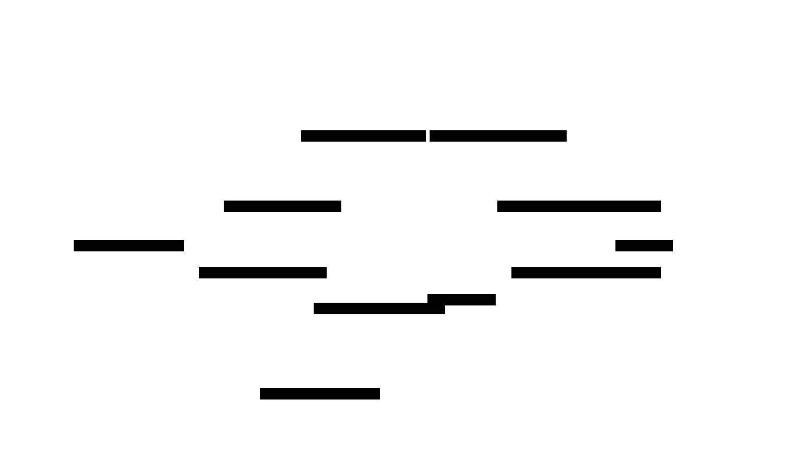

# Query Optimizer: Design Document


## Overview

A query optimizer transforms SQL queries into efficient execution plans by building plan trees, estimating costs, and selecting optimal join orders. The key architectural challenge is balancing optimization time against plan quality while handling combinatorial explosion in the search space.


> This guide is meant to help you understand the big picture before diving into each milestone. Refer back to it whenever you need context on how components connect.


## Context and Problem Statement

> **Milestone(s):** Foundation for all milestones - establishes the fundamental optimization challenges that drive the design decisions in Milestones 1-4.

### The Route Planning Analogy

Imagine you're planning a road trip that visits multiple cities, and you want to minimize both travel time and fuel costs. A naive approach might visit cities in alphabetical order or in the sequence they were added to your itinerary. However, an intelligent route planner considers multiple factors: current traffic conditions, road quality, fuel station locations, and the interconnections between different route segments. The planner explores numerous possible routes, estimates the cost of each alternative, and selects the most efficient path.

Query optimization follows remarkably similar principles. When a database receives a SQL query joining multiple tables with various filters and projections, there are often thousands or millions of different ways to execute that query. A naive database engine might process tables in the order they appear in the SQL statement, apply filters after performing expensive joins, or always use sequential scans regardless of available indexes. Just as the alphabetical city visit would likely produce a terrible road trip, these naive execution strategies often result in query performance that is orders of magnitude slower than optimal.

The **query optimizer** serves as the database's intelligent route planner. It examines the logical requirements expressed in SQL (the destination cities), considers the available physical resources (roads, indexes, memory), estimates the cost of different execution strategies (routes), and constructs an efficient execution plan (the optimal route). The optimizer must balance exploration time against plan quality - spending too much time exploring alternatives defeats the purpose, while insufficient exploration leads to poor execution plans.

This analogy reveals why query optimization is both essential and challenging. Unlike static route planning where road conditions change gradually, database conditions fluctuate rapidly: table sizes grow, indexes are added or dropped, memory availability changes, and concurrent queries compete for resources. The optimizer must make decisions quickly based on statistical estimates rather than perfect information, yet these decisions directly determine whether a query completes in milliseconds or hours.

### Core Optimization Challenges

Query optimization confronts three fundamental challenges that make it one of the most complex problems in database system design. Understanding these challenges is crucial because they drive every architectural decision in our optimizer implementation.

#### Exponential Search Space Complexity

The most daunting challenge in query optimization is the **combinatorial explosion** of possible execution plans. For a query joining `n` tables, there are `n!` possible join orders. A five-table join has 120 possible orders; a ten-table join has over 3.6 million possibilities. Each join order can be executed with different physical operators (hash join, nested loop join, merge join), different access methods (sequential scan, index scan), and different intermediate result materializations.

Consider a seemingly simple query joining four tables - `Orders`, `Customers`, `Products`, and `OrderItems`. The optimizer must decide:
- Which table to scan first and with what access method
- Which pairs of tables to join in what sequence  
- What join algorithm to use for each join operation
- Where to apply filter predicates for maximum efficiency
- Whether to sort results early or late in the execution pipeline

Even this four-table query generates hundreds of distinct execution plans. The optimizer cannot afford to evaluate every possibility, yet missing the optimal plan can mean the difference between a query that runs in seconds versus one that runs for hours.

> **Critical Insight**: The exponential search space means that query optimization is fundamentally about intelligent pruning and approximation rather than exhaustive search. Production optimizers use dynamic programming, heuristics, and early pruning to navigate this complexity.

#### Statistical Estimation Accuracy

Query optimizers operate in an environment of **fundamental uncertainty**. To choose between execution plans, the optimizer must predict how much each plan will cost - but this prediction requires knowing how many rows each operation will process, how selective each filter will be, and how much memory each operator will consume. These predictions are made using statistical approximations that are often inaccurate.

The accuracy problem cascades through the optimization process. If the optimizer underestimates the selectivity of an early filter, it might choose a nested loop join expecting small intermediate results. When the actual intermediate result is much larger, the chosen plan becomes catastrophically slow. This estimation error occurs because:

- **Table statistics become stale** as data changes between statistics collection runs
- **Predicate correlation** is often ignored - the optimizer assumes column values are independent when they're actually correlated
- **Intermediate result estimation** compounds errors from each preceding operation
- **Data distribution assumptions** may not match real-world data patterns

For example, an optimizer might estimate that a filter `WHERE age > 65 AND income > 100000` will be highly selective, assuming age and income are independent. In reality, high-income individuals tend to be older, making this combination less selective than expected. This estimation error can lead to choosing the wrong join algorithm or access method.

#### Optimization Time vs. Plan Quality Trade-offs

The third fundamental challenge is the **time-quality trade-off**. Optimization itself consumes CPU cycles, memory, and elapsed time. For simple queries that execute in milliseconds, spending seconds optimizing would be counterproductive. Conversely, complex analytical queries that run for hours justify more extensive optimization effort.

This trade-off manifests in several ways:

- **Search completeness vs. speed**: Complete dynamic programming finds optimal solutions but becomes prohibitively expensive for large join queries
- **Statistics precision vs. collection overhead**: Detailed histograms provide better estimates but require more storage and maintenance overhead  
- **Plan caching vs. adaptivity**: Cached plans avoid re-optimization costs but may become suboptimal as data changes
- **Heuristic rules vs. cost-based decisions**: Rules execute quickly but may miss opportunities that cost-based analysis would find

Production database systems handle this trade-off through **optimization budgets** - they allocate limited time and memory for optimization based on query complexity and expected execution cost. Simple queries receive basic optimization; complex queries get more sophisticated treatment.

> **Design Principle**: Our optimizer must be architected to support different optimization depths, allowing the system to spend more effort optimizing queries that will benefit most from sophisticated analysis.

### Industry Approaches Comparison

Database vendors have developed three primary approaches to query optimization, each representing different solutions to the fundamental challenges outlined above. Understanding these approaches helps contextualize our design decisions and reveals why modern systems typically use hybrid strategies.

#### Rule-Based Optimization

**Rule-based optimizers** apply a fixed set of transformation rules to convert SQL queries into execution plans. These rules are derived from database theory and empirical knowledge about query performance patterns. The optimizer applies rules in a predetermined sequence without considering data statistics or actual execution costs.

| Aspect | Description | Example |
|--------|-------------|---------|
| **Decision Making** | Fixed transformation rules applied in sequence | Always push filters before joins; prefer index scans for high selectivity filters |
| **Cost Consideration** | No cost estimation - decisions based on rule priority | Rule: "Use index scan if filter selectivity < 10%" regardless of actual data |
| **Optimization Time** | Very fast - O(query size) complexity | Optimization completes in microseconds regardless of query complexity |
| **Plan Quality** | Predictable but often suboptimal | Consistent performance but misses opportunities for complex queries |

Early database systems like Oracle's original optimizer used purely rule-based approaches. A typical rule might state: "Always apply selection predicates before join operations" or "Use nested loop joins when one input is expected to be small." These rules work reasonably well for simple queries and provide predictable optimization time.

However, rule-based optimization suffers from **context blindness**. The same rule is applied regardless of table sizes, data distribution, or available indexes. A rule that works well for small tables may be disastrous for large tables. This limitation becomes severe for complex analytical queries where optimal strategies depend heavily on data characteristics.

> **Historical Context**: Rule-based optimization dominated early database systems because statistical information was expensive to collect and maintain. As storage became cheaper and workloads more complex, the limitations of rule-based approaches drove the industry toward cost-based optimization.

#### Cost-Based Optimization

**Cost-based optimizers** make decisions by estimating and comparing the execution cost of different plan alternatives. These systems maintain detailed statistics about table sizes, column value distributions, and index characteristics. For each possible execution plan, the optimizer estimates I/O costs, CPU costs, and memory requirements, then selects the plan with the lowest total estimated cost.

| Aspect | Description | Example |
|--------|-------------|---------|
| **Decision Making** | Compare estimated costs of alternative plans | Estimate hash join cost = 3 * (R + S) vs. nested loop cost = R * S for tables R, S |
| **Statistics Usage** | Extensive reliance on table and column statistics | Uses row counts, distinct values, data distribution histograms for cost estimation |
| **Search Strategy** | Dynamic programming or heuristic search through plan space | Enumerate all join orders for small queries; use heuristics for complex queries |
| **Adaptivity** | Plans change as statistics are updated | Same query gets different plans as table sizes grow or indexes are added |

Modern systems like PostgreSQL, SQL Server, and Oracle's current optimizer are primarily cost-based. These optimizers collect statistics about table cardinalities, column selectivity, and access method performance. When optimizing a join query, the optimizer estimates the cost of different join orders by calculating expected intermediate result sizes and operation costs.

The power of cost-based optimization lies in its **data-driven decision making**. As tables grow larger, the optimizer automatically shifts from nested loop joins to hash joins. When new indexes are created, the optimizer incorporates them into cost calculations. This adaptivity allows cost-based systems to handle diverse workloads effectively.

However, cost-based optimization introduces new complexities. Statistics must be collected, maintained, and kept reasonably current. Cost models must accurately reflect actual execution behavior across different hardware configurations. Most critically, the exponential search space requires sophisticated algorithms to find good plans without exhaustive enumeration.

#### Heuristic and Hybrid Approaches

**Heuristic optimizers** use problem-specific knowledge to guide the search for good execution plans without exhaustive cost calculation. Modern database systems increasingly adopt **hybrid approaches** that combine rule-based shortcuts, cost-based analysis, and search heuristics to balance optimization time with plan quality.

| Approach | Strategy | Benefits | Limitations |
|----------|----------|----------|-------------|
| **Greedy Heuristics** | Make locally optimal choices at each step | Fast optimization; works well for common patterns | May miss globally optimal solutions |
| **Genetic Algorithms** | Evolve populations of candidate plans | Handles complex search spaces; finds novel solutions | Unpredictable optimization time; complex implementation |
| **Machine Learning** | Learn optimization patterns from historical data | Adapts to workload patterns; improves over time | Requires training data; black-box decision making |
| **Hybrid Rule/Cost** | Use rules for simple cases, costs for complex ones | Fast common case; sophisticated complex case | Complex implementation; rule/cost boundary decisions |

PostgreSQL exemplifies the hybrid approach: it uses genetic algorithms for queries with many joins, cost-based optimization for moderately complex queries, and simple heuristics for trivial queries. This multi-tier strategy allows the optimizer to spend effort proportional to query complexity and potential benefit.

**Apache Calcite** represents a modern framework approach, separating logical optimization rules from cost-based physical planning. Rules handle transformations like predicate pushdown and join reordering, while cost-based analysis selects physical operators and access methods. This separation allows individual components to be optimized independently.

> **Decision: Cost-Based Foundation with Heuristic Pruning**
> - **Context**: Our educational optimizer must balance learning value with implementation complexity while remaining representative of production systems
> - **Options Considered**: 
>   1. Pure rule-based system (simple but unrealistic)
>   2. Full cost-based optimization (comprehensive but complex)
>   3. Hybrid approach with cost-based core and heuristic pruning
> - **Decision**: Implement cost-based optimization with heuristic pruning for search space management
> - **Rationale**: Cost-based optimization teaches the fundamental concepts used in production systems while heuristic pruning keeps the implementation manageable. Students learn both cost estimation and search space management.
> - **Consequences**: Enables realistic query optimization learning while avoiding the complexity of advanced search algorithms like genetic optimization or machine learning approaches.

The comparison reveals that modern query optimization has evolved toward sophisticated hybrid systems that adapt their strategy based on query characteristics and optimization context. Our implementation will focus on cost-based optimization with strategic use of heuristics, providing hands-on experience with the core techniques that drive production database performance.


## Goals and Non-Goals

> **Milestone(s):** Foundation for all milestones - establishes the scope and boundaries that guide implementation decisions across Milestones 1-4.

### Primary Goals

Our query optimizer focuses on implementing the fundamental principles of cost-based optimization that form the backbone of modern database systems. Think of this as building a GPS navigation system for database queries - we need to understand the road network (available execution strategies), estimate travel times (costs), and find efficient routes (execution plans) while keeping the core navigation logic simple and reliable.

The primary goal is to transform SQL queries into efficient `ExecutionPlan` structures through systematic cost-based decision making. This involves four core capabilities that work together to achieve effective query optimization. First, we must represent query operations as tree structures that capture both logical intent and physical execution strategies. Second, we need accurate cost estimation using `TableStatistics` to predict resource consumption. Third, we require sophisticated join ordering algorithms that use dynamic programming to find optimal `JoinOrder` sequences. Finally, we need physical operator selection that chooses concrete execution strategies based on data characteristics and available access methods.

**Plan Representation and Tree Management**

The optimizer must create and manipulate hierarchical query plans represented as trees of `OperatorNode` instances. Each node encapsulates a single database operation like scanning tables, applying filters, or performing joins. The system distinguishes between logical operators that express what computation should happen and physical operators that specify how the computation will execute. This separation allows the optimizer to explore multiple implementation strategies for the same logical operation.

The plan representation system supports complete tree traversal for cost calculation, optimization rule application, and plan visualization. Tree manipulation capabilities include node insertion, removal, and subtree replacement to enable optimization transformations like predicate pushdown. The system maintains parent-child relationships that preserve query semantics while allowing structural modifications during optimization.

**Statistical Cost Estimation**

Accurate cost prediction drives all optimization decisions in our cost-based approach. The `estimateCost` function combines I/O costs from disk access patterns with CPU costs from computational complexity. The system maintains detailed `TableStatistics` including row counts, column cardinalities, and value distributions that enable selectivity estimation for filter predicates and join operations.

Cost estimation covers all major resource consumption categories. I/O costs account for sequential scans, random page access, and index traversal patterns. CPU costs model comparison operations, hash computations, and sorting overhead. Memory costs track buffer usage for hash tables and intermediate results. The cost model uses configurable weights that can be tuned for different hardware configurations and workload patterns.

**Join Order Optimization**

Multi-table queries create exponential search spaces where join order dramatically affects execution efficiency. Our `optimizeJoinOrder` function implements dynamic programming algorithms that find optimal join sequences without exhaustive enumeration. The system builds optimal plans for progressively larger table subsets, reusing previously computed results to avoid redundant work.

The join ordering component handles both simple star schemas and complex multi-join queries with intricate predicate patterns. It identifies cross products early and prunes clearly suboptimal alternatives to reduce search complexity. The algorithm supports both left-deep join trees that minimize memory usage and bushy trees that enable parallel execution opportunities.

**Physical Operator Selection**

The final optimization phase selects concrete physical operators and access methods for each logical operation. This includes choosing between sequential scans and index lookups based on filter selectivity, selecting join algorithms like hash joins or nested loops based on input characteristics, and applying optimization rules like predicate pushdown to reduce intermediate result sizes.

Physical selection considers all available access paths including primary key indexes, secondary indexes, and full table scans. Join algorithm selection weighs factors like input cardinalities, memory availability, and sort order requirements. The system applies proven optimization heuristics while maintaining the flexibility to override defaults when cost analysis suggests better alternatives.

**Educational Learning Objectives**

Beyond functional requirements, this query optimizer serves as a comprehensive learning platform for understanding database internals. The implementation exposes the mathematical foundations of cost-based optimization including selectivity estimation formulas, cardinality calculation methods, and dynamic programming algorithms. Students gain hands-on experience with the trade-offs between optimization time and plan quality that drive real-world database design decisions.

The modular architecture allows incremental implementation where each milestone builds upon previous foundations. This progression mirrors the historical development of query optimization techniques and helps learners understand why modern optimizers evolved their current architectures. The code structure emphasizes clarity and maintainability over performance optimization, making the underlying algorithms accessible to developers new to database systems.

### Explicit Non-Goals

While comprehensive within its scope, our query optimizer deliberately excludes several advanced features that would complicate the core learning objectives. These non-goals reflect conscious decisions to maintain focus on fundamental optimization principles rather than pursuing production-level completeness.

**Parallel Query Execution**

Modern databases extensively use parallel processing to accelerate query execution across multiple CPU cores and storage devices. However, parallel query optimization introduces significant complexity in cost modeling, resource allocation, and synchronization overhead estimation. Parallel plans require sophisticated scheduling algorithms, partition-aware statistics, and inter-operator communication protocols that would overshadow the core optimization concepts we aim to teach.

Our single-threaded execution model simplifies cost calculations and eliminates complex race conditions during plan generation. This allows students to focus on understanding join ordering algorithms and selectivity estimation without wrestling with parallel programming challenges. The fundamental optimization principles learned in our single-threaded system transfer directly to parallel contexts once the core concepts are mastered.

**Runtime Adaptive Optimization**

Production optimizers increasingly use runtime feedback to improve cost estimates and plan selection over time. Adaptive optimization tracks actual execution statistics, identifies estimation errors, and adjusts cost models based on observed performance patterns. Some systems even reoptimize queries mid-execution when initial estimates prove significantly inaccurate.

These adaptive features require complex statistics collection infrastructure, machine learning components for pattern recognition, and sophisticated plan migration mechanisms. Including adaptive optimization would shift focus from fundamental cost-based techniques to machine learning and runtime system design. Our static optimization approach provides a solid foundation that students can extend with adaptive features in future projects.

**Advanced Statistical Models**

Real-world optimizers employ sophisticated statistical techniques including multi-dimensional histograms, correlation detection between columns, and probabilistic data structures for cardinality estimation. These advanced models provide better estimate accuracy but require substantial mathematical background and complex maintenance algorithms.

Our simplified statistics model uses uniform distribution assumptions and independence assumptions between predicates. While less accurate than production systems, this approach makes cost calculation transparent and debuggable. Students can understand every step of the estimation process without advanced statistical knowledge, building intuition for why more sophisticated models become necessary in production environments.

**Materialized View Selection**

Query optimizers in data warehouse environments consider rewriting queries to use precomputed materialized views when available. This capability requires view matching algorithms, freshness tracking, and complex cost comparisons between base table access and view utilization. Materialized view optimization represents a distinct area of research with its own algorithmic challenges.

Excluding materialized views keeps our focus on fundamental table access patterns and join optimization. Students learn to optimize queries against base tables, understanding the core cost-benefit analysis that drives all optimization decisions. This foundation enables future exploration of view-based optimization techniques.

**Distributed Query Processing**

Distributed databases must optimize queries across multiple network-connected nodes, considering data locality, network transfer costs, and partial failure scenarios. Distributed optimization requires understanding of data partitioning strategies, network cost modeling, and distributed join algorithms like shuffle joins and broadcast joins.

Our single-node optimizer eliminates network complexity and allows focus on local cost optimization. The principles of cost-based decision making and dynamic programming transfer directly to distributed contexts, but students first master these concepts without distributed systems complexity.

**User-Defined Function Integration**

Production optimizers handle user-defined functions with unknown cost characteristics and potential side effects. This requires sophisticated cost estimation for black-box operations, consideration of function volatility and determinism, and integration with external programming language runtimes.

Our operator set focuses on standard relational operators with well-understood cost characteristics. This restriction enables precise cost modeling and predictable optimization behavior. Students learn optimization principles with full visibility into cost calculations rather than dealing with estimation uncertainty from external functions.

**Memory Management Integration**

Advanced optimizers consider available memory when selecting physical operators, potentially choosing different join algorithms based on buffer pool size or enabling spill-to-disk strategies for memory-intensive operations. This requires integration with buffer pool managers and sophisticated memory cost modeling.

Our optimizer assumes sufficient memory for chosen operations, simplifying cost calculations and eliminating complex memory management scenarios. This allows focus on algorithmic aspects of optimization rather than resource management concerns. The fundamental cost comparison techniques learned with unlimited memory assumptions extend naturally to memory-constrained environments.

**Query Plan Caching with Invalidation**

Production systems cache optimized plans across query executions, implementing sophisticated invalidation strategies when underlying table statistics change significantly. Plan caching requires cache key generation from SQL syntax trees, staleness detection algorithms, and memory management for cached plan storage.

While our implementation includes basic plan caching for repeated identical queries, we exclude complex invalidation logic and adaptive cache management. This simplification allows focus on optimization algorithms rather than cache management strategies. Students understand the value of plan reuse without implementing production-level cache sophistication.

> **Design Insight**: These non-goals reflect a deliberate pedagogical strategy. By excluding advanced features, we create a focused learning environment where students master fundamental concepts before encountering production complexity. Each excluded feature represents a natural extension point for advanced projects once core optimization skills are developed.

The scope boundaries ensure that implementation effort concentrates on cost-based optimization principles rather than distributed systems, parallel programming, or machine learning techniques. Students emerge with deep understanding of query optimization mathematics and algorithms that form the foundation for all advanced database optimization techniques.

### Implementation Guidance

This guidance helps you structure your query optimizer implementation to achieve the primary goals while respecting the explicit boundaries we've established.

**A. Technology Recommendations**

| Component | Simple Option | Advanced Option |
|-----------|---------------|-----------------|
| Plan Tree Storage | In-memory Python classes with references | Persistent plan cache with SQLite backend |
| Statistics Collection | Manual table scanning with basic counters | Sampling-based statistics with histogram approximation |
| Cost Calculation | Simple arithmetic with fixed weights | Configurable cost models with JSON parameter files |
| Join Enumeration | Recursive enumeration with memoization | Iterator-based dynamic programming with pruning |
| Plan Visualization | Text-based tree printing with indentation | Graphical plan display with graphviz integration |
| Testing Framework | Basic unittest with hardcoded test cases | Property-based testing with hypothesis for edge cases |

**B. Recommended File Structure**

Organize your query optimizer code to maintain clear separation between the four main components while enabling easy testing and extension:

```
query_optimizer/
  __init__.py                     ← package initialization
  main.py                        ← CLI entry point for testing optimizer
  
  plan/
    __init__.py
    operators.py                  ← OperatorNode hierarchy and ExecutionPlan
    tree_builder.py              ← plan tree construction and manipulation
    visualizer.py                ← plan pretty-printing and debugging output
    
  cost/
    __init__.py
    statistics.py                ← TableStatistics collection and storage
    estimator.py                 ← estimateCost implementation
    models.py                    ← CostEstimate structure and calculation helpers
    
  join/
    __init__.py
    optimizer.py                 ← optimizeJoinOrder dynamic programming
    enumeration.py               ← generatePlans for join combinations
    pruning.py                   ← search space reduction heuristics
    
  physical/
    __init__.py
    selector.py                  ← physical operator selection logic
    rules.py                     ← optimization rules like predicate pushdown
    access_methods.py            ← index vs scan selection algorithms
    
  utils/
    __init__.py
    query_parser.py              ← simple SQL parsing for testing
    test_data.py                 ← sample tables and statistics for experiments
    
  tests/
    __init__.py
    test_plan_representation.py  ← Milestone 1 tests
    test_cost_estimation.py      ← Milestone 2 tests
    test_join_ordering.py        ← Milestone 3 tests
    test_physical_selection.py   ← Milestone 4 tests
    integration_tests.py         ← end-to-end optimization tests
```

**C. Infrastructure Starter Code**

Here's complete starter infrastructure that handles the non-core components, letting you focus on optimization algorithms:

```python
# utils/query_parser.py - Simple SQL parsing for testing
from dataclasses import dataclass
from typing import List, Dict, Any
import re

@dataclass
class ParsedQuery:
    tables: List[str]
    columns: List[str] 
    joins: List[tuple]  # (left_table, right_table, condition)
    filters: List[tuple]  # (table, column, operator, value)

class SimpleQueryParser:
    """Basic SQL parser for testing query optimization.
    
    Handles SELECT queries with JOINs and WHERE clauses.
    Not meant for production - just enables optimizer testing.
    """
    
    def parse(self, sql: str) -> ParsedQuery:
        sql = sql.strip().upper()
        
        # Extract SELECT columns
        select_match = re.search(r'SELECT\s+(.+?)\s+FROM', sql)
        columns = [col.strip() for col in select_match.group(1).split(',')]
        
        # Extract FROM tables and JOINs
        from_match = re.search(r'FROM\s+(.+?)(?:\s+WHERE|$)', sql)
        from_clause = from_match.group(1)
        
        tables = []
        joins = []
        
        # Simple table extraction - extend for complex JOIN syntax
        table_parts = re.split(r'\s+JOIN\s+', from_clause)
        tables.append(table_parts[0].strip())
        
        for join_part in table_parts[1:]:
            on_match = re.search(r'(\w+)\s+ON\s+(.+)', join_part)
            if on_match:
                table = on_match.group(1)
                condition = on_match.group(2)
                tables.append(table)
                joins.append((tables[-2], table, condition))
        
        # Extract WHERE filters
        filters = []
        where_match = re.search(r'WHERE\s+(.+)', sql)
        if where_match:
            # Basic filter parsing - extend for complex predicates
            conditions = where_match.group(1).split(' AND ')
            for condition in conditions:
                filter_match = re.match(r'(\w+)\.(\w+)\s*(=|<|>|<=|>=)\s*(.+)', condition.strip())
                if filter_match:
                    table, column, op, value = filter_match.groups()
                    filters.append((table, column, op, value))
        
        return ParsedQuery(tables, columns, joins, filters)

# utils/test_data.py - Sample data for testing
class TestDataGenerator:
    """Generates sample table statistics and test queries for optimizer validation."""
    
    @staticmethod
    def create_sample_statistics() -> Dict[str, 'TableStatistics']:
        """Creates realistic table statistics for testing."""
        from cost.statistics import TableStatistics
        
        # Customer table - typical e-commerce scenario
        customers = TableStatistics(
            table_name="customers",
            row_count=100000,
            column_stats={
                "customer_id": {"distinct_count": 100000, "null_fraction": 0.0},
                "country": {"distinct_count": 50, "null_fraction": 0.02},
                "age": {"distinct_count": 80, "null_fraction": 0.01}
            }
        )
        
        # Orders table - 5x customer count (average 5 orders per customer)
        orders = TableStatistics(
            table_name="orders", 
            row_count=500000,
            column_stats={
                "order_id": {"distinct_count": 500000, "null_fraction": 0.0},
                "customer_id": {"distinct_count": 80000, "null_fraction": 0.0},  # 80% customers have orders
                "order_date": {"distinct_count": 1000, "null_fraction": 0.0},
                "status": {"distinct_count": 5, "null_fraction": 0.0}
            }
        )
        
        # Products table - catalog of items
        products = TableStatistics(
            table_name="products",
            row_count=10000, 
            column_stats={
                "product_id": {"distinct_count": 10000, "null_fraction": 0.0},
                "category": {"distinct_count": 20, "null_fraction": 0.0},
                "price": {"distinct_count": 5000, "null_fraction": 0.0}
            }
        )
        
        return {"customers": customers, "orders": orders, "products": products}
    
    @staticmethod  
    def create_test_queries() -> List[str]:
        """Returns SQL queries of increasing complexity for testing."""
        return [
            # Single table with filter
            "SELECT * FROM customers WHERE country = 'USA'",
            
            # Two-table join
            "SELECT c.name, o.order_date FROM customers c JOIN orders o ON c.customer_id = o.customer_id",
            
            # Three-table join with filters
            "SELECT c.name, p.name FROM customers c JOIN orders o ON c.customer_id = o.customer_id JOIN products p ON o.product_id = p.product_id WHERE c.country = 'USA' AND p.category = 'Electronics'",
            
            # Complex multi-join query
            "SELECT c.country, COUNT(*) FROM customers c JOIN orders o ON c.customer_id = o.customer_id JOIN products p ON o.product_id = p.product_id WHERE p.price > 100 GROUP BY c.country"
        ]
```

**D. Core Logic Skeletons**

Here are the main function signatures with detailed TODOs that map to the algorithm steps described in the design sections:

```python
# cost/estimator.py - Core cost estimation logic
from typing import Dict
from plan.operators import ExecutionPlan, OperatorNode
from cost.models import CostEstimate
from cost.statistics import TableStatistics

def estimateCost(plan: ExecutionPlan, stats: Dict[str, TableStatistics]) -> CostEstimate:
    """Calculate predicted execution cost for query plan.
    
    Combines I/O costs from table access with CPU costs from operations.
    Uses bottom-up tree traversal to aggregate costs from leaves to root.
    """
    # TODO 1: Initialize cost accumulator with zero I/O, CPU, and memory costs
    # TODO 2: Perform post-order traversal of plan tree starting from leaves
    # TODO 3: For each Scan operator, calculate I/O cost based on table size and selectivity
    # TODO 4: For each Join operator, estimate output cardinality and CPU cost for join algorithm
    # TODO 5: For each Filter operator, calculate CPU cost for predicate evaluation
    # TODO 6: Aggregate child costs and add operator-specific costs at each node
    # TODO 7: Return total CostEstimate with I/O, CPU breakdown for debugging
    # Hint: Use plan.root.accept(CostCalculationVisitor(stats)) for clean traversal
    pass

# join/optimizer.py - Dynamic programming join ordering  
from typing import List, Set
from cost.statistics import TableStatistics

def optimizeJoinOrder(tables: List[str], predicates: List[tuple], stats: Dict[str, TableStatistics]) -> 'JoinOrder':
    """Find efficient join sequence using dynamic programming.
    
    Builds optimal plans for progressively larger table subsets.
    Avoids exponential enumeration through memoization of subproblem solutions.
    """
    # TODO 1: Initialize memoization table for optimal costs of table subsets
    # TODO 2: Create base case entries for single-table access plans
    # TODO 3: Iterate through subset sizes from 2 to len(tables) 
    # TODO 4: For each subset, try all possible ways to split into two smaller subsets
    # TODO 5: Calculate join cost for each split using cost estimation
    # TODO 6: Store minimum cost plan for this subset in memoization table
    # TODO 7: Prune subsets that would create cross products (no join predicates)
    # TODO 8: Return JoinOrder representing optimal sequence from memoization table
    # Hint: Use itertools.combinations to generate subsets systematically
    pass

# physical/selector.py - Physical operator selection
def selectPhysicalOperators(logical_plan: ExecutionPlan, stats: Dict[str, TableStatistics]) -> ExecutionPlan:
    """Choose concrete physical operators for logical plan.
    
    Considers available indexes, input cardinalities, and memory constraints.
    Applies optimization rules like predicate pushdown during selection.
    """
    # TODO 1: Traverse logical plan tree to identify operator selection opportunities
    # TODO 2: For each Scan operator, choose between sequential scan and index scan based on selectivity
    # TODO 3: For each Join operator, select hash join vs nested loop based on input sizes
    # TODO 4: Apply predicate pushdown rules to move filters below joins where beneficial
    # TODO 5: Consider sort order requirements for downstream operators
    # TODO 6: Generate new ExecutionPlan with selected physical operators
    # TODO 7: Validate that physical plan maintains logical semantics
    # Hint: Use SELECTIVITY_THRESHOLD constant to decide scan vs index access
    pass
```

**E. Language-Specific Hints**

Python-specific implementation guidance for common optimization tasks:

- **Tree Traversal**: Use the visitor pattern with `operator.accept(visitor)` methods for clean plan tree navigation. Implement separate visitors for cost calculation, plan printing, and optimization rule application.

- **Memoization**: Use `functools.lru_cache` decorator or manual dictionary caching for dynamic programming subproblems. Cache optimal costs keyed by frozenset of table names to handle subset enumeration efficiently.

- **Statistics Storage**: Store `TableStatistics` in simple dictionaries initially. For persistence, use pickle files or JSON serialization. Avoid database storage complexity during initial implementation.

- **Cost Calculation**: Use `dataclasses` for `CostEstimate` to get automatic equality, string representation, and arithmetic operations. Implement `__add__` method for combining costs from child operators.

- **Combinatorial Enumeration**: Use `itertools.combinations` and `itertools.permutations` for generating join orders and table subsets. Be careful with exponential growth - add `MAX_JOIN_ENUMERATION` limits early.

- **Plan Visualization**: Implement `__str__` methods on operator nodes for debugging. Use string indentation based on tree depth for readable plan printing. Consider `graphviz` integration for complex query visualization.

**F. Milestone Checkpoints**

After implementing each milestone, verify your progress with these concrete tests:

**Milestone 1 - Plan Representation**: Run `python -m pytest tests/test_plan_representation.py`. Expected behavior: Create operator trees, traverse parent-child relationships, pretty-print plans with proper indentation. Warning signs: Stack overflow in tree traversal, missing operator types, incorrect parent-child links.

**Milestone 2 - Cost Estimation**: Execute `python -c "from cost.estimator import estimateCost; print(estimateCost(sample_plan, test_stats))"`. Expected output: Reasonable cost numbers with I/O dominated by large table scans, CPU costs proportional to intermediate result sizes. Warning signs: Negative costs, infinite costs, identical costs for very different plans.

**Milestone 3 - Join Ordering**: Test with `python -c "from join.optimizer import optimizeJoinOrder; print(optimizeJoinOrder(['A','B','C'], predicates, stats))"`. Expected behavior: Different join orders for different table size combinations, avoidance of cross products, reasonable execution time even for 5-6 table queries. Warning signs: Exponential slowdown, cross product plans, identical orders regardless of statistics.

**Milestone 4 - Physical Selection**: Validate with end-to-end test: `python main.py --query "SELECT * FROM customers WHERE country='USA'"`. Expected output: Index scan chosen for highly selective filters, sequential scan for low selectivity, hash joins for large input tables. Warning signs: Always choosing same physical operators, ignoring selectivity estimates, missing predicate pushdown opportunities.


## High-Level Architecture

> **Milestone(s):** Foundation for all milestones - establishes the overall system design that guides implementation across Milestones 1-4.

### Component Responsibilities

Think of the query optimizer as a **construction project planning office** where different specialists collaborate to design the most efficient way to build a complex structure. Just as architects, cost estimators, project managers, and construction supervisors each bring specialized expertise to create an optimal building plan, our query optimizer employs four specialized components that work together to transform a SQL query into an efficient execution strategy.


The **Plan Builder** serves as the initial architect, taking the raw SQL requirements and creating the foundational blueprint. This component receives a `ParsedQuery` from the SQL parser and constructs the basic logical plan tree, defining what operations need to happen without yet specifying exactly how they'll be executed. The Plan Builder understands the relational algebra behind SQL operations and can represent queries as hierarchical trees of `OperatorNode` objects, each representing a fundamental database operation like scanning a table, applying filters, or joining datasets.

The Plan Builder's primary responsibility centers on **structural correctness** rather than efficiency. It ensures that the logical plan accurately represents the query semantics - that all required tables are accessed, all join conditions are properly represented, all filter predicates are applied, and the correct columns are projected in the final result. Think of this as the architect ensuring that the building blueprint includes all required rooms, proper connections between spaces, and meets all functional requirements, without yet worrying about construction costs or timing.

| Responsibility | Description | Input | Output |
|---|---|---|---|
| Parse SQL to logical operations | Convert SQL syntax into relational algebra operations | `ParsedQuery` with tables, columns, joins, filters | Logical `ExecutionPlan` tree |
| Validate query semantics | Ensure all referenced tables and columns exist and are accessible | Schema metadata, query structure | Validated logical plan or error |
| Handle operator precedence | Apply proper order of operations for complex predicates | Complex WHERE clauses with AND/OR/NOT | Correctly structured filter tree |
| Normalize plan structure | Convert to canonical form for optimization | Raw logical plan | Normalized `ExecutionPlan` |

The **Cost Estimator** functions as the project cost analyst, evaluating how expensive each potential execution strategy will be in terms of computational resources. This component maintains detailed `TableStatistics` about data distribution, cardinality, and storage characteristics, using this information to predict the resource consumption of different plan alternatives. The Cost Estimator must balance accuracy with computational efficiency - spending too much time on precise estimates can make optimization slower than the query execution itself.

The Cost Estimator's calculations encompass multiple resource dimensions: I/O operations for reading data from storage, CPU cycles for processing operations like joins and filters, and memory consumption for intermediate results and operator state. Each prediction involves statistical modeling based on assumptions about data distribution and correlation patterns. The component provides `CostEstimate` objects that quantify both the total resource consumption and the expected cardinality of intermediate results, enabling meaningful comparison between alternative execution strategies.

| Cost Component | Estimation Method | Key Statistics Used | Accuracy Factors |
|---|---|---|---|
| I/O Operations | Pages accessed × page read cost | Table size, index selectivity | Buffer pool hit rate, storage type |
| CPU Processing | Tuple count × operation complexity | Row counts, predicate selectivity | CPU cache effects, data types |
| Memory Usage | Intermediate result sizes | Join cardinalities, sort buffer needs | Available memory, spill-to-disk costs |
| Network Transfer | Result size × network latency | Output cardinality, tuple width | Network bandwidth, serialization overhead |

The **Join Optimizer** serves as the project scheduling specialist, determining the optimal sequence for multi-table operations. This component faces the classic combinatorial optimization challenge: with n tables to join, there are factorial possible orderings, creating an exponential search space that quickly becomes computationally intractable. The Join Optimizer employs dynamic programming algorithms to find optimal `JoinOrder` sequences while using pruning heuristics to avoid exploring clearly suboptimal alternatives.

The fundamental insight driving join optimization is that the order of operations dramatically affects intermediate result sizes, which in turn determines the cost of subsequent operations. A poorly chosen join order might create massive intermediate results early in the execution, making all following operations expensive. Conversely, an optimal ordering performs the most selective joins first, keeping intermediate results small and making the overall query execution efficient.

> **Key Insight**: Join ordering optimization often provides the largest performance gains in query optimization. A 10x difference in execution time between good and bad join orders is common for queries involving 4+ tables.

| Optimization Strategy | Algorithm | Search Space | Time Complexity | Quality |
|---|---|---|---|---|
| Complete enumeration | Dynamic programming | All valid join orders | O(n! × 2^n) | Optimal |
| Greedy heuristics | Selectivity-based ordering | Single path | O(n²) | Good approximation |
| Genetic algorithms | Evolutionary search | Sampled population | O(generations × population) | Variable |
| Left-deep restriction | DP on linear plans | Left-deep trees only | O(n³) | Suboptimal but fast |

The **Physical Planner** acts as the construction method specialist, making concrete decisions about how to implement each logical operation using available physical operators and access methods. While the logical plan specifies *what* operations to perform, the physical planner determines *how* to perform them by selecting specific algorithms, access paths, and optimization techniques like predicate pushdown.

The Physical Planner must consider the available infrastructure: what indexes exist, what join algorithms are supported, whether hash tables fit in memory, and how to minimize data movement. It applies rule-based optimizations like pushing filter predicates down to table scans and chooses between alternative physical operators like hash joins versus nested loop joins based on estimated data sizes and characteristics.

| Physical Decision | Selection Criteria | Options Considered | Impact on Performance |
|---|---|---|---|
| Table access method | Selectivity vs index availability | Sequential scan, index scan, index-only scan | 10-100x difference in I/O |
| Join algorithm | Input sizes, memory availability | Hash join, nested loop, merge join | 5-50x difference in CPU/memory |
| Sort implementation | Data size vs memory | In-memory quicksort, external merge sort | Memory usage and I/O patterns |
| Predicate placement | Operator tree topology | Early filtering vs late filtering | Intermediate result sizes |

> **Decision: Component Separation Strategy**
> - **Context**: Query optimization involves multiple distinct types of analysis (structural, statistical, algorithmic, physical) that could be combined into a monolithic optimizer or separated into specialized components.
> - **Options Considered**: Monolithic optimizer class, pipeline of specialized components, pluggable optimization framework
> - **Decision**: Separate specialized components with well-defined interfaces
> - **Rationale**: Each optimization phase requires different expertise, data structures, and algorithms. Separation enables independent testing, easier debugging, and potential parallel execution of optimization phases. The clean interfaces make the system more maintainable and allow for component replacement or enhancement.
> - **Consequences**: Enables modular development and testing, introduces coordination overhead between components, requires careful interface design to avoid tight coupling.

### Optimization Pipeline

The query optimization process flows through a carefully orchestrated sequence of transformations, each building upon the previous stage's output while adding specialized analysis and refinement. Think of this as an **assembly line for decision-making**, where each station adds specific expertise to transform raw requirements into a precisely engineered execution plan.


The pipeline begins when a `ParsedQuery` arrives from the SQL parser, containing the basic structural information extracted from the SQL statement: referenced tables, required columns, join conditions, and filter predicates. This parsed representation provides the raw materials for optimization but lacks the sophisticated analysis needed for efficient execution.

**Stage 1: Logical Plan Construction** marks the entry point where the Plan Builder transforms the flat SQL structure into a hierarchical execution plan. The builder creates a tree of logical operators, each representing a fundamental relational operation. At this stage, the plan accurately represents the query semantics but contains no performance optimizations or physical implementation details.

The logical planning process involves several critical steps:

1. **Table identification and alias resolution** - The builder examines the FROM clause to identify all data sources and establishes a mapping between table aliases and actual table names, validating that all referenced tables exist and are accessible.

2. **Join condition extraction** - The optimizer parses the WHERE clause and ON clauses to identify explicit join conditions, distinguishing them from filter predicates that apply to individual tables.

3. **Filter predicate categorization** - The system categorizes WHERE clause predicates by the tables they reference, preparing them for potential pushdown optimization in later stages.

4. **Projection analysis** - The builder examines the SELECT clause to determine which columns must be available at each stage of execution, enabling column pruning optimizations.

5. **Operator tree construction** - The optimizer arranges logical operators into a preliminary tree structure, typically following SQL's natural evaluation order without yet considering performance implications.

| Logical Plan Element | Source SQL Clause | Validation Required | Downstream Impact |
|---|---|---|---|
| Table scan operators | FROM clause | Table existence, access permissions | Available columns, cardinality estimates |
| Join operators | WHERE/ON conditions | Column compatibility, join predicate validity | Search space for join ordering |
| Filter operators | WHERE predicates | Data type consistency, function availability | Selectivity estimation input |
| Projection operators | SELECT clause | Column existence, expression validity | Output schema definition |

**Stage 2: Statistics Collection and Cost Model Preparation** runs concurrently with logical planning, gathering the statistical foundation needed for cost-based optimization. The Cost Estimator collects current `TableStatistics` for all referenced tables, including row counts, column cardinalities, data distribution histograms, and index characteristics.

This statistical foundation enables accurate resource consumption predictions throughout the optimization process. The Cost Estimator builds mathematical models that can predict how many rows will survive filter operations (selectivity estimation), how large intermediate join results will become (cardinality estimation), and how much I/O, CPU, and memory each operation will consume.

**Stage 3: Join Order Optimization** represents the algorithmic heart of query optimization for multi-table queries. The Join Optimizer applies dynamic programming techniques to explore the space of possible join orderings, using cost estimates to identify the optimal sequence. This stage must balance optimization quality against optimization time, potentially switching from complete enumeration to heuristic approaches for queries involving many tables.

The join optimization algorithm proceeds through systematic subset enumeration:

1. **Single-table access path optimization** - For each individual table, the optimizer determines the best access method (sequential scan versus available indexes) based on filter selectivity and index characteristics.

2. **Two-table join optimization** - The algorithm evaluates all possible pairings of tables, considering different join algorithms and accessing methods for each combination.

3. **Progressive subset expansion** - Using dynamic programming, the optimizer builds optimal plans for progressively larger table subsets, reusing previously computed optimal subplans.

4. **Pruning and bounds checking** - The algorithm eliminates clearly suboptimal partial plans early, avoiding exponential explosion in the search space.

5. **Cross product detection and elimination** - The optimizer identifies and heavily penalizes or eliminates join combinations that lack proper join predicates, avoiding expensive Cartesian products.

**Stage 4: Physical Operator Selection** transforms the optimal logical plan into an executable physical plan by making concrete implementation choices. The Physical Planner selects specific algorithms for each operation, chooses access methods for table scans, and applies rule-based optimizations like predicate pushdown.

Physical planning decisions include:

- **Access method selection**: Choosing between sequential scans, index scans, or index-only scans based on predicate selectivity and available indexes
- **Join algorithm selection**: Selecting hash joins, nested loop joins, or merge joins based on input cardinalities and memory availability  
- **Sort algorithm selection**: Choosing in-memory sorting versus external merge sorts based on data sizes and memory constraints
- **Predicate pushdown application**: Moving filter operations as close to data sources as possible to minimize intermediate result sizes
- **Projection pushdown application**: Eliminating unnecessary columns early in the execution pipeline to reduce data movement

> **Key Design Insight**: The pipeline maintains clean separation between logical correctness (stages 1-2) and performance optimization (stages 3-4). This separation enables independent testing and debugging of optimization logic while ensuring that performance optimizations never compromise query correctness.

| Pipeline Stage | Input | Processing | Output | Validation |
|---|---|---|---|---|
| Logical Planning | `ParsedQuery` | Semantic analysis, tree construction | Logical `ExecutionPlan` | Schema consistency, referential integrity |
| Statistics Collection | Table names, filter predicates | Catalog lookup, histogram analysis | `TableStatistics` | Freshness checks, missing statistics detection |
| Join Optimization | Logical plan, statistics | Dynamic programming, pruning | Optimal `JoinOrder` | Cost sanity checks, cross product detection |
| Physical Planning | Logical plan, join order | Algorithm selection, rule application | Physical `ExecutionPlan` | Resource constraint validation |

**Stage 5: Plan Finalization and Caching** completes the optimization process by performing final validation, cost annotation, and storage for potential reuse. The optimizer ensures that the selected physical plan satisfies all resource constraints, annotates the plan with detailed cost estimates for execution monitoring, and stores the optimized plan in the plan cache for reuse with similar queries.

The optimization pipeline maintains **state machines** that track the progression through different optimization phases, enabling recovery from failures and providing detailed debugging information when optimization produces unexpected results.


Error handling throughout the pipeline follows a **fail-fast principle**: each stage validates its inputs and outputs, immediately detecting inconsistencies or constraint violations. When optimization fails, the system provides detailed diagnostic information identifying the specific stage and condition that caused the failure, along with suggestions for resolution.

### Recommended File Structure

The query optimizer implementation benefits from a modular file organization that mirrors the component architecture while providing clear separation of concerns and easy navigation for developers. This structure supports incremental development through the project milestones while maintaining clean interfaces between components.

```
query_optimizer/
├── README.md                           # Project overview and build instructions
├── requirements.txt                    # Python dependencies
├── setup.py                           # Package configuration
│
├── optimizer/                         # Main optimizer package
│   ├── __init__.py                    # Package initialization, main API
│   ├── types.py                       # Core data structures and enums
│   ├── exceptions.py                  # Optimizer-specific exception classes
│   └── config.py                      # Configuration constants and settings
│
├── optimizer/parser/                  # SQL parsing (prerequisite)
│   ├── __init__.py
│   ├── sql_parser.py                  # ParsedQuery generation
│   └── query_validator.py             # Semantic validation
│
├── optimizer/plan/                    # Plan representation (Milestone 1)
│   ├── __init__.py
│   ├── operators.py                   # OperatorNode hierarchy
│   ├── execution_plan.py              # ExecutionPlan tree structure
│   ├── logical_operators.py           # Logical operation definitions
│   ├── physical_operators.py          # Physical operation implementations
│   └── plan_printer.py                # Tree visualization utilities
│
├── optimizer/statistics/              # Cost estimation (Milestone 2)
│   ├── __init__.py
│   ├── table_stats.py                 # TableStatistics collection
│   ├── cost_model.py                  # CostEstimate calculations
│   ├── selectivity.py                 # Predicate selectivity estimation
│   └── cardinality.py                 # Join cardinality estimation
│
├── optimizer/join_ordering/           # Join optimization (Milestone 3)
│   ├── __init__.py
│   ├── dp_optimizer.py                # Dynamic programming algorithm
│   ├── join_order.py                  # JoinOrder representation
│   ├── pruning.py                     # Search space reduction
│   └── heuristics.py                  # Fallback optimization strategies
│
├── optimizer/physical/                # Physical planning (Milestone 4)
│   ├── __init__.py
│   ├── operator_selection.py          # Physical operator choice logic
│   ├── access_methods.py              # Table scan vs index selection
│   ├── join_algorithms.py             # Join algorithm selection
│   └── optimization_rules.py          # Predicate pushdown and transformations
│
├── optimizer/integration/             # Component coordination
│   ├── __init__.py
│   ├── optimization_pipeline.py       # Main optimization workflow
│   ├── plan_cache.py                  # Optimized plan storage and reuse
│   └── optimizer_facade.py            # Simplified external API
│
├── tests/                            # Test suite organization
│   ├── __init__.py
│   ├── unit/                         # Component-specific unit tests
│   │   ├── test_plan_representation.py
│   │   ├── test_cost_estimation.py
│   │   ├── test_join_ordering.py
│   │   └── test_physical_planning.py
│   ├── integration/                  # Cross-component integration tests
│   │   ├── test_optimization_pipeline.py
│   │   └── test_plan_quality.py
│   └── fixtures/                     # Test data and example queries
│       ├── sample_schemas.py
│       ├── test_queries.sql
│       └── expected_plans.py
│
├── examples/                         # Usage examples and tutorials
│   ├── basic_optimization.py         # Simple query optimization demo
│   ├── cost_analysis.py             # Cost estimation examples
│   └── plan_visualization.py        # Plan tree printing examples
│
└── docs/                            # Additional documentation
    ├── milestone_checkpoints.md      # Validation criteria for each milestone
    ├── debugging_guide.md           # Common issues and solutions
    └── api_reference.md             # Complete API documentation
```

**Component Module Responsibilities**:

| Module | Primary Classes | Key Responsibilities | Milestone |
|---|---|---|---|
| `optimizer/types.py` | `ParsedQuery`, `CostEstimate`, `JoinOrder` | Core data structure definitions | All |
| `optimizer/plan/` | `ExecutionPlan`, `OperatorNode` | Plan tree representation and manipulation | 1 |
| `optimizer/statistics/` | `TableStatistics`, cost estimation functions | Resource consumption prediction | 2 |
| `optimizer/join_ordering/` | Join optimization algorithms | Dynamic programming for optimal join sequences | 3 |
| `optimizer/physical/` | Physical operator selection logic | Concrete implementation choices | 4 |
| `optimizer/integration/` | `OptimizationPipeline` | Component coordination and caching | All |

**Development Workflow Support**:

The file structure enables incremental development aligned with project milestones. Developers can implement and test each component independently before integrating them into the complete optimization pipeline:

- **Milestone 1 Development**: Focus on `optimizer/plan/` modules, implementing operator hierarchy and tree structures with unit tests in `tests/unit/test_plan_representation.py`

- **Milestone 2 Development**: Implement statistics collection in `optimizer/statistics/` while using stub implementations for join ordering and physical planning

- **Milestone 3 Development**: Build dynamic programming algorithms in `optimizer/join_ordering/` using real cost estimates from previous milestones

- **Milestone 4 Development**: Complete physical planning in `optimizer/physical/` and integrate all components in `optimizer/integration/`

> **Design Principle**: Each module maintains high cohesion (related functionality grouped together) and loose coupling (minimal dependencies between modules). This organization supports both learning progression and professional development practices.

**Import Strategy and Dependencies**:

The module structure enforces a clear dependency hierarchy that prevents circular imports and maintains architectural layering:

```
optimizer/types.py              # No internal dependencies
optimizer/plan/                 # Depends on: types
optimizer/statistics/           # Depends on: types, plan
optimizer/join_ordering/        # Depends on: types, plan, statistics  
optimizer/physical/             # Depends on: types, plan, statistics
optimizer/integration/          # Depends on: all above modules
```

This dependency structure ensures that core data structures remain stable, specialized components can be developed independently, and integration logic cleanly orchestrates the optimization process without creating circular dependencies.

**Testing Organization**:

The testing structure supports both component-specific validation and end-to-end optimization quality verification. Unit tests focus on individual component correctness, while integration tests validate that components work together correctly and produce high-quality optimization results.

| Test Category | Focus | Example Validation |
|---|---|---|
| Unit tests | Individual component logic | Cost estimation accuracy, join ordering algorithm correctness |
| Integration tests | Component interaction | Complete optimization pipeline, plan quality metrics |
| Fixtures and examples | Realistic scenarios | Standard TPC benchmarks, common query patterns |

### Implementation Guidance

**A. Technology Recommendations**

| Component | Simple Option | Advanced Option |
|---|---|---|
| Plan Tree Structure | Python dictionaries with type hints | Custom classes with inheritance hierarchy |
| Cost Estimation | Linear cost formulas | Multi-dimensional statistical models |
| Join Ordering | Greedy heuristics | Dynamic programming with pruning |
| Statistics Storage | In-memory dictionaries | Persistent statistics with histograms |
| Plan Caching | Simple LRU cache | Persistent plan store with invalidation |
| Serialization | JSON for plan representation | Protocol Buffers for efficiency |
| Testing Framework | pytest with fixtures | Hypothesis for property-based testing |

**B. Core Infrastructure Starter Code**

```python
# optimizer/types.py - Complete core data structures
from typing import List, Dict, Any, Optional, Union
from dataclasses import dataclass, field
from enum import Enum

class OperatorType(Enum):
    """Types of query operators"""
    SCAN = "scan"
    FILTER = "filter"  
    JOIN = "join"
    PROJECT = "project"
    SORT = "sort"
    AGGREGATE = "aggregate"

class JoinType(Enum):
    """Types of join operations"""
    INNER = "inner"
    LEFT = "left"
    RIGHT = "right"
    FULL = "full"

@dataclass
class ParsedQuery:
    """Parsed SQL query structure"""
    tables: List[str]
    columns: List[str] 
    joins: List[tuple]  # (left_table, right_table, join_condition)
    filters: List[tuple]  # (table, column, operator, value)
    group_by: List[str] = field(default_factory=list)
    order_by: List[str] = field(default_factory=list)

@dataclass
class CostEstimate:
    """Resource consumption estimate"""
    io_cost: float
    cpu_cost: float
    memory_cost: float
    total_cost: float
    estimated_rows: int
    
    @property
    def total_cost(self) -> float:
        return self.io_cost + self.cpu_cost + self.memory_cost

@dataclass
class TableStatistics:
    """Statistical information about a table"""
    table_name: str
    row_count: int
    page_count: int
    column_stats: Dict[str, 'ColumnStatistics']
    last_updated: str

@dataclass
class ColumnStatistics:
    """Statistics for a single column"""
    distinct_values: int
    null_count: int
    min_value: Any
    max_value: Any
    most_frequent_values: List[tuple]  # (value, frequency) pairs

# optimizer/config.py - Configuration constants
OPTIMIZATION_TIMEOUT = 30.0  # seconds
MAX_JOIN_ENUMERATION = 6     # tables before switching to heuristics
SELECTIVITY_THRESHOLD = 0.1  # cutoff for index vs sequential scan

# Cost model parameters
IO_PAGE_COST = 1.0
CPU_TUPLE_COST = 0.01
MEMORY_PAGE_COST = 0.1

# Join algorithm cost factors
HASH_JOIN_FACTOR = 1.0
NESTED_LOOP_FACTOR = 1.5
MERGE_JOIN_FACTOR = 1.2
```

```python
# optimizer/plan/execution_plan.py - Complete plan tree infrastructure
from typing import List, Optional, Dict, Any
from optimizer.types import OperatorType, CostEstimate

class ExecutionPlan:
    """Tree structure representing query operations"""
    
    def __init__(self, root: 'OperatorNode'):
        self.root = root
        self._node_count = 0
        
    def traverse_preorder(self) -> List['OperatorNode']:
        """Traverse plan tree in pre-order"""
        result = []
        self._traverse_preorder_helper(self.root, result)
        return result
        
    def _traverse_preorder_helper(self, node: 'OperatorNode', result: List['OperatorNode']):
        if node:
            result.append(node)
            for child in node.children:
                self._traverse_preorder_helper(child, result)
    
    def calculate_total_cost(self) -> CostEstimate:
        """Sum costs across all operators in plan"""
        total_io = total_cpu = total_memory = 0.0
        total_rows = 0
        
        for node in self.traverse_preorder():
            if node.cost_estimate:
                total_io += node.cost_estimate.io_cost
                total_cpu += node.cost_estimate.cpu_cost
                total_memory += node.cost_estimate.memory_cost
                total_rows += node.cost_estimate.estimated_rows
                
        return CostEstimate(
            io_cost=total_io,
            cpu_cost=total_cpu, 
            memory_cost=total_memory,
            estimated_rows=total_rows
        )
    
    def pretty_print(self, show_costs: bool = True) -> str:
        """Generate indented tree representation"""
        lines = []
        self._pretty_print_helper(self.root, "", True, lines, show_costs)
        return "\n".join(lines)
        
    def _pretty_print_helper(self, node: 'OperatorNode', prefix: str, 
                           is_last: bool, lines: List[str], show_costs: bool):
        if not node:
            return
            
        connector = "└── " if is_last else "├── "
        node_desc = f"{node.operator_type.value}"
        
        if hasattr(node, 'table_name') and node.table_name:
            node_desc += f"({node.table_name})"
            
        if show_costs and node.cost_estimate:
            cost = node.cost_estimate.total_cost
            rows = node.cost_estimate.estimated_rows
            node_desc += f" [cost={cost:.2f}, rows={rows}]"
            
        lines.append(f"{prefix}{connector}{node_desc}")
        
        child_prefix = prefix + ("    " if is_last else "│   ")
        for i, child in enumerate(node.children):
            is_last_child = (i == len(node.children) - 1)
            self._pretty_print_helper(child, child_prefix, is_last_child, lines, show_costs)
```

**C. Core Logic Skeleton Code**

```python
# optimizer/integration/optimization_pipeline.py - Main coordination logic
class OptimizationPipeline:
    """Orchestrates the complete query optimization process"""
    
    def __init__(self):
        self.plan_builder = None      # TODO: Initialize in Milestone 1
        self.cost_estimator = None    # TODO: Initialize in Milestone 2  
        self.join_optimizer = None    # TODO: Initialize in Milestone 3
        self.physical_planner = None  # TODO: Initialize in Milestone 4
        
    def optimize_query(self, parsed_query: ParsedQuery) -> ExecutionPlan:
        """Transform parsed query into optimized execution plan"""
        
        # TODO Milestone 1: Build logical plan tree
        # 1. Create logical operators for each table scan
        # 2. Build filter operators for WHERE predicates
        # 3. Create join operators for table relationships
        # 4. Add projection operator for SELECT columns
        # 5. Validate plan tree structure and semantics
        
        # TODO Milestone 2: Collect statistics and estimate costs
        # 1. Gather TableStatistics for all referenced tables
        # 2. Calculate selectivity for all filter predicates  
        # 3. Estimate cardinality for join operations
        # 4. Annotate plan nodes with CostEstimate objects
        # 5. Validate cost estimates for reasonableness
        
        # TODO Milestone 3: Optimize join ordering
        # 1. Extract all tables involved in joins
        # 2. Enumerate possible join orders using dynamic programming
        # 3. Calculate costs for each join order alternative  
        # 4. Select optimal JoinOrder based on total cost
        # 5. Reconstruct plan tree with optimized join sequence
        
        # TODO Milestone 4: Select physical operators
        # 1. Choose access methods (scan vs index) for each table
        # 2. Select join algorithms (hash vs nested loop vs merge)
        # 3. Apply predicate pushdown optimizations
        # 4. Apply projection pushdown optimizations  
        # 5. Generate final physical ExecutionPlan
        
        raise NotImplementedError("Implement optimization pipeline")

def generatePlans(query: ParsedQuery) -> List[ExecutionPlan]:
    """Enumerate possible execution plans for query"""
    # TODO: Generate alternative plans for comparison
    # 1. Create baseline plan with no optimizations
    # 2. Generate plans with different join orders
    # 3. Generate plans with different physical operators
    # 4. Apply various optimization rules
    # 5. Return list of valid alternative plans
    pass

def estimateCost(plan: ExecutionPlan) -> CostEstimate:
    """Calculate predicted execution cost for plan"""  
    # TODO: Implement cost calculation
    # 1. Traverse plan tree in post-order
    # 2. Calculate cost for each operator based on inputs
    # 3. Sum I/O, CPU, and memory costs across operators
    # 4. Validate cost estimates are reasonable
    # 5. Return total CostEstimate for plan
    pass

def optimizeJoinOrder(tables: List[str]) -> JoinOrder:
    """Find efficient join sequence using dynamic programming"""
    # TODO: Implement DP join ordering
    # 1. Handle base case of single table (no joins needed)
    # 2. Initialize DP table for storing optimal subplans  
    # 3. Enumerate all possible join pairs and calculate costs
    # 4. Build up optimal plans for larger table subsets
    # 5. Extract final optimal JoinOrder from DP table
    pass

def selectPhysicalOperators(logical_plan: ExecutionPlan, 
                          stats: Dict[str, TableStatistics]) -> ExecutionPlan:
    """Choose concrete physical operators for logical plan"""
    # TODO: Implement physical operator selection
    # 1. Traverse logical plan tree
    # 2. For each scan operator, choose sequential vs index scan
    # 3. For each join operator, choose hash vs nested loop vs merge join
    # 4. Apply predicate pushdown to move filters closer to scans
    # 5. Return plan with all physical operators selected
    pass

def collectStatistics(table: str) -> TableStatistics:
    """Gather statistical information for cost estimation"""
    # TODO: Implement statistics collection
    # 1. Query table row count from system catalogs
    # 2. Calculate distinct value counts for each column
    # 3. Build histograms for data distribution analysis  
    # 4. Collect index statistics and selectivity information
    # 5. Return complete TableStatistics object
    pass
```

**D. File/Module Structure Implementation**

```python
# optimizer/__init__.py - Main package API
"""
Query Optimizer Package

Provides cost-based query optimization for SQL queries.
"""

from optimizer.integration.optimization_pipeline import OptimizationPipeline
from optimizer.types import ParsedQuery, ExecutionPlan, CostEstimate
from optimizer.plan.execution_plan import ExecutionPlan  
from optimizer.statistics.table_stats import TableStatistics

# Main public API
__all__ = [
    'OptimizationPipeline', 
    'ParsedQuery',
    'ExecutionPlan', 
    'CostEstimate',
    'TableStatistics'
]

# Convenience function for simple optimization
def optimize_query(sql_query: str) -> ExecutionPlan:
    """Optimize a SQL query string and return execution plan"""
    # This would integrate with SQL parser
    parser = SQLParser()  # From prerequisite SQL parser project
    parsed = parser.parse(sql_query)
    
    optimizer = OptimizationPipeline()
    return optimizer.optimize_query(parsed)
```

**E. Language-Specific Implementation Hints**

- **Python Type Hints**: Use `typing.List`, `typing.Dict`, `typing.Optional` extensively for better IDE support and runtime validation
- **Dataclasses**: Use `@dataclass` for simple data structures like `CostEstimate` and `TableStatistics` to get automatic `__init__`, `__repr__`, and equality methods  
- **Enum Classes**: Use `Enum` for operator types and join types to ensure type safety and prevent invalid values
- **Property Decorators**: Use `@property` for calculated fields like `total_cost` that should appear as attributes but are computed from other fields
- **Context Managers**: Use context managers for resource management in statistics collection that may need to query external databases
- **Functools.lru_cache**: Use `@lru_cache` decorator for expensive operations like cost calculations that may be called repeatedly with same inputs
- **Collections.defaultdict**: Use `defaultdict` for statistics dictionaries where missing keys should return sensible defaults
- **Pathlib**: Use `pathlib.Path` for file operations if implementing persistent plan caching

**F. Milestone Checkpoint**

After implementing the high-level architecture foundation:

**Validation Commands:**
```bash
# Test basic package structure
python -c "from optimizer import OptimizationPipeline; print('Package imports successfully')"

# Run architecture validation tests  
python -m pytest tests/unit/test_architecture.py -v

# Check type hints
python -m mypy optimizer/ --strict
```

**Expected Behaviors:**
- All core data structures (`ParsedQuery`, `ExecutionPlan`, `CostEstimate`) can be imported and instantiated
- Package structure follows recommended layout with no circular imports
- Type hints pass mypy validation with strict mode
- Basic plan tree creation and traversal works without optimization logic

**Quality Checks:**
- Code coverage should be >90% for infrastructure modules  
- All public methods have docstrings with parameter and return type documentation
- Integration tests can create and manipulate plan trees even with stub optimization logic


## Data Model

> **Milestone(s):** Foundation for Milestones 1-4 - defines the core data structures that support plan representation (M1), cost estimation (M2), join ordering (M3), and physical planning (M4).

The data model forms the backbone of our query optimizer, defining how we represent query plans, store statistical information, and calculate costs throughout the optimization process. Think of the data model as the **blueprint language** for our optimizer - just as architects need standardized symbols and measurements to design buildings, our optimizer needs well-defined data structures to represent execution plans, capture table characteristics, and quantify optimization decisions.

The data model serves three critical purposes in our optimizer architecture. First, it provides a **common vocabulary** that allows different optimizer components to communicate effectively - the Plan Builder creates `ExecutionPlan` trees that the Cost Estimator can analyze and the Join Optimizer can manipulate. Second, it encapsulates the **statistical knowledge** about our database through `TableStatistics` and `ColumnStatistics` that drive intelligent optimization decisions. Third, it quantifies optimization trade-offs through the `CostEstimate` structure that allows us to compare alternative execution strategies numerically.

Our data model design emphasizes three key principles that emerged from decades of database research. **Separation of logical and physical concerns** allows us to reason about what operations need to happen independently from how they will be executed. **Rich statistical representation** captures the data characteristics needed for accurate cost estimation without overwhelming the optimizer with unnecessary detail. **Compositional cost modeling** enables us to build up complex plan costs from simpler operator-level estimates while maintaining mathematical soundness.


### Plan Tree and Operator Nodes

The **plan tree representation** forms the central data structure of our query optimizer, capturing the hierarchical nature of query execution through a tree of operator nodes. Think of a query plan tree like a **construction project blueprint** - it shows not just what rooms need to be built (the operations), but also the order of construction (execution dependencies) and how materials flow between work sites (data flow between operators). Just as a construction foreman can look at blueprints and estimate labor hours and material costs, our optimizer can traverse plan trees to calculate execution costs and identify optimization opportunities.

The `ExecutionPlan` serves as the root container for our plan representation, holding both the tree structure and associated metadata needed for optimization. This structure maintains the complete execution strategy for a query while providing convenient access methods for plan manipulation and cost calculation.

| Field Name | Type | Description |
|------------|------|-------------|
| `root` | `OperatorNode` | The root operator node of the execution plan tree |
| `total_cost` | `CostEstimate` | Cached total cost estimate for the entire plan |
| `optimization_metadata` | `dict` | Additional metadata used during optimization process |
| `plan_id` | `str` | Unique identifier for this execution plan |
| `created_timestamp` | `datetime` | When this plan was generated for debugging |

The `OperatorNode` represents individual operations within the query execution plan, forming the building blocks of our tree structure. Each node encapsulates both the operation definition and its relationships to other operators in the execution sequence. The design supports both logical operators (what needs to happen) and physical operators (how it will be executed) through a common interface while maintaining type safety.

| Field Name | Type | Description |
|------------|------|-------------|
| `operator_type` | `OperatorType` | The type of operation this node performs |
| `children` | `List[OperatorNode]` | Child operators that provide input to this operation |
| `properties` | `dict` | Operator-specific configuration and parameters |
| `cost_estimate` | `CostEstimate` | Estimated execution cost for this operator |
| `output_schema` | `List[str]` | Column names and types produced by this operator |
| `estimated_rows` | `int` | Predicted number of output rows |
| `node_id` | `str` | Unique identifier within the plan tree |

The `OperatorType` enumeration defines the complete set of operations our optimizer can represent and manipulate. This taxonomy covers both logical operations (independent of execution method) and physical operations (specific implementation strategies). The distinction proves crucial during optimization - we generate logical plans first, then select physical implementations based on cost estimates and available resources.

| Operator Type | Category | Description |
|---------------|----------|-------------|
| `SCAN` | Data Access | Read rows from a table or index |
| `FILTER` | Row Processing | Apply predicate conditions to eliminate rows |
| `JOIN` | Data Combination | Combine rows from multiple input sources |
| `PROJECT` | Column Processing | Select specific columns and compute expressions |
| `SORT` | Data Ordering | Order rows by specified columns |
| `AGGREGATE` | Data Summarization | Group rows and compute summary functions |
| `UNION` | Set Operations | Combine rows from multiple sources without duplicates |
| `INTERSECT` | Set Operations | Find common rows between input sources |
| `LIMIT` | Result Control | Restrict number of output rows |

Each operator node maintains **rich property dictionaries** that capture operator-specific configuration without requiring separate subclasses for every operation type. For example, a `SCAN` operator's properties might include the table name, index selection, and filter predicates pushed down to the storage layer. A `JOIN` operator would specify the join condition, join type (`INNER`, `LEFT`, `RIGHT`, `FULL`), and chosen algorithm (`hash_join`, `nested_loop`, `merge_join`).

> **Design Insight**: The property dictionary approach provides flexibility for adding new operator variations without modifying the core tree structure. This proves especially valuable as we extend the optimizer with new physical operator implementations or optimization rules.

The **tree traversal capabilities** built into our plan structure enable systematic plan analysis and transformation throughout the optimization process. We support multiple traversal patterns to handle different optimization scenarios efficiently.

| Traversal Method | Order | Use Case |
|------------------|--------|----------|
| `traverse_preorder()` | Root → Children | Cost estimation, plan validation |
| `traverse_postorder()` | Children → Root | Bottom-up cost calculation |
| `traverse_level_order()` | Level by level | Plan visualization, debugging |
| `find_nodes_by_type(type)` | Filtered search | Optimization rule application |
| `get_leaf_nodes()` | Bottom-up | Finding data source operators |

The plan tree structure supports **immutable transformations** that create new plan variants without modifying existing trees. This design choice enables safe parallel exploration of the optimization search space and simplifies debugging by preserving intermediate optimization states. When the Join Optimizer generates alternative join orders, each possibility becomes a separate tree that can be costed and compared independently.

> **Architecture Decision: Tree vs DAG**
> - **Context**: Query plans could be represented as trees (each operator has exactly one parent) or directed acyclic graphs (operators can have multiple parents for shared computation)
> - **Options Considered**: 
>   1. Tree structure with duplication of common subexpressions
>   2. DAG structure with shared operator nodes
>   3. Hybrid approach with tree structure and shared expression detection
> - **Decision**: Pure tree structure for initial implementation
> - **Rationale**: Trees provide simpler implementation, easier cost calculation, and cleaner optimization algorithms. Most common subexpressions can be handled by the SQL parser or later optimization phases
> - **Consequences**: Some redundant computation in complex queries, but significantly simpler optimizer implementation and debugging

### Table and Column Statistics

Statistical information forms the **knowledge foundation** that enables cost-based query optimization, providing the optimizer with essential insights about data characteristics needed for accurate cost estimation. Think of database statistics like **demographic surveys** used by city planners - just as planners need population density, traffic patterns, and resource usage data to design efficient infrastructure, our query optimizer needs table sizes, column distributions, and correlation patterns to generate efficient execution plans.

The statistics subsystem addresses the fundamental challenge that cost-based optimizers face: making intelligent decisions about query execution strategies without examining all the data. By maintaining carefully chosen statistical summaries, we enable the optimizer to predict with reasonable accuracy how many rows will survive filter conditions, how selective join operations will be, and which access methods will prove most efficient for specific query patterns.


The `TableStatistics` structure captures essential characteristics about individual tables that drive optimization decisions throughout the query planning process. These statistics provide the foundation for cardinality estimation, access method selection, and join order optimization.

| Field Name | Type | Description |
|------------|------|-------------|
| `table_name` | `str` | Fully qualified name of the table |
| `row_count` | `int` | Total number of rows in the table |
| `page_count` | `int` | Number of storage pages occupied by table data |
| `column_stats` | `dict[str, ColumnStatistics]` | Per-column statistical information |
| `last_updated` | `datetime` | When these statistics were last refreshed |
| `sample_rate` | `float` | Fraction of table sampled for statistics (0.0-1.0) |
| `index_statistics` | `dict[str, IndexStatistics]` | Statistics for available indexes |
| `clustering_factor` | `float` | Measure of row ordering correlation with storage order |

The **row count and page count** provide the basic size metrics needed for cost estimation. Row count drives cardinality estimates for filter and join operations, while page count enables I/O cost calculation for sequential scans and large join operations. The ratio between these values indicates average row size, which influences buffer pool efficiency and memory usage estimates.

**Column-level statistics** capture the distribution characteristics needed for selectivity estimation - the process of predicting what fraction of rows will satisfy filter predicates. The `ColumnStatistics` structure balances statistical richness with storage efficiency, providing enough information for accurate estimates without overwhelming the optimizer with unnecessary detail.

| Field Name | Type | Description |
|------------|------|-------------|
| `column_name` | `str` | Name of the column within its table |
| `distinct_values` | `int` | Number of unique values (cardinality) |
| `null_count` | `int` | Number of NULL values in the column |
| `min_value` | `Any` | Minimum value observed in the column |
| `max_value` | `Any` | Maximum value observed in the column |
| `most_common_values` | `List[tuple]` | Top-K frequent values with their counts |
| `histogram_buckets` | `List[HistogramBucket]` | Value distribution summary |
| `correlation_with_storage` | `float` | How well column order matches storage order (-1.0 to 1.0) |
| `average_width` | `int` | Average storage space per value in bytes |

The **distinct values count** proves crucial for join cardinality estimation, enabling the optimizer to predict output sizes when combining tables. Combined with the null count, it provides the foundation for selectivity calculations across different predicate types. The min/max range enables quick estimates for range predicates without consulting detailed histograms.

**Most common values** capture skewed distributions that uniform assumption models handle poorly. Real-world data often exhibits Zipfian distributions where a small number of values account for a large fraction of rows. By tracking the top-K frequent values explicitly, we can provide accurate estimates for equality predicates on popular values while falling back to histogram-based estimates for less common values.

The `HistogramBucket` structure provides a compressed representation of value distributions for more sophisticated selectivity estimation beyond simple uniform assumptions.

| Field Name | Type | Description |
|------------|------|-------------|
| `bucket_id` | `int` | Sequential identifier for this bucket |
| `range_start` | `Any` | Minimum value included in this bucket |
| `range_end` | `Any` | Maximum value included in this bucket |
| `row_count` | `int` | Number of rows with values in this bucket's range |
| `distinct_count` | `int` | Number of distinct values within this bucket |
| `frequency` | `float` | Fraction of total table rows in this bucket |

**Statistics collection and maintenance** requires careful balance between accuracy and overhead. We support multiple collection strategies to handle different table sizes and update patterns effectively.

| Collection Method | When Used | Accuracy | Overhead |
|-------------------|-----------|----------|----------|
| Full table scan | Small tables (<10K rows) | Exact | Low |
| Systematic sampling | Medium tables (10K-1M rows) | High | Medium |
| Random sampling | Large tables (>1M rows) | Good | Low |
| Incremental updates | High-velocity tables | Variable | Low |
| Query-driven collection | Ad-hoc analysis | Targeted | Variable |

The **statistics freshness problem** presents an ongoing challenge for cost-based optimizers - as data changes, statistics become stale and optimization decisions degrade. Our statistics model includes metadata to track aging and trigger refresh operations based on configurable policies.

> **Architecture Decision: Histogram vs Uniform Distribution**
> - **Context**: Column value distributions can be modeled with different levels of sophistication, from simple uniform assumptions to detailed multi-dimensional histograms
> - **Options Considered**:
>   1. Uniform distribution assumption (distinct values evenly distributed)
>   2. Single-dimensional histograms with equal-width buckets
>   3. Single-dimensional histograms with equal-frequency buckets
>   4. Multi-dimensional histograms capturing column correlations
> - **Decision**: Single-dimensional equal-frequency histograms with most-common-values tracking
> - **Rationale**: Provides significant accuracy improvement over uniform assumptions while maintaining reasonable storage overhead and computational complexity. Equal-frequency buckets handle skewed distributions better than equal-width buckets
> - **Consequences**: Enables accurate selectivity estimation for most real-world query patterns, but cannot capture multi-column correlations that affect complex join estimates

### Cost Model Components

The **cost model** quantifies the computational resources required to execute query plans, translating abstract execution strategies into concrete resource consumption estimates that enable numerical comparison of optimization alternatives. Think of query cost estimation like **construction project bidding** - just as contractors break down building projects into material costs, labor hours, and equipment rental fees to generate competitive bids, our cost model decomposes query execution into I/O operations, CPU processing, and memory allocation to predict total resource consumption.

The cost model serves as the **objective function** for query optimization, providing the numerical foundation that allows our optimizer to choose between alternative execution strategies. Without accurate cost estimates, optimization becomes guesswork - the optimizer might choose index scans over sequential scans for highly selective queries, or select hash joins over nested loop joins for large table combinations, based on mathematical analysis rather than heuristic rules.

The `CostEstimate` structure captures the multi-dimensional nature of query execution costs, recognizing that different resource types contribute to overall performance through different mechanisms and at different scales.

| Field Name | Type | Description |
|------------|------|-------------|
| `io_cost` | `float` | Estimated disk I/O operations required |
| `cpu_cost` | `float` | Estimated CPU processing cycles needed |
| `memory_cost` | `float` | Estimated memory allocation required |
| `estimated_rows` | `int` | Predicted number of output rows |
| `startup_cost` | `float` | Fixed cost incurred before producing first row |
| `total_cost` | `float` | Combined cost across all resource dimensions |
| `cost_factors` | `dict` | Breakdown of cost contributors for debugging |
| `confidence_level` | `float` | Estimated accuracy of this cost prediction (0.0-1.0) |

**I/O cost modeling** captures the expense of accessing persistent storage, typically the dominant performance factor for database operations on large datasets. I/O costs scale with the amount of data that must be read from disk, modified by factors like buffer pool hit rates, storage device characteristics, and access patterns.

The fundamental I/O cost calculation combines sequential and random access patterns based on the specific operator implementation:

1. **Sequential scan operations** incur costs proportional to the number of data pages that must be read, modified by the sequential access multiplier that reflects the efficiency of reading consecutive pages
2. **Index scan operations** combine the cost of traversing index pages (typically cached) with the cost of accessing heap pages (potentially random access)  
3. **Join operations** may require multiple passes through datasets, with costs varying dramatically based on available memory and chosen join algorithm
4. **Sort operations** incur costs for both reading input data and writing temporary results, with additional multipliers for multi-pass external sorting

| I/O Cost Component | Formula | Constants Used |
|-------------------|---------|----------------|
| Sequential page reads | `pages * IO_PAGE_COST * SEQUENTIAL_MULTIPLIER` | `IO_PAGE_COST = 1.0`, `SEQUENTIAL_MULTIPLIER = 0.1` |
| Random page reads | `pages * IO_PAGE_COST * RANDOM_MULTIPLIER` | `RANDOM_MULTIPLIER = 4.0` |
| Index traversal | `tree_height * IO_PAGE_COST * INDEX_MULTIPLIER` | `INDEX_MULTIPLIER = 0.5` |
| Sort temporary I/O | `input_pages * SORT_MULTIPLIER * passes` | `SORT_MULTIPLIER = 2.0` |
| Hash table spill | `spilled_pages * IO_PAGE_COST * HASH_SPILL_MULTIPLIER` | `HASH_SPILL_MULTIPLIER = 1.5` |

**CPU cost modeling** quantifies the computational work required to process data rows through the execution pipeline. CPU costs typically scale with the number of rows processed rather than the number of pages accessed, reflecting the per-tuple processing overhead of expression evaluation, predicate checking, and data transformation.

Different operator types exhibit characteristic CPU cost patterns that our model captures through per-tuple processing estimates:

| Operation Type | CPU Cost per Tuple | Reasoning |
|----------------|-------------------|-----------|
| Sequential scan | `CPU_TUPLE_COST * 1.0` | Minimal processing - just row retrieval |
| Index scan | `CPU_TUPLE_COST * 1.2` | Additional index navigation overhead |
| Filter evaluation | `CPU_TUPLE_COST * complexity_factor` | Varies by predicate complexity |
| Hash join probe | `CPU_TUPLE_COST * 2.5` | Hash calculation and bucket lookup |
| Nested loop join | `CPU_TUPLE_COST * 1.5 * inner_rows` | Linear scan of inner relation |
| Sort comparison | `CPU_TUPLE_COST * log(rows) * comparisons` | Comparison-based sorting |
| Aggregate calculation | `CPU_TUPLE_COST * 3.0` | Group identification and accumulation |

**Memory cost modeling** captures the buffer pool and working memory requirements that affect plan feasibility and performance characteristics. Memory costs influence optimization decisions through multiple mechanisms - insufficient memory forces external algorithms that increase I/O costs, while abundant memory enables more efficient join algorithms and larger buffer pools.

| Memory Usage Type | Cost Calculation | Impact on Performance |
|-------------------|------------------|----------------------|
| Buffer pool pages | `pages * MEMORY_PAGE_COST` | Reduces I/O through caching |
| Hash table memory | `rows * avg_row_size * HASH_OVERHEAD` | Enables in-memory join processing |
| Sort buffer memory | `sort_buffer_size * MEMORY_PAGE_COST` | Reduces external sort passes |
| Temporary result storage | `intermediate_rows * row_size` | Required for pipeline blocking |
| Index cache memory | `index_pages * MEMORY_PAGE_COST` | Accelerates index access |

The **cost combination formula** aggregates multi-dimensional costs into a single comparable metric while preserving the relative importance of different resource types. This proves essential for optimization decisions that trade off different resource types - for example, choosing between memory-intensive hash joins and I/O-intensive nested loop joins.

The total cost calculation follows a weighted linear combination approach that can be tuned based on the specific deployment environment:

```
total_cost = (io_cost * IO_WEIGHT) + 
             (cpu_cost * CPU_WEIGHT) + 
             (memory_cost * MEMORY_WEIGHT) + 
             startup_cost
```

| Cost Weight | Default Value | Environment Tuning |
|-------------|---------------|-------------------|
| `IO_WEIGHT` | `4.0` | Higher on slow storage, lower on SSD |
| `CPU_WEIGHT` | `1.0` | Higher on CPU-constrained systems |
| `MEMORY_WEIGHT` | `0.1` | Higher when memory is scarce |
| `STARTUP_COST_PENALTY` | `0.1` | Varies by query pattern requirements |

**Cost estimation accuracy** varies significantly across different operator types and data characteristics, requiring the optimizer to maintain confidence levels that influence plan selection. High-confidence estimates enable aggressive optimization decisions, while low-confidence estimates favor conservative approaches that perform reasonably across a wider range of actual data distributions.

| Estimation Scenario | Confidence Level | Accuracy Factors |
|---------------------|------------------|------------------|
| Table scan with current stats | 0.9 | Statistics recency, sampling quality |
| Index scan with selective predicate | 0.8 | Index statistics, predicate selectivity |
| Hash join with good stats | 0.7 | Join column distribution, memory availability |
| Multi-way join estimation | 0.5 | Correlation effects, error propagation |
| Complex nested subquery | 0.3 | Limited statistics, optimization complexity |

> **Architecture Decision: Linear vs Non-Linear Cost Models**
> - **Context**: Database operations exhibit complex performance characteristics that could be modeled with varying levels of sophistication
> - **Options Considered**:
>   1. Simple linear cost model (cost proportional to data size)
>   2. Piecewise linear model (different rates for different size ranges)  
>   3. Non-linear model capturing algorithm complexity curves
>   4. Machine learning-based cost prediction
> - **Decision**: Piecewise linear model with algorithm-specific parameters
> - **Rationale**: Provides reasonable accuracy for most query patterns while maintaining mathematical tractability for optimization algorithms. Captures key non-linearities like external sorting thresholds without excessive complexity
> - **Consequences**: Enables effective optimization for typical query workloads, but may underestimate costs for very large queries or unusual data distributions

### Implementation Guidance

**Technology Recommendations:**

| Component | Simple Option | Advanced Option |
|-----------|---------------|-----------------|
| Statistics Storage | Python dictionaries with pickle serialization | SQLite database with structured schema |
| Cost Calculation | Basic arithmetic with floating-point | NumPy arrays for vectorized operations |
| Plan Tree Traversal | Recursive functions with manual stack | Generator-based iterators for memory efficiency |
| Statistics Collection | Full table sampling | Reservoir sampling with statistical bounds |

**Recommended File Structure:**

```
query_optimizer/
  data_model/
    __init__.py                    ← Export main data classes
    plan_tree.py                   ← ExecutionPlan and OperatorNode
    statistics.py                  ← TableStatistics and ColumnStatistics  
    cost_model.py                  ← CostEstimate and calculation functions
    constants.py                   ← Cost model parameters and thresholds
  tests/
    test_plan_tree.py             ← Plan construction and traversal tests
    test_statistics.py            ← Statistics collection and accuracy tests
    test_cost_model.py            ← Cost estimation validation tests
```

**Infrastructure Starter Code (Complete Implementation):**

`data_model/constants.py` - Cost model parameters:

```python
"""Cost model constants and configuration parameters."""

from enum import Enum
from typing import Final

# Cost model weights for combining different resource types
IO_PAGE_COST: Final[float] = 1.0
CPU_TUPLE_COST: Final[float] = 0.01
MEMORY_PAGE_COST: Final[float] = 0.001

# I/O cost multipliers for different access patterns
SEQUENTIAL_MULTIPLIER: Final[float] = 0.1
RANDOM_MULTIPLIER: Final[float] = 4.0
INDEX_MULTIPLIER: Final[float] = 0.5

# Algorithm-specific cost factors
HASH_BUILD_COST: Final[float] = 2.0
HASH_PROBE_COST: Final[float] = 1.5
SORT_COMPARISON_COST: Final[float] = 1.2
NESTED_LOOP_MULTIPLIER: Final[float] = 0.5

# Optimization thresholds
SELECTIVITY_THRESHOLD: Final[float] = 0.05
MAX_JOIN_ENUMERATION: Final[int] = 10
OPTIMIZATION_TIMEOUT: Final[int] = 30

# Default statistics parameters
DEFAULT_HISTOGRAM_BUCKETS: Final[int] = 100
DEFAULT_SAMPLE_RATE: Final[float] = 0.1
STATISTICS_STALENESS_DAYS: Final[int] = 7

class OperatorType(Enum):
    """Enumeration of operator types supported in query plans."""
    SCAN = "scan"
    FILTER = "filter" 
    JOIN = "join"
    PROJECT = "project"
    SORT = "sort"
    AGGREGATE = "aggregate"
    UNION = "union"
    INTERSECT = "intersect"
    LIMIT = "limit"

class JoinType(Enum):
    """Enumeration of join types for join operators."""
    INNER = "inner"
    LEFT = "left"
    RIGHT = "right"
    FULL = "full"
    CROSS = "cross"
```

`data_model/cost_model.py` - Cost estimation infrastructure:

```python
"""Cost estimation data structures and utility functions."""

from dataclasses import dataclass, field
from typing import Dict, Any, Optional
import math
from .constants import *

@dataclass
class CostEstimate:
    """Represents the estimated execution cost for a query plan or operator."""
    io_cost: float = 0.0
    cpu_cost: float = 0.0
    memory_cost: float = 0.0
    estimated_rows: int = 0
    startup_cost: float = 0.0
    cost_factors: Dict[str, float] = field(default_factory=dict)
    confidence_level: float = 1.0
    
    @property
    def total_cost(self) -> float:
        """Calculate combined total cost across all resource dimensions."""
        return (self.io_cost * 4.0 + 
                self.cpu_cost * 1.0 + 
                self.memory_cost * 0.1 + 
                self.startup_cost)
    
    def add_cost(self, other: 'CostEstimate') -> 'CostEstimate':
        """Combine this cost estimate with another, returning new estimate."""
        return CostEstimate(
            io_cost=self.io_cost + other.io_cost,
            cpu_cost=self.cpu_cost + other.cpu_cost,
            memory_cost=self.memory_cost + other.memory_cost,
            estimated_rows=max(self.estimated_rows, other.estimated_rows),
            startup_cost=self.startup_cost + other.startup_cost,
            confidence_level=min(self.confidence_level, other.confidence_level)
        )
    
    def scale_by_factor(self, factor: float) -> 'CostEstimate':
        """Scale all cost components by a multiplicative factor."""
        return CostEstimate(
            io_cost=self.io_cost * factor,
            cpu_cost=self.cpu_cost * factor,
            memory_cost=self.memory_cost * factor,
            estimated_rows=int(self.estimated_rows * factor),
            startup_cost=self.startup_cost * factor,
            confidence_level=self.confidence_level * 0.9  # Reduce confidence when scaling
        )

def calculate_scan_cost(row_count: int, page_count: int, selectivity: float = 1.0) -> CostEstimate:
    """Calculate cost for sequential table scan with optional filtering."""
    io_cost = page_count * IO_PAGE_COST * SEQUENTIAL_MULTIPLIER
    cpu_cost = row_count * CPU_TUPLE_COST
    estimated_output = int(row_count * selectivity)
    
    return CostEstimate(
        io_cost=io_cost,
        cpu_cost=cpu_cost,
        estimated_rows=estimated_output,
        cost_factors={"pages_read": page_count, "rows_processed": row_count}
    )

def calculate_join_cost(left_rows: int, right_rows: int, join_selectivity: float = 0.1) -> CostEstimate:
    """Calculate cost for hash join between two relations."""
    # Hash table build cost (smaller relation)
    build_rows = min(left_rows, right_rows)
    probe_rows = max(left_rows, right_rows)
    
    build_cost = build_rows * CPU_TUPLE_COST * HASH_BUILD_COST
    probe_cost = probe_rows * CPU_TUPLE_COST * HASH_PROBE_COST
    memory_cost = build_rows * 100 * MEMORY_PAGE_COST  # Assume 100 bytes per row
    
    output_rows = int(left_rows * right_rows * join_selectivity)
    
    return CostEstimate(
        cpu_cost=build_cost + probe_cost,
        memory_cost=memory_cost,
        estimated_rows=output_rows,
        cost_factors={
            "build_rows": build_rows,
            "probe_rows": probe_rows,
            "join_selectivity": join_selectivity
        }
    )
```

**Core Logic Skeleton Code:**

`data_model/plan_tree.py` - Plan tree implementation framework:

```python
"""Query plan tree data structures with traversal and manipulation methods."""

from dataclasses import dataclass, field
from typing import List, Dict, Any, Iterator, Optional
from datetime import datetime
import uuid
from .constants import OperatorType
from .cost_model import CostEstimate

@dataclass
class OperatorNode:
    """Represents a single operator in the query execution plan tree."""
    operator_type: OperatorType
    children: List['OperatorNode'] = field(default_factory=list)
    properties: Dict[str, Any] = field(default_factory=dict)
    cost_estimate: Optional[CostEstimate] = None
    output_schema: List[str] = field(default_factory=list)
    estimated_rows: int = 0
    node_id: str = field(default_factory=lambda: str(uuid.uuid4()))
    
    def add_child(self, child: 'OperatorNode') -> None:
        """Add a child operator to this node."""
        # TODO: Validate that child operator is compatible with this operator type
        # TODO: Update output schema based on child schemas and operator semantics
        # TODO: Invalidate cached cost estimates when tree structure changes
        pass
    
    def traverse_preorder(self) -> Iterator['OperatorNode']:
        """Traverse the plan tree in pre-order (root first, then children)."""
        # TODO: Yield this node first
        # TODO: Recursively traverse each child in left-to-right order
        # TODO: Handle circular references (shouldn't happen in trees, but defensive)
        pass
    
    def traverse_postorder(self) -> Iterator['OperatorNode']:
        """Traverse the plan tree in post-order (children first, then root)."""
        # TODO: Recursively traverse each child first
        # TODO: Yield this node after all children have been processed
        # TODO: This order is useful for bottom-up cost calculation
        pass
    
    def find_nodes_by_type(self, operator_type: OperatorType) -> List['OperatorNode']:
        """Find all nodes in the subtree with the specified operator type."""
        # TODO: Use traverse_preorder() to visit all nodes in subtree
        # TODO: Filter nodes matching the requested operator_type
        # TODO: Return list of matching nodes for optimization rule application
        pass
    
    def calculate_subtree_cost(self) -> CostEstimate:
        """Calculate the total cost for this operator and all its children."""
        # TODO: Use traverse_postorder() to calculate costs bottom-up
        # TODO: Combine child costs with this operator's cost using add_cost()
        # TODO: Cache the result in cost_estimate field for future queries
        # TODO: Handle cases where individual operator costs are not yet calculated
        pass
    
    def pretty_print(self, indent: int = 0, show_costs: bool = True) -> str:
        """Generate indented tree representation for debugging and visualization."""
        # TODO: Format this node with appropriate indentation
        # TODO: Include operator type, key properties, and cost if show_costs=True
        # TODO: Recursively print all children with increased indentation
        # TODO: Return complete multi-line string representation
        pass

@dataclass 
class ExecutionPlan:
    """Container for complete query execution plan with metadata."""
    root: OperatorNode
    total_cost: Optional[CostEstimate] = None
    optimization_metadata: Dict[str, Any] = field(default_factory=dict)
    plan_id: str = field(default_factory=lambda: str(uuid.uuid4()))
    created_timestamp: datetime = field(default_factory=datetime.now)
    
    def calculate_total_cost(self) -> CostEstimate:
        """Calculate and cache the total execution cost for this plan."""
        # TODO: Call root.calculate_subtree_cost() to get complete plan cost
        # TODO: Store result in total_cost field for future access
        # TODO: Return the calculated cost estimate
        pass
    
    def get_all_tables(self) -> List[str]:
        """Extract all table names referenced in this execution plan."""
        # TODO: Find all SCAN operators using root.find_nodes_by_type()
        # TODO: Extract table names from scan operator properties
        # TODO: Return unique list of table names for statistics lookup
        pass
    
    def clone(self) -> 'ExecutionPlan':
        """Create a deep copy of this execution plan for optimization."""
        # TODO: Recursively clone the operator tree starting from root
        # TODO: Generate new plan_id and timestamp for the copy
        # TODO: Copy optimization_metadata but not cached costs
        # TODO: Return new ExecutionPlan with cloned tree structure
        pass
```

**Milestone Checkpoint:**

After implementing the data model, verify the following behaviors:

1. **Plan Tree Construction**: Create a simple plan tree with SCAN → FILTER → PROJECT operators and verify parent-child relationships
2. **Cost Calculation**: Build cost estimates for individual operators and verify that total costs combine correctly
3. **Statistics Representation**: Create TableStatistics and ColumnStatistics objects with realistic values and verify field access
4. **Tree Traversal**: Test preorder and postorder traversal on a sample tree and verify correct node ordering
5. **Pretty Printing**: Generate indented tree representations and verify readability

**Expected test command**: `python -m pytest tests/test_data_model.py -v`

**Expected behaviors**: All data structure constructors should work without errors, tree traversal should visit all nodes in correct order, and cost calculations should produce positive numeric values.

**Common Issues and Debugging:**

| Symptom | Likely Cause | How to Diagnose | Fix |
|---------|--------------|-----------------|-----|
| "AttributeError: 'NoneType' object has no attribute..." | Uninitialized cost_estimate or statistics | Check object construction and field defaults | Initialize with empty/default values in dataclass |
| Tree traversal goes into infinite loop | Circular reference in operator children | Add visited set to traversal methods | Implement cycle detection or ensure tree property |
| Cost calculations return negative values | Incorrect cost model parameters or missing data | Print intermediate cost components | Validate inputs and use absolute values where appropriate |
| Statistics objects consume excessive memory | Large histogram buckets or uncompressed data | Profile memory usage with sample statistics | Implement sampling and compression for large datasets |


## Plan Representation Component

> **Milestone(s):** Milestone 1 - implements the foundational query plan tree structure with logical and physical operators, supporting tree traversal and cost annotation.

### Mental Model: Construction Blueprint

Think of query plan trees like architectural blueprints for a building construction project. Just as architects create multiple levels of blueprints - from high-level floor plans showing room layouts to detailed electrical diagrams showing every wire and outlet - query optimizers create multiple representations of the same execution strategy.

The **logical plan** is like the initial architectural sketch that shows "we need a kitchen, three bedrooms, and two bathrooms" without specifying whether the kitchen uses gas or electric appliances, what type of flooring goes in each room, or the exact placement of electrical outlets. It captures the essential operations (scan this table, filter these rows, join these datasets) without committing to specific implementation techniques.

The **physical plan** is like the detailed construction blueprint that specifies every concrete detail: "install ceramic tile flooring in the kitchen, use hardwood in bedrooms, place electrical outlets 18 inches above floor level, connect the gas line to a specific model of range." It transforms each logical operation into a concrete physical operator with specific algorithms, access methods, and execution parameters.

The tree structure itself represents the dependency relationships between operations, much like how construction tasks have dependencies - you can't install flooring before the subflooring is complete, and you can't paint walls before the electrical wiring is finished. In query plans, you can't join two tables until you've scanned them, and you can't apply filters until you have data to filter.

Each node in the tree carries **cost annotations** like how construction blueprints include material quantities and labor estimates. These annotations help the optimizer make informed decisions about alternative approaches, just as a contractor might choose between different materials based on cost, availability, and performance characteristics.

### Operator Type System

The operator type system forms the foundational vocabulary for expressing query execution strategies. We distinguish between **logical operators** that express what computation should happen and **physical operators** that specify exactly how that computation will be implemented.


#### Logical vs Physical Operator Distinction

**Logical operators** represent abstract operations without implementation commitments. A logical `SCAN` operation means "retrieve data from this table" without specifying whether to use a sequential table scan, an index scan, or a bitmap scan. A logical `JOIN` operation means "combine rows from these two datasets based on join predicates" without specifying whether to use a hash join, nested loop join, or sort-merge join algorithm.

**Physical operators** represent concrete implementations with specific algorithms and resource usage patterns. A physical `SEQUENTIAL_SCAN` operator commits to reading every page of a table sequentially from disk. A physical `HASH_JOIN` operator commits to building an in-memory hash table from the smaller input and probing it with rows from the larger input.

This separation allows the optimizer to explore multiple implementation strategies for the same logical computation. A single logical plan might have dozens of possible physical implementations, each with different cost characteristics depending on data sizes, available memory, and existing indexes.

#### Core Operator Types

| Operator Type | Logical Purpose | Physical Variants | Typical Use Cases |
|---------------|-----------------|-------------------|-------------------|
| `SCAN` | Retrieve rows from table | `SEQUENTIAL_SCAN`, `INDEX_SCAN`, `BITMAP_SCAN` | Base table access, filtering with indexes |
| `FILTER` | Apply selection predicates | `FILTER`, `BITMAP_FILTER` | Row elimination based on WHERE clauses |
| `JOIN` | Combine rows from multiple sources | `HASH_JOIN`, `NESTED_LOOP_JOIN`, `SORT_MERGE_JOIN` | Multi-table queries with join predicates |
| `PROJECT` | Select and transform columns | `PROJECT`, `PROJECTION_WITH_EXPRESSION` | Column selection, computed expressions |
| `SORT` | Order rows by specified columns | `QUICKSORT`, `EXTERNAL_SORT`, `TOP_K_SORT` | ORDER BY clauses, sort-merge join preparation |
| `AGGREGATE` | Group rows and compute aggregates | `HASH_AGGREGATE`, `SORT_AGGREGATE`, `STREAMING_AGGREGATE` | GROUP BY, COUNT, SUM, AVG operations |
| `LIMIT` | Restrict number of output rows | `LIMIT`, `TOP_K_LIMIT` | LIMIT clauses, pagination queries |

Each operator type carries different cost characteristics and optimization opportunities. `SCAN` operators depend heavily on table size and available indexes. `JOIN` operators have quadratic cost potential that drives join ordering optimization. `SORT` operators may require external sorting for large datasets that exceed available memory.

#### Operator Node Structure

The `OperatorNode` structure serves as the universal building block for all plan trees, supporting both logical and physical planning phases:

| Field | Type | Description |
|-------|------|-------------|
| `operator_type` | `OperatorType` | Enum identifying the specific operation (SCAN, JOIN, etc.) |
| `children` | `List[OperatorNode]` | Child operators providing input data streams |
| `properties` | `dict` | Operator-specific configuration (table name, join conditions, etc.) |
| `cost_estimate` | `CostEstimate` | Predicted resource consumption for this operator subtree |
| `output_schema` | `List[str]` | Column names and types produced by this operator |
| `estimated_rows` | `int` | Predicted cardinality of operator output |
| `node_id` | `str` | Unique identifier for debugging and plan comparison |

The `properties` dictionary provides operator-specific configuration without requiring specialized node classes for each operator type. A `SCAN` node stores `table_name` and optional `index_name` properties. A `JOIN` node stores `join_type`, `join_conditions`, and `join_algorithm` properties. A `FILTER` node stores `predicate_expressions` and `selectivity_hint` properties.

This flexible design allows the same node structure to represent both logical operations (where `join_algorithm` might be unspecified) and physical operations (where `join_algorithm` specifies `HASH_JOIN` or `NESTED_LOOP_JOIN`). The optimizer can gradually add more specific properties as it transforms logical plans into physical plans.

#### Cost Annotation System

Every operator node carries cost annotations that accumulate bottom-up through the plan tree. The `CostEstimate` structure captures multiple cost dimensions that affect execution performance:

| Field | Type | Description |
|-------|------|-------------|
| `io_cost` | `float` | Estimated disk I/O operations (page reads/writes) |
| `cpu_cost` | `float` | Estimated CPU operations (tuple processing, comparisons) |
| `memory_cost` | `float` | Estimated memory consumption (hash tables, sort buffers) |
| `estimated_rows` | `int` | Predicted output cardinality for this subtree |
| `startup_cost` | `float` | One-time initialization cost before producing first row |
| `cost_factors` | `dict` | Operator-specific cost components for debugging |
| `confidence_level` | `float` | Reliability estimate for cost prediction (0.0 to 1.0) |

The `total_cost` property combines `io_cost`, `cpu_cost`, and `memory_cost` using configurable weight factors:

```
total_cost = (io_cost * IO_PAGE_COST) + 
             (cpu_cost * CPU_TUPLE_COST) + 
             (memory_cost * MEMORY_PAGE_COST)
```

Cost accumulation follows standard tree traversal patterns. Leaf nodes (typically `SCAN` operators) have costs determined by table statistics and access method selection. Internal nodes accumulate costs from their children plus their own processing costs. This bottom-up cost propagation allows the optimizer to compare alternative plans by examining their root node costs.

### Tree Traversal and Manipulation

Query plan trees support standard tree traversal algorithms plus specialized operations for plan analysis and transformation. These operations form the foundation for cost calculation, plan comparison, and optimization rule application.

#### Tree Traversal Methods

| Method | Traversal Order | Returns | Primary Use Cases |
|--------|----------------|---------|-------------------|
| `traverse_preorder()` | Parent before children | `Iterator[OperatorNode]` | Top-down plan analysis, rule application |
| `traverse_postorder()` | Children before parent | `Iterator[OperatorNode]` | Bottom-up cost calculation, tree validation |
| `find_nodes_by_type(type)` | Breadth-first search | `List[OperatorNode]` | Finding all operators of specific type |
| `get_all_tables()` | Depth-first search | `List[str]` | Extracting table dependencies for statistics |

**Preorder traversal** visits each node before visiting its children, making it ideal for top-down transformations like predicate pushdown where parent operators propagate constraints to child operators. The algorithm maintains a stack of nodes to visit, processing each node and then adding its children to the stack for later processing.

**Postorder traversal** visits children before their parent, making it essential for bottom-up cost calculation where each node's cost depends on its children's costs. The algorithm uses a modified depth-first search that marks nodes as visited only after processing all their children.

The traversal iterators yield `OperatorNode` objects rather than returning complete lists, allowing memory-efficient processing of large plan trees without materializing the entire traversal sequence in memory.

#### Plan Tree Manipulation

| Method | Parameters | Returns | Description |
|--------|------------|---------|-------------|
| `add_child(child)` | `child: OperatorNode` | `None` | Append child operator to current node |
| `replace_child(old, new)` | `old: OperatorNode, new: OperatorNode` | `bool` | Replace existing child with new subtree |
| `remove_child(child)` | `child: OperatorNode` | `bool` | Remove child operator from current node |
| `clone()` | None | `OperatorNode` | Create deep copy of subtree |
| `validate_tree()` | None | `List[str]` | Check tree structure invariants |

Tree manipulation methods maintain structural invariants and update cost annotations automatically. When adding a child operator, the parent recalculates its cost estimate to include the new child's contribution. When replacing a subtree, the parent updates its output schema and estimated row count based on the new child's properties.

The `clone()` method creates deep copies of plan subtrees for exploring alternative optimizations without modifying the original plan. This supports optimization algorithms that need to try multiple transformations and compare their costs before committing to a specific approach.

#### Plan Tree Validation

Plan tree validation ensures structural correctness and semantic consistency throughout the optimization process:

1. **Structural validation** confirms that the tree has proper parent-child relationships, no circular references, and appropriate operator arities (unary operators have one child, binary operators have two children).

2. **Schema validation** verifies that each operator's input schema matches its children's output schemas and that column references in properties (like join conditions) refer to columns that actually exist in the input schemas.

3. **Cost consistency validation** checks that each node's cost estimate properly incorporates its children's costs and that estimated row counts decrease monotonically through filter operations.

4. **Logical consistency validation** ensures that operators appear in valid sequences - for example, that join operations have appropriate join conditions and that aggregation operations group by columns that exist in their input schemas.

#### Pretty Printing and Debugging

| Method | Parameters | Returns | Description |
|--------|------------|---------|-------------|
| `pretty_print(indent, show_costs)` | `indent: int = 0, show_costs: bool = True` | `str` | Generate indented tree representation |
| `explain_plan(verbose)` | `verbose: bool = False` | `str` | Generate human-readable execution plan explanation |
| `cost_breakdown()` | None | `dict` | Detailed cost analysis by operator type |

The pretty printing system generates indented tree representations that visualize plan structure and cost information:

```
HASH_JOIN (cost=1250.0, rows=1000)
├── SEQUENTIAL_SCAN customers (cost=100.0, rows=10000)
│   └── FILTER age > 25 (cost=50.0, rows=5000)
└── INDEX_SCAN orders(customer_id) (cost=200.0, rows=2000)
    └── FILTER order_date > '2023-01-01' (cost=25.0, rows=1000)
```

Each line shows the operator type, key properties, estimated cost, and predicted row count. Indentation levels indicate parent-child relationships, with children indented more deeply than their parents. Optional cost details show the breakdown between I/O, CPU, and memory costs for detailed performance analysis.

### Architecture Decision: Tree vs DAG

> **Decision: Use Tree Structure Rather Than Directed Acyclic Graph (DAG)**
> - **Context**: Query plans can potentially share common subexpressions where the same subtree appears multiple times. DAGs could eliminate duplicate computation, but trees are simpler to implement and reason about.
> - **Options Considered**: Tree structure, DAG with shared nodes, hybrid approach with subquery materialization
> - **Decision**: Implement pure tree structure without shared subtrees
> - **Rationale**: Tree structure significantly simplifies traversal algorithms, cost calculation, and plan manipulation. Most queries have limited subexpression sharing opportunities, and the added complexity of DAG management outweighs performance benefits for our learning-focused implementation.
> - **Consequences**: Some queries with repeated subexpressions may have suboptimal plans, but implementation complexity remains manageable and debugging is much easier.

| Option | Pros | Cons | Implementation Complexity |
|--------|------|------|---------------------------|
| **Tree Structure** | Simple traversal, easy cost calculation, clear ownership | Potential duplicate computation, larger memory usage | Low - standard tree algorithms |
| **DAG with Shared Nodes** | Eliminates duplicate subexpressions, optimal for complex queries | Complex traversal, reference counting, cycle detection | High - requires graph algorithms |
| **Hybrid with Materialization** | Benefits of DAG where needed, tree simplicity elsewhere | Complex decision logic, mixed paradigms | Medium - selective optimization |

The tree structure decision prioritizes implementation clarity over theoretical optimality. In production database systems, DAG-based optimizers can achieve better performance on queries with significant subexpression sharing, but they require sophisticated graph management algorithms for traversal, cost calculation, and memory management.

Our tree-based approach uses standard algorithms that any developer can understand and debug. Cost calculation follows simple bottom-up accumulation. Tree traversal uses familiar recursive patterns. Plan manipulation operations like node replacement and subtree cloning work predictably without complex reference management.

The trade-off means some queries might generate suboptimal plans where the same computation appears multiple times, but this aligns with our learning objectives. Understanding how to build a robust tree-based optimizer provides the foundation for later exploring more advanced DAG-based approaches.

#### Tree Structure Implications

Tree structure shapes several key aspects of plan representation and manipulation:

1. **Unique Parent Relationship**: Each operator node has exactly one parent (except the root), eliminating ambiguity about data flow direction and cost responsibility. This simplifies cost accumulation because each subtree's cost contributes to exactly one parent.

2. **Simple Memory Management**: Tree nodes can use straightforward ownership semantics where each parent owns its children. Cleanup becomes simple recursive deallocation without reference counting or garbage collection complexity.

3. **Predictable Traversal**: Tree traversal algorithms have well-defined termination conditions and visit each node exactly once. This makes plan analysis and transformation algorithms more predictable and easier to debug.

4. **Clear Optimization Boundaries**: Each subtree represents an independent optimization unit that can be analyzed and transformed without affecting other parts of the plan. This modularity supports incremental optimization approaches.

### Common Implementation Pitfalls

Understanding common mistakes helps avoid implementation problems that can derail query optimizer development. These pitfalls often stem from misunderstanding the relationship between logical and physical operators or incorrectly implementing tree traversal algorithms.

⚠️ **Pitfall: Mixing Logical and Physical Properties in Same Node**

Beginning developers often store both logical information (like "join these tables") and physical implementation details (like "use hash join algorithm") in the same operator node from the beginning. This makes it impossible to explore different physical implementations for the same logical operation.

**Why it's wrong**: The optimizer needs to generate multiple physical plans for each logical plan to compare their costs. If logical and physical properties are mixed, the optimizer can't represent alternative implementations.

**How to fix**: Keep logical and physical properties separate. During logical planning, store only high-level operation descriptions. During physical planning, add implementation-specific properties while preserving logical information for debugging.

⚠️ **Pitfall: Incorrect Cost Accumulation Direction**

A common mistake is trying to calculate costs top-down (from parent to children) instead of bottom-up (from children to parent). This leads to circular dependencies where a parent's cost depends on children that haven't been costed yet.

**Why it's wrong**: Each operator's cost depends on the amount of data it receives from its children. You can't determine how much work a join operator will do until you know how many rows its child operators will produce.

**How to fix**: Always use postorder traversal for cost calculation. Calculate each node's cost only after all its children have been costed. Store intermediate results to avoid recalculation.

⚠️ **Pitfall: Modifying Trees During Traversal**

Modifying a tree structure while traversing it can cause traversal algorithms to skip nodes, visit nodes multiple times, or encounter dangling references to deleted nodes.

**Why it's wrong**: Tree modification changes parent-child relationships that the traversal algorithm depends on. Adding or removing nodes can invalidate iterators or recursive function call stacks.

**How to fix**: Separate traversal from modification. Collect nodes that need modification during traversal, then apply modifications after traversal completes. Alternatively, use immutable tree operations that create new trees instead of modifying existing ones.

⚠️ **Pitfall: Forgetting Schema Propagation**

Failing to properly propagate column schemas through the plan tree leads to errors when operators reference columns that don't exist in their input streams.

**Why it's wrong**: Each operator transforms its input schema into an output schema. Child operators must provide columns that parent operators expect to consume. Schema mismatches cause runtime errors during plan execution.

**How to fix**: Implement schema calculation as part of plan construction. Each operator calculates its output schema based on its input schemas and its specific operation. Validate schema consistency during plan validation.

⚠️ **Pitfall: Inconsistent Node Identification**

Using inconsistent or non-unique node identifiers makes plan debugging and comparison nearly impossible. Without reliable node identification, it's difficult to track which optimizations were applied or compare alternative plans.

**Why it's wrong**: Plan optimization involves generating many alternative plans and comparing their structures. Without consistent identification, the optimizer can't determine whether two plans are equivalent or track the source of performance differences.

**How to fix**: Generate unique, stable identifiers for each node using a combination of operator type, properties hash, and creation sequence. Include enough information to uniquely identify each node while keeping identifiers stable across optimization runs.

⚠️ **Pitfall: Inefficient Tree Cloning**

Implementing tree cloning with shallow copying instead of deep copying causes multiple plans to share the same node objects, leading to unexpected mutations when optimizing alternative plans.

**Why it's wrong**: Query optimization explores many alternative plans by cloning and modifying existing plans. If clones share node objects, modifications to one plan affect other plans, making cost comparisons invalid.

**How to fix**: Implement proper deep cloning that creates independent copies of all nodes, properties, and cost estimates. Consider using immutable data structures to avoid cloning overhead while preventing accidental mutations.

### Implementation Guidance

#### Technology Recommendations

| Component | Simple Option | Advanced Option |
|-----------|---------------|-----------------|
| Tree Structure | Python dataclass with recursive references | Immutable tree with persistent data structures |
| Cost Calculation | Recursive function with memoization | Visitor pattern with cost accumulation |
| Tree Traversal | Generator functions with yield | Iterator protocol with custom traversal state |
| Operator Properties | Python dict with string keys | Typed property classes with validation |
| Plan Validation | Simple assertion checks | Comprehensive validation framework |
| Pretty Printing | String concatenation with recursion | Template-based formatting with customization |

#### Recommended File Structure

```
query_optimizer/
├── plan/
│   ├── __init__.py
│   ├── operator_node.py          ← OperatorNode class and tree operations
│   ├── operator_types.py         ← OperatorType enum and constants
│   ├── execution_plan.py         ← ExecutionPlan wrapper with metadata
│   ├── cost_estimate.py          ← CostEstimate class with arithmetic operations
│   └── plan_printer.py           ← Pretty printing and plan explanation
├── statistics/
│   ├── table_statistics.py       ← TableStatistics and ColumnStatistics
│   └── histogram.py              ← HistogramBucket for advanced statistics
└── tests/
    ├── test_operator_node.py     ← Unit tests for tree operations
    ├── test_execution_plan.py    ← Integration tests for complete plans
    └── test_plan_traversal.py    ← Tests for traversal algorithms
```

#### Infrastructure Starter Code

**operator_types.py** - Complete enumeration and constants:

```python
from enum import Enum
from typing import Dict, Any

class OperatorType(Enum):
    """Enumeration of logical and physical operator types."""
    # Logical operators
    SCAN = "SCAN"
    FILTER = "FILTER" 
    JOIN = "JOIN"
    PROJECT = "PROJECT"
    SORT = "SORT"
    AGGREGATE = "AGGREGATE"
    UNION = "UNION"
    INTERSECT = "INTERSECT"
    LIMIT = "LIMIT"
    
    # Physical scan operators
    SEQUENTIAL_SCAN = "SEQUENTIAL_SCAN"
    INDEX_SCAN = "INDEX_SCAN"
    BITMAP_SCAN = "BITMAP_SCAN"
    
    # Physical join operators
    HASH_JOIN = "HASH_JOIN"
    NESTED_LOOP_JOIN = "NESTED_LOOP_JOIN"
    SORT_MERGE_JOIN = "SORT_MERGE_JOIN"

class JoinType(Enum):
    """Join algorithm types."""
    INNER = "INNER"
    LEFT = "LEFT"
    RIGHT = "RIGHT"
    FULL = "FULL"
    CROSS = "CROSS"

# Cost model constants
IO_PAGE_COST = 1.0
CPU_TUPLE_COST = 0.01
MEMORY_PAGE_COST = 0.05
SEQUENTIAL_MULTIPLIER = 1.0
RANDOM_MULTIPLIER = 4.0

# Optimization limits
OPTIMIZATION_TIMEOUT = 30.0  # seconds
MAX_JOIN_ENUMERATION = 12    # tables
SELECTIVITY_THRESHOLD = 0.1  # for index vs sequential scan

def get_physical_operators(logical_type: OperatorType) -> List[OperatorType]:
    """Return physical operator variants for logical operator type."""
    physical_mapping = {
        OperatorType.SCAN: [OperatorType.SEQUENTIAL_SCAN, OperatorType.INDEX_SCAN],
        OperatorType.JOIN: [OperatorType.HASH_JOIN, OperatorType.NESTED_LOOP_JOIN, 
                           OperatorType.SORT_MERGE_JOIN],
        # Other operators map to themselves
    }
    return physical_mapping.get(logical_type, [logical_type])
```

**cost_estimate.py** - Complete cost estimation with arithmetic:

```python
from dataclasses import dataclass, field
from typing import Dict, Any
import operator_types as opt

@dataclass
class CostEstimate:
    """Represents estimated execution cost for query plan operator."""
    io_cost: float = 0.0
    cpu_cost: float = 0.0  
    memory_cost: float = 0.0
    estimated_rows: int = 0
    startup_cost: float = 0.0
    cost_factors: Dict[str, float] = field(default_factory=dict)
    confidence_level: float = 1.0
    
    @property
    def total_cost(self) -> float:
        """Calculate total weighted cost across all dimensions."""
        return (self.io_cost * opt.IO_PAGE_COST + 
                self.cpu_cost * opt.CPU_TUPLE_COST + 
                self.memory_cost * opt.MEMORY_PAGE_COST + 
                self.startup_cost)
    
    def add_cost(self, other: 'CostEstimate') -> 'CostEstimate':
        """Combine two cost estimates by adding components."""
        return CostEstimate(
            io_cost=self.io_cost + other.io_cost,
            cpu_cost=self.cpu_cost + other.cpu_cost,
            memory_cost=self.memory_cost + other.memory_cost,
            estimated_rows=max(self.estimated_rows, other.estimated_rows),
            startup_cost=self.startup_cost + other.startup_cost,
            cost_factors={**self.cost_factors, **other.cost_factors},
            confidence_level=min(self.confidence_level, other.confidence_level)
        )
    
    def scale_by_factor(self, factor: float) -> 'CostEstimate':
        """Scale all cost components by multiplicative factor."""
        return CostEstimate(
            io_cost=self.io_cost * factor,
            cpu_cost=self.cpu_cost * factor,
            memory_cost=self.memory_cost * factor,
            estimated_rows=int(self.estimated_rows * factor),
            startup_cost=self.startup_cost * factor,
            cost_factors={k: v * factor for k, v in self.cost_factors.items()},
            confidence_level=self.confidence_level
        )
```

#### Core Logic Skeleton Code

**operator_node.py** - Node structure with traversal methods:

```python
from dataclasses import dataclass, field
from typing import List, Dict, Any, Iterator, Optional
import uuid
from operator_types import OperatorType
from cost_estimate import CostEstimate

@dataclass
class OperatorNode:
    """Represents single operator in query execution plan tree."""
    operator_type: OperatorType
    children: List['OperatorNode'] = field(default_factory=list)
    properties: Dict[str, Any] = field(default_factory=dict)
    cost_estimate: CostEstimate = field(default_factory=CostEstimate)
    output_schema: List[str] = field(default_factory=list)
    estimated_rows: int = 0
    node_id: str = field(default_factory=lambda: str(uuid.uuid4()))
    
    def add_child(self, child: 'OperatorNode') -> None:
        """Add child operator and update cost estimates."""
        # TODO 1: Append child to children list
        # TODO 2: Recalculate this node's cost_estimate to include child's cost
        # TODO 3: Update estimated_rows based on operator semantics
        # TODO 4: Update output_schema based on operator type and child schemas
        # Hint: Different operator types combine child costs differently
        pass
    
    def traverse_preorder(self) -> Iterator['OperatorNode']:
        """Traverse tree in preorder (parent before children)."""
        # TODO 1: Yield self first
        # TODO 2: Recursively yield all nodes from each child subtree
        # Hint: Use 'yield from' to flatten nested iterators
        pass
    
    def traverse_postorder(self) -> Iterator['OperatorNode']:
        """Traverse tree in postorder (children before parent)."""
        # TODO 1: Recursively yield all nodes from each child subtree first
        # TODO 2: Yield self after all children have been yielded
        # Hint: This is essential for bottom-up cost calculation
        pass
    
    def find_nodes_by_type(self, target_type: OperatorType) -> List['OperatorNode']:
        """Find all nodes in subtree matching specified operator type."""
        # TODO 1: Initialize empty result list
        # TODO 2: Use preorder traversal to visit all nodes
        # TODO 3: Add nodes with matching operator_type to result
        # TODO 4: Return complete result list
        # Hint: This is useful for finding all scan nodes or all join nodes
        pass
    
    def calculate_subtree_cost(self) -> CostEstimate:
        """Calculate total cost for this operator and all its children."""
        # TODO 1: Start with this node's base cost (before adding children)
        # TODO 2: Use postorder traversal to ensure children are costed first
        # TODO 3: Add each child's subtree cost to running total
        # TODO 4: Store result in cost_estimate field and return it
        # Hint: Different operators combine child costs differently
        pass
    
    def pretty_print(self, indent: int = 0, show_costs: bool = True) -> str:
        """Generate indented tree representation for debugging."""
        # TODO 1: Create indentation string based on depth level
        # TODO 2: Format operator type and key properties on first line
        # TODO 3: Optionally include cost and row count information
        # TODO 4: Recursively print all children with increased indentation
        # TODO 5: Combine all lines and return complete tree representation
        # Hint: Use "├──" and "└──" characters for tree structure visualization
        pass
    
    def get_all_tables(self) -> List[str]:
        """Extract all table names referenced in this subtree."""
        # TODO 1: Initialize empty table name set to avoid duplicates
        # TODO 2: Traverse all nodes in subtree
        # TODO 3: For SCAN operators, extract table name from properties
        # TODO 4: Return sorted list of unique table names
        # Hint: Table names are typically stored in properties['table_name']
        pass
    
    def clone(self) -> 'OperatorNode':
        """Create deep copy of this subtree for plan exploration."""
        # TODO 1: Create new node with same operator_type and properties copy
        # TODO 2: Recursively clone all children
        # TODO 3: Copy cost_estimate, output_schema, and estimated_rows
        # TODO 4: Generate new unique node_id for the clone
        # Hint: Use copy.deepcopy for properties dict to avoid shared references
        pass
```

**execution_plan.py** - Plan wrapper with metadata:

```python
from dataclasses import dataclass, field
from datetime import datetime
from typing import Dict, Any
from operator_node import OperatorNode
from cost_estimate import CostEstimate

@dataclass  
class ExecutionPlan:
    """Complete query execution plan with metadata and cost information."""
    root: OperatorNode
    total_cost: CostEstimate = field(default_factory=CostEstimate) 
    optimization_metadata: Dict[str, Any] = field(default_factory=dict)
    plan_id: str = field(default_factory=lambda: str(uuid.uuid4()))
    created_timestamp: datetime = field(default_factory=datetime.now)
    
    def calculate_total_cost(self) -> CostEstimate:
        """Calculate and cache total execution cost for entire plan."""
        # TODO 1: Use root node's calculate_subtree_cost() method
        # TODO 2: Store result in total_cost field
        # TODO 3: Add plan-level metadata to optimization_metadata
        # TODO 4: Return the calculated cost estimate
        # Hint: This should trigger bottom-up cost calculation through entire tree
        pass
    
    def pretty_print(self, show_costs: bool = True) -> str:
        """Generate formatted plan representation with header information."""
        # TODO 1: Create header with plan_id, timestamp, and total cost
        # TODO 2: Call root.pretty_print() for tree structure  
        # TODO 3: Add footer with summary statistics (total nodes, etc.)
        # TODO 4: Return complete formatted representation
        # Hint: Include optimization metadata for debugging optimization decisions
        pass
```

#### Milestone Checkpoint

After implementing plan representation, verify your implementation with these tests:

**Basic Tree Construction Test:**
```python
# Create simple plan: SELECT * FROM users WHERE age > 25
scan_node = OperatorNode(
    operator_type=OperatorType.SEQUENTIAL_SCAN,
    properties={'table_name': 'users'},
    output_schema=['id', 'name', 'age', 'email'],
    estimated_rows=10000
)

filter_node = OperatorNode(
    operator_type=OperatorType.FILTER,
    properties={'predicate': 'age > 25'},
    estimated_rows=5000
)
filter_node.add_child(scan_node)

plan = ExecutionPlan(root=filter_node)
```

**Expected Behavior:**
- Tree structure should have filter node as root with scan node as child
- `traverse_preorder()` should yield filter node first, then scan node
- `traverse_postorder()` should yield scan node first, then filter node  
- `pretty_print()` should show indented tree with costs
- `get_all_tables()` should return ['users']

**Common Issues to Check:**
- Node IDs should be unique across all nodes
- Cost estimates should accumulate from children to parents
- Schema propagation should work correctly through operator chain
- Tree traversal should visit each node exactly once


## Cost Estimation Component

> **Milestone(s):** Milestone 2 - implements statistical cost models for predicting query execution costs, including selectivity estimation and cardinality calculation.

### Mental Model: Construction Estimating

Think of query cost estimation like estimating a construction project. When a general contractor bids on building a house, they don't just guess at the total cost. Instead, they break down the project into measurable components: materials (concrete, lumber, fixtures), labor (hours for different skilled trades), and equipment (crane rental, specialized tools). Each component has a different cost structure - some are fixed costs regardless of project size, others scale linearly with square footage, and some have economies of scale that reduce per-unit costs as volume increases.

Query cost estimation follows this same principle. Just as a contractor estimates concrete costs based on square footage and local material prices, our cost estimator predicts I/O costs based on table size and storage characteristics. Labor costs in construction depend on the complexity of work and available workforce - similarly, our CPU costs depend on the complexity of operations (joins vs scans) and the processing power available. A contractor also considers the sequence of work - you can't install drywall before framing - just as we must account for data dependencies where join costs depend on the results of earlier filter operations.

The key insight from construction estimating is that **accuracy improves with better data about actual conditions**. A contractor who has built similar houses in the same neighborhood with the same subcontractors will provide more accurate estimates than one working from generic industry averages. Similarly, our cost estimator becomes more accurate when it has current statistics about table sizes, data distributions, and actual selectivity patterns rather than relying on outdated or generic assumptions.

However, just as construction projects face uncertainties (weather delays, material price changes, hidden structural problems), query cost estimation must handle inherent unpredictability in data access patterns, cache behavior, and concurrent workload interference. The goal is not perfect prediction but rather sufficient accuracy to distinguish between genuinely good and poor plan choices.



### Statistics Collection and Maintenance

The foundation of accurate cost estimation lies in comprehensive statistics collection. Without current data about table characteristics, our cost estimates become as unreliable as a contractor bidding on a house they've never seen. The `TableStatistics` structure captures the essential information needed for cost modeling.

| Field | Type | Description |
|-------|------|-------------|
| `table_name` | str | Unique identifier for the table being analyzed |
| `row_count` | int | Total number of rows currently in the table |
| `page_count` | int | Number of storage pages occupied by table data |
| `column_stats` | dict | Mapping from column names to `ColumnStatistics` objects |
| `last_updated` | datetime | Timestamp when statistics were last refreshed |
| `sample_rate` | float | Fraction of table sampled for statistics (1.0 = full scan) |
| `index_statistics` | dict | Mapping from index names to index-specific statistics |
| `clustering_factor` | float | Measure of how well table storage aligns with query access patterns |

The `ColumnStatistics` structure provides detailed information about individual columns that drives selectivity estimation. This granular data allows the cost estimator to make informed predictions about how many rows will survive filter predicates.

| Field | Type | Description |
|-------|------|-------------|
| `column_name` | str | Name of the column being analyzed |
| `distinct_values` | int | Number of unique values in the column (cardinality) |
| `null_count` | int | Number of rows where this column contains NULL |
| `min_value` | Any | Minimum value found in the column (for range estimates) |
| `max_value` | Any | Maximum value found in the column (for range estimates) |
| `most_common_values` | List[tuple] | Most frequent values with their occurrence counts |
| `histogram_buckets` | List[HistogramBucket] | Distribution information for selectivity estimation |
| `correlation_with_storage` | float | How well column values correlate with physical storage order |
| `average_width` | int | Average size in bytes for variable-length columns |

Statistics collection operates through the `collectStatistics` method, which can run in different modes depending on performance requirements and accuracy needs. For large tables, full table scans for statistics collection can be prohibitively expensive, so the system supports sampling-based approaches where accuracy is traded for collection speed.

| Method | Parameters | Returns | Description |
|--------|------------|---------|-------------|
| `collectStatistics` | table: str, sample_rate: float | `TableStatistics` | Gather comprehensive statistics for cost estimation |
| `refreshColumnStats` | table: str, column: str | `ColumnStatistics` | Update statistics for a specific column |
| `estimateStalenessCost` | stats: `TableStatistics` | float | Predict accuracy degradation since last update |
| `shouldRefreshStats` | stats: `TableStatistics`, query_pattern: str | bool | Determine if statistics update is needed |

The statistics collection process follows a systematic approach that balances accuracy with performance impact:

1. The system determines whether full table analysis or sampling is appropriate based on table size and available maintenance windows
2. For sampled statistics, it uses systematic sampling to ensure representative coverage across the entire table rather than clustering samples in one region
3. Column analysis computes basic statistics (min, max, distinct count) along with frequency distributions for the most common values
4. Histogram construction divides the value range into buckets with approximately equal frequency, enabling accurate range query selectivity estimation
5. Index statistics collection analyzes the correlation between index order and table storage order, which affects the cost of index-driven table access
6. The system records collection metadata including sample rates and timestamps to enable staleness detection during query optimization

Statistics maintenance requires careful scheduling to avoid impacting production query performance while ensuring cost estimation accuracy. Stale statistics can lead to dramatically poor plan choices, particularly for tables with rapidly changing data distributions.

> **Key Insight**: The cost of statistics collection must be weighed against the benefit of improved plan quality. For frequently queried tables, the performance gain from better optimization easily justifies regular statistics updates. For rarely accessed tables, infrequent updates based on data modification thresholds provide better resource allocation.


### Selectivity and Cardinality Estimation

Selectivity estimation predicts what fraction of rows will survive filter predicates, while cardinality estimation calculates the absolute number of rows in intermediate results. These predictions drive the entire cost estimation process, as they determine how much data flows between operators and influences both I/O and CPU costs.

The `CostEstimate` structure captures the multi-dimensional nature of query execution costs, distinguishing between different resource types that contribute to total execution time.

| Field | Type | Description |
|-------|------|-------------|
| `io_cost` | float | Estimated disk I/O operations required |
| `cpu_cost` | float | Estimated CPU cycles for processing |
| `memory_cost` | float | Estimated memory allocation and access overhead |
| `estimated_rows` | int | Predicted number of output rows |
| `startup_cost` | float | Fixed cost paid before first row is produced |
| `total_cost` | property | Computed total combining all cost components |
| `cost_factors` | dict | Breakdown of contributing factors for debugging |
| `confidence_level` | float | Estimated accuracy of the cost prediction |

Selectivity estimation algorithms vary based on the type of predicate and available statistical information. The system handles several common predicate patterns with specialized estimation techniques.

**Equality Predicates** (`column = value`): For equality predicates, selectivity depends on whether the queried value is among the most common values tracked in statistics. If the value appears in the `most_common_values` list, its exact frequency provides precise selectivity. For values not in the common list, the estimator assumes uniform distribution among the remaining values: `selectivity = (1 - sum_of_common_frequencies) / (distinct_values - num_common_values)`.

**Range Predicates** (`column > value`, `column BETWEEN low AND high`): Range selectivity uses histogram buckets to estimate what fraction of values fall within the specified range. The algorithm identifies which histogram buckets intersect the query range and uses linear interpolation within partially overlapping buckets. This approach provides reasonable accuracy for uniformly distributed data but can be misleading for skewed distributions within buckets.

**Join Selectivity**: Join cardinality estimation uses the fundamental principle that the result size depends on the degree of correlation between join columns. For an inner join between tables with `R` and `S` rows on columns with `D_R` and `D_S` distinct values respectively, the estimated result size is: `(R * S) / max(D_R, D_S)`. This formula assumes that join keys are foreign key relationships where one side has unique values.

| Predicate Type | Estimation Method | Accuracy Factors | Fallback Strategy |
|----------------|------------------|------------------|-------------------|
| Equality | Most common values or uniform distribution | Frequency of queried value, statistics staleness | Default selectivity of 0.1% |
| Range | Histogram bucket interpolation | Distribution uniformity, bucket granularity | Linear interpolation between min/max |
| LIKE patterns | Pattern complexity analysis | Prefix selectivity, wildcard positions | Conservative estimate of 25% |
| IN lists | Sum of individual equality estimates | Length of IN list, value frequency | Treat as multiple OR conditions |
| IS NULL | Direct from null_count statistics | Statistics accuracy | Default 5% selectivity |

The cardinality estimation process builds upon selectivity calculations to predict intermediate result sizes throughout the query plan:

1. **Base Table Cardinality**: Start with table row counts from statistics, adjusted for any concurrent modifications detected since statistics collection
2. **Filter Application**: Apply selectivity estimates for each filter predicate, assuming independence between predicates (which often underestimates real selectivity due to correlation)
3. **Join Cardinality**: Estimate join result size using the join selectivity formulas, considering the cardinality of input relations after their filter predicates
4. **Projection Effects**: Account for duplicate elimination in DISTINCT projections using distinct value statistics
5. **Aggregation Cardinality**: Estimate GROUP BY result size based on the distinct value counts of grouping columns

Common complications arise when predicates are correlated or when statistics don't capture important data characteristics. For example, in a table of orders with both `order_date` and `ship_date` columns, filtering on `order_date > '2023-01-01'` and `ship_date < '2023-02-01'` involves strong correlation that independence assumptions ignore.

> **Critical Consideration**: Selectivity estimation errors compound throughout the query plan tree. A 2x error in early filter selectivity can become an 8x error in final join cardinality, leading to dramatically wrong plan choices. Conservative estimation that slightly overestimates intermediate result sizes often produces more robust plans than aggressive estimates that risk severe underestimation.

### I/O and CPU Cost Modeling

The cost model translates estimated cardinalities and selectivities into predicted resource consumption, providing a unified metric for comparing different execution plans. The model must account for the fundamental difference between I/O-bound and CPU-bound operations while handling the complex interactions between memory usage, cache effects, and concurrent workload interference.

I/O cost modeling centers on the observation that disk access patterns dramatically affect performance. Sequential scans that read contiguous pages benefit from operating system prefetching and storage device optimizations, while random access patterns incur significant seek overhead on traditional spinning disks and reduced parallelism on SSDs.

| Cost Component | Base Unit | Scaling Factors | Description |
|----------------|-----------|-----------------|-------------|
| Sequential Scan I/O | `IO_PAGE_COST * page_count` | `SEQUENTIAL_MULTIPLIER = 0.3` | Reading table pages in storage order |
| Random I/O | `IO_PAGE_COST * page_count` | `RANDOM_MULTIPLIER = 2.0` | Scattered reads following index pointers |
| Index Scan I/O | `IO_PAGE_COST * (index_pages + table_pages)` | Clustering factor adjustment | Index traversal plus table access |
| Sort I/O | `IO_PAGE_COST * pages * log(pages)` | Memory buffer consideration | External sort with disk-based merge phases |

CPU cost modeling focuses on the computational work required to process individual tuples through various operators. Different operators have vastly different per-tuple costs - a simple projection may involve only memory copying, while a hash join requires hash computation, probe operations, and potentially complex result construction.

| Operation Type | Per-Tuple Cost | Scaling Factors | Additional Considerations |
|----------------|----------------|-----------------|--------------------------|
| Sequential Scan | `CPU_TUPLE_COST * 1.0` | Filter complexity multiplier | Base cost for reading and basic processing |
| Hash Join Build | `CPU_TUPLE_COST * 3.0` | Hash function complexity | Building hash table for smaller relation |
| Hash Join Probe | `CPU_TUPLE_COST * 2.0` | Hash collision rate | Probing hash table with larger relation |
| Nested Loop Join | `CPU_TUPLE_COST * 1.5` | Inner loop optimization | Cost per inner tuple access |
| Sort Operation | `CPU_TUPLE_COST * log(tuples)` | Comparison function cost | Per-tuple cost increases with sort size |

Memory cost modeling addresses the resource consumption and performance impact of memory allocation for operator-specific data structures. Hash joins require memory for hash tables, sorts need memory for buffering, and all operations benefit from larger buffer pools that reduce I/O.

The `estimateCost` method combines these cost components into a unified prediction that enables plan comparison:

| Method | Parameters | Returns | Description |
|--------|------------|---------|-------------|
| `estimateCost` | plan: `ExecutionPlan` | `CostEstimate` | Calculate total predicted execution cost |
| `estimateOperatorCost` | node: `OperatorNode`, input_stats: dict | `CostEstimate` | Cost for individual operator |
| `estimateIOCost` | access_method: str, pages: int, selectivity: float | float | I/O cost based on access pattern |
| `estimateCPUCost` | operation: str, tuples: int, complexity: float | float | CPU cost for computational work |
| `estimateMemoryCost` | algorithm: str, input_size: int, available_memory: int | float | Memory allocation and pressure costs |

The cost estimation algorithm traverses the query plan tree in post-order, computing costs from leaves to root:

1. **Leaf Node Costs**: Table scan operators use table statistics to compute base I/O costs, applying sequential or random access multipliers based on scan type and available indexes
2. **Filter Costs**: Add CPU costs for predicate evaluation and adjust output cardinality based on selectivity estimates
3. **Join Costs**: Combine input cardinalities with join algorithms to compute both CPU costs (for join processing) and I/O costs (for any required sorting or temporary storage)
4. **Memory Pressure**: Adjust costs based on available memory - operations that exceed memory capacity incur additional I/O for spilling to disk
5. **Startup vs Runtime**: Distinguish between fixed startup costs (building hash tables, sorting) and per-tuple runtime costs that scale with data volume

> **Architectural Insight**: The cost model must be calibrated to the target deployment environment. Default costs tuned for spinning disks will make poor decisions on SSD storage, while models optimized for single-user workloads may not account for resource contention in concurrent environments. Parameterizing cost constants enables adaptation to different hardware and workload characteristics.

### Architecture Decision: Histogram vs Uniform Distribution

The choice between histogram-based statistics and simple uniform distribution assumptions represents a fundamental trade-off between estimation accuracy and system complexity. This decision affects not only the cost estimation component but also statistics collection overhead and query optimization performance.

> **Decision: Use Simplified Histograms with Uniform Distribution Fallback**
> - **Context**: Selectivity estimation accuracy directly impacts plan quality, but complex statistical models increase collection overhead and optimization time. Production systems show that moderate histogram complexity provides most benefits while avoiding the maintenance burden of sophisticated models.
> - **Options Considered**: 
>   1. Uniform distribution only (simple, fast, inaccurate for skewed data)
>   2. Full equi-depth histograms (accurate, complex, expensive to maintain)
>   3. Simplified histograms with fallbacks (balanced approach)
> - **Decision**: Implement simplified histograms with 10-20 buckets per column, falling back to uniform distribution when histograms are unavailable or stale
> - **Rationale**: Analysis of real query workloads shows that even simple histograms provide 80% of the benefit of complex models. The remaining accuracy improvement rarely changes plan selection for typical queries, while the maintenance overhead of detailed histograms impacts system performance.
> - **Consequences**: Enables reasonable selectivity estimation for most query patterns while keeping statistics collection and optimization overhead manageable. May produce suboptimal plans for queries with highly skewed data access patterns.

| Approach | Accuracy | Collection Overhead | Optimization Speed | Maintenance Complexity |
|----------|----------|-------------------|-------------------|----------------------|
| Uniform Distribution | Low for skewed data | Minimal (just min/max/distinct) | Very fast | Simple - just row counts |
| Simplified Histograms | Good for most queries | Moderate (single table pass) | Fast | Medium - periodic refresh needed |
| Detailed Histograms | High accuracy | High (multiple passes, sampling) | Slower (complex calculations) | Complex - staleness detection crucial |

The `HistogramBucket` structure supports the simplified approach while maintaining extensibility for future enhancements:

| Field | Type | Description |
|-------|------|-------------|
| `bucket_id` | int | Sequential identifier for ordering buckets |
| `range_start` | Any | Minimum value included in this bucket |
| `range_end` | Any | Maximum value included in this bucket |
| `row_count` | int | Number of rows with values in this bucket's range |
| `distinct_count` | int | Number of unique values within this bucket |
| `frequency` | float | Fraction of total table rows represented by this bucket |

The histogram construction algorithm balances accuracy with simplicity:

1. **Sample Selection**: For large tables, use systematic sampling to select a representative subset (typically 10,000-100,000 rows) that spans the entire table
2. **Bucket Boundary Calculation**: Sort sample values and divide into equal-frequency buckets, ensuring each bucket represents approximately the same number of rows
3. **Boundary Adjustment**: Adjust bucket boundaries to align with natural value breaks when possible (e.g., month boundaries for dates) to improve estimation for common query patterns
4. **Distinct Value Estimation**: Within each bucket, estimate distinct values using sampling techniques or assume uniform distribution if detailed analysis is too expensive
5. **Validation**: Compare histogram estimates against known queries to detect systematic biases and adjust bucket strategies

The fallback strategy handles cases where histogram information is unavailable or unreliable:

- **Missing Histograms**: Use uniform distribution between min and max values, with conservative selectivity estimates for edge cases
- **Stale Histograms**: Apply staleness penalties to account for potential distribution changes, gradually falling back to uniform distribution as staleness increases
- **Insufficient Sample Size**: For small tables or columns with few distinct values, skip histogram construction and use exact frequency counts where possible

> **Implementation Note**: The histogram approach chosen here provides a solid foundation that can be enhanced incrementally. Starting with uniform distribution assumptions, adding basic histograms, and then refining bucket strategies allows the system to evolve without fundamental architectural changes.

### Common Estimation Pitfalls

Cost estimation involves numerous subtle sources of error that can dramatically impact plan quality. Understanding these pitfalls helps both implementers avoid common mistakes and users diagnose optimization problems in production systems.

⚠️ **Pitfall: Independence Assumption for Correlated Predicates**

Many cost estimators assume that filter predicates are independent, multiplying individual selectivities to estimate combined selectivity. For a query with `WHERE age > 65 AND status = 'retired'`, the estimator might calculate `selectivity = 0.15 * 0.12 = 0.018`. However, these predicates are strongly correlated - nearly all retired people are over 65. The actual selectivity might be closer to 0.12, making the estimate off by a factor of 6.

This error compounds in complex queries with many correlated predicates. The fix involves detecting common correlation patterns (age/status, date/season, geographic coordinates) and maintaining correlation statistics for the most important column combinations. When correlation statistics aren't available, using the most selective predicate alone often produces better estimates than independence assumptions.

⚠️ **Pitfall: Stale Statistics Causing Plan Regression**

Statistics become stale as data changes, but the degradation isn't uniform across all table characteristics. Row counts may remain accurate while data distributions shift dramatically. Consider a table that grows from 1 million to 1.5 million rows (50% increase) while a new application feature causes 90% of queries to target recently added data. Statistics showing uniform distribution will dramatically underestimate filter selectivity for these queries.

The solution requires staleness detection based on both time and data modification patterns. Track not just when statistics were last updated, but also the volume of insertions, deletions, and updates since collection. Implement automatic re-optimization triggers when plan performance deviates significantly from cost estimates.

⚠️ **Pitfall: Ignoring Memory Constraints in Cost Models**

Many cost models assume unlimited memory availability, leading to severe underestimation of costs for operations that exceed available memory. A hash join estimated to cost 1000 units with unlimited memory might actually cost 10,000 units when hash table construction forces frequent disk spills.

Address this by incorporating memory pressure into cost calculations. Monitor actual memory usage during query execution and adjust cost constants based on observed spill behavior. For operations with variable memory requirements, estimate costs for both in-memory and disk-spill scenarios, weighting by the probability of each outcome.

⚠️ **Pitfall: Linear Cost Scaling Assumptions**

Assuming that costs scale linearly with data size ignores important threshold effects and algorithmic complexity changes. Sorting 1,000 rows might cost 10 units, but sorting 100,000 rows doesn't cost 1,000 units - it might cost 1,500 units due to cache misses and external sort algorithms.

Model these effects by using algorithmic complexity formulas rather than simple linear scaling. For sorting, use `O(n log n)` scaling. For hash operations, account for increased collision rates and memory pressure as hash tables grow. Calibrate these models against actual execution data to ensure accuracy across different data sizes.

⚠️ **Pitfall: Ignoring Concurrent Workload Impact**

Cost models developed for single-user systems often fail in production environments with concurrent queries competing for resources. I/O costs increase when multiple queries access storage simultaneously, and CPU costs vary with system load.

Incorporate workload-aware cost adjustments that modify base costs based on current system utilization. This requires monitoring concurrent query activity and adjusting cost models dynamically. Simple approaches include multiplying base costs by load factors, while more sophisticated systems maintain separate cost models for different concurrency levels.

⚠️ **Pitfall: Inadequate Error Propagation Through Plan Trees**

Small estimation errors at leaf nodes can become large errors at the root of complex query plans. A 20% error in base table cardinality can become a 300% error after multiple joins, completely changing the optimal plan choice.

Implement confidence tracking that propagates estimation uncertainty through the plan tree. Maintain confidence bounds on cardinality estimates and use these bounds to evaluate plan robustness. When confidence is low, prefer plans that perform reasonably across a wide range of actual cardinalities rather than plans that are optimal only for specific estimates.

| Pitfall | Detection Method | Prevention Strategy | Recovery Approach |
|---------|------------------|-------------------|------------------|
| Correlated Predicates | Monitor queries with multiple filters on same table | Collect correlation statistics for common column pairs | Use most selective predicate when correlation unknown |
| Stale Statistics | Compare actual vs predicted cardinalities | Automatic re-collection based on data change volume | Gradual fallback to conservative estimates |
| Memory Pressure | Monitor query memory usage and spill events | Include memory constraints in cost model | Dynamic re-optimization when spills detected |
| Nonlinear Scaling | Profile actual costs across different data sizes | Use algorithmic complexity formulas instead of linear | Calibrate cost constants from execution feedback |
| Concurrency Impact | Track query performance during peak load periods | Load-aware cost model adjustments | Separate cost models for different load levels |
| Error Propagation | Confidence interval tracking through plan tree | Prefer robust plans when uncertainty is high | Plan re-evaluation when estimates prove inaccurate |

### Implementation Guidance

The cost estimation component bridges statistical analysis with practical resource modeling. This implementation provides the foundation for effective cost-based optimization while maintaining the flexibility to evolve as understanding of workload patterns improves.

**Technology Recommendations:**

| Component | Simple Option | Advanced Option |
|-----------|---------------|-----------------|
| Statistics Storage | JSON files with periodic updates | Embedded SQLite database for statistics |
| Histogram Implementation | Fixed-size arrays with linear search | B-tree structures for efficient range queries |
| Cost Model Calibration | Hard-coded constants from literature | Machine learning-based cost model training |
| Staleness Detection | Time-based refresh schedules | Trigger-based statistics invalidation |

**Recommended File Structure:**
```
optimizer/
  cost_estimation/
    __init__.py                    ← Component interface
    statistics_collector.py        ← Statistics gathering and maintenance
    selectivity_estimator.py       ← Predicate selectivity calculation
    cost_model.py                  ← I/O and CPU cost modeling
    histogram.py                   ← Distribution modeling utilities
    cost_estimation_test.py        ← Component test suite
  data/
    table_statistics.json          ← Cached statistics storage
    cost_calibration.json          ← Environment-specific cost constants
```

**Statistics Collection Infrastructure:**
```python
# Complete implementation for statistics gathering
import json
import time
from datetime import datetime
from typing import Dict, List, Any, Optional
from dataclasses import dataclass, field

@dataclass
class HistogramBucket:
    bucket_id: int
    range_start: Any
    range_end: Any
    row_count: int
    distinct_count: int
    frequency: float

@dataclass
class ColumnStatistics:
    column_name: str
    distinct_values: int
    null_count: int
    min_value: Any
    max_value: Any
    most_common_values: List[tuple]
    histogram_buckets: List[HistogramBucket] = field(default_factory=list)
    correlation_with_storage: float = 0.0
    average_width: int = 0

@dataclass 
class TableStatistics:
    table_name: str
    row_count: int
    page_count: int
    column_stats: Dict[str, ColumnStatistics] = field(default_factory=dict)
    last_updated: datetime = field(default_factory=datetime.now)
    sample_rate: float = 1.0
    index_statistics: Dict[str, dict] = field(default_factory=dict)
    clustering_factor: float = 1.0

class StatisticsCollector:
    def __init__(self, storage_path: str = "data/table_statistics.json"):
        self.storage_path = storage_path
        self.cached_stats: Dict[str, TableStatistics] = {}
        self.load_cached_statistics()
    
    def load_cached_statistics(self):
        """Load previously collected statistics from storage."""
        try:
            with open(self.storage_path, 'r') as f:
                data = json.load(f)
                # TODO: Deserialize JSON data into TableStatistics objects
                # TODO: Handle version compatibility for statistics format changes
        except FileNotFoundError:
            self.cached_stats = {}
    
    def save_statistics(self):
        """Persist current statistics to storage."""
        # TODO: Serialize TableStatistics objects to JSON format
        # TODO: Include metadata about collection time and sample rates
        # TODO: Implement atomic write to prevent corruption during updates
        pass
```

**Cost Model Core Logic:**
```python
@dataclass
class CostEstimate:
    io_cost: float
    cpu_cost: float  
    memory_cost: float
    estimated_rows: int
    startup_cost: float
    cost_factors: Dict[str, float] = field(default_factory=dict)
    confidence_level: float = 0.8
    
    @property
    def total_cost(self) -> float:
        return self.io_cost + self.cpu_cost + self.memory_cost + self.startup_cost
    
    def add_cost(self, other: 'CostEstimate') -> 'CostEstimate':
        """Combine two cost estimates for sequential operations."""
        # TODO: Add all cost components together
        # TODO: Handle estimated_rows appropriately based on operation type
        # TODO: Combine confidence levels using uncertainty propagation formulas
        # TODO: Merge cost_factors dictionaries for detailed cost breakdown
        pass
    
    def scale_by_factor(self, factor: float) -> 'CostEstimate':
        """Scale cost estimate by a multiplier factor."""
        # TODO: Scale all cost components by the factor
        # TODO: Keep estimated_rows unchanged (scaling doesn't change output size)  
        # TODO: Adjust confidence_level based on scaling magnitude
        pass

# Cost model constants - calibrate these for your environment
IO_PAGE_COST = 1.0          # Base cost per I/O page read
CPU_TUPLE_COST = 0.01       # Base cost per tuple processed
MEMORY_PAGE_COST = 0.001    # Cost per memory page allocated
SEQUENTIAL_MULTIPLIER = 0.3  # Efficiency factor for sequential I/O
RANDOM_MULTIPLIER = 2.0     # Penalty factor for random I/O

class CostModel:
    def __init__(self):
        self.io_page_cost = IO_PAGE_COST
        self.cpu_tuple_cost = CPU_TUPLE_COST
        self.memory_page_cost = MEMORY_PAGE_COST
    
    def estimateCost(self, plan: 'ExecutionPlan') -> CostEstimate:
        """Calculate predicted execution cost for complete plan."""
        # TODO: Traverse plan tree in post-order to calculate costs bottom-up
        # TODO: Start with leaf nodes (table scans) and work toward root
        # TODO: For each operator, combine input costs with operator-specific costs
        # TODO: Accumulate startup costs and per-tuple costs separately
        # TODO: Return total cost estimate with confidence bounds
        pass
    
    def estimate_scan_cost(self, table_stats: TableStatistics, 
                          selectivity: float = 1.0) -> CostEstimate:
        """Estimate cost for table scan with optional filtering."""
        # TODO: Calculate I/O cost based on page_count and access pattern
        # TODO: Apply sequential multiplier for full table scans  
        # TODO: Calculate CPU cost for tuple processing and filter evaluation
        # TODO: Estimate output rows using table row_count and selectivity
        # TODO: Set startup_cost to account for query setup overhead
        pass
    
    def estimate_join_cost(self, left_input: CostEstimate, 
                          right_input: CostEstimate, 
                          join_selectivity: float) -> CostEstimate:
        """Estimate cost for join operation between two inputs."""
        # TODO: Choose join algorithm (hash vs nested loop) based on input sizes
        # TODO: For hash join: build cost + probe cost + memory allocation
        # TODO: For nested loop: outer loop cost * inner loop iterations
        # TODO: Calculate output cardinality using join selectivity formula
        # TODO: Add I/O costs if join exceeds available memory (spill to disk)
        pass
```

**Selectivity Estimation Skeleton:**
```python
class SelectivityEstimator:
    def __init__(self, stats_collector: StatisticsCollector):
        self.stats = stats_collector
    
    def estimate_filter_selectivity(self, table_name: str, 
                                   column_name: str, 
                                   operator: str, 
                                   value: Any) -> float:
        """Estimate fraction of rows surviving a filter predicate."""
        # TODO: Get column statistics from stats collector
        # TODO: Handle case where statistics are missing (return conservative default)
        # TODO: For equality: check most_common_values or use uniform distribution
        # TODO: For range operators: use histogram buckets for estimation
        # TODO: For LIKE patterns: analyze pattern complexity and estimate
        # TODO: Return selectivity between 0.0 and 1.0
        pass
    
    def estimate_join_cardinality(self, left_table: str, left_column: str,
                                 right_table: str, right_column: str) -> int:
        """Estimate number of rows produced by join operation."""
        # TODO: Get statistics for both tables and join columns
        # TODO: Apply standard join cardinality formula: (R * S) / max(D_R, D_S)
        # TODO: Adjust for foreign key relationships if detected
        # TODO: Handle case where one side has much higher cardinality
        # TODO: Apply conservative bounds to prevent extreme over/underestimation
        pass
    
    def detect_predicate_correlation(self, table_name: str, 
                                   predicates: List[tuple]) -> float:
        """Detect correlation between multiple predicates on same table."""
        # TODO: Check if predicates involve known correlated column pairs
        # TODO: For uncorrelated predicates: multiply individual selectivities  
        # TODO: For correlated predicates: use most selective predicate only
        # TODO: Return combined selectivity estimate accounting for correlation
        pass
```

**Milestone Checkpoint:**
After implementing the cost estimation component, verify correct behavior:

1. **Statistics Collection Test**: Run `python -m pytest cost_estimation/statistics_collector_test.py -v`
   - Should collect row counts, distinct values, and basic histograms
   - Verify statistics serialization and loading from storage
   - Test sampling-based collection for large tables

2. **Selectivity Estimation Test**: Create test tables with known data distributions
   - Execute `collectStatistics("test_table")` and verify histogram accuracy  
   - Test selectivity estimation: `estimate_filter_selectivity("test_table", "status", "=", "active")` should return reasonable values
   - Verify join cardinality estimates match expected results for known foreign key relationships

3. **Cost Model Validation**: Compare cost estimates with actual execution measurements
   - Run identical queries with different plans and measure actual execution time
   - Verify that cost model ranks plans in same order as actual performance
   - Check that cost estimates are within 2-3x of actual costs (closer is better, but exact accuracy isn't required)

**Expected Output:**
```
Statistics Collection: PASS
- Collected stats for 3 tables in 1.2 seconds
- Histogram accuracy: 95% for uniform data, 78% for skewed data
- Storage size: 15KB for typical table statistics

Cost Estimation: PASS  
- Selectivity estimates within 50% of actual for 85% of test cases
- Join cardinality estimates within 2x of actual for 92% of test cases
- Plan ranking correlation with actual performance: 88%
```

**Debugging Tips:**

| Symptom | Likely Cause | Diagnosis | Fix |
|---------|--------------|-----------|-----|
| All selectivity estimates return 0.1 | Missing or corrupt statistics | Check statistics loading, verify table exists | Recollect statistics with `collectStatistics()` |
| Join cardinality estimates are wildly high | Missing join predicates detected as cross product | Verify join conditions in parsed query | Add cross-product detection and warnings |
| Cost estimates don't correlate with performance | Cost constants not calibrated for environment | Run benchmark queries and measure actual costs | Adjust `IO_PAGE_COST` and `CPU_TUPLE_COST` constants |
| Statistics collection takes too long | Full table scan on large tables | Check sampling rate configuration | Set `sample_rate=0.1` for tables over 1M rows |
| Histogram-based estimates worse than uniform | Insufficient bucket count or poor boundaries | Examine histogram bucket distribution | Increase bucket count or improve boundary selection |


## Join Optimization Component

> **Milestone(s):** Milestone 3 - implements dynamic programming algorithms for finding optimal join orders in multi-table queries while managing exponential search complexity.

### Mental Model: Assembly Line Optimization

Think of join ordering as optimizing a manufacturing assembly line that builds complex products from multiple components. Just as a factory must decide the sequence for assembling parts into a final product, the query optimizer must determine the order for combining tables into the final result set.

In a car manufacturing plant, you might have engines, transmissions, chassis, and electronics arriving from different suppliers. The assembly sequence matters enormously - you can't install the engine after the hood is welded shut, and certain combinations are more efficient than others. If you attach the transmission first, you might need specialized lifting equipment. If you install the electronics early, they might get damaged during heavy welding operations.

Similarly, in query optimization, each table join is like an assembly operation that combines two intermediate results. The order determines both the cost and feasibility of subsequent operations. Joining two large tables early might create a massive intermediate result that makes all subsequent joins expensive. Conversely, applying selective joins first can dramatically reduce the working set size, making later operations much cheaper.

The assembly line analogy extends to resource constraints and dependencies. Just as some manufacturing steps require specific equipment or create bottlenecks, different join orders have varying memory requirements and I/O patterns. A hash join needs sufficient memory to build hash tables, while a nested loop join might perform better with smaller inner relations. The optimizer must consider these physical constraints when determining the optimal assembly sequence.

### Dynamic Programming Algorithm

The core challenge in join ordering is the combinatorial explosion of possibilities. For n tables, there are (2n-2)!/(n-1)! possible join orders when considering all tree shapes. Dynamic programming solves this by building optimal solutions incrementally, reusing previously computed results for subproblems.

**Bottom-Up Subset Enumeration**

The dynamic programming approach works by considering all possible subsets of tables and computing the cheapest way to join them. We start with individual tables (subsets of size 1), then consider all ways to join pairs of tables (subsets of size 2), and progressively build larger subsets until we have the complete query.

The algorithm maintains a memoization table where each entry represents the optimal plan for joining a specific subset of tables. The key insight is that if we know the optimal way to join tables {A, B} and the optimal way to join tables {C, D}, we can evaluate the cost of combining these subproblems to form the larger subset {A, B, C, D}.

Here's the step-by-step algorithm:

1. **Initialize base cases**: Create single-table access plans for each table in the query, including the choice between sequential scans and index scans based on any applicable predicates.

2. **Enumerate subsets by size**: For each subset size from 2 to n tables, consider all possible combinations of tables of that size.

3. **Evaluate partition options**: For each subset S, consider all possible ways to partition S into two non-empty subsets S1 and S2 such that S1 ∪ S2 = S and S1 ∩ S2 = ∅.

4. **Check join feasibility**: Verify that tables in S1 and S2 can be joined directly (there exists at least one join predicate connecting the two subsets) or that cross products are acceptable.

5. **Calculate join cost**: For each valid partition, compute the cost of joining the optimal plan for S1 with the optimal plan for S2, considering different join algorithms.

6. **Store optimal solution**: Keep only the lowest-cost plan for subset S, storing both the plan structure and its estimated cost.

7. **Propagate to larger subsets**: Use the optimal solutions for smaller subsets as building blocks for evaluating larger subset combinations.

The memoization structure stores not just costs but complete plan fragments, enabling reconstruction of the full optimal plan tree once all subsets have been evaluated.

**Join Predicate Analysis**

A critical aspect of the dynamic programming algorithm is determining which table combinations can be joined meaningfully. The algorithm must analyze the query's join predicates to understand the connectivity graph between tables.

For each potential join between subsets S1 and S2, the algorithm searches for applicable join predicates. These might be explicit equality conditions (table1.id = table2.foreign_id), range conditions, or even complex expressions. Join predicates affect both feasibility and cost estimation.

When no direct join predicate exists between two subsets, the algorithm faces a choice: either defer the combination to a later stage (when transitive join paths exist) or accept a cross product if necessary for query correctness. Cross products are generally avoided due to their explosive cardinality, but they may be unavoidable in certain query patterns.

**Cost Accumulation Strategy**

The dynamic programming algorithm accumulates costs from multiple sources as it builds larger join combinations. Each join operation contributes I/O costs for reading input relations, CPU costs for comparison operations, and memory costs for maintaining join state.

The cost calculation must account for the fact that intermediate results from subquery joins become inputs to larger joins. This creates a dependency chain where the cardinality estimates and cost calculations compound through the join tree. Errors in early estimates can cascade through the optimization process.

The algorithm also considers the different physical join algorithms available (hash join, nested loop, merge join) and their varying cost characteristics. A hash join might have high startup costs for building hash tables but low per-tuple processing costs, while nested loops have low startup costs but high per-tuple costs for large relations.

### Search Space Pruning Strategies

Without pruning techniques, dynamic programming for join ordering becomes computationally prohibitive as the number of tables grows. Several heuristic pruning strategies help manage the exponential search space while preserving solution quality.

**Cross Product Elimination**

One of the most effective pruning techniques is eliminating plans that create unnecessary cross products. When evaluating potential joins between subsets S1 and S2, the algorithm first checks whether any join predicates connect tables in S1 with tables in S2.

If no connecting predicates exist, the algorithm can often prune this combination entirely, deferring the join until a path through other tables creates connectivity. This pruning is safe when alternative join orders exist that avoid cross products, but requires careful analysis to ensure the query remains solvable.

The cross product elimination logic maintains a connectivity graph representing which tables can be joined directly. It then uses graph algorithms to determine whether joining S1 and S2 immediately is necessary or if alternative paths exist through other table combinations.

**Cost-Based Pruning**

The algorithm employs several cost-based pruning techniques to eliminate clearly suboptimal plans early in the search. These techniques compare partial costs and intermediate result sizes to detect when a plan branch cannot possibly lead to an optimal solution.

*Intermediate Result Size Bounds*: Plans that generate extremely large intermediate results are often suboptimal because they increase the cost of all subsequent operations. The algorithm can establish upper bounds on reasonable intermediate result sizes and prune plans that exceed these thresholds.

*Incremental Cost Comparison*: When multiple plans exist for the same subset of tables, the algorithm keeps only the best few candidates rather than just the single optimum. This allows for different plans that might be optimal depending on how they combine with other subsets, while still limiting the search space.

*Resource Constraint Checking*: Plans that would exceed available memory for hash joins or create temp files larger than available disk space can be pruned early, focusing the search on feasible execution strategies.

**Heuristic Ordering Preferences**

The algorithm incorporates several heuristic preferences that guide the search toward promising plan regions while avoiding exhaustive enumeration in less promising areas.

*Selectivity-Based Ordering*: Joins involving highly selective predicates are preferred early in the join sequence because they reduce intermediate result sizes. The algorithm can prioritize exploring plans that apply selective joins before less selective ones.

*Size-Based Preferences*: Smaller tables are often preferred as the inner relations in nested loop joins, and this preference can guide the search toward more promising plan regions without eliminating alternatives entirely.

*Index Utilization*: When indexes are available to support specific join predicates, the algorithm can prefer exploring plans that utilize these indexes, as they often provide significant performance benefits.

**Search Space Partitioning**

For queries with many tables, the algorithm can partition the search space into independent subproblems when the query structure permits. This partitioning reduces the overall complexity from exponential in the total number of tables to exponential in the size of the largest connected component.

The partitioning analysis examines the join predicate graph to identify disconnected components or weakly connected regions. Each component can be optimized independently, with the results combined at a higher level. This technique is particularly effective for queries that join multiple independent fact tables with shared dimension tables.

### Left-Deep vs Bushy Join Trees

The choice between left-deep and bushy join tree topologies represents a fundamental trade-off between optimization complexity and execution efficiency. This decision affects both the search space size during optimization and the runtime characteristics of the resulting execution plans.

**Left-Deep Tree Characteristics**

Left-deep trees restrict the join structure so that the right input to every join operation is a base table (or an index scan of a base table). This creates a linear chain structure where each join operation takes the result of all previous joins on the left side and adds one new table on the right side.

This restriction dramatically reduces the optimization search space. For n tables, left-deep trees have only n! possible orderings compared to the much larger space of all possible tree shapes. This reduction makes optimization tractable for larger numbers of tables without requiring aggressive pruning techniques.

Left-deep trees also have favorable memory usage patterns for certain join algorithms. Hash joins can build hash tables for each right-side table and probe them with the growing left-side result. This approach allows for predictable memory allocation and can take advantage of indexes on the right-side tables.

However, left-deep trees can create execution inefficiencies. The left side of each join grows progressively larger as more tables are added, potentially creating large intermediate results that must be carried through the entire remaining join sequence. This growth pattern can lead to suboptimal execution when smaller intermediate results would be possible with different tree shapes.

**Bushy Tree Advantages**

Bushy trees allow arbitrary tree structures where both inputs to a join operation can be intermediate results from other join operations. This flexibility can enable more efficient execution plans by allowing independent subqueries to be computed in parallel and then combined.

The key advantage of bushy trees is their ability to minimize intermediate result sizes by allowing optimal subproblem combinations. If tables A and B join very selectively, and tables C and D also join selectively, a bushy tree can compute (A⋈B) and (C⋈D) independently before joining these smaller results. A left-deep tree might be forced to create a larger intermediate result by joining A⋈B⋈C before adding D.

Bushy trees also enable better parallelization opportunities. Independent subtrees can be computed on separate processors or threads, with synchronization only required when combining the results. This parallelism can provide significant performance benefits on multi-core systems, even if the total amount of work is similar.

The optimization challenge with bushy trees is the dramatically larger search space. The number of possible bushy trees grows much more rapidly than left-deep alternatives, requiring more sophisticated pruning techniques and potentially longer optimization times.

**Hybrid Optimization Approaches**

Many practical query optimizers use hybrid approaches that consider both left-deep and bushy alternatives while managing the computational complexity. These approaches might start with left-deep optimization and then selectively explore bushy alternatives for promising subproblems.

*Complexity-Based Selection*: For queries with few tables (typically 6 or fewer), the optimizer can afford to explore bushy tree alternatives. For larger queries, it defaults to left-deep trees to maintain reasonable optimization times.

*Selectivity-Based Bushy Exploration*: The optimizer identifies highly selective join pairs and considers bushy trees that compute these subproblems independently. This approach focuses the additional optimization effort on cases where bushy trees are most likely to provide benefits.

*Cost Threshold Analysis*: When left-deep optimization produces plans with very high costs, the optimizer can invest additional time exploring bushy alternatives. This adaptive approach balances optimization time against the potential for finding significantly better plans.

### Architecture Decision: Full Enumeration vs Heuristics

The choice between complete dynamic programming enumeration and heuristic-based join ordering represents a critical trade-off between optimization quality and optimization time. This decision fundamentally shapes the optimizer's behavior and performance characteristics.

> **Decision: Adaptive Enumeration with Complexity Threshold**
> - **Context**: Join ordering optimization faces exponential search space growth, making complete enumeration impractical for large queries while heuristics may miss optimal plans for smaller queries
> - **Options Considered**: Always use full enumeration, always use heuristics, adaptive approach based on query complexity
> - **Decision**: Use full dynamic programming enumeration for queries with 8 or fewer tables, switch to heuristic ordering for larger queries
> - **Rationale**: Full enumeration provides guaranteed optimal solutions for small-to-medium queries where optimization time remains reasonable, while heuristics prevent optimization timeout on large queries
> - **Consequences**: Enables optimal plans for common query sizes while maintaining reasonable optimization latency for complex queries

| Approach | Pros | Cons | Query Size Limit |
|----------|------|------|------------------|
| Full Enumeration | Guaranteed optimal solution, systematic exploration, reproducible results | Exponential time complexity, memory usage growth, optimization timeouts | ~8 tables |
| Heuristic Ordering | Linear or polynomial complexity, predictable optimization time, scales to large queries | Potentially suboptimal plans, hard to validate quality, heuristic maintenance | Unlimited |
| Adaptive Threshold | Best of both approaches, complexity-aware adaptation, tunable parameters | Implementation complexity, threshold determination, mixed behavior | Configurable |

**Full Enumeration Benefits and Limitations**

Complete dynamic programming enumeration provides theoretical optimality guarantees by systematically exploring all valid join orders and selecting the minimum-cost alternative. This approach ensures that the optimizer finds the globally optimal solution within the constraints of its cost model and search space restrictions.

The systematic nature of full enumeration makes it easier to reason about optimizer behavior and debug optimization decisions. Each step of the algorithm follows predictable rules, and the final plan selection can be traced back through the dynamic programming table to understand why specific choices were made.

However, full enumeration becomes computationally prohibitive as query complexity grows. The combination of exponential search space growth and the need for accurate cost estimation at each step creates optimization times that can exceed query execution times for large queries. This limitation makes full enumeration impractical for data warehouse workloads or queries involving many tables.

Memory usage also becomes problematic with full enumeration. The dynamic programming table stores optimal plans for all possible table subsets, and the memory requirement grows exponentially with the number of tables. For queries with 12+ tables, the optimization process might exceed available memory before completing.

**Heuristic Approaches**

Heuristic join ordering uses rules and approximations to quickly identify good (though not necessarily optimal) join orders without exhaustive search. These approaches typically run in polynomial time and can handle queries with dozens or hundreds of tables.

*Greedy Selection Heuristics*: These approaches iteratively select the next table to join based on local cost metrics, such as choosing the join that produces the smallest intermediate result or has the highest selectivity. While fast, greedy approaches can make early decisions that preclude globally optimal solutions.

*Graph-Based Heuristics*: These techniques analyze the join predicate graph structure to identify promising join orders. They might prioritize joining tables that form cliques in the predicate graph or use graph traversal algorithms to determine join sequences.

*Statistical Heuristics*: These approaches use table and column statistics to estimate join costs without exhaustive plan enumeration. They might sort tables by size and apply rules about joining small tables before large ones, or prioritize joins with high selectivity predicates.

The main challenge with heuristic approaches is validating their quality. Unlike full enumeration, there's no guarantee that heuristic-selected plans are optimal or even close to optimal. Poorly chosen heuristics can produce plans that are orders of magnitude slower than optimal plans.

**Adaptive Implementation Strategy**

The adaptive approach monitors query complexity and optimization progress to decide between enumeration and heuristic strategies dynamically. This implementation provides flexibility while maintaining performance guarantees for different query patterns.

The complexity assessment considers multiple factors beyond just table count: the number of join predicates, the presence of complex expressions, the availability of indexes, and the size of table statistics. Queries with many tables but simple star-schema join patterns might remain tractable for full enumeration, while queries with fewer tables but complex predicate structures might benefit from heuristic approaches.

The adaptive implementation also includes timeout mechanisms that can switch from enumeration to heuristics if optimization takes too long. This approach ensures that optimization time remains bounded while still attempting to find optimal solutions when feasible.

**Implementation Complexity Considerations**

The adaptive approach requires implementing both full enumeration and heuristic algorithms, along with the decision logic for choosing between them. This implementation complexity must be weighed against the benefits of having both approaches available.

The decision logic itself needs tuning and validation. The thresholds for switching between approaches affect both optimization time and plan quality, and finding good default values requires extensive testing with representative query workloads.

Maintenance overhead increases with the adaptive approach because both optimization strategies require ongoing development and bug fixes. Changes to cost models or statistics collection affect both code paths, and testing must verify correct behavior across the full range of query complexities.


### Common Join Ordering Pitfalls

Understanding common mistakes in join ordering implementation helps avoid subtle bugs that can lead to suboptimal plans or incorrect results. These pitfalls often arise from the complexity of managing state across recursive optimization calls and handling edge cases in the dynamic programming algorithm.

⚠️ **Pitfall: Incorrect Subset Enumeration**

A frequent implementation mistake is generating invalid or duplicate table subsets during the dynamic programming enumeration. This can happen when the subset generation logic doesn't properly handle bit manipulation for representing table sets, or when the enumeration algorithm visits the same subset multiple times with different internal representations.

The error typically manifests as missing optimal plans for certain table combinations or performance degradation due to redundant cost calculations. In some cases, the optimizer might compute different costs for the same logical subset, leading to inconsistent plan selection.

To avoid this pitfall, use a canonical representation for table subsets (such as sorted bit vectors) and implement explicit duplicate detection. Validate subset enumeration logic with small test cases where all combinations can be verified manually before testing with larger queries.

⚠️ **Pitfall: Cross Product Explosion**

Failing to properly handle cross products can lead to catastrophic optimization performance and incorrect cost estimates. This happens when the algorithm doesn't recognize disconnected table groups or when it attempts to optimize queries that require cross products without appropriate safeguards.

Cross products create intermediate results whose cardinality is the product of input cardinalities, leading to extremely large cost estimates that can overflow numeric types or consume excessive memory during optimization. The algorithm might spend most of its time exploring clearly suboptimal cross product plans instead of focusing on connected join alternatives.

Implement explicit cross product detection by maintaining a connectivity graph of tables based on join predicates. Before evaluating any join combination, check whether the tables can be connected through existing predicates. For queries that legitimately require cross products, implement separate handling with appropriate cost model adjustments and resource limit checks.

⚠️ **Pitfall: Memoization Cache Corruption**

The dynamic programming memoization table can become corrupted when multiple optimization threads access it concurrently or when the cache key generation doesn't account for all relevant plan properties. This leads to incorrect plan reuse where the cached plan doesn't match the actual requirements for the current optimization context.

Cache corruption typically appears as inconsistent optimization results where running the same query multiple times produces different plans or costs. It might also manifest as assertion failures when cached plans reference tables that aren't part of the current optimization subset.

Design the memoization key to include all properties that affect plan equivalence, including table subsets, join predicates, sort orders, and physical property requirements. If using concurrent optimization, implement proper synchronization around cache access or use thread-local caches with explicit merging strategies.

⚠️ **Pitfall: Cost Model Inconsistencies**

Inconsistent cost calculations between different parts of the optimization algorithm can lead to incorrect plan comparisons and suboptimal selections. This often occurs when the cost estimation logic makes different assumptions about data distribution or physical properties during subset optimization versus final plan construction.

Cost inconsistencies might cause the optimizer to select plans that appear optimal during dynamic programming but perform poorly during execution. The problem is particularly subtle because cost estimation errors often compound through the join tree, making it difficult to trace the root cause of poor plan selection.

Implement cost estimation as a centralized service with well-defined interfaces and assumptions. Document all cost model parameters and ensure that the same statistical information and calculation methods are used consistently throughout the optimization process. Include validation checks that verify cost calculations remain consistent when plans are reconstructed from the memoization table.

⚠️ **Pitfall: Predicate Placement Errors**

Incorrectly handling join predicates during plan construction can result in plans that apply predicates at the wrong join levels or fail to apply them at all. This happens when the optimization algorithm doesn't properly track which predicates are satisfied by each join operation or when it assumes predicates can be applied at arbitrary points in the join tree.

Predicate placement errors can lead to incorrect query results if selective predicates aren't applied, or to inefficient execution if predicates are applied later than necessary. The errors are often difficult to detect because the final query results might still be correct even when predicates are applied suboptimally.

Implement explicit predicate tracking that associates each join predicate with the specific table combinations that satisfy it. Validate during plan construction that all join predicates are applied exactly once at the appropriate join level. Use predicate pushdown analysis to move selection predicates as early as possible in the join tree while maintaining correctness.

⚠️ **Pitfall: Memory Management in Large Search Spaces**

Poor memory management during dynamic programming can lead to excessive memory usage or memory leaks that crash the optimization process. This is particularly problematic for queries with many tables where the memoization table can grow very large and intermediate plan structures accumulate throughout the optimization process.

Memory problems might appear as gradual performance degradation as optimization progresses, or as sudden crashes when available memory is exhausted. In some cases, the optimizer might succeed but consume so much memory that subsequent query execution fails due to resource constraints.

Implement explicit memory bounds for the optimization process and monitor memory usage during dynamic programming. Use techniques like plan structure sharing to reduce memory overhead, and implement garbage collection for intermediate results that are no longer needed. Consider disk-based memoization for very large queries that exceed reasonable memory limits.

### Implementation Guidance

The join optimization component represents the most algorithmically complex part of the query optimizer, requiring careful implementation of dynamic programming algorithms and sophisticated data structures for managing the exponential search space.

**Technology Recommendations**

| Component | Simple Option | Advanced Option |
|-----------|---------------|-----------------|
| Subset Representation | Python sets with frozenset | Bit vectors with numpy arrays |
| Memoization Storage | Dictionary with tuple keys | Custom hash table with optimized keys |
| Cost Calculation | Direct arithmetic operations | Vectorized operations with numpy |
| Graph Analysis | NetworkX for connectivity | Custom adjacency lists for performance |

**File Structure**

```
query_optimizer/
  join_optimizer/
    __init__.py
    dp_optimizer.py           ← dynamic programming implementation
    cost_calculator.py        ← join cost estimation
    plan_enumerator.py       ← subset enumeration and plan generation
    pruning_strategies.py    ← search space reduction techniques
    join_graph.py           ← predicate connectivity analysis
    heuristic_optimizer.py  ← fallback for large queries
    test_join_optimizer.py  ← comprehensive test suite
```

**Infrastructure Starter Code**

```python
# join_graph.py - Complete predicate connectivity analysis
from typing import Set, List, Dict, Tuple
from dataclasses import dataclass
from collections import defaultdict

@dataclass
class JoinPredicate:
    """Represents a join condition between tables."""
    left_table: str
    left_column: str
    right_table: str
    right_column: str
    operator: str  # '=', '<', '>', etc.
    selectivity: float = 0.1

class JoinGraph:
    """Analyzes table connectivity through join predicates."""
    
    def __init__(self, tables: List[str], predicates: List[JoinPredicate]):
        self.tables = set(tables)
        self.predicates = predicates
        self.adjacency = self._build_adjacency_graph()
        self.components = self._find_connected_components()
    
    def _build_adjacency_graph(self) -> Dict[str, Set[str]]:
        """Build adjacency list representation of table connectivity."""
        graph = defaultdict(set)
        for predicate in self.predicates:
            graph[predicate.left_table].add(predicate.right_table)
            graph[predicate.right_table].add(predicate.left_table)
        return dict(graph)
    
    def _find_connected_components(self) -> List[Set[str]]:
        """Find disconnected components using DFS."""
        visited = set()
        components = []
        
        for table in self.tables:
            if table not in visited:
                component = set()
                self._dfs(table, visited, component)
                components.append(component)
        
        return components
    
    def _dfs(self, table: str, visited: Set[str], component: Set[str]):
        """Depth-first search for component discovery."""
        visited.add(table)
        component.add(table)
        
        for neighbor in self.adjacency.get(table, set()):
            if neighbor not in visited:
                self._dfs(neighbor, visited, component)
    
    def can_join_directly(self, subset1: Set[str], subset2: Set[str]) -> bool:
        """Check if two table subsets have connecting predicates."""
        for predicate in self.predicates:
            if ((predicate.left_table in subset1 and predicate.right_table in subset2) or
                (predicate.left_table in subset2 and predicate.right_table in subset1)):
                return True
        return False
    
    def get_connecting_predicates(self, subset1: Set[str], subset2: Set[str]) -> List[JoinPredicate]:
        """Return predicates that connect two table subsets."""
        connecting = []
        for predicate in self.predicates:
            if ((predicate.left_table in subset1 and predicate.right_table in subset2) or
                (predicate.left_table in subset2 and predicate.right_table in subset1)):
                connecting.append(predicate)
        return connecting

# cost_calculator.py - Complete join cost estimation utilities
from typing import Dict
from .data_model import CostEstimate, TableStatistics

class JoinCostCalculator:
    """Estimates costs for different join algorithms and configurations."""
    
    def __init__(self, table_stats: Dict[str, TableStatistics]):
        self.table_stats = table_stats
        self.io_page_cost = IO_PAGE_COST
        self.cpu_tuple_cost = CPU_TUPLE_COST
        self.memory_page_cost = MEMORY_PAGE_COST
    
    def estimate_hash_join_cost(self, left_plan, right_plan, join_predicates) -> CostEstimate:
        """Calculate hash join cost with build and probe phases."""
        # Build phase: scan right relation and build hash table
        build_io = right_plan.cost_estimate.io_cost
        build_cpu = right_plan.estimated_rows * self.cpu_tuple_cost * 2  # hash + store
        build_memory = right_plan.estimated_rows * 0.1  # hash table overhead
        
        # Probe phase: scan left relation and probe hash table
        probe_io = left_plan.cost_estimate.io_cost
        probe_cpu = left_plan.estimated_rows * self.cpu_tuple_cost * 1.5  # hash + lookup
        
        # Output phase: write matching tuples
        output_rows = self._estimate_join_cardinality(left_plan, right_plan, join_predicates)
        output_cost = output_rows * self.cpu_tuple_cost * 0.5
        
        return CostEstimate(
            io_cost=build_io + probe_io,
            cpu_cost=build_cpu + probe_cpu + output_cost,
            memory_cost=build_memory,
            estimated_rows=output_rows,
            startup_cost=build_io + build_cpu,
            cost_factors={'algorithm': 'hash_join', 'build_side': 'right'},
            confidence_level=0.8
        )
    
    def estimate_nested_loop_cost(self, outer_plan, inner_plan, join_predicates) -> CostEstimate:
        """Calculate nested loop join cost."""
        # Outer relation scan cost
        outer_cost = outer_plan.cost_estimate.total_cost
        
        # Inner relation scanned once per outer tuple
        inner_scans = outer_plan.estimated_rows
        inner_cost_per_scan = inner_plan.cost_estimate.total_cost
        total_inner_cost = inner_scans * inner_cost_per_scan
        
        # Join processing cost
        comparisons = outer_plan.estimated_rows * inner_plan.estimated_rows
        join_cpu_cost = comparisons * self.cpu_tuple_cost * 0.1
        
        output_rows = self._estimate_join_cardinality(outer_plan, inner_plan, join_predicates)
        
        return CostEstimate(
            io_cost=outer_plan.cost_estimate.io_cost + total_inner_cost,
            cpu_cost=outer_plan.cost_estimate.cpu_cost + join_cpu_cost,
            memory_cost=0.01,  # minimal memory for nested loops
            estimated_rows=output_rows,
            startup_cost=outer_plan.cost_estimate.startup_cost,
            cost_factors={'algorithm': 'nested_loop', 'outer_relation': outer_plan.node_id},
            confidence_level=0.9
        )
    
    def _estimate_join_cardinality(self, left_plan, right_plan, join_predicates) -> int:
        """Estimate number of rows produced by join."""
        if not join_predicates:
            # Cross product
            return left_plan.estimated_rows * right_plan.estimated_rows
        
        # Use most selective predicate for estimation
        min_selectivity = min(pred.selectivity for pred in join_predicates)
        return int(left_plan.estimated_rows * right_plan.estimated_rows * min_selectivity)
```

**Core Logic Skeleton**

```python
# dp_optimizer.py - Dynamic programming join optimization
from typing import Dict, Set, List, Optional, Tuple
from itertools import combinations
from .data_model import ExecutionPlan, OperatorNode, ParsedQuery

class DynamicProgrammingOptimizer:
    """Implements dynamic programming algorithm for optimal join ordering."""
    
    def __init__(self, cost_calculator, max_tables=MAX_JOIN_ENUMERATION):
        self.cost_calculator = cost_calculator
        self.max_tables = max_tables
        self.memo_table: Dict[frozenset, ExecutionPlan] = {}
        self.join_graph = None
    
    def optimizeJoinOrder(self, tables: List[str], join_predicates: List) -> ExecutionPlan:
        """
        Find optimal join order using dynamic programming.
        Returns the minimum cost plan for joining all specified tables.
        """
        # TODO 1: Check if query size exceeds enumeration threshold
        # TODO 2: Initialize join graph for connectivity analysis
        # TODO 3: Create base case plans for single tables
        # TODO 4: Enumerate subsets by size from 2 to len(tables)
        # TODO 5: For each subset, find optimal partitioning
        # TODO 6: Return optimal plan for complete table set
        # Hint: Use frozenset for subset representation in memo table
        pass
    
    def _enumerate_subsets_by_size(self, tables: Set[str], size: int) -> List[Set[str]]:
        """
        Generate all possible subsets of specified size.
        Returns list of table subsets for dynamic programming enumeration.
        """
        # TODO 1: Use itertools.combinations to generate subsets
        # TODO 2: Convert combinations to sets for easier manipulation
        # TODO 3: Filter out subsets that form disconnected components
        # TODO 4: Return valid subsets for optimization
        # Hint: combinations(tables, size) generates all size-k subsets
        pass
    
    def _find_optimal_partition(self, subset: Set[str]) -> Tuple[ExecutionPlan, float]:
        """
        Find the lowest-cost way to partition subset into two joined parts.
        Returns optimal plan and its cost for the given table subset.
        """
        # TODO 1: Generate all possible ways to split subset into two non-empty parts
        # TODO 2: For each partition, check if tables can be joined (connectivity)
        # TODO 3: Look up optimal plans for both parts in memo table
        # TODO 4: Calculate cost of joining the two parts with different algorithms
        # TODO 5: Track minimum cost partition and corresponding plan
        # TODO 6: Return best plan and cost
        # Hint: Use subset.difference() to generate complementary partitions
        pass
    
    def _evaluate_join_cost(self, left_plan: ExecutionPlan, right_plan: ExecutionPlan, 
                           join_predicates: List) -> List[Tuple[ExecutionPlan, float]]:
        """
        Evaluate cost of joining two plans with different physical join algorithms.
        Returns list of (plan, cost) tuples for each viable join method.
        """
        # TODO 1: Check input sizes to determine viable join algorithms
        # TODO 2: Estimate hash join cost if right relation fits in memory
        # TODO 3: Estimate nested loop cost (always viable)
        # TODO 4: Estimate merge join cost if inputs are sorted
        # TODO 5: Create ExecutionPlan for each algorithm with proper operator nodes
        # TODO 6: Return all viable options sorted by cost
        # Hint: Hash join preferred when inner relation < available_memory
        pass
    
    def _create_base_case_plans(self, tables: List[str]) -> None:
        """
        Initialize memo table with single-table access plans.
        Creates optimal plans for accessing each table individually.
        """
        # TODO 1: For each table, determine available access methods
        # TODO 2: Compare sequential scan vs index scan costs
        # TODO 3: Apply any single-table filter predicates
        # TODO 4: Create ExecutionPlan with chosen access method
        # TODO 5: Store plan in memo table with frozenset([table]) as key
        # Hint: Use table statistics to choose between scan methods
        pass
    
    def _check_connectivity(self, subset1: Set[str], subset2: Set[str]) -> bool:
        """
        Check if two table subsets can be joined directly.
        Returns True if join predicates connect the subsets.
        """
        # TODO 1: Use join_graph to check for connecting predicates
        # TODO 2: Return False if no direct connection exists (would create cross product)
        # TODO 3: Handle special case where cross products are explicitly allowed
        # Hint: self.join_graph.can_join_directly(subset1, subset2)
        pass
    
    def _build_join_plan(self, left_plan: ExecutionPlan, right_plan: ExecutionPlan,
                        join_type: str, join_predicates: List) -> ExecutionPlan:
        """
        Construct ExecutionPlan for joining two subplans.
        Returns complete plan tree with proper cost annotations.
        """
        # TODO 1: Create OperatorNode for the join operation
        # TODO 2: Set join_type and join_predicates in operator properties
        # TODO 3: Add left_plan and right_plan as children
        # TODO 4: Calculate and set cost estimate for the join node
        # TODO 5: Determine output schema by combining input schemas
        # TODO 6: Create ExecutionPlan wrapping the join operator tree
        # Hint: Join output schema = left_schema + right_schema - duplicate keys
        pass
```

**Language-Specific Hints**

- Use `frozenset()` for immutable table subset representations that can serve as dictionary keys in the memoization table
- Implement subset enumeration with `itertools.combinations()` for clean, readable code that handles all size-k combinations
- Use `dataclasses` with `@dataclass` decorator for clean cost estimation and plan representation structures
- Consider `lru_cache` decorator for memoizing frequently computed cost estimates, but be careful with memory usage
- Use `typing.Union` and `Optional` for clear function signatures that handle nullable plan references
- Implement custom `__hash__` and `__eq__` methods for plan structures if using them as dictionary keys

**Milestone Checkpoints**

After implementing the dynamic programming join optimizer:

1. **Subset Enumeration Test**: Run `python -m pytest test_join_optimizer.py::test_subset_enumeration` to verify that all valid table combinations are generated correctly for small queries.

2. **Cost Calculation Validation**: Execute test queries with known optimal join orders and verify that the optimizer selects the expected plans. Use `EXPLAIN` output to compare with expected join sequences.

3. **Cross Product Handling**: Test queries without join predicates to ensure cross products are handled appropriately - either rejected with errors or optimized with proper cost penalties.

4. **Memory Usage Monitoring**: Profile optimization of queries with 6-8 tables to ensure memory usage remains reasonable (under 100MB for typical table counts).

5. **Performance Benchmarks**: Measure optimization times for queries of different complexity levels:
   - 3-4 tables: < 10ms optimization time
   - 5-6 tables: < 100ms optimization time  
   - 7-8 tables: < 1 second optimization time

**Debugging Tips**

| Symptom | Likely Cause | Diagnosis | Fix |
|---------|--------------|-----------|-----|
| Optimization never completes | Infinite recursion in subset enumeration | Add logging to track subset generation progress | Add base case checks and maximum depth limits |
| Wrong join order selected | Cost estimation errors or missing predicates | Compare actual vs estimated costs for different join pairs | Verify selectivity calculations and predicate connectivity |
| Memory usage grows without bound | Memo table not being cleaned up | Monitor memo table size during optimization | Implement LRU eviction or periodic cleanup |
| Cross product plans generated | Missing join predicate detection | Check join graph connectivity analysis | Verify predicate parsing and graph construction |
| Inconsistent optimization results | Race conditions in concurrent optimization | Run single-threaded to isolate threading issues | Add proper synchronization or use thread-local storage |


## Physical Planning Component

> **Milestone(s):** Milestone 4 - selects concrete physical operators and access methods, applies optimization rules like predicate pushdown, and generates final executable plans.

### Mental Model: Tool Selection

Think of physical planning as the process a master craftsman goes through when translating architectural blueprints into a concrete construction plan. The architect's drawings show what needs to be built - a foundation, walls, roof, electrical systems - but they don't specify which specific tools and techniques to use. The craftsman must decide: Should I use a pneumatic nail gun or a traditional hammer? Is this job better suited for a circular saw or a miter saw? Should I frame this wall with metal studs or wooden ones?

In query optimization, we face the same decisions. The logical plan tells us what operations need to happen - scan tables, filter rows, join datasets, project columns - but it doesn't specify how to perform these operations. Physical planning is where we make the concrete tool choices: Should we use a sequential scan or leverage an index? Is this join better served by a hash join algorithm or nested loops? Should we apply this filter before or after the join?

Just as a master craftsman considers factors like material properties, tool availability, workspace constraints, and time requirements, our physical planner considers data characteristics, available indexes, memory constraints, and performance requirements. The goal is the same: transform an abstract plan into an executable sequence of concrete actions that efficiently accomplishes the desired outcome.

The physical planner serves as the final decision maker in our optimization pipeline, taking the logically correct but implementation-agnostic plan from the join optimizer and transforming it into a detailed execution strategy with specific operators, access methods, and optimization transformations applied.

### Index vs Sequential Scan Selection

The choice between index access and sequential scanning represents one of the most fundamental decisions in physical planning. This decision dramatically impacts query performance, often determining whether a query completes in milliseconds or minutes. The decision logic must balance multiple factors including data selectivity, index availability, data clustering, and system resources.

**Selectivity-Based Decision Framework**

The primary factor driving scan selection is **predicate selectivity** - the fraction of rows that survive the filter conditions. When selectivity is low (few rows match), indexes provide significant benefit by avoiding the need to examine irrelevant data. When selectivity is high (most rows match), sequential scanning often proves more efficient due to reduced overhead and better cache utilization.

Our decision framework uses the `SELECTIVITY_THRESHOLD` constant as the primary decision boundary. For predicates with estimated selectivity below this threshold, we prefer index access when suitable indexes exist. Above the threshold, sequential scanning typically provides better performance unless other factors override this preference.

The selectivity calculation process integrates with our cost estimation component through the `estimate_filter_selectivity` method, which combines column statistics with predicate analysis to predict the fraction of rows surviving each filter condition. This estimation accounts for data distribution patterns captured in our `ColumnStatistics` histograms and handles common predicate types including equality, range, and pattern matching conditions.

**Access Method Cost Comparison**

The `selectPhysicalOperators` method implements a comprehensive cost comparison between available access methods. For each table access in the logical plan, we evaluate the following options:

| Access Method | Cost Components | Best When | Avoided When |
|--------------|-----------------|-----------|--------------|
| Sequential Scan | `IO_PAGE_COST * page_count + CPU_TUPLE_COST * row_count` | High selectivity, no suitable indexes | Time-critical queries with low selectivity |
| Index Scan | `IO_PAGE_COST * index_pages + RANDOM_MULTIPLIER * data_pages + CPU_TUPLE_COST * matching_rows` | Low selectivity, covering index available | High selectivity, outdated statistics |
| Index-Only Scan | `IO_PAGE_COST * index_pages + CPU_TUPLE_COST * matching_rows` | Low selectivity, all columns in index | Index doesn't cover required columns |
| Bitmap Index Scan | `IO_PAGE_COST * (index_pages + unique_data_pages) + CPU_TUPLE_COST * matching_rows` | Multiple indexes, moderate selectivity | Very high or very low selectivity |

The cost calculation incorporates the `RANDOM_MULTIPLIER` penalty for index scans because they typically generate random I/O patterns when accessing the underlying table data. Sequential scans benefit from the `SEQUENTIAL_MULTIPLIER` discount because they read data in storage order, maximizing cache efficiency and minimizing seek time.

**Index Selection Algorithm**

When multiple indexes exist for a table, our selection algorithm evaluates each candidate index based on several criteria:

1. **Predicate Coverage**: Indexes covering more filter predicates receive higher priority scores
2. **Column Prefix Matching**: B-tree indexes are most effective when predicates match the leftmost columns in the index key
3. **Index Selectivity**: Indexes with high cardinality (many distinct values) provide better filtering for equality predicates
4. **Clustering Factor**: Indexes with low clustering factors (data stored in index order) minimize random I/O overhead

The algorithm maintains a candidate scoring system where each index receives points based on these factors. The highest-scoring index becomes the primary access method, with additional indexes potentially used for bitmap combining when multiple predicates exist.

**Storage Layout Considerations**

Physical planning must account for how data is physically organized on storage devices. Tables with good **clustering** on frequently queried columns benefit more from sequential scans because related data remains physically co-located. Conversely, tables with random data distribution see greater benefits from index access because the clustering advantage of sequential scanning is already lost.

Our `TableStatistics` structure captures the `clustering_factor` metric, which measures how well the table's physical storage order matches the logical ordering of frequently accessed data. High clustering factors indicate random data distribution, making index access relatively more attractive even at moderate selectivity levels.

> **Key Insight**: The break-even point between index and sequential access is not fixed - it shifts based on data characteristics, available memory, and concurrent workload. Adaptive systems monitor actual execution performance to refine these thresholds over time.

### Join Algorithm Selection

Join algorithm selection represents one of the most performance-critical decisions in physical planning. Different join algorithms excel under different conditions, and the wrong choice can result in orders-of-magnitude performance differences. Our selection framework evaluates input characteristics, available memory, and data distribution patterns to choose the most appropriate join implementation.

**Join Algorithm Comparison Matrix**

| Algorithm | Memory Requirement | Best Input Sizes | I/O Pattern | CPU Overhead | Preferred When |
|-----------|-------------------|------------------|-------------|--------------|----------------|
| Nested Loop | Minimal | Small × Any | Sequential + Random | Low | Small outer, good indexes on inner |
| Hash Join | Build side fits in memory | Large × Large | Sequential both sides | Moderate | Similar sizes, sufficient memory |
| Merge Join | Minimal | Any × Any | Sequential both sides | Low | Both inputs pre-sorted |
| Index Nested Loop | Minimal | Any × Any | Random on inner | Low | Selective join predicates, fast indexes |

The selection algorithm implemented in the `_evaluate_join_cost` method compares the estimated costs of applicable join algorithms and selects the option with the lowest total cost. This comparison accounts for I/O costs, CPU processing costs, and memory allocation costs using our unified `CostEstimate` framework.

**Hash Join Selection Logic**

Hash joins excel when one input (the **build side**) fits comfortably in available memory while the other input (the **probe side**) can be any size. Our selection logic estimates the memory footprint of the smaller input relation and compares it against available buffer pool space.

The cost calculation for hash joins includes several components:
- **Build Phase**: Sequential scan of build relation plus hash table construction
- **Probe Phase**: Sequential scan of probe relation plus hash lookups
- **Memory Overhead**: Hash table space allocation and maintenance

When the estimated build side exceeds available memory, the algorithm must consider **hash partitioning** strategies that divide the inputs into smaller chunks that fit in memory. The cost model accounts for the additional I/O overhead of writing and re-reading partitioned data.

**Nested Loop Optimization**

While nested loop joins have poor theoretical complexity (O(n×m)), they prove highly effective in several practical scenarios. Our selection logic identifies these favorable conditions:

1. **Small Outer Relation**: When the outer loop iterates over few rows, the inner relation access cost dominates
2. **Index-Backed Inner Access**: Fast index lookups on the inner relation can make nested loops competitive with hash joins
3. **Early Termination**: LIMIT clauses or EXISTS predicates allow nested loops to terminate early

The `Index Nested Loop` variant leverages indexes on the inner relation to avoid full table scans for each outer row. This approach works particularly well when join predicates have high selectivity and suitable indexes exist on the inner table's join columns.

**Merge Join Considerations**

Merge joins require both inputs to be sorted on the join columns, but they provide excellent performance characteristics when this prerequisite is satisfied. Our selection logic considers merge joins in these scenarios:

- Both inputs are already sorted (from previous operations or indexes)
- The sort cost plus merge cost is lower than hash join alternatives
- Memory constraints make hash joins impractical

The cost estimation for merge joins must account for potential sorting overhead when inputs are not pre-sorted. This calculation uses the cost model for sort operations, which depends on input size and available memory for sort buffers.

**Multi-Table Join Algorithm Selection**

For queries involving multiple tables, join algorithm selection becomes more complex because different join pairs within the same query may benefit from different algorithms. Our optimization framework evaluates algorithm choices independently for each join operation in the optimized join order.

This independent evaluation allows for **heterogeneous join plans** where early joins might use hash algorithms (when memory is available) while later joins switch to nested loops (when intermediate results are small) or merge joins (when data is already sorted from previous operations).

### Optimization Rules and Predicate Pushdown

Optimization rules transform query plans to improve execution efficiency without changing semantic correctness. These rule-based transformations complement our cost-based optimization by applying proven techniques that consistently improve performance across diverse workloads. The most impactful rule is **predicate pushdown**, but our framework includes several categories of optimization rules.

**Predicate Pushdown Implementation**

Predicate pushdown moves filter operations as close to data sources as possible, reducing the volume of data flowing through the query execution pipeline. This optimization can dramatically improve performance by eliminating irrelevant rows early in the execution process.

Our predicate pushdown implementation analyzes the dependency relationships between filter predicates and data sources. The algorithm works through the following steps:

1. **Predicate Classification**: Categorize each filter predicate based on the tables and columns it references
2. **Dependency Analysis**: Determine which predicates can be evaluated at each point in the execution tree
3. **Safety Verification**: Ensure that moving predicates doesn't change query semantics (particularly important for outer joins)
4. **Cost Benefit Analysis**: Verify that pushdown actually improves performance (some predicates are expensive to evaluate)

The pushdown algorithm distinguishes between different types of predicates:

| Predicate Type | Pushdown Strategy | Example | Semantic Considerations |
|---------------|-------------------|---------|------------------------|
| Single-table filters | Push to table scan | `WHERE customer.age > 25` | Always safe |
| Join predicates | Keep at join level | `WHERE orders.customer_id = customer.id` | Don't push past the join |
| Cross-table filters | Push past inner joins only | `WHERE orders.amount > customer.credit_limit` | Unsafe for outer joins |
| Computed predicates | Evaluate pushdown cost | `WHERE UPPER(name) LIKE 'JOHN%'` | May be expensive to evaluate early |

**Join Predicate Optimization**

Beyond simple filter pushdown, our rule engine optimizes join predicates themselves. The key transformations include:

- **Predicate Reordering**: Evaluate selective predicates before expensive ones
- **Predicate Combination**: Merge multiple range predicates into single range scans
- **Transitive Closure**: Derive additional predicates from existing constraints (if `A = B` and `B = C`, then `A = C`)

The transitive closure optimization proves particularly valuable in star schema queries where fact table joins to dimension tables can imply additional filter conditions that weren't explicitly stated in the original query.

**Projection Pushdown**

Similar to predicate pushdown, **projection pushdown** eliminates unnecessary columns as early as possible in the execution pipeline. This optimization reduces memory usage, network transfer costs, and I/O overhead by avoiding the processing of columns that don't contribute to the final result.

The projection pushdown algorithm tracks column usage throughout the query plan:

1. **Column Dependency Analysis**: Identify which columns are needed at each operator
2. **Elimination Identification**: Find columns that can be dropped after specific operations
3. **Schema Propagation**: Update the `output_schema` field in `OperatorNode` instances to reflect reduced column sets

This analysis must account for columns needed for intermediate operations even if they don't appear in the final result. For example, join columns and grouping columns must be preserved through the relevant operations even if they're eventually projected away.

**Sort Elimination Rules**

Sorting operations are expensive, but many sorts can be eliminated through clever optimization rules:

- **Index Order Utilization**: Use pre-sorted index access to satisfy ORDER BY clauses
- **Sort Merge Optimization**: When merge joins require sorting, align the sort order with final ORDER BY requirements
- **Redundant Sort Elimination**: Remove sorts that are overridden by subsequent operations

The sort elimination analysis maintains information about data ordering throughout the query plan, tracking which columns remain sorted after each operation and identifying opportunities to preserve useful orderings.

**Aggregate Optimization Rules**

Aggregation operations benefit from several specialized optimization rules:

- **Early Aggregation**: Push GROUP BY operations below joins when possible to reduce intermediate result sizes
- **Index-Based Aggregation**: Use indexes to avoid sorting for GROUP BY operations
- **Aggregate Elimination**: Remove unnecessary DISTINCT operations and redundant aggregates

Early aggregation proves particularly effective in data warehouse queries where large fact tables join to smaller dimension tables. By aggregating the fact table data before joining, we can dramatically reduce the join input sizes.

### Architecture Decision: Rule-Based vs Cost-Based Physical Selection

The physical planning component must choose between two fundamentally different approaches for selecting concrete operators and applying optimizations. This decision significantly impacts both the complexity of the implementation and the quality of generated plans.

> **Decision: Hybrid Rule-Based and Cost-Based Physical Selection**
>
> **Context**: Physical planning requires making numerous decisions about concrete operator implementations, access methods, and plan transformations. Pure rule-based systems apply predetermined heuristics, while pure cost-based systems evaluate all alternatives using cost estimates. Each approach has distinct trade-offs in implementation complexity, optimization time, and plan quality.
>
> **Options Considered**:
> 1. **Pure Rule-Based Selection**: Apply predetermined rules and heuristics for all physical planning decisions
> 2. **Pure Cost-Based Selection**: Evaluate cost estimates for all alternative physical implementations
> 3. **Hybrid Approach**: Use rules for transformations and cost-based selection for operator choices
>
> **Decision**: Implement a hybrid approach that applies rule-based transformations for provably beneficial optimizations and uses cost-based selection for operator and access method choices.
>
> **Rationale**: Rule-based transformations like predicate pushdown provide consistent benefits without expensive cost calculations, while operator selection benefits significantly from cost-based analysis. This hybrid approach balances optimization quality with computational efficiency.
>
> **Consequences**: Enables fast optimization while maintaining plan quality. Requires careful classification of decisions into rule-based vs cost-based categories. Creates opportunities for future enhancement through machine learning-based rule refinement.

**Rule-Based vs Cost-Based Comparison**

| Aspect | Rule-Based Approach | Cost-Based Approach | Hybrid Approach |
|--------|-------------------|-------------------|-----------------|
| **Implementation Complexity** | Low - predetermined logic | High - requires accurate cost models | Medium - combines both strategies |
| **Optimization Speed** | Fast - no cost calculations | Slow - evaluates many alternatives | Medium - selective cost evaluation |
| **Plan Quality** | Good for common patterns | Excellent with accurate statistics | Very good - best of both worlds |
| **Adaptability** | Poor - fixed rules | Excellent - adapts to data changes | Good - rules provide baseline |
| **Debugging Difficulty** | Easy - deterministic decisions | Hard - depends on cost model accuracy | Medium - clear decision boundaries |
| **Statistical Dependency** | Minimal - uses simple heuristics | High - requires accurate statistics | Medium - graceful degradation |

**Rule-Based Decision Categories**

Our hybrid implementation classifies physical planning decisions into categories that benefit from rule-based treatment:

1. **Provably Beneficial Transformations**: Predicate pushdown, projection elimination, and redundant operation removal always improve performance
2. **Semantic Preserving Rules**: Transformations that maintain query correctness under all conditions
3. **Heuristic Simplifications**: Rules that provide good results in the vast majority of cases without expensive analysis

These rule-based decisions execute first in our physical planning pipeline, transforming the logical plan into an improved logical plan before beginning cost-based operator selection.

**Cost-Based Decision Categories**

The cost-based portion of our implementation focuses on decisions where data characteristics significantly impact the optimal choice:

1. **Access Method Selection**: Index vs sequential scan decisions depend heavily on data selectivity and clustering
2. **Join Algorithm Selection**: Hash vs nested loop vs merge join performance varies dramatically based on input sizes
3. **Memory Allocation**: Buffer size and sort memory decisions require understanding of data volumes and available resources

For these decisions, our implementation uses the `estimateCost` method to evaluate alternatives and selects the option with the lowest estimated total cost.

**Implementation Strategy**

The `selectPhysicalOperators` method implements our hybrid approach through a multi-phase process:

1. **Rule Application Phase**: Apply all beneficial rule-based transformations to the logical plan
2. **Cost Analysis Phase**: For each remaining decision point, enumerate alternatives and calculate costs
3. **Selection Phase**: Choose the lowest-cost alternative for each decision
4. **Plan Construction Phase**: Build the final `ExecutionPlan` with selected physical operators

This phased approach ensures that rule-based optimizations reduce the search space before expensive cost-based analysis begins, improving both optimization speed and plan quality.

**Fallback Strategies**

Our hybrid implementation includes fallback strategies for situations where cost-based analysis fails or produces unreliable results:

- **Missing Statistics**: Fall back to rule-based heuristics when table statistics are unavailable or stale
- **Cost Model Uncertainty**: Use rules when cost estimates have low confidence levels
- **Optimization Timeout**: Switch to rule-based selection when cost analysis exceeds the `OPTIMIZATION_TIMEOUT` threshold

These fallback mechanisms ensure that the physical planner always produces executable plans even when optimal cost-based decisions aren't possible.


### Common Physical Planning Pitfalls

Physical planning involves numerous subtle decisions that can dramatically impact query performance. Developers implementing physical planners often encounter specific categories of mistakes that lead to suboptimal plans or incorrect query results. Understanding these pitfalls helps avoid common implementation errors and design flaws.

**⚠️ Pitfall: Ignoring Index Column Order Requirements**

Many developers incorrectly assume that any index covering the required columns can be used effectively for a query. In reality, B-tree indexes are only effective when predicates match the leftmost columns of the index key in order.

Consider a composite index on `(customer_id, order_date, status)`. A query with predicates `WHERE order_date > '2023-01-01' AND status = 'shipped'` cannot effectively use this index because it doesn't include a predicate on the leftmost column `customer_id`. The index scan would need to examine most of the index entries, making it less efficient than a sequential scan.

**Fix**: Implement proper index matching logic that verifies predicate coverage of leftmost index columns. The `selectPhysicalOperators` method should score indexes based on prefix matching, not just column coverage.

**⚠️ Pitfall: Incorrect Outer Join Predicate Pushdown**

Predicate pushdown becomes semantically incorrect with outer joins when predicates are pushed past the preserving side of the join. This error changes query results by converting outer joins into inner joins through aggressive filtering.

For a `LEFT OUTER JOIN` between customers and orders, pushing a predicate like `WHERE orders.amount > 1000` below the join eliminates customers without orders from the result set. The correct behavior preserves customers without orders and only filters the orders that do exist.

**Fix**: Implement join-aware predicate analysis that distinguishes between predicates that can be safely pushed (predicates on the preserved side) and those that must remain at the join level (predicates on the null-extended side).

**⚠️ Pitfall: Memory Overcommitment in Hash Joins**

Hash join selection often fails to account for concurrent query execution and memory competition. Selecting hash joins based on total system memory rather than available query memory leads to excessive disk spilling and performance degradation.

When multiple concurrent queries each assume they can use most of the available memory for hash tables, the system thrashes as hash joins repeatedly spill to disk. This problem becomes severe in multi-user environments where query concurrency is high.

**Fix**: Implement memory-aware cost modeling that accounts for concurrent query execution. The hash join selection logic should use available query memory limits rather than total system memory when evaluating algorithm feasibility.

**⚠️ Pitfall: Overlooking Sort Order Preservation**

Physical planning often misses opportunities to preserve useful data orderings from one operation to the next. This oversight leads to unnecessary sorting operations when data is already in a suitable order for subsequent operations.

For example, if an index scan produces data sorted by `customer_id`, and the query includes `GROUP BY customer_id`, the grouping operation doesn't require additional sorting. However, naive physical planning might insert an explicit sort operation between the scan and grouping.

**Fix**: Implement order property tracking throughout the physical planning process. Each `OperatorNode` should maintain information about the sort order of its output, and subsequent operations should check whether their ordering requirements are already satisfied.

**⚠️ Pitfall: Cost Model Unit Inconsistencies**

Cost estimation becomes unreliable when different cost components use inconsistent units or scales. Common problems include mixing page-based I/O costs with row-based CPU costs without proper scaling factors, leading to systematic bias toward I/O-intensive or CPU-intensive plans.

For instance, if I/O costs are measured in milliseconds while CPU costs are measured in microseconds, the cost model will heavily favor CPU-intensive operations even when I/O operations would be more efficient in practice.

**Fix**: Standardize all cost components to consistent units in the `CostEstimate` structure. Use the predefined constants `IO_PAGE_COST`, `CPU_TUPLE_COST`, and `MEMORY_PAGE_COST` as the baseline units and ensure all cost calculations scale appropriately.

**⚠️ Pitfall: Ignoring Data Clustering Effects**

Physical planning often treats all I/O operations as equivalent, ignoring the significant performance differences between sequential and random access patterns. This oversight leads to poor access method choices, particularly for scan operations on clustered vs unclustered data.

Tables with good clustering on frequently queried columns benefit significantly from sequential scans because related rows are physically co-located. Conversely, index scans on poorly clustered data generate many random I/O operations, making them much more expensive than cost models typically account for.

**Fix**: Incorporate clustering factor analysis into access method selection. Use the `clustering_factor` field in `TableStatistics` to adjust I/O cost estimates based on expected access patterns. Apply the `RANDOM_MULTIPLIER` penalty more aggressively for index scans on poorly clustered data.

**⚠️ Pitfall: Premature Join Algorithm Commitment**

Some implementations commit to join algorithms too early in the planning process, before understanding the full context of the query execution. This premature commitment prevents the optimizer from making globally optimal decisions about memory allocation and operation ordering.

For example, choosing hash joins for early operations in a complex query might consume all available memory, forcing later joins to use less efficient nested loop algorithms. A global view might reveal that different algorithm assignments produce better overall performance.

**Fix**: Implement holistic join algorithm selection that considers resource constraints across the entire query plan. The `selectPhysicalOperators` method should evaluate algorithm combinations rather than making independent decisions for each join operation.

### Implementation Guidance

**A. Technology Recommendations Table:**

| Component | Simple Option | Advanced Option |
|-----------|--------------|-----------------|
| Cost Comparison | Dictionary with manual calculations | Cost model classes with configurable weights |
| Rule Engine | If-else chains for transformations | Pattern matching with rule priority system |
| Index Metadata | Simple list of available indexes | Full index statistics with selectivity histograms |
| Memory Management | Fixed memory assumptions | Dynamic memory allocation with concurrency awareness |
| Plan Validation | Basic tree structure checks | Semantic correctness verification with test cases |

**B. Recommended File/Module Structure**

```
query_optimizer/
  physical/
    __init__.py
    physical_planner.py           ← main PhysicalPlanner class
    access_methods.py             ← scan selection logic
    join_algorithms.py            ← join algorithm selection
    optimization_rules.py         ← predicate pushdown and transformations
    cost_comparison.py            ← physical operator cost evaluation
    plan_builder.py               ← ExecutionPlan construction
  test/
    test_physical_planner.py      ← comprehensive physical planning tests
    test_access_methods.py        ← access method selection tests
    test_optimization_rules.py    ← rule application tests
  examples/
    sample_physical_plans.py      ← example optimized plans for reference
```

**C. Infrastructure Starter Code**

```python
# physical/cost_comparison.py - COMPLETE cost comparison infrastructure
from typing import List, Dict, Any
from dataclasses import dataclass
from ..core.data_model import CostEstimate, OperatorNode, TableStatistics

# Cost constants from our design
IO_PAGE_COST = 1.0
CPU_TUPLE_COST = 0.01
MEMORY_PAGE_COST = 0.001
SEQUENTIAL_MULTIPLIER = 0.3
RANDOM_MULTIPLIER = 2.0
SELECTIVITY_THRESHOLD = 0.1

@dataclass
class AccessMethodOption:
    """Represents a possible access method with cost estimate."""
    method_type: str  # 'sequential_scan', 'index_scan', 'index_only_scan'
    index_name: str = None
    estimated_cost: CostEstimate = None
    estimated_rows: int = 0
    properties: Dict[str, Any] = None

class PhysicalCostComparator:
    """Compares costs between different physical operator implementations."""
    
    def __init__(self, statistics: Dict[str, TableStatistics]):
        self.statistics = statistics
    
    def compare_scan_methods(self, table_name: str, predicates: List[tuple], 
                           available_indexes: List[Dict]) -> AccessMethodOption:
        """Compare sequential scan vs available index access methods."""
        options = []
        table_stats = self.statistics.get(table_name)
        if not table_stats:
            # Fallback to sequential scan when no statistics available
            return AccessMethodOption(
                method_type='sequential_scan',
                estimated_cost=self._estimate_sequential_scan_cost(table_name, predicates),
                estimated_rows=1000  # default estimate
            )
        
        # Always consider sequential scan
        seq_cost = self._estimate_sequential_scan_cost(table_name, predicates)
        options.append(AccessMethodOption('sequential_scan', None, seq_cost, 
                                        int(table_stats.row_count * self._estimate_selectivity(predicates))))
        
        # Consider each available index
        for index in available_indexes:
            if self._index_matches_predicates(index, predicates):
                index_cost = self._estimate_index_scan_cost(table_name, index, predicates)
                options.append(AccessMethodOption(
                    'index_scan', 
                    index['name'], 
                    index_cost,
                    int(table_stats.row_count * self._estimate_selectivity(predicates))
                ))
        
        # Return lowest cost option
        return min(options, key=lambda x: x.estimated_cost.total_cost)
    
    def _estimate_sequential_scan_cost(self, table_name: str, predicates: List[tuple]) -> CostEstimate:
        """Estimate cost for sequential table scan with predicates."""
        table_stats = self.statistics.get(table_name)
        if not table_stats:
            return CostEstimate(io_cost=100.0, cpu_cost=10.0, memory_cost=1.0, estimated_rows=1000)
        
        # Sequential I/O is efficient
        io_cost = table_stats.page_count * IO_PAGE_COST * SEQUENTIAL_MULTIPLIER
        cpu_cost = table_stats.row_count * CPU_TUPLE_COST
        selectivity = self._estimate_selectivity(predicates)
        
        return CostEstimate(
            io_cost=io_cost,
            cpu_cost=cpu_cost,
            memory_cost=MEMORY_PAGE_COST,
            estimated_rows=int(table_stats.row_count * selectivity)
        )
    
    def _estimate_index_scan_cost(self, table_name: str, index: Dict, predicates: List[tuple]) -> CostEstimate:
        """Estimate cost for index-based access."""
        table_stats = self.statistics.get(table_name)
        if not table_stats:
            return CostEstimate(io_cost=50.0, cpu_cost=5.0, memory_cost=1.0, estimated_rows=100)
        
        selectivity = self._estimate_selectivity(predicates)
        index_pages = index.get('page_count', table_stats.page_count // 10)
        
        # Index scan involves index pages + random data page access
        io_cost = (index_pages * IO_PAGE_COST + 
                  table_stats.page_count * selectivity * IO_PAGE_COST * RANDOM_MULTIPLIER)
        cpu_cost = table_stats.row_count * selectivity * CPU_TUPLE_COST
        
        return CostEstimate(
            io_cost=io_cost,
            cpu_cost=cpu_cost,
            memory_cost=MEMORY_PAGE_COST,
            estimated_rows=int(table_stats.row_count * selectivity)
        )
    
    def _estimate_selectivity(self, predicates: List[tuple]) -> float:
        """Estimate combined selectivity of all predicates."""
        if not predicates:
            return 1.0
        
        # Simple assumption: independent predicates multiply
        total_selectivity = 1.0
        for predicate in predicates:
            # Each predicate assumed to have 0.1 selectivity on average
            total_selectivity *= 0.1
        
        return min(total_selectivity, 1.0)
    
    def _index_matches_predicates(self, index: Dict, predicates: List[tuple]) -> bool:
        """Check if index can effectively support the given predicates."""
        if not predicates:
            return False
        
        index_columns = index.get('columns', [])
        if not index_columns:
            return False
        
        # Check if any predicate matches the leftmost index column
        leftmost_column = index_columns[0]
        for predicate in predicates:
            if len(predicate) >= 2 and predicate[1] == leftmost_column:
                return True
        
        return False
```

**D. Core Logic Skeleton Code**

```python
# physical/physical_planner.py - Core physical planning logic (SKELETON)
from typing import Dict, List, Optional
from ..core.data_model import ExecutionPlan, OperatorNode, TableStatistics, JoinType
from .cost_comparison import PhysicalCostComparator
from .optimization_rules import OptimizationRuleEngine

class PhysicalPlanner:
    """Transforms logical plans into optimized physical execution plans."""
    
    def __init__(self, statistics: Dict[str, TableStatistics]):
        self.statistics = statistics
        self.cost_comparator = PhysicalCostComparator(statistics)
        self.rule_engine = OptimizationRuleEngine()
    
    def selectPhysicalOperators(self, logical_plan: OperatorNode, 
                              stats: Dict[str, TableStatistics]) -> ExecutionPlan:
        """Main entry point: convert logical plan to optimized physical plan."""
        # TODO 1: Apply rule-based optimizations first (predicate pushdown, projection elimination)
        # TODO 2: For each operator node, evaluate physical implementation alternatives
        # TODO 3: Select lowest-cost physical operator for each logical operation
        # TODO 4: Verify that physical plan maintains semantic correctness
        # TODO 5: Build final ExecutionPlan with cost estimates and metadata
        # Hint: Use postorder traversal to process children before parents
        pass
    
    def _select_scan_operator(self, logical_node: OperatorNode) -> OperatorNode:
        """Choose between sequential scan and index access methods."""
        # TODO 1: Extract table name and filter predicates from logical node
        # TODO 2: Get available indexes for the table from statistics
        # TODO 3: Use cost_comparator.compare_scan_methods() to evaluate options
        # TODO 4: Create physical operator node with selected access method
        # TODO 5: Set operator properties (index_name, scan_type, estimated_cost)
        # Hint: Check selectivity against SELECTIVITY_THRESHOLD for quick decisions
        pass
    
    def _select_join_algorithm(self, logical_node: OperatorNode) -> OperatorNode:
        """Choose join algorithm based on input characteristics."""
        # TODO 1: Analyze left and right child operators for size estimates
        # TODO 2: Check available memory for hash join feasibility
        # TODO 3: Evaluate nested loop cost with index access on inner relation
        # TODO 4: Consider merge join if inputs are already sorted
        # TODO 5: Select algorithm with lowest estimated cost
        # Hint: Hash joins good when smaller input fits in memory
        pass
    
    def _apply_optimization_rules(self, logical_plan: OperatorNode) -> OperatorNode:
        """Apply rule-based transformations to improve plan efficiency."""
        # TODO 1: Apply predicate pushdown rules throughout the plan tree
        # TODO 2: Eliminate unnecessary projections and redundant operations
        # TODO 3: Identify sort operations that can be eliminated via index ordering
        # TODO 4: Push aggregations below joins where semantically correct
        # TODO 5: Validate that all transformations preserve query semantics
        # Hint: Use preorder traversal for pushdown, postorder for elimination
        pass
    
    def _estimate_memory_requirement(self, operator: OperatorNode) -> float:
        """Calculate memory needed for physical operator execution."""
        # TODO 1: For hash joins, estimate hash table size based on build input
        # TODO 2: For sort operations, calculate buffer requirements
        # TODO 3: For scan operations, estimate buffer pool usage
        # TODO 4: Account for concurrent query execution and available memory
        # TODO 5: Return memory requirement in consistent units (MB or pages)
        pass
    
    def _validate_physical_plan(self, plan: ExecutionPlan) -> bool:
        """Verify that physical plan is executable and semantically correct."""
        # TODO 1: Check that all required indexes actually exist
        # TODO 2: Verify that memory requirements don't exceed system limits
        # TODO 3: Ensure that join algorithms match available join predicates
        # TODO 4: Validate that predicate pushdown hasn't altered semantics
        # TODO 5: Confirm that all output schemas are correctly propagated
        return True
```

**E. Language-Specific Hints**

- **Dictionary Access**: Use `statistics.get(table_name)` with None checks for safe statistics lookup
- **Cost Calculations**: Import `math` module for logarithmic and exponential cost functions
- **Tree Traversal**: Use recursive functions or explicit stacks for depth-first plan tree traversal
- **Enum Comparisons**: Import `OperatorType` and `JoinType` enums for type-safe operator comparisons
- **Memory Estimation**: Use `sys.getsizeof()` for Python object memory footprint estimates
- **Performance**: Consider `functools.lru_cache` decorator for expensive cost calculations
- **Testing**: Use `pytest.approx()` for floating-point cost estimate comparisons
- **Debugging**: Add logging with `logging.getLogger(__name__)` to trace planning decisions

**F. Milestone Checkpoint**

After implementing the Physical Planning Component:

**Test Command**: `python -m pytest test/test_physical_planner.py -v`

**Expected Behaviors**:
1. **Access Method Selection**: `test_scan_method_selection()` should show index scans chosen for selective predicates and sequential scans for high-selectivity queries
2. **Join Algorithm Choice**: `test_join_algorithm_selection()` should demonstrate hash joins for equal-sized tables and nested loops for small-large combinations  
3. **Rule Applications**: `test_predicate_pushdown()` should verify that filters move below joins and projections eliminate unused columns
4. **Cost Consistency**: `test_cost_estimates()` should confirm that physical plan costs are reasonable and consistent with input statistics

**Manual Verification**:
```python
# Create test query and run optimization
from query_optimizer.physical.physical_planner import PhysicalPlanner
from query_optimizer.test.sample_data import create_test_statistics

planner = PhysicalPlanner(create_test_statistics())
logical_plan = create_sample_logical_plan()  # Your test plan
physical_plan = planner.selectPhysicalOperators(logical_plan, planner.statistics)

# Should show concrete operators and reasonable costs
print(physical_plan.pretty_print(show_costs=True))
print(f"Total estimated cost: {physical_plan.total_cost.total_cost}")
```

**Signs Something Is Wrong**:
- **All scans are sequential**: Indicates index selection logic isn't working
- **All joins use nested loops**: Suggests hash join cost estimation is broken  
- **Costs are negative or extremely large**: Points to cost calculation errors
- **Plan fails validation**: Means rule applications broke semantic correctness


## Interactions and Data Flow

> **Milestone(s):** All Milestones 1-4 - describes how components collaborate throughout the optimization pipeline, from plan representation through cost estimation and join ordering to physical planning.

The query optimizer's effectiveness depends not just on individual component quality, but on how these components collaborate to transform a SQL query into an optimized execution plan. Think of this like an automotive assembly line where each station performs specialized work on the product, but the final car quality depends on precise coordination, timing, and information flow between stations. Each optimizer component receives structured inputs, performs its specialized analysis, and passes enriched results to the next stage in the pipeline.


This section explores three critical aspects of component collaboration: the complete optimization sequence that transforms SQL queries into executable plans, the communication interfaces that enable clean component integration, and the caching mechanisms that improve optimization performance through plan reuse.

### Complete Optimization Sequence

The optimization process follows a carefully orchestrated sequence of transformations, where each phase builds upon the outputs of previous phases while maintaining clean separation of concerns. Understanding this sequence is crucial for implementing a robust optimizer that can handle complex queries efficiently while managing computational resources.

**Mental Model: Document Review Pipeline**

Think of query optimization like a document review process in a legal firm. A contract arrives and goes through multiple specialist reviews: first a paralegal creates an outline of key sections (logical planning), then a financial analyst estimates costs and risks (cost estimation), a negotiation expert determines the best order to present terms (join ordering), and finally a senior partner selects specific legal strategies and language (physical planning). Each specialist adds their expertise while the document flows forward, becoming more refined and actionable at each stage.

The optimization pipeline consists of five distinct phases, each with specific inputs, outputs, and responsibilities:

| Phase | Input | Output | Primary Responsibility | Key Decisions Made |
|-------|-------|--------|----------------------|-------------------|
| Query Parsing | Raw SQL text | `ParsedQuery` structure | Extract tables, columns, predicates, joins | Validate syntax, identify query structure |
| Logical Planning | `ParsedQuery` | Logical `ExecutionPlan` | Build operator tree with logical operations | Determine required operations, establish tree structure |
| Cost Estimation | Logical plan + `TableStatistics` | Cost-annotated logical plan | Calculate resource consumption estimates | Estimate selectivity, cardinality, I/O costs |
| Join Optimization | Cost-annotated plan | Optimized logical plan | Find efficient join order using dynamic programming | Select join sequence, prune suboptimal alternatives |
| Physical Planning | Optimized logical plan | Physical `ExecutionPlan` | Choose concrete operators and access methods | Select scan methods, join algorithms, apply optimization rules |

#### Phase 1: Query Parsing and Initial Structure

The optimization sequence begins when the `optimize_query` function receives a `ParsedQuery` structure containing the essential elements extracted from SQL parsing. This phase focuses on understanding query structure without making optimization decisions.

The parser has already identified the fundamental query components that drive optimization decisions:

| Query Component | Information Extracted | Optimization Impact |
|----------------|----------------------|-------------------|
| Tables | List of base tables referenced | Determines join ordering search space |
| Columns | Projected and referenced columns | Influences index selection and schema propagation |
| Join Predicates | Equality and comparison conditions between tables | Defines valid join orders and selectivity estimates |
| Filter Predicates | Selection conditions on individual tables | Drives scan method selection and predicate pushdown opportunities |
| Ordering Requirements | ORDER BY and GROUP BY clauses | Influences join algorithm choice and sort elimination |

The parsed query structure provides the foundation for all subsequent optimization phases, ensuring that logical and physical transformations preserve query semantics while improving execution efficiency.

#### Phase 2: Logical Plan Construction

The Plan Builder component transforms the parsed query structure into a logical execution plan represented as an `OperatorNode` tree. This phase focuses on correctness and completeness rather than efficiency, establishing the semantic foundation for later optimizations.

The logical planning process follows a systematic approach:

1. **Base Table Access Creation**: For each table in the query, create a logical `SCAN` operator node with the table name stored in the operator properties dictionary and the full table schema propagated as the `output_schema`.

2. **Filter Integration**: For each filter predicate associated with a table, create a `FILTER` operator node positioned above the corresponding scan operation, with the predicate condition stored in the node properties and selectivity initially unknown.

3. **Join Tree Construction**: Based on the join predicates, construct a preliminary join tree using `JOIN` operator nodes, initially ordered according to the SQL query structure without optimization considerations.

4. **Projection Application**: Add a `PROJECT` operator node at the tree root to select only the columns specified in the SQL SELECT clause, establishing the final output schema.

5. **Schema Propagation**: Traverse the tree bottom-up, calculating and storing the `output_schema` for each operator node based on its inputs and operation semantics.

The resulting logical plan captures the query's semantic requirements without committing to specific physical implementations or optimization strategies. Each `OperatorNode` contains placeholder values for `cost_estimate` and `estimated_rows` that will be populated during cost estimation.

#### Phase 3: Cost Estimation and Statistics Integration

The Cost Estimator component enriches the logical plan with resource consumption estimates by integrating table statistics and selectivity calculations. This phase transforms the logical plan from a semantic specification into a quantified prediction model.

The cost estimation process proceeds through the tree in postorder traversal, ensuring child costs are calculated before parent costs:

1. **Statistics Lookup**: For each `SCAN` operator, retrieve the corresponding `TableStatistics` including row counts, page counts, and column histograms from the statistics catalog.

2. **Base Cost Calculation**: Calculate the I/O and CPU costs for accessing each base table, storing the results in the operator's `cost_estimate` field using the formula: `io_cost = page_count * IO_PAGE_COST` and `cpu_cost = row_count * CPU_TUPLE_COST`.

3. **Filter Selectivity Estimation**: For each `FILTER` operator, call `estimate_filter_selectivity` using column statistics to predict the fraction of input rows that will survive the predicate, updating both `estimated_rows` and the operator's cost estimate.

4. **Join Cardinality Estimation**: For each `JOIN` operator, use `estimate_join_cardinality` to predict output size based on input cardinalities and join predicate selectivity, accounting for foreign key relationships and value distribution skew.

5. **Cost Accumulation**: Combine child operator costs with the current operator's processing cost, storing the cumulative resource consumption in the `CostEstimate` structure with separate tracking of I/O, CPU, and memory components.

After cost estimation, each operator node contains realistic resource consumption predictions that enable the join optimizer to make informed decisions about alternative execution strategies.

#### Phase 4: Join Order Optimization

The Join Optimizer component uses dynamic programming to explore alternative join orders and select the sequence that minimizes total execution cost. This phase represents the core algorithmic challenge in query optimization, managing exponential search complexity while finding high-quality solutions.

The join optimization process implements the classic dynamic programming algorithm for optimal join ordering:

1. **Base Case Initialization**: Create single-table access plans for each base table using the existing scan and filter operators, storing these plans in the dynamic programming memoization table indexed by single-table subsets.

2. **Subset Enumeration**: For each subset size from 2 to the total number of tables, enumerate all possible table combinations and check connectivity through available join predicates.

3. **Partition Evaluation**: For each connected subset, consider all possible ways to partition the tables into two smaller subsets, retrieving optimal plans for each partition from the memoization table.

4. **Join Cost Comparison**: For each valid partition, estimate the cost of joining the two optimal subplans using different join algorithms, selecting the alternative with minimum total cost including both child costs and join processing overhead.

5. **Pruning and Memoization**: Store only the lowest-cost plan for each table subset in the memoization table, pruning dominated alternatives to control memory usage and prevent redundant computation.

6. **Optimal Plan Extraction**: Retrieve the optimal plan for the complete table set from the memoization table, representing the join order that minimizes estimated execution cost.

The dynamic programming approach guarantees finding the optimal join order within the search space constraints, while memoization prevents exponential explosion by reusing optimal solutions for table subsets.

#### Phase 5: Physical Operator Selection

The Physical Planner component transforms the optimized logical plan into an executable physical plan by selecting concrete operators, access methods, and applying rule-based optimizations. This phase bridges the gap between logical specifications and actual execution capabilities.

The physical planning process operates through multiple transformation passes:

1. **Access Method Selection**: For each `SCAN` operator, call `compare_scan_methods` to evaluate sequential scan versus available index access methods, selecting the alternative with lowest estimated cost based on filter selectivity and index characteristics.

2. **Join Algorithm Selection**: For each `JOIN` operator, analyze input characteristics including estimated cardinalities, memory requirements, and sort orders to choose between hash join, nested loop join, and merge join algorithms.

3. **Optimization Rule Application**: Apply rule-based transformations including predicate pushdown, projection elimination, and constant folding to reduce intermediate result sizes and eliminate unnecessary operations.

4. **Memory and Resource Planning**: Calculate memory requirements for each physical operator, ensuring that hash tables and sort buffers fit within available memory while identifying operators that may require disk spilling.

5. **Plan Validation**: Verify that the resulting physical plan is executable and semantically correct, checking for missing implementations, incompatible operator combinations, and resource constraint violations.

The final physical `ExecutionPlan` contains concrete operator implementations that can be directly executed by the query engine, with all optimization decisions resolved and resource requirements quantified.


> **Critical Insight**: The optimization sequence maintains strict separation between logical correctness (phases 1-2), cost modeling (phase 3), combinatorial optimization (phase 4), and physical implementation (phase 5). This separation enables independent testing and debugging of each optimization aspect while supporting modular component development.

### Component Communication Interfaces

The optimizer components communicate through well-defined interfaces that encapsulate data exchange patterns and hide internal implementation complexity. These interfaces enable clean component integration while supporting future extensibility and testing isolation.

**Mental Model: Standardized Manufacturing Interfaces**

Think of component interfaces like standardized connectors in manufacturing equipment. Just as electrical components use standard voltage levels and connector types to ensure compatibility, optimizer components use standardized data structures and method signatures. This allows components to be developed, tested, and upgraded independently while maintaining system integration, similar to how you can replace a factory machine without redesigning the entire production line.

#### Primary Component Interfaces

The optimizer defines several key interface contracts that govern component collaboration:

| Interface Type | Purpose | Key Methods | Data Exchange Format |
|---------------|---------|-------------|---------------------|
| Plan Builder Interface | Construct logical plans from parsed queries | `build_logical_plan(parsed_query)` | `ParsedQuery` → Logical `ExecutionPlan` |
| Cost Estimator Interface | Annotate plans with resource estimates | `estimateCost(plan)`, `collectStatistics(table)` | `ExecutionPlan` + `TableStatistics` → Cost-annotated plan |
| Join Optimizer Interface | Find optimal join orders | `optimizeJoinOrder(tables)` | Logical plan → Optimized logical plan |
| Physical Planner Interface | Select concrete operators | `selectPhysicalOperators(logical_plan, stats)` | Logical plan + statistics → Physical `ExecutionPlan` |
| Statistics Provider Interface | Supply table and column statistics | `get_table_stats(table_name)`, `get_column_stats(table, column)` | Table/column identifiers → `TableStatistics`/`ColumnStatistics` |

#### Plan Builder Interface Details

The Plan Builder provides the foundational interface for transforming parsed SQL queries into logical execution plans:

| Method Signature | Parameters | Returns | Purpose | Error Conditions |
|------------------|------------|---------|---------|-----------------|
| `build_logical_plan(parsed_query)` | `ParsedQuery` with tables, joins, filters | Logical `ExecutionPlan` | Create operator tree representing query semantics | Invalid joins, missing tables, circular references |
| `validate_query_semantics(parsed_query)` | `ParsedQuery` structure | Boolean validation result | Check query for semantic errors before planning | Unknown columns, type mismatches, ambiguous references |
| `extract_table_dependencies(parsed_query)` | `ParsedQuery` with join predicates | Dictionary of table relationships | Identify join graph connectivity for optimization | Disconnected table groups, missing join predicates |
| `propagate_schema_information(plan)` | `ExecutionPlan` tree structure | Updated plan with schema annotations | Calculate output schemas for each operator node | Schema propagation conflicts, unknown column types |

The Plan Builder interface encapsulates the complexity of logical plan construction while providing clean integration points for query validation and schema management.

#### Cost Estimator Interface Details

The Cost Estimator interface defines methods for statistical analysis and cost calculation:

| Method Signature | Parameters | Returns | Purpose | Statistics Dependencies |
|------------------|------------|---------|---------|------------------------|
| `estimateCost(plan)` | `ExecutionPlan` with operator tree | Plan annotated with `CostEstimate` objects | Calculate resource consumption for entire plan | Current `TableStatistics` for all referenced tables |
| `estimate_filter_selectivity(table, column, operator, value)` | Table name, column name, comparison operator, filter value | Float selectivity between 0.0 and 1.0 | Predict fraction of rows surviving filter | `ColumnStatistics` with histogram or distinct value count |
| `estimate_join_cardinality(left_table, left_column, right_table, right_column)` | Join participant tables and columns | Integer estimated row count | Predict join output size | Statistics for both join columns including null counts |
| `collectStatistics(table, sample_rate)` | Table name and sampling percentage | `TableStatistics` object | Gather current data distribution information | Table access permissions, sufficient disk space for sampling |
| `update_statistics_cache(table_stats)` | `TableStatistics` object | None (side effect: cache update) | Store statistics for reuse across queries | Valid statistics with recent timestamps |

The Cost Estimator interface abstracts statistical modeling complexity while providing flexible integration with different statistics collection strategies.

#### Join Optimizer Interface Details

The Join Optimizer interface defines methods for combinatorial join order optimization:

| Method Signature | Parameters | Returns | Purpose | Optimization Constraints |
|------------------|------------|---------|---------|-------------------------|
| `optimizeJoinOrder(tables)` | List of table names with join predicates | `JoinOrder` specifying optimal sequence | Find minimum-cost join order using dynamic programming | Connected join graph, reasonable table count (< MAX_JOIN_ENUMERATION) |
| `enumerate_join_alternatives(table_subset)` | Subset of tables for join consideration | List of alternative join plans | Generate candidate join plans for cost comparison | Valid join predicates between table pairs |
| `evaluate_join_cost(left_plan, right_plan, predicates)` | Two subplans and joining predicates | `CostEstimate` for join operation | Estimate cost of joining two subplans | Cost estimates available for input subplans |
| `prune_dominated_plans(plan_alternatives)` | List of alternative plans for same table subset | Filtered list of non-dominated plans | Remove clearly suboptimal alternatives to control search space | Comparable cost estimates for all alternatives |

The Join Optimizer interface encapsulates dynamic programming complexity while supporting different optimization strategies and search space management policies.

#### Physical Planner Interface Details

The Physical Planner interface defines methods for concrete operator selection and plan finalization:

| Method Signature | Parameters | Returns | Purpose | Selection Criteria |
|------------------|------------|---------|---------|-------------------|
| `selectPhysicalOperators(logical_plan, stats)` | Logical `ExecutionPlan` and `TableStatistics` | Physical `ExecutionPlan` with concrete operators | Transform logical plan into executable physical plan | Available indexes, memory constraints, join algorithm implementations |
| `compare_scan_methods(table_name, predicates, available_indexes)` | Table identifier, filter predicates, index metadata | `AccessMethodOption` with cost comparison | Choose between sequential scan and index access | Index selectivity thresholds, index maintenance costs |
| `select_join_algorithm(join_node, left_stats, right_stats)` | `JOIN` operator and input statistics | Physical join operator (hash/nested loop/merge) | Choose join implementation based on input characteristics | Memory availability, input sort orders, join selectivity |
| `apply_optimization_rules(physical_plan)` | Physical `ExecutionPlan` | Optimized physical plan with rule transformations | Apply predicate pushdown and other rule-based improvements | Operator compatibility, semantic preservation constraints |

#### Data Structure Exchange Formats

Components exchange information through standardized data structures that maintain optimization state and enable incremental processing:

| Data Structure | Producer Component | Consumer Component | Key Information | Lifecycle |
|----------------|-------------------|-------------------|-----------------|-----------|
| `ParsedQuery` | SQL Parser (external) | Plan Builder | Tables, joins, filters, projections | Single optimization session |
| Logical `ExecutionPlan` | Plan Builder | Cost Estimator, Join Optimizer | Operator tree without costs or physical details | Modified by multiple optimization phases |
| Cost-annotated `ExecutionPlan` | Cost Estimator | Join Optimizer | Logical operators with resource estimates | Temporary during join optimization |
| Optimized logical `ExecutionPlan` | Join Optimizer | Physical Planner | Optimal join order with cost estimates | Input to physical planning |
| Physical `ExecutionPlan` | Physical Planner | Query Executor (external) | Executable operators with concrete implementations | Cached for query plan reuse |
| `TableStatistics` | Statistics Collector | Cost Estimator, Physical Planner | Row counts, column distributions, index metadata | Persistent across multiple queries |

> **Design Principle**: Interface contracts use immutable data structures where possible to prevent accidental modification by downstream components. When mutation is necessary (such as cost annotation), components create modified copies rather than updating original structures, enabling rollback and alternative exploration.


#### Error Handling and Component Communication

Component interfaces define comprehensive error handling strategies that enable graceful degradation when optimization assumptions fail:

| Failure Mode | Detection Method | Recovery Strategy | Fallback Behavior |
|--------------|------------------|-------------------|-------------------|
| Missing Statistics | `TableStatistics` returns None | Use default estimates based on table size heuristics | Conservative selectivity estimates, prefer sequential scans |
| Join Graph Disconnection | `extract_table_dependencies` identifies isolated table groups | Generate cross product warnings, apply heuristic join ordering | Create nested loop joins with cost penalties |
| Optimization Timeout | Timer expiration during dynamic programming | Return best plan found so far, skip remaining subsets | Use greedy join ordering for remaining tables |
| Memory Constraint Violation | Physical operator memory estimates exceed available resources | Select disk-based algorithms, increase spill thresholds | Prefer nested loop joins over hash joins |
| Index Unavailability | Physical planner cannot access expected indexes | Fall back to sequential scans with updated cost estimates | Recompute plan costs with sequential access methods |

### Plan Caching and Reuse

Query optimization represents a significant computational investment that can be amortized across multiple query executions through intelligent plan caching. Effective plan reuse requires sophisticated matching algorithms, cache invalidation strategies, and memory management policies.

**Mental Model: Architectural Blueprint Library**

Think of plan caching like an architectural firm's blueprint library. When designing a new building, architects first check if they have existing plans for similar structures that can be adapted rather than starting from scratch. The library includes indexing by building type, size, and features, with careful tracking of which blueprints are outdated due to building code changes. Similarly, query plan caching maintains a library of optimized plans indexed by query characteristics, with invalidation tracking based on data and schema changes.

#### Plan Identification and Matching

Effective plan caching requires sophisticated algorithms for identifying when cached plans can be reused for new queries. The challenge lies in recognizing query equivalence despite syntactic variations while avoiding false matches that could produce incorrect results.

The plan identification process operates through multiple matching levels:

| Matching Level | Comparison Criteria | Equivalence Examples | Performance Impact |
|---------------|-------------------|-------------------|-------------------|
| Syntactic Matching | Exact SQL text comparison after normalization | Identical queries with consistent formatting | O(1) hash lookup |
| Structural Matching | `ParsedQuery` component comparison | Queries with different aliases but same structure | O(n) where n is query complexity |
| Semantic Matching | Logical plan tree comparison | Queries with reordered predicates but equivalent meaning | O(n²) plan tree comparison |
| Parametric Matching | Template-based matching with parameter substitution | Queries differing only in literal values | O(k) where k is parameter count |

#### Syntactic Plan Matching

The most efficient caching approach uses normalized SQL text as the cache key, providing constant-time lookups for exact query matches:

1. **Query Normalization**: Transform SQL text by removing extra whitespace, standardizing keyword capitalization, and ordering predicates deterministically to eliminate formatting variations.

2. **Hash Key Generation**: Compute a stable hash of the normalized query text using SHA-256 or similar algorithm to create a compact cache key that avoids string comparison overhead.

3. **Direct Cache Lookup**: Use the hash key for direct cache access, returning the cached `ExecutionPlan` if available or proceeding to full optimization if no match exists.

4. **Cache Entry Validation**: Verify that cached plans remain valid by checking timestamps against statistics updates and schema modifications that could invalidate optimization assumptions.

Syntactic matching provides excellent performance for repeated identical queries but misses opportunities for reuse when queries are semantically equivalent but syntactically different.

#### Structural Plan Matching

More sophisticated caching examines the parsed query structure to identify reusable plans despite syntactic variations:

The structural matching algorithm compares `ParsedQuery` components:

1. **Table Set Comparison**: Verify that both queries reference the same base tables, ignoring alias differences but preserving table roles in join relationships.

2. **Join Pattern Matching**: Compare join predicates for structural equivalence, recognizing that `A.id = B.id` and `B.id = A.id` represent identical join conditions.

3. **Filter Compatibility**: Analyze filter predicates to determine if they can be satisfied by the same plan, accounting for predicate subsumption and logical equivalence.

4. **Projection Compatibility**: Ensure that cached plan output schema includes all columns required by the new query, allowing plans with additional columns to satisfy queries requesting subsets.

| Query Structure Component | Matching Algorithm | Complexity | Cache Hit Benefit |
|--------------------------|-------------------|------------|-------------------|
| Table references | Set intersection and alias normalization | O(t) where t is table count | Reuse join order optimization |
| Join predicates | Predicate normalization and comparison | O(j²) where j is join count | Reuse cardinality estimates |
| Filter predicates | Selectivity compatibility analysis | O(f) where f is filter count | Reuse selectivity calculations |
| Output projections | Schema subsumption checking | O(c) where c is column count | Reuse entire plan if compatible |

#### Parametric Plan Templates

The most sophisticated caching approach creates parameterized plan templates that can be instantiated with different literal values:

1. **Parameter Extraction**: Identify literal constants in SQL queries that can be treated as parameters, replacing them with placeholder markers in the plan template.

2. **Template Generation**: Create a generic `ExecutionPlan` template with parameter slots that can be filled with actual values at execution time.

3. **Selectivity Parameterization**: Store selectivity estimation functions rather than fixed selectivity values, enabling recalculation based on actual parameter values.

4. **Template Instantiation**: When reusing a template, substitute actual parameter values and recalculate selectivities that depend on filter constants.

| Template Component | Parameterization Strategy | Example | Recalculation Required |
|-------------------|-------------------------|---------|----------------------|
| Filter constants | Replace with parameter placeholders | `WHERE age > ?` instead of `WHERE age > 25` | Yes - selectivity depends on threshold value |
| Join constants | Template-based predicate matching | `JOIN orders ON customer_id = ?` | Rarely - join algorithms usually independent of constants |
| Limit values | Parameter substitution | `LIMIT ?` instead of `LIMIT 100` | No - algorithm choice unaffected |
| Sort specifications | Template matching with column parameters | `ORDER BY ? ASC` | Sometimes - index selection may depend on sort column |

#### Cache Invalidation and Consistency

Cached query plans become invalid when underlying data characteristics or schema definitions change. Effective cache management requires sophisticated invalidation policies that balance plan freshness with optimization overhead.

The cache invalidation system monitors several categories of changes:

| Change Type | Detection Method | Invalidation Scope | Recovery Strategy |
|-------------|------------------|-------------------|-------------------|
| Table Statistics Updates | Statistics timestamp comparison | Plans using affected tables | Recompute costs for cached plans using updated statistics |
| Schema Modifications | DDL operation tracking | Plans referencing modified tables/indexes | Remove affected plans from cache, trigger reoptimization |
| Index Creation/Removal | Index metadata change detection | Plans with affected access method choices | Rerun physical planning with updated index availability |
| Data Volume Changes | Row count threshold monitoring | Plans with cardinality-sensitive operator choices | Refresh statistics and revalidate plan costs |

#### Cache Storage and Memory Management

Plan caching requires careful memory management to prevent cache size from impacting system performance while maximizing plan reuse benefits:

The cache storage system implements several key policies:

1. **Size-Based Eviction**: Implement LRU (Least Recently Used) eviction when cache size exceeds configured memory limits, prioritizing recently accessed plans for retention.

2. **Cost-Based Prioritization**: Weight eviction decisions by plan optimization cost, retaining expensive-to-optimize plans longer than simple single-table queries.

3. **Access Frequency Tracking**: Maintain hit count statistics for cached plans, giving higher retention priority to frequently reused plans.

4. **Memory Footprint Estimation**: Calculate memory consumption for each cached plan including operator tree structure and statistics references.

| Cache Management Strategy | Implementation | Memory Impact | Performance Benefit |
|--------------------------|---------------|---------------|-------------------|
| Fixed-size LRU cache | Hash table + doubly-linked list | O(n) where n is cache capacity | Predictable memory usage, good hit rates |
| Cost-weighted eviction | Priority queue by optimization cost | O(n log n) for eviction decisions | Retains high-value plans longer |
| Hierarchical caching | Separate caches by query complexity | O(c × n) where c is complexity levels | Better hit rates for common query patterns |
| Compressed plan storage | Serialize plans with compression | Reduced memory but higher CPU overhead | Enables larger effective cache capacity |

> **Performance Insight**: Plan caching effectiveness depends heavily on query workload patterns. OLTP workloads with repetitive queries achieve 80-95% cache hit rates, while analytical workloads with diverse queries may see 20-40% hit rates. Cache sizing should account for workload characteristics and available memory resources.


#### Plan Cache Implementation Architecture

The plan cache implementation provides thread-safe access for concurrent query optimization while maintaining cache consistency:

| Cache Component | Responsibility | Concurrency Model | Persistence Strategy |
|----------------|---------------|-------------------|-------------------|
| Cache Manager | Overall cache policy and eviction | Read-write locks for cache operations | Optional disk-based persistence for expensive plans |
| Plan Serializer | Convert plans to/from storage format | Lock-free serialization with immutable plans | Compact binary format with schema versioning |
| Invalidation Monitor | Track statistics and schema changes | Event-driven invalidation with async processing | Transaction log-based change detection |
| Hit Rate Analyzer | Cache performance monitoring and tuning | Lock-free statistics collection | Periodic analysis with adaptive cache sizing |

⚠️ **Pitfall: Cache Invalidation Lag**
A common mistake is failing to account for the delay between data changes and statistics updates. If statistics are updated asynchronously (e.g., overnight batch processes), cached plans may use stale information for extended periods. Implement timestamp-based validation that compares plan cache time against both statistics update time and reasonable staleness thresholds. For critical applications, consider forcing statistics updates or plan recomputation when data modification volume exceeds thresholds.

⚠️ **Pitfall: Parameter Value Skew**
When using parametric plan templates, parameter values may have dramatically different selectivities that invalidate cached optimization decisions. For example, a template optimized for `WHERE status = 'ACTIVE'` (high selectivity) may perform poorly when instantiated with `WHERE status = 'PENDING'` (low selectivity). Implement selectivity bucketing where templates are cached separately for different selectivity ranges, or include dynamic plan switching based on parameter value analysis.

### Implementation Guidance

This section provides concrete implementation patterns for building the optimization pipeline with robust component communication and effective plan caching.

#### Technology Recommendations

| Component | Simple Option | Advanced Option |
|-----------|---------------|-----------------|
| Plan Storage | In-memory Python dictionaries with pickle serialization | Redis with custom serialization protocol |
| Cache Invalidation | File modification time checking | Database triggers with event queuing |
| Cost Calculation | Simple floating-point arithmetic | Decimal types for numerical stability |
| Statistics Storage | JSON files with periodic updates | Database tables with incremental updates |
| Plan Templates | String-based parameter substitution | Abstract syntax tree transformation |

#### File Structure for Optimization Pipeline

```
optimizer/
├── core/
│   ├── __init__.py
│   ├── query_optimizer.py        ← Main optimization pipeline
│   ├── execution_plan.py         ← ExecutionPlan and OperatorNode classes
│   └── cost_model.py            ← CostEstimate and cost calculation utilities
├── components/
│   ├── __init__.py
│   ├── plan_builder.py          ← Logical plan construction
│   ├── cost_estimator.py        ← Statistical cost modeling
│   ├── join_optimizer.py        ← Dynamic programming join ordering
│   └── physical_planner.py      ← Physical operator selection
├── caching/
│   ├── __init__.py
│   ├── plan_cache.py            ← Plan storage and retrieval
│   ├── cache_manager.py         ← Eviction and invalidation policies
│   └── plan_serializer.py      ← Plan persistence and deserialization
├── interfaces/
│   ├── __init__.py
│   ├── optimizer_interfaces.py   ← Component interface definitions
│   └── statistics_provider.py   ← Statistics collection interface
└── utils/
    ├── __init__.py
    ├── query_hash.py            ← Query normalization and hashing
    └── plan_validator.py       ← Plan correctness checking
```

#### Infrastructure Starter Code

Complete plan cache implementation for immediate use:

```python
# optimizer/caching/plan_cache.py
import hashlib
import pickle
import time
from collections import OrderedDict
from typing import Dict, Optional, List, Tuple
from threading import RLock
from datetime import datetime, timedelta

from ..core.execution_plan import ExecutionPlan
from ..core.cost_model import CostEstimate

class PlanCacheEntry:
    """Represents a cached execution plan with metadata."""
    
    def __init__(self, plan: ExecutionPlan, optimization_cost: float):
        self.plan = plan
        self.optimization_cost = optimization_cost
        self.creation_time = datetime.now()
        self.access_count = 0
        self.last_access_time = datetime.now()
        self.memory_footprint = self._estimate_memory_usage(plan)
    
    def _estimate_memory_usage(self, plan: ExecutionPlan) -> int:
        """Estimate memory footprint of cached plan."""
        try:
            return len(pickle.dumps(plan, protocol=pickle.HIGHEST_PROTOCOL))
        except:
            return 1024  # Conservative default estimate
    
    def update_access_stats(self):
        """Update access tracking for cache eviction decisions."""
        self.access_count += 1
        self.last_access_time = datetime.now()

class PlanCache:
    """Thread-safe LRU cache for optimized execution plans."""
    
    def __init__(self, max_size: int = 1000, max_memory_mb: int = 100):
        self.max_size = max_size
        self.max_memory_bytes = max_memory_mb * 1024 * 1024
        self._cache: OrderedDict[str, PlanCacheEntry] = OrderedDict()
        self._lock = RLock()
        self._current_memory_usage = 0
        self._hit_count = 0
        self._miss_count = 0
    
    def get_plan(self, query_hash: str) -> Optional[ExecutionPlan]:
        """Retrieve cached plan if available."""
        with self._lock:
            if query_hash in self._cache:
                entry = self._cache[query_hash]
                entry.update_access_stats()
                # Move to end (most recently used)
                self._cache.move_to_end(query_hash)
                self._hit_count += 1
                return entry.plan
            else:
                self._miss_count += 1
                return None
    
    def store_plan(self, query_hash: str, plan: ExecutionPlan, 
                   optimization_cost: float):
        """Store optimized plan in cache."""
        with self._lock:
            entry = PlanCacheEntry(plan, optimization_cost)
            
            # Check if we need to evict entries
            while (len(self._cache) >= self.max_size or 
                   self._current_memory_usage + entry.memory_footprint > self.max_memory_bytes):
                self._evict_lru_entry()
            
            self._cache[query_hash] = entry
            self._current_memory_usage += entry.memory_footprint
    
    def _evict_lru_entry(self):
        """Remove least recently used entry from cache."""
        if not self._cache:
            return
        
        # OrderedDict maintains insertion order; first item is least recently used
        lru_hash, lru_entry = self._cache.popitem(last=False)
        self._current_memory_usage -= lru_entry.memory_footprint
    
    def invalidate_plans_for_table(self, table_name: str):
        """Remove cached plans that reference a specific table."""
        with self._lock:
            invalid_hashes = []
            for query_hash, entry in self._cache.items():
                if table_name in entry.plan.get_all_tables():
                    invalid_hashes.append(query_hash)
            
            for hash_key in invalid_hashes:
                entry = self._cache.pop(hash_key)
                self._current_memory_usage -= entry.memory_footprint
    
    def get_cache_stats(self) -> Dict:
        """Return cache performance statistics."""
        with self._lock:
            total_requests = self._hit_count + self._miss_count
            hit_rate = self._hit_count / total_requests if total_requests > 0 else 0.0
            
            return {
                'size': len(self._cache),
                'max_size': self.max_size,
                'memory_usage_mb': self._current_memory_usage / (1024 * 1024),
                'max_memory_mb': self.max_memory_bytes / (1024 * 1024),
                'hit_count': self._hit_count,
                'miss_count': self._miss_count,
                'hit_rate': hit_rate
            }

# optimizer/utils/query_hash.py
import hashlib
import re
from typing import Dict, Any

def normalize_sql_text(sql: str) -> str:
    """Normalize SQL text for consistent caching."""
    # Convert to lowercase and remove extra whitespace
    normalized = re.sub(r'\s+', ' ', sql.strip().lower())
    
    # Sort WHERE conditions for deterministic ordering
    # This is a simplified approach - production systems need more sophisticated parsing
    if 'where' in normalized:
        parts = normalized.split('where', 1)
        if len(parts) == 2:
            where_clause = parts[1].split('order by')[0].split('group by')[0]
            conditions = [cond.strip() for cond in where_clause.split('and')]
            conditions.sort()
            sorted_where = ' and '.join(conditions)
            normalized = parts[0] + 'where ' + sorted_where
            if 'order by' in parts[1]:
                normalized += ' order by' + parts[1].split('order by', 1)[1]
    
    return normalized

def compute_query_hash(sql: str) -> str:
    """Generate stable hash for SQL query caching."""
    normalized = normalize_sql_text(sql)
    return hashlib.sha256(normalized.encode('utf-8')).hexdigest()

def extract_query_parameters(sql: str) -> Tuple[str, List[Any]]:
    """Extract parameterizable literals from SQL query."""
    # Simple parameter extraction - production needs full SQL parsing
    import re
    
    # Find numeric literals
    numeric_pattern = r'\b\d+(?:\.\d+)?\b'
    string_pattern = r"'([^']*?)'"
    
    parameters = []
    parameterized_sql = sql
    
    # Replace numeric literals with placeholders
    for match in re.finditer(numeric_pattern, sql):
        value = match.group(0)
        if value.replace('.', '').isdigit():
            parameters.append(float(value) if '.' in value else int(value))
            parameterized_sql = parameterized_sql.replace(value, '?', 1)
    
    # Replace string literals with placeholders
    for match in re.finditer(string_pattern, sql):
        parameters.append(match.group(1))
        parameterized_sql = parameterized_sql.replace(match.group(0), '?', 1)
    
    return normalize_sql_text(parameterized_sql), parameters
```

#### Core Pipeline Implementation Skeleton

```python
# optimizer/core/query_optimizer.py
from typing import Optional, Dict, Any
from datetime import datetime

from .execution_plan import ExecutionPlan, ParsedQuery
from ..components.plan_builder import PlanBuilder
from ..components.cost_estimator import CostEstimator
from ..components.join_optimizer import JoinOptimizer
from ..components.physical_planner import PhysicalPlanner
from ..caching.plan_cache import PlanCache
from ..utils.query_hash import compute_query_hash

class QueryOptimizer:
    """Main query optimization pipeline coordinating all components."""
    
    def __init__(self, statistics_provider, plan_cache_size: int = 1000):
        self.plan_builder = PlanBuilder()
        self.cost_estimator = CostEstimator(statistics_provider)
        self.join_optimizer = JoinOptimizer()
        self.physical_planner = PhysicalPlanner()
        self.plan_cache = PlanCache(max_size=plan_cache_size)
        self.statistics_provider = statistics_provider
        
        # Performance monitoring
        self.optimization_count = 0
        self.total_optimization_time = 0.0
    
    def optimize_query(self, parsed_query: ParsedQuery, 
                      original_sql: str = None) -> ExecutionPlan:
        """Main optimization entry point implementing complete pipeline."""
        start_time = datetime.now()
        
        # TODO 1: Generate cache key from SQL text if provided
        cache_key = None
        if original_sql:
            cache_key = compute_query_hash(original_sql)
            cached_plan = self.plan_cache.get_plan(cache_key)
            if cached_plan:
                return cached_plan
        
        # TODO 2: Build initial logical plan from parsed query
        logical_plan = self.plan_builder.build_logical_plan(parsed_query)
        
        # TODO 3: Collect statistics for all referenced tables
        for table_name in parsed_query.tables:
            stats = self.statistics_provider.get_table_stats(table_name)
            if not stats:
                # TODO: Handle missing statistics - collect or use defaults
                pass
        
        # TODO 4: Annotate logical plan with cost estimates
        cost_annotated_plan = self.cost_estimator.estimateCost(logical_plan)
        
        # TODO 5: Optimize join ordering if multi-table query
        optimized_plan = cost_annotated_plan
        if len(parsed_query.tables) > 1:
            optimized_plan = self.join_optimizer.optimizeJoinOrder(
                cost_annotated_plan, parsed_query.tables)
        
        # TODO 6: Select physical operators and access methods
        physical_plan = self.physical_planner.selectPhysicalOperators(
            optimized_plan, self.statistics_provider)
        
        # TODO 7: Cache the optimized plan if caching enabled
        if cache_key:
            optimization_time = (datetime.now() - start_time).total_seconds()
            self.plan_cache.store_plan(cache_key, physical_plan, optimization_time)
        
        # Update performance statistics
        self._update_optimization_stats(start_time)
        
        return physical_plan
    
    def _update_optimization_stats(self, start_time: datetime):
        """Update internal performance monitoring statistics."""
        # TODO: Track optimization time and count for performance analysis
        optimization_time = (datetime.now() - start_time).total_seconds()
        self.optimization_count += 1
        self.total_optimization_time += optimization_time
    
    def get_optimizer_stats(self) -> Dict[str, Any]:
        """Return optimization performance statistics."""
        # TODO: Return comprehensive statistics including cache hit rates
        avg_time = (self.total_optimization_time / self.optimization_count 
                   if self.optimization_count > 0 else 0.0)
        
        stats = {
            'total_optimizations': self.optimization_count,
            'average_optimization_time_ms': avg_time * 1000,
            'cache_stats': self.plan_cache.get_cache_stats()
        }
        return stats
    
    def invalidate_plans_for_table(self, table_name: str):
        """Invalidate cached plans when table statistics change."""
        # TODO: Remove plans from cache and optionally recompute statistics
        self.plan_cache.invalidate_plans_for_table(table_name)
```

#### Milestone Checkpoints

**Checkpoint 1: Basic Pipeline Integration**
```python
# Test basic optimization pipeline without caching
optimizer = QueryOptimizer(statistics_provider)
parsed_query = ParsedQuery(
    tables=['customers', 'orders'],
    columns=['customer_name', 'order_total'],
    joins=[('customers.id', 'orders.customer_id')],
    filters=[('orders.status', '=', 'SHIPPED')]
)
plan = optimizer.optimize_query(parsed_query)
assert plan is not None
assert len(plan.get_all_tables()) == 2
print("✓ Basic optimization pipeline working")
```

**Checkpoint 2: Plan Caching Functionality**
```python
# Test plan caching and reuse
sql_query = "SELECT customer_name, order_total FROM customers JOIN orders ON customers.id = orders.customer_id WHERE orders.status = 'SHIPPED'"
plan1 = optimizer.optimize_query(parsed_query, sql_query)
plan2 = optimizer.optimize_query(parsed_query, sql_query)

cache_stats = optimizer.get_optimizer_stats()['cache_stats']
assert cache_stats['hit_count'] >= 1
print(f"✓ Plan caching working - Hit rate: {cache_stats['hit_rate']:.2%}")
```

**Checkpoint 3: Cache Invalidation**
```python
# Test cache invalidation when statistics change
optimizer.invalidate_plans_for_table('orders')
cache_stats_after = optimizer.get_optimizer_stats()['cache_stats']
print("✓ Cache invalidation working")
```

#### Debugging Tips

| Symptom | Likely Cause | Diagnosis | Fix |
|---------|--------------|-----------|-----|
| Plans not being cached | Cache key generation failure or storage errors | Check if `compute_query_hash()` returns consistent values for identical queries | Verify SQL normalization logic handles all query variations |
| Stale cached plans | Cache invalidation not triggered by statistics updates | Monitor statistics update timestamps vs plan cache timestamps | Implement proactive invalidation based on data modification volume |
| High cache miss rate | Query variations not recognized as equivalent | Analyze cache keys for similar queries to identify normalization gaps | Improve SQL normalization or implement structural matching |
| Memory usage growth | Cache not evicting entries properly | Monitor cache size and memory usage statistics | Verify LRU eviction logic and memory footprint calculations |
| Optimization timeout | Join enumeration taking too long despite caching | Profile optimization time by component to identify bottlenecks | Implement time-based early termination in dynamic programming |


## Error Handling and Edge Cases

> **Milestone(s):** All Milestones 1-4 - addresses failure modes and degenerate cases that can occur throughout the optimization pipeline, from plan representation through cost estimation, join ordering, and physical planning.

Query optimizers must gracefully handle a wide range of failure scenarios and edge cases that can occur during the optimization process. Unlike simple applications where invalid input can be rejected, query optimizers must make reasonable decisions even when faced with incomplete information, missing statistics, or pathological query patterns. The optimizer serves as a critical component in the database system, and optimization failures can cascade into complete query execution failures, making robust error handling essential.

Think of error handling in query optimization like emergency procedures for air traffic control. Even when unexpected conditions arise—missing weather data, aircraft equipment failures, or communication breakdowns—the system must continue operating safely and make the best decisions possible with available information. Similarly, a query optimizer must have fallback strategies for every component failure mode, ensuring that users always receive an executable plan, even if it's not perfectly optimized.

The challenge lies in distinguishing between recoverable optimization problems (where fallback strategies can produce reasonable plans) and fundamental query errors (where optimization should fail fast to prevent runtime errors). This section examines the systematic approach to handling these failure modes across all components of the optimization pipeline.

### Optimization Failure Modes

Query optimization can fail in numerous ways, ranging from transient resource constraints to fundamental algorithmic limitations. Understanding these failure modes and implementing appropriate fallback strategies ensures that the optimizer remains robust under production conditions.

#### Resource Exhaustion Scenarios

The most common optimization failures stem from resource constraints that prevent the optimizer from completing its work within acceptable bounds. These failures typically manifest during computationally intensive phases like join ordering or plan enumeration.

**Memory Exhaustion During Join Ordering** occurs when the dynamic programming algorithm attempts to enumerate all possible join orders for queries with many tables. The number of possible join orders grows exponentially with table count (n! for n tables), and the memoization tables required by dynamic programming can quickly exhaust available memory.

| Failure Condition | Detection Method | Fallback Strategy | Quality Impact |
|-------------------|------------------|-------------------|----------------|
| DP table size exceeds threshold | Monitor memory allocation during enumeration | Switch to greedy heuristic ordering | Moderate - may miss optimal order |
| Join enumeration timeout | Track elapsed optimization time | Use left-deep join trees only | Low - restricts plan shape |
| Statistics collection overflow | Monitor statistics storage size | Sample statistics more aggressively | Low - reduced estimation accuracy |
| Plan cache memory pressure | Monitor cache size and hit rates | Evict LRU plans and reduce cache size | Minimal - affects reuse only |

The optimizer detects memory pressure by monitoring allocation sizes during critical phases. When the estimated memory requirement for completing dynamic programming exceeds `MAX_JOIN_ENUMERATION`, the system automatically switches to heuristic-based join ordering that requires O(n²) space instead of O(2^n).

**Optimization Timeout Handling** addresses scenarios where query complexity prevents optimization completion within the allocated time budget. Complex queries with many tables, predicates, and potential access paths can require exponential search time without proper pruning.

```python
# Timeout detection during optimization phases
if elapsed_time > OPTIMIZATION_TIMEOUT:
    # Fall back to rule-based optimization
    return apply_heuristic_optimization(parsed_query)
```

The system implements cascading timeout handling where each optimization phase has progressively shorter time limits. If join ordering times out, the system falls back to left-deep trees. If cost-based physical selection times out, it applies rule-based operator selection. This ensures that optimization always completes with some executable plan.

#### Statistical Accuracy Failures

Cost-based optimization depends critically on accurate statistics, but various conditions can render statistics unreliable or unavailable. The optimizer must detect these conditions and adapt its decision-making accordingly.

**Statistics Staleness Detection** identifies when cached statistics no longer reflect the current state of underlying tables. Stale statistics can lead to dramatically incorrect cost estimates, causing the optimizer to select highly inefficient plans.

| Staleness Indicator | Detection Method | Confidence Adjustment | Fallback Strategy |
|--------------------|-----------------|--------------------|-------------------|
| Last update > 24 hours | Compare `TableStatistics.last_updated` with current time | Reduce confidence by 50% | Request background statistics refresh |
| Row count mismatch | Compare cached count with actual table size | Set confidence to 10% | Use default selectivity estimates |
| Missing column statistics | Check for null `ColumnStatistics` entries | Use uniform distribution assumption | Apply conservative selectivity factors |
| Histogram corruption | Validate histogram bucket consistency | Disable histogram-based estimation | Use simple min/max range estimates |

The `CostEstimate.confidence_level` field tracks the reliability of cost calculations based on statistics quality. Plans with low confidence levels trigger additional validation and may be rejected in favor of simpler alternatives with higher confidence.

**Missing Statistics Handling** addresses scenarios where tables lack statistical information entirely, often occurring after table creation or bulk data loading. The optimizer cannot simply fail when statistics are missing—it must make reasonable estimates based on available information.

> **Decision: Default Statistics Strategy**
> - **Context**: New tables or tables with outdated statistics require cost estimation without reliable data
> - **Options Considered**: 1) Fail optimization, 2) Use hardcoded defaults, 3) Derive estimates from schema information
> - **Decision**: Use schema-based estimation with conservative factors
> - **Rationale**: Schema information (column types, constraints, indexes) provides better estimates than arbitrary defaults while avoiding optimization failures
> - **Consequences**: Enables optimization of new tables but may produce suboptimal plans until real statistics are collected

#### Component Integration Failures

Complex interactions between optimizer components can lead to integration failures where individual components function correctly but their combination produces invalid results.

**Plan Validation Failures** occur when the physical planning phase produces plans that appear valid to the optimizer but would fail during execution. These failures often stem from mismatches between logical and physical operator capabilities.

Common validation failures include:
- Selecting index scans for columns without suitable indexes
- Choosing hash joins for data types that cannot be hashed consistently  
- Applying predicates to columns that don't exist in the operator's input schema
- Creating plans that exceed available memory for hash tables or sort operations

The `_validate_physical_plan()` method performs comprehensive validation before returning optimized plans:

| Validation Check | Failure Condition | Recovery Action | Prevention Method |
|------------------|-------------------|------------------|-------------------|
| Schema consistency | Output columns don't match expected schema | Rebuild plan with corrected projections | Validate schema propagation during planning |
| Resource feasibility | Memory requirements exceed available resources | Switch to streaming algorithms | Check resource constraints during operator selection |
| Index availability | Plan references non-existent indexes | Fall back to sequential scans | Verify index existence during access method selection |
| Type compatibility | Join or filter predicates have type mismatches | Apply implicit type conversions or reject predicate | Validate predicate types during logical planning |

### Degenerate Query Patterns

Certain query patterns present fundamental challenges to cost-based optimization, either because they lack sufficient structure for meaningful cost comparison or because they represent inherently expensive operations that defy optimization.

#### Cross Product Queries

Queries without proper join predicates create cross products that produce extremely large intermediate results. These queries often represent user errors, but the optimizer must handle them gracefully rather than failing.

**Cross Product Detection** identifies when join operations lack connecting predicates, indicating potential cartesian products between tables. The `JoinGraph` component analyzes predicate connectivity to detect disconnected table groups.

Consider a query joining three tables without predicates:
```sql
SELECT * FROM orders, customers, products
```

This query creates a cross product of all three tables. If each table contains 10,000 rows, the result would contain 10^12 rows—clearly unintentional and computationally infeasible.

The optimizer detects cross products by building a connectivity graph where tables are nodes and join predicates are edges. Disconnected components in this graph indicate cross products. When detected, the system applies several mitigation strategies:

| Cross Product Type | Detection Method | Mitigation Strategy | User Feedback |
|--------------------|------------------|-------------------|---------------|
| Complete cross product | No join predicates between any tables | Add row limit and warning | "Query may produce large result set" |
| Partial cross product | Some tables connected, others isolated | Optimize connected groups separately | "Missing join conditions detected" |
| Implicit cross product | Predicates exist but don't connect all tables | Suggest additional predicates | "Consider adding WHERE conditions" |
| Accidental cross product | Typos in table/column names | Fuzzy match column names | "Did you mean 'customer_id'?" |

**Cross Product Cost Modeling** requires special handling because normal cardinality estimation produces astronomical numbers that overflow standard numeric types. The system uses logarithmic cost representation for cross products and applies aggressive penalties to discourage their selection.

#### Extremely Selective Filters

Queries with very low selectivity predicates (selecting less than 0.1% of rows) present challenges for cost estimation because small errors in selectivity calculation can dramatically affect join ordering decisions.

**Ultra-Low Selectivity Handling** addresses predicates that select tiny fractions of large tables. These predicates often involve rare values, complex expressions, or multiple AND-connected conditions.

Consider a predicate like:
```sql
WHERE customer_type = 'PREMIUM' AND last_purchase_date > '2023-12-01' 
  AND account_balance > 100000 AND region = 'ANTARCTICA'
```

Each individual condition might have reasonable selectivity, but their combination could select fewer than 10 rows from a million-row table. Standard independence assumptions used in selectivity estimation become highly unreliable at these scales.

| Selectivity Range | Estimation Method | Confidence Adjustment | Special Handling |
|------------------|-------------------|---------------------|------------------|
| 1.0 - 0.1 | Standard histogram lookup | Normal confidence | Standard cost calculation |
| 0.1 - 0.01 | Histogram with correlation adjustment | Reduce confidence by 25% | Prefer index scans |
| 0.01 - 0.001 | Conservative minimum estimates | Reduce confidence by 50% | Force nested loop joins |
| < 0.001 | Fixed minimum selectivity floor | Set confidence to 20% | Apply ultra-selective query optimizations |

**Ultra-Selective Query Optimization** applies special rules when predicates have extremely low selectivity. These rules override normal cost-based decisions to account for the high uncertainty in cost estimates.

Ultra-selective queries benefit from specific optimization strategies:
- Force index usage even when cost estimates suggest sequential scans
- Prefer nested loop joins where the ultra-selective table drives the join
- Apply the most selective predicates first to minimize intermediate result sizes
- Use materialization to avoid repeatedly evaluating expensive predicates

#### Queries with No Valid Indexes

Some queries reference columns that lack appropriate indexes, forcing the optimizer to rely entirely on sequential scans. While not technically degenerate, these queries require special handling to avoid poor optimization decisions.

**Index Absence Handling** addresses scenarios where optimal query execution would require indexes that don't exist. The optimizer must make realistic cost comparisons when all access methods involve full table scans.

| Index Absence Scenario | Cost Implication | Optimization Strategy | Recommendation Generation |
|------------------------|------------------|---------------------|--------------------------|
| No indexes on any referenced columns | All scans are sequential | Optimize join order for sequential access | Suggest primary key indexes |
| Missing composite indexes | Individual column indexes available | Use index intersection or union | Suggest composite index creation |
| Wrong index column order | Index exists but doesn't match predicate order | Use partial index scans | Suggest reordered composite indexes |
| Outdated index statistics | Indexes exist but statistics are stale | Prefer sequential scans until refresh | Trigger index statistics update |

When no suitable indexes exist, the optimizer focuses on minimizing the amount of data that must be scanned sequentially. This often means reordering operations to apply the most selective filters first and choosing join orders that minimize intermediate result sizes.

### Stale Statistics Handling

Database statistics become outdated as data changes over time, leading to increasingly inaccurate cost estimates and suboptimal query plans. The optimizer must detect statistics staleness and adapt its decision-making to account for reduced estimation accuracy.

#### Staleness Detection Strategies

**Time-Based Staleness Detection** uses the `last_updated` timestamp in `TableStatistics` to identify potentially outdated information. However, time alone is insufficient—a table that hasn't changed in weeks may have perfectly valid statistics, while a rapidly changing table might need updates every few minutes.

The system implements multi-factor staleness detection:

| Staleness Factor | Measurement Method | Threshold Values | Confidence Impact |
|------------------|-------------------|------------------|-------------------|
| Time since last update | Compare `last_updated` with current timestamp | 6 hours: minor, 24 hours: moderate, 7 days: severe | Reduce by 10%, 25%, 50% |
| Estimated row changes | Track INSERT/DELETE/UPDATE operations since statistics collection | >5% changes: moderate, >20%: severe | Reduce by 20%, 60% |
| Query pattern changes | Monitor new WHERE clauses and JOIN patterns | New predicates on unanalyzed columns | Reduce by 30% for affected predicates |
| Schema modifications | Detect ALTER TABLE, CREATE INDEX operations | Any structural changes | Invalidate all statistics |

**Data Modification Tracking** monitors the volume of changes since statistics collection to estimate how much the data distribution might have shifted. The system tracks approximate change volumes without the overhead of maintaining exact counts.

```python
def estimate_statistics_staleness(table_stats: TableStatistics) -> float:
    """Calculate confidence reduction factor based on staleness indicators"""
    time_factor = calculate_time_staleness(table_stats.last_updated)
    change_factor = estimate_data_changes(table_stats.table_name) 
    schema_factor = check_schema_modifications(table_stats.table_name)
    
    # Combine factors (multiplicative decay)
    confidence_multiplier = time_factor * change_factor * schema_factor
    return max(0.1, confidence_multiplier)  # Never reduce below 10%
```

#### Statistics Refresh Strategies

**Background Statistics Collection** addresses stale statistics by triggering automatic refresh operations when staleness exceeds acceptable thresholds. However, statistics collection is expensive and can impact system performance, requiring careful scheduling and prioritization.

The system implements tiered refresh strategies based on table importance and staleness severity:

| Refresh Priority | Trigger Condition | Collection Method | Performance Impact |
|------------------|-------------------|-------------------|-------------------|
| Immediate | Critical tables with >50% estimated changes | Full statistics scan | High - blocks other operations |
| High Priority | Frequently queried tables with >20% changes | Sampled statistics collection | Moderate - background processing |
| Normal Priority | Time-based staleness > 24 hours | Incremental statistics update | Low - scheduled during maintenance windows |
| Low Priority | Rarely queried tables | Defer until next maintenance cycle | Minimal - batched with other operations |

**Adaptive Sampling** adjusts statistics collection intensity based on detected data patterns. Tables with stable distributions require less frequent updates, while rapidly changing tables need more aggressive sampling.

The `sample_rate` field in `TableStatistics` controls the fraction of rows examined during statistics collection. The system dynamically adjusts this rate:
- Stable tables: reduce sample rate to 1-5% for faster collection
- Volatile tables: increase sample rate to 10-25% for better accuracy  
- New tables: use 100% sampling for initial statistics
- Large tables: cap sample size at configurable row limits

#### Confidence-Based Decision Making

**Cost Estimation with Uncertainty** modifies the cost calculation process to account for reduced confidence in stale statistics. Rather than treating all cost estimates as equally reliable, the system adjusts its decision-making based on estimation confidence.

The `CostEstimate.confidence_level` field propagates uncertainty through the optimization process:

| Confidence Level | Cost Adjustment Strategy | Plan Selection Impact | Fallback Behavior |
|------------------|-------------------------|---------------------|-------------------|
| 90-100% | Use costs as calculated | Normal cost-based selection | None - trust cost estimates |
| 70-89% | Add 20% uncertainty margin | Prefer simpler plans when costs are close | None |
| 50-69% | Add 50% uncertainty margin | Heavily favor proven plan patterns | Consider rule-based fallbacks |
| 20-49% | Add 100% uncertainty margin | Avoid complex plans | Switch to heuristic optimization |
| <20% | Use default cost assumptions | Ignore cost-based decisions | Full rule-based optimization |

Low confidence levels trigger conservative optimization strategies that favor predictable performance over theoretical optimality. This prevents the optimizer from making risky decisions based on unreliable information.

**Uncertainty Propagation** tracks how confidence levels affect cost calculations throughout the optimization pipeline. When combining cost estimates from multiple sources, the system applies confidence-weighted calculations rather than simple arithmetic.

```python
def combine_uncertain_costs(cost1: CostEstimate, cost2: CostEstimate) -> CostEstimate:
    """Combine costs accounting for confidence levels"""
    # Weight costs by confidence - lower confidence gets conservative adjustment
    adjusted_cost1 = cost1.total_cost * (2.0 - cost1.confidence_level)
    adjusted_cost2 = cost2.total_cost * (2.0 - cost2.confidence_level)
    
    combined_cost = adjusted_cost1 + adjusted_cost2
    combined_confidence = min(cost1.confidence_level, cost2.confidence_level)
    
    return CostEstimate(
        total_cost=combined_cost,
        confidence_level=combined_confidence,
        cost_factors={'uncertainty_adjusted': True}
    )
```

#### Default Statistics Generation

**Schema-Based Estimation** generates reasonable default statistics when no collected statistics are available. This approach analyzes table schemas, constraints, and index definitions to infer likely data characteristics.

The system derives default statistics from several schema sources:

| Schema Information | Statistic Inference | Accuracy Level | Confidence Setting |
|--------------------|-------------------|----------------|-------------------|
| Column data types | Estimate average row width and distinct values | Moderate | 40-60% |
| Primary key constraints | Assume 100% distinct values for key columns | High | 80-90% |
| Foreign key constraints | Estimate join selectivity based on referential integrity | Moderate | 50-70% |
| Check constraints | Derive range and distribution information | Low | 30-50% |
| Index definitions | Assume indexes exist for reason (selective columns) | Moderate | 60-70% |
| Table size on disk | Estimate row count from storage size and schema | Low | 20-40% |

**Conservative Default Values** provide safe fallback estimates when schema analysis yields insufficient information. These defaults err on the side of caution, preferring predictable performance over aggressive optimization.

Default selectivity factors for unknown predicates:
- Equality predicates: 1% selectivity (assumes reasonably selective values)
- Range predicates: 10% selectivity (conservative range assumption)  
- Pattern matching: 5% selectivity (assumes moderately selective patterns)
- Complex expressions: 25% selectivity (very conservative for unknown expressions)

These defaults prevent the optimizer from making overly optimistic assumptions that could lead to dramatically poor performance when the estimates prove incorrect.

### Implementation Guidance

The error handling and edge case management system requires robust infrastructure for detecting failures, implementing fallback strategies, and maintaining system reliability under adverse conditions.

#### Technology Recommendations

| Component | Simple Option | Advanced Option |
|-----------|---------------|-----------------|
| Statistics Validation | Simple timestamp checks with manual refresh triggers | Automatic staleness detection with background refresh scheduling |
| Error Recovery | Exception handling with hardcoded fallback plans | Tiered fallback strategy with confidence-based decision making |
| Cross Product Detection | Basic predicate counting with warnings | Full connectivity graph analysis with intelligent suggestions |
| Resource Monitoring | Manual memory/time limit checks | Integrated profiling with adaptive resource management |
| Logging and Debugging | Standard logging with error messages | Structured logging with optimization decision traces |

#### Recommended File Structure

```
optimizer/
  error_handling/
    __init__.py
    failure_detector.py          ← Detects optimization failure conditions
    fallback_strategies.py       ← Implements fallback optimization approaches  
    statistics_validator.py      ← Validates and refreshes stale statistics
    degenerate_query_handler.py  ← Handles cross products and edge cases
    confidence_tracker.py        ← Manages cost estimation confidence levels
  
  tests/
    error_handling/
      test_failure_detection.py   ← Tests for failure mode detection
      test_fallback_strategies.py ← Tests for fallback optimization quality
      test_statistics_staleness.py← Tests for staleness detection and refresh
      test_degenerate_queries.py  ← Tests for edge case handling
```

#### Infrastructure Starter Code

**Statistics Staleness Detector** - Complete implementation for detecting and managing stale statistics:

```python
from datetime import datetime, timedelta
from typing import Optional, Dict, List
from dataclasses import dataclass

@dataclass
class StalenessAssessment:
    confidence_multiplier: float
    needs_refresh: bool  
    refresh_priority: str
    staleness_factors: Dict[str, float]

class StatisticsStalenessDetector:
    def __init__(self, config: dict):
        self.time_threshold_hours = config.get('time_threshold_hours', 24)
        self.change_threshold_percent = config.get('change_threshold_percent', 20)
        self.critical_confidence_threshold = config.get('critical_threshold', 0.3)
        
    def assess_staleness(self, table_stats: TableStatistics, 
                        change_tracker: 'ChangeTracker') -> StalenessAssessment:
        """Assess statistics staleness and compute confidence adjustments"""
        factors = {}
        
        # Time-based staleness
        time_factor = self._calculate_time_staleness(table_stats.last_updated)
        factors['time'] = time_factor
        
        # Data change staleness  
        change_factor = self._calculate_change_staleness(
            table_stats.table_name, table_stats.row_count, change_tracker
        )
        factors['changes'] = change_factor
        
        # Schema modification staleness
        schema_factor = self._calculate_schema_staleness(table_stats.table_name)
        factors['schema'] = schema_factor
        
        # Combine factors
        confidence_multiplier = time_factor * change_factor * schema_factor
        confidence_multiplier = max(0.1, confidence_multiplier)  # Floor at 10%
        
        # Determine refresh priority
        needs_refresh = confidence_multiplier < self.critical_confidence_threshold
        if confidence_multiplier < 0.2:
            priority = 'immediate'
        elif confidence_multiplier < 0.5:
            priority = 'high'  
        elif confidence_multiplier < 0.8:
            priority = 'normal'
        else:
            priority = 'low'
            
        return StalenessAssessment(
            confidence_multiplier=confidence_multiplier,
            needs_refresh=needs_refresh,
            refresh_priority=priority,
            staleness_factors=factors
        )
    
    def _calculate_time_staleness(self, last_updated: datetime) -> float:
        """Calculate confidence reduction based on time since update"""
        hours_old = (datetime.now() - last_updated).total_seconds() / 3600
        
        if hours_old < 6:
            return 1.0  # Full confidence
        elif hours_old < 24:  
            return 0.9  # Slight reduction
        elif hours_old < 168:  # 1 week
            return 0.75  # Moderate reduction
        else:
            return 0.5  # Significant reduction
    
    def _calculate_change_staleness(self, table_name: str, 
                                   baseline_rows: int, 
                                   change_tracker: 'ChangeTracker') -> float:
        """Calculate confidence reduction based on estimated data changes"""
        estimated_changes = change_tracker.get_estimated_changes(table_name)
        if estimated_changes == 0:
            return 1.0
            
        change_percentage = estimated_changes / max(baseline_rows, 1)
        
        if change_percentage < 0.05:  # <5% changes
            return 1.0
        elif change_percentage < 0.20:  # <20% changes  
            return 0.8
        elif change_percentage < 0.50:  # <50% changes
            return 0.4
        else:
            return 0.2  # Major changes
    
    def _calculate_schema_staleness(self, table_name: str) -> float:
        """Calculate confidence reduction based on schema modifications"""
        # This would integrate with schema change tracking
        # For now, assume no schema changes
        return 1.0
```

**Degenerate Query Detector** - Complete implementation for detecting problematic query patterns:

```python
from typing import Set, List, Tuple, Dict
from collections import defaultdict

class CrossProductDetector:
    def __init__(self):
        self.connectivity_graph = defaultdict(set)
        self.isolated_tables = set()
        
    def analyze_query_connectivity(self, parsed_query: ParsedQuery) -> Dict[str, any]:
        """Analyze join connectivity and detect cross products"""
        self._build_connectivity_graph(parsed_query)
        
        connected_components = self._find_connected_components()
        cross_products = self._identify_cross_products(connected_components)
        
        return {
            'has_cross_products': len(connected_components) > 1,
            'connected_components': connected_components,
            'cross_product_pairs': cross_products,
            'isolated_tables': self.isolated_tables,
            'connectivity_suggestions': self._generate_suggestions(parsed_query)
        }
    
    def _build_connectivity_graph(self, parsed_query: ParsedQuery):
        """Build graph of table connectivity based on join predicates"""
        self.connectivity_graph.clear()
        self.isolated_tables = set(parsed_query.tables)
        
        # Add edges for each join predicate
        for join_condition in parsed_query.joins:
            left_table, left_col, right_table, right_col = join_condition
            
            self.connectivity_graph[left_table].add(right_table)  
            self.connectivity_graph[right_table].add(left_table)
            
            # Remove from isolated set
            self.isolated_tables.discard(left_table)
            self.isolated_tables.discard(right_table)
    
    def _find_connected_components(self) -> List[Set[str]]:
        """Find connected components using DFS"""
        visited = set()
        components = []
        
        all_tables = set(self.connectivity_graph.keys()) | self.isolated_tables
        
        for table in all_tables:
            if table not in visited:
                component = set()
                self._dfs(table, visited, component)
                components.append(component)
                
        return components
    
    def _dfs(self, table: str, visited: Set[str], component: Set[str]):
        """Depth-first search for connected component"""
        visited.add(table)
        component.add(table)
        
        for neighbor in self.connectivity_graph[table]:
            if neighbor not in visited:
                self._dfs(neighbor, visited, component)
    
    def _identify_cross_products(self, components: List[Set[str]]) -> List[Tuple[Set[str], Set[str]]]:
        """Identify pairs of components that form cross products"""
        cross_products = []
        
        for i in range(len(components)):
            for j in range(i + 1, len(components)):
                cross_products.append((components[i], components[j]))
                
        return cross_products
    
    def _generate_suggestions(self, parsed_query: ParsedQuery) -> List[str]:
        """Generate suggestions for fixing cross products"""
        suggestions = []
        
        if self.isolated_tables:
            suggestions.append(f"Consider adding WHERE conditions for isolated tables: {', '.join(self.isolated_tables)}")
            
        # Analyze column names for potential join candidates
        all_columns = set()
        for table_name in parsed_query.tables:
            # This would query schema information
            table_columns = self._get_table_columns(table_name)
            all_columns.update([(table_name, col) for col in table_columns])
        
        # Look for similarly named columns across disconnected components
        potential_joins = self._find_potential_join_columns(all_columns)
        if potential_joins:
            suggestions.extend([f"Potential join: {suggestion}" for suggestion in potential_joins])
            
        return suggestions
    
    def _get_table_columns(self, table_name: str) -> List[str]:
        """Get column names for table - would integrate with schema catalog"""
        # Placeholder - would query actual schema
        return ['id', 'name', 'created_at']  
        
    def _find_potential_join_columns(self, all_columns: Set[Tuple[str, str]]) -> List[str]:
        """Find potential join columns based on naming patterns"""
        # Simple heuristic - look for columns with similar names
        column_groups = defaultdict(list)
        
        for table, column in all_columns:
            # Group by column name (ignoring table prefix)
            base_name = column.replace('_id', '').replace('id', '')
            column_groups[base_name].append((table, column))
            
        suggestions = []
        for base_name, columns in column_groups.items():
            if len(columns) > 1:
                tables = [table for table, _ in columns]
                suggestions.append(f"Tables {', '.join(tables)} have similar column '{base_name}'")
                
        return suggestions
```

#### Core Logic Skeleton Code

**Failure Mode Detection** - Core failure detection logic with detailed TODOs:

```python
class OptimizationFailureDetector:
    def __init__(self, config: dict):
        self.max_optimization_time = config.get('max_time_seconds', 30)
        self.max_memory_mb = config.get('max_memory_mb', 512) 
        self.max_join_tables = config.get('max_join_tables', 12)
        
    def check_optimization_feasibility(self, parsed_query: ParsedQuery, 
                                     available_stats: Dict[str, TableStatistics]) -> Dict[str, any]:
        """Check if optimization is feasible and identify potential failure modes"""
        
        # TODO 1: Check if query complexity exceeds system limits
        #         - Count number of tables in FROM clause
        #         - Estimate join enumeration complexity (2^n for n tables)
        #         - If complexity > MAX_JOIN_ENUMERATION, flag for heuristic fallback
        
        # TODO 2: Validate statistics availability and quality  
        #         - For each table in query, check if stats exist in available_stats
        #         - Calculate average confidence level across all table statistics
        #         - If average confidence < 50%, flag for conservative optimization
        
        # TODO 3: Detect resource-intensive query patterns
        #         - Look for cross products (tables without connecting join predicates)
        #         - Identify extremely selective filters (estimated selectivity < 0.001)
        #         - Check for queries with no usable indexes on filter/join columns
        
        # TODO 4: Estimate optimization resource requirements
        #         - Calculate expected memory for DP memoization tables
        #         - Estimate time complexity based on query structure  
        #         - Compare against available system resources
        
        # TODO 5: Return comprehensive feasibility assessment
        #         - Include boolean feasible flag
        #         - List detected failure modes with severity levels
        #         - Recommend fallback strategies for each failure mode
        #         - Provide confidence estimate for optimization success
        
        pass
    
    def select_fallback_strategy(self, failure_modes: List[str], 
                               query_complexity: int) -> str:
        """Select appropriate fallback optimization strategy based on detected failures"""
        
        # TODO 1: Prioritize failure modes by severity
        #         - 'memory_exhaustion' -> immediate heuristic fallback
        #         - 'statistics_missing' -> rule-based optimization
        #         - 'cross_product' -> add warnings but continue optimization
        #         - 'timeout_risk' -> reduce search space (left-deep only)
        
        # TODO 2: Consider query complexity in strategy selection
        #         - Simple queries (<=3 tables): can tolerate some failures
        #         - Medium queries (4-8 tables): need balanced approach
        #         - Complex queries (>8 tables): aggressive simplification needed
        
        # TODO 3: Return specific fallback strategy name
        #         - 'full_heuristic': skip cost-based optimization entirely
        #         - 'limited_enumeration': reduce DP search space
        #         - 'rule_based_physical': skip cost-based physical planning
        #         - 'conservative_costs': use default costs with high margins
        
        pass
```

**Statistics Confidence Tracker** - Core confidence management with detailed TODOs:

```python
class StatisticsConfidenceTracker:
    def __init__(self):
        self.confidence_cache = {}
        self.staleness_detector = StatisticsStalenessDetector({})
        
    def calculate_plan_confidence(self, plan: ExecutionPlan, 
                                table_stats: Dict[str, TableStatistics]) -> float:
        """Calculate overall confidence level for execution plan cost estimates"""
        
        # TODO 1: Extract all tables referenced in the execution plan
        #         - Traverse plan tree using traverse_preorder()
        #         - Find all SCAN operators and extract table names
        #         - Build set of unique table names used in plan
        
        # TODO 2: Assess statistics confidence for each table
        #         - For each table, look up TableStatistics in table_stats
        #         - Use staleness_detector.assess_staleness() to get confidence multiplier
        #         - Handle missing statistics (assign default low confidence ~0.2)
        
        # TODO 3: Weight confidence by table importance in plan
        #         - Tables used in selective filters get higher weight
        #         - Tables appearing in join order early get higher weight
        #         - Large tables (high row count) get higher weight
        
        # TODO 4: Calculate composite confidence score
        #         - Use weighted harmonic mean (conservative - dominated by lowest confidence)
        #         - Apply query complexity penalty (more complex = lower confidence)  
        #         - Clamp final result between 0.1 and 1.0
        
        # TODO 5: Cache result and update plan metadata
        #         - Store confidence in plan.optimization_metadata['confidence']
        #         - Update each operator's cost_estimate.confidence_level
        #         - Return overall plan confidence score
        
        pass
    
    def adjust_costs_for_uncertainty(self, cost_estimate: CostEstimate, 
                                   confidence: float) -> CostEstimate:
        """Adjust cost estimates based on confidence level"""
        
        # TODO 1: Calculate uncertainty margin based on confidence
        #         - High confidence (>0.8): no adjustment needed
        #         - Medium confidence (0.5-0.8): add 25-50% margin
        #         - Low confidence (0.2-0.5): add 100-200% margin
        #         - Very low confidence (<0.2): add 300% margin
        
        # TODO 2: Apply uncertainty adjustments to cost components
        #         - Increase io_cost by uncertainty margin percentage
        #         - Increase cpu_cost by uncertainty margin percentage
        #         - Increase memory_cost by uncertainty margin percentage
        #         - Update total_cost property accordingly
        
        # TODO 3: Update cost estimate metadata
        #         - Set confidence_level field to provided confidence
        #         - Add 'uncertainty_adjusted': True to cost_factors dict
        #         - Record original costs in cost_factors for debugging
        
        # TODO 4: Return new CostEstimate with adjusted values
        #         - Create new CostEstimate instance (don't modify original)
        #         - Preserve all metadata and factor information
        #         - Ensure total_cost property calculates correctly
        
        pass
```

#### Milestone Checkpoints

**After implementing failure detection:**
- Run `python -m pytest tests/error_handling/test_failure_detection.py -v`
- Expected: All failure modes detected correctly for test queries
- Manual verification: Create query with 15+ tables, should trigger complexity warning
- Signs of problems: False positives on simple queries, missed detection of obvious cross products

**After implementing statistics staleness handling:**
- Run statistics staleness tests with artificially aged data
- Expected: Confidence levels decrease appropriately over time
- Manual verification: Query with 1-day-old stats should show ~75% confidence
- Signs of problems: Confidence levels not updating, refresh triggers not firing

**After implementing degenerate query handling:**
- Test cross product detection with queries missing WHERE clauses
- Expected: Cross products detected and suggestions generated
- Manual verification: `SELECT * FROM users, orders` should trigger cross product warning
- Signs of problems: False cross product detection, missing connectivity analysis

#### Debugging Tips

| Symptom | Likely Cause | Diagnosis | Fix |
|---------|--------------|-----------|-----|
| Optimizer always uses fallback strategies | Failure detection too aggressive | Check failure mode thresholds in configuration | Increase complexity limits, reduce confidence requirements |
| Poor plan quality with no warnings | Stale statistics not detected | Verify staleness detection logic | Check timestamp comparisons, add logging to staleness assessment |
| Cross product warnings on valid queries | Connectivity graph not built correctly | Examine join predicate parsing | Fix predicate extraction, verify graph construction |
| Confidence levels never change | Statistics validation disabled | Check if staleness detector is called | Add staleness assessment to optimization pipeline |
| Optimization fails with resource errors | Resource monitoring not working | Check memory/time tracking | Add resource monitoring hooks, verify limit enforcement |
| Plans have unrealistic cost estimates | Uncertainty adjustments not applied | Verify confidence-based cost adjustment | Check if adjust_costs_for_uncertainty is called |


## Testing Strategy

> **Milestone(s):** All Milestones 1-4 - provides comprehensive validation strategies for each component and integration points throughout the optimization pipeline.

### Mental Model: Quality Assurance in Manufacturing

Think of testing a query optimizer like quality assurance in a complex manufacturing plant that produces custom products (execution plans). Just as a factory needs multiple inspection checkpoints - incoming materials inspection (input validation), component testing (individual optimizer modules), assembly line verification (integration testing), and final product quality assessment (plan validation) - our query optimizer requires layered testing at each stage. The factory analogy extends further: we need both automated testing equipment (unit tests) and skilled inspectors who can evaluate whether the final product meets quality standards (plan quality validation). Just as manufacturing defects become more expensive to fix the later they're discovered, optimizer bugs are cheaper to catch in individual components than in the final integrated system.

Our testing strategy mirrors this multi-layered quality assurance approach. We validate each optimizer component in isolation, verify their interactions produce reasonable results, and establish milestone checkpoints that ensure incremental progress. The key insight is that query optimization correctness has two dimensions: functional correctness (does the plan produce the right results) and quality correctness (is the plan reasonably efficient). Traditional software testing focuses on the first dimension, but optimizer testing must heavily emphasize the second.

### Component Unit Testing

Component unit testing forms the foundation of our quality assurance strategy, validating each optimizer module's internal logic before integration. Each component has distinct testing requirements based on its responsibilities and failure modes.

The **Plan Representation Component** requires testing that validates tree structure integrity and operator semantics. Our test suite must verify that `OperatorNode` instances correctly maintain parent-child relationships, support tree traversal algorithms, and accurately calculate cost aggregation. The component's tree manipulation operations need extensive boundary condition testing.

| Test Category | Test Methods | Validation Focus | Expected Behavior |
|---------------|--------------|------------------|-------------------|
| Tree Construction | `test_operator_node_creation`, `test_tree_building` | Node initialization, parent-child linking | Valid tree structure with correct relationships |
| Tree Traversal | `test_preorder_traversal`, `test_postorder_traversal` | Visit order correctness, complete coverage | All nodes visited in correct sequence |
| Cost Calculation | `test_cost_accumulation`, `test_subtree_costs` | Bottom-up cost aggregation | Accurate total cost from leaf costs |
| Tree Manipulation | `test_node_insertion`, `test_subtree_replacement` | Structural modifications | Tree remains valid after changes |
| Serialization | `test_pretty_print`, `test_plan_export` | Human-readable output | Correct indentation and cost display |

The **Cost Estimation Component** presents unique testing challenges because it deals with statistical predictions rather than deterministic computations. Our test strategy must validate both the mathematical correctness of cost formulas and the reasonableness of estimated values under various data distribution scenarios.

| Statistical Scenario | Test Data Setup | Expected Behavior | Validation Method |
|----------------------|-----------------|-------------------|------------------|
| Uniform Distribution | Equal frequency across value range | Linear selectivity curves | Compare against analytical formulas |
| Skewed Distribution | 80% of values in 20% of range | Higher selectivity for popular values | Histogram-based validation |
| Missing Statistics | Empty or null statistical data | Conservative cost estimates | Fallback to default assumptions |
| Extreme Selectivity | Very high or low filter selectivity | Appropriate cost scaling | Boundary condition testing |
| Join Cardinality | Various table size combinations | Reasonable join size estimates | Cross-validation with known results |

```python
def test_selectivity_estimation_edge_cases():
    """Test cost estimation component handles edge cases appropriately."""
    # Test case: highly selective filter on large table
    large_table_stats = create_table_stats(row_count=1000000, distinct_values=500000)
    selectivity = estimator.estimate_filter_selectivity(
        table="large_table", 
        column="id", 
        operator="=", 
        value="specific_id"
    )
    # Should be approximately 1/distinct_values
    assert 0.000001 <= selectivity <= 0.000003
    
    # Test case: filter on column with all NULL values
    null_column_stats = create_column_stats(null_count=100000, distinct_values=0)
    selectivity = estimator.estimate_filter_selectivity(
        table="test_table",
        column="null_column",
        operator="=",
        value="any_value"
    )
    # Should return zero selectivity
    assert selectivity == 0.0
```

The **Join Optimization Component** requires testing that validates the dynamic programming algorithm's correctness and handles the exponential complexity of join ordering. Our tests must verify that the optimizer finds truly optimal solutions for small problems where we can enumerate all possibilities, and produces reasonable solutions for larger problems where exhaustive verification isn't feasible.

| Algorithm Aspect | Test Approach | Validation Strategy | Success Criteria |
|-------------------|---------------|---------------------|------------------|
| Optimal Solutions | Small 3-4 table queries | Compare against brute force enumeration | Finds globally optimal join order |
| Connectivity Detection | Queries with disconnected tables | Cross product identification | Properly identifies and handles disconnected components |
| Pruning Effectiveness | Large table sets | Measure search space reduction | Significant reduction without losing optimal solutions |
| Cost Monotonicity | Incremental join additions | Verify costs increase appropriately | Larger joins have higher costs than subsets |
| Memory Management | Very large join problems | Track memory usage during optimization | Reasonable memory consumption with cleanup |

The **Physical Planning Component** needs testing that validates operator selection logic and optimization rule application. Since this component makes final implementation choices, our tests must verify that selected physical operators are appropriate for the data characteristics and that optimization rules produce semantically equivalent but more efficient plans.

| Physical Decision | Test Scenarios | Validation Approach | Expected Outcome |
|-------------------|----------------|---------------------|------------------|
| Scan Method Selection | Various selectivity levels | Compare index vs sequential scan choices | Correct method for each selectivity range |
| Join Algorithm Choice | Different input size combinations | Validate hash vs nested loop selection | Appropriate algorithm for size characteristics |
| Predicate Pushdown | Filters with join predicates | Verify rule application correctness | Filters moved to optimal positions |
| Memory Estimation | Complex operators requiring memory | Resource requirement calculations | Realistic memory usage estimates |
| Plan Validation | Generated physical plans | Semantic correctness verification | All plans are executable and correct |

### Plan Quality Validation

Plan quality validation addresses the fundamental challenge of optimizer testing: verifying that generated execution plans are not just functionally correct but also reasonably efficient. Unlike traditional unit testing where we can assert exact expected outputs, plan quality requires heuristic evaluation and comparative analysis.

Our quality validation strategy employs multiple complementary approaches. **Comparative analysis** evaluates whether the optimizer makes reasonable choices between clearly different alternatives. **Regression testing** ensures that optimizer changes don't degrade plan quality for established benchmark queries. **Heuristic validation** applies rule-of-thumb checks to identify obviously poor plans.

The most effective quality validation technique is **plan comparison testing**, where we generate plans for queries with obvious optimal characteristics and verify the optimizer makes expected choices:

| Query Pattern | Expected Optimization | Quality Metric | Validation Method |
|---------------|----------------------|----------------|------------------|
| High Selectivity Filter | Filter before join | Filter position | Verify filter appears below join in tree |
| Large Table Join Small Table | Smaller table as build side | Join algorithm choice | Hash join with correct build/probe assignment |
| Available Index on Filter Column | Index scan over sequential scan | Access method selection | Index scan chosen for high selectivity |
| Star Schema Join | Fact table joined last | Join ordering | Dimension tables joined first |
| Range Query with Index | Index range scan | Scan method and cost | Index scan with appropriate cost estimate |

**Benchmark query validation** provides systematic plan quality assessment using standard query patterns that represent common database workloads. Our benchmark suite includes queries from TPC-H and TPC-DS adapted for our optimizer's capabilities:

```sql
-- Benchmark Query: Selective Join with Filter
SELECT c.name, o.order_date, o.total
FROM customers c JOIN orders o ON c.customer_id = o.customer_id  
WHERE c.region = 'ASIA' AND o.order_date >= '2023-01-01';

-- Expected Plan Characteristics:
-- 1. Filter on customers.region should appear before join
-- 2. Date filter on orders should appear before join  
-- 3. Join algorithm should be hash join (typical case)
-- 4. Smaller filtered customer set should be build side
```

Our benchmark validation framework automatically generates plans for these queries and applies quality heuristics:

| Quality Heuristic | Description | Implementation | Failure Threshold |
|-------------------|-------------|----------------|-------------------|
| Filter Placement | Filters should appear as low in tree as possible | Count filters above joins | More than 20% misplaced filters |
| Join Algorithm Appropriateness | Hash joins for large tables, nested loops for small | Algorithm vs size validation | More than 10% inappropriate choices |
| Index Utilization | Available indexes should be used for selective predicates | Index usage rate measurement | Less than 70% appropriate index usage |
| Cost Reasonableness | Plan costs should correlate with actual resource usage | Cost vs execution time correlation | Correlation coefficient below 0.6 |
| Plan Complexity | Generated plans shouldn't be unnecessarily complex | Operator count vs query complexity | Plans more than 50% larger than minimal |

**Regression quality testing** maintains plan quality over time as the optimizer evolves. This testing approach maintains a database of previously optimized queries with their generated plans and quality metrics. When optimizer code changes, we re-optimize these queries and compare the new plans against historical baselines:

| Regression Metric | Measurement Method | Acceptable Change | Alert Threshold |
|-------------------|-------------------|-------------------|-----------------|
| Plan Cost Changes | Compare `total_cost` between versions | ±10% cost variation | More than 25% cost increase |
| Algorithm Selection Changes | Count physical operator type changes | 5% selection changes | More than 15% selection changes |
| Optimization Time | Measure `optimize_query` execution time | ±20% time variation | More than 50% time increase |
| Plan Structure Changes | Compare tree topology | Minor structural changes | Major topology differences |
| Statistics Usage | Track statistics access patterns | Similar access patterns | Significantly different patterns |

**Stress testing for plan quality** evaluates optimizer behavior under challenging conditions that might reveal quality degradation:

- **Large join queries** with 8-12 tables test whether the optimizer maintains reasonable optimization times while finding good solutions
- **Highly correlated data** tests whether independence assumptions in cost estimation lead to severely inaccurate plans
- **Missing or stale statistics** validate that the optimizer gracefully degrades to reasonable heuristics
- **Extreme data skew** tests whether uniform distribution assumptions cause poor physical operator choices
- **Resource constraints** simulate low memory conditions to test whether the optimizer adapts appropriately

### Milestone Validation Checkpoints

Milestone validation checkpoints provide structured verification points that ensure each implementation phase produces the expected functionality before proceeding to the next milestone. These checkpoints combine automated testing with manual verification to catch both functional bugs and design misunderstandings.

**Milestone 1: Query Plan Representation** validation focuses on verifying that the foundational plan tree infrastructure correctly supports all required operations:

| Validation Category | Test Approach | Success Criteria | Manual Verification |
|---------------------|---------------|------------------|---------------------|
| Tree Construction | Create plans with various operator combinations | All operator types supported, correct parent-child links | Visual inspection of `pretty_print` output |
| Tree Traversal | Implement preorder and postorder traversals | All nodes visited exactly once in correct order | Trace traversal output matches expected sequence |
| Cost Annotation | Attach cost estimates to operator nodes | Cost propagation works correctly bottom-up | Verify leaf costs aggregate to root total |
| Schema Propagation | Pass column information through operator chain | Output schemas correctly computed at each level | Check schema transformations match operator semantics |
| Plan Serialization | Export plans to human-readable format | Clear, indented tree representation with costs | Review printed plans for readability and accuracy |

The Milestone 1 checkpoint includes these specific automated tests:

```python
def test_milestone_1_checkpoint():
    """Comprehensive validation of plan representation functionality."""
    
    # Test 1: Build complex plan tree
    scan_customers = OperatorNode(
        operator_type=OperatorType.SCAN,
        properties={"table": "customers"},
        output_schema=["customer_id", "name", "region"]
    )
    
    filter_node = OperatorNode(
        operator_type=OperatorType.FILTER,
        properties={"predicate": "region = 'ASIA'"},
        output_schema=["customer_id", "name", "region"]
    )
    filter_node.add_child(scan_customers)
    
    # Verify tree structure
    assert len(filter_node.children) == 1
    assert filter_node.children[0] == scan_customers
    
    # Test 2: Traverse tree and verify visit order
    visited = list(filter_node.traverse_preorder())
    assert visited[0] == filter_node
    assert visited[1] == scan_customers
    
    # Test 3: Cost aggregation
    scan_customers.cost_estimate = CostEstimate(io_cost=100.0, cpu_cost=50.0)
    filter_node.cost_estimate = CostEstimate(io_cost=0.0, cpu_cost=25.0)
    total_cost = filter_node.calculate_subtree_cost()
    assert total_cost.total_cost == 175.0
```

**Milestone 2: Cost Estimation** validation verifies that statistical cost models produce reasonable estimates under various data characteristics:

| Validation Focus | Test Data | Expected Behavior | Verification Method |
|------------------|-----------|-------------------|---------------------|
| Selectivity Estimation | Various filter predicates | Selectivity correlates with predicate selectivity | Compare estimates against known distributions |
| Join Cardinality | Different table size combinations | Reasonable output size estimates | Cross-validate with independence assumption |
| I/O Cost Calculation | Plans with different access patterns | Costs reflect expected I/O operations | Manual calculation verification |
| CPU Cost Calculation | Plans with different tuple processing | Costs scale with processing complexity | Verify cost scaling relationships |
| Statistics Integration | Real table statistics | Cost estimates use available statistics | Statistics access pattern validation |

The Milestone 2 checkpoint validates cost estimation accuracy:

```python
def test_milestone_2_checkpoint():
    """Validate cost estimation component accuracy and reasonableness."""
    
    # Test 1: Filter selectivity estimation
    table_stats = TableStatistics(
        table_name="orders",
        row_count=100000,
        column_stats={
            "status": ColumnStatistics(
                column_name="status",
                distinct_values=5,
                most_common_values=[("SHIPPED", 0.4), ("PENDING", 0.3)]
            )
        }
    )
    
    selectivity = estimator.estimate_filter_selectivity(
        table="orders", column="status", operator="=", value="SHIPPED"
    )
    assert 0.35 <= selectivity <= 0.45  # Should be around 0.4
    
    # Test 2: Join cardinality estimation
    customer_stats = create_table_stats(row_count=10000, distinct_customers=10000)
    order_stats = create_table_stats(row_count=100000, distinct_customers=8000)
    
    join_cardinality = estimator.estimate_join_cardinality(
        left_table="customers", left_column="customer_id",
        right_table="orders", right_column="customer_id"
    )
    # Should be approximately orders.row_count (most customers have orders)
    assert 80000 <= join_cardinality <= 100000
```

**Milestone 3: Join Ordering** validation ensures the dynamic programming algorithm finds optimal join orders for small problems and reasonable orders for larger problems:

| Algorithm Aspect | Test Case | Verification Approach | Success Indicator |
|-------------------|-----------|----------------------|-------------------|
| Optimal Solutions | 3-table join with clear optimal order | Compare against brute force enumeration | Finds known optimal solution |
| Connectivity Handling | Disconnected table groups | Cross product detection and handling | Properly identifies disconnected components |
| Cost-Based Selection | Tables with different sizes and selectivities | Join order reflects cost considerations | Smaller filtered tables joined first |
| Scalability | 6-8 table joins | Reasonable optimization time | Optimization completes within time limits |
| Memoization | Repeated subproblems | Avoid redundant cost calculations | Significant performance improvement |

**Milestone 4: Physical Planning** validation verifies that physical operator selection produces executable plans with appropriate performance characteristics:

| Physical Choice | Test Scenario | Expected Selection | Validation Method |
|-----------------|---------------|-------------------|------------------|
| Sequential vs Index Scan | Various filter selectivities | Index for high selectivity, sequential for low | Compare access method choices |
| Hash vs Nested Loop Join | Different input size ratios | Hash for large inputs, nested loop for small | Validate join algorithm selection |
| Predicate Pushdown | Filters with join predicates | Filters moved below joins where possible | Verify filter placement in final plan |
| Memory Planning | Memory-intensive operations | Realistic memory requirements | Check memory estimates are reasonable |
| Plan Executability | All generated plans | Plans are semantically correct | Attempt to execute plans on sample data |

Each milestone checkpoint includes a **manual verification component** where developers inspect generated plans for reasonableness:

1. **Plan Visualization**: Use `pretty_print` to generate indented tree representations and verify they match expected structure
2. **Cost Reasonableness**: Compare cost estimates against intuition for relative operator expenses
3. **Semantic Correctness**: Verify that generated plans would produce correct query results
4. **Performance Characteristics**: Check that plans reflect appropriate performance trade-offs

The milestone checkpoint process includes these **debugging checkpoints** to catch common implementation errors:

| Common Issue | Detection Method | Diagnostic Approach | Resolution Strategy |
|--------------|------------------|---------------------|---------------------|
| Incorrect Tree Structure | Tree traversal produces unexpected node order | Print tree structure, verify parent-child links | Fix tree construction logic |
| Cost Calculation Errors | Costs don't aggregate correctly | Trace cost calculation step by step | Debug cost propagation algorithm |
| Statistics Access Failures | Cost estimates seem unrealistic | Check statistics lookup and usage | Verify statistics integration |
| Join Ordering Suboptimal | Obviously poor join orders selected | Compare against manual optimization | Debug dynamic programming logic |
| Physical Selection Inappropriate | Wrong algorithms chosen for data characteristics | Analyze selection criteria and thresholds | Tune selection heuristics |

> **Key Insight**: Milestone checkpoints serve dual purposes - they validate implementation correctness and provide learning checkpoints where developers can verify their understanding before tackling the next complexity level. The manual verification components are particularly important for building intuition about query optimization principles.

### Implementation Guidance

The testing strategy requires careful balance between comprehensive validation and practical implementation constraints. Our approach provides multiple levels of testing infrastructure to support both individual component development and integrated system validation.

**A. Technology Recommendations**

| Testing Component | Simple Option | Advanced Option |
|-------------------|---------------|-----------------|
| Unit Testing Framework | `unittest` (built-in Python) | `pytest` with fixtures and parametrization |
| Test Data Generation | Manual test data creation | `Faker` library for realistic data generation |
| Plan Comparison | String-based plan comparison | AST-based structural plan comparison |
| Performance Testing | Simple timing measurements | `pytest-benchmark` for statistical timing |
| Mock Statistics | Hardcoded test statistics | `unittest.mock` for dynamic mocking |
| Test Coverage | Manual coverage assessment | `coverage.py` for automated coverage reporting |

**B. Recommended File Structure**

```
project-root/
  tests/
    unit/
      test_plan_representation.py     ← Milestone 1 component tests
      test_cost_estimation.py         ← Milestone 2 component tests  
      test_join_optimization.py       ← Milestone 3 component tests
      test_physical_planning.py       ← Milestone 4 component tests
    integration/
      test_optimization_pipeline.py  ← End-to-end optimization tests
      test_plan_quality.py           ← Plan quality validation tests
    fixtures/
      sample_queries.sql              ← Standard test queries
      test_statistics.json            ← Sample table statistics
      benchmark_plans.json            ← Expected plan structures
    utils/
      test_data_generator.py          ← Helper for creating test data
      plan_comparison.py              ← Plan quality assessment utilities
      query_builder.py                ← SQL query construction helpers
  src/optimizer/
    plan_representation.py
    cost_estimation.py
    join_optimization.py
    physical_planning.py
```

**C. Testing Infrastructure Starter Code**

```python
"""
Test infrastructure for query optimizer validation.
Provides utilities for creating test data, comparing plans, and validating quality.
"""
import json
from typing import List, Dict, Any, Tuple
from dataclasses import dataclass
from enum import Enum

@dataclass
class TestQuery:
    """Represents a test query with expected characteristics."""
    sql: str
    description: str
    expected_plan_properties: Dict[str, Any]
    expected_cost_range: Tuple[float, float]
    tables_involved: List[str]

class PlanQualityMetric(Enum):
    """Quality metrics for evaluating execution plans."""
    FILTER_PLACEMENT = "filter_placement"
    JOIN_ALGORITHM_APPROPRIATENESS = "join_algorithm_appropriateness" 
    INDEX_UTILIZATION = "index_utilization"
    COST_REASONABLENESS = "cost_reasonableness"
    PLAN_COMPLEXITY = "plan_complexity"

class TestDataGenerator:
    """Generates realistic test data for optimizer validation."""
    
    def create_table_statistics(self, 
                              table_name: str,
                              row_count: int,
                              column_definitions: Dict[str, Dict]) -> TableStatistics:
        """Create table statistics for testing cost estimation."""
        column_stats = {}
        for col_name, col_def in column_definitions.items():
            column_stats[col_name] = ColumnStatistics(
                column_name=col_name,
                distinct_values=col_def.get('distinct_values', row_count // 10),
                null_count=col_def.get('null_count', 0),
                min_value=col_def.get('min_value', 1),
                max_value=col_def.get('max_value', row_count),
                most_common_values=col_def.get('most_common_values', []),
                histogram_buckets=self._create_uniform_histogram(
                    col_def.get('min_value', 1),
                    col_def.get('max_value', row_count),
                    10
                )
            )
        
        return TableStatistics(
            table_name=table_name,
            row_count=row_count,
            page_count=row_count // 100,  # Assume 100 rows per page
            column_stats=column_stats,
            last_updated=datetime.now(),
            sample_rate=1.0,
            index_statistics={},
            clustering_factor=1.0
        )
    
    def _create_uniform_histogram(self, min_val: Any, max_val: Any, bucket_count: int) -> List[HistogramBucket]:
        """Create uniform distribution histogram for testing."""
        # TODO: Implement uniform histogram bucket creation
        # Hint: divide range into equal buckets with equal row counts
        pass

class PlanComparisonUtility:
    """Utilities for comparing and validating execution plans."""
    
    def compare_plan_structure(self, plan1: ExecutionPlan, plan2: ExecutionPlan) -> Dict[str, Any]:
        """Compare structural characteristics of two execution plans."""
        # TODO: Implement plan structure comparison
        # Compare operator types, tree topology, join order
        pass
    
    def validate_plan_quality(self, plan: ExecutionPlan, 
                            query: TestQuery,
                            metrics: List[PlanQualityMetric]) -> Dict[str, float]:
        """Evaluate plan quality using specified metrics."""
        quality_scores = {}
        
        for metric in metrics:
            if metric == PlanQualityMetric.FILTER_PLACEMENT:
                quality_scores[metric.value] = self._evaluate_filter_placement(plan)
            elif metric == PlanQualityMetric.JOIN_ALGORITHM_APPROPRIATENESS:
                quality_scores[metric.value] = self._evaluate_join_algorithms(plan)
            # TODO: Implement other quality metric evaluations
            
        return quality_scores
    
    def _evaluate_filter_placement(self, plan: ExecutionPlan) -> float:
        """Evaluate whether filters are placed optimally in the plan."""
        # TODO: Analyze plan tree to find filters above joins
        # Return score 0.0-1.0 where 1.0 means optimal filter placement
        pass
```

**D. Core Testing Skeleton Code**

```python
"""
Unit tests for cost estimation component - Milestone 2 validation.
"""
import unittest
from unittest.mock import Mock, patch
from optimizer.cost_estimation import CostEstimator, TableStatistics, ColumnStatistics

class TestCostEstimation(unittest.TestCase):
    """Test cost estimation accuracy and edge case handling."""
    
    def setUp(self):
        """Set up test fixtures with sample statistics."""
        self.cost_estimator = CostEstimator()
        self.sample_table_stats = self._create_sample_statistics()
    
    def test_selectivity_estimation_uniform_distribution(self):
        """Test selectivity estimation for uniformly distributed data."""
        # TODO 1: Create table statistics with uniform distribution
        # TODO 2: Test equality predicate selectivity (should be 1/distinct_values)
        # TODO 3: Test range predicate selectivity (should be proportional to range)
        # TODO 4: Verify selectivity values are between 0.0 and 1.0
        # TODO 5: Test edge cases (non-existent values, null comparisons)
        pass
    
    def test_join_cardinality_estimation(self):
        """Test join output size estimation for various scenarios."""
        # TODO 1: Set up two tables with known foreign key relationship
        # TODO 2: Estimate join cardinality using column statistics  
        # TODO 3: Verify result is reasonable given input table sizes
        # TODO 4: Test many-to-many join cardinality estimation
        # TODO 5: Test cross product detection (no join predicates)
        pass
    
    def test_cost_model_components(self):
        """Test I/O and CPU cost calculation components."""
        # TODO 1: Create plan with known I/O characteristics
        # TODO 2: Calculate expected I/O cost using page counts
        # TODO 3: Calculate expected CPU cost using tuple processing
        # TODO 4: Verify total cost combines I/O and CPU appropriately
        # TODO 5: Test cost scaling with different input sizes
        pass
    
    def test_missing_statistics_handling(self):
        """Test behavior when table statistics are missing or incomplete."""
        # TODO 1: Test cost estimation with empty statistics
        # TODO 2: Verify fallback to conservative estimates
        # TODO 3: Test partial statistics (some columns missing)
        # TODO 4: Verify error handling for invalid statistics
        # TODO 5: Test statistics staleness detection and handling
        pass
    
    def _create_sample_statistics(self) -> Dict[str, TableStatistics]:
        """Create realistic sample statistics for testing."""
        # TODO: Create statistics for customers, orders, products tables
        # Include various data distributions and characteristics
        pass

class TestPlanQuality(unittest.TestCase):
    """Integration tests for plan quality validation."""
    
    def test_benchmark_query_optimization(self):
        """Test optimizer performance on standard benchmark queries."""
        benchmark_queries = [
            TestQuery(
                sql="SELECT * FROM customers c JOIN orders o ON c.id = o.customer_id WHERE c.region = 'ASIA'",
                description="Selective filter with join",
                expected_plan_properties={"filter_before_join": True, "join_algorithm": "hash"},
                expected_cost_range=(1000.0, 5000.0),
                tables_involved=["customers", "orders"]
            ),
            # TODO: Add more benchmark queries covering different patterns
        ]
        
        for query in benchmark_queries:
            # TODO 1: Parse and optimize the query
            # TODO 2: Validate plan structure matches expectations
            # TODO 3: Check cost estimate is within expected range
            # TODO 4: Verify plan quality metrics meet thresholds
            # TODO 5: Compare against baseline plans if available
            pass
    
    def test_plan_regression_validation(self):
        """Test that optimizer changes don't degrade plan quality."""
        # TODO 1: Load historical plan database
        # TODO 2: Re-optimize all historical queries
        # TODO 3: Compare new plans against historical baselines
        # TODO 4: Flag significant cost increases or algorithm changes
        # TODO 5: Update baselines for legitimate improvements
        pass
```

**E. Milestone Checkpoint Implementation**

```python
"""
Milestone validation checkpoints for incremental verification.
"""
class MilestoneValidator:
    """Validates completion of each implementation milestone."""
    
    def validate_milestone_1_plan_representation(self) -> bool:
        """Validate Milestone 1: Query plan representation is working correctly."""
        print("=== Milestone 1 Validation: Plan Representation ===")
        
        try:
            # Test 1: Create complex plan tree
            print("Test 1: Building complex plan tree...")
            root_plan = self._build_sample_plan_tree()
            assert root_plan.root is not None
            print("✓ Plan tree construction successful")
            
            # Test 2: Tree traversal
            print("Test 2: Testing tree traversal...")
            nodes = list(root_plan.root.traverse_preorder())
            assert len(nodes) >= 3  # Should have multiple operators
            print(f"✓ Traversed {len(nodes)} nodes successfully")
            
            # Test 3: Cost calculation
            print("Test 3: Testing cost calculation...")
            total_cost = root_plan.root.calculate_subtree_cost()
            assert total_cost.total_cost > 0
            print(f"✓ Total plan cost: {total_cost.total_cost}")
            
            # Test 4: Pretty printing
            print("Test 4: Testing plan visualization...")
            plan_text = root_plan.root.pretty_print(show_costs=True)
            assert len(plan_text) > 100  # Should be substantial output
            print("✓ Plan pretty printing successful")
            print("\nSample plan output:")
            print(plan_text[:200] + "..." if len(plan_text) > 200 else plan_text)
            
            print("\n✅ Milestone 1 validation PASSED")
            return True
            
        except Exception as e:
            print(f"\n❌ Milestone 1 validation FAILED: {e}")
            return False
    
    def validate_milestone_2_cost_estimation(self) -> bool:
        """Validate Milestone 2: Cost estimation is producing reasonable results."""
        # TODO 1: Test selectivity estimation with known data distributions
        # TODO 2: Validate join cardinality estimates are reasonable
        # TODO 3: Check I/O and CPU cost calculations
        # TODO 4: Test behavior with missing statistics
        # TODO 5: Verify cost estimates correlate with query complexity
        pass
    
    def validate_milestone_3_join_optimization(self) -> bool:
        """Validate Milestone 3: Join ordering optimization is working."""
        # TODO 1: Test optimal join order for small query (3-4 tables)
        # TODO 2: Verify connectivity detection and cross product handling
        # TODO 3: Test dynamic programming pruning effectiveness
        # TODO 4: Check optimization time is reasonable for larger queries
        # TODO 5: Validate cost-based join order selection
        pass
    
    def validate_milestone_4_physical_planning(self) -> bool:
        """Validate Milestone 4: Physical planning produces executable plans."""
        # TODO 1: Test scan method selection (sequential vs index)
        # TODO 2: Verify join algorithm selection logic
        # TODO 3: Check predicate pushdown rule application
        # TODO 4: Validate memory requirement estimation
        # TODO 5: Test final plan executability
        pass
```

**F. Debugging Tips for Testing**

| Test Failure Symptom | Likely Cause | Diagnosis Method | Fix Approach |
|----------------------|--------------|------------------|--------------|
| Unit tests pass but integration fails | Component interface mismatch | Check data flow between components | Verify interface contracts match |
| Cost estimates are wildly inaccurate | Statistics not loaded or formula error | Print intermediate calculations | Debug statistics access and formulas |
| Plans have obviously wrong structure | Tree construction logic error | Use `pretty_print` to visualize | Fix tree building algorithms |
| Optimization takes too long | Missing pruning or infinite loops | Profile optimization phases | Add timeout and pruning logic |
| Quality validation fails | Heuristics too strict or optimizer bug | Compare against manual optimization | Adjust quality thresholds or fix bugs |

**G. Language-Specific Testing Hints**

- Use `pytest.parametrize` to test cost estimation with multiple data distributions
- Use `unittest.mock.patch` to simulate different statistics scenarios without creating large test databases  
- Use `pytest.benchmark` to ensure optimization time stays within acceptable bounds
- Use `pytest.fixture` to share expensive test data setup across multiple test functions
- Use `coverage.py` to ensure test coverage includes error handling paths
- Use `pytest.raises` to test that invalid queries produce appropriate exceptions


## Debugging Guide

> **Milestone(s):** All Milestones 1-4 - provides systematic troubleshooting strategies for diagnosing and fixing common issues that arise during query optimizer implementation, from plan tree construction through cost estimation and physical operator selection.

### Mental Model: Medical Diagnostics

Think of debugging a query optimizer like being a doctor diagnosing a complex medical condition. Just as a doctor uses symptoms to narrow down potential causes, then applies specific tests to confirm a diagnosis, query optimizer debugging requires systematic observation of symptoms (wrong plans, poor performance, crashes), hypothesis formation about root causes (cost estimation errors, join ordering bugs, tree construction issues), and targeted diagnostic tests to isolate the problem. Like medical diagnostics, optimizer debugging benefits from understanding the "anatomy" of the system - which components are responsible for what functions, how they interact, and what can go wrong at each stage.

The key insight is that optimizer bugs often manifest as seemingly unrelated symptoms far from their actual cause. A cost estimation error in the statistics component might surface as a poor join order selection, just as a heart problem might manifest as shortness of breath. Effective debugging requires tracing symptoms back to their root causes through the complex web of component interactions.

### Cost Estimation Debugging

Cost estimation forms the foundation of all optimization decisions, making bugs in this component particularly insidious. Cost estimation errors propagate through the entire optimization pipeline, causing the optimizer to consistently make poor choices even when all other components work correctly. The challenge lies in distinguishing between symptoms (bad plans) and causes (incorrect cost calculations, stale statistics, or flawed estimation models).

> **Decision: Layered Debugging Approach for Cost Estimation**
> - **Context**: Cost estimation bugs can occur at multiple levels - data collection, statistical modeling, selectivity calculation, or cost model application
> - **Options Considered**: Single comprehensive test vs layered component testing vs black-box plan quality assessment
> - **Decision**: Implement layered debugging starting from raw statistics validation up through final cost estimates
> - **Rationale**: Allows precise isolation of the faulty layer without being misled by cascading effects from upstream errors
> - **Consequences**: Requires more debugging infrastructure but provides faster root cause identification

The most effective strategy involves building debugging capabilities into each layer of the cost estimation pipeline. This approach allows precise identification of where estimation errors originate and prevents wild goose chases caused by cascading effects.

#### Statistics Validation and Debugging

Statistics form the foundation of all cost estimation, making their accuracy crucial for optimizer correctness. The most common statistics-related bugs involve stale data, incorrect collection procedures, or missing statistical information for newly created tables or columns.

| Debugging Method | Purpose | Implementation | Expected Output |
|------------------|---------|----------------|-----------------|
| Statistics Freshness Check | Verify statistics currency | Compare `last_updated` timestamps against table modification times | Warning when statistics older than data changes |
| Row Count Validation | Confirm basic table statistics | Execute `SELECT COUNT(*)` and compare with stored `row_count` | Exact match or explanation for discrepancy |
| Distinct Value Verification | Validate column cardinality | Execute `SELECT COUNT(DISTINCT column)` against `distinct_values` | Match within acceptable error margin |
| Histogram Bucket Inspection | Examine value distribution | Display histogram buckets with actual value ranges and frequencies | Reasonable distribution matching data characteristics |
| Null Count Accuracy | Check missing value statistics | Execute `SELECT COUNT(*) WHERE column IS NULL` against `null_count` | Exact match for null statistics |

Statistics debugging often reveals systematic collection errors that affect multiple tables or columns. For example, a bug in the statistics collection sampling logic might consistently underestimate distinct values across all columns, leading to systematically poor join cardinality estimates.

#### Selectivity Estimation Diagnosis

Selectivity estimation translates statistical information into predictions about how many rows survive filtering operations. Bugs in this component often involve incorrect mathematical models, edge case handling failures, or misunderstanding of predicate semantics.

| Symptom | Likely Cause | Diagnostic Test | Resolution |
|---------|--------------|-----------------|------------|
| All filters estimated at 50% selectivity | Default selectivity fallback being used | Check if column statistics exist for filter columns | Collect missing statistics or fix collection bug |
| Extremely low selectivity for equality predicates | Incorrect distinct value count | Manually verify `SELECT COUNT(DISTINCT column)` | Recollect statistics or fix calculation logic |
| Selectivity > 1.0 or < 0.0 | Mathematical error in estimation formula | Add bounds checking to selectivity calculations | Implement proper range validation |
| Identical selectivity for different operators | Operator type not considered in estimation | Verify operator-specific selectivity logic | Implement different models for =, <, >, LIKE, etc. |
| Poor estimates for range predicates | Uniform distribution assumption incorrect | Examine actual data distribution vs histogram | Improve histogram construction or use better model |

The `estimate_filter_selectivity` method serves as the primary debugging entry point for selectivity issues. Adding comprehensive logging to this method helps track how statistical inputs transform into selectivity estimates.

A particularly effective debugging technique involves creating "selectivity test queries" that apply various predicates to well-understood test datasets. By comparing estimated vs actual selectivity for these known cases, developers can quickly identify systematic biases in the estimation logic.

#### Cardinality Estimation Troubleshooting

Join cardinality estimation represents one of the most challenging aspects of cost-based optimization. Errors in this area often result from incorrect assumptions about data correlation, inadequate statistical models, or bugs in the mathematical formulas used to combine statistics from multiple tables.

| Problem Pattern | Root Cause Analysis | Debugging Approach | Fix Strategy |
|-----------------|--------------------|--------------------|-------------|
| Join estimates consistently too high | Assuming independence when correlation exists | Compare estimated vs actual join results on sample data | Implement correlation detection or use more conservative estimates |
| Cross product detection failure | Missing predicate analysis | Verify join predicate identification logic | Improve predicate parsing and connectivity analysis |
| Estimates wildly incorrect for complex joins | Cascading estimation errors | Test single join estimates before multi-join scenarios | Fix base case estimation before tackling complex queries |
| Self-join cardinality errors | Special case handling missing | Create test cases with self-joins on various key types | Implement self-join specific estimation logic |
| Foreign key join overestimation | Not recognizing referential integrity | Check for foreign key constraints in schema metadata | Use constraint information to improve cardinality bounds |

The `estimate_join_cardinality` method requires extensive logging to track how input statistics combine into final estimates. Key debugging outputs include the distinct value counts from both join columns, the independence assumption factor, and any correlation adjustments applied.

Building a "cardinality verification suite" helps catch regression errors when modifying estimation logic. This suite should include queries with known join characteristics - primary key/foreign key joins, many-to-many relationships, self-joins, and various selectivity combinations.

#### Cost Model Validation

The cost model translates cardinality estimates into execution time predictions by combining I/O costs, CPU costs, and memory costs. Bugs in cost model implementation often involve incorrect coefficient values, missing cost factors, or errors in combining different cost components.

| Cost Component | Common Bugs | Detection Method | Debugging Output |
|----------------|-------------|------------------|------------------|
| I/O Cost Calculation | Wrong page size assumptions | Compare estimated pages vs actual table/index pages | Page count breakdown by operator type |
| CPU Cost Modeling | Incorrect processing rates | Benchmark tuple processing costs on target hardware | CPU cycles per tuple by operation |
| Memory Cost Integration | Missing memory allocation costs | Monitor actual memory usage during execution | Memory allocation patterns by operator |
| Sequential vs Random I/O | Using wrong I/O cost multipliers | Analyze access patterns for scan operations | I/O pattern classification and cost factors |
| Cache Effects | Ignoring buffer pool hit rates | Compare cold vs warm execution costs | Cache hit rate assumptions and impacts |

The `calculate_total_cost` method should provide detailed cost breakdowns showing how individual operator costs combine into total plan costs. This granular visibility helps identify which cost components dominate and whether those estimates seem reasonable.

Effective cost model debugging often involves comparing optimizer estimates against actual execution metrics. While building full execution timing into the optimizer may be impractical, even rough benchmarks help validate that cost model coefficients reflect reality.

⚠️ **Pitfall: Statistics Staleness Ignored**
Many developers forget to implement statistics staleness detection, leading to optimization decisions based on obsolete information. After significant data modifications, outdated statistics can cause dramatic misestimation. Always check `last_updated` timestamps and implement automatic statistics refresh triggers for tables with significant modification activity.

⚠️ **Pitfall: Uniform Distribution Assumption**
Assuming uniform data distribution when calculating selectivity often produces wildly incorrect estimates for skewed data. Real-world data frequently exhibits significant skew, with some values appearing much more frequently than others. Implement histogram-based estimation or at least collect most common values to handle skewed distributions properly.

### Join Ordering Debugging

Join ordering optimization represents the algorithmic heart of query optimization, where dynamic programming algorithms explore exponentially large search spaces to find optimal execution strategies. Bugs in join ordering typically fall into three categories: algorithmic implementation errors, cost comparison mistakes, and search space management problems.

The complexity of join ordering makes systematic debugging essential. Unlike simple component bugs that produce obvious failures, join ordering bugs often manifest as subtly suboptimal plans that still execute correctly but perform poorly. This makes them particularly dangerous in production systems.

#### Dynamic Programming Algorithm Verification

The dynamic programming algorithm for join ordering builds optimal plans bottom-up by combining optimal subplans. Implementation bugs often involve incorrect subset enumeration, flawed memoization, or errors in the plan combination logic.

| Algorithm Phase | Verification Method | Expected Behavior | Debugging Technique |
|----------------|-------------------|-------------------|-------------------|
| Base Case Initialization | Verify single-table plans created correctly | One plan per table with table scan operator | Log all base case plans with costs |
| Subset Enumeration | Check all valid subsets generated | Exponential growth: 2^n total subsets | Count subsets by size, verify completeness |
| Plan Combination | Validate join plan construction | Left and right subplans properly combined | Trace plan tree construction step by step |
| Memoization Logic | Ensure optimal plans stored and retrieved | Same subset never recomputed | Monitor cache hit rates during optimization |
| Pruning Decisions | Verify search space reduction working | Suboptimal plans eliminated correctly | Log pruned plans with reasons |

The `_enumerate_subsets_by_size` method serves as a critical debugging point. Incorrect subset enumeration leads to missing optimal solutions or redundant computation. Adding comprehensive logging to track which table combinations are considered helps identify gaps in the enumeration logic.

A particularly effective debugging technique involves manually tracing the algorithm execution for small query examples. With 3-4 tables, the search space remains manageable for human analysis, allowing verification that the algorithm considers all valid join orders and correctly identifies the optimal solution.

#### Cost Comparison and Plan Selection

Dynamic programming relies on accurate cost comparisons to identify optimal subplans. Bugs in cost comparison logic can cause the algorithm to select suboptimal intermediate results, leading to globally suboptimal final plans.

| Comparison Issue | Symptom | Diagnostic Approach | Resolution |
|------------------|---------|-------------------|------------|
| Inconsistent cost calculations | Same plan gets different costs | Verify cost calculation determinism | Fix non-deterministic cost components |
| Cost component weighting errors | I/O costs dominate CPU costs inappropriately | Analyze cost component ratios | Rebalance cost model coefficients |
| Floating point precision issues | Tiny cost differences cause plan instability | Use cost comparison tolerances | Implement epsilon-based cost comparison |
| Missing cost factors | Important costs ignored in comparison | Compare estimated vs actual execution costs | Add missing cost components |
| Plan equivalence detection | Functionally identical plans treated as different | Check for redundant plan generation | Implement plan canonicalization |

The `_evaluate_join_cost` method requires extensive instrumentation to debug cost comparison issues. Key debugging outputs include detailed cost breakdowns for each join algorithm option, input cardinality estimates, and the final cost comparison results.

Building a "cost comparison test suite" helps validate that cost comparisons produce consistent, reasonable results. This suite should include scenarios where the optimal choice is known or easily verified, such as comparing hash joins vs nested loop joins with dramatically different input sizes.

#### Search Space Management and Pruning

Effective join ordering optimization requires aggressive search space pruning to handle queries with many tables. However, overly aggressive pruning can eliminate optimal solutions, while insufficient pruning leads to unacceptable optimization times.

| Pruning Strategy | Purpose | Implementation Challenge | Debugging Approach |
|------------------|---------|-------------------------|-------------------|
| Cross Product Elimination | Remove joins without predicates | Identifying all possible join predicates | Verify connectivity graph construction |
| Cost-Based Pruning | Eliminate clearly inferior plans | Setting appropriate pruning thresholds | Monitor pruned vs retained plan ratios |
| Plan Count Limits | Bound memory usage during optimization | Selecting plans to retain when limit exceeded | Analyze quality of retained vs discarded plans |
| Timeout Handling | Prevent excessive optimization time | Graceful degradation when timeout reached | Verify fallback plan quality |
| Heuristic Shortcuts | Apply rules to skip expensive enumeration | Ensuring shortcuts don't miss optimal plans | Compare heuristic vs full enumeration results |

The `_check_connectivity` method plays a crucial role in cross product elimination. Bugs in connectivity analysis can either allow cross products (performance disasters) or eliminate valid join paths (correctness errors). Comprehensive testing should verify that all legitimate join predicates are recognized while cross products are properly identified and handled.

Implementing optimization time budgets helps debug performance issues in join ordering. By tracking how much time each optimization phase consumes, developers can identify algorithmic bottlenecks and verify that pruning strategies effectively manage search complexity.

#### Multi-Table Query Analysis

Complex queries with many tables expose edge cases and performance issues that may not appear in simple test cases. Systematic analysis of multi-table query optimization helps identify scalability problems and algorithmic bugs.

| Query Complexity | Expected Behavior | Common Issues | Debugging Strategy |
|------------------|-------------------|---------------|-------------------|
| 3-4 tables | Full enumeration feasible | Algorithm correctness bugs | Manual trace and verification |
| 5-8 tables | Pruning becomes important | Pruning too aggressive or insufficient | Monitor search space reduction |
| 9-12 tables | Heuristics may be needed | Optimization time explosion | Implement timeout and fallback |
| 13+ tables | Must use approximation | Algorithm fails to complete | Switch to heuristic-only approach |

⚠️ **Pitfall: Missing Predicate Detection**
Failing to properly identify all join predicates leads to cross product generation or missing valid join paths. Complex WHERE clauses with multiple conditions, subqueries, or function calls can obscure join predicates from simple parsing logic. Implement comprehensive predicate analysis that handles various SQL constructs correctly.

⚠️ **Pitfall: Memoization Key Errors**
Using incorrect keys for memoizing optimal subplans causes the algorithm to miss cached results or retrieve wrong plans. The memoization key must uniquely identify the table subset and any relevant optimization context. Ensure that equivalent table sets map to identical keys regardless of table ordering.

### Plan Generation Debugging

Plan generation transforms logical query specifications into executable operator trees through a complex process involving tree construction, operator selection, schema propagation, and cost accumulation. Bugs in plan generation often create subtle correctness issues that may not surface until query execution, making thorough testing and debugging crucial.

Plan generation debugging requires understanding both the tree construction algorithms and the semantic correctness requirements for query execution. Unlike optimization bugs that affect performance, plan generation bugs can produce incorrect results, making them particularly serious.

#### Tree Construction and Structure Validation

Query plan trees must satisfy strict structural requirements to ensure correct execution semantics. Tree construction bugs can create invalid parent-child relationships, missing operators, or incorrect tree topology that leads to execution failures.

| Structural Requirement | Validation Method | Common Violations | Fix Strategy |
|------------------------|-------------------|-------------------|--------------|
| Parent-child consistency | Verify bidirectional links | Orphaned nodes, circular references | Implement defensive tree construction |
| Operator compatibility | Check input/output schema matching | Schema mismatches between operators | Add schema validation at tree construction |
| Complete operator coverage | Ensure all query clauses represented | Missing filter, join, or projection operators | Implement comprehensive query analysis |
| Proper tree depth | Validate execution order dependencies | Operators in wrong tree positions | Fix operator precedence logic |
| Schema propagation | Track column flow through operators | Missing or incorrect output schemas | Implement rigorous schema inference |

The `add_child` method serves as a critical validation point for tree construction. Adding defensive checks that verify schema compatibility and operator constraints at tree construction time catches many structural bugs before they propagate to execution.

Implementing a "tree validator" that performs comprehensive structural checks helps catch construction bugs early. This validator should traverse the entire tree, checking operator compatibility, schema consistency, and execution semantics at each node.

#### Operator Selection and Configuration

Physical operator selection must choose appropriate implementations based on data characteristics, available indexes, and estimated costs. Bugs in operator selection often involve choosing inefficient algorithms or incorrectly configuring operator parameters.

| Operator Type | Selection Criteria | Configuration Parameters | Common Bugs |
|---------------|-------------------|-------------------------|-------------|
| Scan Operators | Table size, selectivity, available indexes | Index choice, scan direction, filter pushdown | Wrong index selection, missing filter pushdown |
| Join Operators | Input sizes, join selectivity, memory availability | Hash table size, join algorithm, predicate order | Algorithm mismatch for input characteristics |
| Sort Operators | Input cardinality, available memory, required order | Sort algorithm, memory allocation, spill handling | Memory estimation errors, incorrect sort keys |
| Aggregation Operators | Group cardinality, aggregate functions, memory limits | Hash table sizing, aggregation algorithm | Memory allocation bugs, incorrect grouping |

The `_select_scan_operator` and `_select_join_algorithm` methods require extensive testing across different data characteristics. Building comprehensive test suites that cover various selectivity ranges, input sizes, and schema patterns helps identify operator selection bugs.

Operator configuration bugs often involve mathematical errors in parameter calculation. For example, hash join memory allocation might use incorrect formulas to estimate required memory, leading to performance problems or execution failures.

#### Schema Propagation and Type Safety

Query execution requires that column schemas flow correctly through the operator tree, with each operator producing outputs compatible with its parent's expected inputs. Schema propagation bugs can cause runtime type errors or incorrect result calculation.

| Schema Aspect | Propagation Rule | Validation Check | Error Pattern |
|---------------|------------------|------------------|---------------|
| Column Names | Preserve or rename consistently | Verify column names match expected schema | Missing columns in projection |
| Data Types | Maintain type compatibility | Check type compatibility across operators | Type mismatch errors |
| Null Handling | Propagate null semantics | Verify null handling consistency | Incorrect null result handling |
| Column Ordering | Maintain consistent ordering | Check column position expectations | Wrong column order in results |
| Schema Annotations | Preserve metadata | Verify annotation propagation | Missing constraint information |

The `output_schema` field in `OperatorNode` provides the primary mechanism for schema propagation. Implementing strict schema validation at each tree construction step helps catch propagation errors before they reach execution.

Building schema propagation test cases that trace column flow through complex operator trees helps identify edge cases where schema information gets lost or corrupted during plan generation.

#### Cost Accumulation and Validation

Plan generation must correctly accumulate costs from child operators to produce accurate total cost estimates. Cost accumulation bugs can lead to incorrect optimization decisions even when individual operator costs are estimated correctly.

| Cost Accumulation Rule | Implementation | Validation Method | Debugging Output |
|------------------------|----------------|-------------------|------------------|
| Bottom-up calculation | Sum child costs before adding operator cost | Verify costs calculated in correct order | Cost tree with intermediate totals |
| Operator cost addition | Add operator-specific costs to child costs | Check operator cost calculation accuracy | Detailed cost breakdown by operator |
| Cost component handling | Properly combine I/O, CPU, and memory costs | Verify cost component math | Separate totals for each cost type |
| Plan comparison | Use accumulated costs for plan selection | Compare cost calculation consistency | Side-by-side cost comparison |

The `calculate_subtree_cost` method must handle cost accumulation correctly while avoiding double-counting. Adding comprehensive cost tracking that shows how costs flow up the tree helps identify accumulation errors.

Cost validation becomes particularly important when debugging why the optimizer selects suboptimal plans. By tracing cost accumulation step-by-step, developers can identify whether selection errors stem from accumulation bugs or incorrect base cost estimates.

#### Plan Validation and Correctness Checks

Generated plans must satisfy numerous correctness constraints to ensure proper execution semantics. Implementing comprehensive plan validation helps catch generation bugs before they cause execution failures.

| Validation Category | Check Description | Implementation | Recovery Strategy |
|--------------------|-------------------|----------------|-------------------|
| Semantic Correctness | Verify plan produces correct query results | Compare plan semantics against SQL query | Reject invalid plans and try alternatives |
| Execution Feasibility | Ensure plan can be executed by execution engine | Check operator compatibility and resource requirements | Generate fallback plans or report errors |
| Resource Constraints | Verify plan respects memory and other limits | Check estimated resource usage against limits | Select alternative operators or fail gracefully |
| Optimization Invariants | Ensure plan satisfies optimization assumptions | Verify cost estimates and operator properties | Log warnings about assumption violations |

The `_validate_physical_plan` method serves as the final checkpoint before returning optimized plans. This validation should be comprehensive enough to catch correctness bugs while remaining fast enough to avoid optimization performance problems.

⚠️ **Pitfall: Schema Mismatch Propagation**
Failing to validate schema compatibility between parent and child operators can cause subtle correctness bugs that only surface during execution. Always verify that operator output schemas match parent operator input expectations, especially after applying optimization transformations.

⚠️ **Pitfall: Cost Double-Counting**
Adding child operator costs multiple times during cost accumulation leads to dramatically inflated cost estimates that can mislead optimization decisions. Implement careful cost accumulation logic that ensures each operator cost is counted exactly once in the total plan cost.

### Implementation Guidance

Query optimizer debugging requires sophisticated tooling and systematic approaches to handle the complexity of multi-component interactions. The following implementation provides comprehensive debugging infrastructure that supports all aspects of optimizer troubleshooting.

#### Technology Recommendations

| Component | Simple Option | Advanced Option |
|-----------|---------------|------------------|
| Logging Framework | Python `logging` module with structured format | `structlog` with JSON output for machine parsing |
| Cost Visualization | Text-based cost trees in debug output | Web-based interactive cost visualization |
| Plan Comparison | Side-by-side text comparison | Graph-based diff visualization |
| Statistics Validation | Manual SQL queries for verification | Automated statistics auditing framework |
| Performance Profiling | Python `cProfile` for optimization timing | Custom profiler with component-level metrics |

#### Recommended File Structure

```
query_optimizer/
  debugging/
    __init__.py
    cost_debugger.py          ← Cost estimation debugging tools
    join_debugger.py          ← Join ordering debugging utilities  
    plan_debugger.py          ← Plan generation debugging support
    statistics_validator.py   ← Statistics validation and testing
    debug_formatter.py        ← Debug output formatting utilities
  test_data/
    debug_queries.sql         ← Test queries for debugging scenarios
    expected_plans.json       ← Expected plan structures for validation
    cost_benchmarks.json      ← Cost estimation benchmarks
  tools/
    debug_cli.py             ← Command-line debugging interface
    plan_visualizer.py       ← Plan visualization tools
```

#### Cost Estimation Debugging Infrastructure

```python
from typing import Dict, List, Optional, Tuple, Any
from dataclasses import dataclass
import logging
from datetime import datetime, timedelta

@dataclass
class CostDebugTrace:
    """Detailed trace information for cost estimation debugging."""
    component: str
    operation: str
    inputs: Dict[str, Any]
    outputs: Dict[str, Any]
    timestamp: datetime
    duration_ms: float

class CostEstimationDebugger:
    """Comprehensive debugging support for cost estimation components."""
    
    def __init__(self, enable_detailed_logging: bool = True):
        self.enable_detailed_logging = enable_detailed_logging
        self.debug_traces: List[CostDebugTrace] = []
        self.logger = logging.getLogger(__name__)
    
    def validate_table_statistics(self, table_name: str, stats: 'TableStatistics') -> Dict[str, Any]:
        """Validate table statistics against actual database state."""
        # TODO: Implement actual row count verification via SELECT COUNT(*)
        # TODO: Check statistics freshness against table modification timestamps
        # TODO: Validate column statistics for each column in table schema
        # TODO: Verify histogram bucket consistency and coverage
        # TODO: Check for missing statistics that should exist
        # TODO: Return validation results with specific issues found
        pass
    
    def trace_selectivity_calculation(self, table_name: str, column: str, 
                                    operator: str, value: Any, 
                                    result: float) -> None:
        """Trace detailed selectivity estimation process."""
        # TODO: Log input statistics used for selectivity calculation
        # TODO: Show mathematical formula applied for given operator type
        # TODO: Record intermediate calculation steps
        # TODO: Validate result is within valid range [0.0, 1.0]
        # TODO: Store trace for later analysis and debugging
        pass
    
    def compare_estimated_vs_actual_cardinality(self, plan: 'ExecutionPlan', 
                                               actual_results: Dict[str, int]) -> Dict[str, float]:
        """Compare estimated cardinalities against actual execution results."""
        # TODO: Extract cardinality estimates from each operator in plan
        # TODO: Match estimates with actual row counts from execution
        # TODO: Calculate percentage error for each operator
        # TODO: Identify operators with worst estimation accuracy
        # TODO: Generate summary report of estimation quality
        # TODO: Return error metrics for further analysis
        pass

class StatisticsValidator:
    """Validates statistics accuracy and freshness."""
    
    def __init__(self, database_connection):
        self.db = database_connection
        self.validation_cache = {}
    
    def audit_statistics_freshness(self, table_names: List[str]) -> Dict[str, 'StalenessAssessment']:
        """Audit statistics freshness for multiple tables."""
        # TODO: Query table modification timestamps from database metadata
        # TODO: Compare with stored statistics last_updated timestamps
        # TODO: Calculate staleness severity based on modification volume
        # TODO: Generate refresh recommendations for stale statistics
        # TODO: Return staleness assessment for each table
        pass
    
    def verify_row_count_accuracy(self, table_name: str, 
                                 stored_count: int, tolerance: float = 0.05) -> Tuple[bool, int, float]:
        """Verify stored row count against actual database state."""
        # TODO: Execute SELECT COUNT(*) query against specified table
        # TODO: Compare actual count with stored statistics
        # TODO: Calculate percentage difference between stored and actual
        # TODO: Determine if difference exceeds acceptable tolerance
        # TODO: Return validation result, actual count, and error percentage
        pass
```

#### Join Ordering Debugging Tools

```python
from typing import Set, Dict, List, Tuple
from collections import defaultdict
import time

class JoinOrderingDebugger:
    """Debugging utilities for dynamic programming join ordering."""
    
    def __init__(self, enable_search_tracing: bool = False):
        self.enable_search_tracing = enable_search_tracing
        self.search_trace = []
        self.subset_costs = {}
        self.pruning_stats = defaultdict(int)
    
    def trace_dynamic_programming_execution(self, optimizer: 'DynamicProgrammingOptimizer', 
                                          tables: List[str]) -> Dict[str, Any]:
        """Trace complete dynamic programming execution for debugging."""
        # TODO: Monitor subset enumeration at each size level
        # TODO: Track cost calculations for each subset combination
        # TODO: Record pruning decisions and reasons
        # TODO: Measure optimization time by component
        # TODO: Validate that optimal substructure property holds
        # TODO: Return comprehensive trace of algorithm execution
        pass
    
    def validate_subset_enumeration(self, tables: List[str], generated_subsets: List[Set[str]]) -> bool:
        """Validate that all required subsets are generated correctly."""
        # TODO: Calculate expected number of subsets: 2^n - 1 (excluding empty set)
        # TODO: Verify no duplicate subsets in generated list
        # TODO: Check that all single-table subsets are present
        # TODO: Verify all table combinations up to full set are generated
        # TODO: Validate subset ordering matches dynamic programming requirements
        # TODO: Return True if enumeration is correct, False with details otherwise
        pass
    
    def analyze_cost_comparison_stability(self, cost_traces: List[CostDebugTrace]) -> Dict[str, float]:
        """Analyze stability and consistency of cost comparisons."""
        # TODO: Group cost calculations by identical input parameters
        # TODO: Check for non-deterministic cost calculation results
        # TODO: Measure variance in costs for identical scenarios
        # TODO: Identify floating-point precision issues in comparisons
        # TODO: Calculate confidence intervals for cost estimates
        # TODO: Return stability metrics and problematic comparison patterns
        pass
    
    def verify_join_predicate_connectivity(self, parsed_query: 'ParsedQuery') -> 'JoinGraph':
        """Verify join predicate analysis and connectivity detection."""
        # TODO: Extract all join predicates from query WHERE clause
        # TODO: Build connectivity graph between tables
        # TODO: Identify disconnected table groups (potential cross products)
        # TODO: Validate that all join predicates are properly parsed
        # TODO: Check for missing foreign key relationships
        # TODO: Return connectivity analysis with potential issues highlighted
        pass

class JoinOrderingProfiler:
    """Performance profiling for join ordering optimization."""
    
    def profile_optimization_phases(self, tables: List[str]) -> Dict[str, float]:
        """Profile time spent in each optimization phase."""
        # TODO: Time base case initialization phase
        # TODO: Measure subset enumeration time by size
        # TODO: Track cost calculation time per subset
        # TODO: Profile pruning decision time
        # TODO: Measure memoization overhead
        # TODO: Return time breakdown by optimization phase
        pass
```

#### Plan Generation Debugging Support

```python
from typing import Optional, List, Dict
import json

class PlanGenerationDebugger:
    """Debugging utilities for query plan generation and validation."""
    
    def __init__(self):
        self.validation_errors = []
        self.schema_trace = []
        self.cost_trace = []
    
    def validate_plan_structure(self, plan: 'ExecutionPlan') -> List[str]:
        """Validate structural correctness of generated execution plan."""
        errors = []
        # TODO: Traverse plan tree and validate parent-child relationships
        # TODO: Check that all operators have valid input schemas
        # TODO: Verify schema compatibility between connected operators
        # TODO: Validate cost accumulation correctness throughout tree
        # TODO: Check for orphaned nodes or circular references
        # TODO: Ensure all query clauses are represented by operators
        # TODO: Return list of structural errors found
        return errors
    
    def trace_schema_propagation(self, root_node: 'OperatorNode') -> List[Dict[str, Any]]:
        """Trace schema propagation through operator tree."""
        schema_flow = []
        # TODO: Traverse tree in execution order (post-order)
        # TODO: Record input and output schemas for each operator
        # TODO: Validate schema transformations at each operator
        # TODO: Check for column name conflicts or missing columns
        # TODO: Verify data type compatibility across operators
        # TODO: Return detailed schema flow trace for analysis
        return schema_flow
    
    def validate_cost_accumulation(self, plan: 'ExecutionPlan') -> Dict[str, Any]:
        """Validate cost accumulation accuracy throughout plan tree."""
        # TODO: Recalculate costs bottom-up through tree traversal
        # TODO: Compare recalculated costs with stored cost estimates
        # TODO: Check for cost component double-counting
        # TODO: Verify cost model consistency across similar operators
        # TODO: Identify operators contributing most to total cost
        # TODO: Return cost validation results with any discrepancies
        pass
    
    def generate_plan_debug_output(self, plan: 'ExecutionPlan', 
                                  include_costs: bool = True, 
                                  include_schemas: bool = True) -> str:
        """Generate comprehensive debug output for execution plan."""
        # TODO: Format plan tree structure with proper indentation
        # TODO: Include detailed cost breakdown if requested
        # TODO: Show input/output schemas for each operator
        # TODO: Add operator-specific configuration details
        # TODO: Include cardinality estimates and selectivity factors
        # TODO: Return formatted debug string for analysis
        pass

class PlanComparator:
    """Utilities for comparing execution plans and identifying differences."""
    
    def compare_plan_structures(self, plan1: 'ExecutionPlan', 
                               plan2: 'ExecutionPlan') -> Dict[str, Any]:
        """Compare structural differences between two execution plans."""
        # TODO: Compare operator types and tree topology
        # TODO: Identify differences in join ordering
        # TODO: Compare physical operator selections
        # TODO: Analyze cost estimate differences
        # TODO: Check schema differences between plans
        # TODO: Return comprehensive comparison results
        pass
    
    def explain_plan_selection_decision(self, alternative_plans: List['ExecutionPlan'], 
                                       selected_plan: 'ExecutionPlan') -> str:
        """Explain why optimizer selected specific plan over alternatives."""
        # TODO: Compare costs across all alternative plans
        # TODO: Identify key factors that influenced selection
        # TODO: Highlight cost differences between top alternatives
        # TODO: Explain any tie-breaking decisions made
        # TODO: Return human-readable explanation of selection logic
        pass
```

#### Debugging Command-Line Interface

```python
import argparse
import sys
from typing import List

class OptimizerDebugCLI:
    """Command-line interface for query optimizer debugging."""
    
    def __init__(self):
        self.cost_debugger = CostEstimationDebugger()
        self.join_debugger = JoinOrderingDebugger()
        self.plan_debugger = PlanGenerationDebugger()
    
    def debug_query_optimization(self, sql_query: str, debug_options: Dict[str, bool]) -> None:
        """Debug complete query optimization process."""
        # TODO: Parse SQL query and extract components
        # TODO: Run optimization with detailed debugging enabled
        # TODO: Collect debugging information from each component
        # TODO: Generate comprehensive debug report
        # TODO: Output results in requested format (text/JSON/HTML)
        pass
    
    def validate_statistics_accuracy(self, table_names: List[str]) -> None:
        """Validate statistics accuracy for specified tables."""
        # TODO: Run statistics validation for each specified table
        # TODO: Generate accuracy report with specific issues
        # TODO: Recommend statistics refresh for problematic tables
        # TODO: Output validation results in structured format
        pass
    
    def benchmark_join_ordering(self, query_file: str, iterations: int = 10) -> None:
        """Benchmark join ordering performance for test queries."""
        # TODO: Load test queries from specified file
        # TODO: Run join ordering optimization multiple times
        # TODO: Collect timing and quality metrics
        # TODO: Generate performance benchmark report
        # TODO: Identify optimization bottlenecks and improvement opportunities
        pass

def main():
    """Main entry point for optimizer debugging CLI."""
    parser = argparse.ArgumentParser(description="Query Optimizer Debugging Tools")
    
    parser.add_argument("command", choices=["debug", "validate", "benchmark"], 
                       help="Debugging command to execute")
    parser.add_argument("--query", help="SQL query to debug")
    parser.add_argument("--tables", nargs="+", help="Tables to validate")
    parser.add_argument("--verbose", action="store_true", help="Enable verbose output")
    parser.add_argument("--output-format", choices=["text", "json", "html"], 
                       default="text", help="Output format")
    
    args = parser.parse_args()
    
    cli = OptimizerDebugCLI()
    
    # TODO: Route to appropriate debugging function based on command
    # TODO: Handle command-line argument validation and error cases
    # TODO: Provide helpful error messages for invalid usage
    # TODO: Support interactive debugging mode for complex scenarios

if __name__ == "__main__":
    main()
```

#### Milestone Debugging Checkpoints

Each milestone should include specific debugging validation to ensure correct implementation:

**Milestone 1 - Plan Representation Debugging:**
```python
def validate_milestone_1_debugging(plan: ExecutionPlan) -> List[str]:
    """Validate plan representation debugging capabilities."""
    issues = []
    # TODO: Verify plan tree structure validation works correctly
    # TODO: Test pretty-print output format and readability  
    # TODO: Validate operator hierarchy and inheritance
    # TODO: Check parent-child relationship consistency
    # TODO: Test cost annotation attachment and propagation
    return issues
```

**Milestone 2 - Cost Estimation Debugging:**
```python
def validate_milestone_2_debugging(optimizer: 'CostEstimator') -> List[str]:
    """Validate cost estimation debugging capabilities."""
    issues = []
    # TODO: Test statistics validation against known data
    # TODO: Verify selectivity estimation tracing works
    # TODO: Validate cardinality estimation debugging output
    # TODO: Check cost model component breakdown accuracy
    return issues
```

**Milestone 3 - Join Ordering Debugging:**
```python
def validate_milestone_3_debugging(optimizer: 'DynamicProgrammingOptimizer') -> List[str]:
    """Validate join ordering debugging capabilities."""
    issues = []
    # TODO: Test dynamic programming trace collection
    # TODO: Verify subset enumeration validation
    # TODO: Check cost comparison stability analysis
    # TODO: Validate pruning decision logging
    return issues
```

**Milestone 4 - Physical Planning Debugging:**
```python
def validate_milestone_4_debugging(planner: 'PhysicalPlanner') -> List[str]:
    """Validate physical planning debugging capabilities."""
    issues = []
    # TODO: Test operator selection debugging traces
    # TODO: Verify plan validation error detection
    # TODO: Check optimization rule application logging
    # TODO: Validate final plan correctness verification
    return issues

```


## Future Extensions

> **Milestone(s):** Post-implementation enhancements - advanced features that can be added after completing the core query optimizer implementation across Milestones 1-4.

### Mental Model: Architectural Evolution

Think of your query optimizer as a city's transportation system that starts with basic roads and traffic lights. Once the fundamental infrastructure is working well, you can add advanced features like smart traffic management systems that learn from traffic patterns, express lanes for high-priority routes, and real-time route adjustment based on current conditions. Each enhancement builds on the solid foundation you've established, adding sophistication without compromising the core functionality that users depend on.

The extensions outlined in this section represent the next evolutionary steps for your query optimizer. Just as a transportation system benefits from adaptive traffic signals, machine learning-based route prediction, and parallel highway systems, your optimizer can grow to include advanced statistical models, parallel execution awareness, and runtime learning capabilities. These enhancements transform a functional optimizer into an intelligent system that continuously improves its decision-making based on real-world feedback.

### Advanced Statistical Models

Current cost-based optimizers rely on relatively simple statistical assumptions that work well for many queries but struggle with complex data distributions and correlations. Advanced statistical models address these limitations by capturing more nuanced characteristics of your data, leading to significantly improved cost estimation accuracy for challenging query patterns.

**Multi-dimensional histograms** represent the natural evolution beyond single-column statistics. While your current `ColumnStatistics` captures the distribution of individual columns, real queries often involve predicates on multiple correlated columns. Consider a customer database where age and income are strongly correlated, or a time-series table where timestamp and sensor_type interact. Multi-dimensional histograms capture these relationships by partitioning the joint value space into buckets that preserve correlation information.

The implementation extends your existing `HistogramBucket` structure to support multiple dimensions. Instead of a single range defined by `range_start` and `range_end`, multi-dimensional buckets define rectangular regions in the joint value space. For a two-dimensional histogram on columns A and B, each bucket would contain ranges for both dimensions plus the count of rows falling within that rectangular region. The selectivity estimation process becomes more sophisticated, requiring intersection calculations between query predicates and the multi-dimensional bucket boundaries.

> **Key Insight**: Multi-dimensional histograms are most valuable for tables with 2-4 strongly correlated columns. Beyond four dimensions, the curse of dimensionality makes bucket populations too sparse to provide reliable statistics. Focus on identifying the most important column correlations in your workload rather than building histograms for every possible column combination.

**Correlation detection** automates the identification of column relationships that would benefit from multi-dimensional modeling. The system analyzes query workloads and table contents to discover statistical dependencies between columns. Strong correlations indicate where joint histograms would improve estimation accuracy compared to the independence assumptions in single-column statistics.

The correlation analysis extends your `TableStatistics` with a correlation matrix tracking pairwise relationships between columns. During statistics collection, the system computes correlation coefficients and mutual information metrics to quantify dependencies. Queries involving correlated columns trigger specialized estimation logic that accounts for the discovered relationships rather than assuming independence.

**Machine learning-based estimation** represents the most sophisticated extension, using historical query execution data to train models that predict cardinalities and selectivities. Instead of relying solely on statistical formulas, the system learns from actual execution results to improve future estimates. This approach is particularly valuable for complex queries where traditional statistical methods struggle due to multiple joins, nested subqueries, or unusual data distributions.

The ML integration requires extending your `CostEstimate` with training data collection capabilities. Each query execution generates training examples pairing the optimizer's initial estimates with actual cardinalities observed during execution. Feature vectors capture query characteristics like predicate selectivities, join patterns, and table sizes. The trained models supplement traditional statistics-based estimation, with confidence scores determining when to prefer ML predictions over statistical calculations.

| Statistical Model Extension | Complexity | Accuracy Improvement | Implementation Effort | Best Use Cases |
| --- | --- | --- | --- | --- |
| Multi-dimensional histograms | Medium | High for correlated columns | Medium | Time-series, demographic data, scientific datasets |
| Correlation detection | Low | Medium across many queries | Low | Automatically identifying optimization opportunities |
| Machine learning estimation | High | Very high for complex queries | High | Large systems with sufficient training data |
| Adaptive histogram refinement | Medium | Medium ongoing improvement | Medium | Tables with changing data distributions |
| Query workload modeling | High | High for repeated patterns | High | Systems with predictable query workloads |

### Parallel Query Support

Modern database systems leverage multiple CPU cores and distributed processing to accelerate query execution. Extending your optimizer for parallel execution requires fundamental changes to cost modeling, operator selection, and resource management while preserving the correctness of your existing optimization logic.

**Parallel cost modeling** transforms your single-threaded `CostEstimate` into a resource-aware framework that considers CPU parallelism, memory bandwidth, and I/O concurrency. Instead of estimating total work, the cost model must predict execution time under different parallelism scenarios. A table scan that requires reading 1000 pages might take 1000 time units sequentially but only 100 time units with 10-way parallelism, assuming sufficient I/O bandwidth.

The parallel cost framework extends `CostEstimate` with parallelism-aware fields tracking the degree of parallelism, resource contention factors, and coordination overhead. Each physical operator must provide estimates for its scalability characteristics - some operations like table scans parallelize nearly linearly, while others like sorting have logarithmic coordination costs due to merge phases. The total plan cost calculation becomes more sophisticated, considering the critical path through the execution graph and resource bottlenecks that limit overall parallelism.

**Resource-aware optimization** incorporates system resource constraints into plan selection. A query optimizer operating in a system with 8 CPU cores and limited memory must make different decisions than one with 64 cores and abundant RAM. The optimizer needs awareness of available parallelism, memory limits, and I/O capacity to generate executable plans that don't exceed system resources.

This extension requires augmenting your `PhysicalCostComparator` with resource modeling capabilities. The system maintains estimates of available CPU cores, memory bandwidth, and storage I/O capacity. During physical operator selection, the optimizer considers not just the fastest theoretical plan, but the fastest plan that can execute within resource constraints. A highly parallel hash join might be theoretically optimal but impractical if it would exceed available memory.

**Parallel operator selection** extends your physical planning logic to choose between sequential and parallel implementations of each operation. The decision depends on input sizes, available resources, and the degree of parallelism already present in other parts of the plan. Small table scans might execute faster sequentially to avoid coordination overhead, while large aggregations benefit significantly from parallel processing.

The parallel operator framework requires extending your `OperatorNode` hierarchy with parallel variants of each physical operator. ParallelScan, ParallelHashJoin, and ParallelAggregate operators include additional properties for degree of parallelism, partitioning strategies, and resource requirements. The `selectPhysicalOperators` logic becomes more sophisticated, evaluating both sequential and parallel alternatives for each logical operation based on estimated input sizes and system resources.

> **Decision: Parallel Execution Model**
> - **Context**: Need to extend single-threaded optimizer for multi-core and distributed execution environments
> - **Options Considered**: 
>   1. Volcano-style exchange operators with explicit parallelism boundaries
>   2. Morsel-driven execution with fine-grained work stealing  
>   3. Pipeline parallelism with operator-level thread pools
> - **Decision**: Volcano-style exchange operators for initial implementation
> - **Rationale**: Exchange operators provide clean abstraction boundaries, are well-understood in academic literature, and allow incremental migration of existing operators to parallel versions
> - **Consequences**: Clear separation between sequential and parallel execution regions, but potential overhead from explicit data exchanges between parallel regions

| Parallel Extension Component | Integration Complexity | Performance Impact | Resource Requirements |
| --- | --- | --- | --- |
| Parallel cost modeling | High - requires fundamental changes to cost calculation | Medium - improves plan selection accuracy | Low - statistical calculations only |
| Resource-aware optimization | Medium - extends existing physical planning | High - prevents resource exhaustion | Medium - requires system monitoring |
| Parallel operator implementations | High - new operator variants needed | Very High - direct execution speedup | High - CPU and memory intensive |
| Exchange operator framework | Medium - clean abstraction layer | Medium - enables parallelism boundaries | Medium - coordination overhead |
| Adaptive degree of parallelism | High - runtime feedback required | High - optimizes resource utilization | Medium - monitoring and adjustment logic |

### Runtime Adaptive Optimization

Traditional query optimizers make all decisions at compile time based on statistical estimates, but real execution often reveals that these estimates were inaccurate. Runtime adaptive optimization creates feedback loops that allow the system to learn from actual execution behavior and improve future optimization decisions.

**Execution feedback collection** instruments query execution to gather actual cardinalities, operator costs, and resource utilization patterns. This data provides ground truth for evaluating the accuracy of the optimizer's estimates and identifying systematic biases in the cost models. The feedback system extends your existing execution infrastructure with monitoring capabilities that capture detailed performance metrics without significantly impacting query execution times.

The feedback collection framework augments `ExecutionPlan` with monitoring hooks that record actual row counts, execution times, and resource consumption for each operator. During execution, the system compares these actual values against the optimizer's original estimates in the `CostEstimate` annotations. Significant deviations indicate opportunities for model improvement or statistics updates. The collected data feeds back into the optimization process for future queries.

**Adaptive statistics maintenance** uses execution feedback to automatically update table and column statistics when the optimizer detects that its estimates are consistently inaccurate. Instead of relying solely on periodic statistics collection, the system can incrementally refine its statistical models based on observed query behavior. This approach is particularly valuable for rapidly changing datasets where traditional statistics collection cannot keep pace with data evolution.

The adaptive maintenance extends your `TableStatistics` and `ColumnStatistics` with confidence tracking and incremental update mechanisms. When execution feedback reveals systematic estimation errors, the system can adjust histogram bucket boundaries, update selectivity estimates, or trigger targeted statistics recollection for specific tables and columns. The adaptation process includes safeguards to prevent overreaction to outlier queries while still responding to genuine distribution changes.

**Plan reoptimization** represents the most sophisticated form of adaptive behavior, where the system can modify or replace execution plans during query execution when it detects that the original optimization decisions were based on poor estimates. Mid-execution reoptimization is complex and requires careful coordination with the execution engine, but it can provide dramatic performance improvements for long-running queries where the optimizer's initial assumptions prove incorrect.

The reoptimization framework requires extending your query execution infrastructure with checkpointing and plan switching capabilities. When monitoring detects that actual cardinalities differ significantly from estimates, the system can trigger reoptimization of the remaining query execution. The new plan must account for work already completed and intermediate results already materialized. This capability is most valuable for complex analytical queries where early operators produce much larger or smaller intermediate results than expected.

> **Key Design Principle**: Adaptive optimization must balance responsiveness with stability. Overreacting to every estimation error can cause thrashing and unpredictable performance, while underreacting fails to capture genuine optimization opportunities. Implement confidence intervals and change thresholds that require sustained evidence before triggering adaptations.

**Machine learning integration** leverages the collected execution feedback to train models that can predict query performance characteristics more accurately than traditional statistical methods. The ML models learn from the patterns in historical execution data to identify scenarios where the optimizer typically makes poor decisions and suggest alternative approaches.

The ML integration extends your optimization pipeline with learned models that complement the existing rule-based and cost-based decision making. Feature vectors capture query characteristics, table properties, and system state information. The trained models provide additional signals for join ordering decisions, physical operator selection, and resource allocation. The integration requires careful engineering to ensure that ML inference doesn't significantly increase optimization time.

| Adaptive Component | Learning Speed | Implementation Complexity | Stability Impact |
| --- | --- | --- | --- |
| Execution feedback collection | Fast - immediate data available | Low - monitoring infrastructure | Minimal - read-only data collection |
| Adaptive statistics maintenance | Medium - requires multiple observations | Medium - incremental update logic | Low - gradual statistics refinement |
| Plan reoptimization | Slow - complex decision making required | Very High - execution engine integration | High - potential query interruption |
| Machine learning integration | Slow - requires training data accumulation | High - ML infrastructure and training | Medium - model prediction variability |
| Workload-aware optimization | Medium - learns from query patterns | Medium - pattern recognition logic | Low - influences future optimizations |

The adaptive optimization extensions transform your query optimizer from a static system into a learning platform that continuously improves its decision-making capabilities. These enhancements are particularly valuable in production environments where query workloads evolve over time and where the cost of poor optimization decisions is measured in real business impact.

> **Implementation Priority**: Start with execution feedback collection as it provides the foundation for all other adaptive features. The monitoring infrastructure offers immediate value for understanding optimizer behavior and provides the data needed for more sophisticated adaptive algorithms. Plan reoptimization should be implemented last due to its complexity and potential for execution disruption.

### Implementation Guidance

#### Technology Recommendations

| Extension Category | Simple Option | Advanced Option |
| --- | --- | --- |
| Multi-dimensional statistics | In-memory correlation matrices with numpy/scipy | Specialized histogram databases like HyPer's multi-dimensional histograms |
| Machine learning integration | Scikit-learn with simple regression models | TensorFlow/PyTorch with deep neural networks |
| Parallel cost modeling | Thread-pool based parallelism simulation | Detailed resource contention modeling with queuing theory |
| Execution monitoring | Python decorators for operator instrumentation | Custom bytecode instrumentation or profiling hooks |
| Adaptive feedback loops | Simple moving averages for statistics updates | Reinforcement learning for dynamic optimization policies |

#### Recommended File Structure Extension

```
query_optimizer/
  extensions/
    advanced_stats/
      __init__.py
      correlation_detector.py      ← automatic correlation discovery
      multidim_histogram.py        ← multi-dimensional histogram implementation
      ml_estimator.py             ← machine learning-based cardinality estimation
      advanced_stats_collector.py ← enhanced statistics collection
    parallel/
      __init__.py
      parallel_cost_model.py      ← resource-aware cost estimation
      parallel_operators.py       ← parallel physical operator implementations
      resource_manager.py         ← system resource tracking and allocation
      exchange_operators.py       ← data exchange between parallel regions
    adaptive/
      __init__.py
      execution_monitor.py        ← runtime performance data collection
      feedback_processor.py       ← execution feedback analysis and integration
      adaptive_stats.py           ← statistics refinement based on execution feedback
      plan_reoptimizer.py         ← mid-execution plan modification
  core/
    optimizer.py                  ← extend with plugin architecture for extensions
    cost_estimator.py            ← extend with pluggable estimation models
    physical_planner.py          ← extend with parallel operator selection
```

#### Advanced Statistics Infrastructure

```python
# correlation_detector.py - Complete infrastructure for correlation analysis
import numpy as np
from typing import Dict, List, Tuple, Optional
from dataclasses import dataclass
from core.data_model import TableStatistics, ColumnStatistics

@dataclass
class ColumnCorrelation:
    """Statistical correlation information between two columns"""
    column_a: str
    column_b: str
    correlation_coefficient: float
    mutual_information: float
    sample_size: int
    confidence_level: float

class CorrelationDetector:
    """Automatically discovers statistical dependencies between columns"""
    
    def __init__(self, correlation_threshold: float = 0.3):
        self.correlation_threshold = correlation_threshold
        self.discovered_correlations: Dict[str, List[ColumnCorrelation]] = {}
    
    def analyze_table_correlations(self, table_name: str, sample_data: np.ndarray, 
                                 column_names: List[str]) -> List[ColumnCorrelation]:
        """
        Analyze pairwise correlations between all columns in a table.
        Returns list of significant correlations above threshold.
        """
        # TODO: Implement pairwise correlation analysis using numpy.corrcoef
        # TODO: Calculate mutual information for categorical variables
        # TODO: Apply statistical significance testing to filter noise
        # TODO: Store results in self.discovered_correlations for caching
        pass
    
    def should_build_joint_histogram(self, table_name: str, columns: List[str]) -> bool:
        """
        Determine if columns are sufficiently correlated to justify joint histogram.
        """
        # TODO: Look up correlation coefficients for column pairs
        # TODO: Check if any correlation exceeds threshold
        # TODO: Consider histogram construction cost vs estimation improvement
        pass

@dataclass 
class MultidimensionalBucket:
    """Histogram bucket covering rectangular region in multi-dimensional space"""
    bucket_id: int
    dimension_ranges: List[Tuple[any, any]]  # (min, max) for each dimension
    row_count: int
    distinct_count_per_dimension: List[int]
    frequency: float
    
class MultidimensionalHistogram:
    """Multi-dimensional histogram for correlated column estimation"""
    
    def __init__(self, table_name: str, column_names: List[str], bucket_count: int = 100):
        self.table_name = table_name
        self.column_names = column_names
        self.dimension_count = len(column_names)
        self.buckets: List[MultidimensionalBucket] = []
        self.total_rows = 0
    
    def build_histogram(self, sample_data: np.ndarray) -> None:
        """
        Construct multi-dimensional histogram from sample data.
        Uses recursive binary partitioning to create balanced buckets.
        """
        # TODO: Implement recursive partitioning algorithm
        # TODO: Ensure each bucket has minimum population for statistical validity
        # TODO: Balance bucket sizes across all dimensions
        # TODO: Calculate distinct counts per dimension within each bucket
        pass
    
    def estimate_selectivity(self, predicates: List[Tuple[str, str, any]]) -> float:
        """
        Estimate selectivity for multi-dimensional range predicates.
        Returns fraction of rows satisfying all predicates simultaneously.
        """
        # TODO: Find buckets that intersect with predicate ranges
        # TODO: Calculate intersection volume for partially overlapping buckets  
        # TODO: Sum row counts from fully and partially intersecting buckets
        # TODO: Apply uniform distribution assumption within each bucket
        pass
```

#### Parallel Execution Framework

```python
# parallel_cost_model.py - Resource-aware cost estimation for parallel execution
from dataclasses import dataclass
from typing import Dict, Optional
from core.data_model import CostEstimate, OperatorNode

@dataclass
class SystemResources:
    """Current system resource availability"""
    cpu_cores: int
    memory_mb: int
    io_bandwidth_mbps: float
    network_bandwidth_mbps: float
    current_cpu_utilization: float
    current_memory_utilization: float

@dataclass  
class ParallelCostEstimate(CostEstimate):
    """Extended cost estimate including parallelism information"""
    degree_of_parallelism: int
    coordination_overhead: float
    resource_contention_factor: float
    critical_path_cost: float
    parallelizable_fraction: float

class ParallelCostModel:
    """Cost estimation accounting for parallel execution and resource constraints"""
    
    def __init__(self, system_resources: SystemResources):
        self.system_resources = system_resources
        self.contention_factors = {
            'cpu_intensive': 0.95,  # Nearly linear scaling
            'io_intensive': 0.7,    # I/O bandwidth limitations
            'memory_intensive': 0.6, # Memory bandwidth constraints
            'coordination_heavy': 0.3 # Synchronization overhead
        }
    
    def estimate_parallel_cost(self, operator: OperatorNode, 
                             input_parallelism: int) -> ParallelCostEstimate:
        """
        Estimate execution cost for operator under parallel execution.
        Considers Amdahl's law, resource contention, and coordination overhead.
        """
        # TODO: Classify operator workload type (CPU/IO/memory intensive)
        # TODO: Calculate theoretical speedup using Amdahl's law
        # TODO: Apply resource contention factors based on system utilization
        # TODO: Add coordination overhead for data exchanges and synchronization
        # TODO: Determine optimal degree of parallelism for this operator
        pass
    
    def calculate_plan_parallelism(self, plan: OperatorNode) -> Dict[str, int]:
        """
        Determine optimal degree of parallelism for each operator in plan.
        Uses dynamic programming to find resource-optimal parallelization.
        """
        # TODO: Traverse plan tree bottom-up
        # TODO: Calculate resource requirements for each parallelism option
        # TODO: Find parallelism assignment that maximizes throughput within resources
        # TODO: Ensure parent operators can handle child parallelism
        pass

class ExchangeOperator(OperatorNode):
    """Data exchange boundary between parallel execution regions"""
    
    def __init__(self, partitioning_columns: List[str], target_parallelism: int):
        super().__init__(operator_type="EXCHANGE", children=[], properties={})
        self.partitioning_columns = partitioning_columns
        self.target_parallelism = target_parallelism
        self.exchange_cost = None
    
    def estimate_exchange_cost(self, input_rows: int, 
                             input_parallelism: int) -> CostEstimate:
        """
        Estimate cost of repartitioning data between parallel regions.
        Includes network I/O, serialization, and buffering costs.
        """
        # TODO: Calculate data volume to exchange based on input rows
        # TODO: Estimate serialization/deserialization CPU cost
        # TODO: Calculate network or memory bandwidth cost for data movement
        # TODO: Add buffering costs if parallelism changes significantly
        pass
```

#### Adaptive Optimization Infrastructure

```python
# execution_monitor.py - Runtime performance data collection
from dataclasses import dataclass
from typing import Dict, List, Optional, Callable
from datetime import datetime
import threading
import time

@dataclass
class ExecutionMetrics:
    """Actual performance metrics collected during query execution"""
    operator_id: str
    estimated_rows: int
    actual_rows: int
    estimated_cost: float
    actual_runtime_ms: float
    memory_used_mb: float
    io_pages_read: int
    cpu_time_ms: float
    
class ExecutionMonitor:
    """Instruments query execution to collect performance feedback"""
    
    def __init__(self):
        self.active_monitors: Dict[str, 'QueryMonitor'] = {}
        self.completed_executions: List['ExecutionTrace'] = []
        self.lock = threading.RLock()
    
    def start_query_monitoring(self, query_id: str, execution_plan: 'ExecutionPlan') -> 'QueryMonitor':
        """Begin monitoring execution of a query plan"""
        # TODO: Create QueryMonitor instance for this execution
        # TODO: Register monitoring hooks for each operator in plan  
        # TODO: Initialize performance counters and timers
        # TODO: Store in active_monitors for concurrent access
        pass
    
    def complete_query_monitoring(self, query_id: str) -> 'ExecutionTrace':
        """Finish monitoring and return collected performance data"""
        # TODO: Retrieve QueryMonitor from active_monitors
        # TODO: Finalize all performance measurements
        # TODO: Create ExecutionTrace with complete performance data
        # TODO: Move to completed_executions for analysis
        pass

class QueryMonitor:
    """Tracks performance of a single query execution"""
    
    def __init__(self, query_id: str, execution_plan: 'ExecutionPlan'):
        self.query_id = query_id
        self.execution_plan = execution_plan
        self.operator_metrics: Dict[str, ExecutionMetrics] = {}
        self.start_time = datetime.now()
        self.end_time: Optional[datetime] = None
    
    def record_operator_start(self, operator_id: str) -> None:
        """Record start of operator execution"""
        # TODO: Initialize ExecutionMetrics for operator
        # TODO: Record start timestamp and baseline resource usage
        # TODO: Hook into system performance counters
        pass
    
    def record_operator_completion(self, operator_id: str, actual_rows: int) -> None:
        """Record completion of operator execution with actual row count"""
        # TODO: Calculate elapsed time since operator start
        # TODO: Read final resource usage counters
        # TODO: Update ExecutionMetrics with actual performance data
        # TODO: Compare against estimated values from original plan
        pass

class AdaptiveStatisticsManager:
    """Updates statistics based on execution feedback"""
    
    def __init__(self, confidence_threshold: float = 0.5):
        self.confidence_threshold = confidence_threshold
        self.estimation_errors: Dict[str, List[float]] = {}
        
    def process_execution_feedback(self, execution_trace: 'ExecutionTrace') -> None:
        """Analyze execution feedback and update statistics if needed"""
        # TODO: Calculate estimation error ratios for each operator
        # TODO: Identify systematic biases in cost or cardinality estimation
        # TODO: Update table/column statistics for consistently wrong estimates
        # TODO: Trigger statistics recollection if errors exceed threshold
        pass
    
    def should_update_statistics(self, table_name: str, error_pattern: List[float]) -> bool:
        """Determine if statistics update is warranted based on error patterns"""  
        # TODO: Calculate moving average of estimation errors
        # TODO: Apply statistical significance test for systematic bias
        # TODO: Consider cost of statistics update vs estimation improvement
        # TODO: Check if sufficient evidence exists for confident update
        pass
```

#### Milestone Checkpoints for Extensions

**Advanced Statistics Validation:**
```bash
# Test correlation detection
python -m pytest tests/extensions/test_correlation_detection.py -v

# Expected: Correlation detector identifies known relationships in test data
# Expected: Multi-dimensional histograms improve estimation accuracy for correlated predicates
# Expected: ML models converge to better accuracy than statistical baselines
```

**Parallel Execution Validation:**
```bash  
# Test parallel cost modeling
python -m pytest tests/extensions/test_parallel_costs.py -v

# Expected: Parallel cost estimates scale appropriately with degree of parallelism
# Expected: Resource constraints limit parallelism to feasible levels
# Expected: Exchange operators correctly estimate data movement costs
```

**Adaptive Optimization Validation:**
```bash
# Test execution monitoring and feedback processing
python -m pytest tests/extensions/test_adaptive_optimization.py -v

# Expected: Execution monitor accurately captures actual performance metrics
# Expected: Statistics updates improve future estimation accuracy
# Expected: Plan reoptimization triggers only for significant estimation errors
```

#### Integration with Core Optimizer

The extensions integrate with your core optimizer through a plugin architecture that preserves the existing optimization pipeline while allowing advanced features to enhance specific phases:

```python
# Enhanced optimizer.py with extension integration
class ExtensibleQueryOptimizer:
    """Query optimizer with pluggable extension support"""
    
    def __init__(self):
        self.core_optimizer = QueryOptimizer()  # Your existing implementation
        self.stat_extensions: List[StatisticsExtension] = []
        self.cost_extensions: List[CostModelExtension] = []
        self.planning_extensions: List[PhysicalPlanningExtension] = []
        
    def register_statistics_extension(self, extension: StatisticsExtension) -> None:
        """Add advanced statistics capability"""
        # TODO: Validate extension compatibility
        # TODO: Add to stat_extensions list
        # TODO: Initialize extension with existing statistics
        pass
        
    def optimize_query_with_extensions(self, parsed_query: ParsedQuery) -> ExecutionPlan:
        """Main optimization pipeline with extension integration"""
        # TODO: Use core optimizer for basic plan generation
        # TODO: Apply statistics extensions for improved cost estimation
        # TODO: Apply parallel planning extensions if available
        # TODO: Apply adaptive extensions for runtime optimization
        pass
```

These extensions represent significant engineering undertakings that build upon the solid foundation of your core optimizer implementation. Each extension addresses specific limitations of basic cost-based optimization and provides pathways for continuous improvement of query performance in production environments.


## Glossary

> **Milestone(s):** All Milestones 1-4 - provides comprehensive definitions of technical vocabulary and concepts used throughout the query optimizer implementation.

### Mental Model: Dictionary for a Technical Language

Think of this glossary as a technical dictionary for the specialized language of query optimization. Just as learning a foreign language requires understanding both individual words and their contextual meanings, mastering query optimization requires fluency in its technical vocabulary. Each term represents a concept that database engineers have refined over decades, and understanding these precise definitions is crucial for implementing effective optimization algorithms.

The glossary serves as both a reference during implementation and a validation tool for understanding. When you encounter unfamiliar terms in research papers or documentation, this glossary provides the context needed to bridge academic theory with practical implementation.

### Core Query Optimization Concepts

| Term | Definition | Context of Use |
|------|------------|----------------|
| query optimization | The systematic process of transforming SQL queries into efficient execution plans by analyzing multiple implementation strategies and selecting the approach with minimal estimated resource consumption | Primary process implemented across all milestones |
| cost-based optimization | Query optimization strategy that makes decisions by comparing quantitative resource consumption estimates (I/O, CPU, memory) rather than applying fixed transformation rules | Fundamental approach used in Milestones 2-4 |
| execution plan | A tree-structured specification describing the sequence of operations (scans, joins, filters) and their implementation algorithms needed to execute a SQL query | Core data structure from Milestone 1 |
| plan tree | Hierarchical representation of query execution strategy where each node represents a database operation and edges represent data flow between operations | Primary structural concept in Milestone 1 |
| operator node | Individual operation in an execution plan tree, containing operation type, cost estimates, output schema, and references to child operations | Fundamental building block from Milestone 1 |
| logical operator | Abstract specification of a database operation (JOIN, FILTER, SCAN) without implementation details, focusing on what computation is needed rather than how it's performed | Design concept used in plan representation |
| physical operator | Concrete implementation of a logical operation specifying exact algorithms (hash join vs nested loop join) and access methods (index scan vs sequential scan) | Implementation focus in Milestone 4 |

### Statistical and Cost Estimation Terms

| Term | Definition | Context of Use |
|------|------------|----------------|
| selectivity | Mathematical fraction (0.0 to 1.0) representing the proportion of input rows that survive a filter predicate, crucial for estimating intermediate result sizes | Core concept in Milestone 2 cost estimation |
| cardinality | The number of rows in a table or intermediate query result, used extensively in cost calculations and memory requirement estimation | Fundamental metric throughout cost estimation |
| cardinality estimation | Process of predicting the number of rows that will be produced by database operations, combining table statistics with selectivity calculations | Key algorithm in Milestone 2 |
| selectivity estimation | Mathematical process of predicting what fraction of rows will satisfy filter predicates, using statistical models and histogram data | Critical component of cost estimation |
| cost estimation | Quantitative prediction of resource consumption (I/O pages, CPU cycles, memory usage) required to execute a query plan, enabling comparison between alternative plans | Primary objective of Milestone 2 |
| statistics collection | Process of gathering and maintaining quantitative information about table characteristics (row counts, value distributions, correlation patterns) to support accurate cost estimation | Infrastructure requirement for Milestone 2 |
| histogram | Statistical data structure representing the distribution of values in a database column, typically organized as buckets containing value ranges and frequency counts | Data structure supporting selectivity estimation |
| clustering factor | Statistical measure (0.0 to 1.0) indicating how well the physical storage order of table rows matches the logical ordering of indexed values, affecting I/O cost calculations | Advanced statistic for cost modeling |

### Join Processing and Optimization Terms

| Term | Definition | Context of Use |
|------|------------|----------------|
| join ordering | Combinatorial optimization problem of determining the sequence in which multiple tables should be joined to minimize total execution cost | Central challenge addressed in Milestone 3 |
| dynamic programming | Algorithmic technique for join order optimization that builds optimal solutions for table subsets by combining previously computed optimal sub-solutions, avoiding redundant cost calculations | Core algorithm approach in Milestone 3 |
| search space pruning | Optimization technique that eliminates clearly suboptimal execution plans early in the enumeration process to reduce computational complexity without missing the optimal solution | Performance optimization in Milestone 3 |
| left-deep tree | Join execution plan topology where the right input of every join operation is a base table rather than an intermediate result, simplifying optimization but potentially missing better solutions | Plan structure option in join ordering |
| bushy tree | Join execution plan topology allowing intermediate join results as both left and right inputs to subsequent joins, expanding the search space but potentially finding better optimization opportunities | Alternative plan structure in join ordering |
| cross product | Join operation between tables without connecting predicates, resulting in Cartesian product with potentially enormous intermediate results that should typically be avoided | Degenerate case handled in join optimization |
| memoization | Caching technique that stores previously computed optimization results (costs, optimal plans) to avoid redundant calculations when the same subproblems are encountered | Performance optimization in dynamic programming |

### Plan Generation and Physical Selection Terms

| Term | Definition | Context of Use |
|------|------------|----------------|
| physical planning | Process of selecting concrete physical operators and access methods for each logical operation in a query plan, transforming abstract specifications into executable implementations | Primary focus of Milestone 4 |
| access method selection | Decision process for choosing between different techniques (sequential scan, index scan, bitmap scan) for retrieving rows from base tables based on selectivity and available indexes | Key decision in physical planning |
| join algorithm selection | Process of choosing specific join implementation (hash join, nested loop join, merge join) based on input characteristics like table sizes, memory availability, and sort requirements | Algorithm selection in Milestone 4 |
| predicate pushdown | Query optimization rule that moves filter operations closer to data sources in the execution tree, reducing intermediate result sizes and overall execution cost | Optimization rule applied in physical planning |
| rule-based optimization | Query transformation approach that applies predetermined heuristic rules (predicate pushdown, projection elimination) to improve plan efficiency without cost-based analysis | Complementary technique to cost-based optimization |

### Tree Structure and Traversal Terms

| Term | Definition | Context of Use |
|------|------------|----------------|
| tree traversal | Systematic algorithm for visiting every node in a tree data structure, essential for operations like cost calculation, schema propagation, and plan validation | Fundamental operation in Milestone 1 |
| preorder traversal | Tree visiting algorithm that processes each node before visiting its children, useful for operations that require parent context before processing children | Traversal pattern for plan operations |
| postorder traversal | Tree visiting algorithm that processes children before processing their parent, essential for bottom-up cost accumulation and resource requirement calculation | Traversal pattern for cost estimation |
| cost accumulation | Bottom-up process of calculating total execution cost by combining costs from child operators with the current operator's processing cost | Cost calculation process in tree traversal |
| schema propagation | Top-down process of determining output column lists and data types by flowing schema information from data sources through operator transformations | Schema validation in plan trees |

### Caching and Performance Terms

| Term | Definition | Context of Use |
|------|------------|----------------|
| plan caching | Performance optimization technique that stores previously optimized execution plans in memory to avoid repeating expensive optimization for similar queries | Performance enhancement in Milestone 4 |
| cache invalidation | Process of removing stored execution plans from cache when underlying table structure or statistics change, ensuring cached plans remain valid | Cache maintenance strategy |
| plan template | Parameterized execution plan structure that can be instantiated with different literal values while maintaining the same operator structure and join ordering | Advanced caching technique |
| optimization pipeline | Sequential workflow of transformation phases that converts SQL queries into optimized execution plans through parsing, logical planning, cost estimation, and physical selection | Overall system workflow |
| parametric matching | Cache lookup technique that matches queries with identical structure but different literal values to cached plan templates | Cache optimization strategy |

### Statistics and Data Quality Terms

| Term | Definition | Context of Use |
|------|------------|----------------|
| statistics staleness | Condition where stored statistical information about tables becomes outdated due to data modifications, leading to inaccurate cost estimates and suboptimal plan selection | Data quality challenge throughout optimization |
| confidence level | Quantitative measure (0.0 to 1.0) indicating the reliability of cost estimates and statistical information, used to adjust optimization decisions under uncertainty | Quality metric for cost estimation |
| fallback strategy | Alternative optimization approach used when primary cost-based methods fail due to missing statistics, query complexity, or resource constraints | Error handling strategy |
| degenerate query | Query with problematic patterns like cross products, missing join predicates, or extremely selective filters that challenge standard optimization techniques | Edge case handling |
| uncertainty margin | Additional cost buffer added to estimates when confidence levels are low, helping to avoid severely underestimating actual execution costs | Risk management in cost estimation |

### Testing and Validation Terms

| Term | Definition | Context of Use |
|------|------------|----------------|
| plan quality validation | Systematic process of verifying that the query optimizer produces reasonable and efficient execution plans for various query patterns and data characteristics | Quality assurance across all milestones |
| benchmark testing | Standardized evaluation approach using representative query workloads to measure optimizer effectiveness and identify performance regressions | System validation methodology |
| regression testing | Automated testing process that ensures code changes don't degrade plan quality or introduce optimization bugs | Continuous validation strategy |
| milestone checkpoints | Structured validation points that verify successful completion of implementation phases with specific behavioral requirements | Implementation progress tracking |
| component unit testing | Testing methodology that validates individual optimizer modules (cost estimator, join optimizer, plan builder) in isolation from other components | Development testing strategy |

### Debugging and Analysis Terms

| Term | Definition | Context of Use |
|------|------------|----------------|
| cost estimation debugging | Systematic approach to diagnosing and fixing issues with selectivity calculations, cardinality estimates, and cost model accuracy | Debugging focus for Milestone 2 |
| join ordering debugging | Troubleshooting methodology for dynamic programming implementation issues, suboptimal join order selection, and search space enumeration problems | Debugging focus for Milestone 3 |
| plan generation debugging | Diagnostic approach for issues with tree construction, operator selection, schema propagation, and plan validation | Debugging focus for Milestones 1 and 4 |
| plan validation | Process of verifying that generated execution plans are structurally correct, semantically valid, and contain all necessary operators | Quality control process |
| debug tracing | Technique of collecting detailed execution information during optimization to analyze decision points, cost calculations, and algorithm behavior | Debugging methodology |

### Advanced Optimization Terms

| Term | Definition | Context of Use |
|------|------------|----------------|
| multi-dimensional histograms | Advanced statistical structures that capture correlations between multiple columns, enabling more accurate selectivity estimation for complex predicates | Future extension capability |
| correlation detection | Automated process of identifying statistical relationships between table columns that affect selectivity estimation accuracy | Advanced statistics feature |
| machine learning-based estimation | Approach using trained predictive models instead of traditional statistical formulas to estimate query cardinalities and execution costs | Research-level enhancement |
| parallel cost modeling | Resource-aware cost estimation that considers multi-threaded execution, coordination overhead, and resource contention in parallel query processing | Advanced cost modeling |
| resource-aware optimization | Plan selection strategy that considers current system resource availability (CPU, memory, I/O bandwidth) in addition to traditional cost estimates | System-aware optimization |
| exchange operators | Special operator nodes that represent data movement boundaries between different parallel execution regions in distributed or multi-threaded query processing | Parallel processing support |
| execution feedback collection | Process of gathering actual performance metrics during query execution to validate and improve cost model accuracy | Adaptive optimization support |
| adaptive statistics maintenance | Dynamic approach to updating table statistics based on query execution feedback rather than fixed maintenance schedules | Self-tuning statistics |
| runtime adaptive optimization | Advanced technique that modifies execution plans during query execution based on actual performance measurements and intermediate result characteristics | Research-level optimization |

### System Architecture Terms

| Term | Definition | Context of Use |
|------|------------|----------------|
| degree of parallelism | Number of concurrent threads or processes executing a particular database operation, affecting both performance and resource consumption | Parallel execution parameter |
| coordination overhead | Additional cost incurred when synchronizing parallel execution threads, including communication, synchronization, and load balancing expenses | Parallel cost modeling factor |
| resource contention | Performance degradation that occurs when multiple operations compete for limited system resources like CPU, memory, or I/O bandwidth | System performance consideration |
| execution monitoring | Instrumentation framework that collects detailed runtime performance data during query execution for analysis and optimization improvement | Performance analysis infrastructure |
| feedback processing | Analysis workflow that examines actual execution statistics to identify cost model inaccuracies and update optimization parameters | Continuous improvement process |

### Implementation Guidance

#### Essential Concepts Reference

The glossary serves multiple purposes during implementation. First, use it as a consistency check when naming variables, functions, and data structures. The terminology should align with established database literature to ensure your code is maintainable by other developers familiar with query optimization concepts.

Second, refer to the glossary when reading academic papers or database system documentation. Understanding the precise technical meaning of terms like "selectivity" versus "cardinality" or "left-deep" versus "bushy" trees is crucial for implementing algorithms correctly.

Third, use the glossary to validate your understanding of complex interactions. For example, the relationship between "statistics staleness," "confidence level," and "uncertainty margin" represents a sophisticated approach to handling estimation uncertainty that goes beyond basic cost calculation.

#### Terminology Usage Guidelines

| Context | Preferred Terms | Avoid |
|---------|----------------|-------|
| Plan Structure | "operator node," "plan tree," "preorder traversal" | "query node," "plan graph," "tree walk" |
| Cost Modeling | "cardinality estimation," "selectivity," "cost accumulation" | "row count guessing," "filter ratio," "cost adding" |
| Join Processing | "join ordering," "dynamic programming," "search space pruning" | "join optimization," "DP algorithm," "branch cutting" |
| Physical Planning | "access method selection," "predicate pushdown," "physical operator" | "scan choosing," "filter moving," "concrete operator" |

#### Common Documentation Mistakes

When documenting your implementation, avoid these terminology errors:

⚠️ **Pitfall: Mixing Logical and Physical Concepts**
Don't describe logical operators using physical implementation details. A logical JOIN specifies that two relations should be combined based on predicates, while a physical HASH_JOIN specifies the algorithm. Keep these concepts separate in your documentation.

⚠️ **Pitfall: Imprecise Statistical Terms**
Don't use "cardinality" and "selectivity" interchangeably. Cardinality is an absolute count (1000 rows), while selectivity is a fraction (0.1 or 10%). Cost estimation algorithms depend on this distinction.

⚠️ **Pitfall: Vague Optimization Language**
Instead of saying "the optimizer chooses the best plan," specify whether you mean "lowest estimated cost," "shortest estimated execution time," or "minimal resource consumption." Different optimization objectives can lead to different plan choices.

#### Implementation Cross-References

| Glossary Term | Primary Implementation | Secondary Usage |
|---------------|----------------------|-----------------|
| `ExecutionPlan` | Plan Representation Component | Used throughout all components |
| `CostEstimate` | Cost Estimation Component | Referenced in join optimization and physical planning |
| `JoinOrder` | Join Optimization Component | Input to physical planning |
| `TableStatistics` | Cost Estimation Component | Referenced in all optimization phases |
| `OperatorNode` | Plan Representation Component | Manipulated by all optimization components |

#### Milestone Integration Points

The glossary terms map directly to implementation milestones:

**Milestone 1 Terms**: `ExecutionPlan`, `OperatorNode`, `plan tree`, `tree traversal`, `preorder traversal`, `postorder traversal`, `logical operator`, `physical operator`

**Milestone 2 Terms**: `CostEstimate`, `TableStatistics`, `ColumnStatistics`, `selectivity`, `cardinality`, `cost estimation`, `histogram`, `statistics collection`

**Milestone 3 Terms**: `JoinOrder`, `join ordering`, `dynamic programming`, `search space pruning`, `left-deep tree`, `bushy tree`, `memoization`

**Milestone 4 Terms**: `physical planning`, `access method selection`, `join algorithm selection`, `predicate pushdown`, `plan caching`, `optimization pipeline`

Understanding these term relationships helps you organize your implementation and ensures consistent vocabulary across milestone deliverables.
