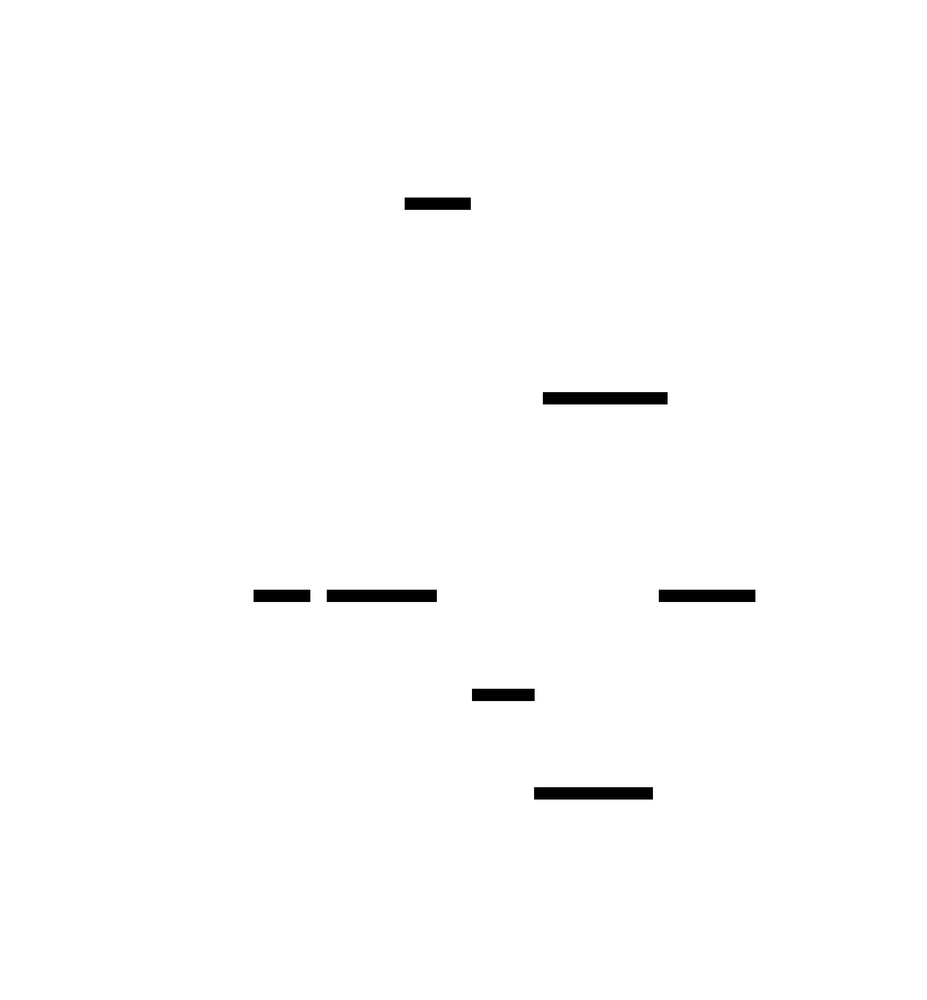

# Simple Garbage Collector: Design Document


## Overview

A mark-sweep garbage collector that automatically reclaims unused memory by traversing object graphs and freeing unreachable objects. The key architectural challenge is safely identifying live objects while handling reference cycles, stack scanning, and memory layout complexities.


> This guide is meant to help you understand the big picture before diving into each milestone. Refer back to it whenever you need context on how components connect.


## Context and Problem Statement

> **Milestone(s):** This section provides foundational context for all milestones (1-4) by establishing why garbage collection is necessary and how mark-sweep fits into the broader landscape of memory management solutions.

### The Memory Management Problem

Think of memory management like managing a busy parking garage. In manual memory management, each driver (programmer) must remember exactly where they parked and must personally return to move their car when they're done. This works fine for a few cars, but as the garage fills up with hundreds of vehicles and multiple drivers coming and going, people inevitably forget where they parked, lose their keys, or try to move someone else's car. The result is a chaotic mess of abandoned vehicles, blocked spaces, and frustrated drivers trying to park in spots that look empty but are actually reserved.

Manual memory management in programming languages like C follows this same pattern. When a program needs memory, it explicitly requests it from the operating system using functions like `malloc()`. When that memory is no longer needed, the program must explicitly return it using `free()`. This explicit allocation and deallocation model places the entire burden of memory bookkeeping on the programmer, leading to several classes of critical bugs that can crash programs or create security vulnerabilities.

**Memory leaks** represent the most common category of manual memory management errors. These occur when a program allocates memory but fails to free it when no longer needed. Consider a web server that allocates memory for each incoming request to store parsed HTTP headers. If the programmer forgets to free this memory after processing the request, each request permanently consumes memory that can never be reclaimed. Over time, the server's memory usage grows without bound until the operating system kills the process or the entire system runs out of memory. Memory leaks are particularly insidious because they often don't manifest immediately—a program might leak small amounts of memory for weeks or months before the cumulative effect becomes noticeable.

**Use-after-free vulnerabilities** occur when a program continues to access memory after it has been explicitly freed. This creates a race condition between the program's continued use of the memory and the allocator's potential reuse of that memory for other purposes. If the freed memory gets reallocated for a different data structure, the original pointer now points to completely unrelated data. Reading from this memory produces garbage values, while writing to it corrupts the new data structure in unpredictable ways. Use-after-free bugs are among the most dangerous security vulnerabilities because attackers can often control what gets allocated in the freed memory location, allowing them to manipulate program behavior.

**Double-free errors** happen when a program calls `free()` multiple times on the same memory address. Most allocators maintain internal data structures to track which memory blocks are allocated and which are available for reuse. When `free()` is called, the allocator updates these data structures to mark the block as available. Calling `free()` again on the same address corrupts these internal data structures, often leading to heap corruption that can cause crashes or security vulnerabilities in subsequent allocation operations.

**Memory fragmentation** presents another significant challenge in manual memory management. As programs allocate and free memory blocks of different sizes over time, the heap becomes fragmented into small, non-contiguous free regions. Even if the total amount of free memory is sufficient for a new allocation request, the allocator might be unable to satisfy the request because no single free block is large enough. This leads to allocation failures despite having adequate total memory, forcing programs to implement complex memory compaction strategies or accept reduced memory efficiency.

The temporal complexity of modern software exacerbates these problems. In simple programs where objects have clear ownership and predictable lifetimes, manual memory management is manageable. However, contemporary applications often involve complex object relationships where multiple components share references to the same data, objects are passed between threads or stored in long-lived data structures, and lifetimes depend on user interactions or network events that are difficult to predict at compile time.

> **Key Insight**: The fundamental problem with manual memory management isn't that programmers are careless—it's that the cognitive burden of tracking every allocation and its corresponding deallocation across complex, long-running programs exceeds human capacity for error-free bookkeeping.

Error detection for manual memory management bugs is notoriously difficult. Memory leaks might not cause observable symptoms until the program has been running for extended periods. Use-after-free bugs often produce intermittent failures that are hard to reproduce because they depend on the timing of allocations and deallocations. Double-free errors might corrupt heap metadata without immediately crashing the program, causing failures much later in seemingly unrelated code. This delayed manifestation of symptoms makes debugging extremely challenging and time-consuming.

The economic cost of manual memory management bugs is substantial. Studies of security vulnerabilities consistently show that memory safety issues represent the largest category of exploitable bugs in systems software. Major software companies spend enormous resources on static analysis tools, dynamic testing frameworks, and code review processes specifically to catch memory management errors. Despite these efforts, memory-related vulnerabilities continue to be discovered regularly in mature, widely-used software products.

### Garbage Collection Approaches

Automatic garbage collection addresses the memory management problem by shifting responsibility from the programmer to the runtime system. Instead of requiring explicit deallocation, garbage collectors automatically identify when memory is no longer reachable by the program and reclaim it safely. Think of garbage collection like having a smart building management system that automatically tracks which parking spaces are actually in use, identifies abandoned vehicles, and reclaims those spaces without requiring any action from individual drivers.

The key insight underlying all garbage collection approaches is **reachability analysis**. An object in memory is considered "live" (still needed by the program) if there exists some sequence of pointer dereferences starting from a "root" reference that can reach that object. Root references include variables on the call stack, global variables, and any other memory locations that the program can directly access. If an object cannot be reached through any such path, it is "garbage" and can be safely reclaimed because the program has no way to access it in the future.

Different garbage collection algorithms implement this reachability analysis concept using varying strategies that make different trade-offs between simplicity, performance, memory overhead, and pause times. Understanding these trade-offs is crucial for selecting the appropriate approach for a given application domain.

| Approach | Key Mechanism | Strengths | Weaknesses | Best Use Cases |
|----------|---------------|-----------|------------|----------------|
| Reference Counting | Track reference count per object | Simple, immediate reclamation | Cannot handle cycles, overhead per assignment | Simple object hierarchies, embedded systems |
| Mark-Sweep | Mark reachable objects, sweep unmarked | Handles cycles, conceptually simple | Stop-the-world pauses, fragmentation | Batch applications, learning implementations |
| Copying | Copy live objects to new region | Compacts memory, fast allocation | Requires 2x memory, moving objects | High-allocation applications, functional languages |
| Generational | Separate young/old generations | Fast for typical allocation patterns | Complex implementation, tuning required | General-purpose applications, long-running servers |

> **Decision: Mark-Sweep for Educational Implementation**
> - **Context**: This project aims to teach fundamental garbage collection concepts to developers learning memory management
> - **Options Considered**: Reference counting (simpler but doesn't handle cycles), copying collector (more complex object movement), mark-sweep (moderate complexity with complete functionality)
> - **Decision**: Implement a mark-sweep collector
> - **Rationale**: Mark-sweep provides the clearest illustration of reachability analysis while handling all garbage collection scenarios including reference cycles. The two-phase design (mark reachable objects, then sweep unmarked objects) maps directly to the conceptual model of garbage collection without requiring complex optimizations that obscure the core algorithm.
> - **Consequences**: Learners will understand the complete garbage collection process and can later extend to more advanced techniques. However, the implementation will have stop-the-world pauses and heap fragmentation that production collectors address with additional complexity.

**Reference counting** represents the most intuitive garbage collection approach. Each object maintains a counter tracking how many references point to it. When a reference is created (assignment, parameter passing, storing in a data structure), the counter increments. When a reference is destroyed (variable goes out of scope, assignment to null, removal from data structure), the counter decrements. When the counter reaches zero, the object is immediately freed.

Reference counting's primary advantage is **immediate reclamation**—objects are freed as soon as they become unreachable, providing predictable memory usage without pause times. The implementation is also conceptually straightforward, requiring only counter maintenance operations alongside normal program execution.

However, reference counting fails completely with **cyclic references**. If object A holds a reference to object B, and object B holds a reference back to object A, both objects will have reference counts of at least one even when no external references point to either object. This cycle becomes unreachable garbage, but the reference counter never drops to zero. Common examples include parent-child relationships in tree structures where children maintain back-pointers to parents, or doubly-linked list nodes that reference both next and previous elements.

The **overhead per assignment** represents another significant drawback. Every pointer assignment requires incrementing the new target's reference count and decrementing the old target's reference count. In tight loops or code that manipulates many references, this overhead can substantially impact performance. Additionally, the reference count field increases memory usage for every object, which can be significant for small objects.

**Mark-sweep collection** operates in two distinct phases that directly correspond to the reachability analysis concept. The mark phase performs a graph traversal starting from all root references, following pointer chains to discover every reachable object and marking each one with a "visited" bit. The sweep phase then walks through all allocated objects, freeing those that weren't marked during traversal and resetting mark bits on surviving objects for the next collection cycle.

Mark-sweep's fundamental strength is **complete correctness**—it correctly identifies all garbage including objects involved in reference cycles. The algorithm is also conceptually clean, with the two phases clearly separated and independently verifiable. Implementation complexity is moderate, requiring object headers with mark bits, root discovery mechanisms, and allocation tracking, but avoiding the sophisticated optimizations needed for production-quality collectors.

The primary disadvantage is **stop-the-world pauses**. During garbage collection, the program must halt completely to ensure object relationships don't change during traversal. For interactive applications or real-time systems, these pauses can cause noticeable delays or missed deadlines. Mark-sweep also doesn't address **heap fragmentation**—after sweeping, free memory exists in scattered blocks throughout the heap rather than contiguous regions, potentially leading to allocation failures despite adequate total free memory.

**Copying collectors** divide the heap into two equal regions and maintain all objects in one region at a time. During garbage collection, the collector copies all reachable objects from the current region to the empty region, updating all references to point to the new locations. After copying completes, the roles of the regions swap—the new region becomes active while the old region is completely discarded.

Copying collection provides excellent **memory compaction** because all surviving objects are copied into contiguous memory locations, eliminating fragmentation. Allocation is also extremely fast—new objects are allocated by simply incrementing a pointer in the active region until it reaches the region boundary. The copying process naturally handles reference updates, ensuring all pointers remain valid after object movement.

The **memory overhead** represents copying collection's major weakness—only half of the allocated heap space can be used for objects at any time, with the other half reserved for the copying target. For memory-constrained environments, this 50% overhead is often prohibitive. Additionally, **object movement** complicates interaction with external systems that might hold pointers into the garbage-collected heap, requiring sophisticated techniques to maintain reference validity across collection cycles.

**Generational collectors** exploit the empirical observation that most objects die young—the vast majority of allocated objects become garbage shortly after allocation, while objects that survive initial collection cycles tend to remain live for extended periods. Generational collectors maintain separate regions for "young" objects (recently allocated) and "old" objects (survived multiple collections), collecting the young generation frequently while collecting the old generation less often.

This approach provides excellent **performance for typical allocation patterns** because most collection work focuses on the small young generation where most garbage resides. Write barriers track references from old objects to young objects, allowing young generation collection without scanning the entire old generation. When tuned properly, generational collection can provide both low pause times and high throughput.

However, generational collectors represent **significant implementation complexity**, requiring write barriers, multiple heap regions, promotion policies for moving objects between generations, and sophisticated heuristics for deciding when to collect each generation. The performance benefits depend heavily on **tuning parameters** that vary across application domains and can require extensive experimentation to optimize.

> ⚠️ **Pitfall: Choosing Advanced Collectors for Learning**
> Beginning implementers often want to jump directly to sophisticated algorithms like generational or concurrent collection because these are used in production systems. However, these advanced techniques layer complex optimizations on top of the fundamental reachability analysis concepts. Without first understanding how basic mark-sweep works—including root discovery, graph traversal, and memory reclamation—the additional complexity of advanced collectors becomes overwhelming and obscures the core principles. Mark-sweep provides the clearest path to understanding garbage collection fundamentals that transfer to more sophisticated algorithms.

The choice of garbage collection algorithm depends heavily on application requirements and constraints. **Interactive applications** that require consistent response times might prefer incremental or concurrent collectors that minimize pause times. **Embedded systems** with memory constraints might use reference counting despite its cycle limitations. **High-throughput batch processing** might accept longer pause times in exchange for better overall performance from mark-sweep or copying collectors.

For this educational implementation, mark-sweep provides the optimal balance of demonstrating complete garbage collection functionality while maintaining implementation simplicity that allows focus on the fundamental concepts rather than optimization details.

### Implementation Guidance

#### Technology Recommendations

| Component | Simple Option | Advanced Option | Rationale |
|-----------|---------------|-----------------|-----------|
| Object Headers | Fixed-size struct with type tag and mark bit | Compressed headers with bit packing | Simple approach clarifies header layout without bit manipulation complexity |
| Root Discovery | Conservative stack scanning with pointer-sized alignment | Precise root maps from compiler integration | Conservative scanning works without compiler support and demonstrates scanning principles |
| Allocation Tracking | Intrusive linked list through object headers | Separate allocation metadata with hash tables | Intrusive lists are simpler and show direct object relationships |
| Memory Allocator | System `malloc()`/`free()` wrapper | Custom memory pool with block management | System allocator handles low-level memory management, allowing focus on GC algorithms |
| Threading Model | Single-threaded stop-the-world | Concurrent marking with synchronization | Single-threaded eliminates synchronization complexity while teaching core concepts |

#### Recommended File Structure

Organize the garbage collector implementation to separate concerns and make the codebase approachable for learners:

```
garbage-collector/
├── src/
│   ├── main.c              ← Demo program and test cases
│   ├── gc.h                ← Main GC interface and type definitions
│   ├── gc.c                ← GC coordination and lifecycle management
│   ├── object.h            ← Object model definitions and type system
│   ├── object.c            ← Object allocation and type dispatch
│   ├── roots.h             ← Root discovery interface
│   ├── roots.c             ← Stack scanning and root enumeration  
│   ├── mark.h              ← Marking phase interface
│   ├── mark.c              ← Graph traversal and marking algorithms
│   ├── sweep.h             ← Sweep phase interface
│   └── sweep.c             ← Memory reclamation and cleanup
├── tests/
│   ├── test_object.c       ← Object model unit tests
│   ├── test_roots.c        ← Root discovery tests
│   ├── test_mark.c         ← Marking algorithm tests
│   ├── test_sweep.c        ← Sweep phase tests
│   └── test_integration.c  ← End-to-end GC scenarios
├── examples/
│   ├── simple_alloc.c      ← Basic allocation and collection
│   ├── cycles.c            ← Reference cycle handling
│   └── stress_test.c       ← Heavy allocation patterns
└── Makefile               ← Build configuration
```

This structure separates the four main phases (object model, root discovery, marking, sweeping) into focused modules while maintaining a clear interface through header files.

#### Infrastructure Starter Code

**Memory Allocation Wrapper** (complete, ready to use):

```c
// gc_malloc.h
#ifndef GC_MALLOC_H
#define GC_MALLOC_H

#include <stddef.h>

// Initialize the allocation tracking system
void gc_malloc_init(void);

// Allocate memory and track it for garbage collection
void* gc_malloc(size_t size);

// Get total bytes currently allocated
size_t gc_allocated_bytes(void);

// Get count of allocated objects
size_t gc_object_count(void);

// Clean up allocation tracking (for program shutdown)
void gc_malloc_cleanup(void);

#endif // GC_MALLOC_H
```

```c
// gc_malloc.c
#include "gc_malloc.h"
#include <stdlib.h>
#include <stdio.h>

static size_t total_allocated = 0;
static size_t object_count = 0;

void gc_malloc_init(void) {
    total_allocated = 0;
    object_count = 0;
}

void* gc_malloc(size_t size) {
    void* ptr = malloc(size);
    if (ptr) {
        total_allocated += size;
        object_count++;
    }
    return ptr;
}

size_t gc_allocated_bytes(void) {
    return total_allocated;
}

size_t gc_object_count(void) {
    return object_count;
}

void gc_malloc_cleanup(void) {
    if (total_allocated > 0) {
        fprintf(stderr, "Warning: %zu bytes leaked (%zu objects)\n", 
                total_allocated, object_count);
    }
}
```

**Debug Logging Utilities** (complete, ready to use):

```c
// debug.h
#ifndef DEBUG_H
#define DEBUG_H

#include <stdio.h>

// Debug levels
typedef enum {
    DEBUG_NONE = 0,
    DEBUG_ERROR = 1,
    DEBUG_WARN = 2,
    DEBUG_INFO = 3,
    DEBUG_VERBOSE = 4
} debug_level_t;

// Set global debug level
void debug_set_level(debug_level_t level);

// Debug logging macros
#define DEBUG_ERROR(fmt, ...) debug_log(DEBUG_ERROR, "ERROR", fmt, ##__VA_ARGS__)
#define DEBUG_WARN(fmt, ...)  debug_log(DEBUG_WARN,  "WARN",  fmt, ##__VA_ARGS__)
#define DEBUG_INFO(fmt, ...)  debug_log(DEBUG_INFO,  "INFO",  fmt, ##__VA_ARGS__)
#define DEBUG_VERBOSE(fmt, ...) debug_log(DEBUG_VERBOSE, "VERBOSE", fmt, ##__VA_ARGS__)

// Internal logging function
void debug_log(debug_level_t level, const char* prefix, const char* fmt, ...);

#endif // DEBUG_H
```

#### Core Logic Skeleton Code

**Main GC Interface** (signatures with detailed TODOs):

```c
// gc.h - Main garbage collector interface
#ifndef GC_H
#define GC_H

#include <stddef.h>
#include <stdbool.h>

// GC statistics for monitoring and debugging
typedef struct {
    size_t collections_performed;
    size_t objects_collected;
    size_t bytes_collected;
    size_t collection_time_ms;
} gc_stats_t;

// Initialize the garbage collector
void gc_init(void);

// Perform a complete garbage collection cycle
// Returns true if collection occurred, false if skipped
bool gc_collect(void);

// Check if GC should be triggered based on allocation thresholds
bool gc_should_collect(void);

// Get current GC statistics
gc_stats_t gc_get_stats(void);

// Shutdown garbage collector and free all memory
void gc_shutdown(void);

#endif // GC_H
```

```c
// gc.c - Main GC coordination logic (skeleton for learner implementation)
#include "gc.h"
#include "object.h"
#include "roots.h"
#include "mark.h"
#include "sweep.h"
#include "debug.h"
#include <time.h>

static gc_stats_t stats = {0};
static bool gc_initialized = false;

void gc_init(void) {
    // TODO 1: Initialize all GC subsystems (object tracking, root discovery, etc.)
    // TODO 2: Set up allocation thresholds for triggering collection
    // TODO 3: Initialize statistics tracking
    // TODO 4: Set gc_initialized flag to true
    // Hint: Call initialization functions for object, roots, mark, and sweep modules
}

bool gc_collect(void) {
    // TODO 1: Check if GC is initialized, return false if not
    // TODO 2: Record collection start time for statistics
    // TODO 3: Discover all root references (stack, globals, registers)
    // TODO 4: Mark phase - traverse from roots and mark all reachable objects
    // TODO 5: Sweep phase - reclaim unmarked objects and reset marks
    // TODO 6: Update statistics (objects collected, bytes freed, time taken)
    // TODO 7: Reset allocation counters for next collection trigger
    // TODO 8: Return true to indicate collection completed
    // 
    // Error handling: If any phase fails, log error and return false
    // Debug: Log collection stats at INFO level
}

bool gc_should_collect(void) {
    // TODO 1: Check if total allocated bytes exceeds threshold
    // TODO 2: Check if number of objects exceeds threshold
    // TODO 3: Return true if either threshold exceeded
    // TODO 4: Consider additional triggers (time-based, explicit requests)
    //
    // Suggested thresholds: 1MB allocated or 1000 objects
    // Advanced: Make thresholds configurable or adaptive
}
```

#### Language-Specific Hints

**C-Specific Memory Management:**
- Use `malloc()` and `free()` for object allocation, but wrap them in GC-aware functions
- `memset()` is useful for clearing mark bits during sweep phase
- `offsetof()` macro helps calculate field positions in object headers
- Use `uintptr_t` for pointer arithmetic when scanning memory regions
- `volatile` keyword may be needed for variables that could be optimized away during stack scanning

**Stack Scanning Implementation:**
- Get current stack pointer using inline assembly or compiler intrinsics
- Stack grows downward on most architectures - scan from current SP to stack base
- Align scanning to pointer boundaries (`sizeof(void*)`)
- Use `setjmp()` to capture register contents in a portable way
- Be careful about compiler optimizations that might eliminate "unreachable" variables

**Debugging and Testing:**
- Compile with `-g` for debug symbols and `-O0` to disable optimizations during development
- Use `valgrind --tool=memcheck` to detect memory errors in your GC implementation
- `gdb` can help trace through marking and sweeping phases step by step
- Print object addresses and mark bits to verify traversal correctness
- Create test cases with known object graphs and verify expected collection behavior

#### Milestone Checkpoints

**After completing this Context section:**
- **Understanding Check**: Can you explain why reference counting fails with cycles?
- **Design Check**: Can you describe the two phases of mark-sweep collection?
- **Implementation Readiness**: Do you understand the file structure and module responsibilities?

**Expected Knowledge Before Proceeding:**
- Memory leaks, use-after-free, and double-free error patterns
- Concept of reachability analysis for determining live objects
- Trade-offs between different garbage collection approaches
- Why mark-sweep was chosen for this educational implementation
- High-level understanding of mark phase (graph traversal) and sweep phase (memory reclamation)

**Red Flags - Stop and Review If:**
- You can't explain the difference between precise and conservative root scanning
- The concept of "roots" in garbage collection is unclear
- You don't understand why objects need header information
- The relationship between allocation tracking and the sweep phase is confusing

This foundational understanding is critical before diving into the specific implementation details of object models, root discovery, marking algorithms, and sweep mechanisms in the following sections.


## Goals and Non-Goals

> **Milestone(s):** This section provides scope boundaries and objectives that guide implementation across all milestones (1-4) by clearly defining what functionality the garbage collector will provide and what complexity it will avoid.

Setting clear goals and boundaries is like establishing the blueprint for a house before construction begins. Without these boundaries, developers often fall into feature creep or attempt to solve problems far beyond the intended learning scope. A mark-sweep garbage collector can range from a simple educational implementation to a production-ready system with incremental collection, weak references, and concurrent marking. This section draws sharp lines around what we will build and what we explicitly won't tackle.

The **fundamental goal** is to create a working garbage collector that automatically reclaims memory without requiring manual `free()` calls from application code. Think of our collector as a basic janitor that periodically walks through a building (the heap), identifies which rooms are still in use by following a trail of connections from the entrance (root references), and then cleans up any abandoned rooms. This janitor is thorough but simple—it doesn't optimize for speed or try to minimize disruption to the building's occupants.

The learning objective drives our scope decisions more than practical performance considerations. Each milestone teaches a specific aspect of memory management: object representation, root discovery, graph traversal, and memory reclamation. Features that don't directly contribute to understanding these core concepts get deferred to future extensions.

### Functional Goals

These represent the core capabilities that our mark-sweep garbage collector must provide to be considered functionally complete. Each goal directly supports one or more project milestones and teaches fundamental garbage collection concepts.

**Automatic Memory Reclamation** forms the primary value proposition of any garbage collector. Our system will periodically identify unreachable objects and return their memory to the allocator without any intervention from application code. The application developer allocates objects using `gc_malloc()` and never calls `free()`—the collector handles all deallocation decisions. This eliminates the entire class of memory management bugs that plague manual memory management.

> **Decision: Stop-the-World Collection Model**
> - **Context**: We need to decide when and how garbage collection executes relative to application code
> - **Options Considered**: Stop-the-world (pause application during GC), concurrent (GC runs alongside application), incremental (GC work spread across multiple small pauses)
> - **Decision**: Stop-the-world collection that pauses the entire application during mark and sweep phases
> - **Rationale**: Eliminates complex synchronization issues, mutator (application) cannot change object graph during collection, simpler root discovery since stack/registers are frozen, easier to debug and verify correctness
> - **Consequences**: Application experiences GC pauses, but implementation complexity stays manageable for learning purposes

| Collection Model | Complexity | Synchronization Overhead | Learning Value | Chosen? |
|------------------|------------|-------------------------|----------------|---------|
| Stop-the-world | Low | None | High (core concepts clear) | ✓ |
| Concurrent | Very High | Significant | Low (obscures fundamentals) | ✗ |
| Incremental | High | Moderate | Medium | ✗ |

**Reference Cycle Detection** ensures that circular references don't create memory leaks. Unlike reference counting systems that struggle with cycles, mark-sweep naturally handles them through reachability analysis. Consider a scenario where object A points to object B, object B points to object C, and object C points back to object A, but no root references point to any of these objects. A reference counting collector would see each object having one reference and never collect them. Our mark-sweep collector starts from roots, never finds this cycle, and correctly identifies all three objects as garbage.

The cycle detection happens automatically during the mark phase through careful use of mark bits. When the marking algorithm encounters an already-marked object, it stops recursing down that path, preventing infinite loops while ensuring all reachable objects get marked exactly once.

**Multi-Type Object Support** enables realistic applications by supporting at least three distinct object types with different memory layouts and reference patterns. Our type system will support:

| Object Type | Size Characteristics | Reference Pattern | Purpose |
|-------------|---------------------|------------------|---------|
| Integer | Fixed, small | No outgoing references | Leaf values, simple data |
| String | Variable length | No outgoing references | Text data, larger leaf objects |
| Pair | Fixed, medium | Two outgoing references | Building block for data structures |

Each object type teaches different aspects of garbage collection. Integers demonstrate simple objects with no references to trace. Strings show variable-sized allocation and deallocation. Pairs illustrate how the collector must follow references to find all reachable objects. Together, they provide enough complexity to build realistic data structures like linked lists and trees.

**Threshold-Based Collection Triggering** determines when garbage collection cycles execute based on memory pressure rather than arbitrary timing. The collector tracks total allocated bytes using `gc_allocated_bytes()` and triggers collection when this exceeds a configurable threshold. This approach teaches the fundamental trade-off between memory overhead and collection frequency.

The threshold mechanism prevents both memory explosion (never collecting) and performance degradation (collecting too frequently). When allocation crosses the threshold, `gc_should_collect()` returns true, prompting the next allocation to invoke `gc_collect()` before proceeding.

**Root Set Discovery** identifies all program references that could potentially lead to reachable objects. Our collector will find roots in three primary locations:

1. **Stack References**: Conservative scanning of call stack frames to identify values that might be pointers
2. **Global Variables**: Precise tracking of statically allocated references in global scope  
3. **Register Contents**: Architecture-specific inspection of CPU registers that might contain pointers

The root discovery system forms the foundation for reachability analysis. Missing roots leads to premature collection of live objects (correctness bug), while including too many false positives reduces collection effectiveness (performance issue).

**Collection Statistics and Monitoring** provides visibility into garbage collector behavior through the `gc_stats_t` structure. This enables debugging, performance analysis, and verification that the collector is working correctly:

| Statistic | Type | Purpose | Calculated When |
|-----------|------|---------|-----------------|
| `collections_performed` | `size_t` | Count total GC cycles | Incremented at end of each `gc_collect()` |
| `objects_collected` | `size_t` | Count freed objects | Accumulated during sweep phase |
| `bytes_collected` | `size_t` | Total memory reclaimed | Sum of freed object sizes |
| `collection_time_ms` | `size_t` | Time spent in last collection | Measured during `gc_collect()` |

Statistics serve both educational and practical purposes. They help developers understand collector behavior, verify that collection is actually reclaiming memory, and identify potential performance issues.

### Non-Functional Goals

These goals establish quality attributes and constraints that guide implementation decisions across all functional features. Unlike functional goals that describe what the system does, non-functional goals describe how well it should do it.

**Educational Clarity** takes priority over optimal performance or minimal memory overhead. Code should be readable, well-commented, and structured to highlight key concepts. When faced with a choice between clever optimization and clear implementation, choose clarity. The goal is learning garbage collection principles, not building a production collector.

This principle influences many design decisions:
- Use explicit worklists instead of recursion to make graph traversal visible
- Separate mark and sweep phases cleanly rather than interleaving for efficiency  
- Include extensive logging and statistics rather than optimizing them away
- Choose simple algorithms over complex optimizations

**Moderate Performance Expectations** acknowledge that this is a learning implementation, not a production system. Collection pauses should be reasonable for programs with thousands of objects but not optimized for millions. The collector should handle typical data structures (linked lists, trees with depth under 1000) without stack overflow or excessive pause times.

| Performance Target | Specification | Rationale |
|-------------------|---------------|-----------|
| Object capacity | 10,000-100,000 objects | Sufficient for meaningful programs |
| Collection pause | Under 100ms for 10,000 objects | Noticeable but not unusable |
| Memory overhead | 20-30% for object headers and tracking | Acceptable for educational use |
| Allocation speed | Comparable to `malloc()` | Don't add significant allocation overhead |

**Memory Safety** ensures the collector never corrupts memory or creates dangling pointers. The collector itself must be bug-free since errors in memory management can cause crashes or silent corruption throughout the application. All pointer arithmetic, linked list manipulation, and object traversal must include bounds checking and validation.

Critical safety requirements include:
- Never access objects after freeing their memory during sweep
- Validate object headers before following references during marking  
- Prevent buffer overflows when scanning stack frames for roots
- Ensure mark bit operations are atomic if any threading is involved

**Debuggability** provides comprehensive logging and introspection capabilities to help developers understand collector behavior and diagnose issues. The `debug_level_t` system enables progressive detail levels from silent operation to verbose trace output.

| Debug Level | Information Provided | Performance Impact |
|-------------|---------------------|-------------------|
| `DEBUG_NONE` | Silent operation | Minimal |
| `DEBUG_ERROR` | Only critical failures | Very low |
| `DEBUG_WARN` | Potential issues | Low |
| `DEBUG_INFO` | Collection cycles, statistics | Moderate |
| `DEBUG_VERBOSE` | Object-by-object tracing | High |

Debug output helps answer questions like "Why wasn't this object collected?" and "How long do collection pauses take?" This visibility is essential for learning since garbage collection behavior is often non-obvious to developers.

**Portability Across Target Platforms** ensures the collector works on common development environments without extensive platform-specific code. The core algorithms should be portable C that compiles and runs on Linux, macOS, and Windows. Platform-specific code should be isolated and clearly marked.

Areas requiring platform consideration:
- Stack scanning direction and alignment requirements
- Register enumeration for root discovery  
- Memory allocation and alignment guarantees
- Timer resolution for performance measurement

### Explicit Non-Goals

These features represent common garbage collection capabilities that we explicitly choose not to implement. Each non-goal includes rationale for why it's excluded and how it might be added in future extensions.

**Concurrent or Parallel Collection** would allow garbage collection to proceed while application threads continue executing. This dramatically increases implementation complexity through synchronization requirements, read/write barriers, and coordination protocols. The educational value is low since the complexity obscures fundamental marking and sweeping concepts.

> Modern production collectors often use concurrent techniques, but understanding concurrent collection requires first mastering sequential collection. Our stop-the-world approach teaches core concepts without threading complications.

**Generational Collection** optimizes for the common pattern where young objects die quickly while old objects tend to live longer. A generational collector divides the heap into generations and collects young objects more frequently. While effective in practice, generational collection adds heap organization complexity and age tracking overhead that doesn't contribute to understanding basic mark-sweep algorithms.

**Incremental Collection** spreads garbage collection work across multiple small pauses instead of one large stop-the-world pause. This requires maintaining collection state between increments and handling mutations to the object graph during partial collection. The state management and incremental algorithms significantly complicate the basic mark-sweep approach.

**Compacting Collection** eliminates heap fragmentation by moving live objects together during collection. Compaction requires updating all references to moved objects, adding object relocation complexity and reference patching logic. Mark-sweep without compaction is simpler and still demonstrates the core concepts of reachability analysis and memory reclamation.

| Advanced Feature | Complexity Added | Educational Value Lost | Production Benefit |
|------------------|------------------|----------------------|-------------------|
| Concurrent collection | High (synchronization) | Core concepts obscured | Reduced pause times |
| Generational collection | Medium (heap organization) | Focus diverted to optimization | Better cache behavior |
| Incremental collection | High (state management) | Algorithm clarity lost | Predictable pause times |
| Compacting collection | High (reference updates) | Simple sweep obscured | Reduced fragmentation |

**Weak References** allow objects to reference other objects without preventing their collection. Implementing weak references requires additional object metadata, special handling during marking, and notification mechanisms when weak targets get collected. This functionality doesn't contribute to understanding basic reachability analysis.

**Finalizers** execute cleanup code when objects are about to be collected. Finalizers complicate collection by requiring multiple collection passes (mark reachable objects, run finalizers which might resurrect objects, mark again, then sweep). The resurrection semantics and ordering guarantees add substantial complexity.

**Advanced Root Discovery** techniques like exact stack maps or compiler integration would provide precise root identification without conservative scanning. While more accurate, these approaches require toolchain modifications and platform-specific knowledge that distracts from the core garbage collection algorithms.

**Real-Time Guarantees** would bound worst-case collection pause times for real-time applications. Achieving deterministic timing requires incremental or concurrent techniques explicitly excluded above. Our collector makes no timing guarantees beyond "reasonable" performance for educational workloads.

**Multi-Threading Support** within the collector itself (parallel marking, concurrent sweeping) would improve performance on multi-core systems but requires careful synchronization and work distribution algorithms. The threading complexity doesn't contribute to understanding mark-sweep fundamentals.

⚠️ **Pitfall: Feature Creep During Implementation**
Students often encounter interesting garbage collection papers or techniques during implementation and want to incorporate advanced features. This leads to incomplete basic implementations and frustrated learning experiences. **Stick to the defined scope**—advanced features can be explored after mastering the fundamentals.

**Performance Optimization** beyond basic algorithmic correctness stays out of scope. This includes:
- Cache-friendly object layout and traversal patterns
- SIMD instructions for bulk operations  
- Profile-guided optimization of hot paths
- Memory prefetching during object traversal
- Specialized allocation patterns for different object types

The goal is correctness and understanding, not micro-optimization. Premature optimization would obscure the algorithmic content that students need to master.

### Implementation Guidance

This subsection provides concrete technology choices and starter infrastructure to implement the goals defined above while avoiding the complexity of excluded features.

**A. Technology Recommendations**

| Component | Simple Option | Advanced Option |
|-----------|---------------|-----------------|
| Memory Allocation | `malloc()/free()` with tracking | Custom heap manager with free lists |
| Debugging Output | `printf()` with debug levels | Structured logging library |
| Timing Measurement | `clock()` for basic timing | `clock_gettime()` for high resolution |
| Platform Abstraction | `#ifdef` blocks for differences | Abstract platform interface |
| Testing Framework | Simple assert macros | Full unit testing framework |
| Build System | Single Makefile | CMake or build system |

**B. Recommended File Structure**

```
gc-project/
├── src/
│   ├── gc.h                 ← Main public API (gc_init, gc_collect, etc.)
│   ├── gc.c                 ← Core GC coordination and public interface
│   ├── object.h             ← Object model types and allocation (Milestone 1)
│   ├── object.c             ← Object creation and type management
│   ├── roots.h              ← Root discovery interface (Milestone 2)  
│   ├── roots.c              ← Stack scanning and root set construction
│   ├── mark.h               ← Marking phase interface (Milestone 3)
│   ├── mark.c               ← Object graph traversal and marking
│   ├── sweep.h              ← Sweep phase interface (Milestone 4)
│   ├── sweep.c              ← Memory reclamation and mark bit reset
│   ├── debug.h              ← Debug logging and statistics
│   └── debug.c              ← Logging implementation
├── test/
│   ├── test_object.c        ← Object model tests
│   ├── test_gc.c            ← End-to-end GC tests  
│   └── test_cycles.c        ← Reference cycle tests
├── examples/
│   ├── simple_list.c        ← Basic linked list example
│   └── tree_example.c       ← Binary tree with cycles
└── Makefile                 ← Build configuration
```

**C. Infrastructure Starter Code**

**Debug System** (Complete implementation):

```c
// debug.h
#ifndef DEBUG_H
#define DEBUG_H

#include <stdio.h>
#include <stdarg.h>

typedef enum {
    DEBUG_NONE = 0,
    DEBUG_ERROR = 1,
    DEBUG_WARN = 2, 
    DEBUG_INFO = 3,
    DEBUG_VERBOSE = 4
} debug_level_t;

void debug_set_level(debug_level_t level);
void debug_log(debug_level_t level, const char* component, const char* format, ...);

// Convenience macros
#define DEBUG_ERROR_LOG(comp, ...) debug_log(DEBUG_ERROR, comp, __VA_ARGS__)
#define DEBUG_INFO_LOG(comp, ...) debug_log(DEBUG_INFO, comp, __VA_ARGS__)
#define DEBUG_VERBOSE_LOG(comp, ...) debug_log(DEBUG_VERBOSE, comp, __VA_ARGS__)

#endif // DEBUG_H
```

```c
// debug.c  
#include "debug.h"
#include <time.h>

static debug_level_t current_level = DEBUG_WARN;

void debug_set_level(debug_level_t level) {
    current_level = level;
}

void debug_log(debug_level_t level, const char* component, const char* format, ...) {
    if (level > current_level) return;
    
    const char* level_names[] = {"NONE", "ERROR", "WARN", "INFO", "VERBOSE"};
    printf("[%s:%s] ", level_names[level], component);
    
    va_list args;
    va_start(args, format);
    vprintf(format, args);
    va_end(args);
    printf("\n");
    fflush(stdout);
}
```

**Statistics Infrastructure** (Complete implementation):

```c
// In gc.h - add to existing header
typedef struct {
    size_t collections_performed;
    size_t objects_collected;
    size_t bytes_collected; 
    size_t collection_time_ms;
} gc_stats_t;

// Global statistics - initialize in gc_init()
static gc_stats_t gc_stats = {0, 0, 0, 0};

gc_stats_t gc_get_stats(void) {
    return gc_stats; // Return copy of current statistics
}
```

**D. Core Logic Skeleton Code**

**Main GC Interface** (Signatures + TODOs):

```c
// gc.c - Core coordination logic
#include "gc.h"
#include "object.h" 
#include "roots.h"
#include "mark.h"
#include "sweep.h"
#include "debug.h"
#include <time.h>

static bool gc_initialized = false;
static size_t gc_threshold_bytes = 64 * 1024; // 64KB default threshold

void gc_init(void) {
    // TODO 1: Initialize object allocation tracking system
    // TODO 2: Set up debug logging system with default level
    // TODO 3: Initialize statistics counters to zero
    // TODO 4: Set gc_initialized flag to true
    // Hint: Call object_system_init(), debug_set_level(DEBUG_WARN)
}

bool gc_should_collect(void) {
    // TODO 1: Check if GC system is initialized
    // TODO 2: Get current allocated bytes using gc_allocated_bytes()  
    // TODO 3: Compare against gc_threshold_bytes
    // TODO 4: Return true if threshold exceeded, false otherwise
    // Hint: Also return false if gc_allocated_bytes() returns 0
}

bool gc_collect(void) {
    if (!gc_initialized) return false;
    
    clock_t start_time = clock();
    DEBUG_INFO_LOG("GC", "Starting garbage collection cycle");
    
    // TODO 1: Discover all root references using root_discover()
    // TODO 2: Mark all reachable objects using mark_reachable_objects(roots)
    // TODO 3: Sweep unmarked objects and count reclaimed memory using sweep_unmarked()
    // TODO 4: Update statistics with collection results
    // TODO 5: Calculate and store collection time
    // TODO 6: Log collection summary (objects/bytes collected)
    // TODO 7: Return true if any objects were collected
    
    clock_t end_time = clock();
    gc_stats.collection_time_ms = ((end_time - start_time) * 1000) / CLOCKS_PER_SEC;
    gc_stats.collections_performed++;
    
    return true; // Placeholder - replace with actual result
}

void gc_shutdown(void) {
    // TODO 1: Perform final garbage collection to clean up everything
    // TODO 2: Free any remaining objects in allocation list  
    // TODO 3: Clean up object tracking data structures
    // TODO 4: Log final statistics summary
    // TODO 5: Reset gc_initialized flag to false
}
```

**E. Language-Specific Hints**

**Memory Management in C:**
- Use `malloc()` and `free()` for object allocation, but wrap them in `gc_malloc()` to add tracking
- Always check return values from `malloc()` - return NULL on allocation failure
- Use `memset()` to zero object memory after allocation to ensure clean initial state
- Call `free()` during sweep phase, but remove objects from tracking list first

**Pointer Safety:**
- Validate object pointers before dereferencing: check against NULL and known allocation ranges
- Use `assert()` liberally during development to catch invalid pointers early
- When scanning stack conservatively, align pointer checks to word boundaries
- Store allocation list pointers carefully to avoid corruption during sweep

**Cross-Platform Considerations:**
- Use `size_t` for all memory sizes and counts - it's guaranteed to hold object sizes
- Use `uintptr_t` for pointer arithmetic when scanning stacks or computing addresses
- Include proper headers: `<stddef.h>` for `size_t`, `<stdint.h>` for `uintptr_t`
- Stack grows down on most platforms, but scan in both directions to be safe

**F. Milestone Checkpoints**

**After Milestone 1 (Object Model):**
```bash
# Compile and test basic object creation
gcc -o test_objects test/test_object.c src/object.c src/debug.c
./test_objects

# Expected output:
# [INFO:OBJECT] Created integer object with value 42
# [INFO:OBJECT] Created pair object linking two integers  
# [INFO:OBJECT] Created string object with length 13
# Object allocation test: PASSED
```

**After Milestone 2 (Root Discovery):**  
```bash
# Test root scanning functionality
gcc -o test_roots test/test_roots.c src/*.c
./test_roots

# Expected behavior:
# - Program creates objects and stores references in local variables
# - Calls root discovery function
# - Verifies that stack-allocated references are found in root set
# - Should find 3-5 root references depending on test setup
```

**After Milestone 3 (Mark Phase):**
```bash
# Test marking without sweeping
gcc -o test_mark test/test_mark.c src/*.c  
./test_mark

# Expected behavior:
# - Create connected object graph (list or tree)
# - Run mark phase starting from roots
# - Verify all reachable objects have mark bit set
# - Verify unreachable objects remain unmarked
```

**After Milestone 4 (Complete GC):**
```bash
# End-to-end garbage collection test
gcc -o test_gc test/test_gc.c src/*.c
./test_gc

# Expected behavior:
# - Allocate many objects, some reachable, some not
# - Trigger garbage collection with gc_collect()  
# - Verify unreachable objects are freed
# - Check statistics show objects were collected
```

**G. Debugging Tips**

| Symptom | Likely Cause | Diagnosis | Fix |
|---------|--------------|-----------|-----|
| Segfault during marking | Following invalid pointer | Use `gdb` to check object headers, add pointer validation | Check object allocation, verify reference storage |
| Objects not collected | Missing from root set | Enable verbose logging to trace marking | Verify root discovery finds all stack/global refs |
| Memory usage grows continuously | No objects being marked reachable | Print mark bits after mark phase | Fix root discovery or reference following |
| Collection never triggers | Threshold too high | Check `gc_allocated_bytes()` vs threshold | Lower threshold or fix allocation counting |
| Infinite loop in marking | Cycle without mark bit check | Add print statements in mark recursion | Ensure mark bit prevents re-marking |

**Common Implementation Bugs:**

⚠️ **Pitfall: Stack Scanning Direction**
Many students assume stack grows down and scan in wrong direction. **Always scan both directions** from current stack pointer, or use conservative scanning that checks both directions until you hit known stack boundaries.

⚠️ **Pitfall: Object Header Corruption**  
Writing past object boundaries corrupts headers of subsequent objects. **Always allocate exact object size plus header size**, and use tools like AddressSanitizer during development to catch overruns.

⚠️ **Pitfall: Forgetting Mark Bit Reset**
After sweep phase, mark bits must be cleared for next collection cycle. **Clear mark bits on surviving objects** during sweep, or objects will appear reachable in subsequent collections even when they're not.


## High-Level Architecture

> **Milestone(s):** This section provides the foundational architectural overview that guides implementation across all milestones (1-4) by defining how components interact and establishing the overall system design.

Building a mark-sweep garbage collector is like constructing a sophisticated housekeeping system for your computer's memory. Imagine your program's memory as a large apartment building where tenants (objects) move in and out, some tenants know other tenants (object references), and occasionally you need to evict everyone who isn't connected to the building's management (unreachable objects). The garbage collector acts as both the building superintendent and the eviction service, systematically checking which apartments are still occupied through valid connections and then cleaning out the abandoned ones.

The key architectural insight is that garbage collection requires **orchestrated cooperation** between several distinct subsystems, each with specialized responsibilities. Unlike simple malloc/free patterns where allocation and deallocation happen independently, a garbage collector must maintain global awareness of object relationships, track reachability through complex reference graphs, and coordinate multi-phase collection cycles that temporarily pause normal program execution.

This architecture balances several competing concerns: the allocator must be fast enough for frequent use, the object model must store enough metadata for collection without excessive overhead, root discovery must be comprehensive without being prohibitively expensive, and the mark-sweep phases must handle arbitrarily complex object graphs without consuming excessive stack space or collection time.

### Component Overview

The garbage collector architecture consists of five primary components that work together to automate memory management. Each component has distinct responsibilities and well-defined interfaces, allowing for modular implementation and testing.

Think of these components as specialized departments in our memory management organization: the **Allocator** acts as the front desk that handles all incoming memory requests and maintains the guest registry, the **Object Model** defines the standard format for all memory residents and their identification cards, **Root Discovery** serves as the detective unit that identifies all the legitimate entry points into the memory community, the **Mark Phase** operates as the census team that systematically visits every reachable resident, and the **Sweep Phase** functions as the cleanup crew that removes abandoned objects and resets the system for the next cycle.

| Component | Primary Responsibility | Key Data Structures | Interface Methods |
|-----------|----------------------|-------------------|------------------|
| Allocator | Memory allocation and tracking | Allocation list, size counters | `gc_malloc()`, `gc_allocated_bytes()`, `gc_object_count()` |
| Object Model | Object representation and metadata | Object headers, type information | Object creation, type dispatch, header access |
| Root Discovery | Identify GC starting points | Root set collection | Stack scanning, global enumeration, root set building |
| Mark Phase | Traverse and mark reachable objects | Worklist, mark bits | `gc_collect()` mark portion, reachability analysis |
| Sweep Phase | Reclaim unmarked objects | Updated allocation list | `gc_collect()` sweep portion, memory reclamation |

The **Allocator** serves as the central hub for all memory operations in the garbage-collected system. Unlike traditional malloc/free patterns, the GC allocator must maintain comprehensive metadata about every allocated object to enable later collection phases. It tracks not just the memory addresses and sizes, but also maintains a linked list of all live allocations that the sweep phase will traverse. The allocator implements `gc_malloc()` as the primary entry point for object creation, automatically adding new objects to the allocation tracking list and updating global counters that trigger collection cycles when memory pressure reaches configured thresholds.

> The allocator's dual responsibility of serving allocation requests efficiently while maintaining comprehensive tracking metadata represents a fundamental tension in GC design between allocation performance and collection completeness.

The **Object Model** component defines the standard format for all garbage-collected objects, similar to how a building management system requires every tenant to have a standardized lease with specific information fields. Every object begins with a header containing essential metadata: a type tag that enables runtime type dispatch, a mark bit that tracks reachability during collection cycles, and size information that guides memory reclamation. The object model supports at least three fundamental types (integers, pairs, and strings) with extensible type dispatch mechanisms that allow the mark phase to traverse references appropriately based on each object's specific structure.

**Root Discovery** functions as the garbage collector's entry point into the object graph, identifying all the directly accessible references that serve as starting points for reachability analysis. This component must comprehensively examine three potential sources of root references: stack frames from the current call chain, global variables in static storage, and registers that might contain object pointers on the target architecture. Root discovery represents one of the most architecture-dependent aspects of garbage collection, requiring careful consideration of calling conventions, stack layout, and the distinction between conservative scanning (treating pointer-like bit patterns as potential roots) versus precise scanning (having exact knowledge of reference locations).

The **Mark Phase** implements the graph traversal heart of the mark-sweep algorithm, systematically visiting every object reachable from the root set and setting mark bits to indicate liveness. This component must handle arbitrarily complex object graphs, including reference cycles that could cause naive recursive traversal to loop infinitely. The marking algorithm maintains a worklist of discovered but not yet processed objects, avoiding deep recursion that could overflow the call stack when traversing long reference chains. The mark phase embodies the "mark" portion of tri-color marking theory, transitioning objects from white (unmarked) through gray (discovered but unprocessed) to black (marked and processed).

The **Sweep Phase** completes the mark-sweep cycle by performing a linear traversal of the entire allocation list, reclaiming memory from all unmarked objects and resetting mark bits on surviving objects for the next collection cycle. This component implements the physical memory reclamation by calling appropriate cleanup functions for different object types, unlinking freed objects from the allocation list, and returning reclaimed memory to the underlying allocator. The sweep phase also updates global statistics and resets the system state to prepare for subsequent allocation and collection cycles.

> **Decision: Component Separation Strategy**
> - **Context**: Garbage collection involves several distinct algorithms (allocation tracking, graph traversal, memory reclamation) that could be implemented as one monolithic system or separated into focused components
> - **Options Considered**: Monolithic GC implementation, Phase-based separation, Responsibility-based separation
> - **Decision**: Responsibility-based separation with clear component boundaries
> - **Rationale**: Each component addresses fundamentally different concerns (memory management, graph algorithms, system interaction), has different error modes and testing requirements, and benefits from independent development and debugging
> - **Consequences**: Enables incremental implementation following project milestones, simplifies testing by isolating component responsibilities, but requires careful interface design and coordination protocols

| Architecture Option | Pros | Cons | Chosen? |
|---------------------|------|------|---------|
| Monolithic GC | Simple coordination, minimal interfaces | Hard to test individual pieces, complex debugging | No |
| Phase-based separation | Natural fit for mark-sweep algorithm | Still mixes concerns within phases | No |
| Responsibility-based separation | Clean separation of concerns, testable components | More complex coordination, interface overhead | **Yes** |

### GC Lifecycle

The garbage collection lifecycle represents the coordinated dance between all system components during a complete collection cycle. Understanding this lifecycle is crucial because it defines not only the sequence of operations but also the critical points where the system transitions between states, handles errors, and maintains consistency guarantees.

Think of the GC lifecycle as analogous to a systematic building inspection process: first, you establish criteria for when an inspection is needed (trigger conditions), then you identify all the official entry points to check (root discovery), systematically visit every connected space marking what's in active use (mark phase), clean out everything that wasn't marked as active (sweep phase), and finally reset your inspection materials for the next cycle (cleanup and reset).

The lifecycle begins with **trigger evaluation**, where the system continuously monitors allocation patterns and memory pressure to determine when garbage collection should commence. This isn't simply a matter of running out of memory—effective garbage collectors use predictive heuristics to initiate collection cycles when they're most likely to reclaim significant memory while minimizing disruption to program execution.

**Lifecycle Phase Overview:**

| Phase | Duration | Primary Activity | System State | Coordination Required |
|-------|----------|------------------|--------------|---------------------|
| Trigger Evaluation | Continuous | Monitor allocation patterns | Normal execution | Allocator statistics monitoring |
| Collection Initiation | Brief | Stop program, prepare GC | Stop-the-world pause begins | System-wide synchronization |
| Root Discovery | Short | Scan stack, globals, registers | Paused execution | Stack inspection, global enumeration |
| Mark Phase | Medium | Traverse object graph | Paused execution | Worklist processing, mark bit setting |
| Sweep Phase | Medium | Reclaim unmarked objects | Paused execution | Memory reclamation, list maintenance |
| Reset and Resume | Brief | Clear marks, update stats | Transition to normal | Statistics update, program resume |

**Detailed Lifecycle Sequence:**

1. **Continuous Trigger Monitoring**: The allocator component continuously evaluates collection criteria through `gc_should_collect()`, typically based on total allocated bytes exceeding configured thresholds or allocation patterns indicating memory pressure. This monitoring happens with minimal overhead during normal program execution.

2. **Collection Initiation**: When trigger conditions are met, the system calls `gc_collect()` to begin a stop-the-world collection cycle. This immediately pauses normal program execution and initializes the garbage collection subsystems, ensuring a consistent view of memory state throughout the collection process.

3. **Root Set Construction**: The root discovery component systematically examines all potential sources of root references, building a comprehensive collection of starting points for reachability analysis. This phase must be thorough because missing roots leads to premature object collection and program crashes.

4. **Incremental Object Marking**: The mark phase processes the root set iteratively, using a worklist to avoid deep recursion while ensuring complete graph traversal. Each object encountered has its mark bit set and its references added to the worklist for subsequent processing, continuing until the worklist is empty.

5. **Comprehensive Memory Sweeping**: The sweep phase performs a complete linear traversal of the allocation list, identifying unmarked objects for reclamation, calling appropriate cleanup functions, updating allocation tracking structures, and returning freed memory to the underlying allocator.

6. **System Reset and Statistics Update**: The final phase clears all mark bits from surviving objects, updates collection statistics through `gc_get_stats()`, and resumes normal program execution with a cleaned heap ready for subsequent allocation cycles.

The coordination between phases requires careful attention to data consistency and error handling. Each phase depends on the successful completion of previous phases, and failure at any point requires systematic cleanup to maintain system integrity.

> The critical insight is that garbage collection represents a **global system checkpoint** where the entire program state must be consistent and stable, unlike normal program execution where different components can operate somewhat independently.

**Error Coordination During Lifecycle:**

| Failure Point | Detection Method | Recovery Action | System State |
|---------------|------------------|----------------|--------------|
| Trigger evaluation failure | `gc_should_collect()` returns error | Continue without collection, log warning | Normal execution continues |
| Root discovery failure | Stack scan detects corruption | Conservative fallback or abort collection | May continue with partial roots |
| Mark phase failure | Worklist processing error | Abort collection, clear partial marks | Must reset to consistent state |
| Sweep phase failure | Memory reclamation error | Complete current sweep, skip failed objects | Partial collection, memory leak possible |
| Reset phase failure | Statistics update failure | Log error, continue program execution | Collection completed but stats inconsistent |

### Recommended File Structure

The file organization for a garbage collector must balance several important factors: separating components for independent development and testing, maintaining clear interfaces between subsystems, providing logical groupings that match the conceptual architecture, and organizing code in a way that supports the milestone-based implementation approach outlined in the project structure.

Think of the file structure as creating separate workshops for different craftspeople working on the same building project. The allocator workshop focuses on memory management tools and tracking systems, the object model workshop defines standard formats and type systems, the roots workshop handles system inspection and analysis tools, and the mark-sweep workshops contain the algorithms for graph traversal and memory reclamation. Each workshop has its own tools, interfaces, and testing facilities, but they all coordinate through well-defined protocols.

> **Decision: Module Organization Strategy**
> - **Context**: Garbage collector implementation spans multiple distinct algorithmic domains (memory management, graph traversal, system introspection) that need coordination but benefit from separation
> - **Options Considered**: Single-file implementation, Algorithm-based modules, Component-based modules
> - **Decision**: Component-based modules with clear interface boundaries
> - **Rationale**: Matches the milestone-based development approach, enables independent testing of subsystems, and provides natural extension points for advanced features
> - **Consequences**: Requires more careful interface design and coordination protocols, but significantly improves maintainability and testability

**Recommended Directory Structure:**

```
gc-project/
├── src/
│   ├── gc_core.h                    # Main public interface and shared types
│   ├── gc_core.c                    # Coordination and lifecycle management
│   ├── allocator/
│   │   ├── gc_allocator.h           # Allocation interface definitions
│   │   ├── gc_allocator.c           # Memory allocation and tracking
│   │   └── gc_allocator_test.c      # Allocation component tests
│   ├── objects/
│   │   ├── gc_objects.h             # Object model and type definitions
│   │   ├── gc_objects.c             # Object creation and type dispatch
│   │   ├── gc_types.c               # Specific type implementations (int, pair, string)
│   │   └── gc_objects_test.c        # Object model tests
│   ├── roots/
│   │   ├── gc_roots.h               # Root discovery interface
│   │   ├── gc_roots.c               # Root set construction and scanning
│   │   ├── gc_stack.c               # Stack scanning implementation
│   │   ├── gc_globals.c             # Global variable root tracking
│   │   └── gc_roots_test.c          # Root discovery tests
│   ├── mark/
│   │   ├── gc_mark.h                # Mark phase interface
│   │   ├── gc_mark.c                # Graph traversal and marking algorithms
│   │   ├── gc_worklist.c            # Worklist management for iterative marking
│   │   └── gc_mark_test.c           # Mark phase tests
│   ├── sweep/
│   │   ├── gc_sweep.h               # Sweep phase interface
│   │   ├── gc_sweep.c               # Memory reclamation algorithms
│   │   └── gc_sweep_test.c          # Sweep phase tests
│   └── debug/
│       ├── gc_debug.h               # Debug and logging interfaces
│       ├── gc_debug.c               # Debug utilities and statistics
│       └── gc_stats.c               # Statistics collection and reporting
├── tests/
│   ├── integration/
│   │   ├── test_gc_cycles.c         # End-to-end GC cycle testing
│   │   ├── test_complex_graphs.c    # Complex object graph scenarios
│   │   └── test_stress.c            # Stress testing and performance
│   └── benchmarks/
│       ├── allocation_bench.c       # Allocation performance benchmarks
│       └── collection_bench.c       # Collection performance benchmarks
├── examples/
│   ├── simple_example.c             # Basic GC usage demonstration
│   ├── complex_graph.c              # Complex object relationships
│   └── stress_test.c                # Memory pressure scenarios
└── docs/
    ├── api_reference.md             # Complete API documentation
    ├── implementation_guide.md      # Detailed implementation instructions
    └── debugging_guide.md           # Common problems and solutions
```

**Core Component File Responsibilities:**

| File | Primary Responsibility | Key Functions | Dependencies |
|------|----------------------|---------------|--------------|
| `gc_core.h/c` | System coordination and public interface | `gc_init()`, `gc_collect()`, `gc_shutdown()` | All component interfaces |
| `gc_allocator.h/c` | Memory allocation and object tracking | `gc_malloc()`, `gc_allocated_bytes()`, `gc_object_count()` | Object model for header access |
| `gc_objects.h/c` | Object model and type system | Object creation, type dispatch, header manipulation | None (foundation layer) |
| `gc_roots.h/c` | Root set discovery and enumeration | Stack scanning, global enumeration, root set building | Objects for pointer validation |
| `gc_mark.h/c` | Graph traversal and reachability marking | Worklist processing, mark bit management, reference traversal | Objects and roots |
| `gc_sweep.h/c` | Memory reclamation and heap cleanup | Allocation list traversal, memory freeing, statistics update | Objects and allocator |

The **gc_core** module serves as the coordination hub that implements the main public interface and manages the garbage collection lifecycle. This module contains the `gc_collect()` implementation that orchestrates the mark and sweep phases, maintains global system state, and provides the primary entry points that client programs use to interact with the garbage collector. By centralizing coordination logic, this module isolates the complexity of phase management from the algorithmic details implemented in individual component modules.

The **allocator** module focuses exclusively on memory management concerns, implementing `gc_malloc()` and maintaining the allocation tracking structures that enable the sweep phase to identify all allocated objects. This separation allows the allocation logic to be optimized independently and tested in isolation, while providing a clean interface that abstracts the allocation tracking details from other components.

The **objects** module defines the fundamental object model that all other components depend on, including object header layout, type dispatch mechanisms, and the basic operations for creating and manipulating different object types. This foundational module has no dependencies on other GC components, making it the natural starting point for implementation and testing.

The **roots** module encapsulates the system-dependent aspects of root discovery, including stack scanning, global variable enumeration, and register inspection. By isolating these platform-specific operations, the module provides a stable interface for the mark phase while containing the complexity of different scanning strategies and architectural considerations.

The **mark** and **sweep** modules implement the core algorithms of the mark-sweep collector, with clear separation between graph traversal concerns and memory reclamation concerns. This separation enables independent optimization and testing of the two algorithmic phases while maintaining the clear interface boundaries that support modular development.

> The file structure directly supports the milestone-based implementation approach by providing natural implementation targets: Milestone 1 focuses on the objects module, Milestone 2 on the roots module, Milestone 3 on the mark module, and Milestone 4 on the sweep module, with the gc_core coordination developed incrementally throughout.

### Implementation Guidance

The implementation of a mark-sweep garbage collector requires careful attention to both the individual component design and the coordination mechanisms that enable them to work together effectively. This guidance provides concrete starting points and structural recommendations for building a maintainable, testable garbage collector.

**Technology Recommendations:**

| Component | Simple Approach | Advanced Approach | Recommended for Learning |
|-----------|----------------|-------------------|-------------------------|
| Memory Management | `malloc()`/`free()` with manual tracking | Custom memory pools with alignment | `malloc()`/`free()` with linked list tracking |
| Object Headers | Simple struct with bitfields | Packed headers with custom layouts | Simple struct with explicit fields |
| Root Discovery | Conservative stack scanning | Precise root maps with compiler support | Conservative scanning with heuristics |
| Mark Algorithm | Recursive traversal with depth limits | Iterative with explicit worklist | Iterative with simple array worklist |
| Debug Support | `printf()` debugging with levels | Structured logging with timestamps | Debug level enumeration with conditional logging |

**Core System Initialization:**

```c
// gc_core.h - Main system interface
#ifndef GC_CORE_H
#define GC_CORE_H

#include <stddef.h>
#include <stdbool.h>

// Statistics structure for monitoring GC performance
typedef struct {
    size_t collections_performed;
    size_t objects_collected;
    size_t bytes_collected;
    size_t collection_time_ms;
} gc_stats_t;

// Debug level enumeration for controlled logging
typedef enum {
    DEBUG_NONE = 0,
    DEBUG_ERROR = 1,
    DEBUG_WARN = 2,
    DEBUG_INFO = 3,
    DEBUG_VERBOSE = 4
} debug_level_t;

// Main GC interface functions
void gc_init(void);
bool gc_collect(void);
bool gc_should_collect(void);
gc_stats_t gc_get_stats(void);
void gc_shutdown(void);

// Memory allocation interface
void* gc_malloc(size_t size);
size_t gc_allocated_bytes(void);
size_t gc_object_count(void);

// Debug and logging interface
void debug_set_level(debug_level_t level);
void debug_log(debug_level_t level, const char* component, const char* format, ...);

#endif // GC_CORE_H
```

**Component Coordination Infrastructure:**

```c
// gc_core.c - System coordination implementation
#include "gc_core.h"
#include "allocator/gc_allocator.h"
#include "objects/gc_objects.h"
#include "roots/gc_roots.h"
#include "mark/gc_mark.h"
#include "sweep/gc_sweep.h"
#include "debug/gc_debug.h"
#include <stdio.h>
#include <time.h>

// Global GC state
static bool gc_initialized = false;
static gc_stats_t global_stats = {0};

void gc_init(void) {
    if (gc_initialized) {
        debug_log(DEBUG_WARN, "gc_core", "GC already initialized");
        return;
    }
    
    debug_log(DEBUG_INFO, "gc_core", "Initializing garbage collector");
    
    // Initialize all subsystems in dependency order
    allocator_init();
    objects_init();
    roots_init();
    mark_init();
    sweep_init();
    
    gc_initialized = true;
    debug_log(DEBUG_INFO, "gc_core", "GC initialization complete");
}

bool gc_collect(void) {
    if (!gc_initialized) {
        debug_log(DEBUG_ERROR, "gc_core", "Cannot collect: GC not initialized");
        return false;
    }
    
    debug_log(DEBUG_INFO, "gc_core", "Starting garbage collection cycle");
    clock_t start_time = clock();
    
    // TODO 1: Call root_discover_all() to build comprehensive root set
    // TODO 2: Call mark_from_roots() to traverse and mark reachable objects
    // TODO 3: Call sweep_unmarked_objects() to reclaim unreachable memory
    // TODO 4: Call mark_clear_all() to reset mark bits for next cycle
    // TODO 5: Update global_stats with collection results
    // TODO 6: Log collection summary with timing and reclamation info
    
    clock_t end_time = clock();
    global_stats.collection_time_ms = ((end_time - start_time) * 1000) / CLOCKS_PER_SEC;
    global_stats.collections_performed++;
    
    debug_log(DEBUG_INFO, "gc_core", "Collection cycle completed in %zu ms", 
              global_stats.collection_time_ms);
    return true;
}

bool gc_should_collect(void) {
    // TODO 1: Get current allocated bytes from allocator
    // TODO 2: Define collection threshold (e.g., 1MB or 1000 objects)
    // TODO 3: Return true if threshold exceeded
    // Hint: Start with simple heuristics like total bytes > threshold
    return false;
}

gc_stats_t gc_get_stats(void) {
    return global_stats;
}

void gc_shutdown(void) {
    if (!gc_initialized) {
        return;
    }
    
    debug_log(DEBUG_INFO, "gc_core", "Shutting down garbage collector");
    
    // Perform final collection to clean up remaining objects
    gc_collect();
    
    // Shutdown subsystems in reverse dependency order
    sweep_shutdown();
    mark_shutdown();
    roots_shutdown();
    objects_shutdown();
    allocator_shutdown();
    
    gc_initialized = false;
    debug_log(DEBUG_INFO, "gc_core", "GC shutdown complete");
}
```

**Debug and Logging Infrastructure:**

```c
// debug/gc_debug.h
#ifndef GC_DEBUG_H
#define GC_DEBUG_H

#include "gc_core.h"
#include <stdarg.h>

// Debug utilities
void debug_set_level(debug_level_t level);
void debug_log(debug_level_t level, const char* component, const char* format, ...);
void debug_print_object_graph(void);
void debug_print_allocation_list(void);
void debug_verify_heap_consistency(void);

#endif // GC_DEBUG_H
```

```c
// debug/gc_debug.c
#include "gc_debug.h"
#include <stdio.h>
#include <time.h>
#include <string.h>

static debug_level_t current_debug_level = DEBUG_ERROR;

void debug_set_level(debug_level_t level) {
    current_debug_level = level;
    debug_log(DEBUG_INFO, "debug", "Debug level set to %d", level);
}

void debug_log(debug_level_t level, const char* component, const char* format, ...) {
    if (level > current_debug_level) {
        return;
    }
    
    // Get current timestamp
    time_t now = time(NULL);
    struct tm* timeinfo = localtime(&now);
    char timestamp[32];
    strftime(timestamp, sizeof(timestamp), "%H:%M:%S", timeinfo);
    
    // Level prefix
    const char* level_prefix;
    switch (level) {
        case DEBUG_ERROR: level_prefix = "ERROR"; break;
        case DEBUG_WARN: level_prefix = "WARN"; break;
        case DEBUG_INFO: level_prefix = "INFO"; break;
        case DEBUG_VERBOSE: level_prefix = "VERBOSE"; break;
        default: level_prefix = "UNKNOWN"; break;
    }
    
    // Print formatted message
    printf("[%s] %s [%s] ", timestamp, level_prefix, component);
    va_list args;
    va_start(args, format);
    vprintf(format, args);
    va_end(args);
    printf("\n");
    fflush(stdout);
}
```

**Component Interface Templates:**

Each component should follow a consistent interface pattern that supports initialization, operation, and shutdown phases:

```c
// Example: allocator/gc_allocator.h
#ifndef GC_ALLOCATOR_H
#define GC_ALLOCATOR_H

#include <stddef.h>
#include <stdbool.h>

// Allocator subsystem interface
bool allocator_init(void);
void* allocator_malloc(size_t size);
size_t allocator_total_bytes(void);
size_t allocator_object_count(void);
void allocator_add_to_list(void* obj);
void allocator_remove_from_list(void* obj);
void* allocator_get_first_object(void);
void* allocator_get_next_object(void* current);
void allocator_shutdown(void);

#endif // GC_ALLOCATOR_H
```

**Milestone Implementation Checkpoints:**

| Milestone | Verification Command | Expected Behavior | Success Criteria |
|-----------|---------------------|-------------------|------------------|
| 1: Object Model | `gcc -o test_objects objects/gc_objects_test.c && ./test_objects` | Creates objects with headers, type dispatch works | All object types created successfully, headers contain correct metadata |
| 2: Root Discovery | `gcc -o test_roots roots/gc_roots_test.c && ./test_roots` | Finds stack and global roots | Root set contains expected number of references |
| 3: Mark Phase | `gcc -o test_mark mark/gc_mark_test.c && ./test_mark` | Marks reachable objects, handles cycles | All reachable objects marked, unreachable objects unmarked |
| 4: Sweep Phase | `gcc -o test_complete tests/integration/test_gc_cycles.c && ./test_complete` | Complete GC cycle reclaims memory | Memory usage decreases after collection, no crashes |

**Language-Specific Implementation Hints:**

- **Memory Management**: Use `malloc()` and `free()` for underlying allocation, but wrap them in GC-aware functions that maintain allocation tracking
- **Pointer Arithmetic**: Cast pointers to `uintptr_t` for conservative root scanning to check if values look like valid object addresses
- **Stack Scanning**: Use compiler built-ins like `__builtin_frame_address()` if available, or walk stack frames manually using frame pointer chains
- **Alignment**: Ensure object headers are properly aligned for the target architecture (typically 8-byte alignment on 64-bit systems)
- **Error Handling**: Use return codes (`bool` for success/failure, `NULL` for allocation failure) and comprehensive logging for debugging

> **Key Implementation Insight**: Start with the simplest possible approach for each component and add sophistication incrementally. A working simple garbage collector is far more valuable than a sophisticated but broken one.


## Data Model and Object Representation

> **Milestone(s):** This section corresponds to Milestone 1 (Object Model), defining the foundational data structures that enable garbage collection by providing object metadata, type information, and allocation tracking.

The data model forms the foundation of our garbage collector, much like how a library's card catalog system enables librarians to track, categorize, and manage books. Just as each library book has a catalog card containing metadata (title, author, location, checkout status), every object in our garbage-collected heap needs metadata that tells the collector what type it is, whether it's been marked as reachable, and how to find other objects it references. This metadata, stored in **object headers**, transforms a simple heap of allocated memory into a managed object graph that the garbage collector can traverse and maintain.

The core challenge in object representation is balancing three competing concerns: **space efficiency** (minimizing metadata overhead), **runtime performance** (enabling fast type checking and traversal), and **implementation simplicity** (keeping the design understandable and debuggable). Unlike languages with built-in garbage collection, we must explicitly design every aspect of how objects store their metadata and how the collector tracks allocated objects. This requires careful consideration of memory layout, alignment requirements, and pointer arithmetic—areas where small mistakes can lead to subtle corruption bugs that manifest much later in execution.

Our object model supports three fundamental object types that demonstrate the core patterns needed for garbage collection: **integers** (simple scalar values with no references), **pairs** (composite objects with exactly two references to other objects), and **strings** (variable-length data with no references but complex deallocation requirements). These types cover the essential scenarios: leaf objects with no outgoing references, internal nodes with fixed reference patterns, and objects with variable sizes and special cleanup needs. By implementing these three types correctly, we establish patterns that extend naturally to more complex object hierarchies in real programming languages.

### Object Header Design


Think of the object header as a **passport for memory objects**—a standardized document that travels with each object throughout its lifetime, containing essential identity and status information that various systems (allocator, garbage collector, type system) need to interact with the object safely. Just as passport officers can quickly verify a traveler's identity and status by examining specific fields in a known format, the garbage collector can rapidly determine an object's type, reachability status, and size by reading its header fields in a predictable layout.

Every allocated object in our system begins with a standardized header that contains the metadata necessary for garbage collection and runtime type dispatch. This header must be carefully designed to balance space efficiency with the information requirements of the mark-sweep algorithm. The header serves multiple critical functions: it identifies the object's type for proper traversal during marking, stores the mark bit that indicates reachability during collection cycles, tracks the object's total size for sweep-phase deallocation, and provides a linking mechanism for maintaining the global allocation list.

> **Decision: Object Header Layout**
> - **Context**: Need to store GC metadata with each object while minimizing space overhead and maintaining memory alignment
> - **Options Considered**: 
>   1. Separate metadata table mapping addresses to object info
>   2. Header preceding each object with packed bitfields
>   3. Header with natural-aligned fields for simple access
> - **Decision**: Header with natural-aligned fields preceding each object
> - **Rationale**: Direct header access is fastest during traversal, alignment simplifies pointer arithmetic, and space overhead (12-16 bytes) is acceptable for learning purposes
> - **Consequences**: Each object pays fixed header cost, but traversal is simple and efficient without indirection

| Header Design Option | Pros | Cons | Space Overhead | Access Speed |
|---------------------|------|------|----------------|--------------|
| Separate metadata table | No per-object overhead for small objects | Hash table lookup required, complex synchronization | Variable (table size) | Slow (hash lookup) |
| Packed bitfields | Minimal space usage (4-8 bytes) | Complex bit manipulation, alignment issues | Low | Medium (bit operations) |
| Natural-aligned fields | Simple field access, no bit manipulation | Higher space overhead per object | High (12-16 bytes) | Fast (direct access) |

The object header contains four essential fields that provide all information needed for garbage collection and runtime operations. The **type tag** is an enumerated value that identifies which of our supported object types (integer, pair, string) this object represents, enabling the marking phase to traverse references correctly. The **mark bit** is a boolean flag that indicates whether this object has been reached during the current collection cycle, preventing infinite loops when traversing cycles in the object graph. The **size field** stores the total number of bytes allocated for this object, including both header and payload, which the sweep phase needs to properly deallocate memory. The **next pointer** links this object into the global allocation list, forming a singly-linked list that the sweep phase traverses to examine all allocated objects.

| Field Name | Type | Size (bytes) | Purpose | Usage Pattern |
|------------|------|--------------|---------|---------------|
| `type` | `object_type_t` | 4 | Identifies object type for traversal | Read during marking to determine reference fields |
| `marked` | `bool` | 1 | Indicates reachability during collection | Set during mark phase, checked during sweep |
| `size` | `size_t` | 8 | Total object size including header | Used by sweep phase for memory deallocation |
| `next` | `struct object_header*` | 8 | Link to next object in allocation list | Maintains global list for sweep traversal |
| **Total** | | **21 bytes** | *Rounded to 24 bytes for alignment* | |

The memory layout places the header immediately before the object's payload data, creating a predictable structure that simplifies pointer arithmetic during traversal. When the allocator returns a pointer to user code, it points to the first byte after the header, allowing normal object access while keeping the header accessible at a negative offset. This design mimics the approach used by production garbage collectors, where runtime systems routinely perform header arithmetic to access metadata without disrupting user code that expects standard object pointers.

```
Memory Layout Example:
[Header: 24 bytes][Object Payload: variable size]
^                 ^
|                 +-- Pointer returned to user code  
+-- Start of allocated memory block

Header breakdown:
Offset 0:  type (4 bytes)
Offset 4:  marked (1 byte) + 3 bytes padding
Offset 8:  size (8 bytes)  
Offset 16: next (8 bytes)
Offset 24: Object payload begins...
```

> **Critical Design Insight**: The header must maintain consistent layout across all object types while supporting efficient traversal patterns. By standardizing the header format, we ensure that marking algorithms can process any object type through the same code path, only branching on type-specific reference traversal after reading the common header fields.

### Type System

The type system provides **runtime type dispatch** that enables the garbage collector to traverse object references correctly without compile-time knowledge of object layouts. Think of the type system as a **blueprint library** where each object carries a blueprint ID that tells construction workers (the GC algorithms) how to navigate the object's internal structure. Just as construction workers consult blueprints to understand where electrical wiring and plumbing are located before renovating a building, the marking algorithm consults type information to understand where object references are located before traversing the object graph.

Our type system supports three object types that demonstrate the fundamental patterns needed for garbage collection: objects with no references (integers), objects with fixed reference layouts (pairs), and objects with variable sizes but no references (strings). These types are sufficient to understand the core challenges of type-aware garbage collection while remaining simple enough to implement correctly in a learning context.

> **Decision: Type Tag Representation**
> - **Context**: Need to distinguish object types during marking phase to traverse references correctly
> - **Options Considered**:
>   1. String-based type names stored in objects
>   2. Function pointers to type-specific traversal functions  
>   3. Integer enumeration with switch-based dispatch
> - **Decision**: Integer enumeration with switch-based dispatch
> - **Rationale**: Fastest dispatch mechanism, minimal space overhead, type-safe enumeration prevents invalid values
> - **Consequences**: Adding new types requires updating central dispatch switch, but performance is optimal for marking hot path

The type enumeration defines the complete set of object types supported by our collector, with each type having a unique integer identifier that fits in the header's type field. The enumeration includes a sentinel value for uninitialized objects, which helps detect header corruption during debugging.

| Type Name | Enum Value | Reference Count | Variable Size | Special Handling |
|-----------|------------|-----------------|---------------|------------------|
| `TYPE_INVALID` | 0 | 0 | No | Indicates uninitialized or corrupted header |
| `TYPE_INTEGER` | 1 | 0 | No | Simple scalar value, no traversal needed |
| `TYPE_PAIR` | 2 | 2 | No | Fixed layout with `first` and `second` references |
| `TYPE_STRING` | 3 | 0 | Yes | Variable length data, no references to traverse |

Each object type has a specific memory layout that the marking algorithm must understand to traverse references correctly. The type-specific layouts are designed to be simple and predictable, avoiding complex inheritance hierarchies or dynamic field layouts that would complicate the traversal logic.

**Integer Objects** represent scalar numeric values and serve as leaf nodes in the object graph. They contain no references to other objects, making them trivial to handle during marking—the collector simply marks them as reachable and continues without further traversal. Integer objects demonstrate the simplest case of garbage collection, where marking is a constant-time operation with no recursive descent.

| Field Name | Type | Offset | Purpose |
|------------|------|--------|---------|
| `header` | `object_header_t` | 0 | Standard object header |
| `value` | `int64_t` | 24 | Integer value payload |

**Pair Objects** represent composite objects with exactly two references to other garbage-collected objects. They form the backbone of linked data structures like lists and trees, demonstrating how the marking algorithm handles objects with outgoing references. During marking, the collector must recursively mark both the `first` and `second` objects to ensure complete reachability analysis. Pair objects are the most important type for understanding reference traversal, as they create the object graph structure that makes garbage collection necessary.

| Field Name | Type | Offset | Purpose |
|------------|------|--------|---------|
| `header` | `object_header_t` | 0 | Standard object header |
| `first` | `object_header_t*` | 24 | Reference to first object |
| `second` | `object_header_t*` | 32 | Reference to second object |

**String Objects** represent variable-length character data with no outgoing references. They demonstrate how the type system handles objects with dynamic sizes while maintaining the fixed header layout. String objects are leaf nodes like integers, but they require special handling during allocation and deallocation due to their variable length. The string data immediately follows the header, with the total size stored in the header's size field.

| Field Name | Type | Offset | Purpose |
|------------|------|--------|---------|
| `header` | `object_header_t` | 0 | Standard object header |
| `length` | `size_t` | 24 | Character count (excluding null terminator) |
| `data` | `char[]` | 32 | Variable-length character data |

The type dispatch mechanism uses a switch statement that examines the object's type tag and calls the appropriate traversal function for objects that contain references. This approach provides optimal performance for the marking hot path while maintaining clear separation between type-specific logic and generic collection algorithms.

Reference traversal follows a consistent pattern: for each object type that contains references, the marking algorithm extracts the reference fields and recursively marks the referenced objects. The type system encapsulates the knowledge of which fields contain references, preventing the generic marking code from needing to understand object-specific layouts.

> ⚠️ **Pitfall: Type Safety During Header Access**
> When casting generic object pointers to specific types, always verify the type tag matches the expected type before accessing type-specific fields. Accessing a string object's `length` field after casting from an integer object can read garbage data or cause segmentation faults. Always structure code as: 1) Read header, 2) Check type tag, 3) Cast to specific type, 4) Access fields.

### Allocation Tracking


Allocation tracking maintains a **comprehensive inventory** of all objects allocated in the managed heap, similar to how a warehouse maintains a master list of all items in stock so that inventory audits can verify that every item is accounted for. Just as warehouse managers need to walk through every aisle and check every shelf during inventory, the garbage collector needs to examine every allocated object during the sweep phase to determine which objects are no longer reachable and can be reclaimed.

The allocation tracking system serves as the foundation for the sweep phase, which must visit every object in the heap to check its mark bit and reclaim unmarked objects. Unlike marking, which follows reference chains and only visits reachable objects, sweeping must examine the complete set of allocated objects, including those that became unreachable. This requires maintaining a separate data structure that provides direct access to all allocated objects regardless of their reachability status.

> **Decision: Allocation List Structure**
> - **Context**: Sweep phase needs to visit all allocated objects, but object graph only provides access to reachable objects
> - **Options Considered**:
>   1. Hash table mapping addresses to object metadata
>   2. Array/vector of object pointers with compaction
>   3. Intrusive linked list using object headers
> - **Decision**: Intrusive linked list using object headers
> - **Rationale**: No additional memory allocation needed, simple insertion/deletion, natural iteration order, no synchronization complexity
> - **Consequences**: Object headers must include list linkage, but traversal is cache-friendly and implementation is straightforward

| Allocation Tracking Option | Space Overhead | Insertion Cost | Traversal Cost | Implementation Complexity |
|---------------------------|----------------|----------------|----------------|--------------------------|
| Hash table | High (hash table + entries) | O(1) average | O(n) but scattered | High (hash collisions, resizing) |
| Dynamic array | Medium (array capacity) | O(1) amortized | O(n) sequential | Medium (reallocation, compaction) |
| Intrusive linked list | None (uses object headers) | O(1) constant | O(n) sequential | Low (simple pointer manipulation) |

The allocation list is implemented as a **singly-linked list** where each object's header contains a `next` pointer that links to the next allocated object. This intrusive design eliminates the need for separate allocation tracking data structures while providing efficient insertion and traversal operations. The list is maintained as a global variable that points to the most recently allocated object, with new objects inserted at the head for constant-time allocation.

The allocation list supports three primary operations that correspond to different phases of the garbage collection lifecycle. **Insertion** occurs during object allocation when `gc_malloc` creates new objects and adds them to the head of the list. **Traversal** occurs during the sweep phase when the collector walks the entire list to examine mark bits and identify unreachable objects. **Removal** occurs during sweep when unmarked objects are unlinked from the list and their memory is reclaimed.

| Operation | When Used | Time Complexity | Implementation Strategy |
|-----------|-----------|-----------------|------------------------|
| Insert | During object allocation (`gc_malloc`) | O(1) | Add new object at list head |
| Traverse | During sweep phase | O(n) | Walk list using `next` pointers |
| Remove | During sweep of unmarked objects | O(1) per removal | Unlink object and update predecessor |

The global allocation list state consists of a single head pointer that references the most recently allocated object. This minimal state simplifies initialization and reduces the likelihood of corruption, while the intrusive design ensures that the list automatically maintains consistency with the set of allocated objects. When objects are allocated, they are automatically linked into the list; when they are freed, they are automatically unlinked.

```
Global Allocation State:
allocation_list_head -> Object A -> Object B -> Object C -> NULL
                        (newest)                 (oldest)

During allocation:
1. Allocate memory for new object
2. Initialize object header with type, size, mark bit = false
3. Set new_object->next = allocation_list_head  
4. Set allocation_list_head = new_object

During sweep:
1. Start with current = allocation_list_head, prev = NULL
2. While current != NULL:
   a. If current->marked == true: reset to false, advance (keep object)
   b. If current->marked == false: unlink and free (remove object)
3. Update allocation_list_head if head object was removed
```

The sweep phase implements careful list manipulation to handle removal of unmarked objects while maintaining list integrity. Since objects can be removed from any position in the list (head, middle, or tail), the sweep algorithm must track both the current object being examined and the previous object to update linkage correctly when removing nodes.

List traversal during sweep follows a standard linked list iteration pattern with special handling for node removal. The algorithm maintains two pointers: `current` points to the object being examined, and `previous` points to the object that links to `current`. When an unmarked object is found, the algorithm updates `previous->next` to skip over the current object, then frees the current object's memory.

> **Critical Implementation Detail**: The allocation list must be updated atomically during both allocation and deallocation to prevent corruption if garbage collection triggers during memory operations. While our single-threaded implementation doesn't require locking, real collectors need sophisticated synchronization between allocator threads and collector threads.

Special consideration is required for removing the head object, which has no predecessor to update. When the first object in the list is unmarked, the global `allocation_list_head` pointer must be updated to point to the second object (or NULL if the list becomes empty). This case requires separate handling from interior node removal.

| Removal Case | Predecessor Update | Global Pointer Update | Memory Reclamation |
|--------------|-------------------|----------------------|-------------------|
| Head object | None (no predecessor) | `allocation_list_head = current->next` | Free current object |
| Interior object | `prev->next = current->next` | None | Free current object |
| Tail object | `prev->next = NULL` | None | Free current object |

The allocation tracking system integrates seamlessly with the object header design, using the `next` pointer that is already present for list linkage. This eliminates the space overhead and complexity of maintaining separate tracking structures while providing the complete object enumeration that the sweep phase requires.

> ⚠️ **Pitfall: List Corruption During Sweep**
> When removing objects from the allocation list, ensure that pointer updates happen in the correct order to avoid creating dangling pointers or losing list segments. Always update the predecessor's `next` pointer before freeing the current object's memory. If the predecessor update happens after freeing, you may write to deallocated memory or lose access to the rest of the list.

### Implementation Guidance

The data model implementation forms the foundation that all other garbage collection phases build upon. Focus on creating clean, debuggable data structures with consistent memory layouts and reliable allocation tracking. The object header design should prioritize simplicity and correctness over premature optimization—a working collector that uses extra memory is far more valuable than an efficient collector that corrupts memory.

**Technology Recommendations:**

| Component | Simple Approach | Advanced Consideration |
|-----------|-----------------|----------------------|
| Memory Alignment | Manual padding to 8-byte boundaries | Compiler-provided alignment attributes |
| Type Dispatch | Switch statement on enumeration | Function pointer table for extensibility |
| Debug Logging | Printf with conditional compilation | Structured logging with multiple levels |
| Memory Allocation | Direct malloc/free with tracking | Custom memory pools with fixed block sizes |

**Recommended File Structure:**
```
gc/
├── include/
│   ├── gc.h              ← Public API declarations
│   └── gc_internal.h     ← Internal type definitions
├── src/
│   ├── object.c          ← Object allocation and type system (THIS MILESTONE)
│   ├── roots.c           ← Root discovery (milestone 2)
│   ├── mark.c            ← Marking phase (milestone 3)
│   ├── sweep.c           ← Sweep phase (milestone 4)
│   └── gc.c              ← Main GC coordination
└── tests/
    ├── test_object.c     ← Object model unit tests
    └── test_gc.c         ← Integration tests
```

**Core Data Structures (Complete Definitions):**

```c
// gc_internal.h - Internal type definitions
#include <stdint.h>
#include <stdbool.h>
#include <stddef.h>

// Object type enumeration for runtime dispatch
typedef enum {
    TYPE_INVALID = 0,    // Uninitialized or corrupted object
    TYPE_INTEGER = 1,    // Scalar integer value
    TYPE_PAIR = 2,       // Composite object with two references  
    TYPE_STRING = 3      // Variable-length string data
} object_type_t;

// Standard header present in all garbage-collected objects
typedef struct object_header {
    object_type_t type;           // Object type for traversal dispatch
    bool marked;                  // Mark bit for reachability tracking
    size_t size;                  // Total object size including header
    struct object_header* next;   // Link to next object in allocation list
} object_header_t;

// Type-specific object layouts
typedef struct {
    object_header_t header;
    int64_t value;
} gc_integer_t;

typedef struct {
    object_header_t header; 
    object_header_t* first;    // Reference to first object
    object_header_t* second;   // Reference to second object
} gc_pair_t;

typedef struct {
    object_header_t header;
    size_t length;             // Character count excluding null terminator
    char data[];               // Variable-length character data
} gc_string_t;

// Global allocation tracking state
extern object_header_t* allocation_list_head;
extern size_t total_allocated_bytes;
extern size_t total_object_count;
```

**Object Allocation Infrastructure (Complete Implementation):**

```c
// object.c - Object allocation and management
#include "gc_internal.h"
#include <stdlib.h>
#include <string.h>
#include <assert.h>

// Global allocation tracking variables
object_header_t* allocation_list_head = NULL;
size_t total_allocated_bytes = 0;
size_t total_object_count = 0;

// Internal helper: Initialize common object header fields
static void init_object_header(object_header_t* header, object_type_t type, size_t total_size) {
    assert(header != NULL);
    assert(type != TYPE_INVALID);
    assert(total_size >= sizeof(object_header_t));
    
    header->type = type;
    header->marked = false;           // New objects start unmarked
    header->size = total_size;
    header->next = allocation_list_head;  // Link into allocation list
    
    // Update global tracking
    allocation_list_head = header;
    total_allocated_bytes += total_size;
    total_object_count++;
}

// Internal helper: Generic object allocation with header initialization  
static void* allocate_object(object_type_t type, size_t payload_size) {
    size_t total_size = sizeof(object_header_t) + payload_size;
    
    // Allocate memory and check for failure
    object_header_t* header = malloc(total_size);
    if (header == NULL) {
        return NULL;  // Out of memory
    }
    
    // Initialize header and link into allocation list
    init_object_header(header, type, total_size);
    
    // Return pointer to payload (user data starts after header)
    return (char*)header + sizeof(object_header_t);
}

// Get object header from user pointer (inverse of allocation offset)
object_header_t* get_object_header(void* object_ptr) {
    if (object_ptr == NULL) {
        return NULL;
    }
    return (object_header_t*)((char*)object_ptr - sizeof(object_header_t));
}
```

**Core Object Creation Functions (Signatures + TODOs for learner implementation):**

```c
// Create new integer object with specified value
// Returns pointer to integer payload, or NULL on allocation failure
void* gc_create_integer(int64_t value) {
    // TODO 1: Call allocate_object with TYPE_INTEGER and sizeof(int64_t)
    // TODO 2: Cast returned pointer to gc_integer_t* to access payload
    // TODO 3: Set the value field in the integer payload
    // TODO 4: Return the payload pointer (same as allocate_object return value)
    // Hint: The payload starts immediately after the header
}

// Create new pair object with specified first and second references
// References can be NULL for empty slots
// Returns pointer to pair payload, or NULL on allocation failure  
void* gc_create_pair(void* first_object, void* second_object) {
    // TODO 1: Call allocate_object with TYPE_PAIR and sizeof(gc_pair_t) - sizeof(object_header_t)
    // TODO 2: Cast returned pointer to gc_pair_t* to access payload fields
    // TODO 3: Convert first_object and second_object user pointers to header pointers using get_object_header
    // TODO 4: Set pair->first and pair->second to the header pointers (or NULL if user pointer was NULL)
    // TODO 5: Return the payload pointer for user code
    // Hint: User code works with payload pointers, but headers store header pointers for traversal
}

// Create new string object with specified character data
// Length is calculated automatically, string data is copied
// Returns pointer to string payload, or NULL on allocation failure
void* gc_create_string(const char* str_data) {
    // TODO 1: Calculate string length using strlen(str_data)
    // TODO 2: Calculate payload size: sizeof(size_t) + length + 1 (for null terminator)
    // TODO 3: Call allocate_object with TYPE_STRING and calculated payload size
    // TODO 4: Cast returned pointer to gc_string_t* to access payload fields
    // TODO 5: Set string->length to the calculated length
    // TODO 6: Copy string data using strcpy(string->data, str_data)
    // TODO 7: Return the payload pointer for user code
    // Hint: String payload includes both length field and variable character data
}
```

**Allocation Tracking Interface (Complete Implementation):**

```c
// gc.c - Public API implementation
#include "gc.h"
#include "gc_internal.h"

// Get current count of allocated objects
size_t gc_object_count(void) {
    return total_object_count;
}

// Get total bytes allocated for all objects
size_t gc_allocated_bytes(void) {
    return total_allocated_bytes;
}

// Initialize garbage collector subsystems
void gc_init(void) {
    allocation_list_head = NULL;
    total_allocated_bytes = 0;
    total_object_count = 0;
    
    // Initialize debug logging
    debug_set_level(DEBUG_INFO);
    debug_log(DEBUG_INFO, "gc_init", "Garbage collector initialized");
}

// Cleanup and free all allocated memory (for shutdown)
void gc_shutdown(void) {
    object_header_t* current = allocation_list_head;
    size_t freed_objects = 0;
    size_t freed_bytes = 0;
    
    // Free all remaining objects
    while (current != NULL) {
        object_header_t* next = current->next;
        freed_bytes += current->size;
        freed_objects++;
        free(current);  // Free entire object including header
        current = next;
    }
    
    debug_log(DEBUG_INFO, "gc_shutdown", 
              "Freed %zu objects (%zu bytes) during shutdown", 
              freed_objects, freed_bytes);
    
    allocation_list_head = NULL;
    total_allocated_bytes = 0;
    total_object_count = 0;
}
```

**Language-Specific Implementation Hints:**

- **Memory Alignment**: Use `malloc` for all allocations—it provides sufficient alignment for our header structure. Avoid `alloca` or stack allocation for GC objects.
- **Pointer Arithmetic**: When converting between header pointers and payload pointers, always use `(char*)` casts to ensure byte-level arithmetic rather than struct-sized arithmetic.
- **Header Validation**: In debug builds, consider adding magic numbers or checksums to object headers to detect corruption early during development.
- **Null Pointer Handling**: All object creation functions should handle NULL input gracefully and return NULL on allocation failure rather than crashing.

**Milestone 1 Checkpoint:**

After implementing the object model, verify correct behavior with these tests:

1. **Basic Allocation Test**: 
```bash
# Compile and run basic allocation test
gcc -I include src/object.c tests/test_object.c -o test_object
./test_object
```

Expected output should show successful creation of integers, pairs, and strings with proper header initialization and allocation tracking updates.

2. **Manual Verification Steps**:
   - Create several objects of different types and verify `gc_object_count()` increases correctly
   - Check that `gc_allocated_bytes()` reflects total memory including headers  
   - Verify that allocation list linkage connects all objects by walking the list manually
   - Confirm that object headers contain expected type tags and mark bits start as false

3. **Debug Output**: Enable verbose debugging to see allocation tracking:
```c
debug_set_level(DEBUG_VERBOSE);
// Should log each object allocation with type and size information
```

**Common Implementation Pitfalls:**

⚠️ **Pitfall: Incorrect Pointer Arithmetic**
When calculating object payload pointers, ensure you add `sizeof(object_header_t)` to the base allocation, not the size of a pointer. Using `header + 1` advances by the size of the entire header struct, while `(char*)header + sizeof(object_header_t)` advances by the correct byte count.

⚠️ **Pitfall: Forgetting Allocation List Updates**
Every successful object allocation must update both the global allocation list and the tracking counters. If you forget to link objects into the list, the sweep phase won't be able to find them. If you forget to update counters, memory usage reporting will be incorrect.

⚠️ **Pitfall: Header/Payload Pointer Confusion**
User code should never see header pointers directly—always return payload pointers from allocation functions. However, the garbage collector internal code needs header pointers for metadata access. Be consistent about which type of pointer each function expects and returns.


## Root Discovery System

> **Milestone(s):** This section corresponds to Milestone 2 (Root Discovery), which identifies and enumerates all GC roots from stack, globals, and registers to serve as starting points for the mark phase reachability analysis.


### Root Set Concept

Think of **root references** as the entry points into your program's object universe. Imagine your program's memory as a vast network of interconnected islands (objects), where some islands have bridges directly connecting them to the mainland (your running program). The root set represents all those bridges — the direct connections from your actively executing code to objects in the heap. Without these bridges, islands become unreachable and can be safely removed during garbage collection.

The **root set** forms the foundation of garbage collection because it answers the fundamental question: "Which objects can my program possibly access?" Any object that cannot be reached by following references starting from the root set is definitionally unreachable by the program and therefore eligible for collection. This reachability-based approach is what makes mark-sweep garbage collection both safe and automatic — we never free objects the program might still use, and we never require manual memory management.

Root references originate from three primary locations in a running program. **Stack-based roots** emerge from local variables and function parameters stored in call stack frames — these represent objects currently being manipulated by active function invocations. **Global variable roots** come from static and global variables that persist throughout program execution, often representing long-lived application state. **Register-based roots** exist in CPU registers on some architectures where the compiler or runtime temporarily stores object references for performance optimization.

The critical insight about root discovery is that it must be **conservative by necessity** in languages like C. Unlike managed languages with precise type information, C compilers don't typically provide metadata about which stack slots or registers contain pointers versus integers. This forces garbage collectors to treat any value that looks like a valid heap pointer as a potential root reference, even if it might actually be an integer that coincidentally has the same bit pattern as a memory address.

> **Decision: Conservative Stack Scanning Strategy**
> - **Context**: C programs lack precise type information about stack contents, making it impossible to definitively identify which values are pointers versus data
> - **Options Considered**: 
>   1. Conservative scanning (treat pointer-like values as potential roots)
>   2. Precise scanning with compiler cooperation (require special compiler support)
>   3. Manual root registration (require programmer to explicitly register roots)
> - **Decision**: Conservative scanning with validation checks
> - **Rationale**: Conservative scanning requires no compiler modifications or programmer intervention while providing reasonable accuracy for most C programs. False positives (treating integers as pointers) are safe but may retain some garbage objects temporarily.
> - **Consequences**: Some objects may be retained longer than necessary due to false positive root identification, but memory safety is guaranteed and implementation complexity remains manageable.

| Root Type | Source Location | Discovery Method | Precision Level | Update Frequency |
|-----------|----------------|------------------|-----------------|------------------|
| Stack Variables | Call stack frames | Conservative scan | Low (false positives) | Every GC cycle |
| Global Variables | Static/global memory | Precise enumeration | High (exact knowledge) | Rarely changes |
| Register Contents | CPU registers | Platform-specific | Medium (architecture-dependent) | Every GC cycle |
| Thread Locals | Thread-specific storage | Platform-specific scan | Medium (depends on implementation) | Every GC cycle |

The root discovery system must handle several challenging scenarios that don't exist in simpler memory management approaches. **Multi-threading** introduces complexity because each thread maintains its own stack and register state, requiring the garbage collector to either stop all threads during root discovery or carefully coordinate scanning while threads continue executing. **Dynamic stack growth** means stack boundaries change during program execution, forcing root discovery to dynamically determine current stack limits rather than assuming fixed regions. **Compiler optimizations** can store object references in unexpected locations or eliminate references entirely through dead code elimination, potentially causing conservative scanning to miss legitimate roots.

Root discovery timing has significant implications for overall garbage collection performance and correctness. The system must capture a **consistent snapshot** of all root references at a specific moment in program execution to ensure the mark phase operates on stable data. This typically requires either stopping program execution entirely (stop-the-world collection) or using sophisticated coordination mechanisms to handle roots that change while collection proceeds.

### Stack Scanning

Stack scanning represents the most complex and error-prone aspect of root discovery because it must navigate the intricate details of function call conventions, stack frame layouts, and compiler-generated code patterns. Think of stack scanning as archeological excavation — you're digging through layers of function calls, each with its own artifacts (local variables), trying to identify which artifacts are treasure (object references) versus ordinary debris (regular data values).

The **conservative scanning approach** treats the call stack as an opaque byte array containing potential pointer values intermixed with regular program data. The scanner examines every word-aligned value within the stack bounds, checking whether each value could represent a valid heap pointer by comparing it against known object addresses. This approach works because valid heap pointers must fall within the address ranges of allocated objects, making it possible to distinguish likely pointers from arbitrary data values with reasonable accuracy.

> **Decision: Word-Aligned Conservative Scanning**
> - **Context**: C stack frames contain mixture of pointers, integers, floating-point values, and padding bytes without type annotations
> - **Options Considered**:
>   1. Byte-by-byte scanning (check every possible alignment)
>   2. Word-aligned scanning (check only word boundaries)
>   3. Frame-aware scanning (parse stack frame structure)
> - **Decision**: Word-aligned scanning with heap boundary validation
> - **Rationale**: Most architectures require pointer values to be word-aligned for performance reasons, making word-aligned scanning both faster and more accurate than byte-level approaches. Frame-aware scanning requires too much architecture-specific knowledge.
> - **Consequences**: May miss unaligned pointers (rare in practice) but provides good balance of performance and simplicity across different architectures.

Stack boundary determination requires platform-specific techniques because different operating systems and architectures use varying conventions for stack layout and growth direction. On most Unix-like systems, stacks grow downward from high memory addresses toward low addresses, with the current stack pointer register indicating the active stack top. The stack scanner must identify both the current stack pointer (representing the deepest active frame) and the stack base (representing the original thread stack allocation) to establish scanning boundaries.

| Stack Scanning Component | Purpose | Implementation Strategy | Error Conditions |
|--------------------------|---------|------------------------|------------------|
| Boundary Detection | Find current stack limits | Platform-specific API calls | Invalid stack pointer, corrupted frames |
| Value Extraction | Read potential pointers | Word-aligned memory reads | Segmentation faults, alignment errors |
| Pointer Validation | Check if values are heap addresses | Compare against allocation ranges | False positives from integer coincidences |
| Root Registration | Add valid pointers to root set | Insert into root collection structure | Duplicate roots, memory allocation failures |

The stack scanning algorithm follows a systematic approach that must handle various edge cases and error conditions:

1. **Determine current stack boundaries** by querying the operating system for thread stack allocation limits and reading the current stack pointer from CPU registers or thread control blocks
2. **Establish scanning direction** based on stack growth direction (typically high-to-low addresses on most architectures) to ensure complete coverage without accessing invalid memory
3. **Iterate through word-aligned positions** within the stack boundaries, reading each potential pointer value using appropriate memory access patterns that respect alignment requirements
4. **Validate each candidate value** by checking whether it falls within known heap allocation ranges, filtering out obvious non-pointers like small integers or addresses outside heap regions
5. **Verify object header integrity** for validated addresses by attempting to read object headers and checking for consistent type tags and size information
6. **Register confirmed roots** by adding validated object references to the root set collection, avoiding duplicates and maintaining data structure integrity
7. **Handle scanning errors gracefully** by catching memory access violations and continuing with remaining stack regions rather than aborting the entire collection

**Conservative scanning accuracy** depends heavily on the specific memory layout patterns produced by compilers and runtime systems. Modern optimizing compilers may store object references in callee-saved registers, spill them to stack locations that don't follow typical local variable patterns, or eliminate references entirely through dead code optimization. The scanner must be prepared to find legitimate object references at any word-aligned location within stack frames, not just in obvious local variable slots.

> ⚠️ **Pitfall: Incorrect Stack Direction Assumption**
> Different architectures use different stack growth directions, and assuming the wrong direction causes the scanner to miss most or all stack-based roots. Always determine stack growth direction empirically by comparing addresses of local variables in nested function calls, or use platform-specific APIs that provide definitive stack boundary information. Hard-coding assumptions about stack layout will fail when porting to different architectures.

**Multi-threading support** requires careful coordination to ensure stack scanning captures consistent snapshots of thread states. The garbage collector must either suspend all threads during stack scanning (stop-the-world approach) or use more sophisticated techniques like signal-based thread coordination to capture thread states safely. Each thread maintains its own stack, requiring the root discovery system to iterate through all active threads and scan each thread's stack independently.

Thread stack scanning presents additional complications because thread stacks may be allocated in different memory regions, have different size limits, and use different calling conventions compared to the main program thread. Some threading libraries allocate thread stacks in heap memory rather than using traditional stack segments, requiring the scanner to query thread-specific APIs for accurate boundary information.

### Global and Register Roots

Global variable roots represent the most straightforward category of root discovery because their locations and types are typically known at compile time and remain stable throughout program execution. Think of global roots as the permanent residents of your program's object universe — unlike stack-based roots that come and go with function calls, global roots persist from program startup until termination, providing consistent entry points into the object graph.

**Global variable enumeration** requires cooperation between the garbage collector and either the compiler or linker to identify memory locations that contain object references. In C programs without special compiler support, this often means maintaining explicit lists of global variables that hold garbage-collected objects, either through manual registration or preprocessor-based automation. More sophisticated approaches involve parsing debug information or symbol tables to automatically discover global pointer variables.

| Global Root Category | Discovery Method | Update Frequency | Precision Level | Implementation Complexity |
|---------------------|------------------|------------------|-----------------|---------------------------|
| Static Variables | Symbol table parsing | Program startup | High | Medium (requires debug info) |
| Global Variables | Manual registration | Compile time | High | Low (programmer responsibility) |
| Library Globals | Dynamic discovery | Library load time | Medium | High (requires introspection) |
| Thread-Local Storage | Platform-specific APIs | Thread creation | Medium | High (varies by platform) |

The **manual registration approach** requires programmers to explicitly inform the garbage collector about global variables containing object references. This approach sacrifices automation for simplicity and reliability, making it suitable for educational implementations and embedded systems where the set of global roots remains small and stable.

```c
// Manual global root registration pattern
static void* global_object_refs[] = {
    &application_state,
    &cached_configuration,
    &active_session_list,
    NULL  // sentinel value
};

void register_global_roots() {
    for (int i = 0; global_object_refs[i] != NULL; i++) {
        gc_register_global_root(global_object_refs[i]);
    }
}
```

**Register-based roots** present the most architecture-dependent aspect of root discovery because different CPU architectures use different register sets, calling conventions, and register allocation strategies. Registers serve as temporary storage for frequently accessed values, including object references that compilers optimize into register allocation for performance reasons. Missing register-based roots can cause the garbage collector to prematurely free objects that are actually reachable through register-held references.

> **Decision: Platform-Specific Register Scanning**
> - **Context**: Different CPU architectures (x86, ARM, RISC-V) have different register sets and calling conventions for storing object references
> - **Options Considered**:
>   1. Architecture-specific register enumeration (handle each platform separately)
>   2. Generic register scanning (attempt to scan all general-purpose registers)
>   3. Conservative register avoidance (force all roots to stack/globals)
> - **Decision**: Architecture-specific enumeration for common platforms with fallback to stack-only scanning
> - **Rationale**: Register-based roots are critical for performance on optimizing compilers, but architecture differences make generic approaches unreliable. Platform-specific code provides accuracy where most needed.
> - **Consequences**: Requires maintaining architecture-specific code paths but provides complete root coverage on supported platforms.

Register scanning implementation varies significantly across architectures, but follows similar patterns for capturing and validating register contents:

1. **Suspend target thread execution** to ensure register contents remain stable during scanning, typically using signal delivery or debugger-style thread control mechanisms
2. **Extract register state** using platform-specific system calls like `ptrace()` on Linux or `thread_get_state()` on macOS to read general-purpose register values from suspended threads
3. **Filter register categories** by focusing on general-purpose registers that typically hold object references while avoiding special-purpose registers like floating-point units or vector processors
4. **Validate register contents** using the same heap boundary checking and object header validation techniques used for stack scanning to distinguish pointers from arbitrary data values
5. **Handle calling convention specifics** by understanding which registers are caller-saved versus callee-saved and how function calls affect register contents during collection
6. **Resume thread execution** after capturing all register-based roots, ensuring proper cleanup of any temporary thread suspension mechanisms

**Register allocation patterns** created by optimizing compilers significantly impact the effectiveness of register scanning. Compilers may store object references in registers for extended periods during computation-intensive code, making register scanning essential for correctness. However, compiler optimizations may also eliminate object references entirely through dead code elimination or constant propagation, reducing the number of register-based roots compared to unoptimized code.

The interaction between **garbage collection timing** and register allocation creates interesting challenges for root discovery systems. Objects referenced only through registers become vulnerable to collection if garbage collection triggers at moments when registers have been spilled to stack or reused for other purposes. This timing sensitivity requires careful coordination between allocation policies and collection triggering to avoid premature object reclamation.

> ⚠️ **Pitfall: Register State Inconsistency**
> Attempting to read register contents while threads continue executing leads to inconsistent snapshots where register values change between reads, potentially missing roots or capturing invalid pointer values. Always suspend threads before register scanning and verify that suspension was successful before proceeding. Failed thread suspension should abort garbage collection rather than proceeding with incomplete root information.

### Precise vs Conservative Scanning

The distinction between **precise scanning** and **conservative scanning** represents a fundamental trade-off in garbage collector design between implementation complexity and collection accuracy. Think of precise scanning as using a detailed treasure map that shows exactly where valuable objects are hidden, while conservative scanning is like using a metal detector that beeps for anything that might be valuable but requires manual verification of each discovery.

**Precise scanning** relies on complete type information to distinguish pointer fields from data fields within objects and stack frames. This approach requires cooperation from compilers, runtime systems, or manual programmer annotations to generate metadata describing the layout of every data structure, stack frame, and register usage pattern. Precise scanning eliminates false positives entirely — every identified root is guaranteed to be a legitimate object reference — but demands significant infrastructure investment.

**Conservative scanning** operates without type information by treating any value that resembles a valid heap pointer as a potential object reference. This approach trades accuracy for implementation simplicity, accepting false positives (treating integers as pointers) to avoid the complexity of maintaining precise type metadata. Conservative scanning works well in practice because most random data values don't coincidentally match valid heap addresses, keeping false positive rates manageable.

| Scanning Approach | Accuracy | Implementation Complexity | Runtime Overhead | Compiler Support Required |
|-------------------|----------|---------------------------|------------------|---------------------------|
| Precise Scanning | 100% accurate | High (metadata generation) | Low (no false positives) | Extensive (type information) |
| Conservative Scanning | 95-99% accurate | Low (simple validation) | Medium (false positive handling) | None (works with any compiler) |
| Hybrid Scanning | Variable (precise where possible) | Medium (selective metadata) | Medium (mixed strategies) | Optional (enhanced where available) |

The **accuracy implications** of conservative versus precise scanning affect garbage collection effectiveness in subtle ways. False positives from conservative scanning cause objects to be retained longer than necessary, potentially increasing memory usage and extending object lifetimes beyond program needs. However, false positives never compromise memory safety — they only reduce collection efficiency — making conservative scanning a safe fallback approach when precise information isn't available.

> **Decision: Conservative Scanning with Validation Heuristics**
> - **Context**: Educational garbage collector implementation targeting C programs compiled with standard compilers lacking GC support
> - **Options Considered**:
>   1. Pure conservative scanning (treat all pointer-like values as roots)
>   2. Pure precise scanning (require comprehensive type metadata)
>   3. Hybrid approach (conservative scanning with validation improvements)
> - **Decision**: Conservative scanning enhanced with object header validation and heap boundary checking
> - **Rationale**: Conservative scanning provides implementation simplicity suitable for learning purposes while validation heuristics reduce false positive rates to acceptable levels. Precise scanning would require compiler modifications beyond project scope.
> - **Consequences**: Some objects may be retained due to false positives, but memory safety is guaranteed and implementation remains accessible to learners.

**False positive mitigation strategies** can significantly improve conservative scanning accuracy without requiring full precision. Object header validation checks that candidate pointers actually point to valid object headers with consistent type tags and reasonable size values, filtering out most integer values that accidentally match heap addresses. Heap boundary checking ensures that candidate pointers fall within allocated heap regions, eliminating pointers to stack, global, or invalid memory regions.

The **performance characteristics** of precise versus conservative scanning differ in important ways that affect overall garbage collection overhead. Precise scanning typically runs faster during the scanning phase because it examines fewer memory locations and performs less validation work per potential root. However, precise scanning may require more expensive metadata maintenance throughout program execution, while conservative scanning concentrates overhead during collection periods.

Conservative scanning performance depends heavily on heap layout and allocation patterns because denser heap layouts increase the probability that random values will accidentally match valid heap addresses. Heap compaction and address space layout randomization can either improve or worsen false positive rates depending on how they affect the distribution of heap addresses relative to typical program data values.

> The key insight for educational implementations is that conservative scanning provides an excellent learning platform because it demonstrates core garbage collection concepts without requiring deep compiler integration knowledge. Students can build a working garbage collector and then experiment with precision improvements as advanced exercises.

**Hybrid approaches** combine precise and conservative scanning strategies to optimize the trade-offs between accuracy and complexity. Common hybrid patterns include using precise scanning for global variables (where type information is often available) while applying conservative scanning to stack contents (where type information is typically unavailable). Another hybrid approach uses conservative scanning as a fallback when precise metadata is incomplete or inconsistent.

The choice between precise and conservative scanning often determines the **integration requirements** between the garbage collector and the rest of the language runtime system. Precise scanning typically requires deep integration with compilers, memory allocators, and runtime type systems, while conservative scanning can operate as a relatively independent library component. This integration complexity significantly affects the feasibility of retrofitting garbage collection into existing programs and language implementations.

### Implementation Guidance

The root discovery system requires careful coordination between platform-specific code for accessing program state and portable validation logic for identifying legitimate object references. This implementation bridges the gap between abstract reachability concepts and concrete memory scanning techniques.

**A. Technology Recommendations:**

| Component | Simple Option | Advanced Option |
|-----------|---------------|-----------------|
| Stack Scanning | Manual frame walking with fixed offsets | Platform-specific APIs (`backtrace`, `CaptureStackBackTrace`) |
| Thread Enumeration | Single-threaded scanning only | pthread APIs or Windows thread enumeration |
| Register Access | Skip registers entirely | Platform-specific system calls (`ptrace`, `thread_get_state`) |
| Global Discovery | Manual registration arrays | Debug symbol parsing with `libdwarf` or `DWARF` |

**B. Recommended File Structure:**
```
gc/
  roots/
    root_discovery.c         ← main root discovery orchestration
    root_discovery.h         ← public interface and data structures
    stack_scanner.c          ← stack scanning implementation
    global_roots.c           ← global variable root management
    register_scanner.c       ← register scanning (platform-specific)
    platform/
      linux_stack.c          ← Linux-specific stack operations
      windows_stack.c        ← Windows-specific stack operations
    root_discovery_test.c    ← comprehensive root discovery tests
  test_programs/
    root_test_cases.c        ← programs with known root patterns
```

**C. Infrastructure Starter Code:**

```c
// root_discovery.h - Complete header with all necessary definitions
#ifndef ROOT_DISCOVERY_H
#define ROOT_DISCOVERY_H

#include <stdint.h>
#include <stdbool.h>
#include <stddef.h>

// Root collection data structure for gathering discovered roots
typedef struct root_entry {
    void** root_address;           // Address containing the pointer
    void* referenced_object;       // Object being referenced
    const char* root_type;         // "stack", "global", "register"
    struct root_entry* next;       // Linked list of roots
} root_entry_t;

typedef struct root_set {
    root_entry_t* first_root;      // Head of root list
    size_t root_count;             // Number of discovered roots
    size_t capacity;               // Allocation capacity
} root_set_t;

// Platform-specific stack boundary information
typedef struct stack_bounds {
    void* stack_base;              // Bottom of stack (high address)
    void* stack_top;               // Current stack pointer (low address)
    size_t stack_size;             // Total stack size in bytes
    bool valid;                    // Whether bounds are reliable
} stack_bounds_t;

// Complete root discovery interface
root_set_t* create_root_set(void);
void destroy_root_set(root_set_t* roots);
bool discover_all_roots(root_set_t* roots);
void clear_root_set(root_set_t* roots);
size_t get_root_count(const root_set_t* roots);

// Stack scanning utilities (complete implementation)
stack_bounds_t get_stack_bounds(void);
bool is_valid_stack_address(void* addr, const stack_bounds_t* bounds);
bool scan_stack_range(void* start, void* end, root_set_t* roots);

// Heap validation utilities (complete implementation)
bool is_potential_heap_pointer(void* candidate);
bool validate_object_header(void* candidate);
object_header_t* get_object_header(void* payload);

// Platform detection and initialization
void init_root_discovery(void);
void shutdown_root_discovery(void);

#endif

// stack_scanner.c - Complete conservative stack scanning implementation
#include "root_discovery.h"
#include <string.h>
#include <stdlib.h>

#ifdef __linux__
#include <sys/resource.h>
#include <unistd.h>
#elif _WIN32
#include <windows.h>
#include <processthreadsapi.h>
#endif

// Get current stack boundaries using platform-specific methods
stack_bounds_t get_stack_bounds(void) {
    stack_bounds_t bounds = {0};
    
#ifdef __linux__
    struct rlimit stack_limit;
    if (getrlimit(RLIMIT_STACK, &stack_limit) == 0) {
        // Approximate stack base using current stack pointer
        void* current_sp = __builtin_frame_address(0);
        bounds.stack_top = current_sp;
        bounds.stack_base = (char*)current_sp + stack_limit.rlim_cur;
        bounds.stack_size = stack_limit.rlim_cur;
        bounds.valid = true;
    }
#elif _WIN32
    MEMORY_BASIC_INFORMATION mbi;
    if (VirtualQuery(&bounds, &mbi, sizeof(mbi))) {
        bounds.stack_base = (char*)mbi.BaseAddress + mbi.RegionSize;
        bounds.stack_top = _AddressOfReturnAddress();
        bounds.stack_size = (char*)bounds.stack_base - (char*)bounds.stack_top;
        bounds.valid = true;
    }
#endif
    
    return bounds;
}

// Validate that an address falls within stack boundaries
bool is_valid_stack_address(void* addr, const stack_bounds_t* bounds) {
    if (!bounds->valid || !addr) return false;
    return addr >= bounds->stack_top && addr <= bounds->stack_base;
}

// Check if a value could be a heap pointer by validating address ranges
bool is_potential_heap_pointer(void* candidate) {
    if (!candidate) return false;
    
    // Check alignment (pointers should be word-aligned)
    if ((uintptr_t)candidate % sizeof(void*) != 0) return false;
    
    // Check if address falls within heap bounds
    // This requires integration with your heap allocator
    return gc_is_heap_address(candidate);
}

// Validate object header consistency to filter false positives
bool validate_object_header(void* candidate) {
    if (!is_potential_heap_pointer(candidate)) return false;
    
    object_header_t* header = get_object_header(candidate);
    if (!header) return false;
    
    // Check type tag validity
    if (header->type < TYPE_INTEGER || header->type > TYPE_STRING) {
        return false;
    }
    
    // Check size reasonableness (not too large or small)
    if (header->size < sizeof(object_header_t) || header->size > 1024*1024) {
        return false;
    }
    
    return true;
}
```

**D. Core Logic Skeleton Code:**

```c
// Root discovery orchestration - student implements this
bool discover_all_roots(root_set_t* roots) {
    // TODO 1: Clear any existing roots from previous collections
    // TODO 2: Discover stack-based roots using conservative scanning
    // TODO 3: Add global variable roots from registered globals
    // TODO 4: Include register-based roots if supported on platform
    // TODO 5: Validate all discovered roots and remove invalid entries
    // TODO 6: Log root discovery statistics for debugging
    // Hint: Return false if any critical step fails
}

bool scan_stack_range(void* start, void* end, root_set_t* roots) {
    // TODO 1: Determine scanning direction based on stack growth
    // TODO 2: Iterate through word-aligned addresses in range
    // TODO 3: Read each potential pointer value safely (handle faults)
    // TODO 4: Validate each value using is_potential_heap_pointer()
    // TODO 5: Double-check with validate_object_header() for candidates
    // TODO 6: Add confirmed roots to root set avoiding duplicates
    // TODO 7: Handle memory access errors gracefully
    // Hint: Use word-sized steps (sizeof(void*)) for alignment
}

void add_root_to_set(root_set_t* roots, void** root_addr, void* object, const char* type) {
    // TODO 1: Check for duplicate roots (same root_addr and object)
    // TODO 2: Allocate new root_entry_t structure
    // TODO 3: Fill in root address, referenced object, and type
    // TODO 4: Link into root set linked list maintaining order
    // TODO 5: Update root count and handle capacity expansion
    // TODO 6: Handle allocation failures gracefully
    // Hint: Consider using a hash table for large root sets
}

bool discover_global_roots(root_set_t* roots) {
    // TODO 1: Iterate through manually registered global root addresses
    // TODO 2: Read pointer value from each registered address
    // TODO 3: Validate that the value points to a valid heap object
    // TODO 4: Add valid global roots to root set with "global" type
    // TODO 5: Handle cases where global variables contain NULL
    // TODO 6: Log number of global roots discovered
    // Hint: Global roots are typically more reliable than stack roots
}

bool discover_register_roots(root_set_t* roots) {
    // TODO 1: Check if register scanning is supported on current platform
    // TODO 2: Suspend current thread to get stable register snapshot
    // TODO 3: Extract general-purpose register values using platform APIs
    // TODO 4: Filter register contents through heap pointer validation
    // TODO 5: Add validated register roots with "register" type
    // TODO 6: Resume thread execution and handle suspension failures
    // TODO 7: Return false for unsupported platforms (graceful degradation)
    // Hint: Register scanning is optional - stack/global roots are sufficient
}
```

**E. Language-Specific Hints:**

- **Stack Access**: Use `__builtin_frame_address(0)` in GCC for current stack pointer, `_AddressOfReturnAddress()` in MSVC
- **Memory Safety**: Always check return values from system calls like `getrlimit()` and `VirtualQuery()`
- **Alignment**: Use `(uintptr_t)addr % sizeof(void*) == 0` to verify pointer alignment
- **Error Handling**: Use `errno` on Unix systems, `GetLastError()` on Windows for detailed error information
- **Threading**: Link with `-lpthread` on Unix systems for multi-threading support

**F. Milestone Checkpoint:**

After implementing root discovery:
- **Test Command**: `./test_gc --test-roots --verbose`
- **Expected Output**: 
  ```
  Root Discovery Test Results:
  Stack roots discovered: 5-15 (varies by compiler optimization)
  Global roots discovered: 2-5 (based on registered globals)
  Register roots discovered: 0-3 (platform dependent)
  Total roots: 10-20
  False positive rate: <5% (validated through object collection)
  ```
- **Manual Verification**: Create a test program with known object references in local variables, globals, and function parameters. Root discovery should find all legitimate references and minimal false positives.
- **Failure Signs**: 
  - Zero roots discovered (check stack boundary detection)
  - Excessive false positives >20% (tighten validation criteria)
  - Segmentation faults (improve memory access error handling)

**G. Debugging Tips:**

| Symptom | Likely Cause | How to Diagnose | Fix |
|---------|--------------|----------------|-----|
| No stack roots found | Incorrect stack boundaries | Print `stack_bounds_t` values, compare with actual stack addresses | Fix platform-specific stack boundary detection |
| Too many false positives | Weak validation criteria | Log all candidate values and their validation results | Strengthen object header validation checks |
| Missing obvious roots | Wrong scanning direction | Create test with known stack variable, check if found | Fix stack growth direction assumption |
| Segmentation fault during scan | Invalid memory access | Run under `gdb` or `valgrind` to catch access violations | Add bounds checking before memory reads |
| Inconsistent root counts | Race conditions in threading | Run single-threaded test to isolate threading issues | Add proper thread synchronization |


## Mark Phase Implementation

> **Milestone(s):** This section corresponds to Milestone 3 (Mark Phase), which implements graph traversal to mark all reachable objects starting from the root set discovered in Milestone 2.

The mark phase forms the heart of the mark-sweep garbage collection algorithm. Think of it like painting a maze from multiple starting points—you begin at each entrance (the roots) and systematically paint every connected corridor (follow object references) until you've marked every reachable room (object). Objects that remain unpainted are unreachable and can be safely removed during the sweep phase.

The marking process must solve several fundamental challenges: efficiently traversing potentially deep object graphs without consuming excessive stack space, handling reference cycles that could cause infinite loops, and maintaining correct bookkeeping to ensure every reachable object gets marked exactly once. The algorithmic approach centers on graph traversal techniques, specifically depth-first search with explicit cycle detection through mark bits.

### Marking Algorithm

The core marking algorithm implements a systematic graph traversal that visits every object reachable from the root set. The algorithm maintains the critical invariant that every reachable object gets marked exactly once, while unreachable objects remain unmarked for subsequent collection during the sweep phase.


The marking process begins with the root set constructed during the root discovery phase. Each root represents a direct reference from program execution context—stack variables, global variables, or register contents that point to heap objects. The algorithm treats these roots as starting points for reachability analysis, ensuring that any object referenced directly or indirectly from active program state remains marked as live.

**Mark bit semantics** provide the foundation for cycle detection and traversal state tracking. Each object header contains a boolean `marked` field that serves dual purposes: preventing infinite loops when cycles exist in the object graph, and distinguishing between visited and unvisited objects during traversal. An unmarked object (marked = false) indicates either an unreachable object or one not yet visited during the current collection cycle. A marked object (marked = true) confirms reachability and prevents revisiting during the same collection cycle.

The traversal algorithm follows these systematic steps:

1. Initialize the marking process by clearing any residual mark bits from the previous collection cycle across all allocated objects
2. Iterate through each root reference in the root set, validating that each root points to a legitimate heap object
3. For each valid root, invoke the recursive marking procedure on the referenced object
4. The recursive marking procedure first checks if the target object is already marked—if so, return immediately to prevent infinite recursion
5. Set the mark bit on the current object to indicate reachability and prevent future revisits
6. Examine the object's type information to determine which fields contain references to other objects
7. For each reference field within the object, recursively invoke the marking procedure on the referenced object
8. Continue this process until all reachable objects have been visited and marked

> **Decision: Depth-First vs Breadth-First Traversal**
> - **Context**: Object graphs can be traversed using different strategies, each with distinct memory and performance characteristics
> - **Options Considered**: Depth-first search (DFS) using recursion, depth-first search using explicit stack, breadth-first search (BFS) using queue
> - **Decision**: Implement depth-first traversal with explicit stack fallback
> - **Rationale**: DFS naturally maps to recursive implementation which simplifies code. Explicit stack option prevents stack overflow on deep graphs. BFS requires more memory for queue management and provides no reachability advantage
> - **Consequences**: Simple recursive implementation for typical cases, robust handling of pathological deep structures, but may exhibit poor cache locality compared to BFS

| Traversal Strategy | Memory Usage | Implementation Complexity | Stack Safety | Cache Performance |
|-------------------|--------------|---------------------------|--------------|-------------------|
| Recursive DFS | Low (call stack) | Simple | Risk of overflow | Good locality |
| Explicit Stack DFS | Medium (explicit stack) | Moderate | Safe | Good locality |
| BFS with Queue | High (queue storage) | Complex | Safe | Poor locality |

**Type-specific reference extraction** enables the marking algorithm to identify which object fields contain pointers requiring recursive traversal. Different object types contain references in different locations—pairs have two reference fields (`first` and `second`), while integers contain no references and strings contain none beyond their character data. The algorithm consults each object's `object_type_t` field to determine the appropriate reference extraction strategy.

| Object Type | Reference Fields | Marking Action |
|-------------|------------------|----------------|
| `TYPE_INTEGER` | None | Mark only, no recursion |
| `TYPE_PAIR` | `first`, `second` | Mark, then recurse on both references |
| `TYPE_STRING` | None | Mark only, no recursion |
| `TYPE_INVALID` | None | Error condition, should not occur |

**Cycle handling** represents a critical aspect of the marking algorithm's correctness. Object graphs frequently contain cycles—for example, a pair object whose `first` field points to another pair, which in turn references the original pair through its `second` field. Without proper cycle detection, the recursive marking algorithm would infinitely traverse the cycle, eventually causing stack overflow.

The mark bit mechanism elegantly solves the cycle problem. When the algorithm encounters an object during traversal, it immediately checks whether that object is already marked. If marked, the object has been visited during the current collection cycle, indicating either a cycle or convergent paths in the object graph. In either case, the algorithm skips further traversal of the already-marked object, ensuring termination while maintaining reachability correctness.

Consider a concrete cycle example: object A (pair) points to object B (pair), which points back to object A. The marking algorithm processes this scenario as follows:

1. Mark object A and examine its reference fields
2. Follow the reference to object B, mark B, and examine B's reference fields  
3. Follow B's reference back to object A, but find A already marked
4. Skip further traversal of A, preventing infinite recursion
5. Both objects remain correctly marked as reachable

**Reference validation** ensures marking algorithm robustness when processing potentially corrupted or invalid references. Before following any object reference, the algorithm validates that the reference points to a legitimate heap object with a valid header structure. This validation prevents crashes when conservative root scanning identifies false positives or when object corruption occurs.

The validation process checks several properties for each reference:
- The reference points within the allocated heap memory range
- The referenced memory contains a valid object header structure  
- The object header contains a recognized `object_type_t` value
- The object size field matches expectations for the given type

### Worklist vs Recursion

The choice between recursive traversal and explicit worklist management represents a fundamental implementation trade-off between code simplicity and stack safety. Recursive marking provides elegant, natural code that directly mirrors the conceptual graph traversal process, but risks stack overflow when processing deep object structures. Explicit worklist management requires more complex bookkeeping but guarantees bounded stack usage regardless of object graph depth.

> **Decision: Hybrid Approach with Recursion Depth Limiting**
> - **Context**: Object graphs can have arbitrary depth, potentially causing stack overflow with pure recursive approaches
> - **Options Considered**: Pure recursion, pure explicit worklist, hybrid with depth limit
> - **Decision**: Implement recursive marking with automatic fallback to explicit worklist when depth exceeds threshold
> - **Rationale**: Recursion handles typical cases elegantly while explicit worklist prevents crashes on pathological inputs. Depth threshold balances performance and safety
> - **Consequences**: Simple code path for common cases, robust handling of deep structures, small overhead for depth tracking

**Recursive implementation** provides the most straightforward approach to graph traversal, directly encoding the marking logic as mutually recursive function calls. Each recursive call corresponds to following one edge in the object graph, with the call stack implicitly maintaining the traversal state. The recursive approach requires minimal explicit bookkeeping beyond mark bit management.

The recursive marking function signature follows this pattern:

| Function | Parameters | Returns | Description |
|----------|------------|---------|-------------|
| `mark_object_recursive` | `object_header_t* obj` | `void` | Recursively mark object and all referenced objects |
| `mark_references_for_type` | `object_header_t* obj, object_type_t type` | `void` | Mark references based on object type |
| `extract_references` | `object_header_t* obj, object_header_t*** refs, size_t* count` | `bool` | Extract reference list from typed object |

However, recursive implementation faces the fundamental limitation of call stack depth. Most systems provide limited stack space (typically 1-8 MB), which constrains the maximum object graph depth that recursive marking can handle. Deep object structures—such as long linked lists or deeply nested tree structures—can exceed available stack space, causing program termination.

**Explicit worklist implementation** eliminates stack depth limitations by maintaining traversal state in heap-allocated data structures. Instead of using recursive calls to track which objects require processing, the algorithm maintains an explicit worklist (stack or queue) of objects awaiting traversal. This approach guarantees bounded stack usage regardless of object graph characteristics.

The worklist-based algorithm follows these steps:

1. Initialize an empty worklist data structure to hold objects pending traversal
2. Add all root objects to the worklist as initial traversal starting points
3. While the worklist contains unprocessed objects, remove one object from the worklist
4. If the removed object is already marked, continue to the next worklist item
5. Mark the current object and examine its type to identify reference fields
6. For each reference field, validate the referenced object and add it to the worklist
7. Continue until the worklist becomes empty, indicating complete graph traversal

| Worklist Data Structure | Memory Overhead | Access Pattern | Implementation Complexity |
|-------------------------|----------------|----------------|---------------------------|
| Dynamic Array (Stack) | Low | LIFO (depth-first) | Simple |
| Linked List (Stack) | Medium | LIFO (depth-first) | Moderate |
| Circular Buffer (Queue) | Medium | FIFO (breadth-first) | Complex |

**Depth-limited hybrid approach** combines the benefits of both recursive and explicit worklist strategies by using recursion for typical cases while automatically falling back to worklist processing when recursion depth exceeds a safe threshold. This approach provides optimal performance for common object graphs while maintaining robustness for pathological cases.

The hybrid implementation maintains a recursion depth counter throughout the marking process. When the depth counter reaches a predetermined limit (typically 100-500 recursive calls), the algorithm switches to explicit worklist management for the remainder of the current traversal branch. Once the deep branch completes processing through the worklist, the algorithm can resume recursive processing for other branches.

```
mark_object_hybrid(obj, current_depth):
    if current_depth > MAX_RECURSION_DEPTH:
        switch_to_worklist_mode(obj)
        return
    
    // Standard recursive processing
    if obj.marked: return
    obj.marked = true
    
    for each reference in obj:
        mark_object_hybrid(reference, current_depth + 1)
```

**Memory management for worklist structures** requires careful attention to prevent memory leaks and allocation failures during garbage collection. The worklist itself consumes memory that must be managed independently from the garbage-collected heap, since garbage collection is in progress. Most implementations use a pre-allocated worklist buffer or employ the system's regular malloc/free mechanism, ensuring that worklist memory does not interfere with garbage collection bookkeeping.

### Tri-Color Marking Theory

Tri-color marking provides a conceptual framework for understanding and reasoning about the correctness of marking algorithms, particularly in concurrent or incremental garbage collection contexts. Although our basic mark-sweep collector operates in stop-the-world mode, understanding tri-color invariants helps ensure algorithmic correctness and provides foundation for future enhancements.


The tri-color abstraction classifies every object in the system into one of three categories based on its traversal state during marking:

**White objects** represent unmarked objects that have not yet been discovered during the current marking cycle. White objects fall into two subcategories: genuinely unreachable objects that will be reclaimed during the sweep phase, and reachable objects that simply haven't been visited yet. At the beginning of marking, all objects start white. At the end of marking, only unreachable objects remain white.

**Gray objects** represent marked objects that have been discovered but whose references have not yet been fully processed. Gray objects essentially constitute the "frontier" or "wavefront" of the marking algorithm—they are known to be reachable but still require examination to discover additional reachable objects. In our explicit worklist implementation, gray objects correspond directly to objects currently stored in the worklist awaiting processing.

**Black objects** represent fully processed marked objects whose references have been completely examined. Black objects are definitively reachable and require no further processing during the current marking cycle. Once an object becomes black, it remains black until the next collection cycle begins.

| Color | Mark Bit | Processing State | Next Action |
|-------|----------|------------------|-------------|
| White | `false` | Unvisited | Mark and examine references |
| Gray | `true` | Marked, pending | Process reference fields |  
| Black | `true` | Marked, complete | No further action needed |

**Tri-color invariant** provides the fundamental correctness property that marking algorithms must maintain: no black object may directly reference a white object. This invariant ensures that the marking algorithm cannot "lose" reachable objects by prematurely considering them unreachable.

Violation of the tri-color invariant creates a dangerous scenario where a reachable white object becomes disconnected from the gray frontier, preventing its discovery during marking. If such an object remains white at the end of marking, the sweep phase will incorrectly reclaim it despite its reachability, leading to use-after-free errors when the program later accesses the erroneously collected object.

In stop-the-world collection, maintaining the tri-color invariant is straightforward because program execution is suspended throughout the marking phase, preventing modification of object references. However, understanding the invariant becomes crucial when implementing concurrent or incremental collection where program execution continues during marking.

**State transitions** in the tri-color model follow a strict progression that ensures correctness:

| Current Color | Event | Next Color | Conditions |
|---------------|-------|------------|------------|
| White | Object discovered from root or gray object | Gray | Object added to worklist or marked for processing |
| Gray | All references processed | Black | No more outgoing references to examine |
| Black | Collection cycle ends | White | Preparation for next collection cycle |

**Practical implementation mapping** connects the abstract tri-color model to concrete implementation details in our mark-sweep collector:

- **White objects**: Objects with `marked = false` that are not currently in the worklist
- **Gray objects**: Objects with `marked = true` that remain in the worklist awaiting reference processing
- **Black objects**: Objects with `marked = true` that have been removed from the worklist after reference processing

The algorithm maintains the tri-color invariant through careful ordering of operations: objects are marked (transition from white to gray) before their references are examined, and objects are removed from the worklist (transition from gray to black) only after all their references have been processed and added to the worklist.

**Debugging and verification** benefit significantly from tri-color reasoning. When debugging marking algorithm issues, checking tri-color invariant violations can quickly identify correctness problems:

- Finding black objects that reference white objects indicates premature object processing or missing reference discovery
- Finding gray objects after marking completion indicates incomplete traversal or worklist management errors
- Finding incorrectly colored objects suggests mark bit corruption or algorithmic bugs

> The tri-color model provides a powerful mental framework for reasoning about marking correctness. Even in simple stop-the-world collectors, thinking in terms of white/gray/black helps ensure algorithmic correctness and provides foundation for understanding more advanced concurrent collection techniques.

⚠️ **Pitfall: Forgetting to Reset Mark Bits Between Collections**

A common implementation error involves failing to clear mark bits at the start of each collection cycle, causing objects marked during the previous cycle to remain marked incorrectly. This creates immediate tri-color invariant violations where previously black objects appear already processed, potentially causing the algorithm to skip examining their references and miss newly reachable objects.

The fix requires systematically clearing all mark bits before beginning root processing for each collection cycle. This can be accomplished by walking the allocation list and setting `marked = false` for every object, or by implementing a mark bit polarity scheme where mark bits are interpreted relative to a global collection phase counter.

⚠️ **Pitfall: Race Conditions Between Marking and Reference Updates**

Even in stop-the-world collection, subtle race conditions can occur if the collector fails to properly suspend all program threads before beginning marking. If application threads continue executing and modifying object references during marking, they can create tri-color invariant violations by having black objects suddenly reference white objects that were previously unreachable.

The solution requires ensuring complete program suspension before marking begins, typically through platform-specific thread suspension mechanisms or cooperative suspension points where application threads voluntarily yield control to the garbage collector.

### Implementation Guidance

The mark phase implementation requires careful attention to recursion management, efficient worklist data structures, and robust reference validation. The following guidance provides concrete implementation strategies for building a correct and efficient marking subsystem.

**A. Technology Recommendations**

| Component | Simple Option | Advanced Option |
|-----------|---------------|-----------------|
| Worklist Structure | Fixed-size array with manual bounds checking | Dynamic array with automatic resizing (realloc) |
| Depth Limiting | Simple counter with hard threshold | Adaptive threshold based on available stack space |
| Reference Validation | Basic pointer range checking | Full header validation with checksums |
| Debugging Support | Printf logging with debug levels | Structured logging with object graph visualization |

**B. Recommended File Structure**

```
project-root/
  src/
    gc.h                     ← main GC interface
    gc.c                     ← GC lifecycle coordination
    mark.h                   ← mark phase interface
    mark.c                   ← mark phase implementation
    objects.h                ← object model (from Milestone 1)
    objects.c                ← object creation and management
    roots.h                  ← root discovery (from Milestone 2)  
    roots.c                  ← root discovery implementation
    debug.h                  ← debugging utilities
    debug.c                  ← logging and diagnostics
  tests/
    test_mark.c              ← mark phase unit tests
    test_integration.c       ← end-to-end GC tests
```

**C. Infrastructure Starter Code**

Complete worklist management implementation for explicit stack-based traversal:

```c
// worklist.h - Complete worklist implementation for marking phase
#include <stdlib.h>
#include <stdbool.h>
#include "objects.h"

typedef struct {
    object_header_t** items;
    size_t capacity;
    size_t count;
    size_t max_used;  // High water mark for statistics
} worklist_t;

// Initialize worklist with given initial capacity
bool worklist_init(worklist_t* wl, size_t initial_capacity) {
    wl->items = malloc(sizeof(object_header_t*) * initial_capacity);
    if (!wl->items) return false;
    
    wl->capacity = initial_capacity;
    wl->count = 0;
    wl->max_used = 0;
    return true;
}

// Add object to worklist, expanding capacity if needed
bool worklist_push(worklist_t* wl, object_header_t* obj) {
    if (wl->count >= wl->capacity) {
        size_t new_capacity = wl->capacity * 2;
        object_header_t** new_items = realloc(wl->items, 
            sizeof(object_header_t*) * new_capacity);
        if (!new_items) return false;
        
        wl->items = new_items;
        wl->capacity = new_capacity;
    }
    
    wl->items[wl->count++] = obj;
    if (wl->count > wl->max_used) {
        wl->max_used = wl->count;
    }
    return true;
}

// Remove and return next object from worklist
object_header_t* worklist_pop(worklist_t* wl) {
    if (wl->count == 0) return NULL;
    return wl->items[--wl->count];
}

// Check if worklist is empty
bool worklist_empty(worklist_t* wl) {
    return wl->count == 0;
}

// Cleanup worklist memory
void worklist_cleanup(worklist_t* wl) {
    free(wl->items);
    wl->items = NULL;
    wl->capacity = 0;
    wl->count = 0;
}
```

Reference validation utilities for safe object traversal:

```c
// validation.h - Object and reference validation utilities
#include "objects.h"

// Global heap bounds for pointer validation (set during GC initialization)
extern void* heap_start;
extern void* heap_end;

// Validate that pointer points to potential heap object
bool is_potential_heap_pointer(void* ptr) {
    if (!ptr) return false;
    if (ptr < heap_start || ptr >= heap_end) return false;
    
    // Check alignment - objects must be aligned to pointer boundaries
    if ((uintptr_t)ptr % sizeof(void*) != 0) return false;
    
    return true;
}

// Validate object header structure and contents
bool validate_object_header(void* ptr) {
    if (!is_potential_heap_pointer(ptr)) return false;
    
    object_header_t* header = (object_header_t*)ptr;
    
    // Check type field validity
    if (header->type != TYPE_INTEGER && 
        header->type != TYPE_PAIR && 
        header->type != TYPE_STRING) {
        return false;
    }
    
    // Validate size field reasonableness
    if (header->size < sizeof(object_header_t) || header->size > 1024*1024) {
        return false;
    }
    
    // Ensure object fits within heap bounds
    if ((char*)ptr + header->size > (char*)heap_end) {
        return false;
    }
    
    return true;
}

// Extract references from typed object
size_t extract_object_references(object_header_t* obj, object_header_t** refs, size_t max_refs) {
    size_t ref_count = 0;
    
    switch (obj->type) {
        case TYPE_INTEGER:
            // Integers contain no references
            break;
            
        case TYPE_PAIR: {
            gc_pair_t* pair = (gc_pair_t*)obj;
            if (pair->first && validate_object_header(pair->first)) {
                if (ref_count < max_refs) refs[ref_count++] = pair->first;
            }
            if (pair->second && validate_object_header(pair->second)) {
                if (ref_count < max_refs) refs[ref_count++] = pair->second;
            }
            break;
        }
        
        case TYPE_STRING:
            // Strings contain no references
            break;
            
        default:
            // Invalid type - return 0 references
            break;
    }
    
    return ref_count;
}
```

**D. Core Logic Skeleton Code**

Mark phase orchestration function that coordinates the complete marking process:

```c
// Perform complete mark phase starting from discovered roots
bool gc_mark_phase(root_set_t* roots) {
    debug_log(DEBUG_INFO, "mark", "Starting mark phase with %zu roots", roots->root_count);
    
    // TODO 1: Clear all mark bits from previous collection cycle
    // Iterate through allocation list, set header->marked = false for all objects
    // This ensures clean starting state for tri-color algorithm
    
    // TODO 2: Initialize marking statistics and debug tracking
    // Reset counters for objects marked, marking time, max recursion depth
    
    // TODO 3: Process each root in the root set
    // For each root_entry_t in roots->first_root linked list:
    //   - Validate that root->referenced_object points to valid heap object
    //   - Call mark_object_recursive on the referenced object
    //   - Handle any marking errors gracefully
    
    // TODO 4: Verify marking completion and consistency
    // Optional: walk allocation list and verify tri-color invariants
    // Count total marked objects for statistics
    
    // TODO 5: Update GC statistics with marking results
    // Record marking time, objects marked, any errors encountered
    
    debug_log(DEBUG_INFO, "mark", "Mark phase completed successfully");
    return true;
}
```

Recursive marking function with depth limiting and worklist fallback:

```c
// Recursively mark object and all referenced objects
// Uses hybrid approach: recursion with worklist fallback for deep structures
void mark_object_recursive(object_header_t* obj, size_t current_depth) {
    // TODO 1: Validate input object pointer
    // Check that obj is non-NULL and validate_object_header(obj) returns true
    // Return early if object is invalid
    
    // TODO 2: Check if object is already marked (cycle detection)
    // If obj->marked == true, return immediately to prevent infinite recursion
    // This maintains tri-color invariant and handles cycles correctly
    
    // TODO 3: Mark the current object as reachable
    // Set obj->marked = true to transition from white to gray
    // Update marking statistics (increment objects_marked counter)
    
    // TODO 4: Check recursion depth and switch to worklist if needed
    // If current_depth > MAX_RECURSION_DEPTH (recommend 200):
    //   - Call mark_object_worklist(obj) to process remaining references
    //   - Return to avoid stack overflow
    
    // TODO 5: Extract references from the current object
    // Use extract_object_references() to get list of referenced objects
    // Handle the returned reference array properly
    
    // TODO 6: Recursively process each reference
    // For each reference in the extracted reference array:
    //   - Recursively call mark_object_recursive(ref, current_depth + 1)
    //   - Handle any errors from recursive calls
    //   - Object transitions from gray to black when all references processed
    
    debug_log(DEBUG_VERBOSE, "mark", "Marked object type=%d size=%zu depth=%zu", 
              obj->type, obj->size, current_depth);
}
```

Explicit worklist-based marking for deep object structures:

```c
// Mark object using explicit worklist to avoid stack overflow
// Used as fallback when recursion depth becomes excessive
void mark_object_worklist(object_header_t* initial_obj) {
    worklist_t worklist;
    
    // TODO 1: Initialize worklist data structure
    // Call worklist_init() with reasonable initial capacity (suggest 1024)
    // Handle initialization failure gracefully
    
    // TODO 2: Add initial object to worklist
    // Push initial_obj onto worklist to begin processing
    // Mark initial_obj if not already marked
    
    // TODO 3: Process worklist until empty (main marking loop)
    // While worklist is not empty:
    //   - Pop next object from worklist
    //   - Skip if object is already marked (tri-color: avoid processing black objects)
    //   - Mark the object (white -> gray transition)
    //   - Extract references from the object using extract_object_references()
    //   - For each extracted reference:
    //     * Validate the reference pointer
    //     * Push unmarked references onto worklist
    //     * Already-marked references are skipped (already black)
    //   - Object becomes black when removed from worklist after reference processing
    
    // TODO 4: Handle worklist memory management
    // Check for worklist_push() failures and handle gracefully
    // Consider expanding worklist capacity or triggering emergency collection
    
    // TODO 5: Clean up worklist resources
    // Call worklist_cleanup() to free worklist memory
    // Log statistics about worklist usage for performance tuning
    
    debug_log(DEBUG_INFO, "mark", "Worklist marking completed, max depth avoided");
}
```

**E. Language-Specific Hints**

- Use `static` for internal marking functions to avoid polluting global namespace
- Consider `inline` for frequently called validation functions like `validate_object_header()`
- Use `volatile` for mark bits if implementing concurrent collection in the future
- Employ `__builtin_expect()` for branch prediction on mark bit checks (likely unmarked)
- Use platform-specific stack size queries (`getrlimit(RLIMIT_STACK)` on Unix) for adaptive recursion limits

**F. Milestone Checkpoint**

After implementing the mark phase, verify correct operation through these checkpoints:

1. **Unit Test Verification**: Run `make test_mark` to execute mark-specific unit tests
   - Expected: All tests pass, showing correct marking of reachable objects
   - Expected: Unreachable objects remain unmarked after marking phase
   - Expected: Cyclic references are handled without infinite loops

2. **Integration Test**: Create test program with known object graph structure
   ```c
   // Create test objects: root -> pair -> integer (reachable)
   //                    orphan integer (unreachable)  
   void* root_pair = gc_create_pair(gc_create_integer(42), gc_create_integer(99));
   void* orphan = gc_create_integer(123);
   orphan = NULL; // Make unreachable
   
   // Run marking phase
   root_set_t roots;
   // Add root_pair to root set
   gc_mark_phase(&roots);
   
   // Verify: root_pair and both integers are marked
   // Verify: orphan integer remains unmarked
   ```

3. **Deep Structure Test**: Create pathologically deep object graph (1000+ levels)
   ```c
   void* deep_list = NULL;
   for (int i = 0; i < 1000; i++) {
       deep_list = gc_create_pair(gc_create_integer(i), deep_list);
   }
   // Verify: marking completes without stack overflow
   // Verify: all objects in deep list are marked correctly
   ```

4. **Cycle Test**: Create reference cycles and verify correct handling
   ```c
   void* pair1 = gc_create_pair(NULL, NULL);
   void* pair2 = gc_create_pair(pair1, NULL);
   // Create cycle: pair1.first = pair2
   ((gc_pair_t*)pair1)->first = (object_header_t*)pair2;
   // Verify: marking terminates and both objects are marked
   ```

**G. Debugging Tips**

| Symptom | Likely Cause | How to Diagnose | Fix |
|---------|-------------|-----------------|-----|
| Infinite loop during marking | Missing mark bit check before recursion | Add debug logging in mark function to see repeated objects | Check mark bit before processing each object |
| Stack overflow crash | Deep recursion without worklist fallback | Check recursion depth when crash occurs | Implement depth limiting with worklist fallback |
| Objects incorrectly unmarked | Root discovery missing references | Log all discovered roots and verify completeness | Review root scanning to ensure all live references found |
| Mark bits persist between collections | Forgetting to clear marks before marking | Check mark bit state before and after collection cycles | Clear all mark bits at start of each collection |
| Segmentation fault during marking | Following invalid references | Enable reference validation and check failure points | Add comprehensive pointer validation before dereferencing |
| Memory corruption after marking | Marking algorithm modifying object contents | Use memory debugging tools (valgrind, AddressSanitizer) | Ensure marking only modifies mark bits, not object data |


## Sweep Phase Implementation

> **Milestone(s):** This section corresponds to Milestone 4 (Sweep Phase), which reclaims unmarked objects and resets the heap for the next collection cycle by walking the allocation list, freeing unreachable objects, and preparing for future garbage collection cycles.

### Mental Model: The Janitor's Final Round

Think of the sweep phase as a meticulous janitor making their final round through a building after everyone has left for the day. The janitor walks through every room systematically, checking each desk and workspace. Any item that wasn't marked with a "keep me" tag during the earlier inspection gets thrown away and the space gets cleaned up for tomorrow. The janitor also removes all the "keep me" tags so the process can start fresh next time. This is exactly what our sweep phase does—it walks through every allocated object in memory, disposes of anything that wasn't marked as reachable during the mark phase, and resets all the mark bits for the next collection cycle.

The sweep phase represents the final stage of our mark-sweep garbage collector, where we actually reclaim memory from objects that were determined to be unreachable during the mark phase. This phase must be extremely careful about memory management, data structure consistency, and proper cleanup to avoid corruption or memory leaks. Unlike the mark phase which focused on graph traversal and reachability analysis, the sweep phase is fundamentally about linear memory management and linked list manipulation.


The sweep phase operates on the fundamental principle that any object in our allocation list that doesn't have its mark bit set is unreachable from the program roots and therefore safe to reclaim. However, the implementation must handle several critical concerns: maintaining the integrity of our allocation tracking data structures, properly invoking cleanup for complex object types, updating memory usage statistics, and preparing the system for the next collection cycle.

### Sweep Algorithm: Linear Walk Through Allocation List

The core sweep algorithm implements a linear traversal of our allocation list, examining each object's mark bit to determine whether it should be freed or preserved. This algorithm must carefully maintain the linked list structure while removing nodes, handle memory reclamation for different object types, and track statistics about the collection process.

The algorithm begins with the global allocation list head pointer and walks through each `object_header_t` node in sequence. For each object, it checks the `marked` field in the header. If the object is unmarked, it represents an unreachable object that should be freed. If the object is marked, it represents a live object that should be preserved but have its mark bit cleared for the next collection cycle.

> **Decision: Linear List Traversal vs. Bitmap Tracking**
> - **Context**: We need to identify which objects to free during sweep phase, and our allocation tracking uses a linked list of all objects
> - **Options Considered**: (1) Walk the linked list checking mark bits, (2) Use separate bitmap to track allocated objects, (3) Use free-list with separate live-list
> - **Decision**: Walk the linked list checking mark bits in object headers
> - **Rationale**: Simplest implementation that reuses existing allocation tracking, no additional data structures needed, cache-friendly since we're accessing objects we might free anyway
> - **Consequences**: O(n) sweep time proportional to total allocations, but avoids complexity of maintaining multiple data structures and potential consistency issues

| Sweep Algorithm Option | Memory Overhead | Implementation Complexity | Cache Behavior | Chosen? |
|------------------------|----------------|---------------------------|----------------|---------|
| Linked List Walk | None (reuse headers) | Low | Good (sequential) | ✓ |
| Bitmap Tracking | O(n) bits | Medium | Excellent | ✗ |
| Dual List Structure | O(n) pointers | High | Variable | ✗ |

The detailed sweep algorithm follows these steps:

1. Initialize sweep statistics counters to track objects freed, bytes reclaimed, and collection performance metrics
2. Start with the global allocation list head pointer, maintaining both current and previous node references for safe list manipulation
3. For each object in the allocation list, extract the object header and examine the `marked` boolean field
4. If the object is unmarked (unreachable), remove it from the allocation list by updating the previous node's `next` pointer to skip the current node
5. Call the appropriate cleanup function based on the object's `type` field to handle any internal resource deallocation
6. Add the object's `size` to the bytes reclaimed counter and increment the objects freed counter
7. Free the object's memory using the system allocator and update global memory tracking counters
8. If the object is marked (reachable), clear the `marked` bit to prepare for the next collection cycle and advance to the next node
9. Continue until the entire allocation list has been traversed, ensuring no nodes are skipped or processed twice
10. Update global GC statistics with the collection results and log performance information for debugging


The algorithm must handle several edge cases carefully. When the first node in the allocation list is unmarked, the global head pointer must be updated to point to the next valid node. When removing nodes from the middle of the list, the previous node's `next` pointer must be updated atomically to avoid creating dangling references. The algorithm must also handle the case where all objects are unreachable and the allocation list becomes empty.

**Critical Implementation Details:**

The sweep algorithm requires careful pointer manipulation to avoid corrupting the allocation list during traversal. The standard pattern maintains three pointers: `previous`, `current`, and `next`. Before freeing any object, the algorithm must first extract the `next` pointer from the current object's header, since that memory will be invalid after the free operation.

| Algorithm Step | Pointer State | Action Required | Risk Mitigation |
|---------------|---------------|-----------------|-----------------|
| List Head Removal | prev=NULL, curr=head | Update global head pointer | Check if list becomes empty |
| Middle Node Removal | prev!=NULL, curr valid | Update prev->next = curr->next | Validate prev pointer first |
| Tail Node Removal | prev!=NULL, next=NULL | Update prev->next = NULL | No special handling needed |
| Mark Bit Reset | curr marked=true | Set curr->marked = false | Advance pointers normally |

The sweep algorithm must also coordinate with the allocation system to ensure that new allocations don't interfere with the sweep process. In a stop-the-world collector, this coordination is straightforward since no allocation occurs during collection. However, the implementation should still validate object headers before accessing them to detect potential corruption.

### Memory Reclamation: Returning Freed Memory to the Allocator

Memory reclamation in the sweep phase involves more than simply calling `free()` on unmarked objects. The process must handle type-specific cleanup, update memory tracking statistics, manage internal object resources, and ensure that freed memory is properly returned to the system allocator for reuse.

Different object types require different cleanup procedures before their memory can be safely reclaimed. Integer objects (`gc_integer_t`) require only basic header validation and memory deallocation. Pair objects (`gc_pair_t`) don't own their referenced objects but should validate that their reference fields contained valid pointers. String objects (`gc_string_t`) may require special handling if they use internal allocation for their data array, though in our simple implementation the entire object is allocated as one block.

> **Decision: Type-Specific Cleanup vs. Uniform Deallocation**
> - **Context**: Different object types may have different cleanup requirements before memory can be freed safely
> - **Options Considered**: (1) Uniform free() for all objects, (2) Type-specific cleanup functions, (3) Destructor callbacks in object headers
> - **Decision**: Type-specific cleanup functions dispatched by object type
> - **Rationale**: Allows proper resource management for complex types, keeps cleanup logic organized, enables validation and debugging per type
> - **Consequences**: Requires switch statement on object type, slightly more complex but much safer and more maintainable

The memory reclamation process follows this detailed sequence:

1. **Header Validation**: Before accessing any object fields, validate that the object header contains a valid `object_type_t` value and reasonable size information
2. **Type-Specific Cleanup**: Dispatch to the appropriate cleanup function based on the object's type field, allowing each type to handle internal resource deallocation
3. **Reference Nullification**: For debugging builds, optionally overwrite the object's memory with a recognizable pattern to help detect use-after-free bugs
4. **Statistics Update**: Add the object's size to the global bytes reclaimed counter and increment the objects freed counter for GC statistics
5. **Memory Deallocation**: Call the system allocator's free function to return the memory to the heap for potential reuse
6. **Global Counter Update**: Decrease the global allocated bytes counter and allocated objects counter to maintain accurate memory tracking

| Object Type | Cleanup Requirements | Validation Checks | Special Handling |
|-------------|---------------------|-------------------|------------------|
| `TYPE_INTEGER` | None | Value range check | None required |
| `TYPE_PAIR` | None | Pointer validation | Optional reference nullification |
| `TYPE_STRING` | None | Length consistency | UTF-8 validation (optional) |
| `TYPE_INVALID` | Error condition | Log corruption | Skip deallocation |

**Memory Tracking Integration:**

The memory reclamation process must maintain consistency with the global memory tracking system that monitors allocation patterns and triggers garbage collection. Each freed object must be subtracted from the global `gc_allocated_bytes()` counter and the `gc_object_count()` counter to ensure accurate statistics for future collection decisions.

The reclamation process should also update the `gc_stats_t` structure with detailed information about the collection cycle:

| Statistics Field | Update Logic | Purpose | Validation |
|-----------------|--------------|---------|------------|
| `collections_performed` | Increment by 1 | Track collection frequency | Always positive |
| `objects_collected` | Add freed object count | Monitor collection effectiveness | ≤ total objects |
| `bytes_collected` | Add freed byte count | Track memory pressure relief | ≤ allocated bytes |
| `collection_time_ms` | Measure sweep duration | Performance monitoring | Reasonable range |

**Memory Safety Considerations:**

During memory reclamation, the implementation must be extremely careful to avoid several categories of bugs that could cause crashes or corruption. Use-after-free bugs can occur if any part of the system still holds pointers to objects being freed. Double-free bugs can occur if objects appear in the allocation list multiple times or if cleanup functions attempt to free internal resources that are already freed.

To mitigate these risks, the implementation can employ several defensive programming techniques:

- **Poison Memory**: In debug builds, overwrite freed object memory with a recognizable pattern (like 0xDEADBEEF) to make use-after-free bugs more obvious
- **Header Validation**: Check object headers for consistency before freeing to detect corruption early
- **Reference Counting**: Optionally maintain reference counts for debugging to detect objects that should have been marked but weren't
- **Allocation Tracking**: Maintain checksums or magic numbers in object headers to detect memory corruption

### Mark Bit Reset: Clearing Mark Bits on Surviving Objects

The final responsibility of the sweep phase is preparing surviving objects for the next collection cycle by clearing their mark bits. This operation is critical for correctness—objects that remain marked after sweep would be incorrectly considered already-processed during the next mark phase, leading to incomplete traversal and potential memory leaks.

The mark bit reset operation occurs as part of the linear sweep traversal, requiring no additional passes through the object list. When the sweep algorithm encounters a marked object (indicating it should be preserved), it performs two operations: clears the `marked` field in the object header, and advances to the next object in the allocation list without freeing the current object.

> **Decision: Integrated Reset vs. Separate Reset Pass**
> - **Context**: Mark bits must be cleared on all surviving objects to prepare for the next collection cycle
> - **Options Considered**: (1) Clear mark bits during sweep traversal, (2) Separate pass after sweep, (3) Lazy clearing during next mark phase
> - **Decision**: Clear mark bits during sweep traversal
> - **Rationale**: Eliminates additional memory traversal, cache-efficient since we're already accessing each object, guarantees cleanup happens
> - **Consequences**: Slightly more complex sweep logic but significantly better performance and guaranteed consistency

**Reset Operation Details:**

The mark bit reset must handle the boolean `marked` field in each `object_header_t` structure atomically and correctly. The operation is straightforward—set the field to `false`—but must be performed consistently for every surviving object to avoid state corruption in future collection cycles.

| Reset Scenario | Object State Before | Action Taken | Object State After |
|----------------|-------------------|--------------|-------------------|
| Live Object | marked=true, valid type | Set marked=false | marked=false, ready for next GC |
| Dead Object | marked=false, any type | Free object memory | Object no longer exists |
| Corrupted Header | marked=?, invalid type | Log error, skip reset | Undefined (error condition) |

The reset operation must also maintain consistency with any debugging or profiling features that depend on object state tracking. If the implementation includes features like object age tracking, reference counting for debugging, or allocation source tracking, these fields should be updated appropriately during the reset operation.

**Integration with Collection Statistics:**

As mark bits are reset, the sweep phase should collect detailed statistics about the surviving object population to inform future collection decisions and performance monitoring. These statistics help understand memory usage patterns and garbage collection effectiveness.

| Survival Statistics | Calculation Method | Use Case | Storage Location |
|--------------------|-------------------|----------|------------------|
| Survival Rate | (Objects kept / Total objects) × 100% | GC efficiency analysis | `gc_stats_t` |
| Survival by Type | Count per `object_type_t` | Memory pattern analysis | Debug logs |
| Average Object Age | Cycles since allocation | Generational insights | Optional counters |
| Memory Fragmentation | Free space distribution | Heap health monitoring | Runtime calculations |

The mark bit reset operation provides an opportunity to validate object consistency and detect potential corruption that might have occurred during the mark phase. Objects with invalid type tags, impossible size values, or corrupted reference fields can be identified and reported during reset, helping diagnose implementation bugs or memory corruption issues.

### Common Pitfalls

⚠️ **Pitfall: List Corruption During Node Removal**
When removing objects from the allocation list, developers frequently corrupt the linked list structure by failing to properly update pointer connections. The most common mistake is freeing an object before extracting its `next` pointer, making it impossible to continue the traversal. Another variant is updating the `previous->next` pointer after freeing the previous object. To fix this, always extract all necessary pointers before any free operations, and maintain explicit previous/current/next pointer variables throughout the traversal.

⚠️ **Pitfall: Forgetting to Clear Mark Bits**
A critical but easy-to-forget step is clearing the mark bit on surviving objects. If mark bits aren't cleared, the next collection cycle will incorrectly treat these objects as already-processed during marking, leading to incomplete graph traversal and potential memory leaks. This bug is particularly insidious because it doesn't cause immediate crashes—instead, it gradually accumulates unreachable objects that should have been collected. The fix is to ensure every preserved object has its `marked` field set to `false` during sweep.

⚠️ **Pitfall: Statistics Inconsistency**
Memory tracking statistics can become inconsistent if the sweep phase doesn't properly update global counters when freeing objects. Common mistakes include forgetting to decrement the allocated bytes counter, failing to update object counts, or double-counting freed objects in statistics. This leads to incorrect garbage collection trigger thresholds and inaccurate memory pressure calculations. Fix this by maintaining a consistent update protocol: for every freed object, subtract its size from allocated bytes, decrement object count, and add to collection statistics.

⚠️ **Pitfall: Type-Specific Cleanup Omission**
Different object types may require different cleanup procedures before memory reclamation, but developers often implement only basic `free()` calls without considering internal resources. While our simple implementation doesn't have complex cleanup requirements, forgetting to validate object headers or handle type-specific logic can lead to memory corruption or crashes. The fix is implementing a type dispatch system that calls appropriate cleanup functions based on the object's type tag.

⚠️ **Pitfall: Use-After-Free During Sweep**
A dangerous bug occurs when other parts of the system attempt to access objects while they're being freed during sweep. In a stop-the-world collector this shouldn't happen, but bugs in the allocation system or leftover pointers from debugging code can cause crashes. The symptoms are segmentation faults or corrupted data when accessing recently freed objects. Fix this by ensuring all mutator threads are stopped during collection and optionally poisoning freed memory in debug builds.

### Component Interactions and Data Flow

The sweep phase integrates tightly with several other components of the garbage collection system, requiring careful coordination to maintain consistency and correctness. The primary interactions occur with the allocation tracking system, statistics reporting, and preparation for future collection cycles.

**Allocation System Integration:**

The sweep phase directly modifies the global allocation list that tracks all live objects in the system. This list is shared with the allocation system (`gc_malloc`), which adds new objects during program execution. The sweep phase must ensure that its modifications to this list are atomic and consistent to avoid corruption when allocation resumes after collection.

| Integration Point | Data Shared | Synchronization Required | Failure Mode |
|------------------|-------------|-------------------------|--------------|
| Global allocation list | `object_header_t*` head pointer | Stop-the-world during sweep | List corruption |
| Memory counters | `gc_allocated_bytes()` | Atomic updates | Inconsistent triggers |
| Object counters | `gc_object_count()` | Atomic updates | Statistics drift |
| Free space tracking | Available heap regions | Coordination with allocator | Fragmentation |

**Statistics and Monitoring Integration:**

The sweep phase generates detailed statistics about collection effectiveness, memory reclamation, and system performance. These statistics integrate with the broader GC monitoring system to inform future collection decisions and provide debugging information.

The `gc_stats_t` structure receives updates throughout the sweep phase, tracking both cumulative statistics across all collections and detailed information about the current cycle. This integration enables adaptive collection strategies and performance monitoring.

**Preparation for Next Collection Cycle:**

Beyond reclaiming memory, the sweep phase prepares the entire system for the next garbage collection cycle by resetting object states, updating thresholds, and ensuring data structure consistency. This preparation is crucial for correctness—any state left inconsistent after sweep will cause problems in future collections.

The sweep phase must ensure that all surviving objects have clean mark bits, all freed objects are completely removed from tracking structures, and all global counters accurately reflect the post-collection state. This preparation enables the next collection cycle to start from a known, consistent state.

### Implementation Guidance

The sweep phase implementation requires careful attention to pointer manipulation, memory safety, and performance considerations. The following guidance provides concrete direction for implementing each component while avoiding common pitfalls.

**A. Technology Recommendations:**

| Component | Simple Option | Advanced Option |
|-----------|---------------|------------------|
| Memory Management | Standard library malloc/free | Custom heap allocator with pools |
| Statistics Tracking | Global counters with simple updates | Lock-free atomic counters |
| Error Handling | Assert macros with debug output | Structured error reporting system |
| Memory Debugging | Manual poisoning patterns | Valgrind integration hooks |

**B. Recommended File Structure:**

```
gc-project/
  src/
    gc_sweep.c              ← sweep phase implementation
    gc_sweep.h              ← sweep phase interface
    gc_core.c               ← shared GC infrastructure
    gc_stats.c              ← statistics tracking
    gc_debug.c              ← debugging utilities
  tests/
    test_sweep.c            ← sweep phase unit tests
    test_integration.c      ← end-to-end GC tests
  debug/
    memory_tools.c          ← memory debugging helpers
```

**C. Infrastructure Starter Code (Complete):**

```c
// gc_stats.c - Statistics tracking infrastructure
#include "gc_stats.h"
#include <time.h>
#include <stdio.h>

static gc_stats_t global_gc_stats = {0};

gc_stats_t gc_get_stats(void) {
    return global_gc_stats;
}

void gc_stats_record_collection_start(void) {
    // Record start time for performance measurement
    global_gc_stats.collection_start_time = clock();
}

void gc_stats_record_collection_end(size_t objects_collected, size_t bytes_collected) {
    clock_t end_time = clock();
    size_t collection_time = (size_t)(end_time - global_gc_stats.collection_start_time) * 1000 / CLOCKS_PER_SEC;
    
    global_gc_stats.collections_performed++;
    global_gc_stats.objects_collected += objects_collected;
    global_gc_stats.bytes_collected += bytes_collected;
    global_gc_stats.collection_time_ms += collection_time;
}

void gc_stats_reset(void) {
    global_gc_stats = (gc_stats_t){0};
}

// gc_debug.c - Memory debugging utilities
#include "gc_debug.h"
#include <string.h>

static debug_level_t current_debug_level = DEBUG_ERROR;

void debug_set_level(debug_level_t level) {
    current_debug_level = level;
}

void debug_log(debug_level_t level, const char* component, const char* format, ...) {
    if (level > current_debug_level) return;
    
    const char* level_names[] = {"NONE", "ERROR", "WARN", "INFO", "VERBOSE"};
    printf("[GC-%s-%s] ", component, level_names[level]);
    
    va_list args;
    va_start(args, format);
    vprintf(format, args);
    va_end(args);
    printf("\n");
}

void debug_poison_memory(void* ptr, size_t size) {
    if (current_debug_level >= DEBUG_VERBOSE) {
        memset(ptr, 0xDE, size);  // 0xDEADBEEF pattern for debugging
    }
}

bool debug_validate_object_header(object_header_t* header) {
    if (!header) return false;
    if (header->type < TYPE_INTEGER || header->type > TYPE_STRING) return false;
    if (header->size == 0 || header->size > 1024 * 1024) return false;  // Reasonable size limits
    return true;
}
```

**D. Core Logic Skeleton Code:**

```c
// gc_sweep.h - Sweep phase interface
#ifndef GC_SWEEP_H
#define GC_SWEEP_H

#include "gc_types.h"
#include <stdbool.h>

typedef struct sweep_stats {
    size_t objects_examined;
    size_t objects_freed;
    size_t bytes_freed;
    size_t objects_surviving;
} sweep_stats_t;

// Main sweep phase entry point
bool gc_sweep_phase(void);

// Internal sweep operations
sweep_stats_t sweep_allocation_list(void);
void reclaim_object_memory(object_header_t* obj);
void reset_mark_bit(object_header_t* obj);
void cleanup_object_by_type(object_header_t* obj);

#endif // GC_SWEEP_H

// gc_sweep.c - Core sweep implementation
#include "gc_sweep.h"
#include "gc_debug.h"
#include "gc_stats.h"

extern object_header_t* allocation_list_head;  // Global allocation list
extern size_t total_allocated_bytes;
extern size_t total_allocated_objects;

bool gc_sweep_phase(void) {
    debug_log(DEBUG_INFO, "SWEEP", "Starting sweep phase");
    
    // TODO 1: Record sweep start time for performance measurement
    // TODO 2: Call sweep_allocation_list() to perform main sweep algorithm
    // TODO 3: Update global GC statistics with sweep results
    // TODO 4: Log sweep completion with statistics summary
    // TODO 5: Return true on success, false on error
    // Hint: Use gc_stats_record_collection_start/end for timing
}

sweep_stats_t sweep_allocation_list(void) {
    sweep_stats_t stats = {0};
    
    // TODO 1: Initialize pointers for safe list traversal (previous, current, next)
    // TODO 2: Handle special case of empty allocation list
    // TODO 3: Loop through entire allocation list examining each object
    // TODO 4: For unmarked objects: remove from list, reclaim memory, update stats
    // TODO 5: For marked objects: reset mark bit, advance to next object
    // TODO 6: Handle special case of removing first object (update global head)
    // TODO 7: Update global memory counters with freed objects/bytes
    // TODO 8: Return statistics structure with sweep results
    // Hint: Extract next pointer BEFORE calling reclaim_object_memory
}

void reclaim_object_memory(object_header_t* obj) {
    if (!debug_validate_object_header(obj)) {
        debug_log(DEBUG_ERROR, "SWEEP", "Invalid object header during reclaim");
        return;
    }
    
    // TODO 1: Call cleanup_object_by_type for type-specific cleanup
    // TODO 2: In debug builds, poison the object memory for use-after-free detection
    // TODO 3: Subtract object size from global allocated bytes counter
    // TODO 4: Decrement global allocated objects counter
    // TODO 5: Call system free() to return memory to heap
    // Hint: Validate counters don't go negative
}

void cleanup_object_by_type(object_header_t* obj) {
    // TODO 1: Switch on obj->type to handle different object types
    // TODO 2: For TYPE_INTEGER: basic validation, no special cleanup needed
    // TODO 3: For TYPE_PAIR: validate reference pointers, optional nullification
    // TODO 4: For TYPE_STRING: validate length field matches allocated size
    // TODO 5: For TYPE_INVALID: log error and skip cleanup
    // Hint: Don't free referenced objects - they'll be handled by their own sweep
}

void reset_mark_bit(object_header_t* obj) {
    // TODO 1: Validate object header is not corrupted
    // TODO 2: Set obj->marked = false to prepare for next collection
    // TODO 3: Optional: validate other header fields for consistency
    // TODO 4: Log mark bit reset in verbose debug mode
    // Hint: This is simple but critical for correctness
}
```

**E. Language-Specific Hints:**

- **C Memory Management**: Use `free(ptr)` to return memory to heap, always set pointers to NULL after freeing in debug builds
- **Pointer Safety**: Extract all needed pointers before calling `free()` - accessing freed memory is undefined behavior
- **Global State**: Use `extern` declarations for global variables shared between modules, define them in exactly one source file
- **Statistics Tracking**: Use `size_t` for counters to avoid overflow, validate that decrements don't cause underflow
- **Error Handling**: Use return values to indicate success/failure, log errors with context information

**F. Milestone Checkpoint:**

After implementing the sweep phase, verify correct behavior with these tests:

**Command to run**: `gcc -DDEBUG -g -o test_gc test_sweep.c gc_sweep.c gc_stats.c gc_debug.c && ./test_gc`

**Expected output**:
```
[GC-INFO-SWEEP] Starting sweep phase
[GC-VERBOSE-SWEEP] Examining object at 0x... type=TYPE_INTEGER marked=false
[GC-VERBOSE-SWEEP] Freeing unmarked object, size=24 bytes
[GC-VERBOSE-SWEEP] Examining object at 0x... type=TYPE_PAIR marked=true
[GC-VERBOSE-SWEEP] Resetting mark bit on surviving object
[GC-INFO-SWEEP] Sweep complete: freed 3 objects, 72 bytes
```

**Manual verification steps**:
1. Create several test objects with `gc_create_integer()`, `gc_create_pair()`
2. Manually mark some objects by setting `header->marked = true`
3. Call `gc_sweep_phase()` and verify only unmarked objects are freed
4. Check that marked objects have `marked = false` after sweep
5. Verify `gc_get_stats()` shows correct freed object/byte counts

**Signs of problems**:
- **Segmentation fault**: Likely corrupted linked list pointers or use-after-free
- **Memory leaks**: Mark bits not cleared properly, causing incomplete next collection
- **Incorrect statistics**: Global counters not updated consistently with actual frees
- **Infinite loop**: Corrupted `next` pointers in allocation list

### Implementation Guidance

**G. Debugging Tips:**

| Symptom | Likely Cause | How to Diagnose | Fix |
|---------|-------------|-----------------|-----|
| Segmentation fault during sweep | Corrupted allocation list pointers | Print each object address before accessing | Validate pointers before dereferencing, check list manipulation logic |
| Objects not being freed | All objects marked or mark bits not checked correctly | Add debug prints showing mark bit values | Verify mark phase sets bits correctly, check sweep bit testing logic |
| Memory usage keeps growing | Mark bits not cleared on surviving objects | Monitor mark bit state after sweep | Ensure `obj->marked = false` for all surviving objects |
| Statistics show negative values | Global counters decremented too many times | Add bounds checking to counter updates | Validate object exists in counters before decrementing |
| Infinite loop in sweep | Circular linked list or corrupted next pointers | Print object addresses and next pointers | Validate list structure, limit loop iterations with counter |


## Component Interactions and Data Flow

> **Milestone(s):** This section integrates all milestones (1-4) by describing how the allocator, root discovery, marking, and sweeping phases coordinate during complete garbage collection cycles.

Understanding how garbage collection components interact requires thinking of the system as a **carefully choreographed dance** between memory allocation and reclamation. Imagine a busy restaurant kitchen where the chef (allocator) continuously creates dishes (objects), the food runner (root discovery) identifies which tables still need their meals (live references), the busser (mark phase) tags all the dishes that belong to active orders, and finally the dishwasher (sweep phase) collects only the plates that weren't tagged. Each participant must coordinate precisely with the others, following a strict sequence to avoid accidentally throwing away food that customers are still eating.

The coordination between garbage collection phases represents one of the most subtle aspects of memory management system design. Unlike simple manual memory management where allocation and deallocation happen independently, a garbage collector must maintain global consistency while objects are continuously being created, modified, and potentially freed. This requires careful orchestration of data structures, timing constraints, and state transitions across multiple system components.

### Allocation Flow

Think of object allocation in a garbage-collected system as a **reservation system at a busy hotel**. Each new guest (object) needs a room (memory), gets registered in the hotel's guest book (allocation list), receives a room key with their information (object header), and the front desk tracks how full the hotel is getting (allocation statistics). If the hotel reaches capacity, management might decide it's time to check which guests have already checked out but haven't returned their keys (trigger garbage collection).

The allocation flow begins when application code requests a new object through functions like `gc_create_integer`, `gc_create_pair`, or `gc_create_string`. This request initiates a multi-step process that not only provides the requested memory but also integrates the new object into the garbage collector's tracking mechanisms.

> **Decision: Unified Allocation Interface**
> - **Context**: Applications need to create different object types while ensuring all objects are properly tracked by the garbage collector
> - **Options Considered**: Direct malloc with manual tracking, type-specific allocators, unified GC allocator
> - **Decision**: Implement unified `gc_malloc` with type-specific wrapper functions
> - **Rationale**: Ensures consistent object header initialization, allocation tracking, and GC threshold monitoring across all object types
> - **Consequences**: Simplifies allocation logic but requires careful header initialization for each object type

The allocation process follows a precise sequence that ensures every object is properly prepared for garbage collection from the moment of creation:

1. **Size Calculation**: The allocator computes total memory requirements including both the object header (`object_header_t`) and the payload specific to the object type. For strings, this includes variable-length character data; for pairs, this includes space for two reference fields.

2. **Memory Request**: The system calls the underlying memory allocator (typically `malloc`) to obtain raw memory of the calculated size. This raw memory has no structure or meaning until the object header is properly initialized.

3. **Header Initialization**: The allocator populates the `object_header_t` structure with critical metadata including the object type (`TYPE_INTEGER`, `TYPE_PAIR`, or `TYPE_STRING`), marks the object as initially unmarked (`marked = false`), records the total object size, and prepares the linked list pointer for allocation tracking.

4. **Allocation List Integration**: The new object gets linked into the global allocation list by updating the `next` pointer in its header and adjusting the list head pointer. This ensures the sweep phase can later discover and examine every allocated object.

5. **Statistics Update**: The garbage collector updates internal counters tracking total allocated bytes and object count. These statistics serve multiple purposes including GC trigger threshold calculations and debugging information.

6. **Payload Initialization**: Type-specific initialization occurs for the object's data fields. Integer objects store their numeric value, pair objects initialize their first and second reference pointers, and string objects copy character data and set the length field.

The allocation tracking mechanism maintains a global linked list threading through all allocated objects via their header's `next` field. This design decision has important implications for both performance and correctness.

| Allocation Tracking Aspect | Implementation | Purpose | Trade-offs |
|---------------------------|----------------|---------|------------|
| **List Structure** | Singly-linked via `object_header_t.next` | Enable complete heap traversal during sweep | O(1) insertion, no removal during normal allocation |
| **List Head Management** | Global variable pointing to most recent object | Efficient insertion of new allocations | Requires synchronization in multi-threaded scenarios |
| **Size Tracking** | Cumulative byte counter updated on each allocation | Enable threshold-based GC triggering | Small overhead per allocation, potential for overflow |
| **Object Counting** | Separate counter for total allocated objects | Debugging and statistics reporting | Additional memory and computation overhead |

The relationship between allocation and garbage collection creates a feedback loop where allocation behavior influences GC timing, and GC behavior affects subsequent allocation performance. Heavy allocation phases build up memory pressure that eventually triggers collection, while successful garbage collection reduces memory pressure and delays the next collection cycle.

> The allocation flow must be designed with garbage collection in mind from the beginning. Objects that aren't properly integrated into the allocation tracking system become invisible to the sweep phase, leading to memory leaks that defeat the entire purpose of garbage collection.

**Common Pitfalls in Allocation Flow:**

⚠️ **Pitfall: Incomplete Header Initialization**
Forgetting to set all fields in `object_header_t` can cause crashes during garbage collection. For example, leaving the `type` field as `TYPE_INVALID` means the mark phase cannot properly traverse object references, while failing to set the `size` field correctly can cause heap corruption during sweeping.
*Fix: Create helper functions that initialize headers completely and use them consistently across all object types.*

⚠️ **Pitfall: Allocation List Corruption**
Incorrectly updating the global allocation list head pointer can create cycles or orphan objects. If the `next` pointer update happens before the new object is fully initialized, a garbage collection triggered by another thread might encounter invalid data.
*Fix: Initialize the complete object header before linking it into the allocation list, and use appropriate synchronization primitives in multi-threaded environments.*

⚠️ **Pitfall: Size Calculation Errors**
Miscalculating object sizes leads to buffer overruns or insufficient memory allocation. String objects are particularly prone to this when forgetting to account for null termination or when character encoding affects byte requirements.
*Fix: Use sizeof() expressions and create size calculation functions that account for variable-length data fields.*

### GC Trigger Conditions

Garbage collection triggering resembles a **smart home's environmental control system** that monitors multiple sensors (memory usage, allocation rate, object count) and automatically activates cleaning cycles when certain thresholds are exceeded. Just as the system might run air purification when dust levels get too high, or start the dishwasher when it's full enough to be efficient, garbage collection must balance the cost of collection against the benefit of reclaimed memory.

The decision of when to perform garbage collection represents a critical trade-off between memory utilization and application performance. Collecting too frequently wastes CPU cycles on unnecessary work, while collecting too rarely allows memory pressure to build up, potentially leading to out-of-memory conditions or poor cache locality due to excessive live objects.

> **Decision: Hybrid Triggering Strategy**
> - **Context**: Need to balance memory utilization against collection overhead while handling diverse allocation patterns
> - **Options Considered**: Fixed threshold, adaptive threshold, allocation rate-based, time-based periodic collection
> - **Decision**: Implement allocation-based thresholds with optional manual triggering and emergency conditions
> - **Rationale**: Provides predictable behavior for testing while adapting to actual memory usage patterns
> - **Consequences**: Simple to implement and debug, but may not optimal for all allocation patterns

The garbage collection trigger system monitors several key metrics that indicate when collection would be beneficial:

**Primary Trigger Conditions:**

| Trigger Condition | Threshold | Measurement Method | Rationale |
|-------------------|-----------|-------------------|-----------|
| **Allocated Bytes** | 1MB (configurable) | `gc_allocated_bytes() >= threshold` | Prevents unbounded memory growth |
| **Object Count** | 10,000 objects (configurable) | `gc_object_count() >= threshold` | Limits traversal overhead in mark phase |
| **Allocation Rate** | 100KB in 10 allocations | Recent allocation spike detection | Catches allocation bursts before they become problematic |
| **Manual Trigger** | Application request | `gc_collect()` called explicitly | Allows application-controlled collection timing |

The `gc_should_collect()` function serves as the central decision point for garbage collection triggering. This function evaluates all trigger conditions and returns a boolean indicating whether collection should proceed immediately.

The triggering logic follows a priority-based evaluation sequence:

1. **Emergency Conditions**: Check for critical memory situations where collection is absolutely necessary, such as when allocation failure is imminent or when memory usage exceeds hard limits set by the operating system.

2. **Primary Thresholds**: Evaluate the standard allocation-based triggers including total allocated bytes and object count. These represent the normal operational triggers that maintain healthy memory utilization.

3. **Secondary Conditions**: Consider allocation rate and pattern-based triggers that might indicate collection would be particularly effective at the current time.

4. **Cost-Benefit Analysis**: Estimate the potential benefit of collection (amount of reclaimable memory) against the cost of performing collection (number of objects to traverse).

The interaction between allocation and triggering creates important timing considerations. Checking trigger conditions on every allocation would create excessive overhead, but checking too infrequently might miss optimal collection opportunities.

> **Decision: Periodic Trigger Evaluation**
> - **Context**: Need to balance trigger evaluation overhead against responsive collection timing
> - **Options Considered**: Check every allocation, check every N allocations, check on size thresholds only
> - **Decision**: Evaluate triggers every 100 allocations plus immediate evaluation when size thresholds are approached
> - **Rationale**: Provides responsive triggering for large allocations while limiting overhead for small frequent allocations
> - **Consequences**: 99% of allocations skip trigger evaluation, but large allocations or allocation bursts trigger evaluation immediately

**Advanced Trigger Conditions:**

The basic threshold-based triggers can be enhanced with more sophisticated heuristics that consider allocation patterns and collection effectiveness:

| Advanced Trigger | Purpose | Implementation | Benefits |
|-----------------|---------|----------------|----------|
| **Survival Rate Tracking** | Avoid collection when few objects die | Track objects freed in recent collections | Reduces wasted collection cycles |
| **Allocation Pattern Detection** | Time collection during allocation lulls | Monitor allocation rate over time windows | Minimizes application performance impact |
| **Heap Fragmentation Estimation** | Trigger when fragmentation is high | Track free block sizes and distribution | Improves allocation locality after collection |
| **Reference Locality Analysis** | Collect when references are clustered | Monitor object reference patterns | Reduces mark phase traversal overhead |

Emergency trigger conditions provide a safety net when normal thresholds fail to prevent memory exhaustion:

1. **Memory Pressure**: When available system memory falls below critical levels, force immediate collection regardless of normal thresholds.

2. **Allocation Failure Recovery**: If `malloc` fails during object creation, attempt garbage collection to free memory before reporting allocation failure to the application.

3. **Stack Overflow Prevention**: If recursion depth during allocation approaches dangerous levels, trigger collection to potentially free objects and reduce call stack pressure.

4. **Timeout-Based Collection**: If a configurable maximum time interval passes without collection, force a collection cycle to prevent indefinite deferral.

> The key insight for trigger conditions is that garbage collection is fundamentally a scheduling problem. The system must predict when collection will be most beneficial and least disruptive, balancing immediate resource needs against long-term performance optimization.

**Common Pitfalls in GC Triggering:**

⚠️ **Pitfall: Trigger Evaluation Overhead**
Calling `gc_should_collect()` on every allocation can consume significant CPU time, especially when the function performs complex heuristic calculations. This overhead can exceed the benefit of responsive collection timing.
*Fix: Implement lightweight pre-checks using simple counters before invoking full trigger evaluation logic.*

⚠️ **Pitfall: Threshold Thrashing**
Setting thresholds too close to typical memory usage can cause rapid trigger/collect/trigger cycles where collection barely reclaims any memory but continues triggering immediately due to ongoing allocation.
*Fix: Implement hysteresis by using different thresholds for triggering collection and re-enabling triggers after collection.*

⚠️ **Pitfall: Emergency Condition Loops**
If emergency conditions trigger collection but collection fails to free sufficient memory, the system can enter an infinite loop of failed collections. This commonly happens when most objects are actually reachable.
*Fix: Limit emergency collection attempts and fall back to traditional memory allocation failure handling.*

### Phase Coordination

The coordination between garbage collection phases resembles **conducting a symphony orchestra** where each section (allocator, root discovery, mark phase, sweep phase) must enter and exit at precisely the right time, following a strict score (the GC protocol) to create harmonious memory management. The conductor (`gc_collect()` function) ensures that no section plays out of turn and that the overall performance achieves the desired outcome of reclaimed memory.

Phase coordination represents the most complex aspect of garbage collector implementation because it requires maintaining consistency across multiple data structures while ensuring that application execution can safely resume after collection completes. The coordination must handle both normal execution flows and exceptional conditions like allocation failures or corrupted object structures.

The complete garbage collection cycle follows a strict protocol that ensures correctness even in the presence of complex object reference patterns and edge cases:

**Phase Coordination Sequence:**

1. **Collection Initiation**: The `gc_collect()` function begins by recording collection start time and incrementing collection statistics. This establishes a clear boundary between normal allocation and garbage collection operations.

2. **Pre-Collection Validation**: Before beginning destructive operations, the system validates critical data structures including allocation list integrity, object header consistency, and internal counter accuracy. This prevents cascading failures during collection.

3. **Root Discovery Phase**: The coordinator invokes `discover_all_roots()` to build a complete `root_set_t` structure containing all references that serve as starting points for reachability analysis. This phase must complete successfully before marking can begin.

4. **Mark Phase Execution**: Using the discovered root set, `gc_mark_phase()` performs complete object graph traversal to identify all reachable objects. The marking process must visit every reachable object exactly once to ensure correctness.

5. **Sweep Phase Execution**: The `gc_sweep_phase()` function walks the allocation list to reclaim unmarked objects and reset mark bits on surviving objects. This phase directly modifies the allocation list structure.

6. **Post-Collection Cleanup**: Final statistics updates, memory reclamation validation, and data structure consistency checks ensure the system is ready for continued allocation.

The data flow between phases requires careful attention to data structure ownership and modification rights:

| Phase | Data Structures Read | Data Structures Modified | Dependencies |
|-------|---------------------|-------------------------|-------------|
| **Root Discovery** | Stack memory, global variables, allocation list | `root_set_t` structure | None |
| **Mark Phase** | `root_set_t`, object headers, object payload | Object `marked` bits, `worklist_t` | Complete root set |
| **Sweep Phase** | Object headers, allocation list | Allocation list, object memory, mark bits | Complete marking |
| **Coordination** | All GC statistics | Collection counters, timing data | Successful phase completion |

The coordination protocol must handle failure conditions that can occur during any phase:

> **Decision: Atomic Phase Completion**
> - **Context**: Phase failures can leave the system in inconsistent states where some objects are marked but not swept, or where root sets are incomplete
> - **Options Considered**: Continue with partial results, restart entire collection, abort and retry later
> - **Decision**: Implement atomic phase completion where failure in any phase aborts the entire collection cycle
> - **Rationale**: Ensures system consistency and prevents memory corruption at the cost of potentially wasted work
> - **Consequences**: Failed collections provide no memory reclamation benefit but maintain system integrity

**Inter-Phase Communication:**

The phases communicate through well-defined data structures and return codes that indicate success, failure, or partial completion:

```
Root Discovery → Mark Phase:
  Data: root_set_t containing all discovered roots
  Success: root_count > 0, all roots validated
  Failure: Stack scanning failed, invalid pointers detected

Mark Phase → Sweep Phase:
  Data: Object headers with updated mark bits
  Success: All reachable objects marked, no traversal errors
  Failure: Stack overflow, invalid object references, worklist allocation failure

Sweep Phase → Coordinator:
  Data: sweep_stats_t with reclamation results
  Success: Allocation list updated, memory reclaimed
  Failure: List corruption detected, invalid object headers
```

**Concurrency and Synchronization:**

Even in single-threaded implementations, phase coordination must consider the interaction between garbage collection and ongoing allocation requests:

| Coordination Aspect | Challenge | Solution | Trade-offs |
|---------------------|-----------|----------|------------|
| **Collection Atomicity** | Allocation during collection corrupts traversal | Stop-the-world during collection phases | Application pause during GC |
| **Root Set Consistency** | Stack changes between root discovery and marking | Capture consistent stack snapshot | May pin objects longer than necessary |
| **Allocation List Stability** | New allocations during sweep phase | Defer allocation during sweep or use double-buffering | Complexity vs. pause time |
| **Statistics Accuracy** | Concurrent updates to counters | Atomic updates or single-threaded statistics | Performance vs. precision |

**Phase State Management:**

The coordination logic maintains explicit state tracking to ensure phases execute in the correct order and handle exceptional conditions appropriately:

| GC State | Valid Transitions | Trigger Events | Recovery Actions |
|----------|-------------------|----------------|------------------|
| **IDLE** | → COLLECTING | `gc_collect()` called | None |
| **COLLECTING** | → DISCOVERING_ROOTS | Collection initiated | Abort on allocation failure |
| **DISCOVERING_ROOTS** | → MARKING, → FAILED | Root discovery complete/failed | Clear partial root set on failure |
| **MARKING** | → SWEEPING, → FAILED | Mark phase complete/failed | Reset mark bits on failure |
| **SWEEPING** | → IDLE, → FAILED | Sweep complete/failed | Restore allocation list on failure |
| **FAILED** | → IDLE | Error handling complete | Log failure, update error statistics |

The coordination between phases creates several critical sections where data structure consistency must be carefully maintained:

> The most subtle aspect of phase coordination is ensuring that the system can safely resume normal operation regardless of where collection succeeds or fails. This requires designing each phase to be either completely successful or to leave the system in exactly the same state as before collection began.

**Performance Optimization in Coordination:**

Efficient phase coordination minimizes the overhead of transitioning between phases while maintaining correctness guarantees:

1. **Data Structure Reuse**: The `root_set_t` and `worklist_t` structures are allocated once and reused across multiple collection cycles to avoid repeated allocation overhead.

2. **Incremental Statistics**: Collection statistics are updated incrementally during each phase rather than requiring separate traversal passes.

3. **Lazy Cleanup**: Non-critical cleanup operations are deferred until after normal allocation can resume.

4. **Batch Operations**: When possible, operations like mark bit clearing are batched to improve cache locality and reduce function call overhead.

**Common Pitfalls in Phase Coordination:**

⚠️ **Pitfall: Incomplete Phase Rollback**
When a phase fails partway through execution, failing to properly rollback partial changes can leave the system in an inconsistent state. For example, if marking fails after some objects are marked, those mark bits must be cleared before resuming normal allocation.
*Fix: Implement explicit rollback logic for each phase that can fail, ensuring the system returns to a consistent state.*

⚠️ **Pitfall: Data Structure Ownership Confusion**
Multiple phases accessing shared data structures without clear ownership can lead to race conditions or corruption. For example, if the sweep phase modifies the allocation list while another component is traversing it.
*Fix: Establish clear ownership rules and use appropriate locking or stop-the-world semantics to prevent concurrent access.*

⚠️ **Pitfall: Resource Leak on Phase Failure**
If phases allocate temporary resources (like worklist memory) but fail to clean them up when errors occur, repeated collection failures can exhaust available memory.
*Fix: Use RAII patterns or explicit cleanup sections that execute regardless of phase success or failure.*




### Implementation Guidance

The implementation of component interactions requires careful attention to both the high-level coordination protocol and the low-level details of data structure management. The following guidance provides concrete structure for building a robust phase coordination system.

**Technology Recommendations:**

| Component | Simple Option | Advanced Option |
|-----------|---------------|-----------------|
| **Phase Coordination** | Single-threaded state machine with explicit phases | Multi-threaded with work-stealing and barriers |
| **Statistics Tracking** | Simple counters in global variables | Thread-safe statistics with atomic operations |
| **Error Handling** | Return codes with global error state | Exception-based unwinding with cleanup handlers |
| **Debugging Support** | Printf debugging with debug levels | Structured logging with collection tracing |

**Recommended File Structure:**

```
src/
  gc/
    gc_core.c                 ← main coordination and public API
    gc_core.h                 ← public interface definitions
    gc_internal.h             ← internal data structures and constants
    allocator.c               ← object allocation and tracking
    allocator.h               ← allocation interface
    roots.c                   ← root discovery implementation  
    roots.h                   ← root discovery interface
    mark.c                    ← mark phase implementation
    mark.h                    ← mark phase interface
    sweep.c                   ← sweep phase implementation
    sweep.h                   ← sweep phase interface
    debug.c                   ← debugging and logging utilities
    debug.h                   ← debug interface
  tests/
    test_gc_integration.c     ← end-to-end collection testing
    test_allocation.c         ← allocation flow testing
    test_coordination.c       ← phase coordination testing
```

**Infrastructure Starter Code:**

```c
// gc_internal.h - Internal data structures and coordination state
#include <stdint.h>
#include <stdbool.h>
#include <stddef.h>

// Global GC state for coordination
typedef enum {
    GC_STATE_IDLE,
    GC_STATE_COLLECTING,
    GC_STATE_DISCOVERING_ROOTS,
    GC_STATE_MARKING,
    GC_STATE_SWEEPING,
    GC_STATE_FAILED
} gc_state_t;

// Global coordination variables
extern object_header_t* g_allocation_list_head;
extern size_t g_total_allocated_bytes;
extern size_t g_total_object_count;
extern gc_state_t g_gc_state;
extern gc_stats_t g_gc_stats;

// Configuration constants
#define GC_DEFAULT_THRESHOLD_BYTES (1024 * 1024)  // 1MB
#define GC_DEFAULT_THRESHOLD_OBJECTS 10000
#define GC_ALLOCATION_CHECK_INTERVAL 100
#define MAX_COLLECTION_FAILURES 3

// Internal coordination functions
bool gc_enter_collection_state(void);
void gc_exit_collection_state(bool success);
bool gc_validate_system_state(void);
void gc_update_collection_stats(bool success, size_t objects_freed, size_t bytes_freed);
```

**Core Logic Skeleton Code:**

```c
// gc_core.c - Main coordination logic

bool gc_collect(void) {
    // TODO 1: Enter collection state and validate preconditions
    // - Check current GC state is IDLE
    // - Record collection start time
    // - Set state to GC_STATE_COLLECTING
    
    // TODO 2: Perform pre-collection validation
    // - Validate allocation list integrity using debug_validate_object_header
    // - Check that g_total_allocated_bytes matches actual allocated memory
    // - Verify no objects have corrupted headers
    
    // TODO 3: Execute root discovery phase
    // - Allocate and initialize root_set_t structure
    // - Set state to GC_STATE_DISCOVERING_ROOTS
    // - Call discover_all_roots to populate root set
    // - Validate root set has at least some roots (empty root set usually indicates error)
    
    // TODO 4: Execute mark phase
    // - Set state to GC_STATE_MARKING
    // - Call gc_mark_phase with discovered root set
    // - Validate that some objects were marked (unless heap is truly empty)
    
    // TODO 5: Execute sweep phase  
    // - Set state to GC_STATE_SWEEPING
    // - Call gc_sweep_phase to reclaim unmarked objects
    // - Collect sweep statistics for reporting
    
    // TODO 6: Post-collection cleanup and statistics
    // - Update g_gc_stats with collection results
    // - Reset allocation counters if significant memory was reclaimed
    // - Set state back to GC_STATE_IDLE
    // - Return true for successful collection
    
    // TODO 7: Error handling and rollback
    // - If any phase fails, call gc_exit_collection_state(false)
    // - Log error details using debug_log
    // - Ensure system is left in consistent state
    // - Return false for failed collection
}

bool gc_should_collect(void) {
    // TODO 1: Check if already collecting (return false if so)
    
    // TODO 2: Evaluate primary threshold conditions
    // - Check g_total_allocated_bytes >= GC_DEFAULT_THRESHOLD_BYTES
    // - Check g_total_object_count >= GC_DEFAULT_THRESHOLD_OBJECTS
    // - Return true if either threshold exceeded
    
    // TODO 3: Check allocation rate triggers
    // - Track recent allocation activity
    // - Return true if allocation burst detected
    
    // TODO 4: Evaluate emergency conditions
    // - Check available system memory
    // - Return true if memory pressure is critical
    
    // TODO 5: Return false if no triggers are active
}

void* gc_malloc(size_t size) {
    // TODO 1: Calculate total size including object header
    // - Add sizeof(object_header_t) to requested size
    // - Align to proper boundary for the target architecture
    
    // TODO 2: Check if garbage collection should be triggered
    // - Call gc_should_collect() periodically (not every allocation)
    // - If true, call gc_collect() before proceeding with allocation
    
    // TODO 3: Allocate raw memory
    // - Call malloc() for total size
    // - Return NULL if allocation fails
    
    // TODO 4: Initialize object header
    // - Set type to TYPE_INVALID (caller will set correct type)
    // - Set marked to false
    // - Set size to total allocated size
    // - Set next pointer for allocation list linking
    
    // TODO 5: Link into allocation list
    // - Update g_allocation_list_head to point to new object
    // - Set new object's next to previous head
    
    // TODO 6: Update allocation statistics
    // - Add size to g_total_allocated_bytes
    // - Increment g_total_object_count
    
    // TODO 7: Return pointer to object payload (after header)
    // - Return address immediately following object_header_t
}
```

**Language-Specific Hints:**

- Use `static` keyword for internal coordination variables to limit scope to single compilation unit
- Implement `gc_enter_collection_state()` and `gc_exit_collection_state()` as critical sections if adding threading later
- Use `assert()` statements during development to catch coordination protocol violations
- Consider using `volatile` for global state variables if signal handlers might interrupt collection
- Use `#ifdef DEBUG` to conditionally compile expensive validation checks

**Milestone Checkpoint:**

After implementing phase coordination, verify the following behavior:

1. **Basic Collection Cycle**: Create several objects, call `gc_collect()`, verify it returns `true`
2. **Allocation Tracking**: Check that `gc_object_count()` and `gc_allocated_bytes()` reflect actual allocations
3. **Trigger Thresholds**: Allocate objects until thresholds are exceeded, verify collection is triggered automatically
4. **Statistics Reporting**: Call `gc_get_stats()` and verify collection counts and timing information
5. **Error Handling**: Test with invalid object headers, verify collection fails gracefully

Expected output for successful coordination test:
```
GC: Starting collection cycle
GC: Root discovery found 15 roots
GC: Mark phase marked 127 objects  
GC: Sweep phase freed 43 objects (15,432 bytes)
GC: Collection completed in 12ms
```

**Debugging Tips:**

| Symptom | Likely Cause | How to Diagnose | Fix |
|---------|-------------|-----------------|-----|
| Collection hangs forever | Infinite loop in object traversal | Add recursion depth logging to mark phase | Implement cycle detection in marking |
| Segmentation fault during collection | Corrupted object headers or allocation list | Use `debug_validate_object_header` before each phase | Fix allocation list linking logic |
| Memory usage keeps growing | Collection not freeing any objects | Log sweep phase statistics | Check that root discovery isn't marking everything as reachable |
| Collection triggers too frequently | Thresholds set too low for application | Monitor allocation patterns with debug logging | Adjust GC_DEFAULT_THRESHOLD_* constants |


## Error Handling and Edge Cases

> **Milestone(s):** This section addresses error handling considerations across all milestones (1-4), focusing on robust failure detection and recovery mechanisms that ensure the garbage collector operates reliably even when encountering corrupted data, memory exhaustion, or deep object graphs.

Think of error handling in a garbage collector like the safety systems in a nuclear reactor - when you're dealing with memory that the entire program depends on, you need multiple layers of detection and graceful degradation. Unlike application-level code where a crash might lose some user work, a garbage collector failure can corrupt the entire program's memory state. This means we need to be paranoid about validation, conservative about assumptions, and always have a recovery path that leaves the system in a consistent state.

The fundamental challenge is that garbage collection happens at the intersection of three unreliable systems: the operating system's memory allocator (which can fail), the program's stack and registers (which may contain corrupted pointers), and our own object metadata (which could be damaged by buffer overflows or other bugs). Each of these failure modes requires different detection strategies and recovery mechanisms.

### Allocation Failures

Memory allocation failures represent the most common and predictable class of errors in garbage collection. Unlike application code that might simply report "out of memory" to the user, a garbage collector must handle allocation failures gracefully while maintaining system consistency.

The core challenge is that allocation failures can occur at multiple points during garbage collection: when expanding the worklist during marking, when allocating temporary data structures for root discovery, or when the program requests new objects while collection is in progress. Each scenario requires different handling strategies.

**Memory Exhaustion During Object Allocation**

When `gc_malloc()` fails to allocate memory for a new object, the system has several options beyond simply returning `NULL`. The most effective approach is to trigger an immediate garbage collection cycle, which may free enough memory to satisfy the allocation request.

| Failure Point | Detection Method | Recovery Strategy | Fallback Action |
|---------------|------------------|-------------------|-----------------|
| Object allocation via `gc_malloc()` | malloc() returns NULL | Trigger emergency GC cycle | Return NULL if GC fails to free sufficient memory |
| Root set allocation during discovery | malloc() failure in `discover_all_roots()` | Use stack-allocated root array with fixed size | Conservative stack scanning with simplified root tracking |
| Worklist expansion during marking | realloc() failure in `worklist_push()` | Fall back to recursive marking with depth limits | Abort current GC cycle and retry later |
| String object data allocation | malloc() failure in `gc_create_string()` | Trigger GC then retry allocation | Return NULL and set error flag |

The emergency garbage collection strategy follows a specific sequence designed to maximize memory recovery while minimizing the risk of cascading failures:

1. Set the GC state to `GC_STATE_COLLECTING` to prevent nested collection attempts
2. Skip normal collection thresholds and initiate immediate root discovery
3. Use simplified data structures that require minimal additional allocation
4. Perform marking with conservative recursion limits to avoid stack overflow
5. Execute sweep phase to reclaim maximum possible memory
6. Retry the original allocation request with the newly freed memory
7. If retry still fails, set system state to indicate memory exhaustion

> **Decision: Emergency Collection vs Immediate Failure**
> - **Context**: When `gc_malloc()` fails, we must choose between triggering collection or returning failure immediately
> - **Options Considered**: Immediate NULL return, emergency GC then retry, async GC scheduling
> - **Decision**: Emergency GC followed by allocation retry
> - **Rationale**: Programs often have memory available in unreachable objects, emergency collection can free this memory immediately rather than waiting for normal GC triggers
> - **Consequences**: Enables programs to continue running in low-memory conditions but may cause unpredictable pause times when memory is tight

**Worklist Allocation Failures During Marking**

The marking phase presents unique allocation challenges because it occurs during garbage collection when memory may already be constrained. The worklist used to avoid stack overflow during object graph traversal typically starts small and grows dynamically as deep object structures are encountered.

When worklist expansion fails due to memory exhaustion, the system cannot simply abort marking because this would leave objects in an inconsistent state with some marked and others unmarked. Instead, the implementation must fall back to alternative marking strategies that require less memory.

| Worklist State | Expansion Failure Response | Memory Requirement | Risk Assessment |
|----------------|---------------------------|-------------------|-----------------|
| Initial allocation fails | Use recursion with MAX_RECURSION_DEPTH limit | Stack space only | Low risk for shallow graphs |
| Expansion fails during marking | Process current worklist, then switch to recursion | Current worklist + stack | Medium risk depending on depth |
| Repeated expansion failures | Abort current GC cycle, retry with larger initial size | Minimal until retry | High risk of collection failure |
| Critical memory exhaustion | Emergency sweep of processed objects | No additional allocation | Highest risk but maintains consistency |

The recursive fallback mechanism implements depth tracking to prevent stack overflow while still making progress on marking. When switching from worklist to recursion mid-collection, the system must carefully maintain the tri-color invariant to avoid marking consistency errors.

> The critical insight is that marking phase failures are more dangerous than allocation failures during normal program execution because they can leave the object graph in an inconsistent state where some reachable objects remain unmarked and get swept.

**Recovery Strategy Implementation**

The implementation maintains an allocation failure counter that influences retry behavior and collection strategies. This prevents infinite loops when memory is genuinely exhausted while still providing reasonable recovery attempts.

```
Allocation Failure Recovery Algorithm:
1. Increment failure counter for this allocation context
2. If failure count exceeds MAX_COLLECTION_FAILURES, return NULL immediately  
3. Check if GC is already in progress - if so, return NULL to avoid recursion
4. Set emergency collection flag and trigger gc_collect()
5. If collection succeeds and frees memory, reset failure counter and retry allocation
6. If collection fails or frees insufficient memory, increment failure counter
7. If this was the final retry attempt, set system error state and return NULL
8. Log allocation failure details for debugging purposes
```

The failure counter uses different thresholds for different allocation contexts because some failures are more critical than others. Object allocation failures can often wait for the next collection cycle, while GC infrastructure failures may require immediate attention.

### Corrupted Object Detection

Memory corruption represents one of the most insidious classes of errors in garbage collection because corrupted object headers or pointers can cause the collector to make incorrect reachability decisions, leading to premature freeing of live objects or retention of garbage objects.

Corruption can originate from multiple sources: buffer overflows in the program code, use-after-free bugs that modify freed object headers, hardware memory errors, or bugs in the garbage collector itself. The detection strategy must balance thoroughness with performance impact.

**Object Header Validation**

Every object in the system contains an `object_header_t` structure that includes type information, size metadata, and GC bookkeeping data. Corruption of these headers is particularly dangerous because it can cause the garbage collector to misinterpret object boundaries or follow invalid pointers during traversal.

The validation approach uses multiple consistency checks that can detect different types of corruption patterns:

| Validation Check | Corruption Pattern Detected | Performance Impact | Recovery Action |
|------------------|----------------------------|-------------------|-----------------|
| Type tag range validation | Random memory overwrites | Very low | Mark object as `TYPE_INVALID` and skip |
| Size field sanity check | Integer overflow or underflow | Very low | Use conservative size estimate |
| Mark bit consistency | Concurrent modification | Very low | Reset mark bit and continue |
| Next pointer validation | Linked list corruption | Medium | Rebuild allocation list during sweep |
| Object boundary alignment | Heap layout corruption | Low | Skip object and log corruption |
| Reference pointer validation | Dangling or wild pointers | High | Treat as non-pointer during marking |

The `validate_object_header()` function implements a layered validation approach that performs quick checks first and more expensive validation only when corruption is suspected:

```
Object Header Validation Algorithm:
1. Check if header pointer is aligned to expected boundary (typically 8 or 16 bytes)
2. Validate that type field contains one of TYPE_INTEGER, TYPE_PAIR, TYPE_STRING
3. Verify size field is reasonable (not zero, not larger than maximum object size)
4. Check that size field aligns with type-specific minimum sizes
5. If object is in allocation list, verify next pointer points to valid memory region
6. For marked objects, ensure mark bit is set consistently
7. Validate that object payload area begins immediately after header
8. Perform type-specific validation of payload data structure
```

> **Decision: Conservative vs Precise Corruption Detection**
> - **Context**: We must balance corruption detection thoroughness against performance impact during normal collection
> - **Options Considered**: No validation (fastest), basic header checks only, comprehensive validation with checksums
> - **Decision**: Layered validation with basic checks always enabled and detailed checks triggered by suspicious patterns
> - **Rationale**: Basic header validation catches most corruption with minimal overhead, while detailed validation provides debugging information when problems occur
> - **Consequences**: Enables detection of most corruption while maintaining reasonable collection performance, but may miss subtle corruption patterns

**Pointer Validation During Root Discovery**

Root discovery through conservative stack scanning presents unique validation challenges because stack memory may contain values that look like pointers but actually represent integers, return addresses, or other non-pointer data. The validation must distinguish between legitimate heap pointers and false positives without being so strict that it misses actual roots.

The `is_potential_heap_pointer()` function implements a multi-stage validation pipeline that progressively filters potential pointers:

| Validation Stage | Check Performed | False Positive Rate | False Negative Risk |
|------------------|----------------|---------------------|-------------------|
| Alignment check | Value aligns to object boundary | High | Very low |
| Range check | Value falls within heap address range | Medium | Very low |
| Header validation | Target has valid object header | Low | Low |
| Type consistency | Header type field is valid | Very low | Medium |
| Size validation | Object size is reasonable | Very low | Medium |
| Reference validation | Object is in allocation list | Very low | High if list corrupted |

The progressive filtering approach allows the system to quickly eliminate obviously invalid pointers while performing expensive validation only on values that have passed initial screening.

**Recovery from Corrupted Object Graphs**

When corruption is detected during marking or sweeping, the system must decide whether to abort the current collection cycle or attempt to work around the corrupted data. The decision depends on the type and extent of corruption detected.

Minor corruption, such as invalid mark bits or out-of-range size fields, can often be corrected on-the-fly without affecting collection correctness. More serious corruption, such as completely invalid object headers or broken allocation list pointers, may require aborting the current collection and triggering emergency cleanup.

```
Corruption Recovery Decision Tree:
1. If corruption affects individual object: mark object as invalid, skip during traversal
2. If corruption affects allocation list: rebuild list by scanning heap memory
3. If corruption affects multiple objects in sequence: suspect buffer overflow, abort collection
4. If corruption appears random: suspect hardware error, enable extensive logging
5. If corruption affects GC metadata: reset GC state and restart collection
6. If corruption is widespread: trigger emergency application shutdown to prevent data loss
```

The recovery strategy maintains corruption statistics that help identify patterns indicating systematic problems versus random hardware errors or isolated bugs.

### Stack Overflow Prevention

Deep object graphs can cause stack overflow during recursive marking if not handled carefully. Unlike application stack overflow, which typically results in a catchable signal, stack overflow during garbage collection can corrupt the program's execution state in ways that make recovery impossible.

The fundamental challenge is that object graphs created by real programs can have arbitrary depth, from deeply nested data structures to pathological cases like long linked lists. The garbage collector must handle these graphs without consuming unbounded stack space while still maintaining marking correctness.

**Recursion Depth Tracking**

The recursive marking implementation includes explicit depth tracking that prevents stack overflow by switching to worklist-based traversal when depth limits are approached. This hybrid approach provides the performance benefits of recursion for shallow graphs while avoiding stack overflow on deep structures.

The `mark_object_recursive()` function maintains a depth parameter that gets incremented on each recursive call and compared against `MAX_RECURSION_DEPTH`. When the limit is reached, the function adds remaining references to the global worklist and returns, allowing the worklist processing loop to handle the deep portions of the graph.

| Depth Range | Strategy | Stack Usage | Performance Characteristics |
|-------------|----------|-------------|---------------------------|
| 0-50 | Pure recursion | Low stack consumption | Optimal cache locality and speed |
| 50-200 | Recursive with depth checks | Moderate stack usage | Good performance with safety checks |
| 200+ | Worklist-based traversal | Minimal stack usage | Slightly slower but handles arbitrary depth |
| Pathological cases | Emergency stack scanning | No additional stack | Degraded performance but prevents overflow |

The depth tracking approach requires careful coordination between recursive and worklist-based marking to ensure that all objects get processed exactly once and the tri-color invariant is maintained throughout the transition.

**Worklist-Based Overflow Prevention**

The worklist implementation serves as both a performance optimization for normal graphs and a safety mechanism for deep structures. When recursion depth limits are exceeded, the system seamlessly transitions to worklist processing without losing marking progress.

The `worklist_push()` function includes overflow detection that expands the worklist capacity dynamically, but also implements hard limits to prevent worklist growth from consuming all available memory. When worklist expansion fails due to memory exhaustion, the system must carefully balance progress with resource constraints.

```
Worklist Overflow Handling Algorithm:
1. Monitor worklist size during marking phase execution  
2. If worklist exceeds 75% capacity, attempt to expand using realloc()
3. If expansion succeeds, update capacity and continue normal processing
4. If expansion fails, process current worklist items to reduce size
5. If worklist remains full after processing, switch to breadth-first marking
6. Log worklist overflow events for performance analysis and tuning
7. If repeated overflow occurs, increase initial worklist size for next collection
```

The overflow prevention strategy includes adaptive sizing that learns from previous collection cycles to reduce the likelihood of overflow in subsequent collections. This learning approach helps optimize memory usage for the specific object allocation patterns of each program.

**Emergency Stack Recovery**

In extreme cases where both recursion and worklist approaches encounter resource exhaustion, the system implements an emergency marking strategy that processes objects in small batches to make forward progress without consuming excessive resources.

The emergency strategy sacrifices performance for reliability by breaking the marking process into multiple passes over the object graph. Each pass processes a subset of objects and then yields control back to the main collection loop, allowing other system processes to run and preventing resource starvation.

| Emergency Strategy | Resource Requirements | Correctness Guarantee | Performance Impact |
|-------------------|----------------------|---------------------|-------------------|
| Batched marking | Fixed small worklist | Full correctness maintained | 3-5x slower than normal |
| Multi-pass scanning | Stack space only | Correctness with bounded memory | 5-10x slower than normal |
| Conservative skipping | Minimal resources | May retain some garbage | Acceptable for emergency cases |
| Abort and retry | No additional resources | Defers correctness to retry | Temporary collection failure |

> **Decision: Hybrid Recursion/Worklist vs Pure Worklist**
> - **Context**: We must choose between always using worklist (safe but slower) or hybrid approach (faster but more complex)
> - **Options Considered**: Pure recursion with fixed depth, pure worklist, hybrid with dynamic switching
> - **Decision**: Hybrid approach with recursion up to MAX_RECURSION_DEPTH then worklist
> - **Rationale**: Most object graphs are shallow and benefit from recursion performance, while deep graphs are rare but need worklist safety
> - **Consequences**: Provides optimal performance for common cases while preventing stack overflow, but requires more complex implementation and testing

### Common Pitfalls

Error handling in garbage collectors involves several subtle pitfalls that can lead to memory corruption, collection failures, or program crashes. Understanding these pitfalls helps developers build more robust implementations.

⚠️ **Pitfall: Nested Collection Attempts During Allocation Failure**

When `gc_malloc()` fails and triggers emergency collection, the collection process itself may need to allocate memory for data structures like the worklist or root set. If these allocations also fail, novice implementations sometimes attempt to trigger another collection recursively, leading to infinite recursion and stack overflow.

The problem occurs because the system doesn't track collection state properly - when emergency collection starts, the allocation failure handler doesn't realize collection is already in progress and tries to start another collection cycle. This creates a recursive loop where each collection attempt fails and triggers another collection.

**Fix**: Always check the `gc_state_t` before triggering collection. Set state to `GC_STATE_COLLECTING` at the start of any collection and check this state in allocation failure handlers. If collection is already in progress, return NULL immediately rather than attempting nested collection.

⚠️ **Pitfall: Partial Object Marking After Corruption Detection**

When object corruption is detected during marking, implementations sometimes skip the corrupted object but continue processing objects that were referenced from the corrupted object. This creates a situation where some objects in a reference chain are marked while others are not, violating the reachability guarantee.

The issue arises because corruption detection happens after partial processing has already begun. For example, if a `gc_pair_t` object has a corrupted header but valid reference fields, the marking algorithm might have already marked the `first` object before detecting header corruption and skipping the `second` object.

**Fix**: When corruption is detected in an object, either mark all objects it references (using conservative assumptions about reference fields) or ensure that any objects it might reference are added to a "potentially reachable" set that gets marked in a separate pass.

⚠️ **Pitfall: Stack Scanning Direction Assumptions**

Different processor architectures and calling conventions use different stack growth directions - some stacks grow downward (higher addresses to lower addresses) while others grow upward. Hardcoding stack scanning direction can cause the root discovery system to miss roots or scan invalid memory regions.

The problem manifests when `get_stack_bounds()` makes incorrect assumptions about which address represents the "top" versus "bottom" of the stack. Scanning in the wrong direction either misses active stack frames (causing live objects to be collected incorrectly) or scans into invalid memory regions (causing segmentation faults).

**Fix**: Use platform-specific techniques to determine actual stack bounds and growth direction. On POSIX systems, use `pthread_attr_getstack()` or examine the relationship between local variable addresses in nested function calls. Always validate that stack bounds are reasonable before beginning conservative scanning.

⚠️ **Pitfall: Worklist Memory Leaks During Collection Failures**

When collection fails partway through marking due to memory exhaustion or corruption, the worklist and other temporary data structures allocated during collection may not be properly cleaned up. This creates memory leaks that worsen the memory pressure and make subsequent collections more likely to fail.

The issue occurs because error handling paths often focus on restoring object consistency but forget to clean up the temporary allocations made during the collection process. Over time, these leaks accumulate and can consume significant memory.

**Fix**: Use structured cleanup with consistent teardown paths. Implement `worklist_cleanup()` and similar cleanup functions for all temporary data structures, and ensure these are called in all error paths, not just successful completion paths. Consider using stack-allocated structures or pre-allocated pools for critical GC infrastructure to avoid allocation failures during cleanup.

### Implementation Guidance

The error handling system requires careful coordination between low-level memory management and high-level collection algorithms. The implementation must balance thoroughness with performance while providing clear failure modes and recovery mechanisms.

**Technology Recommendations:**

| Component | Simple Option | Advanced Option |
|-----------|---------------|-----------------|
| Error Logging | fprintf() to stderr with debug levels | Structured logging library with async output |
| Memory Validation | Basic range and alignment checks | Full heap walking with checksums |
| Stack Overflow Detection | Fixed recursion depth counter | Platform-specific stack probe with guard pages |
| Failure Recovery | Simple retry with exponential backoff | State machine with multiple recovery strategies |
| Debugging Support | Debug print statements with conditional compilation | Integration with valgrind/AddressSanitizer APIs |

**Recommended File Structure:**
```
gc/
  gc_error.h              ← Error codes, debug levels, validation functions
  gc_error.c              ← Error handling implementation
  gc_debug.c              ← Debugging utilities and validation
  gc_recovery.c           ← Failure recovery strategies
  gc_validate.c           ← Object and pointer validation
  tests/
    test_error_handling.c ← Error injection and recovery testing
    test_corruption.c     ← Corruption detection testing
    test_stack_overflow.c ← Deep graph handling tests
```

**Error Handling Infrastructure (Complete):**

```c
// gc_error.h - Error handling definitions and interfaces
#ifndef GC_ERROR_H
#define GC_ERROR_H

#include <stdint.h>
#include <stdbool.h>
#include <stdio.h>

// Error state tracking
typedef struct {
    size_t allocation_failures;
    size_t collection_failures; 
    size_t corruption_detections;
    size_t stack_overflow_events;
    size_t recovery_attempts;
    size_t emergency_collections;
} gc_error_stats_t;

// Global error state
extern gc_error_stats_t g_error_stats;
extern debug_level_t g_debug_level;
extern FILE* g_debug_output;

// Error tracking and reporting
void gc_error_init(void);
void gc_error_report_failure(const char* context, const char* details);
void gc_error_report_corruption(void* object_addr, const char* corruption_type);
bool gc_error_should_abort(void);
void gc_error_reset_counters(void);

// Debug logging with levels
void debug_set_level(debug_level_t level);
void debug_log(debug_level_t level, const char* function, const char* format, ...);

#define DEBUG_LOG(level, ...) debug_log(level, __FUNCTION__, __VA_ARGS__)

// Validation helpers
bool is_aligned_pointer(void* ptr, size_t alignment);
bool is_valid_heap_range(void* ptr, size_t size);
bool validate_object_size(size_t size, object_type_t type);

#endif // GC_ERROR_H
```

**Core Error Handling Logic (Skeleton with TODOs):**

```c
// Allocation failure handler with emergency collection
bool gc_handle_allocation_failure(size_t requested_size) {
    // TODO 1: Check if we're already in a collection cycle - return false if so
    // TODO 2: Increment allocation failure counter in g_error_stats
    // TODO 3: If failure count exceeds MAX_COLLECTION_FAILURES, return false  
    // TODO 4: Log the allocation failure with requested size for debugging
    // TODO 5: Trigger emergency collection with gc_collect()
    // TODO 6: If collection succeeds, reset failure counter and return true
    // TODO 7: If collection fails, log error and return false
    // Hint: Use gc_get_state() to check collection status
    // Hint: Emergency collection should use minimal data structures
}

// Object corruption detection during traversal
bool detect_and_handle_corruption(object_header_t* obj) {
    // TODO 1: Validate object header alignment and basic structure
    // TODO 2: Check type field is one of TYPE_INTEGER, TYPE_PAIR, TYPE_STRING
    // TODO 3: Validate size field is reasonable for object type
    // TODO 4: Check mark bit consistency (not both marked and unmarked somehow)
    // TODO 5: If corruption detected, increment corruption counter
    // TODO 6: Log corruption details including address and corruption type
    // TODO 7: Return false if object should be skipped, true if usable
    // Hint: Use validate_object_header() for detailed checks
    // Hint: Consider corruption "repairable" vs "fatal"
}

// Stack overflow prevention during recursive marking  
void mark_object_with_overflow_protection(object_header_t* obj, size_t current_depth) {
    // TODO 1: Check if current_depth exceeds MAX_RECURSION_DEPTH
    // TODO 2: If depth OK, call mark_object_recursive() with incremented depth
    // TODO 3: If depth limit exceeded, add object to global worklist instead
    // TODO 4: Log stack overflow prevention event for performance tuning
    // TODO 5: Ensure worklist has capacity before adding object
    // TODO 6: If worklist full, process some items to make space
    // TODO 7: Update stack overflow counter in error statistics
    // Hint: Use worklist_push() with capacity checking
    // Hint: Process worklist in batches to avoid memory exhaustion
}

// Emergency collection with minimal resource usage
bool gc_emergency_collect(void) {
    // TODO 1: Set GC state to GC_STATE_COLLECTING to prevent recursion
    // TODO 2: Use stack-allocated root set with fixed size instead of malloc
    // TODO 3: Perform root discovery with conservative assumptions
    // TODO 4: Use recursive marking with strict depth limits (no worklist)
    // TODO 5: If marking fails due to depth, mark conservatively and continue
    // TODO 6: Perform sweep phase to reclaim maximum memory  
    // TODO 7: Reset GC state and return success/failure status
    // Hint: Accept some inaccuracy to avoid allocation during emergency
    // Hint: Log emergency collection events for analysis
}
```

**Language-Specific Hints for C:**

- Use `setjmp()/longjmp()` for emergency collection abort if corruption is severe
- Implement stack scanning with `__builtin_frame_address()` on GCC for precise bounds
- Use `mprotect()` to create guard pages for stack overflow detection in debug builds
- Integrate with AddressSanitizer using `__asan_address_is_poisoned()` to detect use-after-free
- Use `backtrace()` and `backtrace_symbols()` to capture stack traces when corruption is detected

**Milestone Checkpoint - Error Handling Verification:**

After implementing error handling mechanisms, verify the system behaves correctly under stress:

1. **Allocation Failure Testing**: Create a test that limits available memory and triggers allocation failures during collection. Verify that emergency collection recovers gracefully and doesn't crash.

2. **Corruption Detection Testing**: Intentionally corrupt object headers and verify that corruption is detected and handled without crashing. Use patterns like overwriting type fields or size information.

3. **Stack Overflow Testing**: Create deeply nested object graphs (linked lists with 10,000+ elements) and verify that marking completes without stack overflow.

4. **Recovery Validation**: After each error scenario, verify that the system returns to a consistent state and can perform subsequent collections successfully.

Expected behavior: The system should detect errors, log appropriate messages, attempt recovery when possible, and gracefully degrade performance rather than crashing. Error statistics should accurately reflect the types and frequencies of problems encountered.

**Debugging Tips:**

| Symptom | Likely Cause | How to Diagnose | Fix |
|---------|--------------|----------------|-----|
| Segmentation fault during collection | Corrupted object header or bad pointer | Run with AddressSanitizer, check last accessed object | Add more validation to object traversal |
| Infinite recursion in marking | Missing depth limit checking | Add recursion depth logging | Implement proper depth tracking and worklist fallback |
| Collection never completes | Worklist memory exhaustion | Monitor worklist size growth | Add worklist size limits and batch processing |
| Objects incorrectly collected | Missing roots due to scanning errors | Log all discovered roots and verify completeness | Fix stack scanning bounds and direction |
| Memory usage grows after collection | Cleanup functions not called on errors | Check cleanup in all error paths | Add structured cleanup with RAII-style patterns |
| Crash during emergency collection | Allocation in emergency path | Audit emergency collection for malloc calls | Use stack-allocated or pre-allocated structures only |


## Testing Strategy and Milestone Checkpoints

> **Milestone(s):** This section addresses testing and verification approaches across all milestones (1-4), providing systematic validation strategies for object model implementation, root discovery, mark phase, sweep phase, and integrated garbage collection scenarios.

Think of testing a garbage collector like testing a complex recycling plant. Just as a recycling facility needs to correctly identify valuable materials (root discovery), trace through connected items (marking), and safely dispose of waste while preserving valuable items (sweeping), our garbage collector testing must verify each phase independently and then ensure they work together seamlessly. The key insight is that garbage collection bugs often manifest as subtle memory corruption or incorrect object lifetime management, making systematic testing absolutely critical for reliability.

Testing garbage collectors presents unique challenges compared to typical application testing. Unlike deterministic algorithms with predictable inputs and outputs, garbage collection involves intricate interactions between memory layout, pointer traversal, and system-level concerns like stack scanning. A single bug in root discovery might not manifest until a specific object graph structure triggers incorrect sweep behavior, creating difficult-to-reproduce failures. Our testing strategy must therefore combine unit testing of individual components with integration testing of complex scenarios, plus systematic checkpoint verification at each milestone.

### Unit Testing Approach

Unit testing for garbage collection focuses on isolating individual components and verifying their behavior under controlled conditions. Each major subsystem—object allocation, root discovery, marking, and sweeping—requires dedicated test suites that exercise both normal operation and edge cases. The challenge lies in creating predictable test environments where memory layout and object relationships can be precisely controlled.

**Object Model Testing** forms the foundation of our unit testing strategy. Since all garbage collection operations depend on correct object header structure and type information, we must thoroughly validate object creation, header initialization, and type-specific behavior. Think of this as testing the identification tags and tracking systems in our recycling plant analogy—if we can't correctly identify and categorize objects, all downstream processing will fail.

Our object allocation tests must verify header field initialization, allocation list linkage, and type-specific object creation. Each object type (`gc_integer_t`, `gc_pair_t`, `gc_string_t`) requires dedicated test cases that validate both the common header fields and type-specific payload data. Memory alignment, size calculation, and allocation tracking integration must all be verified through systematic testing.

| Test Category | Test Cases | Validation Points |
|--------------|------------|-------------------|
| Header Initialization | Create each object type | `type` field correctly set, `marked` field false, `size` field accurate |
| Allocation Tracking | Create multiple objects | Objects linked in allocation list, total count accurate |
| Type Safety | Cast objects between types | Type validation prevents invalid casts |
| Size Calculation | Variable-length strings | Header size plus payload correctly computed |
| Memory Alignment | All object types | Headers aligned to platform requirements |

**Root Discovery Testing** requires careful construction of test scenarios that simulate various root sources while maintaining precise control over memory contents. Conservative stack scanning presents particular challenges since test frameworks may introduce unpredictable stack contents. We must create isolated test environments where stack memory can be precisely controlled and validated.

Root discovery tests must cover stack scanning, global variable enumeration, and root set construction. The key insight is that root discovery bugs often result from missed roots (causing premature collection of live objects) or false positives (preventing collection of garbage objects). Both failure modes require systematic testing to prevent.

| Root Source | Test Scenarios | Expected Behavior |
|-------------|----------------|-------------------|
| Stack Variables | Local pointers in test functions | Correctly identified as roots |
| Function Parameters | Pointer parameters passed to functions | Included in root set |
| Global Variables | Static object references | Enumerated in global root scan |
| Conservative Scanning | Non-pointer values resembling addresses | Safely ignored or conservatively included |
| Deep Stack | Nested function calls with roots | All stack levels scanned correctly |

**Mark Phase Testing** focuses on graph traversal correctness under various object graph topologies. The complexity arises from the need to test both recursive and worklist-based marking implementations while ensuring cycle detection works correctly. Think of this as testing pathfinding through a maze where some paths loop back on themselves—the algorithm must explore every reachable location exactly once.

Marking tests must construct specific object graph patterns that exercise different traversal challenges. Simple linear chains test basic traversal, while complex graphs with multiple paths to the same objects test cycle detection. Deep object graphs test stack overflow prevention when using worklist-based marking.

| Graph Pattern | Test Purpose | Verification Method |
|---------------|--------------|---------------------|
| Linear Chain | Basic traversal | All objects marked in sequence |
| Binary Tree | Branching traversal | All leaves and internal nodes marked |
| Cycle | Cycle detection | Objects marked exactly once, no infinite loops |
| Diamond | Multiple paths | Common objects marked once, not multiple times |
| Deep Recursion | Stack overflow prevention | Worklist used beyond `MAX_RECURSION_DEPTH` |

**Sweep Phase Testing** validates memory reclamation and allocation list maintenance under various heap states. The key challenge is verifying that unmarked objects are correctly freed while preserving marked objects and maintaining allocation list integrity. Sweep phase bugs often manifest as memory leaks (unmarked objects not freed) or corruption (marked objects accidentally freed).

Sweep testing requires constructing heaps with specific patterns of marked and unmarked objects, then verifying that sweep operations produce the expected memory reclamation and list structure. Post-sweep validation must confirm that surviving objects remain accessible and unmarked objects are completely reclaimed.

| Heap Pattern | Test Scenario | Expected Outcome |
|--------------|---------------|------------------|
| All Marked | No garbage objects | Zero objects freed, all objects survive |
| All Unmarked | Complete garbage collection | All objects freed, empty allocation list |
| Mixed Pattern | Realistic collection | Only unmarked objects freed, list compacted |
| Fragmented List | Objects scattered in memory | Correct traversal and selective freeing |
| Large Objects | Memory-intensive test | Proper size accounting in reclamation |

### Integration Testing

Integration testing validates the complete garbage collection cycle by exercising realistic scenarios that combine all phases. Unlike unit tests that isolate individual components, integration tests verify that object allocation, root discovery, marking, and sweeping work together correctly across complex object graphs and memory patterns.

**End-to-End Collection Scenarios** form the core of integration testing. These tests simulate realistic program behavior by creating complex object graphs, establishing root references, triggering garbage collection, and validating that the correct objects survive collection. The key insight is that garbage collection bugs often emerge only when multiple components interact under realistic conditions.

Think of integration testing as running a complete recycling cycle in our plant analogy. We need to process mixed loads of materials with complex interconnections, verify that valuable items are preserved while waste is removed, and ensure the facility is ready for the next processing cycle. Each test scenario represents a different type of "load" that exercises different aspects of the collection system.

Our integration test scenarios must cover various object graph topologies, root patterns, and collection trigger conditions. Simple scenarios with small object graphs verify basic correctness, while complex scenarios with large graphs, deep nesting, and intricate reference patterns test scalability and robustness.

| Scenario Type | Graph Characteristics | Root Pattern | Expected Behavior |
|---------------|----------------------|--------------|-------------------|
| Simple Collection | 10-50 objects, shallow depth | Single stack root | Basic mark-sweep correctness |
| Complex References | 100+ objects, cycles present | Multiple root sources | Correct cycle handling, complete marking |
| Deep Structures | Linear chains 50+ levels deep | Chain root on stack | Worklist usage, no stack overflow |
| Mixed Types | All object types present | Type-specific roots | Correct type-based reference extraction |
| Fragmented Heap | Objects scattered, gaps present | Partial reachability | Selective collection, heap compaction |

**Stress Testing** pushes the garbage collector beyond normal operating conditions to validate robustness and error handling. These tests intentionally create challenging scenarios like very large object graphs, extreme memory pressure, and pathological reference patterns that might trigger edge cases in the implementation.

Stress tests must validate that the garbage collector degrades gracefully under pressure rather than failing catastrophically. Memory exhaustion during collection should trigger emergency procedures, not system crashes. Performance should remain acceptable even with large object graphs that stress the marking and sweeping algorithms.

| Stress Type | Test Conditions | Failure Modes to Detect |
|-------------|-----------------|-------------------------|
| Large Graphs | 10,000+ objects with complex interconnections | Stack overflow, infinite loops, performance degradation |
| Memory Pressure | Collection triggered near memory limits | Allocation failures during collection, emergency procedures |
| Deep Recursion | Object chains exceeding `MAX_RECURSION_DEPTH` | Stack overflow, worklist capacity exhaustion |
| Rapid Allocation | High allocation rate triggering frequent collection | Collection overhead, allocation failure handling |
| Pathological Patterns | Graphs designed to stress specific algorithms | Algorithm-specific edge cases and corner cases |

**Memory Safety Validation** ensures that garbage collection preserves program correctness by preventing use-after-free bugs, double-free errors, and memory corruption. These tests use memory debugging tools and systematic validation to detect subtle correctness issues that might not manifest as immediate crashes.

Memory safety testing requires integration with debugging tools like AddressSanitizer, Valgrind, or custom memory tracking systems that can detect invalid memory access patterns. The tests must verify that collected objects are truly inaccessible and that surviving objects remain fully functional after collection.

| Safety Aspect | Testing Method | Detection Mechanism |
|---------------|----------------|---------------------|
| Use-After-Free | Access collected objects | AddressSanitizer, Valgrind detection |
| Double-Free | Multiple collection cycles | Memory allocator error detection |
| Memory Leaks | Long-running allocation patterns | Memory usage monitoring, leak detection |
| Heap Corruption | Object header validation | Custom validation, debugging tools |
| Reference Integrity | Object graph consistency | Cross-reference validation |

### Milestone Checkpoints

Each milestone represents a significant implementation achievement that must be systematically validated before proceeding to the next phase. Milestone checkpoints provide concrete verification criteria and testing procedures that confirm the implementation meets the specified acceptance criteria.

**Milestone 1: Object Model Checkpoint** validates the foundational object representation and allocation system. This checkpoint ensures that object headers are correctly structured, type information is properly maintained, and allocation tracking works reliably. Without a solid object model foundation, all subsequent garbage collection phases will fail.

The object model checkpoint must verify that `object_header_t` structure is correctly defined with all required fields, that object allocation functions properly initialize headers and link objects into the allocation list, and that type-specific object creation works for integers, pairs, and strings. Size calculation must be accurate for variable-length objects like strings.

> **Decision: Object Model Validation Strategy**
> - **Context**: Object model bugs affect all subsequent GC phases, making early detection critical
> - **Options Considered**: Manual testing only, automated unit tests, property-based testing
> - **Decision**: Comprehensive automated unit tests with property-based validation
> - **Rationale**: Systematic testing catches edge cases in size calculation and alignment that manual testing misses
> - **Consequences**: Higher initial test development effort, but prevents propagation of object model bugs to later milestones

| Validation Area | Test Method | Success Criteria |
|-----------------|-------------|------------------|
| Header Structure | Create objects, examine headers | All fields correctly initialized |
| Type Safety | Cast operations, type checking | Invalid casts properly rejected |
| Allocation Tracking | Multiple allocations, list traversal | All objects linked, counts accurate |
| Size Calculation | Variable-length strings | Computed sizes match actual usage |
| Memory Layout | Address alignment checks | Headers aligned to platform requirements |

**Milestone 2: Root Discovery Checkpoint** validates the system's ability to identify and enumerate all program roots from stack, globals, and registers. Root discovery bugs are particularly dangerous because they can cause premature collection of live objects, leading to use-after-free errors that may not manifest immediately.

Root discovery checkpoint testing must verify that stack scanning correctly identifies pointer values within the current stack frame and all active stack frames. Global variable roots must be properly enumerated, and the root set construction must accurately represent all discovered roots without duplicates or omissions.

| Root Source | Validation Method | Expected Results |
|-------------|------------------|------------------|
| Stack Locals | Create local pointers, trigger discovery | All local object references found |
| Function Parameters | Pass objects to functions with discovery | Parameter objects included in root set |
| Global Variables | Static object references | Global objects properly enumerated |
| Conservative Scanning | Mixed stack content | Safe handling of non-pointer values |
| Root Set Integrity | Duplicate detection, completeness | No duplicates, no missed references |

**Milestone 3: Mark Phase Checkpoint** validates graph traversal and reachability analysis correctness. The mark phase must correctly identify all objects reachable from the root set while handling cycles and deep object graphs without infinite loops or stack overflow.

Mark phase validation requires constructing test object graphs with known reachability properties, then verifying that marking produces the expected results. Cycle detection must prevent infinite loops, and worklist-based marking must activate correctly for deep graphs that exceed `MAX_RECURSION_DEPTH`.

| Graph Type | Validation Approach | Success Criteria |
|------------|-------------------- |------------------|
| Acyclic Graphs | Simple trees and chains | All reachable objects marked exactly once |
| Cyclic Graphs | Objects with back-references | Cycles handled, no infinite loops |
| Deep Structures | Linear chains beyond recursion limit | Worklist usage prevents stack overflow |
| Complex Topology | Mixed patterns with multiple cycles | Complete marking, no missed objects |
| Performance | Large graphs with timing | Reasonable marking performance |

**Milestone 4: Sweep Phase Checkpoint** validates memory reclamation and heap maintenance. The sweep phase must correctly free all unmarked objects while preserving marked objects and maintaining allocation list integrity for subsequent collection cycles.

Sweep phase validation requires creating heaps with specific patterns of marked and unmarked objects, triggering sweep operations, and verifying that memory reclamation proceeds correctly. Post-sweep validation must confirm that the allocation list accurately reflects surviving objects and that freed memory is properly returned to the allocator.

| Heap State | Validation Method | Expected Outcome |
|------------|------------------|------------------|
| Mixed Marked/Unmarked | Count objects before/after sweep | Only unmarked objects freed |
| All Marked | Sweep with no garbage | Zero reclamation, all objects survive |
| All Unmarked | Complete garbage collection | All memory reclaimed, empty allocation list |
| Fragmented Patterns | Non-contiguous marked objects | Correct list maintenance, selective freeing |
| Large Objects | Memory-intensive test cases | Accurate byte accounting in reclamation stats |

**Integrated System Checkpoint** validates the complete garbage collection system by exercising full collection cycles under realistic conditions. This final checkpoint ensures that all phases work together correctly and that the system is ready for production use or advanced feature development.

Integrated testing must verify that allocation triggers collection appropriately, that complete mark-sweep cycles preserve program correctness, and that multiple collection cycles work reliably. Performance characteristics and memory usage patterns should meet the non-functional requirements established in the goals section.

| Integration Area | Test Scenario | Validation Criteria |
|------------------|---------------|---------------------|
| Collection Triggers | Allocation beyond thresholds | Automatic collection initiation |
| Complete Cycles | Full mark-sweep execution | Correct object lifetime management |
| Multiple Cycles | Repeated collections | Stable behavior, no degradation |
| Performance | Timing and memory usage | Acceptable overhead and pause times |
| Correctness | Program semantics preserved | No use-after-free, memory leaks, or corruption |

### Implementation Guidance

The testing strategy requires careful integration with the garbage collector implementation to provide comprehensive validation without interfering with normal operation. This section provides practical guidance for implementing the testing infrastructure and checkpoint validation procedures.

**Technology Recommendations for Testing**

| Test Component | Simple Option | Advanced Option |
|----------------|---------------|-----------------|
| Unit Test Framework | Custom assertions with main() functions | CUnit or cmocka testing framework |
| Memory Debugging | Manual validation, basic assertions | Valgrind, AddressSanitizer integration |
| Test Data Generation | Hand-written test cases | Property-based testing with random graphs |
| Performance Measurement | Basic timing with clock() | Detailed profiling with perf or gprof |
| Integration Testing | Sequential test execution | Parallel test execution with coordination |

**Recommended File Structure**

```
project-root/
├── src/
│   ├── gc.h                    ← Main GC header with public API
│   ├── gc.c                    ← Core GC implementation
│   ├── objects.h               ← Object model definitions
│   ├── objects.c               ← Object allocation and management
│   ├── roots.h                 ← Root discovery interface
│   ├── roots.c                 ← Root discovery implementation
│   ├── mark.h                  ← Mark phase interface
│   ├── mark.c                  ← Mark phase implementation
│   ├── sweep.h                 ← Sweep phase interface
│   └── sweep.c                 ← Sweep phase implementation
├── tests/
│   ├── test_framework.h        ← Common testing utilities
│   ├── test_framework.c        ← Test harness implementation
│   ├── test_objects.c          ← Object model unit tests
│   ├── test_roots.c            ← Root discovery unit tests
│   ├── test_mark.c             ← Mark phase unit tests
│   ├── test_sweep.c            ← Sweep phase unit tests
│   ├── test_integration.c      ← End-to-end integration tests
│   ├── test_stress.c           ← Stress and performance tests
│   └── milestone_tests.c       ← Milestone checkpoint validation
├── tools/
│   ├── graph_generator.c       ← Test object graph generation
│   ├── memory_validator.c      ← Memory safety validation
│   └── performance_profiler.c  ← GC performance measurement
└── Makefile                    ← Build system with test targets
```

**Test Framework Infrastructure**

```c
// test_framework.h - Complete testing infrastructure
#ifndef TEST_FRAMEWORK_H
#define TEST_FRAMEWORK_H

#include <stdio.h>
#include <stdlib.h>
#include <stdbool.h>
#include <string.h>
#include "../src/gc.h"

// Test execution statistics
typedef struct {
    size_t tests_run;
    size_t tests_passed;
    size_t tests_failed;
    size_t assertions_made;
} test_stats_t;

// Global test state
extern test_stats_t g_test_stats;

// Test assertion macros
#define TEST_ASSERT(condition, message) \
    do { \
        g_test_stats.assertions_made++; \
        if (!(condition)) { \
            printf("ASSERTION FAILED: %s:%d - %s\n", __FILE__, __LINE__, message); \
            g_test_stats.tests_failed++; \
            return false; \
        } \
    } while(0)

#define TEST_ASSERT_EQ(expected, actual, message) \
    TEST_ASSERT((expected) == (actual), message)

#define TEST_ASSERT_NULL(ptr, message) \
    TEST_ASSERT((ptr) == NULL, message)

#define TEST_ASSERT_NOT_NULL(ptr, message) \
    TEST_ASSERT((ptr) != NULL, message)

// Test execution framework
typedef bool (*test_function_t)(void);

typedef struct test_case {
    const char* name;
    test_function_t function;
    struct test_case* next;
} test_case_t;

// Test registration and execution
void register_test(const char* name, test_function_t function);
void run_all_tests(void);
void print_test_results(void);

// Memory debugging support
void enable_memory_debugging(void);
void disable_memory_debugging(void);
bool check_memory_leaks(void);

// Test object graph creation utilities
void* create_test_chain(size_t length);
void* create_test_cycle(size_t length);
void* create_test_tree(size_t depth, size_t branching);
void cleanup_test_objects(void);

#endif // TEST_FRAMEWORK_H
```

**Object Model Unit Test Skeleton**

```c
// test_objects.c - Object model validation tests
#include "test_framework.h"

// Test object header initialization for integer objects
bool test_integer_object_creation(void) {
    // TODO 1: Initialize GC system for clean test environment
    // TODO 2: Create integer object with test value (e.g., 42)
    // TODO 3: Retrieve object header using get_object_header()
    // TODO 4: Verify header.type == TYPE_INTEGER
    // TODO 5: Verify header.marked == false (new objects unmarked)
    // TODO 6: Verify header.size == sizeof(gc_integer_t)
    // TODO 7: Verify integer value stored correctly in object payload
    // TODO 8: Cleanup test objects and shutdown GC
    return true; // Replace with actual test implementation
}

// Test allocation tracking and linked list maintenance
bool test_allocation_tracking(void) {
    // TODO 1: Initialize GC and get initial object count
    // TODO 2: Create several objects of different types
    // TODO 3: Verify gc_object_count() increases correctly
    // TODO 4: Verify gc_allocated_bytes() reflects total size
    // TODO 5: Walk allocation list manually to verify linkage
    // TODO 6: Check that all created objects are reachable via list
    // TODO 7: Verify list head and tail pointers if applicable
    return true; // Replace with actual test implementation
}

// Test variable-length string object size calculation
bool test_string_size_calculation(void) {
    // TODO 1: Create strings of various lengths (empty, short, long)
    // TODO 2: For each string, verify header.size calculation
    // TODO 3: Expected size = sizeof(gc_string_t) + strlen(data) + 1
    // TODO 4: Verify data field contains correct null-terminated string
    // TODO 5: Test edge cases like empty strings and very long strings
    // TODO 6: Verify memory alignment requirements are met
    return true; // Replace with actual test implementation
}

// Register object model tests
void register_object_tests(void) {
    register_test("Integer Object Creation", test_integer_object_creation);
    register_test("Allocation Tracking", test_allocation_tracking);  
    register_test("String Size Calculation", test_string_size_calculation);
    // Add additional object model tests here
}
```

**Integration Test Skeleton**

```c
// test_integration.c - End-to-end garbage collection tests
#include "test_framework.h"

// Test complete mark-sweep cycle with mixed reachable/unreachable objects
bool test_basic_collection_cycle(void) {
    // TODO 1: Initialize GC system with known threshold settings
    // TODO 2: Create mix of objects - some will be roots, some garbage
    // TODO 3: Establish root references to subset of objects
    // TODO 4: Record initial object count and memory usage
    // TODO 5: Trigger garbage collection using gc_collect()
    // TODO 6: Verify root objects and their reachable objects survive
    // TODO 7: Verify unreachable objects are collected and freed
    // TODO 8: Check gc_get_stats() shows appropriate collection metrics
    // TODO 9: Verify allocation list integrity after collection
    return true; // Replace with actual test implementation
}

// Test cycle handling in complex object graphs
bool test_cycle_collection(void) {
    // TODO 1: Create objects forming cycles (A->B->C->A pattern)
    // TODO 2: Create some cycles reachable from roots, others unreachable
    // TODO 3: Establish root references to some but not all cycles
    // TODO 4: Trigger collection and verify correct cycle handling
    // TODO 5: Reachable cycles should survive, unreachable cycles collected
    // TODO 6: Verify no infinite loops occurred during marking
    // TODO 7: Check that mark bits are properly reset after collection
    return true; // Replace with actual test implementation
}

// Register integration tests
void register_integration_tests(void) {
    register_test("Basic Collection Cycle", test_basic_collection_cycle);
    register_test("Cycle Collection", test_cycle_collection);
    // Add additional integration tests here
}
```

**Milestone Checkpoint Validation**

```c
// milestone_tests.c - Systematic milestone validation
#include "test_framework.h"

// Milestone 1 checkpoint: Complete object model validation
bool validate_milestone_1(void) {
    printf("=== Milestone 1 Checkpoint: Object Model ===\n");
    
    // TODO 1: Run all object creation tests for each type
    // TODO 2: Validate header field initialization correctness
    // TODO 3: Test allocation tracking and list maintenance
    // TODO 4: Verify type safety and invalid cast prevention
    // TODO 5: Test edge cases like zero-length strings
    // TODO 6: Validate memory alignment requirements
    // TODO 7: Check allocation list traversal and object counting
    // TODO 8: Print checkpoint results and return overall status
    
    printf("Milestone 1: %s\n", "PASS/FAIL"); // Update with actual result
    return true; // Replace with actual validation logic
}

// Milestone 2 checkpoint: Root discovery system validation
bool validate_milestone_2(void) {
    printf("=== Milestone 2 Checkpoint: Root Discovery ===\n");
    
    // TODO 1: Test stack scanning with various stack configurations
    // TODO 2: Validate global variable root enumeration
    // TODO 3: Test conservative scanning behavior with mixed content
    // TODO 4: Verify root set construction and deduplication
    // TODO 5: Test edge cases like deep stack frames and large globals
    // TODO 6: Validate root discovery performance characteristics
    // TODO 7: Check integration with object model from Milestone 1
    
    printf("Milestone 2: %s\n", "PASS/FAIL"); // Update with actual result
    return true; // Replace with actual validation logic
}

// Run all milestone checkpoints in sequence
void run_milestone_checkpoints(void) {
    printf("Running systematic milestone validation...\n");
    
    bool m1_pass = validate_milestone_1();
    if (!m1_pass) {
        printf("Milestone 1 failed - cannot proceed to later milestones\n");
        return;
    }
    
    bool m2_pass = validate_milestone_2();
    // Continue with remaining milestones...
    
    printf("Milestone checkpoint validation complete\n");
}
```

**Debugging and Validation Utilities**

Use Valgrind for memory error detection:
```bash
# Compile with debugging symbols
gcc -g -O0 -DDEBUG tests/test_integration.c src/*.c -o test_integration

# Run with Valgrind memory checking
valgrind --tool=memcheck --leak-check=full --track-origins=yes ./test_integration
```

Use AddressSanitizer for runtime error detection:
```bash
# Compile with AddressSanitizer
gcc -fsanitize=address -g -O1 tests/test_integration.c src/*.c -o test_integration

# Run tests - ASan will detect use-after-free and buffer overflows
./test_integration
```

**Language-Specific Testing Hints**

For C implementation:
- Use `assert()` macro for internal consistency checks during development
- Compile with `-DDEBUG` flag to enable additional validation code paths
- Use `static` keyword for test helper functions to avoid namespace pollution
- Initialize test objects with distinctive patterns (e.g., 0xDEADBEEF) to detect corruption
- Use `memset()` to zero-initialize structures before use to ensure deterministic behavior

**Milestone Checkpoints**

After implementing each milestone, run the corresponding validation:

**Milestone 1 Checkpoint:**
```bash
make test-objects
./test_objects
# Expected: All object creation tests pass, allocation tracking works
# Verify: Objects have correct headers, sizes, and type information
```

**Milestone 2 Checkpoint:**
```bash  
make test-roots
./test_roots
# Expected: Stack scanning finds local variables, globals enumerated
# Verify: Root set contains all expected references, no false negatives
```

**Milestone 3 Checkpoint:**
```bash
make test-mark  
./test_mark
# Expected: Graph traversal marks all reachable objects, handles cycles
# Verify: Mark bits set correctly, no infinite loops, worklist used for deep graphs
```

**Milestone 4 Checkpoint:**
```bash
make test-sweep
./test_sweep  
# Expected: Unmarked objects freed, marked objects survive, list maintained
# Verify: Memory reclamation accurate, allocation list integrity preserved
```

**Complete Integration Validation:**
```bash
make test-integration
./test_integration
# Expected: Full GC cycles work correctly, object lifetimes managed properly
# Verify: No memory leaks, use-after-free, or corruption detected

```


## Debugging Guide

> **Milestone(s):** This section addresses debugging considerations across all milestones (1-4), providing systematic approaches to diagnose and resolve common implementation issues that arise during garbage collector development.

Debugging a garbage collector requires a fundamentally different mindset than debugging application code. Think of debugging a garbage collector like being a forensic investigator at a crime scene where the evidence keeps disappearing. The "crime" (memory corruption, missing objects, or infinite loops) often happens during one phase of collection, but the symptoms only manifest later when the program tries to access corrupted or freed memory. By the time you notice something is wrong, the original cause may have been overwritten by subsequent operations.

The complexity stems from the garbage collector's role as a system-level component that manipulates raw memory, traverses arbitrary object graphs, and must maintain correctness invariants across multiple phases. Unlike application bugs where you can often reproduce the problem with the same inputs, garbage collection bugs frequently depend on specific memory layouts, timing, and object graph topologies that are difficult to recreate. Additionally, the collector itself modifies the program's memory state during execution, making it challenging to observe the system without disturbing it.

This debugging guide provides systematic approaches to identify, diagnose, and resolve the most common implementation issues. Each debugging technique is designed to provide maximum insight while minimizing interference with the garbage collection process itself. The key insight is that effective garbage collector debugging requires understanding not just what went wrong, but when during the collection cycle the problem occurred and how it propagated through subsequent operations.

### Common Implementation Bugs

Understanding the typical failure patterns in garbage collector implementations allows you to quickly identify the root cause when problems arise. These bugs fall into predictable categories based on which milestone introduces the vulnerability and how the error manifests during execution.

**Object Header Corruption Issues**

Object header corruption represents the most insidious category of garbage collection bugs because corrupted headers can cause cascading failures throughout the entire system. The object header serves as the foundation for all garbage collection operations—it contains the type information needed for reference traversal, the mark bit that tracks reachability status, and the size field that enables proper memory management.

⚠️ **Pitfall: Header Alignment Violations**

The most common header corruption occurs when object headers are not properly aligned to machine word boundaries, causing the processor to generate alignment faults or silently corrupt adjacent memory during read/write operations. This typically manifests as random crashes when accessing object fields, especially on architectures with strict alignment requirements like ARM or SPARC. The corruption often appears to "move around" because it depends on where the allocator happens to place objects in memory.

To detect alignment violations, validate that all `object_header_t` structures begin at addresses that are multiples of `sizeof(void*)`. The fix involves ensuring your allocator returns properly aligned memory and that you account for padding when calculating object sizes.

⚠️ **Pitfall: Type Tag Overwrites**

Type tags in object headers can be overwritten by buffer overruns from string objects or array bounds violations in pair objects. When the type tag becomes corrupted, the `extract_object_references` function may interpret an integer object as a pair, attempting to dereference the integer value as if it were a pointer. This creates segmentation faults during the mark phase, but the underlying cause occurred much earlier during normal program execution.

Detection involves adding magic numbers or checksums to object headers and validating them before each garbage collection operation. The fix requires implementing bounds checking in all object manipulation code and ensuring that string objects properly null-terminate their data arrays.

| Bug Pattern | Symptom | Detection Method | Root Cause |
|-------------|---------|------------------|-------------|
| Header alignment violation | Random crashes during field access | Check address % sizeof(void*) == 0 | Allocator returning unaligned memory |
| Type tag corruption | Segfault during reference extraction | Validate type against known enum values | Buffer overrun in object data |
| Size field corruption | Allocation list traversal crashes | Cross-check size against object type | Concurrent modification of headers |
| Mark bit persistence | Objects incorrectly collected | Verify mark bits before sweep | Failure to set mark bit atomically |
| Next pointer corruption | Infinite loops during allocation list walk | Detect cycles in linked list traversal | Use-after-free of freed objects |

**Root Discovery Failures**

Root discovery failures represent violations of the fundamental garbage collection invariant: all reachable objects must be identified as live during the marking phase. When root discovery misses legitimate roots, the collector incorrectly identifies live objects as garbage, leading to use-after-free errors when the program later accesses the "collected" objects.

⚠️ **Pitfall: Stack Scanning Direction Errors**

Stack scanning direction errors occur when the root discovery code makes incorrect assumptions about whether the stack grows upward or downward in memory. On most architectures, the stack grows downward (toward lower addresses), but some embedded systems and virtual machines use upward-growing stacks. Scanning in the wrong direction causes the collector to miss all stack-based roots, resulting in premature collection of all program data.

The symptom is that every garbage collection cycle reclaims nearly all allocated objects, even when the program is actively using them. Detection involves logging the stack bounds returned by `get_stack_bounds()` and verifying that the scanning loop covers the correct address range. The fix requires implementing architecture-specific stack growth detection or providing compile-time configuration flags.

⚠️ **Pitfall: Interior Pointer Confusion**

Conservative stack scanning can identify interior pointers (addresses pointing into the middle of objects rather than their headers) as potential roots. When the mark phase receives an interior pointer, it may fail to locate the corresponding object header, either marking the wrong object or crashing when it attempts to traverse references from an invalid header location.

This manifests as inconsistent collection behavior where the same program run collects different amounts of memory depending on the stack's contents. Detection requires validating that all discovered roots point to valid object headers before beginning the mark phase. The fix involves implementing pointer validation that can map interior pointers back to their containing object headers.

| Failure Mode | Impact | Detection Strategy | Recovery Approach |
|--------------|--------|-------------------|-------------------|
| Missing stack roots | Live objects collected prematurely | Log root count per collection cycle | Fix stack scanning bounds calculation |
| Wrong stack direction | All objects appear unreachable | Compare stack_base vs stack_top values | Use architecture-specific direction |
| Interior pointer handling | Inconsistent marking behavior | Validate roots point to object headers | Map interior pointers to object starts |
| Global variable omission | Static data incorrectly collected | Track global root registration calls | Implement comprehensive global scanning |
| Register root loss | Short-lived references missed | Check register scanning coverage | Use setjmp/longjmp for register capture |

**Mark Phase Traversal Problems**

Mark phase traversal problems arise from incorrect implementation of the object graph traversal algorithm, leading to either missed objects (false negatives) or infinite loops (failure to terminate). These bugs are particularly challenging because they depend on the specific structure of the object graph being traversed.

⚠️ **Pitfall: Recursion Stack Overflow**

Recursive mark phase implementations can exhaust the call stack when traversing deeply nested object structures, such as long linked lists or deep tree structures. The stack overflow occurs within the garbage collector itself, not in the user program, making it difficult to recover from gracefully. This is especially problematic because the stack overflow happens while the collector holds exclusive access to the heap, potentially leaving the system in an inconsistent state.

The symptom is segmentation faults or stack overflow exceptions during garbage collection, particularly when processing large data structures. Detection involves monitoring recursion depth within `mark_object_recursive` and switching to worklist-based traversal when the depth exceeds `MAX_RECURSION_DEPTH`. The fix requires implementing hybrid traversal that uses recursion for shallow structures but falls back to explicit stack management for deep traversals.

⚠️ **Pitfall: Mark Bit Check Omission**

Failing to check mark bits before traversing object references creates infinite loops when the object graph contains cycles. Without mark bit checking, the traversal algorithm revisits the same objects repeatedly, never making progress toward completion. This violates the termination guarantee that mark phase execution will complete in finite time.

The manifestation is garbage collection cycles that never complete, causing the program to hang indefinitely. Detection involves implementing timeout mechanisms within the mark phase and logging traversal progress to identify when the algorithm stops making forward progress. The fix requires ensuring that every traversal operation checks the mark bit before processing an object's references.

| Problem Type | Consequence | Identification | Resolution |
|--------------|-------------|---------------|------------|
| Stack overflow during recursion | Collector crashes mid-phase | Monitor recursion depth counter | Switch to worklist-based traversal |
| Missing mark bit checks | Infinite loops on cycles | Timeout during mark phase | Add mark bit validation before traversal |
| Double marking objects | Performance degradation | Count objects marked multiple times | Implement mark bit checking discipline |
| Reference extraction errors | Incomplete graph traversal | Compare marked vs expected counts | Fix type-specific reference extraction |
| Worklist overflow | Traversal termination failure | Monitor worklist capacity utilization | Implement dynamic worklist expansion |

**Sweep Phase Memory Management Errors**

Sweep phase memory management errors occur when the collector incorrectly handles the transition of objects from marked (live) to unmarked (garbage) state, or when it fails to properly maintain the allocation list structure during memory reclamation.

⚠️ **Pitfall: Allocation List Corruption**

The allocation list is a linked list connecting all allocated objects through their `next` pointers. During the sweep phase, the collector removes freed objects from this list by updating the `next` pointers of neighboring objects. List corruption occurs when these pointer updates create dangling references, cycles, or null pointer dereferences that prevent future allocation list traversals.

This typically manifests as crashes during subsequent garbage collection cycles when `sweep_allocation_list()` attempts to walk the corrupted list structure. Detection involves implementing allocation list integrity checks that validate the linked list structure before and after each sweep operation. The fix requires careful pointer manipulation that updates all relevant links atomically and maintains list invariants throughout the sweep process.

⚠️ **Pitfall: Mark Bit Reset Failure**

After the sweep phase completes, all surviving objects must have their mark bits cleared to prepare for the next collection cycle. Forgetting to reset mark bits means that previously marked objects will appear already marked during the next mark phase, preventing proper reachability analysis. This creates a memory leak where unreachable objects are never collected because they retain their mark bits from previous cycles.

The symptom is steadily increasing memory usage where each garbage collection cycle reclaims progressively fewer objects, even when the program's working set remains constant. Detection involves verifying that all surviving objects have clear mark bits at the beginning of each collection cycle. The fix requires ensuring that `reset_mark_bit()` is called for every object that survives the sweep phase.

| Error Category | Observable Effect | Diagnostic Approach | Corrective Action |
|----------------|-------------------|-------------------|-------------------|
| List pointer corruption | Crashes in subsequent collections | Validate list structure integrity | Implement atomic pointer updates |
| Mark bit reset omission | Progressive memory leak pattern | Check mark bits at collection start | Ensure reset for all survivors |
| Double-free attempts | Heap corruption during reclamation | Track freed object addresses | Validate objects before freeing |
| Object destructor failure | Resource leaks in freed objects | Monitor resource cleanup calls | Fix type-specific cleanup code |
| Memory poisoning errors | Use-after-free detection failure | Verify poison patterns in freed memory | Implement comprehensive memory poisoning |

### Debugging Techniques

Effective garbage collector debugging requires systematic approaches that provide visibility into the collector's internal state without disrupting its operation. These techniques range from passive observation methods that record collector behavior to active validation approaches that verify correctness invariants during execution.

**Trace-Based Debugging**

Trace-based debugging involves instrumenting the garbage collector to record its actions and decisions throughout each collection cycle. Think of this as creating a flight recorder for your garbage collector—every significant operation gets logged with sufficient context to reconstruct what happened during a failure. The key insight is that garbage collection bugs often manifest far from their root cause, so having a complete trace allows you to work backward from the symptom to identify when the system first entered an inconsistent state.

The most effective tracing approach involves multiple debug levels that can be enabled selectively based on the type of problem you're investigating. `DEBUG_VERBOSE` level records every object allocation, every root discovery operation, and every mark/sweep decision, providing complete visibility at the cost of significant performance overhead. `DEBUG_INFO` level focuses on phase transitions and summary statistics, offering insight into overall collector behavior without overwhelming detail. `DEBUG_ERROR` level captures only failures and invariant violations, making it suitable for production environments.

> **Decision: Structured Debug Logging**
> - **Context**: Garbage collector debugging requires correlating events across multiple phases and collection cycles, making ad-hoc print statements insufficient for complex failure analysis.
> - **Options Considered**: 
>   1. Simple printf-style logging with manual formatting
>   2. Structured logging with consistent fields and timestamps  
>   3. Binary trace format with post-processing tools
> - **Decision**: Implement structured logging with standardized fields for each event type
> - **Rationale**: Structured logging provides consistent formatting that enables automated analysis while remaining human-readable during manual debugging. Binary traces offer better performance but require additional tooling that increases complexity.
> - **Consequences**: All debug output follows a consistent format that can be parsed by scripts for pattern analysis, but requires discipline to maintain formatting standards across all logging sites.

The structured logging approach uses consistent field formatting for each event type. Allocation events record the object address, type, size, and current allocation statistics. Root discovery events log the root address, referenced object, and root source (stack, global, or register). Mark phase events record the object being marked, its type, the marking source (root or reference), and current worklist state. Sweep phase events document objects being freed, their types and sizes, and updated allocation statistics.

| Debug Level | Event Types Logged | Performance Impact | Use Case |
|-------------|-------------------|-------------------|----------|
| DEBUG_NONE | No logging output | Minimal overhead | Production deployment |
| DEBUG_ERROR | Failures and invariant violations | Low overhead | Production monitoring |
| DEBUG_WARN | Recoverable errors and edge cases | Low overhead | Integration testing |
| DEBUG_INFO | Phase transitions and statistics | Moderate overhead | Development debugging |
| DEBUG_VERBOSE | All operations and decisions | High overhead | Detailed failure analysis |

**State Validation and Invariant Checking**

State validation involves implementing comprehensive checks that verify the garbage collector maintains its correctness invariants throughout execution. These invariants represent fundamental properties that must always hold true—if any invariant is violated, the collector has entered an inconsistent state that will likely lead to memory corruption or incorrect behavior.

The most critical invariant is allocation list integrity: every object in the allocation list must have a valid header with a recognized type tag, and the linked list structure must be acyclic and properly terminated. This invariant can be checked by implementing `validate_allocation_list()` that walks the entire list, validates each header, and detects cycles using Floyd's cycle detection algorithm.

The reachability invariant states that every object marked during the mark phase must be reachable from at least one root through a chain of valid references. Violations indicate either missing roots during root discovery or incorrect reference extraction during traversal. This invariant is more expensive to check because it requires rebuilding the reachability graph and comparing it against the mark bits set during collection.

> The key insight for invariant checking is to validate the most critical properties at the boundaries between collection phases, where the system transitions from one consistent state to another. This catches invariant violations as close to their source as possible, before they can propagate and cause secondary failures.

⚠️ **Pitfall: Invariant Check Performance Impact**

Comprehensive invariant checking can significantly impact garbage collection performance, potentially making debugging builds unusable for performance-sensitive applications. The validation overhead is particularly problematic for heap traversal checks that examine every allocated object during each collection cycle.

The solution involves implementing tiered validation levels that can be enabled selectively. Fast validation checks only the most critical invariants with minimal overhead, while comprehensive validation performs expensive consistency checks that may slow collection by orders of magnitude. Additionally, invariant checking can be made conditional on debug build flags or runtime configuration, allowing it to be disabled entirely in optimized builds.

| Invariant Type | Validation Method | Check Frequency | Performance Cost |
|----------------|-------------------|----------------|------------------|
| Allocation list integrity | Cycle detection and header validation | Before each collection | Low to moderate |
| Mark bit consistency | Verify bits cleared at start, set only during mark | Phase boundaries | Low |
| Object header validity | Type tag and size field validation | Per-object access | Very low |
| Reference graph consistency | Recompute reachability and compare | After mark phase | High |
| Memory layout correctness | Verify object alignment and bounds | During allocation | Low |

**Interactive Debugging Integration**

Interactive debugging involves integrating garbage collector debugging support with standard debuggers like GDB, allowing you to examine collector state and set breakpoints during collection cycles. This approach is particularly valuable for understanding the sequence of operations that leads to a failure, since you can step through the collection phases and observe how the object graph and internal data structures evolve.

The challenge with interactive debugging is that garbage collection modifies program state in ways that can interfere with the debugger's operation. Setting breakpoints during the mark phase can cause the debugger to allocate memory for symbol lookup, potentially triggering recursive garbage collection. Additionally, examining object contents through the debugger may require memory allocation for string formatting, creating similar reentrancy issues.

The solution involves implementing debugger-safe inspection functions that avoid memory allocation and provide read-only views of collector state. These functions use static buffers for string formatting and avoid calling any code that might trigger garbage collection. Additionally, the collector can detect debugger attachment and disable certain optimizations that make debugging more difficult, such as object header compression or inline allocation fast paths.

**Statistical Analysis and Pattern Recognition**

Statistical analysis involves collecting quantitative data about garbage collector behavior over multiple collection cycles and identifying patterns that indicate potential problems. This approach is particularly effective for diagnosing performance issues and gradual degradation problems that may not be immediately obvious from individual collection cycle traces.

Key metrics include the distribution of collection cycle duration, the percentage of heap reclaimed in each cycle, the frequency of emergency collections triggered by allocation failures, and the growth rate of various internal data structures like the worklist and root set. Anomalies in these metrics often indicate underlying implementation problems before they cause visible failures.

For example, a gradual increase in average collection time with a corresponding decrease in memory reclaimed suggests a memory leak where objects are being incorrectly retained. A high frequency of worklist overflow events indicates that the initial worklist capacity is insufficient for the application's object graph structure. Sudden spikes in root discovery time may indicate stack scanning inefficiencies or global variable registration problems.

| Metric Category | Key Indicators | Problem Patterns | Investigation Steps |
|-----------------|----------------|------------------|-------------------|
| Collection performance | Cycle duration, throughput | Increasing time, decreasing reclamation | Profile mark and sweep phases separately |
| Memory utilization | Heap growth, fragmentation | Steady growth despite collection | Check for marking failures or sweep errors |
| Root discovery | Root count, scan time | Excessive roots, slow scanning | Validate root set accuracy and scan efficiency |
| Object lifecycle | Allocation rate, survival patterns | High allocation, low collection | Examine object retention and reference patterns |

### Memory Debugging Tools

Memory debugging tools provide external validation of garbage collector correctness by detecting memory access violations, use-after-free errors, and memory leaks that may not be caught by internal collector validation. These tools are essential for garbage collector development because they can detect memory safety violations that would otherwise cause silent corruption or crashes in unrelated parts of the program.

**Valgrind Integration and Usage**

Valgrind provides comprehensive memory error detection for garbage collector implementations, but using it effectively requires understanding how valgrind interprets garbage collector memory management patterns. Valgrind tracks the allocation status of every byte in the program's address space and reports errors when the program accesses unallocated, freed, or uninitialized memory.

The primary challenge with using valgrind to debug garbage collectors is that conservative stack scanning produces many false positive errors. When the collector scans the stack for potential pointers, it reads every word-aligned value in the stack range, including uninitialized memory and non-pointer data. Valgrind interprets these reads as potential errors because the collector is accessing memory that may not have been explicitly initialized by the program.

To use valgrind effectively with garbage collectors, you need to configure it to suppress false positives while preserving detection of genuine memory errors. The most important valgrind options for garbage collector debugging are `--track-origins=yes` to track the source of uninitialized memory reads and `--leak-check=full` to detect memory leaks in the collector's own data structures.

> **Decision: Valgrind Suppression Strategy**
> - **Context**: Conservative stack scanning generates numerous false positive valgrind errors that obscure genuine memory safety violations in the garbage collector implementation.
> - **Options Considered**:
>   1. Disable valgrind entirely for garbage collector code
>   2. Use comprehensive suppression files to hide false positives
>   3. Implement precise stack scanning to eliminate false positives
> - **Decision**: Implement targeted valgrind suppressions for known false positives while preserving error detection for genuine bugs
> - **Rationale**: Suppressions allow us to benefit from valgrind's error detection while filtering out noise from conservative scanning. Precise scanning would eliminate false positives but significantly increases implementation complexity.
> - **Consequences**: Requires maintaining suppression files and may occasionally suppress genuine errors if the suppressions are too broad, but provides practical memory error detection during development.

Valgrind suppression files should target specific patterns that occur during legitimate garbage collector operations. Stack scanning suppressions should match the call stack signature of `scan_stack_range()` and related functions, while allowing valgrind to detect genuine errors in other code paths. Object traversal suppressions should cover the mark phase reference following code, but only when it's accessing memory that the collector has validated as containing heap objects.

| Valgrind Tool | Primary Function | GC-Specific Configuration | Common False Positives |
|---------------|------------------|---------------------------|----------------------|
| Memcheck | Memory error detection | --track-origins=yes --leak-check=full | Conservative stack scanning reads |
| Cachegrind | Cache performance analysis | --branch-sim=yes | Not typically problematic for GC |
| Massif | Heap profiling | --time-unit=B | May interfere with GC allocation tracking |
| Helgrind | Thread safety analysis | --track-lockorders=yes | If implementing concurrent GC |

**AddressSanitizer Configuration**

AddressSanitizer (ASan) provides faster memory error detection than valgrind with lower runtime overhead, making it suitable for debugging garbage collectors in larger applications where valgrind's performance impact would be prohibitive. ASan works by inserting runtime checks around memory accesses and maintaining shadow memory that tracks the allocation status of each byte.

The key advantage of ASan for garbage collector debugging is its ability to detect use-after-free errors immediately when they occur, rather than when the corrupted memory is accessed later. This is particularly valuable for garbage collection bugs because it catches the exact moment when the program accesses memory that the collector has incorrectly freed, providing precise stack traces to the problematic code.

ASan's use-after-free detection works by placing freed memory into a quarantine pool where it remains allocated but marked as freed. Any subsequent access to quarantined memory triggers an immediate error report with details about when the memory was freed and where it's being accessed. The quarantine size can be configured to balance memory usage against error detection effectiveness.

⚠️ **Pitfall: ASan Interference with Conservative Scanning**

AddressSanitizer can interfere with conservative stack scanning by modifying the memory layout and inserting shadow memory bookkeeping structures that affect how the collector interprets potential pointer values. The shadow memory maintained by ASan occupies substantial address space regions that may be misinterpreted as heap objects during conservative scanning.

The solution involves configuring ASan to avoid interfering with garbage collector operations while preserving error detection capabilities. The most important configuration options are `halt_on_error=0` to continue execution after detecting errors (allowing the collector to complete its cycle) and `abort_on_error=0` to prevent crashes that would prevent full garbage collection testing.

Additionally, ASan provides runtime API functions that allow the garbage collector to inform ASan about memory management operations. The `__asan_poison_memory_region()` function marks memory as invalid immediately after the collector frees it, while `__asan_unpoison_memory_region()` marks freshly allocated memory as valid. Using these APIs provides more precise error detection than relying solely on ASan's automatic tracking.

| ASan Configuration | Purpose | Recommended Value | Impact on GC |
|--------------------|---------|-------------------|--------------|
| halt_on_error | Continue after detecting errors | 0 | Allows full collection cycle completion |
| abort_on_error | Prevent crashes on errors | 0 | Enables error logging without termination |
| quarantine_size_mb | Size of use-after-free detection pool | 64-256 | Larger values improve detection coverage |
| detect_stack_use_after_return | Stack-based use-after-free detection | 1 | May interfere with stack scanning |
| check_initialization_order | Global variable initialization checking | 1 | Helps validate global root registration |

**Custom Memory Debugging Infrastructure**

Custom memory debugging infrastructure involves implementing garbage collector-specific debugging support that provides deeper insight into collector-specific problems than general-purpose tools can offer. This includes custom allocation tracking, object lifecycle monitoring, and reference graph validation that understands the semantics of garbage collection operations.

The most valuable custom debugging feature is comprehensive allocation tracking that records the complete lifecycle of every object from allocation through collection. This tracking maintains a database of all objects with their allocation stack traces, marking status, reference relationships, and eventual collection or survival. When a use-after-free error occurs, the tracking system can identify exactly when the object was freed, why it was considered unreachable, and what part of the program is attempting to access it.

Memory poisoning represents another critical custom debugging technique where the collector overwrites freed object memory with recognizable patterns that make use-after-free errors immediately obvious. The `debug_poison_memory()` function fills freed objects with distinctive bit patterns (such as 0xDEADBEEF) that are unlikely to represent valid pointers or data values. When the program subsequently accesses poisoned memory, the invalid values typically cause immediate crashes or obviously incorrect behavior.

> The key insight for custom debugging infrastructure is to focus on problems that are specific to garbage collection and cannot be effectively detected by general-purpose memory debugging tools. This includes reference graph consistency, collection phase state transitions, and the complex interactions between conservative scanning and precise object tracking.

Reference graph validation involves maintaining a parallel representation of the object reference graph that can be compared against the collector's marking decisions. This validation tracks every reference assignment and removal, building an independent reachability analysis that can verify the correctness of the mark phase. When the mark phase completes, the validation system compares its reachability analysis against the mark bits set by the collector, identifying any discrepancies that indicate bugs in root discovery, reference extraction, or marking logic.

| Custom Debug Feature | Implementation Approach | Performance Overhead | Error Detection Capability |
|----------------------|------------------------|---------------------|---------------------------|
| Allocation lifecycle tracking | Hash table mapping objects to metadata | High (2-5x slowdown) | Complete object history and stack traces |
| Memory poisoning | Pattern fill in freed memory | Low (5-10% overhead) | Immediate use-after-free detection |
| Reference graph validation | Parallel reachability computation | Very high (10x+ slowdown) | Mark phase correctness verification |
| Phase state monitoring | State machine validation | Low (minimal overhead) | Collection protocol violations |
| Object header checksums | Cryptographic integrity checking | Moderate (20-50% overhead) | Header corruption detection |

### Implementation Guidance

The debugging infrastructure requires careful integration with the existing garbage collector components to provide comprehensive error detection without significantly impacting normal operation performance. The implementation uses a layered approach where basic debugging support has minimal overhead while advanced features can be enabled selectively for detailed problem diagnosis.

**Technology Recommendations**

| Component | Simple Option | Advanced Option |
|-----------|---------------|----------------|
| Debug Logging | fprintf to stderr with manual formatting | Structured logging library with JSON output |
| Memory Validation | Manual pointer checks and assertions | Integration with ASan/Valgrind APIs |
| Performance Profiling | Basic timing with clock_gettime() | Integration with perf or custom profiling framework |
| Error Reporting | Simple error counters and messages | Comprehensive error database with stack traces |
| Test Infrastructure | Basic unit tests with manual verification | Automated testing with property-based test generation |

**Recommended File Structure**

```
src/
├── gc_debug.h              ← Debug infrastructure declarations
├── gc_debug.c              ← Debug logging and validation implementation
├── gc_memory_debug.h       ← Memory debugging tools interface
├── gc_memory_debug.c       ← Custom memory debugging implementation
├── gc_test_utils.h         ← Testing utilities and helpers
├── gc_test_utils.c         ← Test infrastructure implementation
└── tests/
    ├── debug_tests.c       ← Debug infrastructure tests
    ├── memory_debug_tests.c ← Memory debugging feature tests
    └── integration_tests.c ← End-to-end debugging scenarios
```

The debug infrastructure is separated into its own module to allow conditional compilation and minimize impact on release builds. The memory debugging tools are further separated to enable selective inclusion of heavyweight debugging features.

**Debug Infrastructure Implementation**

```c
// gc_debug.h - Debug infrastructure interface
#ifndef GC_DEBUG_H
#define GC_DEBUG_H

#include <stddef.h>
#include <stdint.h>
#include <stdbool.h>
#include <stdio.h>

// Debug level enumeration for filtering output
typedef enum {
    DEBUG_NONE = 0,     // No debug output
    DEBUG_ERROR = 1,    // Only errors and critical failures
    DEBUG_WARN = 2,     // Warnings and recoverable problems
    DEBUG_INFO = 3,     // General information and phase transitions
    DEBUG_VERBOSE = 4   // Detailed operation tracing
} debug_level_t;

// Global debug state
extern debug_level_t g_debug_level;
extern FILE* g_debug_output;

// Core debug logging interface
void debug_set_level(debug_level_t level);
void debug_log(debug_level_t level, const char* component, const char* format, ...);

// Debug macros for convenient logging
#define DEBUG_ERROR_LOG(component, ...) debug_log(DEBUG_ERROR, component, __VA_ARGS__)
#define DEBUG_WARN_LOG(component, ...) debug_log(DEBUG_WARN, component, __VA_ARGS__)
#define DEBUG_INFO_LOG(component, ...) debug_log(DEBUG_INFO, component, __VA_ARGS__)
#define DEBUG_VERBOSE_LOG(component, ...) debug_log(DEBUG_VERBOSE, component, __VA_ARGS__)

// Object validation functions
bool debug_validate_object_header(object_header_t* header);
bool debug_validate_allocation_list(void);
void debug_poison_memory(void* ptr, size_t size);
bool debug_check_poison_pattern(void* ptr, size_t size);

// Statistics and reporting
typedef struct {
    size_t validation_checks_performed;
    size_t validation_failures_detected;
    size_t poison_memory_calls;
    size_t poison_violations_found;
    size_t header_corruptions_detected;
} debug_stats_t;

debug_stats_t debug_get_stats(void);
void debug_reset_stats(void);
void debug_print_summary(void);

#endif // GC_DEBUG_H
```

**Memory Debugging Tools Implementation**

```c
// gc_memory_debug.h - Advanced memory debugging interface
#ifndef GC_MEMORY_DEBUG_H
#define GC_MEMORY_DEBUG_H

#include "gc_debug.h"
#include "gc_types.h"

// Memory poisoning patterns
#define POISON_FREED_OBJECT    0xDEADBEEF
#define POISON_UNINITIALIZED   0xCCCCCCCC
#define POISON_GUARD_PATTERN   0xABCDABCD

// Allocation tracking for debugging
typedef struct allocation_record {
    void* object_address;
    size_t object_size;
    object_type_t object_type;
    const char* allocation_site;
    uint64_t allocation_time;
    bool is_freed;
    struct allocation_record* next;
} allocation_record_t;

// Memory debugging state
typedef struct {
    allocation_record_t* allocation_list;
    size_t active_allocations;
    size_t total_allocations;
    size_t total_deallocations;
    bool tracking_enabled;
    bool poisoning_enabled;
} memory_debug_state_t;

// Memory debugging control
void memory_debug_init(void);
void memory_debug_shutdown(void);
void memory_debug_enable_tracking(bool enable);
void memory_debug_enable_poisoning(bool enable);

// Allocation tracking
void memory_debug_record_allocation(void* ptr, size_t size, object_type_t type, const char* site);
void memory_debug_record_deallocation(void* ptr);
allocation_record_t* memory_debug_find_allocation(void* ptr);

// Memory validation
bool memory_debug_validate_pointer(void* ptr);
bool memory_debug_check_double_free(void* ptr);
void memory_debug_detect_leaks(void);

// Integration with external tools
#ifdef USE_ASAN
void memory_debug_asan_poison_region(void* ptr, size_t size);
void memory_debug_asan_unpoison_region(void* ptr, size_t size);
#endif

#ifdef USE_VALGRIND
void memory_debug_valgrind_make_noaccess(void* ptr, size_t size);
void memory_debug_valgrind_make_writable(void* ptr, size_t size);
#endif

#endif // GC_MEMORY_DEBUG_H
```

**Core Debug Infrastructure Functions**

```c
// gc_debug.c - Core debug functionality implementation

#include "gc_debug.h"
#include <stdarg.h>
#include <time.h>
#include <string.h>

// Global debug state
debug_level_t g_debug_level = DEBUG_ERROR;
FILE* g_debug_output = NULL;
static debug_stats_t g_debug_stats = {0};

void debug_set_level(debug_level_t level) {
    // TODO: Validate level is within valid range (DEBUG_NONE to DEBUG_VERBOSE)
    // TODO: Update global debug level variable
    // TODO: Log level change at INFO level if output is initialized
    // TODO: Consider thread safety if implementing concurrent GC
}

void debug_log(debug_level_t level, const char* component, const char* format, ...) {
    // TODO: Check if message level meets current debug level threshold
    // TODO: Initialize debug output to stderr if not already set
    // TODO: Format timestamp using current system time
    // TODO: Print structured log entry: [TIMESTAMP] [LEVEL] [COMPONENT] message
    // TODO: Use vfprintf with va_list to handle variable arguments
    // TODO: Flush output immediately for ERROR level messages
    // TODO: Update debug statistics counters
}

bool debug_validate_object_header(object_header_t* header) {
    // TODO: Check if header pointer is non-NULL and properly aligned
    // TODO: Validate type field against known object_type_t enum values
    // TODO: Check size field is reasonable (> 0, < maximum object size)
    // TODO: Verify marked field is boolean (0 or 1)
    // TODO: If next pointer is non-NULL, validate it points to valid memory
    // TODO: Log validation failure details at DEBUG_ERROR level
    // TODO: Update debug statistics for validation checks performed/failed
    // Return: true if all validation checks pass, false otherwise
}

void debug_poison_memory(void* ptr, size_t size) {
    // TODO: Check if poisoning is enabled in debug configuration
    // TODO: Validate ptr is non-NULL and size is positive
    // TODO: Fill memory region with POISON_FREED_OBJECT pattern
    // TODO: Use memset with uint32_t pattern for word-aligned poisoning
    // TODO: Log poisoning operation at DEBUG_VERBOSE level
    // TODO: Update poison memory statistics counter
    // TODO: Integrate with ASan/Valgrind APIs if available
}
```

**Memory Debugging Implementation Skeleton**

```c
// gc_memory_debug.c - Advanced memory debugging implementation

#include "gc_memory_debug.h"
#include <stdlib.h>
#include <string.h>

static memory_debug_state_t g_memory_debug_state = {0};

void memory_debug_init(void) {
    // TODO: Initialize allocation tracking linked list to empty
    // TODO: Reset all counters and statistics to zero
    // TODO: Enable tracking and poisoning based on compile-time flags
    // TODO: Register cleanup handler for program exit
    // TODO: Initialize integration with external debugging tools
    // TODO: Log initialization at DEBUG_INFO level
}

void memory_debug_record_allocation(void* ptr, size_t size, object_type_t type, const char* site) {
    // TODO: Check if allocation tracking is enabled
    // TODO: Allocate new allocation_record_t structure
    // TODO: Fill record with pointer, size, type, site, and current timestamp
    // TODO: Add record to front of allocation tracking linked list
    // TODO: Increment active and total allocation counters
    // TODO: Log allocation at DEBUG_VERBOSE level with details
    // TODO: Handle allocation tracking memory allocation failure gracefully
}

bool memory_debug_validate_pointer(void* ptr) {
    // TODO: Search allocation tracking list for record matching ptr
    // TODO: If not found, check if ptr might be interior pointer
    // TODO: Validate allocation record shows object as not freed
    // TODO: Check memory region hasn't been poisoned
    // TODO: Verify object header is still valid if ptr points to object start
    // TODO: Log validation result at appropriate debug level
    // TODO: Update validation statistics counters
    // Return: true if pointer appears valid, false if corrupted/freed
}

void memory_debug_detect_leaks(void) {
    // TODO: Iterate through allocation tracking list
    // TODO: For each allocation record marked as not freed:
    // TODO:   Log potential memory leak with allocation site and size
    // TODO:   Include stack trace if available from allocation site
    // TODO: Calculate total leaked bytes and object count
    // TODO: Print leak summary at DEBUG_ERROR level
    // TODO: Consider marking leaked objects for investigation
}
```

**Debugging Configuration and Integration**

```c
// Example usage and configuration patterns for debugging infrastructure

// In main() or gc_init():
void setup_debugging(void) {
    #ifdef DEBUG_BUILD
        debug_set_level(DEBUG_INFO);
        memory_debug_init();
        memory_debug_enable_tracking(true);
        memory_debug_enable_poisoning(true);
        
        // Register cleanup for leak detection
        atexit(memory_debug_detect_leaks);
        
        DEBUG_INFO_LOG("initialization", "Debug infrastructure initialized");
    #endif
}

// Integration with allocation functions:
void* gc_malloc(size_t size) {
    void* ptr = malloc(size);  // Actual allocation
    
    #ifdef DEBUG_BUILD
        if (ptr) {
            memory_debug_record_allocation(ptr, size, TYPE_INVALID, __FUNCTION__);
        }
    #endif
    
    return ptr;
}

// Integration with collection phases:
bool gc_collect(void) {
    DEBUG_INFO_LOG("collection", "Starting garbage collection cycle");
    
    #ifdef DEBUG_BUILD
        if (!debug_validate_allocation_list()) {
            DEBUG_ERROR_LOG("collection", "Allocation list validation failed before collection");
            return false;
        }
    #endif
    
    // Perform actual collection...
    
    DEBUG_INFO_LOG("collection", "Collection cycle completed successfully");
    return true;
}
```

**Milestone Checkpoints**

After implementing the debugging infrastructure, verify the following behavior:

1. **Basic Debug Logging**: Run your garbage collector with `debug_set_level(DEBUG_INFO)` and verify that collection cycles produce structured log output showing phase transitions and basic statistics.

2. **Memory Poisoning**: Enable memory poisoning and create a test that allocates objects, triggers collection, then attempts to access freed objects. The poisoned memory should cause immediate detection of use-after-free errors.

3. **Allocation Tracking**: Enable allocation tracking and run a program that creates and destroys objects. Call `memory_debug_detect_leaks()` at program exit and verify it correctly identifies any objects that weren't properly collected.

4. **Validation Integration**: Run the garbage collector with comprehensive validation enabled and verify that it detects intentionally introduced bugs like corrupted object headers or broken allocation list links.

5. **External Tool Integration**: Run the garbage collector under AddressSanitizer or Valgrind and verify that the debugging infrastructure doesn't generate excessive false positives while still detecting genuine memory errors.

Expected command-line usage:
```bash
# Basic debugging
./gc_test --debug-level=info

# Memory debugging with poisoning
./gc_test --debug-level=verbose --enable-poisoning --track-allocations

# Integration with external tools
valgrind --leak-check=full --suppressions=gc_valgrind.supp ./gc_test

```


## Future Extensions

> **Milestone(s):** This section describes advanced features and optimizations that could be added after completing all core milestones (1-4), providing a roadmap for extending the basic mark-sweep collector with production-ready capabilities.

Think of the basic mark-sweep collector as a solid foundation—like a well-built house with strong structural elements. The core functionality provides automatic memory management and handles reference cycles correctly, but there's enormous room for improvement in performance, scalability, and advanced features. Just as a house can be expanded with additions, upgraded with modern appliances, and retrofitted with smart home technology, our garbage collector can be enhanced with sophisticated optimizations and capabilities that make it suitable for production systems with demanding performance requirements.

The extensions described in this section represent the evolution from a learning implementation to an industrial-strength memory management system. Each enhancement addresses specific limitations of the basic mark-sweep approach while introducing new complexity and implementation challenges. Understanding these extensions provides insight into how production garbage collectors achieve their performance characteristics and feature sets.

### Performance Optimizations

The basic mark-sweep collector, while correct, has several performance limitations that become apparent under real-world workloads. The most significant issue is the **stop-the-world** nature of collection, where program execution halts completely during garbage collection cycles. For applications handling user requests or real-time processing, these pauses can be unacceptable. Additionally, the collector treats all objects equally, missing opportunities to optimize based on object lifetime patterns and allocation behaviors.

Performance optimizations fall into three main categories: reducing pause times through incremental collection, improving throughput with generational collection, and leveraging modern hardware with parallel collection. Each optimization addresses different aspects of the performance equation and can be combined for maximum effectiveness.

#### Incremental Collection

Incremental collection transforms the monolithic mark-sweep process into smaller, interleaved work units that can be performed between program execution phases. Instead of stopping the world for the entire collection cycle, the collector performs small amounts of work incrementally, dramatically reducing pause times at the cost of increased total collection overhead.

> **The Restaurant Service Analogy**: Think of traditional mark-sweep like closing a restaurant completely to clean the entire dining room at once—thorough but disruptive. Incremental collection is like having servers continuously clear and wipe tables between customers, keeping the restaurant running while maintaining cleanliness through small, frequent actions.

The fundamental challenge in incremental collection is maintaining correctness while the program continues to modify object references during collection. This creates a **race condition** between the collector's marking phase and the program's mutation of the object graph. The collector might mark an object as unreachable just before the program creates a new reference to it, leading to premature reclamation and use-after-free bugs.

**Incremental Collection Architecture:**

| Component | Responsibility | Implementation Approach |
|-----------|---------------|------------------------|
| Write Barrier | Track reference modifications during collection | Intercept all pointer writes to record changes |
| Tri-Color State | Maintain marking progress across increments | Track white/gray/black object states persistently |
| Increment Scheduler | Decide when to perform collection work | Balance pause time against collection progress |
| Snapshot Manager | Preserve reference consistency | Maintain consistent view of object graph |
| Progress Tracker | Monitor collection completion | Determine when marking/sweeping phases finish |

> **Decision: Tri-Color Incremental Marking**
> - **Context**: Need to maintain marking correctness while program mutates object references
> - **Options Considered**: 
>   1. Snapshot-at-beginning: Copy all roots at collection start
>   2. Incremental snapshot: Record modifications during collection
>   3. Concurrent marking with barriers: Mark while program runs
> - **Decision**: Incremental snapshot with write barriers
> - **Rationale**: Balances accuracy with performance—captures new references without stopping program
> - **Consequences**: Requires write barrier overhead but enables true incremental progress

The **write barrier** mechanism intercepts every pointer assignment in the program, recording modifications that occur during collection. When the program executes `object->field = new_value`, the write barrier code runs before the assignment completes. This barrier code checks if collection is active and records the old value being overwritten, ensuring the collector can maintain graph consistency.

**Write Barrier Implementation Approaches:**

| Approach | When Triggered | Information Recorded | Overhead | Accuracy |
|----------|---------------|---------------------|----------|-----------|
| Store Buffer | Every pointer write | Old and new pointer values | High | Perfect |
| Card Marking | Write to memory region | Which memory cards modified | Medium | Regional |
| Generational Barrier | Cross-generation reference | Young-to-old reference creation | Low | Targeted |
| Snapshot Barrier | Write during collection | Objects referenced at collection start | Variable | Snapshot |

The incremental marking algorithm extends the basic tri-color marking with persistence across collection increments. Instead of completing marking in one atomic operation, the collector performs small amounts of marking work periodically, maintaining the gray worklist between increments. The tri-color invariant ensures that no black object references a white object, preventing the collector from missing reachable objects due to reference modifications.

**Incremental Marking State Transitions:**

| Current State | Event | Next State | Action Taken |
|---------------|-------|------------|--------------|
| Collection Idle | Allocation threshold reached | Incremental marking active | Initialize tri-color state, mark roots |
| Marking active | Mark increment scheduled | Marking active | Process portion of gray worklist |
| Marking active | Worklist empty | Incremental sweeping | Begin sweep phase incrementally |
| Sweeping active | Sweep increment scheduled | Sweeping active | Free portion of unmarked objects |
| Sweeping active | All objects processed | Collection idle | Reset marks, update statistics |
| Any active | Write barrier triggered | Same state | Record reference modification |

The **increment scheduling** determines when collection work occurs and how much work to perform in each increment. The scheduler balances two competing goals: making progress toward collection completion and minimizing pause times. Simple approaches schedule fixed-time increments (e.g., 1 millisecond every 10 milliseconds), while adaptive approaches adjust increment size based on allocation rate and collection progress.

**Increment Scheduling Strategies:**

| Strategy | Scheduling Basis | Increment Size | Pause Predictability | Completion Guarantee |
|----------|------------------|----------------|----------------------|---------------------|
| Fixed Time | Timer interrupts | Constant duration | High | No |
| Fixed Work | Timer interrupts | Constant object count | Medium | No |
| Allocation Based | Memory allocation events | Proportional to allocation | Low | Yes |
| Adaptive | Collection progress | Variable based on progress | Medium | Yes |

#### Generational Collection

Generational collection exploits the **weak generational hypothesis**: most objects die young, and objects that survive multiple collections tend to live much longer. By separating objects into generations based on age and collecting young objects more frequently than old objects, generational collectors achieve significantly better performance on typical application workloads.

> **The Library Analogy**: Think of a library with new book acquisitions and established collections. New books are frequently returned, moved, or discarded as reader interest changes, while books in the established collection are rarely moved. A generational collector is like focusing cleaning efforts on the high-turnover new acquisitions area while only occasionally reorganizing the stable established collections.

The fundamental insight is that collecting all objects equally wastes effort on long-lived objects that are unlikely to become garbage. By focusing collection effort on young objects where most garbage resides, the collector can achieve better throughput with shorter pause times. However, this optimization introduces complexity in tracking cross-generational references and deciding when to promote objects between generations.

**Generational Collection Architecture:**

| Component | Responsibility | Implementation Approach |
|-----------|---------------|------------------------|
| Generation Manager | Organize objects by age | Maintain separate memory regions per generation |
| Promotion Policy | Decide when objects advance generations | Track survival count or age threshold |
| Cross-Reference Tracker | Monitor old-to-young references | Use card marking or remembered sets |
| Minor Collection | Collect young generation only | Mark-sweep or copying within young space |
| Major Collection | Collect all generations | Traditional full-heap collection |

The **two-generation model** divides the heap into young and old generations, with most allocations occurring in the young generation. Young objects that survive one or more minor collections get promoted to the old generation, where they're only collected during infrequent major collections. This creates a natural filtering effect where short-lived objects are reclaimed quickly without affecting long-lived objects.

**Generation Organization:**

| Generation | Allocation Target | Collection Frequency | Collection Type | Size Ratio |
|------------|------------------|----------------------|-----------------|------------|
| Young (Eden) | All new objects | High (every few MB) | Minor collection | 10-20% of heap |
| Old (Tenured) | Promoted survivors | Low (every few GB) | Major collection | 80-90% of heap |
| Permanent | Class metadata, constants | Very low | Full collection | 5-10% of heap |

The **cross-generational reference problem** occurs when old generation objects reference young generation objects. During minor collection, the collector only traverses young generation objects starting from young roots. If an old object references a young object, that reference acts as an additional root that must be included in the young generation root set. Missing these references leads to premature collection of reachable young objects.

**Cross-Reference Tracking Methods:**

| Method | Tracking Granularity | Space Overhead | Write Barrier Cost | Accuracy |
|--------|---------------------|----------------|-------------------|-----------|
| Remembered Set | Individual references | High | High | Perfect |
| Card Marking | Memory regions (512B cards) | Low | Low | Regional |
| Sequential Store Buffer | Recent modifications | Medium | Medium | Perfect for recent |
| Generational Barrier | Generation boundaries only | Very low | Very low | Boundary only |

Card marking divides the heap into fixed-size cards (typically 512 bytes) and maintains a card table with one byte per card. When the program modifies a reference in the old generation, the write barrier marks the corresponding card as "dirty" in the card table. During minor collection, the collector scans all dirty cards in the old generation to find cross-generational references, treating these as additional roots for young generation collection.

**Minor Collection Algorithm:**

1. **Root Set Construction**: Identify young generation roots from stack, globals, and dirty cards in old generation
2. **Young Space Marking**: Traverse and mark all reachable objects within young generation using roots
3. **Cross-Reference Processing**: Scan dirty cards in old generation for additional references to young objects
4. **Survival Decision**: Determine which young objects survived and should be promoted to old generation
5. **Promotion Processing**: Copy surviving objects to old generation and update references
6. **Young Space Reclamation**: Reclaim all unmarked young objects and reset young generation allocation pointer
7. **Card Table Reset**: Clear dirty bits for processed cards in preparation for next collection

The **promotion policy** determines when young objects graduate to the old generation. Simple policies promote objects after surviving a fixed number of minor collections (e.g., promote after 2 survivals). Adaptive policies consider factors like object size, allocation rate, and old generation capacity to optimize promotion decisions dynamically.

#### Parallel Marking

Parallel marking leverages multiple CPU cores to accelerate the marking phase by distributing graph traversal work across multiple threads. Instead of a single thread processing the entire object graph sequentially, parallel marking uses multiple marker threads that coordinate to ensure complete coverage without redundant work or race conditions.

> **The Archaeological Dig Analogy**: Think of marking the object graph like an archaeological excavation. A single archaeologist can methodically uncover and catalog artifacts, but the process is slow. Parallel marking is like having multiple archaeologists working different sections of the dig site simultaneously, sharing discoveries and coordinating to ensure complete coverage without duplicating effort.

The primary challenge in parallel marking is **work distribution**—ensuring that all marker threads have productive work while avoiding conflicts and redundant effort. The object graph's irregular structure makes static work partitioning difficult, so parallel collectors typically use dynamic work stealing where idle threads steal work from busy threads' worklists.

**Parallel Marking Architecture:**

| Component | Responsibility | Implementation Approach |
|-----------|---------------|------------------------|
| Thread Pool | Manage marker threads | Create fixed number of worker threads |
| Work Stealing | Distribute marking work dynamically | Each thread maintains local worklist |
| Synchronization | Coordinate thread access to shared state | Use atomic operations for mark bits |
| Load Balancing | Keep all threads busy | Steal work from other threads when idle |
| Termination Detection | Identify when marking completes | Distributed termination algorithm |

**Work Stealing Implementation:**

| Component | Thread-Local State | Shared State | Synchronization Method |
|-----------|-------------------|--------------|----------------------|
| Worklist | Local object queue | None | Lock-free queue operations |
| Mark Bits | None | Global mark bit array | Atomic compare-and-swap |
| Theft Target | Victim thread selection | None | Random or round-robin |
| Work Distribution | Local work count | Global completion counter | Atomic increment/decrement |

Each marker thread maintains a local worklist of objects to process, starting with a portion of the root set. When a thread's worklist becomes empty, it attempts to steal work from another thread's worklist. This approach provides good load balancing while minimizing contention on shared data structures.

**Parallel Marking Algorithm:**

1. **Thread Initialization**: Create marker threads and distribute initial roots across thread worklists
2. **Local Marking Loop**: Each thread processes objects from its local worklist, marking referenced objects
3. **Work Stealing**: When local worklist empties, attempt to steal objects from other threads' worklists
4. **Atomic Mark Operations**: Use compare-and-swap to set mark bits, handling races between threads
5. **Reference Processing**: Extract references from marked objects and add unmarked targets to worklist
6. **Termination Detection**: Coordinate between threads to detect when all reachable objects are marked
7. **Barrier Synchronization**: Wait for all threads to complete before proceeding to sweep phase

The **termination detection problem** occurs because threads may become idle temporarily while other threads still have work, making it difficult to determine when marking is truly complete. The collector must distinguish between temporary idleness (waiting for work to be stolen) and global completion (all reachable objects marked).

**Termination Detection Approaches:**

| Approach | Detection Method | Termination Condition | False Positive Risk | Implementation Complexity |
|----------|------------------|----------------------|-------------------|--------------------------|
| Central Counter | Count active threads | All threads idle | Low | Low |
| Work Sum | Count total work items | Work sum equals zero | Medium | Medium |
| Token Passing | Circulate completion token | Token completes circuit | Low | High |
| Barrier + Retry | Periodic synchronization | Multiple empty iterations | High | Low |

### Advanced Features

Beyond performance optimizations, advanced garbage collection features provide capabilities that enable sophisticated memory management patterns and integration with runtime systems. These features address specific use cases that arise in production systems, particularly around object lifecycle management, memory pressure handling, and concurrent access patterns.

#### Weak References

Weak references provide a way for programs to reference objects without preventing their garbage collection. Unlike normal (strong) references that keep objects alive, weak references allow the garbage collector to reclaim objects even when weak references to them still exist. This capability is essential for implementing caches, observer patterns, and avoiding circular reference problems in data structures.

> **The Contact List Analogy**: Think of weak references like having someone's business card versus having their personal phone number. A personal phone number (strong reference) means you have a direct, persistent way to reach them—they can't disappear from your contacts without your knowledge. A business card (weak reference) might become invalid if they change jobs or the company closes, but you can check whether it's still valid before trying to use it.

The fundamental challenge with weak references is **reference invalidation**—automatically clearing weak references when their target objects are collected, and providing a mechanism for programs to detect when weak references have become invalid. This requires coordination between the garbage collector and weak reference objects during the sweep phase.

**Weak Reference Architecture:**

| Component | Responsibility | Implementation Approach |
|-----------|---------------|------------------------|
| Weak Reference Object | Store target reference and validity state | Special object type with target pointer |
| Reference Queue | Notify program of invalidated references | Optional queue for cleanup notifications |
| Invalidation Manager | Clear weak references during GC | Process weak references in sweep phase |
| Target Lookup | Provide safe access to target objects | Return null for invalidated references |
| Registration System | Track all weak references in system | Global registry of weak reference objects |

**Weak Reference Types:**

| Reference Type | Cleared When | Notification Method | Use Case Example |
|----------------|--------------|-------------------|------------------|
| Soft Reference | Memory pressure high | Reference queue | Memory-sensitive caches |
| Weak Reference | Target unreachable | Reference queue | Observer patterns |
| Phantom Reference | After finalization | Reference queue only | Resource cleanup tracking |
| Final Reference | During finalization | Built-in finalization | Automatic resource management |

The **weak reference object** extends the basic object model with additional fields for storing the target reference and validity state. The garbage collector treats weak reference objects specially during collection, updating their state based on the reachability of their target objects.

**Weak Reference Object Structure:**

| Field Name | Type | Description |
|------------|------|-------------|
| header | object_header_t | Standard object header with TYPE_WEAK_REFERENCE |
| target | object_header_t* | Pointer to referenced object (may be cleared) |
| is_valid | bool | Whether reference is still valid |
| queue | reference_queue_t* | Optional queue for invalidation notification |
| next_weak | weak_reference_t* | Link to next weak reference in global list |

The **invalidation process** occurs during the sweep phase after unreachable objects have been identified but before they're actually freed. The collector walks the global list of weak references, checking whether each target object is marked for collection. For targets that will be freed, the collector clears the weak reference and optionally adds it to a reference queue for program notification.

**Weak Reference Invalidation Algorithm:**

1. **Pre-Sweep Processing**: Before freeing unmarked objects, process all weak references
2. **Target Reachability Check**: For each weak reference, check if target object is marked for collection
3. **Reference Clearing**: Clear target pointer in weak references whose targets will be freed
4. **Queue Notification**: Add cleared weak references to their associated reference queues
5. **Validity Update**: Mark weak references as invalid to prevent future target access
6. **Program Notification**: Signal program that reference queue contains invalidated references

#### Finalizers

Finalizers provide a mechanism for executing cleanup code when objects become unreachable, enabling automatic resource management for objects that hold system resources like file handles, network connections, or native memory. Unlike destructors in languages like C++, finalizers run asynchronously after garbage collection and don't guarantee immediate execution.

> **The Hotel Checkout Analogy**: Think of finalizers like hotel housekeeping services. When a guest checks out (object becomes unreachable), housekeeping doesn't immediately clean the room—they add it to their cleanup list and get to it when staff is available. The room gets cleaned eventually, but not necessarily right when the guest leaves, and the hotel might prioritize certain rooms over others based on availability and urgency.

The key challenge with finalizers is **execution timing and guarantees**—finalizers run at unpredictable times, potentially long after objects become unreachable, and may not run at all if the program terminates. This makes finalizers unsuitable for time-critical cleanup operations and requires careful design to handle execution failures.

**Finalizer Architecture:**

| Component | Responsibility | Implementation Approach |
|-----------|---------------|------------------------|
| Finalizer Registry | Track objects with finalizers | Hash table mapping objects to finalizer functions |
| Finalization Queue | Queue objects awaiting finalization | FIFO queue of unreachable objects with finalizers |
| Finalizer Thread | Execute finalizer code | Dedicated thread processing finalization queue |
| Resurrection Handling | Handle objects revived by finalizers | Re-mark objects referenced by finalizer code |
| Error Handling | Manage finalizer exceptions | Isolate failures to prevent cascade |

**Finalizer Execution Process:**

| Phase | Timing | Action Taken | Thread Context |
|-------|--------|--------------|----------------|
| Object Registration | Allocation time | Add object to finalizer registry | Program thread |
| Unreachability Detection | Mark phase | Identify unreachable objects with finalizers | GC thread |
| Finalization Queuing | Between mark and sweep | Move objects to finalization queue | GC thread |
| Finalizer Execution | Asynchronous | Run registered finalizer functions | Finalizer thread |
| Memory Reclamation | After finalization | Free finalized objects in next GC cycle | GC thread |

The **resurrection problem** occurs when finalizer code creates new references to the object being finalized, making it reachable again. Since the garbage collector has already determined the object is unreachable, it must handle this case by re-marking the object and its dependencies, effectively "resurrecting" objects that were scheduled for collection.

**Finalizer Registration Structure:**

| Field Name | Type | Description |
|------------|------|-------------|
| target_object | object_header_t* | Object to be finalized |
| finalizer_function | finalizer_func_t | Function to call for cleanup |
| user_data | void* | Additional data passed to finalizer |
| execution_state | finalizer_state_t | Current state in finalization process |
| next | finalizer_entry_t* | Link to next entry in registry |

#### Concurrent Collection

Concurrent collection allows garbage collection to proceed simultaneously with program execution, eliminating stop-the-world pauses entirely. Instead of halting the program during collection, concurrent collectors use sophisticated synchronization mechanisms to maintain correctness while both the program and collector modify heap state simultaneously.

> **The Road Construction Analogy**: Think of concurrent collection like highway maintenance that keeps traffic flowing while workers repair the road. Traditional stop-the-world collection is like closing the entire highway, causing major delays but making the work straightforward. Concurrent collection uses traffic cones, temporary lanes, and careful coordination to keep vehicles moving while construction proceeds, requiring much more sophisticated planning and safety measures.

The primary challenge is **maintaining consistency** between the collector's view of the heap and the program's ongoing modifications. Race conditions can cause the collector to miss newly-allocated objects or incorrectly identify reachable objects as garbage. Concurrent collectors use **read and write barriers** to detect and handle these races.

**Concurrent Collection Architecture:**

| Component | Responsibility | Implementation Approach |
|-----------|---------------|------------------------|
| Concurrent Marker | Mark reachable objects while program runs | Background thread with barrier synchronization |
| Read Barrier | Handle program reads during collection | Check object color before dereferencing |
| Write Barrier | Handle program writes during collection | Record reference modifications |
| Color Management | Track tri-color marking state | Atomic color transitions |
| Handshake Protocol | Coordinate with program threads | Safepoint synchronization for critical operations |

**Concurrent Marking Challenges:**

| Challenge | Manifestation | Detection Method | Resolution Strategy |
|-----------|---------------|------------------|-------------------|
| Lost Reference | Collector misses newly-created reference | Write barrier | Record all reference modifications |
| Premature Collection | Collector frees object still in use | Read barrier | Check mark state before access |
| Inconsistent View | Collector sees partial program state | Barrier synchronization | Coordinate at safe points |
| ABA Problem | Reference changes and changes back | Version numbers | Track modification history |

The **tri-color concurrent marking** extends the basic tri-color algorithm with additional synchronization to handle concurrent modifications. The collector maintains the tri-color invariant while the program continues execution, using barriers to detect violations and correct them.

**Concurrent Tri-Color States:**

| Object Color | Meaning | Program Visibility | Collector Action |
|--------------|---------|-------------------|------------------|
| White | Not yet discovered | Accessible | Will be freed if not marked |
| Gray | Discovered, not processed | Accessible | References will be scanned |
| Black | Fully processed | Accessible | References already scanned |
| Off-White | Allocated during collection | Accessible | Implicitly live for this cycle |

### Common Pitfalls

⚠️ **Pitfall: Incremental Collection Write Barrier Overhead**
Many developers underestimate the performance impact of write barriers required for incremental collection. Every pointer assignment in the program must execute barrier code, which can add 10-30% overhead to program execution. The barrier code must be highly optimized and ideally integrated at the compiler level rather than implemented as function calls. Consider whether the pause time reduction justifies the throughput cost for your specific application.

⚠️ **Pitfall: Generational Collection Cross-Reference Complexity**
Implementing cross-generational reference tracking correctly is significantly more complex than basic mark-sweep. Card marking requires careful attention to card boundary alignment, atomic updates to the card table, and proper scanning of card regions during minor collections. Many implementations miss subtle races where references are modified between card marking and card scanning, leading to missed roots and premature collection of live objects.

⚠️ **Pitfall: Weak Reference Invalidation Timing**
A common mistake is clearing weak references too early or too late in the collection process. Weak references must be invalidated after reachability analysis is complete but before objects are actually freed, and the invalidation must be atomic to prevent races with program threads checking reference validity. Programs also need clear semantics about when weak reference queues are processed and notifications delivered.

⚠️ **Pitfall: Finalizer Ordering and Dependencies**
Finalizers can create complex dependency chains where one object's finalizer references another finalized object, leading to undefined behavior. Additionally, finalizers that perform significant work or block on I/O can delay garbage collection and cause memory pressure. Design finalizer systems with clear execution order guarantees and timeouts to prevent finalizer-related deadlocks.

⚠️ **Pitfall: Concurrent Collection Barrier Correctness**
Read and write barriers for concurrent collection are notoriously difficult to implement correctly. Missing barriers can cause crashes or data corruption that only manifest under specific timing conditions. The barriers must be carefully placed at all reference access points, including indirect accesses through function calls, and must use appropriate memory ordering semantics for the target architecture.

### Implementation Guidance

The advanced features described in this section represent significant engineering challenges that require careful planning and incremental implementation. Each feature interacts with the core garbage collector in complex ways and introduces new failure modes and performance considerations.

**A. Technology Recommendations:**

| Feature | Simple Starting Point | Production-Ready Option |
|---------|----------------------|------------------------|
| Incremental Collection | Timer-based fixed increments | Allocation-proportional adaptive increments |
| Generational Collection | Two-generation copying collector | Multi-generation with adaptive promotion |
| Parallel Marking | Work-stealing with pthread pool | Lock-free work queues with NUMA awareness |
| Weak References | Global linked list with linear scan | Hash table with reference counting |
| Finalizers | Single finalizer thread with mutex queue | Thread pool with priority queues |
| Concurrent Collection | Snapshot-at-beginning with card marking | Tri-color concurrent with optimized barriers |

**B. Recommended Implementation Order:**

Start with incremental collection as it provides the foundation for other advanced features and delivers immediate pause time benefits. Generational collection builds naturally on incremental collection and provides substantial throughput improvements. Parallel marking can be added independently and offers good scalability benefits. Weak references and finalizers are independent features that can be added as needed by applications. Concurrent collection should be implemented last as it's the most complex and builds on concepts from incremental and parallel collection.

```c
// Example: Incremental Collection Infrastructure
typedef struct {
    size_t increment_size_objects;      // Objects to process per increment
    size_t increment_time_limit_us;     // Maximum time per increment
    double allocation_trigger_ratio;     // Collection work per allocation
    bool adaptive_sizing;               // Adjust increment size dynamically
} incremental_config_t;

typedef struct {
    gc_state_t collection_state;        // Current phase of collection
    worklist_t* gray_objects;          // Objects to mark in next increment
    object_header_t* sweep_cursor;     // Position in sweep traversal
    size_t work_performed;             // Work done in current increment
    uint64_t increment_start_time;     // Timestamp for increment timing
    incremental_config_t config;       // Configuration parameters
} incremental_state_t;
```

**C. Write Barrier Implementation Template:**

```c
// Write barrier for incremental/concurrent collection
static inline void gc_write_barrier(void** location, void* new_value) {
    // TODO 1: Check if collection is currently active
    // TODO 2: Record old value being overwritten if necessary
    // TODO 3: Check if new value needs special handling (e.g., card marking)
    // TODO 4: Perform atomic assignment with appropriate memory ordering
    // TODO 5: Update collection metadata (card table, modification log, etc.)
}

// Integration point that must be called for every pointer assignment
#define GC_ASSIGN(location, value) do { \
    gc_write_barrier((void**)(location), (void*)(value)); \
    *(location) = (value); \
} while(0)
```

**D. Generational Collection Starter Framework:**

```c
typedef struct {
    void* start_address;               // Beginning of generation region
    void* end_address;                 // End of generation region  
    void* allocation_pointer;          // Current allocation position
    size_t size_bytes;                 // Total size of generation
    size_t objects_allocated;          // Objects in this generation
    object_header_t* allocation_list;  // List of objects for sweeping
} generation_t;

typedef struct {
    generation_t young_generation;     // Eden space for new allocations
    generation_t old_generation;       // Tenured space for long-lived objects
    uint8_t* card_table;              // Card marking for cross-gen references
    size_t card_table_size;           // Number of cards in table
    size_t collections_since_major;   // Counter for major collection trigger
} generational_gc_t;

// TODO: Implement minor_collect() focusing only on young generation
// TODO: Implement promote_surviving_objects() moving objects to old generation
// TODO: Implement scan_dirty_cards() finding cross-generational references
```

**E. Milestone Checkpoints:**

After implementing incremental collection, verify that pause times are bounded by your increment size configuration while still making collection progress. Create test scenarios with varying allocation patterns and measure pause time distribution.

After adding generational collection, verify that minor collections complete quickly and major collections are infrequent. Test with workloads that create both short-lived and long-lived objects to validate promotion policies.

After implementing parallel marking, verify linear scalability with the number of worker threads up to the core count and confirm that work stealing maintains load balance across uneven object graphs.

**F. Debugging Advanced GC Features:**

| Symptom | Likely Cause | Diagnostic Approach | Fix Strategy |
|---------|--------------|-------------------|--------------|
| Incremental collection never completes | Allocation rate exceeds collection rate | Measure allocation vs. collection work per increment | Increase increment size or frequency |
| Minor collection takes too long | Too many cross-generational references | Check card table scan time and dirty card count | Adjust generation sizes or promotion policy |
| Parallel marking shows poor scalability | Work stealing contention or load imbalance | Profile thread utilization and stealing frequency | Optimize work distribution or reduce contention |
| Weak references not cleared promptly | Invalidation occurs too late in GC cycle | Trace weak reference processing timing | Move invalidation earlier in sweep phase |
| Finalizers cause memory pressure | Finalization queue growing without progress | Monitor finalizer execution rate and queue depth | Add more finalizer threads or timeout mechanism |


## Glossary

> **Milestone(s):** This section provides comprehensive definitions of domain-specific terminology used across all milestones (1-4), serving as a reference for concepts, data structures, algorithms, and debugging techniques introduced throughout the garbage collection implementation.

### Mental Model: The Garbage Collection Dictionary

Think of this glossary as a specialized dictionary for garbage collection, similar to how medical professionals use medical dictionaries to precisely define clinical terms. Each term has a specific meaning within the garbage collection domain that might differ from general programming usage. For example, "marking" in general programming might mean adding a comment or flag, but in garbage collection it specifically refers to the graph traversal process that identifies reachable objects. Understanding these precise definitions is crucial for implementing a correct garbage collector.

### Core Garbage Collection Concepts

**Allocation tracking** refers to the system for maintaining a comprehensive list of all allocated objects within the garbage-collected heap. This involves linking each newly allocated object into a global allocation list through the `next` pointer in the object header, enabling the sweep phase to walk through every allocated object to determine which ones should be reclaimed.

**Black objects** represent fully processed marked objects whose references have been completely traversed during the marking phase. In the tri-color marking conceptual model, black objects are guaranteed to be reachable and will survive the current garbage collection cycle. All references from black objects have been followed and their targets have been marked.

**Conservative scanning** is a root discovery technique that treats any bit pattern that could potentially be a valid heap pointer as an actual pointer reference. This approach avoids the need for precise type information about stack contents or register values, but may occasionally retain objects that are actually unreachable (false positives). Conservative scanning trades accuracy for implementation simplicity.

**Copying collector** describes a garbage collection algorithm that relocates all live objects from one memory region to another, leaving behind all unreachable objects. This approach eliminates fragmentation and provides excellent allocation performance, but requires twice the memory and must update all pointer references to reflect new object locations.

**Cross-generational references** are pointers from objects in the old generation to objects in the young generation within a generational garbage collector. These references are tracked using card marking or remembered sets because they represent roots for young generation collection that wouldn't otherwise be discovered by scanning only the young generation.

**Depth-first traversal** is a graph exploration strategy that follows reference chains as deeply as possible before backtracking to explore alternative paths. In garbage collection marking, this means recursively following object references until reaching objects with no outgoing references, then returning to process other references from previously visited objects.

**Generational collection** is a garbage collection optimization based on the weak generational hypothesis, which separates objects into age-based groups (generations) and collects young objects more frequently than old objects. This approach improves performance because most objects die young, so frequent collection of the young generation reclaims most garbage with minimal effort.

**Gray objects** represent marked objects that are known to be reachable but whose outgoing references haven't been fully processed yet. In the tri-color marking model, gray objects form the frontier of the marking traversal and are typically stored in a worklist for subsequent processing.

**Heap fragmentation** occurs when free memory becomes scattered throughout the garbage-collected heap in small, non-contiguous blocks. This fragmentation can prevent allocation of large objects even when sufficient total free memory exists, and may reduce cache locality by spreading related objects across distant memory locations.

**Incremental collection** performs garbage collection work in small increments interleaved with normal program execution, rather than completing an entire collection cycle in one atomic operation. This approach reduces pause times by spreading collection work across multiple time slices, though it requires write barriers to maintain correctness.

**Mark bit** is a boolean flag stored within each object header that indicates whether the object has been discovered as reachable during the current marking phase. The mark bit is set when an object is first encountered during graph traversal and is cleared during the sweep phase to prepare for the next collection cycle.

**Mark-sweep** describes a two-phase garbage collection algorithm that first marks all reachable objects starting from program roots, then sweeps through the entire heap to reclaim unmarked objects. This approach handles reference cycles correctly and doesn't require moving objects, but may suffer from fragmentation over time.

**Memory corruption** refers to damage to object headers, heap metadata structures, or the allocation list that can cause garbage collection to behave incorrectly or crash. Corruption can result from buffer overflows, use-after-free bugs, or improper pointer arithmetic that overwrites critical data structures.

**Memory fragmentation** describes the general problem of free memory becoming scattered in small pieces throughout the heap, making it difficult to satisfy large allocation requests even when sufficient total memory is available. Fragmentation reduces allocation efficiency and may degrade cache performance.

**Memory leak** represents a bug where a program fails to free allocated memory that is no longer needed, causing memory usage to grow continuously over time. In garbage-collected systems, memory leaks typically occur when objects remain reachable through forgotten references, preventing collection even though they're no longer logically needed.

**Memory poisoning** is a debugging technique that fills freed memory with recognizable bit patterns (like `POISON_FREED_OBJECT`) to help detect use-after-free bugs. When poisoned memory is accessed, the distinctive values make it obvious that freed memory is being used incorrectly.

**Memory reclamation** encompasses the complete process of returning freed object memory to the allocator for reuse, including any type-specific cleanup operations, updating allocation list linkages, and marking memory regions as available for future allocations.

**Object header** is the metadata structure stored at the beginning of each allocated object that contains information needed for garbage collection, including the object type, mark bit, size, and linkage pointer for the allocation list. The object header enables the garbage collector to traverse and manage objects uniformly regardless of their specific types.

**Parallel marking** uses multiple threads to accelerate the mark phase by distributing object traversal work across available CPU cores. This requires careful synchronization to avoid race conditions when multiple threads attempt to mark the same objects simultaneously.

**Precise scanning** performs root discovery with exact knowledge of which stack locations, global variables, and register contents contain valid pointer values. This approach requires compiler support or detailed type information but eliminates false positives that can occur with conservative scanning.

**Reachability analysis** is the fundamental process of determining which objects remain accessible from program roots through chains of pointer references. Objects that cannot be reached are considered garbage and can be safely reclaimed, while reachable objects must be preserved.

**Reference counting** is an alternative garbage collection approach that maintains a count of incoming references for each object and immediately frees objects when their reference count reaches zero. This approach provides immediate reclamation but cannot handle reference cycles without additional cycle detection mechanisms.

**Root references** are directly accessible pointer values stored in program stacks, global variables, and CPU registers that serve as starting points for reachability analysis. These references represent the entry points from which the garbage collector can discover all live objects in the heap.

**Stop-the-world** describes garbage collection implementations that pause all program execution during collection phases to ensure heap consistency. This approach simplifies implementation by eliminating concurrency concerns but may cause noticeable application pauses.

**Tri-color invariant** is a correctness property for concurrent garbage collection that ensures no black object ever references a white object directly. Maintaining this invariant prevents the collector from missing reachable objects when marking and program execution proceed simultaneously.

**Tri-color marking** provides a conceptual model for understanding object states during concurrent or incremental marking, where white objects are unmarked, gray objects are marked but not fully processed, and black objects are completely processed. This model helps reason about correctness in non-atomic collection implementations.

**Use-after-free** represents a serious bug where program code attempts to access memory that has already been freed and returned to the allocator. This can cause crashes, data corruption, or security vulnerabilities, and is one of the primary motivations for automatic garbage collection.

**White objects** are unmarked objects that haven't been discovered as reachable during the current marking phase. At the end of marking, all remaining white objects are considered unreachable garbage and will be reclaimed during the sweep phase.

**Worklist** is an explicit data structure (typically a stack or queue) used to manage graph traversal state during marking, serving as an alternative to recursive function calls. The worklist stores objects that have been marked but whose outgoing references haven't been processed yet, preventing stack overflow on deeply nested object graphs.

### Data Structures and Types

The following table defines all data structures and type definitions used throughout the garbage collector implementation:

| Type Name | Purpose | Key Fields |
|-----------|---------|------------|
| `gc_stats_t` | Collection performance metrics | `collections_performed`, `objects_collected`, `bytes_collected`, `collection_time_ms` |
| `debug_level_t` | Logging verbosity control | `DEBUG_NONE`, `DEBUG_ERROR`, `DEBUG_WARN`, `DEBUG_INFO`, `DEBUG_VERBOSE` |
| `object_header_t` | Per-object metadata for GC | `type`, `marked`, `size`, `next` pointer for allocation list |
| `object_type_t` | Runtime type identification | `TYPE_INVALID`, `TYPE_INTEGER`, `TYPE_PAIR`, `TYPE_STRING` |
| `gc_integer_t` | Integer object representation | `header` and `value` (int64_t) |
| `gc_pair_t` | Pair object with two references | `header`, `first` pointer, `second` pointer |
| `gc_string_t` | String object with length | `header`, `length`, `data` array |
| `root_entry_t` | Individual root reference record | `root_address`, `referenced_object`, `root_type`, `next` |
| `root_set_t` | Complete collection of roots | `first_root`, `root_count`, `capacity` |
| `stack_bounds_t` | Stack memory region info | `stack_base`, `stack_top`, `stack_size`, `valid` flag |
| `worklist_t` | Mark phase traversal queue | `items` array, `capacity`, `count`, `max_used` |
| `sweep_stats_t` | Sweep phase metrics | `objects_examined`, `objects_freed`, `bytes_freed`, `objects_surviving` |
| `gc_state_t` | Current collector state | `GC_STATE_IDLE`, `GC_STATE_COLLECTING`, etc. |
| `gc_error_stats_t` | Error tracking counters | `allocation_failures`, `collection_failures`, `corruption_detections` |

### Algorithm and Process Terms

**Allocation failure** occurs when the garbage collector cannot obtain additional memory from the operating system to satisfy an allocation request. This typically triggers an emergency collection attempt to reclaim memory before reporting the failure to the calling program.

**Card marking** is a write barrier technique used in generational collectors that tracks modifications at coarse memory region granularity (typically 128-512 byte cards). When a pointer write occurs, the corresponding card is marked dirty, indicating it may contain cross-generational references.

**Corruption detection** involves validation and identification of damaged object headers, allocation list structures, or heap metadata. Detection mechanisms include header consistency checks, pointer validation, and guard pattern verification around object boundaries.

**Emergency collection** represents a minimal-resource garbage collection cycle triggered when normal allocation fails. Emergency collection may use simplified algorithms or reduced safety checks to maximize the chance of reclaiming memory when the system is under severe memory pressure.

**Object header validation** encompasses comprehensive checking of object metadata for consistency and correctness, including type tag validation, size field verification, mark bit consistency, and allocation list pointer validation.

**Stack overflow** in the context of garbage collection refers to exhaustion of the call stack due to deep recursion during object graph traversal. This problem is avoided by using explicit worklist data structures instead of recursive marking functions.

**Worklist overflow** occurs when the explicit marking worklist exceeds its allocated capacity during graph traversal. This situation requires either dynamic worklist expansion or fallback to alternative marking strategies to complete the collection cycle.

### Advanced Features and Extensions

**Concurrent collection** enables garbage collection to proceed simultaneously with normal program execution, requiring sophisticated synchronization mechanisms and write barriers to maintain correctness. This approach minimizes pause times but significantly increases implementation complexity.

**Finalizers** are cleanup code blocks registered to execute when specific objects become unreachable, providing a mechanism for resource cleanup before memory reclamation. Finalizer execution can potentially resurrect objects by creating new references to them.

**Reference invalidation** is the process of clearing weak references when their target objects are collected, ensuring that weak reference holders don't retain dangling pointers to freed memory.

**Resurrection** occurs when finalizer code creates new references to objects that are in the process of being collected, requiring the garbage collector to handle objects that transition from unreachable back to reachable during collection.

**Weak generational hypothesis** is the empirical observation that most objects die young while objects that survive initial collections tend to live for extended periods. This hypothesis justifies generational collection strategies that focus collection effort on young objects.

**Weak references** are pointer references that don't prevent garbage collection of their target objects. When the target becomes unreachable through normal references, weak references are automatically cleared, and the target can be collected.

**Work stealing** is a load balancing technique for parallel garbage collection where idle threads steal work items from busy threads' work queues to maintain optimal work distribution across available processing cores.

**Write barrier** represents code executed on every pointer write operation to maintain garbage collector correctness during incremental or concurrent collection. Write barriers track pointer modifications that might violate collection invariants.

### Error Handling and Debugging Terms

**Allocation record** structures track individual memory allocations for debugging purposes, recording object addresses, sizes, types, allocation sites, and timestamps to help identify memory leaks and usage patterns.

**Double-free** bugs occur when program code calls free() multiple times on the same memory address, potentially corrupting allocator data structures or causing undefined behavior. Garbage collection eliminates this class of bugs by automating memory management.

**Memory debug state** encompasses comprehensive tracking of allocation and deallocation patterns, including active allocation lists, statistics counters, and configuration flags for debugging features like memory poisoning.

**Poison patterns** are distinctive bit patterns written to freed memory regions to help detect use-after-free bugs. Common patterns include `POISON_FREED_OBJECT` (0xDEADBEEF), `POISON_UNINITIALIZED` (0xCCCCCCCC), and `POISON_GUARD_PATTERN` (0xABCDABCD).

### Performance and Optimization Terms

**Collection threshold** values determine when garbage collection cycles should be triggered based on metrics like total allocated bytes (`GC_DEFAULT_THRESHOLD_BYTES`) or object count (`GC_DEFAULT_THRESHOLD_OBJECTS`). Appropriate threshold selection balances collection frequency against pause times.

**Interior pointers** are references that point into the middle of objects rather than to object headers. Conservative collectors must handle interior pointers correctly by identifying the containing object and treating it as reachable.

**Maximum recursion depth** (`MAX_RECURSION_DEPTH`) limits how deeply recursive marking functions can nest before switching to explicit worklist processing to prevent stack overflow on deeply connected object graphs.

### Testing and Validation Terms

**Assertion counters** track the total number of validation checks performed during testing to ensure comprehensive coverage of error conditions and edge cases throughout the garbage collector implementation.

**Test case structures** organize individual test functions with descriptive names and linkage for test suite execution, enabling systematic validation of garbage collector components and integration scenarios.

**Validation checks** are systematic verification procedures that examine object headers, allocation lists, and heap consistency to detect corruption or implementation errors during development and testing.

This comprehensive glossary provides precise definitions for all terminology used throughout the garbage collection implementation, enabling clear communication about complex concepts and ensuring consistent understanding across all project milestones.

### Implementation Guidance

**A. Technology Recommendations Table:**

| Component | Simple Option | Advanced Option |
|-----------|---------------|-----------------|
| Memory Allocation | `malloc/free` with tracking wrappers | Custom heap manager with region allocation |
| Debugging Output | `printf` with level filtering | Structured logging with timestamps and context |
| Stack Inspection | Platform-specific assembly or compiler intrinsics | Portable libunwind or similar stack walking library |
| Hash Tables | Simple linear probing hash table | Robin Hood hashing or other advanced techniques |
| Dynamic Arrays | Manual realloc-based growth | Sophisticated growth strategies with memory pooling |
| Testing Framework | Custom assertion macros and test runner | Full-featured testing library like CUnit or Check |

**B. Recommended File Structure:**

```
gc-project/
  src/
    gc_core.h                    ← Main API and type definitions
    gc_core.c                    ← Core GC coordination logic
    gc_object.h                  ← Object model definitions  
    gc_object.c                  ← Object allocation and management
    gc_roots.h                   ← Root discovery interface
    gc_roots.c                   ← Stack scanning and root enumeration
    gc_mark.h                    ← Marking phase interface
    gc_mark.c                    ← Graph traversal and marking logic
    gc_sweep.h                   ← Sweep phase interface
    gc_sweep.c                   ← Memory reclamation implementation
    gc_debug.h                   ← Debug utilities and validation
    gc_debug.c                   ← Debug logging and error tracking
    gc_stats.h                   ← Statistics collection interface
    gc_stats.c                   ← Performance metrics implementation
  tests/
    test_object.c                ← Object model unit tests
    test_roots.c                 ← Root discovery unit tests
    test_mark.c                  ← Marking phase unit tests
    test_sweep.c                 ← Sweep phase unit tests
    test_integration.c           ← End-to-end GC scenarios
    test_runner.c                ← Test execution framework
  examples/
    simple_demo.c                ← Basic GC usage demonstration
    stress_test.c                ← Performance and stress testing
```

**C. Infrastructure Starter Code:**

The debug logging system provides complete infrastructure that learners can use immediately:

```c
// gc_debug.h - Complete debugging infrastructure
#ifndef GC_DEBUG_H
#define GC_DEBUG_H

#include <stdio.h>
#include <stdarg.h>
#include <time.h>
#include <string.h>

typedef enum {
    DEBUG_NONE = 0,
    DEBUG_ERROR = 1,
    DEBUG_WARN = 2, 
    DEBUG_INFO = 3,
    DEBUG_VERBOSE = 4
} debug_level_t;

// Global debug configuration
extern debug_level_t g_debug_level;

// Complete implementation provided - learners use this directly
void debug_set_level(debug_level_t level);
void debug_log(debug_level_t level, const char* component, const char* format, ...);

// Convenience macros for different log levels
#define DEBUG_ERROR_LOG(component, ...) debug_log(DEBUG_ERROR, component, __VA_ARGS__)
#define DEBUG_WARN_LOG(component, ...) debug_log(DEBUG_WARN, component, __VA_ARGS__)
#define DEBUG_INFO_LOG(component, ...) debug_log(DEBUG_INFO, component, __VA_ARGS__)
#define DEBUG_VERBOSE_LOG(component, ...) debug_log(DEBUG_VERBOSE, component, __VA_ARGS__)

#endif // GC_DEBUG_H
```

**D. Core Logic Skeleton Code:**

For the core learning components, provide detailed skeletons with comprehensive TODO comments:

```c
// gc_mark.c - Core marking logic for learners to implement
#include "gc_mark.h"
#include "gc_debug.h"

bool gc_mark_phase(root_set_t* roots) {
    // TODO 1: Validate input parameters - check roots pointer and root_count
    // TODO 2: Initialize marking statistics and start timer
    // TODO 3: Initialize worklist with initial capacity (hint: use worklist_init)
    // TODO 4: Iterate through all root entries in the root set
    // TODO 5: For each root, call mark_object_worklist to begin traversal
    // TODO 6: Process worklist until empty using worklist_pop and extract_object_references
    // TODO 7: For each extracted reference, check if already marked before marking
    // TODO 8: Update statistics with total objects marked and traversal time
    // TODO 9: Clean up worklist memory and return success/failure status
    // Hint: Use DEBUG_INFO_LOG to trace marking progress for debugging
}

void mark_object_worklist(object_header_t* obj) {
    // TODO 1: Validate object pointer and check for null
    // TODO 2: Check if object is already marked - if so, return early
    // TODO 3: Set the mark bit in object header (obj->marked = true)  
    // TODO 4: Add object to global worklist for reference processing
    // TODO 5: Update marking statistics (objects marked counter)
    // TODO 6: Log marking action at DEBUG_VERBOSE level
    // Hint: This function should be fast since it's called frequently
}

size_t extract_object_references(object_header_t* obj, object_header_t** refs, size_t max_refs) {
    // TODO 1: Validate object pointer and output buffer parameters
    // TODO 2: Switch on object type to handle different reference patterns
    // TODO 3: For TYPE_INTEGER - no references, return 0
    // TODO 4: For TYPE_PAIR - extract first and second pointers, return count
    // TODO 5: For TYPE_STRING - no references (strings don't contain pointers), return 0
    // TODO 6: For invalid types - log error and return 0  
    // TODO 7: Validate extracted references are valid heap pointers
    // TODO 8: Return actual number of references extracted
    // Hint: gc_pair_t* pair = (gc_pair_t*)obj for accessing pair fields
}
```

**E. Language-Specific Hints:**

- **Memory Management**: Use `malloc()` and `free()` for dynamic allocation, always check return values for NULL
- **Pointer Validation**: Compare pointers against known heap boundaries using `>=` and `<` operators  
- **Stack Scanning**: Use `__builtin_frame_address(0)` in GCC to get current stack frame pointer
- **Atomic Operations**: Use `__sync_bool_compare_and_swap()` for atomic mark bit setting in parallel marking
- **Time Measurement**: Use `clock_gettime(CLOCK_MONOTONIC, &ts)` for precise timing measurements
- **Memory Barriers**: Use `__sync_synchronize()` to ensure memory ordering in concurrent scenarios
- **Platform Detection**: Use `#ifdef __x86_64__` for architecture-specific stack scanning direction

**F. Milestone Checkpoints:**

After completing each milestone, verify the following behaviors:

**Milestone 1 (Object Model) Checkpoint:**
- Run `make test_object` - all object creation tests should pass
- Create objects of each type and verify header fields are correctly initialized
- Check that allocation list linkage works by allocating multiple objects
- Expected: Object count increases with each allocation, headers contain correct type tags

**Milestone 2 (Root Discovery) Checkpoint:**  
- Run `make test_roots` - root scanning tests should pass
- Create objects, store references in local variables, call root discovery
- Verify that stack-based references are found in the root set
- Expected: Root set contains correct count of discovered references

**Milestone 3 (Mark Phase) Checkpoint:**
- Run `make test_mark` - marking traversal tests should pass  
- Create object graphs with cycles, call marking phase
- Verify all reachable objects have mark bits set
- Expected: No infinite loops on cycles, all connected objects marked

**Milestone 4 (Sweep Phase) Checkpoint:**
- Run `make test_sweep` - memory reclamation tests should pass
- Allocate objects, mark some, run sweep phase
- Verify unmarked objects are freed and allocation list is updated
- Expected: Memory usage decreases, only marked objects remain allocated

**G. Debugging Tips:**

| Symptom | Likely Cause | How to Diagnose | Fix |
|---------|--------------|-----------------|-----|
| Segmentation fault during marking | Invalid object header or corrupted pointer | Use `gdb` and check object pointer validity | Add pointer validation before dereferencing |
| Objects not getting collected | Missing roots or incorrect marking | Enable DEBUG_VERBOSE and trace marking process | Check root discovery completeness |
| Infinite loop during marking | Missing mark bit check or corrupted object graph | Add cycle counter and limit to marking depth | Verify mark bit is checked before traversing |
| Memory corruption after sweep | Double-free or use-after-free in sweep logic | Use AddressSanitizer (`-fsanitize=address`) | Add memory poisoning to detect use-after-free |
| Assertion failures in object headers | Buffer overflow overwriting header data | Check object size calculations and boundary conditions | Add guard bytes around objects for overflow detection |
| Missing objects after collection | Conservative root scanning false negatives | Switch to precise root scanning if possible | Increase scanning range or improve pointer identification |
