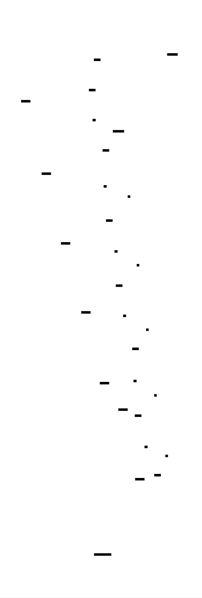

# SQL Parser: Design Document


## Overview

A SQL parser that transforms SQL query strings into Abstract Syntax Trees (ASTs) for SELECT, INSERT, UPDATE, and DELETE statements. The key architectural challenge is building a robust tokenizer and recursive descent parser that handles SQL's complex grammar rules, operator precedence, and various expression types while maintaining extensibility for future SQL features.


> This guide is meant to help you understand the big picture before diving into each milestone. Refer back to it whenever you need context on how components connect.


## Context and Problem Statement

> **Milestone(s):** This section provides foundational understanding for all milestones (1-4), establishing the conceptual framework and challenges that guide our parser design decisions.

### Mental Model: Language Translation

Understanding SQL parsing requires us to think about how humans process and understand language. When you read a sentence in a foreign language that you're learning, your brain goes through several distinct phases. First, you break the sentence into individual words and punctuation—this is **tokenization**. Then, you identify what type each word is: noun, verb, adjective, preposition. Finally, you apply grammar rules to understand how these words relate to each other and what the overall sentence means.

SQL parsing works exactly the same way. Consider the SQL statement `SELECT name, age FROM users WHERE age > 18`. A human reading this intuitively understands that "SELECT" indicates we're retrieving data, "name" and "age" are the specific pieces of information we want, "users" is the source of that information, and "age > 18" is a condition that filters the results. But a computer program starts with just a string of characters and must systematically work through the same process your brain does automatically.

The **tokenizer** acts like someone learning to read who carefully identifies each word and punctuation mark. It scans through "SELECT name, age FROM users WHERE age > 18" character by character and produces a sequence of **tokens**: [SELECT_KEYWORD, IDENTIFIER("name"), COMMA, IDENTIFIER("age"), FROM_KEYWORD, IDENTIFIER("users"), WHERE_KEYWORD, IDENTIFIER("age"), GREATER_THAN, NUMBER(18)]. Each token includes not just the text but also its **type**—just like identifying parts of speech in human language.

The **parser** then acts like a grammar student applying sentence structure rules. It takes the token sequence and builds an **Abstract Syntax Tree (AST)**—a hierarchical representation that captures the logical structure and relationships in the query. The AST for our example would have a SELECT node at the root, with child nodes representing the column list (name, age), the table reference (users), and the WHERE condition (age > 18). This tree structure makes the query's meaning explicit and computable.

Just as human language translation can be tricky due to ambiguous phrases, multiple meanings, and context-dependent interpretation, SQL parsing faces similar challenges that make it far more complex than it initially appears.

### SQL Parsing Challenges

SQL presents a unique combination of parsing challenges that make it significantly more difficult than many other programming languages. Unlike languages with rigid, unambiguous syntax, SQL was designed for readability and flexibility, which creates numerous complications for parser implementers.

**Keyword Context Sensitivity** represents one of the most pervasive challenges in SQL parsing. Many SQL "keywords" can also function as valid identifiers depending on their position in the statement. For example, `ORDER` is a reserved keyword in `ORDER BY`, but it's also a perfectly valid table name in `SELECT * FROM ORDER`. The parser cannot determine whether `ORDER` should be treated as a keyword or identifier until it examines the surrounding context. This forces the parser to implement **lookahead** mechanisms or **backtracking** strategies, significantly complicating the parsing logic.

Consider the statement `SELECT order FROM order ORDER BY order`. Here, the first `order` is a column name, `order` in the FROM clause is a table name, and the final `order` is the ORDER BY keyword—three different roles for the same text. The parser must track its current position in the grammar to make these distinctions correctly.

**Case Insensitivity with Mixed Conventions** adds another layer of complexity. SQL keywords are case-insensitive (`SELECT`, `select`, and `Select` are equivalent), but the handling of identifiers varies between database systems. Some systems preserve identifier case, others fold to uppercase or lowercase, and some only fold unquoted identifiers while preserving quoted ones. This means the tokenizer must track whether identifiers are quoted and apply different normalization rules accordingly.

**Quote Character Variations** create tokenization ambiguity. SQL supports multiple quote types: single quotes for string literals (`'hello'`), double quotes for identifiers (`"table name"`), and backticks for identifiers in MySQL (`` `table name` ``). Some systems allow these to be used interchangeably, while others have strict rules. The tokenizer must distinguish between `"table"` as a quoted identifier and `'table'` as a string literal, which requires different parsing logic and token types.

**Operator Precedence and Associativity** in WHERE clauses mirror the complexity found in mathematical expressions but with SQL-specific twists. The expression `a = b AND c = d OR e = f` must be parsed as `((a = b) AND (c = d)) OR (e = f)` due to operator precedence rules (comparison operators bind tighter than AND, which binds tighter than OR). However, SQL also includes operators like `BETWEEN`, `IN`, `LIKE`, and `IS NULL` that don't exist in typical mathematical expressions and have their own precedence relationships.

**Ambiguous Grammar Productions** occur when the same input can be parsed in multiple valid ways according to the grammar rules. The classic example is the **dangling ELSE problem** in programming languages, but SQL has its own version with expressions like `SELECT a, b FROM c`. Without additional tokens, it's unclear whether this is a complete statement or if a WHERE clause might follow. The parser must implement strategies to resolve these ambiguities consistently.

**Expression vs Statement Boundary Confusion** happens because SQL allows complex expressions within statements, but the boundary between where expressions end and the next clause begins can be ambiguous. Consider `SELECT a + b * c FROM table WHERE x`. The parser must correctly identify that `a + b * c` is a single expression in the SELECT clause, and `x` is the beginning of a WHERE clause expression, not a continuation of the SELECT expression.

**Whitespace and Comment Handling** requires careful consideration because SQL allows comments in multiple forms (`-- single line` and `/* multi-line */`) and has flexible whitespace rules. Comments can appear almost anywhere in a statement, including within expressions, and the parser must handle them without breaking the logical flow of the query. Additionally, some SQL dialects have specific rules about line continuation and whitespace significance.

**Error Recovery Complexity** makes SQL parsing particularly challenging for practical tools. When a human writes malformed SQL, they expect helpful error messages that point to the specific problem and suggest corrections. However, SQL's flexible syntax means that by the time the parser detects an error, it may be far from the actual mistake. For example, a missing comma in a column list might not be detected until the parser tries to parse the FROM clause and encounters an unexpected keyword.

### Existing Parser Approaches

The SQL parsing landscape has evolved over decades, with different approaches emerging to address the challenges outlined above. Understanding these existing approaches helps us make informed decisions about our parser architecture and avoid common pitfalls.

> **Decision: Hand-Written vs Parser Generator**
> - **Context**: SQL parsers can be implemented using traditional parser generators (ANTLR, Yacc, Bison) that generate parsing code from grammar files, or hand-written using techniques like recursive descent. This fundamental choice affects every aspect of the implementation.
> - **Options Considered**: 
>   1. Parser Generator (ANTLR/Yacc) approach
>   2. Hand-written Recursive Descent approach
>   3. Hybrid approach with generated tokenizer and hand-written parser
> - **Decision**: Hand-written Recursive Descent parser
> - **Rationale**: Better error messages, easier debugging, more control over AST construction, and simpler integration with custom logic for SQL's context-sensitive features
> - **Consequences**: More initial implementation work but greater flexibility and maintainability for educational purposes

| Approach | Pros | Cons |
|----------|------|------|
| Parser Generator (ANTLR) | Fast development, formally verified grammar, handles complex precedence automatically | Hard to customize error messages, difficult to debug generated code, complex AST integration |
| Hand-Written Recursive Descent | Complete control over parsing logic, excellent error messages, easy to debug and extend | More initial code to write, manual precedence handling, potential for grammar mistakes |
| Hybrid (Generated + Hand-Written) | Combines benefits of both approaches | Complex integration, requires expertise in both techniques |

**Parser Generator Approaches** use tools like ANTLR, Yacc, or Bison to automatically generate parsing code from formal grammar specifications. Major database systems like PostgreSQL use variations of this approach. The PostgreSQL parser uses a Yacc-based grammar with over 500 production rules that handle the full SQL standard plus PostgreSQL extensions. These tools excel at handling complex grammar rules automatically and can generate efficient parsing code.

However, parser generators present significant challenges for SQL specifically. SQL's context-sensitive keywords require grammar hacks or post-processing steps that complicate the supposedly "automatic" generation. Error messages from generated parsers tend to be cryptic ("expected IDENTIFIER but found ORDER") rather than helpful ("ORDER is a reserved keyword here; use quotes if you meant it as a table name"). Additionally, integrating custom AST construction logic into generated parsers often requires learning the generator tool's specific templating language.

**Hand-Written Recursive Descent** approaches implement parsing logic directly in the target programming language. Each grammar rule becomes a function that consumes tokens and builds AST nodes. SQLite uses this approach with a hand-written C parser that provides excellent error messages and tight integration with the query execution engine. The MySQL parser also uses hand-written techniques, allowing for fine-tuned error recovery and custom syntax extensions.

The recursive descent approach maps naturally to SQL's hierarchical structure. A `parseSelectStatement()` function calls `parseSelectList()`, `parseFromClause()`, and `parseWhereClause()` functions, each of which handles its specific grammar rules. This makes the parser logic transparent and debuggable—you can step through the parsing process in a debugger and see exactly which grammar rule is being applied at each step.

**Precedence Climbing Parsers** represent a specialized technique for handling expression parsing within recursive descent parsers. Rather than encoding operator precedence into the grammar rules (which creates deep recursion and poor error messages), precedence climbing algorithms use a table-driven approach. The parser maintains a **precedence table** that assigns numeric priorities to operators, then uses a loop to build expression trees with correct precedence and associativity.

This technique is particularly valuable for SQL WHERE clauses, which can contain complex expressions with dozens of different operators. Rather than writing separate grammar rules for each precedence level (which would require functions like `parseOrExpression()`, `parseAndExpression()`, `parseComparisonExpression()`, etc.), a single precedence climbing function can handle the entire expression hierarchy.

**Packrat Parsing** techniques use memoization to handle ambiguous grammars and provide unlimited lookahead. Some research SQL parsers use packrat parsing to handle SQL's most problematic ambiguities by trying multiple parse paths and selecting the successful one. While powerful, packrat parsing requires significantly more memory and implementation complexity than simpler approaches.

**Multi-Pass Parsing** strategies separate different aspects of parsing into distinct phases. The first pass might handle only tokenization and basic statement structure, while subsequent passes refine the AST and resolve ambiguities with additional context. Some commercial SQL tools use this approach to provide features like syntax highlighting (first pass) and semantic validation (later passes) independently.

> **Key Design Insight**: The choice of parsing approach significantly impacts not just implementation complexity, but also the quality of error messages, debugging experience, and extensibility for future SQL features. For educational purposes, the transparency and debuggability of hand-written recursive descent outweighs the initial implementation complexity.

**Error Handling Strategies** vary dramatically between approaches. Production SQL parsers like those in PostgreSQL and MySQL implement sophisticated error recovery that attempts to continue parsing after encountering errors, allowing them to report multiple problems in a single statement. They maintain **error recovery points** in the grammar where parsing can restart after consuming tokens until a stable state is reached.

Educational and development-focused parsers often use **panic mode recovery**, where parsing stops at the first error and reports it with maximum detail. This approach provides clearer error messages for learning purposes but doesn't help users who want to see all problems in their SQL at once.

**Performance Considerations** distinguish production parsers from educational ones. Production systems must parse thousands of queries per second with minimal memory allocation. They often use techniques like **token pooling** (reusing token objects), **string interning** (avoiding duplicate identifier strings), and **AST node pooling** to minimize garbage collection pressure.

For our educational SQL parser, we prioritize clarity and debuggability over maximum performance, but understanding these optimization techniques helps explain why production parsers are structured the way they are.

The landscape of existing SQL parsers shows that there's no single "correct" approach—each technique involves trade-offs between development time, runtime performance, error message quality, and extensibility. Our design decisions must balance these factors while keeping our educational goals in mind.


### Implementation Guidance

**A. Technology Recommendations:**

| Component | Simple Option | Advanced Option |
|-----------|---------------|-----------------|
| Tokenizer | Character-by-character scanning with string operations | State machine with lookup tables |
| Parser | Direct recursive descent with manual precedence | Precedence climbing with operator tables |
| AST Nodes | Simple classes with basic properties | Visitor pattern with type-safe node traversal |
| Error Handling | Exception-based with position tracking | Error accumulation with recovery strategies |

**B. Recommended File Structure:**

```
sql_parser/
├── __init__.py              # Package initialization
├── tokens.py                # Token type definitions and Token class
├── tokenizer.py             # Lexical analysis (Milestone 1)
├── ast_nodes.py             # AST node class hierarchy
├── parser.py                # Main parser class and entry point
├── select_parser.py         # SELECT statement parsing (Milestone 2)
├── expression_parser.py     # WHERE clause expressions (Milestone 3)
├── dml_parser.py           # INSERT/UPDATE/DELETE (Milestone 4)
├── errors.py               # Parser exception classes
└── tests/
    ├── test_tokenizer.py    # Tokenizer tests
    ├── test_select.py       # SELECT parsing tests
    ├── test_expressions.py  # Expression parsing tests
    ├── test_dml.py         # DML statement tests
    └── test_integration.py  # End-to-end parser tests
```

**C. Infrastructure Starter Code:**

```python
# tokens.py - Complete token type definitions
from enum import Enum, auto
from dataclasses import dataclass
from typing import Any, Optional

class TokenType(Enum):
    # Keywords
    SELECT = auto()
    FROM = auto()
    WHERE = auto()
    INSERT = auto()
    UPDATE = auto()
    DELETE = auto()
    INTO = auto()
    VALUES = auto()
    SET = auto()
    
    # Identifiers and Literals
    IDENTIFIER = auto()
    STRING_LITERAL = auto()
    NUMBER_LITERAL = auto()
    
    # Operators
    EQUALS = auto()
    NOT_EQUALS = auto()
    LESS_THAN = auto()
    GREATER_THAN = auto()
    LESS_EQUAL = auto()
    GREATER_EQUAL = auto()
    
    # Logical
    AND = auto()
    OR = auto()
    NOT = auto()
    
    # Punctuation
    COMMA = auto()
    SEMICOLON = auto()
    LEFT_PAREN = auto()
    RIGHT_PAREN = auto()
    ASTERISK = auto()
    
    # Special
    EOF = auto()
    UNKNOWN = auto()

@dataclass
class Token:
    type: TokenType
    value: str
    position: int
    line: int = 1
    column: int = 1

# SQL keyword mapping for tokenizer
SQL_KEYWORDS = {
    'SELECT': TokenType.SELECT,
    'FROM': TokenType.FROM,
    'WHERE': TokenType.WHERE,
    'INSERT': TokenType.INSERT,
    'UPDATE': TokenType.UPDATE,
    'DELETE': TokenType.DELETE,
    'INTO': TokenType.INTO,
    'VALUES': TokenType.VALUES,
    'SET': TokenType.SET,
    'AND': TokenType.AND,
    'OR': TokenType.OR,
    'NOT': TokenType.NOT,
}
```

```python
# errors.py - Complete error handling infrastructure
class ParseError(Exception):
    """Base class for all parsing errors"""
    def __init__(self, message: str, position: int = 0, line: int = 1, column: int = 1):
        self.message = message
        self.position = position
        self.line = line
        self.column = column
        super().__init__(f"Line {line}, Column {column}: {message}")

class TokenizerError(ParseError):
    """Errors during tokenization phase"""
    pass

class SyntaxError(ParseError):
    """Errors during syntax parsing"""
    pass

class UnexpectedTokenError(SyntaxError):
    """Specific error for unexpected tokens"""
    def __init__(self, expected: str, actual: Token):
        message = f"Expected {expected}, but found {actual.type.name} '{actual.value}'"
        super().__init__(message, actual.position, actual.line, actual.column)
        self.expected = expected
        self.actual = actual
```

**D. Core Logic Skeleton Code:**

```python
# tokenizer.py - Tokenizer implementation skeleton
from typing import List, Optional
from .tokens import Token, TokenType, SQL_KEYWORDS
from .errors import TokenizerError

class Tokenizer:
    def __init__(self, sql_text: str):
        self.text = sql_text
        self.position = 0
        self.line = 1
        self.column = 1
        self.tokens: List[Token] = []
    
    def tokenize(self) -> List[Token]:
        """
        Main tokenization entry point. Converts SQL text into token list.
        Returns complete list of tokens including EOF marker.
        """
        # TODO: Implement main tokenization loop
        # TODO: Call appropriate helper methods based on current character
        # TODO: Handle whitespace and comments
        # TODO: Add EOF token at end
        # TODO: Return completed token list
        pass
    
    def _current_char(self) -> Optional[str]:
        """Returns current character or None if at end"""
        # TODO: Check if position is within text bounds
        # TODO: Return character at current position or None
        pass
    
    def _peek_char(self, offset: int = 1) -> Optional[str]:
        """Look ahead at character without advancing position"""
        # TODO: Calculate peek position
        # TODO: Return character if within bounds, None otherwise
        pass
    
    def _advance(self) -> None:
        """Move to next character, updating position tracking"""
        # TODO: Increment position
        # TODO: Update line/column tracking for newlines
        # TODO: Handle different line ending types (\n, \r\n)
        pass
    
    def _skip_whitespace(self) -> None:
        """Skip spaces, tabs, newlines"""
        # TODO: Loop while current char is whitespace
        # TODO: Call _advance() for each whitespace character
        pass
    
    def _read_string_literal(self, quote_char: str) -> Token:
        """Read quoted string literal, handling escape sequences"""
        # TODO: Store starting position for token
        # TODO: Advance past opening quote
        # TODO: Read characters until closing quote
        # TODO: Handle escape sequences (\', \", \\)
        # TODO: Raise error if string is not terminated
        # TODO: Return STRING_LITERAL token
        pass
```

**E. Language-Specific Python Hints:**

- Use `str.isalpha()`, `str.isdigit()`, and `str.isalnum()` for character classification during tokenization
- Python's `enum.auto()` provides automatic enumeration values for token types
- Use `@dataclass` for Token and AST node classes to get automatic `__init__`, `__repr__`, etc.
- `typing.Optional[T]` indicates values that can be None (important for end-of-file conditions)
- String slicing (`text[start:end]`) is efficient for extracting token values
- Use `str.upper()` for case-insensitive keyword matching in `SQL_KEYWORDS` dictionary lookup
- List comprehensions are useful for filtering tokens: `[t for t in tokens if t.type != TokenType.WHITESPACE]`

**F. Initial Milestone Checkpoint:**

After implementing the basic tokenizer structure:

1. **Test Command**: `python -m pytest tests/test_tokenizer.py -v`
2. **Expected Output**: Tests should pass for basic keyword recognition and identifier tokenization
3. **Manual Verification**: Create a simple test script:
   ```python
   from sql_parser.tokenizer import Tokenizer
   
   tokenizer = Tokenizer("SELECT name FROM users")
   tokens = tokenizer.tokenize()
   for token in tokens:
       print(f"{token.type.name}: '{token.value}'")
   ```
   Expected output:
   ```
   SELECT: 'SELECT'
   IDENTIFIER: 'name'
   FROM: 'FROM'
   IDENTIFIER: 'users'
   EOF: ''
   ```

4. **Common Issues to Check**:
   - If keywords appear as IDENTIFIER tokens, check case-insensitive lookup in `SQL_KEYWORDS`
   - If position tracking is wrong, verify `_advance()` properly updates line/column
   - If string literals fail, ensure quote character matching and escape sequence handling

**G. Debugging Tips for Context and Problem Understanding:**

| Symptom | Likely Cause | How to Diagnose | Fix |
|---------|--------------|-----------------|-----|
| Keywords recognized as identifiers | Case sensitivity in keyword lookup | Print token values and check SQL_KEYWORDS keys | Use `.upper()` before dictionary lookup |
| Position tracking incorrect | Not updating line/column in _advance() | Add debug prints in _advance() method | Properly handle \n and \r\n line endings |
| String parsing fails | Quote character handling logic | Test with simple quoted strings first | Separate logic for single vs double quotes |
| Tokenizer seems to hang | Infinite loop in character scanning | Add position debug prints in main loop | Ensure _advance() always moves position forward |


## Goals and Non-Goals

> **Milestone(s):** This section provides foundational understanding for all milestones (1-4), establishing the scope and boundaries that guide our parser implementation decisions throughout the project.

### Mental Model: Building a Language Translator

Think of our SQL parser as building a specialized language translator that only works with a specific dialect of SQL. Just as a human translator might specialize in translating business documents between English and Spanish (rather than translating poetry or slang), our parser will specialize in translating basic SQL statements into a structured format that programs can understand. We're not building Google Translate for SQL - we're building a focused, reliable translator for the most common SQL operations that a database application needs.

This translator has three key characteristics that define its scope. First, it has **vocabulary limitations** - it only understands certain SQL keywords and constructs, just like a business translator might not know specialized medical terminology. Second, it has **complexity boundaries** - it can handle straightforward sentences but not highly complex nested structures, similar to how a translator might handle business emails but struggle with legal documents. Third, it has **quality standards** - it must produce accurate, well-structured output for the cases it does handle, even if it can't handle every possible input.

Understanding these boundaries upfront is crucial because they guide every design decision in our parser. When we encounter a choice between supporting more SQL features versus making our core features more robust, our goals will tell us which path to take. When we decide how much error recovery to implement, our non-goals will tell us where to stop. When we design our AST structure, our functional goals will tell us which nodes we need to include.

### Functional Goals

Our SQL parser must successfully handle the four fundamental categories of SQL statements that form the backbone of most database applications. These represent the core operations that developers use daily when building applications with database persistence.

**SELECT Statement Parsing** forms the foundation of our query support. The parser must correctly handle basic SELECT statements with column lists, including both explicit column names and the star wildcard for selecting all columns. It must parse FROM clauses with table references, supporting both simple table names and table aliases using either the explicit AS keyword or implicit aliasing where the alias follows the table name directly. The parser must handle qualified column references using dot notation, such as `users.name` or `orders.total`, which are essential for queries involving multiple tables or for clarity in single-table queries.

Within SELECT statements, the parser must support comma-separated column lists of arbitrary length, maintaining the correct order and preserving any alias information. For example, parsing `SELECT id, name AS user_name, email FROM users AS u` should produce an AST that captures the three selected columns, the alias for the name column, and the alias for the users table. This level of detail in the AST enables downstream tools to understand not just what data is being retrieved, but how it should be labeled in result sets.

**WHERE Clause Expression Parsing** represents one of the most complex functional requirements because it involves handling operator precedence, associativity, and multiple expression types. The parser must correctly parse comparison operators including equals, not equals, less than, greater than, less than or equal to, and greater than or equal to. It must handle logical operators AND, OR, and NOT with the correct precedence rules, where NOT binds most tightly, followed by AND, then OR. Parentheses must be supported to override default precedence, allowing developers to express complex logical conditions unambiguously.

The WHERE clause parser must also handle NULL checking operations, including IS NULL and IS NOT NULL, which have special semantics in SQL that differ from regular equality comparisons. String literals, numeric literals, and identifiers must all be supported as operands in expressions. For example, the parser should correctly handle complex conditions like `WHERE (age > 18 AND status = 'active') OR (type = 'premium' AND balance IS NOT NULL)`, building an expression tree that preserves the intended logical structure.

**INSERT Statement Parsing** must handle the standard INSERT INTO syntax with explicit column lists and corresponding value lists. The parser should support inserting into a subset of table columns, with the column list and value list in the INSERT statement specifying which columns receive values. Multiple-row inserts using a single INSERT statement should be supported, where multiple value tuples are provided after the VALUES keyword. For example, `INSERT INTO users (name, email) VALUES ('Alice', 'alice@example.com'), ('Bob', 'bob@example.com')` should parse into an AST that captures both the column specification and the multiple value rows.

**UPDATE and DELETE Statement Parsing** rounds out our data modification language support. UPDATE statements must parse SET clauses that specify column assignments using equals signs, with support for multiple column assignments separated by commas. Both UPDATE and DELETE statements must support WHERE clauses using the same expression parsing logic developed for SELECT statements. For DELETE statements, the parser must handle the simple `DELETE FROM table WHERE condition` syntax. The parser should build AST nodes that clearly distinguish between the target table, the modification operations (for UPDATE), and the filtering conditions.

**Error Detection and Reporting** is a functional goal that spans all statement types. The parser must detect common syntax errors and report them with helpful error messages that include position information. When the parser encounters unexpected tokens, missing required keywords, or malformed expressions, it should provide error messages that help developers understand what went wrong and where. For example, if a user writes `SELECT name FROM WHERE age > 18` (missing the table name), the parser should report an error indicating that a table name is expected after the FROM keyword.

The following table summarizes the specific syntax elements that must be successfully parsed:

| Statement Type | Required Syntax Elements | Examples |
|---|---|---|
| SELECT | Column lists, star wildcard, table references, aliases | `SELECT id, name FROM users`, `SELECT * FROM orders AS o` |
| WHERE | Comparison operators, logical operators, parentheses, literals | `WHERE age > 18 AND status = 'active'` |
| INSERT | Column lists, value lists, multiple rows | `INSERT INTO users (name) VALUES ('Alice'), ('Bob')` |
| UPDATE | SET clauses, column assignments, WHERE conditions | `UPDATE users SET status = 'inactive' WHERE age < 13` |
| DELETE | Table references, WHERE conditions | `DELETE FROM sessions WHERE expires < '2024-01-01'` |

### Non-Functional Goals

**Parse Speed and Memory Efficiency** are important non-functional requirements that affect the parser's usability in real applications. The parser should be able to handle typical SQL queries (those under 1000 characters) in under 10 milliseconds on modern hardware. While this isn't blazingly fast compared to production database parsers, it's sufficient for educational use, development tools, and small to medium applications. Memory usage should be proportional to query size, with the AST requiring roughly 10-50 times the memory of the original query string depending on the complexity of expressions and the number of nodes created.

The tokenizer should process characters in a single pass without backtracking, ensuring that tokenization time grows linearly with input size. The recursive descent parser should avoid excessive function call depth by limiting expression nesting to reasonable levels (around 50 levels of parentheses nesting). These constraints ensure that the parser remains responsive even when processing moderately complex queries.

**Extensibility and Maintainability** form critical design requirements because this parser serves as an educational foundation that students and developers will modify and extend. The tokenizer design must make it straightforward to add new keywords by simply updating a keyword mapping table, without requiring changes to the core tokenization logic. Adding new operators should require only updates to operator precedence tables and the addition of corresponding token types.

The AST node hierarchy must be designed for extension, with a clear base class or interface that new node types can inherit from or implement. Adding support for new statement types should follow a consistent pattern where developers implement a new parsing function following the same recursive descent approach used for existing statements. The parser should be modular enough that developers can test individual components (tokenizer, expression parser, statement parsers) in isolation.

**Educational Value and Debuggability** represent special non-functional requirements because this parser is designed for learning. The AST structure should be intuitive and easy to inspect, with node types and field names that clearly correspond to SQL concepts. When students print or debug the AST, they should be able to easily understand how their SQL query was interpreted by the parser.

Error messages should be educational, explaining not just what was wrong but providing hints about correct syntax. For example, instead of reporting "unexpected token," the parser might say "expected table name after FROM keyword, but found WHERE." Debug output should be available to show the tokenization process and parsing decisions, helping students understand how the parser works internally.

**Testing and Validation Support** ensures that implementations can be verified for correctness. The parser design should facilitate comprehensive testing by making it easy to test individual components and verify specific aspects of the AST structure. The tokenizer output should be easily inspectable to verify that queries are being tokenized correctly. AST nodes should support equality comparison to enable straightforward assertion-based testing.

The following table outlines our non-functional requirements with specific metrics:

| Requirement Category | Specific Goal | Success Metric |
|---|---|---|
| Performance | Parse speed for typical queries | Under 10ms for queries under 1000 characters |
| Memory | Proportional memory usage | AST uses 10-50x the memory of query string |
| Extensibility | Easy keyword addition | New keywords added by updating single mapping table |
| Maintainability | Modular component testing | Each component (tokenizer, parser) testable in isolation |
| Educational Value | Intuitive AST structure | AST node names directly correspond to SQL concepts |
| Error Quality | Helpful error messages | Errors include position info and syntax hints |
| Debugging | Inspection capabilities | AST and tokens easily printable for debugging |

### Explicit Non-Goals

Understanding what we are **not** building is just as important as understanding what we are building. These explicit non-goals help prevent scope creep and keep our implementation focused on the core learning objectives.

**Advanced SQL Features** are explicitly excluded from our parser scope. We will not support JOIN operations of any kind, including INNER JOIN, LEFT JOIN, RIGHT JOIN, or FULL OUTER JOIN. While JOINs are crucial in production SQL, they add significant complexity to both parsing and AST representation that would distract from learning the fundamental concepts of lexical analysis and recursive descent parsing. Supporting JOINs properly requires handling table correlation, join conditions, and the interaction between WHERE clauses and JOIN conditions.

Subqueries and nested SELECT statements are not supported. Subqueries introduce recursive parsing challenges where SELECT statements can appear within expressions, requiring the parser to handle statement nesting and scope resolution. Window functions, CTEs (Common Table Expressions), and advanced SQL constructs like CASE expressions are similarly excluded. These features, while powerful, represent advanced SQL concepts that would significantly complicate our parser without proportional educational benefit for the core parsing concepts we're teaching.

**Production-Quality Features** are not included in our design goals. We are not building a parser that could be used in a production database system or SQL analysis tool. This means we explicitly exclude performance optimizations like parse result caching, incremental parsing, or advanced error recovery strategies that would allow parsing to continue after encountering errors.

We do not support SQL dialects or vendor-specific extensions. Our parser targets a simplified, generic SQL syntax that captures the essential elements of SELECT, INSERT, UPDATE, and DELETE statements. We will not handle the subtle syntax differences between MySQL, PostgreSQL, SQL Server, or Oracle. Features like MySQL's LIMIT clause, PostgreSQL's RETURNING clause, or SQL Server's TOP clause are not supported.

**Advanced Error Handling** capabilities are intentionally limited. We will not implement sophisticated error recovery that attempts to continue parsing after encountering syntax errors to find additional problems in the same query. While production parsers often include such features to provide comprehensive error reporting, implementing robust error recovery is a complex topic that goes beyond our educational goals. Our parser will report the first error it encounters and stop parsing.

We do not support error correction or "did you mean" suggestions. While these features can be helpful in development tools, they require significant additional complexity including similarity algorithms and extensive knowledge of valid SQL constructs. Our error messages will be helpful and descriptive, but they will not attempt to guess what the user intended to write.

**Schema Validation and Semantic Analysis** are completely outside our scope. Our parser builds a syntactic AST that represents the structure of the SQL query, but it does not validate that referenced tables exist, that column names are valid, or that data types are compatible. These semantic validation tasks require knowledge of database schema and type systems, which would require building a substantial metadata management system alongside our parser.

We will not validate that INSERT statements specify values for all required columns, that UPDATE statements don't attempt to modify primary keys, or that WHERE clause comparisons use compatible data types. These are all important validations in a production system, but they belong to the semantic analysis phase that occurs after parsing.

**Performance Optimization** beyond basic efficiency is not a goal. We will not implement advanced parsing techniques like packrat parsing, parser combinators, or generated parsers from formal grammars. While these approaches have advantages in certain scenarios, they introduce complexity that would obscure the fundamental concepts of tokenization and recursive descent parsing that our project aims to teach.

Memory optimization techniques like AST node pooling, lazy parsing, or compact AST representations are not included. Our AST will prioritize clarity and ease of understanding over memory efficiency. Similarly, we will not implement streaming parsing for very large queries or sophisticated tokenizer optimizations.

The following table summarizes our explicit non-goals and the rationale for excluding them:

| Excluded Feature Category | Specific Examples | Exclusion Rationale |
|---|---|---|
| Advanced SQL | JOINs, subqueries, window functions, CTEs | Adds parsing complexity without educational benefit for core concepts |
| Production Features | Parse caching, incremental parsing, dialect support | Beyond educational scope; would obscure fundamental techniques |
| Error Recovery | Continue parsing after errors, error correction | Complex topic requiring extensive additional implementation |
| Semantic Analysis | Schema validation, type checking, constraint validation | Requires metadata system; not a parsing concern |
| Performance Optimization | Advanced parsing algorithms, memory optimization | Would obscure educational focus on basic recursive descent |
| SQL Dialects | MySQL LIMIT, PostgreSQL RETURNING, vendor extensions | Scope limitation to keep grammar manageable |

> **Design Insight**: These non-goals are not limitations of the approach, but conscious decisions to maintain educational focus. A student who masters tokenization, recursive descent parsing, operator precedence, and AST construction using our simplified SQL grammar will have learned transferable skills that apply to parsing any language, not just SQL.

### Implementation Guidance

The goals and non-goals defined above have direct implications for how we structure our implementation and what technologies we choose. This section provides concrete guidance on translating these requirements into a working parser.

**Technology Recommendations**

For implementing our SQL parser with the defined scope, we recommend straightforward approaches that prioritize clarity and educational value over performance optimization or advanced features.

| Component | Simple Option | Advanced Option |
|---|---|---|
| Tokenizer | Character-by-character scanning with string methods | Regex-based tokenization |
| Parser | Hand-written recursive descent | Parser generator (ANTLR, PLY) |
| AST Representation | Simple classes with inheritance | Visitor pattern with node interfaces |
| Error Handling | Exception-based with position tracking | Error recovery with synchronization points |
| Testing | Unit tests with direct assertions | Property-based testing with query generation |

For this educational project, we strongly recommend the simple options. Character-by-character scanning helps students understand how tokenizers work at a fundamental level. Hand-written recursive descent parsing makes the relationship between grammar rules and code explicit. Simple AST classes are easy to debug and understand.

**Recommended Project Structure**

Organizing the parser implementation across multiple modules helps maintain clear separation of concerns and makes the codebase easier to understand and test.

```
sql-parser/
├── sql_parser/
│   ├── __init__.py              ← Main parser API
│   ├── tokens.py                ← Token types and TokenType enum
│   ├── tokenizer.py             ← Tokenizer class (Milestone 1)
│   ├── ast_nodes.py             ← AST node class hierarchy
│   ├── select_parser.py         ← SELECT statement parsing (Milestone 2)
│   ├── expression_parser.py     ← WHERE clause expressions (Milestone 3)
│   ├── dml_parser.py            ← INSERT/UPDATE/DELETE parsing (Milestone 4)
│   └── exceptions.py            ← Parser exception classes
├── tests/
│   ├── test_tokenizer.py        ← Tokenizer tests
│   ├── test_select_parser.py    ← SELECT parser tests
│   ├── test_expressions.py      ← Expression parser tests
│   ├── test_dml_parser.py       ← DML parser tests
│   └── test_integration.py      ← End-to-end parser tests
├── examples/
│   ├── basic_usage.py           ← Simple parser usage examples
│   └── query_samples/           ← Sample SQL files for testing
└── README.md                    ← Project documentation
```

This structure separates each major component into its own module, making it easy to work on individual milestones independently. The test structure mirrors the implementation structure, encouraging comprehensive testing of each component.

**Exception Hierarchy Setup**

Based on our error handling goals, implement a clear exception hierarchy that provides good error messages with position information.

```python
# exceptions.py - Complete exception hierarchy for the parser

class ParseError(Exception):
    """Base exception for all parser errors."""
    
    def __init__(self, message, position=None, line=None, column=None):
        super().__init__(message)
        self.message = message
        self.position = position
        self.line = line
        self.column = column
    
    def __str__(self):
        if self.line is not None and self.column is not None:
            return f"Parse error at line {self.line}, column {self.column}: {self.message}"
        elif self.position is not None:
            return f"Parse error at position {self.position}: {self.message}"
        else:
            return f"Parse error: {self.message}"

class TokenizerError(ParseError):
    """Exception raised during tokenization phase."""
    pass

class SyntaxError(ParseError):
    """Exception raised during parsing phase."""
    pass

class UnexpectedTokenError(SyntaxError):
    """Exception raised when parser encounters unexpected token."""
    
    def __init__(self, expected, actual, position=None, line=None, column=None):
        self.expected = expected
        self.actual = actual
        message = f"Expected {expected}, but found {actual}"
        super().__init__(message, position, line, column)
```

**Main Parser API Design**

Create a simple, unified API that encapsulates the entire parsing process while maintaining access to intermediate steps for debugging and testing.

```python
# __init__.py - Main parser API that ties everything together

from .tokenizer import Tokenizer
from .select_parser import SelectParser
from .dml_parser import DMLParser
from .exceptions import ParseError

class SQLParser:
    """
    Main SQL parser that coordinates tokenization and parsing phases.
    
    This class provides the primary interface for parsing SQL statements
    and returning AST nodes that represent the query structure.
    """
    
    def __init__(self):
        self.tokenizer = Tokenizer()
        self.select_parser = SelectParser()
        self.dml_parser = DMLParser()
    
    def parse(self, sql_text):
        """
        Parse a SQL statement and return the corresponding AST node.
        
        Args:
            sql_text (str): The SQL statement to parse
            
        Returns:
            AST node representing the parsed statement
            
        Raises:
            ParseError: If the SQL statement contains syntax errors
        """
        # TODO: Tokenize the input SQL text using self.tokenizer.tokenize()
        # TODO: Determine statement type from first token (SELECT, INSERT, UPDATE, DELETE)
        # TODO: Delegate to appropriate parser based on statement type
        # TODO: Return the resulting AST node
        pass
    
    def tokenize_only(self, sql_text):
        """
        Tokenize SQL text without parsing (useful for debugging).
        
        Returns:
            List of Token objects
        """
        return self.tokenizer.tokenize(sql_text)
```

**Milestone Validation Checkpoints**

Each milestone should have clear checkpoints that verify the implementation is working correctly before moving to the next milestone.

**Milestone 1 Checkpoint - Tokenizer:**
```python
# Test that tokenizer correctly handles basic SQL tokens
parser = SQLParser()
tokens = parser.tokenize_only("SELECT name FROM users WHERE id = 42")

# Expected: 8 tokens with correct types
# TOKEN_SELECT, TOKEN_IDENTIFIER('name'), TOKEN_FROM, TOKEN_IDENTIFIER('users'),
# TOKEN_WHERE, TOKEN_IDENTIFIER('id'), TOKEN_EQUALS, TOKEN_NUMBER(42)

assert len(tokens) == 8
assert tokens[0].type == TokenType.SELECT
assert tokens[1].value == "name"
assert tokens[7].value == "42"
```

**Milestone 2 Checkpoint - SELECT Parser:**
```python
# Test that SELECT statements parse into correct AST structure
ast = parser.parse("SELECT id, name FROM users AS u")

# Expected: SelectStatement node with columns list and table reference
assert isinstance(ast, SelectStatement)
assert len(ast.columns) == 2
assert ast.columns[0].name == "id"
assert ast.table.alias == "u"
```

**Milestone 3 Checkpoint - WHERE Expressions:**
```python
# Test complex WHERE clause with operator precedence
ast = parser.parse("SELECT * FROM users WHERE age > 18 AND status = 'active' OR type = 'admin'")

# Expected: Correct precedence with AND binding tighter than OR
assert isinstance(ast.where_clause, BinaryOperation)
assert ast.where_clause.operator == "OR"  # Top-level operator
```

**Milestone 4 Checkpoint - DML Statements:**
```python
# Test INSERT, UPDATE, and DELETE parsing
insert_ast = parser.parse("INSERT INTO users (name, email) VALUES ('Alice', 'alice@example.com')")
update_ast = parser.parse("UPDATE users SET status = 'inactive' WHERE age < 13")
delete_ast = parser.parse("DELETE FROM sessions WHERE expires < '2024-01-01'")

assert isinstance(insert_ast, InsertStatement)
assert isinstance(update_ast, UpdateStatement) 
assert isinstance(delete_ast, DeleteStatement)
```

**Common Implementation Pitfalls**

⚠️ **Pitfall: Overly Complex Initial Design**
Many students try to implement all features at once or design overly flexible AST nodes that can handle any possible SQL construct. Start simple and extend gradually. Implement the tokenizer completely for basic tokens before adding complex operators or string escape sequences.

⚠️ **Pitfall: Ignoring Position Tracking**
Failing to track line and column positions during tokenization makes debugging very difficult. Include position information in every token from the start - it's much harder to add later.

⚠️ **Pitfall: Mixing Parsing Phases**
Don't try to do semantic validation (checking if tables exist) during syntax parsing. Keep the parser focused on syntax and structure. Semantic analysis can be added as a separate phase later.

⚠️ **Pitfall: Inadequate Error Messages**
Generic error messages like "syntax error" provide little help. Include what was expected, what was found, and position information in every error message.

**Debugging Strategy**

When implementing the parser, use a systematic debugging approach:

1. **Debug tokenization first**: Always verify that your input is being tokenized correctly before debugging parser logic. Print token sequences to ensure they match expectations.

2. **Test individual components**: Test the expression parser independently before integrating it with statement parsing. Test each statement type independently.

3. **Use small test cases**: Start with the simplest possible examples (`SELECT * FROM users`) before attempting complex queries.

4. **Print AST structures**: Implement `__str__` or `__repr__` methods on AST nodes to make debugging easier. You should be able to print the AST and understand the structure visually.


## High-Level Architecture

> **Milestone(s):** This section establishes the foundational architecture for all milestones (1-4), defining the core components and their relationships that will be implemented throughout the project.

### Component Overview

Think of the SQL parser as a **language translation service** operating in a document processing office. Raw SQL text arrives like a foreign document that needs to be understood and translated into a structured format that computers can work with effectively. Just as a translation service has specialists for different stages—someone who identifies individual words and their types, someone who understands grammar rules and sentence structure, and someone who creates the final structured document—our SQL parser has three specialized components that work together in sequence.

The **Tokenizer** acts as the lexical analyst who examines the raw SQL text character by character and identifies distinct words, symbols, and punctuation marks. It's responsible for recognizing that `SELECT` is a keyword, `user_id` is an identifier, `'John'` is a string literal, and `=` is an operator. This component transforms the continuous stream of characters into a sequence of classified tokens, each tagged with its type and position information for error reporting.


The **Parser** functions as the grammar expert who understands SQL's syntactic rules and constructs a meaningful hierarchical representation of the query. It consumes the token sequence from the tokenizer and applies recursive descent parsing techniques to build an Abstract Syntax Tree that captures both the structure and semantics of the SQL statement. The parser knows that after a `SELECT` keyword, it should expect a column list, and after a `FROM` keyword, it should find table references.

The **AST Node** hierarchy represents the structured output—a tree-like data structure where each node encapsulates a specific SQL construct with its associated data and relationships. These nodes serve as the final parsed representation that can be easily traversed, analyzed, and transformed by other systems such as query optimizers or execution engines.

The three main components work with distinct responsibilities and interfaces:

| Component | Primary Responsibility | Input Format | Output Format | Key Operations |
|-----------|----------------------|--------------|---------------|----------------|
| `Tokenizer` | Lexical analysis and token classification | Raw SQL string | Sequence of `Token` objects | Character scanning, keyword recognition, literal parsing |
| `SQLParser` | Syntactic analysis and AST construction | Token sequence | `ASTNode` tree structure | Recursive descent parsing, precedence handling, error recovery |
| AST Nodes | Structured representation of parsed SQL | Parser method calls | Immutable tree nodes | Node creation, property access, tree traversal |

> **Architecture Principle**: Each component operates independently with clear interfaces, enabling isolated testing and future extensibility. The tokenizer never needs to understand SQL grammar rules, and the parser never manipulates raw character data.

The **Tokenizer** component encapsulates all lexical analysis logic within a single class that maintains scanning state and provides token generation methods. It recognizes SQL keywords through case-insensitive lookup tables, handles string literals with proper escape sequence processing, and identifies numeric literals with appropriate type classification. The tokenizer maintains position tracking for detailed error reporting and supports lookahead operations for complex token disambiguation.

The **SQLParser** component serves as the main parsing coordinator that orchestrates statement-specific parsers and manages the overall parsing process. It delegates to specialized parsers like `SelectParser` and `DMLParser` based on the statement type detected from the leading keywords. This component handles error recovery, maintains parsing context, and provides the public API that client code uses to convert SQL strings into AST representations.

The **AST Node hierarchy** consists of abstract base classes and concrete implementations for each SQL construct type. Statement nodes like `SelectStatement` and `InsertStatement` represent complete SQL statements, while expression nodes like `BinaryOperation` and `Literal` represent components within those statements. Each node type encapsulates its specific properties and provides methods for tree traversal and property access.

### Data Flow Pipeline

The SQL parsing process follows a clear linear pipeline where data transforms through distinct stages, similar to an assembly line in manufacturing. Raw SQL text enters at one end and emerges as a structured AST at the other end, with each stage adding a layer of understanding and organization to the data.

**Stage 1: Character-Level Scanning**
The process begins when raw SQL text enters the tokenizer as a simple string. The tokenizer initializes its scanning state with a character pointer positioned at the beginning of the input and begins systematic character-by-character analysis. It maintains several pieces of state information including current position, line number, column number, and accumulation buffers for building multi-character tokens.

The character scanning process follows a state-machine approach where the tokenizer's behavior depends on its current state and the character being examined. In the normal scanning state, encountering alphabetic characters triggers identifier or keyword recognition logic, while numeric characters initiate number parsing, and quote characters begin string literal processing. Whitespace characters are consumed and discarded, while operator characters are immediately classified and converted to tokens.

**Stage 2: Token Classification and Generation**
As the tokenizer identifies complete lexical units, it creates `Token` objects that encapsulate both the token's content and its classification. Each token contains the original text value, its classified type from the `TokenType` enumeration, and precise position information including line and column numbers. This position information becomes crucial for generating helpful error messages when parsing fails.

The token generation process involves several classification decisions. When the tokenizer encounters alphabetic character sequences, it must determine whether the sequence represents a SQL keyword like `SELECT` or `WHERE`, or a user-defined identifier like a table or column name. This classification uses case-insensitive lookup in the `SQL_KEYWORDS` mapping, with unrecognized sequences defaulting to identifier tokens.

String literals require more complex processing as the tokenizer must handle quote character variations, escape sequences, and embedded quotes. The tokenizer tracks the opening quote character and scans until it finds the matching closing quote, processing escape sequences like `\'` and `\"` along the way. Numeric literals are classified as either integer or floating-point based on the presence of decimal points.

**Stage 3: Syntactic Analysis and Tree Construction**
The parser receives the complete token sequence and begins syntactic analysis using recursive descent parsing techniques. The parsing process starts by examining the first token to determine the statement type—`SELECT` tokens trigger SELECT statement parsing, while `INSERT`, `UPDATE`, and `DELETE` tokens activate the appropriate data modification statement parsers.

Recursive descent parsing mirrors the hierarchical structure of SQL grammar rules. Each grammar rule corresponds to a parsing method that consumes tokens and constructs appropriate AST nodes. For example, the `parse_select_statement` method calls `parse_select_clause` to handle the column list, then `parse_from_clause` to handle table references, and optionally `parse_where_clause` for filtering conditions.

The parsing process maintains a current token pointer and advances through the sequence as it consumes tokens. When a parsing method recognizes the expected token pattern, it creates the corresponding AST node and populates it with the parsed information. Methods use lookahead to make parsing decisions—examining upcoming tokens without consuming them to determine which parsing path to follow.

**Stage 4: AST Construction and Validation**
As parsing methods complete their token consumption, they construct and return AST nodes that represent the parsed SQL constructs. These nodes form a tree structure that mirrors the hierarchical nature of SQL statements. A `SelectStatement` node contains references to its constituent parts: a column list, table references, and optional WHERE conditions.

The AST construction process validates syntactic correctness as it proceeds. If the parser encounters unexpected tokens or malformed syntax, it generates specific `SyntaxError` exceptions that include position information and helpful error messages. The parser can also perform basic semantic validation, such as ensuring that column and value counts match in INSERT statements.

**Data Flow Summary**

| Stage | Input | Processing | Output | Error Types |
|-------|-------|------------|---------|-------------|
| Character Scanning | Raw SQL string | State machine character analysis | Character classifications | `TokenizerError` for malformed literals |
| Token Generation | Character stream | Lexical analysis and classification | `Token` sequence | `TokenizerError` for invalid syntax |
| Syntactic Parsing | Token sequence | Recursive descent parsing | Partial AST nodes | `SyntaxError` for grammar violations |
| AST Construction | Parsed components | Node creation and linking | Complete AST tree | `UnexpectedTokenError` for token mismatches |

> **Critical Design Insight**: The pipeline stages are loosely coupled through well-defined data structures (`Token` and `ASTNode`), enabling independent testing and future enhancements. Each stage can be developed and debugged in isolation.

### Recommended File Structure

The SQL parser implementation benefits from a modular file organization that mirrors the logical component separation and supports both development workflow and testing strategies. The structure follows Python package conventions while grouping related functionality and separating public interfaces from internal implementation details.

The recommended organization separates concerns across multiple dimensions: component responsibility (tokenizer vs parser vs AST), statement types (SELECT vs DML), and interface visibility (public API vs internal implementation). This structure supports incremental development where each milestone can be implemented and tested independently.

```
sql_parser/                           # Main package directory
    __init__.py                       # Public API exports
    exceptions.py                     # Error classes and exception hierarchy
    
    tokenizer/                        # Tokenization component (Milestone 1)
        __init__.py                   # Tokenizer public interface
        tokenizer.py                  # Main Tokenizer class implementation
        token_types.py                # TokenType enum and Token dataclass
        keywords.py                   # SQL_KEYWORDS mapping and constants
    
    parser/                           # Parsing components (Milestones 2-4)
        __init__.py                   # Parser public interfaces
        base_parser.py                # Common parsing utilities and base classes
        sql_parser.py                 # Main SQLParser class and entry points
        select_parser.py              # SelectParser for SELECT statements (Milestone 2)
        expression_parser.py          # WHERE clause and expression parsing (Milestone 3)
        dml_parser.py                 # DMLParser for INSERT/UPDATE/DELETE (Milestone 4)
    
    ast/                              # AST node definitions
        __init__.py                   # AST node exports
        base_nodes.py                 # Abstract base classes and common interfaces
        statement_nodes.py            # Statement AST nodes (SelectStatement, etc.)
        expression_nodes.py           # Expression AST nodes (BinaryOperation, etc.)
    
    tests/                            # Test suite organization
        test_tokenizer.py             # Tokenizer unit tests (Milestone 1)
        test_select_parser.py         # SELECT parsing tests (Milestone 2)
        test_expression_parser.py     # Expression parsing tests (Milestone 3)
        test_dml_parser.py            # DML parsing tests (Milestone 4)
        test_integration.py           # End-to-end parser tests
        fixtures/                     # Test SQL files and expected outputs
            valid_queries.sql         # Valid SQL test cases
            invalid_queries.sql       # Error condition test cases
            expected_asts.json        # Expected AST outputs for validation
```

**Component Isolation Benefits**
The tokenizer directory contains all lexical analysis logic, enabling independent development and testing of character-level processing without concerning parser logic. The `token_types.py` file centralizes all token definitions, making it easy to add new token types as SQL support expands. The `keywords.py` file isolates the SQL keyword recognition logic, supporting case-insensitive matching and future keyword additions.

The parser directory separates different parsing concerns into focused modules. The `base_parser.py` file contains common utilities used by all parser types, such as token consumption methods, error handling helpers, and lookahead operations. Statement-specific parsers like `select_parser.py` and `dml_parser.py` can focus on their particular grammar rules without duplicating common functionality.

**Testing Strategy Support**
The test organization enables both component-level unit testing and integration testing. Each parser component has its dedicated test file, allowing milestone-by-milestone validation. The fixtures directory provides a centralized location for test SQL queries and expected outputs, supporting both positive and negative test cases.

The structure supports test-driven development where developers can implement and validate each component independently. For example, `test_tokenizer.py` can thoroughly exercise tokenization logic using only the tokenizer component, without requiring parser implementation.

**API Design and Imports**
The `__init__.py` files control the public API surface and support clean import statements. Client code can import the main functionality with simple statements like `from sql_parser import SQLParser` or `from sql_parser.tokenizer import Tokenizer`. Internal implementation details remain hidden, enabling future refactoring without breaking client code.

**Development Workflow Support**

| Milestone | Primary Files | Testing Files | Validation Approach |
|-----------|--------------|---------------|-------------------|
| 1: Tokenizer | `tokenizer/tokenizer.py`, `tokenizer/token_types.py` | `test_tokenizer.py` | Token sequence validation |
| 2: SELECT | `parser/select_parser.py`, `ast/statement_nodes.py` | `test_select_parser.py` | AST structure validation |
| 3: WHERE | `parser/expression_parser.py`, `ast/expression_nodes.py` | `test_expression_parser.py` | Expression tree validation |
| 4: DML | `parser/dml_parser.py` | `test_dml_parser.py` | Statement parsing validation |

> **Implementation Strategy**: Begin implementation with the tokenizer component, then build parsers incrementally. Each milestone should achieve working functionality for its specific SQL features before proceeding to the next milestone.

The file structure supports future extensibility by isolating concerns and providing clear extension points. New statement types can be added with new parser modules, new expression types can be added to the expression parser, and new token types can be added to the tokenizer without affecting existing functionality.

### Implementation Guidance

**A. Technology Recommendations Table:**

| Component | Simple Option | Advanced Option |
|-----------|--------------|-----------------|
| Tokenizer | Character-by-character scanning with string methods | RegEx-based tokenization with `re` module |
| Parser | Recursive descent with manual token management | Parser generator with grammar files (PLY, ANTLR) |
| AST Nodes | Simple dataclasses with basic properties | Rich node classes with visitor pattern support |
| Error Handling | Exception raising with basic messages | Structured error reporting with position tracking |
| Testing | Manual test cases with assertions | Property-based testing with Hypothesis |

**B. Recommended File Structure Implementation:**

```python
# sql_parser/__init__.py
"""SQL Parser - Main package entry point."""

from .parser.sql_parser import SQLParser
from .tokenizer.tokenizer import Tokenizer
from .exceptions import ParseError, TokenizerError, SyntaxError, UnexpectedTokenError

# Public API - what client code should import
__all__ = ['SQLParser', 'Tokenizer', 'ParseError', 'TokenizerError', 'SyntaxError', 'UnexpectedTokenError']

# Convenience method for most common use case
def parse(sql_text: str):
    """Parse SQL text and return AST. Main entry point for client code."""
    parser = SQLParser()
    return parser.parse(sql_text)

def tokenize_only(sql_text: str):
    """Tokenize SQL text without parsing. Useful for debugging tokenization."""
    tokenizer = Tokenizer()
    return tokenizer.tokenize(sql_text)
```

```python
# sql_parser/exceptions.py
"""Exception classes for SQL parser errors."""

class ParseError(Exception):
    """Base class for all SQL parsing errors."""
    def __init__(self, message: str, line: int = None, column: int = None):
        self.message = message
        self.line = line
        self.column = column
        super().__init__(self._format_message())
    
    def _format_message(self):
        if self.line is not None and self.column is not None:
            return f"Line {self.line}, Column {self.column}: {self.message}"
        return self.message

class TokenizerError(ParseError):
    """Errors during tokenization (lexical analysis)."""
    pass

class SyntaxError(ParseError):
    """Errors during parsing (syntactic analysis)."""
    pass

class UnexpectedTokenError(SyntaxError):
    """Specific error for unexpected token encounters."""
    def __init__(self, expected: str, actual: str, line: int = None, column: int = None):
        self.expected = expected
        self.actual = actual
        message = f"Expected {expected}, but found {actual}"
        super().__init__(message, line, column)
```

```python
# sql_parser/tokenizer/token_types.py
"""Token type definitions and Token dataclass."""

from enum import Enum, auto
from dataclasses import dataclass
from typing import Any

class TokenType(Enum):
    # Keywords
    SELECT = auto()
    FROM = auto()
    WHERE = auto()
    INSERT = auto()
    UPDATE = auto()
    DELETE = auto()
    INTO = auto()
    VALUES = auto()
    SET = auto()
    AS = auto()
    AND = auto()
    OR = auto()
    NOT = auto()
    NULL = auto()
    IS = auto()
    
    # Identifiers and literals
    IDENTIFIER = auto()
    STRING_LITERAL = auto()
    INTEGER_LITERAL = auto()
    FLOAT_LITERAL = auto()
    
    # Operators
    EQUALS = auto()          # =
    NOT_EQUALS = auto()      # != or <>
    LESS_THAN = auto()       # <
    GREATER_THAN = auto()    # >
    LESS_EQUAL = auto()      # <=
    GREATER_EQUAL = auto()   # >=
    
    # Punctuation
    COMMA = auto()           # ,
    SEMICOLON = auto()       # ;
    LEFT_PAREN = auto()      # (
    RIGHT_PAREN = auto()     # )
    STAR = auto()            # *
    
    # Special
    EOF = auto()             # End of input
    UNKNOWN = auto()         # Unrecognized token

@dataclass
class Token:
    """Represents a single token from SQL lexical analysis."""
    type: TokenType
    value: str
    line: int
    column: int
    
    def __str__(self):
        return f"Token({self.type.name}, '{self.value}', {self.line}:{self.column})"
```

**C. Infrastructure Starter Code:**

```python
# sql_parser/tokenizer/keywords.py
"""SQL keyword recognition and mapping."""

from .token_types import TokenType

# Case-insensitive keyword mapping
SQL_KEYWORDS = {
    'SELECT': TokenType.SELECT,
    'FROM': TokenType.FROM,
    'WHERE': TokenType.WHERE,
    'INSERT': TokenType.INSERT,
    'UPDATE': TokenType.UPDATE,
    'DELETE': TokenType.DELETE,
    'INTO': TokenType.INTO,
    'VALUES': TokenType.VALUES,
    'SET': TokenType.SET,
    'AS': TokenType.AS,
    'AND': TokenType.AND,
    'OR': TokenType.OR,
    'NOT': TokenType.NOT,
    'NULL': TokenType.NULL,
    'IS': TokenType.IS,
}

def is_keyword(text: str) -> bool:
    """Check if text is a SQL keyword (case-insensitive)."""
    return text.upper() in SQL_KEYWORDS

def get_keyword_token_type(text: str) -> TokenType:
    """Get TokenType for keyword, or None if not a keyword."""
    return SQL_KEYWORDS.get(text.upper())
```

**D. Core Logic Skeleton Code:**

```python
# sql_parser/tokenizer/tokenizer.py
"""Main tokenizer implementation - STUDENT IMPLEMENTS THIS."""

from typing import List, Optional
from .token_types import Token, TokenType
from .keywords import get_keyword_token_type
from ..exceptions import TokenizerError

class Tokenizer:
    """Converts SQL text into sequence of tokens through lexical analysis."""
    
    def __init__(self):
        self.text = ""
        self.position = 0
        self.line = 1
        self.column = 1
    
    def tokenize(self, text: str) -> List[Token]:
        """Main entry point - tokenize SQL text into list of tokens.
        
        TODO 1: Initialize tokenizer state (text, position, line, column)
        TODO 2: Create empty token list for results
        TODO 3: Loop while not at end of text:
               - Skip whitespace and update position tracking
               - Identify next token type based on current character
               - Call appropriate token parsing method
               - Add resulting token to list
        TODO 4: Add EOF token to mark end of input
        TODO 5: Return complete token list
        """
        pass
    
    def _current_char(self) -> Optional[str]:
        """Return current character or None if at end of input.
        
        TODO: Check if position is within text bounds, return char or None
        """
        pass
    
    def _peek_char(self, offset: int = 1) -> Optional[str]:
        """Look ahead at character without advancing position.
        
        TODO: Calculate peek position, check bounds, return char or None
        """
        pass
    
    def _advance(self):
        """Move to next character and update line/column tracking.
        
        TODO 1: Check for newline character and update line/column
        TODO 2: Increment position
        TODO 3: Update column (increment or reset to 1 for newlines)
        """
        pass
    
    def _skip_whitespace(self):
        """Skip whitespace characters and update position tracking.
        
        TODO: Loop while current char is whitespace, call _advance()
        """
        pass
    
    def _read_string_literal(self, quote_char: str) -> Token:
        """Parse quoted string literal handling escape sequences.
        
        Args:
            quote_char: Opening quote character (' or ")
        
        TODO 1: Store starting position for token creation
        TODO 2: Advance past opening quote
        TODO 3: Build string content, handling escape sequences
        TODO 4: Look for matching closing quote
        TODO 5: Create and return STRING_LITERAL token
        TODO 6: Raise TokenizerError if unterminated string
        """
        pass
```

**E. Language-Specific Hints:**

- Use `str.isalpha()`, `str.isdigit()`, and `str.isalnum()` for character classification
- Use `str.upper()` for case-insensitive keyword matching  
- Use `enumerate()` when you need both index and character in loops
- Use `dataclasses` for Token and AST node definitions - they provide `__init__`, `__repr__` automatically
- Use `typing.Optional[T]` for values that might be None (like end-of-input scenarios)
- Use `typing.List[T]` and `typing.Dict[K,V]` for type hints on collections
- Python's `in` operator works efficiently with sets and dictionaries for keyword lookup
- Use f-strings for error message formatting: `f"Expected {expected}, got {actual}"`

**F. Milestone Checkpoint:**

After implementing the tokenizer (Milestone 1), verify with these tests:

```python
# Quick validation script
from sql_parser import tokenize_only

# Test 1: Basic SELECT statement
tokens = tokenize_only("SELECT id, name FROM users WHERE age > 25")
expected_types = [TokenType.SELECT, TokenType.IDENTIFIER, TokenType.COMMA, 
                  TokenType.IDENTIFIER, TokenType.FROM, TokenType.IDENTIFIER, 
                  TokenType.WHERE, TokenType.IDENTIFIER, TokenType.GREATER_THAN, 
                  TokenType.INTEGER_LITERAL, TokenType.EOF]

# Verify token count and types match
assert len(tokens) == len(expected_types)
for i, (token, expected_type) in enumerate(zip(tokens, expected_types)):
    assert token.type == expected_type, f"Token {i}: expected {expected_type}, got {token.type}"

print("✓ Basic tokenization working")

# Test 2: String literals and operators
tokens = tokenize_only("INSERT INTO users (name) VALUES ('John O\\'Connor')")
string_token = next(t for t in tokens if t.type == TokenType.STRING_LITERAL)
assert string_token.value == "John O'Connor", f"String parsing failed: {string_token.value}"

print("✓ String literal parsing working")
```

**G. Common Pitfalls:**

⚠️ **Pitfall: Forgetting Position Tracking**
Many students focus on token recognition but forget to maintain accurate line and column numbers. Without position tracking, error messages become useless ("Syntax error somewhere in your query"). Always increment column for each character and reset to 1 when encountering newlines.

⚠️ **Pitfall: Case Sensitivity in Keywords** 
SQL keywords are case-insensitive, but Python string comparison is case-sensitive. Always use `.upper()` when checking against your keyword dictionary: `SQL_KEYWORDS.get(text.upper())`.

⚠️ **Pitfall: String Literal Escape Sequences**
Don't forget to handle escape sequences in string literals. SQL supports `\'`, `\"`, and `\\`. Process these during tokenization, not later in parsing.

⚠️ **Pitfall: Multi-Character Operators**
Operators like `<=`, `>=`, `!=`, and `<>` require lookahead. Don't just tokenize `<` and `=` separately - peek ahead to see if they form a compound operator.


## Data Model and AST Design

> **Milestone(s):** This section establishes the foundational data structures for all milestones (1-4), defining the token types that milestone 1 produces and the AST node hierarchy that milestones 2-4 construct.

### Mental Model: Language Structure Blueprint

Think of parsing SQL like understanding the grammatical structure of a sentence in human language. When you read "The quick brown fox jumps over the lazy dog," your mind automatically breaks this into parts: articles, adjectives, nouns, verbs, and prepositions. You then organize these parts into a hierarchical structure - subject, predicate, object - that captures the meaning and relationships.

Our SQL parser works similarly. First, the tokenizer acts like breaking a sentence into individual words and punctuation marks, identifying each piece's role (is "SELECT" a keyword? is "users" an identifier?). Then the parser acts like a grammar analyzer, taking these categorized pieces and organizing them into a tree structure that captures the SQL statement's meaning and execution intent.

The **tokens** are like labeled word cards - each piece of the original SQL text tagged with its grammatical role. The **Abstract Syntax Tree (AST)** is like a sentence diagram - a hierarchical structure that shows how these pieces relate to each other and what the overall statement means. Just as a sentence diagram helps you understand "who did what to whom," our AST helps the database understand "select what from where with which conditions."


### Token Type Definitions

The tokenizer must categorize every meaningful piece of text in a SQL statement. Our token classification system divides the SQL language into distinct lexical categories, each serving a specific grammatical purpose in SQL statements. The `TokenType` enumeration defines all possible token categories our parser recognizes.

**Keywords** represent SQL's reserved vocabulary - the fundamental commands and clauses that define statement structure and behavior. Unlike human languages where context often determines meaning, SQL keywords have fixed, unambiguous meanings that cannot be redefined by users.

**Identifiers** represent user-defined names within the database schema - table names, column names, and aliases that users create to organize their data. These tokens must be distinguished from keywords, even when they might spell the same characters in different cases.

**Literals** represent concrete values embedded directly in the SQL text - numbers, strings, and special constants like NULL that specify actual data rather than references to stored data.

**Operators** represent the mathematical, logical, and comparison operations that can be performed on data - the computational vocabulary that transforms and filters information.

**Punctuation** provides the structural grammar that separates and groups other tokens - commas that separate list items, parentheses that group expressions, and semicolons that terminate statements.

| Token Type | Purpose | Examples | Recognition Pattern |
|------------|---------|----------|-------------------|
| `KEYWORD_SELECT` | Query projection clause | `SELECT`, `select`, `Select` | Case-insensitive match against keyword dictionary |
| `KEYWORD_FROM` | Table specification clause | `FROM`, `from`, `From` | Case-insensitive match against keyword dictionary |
| `KEYWORD_WHERE` | Condition filtering clause | `WHERE`, `where`, `Where` | Case-insensitive match against keyword dictionary |
| `KEYWORD_INSERT` | Data insertion command | `INSERT`, `insert`, `Insert` | Case-insensitive match against keyword dictionary |
| `KEYWORD_UPDATE` | Data modification command | `UPDATE`, `update`, `Update` | Case-insensitive match against keyword dictionary |
| `KEYWORD_DELETE` | Data removal command | `DELETE`, `delete`, `Delete` | Case-insensitive match against keyword dictionary |
| `KEYWORD_INTO` | Insertion target specification | `INTO`, `into`, `Into` | Case-insensitive match against keyword dictionary |
| `KEYWORD_VALUES` | Literal value list indicator | `VALUES`, `values`, `Values` | Case-insensitive match against keyword dictionary |
| `KEYWORD_SET` | Assignment operation indicator | `SET`, `set`, `Set` | Case-insensitive match against keyword dictionary |
| `KEYWORD_AND` | Logical conjunction operator | `AND`, `and`, `And` | Case-insensitive match against keyword dictionary |
| `KEYWORD_OR` | Logical disjunction operator | `OR`, `or`, `Or` | Case-insensitive match against keyword dictionary |
| `KEYWORD_NOT` | Logical negation operator | `NOT`, `not`, `Not` | Case-insensitive match against keyword dictionary |
| `KEYWORD_NULL` | Null value literal | `NULL`, `null`, `Null` | Case-insensitive match against keyword dictionary |
| `KEYWORD_IS` | Null comparison operator | `IS`, `is`, `Is` | Case-insensitive match against keyword dictionary |
| `KEYWORD_AS` | Alias definition indicator | `AS`, `as`, `As` | Case-insensitive match against keyword dictionary |
| `IDENTIFIER` | User-defined names | `users`, `first_name`, `u1` | Starts with letter/underscore, contains alphanumeric/underscore |
| `STRING_LITERAL` | Text values | `'John'`, `"Hello"`, `'Don''t'` | Single or double quotes with escape sequence support |
| `INTEGER_LITERAL` | Whole number values | `42`, `0`, `-123`, `999999` | Optional minus sign followed by digits |
| `FLOAT_LITERAL` | Decimal number values | `3.14`, `-0.5`, `123.456` | Integer pattern with decimal point and fractional digits |
| `OPERATOR_EQUALS` | Equality comparison | `=` | Single equals character |
| `OPERATOR_NOT_EQUALS` | Inequality comparison | `!=`, `<>` | Exclamation-equals or angle bracket pair |
| `OPERATOR_LESS_THAN` | Magnitude comparison | `<` | Single less-than character |
| `OPERATOR_GREATER_THAN` | Magnitude comparison | `>` | Single greater-than character |
| `OPERATOR_LESS_EQUAL` | Inclusive magnitude comparison | `<=` | Less-than followed by equals |
| `OPERATOR_GREATER_EQUAL` | Inclusive magnitude comparison | `>=` | Greater-than followed by equals |
| `OPERATOR_PLUS` | Addition operator | `+` | Single plus character |
| `OPERATOR_MINUS` | Subtraction operator | `-` | Single minus character |
| `OPERATOR_MULTIPLY` | Multiplication operator | `*` | Single asterisk character |
| `OPERATOR_DIVIDE` | Division operator | `/` | Single forward slash character |
| `PUNCTUATION_COMMA` | List item separator | `,` | Single comma character |
| `PUNCTUATION_SEMICOLON` | Statement terminator | `;` | Single semicolon character |
| `PUNCTUATION_LEFT_PAREN` | Expression grouping start | `(` | Single left parenthesis character |
| `PUNCTUATION_RIGHT_PAREN` | Expression grouping end | `)` | Single right parenthesis character |
| `PUNCTUATION_DOT` | Qualified name separator | `.` | Single period character |
| `WHITESPACE` | Token separation | ` `, `\t`, `\n`, `\r` | Spaces, tabs, newlines, carriage returns |
| `EOF` | End of input marker | (implicit) | Reached end of input string |

The `Token` data structure encapsulates each recognized lexical unit along with essential metadata for error reporting and debugging. Position information enables the parser to provide meaningful error messages that pinpoint exactly where problems occur in the original SQL text.

| Field | Type | Description |
|-------|------|-------------|
| `type` | `TokenType` | The grammatical category this token belongs to |
| `value` | `str` | The original text from the SQL input that this token represents |
| `line` | `int` | Line number where this token appears (1-based for human readability) |
| `column` | `int` | Column position where this token starts (1-based for human readability) |

> The position tracking in tokens serves two critical purposes beyond simple error reporting. First, it enables sophisticated IDE features like syntax highlighting and auto-completion by providing precise location information. Second, it supports advanced error recovery techniques where the parser can suggest corrections based on the surrounding context and common patterns at specific positions within SQL statements.

**Multi-character Operator Recognition Strategy**

Several SQL operators consist of multiple characters that must be recognized as single tokens rather than separate punctuation marks. The tokenizer must use **maximal munch** strategy - always consume the longest possible token sequence that forms a valid token.

| Multi-Character Operator | Individual Characters | Correct Tokenization | Incorrect Tokenization |
|-------------------------|---------------------|---------------------|----------------------|
| `!=` | `!` and `=` | `OPERATOR_NOT_EQUALS` | `INVALID` + `OPERATOR_EQUALS` |
| `<>` | `<` and `>` | `OPERATOR_NOT_EQUALS` | `OPERATOR_LESS_THAN` + `OPERATOR_GREATER_THAN` |
| `<=` | `<` and `=` | `OPERATOR_LESS_EQUAL` | `OPERATOR_LESS_THAN` + `OPERATOR_EQUALS` |
| `>=` | `>` and `=` | `OPERATOR_GREATER_EQUAL` | `OPERATOR_GREATER_THAN` + `OPERATOR_EQUALS` |

The tokenizer implements maximal munch by examining the current character and looking ahead to determine if a longer token is possible. For example, when encountering `<`, the tokenizer checks the next character: if it's `=`, the complete token becomes `OPERATOR_LESS_EQUAL`; if it's `>`, the complete token becomes `OPERATOR_NOT_EQUALS`; otherwise, the token is simply `OPERATOR_LESS_THAN`.


### AST Node Hierarchy

The Abstract Syntax Tree represents the parsed SQL statement as a hierarchical data structure that captures both the syntactic structure and semantic relationships within the query. Our AST design follows the **Composite Pattern** from object-oriented design, where every node shares common properties and behaviors while specialized node types handle specific SQL constructs.

The base `ASTNode` class establishes the fundamental interface that all AST nodes implement. This common interface enables uniform traversal, debugging, and future extensions like query optimization or code generation. Each node maintains essential metadata about its source location and provides standardized methods for tree navigation and introspection.

**Base AST Node Interface**

Every AST node, regardless of its specific type or purpose, implements the fundamental `ASTNode` interface. This interface provides the essential operations needed for tree traversal, debugging, serialization, and future compiler phases like semantic analysis or code generation.

| Method | Parameters | Returns | Description |
|--------|------------|---------|-------------|
| `node_type()` | None | `str` | Returns string identifying the specific node type (e.g., "SelectStatement", "BinaryOperation") |
| `children()` | None | `List[ASTNode]` | Returns list of direct child nodes in left-to-right order for tree traversal |
| `accept(visitor)` | `visitor: ASTVisitor` | `Any` | Implements visitor pattern for extensible tree operations like pretty-printing or analysis |
| `source_location()` | None | `SourceLocation` | Returns line/column information for error reporting and debugging |
| `__str__()` | None | `str` | Human-readable string representation for debugging and testing |
| `__repr__()` | None | `str` | Developer-friendly string representation showing node type and key properties |

The `SourceLocation` helper class encapsulates position information that traces each AST node back to its original position in the SQL text. This information proves invaluable during error reporting, allowing the parser to show users exactly where problems occur in their queries.

| Field | Type | Description |
|-------|------|-------------|
| `start_line` | `int` | Line number where this construct begins (1-based) |
| `start_column` | `int` | Column position where this construct begins (1-based) |
| `end_line` | `int` | Line number where this construct ends (1-based) |
| `end_column` | `int` | Column position where this construct ends (1-based) |

**Node Classification Strategy**

Our AST nodes organize into three primary categories based on their role in SQL statement structure:

**Statement Nodes** represent complete SQL commands that can be executed independently. These top-level nodes correspond to the major SQL statement types our parser supports. Each statement node contains the specific clauses and expressions that define the statement's behavior.

**Expression Nodes** represent computational units that evaluate to values during query execution. These nodes handle literals, identifiers, operators, function calls, and any other construct that produces a value. Expression nodes form the computational vocabulary of SQL queries.

**Clause Nodes** represent the major structural components within statements - SELECT lists, FROM clauses, WHERE conditions, and similar constructs that organize and contain expressions. Clause nodes bridge the gap between high-level statement structure and low-level expression details.

| Node Category | Purpose | Examples | Parent-Child Relationships |
|---------------|---------|----------|--------------------------|
| Statement | Complete executable commands | `SelectStatement`, `InsertStatement` | Root nodes with clause children |
| Expression | Value-producing computations | `Literal`, `Identifier`, `BinaryOperation` | Leaf or internal nodes within clauses |
| Clause | Statement structural components | `SelectClause`, `FromClause`, `WhereClause` | Children of statements, parents of expressions |

> **Design Insight**: The three-tier hierarchy (Statement → Clause → Expression) mirrors how humans naturally think about SQL queries. We start with the overall intent (SELECT data), then specify the major components (which columns FROM which tables WHERE certain conditions), and finally fill in the computational details (specific column names, comparison values, logical operators).

### Statement AST Nodes

Statement nodes represent the top-level executable commands in SQL. Each statement type corresponds to one of the major data manipulation operations our parser supports. These nodes serve as the root of AST trees and contain all the information necessary to understand and execute the complete SQL command.

**SELECT Statement Structure**

The `SelectStatement` node represents queries that retrieve and project data from tables. SELECT statements demonstrate the most complex AST structure in our parser, incorporating multiple optional clauses that can appear in specific orders with interdependent relationships.

| Field | Type | Description |
|-------|------|-------------|
| `select_clause` | `SelectClause` | Specifies which columns or expressions to retrieve from the result set |
| `from_clause` | `FromClause \| None` | Identifies source tables and their relationships (optional for scalar SELECT) |
| `where_clause` | `WhereClause \| None` | Filters rows based on boolean conditions (optional) |
| `distinct` | `bool` | Whether to eliminate duplicate rows from the result set |

The SELECT statement's clause structure reflects SQL's declarative nature - each clause specifies "what" rather than "how," leaving execution strategy decisions to the database engine. The optional nature of FROM and WHERE clauses accommodates both simple scalar queries (`SELECT 1 + 1`) and complex filtered table queries (`SELECT name FROM users WHERE age > 18`).

**INSERT Statement Structure**

The `InsertStatement` node represents commands that add new rows to tables. INSERT statements require careful coordination between column specifications and value lists to ensure data integrity and proper schema compliance.

| Field | Type | Description |
|-------|------|-------------|
| `table_name` | `Identifier` | Target table that will receive the new rows |
| `column_list` | `List[Identifier] \| None` | Explicit column names for value mapping (optional, defaults to table order) |
| `values_clause` | `ValuesClause` | Source of data for the new rows (VALUES list or SELECT statement) |

The relationship between `column_list` and `values_clause` requires validation during semantic analysis. When `column_list` is specified, each value tuple in the VALUES clause must contain exactly the same number of expressions. When `column_list` is omitted, the VALUES clause must provide values for all columns in the table's schema order.

**UPDATE Statement Structure**

The `UpdateStatement` node represents commands that modify existing table data. UPDATE statements combine assignment operations with conditional filtering to specify both what changes and which rows receive those changes.

| Field | Type | Description |
|-------|------|-------------|
| `table_name` | `Identifier` | Target table containing rows to modify |
| `set_clause` | `SetClause` | List of column assignments that define the modifications |
| `where_clause` | `WhereClause \| None` | Conditions that determine which rows to modify (optional but dangerous without) |

The `SetClause` contains a list of assignment expressions, each specifying a column name and the new value expression. The WHERE clause serves as a critical safety mechanism - UPDATE statements without WHERE clauses modify ALL rows in the target table, which rarely represents the intended behavior.

**DELETE Statement Structure**

The `DeleteStatement` node represents commands that remove rows from tables. DELETE statements demonstrate the simplest statement structure in our parser, requiring only a target table and optional filtering conditions.

| Field | Type | Description |
|-------|------|-------------|
| `table_name` | `Identifier` | Target table containing rows to remove |
| `where_clause` | `WhereClause \| None` | Conditions that determine which rows to remove (optional but dangerous without) |

DELETE statements share the same safety concerns as UPDATE statements - omitting the WHERE clause removes ALL rows from the target table. Many production database systems require explicit confirmation or administrative privileges for unfiltered DELETE operations.

> **Architecture Decision: Statement Node Completeness**
> - **Context**: SQL statements can have many optional clauses, and we must decide how much complexity to handle in our initial parser implementation.
> - **Options Considered**: 
>   1. Minimal statement support (only required clauses)
>   2. Complete SQL standard compliance (all possible clauses)  
>   3. Practical subset based on common usage patterns
> - **Decision**: Implement practical subset covering the most frequently used clauses
> - **Rationale**: This approach provides immediate value for common queries while maintaining extensibility for future enhancements. Full SQL compliance would require months of development effort with diminishing returns for learning purposes.
> - **Consequences**: Users can parse and understand the majority of real-world SQL queries, but some advanced features like JOINs, subqueries, and window functions require future extensions.

### Expression AST Nodes

Expression nodes represent the computational components of SQL statements - any construct that evaluates to a value during query execution. These nodes form the building blocks for conditions, calculations, and data transformations within SQL queries. Expression nodes must support type information and evaluation contexts to enable future semantic analysis and optimization phases.

**Literal Expression Nodes**

Literal nodes represent constant values embedded directly in the SQL text. These nodes store the parsed value along with type information that enables proper comparison operations and prevents type-related errors during query execution.

The `StringLiteral` node handles text constants with proper escape sequence processing. SQL string literals can use either single quotes (`'text'`) or double quotes (`"text"`), and they support escape sequences for embedded quotes and special characters.

| Field | Type | Description |
|-------|------|-------------|
| `value` | `str` | The processed string content with escape sequences resolved |
| `quote_char` | `str` | Original quote character used (`'` or `"`) for round-trip preservation |
| `raw_value` | `str` | Original text including quotes for debugging and error reporting |

The `IntegerLiteral` node represents whole number constants with support for both positive and negative values. Integer literals must handle potential overflow conditions and provide appropriate type information for arithmetic operations.

| Field | Type | Description |
|-------|------|-------------|
| `value` | `int` | The parsed numeric value |
| `raw_value` | `str` | Original text representation for debugging and formatting preservation |

The `FloatLiteral` node represents decimal number constants with fractional components. Float literals require careful precision handling and must support scientific notation in future extensions.

| Field | Type | Description |
|-------|------|-------------|
| `value` | `float` | The parsed numeric value with decimal precision |
| `raw_value` | `str` | Original text representation for precision preservation |

The `NullLiteral` node represents the special NULL value that indicates missing or undefined data. NULL values require special comparison semantics (NULL = NULL is unknown, not true) and must be handled carefully in all expression evaluations.

| Field | Type | Description |
|-------|------|-------------|
| `value` | `None` | Always None to represent the NULL value |

**Identifier Expression Nodes**

The `Identifier` node represents references to database objects like tables, columns, and aliases. Identifiers can be simple names (`username`) or qualified names (`users.username`) that specify both table and column components.

| Field | Type | Description |
|-------|------|-------------|
| `name` | `str` | The identifier name as it appears in the SQL (case-preserved) |
| `table_qualifier` | `str \| None` | Optional table prefix for qualified column references |
| `quoted` | `bool` | Whether this identifier was quoted in the original SQL (affects case sensitivity) |

Quoted identifiers (enclosed in backticks, square brackets, or double quotes depending on SQL dialect) preserve exact case and allow reserved words to be used as identifiers. Unquoted identifiers typically follow case-insensitive matching rules, though this varies by database system.

**Binary Operation Expression Nodes**

The `BinaryOperation` node represents expressions that combine two operands with a single operator. These nodes form the backbone of arithmetic calculations, comparisons, and logical operations in SQL queries.

| Field | Type | Description |
|-------|------|-------------|
| `left` | `ASTNode` | Left operand expression (can be any expression type) |
| `operator` | `TokenType` | The operation to perform (PLUS, EQUALS, AND, etc.) |
| `right` | `ASTNode` | Right operand expression (can be any expression type) |

Binary operations require careful precedence and associativity handling during parsing. The AST structure must reflect the correct evaluation order, with higher-precedence operations appearing deeper in the tree (closer to the leaves).

**Arithmetic Operations** include addition (`+`), subtraction (`-`), multiplication (`*`), and division (`/`). These operations typically require numeric operands and produce numeric results, though some SQL systems support string concatenation using the `+` operator.

**Comparison Operations** include equality (`=`), inequality (`!=`, `<>`), and magnitude comparisons (`<`, `>`, `<=`, `>=`). Comparison operations accept various operand types but always produce boolean results.

**Logical Operations** include conjunction (`AND`), disjunction (`OR`), and negation (`NOT`). Logical operations require boolean operands and produce boolean results, with special handling for NULL values and three-valued logic.

> **Expression Tree Structure Example**: The condition `age > 18 AND name = 'John'` produces a binary operation tree where:
> - Root: BinaryOperation(operator=AND)
> - Left child: BinaryOperation(operator=GREATER_THAN, left=Identifier('age'), right=IntegerLiteral(18))
> - Right child: BinaryOperation(operator=EQUALS, left=Identifier('name'), right=StringLiteral('John'))

**Unary Operation Expression Nodes**

The `UnaryOperation` node represents expressions with a single operand and operator. The most common unary operation in SQL is logical negation (`NOT`), though arithmetic negation (`-`) for negative numbers is handled during tokenization as part of numeric literals.

| Field | Type | Description |
|-------|------|-------------|
| `operator` | `TokenType` | The operation to perform (typically NOT) |
| `operand` | `ASTNode` | The expression to apply the operation to |

Unary operations have higher precedence than most binary operations, so `NOT age > 18` parses as `NOT (age > 18)` rather than `(NOT age) > 18`.

**Function Call Expression Nodes**

The `FunctionCall` node represents invocations of SQL functions, both built-in functions (like `COUNT`, `SUM`, `UPPER`) and user-defined functions. Function calls include the function name and an argument list that can contain any number of expressions.

| Field | Type | Description |
|-------|------|-------------|
| `function_name` | `Identifier` | Name of the function to invoke |
| `arguments` | `List[ASTNode]` | List of argument expressions (can be empty) |
| `distinct` | `bool` | Whether DISTINCT was specified for aggregate functions |

Function calls require semantic analysis to validate argument counts, types, and contexts. Some functions like `COUNT(*)` have special syntax rules, while aggregate functions like `SUM(DISTINCT column)` support optional DISTINCT qualifiers.


> **Architecture Decision: Expression Node Extensibility**
> - **Context**: SQL expressions can become arbitrarily complex with nested function calls, subqueries, and case expressions. We must balance initial simplicity with future extensibility needs.
> - **Options Considered**:
>   1. Flat expression model (limited nesting depth)
>   2. Fully recursive expression model (unlimited nesting)
>   3. Hybrid model (recursive with practical depth limits)
> - **Decision**: Implement fully recursive expression model with clear extension points
> - **Rationale**: Real SQL queries often contain deeply nested expressions, and artificial limitations would restrict the parser's utility. The recursive model aligns naturally with the recursive descent parsing algorithm.
> - **Consequences**: Parser can handle complex expressions from real applications, but stack overflow protection and depth limiting may be needed for malicious inputs.

**Common AST Construction Pitfalls**

⚠️ **Pitfall: Incorrect Operator Precedence in AST Structure**
Many implementers create AST trees that don't reflect proper operator precedence, leading to incorrect expression evaluation. For example, the expression `a + b * c` should parse as `a + (b * c)`, not `(a + b) * c`. The AST structure must place higher-precedence operations (multiplication) deeper in the tree than lower-precedence operations (addition). During parsing, ensure that precedence climbing or recursive descent properly structures the tree according to operator precedence rules, not just left-to-right parsing order.

⚠️ **Pitfall: Missing Position Information in AST Nodes**
Forgetting to propagate source position information from tokens to AST nodes makes debugging and error reporting nearly impossible. Each AST node should maintain line and column information that traces back to the original SQL text. Without this information, error messages become generic and unhelpful ("syntax error" instead of "syntax error at line 3, column 15: expected comma after column name"). Always copy position information from tokens during AST node construction, and consider spanning positions for nodes that cover multiple tokens.

⚠️ **Pitfall: Mutable AST Node Fields**
Making AST node fields mutable creates opportunities for bugs where tree structure gets accidentally modified during traversal or analysis. AST nodes should be immutable data structures - once constructed during parsing, their content should never change. Use read-only properties or immutable data structures to prevent accidental modifications. If you need to transform the AST, create new nodes rather than modifying existing ones.

⚠️ **Pitfall: Inconsistent Node Type Hierarchies**
Creating AST node classes without consistent interfaces makes tree traversal and analysis code brittle. All AST nodes should implement the same base interface with consistent method names and behaviors. Don't create special cases where some nodes lack common methods like `children()` or `accept()`. Consistent interfaces enable generic tree operations like pretty-printing, serialization, and visitor-based analysis.

⚠️ **Pitfall: Inadequate Type Information in Expression Nodes**
Expression nodes that don't maintain sufficient type information make semantic analysis and code generation difficult or impossible. While our basic parser focuses on syntactic structure, including type hints and value information in expression nodes enables future enhancements. At minimum, distinguish between different literal types (string, integer, float) and maintain enough information to reconstruct the original SQL text.

### Implementation Guidance

This implementation guidance provides Python-specific code for the token types and AST node hierarchy defined above. The code emphasizes clarity and extensibility while following Python best practices for data classes and type hints.

**Technology Recommendations**

| Component | Simple Option | Advanced Option |
|-----------|---------------|----------------|
| Token Data Structure | Named tuples (`collections.namedtuple`) | Data classes with `@dataclass` decorator |
| AST Node Base Class | Abstract base class (`abc.ABC`) | Protocol classes for structural typing |
| Enum Definitions | Standard `enum.Enum` | `enum.auto()` for automatic value assignment |
| Type Checking | Built-in `typing` module | Third-party `mypy` for static analysis |

**Recommended File Structure**

```
sql_parser/
├── __init__.py
├── tokens.py              ← Token types and Token data class
├── ast_nodes/
│   ├── __init__.py        ← Import all node types for convenience
│   ├── base.py           ← Base ASTNode interface and common utilities
│   ├── statements.py     ← Statement node classes (SELECT, INSERT, etc.)
│   ├── expressions.py    ← Expression node classes (literals, operators, etc.)
│   └── clauses.py        ← Clause node classes (FROM, WHERE, etc.)
├── exceptions.py         ← All parser exception classes
└── utils.py             ← Common utilities and helper functions
```

**Complete Token Infrastructure (Ready to Use)**

```python
# tokens.py
from enum import Enum, auto
from dataclasses import dataclass
from typing import Dict, Set

class TokenType(Enum):
    # Keywords
    KEYWORD_SELECT = auto()
    KEYWORD_FROM = auto()
    KEYWORD_WHERE = auto()
    KEYWORD_INSERT = auto()
    KEYWORD_UPDATE = auto()
    KEYWORD_DELETE = auto()
    KEYWORD_INTO = auto()
    KEYWORD_VALUES = auto()
    KEYWORD_SET = auto()
    KEYWORD_AND = auto()
    KEYWORD_OR = auto()
    KEYWORD_NOT = auto()
    KEYWORD_NULL = auto()
    KEYWORD_IS = auto()
    KEYWORD_AS = auto()
    KEYWORD_DISTINCT = auto()
    
    # Identifiers and Literals
    IDENTIFIER = auto()
    STRING_LITERAL = auto()
    INTEGER_LITERAL = auto()
    FLOAT_LITERAL = auto()
    
    # Operators
    OPERATOR_EQUALS = auto()
    OPERATOR_NOT_EQUALS = auto()
    OPERATOR_LESS_THAN = auto()
    OPERATOR_GREATER_THAN = auto()
    OPERATOR_LESS_EQUAL = auto()
    OPERATOR_GREATER_EQUAL = auto()
    OPERATOR_PLUS = auto()
    OPERATOR_MINUS = auto()
    OPERATOR_MULTIPLY = auto()
    OPERATOR_DIVIDE = auto()
    
    # Punctuation
    PUNCTUATION_COMMA = auto()
    PUNCTUATION_SEMICOLON = auto()
    PUNCTUATION_LEFT_PAREN = auto()
    PUNCTUATION_RIGHT_PAREN = auto()
    PUNCTUATION_DOT = auto()
    
    # Special
    WHITESPACE = auto()
    EOF = auto()
    INVALID = auto()

# SQL keyword mapping for case-insensitive recognition
SQL_KEYWORDS: Dict[str, TokenType] = {
    'select': TokenType.KEYWORD_SELECT,
    'from': TokenType.KEYWORD_FROM,
    'where': TokenType.KEYWORD_WHERE,
    'insert': TokenType.KEYWORD_INSERT,
    'update': TokenType.KEYWORD_UPDATE,
    'delete': TokenType.KEYWORD_DELETE,
    'into': TokenType.KEYWORD_INTO,
    'values': TokenType.KEYWORD_VALUES,
    'set': TokenType.KEYWORD_SET,
    'and': TokenType.KEYWORD_AND,
    'or': TokenType.KEYWORD_OR,
    'not': TokenType.KEYWORD_NOT,
    'null': TokenType.KEYWORD_NULL,
    'is': TokenType.KEYWORD_IS,
    'as': TokenType.KEYWORD_AS,
    'distinct': TokenType.KEYWORD_DISTINCT,
}

@dataclass(frozen=True)
class Token:
    """Immutable token with position information for error reporting."""
    type: TokenType
    value: str
    line: int
    column: int
    
    def is_keyword(self) -> bool:
        """Check if this token represents a SQL keyword."""
        return self.type.name.startswith('KEYWORD_')
    
    def is_operator(self) -> bool:
        """Check if this token represents an operator."""
        return self.type.name.startswith('OPERATOR_')
    
    def is_literal(self) -> bool:
        """Check if this token represents a literal value."""
        return self.type in {
            TokenType.STRING_LITERAL,
            TokenType.INTEGER_LITERAL,
            TokenType.FLOAT_LITERAL,
            TokenType.KEYWORD_NULL
        }

@dataclass(frozen=True)
class SourceLocation:
    """Source position information for AST nodes."""
    start_line: int
    start_column: int
    end_line: int
    end_column: int
    
    @classmethod
    def from_token(cls, token: Token) -> 'SourceLocation':
        """Create source location from a single token."""
        return cls(
            start_line=token.line,
            start_column=token.column,
            end_line=token.line,
            end_column=token.column + len(token.value)
        )
    
    @classmethod
    def span_tokens(cls, start_token: Token, end_token: Token) -> 'SourceLocation':
        """Create source location spanning from start token to end token."""
        return cls(
            start_line=start_token.line,
            start_column=start_token.column,
            end_line=end_token.line,
            end_column=end_token.column + len(end_token.value)
        )
```

**Complete Exception Hierarchy (Ready to Use)**

```python
# exceptions.py
from typing import Optional
from .tokens import Token, SourceLocation

class ParseError(Exception):
    """Base exception for all parsing errors."""
    def __init__(self, message: str, location: Optional[SourceLocation] = None):
        super().__init__(message)
        self.message = message
        self.location = location
    
    def __str__(self) -> str:
        if self.location:
            return f"Parse error at line {self.location.start_line}, column {self.location.start_column}: {self.message}"
        return f"Parse error: {self.message}"

class TokenizerError(ParseError):
    """Exception raised during tokenization phase."""
    pass

class SyntaxError(ParseError):
    """Exception raised during parsing phase due to invalid syntax."""
    pass

class UnexpectedTokenError(SyntaxError):
    """Exception raised when parser encounters unexpected token type."""
    def __init__(self, expected: str, actual: Token):
        location = SourceLocation.from_token(actual)
        message = f"Expected {expected}, but found {actual.type.name} '{actual.value}'"
        super().__init__(message, location)
        self.expected = expected
        self.actual = actual
```

**Base AST Node Infrastructure (Ready to Use)**

```python
# ast_nodes/base.py
from abc import ABC, abstractmethod
from typing import List, Any, Optional
from ..tokens import SourceLocation

class ASTVisitor(ABC):
    """Visitor interface for AST traversal and analysis."""
    
    @abstractmethod
    def visit_select_statement(self, node: 'SelectStatement') -> Any:
        pass
    
    @abstractmethod
    def visit_identifier(self, node: 'Identifier') -> Any:
        pass
    
    @abstractmethod
    def visit_string_literal(self, node: 'StringLiteral') -> Any:
        pass
    
    # Add visit methods for each AST node type as you implement them

class ASTNode(ABC):
    """Base class for all AST nodes."""
    
    def __init__(self, location: Optional[SourceLocation] = None):
        self._location = location
    
    @abstractmethod
    def node_type(self) -> str:
        """Return string identifier for this node type."""
        pass
    
    @abstractmethod
    def children(self) -> List['ASTNode']:
        """Return list of direct child nodes."""
        pass
    
    @abstractmethod
    def accept(self, visitor: ASTVisitor) -> Any:
        """Accept visitor for tree traversal."""
        pass
    
    def source_location(self) -> Optional[SourceLocation]:
        """Return source location information."""
        return self._location
    
    def __str__(self) -> str:
        """Human-readable representation for debugging."""
        children_str = ', '.join(str(child) for child in self.children())
        return f"{self.node_type()}({children_str})"
    
    def __repr__(self) -> str:
        """Developer-friendly representation."""
        return f"<{self.node_type()} at {self.source_location()}>"
```

**Statement AST Node Skeletons (Core Logic for Students to Implement)**

```python
# ast_nodes/statements.py
from typing import List, Optional, Any
from .base import ASTNode, ASTVisitor
from ..tokens import SourceLocation

class SelectStatement(ASTNode):
    """AST node representing a SELECT query statement."""
    
    def __init__(self, 
                 select_clause: 'SelectClause',
                 from_clause: Optional['FromClause'] = None,
                 where_clause: Optional['WhereClause'] = None,
                 distinct: bool = False,
                 location: Optional[SourceLocation] = None):
        super().__init__(location)
        # TODO: Store the provided clause nodes in instance variables
        # TODO: Validate that select_clause is not None
        # Hint: self.select_clause = select_clause
        
    def node_type(self) -> str:
        return "SelectStatement"
    
    def children(self) -> List[ASTNode]:
        # TODO: Return list of non-None clause nodes
        # TODO: Include select_clause (always present)
        # TODO: Include from_clause if not None
        # TODO: Include where_clause if not None
        # Hint: Use list comprehension with filter(None, [clause1, clause2, ...])
        pass
    
    def accept(self, visitor: ASTVisitor) -> Any:
        return visitor.visit_select_statement(self)

class InsertStatement(ASTNode):
    """AST node representing an INSERT statement."""
    
    def __init__(self,
                 table_name: 'Identifier',
                 values_clause: 'ValuesClause',
                 column_list: Optional[List['Identifier']] = None,
                 location: Optional[SourceLocation] = None):
        super().__init__(location)
        # TODO: Store table_name and values_clause (both required)
        # TODO: Store column_list (optional, defaults to empty list if None)
        # TODO: Validate that table_name and values_clause are not None
        pass
    
    def node_type(self) -> str:
        return "InsertStatement"
    
    def children(self) -> List[ASTNode]:
        # TODO: Return list starting with table_name, then values_clause
        # TODO: Add all identifiers from column_list if present
        # Hint: [self.table_name, self.values_clause] + self.column_list
        pass
    
    def accept(self, visitor: ASTVisitor) -> Any:
        return visitor.visit_insert_statement(self)

class UpdateStatement(ASTNode):
    """AST node representing an UPDATE statement."""
    
    def __init__(self,
                 table_name: 'Identifier',
                 set_clause: 'SetClause',
                 where_clause: Optional['WhereClause'] = None,
                 location: Optional[SourceLocation] = None):
        super().__init__(location)
        # TODO: Store table_name and set_clause (both required)
        # TODO: Store where_clause (optional for UPDATE, but dangerous without it)
        # TODO: Consider adding a warning when where_clause is None
        pass
    
    def node_type(self) -> str:
        return "UpdateStatement"
    
    def children(self) -> List[ASTNode]:
        # TODO: Return table_name, set_clause, and where_clause (if present)
        # TODO: Use filter(None, ...) to exclude None values
        pass
    
    def accept(self, visitor: ASTVisitor) -> Any:
        return visitor.visit_update_statement(self)

class DeleteStatement(ASTNode):
    """AST node representing a DELETE statement."""
    
    def __init__(self,
                 table_name: 'Identifier',
                 where_clause: Optional['WhereClause'] = None,
                 location: Optional[SourceLocation] = None):
        super().__init__(location)
        # TODO: Store table_name (required)
        # TODO: Store where_clause (optional but dangerous without it)
        # TODO: Consider logging a warning when where_clause is None (deletes all rows)
        pass
    
    def node_type(self) -> str:
        return "DeleteStatement"
    
    def children(self) -> List[ASTNode]:
        # TODO: Return table_name and where_clause (if present)
        # TODO: where_clause can be None, so filter it out if missing
        pass
    
    def accept(self, visitor: ASTVisitor) -> Any:
        return visitor.visit_delete_statement(self)
```

**Expression AST Node Skeletons (Core Logic for Students to Implement)**

```python
# ast_nodes/expressions.py
from typing import List, Optional, Any
from .base import ASTNode, ASTVisitor
from ..tokens import SourceLocation, TokenType

class Identifier(ASTNode):
    """AST node representing a table or column identifier."""
    
    def __init__(self,
                 name: str,
                 table_qualifier: Optional[str] = None,
                 quoted: bool = False,
                 location: Optional[SourceLocation] = None):
        super().__init__(location)
        # TODO: Store the name (required - the identifier text)
        # TODO: Store table_qualifier (optional - for qualified names like table.column)
        # TODO: Store quoted flag (whether identifier was quoted in SQL)
        # TODO: Validate that name is not empty
        pass
    
    def node_type(self) -> str:
        return "Identifier"
    
    def children(self) -> List[ASTNode]:
        # TODO: Identifiers are leaf nodes - return empty list
        # Hint: return []
        pass
    
    def accept(self, visitor: ASTVisitor) -> Any:
        return visitor.visit_identifier(self)
    
    def qualified_name(self) -> str:
        """Return the full qualified name (table.column or just column)."""
        # TODO: If table_qualifier exists, return f"{table_qualifier}.{name}"
        # TODO: Otherwise, return just the name
        # Hint: Use conditional expression or if statement
        pass

class StringLiteral(ASTNode):
    """AST node representing a string literal value."""
    
    def __init__(self,
                 value: str,
                 quote_char: str = "'",
                 raw_value: Optional[str] = None,
                 location: Optional[SourceLocation] = None):
        super().__init__(location)
        # TODO: Store the processed string value (with escape sequences resolved)
        # TODO: Store the quote character used (' or ")
        # TODO: Store raw_value for debugging (original text including quotes)
        # TODO: If raw_value not provided, construct it from quote_char and value
        pass
    
    def node_type(self) -> str:
        return "StringLiteral"
    
    def children(self) -> List[ASTNode]:
        return []  # Literals are leaf nodes
    
    def accept(self, visitor: ASTVisitor) -> Any:
        return visitor.visit_string_literal(self)

class IntegerLiteral(ASTNode):
    """AST node representing an integer literal value."""
    
    def __init__(self,
                 value: int,
                 raw_value: Optional[str] = None,
                 location: Optional[SourceLocation] = None):
        super().__init__(location)
        # TODO: Store the parsed integer value
        # TODO: Store raw_value (original text) for debugging
        # TODO: If raw_value not provided, convert value to string
        pass
    
    def node_type(self) -> str:
        return "IntegerLiteral"
    
    def children(self) -> List[ASTNode]:
        return []
    
    def accept(self, visitor: ASTVisitor) -> Any:
        return visitor.visit_integer_literal(self)

class BinaryOperation(ASTNode):
    """AST node representing a binary operation (left operator right)."""
    
    def __init__(self,
                 left: ASTNode,
                 operator: TokenType,
                 right: ASTNode,
                 location: Optional[SourceLocation] = None):
        super().__init__(location)
        # TODO: Store left operand (required ASTNode)
        # TODO: Store operator (required TokenType like OPERATOR_EQUALS)
        # TODO: Store right operand (required ASTNode)
        # TODO: Validate that all parameters are not None
        pass
    
    def node_type(self) -> str:
        return "BinaryOperation"
    
    def children(self) -> List[ASTNode]:
        # TODO: Return list containing left operand and right operand
        # TODO: Order matters for tree traversal - left first, then right
        # Hint: return [self.left, self.right]
        pass
    
    def accept(self, visitor: ASTVisitor) -> Any:
        return visitor.visit_binary_operation(self)
    
    def is_comparison(self) -> bool:
        """Check if this operation is a comparison (=, <, >, etc.)."""
        # TODO: Return True if operator is any comparison type
        # TODO: Check against OPERATOR_EQUALS, OPERATOR_LESS_THAN, etc.
        # Hint: Use operator in {TokenType.OPERATOR_EQUALS, ...}
        pass
    
    def is_arithmetic(self) -> bool:
        """Check if this operation is arithmetic (+, -, *, /)."""
        # TODO: Return True if operator is arithmetic
        # TODO: Check against OPERATOR_PLUS, OPERATOR_MINUS, etc.
        pass
    
    def is_logical(self) -> bool:
        """Check if this operation is logical (AND, OR)."""
        # TODO: Return True if operator is KEYWORD_AND or KEYWORD_OR
        pass
```

**Language-Specific Python Hints**

- Use `@dataclass(frozen=True)` for immutable AST nodes to prevent accidental modification
- Leverage `typing.Optional[T]` and `typing.List[T]` for clear type specifications
- Use `enum.auto()` for TokenType values to avoid manual numbering
- Implement `__str__` and `__repr__` methods for better debugging experience
- Consider using `functools.cached_property` for expensive computed properties
- Use `isinstance()` checks instead of string comparisons for node type testing

**Milestone Checkpoint: Data Model Validation**

After implementing the data structures above, validate your implementation with these tests:

```python
# Test basic token creation and properties
token = Token(TokenType.KEYWORD_SELECT, "SELECT", 1, 1)
assert token.is_keyword() == True
assert token.is_operator() == False

# Test source location spanning
start = Token(TokenType.IDENTIFIER, "users", 1, 8)
end = Token(TokenType.PUNCTUATION_SEMICOLON, ";", 1, 25)
location = SourceLocation.span_tokens(start, end)
assert location.start_column == 8
assert location.end_column == 26

# Test AST node creation and relationships
table_id = Identifier("users")
column_id = Identifier("name", table_qualifier="users")
select_clause = SelectClause([column_id])  # You'll implement SelectClause
from_clause = FromClause(table_id)         # You'll implement FromClause
select_stmt = SelectStatement(select_clause, from_clause)

assert len(select_stmt.children()) == 2
assert select_stmt.node_type() == "SelectStatement"
```

**Debugging Tips for Data Model Issues**

| Symptom | Likely Cause | How to Diagnose | Fix |
|---------|--------------|-----------------|-----|
| `AttributeError` on AST node | Missing field initialization | Check `__init__` method, print `self.__dict__` | Add missing field assignments in constructor |
| Incorrect tree traversal | Wrong `children()` implementation | Print node.children() for each node type | Return all child nodes in correct order |
| Position information missing | Not propagating SourceLocation | Check if location passed to nodes during parsing | Copy location from tokens during AST construction |
| Token type confusion | Wrong TokenType enum values | Print token.type for each token | Verify SQL_KEYWORDS mapping and tokenizer logic |
| Immutability violations | Modifying AST after creation | Use `@dataclass(frozen=True)` or check for assignments | Make all fields read-only properties |


## Tokenizer Component Design

> **Milestone(s):** Milestone 1 (SQL Tokenizer) - This section provides the detailed design for the lexical analysis component that converts SQL text into classified tokens, forming the foundation for all subsequent parsing operations.

### Mental Model: Reading Word by Word

Understanding tokenization becomes intuitive when we think about how humans read written language. When you encounter the sentence "The quick brown fox jumps over the lazy dog," your brain doesn't process individual letters in isolation. Instead, it automatically groups characters into meaningful units—words—and then classifies each word by its role: articles, adjectives, nouns, verbs. Your mental lexicon helps you recognize "quick" as an adjective and "jumps" as a verb, even before you understand the complete sentence structure.

SQL tokenization follows this exact same pattern, but with database query language instead of natural language. When our tokenizer encounters the SQL text `SELECT name FROM users WHERE age > 25`, it performs the same word-by-word recognition process. It groups the characters 'S', 'E', 'L', 'E', 'C', 'T' into the unit "SELECT" and immediately recognizes this as a SQL keyword token. Similarly, it identifies "name" as an identifier token, "FROM" as another keyword, and ">" as a comparison operator token.

The key insight is that tokenization is fundamentally about **pattern recognition and classification**. Just as your brain has learned to distinguish between different word types in English, our tokenizer must learn to distinguish between SQL keywords (`SELECT`, `WHERE`), identifiers (table names, column names), literals (strings, numbers), operators (`=`, `<`, `AND`), and punctuation (commas, parentheses). The tokenizer serves as the "reading comprehension" layer that transforms raw character sequences into meaningful linguistic units that the parser can then assemble into complete grammatical structures.

This analogy also reveals why tokenization must happen before parsing. You cannot understand the grammatical structure of "The quick brown fox jumps" until you first recognize that "quick" and "brown" are adjectives modifying "fox" as a noun. Similarly, a SQL parser cannot build an Abstract Syntax Tree for `SELECT name FROM users` until the tokenizer has first identified `SELECT` as a statement keyword, `name` as a column identifier, `FROM` as a table reference keyword, and `users` as a table identifier.


### Tokenization Algorithm

The tokenization algorithm implements a **character-by-character scanning process** that maintains state about the current position in the SQL text and accumulates characters into complete tokens. The algorithm follows the **maximal munch principle**, always consuming the longest possible sequence of characters that forms a valid token. This prevents ambiguities where shorter token matches might incorrectly break up longer valid tokens.

The core tokenization process operates through these fundamental steps:

1. **Initialize Scanner State**: The tokenizer maintains a current position pointer in the input SQL string, along with line and column counters for error reporting. It also maintains an empty token list that will accumulate the final results. The scanner starts at position zero with line 1, column 1.

2. **Character Classification Loop**: The algorithm enters a main loop that continues until it reaches the end of the input string. At each iteration, it examines the current character and determines what type of token might be starting at this position. This classification drives the decision about which specialized parsing routine to invoke.

3. **Whitespace Skipping**: Before attempting any token recognition, the scanner checks if the current character is whitespace (space, tab, newline, carriage return). If so, it advances the position counter and updates line/column tracking as appropriate. Whitespace serves as token separators but does not generate tokens themselves in our SQL parser.

4. **Token Type Dispatch**: Based on the current character, the scanner dispatches to specialized parsing routines. Alphabetic characters typically start keywords or identifiers, digit characters start numeric literals, quote characters start string literals, and special symbol characters start operators or punctuation tokens.

5. **Maximal Munch Token Building**: Each specialized parsing routine implements maximal munch by consuming characters as long as they can extend the current token. For example, when parsing an identifier that starts with 'u', the routine continues consuming characters through 'users' rather than stopping at just 'u'. This ensures that longer valid tokens take precedence over shorter ones.

6. **Token Classification and Creation**: Once a complete token has been consumed, the parsing routine determines the appropriate `TokenType` for the accumulated characters. Keywords are distinguished from identifiers through dictionary lookup, operators are classified by their symbol patterns, and literals are typed based on their content format.

7. **Position Tracking and Error Context**: Throughout token creation, the scanner maintains precise position information including start and end coordinates. This enables high-quality error messages that can point users to the exact location of tokenization problems.

8. **Token List Accumulation**: Each successfully created token is appended to the growing token list. The scanner then returns to the main character classification loop to process the next token in the input stream.

The algorithm handles **multi-character operators** like `>=` and `<=` by implementing look-ahead logic. When the scanner encounters a `>` character, it peeks at the next character to determine whether to create a simple `GREATER_THAN` token or a compound `GREATER_THAN_OR_EQUAL` token. This look-ahead prevents the incorrect tokenization of `>=` as separate `>` and `=` tokens.

**Error handling** integrates directly into the tokenization algorithm. When the scanner encounters an unexpected character that cannot start any valid token type, it creates a `TokenizerError` with precise position information and a descriptive message. The error includes the problematic character, its line and column position, and context about what types of tokens were expected at that location.

The algorithm maintains **line and column counters** by tracking newline characters during scanning. Each time the scanner encounters a `\n` character, it increments the line counter and resets the column counter to 1. For all other characters, it increments the column counter. This position tracking is essential for providing helpful error messages and debugging information.

### Keyword Recognition Strategy

SQL keyword recognition presents unique challenges because SQL keywords are **case-insensitive** but must be distinguished from regular identifiers that happen to use the same character sequences. The keyword recognition strategy implements a two-phase approach: first identifying potential keywords through pattern matching, then confirming their keyword status through dictionary lookup.

The **case-insensitive matching** requirement means that `SELECT`, `select`, `Select`, and `SeLeCt` must all be recognized as the same `SELECT` keyword token. However, the tokenizer must preserve the original case of the characters for potential pretty-printing or error message display. This dual requirement drives the design of our keyword recognition algorithm.

**Phase 1: Identifier Pattern Recognition** begins when the scanner encounters an alphabetic character or underscore. The tokenizer enters identifier parsing mode and consumes all subsequent characters that match the SQL identifier character set: letters, digits, and underscores. This phase produces a complete character sequence like "SELECT" or "user_id" without yet determining whether it represents a keyword or regular identifier.

**Phase 2: Keyword Dictionary Lookup** takes the accumulated character sequence and performs a case-insensitive comparison against the `SQL_KEYWORDS` dictionary. The lookup converts the candidate string to uppercase before dictionary access, ensuring that "select" matches the dictionary key "SELECT". If a match is found, the tokenizer creates a keyword token with the appropriate `TokenType`. If no match is found, the tokenizer creates an `IDENTIFIER` token instead.

The `SQL_KEYWORDS` dictionary maps uppercase keyword strings to their corresponding `TokenType` enumeration values. This design provides several advantages: fast lookup performance through hash table access, easy extensibility for additional keywords, and clear separation between keyword recognition logic and keyword definitions. The dictionary structure appears as follows:

| Keyword String | Token Type | Usage Context |
|---|---|---|
| SELECT | SELECT_KEYWORD | Beginning of SELECT statements |
| FROM | FROM_KEYWORD | Table reference clauses |
| WHERE | WHERE_KEYWORD | Conditional filter clauses |
| INSERT | INSERT_KEYWORD | Beginning of INSERT statements |
| UPDATE | UPDATE_KEYWORD | Beginning of UPDATE statements |
| DELETE | DELETE_KEYWORD | Beginning of DELETE statements |
| INTO | INTO_KEYWORD | INSERT target specification |
| VALUES | VALUES_KEYWORD | INSERT value lists |
| SET | SET_KEYWORD | UPDATE assignment clauses |
| AND | AND_OPERATOR | Logical conjunction in expressions |
| OR | OR_OPERATOR | Logical disjunction in expressions |
| NOT | NOT_OPERATOR | Logical negation in expressions |
| IS | IS_OPERATOR | NULL comparison operator |
| NULL | NULL_LITERAL | NULL value literal |
| AS | AS_KEYWORD | Alias declarations |

The **context-sensitive keyword** challenge arises because some SQL terms can function as keywords in certain contexts and identifiers in others. For example, "ORDER" is a keyword in `ORDER BY` clauses but could theoretically be used as a table name or column name in other contexts. Our tokenizer takes a **context-free approach** and always recognizes "ORDER" as a keyword token, leaving context-sensitive validation to the parser layer.

**Reserved word handling** follows SQL standards by treating all recognized keywords as reserved words that cannot be used as regular identifiers. This simplifies parsing logic and prevents ambiguous situations where the parser cannot determine whether a token represents a keyword or identifier based on context alone. Users who need to use reserved words as identifiers must employ quoted identifiers (though our parser does not support quoted identifiers in this implementation).

**Extensibility** for additional keywords requires only adding entries to the `SQL_KEYWORDS` dictionary and defining corresponding `TokenType` enumeration values. This design allows easy extension as new SQL features are added to the parser. The keyword recognition algorithm itself requires no modification to support additional keywords.

### String Literal Parsing

String literal parsing handles the complex process of extracting quoted text values from SQL input while properly processing **escape sequences**, **quote character variations**, and **embedded quotes**. SQL string literals can use either single quotes (`'text'`) or double quotes (`"text"`), and the parsing algorithm must handle both quote types while maintaining the semantic differences between them.

The **quote character detection** phase begins when the tokenizer encounters either a single quote (`'`) or double quote (`"`) character. The tokenizer records which quote character initiated the string and enters string literal parsing mode. The opening quote character determines both the expected closing quote character and the escape sequence rules that apply within the string content.

**Character accumulation** proceeds character by character from the opening quote until the matching closing quote is found. However, this process must handle several complex cases that make string parsing more sophisticated than simple character collection. The algorithm must distinguish between quote characters that end the string and quote characters that represent literal quote content within the string.

**Escape sequence processing** handles special character representations within string literals. SQL supports several standard escape sequences that allow representing characters that would otherwise be difficult to include in quoted strings:

| Escape Sequence | Literal Character | Usage Example |
|---|---|---|
| `\'` | Single quote | `'Don\'t stop'` |
| `\"` | Double quote | `"She said \"Hello\""` |
| `\\` | Backslash | `'C:\\Users\\data'` |
| `\n` | Newline | `'Line 1\nLine 2'` |
| `\t` | Tab character | `'Column1\tColumn2'` |
| `\r` | Carriage return | `'Windows\r\nNewline'` |

The **doubled quote convention** provides an alternative escape mechanism where two consecutive quote characters represent a single literal quote. This convention applies when the doubled quotes match the string's opening quote character. For example, `'Don''t stop'` represents the string value "Don't stop" using single-quote doubling, while `"She said ""Hello"""` represents "She said "Hello"" using double-quote doubling.

**Algorithm implementation** for string parsing follows these detailed steps:

1. **Quote Detection**: When the scanner encounters a quote character, it records the quote type and advances past the opening quote. The quote type determines the termination condition and escape rules for the remainder of the parsing process.

2. **Content Accumulation Loop**: The algorithm enters a loop that examines each subsequent character. Regular characters are directly appended to the string content. When escape characters or quote characters are encountered, special processing logic is invoked.

3. **Escape Sequence Recognition**: When a backslash character is encountered, the algorithm examines the following character to determine the appropriate escape sequence. Valid escape sequences are converted to their literal character representations. Invalid escape sequences trigger tokenization errors with descriptive messages.

4. **Quote Character Handling**: When a quote character matching the opening quote is encountered, the algorithm must determine whether this represents string termination or an escaped literal quote. If the next character is also a matching quote, this represents an escaped quote via the doubled quote convention. Otherwise, this represents string termination.

5. **Termination and Token Creation**: When a closing quote is successfully identified, the algorithm advances past the closing quote and creates a `STRING_LITERAL` token containing the accumulated string content. The token value contains the processed string content with escape sequences resolved to their literal characters.

**Error conditions** in string parsing include several scenarios that require clear error messages:

- **Unterminated strings** occur when the input ends before a closing quote is found. The error message should indicate the line and column where the string started and note that no closing quote was found.
- **Invalid escape sequences** occur when a backslash is followed by a character that does not form a valid escape sequence. The error should identify the invalid sequence and list the valid escape sequences.
- **Embedded newlines** in string literals may or may not be supported depending on SQL dialect. Our parser treats unescaped newlines within strings as errors and suggests using `\n` escape sequences instead.

### Architecture Decision: State Machine vs Character-by-Character

The tokenizer implementation approach represents a fundamental architectural decision that affects code complexity, performance characteristics, extensibility, and debugging ease. Two primary approaches were considered: a **formal state machine** implementation and a **character-by-character scanning** approach with method dispatch.

> **Decision: Character-by-Character Scanning with Method Dispatch**
> - **Context**: The tokenizer needs to handle multiple token types (keywords, identifiers, numbers, strings, operators) with different parsing rules and varying levels of complexity. The approach must be understandable to intermediate developers while remaining extensible for future SQL features.
> - **Options Considered**: 
>   1. Formal finite state machine with explicit state transitions
>   2. Character-by-character scanning with specialized parsing methods
>   3. Regular expression-based tokenization
> - **Decision**: Character-by-character scanning with method dispatch to specialized parsing functions
> - **Rationale**: This approach provides the best balance of simplicity and power for our educational context. It allows each token type to have dedicated parsing logic without the complexity of managing explicit state transitions. The code structure directly mirrors the conceptual understanding of tokenization, making it easier for learners to understand and extend.
> - **Consequences**: Trade-off of some theoretical elegance and performance optimization potential in exchange for significantly improved code readability and maintainability. Each token type parsing can be understood in isolation.

| Approach | Pros | Cons | Chosen? |
|---|---|---|---|
| **Formal State Machine** | Theoretically elegant, potentially faster, handles ambiguous cases well | Complex state transition management, harder to debug, steeper learning curve | No |
| **Character-by-Character + Dispatch** | Clear separation of concerns, easy to understand and extend, straightforward debugging | Slightly more method call overhead, less formally rigorous | **Yes** |
| **Regular Expression Based** | Very concise code, leverages proven regex engines | Poor error messages, harder to customize, regex complexity for SQL grammar | No |

The **formal state machine approach** would implement tokenization as an explicit finite automaton with defined states (Normal, InIdentifier, InString, InNumber, InOperator) and transition functions. While this approach offers theoretical elegance and can handle complex tokenization scenarios efficiently, it introduces significant complexity in state management and transition logic. The resulting code would be harder for intermediate developers to understand and modify, working against our educational goals.

**Character-by-character scanning with method dispatch** implements tokenization through a main scanning loop that examines the current character and dispatches to specialized parsing methods based on character type. This approach aligns naturally with how developers think about tokenization: "if I see a letter, parse an identifier; if I see a digit, parse a number; if I see a quote, parse a string." Each parsing method can focus entirely on its specific token type without worrying about global state management.

The **method dispatch strategy** uses character classification to determine the appropriate parsing method:

| Character Type | Dispatch Method | Handles Token Types |
|---|---|---|
| Alphabetic or underscore | `_parse_identifier_or_keyword()` | IDENTIFIER, keywords |
| Digit | `_parse_number()` | INTEGER_LITERAL, FLOAT_LITERAL |
| Single or double quote | `_parse_string_literal()` | STRING_LITERAL |
| Operator symbols | `_parse_operator()` | All operator tokens |
| Punctuation | `_parse_punctuation()` | COMMA, SEMICOLON, etc. |

**Error handling benefits** from the character-by-character approach because each parsing method can provide specific error messages related to its token type. When string parsing fails due to an unterminated quote, the string parsing method can provide a message like "Unterminated string literal starting at line 5, column 12" rather than a generic state machine error like "Unexpected end of input in state InString."

**Extensibility advantages** emerge because adding support for new token types requires only implementing a new parsing method and adding its dispatch condition to the main scanning loop. The existing parsing methods require no modification, and the overall tokenizer structure remains unchanged. This modularity supports incremental development and makes the codebase easier to understand for learners.


**Performance considerations** for the character-by-character approach involve slightly higher method call overhead compared to a state machine's direct transitions. However, for the scope of our SQL parser and typical query sizes, this overhead is negligible compared to the benefits in code clarity and maintainability. The tokenization phase typically represents a small fraction of total query processing time.

### Common Tokenizer Pitfalls

Tokenizer implementation presents several recurring challenges that can trap intermediate developers. Understanding these pitfalls and their solutions prevents hours of debugging and helps build robust lexical analysis components.

⚠️ **Pitfall: Case Sensitivity Inconsistency**

Many developers initially implement keyword recognition with exact string matching, causing `SELECT` to be recognized as a keyword while `select` is treated as a regular identifier. This creates confusing behavior where syntactically identical queries behave differently based on capitalization.

**Why this fails**: SQL is case-insensitive for keywords by specification, but exact string matching is case-sensitive by default in most programming languages. When the tokenizer uses direct dictionary lookup with mixed-case user input, keywords fail to match their dictionary entries.

**How to fix**: Implement case-insensitive keyword lookup by converting candidate strings to uppercase before dictionary comparison. Store all keyword dictionary keys in uppercase, and normalize input strings to uppercase before lookup. Preserve original case in token values for display purposes.

⚠️ **Pitfall: Incomplete Escape Sequence Handling**

String literal parsing often fails to handle all required escape sequences, particularly the doubled quote convention (`''` within single-quoted strings). Developers frequently implement only backslash escapes, causing parse failures when SQL queries use the doubled quote style.

**Why this fails**: SQL supports two different escape mechanisms for quotes within strings: backslash escapes (`\'`) and doubled quotes (`''`). Many tokenizer implementations only support one mechanism, causing valid SQL strings to be rejected or incorrectly parsed.

**How to fix**: Implement both escape mechanisms in string parsing logic. When encountering a quote character that matches the opening quote, check if the next character is also a matching quote (doubled convention) before treating it as string termination.

⚠️ **Pitfall: Multi-Character Operator Fragmentation**

Tokenizers often incorrectly split multi-character operators like `>=`, `<=`, `<>`, and `!=` into separate single-character tokens. This occurs when the tokenizer processes each character independently without considering longer operator sequences.

**Why this fails**: The parser expects compound operators to arrive as single tokens matching the SQL grammar. When `>=` arrives as separate `>` and `=` tokens, the parser cannot match this sequence to any valid grammar rule, resulting in syntax errors for valid SQL expressions.

**How to fix**: Implement look-ahead logic in operator parsing. When encountering a character that could start a multi-character operator, examine the following character to determine whether to create a compound operator token or a simple single-character token.

⚠️ **Pitfall: Position Tracking Errors**

Line and column position tracking often becomes inaccurate due to incorrect handling of different newline conventions (`\n`, `\r\n`, `\r`), leading to error messages that point to wrong locations in the source code.

**Why this fails**: Different operating systems use different newline conventions, and SQL text might originate from various sources. If the tokenizer only recognizes one newline style, position tracking becomes inaccurate when processing text with different newline conventions.

**How to fix**: Implement comprehensive newline handling that recognizes all common newline conventions. When advancing past newline characters, increment line counters and reset column counters regardless of the specific newline style encountered.

⚠️ **Pitfall: Whitespace Preservation in Tokens**

Token values sometimes include leading or trailing whitespace characters, particularly when parsing identifiers that are adjacent to whitespace. This causes string comparisons and keyword lookups to fail unexpectedly.

**Why this fails**: If the tokenizer includes whitespace characters in token values, subsequent processing that expects clean token values will fail. For example, a keyword lookup for " SELECT " (with spaces) will not match the dictionary entry "SELECT".

**How to fix**: Ensure that token parsing methods exclude whitespace from token values. Skip whitespace before beginning token parsing, and stop token accumulation when whitespace is encountered after the token content.

⚠️ **Pitfall: Numeric Literal Type Confusion**

Number parsing often fails to distinguish between integer and floating-point literals, either treating all numbers as the same type or incorrectly classifying numbers based on incomplete parsing logic.

**Why this fails**: SQL distinguishes between integer literals (123) and floating-point literals (123.45, 1.23e10), and this distinction affects query semantics. If the tokenizer misclassifies numeric literals, the parser may generate incorrect AST nodes or fail to enforce proper type checking.

**How to fix**: Implement comprehensive numeric parsing that detects decimal points and scientific notation to distinguish between integer and floating-point formats. Create appropriate `INTEGER_LITERAL` or `FLOAT_LITERAL` tokens based on the detected format.

⚠️ **Pitfall: Error Recovery Absence**

Tokenizers often terminate immediately upon encountering unexpected characters, providing minimal error context and preventing the detection of additional errors elsewhere in the SQL text.

**Why this fails**: Immediate termination on tokenization errors prevents users from seeing all problems in their SQL text at once. This creates a frustrating development experience where users must fix errors one at a time through multiple parse attempts.

**How to fix**: Implement error recovery that creates error tokens for problematic characters while continuing to process the remainder of the input. Collect all tokenization errors and report them together to give users a complete picture of all issues.

### Implementation Guidance

This subsection provides concrete Python implementation guidance for building the SQL tokenizer component, bridging the gap between the design concepts and working code.

**A. Technology Recommendations**

| Component | Simple Option | Advanced Option |
|---|---|---|
| **Character Processing** | String indexing with manual position tracking | Custom StringScanner class with position management |
| **Keyword Lookup** | Python dict with uppercase keys | collections.defaultdict with case-insensitive wrapper |
| **Token Storage** | Python list of Token objects | collections.deque for efficient append operations |
| **Error Handling** | Custom exception classes with position info | Rich error context with source snippet display |
| **Testing** | unittest with hand-written test cases | pytest with parameterized tests and property-based testing |

For this educational implementation, we recommend the **simple options** to maintain focus on core tokenization concepts rather than advanced Python features.

**B. Recommended File Structure**

```
sql-parser/
  src/
    tokenizer/
      __init__.py              ← Module exports
      token_types.py           ← TokenType enum and Token class
      tokenizer.py             ← Main Tokenizer class
      exceptions.py            ← TokenizerError and related exceptions
      keywords.py              ← SQL_KEYWORDS dictionary
    tests/
      test_tokenizer.py        ← Comprehensive tokenizer tests
      test_token_types.py      ← Token class tests
    examples/
      tokenize_examples.py     ← Usage examples
  README.md
```

This structure separates concerns clearly: token definitions, tokenization logic, error handling, and keyword recognition each live in dedicated modules.

**C. Infrastructure Starter Code (Complete)**

The following complete infrastructure code handles token definitions, exceptions, and keyword mappings. Learners can use this code as-is and focus on implementing the core tokenization algorithm.

**File: `src/tokenizer/token_types.py`**
```python
"""
Token type definitions and Token class for SQL parsing.
"""
from enum import Enum, auto
from typing import Any
from dataclasses import dataclass


class TokenType(Enum):
    """Enumeration of all SQL token types."""
    
    # Keywords
    SELECT_KEYWORD = auto()
    FROM_KEYWORD = auto()
    WHERE_KEYWORD = auto()
    INSERT_KEYWORD = auto()
    UPDATE_KEYWORD = auto()
    DELETE_KEYWORD = auto()
    INTO_KEYWORD = auto()
    VALUES_KEYWORD = auto()
    SET_KEYWORD = auto()
    AS_KEYWORD = auto()
    
    # Operators
    AND_OPERATOR = auto()
    OR_OPERATOR = auto()
    NOT_OPERATOR = auto()
    EQUALS = auto()
    NOT_EQUALS = auto()
    LESS_THAN = auto()
    GREATER_THAN = auto()
    LESS_THAN_OR_EQUAL = auto()
    GREATER_THAN_OR_EQUAL = auto()
    IS_OPERATOR = auto()
    
    # Literals
    STRING_LITERAL = auto()
    INTEGER_LITERAL = auto()
    FLOAT_LITERAL = auto()
    NULL_LITERAL = auto()
    
    # Identifiers
    IDENTIFIER = auto()
    
    # Punctuation
    COMMA = auto()
    SEMICOLON = auto()
    LEFT_PAREN = auto()
    RIGHT_PAREN = auto()
    STAR = auto()
    
    # Special
    EOF = auto()
    UNKNOWN = auto()


@dataclass(frozen=True)
class Token:
    """
    Represents a single token from SQL lexical analysis.
    
    Attributes:
        type: The classification of this token
        value: The original text content
        line: Line number (1-based) where token begins
        column: Column number (1-based) where token begins
    """
    type: TokenType
    value: str
    line: int
    column: int
    
    def is_keyword(self) -> bool:
        """Returns True if this token is a SQL keyword."""
        return self.type.name.endswith('_KEYWORD')
    
    def is_operator(self) -> bool:
        """Returns True if this token is an operator."""
        return self.type.name.endswith('_OPERATOR') or self.type in {
            TokenType.EQUALS, TokenType.NOT_EQUALS, TokenType.LESS_THAN,
            TokenType.GREATER_THAN, TokenType.LESS_THAN_OR_EQUAL,
            TokenType.GREATER_THAN_OR_EQUAL, TokenType.IS_OPERATOR
        }
    
    def is_literal(self) -> bool:
        """Returns True if this token is a literal value."""
        return self.type.name.endswith('_LITERAL')
    
    def __str__(self) -> str:
        return f"{self.type.name}('{self.value}') at {self.line}:{self.column}"
```

**File: `src/tokenizer/exceptions.py`**
```python
"""
Exception classes for SQL tokenization errors.
"""

class ParseError(Exception):
    """Base exception class for all parsing errors."""
    
    def __init__(self, message: str, line: int = None, column: int = None):
        self.message = message
        self.line = line
        self.column = column
        
        if line is not None and column is not None:
            full_message = f"Line {line}, Column {column}: {message}"
        else:
            full_message = message
            
        super().__init__(full_message)


class TokenizerError(ParseError):
    """Exception raised during tokenization/lexical analysis."""
    pass


class SyntaxError(ParseError):
    """Exception raised during parsing."""
    pass


class UnexpectedTokenError(SyntaxError):
    """Exception raised when parser encounters unexpected token."""
    
    def __init__(self, expected: str, actual_token, message: str = None):
        self.expected = expected
        self.actual_token = actual_token
        
        if message is None:
            message = f"Expected {expected}, but found {actual_token.type.name}"
        
        super().__init__(message, actual_token.line, actual_token.column)
```

**File: `src/tokenizer/keywords.py`**
```python
"""
SQL keyword definitions and lookup utilities.
"""
from .token_types import TokenType

# Mapping from uppercase keyword strings to their TokenType values
SQL_KEYWORDS = {
    'SELECT': TokenType.SELECT_KEYWORD,
    'FROM': TokenType.FROM_KEYWORD,
    'WHERE': TokenType.WHERE_KEYWORD,
    'INSERT': TokenType.INSERT_KEYWORD,
    'UPDATE': TokenType.UPDATE_KEYWORD,
    'DELETE': TokenType.DELETE_KEYWORD,
    'INTO': TokenType.INTO_KEYWORD,
    'VALUES': TokenType.VALUES_KEYWORD,
    'SET': TokenType.SET_KEYWORD,
    'AS': TokenType.AS_KEYWORD,
    'AND': TokenType.AND_OPERATOR,
    'OR': TokenType.OR_OPERATOR,
    'NOT': TokenType.NOT_OPERATOR,
    'IS': TokenType.IS_OPERATOR,
    'NULL': TokenType.NULL_LITERAL,
}

def lookup_keyword(text: str) -> TokenType:
    """
    Look up a token type for potential keyword text.
    
    Args:
        text: The text to check (case-insensitive)
        
    Returns:
        TokenType.IDENTIFIER if not a keyword, otherwise the keyword TokenType
    """
    return SQL_KEYWORDS.get(text.upper(), TokenType.IDENTIFIER)
```

**D. Core Logic Skeleton Code**

The following skeleton provides the main Tokenizer class structure with detailed TODO comments that map to the algorithm steps described in the design section.

**File: `src/tokenizer/tokenizer.py`**
```python
"""
Main SQL tokenizer implementation.
"""
from typing import List, Optional
from .token_types import Token, TokenType
from .exceptions import TokenizerError
from .keywords import lookup_keyword


class Tokenizer:
    """
    SQL tokenizer that converts SQL text into a list of classified tokens.
    
    The tokenizer uses character-by-character scanning with method dispatch
    to specialized parsing functions for different token types.
    """
    
    def __init__(self, sql_text: str):
        """
        Initialize tokenizer with SQL text to process.
        
        Args:
            sql_text: The SQL query string to tokenize
        """
        self.sql_text = sql_text
        self.position = 0
        self.line = 1
        self.column = 1
        self.tokens = []
    
    def tokenize(self) -> List[Token]:
        """
        Main entry point that tokenizes the SQL text and returns token list.
        
        Returns:
            List of Token objects representing the tokenized SQL
            
        Raises:
            TokenizerError: If tokenization fails due to invalid input
        """
        # TODO 1: Reset tokenizer state (position, line, column, tokens list)
        # TODO 2: Enter main scanning loop while not at end of input
        # TODO 3: Skip whitespace characters and update position tracking
        # TODO 4: Check if at end of input, break if so
        # TODO 5: Dispatch to appropriate token parsing method based on current character
        # TODO 6: If no parsing method handles current character, raise TokenizerError
        # TODO 7: Add EOF token to end of token list
        # TODO 8: Return completed token list
        # Hint: Use _current_char() to get current character, None if at end
        # Hint: Dispatch based on character type - letters->identifier, digits->number, etc.
        pass
    
    def _current_char(self) -> Optional[str]:
        """
        Returns the current character or None if at end of input.
        
        Returns:
            Current character or None if position >= len(sql_text)
        """
        # TODO 1: Check if position is beyond end of input string
        # TODO 2: Return None if at end, otherwise return character at current position
        pass
    
    def _peek_char(self, offset: int = 1) -> Optional[str]:
        """
        Look ahead at future characters without advancing position.
        
        Args:
            offset: How many characters ahead to look (default 1)
            
        Returns:
            Character at position + offset, or None if beyond end
        """
        # TODO 1: Calculate target position as current position + offset
        # TODO 2: Return None if target position is beyond input length
        # TODO 3: Return character at target position
        pass
    
    def _advance(self) -> None:
        """
        Move to the next character and update position tracking.
        """
        # TODO 1: Check if current character is newline (\n)
        # TODO 2: If newline: increment line counter, reset column to 1
        # TODO 3: If not newline: increment column counter
        # TODO 4: Increment position counter
        # Hint: Handle \r\n sequences correctly for Windows line endings
        pass
    
    def _skip_whitespace(self) -> None:
        """
        Advance past all whitespace characters at current position.
        """
        # TODO 1: Loop while current character exists and is whitespace
        # TODO 2: Call _advance() to move past each whitespace character
        # Hint: Use char.isspace() to check for whitespace
        pass
    
    def _create_token(self, token_type: TokenType, value: str, 
                     start_line: int, start_column: int) -> Token:
        """
        Create a new token and add it to the token list.
        
        Args:
            token_type: The type classification for this token
            value: The original text content
            start_line: Line where token begins
            start_column: Column where token begins
            
        Returns:
            The created Token object
        """
        token = Token(token_type, value, start_line, start_column)
        self.tokens.append(token)
        return token
    
    def _parse_identifier_or_keyword(self) -> Token:
        """
        Parse an identifier or keyword token starting at current position.
        
        Returns:
            Token with IDENTIFIER type or specific keyword type
        """
        start_line, start_column = self.line, self.column
        value = ""
        
        # TODO 1: Loop while current character is letter, digit, or underscore
        # TODO 2: Accumulate characters into value string
        # TODO 3: Advance position after adding each character
        # TODO 4: Use lookup_keyword() to determine if this is a keyword
        # TODO 5: Create token with appropriate type (IDENTIFIER or keyword type)
        # TODO 6: Return the created token
        # Hint: First character must be letter or underscore, subsequent can include digits
        pass
    
    def _parse_number(self) -> Token:
        """
        Parse a numeric literal (integer or float) starting at current position.
        
        Returns:
            Token with INTEGER_LITERAL or FLOAT_LITERAL type
        """
        start_line, start_column = self.line, self.column
        value = ""
        is_float = False
        
        # TODO 1: Loop while current character is digit
        # TODO 2: Accumulate digits into value string, advance position
        # TODO 3: Check if next character is decimal point
        # TODO 4: If decimal point found, set is_float=True, add to value, advance
        # TODO 5: Continue accumulating digits after decimal point
        # TODO 6: Determine token type based on is_float flag
        # TODO 7: Create and return appropriate numeric literal token
        # Hint: Don't consume decimal point if not followed by digit
        pass
    
    def _parse_string_literal(self, quote_char: str) -> Token:
        """
        Parse a string literal enclosed in quotes.
        
        Args:
            quote_char: The opening quote character (' or ")
            
        Returns:
            Token with STRING_LITERAL type
            
        Raises:
            TokenizerError: If string is unterminated or has invalid escapes
        """
        start_line, start_column = self.line, self.column
        value = ""
        
        # TODO 1: Advance past opening quote character
        # TODO 2: Loop until closing quote found or end of input
        # TODO 3: Handle escape sequences (backslash escapes)
        # TODO 4: Handle doubled quote escapes ('' within single quotes)
        # TODO 5: Accumulate processed characters (with escapes resolved)
        # TODO 6: Check for unterminated string error condition
        # TODO 7: Advance past closing quote
        # TODO 8: Create and return STRING_LITERAL token
        # Hint: Process \n, \t, \', \" escape sequences
        # Hint: Handle quote_char + quote_char as single literal quote
        pass
    
    def _parse_operator(self) -> Token:
        """
        Parse an operator token starting at current position.
        
        Returns:
            Token with appropriate operator type
        """
        start_line, start_column = self.line, self.column
        char = self._current_char()
        
        # TODO 1: Handle single-character operators: =, <, >, !, (, ), *, comma, semicolon
        # TODO 2: Handle multi-character operators: <=, >=, <>, !=
        # TODO 3: Use _peek_char() to look ahead for multi-character sequences
        # TODO 4: Advance position appropriately (1 char for single, 2 for multi)
        # TODO 5: Create token with correct operator TokenType
        # TODO 6: Return the created token
        # Hint: Check for >= before >, <= before <, != and <> for not-equals
        pass
```

**E. Language-Specific Python Hints**

- **String methods**: Use `char.isalpha()`, `char.isdigit()`, `char.isspace()` for character classification
- **String building**: Accumulate token characters with `value += char` or use `list` and `''.join()`  for better performance
- **Dictionary lookup**: `SQL_KEYWORDS.get(text.upper(), TokenType.IDENTIFIER)` handles case-insensitive keyword lookup with default
- **Exception handling**: Create TokenizerError with precise position: `TokenizerError(f"Unexpected character '{char}'", self.line, self.column)`
- **Enum comparison**: Compare TokenType values directly: `if token_type == TokenType.SELECT_KEYWORD:`
- **Optional handling**: Check `if self._current_char() is not None:` before character operations

**F. Milestone Checkpoint**

After implementing the tokenizer, verify correct operation with these checkpoints:

**Test Command**: 
```bash
python -m pytest tests/test_tokenizer.py -v
```

**Expected Behavior**: 
Run this manual test to verify tokenizer functionality:

```python
from src.tokenizer.tokenizer import Tokenizer

# Test basic SELECT query
sql = "SELECT name FROM users WHERE id = 42"
tokenizer = Tokenizer(sql)
tokens = tokenizer.tokenize()

# Should produce these tokens:
expected_types = [
    TokenType.SELECT_KEYWORD, TokenType.IDENTIFIER, TokenType.FROM_KEYWORD,
    TokenType.IDENTIFIER, TokenType.WHERE_KEYWORD, TokenType.IDENTIFIER,
    TokenType.EQUALS, TokenType.INTEGER_LITERAL, TokenType.EOF
]

print("Tokenization successful!" if len(tokens) == len(expected_types) else "Token count mismatch")
```

**Signs of Success**:
- Keywords recognized regardless of case: `SELECT`, `select`, `Select` all produce `SELECT_KEYWORD`
- String literals parse correctly: `'John''s Data'` produces value `John's Data`
- Multi-character operators work: `>=` produces `GREATER_THAN_OR_EQUAL`, not separate `>` and `=`
- Position tracking accurate: Error messages point to correct line and column
- All test cases pass without assertion errors

**Common Issues and Fixes**:
| Symptom | Likely Cause | How to Fix |
|---|---|---|
| Keywords treated as identifiers | Case-sensitive keyword lookup | Use `text.upper()` before dictionary lookup |
| String parsing fails on escaped quotes | Incomplete escape handling | Implement both backslash and doubled quote escapes |
| Wrong token positions in errors | Incorrect line/column tracking | Handle newlines properly in `_advance()` method |
| `>=` tokenized as separate `>` and `=` | No look-ahead for multi-char operators | Use `_peek_char()` in operator parsing |
| Tests fail with "unexpected character" | Character dispatch missing cases | Add dispatch cases for all valid starting characters |


## SELECT Parser Component Design

> **Milestone(s):** Milestone 2 (SELECT Parser) - This section provides the detailed design for the recursive descent parser that transforms tokens into Abstract Syntax Trees for SELECT statements.

The SELECT parser represents the heart of our SQL parser, transforming a flat sequence of tokens into a meaningful hierarchical structure that captures the semantic intent of the query. Unlike the tokenizer which operates character-by-character in a linear fashion, the parser must understand the grammatical relationships between tokens and construct a tree that reflects SQL's complex syntax rules. This component bridges the gap between lexical analysis and semantic understanding, creating the foundation for query execution engines to interpret and process SQL statements.

### Mental Model: Grammar Rules as Functions

Think of parsing a SELECT statement like teaching someone to understand the structure of English sentences. When we read "The quick brown fox jumps over the lazy dog," we instinctively recognize patterns: "The quick brown fox" is the subject (a noun phrase), "jumps over" is the verb phrase, and "the lazy dog" is the object. We learned these patterns as grammar rules in school - a sentence consists of a subject and predicate, a noun phrase can have adjectives, and so on.

Recursive descent parsing works exactly like this grammatical analysis, but formalized into code. Each grammar rule becomes a function that knows how to recognize and process its specific pattern. Just as "noun phrase" might call "adjective" and "noun" sub-rules, our `parse_select_statement()` function calls `parse_column_list()`, `parse_from_clause()`, and `parse_where_clause()` functions. Each function is responsible for understanding its piece of the grammar puzzle and returning a structured representation of what it found.

The "recursive" part comes into play when rules reference themselves or each other. In English, we can have sentences within sentences ("The dog that bit the cat ran away"). In SQL, we can have expressions within expressions (`(age > 18) AND (status = 'active')`). The parser handles this by having functions call other functions, building up a tree of understanding just like we mentally parse complex sentences by breaking them into familiar patterns.

The key insight is that each parsing function has a single, focused responsibility: recognize its specific grammar pattern, consume the appropriate tokens, and build the correct AST node. When a function encounters something outside its domain (like `parse_column_list()` seeing a `WHERE_KEYWORD`), it simply stops and lets the calling function handle the next piece. This creates a natural, modular way to handle SQL's complex but structured syntax.

### SELECT Statement Grammar Rules

Our SELECT parser must understand the formal grammar rules that define valid SELECT statements. We express these rules in a BNF-like notation that directly translates to our recursive descent parsing functions. Each rule defines what tokens and sub-rules can appear in what order, along with which elements are required versus optional.

The core SELECT statement grammar follows this hierarchical structure:

| Rule Name | Grammar Definition | Required Elements | Optional Elements |
|-----------|-------------------|-------------------|-------------------|
| `select_statement` | `SELECT column_list FROM table_reference [WHERE expression]` | SELECT keyword, column_list, FROM keyword, table_reference | WHERE clause |
| `column_list` | `column_spec [, column_spec]*` or `*` | At least one column_spec or star | Additional comma-separated columns |
| `column_spec` | `[table_name .] column_name [AS alias]` | column_name | table qualifier, alias |
| `table_reference` | `table_name [AS alias]` | table_name | alias (with or without AS) |
| `expression` | `comparison_expr [(AND\|OR) expression]*` | At least one comparison | Additional logical operators |
| `comparison_expr` | `column_spec (= \| != \| < \| > \| <= \| >=) literal` | Left operand, operator, right operand | Parentheses for grouping |

These grammar rules establish the parsing precedence and structure. The `select_statement` rule is our top-level entry point - it must start with a `SELECT_KEYWORD`, followed by a column list, then a `FROM_KEYWORD`, then a table reference, and optionally a WHERE clause. Each sub-rule like `column_list` defines its own internal structure and delegates to further sub-rules as needed.

The grammar handles several important SQL features that make parsing challenging. Column specifications can be qualified with table names (`users.name`) or unqualified (`name`), and can have aliases either with the `AS` keyword (`name AS full_name`) or without (`name full_name`). Table references follow similar aliasing rules. The star wildcard (`SELECT *`) represents a special case in the column list that our parser must recognize and handle differently from explicit column names.

Expression parsing within WHERE clauses introduces additional complexity through operator precedence. While we show a simplified version here, the full expression grammar must handle comparison operators, logical operators (`AND`, `OR`, `NOT`), parentheses for precedence override, and various literal types (strings, integers, floats, NULL). Each level of precedence becomes its own grammar rule, creating a hierarchy that naturally enforces correct parsing order.

### Recursive Descent Algorithm

The recursive descent algorithm transforms each grammar rule into a dedicated parsing function that follows a consistent pattern: check for expected tokens, consume them if found, recursively call sub-parsers for complex elements, build and return the appropriate AST node. This approach creates a direct correspondence between our grammar rules and code structure, making the parser both intuitive to understand and straightforward to extend.

Every parsing function in our recursive descent parser follows the same fundamental algorithm steps:

1. **Token Validation**: Check that the current token matches what this grammar rule expects. If parsing a SELECT statement, verify the current token is `SELECT_KEYWORD`. If not, raise an `UnexpectedTokenError` with details about what was expected versus what was found.

2. **Token Consumption**: Advance the parser position to consume the expected token. This moves the parser forward through the token stream and positions it for the next parsing step. Track the consumed token's position information for error reporting and AST node location data.

3. **Sub-rule Delegation**: For each complex element in the grammar rule, call the appropriate parsing function. When parsing a SELECT statement, call `parse_column_list()` for the column specification, `parse_from_clause()` for the table reference, and conditionally `parse_where_clause()` if a WHERE keyword is present.

4. **AST Node Construction**: Create the appropriate AST node type with all parsed child elements. For a SELECT statement, instantiate a `SelectStatement` object with the parsed column list, table reference, and optional WHERE expression as child nodes.

5. **Error Recovery**: If parsing fails at any step, generate descriptive error messages that include the current position, what was expected, and what was actually found. Advanced parsers attempt to recover and continue parsing to find additional errors, but our implementation focuses on clear error reporting for the first issue encountered.

6. **Return Value**: Return the constructed AST node to the calling function. This allows parent parsing functions to incorporate the parsed element into their own AST nodes, building up the complete tree structure.

The recursive nature emerges when parsing functions call each other to handle sub-elements. When `parse_select_statement()` calls `parse_column_list()`, and `parse_column_list()` calls `parse_column_spec()` for each column, we're building a call stack that mirrors the hierarchical structure of the SQL statement. Each function focuses solely on its grammar rule, trusting that called functions will correctly handle their responsibilities.

This algorithm handles optional elements through conditional parsing. When a grammar rule has optional components (like the WHERE clause in SELECT statements), the parsing function checks if the current token matches the optional element's start token. If so, it parses the optional element; if not, it leaves that element as null in the AST node and continues with required elements.


### Column List Parsing

Column list parsing represents one of the more complex aspects of SELECT statement processing because it must handle multiple syntactic variations while building a consistent AST representation. The parser must recognize star wildcards (`SELECT *`), qualified column names (`SELECT users.name, orders.total`), aliases with and without the AS keyword (`SELECT name AS full_name, total order_amount`), and complex expressions within column specifications.

The column list parsing algorithm begins by checking for the special case of a star wildcard. If the current token is an `ASTERISK` token, the parser creates a special `StarExpression` AST node that represents the "select all columns" semantic. This distinguishes between explicit column lists and wildcard selection at the AST level, allowing query execution engines to handle each case appropriately. The star wildcard cannot be combined with explicit column names in standard SQL, so finding an asterisk ends column list parsing immediately.

For explicit column lists, the parser enters a comma-separated parsing loop that continues until it encounters a token that cannot be part of a column specification (typically the `FROM_KEYWORD`). Each iteration of this loop calls `parse_column_spec()` to handle individual column elements, then checks for a `COMMA` token to determine whether to continue parsing additional columns. The parser must be careful to distinguish between commas that separate columns and other commas that might appear in expressions or function calls.

Individual column specification parsing handles the most complex aspects of column list syntax. Each column spec can begin with either a simple identifier (`name`) or a qualified identifier (`users.name`). The parser uses lookahead to distinguish these cases - if an identifier is followed by a `DOT` token, it treats the identifier as a table qualifier and expects another identifier for the actual column name. This creates either an `Identifier` AST node (for simple columns) or a `QualifiedIdentifier` node (for table.column references).

Alias parsing adds another layer of complexity because SQL supports both explicit aliases (using the `AS` keyword) and implicit aliases (where the alias immediately follows the column specification). The parser checks for an `AS_KEYWORD` token after each column specification, and if found, expects an identifier token for the alias name. However, it must also handle implicit aliases where an identifier token follows the column specification without an intervening AS keyword. This requires careful lookahead to avoid conflicting with subsequent clauses.

| Column List Pattern | Example | AST Node Structure | Parsing Complexity |
|-------------------|---------|-------------------|-------------------|
| Star wildcard | `SELECT *` | `StarExpression()` | Simple - single token |
| Simple column | `SELECT name` | `Identifier("name")` | Simple - single identifier |
| Qualified column | `SELECT users.name` | `QualifiedIdentifier("users", "name")` | Medium - requires DOT lookahead |
| Explicit alias | `SELECT name AS full_name` | `AliasedExpression(Identifier("name"), "full_name")` | Medium - AS keyword detection |
| Implicit alias | `SELECT name full_name` | `AliasedExpression(Identifier("name"), "full_name")` | High - requires FROM lookahead |
| Mixed list | `SELECT id, users.name AS full_name, status` | Array of mixed AST nodes | High - combines all patterns |

### Table Reference and Alias Parsing

Table reference parsing in the FROM clause handles the foundation of SQL query processing by identifying the data sources and their optional aliases. While conceptually simpler than column list parsing, table reference parsing must still handle qualified table names (for databases that support schema prefixes), implicit and explicit aliasing, and proper error detection when table names are malformed or missing.

The FROM clause parsing begins with mandatory keyword recognition. After the SELECT statement parser identifies the column list, it expects to find a `FROM_KEYWORD` token. If this token is missing, the parser generates an `UnexpectedTokenError` indicating that a FROM clause is required. SQL syntax demands that every SELECT statement specify its data source, making the FROM clause non-optional in our grammar.

Table name parsing follows similar patterns to column name parsing but with different semantic meaning. The parser expects an `IDENTIFIER` token that represents the table name, creating an `Identifier` AST node to hold the table reference. For databases that support schema qualification, the parser uses lookahead to detect `schema.table` patterns, creating a `QualifiedIdentifier` node when a DOT token follows the first identifier. This allows the AST to preserve schema information for query execution engines that need to resolve table references across multiple schemas.

Table aliasing provides a mechanism for referencing tables with shorter names or disambiguating multiple references to the same table (in self-joins or subqueries). The parser handles both explicit aliases (`FROM users AS u`) and implicit aliases (`FROM users u`) using the same lookahead strategy as column aliases. However, table alias parsing has a simpler termination condition because the FROM clause is typically followed by easily recognizable keywords like WHERE, ORDER BY, or statement end.

The table reference parser must also handle error cases gracefully. Common errors include missing table names after the FROM keyword, invalid characters in table identifiers, and malformed schema qualifiers. Each error case generates specific error messages that help developers identify and fix syntax issues. The parser tracks position information throughout the process to provide accurate error locations.

> **Design Insight**: Table aliases become crucial for self-joins and complex queries, even though our initial parser only handles simple single-table SELECT statements. By building alias support into the fundamental table reference parsing, we create a foundation that easily extends to support multi-table queries in future parser versions.

### Architecture Decision: Look-ahead Strategy

One of the most critical architectural decisions in recursive descent parser design involves determining how much token look-ahead the parser needs to make correct parsing decisions. This decision affects both parser complexity and the types of SQL syntax the parser can handle unambiguously. Our parser must balance implementation simplicity with the ability to correctly distinguish between syntactically similar constructs.

> **Decision: Single Token Look-ahead with Backtrack-free Parsing**
> - **Context**: SQL syntax contains several ambiguous constructs where the parser cannot determine the correct interpretation without examining future tokens. Column aliases without AS keywords (`SELECT name full_name`) look identical to column lists (`SELECT name, full_name`) until the parser sees the next token. Similarly, qualified identifiers (`table.column`) cannot be distinguished from separate identifiers until the DOT token is examined.
> - **Options Considered**:
>   1. **No look-ahead**: Make parsing decisions based solely on the current token, requiring strict syntax rules that eliminate ambiguity
>   2. **Single token look-ahead**: Examine the next token when needed to resolve ambiguous constructs, allowing more flexible SQL syntax
>   3. **Unlimited look-ahead with backtracking**: Allow the parser to examine arbitrarily many future tokens and backtrack when parsing decisions prove incorrect
> - **Decision**: Single token look-ahead with carefully designed grammar rules that avoid backtracking requirements
> - **Rationale**: Single token look-ahead provides sufficient power to handle all standard SQL constructs in our scope while maintaining parser simplicity and performance predictability. Most SQL ambiguities resolve within one token of context. Unlimited look-ahead adds significant complexity for minimal benefit given our parser's scope, while no look-ahead forces overly restrictive syntax rules that don't match standard SQL expectations.
> - **Consequences**: The parser can handle standard SQL syntax naturally while maintaining O(n) linear time complexity. However, some exotic SQL constructs that require deeper look-ahead may need grammar modifications or may be unsupported. Parser functions must be carefully designed to avoid look-ahead conflicts.

| Look-ahead Strategy | Parsing Power | Implementation Complexity | Performance | Memory Usage |
|-------------------|---------------|--------------------------|-------------|--------------|
| No look-ahead | Limited - requires restrictive grammar | Very Low | Excellent - O(n) | Minimal |
| Single token | High - handles most SQL constructs | Low-Medium | Excellent - O(n) | Low |
| Unlimited + backtrack | Maximum - any context-free grammar | High | Variable - O(n) to O(n²) | High |

The single token look-ahead strategy requires careful design of parsing functions to use look-ahead consistently and efficiently. Our parser implements look-ahead through a `peek_token()` method that examines the next token without consuming it, allowing parsing functions to make informed decisions about syntax disambiguation. This approach avoids the complexity and performance overhead of backtracking while providing sufficient parsing power for standard SQL constructs.

Look-ahead usage follows specific patterns throughout the parser. When parsing column specifications, the parser uses `peek_token()` to distinguish between qualified identifiers (next token is DOT) and simple identifiers (next token is not DOT). When handling aliases, it looks ahead to distinguish between explicit column separators (next token is COMMA or FROM keyword) and implicit aliases (next token is an identifier). These patterns create predictable look-ahead usage that doesn't cascade into complex decision trees.

### Common SELECT Parser Pitfalls

Implementing a recursive descent parser for SELECT statements involves several subtle challenges that frequently trip up developers. These pitfalls often stem from the mismatch between SQL's flexible syntax and the structured approach required by recursive descent parsing. Understanding these common mistakes and their solutions helps developers build robust parsers that handle real-world SQL correctly.

⚠️ **Pitfall: Token Consumption Tracking Errors**

One of the most frequent mistakes involves inconsistent token consumption - either forgetting to advance the parser position after recognizing expected tokens, or accidentally consuming tokens multiple times. This creates parsing errors where the parser becomes out of sync with the token stream, leading to unexpected token errors or infinite parsing loops.

The root cause typically lies in parsing functions that check for expected tokens but forget to call the token advance method, or functions that advance the parser position speculatively and fail to handle backtracking correctly. For example, a column list parser might check for a COMMA token to continue parsing additional columns, but forget to consume the comma before calling `parse_column_spec()` for the next column.

To avoid this pitfall, establish consistent token handling patterns throughout all parsing functions. Every token recognition should immediately be followed by token consumption. Use helper methods like `expect_token(token_type)` that both verify the expected token type and advance the parser position atomically. This prevents the separation between token checking and token consumption that leads to synchronization errors.

⚠️ **Pitfall: Incomplete AST Node Construction**

Another common mistake involves creating AST nodes with missing or incorrect child node assignments. This typically happens when parsing functions successfully parse all required elements but fail to properly attach parsed sub-elements to the parent AST node, or when optional elements are handled inconsistently.

For example, a SELECT statement parser might successfully parse the column list, FROM clause, and WHERE clause, but forget to assign the WHERE clause AST node to the `SelectStatement` object's where_clause field. This creates an AST that loses important query information, even though parsing completed without syntax errors.

The solution involves creating comprehensive AST node constructors that require all necessary child nodes as parameters, making it impossible to create incomplete AST nodes. Additionally, use builder patterns for complex AST nodes with optional elements, ensuring that all parsed elements are properly incorporated into the final node structure.

⚠️ **Pitfall: Look-ahead Token Consumption**

A subtle but critical error occurs when parsing functions accidentally consume look-ahead tokens instead of just examining them. This happens when developers use the token advance method instead of the peek method for look-ahead operations, causing the parser to skip tokens and misinterpret subsequent syntax.

For instance, when parsing column aliases, a function might advance the parser position to check if the next token is an identifier (indicating an implicit alias), but forget that advancing the position consumes the token. If the token turns out not to be an alias, the parser has already moved past it and cannot recover the correct parsing position.

Prevent this pitfall by maintaining strict separation between look-ahead operations (which only examine tokens) and parsing operations (which consume tokens). Use clearly named methods like `peek_token()` for examination and `consume_token()` for advancement. Never mix these operations within a single logical parsing step.

⚠️ **Pitfall: Error Recovery State Corruption**

When parsing errors occur, poorly designed error handling can leave the parser in an inconsistent state that causes cascading errors or incorrect error messages. This typically happens when parsing functions partially modify parser state before encountering errors, then fail to properly clean up or reset to a known good state.

A column list parser might successfully parse several columns, adding them to a result list, then encounter a syntax error on the fourth column. If the error handling doesn't properly reset the parser state, subsequent parsing attempts might include the partial results from the failed parse, leading to confused error messages or incorrect AST structures.

Address this pitfall by implementing atomic parsing operations that either succeed completely or fail without side effects. Use temporary data structures during parsing and only commit results to the final AST after successful completion of entire grammar rules. This creates clean error boundaries that don't pollute subsequent parsing attempts.



### Implementation Guidance

The SELECT parser implementation requires careful coordination between token stream management, recursive descent parsing logic, and AST node construction. This section provides the concrete Python implementation framework that transforms the design concepts into working code, with particular attention to the parsing patterns and error handling strategies that make the parser robust and maintainable.

**Technology Recommendations:**

| Component | Simple Option | Advanced Option |
|-----------|---------------|-----------------|
| Token Stream | Simple list index tracking | Iterator-based stream with buffering |
| AST Construction | Direct object instantiation | Builder pattern with validation |
| Error Handling | Exception-based with position tracking | Error collection with recovery attempts |
| Look-ahead | Single token peek with manual management | Configurable look-ahead buffer |

**Recommended File Structure:**

```
sql_parser/
  parser/
    __init__.py                    ← Parser module exports
    select_parser.py              ← SELECT statement parsing (this component)
    base_parser.py                ← Common parsing utilities and base classes
    expression_parser.py          ← WHERE clause expression parsing (milestone 3)
    dml_parser.py                 ← INSERT/UPDATE/DELETE parsing (milestone 4)
  ast/
    __init__.py                   ← AST node exports
    nodes.py                      ← AST node class definitions
    visitors.py                   ← AST traversal and manipulation
  tokenizer/
    __init__.py                   ← Tokenizer exports (from milestone 1)
    tokenizer.py                  ← Token generation (from milestone 1)
  errors/
    __init__.py                   ← Error class exports
    parse_errors.py               ← Parsing error definitions
  tests/
    test_select_parser.py         ← SELECT parser unit tests
    test_integration.py           ← End-to-end parsing tests
```

**Core Parsing Infrastructure (Complete):**

```python
# base_parser.py - Common utilities for all parser components
from typing import List, Optional, Union
from ..tokenizer.tokenizer import Token, TokenType
from ..errors.parse_errors import UnexpectedTokenError, SyntaxError
from ..ast.nodes import ASTNode, SourceLocation

class BaseParser:
    """Base class providing common parsing utilities and token stream management."""
    
    def __init__(self, tokens: List[Token]):
        self.tokens = tokens
        self.position = 0
        self.current_token = tokens[0] if tokens else None
    
    def peek_token(self, offset: int = 1) -> Optional[Token]:
        """Look ahead at future tokens without consuming them."""
        peek_pos = self.position + offset
        return self.tokens[peek_pos] if peek_pos < len(self.tokens) else None
    
    def consume_token(self) -> Token:
        """Advance parser position and return the consumed token."""
        consumed = self.current_token
        self.position += 1
        self.current_token = self.tokens[self.position] if self.position < len(self.tokens) else None
        return consumed
    
    def expect_token(self, expected_type: TokenType) -> Token:
        """Verify current token matches expected type and consume it."""
        if not self.current_token or self.current_token.type != expected_type:
            raise UnexpectedTokenError(
                f"Expected {expected_type.name}, got {self.current_token.type.name if self.current_token else 'EOF'}",
                self.current_token.line if self.current_token else 0,
                self.current_token.column if self.current_token else 0,
                expected_type.name,
                self.current_token
            )
        return self.consume_token()
    
    def is_at_end(self) -> bool:
        """Check if parser has reached end of token stream."""
        return self.current_token is None or self.position >= len(self.tokens)
    
    def create_source_location(self, start_token: Token, end_token: Optional[Token] = None) -> SourceLocation:
        """Create source location from token positions."""
        end = end_token or self.current_token or start_token
        return SourceLocation(
            start_line=start_token.line,
            start_column=start_token.column,
            end_line=end.line,
            end_column=end.column + len(end.value)
        )
```

**SELECT Parser Core Logic (Skeleton):**

```python
# select_parser.py - SELECT statement recursive descent parser
from typing import List, Optional
from .base_parser import BaseParser
from ..tokenizer.tokenizer import TokenType
from ..ast.nodes import (
    SelectStatement, Identifier, QualifiedIdentifier, StarExpression,
    AliasedExpression, TableReference
)
from ..errors.parse_errors import SyntaxError

class SelectParser(BaseParser):
    """Recursive descent parser for SELECT statements following SQL grammar rules."""
    
    def parse_select_statement(self) -> SelectStatement:
        """
        Parse complete SELECT statement: SELECT column_list FROM table_reference [WHERE expression]
        
        Grammar: select_statement ::= SELECT column_list FROM table_reference [WHERE expression]
        Returns: SelectStatement AST node with all parsed components
        """
        # TODO 1: Verify current token is SELECT_KEYWORD and consume it
        # TODO 2: Parse column list by calling parse_column_list()
        # TODO 3: Verify FROM_KEYWORD is present and consume it
        # TODO 4: Parse table reference by calling parse_table_reference()
        # TODO 5: Check for optional WHERE_KEYWORD and parse WHERE clause if present
        # TODO 6: Create SelectStatement AST node with all parsed components
        # TODO 7: Set source location information from start/end tokens
        # Hint: Use expect_token() for required keywords, peek_token() for optional clauses
        pass
    
    def parse_column_list(self) -> Union[StarExpression, List[AliasedExpression]]:
        """
        Parse column list: either '*' or comma-separated column specifications
        
        Grammar: column_list ::= '*' | column_spec (',' column_spec)*
        Returns: StarExpression for SELECT *, or list of column specifications
        """
        # TODO 1: Check if current token is ASTERISK for SELECT * case
        # TODO 2: If asterisk, consume token and return StarExpression AST node
        # TODO 3: Otherwise, initialize empty column list for explicit columns
        # TODO 4: Parse first column specification by calling parse_column_spec()
        # TODO 5: Loop while current token is COMMA - consume comma and parse next column
        # TODO 6: Return list of parsed column specifications
        # Hint: Use peek_token() to check for FROM_KEYWORD to end column list parsing
        pass
    
    def parse_column_spec(self) -> AliasedExpression:
        """
        Parse individual column specification with optional alias
        
        Grammar: column_spec ::= [table_name '.'] column_name [AS alias | alias]
        Returns: AliasedExpression wrapping Identifier or QualifiedIdentifier
        """
        # TODO 1: Parse base identifier (could be column name or table qualifier)
        # TODO 2: Check if next token is DOT for qualified name (table.column)
        # TODO 3: If DOT found, consume it and parse actual column name
        # TODO 4: Create Identifier or QualifiedIdentifier based on qualification
        # TODO 5: Check for alias - either AS keyword followed by identifier, or just identifier
        # TODO 6: Create AliasedExpression with parsed column and optional alias
        # Hint: Use peek_token() to distinguish aliases from next clause keywords
        pass
    
    def parse_table_reference(self) -> TableReference:
        """
        Parse table reference with optional alias
        
        Grammar: table_reference ::= [schema_name '.'] table_name [AS alias | alias]
        Returns: TableReference AST node with table identifier and optional alias
        """
        # TODO 1: Parse base identifier (could be table name or schema qualifier)
        # TODO 2: Check if next token is DOT for schema-qualified table (schema.table)
        # TODO 3: If DOT found, consume it and parse actual table name
        # TODO 4: Create Identifier or QualifiedIdentifier for table reference
        # TODO 5: Check for optional table alias using same logic as column aliases
        # TODO 6: Create and return TableReference AST node
        # Hint: Table aliases help with self-joins and complex queries in future extensions
        pass
    
    def parse_identifier(self) -> str:
        """
        Parse identifier token and return its string value
        
        Returns: String value of identifier token
        Raises: UnexpectedTokenError if current token is not IDENTIFIER
        """
        # TODO 1: Verify current token is IDENTIFIER type
        # TODO 2: Consume the identifier token and return its value
        # Hint: Use expect_token() for automatic type checking and consumption
        pass
```

**Language-Specific Python Hints:**

- Use `dataclasses` or `attrs` for AST node definitions to reduce boilerplate and get automatic `__init__`, `__repr__`, and comparison methods
- Leverage `typing.Union` for parsing methods that can return different AST node types based on syntax variations
- Use `enum.Enum` for token types to get automatic string representation and comparison safety
- Consider `contextlib.contextmanager` for parsing state management that automatically handles cleanup on errors
- Use `pytest.parametrize` for testing multiple SQL statement variations with the same test logic

**Milestone 2 Checkpoint:**

After implementing the SELECT parser, verify functionality with these specific tests:

1. **Basic SELECT parsing**: `python -m pytest tests/test_select_parser.py::test_basic_select -v`
   - Expected: All tests pass showing correct AST node creation for simple SELECT statements
   - Verify: `SELECT name FROM users` creates SelectStatement with Identifier column and TableReference

2. **Column list variations**: Test these statements manually in a Python REPL:
   ```python
   from sql_parser.parser.select_parser import SelectParser
   from sql_parser.tokenizer.tokenizer import Tokenizer
   
   # Test star wildcard
   tokens = Tokenizer("SELECT * FROM users").tokenize()
   ast = SelectParser(tokens).parse_select_statement()
   assert isinstance(ast.columns, StarExpression)
   
   # Test multiple columns
   tokens = Tokenizer("SELECT name, email, age FROM users").tokenize()
   ast = SelectParser(tokens).parse_select_statement()
   assert len(ast.columns) == 3
   ```

3. **Alias parsing**: Verify both explicit and implicit aliases work correctly
   - `SELECT name AS full_name FROM users AS u` should parse without errors
   - `SELECT name full_name FROM users u` should create the same AST structure

4. **Error reporting**: Test invalid syntax produces helpful error messages:
   ```python
   # Missing FROM keyword should raise UnexpectedTokenError
   tokens = Tokenizer("SELECT name WHERE id = 1").tokenize()
   try:
       SelectParser(tokens).parse_select_statement()
       assert False, "Should have raised UnexpectedTokenError"
   except UnexpectedTokenError as e:
       assert "Expected FROM_KEYWORD" in str(e)
   ```

**Signs of Implementation Issues:**

| Symptom | Likely Cause | How to Diagnose | Fix |
|---------|--------------|-----------------|-----|
| Parser hangs in infinite loop | Token consumption not advancing position | Add debug prints showing current token and position | Ensure every parsing method advances position or exits loop |
| "Unexpected EOF" errors | Parser consuming more tokens than available | Check `is_at_end()` before token access | Add bounds checking in all token access methods |
| Wrong AST node types in tree | Incorrect node construction in parsing methods | Print AST structure after parsing | Verify each parsing method returns documented node type |
| Missing child nodes in AST | Parsed elements not assigned to parent nodes | Walk AST tree and print all child relationships | Check all AST node constructors receive parsed children |


## WHERE Clause Expression Parser Design

> **Milestone(s):** Milestone 3 (WHERE Clause) - This section provides the detailed design for parsing complex expressions with proper operator precedence, building upon the tokenizer from Milestone 1 and the basic parsing infrastructure from Milestone 2.

### Mental Model: Mathematical Expression Evaluation

Understanding expression parsing requires thinking about how humans naturally process mathematical expressions and apply precedence rules. When you see the expression `2 + 3 * 4`, you instinctively know to multiply first, then add, yielding 14 rather than 20. This intuitive understanding comes from years of learning mathematical precedence rules that dictate the order of operations.

SQL WHERE clause expressions work identically to mathematical expressions, but with additional operators for comparisons (`=`, `<`, `>`), logical operations (`AND`, `OR`, `NOT`), and SQL-specific constructs like `IS NULL`. Just as mathematical expressions form tree structures where higher-precedence operations appear deeper in the tree, SQL expressions create Abstract Syntax Tree nodes where the root represents the lowest-precedence operation and leaves represent the highest-precedence operations or literal values.

Consider the WHERE clause `age > 18 AND salary >= 50000 OR department = 'Engineering'`. A human reader naturally groups this as `((age > 18) AND (salary >= 50000)) OR (department = 'Engineering')` because comparison operators (`>`, `>=`, `=`) bind more tightly than logical operators (`AND`), and `AND` binds more tightly than `OR`. The expression parser must replicate this human understanding by building an AST where the `OR` node sits at the root, with an `AND` node as its left child and an equality comparison as its right child.

The key insight is that **precedence determines tree depth**. Higher-precedence operators appear deeper in the tree because they must be evaluated first. Lower-precedence operators appear closer to the root because they operate on the results of higher-precedence sub-expressions. Parentheses override natural precedence by forcing certain sub-expressions to be treated as atomic units, effectively "raising" their precedence to the highest level.

This mental model guides our algorithm design: we need a parsing strategy that naturally builds trees where precedence determines depth, handles parentheses as precedence overrides, and processes left-to-right evaluation for operators of equal precedence (associativity).

### SQL Operator Precedence Rules

SQL expressions in WHERE clauses involve multiple categories of operators, each with specific precedence and associativity rules. Understanding these rules is crucial because they determine how ambiguous expressions are resolved and how the AST should be structured.

The following table presents the complete operator precedence hierarchy for SQL expressions, ordered from highest precedence (evaluated first) to lowest precedence (evaluated last):

| Precedence Level | Operators | Associativity | Description | Example |
|------------------|-----------|---------------|-------------|---------|
| 1 (Highest) | `()` | N/A | Parentheses override all precedence | `(age + 5) * 2` |
| 2 | `+`, `-` (unary) | Right | Unary plus and minus | `-salary`, `+bonus` |
| 3 | `*`, `/`, `%` | Left | Multiplicative arithmetic | `salary * 0.1` |
| 4 | `+`, `-` (binary) | Left | Additive arithmetic | `base_pay + bonus` |
| 5 | `=`, `!=`, `<>`, `<`, `<=`, `>`, `>=` | Left | Comparison operators | `age >= 21` |
| 6 | `IS NULL`, `IS NOT NULL` | Left | NULL testing | `email IS NOT NULL` |
| 7 | `NOT` | Right | Logical negation | `NOT active` |
| 8 | `AND` | Left | Logical conjunction | `age > 18 AND active` |
| 9 (Lowest) | `OR` | Left | Logical disjunction | `admin OR manager` |

The **associativity** column determines how operators of equal precedence are grouped. Left associativity means `a + b + c` groups as `(a + b) + c`, while right associativity means `a = b = c` would group as `a = (b = c)` if SQL supported chained assignments (which it doesn't in WHERE clauses).

Several important edge cases and special rules apply to SQL operator precedence:

**Comparison Chaining**: Unlike mathematical expressions, SQL does not allow chained comparisons like `18 < age < 65`. Each comparison must be explicit: `age > 18 AND age < 65`. The parser should detect and reject chained comparisons with appropriate error messages.

**NULL Handling**: SQL uses three-valued logic where expressions can evaluate to TRUE, FALSE, or NULL. The `IS NULL` and `IS NOT NULL` operators have special precedence because they bind tightly to their operand. The expression `salary + bonus IS NULL` groups as `(salary + bonus) IS NULL`, not `salary + (bonus IS NULL)`.

**Negation Scope**: The `NOT` operator has right associativity and applies to the immediately following expression. `NOT age > 18 AND active` groups as `(NOT (age > 18)) AND active`, not `NOT ((age > 18) AND active)`. This frequently causes logical errors in query writing.

**Parentheses Override**: Parentheses have the highest precedence and create atomic sub-expressions. The parser must handle nested parentheses correctly and detect unmatched parentheses as syntax errors.

Understanding these precedence rules enables the expression parser to build AST structures that correctly represent the intended evaluation order. The precedence climbing algorithm uses these numeric precedence levels to determine when to recurse deeper into the expression tree versus when to return control to handle lower-precedence operators.

### Precedence Climbing Parser Algorithm

The **precedence climbing algorithm** provides an elegant solution to expression parsing that naturally handles operator precedence and associativity without requiring complex grammar transformations or separate parsing phases. This algorithm works by recursively parsing sub-expressions while maintaining a minimum precedence threshold that determines which operators can be consumed at each recursion level.

The core insight behind precedence climbing is that higher-precedence operators should be parsed by deeper recursive calls, while lower-precedence operators are handled by shallower calls. By passing a minimum precedence parameter to each recursive call, we ensure that operators below this threshold are left for parent calls to handle, while operators at or above the threshold are consumed by the current call.

The algorithm follows these fundamental steps for parsing any expression:

1. **Parse Primary Expression**: Begin by parsing a primary expression (literal, identifier, or parenthesized expression) that serves as the left operand for any following binary operations.

2. **Enter Binary Operation Loop**: Check if the current token is a binary operator and compare its precedence to the minimum precedence threshold passed to this function call.

3. **Precedence Decision**: If the operator's precedence is below the minimum threshold, return the current expression without consuming the operator (let a parent call handle it). If at or above threshold, consume the operator and continue.

4. **Parse Right Operand**: Recursively parse the right operand with an adjusted minimum precedence based on the current operator's precedence and associativity.

5. **Build AST Node**: Create a binary operation AST node with the left expression, operator, and right expression as children.

6. **Continue or Return**: Repeat the loop to handle additional operators of sufficient precedence, or return the completed expression.

The following table shows how the algorithm handles different parsing scenarios:

| Current Min Precedence | Next Operator | Operator Precedence | Action Taken | Reason |
|----------------------|---------------|-------------------|--------------|---------|
| 5 | `+` | 4 | Consume operator, recurse | Operator meets threshold |
| 5 | `*` | 3 | Consume operator, recurse | Higher precedence than threshold |
| 5 | `OR` | 9 | Return current expression | Below threshold, parent handles |
| 3 | `AND` | 8 | Return current expression | Below threshold, parent handles |
| 8 | `AND` | 8 | Consume operator, recurse | Meets threshold exactly |

**Associativity Handling**: Left-associative operators increment the minimum precedence for the right operand recursive call (`min_precedence = current_precedence + 1`), ensuring that operators of equal precedence in the right operand are handled by this call rather than the recursive call. Right-associative operators use the same precedence (`min_precedence = current_precedence`), allowing equal-precedence operators to be consumed by the recursive call.

**Unary Operator Integration**: Unary operators are handled during primary expression parsing rather than in the binary operator loop. When encountering a unary operator token (`NOT`, unary `-`, unary `+`), the parser recursively calls the expression parser with the unary operator's precedence, then wraps the result in a `UnaryOperation` AST node.

**Parentheses Processing**: Parentheses are treated as primary expressions with maximum precedence. When encountering an opening parenthesis, the parser recursively calls the expression parser with minimum precedence (allowing all operators), consumes the closing parenthesis, and returns the sub-expression as an atomic unit.

The precedence climbing approach elegantly handles complex expressions like `NOT active AND salary > base_pay + bonus * rate OR manager` by naturally building the correct AST structure through recursive precedence-based decisions, without requiring the parser to explicitly encode complex grammar rules or perform multiple parsing passes.


### Expression Type Handling

SQL WHERE clause expressions encompass several distinct categories of operations, each requiring specialized parsing logic while fitting within the overall precedence climbing framework. The expression parser must recognize and correctly handle each expression type to build appropriate AST nodes and validate syntax rules specific to each category.

**Comparison Expressions** form the foundation of most WHERE clauses, testing relationships between values using operators like `=`, `!=`, `<`, `<=`, `>`, and `>=`. These expressions always produce boolean results and require two operands of compatible types. The parser creates `BinaryOperation` AST nodes with the comparison operator and validates that both operands are valid expressions.

| Comparison Type | Operator | AST Node Structure | Validation Rules |
|-----------------|----------|-------------------|------------------|
| Equality | `=`, `!=`, `<>` | `BinaryOperation(left, op, right)` | Compatible operand types |
| Ordering | `<`, `<=`, `>`, `>=` | `BinaryOperation(left, op, right)` | Comparable operand types |
| Pattern Matching | `LIKE` (future) | `BinaryOperation(left, LIKE, pattern)` | Left: string, Right: pattern |

**Logical Expressions** combine boolean values using `AND`, `OR`, and `NOT` operators, implementing SQL's three-valued logic where expressions can evaluate to TRUE, FALSE, or NULL. The `AND` and `OR` operators create `BinaryOperation` nodes, while `NOT` creates `UnaryOperation` nodes. These operators have specific short-circuit evaluation semantics that affect query optimization.

**NULL Testing Expressions** use the special `IS NULL` and `IS NOT NULL` operators to test for NULL values, which cannot be tested using regular comparison operators due to SQL's three-valued logic. These expressions require special parsing because they involve multi-token operators (`IS NULL` is two tokens but represents a single operation).

The following table shows how different NULL testing expressions are parsed and represented:

| Expression Pattern | Tokens Consumed | AST Node Type | Validation |
|-------------------|-----------------|---------------|------------|
| `column IS NULL` | `IS`, `NULL` | `UnaryOperation(IS_NULL, column)` | Operand must be expression |
| `expr IS NOT NULL` | `IS`, `NOT`, `NULL` | `UnaryOperation(IS_NOT_NULL, expr)` | Operand must be expression |
| `NOT column IS NULL` | `NOT`, `column`, `IS`, `NULL` | `UnaryOperation(NOT, UnaryOperation(IS_NULL, column))` | Nested unary operations |

**Arithmetic Expressions** support mathematical calculations using `+`, `-`, `*`, `/`, and `%` operators, following standard mathematical precedence rules. These expressions can appear within comparisons (e.g., `salary * 1.1 > 50000`) and require numeric operands. The parser validates operand types where possible and creates appropriate `BinaryOperation` nodes.

**Primary Expressions** represent the atomic building blocks of larger expressions: literals, identifiers, and parenthesized sub-expressions. Each primary expression type requires specialized parsing logic:

- **Literals**: The parser recognizes `INTEGER_LITERAL`, `FLOAT_LITERAL`, `STRING_LITERAL`, and `NULL_LITERAL` tokens and creates corresponding AST nodes (`IntegerLiteral`, `FloatLiteral`, `StringLiteral`, `NullLiteral`).

- **Identifiers**: Simple identifiers (`column_name`) and qualified identifiers (`table.column`) are parsed into `Identifier` and `QualifiedIdentifier` nodes respectively. The parser must distinguish between these forms by looking ahead for dot tokens.

- **Parenthesized Expressions**: Opening parentheses trigger recursive expression parsing with minimum precedence, allowing any operator to be parsed within the parentheses. The parser validates that closing parentheses match opening ones.

**Function Calls** (if supported) follow the pattern `function_name(arg1, arg2, ...)` and require parsing the function name, opening parenthesis, comma-separated argument list, and closing parenthesis. Each argument is a full expression parsed recursively.

The expression parser dispatches to appropriate specialized parsing functions based on the current token type, ensuring that each expression category receives proper syntactic and semantic validation while maintaining the overall precedence climbing algorithm structure.

### Parentheses and Precedence Override

Parentheses serve as the most powerful precedence override mechanism in SQL expressions, allowing developers to explicitly control evaluation order and create sub-expressions that are treated as atomic units regardless of the natural operator precedence. Understanding how parentheses interact with the precedence climbing algorithm is essential for building correct expression parsers.

**Conceptual Model**: Parentheses effectively "reset" the precedence context, creating an isolated parsing environment where any operators can appear regardless of the minimum precedence threshold of the surrounding context. When the parser encounters an opening parenthesis, it saves the current parsing state, recursively parses the enclosed expression with minimum precedence (allowing all operators), then restores the original context after consuming the closing parenthesis.

The parentheses parsing process follows these detailed steps:

1. **Recognition**: During primary expression parsing, detect the `LEFT_PAREN` token type, which indicates the start of a parenthesized sub-expression.

2. **Context Save**: Store the current token position and any relevant parser state that might be needed for error recovery.

3. **Consume Opening Parenthesis**: Advance the parser position past the `LEFT_PAREN` token and update position tracking for error reporting.

4. **Recursive Expression Parse**: Call the main expression parsing function with minimum precedence level 0 (or the lowest precedence value), allowing any operators to be parsed within the parentheses.

5. **Validate Closing Parenthesis**: Expect and consume a `RIGHT_PAREN` token, generating a specific error message if the closing parenthesis is missing.

6. **Return Sub-Expression**: Return the parsed sub-expression as an atomic primary expression that can participate in higher-level operations.

**Nested Parentheses Handling**: The recursive nature of the precedence climbing algorithm naturally handles nested parentheses without additional complexity. Each level of nesting creates its own parsing context, and the recursive calls unwind in the correct order as closing parentheses are consumed.

Consider the expression `((age + 5) * 2) > ((salary / 12) + bonus)`. The parser handles this through multiple levels of recursive calls:

| Nesting Level | Expression Being Parsed | Parser Context | Result |
|---------------|------------------------|----------------|---------|
| 0 | `((age + 5) * 2) > ((salary / 12) + bonus)` | Main expression, min_prec=0 | Binary comparison |
| 1 | `(age + 5) * 2` | Left operand of `>`, min_prec=0 | Binary multiplication |
| 2 | `age + 5` | Within first parentheses, min_prec=0 | Binary addition |
| 1 | `(salary / 12) + bonus` | Right operand of `>`, min_prec=0 | Binary addition |
| 2 | `salary / 12` | Within second parentheses, min_prec=0 | Binary division |

**Error Handling for Unbalanced Parentheses**: Parentheses introduce several error conditions that require careful handling and clear error messages:

- **Missing Closing Parenthesis**: When a parenthesized expression reaches the end of input or encounters an unexpected token before finding the closing parenthesis, generate an error with the position of the opening parenthesis.

- **Unexpected Closing Parenthesis**: When encountering a closing parenthesis outside of a parenthesized context, report that no matching opening parenthesis exists.

- **Empty Parentheses**: SQL expressions cannot contain empty parentheses `()`, so the parser should detect this condition and provide an appropriate error message.

The following table shows error detection and recovery strategies for parentheses-related issues:

| Error Condition | Detection Method | Error Message | Recovery Strategy |
|-----------------|------------------|---------------|-------------------|
| Missing `)` | End of input during parentheses parsing | "Expected ')' to match '(' at line X:Y" | Report error, don't attempt recovery |
| Unexpected `)` | `)` token outside parentheses context | "Unexpected ')' - no matching '('" | Skip token, continue parsing |
| Empty `()` | `)` immediately follows `(` | "Empty parentheses are not allowed" | Skip both tokens, continue parsing |
| Nested overflow | Too many nesting levels | "Expression nesting too deep" | Limit recursion depth |

**AST Representation**: Parentheses themselves do not create AST nodes because they are purely syntactic constructs that influence parsing behavior without representing semantic operations. The sub-expression within parentheses becomes the AST node, with the parentheses' effect preserved through the correct tree structure that reflects the overridden precedence.

This approach ensures that semantically equivalent expressions like `(a + b) * c` and the hypothetical high-precedence version produce identical AST structures, while maintaining the ability to reconstruct the original expression with parentheses when needed for pretty-printing or query optimization analysis.

### Architecture Decision: Precedence Climbing vs Shunting Yard

The choice of expression parsing algorithm significantly impacts the parser's complexity, maintainability, and extensibility. Two primary algorithms dominate expression parsing: precedence climbing (also known as operator precedence parsing) and the Shunting Yard algorithm. Understanding the trade-offs between these approaches guides the architectural decision for our SQL parser.

> **Decision: Precedence Climbing Algorithm for Expression Parsing**
> - **Context**: SQL WHERE clause expressions involve multiple operator types with complex precedence and associativity rules. The parsing algorithm must handle unary operators, binary operators, function calls, and parentheses while building correct AST structures. The chosen algorithm affects code maintainability, debugging difficulty, and future extensibility for additional SQL operators.
> - **Options Considered**: Precedence climbing algorithm, Shunting Yard algorithm with separate AST construction phase, and recursive descent with explicit precedence grammar rules
> - **Decision**: Implement precedence climbing algorithm for all expression parsing
> - **Rationale**: Precedence climbing provides the optimal balance of simplicity, directness, and maintainability for our use case. It builds AST nodes during parsing rather than requiring separate phases, integrates naturally with the existing recursive descent parser structure, and offers straightforward debugging and testing capabilities. The algorithm's recursive nature aligns with our overall parser architecture.
> - **Consequences**: Enables direct AST construction during parsing, simplifies debugging with clear call stack correlation to expression structure, and allows easy extension for new operators by updating the precedence table. The trade-off is slightly higher memory usage due to recursive calls compared to iterative approaches.

The following comparison table evaluates the key characteristics of each algorithmic approach:

| Criteria | Precedence Climbing | Shunting Yard | Recursive Descent Grammar |
|----------|-------------------|---------------|---------------------------|
| **Complexity** | Medium - single recursive function | Medium - two phases (infix→postfix, postfix→AST) | High - many grammar rules |
| **AST Construction** | Direct during parsing | Separate phase after parsing | Direct during parsing |
| **Memory Usage** | Medium - recursive call stack | Low - single evaluation stack | High - deep call stack |
| **Debugging Ease** | High - call stack matches expression | Medium - trace through two phases | Low - complex control flow |
| **Extensibility** | High - add operators to precedence table | Medium - update both phases | Low - modify grammar rules |
| **Error Messages** | Excellent - precise location context | Good - requires position tracking | Fair - can be vague |
| **Learning Curve** | Medium - understand precedence concept | High - understand two algorithms | High - complex grammar theory |

**Precedence Climbing Advantages**: The precedence climbing algorithm excels in several areas critical to our educational SQL parser project. Its single-pass nature eliminates the complexity of coordinating multiple parsing phases while building AST nodes directly at the point where expressions are recognized. This directness greatly simplifies debugging because the recursive call stack directly mirrors the expression's structural hierarchy - when debugging a parsing error in `a + b * c`, the call stack shows exactly how `b * c` was parsed as a sub-expression before being used as the right operand of the addition.

The algorithm's extensibility particularly suits our milestone-based development approach. Adding support for new operators (like `LIKE` or `IN` in future milestones) requires only adding entries to the operator precedence table and potentially new AST node types. The core parsing logic remains unchanged, reducing the risk of introducing bugs when extending functionality.

**Shunting Yard Considerations**: While the Shunting Yard algorithm offers theoretical elegance and potentially better performance for very complex expressions, it introduces unnecessary complexity for our use case. The two-phase approach (converting infix notation to postfix, then building AST from postfix) creates additional opportunities for bugs and makes debugging more challenging because errors can occur in either phase with less clear relationships between the phases.

**Integration with Recursive Descent**: Precedence climbing integrates seamlessly with our existing recursive descent parser architecture. The expression parser can be called from any point in the grammar that expects an expression (WHERE clauses, SET clause values, etc.) and returns an appropriate AST node. This integration model would be more complex with Shunting Yard due to its multi-phase nature.

**Educational Value**: For developers learning parsing techniques, precedence climbing provides better pedagogical value. The algorithm's behavior directly reflects how humans think about mathematical expressions and operator precedence, making it more intuitive to understand and debug. Students can easily trace through the algorithm manually to predict its behavior, building confidence in their parser implementation.

The precedence climbing algorithm thus emerges as the optimal choice for our SQL parser project, balancing implementation complexity with maintainability, debugging ease, and educational clarity while providing a solid foundation for future extensions to more complex SQL expression types.

### Common Expression Parser Pitfalls

Expression parsing introduces numerous subtle bugs and edge cases that frequently trip up developers, especially those new to parsing techniques. These pitfalls often stem from misunderstanding precedence rules, incorrectly handling associativity, or failing to properly validate expression syntax. Understanding these common mistakes helps avoid them during implementation and provides debugging guidance when issues arise.

⚠️ **Pitfall: Incorrect Precedence Level Assignment**

Many developers incorrectly assign precedence levels based on intuition rather than formal SQL specification, leading to expressions that parse but evaluate in unexpected order. The most common error is making logical operators (`AND`, `OR`) have higher precedence than comparison operators (`=`, `<`, `>`), when the reverse is actually correct.

Consider the expression `age >= 18 AND department = 'Sales'`. With incorrect precedence where `AND` binds tighter than `=`, this would parse as `age >= (18 AND department) = 'Sales'`, which is nonsensical. The correct precedence makes comparisons bind tighter, yielding `(age >= 18) AND (department = 'Sales')`.

**Fix**: Always consult the official SQL specification for precedence levels. Create comprehensive test cases that verify precedence behavior for all operator combinations. Never guess at precedence levels.

⚠️ **Pitfall: Ignoring Associativity Rules**

Left and right associativity determine how operators of equal precedence are grouped, but many implementations fail to correctly implement associativity in the precedence climbing algorithm. This typically manifests as incorrect AST structures for expressions with repeated operators.

The expression `10 - 5 - 2` should parse as `(10 - 5) - 2 = 3` with left associativity, but incorrect implementations might parse it as `10 - (5 - 2) = 7`. The error occurs when the recursive call for the right operand uses the same minimum precedence as the current operator instead of incrementing it for left-associative operators.

**Fix**: For left-associative operators, increment the minimum precedence when recursively parsing the right operand (`parse_expression(current_precedence + 1)`). For right-associative operators, use the same precedence (`parse_expression(current_precedence)`).

⚠️ **Pitfall: Mishandling Multi-Token Operators**

SQL includes operators composed of multiple tokens, such as `IS NULL`, `IS NOT NULL`, and `NOT LIKE`. Naive implementations often treat these as separate operations rather than atomic operators, leading to incorrect parsing and AST structures.

The expression `email IS NOT NULL` should create a single `UnaryOperation` node with operator `IS_NOT_NULL`, not a `UnaryOperation(NOT, UnaryOperation(IS_NULL, email))` structure. Treating multi-token operators as separate tokens creates semantic ambiguity and complicates query optimization.

**Fix**: Implement lookahead logic to recognize multi-token operators during tokenization or parsing. Create specific token types for compound operators (`IS_NULL_KEYWORD`, `IS_NOT_NULL_KEYWORD`) or handle them as special cases in the expression parser.

⚠️ **Pitfall: Incorrect Unary Operator Handling**

Unary operators (`-`, `+`, `NOT`) require different parsing logic than binary operators, but many implementations incorrectly try to handle them within the binary operator precedence climbing loop. This leads to parsing failures or incorrect AST structures.

The expression `-salary > 1000` should parse as `(-salary) > 1000`, but incorrect implementations might fail to recognize the unary minus or incorrectly try to parse it as a binary operator with a missing left operand.

**Fix**: Handle unary operators during primary expression parsing, not in the binary operator loop. When encountering a unary operator token, recursively call the expression parser with the unary operator's precedence level and wrap the result in a `UnaryOperation` node.

⚠️ **Pitfall: Poor Parentheses Error Recovery**

Unbalanced parentheses create parsing errors that cascade through the entire expression, often producing confusing error messages that don't clearly indicate the root problem. Many implementations fail to provide helpful error messages or attempt misguided error recovery that makes the situation worse.

When encountering missing closing parentheses in `(age > 18 AND salary`, naive error recovery might attempt to insert the missing parenthesis automatically, leading to incorrect parsing of subsequent expressions and masking the real error location.

**Fix**: Detect unbalanced parentheses at the point where they occur and provide precise error messages with line and column information for both the expected closing parenthesis and the location of the unmatched opening parenthesis. Avoid automatic error recovery for structural syntax errors.

⚠️ **Pitfall: Insufficient Error Context in Messages**

Expression parsing errors often provide generic messages like "unexpected token" without sufficient context about what the parser expected or where the expression parsing began. This makes debugging difficult, especially in complex nested expressions.

**Fix**: Maintain parsing context throughout expression parsing, including the starting position of the current expression and the type of expression being parsed (WHERE clause, SET clause value, etc.). Include this context in error messages along with specific expectations based on the current parsing state.

The following table summarizes debugging strategies for common expression parsing symptoms:

| Symptom | Likely Cause | Diagnostic Steps | Fix |
|---------|--------------|------------------|-----|
| Wrong evaluation order | Incorrect precedence levels | Check precedence table against SQL spec | Update precedence assignments |
| Left-associative parsed as right | Missing precedence increment | Trace recursive calls for equal operators | Add +1 to min_precedence for left-assoc |
| Multi-token operators fail | Token-by-token parsing | Check if `IS NULL` creates two operations | Implement compound operator recognition |
| Unary operators don't work | Binary operator parsing logic | Verify unary ops handled in primary parsing | Move to primary expression parser |
| Cascading parentheses errors | Poor error recovery | Check error message clarity and location | Improve error reporting, avoid recovery |
| Vague error messages | Missing parsing context | Review error message content and detail | Add context about expression type and expectations |

### Implementation Guidance

This section provides concrete Python implementation guidance for building the WHERE clause expression parser using the precedence climbing algorithm. The implementation builds upon the tokenizer from Milestone 1 and integrates with the basic parser infrastructure from Milestone 2.

**Technology Recommendations:**

| Component | Simple Option | Advanced Option |
|-----------|---------------|-----------------|
| Precedence Table | Python dictionary mapping operators to integers | Dataclass with precedence and associativity |
| AST Node Creation | Simple factory functions | Abstract factory pattern with node registry |
| Error Handling | Basic exception raising with message | Rich error objects with source location |
| Expression Validation | Runtime type checking in AST nodes | Static analysis during parsing |

**Recommended File Structure Integration:**

The expression parser integrates into the existing parser module structure established in previous milestones:

```
sql_parser/
  tokenizer.py              ← Milestone 1: Token definitions and lexical analysis
  ast_nodes.py             ← AST node classes for all statement and expression types
  base_parser.py           ← Base parser infrastructure with token management
  select_parser.py         ← Milestone 2: SELECT statement parsing
  expression_parser.py     ← NEW: WHERE clause expression parsing (this milestone)
  parser.py               ← Main parser entry point coordinating all components
  test_expression_parser.py ← Comprehensive expression parser tests
```

**Infrastructure Code - Precedence Table and Operator Definitions:**

```python
# expression_parser.py
from enum import IntEnum
from dataclasses import dataclass
from typing import Dict, Optional, Union
from .tokenizer import Token, TokenType
from .ast_nodes import *
from .base_parser import BaseParser, ParseError, UnexpectedTokenError

class Precedence(IntEnum):
    """Operator precedence levels for expression parsing.
    
    Higher numeric values indicate higher precedence (evaluated first).
    This enum provides clear naming and easy comparison for precedence levels.
    """
    LOWEST = 0       # Used for parentheses and top-level parsing
    OR = 1          # Logical OR - lowest precedence operator
    AND = 2         # Logical AND
    NOT = 3         # Logical NOT (unary)
    IS_NULL = 4     # IS NULL, IS NOT NULL operators
    COMPARISON = 5   # =, !=, <>, <, <=, >, >=
    ADDITION = 6     # Binary + and - operators
    MULTIPLICATION = 7  # *, /, % operators
    UNARY = 8       # Unary + and - operators
    PRIMARY = 9     # Literals, identifiers, parentheses

@dataclass
class OperatorInfo:
    """Complete operator information including precedence and associativity.
    
    This structure allows easy extension for additional operator properties
    like operator symbol, AST node type, and validation rules.
    """
    precedence: Precedence
    is_right_associative: bool = False
    
    def right_binding_power(self) -> int:
        """Calculate binding power for right operand in precedence climbing.
        
        Left-associative operators increment binding power to ensure
        equal-precedence operators in right operand are handled by parent call.
        Right-associative operators maintain same binding power.
        """
        if self.is_right_associative:
            return self.precedence.value
        return self.precedence.value + 1

# Complete operator precedence table for SQL expressions
OPERATOR_PRECEDENCE: Dict[TokenType, OperatorInfo] = {
    # Logical operators
    TokenType.OR_KEYWORD: OperatorInfo(Precedence.OR),
    TokenType.AND_KEYWORD: OperatorInfo(Precedence.AND),
    TokenType.NOT_KEYWORD: OperatorInfo(Precedence.NOT, is_right_associative=True),
    
    # Comparison operators  
    TokenType.EQUALS: OperatorInfo(Precedence.COMPARISON),
    TokenType.NOT_EQUALS: OperatorInfo(Precedence.COMPARISON),
    TokenType.LESS_THAN: OperatorInfo(Precedence.COMPARISON),
    TokenType.LESS_EQUAL: OperatorInfo(Precedence.COMPARISON), 
    TokenType.GREATER_THAN: OperatorInfo(Precedence.COMPARISON),
    TokenType.GREATER_EQUAL: OperatorInfo(Precedence.COMPARISON),
    
    # Arithmetic operators
    TokenType.PLUS: OperatorInfo(Precedence.ADDITION),
    TokenType.MINUS: OperatorInfo(Precedence.ADDITION),
    TokenType.MULTIPLY: OperatorInfo(Precedence.MULTIPLICATION),
    TokenType.DIVIDE: OperatorInfo(Precedence.MULTIPLICATION),
    TokenType.MODULO: OperatorInfo(Precedence.MULTIPLICATION),
}

def is_binary_operator(token_type: TokenType) -> bool:
    """Check if token type represents a binary operator."""
    return token_type in OPERATOR_PRECEDENCE

def is_unary_operator(token_type: TokenType) -> bool:
    """Check if token type can be used as unary operator."""
    return token_type in (TokenType.NOT_KEYWORD, TokenType.PLUS, TokenType.MINUS)
```

**Core Logic Skeleton - Expression Parser Class:**

```python
class ExpressionParser(BaseParser):
    """Precedence climbing parser for SQL WHERE clause expressions.
    
    This parser handles all expression types including comparisons, logical operations,
    arithmetic, literals, identifiers, and parenthesized sub-expressions with correct
    operator precedence and associativity.
    """
    
    def parse_expression(self, min_precedence: int = Precedence.LOWEST) -> ASTNode:
        """Parse expression using precedence climbing algorithm.
        
        Args:
            min_precedence: Minimum operator precedence to handle at this level.
                           Operators below this level are left for parent calls.
        
        Returns:
            ASTNode representing the parsed expression
            
        Raises:
            UnexpectedTokenError: When encountering invalid expression syntax
            ParseError: When expression parsing fails due to syntax errors
        """
        # TODO 1: Parse left-hand side primary expression (literal, identifier, or parenthesized)
        # TODO 2: Enter binary operator parsing loop - continue while operators meet precedence threshold
        # TODO 3: For each qualifying operator, determine right operand binding power based on associativity
        # TODO 4: Recursively parse right operand with calculated binding power
        # TODO 5: Create BinaryOperation AST node with left expr, operator, right expr
        # TODO 6: Update left expression to newly created binary operation for next iteration
        # TODO 7: Return final expression when no more qualifying operators found
        # Hint: Use while loop checking current_token type and precedence
        # Hint: Handle end-of-input gracefully by checking is_at_end()
        pass
    
    def parse_primary_expression(self) -> ASTNode:
        """Parse primary expressions: literals, identifiers, unary ops, parentheses.
        
        Primary expressions are the atomic building blocks that cannot be broken
        down further by operator precedence rules. This includes all literal values,
        identifiers, unary operations, and parenthesized sub-expressions.
        
        Returns:
            ASTNode representing the primary expression
            
        Raises:
            UnexpectedTokenError: When current token cannot start primary expression
        """
        # TODO 1: Check current token type to determine primary expression type
        # TODO 2: Handle INTEGER_LITERAL -> create IntegerLiteral AST node
        # TODO 3: Handle FLOAT_LITERAL -> create FloatLiteral AST node  
        # TODO 4: Handle STRING_LITERAL -> create StringLiteral AST node
        # TODO 5: Handle NULL_KEYWORD -> create NullLiteral AST node
        # TODO 6: Handle IDENTIFIER -> parse as simple or qualified identifier
        # TODO 7: Handle unary operators (NOT, +, -) -> recursively parse operand with unary precedence
        # TODO 8: Handle LEFT_PAREN -> recursively parse inner expression, expect RIGHT_PAREN
        # TODO 9: Raise UnexpectedTokenError for any other token type
        # Hint: Use token consumption pattern: token = consume_token(), then process token.value
        # Hint: For parentheses, call parse_expression(Precedence.LOWEST) for inner expression
        pass
    
    def parse_identifier_expression(self) -> ASTNode:
        """Parse identifier that might be qualified (table.column) or simple (column).
        
        Handles both simple identifiers and qualified identifiers by looking ahead
        for dot tokens. Also handles potential IS NULL / IS NOT NULL operators
        that follow identifiers.
        
        Returns:
            Identifier or QualifiedIdentifier AST node
        """
        # TODO 1: Consume IDENTIFIER token and store name
        # TODO 2: Check if next token is DOT for qualified identifier
        # TODO 3: If qualified, consume DOT and next IDENTIFIER, create QualifiedIdentifier
        # TODO 4: If simple, create basic Identifier node
        # TODO 5: Check for IS NULL / IS NOT NULL operators following identifier
        # TODO 6: Return appropriate identifier node
        # Hint: Use peek_token() to check for DOT without consuming
        # Hint: Handle IS NULL as post-processing of identifier rather than separate operator
        pass
        
    def parse_null_test_expression(self, operand: ASTNode) -> ASTNode:
        """Parse IS NULL or IS NOT NULL operations following an expression.
        
        Args:
            operand: Expression being tested for NULL value
            
        Returns:
            UnaryOperation node for IS NULL or IS NOT NULL
        """
        # TODO 1: Expect and consume IS_KEYWORD token
        # TODO 2: Check if next token is NOT_KEYWORD for IS NOT NULL
        # TODO 3: If NOT found, consume it and expect NULL_KEYWORD -> create IS_NOT_NULL operation
        # TODO 4: If no NOT, expect NULL_KEYWORD -> create IS_NULL operation  
        # TODO 5: Return UnaryOperation with appropriate operator type and operand
        # Hint: Create custom UnaryOperationType enum values for IS_NULL and IS_NOT_NULL
        pass
    
    def parse_parenthesized_expression(self) -> ASTNode:
        """Parse parenthesized sub-expression with precedence override.
        
        Parentheses create isolated parsing context where any operators can appear
        regardless of surrounding minimum precedence. This implements precedence override.
        
        Returns:
            ASTNode representing the sub-expression within parentheses
            
        Raises:
            UnexpectedTokenError: When closing parenthesis is missing
        """
        # TODO 1: Consume LEFT_PAREN token (already verified by caller)
        # TODO 2: Check for empty parentheses () -> raise appropriate error
        # TODO 3: Recursively call parse_expression(Precedence.LOWEST) for inner expression  
        # TODO 4: Expect and consume RIGHT_PAREN token
        # TODO 5: Return the inner expression (parentheses don't create AST nodes)
        # Hint: Save opening parenthesis token position for error reporting
        # Hint: Use expect_token(TokenType.RIGHT_PAREN) with descriptive error message
        pass
        
    def get_operator_precedence(self, token_type: TokenType) -> Optional[int]:
        """Get precedence level for operator token type.
        
        Args:
            token_type: Token type to look up
            
        Returns:
            Precedence level integer, or None if not an operator
        """
        operator_info = OPERATOR_PRECEDENCE.get(token_type)
        return operator_info.precedence.value if operator_info else None
        
    def is_right_associative(self, token_type: TokenType) -> bool:
        """Check if operator is right-associative.
        
        Args:
            token_type: Operator token type
            
        Returns:
            True if right-associative, False if left-associative
        """
        operator_info = OPERATOR_PRECEDENCE.get(token_type)
        return operator_info.is_right_associative if operator_info else False
```

**Integration with Main Parser:**

```python
# In select_parser.py - integrate expression parser for WHERE clauses
class SelectParser(BaseParser):
    def __init__(self, tokens: List[Token]):
        super().__init__(tokens)
        self.expression_parser = ExpressionParser(tokens)
        
    def parse_where_clause(self) -> Optional[ASTNode]:
        """Parse WHERE clause with complete expression support.
        
        Returns:
            Expression AST node, or None if no WHERE clause present
        """
        # TODO 1: Check if current token is WHERE_KEYWORD
        # TODO 2: If no WHERE clause, return None
        # TODO 3: Consume WHERE_KEYWORD token
        # TODO 4: Delegate to expression parser for condition parsing
        # TODO 5: Return expression AST node from expression parser
        # Hint: self.expression_parser.parse_expression() handles full WHERE condition
        pass
```

**Milestone Checkpoint:**

After implementing the expression parser, verify correct functionality with these specific tests:

**Test Command**: `python -m pytest test_expression_parser.py -v`

**Expected Behavior Verification:**
1. **Precedence Test**: Parse `age > 18 AND salary >= 50000 OR department = 'Engineering'` and verify AST structure shows `OR` at root with `AND` as left child
2. **Associativity Test**: Parse `10 - 5 - 2` and verify it creates `((10 - 5) - 2)` structure, not `(10 - (5 - 2))`
3. **Parentheses Test**: Parse `(age + 5) * 2 > salary` and verify multiplication has higher effective precedence than comparison
4. **NULL Test**: Parse `email IS NOT NULL AND active` and verify `IS NOT NULL` creates single unary operation
5. **Unary Test**: Parse `NOT active AND salary > 0` and verify `NOT` applies only to `active`, not entire expression

**Debug Output**: Enable debug logging to see precedence climbing decisions:
```python
# Add to parse_expression method for debugging
if self.debug_enabled:
    print(f"Parsing with min_precedence={min_precedence}, current_token={self.current_token}")
```

**Signs of Issues and Diagnostics:**
- **Wrong precedence**: Check precedence table values against SQL specification
- **Associativity errors**: Verify binding power calculation in recursive calls  
- **Parentheses issues**: Ensure recursive call uses `Precedence.LOWEST` for inner expressions
- **Unary operator problems**: Confirm unary operators handled in primary parsing, not binary loop
- **Token consumption errors**: Verify `consume_token()` called exactly once per expected token


## Data Modification Statement Parser Design

> **Milestone(s):** Milestone 4 (INSERT/UPDATE/DELETE) - This section provides the detailed design for parsing data modification statements that transform database state, building on the expression parsing capabilities from milestone 3.

### Mental Model: Data Manipulation Commands

Understanding data modification language (DML) statements requires thinking about them as **database operation commands** rather than queries. While SELECT statements are questions asking "what data exists?", DML statements are instructions declaring "change the data in this specific way."

Consider the analogy of **giving instructions to a warehouse manager**. When you want to retrieve information, you ask questions: "Show me all products from supplier X." But when you want to modify inventory, you give commands: "Add these new products to shelf 5," "Update the price of item 123 to $50," or "Remove all expired items from the refrigerated section." Each command has a specific structure and requires different validation steps.

INSERT statements are like **delivery instructions** - they specify what new items to add and where to place them. You must provide both a destination (which shelves/columns) and the actual items (what values). The warehouse manager needs to verify that you're providing the right number of items for the available shelf spaces.

UPDATE statements are like **modification orders** - they identify existing items by description (WHERE clause) and specify how to change them (SET clauses). You're telling the manager "find all items matching these criteria, then change their properties in these ways."

DELETE statements are like **removal orders** - they identify items by description and request their elimination. The simplest but most dangerous instruction, since there's no way to undo a deletion without external backups.

This mental model helps us understand why DML parsers need different validation logic than SELECT parsers. While SELECT parsing focuses on expression evaluation and result formatting, DML parsing must validate **data integrity constraints** and **structural consistency** between different parts of the statement.

### INSERT Statement Parsing

INSERT statements follow a structured pattern that requires careful coordination between multiple parser components. The basic syntax `INSERT INTO table (columns) VALUES (values)` appears simple, but contains several parsing challenges that require specialized handling.

The parser must handle **column list specification** where users can either provide an explicit list of target columns or omit the column specification entirely. When columns are explicitly specified, the parser validates that each identifier refers to a valid column name. When omitted, the parser assumes all columns in their table definition order, which requires the parser to understand default column ordering.

**Multiple value row parsing** presents additional complexity since INSERT statements can specify multiple rows in a single command: `INSERT INTO users (name, email) VALUES ('Alice', 'alice@example.com'), ('Bob', 'bob@example.com')`. The parser must track value list boundaries and ensure each row contains the same number of values as the column specification.

The `InsertStatement` AST node structure captures this complexity through several key components:

| Field | Type | Description |
|-------|------|-------------|
| table_reference | TableReference | Target table identifier with optional alias |
| column_list | Optional[List[Identifier]] | Explicit column names or None for all columns |
| value_rows | List[List[Expression]] | List of value lists, one per row being inserted |
| source_location | SourceLocation | Position information for error reporting |

The parsing algorithm follows a structured sequence that validates syntax while building the appropriate AST structure:

1. **Parse INSERT keyword** and verify the statement begins with the expected token type
2. **Parse INTO keyword** which is required in SQL INSERT syntax, though some dialects make it optional
3. **Parse table reference** using the existing table parsing logic from SELECT statements
4. **Detect column list presence** by looking ahead for an opening parenthesis token
5. **Parse column list** if present, validating each identifier and handling comma separation
6. **Parse VALUES keyword** which introduces the actual data values being inserted
7. **Parse value row list** handling multiple rows separated by commas, with each row containing parenthesized value expressions
8. **Validate column-value consistency** ensuring each value row contains the same number of expressions as the column specification

The **column list parsing** logic must handle both explicit and implicit column specifications. When columns are explicitly provided, the parser builds a list of `Identifier` nodes representing the target columns. When omitted, the parser sets the column_list field to None, indicating that the consuming application should use default column ordering.

**Value expression parsing** within each row leverages the existing expression parser developed for WHERE clauses, since INSERT values can include literals, arithmetic expressions, and function calls. However, the parser must be careful to handle **type validation** at the AST level rather than during parsing, since type checking requires schema information not available to the syntax parser.

**Multi-row value parsing** requires careful state management as the parser alternates between comma tokens separating rows and comma tokens separating values within rows. The parser tracks nesting level using parentheses to distinguish between these two contexts.

> **Design Insight**: INSERT parsing reuses expression parsing logic from WHERE clauses, but requires additional structural validation to ensure column-value alignment. This demonstrates how the recursive descent architecture enables component reuse across different statement types.

### UPDATE Statement Parsing

UPDATE statements combine table references, assignment expressions, and conditional filtering in a single command, making them the most syntactically complex DML statement. The parser must coordinate between multiple parsing subsystems while maintaining proper precedence and associativity rules.

The basic UPDATE syntax `UPDATE table SET column = value WHERE condition` requires parsing three distinct sections that interact with different parts of the existing parser infrastructure. The SET clause introduces **assignment expressions** which differ from boolean expressions used in WHERE clauses, requiring specialized parsing logic.

The `UpdateStatement` AST node captures the structural relationships between these components:

| Field | Type | Description |
|-------|------|-------------|
| table_reference | TableReference | Target table with optional alias |
| set_assignments | List[AssignmentExpression] | Column-value assignments from SET clause |
| where_clause | Optional[Expression] | Filtering condition or None for all rows |
| source_location | SourceLocation | Position information for error reporting |

The `AssignmentExpression` AST node represents individual SET clause assignments:

| Field | Type | Description |
|-------|------|-------------|
| target_column | Identifier | Column being assigned new value |
| assigned_value | Expression | Expression computing the new value |
| source_location | SourceLocation | Position information for error reporting |

The parsing algorithm coordinates multiple specialized parsing functions:

1. **Parse UPDATE keyword** and validate statement type identification
2. **Parse table reference** using existing table parsing infrastructure
3. **Parse SET keyword** which introduces the assignment section
4. **Parse assignment list** handling multiple column assignments separated by commas
5. **Parse WHERE keyword** if present, as WHERE clauses are optional in UPDATE statements
6. **Parse conditional expression** using existing WHERE clause parsing logic
7. **Validate assignment targets** ensuring all assigned columns are valid identifiers

**Assignment expression parsing** requires specialized logic since assignments use single equals (`=`) rather than comparison operators. The parser must distinguish between assignment context and boolean expression context to handle the equals sign correctly.

The assignment parsing process follows this sequence for each SET clause entry:

1. **Parse target column identifier** which must be a simple or qualified column name
2. **Expect assignment operator** (single equals sign) and consume the token
3. **Parse assigned value expression** which can include literals, column references, arithmetic, and function calls
4. **Handle comma separation** between multiple assignments while detecting end of SET clause

**WHERE clause integration** reuses the expression parser from milestone 3, but the UPDATE parser must handle the **optional WHERE clause** carefully. When WHERE is omitted, the update applies to all rows in the table, which can be dangerous but is syntactically valid.

The parser implements **WHERE clause detection** by checking for the WHERE keyword after parsing all SET assignments. If found, it delegates to the expression parser. If not found, it sets the where_clause field to None and continues parsing any remaining statement components.

> **Critical Safety Consideration**: UPDATE statements without WHERE clauses affect all table rows. While syntactically valid, this represents a common source of data modification errors. The parser should provide clear AST representation allowing downstream tools to detect and warn about such cases.

### DELETE Statement Parsing

DELETE statements represent the simplest DML syntax but require careful safety considerations due to their destructive nature. The basic form `DELETE FROM table WHERE condition` focuses parsing complexity on the conditional expression rather than structural validation.

The `DeleteStatement` AST node reflects this structural simplicity:

| Field | Type | Description |
|-------|------|-------------|
| table_reference | TableReference | Target table identifier |
| where_clause | Optional[Expression] | Row selection condition or None for all rows |
| source_location | SourceLocation | Position information for error reporting |

The parsing algorithm emphasizes safety validation alongside syntax processing:

1. **Parse DELETE keyword** confirming statement type identification
2. **Parse FROM keyword** which is required in standard SQL DELETE syntax
3. **Parse table reference** identifying the target table for row deletion
4. **Check for WHERE clause** by looking ahead for the WHERE keyword
5. **Parse conditional expression** if WHERE clause is present
6. **Validate statement completeness** ensuring no unexpected tokens remain
7. **Flag safety concerns** when WHERE clause is omitted, indicating all-row deletion

**Table reference parsing** for DELETE statements reuses the existing table parsing logic, but DELETE statements typically do not support table aliases since there's no column selection or JOIN operations involved.

**WHERE clause handling** follows the same optional pattern as UPDATE statements. When present, the parser delegates to the expression parsing subsystem developed for milestone 3. When omitted, the parser sets where_clause to None, but this represents a **high-risk operation** that affects all table rows.

The parser implements **safety-conscious parsing** by including metadata in the AST that downstream tools can use to detect potentially dangerous operations:

```markdown
Safety Analysis Table:

| WHERE Clause Status | Risk Level | AST Indicator | Recommended Action |
|-------------------|------------|---------------|-------------------|
| WHERE clause present | Low | where_clause field populated | Normal processing |
| WHERE clause omitted | High | where_clause field is None | Warn or require confirmation |
| WHERE with constant true | Medium | where_clause is BooleanLiteral(true) | Warn about full table deletion |
| WHERE with impossible condition | Low | Expression analysis required | Optimize to no-op |
```

**Error detection** for DELETE statements focuses on structural validation rather than complex expression parsing, since the conditional logic reuses existing WHERE clause infrastructure. The primary parsing errors involve missing FROM keywords or malformed table references.

> **Design Philosophy**: DELETE statement parsing prioritizes safety analysis over syntactic complexity. The AST structure enables downstream tools to implement appropriate safety checks and user confirmations before executing destructive operations.

### Value List and Type Validation

Value list parsing requires coordination between syntax analysis and semantic validation to ensure data integrity while building correct AST structures. The parser must handle **type-aware literal parsing** and **column-value correspondence checking** without requiring full schema information during the parsing phase.

**Literal type inference** occurs during tokenization and parsing phases, where the parser identifies basic data types based on syntax patterns. However, full type validation requires schema information not available to the syntax parser, creating a separation of concerns between parsing and semantic analysis.

The parser handles several distinct literal types with different parsing requirements:

| Literal Type | Token Recognition | AST Node Type | Validation Required |
|-------------|------------------|---------------|-------------------|
| Integer | Digit sequences | IntegerLiteral | Range checking |
| Float | Decimal point + digits | FloatLiteral | Precision validation |
| String | Quoted character sequences | StringLiteral | Escape sequence processing |
| NULL | NULL keyword | NullLiteral | Context appropriateness |
| Boolean | TRUE/FALSE keywords | BooleanLiteral | Logical consistency |

**Column count validation** ensures that each value row in INSERT statements contains the same number of expressions as the column specification. This validation occurs during parsing since it involves purely structural consistency rather than semantic type checking.

The validation algorithm processes value lists using a two-phase approach:

1. **Parse all value rows** into expression lists without type validation
2. **Verify structural consistency** ensuring equal expression counts across all rows
3. **Flag type validation requirements** in AST metadata for semantic analysis phase
4. **Preserve position information** enabling detailed error reporting for type mismatches

**Expression count validation** compares the length of each value row against either the explicit column list length or the implied column count from schema information:

```markdown
Validation Cases:

| Column Specification | Value Row Count | Validation Result | Error Type |
|--------------------|----------------|------------------|------------|
| 3 explicit columns | 3 values | Valid | None |
| 3 explicit columns | 2 values | Invalid | Too few values |
| 3 explicit columns | 4 values | Invalid | Too many values |
| No column list | Any count | Deferred | Schema validation required |
| Empty column list | 0 values | Valid | No-op statement |
```

**Type hint preservation** ensures that the AST retains enough information for downstream semantic analysis to perform complete type validation. The parser includes literal type information and expression structure without requiring schema access.

The parser implements **progressive validation** where syntactic validation occurs immediately while semantic validation is deferred to later phases. This separation enables the parser to work without database connections while still providing meaningful error messages for structural problems.

**Value expression complexity** requires the parser to handle not just simple literals but also arithmetic expressions, function calls, and column references within INSERT and UPDATE statements. These expressions use the same parsing infrastructure as WHERE clause expressions, ensuring consistent behavior across statement types.

> **Architecture Principle**: The parser performs structural validation immediately but defers semantic type validation to later phases. This design enables parsing without schema access while preserving all information needed for comprehensive type checking.

### Architecture Decision: Statement-Specific vs Unified Parser

The choice between specialized parsers for each statement type versus a single unified parser affects code organization, maintainability, and extensibility throughout the parser architecture.

> **Decision: Statement-Specific Parser Classes**
> - **Context**: DML statements (INSERT, UPDATE, DELETE) have significantly different syntax structures, validation requirements, and AST node types compared to SELECT statements and each other
> - **Options Considered**: 
>   1. Single unified parser class with method dispatch based on statement type
>   2. Statement-specific parser classes inheriting from common base
>   3. Completely independent parser classes with no shared infrastructure
> - **Decision**: Implement statement-specific parser classes (`SelectParser`, `DMLParser`) that inherit from a common `BaseParser` class
> - **Rationale**: Each statement type has unique parsing requirements that benefit from specialized logic, while shared infrastructure (token management, error handling, expression parsing) reduces code duplication
> - **Consequences**: Enables focused parser logic for each statement type while maintaining code reuse for common operations

The architecture decision analysis reveals several important trade-offs:

| Approach | Pros | Cons | Code Organization Impact |
|----------|------|------|-------------------------|
| Unified Parser | Single class to maintain | Complex method dispatch | Monolithic class structure |
| Statement-Specific | Focused logic per type | Potential code duplication | Modular class hierarchy |
| Independent Parsers | Complete isolation | Maximum duplication | Separate file per parser |

**Statement-specific parser architecture** provides the optimal balance between code organization and functionality. The `DMLParser` class handles INSERT, UPDATE, and DELETE statements while the `SelectParser` handles SELECT queries, with both inheriting common functionality from `BaseParser`.

The `BaseParser` class provides shared infrastructure:

| Method | Purpose | Shared Behavior |
|--------|---------|----------------|
| `peek_token(offset)` | Token lookahead | Consistent across all statement types |
| `consume_token()` | Token advancement | Uniform token consumption |
| `expect_token(type)` | Validation and consumption | Standard error handling |
| `create_source_location()` | Position tracking | Consistent error reporting |
| `parse_expression()` | Expression parsing | Reused in WHERE, SET, VALUES clauses |

**Specialized parser methods** in each parser class focus on statement-specific syntax:

DMLParser specialized methods:

| Method | Statement Type | Purpose |
|--------|---------------|---------|
| `parse_insert_statement()` | INSERT | Handle column lists and value rows |
| `parse_update_statement()` | UPDATE | Handle SET assignments and WHERE clauses |
| `parse_delete_statement()` | DELETE | Handle table references and WHERE clauses |
| `parse_assignment_expression()` | UPDATE | Handle column = value assignments |
| `parse_value_list()` | INSERT | Handle comma-separated value rows |

**Parser coordination** occurs through the main `SQLParser` class which analyzes the initial keyword and delegates to the appropriate specialized parser:

1. **Analyze statement type** by examining the first token (SELECT, INSERT, UPDATE, DELETE)
2. **Instantiate appropriate parser** based on statement type detection
3. **Delegate parsing** to the specialized parser instance
4. **Return unified AST** with consistent node interfaces

This architecture enables **independent evolution** of each parser while maintaining **consistent interfaces** for error handling, AST construction, and token management.

> **Design Benefit**: Statement-specific parsers allow each parser to focus on its unique requirements while sharing common infrastructure. This reduces complexity in each parser class while avoiding code duplication across parsers.

### Common DML Parser Pitfalls

Data modification statement parsing introduces several categories of errors that differ from SELECT statement parsing challenges. Understanding these pitfalls helps developers avoid subtle bugs that can lead to incorrect AST construction or runtime failures.

⚠️ **Pitfall: Column-Value Count Mismatch Detection**

Many developers implement INSERT parsing without proper validation that the number of values matches the number of columns. The parser may successfully construct an AST that represents syntactically valid but semantically incorrect SQL.

**Why it's wrong**: INSERT statements with mismatched column and value counts will fail at execution time with unclear error messages. The parser should catch this structural problem early to provide better error reporting.

**How to fix**: Implement validation logic after parsing each value row that compares the expression count against the column list length. Store validation results in AST metadata for downstream error reporting.

⚠️ **Pitfall: Assignment vs Comparison Operator Confusion**

UPDATE statement parsing must distinguish between assignment operators (`=`) and comparison operators (`=`) based on context. Developers often implement a single equals handler that doesn't account for this contextual difference.

**Why it's wrong**: The same symbol (`=`) has different meanings in SET clauses (assignment) versus WHERE clauses (comparison). Treating them identically leads to incorrect AST node types.

**How to fix**: Implement separate parsing contexts for SET clauses and WHERE clauses. The SET clause parser should create `AssignmentExpression` nodes while the WHERE clause parser creates `BinaryOperation` nodes for the same token.

⚠️ **Pitfall: Missing WHERE Clause Safety Validation**

DELETE and UPDATE statements without WHERE clauses affect all table rows, which is often unintentional. Developers frequently parse these statements without flagging the safety implications.

**Why it's wrong**: While syntactically valid, DELETE or UPDATE statements without WHERE clauses represent high-risk operations that users often execute accidentally.

**How to fix**: Include safety metadata in the AST that indicates when WHERE clauses are omitted. Downstream tools can use this information to require user confirmation or implement safety checks.

⚠️ **Pitfall: Multi-Row INSERT Parsing State Confusion**

INSERT statements with multiple value rows require careful state management to distinguish between commas separating rows and commas separating values within rows. Developers often lose track of nesting level during parsing.

**Why it's wrong**: Incorrect comma handling leads to malformed AST structures where value rows contain the wrong number of expressions or expressions span multiple rows.

**How to fix**: Use explicit state tracking with parentheses counting to maintain parsing context. Each opening parenthesis increments nesting level, each closing parenthesis decrements, and comma handling changes based on current nesting level.

⚠️ **Pitfall: Table Reference Aliasing in DML Statements**

Some developers allow table aliases in DELETE and UPDATE statements without considering that aliases complicate column reference resolution and aren't typically needed for single-table operations.

**Why it's wrong**: Table aliases in DML statements add complexity without providing significant benefit, and can confuse column reference parsing in SET and WHERE clauses.

**How to fix**: Consider restricting table aliases in DML statements to simple table names only. If aliases are supported, ensure that column reference parsing in SET and WHERE clauses correctly resolves aliased table names.

⚠️ **Pitfall: Type Validation During Parsing**

Developers sometimes attempt to perform type validation during the parsing phase, checking that string literals are assigned to string columns or integer literals to integer columns.

**Why it's wrong**: Type validation requires schema information that's not available during syntax parsing. Attempting type validation during parsing either fails or requires tight coupling between parser and database schema.

**How to fix**: Separate syntactic parsing from semantic validation. The parser should construct correctly typed literal AST nodes based on syntax alone, leaving type compatibility checking to a later semantic analysis phase.

⚠️ **Pitfall: Incomplete Error Recovery for DML Statements**

DML statement parsing errors often leave the parser in an inconsistent state where subsequent statements cannot be parsed correctly, especially in batch processing scenarios.

**Why it's wrong**: Poor error recovery prevents parsing multiple statements in sequence and makes debugging difficult when only the first error is reported.

**How to fix**: Implement statement-level error recovery that can resynchronize on statement boundary keywords (INSERT, UPDATE, DELETE, SELECT) after encountering parsing errors.

### Implementation Guidance

This subsection provides concrete Python implementation guidance for building DML statement parsers that integrate with the existing tokenizer and SELECT parser infrastructure from previous milestones.

**A. Technology Recommendations Table:**

| Component | Simple Option | Advanced Option |
|-----------|---------------|-----------------|
| AST Node Implementation | Python dataclasses with type hints | Custom classes with visitor pattern support |
| Error Handling | Exception hierarchy with message strings | Structured error objects with recovery suggestions |
| Type Validation | Deferred to separate validation phase | Integrated type hints with schema validation |
| Statement Dispatch | Simple if/elif chain on token type | Strategy pattern with parser registry |

**B. Recommended File/Module Structure:**

```
sql_parser/
  tokenizer.py              ← Token definitions and lexical analysis
  ast_nodes.py              ← AST node classes for all statement types
  base_parser.py            ← BaseParser with shared parsing infrastructure
  select_parser.py          ← SelectParser class for SELECT statements
  dml_parser.py             ← DMLParser class for INSERT/UPDATE/DELETE
  expression_parser.py      ← ExpressionParser for WHERE/SET clause expressions
  main_parser.py            ← SQLParser orchestrating all parser components
  errors.py                 ← Exception hierarchy for parsing errors
  tests/
    test_dml_parser.py      ← Tests for DML statement parsing
    test_integration.py     ← End-to-end parsing tests
```

**C. Infrastructure Starter Code (COMPLETE, ready to use):**

```python
# ast_nodes.py - DML statement AST node definitions
from dataclasses import dataclass
from typing import List, Optional, Union, Any
from abc import ABC, abstractmethod

@dataclass
class SourceLocation:
    start_line: int
    start_column: int
    end_line: int
    end_column: int

@dataclass
class ASTNode(ABC):
    source_location: SourceLocation
    
    @abstractmethod
    def node_type(self) -> str:
        pass
    
    @abstractmethod
    def children(self) -> List['ASTNode']:
        pass

@dataclass
class Identifier(ASTNode):
    name: str
    
    def node_type(self) -> str:
        return "Identifier"
    
    def children(self) -> List[ASTNode]:
        return []

@dataclass
class TableReference(ASTNode):
    table: Union[Identifier, 'QualifiedIdentifier']
    alias: Optional[str]
    
    def node_type(self) -> str:
        return "TableReference"
    
    def children(self) -> List[ASTNode]:
        return [self.table] if self.table else []

@dataclass
class AssignmentExpression(ASTNode):
    target_column: Identifier
    assigned_value: 'Expression'
    
    def node_type(self) -> str:
        return "AssignmentExpression"
    
    def children(self) -> List[ASTNode]:
        return [self.target_column, self.assigned_value]

@dataclass
class InsertStatement(ASTNode):
    table_reference: TableReference
    column_list: Optional[List[Identifier]]
    value_rows: List[List['Expression']]
    
    def node_type(self) -> str:
        return "InsertStatement"
    
    def children(self) -> List[ASTNode]:
        children = [self.table_reference]
        if self.column_list:
            children.extend(self.column_list)
        for row in self.value_rows:
            children.extend(row)
        return children

@dataclass
class UpdateStatement(ASTNode):
    table_reference: TableReference
    set_assignments: List[AssignmentExpression]
    where_clause: Optional['Expression']
    
    def node_type(self) -> str:
        return "UpdateStatement"
    
    def children(self) -> List[ASTNode]:
        children = [self.table_reference] + self.set_assignments
        if self.where_clause:
            children.append(self.where_clause)
        return children

@dataclass
class DeleteStatement(ASTNode):
    table_reference: TableReference
    where_clause: Optional['Expression']
    
    def node_type(self) -> str:
        return "DeleteStatement"
    
    def children(self) -> List[ASTNode]:
        children = [self.table_reference]
        if self.where_clause:
            children.append(self.where_clause)
        return children

# Type alias for expression nodes (defined in expression_parser.py)
Expression = Union['BinaryOperation', 'UnaryOperation', 'Identifier', 
                  'StringLiteral', 'IntegerLiteral', 'FloatLiteral', 'NullLiteral']
```

```python
# errors.py - Exception hierarchy for DML parsing
class ParseError(Exception):
    def __init__(self, message: str, line: int, column: int):
        self.message = message
        self.line = line
        self.column = column
        super().__init__(f"Parse error at line {line}, column {column}: {message}")

class SyntaxError(ParseError):
    pass

class UnexpectedTokenError(SyntaxError):
    def __init__(self, expected: str, actual_token: 'Token'):
        self.expected = expected
        self.actual_token = actual_token
        message = f"Expected {expected}, got {actual_token.type.name} '{actual_token.value}'"
        super().__init__(message, actual_token.line, actual_token.column)

class StructuralValidationError(ParseError):
    def __init__(self, message: str, source_location: SourceLocation):
        super().__init__(message, source_location.start_line, source_location.start_column)
        self.source_location = source_location
```

**D. Core Logic Skeleton Code (signature + TODOs only):**

```python
# dml_parser.py - DML statement parser implementation
from typing import List, Optional
from base_parser import BaseParser
from ast_nodes import *
from tokenizer import TokenType, Token
from expression_parser import ExpressionParser

class DMLParser(BaseParser):
    """Parser for INSERT, UPDATE, DELETE statements."""
    
    def __init__(self, tokens: List[Token]):
        super().__init__(tokens)
        self.expression_parser = ExpressionParser(tokens)
    
    def parse_insert_statement(self) -> InsertStatement:
        """Parse INSERT INTO table [(columns)] VALUES (values) statement."""
        # TODO 1: Consume and validate INSERT keyword token
        # TODO 2: Consume and validate INTO keyword token  
        # TODO 3: Parse table reference using parse_table_reference()
        # TODO 4: Check for optional column list by looking ahead for LPAREN
        # TODO 5: If column list present, parse comma-separated identifiers
        # TODO 6: Consume and validate VALUES keyword
        # TODO 7: Parse value row list with parse_value_row_list()
        # TODO 8: Validate column count matches value count for each row
        # TODO 9: Create and return InsertStatement AST node
        # Hint: Use self.peek_token() to check for optional column list
        pass
    
    def parse_update_statement(self) -> UpdateStatement:
        """Parse UPDATE table SET assignments [WHERE condition] statement."""
        # TODO 1: Consume and validate UPDATE keyword token
        # TODO 2: Parse table reference using parse_table_reference()
        # TODO 3: Consume and validate SET keyword token
        # TODO 4: Parse assignment list with parse_assignment_list()
        # TODO 5: Check for optional WHERE clause by looking ahead
        # TODO 6: If WHERE present, parse condition with expression_parser
        # TODO 7: Create and return UpdateStatement AST node
        # Hint: WHERE clauses are optional in UPDATE statements
        pass
    
    def parse_delete_statement(self) -> DeleteStatement:
        """Parse DELETE FROM table [WHERE condition] statement."""
        # TODO 1: Consume and validate DELETE keyword token
        # TODO 2: Consume and validate FROM keyword token
        # TODO 3: Parse table reference using parse_table_reference()
        # TODO 4: Check for optional WHERE clause by looking ahead
        # TODO 5: If WHERE present, parse condition with expression_parser
        # TODO 6: Flag safety concern if WHERE clause is missing
        # TODO 7: Create and return DeleteStatement AST node
        # Hint: Consider adding safety metadata to AST for missing WHERE
        pass
    
    def parse_assignment_list(self) -> List[AssignmentExpression]:
        """Parse comma-separated list of column = value assignments."""
        # TODO 1: Initialize empty assignment list
        # TODO 2: Parse first assignment with parse_assignment_expression()
        # TODO 3: Add first assignment to list
        # TODO 4: While next token is COMMA, continue parsing assignments
        # TODO 5: For each comma, consume it and parse next assignment
        # TODO 6: Return completed assignment list
        # Hint: Similar structure to column list parsing but creates AssignmentExpression nodes
        pass
    
    def parse_assignment_expression(self) -> AssignmentExpression:
        """Parse single column = value assignment."""
        # TODO 1: Parse target column as Identifier
        # TODO 2: Expect and consume EQUALS token for assignment
        # TODO 3: Parse assigned value expression using expression_parser
        # TODO 4: Create source location from target column to end of value
        # TODO 5: Return AssignmentExpression AST node
        # Hint: Assignment equals is different from comparison equals in context
        pass
    
    def parse_value_row_list(self) -> List[List[Expression]]:
        """Parse comma-separated list of (value, value, ...) rows."""
        # TODO 1: Initialize empty row list
        # TODO 2: Parse first value row with parse_value_row()
        # TODO 3: Add first row to list
        # TODO 4: While next token is COMMA, continue parsing rows
        # TODO 5: For each comma, consume it and parse next row
        # TODO 6: Return completed row list
        # Hint: Each row is parenthesized list of expressions
        pass
    
    def parse_value_row(self) -> List[Expression]:
        """Parse single (value, value, ...) row."""
        # TODO 1: Expect and consume LPAREN token
        # TODO 2: Initialize empty value list
        # TODO 3: Parse first value expression using expression_parser
        # TODO 4: Add first value to list
        # TODO 5: While next token is COMMA, continue parsing values
        # TODO 6: For each comma, consume it and parse next value
        # TODO 7: Expect and consume RPAREN token
        # TODO 8: Return completed value list
        # Hint: Handle empty value lists for INSERT () VALUES () syntax
        pass
    
    def validate_column_value_consistency(self, column_count: int, value_rows: List[List[Expression]]) -> None:
        """Validate that each value row has correct number of expressions."""
        # TODO 1: Iterate through each value row in value_rows
        # TODO 2: For each row, compare len(row) with column_count
        # TODO 3: If counts don't match, raise StructuralValidationError
        # TODO 4: Include row number and expected vs actual counts in error message
        # TODO 5: Include source location information for precise error reporting
        # Hint: This catches INSERT structural errors early with good error messages
        pass
```

**E. Language-Specific Hints:**

- **Token Type Checking**: Use `token.type == TokenType.INSERT_KEYWORD` for exact token type matching
- **Optional Parsing**: Use `self.peek_token(0).type == TokenType.WHERE_KEYWORD` to detect optional clauses
- **Error Recovery**: Wrap parsing operations in try/except blocks to catch and re-raise with additional context
- **List Comprehensions**: Use `[self.parse_expression() for _ in range(value_count)]` for parsing known-length lists
- **Type Annotations**: Include full type hints for better IDE support: `def parse_insert_statement(self) -> InsertStatement:`
- **Source Location Tracking**: Use `self.create_source_location(start_token, self.current_token)` for position information
- **Expression Parser Integration**: Call `self.expression_parser.parse_expression()` for WHERE and value expressions

**F. Milestone Checkpoint:**

After implementing the DML parser, verify correct behavior with these tests:

**INSERT Statement Testing:**
```python
# Test case: Basic INSERT with explicit columns
sql = "INSERT INTO users (name, email) VALUES ('Alice', 'alice@example.com')"
ast = parser.parse(sql)
assert isinstance(ast, InsertStatement)
assert ast.table_reference.table.name == "users"
assert len(ast.column_list) == 2
assert ast.column_list[0].name == "name"
assert len(ast.value_rows) == 1
assert len(ast.value_rows[0]) == 2
```

**UPDATE Statement Testing:**
```python
# Test case: UPDATE with WHERE clause
sql = "UPDATE users SET email = 'newemail@example.com' WHERE id = 1"
ast = parser.parse(sql)
assert isinstance(ast, UpdateStatement)
assert len(ast.set_assignments) == 1
assert ast.set_assignments[0].target_column.name == "email"
assert ast.where_clause is not None
```

**DELETE Statement Testing:**
```python
# Test case: DELETE with WHERE clause
sql = "DELETE FROM users WHERE active = false"
ast = parser.parse(sql)
assert isinstance(ast, DeleteStatement)
assert ast.where_clause is not None

# Test case: DELETE without WHERE (should parse but flag safety concern)
sql = "DELETE FROM temp_table"
ast = parser.parse(sql)
assert ast.where_clause is None  # Safety concern flagged
```

**Multi-Row INSERT Testing:**
```python
# Test case: Multiple row INSERT
sql = "INSERT INTO users (name, age) VALUES ('Alice', 25), ('Bob', 30)"
ast = parser.parse(sql)
assert len(ast.value_rows) == 2
assert len(ast.value_rows[0]) == 2
assert len(ast.value_rows[1]) == 2
```

**G. Debugging Tips:**

| Symptom | Likely Cause | How to Diagnose | Fix |
|---------|--------------|-----------------|-----|
| "Expected VALUES keyword" error | Missing or misspelled VALUES in INSERT | Check token stream after table reference | Verify tokenizer recognizes VALUES as keyword |
| Assignment parsing fails | Confusion between assignment = and comparison = | Print token types during SET clause parsing | Use context-specific parsing for SET vs WHERE |
| Multi-row INSERT creates wrong AST | Comma separation logic incorrect | Print nesting level during value parsing | Track parentheses depth to distinguish comma contexts |
| WHERE clause not parsed in UPDATE | Optional WHERE logic missing | Check lookahead token after SET clause | Add proper optional clause detection |
| Column count validation fails | Off-by-one errors in list length comparison | Print actual vs expected counts | Verify column list length calculation |


## Error Handling and Recovery

> **Milestone(s):** This section applies to all milestones (1-4), providing essential error handling strategies that ensure our parser produces meaningful feedback when SQL statements contain syntax errors or malformed constructs.

### Mental Model: Medical Diagnosis and Treatment

Think of parser error handling like a medical diagnosis system. When a patient visits a doctor with symptoms, the doctor doesn't just say "you're sick" and stop there. Instead, they perform a systematic examination to identify the specific problem, explain what's wrong in terms the patient can understand, suggest what might have caused it, and recommend treatment options. Similarly, our SQL parser must act as a diagnostic system for malformed queries.

When the parser encounters invalid SQL, it should identify the specific syntax error, explain what was expected versus what was found, pinpoint the exact location in the query, suggest likely causes, and ideally continue analyzing the rest of the query to find additional problems. Just as a doctor might discover multiple health issues during a single examination, our parser should strive to identify multiple syntax errors in one pass rather than forcing the developer to fix errors one at a time.

The key insight is that error handling isn't just about detecting problems—it's about providing enough information for the developer to understand and fix the issue quickly. A parser that simply says "syntax error" is like a doctor who says "you're unwell" without any further explanation or guidance.

### Parser Error Categories

Our SQL parser must handle several distinct categories of errors, each requiring different detection strategies and recovery approaches. Understanding these categories helps us design appropriate error handling mechanisms and provide targeted error messages.


The following table categorizes the different types of errors our parser will encounter, organized by the component that detects them and their characteristics:

| Error Category | Detection Component | Timing | Recovery Difficulty | Example Scenarios |
|---|---|---|---|---|
| Tokenization Errors | Tokenizer | During lexical analysis | Low - local to single token | Unterminated strings, invalid characters, malformed numbers |
| Syntax Errors | Parser | During parsing | Medium - affects statement structure | Missing keywords, unexpected tokens, malformed expressions |
| Structural Errors | Parser | During AST construction | High - affects statement semantics | Column/value count mismatch, invalid table references |
| Precedence Errors | Expression Parser | During expression parsing | Medium - affects expression tree | Mismatched parentheses, operator precedence violations |
| Recovery Errors | Error Recovery | After error detection | Variable - depends on context | Failed synchronization, cascade failures |

#### Tokenization Error Types

**Tokenization errors** occur during lexical analysis when the tokenizer encounters character sequences that cannot be classified into valid token types. These errors are typically the easiest to detect and report because they affect only a single token and don't propagate through the parsing process.

The `TokenizerError` class extends `ParseError` to capture tokenization-specific information:

| Field | Type | Description |
|---|---|---|
| message | str | Human-readable description of the tokenization problem |
| line | int | Line number where the error occurred (1-based) |
| column | int | Column position within the line (1-based) |
| invalid_sequence | str | The character sequence that caused the error |
| suggestion | Optional[str] | Suggested fix or likely intended token |

Common tokenization errors include unterminated string literals where the closing quote is missing, invalid escape sequences within strings, malformed numeric literals with multiple decimal points, and unrecognized character sequences that don't match any token pattern. The tokenizer can often provide specific suggestions for these errors because the context is limited and the intended token is usually obvious.

#### Syntax Error Types

**Syntax errors** occur during parsing when the token sequence doesn't match the expected grammar rules for SQL statements. These errors are more complex than tokenization errors because they involve the relationship between multiple tokens and the overall structure of the statement.

The `SyntaxError` class provides the foundation for syntax error reporting:

| Field | Type | Description |
|---|---|---|
| message | str | Description of the syntax violation |
| line | int | Line number where parsing failed |
| column | int | Column position where parsing failed |
| error_token | Token | The token that caused the parsing failure |
| parser_state | str | Description of what the parser was trying to parse |

The `UnexpectedTokenError` subclass handles the most common syntax error scenario where the parser encounters a token different from what the grammar rules expect:

| Field | Type | Description |
|---|---|---|
| expected | str | Description of what token types were expected |
| actual_token | Token | The token that was actually encountered |
| context | str | Description of the parsing context (e.g., "parsing SELECT clause") |
| suggestions | List[str] | Possible corrections or likely intended tokens |

#### Structural Validation Errors

**Structural validation errors** represent violations of SQL's semantic rules that can be detected without schema information. These errors involve the logical consistency of the parsed statement structure rather than pure syntax violations.

The `StructuralValidationError` class captures these higher-level consistency problems:

| Field | Type | Description |
|---|---|---|
| message | str | Description of the structural inconsistency |
| source_location | SourceLocation | Span of tokens involved in the error |
| violation_type | str | Category of structural rule violated |
| related_elements | List[ASTNode] | AST nodes involved in the inconsistency |

Examples include INSERT statements where the number of columns in the column list doesn't match the number of values in each value row, UPDATE statements with SET clauses that reference non-existent columns, and DELETE statements with malformed WHERE clauses that would affect statement safety.

> **Architecture Decision: Error Type Hierarchy**
> - **Context**: We need to represent different categories of parsing errors with appropriate detail and recovery information
> - **Options Considered**: 
>   - Single generic error class with type field
>   - Inheritance hierarchy with specialized error classes
>   - Error union types with tagged variants
> - **Decision**: Use inheritance hierarchy with specialized error classes
> - **Rationale**: Inheritance allows each error type to carry appropriate contextual information while maintaining type safety and enabling specific error handling strategies
> - **Consequences**: More complex type system but better error reporting and recovery capabilities

### Error Message Design

Effective error messages are crucial for developer productivity. Our parser's error messages must provide enough information for developers to understand what went wrong, why it's a problem, and how to fix it. The design of error messages should follow principles of clarity, specificity, and actionability.

#### Error Message Components

Each error message should contain several key components that together provide a complete picture of the problem. The structure ensures consistency across different error types and gives developers the information they need to resolve issues quickly.

The core error message format includes these elements:

| Component | Purpose | Example |
|---|---|---|
| Error Type | Categorize the kind of problem | "Syntax Error", "Tokenization Error", "Structural Error" |
| Location Information | Pinpoint where the error occurred | "line 3, column 15" |
| Problem Description | Explain what went wrong | "Expected FROM keyword after column list" |
| Context Information | Describe what the parser was doing | "while parsing SELECT statement" |
| Actual vs Expected | Show the mismatch | "found IDENTIFIER 'users', expected FROM" |
| Suggestion | Provide actionable fix | "Try: SELECT name FROM users" |

#### Position Information and Context

Accurate position information is essential for developers to locate errors quickly, especially in complex queries. Our error reporting system tracks both character-level position and structural context within the SQL statement.

The `SourceLocation` type captures precise position information:

| Field | Type | Description |
|---|---|---|
| start_line | int | Starting line number (1-based indexing) |
| start_column | int | Starting column position (1-based indexing) |
| end_line | int | Ending line number for multi-token errors |
| end_column | int | Ending column position for error spans |

Position tracking must account for SQL's formatting conventions. Many SQL queries are formatted across multiple lines with indentation, and developers expect error messages to reference the visual layout they see in their editor. The tokenizer maintains line and column counters that increment appropriately for newline characters and tab expansion.

Context information helps developers understand not just where the error occurred, but what the parser was attempting to accomplish when it failed. This is particularly important for complex parsing scenarios where the immediate error location might not be the actual source of the problem.

#### Suggestion Generation Strategies

High-quality error messages include actionable suggestions that help developers fix problems quickly. Our suggestion generation uses several strategies based on the type of error and the parsing context.

**Keyword Suggestion Strategy** uses fuzzy matching to identify likely intended keywords when the parser encounters unexpected identifiers. For example, if the parser expects a FROM keyword but finds "FORM", the suggestion system can identify this as a likely typo and suggest the correction.

**Token Sequence Analysis** examines the tokens surrounding an error to infer the developer's intent. If a SELECT statement is missing a comma between column names, the parser can detect the pattern and suggest inserting the missing comma.

**Grammar-Based Suggestions** use knowledge of SQL grammar rules to propose valid continuations when the parser encounters unexpected end-of-input or invalid token sequences. When parsing reaches an incomplete statement, the suggestion system can list the valid ways to complete the current grammar rule.

**Common Pattern Recognition** identifies frequent error patterns and provides targeted suggestions. For example, when developers write `SELECT *` without a FROM clause, the suggestion system can recognize this common mistake and prompt for the missing table specification.

The suggestion generation process follows this algorithm:

1. **Analyze the error context** to determine what grammar rule was being parsed and what tokens were expected
2. **Examine surrounding tokens** to identify patterns that might indicate the developer's intent
3. **Apply fuzzy matching** to identify likely corrections for misspelled keywords or identifiers
4. **Generate multiple suggestions** ranked by likelihood, with the most probable correction listed first
5. **Validate suggestions** by checking that the proposed corrections would allow parsing to continue successfully

> **Key Design Principle: Progressive Disclosure**
> 
> Error messages should provide essential information immediately while allowing developers to access additional detail when needed. The primary error message should be concise and actionable, with supplementary information available for complex debugging scenarios.

#### Example Error Message Formats

The following examples illustrate how different error categories produce structured, helpful error messages:

**Tokenization Error Example:**
```
Tokenization Error at line 2, column 18:
  Unterminated string literal starting with single quote
  
  SELECT name, 'John Doe FROM users;
                       ^
  Expected: Closing single quote (') before end of statement
  Suggestion: Add closing quote → SELECT name, 'John Doe' FROM users;
```

**Syntax Error Example:**
```
Syntax Error at line 1, column 21:
  Expected FROM keyword after column list in SELECT statement
  
  SELECT name, email users WHERE active = 1;
                     ^
  Found: IDENTIFIER 'users'
  Expected: FROM keyword
  Suggestion: INSERT missing FROM → SELECT name, email FROM users WHERE active = 1;
```

**Structural Error Example:**
```
Structural Error at line 3, column 1:
  INSERT statement column count mismatch
  
  INSERT INTO users (name, email) 
  VALUES ('John', 'john@example.com', 'active');
         ^
  Column list specifies 2 columns but VALUES clause provides 3 values
  Suggestion: Either add 'status' to column list or remove 'active' from VALUES
```

### Error Recovery Techniques

Error recovery allows the parser to continue analyzing SQL statements after encountering errors, enabling the detection of multiple problems in a single parse attempt. Effective error recovery improves developer productivity by reducing the edit-compile-test cycle time when fixing complex SQL syntax errors.

#### Recovery Strategy Overview

Parser error recovery involves two main challenges: **detecting that an error has occurred** and **resynchronizing the parser state** to continue parsing from a known good position. The recovery strategy must balance between finding additional errors and avoiding cascade failures where one error causes spurious additional error reports.

Our parser implements a **panic-mode recovery** strategy combined with **synchronization points** that represent reliable positions where parsing can safely resume. This approach provides good error detection coverage while minimizing false positive error reports.

#### Synchronization Points and Panic Mode

**Synchronization points** are token positions where the parser can confidently resume parsing after an error. These points correspond to major statement boundaries and clause beginnings where the parser's internal state can be reset to a known configuration.

The following table identifies key synchronization points for different statement types:

| Statement Context | Synchronization Tokens | Recovery Action |
|---|---|---|
| Statement boundary | Semicolon, EOF | Reset to statement-level parsing |
| SELECT statement | FROM, WHERE, ORDER, GROUP | Skip to clause and resume |
| INSERT statement | VALUES, SELECT | Skip to data specification |
| UPDATE statement | SET, WHERE | Skip to assignment or condition |
| DELETE statement | WHERE | Skip to condition specification |
| Expression parsing | Comma, parentheses | Reset expression parser state |

**Panic mode recovery** activates when the parser encounters an unexpected token that prevents normal parsing from continuing. The recovery algorithm follows these steps:

1. **Record the error** with complete position and context information, ensuring the original error is preserved for reporting
2. **Enter panic mode** by setting a recovery flag that changes the parser's behavior to focus on finding synchronization points
3. **Skip tokens** systematically until reaching a reliable synchronization point where parsing can resume
4. **Reset parser state** to match the synchronization point context, clearing any partial parse results that might be inconsistent
5. **Resume normal parsing** from the synchronization point, continuing to build the AST for the remainder of the statement

The panic mode algorithm must be careful to avoid **infinite loops** where the parser repeatedly encounters errors without making progress. Recovery includes a **maximum error threshold** that prevents runaway error detection and ensures parsing terminates even for severely malformed input.

#### Cascade Error Prevention

**Cascade errors** occur when an initial parsing error causes subsequent spurious error reports as the parser attempts to continue with inconsistent state. Preventing cascade errors is crucial for producing useful error reports that help developers identify the actual problems in their SQL statements.

Our cascade prevention strategy uses several techniques:

**Error Context Marking** tracks which parts of the input have been affected by error recovery. When the parser resumes from a synchronization point, it marks the recovered section as potentially unreliable for further error reporting. Subsequent errors in marked regions are classified as possible cascade effects and reported with lower confidence.

**State Validation** performs consistency checks after error recovery to ensure the parser's internal state matches the synchronization point assumptions. If state validation fails, the parser resets more aggressively rather than continuing with potentially corrupted state.

**Error Suppression Heuristics** identify common patterns of cascade errors and suppress obvious false positives. For example, if a SELECT statement is missing a FROM keyword, the parser might misinterpret the table name as a second column name, leading to cascade errors in the WHERE clause. The suppression system recognizes this pattern and avoids reporting the secondary errors.

**Recovery Distance Tracking** measures how far parsing has progressed since the last error recovery. Errors that occur immediately after recovery are more likely to be cascade effects, while errors that occur after successfully parsing several tokens are more likely to be independent problems.

> **Architecture Decision: Panic Mode vs Local Recovery**
> - **Context**: Need to choose error recovery strategy that balances error detection with parsing robustness
> - **Options Considered**:
>   - Panic mode with synchronization points
>   - Local recovery with token insertion/deletion
>   - Backtracking with alternative grammar rules
> - **Decision**: Panic mode with synchronization points
> - **Rationale**: Simpler to implement correctly, less prone to cascade errors, works well with SQL's structured syntax
> - **Consequences**: May miss some recoverable errors but provides more reliable error reporting overall

#### Recovery State Management

Effective error recovery requires careful management of the parser's internal state to ensure that recovery doesn't introduce inconsistencies that affect subsequent parsing. The parser maintains several state components that must be coordinated during recovery.

The parser state includes these key elements:

| State Component | Description | Recovery Action |
|---|---|---|
| Token Position | Current position in token stream | Advance to synchronization point |
| Parse Stack | Recursive descent call context | Unwind to appropriate level |
| AST Construction | Partially built syntax tree | Mark incomplete nodes, continue building |
| Symbol Context | Current parsing context (statement type, clause) | Reset to synchronization context |
| Error Flags | Recovery mode and error suppression state | Update based on recovery success |

**Parse Stack Management** during error recovery must carefully unwind recursive descent parser calls to reach the appropriate level for the synchronization point. If an error occurs deep within expression parsing, the recovery mechanism must unwind through multiple call levels to reach statement-level parsing where synchronization can occur safely.

**AST Node Handling** during recovery presents a challenge because partially constructed AST nodes may be incomplete or inconsistent. Our strategy marks incomplete nodes with special error indicators rather than discarding them entirely. This preserves structural information that might be useful for error reporting while preventing incomplete nodes from affecting semantic analysis.

**Recovery Validation** occurs after each successful synchronization to ensure the parser has returned to a consistent state. The validation process checks that the current token position aligns with the expected synchronization point, the parse stack depth is appropriate for the current context, and any partially constructed AST nodes are properly marked as incomplete.

#### Multi-Error Reporting Strategy

When error recovery successfully identifies multiple problems in a single SQL statement, the parser must present these errors in a way that helps developers prioritize and fix them efficiently. The multi-error reporting strategy balances completeness with usability.

**Error Prioritization** ranks detected errors by their likely impact on statement correctness and their independence from other errors. Primary syntax errors that prevent basic statement structure recognition receive highest priority, while potential cascade errors or stylistic issues receive lower priority.

**Error Grouping** organizes related errors to avoid overwhelming developers with redundant information. If a missing FROM keyword causes multiple subsequent parsing problems, the error report groups these issues and identifies the FROM keyword as the primary fix.

**Fix Suggestion Coordination** ensures that suggested fixes for multiple errors are compatible with each other. The suggestion system validates that applying all recommended fixes would result in syntactically valid SQL rather than introducing new conflicts.

The multi-error report format presents errors in order of priority while showing the relationships between different problems:

1. **Primary errors** that represent fundamental syntax violations affecting statement structure
2. **Secondary errors** that might be cascade effects but could also be independent problems  
3. **Suggestions** that address multiple errors simultaneously when possible
4. **Recovery summary** indicating which parts of the statement were successfully parsed despite errors

### Implementation Guidance

This section provides concrete implementation patterns and starter code for building robust error handling into your SQL parser. The error handling system serves as the foundation for user-friendly parser feedback and reliable error recovery.

#### Technology Recommendations

| Error Handling Aspect | Simple Option | Advanced Option |
|---|---|---|
| Error Classes | Simple inheritance with string messages | Rich error objects with structured data and recovery hints |
| Position Tracking | Line/column counters in tokenizer | Source span tracking with original text preservation |
| Error Recovery | Basic panic mode with semicolon sync | Multi-level synchronization with context-aware recovery |
| Message Formatting | Template strings with substitution | Structured error builders with suggestion generation |
| Multiple Error Handling | Collect errors in list, report at end | Streaming error reporting with cascade detection |

#### Recommended File Structure

```
src/
  parser/
    errors.py                    ← Error class hierarchy and utilities
    error_recovery.py           ← Recovery strategies and synchronization
    error_reporter.py           ← Message formatting and multi-error handling
    position_tracker.py         ← Source location and context tracking
  tokenizer/
    tokenizer.py                ← Main tokenizer with error detection
  parser/
    base_parser.py              ← Base parser with error handling integration
    select_parser.py            ← SELECT parser with recovery points
    expression_parser.py        ← Expression parser with precedence error handling
    dml_parser.py              ← DML parsers with structural validation
  tests/
    test_error_handling.py      ← Comprehensive error handling test suite
```

#### Complete Error Class Infrastructure

Here's the complete error handling infrastructure that provides the foundation for all parser error reporting:

```python
from typing import Optional, List, Any
from enum import Enum
from dataclasses import dataclass

class ErrorSeverity(Enum):
    ERROR = "error"
    WARNING = "warning"
    INFO = "info"

@dataclass
class SourceLocation:
    start_line: int
    start_column: int
    end_line: int
    end_column: int
    
    def __str__(self) -> str:
        if self.start_line == self.end_line:
            return f"line {self.start_line}, column {self.start_column}"
        return f"lines {self.start_line}-{self.end_line}"
    
    def span_length(self) -> int:
        if self.start_line == self.end_line:
            return self.end_column - self.start_column
        return 1  # Multi-line spans simplified

class ParseError(Exception):
    def __init__(self, message: str, line: int, column: int, 
                 severity: ErrorSeverity = ErrorSeverity.ERROR):
        super().__init__(message)
        self.message = message
        self.line = line
        self.column = column
        self.severity = severity
        self.suggestion: Optional[str] = None
        self.context: Optional[str] = None
    
    def with_suggestion(self, suggestion: str) -> 'ParseError':
        self.suggestion = suggestion
        return self
    
    def with_context(self, context: str) -> 'ParseError':
        self.context = context
        return self
    
    def source_location(self) -> SourceLocation:
        return SourceLocation(self.line, self.column, self.line, self.column + 1)

class TokenizerError(ParseError):
    def __init__(self, message: str, line: int, column: int, 
                 invalid_sequence: str = ""):
        super().__init__(f"Tokenization Error: {message}", line, column)
        self.invalid_sequence = invalid_sequence

class SyntaxError(ParseError):
    def __init__(self, message: str, line: int, column: int, 
                 parser_state: str = ""):
        super().__init__(f"Syntax Error: {message}", line, column)
        self.parser_state = parser_state

class UnexpectedTokenError(SyntaxError):
    def __init__(self, expected: str, actual_token: 'Token', 
                 context: str = ""):
        message = f"Expected {expected}, found {actual_token.type.name} '{actual_token.value}'"
        super().__init__(message, actual_token.line, actual_token.column, context)
        self.expected = expected
        self.actual_token = actual_token
        self.suggestions: List[str] = []

class StructuralValidationError(ParseError):
    def __init__(self, message: str, source_location: SourceLocation, 
                 violation_type: str = ""):
        super().__init__(f"Structural Error: {message}", 
                        source_location.start_line, source_location.start_column)
        self.source_location = source_location
        self.violation_type = violation_type
        self.related_elements: List[Any] = []
```

#### Error Recovery Infrastructure

```python
from typing import Set, Dict, Callable
from enum import Enum

class RecoveryMode(Enum):
    NORMAL = "normal"
    PANIC = "panic"
    SUPPRESSED = "suppressed"

class SynchronizationPoint:
    def __init__(self, token_types: Set[TokenType], 
                 recovery_action: Callable[[], None]):
        self.token_types = token_types
        self.recovery_action = recovery_action
        self.confidence_level = 1.0

class ErrorRecoveryManager:
    def __init__(self):
        self.recovery_mode = RecoveryMode.NORMAL
        self.error_count = 0
        self.max_errors = 10
        self.synchronization_points: Dict[str, SynchronizationPoint] = {}
        self.cascade_suppression_distance = 3
        self.tokens_since_recovery = 0
    
    def register_sync_point(self, name: str, sync_point: SynchronizationPoint):
        # TODO: Register a synchronization point for error recovery
        # TODO: Validate that token types are appropriate for synchronization
        pass
    
    def enter_panic_mode(self, error: ParseError):
        # TODO: Set recovery mode to PANIC
        # TODO: Record error for later reporting
        # TODO: Initialize recovery state tracking
        pass
    
    def attempt_synchronization(self, current_token: Token) -> bool:
        # TODO: Check if current token matches any synchronization point
        # TODO: Execute recovery action if synchronization point found
        # TODO: Reset to normal parsing mode on successful sync
        # TODO: Return True if synchronization successful, False otherwise
        pass
    
    def should_suppress_error(self, error: ParseError) -> bool:
        # TODO: Check if error is likely cascade effect
        # TODO: Consider distance from last recovery point
        # TODO: Apply suppression heuristics based on error type
        # TODO: Return True if error should be suppressed
        pass
```

#### Core Parser Error Integration Skeleton

```python
class BaseParser:
    def __init__(self, tokens: List[Token]):
        self.tokens = tokens
        self.position = 0
        self.current_token = tokens[0] if tokens else None
        self.errors: List[ParseError] = []
        self.recovery_manager = ErrorRecoveryManager()
        self._setup_synchronization_points()
    
    def _setup_synchronization_points(self):
        # TODO: Register synchronization points for statement boundaries
        # TODO: Add synchronization for major clause keywords (FROM, WHERE, etc.)
        # TODO: Configure recovery actions for each synchronization type
        pass
    
    def report_error(self, error: ParseError):
        # TODO: Check if error should be suppressed due to cascade effects
        # TODO: Add error to error list if not suppressed
        # TODO: Enter panic mode recovery if error is severe
        # TODO: Update recovery statistics
        pass
    
    def expect_token(self, expected_type: TokenType) -> Token:
        # TODO: Check if current token matches expected type
        # TODO: If match, return token and advance position
        # TODO: If no match, create UnexpectedTokenError with suggestion
        # TODO: Attempt error recovery and return placeholder token if needed
        pass
    
    def synchronize_after_error(self):
        # TODO: Skip tokens until synchronization point found
        # TODO: Validate parser state after synchronization
        # TODO: Reset parsing context appropriately
        # TODO: Exit panic mode if synchronization successful
        pass
    
    def create_error_with_context(self, message: str, 
                                context: str = "") -> SyntaxError:
        # TODO: Create SyntaxError with current token position
        # TODO: Add parsing context information
        # TODO: Generate suggestions based on current state
        # TODO: Return fully configured error object
        pass
```

#### Milestone Checkpoints

**Milestone 1 - Tokenizer Error Handling:**
After implementing tokenizer error handling, test with these inputs:
```python
# Test unterminated string
test_sql = "SELECT 'unterminated string FROM users"
# Expected: TokenizerError with suggestion to add closing quote

# Test invalid characters  
test_sql = "SELECT name @ FROM users"
# Expected: TokenizerError identifying '@' as invalid character

# Test malformed number
test_sql = "SELECT price WHERE cost > 12.34.56"
# Expected: TokenizerError for invalid number format
```

**Milestone 2-3 - Parser Error Recovery:**
Test error recovery with malformed SELECT statements:
```python
# Test missing FROM keyword
test_sql = "SELECT name, email users WHERE active = 1"
# Expected: UnexpectedTokenError suggesting FROM insertion, continue parsing WHERE

# Test unbalanced parentheses in WHERE
test_sql = "SELECT * FROM users WHERE (name = 'John' AND age > 25"
# Expected: Error about unbalanced parentheses, attempt to recover at statement end
```

**Milestone 4 - Structural Validation:**
Test structural consistency errors:
```python
# Test column/value mismatch in INSERT
test_sql = "INSERT INTO users (name, email) VALUES ('John', 'john@example.com', 'active')"
# Expected: StructuralValidationError identifying count mismatch with specific suggestion
```

#### Debugging Tips for Error Handling

| Symptom | Likely Cause | How to Diagnose | Fix |
|---|---|---|---|
| Parser stops at first error | Error recovery not implemented | Check if synchronization points registered | Add sync points and recovery logic |
| Cascade of false errors | Recovery state not reset properly | Examine parser state after recovery | Reset all parser state at sync points |
| Unhelpful error messages | Missing context information | Check error creation calls | Add parser context and suggestions to errors |
| Recovery loops infinitely | Sync points not reachable | Trace token skipping in panic mode | Add more sync points, add loop detection |
| Errors missing position info | Position tracking broken | Verify line/column updates | Fix position tracking in tokenizer |


## Testing Strategy and Validation

> **Milestone(s):** This section applies to all milestones (1-4), providing a comprehensive testing framework that validates parser correctness at each development stage and ensures milestone acceptance criteria are met.

### Mental Model: Quality Control Assembly Line

Think of testing a SQL parser like quality control in a manufacturing assembly line. Each component (tokenizer, parser, AST builder) must be tested in isolation before assembly, just as individual car parts are tested before installation. Then we test the complete assembled product (end-to-end parsing) under real-world conditions with various inputs. Finally, we have checkpoint inspections at each assembly stage (milestone validation) to ensure the product meets specifications before moving to the next phase. This multi-layered approach catches defects early when they're cheaper to fix, prevents faulty components from contaminating downstream processes, and validates that the final product meets customer requirements.

The key insight in parser testing is that failures can occur at multiple levels - lexical analysis can produce wrong tokens, syntax analysis can build incorrect AST structures, and semantic validation can miss logical inconsistencies. Each level requires different testing strategies because the failure modes and detection methods are distinct. Just as a car manufacturer tests engine components separately from transmission components, we must isolate parser components to pinpoint exactly where failures originate.

### Component Unit Testing

**Component isolation testing** focuses on verifying that individual parser components function correctly in controlled environments with carefully crafted inputs. This approach enables precise failure localization, comprehensive edge case coverage, and rapid test execution during development cycles.

#### Tokenizer Unit Testing

The tokenizer transforms character sequences into classified tokens, making it the foundation of the entire parsing process. Tokenizer testing must verify both correct token recognition and proper error handling for invalid input sequences.

**Core Tokenizer Test Categories:**

| Test Category | Purpose | Example Input | Expected Output | Failure Detection |
|--------------|---------|---------------|-----------------|-------------------|
| Keyword Recognition | Verify case-insensitive keyword detection | `"SELECT"`, `"select"`, `"Select"` | `Token(SELECT_KEYWORD, "SELECT", 1, 1)` | Wrong token type or case handling |
| Identifier Parsing | Validate identifier boundary detection | `"table_name"`, `"column1"` | `Token(IDENTIFIER, "table_name", 1, 1)` | Incorrect character inclusion/exclusion |
| String Literal Handling | Test quote parsing and escape sequences | `"'O''Reilly'"`, `"\"test\""` | `Token(STRING_LITERAL, "O'Reilly", 1, 1)` | Malformed escape handling |
| Numeric Literal Recognition | Verify integer and float parsing | `"123"`, `"45.67"`, `".89"` | `Token(INTEGER_LITERAL, "123", 1, 1)` | Wrong numeric type classification |
| Operator Tokenization | Test multi-character operator recognition | `"<="`, `"!="`, `"IS NULL"` | Correct operator token type | Incomplete operator recognition |
| Position Tracking | Validate line/column accuracy | Multi-line input with various tokens | Accurate line/column for each token | Incorrect position information |

**Tokenizer Error Handling Tests:**

The tokenizer must gracefully handle malformed input while providing actionable error information. These tests verify that error detection and recovery mechanisms function correctly.

| Error Scenario | Input Example | Expected Error Type | Error Message Content | Recovery Behavior |
|----------------|---------------|-------------------|----------------------|-------------------|
| Unterminated String | `"'unclosed string` | `TokenizerError` | Position of quote start, suggests closing quote | Skip to next whitespace or semicolon |
| Invalid Character | `"SELECT @ FROM"` | `TokenizerError` | Character and position, suggests valid alternatives | Continue after invalid character |
| Malformed Number | `"123.45.67"` | `TokenizerError` | Position of second decimal, explains numeric format | Treat as separate tokens |
| Unknown Operator | `"column ~~ value"` | `TokenizerError` | Position of operator, lists valid operators | Treat as separate characters |

#### Parser Component Unit Testing

Parser components transform token streams into AST nodes, requiring validation of both structural correctness and error handling behavior. Each parser component has distinct responsibilities and failure modes.

**SELECT Parser Unit Tests:**

The `SelectParser` handles column specifications, table references, and optional clauses. Testing must verify correct AST construction for various SELECT statement patterns.

| Test Scenario | Token Input | Expected AST Structure | Validation Points |
|--------------|-------------|----------------------|-------------------|
| Simple Column List | `SELECT col1, col2 FROM table1` | `SelectStatement` with column list containing two `AliasedExpression` nodes | Column count, column names, no aliases |
| Star Wildcard | `SELECT * FROM table1` | `SelectStatement` with `StarExpression` in columns field | Star expression type, table reference |
| Column Aliases | `SELECT col1 AS alias1, col2 alias2` | `AliasedExpression` nodes with explicit and implicit aliases | Alias presence and values |
| Qualified Columns | `SELECT table1.col1, t.col2 FROM table1 t` | `QualifiedIdentifier` nodes with correct qualifier and name | Qualifier extraction, name parsing |
| Table Aliases | `SELECT * FROM table1 AS t` | `TableReference` with alias field populated | Table name, alias value |

**Expression Parser Unit Tests:**

The `ExpressionParser` handles operator precedence, associativity, and various expression types. These tests must verify that complex expressions produce correct AST structures with proper precedence relationships.

| Expression Input | Token Sequence | Expected AST Structure | Precedence Verification |
|-----------------|----------------|----------------------|------------------------|
| `col1 = 5 AND col2 > 10` | Identifier, Equals, Integer, AND, Identifier, Greater, Integer | `BinaryOperation(AND, BinaryOperation(EQUALS, col1, 5), BinaryOperation(GREATER, col2, 10))` | AND binds looser than comparison |
| `NOT col1 IS NULL` | NOT, Identifier, IS, NULL | `UnaryOperation(NOT, BinaryOperation(IS, col1, NULL))` | NOT binds tighter than IS |
| `(col1 + col2) * 3` | LParen, Identifier, Plus, Identifier, RParen, Multiply, Integer | `BinaryOperation(MULTIPLY, BinaryOperation(PLUS, col1, col2), 3)` | Parentheses override precedence |
| `col1 = col2 = col3` | Multiple equality operators | `BinaryOperation(EQUALS, col1, BinaryOperation(EQUALS, col2, col3))` | Right associativity for equality |

**DML Parser Unit Tests:**

Data modification statement parsers handle INSERT, UPDATE, and DELETE syntax with specific validation requirements.

| Statement Type | Input Example | AST Validation | Structural Checks |
|---------------|---------------|----------------|------------------|
| INSERT with columns | `INSERT INTO table (col1, col2) VALUES (1, 'test')` | Column list matches value count | Column-value correspondence |
| INSERT without columns | `INSERT INTO table VALUES (1, 'test', NULL)` | No column list, correct value parsing | Value type recognition |
| UPDATE with WHERE | `UPDATE table SET col1 = 5 WHERE col2 > 10` | Assignment list and condition parsing | SET clause structure |
| DELETE with condition | `DELETE FROM table WHERE active = false` | Table reference and WHERE clause | Condition expression validation |

#### AST Node Unit Testing

AST nodes must implement visitor patterns, provide accurate source location information, and support tree traversal operations. These tests verify that node implementations conform to interface contracts.

**AST Node Interface Tests:**

| Interface Method | Test Scenario | Expected Behavior | Failure Detection |
|-----------------|---------------|-------------------|-------------------|
| `node_type()` | Call on various node types | Returns correct string identifier | Wrong or missing type name |
| `children()` | Call on nodes with child nodes | Returns list of direct children only | Missing children or incorrect nesting |
| `accept(visitor)` | Pass visitor to each node type | Calls correct visitor method | Wrong method or missing implementation |
| `source_location()` | Nodes created from tokens | Returns accurate position information | Incorrect line/column data |

### End-to-End Parser Testing

**End-to-end testing** validates the complete parsing pipeline from SQL text input to final AST output. These tests simulate real-world usage patterns and verify that component integration produces correct results for complex queries.

#### Real-World Query Testing

End-to-end tests use realistic SQL queries that combine multiple language features, testing the interaction between different parser components and validating that the complete system handles complexity correctly.

**Representative Query Test Cases:**

| Query Category | SQL Example | Integration Points Tested | Expected AST Characteristics |
|----------------|-------------|---------------------------|----------------------------|
| Complex SELECT | `SELECT t1.name AS customer_name, t2.total FROM customers t1, orders t2 WHERE t1.id = t2.customer_id AND t2.total > 100` | Tokenizer → SELECT parser → Expression parser | Qualified identifiers, aliases, complex WHERE conditions |
| Multi-table operations | `UPDATE customers SET status = 'premium' WHERE id IN (SELECT customer_id FROM orders WHERE total > 1000)` | All parser components, nested expression handling | Subquery parsing (future milestone), complex conditions |
| Batch INSERT | `INSERT INTO products (name, price, category) VALUES ('Product1', 19.99, 'electronics'), ('Product2', 29.99, 'books')` | Tokenizer → DML parser → Value list parsing | Multiple value rows, type consistency |
| Complex conditions | `DELETE FROM logs WHERE created_date < '2023-01-01' OR (level = 'DEBUG' AND archived IS NOT NULL)` | Expression precedence, multiple operators | Precedence correctness, logical operator combination |

**Query Complexity Progression:**

End-to-end tests should progress from simple to complex queries, verifying that each level of complexity builds correctly on simpler foundations.

| Complexity Level | Query Characteristics | Testing Focus | Example Patterns |
|-----------------|----------------------|---------------|------------------|
| Basic | Single table, simple conditions | Core functionality verification | `SELECT * FROM table WHERE id = 1` |
| Intermediate | Multiple columns, aliases, AND/OR | Component integration | `SELECT col1 AS c1, col2 FROM table t WHERE c1 > 5 AND c2 IS NOT NULL` |
| Advanced | Complex expressions, multiple tables | Full system integration | `SELECT t1.col1, t2.col2 FROM table1 t1, table2 t2 WHERE t1.id = t2.ref_id AND (t1.status = 'active' OR t2.priority > 3)` |
| Edge Cases | Boundary conditions, unusual syntax | Robustness validation | `SELECT * FROM table WHERE col BETWEEN 1 AND (2 + 3) * 4` |

#### Error Propagation Testing

End-to-end error testing verifies that errors detected at any parsing stage propagate correctly through the system and produce helpful error messages for users.

**Error Propagation Scenarios:**

| Error Origin | SQL Input | Error Detection Point | Expected Error Information |
|--------------|-----------|----------------------|----------------------------|
| Tokenizer | `SELECT * FROM table WHERE col = 'unterminated` | Tokenizer during string parsing | Line/column of unterminated quote, suggestion to add closing quote |
| SELECT Parser | `SELECT col1, FROM table` | SELECT parser during column list parsing | Position of unexpected FROM, suggestion to remove comma or add column |
| Expression Parser | `SELECT * FROM table WHERE col1 = = 5` | Expression parser during operator parsing | Position of duplicate equals, explanation of valid syntax |
| DML Parser | `INSERT INTO table (col1, col2) VALUES (1)` | DML parser during value validation | Column count mismatch, specific counts and position information |

#### Performance Characteristic Testing

While not primary functional goals, end-to-end tests should verify that the parser maintains reasonable performance characteristics and doesn't exhibit pathological behavior with large inputs.

**Performance Test Categories:**

| Performance Aspect | Test Approach | Acceptance Criteria | Monitoring Points |
|-------------------|---------------|-------------------|------------------|
| Linear scaling | Queries with increasing column counts | Parse time grows linearly with input size | Token count vs. parse time |
| Memory usage | Large INSERT statements with many value rows | Memory usage remains bounded | Peak memory during parsing |
| Error recovery | Malformed queries with multiple errors | Error detection doesn't degrade performance | Error count vs. processing time |

### Milestone Validation Checkpoints

**Milestone validation** provides concrete checkpoints that verify specific project milestones are complete and functional. Each checkpoint includes automated tests, manual verification steps, and expected behavior descriptions.

#### Milestone 1: SQL Tokenizer Validation

The tokenizer milestone focuses on lexical analysis correctness and establishes the foundation for all subsequent parsing stages.

**Automated Tokenizer Tests:**

| Test Name | Input SQL | Expected Token Sequence | Pass/Fail Criteria |
|-----------|-----------|------------------------|-------------------|
| `test_keyword_recognition` | `"SELECT FROM WHERE"` | `[SELECT_KEYWORD, FROM_KEYWORD, WHERE_KEYWORD]` | All tokens have correct types |
| `test_identifier_parsing` | `"table_name column1"` | `[IDENTIFIER("table_name"), IDENTIFIER("column1")]` | Correct boundary detection |
| `test_string_literals` | `"'O''Reilly' \"quoted\""` | `[STRING_LITERAL("O'Reilly"), STRING_LITERAL("quoted")]` | Proper escape handling |
| `test_numeric_literals` | `"123 45.67 .89"` | `[INTEGER_LITERAL("123"), FLOAT_LITERAL("45.67"), FLOAT_LITERAL(".89")]` | Correct numeric type classification |
| `test_operator_recognition` | `"= < > <= >= != AND OR"` | Correct operator token types for each | Multi-character operators recognized |

**Manual Tokenizer Verification:**

> **Checkpoint Command:** `python -m tokenizer "SELECT table1.column1 AS col1 FROM table1 WHERE value > 100"`
> 
> **Expected Output:**
> ```
> Token(SELECT_KEYWORD, 'SELECT', line=1, column=1)
> Token(IDENTIFIER, 'table1', line=1, column=8)
> Token(DOT, '.', line=1, column=14)
> Token(IDENTIFIER, 'column1', line=1, column=15)
> Token(AS_KEYWORD, 'AS', line=1, column=23)
> Token(IDENTIFIER, 'col1', line=1, column=26)
> Token(FROM_KEYWORD, 'FROM', line=1, column=31)
> Token(IDENTIFIER, 'table1', line=1, column=36)
> Token(WHERE_KEYWORD, 'WHERE', line=1, column=43)
> Token(IDENTIFIER, 'value', line=1, column=49)
> Token(GREATER, '>', line=1, column=55)
> Token(INTEGER_LITERAL, '100', line=1, column=57)
> ```

**Milestone 1 Success Indicators:**

- All SQL keywords are recognized case-insensitively
- Identifiers are correctly distinguished from keywords
- String literals handle single and double quotes with escape sequences
- Numeric literals distinguish integers from floats
- Operators including multi-character ones (<=, >=, !=) are recognized
- Position tracking provides accurate line and column information

#### Milestone 2: SELECT Parser Validation

The SELECT parser milestone builds AST structures from token streams and handles various SELECT statement patterns.

**Automated SELECT Parser Tests:**

| Test Name | SQL Input | Expected AST Structure | Validation Points |
|-----------|-----------|----------------------|------------------|
| `test_simple_select` | `"SELECT * FROM table1"` | `SelectStatement(StarExpression(), TableReference("table1"))` | Star expression and table parsing |
| `test_column_list` | `"SELECT col1, col2 FROM table1"` | Column list with two `AliasedExpression` nodes | Column count and names |
| `test_column_aliases` | `"SELECT col1 AS c1, col2 c2"` | Explicit and implicit aliases in AST | Alias detection and storage |
| `test_qualified_columns` | `"SELECT t.col1 FROM table1 t"` | `QualifiedIdentifier` with qualifier "t" | Qualifier parsing and table alias |

**Manual SELECT Parser Verification:**

> **Checkpoint Command:** `python -m parser "SELECT t1.name AS customer_name, t1.email FROM customers t1"`
> 
> **Expected AST Structure:**
> ```
> SelectStatement(
>   columns=[
>     AliasedExpression(
>       expression=QualifiedIdentifier(qualifier="t1", name="name"),
>       alias="customer_name"
>     ),
>     AliasedExpression(
>       expression=QualifiedIdentifier(qualifier="t1", name="email"),
>       alias=None
>     )
>   ],
>   table_reference=TableReference(
>     table=Identifier("customers"),
>     alias="t1"
>   ),
>   where_clause=None
> )
> ```

**Milestone 2 Success Indicators:**

- SELECT statements parse into correct `SelectStatement` AST nodes
- Column specifications support star wildcards and explicit column lists
- Column aliases work with both explicit AS keyword and implicit syntax
- Table references support aliases and qualified identifier parsing
- AST nodes provide accurate source location information

#### Milestone 3: WHERE Clause Expression Parser Validation

The expression parser milestone handles complex expressions with proper operator precedence and associativity rules.

**Automated Expression Parser Tests:**

| Test Name | SQL Input | Expected AST Structure | Precedence Verification |
|-----------|-----------|----------------------|------------------------|
| `test_basic_comparison` | `"WHERE col1 = 5"` | `BinaryOperation(EQUALS, Identifier("col1"), IntegerLiteral(5))` | Simple binary operation |
| `test_logical_operators` | `"WHERE col1 = 5 AND col2 > 10"` | AND operation with two comparison children | AND binds looser than comparison |
| `test_precedence_override` | `"WHERE (col1 + col2) > 10"` | Addition as left child of comparison | Parentheses override precedence |
| `test_null_checks` | `"WHERE col1 IS NULL OR col2 IS NOT NULL"` | Null test expressions with OR combination | IS NULL/IS NOT NULL parsing |

**Manual Expression Parser Verification:**

> **Checkpoint Command:** `python -m parser "SELECT * FROM table WHERE col1 = 5 AND (col2 > 10 OR col3 IS NULL)"`
> 
> **Expected WHERE Clause AST:**
> ```
> BinaryOperation(
>   operator=AND,
>   left=BinaryOperation(
>     operator=EQUALS,
>     left=Identifier("col1"),
>     right=IntegerLiteral(5)
>   ),
>   right=BinaryOperation(
>     operator=OR,
>     left=BinaryOperation(
>       operator=GREATER,
>       left=Identifier("col2"),
>       right=IntegerLiteral(10)
>     ),
>     right=UnaryOperation(
>       operator=IS_NULL,
>       operand=Identifier("col3")
>     )
>   )
> )
> ```

**Milestone 3 Success Indicators:**

- Complex expressions parse with correct operator precedence
- Boolean operators (AND, OR, NOT) have proper precedence relationships
- Parentheses correctly override default precedence rules
- NULL checks (IS NULL, IS NOT NULL) parse as unary operations
- Expression trees accurately represent the logical structure

#### Milestone 4: Data Modification Statement Validation

The DML parser milestone handles INSERT, UPDATE, and DELETE statements with their specific syntax requirements and validation rules.

**Automated DML Parser Tests:**

| Test Name | SQL Input | Expected AST Structure | Validation Points |
|-----------|-----------|----------------------|------------------|
| `test_basic_insert` | `"INSERT INTO table (col1) VALUES (1)"` | Column list matches value count | Column-value correspondence |
| `test_multi_row_insert` | `"INSERT INTO table VALUES (1, 'a'), (2, 'b')"` | Multiple value rows with consistent structure | Value row consistency |
| `test_update_statement` | `"UPDATE table SET col1 = 5 WHERE id = 1"` | Assignment list and WHERE condition | SET clause parsing |
| `test_delete_statement` | `"DELETE FROM table WHERE active = false"` | Table reference and condition | Simple DELETE structure |

**Manual DML Parser Verification:**

> **Checkpoint Command:** `python -m parser "INSERT INTO products (name, price, category) VALUES ('Laptop', 999.99, 'electronics'), ('Book', 19.99, 'education')"`
> 
> **Expected AST Structure:**
> ```
> InsertStatement(
>   table_reference=TableReference(
>     table=Identifier("products"),
>     alias=None
>   ),
>   column_list=[
>     Identifier("name"),
>     Identifier("price"),
>     Identifier("category")
>   ],
>   value_rows=[
>     [StringLiteral("Laptop"), FloatLiteral(999.99), StringLiteral("electronics")],
>     [StringLiteral("Book"), FloatLiteral(19.99), StringLiteral("education")]
>   ]
> )
> ```

**Milestone 4 Success Indicators:**

- INSERT statements handle both column lists and value rows correctly
- UPDATE statements parse SET clauses with assignment expressions
- DELETE statements support WHERE conditions for selective deletion
- Column count validation ensures INSERT statements have consistent structure
- All DML statements integrate with expression parsing for conditions and values

### Common Testing Pitfalls

Testing SQL parsers presents unique challenges due to the complexity of SQL syntax, the variety of valid statement patterns, and the need for comprehensive error handling.

⚠️ **Pitfall: Insufficient Edge Case Coverage**
Many parser tests focus on "happy path" scenarios with well-formed SQL but fail to adequately test boundary conditions and unusual but valid syntax. For example, testing `SELECT col1, col2 FROM table` but not testing `SELECT col1,col2FROM table` (no spaces around comma and FROM). This leads to parsers that work with formatted SQL but fail with compressed or unusual formatting.

**Why it's wrong:** Real-world SQL often contains minimal whitespace, unusual casing, and edge cases that well-formatted test queries don't cover. Parsers must handle the full spectrum of valid SQL syntax, not just the pretty-printed versions.

**How to fix:** Create comprehensive test suites that systematically vary whitespace, casing, punctuation, and optional syntax elements. Use property-based testing to generate variations automatically.

⚠️ **Pitfall: Testing Implementation Details Instead of Behavior**
Tests that verify specific internal parser states, function call sequences, or intermediate data structures couple tests too tightly to implementation details. For example, testing that the parser calls `parse_column_spec()` exactly three times instead of testing that three columns are correctly parsed.

**Why it's wrong:** Implementation-coupled tests break when internal refactoring occurs, even if external behavior remains correct. This creates maintenance overhead and discourages beneficial code improvements.

**How to fix:** Focus tests on observable outputs - the structure and content of produced AST nodes, error messages for invalid input, and behavioral characteristics rather than internal implementation steps.

⚠️ **Pitfall: Inadequate Error Message Validation**
Tests that only check whether an error occurs but don't validate the quality, accuracy, or helpfulness of error messages. For example, checking that `"SELECT , FROM table"` produces an error but not verifying that the error message identifies the unexpected comma and suggests valid alternatives.

**Why it's wrong:** Poor error messages significantly degrade the developer experience when using the parser. Users need specific, actionable information about what went wrong and how to fix it.

**How to fix:** Include error message content validation in all error test cases. Verify that error messages include position information, describe the specific problem, and suggest corrective actions.

⚠️ **Pitfall: Missing Integration Test Coverage**
Testing individual parser components thoroughly but failing to test their integration under realistic conditions. For example, testing the tokenizer and expression parser separately but not testing how tokenizer errors affect expression parsing.

**Why it's wrong:** Component integration often reveals issues that don't appear in isolated testing. Error propagation, resource management, and performance characteristics emerge only when components work together.

**How to fix:** Include comprehensive end-to-end test suites that exercise the complete parsing pipeline with realistic, complex SQL statements. Test error conditions that span multiple components.

### Implementation Guidance

#### Testing Framework Selection

| Component | Simple Option | Advanced Option |
|-----------|---------------|-----------------|
| Unit Testing | Python `unittest` with manual assertions | `pytest` with fixtures and parameterized tests |
| Test Data | Hardcoded SQL strings in test methods | External SQL file fixtures with metadata |
| AST Assertion | Manual field-by-field comparison | Custom AST equality matchers with diff output |
| Error Testing | Try/catch with exception type checking | Dedicated error assertion helpers with message validation |
| Coverage | Manual test case enumeration | `coverage.py` with automated coverage reporting |

#### Recommended Test File Structure

```
sql-parser/
  tests/
    unit/
      test_tokenizer.py           ← Tokenizer component tests
      test_select_parser.py       ← SELECT statement parser tests  
      test_expression_parser.py   ← WHERE clause expression tests
      test_dml_parser.py          ← INSERT/UPDATE/DELETE tests
      test_ast_nodes.py           ← AST node interface tests
    integration/
      test_end_to_end.py          ← Complete parsing pipeline tests
      test_error_propagation.py   ← Multi-component error handling
    milestone/
      test_milestone_1.py         ← Tokenizer milestone validation
      test_milestone_2.py         ← SELECT parser milestone validation
      test_milestone_3.py         ← Expression parser milestone validation
      test_milestone_4.py         ← DML parser milestone validation
    fixtures/
      sql_samples/                ← Sample SQL files for testing
        simple_queries.sql        ← Basic test cases
        complex_queries.sql       ← Advanced integration tests
        error_cases.sql           ← Invalid SQL for error testing
      expected_ast/               ← Expected AST structures in JSON
        simple_queries.json       ← Expected outputs for simple cases
        complex_queries.json      ← Expected outputs for complex cases
```

#### Complete Test Utility Infrastructure

```python
# tests/utils/test_helpers.py
"""Complete testing utility infrastructure for SQL parser validation."""

import json
from typing import List, Dict, Any, Optional, Union
from dataclasses import dataclass
from pathlib import Path

from sql_parser.tokenizer import Token, TokenType, Tokenizer
from sql_parser.parser import SQLParser
from sql_parser.ast_nodes import ASTNode, SelectStatement, InsertStatement
from sql_parser.errors import ParseError, TokenizerError, SyntaxError


@dataclass
class TokenExpectation:
    """Expected token with type, value, and position information."""
    token_type: TokenType
    value: str
    line: int
    column: int
    
    def matches(self, actual_token: Token) -> bool:
        """Check if actual token matches this expectation."""
        return (actual_token.type == self.token_type and
                actual_token.value == self.value and
                actual_token.line == self.line and
                actual_token.column == self.column)


@dataclass
class ASTExpectation:
    """Expected AST node structure with type and property validation."""
    node_type: str
    properties: Dict[str, Any]
    children: List['ASTExpectation']
    
    def matches(self, actual_node: ASTNode) -> bool:
        """Recursively validate AST node structure."""
        if actual_node.node_type() != self.node_type:
            return False
        
        # Validate properties
        for prop_name, expected_value in self.properties.items():
            actual_value = getattr(actual_node, prop_name, None)
            if actual_value != expected_value:
                return False
        
        # Validate children
        actual_children = actual_node.children()
        if len(actual_children) != len(self.children):
            return False
        
        for expected_child, actual_child in zip(self.children, actual_children):
            if not expected_child.matches(actual_child):
                return False
        
        return True


class TokenizerTestHelper:
    """Helper class for tokenizer testing with assertion methods."""
    
    @staticmethod
    def assert_tokens_match(expected: List[TokenExpectation], actual: List[Token]):
        """Assert that actual tokens match expected token list."""
        assert len(actual) == len(expected), f"Token count mismatch: expected {len(expected)}, got {len(actual)}"
        
        for i, (expected_token, actual_token) in enumerate(zip(expected, actual)):
            assert expected_token.matches(actual_token), (
                f"Token {i} mismatch: expected {expected_token}, got "
                f"Token({actual_token.type}, '{actual_token.value}', {actual_token.line}, {actual_token.column})"
            )
    
    @staticmethod
    def tokenize_and_validate(sql_text: str, expected_tokens: List[TokenExpectation]):
        """Tokenize SQL and validate against expected tokens."""
        tokenizer = Tokenizer(sql_text)
        actual_tokens = tokenizer.tokenize()
        TokenizerTestHelper.assert_tokens_match(expected_tokens, actual_tokens)
        return actual_tokens


class ParserTestHelper:
    """Helper class for parser testing with AST validation."""
    
    @staticmethod
    def parse_and_validate(sql_text: str, expected_ast: ASTExpectation) -> ASTNode:
        """Parse SQL and validate against expected AST structure."""
        parser = SQLParser()
        actual_ast = parser.parse(sql_text)
        
        assert expected_ast.matches(actual_ast), (
            f"AST structure mismatch: expected {expected_ast.node_type} with "
            f"properties {expected_ast.properties}, got {actual_ast.node_type()}"
        )
        
        return actual_ast
    
    @staticmethod
    def assert_parse_error(sql_text: str, expected_error_type: type, 
                          expected_message_content: Optional[str] = None):
        """Assert that SQL parsing raises expected error with optional message validation."""
        parser = SQLParser()
        try:
            parser.parse(sql_text)
            assert False, f"Expected {expected_error_type.__name__} but parsing succeeded"
        except ParseError as e:
            assert isinstance(e, expected_error_type), (
                f"Expected {expected_error_type.__name__} but got {type(e).__name__}"
            )
            if expected_message_content:
                assert expected_message_content in e.message, (
                    f"Expected error message to contain '{expected_message_content}' "
                    f"but got '{e.message}'"
                )


class FixtureLoader:
    """Load test cases from external fixture files."""
    
    def __init__(self, fixture_dir: str = "tests/fixtures"):
        self.fixture_dir = Path(fixture_dir)
    
    def load_sql_cases(self, filename: str) -> List[str]:
        """Load SQL test cases from file, one per line or separated by semicolons."""
        file_path = self.fixture_dir / "sql_samples" / filename
        with open(file_path, 'r') as f:
            content = f.read()
        
        # Split on semicolons and clean up
        cases = [case.strip() for case in content.split(';') if case.strip()]
        return cases
    
    def load_expected_ast(self, filename: str) -> Dict[str, ASTExpectation]:
        """Load expected AST structures from JSON file."""
        file_path = self.fixture_dir / "expected_ast" / filename
        with open(file_path, 'r') as f:
            data = json.load(f)
        
        # Convert JSON to ASTExpectation objects
        expectations = {}
        for test_name, ast_data in data.items():
            expectations[test_name] = self._json_to_ast_expectation(ast_data)
        
        return expectations
    
    def _json_to_ast_expectation(self, json_data: Dict) -> ASTExpectation:
        """Convert JSON representation to ASTExpectation object."""
        return ASTExpectation(
            node_type=json_data["node_type"],
            properties=json_data.get("properties", {}),
            children=[self._json_to_ast_expectation(child) 
                     for child in json_data.get("children", [])]
        )


class MilestoneValidator:
    """Validation logic for milestone acceptance criteria."""
    
    def __init__(self):
        self.test_helper = ParserTestHelper()
        self.fixture_loader = FixtureLoader()
    
    def validate_milestone_1(self) -> bool:
        """Validate tokenizer milestone acceptance criteria."""
        # TODO: Load tokenizer test cases from fixtures
        # TODO: Validate keyword recognition (SELECT, FROM, WHERE)
        # TODO: Validate identifier and number tokenization
        # TODO: Validate string literal parsing with quotes
        # TODO: Validate operator recognition (=, <, >, AND, OR)
        # TODO: Return True if all tests pass
        pass
    
    def validate_milestone_2(self) -> bool:
        """Validate SELECT parser milestone acceptance criteria."""
        # TODO: Load SELECT statement test cases
        # TODO: Validate column list parsing (wildcard and explicit columns)
        # TODO: Validate FROM clause with table name
        # TODO: Validate comma-separated columns with AST generation
        # TODO: Validate column and table aliases (AS keyword and implicit)
        # TODO: Return True if all tests pass
        pass
    
    def validate_milestone_3(self) -> bool:
        """Validate WHERE clause expression parser milestone."""
        # TODO: Load WHERE clause test cases
        # TODO: Validate comparison operators (=, <, >, !=)
        # TODO: Validate boolean operators with precedence (AND, OR, NOT)
        # TODO: Validate parentheses override default precedence
        # TODO: Validate NULL checks (IS NULL, IS NOT NULL)
        # TODO: Return True if all tests pass
        pass
    
    def validate_milestone_4(self) -> bool:
        """Validate INSERT/UPDATE/DELETE parser milestone."""
        # TODO: Load DML statement test cases
        # TODO: Validate INSERT INTO table (cols) VALUES (vals)
        # TODO: Validate UPDATE table SET col=val WHERE condition
        # TODO: Validate DELETE FROM table WHERE condition
        # TODO: Validate multiple value rows in INSERT statements
        # TODO: Return True if all tests pass
        pass
```

#### Core Logic Test Skeletons

```python
# tests/unit/test_tokenizer.py
"""Comprehensive tokenizer unit tests with edge case coverage."""

import pytest
from tests.utils.test_helpers import TokenizerTestHelper, TokenExpectation
from sql_parser.tokenizer import TokenType, TokenizerError


class TestTokenizerKeywords:
    """Test SQL keyword recognition and case handling."""
    
    def test_basic_keywords_uppercase(self):
        """Test recognition of uppercase SQL keywords."""
        # TODO: Test SELECT, FROM, WHERE, INSERT, UPDATE, DELETE keywords
        # TODO: Verify each keyword produces correct TokenType
        # TODO: Validate position tracking for each keyword
        pass
    
    def test_basic_keywords_lowercase(self):
        """Test case-insensitive keyword recognition."""
        # TODO: Test select, from, where with lowercase input
        # TODO: Verify tokenizer normalizes to uppercase in value field
        # TODO: Ensure TokenType matches uppercase equivalent
        pass
    
    def test_mixed_case_keywords(self):
        """Test keywords with mixed case like Select, From, Where."""
        # TODO: Test various case combinations
        # TODO: Verify consistent normalization behavior
        pass


class TestTokenizerIdentifiers:
    """Test identifier parsing and boundary detection."""
    
    def test_simple_identifiers(self):
        """Test basic identifier patterns."""
        expected = [
            TokenExpectation(TokenType.IDENTIFIER, "table_name", 1, 1),
            TokenExpectation(TokenType.IDENTIFIER, "column1", 1, 12)
        ]
        TokenizerTestHelper.tokenize_and_validate("table_name column1", expected)
    
    def test_identifier_with_numbers(self):
        """Test identifiers containing numeric characters."""
        # TODO: Test patterns like table1, col_2, item123
        # TODO: Verify numbers within identifiers don't split tokens
        pass
    
    def test_identifier_keyword_boundaries(self):
        """Test identifiers that start with keyword prefixes."""
        # TODO: Test selectcolumn, fromtable (should be identifiers)
        # TODO: Test column_select, table_from (should be identifiers)
        pass


class TestTokenizerStringLiterals:
    """Test string literal parsing with quotes and escapes."""
    
    def test_single_quoted_strings(self):
        """Test basic single-quoted string literals."""
        expected = [TokenExpectation(TokenType.STRING_LITERAL, "test value", 1, 1)]
        TokenizerTestHelper.tokenize_and_validate("'test value'", expected)
    
    def test_double_quoted_strings(self):
        """Test double-quoted string literals."""
        # TODO: Test "test value" produces STRING_LITERAL token
        # TODO: Verify quote characters are not included in value
        pass
    
    def test_escaped_quotes_in_strings(self):
        """Test escape sequence handling in string literals."""
        # TODO: Test 'O''Reilly' produces "O'Reilly" value
        # TODO: Test "She said \"hello\"" with escaped quotes
        pass
    
    def test_unterminated_string_error(self):
        """Test error handling for unterminated strings."""
        # TODO: Test 'unterminated string without closing quote
        # TODO: Verify TokenizerError is raised with correct position
        # TODO: Check error message suggests adding closing quote
        pass


class TestTokenizerOperators:
    """Test operator recognition including multi-character operators."""
    
    def test_single_character_operators(self):
        """Test basic single-character operators."""
        sql = "= < > +"
        expected = [
            TokenExpectation(TokenType.EQUALS, "=", 1, 1),
            TokenExpectation(TokenType.LESS_THAN, "<", 1, 3),
            TokenExpectation(TokenType.GREATER_THAN, ">", 1, 5),
            TokenExpectation(TokenType.PLUS, "+", 1, 7)
        ]
        TokenizerTestHelper.tokenize_and_validate(sql, expected)
    
    def test_multi_character_operators(self):
        """Test multi-character operator recognition."""
        # TODO: Test <= >= != operators
        # TODO: Verify complete operator is recognized as single token
        # TODO: Test that < = is two tokens, <= is one token
        pass


# tests/unit/test_select_parser.py
"""SELECT statement parser unit tests."""

import pytest
from tests.utils.test_helpers import ParserTestHelper, ASTExpectation
from sql_parser.ast_nodes import SelectStatement, StarExpression, AliasedExpression


class TestSelectParserBasic:
    """Test basic SELECT statement parsing."""
    
    def test_select_star_from_table(self):
        """Test simplest SELECT * FROM table pattern."""
        expected_ast = ASTExpectation(
            node_type="SelectStatement",
            properties={},
            children=[
                ASTExpectation("StarExpression", {}, []),
                ASTExpectation("TableReference", {"alias": None}, [
                    ASTExpectation("Identifier", {"name": "table1"}, [])
                ])
            ]
        )
        ParserTestHelper.parse_and_validate("SELECT * FROM table1", expected_ast)
    
    def test_select_column_list(self):
        """Test SELECT with explicit column list."""
        # TODO: Test "SELECT col1, col2 FROM table1"
        # TODO: Verify AliasedExpression nodes for each column
        # TODO: Check column names and absence of aliases
        pass
    
    def test_select_with_table_alias(self):
        """Test SELECT with table alias."""
        # TODO: Test "SELECT * FROM table1 t" and "SELECT * FROM table1 AS t"
        # TODO: Verify TableReference contains alias information
        pass


class TestSelectParserColumnSpecs:
    """Test column specification parsing in SELECT statements."""
    
    def test_qualified_column_names(self):
        """Test table.column qualified identifiers."""
        # TODO: Test "SELECT t.col1, t.col2 FROM table1 t"
        # TODO: Verify QualifiedIdentifier nodes with correct qualifier
        pass
    
    def test_column_aliases_explicit(self):
        """Test column aliases with AS keyword."""
        # TODO: Test "SELECT col1 AS c1, col2 AS c2 FROM table1"
        # TODO: Verify AliasedExpression nodes contain alias values
        pass
    
    def test_column_aliases_implicit(self):
        """Test column aliases without AS keyword."""
        # TODO: Test "SELECT col1 c1, col2 c2 FROM table1"
        # TODO: Verify implicit alias parsing works correctly
        pass
```

#### Milestone Checkpoint Implementations

```python
# tests/milestone/test_milestone_1.py
"""Milestone 1 validation: SQL Tokenizer acceptance criteria."""

import pytest
from tests.utils.test_helpers import MilestoneValidator, TokenizerTestHelper, TokenExpectation
from sql_parser.tokenizer import TokenType


class TestMilestone1Acceptance:
    """Validate all Milestone 1 acceptance criteria."""
    
    def test_keyword_recognition_criteria(self):
        """Acceptance: Recognize SQL keywords (SELECT, FROM, WHERE)."""
        test_cases = [
            ("SELECT", TokenType.SELECT_KEYWORD),
            ("FROM", TokenType.FROM_KEYWORD), 
            ("WHERE", TokenType.WHERE_KEYWORD),
            ("INSERT", TokenType.INSERT_KEYWORD),
            ("UPDATE", TokenType.UPDATE_KEYWORD),
            ("DELETE", TokenType.DELETE_KEYWORD)
        ]
        
        for keyword, expected_type in test_cases:
            expected = [TokenExpectation(expected_type, keyword, 1, 1)]
            TokenizerTestHelper.tokenize_and_validate(keyword, expected)
    
    def test_identifier_and_numbers_criteria(self):
        """Acceptance: Handle identifiers and numbers with correct classification."""
        sql = "table_name column1 123 45.67"
        expected = [
            TokenExpectation(TokenType.IDENTIFIER, "table_name", 1, 1),
            TokenExpectation(TokenType.IDENTIFIER, "column1", 1, 12),
            TokenExpectation(TokenType.INTEGER_LITERAL, "123", 1, 20),
            TokenExpectation(TokenType.FLOAT_LITERAL, "45.67", 1, 24)
        ]
        TokenizerTestHelper.tokenize_and_validate(sql, expected)
    
    def test_string_literals_criteria(self):
        """Acceptance: Parse string literals enclosed in single or double quotes."""
        # TODO: Test single and double quoted strings
        # TODO: Test escape sequence handling
        # TODO: Verify STRING_LITERAL token type classification
        pass
    
    def test_operators_criteria(self):
        """Acceptance: Support operators (=, <, >, AND, OR)."""
        # TODO: Test all required operators from acceptance criteria
        # TODO: Verify correct operator token type classification
        # TODO: Include multi-character operators like <= and >=
        pass

    def test_milestone_1_complete_validation(self):
        """Complete milestone 1 validation using comprehensive test."""
        validator = MilestoneValidator()
        # This should pass if all individual criteria pass
        assert validator.validate_milestone_1(), "Milestone 1 acceptance criteria not met"


# tests/milestone/test_milestone_2.py
"""Milestone 2 validation: SELECT Parser acceptance criteria."""

class TestMilestone2Acceptance:
    """Validate all Milestone 2 acceptance criteria."""
    
    def test_column_list_or_star_criteria(self):
        """Acceptance: Parse column list or star wildcard in SELECT clause correctly."""
        # TODO: Test SELECT * produces StarExpression
        # TODO: Test SELECT col1, col2 produces column list
        # TODO: Verify correct AST node generation
        pass
    
    def test_from_clause_criteria(self):
        """Acceptance: Parse FROM clause with table name."""
        # TODO: Test FROM table_name produces TableReference
        # TODO: Verify table name extraction
        pass
    
    def test_comma_separated_columns_criteria(self):
        """Acceptance: Handle multiple comma-separated columns with correct AST."""
        # TODO: Test various column count combinations
        # TODO: Verify AST structure for each column
        pass
    
    def test_aliases_criteria(self):
        """Acceptance: Parse column and table aliases using AS keyword or implicit."""
        # TODO: Test explicit aliases with AS keyword
        # TODO: Test implicit aliases without AS keyword
        # TODO: Verify alias information stored in AST
        pass
```

#### Language-Specific Testing Hints

**Python Testing Best Practices:**
- Use `pytest` with parametrized tests for testing multiple similar cases
- Use `pytest.raises()` for error testing with message validation
- Create custom assertion helpers in `conftest.py` for AST comparison
- Use `dataclasses` for test expectation objects to reduce boilerplate
- Leverage `pathlib.Path` for fixture file loading across platforms

**Test Data Management:**
- Store complex SQL samples in external `.sql` files rather than hardcoding strings
- Use JSON files for expected AST structures to enable test case reuse
- Implement test case generators for systematic variation testing
- Create helper functions that combine SQL input with expected output for parameterized tests

**Performance Testing Integration:**
- Use `time.time()` or `timeit` module for basic performance benchmarking
- Set reasonable timeout limits for tests to catch infinite loops
- Monitor memory usage with `tracemalloc` for large input testing
- Include performance regression tests in continuous integration

#### Debugging Test Failures

| Test Failure Symptom | Likely Cause | Diagnostic Steps | Fix Approach |
|---------------------|--------------|------------------|--------------|
| Token type mismatch | Keyword lookup failure | Check `SQL_KEYWORDS` mapping and case handling | Add missing keywords or fix case normalization |
| Wrong token positions | Position tracking bugs | Print actual line/column vs expected | Fix `_advance()` and line counting logic |
| AST structure differences | Parser logic errors | Use AST visitor to print actual structure | Debug recursive descent function calls |
| Missing AST children | Incomplete parsing | Check if parser consumes all expected tokens | Verify parser methods call child parsing functions |
| Error message confusion | Poor error reporting | Print actual error message and compare to expected | Improve error message content and context |
| Test case brittleness | Over-specific assertions | Review what properties actually matter for correctness | Focus on semantic correctness, not formatting |


## Debugging Guide

> **Milestone(s):** This section applies to all milestones (1-4), providing systematic debugging strategies that help developers diagnose and resolve common implementation issues across tokenization, parsing, and AST construction phases.

### Mental Model: Detective Work

Think of debugging a parser like being a detective investigating a crime scene. Just as a detective collects evidence, follows clues, and reconstructs the sequence of events that led to the crime, a parser debugger examines symptoms, traces execution paths, and reconstructs the sequence of tokenization and parsing decisions that led to incorrect behavior. The key insight is that parser bugs leave traces throughout the processing pipeline - a tokenization error creates malformed tokens that cascade into parsing errors, while a parsing logic error produces malformed AST structures that reveal the faulty decision points.

Every parser bug tells a story through its symptoms. A `TokenType.IDENTIFIER` appearing where `TokenType.SELECT_KEYWORD` was expected might indicate case sensitivity issues in keyword recognition. An `UnexpectedTokenError` with suggestions pointing to multiple valid alternatives often reveals ambiguous grammar rules or insufficient lookahead. A well-constructed `ASTNode` hierarchy with incorrect child relationships typically indicates successful parsing with flawed recursive descent logic. Understanding these diagnostic patterns transforms debugging from random trial-and-error into systematic investigation.

The debugging process mirrors the parser's own architecture: we start with symptoms at the surface (incorrect final output), trace backward through the AST construction phase to identify structural issues, then examine the parsing logic for faulty token consumption patterns, and finally investigate the tokenization phase for lexical analysis problems. This layered debugging approach ensures we identify root causes rather than treating symptoms, leading to more robust parser implementations.

### Tokenizer Debugging Techniques

Tokenizer debugging focuses on diagnosing issues in the lexical analysis phase where character sequences transform into classified tokens. The most effective debugging strategy begins with **token stream inspection** - examining the complete sequence of tokens produced by the `Tokenizer` to identify unexpected token types, missing tokens, or incorrect token boundaries. This inspection reveals whether problems originate in character scanning logic, keyword recognition, or token classification algorithms.

The `TokenizerTestHelper` provides systematic debugging capabilities through its token inspection methods. The `tokenize_only()` function bypasses parsing entirely, allowing isolated examination of tokenization behavior without interference from downstream parser logic. This isolation proves essential when distinguishing between tokenization failures and parsing failures that might initially present similar symptoms.

**Position tracking verification** represents another critical debugging technique. Every `Token` instance contains `line` and `column` fields that must accurately reflect the token's position in the original SQL text. Incorrect position tracking typically manifests as off-by-one errors in error reporting or misaligned token boundaries when examining multi-line SQL statements. The `_advance()` method in the `Tokenizer` must correctly increment line numbers when encountering newline characters and reset column numbers to handle line boundaries properly.

**Character boundary analysis** helps diagnose issues where tokens appear truncated, extended beyond their proper boundaries, or merged with adjacent tokens. The `_current_char()` and `_peek_char()` methods provide the foundation for character-level debugging - inserting temporary logging statements that reveal the character scanning sequence can expose logic errors in character advancement, whitespace skipping, or string literal parsing.

**Keyword recognition debugging** addresses the common challenge of distinguishing SQL keywords from regular identifiers. The `lookup_keyword()` method performs case-insensitive matching against the `SQL_KEYWORDS` mapping, but bugs often emerge from incorrect case handling or incomplete keyword tables. Testing keyword recognition involves verifying that "SELECT", "select", "Select", and "sElEcT" all produce `TokenType.SELECT_KEYWORD` tokens rather than `TokenType.IDENTIFIER` tokens.

| Debugging Technique | When to Apply | Information Revealed | Tools/Methods |
|---------------------|---------------|----------------------|---------------|
| Token Stream Inspection | Always first step | Complete tokenization output | `tokenize_only()`, manual token examination |
| Position Tracking Verification | Error reporting issues | Line/column accuracy | Token position fields, multi-line test cases |
| Character Boundary Analysis | Token truncation/merging | Character scanning behavior | `_current_char()`, `_peek_char()` logging |
| Keyword Recognition Testing | Identifier/keyword confusion | Case sensitivity issues | `lookup_keyword()` with various case combinations |
| String Literal Boundary Testing | Quote parsing problems | String parsing logic | Test cases with embedded quotes, escape sequences |
| Operator Recognition Testing | Multi-character operator issues | Character sequence handling | Test "<=", ">=", "!=", "<>" recognition |

**String literal debugging** requires special attention due to the complexity of quote character handling, escape sequences, and embedded quote recognition. The `_read_string_literal()` method must correctly handle both single and double quotes as string delimiters, process escape sequences like `\'` and `\"`, and implement the SQL standard's doubled quote convention where `''` represents a literal single quote within a single-quoted string. Common bugs include incorrect termination detection, failure to advance past closing quotes, and improper escape sequence processing.

**Operator tokenization debugging** focuses on multi-character operators like `<=`, `>=`, `!=`, and `<>` where the tokenizer must implement maximal munch behavior - always preferring the longest possible token match. Debugging involves verifying that `<=` produces a single `TokenType.LESS_THAN_OR_EQUAL` token rather than separate `TokenType.LESS_THAN` and `TokenType.EQUALS` tokens. The `_parse_operator()` method requires lookahead logic to distinguish single-character from multi-character operators.

> **Critical Insight**: Tokenizer bugs compound geometrically through the parser pipeline. A single misclassified token can trigger cascade failures in multiple parsing functions, making the original tokenization error difficult to identify from parser-level symptoms alone. Always verify tokenization correctness before investigating parser logic issues.

### Parser Logic Debugging

Parser logic debugging targets the recursive descent parsing phase where token sequences transform into AST structures. Unlike tokenization debugging, which focuses on linear token stream analysis, parser debugging requires understanding the **call stack dynamics** of recursive descent functions and the **state evolution** of the parser's token position and AST construction process.

**Parse trace debugging** provides the most comprehensive view of parser behavior by logging entry and exit points of every parsing function along with the current token position and consumed tokens. This technique reveals whether parsing functions correctly recognize their expected input patterns, properly advance the token position, and construct appropriate AST nodes. The `BaseParser` class maintains the `position` field and `current_token` reference that form the core of parser state - these values should advance monotonically through successful parsing operations.

**Token consumption debugging** examines the interaction between `expect_token()`, `consume_token()`, and `peek_token()` methods that control token stream advancement. Correct parser logic ensures that every consumed token contributes to AST construction and that lookahead operations using `peek_token()` don't inadvertently advance the parser position. Common bugs include forgetting to consume expected tokens, consuming tokens without incorporating them into the AST, or advancing past error positions without proper error reporting.

**AST construction verification** focuses on validating that recursive descent functions build correctly structured AST node hierarchies. Each parsing function should construct AST nodes that accurately represent the parsed SQL construct with proper parent-child relationships and complete field population. The `ASTNode.children()` method provides access to the node hierarchy for debugging purposes, while the `source_location()` method enables verification that AST nodes maintain accurate position information from their corresponding tokens.

**Precedence climbing debugging** specifically targets the `ExpressionParser.parse_expression()` method and its handling of operator precedence and associativity rules. The precedence climbing algorithm relies on correct implementation of `get_operator_precedence()` and `is_right_associative()` functions, along with precise calculation of binding powers for recursive calls. Debugging involves verifying that expressions like `a AND b OR c` produce AST trees where the `OR` operation becomes the root node with `AND` operation as its left child, reflecting the correct precedence relationship.

| Debugging Category | Focus Area | Key Questions | Investigation Methods |
|-------------------|-------------|---------------|----------------------|
| Parse Trace Analysis | Function call sequence | Which functions execute? Where do they fail? | Logging entry/exit points, call stack examination |
| Token Consumption | Position advancement | Are tokens consumed correctly? Is position tracking accurate? | Monitor `position` field, verify `consume_token()` calls |
| AST Construction | Node hierarchy | Do AST structures match expected patterns? | Examine `children()` relationships, field population |
| Precedence Climbing | Expression parsing | Are operators parsed with correct precedence? | Test complex expressions, verify AST tree structure |
| Error Recovery | Failure handling | How does parser respond to invalid input? | Test malformed SQL, verify error messages |
| Lookahead Logic | Future token examination | Does lookahead correctly predict parsing paths? | Monitor `peek_token()` usage, verify prediction accuracy |

**Grammar rule validation** ensures that parsing functions correctly implement their corresponding grammar rules from the SQL specification. Each function like `parse_select_statement()`, `parse_column_list()`, and `parse_table_reference()` embodies specific grammar productions. Debugging involves comparing the function's implementation against its formal grammar definition to verify correct handling of optional elements, alternative productions, and sequencing requirements.

**Synchronization point debugging** addresses error recovery behavior when the parser encounters unexpected tokens or syntax violations. The `ErrorRecoveryManager` implements panic-mode recovery that skips tokens until reaching predetermined synchronization points like statement boundaries or major clause keywords. Debugging focuses on verifying that error recovery doesn't inadvertently skip valid tokens or fail to resume parsing at appropriate positions.

**Context-dependent parsing debugging** handles situations where the same token sequence might have different meanings depending on parsing context. SQL's grammar includes several context-dependent constructs - for example, identifiers that might represent column names, table names, or alias names depending on their position within the statement. The parser maintains context through its call stack and current parsing state, making context debugging particularly challenging.

> **Key Debugging Principle**: Parser bugs often manifest far from their root cause due to the recursive nature of descent parsing. An error in `parse_primary_expression()` might not surface until `parse_select_statement()` attempts to construct its final AST node. Always trace backward from error symptoms to identify the earliest point of incorrect behavior.

### Common Bug Symptom Analysis

Systematic bug analysis relies on recognizing patterns between observed symptoms and their underlying causes. The following diagnostic table provides a structured approach to identifying and resolving the most frequent parser implementation issues across all milestone phases.

**Tokenization Phase Issues:**

| Symptom | Likely Root Cause | Diagnostic Steps | Resolution Strategy |
|---------|-------------------|------------------|---------------------|
| Keywords parsed as `IDENTIFIER` tokens | Case sensitivity in `lookup_keyword()` | Test "SELECT" vs "select" recognition | Implement case-insensitive keyword matching with `str.upper()` |
| String literals missing closing quotes | Incorrect termination logic in `_read_string_literal()` | Examine quote character advancement | Fix quote consumption after string content parsing |
| Numbers parsed as multiple tokens | Character boundary detection failure | Test "123.45" and "1e10" tokenization | Improve decimal point and scientific notation handling |
| Multi-character operators split incorrectly | Missing lookahead in `_parse_operator()` | Test "<=" becoming "<" + "=" | Implement maximal munch with `_peek_char()` lookahead |
| Position tracking incorrect | Line/column advancement logic errors | Compare reported positions with actual text locations | Fix newline detection and column reset logic |
| Whitespace included in token values | Incomplete `_skip_whitespace()` implementation | Examine tokens for leading/trailing spaces | Ensure whitespace skipping before token recognition |

**Parsing Phase Issues:**

| Symptom | Likely Root Cause | Diagnostic Steps | Resolution Strategy |
|---------|-------------------|------------------|---------------------|
| `UnexpectedTokenError` with correct tokens | Incorrect `expect_token()` usage | Verify expected vs actual token types | Review grammar rule implementation for token sequence |
| Parser infinite loop | Missing `consume_token()` calls | Monitor parser position advancement | Add missing token consumption in parsing functions |
| Incomplete AST nodes | Partial field population | Examine AST node field values | Complete all required field assignments in constructors |
| Incorrect operator precedence | Wrong `OPERATOR_PRECEDENCE` mapping | Test "a AND b OR c" expression parsing | Correct precedence values in operator table |
| Missing optional clauses | Lookahead logic failures | Test queries with/without optional elements | Implement proper `peek_token()` for optional detection |
| Malformed error messages | Insufficient context in error creation | Review error message content and position | Enhance error creation with parsing context information |

**Expression Parsing Issues:**

| Symptom | Likely Root Cause | Diagnostic Steps | Resolution Strategy |
|---------|-------------------|------------------|---------------------|
| Right-associative operators parsed left-associatively | Incorrect associativity handling | Test "a = b = c" expression parsing | Fix `is_right_associative()` and binding power calculation |
| Parentheses not overriding precedence | Parenthetical expression parsing bugs | Test "(a OR b) AND c" vs "a OR (b AND c)" | Debug `parse_parenthesized_expression()` implementation |
| Unary operators binding incorrectly | Wrong unary precedence assignment | Test "NOT a AND b" expression | Assign highest precedence to unary operators |
| NULL comparisons parsed incorrectly | Missing NULL test recognition | Test "column IS NULL" expressions | Implement `parse_null_test_expression()` properly |
| Qualified identifiers not recognized | Dot operator handling issues | Test "table.column" parsing | Fix qualified identifier parsing in `parse_identifier_expression()` |
| Function calls parsed as identifiers | Missing function call detection | Test "COUNT(*)" parsing | Add function call recognition in primary expression parsing |

**Statement Construction Issues:**

| Symptom | Likely Root Cause | Diagnostic Steps | Resolution Strategy |
|---------|-------------------|------------------|---------------------|
| Column count mismatch in INSERT | Missing validation in `parse_insert_statement()` | Test INSERT with mismatched columns/values | Implement `validate_column_value_consistency()` |
| UPDATE without WHERE parsed incorrectly | Optional WHERE clause handling | Test UPDATE statements without WHERE | Make WHERE clause properly optional in UPDATE parsing |
| DELETE safety warnings not generated | Missing safety flag assignment | Test "DELETE FROM table" without WHERE | Add safety warnings for DELETE without WHERE conditions |
| Alias recognition inconsistent | AS keyword optionality issues | Test both "table AS alias" and "table alias" | Implement both explicit and implicit alias recognition |
| Multiple value rows not parsed | Value list iteration logic | Test "VALUES (1,2), (3,4)" parsing | Fix `parse_value_row_list()` loop implementation |
| Assignment expressions malformed | SET clause parsing errors | Test "SET col1=val1, col2=val2" | Debug comma-separated assignment list parsing |

**Error Recovery Issues:**

| Symptom | Likely Root Cause | Diagnostic Steps | Resolution Strategy |
|---------|-------------------|------------------|---------------------|
| Parser stops at first error | No error recovery implementation | Test multiple syntax errors in single statement | Implement panic-mode recovery with synchronization points |
| Cascade error avalanche | Insufficient error suppression | Examine error count and proximity | Add cascade error detection and suppression |
| Incorrect error positions | Position tracking during recovery | Verify error line/column accuracy | Maintain accurate position during token skipping |
| Recovery never synchronizes | Wrong synchronization points | Test recovery behavior after various error types | Choose better synchronization token types |
| False error suppression | Overly aggressive cascade detection | Test legitimate multiple errors | Tune `CASCADE_SUPPRESSION_DISTANCE` parameter |
| Missing error context | Insufficient error message detail | Review error message informativeness | Add parsing context and suggestions to error messages |

⚠️ **Pitfall: Debugging Without Systematic Approach**

Many developers attempt parser debugging through random code changes or by adding print statements throughout the codebase without understanding the specific failure mode. This approach often introduces additional bugs while failing to identify root causes. Instead, always begin with symptom classification using the diagnostic tables above, then apply targeted debugging techniques specific to the identified failure category.

⚠️ **Pitfall: Ignoring Error Position Information**

Parser errors often occur at positions different from where symptoms become apparent. The `source_location()` method and `Token` position fields provide critical debugging information that pinpoints exact failure locations. Developers frequently overlook this position data and instead focus on high-level symptoms, making bug localization unnecessarily difficult.

### Implementation Guidance

The debugging infrastructure requires systematic tooling that supports both automated testing and interactive investigation of parser behavior. The following implementation provides comprehensive debugging capabilities while maintaining clear separation between diagnostic tools and production parser code.

**Technology Recommendations:**

| Component | Simple Option | Advanced Option |
|-----------|---------------|-----------------|
| Debug Logging | Python `logging` module with configurable levels | Structured logging with JSON output and external log analysis |
| Token Inspection | Simple `print()` statements with token formatting | Rich console output with syntax highlighting using `rich` library |
| AST Visualization | Text-based tree printing with indentation | Graphical tree rendering with `graphviz` or web-based visualization |
| Test Case Management | Built-in `unittest` with manual test cases | `pytest` with parameterized tests and fixture management |
| Performance Profiling | Basic timing with `time.time()` | Advanced profiling with `cProfile` and memory usage tracking |
| Error Analysis | Manual error message inspection | Automated error pattern recognition and categorization |

**Recommended Debug Infrastructure Structure:**

```
sql_parser/
  debug/
    __init__.py                    ← debug utilities public interface
    tokenizer_debugger.py         ← tokenizer-specific debugging tools
    parser_debugger.py            ← parser-specific debugging tools
    ast_inspector.py              ← AST structure analysis tools
    error_analyzer.py             ← error pattern analysis and reporting
    test_case_generator.py        ← automated test case generation
  tests/
    debug/
      test_tokenizer_debugger.py  ← debug tool validation
      test_parser_debugger.py     ← parser debugging validation
    fixtures/
      failing_sql_cases.txt       ← known problematic SQL examples
      expected_error_patterns.json ← expected error message patterns
  examples/
    debug_session_examples.py     ← interactive debugging examples
```

**Complete Tokenizer Debugging Infrastructure:**

```python
import logging
from typing import List, Optional, Dict, Any
from dataclasses import dataclass
from enum import Enum
from ..tokenizer import Tokenizer, Token, TokenType, TokenizerError

class DebugLevel(Enum):
    BASIC = "basic"
    DETAILED = "detailed" 
    VERBOSE = "verbose"

@dataclass
class TokenizerDiagnostic:
    position: int
    character: Optional[str]
    token_start: int
    token_value: str
    token_type: TokenType
    issues: List[str]

class TokenizerDebugger:
    def __init__(self, tokenizer: Tokenizer, debug_level: DebugLevel = DebugLevel.BASIC):
        self.tokenizer = tokenizer
        self.debug_level = debug_level
        self.diagnostics: List[TokenizerDiagnostic] = []
        self.logger = self._setup_logger()

    def _setup_logger(self) -> logging.Logger:
        # TODO 1: Create logger with appropriate formatting for tokenizer debugging
        # TODO 2: Set log level based on debug_level (INFO for BASIC, DEBUG for DETAILED/VERBOSE)
        # TODO 3: Add console handler with formatted output showing position and token info
        pass

    def debug_tokenization(self, sql_text: str) -> List[Token]:
        """
        Perform tokenization with comprehensive debugging output.
        Logs every character advancement, token recognition, and potential issues.
        """
        # TODO 1: Reset diagnostics and configure tokenizer with sql_text
        # TODO 2: Instrument tokenizer methods to capture character-level scanning
        # TODO 3: Log token recognition events with position information
        # TODO 4: Detect and report potential issues (case sensitivity, boundary problems)
        # TODO 5: Generate summary report of tokenization process
        # Hint: Use monkey patching or inheritance to add debug logging to tokenizer methods
        pass

    def analyze_keyword_recognition(self, test_cases: Dict[str, TokenType]) -> Dict[str, bool]:
        """
        Test keyword recognition with various case combinations.
        Returns mapping of test case to pass/fail status.
        """
        # TODO 1: Iterate through test_cases dictionary
        # TODO 2: Tokenize each test case and extract first token
        # TODO 3: Compare actual token type with expected token type
        # TODO 4: Log mismatches with detailed case information
        # TODO 5: Return success/failure mapping for test suite analysis
        pass

    def inspect_token_boundaries(self, sql_text: str) -> List[TokenizerDiagnostic]:
        """
        Analyze token boundary detection for potential truncation or extension issues.
        """
        # TODO 1: Tokenize sql_text while tracking character-level position
        # TODO 2: For each token, verify that token value matches expected character sequence
        # TODO 3: Check for unexpected whitespace inclusion in token values
        # TODO 4: Identify potential off-by-one errors in token start/end positions
        # TODO 5: Generate diagnostic reports for boundary issues
        pass

    def validate_position_tracking(self, multiline_sql: str) -> bool:
        """
        Verify that line and column tracking correctly handles multi-line SQL statements.
        """
        # TODO 1: Tokenize multiline SQL with embedded newlines
        # TODO 2: For each token, verify line/column accuracy against manual calculation
        # TODO 3: Check that newline characters correctly increment line and reset column
        # TODO 4: Validate that position information enables accurate error reporting
        # TODO 5: Return True if all position tracking is accurate, False otherwise
        pass
```

**Complete Parser Debugging Infrastructure:**

```python
from typing import List, Dict, Optional, Any, Callable
from contextlib import contextmanager
from ..parser import SQLParser, BaseParser, SelectParser, ExpressionParser
from ..ast_nodes import ASTNode, SelectStatement, BinaryOperation
from ..errors import ParseError, UnexpectedTokenError, SyntaxError

@dataclass
class ParseTraceEntry:
    function_name: str
    entry_position: int
    entry_token: Optional[Token]
    exit_position: Optional[int]
    exit_token: Optional[Token]
    result_node: Optional[ASTNode]
    error: Optional[ParseError]
    duration_ms: float

class ParserDebugger:
    def __init__(self, parser: SQLParser):
        self.parser = parser
        self.trace_entries: List[ParseTraceEntry] = []
        self.ast_snapshots: Dict[int, ASTNode] = {}
        
    def debug_parse_statement(self, sql_text: str) -> Optional[ASTNode]:
        """
        Parse SQL statement with comprehensive debugging trace and AST inspection.
        """
        # TODO 1: Initialize trace collection and instrument parser methods
        # TODO 2: Execute parsing with entry/exit logging for each function
        # TODO 3: Capture AST node creation and modification events
        # TODO 4: Record error occurrences with full context information
        # TODO 5: Generate detailed parsing report with trace analysis
        # Hint: Use decorators or context managers to instrument parsing functions
        pass

    @contextmanager
    def trace_function(self, function_name: str):
        """
        Context manager for tracing individual parsing function execution.
        """
        # TODO 1: Record function entry with current parser state
        # TODO 2: Start timing measurement for performance analysis
        # TODO 3: Yield control to traced function execution
        # TODO 4: Record function exit with result and final parser state
        # TODO 5: Calculate execution time and update trace entry
        pass

    def analyze_precedence_parsing(self, expression_sql: str) -> Dict[str, Any]:
        """
        Deep analysis of expression parsing with operator precedence validation.
        """
        # TODO 1: Parse expression while tracking precedence climbing decisions
        # TODO 2: Log each precedence comparison and binding power calculation
        # TODO 3: Validate final AST structure against expected operator precedence
        # TODO 4: Identify associativity handling for operators of equal precedence
        # TODO 5: Generate report with precedence decision tree visualization
        pass

    def inspect_ast_structure(self, root_node: ASTNode, max_depth: int = 5) -> str:
        """
        Generate detailed textual representation of AST structure for inspection.
        """
        # TODO 1: Implement recursive AST traversal with depth tracking
        # TODO 2: Format node information with type, fields, and child relationships
        # TODO 3: Include source location information for error debugging
        # TODO 4: Detect and highlight potential structural issues
        # TODO 5: Return formatted string suitable for console or log output
        pass

    def validate_error_recovery(self, malformed_sql: str) -> Dict[str, Any]:
        """
        Test error recovery behavior with intentionally malformed SQL statements.
        """
        # TODO 1: Parse malformed SQL and capture all error occurrences
        # TODO 2: Analyze error recovery synchronization point selection
        # TODO 3: Verify that parser continues after errors when possible
        # TODO 4: Check error message quality and position accuracy
        # TODO 5: Generate recovery behavior analysis report
        pass
```

**Milestone Debugging Checkpoints:**

**Milestone 1 - Tokenizer Validation:**
- **Test Command**: `python -m sql_parser.debug.tokenizer_debugger test_keyword_cases.py`
- **Expected Output**: All SQL keywords recognized correctly in upper, lower, and mixed case
- **Manual Verification**: Tokenize "SELECT * FROM users WHERE id = 123" and verify 9 tokens with correct types
- **Failure Signs**: Keywords appearing as IDENTIFIER tokens, missing tokens, incorrect position information

**Milestone 2 - SELECT Parser Validation:**
- **Test Command**: `python -m sql_parser.debug.parser_debugger test_select_parsing.py`
- **Expected Output**: Valid AST tree with SelectStatement root, column list, and table reference
- **Manual Verification**: Parse "SELECT a, b AS alias FROM table1" and inspect AST structure
- **Failure Signs**: UnexpectedTokenError for valid syntax, incomplete AST nodes, missing alias handling

**Milestone 3 - Expression Parser Validation:**
- **Test Command**: `python -m sql_parser.debug.parser_debugger test_expression_precedence.py`
- **Expected Output**: Expression AST with correct operator precedence and associativity
- **Manual Verification**: Parse "a AND b OR c = d" and verify OR at root with AND as left child
- **Failure Signs**: Incorrect precedence in AST tree, wrong associativity for equal precedence operators

**Milestone 4 - DML Parser Validation:**
- **Test Command**: `python -m sql_parser.debug.parser_debugger test_dml_statements.py`
- **Expected Output**: Valid INSERT, UPDATE, DELETE statement AST nodes with proper structure
- **Manual Verification**: Parse all three DML statement types and verify complete field population
- **Failure Signs**: Column/value count mismatches, missing WHERE clause handling, incomplete SET expressions


## Future Extensions and Extensibility

> **Milestone(s):** This section provides guidance for extending all milestones (1-4), establishing extensibility patterns and future roadmap considerations that help developers build upon the foundational parser architecture.

### Mental Model: Language Evolution

Think of our SQL parser like a city's infrastructure - we're building the initial roads, utilities, and zoning laws that will support future development. Just as a well-planned city can expand from a town to a metropolis without completely rebuilding its core infrastructure, our parser architecture must anticipate growth while maintaining its foundational integrity. The tokenizer is like the postal system that must handle new address formats, the parser is like the legal system that must accommodate new types of laws, and the AST is like the urban planning framework that must represent increasingly complex structures.

The key insight is that **extensibility isn't just about adding new features - it's about preserving the conceptual clarity and architectural integrity that made the original system comprehensible**. Each extension should feel like a natural evolution of the existing patterns rather than an awkward bolt-on addition.

### Grammar Extension Patterns

Our parser's extensibility depends on recognizing that SQL growth follows predictable patterns. New features typically fall into one of several categories: new keywords that introduce statement variations, new operators that extend expression capabilities, new data types that expand literal parsing, and new statement types that follow existing structural conventions.

#### Keyword Extension Strategy

The foundation of keyword extensibility lies in our centralized `SQL_KEYWORDS` mapping and the `TokenType` enum. When SQL standards introduce new keywords like `WITH` for common table expressions or `WINDOW` for window functions, our architecture can accommodate them through a systematic extension process.

**New keywords follow this integration pattern**:
1. Add the new token type to the `TokenType` enum with a descriptive name following our `KEYWORD` suffix convention
2. Insert the keyword-to-token mapping in the `SQL_KEYWORDS` dictionary with uppercase key for case-insensitive matching
3. Update the tokenizer's `lookup_keyword()` method to recognize the new keyword automatically through the expanded mapping
4. Extend the parser's grammar rules to incorporate the new keyword in appropriate contexts
5. Create corresponding AST node types to represent the new syntax constructs

The tokenizer requires no modifications beyond updating the keyword dictionary because it uses **table-driven keyword recognition** rather than hardcoded conditional logic. This design decision pays dividends during extension - adding `WINDOW_KEYWORD` is identical in complexity to adding any other keyword.

However, keyword extension involves important **precedence and context considerations**. Some keywords are context-sensitive (like `AS` which can appear in multiple statement contexts), while others introduce new parsing contexts entirely (like `WITH` which creates a recursive parsing scenario). Our recursive descent parser handles these through **context-aware parsing functions** that examine the current parsing state to determine keyword interpretation.

| Keyword Category | Extension Complexity | Example Keywords | Integration Points |
|------------------|---------------------|------------------|-------------------|
| Statement Introducer | Low | WITH, MERGE, TRUNCATE | Add new statement parser function |
| Clause Modifier | Medium | DISTINCT, ALL, UNIQUE | Extend existing clause parsers |
| Expression Operator | Medium | LIKE, BETWEEN, IN | Extend expression parser precedence table |
| Context Sensitive | High | AS, JOIN, ON | Update multiple parsing contexts |

#### Operator Extension Strategy

Extending the parser with new operators requires careful integration with our **precedence climbing expression parser**. The `OPERATOR_PRECEDENCE` dictionary serves as the central configuration point for operator behavior, defining both precedence levels and associativity rules.

**Binary operator extension follows this process**:
1. Add the operator token type to `TokenType` enum (e.g., `REGEXP_OPERATOR`)
2. Update the tokenizer's `_parse_operator()` method to recognize the new operator symbol(s)
3. Insert the operator into `OPERATOR_PRECEDENCE` with appropriate `OperatorInfo` containing precedence level and associativity
4. Extend the `BinaryOperation` AST node to handle the new operator type in its semantic analysis
5. Update expression parsing logic to construct appropriate AST nodes for the new operator

The critical design decision involves **precedence assignment**. New operators must fit logically into our existing precedence hierarchy. For example, a hypothetical `REGEXP` operator would likely belong at `Precedence.COMPARISON` level (5) alongside other comparison operators, while a new arithmetic operator might fit at `Precedence.ADDITION` (6) or `Precedence.MULTIPLICATION` (7).

**Unary operator extension** requires additional considerations because unary operators appear in primary expression contexts. The `parse_primary_expression()` function must be extended to recognize new unary operator tokens and construct appropriate `UnaryOperation` AST nodes.

> **Design Insight**: The precedence climbing algorithm's strength lies in its **data-driven approach** - new operators require configuration changes rather than algorithmic modifications. This separation of mechanism from policy ensures that operator extensions don't introduce subtle parsing bugs.

#### Statement Type Extension Strategy

Adding new SQL statement types like `MERGE`, `TRUNCATE`, or `CREATE TABLE` leverages our **statement-specific parser pattern**. Each statement type gets its own dedicated parser class that inherits from `BaseParser` and implements the statement's unique grammar rules.

**Statement extension architecture**:
1. Create a new statement parser class (e.g., `MergeParser`) extending `BaseParser`
2. Define the corresponding AST node type (e.g., `MergeStatement`) with appropriate fields for the statement's components
3. Add the statement's introductory keyword to the tokenizer's keyword recognition
4. Extend the main `SQLParser.parse()` method to dispatch to the new parser based on the leading keyword
5. Implement the statement-specific parsing logic following our established recursive descent patterns

The `SQLParser` class uses a **dispatch table pattern** to route different statement types to their appropriate parsers:

| Statement Token | Parser Class | AST Node Type | Complexity Level |
|----------------|--------------|---------------|------------------|
| SELECT_KEYWORD | SelectParser | SelectStatement | Reference Implementation |
| INSERT_KEYWORD | DMLParser | InsertStatement | Reference Implementation |
| CREATE_KEYWORD | DDLParser | CreateStatement | Future Extension |
| WITH_KEYWORD | CTEParser | WithStatement | Future Extension |

Each statement parser maintains the same **interface contract**:
- Accept a token stream from the tokenizer
- Implement recursive descent parsing for the statement's grammar
- Construct and return an appropriate AST node representing the parsed statement
- Handle statement-specific error conditions and recovery scenarios

#### Data Type Extension Strategy

SQL's type system continues evolving with new data types like JSON, XML, arrays, and user-defined types. Our parser's literal parsing capabilities can extend to accommodate these new types through systematic tokenizer and parser enhancements.

**Literal type extension process**:
1. Add new token types to represent the literals (e.g., `JSON_LITERAL`, `ARRAY_LITERAL`)
2. Extend the tokenizer's character scanning logic to recognize the new literal formats
3. Create corresponding AST node types (e.g., `JsonLiteral`, `ArrayLiteral`) with appropriate value representation
4. Update the expression parser's `parse_primary_expression()` to construct the new literal nodes
5. Consider type-specific validation rules that should be enforced during parsing

**Complex literal types** like arrays or JSON objects require more sophisticated tokenizer logic because they contain **nested structure**. The tokenizer must balance brackets, handle escape sequences, and potentially perform recursive parsing within the literal value. This complexity suggests that some advanced literals might require **dedicated sub-parsers** rather than simple character scanning.

### Advanced SQL Feature Roadmap

Our parser architecture anticipates several major SQL feature categories that represent natural evolution paths from our current implementation. Each category presents unique architectural challenges and opportunities for demonstrating advanced parsing techniques.

#### JOIN Operation Support

JOIN operations represent the next logical extension beyond our current single-table `FROM` clause parsing. JOIN syntax introduces **multiple parsing complexities**: table relationship specifications, join condition expressions, and various join types (INNER, LEFT OUTER, RIGHT OUTER, FULL OUTER, CROSS).

**JOIN parsing architectural requirements**:
- Extend `TableReference` to support **joined table expressions** rather than single table identifiers
- Create new AST node types (`JoinExpression`, `JoinCondition`) to represent the relational algebra
- Modify the `FROM` clause parser to handle comma-separated table lists and explicit JOIN syntax
- Extend expression parsing to handle **correlation names** and **qualified column references** across multiple tables
- Implement **semantic validation** to ensure JOIN conditions reference valid table columns

The parsing complexity arises from JOIN's **left-associative grouping** and **precedence interactions** with other clauses. Consider the statement: `SELECT * FROM table1 JOIN table2 ON condition1 JOIN table3 ON condition2`. The parser must construct a **left-deep join tree** where each JOIN operation builds upon the previous result.

**JOIN precedence considerations**:
| Join Type | Precedence Level | Associativity | Parsing Challenge |
|-----------|------------------|---------------|-------------------|
| CROSS JOIN | Highest | Left | Simple table product |
| INNER JOIN | High | Left | Requires ON or USING clause |
| OUTER JOIN | High | Left | Complex condition validation |
| NATURAL JOIN | Medium | Left | Implicit column matching |

#### Subquery and Nested Expression Support

Subqueries introduce **recursive parsing scenarios** where our parser must handle complete SELECT statements embedded within expression contexts. This feature tests our parser's architectural flexibility because subqueries can appear in SELECT lists, WHERE clauses, FROM clauses, and even within other subqueries.

**Subquery parsing architectural challenges**:
- Modify expression parsing to recognize parenthesized SELECT statements as **scalar expressions**
- Extend `FROM` clause parsing to handle **derived tables** (subqueries in FROM clause)
- Implement **scope management** for column references that might resolve to outer query tables
- Handle **correlated subqueries** where inner queries reference outer query columns
- Manage **recursion depth limits** to prevent infinite parsing loops

The critical architectural decision involves **scope chain management**. When parsing a subquery, column references might resolve to tables in the current query, parent queries, or even grandparent queries. Our parser needs a **symbol table stack** that tracks available column names at each nesting level.

> **Architecture Decision: Subquery Scope Management**
> - **Context**: Subqueries need access to column names from outer query scopes for correlation
> - **Options Considered**: 
>   - Global symbol table with query-specific namespaces
>   - Stack-based scope chain with parent query contexts
>   - Deferred resolution with post-parsing symbol analysis
> - **Decision**: Stack-based scope chain with incremental symbol resolution
> - **Rationale**: Provides natural nesting semantics, enables early error detection, and integrates cleanly with recursive descent parsing
> - **Consequences**: Requires careful scope management during parsing but enables comprehensive semantic validation

#### Window Function Integration

Window functions like `ROW_NUMBER() OVER (PARTITION BY column ORDER BY column)` represent advanced expression types that combine function calls with specialized clause parsing. They demonstrate how our expression parser can extend to handle **context-specific syntax** within general expression contexts.

**Window function parsing requirements**:
- Extend function call parsing to recognize `OVER` clauses following function invocation
- Implement **window specification parsing** for PARTITION BY and ORDER BY clauses within window context
- Create specialized AST nodes (`WindowFunction`, `WindowSpecification`) to represent the complex syntax
- Handle **window frame specifications** (ROWS, RANGE, GROUPS) with their boundary expressions
- Integrate window functions into expression precedence hierarchy appropriately

Window functions illustrate the **composability principle** in parser design - they're expressions that contain clause-like internal structure. Our expression parser must seamlessly transition between expression parsing and clause parsing modes when encountering window syntax.

#### Common Table Expression (CTE) Support

WITH clauses for common table expressions introduce **named subquery definitions** that precede the main query. CTEs test our parser's ability to handle **query-level preprocessing** where named table expressions must be parsed, validated, and made available to the main query parser.

**CTE parsing architectural implications**:
- Extend the main parser to recognize WITH clauses before statement parsing
- Implement **recursive CTE parsing** where CTE definitions can reference previously defined CTEs
- Create symbol table management for **temporary table names** that exist only within query scope
- Handle **recursive CTE syntax** with UNION operations and termination conditions
- Validate **CTE reference consistency** ensuring all referenced CTEs are properly defined

CTEs represent a **preprocessing phase** in SQL parsing where the parser must build a **dependency graph** of table definitions before parsing the main query. This architectural pattern extends naturally to other features like temporary tables or view definitions.

#### Advanced Expression Features

Several SQL expression extensions would demonstrate sophisticated parsing techniques: **CASE expressions** with their complex conditional logic, **aggregate functions** with DISTINCT and filtering clauses, **type casting** with explicit conversion syntax, and **array operations** with subscripting and slicing.

**CASE expression parsing challenges**:
| CASE Type | Syntax Pattern | Parsing Complexity | AST Representation |
|-----------|---------------|-------------------|-------------------|
| Simple CASE | CASE expr WHEN val THEN result | Medium | CaseExpression with value matching |
| Searched CASE | CASE WHEN condition THEN result | High | CaseExpression with boolean conditions |
| Nested CASE | CASE within WHEN/THEN clauses | Very High | Recursive CaseExpression nodes |

Each advanced expression type requires **specialized parsing logic** while maintaining integration with our existing expression precedence system. The key architectural principle is ensuring that complex expressions **compose naturally** with simpler expressions in all syntactic contexts.

### Extension Implementation Patterns

Successful parser extensions follow established **architectural patterns** that maintain system coherence while adding new capabilities. These patterns emerged from our design decisions around separation of concerns, recursive descent parsing, and AST-based representation.

#### Plugin Architecture Pattern

For maximum extensibility, our parser can adopt a **plugin architecture** where new SQL features register themselves with the core parsing engine. This pattern enables **feature modularity** and **selective compilation** of SQL dialects.

**Plugin registration mechanism**:
- Define `ParserExtension` interface with methods for keyword registration, token type declaration, and parsing function contribution
- Implement `ExtensionRegistry` that manages feature registration and parser integration
- Create **feature-specific modules** (e.g., `json_extension.py`, `window_function_extension.py`) that implement the extension interface
- Enable **runtime configuration** where applications can enable/disable specific SQL feature sets

This architecture supports **SQL dialect customization** where different applications might need different subsets of SQL functionality. A lightweight embedded application might enable only basic SELECT/INSERT operations, while a full database system might enable all extensions.

#### Grammar Composition Pattern

Complex SQL features often **compose existing grammar rules** in new combinations. Our parser architecture should support **grammar rule reuse** where new features can leverage existing parsing functions for their constituent parts.

**Grammar composition examples**:
- Window functions reuse ORDER BY parsing logic from the main query parser
- CTE definitions reuse complete SELECT statement parsing for their query definitions  
- MERGE statements combine INSERT, UPDATE, and DELETE parsing logic for their action clauses
- Complex literals (arrays, JSON) reuse expression parsing for their element values

This pattern reduces code duplication and ensures consistent parsing behavior across SQL features that share syntactic elements.

#### Semantic Validation Extension Pattern

As our parser grows more sophisticated, **semantic validation** becomes increasingly important. Extensions should provide **pluggable validation rules** that can analyze AST structures for logical consistency beyond pure syntax correctness.

**Validation extension architecture**:
- Define `ValidationRule` interface with methods for AST node analysis and error reporting
- Implement **validation phases** that traverse the complete AST after parsing completes
- Create **context-sensitive validators** that understand cross-references between AST nodes
- Enable **progressive validation** where basic syntax errors are caught during parsing, while complex semantic errors are caught during validation phases

Examples of semantic validation rules include: ensuring INSERT column counts match value counts, validating that referenced table names exist in the FROM clause, checking that aggregate functions don't appear in WHERE clauses (except in subqueries), and verifying that window functions use valid column references in their PARTITION BY clauses.

> **Future Architecture Principle**: Extensions should **enhance the parser's capabilities without compromising its conceptual clarity**. Each new feature should feel like a natural evolution of existing patterns rather than an architectural departure.

### Implementation Guidance

The following implementation guidance provides concrete patterns and starter code for extending our SQL parser architecture. These examples demonstrate how to add new language features while maintaining architectural consistency and code quality.

#### Technology Recommendations for Extensions

| Extension Type | Simple Approach | Advanced Approach |
|----------------|----------------|-------------------|
| New Keywords | Direct enum/dictionary updates | Plugin-based keyword registry |
| New Operators | Hardcoded precedence table entries | Configurable precedence system |
| New Statements | Statement-specific parser classes | Grammar rule composition framework |
| Semantic Validation | Post-parsing validation functions | Visitor-based validation pipeline |

#### Recommended Extension File Structure

Extensions should follow a **modular architecture** that keeps new functionality separated from core parser logic while maintaining clear integration points:

```
sql_parser/
  core/
    tokenizer.py              ← Core tokenization logic
    base_parser.py            ← Base recursive descent parser
    ast_nodes.py              ← Core AST node definitions
  statements/
    select_parser.py          ← SELECT statement parsing
    dml_parser.py             ← INSERT/UPDATE/DELETE parsing
    ddl_parser.py             ← Future: CREATE/DROP statements
  expressions/
    expression_parser.py      ← Core expression parsing
    window_functions.py       ← Future: Window function extensions
    case_expressions.py       ← Future: CASE expression parsing
  extensions/
    __init__.py
    registry.py               ← Extension registration system
    json_support.py           ← Future: JSON literal/function support
    cte_support.py            ← Future: Common table expression support
  validation/
    semantic_validator.py     ← Post-parsing semantic validation
    rules/
      reference_validator.py  ← Column/table reference validation
      type_validator.py       ← Type consistency validation
```

#### Extension Registry Infrastructure

This infrastructure provides the foundation for pluggable parser extensions. The registry manages feature registration and integration with the core parsing engine:

```python
# extensions/registry.py
from typing import Dict, List, Callable, Type
from enum import Enum
from dataclasses import dataclass

class ExtensionType(Enum):
    KEYWORD = "keyword"
    OPERATOR = "operator" 
    STATEMENT = "statement"
    EXPRESSION = "expression"
    VALIDATOR = "validator"

@dataclass
class ExtensionInfo:
    name: str
    extension_type: ExtensionType
    priority: int
    dependencies: List[str]
    registration_callback: Callable

class ExtensionRegistry:
    def __init__(self):
        self._extensions: Dict[str, ExtensionInfo] = {}
        self._keyword_extensions: Dict[str, TokenType] = {}
        self._operator_extensions: Dict[TokenType, OperatorInfo] = {}
        self._statement_parsers: Dict[TokenType, Type[BaseParser]] = {}
        self._validation_rules: List[ValidationRule] = []
    
    def register_extension(self, extension_info: ExtensionInfo):
        """Register a new parser extension with dependency checking."""
        # TODO: Validate extension dependencies are satisfied
        # TODO: Check for extension name conflicts
        # TODO: Sort extensions by priority for ordered registration
        # TODO: Call extension's registration callback to integrate with parser
        # TODO: Update internal extension registries based on extension type
        
    def get_keyword_token_type(self, keyword: str) -> Optional[TokenType]:
        """Look up extended keyword token types beyond core SQL keywords."""
        # TODO: Check core SQL_KEYWORDS first
        # TODO: Search registered keyword extensions
        # TODO: Return appropriate TokenType or None if not found
        
    def get_statement_parser(self, token_type: TokenType) -> Optional[Type[BaseParser]]:
        """Retrieve parser class for extended statement types."""
        # TODO: Look up token_type in statement parser registry
        # TODO: Return parser class or None if not registered
        
    def get_validation_rules(self) -> List[ValidationRule]:
        """Return all registered validation rules in execution order."""
        # TODO: Return validation rules sorted by priority
        # TODO: Consider rule dependencies and execution phases
```

#### Keyword Extension Pattern Implementation

This pattern demonstrates how to add new SQL keywords while maintaining the tokenizer's case-insensitive recognition and the parser's grammar rule integration:

```python
# extensions/json_support.py
from typing import Optional
from core.ast_nodes import ASTNode, Expression
from core.base_parser import BaseParser
from extensions.registry import ExtensionRegistry, ExtensionInfo, ExtensionType

# New token types for JSON support
class JsonTokenTypes:
    JSON_KEYWORD = "JSON_KEYWORD"
    JSON_EXTRACT_OPERATOR = "JSON_EXTRACT_OPERATOR"  # ->
    JSON_EXTRACT_TEXT_OPERATOR = "JSON_EXTRACT_TEXT_OPERATOR"  # ->>

# New AST nodes for JSON expressions
class JsonLiteral(Expression):
    def __init__(self, json_text: str, source_location: SourceLocation):
        super().__init__(source_location)
        self.json_text = json_text
        self.parsed_value = None  # Could parse JSON for validation
    
    def node_type(self) -> str:
        return "JsonLiteral"

class JsonExtractExpression(Expression):
    def __init__(self, json_expr: Expression, path_expr: Expression, 
                 extract_text: bool, source_location: SourceLocation):
        super().__init__(source_location)
        self.json_expression = json_expr
        self.path_expression = path_expr
        self.extract_as_text = extract_text  # True for ->>, False for ->
    
    def node_type(self) -> str:
        return "JsonExtractExpression"

def register_json_extension(registry: ExtensionRegistry):
    """Register JSON parsing extensions with the parser."""
    # TODO: Register new token types with tokenizer
    # TODO: Add JSON literal recognition to tokenizer's literal parsing
    # TODO: Register JSON operators with appropriate precedence
    # TODO: Extend expression parser to handle JSON extract operations
    # TODO: Add JSON function parsing (JSON_OBJECT, JSON_ARRAY, etc.)
    
    # Example operator precedence registration
    json_operators = {
        JsonTokenTypes.JSON_EXTRACT_OPERATOR: OperatorInfo(
            precedence=Precedence.PRIMARY, 
            is_right_associative=True
        ),
        JsonTokenTypes.JSON_EXTRACT_TEXT_OPERATOR: OperatorInfo(
            precedence=Precedence.PRIMARY,
            is_right_associative=True
        )
    }
    
    for token_type, operator_info in json_operators.items():
        registry._operator_extensions[token_type] = operator_info

# Extension registration
extension_info = ExtensionInfo(
    name="json_support",
    extension_type=ExtensionType.EXPRESSION,
    priority=100,
    dependencies=[],
    registration_callback=register_json_extension
)
```

#### Statement Parser Extension Pattern

This pattern shows how to add entirely new statement types while reusing existing parser infrastructure and following established recursive descent patterns:

```python
# statements/merge_parser.py
from typing import List, Optional
from core.base_parser import BaseParser
from core.ast_nodes import ASTNode, Expression, Identifier, TableReference
from core.tokenizer import TokenType

class MergeAction(ASTNode):
    """Base class for MERGE statement actions (INSERT/UPDATE/DELETE)."""
    def __init__(self, condition: Optional[Expression], source_location: SourceLocation):
        super().__init__(source_location)
        self.when_condition = condition

class MergeInsertAction(MergeAction):
    def __init__(self, condition: Optional[Expression], column_list: Optional[List[Identifier]], 
                 value_list: List[Expression], source_location: SourceLocation):
        super().__init__(condition, source_location)
        self.column_list = column_list
        self.value_list = value_list
    
    def node_type(self) -> str:
        return "MergeInsertAction"

class MergeUpdateAction(MergeAction):
    def __init__(self, condition: Optional[Expression], assignments: List[AssignmentExpression],
                 source_location: SourceLocation):
        super().__init__(condition, source_location)
        self.set_assignments = assignments
    
    def node_type(self) -> str:
        return "MergeUpdateAction"

class MergeStatement(ASTNode):
    def __init__(self, target_table: TableReference, source_table: TableReference,
                 merge_condition: Expression, actions: List[MergeAction],
                 source_location: SourceLocation):
        super().__init__(source_location)
        self.target_table = target_table
        self.source_table = source_table  
        self.merge_condition = merge_condition
        self.merge_actions = actions
    
    def node_type(self) -> str:
        return "MergeStatement"

class MergeParser(BaseParser):
    """Parser for MERGE statements following SQL standard syntax."""
    
    def parse_merge_statement(self) -> MergeStatement:
        """
        Parse: MERGE INTO target USING source ON condition 
               WHEN [NOT] MATCHED [AND condition] THEN action [...]
        """
        start_token = self.current_token
        
        # TODO: Consume MERGE keyword token
        # TODO: Consume INTO keyword token  
        # TODO: Parse target table reference using existing table parser
        # TODO: Consume USING keyword token
        # TODO: Parse source table reference (could be table or subquery)
        # TODO: Consume ON keyword token
        # TODO: Parse merge condition expression using expression parser
        # TODO: Parse one or more WHEN clauses using parse_when_clause()
        # TODO: Create and return MergeStatement AST node
        
    def parse_when_clause(self) -> MergeAction:
        """Parse individual WHEN [NOT] MATCHED [AND condition] THEN action clause."""
        # TODO: Consume WHEN keyword token
        # TODO: Check for optional NOT keyword (for WHEN NOT MATCHED)
        # TODO: Consume MATCHED keyword token
        # TODO: Parse optional AND condition expression
        # TODO: Consume THEN keyword token
        # TODO: Determine action type (INSERT/UPDATE/DELETE) from next token
        # TODO: Delegate to appropriate action parser method
        # TODO: Return constructed MergeAction subclass
        
    def parse_merge_insert_action(self, condition: Optional[Expression]) -> MergeInsertAction:
        """Parse INSERT action: INSERT [(columns)] VALUES (values)."""
        # TODO: Consume INSERT keyword token
        # TODO: Parse optional column list in parentheses
        # TODO: Consume VALUES keyword token
        # TODO: Parse value list in parentheses using existing value parser
        # TODO: Create and return MergeInsertAction node
        
    def parse_merge_update_action(self, condition: Optional[Expression]) -> MergeUpdateAction:
        """Parse UPDATE action: UPDATE SET assignments."""
        # TODO: Consume UPDATE keyword token
        # TODO: Consume SET keyword token
        # TODO: Parse assignment list using existing assignment parser
        # TODO: Create and return MergeUpdateAction node
```

#### Expression Parser Extension Pattern

This pattern demonstrates how to extend expression parsing capabilities while maintaining proper operator precedence and AST construction:

```python
# expressions/case_expressions.py
from typing import List, Optional
from core.ast_nodes import Expression
from expressions.expression_parser import ExpressionParser

class WhenClause(ASTNode):
    """Represents WHEN condition THEN result clause in CASE expression."""
    def __init__(self, condition: Expression, result: Expression, source_location: SourceLocation):
        super().__init__(source_location)
        self.when_condition = condition
        self.then_result = result
    
    def node_type(self) -> str:
        return "WhenClause"

class CaseExpression(Expression):
    """Represents both simple and searched CASE expressions."""
    def __init__(self, case_expression: Optional[Expression], when_clauses: List[WhenClause],
                 else_expression: Optional[Expression], source_location: SourceLocation):
        super().__init__(source_location)
        self.case_expression = case_expression  # None for searched CASE
        self.when_clauses = when_clauses
        self.else_expression = else_expression
    
    def node_type(self) -> str:
        return "CaseExpression"
    
    def is_simple_case(self) -> bool:
        """True if this is simple CASE expr WHEN val, False if searched CASE WHEN condition."""
        return self.case_expression is not None

class CaseExpressionParser:
    """Extension to ExpressionParser for handling CASE expressions."""
    
    def __init__(self, expression_parser: ExpressionParser):
        self.expression_parser = expression_parser
    
    def parse_case_expression(self) -> CaseExpression:
        """Parse complete CASE expression with optional ELSE clause."""
        start_token = self.expression_parser.current_token
        
        # TODO: Consume CASE keyword token
        # TODO: Check if next token starts an expression (simple CASE) or WHEN keyword (searched CASE)
        # TODO: Parse optional case expression for simple CASE
        # TODO: Parse one or more WHEN clauses using parse_when_clause()
        # TODO: Parse optional ELSE clause if ELSE keyword present
        # TODO: Consume END keyword token
        # TODO: Create and return CaseExpression AST node with source location
        
    def parse_when_clause(self, is_simple_case: bool) -> WhenClause:
        """Parse WHEN condition/value THEN result clause."""
        # TODO: Consume WHEN keyword token
        # TODO: Parse condition expression (for searched CASE) or value expression (for simple CASE)
        # TODO: Consume THEN keyword token  
        # TODO: Parse result expression using expression parser
        # TODO: Create and return WhenClause AST node
        
    def integrate_with_expression_parser(self):
        """Register CASE expression parsing with main expression parser."""
        # TODO: Add CASE_KEYWORD to primary expression parsing in parse_primary_expression()
        # TODO: Ensure CASE expressions compose properly with other expressions
        # TODO: Handle CASE expression precedence in expression hierarchy
```

#### Milestone Validation for Extensions

Extensions should include validation checkpoints that verify correct integration with the core parser:

**Extension Integration Checklist:**
- Tokenizer recognizes new keywords/operators without breaking existing functionality
- New AST nodes integrate properly with visitor pattern and tree traversal
- Parser handles new syntax without infinite loops or stack overflow
- Error messages for new syntax provide helpful guidance to users
- New features compose correctly with existing SQL constructs

**Testing Commands for Validation:**
```bash
# Test tokenizer extension
python -m pytest tests/extensions/test_json_tokenizer.py -v

# Test parser extension integration  
python -m pytest tests/extensions/test_merge_parser.py -v

# Test end-to-end functionality
python -c "
from sql_parser import SQLParser
parser = SQLParser()
ast = parser.parse('MERGE INTO target USING source ON condition WHEN MATCHED THEN UPDATE SET col = val')
print(f'AST root type: {ast.node_type()}')
"
```

**Extension Debugging Strategy:**

| Symptom | Likely Cause | Debugging Steps | Resolution |
|---------|--------------|----------------|------------|
| New keywords tokenized as IDENTIFIER | Missing keyword registration | Check SQL_KEYWORDS dictionary | Add keyword to tokenizer registry |
| Parser fails on new syntax | Grammar rules not implemented | Trace recursive descent calls | Implement missing parsing methods |
| AST contains incorrect node types | Wrong AST node construction | Inspect parse tree structure | Fix node creation in parser |
| Extension breaks existing functionality | Precedence/dispatch conflicts | Run regression test suite | Adjust extension integration points |

These patterns provide a **systematic approach** to parser extension that maintains architectural consistency while enabling significant functionality growth. Each pattern demonstrates how to leverage existing parser infrastructure while introducing new capabilities that feel like natural language evolution rather than architectural departures.


## Glossary

> **Milestone(s):** This section supports all milestones (1-4), providing essential terminology and concepts referenced throughout the design document.

### Mental Model: Technical Dictionary

Think of this glossary as a technical dictionary specifically curated for SQL parsing concepts. Just as a foreign language dictionary helps you understand unfamiliar words while reading literature, this glossary helps you navigate the specialized terminology of compiler theory, parsing algorithms, and SQL language processing. Unlike a general programming dictionary, every term here is carefully selected because it appears in our parser design and has specific meaning within the context of SQL parsing.

### Core Parsing and Compiler Theory Terms

The foundation of any parser rests on fundamental concepts from compiler theory and formal language processing. These terms represent the theoretical underpinnings that guide our practical implementation decisions.

**Abstract Syntax Tree (AST)**: A hierarchical tree representation of the syntactic structure of SQL source code. Unlike a parse tree that includes every syntactic detail, an AST abstracts away punctuation and focuses on the semantic structure. Each node represents a language construct (statement, expression, literal) with child nodes representing sub-components. The AST serves as the primary output of our parser and the input to subsequent processing phases like query optimization or execution.

**Tokenization**: The process of breaking input text into a sequence of meaningful units called tokens. This is the first phase of parsing, where character sequences like "SELECT" become keyword tokens, "customer_name" becomes identifier tokens, and "123" becomes integer literal tokens. Tokenization handles whitespace removal, comment elimination, and initial classification of input elements.

**Lexical Analysis**: The formal term for the process of analyzing input characters to identify and classify tokens. This includes recognizing token boundaries, determining token types, and handling special cases like escape sequences in string literals. Lexical analysis is implemented by the tokenizer component and must handle SQL's specific rules for identifiers, keywords, and literal values.

**Recursive Descent**: A top-down parsing technique where each grammar rule is implemented as a function that calls other functions corresponding to sub-rules. The "recursive" aspect comes from grammar rules that reference themselves (directly or indirectly), while "descent" refers to starting from the top-level rule and working down to terminal symbols. This approach maps naturally to SQL's hierarchical grammar structure.

**Precedence Climbing**: An expression parsing algorithm that handles operator precedence by recursively parsing sub-expressions with minimum precedence thresholds. Instead of encoding precedence in the grammar structure, precedence climbing uses a table-driven approach where each recursive call specifies the minimum operator precedence it will consume. This technique elegantly handles SQL's complex operator precedence rules without requiring separate grammar rules for each precedence level.

**Lookahead**: The practice of examining future tokens without consuming them from the input stream. Single-token lookahead allows the parser to make parsing decisions based on the next token, while multi-token lookahead can resolve more complex ambiguities. SQL parsing often requires lookahead to distinguish between similar constructs like function calls and column references.

### SQL-Specific Language Terms

SQL introduces domain-specific concepts that affect parsing decisions and AST structure. These terms reflect the unique characteristics of SQL as a declarative query language.

**Three-Valued Logic**: SQL's boolean logic system that includes TRUE, FALSE, and NULL values. This affects expression parsing because SQL comparisons can produce NULL results, and boolean operators like AND and OR have specific behavior when encountering NULL operands. The parser must represent these semantics accurately in expression AST nodes.

**Qualified Identifier**: A multi-part identifier using dot notation, such as `table.column` or `schema.table.column`. Parsing qualified identifiers requires recognizing dot separators and building AST nodes that preserve the hierarchical relationship between qualifiers and base names. SQL's scoping rules determine how qualified identifiers are resolved.

**Star Wildcard**: The asterisk symbol (*) used in SELECT clauses to represent all columns from specified tables. Parsing star wildcards requires distinguishing them from multiplication operators based on context. The AST representation must capture whether the star applies to all tables or is qualified to specific tables.

**Implicit Alias**: A column or table alias specified without the AS keyword, such as `SELECT name customer_name FROM users u`. Parsing implicit aliases requires recognizing identifier sequences where the second identifier serves as an alias. This creates parsing ambiguity that must be resolved through grammar rules and lookahead.

**Explicit Alias**: An alias specified using the AS keyword, such as `SELECT name AS customer_name FROM users AS u`. Explicit aliases are easier to parse because the AS keyword clearly signals the aliasing intent, but the parser must handle cases where AS is optional.

### Parser Architecture and Design Terms

These terms describe the structural organization and design patterns used in parser implementation. Understanding these concepts helps navigate the relationship between different parser components.

**Visitor Pattern**: A design pattern that separates algorithms from the AST structure they operate on. The pattern defines a visitor interface with methods for each AST node type, allowing external code to traverse and process AST nodes without modifying the node classes. This pattern enables extensibility for operations like code generation, optimization, and validation.

**Grammar Rule**: A formal specification of valid syntax patterns in SQL. Grammar rules define how tokens can be combined to form valid statements, expressions, and clauses. Each rule in our recursive descent parser corresponds to a parsing function that recognizes the rule's pattern and constructs appropriate AST nodes.

**Token Consumption**: The process of advancing the parser's position after successfully recognizing an expected token. Token consumption moves the parser forward through the input stream and typically involves updating position counters and fetching the next token. Proper token consumption is critical for maintaining parser state consistency.

**Precedence Override**: Using parentheses to change the natural evaluation order of operators in expressions. When the parser encounters parentheses, it must recursively parse the enclosed expression as a complete sub-expression before continuing with outer-level parsing. This mechanism allows users to override default operator precedence.

**Maximal Munch**: A tokenization strategy that always forms the longest possible token from the current input position. For example, when encountering "<=", maximal munch produces a single less-than-or-equal token rather than separate less-than and equals tokens. This strategy resolves tokenization ambiguities in favor of longer tokens.

### Error Handling and Recovery Terms

Parser error handling introduces specialized terminology for managing and recovering from syntax errors. These concepts enable robust parsing that continues after encountering problems.

**Panic-Mode Recovery**: An error recovery strategy where the parser discards tokens until it finds a reliable synchronization point where parsing can safely resume. Panic mode helps prevent cascading errors by establishing known-good parser states after encountering syntax problems.

**Synchronization Points**: Specific token positions where the parser can reliably resume parsing after error recovery. Common synchronization points include statement boundaries (semicolons) and major keyword tokens (SELECT, INSERT, UPDATE, DELETE). These points represent positions where the parser's context is well-defined.

**Cascade Errors**: Spurious error reports caused by earlier parsing failures. When the parser fails to recognize a construct correctly, subsequent parsing attempts may generate false positive errors. Error recovery mechanisms must distinguish between genuine syntax errors and cascade effects.

**Error Suppression**: The practice of preventing false positive error reports during error recovery phases. Suppression mechanisms track error recovery state and avoid reporting errors that are likely cascade effects from earlier problems.

### Testing and Validation Terms

Parser testing requires specialized approaches that verify both positive cases (valid SQL) and negative cases (syntax errors). These terms describe testing strategies specific to parser development.

**Component Unit Testing**: Testing individual parser components in isolation from the rest of the system. Unit tests for tokenizers verify token type classification and boundary detection, while unit tests for parsers verify AST construction for specific grammar constructs. Component isolation enables focused testing of specific functionality.

**End-to-End Parser Testing**: Testing complete SQL statement parsing from input text to final AST output. End-to-end tests verify that all parser components work together correctly and that the final AST accurately represents the input SQL's semantic structure. These tests catch integration issues between parser phases.

**Milestone Validation Checkpoints**: Specific tests and expected outputs that verify each development milestone meets its acceptance criteria. Checkpoints provide objective measurements of progress and help identify when milestone requirements are fully satisfied. Each checkpoint includes both positive and negative test cases.

**Edge Case Coverage**: Testing boundary conditions and unusual syntax that might expose parser bugs. Edge cases include empty input, maximum-length identifiers, deeply nested expressions, and unusual but valid SQL constructs. Comprehensive edge case testing improves parser robustness.

**Test Fixture**: External test data files containing SQL examples and expected parsing results. Fixtures separate test data from test logic, making it easier to add new test cases and maintain large test suites. Fixture formats include raw SQL files and JSON files describing expected AST structures.

### Advanced Parsing and Extension Terms

These terms relate to parser extensibility and advanced parsing techniques that support future enhancement and customization.

**Grammar Extension Patterns**: Systematic approaches for adding new SQL features to the parser without breaking existing functionality. Extension patterns include keyword registration, operator precedence modification, and new statement type integration. Well-designed extension patterns maintain parser modularity and backward compatibility.

**Plugin Architecture**: A modular system that allows external code to extend parser functionality through well-defined interfaces. Plugin architectures enable adding domain-specific SQL extensions, custom validation rules, and specialized AST transformations without modifying core parser code.

**Extension Registry**: A central system for managing parser extensions and their dependencies. The registry handles extension registration, dependency resolution, and coordinated initialization of multiple extensions. This centralization prevents conflicts between extensions and ensures proper initialization ordering.

**Context-Sensitive Parsing**: Parsing behavior that depends on the current parsing context or previously parsed elements. SQL includes context-sensitive constructs where the same token sequence can have different meanings depending on the surrounding context. Context-sensitive parsing requires maintaining parser state across parsing function calls.

**Symbol Table Stack**: A hierarchical data structure for tracking symbol definitions and scopes during parsing. While our basic parser doesn't implement full symbol tables, understanding this concept helps when extending the parser to handle variable scoping, table name resolution, and semantic validation.

### Data Structure and Algorithm Terms

Parser implementation relies on fundamental data structures and algorithms. These terms describe the computational foundations underlying parser operations.

**Binding Power**: A numerical precedence value used in precedence climbing algorithms to determine operator parsing order. Higher binding power values indicate higher precedence. The precedence climbing algorithm uses binding power comparisons to decide whether to continue parsing at the current level or recurse to a higher precedence level.

**Associativity**: The rule determining how operators of equal precedence group together. Left-associative operators group from left to right (a - b - c becomes (a - b) - c), while right-associative operators group from right to left (a = b = c becomes a = (b = c)). SQL has specific associativity rules for each operator class.

**Character-by-Character Scanning**: A tokenization approach that examines input one character at a time and maintains state to determine token boundaries and types. This approach provides fine-grained control over tokenization logic and handles complex cases like escape sequences and multi-character operators.

**Method Dispatch**: The process of calling different parsing functions based on input characteristics. Dispatch can be table-driven (using lookup tables to map token types to parsing functions) or conditional (using if-else chains to select appropriate parsing logic). Efficient dispatch improves parser performance.

**State Machine**: A computational model that transitions between discrete states based on input events. Tokenizers often use state machines to track parsing context (normal text, inside string literal, inside comment) and determine appropriate character handling logic for each state.

### AST Construction and Manipulation Terms

Building and working with Abstract Syntax Trees requires understanding tree structures and traversal patterns. These terms describe AST-related concepts and operations.

**AST Composition**: The process of building complex tree structures from simpler node components. AST composition involves creating parent-child relationships, maintaining node properties, and ensuring tree consistency. Proper composition techniques create ASTs that accurately represent SQL semantic structure.

**Tree Traversal**: Systematic methods for visiting all nodes in an AST. Common traversal patterns include depth-first (visiting children before siblings) and breadth-first (visiting all nodes at one level before descending). Different traversal patterns suit different AST processing tasks.

**Node Type Classification**: Organizing AST nodes into categories based on their semantic roles. Classification schemes typically include statement nodes (SELECT, INSERT, UPDATE, DELETE), expression nodes (binary operations, literals, identifiers), and utility nodes (lists, aliases). Clear classification guides AST design decisions.

**Source Location Tracking**: Maintaining information about where each AST node originated in the source code. Source locations include line numbers, column positions, and character ranges that enable precise error reporting and debugging support. Location tracking requires coordination between tokenizer and parser phases.

### Performance and Optimization Terms

Parser performance characteristics affect usability and scalability. These terms describe performance-related concepts and optimization strategies.

**Linear Time Complexity**: A performance characteristic where parsing time increases proportionally to input size. Well-designed recursive descent parsers achieve linear time complexity by making single forward passes through the input without backtracking. Linear complexity ensures predictable performance on large SQL statements.

**Memory Allocation Patterns**: The way parsers allocate and manage memory for tokens and AST nodes. Efficient allocation patterns minimize garbage collection pressure and memory fragmentation. Techniques include object pooling, arena allocation, and careful lifetime management of temporary objects.

**Parse Table Generation**: Pre-computing parsing decisions in lookup tables rather than using runtime conditionals. Table-driven parsing can improve performance by eliminating repeated decision logic, but requires careful design to maintain code readability and extensibility.

### SQL Language Feature Terms

Specific SQL language constructs introduce terminology that affects parsing design and implementation decisions.

**Data Modification Language (DML)**: SQL statements that change database state, including INSERT, UPDATE, and DELETE. DML parsing requires handling value lists, assignment expressions, and conditional clauses. DML statements have different structural patterns than query statements like SELECT.

**Assignment Expression**: A column = value expression used in UPDATE statement SET clauses. Assignment expressions create AST nodes that capture both the target column and the assigned value expression. The parser must handle multiple assignments in comma-separated lists.

**Value Row**: A parenthesized list of expressions in INSERT statement VALUES clauses. Value rows can contain literals, expressions, and NULL values. The parser must validate that value row structure matches the column list structure and handle multiple rows in single INSERT statements.

**Structural Validation**: Post-parsing checks that verify logical consistency of parsed statements. Structural validation includes verifying that column counts match value counts in INSERT statements, checking that UPDATE statements have SET clauses, and ensuring DELETE statements don't accidentally omit WHERE clauses.

**Safety-Conscious Parsing**: Parser design that flags potentially dangerous operations in the AST. Safety features might include warnings for DELETE statements without WHERE clauses or INSERT statements with mismatched column and value counts. Safety consciousness improves parser usability and prevents common mistakes.

This comprehensive glossary provides the terminology foundation needed to understand and implement our SQL parser. Each term connects to specific implementation decisions documented in previous sections and supports the technical discussions throughout the design document.
