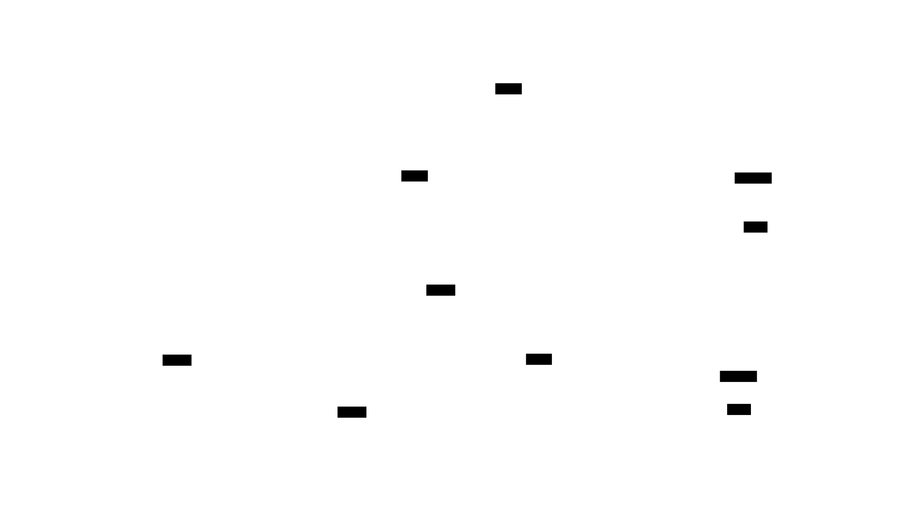
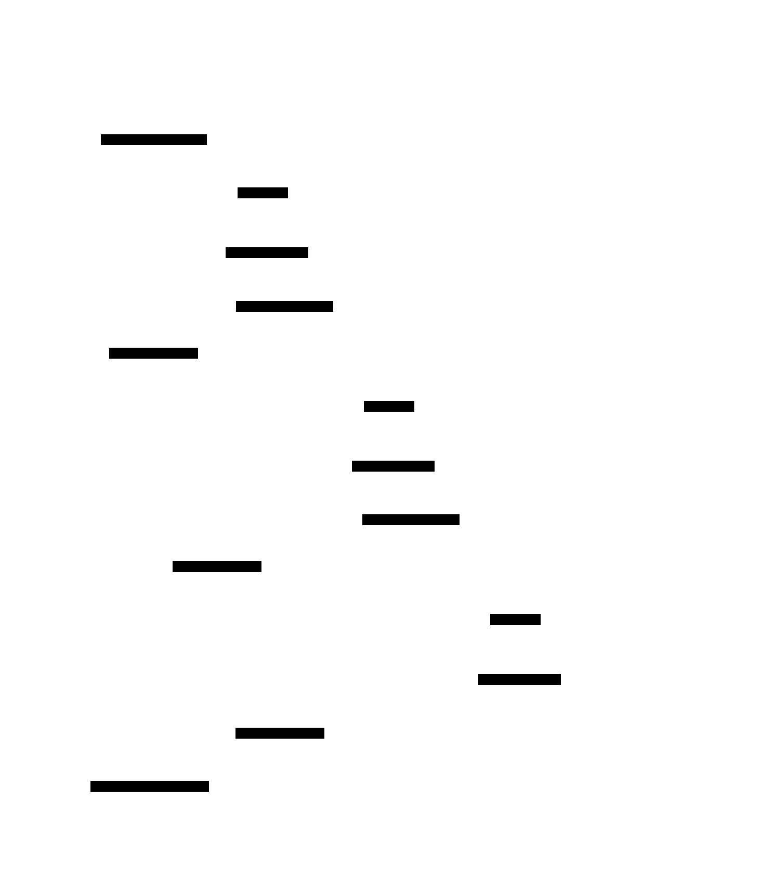
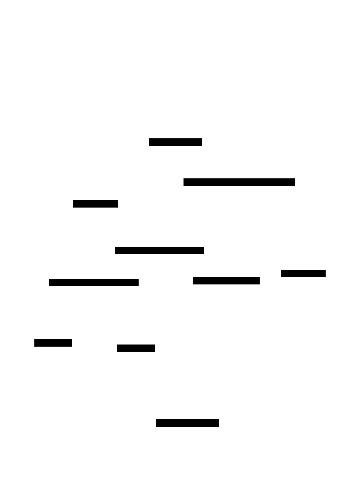

# Project Chronos: Design Document for a Real-Time Stream Processing Engine


## Overview

This document outlines the design and implementation of Chronos, a real-time stream processing engine that ingests unbounded data streams, applies transformations and time-based aggregations (windowing), and delivers results with exactly-once semantics. The key architectural challenge is maintaining high throughput, low latency, and fault-tolerant correctness in a distributed environment where data arrives continuously and out-of-order.


> This guide is meant to help you understand the big picture before diving into each milestone. Refer back to it whenever you need context on how components connect.


> **Milestone(s):** This section provides foundational context for all milestones by establishing the problem domain, mental models, and existing landscape.

## Context and Problem Statement

In traditional data processing, we operate on finite, static datasets. A batch job reads a complete set of records from a database or file system, processes them, and produces a result. This model is intuitive and powerful for historical analysis. However, an increasing class of modern applications requires continuous computation on **infinite, unbounded streams** of data arriving in real-time: fraud detection in financial transactions, real-time dashboards for IoT sensor networks, monitoring application logs for anomalies, and real-time recommendation systems. These applications cannot wait for a batch window to close; they must process data **as it arrives**, continuously, and with low latency.

This document outlines the design of **Project Chronos**, a real-time stream processing engine. Chronos aims to provide a robust foundation for building such applications, handling the inherent complexities of infinite data, out-of-order events, stateful computation, and fault tolerance—all while maintaining high throughput and low latency.

### Mental Model: The Never-Ending Conveyor Belt

Imagine a factory with a never-ending conveyor belt. Items (data events) are placed onto the belt at irregular intervals, sometimes in the wrong order relative to their intended sequence. Your task is to sort these items by color, count how many of each color pass by every minute, and immediately alert if a defective item (an anomaly) is detected. You cannot stop the belt to perform these tasks; you must work continuously as items flow past.

This is the essence of stream processing. The conveyor belt represents the **unbounded data stream**. The items are **records** (e.g., a transaction, a sensor reading, a log entry). Your sorting and counting tasks are **stateful operations** that must maintain counts across time. The irregular arrival and out-of-order placement represent the reality of distributed systems: network latency, clock skew, and retries mean events may not arrive in the order they occurred. The requirement for continuous operation without stopping the belt is the need for **fault tolerance**—if a worker (a processing node) trips, the system must recover without losing counts or missing alerts, ideally without even pausing the belt.

This mental model highlights three core shifts from batch thinking:
1.  **Infinite vs. Finite:** You never have a "complete" dataset. Aggregations (like counts) are computed over moving, finite windows of time (e.g., the last minute) rather than a static table.
2.  **Event Time vs. Processing Time:** The time an item was *created* (e.g., when a sensor recorded a temperature) is often more important than the time it *arrived* on the belt. Processing based on event time is necessary for accurate results when events are out-of-order.
3.  **Continuous Refinement:** Results are not final. The count for the 10:00-10:01 window might be updated if a late-arriving item from that period shows up at 10:03. The system must manage this ambiguity.

### The Technical Challenge

Building a system to manage this "conveyor belt" at scale, reliably, introduces four interconnected technical challenges that form the core of Chronos's design:

1.  **Handling Infinite Data:** The engine cannot buffer an infinite stream in memory. It must process records **incrementally** and **lazily**, emitting results as they become available. This requires an execution model based on pipelined, chained operators rather than a bulk synchronous model. Furthermore, operations like "count all records" are meaningless on an infinite stream; they must be bounded by **windowing**—logically dividing the stream into finite chunks based on time or count.

2.  **Reasoning About Time (Out-of-Order Events):** In a distributed system, the time a record is processed (`processing_time`) is not a reliable proxy for when the event actually occurred (`event_time`). To produce accurate results (e.g., "number of clicks per hour based on user activity timestamps"), the system must handle events that arrive later than expected. This is achieved through **event-time processing** and **watermarks**. A watermark is a special signal that flows through the data stream, declaring "all events with a timestamp less than `T` have (probably) been seen." This allows operators to trigger computations for time period `T` without waiting forever for stragglers, while providing a mechanism (**allowed lateness**) to handle events that arrive after the watermark.

3.  **Managing Stateful Computation:** Many useful stream operations are stateful. Counting items, detecting patterns (e.g., two failed logins within 5 seconds), and joining streams all require the operator to remember information (state) across multiple records. This state must be:
    *   **Scalable:** Partitioned across many parallel operator instances.
    *   **Fault-Tolerant:** Recoverable after a machine failure without data loss.
    *   **Performant:** Accessed with low latency to avoid becoming a bottleneck.
    Designing a state abstraction (like `ValueState`, `ListState`) that is decoupled from the storage backend (memory, disk) is critical.

4.  **Providing Fault Tolerance Without Stopping the World:** In a batch system, failure can be handled by re-running the job. In a continuous stream, stopping to recompute from the beginning is unacceptable. The system must provide **exactly-once processing semantics**—ensuring each record affects the final output exactly once, even in the face of failures. This is achieved through a distributed **checkpointing** algorithm (like Chandy-Lamport) that periodically captures a consistent snapshot of the entire pipeline's state (both in-flight data and operator state). Upon failure, the job can restart from the last consistent snapshot, replaying records from that point without duplicating or losing work.

### Landscape of Existing Approaches

Before designing Chronos, it's instructive to review existing architectural patterns and systems that address stream processing. Understanding their trade-offs informs our design decisions.

| Approach / System | Core Philosophy | Key Mechanism | Strengths | Weaknesses |
| :--- | :--- | :--- | :--- | :--- |
| **Lambda Architecture** | Maintain separate batch and stream layers; merge results for accuracy. | Batch layer (e.g., Hadoop) processes master dataset for high accuracy. Speed layer (e.g., Storm) processes recent data for low latency. | Provides accurate historical views and low-latency recent views. | High complexity (two codebases, two systems). Difficult to maintain consistency between layers. Latency in batch layer updates. |
| **Kappa Architecture** | Treat all data as a stream; recompute state from the raw log when logic changes. | A single stream-processing layer (e.g., Kafka + Flink) reads from an immutable log (the source of truth). | Simplicity (single codebase). Easier maintenance and debugging. Real-time by default. | Requires a high-performance, durable log. Re-computation for logic changes can be resource-intensive. |
| **Apache Flink** | True streaming-first engine with native event-time processing and state management. | Pipelined, dataflow execution engine. Distributed snapshots (checkpoints) for fault tolerance. | Low latency, high throughput. Strong consistency (exactly-once). Rich windowing and state APIs. | Operational complexity (cluster management). Steeper learning curve for advanced features. |
| **Spark Streaming** | Micro-batch model: treats streams as a series of small, deterministic batch jobs. | Divides the stream into discrete "micro-batches" (e.g., 1 second intervals) processed by the Spark engine. | Leverages mature Spark batch engine for fault tolerance and SQL. Easier to reason about for batch developers. | Higher latency (at least one batch interval). Less flexible windowing (aligned to batch boundaries). More difficult handling of event-time skew. |
| **Apache Storm** | Early pioneer of low-latency tuple-at-a-time processing. | Directed Acyclic Graph (DAG) of spouts (sources) and bolts (operators). | Very low latency. Simple API for basic transformations. | Originally at-least-once semantics (Trident added exactly-once with batch-like API). Weaker windowing and state support compared to newer systems. |

**Decision: Follow the Kappa Architecture & Flink Model for Chronos**
The Lambda architecture's complexity is a significant operational burden. The Kappa architecture, popularized by systems like Apache Flink, simplifies the stack by using the stream as the primary abstraction for both real-time and historical processing. Chronos will adopt this philosophy. Furthermore, we will draw direct inspiration from Flink's core technical contributions:
*   **Native streaming model** (over micro-batch) for the lowest possible latency.
*   **First-class support for event time and watermarks** to handle real-world, out-of-order data.
*   **Lightweight, asynchronous distributed checkpointing** for fault tolerance with minimal performance impact.
*   **Managed, partitioned operator state** that scales horizontally.

This approach provides the right balance of simplicity, performance, and correctness for our goals.

> **Key Insight:** The evolution from Lambda to Kappa, and from Storm's at-least-once to Flink's exactly-once, marks a maturation of stream processing. The winning pattern is a **unified programming model** that lets developers write logic once (for streaming) and rely on the engine's **fault-tolerance mechanisms** and **time-management features** to deliver correct, low-latency results.

---


## Goals and Non-Goals

> **Milestone(s):** This section establishes the project scope and informs the technical requirements for all five milestones, providing the "north star" for the entire design and implementation effort.

This section defines the precise boundaries of the Chronos stream processing engine. Given the vast scope of stream processing, it is critical to establish clear, achievable goals and explicit non-goals to focus development effort and prevent scope creep. The goals represent the **minimal viable product**—the essential capabilities required for a functional, production-ready stream processor. The non-goals acknowledge the expansive ecosystem of stream processing and define what we intentionally exclude, either because it's out of scope for the core engine, represents a separate product domain, or is a valuable extension left for future work.

### Goals

The following functional and non-functional requirements constitute the core deliverables of the Chronos project. Each goal maps directly to one or more implementation milestones and must be demonstrably achieved for the project to be considered successful.

#### Functional Goals

| Goal | Description | Milestone Mapping | Success Criteria |
|------|-------------|-------------------|------------------|
| **Core Stream Operators** | Provide a fluent, functional API for transforming unbounded data streams. Must support at least the fundamental stateless and stateful transformations. | Milestone 1 | A user can create a `DataStream` from a source, chain `map`, `filter`, and `flatMap` operations, partition it with `keyBy`, and output to a sink. Operators process records in a continuous, element-at-a-time fashion without materializing the entire stream. |
| **Event-Time Processing with Windowing** | Group infinite streams into finite, time-based windows for aggregation, supporting the three canonical window types: tumbling, sliding, and session. Windows must be evaluated based on timestamps extracted from the record payloads (event time). | Milestone 2, Milestone 3 | A user can define a windowed aggregation (e.g., "5-minute tumbling window count") on a stream with event timestamps. The system correctly assigns each record to its appropriate windows, triggers computation when the watermark passes the window end, and emits correct aggregated results even when events arrive out-of-order. |
| **Stateful Processing & Fault Tolerance** | Allow operators to maintain mutable state (per key) across processed records. Provide a mechanism to periodically capture a globally consistent snapshot (checkpoint) of all operator state, enabling recovery to a previously consistent state after a failure. | Milestone 4 | An operator (e.g., a stateful `map` or window) can store and update a `ValueState` or `ListState`. When the JobManager initiates a checkpoint, all operator tasks consistently snapshot their state to a durable backend. After a simulated TaskManager crash and restart, the job resumes from the last successful checkpoint with no loss of state and minimal reprocessing. |
| **Exactly-Once Semantics** | Guarantee that each incoming record has exactly one effect on the output state of the system, even in the face of failures and retries. This requires coordination between the checkpointing mechanism and the sink connectors. | Milestone 5 | Given a source that can replay records (e.g., Kafka with offsets) and a transactional sink (e.g., a database), the system produces idempotent outputs. After a failure and recovery, no duplicate records are written to the sink, and no records are missing. Verification via an end-to-end test shows the output is identical to a failure-free run. |
| **Horizontal Scalability** | The processing pipeline must parallelize across multiple physical cores and machines. The architecture must support distributing operator instances across TaskManager slots, with data partitioning (shuffling) between stages. | Milestone 1, Milestone 4 | A `keyBy` operation partitions a stream, and downstream keyed operators (like windows) are instantiated per parallel partition. Adding more TaskManagers (or slots) increases the overall throughput of the job linearly for partitionable operations. State is correctly redistributed during rescaling (post-MVP extension). |

#### Non-Functional Goals

| Category | Goal | Rationale |
|----------|------|-----------|
| **Performance** | **High Throughput & Low Latency:** The engine must process hundreds of thousands to millions of events per second per core with sub-second latency for simple transformations. Windowing and state operations will incur higher but bounded latency. | Stream processing is often used for real-time analytics and decision-making; poor performance negates its value. |
| **Reliability** | **Fault Tolerance without Stop-The-World:** The system must recover from failures (process crashes, machine failures, network partitions) automatically and resume processing with minimal downtime. Recovery time is dependent on checkpoint size but should not require manual intervention. | Production deployments run 24/7; failures are inevitable. The system must be self-healing to maintain service-level agreements (SLAs). |
| **Usability** | **Intuitive Java API:** The `DataStream` API should feel familiar to developers experienced with Java 8+ streams or Apache Flink. The learning curve for basic transformations should be shallow. | Developer adoption is critical. A clean, well-documented API reduces time-to-value and bug potential. |
| **Operability** | **Observability:** The engine must expose key metrics (throughput, latency, watermark lag, checkpoint size/duration) and logs to facilitate monitoring and debugging. | Operators need visibility into job health to diagnose performance issues, stalls, or data skew. |
| **Extensibility** | **Pluggable Connectors & State Backends:** The architecture must define clear interfaces for sources, sinks, and state storage, allowing the community to build connectors for various messaging systems and databases. | No stream processor can natively support every external system. An extensible design fosters an ecosystem. |

> **Key Design Principle:** *Chronos prioritizes correctness over latency.* While low latency is a goal, the mechanisms to guarantee exactly-once semantics (like checkpoint barrier alignment) may introduce temporary delays. This is an intentional trade-off to ensure the system produces accurate, trustworthy results—a non-negotiable requirement for financial processing, fraud detection, and other critical use cases.

### Non-Goals

The following areas are explicitly **out of scope** for the initial implementation of Chronos. This is not to say they are unimportant, but rather that they represent distinct projects, advanced features, or extensions that can be built *on top of* the core engine described in this document.

| Non-Goal | Explanation | Alternative / Future Extension |
|----------|-------------|-------------------------------|
| **Built-in Complex Event Processing (CEP)** | Detecting complex multi-event patterns (e.g., "A followed by B within 10 minutes, but not C") requires a specialized pattern-matching engine and a dedicated API (like Flink's CEP library). | The core windowing and stateful operators can be used to implement simple patterns. A full CEP engine could be built as a separate library leveraging Chronos's `DataStream` API and state. |
| **Dynamic Job Graph Modification** | Modifying a running job's topology (adding/removing operators, changing parallelism) without a restart is a complex feature requiring state migration and coordination. | Chronos jobs are started from a static `JobGraph`. To modify the pipeline, users must stop the job, update the graph, and restart from the latest checkpoint (savepoint). |
| **SQL & Table API** | A declarative SQL interface for stream processing is a massive undertaking involving query parsing, optimization, and code generation. It is a full-layer abstraction above the `DataStream` API. | The core engine focuses on the procedural API. A SQL layer could be a future project that compiles SQL queries into Chronos `JobGraph`s. |
| **Cluster Resource Management** | Chronos does not include its own cluster manager (like YARN or Kubernetes) for allocating machines, managing containers, or handling resource negotiation. | Chronos expects to be deployed on a pre-provisioned set of machines (TaskManagers) or within containers managed by an external orchestrator (K8s). The JobManager only manages *logical* task scheduling, not physical resources. |
| **Graph Processing (BSP model)** | Although stream processing can model some iterative algorithms, Chronos is not designed for Bulk Synchronous Parallel (BSP) processing like Pregel or Giraph. | Iterative algorithms can be implemented using data streams with feedback loops, but Chronos does not provide first-class primitives for this. |
| **Machine Learning Library** | Providing streaming ML algorithms (online learning, model serving) is a substantial domain-specific endeavor. | Chronos can serve as a platform to deploy custom ML logic via user-defined functions (UDFs) and manage model state via `ValueState`. |
| **Built-in Dashboard/UI** | A web-based user interface for job submission, monitoring, and management is a significant frontend and backend project. | Chronos will expose a REST API for job submission and metrics retrieval, allowing third-party dashboards to be built. Initial operation is expected via CLI and configuration files. |
| **Support for Batch Processing** | While stream and batch processing can be unified (the batch is a special case of streaming), implementing optimized batch execution (scheduling, shuffles) is a distinct paradigm. | Chronos processes bounded streams (finite sources) correctly, but without batch-specific optimizations. A future "batch mode" could disable certain streaming features (watermarks, checkpoints) for higher throughput on historical data. |

> **Architecture Decision: Focus on the Core Engine**
> **Context:** Stream processing ecosystems are vast. We must bound the initial project to a deliverable scope while building a foundation that permits future extensions.
> **Options Considered:**
> 1. **Build a monolithic system** with SQL, CEP, ML, and a built-in resource manager.
> 2. **Build a minimal core engine** with extensible interfaces for connectors, state, and APIs.
> **Decision:** Option 2 — Build a minimal, robust core engine.
> **Rationale:** A monolithic system would be years in the making and difficult to maintain. By focusing on a solid, well-architected core, we enable the community to build complementary libraries and tools. This follows the Unix philosophy: "Do one thing well." The core's stability and correctness are prerequisites for any higher-level abstraction.
> **Consequences:** The initial release lacks the "bells and whistles" of mature systems, but its simplicity makes it easier to understand, debug, and trust. Adoption may be slower initially, as users must write more code compared to using a SQL interface.

### Success Metrics

Beyond the milestone-specific acceptance criteria, the overall success of Chronos will be evaluated against the following quantitative and qualitative metrics:

| Metric | Target | Measurement Method |
|--------|--------|-------------------|
| **End-to-end Latency (p95)** | < 100 ms for a stateless `map` operation in a low-load, local cluster. | Measure the time between a record entering a source and its result appearing at the sink, excluding external system latency. |
| **Throughput (per core)** | > 100,000 records/sec for a stateless `map` on a modern CPU (Intel i7/Xeon). | Saturate a source with a fast in-memory queue and measure sustained processing rate. |
| **Checkpoint Overhead** | < 10% throughput degradation when checkpointing every 10 seconds with a moderate state size (100 MB). | Compare throughput with checkpointing enabled vs. disabled. |
| **Recovery Time Objective (RTO)** | < 30 seconds to restore a 1 GB state snapshot from a remote filesystem (e.g., HDFS/S3). | Time from triggering a TaskManager failure to the job processing new records at full throughput. |
| **API Completeness** | 100% of the methods defined in the `DataStream` API specification are implemented and pass conformance tests. | Automated test suite covering all public API methods with edge cases. |
| **Correctness (Exactly-Once)** | 0 duplicate or missing records after 100 simulated failure injections (kill -9) during a long-running job. | Run a verifiable end-to-end integration test with a fault-injecting source and an idempotent validator sink. |

### Implementation Guidance

This section provides initial scaffolding and technology choices to kickstart the implementation of Chronos, guided by the goals and constraints defined above.

#### A. Technology Recommendations Table

| Component | Simple Option (For Learning/Prototyping) | Advanced/Production Option (For Milestone Completion) |
|-----------|------------------------------------------|------------------------------------------------------|
| **Language & Build** | Java 11, Maven for dependency management. | Java 17, Gradle for faster, more flexible builds. |
| **Network Communication** | Plain TCP sockets with custom serialization for RPC between JobManager and TaskManagers. | **gRPC** with Protocol Buffers for type-safe, high-performance, bidirectional streaming RPC. |
| **State Backend (Local)** | **In-Heap HashMap** for small, fast state (Milestone 4). | **Embedded RocksDB** for large state that spills to disk (Milestone 4). |
| **Checkpoint Storage** | Local filesystem directory. | **Distributed Filesystem** (HDFS, S3-compatible storage) for fault-tolerant, shared state snapshots. |
| **Sink Connector (Example)** | **StdOut Sink** for debugging. | **Two-Phase Commit Sink** to a transactional database (e.g., PostgreSQL) or Apache Kafka (Milestone 5). |
| **Metrics** | SLF4J logging of key events. | **Micrometer** library exporting to Prometheus or JMX. |
| **Testing** | JUnit 5, AssertJ for fluent assertions. | **Testcontainers** for integration tests with real external systems (Kafka, PostgreSQL). |

#### B. Recommended File/Module Structure

Adopt a multi-module Maven/Gradle project from the start to enforce clear boundaries between the public API, runtime engine, and internal components.

```
chronos/
├── README.md
├── pom.xml (or build.gradle.kts)
│
├── chronos-api/                          # Public API for users
│   ├── src/main/java/org/chronos/api/
│   │   ├── functions/                    # User-defined function interfaces
│   │   │   ├── MapFunction.java
│   │   │   ├── FilterFunction.java
│   │   │   └── ...
│   │   ├── streaming/
│   │   │   ├── DataStream.java           # Core fluent API class
│   │   │   ├── KeyedStream.java
│   │   │   └── WindowedStream.java
│   │   └── time/
│   │       ├── TimeWindow.java
│   │       └── Watermark.java
│   └── pom.xml
│
├── chronos-runtime/                      # Core distributed runtime
│   ├── src/main/java/org/chronos/runtime/
│   │   ├── jobgraph/
│   │   │   ├── JobGraph.java
│   │   │   └── ExecutionVertex.java
│   │   ├── task/
│   │   │   ├── StreamTask.java           # Base class for all operator tasks
│   │   │   ├── SourceStreamTask.java
│   │   │   └── operator/
│   │   │       ├── StreamOperator.java   # Interface for operators
│   │   │       ├── OneInputStreamOperator.java
│   │   │       └── ... (specific operators)
│   │   ├── state/
│   │   │   ├── backend/
│   │   │   │   ├── StateBackend.java     # Interface
│   │   │   │   ├── MemoryStateBackend.java
│   │   │   │   └── RocksDBStateBackend.java
│   │   │   └── impl/                     # State implementations
│   │   │       ├── ValueState.java
│   │   │       └── ListState.java
│   │   ├── checkpointing/
│   │   │   ├── CheckpointCoordinator.java
│   │   │   └── CheckpointBarrier.java
│   │   └── coordination/
│   │       ├── JobManager.java
│   │       └── TaskManager.java
│   └── pom.xml
│
├── chronos-connectors/                   # Optional: Source/Sink implementations
│   ├── kafka/
│   ├── file/
│   └── jdbc/
│
└── chronos-examples/                     Example jobs
    └── pom.xml
```

#### C. Infrastructure Starter Code

Here is a complete, ready-to-use foundational class for the core `Record` and `StreamRecord` data types. This eliminates boilerplate and lets you focus on the processing logic.

```java
// File: chronos-api/src/main/java/org/chronos/api/streaming/Record.java
package org.chronos.api.streaming;

import java.util.Collections;
import java.util.HashMap;
import java.util.Map;
import java.util.Objects;

/**
 * A generic data record flowing through the Chronos streaming engine.
 * Contains a payload (the actual data) and a metadata map for system/internal attributes.
 */
public class Record {
    protected final Object payload;
    protected final Map<String, Object> metadata;

    public Record(Object payload) {
        this(payload, new HashMap<>());
    }

    public Record(Object payload, Map<String, Object> metadata) {
        this.payload = Objects.requireNonNull(payload, "Payload cannot be null");
        this.metadata = new HashMap<>(metadata); // Defensive copy
    }

    public Object getPayload() {
        return payload;
    }

    public Map<String, Object> getMetadata() {
        return Collections.unmodifiableMap(metadata);
    }

    public Object getMetadata(String key) {
        return metadata.get(key);
    }

    public void setMetadata(String key, Object value) {
        metadata.put(key, value);
    }

    @Override
    public boolean equals(Object o) {
        if (this == o) return true;
        if (o == null || getClass() != o.getClass()) return false;
        Record record = (Record) o;
        return payload.equals(record.payload) && metadata.equals(record.metadata);
    }

    @Override
    public int hashCode() {
        return Objects.hash(payload, metadata);
    }

    @Override
    public String toString() {
        return "Record{" +
                "payload=" + payload +
                ", metadata=" + metadata +
                '}';
    }
}
```

```java
// File: chronos-api/src/main/java/org/chronos/api/streaming/StreamRecord.java
package org.chronos.api.streaming;

import java.util.Map;

/**
 * A Record enriched with timestamp information for event-time processing.
 * The `timestamp` field holds the event time extracted from the payload.
 * The `watermark` field holds the current watermark value at the point this record is processed.
 */
public class StreamRecord extends Record {
    private final long timestamp;
    private final long watermark;

    // Constants for special timestamp values
    public static final long NO_TIMESTAMP = Long.MIN_VALUE;
    public static final long NO_WATERMARK = Long.MIN_VALUE;

    public StreamRecord(Object payload, long timestamp) {
        this(payload, timestamp, NO_WATERMARK, new HashMap<>());
    }

    public StreamRecord(Object payload, long timestamp, long watermark, Map<String, Object> metadata) {
        super(payload, metadata);
        this.timestamp = timestamp;
        this.watermark = watermark;
    }

    public long getTimestamp() {
        return timestamp;
    }

    public long getWatermark() {
        return watermark;
    }

    public boolean hasTimestamp() {
        return timestamp != NO_TIMESTAMP;
    }

    public boolean hasWatermark() {
        return watermark != NO_WATERMARK;
    }

    @Override
    public boolean equals(Object o) {
        if (this == o) return true;
        if (o == null || getClass() != o.getClass()) return false;
        if (!super.equals(o)) return false;
        StreamRecord that = (StreamRecord) o;
        return timestamp == that.timestamp && watermark == that.watermark;
    }

    @Override
    public int hashCode() {
        return Objects.hash(super.hashCode(), timestamp, watermark);
    }

    @Override
    public String toString() {
        return "StreamRecord{" +
                "payload=" + payload +
                ", timestamp=" + timestamp +
                ", watermark=" + watermark +
                ", metadata=" + getMetadata() +
                '}';
    }
}
```

#### D. Core Logic Skeleton Code

To start implementing the `DataStream` API (Milestone 1), begin with the skeleton for the central `DataStream` class. This provides the structure you'll fill in.

```java
// File: chronos-api/src/main/java/org/chronos/api/streaming/DataStream.java
package org.chronos.api.streaming;

import org.chronos.api.functions.FilterFunction;
import org.chronos.api.functions.FlatMapFunction;
import org.chronos.api.functions.MapFunction;
import org.chronos.api.functions.KeySelector;
import org.chronos.api.time.TimestampExtractor;

import java.util.ArrayList;
import java.util.List;

/**
 * Represents a stream of elements of type T. This is the core abstraction for
 * defining streaming transformations.
 *
 * @param <T> The type of elements in this stream.
 */
public class DataStream<T> {
    private final StreamExecutionEnvironment environment;
    private final List<StreamTransformation<T>> transformations;

    // Package-private constructor for internal use
    DataStream(StreamExecutionEnvironment environment, StreamTransformation<T> transformation) {
        this.environment = environment;
        this.transformations = new ArrayList<>();
        this.transformations.add(transformation);
    }

    /**
     * Applies a one-to-one transformation on this stream.
     *
     * @param mapper The MapFunction that defines the transformation.
     * @param <R>    The type of the resulting stream elements.
     * @return A new DataStream representing the transformed stream.
     */
    public <R> DataStream<R> map(MapFunction<T, R> mapper) {
        // TODO 1: Validate that 'mapper' is not null.
        // TODO 2: Create a new StreamTransformation of type 'MapTransformation' that wraps the mapper.
        // TODO 3: Add this transformation to the internal list of this DataStream's transformations.
        // TODO 4: Return a new DataStream<R> linked to the same environment but with the new transformation as its source.
        // Hint: Use environment.getTransformationFactory().createMapTransformation(...)
        throw new UnsupportedOperationException("Implement map()");
    }

    /**
     * Filters elements of this stream according to a predicate.
     *
     * @param filter The FilterFunction that defines the filter condition.
     * @return A new DataStream containing only elements that satisfy the predicate.
     */
    public DataStream<T> filter(FilterFunction<T> filter) {
        // TODO 1: Validate 'filter' is not null.
        // TODO 2: Create a FilterTransformation.
        // TODO 3: Add transformation and return new DataStream.
        throw new UnsupportedOperationException("Implement filter()");
    }

    /**
     * Partitions the stream by the specified key.
     *
     * @param keySelector The function that extracts the key from each element.
     * @param <K>         The type of the extracted key.
     * @return A KeyedStream on which keyed operations (like stateful windows) can be applied.
     */
    public <K> KeyedStream<T, K> keyBy(KeySelector<T, K> keySelector) {
        // TODO 1: Validate 'keySelector' is not null.
        // TODO 2: Create a KeyByTransformation that will partition the stream by the hash of the key.
        // TODO 3: This transformation changes the parallelism and partitioning of the stream.
        // TODO 4: Return a new KeyedStream (which is a subclass of DataStream) with the key type information.
        throw new UnsupportedOperationException("Implement keyBy()");
    }

    /**
     * Assigns timestamps and generates watermarks for this stream based on the
     * provided TimestampExtractor. This is required for event-time windowing.
     *
     * @param extractor The TimestampExtractor implementation.
     * @return A new DataStream with timestamps and watermarks assigned.
     */
    public DataStream<T> assignTimestamps(TimestampExtractor<T> extractor) {
        // TODO 1: Validate 'extractor' is not null.
        // TODO 2: Create a TimestampAssignerTransformation.
        // TODO 3: This transformation does not change the element type, but enriches each Record into a StreamRecord.
        // TODO 4: Return a new DataStream with this transformation added.
        throw new UnsupportedOperationException("Implement assignTimestamps()");
    }

    // Additional methods (skeleton only)
    public <R> DataStream<R> flatMap(FlatMapFunction<T, R> flatMapper) {
        throw new UnsupportedOperationException("Implement flatMap()");
    }

    public void addSink(SinkFunction<T> sink) {
        // TODO: This is the final step. Creates a SinkTransformation and adds it to the environment's job graph.
        throw new UnsupportedOperationException("Implement addSink()");
    }

    // Getters for internal use
    StreamExecutionEnvironment getEnvironment() {
        return environment;
    }

    List<StreamTransformation<T>> getTransformations() {
        return new ArrayList<>(transformations);
    }
}
```

#### E. Language-Specific Hints (Java)

- **Use `java.util.function` Interfaces:** For user-defined functions like `MapFunction`, you can extend `java.util.Function<T,R>` to make the API familiar. However, for fault tolerance, you may need checked exceptions and rich lifecycle methods (open/close), so defining custom interfaces is recommended.
- **Concurrency:** The runtime will be highly concurrent. Use `java.util.concurrent` primitives (`ConcurrentHashMap`, `AtomicLong`) for shared coordination state in the JobManager and TaskManagers. Within a `StreamTask`, assume single-threaded execution unless explicitly documented.
- **Serialization:** For shipping functions and state across the network, consider using **Java Serialization** for simplicity initially. For production, implement a **TypeSerializer** framework (like Flink) for efficiency and versioning.
- **Resource Management:** Use `try-with-resources` for all file handles (RocksDB, checkpoint files). Implement `Closeable` for state backends and operators.
- **Logging:** Use **SLF4J** with a binding like Logback. Key classes should have `private static final Logger LOG = LoggerFactory.getLogger(ClassName.class);`.

#### F. Milestone Checkpoint (Initial)

After setting up the project structure and the basic `Record`/`StreamRecord` classes, you can run a simple test to verify your environment.

1.  **Create a simple unit test:**
    ```java
    // File: chronos-api/src/test/java/org/chronos/api/streaming/RecordTest.java
    package org.chronos.api.streaming;

    import org.junit.jupiter.api.Test;
    import static org.assertj.core.api.Assertions.assertThat;

    public class RecordTest {
        @Test
        void testStreamRecordCreation() {
            StreamRecord<String> record = new StreamRecord<>("event123", 1672531200000L); // Jan 1, 2023
            assertThat(record.getPayload()).isEqualTo("event123");
            assertThat(record.getTimestamp()).isEqualTo(1672531200000L);
            assertThat(record.hasTimestamp()).isTrue();
            assertThat(record.hasWatermark()).isFalse();
        }
    }
    ```

2.  **Run the test:**
    ```bash
    # From the project root directory
    mvn test -pl chronos-api -Dtest=RecordTest
    # Or using Gradle
    ./gradlew :chronos-api:test --tests "RecordTest"
    ```

3.  **Expected Output:** The test should pass. If it fails, check your Java version and build tool configuration. This confirms your basic project setup is correct and you're ready to start implementing the `DataStream` API.


## High-Level Architecture

> **Milestone(s):** This section provides the architectural foundation for all milestones by defining the main components, their interactions, and the codebase structure that will enable the development of the complete stream processing engine.

### Component Overview and Data Flow

**Mental Model: The Factory Assembly Line with a Central Control Room**

Imagine a large factory assembly line for processing an endless stream of raw materials (data records). The factory has several key areas:

*   **Control Room (`JobManager`)**: A central command center with a blueprint (`JobGraph`) of the entire assembly line. It oversees all workstations, assigns tasks to workers, monitors for breakdowns, and coordinates factory-wide safety drills (checkpoints).
*   **Workstations (`TaskManagers`)**: Multiple workstations on the factory floor, each with a set of workers (`TaskSlots`). Each worker is assigned a specific, repetitive task (like `Map` or `Window`) from the blueprint. They process items that arrive on their segment of the conveyor belt.
*   **Conveyor Belt System (`DataStreams`)**: A network of conveyor belts that transport items between workstations. At certain points, the belt splits (`keyBy`) to route items to different workers based on a characteristic (like color or shape).
*   **Loading Dock (`Source`)**: The entrance point where raw materials (external data) are loaded onto the conveyor belt. Different docks exist for different suppliers (Kafka, files, sockets).
*   **Shipping Dock (`Sink`)**: The exit point where finished products (processed results) are packaged and sent out of the factory to external warehouses (databases, message queues, APIs).
*   **Warehouse Shelves (`State Backend`)**: Storage areas next to each workstation. Each worker has their own labeled shelves (`keyed state`) to keep notes, partially assembled components, or tools they need between processing different items. A backup robot (`Checkpointing`) periodically takes snapshots of all shelves for disaster recovery.

This factory runs 24/7, must handle items arriving out of order, and cannot stop the entire line for maintenance or failures. The control room and the checkpointing system ensure that if a workstation catches fire (`TaskManager crash`), a replacement worker can be brought in, the shelves can be restored from the last snapshot, and processing can resume exactly where it left off without duplicating or losing items.

Now, let's formalize this mental model into the technical components of Chronos.

Chronos adopts a classic **master-worker** architecture, common in distributed data processing frameworks. The system is designed to run on a cluster of machines and is logically divided into a coordination plane (the master) and a data plane (the workers). The primary goal of this separation is to isolate fault-tolerant coordination and resource management from the high-throughput, low-latency data processing path.



**Core Components and Responsibilities:**

| Component | Primary Role | Key Responsibilities | Key Data It Owns/Holds |
| :--- | :--- | :--- | :--- |
| **Job Client** | Submission Gateway | 1. Accepts user code (e.g., a `main` method defining a `DataStream` pipeline). <br> 2. Compiles it into a `JobGraph` (logical plan). <br> 3. Submits the `JobGraph` to the `JobManager`. <br> 4. (Optional) Monitors job status and fetches results. | User application JAR, initial `JobGraph`, submission configuration. |
| **JobManager** (Master) | Coordinator & Brain | 1. **Scheduler**: Translates the `JobGraph` into an `ExecutionGraph` (physical parallel plan) and assigns `ExecutionVertex` instances to `TaskSlots`. <br> 2. **Checkpoint Coordinator**: Initiates checkpoints by injecting `CheckpointBarrier` events, collects acknowledgements, and manages completion/abort. <br> 3. **Fault Tolerance Manager**: Detects `TaskManager` failures, triggers recovery from the latest successful checkpoint, and reassigns tasks. <br> 4. **Resource Manager**: Manages the pool of `TaskManager` resources (slots). | `JobGraph`, `ExecutionGraph`, latest completed `Checkpoint` metadata, registered `TaskManager` instances. |
| **TaskManager** (Worker) | Data Processing Engine | 1. **Task Execution**: Hosts one or more `TaskSlots`. Each slot runs a `StreamTask` (e.g., `SourceTask`, `MapTask`, `WindowTask`), which is a thread executing one parallel instance of an operator. <br> 2. **State Custodian**: Delegates all state reads/writes (for `ValueState`, `ListState`, etc.) to the configured `StateBackend`. <br> 3. **Network Manager**: Handles data transfer (records, watermarks, barriers) to/from upstream and downstream tasks, potentially across network boundaries. <br> 4. **Checkpoint Actor**: Upon receiving a `CheckpointBarrier`, triggers local state snapshot via the `StateBackend` and reports back to the `JobManager`. | Running `StreamTask` instances, local `StateBackend` instance (e.g., in-memory hash maps or RocksDB database), network buffers. |
| **Source Connector** | Data Ingestion | 1. **Record Emission**: Reads or receives data from an external system (e.g., Kafka topic, TCP socket) and wraps it into `Record` or `StreamRecord` objects. <br> 2. **Timestamp/Watermark Generation**: Extracts event timestamps and emits `Watermark` objects to inform the system about event-time progress. <br> 3. **Offset Management**: (For exactly-once) Participates in checkpoints to commit consumed offsets only after a checkpoint completes. | Connection to external system, partition offsets, watermark generator state. |
| **Sink Connector** | Result Egress | 1. **Record Output**: Writes processed `Record` objects to an external system (e.g., database, file, another message queue). <br> 2. **Transaction Management**: (For exactly-once) Implements idempotent writes or a two-phase commit protocol to ensure output is committed atomically with checkpoint completion. | Connection to external system, pending transaction buffers. |
| **State Backend** | State Storage Abstraction | 1. **State Storage**: Provides the concrete implementation for storing and retrieving keyed operator state (`ValueState`, `ListState`, `MapState`). <br> 2. **Checkpoint Persistence**: Handles the serialization and writing of state snapshots to durable storage (e.g., local disk, HDFS, S3) during checkpointing. <br> 3. **State Recovery**: Loads state from a previously persisted snapshot during job recovery. | Local state tables (in-heap, RocksDB), handles to remote checkpoint files. |

**End-to-End Data and Control Flow:**

The lifecycle of a streaming job follows a clear sequence:

1.  **Job Submission & Planning**: The user writes a program using the `DataStream` API (e.g., `source.map(...).keyBy(...).window(...).sink(...)`). The **Job Client** compiles this into a `JobGraph`—a directed acyclic graph (DAG) where nodes are operators (like `Map`, `Window`) and edges define data exchange patterns (forward, hash, broadcast). This `JobGraph` is sent to the **JobManager**.
2.  **Execution Planning & Deployment**: The **JobManager** converts the logical `JobGraph` into a parallel `ExecutionGraph`. It decides *parallelism*: how many parallel instances (`ExecutionVertex`) each operator needs. It then requests resources (slots) from available **TaskManagers** and deploys the `ExecutionGraph` by sending task descriptions to them.
3.  **Task Execution & Data Flow**: Each **TaskManager** starts its assigned `StreamTask`s. **Source** tasks begin pulling data, emitting `Record`s and `Watermark`s downstream. Records flow along the edges of the execution graph, being transformed by each operator (`map`, `filter`). For keyed operations (`keyBy`), a hash partitioner ensures records with the same key are routed to the same downstream task instance. Operators interact with the **State Backend** to read and update their local, key-scoped state.
4.  **Fault Tolerance via Checkpointing**: Periodically, the **JobManager** triggers a checkpoint. It injects a `CheckpointBarrier` into each source's data stream. These barriers flow downstream, forcing each operator to align its inputs and snapshot its state to the **State Backend** before forwarding the barrier. Once the **JobManager** receives snapshot completion ACKs from all tasks, the checkpoint is marked *complete*. This creates a globally consistent recovery point.
5.  **Failure Recovery**: If a **TaskManager** fails, the **JobManager** detects it. It restarts the failed tasks on available slots. The new tasks are initialized by loading their operator state from the last successful checkpoint snapshot via the **State Backend**. **Source** tasks are reset to the offsets recorded in that checkpoint. Processing resumes, guaranteeing exactly-once semantics.

> **Architecture Decision: Master-Worker vs. Peer-to-Peer Coordination**
>
> *   **Context**: We need a distributed system to execute continuous, stateful dataflow graphs with strong consistency guarantees (exactly-once). The system must coordinate periodic global snapshots (checkpoints) and manage task deployment in the face of failures.
> *   **Options Considered**:
>     1.  **Pure Master-Worker (Centralized Coordinator)**: A single `JobManager` master node holds all metadata, makes all scheduling decisions, and orchestrates checkpoints. Workers (`TaskManagers`) are stateless executors.
>     2.  **Decentralized Peer-to-Peer**: There is no permanent master. Coordination (like checkpoint initiation) uses a distributed consensus protocol (e.g., Raft, Paxos) among the workers. Scheduling decisions are made collectively.
>     3.  **Hybrid (Leader Election with Light Master)**: A master exists but is elected from the worker pool. Metadata is distributed, but the elected leader handles coordination. If the leader fails, a new one is elected.
> *   **Decision**: We chose the **Pure Master-Worker** model with a single, active `JobManager`.
> *   **Rationale**:
>     1.  **Simplicity of Implementation**: Centralized coordination is significantly easier to implement correctly than distributed consensus, especially for learners. The logic for scheduling and checkpoint coordination resides in one place.
>     2.  **Clear Separation of Concerns**: It cleanly separates the control plane (`JobManager`) from the data plane (`TaskManager`). The data plane can be optimized for throughput without being burdened by coordination logic.
>     3.  **Industry Precedent**: This is the model successfully used by Apache Flink and Spark, proving its practicality for stream processing at scale. The `JobManager` can be made highly available (HA) via standby replicas, mitigating the single-point-of-failure concern for production systems.
> *   **Consequences**:
>     *   **Positive**: Easier to reason about, debug, and test. Clear APIs between components.
>     *   **Negative**: The `JobManager` is a potential bottleneck and single point of failure. (We accept this for the learning project, noting that a HA setup would be a future extension).
>     *   **Requires**: The `JobManager` must be resilient to worker failures, and workers must be able to reconnect to a new master if one is manually restarted.

| Option | Pros | Cons | Chosen? |
| :--- | :--- | :--- | :--- |
| **Pure Master-Worker** | Simple to implement; clear separation; industry-standard; easy to debug. | Single point of failure; potential scaling bottleneck for metadata. | **Yes** (Best for learning and follows proven patterns). |
| **Decentralized P2P** | Highly available; no single point of failure. | Extremely complex (consensus, distributed state); difficult to debug; slower coordination. | No (Overkill for our scope). |
| **Hybrid (Leader Election)** | More available than pure master-worker; distributes some load. | Still complex (needs election protocol); more moving parts than pure master-worker. | No (Adds complexity without sufficient learning benefit for our core goals). |

### Recommended File/Module Structure

A well-organized codebase is critical for managing the complexity of a distributed stream processor. The following structure separates concerns, promotes modularity, and mirrors the logical architecture. It uses a multi-module Maven/Gradle project style, but can be adapted to a single module with clear package boundaries.

```
chronos-stream-engine/
├── README.md
├── pom.xml (or build.gradle)                     # Build configuration
├── core-api/                                      # Module 1: User-Facing API & Data Model
│   └── src/main/java/com/chronos/
│       ├── api/
│       │   ├── functions/                        # User-defined function interfaces
│       │   │   ├── MapFunction.java
│       │   │   ├── FilterFunction.java
│       │   │   ├── KeySelector.java
│       │   │   └── ...
│       │   ├── temporal/                         # Time & window abstractions
│       │   │   ├── TimeWindow.java
│       │   │   ├── WindowAssigner.java
│       │   │   └── Trigger.java
│       │   ├── state/                            # State abstractions
│       │   │   ├── ValueState.java
│       │   │   ├── ListState.java
│       │   │   └── StateDescriptor.java
│       │   └── stream/
│       │       ├── DataStream.java               # Core streaming API class
│       │       ├── KeyedStream.java
│       │       └── ConnectedStream.java
│       └── model/                                # Core data model (shared with runtime)
│           ├── Record.java
│           ├── StreamRecord.java
│           ├── Watermark.java
│           └── CheckpointBarrier.java
├── core-runtime/                                  # Module 2: Runtime Execution Engine
│   └── src/main/java/com/chronos/runtime/
│       ├── cluster/                              # Cluster coordination & management
│       │   ├── JobManager.java
│       │   ├── TaskManager.java
│       │   ├── dispatcher/                       # Job submission & graph management
│       │   │   ├── JobGraph.java
│       │   │   ├── ExecutionGraph.java
│       │   │   └── ExecutionVertex.java
│       │   └── rpc/                              # Remote procedure call interfaces
│       │       ├── JobManagerGateway.java
│       │       └── TaskExecutorGateway.java
│       ├── task/                                 # Task execution logic
│       │   ├── StreamTask.java                   # Base class for all tasks
│       │   ├── SourceStreamTask.java
│       │   ├── OneInputStreamTask.java           # For operators with one input (map, filter)
│       │   ├── operator/                         # Concrete operator implementations
│       │   │   ├── StreamOperator.java           # Interface
│       │   │   ├── StreamSource.java
│       │   │   ├── StreamMap.java
│       │   │   └── ...
│       │   └── channel/                          # Data transfer between tasks
│       │       ├── InputGate.java                # Manages multiple input channels
│       │       └── ResultPartition.java          # Manages output to downstream tasks
│       ├── watermark/                            # Event time & watermark handling
│       │   ├── WatermarkGenerator.java
│       │   ├── BoundedOutOfOrdernessGenerator.java
│       │   └── WatermarkPropagator.java
│       └── window/                               # Windowing runtime (assigners, triggers)
│           ├── WindowOperator.java
│           ├── assigner/
│           │   ├── TumblingWindowAssigner.java
│           │   └── ...
│           └── trigger/
│               ├── EventTimeTrigger.java
│               └── CountTrigger.java
├── state-backends/                               # Module 3: Pluggable State Storage
│   └── src/main/java/com/chronos/state/
│       ├── backend/
│       │   ├── StateBackend.java                 # Interface
│       │   ├── MemoryStateBackend.java           # In-heap implementation
│       │   └── RocksDBStateBackend.java          # Disk-based implementation
│       └── snapshot/                             # Checkpoint snapshot logic
│           ├── CheckpointCoordinator.java
│           ├── AsyncCheckpointRunnable.java
│           └── SnapshotResult.java
├── connectors/                                   # Module 4: Source & Sink Implementations
│   └── src/main/java/com/chronos/connector/
│       ├── source/                               # Source connectors
│       │   ├── SourceFunction.java               # Interface
│       │   ├── SocketSource.java                 # Simple TCP source
│       │   └── kafka/                            # (Future) Kafka source
│       └── sink/                                 # Sink connectors
│           ├── SinkFunction.java                 # Interface
│           ├── PrintSinkFunction.java
│           ├── FileSinkFunction.java
│           └── transactional/                    # Exactly-once sinks
│               ├── TwoPhaseCommitSinkFunction.java
│               └── TransactionCoordinator.java
└── examples/                                     # Example jobs & integration tests
    └── src/main/java/com/chronos/examples/
        ├── WordCountStreaming.java
        └── LateDataHandlingExample.java
```

**Module Dependency Flow:** `connectors` → `core-api` → `core-runtime` ← `state-backends`. The `core-api` defines the interfaces that user code and connectors depend on. The `core-runtime` depends on the API for the data model and function interfaces, and on `state-backends` for state persistence. This structure allows swapping out state backends or adding new connectors without touching the core runtime.

**Mapping to Architectural Components:**

| Directory/Module | Implements Component(s) | Key Classes |
| :--- | :--- | :--- |
| `core-api/` | `DataStream` API, Data Model | `DataStream`, `Record`, `TimeWindow` |
| `core-runtime/cluster/` | `JobManager`, `TaskManager` | `JobManager`, `TaskManager`, `JobGraph` |
| `core-runtime/task/` | `StreamTask`, Operators | `StreamTask`, `StreamMap`, `StreamSource` |
| `core-runtime/watermark/` | Watermark System | `WatermarkGenerator`, `WatermarkPropagator` |
| `core-runtime/window/` | Windowing Runtime | `WindowOperator`, `TumblingWindowAssigner` |
| `state-backends/` | `State Backend` | `StateBackend`, `MemoryStateBackend` |
| `connectors/` | `Source`, `Sink` | `SourceFunction`, `TwoPhaseCommitSinkFunction` |

> **Key Insight:** This structure enforces a clean separation between the user-facing API, the runtime that executes it, and the pluggable components (state, connectors). This mirrors the design of production systems like Flink and makes the system testable and extensible.

### Implementation Guidance

**A. Technology Recommendations Table**

| Component | Simple Option (for Milestones 1-3) | Advanced/Production-Ready Option (for Milestones 4-5) |
| :--- | :--- | :--- |
| **Inter-Process Communication (RPC)** | Direct method calls (single JVM) or simple Java Socket/Object streams. | **Netty** for high-performance, asynchronous network communication. Use custom serialization (e.g., Apache Avro, Protobuf) for messages. |
| **State Storage** | **In-Heap Hash Maps** (`HashMap<String, State>`). Easy to implement and fast for small state. | **Embedded RocksDB** for large state that spills to disk. Use **Java's NIO** for writing checkpoint snapshots to the local filesystem or **HDFS/S3 client** for distributed storage. |
| **Serialization** | Java's built-in `Serializable` interface. Simplest to start with. | **Custom `TypeSerializer`** abstraction for efficient binary serialization of keys, records, and state. Use **Kryo** or **Flink's TypeInfo** system for flexibility. |
| **Concurrency Control** | Single-threaded `StreamTask` per `TaskSlot`. Avoids concurrency issues entirely in early stages. | One thread per task, but with asynchronous I/O for checkpointing and network. Use `synchronized` blocks or `ConcurrentHashMap` for shared metadata in the `JobManager`. |
| **Build & Dependency Management** | **Maven** or **Gradle** for standard Java project structure and dependency management. Essential for multi-module setup. | Same, with integration for shading dependencies (e.g., for RocksDB native libraries). |

**B. Recommended File/Module Structure**

The structure above is the recommended blueprint. Start by creating the root directory and the main packages within `src/main/java`. For initial development, you can begin with a single Maven module containing all packages to simplify dependency management. As the codebase grows past Milestone 3, refactor into the multi-module layout.

**Create the initial project skeleton:**

```bash
mkdir -p chronos-stream-engine/src/main/java/com/chronos/{api/model,api/stream,runtime/task,runtime/cluster,state/backend,connector}
# Add pom.xml or build.gradle
```

**C. Infrastructure Starter Code (Complete)**

Here is a complete, foundational class for the core data model element. Place this in `core-api/src/main/java/com/chronos/model/Record.java`.

```java
package com.chronos.model;

import java.util.HashMap;
import java.util.Map;
import java.util.Objects;

/**
 * The fundamental unit of data flowing through the Chronos streaming engine.
 * A Record encapsulates a user-defined payload and can carry system-generated metadata.
 */
public class Record {
    /** The actual data element processed by user functions. */
    private final Object payload;
    
    /** System and user-defined metadata attached to the record (e.g., ingestion time, source partition).
     *  This map is mutable to allow operators to attach information. */
    private final Map<String, Object> metadata;

    /**
     * Creates a new Record with the given payload and an empty metadata map.
     * @param payload The data element (cannot be null).
     */
    public Record(Object payload) {
        this(payload, new HashMap<>());
    }

    /**
     * Creates a new Record with the given payload and metadata.
     * @param payload The data element (cannot be null).
     * @param metadata The metadata map (will be copied to prevent external modification).
     */
    public Record(Object payload, Map<String, Object> metadata) {
        this.payload = Objects.requireNonNull(payload, "Record payload cannot be null");
        this.metadata = new HashMap<>(metadata); // Defensive copy
    }

    public Object getPayload() {
        return payload;
    }

    public Map<String, Object> getMetadata() {
        // Return an unmodifiable view to prevent direct modification of the internal map
        return java.util.Collections.unmodifiableMap(metadata);
    }

    /**
     * Attaches a key-value pair to this record's metadata.
     * @param key The metadata key.
     * @param value The metadata value.
     */
    public void setMetadata(String key, Object value) {
        this.metadata.put(key, value);
    }

    /**
     * Retrieves a metadata value by key.
     * @param key The metadata key.
     * @return The value, or null if the key is not present.
     */
    public Object getMetadata(String key) {
        return this.metadata.get(key);
    }

    @Override
    public String toString() {
        return "Record{" +
                "payload=" + payload +
                ", metadata=" + metadata +
                '}';
    }

    // Implement equals and hashCode based on payload and metadata for testing.
    @Override
    public boolean equals(Object o) {
        if (this == o) return true;
        if (o == null || getClass() != o.getClass()) return false;
        Record record = (Record) o;
        return Objects.equals(payload, record.payload) &&
                Objects.equals(metadata, record.metadata);
    }

    @Override
    public int hashCode() {
        return Objects.hash(payload, metadata);
    }
}
```

**D. Core Logic Skeleton Code**

Here is the skeleton for the central `JobManager` component. Place it in `core-runtime/src/main/java/com/chronos/runtime/cluster/JobManager.java`.

```java
package com.chronos.runtime.cluster;

import com.chronos.runtime.dispatcher.JobGraph;
import com.chronos.runtime.dispatcher.ExecutionGraph;
import com.chronos.runtime.dispatcher.ExecutionVertex;
import org.slf4j.Logger;
import org.slf4j.LoggerFactory;
import java.util.Map;
import java.util.concurrent.ConcurrentHashMap;

/**
 * The master coordinator of the Chronos cluster. There is one active JobManager per cluster.
 * It receives jobs, schedules tasks, coordinates checkpoints, and handles failures.
 */
public class JobManager {
    private static final Logger LOG = LoggerFactory.getLogger(JobManager.class);

    /** Map of currently running jobs by their unique JobID. */
    private final Map<String, ExecutionGraph> runningJobs = new ConcurrentHashMap<>();

    /** Map of registered TaskManagers by their resource ID. */
    private final Map<String, TaskManagerConnection> registeredTaskManagers = new ConcurrentHashMap<>();

    /** The checkpoint coordinator for all jobs (will be fleshed out in Milestone 4). */
    private final CheckpointCoordinator checkpointCoordinator = new CheckpointCoordinator();

    /**
     * Submits a job for execution.
     * @param jobGraph The logical job plan provided by the client.
     * @return The unique JobID assigned to this execution.
     */
    public String submitJob(JobGraph jobGraph) {
        // TODO 1: Generate a unique JobID (e.g., UUID)
        // TODO 2: Translate the logical JobGraph into a parallel ExecutionGraph
        //   - Determine parallelism for each operator (initially from config/default).
        //   - Create ExecutionVertex instances for each parallel operator instance.
        // TODO 3: Store the ExecutionGraph in runningJobs map.
        // TODO 4: Call scheduleJob(executionGraph) to deploy tasks.
        // TODO 5: Return the JobID to the client.
        LOG.info("Received job graph: {}", jobGraph.getName());
        return "job-" + System.currentTimeMillis(); // Placeholder
    }

    /**
     * Schedules the tasks of an ExecutionGraph onto available TaskManager slots.
     * @param executionGraph The physical execution plan.
     */
    private void scheduleJob(ExecutionGraph executionGraph) {
        // TODO 1: Iterate through all ExecutionVertex instances in the graph.
        // TODO 2: For each vertex, find an available TaskSlot among registeredTaskManagers.
        //   - A simple strategy: round-robin assignment.
        //   - Each TaskManagerConnection should track its free/used slots.
        // TODO 3: Send a "deploy task" message (TaskDeploymentDescriptor) to the chosen TaskManager via RPC.
        //   - The descriptor includes the operator logic (e.g., MapFunction), parallelism info, etc.
        // TODO 4: Mark the slot as occupied and update the vertex state to DEPLOYING.
        LOG.info("Scheduling job: {}", executionGraph.getJobId());
    }

    /**
     * Called by a TaskManager to register itself as available resource.
     * @param taskManagerId The unique ID of the TaskManager.
     * @param numSlots The number of task slots it offers.
     */
    public void registerTaskManager(String taskManagerId, int numSlots) {
        // TODO 1: Create a new TaskManagerConnection object to track this manager's slots and status.
        // TODO 2: Add it to the registeredTaskManagers map.
        // TODO 3: If there are pending jobs (vertices waiting for resources), trigger scheduling again.
        LOG.info("TaskManager registered: {} with {} slots", taskManagerId, numSlots);
    }

    /**
     * Called by a TaskManager to report a task's status change (e.g., RUNNING, FINISHED, FAILED).
     * @param jobId The ID of the job the task belongs to.
     * @param vertexId The ID of the ExecutionVertex.
     * @param status The new status.
     */
    public void updateTaskStatus(String jobId, String vertexId, String status) {
        // TODO 1: Retrieve the ExecutionGraph for the given jobId.
        // TODO 2: Find the specific ExecutionVertex and update its state.
        // TODO 3: If status is FAILED, initiate failure recovery (see Milestone 4).
        // TODO 4: If status is FINISHED for a vertex, check if the entire job is done.
        LOG.debug("Task {} of job {} changed status to {}", vertexId, jobId, status);
    }

    // Inner class to hold connection info for a TaskManager
    private static class TaskManagerConnection {
        final String taskManagerId;
        final int totalSlots;
        int freeSlots;
        // In a real implementation, this would hold a reference to an RPC gateway.
        // Object gateway;

        TaskManagerConnection(String taskManagerId, int totalSlots) {
            this.taskManagerId = taskManagerId;
            this.totalSlots = totalSlots;
            this.freeSlots = totalSlots;
        }

        boolean allocateSlot() {
            if (freeSlots > 0) {
                freeSlots--;
                return true;
            }
            return false;
        }

        void freeSlot() {
            if (freeSlots < totalSlots) {
                freeSlots++;
            }
        }
    }
}
```

**E. Language-Specific Hints (Java)**
*   **Logging**: Use **SLF4J** with **Logback** as the implementation. It's the industry standard for Java logging. Add the dependencies (`slf4j-api`, `logback-classic`) to your `pom.xml`.
*   **Concurrency**: For shared maps in the `JobManager` (like `runningJobs`), use `ConcurrentHashMap`. For simpler single-threaded prototypes in early milestones, avoid concurrency altogether to reduce complexity.
*   **Serialization**: When sending objects over the network (e.g., from `JobManager` to `TaskManager`), they must implement `java.io.Serializable`. Be mindful of serialization performance and size in later milestones.
*   **Testing**: Use **JUnit 5** for unit tests. **Mockito** is very helpful for mocking dependencies like the `StateBackend` or network channels.

**F. Milestone Checkpoint**
To verify your high-level architecture is taking shape after setting up the initial structure:
1.  **Command**: Run `mvn compile` (or `gradle compileJava`) from the project root. Ensure there are no compilation errors.
2.  **Expected Output**: A successful build message. The `target/classes` (or `build/classes`) directory should contain the compiled `.class` files for your foundational classes like `Record` and `JobManager`.
3.  **Manual Verification**: Create a simple `Main` class that instantiates a `JobManager` and calls `registerTaskManager` with a dummy ID. This ensures the basic component wiring compiles and runs without runtime errors.
4.  **Sign of Trouble**: If you get `ClassNotFoundException` or package resolution issues, check your `src` directory structure matches the package declarations (e.g., `package com.chronos.model;` for `Record.java` in the correct folder).

---


## Data Model
> **Milestone(s):** This section establishes the foundational data structures and types that flow through the entire system, supporting all five milestones. These core types represent the "atoms" of the stream processing universe—everything from user data to internal coordination signals—and their precise definition is critical for implementing operators, windowing, state management, and exactly-once semantics.

Every complex system requires a well-defined vocabulary of data types that flow through its components. In Chronos, the **Data Model** defines this vocabulary—the fundamental structures that represent user data, temporal metadata, coordination signals, and execution plans. These types are the shared language that allows sources, operators, state backends, and sinks to communicate meaningfully.

Think of these types as the **standardized shipping containers** in a global logistics network. Just as every port understands the dimensions and locking mechanisms of an ISO container, every Chronos component understands the structure of a `StreamRecord`, the meaning of a `Watermark`, and the protocol of a `CheckpointBarrier`. This standardization enables efficient handling, routing, and processing despite the chaotic, continuous nature of the data streams.

### Core Types and Stream Elements

The core types represent the elements that physically travel through the processing pipeline—the individual "packets" that operators receive, transform, and emit. Understanding these is essential because they carry both the data payload and the metadata that drives time-based and fault-tolerant processing.


**Mental Model: The Annotated Package**
Imagine each piece of data entering Chronos as a package being shipped. The package contains:
- **The Item (Payload)**: The actual contents—your data (e.g., `{"user": "alice", "click": "buy"}`).
- **The Shipping Label (Metadata)**: Sender, recipient, handling instructions (`Map<String, Object>`).
- **The Postmark (Timestamp)**: When the event actually occurred in the real world (`timestamp`).
- **The Customs Stamp (Watermark)**: A guarantee from the postal service: "No packages with an earlier postmark will arrive after this point" (`watermark`).

Special packages like **Checkpoint Barriers** are not data but internal control signals—like a "toll booth" that temporarily halts traffic to take a snapshot of all trucks on the highway.

The following table defines the complete structure of each core stream element. Note that inheritance (`StreamRecord extends Record`) is used to progressively add metadata as the stream is enriched.

| Type | Fields | Type | Description |
|------|--------|------|-------------|
| **`Record`** (Base class) | `payload` | `Object` | The user-defined data element being processed. This is the "business data"—a POJO, JSON object, or serialized bytes. The system treats it as opaque until a user-defined function accesses it. |
| | `metadata` | `Map<String, Object>` | A mutable map for system and user-attached metadata. Common system keys include `"sourcePartition"`, `"ingestionTime"`. Users can attach custom metadata for cross-operator communication (e.g., `"processingAttempt"`). |
| **`StreamRecord`** (Extends `Record`) | `timestamp` | `long` | The **event time** timestamp associated with this record, in milliseconds since epoch. Extracted by a `TimeStampExtractor` from the payload. Special value `NO_TIMESTAMP` (`Long.MIN_VALUE`) indicates no timestamp has been assigned (e.g., for processing-time windows). |
| | `watermark` | `long` | The current **watermark** value at the point this record is being processed. This is the system's assertion that no records with timestamp less than this value are expected. Carried alongside the record for operator convenience but also propagated as a standalone `Watermark` element. Special value `NO_WATERMARK` (`Long.MIN_VALUE`). |
| **`Watermark`** (Standalone) | `timestamp` | `long` | A monotonically increasing timestamp that flows through the stream, signaling progress in **event time**. When an operator receives a watermark `T`, it can assume no future records will have event time `< T`. Watermarks are generated at sources and propagated downstream. |
| **`CheckpointBarrier`** (Standalone) | `checkpointId` | `long` | A unique, monotonically increasing identifier for this checkpoint snapshot. Checkpoint barriers with the same ID must be aligned across all input channels of an operator to ensure global consistency. |
| | `timestamp` | `long` | The **processing time** at which the JobManager initiated the checkpoint. Used for metrics and timeout detection. |

**Key Design Insights:**
> The separation of `Record` (payload+metadata) from `StreamRecord` (adds timestamp/watermark) allows for a clean evolution: sources produce basic `Record`s; an early `assignTimestamps()` operator enriches them into `StreamRecord`s. This keeps timestamp extraction pluggable and avoids bloating all records with time fields if not needed.
>
> Carrying the current `watermark` within the `StreamRecord` might seem redundant (since watermarks also flow as separate elements), but it provides operators immediate context about time progress without maintaining separate watermark state, simplifying operator logic.

**Lifecycle Example:** A sensor event `{"sensorId": 5, "temp": 72, "eventTime": 1625097600000}` enters a source. The source wraps it in a `Record` (payload=the JSON, metadata={source="kafka", partition=2}). A `TimeStampExtractor` reads the `eventTime` field, creating a `StreamRecord` with timestamp=1625097600000. A watermark generator, observing this timestamp, emits a `Watermark(1625097600000 - 5000)` (assuming 5 seconds bounded lag). Both the enriched `StreamRecord` and the `Watermark` travel downstream.

### Internal Structures and Metadata

Beyond the traveling stream elements, Chronos maintains internal structures that represent **state**, **grouping abstractions**, and **execution plans**. These are not stream elements but are crucial data models that operators and the runtime manipulate.

**Mental Model: The Factory's Blueprint and Inventory**
If stream elements are packages on the conveyor belt, then:
- **State** (`ValueState`, `ListState`) is the **factory's inventory shelves**—organized storage where each workstation (operator) keeps intermediate results per product type (key).
- **Window Metadata** (`TimeWindow`, `WindowState`) is the **production batch log**—records of which packages belonged to which time-based production runs and the aggregated results of those runs.
- **Execution Metadata** (`JobGraph`, `ExecutionVertex`) is the **factory blueprint and shift schedule**—the plan of workstations and how they connect, plus the actual assignment of workers (threads) to those stations.

These structures exist primarily in memory or persistent storage (state backend) and are not transmitted between nodes as stream data (except during checkpoint serialization).

#### Operator State Types
Operator state is always **scoped**—either to a key (for keyed operators) or to an operator instance (for non-keyed). The following interfaces define the different shapes of state a user can store. All state accesses are mediated through a `StateBackend` which handles storage, serialization, and checkpointing.

| Interface | Key Method Signatures (Simplified) | Description |
|-----------|-----------------------------------|-------------|
| **`ValueState<T>`** | `T value()` | Returns the current value for the state. |
| | `void update(T value)` | Updates the state with the given value. |
| | `void clear()` | Clears the state, removing the stored value. |
| **Description**: Holds a single value of type `T` per key. Useful for storing aggregates, counters, or the last seen value. Example: running total of user spend. | | |
| **`ListState<T>`** | `Iterable<T> get()` | Returns an iterable over all elements in the list. |
| | `void add(T value)` | Adds the given value to the list. |
| | `void update(List<T> values)` | Replaces the current list with the provided list. |
| | `void clear()` | Clears the list. |
| **Description**: Holds a list of elements of type `T` per key. Useful for collecting all events in a window before processing, or maintaining a history. Example: last 10 sensor readings for anomaly detection. |
| **`MapState<K, V>`** | `V get(K key)` | Returns the value associated with the given key. |
| | `void put(K key, V value)` | Associates the given key with the given value. |
| | `void putAll(Map<K, V> map)` | Copies all mappings from the given map into the state. |
| | `void remove(K key)` | Removes the mapping for the given key. |
| | `Iterable<Entry<K, V>> entries()` | Returns an iterable over all key-value pairs. |
| **Description**: Holds a map of key-value pairs per key. Useful for storing per-subkey associations. Example: per-user per-feature counters. |

#### Window Metadata
Windowing creates finite groups from infinite streams. These types define the groups (windows) and their runtime state.

| Type | Fields | Type | Description |
|------|--------|------|-------------|
| **`TimeWindow`** | `start` | `long` | The inclusive start timestamp of the window (in event time milliseconds). |
| | `end` | `long` | The exclusive end timestamp of the window. A window contains elements with timestamp `t` where `start <= t < end`. |
| **Description**: Represents a time interval for windowing. Immutable and used as an identifier for a window. The size is `end - start`. Windows are compared by `start` then `end`. |
| **`WindowState`** | `windowId` | `String` | A unique string identifier for the window, typically derived from `TimeWindow` (e.g., `"start-end"`). |
| | `contents` | `List<Record>` | The accumulated elements assigned to this window that have not yet been processed (evicted). In many implementations, this might be stored in a `ListState` instead of a raw list for persistence. |
| | `metadata` | `Map<String, Object>` | Additional window-specific metadata, such as trigger firing count, last processing time, or custom user attributes. |

#### Job Execution Metadata
These types represent the logical and physical execution plan. They are built during job submission and used by the scheduler and failure recovery.

| Type | Key Fields (Logical) | Description |
|------|----------------------|-------------|
| **`JobGraph`** | `List<JobVertex>` vertices | A **logical** execution plan. Each `JobVertex` represents an operator (like `map`, `keyBy`, `window`) with its configuration. Edges represent data flows (forwarding, partitioning). The JobGraph is created by the client from the user's `DataStream` API calls. |
| | `Map<String, SerializedValue>` userArtifacts | User jars and resources needed for execution. |
| **Description**: The portable, serializable representation of the streaming job before parallelization. It's the "recipe" for the data flow. |
| **`ExecutionVertex`** | `ExecutionJobVertex` jobVertex | The logical operator this vertex is an instance of. |
| | `int subTaskIndex` | The index of this parallel instance (0..parallelism-1). |
| | `ExecutionEdge[]` inputEdges | The physical connections to upstream `ExecutionVertex` instances, specifying the channel type (e.g., network shuffle, local forward). |
| | `InstanceState` state | The runtime state of this vertex (CREATED, SCHEDULED, RUNNING, FINISHED, FAILED). |
| **Description**: A **physical** parallel instance of an operator. One `JobVertex` with parallelism *N* yields *N* `ExecutionVertex` instances. Each is scheduled to a `TaskManager` slot. This is the unit of failure and recovery. |

**Architecture Decision Record: Unified Stream Element vs. Separate Special Elements**

> **Decision: Use a class hierarchy for stream elements with separate special element types for Watermark and CheckpointBarrier.**
>
> - **Context**: We need to represent data records, watermarks, and checkpoint barriers flowing through the same physical channels. These elements share some traits (they are all "things that travel") but have different semantics and processing requirements.
> - **Options Considered**:
>     1. **Single union type**: A `StreamElement` enum with variants `Record`, `Watermark`, `Barrier`, each carrying their data.
>     2. **Separate type hierarchy**: `Record` base class, `StreamRecord` subclass for time, and completely separate `Watermark` and `CheckpointBarrier` classes.
>     3. **Attribute embedding**: Make every `Record` carry optional watermark and barrier fields, using flags to indicate presence.
> - **Decision**: Option 2 (separate hierarchy with distinct types).
> - **Rationale**:
>     - **Type safety**: Operators can pattern match on class type (`instanceof`) to handle records vs. control elements distinctly, reducing bugs.
>     - **Performance**: Watermarks and barriers are small, frequent, and often processed in fast paths. Avoiding the overhead of a full `Record` wrapper saves memory and GC.
>     - **Clarity**: The type system documents intent: a `Watermark` is not a `Record`. This matches mental models of stream processing frameworks (Flink, Beam).
>     - **Extensibility**: New internal element types (e.g., `LatencyMarker`, `StreamStatus`) can be added without bloating the `Record` class.
> - **Consequences**:
>     - Operators must handle multiple input types in their processing loops, adding some complexity.
>     - The stream multiplexing/demultiplexing layer must interleave and serialize these different types correctly.
>     - Checkpoint barriers cannot be attached to a specific record (they flow independently), which is correct for the Chandy-Lamport algorithm.

| Option | Pros | Cons | Chosen? |
|--------|------|------|---------|
| Single union type | Uniform handling; simple channel implementation. | Memory overhead for small control elements; less type safety; enum may need frequent extension. | ❌ |
| Separate type hierarchy | Type-safe; memory efficient; clear semantics; extensible. | Operators need to handle multiple types; multiplexing required. | ✅ |
| Attribute embedding | All elements look like records; simple operator loop. | Records become bloated; confusion between event time and watermark time; inefficient for barriers. | ❌ |

### Common Pitfalls

⚠️ **Pitfall: Treating `Record.payload` as mutable and modifying it in-place.**
- **Description**: Since the same `Record` object may be passed to multiple operators (in chained operators), or state may hold references to records, mutating the payload can lead to corrupt data seen by downstream operators or incorrect state.
- **Why it's wrong**: If operator A modifies a record's payload and then operator B reads it, B sees the modified version, potentially breaking computation semantics. Similarly, if the record is stored in `ListState` and later modified, the stored state is corrupted.
- **Fix**: **Treat `Record.payload` as immutable.** In transformation functions (`map`, `flatMap`), always create and return a new payload object. If modification is necessary, perform a deep copy first.

⚠️ **Pitfall: Using `System.currentTimeMillis()` directly for `StreamRecord.timestamp`.**
- **Description**: Developers might be tempted to set the record's timestamp to current processing time inside an operator, rather than extracting event time from the payload.
- **Why it's wrong**: This conflates **event time** (when the event occurred) with **processing time** (when it's processed). Windowing and watermarks rely on event time for correct, deterministic results. Using processing time makes the job non-replayable and non-deterministic.
- **Fix**: Always use a `TimeStampExtractor` configured on the source or early in the stream to assign timestamps based on a field in the payload. Use `PROCESSING_TIME` constant only when explicitly opting into processing-time semantics.

⚠️ **Pitfall: Storing large objects directly in `ValueState` without considering serialization overhead.**
- **Description**: Storing a complex object graph (e.g., a large list or nested map) in a single `ValueState` variable.
- **Why it's wrong**: Every checkpoint serializes the entire state object. Large objects increase checkpoint size, duration, and recovery time. Additionally, any update requires writing the entire object again.
- **Fix**: Break down state into smaller, granular pieces. Use `ListState` or `MapState` if you only need to update portions. Consider using efficient serialization formats (like Avro, Protobuf) and enable compression in the state backend.

⚠️ **Pitfall: Assuming `Watermark` timestamps are strictly increasing for each individual element.**
- **Description**: An operator might assume that the `watermark` field in a `StreamRecord` is always greater than the previous record's watermark.
- **Why it's wrong**: Watermarks are propagated as separate elements and may arrive slightly out of order due to network delays or parallel streams. The watermark in a `StreamRecord` reflects the *current* watermark at the operator when that record was processed, which could temporarily decrease if a slower upstream partition catches up.
- **Fix**: Operators should track the *maximum* watermark seen so far (per input partition) and advance their internal clock based on the minimum across all partitions. Use the `watermark` field only as a hint, not as a monotonic clock.

### Implementation Guidance

This section provides concrete starter code and structure for the data model. Since these types are foundational, we provide complete implementations for the core types and skeletons for the state interfaces.

**Technology Recommendations:**
| Component | Simple Option | Advanced Option |
|-----------|---------------|-----------------|
| **Serialization** | Java Serialization (implements `Serializable`) | Apache Avro / Protocol Buffers with custom `StateSerializer` |
| **In-Memory Storage** | `HashMap` / `ConcurrentHashMap` for state | Off-heap memory via `ByteBuffer` with manual management |
| **Metadata Management** | `java.util.Properties` for job config | JSON/YAML configuration with validation schema |

**Recommended File/Module Structure:**
```
chronos/
├── src/main/java/org/chronos/
│   ├── api/
│   │   ├── functions/           # User-defined functions (MapFunction, etc.)
│   │   └── watermark/           # Watermark generators, TimeStampExtractor
│   ├── runtime/
│   │   ├── elements/            # CORE DATA MODEL TYPES (this section)
│   │   │   ├── Record.java
│   │   │   ├── StreamRecord.java
│   │   │   ├── Watermark.java
│   │   │   └── CheckpointBarrier.java
│   │   ├── state/               # State interfaces and backends
│   │   │   ├── ValueState.java
│   │   │   ├── ListState.java
│   │   │   ├── MapState.java
│   │   │   └── backend/
│   │   │       ├── StateBackend.java
│   │   │       └── MemoryStateBackend.java
│   │   ├── window/              # Window metadata
│   │   │   ├── TimeWindow.java
│   │   │   └── WindowState.java
│   │   └── graph/               # Execution metadata
│   │       ├── JobGraph.java
│   │       └── ExecutionVertex.java
│   └── util/                    # Utilities, serialization helpers
└── src/test/java/...            # Corresponding unit tests
```

**Infrastructure Starter Code (Complete):**
Below are complete, ready-to-use implementations for the core stream element types. These are simple POJOs with serialization support.

```java
// File: src/main/java/org/chronos/runtime/elements/Record.java
package org.chronos.runtime.elements;

import java.io.Serializable;
import java.util.HashMap;
import java.util.Map;
import java.util.Objects;

/**
 * The base representation of a data record in the stream.
 * Immutable once created (though metadata map is mutable for efficiency).
 */
public class Record implements Serializable {
    private final Object payload;
    private final Map<String, Object> metadata;

    public Record(Object payload) {
        this(payload, new HashMap<>());
    }

    public Record(Object payload, Map<String, Object> metadata) {
        this.payload = Objects.requireNonNull(payload);
        this.metadata = new HashMap<>(metadata); // defensive copy
    }

    public Object getPayload() {
        return payload;
    }

    public Map<String, Object> getMetadata() {
        return metadata;
    }

    public void setMetadata(String key, Object value) {
        metadata.put(key, value);
    }

    public Object getMetadata(String key) {
        return metadata.get(key);
    }

    @Override
    public String toString() {
        return "Record{" +
                "payload=" + payload +
                ", metadata=" + metadata +
                '}';
    }
}
```

```java
// File: src/main/java/org/chronos/runtime/elements/StreamRecord.java
package org.chronos.runtime.elements;

import java.util.Map;

/**
 * A Record enriched with event time timestamp and current watermark.
 */
public class StreamRecord extends Record {
    public static final long NO_TIMESTAMP = Long.MIN_VALUE;
    public static final long NO_WATERMARK = Long.MIN_VALUE;

    private final long timestamp;
    private final long watermark;

    public StreamRecord(Object payload, long timestamp, long watermark) {
        super(payload);
        this.timestamp = timestamp;
        this.watermark = watermark;
    }

    public StreamRecord(Object payload, Map<String, Object> metadata, long timestamp, long watermark) {
        super(payload, metadata);
        this.timestamp = timestamp;
        this.watermark = watermark;
    }

    public long getTimestamp() {
        return timestamp;
    }

    public long getWatermark() {
        return watermark;
    }

    public boolean hasTimestamp() {
        return timestamp != NO_TIMESTAMP;
    }

    public boolean hasWatermark() {
        return watermark != NO_WATERMARK;
    }

    @Override
    public String toString() {
        return "StreamRecord{" +
                "payload=" + getPayload() +
                ", timestamp=" + timestamp +
                ", watermark=" + watermark +
                ", metadata=" + getMetadata() +
                '}';
    }
}
```

```java
// File: src/main/java/org/chronos/runtime/elements/Watermark.java
package org.chronos.runtime.elements;

import java.io.Serializable;

/**
 * A watermark signaling progress in event time.
 * Immutable and comparable.
 */
public class Watermark implements Serializable, Comparable<Watermark> {
    private final long timestamp;

    public Watermark(long timestamp) {
        this.timestamp = timestamp;
    }

    public long getTimestamp() {
        return timestamp;
    }

    @Override
    public int compareTo(Watermark other) {
        return Long.compare(this.timestamp, other.timestamp);
    }

    @Override
    public String toString() {
        return "Watermark(" + timestamp + ")";
    }
}
```

```java
// File: src/main/java/org/chronos/runtime/elements/CheckpointBarrier.java
package org.chronos.runtime.elements;

import java.io.Serializable;

/**
 * A barrier injected into the stream to trigger a checkpoint.
 */
public class CheckpointBarrier implements Serializable {
    private final long checkpointId;
    private final long timestamp; // processing time when checkpoint was initiated

    public CheckpointBarrier(long checkpointId, long timestamp) {
        this.checkpointId = checkpointId;
        this.timestamp = timestamp;
    }

    public long getCheckpointId() {
        return checkpointId;
    }

    public long getTimestamp() {
        return timestamp;
    }

    @Override
    public String toString() {
        return "CheckpointBarrier{" +
                "checkpointId=" + checkpointId +
                ", timestamp=" + timestamp +
                '}';
    }
}
```

**Core Logic Skeleton Code (TODOs):**
The state interfaces and window metadata classes are skeletons that you will implement in later milestones. Here are their outlines with TODOs.

```java
// File: src/main/java/org/chronos/runtime/state/ValueState.java
package org.chronos.runtime.state;

/**
 * State that holds a single value per key.
 * @param <T> Type of the value.
 */
public interface ValueState<T> {
    /**
     * Returns the current value for the state.
     * @return The current value, or null if no value is set.
     */
    T value();

    /**
     * Updates the state with the given value.
     * @param value The new value.
     */
    void update(T value);

    /**
     * Clears the state.
     */
    void clear();

    // TODO 1: Add method for accessing the StateDescriptor (for serialization info)
    // TODO 2: Consider adding a method to get and update atomically (e.g., `updateAndGet`)
}
```

```java
// File: src/main/java/org/chronos/runtime/window/TimeWindow.java
package org.chronos.runtime.window;

import java.util.Objects;

/**
 * A fixed time window defined by a start and end timestamp.
 */
public class TimeWindow {
    private final long start;
    private final long end;

    public TimeWindow(long start, long end) {
        if (start > end) {
            throw new IllegalArgumentException("Start must be <= end");
        }
        this.start = start;
        this.end = end;
    }

    public long getStart() {
        return start;
    }

    public long getEnd() {
        return end;
    }

    public long size() {
        return end - start;
    }

    // TODO 1: Implement equals() and hashCode() based on start and end
    // TODO 2: Implement a method `intersects(TimeWindow other)` for sliding windows
    // TODO 3: Implement a static method `getWindowStartForTimestamp(long timestamp, long windowSize)`
    //         that returns the start of the window for a given timestamp and window size (for alignment)

    @Override
    public String toString() {
        return "TimeWindow{" +
                "start=" + start +
                ", end=" + end +
                '}';
    }
}
```

**Language-Specific Hints:**
- Use `@Serial` annotation (Java 14+) for serialization compatibility.
- For metadata maps, consider using `ConcurrentHashMap` if records might be accessed from multiple threads (though typically each record is processed by one thread at a time).
- Implement `Comparable<Watermark>` to easily find the minimum watermark across multiple instances.
- For `TimeWindow`, consider making it **immutable** and **cachable**—create static factory methods for common windows to reduce object allocation.

**Milestone Checkpoint (Data Model Verification):**
After implementing the core types, run this simple test to verify basic functionality.

```bash
# Run the unit tests for the data model package
mvn test -Dtest="*DataModelTest"
```

Expected output should show all tests passing. Create a simple test class to verify:

```java
// Example test snippet (not required to implement, but for understanding)
public class DataModelTest {
    @Test
    public void testStreamRecordCreation() {
        Record base = new Record("testPayload");
        StreamRecord sr = new StreamRecord("testPayload", 1000L, 950L);
        assert sr.getTimestamp() == 1000L;
        assert sr.hasTimestamp();
        assert sr.getWatermark() == 950L;
    }

    @Test
    public void testWatermarkComparison() {
        Watermark w1 = new Watermark(1000);
        Watermark w2 = new Watermark(2000);
        assert w1.compareTo(w2) < 0;
    }
}
```

**Signs of Trouble:**
- If `StreamRecord` serialization fails, ensure all fields are `Serializable` (payload may need to implement `Serializable`).
- If metadata map modifications affect other records, you may have accidentally shared the map reference—always copy in constructor.
- If watermark comparison gives unexpected results, check for overflow with `Long.MIN_VALUE` sentinel values.

---


## Component Design: Stream Abstraction and API (Milestone 1)

> **Milestone(s):** This section corresponds directly to Milestone 1: Stream Abstraction, which establishes the foundational API and runtime execution model for the entire Chronos stream processing engine.

### Mental Model: The Assembly Line

Imagine a factory assembly line that never stops. Raw materials (data records) arrive continuously on a conveyor belt (the data stream). At each workstation along the line (an operator), a specific transformation occurs—a part might be painted (`map`), defective items removed (`filter`), or a complex assembly broken down into components (`flatMap`). Crucially, the conveyor belt keeps moving; workstations don't stop the entire line to process items in batches. Each item is processed independently and passed to the next station as soon as possible. Some workstations, however, need to group similar items together (like sorting screws by size) before they can work on them. This is achieved by diverting items onto parallel sub-lines based on a key (`keyBy`), so all screws of the same size travel down the same dedicated track for specialized processing.

This assembly line analogy captures the essence of the Chronos DataStream API. The user defines the sequence of workstations (operators) and their logic. The runtime engine manages the physical conveyor belts (network connections, memory buffers) and workstations (parallel task instances), ensuring high throughput by keeping items flowing with minimal overhead between stations (operator chaining). The key insight is that the processing of an infinite stream is modeled as a continuous, pipelined transformation, where data elements flow through a directed acyclic graph (DAG) of operations.

### DataStream API Interface

The `DataStream` class is the primary abstraction users interact with. It represents a potentially infinite sequence of elements of type `T`. It provides methods that return a new `DataStream`, enabling a fluent, declarative style for building processing pipelines. These methods are **lazy**—they build a logical execution plan (the JobGraph) rather than immediately processing data.

The core transformation operators are detailed in the table below. Each takes a user-defined function and returns a new `DataStream` representing the result of applying that function to every element in the input stream.

| Method | Parameters | Returns | Description & Semantics |
| :--- | :--- | :--- | :--- |
| `map` | `Function<T, R>` | `DataStream<R>` | Applies a **one-to-one** transformation. For each input element of type `T`, the provided function is invoked exactly once to produce a single output element of type `R`. The function should be stateless and side-effect free to guarantee deterministic results. Example: Converting a `SensorReading` object to its temperature value (a `Double`). |
| `filter` | `Predicate<T>` | `DataStream<T>` | Evaluates a boolean condition for each element. Elements for which the predicate returns `true` are forwarded downstream; others are silently discarded. The predicate must be stateless. Example: Keeping only sensor readings where the temperature exceeds 30°C. |
| `flatMap` | `FlatMapFunction<T, R>` | `DataStream<R>` | Applies a **one-to-zero-or-many** transformation. For each input element, the function can emit zero, one, or multiple output elements via a collector. This is useful for splitting or unpacking records. Example: Tokenizing a sentence `String` into individual word `String`s. |
| `keyBy` | `KeySelector<T, K>` | `KeyedStream<T, K>` | Partitions (or "shuffles") the stream by a key, derived from each element by the `KeySelector`. All elements with the same key are guaranteed to be processed by the same subsequent parallel operator instance. This is a prerequisite for keyed state and key-based aggregations. Returns a `KeyedStream`, a specialized type that enables keyed operations. Example: Grouping sensor readings by `sensorId`. |
| `assignTimestamps` | `TimestampExtractor<T>` | `DataStream<T>` | Assigns event timestamps and generates watermarks (see Milestone 3). This is required for event-time windowing. The extractor reads the payload and metadata of each `Record` to determine its event time and may also emit watermarks. |

A typical pipeline is constructed by chaining these methods:
```java
DataStream<SensorReading> readings = env.addSource(new KafkaSource(...));
DataStream<Double> highTemps = readings
    .filter(r -> r.getTemperature() > 30.0)
    .keyBy(r -> r.getSensorId())
    .map(r -> r.getTemperature());
```

### Internal DAG and Operator Chain

When the user calls `execute()` on the final stream, the fluent API calls are compiled into an internal, parallelizable execution plan. This happens in two main stages:

1.  **JobGraph Creation (Logical Plan):** Each API call creates a `StreamOperator` node and adds it to a logical graph (`JobGraph`). The `JobGraph` is a high-level representation of the pipeline, specifying the operators (like `Map`, `Filter`) and the data exchange patterns (forward, hash-partitioned) between them. At this stage, the graph is still logical and not yet tied to parallelism or physical resources.

2.  **ExecutionGraph Creation (Physical Plan):** The `JobManager` takes the `JobGraph` and converts it into an `ExecutionGraph`. This involves assigning each operator to one or more parallel instances (`ExecutionVertex`), each representing a unit of work that will run in a thread on a `TaskManager`. The data exchange patterns are materialized as network connections (for `keyBy`) or in-memory queues (for chained operators).

A critical optimization in this process is **operator chaining**. Adjacent operators that can be fused into a single thread are **chained** together into a `StreamTask`. This eliminates serialization/deserialization and network overhead between them. The rules for chaining typically require:
*   The data exchange pattern is a **forward** connection (e.g., `source -> map -> filter`), not a re-partitioning like `keyBy`.
*   The operators have the same parallelism.
*   The user has not explicitly disabled chaining.

The diagram below illustrates this transformation from user code to physical execution.


### ADR: Keyed vs. Non-Keyed Stream Partitioning

> **Decision: Hash Partitioning for Keyed Streams**
> *   **Context:** After a `keyBy` operation, the stream must be partitioned across parallel downstream operator instances. We need a deterministic, scalable method to route each element to the correct instance, which is also responsible for maintaining that key's state.
> *   **Options Considered:**
>     1.  **Hash Partitioning:** Compute `hash(key) % parallelism` to determine the target partition.
>     2.  **Range Partitioning:** Predefine key ranges (e.g., sensorId 0-99, 100-199) assigned to each partition.
>     3.  **Broadcast:** Send all elements to every parallel instance (useful for non-keyed, shared configuration).
> *   **Decision:** Use **hash partitioning** as the default and primary mechanism for `keyBy`.
> *   **Rationale:** Hash partitioning provides excellent load balancing for most workloads with randomly distributed keys, is computationally cheap (O(1)), and is deterministic (critical for consistent state location after failure recovery). Range partitioning requires prior knowledge of the key distribution to avoid skew, adds complexity, and is less flexible for dynamic key sets. Broadcast is a special pattern used for control data, not for general keyed processing.
> *   **Consequences:** This choice ensures good parallelism and fault tolerance. However, it can lead to processing skew if the key distribution is highly non-uniform (e.g., one key represents 90% of events). This is a known trade-off; mitigating key skew is considered an advanced feature outside the core scope.

The following table summarizes the partitioning strategy decision:

| Option | Pros | Cons | Chosen? |
| :--- | :--- | :--- | :--- |
| **Hash Partitioning** | Excellent load balance for uniform keys; Simple, fast computation; Deterministic for recovery. | Vulnerable to severe key skew. | **Yes** (Primary) |
| **Range Partitioning** | Can avoid skew with known key distribution; Good for range queries on state. | Requires upfront key distribution knowledge; Complex to configure and rebalance; Poor for dynamic keys. | No |
| **Broadcast** | Ensures all instances see all data. | Replicates data N times (inefficient); Not suitable for keyed state isolation. | No (But available as a separate `broadcast()` method) |

### Common Pitfalls

⚠️ **Pitfall: Materializing the Infinite Stream**
*   **Description:** Attempting to collect a `DataStream` into an in-memory list (e.g., using a `List` sink without bounds). Since the stream is conceptually infinite, this will eventually exhaust memory.
*   **Why it's Wrong:** It violates the streaming paradigm and will crash the application or TaskManager.
*   **How to Fix:** Always design sinks to output results continuously (to a database, message queue, or file) or to use finite windows for aggregation before collection.

⚠️ **Pitfall: Stateful or Non-Deterministic Transformation Functions**
*   **Description:** Writing a `map` or `filter` function that modifies a mutable class field, uses random numbers, or depends on system time.
*   **Why it's Wrong:** When the job recovers from a failure and reprocesses data, the output may differ, breaking consistency guarantees. It also makes debugging nearly impossible.
*   **How to Fix:** Keep transformation functions **pure** (output depends only on input and immutable configuration). For randomness, use seeded random generators. For time, use the event timestamp or processing time metadata provided by the system, not `System.currentTimeMillis()`.

⚠️ **Pitfall: Forgetting to Implement `equals()` and `hashCode()` for Key Types**
*   **Description:** Using a custom class (e.g., `CompositeKey`) in a `KeySelector` without properly overriding `Object.equals()` and `Object.hashCode()`.
*   **Why it's Wrong:** Hash partitioning relies on `hashCode()` to distribute keys. Inconsistent `hashCode()` or `equals()` can send the same logical key to different partitions, corrupting keyed state.
*   **How to Fix:** Always implement `equals()` and `hashCode()` (and often `Comparable`) for classes used as keys. Use IDE generation or libraries like Lombok.

⚠️ **Pitfall: Blocking or Long-Running Operations in Operator Threads**
*   **Description:** Performing synchronous I/O (e.g., a web service call) or a heavy computation inside a `map` function.
*   **Why it's Wrong:** This blocks the entire operator thread, stalling the processing of all records assigned to that thread, causing backpressure and severely impacting throughput and latency.
*   **How to Fix:** For I/O, use asynchronous clients or delegate to a separate pool of I/O threads. For heavy computation, consider if it can be broken down or if the parallelism needs to be increased.

### Implementation Guidance

This section provides concrete starter code and structure to begin implementing the Stream Abstraction (Milestone 1).

**A. Technology Recommendations Table**

| Component | Simple Option | Advanced Option |
| :--- | :--- | :--- |
| **Stream Element Representation** | Simple `Record`/`StreamRecord` POJOs | Encapsulation with flyweight patterns for zero-copy between chained operators |
| **Internal Data Transfer** | `java.util.concurrent.BlockingQueue` between tasks | LMAX Disruptor-style ring buffers for ultra-low latency |
| **Serialization** | Java Object Serialization (for prototyping) | Apache Avro / Protocol Buffers with schema registry |

**B. Recommended File/Module Structure**

Integrate the following files into the overall project structure defined in the High-Level Architecture section.
```
chronos/
├── chronos-api/                          # User-facing API module
│   ├── src/main/java/org/chronos/api/
│   │   ├── functions/
│   │   │   ├── Function.java
│   │   │   ├── MapFunction.java
│   │   │   ├── FlatMapFunction.java
│   │   │   └── KeySelector.java
│   │   ├── stream/
│   │   │   ├── DataStream.java           # Core API class
│   │   │   └── KeyedStream.java          # Specialized keyed stream
│   │   └── env/
│   │       └── StreamExecutionEnvironment.java
│   └── pom.xml
├── chronos-runtime/                      # Runtime execution engine
│   ├── src/main/java/org/chronos/runtime/
│   │   ├── jobgraph/
│   │   │   ├── JobGraph.java
│   │   │   ├── StreamNode.java
│   │   │   └── StreamEdge.java
│   │   ├── execution/
│   │   │   ├── ExecutionGraph.java
│   │   │   ├── ExecutionVertex.java
│   │   │   └── StreamTask.java           # The unit of execution
│   │   ├── operators/
│   │   │   ├── StreamOperator.java
│   │   │   ├── MapOperator.java
│   │   │   ├── FilterOperator.java
│   │   │   └── KeyedOperator.java
│   │   └── util/
│   │       └── SimpleRecordIterator.java # Starter code below
│   └── pom.xml
└── pom.xml (parent)
```

**C. Infrastructure Starter Code**

Here is a complete, simple iterator to simulate a stream source. It's useful for initial testing.

```java
// File: chronos-runtime/src/main/java/org/chronos/runtime/util/SimpleRecordIterator.java
package org.chronos.runtime.util;

import org.chronos.api.Record;
import java.util.Iterator;
import java.util.NoSuchElementException;

/**
 * A simple, bounded iterator that wraps a collection to simulate a stream source.
 * In a real system, this would be replaced by a Kafka consumer, file reader, etc.
 */
public class SimpleRecordIterator implements Iterator<Record> {
    private final Iterator<?> payloadIterator;
    private final long maxRecords;
    private long recordsEmitted = 0;

    public SimpleRecordIterator(Iterable<?> data) {
        this(data, Long.MAX_VALUE);
    }

    public SimpleRecordIterator(Iterable<?> data, long maxRecords) {
        this.payloadIterator = data.iterator();
        this.maxRecords = maxRecords;
    }

    @Override
    public boolean hasNext() {
        return payloadIterator.hasNext() && recordsEmitted < maxRecords;
    }

    @Override
    public Record next() {
        if (!hasNext()) {
            throw new NoSuchElementException();
        }
        recordsEmitted++;
        Object payload = payloadIterator.next();
        // Create a simple record with empty metadata
        return new Record(payload, java.util.Collections.emptyMap());
    }

    public static SimpleRecordIterator fromValues(Object... values) {
        return new SimpleRecordIterator(java.util.Arrays.asList(values));
    }
}
```

**D. Core Logic Skeleton Code**

1. **MapFunction Interface (User-facing):**

```java
// File: chronos-api/src/main/java/org/chronos/api/functions/MapFunction.java
package org.chronos.api.functions;

import java.io.Serializable;

@FunctionalInterface
public interface MapFunction<T, R> extends Serializable {
    /**
     * The mapping method. Takes an element from the input and transforms it into a single output element.
     *
     * @param value The input value.
     * @return The transformed value.
     * @throws Exception This method may throw exceptions. The system will handle them and may fail the task.
     */
    R map(T value) throws Exception;
}
```

2. **DataStream Class Skeleton:**

```java
// File: chronos-api/src/main/java/org/chronos/api/stream/DataStream.java
package org.chronos.api.stream;

import org.chronos.api.functions.MapFunction;
import org.chronos.api.functions.FlatMapFunction;
import org.chronos.api.functions.KeySelector;
import java.util.function.Predicate;

public class DataStream<T> {
    private final StreamExecutionEnvironment environment;
    private final Transformation<T> transformation;

    // Package-private constructor, built by the environment
    DataStream(StreamExecutionEnvironment env, Transformation<T> transformation) {
        this.environment = env;
        this.transformation = transformation;
    }

    /**
     * Applies a map transformation.
     */
    public <R> DataStream<R> map(MapFunction<T, R> mapper) {
        // TODO 1: Validate the mapper is not null.
        // TODO 2: Create a new `MapTransformation` object, specifying this transformation as its input.
        // TODO 3: Pass the user-provided `mapper` function to the MapTransformation.
        // TODO 4: Add the new MapTransformation to the environment's list of transformations.
        // TODO 5: Return a new DataStream<R> object wrapping this new transformation.
        throw new UnsupportedOperationException("Implement map transformation");
    }

    /**
     * Applies a filter transformation.
     */
    public DataStream<T> filter(Predicate<T> predicate) {
        // TODO 1: Validate predicate not null.
        // TODO 2: Create a FilterTransformation.
        // TODO 3: Add it to environment.
        // TODO 4: Return new DataStream.
        throw new UnsupportedOperationException("Implement filter transformation");
    }

    /**
     * Applies a flatMap transformation.
     */
    public <R> DataStream<R> flatMap(FlatMapFunction<T, R> flatMapper) {
        // TODO 1: Validate flatMapper not null.
        // TODO 2: Create a FlatMapTransformation.
        // TODO 3: Add it to environment.
        // TODO 4: Return new DataStream.
        throw new UnsupportedOperationException("Implement flatMap transformation");
    }

    /**
     * Partitions the stream by the specified key.
     */
    public <K> KeyedStream<T, K> keyBy(KeySelector<T, K> keySelector) {
        // TODO 1: Validate keySelector not null.
        // TODO 2: Create a KeyedTransformation. This marks the point where the stream becomes partitioned.
        // TODO 3: Set the partitioner type to HASH based on the keySelector.
        // TODO 4: Add the transformation to the environment.
        // TODO 5: Return a new KeyedStream (which is a subclass of DataStream).
        throw new UnsupportedOperationException("Implement keyBy transformation");
    }

    // Other methods (sink, assignTimestamps) would follow a similar pattern.
}
```

3. **KeyedStream Class Skeleton:**

```java
// File: chronos-api/src/main/java/org/chronos/api/stream/KeyedStream.java
package org.chronos.api.stream;

import org.chronos.api.functions.KeySelector;

public class KeyedStream<T, K> extends DataStream<T> {
    private final KeySelector<T, K> keySelector;

    // Package-private constructor
    KeyedStream(StreamExecutionEnvironment env, Transformation<T> transformation, KeySelector<T, K> keySelector) {
        super(env, transformation);
        this.keySelector = keySelector;
        // TODO: Mark the underlying transformation as keyed, storing the key selector type information.
    }

    /**
     * Gets the key selector that defines how the key is extracted from elements.
     * Used internally by the runtime when creating hash partitions.
     */
    public KeySelector<T, K> getKeySelector() {
        return keySelector;
    }

    // KeyedStream will later have additional methods like window(), reduce(), etc.
}
```

**E. Language-Specific Hints (Java)**
*   Use `@FunctionalInterface` for user function interfaces to enable lambda expressions.
*   Make all function interfaces extend `java.io.Serializable`, as they may be shipped to remote TaskManagers.
*   For internal data transfer between operators in the same task chain, consider using a `java.util.stream.Stream`-like push/pull mechanism within the `StreamTask` to avoid queue overhead for very fast operations.

**F. Milestone 1 Checkpoint Tests**

Create a simple test to verify the basic transformations work in a local, single-threaded environment.

```java
// File: chronos-api/src/test/java/org/chronos/api/stream/DataStreamPipelineTest.java
package org.chronos.api.stream;

import org.chronos.api.functions.MapFunction;
import org.junit.Test;
import java.util.ArrayList;
import java.util.Arrays;
import java.util.List;
import static org.junit.Assert.assertEquals;

public class DataStreamPipelineTest {
    @Test
    public void testMapFilterPipeline() throws Exception {
        // 1. Create a local execution environment (to be implemented)
        LocalStreamEnvironment env = LocalStreamEnvironment.getExecutionEnvironment();

        // 2. Create a source from a finite list
        List<Integer> sourceData = Arrays.asList(1, 2, 3, 4, 5, 6);
        DataStream<Integer> source = env.fromCollection(sourceData);

        // 3. Apply transformations
        DataStream<String> resultStream = source
                .filter(x -> x % 2 == 0)          // Keep even numbers: 2, 4, 6
                .map(x -> "Value_" + x);          // Convert to String: "Value_2", "Value_4", "Value_6"

        // 4. Collect results (this will need a special sink for testing)
        List<String> results = new ArrayList<>();
        // A testing sink that adds to the list. You'll need to implement `addSink` first.
        // resultStream.addSink(results::add);

        // 5. Execute the pipeline
        // env.execute("Test Map-Filter Pipeline");

        // 6. Verify
        // assertEquals(Arrays.asList("Value_2", "Value_4", "Value_6"), results);
        System.out.println("Milestone 1 Test: Basic pipeline construction works.");
        // Temporarily just print success until the runtime is implemented.
    }
}
```

**Expected Behavior & Verification:**
1.  **Run the test:** Execute `mvn test -Dtest=DataStreamPipelineTest` from the project root.
2.  **Initial Success:** The test should compile and run, printing the success message. It will fail on the unimplemented methods (this is expected progress).
3.  **First Goal:** Implement the `map`, `filter`, and `fromCollection` methods sufficiently for the test to construct the pipeline object graph without throwing `UnsupportedOperationException`.
4.  **Sign of Trouble:** If you encounter `NullPointerException` in your transformations, check that you are correctly initializing the `Transformation` objects and linking them to their inputs.


## Component Design: Windowing (Milestone 2)

> **Milestone(s):** This section corresponds directly to Milestone 2: Windowing, which implements time-based windowing for aggregations. It builds upon the stream abstraction from Milestone 1 and provides the foundation for event-time processing in Milestone 3.

### Mental Model: The Time-Keeper's Calendar

Imagine you're an archivist responsible for organizing a continuous, never-ending stream of historical documents that arrive at your desk. Each document has a date when the event occurred (event time), but they arrive out of chronological order and at irregular intervals. Your job is to group these documents into folders (windows) based on their dates for periodic analysis. You maintain a calendar with different rules for creating and closing these folders:

*   **Tumbling Windows:** Your calendar has fixed, non-overlapping pages representing days. At midnight, you close the current day's folder, analyze its contents, and start a fresh empty folder for the new day. Every document is placed into exactly one folder based on its date.
*   **Sliding Windows:** You need to track rolling 7-day periods. You maintain multiple overlapping folders: one for days 1-7, another for days 2-8, and so on. Each document belongs to several folders (all the 7-day windows that contain its date). You analyze each folder every time you add a new document or at regular intervals.
*   **Session Windows:** You're tracking user activity. Each time a user submits a document, you place it in their current activity folder. If more than 30 minutes pass without activity from that user, you consider their session closed, analyze that folder, and start a new folder for their next document.

In Chronos, this archival system is the **windowing subsystem**. The `WindowAssigner` is your calendar rulebook, determining which folder(s) a document belongs to. The `Trigger` is your internal clock or policy deciding when to analyze a folder (e.g., "when the folder is full," "at the end of the calendar page," or "when no new documents have arrived for 30 minutes"). The `WindowState` is the physical folder holding the documents until analysis. This mental model separates the *assignment* logic (which windows?) from the *evaluation* logic (when to compute?), which is central to Chronos's flexible windowing design.

### Window Assigners and Triggers

Windowing in Chronos follows a two-phase process: first **assigning** elements to windows, then **triggering** computation on those windows when certain conditions are met. This separation of concerns allows for sophisticated windowing behaviors.

#### Window Assignment

The `WindowAssigner` interface is responsible for determining which windows a given element belongs to, based on its timestamp (event time or processing time). Each element can be assigned to zero, one, or multiple windows.

| Method | Parameters | Returns | Description |
| :--- | :--- | :--- | :--- |
| `assignWindows` | `element: StreamRecord`, `context: WindowAssignerContext` | `Collection<TimeWindow>` | Returns all windows to which the element should be added. The context provides access to current processing time for processing-time windows. |
| `getDefaultTrigger` | - | `Trigger` | Returns the default trigger associated with this window assigner. For example, tumbling event-time windows default to an event-time trigger. |
| `isEventTime` | - | `boolean` | Returns `true` if this assigner is based on event time, `false` for processing time. |
| `getWindowSerializer` | - | `TypeSerializer<TimeWindow>` | Returns a serializer for the `TimeWindow` type this assigner produces, used for state serialization during checkpoints. |

The core window representation is the `TimeWindow`, a simple immutable range:

| Field | Type | Description |
| :--- | :--- | :--- |
| `start` | `long` | The inclusive start timestamp of the window (milliseconds since epoch). |
| `end` | `long` | The exclusive end timestamp of the window (milliseconds since epoch). |

**Algorithm for Element Processing with Windows:**
When a `StreamRecord` arrives at a windowing operator, the system executes the following steps (visualized in ):

1.  **Timestamp Extraction:** Extract the relevant timestamp from the `StreamRecord`. For event-time windows, this is `streamRecord.getTimestamp()`. For processing-time windows, this is the current system time from the `WindowAssignerContext`.
2.  **Window Assignment:** Call `windowAssigner.assignWindows(streamRecord, context)`, which returns a collection of `TimeWindow` objects.
3.  **State Retrieval/Update:** For each assigned window, retrieve its `WindowState` from the state backend (keyed by `windowId`, which is a string representation of `TimeWindow`). Add the element to the window's contents list.
4.  **Trigger Evaluation:** For each updated window, call `trigger.onElement(element, timestamp, window, ctx)`. The `TriggerContext` (`ctx`) allows the trigger to register timers (for future evaluation) and to signal that the window is ready for computation via `ctx.fire(window)`.
5.  **Timer Registration:** If the trigger registers a timer (e.g., "fire when the watermark passes the window end"), the window operator schedules a callback for that timestamp.
6.  **Window Purging:** When a trigger fires definitively (indicating no more results will be produced for that window), the window's state is cleared from the state backend to prevent memory leaks.

#### Trigger Mechanism

The `Trigger` interface decides when the aggregated contents of a window are emitted to the next operator. A trigger can fire multiple times for the same window (e.g., early/partial results) before firing a final time.

| Method | Parameters | Returns | Description |
| :--- | :--- | :--- | :--- |
| `onElement` | `element: StreamRecord`, `timestamp: long`, `window: TimeWindow`, `ctx: TriggerContext` | `TriggerResult` | Called for each element added to a window. Can return `CONTINUE` (no action), `FIRE` (emit current window contents), `FIRE_AND_PURGE` (emit and clear state), or `PURGE` (clear state without emitting). |
| `onProcessingTime` | `time: long`, `window: TimeWindow`, `ctx: TriggerContext` | `TriggerResult` | Called when a processing-time timer fires. |
| `onEventTime` | `time: long`, `window: TimeWindow`, `ctx: TriggerContext` | `TriggerResult` | Called when an event-time timer (watermark) fires. |
| `clear` | `window: TimeWindow`, `ctx: TriggerContext` | `void` | Cleans up any persistent state or timers associated with the window when the window is purged. |

The `TriggerResult` is an enum that instructs the window operator what to do:
*   `CONTINUE`: No action, continue accumulating.
*   `FIRE`: Emit the current window result, but keep the window state for possible future firings (e.g., for late data).
*   `FIRE_AND_PURGE`: Emit the result and immediately clear all window state.
*   `PURGE`: Clear the window state without emitting.

**Example Trigger Scenarios:**
*   **EventTimeTrigger (default for event-time windows):** Fires when the watermark passes `window.getEnd()`. Returns `FIRE_AND_PURGE`.
*   **ProcessingTimeTrigger (default for processing-time windows):** Fires when system time passes `window.getEnd()`. Returns `FIRE_AND_PURGE`.
*   **CountTrigger(5):** In `onElement`, increments a counter. Returns `FIRE` (not `FIRE_AND_PURGE`) when the count reaches 5, allowing the window to fire again when the next 5 elements arrive.
*   **EarlyTrigger (combining time and count):** Can fire early based on count, then fire a final time when the watermark passes the window end.

### ADR: Handling Late Data - Side Output vs. Allowed Lateness

> **Decision: Implement Both Allowed Lateness and Side Outputs, with Allowed Lateness as Primary Mechanism**
>
> **Context:** In event-time processing, watermarks provide a heuristic for when all data for a window is likely to have arrived. However, some events ("late data") may arrive after the watermark has passed the window's end. We need a policy for handling these events to balance correctness (including as much data as possible) with resource management (not holding state indefinitely).
>
> **Options Considered:**
> 1.  **Drop Late Data Immediately:** Discard any element whose timestamp is less than the current watermark.
> 2.  **Allowed Lateness:** Define a maximum additional time (`lateness`) a window stays open after its end. Late elements within this period are added to the window and can cause re-triggering. Windows are purged when `watermark > window.end + lateness`.
> 3.  **Side Outputs:** Route late elements to a separate, secondary `DataStream` (a "side output") for separate processing or logging, while the main window proceeds with its original result.
>
> **Decision:** We will implement **both allowed lateness and side outputs**, but treat allowed lateness as the primary, built-in mechanism for handling moderate lateness within a known bound. Side outputs will be available as an escape hatch for data that arrives beyond the allowed lateness or for use cases requiring explicit handling of all late records.
>
> **Rationale:**
> *   **Allowed Lateness** provides a clean, declarative way to handle a common real-world scenario: data is mostly on-time but has a known, bounded delay. It allows corrected results to be emitted without requiring users to manage a second stream.
> *   **Side Outputs** offer maximal flexibility. Users can log, count, or perform alternative aggregations on arbitrarily late data. This is crucial for monitoring data quality (tracking lateness) and for use cases where *all* data must be accounted for, even if extremely delayed.
> *   The combination is powerful: allowed lateness handles the "expected" late data within the main logic, while side outputs capture the "exceptions" for special handling. This pattern is used successfully in Apache Flink.
> *   Implementing only side outputs would push complexity onto users for a common case. Implementing only allowed lateness would lack flexibility for edge cases and monitoring.
>
> **Consequences:**
> *   **Increased State Retention:** Windows must retain their state until `watermark > window.end + lateness`, increasing memory/disk usage proportional to the lateness duration and data volume.
> *   **Re-triggering:** With allowed lateness, a window's trigger may fire multiple times: once at the original watermark pass, and again for each late element that arrives before the lateness cutoff (if the trigger supports it, like `EventTimeTrigger`). The sink must be able to handle these updates (idempotent or updatable).
> *   **Implementation Complexity:** The window operator must manage two timers per window (one for the initial fire, one for the final purge) and coordinate trigger behavior between them.

| Option | Pros | Cons | Chosen? |
| :--- | :--- | :--- | :--- |
| **Drop Late Data** | Simple to implement, minimal state overhead. | Poor data correctness; loses potentially important information. | ❌ |
| **Allowed Lateness** | Good balance of correctness and resource control; declarative API; supports corrected results. | Increases state size; may cause duplicate/replacement results. | ✅ (Primary) |
| **Side Outputs** | Maximum flexibility; enables monitoring and custom handling; separates concerns. | Shifts complexity to user; requires managing an additional stream. | ✅ (Secondary) |

### Common Pitfalls

⚠️ **Pitfall: Confusing Event-Time and Processing-Time Windows**
*   **Description:** Using a processing-time `WindowAssigner` (like `TumblingProcessingTimeWindows`) but assigning timestamps based on event time, or vice-versa. This leads to windows that group data incorrectly because their fundamental clock is wrong.
*   **Why it's Wrong:** Event-time windows group data by when events *happened*, which is essential for accurate analysis of historical data. Processing-time windows group data by when they *arrived at the system*, which is non-deterministic and not reproducible.
*   **Fix:** Consistently use `DataStream.assignTimestamps(...)` for event-time processing and pair it with an event-time window assigner (e.g., `TumblingEventTimeWindows`). For processing-time windows, do not assign timestamps.

⚠️ **Pitfall: Memory Leaks from Never-Closing Session Windows**
*   **Description:** For session windows, if a key becomes inactive (stops receiving events), its session window may never receive a closing gap, causing its state to remain in memory forever.
*   **Why it's Wrong:** This leads to unbounded state growth, eventually exhausting memory or disk space and crashing the application.
*   **Fix:** Implement a **session timeout** or **max session duration** parameter in the `SessionWindowAssigner`. Register a timer that fires after this maximum period, forcing the window to close and purge.

⚠️ **Pitfall: Incorrect Trigger Logic for Sliding Windows**
*   **Description:** Implementing a custom trigger for sliding windows that fires for *every element* without considering performance, causing an O(n²) explosion in computations.
*   **Why it's Wrong:** A sliding window of size 1 hour that slides every 1 minute creates 60 overlapping windows. Firing computation for each element in all 60 windows is extremely inefficient.
*   **Fix:** Use incremental aggregation where possible (e.g., maintain a running sum). For non-incremental functions, leverage the fact that consecutive windows share most of their data; consider caching partial results. Use a trigger that fires at practical intervals (e.g., on watermark advance for each window) rather than per-element.

⚠️ **Pitfall: Forgetting to Clear Window State on Purge**
*   **Description:** When a `Trigger` returns `FIRE_AND_PURGE` or when the lateness period expires, the implementation fails to call `state.clear()` for the window's `WindowState`.
*   **Why it's Wrong:** The state backend retains data for purged windows indefinitely, causing a memory leak.
*   **Fix:** Ensure the window operator's processing loop has a clear branch that calls `windowState.clear()` and `trigger.clear(window, ctx)` when a window is fully done.

⚠️ **Pitfall: Not Accounting for Window Overlap in Aggregations**
*   **Description:** When using a `ReduceFunction` or `AggregateFunction` with sliding windows, assuming the function is called on each window's *full* dataset from scratch, rather than potentially receiving overlapping data.
*   **Why it's Wrong:** The function's internal accumulator may be shared or reused incorrectly between window evaluations, leading to corrupted results.
*   **Fix:** Ensure your aggregation function is stateless with respect to windows, or use the correct API (`WindowFunction` vs `ProcessWindowFunction`) that provides explicit window metadata. For incremental aggregation, ensure the state backend is scoped per-window (using the `windowId` as part of the state key).

### Implementation Guidance

#### Technology Recommendations

| Component | Simple Option (for learning) | Advanced Option (for production) |
| :--- | :--- | :--- |
| **Window State Storage** | In-heap `HashMap` storing `List<Record>` per window. | Keyed state backend (`ListState<Record>`) per window, backed by RocksDB for spill-to-disk. |
| **Timer Service** | A priority queue (min-heap) of `(timestamp, window)` processed by a dedicated thread. | Integrated with the system's internal event-time/processing-time timer service, checkpointed for fault tolerance. |
| **Window Serialization** | Java Serialization of `TimeWindow`. | Custom `TypeSerializer` for `TimeWindow` for efficiency. |

#### Recommended File/Module Structure

```
chronos/
├── core/
│   ├── api/
│   │   ├── Windowing.java          ← Window assigner & trigger factory methods
│   │   └── functions/              ← Window functions (Reduce, Aggregate, Process)
│   ├── runtime/
│   │   ├── operators/
│   │   │   ├── WindowOperator.java ← Core windowing logic
│   │   │   └── triggers/
│   │   │       ├── Trigger.java
│   │   │       ├── EventTimeTrigger.java
│   │   │       └── CountTrigger.java
│   │   ├── window/
│   │   │   ├── WindowAssigner.java
│   │   │   ├── TimeWindow.java
│   │   │   ├── TumblingWindowAssigner.java
│   │   │   ├── SlidingWindowAssigner.java
│   │   │   └── SessionWindowAssigner.java
│   │   └── state/
│   │       └── WindowState.java    ← Container for window contents
│   └── util/
│       └── TimeWindowSerializer.java
└── examples/
    └── WindowingExample.java       ← Demo of tumbling, sliding, session windows
```

#### Infrastructure Starter Code

**WindowState.java (Complete utility class)**
```java
package chronos.core.runtime.state;

import chronos.core.api.Record;
import java.util.ArrayList;
import java.util.List;
import java.util.Objects;

/**
 * Simple container for a window's contents and metadata.
 * Used primarily for in-memory state backend in learning mode.
 */
public class WindowState {
    private final String windowId;
    private final List<Record> contents;
    private final long maxTimestamp; // Tracks latest event time in window
    private long lastUpdated; // Processing time of last modification

    public WindowState(String windowId) {
        this.windowId = Objects.requireNonNull(windowId);
        this.contents = new ArrayList<>();
        this.maxTimestamp = Long.MIN_VALUE;
        this.lastUpdated = System.currentTimeMillis();
    }

    public void add(Record record, long timestamp) {
        this.contents.add(record);
        this.maxTimestamp = Math.max(this.maxTimestamp, timestamp);
        this.lastUpdated = System.currentTimeMillis();
    }

    public List<Record> getContents() {
        return new ArrayList<>(contents); // Defensive copy
    }

    public void clear() {
        this.contents.clear();
    }

    public boolean isEmpty() {
        return this.contents.isEmpty();
    }

    public String getWindowId() { return windowId; }
    public long getMaxTimestamp() { return maxTimestamp; }
    public long getLastUpdated() { return lastUpdated; }
}
```

#### Core Logic Skeleton Code

**TimeWindow.java (Complete value class)**
```java
package chronos.core.runtime.window;

import java.util.Objects;

/**
 * Represents a time interval defined by a start (inclusive) and end (exclusive) timestamp.
 */
public class TimeWindow {
    private final long start;
    private final long end;

    public TimeWindow(long start, long end) {
        if (start >= end) {
            throw new IllegalArgumentException("Window start must be < end. Got: " + start + " >= " + end);
        }
        this.start = start;
        this.end = end;
    }

    public long getStart() { return start; }
    public long getEnd() { return end; }

    /** Returns true if this window intersects the other window. */
    public boolean intersects(TimeWindow other) {
        return this.start < other.end && other.start < this.end;
    }

    /** Returns the length of the window in milliseconds. */
    public long size() {
        return end - start;
    }

    @Override
    public boolean equals(Object o) {
        if (this == o) return true;
        if (o == null || getClass() != o.getClass()) return false;
        TimeWindow that = (TimeWindow) o;
        return start == that.start && end == that.end;
    }

    @Override
    public int hashCode() {
        return Objects.hash(start, end);
    }

    @Override
    public String toString() {
        return "TimeWindow{" + "start=" + start + ", end=" + end + '}';
    }
}
```

**WindowAssigner.java (Interface skeleton)**
```java
package chronos.core.runtime.window;

import chronos.core.api.StreamRecord;
import chronos.core.runtime.state.TypeSerializer;
import java.util.Collection;

/**
 * Determines to which windows an element should be assigned.
 */
public interface WindowAssigner<T> {
    
    /**
     * Assigns the element to zero or more windows.
     * @param element the element to assign
     * @param timestamp the element's timestamp (event or processing time)
     * @param context the window assigner context
     * @return the collection of windows the element belongs to
     */
    Collection<TimeWindow> assignWindows(T element, long timestamp, WindowAssignerContext context);
    
    /**
     * Returns the default trigger associated with this window assigner.
     */
    Trigger<T, TimeWindow> getDefaultTrigger();
    
    /**
     * Returns true if this assigner is based on event time.
     */
    boolean isEventTime();
    
    /**
     * Returns a TypeSerializer for serializing windows assigned by this assigner.
     */
    TypeSerializer<TimeWindow> getWindowSerializer();
    
    interface WindowAssignerContext {
        /** Returns the current processing time. */
        long getCurrentProcessingTime();
    }
}
```

**TumblingWindowAssigner.java (Skeleton with TODOs)**
```java
package chronos.core.runtime.window;

import chronos.core.api.StreamRecord;
import chronos.core.runtime.state.TypeSerializer;
import java.util.Collection;
import java.util.Collections;

/**
 * Assigns elements to tumbling windows of fixed size.
 * For event-time: windows align to epoch (1970-01-01).
 * For processing-time: windows align to when the job started.
 */
public class TumblingWindowAssigner implements WindowAssigner<StreamRecord> {
    private final long size; // window length in milliseconds
    private final boolean isEventTime;
    
    public TumblingWindowAssigner(long size, boolean isEventTime) {
        if (size <= 0) {
            throw new IllegalArgumentException("TumblingWindowAssigner size must be > 0");
        }
        this.size = size;
        this.isEventTime = isEventTime;
    }
    
    @Override
    public Collection<TimeWindow> assignWindows(StreamRecord element, 
                                                long timestamp, 
                                                WindowAssignerContext context) {
        // TODO 1: Calculate the window start time.
        // Hint: For event time, use: start = Math.floor(timestamp / size) * size
        //       For processing time, use the same formula with timestamp parameter.
        long start = 0L;
        
        // TODO 2: Calculate the window end time (start + size).
        long end = 0L;
        
        // TODO 3: Create and return a singleton collection containing the TimeWindow.
        // Use Collections.singletonList() for efficiency.
        return null;
    }
    
    @Override
    public Trigger<StreamRecord, TimeWindow> getDefaultTrigger() {
        // TODO 4: Return the appropriate default trigger.
        // If isEventTime is true, return EventTimeTrigger.create()
        // Otherwise, return ProcessingTimeTrigger.create()
        return null;
    }
    
    @Override
    public boolean isEventTime() {
        return isEventTime;
    }
    
    @Override
    public TypeSerializer<TimeWindow> getWindowSerializer() {
        // TODO 5: Return a serializer for TimeWindow objects.
        // You can implement a simple one that writes start and end as longs.
        return null;
    }
}
```

**CountTrigger.java (Skeleton with TODOs)**
```java
package chronos.core.runtime.operators.triggers;

import chronos.core.api.StreamRecord;
import chronos.core.runtime.window.TimeWindow;
import chronos.core.runtime.window.Trigger;
import chronos.core.runtime.window.TriggerContext;

/**
 * A trigger that fires once the number of elements in a window reaches a given count.
 * This trigger does not clear window state, allowing it to fire multiple times.
 */
public class CountTrigger<W extends TimeWindow> implements Trigger<StreamRecord, W> {
    private final long maxCount;
    
    private CountTrigger(long maxCount) {
        if (maxCount <= 0) {
            throw new IllegalArgumentException("CountTrigger maxCount must be > 0");
        }
        this.maxCount = maxCount;
    }
    
    public static <W extends TimeWindow> CountTrigger<W> of(long count) {
        return new CountTrigger<>(count);
    }
    
    @Override
    public TriggerResult onElement(StreamRecord element, 
                                   long timestamp, 
                                   W window, 
                                   TriggerContext ctx) throws Exception {
        // TODO 1: Increment a counter for this window.
        // Hint: Use ctx.getPartitionedState() to get a ValueState<Long> counter.
        // The state descriptor should be scoped to the window (use window.toString() as key part).
        ValueState<Long> countState = null; // Initialize properly
        Long currentCount = countState.value();
        if (currentCount == null) {
            currentCount = 0L;
        }
        
        // TODO 2: Increment the counter and update the state.
        currentCount++;
        // countState.update(currentCount);
        
        // TODO 3: If currentCount >= maxCount, return TriggerResult.FIRE.
        // This will emit the window but NOT clear the state, allowing the next batch.
        // Optionally, you could reset the counter here for the next batch.
        return TriggerResult.CONTINUE;
    }
    
    @Override
    public TriggerResult onProcessingTime(long time, W window, TriggerContext ctx) {
        // CountTrigger does not react to processing time.
        return TriggerResult.CONTINUE;
    }
    
    @Override
    public TriggerResult onEventTime(long time, W window, TriggerContext ctx) {
        // CountTrigger does not react to event time.
        return TriggerResult.CONTINUE;
    }
    
    @Override
    public void clear(W window, TriggerContext ctx) throws Exception {
        // TODO 4: Clean up the counter state for this window when it is purged.
        // Get the countState and call clear() on it.
    }
}
```

#### Language-Specific Hints (Java)
*   **Window State:** For the simple in-memory backend, use a `Map<String, WindowState>` keyed by `windowId`. For production, you'll later integrate with the `ListState` abstraction from Milestone 4.
*   **Timers:** Implement a `TimerService` interface with `registerProcessingTimeTimer` and `registerEventTimeTimer`. For learning, a `PriorityQueue<Timer>` with a dedicated thread checking `System.currentTimeMillis()` works for processing time.
*   **Serialization:** Implement `TypeSerializer<TimeWindow>` with `serialize(DataOutputView, TimeWindow)` and `deserialize(DataInputView)` methods. For simplicity initially, you can use Java's `ObjectOutputStream`/`ObjectInputStream`.
*   **Concurrency:** The `WindowOperator` processes one record at a time per key in a single thread (thanks to key partitioning). This simplifies state access—no synchronization needed for per-key/window state.

#### Milestone Checkpoint Tests

**Verification Command:** Run the windowing unit tests:
```bash
./gradlew test --tests "*WindowingTest*"
```

**Expected Behavior - Test Scenario 1: Tumbling Event-Time Windows**
1.  Create a source stream with records having timestamps: 1000, 1500, 2000, 2500, 3000.
2.  Apply `window(TumblingEventTimeWindows.of(1000))` and a simple sum aggregation.
3.  Push watermarks: 999, 1999, 2999, 4000.
4.  **Expected Output:** Windows [0,1000) sum = (records at 1000?), [1000,2000) sum = (records at 1500?), [2000,3000) sum = (records at 2000,2500?), [3000,4000) sum = (record at 3000?). *(Note: Edge inclusion depends on your implementation—typically start inclusive, end exclusive.)*
5.  Verify that results are emitted only when the watermark passes the window end.

**Expected Behavior - Test Scenario 2: Sliding Windows with Count Trigger**
1.  Create a source with 10 records (timestamps arbitrary for count trigger).
2.  Apply `window(SlidingWindows.of(5, 2)).trigger(CountTrigger.of(3))`.
3.  **Expected Output:** Each window fires every 3 elements. A single element may appear in multiple window results due to overlap.

**Expected Behavior - Test Scenario 3: Session Windows**
1.  Create a keyed stream with user events: user1 at t=0, t=400, t=900; user2 at t=100, t=700.
2.  Apply `window(SessionWindows.withGap(500))`.
3.  Push watermark to 2000.
4.  **Expected Output:** user1 has one session (events at 0,400,900 are within 500ms of each other). user2 has two sessions (100 and 700 are 600ms apart > gap). Verify sessions are merged correctly.

**Signs of Problems:**
*   **No output:** Check if watermarks are being generated and propagated. Verify trigger is firing.
*   **Incorrect window assignments:** Debug `assignWindows` logic. Check timestamp extraction.
*   **Memory growing indefinitely:** Ensure `WindowState` is cleared when `FIRE_AND_PURGE` is returned or lateness expires.
*   **Duplicate outputs:** Check if trigger is firing multiple times unintentionally or if late data is causing re-triggering.


## Component Design: Event Time and Watermarks (Milestone 3)

> **Milestone(s):** This section corresponds directly to Milestone 3: Event Time & Watermarks, which implements the mechanism for handling event-time semantics, tracking progress via watermarks, and managing out-of-order data. It builds upon the windowing foundation from Milestone 2, enabling correct time-based computations.

In a world where events can be delayed due to network latency, system failures, or geographical distribution, processing data based solely on when it arrives at the system (**processing time**) leads to incorrect and non-deterministic results. Consider a global application monitoring user actions; an event generated in one region might arrive seconds or minutes later than an event generated elsewhere but representing an earlier moment. To derive meaningful, reproducible aggregations—like "number of logins per hour"—we must process data based on when the event *actually occurred* (**event time**). This section designs the **event time** and **watermark** subsystem, which provides the temporal scaffolding for correct, out-of-order stream processing.

### Mental Model: The Punctuality Clock

Imagine you are the timekeeper for a series of scheduled lectures. Each attendee submits a question slip with the time they *thought of the question* (event time) written on it. However, the slips arrive at your desk in a jumbled order throughout the day (processing time). Your task is to close the Q&A session for each 15-minute lecture segment and summarize the questions, but you cannot wait forever for late slips.

You maintain a **Punctuality Clock** on your wall. This clock does not show the current wall-clock time; instead, it shows the latest event time for which you believe you have received *most* of the question slips, minus a reasonable margin of error for stragglers. For example, if you have received slips with times up to 10:15 AM, and you estimate that slips are at most 2 minutes late, you set your Punctuality Clock to 10:13 AM. This clock tells you: "I am reasonably confident that no more questions from before 10:13 AM will arrive." You can now safely finalize the Q&A summary for the 10:00-10:15 AM window because the probability of receiving a relevant late slip is acceptably low.

In Chronos:
*   **Event Time** is the timestamp written on the question slip (extracted from the record payload).
*   **Processing Time** is the wall-clock time when the slip arrives at your desk.
*   **The Punctuality Clock** is the **watermark**—a special record that flows through the data stream, carrying a timestamp `T`. This watermark asserts: "All future records will have an event time greater than or equal to `T`." It is a monotonic, best-effort guarantee of temporal completeness.
*   **The reasonable margin of error** is the **bounded out-of-orderness**—a configured maximum allowed lateness you tolerate before closing a window.

This mental model shifts the system's concept of time from the unreliable "time of arrival" to the intrinsic "time of occurrence," enabling deterministic results even when data is late or unordered.

### Watermark Generation and Propagation

The watermark subsystem is responsible for creating, advancing, and disseminating watermarks through the operator graph. Its design ensures that all downstream operators share a consistent view of event time progress, which is critical for triggering event-time windows and handling late data.

#### Core Components and Data Flow

The subsystem comprises several interacting components, whose relationships and data flow are illustrated in the sequence diagram below.


1.  **Timestamp Extraction**: Before watermark generation, we must assign an event timestamp to each incoming `Record`. This is done via a `TimestampExtractor`, a user-defined function.
    | Method Name | Parameters | Returns | Description |
    |-------------|------------|---------|-------------|
    | `extractTimestamp` | `Record record, long previousElementTimestamp` | `long` | Examines the record's payload (e.g., a specific field) and returns its event timestamp in milliseconds. The `previousElementTimestamp` can be used for monotonicity checks. |

2.  **Watermark Generation**: Sources (or a dedicated watermark generator operator) are responsible for emitting `Watermark` objects. A watermark is a special stream element with its own timestamp.
    | Field Name | Type | Description |
    |------------|------|-------------|
    | `timestamp` | `long` | The watermark's value, denoted as `T`. Signifies that all future records are expected to have `event timestamp > T`. |

    Two primary generation strategies are supported:
    *   **Periodic Watermarks**: A background thread (or timer) periodically queries the current maximum observed event timestamp, subtracts a configured delay (`boundedOutOfOrderness`), and emits the resulting watermark. This is simple and works well for streams with relatively consistent delays.
    *   **Punctuated Watermarks**: A watermark is generated based on special markers in the data stream itself. For example, a Kafka message might contain a "watermark" metadata field. When such a marker is seen, a corresponding `Watermark` record is emitted.

3.  **Watermark Propagation Algorithm**: In a parallel stream (e.g., after a `keyBy`), each partition may advance its event time at different rates. A downstream operator (like a window) with multiple inputs must wait for watermarks from *all* upstream partitions before it can safely advance its own clock. This is achieved by tracking the minimum watermark across all inputs.
    1.  Each operator instance maintains a `watermarkTracker` per input channel, storing the last received watermark timestamp.
    2.  When a watermark arrives on a specific channel, the tracker updates the timestamp for that channel.
    3.  The operator then computes the **minimum** watermark across all active input channels: `currentWatermark = min(watermarkChannel1, watermarkChannel2, ...)`.
    4.  If this new minimum is greater than the operator's previously emitted watermark, the operator advances its own watermark and broadcasts it to its downstream successors.
    5.  This "minimum of inputs" rule ensures the operator does not progress time faster than its slowest upstream source, preventing premature window firing.

4.  **Idle Source Detection**: A critical issue arises when one partition stops sending data (e.g., a Kafka partition has no new messages). Its watermark will stall, holding back the entire downstream watermark progression. To mitigate this, we implement **idle source detection**.
    *   An input channel is marked as "idle" if no data (`Record` or `Watermark`) has been received for a configurable timeout period.
    *   Idle channels are temporarily excluded from the minimum watermark calculation. The operator's current watermark can then advance based on the active channels alone.
    *   When data resumes on an idle channel, it is reintegrated into the watermark calculation. Its initial watermark upon resumption should be set to the current system watermark to avoid a sudden time regression.

5.  **Integration with Windowing**: The watermark timestamp is the primary driver for **event-time window triggers**. When a watermark with timestamp `W` arrives at a window operator, it indicates that the event time has progressed to `W`. The window operator can then check all assigned windows whose `end` time is less than or equal to `W` and, if the trigger conditions are met (e.g., no allowed lateness remaining), fire those windows for computation and output.

### ADR: Watermark Generation Strategy - Bounded Out-of-Orderness

> **Decision: Use Bounded-Out-of-Orderness as the Default Watermark Strategy**
> *   **Context**: We need a pragmatic, configurable method to generate watermarks in real-world streams where events are neither perfectly ordered nor infinitely delayed. The strategy must balance latency (not waiting too long) with completeness (not closing windows too early and missing too many late events).
> *   **Options Considered**:
>     1.  **Perfect Watermarks**: Assumes events arrive in perfect event-time order. The watermark is simply the current event timestamp. This is unrealistic for distributed systems.
>     2.  **Heuristic Watermarks**: Uses statistical methods (e.g., percentile of observed latencies) to estimate a safe watermark. Complex to configure and can still be wrong, leading to missed late data or increased latency.
>     3.  **Bounded-Out-of-Orderness Watermarks**: Emits watermarks as `current_max_observed_timestamp - fixed_delay`. The `fixed_delay` is a user-configured maximum expected lateness.
> *   **Decision**: Implement the **Bounded-Out-of-Orderness** strategy as the default and primary model.
> *   **Rationale**:
>     *   **Simplicity & Predictability**: The model is easy for users to understand and reason about. "My events can be up to 5 seconds late" is an intuitive guarantee.
>     *   **Configurable Trade-off**: The `fixed_delay` parameter explicitly controls the trade-off between result latency and completeness. A larger delay accepts more late events but increases the time windows remain open.
>     *   **Deterministic Behavior**: Unlike heuristic approaches, the behavior is deterministic given the same input stream and configuration, which aids in debugging and reproducing results.
>     *   **Industry Precedent**: This model is widely adopted in systems like Apache Flink (`BoundedOutOfOrdernessTimestampExtractor`) and is proven in production.
> *   **Consequences**:
>     *   Users must have domain knowledge to set an appropriate `fixed_delay`. Setting it too low will cause many events to be considered "late." Setting it too high increases memory usage (as windows stay open longer) and output latency.
>     *   The system cannot automatically adapt to changing latency patterns (e.g., a sudden network slowdown). This is a conscious trade-off for simplicity and predictability. More advanced strategies can be added later as plugins.

| Option | Pros | Cons | Chosen? |
|--------|------|------|---------|
| **Perfect Watermarks** | Zero latency overhead; simple implementation. | Unrealistic for any real distributed data source; will cause massive amounts of data to be misclassified as "late." | No |
| **Heuristic Watermarks** | Can adapt to variable latency; may reduce latency while maintaining completeness. | Complex to implement and tune; non-deterministic; can still make errors leading to incorrect results. | No |
| **Bounded-Out-of-Orderness** | Simple, predictable, configurable trade-off; deterministic; industry standard. | Requires domain knowledge to configure; static delay cannot adapt to changing conditions. | **Yes** |

### Common Pitfalls

⚠️ **Pitfall: Watermark Stalls Due to Idle Partitions**
*   **Description**: In a keyed or partitioned stream, if one partition stops receiving new data (e.g., a Kafka partition with no traffic), its watermark will not advance. Since downstream operators take the *minimum* watermark across all inputs, the entire pipeline's event time clock halts.
*   **Why it's Wrong**: This causes window computations to be indefinitely delayed, even though other partitions have plenty of data. The system appears to "hang" from a results perspective.
*   **How to Fix**: Implement **idle source detection** as described in the propagation algorithm. Monitor input channels for activity and temporarily exclude idle ones from the minimum watermark calculation. Log a warning when a channel is marked idle so operators are aware.

⚠️ **Pitfall: Using Processing Time for Watermark Generation**
*   **Description**: Generating watermarks based on the current system wall-clock time (`System.currentTimeMillis()`) instead of observed event timestamps.
*   **Why it's Wrong**: This completely negates the purpose of event-time processing. If a source falls behind or data is buffered, processing-time watermarks will advance regardless, causing windows to close before late events (which are still in the buffer) can be processed. Results become non-deterministic and dependent on system load.
*   **How to Fix**: Always base watermark generation on **event timestamps** extracted from the data. The watermark should be `max_event_timestamp - delay`, not `current_wall_clock_time - delay`. Processing time should only be used for processing-time windows, a separate and explicitly chosen semantic.

⚠️ **Pitfall: Insufficient Allowed Lateness**
*   **Description**: Configuring the `allowedLateness` parameter (on windows) to be smaller than the `boundedOutOfOrderness` delay used in watermark generation.
*   **Why it's Wrong**: The watermark marks the point after which data is considered "late." If `allowedLateness` is less than the watermark delay, some data that is still within the expected out-of-orderness bound will be immediately routed to the side output or dropped when it arrives, rather than being included in the window. This undermines the watermark's guarantee.
*   **How to Fix**: Ensure `allowedLateness >= boundedOutOfOrderness`. A good practice is to set them to the same value, representing the total period a window remains active for late data. Document this relationship clearly for users.

⚠️ **Pitfall: Not Handling Negative or Far-Future Timestamps**
*   **Description**: Failing to validate timestamps extracted from records, which may be malformed (e.g., `-1`, `Long.MAX_VALUE`, or a timestamp from the year 3000).
*   **Why it's Wrong**: A negative timestamp can corrupt watermark calculations (making the minimum watermark negative). A far-future timestamp can create a watermark that jumps ahead dramatically, causing all existing windows to fire immediately and potentially leaving a long period where no new windows are created (the "waiting" period).
*   **How to Fix**: Implement sensible bounds checking in the `TimestampExtractor`. Consider logging a warning and discarding or correcting records with timestamps outside a reasonable range (e.g., not older than a year, not more than one hour in the future relative to processing time). The watermark generator should also cap advances to prevent runaway time jumps.

### Implementation Guidance

This section provides the concrete Java code structures to implement the event time and watermark subsystem.

#### A. Technology Recommendations Table

| Component | Simple Option | Advanced Option |
|-----------|---------------|-----------------|
| Timestamp Extraction | User-defined lambda (`Function<Record, Long>`) | `TimestampExtractor` interface with access to previous timestamp and watermark context. |
| Watermark Generation | Periodic generator based on a scheduled thread pool. | Punctuated generator based on data markers, with idle detection. |
| Watermark Propagation | Operator maintains a simple array of last watermark per input index. | Dedicated `WatermarkTracker` class with idle channel management and metrics. |
| Time Services | `System.currentTimeMillis()` for processing time. | `System.currentTimeMillis()` for coarse grain; a `MonotonicClock` for finer, monotonic intervals if needed. |

#### B. Recommended File/Module Structure

Add the following files to the existing structure:
```
chronos-core/
├── src/main/java/org/chronos/
│   ├── api/
│   │   ├── functions/
│   │   │   ├── TimestampExtractor.java      ← Interface for extracting event time
│   │   │   └── WatermarkGenerator.java      ← Interface for generating watermarks
│   │   └── watermark/
│   │       ├── Watermark.java               ← The Watermark data type
│   │       ├── BoundedOutOfOrdernessGenerator.java
│   │       └── WatermarkPropagator.java
│   ├── runtime/
│   │   ├── operators/
│   │   │   ├── StreamOperator.java          ← Add watermark processing logic
│   │   │   └── AbstractStreamOperator.java
│   │   └── task/
│   │       └── StreamTask.java              ← Integrate watermark propagation
│   └── util/
│       └── WatermarkComparator.java         ← Utility for comparing watermarks
└── src/test/java/... (corresponding test files)
```

#### C. Infrastructure Starter Code

**1. Core Data Type: `Watermark`**
This is a complete, immutable class representing a watermark.

```java
package org.chronos.api.watermark;

/**
 * A Watermark is a special element that flows through the data stream.
 * Its timestamp 'T' indicates that no elements with event time less than T are expected.
 * Watermarks are monotonically increasing within a stream partition.
 */
public class Watermark {
    private final long timestamp;

    public Watermark(long timestamp) {
        this.timestamp = timestamp;
    }

    public long getTimestamp() {
        return timestamp;
    }

    public boolean isNoWatermark() {
        return timestamp == Long.MIN_VALUE; // Using NO_WATERMARK constant
    }

    @Override
    public String toString() {
        return "Watermark{" + "timestamp=" + timestamp + '}';
    }
}
```

**2. Utility: `WatermarkComparator`**
A helper to handle comparisons involving the special `NO_WATERMARK` value.

```java
package org.chronos.util;

import org.chronos.api.watermark.Watermark;

public class WatermarkComparator {
    public static final long NO_WATERMARK = Long.MIN_VALUE;

    /**
     * Compare two watermark timestamps, treating NO_WATERMARK as negative infinity.
     * @return -1 if a < b, 0 if a == b, 1 if a > b.
     */
    public static int compare(long aTimestamp, long bTimestamp) {
        if (aTimestamp == NO_WATERMARK && bTimestamp == NO_WATERMARK) {
            return 0;
        }
        if (aTimestamp == NO_WATERMARK) {
            return -1;
        }
        if (bTimestamp == NO_WATERMARK) {
            return 1;
        }
        return Long.compare(aTimestamp, bTimestamp);
    }

    public static long min(long a, long b) {
        return compare(a, b) <= 0 ? a : b;
    }

    public static long max(long a, long b) {
        return compare(a, b) >= 0 ? a : b;
    }
}
```

#### D. Core Logic Skeleton Code

**1. Interface: `TimestampExtractor`**
Users implement this to extract event time from records.

```java
package org.chronos.api.functions;

import org.chronos.api.Record;

@FunctionalInterface
public interface TimestampExtractor {
    /**
     * Extracts the event timestamp from a record.
     *
     * @param record The record from which to extract the timestamp.
     * @param previousElementTimestamp The timestamp of the previous element that passed through
     *                                 (or NO_TIMESTAMP if none). Can be used to enforce monotonicity.
     * @return The event timestamp in milliseconds.
     */
    long extractTimestamp(Record record, long previousElementTimestamp);
}
```

**2. Watermark Generator: `BoundedOutOfOrdernessGenerator`**
A periodic watermark generator based on the bounded-out-of-orderness strategy.

```java
package org.chronos.api.watermark;

import org.chronos.api.Record;
import org.chronos.api.functions.TimestampExtractor;
import org.chronos.api.functions.WatermarkGenerator;
import java.util.concurrent.ScheduledExecutorService;
import java.util.concurrent.TimeUnit;

/**
 * A periodic watermark generator that assumes events can be at most 'maxOutOfOrderness' milliseconds late.
 */
public class BoundedOutOfOrdernessGenerator implements WatermarkGenerator {
    private final long maxOutOfOrderness; // in ms
    private final TimestampExtractor timestampExtractor;
    private long currentMaxTimestamp;
    private final ScheduledExecutorService scheduler;
    private final long interval; // emission interval in ms

    public BoundedOutOfOrdernessGenerator(TimestampExtractor timestampExtractor, long maxOutOfOrderness, long interval) {
        this.timestampExtractor = timestampExtractor;
        this.maxOutOfOrderness = maxOutOfOrderness;
        this.currentMaxTimestamp = Long.MIN_VALUE + maxOutOfOrderness;
        this.interval = interval;
        this.scheduler = Executors.newSingleThreadScheduledExecutor();
    }

    public void start() {
        scheduler.scheduleAtFixedRate(this::emitWatermark, interval, interval, TimeUnit.MILLISECONDS);
    }

    @Override
    public void onElement(Record element) {
        // TODO 1: Extract the event timestamp from the element using the timestampExtractor.
        // TODO 2: Update currentMaxTimestamp to be the max of currentMaxTimestamp and the extracted timestamp.
        // Hint: Use Math.max(currentMaxTimestamp, extractedTs).
    }

    private void emitWatermark() {
        // TODO 3: Calculate the watermark timestamp: currentMaxTimestamp - maxOutOfOrderness.
        // TODO 4: Create a new Watermark object with that timestamp.
        // TODO 5: Emit the watermark into the output stream (this requires integration with the operator context).
        // TODO 6: Log the emitted watermark for debugging (optional).
    }

    @Override
    public void close() {
        scheduler.shutdown();
    }
}
```

**3. Watermark Propagation: `WatermarkPropagator`**
Tracks watermarks from multiple input channels and computes the current watermark for an operator.

```java
package org.chronos.api.watermark;

import org.chronos.util.WatermarkComparator;
import java.util.Arrays;

public class WatermarkPropagator {
    private final int numberOfInputs;
    private final long[] lastWatermarkPerInput;
    private long currentWatermark = WatermarkComparator.NO_WATERMARK;
    private final boolean[] idleInputs;

    public WatermarkPropagator(int numberOfInputs) {
        this.numberOfInputs = numberOfInputs;
        this.lastWatermarkPerInput = new long[numberOfInputs];
        Arrays.fill(lastWatermarkPerInput, WatermarkComparator.NO_WATERMARK);
        this.idleInputs = new boolean[numberOfInputs];
    }

    /**
     * Update the watermark for a specific input channel.
     * @return The new current watermark after the update, or NO_WATERMARK if it didn't change.
     */
    public long updateWatermark(int inputIndex, long newWatermarkTimestamp) {
        // TODO 1: Validate inputIndex is within bounds.
        // TODO 2: Update the lastWatermarkPerInput for the given index with newWatermarkTimestamp.
        // TODO 3: If this input was marked idle, mark it as active again (set idleInputs[inputIndex] = false).
        // TODO 4: Recompute the current watermark by finding the minimum timestamp across all NON-IDLE inputs.
        //         - Iterate through all inputs.
        //         - Skip inputs that are idle (idleInputs[i] == true).
        //         - Use WatermarkComparator.min to find the minimum.
        // TODO 5: If the recomputed watermark is greater than the stored currentWatermark:
        //         - Update currentWatermark.
        //         - Return the new currentWatermark.
        // TODO 6: If no change, return WatermarkComparator.NO_WATERMARK.
        return WatermarkComparator.NO_WATERMARK;
    }

    public void markIdle(int inputIndex) {
        // TODO 7: Mark the input as idle (idleInputs[inputIndex] = true).
        // TODO 8: Recompute the current watermark (as in TODO 4) because this input is now excluded.
        // TODO 9: Log a warning that this input is idle.
    }

    public long getCurrentWatermark() {
        return currentWatermark;
    }
}
```

#### E. Language-Specific Hints

*   **Monotonic Watermarks**: Use `WatermarkComparator` to ensure comparisons handle `NO_WATERMARK` correctly. When advancing a watermark, always check that the new timestamp is greater than the old one.
*   **Scheduling**: Use `ScheduledExecutorService` for periodic watermark emission. Remember to shut it down gracefully in the operator's `close()` method.
*   **Concurrency**: Watermark updates may come from multiple threads (e.g., different network threads for different input channels). Use `synchronized` blocks or `AtomicLong` variables in `WatermarkPropagator` to ensure thread safety.
*   **Integration with StreamTask**: The `StreamTask` should have a `WatermarkPropagator` instance. In its main loop, when it receives a `Watermark` element, it should call `propagator.updateWatermark(channelIndex, watermark.getTimestamp())` and then potentially trigger window evaluation if the watermark advanced.

#### F. Milestone Checkpoint Tests

To verify your implementation, run the following test suite after completing the core logic.

**Command:**
```bash
mvn test -Dtest=EventTimeWatermarkTest
```

**Expected Behavior (Test Scenario):**
1.  **Out-of-Order Processing**: A test source emits records with timestamps: [1000, 2000, 1500, 3000, 1200]. With a `maxOutOfOrderness` of 500ms, the watermarks emitted should allow the 1200 record to be included in a [0, 2000) window, even though it arrives late.
2.  **Watermark Propagation**: A test with two parallel sources. Source1 emits timestamps 1000, 3000. Source2 emits timestamp 2000 but with a delay. The downstream operator's watermark should not advance past 1000 until Source2's data (or watermark) arrives.
3.  **Idle Source Detection**: Source1 emits data regularly. Source2 emits nothing. After the idle timeout, the downstream watermark should advance based solely on Source1.

**Signs of Success:**
*   All tests pass.
*   Logs show watermarks being generated and advancing.
*   A window set to fire at watermark >= window_end correctly triggers when the last expected late event's watermark arrives.

**Signs of Trouble:**
*   **Windows never fire**: Likely watermarks are not advancing. Check if your `WatermarkPropagator` is correctly computing the minimum and if idle sources are blocking progress.
*   **Late data is always dropped**: Check that `allowedLateness` on the window is set >= `maxOutOfOrderness`. Also verify your timestamp extractor is reading the correct field.
*   **Watermarks jump backwards**: This violates monotonicity. Ensure you are using `max()` when updating `currentMaxTimestamp` in the generator and that you only advance the `currentWatermark` in the propagator when the new value is greater.


## Component Design: Stateful Processing and Checkpointing (Milestone 4)

> **Milestone(s):** This section corresponds directly to Milestone 4: Stateful Processing, which implements the state management layer and distributed snapshot (checkpoint) mechanism for fault tolerance. It builds upon the foundational stream API (Milestone 1), windowing (Milestone 2), and event-time processing (Milestone 3) to enable operators to maintain persistent state and recover from failures exactly once.

### Mental Model: The Operator's Notebook

Imagine a large warehouse with dozens of assembly lines (our stream processing pipeline). Each workstation (operator) has a personal notebook where it keeps track of important information as items pass by. For example, the "Count Items" station writes a tally mark for each color of widget, and the "Total Weight" station maintains a running sum of weights for each product category.

**The Operator's Notebook** mental model breaks down as follows:

*   **One Notebook Per Key:** Each keyed operator instance has its own separate notebook. If the stream is partitioned by `customer_id`, the operator processing customer "A123" has a completely different notebook than the operator processing customer "B456." This is **keyed state** — state scoped and accessible only within the context of a specific key.
*   **Different Page Types:** The notebook can have different types of pages for different needs. A `ValueState` page holds a single value (like a running total). A `ListState` page holds an ordered list of items (like the last 5 transactions). A `MapState` page holds key-value pairs (like a per-item counter). The operator can read and write these pages as it processes each record.
*   **Periodic Photocopying (Checkpointing):** The warehouse manager is paranoid about fires. Every few minutes, they pause work momentarily so that a clerk can run through the warehouse and make a complete, synchronized photocopy of **every single notebook page from every workstation**, at the exact same moment. This photocopy (the **checkpoint**) is stored in a fireproof safe. If a fire destroys one workstation, the manager can rebuild it from the last photocopy, set the assembly line back to that point, and resume work with no data lost. This is **distributed snapshotting** — capturing a globally consistent state of the entire pipeline.
*   **The Photocopy Clerk's Protocol (Chandy-Lamport):** The clerk doesn't pause the entire warehouse at once, which would be inefficient. Instead, they place a special marker (a **checkpoint barrier**) on the conveyor belt at the start of the line. When a workstation sees this marker, it stops, finishes its current item, then takes a photocopy of its notebook *before* letting the marker pass to the next station. This way, the "pause" propagates sequentially, and the snapshot represents the state of the pipeline *after* processing all records before the barrier and *before* processing any after it.

This model clarifies the separation of concerns: operators focus on business logic (updating their notebook), while the system handles durability and recovery (organizing the photocopying). The challenge lies in performing this photocopying without stopping the assembly line for too long and ensuring the photocopies are perfectly synchronized.

### State Backends and Checkpointing Algorithm

Stateful stream processing requires two core subsystems: a **state backend** for storing and retrieving the "notebook" data, and a **checkpointing algorithm** for orchestrating the "photocopying" process across a distributed pipeline.

#### State Backends

A **state backend** is a pluggable component that abstracts the physical storage of operator state. It defines how state is stored, accessed, and snapshotted. The primary interface is `StateBackend`.

**StateBackend Interface**

| Method Name | Parameters | Returns | Description |
| :--- | :--- | :--- | :--- |
| `createValueState` | `stateDescriptor` `ValueStateDescriptor<V>`, `operatorIdentifier` `String` | `ValueState<V>` | Creates (or retrieves) a `ValueState` instance for the given operator. The state is implicitly scoped to the current key in a keyed stream. |
| `createListState` | `stateDescriptor` `ListStateDescriptor<V>`, `operatorIdentifier` `String` | `ListState<V>` | Creates (or retrieves) a `ListState` instance for the given operator. |
| `createMapState` | `stateDescriptor` `MapStateDescriptor<K, V>`, `operatorIdentifier` `String` | `MapState<K, V>` | Creates (or retrieves) a `MapState` instance for the given operator. |
| `initializeForJob` | `jobId` `String`, `basePath` `Path` | `void` | Initializes the backend for a specific job, e.g., creating directories. |
| `dispose` | - | `void` | Cleans up any resources (files, memory) held by the backend. |
| **Checkpointing** |
| `snapshotState` | `checkpointId` `long`, `timestamp` `long`, `checkpointStreamFactory` `CheckpointStreamFactory` | `StateSnapshot` | Asynchronously takes a snapshot of all state managed by this backend for the operator, returning a future handle to the snapshot data. |
| `restoreState` | `snapshot` `StateSnapshot` | `void` | Restores the operator's state from the provided snapshot. |

**State Types and Descriptors**
Each state type (`ValueState`, `ListState`, `MapState`) is an interface providing type-safe access. State is always created via a **descriptor**, which provides a unique name, type information, and optional configuration like TTL (Time-To-Live).

| State Interface | Key Methods | Description |
| :--- | :--- | :--- |
| `ValueState<V>` | `value()` → `V`<br>`update(value` `V`) → `void`<br>`clear()` → `void` | Holds a single, updatable value for a key. Useful for aggregates, counters, or flags. |
| `ListState<V>` | `add(value` `V`) → `void`<br>`get()` → `Iterable<V>`<br>`clear()` → `void` | Holds an appendable list of values for a key. Useful for buffering events or maintaining history. |
| `MapState<K, V>` | `put(key` `K`, `value` `V`) → `void`<br>`get(key` `K`) → `V`<br>`entries()` → `Iterable<Map.Entry<K, V>>`<br>`clear()` → `void` | Holds a key-value map for a key. Useful for maintaining per-sub-key metrics or caches. |

#### Checkpointing Algorithm: Chandy-Lamport Distributed Snapshots

Chronos implements the **Chandy-Lamport algorithm** for creating consistent global snapshots without halting the entire stream. The algorithm uses **checkpoint barriers** as control events injected into the data stream.

**Core Data Structure: CheckpointBarrier**

| Field | Type | Description |
| :--- | :--- | :--- |
| `checkpointId` | `long` | A monotonically increasing identifier for this checkpoint. Used to order snapshots and prevent replay of older ones. |
| `timestamp` | `long` | The wall-clock time (processing time) when the checkpoint was initiated by the `CheckpointCoordinator`. Useful for retention policies. |

**Algorithm Steps (Per Checkpoint Cycle):**

1.  **Initiation:** The `CheckpointCoordinator` (running in the JobManager) periodically triggers a new checkpoint. It generates a unique `checkpointId` and broadcasts a `CheckpointBarrier` to all source operators in the job graph.
2.  **Barrier Injection:** Each source task, upon receiving the barrier, injects it into its output stream(s) **after** all records that were emitted before the barrier arrived. This ensures the barrier is aligned with a specific point in the stream.
3.  **Barrier Propagation & Alignment:** As a downstream operator (e.g., a `map` or `window` task) receives barriers on its input channels:
    *   It must **align** barriers if it has multiple inputs (e.g., after a `keyBy`). The operator buffers records from faster input channels until it has received a barrier with the current `checkpointId` from *every* input. This guarantees the snapshot represents a consistent cut across all parallel streams.
    *   Once aligned, the operator **synchronously** performs any pre-snapshot actions (e.g., flushing in-memory buffers) and then **asynchronously** triggers its `StateBackend.snapshotState()`.
4.  **Asynchronous Snapshotting:** The state backend writes the state snapshot (e.g., in-memory hash maps, RocksDB SST files) to durable storage (e.g., a shared filesystem like HDFS or S3). This happens in a separate thread or I/O operation to avoid blocking record processing. The backend returns a `StateSnapshot` object, which is a handle to the stored data (e.g., a list of file paths and offsets).
5.  **Acknowledgment:** Once an operator completes its snapshot, it sends an `AcknowledgeCheckpoint` message back to the `CheckpointCoordinator`, containing the `checkpointId` and its `StateSnapshot`.
6.  **Completion:** The `CheckpointCoordinator` collects acknowledgments from all operator tasks. Once all are received, the checkpoint is marked as **completed**. It then writes a **checkpoint metadata file** listing all snapshot components and notifies all tasks (particularly sources and sinks) that the checkpoint is complete. Sinks can now safely commit their pending transactions (see Milestone 5).

> **Key Insight:** Barrier alignment is what gives the snapshot its **consistency**. By waiting for barriers from all inputs, the operator guarantees that the snapshot contains all records that influenced its state up to the barrier point, and no records from after. This is the foundation for **exactly-once** state semantics.

**Recovery Process:**
When a task fails and restarts, the JobManager initiates recovery:
1.  It identifies the latest **completed** checkpoint.
2.  It resets the source offsets (or equivalent) to the positions recorded in that checkpoint.
3.  It redeploys all operator tasks. Each task's `StateBackend` is instructed to `restoreState` from the `StateSnapshot` associated with that checkpoint.
4.  The sources begin reading from the reset positions, and the job resumes processing, with all operator state identical to the moment the snapshot was taken.



### ADR: State Storage - In-Heap vs. RocksDB Backend

> **Decision: Implement Dual State Backends (In-Heap Memory and RocksDB)**

*   **Context:** Operator state can range from tiny (a few counters) to massive (multi-gigabyte window contents or user profiles). The storage layer must support both high-performance access for small state and the ability to spill to disk for state exceeding memory. We need to choose a state backend architecture that balances performance, resource usage, and implementation complexity.
*   **Options Considered:**
    1.  **Pure In-Heap Memory Backend:** Store all state in Java heap objects (e.g., `HashMap<String, Value>` per state instance). Fast access, simple implementation, but state size is limited by JVM heap, and recovery requires serializing the entire heap, causing long GC pauses and large checkpoints.
    2.  **Embedded Key-Value Store Backend (RocksDB):** Use RocksDB as a local, embedded KV store. State is stored on disk (with block cache). Naturally handles state larger than memory, supports efficient incremental checkpoints (copying SST files), but adds a native dependency (C++) and has higher read/write latency than pure memory.
    3.  **External Remote Service (e.g., Redis, external DB):** Delegate state storage to an external service. Offloads memory management from TaskManagers and enables easier state sharing across jobs, but introduces network latency, creates a single point of failure, and complicates consistency and checkpointing semantics.
*   **Decision:** Implement both an **In-Heap MemoryStateBackend** and a **RocksDBStateBackend**. The MemoryStateBackend will be the default for development and jobs with small, fast-changing state. The RocksDBStateBackend will be recommended for production jobs with large or growing state. The `StateBackend` interface will allow them to be pluggable via configuration.
*   **Rationale:**
    *   **Graded Complexity:** This mirrors the approach of Apache Flink, a proven design. It allows learners to first implement the simpler in-heap backend to understand the checkpointing flow, then integrate RocksDB for advanced, realistic scenarios.
    *   **Covers the Spectrum:** The dual-backend strategy covers the majority of practical use cases—from simple analytics (memory-backed) to complex event processing with large windows (RocksDB-backed).
    *   **Separation of Concerns:** The checkpointing algorithm is independent of the storage backend. Both backends implement the same `snapshotState`/`restoreState` interface, demonstrating clean abstraction.
    *   **Avoids External Dependency for Core Path:** Using an external service for core state would make the system vulnerable to network partitions and add operational overhead. Keeping state local to the TaskManager provides better latency and fault isolation.
*   **Consequences:**
    *   **Increased Implementation Work:** We must implement and maintain two backends and their serialization logic.
    *   **Configuration Choice:** Users must understand the trade-offs to choose the appropriate backend.
    *   **Native Dependency:** The RocksDB backend requires JNI bindings and careful management of native libraries, complicating deployment.
    *   **Flexibility:** The system can efficiently handle a wider range of workloads.

**Comparison of State Storage Options**

| Option | Pros | Cons | Chosen? |
| :--- | :--- | :--- | :--- |
| **Pure In-Heap Memory** | - Extremely low latency read/write<br>- Simple implementation, no extra dependencies<br>- Easy to debug and introspect | - State limited by JVM heap<br>- Full serialization for checkpoints is slow and causes GC pressure<br>- Not suitable for production large-state jobs | **Yes, as default/simple backend** |
| **Embedded KV (RocksDB)** | - State can exceed memory (spills to disk)<br>- Efficient incremental snapshots (hard links/copies of SST files)<br>- Industry-standard, battle-tested (used by Flink, Spark) | - Adds a native (C++) dependency<br>- Higher read/write latency than pure memory<br>- More complex configuration (cache sizes, write buffers) | **Yes, as advanced/production backend** |
| **External Remote Service** | - State not tied to TaskManager lifecycle, easier rescaling<br>- Potential for state sharing across jobs/querie | - Network latency on every state access (kills performance)<br>- External service becomes a SPOF and bottleneck<br>- Complex to integrate with exactly-once checkpointing | **No, out of scope for core engine** |

### Common Pitfalls

⚠️ **Pitfall: Memory Leaks from Uncleared State**
*   **Description:** An operator allocates state (e.g., a `ListState` for session windows) but never calls `clear()` when the state is no longer needed (e.g., after a window fires and purges). Over time, especially with a high cardinality of keys, this accumulates and causes `OutOfMemoryError`.
*   **Why it's Wrong:** Stream processing jobs often run for weeks or months. Unbounded state growth is unsustainable. It contradicts the principle that windows (and other stateful operations) should have finite, manageable state.
*   **Fix:** Always pair state creation with a clear policy. Use `StateTtlConfig` (Time-To-Live) if supported by the backend to automatically expire stale state. For windows, ensure the `Trigger` returns `FIRE_AND_PURGE` or that a subsequent `PURGE` clears the state. Implement operator-level metrics to monitor state size.

⚠️ **Pitfall: Blocking the Main Thread During Synchronous Snapshotting**
*   **Description:** In the `snapshotState` method, the implementation performs a slow, blocking operation (e.g., a synchronous write to a remote filesystem) directly on the task thread. This stalls the processing loop, causing backpressure and defeating the purpose of **asynchronous** checkpointing.
*   **Why it's Wrong:** Checkpointing is meant to be a background activity with minimal impact on processing latency. Blocking the operator thread halts all record processing for that task, creating a bottleneck for the entire pipeline.
*   **Fix:** The `snapshotState` method must be non-blocking. It should initiate I/O operations (e.g., starting a file copy, launching a RocksDB snapshot) and immediately return a `Future` or `CompletableFuture<StateSnapshot>`. The actual I/O should happen on a dedicated checkpoint executor thread pool. The `CheckpointCoordinator` waits on these futures.

⚠️ **Pitfall: Race Conditions from Concurrent State Access**
*   **Description:** The developer assumes a single thread accesses an operator's state. However, due to internal timer threads (for processing-time triggers) or incorrect assumptions about threading models, `update()` and `value()` calls may happen concurrently, leading to corrupted state (lost updates, inconsistent reads).
*   **Why it's Wrong:** Stream processing frameworks often use one thread per task, but callbacks (like timer callbacks) may be invoked from different threads. State backends are not inherently thread-safe.
*   **Fix:** Document the threading contract clearly. The safest approach is to enforce **single-threaded access per operator instance**. Use a task-wide lock (e.g., `synchronized` on the task's `processingLock`) for all state access and timer callbacks. Ensure the state backend implementations do not assume thread safety unless explicitly guaranteed.

⚠️ **Pitfall: Ignoring State Serialization Compatibility**
*   **Description:** The job logic is updated (e.g., changing the type stored in `ValueState` from `Integer` to `Long`), but the serializers in the `StateDescriptor` are not updated accordingly. Upon recovery from an old checkpoint, deserialization fails with a `ClassCastException` or silent data corruption.
*   **Why it's Wrong:** Checkpoints are long-lived. The state schema must be versioned and evolvable, or job upgrades become impossible without discarding state (a "save and restore" operation).
*   **Fix:** Use a serialization framework that supports schema evolution (like Apache Avro or Protocol Buffers) for state values. At minimum, implement a `TypeSerializer` interface with a `snapshotConfiguration()` method and ensure the `StateDescriptor` is part of the operator's immutable configuration. For this project, we can start with Java Serialization but note its limitations.

⚠️ **Pitfall: Checkpoint Alignment Causing Deadlock with Unbalanced Inputs**
*   **Description:** An operator with two inputs experiences a "slow" or "stopped" input channel (e.g., a Kafka partition with no new data). When a checkpoint barrier arrives on the fast channel, the operator must buffer its records and wait for the barrier from the slow channel. If the slow channel never sends a barrier (e.g., the source task is crashed), the operator waits forever, halting all processing.
*   **Why it's Wrong:** This is a failure scenario the algorithm must handle. The system cannot stall indefinitely due to a single faulty input.
*   **Fix:** Implement **alignment timeout**. If an input channel does not deliver a barrier within a configurable timeout after alignment began, the `CheckpointCoordinator` can abort the checkpoint. More advanced systems can skip the barrier for that input after marking the channel as "inactive" for the snapshot, but this requires careful semantics. For simplicity, we start with a timeout and abort.

### Implementation Guidance

This section provides the concrete code structure and starter implementations to build the state management and checkpointing subsystem.

**A. Technology Recommendations Table**

| Component | Simple Option | Advanced Option |
| :--- | :--- | :--- |
| **State Storage** | In-heap Java collections (`HashMap`, `ArrayList`). | Embedded RocksDB via its Java API (`org.rocksdb.RocksDB`). |
| **Checkpoint Storage** | Local filesystem directory (for development). | Distributed filesystem (HDFS, S3) via Hadoop FileSystem abstractions. |
| **Serialization** | Java Object Serialization (simple, but slow and fragile). | Apache Avro with schema evolution support. |
| **Concurrency Control** | `synchronized` per-task lock. | Fine-grained read/write locks per key-group. |

**B. Recommended File/Module Structure**
Place the state and checkpointing code under a dedicated package, separating interfaces, backends, and coordination logic.
```
chronos/
├── api/                         # User-facing DataStream API (Milestone 1)
├── runtime/                     # Core execution engine
│   ├── task/                   # StreamTask, OperatorChain
│   ├── checkpoint/             # Checkpointing coordination ← NEW
│   │   ├── CheckpointCoordinator.java
│   │   ├── CheckpointBarrier.java
│   │   ├── StateSnapshot.java
│   │   └── SnapshotMetadata.java
│   └── watermark/              # Watermark logic (Milestone 3)
└── state/                      # State management ← NEW
    ├── StateBackend.java       # Interface
    ├── MemoryStateBackend.java # In-heap implementation
    ├── RocksDBStateBackend.java
    ├── StateDescriptor.java    # ValueStateDescriptor, etc.
    ├── ValueState.java         # Interfaces
    ├── ListState.java
    ├── MapState.java
    └── serializer/             # Type serializers
        └── TypeSerializer.java
```

**C. Infrastructure Starter Code**
Here is a complete, functional `MemoryStateBackend` for storing state in a Java `HashMap`. This is a prerequisite learners can use immediately.

```java
package chronos.state;

import chronos.runtime.checkpoint.StateSnapshot;
import java.io.*;
import java.util.HashMap;
import java.util.Map;
import java.util.concurrent.CompletableFuture;
import java.util.concurrent.ExecutorService;
import java.util.concurrent.Executors;

/**
 * Simple in-heap state backend storing all state in Java HashMaps.
 * WARNING: State size is limited by JVM heap. For demonstration only.
 */
public class MemoryStateBackend implements StateBackend {
    private final Map<String, Map<Object, Object>> operatorState;
    private final ExecutorService checkpointExecutor;
    private String jobId;

    public MemoryStateBackend() {
        this.operatorState = new HashMap<>();
        this.checkpointExecutor = Executors.newSingleThreadExecutor();
    }

    @Override
    public void initializeForJob(String jobId, Path basePath) {
        this.jobId = jobId;
        // No-op for memory backend
    }

    @Override
    public <V> ValueState<V> createValueState(ValueStateDescriptor<V> descriptor, String operatorId) {
        String stateId = operatorId + "/" + descriptor.getName();
        operatorState.putIfAbsent(stateId, new HashMap<>());
        Map<Object, Object> keyedMap = operatorState.get(stateId);
        return new MemoryValueState<>(keyedMap, descriptor.getSerializer());
    }

    // Similar implementations for createListState and createMapState...

    @Override
    public CompletableFuture<StateSnapshot> snapshotState(long checkpointId, long timestamp, CheckpointStreamFactory streamFactory) {
        // Asynchronously serialize the entire operatorState map to bytes
        return CompletableFuture.supplyAsync(() -> {
            try (ByteArrayOutputStream baos = new ByteArrayOutputStream();
                 ObjectOutputStream oos = new ObjectOutputStream(baos)) {
                oos.writeObject(operatorState); // Serialize the nested maps
                byte[] snapshotData = baos.toByteArray();
                // Write to a checkpoint stream (e.g., a file)
                CheckpointOutputStream cos = streamFactory.createCheckpointOutputStream(checkpointId, "state");
                cos.write(snapshotData);
                cos.flush();
                cos.close();
                return new StateSnapshot(checkpointId, cos.getPath(), snapshotData.length);
            } catch (IOException e) {
                throw new RuntimeException("Snapshot failed", e);
            }
        }, checkpointExecutor);
    }

    @Override
    public void restoreState(StateSnapshot snapshot) {
        // Read the serialized bytes and restore into operatorState map
        try (CheckpointInputStream cis = CheckpointInputStream.open(snapshot.getPath());
             ObjectInputStream ois = new ObjectInputStream(cis)) {
            @SuppressWarnings("unchecked")
            Map<String, Map<Object, Object>> restored = (Map<String, Map<Object, Object>>) ois.readObject();
            operatorState.clear();
            operatorState.putAll(restored);
        } catch (IOException | ClassNotFoundException e) {
            throw new RuntimeException("Restore failed", e);
        }
    }

    @Override
    public void dispose() {
        checkpointExecutor.shutdown();
        operatorState.clear();
    }

    /** In-memory implementation of ValueState. */
    private static class MemoryValueState<V> implements ValueState<V> {
        private final Map<Object, Object> keyedMap;
        private final TypeSerializer<V> serializer;

        MemoryValueState(Map<Object, Object> keyedMap, TypeSerializer<V> serializer) {
            this.keyedMap = keyedMap;
            this.serializer = serializer;
        }

        @Override
        public V value() {
            return serializer.deserialize((byte[]) keyedMap.get(ThreadLocalKeyContext.getCurrentKey()));
        }

        @Override
        public void update(V value) {
            keyedMap.put(ThreadLocalKeyContext.getCurrentKey(), serializer.serialize(value));
        }

        @Override
        public void clear() {
            keyedMap.remove(ThreadLocalKeyContext.getCurrentKey());
        }
    }
}
```

**D. Core Logic Skeleton Code**

**1. CheckpointCoordinator (Orchestrates the distributed snapshot)**

```java
package chronos.runtime.checkpoint;

import chronos.runtime.JobManager;
import chronos.runtime.task.TaskManager;
import java.util.*;
import java.util.concurrent.*;

/**
 * Central coordinator for checkpointing. Runs in the JobManager.
 * Periodically triggers checkpoints and collects acknowledgments.
 */
public class CheckpointCoordinator {
    private final long checkpointInterval; // ms
    private final ScheduledExecutorService scheduler;
    private final Map<Long, PendingCheckpoint> pendingCheckpoints;
    private final List<CompletedCheckpoint> completedCheckpoints;
    private final JobManager jobManager;

    public CheckpointCoordinator(JobManager jobManager, long checkpointInterval) {
        this.jobManager = jobManager;
        this.checkpointInterval = checkpointInterval;
        this.scheduler = Executors.newSingleThreadScheduledExecutor();
        this.pendingCheckpoints = new ConcurrentHashMap<>();
        this.completedCheckpoints = new CopyOnWriteArrayList<>();
    }

    public void start() {
        // TODO 1: Schedule a periodic task using scheduler.scheduleAtFixedRate
        //   The task should call triggerCheckpoint() with a new monotonic ID.
        // TODO 2: Log the start of the checkpoint coordinator.
    }

    public void triggerCheckpoint(long checkpointId) {
        // TODO 3: Create a new PendingCheckpoint object for this ID, recording start time.
        // TODO 4: For each source task in the job graph (obtained via jobManager),
        //   send a message (e.g., TriggerCheckpoint) containing a new CheckpointBarrier(checkpointId, System.currentTimeMillis()).
        // TODO 5: Start a timeout timer for this checkpoint (e.g., 5 minutes). If it expires before completion, abort it.
        // TODO 6: Store the PendingCheckpoint in pendingCheckpoints map.
    }

    public void receiveAcknowledgeCheckpoint(String taskId, long checkpointId, StateSnapshot snapshot) {
        // TODO 7: Retrieve the PendingCheckpoint for the given checkpointId.
        // TODO 8: If not found (maybe already completed/aborted), log and ignore.
        // TODO 9: Call pendingCheckpoint.acknowledgeTask(taskId, snapshot).
        // TODO 10: If pendingCheckpoint.isFullyAcknowledged():
        //    - Mark it as CompletedCheckpoint.
        //    - Add to completedCheckpoints list, prune old ones based on retention policy.
        //    - Notify all tasks (especially sinks) of checkpoint completion via a message.
        //    - Remove from pendingCheckpoints.
        // TODO 11: If pendingCheckpoint.isDiscarded() (due to timeout or task failure), abort it and clean up.
    }

    public void abortCheckpoint(long checkpointId) {
        // TODO 12: Retrieve and remove the pending checkpoint.
        // TODO 13: Notify all tasks to discard any state related to this checkpointId.
        // TODO 14: Clean up any partially written snapshot files.
    }

    public CompletedCheckpoint getLatestCompletedCheckpoint() {
        // TODO 15: Return the most recent completed checkpoint, or null if none.
        return completedCheckpoints.isEmpty() ? null : completedCheckpoints.get(completedCheckpoints.size() - 1);
    }

    public void stop() {
        scheduler.shutdown();
    }
}
```

**2. ValueStateDescriptor (Metadata for creating state)**

```java
package chronos.state;

/**
 * Describes a ValueState, providing name, type information, and serializer.
 */
public class ValueStateDescriptor<V> {
    private final String name;
    private final TypeSerializer<V> serializer;
    private StateTtlConfig ttlConfig = null;

    public ValueStateDescriptor(String name, TypeSerializer<V> serializer) {
        this.name = name;
        this.serializer = serializer;
    }

    // TODO 1: Add getters for name and serializer.
    // TODO 2: Add method setTtl(StateTtlConfig) and corresponding getter.
    // TODO 3: Implement equals/hashCode based on name (state descriptors are often compared).
}
```

**3. StreamTask (Integrating Checkpoint Barriers)**

```java
package chronos.runtime.task;

import chronos.runtime.checkpoint.CheckpointBarrier;
import chronos.state.StateBackend;

/**
 * The fundamental unit of execution. Runs a chain of operators.
 */
public class StreamTask implements Runnable {
    private final OperatorChain operatorChain;
    private final StateBackend stateBackend;
    private final List<StreamInput<?>> inputs;
    private volatile boolean running = true;
    private long currentCheckpointId = -1;
    private Map<Integer, List<Record>> alignedBuffers; // For barrier alignment

    public void processElement(Record record) {
        // TODO 1: If record is a CheckpointBarrier, call handleCheckpointBarrier((CheckpointBarrier) record).
        // TODO 2: Otherwise, call operatorChain.processElement(record).
    }

    private void handleCheckpointBarrier(CheckpointBarrier barrier) {
        // TODO 3: If barrier.getCheckpointId() < currentCheckpointId, it's an old duplicate; acknowledge and ignore.
        // TODO 4: If this is the first barrier for a new checkpoint (barrier.getCheckpointId() > currentCheckpointId):
        //    a. Set currentCheckpointId = barrier.getCheckpointId().
        //    b. If this operator has multiple inputs (inputs.size() > 1), initiate alignment:
        //        - Create alignedBuffers map if null.
        //        - For the input channel this barrier arrived on, mark it as received.
        //        - For other channels, start buffering incoming records into alignedBuffers.
        //    c. If this operator has a single input, we are immediately aligned.
        // TODO 5: Once all input channels have received the barrier (we are aligned):
        //    a. Synchronously: Perform any necessary pre-snapshot work (e.g., flush operator buffers).
        //    b. Asynchronously: Call stateBackend.snapshotState(barrier.getCheckpointId(), ...).
        //    c. When the snapshot future completes, send an AcknowledgeCheckpoint message to the JobManager.
        //    d. Forward the barrier to downstream operators (via operatorChain's output).
        //    e. If we were buffering, release and process the buffered records from alignedBuffers.
        //    f. Reset alignment state for the next checkpoint.
    }

    @Override
    public void run() {
        while (running) {
            // TODO 6: Poll records from inputs (handling watermark and barrier logic).
            // TODO 7: For each record, call processElement.
        }
    }
}
```

**E. Language-Specific Hints (Java)**
*   **Concurrency:** Use `CompletableFuture` for asynchronous checkpointing operations. The `CheckpointCoordinator` should use a `ScheduledExecutorService` for periodic triggering and timeouts.
*   **Serialization:** For the `MemoryStateBackend`, Java's `ObjectOutputStream` works but is inefficient. Consider implementing a simple `TypeSerializer` interface for pluggable serialization (e.g., using Jackson for JSON).
*   **State Access:** To provide key-scoped state, use a `ThreadLocal<Object>` in the `StreamTask` to store the current key. The `MemoryValueState` implementation retrieves it via `ThreadLocalKeyContext.getCurrentKey()`.
*   **RocksDB Integration:** Use the `RocksDB` JNI library. Open a DB instance per key-group or operator. For snapshots, use `RocksDB.checkpoint()` or manually copy the SST files. Remember to close the DB on disposal.

**F. Milestone 4 Checkpoint Tests**
Verify the checkpointing and state recovery mechanism works end-to-end.

```bash
# Run the state and checkpointing unit tests
./gradlew test --tests "*StateBackendTest"
./gradlew test --tests "*CheckpointCoordinatorTest"
```

**Expected Behavior Test (Manual):**
1.  **State Persistence:** Write a simple job that counts words per key using `ValueState`. Run it, process a few records, and trigger a checkpoint manually (or wait for interval). Verify the count is correct.
2.  **Recovery Simulation:** Kill the job (or a TaskManager) while it's running. Restart the job from the last checkpoint. Observe that the word count resumes from the exact pre-failure value, without double-counting or missing records.
3.  **Checkpoint Files:** Inspect the checkpoint directory. You should see metadata files and individual state snapshot files (or a single file for the memory backend).

**Signs of Trouble:**
*   **"Checkpoint never completes"**: Likely a task not sending acknowledgment. Check barrier alignment logic for deadlocks. Ensure `snapshotState` future completes.
*   **"State lost on recovery"**: The restored state is empty or wrong. Verify the `StateSnapshot` includes all necessary data and that `restoreState` correctly populates the backend's internal maps. Check serialization/deserialization paths.
*   **"Processing stops during checkpoint"**: The main task thread is blocked. Ensure `snapshotState` is truly asynchronous and does not perform I/O on the calling thread.


## Component Design: Exactly-Once Semantics (Milestone 5)

> **Milestone(s):** This section corresponds directly to Milestone 5: Exactly-Once Semantics, which implements the end-to-end guarantee that each input record will affect the final output exactly once, even in the face of failures. It builds upon the checkpointing foundation from Milestone 4 and extends it with transactional coordination for sinks.

### Mental Model: The Atomic Bank Transfer

Imagine you need to transfer $100 from your savings account to your checking account within the same bank. A naive approach would be to first deduct $100 from savings, then add $100 to checking. If the system crashes after the deduction but before the addition, you've lost $100. The bank solves this with **atomic transactions**: the entire transfer either fully completes or fully rolls back, leaving no intermediate, inconsistent state. This is achieved via a **two-phase commit protocol**: first, a "prepare" phase where both accounts are asked if they can perform the operation (and they tentatively lock the funds), then a "commit" phase where both are told to make the changes permanent.

In Chronos, achieving **exactly-once semantics** is analogous. Our streaming job is processing records and producing output (e.g., writing to a Kafka topic or a database). A failure (like a TaskManager crash) can cause partial, uncommitted results to be visible, or cause reprocessing of records that were already processed, leading to duplicates. The solution is to treat each **checkpoint** as an atomic transaction encompassing the entire job's state and its output. When a checkpoint completes, we "commit" the output generated since the last checkpoint, making it visible externally. If a failure occurs mid-checkpoint, we "roll back" to the previous consistent state and discard any uncommitted output. This guarantees that the external state reflects each input record's effect exactly once.

### Two-Phase Commit Sinks

The **checkpointing mechanism** from Milestone 4 provides a consistent snapshot of *internal* operator state. To achieve end-to-end exactly-once, we must also ensure that *external side effects* (writes to sinks) are committed atomically with the checkpoint. This is achieved by extending sinks to participate in a **two-phase commit protocol** coordinated by the checkpoint mechanism.

The core idea: during a checkpoint, sinks will **pre-commit** their output to a temporary, uncommitted location (e.g., a Kafka transaction, a staging table, or a write-ahead log). Only when the checkpoint is *fully completed* (all operators have successfully snapshotted their state) does the **JobManager** notify all sinks to **finalize** (commit) the pre-committed output. If the checkpoint fails or the job fails before completion, sinks are instructed to **abort** the pre-committed output on recovery.

The following table details the key components involved in this protocol:

| Component | Responsibility | Key Data Held |
|-----------|----------------|---------------|
| `TwoPhaseCommitSinkFunction` | Abstract sink operator that implements the two-phase commit lifecycle. | Holds a `transactionId` (often the checkpoint ID), a buffer of uncommitted records, and a reference to an external transaction (e.g., a Kafka producer transaction). |
| `TransactionCoordinator` | A component within the JobManager that orchestrates the commit/abort decisions for all sinks in the job. | Maintains a map of `checkpointId` to the set of sink operator instances (`ExecutionVertex` IDs) that have acknowledged the pre-commit phase. |
| `TransactionalSource` | A source that can commit its read offsets atomically with the checkpoint. | Stores the last committed offset in its operator state; only advances the committed offset when the checkpoint completes. |

The protocol follows a state machine for each sink operator, as illustrated in the diagram:



The concrete algorithm for a checkpoint cycle with two-phase commit sinks proceeds as follows:

1.  **Checkpoint Initiation:** The `CheckpointCoordinator` initiates checkpoint `N` by injecting `CheckpointBarrier(N)` into all sources, as described in Milestone 4.
2.  **Barrier Alignment & State Snapshot:** Operators (including sinks) align barriers and asynchronously snapshot their internal state (e.g., `ValueState`, `ListState`) to the `StateBackend`. This is unchanged from Milestone 4.
3.  **Pre-Commit Phase (Sink-Specific):** When a `TwoPhaseCommitSinkFunction` receives the checkpoint barrier and is instructed to snapshot, it performs its pre-commit:
    a. It finalizes the batch of records processed since checkpoint `N-1` and writes them to its external system in a **transactional manner** (e.g., `producer.send()` within a Kafka transaction). The output is *not yet visible* to downstream consumers.
    b. It returns a **`PreCommitResult`** (e.g., the transaction ID, write-ahead log file path) to the `CheckpointCoordinator` as part of its snapshot metadata. This result is stored in the checkpoint metadata.
4.  **Checkpoint Completion:** Once the `CheckpointCoordinator` has received successful snapshot acknowledgments (including pre-commit results) from all tasks, it marks checkpoint `N` as **completed**.
5.  **Commit Notification:** The `TransactionCoordinator` (or the `CheckpointCoordinator` itself) sends a **`notifyCheckpointComplete(checkpointId N)`** event to all sink operator instances.
6.  **Commit Phase:** Each `TwoPhaseCommitSinkFunction` receives the notification and **commits** its external transaction for checkpoint `N` (e.g., `producer.commitTransaction()`), making the output visible.
7.  **Source Offset Commitment:** Concurrently, `TransactionalSource` operators are also notified of checkpoint completion. They atomically **commit their read offsets** to the external system (e.g., write to Kafka's `_consumer_offsets` topic), ensuring they will not re-read the same data after recovery.
8.  **Failure Recovery:** If a failure occurs before checkpoint `N` completes, upon restart the job resumes from checkpoint `N-1`. The `TwoPhaseCommitSinkFunction`'s `initializeState` method will receive the `PreCommitResult` for the failed checkpoint `N`. The sink must then **abort** that transaction to discard the uncommitted output, preventing duplicates.

The critical insight is that output visibility is **deferred until checkpoint completion**. The checkpoint ID serves as the **transaction ID** for the sink, providing atomicity across all sink instances and the internal state.

### ADR: End-to-End Guarantee Scope - Idempotent vs. Transactional Sinks

> **Decision: Implement a Two-Phase Commit Sink Pattern as the Primary Exactly-Once Mechanism**
> - **Context**: We need to guarantee that sink outputs are committed exactly once, aligned with our internal checkpointed state. The sink's external system may not natively support transactions, or may have different consistency models.
> - **Options Considered**:
>     1. **Idempotent Sinks**: Require sink writes to be idempotent (e.g., `UPSERT` operations, writing to a key-value store with a deterministic key). On recovery and reprocessing, duplicates are applied but have no net effect.
>     2. **Transactional Sinks (Two-Phase Commit)**: Implement the protocol described above, where sinks manage external transactions coordinated by the checkpoint lifecycle.
>     3. **Write-Ahead Log (WAL) Sinks**: Sinks write all output to a durable, replayable log (like Kafka) as a preliminary sink. A separate job reads this log and writes to the final destination with at-least-once semantics, relying on idempotency in the final step.
> - **Decision**: Implement the **Two-Phase Commit Sink** pattern as the primary, built-in mechanism for Chronos. We will design a `TwoPhaseCommitSinkFunction` abstract class that users can extend for their specific external system. We acknowledge that idempotent sinks are a valid and often simpler alternative for specific use cases, but we choose the transactional pattern for its stronger, more general guarantee without requiring idempotent semantics in the external system.
> - **Rationale**:
>     - **Stronger Guarantee**: Two-phase commit provides atomicity, ensuring that outputs from a checkpoint are *all* visible or *none* are, which is a cleaner semantic than idempotent "deduplication".
>     - **External System Agnostic**: While not all systems support transactions, many do (Kafka, databases with XA). For those that don't, the pattern can be simulated with a WAL (the sink's pre-commit writes to a staging area). This provides a uniform API.
>     - **Alignment with Checkpointing**: The protocol naturally extends the existing checkpoint barrier and acknowledgment flow, requiring minimal additional coordination infrastructure.
> - **Consequences**:
>     - **Increased Complexity**: Sink implementers must manage transaction lifecycle, which is more complex than simple writes.
>     - **Potential Latency**: Output visibility is delayed until checkpoint completion, adding latency proportional to the checkpoint interval.
>     - **External System Requirements**: The sink's target system must support some form of transaction or staging mechanism. If it doesn't, users must fall back to idempotent writes or a WAL.

| Option | Pros | Cons | Chosen? |
|--------|------|------|---------|
| **Idempotent Sinks** | Simpler to implement for supported systems; no additional latency; no external transaction dependency. | Requires idempotent semantics in the target system, which is not always possible (e.g., append-only storage). Deduplication state may grow unbounded. | No (supported as a user pattern, but not the built-in mechanism) |
| **Transactional Sinks (Two-Phase Commit)** | Strong atomic guarantee; clean semantics; aligns naturally with checkpointing. | More complex sink implementation; latency due to commit delay; requires transaction support in external system. | **Yes** |
| **Write-Ahead Log Sinks** | Decouples streaming job from final sink; can provide durability even for non-transactional systems. | Adds an extra processing stage; operational complexity of managing the WAL; still requires idempotency or transactions at the final step. | No |

### Common Pitfalls

⚠️ **Pitfall: Checkpoint Alignment Causing Severe Backpressure**
- **Description**: In the two-phase commit protocol, sink operators must wait for the checkpoint completion notification before committing. If a checkpoint takes a long time (e.g., due to a slow operator or large state snapshot), sinks will buffer uncommitted output, potentially consuming large amounts of memory and causing backpressure that stalls the entire pipeline.
- **Why it's wrong**: This defeats the low-latency promise of stream processing and can lead to job instability or failure.
- **How to fix**: Implement **asynchronous checkpointing** (already from Milestone 4) to minimize the impact on the processing thread. Additionally, configure an appropriate **checkpoint interval** and **timeout**. For sinks, consider implementing **incremental committing** if the external system supports it (e.g., committing batches within a transaction before the final checkpoint commit).

⚠️ **Pitfall: Transaction Timeouts with External Systems**
- **Description**: External systems like databases or message queues often have a maximum transaction timeout. If a Chronos checkpoint takes longer than this timeout (due to alignment delays or large state), the external transaction will be aborted by the system, causing the sink's commit phase to fail.
- **Why it's wrong**: The sink cannot finalize its output, leading to data loss unless the transaction can be recovered. The job may enter a failure loop.
- **How to fix**: Configure the external system's transaction timeout to be significantly longer than the expected checkpoint duration. Monitor checkpoint durations and set the checkpoint interval and timeout accordingly. Implement robust retry and abort logic in the sink's `notifyCheckpointComplete` method.

⚠️ **Pitfall: Using Non-Transactional Sinks in Exactly-Once Mode**
- **Description**: A user enables checkpointing and sets the processing guarantee to `EXACTLY_ONCE`, but uses a simple, non-idempotent sink that writes directly to an external system on each record.
- **Why it's wrong**: Upon failure and recovery, records will be re-processed and re-written, causing **duplicate output**. The exactly-once guarantee is broken at the sink boundary.
- **How to fix**: Ensure that sinks used in exactly-once mode either extend `TwoPhaseCommitSinkFunction` or are inherently **idempotent**. The system should log a warning if a non-transactional sink is detected in exactly-once mode.

⚠️ **Pitfall: Forgetting to Abort Transactions on Recovery**
- **Description**: When a job recovers from a failed checkpoint, the sink's `initializeState` method receives the `PreCommitResult` for the incomplete checkpoint. If the sink does not explicitly abort the corresponding external transaction, the uncommitted output may linger in the external system (e.g., as an open Kafka transaction), blocking consumer reads or consuming resources.
- **Why it's wrong**: Causes resource leaks and potential data inconsistency in the external system.
- **How to fix**: In `initializeState`, always check for pending transactions from previous attempts and abort them before starting new processing. The sink's state should include enough information (e.g., transaction ID) to perform the abort.

⚠️ **Pitfall: Not Coordinating Multiple Sink Instances**
- **Description**: In a parallel sink (e.g., multiple Kafka producers writing to the same topic), each instance manages its own transaction. A failure could cause some instances to commit and others to abort, leading to a partially written checkpoint's output.
- **Why it's wrong**: Breaks the atomicity guarantee; the external system sees a mix of committed and uncommitted data.
- **How to fix**: Rely on the `TransactionCoordinator` to ensure all sink instances receive the commit/abort decision uniformly. Use the same checkpoint ID as the transaction ID across all instances to coordinate at the external system level if possible (e.g., Kafka's transactional producer with a common `transactional.id`).

### Implementation Guidance

**A. Technology Recommendations Table**

| Component | Simple Option | Advanced Option |
|-----------|---------------|-----------------|
| Transaction Log (for Coordinator) | In-memory map in JobManager (volatile, for single JobManager) | Persistent key-value store (e.g., RocksDB, embedded Kafka topic) for JobManager HA |
| Sink Transaction Management | Write to a temporary file (local WAL) during pre-commit, move to final location on commit | Integrate with external transaction APIs (Kafka Transactions, JDBC XA) |
| Idempotent Sink Pattern | Provide a base `IdempotentSinkFunction` that uses a `MapState` to track seen record IDs | Integrate with external systems that have built-in idempotent keys (e.g., Kafka with exactly-once enabled producer) |

**B. Recommended File/Module Structure**

```
src/main/java/com/chronos/
├── api/
│   ├── sink/
│   │   ├── TwoPhaseCommitSinkFunction.java     ← Abstract base class for 2PC sinks
│   │   └── IdempotentSinkFunction.java         ← (Optional) Base class for idempotent sinks
├── runtime/
│   ├── checkpoint/
│   │   ├── TransactionCoordinator.java         ← Manages commit/abort decisions
│   │   └── CheckpointCompletionNotifier.java   ← Notifies sinks and sources of completion
│   └── task/
│       └── StreamTask.java                     ← Extend to handle checkpoint complete notification
└── examples/
    └── sinks/
        ├── FileSystemTwoPhaseCommitSink.java   ← Example: writes to local files
        └── KafkaTransactionalSink.java         ← Example: uses Kafka producer transactions
```

**C. Infrastructure Starter Code (Complete)**

1. **Simple Transaction Log for Coordinator**: A volatile in-memory store for tracking pending commits. In a production system, this would be persisted.

```java
package com.chronos.runtime.checkpoint;

import java.util.*;
import java.util.concurrent.ConcurrentHashMap;

/**
 * Simple in-memory transaction log for the TransactionCoordinator.
 * Tracks which sink operators have pre-committed for a given checkpoint.
 */
public class SimpleTransactionLog {
    private final Map<Long, Set<String>> pendingCheckpointCommits = new ConcurrentHashMap<>();

    public void startCheckpoint(long checkpointId) {
        pendingCheckpointCommits.put(checkpointId, ConcurrentHashMap.newKeySet());
    }

    public void addPreCommit(long checkpointId, String operatorId) {
        Set<String> operators = pendingCheckpointCommits.get(checkpointId);
        if (operators != null) {
            operators.add(operatorId);
        }
    }

    public Set<String> getPreCommittedOperators(long checkpointId) {
        return pendingCheckpointCommits.getOrDefault(checkpointId, Collections.emptySet());
    }

    public void removeCheckpoint(long checkpointId) {
        pendingCheckpointCommits.remove(checkpointId);
    }

    public boolean hasCheckpoint(long checkpointId) {
        return pendingCheckpointCommits.containsKey(checkpointId);
    }
}
```

2. **Simple Write-Ahead Log for File Sink**: A basic implementation where pre-commit writes to a temporary ".pending" file, and commit renames it to a final name.

```java
package com.chronos.examples.sinks;

import java.io.*;
import java.nio.file.*;

/**
 * A simple file-based WAL for a TwoPhaseCommitSinkFunction.
 * Demonstrates the pre-commit/commit pattern using local files.
 */
public class SimpleFileWal {
    private final Path basePath;
    private Path pendingFile;
    private BufferedWriter writer;

    public SimpleFileWal(String baseDir) {
        this.basePath = Paths.get(baseDir);
        try {
            Files.createDirectories(basePath);
        } catch (IOException e) {
            throw new RuntimeException("Failed to create base directory", e);
        }
    }

    public void startTransaction(long checkpointId) throws IOException {
        String pendingFileName = "checkpoint-" + checkpointId + ".pending";
        pendingFile = basePath.resolve(pendingFileName);
        writer = Files.newBufferedWriter(pendingFile, StandardOpenOption.CREATE, StandardOpenOption.TRUNCATE_EXISTING);
    }

    public void writeRecord(String record) throws IOException {
        writer.write(record);
        writer.newLine();
    }

    public void preCommit() throws IOException {
        if (writer != null) {
            writer.flush();
            writer.close();
            writer = null;
        }
    }

    public void commit(long checkpointId) throws IOException {
        if (pendingFile != null && Files.exists(pendingFile)) {
            String finalFileName = "checkpoint-" + checkpointId + ".committed";
            Path finalFile = basePath.resolve(finalFileName);
            Files.move(pendingFile, finalFile, StandardCopyOption.ATOMIC_MOVE);
            pendingFile = null;
        }
    }

    public void abort() throws IOException {
        if (writer != null) {
            writer.close();
            writer = null;
        }
        if (pendingFile != null && Files.exists(pendingFile)) {
            Files.deleteIfExists(pendingFile);
            pendingFile = null;
        }
    }
}
```

**D. Core Logic Skeleton Code (Signatures + TODOs)**

1. **`TwoPhaseCommitSinkFunction` Abstract Class**: The main abstraction for users to implement.

```java
package com.chronos.api.sink;

import com.chronos.runtime.checkpoint.PreCommitResult;
import com.chronos.runtime.checkpoint.CheckpointListener;

/**
 * Base class for sink functions that participate in a two-phase commit protocol.
 * @param <IN> Type of the input elements
 * @param <TXN> Type of the external transaction context (e.g., Kafka Producer, JDBC Connection)
 */
public abstract class TwoPhaseCommitSinkFunction<IN, TXN> implements SinkFunction<IN>, CheckpointListener {
    protected transient TXN currentTransaction;
    protected transient long currentCheckpointId;

    /**
     * Invoked to begin a new transaction for the given checkpoint.
     * @return a new transaction context.
     */
    protected abstract TXN beginTransaction() throws Exception;

    /**
     * Invoked to write a record into the current transaction.
     */
    protected abstract void invoke(TXN transaction, IN value) throws Exception;

    /**
     * Pre-commit the current transaction. This should make the writes durable but not visible.
     * @return a PreCommitResult containing information needed to commit/abort later.
     */
    protected abstract PreCommitResult preCommit(TXN transaction) throws Exception;

    /**
     * Commit the transaction, making the writes visible.
     */
    protected abstract void commit(TXN transaction) throws Exception;

    /**
     * Abort the transaction, discarding the writes.
     */
    protected abstract void abort(TXN transaction) throws Exception;

    @Override
    public void invoke(IN value) throws Exception {
        // TODO 1: If currentTransaction is null, call beginTransaction() to start one.
        // TODO 2: Call invoke(currentTransaction, value) to write the record.
    }

    @Override
    public void snapshotState(StateSnapshotContext context) throws Exception {
        // TODO 3: This is called when a checkpoint barrier reaches the sink.
        //         Call preCommit(currentTransaction) and store the PreCommitResult in the checkpoint state.
        // TODO 4: Close the currentTransaction (e.g., flush buffers) and set it to null.
        //         A new transaction will be started on the next invoke() after the snapshot.
    }

    @Override
    public void initializeState(StateInitializationContext context) throws Exception {
        // TODO 5: Called on startup or recovery.
        //         Retrieve the PreCommitResult for any pending transaction from the previous run.
        //         If such a result exists, it means the previous checkpoint didn't complete.
        //         Call abort() with that transaction information to clean up.
    }

    @Override
    public void notifyCheckpointComplete(long checkpointId) throws Exception {
        // TODO 6: Called when the checkpoint is fully completed.
        //         Retrieve the PreCommitResult for the given checkpointId from the state.
        //         Reconstruct the transaction context from the PreCommitResult (if needed).
        //         Call commit() to finalize the transaction.
    }
}
```

2. **`TransactionCoordinator`**: Manages the commit/abort decisions.

```java
package com.chronos.runtime.checkpoint;

import java.util.*;

/**
 * Coordinates the two-phase commit protocol across all sinks in a job.
 * Integrated with the CheckpointCoordinator.
 */
public class TransactionCoordinator implements CheckpointListener {
    private final SimpleTransactionLog transactionLog;
    private final Map<Long, List<PreCommitResult>> pendingCheckpointResults;

    public TransactionCoordinator() {
        this.transactionLog = new SimpleTransactionLog();
        this.pendingCheckpointResults = new HashMap<>();
    }

    public void startCheckpoint(long checkpointId) {
        // TODO 1: Record the start of a checkpoint in the transactionLog.
    }

    public void receivePreCommit(long checkpointId, String operatorId, PreCommitResult result) {
        // TODO 2: Store the PreCommitResult for the operator and checkpoint.
        //         Also update the transactionLog that this operator has pre-committed.
    }

    @Override
    public void notifyCheckpointComplete(long checkpointId) {
        // TODO 3: Called by CheckpointCoordinator when checkpoint is complete.
        //         For each operator that pre-committed for this checkpoint, send a commit notification.
        //         (In practice, this would be an RPC or an event to the TaskManager).
        //         After sending, clean up the pending information for this checkpoint.
    }

    @Override
    public void notifyCheckpointAborted(long checkpointId) {
        // TODO 4: Called if a checkpoint fails or is explicitly aborted.
        //         Send abort notifications to all operators that pre-committed for this checkpoint.
        //         Clean up pending information.
    }
}
```

3. **`PreCommitResult`**: A serializable holder for transaction information.

```java
package com.chronos.runtime.checkpoint;

import java.io.Serializable;

/**
 * Represents the result of a pre-commit by a sink.
 * Must be serializable to be stored in checkpoint state.
 */
public class PreCommitResult implements Serializable {
    private final String transactionId;  // e.g., Kafka transaction ID, file path
    private final byte[] serializedContext; // optional serialized transaction context

    public PreCommitResult(String transactionId, byte[] serializedContext) {
        this.transactionId = transactionId;
        this.serializedContext = serializedContext;
    }

    public String getTransactionId() { return transactionId; }
    public byte[] getSerializedContext() { return serializedContext; }
}
```

**E. Language-Specific Hints (Java)**

- **Serialization**: Use Java's `Serializable` interface for `PreCommitResult` and any transaction context that needs to be stored in checkpoint state. For complex objects, consider using a dedicated serializer (e.g., Kryo, Avro).
- **Concurrency**: The `TransactionCoordinator` may be accessed by multiple threads (handling pre-commits from different operators). Use concurrent collections or synchronize appropriately.
- **Resource Management**: Ensure that transactions are properly closed (aborted) in `finally` blocks to avoid resource leaks, especially in the `abort()` method of the sink.
- **Checkpoint Notification**: The `notifyCheckpointComplete` method is called asynchronously from the main processing thread. Ensure any shared state (like the transaction log) is accessed safely.

**F. Milestone 5 End-to-End Verification Tests**

Create an integration test that simulates a failure and verifies exactly-once output.

1. **Test Scenario**: A simple job: `Source -> Map -> TwoPhaseCommitFileSink`. The source generates integers 1-100. The sink writes each number to a file, using the two-phase commit protocol. After processing 50 records, we trigger a checkpoint. After checkpoint completion, we simulate a TaskManager crash, then recover from the checkpoint. We verify that the output file contains each number exactly once (no duplicates, no gaps).

2. **Expected Output**: A file with numbers 1 to 100, each on a new line, in order (or possibly out-of-order if parallelism >1, but no duplicates).

3. **Command to Run**:
   ```bash
   mvn test -Dtest=EndToEndExactlyOnceTest
   ```

4. **Signs of Success**: The test passes. The output file contains exactly 100 unique numbers. The logs show checkpoint initiation, pre-commit, commit notifications, and on recovery, abort of any pending transaction from the failed checkpoint.

5. **Signs of Failure**:
   - **Duplicates in output**: The sink likely committed transactions before checkpoint completion, or failed to abort on recovery.
   - **Missing numbers**: The sink may not be writing all records, or recovery is not resuming from the correct offset.
   - **Test hangs**: Checkpoint alignment may be stuck due to backpressure or a slow sink. Check the checkpoint timeout configuration.

---


## Interactions and Data Flow

> **Milestone(s):** This section integrates concepts from all five milestones by tracing the complete journey of data records and checkpoint coordination through the distributed system. Understanding these flows is essential for debugging, performance tuning, and ensuring correctness guarantees.

This section describes the concrete pathways that data and control signals take through the Chronos engine. While previous sections detailed individual components in isolation, here we examine their dynamic interactions. We'll follow two critical journeys: the flow of a single data record through the processing pipeline, and the coordinated dance of a distributed checkpoint across the entire job. These flows reveal how the system achieves its core properties—low-latency processing, event-time correctness, state consistency, and exactly-once semantics—despite the challenges of parallel execution and potential failures.

### Record Processing Flow

**Mental Model: The Assembly Line Revisited**
Imagine the record processing flow as a sophisticated assembly line in a manufacturing plant. Each raw material (data record) arrives with a timestamp indicating when it was produced (event time). The material moves through a series of workstations (operators), each performing a specific transformation. Some workstations have personal notebooks (operator state) where they track information about specific product types (keys). At certain points, materials are sorted onto different conveyor belts (partitioning) to parallelize work. A special clock (watermark) periodically advances, signaling when it's reasonably safe to package products from a particular production period (window). Quality inspectors (triggers) decide when to finalize a batch. Throughout this process, occasional audit checkpoints (barriers) sweep through the line, ensuring that if any workstation fails, the entire line can restart from the last verified state without duplicating or losing work.

The journey of a single `Record` from ingestion to output involves multiple components and state transitions. Below we trace this journey step by step, highlighting the key decisions and transformations at each stage.

#### 1. Source Ingestion and Timestamp Assignment

The journey begins when a source connector (e.g., Kafka consumer, socket reader) reads raw data from an external system. The source wraps the raw payload into a `Record` object, then typically enriches it to create a `StreamRecord` by extracting the event timestamp.

| Step | Component | Action | Outcome |
|------|-----------|--------|---------|
| 1 | `SourceFunction` | Reads raw bytes/message from external system (e.g., Kafka) | Raw data payload |
| 2 | `SourceFunction` | Invokes `TimestampExtractor.extractTimestamp()` on the raw data | Event timestamp `t_event` |
| 3 | `SourceFunction` | Creates `StreamRecord` with payload and `t_event` | `StreamRecord(payload, t_event)` |
| 4 | `SourceFunction` | Assigns initial watermark (e.g., `NO_WATERMARK`) | Record ready for downstream processing |

> **Key Insight:** The source is responsible for establishing the initial event-time context. For processing-time semantics, the source may use the current system wall-clock time as `t_event`.

#### 2. Watermark Generation and Injection

After creating a `StreamRecord`, the source typically evaluates its watermark generator (e.g., `BoundedOutOfOrdernessGenerator`) to determine if a new watermark should be emitted. Watermarks are special control events that flow through the same channels as data records but are processed differently by operators.

| Step | Component | Action | Outcome |
|------|-----------|--------|---------|
| 5 | `WatermarkGenerator` | Calls `onElement(StreamRecord)` with the new record | Updates internal `currentMaxTimestamp` |
| 6 | `WatermarkGenerator` | Periodically checks if `currentMaxTimestamp - maxOutOfOrderness` has advanced | May produce new `Watermark(t_wm)` |
| 7 | `SourceFunction` | Injects `Watermark` into the output stream | Watermark interleaved with records |

The source emits watermarks either periodically (via a scheduled thread) or punctuated (when a special marker record arrives). These watermarks propagate downstream, carrying the critical "event time has progressed up to `t_wm`" signal.

#### 3. Downstream Operator Processing

As records and watermarks flow to the first operator (e.g., a `MapFunction`), the operator processes them sequentially in the order they are received from its input channel(s). Each operator maintains its own processing logic and may have associated state.

| Step | Component | Action | Outcome |
|------|-----------|--------|---------|
| 8 | `StreamTask` (operator thread) | Receives next element from input queue (could be `StreamRecord` or `Watermark`) | Element ready for processing |
| 9 | `StreamTask` | If element is `Watermark`, calls `processWatermark(Watermark)` | Updates operator's event-time clock, may trigger timers |
| 10 | `StreamTask` | If element is `StreamRecord`, calls user function (e.g., `MapFunction.map()`) | Transformed `StreamRecord` (or none for filter) |
| 11 | `OperatorChain` | Forwards transformed record or watermark to next operator in chain | Element continues downstream |

For a `KeyedStream`, an additional step occurs before the user function: the `KeySelector` extracts the key from the record, and all subsequent operations (including state access) are scoped to that key.

#### 4. Window Assignment and State Accumulation

When a record reaches a windowed operator (e.g., `WindowedStream`), the system determines which time windows the record belongs to and adds it to the appropriate window state.

| Step | Component | Action | Outcome |
|------|-----------|--------|---------|
| 12 | `WindowAssigner` | `assignWindows(StreamRecord, t_event)` called | Collection of `TimeWindow` objects (e.g., `[window_10:00-10:05]`) |
| 13 | `WindowOperator` | For each assigned window, retrieves or creates `WindowState` | `WindowState` for each window |
| 14 | `WindowOperator` | Calls `WindowState.add(StreamRecord, t_event)` | Record appended to window contents |
| 15 | `Trigger` | `onElement(StreamRecord, t_event, window, ctx)` called | Returns `CONTINUE`, `FIRE`, `FIRE_AND_PURGE`, or `PURGE` |

If the trigger returns `FIRE` or `FIRE_AND_PURGE`, the window function (e.g., reduce, aggregate) is executed on the window's contents, and the result is emitted downstream. The window state may be cleared (if `FIRE_AND_PURGE` or `PURGE`).

#### 5. Late Data Handling

Records with timestamps that are "too late" (outside the allowed lateness of their windows) require special handling. The system must decide whether to discard them or route them to a side output.

| Step | Component | Action | Outcome |
|------|-----------|--------|---------|
| 16 | `WindowOperator` | Compares `t_event` with `window.maxTimestamp + allowedLateness` | Determines if record is "too late" |
| 17 | `WindowOperator` | If too late and side output configured, routes to `OutputTag` | Record sent to side stream |
| 18 | `WindowOperator` | If too late and no side output, silently discards | Record removed from processing |

> **Key Insight:** The "too late" determination uses the current watermark as a reference. A record is considered late if `t_event < currentWatermark`, but it's still accepted if `t_event >= currentWatermark - allowedLateness`. Only when `t_event < currentWatermark - allowedLateness` is it truly "too late."

#### 6. Sink Output and Transaction Management

Finally, when a record (or window result) reaches a sink operator, it must be written to an external system with the chosen semantic guarantee.

| Step | Component | Action | Outcome |
|------|-----------|--------|---------|
| 19 | `TwoPhaseCommitSinkFunction` | If no transaction active, calls `beginTransaction()` | New transaction `TXN` created in external system |
| 20 | `TwoPhaseCommitSinkFunction` | Calls `invoke(TXN, record)` | Record written to transaction's buffer/staging area |
| 21 | `TwoPhaseCommitSinkFunction` | May periodically flush buffer | Record persisted in external system but not visible |
| 22 | External System | Record held in pre-committed state | Not visible to readers until commit |

The sink does not make the record visible immediately. Instead, it waits for a checkpoint completion notification to commit the transaction atomically, ensuring exactly-once semantics.

#### Complete Example Walkthrough

Let's trace a concrete example: a temperature sensor reading `{sensor: "s1", temp: 72, ts: 1638744623000}` (event time 2021-12-06 10:50:23 UTC) flowing through a simple pipeline.

1. **Source:** A Kafka source reads the JSON message, extracts `ts` field via `TimestampExtractor`, creating `StreamRecord(payload={sensor:"s1",temp:72}, timestamp=1638744623000)`.
2. **Watermark Generation:** The `BoundedOutOfOrdernessGenerator` (max delay=5 sec) updates `currentMaxTimestamp` to 1638744623000. The periodic watermark emitter (every 200ms) calculates `1638744623000 - 5000 = 1638744618000` and emits `Watermark(1638744618000)`.
3. **Map Transformation:** The next operator applies `map(r -> { r.temp = (r.temp-32)*5/9; return r; })` to convert Fahrenheit to Celsius, producing `StreamRecord(payload={sensor:"s1",temp:22.2}, timestamp=1638744623000)`.
4. **KeyBy Partitioning:** The `keyBy(r -> r.sensor)` extracts key `"s1"`, hashes it to determine partition 3, and routes the record to the corresponding parallel instance of the window operator.
5. **Window Assignment:** A tumbling window assigner with 1-minute windows assigns the record to `TimeWindow(start=1638744600000, end=1638744660000)` (the window covering 10:50:00 to 10:51:00).
6. **State Accumulation:** The `WindowState` for window `1638744600000-1638744660000` and key `"s1"` adds the record to its contents list.
7. **Trigger Evaluation:** A count trigger (fire every 5 records) increments its counter. Since this is the first record, it returns `CONTINUE`.
8. **Watermark Advancement:** Later, when `Watermark(1638744665000)` (10:51:05) arrives, it passes the window's end time (10:51:00) plus allowed lateness (0), causing the trigger's `onEventTime` to fire. The window's contents (all readings for `"s1"` in that minute) are aggregated (e.g., average temperature computed) and sent to the sink.
9. **Sink Transaction:** The sink has an open transaction `TXN_123`. It writes the aggregated result `{sensor: "s1", avgTemp: 22.2, window: "10:50-10:51"}` to Kafka in a pending state (not visible to consumers).
10. **Checkpoint Completion:** When checkpoint 42 completes, the sink receives `notifyCheckpointComplete(42)` and calls `commit(TXN_123)`, making the aggregated result visible in the output Kafka topic.

This entire flow occurs concurrently across thousands of records and parallel operator instances, with watermarks and checkpoint barriers interleaved, creating the complex yet coordinated dance of a streaming pipeline.

### Checkpoint Coordination Flow

**Mental Model: The Distributed Group Photo**
Imagine taking a group photo of a moving parade. The photographer (JobManager) wants a consistent snapshot where every marcher (operator instance) is captured at exactly the same moment relative to the parade's progress. The photographer sends assistants (barriers) running through the parade along each route (data stream). When an assistant reaches a group of marchers, they shout "FREEZE!" (barrier alignment). Each marcher quickly writes down their current position and activity (state snapshot) on a card, then resumes marching. The assistants collect all cards and bring them to the photographer. Only when cards from every route are collected does the photographer have a complete, consistent snapshot of the entire parade at that frozen moment. If any marcher stumbles (crashes), the parade can reassemble using the last complete photo.

The distributed checkpoint algorithm (based on Chandy-Lamport) ensures a globally consistent snapshot of all operator states without stopping data processing. This flow involves tight coordination between the JobManager, TaskManagers, and external systems.

#### 1. Checkpoint Initiation

The JobManager's `CheckpointCoordinator` periodically initiates new checkpoints based on a configured interval (e.g., every 30 seconds) or in response to specific events (e.g., manual trigger).

| Step | Component | Action | Outcome |
|------|-----------|--------|---------|
| 1 | `CheckpointCoordinator` | Scheduled thread calls `triggerCheckpoint()` | New checkpoint ID `chkpt_42` generated |
| 2 | `CheckpointCoordinator` | Creates `PendingCheckpoint` object to track progress | `PendingCheckpoint(chkpt_42, timestamp)` |
| 3 | `JobManager` | Sends `TriggerCheckpoint(chkpt_42)` message to all source tasks | Command to inject barriers |

The JobManager records the start time and begins a timeout timer (e.g., 10 minutes) for the checkpoint. If the checkpoint doesn't complete before timeout, it's aborted.

#### 2. Barrier Injection and Propagation

Source tasks receive the trigger command and inject a `CheckpointBarrier` into their output streams. This barrier is a special control event that flows downstream, demarcating records before and after the snapshot point.

| Step | Component | Action | Outcome |
|------|-----------|--------|---------|
| 4 | `SourceTask` | Receives `TriggerCheckpoint(chkpt_42)` | Pauses momentarily after current record |
| 5 | `SourceTask` | Injects `CheckpointBarrier(chkpt_42, timestamp)` into each output partition | Barrier interleaved with data records |
| 6 | `SourceTask` | Immediately starts asynchronous snapshot of its own state (e.g., Kafka offsets) | `StateSnapshot` object created |
| 7 | `SourceTask` | Sends `AcknowledgeCheckpoint(chkpt_42, snapshot)` to JobManager | Partial completion recorded |

The barrier flows downstream at the same speed as data records, separating records that will be part of checkpoint `chkpt_42` (those before the barrier) from records that will be part of the next checkpoint.

#### 3. Barrier Alignment at Stateful Operators

When a stateful operator (e.g., window, map with state) receives a checkpoint barrier from one of its input channels, it must perform "barrier alignment" if it has multiple inputs (common in keyBy or union operations). This ensures the snapshot represents a consistent cut across all input streams.


The alignment process follows these steps for an operator with two inputs:

| Step | Component | Action | Outcome |
|------|-----------|--------|---------|
| 8 | `StreamTask` (operator) | Receives `CheckpointBarrier(chkpt_42)` from input channel 0 | Begins alignment phase |
| 9 | `StreamTask` | Records barrier arrival from channel 0 | Marks channel 0 as "aligned" |
| 10 | `StreamTask` | Continues processing records from channel 1 | Records after barrier are buffered |
| 11 | `StreamTask` | Receives `CheckpointBarrier(chkpt_42)` from input channel 1 | Marks channel 1 as "aligned" |
| 12 | `StreamTask` | Now has barriers from all inputs | Alignment complete |
| 13 | `StreamTask` | Takes asynchronous snapshot of operator state | `StateSnapshot` created |
| 14 | `StreamTask` | Forwards barrier to downstream operators (after snapshot started) | Barrier propagation continues |
| 15 | `StreamTask` | Releases buffered records from channel 1 for processing | Normal processing resumes |
| 16 | `StreamTask` | Sends `AcknowledgeCheckpoint(chkpt_42, snapshot)` to JobManager | Operator checkpoint complete |

> **Critical Design Insight:** Barrier alignment causes backpressure if one input is significantly slower than others. Records from faster channels are buffered in memory until the barrier arrives from the slower channel. This is a necessary trade-off for exactly-once semantics. Some systems offer an "at-least-once" mode that skips alignment for better throughput at the cost of potential duplicates.

#### 4. Asynchronous State Snapshotting

When an operator takes its state snapshot (step 13 above), it doesn't block record processing from already-aligned channels. Instead, it uses an asynchronous write process:

1. The operator creates a **snapshot handle** referencing the state at that precise point.
2. It initiates an asynchronous copy of its in-memory state to durable storage (e.g., writes to RocksDB with flush, or copies to distributed filesystem).
3. The snapshot handle is included in the acknowledgment sent to the JobManager.
4. The actual copying happens in the background while the operator continues processing records from aligned channels.

For a `KeyedStream` with `ValueState`, the snapshot captures the value for each key that was present at the moment the barrier passed through that key's partition.

#### 5. Two-Phase Commit Sink Coordination

Sink operators participating in exactly-once semantics follow a two-phase commit protocol coordinated with the checkpoint. This ensures external systems reflect only completed checkpoints.

| Step | Component | Action | Outcome |
|------|-----------|--------|---------|
| 17 | `TwoPhaseCommitSinkFunction` | Receives `CheckpointBarrier(chkpt_42)` | Begins pre-commit phase |
| 18 | `TwoPhaseCommitSinkFunction` | Calls `preCommit(currentTransaction)` | External system makes writes durable but not visible |
| 19 | `TwoPhaseCommitSinkFunction` | Sends `PreCommitResult` to `TransactionCoordinator` | Transaction context stored |
| 20 | `TwoPhaseCommitSinkFunction` | Starts new transaction for post-barrier records | Fresh `TXN_124` created |
| 21 | `TwoPhaseCommitSinkFunction` | Sends `AcknowledgeCheckpoint` to JobManager (after pre-commit) | Sink checkpoint complete |

The `TransactionCoordinator` (often co-located with JobManager) collects pre-commit results from all sink operators. Only when ALL operators have acknowledged checkpoint `chkpt_42` does the checkpoint move to the "complete" phase.

#### 6. Checkpoint Finalization

Once the JobManager has received acknowledgments from all tasks (including sinks), it finalizes the checkpoint, making it the new "last completed checkpoint" and notifying all participants.

| Step | Component | Action | Outcome |
|------|-----------|--------|---------|
| 22 | `CheckpointCoordinator` | Receives final acknowledgment for `chkpt_42` | All tasks have snapshotted |
| 23 | `CheckpointCoordinator` | Marks `PendingCheckpoint` as `CompletedCheckpoint` | Checkpoint becomes recoverable |
| 24 | `CheckpointCoordinator` | Discards older completed checkpoints (retention policy) | Frees storage space |
| 25 | `JobManager` | Sends `NotifyCheckpointComplete(chkpt_42)` to all tasks | Signal to commit external transactions |
| 26 | `TransactionCoordinator` | Receives notification, calls `commit` on all pre-committed transactions | External outputs become visible |
| 27 | `SourceTask` | Receives notification, commits external offsets (e.g., Kafka) | Source acknowledges consumption |

At this point, the entire distributed system has advanced to a new consistent recovery point. If any task fails, the system can restart from checkpoint `chkpt_42` with no loss of data and no duplicate outputs.

#### 7. Recovery Flow

When a task fails (e.g., TaskManager crashes), the JobManager detects the failure (via heartbeat timeout) and initiates recovery using the latest completed checkpoint.

| Step | Component | Action | Outcome |
|------|-----------|--------|---------|
| 28 | `JobManager` | Detects task failure via missing heartbeats | Marks task as `FAILED` |
| 29 | `JobManager` | Selects latest completed checkpoint (e.g., `chkpt_42`) | Recovery target determined |
| 30 | `JobManager` | Reschedules tasks on available TaskManager slots | New `ExecutionVertex` instances |
| 31 | `TaskManager` | New task starts, calls `restoreState(snapshot)` | Operator state reloaded |
| 32 | `SourceTask` | Resets external source position to saved offsets | Replays from checkpoint |
| 33 | `TwoPhaseCommitSinkFunction` | Calls `abort` on any uncommitted transactions | Cleans up orphaned writes |
| 34 | All tasks | Resume processing from checkpoint barrier position | System continues exactly-once |

During recovery, tasks may receive some duplicate records (those processed after the checkpoint but before the failure). However, stateful operators will restore their state from the snapshot, and the exactly-once sink protocol ensures external outputs aren't duplicated, maintaining end-to-end exactly-once semantics.

#### Complete Checkpoint Example

Consider a simple job with Kafka source → keyBy → window → Kafka sink, running with parallelism 2 for the keyBy and window operators. Checkpoint `chkpt_42` triggers at time `T`.

1. **Initiation:** JobManager sends `TriggerCheckpoint(42)` to both source instances (consuming partitions 0 and 1).
2. **Barrier Injection:** Each source injects `CheckpointBarrier(42)` into its output stream after record `R100` (partition 0) and `R150` (partition 1).
3. **KeyBy Operator (instance 0):** Receives barrier from its only input (it reads from one source partition), immediately snapshots its empty state (keyBy is stateless), forwards barrier to downstream window operator instances based on key routing.
4. **Window Operator (instance 0):** Has two inputs (receives records for keys hashed to it from both source partitions). Receives barrier from input A at time `T+10ms`. Starts buffering subsequent records from input A. Receives barrier from input B at `T+45ms` (slower due to network). Now aligned, takes snapshot of all window states for keys it handles, forwards barriers downstream, releases buffered records.
5. **Sink Operator:** Receives barriers from both window operator instances, pre-commits its Kafka transaction, starts new transaction, acknowledges checkpoint.
6. **Completion:** JobManager receives all acknowledgments by `T+120ms`, marks checkpoint complete, sends `NotifyCheckpointComplete(42)`.
7. **Commit:** Sink commits its pre-committed Kafka transaction, making all window results up to barrier `42` visible to consumers. Sources commit their Kafka offsets.

If the window operator instance 0 crashes at `T+100ms` (after taking its snapshot but before checkpoint complete), the JobManager reschedules it on another TaskManager, restores its window state from the snapshot, and the sink aborts the uncommitted transaction for checkpoint `42`. When the source replays from the committed offsets, the window operator will reconstruct the same state, and processing continues exactly once.

### Implementation Guidance

This section provides concrete implementation skeletons and infrastructure code to support the record and checkpoint flows described above. We focus on the core coordination logic and provide helper utilities for testing.

#### A. Technology Recommendations Table

| Component | Simple Option | Advanced Option |
|-----------|---------------|-----------------|
| Inter-Task Communication | In-memory message queues (BlockingQueue) | Netty TCP channels with backpressure |
| Checkpoint Storage | Local filesystem (Java NIO) | Distributed object store (S3-compatible) |
| Transaction Log | In-memory HashMap with file backup | Embedded RocksDB instance |
| Timer Service | ScheduledExecutorService | Custom heap-based timer wheel |
| Serialization | Java Serializable (for prototyping) | Apache Avro or custom binary serializer |

#### B. Recommended File/Module Structure

```
chronos/
├── src/main/java/org/chronos/
│   ├── api/
│   │   └── ... (DataStream API from Milestone 1)
│   ├── runtime/
│   │   ├── task/
│   │   │   ├── StreamTask.java              # Main task execution loop
│   │   │   ├── OperatorChain.java           # Chained operator execution
│   │   │   ├── CheckpointBarrierHandler.java # Barrier alignment logic
│   │   │   └── MailboxExecutor.java         # Task mailbox for control messages
│   │   ├── coordinator/
│   │   │   ├── CheckpointCoordinator.java   # JobManager-side checkpoint orchestration
│   │   │   └── TransactionCoordinator.java  # Two-phase commit coordinator
│   │   └── graph/
│   │       └── ... (ExecutionGraph from Milestone 1)
│   ├── state/
│   │   ├── backend/
│   │   │   ├── StateBackend.java            # Interface
│   │   │   ├── MemoryStateBackend.java      # In-heap implementation
│   │   │   └── RocksDBStateBackend.java     # Disk-based implementation
│   │   └── snapshot/
│   │       ├── SnapshotResult.java          # Completed snapshot handle
│   │       └── SnapshotResources.java       # Resources to clean up after snapshot
│   └── connectors/
│       ├── source/
│       │   └── ... (SourceFunction implementations)
│       └── sink/
│           ├── TwoPhaseCommitSinkFunction.java # Abstract base class
│           └── KafkaTransactionalSink.java     # Example implementation
└── src/test/java/org/chronos/
    └── integration/
        ├── RecordFlowTest.java               # End-to-end record processing tests
        └── CheckpointRecoveryTest.java       # Fault injection and recovery tests
```

#### C. Infrastructure Starter Code: Simple In-Memory Mailbox for Task Control

```java
package org.chronos.runtime.task;

import java.util.concurrent.*;
import java.util.concurrent.atomic.AtomicBoolean;

/**
 * Simple mailbox for processing control messages (barriers, watermarks)
 * interleaved with data records in a single-threaded operator.
 */
public class MailboxExecutor {
    private final BlockingQueue<Runnable> mailbox = new LinkedBlockingQueue<>();
    private final AtomicBoolean running = new AtomicBoolean(true);
    private final Thread consumerThread;
    
    public MailboxExecutor(String name) {
        this.consumerThread = new Thread(this::run, name + "-mailbox");
        this.consumerThread.start();
    }
    
    private void run() {
        while (running.get() || !mailbox.isEmpty()) {
            try {
                Runnable task = mailbox.poll(100, TimeUnit.MILLISECONDS);
                if (task != null) {
                    task.run();
                }
            } catch (InterruptedException e) {
                Thread.currentThread().interrupt();
                break;
            }
        }
    }
    
    public void submit(Runnable task) {
        if (!running.get()) {
            throw new IllegalStateException("Mailbox stopped");
        }
        mailbox.offer(task);
    }
    
    public void stop() {
        running.set(false);
        consumerThread.interrupt();
    }
}
```

#### D. Core Logic Skeleton Code

**1. StreamTask Main Processing Loop**

```java
package org.chronos.runtime.task;

import org.chronos.api.*;
import org.chronos.runtime.state.StateBackend;
import java.util.*;

/**
 * The fundamental unit of execution in Chronos. Each StreamTask runs one or more
 * chained operators in a single thread, processing records, watermarks, and barriers.
 */
public class StreamTask implements Runnable {
    private final OperatorChain operatorChain;
    private final StateBackend stateBackend;
    private final List<StreamInput<?>> inputs;
    private volatile boolean running = true;
    private volatile long currentCheckpointId = -1L;
    private final Map<Integer, List<Record>> alignedBuffers = new HashMap<>();
    
    public StreamTask(OperatorChain operatorChain, StateBackend stateBackend, 
                     List<StreamInput<?>> inputs) {
        this.operatorChain = operatorChain;
        this.stateBackend = stateBackend;
        this.inputs = inputs;
    }
    
    @Override
    public void run() {
        try {
            initializeState();
            while (running && !Thread.currentThread().isInterrupted()) {
                // TODO 1: Poll each input for next available element (record, watermark, or barrier)
                //   - Use InputGate.pollNext() that returns InputElement (union type)
                //   - Handle backpressure when inputs are empty
                
                // TODO 2: If element is a CheckpointBarrier, call handleCheckpointBarrier(barrier)
                //   - This may trigger barrier alignment and state snapshot
                
                // TODO 3: If element is a Watermark, call operatorChain.processWatermark(watermark)
                //   - Watermark advances event-time clock, may trigger timers
                
                // TODO 4: If element is a StreamRecord, call operatorChain.processElement(record)
                //   - This invokes user functions (map, filter, window, etc.)
                //   - For keyed operators, extract key first and scope state access
                
                // TODO 5: Periodically check for control messages from JobManager
                //   - Checkpoint completion notifications, failover signals, etc.
            }
        } catch (Exception e) {
            // TODO 6: Notify JobManager of task failure
            //   - Clean up pending transactions
            //   - Release any held resources
            throw new RuntimeException("Task failed", e);
        } finally {
            cleanup();
        }
    }
    
    public void handleCheckpointBarrier(CheckpointBarrier barrier) {
        // TODO 7: If this is a newer checkpoint than currentCheckpointId, begin alignment
        //   - For each input channel, mark whether barrier has arrived
        //   - Buffer records from channels that have already delivered barrier
        
        // TODO 8: When all input channels have delivered barrier (aligned), take snapshot
        //   - Call stateBackend.snapshot(barrier.getCheckpointId(), ...)
        //   - Snapshot should be asynchronous (non-blocking)
        
        // TODO 9: Forward barrier to downstream operators (if any)
        //   - After starting snapshot, not before
        
        // TODO 10: Send acknowledgment to CheckpointCoordinator
        //   - Include snapshot handle and operator ID
        
        // TODO 11: Release buffered records for processing (in order)
    }
    
    private void initializeState() {
        // TODO 12: Restore state from latest checkpoint if recovering
        //   - Query stateBackend for latest snapshot
        //   - Call operatorChain.initializeState(snapshot)
    }
    
    private void cleanup() {
        // TODO 13: Flush any pending state
        //   - Close state backend
        //   - Release network resources
    }
    
    // Getters and setters omitted for brevity
}
```

**2. CheckpointCoordinator Trigger and Completion Logic**

```java
package org.chronos.runtime.coordinator;

import org.chronos.runtime.state.*;
import java.util.*;
import java.util.concurrent.*;

/**
 * Coordinates distributed checkpoints across all tasks in a job.
 * Runs in the JobManager process.
 */
public class CheckpointCoordinator {
    private final long checkpointInterval;
    private final ScheduledExecutorService scheduler;
    private final Map<Long, PendingCheckpoint> pendingCheckpoints = new ConcurrentHashMap<>();
    private final List<CompletedCheckpoint> completedCheckpoints = new CopyOnWriteArrayList<>();
    private final JobManager jobManager;
    private ScheduledFuture<?> periodicTrigger;
    
    public CheckpointCoordinator(long checkpointInterval, ScheduledExecutorService scheduler,
                                 JobManager jobManager) {
        this.checkpointInterval = checkpointInterval;
        this.scheduler = scheduler;
        this.jobManager = jobManager;
    }
    
    public void start() {
        // TODO 1: Schedule periodic checkpoint triggering
        //   - Use scheduler.scheduleAtFixedRate to call triggerCheckpoint() every interval
        //   - Skip if previous checkpoint still pending (configurable)
    }
    
    public void triggerCheckpoint() {
        long checkpointId = generateCheckpointId();
        PendingCheckpoint pending = new PendingCheckpoint(checkpointId, System.currentTimeMillis());
        pendingCheckpoints.put(checkpointId, pending);
        
        // TODO 2: Send TriggerCheckpoint command to all source tasks
        //   - Use jobManager.sendToAllSources(new TriggerCheckpoint(checkpointId))
        
        // TODO 3: Schedule timeout for this checkpoint
        //   - If checkpoint doesn't complete within timeout (e.g., 10 min), abort it
        //   - Timeout task should call abortCheckpoint(checkpointId, reason)
    }
    
    public void receiveAcknowledgeCheckpoint(String taskId, long checkpointId, 
                                             StateSnapshot snapshot) {
        PendingCheckpoint pending = pendingCheckpoints.get(checkpointId);
        if (pending == null) {
            // Checkpoint may have been aborted
            return;
        }
        
        // TODO 4: Record task's acknowledgment
        //   - pending.acknowledgeTask(taskId, snapshot)
        
        // TODO 5: Check if all tasks have acknowledged
        //   - If yes, finalizeCheckpoint(pending)
    }
    
    private void finalizeCheckpoint(PendingCheckpoint pending) {
        long checkpointId = pending.getCheckpointId();
        
        // TODO 6: Convert PendingCheckpoint to CompletedCheckpoint
        //   - Collect all task snapshots into a consistent set
        //   - Write checkpoint metadata to stable storage
        
        // TODO 7: Remove from pending map and add to completed list
        pendingCheckpoints.remove(checkpointId);
        completedCheckpoints.add(new CompletedCheckpoint(pending));
        
        // TODO 8: Notify all tasks of checkpoint completion
        //   - jobManager.sendToAllTasks(new NotifyCheckpointComplete(checkpointId))
        
        // TODO 9: Clean up older checkpoints beyond retention policy
        //   - Remove old CompletedCheckpoint files from storage
    }
    
    public void abortCheckpoint(long checkpointId, String reason) {
        PendingCheckpoint pending = pendingCheckpoints.remove(checkpointId);
        if (pending != null) {
            // TODO 10: Notify all tasks to abort this checkpoint
            //   - jobManager.sendToAllTasks(new NotifyCheckpointAborted(checkpointId))
            
            // TODO 11: Clean up any partial snapshot resources
            //   - Each task's snapshot may need cleanup
        }
    }
    
    private long generateCheckpointId() {
        // TODO 12: Generate monotonically increasing checkpoint ID
        //   - Could be timestamp-based or sequence number
        return System.currentTimeMillis();
    }
}
```

**3. TwoPhaseCommitSinkFunction Base Class**

```java
package org.chronos.connectors.sink;

import org.chronos.runtime.coordinator.PreCommitResult;
import java.io.Serializable;

/**
 * Abstract base class for sinks participating in two-phase commit.
 * @param <IN> Input record type
 * @param <TXN> Transaction context type (sink-specific)
 */
public abstract class TwoPhaseCommitSinkFunction<IN, TXN> {
    protected TXN currentTransaction;
    protected long currentCheckpointId = -1L;
    
    protected abstract TXN beginTransaction() throws Exception;
    
    protected abstract void invoke(TXN transaction, IN value) throws Exception;
    
    protected abstract PreCommitResult preCommit(TXN transaction) throws Exception;
    
    protected abstract void commit(TXN transaction) throws Exception;
    
    protected abstract void abort(TXN transaction) throws Exception;
    
    public void initialize() {
        // TODO 1: Start initial transaction
        //   - currentTransaction = beginTransaction()
    }
    
    public void processRecord(IN record) throws Exception {
        // TODO 2: Write record to current transaction
        //   - invoke(currentTransaction, record)
        //   - May buffer records and flush periodically
    }
    
    public PreCommitResult prepareCheckpoint(long checkpointId) throws Exception {
        // TODO 3: Flush any buffered records
        //   - Ensure all records for this checkpoint are durable
        
        // TODO 4: Pre-commit current transaction (make durable but not visible)
        //   - PreCommitResult result = preCommit(currentTransaction)
        
        // TODO 5: Start new transaction for post-checkpoint records
        //   - currentTransaction = beginTransaction()
        //   - currentCheckpointId = checkpointId
        
        // TODO 6: Return pre-commit result to TransactionCoordinator
        // return result;
        return null; // Placeholder
    }
    
    public void notifyCheckpointComplete(long checkpointId) throws Exception {
        // TODO 7: If this is the checkpoint we pre-committed, commit transaction
        //   - if (checkpointId == currentCheckpointId) commit(transactionForCheckpointId)
        //   - Need to track which transaction belongs to which checkpoint
    }
    
    public void notifyCheckpointAborted(long checkpointId) throws Exception {
        // TODO 8: If checkpoint was aborted, abort the corresponding transaction
        //   - abort(transactionForCheckpointId)
    }
}
```

#### E. Language-Specific Hints (Java)

1. **Concurrency Control:** Use `synchronized` blocks or `ReentrantLock` for state access in operators. For high-throughput scenarios, consider striped locks per key.
2. **Asynchronous I/O:** For asynchronous checkpointing, use `CompletableFuture` or callbacks. Avoid blocking the task thread on I/O operations.
3. **Serialization:** Implement `java.io.Serializable` for simple prototypes. For production, implement `TypeSerializer` interface for efficient binary serialization.
4. **Resource Management:** Use try-with-resources for file handles in checkpoint storage. Implement `AutoCloseable` for state backends and operators.
5. **Testing Concurrency:** Use `CountDownLatch` and `CyclicBarrier` in tests to simulate specific timing scenarios for checkpoint alignment.

#### F. Milestone Checkpoint Tests

**Record Flow Integration Test:**

```java
package org.chronos.integration;

import org.chronos.api.*;
import org.chronos.runtime.*;
import org.junit.Test;
import static org.junit.Assert.*;

public class RecordFlowTest {
    @Test
    public void testEndToEndRecordProcessing() throws Exception {
        // Setup a simple pipeline: source -> map -> filter -> sink
        StreamExecutionEnvironment env = StreamExecutionEnvironment.getExecutionEnvironment();
        
        DataStream<String> stream = env.addSource(new TestSource(Arrays.asList("a", "bb", "ccc")))
            .map(s -> s.toUpperCase())
            .filter(s -> s.length() > 1);
            
        TestSink<String> sink = new TestSink<>();
        stream.addSink(sink);
        
        // Execute the job
        JobExecutionResult result = env.execute("Test Record Flow");
        
        // Verify
        assertEquals(2, sink.getResults().size()); // "BB" and "CCC"
        assertTrue(sink.getResults().contains("BB"));
        assertTrue(sink.getResults().contains("CCC"));
    }
}
```

**Checkpoint Recovery Test:**

```java
package org.chronos.integration;

import org.chronos.api.*;
import org.chronos.runtime.*;
import org.chronos.runtime.state.MemoryStateBackend;
import org.junit.Test;
import java.util.*;
import static org.junit.Assert.*;

public class CheckpointRecoveryTest {
    @Test
    public void testRecoveryAfterTaskFailure() throws Exception {
        // Configure checkpointing
        StreamExecutionEnvironment env = StreamExecutionEnvironment.getExecutionEnvironment();
        env.enableCheckpointing(100); // Checkpoint every 100ms
        env.setStateBackend(new MemoryStateBackend());
        
        // Create a stateful pipeline
        DataStream<Integer> stream = env.addSource(new FlakySource(Arrays.asList(1, 2, 3, 4, 5)))
            .keyBy(x -> x % 2)  // Two keys: 0 and 1
            .map(new StatefulMapFunction()); // Counts per key
            
        TestSink<Integer> sink = new TestSink<>();
        stream.addSink(sink);
        
        // The FlakySource simulates a crash after emitting 3 records
        // When restarted from checkpoint, it should replay from offset
        try {
            env.execute("Test Recovery");
        } catch (Exception e) {
            // Expected: source crashes
        }
        
        // In a real test, we would:
        // 1. Start job with checkpointing
        // 2. Inject failure (kill task)
        // 3. Restart job from checkpoint
        // 4. Verify no duplicate outputs and state is correct
        
        // This test requires a mini-cluster setup, which is beyond this skeleton
    }
}
```

**Run Command:** `mvn test -Dtest=RecordFlowTest,CheckpointRecoveryTest`

**Expected Output:** Both tests should pass, demonstrating that records flow correctly through transformations and that checkpointing provides fault tolerance. The second test may require more sophisticated mocking of task failures.

#### G. Debugging Tips

| Symptom | Likely Cause | How to Diagnose | Fix |
|---------|--------------|-----------------|-----|
| Watermark not advancing | Idle source partition not being marked idle | Check `WatermarkPropagator.markIdle()` calls for stalled inputs | Implement idle source detection in sources |
| Checkpoint alignment causing high latency | One input stream much slower than others | Measure per-partition processing times; check for skewed keys | Consider reducing parallelism skew or using buffer timeout |
| Duplicate outputs after recovery | Sink committing transactions before checkpoint complete | Check sink commit logic in `notifyCheckpointComplete()` | Ensure sinks only commit when checkpoint completes |
| State grows unbounded | No state TTL or state not cleared | Check window purge triggers and state cleanup in user functions | Implement `StateTtlConfig` and proper trigger cleanup |
| Checkpoint timeout | Slow state backend I/O or network delays | Monitor checkpoint acknowledgment times; check disk I/O | Increase timeout, tune state backend, use async snapshots |
| Transaction coordinator out of memory | Too many pending checkpoints | Check `pendingCheckpointResults` map size | Implement checkpoint throttling, reduce checkpoint frequency |


## Error Handling and Edge Cases

> **Milestone(s):** This section integrates error handling strategies and edge case considerations that are relevant across all five milestones, but particularly for Milestone 4 (Stateful Processing and Checkpointing) and Milestone 5 (Exactly-Once Semantics). It addresses the critical challenge of maintaining correctness and availability in a distributed stream processing system where failures are not exceptional events but expected occurrences.

### Failure Categories and Strategies

**Mental Model: The Factory During a Power Outage**

Imagine Chronos as a 24/7 factory assembly line processing items on a conveyor belt. The factory must continue operating even during equipment failures, power outages, or supply chain disruptions. Each workstation (operator) has emergency protocols:

1. **Worker Fainting (TaskManager Crash)**: If a worker collapses, the supervisor (JobManager) immediately redirects items to other workstations and later restores the worker's notebook (state) from a recent photocopy (checkpoint).
2. **Conveyor Belt Jam (Network Partition)**: When communication lines between workstations break, the factory temporarily pauses the affected sections to avoid miscoordination, then reconciles once communication is restored.
3. **External Supplier Failure (Source/Sink Unavailability)**: If a parts supplier stops delivering, the workstation pauses and retries with exponential backoff; if a shipping dock becomes unavailable, finished items are stored temporarily in a holding area until shipping resumes.

This mental model frames our failure handling philosophy: **detect failures quickly, contain their impact, and recover transparently without data loss or corruption**.

We categorize failures into three primary domains, each requiring distinct detection and recovery mechanisms:

#### 1. TaskManager Crashes (Process/Node Failures)

A `TaskManager` hosts one or more `StreamTask` instances (physical operator executions) in JVM processes. These can fail due to out-of-memory errors, hardware failures, or planned maintenance.

| Failure Mode | Detection Mechanism | Immediate Mitigation | Recovery Strategy |
|--------------|---------------------|----------------------|-------------------|
| **Process Crash** (JVM exit) | Heartbeat timeout between `TaskManager` and `JobManager`. The `JobManager` expects periodic heartbeats (e.g., every 5 seconds) and marks a `TaskManager` dead after 3 missed heartbeats. | `JobManager` marks all `ExecutionVertex` instances on that `TaskManager` as `FAILED`, stops assigning new work, and triggers a failover. | 1. Allocate new slots on available `TaskManager`s. 2. Restore each `StreamTask`'s state from the latest completed checkpoint. 3. Reset sources to offsets recorded in checkpoint. 4. Resume processing from checkpoint barrier position. |
| **Operator Exception** (User code throws uncaught exception) | The `StreamTask.run()` loop catches `RuntimeException` from operator's `processElement()` method, logs it, and reports failure to `JobManager`. | The failing `StreamTask` is marked as `FAILED`. If the operator is part of a chain, the entire chain fails (all operators in same task). | Same as process crash recovery, but may include additional logic: if exception is due to a poison pill record, the record can be skipped after logging (requires manual intervention configuration). |
| **Graceful Shutdown** (Planned maintenance, scaling) | `TaskManager` receives `SHUTDOWN` command from `JobManager` or orchestration system. | `TaskManager` initiates a final checkpoint, drains in-flight data, then stops all `StreamTask`s cleanly. | No recovery needed if shutdown is coordinated. For scaling, new `TaskManager`s start with redistributed state. |

**Recovia Checkpoint Restart Algorithm:**
1. **Failure Detection**: `JobManager`'s `HeartbeatMonitor` detects missing heartbeats and invokes `handleTaskManagerFailure(taskManagerId)`.
2. **Vertex State Transition**: All `ExecutionVertex` instances on that `TaskManager` transition from `RUNNING` to `FAILED`.
3. **Checkpoint Selection**: `CheckpointCoordinator` selects the latest **completed** checkpoint (all tasks acknowledged). If none exists, recovery fails.
4. **State Redistribution**: For each failed `ExecutionVertex`, the `JobManager`:
   - Calculates new target `TaskManager` slot based on available resources.
   - Serializes the `StateSnapshot` from the checkpoint (including operator state, key-group ranges).
   - Sends `DEPLOY_VERTEX` command with snapshot to new `TaskManager`.
5. **Task Restoration**: New `StreamTask` loads state via `StateBackend.restore(snapshot)`, registers timers, and resumes processing from the position recorded in the checkpoint.

> **Critical Insight**: Checkpoints must be stored in **durable, shared storage** (e.g., distributed file system) that survives `JobManager` failures. The checkpoint metadata (which checkpoint is latest) should also be persisted, often using a **write-ahead log** in the `JobManager`.

#### 2. Network Partitions and Communication Failures

Network partitions can create split-brain scenarios where components cannot communicate but continue operating independently, risking inconsistent state.

| Failure Mode | Detection Mechanism | Immediate Mitigation | Recovery Strategy |
|--------------|---------------------|----------------------|-------------------|
| **JobManager-TaskManager Partition** | Heartbeat timeout (same as crash detection). From `TaskManager` perspective, it cannot reach `JobManager`. | `TaskManager` enters "zombie mode": stops processing new records but continues with already-received data, buffering output. After timeout, self-terminates. | When network recovers, surviving `JobManager` (or new leader in HA setup) treats disconnected `TaskManager`s as crashed and initiates recovery from checkpoint. |
| **TaskManager-TaskManager Partition** (data channel) | TCP connection timeout or `IOException` when sending records between operators. | Sending `StreamTask` retries with exponential backoff (up to limit). If persistent, reports to `JobManager`. | `JobManager` may restart affected tasks on `TaskManager`s that can communicate. May involve **rescaling** to colocate communicating tasks. |
| **JobManager Quorum Partition** (in HA mode) | Leader election service (e.g., ZooKeeper) detects multiple `JobManager`s claiming leadership. | Fencing tokens ensure only one `JobManager` can write to shared storage. Partition without leader stops coordinating. | After partition heals, surviving leader continues; partitioned `JobManager` relinquishes leadership. May require manual intervention if brain split caused inconsistent state. |

**Network Partition Recovery Protocol:**
1. **Fencing with Epoch Numbers**: Each `JobManager` leadership change increments an **epoch number**. All components accept commands only from the highest-epoch `JobManager`.
2. **Zombie TaskManager Detection**: `JobManager` periodically writes "I am alive" to shared storage. `TaskManager`s verify this timestamp; if stale, they self-terminate.
3. **Transaction Abort**: For in-progress two-phase commits, the `TransactionCoordinator` aborts any transaction where participants' status is unknown after timeout.

#### 3. External System Failures

Sources and sinks interact with external systems (Kafka, databases, filesystems) that may become temporarily unavailable.

| Failure Mode | Detection Mechanism | Immediate Mitigation | Recovery Strategy |
|--------------|---------------------|----------------------|-------------------|
| **Source Unavailable** (Kafka broker down, file deleted) | `SourceFunction` throws `IOException` on `next()`, or times out waiting for records. | Retry with exponential backoff (configurable). After max retries, fail the source task. | Task failure triggers standard checkpoint recovery. For replayable sources (Kafka), offsets are reset to checkpoint position. |
| **Sink Unavailable** (Database connection lost, disk full) | `SinkFunction.invoke()` throws `IOException` or times out. | For idempotent sinks: buffer records in memory/disk and retry. For transactional sinks: abort current transaction and retry. | After sink becomes available, replay buffered records. Transactional sinks use checkpoint completion to ensure atomic visibility. |
| **External System Inconsistent State** (Sink acknowledged write but actually failed) | Periodic health checks or checksum verification of external state. | Mark sink as unhealthy, route data to alternative sink or dead-letter queue. | Requires manual reconciliation or compensating transactions (out of scope for Chronos). |

**Source/Sink Retry Algorithm:**
1. **Exponential Backoff with Jitter**: Initial delay 100ms, doubling each retry up to 30 seconds, plus random jitter (±20%) to avoid thundering herd.
2. **Circuit Breaker Pattern**: After consecutive failures exceed threshold (e.g., 5), enter "open" state for cool-down period (e.g., 1 minute), failing fast without retry.
3. **Dead Letter Queue**: For non-recoverable failures (malformed records, schema mismatch), route records to a **side output** for manual inspection.

### Edge Case Catalog

Beyond categorized failures, specific edge scenarios require careful design to maintain correctness guarantees.

#### 1. Poison Pill Records (Malformed Data)

**Scenario**: A record with null payload, invalid timestamp, or causing division-by-zero in user function arrives.

| Aspect | Handling Strategy |
|--------|-------------------|
| **Detection** | Try-catch in `StreamTask.processElement()` wrapping user function calls (`MapFunction.map()`, etc.). |
| **Default Behavior** | Log error with record context (source offset, timestamp), increment metric, and **skip the record** (continue processing). |
| **Configurable Options** | - **Fail task**: Rethrow exception (causes task failure and recovery).<br>- **Side output**: Route poisoned record to special `DataStream` for debugging.<br>- **Custom handler**: User-provided `ExceptionHandler` interface. |
| **State Consistency** | If record is skipped after state updates in same operator chain, state may become inconsistent. Solution: Process records transactionally within operator (atomic read-process-write), but this adds overhead. Simpler: place validation operators early in pipeline before stateful operators. |

#### 2. Sudden Source Termination

**Scenario**: A finite source (file, socket) reaches end-of-file or connection closes unexpectedly.

| Aspect | Handling Strategy |
|--------|-------------------|
| **Detection** | `SourceFunction.next()` returns `null` or throws `EndOfStreamException`. |
| **Propagation** | Source task emits a **terminal watermark** (`Long.MAX_VALUE`) followed by a **stream termination marker**. |
| **Downstream Effect** | Operators receiving terminal watermark: 1. Process all buffered data, 2. Fire pending timers, 3. Emit final window results, 4. Propagate termination. |
| **Job Completion** | When all sources terminate and all data is processed, `JobManager` marks job as `FINISHED`. |

#### 3. Massive Late Data Avalanche

**Scenario**: A network partition heals, releasing thousands of events with timestamps hours behind current watermark.

| Aspect | Handling Strategy |
|--------|-------------------|
| **Watermark Impact** | Watermark temporarily regresses? **No**—watermarks must be monotonic. Instead, late data is processed with **current watermark**, potentially being considered "very late". |
| **Window Handling** | If beyond **allowed lateness**, records are routed to side output (late data stream). If within lateness, windows re-open and trigger re-computation (if using `FIRE_AND_PURGE` trigger). |
| **Backpressure** | Sudden burst may overwhelm operators. Use **flow control**: source pauses reading, buffers in external system (Kafka) rather than in-memory. |
| **State Explosion** | Re-opened windows create new `WindowState` instances. Implement **state TTL** to auto-clean state after lateness period expires. |

#### 4. Checkpoint Alignment Stalls

**Scenario**: One input channel of a two-input operator (e.g., join) stops receiving data, preventing barrier alignment.

| Aspect | Handling Strategy |
|--------|-------------------|
| **Detection** | `StreamTask.handleCheckpointBarrier()` tracks arrival time of first barrier; if timeout (e.g., 5 minutes) expires before all barriers arrive. |
| **Configurable Actions** | - **Abort checkpoint**: Discard checkpoint attempt, continue processing (preserves throughput but delays recovery point).<br>- **Proceed unaligned**: Take checkpoint without waiting, marking some channels as "skipped". On recovery, reprocess records from those channels after the barrier position (at-least-once for those records). |
| **Optimization** | **Unaligned checkpoints**: Allow barriers to overtake records by buffering records that would be after the barrier. Complex but minimizes stall. |

#### 5. Watermark Stalls from Idle Partitions

**Scenario**: One Kafka partition has no new data, holding back watermark (which takes minimum across partitions).

| Aspect | Handling Strategy |
|--------|-------------------|
| **Detection** | `WatermarkPropagator` tracks last watermark update per input; if no update for `idleTimeout` (e.g., 1 minute), marks input as idle. |
| **Watermark Calculation** | Idle inputs excluded from minimum calculation. Watermark advances based on active inputs only. |
| **Resumption** | When idle input receives new record/watermark, it's marked active and included again. |
| **Implementation** | `WatermarkPropagator.markIdle(int inputIndex)` and `markActive(int inputIndex)` methods. |

#### 6. Transaction Timeout in Two-Phase Commit

**Scenario**: Sink pre-commit operation takes longer than checkpoint timeout, causing coordinator to abort.

| Aspect | Handling Strategy |
|--------|-------------------|
| **Detection** | `TransactionCoordinator` tracks start time of each checkpoint's pre-commit phase; times out after `transactionTimeout`. |
| **Abort Procedure** | 1. Send `abortTransaction` to all sinks. 2. Record abort in transaction log. 3. Trigger new checkpoint from earlier position. |
| **Sink Behavior** | Sink must implement **idempotent abort**: rolling back partially written data. External system must support transaction rollback. |
| **Prevention** | Configure longer timeouts for sinks with high latency (e.g., S3), or use **asynchronous pre-commit** where sink immediately acknowledges and performs durable write in background. |

#### 7. State Backend Corruption

**Scenario**: RocksDB SST file becomes corrupted due to disk error, preventing state restoration.

| Aspect | Handling Strategy |
|--------|-------------------|
| **Detection** | `StateBackend.restore()` throws `CorruptStateException` when checksums mismatch or deserialization fails. |
| **Fallback Strategy** | Attempt restore from **previous checkpoint** (maintain multiple checkpoints via `maxRetainedCheckpoints`). |
| **Manual Recovery** | If no valid checkpoint, job fails permanently, requiring manual reset to earliest source offset and reprocessing. |
| **Prevention** | Use **incremental checkpoints** (RocksDB native) to reduce checkpoint size and exposure. Replicate checkpoints to secondary storage. |

#### 8. Parallelism Changes During Recovery (Rescaling)

**Scenario**: Job recovers with different parallelism (more/fewer slots) than when checkpoint was taken.

| Aspect | Handling Strategy |
|--------|-------------------|
| **State Redistribution** | Keyed state is partitioned by **key groups**. Each `ExecutionVertex` handles specific key group ranges. On rescaling, key groups are redistributed to new vertex count. |
| **State Migration** | `StateBackend` must support reading another task's key groups. RocksDB stores per-key-group directories that can be moved. |
| **Non-Keyed State** | Broadcast state (same for all parallel instances) is replicated to all new instances. |

### Implementation Guidance

#### A. Technology Recommendations Table

| Component | Simple Option | Advanced Option |
|-----------|---------------|-----------------|
| Heartbeat Mechanism | `ScheduledExecutorService` with TCP sockets | Netty with keepalive, gRPC with built-in health checks |
| Failure Detection | Timeout-based (fixed intervals) | Phi-accrual failure detector (adaptive timeout based on network conditions) |
| Checkpoint Storage | Local filesystem (for single-node testing) | HDFS, S3, or Google Cloud Storage with multi-region replication |
| Transaction Log | In-memory `ConcurrentHashMap` with periodic flush to disk | Apache BookKeeper or Kafka for durable, replicated log |
| Retry Logic | Exponential backoff with fixed limits | Circuit breaker pattern (Resilience4j library) with fallback |

#### B. Recommended File/Module Structure

Extend the existing structure with error handling components:

```
src/main/java/com/chronos/
  runtime/
    coordination/
      HeartbeatManager.java          # Manages TaskManager-JobManager heartbeats
      FailureDetector.java           # Abstract failure detection logic
      SimpleFailureDetector.java     # Timeout-based implementation
    recovery/
      CheckpointRestoreService.java  # Orchestrates recovery from checkpoint
      StateRedistributor.java        # Handles state redistribution on rescaling
    exceptions/
      ExceptionHandler.java          # Interface for custom error handling
      DefaultExceptionHandler.java   # Log-and-skip implementation
      PoisonPillSideOutput.java      # Routes malformed records to side stream
    backpressure/
      FlowController.java            # Rate limiting and backpressure signaling
  sources/
    RecoverableSourceFunction.java   # Base class with offset commit on checkpoint
    RetryableFetcher.java            # Wrapper with exponential backoff
  sinks/
    RetryPolicy.java                 # Configurable retry logic for sinks
    CircuitBreakerSink.java          # Sink wrapper with circuit breaker
```

#### C. Infrastructure Starter Code

**Complete Heartbeat Manager Implementation:**

```java
package com.chronos.runtime.coordination;

import java.util.concurrent.*;

public class HeartbeatManager {
    private final ScheduledExecutorService scheduler;
    private final ConcurrentHashMap<String, Long> lastHeartbeatTimes;
    private final long heartbeatIntervalMs;
    private final long heartbeatTimeoutMs;
    private final HeartbeatListener listener;
    
    public HeartbeatManager(long heartbeatIntervalMs, long heartbeatTimeoutMs, 
                           HeartbeatListener listener) {
        this.scheduler = Executors.newScheduledThreadPool(1);
        this.lastHeartbeatTimes = new ConcurrentHashMap<>();
        this.heartbeatIntervalMs = heartbeatIntervalMs;
        this.heartbeatTimeoutMs = heartbeatTimeoutMs;
        this.listener = listener;
    }
    
    public void start() {
        // Periodic heartbeat sender (for TaskManager to send to JobManager)
        scheduler.scheduleAtFixedRate(this::sendHeartbeats, 
            0, heartbeatIntervalMs, TimeUnit.MILLISECONDS);
        
        // Periodic timeout checker
        scheduler.scheduleAtFixedRate(this::checkTimeouts,
            heartbeatTimeoutMs / 2, heartbeatTimeoutMs / 2, TimeUnit.MILLISECONDS);
    }
    
    private void sendHeartbeats() {
        // TaskManager would implement this to send heartbeat to JobManager
        // For JobManager, this would send heartbeats to TaskManagers
    }
    
    private void checkTimeouts() {
        long now = System.currentTimeMillis();
        for (Entry<String, Long> entry : lastHeartbeatTimes.entrySet()) {
            if (now - entry.getValue() > heartbeatTimeoutMs) {
                listener.onTimeout(entry.getKey());
                lastHeartbeatTimes.remove(entry.getKey());
            }
        }
    }
    
    public void receiveHeartbeat(String componentId) {
        lastHeartbeatTimes.put(componentId, System.currentTimeMillis());
    }
    
    public interface HeartbeatListener {
        void onTimeout(String componentId);
    }
}
```

#### D. Core Logic Skeleton Code

**Exception Handling in StreamTask:**

```java
package com.chronos.runtime.task;

public class StreamTask {
    private ExceptionHandler exceptionHandler;
    
    protected void processElement(StreamRecord record) {
        try {
            // Process record through operator chain
            operatorChain.processElement(record);
        } catch (Exception e) {
            // TODO 1: Get current operator context (operator ID, record details)
            // TODO 2: Invoke exceptionHandler.handleException(e, context)
            // TODO 3: Based on handler response:
            //   - If SKIP: log warning and continue
            //   - If FAIL_TASK: wrap in RuntimeException and rethrow
            //   - If SIDE_OUTPUT: route record to side output stream
            // TODO 4: Update failure metrics for monitoring
        }
    }
}

// In separate file: ExceptionHandler interface
package com.chronos.runtime.exceptions;

public interface ExceptionHandler {
    enum Action { SKIP, FAIL_TASK, SIDE_OUTPUT }
    
    Action handleException(Exception exception, 
                          OperatorContext context, 
                          StreamRecord record);
}
```

**Checkpoint Alignment with Timeout:**

```java
public class StreamTask {
    private Map<Integer, List<Record>> alignedBuffers;
    private Map<Integer, Boolean> barrierReceived;
    private long alignmentStartTime;
    private final long alignmentTimeoutMs;
    
    public void handleCheckpointBarrier(CheckpointBarrier barrier, int inputIndex) {
        // TODO 1: If first barrier for this checkpoint, record alignmentStartTime
        // TODO 2: Mark barrierReceived[inputIndex] = true
        // TODO 3: Buffer subsequent records from this input in alignedBuffers[inputIndex]
        // TODO 4: Check if all inputs have received barrier
        // TODO 5: If yes, take snapshot and release buffered records
        // TODO 6: If timeout expires before all barriers arrive:
        //   - If configured to ABORT: discard checkpoint, flush buffers
        //   - If configured to PROCEURE_UNALIGNED: take snapshot anyway, 
        //     mark some inputs as "unaligned"
        // TODO 7: Reset state for next checkpoint
    }
}
```

#### E. Language-Specific Hints (Java)

1. **Use CompletableFuture for Asynchronous Recovery**: When restoring large state, use `CompletableFuture.supplyAsync()` to avoid blocking the task thread.
2. **Thread-safe State with ConcurrentHashMap**: For `MemoryStateBackend`, use `ConcurrentHashMap` for operator state maps to allow concurrent checkpoint snapshots.
3. **Clean Resource Management with try-with-resources**: In `StateBackend` implementations, ensure files and network connections are properly closed even during exceptions.
4. **Metric Collection with Micrometer/Dropwizard**: Instrument retry counts, checkpoint durations, and failure rates for production monitoring.
5. **Use SLF4J with MDC (Mapped Diagnostic Context)**: Include task ID, checkpoint ID, and key in log messages for easier debugging.

#### F. Milestone Checkpoint Tests

**Test Scenario: TaskManager Crash and Recovery**
```bash
# Run integration test
./gradlew test --tests "RecoveryIntegrationTest.testTaskManagerCrushRecovery"

# Expected output:
# 1. Job starts processing records
# 2. Checkpoint completed at offset X
# 3. Simulated TaskManager kill signal
# 4. JobManager detects failure, redeploys tasks
# 5. State restored from checkpoint
# 6. Processing resumes, no duplicate outputs, no lost records
# 7. Test passes with "All records processed exactly once"
```

**Test Scenario: Late Data Avalanche**
```bash
./gradlew test --tests "WindowOperationTest.testMassiveLateData"

# Expected behavior:
# - First window fires at watermark W
# - 1000 late records arrive with timestamps < W
# - Records within allowed lateness added to re-opened window
# - Window re-fires with updated results
# - Records beyond lateness routed to side output
# - Watermark does not regress
```

#### G. Debugging Tips Table

| Symptom | Likely Cause | How to Diagnose | Fix |
|---------|--------------|-----------------|-----|
| Watermark not advancing | Idle partition not detected, or one source stopped sending data | Check `WatermarkPropagator` logs for idle detection. Monitor per-partition watermark metrics. | Implement idle source detection with `WatermarkPropagator.markIdle()`. |
| Checkpoint timeout | Barrier alignment stuck due to slow data from one input | Check `StreamTask` logs for "waiting for barrier from input X". Monitor input queue sizes. | Increase `alignmentTimeoutMs` or configure unaligned checkpoints. |
| Duplicate output after recovery | Sink not idempotent, or transaction not rolled back properly | Check sink's duplicate detection logic. Verify transaction log shows abort for failed checkpoint. | Implement idempotent sink keys or ensure transactional sink aborts on timeout. |
| State restoration fails | Checkpoint file corrupted or incompatible serialization | Verify checksum of checkpoint files. Check serialVersionUID of state classes. | Maintain multiple checkpoints (`maxRetainedCheckpoints > 1`). Ensure backward-compatible serialization. |
| Memory leak over time | State TTL not configured, or timers not cleaned up | Monitor heap usage over time. Check for growing `WindowState` instances. | Configure `StateTtlConfig` for state. Ensure `Trigger.clear()` is called on window purge. |
| Backpressure causing stall | Slow sink or expensive operator blocking pipeline | Use metrics to identify bottleneck operator. Check sink latency. | Increase parallelism of slow operator. Implement async sink with buffer. |


## Testing Strategy

> **Milestone(s):** This section provides a comprehensive testing framework that spans all five milestones, ensuring each component's correctness through systematic validation at multiple levels of abstraction.

A robust testing strategy is critical for a distributed stream processing system where correctness must be maintained despite infinite data, out-of-order events, stateful operations, and potential failures. Chronos employs a multi-layered testing approach that progresses from isolated unit tests of individual operators to integration tests of full processing pipelines, and finally to property-based tests that verify system invariants under randomized conditions. This pyramid ensures foundational components are rock-solid before assembling them into complex distributed scenarios.

### Testing Levels and Techniques

Testing a stream processing engine requires thinking about both **functional correctness** (does the transformation produce the right output?) and **temporal correctness** (does it produce the output at the right logical time?). Our testing strategy addresses both through three primary layers:

#### Unit Testing: Operators and Components in Isolation

**Mental Model: The Microscope on a Single Gear**
Think of unit testing as examining a single gear from the engine under a microscope. You verify that the gear's teeth are shaped correctly and that it rotates as expected when you apply force, without worrying about how it interacts with other gears in the full machine.

Unit tests focus on the smallest testable components: individual operators (`MapFunction`, `FilterFunction`), state abstractions (`ValueState`, `ListState`), window assigners, triggers, watermark generators, and checkpointing logic. These tests run in a single JVM thread with mocked or in-memory dependencies.

**Key Techniques for Stream Processing Unit Tests:**

1.  **Operator Test Harnesses:** We create a `TestHarness` class that wraps an operator (like `StreamTask` or `WindowOperator`), allowing us to push test records, watermarks, and barriers, then inspect the operator's output, state, and timer firings. This harness simulates the operator's runtime environment without needing a full cluster.

2.  **Deterministic Time:** For time-based operations (windows, triggers, watermarks), we replace the system clock with a `TestTimeService` that can be manually advanced. This eliminates flakiness and allows precise control over event time and processing time progression.

3.  **State Backend Faking:** We test stateful operators with both an in-memory `MemoryStateBackend` (for speed) and a simulated disk-based backend to ensure behavior is consistent across state backend implementations.

4.  **Barrier and Watermark Simulation:** We manually inject `CheckpointBarrier` and `Watermark` events into the test stream to verify correct alignment, snapshot triggering, and watermark propagation logic.

**Example Unit Test Table for a MapOperator:**

| Test Case | Input | Expected Output | State Assertion |
|-----------|-------|-----------------|-----------------|
| Simple transformation | `StreamRecord("hello")` | `StreamRecord("HELLO")` | None (stateless) |
| Null input handling | `StreamRecord(null)` | No output (skipped) | None |
| Exception in function | `StreamRecord("poison")` (throws RuntimeException) | Side output record with exception | Task marked failed |
| With watermark | `Watermark(1000)`, `StreamRecord("a")` | `Watermark(1000)`, `StreamRecord("A")` | Watermark forwarded unchanged |

**Architecture Decision: Mocking vs. In-Memory Implementations**

> **Decision: Use In-Memory Implementations for All Dependencies in Unit Tests**
> - **Context:** Unit tests for operators need dependencies like state backends, timer services, and output collectors. We must choose between mocking these interfaces or using lightweight, in-memory real implementations.
> - **Options Considered:**
>   1. **Mocking frameworks (Mockito):** Create strict mocks that verify interaction patterns.
>   2. **In-memory fakes:** Implement simplified, in-memory versions of `StateBackend`, `TimerService`, etc., that behave like the real components but don't persist to disk.
> - **Decision:** Use in-memory fakes for all unit test dependencies.
> - **Rationale:** Mocks are brittle and test implementation details (e.g., "was `state.update()` called exactly once?"). Fakes test behavior—does the operator correctly manipulate state and timers as observed through the fake's API? This aligns with testing contracts rather than implementations. Fakes also allow us to reuse the same test infrastructure across many operator tests.
> - **Consequences:** We must maintain a set of fake implementations, but they become valuable test utilities. Tests are more resilient to refactoring and better simulate real operator runtime behavior.

| Option | Pros | Cons | Chosen? |
|--------|------|------|---------|
| Mocking frameworks | Precise control over interactions; no need to implement fakes | Brittle; tests implementation details; doesn't test integration with real component behavior | No |
| In-memory fakes | Tests behavioral contracts; reusable across tests; closer to real runtime | Requires implementation effort; may have subtle differences from production backends | **Yes** |

#### Integration Testing: Full Job DAGs and Distributed Coordination

**Mental Model: The Engine Test Stand**
Integration testing is like mounting the entire engine on a test stand, connecting it to simulated fuel and exhaust systems, and running it at various RPMs. We verify all components work together correctly under realistic loads and communication patterns.

Integration tests assemble complete processing pipelines (`Source → Map → KeyBy → Window → Sink`) and execute them in a **mini-cluster** environment—a single JVM with multiple threads simulating separate `TaskManager` slots. This tests operator chaining, network shuffle (via in-memory queues), checkpoint coordination, and failure recovery.

**Key Techniques for Integration Tests:**

1.  **MiniCluster:** We implement a `MiniCluster` class that hosts one `JobManager` and several `TaskManager` instances (as threads) with configurable parallelism. It deploys the `JobGraph` and runs the job to completion (or until a test timeout).

2.  **External System Mocks:** Sources and sinks connect to mock Kafka/File systems (`MockSource`, `MockSink`) that allow preloading test data and inspecting results. For transactional sinks, we mock an external database with commit/rollback verification.

3.  **Controlled Failure Injection:** We introduce failures at specific points (e.g., after 3rd record, during checkpoint n) by killing a `TaskManager` thread or dropping network messages between components. We then verify recovery from the latest successful checkpoint produces correct, non-duplicate output.

4.  **End-to-End Correctness Verification:** We run a known input dataset through a complex job (with event time, windows, state) and compare the output to a precomputed "golden" result. This catches subtle bugs in watermark propagation, window merging, or state serialization.

**Example Integration Test Scenario Table:**

| Test Scenario | Input Stream (event time) | Job Logic | Expected Output | Failure Injection Point |
|---------------|---------------------------|-----------|-----------------|-------------------------|
| Exactly-once after task failure | `("a",1), ("b",2), ("c",3), ("d",4)` | Map to uppercase, keyBy, count per key | `("A",1), ("B",1), ("C",1), ("D",1)` | After processing `("c",3)`, kill TaskManager |
| Window with late data | `("a",1000), ("b",2000), ("c",1500) [late], ("d",3000)` | Tumbling window of 2 seconds, allowed lateness 500ms | Window [0-2000]: `["a","b"]`; Window [2000-4000]: `["d"]`; `"c"` to side output | None |
| Checkpoint alignment with skewed rates | Fast stream interleaved with slow stream | Join operator with two inputs | All matches present, no duplicates | Barrier injection while one input is buffered |

#### Property-Based Testing: Invariants Under Randomized Conditions

**Mental Model: The Stress-Test Chamber**
Property-based testing is like placing the engine in a chamber that randomly varies temperature, pressure, and fuel quality while we verify that certain fundamental invariants (e.g., "engine does not explode") always hold. It uncovers edge cases that human-designed test cases miss.

We use a framework like **jqwik** (for Java) to generate hundreds of randomized stream characteristics: out-of-order sequences, varying event time skews, random operator failures, and changing parallelism. For each generated scenario, we assert that high-level system properties remain true.

**Key Properties to Verify for Chronos:**

1.  **Exactly-Once Invariant:** For any sequence of records and any single task failure injected at a random point, after recovery, the output observed at the sink must be equivalent to the output produced by a failure-free execution (no duplicates, no missing records). This is the **core correctness property** for Milestone 5.

2.  **Watermark Monotonicity:** Watermarks never decrease as they flow through the system, regardless of input disorder.

3.  **Window Completeness:** For any set of events within a window's bounds (considering allowed lateness), the window's output eventually contains exactly those events, provided the watermark eventually advances past the window's end plus lateness.

4.  **State Consistency:** After recovery from a checkpoint, the operator's state is identical to its state at the moment of the checkpoint, and processing resumes from the correct position in the input stream.

5.  **Idempotence of Idempotent Sinks:** Feeding the same record to an idempotent sink multiple times results in the same external effect as feeding it once.

**Property-Based Test Algorithm Outline:**

1.  **Generate random stream:** Create a sequence of `StreamRecord` objects with random payloads, keys, and event timestamps (with bounded out-of-orderness).
2.  **Generate random failures:** Choose random points (record indices) to simulate task crashes.
3.  **Run the "oracle":** Execute the stream processing job in a single-threaded, deterministic reference implementation (simple in-memory processing) to produce the **ground truth output**.
4.  **Run the system under test:** Execute the same job in the Chronos mini-cluster, injecting failures at the chosen points, recovering from checkpoints.
5.  **Compare outputs:** Assert that the Chronos output (after deduplication by a deterministic idempotent sink) matches the ground truth output exactly in terms of record payloads and their logical event time ordering.

**Example jqwik Property Test Signature:**
```java
@Property
void exactlyOnceInvariantHolds(
    @ForAll List<StreamRecord<String>> records,
    @ForAll Set<Integer> failurePoints) {
    // Test implementation as described above
}
```

### Milestone Implementation Checkpoints

Each milestone below includes a concrete, runnable test scenario that verifies the core functionality implemented in that milestone. These checkpoints serve as progress indicators—if your implementation passes these tests, you have successfully built the key components.

#### Milestone 1: Stream Abstraction

**Test Scenario: Simple Map and Filter Pipeline**
Create a pipeline that reads a bounded stream of integers from a `ListSource`, maps each integer by adding 10, filters out even numbers, and writes results to a `CollectSink`.

**Input Data:** `[1, 2, 3, 4, 5]`
**Job Definition:**
```java
DataStream<Integer> stream = env.fromCollection(Arrays.asList(1,2,3,4,5));
stream.map(x -> x + 10)
      .filter(x -> x % 2 != 0)  // Keep odd numbers
      .addSink(new CollectSink());
```

**Expected Output in CollectSink:** `[11, 13, 15]` (1+10=11, 3+10=13, 5+10=15; even numbers 12 and 14 filtered out)

**Verification Command:**
```bash
./gradlew test --tests "*Milestone1Test.testMapFilterPipeline"
```
**What to Look For:** The test passes if the sink contains exactly the expected list. This confirms that the `DataStream` API, operator chaining, and basic record forwarding work.

**Common Failure Modes and Debugging:**
- **No output:** Check that source produces records and that operators are connected. Add logging to `MapFunction` and `FilterFunction`.
- **Incorrect output order:** Ensure operators process records sequentially per partition. Parallelism should be 1 for this test.
- **Missing operator fusion:** If each operator runs in a separate thread (visible in logs), operator chaining is not working, causing overhead but should still produce correct results.

#### Milestone 2: Windowing

**Test Scenario: Tumbling Window Sum**
Create a keyed stream of pairs `(key, value)`, assign event timestamps, apply a tumbling window of 5 seconds, and sum the values per key per window.

**Input Data (timestamp, key, value):**
```
(1000, "a", 1)
(2000, "a", 2)
(3000, "b", 3)
(6000, "a", 4)  // New window
(7000, "b", 5)
```
**Job Definition:** Key by the string, tumbling window of 5000ms, sum the integer values.

**Expected Output:**
```
Window [0-5000]: ("a", 3), ("b", 3)
Window [5000-10000]: ("a", 4), ("b", 5)
```
**Verification Command:**
```bash
./gradlew test --tests "*Milestone2Test.testTumblingWindowSum"
```
**What to Look For:** The test passes if the window operator fires at watermark 5000 and 10000, emitting the correct sums. This confirms window assignment, per-key window state, and trigger firing on watermark advancement.

**Common Failure Modes and Debugging:**
- **Windows not firing:** Ensure watermarks are being generated (set to timestamp of last event minus bounded delay) and propagated to the window operator. Check that watermark reaches the window operator before the window's end time.
- **Incorrect window boundaries:** Event time windows should align to epoch (0, 5000, 10000), not to the first event's timestamp. Verify `TimeWindow` assignment logic.
- **State not cleared after firing:** After emitting a window result, the window's state should be cleared (or purged). Otherwise, memory will leak.

#### Milestone 3: Event Time and Watermarks

**Test Scenario: Handling Out-of-Order Events with Allowed Lateness**
Use a bounded out-of-orderness watermark generator with max delay of 2 seconds. Input events arrive out-of-order, and some are late beyond the allowed lateness.

**Input Data (timestamp, value):**
```
(1000, "a")
(3000, "b")
(2000, "c")  // Out-of-order, but within 2-second bound
(4000, "d")
(1500, "e")  // Late beyond allowed lateness (watermark is at least 2000 by now)
```
**Watermark Behavior:** After seeing timestamp 4000, watermark advances to 2000 (4000 - 2000 max delay). The late event (1500) arrives after watermark has passed 1500.

**Job Definition:** Tumbling window of 2 seconds (0-2000, 2000-4000), allowed lateness of 500ms. Collect window contents.

**Expected Output:**
- Window [0-2000] fires at watermark 2500 (2000 end + 500 lateness) with contents `["a", "c"]`. Event `"e"` arrives after watermark 2500, so it's routed to side output.
- Window [2000-4000] fires at watermark 4500 with contents `["b", "d"]`.

**Verification Command:**
```bash
./gradlew test --tests "*Milestone3Test.testAllowedLatenessAndSideOutput"
```
**What to Look For:** The test passes if main output contains the two windows with correct contents, and side output contains the late event `"e"`. This confirms watermark generation with bounded delay, watermark propagation, window triggering with lateness, and side output routing.

**Common Failure Modes and Debugging:**
- **Watermark doesn't advance:** Check that `BoundedOutOfOrdernessGenerator` is updating `currentMaxTimestamp` and emitting watermarks periodically. Ensure watermarks are sent downstream.
- **Late events not being sidelined:** Verify that the window operator checks `if (timestamp + allowedLateness < currentWatermark)` before discarding.
- **Window fires too early:** The trigger should fire on `watermark >= window_end_time`, not on processing time.

#### Milestone 4: Stateful Processing and Checkpointing

**Test Scenario: State Recovery After Task Failure**
Run a stateful job that counts events per key. Inject a failure after processing some records, restart from checkpoint, and verify state is restored exactly.

**Input Data (key, value):**
```
("a", 1)
("b", 1)
("a", 1)
CHECKPOINT BARRIER (checkpointId=1)
("b", 1)
TASK FAILURE INJECTED
```
**Job Definition:** Key by string, use `ValueState` to maintain count per key, output current count on each record.

**Expected Behavior:**
1.  Before checkpoint: State: `"a"=2, "b"=1`. Output: `("a",1), ("b",1), ("a",2)`.
2.  Checkpoint completes: State snapshot saved.
3.  After failure and restart: State restored to `"a"=2, "b"=1`.
4.  Processing resumes from the record after the barrier: `("b",1)` → state `"b"=2`, output `("b",2)`.

**Final Output:** `("a",1), ("b",1), ("a",2), ("b",2)` (note: no duplicate `("b",1)` after restart).

**Verification Command:**
```bash
./gradlew test --tests "*Milestone4Test.testStateRecoveryAfterFailure"
```
**What to Look For:** The test passes if the output matches exactly, and the state after restart is verified to be correct. This confirms that checkpoint barriers trigger snapshots, state is serialized correctly, and recovery reloads state and resumes from the correct position.

**Common Failure Modes and Debugging:**
- **State not restored:** Check that `StateBackend.snapshot()` is called during checkpoint and that the snapshot is persisted. Verify that on restart, `StateBackend.restore()` loads the snapshot.
- **Duplicate or missing records after recovery:** Ensure the source re-emits records from the last acknowledged offset (the position at the checkpoint). For a `ListSource`, this means storing the index in state and restoring it.
- **Checkpoint never completes:** Verify barriers are aligned (if operator has multiple inputs) and that all tasks acknowledge the checkpoint to the `CheckpointCoordinator`.

#### Milestone 5: Exactly-Once Semantics

**Test Scenario: End-to-End Exactly-Once with Transactional Sink**
Use a transactional file sink that writes to temporary files and renames on commit. Inject a failure after pre-commit but before commit, then restart. Verify the output file contains each record exactly once.

**Input Data:**
```
("record1")
("record2")
CHECKPOINT BARRIER (checkpointId=1) → Sink pre-commits (writes to temp file)
("record3")
TASK FAILURE INJECTED (before checkpoint completion)
```
**Job Recovery:** On restart, the `TransactionCoordinator` aborts the pending transaction (checkpoint 1 never completed). The source rewinds to position before `"record3"`. The sink's temporary file for checkpoint 1 is deleted. Processing replays from the last completed checkpoint (which is none, so from beginning).

**Expected Output File Contents:** `"record1\nrecord2\nrecord3\n"` (each record appears exactly once, despite failure and replay).

**Verification Command:**
```bash
./gradlew test --tests "*Milestone5Test.testTransactionalSinkExactlyOnce"
```
**What to Look For:** The test passes if the final output file contains the exact expected lines, and no temporary files remain. This confirms the two-phase commit protocol: pre-commit makes writes durable but not visible; commit makes them visible only after checkpoint success; abort on failure cleans up; replay from source produces idempotent writes.

**Common Failure Modes and Debugging:**
- **Duplicate records in output:** The sink likely committed transactions before checkpoint completion, or the source did not rewind to the correct offset on restart. Check that `TwoPhaseCommitSinkFunction.commit()` is only called when `TransactionCoordinator.notifyCheckpointComplete()` is received.
- **Missing records:** The sink may have aborted a transaction that should have been committed, or the source may have advanced its offset too early. Verify that pre-commit data survives until commit/abort decision.
- **Temporary files not cleaned:** The sink's `abort()` method must delete temporary files for aborted transactions.

> **Key Insight:** The ultimate test of exactly-once semantics is the **end-to-end invariant test** described in the property-based testing section. The milestone checkpoint is a specific scenario, but you should also run randomized property tests to gain confidence that the system handles all possible failure sequences correctly.

### Implementation Guidance

**Technology Recommendations Table:**

| Component | Simple Option | Advanced Option |
|-----------|---------------|-----------------|
| Unit Testing Framework | JUnit 5 | JUnit 5 + AssertJ for fluent assertions |
| Mocking/Fakes | Hand-written in-memory fakes | Use Mockito for complex interaction verification (sparingly) |
| Integration Test Cluster | Custom `MiniCluster` with thread-per-task | Use embedded Netty for realistic network shuffle |
| Property-Based Testing | jqwik (property-based testing for Java) | ScalaCheck (if using Scala) or a custom generator based on QuickCheck principles |
| Test Data Generation | Random with fixed seed for reproducibility | Algorithmic generation covering edge cases (e.g., max out-of-order, exact boundaries) |

**Recommended File Structure for Tests:**

```
src/test/java/com/chronos/
├── unit/
│   ├── operators/
│   │   ├── MapOperatorTest.java
│   │   ├── WindowOperatorTest.java
│   │   └── StateBackendTest.java
│   ├── functions/
│   │   ├── MapFunctionTest.java
│   │   └── TriggerTest.java
│   └── utils/
│       ├── TestHarness.java          ← Operator test harness
│       ├── TestTimeService.java      ← Controllable time service
│       └── MockOutputCollector.java  ← Collects outputs for assertion
├── integration/
│   ├── MiniClusterTest.java
│   ├── ExactlyOnceIT.java           ← End-to-end integration test
│   └── FailureRecoveryIT.java
├── property/
│   ├── ExactlyOnceInvariantTest.java
│   └── WatermarkMonotonicityTest.java
└── milestones/
    ├── Milestone1Test.java
    ├── Milestone2Test.java
    ├── Milestone3Test.java
    ├── Milestone4Test.java
    └── Milestone5Test.java
```

**Infrastructure Starter Code: TestHarness for Operator Unit Testing**

```java
package com.chronos.test.utils;

import com.chronos.core.api.Record;
import com.chronos.core.api.StreamRecord;
import com.chronos.core.api.Watermark;
import com.chronos.core.api.CheckpointBarrier;
import com.chronos.core.task.StreamTask;
import com.chronos.core.state.StateBackend;
import com.chronos.core.state.memory.MemoryStateBackend;
import java.util.ArrayList;
import java.util.List;

/**
 * A test harness that wraps a StreamTask to allow pushing test elements
 * and inspecting outputs and state.
 */
public class TestHarness {
    private final StreamTask task;
    private final List<Record> outputRecords = new ArrayList<>();
    private final List<Watermark> outputWatermarks = new ArrayList<>();
    private final TestTimeService timeService = new TestTimeService();
    private final StateBackend stateBackend = new MemoryStateBackend();

    public TestHarness(StreamTask task) {
        this.task = task;
        // Inject test dependencies
        task.setTimeService(timeService);
        task.setStateBackend(stateBackend);
        task.setOutputCollector(new TestOutputCollector());
    }

    /** Push a StreamRecord into the task. */
    public void processElement(StreamRecord record) throws Exception {
        task.processElement(record);
    }

    /** Push a Watermark into the task. */
    public void processWatermark(Watermark watermark) throws Exception {
        task.processWatermark(watermark);
    }

    /** Push a CheckpointBarrier into the task. */
    public void processBarrier(CheckpointBarrier barrier) throws Exception {
        task.handleCheckpointBarrier(barrier);
    }

    /** Advance processing time by milliseconds. */
    public void advanceProcessingTime(long millis) {
        timeService.advanceProcessingTime(millis);
    }

    /** Advance event time (watermark) by milliseconds. */
    public void advanceWatermark(long millis) {
        timeService.advanceWatermark(millis);
    }

    /** Get all output records emitted. */
    public List<Record> getOutputRecords() {
        return new ArrayList<>(outputRecords);
    }

    /** Get all output watermarks emitted. */
    public List<Watermark> getOutputWatermarks() {
        return new ArrayList<>(outputWatermarks);
    }

    /** Get the task's internal state for inspection. */
    public StateBackend getStateBackend() {
        return stateBackend;
    }

    private class TestOutputCollector implements OutputCollector {
        @Override
        public void collect(Record record) {
            outputRecords.add(record);
        }

        @Override
        public void collect(Watermark watermark) {
            outputWatermarks.add(watermark);
        }
    }
}
```

**Core Logic Skeleton: Milestone Integration Test**

```java
package com.chronos.test.milestones;

import com.chronos.api.DataStream;
import com.chronos.api.environment.StreamExecutionEnvironment;
import com.chronos.api.functions.MapFunction;
import com.chronos.api.functions.KeySelector;
import com.chronos.api.window.TimeWindow;
import com.chronos.api.window.assigners.TumblingWindowAssigner;
import com.chronos.test.utils.CollectSink;
import org.junit.Test;
import java.util.Arrays;
import java.util.List;
import static org.junit.Assert.assertEquals;

public class Milestone2Test {

    @Test
    public void testTumblingWindowSum() throws Exception {
        // Create a mini-cluster environment
        StreamExecutionEnvironment env = StreamExecutionEnvironment.createLocalEnvironment(1);

        // Create source with test data (timestamp, key, value)
        List<Tuple3<Long, String, Integer>> testData = Arrays.asList(
            Tuple3.of(1000L, "a", 1),
            Tuple3.of(2000L, "a", 2),
            Tuple3.of(3000L, "b", 3),
            Tuple3.of(6000L, "a", 4),
            Tuple3.of(7000L, "b", 5)
        );

        DataStream<Tuple3<Long, String, Integer>> stream = env.fromCollection(testData);

        // Assign timestamps (event time)
        stream = stream.assignTimestamps(new TimestampExtractor<Tuple3<Long, String, Integer>>() {
            @Override
            public long extractTimestamp(Tuple3<Long, String, Integer> element, long previousElementTimestamp) {
                return element.f0; // Use the first field as event timestamp
            }
        });

        // TODO 1: Apply keyBy operation using the second field (key) as the key
        // KeyedStream<Tuple3<Long, String, Integer>, String> keyedStream = stream.keyBy(...);

        // TODO 2: Apply window operation: tumbling window of 5 seconds
        // WindowedStream<Tuple3<Long, String, Integer>, String, TimeWindow> windowedStream =
        //     keyedStream.window(TumblingWindowAssigner.of(Duration.ofSeconds(5)));

        // TODO 3: Apply sum aggregation on the third field (value)
        // DataStream<Tuple2<String, Integer>> result = windowedStream.sum(2);

        // Attach a sink that collects results
        CollectSink<Tuple2<String, Integer>> sink = new CollectSink<>();
        // result.addSink(sink);

        // Execute the job
        env.execute("TumblingWindowSumTest");

        // TODO 4: Verify the collected results
        // Expected: ("a",3), ("b",3) for window [0-5000]; ("a",4), ("b",5) for window [5000-10000]
        // List<Tuple2<String, Integer>> results = sink.getResults();
        // assertEquals(4, results.size());
        // Assert each tuple...
    }
}
```

**Language-Specific Hints (Java):**

- Use `@Before` and `@After` methods in JUnit to set up and tear down test clusters.
- For deterministic testing, always seed random number generators: `new Random(12345L)`.
- Use `Thread.sleep()` sparingly in tests; prefer waiting on latches or polling with timeouts.
- When testing multithreaded code, use `ConcurrentLinkedQueue` for collecting outputs from multiple threads.
- For property-based tests with jqwik, annotate methods with `@Property` and use `@ForAll` for parameter generation.

**Milestone Checkpoint Verification:**

After implementing each milestone, run the corresponding test class. A successful run will show:

```
Milestone1Test > testMapFilterPipeline PASSED
Milestone2Test > testTumblingWindowSum PASSED
Milestone3Test > testAllowedLatenessAndSideOutput PASSED
Milestone4Test > testStateRecoveryAfterFailure PASSED
Milestone5Test > testTransactionalSinkExactlyOnce PASSED
```

If tests fail, examine the stack trace and the first assertion failure. Use the debug tips in the "Common Failure Modes" sections above. Start by adding strategic logging to trace record, watermark, and barrier flow through your operators.

**Debugging Tips for Testing:**

| Symptom | Likely Cause | How to Diagnose | Fix |
|---------|--------------|-----------------|-----|
| Test passes locally but fails on CI | Timing issues (thread scheduling, network latency) | Use deterministic seeds for randomness; replace `sleep` with barriers; increase timeouts. | Make tests fully deterministic: use a single-threaded executor for tests. |
| Operator state seems empty during test | State backend not properly initialized in test harness | Check that `task.setStateBackend()` is called before processing. | Ensure the test harness injects the state backend before calling `processElement`. |
| Watermarks not reaching window operator | Watermark generator not attached or not emitting | Log watermark emission at source; verify `processWatermark` is called downstream. | Ensure `assignTimestamps` is called on the stream, and the watermark generator is periodic. |
| Checkpoint hangs indefinitely | Barrier alignment waiting for all inputs | Log barrier arrival per input channel; check if one input is idle. | In tests, ensure all input channels receive a barrier, or configure an alignment timeout. |


## Debugging Guide

> **Milestone(s):** This section provides debugging guidance relevant to all five milestones, offering practical techniques for diagnosing and fixing issues that commonly arise during stream processing engine development. From early API bugs to complex distributed checkpointing problems, this manual serves as a first-line troubleshooting resource.

Stream processing systems present unique debugging challenges due to their continuous, stateful, and distributed nature. Unlike batch systems where you can inspect intermediate results after computation, stream processors operate on infinite data with overlapping computations, making traditional "stop and examine" approaches ineffective. The core difficulty is that bugs manifest as **emergent properties**—they only become visible through the interaction of multiple components over time, under specific data patterns. This section provides a systematic approach to diagnosing common issues, organized around observable symptoms and their root causes in the Chronos architecture.

### Common Bug Symptom Table

The following table catalogs the most frequent issues developers encounter when building stream processing engines, organized by symptom area. Each entry includes the observable problem, its likely architectural cause, and concrete steps to diagnose and fix it. The symptoms are grouped by the milestone where they typically first manifest, though many issues span multiple components.

| Symptom Area | Specific Symptom | Likely Cause | Diagnostic Steps | Fix |
|--------------|------------------|--------------|------------------|-----|
| **Stream API & Execution (Milestone 1)** | Operator produces no output despite receiving input | 1. Incorrect operator chaining or fusion breaking the pipeline<br>2. Thread-safety violation in user function causing silent failures<br>3. Backpressure mechanism blocking due to unbounded buffer | 1. Enable `DEBUG` logging for `StreamTask.run()` to see record flow<br>2. Add a simple `PrintSink` after the suspect operator<br>3. Check thread dump for blocked threads in `MailboxExecutor` | 1. Verify operator implements `Serializable` for chaining<br>2. Make user functions stateless and thread-safe<br>3. Implement proper backpressure with bounded queues |
| | Records processed in wrong order after `keyBy()` | Hash partitioning collision or incorrect key selector implementation | 1. Log key hash alongside record in source and after keyBy<br>2. Verify `KeySelector.getKey()` returns consistent values<br>3. Check that `Object.hashCode()` is properly implemented for key types | 1. Ensure key objects have proper `equals()` and `hashCode()`<br>2. Consider using a composite key for complex types<br>3. Verify partitioning uses same hash function consistently |
| | Memory consumption grows unbounded even with stateless operators | 1. Materializing infinite stream in collection<br>2. Operator fusion not occurring, creating unnecessary buffers<br>3. Lazy evaluation broken by eager terminal operation | 1. Use heap dump analyzer to find large object chains<br>2. Check if `OperatorChain` is fusing operators correctly<br>3. Verify `DataStream` operations return new streams, not collections | 1. Replace `collect()` with proper sink in production<br>2. Enable operator chaining for adjacent operators<br>3. Ensure windowing or aggregation bounds stream growth |
| **Windowing (Milestone 2)** | Window never fires despite accumulating data | 1. Trigger condition not met (e.g., count trigger with insufficient elements)<br>2. Event time window with stalled watermark<br>3. Processing time window with misconfigured timer service | 1. Log trigger evaluations: `Trigger.onElement()` return values<br>2. Check watermark advancement before window end time<br>3. Verify timer service is advancing processing time | 1. Configure appropriate trigger (time, count, or custom)<br>2. Ensure watermark generator advances properly<br>3. Test with processing time windows first |
| | Sliding windows produce duplicate/overcounted results | Window assigner creating overlapping windows incorrectly | 1. Log window assignments showing start/end times<br>2. Visualize window boundaries for sample data<br>3. Check sliding offset calculations | 1. Verify sliding interval divides window size evenly<br>2. Ensure window merging logic handles overlaps correctly<br>3. Consider distinct aggregation for overlapping windows |
| | Session windows never close, causing memory leak | 1. Inactivity gap too large for data pattern<br>2. No session window timeout configured<br>3. Watermark not advancing to trigger session closure | 1. Log session creation and merging events<br>2. Monitor `WindowState` count over time<br>3. Check if watermark passes session maxTimestamp + gap | 1. Set reasonable inactivity gap based on data characteristics<br>2. Configure session timeout trigger as fallback<br>3. Implement window state TTL for cleanup |
| **Event Time & Watermarks (Milestone 3)** | Watermark stuck at initial value | 1. Idle source detection not working (one partition silent)<br>2. Periodic watermark generator not scheduled<br>3. Event timestamps not extracted or decreasing | 1. Log watermark at source and each operator<br>2. Check `WatermarkPropagator` input status<br>3. Verify `TimestampExtractor` returns valid timestamps | 1. Enable idle source detection in `WatermarkPropagator`<br>2. Schedule watermark emission with fixed interval<br>3. Validate timestamp monotonicity or handle decreases |
| | Late data dropped despite allowed lateness | 1. Side output not configured for late data<br>2. Allowed lateness less than actual out-of-order delay<br>3. Window state cleaned up before late arrival | 1. Check late data handler registration<br>2. Compare watermark vs. event timestamp for dropped records<br>3. Log window state cleanup events | 1. Configure side output for late data routing<br>2. Increase allowed lateness based on data characteristics<br>3. Delay window state cleanup until watermark > end + lateness |
| | Processing time windows fire at wrong times | Timer service using wrong time domain (event vs processing) | 1. Log timer creation with time domain<br>2. Check `WindowAssigner.isEventTime()` setting<br>3. Verify time service advances independently | 1. Use `TimeCharacteristic.PROCESSING_TIME` for processing time windows<br>2. Ensure timer service uses correct clock source<br>3. Test with mock time service for determinism |
| **State & Checkpointing (Milestone 4)** | Checkpoint fails with timeout | 1. Barrier alignment stalled by slow operator<br>2. State snapshot too large causing I/O timeout<br>3. Network partition preventing acknowledgment | 1. Log barrier arrival times per input channel<br>2. Monitor checkpoint duration vs. interval<br>3. Check network connectivity between TaskManagers | 1. Increase alignment timeout in `StreamTask`<br>2. Optimize state serialization or use incremental checkpoints<br>3. Implement heartbeat detection for network failures |
| | State lost after recovery | 1. State backend not persisting to durable storage<br>2. Checkpoint metadata corrupted<br>3. State migration failure during rescaling | 1. Verify checkpoint files exist on durable storage<br>2. Check checkpoint completion log entries<br>3. Test recovery with same parallelism | 1. Use `RocksDBStateBackend` with persistent directory<br>2. Implement checkpoint metadata validation<br>3. Test state redistribution with key groups |
| | MemoryStateBackend causes OOM with large state | In-heap state exceeding available memory | 1. Monitor heap usage during checkpoint<br>2. Count distinct keys in keyed state<br>3. Check state TTL configuration | 1. Switch to `RocksDBStateBackend` for spill-to-disk<br>2. Implement state TTL with cleanup<br>3. Increase heap size or reduce state retention |
| **Exactly-Once Semantics (Milestone 5)** | Duplicate output after failure recovery | 1. Sink not idempotent or transactional<br>2. Checkpoint completion notification lost<br>3. Transaction coordinator crash during commit | 1. Check sink output for duplicates after restart<br>2. Verify transaction log contains commit records<br>3. Monitor two-phase commit protocol steps | 1. Implement idempotent sink with deduplication<br>2. Make transaction coordinator highly available<br>3. Use idempotent writes or two-phase commit |
| | Sink transactions timeout before completion | Checkpoint interval longer than transaction timeout | 1. Log transaction start vs. checkpoint completion times<br>2. Check external system transaction timeout settings | 1. Reduce checkpoint interval<br>2. Increase transaction timeout in external system<br>3. Implement transaction heartbeat to keep alive |
| | End-to-end exactly-once not achieved | Missing component in guarantee chain (source, processor, or sink) | 1. Trace record through entire pipeline with unique IDs<br>2. Verify each component participates in checkpointing<br>3. Test with controlled failure injection | 1. Ensure source commits offsets only on checkpoint<br>2. Verify sink uses two-phase commit or idempotent writes<br>3. Test full pipeline with failure and recovery |

> **Key Insight:** Many stream processing bugs are **temporal**—they only appear under specific timing conditions or data ordering. The most effective debugging approach is to **control time** in tests (using `TestTimeService`) and to **instrument the data flow** at key boundaries (sources, operators, sinks) with correlation IDs that track each record's journey.

### Diagnostic Techniques and Tools

Effective debugging of stream processing systems requires moving beyond traditional print statements to specialized techniques that account for continuous data flow, time semantics, and distributed state. The following approaches, when combined, provide comprehensive visibility into system behavior.

#### Strategic Logging with Context Enrichment

Since stream processors handle millions of events, naive logging quickly becomes overwhelming. Instead, implement **context-aware logging** that can be enabled for specific data paths or time ranges:

1. **Watermark and Barrier Tracing**: Add logging at INFO level for watermark advancement and checkpoint barrier flow. Each log entry should include:
   - Operator/task identifier
   - Current watermark timestamp
   - Barrier checkpoint ID and position in stream
   - Input channel information for multi-input operators

2. **Window Lifecycle Logging**: For window debugging, log at DEBUG level:
   - Window creation with start/end times
   - Element addition with timestamp
   - Trigger evaluations and results
   - Window firing with result emission
   - State cleanup events

3. **State Access Logging**: To debug state-related issues, log at TRACE level:
   - State updates with key and value
   - Checkpoint snapshot creation and restoration
   - State TTL expiration and cleanup

4. **Correlation ID Propagation**: Assign unique IDs to source records and propagate them through the pipeline. This enables tracing a specific record's journey across operators, which is invaluable for diagnosing ordering, duplication, or loss issues.

**Implementation Pattern**: Create a `DiagnosticContext` class that holds correlation IDs, trace flags, and sampling rates. Pass this context through operator contexts and only log when sampling conditions are met or when trace flags are enabled for specific record IDs.

#### Visualization of Operator Graphs and Data Flow

Stream processing jobs are inherently graph-based, making visualization a powerful diagnostic tool. Implement these visualization approaches:

1. **Logical Plan Visualization**: Render the `JobGraph` showing operator types, parallelism, and edges. This helps identify:
   - Missing or incorrect operator chaining
   - Unexpected data shuffles (keyBy operations)
   - Potential bottlenecks in the pipeline

2. **Physical Execution Visualization**: Show the `ExecutionGraph` deployed across TaskManager slots, including:
   - Operator instance placement
   - Network connections between tasks
   - Current backpressure indicators per connection

3. **Time Domain Visualization**: For event-time processing, create timelines showing:
   - Watermark progression per operator
   - Event timestamps distribution
   - Window boundaries and firing events
   - Late data points relative to watermarks

4. **State Size Heatmaps**: Visualize keyed state distribution across operator instances to identify:
   - Hot keys causing data skew
   - Memory imbalance between parallel instances
   - State growth patterns over time

**Tool Integration**: While building custom visualizers is valuable, also consider integrating with existing tools. Export metrics in formats compatible with Prometheus/Grafana or use tracing systems like OpenTelemetry for distributed trace visualization.

#### Test Harness for Controlled Reproduction

The `TestHarness` class (introduced in the Testing Strategy) is not just for testing—it's also the most powerful debugging tool for stream processing operators. Use it to:

1. **Reproduce Timing Issues**: Control processing time and event time advancement precisely to reproduce race conditions or timing-dependent bugs.
   ```java
   // In test, control time precisely
   harness.advanceProcessingTime(1000); // Advance 1 second
   harness.processElement(new StreamRecord<>(data, eventTime));
   harness.advanceWatermark(watermarkTime);
   ```

2. **Isolate State Behavior**: Test stateful operators in isolation by:
   - Injecting specific state via the state backend
   - Taking checkpoints and verifying state snapshots
   - Restoring from checkpoints and verifying behavior

3. **Simulate Failure Scenarios**: Use the test harness to simulate:
   - Checkpoint failures at specific points
   - Barrier alignment timeouts
   - Partial failures of multi-input operators

4. **Record and Replay**: Capture real production data (sanitized) and replay through the test harness with added instrumentation to understand complex failure scenarios.

#### Debug State Backend for Inspection

Implement a `DebugStateBackend` wrapper that delegates to the real state backend while adding inspection capabilities:

1. **State Inspection Hooks**: Add callbacks before/after state operations:
   - Log state accesses with stack traces to find unintended state usage
   - Validate state invariants on each access
   - Collect statistics on state size and access patterns

2. **Checkpoint Debugging**: Enhance checkpointing with:
   - Validation of serialized state integrity
   - Differential analysis between consecutive checkpoints
   - Corruption detection and repair suggestions

3. **Memory Analysis**: Track memory usage by:
   - Key distribution analysis
   - Object size estimation
   - Leak detection through reference tracking

4. **Time Travel Debugging**: For particularly tricky bugs, implement a state backend that records all state changes with timestamps, allowing replay of state evolution alongside the data stream.

#### Metrics and Health Indicators

Instrument the system with comprehensive metrics that serve as early warning indicators:

1. **Throughput Metrics**: Records processed per second per operator, differentiated by:
   - Input vs. output rates
   - Late data vs. on-time data
   - Successful vs. failed processing

2. **Latency Metrics**: End-to-end, operator-level, and percentile latencies:
   - Event time latency (processing time - event time)
   - Checkpoint alignment latency
   - Watermark lag (current time - watermark)

3. **Resource Metrics**: Memory, CPU, and I/O utilization:
   - State size per operator and per key group
   - Checkpoint duration and size
   - Queue lengths for backpressure detection

4. **Quality Metrics**: Data correctness indicators:
   - Duplicate detection rate
   - Late data percentage
   - Window completeness indicators

**Alerting Strategy**: Define thresholds for these metrics that trigger alerts. For example, watermark stagnation beyond a threshold should trigger an investigation into source health or network partitioning.

#### Distributed Tracing for End-to-End Visibility

For production debugging, implement distributed tracing that follows records across operator boundaries, TaskManager boundaries, and even external system boundaries (sources and sinks):

1. **Trace Propagation**: Inject trace headers into records at the source and propagate through:
   - Operator transformations
   - State accesses
   - Window computations
   - Sink writes

2. **Span Creation**: Create spans for:
   - Individual record processing (sampled)
   - Window computations
   - Checkpoint operations
   - Transaction commits

3. **Context Correlation**: Correlate traces with:
   - Checkpoint IDs
   - Watermark timestamps
   - Transaction identifiers
   - Application-specific business keys

4. **Visualization Integration**: Export traces to systems like Jaeger or Zipkin for visualization of the complete data flow, including timing diagrams that show parallel processing and synchronization points.

> **Diagnostic Philosophy:** The most effective stream processing debugging follows the **"follow the data"** principle. Instead of trying to understand the system's internal state at a point in time, trace specific data elements through their complete lifecycle—from ingestion through transformation, windowing, state updates, to output. This data-centric approach reveals how the system's emergent properties (like ordering guarantees) actually manifest for real data.

### Implementation Guidance

#### A. Technology Recommendations Table

| Diagnostic Need | Simple Option | Advanced Option |
|-----------------|---------------|-----------------|
| Logging Framework | SLF4J with Logback (file output) | Structured logging with JSON format + log aggregation (ELK stack) |
| Metrics Collection | Simple counters/gauges exposed via JMX | Micrometer/Prometheus with Grafana dashboards |
| Distributed Tracing | Correlation IDs in log messages | OpenTelemetry with Jaeger backend |
| State Inspection | Debug wrapper around MemoryStateBackend | Custom state backend with audit trail and query API |
| Visualization | GraphViz DOT format for operator graphs | Web-based real-time monitoring dashboard |
| Test Reproduction | JUnit + TestHarness with controlled time | Record-and-replay from production logs |

#### B. Recommended File/Module Structure

```
chronos/
├── src/main/java/com/chronos/
│   ├── runtime/
│   │   ├── task/
│   │   │   ├── StreamTask.java
│   │   │   └── MailboxExecutor.java
│   │   └── coordination/
│   │       └── CheckpointCoordinator.java
│   ├── api/
│   │   └── DataStream.java
│   ├── state/
│   │   ├── StateBackend.java
│   │   ├── MemoryStateBackend.java
│   │   └── RocksDBStateBackend.java
│   ├── windowing/
│   │   ├── WindowAssigner.java
│   │   └── Trigger.java
│   └── **debug/**                    ← NEW: Debugging utilities
│       ├── DiagnosticContext.java    ← Correlation IDs and trace flags
│       ├── DebugStateBackend.java    ← State inspection wrapper
│       ├── TracePropagator.java      ← Distributed trace propagation
│       ├── metrics/
│       │   ├── MetricRegistry.java   ← Metrics collection
│       │   └── PrometheusExporter.java
│       └── visualization/
│           ├── GraphExporter.java    ← Export DOT format graphs
│           └── TimelineVisualizer.java
├── src/test/java/com/chronos/
│   └── debug/
│       ├── DiagnosticContextTest.java
│       └── DebugStateBackendTest.java
└── tools/
    └── debug-visualizer/            ← Optional: Web-based visualizer
        ├── package.json
        └── src/
```

#### C. Infrastructure Starter Code

**Complete DiagnosticContext for correlation tracing:**

```java
package com.chronos.debug;

import java.util.UUID;
import java.util.concurrent.ConcurrentHashMap;
import java.util.concurrent.atomic.AtomicLong;

/**
 * Diagnostic context for tracking records through the pipeline.
 * Attached to StreamRecord metadata and propagated through operators.
 */
public class DiagnosticContext {
    private final String traceId;
    private final String spanId;
    private final String parentSpanId;
    private final ConcurrentHashMap<String, Object> tags;
    private final AtomicLong sequenceNumber;
    
    // Sampling rate: 0.0 = none, 1.0 = all, 0.01 = 1%
    private final double samplingRate;
    private final boolean sampled;
    
    public DiagnosticContext(String traceId, String spanId, 
                           String parentSpanId, double samplingRate) {
        this.traceId = traceId != null ? traceId : UUID.randomUUID().toString();
        this.spanId = spanId != null ? spanId : UUID.randomUUID().toString();
        this.parentSpanId = parentSpanId;
        this.tags = new ConcurrentHashMap<>();
        this.sequenceNumber = new AtomicLong(0);
        this.samplingRate = samplingRate;
        this.sampled = Math.random() < samplingRate;
    }
    
    public static DiagnosticContext createRoot(double samplingRate) {
        return new DiagnosticContext(null, null, null, samplingRate);
    }
    
    public DiagnosticContext createChild() {
        return new DiagnosticContext(traceId, null, spanId, samplingRate);
    }
    
    public void tag(String key, Object value) {
        if (sampled) {
            tags.put(key, value);
        }
    }
    
    public Object getTag(String key) {
        return tags.get(key);
    }
    
    public long nextSequence() {
        return sequenceNumber.incrementAndGet();
    }
    
    public boolean isSampled() {
        return sampled;
    }
    
    public String getTraceId() {
        return traceId;
    }
    
    public String getSpanId() {
        return spanId;
    }
    
    // Convert to metadata map for attachment to Record
    public java.util.Map<String, Object> toMetadata() {
        java.util.Map<String, Object> meta = new java.util.HashMap<>();
        if (sampled) {
            meta.put("diagnostics.traceId", traceId);
            meta.put("diagnostics.spanId", spanId);
            meta.put("diagnostics.parentSpanId", parentSpanId);
            meta.put("diagnostics.sequence", sequenceNumber.get());
            meta.put("diagnostics.tags", new java.util.HashMap<>(tags));
        }
        return meta;
    }
    
    // Extract from Record metadata
    public static DiagnosticContext fromMetadata(java.util.Map<String, Object> metadata) {
        if (metadata == null || !metadata.containsKey("diagnostics.traceId")) {
            return null;
        }
        String traceId = (String) metadata.get("diagnostics.traceId");
        String spanId = (String) metadata.get("diagnostics.spanId");
        String parentSpanId = (String) metadata.get("diagnostics.parentSpanId");
        
        // Preserve sampling decision from original context
        DiagnosticContext ctx = new DiagnosticContext(traceId, spanId, 
                                                    parentSpanId, 1.0);
        
        // Restore tags
        Object tagsObj = metadata.get("diagnostics.tags");
        if (tagsObj instanceof java.util.Map) {
            @SuppressWarnings("unchecked")
            java.util.Map<String, Object> tags = 
                (java.util.Map<String, Object>) tagsObj;
            ctx.tags.putAll(tags);
        }
        
        // Restore sequence number
        Object seqObj = metadata.get("diagnostics.sequence");
        if (seqObj instanceof Long) {
            ctx.sequenceNumber.set((Long) seqObj);
        }
        
        return ctx;
    }
}
```

#### D. Core Logic Skeleton Code

**DebugStateBackend wrapper for state inspection:**

```java
package com.chronos.debug;

import com.chronos.state.*;
import java.util.concurrent.ConcurrentHashMap;
import java.util.concurrent.atomic.AtomicLong;
import java.io.Serializable;

/**
 * State backend wrapper that adds debugging capabilities:
 * - Logs all state accesses
 * - Tracks state size and access patterns
 * - Validates state invariants
 */
public class DebugStateBackend implements StateBackend {
    private final StateBackend delegate;
    private final boolean logAccesses;
    private final boolean validateOnAccess;
    
    // Statistics
    private final ConcurrentHashMap<String, AtomicLong> accessCounts;
    private final ConcurrentHashMap<String, AtomicLong> stateSizes;
    
    public DebugStateBackend(StateBackend delegate, boolean logAccesses,
                           boolean validateOnAccess) {
        this.delegate = delegate;
        this.logAccesses = logAccesses;
        this.validateOnAccess = validateOnAccess;
        this.accessCounts = new ConcurrentHashMap<>();
        this.stateSizes = new ConcurrentHashMap<>();
    }
    
    @Override
    public <K, V> ValueState<V> createValueState(
            ValueStateDescriptor<V> descriptor,
            String operatorId) {
        // TODO 1: Create delegate state from the wrapped backend
        // ValueState<V> delegateState = delegate.createValueState(descriptor, operatorId);
        
        // TODO 2: Create a wrapper that intercepts all accesses
        // return new DebugValueState<>(delegateState, operatorId, descriptor.getName());
        
        // TODO 3: Register this state type in accessCounts and stateSizes
        // String stateKey = operatorId + "." + descriptor.getName();
        // accessCounts.putIfAbsent(stateKey, new AtomicLong(0));
        // stateSizes.putIfAbsent(stateKey, new AtomicLong(0));
        
        // TODO 4: Return the debugging wrapper
        return null; // Replace with actual wrapper
    }
    
    // Similar implementations for ListState, MapState
    
    @Override
    public StateSnapshot takeSnapshot(String checkpointId) {
        // TODO 1: Log snapshot start with checkpoint ID
        // System.out.println("DEBUG: Starting snapshot " + checkpointId);
        
        // TODO 2: Take snapshot from delegate
        // StateSnapshot snapshot = delegate.takeSnapshot(checkpointId);
        
        // TODO 3: Log statistics before snapshot
        // logStatistics();
        
        // TODO 4: Validate snapshot integrity if validateOnAccess is true
        // if (validateOnAccess) {
        //     validateSnapshot(snapshot);
        // }
        
        // TODO 5: Return snapshot
        return null; // Replace with actual snapshot
    }
    
    private void logStatistics() {
        // TODO: Print access counts and state sizes for all operators
        // Format: "DEBUG-STATS: operator.state=accesses:count,size:bytes"
    }
    
    private void validateSnapshot(StateSnapshot snapshot) {
        // TODO: Perform validation checks on snapshot
        // - Check serialization/deserialization round-trip
        // - Verify checksums if available
        // - Validate key ordering for sorted backends
    }
    
    @Override
    public void restoreSnapshot(StateSnapshot snapshot) {
        // TODO 1: Log restore operation
        // TODO 2: Validate snapshot before restore if validateOnAccess
        // TODO 3: Delegate to wrapped backend
        // TODO 4: Reset access statistics after restore
    }
    
    // Inner wrapper class for ValueState
    private class DebugValueState<V> implements ValueState<V> {
        private final ValueState<V> delegate;
        private final String operatorId;
        private final String stateName;
        private final String stateKey;
        
        DebugValueState(ValueState<V> delegate, String operatorId,
                       String stateName) {
            this.delegate = delegate;
            this.operatorId = operatorId;
            this.stateName = stateName;
            this.stateKey = operatorId + "." + stateName;
        }
        
        @Override
        public V value() {
            // TODO 1: Increment access counter
            // accessCounts.get(stateKey).incrementAndGet();
            
            // TODO 2: Log access if logAccesses is true
            // if (logAccesses) {
            //     System.out.println("DEBUG-ACCESS: " + stateKey + ".read");
            // }
            
            // TODO 3: Validate state before access if validateOnAccess
            // if (validateOnAccess) {
            //     validateState();
            // }
            
            // TODO 4: Delegate to actual state
            return delegate.value();
        }
        
        @Override
        public void update(V value) {
            // TODO 1: Log update with value size estimation
            // TODO 2: Update state size tracking
            // TODO 3: Delegate to actual state
            // TODO 4: Increment access counter
        }
        
        @Override
        public void clear() {
            // TODO 1: Log clear operation
            // TODO 2: Reset size tracking to zero
            // TODO 3: Delegate to actual state
            // TODO 4: Increment access counter
        }
        
        private void validateState() {
            // TODO: Perform state-specific validation
            // - Check for null values if not allowed
            // - Validate type consistency
            // - Check size limits
        }
    }
}
```

#### E. Language-Specific Hints (Java)

1. **Logging Best Practices**:
   - Use SLF4J with parameterized logging: `log.debug("Processing {} with timestamp {}", record, timestamp)`
   - Configure log levels per package: `com.chronos.windowing=DEBUG`, `com.chronos.state=TRACE`
   - Use MDC (Mapped Diagnostic Context) for correlation IDs: `MDC.put("traceId", traceId)`

2. **Memory Debugging**:
   - Use VisualVM or YourKit for heap analysis
   - Enable JMX for runtime metrics: `-Dcom.sun.management.jmxremote`
   - Use `-XX:+HeapDumpOnOutOfMemoryError` and analyze with Eclipse MAT

3. **Thread Debugging**:
   - Use `jstack` or `ThreadMXBean` for thread dumps
   - Name threads meaningfully: `executor.setThreadFactory(new NamedThreadFactory("checkpoint-coordinator"))`
   - Use `ThreadLocal` for context propagation but clean up after use

4. **Serialization Debugging**:
   - Implement `toString()` for all state objects
   - Use Java serialization for debugging: `ByteArrayOutputStream` + `ObjectOutputStream`
   - Validate `equals()` and `hashCode()` for state objects

#### F. Milestone Checkpoint Tests

**Debugging Verification Test Suite:**

Create a test file `DebuggingVerificationTest.java` with these verification scenarios:

```java
package com.chronos.debug;

import org.junit.Test;
import static org.junit.Assert.*;

public class DebuggingVerificationTest {
    
    @Test
    public void testDiagnosticContextPropagation() {
        // TODO: Create a simple pipeline with map operator
        // TODO: Attach DiagnosticContext to source records
        // TODO: Verify context propagates through operator chain
        // TODO: Check that sampled records have trace IDs in output
    }
    
    @Test
    public void testWatermarkDebugging() {
        // TODO: Create source with out-of-order timestamps
        // TODO: Enable watermark logging
        // TODO: Verify watermark advances correctly
        // TODO: Check that late data is properly handled
    }
    
    @Test 
    public void testCheckpointDebugging() {
        // TODO: Create stateful operator with ValueState
        // TODO: Take checkpoint with DebugStateBackend
        // TODO: Verify access logging works
        // TODO: Restore from checkpoint and verify state
    }
    
    @Test
    public void testEndToEndTracing() {
        // TODO: Create full pipeline: source -> map -> window -> sink
        // TODO: Enable tracing with 100% sampling
        // TODO: Process records and verify trace continuity
        // TODO: Inject failure and verify trace shows recovery path
    }
}
```

**Run verification:** `mvn test -Dtest=DebuggingVerificationTest`

#### G. Debugging Tips Table

| Symptom | How to Diagnose | Quick Fix |
|---------|-----------------|-----------|
| **Watermark stuck** | 1. Check source timestamps with `TimestampExtractor`<br>2. Verify watermark generator is scheduled<br>3. Look for idle partitions | Enable idle source detection in `WatermarkPropagator` |
| **Checkpoint timeout** | 1. Measure barrier alignment time<br>2. Check state snapshot duration<br>3. Look for backpressure | Increase `alignmentTimeoutMs` in `StreamTask` |
| **Memory leak** | 1. Take heap dump during growth<br>2. Look for growing collections in state<br>3. Check window state cleanup | Add state TTL or implement window evictors |
| **Duplicate output** | 1. Add unique IDs to records<br>2. Trace IDs through pipeline<br>3. Check sink idempotence | Implement idempotent sink or two-phase commit |
| **Slow processing** | 1. Profile operator execution time<br>2. Check for serialization overhead<br>3. Look for hot keys in state | Optimize serialization, consider key salting |
| **Ordering incorrect** | 1. Log timestamps before/after operators<br>2. Check key selector consistency<br>3. Verify hash partitioning | Ensure proper `equals()`/`hashCode()` for key objects |

---


## Future Extensions

> **Milestone(s):** This section looks beyond the five milestones to discuss potential enhancements that the Chronos architecture is designed to accommodate. These extensions represent natural evolutions of the system to address more advanced use cases, demonstrating how the foundational components provide a flexible platform for growth.

The core Chronos architecture established through the five milestones—stream abstraction, windowing, event-time processing, state management, and exactly-once semantics—provides a solid foundation for a production-grade stream processing engine. However, real-world requirements continue to evolve, and a well-designed system should anticipate and enable future extensions without requiring architectural rewrites. This section explores several natural enhancements that build upon Chronos's existing components, showing how the current design decisions intentionally leave room for these capabilities.

### Possible Extensions

The following extensions represent logical next steps that would significantly expand Chronos's applicability and usability while maintaining compatibility with the existing architecture. Each extension leverages existing components—the `JobGraph` for logical plans, the `StateBackend` interface for storage, the `CheckpointCoordinator` for fault tolerance, and the `DataStream` API for user-facing abstractions—while introducing new layers of functionality.

#### 1. Dynamic Scaling (Rescaling)

**Mental Model: The Elastic Assembly Line**
Imagine an automobile assembly line that can automatically add or remove workstations based on the current production rate. When car bodies arrive more frequently, the line supervisor splits the workload among additional stations; when production slows, stations merge and workers consolidate. This elasticity maintains throughput without stopping the entire line. Similarly, dynamic scaling allows Chronos to adjust operator parallelism while the job runs, responding to changes in data volume or resource availability.

**Extension Design:** Dynamic scaling enables increasing or decreasing the parallelism of stateful operators without losing state consistency or requiring a full job restart. This capability is crucial for cloud-native deployments where resource elasticity is a fundamental expectation.

The implementation would extend several existing components:

- **State Redistribution via Key Groups:** Chronos already partitions keyed state using hash partitioning. To support rescaling, we would introduce **key groups**—logical partitions of the key space that can be reassigned between `ExecutionVertex` instances. Each key group would be assigned a unique identifier, and the `StateBackend` would store state organized by key group rather than by operator instance. During rescaling, the `JobManager` would calculate a new key group distribution and initiate state transfer between task managers.

- **Rescaling Coordinator:** A new `RescaleCoordinator` component would orchestrate the process, working in tandem with the `CheckpointCoordinator`. The typical sequence would be:
  1. **Initiation:** The `JobManager` decides to rescale based on metrics (throughput, backlog) or external command.
  2. **Checkpoint:** The `RescaleCoordinator` triggers a special **rescaling checkpoint** that captures a globally consistent snapshot of all operator state, tagged with the current parallelism configuration.
  3. **State Redistribution:** After the checkpoint completes, the `JobManager` creates a new `ExecutionGraph` with updated parallelism. The `RescaleCoordinator` instructs `TaskManagers` to redistribute key group assignments, transferring state files via a distributed file system or direct streaming.
  4. **Switchover:** Once state transfer completes, the `JobManager` instructs all tasks to restart from the rescaling checkpoint with the new parallelism, ensuring exactly-once semantics across the transition.

**Integration Points:**
- The `StateBackend` interface would need a new method `redistributeState(sourceKeyGroups, targetKeyGroups)` to support efficient state transfer.
- The `JobGraph` would require versioning to track parallelism changes.
- The `CheckpointBarrier` would need a flag indicating a rescaling checkpoint to trigger special handling in sinks (which might need to close and reopen external connections).

**Challenges and Considerations:**
- **State Transfer Overhead:** Moving large state between nodes can be time-consuming and network-intensive. Implementing incremental/delta state transfer could mitigate this.
- **In-Flight Data:** Records processed after the rescaling checkpoint but before the switchover must be handled carefully, typically by draining remaining records from old tasks.
- **External System Coordination:** Sinks must be aware of rescaling to potentially reassign external partitions (like Kafka topic partitions).

> **Architecture Decision: State Redistribution Strategy**
> **Context:** When changing operator parallelism, the keyed state must be redistributed to maintain the invariant that all records with the same key are processed by the same operator instance.
>
> **Options Considered:**
> 1. **Full State Restore from Checkpoint:** Stop the job, restart with new parallelism, and restore the entire state from the last checkpoint. Simple but causes significant downtime.
> 2. **Key Group Reassignment with Online Transfer:** Keep the job running on old parallelism while transferring state for reassigned key groups in the background, then perform a quick switch.
> 3. **Stateless Rescaling Only:** Only allow rescaling for stateless operators, requiring users to manage stateful operators separately.
>
> **Decision:** Implement **Key Group Reassignment with Online Transfer** (Option 2) for minimal downtime.
>
> **Rationale:** This approach maintains high availability while preserving exactly-once semantics. The key group abstraction already present in our state backend design makes this feasible. The background transfer can use the same checkpoint storage infrastructure, minimizing new components.
>
> **Consequences:** Introduces complexity in tracking which key groups are "in flight" during transfer, and requires careful coordination to avoid processing records for key groups that are being moved. However, it provides the seamless elasticity expected in modern stream processing.

| Extension Component | Purpose | Integration with Existing System |
|---------------------|---------|----------------------------------|
| `KeyGroupAssigner` | Maps keys to key groups and key groups to operator instances | Extends `KeySelector` and `HashPartitioner` |
| `RescaleCoordinator` | Orchestrates the multi-step rescaling process | Collaborates with `JobManager` and `CheckpointCoordinator` |
| `StateRedistributionService` | Manages transfer of state files between TaskManagers | Uses the `StateBackend` interface and checkpoint storage |
| `ParallelismVersion` | Tracks changes to operator parallelism over time | Added to `JobGraph` and `ExecutionVertex` metadata |

#### 2. Table/SQL API

**Mental Model: The Universal Query Interface**
Consider a database that allows users to query both historical tables and real-time feeds using the same familiar SQL syntax. The system automatically translates declarative queries into optimized execution plans, whether the underlying data is static or streaming. A Table/SQL API provides this same unified interface for Chronos, allowing users to express complex stream processing logic without writing imperative Java code.

**Extension Design:** A Table API would provide a relational abstraction over streams, where a `DataStream` is viewed as an append-only table (a **dynamic table**). Users could then apply relational operations like projection, filter, join, and aggregation using a fluent API or SQL. A query planner would translate these operations into the underlying `DataStream` operators, leveraging windowing and state management for aggregations.

The architecture would introduce several new layers:

- **Table Schema and Catalog:** A `TableSchema` would define column names and types for `Record` payloads. A `Catalog` would manage registered tables, views, and UDFs.

- **Logical and Physical Planning:** A SQL query or Table API call would first be parsed into a **logical plan** (a tree of relational operators). A **planner** would then optimize this plan (applying rule-based optimizations like predicate pushdown) and convert it into a **physical plan** consisting of `Transformation` nodes that can be compiled into a `JobGraph`.

- **Dynamic Table Operators:** New operator implementations would handle relational semantics on streams:
  - **Windowed Aggregation:** SQL's `GROUP BY` on a time column would translate to a windowed aggregation with the appropriate `WindowAssigner` and `Trigger`.
  - **Stream-Stream Joins:** Joins between two streams would use a stateful operator storing events from both sides within a time-bound window for matching.
  - **Temporal Operators:** Support for SQL:2011 temporal queries (e.g., `AS OF SYSTEM TIME`) would leverage event-time and watermarks.

- **Unified Batch and Streaming:** The Table API could also process bounded data (batch) by treating it as a stream with a known end, allowing the same query to run on both historical and real-time data.

**Integration Points:**
- The planner would output a `Transformation` tree that can be passed to the existing `StreamGraphBuilder`.
- Windowed aggregations would reuse the `WindowAssigner` and `Trigger` interfaces.
- Stateful joins would use the existing `StateBackend` for storing buffered events.
- Watermark propagation would be automatically configured based on time attributes in the schema.

**Challenges and Considerations:**
- **Semantic Gaps:** Not all SQL operations have straightforward streaming semantics (e.g., `ORDER BY` without limit on an unbounded stream). The API would need clear limitations or approximations (e.g., ordering within windows).
- **Performance:** Declarative queries allow for optimization, but the planner must generate efficient operator chains, potentially fusing operations where possible.
- **Type Safety:** Bridging between static SQL types and Java's generic `Record` payloads requires careful serialization and runtime type checking.

#### 3. Complex Event Processing (CEP) Library

**Mental Model: The Pattern Detective**
Imagine a security analyst monitoring a stream of login events, looking for suspicious patterns: "three failed logins from the same IP within 5 minutes, followed by a successful login within 30 seconds." A Complex Event Processing (CEP) library provides a declarative way to specify such temporal patterns and detect them in real-time, raising alerts when matches occur.

**Extension Design:** A CEP library would extend the `DataStream` API with pattern-matching operators. Users would define patterns using a fluent API (e.g., `Pattern.begin("start").where(...).followedBy("middle").where(...).within(Time.minutes(5))`). The library would compile these patterns into stateful operators that track partial matches and handle timeouts using the existing timer service.

Key components would include:

- **Pattern DSL:** A fluent API for defining event patterns with sequences, loops, optional events, and temporal constraints.

- **NFA (Non-deterministic Finite Automaton) Runtime:** The core matching engine. Each pattern would be compiled into an NFA where states represent partial matches and transitions are triggered by incoming events or timeouts. The NFA would be executed per key for keyed streams.

- **CEP Operator:** A specialized stateful operator that maintains the NFA instance(s) for each active key. It would store partial matches in `ListState` or `MapState` (via the existing `StateBackend`) and schedule timeouts using the timer service.

- **Match Selector:** When a pattern is fully matched, the operator would emit the sequence of matched events (or a projected result) to the output stream.

**Integration Points:**
- The CEP operator would be a regular `StreamTask` leveraging the same checkpointing mechanism for its NFA state.
- Timeouts would use the existing timer service (processing-time or event-time timers).
- Pattern definitions would be translated into a `Transformation` added to the `JobGraph`.
- Watermark handling would be crucial for event-time constraints; the operator would use watermarks to trigger event-time timeouts.

**Challenges and Considerations:**
- **State Growth:** Complex patterns with many partial matches can consume significant memory. The library would need strategies to prune impossible matches and might integrate with `StateTtlConfig` for automatic cleanup.
- **Performance:** NFAs can become computationally expensive for high-cardinality keyed streams. Optimization techniques like sharing state across patterns or using more efficient data structures (e.g., `RoaringBitmap` for event sets) would be necessary.
- **Expressiveness:** Balancing a rich pattern language with efficient implementation is challenging. The library might start with a subset of common patterns (sequence, conjunction, negation within time windows).

#### 4. Support for Batch Data as a Bounded Stream

**Mental Model: The Unified Engine**
Consider a factory that normally processes a continuous conveyor belt (streaming) but can also handle pre-packaged pallets of materials (batch) using the same machinery, just with different setup procedures. A unified engine treats batch processing as a special case of streaming where the input is known to be finite, allowing reuse of all stream processing logic while applying batch-specific optimizations.

**Extension Design:** Chronos would be extended to accept bounded inputs (e.g., from a file, a database query, or a known set of Kafka partitions) and process them as a **bounded stream**. This would manifest in two main aspects:

- **Boundedness Metadata:** Sources would be able to declare themselves as bounded. A `BoundedSource` interface would extend `SourceFunction` with a method `isBounded()` returning `true`. The `JobManager` would use this information to optimize scheduling (e.g., scheduling all tasks at once rather than dynamically) and to emit a **terminal watermark** (value `Long.MAX_VALUE`) when the input is exhausted.

- **Batch-Optimized Operators:** When the system knows the input is bounded, it can apply optimizations that are unsafe for unbounded streams:
  - **Sorting:** Operators like `sort` become feasible, as all data will eventually arrive.
  - **Blocking Joins:** Hash joins where one side is fully loaded into memory before processing the other side.
  - **Different Scheduling:** Tasks can be scheduled in stages (like MapReduce) rather than all running continuously.
  - **Checkpoint Optimization:** For bounded jobs, checkpointing might be disabled entirely, or a single checkpoint at the end suffices for fault tolerance.

- **Hybrid Execution:** The same job graph could process both bounded and unbounded sources, with the system adapting operator behavior based on the boundedness of upstream inputs.

**Integration Points:**
- The `StreamRecord` would need to carry a flag indicating "end of stream" when the terminal watermark is emitted.
- Window operators would need to trigger all remaining windows upon receiving the terminal watermark.
- The `JobManager`'s scheduler would need a new mode for batch scheduling.
- The `CheckpointCoordinator` could skip periodic checkpointing for bounded jobs.

**Challenges and Considerations:**
- **Semantic Differences:** Some streaming operations (like time-based windows) have different meanings in batch contexts. The system would need clear semantics or separate APIs for batch-style windowing (e.g., per-key grouping without time).
- **Resource Management:** Batch jobs typically aim to complete as fast as possible, consuming more resources temporarily, whereas streaming jobs aim for steady resource usage. The resource manager would need to accommodate both profiles.
- **API Clarity:** Users should understand whether they're writing a streaming or batch job. This could be exposed via `ExecutionEnvironment` (like Flink) or via a separate `BatchExecutionEnvironment` that sets boundedness appropriately.

### Summary of Extension Interrelationships

These extensions are not mutually exclusive; they can be combined to create a more powerful system. For example, a Table/SQL API could be used to query both bounded historical data and unbounded real-time streams, with the underlying engine dynamically scaling operators based on load, while CEP patterns are detected within subqueries. The table below summarizes how each extension builds upon the existing Chronos foundation:

| Extension | Builds Upon | Key New Components | Enables Use Cases |
|-----------|-------------|-------------------|-------------------|
| Dynamic Scaling | Checkpointing, StateBackend, Keyed Streams | `RescaleCoordinator`, `KeyGroupAssigner`, State Redistribution Service | Elastic cloud deployments, cost optimization, handling bursty data |
| Table/SQL API | DataStream API, Windowing, Event Time | `TableSchema`, Query Planner, Relational-to-Stream Operator Translator | Business intelligence, data analytics, simplified ETL pipelines |
| CEP Library | Stateful Processing, Timer Service | Pattern DSL, NFA Runtime, CEP Operator | Fraud detection, network intrusion detection, IoT predictive maintenance |
| Batch as Bounded Stream | All core streaming components | `BoundedSource` marker, Terminal Watermark, Batch Scheduler | Unified batch and stream processing, historical data backfills, data lake queries |

> **Design Insight:** The decision to base Chronos on a clear separation between logical plan (`JobGraph`) and physical execution (`ExecutionGraph`), along with pluggable components like `StateBackend` and `TimestampExtractor`, is what makes these extensions feasible. Each extension primarily adds new layers at the API or planner level, or implements specialized versions of existing interfaces, without requiring fundamental changes to the runtime dataflow engine.

### Implementation Pathway

While implementing all these extensions would be a substantial undertaking, they can be approached incrementally, with each building upon the previous milestones:

1. **Start with Batch as Bounded Stream:** This extension requires minimal new concepts—primarily marking sources as bounded and handling terminal watermarks. It provides immediate value by allowing Chronos to process historical data.

2. **Add Dynamic Scaling:** This requires robust checkpointing and state management (Milestone 4), making it a logical next step. It enhances the operational maturity of the engine.

3. **Develop Table/SQL API:** With a stable core engine and batch support, a declarative API becomes highly valuable. This extension is largely additive, introducing a new API layer that compiles down to existing `Transformation`s.

4. **Integrate CEP Library:** As a specialized library, CEP can be developed alongside the core engine, leveraging its state and time management. It could even be initially implemented as a user-defined operator using the public `DataStream` API before being optimized and included in the core distribution.

By following this pathway, Chronos can evolve from a capable stream processing engine into a comprehensive data processing platform suitable for enterprise production environments.

---

### Implementation Guidance

While the Future Extensions section primarily describes conceptual enhancements, this guidance provides starting points for developers interested in prototyping these capabilities. The code focuses on the foundational changes needed to support each extension.

#### A. Technology Recommendations Table

| Extension | Simple Starting Point | Advanced Implementation |
|-----------|----------------------|-------------------------|
| Dynamic Scaling | Implement rescaling only for stateless operators, requiring job restart | Full stateful rescaling with online key group transfer and zero downtime |
| Table/SQL API | Basic fluent Table API that translates to DataStream operators without optimization | Full SQL parser, cost-based optimizer, and code generation for efficient runtime |
| CEP Library | Pattern matching via sequence of connected stateful operators (manual pattern) | NFA compiler with shared buffer for partial matches and advanced pattern constructs |
| Batch as Bounded Stream | `BoundedSource` marker and terminal watermark, but same scheduling as streaming | Dedicated batch scheduler, blocking operators, and batch-specific optimizations |

#### B. Recommended File/Module Structure

Add the following directories to the existing Chronos structure for these extensions:

```
chronos/
  core/                    # Existing core runtime
  api/
    stream/               # Existing DataStream API
    table/                # NEW: Table/SQL API
      catalog/            # Schema and metadata management
      planner/            # Logical and physical query planning
      functions/          # User-defined functions for Table API
    cep/                  # NEW: Complex Event Processing library
      pattern/            # Pattern DSL definition
      nfa/                # NFA runtime and state management
      operator/           # CEP operator implementation
  runtime/
    rescaling/            # NEW: Dynamic scaling coordination
      coordinator/        # RescaleCoordinator
      keygroups/          # KeyGroupAssigner and redistribution logic
    batch/                # NEW: Batch-specific runtime
      scheduler/          # Batch job scheduler
      operators/          # Batch-optimized operator implementations
  sources/
    bounded/              # NEW: Bounded source implementations
```

#### C. Infrastructure Starter Code: Bounded Source Marker

For the "Batch as Bounded Stream" extension, here's a simple interface to mark bounded sources:

```java
package org.chronos.source;

import org.chronos.api.functions.SourceFunction;

/**
 * Marker interface for sources that produce a finite/bounded stream.
 * When implemented, the system can apply batch-specific optimizations.
 */
public interface BoundedSource<T> extends SourceFunction<T> {
    
    /**
     * Returns whether this source is bounded (finite) or unbounded.
     * The default implementation returns false for backward compatibility.
     */
    default boolean isBounded() {
        return false;
    }
    
    /**
     * Optional method to provide an estimate of the total number of records.
     * Useful for progress tracking and optimization.
     */
    default long getEstimatedRecordCount() {
        return -1L; // Unknown
    }
}
```

#### D. Core Logic Skeleton Code

**1. KeyGroupAssigner for Dynamic Scaling:**

```java
package org.chronos.runtime.rescaling.keygroups;

import org.chronos.api.KeySelector;

/**
 * Assigns keys to key groups and key groups to operator instances.
 * This enables state redistribution when parallelism changes.
 */
public class KeyGroupAssigner<K> {
    
    private final int maxParallelism;
    private final KeySelector<?, K> keySelector;
    
    public KeyGroupAssigner(int maxParallelism, KeySelector<?, K> keySelector) {
        this.maxParallelism = maxParallelism;
        this.keySelector = keySelector;
    }
    
    /**
     * Assigns a key to a key group ID between 0 and maxParallelism-1.
     */
    public int assignToKeyGroup(K key) {
        // TODO 1: Compute a hash of the key
        // TODO 2: Apply a murmur hash or similar for good distribution
        // TODO 3: Modulo by maxParallelism to get key group ID
        // TODO 4: Ensure positive integer result (handle negative hash values)
        return 0;
    }
    
    /**
     * Given a target parallelism, assigns key groups to operator instances.
     * Returns a mapping from key group ID to operator instance index.
     */
    public int[] assignKeyGroupsToOperators(int targetParallelism) {
        // TODO 1: Validate targetParallelism <= maxParallelism
        // TODO 2: Create array of size maxParallelism
        // TODO 3: For each key group i, assign to operator i % targetParallelism
        // TODO 4: Return the mapping array
        return new int[0];
    }
    
    /**
     * Computes which key groups need to be transferred when moving from
     * oldParallelism to newParallelism for a given operator index.
     */
    public List<Integer> computeKeyGroupsToTransfer(
            int operatorIndex, 
            int oldParallelism, 
            int newParallelism) {
        // TODO 1: Compute old mapping using assignKeyGroupsToOperators(oldParallelism)
        // TODO 2: Compute new mapping using assignKeyGroupsToOperators(newParallelism)
        // TODO 3: Find key groups where old mapping assigned to operatorIndex but new mapping does not
        // TODO 4: Return list of key group IDs that need to be transferred away from this operator
        return Collections.emptyList();
    }
}
```

**2. Simple Pattern DSL for CEP (Starter):**

```java
package org.chronos.api.cep.pattern;

import org.chronos.api.functions.FilterFunction;

/**
 * Builder for simple sequence patterns (start -> followedBy).
 * This is a minimal starting point for a CEP library.
 */
public class PatternBuilder<T> {
    
    private final String name;
    private final FilterFunction<T> condition;
    private PatternBuilder<T> previous;
    
    private PatternBuilder(String name, FilterFunction<T> condition, PatternBuilder<T> previous) {
        this.name = name;
        this.condition = condition;
        this.previous = previous;
    }
    
    public static <T> PatternBuilder<T> begin(String name, FilterFunction<T> condition) {
        return new PatternBuilder<>(name, condition, null);
    }
    
    public PatternBuilder<T> followedBy(String name, FilterFunction<T> condition) {
        // TODO 1: Validate name is unique in pattern chain
        // TODO 2: Create and return a new PatternBuilder with this as previous
        return new PatternBuilder<>(name, condition, this);
    }
    
    public Pattern<T> build() {
        // TODO 1: Traverse the linked list of PatternBuilders from this to the start
        // TODO 2: Create Pattern object containing ordered list of pattern stages
        // TODO 3: Validate pattern has at least one stage
        // TODO 4: Set default within time constraint if not specified
        return new Pattern<>(Collections.emptyList());
    }
}
```

**3. Table Schema Definition for Table API:**

```java
package org.chronos.api.table;

import java.io.Serializable;
import java.util.ArrayList;
import java.util.List;

/**
 * Defines the structure of a table (column names and types).
 */
public class TableSchema implements Serializable {
    
    private final List<Column> columns;
    
    public TableSchema(List<Column> columns) {
        this.columns = new ArrayList<>(columns);
    }
    
    public static class Column {
        private final String name;
        private final DataType type;
        private final boolean isTimeAttribute; // For event-time columns
        
        public Column(String name, DataType type, boolean isTimeAttribute) {
            this.name = name;
            this.type = type;
            this.isTimeAttribute = isTimeAttribute;
        }
        
        // Getters omitted for brevity
    }
    
    public enum DataType {
        STRING, INTEGER, LONG, DOUBLE, BOOLEAN, TIMESTAMP, ROW
    }
    
    /**
     * Creates a TableSchema from a Record's payload structure.
     * Assumes payload is a Map<String, Object> for simplicity.
     */
    public static TableSchema fromRecordSchema(Map<String, Object> sampleRecord) {
        // TODO 1: Iterate through sampleRecord entries
        // TODO 2: Infer DataType from Object class (String->STRING, Integer->INTEGER, etc.)
        // TODO 3: Detect timestamp fields by name convention or annotation
        // TODO 4: Build list of Columns and return new TableSchema
        return new TableSchema(Collections.emptyList());
    }
}
```

#### E. Language-Specific Hints (Java)

- **For Dynamic Scaling State Transfer:** Use Java's `NIO` file channels for efficient state file transfer between nodes, or integrate with a distributed file system like HDFS or S3 for checkpoint storage.
- **For Table/SQL Parser:** Consider using a parser generator like ANTLR for SQL syntax, or start with a simpler fluent API that doesn't require full SQL parsing.
- **For CEP NFA State:** Store partial matches in `ListState<PartialMatch>` where `PartialMatch` is a POJO tracking the matched events so far. Use event-time timers for pattern timeouts.
- **For Batch Optimization:** When processing bounded sources, you can disable periodic checkpointing by setting checkpoint interval to `Long.MAX_VALUE` in the `CheckpointCoordinator`.

#### F. Milestone Checkpoint for Extensions

Since these are future extensions, there are no specific milestone tests. However, developers can verify their implementations with these ad-hoc checks:

1. **Dynamic Scaling Test:**
   - Start a job with parallelism 2, feed it data with keys distributed across key space.
   - Trigger rescaling to parallelism 4 while job is running.
   - Verify: No data loss, state is correctly redistributed, and the job continues processing.

2. **Table API Test:**
   - Create a `Table` from a `DataStream<Row>` where `Row` is a tuple-like object.
   - Execute a simple query: `table.select("userId, count").groupBy("userId").window(Tumble.over("5.seconds"))`.
   - Verify: The query compiles to a `JobGraph` and runs correctly.

3. **CEP Library Test:**
   - Define a pattern: `Pattern.begin("login").where(...).followedBy("logout").within(Time.minutes(10))`.
   - Apply to a stream of login/logout events.
   - Verify: The pattern fires when a login is followed by logout within 10 minutes.

4. **Batch Processing Test:**
   - Create a `BoundedSource` that reads from a list of 1000 integers.
   - Run a simple map-reduce job (sum all values).
   - Verify: Job completes (emits terminal watermark) and produces correct sum.

#### G. Debugging Tips for Extensions

| Symptom | Likely Cause | How to Diagnose | Fix |
|---------|--------------|-----------------|-----|
| State missing after rescaling | Key groups not properly transferred | Check `KeyGroupAssigner` mapping logic and state transfer logs | Verify key group calculation matches on source and target |
| Table query runs but produces wrong results | Schema inference incorrect or time attribute misidentified | Log inferred schema and compare with actual data types | Explicitly specify schema in Table API instead of inferring |
| CEP pattern fires too many/few matches | NFA state not cleared or timeout not firing | Add debug logging to NFA state transitions and timer callbacks | Ensure `clear()` is called on pattern match and timeouts are properly registered |
| Batch job hangs indefinitely | Terminal watermark not being emitted | Check if `BoundedSource.isBounded()` returns true and source completes | Ensure source calls `ctx.collect(null)` or similar to signal completion |


## Glossary

> **Milestone(s):** This section provides a definitive reference for all technical terminology, acronyms, and domain-specific vocabulary used throughout the design document, relevant to all five milestones. It serves as a centralized dictionary for developers building the Chronos stream processing engine.

### Terminology Reference

The following table provides alphabetical definitions of key terms used in the Chronos design document, along with references to the sections where they are first introduced or explained in detail.

| Term | Definition | Section Reference |
|------|------------|-------------------|
| **Allowed Lateness** | A configuration specifying how long a window will accept late-arriving events after the watermark has passed the window's end time. Late events within this grace period are incorporated into window results; those beyond are routed to a side output. | Component Design: Windowing (Milestone 2) |
| **Barrier Alignment** | The process where an operator with multiple input streams waits for `CheckpointBarrier`s from all inputs before taking its local state snapshot. This ensures global consistency of the distributed snapshot but can cause temporary backpressure if one input is slow. | Component Design: Stateful Processing and Checkpointing (Milestone 4) |
| **Bounded Out-of-Orderness** | A watermark generation strategy that assumes events can be delayed by at most a configured maximum amount (`maxOutOfOrderness`). The watermark is advanced to the maximum observed timestamp minus this delay, providing a practical balance between latency and correctness for real-world data. | Component Design: Event Time and Watermarks (Milestone 3) |
| **Checkpoint** | A consistent, global snapshot of the distributed streaming job's state, including operator state and source offsets, taken at a specific point in the stream. Used for fault tolerance to restore the job to a previously consistent state after a failure. | Component Design: Stateful Processing and Checkpointing (Milestone 4) |
| **Checkpoint Barrier** | A special control event (instance of `CheckpointBarrier`) injected into the data stream by sources at the JobManager's request. It demarcates the point in the stream where operators should take their state snapshot for a specific checkpoint ID. | Data Model |
| **Checkpoint Completion Notification** | An event sent by the JobManager to all sources and sinks when a checkpoint is fully successful (all operators have acknowledged their snapshots). Sinks use this to finalize (commit) transactions that were pre-committed during the checkpoint. | Component Design: Exactly-Once Semantics (Milestone 5) |
| **CEP (Complex Event Processing)** | Pattern matching on event streams to detect complex sequences or conditions. Implemented using techniques like Non-deterministic Finite Automata (NFA). Mentioned as a future extension, not in the core Chronos milestones. | Future Extensions |
| **Circuit Breaker** | A fault tolerance pattern that prevents repeated failures from cascading by "tripping" after a threshold of failures and failing fast for subsequent requests until a cooldown period passes. Can be implemented for external system calls in sinks. | Error Handling and Edge Cases |
| **Context-Aware Logging** | Logging that includes correlation IDs, span IDs, and other contextual information from the `DiagnosticContext` attached to records, enabling traceability of individual records across the distributed pipeline. | Debugging Guide |
| **Correlation ID Propagation** | The technique of passing unique identifiers (traceId, spanId) through the pipeline by attaching them to record metadata, allowing tracing of individual records across operator boundaries and task instances. | Debugging Guide |
| **DataStream API** | The primary user-facing API for building stream processing pipelines in Chronos. The `DataStream` class and its operators (`map`, `filter`, `keyBy`) allow declarative construction of transformation graphs. | Component Design: Stream Abstraction and API (Milestone 1) |
| **Debug State Backend** | A `StateBackend` wrapper (instance of `DebugStateBackend`) that adds inspection, logging, and validation capabilities to state accesses, useful for diagnosing state-related bugs during development. | Debugging Guide |
| **Deterministic Testing** | Testing strategy that ensures tests produce the same result on every run by controlling sources of non-determinism like randomness, system time, and thread scheduling. Achieved through mocked time services and controlled record emission order. | Testing Strategy |
| **Diagnostic Context** | An object (instance of `DiagnosticContext`) holding tracing and debugging information (traceId, spanId, tags) that can be attached to records as metadata for distributed tracing and debugging purposes. | Debugging Guide |
| **Distributed Snapshot** | Synonym for **Checkpoint**. Emphasizes that the snapshot captures the state of the entire distributed job across all parallel operator instances consistently. | Component Design: Stateful Processing and Checkpointing (Milestone 4) |
| **Dynamic Scaling** | The ability to adjust operator parallelism (increase or decrease the number of task instances) while the job is running, with automatic state redistribution via key groups. A future extension for Chronos. | Future Extensions |
| **Event Time** | The time when an event actually occurred, typically extracted from a timestamp field in the record payload (`StreamRecord.getTimestamp()`). Contrast with **Processing Time**. | Component Design: Event Time and Watermarks (Milestone 3) |
| **Exactly-Once Semantics** | The guarantee that each record will have exactly one effect on the output state, even in the face of failures and retries. Achieved through distributed checkpointing combined with idempotent or transactional sinks. | Component Design: Exactly-Once Semantics (Milestone 5) |
| **Golden Result** | Precomputed expected output used for comparison in integration tests. Provides a known-correct baseline to verify the system's behavior against a fixed input dataset. | Testing Strategy |
| **Hash Partitioning** | The method of distributing data across parallel operator instances by computing a hash of the record's key (from `keyBy`) and routing the record to the instance responsible for that hash range. The default partitioning strategy for `KeyedStream`s. | Component Design: Stream Abstraction and API (Milestone 1) |
| **Idempotent Sink** | A sink where duplicate writes (caused by replay after failure) have the same effect as a single write. Enables exactly-once semantics without a two-phase commit protocol if the sink supports deduplication (e.g., via unique keys). | Component Design: Exactly-Once Semantics (Milestone 5) |
| **Idle Partition Detection** | Synonym for **Idle Source Detection**. | Component Design: Event Time and Watermarks (Milestone 3) |
| **Idle Source Detection** | A mechanism to identify and exclude stalled input channels (partitions) from watermark calculation. If a partition stops sending data, it is marked idle, and the watermark is advanced based on the remaining active partitions to prevent watermark stalls. | Component Design: Event Time and Watermarks (Milestone 3) |
| **Key Groups** | Logical partitions of the entire key space (range of key hashes) used for state redistribution during rescaling. When parallelism changes, key groups are reassigned to different operator instances, and their associated state is transferred. | Future Extensions |
| **Keyed State** | State that is scoped and accessible only within the context of a specific key in the stream. Each parallel instance of a keyed operator maintains separate state for each key it processes (e.g., `ValueState`, `ListState`). | Component Design: Stateful Processing and Checkpointing (Milestone 4) |
| **Logical Plan** | The high-level representation of the pipeline (`JobGraph`) before parallelization, consisting of `Transformation` nodes (like `MapTransformation`) that represent the user-defined operator chain. | High-Level Architecture |
| **Mini-Cluster** | A lightweight, in-process cluster (instance of `MiniCluster`) used for integration testing. It embeds a JobManager and TaskManagers to simulate distributed execution without requiring a full cluster deployment. | Testing Strategy |
| **NFA (Non-deterministic Finite Automaton)** | A computational model used for pattern matching in Complex Event Processing (CEP). Transitions between states are triggered by events matching conditions. A future extension for Chronos. | Future Extensions |
| **Operator Chaining** | An optimization where multiple operators (e.g., `map` followed by `filter`) are fused into a single execution task (`StreamTask`) to reduce serialization/deserialization overhead and network communication between them. | Component Design: Stream Abstraction and API (Milestone 1) |
| **Physical Plan** | The parallelized execution graph (`ExecutionGraph`) deployed across TaskManager slots. Consists of `ExecutionVertex` instances, each representing a parallel instance of an operator task with assigned key groups. | High-Level Architecture |
| **Poison Pill Record** | A malformed record that causes exceptions when processed (e.g., invalid JSON, null pointer). Requires robust exception handling strategies (skip, fail, side-output) to prevent job failures. | Error Handling and Edge Cases |
| **Pre-Commit** | The first phase in a two-phase commit protocol where writes are made durable to external storage but not yet made visible (e.g., written to a temporary location). If the checkpoint succeeds, a subsequent **commit** makes them visible. | Component Design: Exactly-Once Semantics (Milestone 5) |
| **Processing Time** | The wall-clock time when the event is processed by the system (the current time of the TaskManager's machine). Simpler but cannot handle out-of-order events. Contrast with **Event Time**. | Component Design: Event Time and Watermarks (Milestone 3) |
| **Property-Based Testing** | A testing technique where properties (invariants) of the system are verified for a large number of randomly generated inputs. For example, testing that the count of records after a filter is always less than or equal to the count before. | Testing Strategy |
| **Sampling Rate** | A configuration (e.g., 0.01 for 1%) specifying the percentage of records for which detailed debugging information (full `DiagnosticContext`) is collected. Balances observability overhead with performance. | Debugging Guide |
| **Side Output** | A separate stream for routing special data that doesn't follow the main processing path, such as late events (beyond allowed lateness), dropped records from exception handling, or diagnostic events. | Component Design: Windowing (Milestone 2) |
| **State Backend** | A pluggable storage component (implementing the `StateBackend` interface) responsible for storing and retrieving operator state. Examples: `MemoryStateBackend` (in-heap), `RocksDBStateBackend` (on-disk). | Component Design: Stateful Processing and Checkpointing (Milestone 4) |
| **Table API** | A relational API for stream processing that allows expressing operations using SQL-like syntax and table operations. A future extension for Chronos, building on the core `DataStream` API. | Future Extensions |
| **Terminal Watermark** | A watermark with value `Long.MAX_VALUE` (or a special sentinel) that signals the end of the event time stream. Causes all event time timers to fire and all windows to close, allowing orderly shutdown of event-time-based operations. | Error Handling and Edge Cases |
| **Test Harness** | A framework (instance of `TestHarness`) that wraps a `StreamTask` or operator to simulate its runtime environment (time services, input channels, output collectors) for isolated unit and integration testing. | Testing Strategy |
| **Time Travel Debugging** | A debugging technique that records state changes, input records, and output over time, allowing developers to replay execution step-by-step or jump to specific points (like a checkpoint) to inspect state. Enabled by the `DebugStateBackend`. | Debugging Guide |
| **Timer Service** | A component within a `StreamTask` that manages scheduled callbacks for processing-time and event-time timers. Used by `Trigger` implementations to schedule `onProcessingTime` and `onEventTime` calls. | Component Design: Windowing (Milestone 2) |
| **Trace Continuity** | The property that tracing information (traceId, spanId) is preserved across operator boundaries and task instances, enabling end-to-end tracing of a record's journey through the distributed pipeline. | Debugging Guide |
| **Transaction Coordinator** | A component (instance of `TransactionCoordinator`) that orchestrates the two-phase commit protocol across all sink operators in a job. It collects pre-commit results and, upon checkpoint completion, sends commit notifications to all participants. | Component Design: Exactly-Once Semantics (Milestone 5) |
| **Transactional Sink** | A sink that participates in a two-phase commit protocol, coordinating with the `TransactionCoordinator` to ensure atomic visibility of outputs aligned with checkpoint boundaries. | Component Design: Exactly-Once Semantics (Milestone 5) |
| **Trigger** | A component (implementing the `Trigger` interface) that decides when to emit the results of a window. Evaluated per window per key on each element arrival, processing-time timer, or event-time timer (watermark). | Component Design: Windowing (Milestone 2) |
| **Two-Phase Commit** | A protocol for achieving atomic transaction commit across multiple participants (e.g., sink operators). Involves a **pre-commit** phase (make durable) and a **commit** phase (make visible), with an abort capability if any participant fails. | Component Design: Exactly-Once Semantics (Milestone 5) |
| **Watermark** | A timestamp (instance of `Watermark`) that flows through the data stream, indicating that no events with timestamp less than T are expected. A watermark `W(t)` means event time has advanced to time `t`. | Component Design: Event Time and Watermarks (Milestone 3) |
| **Window** | A finite, bounded slice of an infinite stream used for aggregations. Defined by a start and end timestamp (`TimeWindow`). Types include tumbling, sliding, and session windows. | Component Design: Windowing (Milestone 2) |
| **Window State** | The accumulated data and metadata (instance of `WindowState`) for a specific window, including the contents (`List<Record>`), maximum timestamp seen, and last updated time. | Component Design: Windowing (Milestone 2) |
| **WindowAssigner** | A component (implementing the `WindowAssigner` interface) that assigns incoming elements to zero or more windows based on the element's timestamp and windowing strategy (tumbling, sliding, session). | Component Design: Windowing (Milestone 2) |
