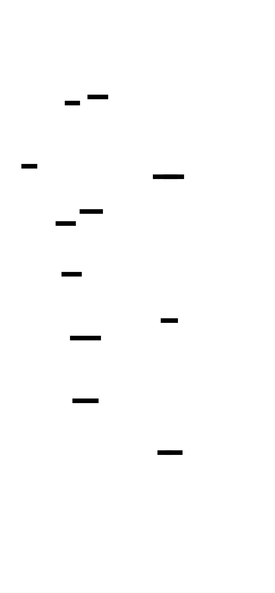
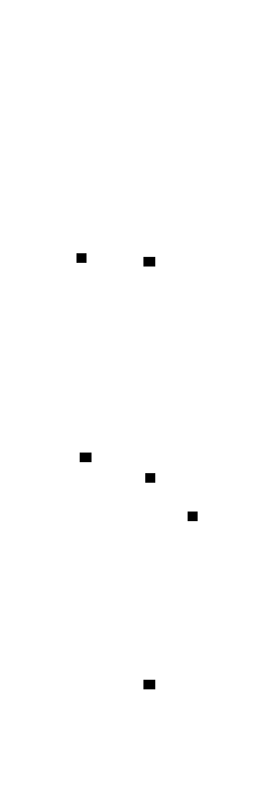
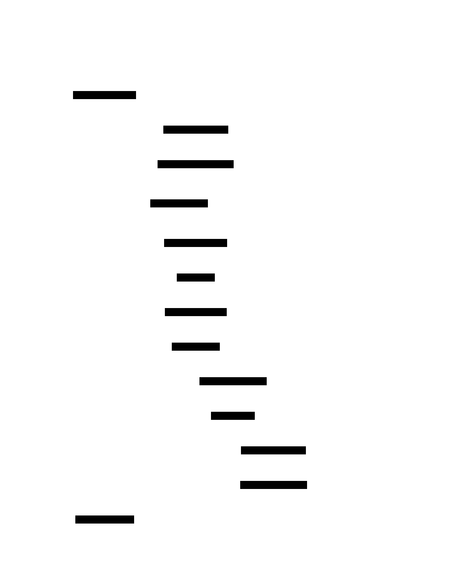
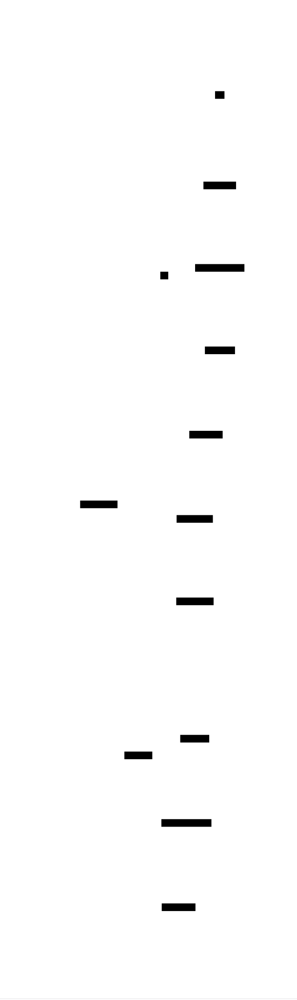
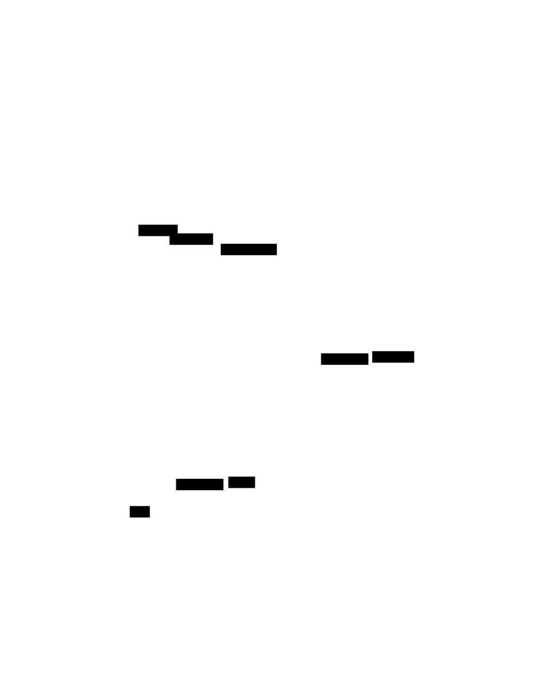

# Tetris Game: Design Document


## Overview

A complete implementation of the classic Tetris puzzle game that manages dynamic piece movement, rotation mechanics, and line clearing within a constrained grid system. The key architectural challenge is coordinating real-time game state updates across multiple independent systems while maintaining smooth gameplay and consistent collision detection.


> This guide is meant to help you understand the big picture before diving into each milestone. Refer back to it whenever you need context on how components connect.


## Context and Problem Statement

> **Milestone(s):** All milestones (1-4) - foundational understanding for complete implementation

Tetris represents one of the most elegant examples of real-time interactive software design, where simple rules create complex emergent gameplay. Unlike many games that rely on graphics or narrative complexity, Tetris derives its challenge purely from the mathematical precision of geometric piece manipulation within strict spatial and temporal constraints. This creates a unique set of technical challenges that make it an ideal learning project for understanding game architecture, real-time systems, and state management.

The fundamental challenge of implementing Tetris lies not in any single complex algorithm, but in the precise coordination of multiple interdependent systems operating under strict timing constraints. A Tetris implementation must simultaneously manage falling piece physics, collision detection, user input processing, geometric transformations, line clearing cascades, and difficulty progression - all while maintaining smooth 60fps gameplay and deterministic behavior across different hardware platforms.

### Tetris Game Fundamentals

**Mental Model: Tetris as a Precision Manufacturing System**

Think of Tetris like an automated precision manufacturing line where geometric components (tetrominoes) move down a conveyor belt (the game board) under strict timing constraints. Workers (players) can manipulate pieces during transport, but once a piece reaches the bottom or contacts another piece, it becomes permanently fixed in place. The system must continuously monitor for complete horizontal assemblies (full lines) and remove them to prevent the manufacturing line from backing up and halting production (game over).

This analogy captures the core technical challenges: real-time constraint processing, collision detection in a constrained space, geometric transformation validation, and cascading state updates that must all occur within precise timing windows.

**Core Game Mechanics and Their Technical Implications**

The **game board** serves as the primary constraint system - a 10-column by 20-row grid where each cell can either be empty or occupied by a locked tetromino block. Unlike many grid-based games where pieces can occupy fractional positions, Tetris operates on discrete cell boundaries, which simplifies collision detection but creates unique challenges for piece rotation near boundaries.

The **seven standard tetrominoes** (I, O, T, S, Z, J, L) each present distinct geometric properties that affect collision detection and rotation algorithms. The I-piece spans four cells in a line, creating edge cases for wall proximity checks. The O-piece maintains rotational symmetry, requiring special handling to prevent position drift during rotation attempts. The T, S, Z, J, and L pieces each have unique rotation centers and wall-kick requirements that must be handled consistently.

**Piece lifecycle management** creates the first major architectural challenge. Each piece progresses through distinct states: spawning at the top-center of the board, falling automatically due to gravity, responding to player input for movement and rotation, and finally locking into place when it can no longer fall. The transition between these states requires careful coordination to prevent race conditions between gravity timers and user input.

**Real-time constraint processing** distinguishes Tetris from turn-based puzzle games. The gravity system imposes a constant time pressure - pieces must fall at regular intervals regardless of player actions. This creates the need for frame-rate independent timing systems and requires that all game operations (collision detection, rotation validation, line clearing) complete within strict time budgets to maintain smooth gameplay.

**Collision detection in Tetris** involves multiple geometric relationships that must be evaluated continuously. A piece must be validated against board boundaries (preventing movement outside the 10x20 grid), against previously placed pieces (preventing overlap), and against special cases like the ceiling during rotation attempts. The validation must occur for every potential position during movement, rotation, and wall-kick attempts.

**The rotation system** represents perhaps the most complex technical aspect of Tetris implementation. Modern Tetris follows the Super Rotation System (SRS) standard, which defines not only how pieces rotate through their four orientations, but also how they attempt "wall kicks" - small position adjustments that allow rotations to succeed even when the direct rotation would cause a collision. This system requires maintaining rotation state machines for each piece type and implementing complex fallback logic for rotation attempts.

**Line clearing mechanics** introduce cascading state updates that must be processed atomically. When one or more lines are completed simultaneously, the system must: detect all complete lines, remove them from the board, shift all blocks above the cleared lines downward, award appropriate scoring, check for level progression, and adjust game speed - all while maintaining visual consistency and preventing intermediate invalid states from being rendered.

> **Key Design Insight**: Tetris appears simple but requires the same architectural patterns used in real-time systems: event-driven state machines, atomic transactions (line clearing), constraint validation (collision detection), and deterministic timing. These patterns make it an excellent introduction to systems programming concepts.

**Why Tetris Presents Unique Programming Challenges**

The **state consistency challenge** arises from the need to maintain multiple interdependent state variables (current piece position, board contents, score, level, line count) while processing real-time updates. Unlike web applications where state updates can be eventual consistent, Tetris requires immediate consistency - a collision detection result must reflect the exact current board state, and line clearing must update scoring and level progression atomically.

**Frame-rate independence** becomes critical because Tetris gameplay must feel identical whether running at 30fps, 60fps, or 120fps. The gravity system must drop pieces at precisely timed intervals (e.g., every 1000ms at level 1, every 500ms at level 2), regardless of the rendering framerate. This requires separating game logic timing from display refresh timing.

**Input handling complexity** stems from the need to process discrete user commands (move left, rotate) while maintaining continuous automatic behaviors (gravity falling). User input must be responsive enough for high-speed play while preventing impossible operations like multiple rotations within a single frame or movement into occupied cells.

**Geometric transformation validation** requires testing piece positions that may not yet exist on the board. When a player attempts to rotate a piece, the system must compute the new orientation, test it against all collision conditions, potentially try multiple wall-kick offsets, and either commit the transformation or reject it entirely - all while keeping the piece in its previous valid state during the computation.

### Existing Implementation Approaches

Understanding how different architectural patterns have been applied to Tetris implementations helps inform design decisions for new implementations. Each approach represents different trade-offs between code complexity, maintainability, and extensibility.

**Entity-Component-System (ECS) Architecture**

The ECS pattern treats tetrominoes as entities composed of position, rotation, and visual components, with systems handling movement, collision, and rendering independently. This approach excels in scenarios with many simultaneous game objects but introduces unnecessary complexity for Tetris's relatively simple object model.

| Aspect | Advantages | Disadvantages |
|--------|------------|---------------|
| Code Organization | Clear separation of concerns, highly modular | Over-engineering for simple piece relationships |
| Performance | Excellent for many entities, cache-friendly | Overhead unnecessary for 1-2 active pieces |
| Extensibility | Easy to add new piece types or behaviors | Complex message passing between systems |
| Learning Curve | Teaches professional game architecture | Steep learning curve for beginners |
| Maintenance | Well-defined component interfaces | Debugging requires understanding system interactions |

> **Decision: Simple Object-Oriented Approach**
> - **Context**: Tetris has a small, well-defined set of game objects (board, current piece, placed pieces) with straightforward relationships
> - **Options Considered**: ECS architecture, functional programming approach, simple OOP
> - **Decision**: Use simple object-oriented design with clear component boundaries
> - **Rationale**: The complexity overhead of ECS provides no benefit for Tetris's simple object model, while functional approaches make state management more difficult for beginners
> - **Consequences**: More straightforward debugging and learning curve, but less applicable to complex multi-entity games

**State Machine vs. Polling-Based Input**

Input handling can follow either an event-driven state machine pattern or a polling-based approach where input states are checked each frame.

The **state machine approach** treats each piece as having distinct states (Spawning, Falling, Moving, Locking) with input events triggering state transitions. This provides clean separation between automatic behaviors (gravity) and user-triggered behaviors (movement, rotation).

| State Machine Pattern | Advantages | Disadvantages |
|----------------------|------------|---------------|
| Code Clarity | Explicit state transitions, easy to debug | More complex setup for simple behaviors |
| Timing Control | Precise control over when actions can occur | Requires careful state synchronization |
| Input Buffering | Natural support for input queuing | Complex transition logic for edge cases |
| Testing | Easy to unit test individual states | Integration testing requires full state setup |

The **polling approach** checks input state during each game loop iteration and applies changes directly to piece position and rotation. This simplifies the code structure but can create timing inconsistencies and makes certain advanced features (like input buffering) more difficult to implement.

| Polling Pattern | Advantages | Disadvantages |
|----------------|------------|---------------|
| Simplicity | Straightforward control flow, minimal setup | Timing-dependent behavior, harder to debug |
| Direct Control | Immediate response to input changes | Race conditions between input and gravity |
| Learning Curve | Intuitive for beginners | Bad habits for complex game development |
| Performance | Minimal overhead per frame | Redundant checks for unchanged input |

> **Decision: Hybrid Approach with Component Boundaries**
> - **Context**: Need responsive input handling while maintaining predictable piece lifecycle management
> - **Options Considered**: Pure state machine, pure polling, hybrid component-based approach
> - **Decision**: Use component-based architecture with polling input within clear component boundaries
> - **Rationale**: Provides state machine benefits (clear component responsibilities) while maintaining polling simplicity for input handling within each component
> - **Consequences**: Easier to learn than full state machines, maintains good separation of concerns, allows future migration to event-driven patterns

**Immediate vs. Buffered Line Clearing**

Line clearing can be implemented as an immediate operation that removes lines instantly, or as a buffered operation with visual animations and delayed state updates.

**Immediate clearing** processes line removal instantly when detected, updating the board state and score in a single atomic operation. This approach simplifies state management and eliminates timing edge cases but provides limited opportunities for visual feedback.

**Buffered clearing** introduces an intermediate game state where lines are marked for removal, animated during a clearing phase, and then removed after a delay. This enables better visual feedback but requires managing additional transient states and can create timing complexities.

| Clearing Approach | Game State Complexity | Visual Quality | Implementation Difficulty |
|------------------|----------------------|----------------|-------------------------|
| Immediate | Simple, atomic updates | Basic, instant feedback | Low complexity |
| Buffered | Multiple state phases | Smooth animations possible | Higher complexity |
| Hybrid | Immediate logic, delayed visuals | Good balance | Medium complexity |

> **Decision: Immediate Clearing with Rendering Hooks**
> - **Context**: Need to balance implementation simplicity with adequate visual feedback
> - **Options Considered**: Immediate clearing, buffered clearing, hybrid approach
> - **Decision**: Implement immediate line clearing with hooks for visual effects
> - **Rationale**: Maintains simple state management while providing extension points for visual enhancements
> - **Consequences**: Easier to implement and debug, sufficient visual feedback for learning project, allows future animation additions

**Collision Detection Architecture Patterns**

Collision detection represents a core architectural decision that affects performance, code clarity, and extensibility. Different patterns optimize for different priorities.

The **centralized collision manager** approach implements all collision logic in a single component that validates piece positions against all possible constraints. This centralizes the complex geometric calculations but can become a bottleneck for performance and a single point of failure for bugs.

| Centralized Collision | Advantages | Disadvantages |
|----------------------|------------|---------------|
| Code Organization | Single source of truth for collision logic | Large, complex component |
| Consistency | Uniform collision behavior across all pieces | Difficult to optimize for specific cases |
| Debugging | All collision logic in one place | Hard to isolate specific collision types |
| Performance | Opportunity for global optimizations | May include unnecessary checks |

The **distributed collision** approach embeds collision detection into individual game objects (pieces, board), allowing each component to handle its own geometric constraints. This provides better encapsulation but can lead to inconsistent behavior and duplicated logic.

| Distributed Collision | Advantages | Disadvantages |
|-----------------------|------------|---------------|
| Encapsulation | Each object handles its own constraints | Potential inconsistencies between objects |
| Performance | Optimized for specific object types | Duplicated collision logic |
| Maintainability | Changes localized to specific objects | Harder to ensure global consistency |
| Extensibility | Easy to add object-specific collision rules | Complex interactions between objects |

> **Decision: Centralized Collision with Specialized Methods**
> - **Context**: Collision detection must be consistent, debuggable, and handle complex geometric relationships
> - **Options Considered**: Centralized collision manager, distributed collision, hybrid approach
> - **Decision**: Implement centralized collision detection with specialized methods for different collision types
> - **Rationale**: Ensures consistency while allowing optimization for specific scenarios (boundary checking vs. piece overlap)
> - **Consequences**: Single source of collision logic, easier debugging, potential performance bottleneck that can be optimized later

### Implementation Guidance

The implementation approach for this Tetris design emphasizes clarity and maintainability while following modern software architecture principles. The chosen technology stack and organization support both learning objectives and potential future enhancements.

**Technology Recommendations**

| Component | Simple Option | Advanced Option | Rationale |
|-----------|---------------|-----------------|-----------|
| Graphics Rendering | HTML5 Canvas + JavaScript | WebGL with Three.js | Canvas provides immediate visual feedback |
| Input Handling | DOM KeyboardEvent listeners | Custom input manager with buffering | Direct event handling sufficient for basic gameplay |
| Game Loop | setInterval() or requestAnimationFrame() | Custom timing manager with interpolation | requestAnimationFrame provides smooth updates |
| State Management | Simple object properties | Immutable state with reducers | Direct mutation acceptable for learning project |
| Testing Framework | Built-in console assertions | Jest or Mocha test framework | Structured testing improves debugging |

The **HTML5 Canvas approach** provides immediate visual feedback without requiring complex graphics setup, making it ideal for focusing on game logic rather than rendering optimization. Canvas 2D context methods like `fillRect()` and `strokeRect()` map directly to Tetris's grid-based rendering requirements.

**Recommended File Structure**

The modular file organization reflects the component boundaries identified in the architectural analysis:

```
tetris-game/
├── index.html                 ← HTML page with canvas element
├── src/
│   ├── main.js               ← Game initialization and main loop
│   ├── board/
│   │   ├── GameBoard.js      ← Board state and rendering
│   │   └── CollisionDetector.js ← Centralized collision detection
│   ├── pieces/
│   │   ├── Tetromino.js      ← Piece definitions and behavior
│   │   └── TetrominoFactory.js ← Piece spawning logic
│   ├── controls/
│   │   ├── InputHandler.js   ← Keyboard input processing
│   │   └── MovementController.js ← Movement validation and execution
│   ├── rotation/
│   │   ├── RotationSystem.js ← Core rotation logic
│   │   └── WallKickHandler.js ← SRS wall kick implementation
│   ├── scoring/
│   │   ├── LineClearing.js   ← Line detection and removal
│   │   └── ScoreManager.js   ← Scoring and level progression
│   └── utils/
│       ├── GameTimer.js      ← Frame-rate independent timing
│       └── Constants.js      ← Game configuration values
└── tests/
    ├── board.test.js         ← Board and collision testing
    ├── pieces.test.js        ← Tetromino behavior testing
    └── integration.test.js   ← Full gameplay scenario testing
```

This structure isolates each major component into its own directory, making it easier to focus on individual systems during development. The separation between core logic files and their supporting utilities follows the single responsibility principle while maintaining clear dependencies.

**Infrastructure Starter Code**

The following complete implementations handle foundational concerns, allowing focus on core Tetris logic:

```javascript
// src/utils/Constants.js - Complete game configuration
export const GAME_CONFIG = {
    BOARD_WIDTH: 10,
    BOARD_HEIGHT: 20,
    CELL_SIZE: 30,
    COLORS: {
        I: '#00FFFF', O: '#FFFF00', T: '#800080', S: '#00FF00',
        Z: '#FF0000', J: '#0000FF', L: '#FFA500', EMPTY: '#000000', BORDER: '#FFFFFF'
    },
    INITIAL_FALL_SPEED: 1000, // milliseconds per cell
    SPEED_INCREASE_PER_LEVEL: 0.1, // 10% faster each level
    LINES_PER_LEVEL: 10
};

export const PIECE_SHAPES = {
    I: [[[0,0,0,0], [1,1,1,1], [0,0,0,0], [0,0,0,0]]],
    O: [[[1,1], [1,1]]],
    T: [[[0,1,0], [1,1,1], [0,0,0]]],
    S: [[[0,1,1], [1,1,0], [0,0,0]]],
    Z: [[[1,1,0], [0,1,1], [0,0,0]]],
    J: [[[1,0,0], [1,1,1], [0,0,0]]],
    L: [[[0,0,1], [1,1,1], [0,0,0]]]
};
```

```javascript
// src/utils/GameTimer.js - Complete frame-rate independent timing
export class GameTimer {
    constructor() {
        this.lastTime = 0;
        this.accumulator = 0;
        this.fixedTimeStep = 16.67; // 60 FPS in milliseconds
        this.callbacks = new Map();
    }
    
    // Register a callback to fire at specific intervals
    addTimer(name, interval, callback) {
        this.callbacks.set(name, {
            interval: interval,
            lastFire: 0,
            callback: callback
        });
    }
    
    // Call this every frame with current timestamp
    update(currentTime) {
        const deltaTime = currentTime - this.lastTime;
        this.lastTime = currentTime;
        
        // Fire interval-based callbacks
        for (const [name, timer] of this.callbacks) {
            if (currentTime - timer.lastFire >= timer.interval) {
                timer.callback();
                timer.lastFire = currentTime;
            }
        }
    }
    
    removeTimer(name) {
        this.callbacks.delete(name);
    }
}
```

**Core Logic Skeleton Code**

The core game logic components require implementation of the fundamental Tetris algorithms:

```javascript
// src/board/CollisionDetector.js - Skeleton for centralized collision detection
export class CollisionDetector {
    constructor(gameBoard) {
        this.board = gameBoard;
    }
    
    /**
     * Tests if a piece can be placed at the given position and rotation.
     * This is the core collision detection method used by all movement and rotation attempts.
     */
    canPlacePiece(piece, x, y, rotation) {
        // TODO 1: Get the piece shape data for the specified rotation
        // TODO 2: Iterate through each cell of the piece shape
        // TODO 3: For each filled cell, calculate board position (x + cellX, y + cellY)
        // TODO 4: Check if position is within board boundaries (0 <= x < BOARD_WIDTH, 0 <= y < BOARD_HEIGHT)
        // TODO 5: Check if board cell at that position is empty
        // TODO 6: Return false if any collision detected, true if all cells are valid
        // Hint: Use piece.getShapeAtRotation(rotation) to get 2D array
        // Hint: Only check cells where piece.shape[row][col] !== 0
    }
    
    /**
     * Specialized boundary checking for movement validation.
     * Faster than full collision detection when only checking walls.
     */
    isWithinBounds(piece, x, y, rotation) {
        // TODO 1: Get piece bounds (min/max x/y offsets) for this rotation
        // TODO 2: Check if piece left edge + x >= 0
        // TODO 3: Check if piece right edge + x < BOARD_WIDTH
        // TODO 4: Check if piece bottom edge + y < BOARD_HEIGHT
        // TODO 5: Check if piece top edge + y >= 0 (for rotation near ceiling)
        // Hint: Calculate bounds by scanning piece shape for filled cells
    }
}
```

```javascript
// src/pieces/Tetromino.js - Skeleton for piece behavior
export class Tetromino {
    constructor(type, x = 0, y = 0) {
        this.type = type;
        this.x = x;
        this.y = y;
        this.rotation = 0; // 0, 1, 2, 3 for four orientations
        this.shapes = this.generateAllRotations(PIECE_SHAPES[type][0]);
    }
    
    /**
     * Generates all four rotation states from the base shape.
     * This pre-computation approach is faster than calculating rotations on-demand.
     */
    generateAllRotations(baseShape) {
        // TODO 1: Store the base shape as rotation 0
        // TODO 2: For rotations 1, 2, 3: apply 90-degree clockwise matrix rotation
        // TODO 3: Matrix rotation: newShape[x][y] = oldShape[height-1-y][x]
        // TODO 4: Return array of four 2D shape arrays
        // Hint: Handle different matrix dimensions (3x3 for most pieces, 4x4 for I-piece)
    }
    
    /**
     * Creates a copy of this piece at a different position/rotation for testing.
     * Used extensively by collision detection and wall kick systems.
     */
    getTestCopy(newX, newY, newRotation) {
        // TODO 1: Create new Tetromino instance with same type
        // TODO 2: Set position to newX, newY
        // TODO 3: Set rotation to newRotation
        // TODO 4: Return the copy (don't modify this piece)
    }
}
```

**Milestone Verification Checkpoints**

After implementing each major component, verify correct behavior with these concrete tests:

**Milestone 1 Checkpoint - Board & Tetrominoes:**
- Run `node src/tests/board.test.js` - should show "10x20 board initialized" and "All 7 piece types created"
- Open index.html - should display empty 10x20 grid with visible borders
- Check browser console - should see piece shape arrays logged for all 7 types
- Visual test: Each piece type should display in its correct color when rendered

**Milestone 2 Checkpoint - Movement & Controls:**
- Press arrow keys - piece should move left/right and soft drop down
- Press space bar - piece should instantly drop to bottom
- Try moving piece outside board - movement should be prevented
- Check timing: piece should fall automatically every 1000ms at level 1

**Language-Specific Implementation Hints**

For **JavaScript Canvas rendering:**
- Use `ctx.fillStyle = GAME_CONFIG.COLORS[piece.type]` to set piece colors
- `ctx.fillRect(x * CELL_SIZE, y * CELL_SIZE, CELL_SIZE, CELL_SIZE)` draws individual cells
- `requestAnimationFrame(gameLoop)` provides smooth animation loop
- `addEventListener('keydown', handleInput)` captures keyboard input

For **collision detection optimization:**
- Cache piece bounds calculations to avoid recalculating every frame
- Use early return in collision loops - exit as soon as any collision detected
- Consider separating boundary checks from piece-overlap checks for performance

For **timing precision:**
- Use `performance.now()` instead of `Date.now()` for high-precision timestamps
- Store time accumulator to handle variable frame rates consistently
- Separate game logic updates (fixed timestep) from rendering updates (variable)

**Common Implementation Pitfalls**

⚠️ **Pitfall: Coordinate System Confusion**
Mixing screen coordinates (pixels) with grid coordinates (cells) causes positioning errors. Screen rendering uses pixel positions, but game logic uses grid cells. Always convert between coordinate systems at the boundary between game logic and rendering code.

⚠️ **Pitfall: Rotation Center Drift**
Rotating pieces around the wrong center point causes them to "drift" across the board. Each piece type has a specific rotation center defined by the SRS standard. Store rotation centers as offsets from the piece's position and apply them consistently.

⚠️ **Pitfall: Race Conditions Between Input and Gravity**
Processing input and gravity in the wrong order can cause pieces to pass through other pieces. Always process input first (movement/rotation), then apply gravity, then check for locking conditions in each frame.


## Goals and Non-Goals

> **Milestone(s):** All milestones (1-4) - provides scope definition for complete implementation

### Functional Goals

Think of the functional goals as a contract between the developer and the classic Tetris experience. Just as a musician must master the fundamental techniques before attempting complex compositions, our Tetris implementation must nail the core mechanics that define the authentic Tetris gameplay loop. These goals represent the non-negotiable features that transform a simple grid and falling shapes into the compelling puzzle game that has captivated players for decades.

The functional goals establish the minimum viable Tetris experience while ensuring architectural decisions support clean, maintainable code. Each goal directly maps to one or more project milestones and represents a critical component that cannot be omitted without fundamentally breaking the Tetris experience.

**Core Game Board Functionality**

The game board serves as the foundation upon which all Tetris mechanics operate. Our implementation must provide a reliable, well-structured playing field that accurately represents the classic 10-column by 20-row Tetris board dimensions. The board system must maintain perfect cell state tracking, distinguishing between empty cells, temporarily occupied cells (current falling piece), and permanently locked cells (placed pieces).

The board must render with clear visual boundaries between cells, allowing players to precisely judge piece placement and plan their moves. Cell state changes must be immediately reflected in the visual representation, providing real-time feedback as pieces fall and lock into position. The board's coordinate system must follow consistent conventions throughout the implementation, preventing the common pitfall of swapped dimensions or inconsistent origin points.

| Board Requirement | Description | Milestone |
|-------------------|-------------|-----------|
| Fixed Dimensions | Exactly 10 columns by 20 rows matching standard Tetris | Milestone 1 |
| Cell State Tracking | Empty, temporarily occupied, permanently filled states | Milestone 1 |
| Visual Grid Rendering | Clear cell boundaries with distinct colors per piece type | Milestone 1 |
| Coordinate Consistency | Standard (x,y) system with (0,0) at top-left | Milestone 1 |
| State Visualization | Real-time updates reflecting current game state | Milestone 1 |

**Complete Tetromino System**

The seven standard tetromino shapes form the heart of Tetris gameplay. Each piece type (I, O, T, S, Z, J, L) must be accurately represented with pixel-perfect shape definitions matching the official Tetris specifications. The implementation must support all four rotation states for each piece, with the critical exception of the O-piece which maintains its orientation.

Each tetromino must have a distinct, visually clear color assignment that remains consistent throughout the game. The piece representation must include rotation offset data, enabling smooth rotation mechanics and proper wall kick calculations. Shape definitions should be stored as 2D arrays or equivalent data structures that can be easily processed by collision detection and rendering systems.

| Tetromino Requirement | Description | Implementation Detail |
|----------------------|-------------|----------------------|
| Seven Standard Shapes | I, O, T, S, Z, J, L pieces with official dimensions | `PIECE_SHAPES` definitions |
| Four Rotation States | All orientations except O-piece which doesn't rotate | `generateAllRotations()` function |
| Distinct Colors | Unique color per piece type for clear identification | `GAME_CONFIG.COLORS` mapping |
| Rotation Offset Data | Position adjustments for each rotation state | Embedded in shape arrays |
| Collision-Ready Format | Data structure compatible with boundary checking | 2D boolean arrays |

**Responsive Movement Controls**

Player control responsiveness directly impacts game enjoyment and fairness. The implementation must provide immediate feedback to player input while maintaining smooth, predictable piece behavior. Left and right movement must shift pieces exactly one cell per key press, with automatic repeat when keys are held down.

The control system must implement both soft drop (accelerated falling via down arrow) and hard drop (instant placement via spacebar) mechanics. Soft drop should increase fall speed by a significant multiplier while still allowing horizontal movement and rotation. Hard drop must instantly place the piece at the lowest valid position and immediately trigger piece locking.

Movement validation must prevent pieces from moving outside board boundaries or into occupied cells. The system should provide clear visual and logical feedback when movements are blocked, helping players understand why certain actions are not allowed.

| Control Requirement | Description | Expected Behavior |
|---------------------|-------------|-------------------|
| Horizontal Movement | Left/right arrow keys move one cell per press | Immediate response with repeat |
| Soft Drop | Down arrow accelerates fall speed significantly | 10x normal fall speed |
| Hard Drop | Spacebar instantly places piece at bottom | Immediate placement and lock |
| Movement Validation | Block invalid moves with clear feedback | No movement on collision |
| Input Responsiveness | Minimal delay between key press and action | <50ms response time |

**Accurate Rotation Mechanics**

Piece rotation represents one of the most complex aspects of Tetris implementation. The system must support clockwise rotation triggered by the up arrow key, with each press advancing the piece to its next rotation state. Rotation must work correctly for all piece types across all orientations, following the Super Rotation System (SRS) standard.

When basic rotation would cause a collision, the implementation must attempt wall kick adjustments using the official SRS offset tables. Wall kicks test a series of position adjustments in a specific order, allowing pieces to rotate even when initially blocked by walls or other pieces. This feature is crucial for advanced Tetris play and prevents frustrating situations where pieces cannot rotate near boundaries.

The O-piece presents a special case, maintaining its single orientation without any rotation or position changes. The I-piece requires special wall kick handling due to its unique 4-cell length and different rotation behavior compared to the 3x3 pieces.

| Rotation Requirement | Description | Technical Implementation |
|---------------------|-------------|-------------------------|
| Clockwise Rotation | Up arrow advances to next rotation state | State machine with 4 states |
| SRS Compliance | Official Super Rotation System wall kicks | Standardized offset tables |
| Collision-First Testing | Attempt basic rotation before wall kicks | `canPlacePiece()` validation |
| Special Piece Handling | O-piece no rotation, I-piece extended kicks | Piece-specific logic |
| Consistent Behavior | Identical rotation across all orientations | Verified rotation matrices |

**Complete Line Clearing System**

Line clearing mechanics must detect filled rows immediately after piece placement and remove them with proper cascading effects. The system must scan the entire board after each piece locks, identifying all completely filled horizontal lines simultaneously. Multiple line clears (double, triple, Tetris) must be detected and processed in a single operation.

When lines are cleared, all rows above the removed lines must drop down to fill the gaps. This cascading effect must maintain the integrity of existing piece formations while accurately repositioning all affected cells. The visual representation must clearly show the line clearing animation and subsequent row dropping.

Line detection must be robust and handle edge cases such as multiple non-consecutive cleared lines or clearing lines at the very top of the board. The system should never miss filled lines or incorrectly identify partial lines as complete.

| Line Clearing Requirement | Description | Implementation Notes |
|---------------------------|-------------|---------------------|
| Immediate Detection | Scan for complete lines after piece locks | Full board row iteration |
| Multi-Line Support | Handle 1-4 simultaneous line clears | Single-pass detection |
| Proper Cascading | Drop rows above cleared lines correctly | Reverse iteration order |
| Visual Feedback | Clear line clearing animation | Temporary highlighting |
| Edge Case Handling | Non-consecutive clears, top-row clears | Robust iteration logic |

**Scoring and Progression System**

The scoring system must implement the classic Tetris point structure, awarding different point values based on the number of lines cleared simultaneously. Single line clears award 100 points, doubles award 300, triples award 500, and the coveted Tetris (four lines) awards 800 points. These values must be multiplied by the current level to provide appropriate score scaling.

Level progression should occur automatically after every ten lines cleared, increasing both the challenge and potential point rewards. Each level increase must reduce the gravity timer interval, making pieces fall faster and increasing the game's intensity. The level progression creates a natural difficulty curve that challenges players to improve their speed and efficiency.

The implementation must track total lines cleared, current level, and accumulated score as persistent game state values. These statistics should be displayed in real-time, giving players immediate feedback on their performance and progress toward the next level.

| Scoring Requirement | Description | Point Values |
|--------------------|-------------|--------------|
| Line Clear Points | Points based on simultaneous lines cleared | 100/300/500/800 × level |
| Level Progression | Advance level every 10 lines cleared | Automatic progression |
| Speed Increase | Faster piece falling with each level | Exponential speed curve |
| Statistics Tracking | Lines, level, score persistent state | Real-time display updates |
| Score Calculation | Immediate point award after line clear | Instantaneous feedback |

**Game State Management**

Robust game state management ensures consistent behavior across all game systems. The implementation must track the current game phase (playing, paused, game over), current and next piece information, fall timing, and all scoring statistics. State transitions must be clean and predictable, preventing inconsistent or corrupted game states.

The game over condition must be detected reliably when a new piece cannot be placed at the spawn position. Game over detection should occur immediately upon spawn failure, preventing partially placed pieces or ambiguous end states. The system must handle pause functionality, freezing all timers and preventing input processing while maintaining the current game state.

| State Management Requirement | Description | Critical Components |
|------------------------------|-------------|---------------------|
| Game Phase Tracking | Playing, paused, game over states | State machine pattern |
| Piece State Management | Current piece, next piece, spawn position | `Tetromino` instances |
| Timing Coordination | Gravity timer, input timing, animation | `GameTimer` system |
| Game Over Detection | Reliable spawn collision detection | Immediate failure detection |
| Pause Functionality | Complete state freeze with resume capability | Timer pause/resume |

> **Architecture Decision: Component-Based Design**
> - **Context**: Tetris involves multiple interacting systems (board, pieces, controls, scoring) that must coordinate while remaining maintainable
> - **Options Considered**: 
>   1. Monolithic game class handling all functionality
>   2. Component-based architecture with specialized classes
>   3. Functional programming with pure functions
> - **Decision**: Component-based architecture with clear separation of concerns
> - **Rationale**: Each Tetris system has distinct responsibilities and data requirements. Separating board management from piece logic from scoring allows independent testing and reduces complexity. Components can evolve independently while maintaining clean interfaces.
> - **Consequences**: Enables easier debugging, testing, and feature additions. Requires careful interface design and component coordination patterns.

### Non-Goals

Understanding what our Tetris implementation will NOT include is equally important as defining its core functionality. These non-goals help maintain project scope, prevent feature creep, and ensure the implementation remains focused on teaching fundamental game development concepts rather than advanced features that would complicate the learning process.

**Advanced Gameplay Features**

Our implementation deliberately excludes advanced Tetris features that would significantly complicate the core architecture without proportional educational benefit. Modern Tetris variants include features like piece holding (storing a piece for later use), ghost pieces (showing where the current piece would land), and T-spin detection (advanced scoring for specific T-piece placements). While these features enhance gameplay, they require substantial additional complexity in piece management and scoring systems.

The implementation will not support multiple game modes, such as sprint mode (clear 40 lines as quickly as possible), ultra mode (maximum score in 2 minutes), or puzzle mode (clear specific patterns). These modes would require significant modifications to the core game loop and scoring system, diverting focus from the fundamental mechanics that every Tetris implementation must master.

| Excluded Feature | Reason for Exclusion | Implementation Complexity |
|------------------|---------------------|---------------------------|
| Piece Hold System | Complex state management for stored pieces | High - requires separate piece buffer |
| Ghost Piece Preview | Additional collision detection for shadow rendering | Medium - duplicate positioning logic |
| T-Spin Detection | Advanced pattern recognition and special scoring | High - complex geometric analysis |
| Multiple Game Modes | Divergent gameplay logic and UI requirements | Very High - separate game engines |
| Combo System | Extended scoring chains across multiple clears | Medium - persistent combo state |

**Multiplayer and Networking**

Network multiplayer functionality falls completely outside the scope of this implementation. Features like competitive multiplayer, attack lines sent between players, and real-time synchronization introduce networking complexity, latency handling, and anti-cheat considerations that would overshadow the core Tetris mechanics. Even local multiplayer with split-screen gameplay would require substantial UI restructuring and duplicate game state management.

The focus remains on single-player gameplay that can be fully implemented and tested on a local machine without external dependencies. This constraint ensures that learners can complete the project in any environment without requiring network infrastructure or additional players for testing.

**Visual and Audio Enhancements**

While visual polish enhances user experience, advanced graphics features are excluded to maintain focus on game logic implementation. The implementation will not include particle effects for line clears, smooth animation tweening for falling pieces, or complex visual themes with detailed sprite artwork. The visual style should be clean and functional but not visually stunning.

Audio integration, including background music, sound effects for piece placement, line clearing, and level progression, is explicitly excluded. Audio systems introduce platform-specific dependencies and additional complexity in timing coordination. The game should provide complete functionality through visual feedback alone.

| Excluded Visual Feature | Educational Impact | Implementation Cost |
|------------------------|-------------------|-------------------|
| Particle Effects | Low - doesn't teach core concepts | High - graphics programming |
| Smooth Animations | Medium - timing concepts already covered | Medium - interpolation systems |
| Detailed Sprites | None - visual art vs. programming | Low - asset management |
| Multiple Themes | None - cosmetic variation only | Medium - asset switching |
| Audio Integration | Low - peripheral to game logic | High - platform dependencies |

**Advanced Performance Optimizations**

Performance optimizations beyond basic efficiency are not required for this implementation. Features like memory pooling for tetromino objects, advanced rendering optimizations, or multi-threaded game loop processing would add complexity without educational benefit for beginning developers. The implementation should be reasonably efficient but prioritize code clarity over performance optimization.

The target performance is smooth gameplay at standard frame rates (30-60 FPS) on typical development machines. Optimization for mobile devices, low-end hardware, or high-performance gaming scenarios is explicitly out of scope. Basic algorithmic efficiency should be maintained, but advanced optimization techniques are unnecessary.

**Platform-Specific Features**

The implementation will not target specific platform features such as mobile touch controls, console gamepad integration, or platform-specific distribution requirements. Input should work with standard keyboard controls across common desktop operating systems, but platform-specific optimizations or input methods are excluded.

Web deployment features like local storage for high scores, browser-specific optimizations, or Progressive Web App capabilities are not required. The implementation should be portable across the supported programming languages but need not optimize for specific deployment targets.

| Platform Feature | Exclusion Rationale | Alternative Approach |
|------------------|---------------------|---------------------|
| Touch Controls | Mobile-specific, complicates input handling | Keyboard-only input |
| Gamepad Support | Additional input complexity, driver dependencies | Standard keyboard mapping |
| Local Storage | Platform-specific persistence mechanisms | Session-only game state |
| Web Optimization | Deployment-specific rather than game logic | Generic implementation |
| Native Performance | Advanced optimization beyond learning scope | Adequate performance baseline |

**Extended Game Features**

Several features common in modern Tetris implementations are excluded to maintain educational focus. These include customizable controls (remapping keys), difficulty selection menus, replay systems for recording and reviewing gameplay, and statistical tracking beyond basic score/lines/level information. Extended statistics like pieces per minute, efficiency ratings, or gameplay analysis would require substantial additional data collection and analysis systems.

Save game functionality for preserving game sessions across application restarts is not included. Each game session should be independent, starting fresh each time the application launches. This eliminates the complexity of state serialization, file management, and save game corruption handling.

**User Interface Sophistication**

The user interface will remain minimal and functional rather than polished or sophisticated. Advanced UI features like animated menus, configuration screens, help systems, or tutorial modes are explicitly excluded. The interface should provide essential information (score, level, lines, next piece) in a clear, readable format without visual flourishes.

Menu systems beyond basic start/pause/restart functionality are not required. The implementation should focus on the core gameplay experience rather than surrounding infrastructure that would be necessary for a commercial game release but adds little educational value for learning game development fundamentals.

> **Architecture Decision: Scope Limitation Strategy**
> - **Context**: Learning projects can easily expand beyond manageable scope, preventing completion and mastery of core concepts
> - **Options Considered**:
>   1. Full-featured modern Tetris with all contemporary features
>   2. Minimal viable game with only essential mechanics
>   3. Modular approach allowing optional feature additions
> - **Decision**: Minimal viable game with clear non-goals and extension points for motivated learners
> - **Rationale**: Educational projects succeed when students complete them and understand every component. Advanced features can be added after mastering the fundamentals, but including them initially creates complexity that obscures core learning objectives.
> - **Consequences**: Some learners may feel the implementation is "too simple," but they can extend it after completion. Ensures all learners can successfully implement a complete, working Tetris game.

The non-goals establish clear boundaries that prevent scope creep while maintaining the potential for future enhancement. By excluding these features, the implementation remains achievable for beginning developers while still providing a complete, playable Tetris experience that demonstrates all fundamental game development concepts essential for this educational project.

### Implementation Guidance

**Technology Recommendations**

| Component | Simple Option | Advanced Option |
|-----------|---------------|-----------------|
| Graphics Rendering | HTML5 Canvas with 2D context | WebGL with shader programs |
| Input Handling | DOM keydown/keyup events | Custom input manager with state tracking |
| Game Loop | `setInterval()` or `requestAnimationFrame()` | High-precision timing with delta accumulation |
| State Management | Plain JavaScript objects | State management library (Redux-like) |
| Testing Framework | Basic manual testing | Jest or similar automated testing |

**Project Structure Setup**

```javascript
tetris-game/
├── index.html                 ← Entry point with canvas element
├── css/
│   └── styles.css            ← Basic styling for canvas and UI
├── js/
│   ├── main.js               ← Game initialization and setup
│   ├── config/
│   │   └── gameConfig.js     ← GAME_CONFIG constants and PIECE_SHAPES
│   ├── core/
│   │   ├── GameBoard.js      ← Board state and collision detection
│   │   ├── Tetromino.js      ← Piece representation and behavior
│   │   └── GameTimer.js      ← Timing system for gravity and input
│   ├── systems/
│   │   ├── InputHandler.js   ← Keyboard input processing
│   │   ├── Renderer.js       ← Canvas drawing operations
│   │   └── ScoreManager.js   ← Scoring and level progression
│   └── utils/
│       └── helpers.js        ← Utility functions for common operations
└── tests/
    ├── board.test.js         ← GameBoard component tests
    ├── tetromino.test.js     ← Piece behavior tests
    └── scoring.test.js       ← Scoring system tests
```

**Core Configuration Setup**

```javascript
// config/gameConfig.js - Complete configuration file
const GAME_CONFIG = {
    // Board dimensions
    BOARD_WIDTH: 10,
    BOARD_HEIGHT: 20,
    CELL_SIZE: 30,
    
    // Timing constants
    INITIAL_FALL_SPEED: 1000,  // milliseconds per cell fall
    SOFT_DROP_MULTIPLIER: 10,  // speed increase for soft drop
    LEVEL_SPEED_FACTOR: 0.9,   // speed multiplier per level
    
    // Colors for each piece type
    COLORS: {
        'I': '#00f0f0',  // Cyan
        'O': '#f0f000',  // Yellow
        'T': '#a000f0',  // Purple
        'S': '#00f000',  // Green
        'Z': '#f00000',  // Red
        'J': '#0000f0',  // Blue
        'L': '#f0a000',  // Orange
        'EMPTY': '#222222',
        'BORDER': '#ffffff'
    },
    
    // Scoring values
    POINTS: {
        SINGLE: 100,
        DOUBLE: 300,
        TRIPLE: 500,
        TETRIS: 800
    }
};

// Define all seven tetromino shapes with rotation states
const PIECE_SHAPES = {
    'I': [
        [
            [0, 0, 0, 0],
            [1, 1, 1, 1],
            [0, 0, 0, 0],
            [0, 0, 0, 0]
        ]
        // TODO: Add remaining 3 rotations for I-piece
        // Use generateAllRotations() to create these automatically
    ],
    'O': [
        [
            [0, 1, 1, 0],
            [0, 1, 1, 0],
            [0, 0, 0, 0],
            [0, 0, 0, 0]
        ]
        // O-piece only has one rotation state
    ],
    'T': [
        [
            [0, 1, 0],
            [1, 1, 1],
            [0, 0, 0]
        ]
        // TODO: Add remaining 3 rotations for T-piece
    ]
    // TODO: Add S, Z, J, L pieces with all rotations
};

export { GAME_CONFIG, PIECE_SHAPES };
```

**Game State Management Foundation**

```javascript
// core/GameState.js - Central game state management
class GameState {
    constructor() {
        // TODO 1: Initialize board as 2D array filled with empty cells
        // TODO 2: Set up current piece and next piece variables  
        // TODO 3: Initialize scoring variables (score, lines, level)
        // TODO 4: Set up timing variables (lastFall, fallSpeed)
        // TODO 5: Set initial game phase to 'playing'
        
        this.board = null;           // GameBoard instance
        this.currentPiece = null;    // Active falling Tetromino
        this.nextPiece = null;       // Preview piece for player
        this.score = 0;              // Current game score
        this.lines = 0;              // Total lines cleared
        this.level = 1;              // Current difficulty level
        this.gamePhase = 'playing';  // 'playing', 'paused', 'gameOver'
    }
    
    // Check if current game state allows piece movement
    canMovePiece() {
        // TODO: Return false if game is paused or game over
        // TODO: Return false if no current piece exists
        // TODO: Return true if game is in playing state
    }
    
    // Update game statistics after line clear
    updateStats(linesCleared) {
        // TODO 1: Add linesCleared to total lines count
        // TODO 2: Calculate points based on lines cleared and current level
        // TODO 3: Add calculated points to score
        // TODO 4: Check if level should increase (every 10 lines)
        // TODO 5: Update fall speed based on new level if level increased
    }
}

export { GameState };
```

**Input System Foundation**

```javascript
// systems/InputHandler.js - Keyboard input processing
class InputHandler {
    constructor(gameState) {
        this.gameState = gameState;
        this.keyStates = new Map();     // Track which keys are currently pressed
        this.lastKeyTime = new Map();   // Prevent key repeat spam
        this.repeatDelay = 150;         // Milliseconds between repeated actions
        
        // TODO: Add event listeners for keydown and keyup events
        // TODO: Bind 'this' context properly for event handlers
    }
    
    // Handle key press events
    handleKeyDown(event) {
        const key = event.code;
        const currentTime = Date.now();
        
        // TODO 1: Check if this key is already being processed (prevent repeat)
        // TODO 2: Update keyStates map to mark this key as pressed
        // TODO 3: Route to appropriate handler based on key code
        // TODO 4: Update lastKeyTime for this key
        
        // Key mapping:
        // ArrowLeft -> moveLeft()
        // ArrowRight -> moveRight() 
        // ArrowDown -> softDrop()
        // ArrowUp -> rotatePiece()
        // Space -> hardDrop()
        // KeyP -> togglePause()
    }
    
    // Handle key release events  
    handleKeyUp(event) {
        // TODO: Update keyStates to mark key as not pressed
        // TODO: Reset any continuous actions (like soft drop)
    }
    
    // Move current piece left if possible
    moveLeft() {
        // TODO 1: Check if game state allows movement
        // TODO 2: Create test copy of current piece with x - 1
        // TODO 3: Use collision detection to validate new position
        // TODO 4: Update piece position if valid, ignore if invalid
    }
}

export { InputHandler };
```

**Milestone 1 Checkpoint**

After implementing the basic board and piece definitions:

**Expected Behavior:**
- Run `npm start` or open `index.html` in browser
- Should see a 10x20 grid rendered with clear cell boundaries
- Should be able to manually spawn different tetromino shapes
- Each piece type should display in its designated color
- Pieces should be positioned correctly within the grid

**Verification Commands:**
```javascript
// Test in browser console after loading page
console.log(GAME_CONFIG.BOARD_WIDTH);  // Should output: 10
console.log(PIECE_SHAPES.I.length);    // Should output: 4 (for 4 rotations)
console.log(gameBoard.grid[0].length);  // Should output: 10 (width)
console.log(gameBoard.grid.length);     // Should output: 20 (height)
```

**Common Setup Issues:**

| Problem | Likely Cause | Solution |
|---------|--------------|----------|
| Canvas is blank | Incorrect canvas context setup | Check `getContext('2d')` call |
| Pieces render incorrectly | Wrong coordinate system | Verify (0,0) is top-left |
| Colors not showing | Missing color assignments | Check COLORS object in config |
| Console errors on load | Missing imports/exports | Verify ES6 module syntax |

**Language-Specific Implementation Notes:**

- Use `const` for configuration objects that never change
- Use `let` for game state variables that update during gameplay  
- Use `Map` objects for key-value relationships that change frequently
- Use `Array.from()` to create clean 2D arrays: `Array.from({length: height}, () => Array(width).fill(0))`
- Use `requestAnimationFrame()` instead of `setInterval()` for smoother rendering
- Use arrow functions for event handlers to maintain proper `this` binding

**Next Steps After Milestone 1:**

1. Implement basic collision detection using `canPlacePiece()` function
2. Add piece spawning logic that creates new tetrominoes at board top
3. Set up the game timer system for automatic piece falling
4. Create the rendering loop that updates the visual display every frame

The goals and non-goals provide a clear roadmap for implementation while preventing scope creep that could derail the learning process. Focus on mastering each core component before considering any excluded features as potential extensions.


## High-Level Architecture

> **Milestone(s):** All milestones (1-4) - provides architectural foundation for complete implementation

### System Components

Think of the Tetris architecture as a **symphony orchestra** where each section (strings, brass, woodwinds, percussion) has distinct responsibilities but must coordinate precisely to create harmonious music. In our Tetris implementation, we have six main components that each handle specific aspects of the game while working together through well-defined interfaces to create smooth, responsive gameplay.



The architectural challenge in Tetris is managing **multiple independent systems** that must coordinate in real-time. Unlike a turn-based game where you can process one action completely before moving to the next, Tetris requires simultaneous handling of gravity timers, player input, collision detection, and visual updates. The key insight is that each component should own its specific domain while communicating through clear, minimal interfaces.

> **Decision: Component-Based Architecture with Event Coordination**
> - **Context**: Tetris involves multiple concurrent systems (timers, input, rendering, game logic) that must coordinate without tight coupling
> - **Options Considered**: 
>   1. Monolithic game loop with all logic in one place
>   2. Component-based architecture with message passing
>   3. Entity-Component-System (ECS) architecture
> - **Decision**: Component-based architecture with centralized event coordination
> - **Rationale**: Provides clear separation of concerns while maintaining simple communication patterns. ECS would be overkill for Tetris's straightforward entity model, while monolithic approach becomes unmaintainable as complexity grows.
> - **Consequences**: Enables independent testing of components, supports feature additions without core logic changes, but requires careful interface design to prevent circular dependencies.

| Architecture Option | Pros | Cons | Chosen? |
|---------------------|------|------|---------|
| Monolithic Game Loop | Simple to understand, no coordination complexity | Becomes unmaintainable, hard to test components in isolation | No |
| Component-Based | Clear separation of concerns, testable, extensible | Requires interface design, potential communication overhead | **Yes** |
| Entity-Component-System | Highly flexible, data-oriented design | Overkill for Tetris, adds unnecessary complexity | No |

#### Board Management Component

The **Board Management Component** serves as the authoritative source of truth for the game grid state. Think of it as the **foundation of a building** - everything else depends on its structural integrity, and it must provide reliable answers about what space is available and what is occupied.

This component owns the `GameBoard` data structure and provides the critical `canPlacePiece()` and `isWithinBounds()` methods that every other component relies on for collision detection. It maintains the 10x20 grid of cell states, tracks which cells are empty versus occupied by locked pieces, and handles the visual rendering of the board state.

| Responsibility | Description | Key Methods |
|----------------|-------------|-------------|
| Grid State Management | Maintains authoritative 10x20 cell state array | `initializeBoard()`, `setCellState()`, `getCellState()` |
| Collision Detection | Validates piece placement against boundaries and existing pieces | `canPlacePiece()`, `isWithinBounds()` |
| Piece Locking | Permanently places pieces into the board when they can't fall further | `lockPiece()`, `addPieceToBoard()` |
| Board Rendering | Draws the game grid and all locked pieces | `renderBoard()`, `drawGrid()` |

The Board Management Component communicates primarily through **synchronous method calls** since other components need immediate, authoritative answers about placement validity. It maintains no timers or event handlers of its own, making it a pure data management layer.

#### Tetromino System Component

The **Tetromino System Component** functions like a **piece factory and tracker** - it knows how to create all seven standard piece types, manages their shape definitions across all rotation states, and tracks the current active piece. Think of it as a combination of a blueprint library and a manufacturing supervisor.

This component owns the `PIECE_SHAPES` definitions and the current `Tetromino` instance. It provides the `generateAllRotations()` method that creates the four rotation states for each piece type, and handles spawning new pieces at the top center of the board when the previous piece locks into place.

| Responsibility | Description | Key Methods |
|----------------|-------------|-------------|
| Shape Definitions | Stores 2D array patterns for all seven tetromino types | `getPieceShape()`, `getAllShapes()` |
| Rotation Data | Manages four rotation states for each piece type | `generateAllRotations()`, `getRotationState()` |
| Piece Spawning | Creates new tetrominoes at the board's spawn location | `spawnNewPiece()`, `getSpawnPosition()` |
| Active Piece Tracking | Maintains current piece position and rotation state | `getCurrentPiece()`, `updatePiecePosition()` |

The Tetromino System provides **factory methods** for piece creation and **accessor methods** for piece properties, but does not handle movement or collision detection itself - those responsibilities belong to other components.

#### Movement and Controls Component

The **Movement and Controls Component** acts as the **input coordinator and movement validator** - it captures player intentions from keyboard input and translates them into valid game actions. Think of it as a skilled driver who knows both what the passenger wants to do and what the vehicle is physically capable of doing.

This component owns the `InputHandler` and manages both player-initiated movement (arrow keys, spacebar) and automatic gravity-based falling. It processes keyboard events, validates movements through the Board Management Component, and coordinates with the Game Timer for automatic piece falling.

| Responsibility | Description | Key Methods |
|----------------|-------------|-------------|
| Input Processing | Captures and interprets keyboard events | `handleKeyDown()`, `handleKeyUp()`, `processInputQueue()` |
| Movement Validation | Ensures requested movements are legal | `moveLeft()`, `moveRight()`, `softDrop()`, `hardDrop()` |
| Gravity Management | Handles automatic piece falling based on level speed | `applyGravity()`, `updateFallTimer()` |
| Movement Coordination | Coordinates between input and automatic movement | `validateMove()`, `executePieceMove()` |

This component operates through **event-driven input handling** combined with **timer-based automatic actions**. It must carefully coordinate these two movement sources to prevent conflicts and ensure responsive gameplay.

#### Rotation System Component

The **Rotation System Component** handles the complex mechanics of piece rotation with wall kick support, implementing the Super Rotation System (SRS) standard. Think of it as a **spatial reasoning expert** who can visualize how shapes will fit in tight spaces and knows exactly which adjustments to try when the obvious solution doesn't work.

This component manages rotation state transitions and implements the wall kick test sequence that attempts multiple offset positions when direct rotation would cause a collision. It handles the special cases for I-pieces and O-pieces while following SRS guidelines for consistent, predictable rotation behavior.

| Responsibility | Description | Key Methods |
|----------------|-------------|-------------|
| Rotation State Management | Cycles pieces through four rotation orientations | `rotatePiece()`, `getNextRotation()` |
| Wall Kick Implementation | Attempts offset positions when rotation collides | `attemptWallKick()`, `getKickOffsets()` |
| SRS Compliance | Follows Super Rotation System standard behavior | `getSRSOffsets()`, `testSRSRotation()` |
| Special Piece Handling | Manages unique rotation rules for I and O pieces | `handleIPieceRotation()`, `handleOPieceRotation()` |

The Rotation System uses **test-and-validate patterns** where it creates temporary piece copies with `getTestCopy()` to validate rotations before applying them to the actual game piece.

#### Line Clearing Component

The **Line Clearing Component** functions as a **completion detector and cascade coordinator** - it identifies when horizontal lines are completely filled, removes them from the board, and orchestrates the falling of remaining blocks. Think of it as a demolition expert who can precisely remove building floors while ensuring the structure above settles properly.

This component scans the board after each piece locks, identifies complete lines, removes them, and handles the cascade effect where blocks above fall down to fill the gaps. It must handle multiple simultaneous line clears and communicate with the Scoring Component about what was cleared.

| Responsibility | Description | Key Methods |
|----------------|-------------|-------------|
| Complete Line Detection | Scans board rows to identify filled lines | `detectCompleteLines()`, `isLineFull()` |
| Line Removal | Removes filled lines from board state | `clearLines()`, `removeLine()` |
| Cascade Coordination | Drops remaining blocks to fill gaps | `applyCascade()`, `dropBlocksDown()` |
| Multi-Line Handling | Processes simultaneous multiple line clears | `clearMultipleLines()`, `calculateLineClear()` |

This component operates in a **detect-remove-cascade** sequence that must be atomic to prevent invalid board states during the clearing process.

#### Scoring and Progression Component

The **Scoring and Progression Component** serves as the **achievement tracker and difficulty coordinator** - it calculates points based on player actions, tracks level progression, and adjusts game difficulty accordingly. Think of it as a combination scoreboard and difficulty adjustment system that provides feedback and maintains engagement.

This component owns the scoring calculations, level tracking, and speed adjustment logic. It receives notifications from the Line Clearing Component about lines cleared and updates the game difficulty by adjusting timer intervals for the Movement Component.

| Responsibility | Description | Key Methods |
|----------------|-------------|-------------|
| Score Calculation | Awards points for line clears and bonus actions | `calculateScore()`, `awardPoints()` |
| Level Progression | Tracks lines cleared and increases difficulty level | `updateLevel()`, `checkLevelUp()` |
| Speed Adjustment | Modifies fall speed based on current level | `calculateFallSpeed()`, `updateGameSpeed()` |
| Statistics Tracking | Maintains game statistics and achievements | `updateStats()`, `getGameStats()` |

This component uses **event-based updates** triggered by game actions and provides **configuration changes** that affect other components' behavior.

> The critical architectural insight is that each component has a **single primary responsibility** but must coordinate with others through well-defined interfaces. The Board Management Component never directly calls methods on the Scoring Component, but they communicate through the central game state coordination.

### File and Module Organization

The file organization follows a **layered architecture pattern** where each major component gets its own module directory, with shared utilities and configuration at the root level. Think of it as organizing a workshop where each crafting discipline has its own dedicated area with specialized tools, but common resources like materials and basic tools are centrally located for easy access.

> **Decision: Component-Based Directory Structure**
> - **Context**: Need to organize code for maintainability, testing, and team collaboration while supporting the component architecture
> - **Options Considered**:
>   1. Flat structure with all files in one directory
>   2. Feature-based grouping (game-logic/, ui/, etc.)
>   3. Component-based structure matching architectural components
> - **Decision**: Component-based structure with shared utilities
> - **Rationale**: Mirrors the architectural design, makes component boundaries clear, supports independent development and testing of components
> - **Consequences**: Easy to locate and modify component code, clear dependency relationships, requires discipline to maintain component boundaries

| Organization Option | Pros | Cons | Chosen? |
|---------------------|------|------|---------|
| Flat Structure | Simple, no directory navigation | Becomes cluttered, unclear relationships | No |
| Feature-Based | Groups by user-facing features | Cuts across component boundaries, unclear dependencies | No |
| Component-Based | Mirrors architecture, clear boundaries | Requires understanding of component design | **Yes** |

#### Recommended Directory Structure

```
tetris-game/
├── src/                          ← Main source code directory
│   ├── core/                     ← Core game infrastructure
│   │   ├── game-state.js         ← GameState class and state management
│   │   ├── game-timer.js         ← GameTimer class for timing coordination
│   │   ├── config.js             ← GAME_CONFIG constants and settings
│   │   └── types.js              ← Core type definitions and interfaces
│   │
│   ├── board/                    ← Board Management Component
│   │   ├── game-board.js         ← GameBoard class and grid management
│   │   ├── collision-detector.js ← CollisionDetector class
│   │   ├── board-renderer.js     ← Visual rendering for board
│   │   └── board.test.js         ← Unit tests for board functionality
│   │
│   ├── pieces/                   ← Tetromino System Component
│   │   ├── tetromino.js          ← Tetromino class and piece logic
│   │   ├── piece-shapes.js       ← PIECE_SHAPES definitions
│   │   ├── piece-factory.js      ← Piece spawning and creation
│   │   └── pieces.test.js        ← Unit tests for piece system
│   │
│   ├── controls/                 ← Movement and Controls Component
│   │   ├── input-handler.js      ← InputHandler class
│   │   ├── movement-validator.js ← Movement validation logic
│   │   ├── gravity-system.js     ← Automatic falling mechanics
│   │   └── controls.test.js      ← Unit tests for input and movement
│   │
│   ├── rotation/                 ← Rotation System Component
│   │   ├── rotation-system.js    ← Core rotation mechanics
│   │   ├── wall-kick.js          ← Wall kick implementation
│   │   ├── srs-data.js           ← Super Rotation System offset tables
│   │   └── rotation.test.js      ← Unit tests for rotation system
│   │
│   ├── line-clearing/            ← Line Clearing Component
│   │   ├── line-detector.js      ← Complete line detection
│   │   ├── line-clearer.js       ← Line removal and cascade logic
│   │   ├── cascade-system.js     ← Block dropping mechanics
│   │   └── line-clearing.test.js ← Unit tests for line clearing
│   │
│   ├── scoring/                  ← Scoring and Progression Component
│   │   ├── score-calculator.js   ← Score calculation logic
│   │   ├── level-manager.js      ← Level progression and speed control
│   │   ├── statistics.js         ← Game statistics tracking
│   │   └── scoring.test.js       ← Unit tests for scoring system
│   │
│   ├── ui/                       ← User interface components
│   │   ├── game-renderer.js      ← Main rendering coordinator
│   │   ├── hud-renderer.js       ← Score, level, next piece display
│   │   └── ui-utils.js           ← Shared UI utilities
│   │
│   └── main.js                   ← Application entry point and game loop
│
├── assets/                       ← Static game resources
│   ├── images/                   ← Sprite sheets, backgrounds
│   ├── sounds/                   ← Audio files for effects
│   └── fonts/                    ← Custom fonts for UI
│
├── tests/                        ← Integration and end-to-end tests
│   ├── integration/              ← Cross-component integration tests
│   ├── e2e/                      ← Full game scenario tests
│   └── test-utils.js             ← Shared testing utilities
│
├── docs/                         ← Documentation
│   ├── architecture.md           ← This design document
│   ├── component-apis.md         ← Component interface documentation
│   └── game-rules.md             ← Tetris rules and behavior specification
│
├── index.html                    ← Game HTML container
├── style.css                     ← Game styling
└── package.json                  ← Project configuration and dependencies
```

#### Module Dependency Guidelines

The dependency flow follows a **strict hierarchical pattern** to prevent circular dependencies and maintain clear architectural boundaries:

| Component | Can Import From | Cannot Import From | Rationale |
|-----------|----------------|-------------------|-----------|
| Core | None (foundation layer) | Any other components | Provides base infrastructure |
| Board | Core | Pieces, Controls, Rotation, Line-Clearing, Scoring | Pure data management layer |
| Pieces | Core, Board | Controls, Rotation, Line-Clearing, Scoring | Depends on board for collision checking |
| Controls | Core, Board, Pieces | Rotation, Line-Clearing, Scoring | Handles input and basic movement |
| Rotation | Core, Board, Pieces | Controls, Line-Clearing, Scoring | Specialized movement handling |
| Line-Clearing | Core, Board, Pieces | Controls, Rotation, Scoring | Processes board modifications |
| Scoring | Core, Board, Pieces, Line-Clearing | Controls, Rotation | Receives events from game actions |
| UI | All components (for rendering) | None (leaf layer) | Purely presentational |

> The key principle is that **data flows down and events flow up**. Lower-level components provide services to higher-level components, while higher-level components send events and notifications down to lower levels through the central game state coordinator.

#### Import and Export Conventions

Each component module follows consistent export patterns to maintain clear interfaces:

| Export Type | Pattern | Example | Purpose |
|-------------|---------|---------|---------|
| Main Class | Named export | `export class GameBoard` | Primary component interface |
| Factory Functions | Named export | `export function createTetromino()` | Object creation helpers |
| Constants | Named export | `export const PIECE_SHAPES` | Shared configuration data |
| Utilities | Named export | `export function isValidPosition()` | Helper functions |
| Types | Named export | `export const GAME_CONFIG` | Type definitions and interfaces |

The import structure in each component follows the dependency hierarchy:

```javascript
// Example from rotation/rotation-system.js
import { GAME_CONFIG } from '../core/config.js';           // Core infrastructure
import { GameBoard } from '../board/game-board.js';        // Board services
import { Tetromino } from '../pieces/tetromino.js';        // Piece definitions
// No imports from controls, line-clearing, or scoring (maintains hierarchy)
```

#### Configuration and Constants Organization

All shared configuration lives in the `core/config.js` file to provide a **single source of truth** for game parameters:

| Configuration Category | Contents | Example Values |
|----------------------|----------|----------------|
| Board Dimensions | Grid size and cell dimensions | `BOARD_WIDTH: 10, BOARD_HEIGHT: 20, CELL_SIZE: 30` |
| Timing Configuration | Game speed and interval settings | `INITIAL_FALL_SPEED: 1000, LEVEL_SPEED_MULTIPLIER: 0.9` |
| Scoring Values | Point awards for different actions | `POINTS: { single: 100, double: 300, triple: 500, tetris: 800 }` |
| Color Definitions | Visual styling for pieces and UI | `COLORS: { I: '#00FFFF', O: '#FFFF00', T: '#800080' }` |
| Input Mappings | Key codes and control bindings | `KEYS: { LEFT: 'ArrowLeft', RIGHT: 'ArrowRight', ROTATE: 'ArrowUp' }` |

> **Common Pitfalls in File Organization:**
> 
> ⚠️ **Pitfall: Circular Dependencies**
> Creating imports where Component A imports Component B and Component B imports Component A. This breaks module loading and indicates poor separation of concerns. Always follow the dependency hierarchy and use event-based communication for upward information flow.
> 
> ⚠️ **Pitfall: Shared State in Multiple Files**
> Defining the same constant or configuration in multiple files leads to inconsistencies and maintenance problems. Always use the central `config.js` file for shared values and import them where needed.
> 
> ⚠️ **Pitfall: Deep Import Paths**
> Importing from deeply nested locations like `../../board/collision-detector.js` makes refactoring difficult. Consider using a barrel export pattern or keeping the directory structure shallow where possible.

### Implementation Guidance

This architectural foundation provides the structure for implementing a maintainable, testable Tetris game. The component-based approach allows you to develop and debug each system independently while ensuring they integrate cleanly through well-defined interfaces.

#### Technology Recommendations

| Component | Simple Option | Advanced Option |
|-----------|---------------|-----------------|
| Rendering | HTML5 Canvas with 2D context | WebGL with custom shaders |
| Input Handling | DOM keyboard events | Custom input manager with key repeat handling |
| Timing | `setInterval()` and `setTimeout()` | `requestAnimationFrame()` with delta timing |
| State Management | Direct object mutation | Immutable state with state reducer pattern |
| Testing | Basic Jest unit tests | Jest + integration tests + visual regression testing |

#### Recommended File Structure Implementation

Start with this basic project structure and expand as you implement each milestone:

```
tetris-game/
├── src/
│   ├── core/
│   │   └── config.js           ← Start here - define all constants
│   ├── board/
│   │   └── game-board.js       ← Milestone 1 - board implementation
│   ├── pieces/
│   │   ├── piece-shapes.js     ← Milestone 1 - define tetromino shapes
│   │   └── tetromino.js        ← Milestone 1 - piece class
│   └── main.js                 ← Entry point - creates and coordinates components
├── index.html                  ← Basic HTML5 canvas setup
└── style.css                  ← Minimal styling for game board
```

#### Infrastructure Starter Code

**src/core/config.js** - Complete configuration foundation:

```javascript
// Core game configuration - single source of truth for all constants
export const GAME_CONFIG = {
  // Board dimensions
  BOARD_WIDTH: 10,
  BOARD_HEIGHT: 20,
  CELL_SIZE: 30,
  
  // Timing configuration (milliseconds)
  INITIAL_FALL_SPEED: 1000,
  FAST_DROP_SPEED: 50,
  LEVEL_SPEED_MULTIPLIER: 0.9,
  
  // Visual configuration
  COLORS: {
    I: '#00FFFF',  // Cyan
    O: '#FFFF00',  // Yellow
    T: '#800080',  // Purple
    S: '#00FF00',  // Green
    Z: '#FF0000',  // Red
    J: '#0000FF',  // Blue
    L: '#FFA500',  // Orange
    EMPTY: '#000000',
    GRID: '#333333'
  },
  
  // Input key mappings
  KEYS: {
    LEFT: 'ArrowLeft',
    RIGHT: 'ArrowRight',
    DOWN: 'ArrowDown',
    ROTATE: 'ArrowUp',
    HARD_DROP: ' ' // Spacebar
  }
};

// Scoring configuration
export const POINTS = {
  SINGLE: 100,
  DOUBLE: 300,
  TRIPLE: 500,
  TETRIS: 800,
  SOFT_DROP: 1,
  HARD_DROP: 2
};

// Level progression
export const LEVEL_CONFIG = {
  LINES_PER_LEVEL: 10,
  MAX_LEVEL: 15
};
```

**src/core/game-timer.js** - Complete timing infrastructure:

```javascript
// GameTimer manages all time-based operations with frame-rate independent timing
export class GameTimer {
  constructor() {
    this.callbacks = new Map();
    this.accumulator = 0;
    this.fixedTimeStep = 16.67; // 60 FPS target
    this.lastTime = 0;
    this.running = false;
  }
  
  addTimer(name, interval, callback) {
    this.callbacks.set(name, {
      interval: interval,
      callback: callback,
      lastTrigger: 0
    });
  }
  
  removeTimer(name) {
    this.callbacks.delete(name);
  }
  
  start() {
    this.running = true;
    this.lastTime = performance.now();
    this.gameLoop();
  }
  
  stop() {
    this.running = false;
  }
  
  update(currentTime) {
    const deltaTime = currentTime - this.lastTime;
    this.lastTime = currentTime;
    
    // Process all registered timers
    for (const [name, timer] of this.callbacks) {
      if (currentTime - timer.lastTrigger >= timer.interval) {
        timer.callback();
        timer.lastTrigger = currentTime;
      }
    }
  }
  
  gameLoop() {
    if (!this.running) return;
    
    const currentTime = performance.now();
    this.update(currentTime);
    
    requestAnimationFrame(() => this.gameLoop());
  }
}
```

#### Core Logic Skeleton Code

**src/board/game-board.js** - Board management skeleton:

```javascript
import { GAME_CONFIG } from '../core/config.js';

export class GameBoard {
  constructor() {
    this.width = GAME_CONFIG.BOARD_WIDTH;
    this.height = GAME_CONFIG.BOARD_HEIGHT;
    // TODO 1: Initialize grid as 2D array with all cells empty
    // TODO 2: Set up canvas context for rendering
    // Hint: Use Array(height).fill().map(() => Array(width).fill(0))
  }
  
  canPlacePiece(piece, x, y, rotation) {
    // TODO 1: Get piece shape for given rotation state
    // TODO 2: Check each cell of the piece shape
    // TODO 3: Verify position is within board boundaries
    // TODO 4: Verify position doesn't collide with existing pieces
    // TODO 5: Return true only if all cells are valid
    // Hint: Use nested loops to check each piece cell
  }
  
  isWithinBounds(piece, x, y, rotation) {
    // TODO 1: Get piece shape for given rotation
    // TODO 2: Check each piece cell against board boundaries
    // TODO 3: Return false if any cell is outside 0 <= x < width, 0 <= y < height
    // Hint: This method only checks boundaries, not collisions with placed pieces
  }
  
  lockPiece(piece) {
    // TODO 1: Get current piece position and rotation
    // TODO 2: Get piece shape for current rotation
    // TODO 3: Set each piece cell in the board grid to the piece type
    // TODO 4: Update visual representation
    // Hint: This permanently adds the piece to the board state
  }
}
```

**src/pieces/tetromino.js** - Tetromino class skeleton:

```javascript
import { PIECE_SHAPES } from './piece-shapes.js';

export class Tetromino {
  constructor(type) {
    this.type = type;
    this.x = 0;
    this.y = 0;
    this.rotation = 0;
    // TODO 1: Set shapes array from PIECE_SHAPES for this type
    // TODO 2: Set initial spawn position (center top of board)
    // TODO 3: Initialize rotation state to 0
    // Hint: shapes should contain all four rotation states
  }
  
  getTestCopy(newX, newY, newRotation) {
    // TODO 1: Create new Tetromino instance of same type
    // TODO 2: Set position to newX, newY
    // TODO 3: Set rotation to newRotation
    // TODO 4: Return the test copy without modifying original
    // Hint: This is used for collision testing before applying moves
  }
  
  getCurrentShape() {
    // TODO 1: Return the 2D array shape for current rotation state
    // TODO 2: Handle rotation index bounds (0-3)
    // Hint: Use this.shapes[this.rotation] after validating rotation value
  }
}
```

#### Language-Specific Implementation Hints

**JavaScript-Specific Tips:**
- Use `Array.from()` and `fill()` for creating 2D arrays: `Array.from({length: height}, () => Array(width).fill(0))`
- Use `performance.now()` for high-precision timing instead of `Date.now()`
- Leverage destructuring for cleaner coordinate handling: `const {x, y, rotation} = piece`
- Use `requestAnimationFrame()` for smooth rendering instead of `setInterval()`
- Consider using `Map` instead of objects for key-value collections that need frequent updates

**Canvas Rendering Tips:**
- Always call `ctx.save()` and `ctx.restore()` around transformation operations
- Use `ctx.translate()` to simplify piece positioning calculations
- Batch draw operations to minimize canvas state changes
- Clear the canvas with `ctx.clearRect()` before each frame

#### Milestone Checkpoints

**After implementing the basic file structure:**
- Run: Open `index.html` in browser and check browser console
- Expected: No JavaScript errors, blank canvas visible
- Verify: Console shows "Game initialized" or similar startup message
- Issue signs: Module import errors indicate incorrect file paths or export names

**After Milestone 1 (Board & Tetrominoes):**
- Run: Instantiate `GameBoard` and `Tetromino` classes in browser console
- Expected: Board displays 10x20 grid, can create all seven piece types
- Verify: `new GameBoard()` creates valid grid, `new Tetromino('I')` has correct shape data
- Issue signs: Undefined imports indicate missing exports, incorrect grid dimensions suggest array initialization problems

#### Debugging Infrastructure Setup

Add this debugging utility to help diagnose issues during development:

**src/core/debug-utils.js**:

```javascript
export class DebugUtils {
  static logBoardState(board) {
    console.table(board.grid);
  }
  
  static logPieceInfo(piece) {
    console.log(`Piece: ${piece.type} at (${piece.x}, ${piece.y}) rotation ${piece.rotation}`);
    console.table(piece.getCurrentShape());
  }
  
  static validateBoardIntegrity(board) {
    const errors = [];
    if (board.grid.length !== board.height) {
      errors.push(`Board height mismatch: expected ${board.height}, got ${board.grid.length}`);
    }
    if (board.grid[0].length !== board.width) {
      errors.push(`Board width mismatch: expected ${board.width}, got ${board.grid[0].length}`);
    }
    return errors;
  }
}
```

This architectural foundation provides a solid base for implementing each component independently while ensuring they work together seamlessly. The clear separation of responsibilities and well-defined interfaces will make debugging and testing much more manageable as you progress through each milestone.


## Data Model

> **Milestone(s):** Milestone 1 (Board & Tetrominoes), Milestone 2 (Piece Falling & Controls), Milestone 3 (Piece Rotation), Milestone 4 (Line Clearing & Scoring) - defines core data structures used throughout all milestones

Think of the data model as the **architectural blueprint** for your Tetris game - just as a house needs a foundation, walls, and rooms clearly defined before construction begins, your game needs well-structured data representations before any gameplay logic can function. The data model serves as the single source of truth that all game components reference and modify, ensuring consistency across the entire system.

The Tetris data model consists of three primary layers: the **game board** (representing the playing field and placed pieces), **tetromino structures** (defining the falling pieces and their properties), and **game state** (tracking score, level, timing, and overall game progression). These structures work together like interconnected gears - changes to one structure trigger updates in others, creating the dynamic gameplay experience players expect.


### Board Representation

The game board serves as the **persistent canvas** where all Tetris gameplay occurs. Think of it as a digital pegboard where pieces can be placed in specific slots, with each slot capable of being either empty or occupied by a colored block. The board maintains the authoritative record of all locked pieces and provides the collision detection foundation that prevents pieces from overlapping or moving beyond boundaries.

The `GameBoard` structure encapsulates both the logical grid data and the dimensional constraints that define the playing field. The grid itself is implemented as a two-dimensional array where the first dimension represents rows (vertical position) and the second dimension represents columns (horizontal position). This row-major ordering aligns with how we naturally think about falling pieces - they move down through rows and settle into columns.

> **Decision: Two-Dimensional Array for Board Storage**
> - **Context**: Need to represent a grid of cells that can be empty or contain colored blocks
> - **Options Considered**: Flat array with index calculation, nested arrays, sparse data structures
> - **Decision**: Two-dimensional array (`Array<Array<number>>`) with row-major ordering
> - **Rationale**: Provides intuitive access patterns (`grid[row][column]`), matches natural mental model of falling blocks, simplifies collision detection algorithms, and offers predictable memory layout
> - **Consequences**: Enables straightforward line clearing operations, simplifies rendering loops, but requires consistent index ordering throughout the codebase

| Field | Type | Description |
|-------|------|-------------|
| grid | Array<Array<number>> | Two-dimensional array representing board cells, where 0 = empty, positive integers = piece type colors |
| width | number | Number of columns in the board (standard: 10) |
| height | number | Number of rows in the board (standard: 20) |

The board uses **numeric encoding** for cell states, where zero represents an empty cell and positive integers represent different tetromino types. This encoding scheme provides several advantages: collision detection becomes a simple zero-check, piece type identification requires no additional lookups, and the numeric values can directly map to color indices for rendering.

**Board Coordinate System**: The coordinate system follows standard game development conventions where (0,0) represents the top-left corner of the board. Rows increase downward (positive Y direction), and columns increase rightward (positive X direction). This coordinate system aligns with both HTML5 Canvas rendering coordinates and the natural mental model of pieces falling from top to bottom.

> The critical insight here is that the board serves dual purposes: it acts as both a collision detection oracle (answering "can this piece be placed here?") and a visual state repository (providing the data needed for rendering). This dual role requires careful consideration of how data updates propagate through the system.

**Cell State Management**: Each cell in the grid stores the piece type that occupies it, creating a direct mapping between logical game state and visual representation. When pieces lock into position, their constituent blocks are "burned into" the board by copying their type values into the corresponding grid cells. This approach eliminates the need for separate collision and rendering data structures, reducing memory overhead and synchronization complexity.

The board dimensions are configured as constants rather than dynamic properties to optimize collision detection algorithms. Standard Tetris uses a 10-column by 20-row playing field, but the architecture supports different dimensions through configuration changes. The fixed dimensions enable aggressive compiler optimizations and eliminate bounds-checking overhead in performance-critical gameplay loops.

**Row and Column Iteration Patterns**: Line clearing operations require scanning complete rows to detect filled lines. The row-major array layout optimizes this access pattern - checking if a row is complete requires iterating through `board.grid[row]` and testing each cell for non-zero values. Conversely, detecting whether pieces can spawn at the top of the board requires column-major access patterns, which are less cache-friendly but occur infrequently enough not to impact performance.

### Tetromino Data Structures

Tetromino data structures represent the **dynamic actors** in the Tetris game - the falling pieces that players control. Think of each tetromino as a **transformable stamp** that can be positioned, rotated, and ultimately pressed onto the game board. Unlike static board cells, tetrominoes exist in multiple states simultaneously: their current position, their potential future positions, and their various rotation orientations.

The `Tetromino` structure encapsulates both the **identity** of a piece (what shape it is) and its **current state** (where it is and how it's oriented). This separation allows the same piece definition to support multiple instances - for example, multiple I-pieces can exist conceptually (current piece, next piece preview, held piece) while sharing the same shape data but maintaining independent position and rotation states.

| Field | Type | Description |
|-------|------|-------------|
| type | string | Piece identifier ('I', 'O', 'T', 'S', 'Z', 'J', 'L') used for color mapping and shape lookup |
| x | number | Horizontal position of piece anchor point in board columns |
| y | number | Vertical position of piece anchor point in board rows |
| rotation | number | Current rotation state (0-3, where 0 is spawn orientation) |
| shapes | Array<Array<Array<number>>> | Three-dimensional array storing all four rotation states for this piece type |

The **three-dimensional shapes array** serves as the piece definition repository. The first dimension indexes the four rotation states (0-3), the second dimension represents rows within each rotation, and the third dimension represents columns. This structure enables rotation by simply changing the rotation index rather than performing expensive matrix transformations during gameplay.

> **Decision: Pre-computed Rotation States**
> - **Context**: Need to support piece rotation with minimal runtime computation overhead
> - **Options Considered**: Real-time matrix rotation, lookup tables, pre-computed rotation arrays
> - **Decision**: Store all four rotation states as pre-computed 3D arrays in piece definitions
> - **Rationale**: Eliminates runtime rotation calculations, provides predictable performance, enables easy customization of rotation behavior, and simplifies collision detection for rotated pieces
> - **Consequences**: Increases memory usage per piece type, requires careful data definition, but eliminates complex rotation mathematics and enables frame-rate independent rotation

**Piece Anchor Point System**: Each tetromino has an **anchor point** that serves as the reference for position and rotation calculations. The anchor point represents the piece's logical center and remains stable during rotations. For most pieces, the anchor point lies at the geometric center, but some pieces (particularly the I-piece) use offset anchor points to achieve proper rotation behavior according to the Super Rotation System specification.

The position fields (`x`, `y`) represent the board coordinates where the piece's anchor point is located. When collision detection occurs, the system combines the anchor position with the shape data from the current rotation to determine which board cells the piece would occupy. This separation allows movement and rotation operations to modify only the position and rotation fields while leaving the shape data unchanged.

**Shape Definition Structure**: The `PIECE_SHAPES` constant defines the master templates for all seven standard tetromino types. Each piece type contains a 4x4 grid for each of its four rotation states, with 1s indicating filled cells and 0s indicating empty cells. The 4x4 grid size accommodates the largest piece (the I-piece) while providing consistent indexing for all piece types.

| Piece Type | Description | Special Properties |
|------------|-------------|-------------------|
| I | Four blocks in a line | Requires 4x4 grid, unique wall kick behavior |
| O | 2x2 square block | Does not rotate, maintains same orientation |
| T | T-shaped piece | Standard rotation, common in T-spin techniques |
| S | S-shaped zigzag | Mirrored rotation pattern |
| Z | Z-shaped zigzag | Mirrored rotation pattern |
| J | L-piece mirrored | Standard rotation behavior |
| L | L-shaped piece | Standard rotation behavior |

**Rotation State Indexing**: The rotation index follows clockwise progression where 0 represents the spawn orientation, 1 represents 90-degree clockwise rotation, 2 represents 180-degree rotation, and 3 represents 270-degree (or 90-degree counter-clockwise) rotation. This indexing scheme aligns with player intuition and the Super Rotation System specification.

The `generateAllRotations()` function creates the complete rotation set from a base shape definition. This function applies matrix transformations to generate all four orientations, ensuring mathematical consistency while allowing manual override for special cases like the O-piece (which maintains identical orientation) and the I-piece (which requires precise positioning for proper wall kick behavior).

**Collision Testing Infrastructure**: The `getTestCopy()` method creates temporary tetromino instances for collision detection without modifying the original piece state. This pattern enables **test-and-validate** approaches where potential moves are evaluated before being applied. The method accepts proposed position and rotation values, returning a new tetromino instance that can be tested against the board without side effects.

**Piece Type and Color Mapping**: The string-based `type` field connects tetromino instances to their visual representation through the `COLORS` configuration object. This indirection allows easy customization of piece colors without modifying core game logic. The type field also serves as a unique identifier for scoring systems that provide bonuses for specific piece placements or clearing patterns.

### Game State Model

The game state model serves as the **command center** that orchestrates all game systems and maintains the authoritative record of player progress. Think of it as the **master control panel** that tracks not only what's currently happening (current piece position, board state) but also the broader game progression (score, level, timing) and the relationships between these elements.

The `GameState` structure unifies all the dynamic elements of a Tetris game session. Unlike the static piece definitions or configuration constants, game state represents the living, evolving aspects of gameplay that change with every player action and system update. This centralized state management enables consistent behavior across all game components and simplifies save/load functionality for game persistence.

| Field | Type | Description |
|-------|------|-------------|
| board | GameBoard | Current state of the playing field with all locked pieces |
| currentPiece | Tetromino \| null | The actively controlled falling piece, null when spawning new piece |
| score | number | Player's accumulated score from line clears and other scoring actions |
| level | number | Current difficulty level affecting fall speed and scoring multipliers |
| linesCleared | number | Total lines cleared since game start, used for level progression |
| gameOver | boolean | Flag indicating whether the game has ended due to board overflow |
| paused | boolean | Flag indicating whether game updates are temporarily suspended |

**State Lifecycle Management**: The game state progresses through several distinct phases during normal gameplay. The **active phase** occurs when a piece is falling and responding to player input. The **locking phase** happens when a piece reaches its final position and becomes part of the board. The **clearing phase** processes filled lines and updates scoring. The **spawning phase** creates the next piece and checks for game over conditions.

> **Decision: Centralized State Management**
> - **Context**: Multiple game systems need access to shared game data and must coordinate updates
> - **Options Considered**: Distributed state across components, event-driven state updates, centralized state object
> - **Decision**: Single `GameState` object containing all mutable game data
> - **Rationale**: Provides single source of truth, simplifies save/load implementation, enables atomic state updates, reduces inter-component dependencies
> - **Consequences**: Enables predictable state transitions and easier debugging, but requires careful access control to prevent inconsistent updates

**Score and Progression Tracking**: The scoring system builds upon the foundational relationship between lines cleared and player progression. The `score` field accumulates points from various player actions, with line clearing providing the primary scoring mechanism. The scoring calculation considers both the number of lines cleared simultaneously and the current level, creating incentives for efficient play and sustained progression.

| Lines Cleared | Base Points | Level Multiplier Applied |
|---------------|-------------|-------------------------|
| 1 (Single) | 100 | Yes |
| 2 (Double) | 300 | Yes |
| 3 (Triple) | 500 | Yes |
| 4 (Tetris) | 800 | Yes |

The `level` field serves multiple functions beyond simple progression tracking. It directly influences the gravity timer interval (how fast pieces fall), affects scoring multipliers, and can trigger visual or audio feedback changes. Level progression follows the traditional Tetris formula where every 10 lines cleared advances the player to the next level, with fall speed increasing accordingly.

**Timing and Synchronization State**: While not explicitly stored in the `GameState` structure, the game state works closely with timing systems managed by the `GameTimer` component. The relationship between game state and timing creates the rhythm of Tetris gameplay - the predictable fall intervals, the input response timing, and the coordination of simultaneous events like line clearing animations.

The `GameTimer` structure manages all time-dependent game behaviors through a callback-based system:

| Field | Type | Description |
|-------|------|-------------|
| callbacks | Map<string, Function> | Named timer callbacks for different game events |
| accumulator | number | Time accumulation for fixed timestep updates |
| fixedTimeStep | number | Target interval for consistent game logic updates |

**State Transition Coordination**: Critical game events require coordinated updates across multiple state fields. When lines are cleared, the system must update the board (remove filled rows), increment the score (based on lines cleared and level), update the lines cleared counter (for level progression), check for level advancement (every 10 lines), and potentially adjust timing intervals (for increased difficulty).

The `updateStats()` method handles these coordinated updates atomically, ensuring that all related state changes occur together rather than in separate, potentially interrupted operations. This atomic approach prevents inconsistent intermediate states that could confuse other game systems or create visual artifacts.

**Game Over and Pause State Management**: The boolean flags `gameOver` and `paused` control high-level game flow by enabling or disabling different subsets of game systems. When `paused` is true, input processing continues (to detect unpause commands) but piece movement and gravity updates halt. When `gameOver` is true, most game systems stop updating while score display and restart functionality remain active.

> The key insight is that game state serves as both a data repository and a coordination mechanism. State changes often trigger cascading updates - clearing a line might advance the level, which changes the fall speed, which affects future gameplay rhythm.

**Configuration Integration**: The game state works in conjunction with the `GAME_CONFIG` constant that defines static game parameters:

| Field | Type | Description |
|-------|------|-------------|
| BOARD_WIDTH | number | Standard board width (10 columns) |
| BOARD_HEIGHT | number | Standard board height (20 rows) |
| CELL_SIZE | number | Pixel size for rendering (30 pixels per cell) |
| COLORS | object | Color mapping for piece types and UI elements |
| INITIAL_FALL_SPEED | number | Starting gravity interval (1000ms) |
| POINTS | object | Point values for different scoring actions |

This separation between mutable game state and immutable configuration enables easy difficulty customization and game mode variations without modifying the core state management logic.

### Common Pitfalls

⚠️ **Pitfall: Inconsistent Coordinate Systems**
Mixing up row/column ordering when accessing the board grid is extremely common. The board uses `grid[row][column]` ordering (row-major), but developers often write `grid[x][y]` assuming x represents the first dimension. This causes pieces to appear in wrong positions or triggers array bounds exceptions.

**Why it's wrong**: The `x` coordinate represents horizontal position (columns) and should be the second array index, while `y` represents vertical position (rows) and should be the first array index.

**How to fix**: Always use `board.grid[y][x]` or `board.grid[piece.y][piece.x]` when accessing board cells. Consider writing helper methods like `getCellAt(x, y)` that handle the coordinate conversion internally.

⚠️ **Pitfall: Modifying Shared Shape Data**
Directly modifying the shape arrays in `PIECE_SHAPES` when creating tetromino instances causes all pieces of that type to share the same modified data, leading to corrupted piece definitions.

**Why it's wrong**: The shape data should remain constant across all piece instances. Modifications to shared arrays affect every piece of that type, breaking game logic.

**How to fix**: Always create deep copies of shape data when instantiating pieces. Use `JSON.parse(JSON.stringify(shapeData))` or implement proper deep cloning to ensure each piece has independent shape arrays.

⚠️ **Pitfall: Forgetting Null Checks for Current Piece**
The `currentPiece` field can be null during piece spawning or game over states, but many developers forget to check for null before accessing piece properties, causing runtime exceptions.

**Why it's wrong**: Accessing properties like `currentPiece.x` when `currentPiece` is null throws a "Cannot read property of null" error.

**How to fix**: Always check `if (gameState.currentPiece !== null)` before accessing piece properties. Consider using optional chaining (`currentPiece?.x`) where supported.

⚠️ **Pitfall: Rotation Index Overflow**
Incrementing the rotation index without bounds checking can result in values greater than 3, causing array index out-of-bounds errors when accessing shape data.

**Why it's wrong**: Shape arrays only contain indices 0-3 for the four rotation states. Accessing `shapes[4]` or higher returns undefined.

**How to fix**: Use modulo arithmetic when updating rotation: `newRotation = (currentRotation + 1) % 4`. This ensures rotation values always remain in the valid 0-3 range.

⚠️ **Pitfall: Mixing Game State and Configuration**
Storing configuration values like board dimensions or color mappings in the mutable game state instead of separate constants makes the values prone to accidental modification during gameplay.

**Why it's wrong**: Configuration should remain constant throughout the game session. Mixing mutable and immutable data increases the risk of corrupting game parameters.

**How to fix**: Keep all configuration in separate constant objects (`GAME_CONFIG`, `PIECE_SHAPES`, `COLORS`) and reference them from game state rather than copying values into state fields.

### Implementation Guidance

**Technology Recommendations:**

| Component | Simple Option | Advanced Option |
|-----------|---------------|------------------|
| Data Storage | Plain JavaScript objects with arrays | Immutable.js or custom state management |
| Type Safety | JSDoc comments with type annotations | TypeScript for compile-time type checking |
| State Updates | Direct property mutation | State management library (Redux, Zustand) |
| Data Validation | Manual bounds checking | JSON Schema validation |

**Recommended File/Module Structure:**

```
tetris-game/
  src/
    data/
      GameBoard.js              ← Board data structure and methods
      Tetromino.js              ← Piece data structure and factory functions
      GameState.js              ← Main game state management
      constants.js              ← All game configuration constants
    utils/
      dataValidation.js         ← Input validation and bounds checking
      deepCopy.js               ← Deep cloning utilities
    tests/
      GameBoard.test.js         ← Board data structure tests
      Tetromino.test.js         ← Piece manipulation tests
      GameState.test.js         ← State transition tests
```

**Infrastructure Starter Code (Complete):**

**constants.js** - Game configuration and piece definitions:
```javascript
// Game board configuration
export const GAME_CONFIG = {
    BOARD_WIDTH: 10,
    BOARD_HEIGHT: 20,
    CELL_SIZE: 30,
    INITIAL_FALL_SPEED: 1000,
    LEVEL_SPEED_MULTIPLIER: 0.8
};

// Tetromino color mapping
export const COLORS = {
    0: '#000000',  // Empty cell
    'I': '#00FFFF', // Cyan
    'O': '#FFFF00', // Yellow  
    'T': '#800080', // Purple
    'S': '#00FF00', // Green
    'Z': '#FF0000', // Red
    'J': '#0000FF', // Blue
    'L': '#FFA500'  // Orange
};

// Scoring system
export const POINTS = {
    SINGLE: 100,
    DOUBLE: 300,
    TRIPLE: 500,
    TETRIS: 800,
    SOFT_DROP: 1,
    HARD_DROP: 2
};

// Base tetromino shapes (spawn orientation)
export const PIECE_SHAPES = {
    'I': [
        [0,0,0,0],
        [1,1,1,1],
        [0,0,0,0],
        [0,0,0,0]
    ],
    'O': [
        [1,1],
        [1,1]
    ],
    'T': [
        [0,1,0],
        [1,1,1],
        [0,0,0]
    ],
    'S': [
        [0,1,1],
        [1,1,0],
        [0,0,0]
    ],
    'Z': [
        [1,1,0],
        [0,1,1],
        [0,0,0]
    ],
    'J': [
        [1,0,0],
        [1,1,1],
        [0,0,0]
    ],
    'L': [
        [0,0,1],
        [1,1,1],
        [0,0,0]
    ]
};
```

**utils/deepCopy.js** - Safe cloning utilities:
```javascript
/**
 * Creates a deep copy of nested arrays and objects
 * Handles the common case of cloning tetromino shape data
 */
export function deepClone(obj) {
    if (obj === null || typeof obj !== 'object') {
        return obj;
    }
    
    if (Array.isArray(obj)) {
        return obj.map(item => deepClone(item));
    }
    
    const cloned = {};
    for (const key in obj) {
        if (obj.hasOwnProperty(key)) {
            cloned[key] = deepClone(obj[key]);
        }
    }
    return cloned;
}

/**
 * Validates that a 2D array represents a valid game board
 */
export function validateBoardGrid(grid, expectedWidth, expectedHeight) {
    if (!Array.isArray(grid) || grid.length !== expectedHeight) {
        throw new Error(`Board must have exactly ${expectedHeight} rows`);
    }
    
    for (let row = 0; row < grid.length; row++) {
        if (!Array.isArray(grid[row]) || grid[row].length !== expectedWidth) {
            throw new Error(`Row ${row} must have exactly ${expectedWidth} columns`);
        }
    }
    
    return true;
}
```

**Core Logic Skeleton Code:**

**GameBoard.js** - Board data structure:
```javascript
import { GAME_CONFIG } from './constants.js';
import { validateBoardGrid } from '../utils/dataValidation.js';

/**
 * Represents the Tetris playing field with collision detection
 */
export class GameBoard {
    constructor(width = GAME_CONFIG.BOARD_WIDTH, height = GAME_CONFIG.BOARD_HEIGHT) {
        this.width = width;
        this.height = height;
        this.grid = this.initializeGrid();
    }

    /**
     * Creates an empty board grid filled with zeros
     */
    initializeGrid() {
        // TODO 1: Create 2D array with height rows and width columns
        // TODO 2: Fill all cells with 0 (empty state)
        // TODO 3: Validate grid structure using validateBoardGrid
        // Hint: Use Array(height).fill().map() to avoid reference sharing
    }

    /**
     * Checks if coordinates are within board boundaries
     */
    isWithinBounds(x, y) {
        // TODO 1: Check if x is between 0 and width-1 (inclusive)
        // TODO 2: Check if y is between 0 and height-1 (inclusive)
        // TODO 3: Return true only if both conditions are met
    }

    /**
     * Gets the value at specific board coordinates
     */
    getCellAt(x, y) {
        // TODO 1: Validate coordinates are within bounds
        // TODO 2: Return grid value at [y][x] (note row-major ordering)
        // TODO 3: Return -1 for out-of-bounds coordinates
    }

    /**
     * Sets the value at specific board coordinates
     */
    setCellAt(x, y, value) {
        // TODO 1: Validate coordinates are within bounds
        // TODO 2: Set grid[y][x] to value (note row-major ordering)
        // TODO 3: Return boolean indicating success/failure
    }
}
```

**Tetromino.js** - Piece data structure:
```javascript
import { PIECE_SHAPES, COLORS } from './constants.js';
import { deepClone } from '../utils/deepCopy.js';

/**
 * Generates all four rotation states from a base shape
 */
export function generateAllRotations(baseShape) {
    // TODO 1: Start with rotations array containing the base shape
    // TODO 2: Generate 90-degree clockwise rotation by transposing and reversing rows
    // TODO 3: Generate 180-degree rotation by rotating the 90-degree result
    // TODO 4: Generate 270-degree rotation by rotating the 180-degree result
    // TODO 5: Return array of 4 rotation states
    // Hint: Transpose = swap rows/cols, reverse = flip row order
}

/**
 * Represents a tetromino piece with position and rotation state
 */
export class Tetromino {
    constructor(type, startX = 4, startY = 0) {
        this.type = type;
        this.x = startX;
        this.y = startY;
        this.rotation = 0;
        this.shapes = this.generateShapeData(type);
    }

    /**
     * Creates the complete shape data for this piece type
     */
    generateShapeData(pieceType) {
        // TODO 1: Get base shape from PIECE_SHAPES using pieceType
        // TODO 2: Handle special case for O-piece (same shape for all rotations)
        // TODO 3: For other pieces, call generateAllRotations with base shape
        // TODO 4: Return deep clone of shape data to prevent modification
        // Hint: O-piece should return [baseShape, baseShape, baseShape, baseShape]
    }

    /**
     * Gets the current shape based on rotation state
     */
    getCurrentShape() {
        // TODO 1: Validate rotation is between 0-3
        // TODO 2: Return shape data for current rotation index
        // TODO 3: Handle invalid rotation by returning first shape
    }

    /**
     * Creates a test copy with new position/rotation for collision detection
     */
    getTestCopy(newX, newY, newRotation) {
        // TODO 1: Create new Tetromino instance with same type
        // TODO 2: Set position to newX, newY parameters
        // TODO 3: Set rotation to newRotation parameter (validate 0-3 range)
        // TODO 4: Ensure shapes array is shared (not deep copied for performance)
        // TODO 5: Return the test copy instance
    }

    /**
     * Updates this piece's position and rotation
     */
    updateState(newX, newY, newRotation) {
        // TODO 1: Validate newRotation is in 0-3 range using modulo
        // TODO 2: Update x, y, rotation properties
        // TODO 3: Return reference to this for method chaining
    }
}
```

**GameState.js** - Main game state management:
```javascript
import { GameBoard } from './GameBoard.js';
import { Tetromino } from './Tetromino.js';
import { POINTS, GAME_CONFIG } from './constants.js';

/**
 * Manages the complete state of a Tetris game session
 */
export class GameState {
    constructor() {
        this.board = new GameBoard();
        this.currentPiece = null;
        this.score = 0;
        this.level = 1;
        this.linesCleared = 0;
        this.gameOver = false;
        this.paused = false;
    }

    /**
     * Spawns a new tetromino at the top of the board
     */
    spawnNewPiece(pieceType) {
        // TODO 1: Create new Tetromino instance with given type
        // TODO 2: Check if spawn position is clear using collision detection
        // TODO 3: If spawn position blocked, set gameOver to true
        // TODO 4: Otherwise, set currentPiece to new instance
        // TODO 5: Return boolean indicating successful spawn
        // Hint: Spawn at x=4 (center), y=0 (top)
    }

    /**
     * Updates score and level after lines are cleared
     */
    updateStats(numberOfLinesCleared) {
        // TODO 1: Add to linesCleared total
        // TODO 2: Calculate base points from POINTS constant based on number cleared
        // TODO 3: Multiply base points by current level for final score
        // TODO 4: Add final score to running total
        // TODO 5: Check if level should increase (every 10 lines)
        // TODO 6: If level increased, trigger speed increase
        // Hint: Use switch/case for 1=SINGLE, 2=DOUBLE, 3=TRIPLE, 4=TETRIS
    }

    /**
     * Checks if the current game state represents a game over condition
     */
    checkGameOver() {
        // TODO 1: Return true if gameOver flag already set
        // TODO 2: Check if top rows of board contain any pieces
        // TODO 3: If pieces found in top 2 rows, set gameOver = true
        // TODO 4: Return the gameOver state
        // Hint: Check rows 0 and 1 for any non-zero cells
    }

    /**
     * Resets game state for a new game
     */
    resetGame() {
        // TODO 1: Create new empty GameBoard instance
        // TODO 2: Reset all numeric counters to initial values
        // TODO 3: Set currentPiece to null
        // TODO 4: Set boolean flags to false
        // TODO 5: Optionally preserve high score or other persistent data
    }
}
```

**Language-Specific JavaScript Hints:**
- Use `Array.from({ length: height }, () => Array(width).fill(0))` to create 2D arrays without reference sharing
- Implement deep cloning with `JSON.parse(JSON.stringify())` for simple cases, custom functions for complex objects
- Use `Object.freeze()` on constants to prevent accidental modification
- Consider using `Map` instead of objects for frequently updated key-value pairs like timers
- Use optional chaining (`piece?.x`) when accessing potentially null objects

**Milestone Checkpoints:**

**After Milestone 1 (Board & Tetrominoes):**
- Run: `node -e "import('./GameBoard.js').then(m => console.log(new m.GameBoard()))"`
- Expected: GameBoard instance with 10x20 grid of zeros
- Test piece creation: All 7 tetromino types should create without errors
- Verify: Each piece type has distinct color in COLORS mapping
- Check: Rotation data contains exactly 4 states per piece

**After Milestone 2 (Piece Falling & Controls):**
- Spawn piece should appear at top-center of board
- Test collision: Piece should stop at bottom boundary
- Verify input: Arrow keys should move piece within bounds
- Test boundaries: Piece cannot move outside left/right edges

**After Milestone 3 (Piece Rotation):**
- All pieces except O should rotate through 4 states
- Wall kicks should allow rotation near boundaries when space permits
- Invalid rotations should leave piece in original state
- I-piece should rotate properly with extended wall kick tests

**After Milestone 4 (Line Clearing & Scoring):**
- Full rows should disappear when completed
- Rows above should fall down to fill gaps
- Score should increase based on lines cleared simultaneously
- Level should advance every 10 lines with speed increase

**Debugging Tips:**

| Symptom | Likely Cause | How to Diagnose | Fix |
|---------|--------------|-----------------|-----|
| "Cannot read property x of null" | currentPiece is null | Check when currentPiece is accessed | Add null checks before property access |
| Pieces appear in wrong positions | Coordinate system confusion | Log x,y values vs grid[y][x] access | Use consistent [row][col] or [y][x] ordering |
| All pieces look the same | Color mapping broken | Check COLORS object and piece type values | Verify piece.type matches COLORS keys |
| Rotation creates duplicate pieces | Shape data being modified | Log shapes array before/after rotation | Use deep cloning for shape data |
| Board state corruption | Direct grid modification | Add logging to setCellAt calls | Use accessor methods instead of direct grid access |
| Game freezes after line clear | Infinite loop in clearing logic | Check for proper loop bounds | Ensure loop counters increment correctly |


## Board Management Component

> **Milestone(s):** Milestone 1 (Board & Tetrominoes), Milestone 2 (Piece Falling & Controls), Milestone 3 (Piece Rotation) - provides core grid infrastructure and collision detection for all game mechanics

### Board Initialization and Rendering

Think of the game board as a **digital canvas** with precisely defined dimensions and cell boundaries. Just as an artist needs a canvas with known dimensions before they can begin painting, Tetris needs a well-structured grid system before any pieces can be placed, moved, or rotated. The board serves as both the playing field and the authoritative source of truth for what space is occupied versus available.

The `GameBoard` represents the core data structure that maintains the entire game grid state. This component must balance several competing requirements: it needs to be fast enough for real-time collision detection, flexible enough to support different rendering backends, and robust enough to maintain consistency even during complex operations like simultaneous line clearing and piece rotation.

**Board Structure and Dimensions**

The standard Tetris board follows the classic 10×20 grid specification, where the width represents columns (horizontal space for piece movement) and the height represents rows (vertical space for piece falling). This creates exactly 200 individual cells that can each be in one of several states: empty, occupied by a locked piece, or temporarily occupied by the currently falling piece.

| Field | Type | Description |
|-------|------|-------------|
| `grid` | `Array<Array<number>>` | Two-dimensional array storing cell states in row-major order |
| `width` | `number` | Number of columns (10 for standard Tetris) |
| `height` | `number` | Number of rows (20 for standard Tetris) |

The grid uses **row-major ordering**, meaning `grid[row][column]` where row 0 represents the top of the board (where pieces spawn) and row 19 represents the bottom (where pieces eventually land). Each cell contains a numeric value: 0 for empty cells, and positive integers representing different piece types that have locked into place.

> **Critical Design Insight**: Using row-major ordering aligns with both the natural top-to-bottom falling behavior of pieces and the efficient row-scanning required for line clearing detection.

**Board Initialization Process**

The board initialization follows a precise sequence that establishes the clean slate required for gameplay. This process must create a predictable, empty grid that can immediately accept piece spawn operations and collision detection queries.

1. **Grid Memory Allocation**: Create a two-dimensional array with exactly `BOARD_HEIGHT` rows and `BOARD_WIDTH` columns
2. **Cell State Reset**: Initialize every cell to zero, representing the empty state
3. **Boundary Validation Setup**: Establish the coordinate system where valid positions range from (0,0) to (width-1, height-1)
4. **Rendering Context Preparation**: Calculate pixel dimensions and establish the relationship between grid coordinates and screen coordinates

The `initializeGrid` method performs this setup and returns a clean board ready for gameplay:

| Method | Parameters | Returns | Description |
|--------|------------|---------|-------------|
| `initializeGrid` | none | `Array<Array<number>>` | Creates empty 2D array with all cells set to 0 |
| `isWithinBounds` | `x: number, y: number` | `boolean` | Validates coordinates are within board dimensions |
| `getCellAt` | `x: number, y: number` | `number` | Retrieves cell value with bounds checking |
| `setCellAt` | `x: number, y: number, value: number` | `boolean` | Sets cell value with validation, returns success |

**Visual Rendering Considerations**

The board rendering system must translate the abstract grid data into visual representation while maintaining crisp cell boundaries and distinct colors for different piece types. The rendering approach should separate the logical grid state from the visual presentation, allowing the same board data to drive different rendering backends (Canvas 2D, WebGL, or even console output for debugging).

Each cell occupies exactly `CELL_SIZE` pixels in both width and height, creating a uniform grid pattern. The total board dimensions become `BOARD_WIDTH * CELL_SIZE` by `BOARD_HEIGHT * CELL_SIZE` pixels. This fixed-size approach ensures predictable collision detection calculations and consistent visual appearance across different screen sizes.

> **Decision: Fixed Cell Size vs. Responsive Scaling**
> - **Context**: Need to balance visual consistency with device compatibility
> - **Options Considered**: 
>   - Fixed 30-pixel cells for consistency
>   - Responsive scaling based on viewport size
>   - Hybrid approach with minimum/maximum cell sizes
> - **Decision**: Fixed 30-pixel cells with viewport centering
> - **Rationale**: Provides pixel-perfect rendering, simplifies collision math, and maintains classic Tetris visual proportions
> - **Consequences**: May require scrolling on very small screens but ensures consistent gameplay feel

| Rendering Aspect | Implementation | Rationale |
|------------------|----------------|-----------|
| Cell Size | Fixed 30×30 pixels | Ensures consistent collision detection and classic proportions |
| Grid Lines | 1-pixel borders | Provides clear cell boundaries without visual clutter |
| Color Mapping | Direct piece type to color lookup | Enables instant visual piece type identification |
| Coordinate System | Top-left origin | Matches standard screen coordinate systems |

### Collision Detection System

Think of collision detection as a **digital physics system** that enforces the fundamental rules of the Tetris universe. Just as physical objects cannot occupy the same space, Tetris pieces must respect both the board boundaries and the positions of previously placed pieces. The collision detection system acts as the referee, making split-second decisions about whether proposed piece movements are legal or must be rejected.

The collision detection system operates on the principle of **test-and-validate patterns**. Before any piece movement, rotation, or placement occurs, the system creates a hypothetical scenario and tests whether it would result in illegal overlaps or boundary violations. Only after validation passes does the actual game state change occur.

**Boundary Collision Detection**

Boundary collision detection ensures that pieces cannot move or rotate beyond the board edges. This involves checking every cell of a piece's current shape against the board's dimensional constraints. The algorithm must account for the piece's **anchor point** (the reference coordinate used for positioning) and the relative positions of all filled cells within the piece's shape matrix.

The boundary checking algorithm operates in these steps:

1. **Retrieve Current Shape Data**: Get the piece's shape matrix for its current rotation state
2. **Calculate Absolute Positions**: For each filled cell in the shape, add the piece's anchor coordinates
3. **Validate X Boundaries**: Ensure all absolute X coordinates fall between 0 and `BOARD_WIDTH - 1`
4. **Validate Y Boundaries**: Ensure all absolute Y coordinates fall between 0 and `BOARD_HEIGHT - 1`
5. **Return Boundary Status**: Return false if any cell would be outside bounds, true if all cells are valid

| Method | Parameters | Returns | Description |
|--------|------------|---------|-------------|
| `isWithinBounds` | `piece: Tetromino, x: number, y: number, rotation: number` | `boolean` | Tests if piece at position would stay within board boundaries |
| `getAbsolutePositions` | `piece: Tetromino, x: number, y: number, rotation: number` | `Array<{x: number, y: number}>` | Returns absolute coordinates of all filled cells |
| `validateXBounds` | `positions: Array<{x: number, y: number}>` | `boolean` | Checks horizontal boundary constraints |
| `validateYBounds` | `positions: Array<{x: number, y: number}>` | `boolean` | Checks vertical boundary constraints |

**Piece-to-Piece Collision Detection**

Piece-to-piece collision detection prevents the current falling piece from overlapping with pieces that have already been locked into place on the board. This system must check every filled cell of the moving piece against the corresponding board positions to detect any conflicts with non-zero cell values.

The piece overlap detection follows a systematic approach:

1. **Generate Test Positions**: Calculate where each filled cell of the piece would land
2. **Sample Board State**: Check the current board cell value at each test position
3. **Detect Conflicts**: Identify any position where the board cell is non-zero (occupied)
4. **Evaluate Overlap**: Return collision status based on whether any conflicts were found
5. **Handle Edge Cases**: Account for pieces that are partially off-screen during spawning

Consider a concrete example: an I-piece (the long straight piece) positioned at coordinates (4, 2) in its vertical orientation. The piece occupies cells at relative positions (0,0), (0,1), (0,2), and (0,3) within its shape matrix. When testing for collision at board position (4, 2), the algorithm checks board cells at absolute positions (4,2), (4,3), (4,4), and (4,5). If any of these board positions contains a non-zero value, the collision detector reports a conflict.

| Method | Parameters | Returns | Description |
|--------|------------|---------|-------------|
| `canPlacePiece` | `piece: Tetromino, x: number, y: number, rotation: number` | `boolean` | Comprehensive test for valid piece placement |
| `checkPieceOverlap` | `piece: Tetromino, x: number, y: number, rotation: number` | `boolean` | Tests specifically for piece-to-piece collisions |
| `getBoardValueAt` | `x: number, y: number` | `number` | Safe board cell access with bounds checking |
| `getTestCopy` | `newX: number, newY: number, newRotation: number` | `Tetromino` | Creates piece copy for collision testing |

**Integrated Collision Validation**

The comprehensive collision detection system combines boundary checking and piece overlap detection into a single authoritative validation function. This integrated approach ensures that all movement requests, rotation attempts, and placement operations go through the same rigorous validation process.

> **Decision: Integrated vs. Separate Collision Systems**
> - **Context**: Need to validate piece positions for movement, rotation, and spawning
> - **Options Considered**:
>   - Separate boundary and overlap checkers called independently
>   - Integrated system that performs all validations together
>   - Layered approach with boundary check first, then overlap check
> - **Decision**: Integrated system with early termination optimization
> - **Rationale**: Prevents inconsistent validation, reduces duplicate calculations, enables atomic validation decisions
> - **Consequences**: Slightly more complex single function but eliminates race conditions and ensures consistent behavior

The integrated collision validator operates with early termination optimization: if boundary validation fails, piece overlap checking is skipped entirely since the position is already invalid. This approach improves performance during rapid piece movement while maintaining validation accuracy.


**Common Collision Detection Pitfalls**

⚠️ **Pitfall: Coordinate System Confusion**
Many implementations accidentally swap X and Y coordinates or use inconsistent coordinate origins. This typically manifests as pieces that can move vertically but not horizontally, or pieces that appear to "teleport" when they hit boundaries. The fix requires establishing a clear coordinate convention (X for horizontal, Y for vertical, origin at top-left) and using it consistently throughout the collision system.

⚠️ **Pitfall: Off-by-One Boundary Errors**
Boundary checking often fails due to incorrect range validation, such as allowing coordinates equal to the board width/height instead of width-1/height-1. This causes pieces to appear to move beyond the visible board area. The solution involves careful validation that coordinates fall within `[0, dimension-1]` ranges.

⚠️ **Pitfall: Rotation Center Miscalculation**
When pieces rotate, their collision bounds change in complex ways. Many implementations forget to account for how rotation affects the absolute positions of filled cells, leading to pieces that can rotate into walls or through other pieces. The fix requires recalculating all absolute positions after applying rotation transformations.


### Board State Management

Think of board state management as the **permanent record keeper** for the Tetris game. While collision detection determines what movements are legal, board state management handles the permanent changes that occur when pieces lock into place, lines are cleared, and the game grid evolves. This system maintains the authoritative record of which cells are occupied and ensures that all state changes occur atomically and consistently.

Board state management operates on the principle of **immutable state transitions**. Rather than allowing arbitrary modifications to the board grid, all changes flow through controlled update mechanisms that maintain data integrity and enable features like undo operations or game state serialization.

**Piece Locking Mechanics**

When a falling piece can no longer move downward due to collision constraints, it transitions from the dynamic "falling" state to the permanent "locked" state. This locking process involves transferring the piece's shape data into the board's permanent grid storage, making those cells unavailable for future piece movement.

The piece locking sequence follows these critical steps:

1. **Lock Condition Detection**: Verify that the piece cannot move down one more position
2. **Position Validation**: Confirm the piece's current position is legal (defensive programming)
3. **Shape Data Extraction**: Get the piece's current rotation shape and position
4. **Cell Transfer**: Copy piece type values into corresponding board grid positions
5. **State Cleanup**: Clear the current piece reference to signal readiness for next piece spawn
6. **Cascade Triggers**: Initiate line clearing detection and scoring updates

The locking process must handle several edge cases that can occur during gameplay. If a piece locks while partially above the visible board area (common during spawning), only the visible portions should be transferred to the board grid. If multiple pieces somehow occupy overlapping positions due to timing issues, the locking system should detect and handle these conflicts gracefully.

| Method | Parameters | Returns | Description |
|--------|------------|---------|-------------|
| `lockPieceToBoard` | `piece: Tetromino` | `boolean` | Transfers piece data to permanent board storage |
| `extractShapeData` | `piece: Tetromino` | `Array<{x: number, y: number, type: number}>` | Gets absolute positions and piece type |
| `updateGridCells` | `positions: Array<{x: number, y: number, type: number}>` | `void` | Applies piece data to board grid |
| `validateLockPosition` | `piece: Tetromino` | `boolean` | Defensive check that lock position is legal |

Consider a concrete locking example: a T-piece positioned at (4, 18) with rotation state 0. The piece's shape matrix has filled cells at relative positions (0,1), (1,0), (1,1), and (1,2). During locking, these translate to absolute board positions (4,19), (5,18), (5,19), and (5,20). However, position (5,20) exceeds the board height, so the locking system only updates board cells at (4,19), (5,18), and (5,19) with the T-piece's type value.

**Grid State Updates**

Grid state updates encompass all modifications to the board's cell values, including piece locking, line clearing cascades, and game reset operations. The update system must ensure that all changes maintain board consistency and can be efficiently queried by the collision detection and rendering systems.

The grid update architecture uses **atomic state transitions** where complex operations like multi-line clearing are broken down into individual cell updates that can be applied or rolled back as a unit. This approach prevents partially completed operations from leaving the board in an invalid state if errors occur during processing.

> **Decision: In-Place vs. Copy-Based Grid Updates**
> - **Context**: Need to modify board state efficiently while maintaining consistency
> - **Options Considered**:
>   - In-place updates that directly modify the existing grid array
>   - Copy-based updates that create new grid versions for each change
>   - Hybrid approach with in-place updates but rollback capabilities
> - **Decision**: In-place updates with validation checkpoints
> - **Rationale**: Provides optimal memory usage and performance for real-time gameplay while maintaining debugging capabilities
> - **Consequences**: Requires careful coordination with collision detection but enables smooth 60fps gameplay

The grid state update system provides several specialized update methods for different game scenarios:

| Update Type | Method | Use Case | Validation Required |
|-------------|--------|----------|-------------------|
| Single Cell | `setCellAt(x, y, value)` | Individual cell changes | Bounds checking |
| Row Removal | `removeRow(rowIndex)` | Line clearing operations | Row validation and cascade |
| Full Clear | `clearBoard()` | Game reset or debugging | None |
| Batch Update | `updateCells(positions, values)` | Multi-cell operations | Bounds and consistency |

**State Consistency and Validation**

Board state consistency ensures that the grid remains in a valid configuration throughout all gameplay operations. This includes preventing impossible cell states, maintaining proper relationships between adjacent cells, and ensuring that rendering and collision detection systems receive consistent data.

The consistency validation system operates at multiple levels:

1. **Cell-Level Validation**: Ensures individual cells contain valid piece type values or empty state
2. **Structural Validation**: Verifies that the grid maintains proper dimensions and array structure
3. **Logical Validation**: Confirms that board state reflects a possible game configuration
4. **Cross-System Validation**: Ensures board state remains consistent with game state and scoring systems

The validation system uses **defensive programming principles** where all external inputs are validated before application, and internal state is periodically verified to catch corruption early. This approach trades slight performance overhead for significantly improved debugging capability and system reliability.

| Validation Level | Method | Frequency | Action on Failure |
|------------------|--------|-----------|-------------------|
| Input Validation | `validateCellUpdate(x, y, value)` | Every update | Reject operation |
| State Verification | `verifyGridConsistency()` | After major operations | Log warning |
| Cross-System Check | `validateStateAlignment()` | End of game loop | Assert or recover |
| Corruption Detection | `detectGridCorruption()` | Periodically | Reset or crash |

**Board State Persistence and Debugging**

The board state management system includes capabilities for state serialization, debugging output, and game replay functionality. These features support both development debugging and potential future features like save/load games or move replay analysis.

The debugging interface provides multiple views of board state:

1. **Raw Grid Dump**: Displays the numeric values in each cell for technical debugging
2. **Visual ASCII Representation**: Shows the board as characters for quick visual inspection
3. **Piece Distribution Analysis**: Reports statistics about locked piece types and positions
4. **State History**: Maintains a limited history of recent board configurations for rollback

> **Critical Design Insight**: Board state management serves as the foundation for all other game systems. Its reliability and performance directly impact collision detection accuracy, rendering smoothness, and overall gameplay quality. Investing in robust state management prevents cascading failures throughout the system.

### Implementation Guidance

**Technology Recommendations**

| Component | Simple Option | Advanced Option |
|-----------|---------------|-----------------|
| Board Storage | 2D Array (`Array<Array<number>>`) | Typed Array (`Uint8Array`) with index math |
| Collision Detection | Direct grid lookup | Spatial partitioning with bounding boxes |
| Rendering | Canvas 2D (`fillRect` per cell) | WebGL with instanced rendering |
| State Management | Direct object mutation | Immutable state with Redux pattern |

**File Structure Organization**

```
src/
  game/
    board/
      BoardManager.js           ← main board component (this section)
      CollisionDetector.js      ← collision detection algorithms
      GridRenderer.js           ← visual rendering logic
      board-constants.js        ← board dimensions and cell types
    pieces/
      TetrominoSystem.js        ← piece management (next section)
    input/
      InputHandler.js           ← controls (future section)
  utils/
    GameTimer.js               ← timing utilities
    DebugTools.js             ← development helpers
```

**Complete Board Infrastructure Code**

```javascript
// board-constants.js - Configuration and constants
export const GAME_CONFIG = {
    BOARD_WIDTH: 10,
    BOARD_HEIGHT: 20,
    CELL_SIZE: 30,
    INITIAL_FALL_SPEED: 1000
};

export const COLORS = {
    0: '#000000',  // empty
    1: '#00FFFF',  // I-piece (cyan)
    2: '#FFFF00',  // O-piece (yellow)
    3: '#800080',  // T-piece (purple)
    4: '#00FF00',  // S-piece (green)
    5: '#FF0000',  // Z-piece (red)
    6: '#0000FF',  // J-piece (blue)
    7: '#FFA500'   // L-piece (orange)
};

// GridRenderer.js - Complete rendering utilities
export class GridRenderer {
    constructor(canvas, boardWidth, boardHeight, cellSize) {
        this.canvas = canvas;
        this.ctx = canvas.getContext('2d');
        this.boardWidth = boardWidth;
        this.boardHeight = boardHeight;
        this.cellSize = cellSize;
        
        // Set canvas dimensions
        this.canvas.width = boardWidth * cellSize;
        this.canvas.height = boardHeight * cellSize;
    }
    
    renderBoard(board) {
        // Clear canvas
        this.ctx.fillStyle = '#000000';
        this.ctx.fillRect(0, 0, this.canvas.width, this.canvas.height);
        
        // Render each cell
        for (let row = 0; row < this.boardHeight; row++) {
            for (let col = 0; col < this.boardWidth; col++) {
                const cellValue = board.grid[row][col];
                if (cellValue !== 0) {
                    this.renderCell(col, row, COLORS[cellValue]);
                }
            }
        }
        
        // Draw grid lines
        this.drawGridLines();
    }
    
    renderCell(x, y, color) {
        this.ctx.fillStyle = color;
        this.ctx.fillRect(
            x * this.cellSize + 1,
            y * this.cellSize + 1,
            this.cellSize - 2,
            this.cellSize - 2
        );
    }
    
    drawGridLines() {
        this.ctx.strokeStyle = '#333333';
        this.ctx.lineWidth = 1;
        
        // Vertical lines
        for (let x = 0; x <= this.boardWidth; x++) {
            this.ctx.beginPath();
            this.ctx.moveTo(x * this.cellSize, 0);
            this.ctx.lineTo(x * this.cellSize, this.canvas.height);
            this.ctx.stroke();
        }
        
        // Horizontal lines
        for (let y = 0; y <= this.boardHeight; y++) {
            this.ctx.beginPath();
            this.ctx.moveTo(0, y * this.cellSize);
            this.ctx.lineTo(this.canvas.width, y * this.cellSize);
            this.ctx.stroke();
        }
    }
}
```

**Core Board Management Skeleton Code**

```javascript
// BoardManager.js - Core implementation skeleton
import { GAME_CONFIG } from './board-constants.js';

export class GameBoard {
    constructor() {
        this.grid = null;
        this.width = GAME_CONFIG.BOARD_WIDTH;
        this.height = GAME_CONFIG.BOARD_HEIGHT;
        
        this.initializeGrid();
    }
    
    initializeGrid() {
        // TODO 1: Create 2D array with BOARD_HEIGHT rows and BOARD_WIDTH columns
        // TODO 2: Initialize all cells to 0 (empty state)
        // TODO 3: Store in this.grid
        // Hint: Use Array(height).fill().map(() => Array(width).fill(0))
    }
    
    isWithinBounds(x, y) {
        // TODO 1: Check if x coordinate is between 0 and width-1
        // TODO 2: Check if y coordinate is between 0 and height-1
        // TODO 3: Return true only if both coordinates are valid
        // Hint: Use >= and < operators for boundary checks
    }
    
    getCellAt(x, y) {
        // TODO 1: Validate coordinates using isWithinBounds
        // TODO 2: Return 0 if coordinates are invalid (defensive programming)
        // TODO 3: Return grid[y][x] for valid coordinates
        // Hint: Note row-major ordering - grid[row][column] = grid[y][x]
    }
    
    setCellAt(x, y, value) {
        // TODO 1: Validate coordinates using isWithinBounds
        // TODO 2: Return false if coordinates are invalid
        // TODO 3: Set grid[y][x] to value
        // TODO 4: Return true to indicate successful update
        // Hint: Always validate inputs in state-changing methods
    }
}

export class CollisionDetector {
    constructor(board) {
        this.board = board;
    }
    
    canPlacePiece(piece, x, y, rotation) {
        // TODO 1: Check boundary constraints using isWithinBounds for piece
        // TODO 2: Return false immediately if any part would be out of bounds
        // TODO 3: Check piece-to-piece collision using checkPieceOverlap
        // TODO 4: Return false if any collision detected
        // TODO 5: Return true only if all validation passes
        // Hint: Use early returns for failed validations
    }
    
    isWithinBounds(piece, x, y, rotation) {
        // TODO 1: Get current shape data for piece at given rotation
        // TODO 2: Iterate through each filled cell in shape matrix
        // TODO 3: Calculate absolute position (piece.x + relative.x, piece.y + relative.y)
        // TODO 4: Check each absolute position against board boundaries
        // TODO 5: Return false if any position is out of bounds
        // Hint: piece.shapes[rotation] contains the shape matrix
    }
    
    checkPieceOverlap(piece, x, y, rotation) {
        // TODO 1: Get current shape data for piece at given rotation
        // TODO 2: For each filled cell in the shape matrix:
        // TODO 3: Calculate absolute board position
        // TODO 4: Check if board cell at that position is non-zero
        // TODO 5: Return true if any overlap detected, false otherwise
        // Hint: Use board.getCellAt() for safe cell access
    }
    
    getTestCopy(piece, newX, newY, newRotation) {
        // TODO 1: Create a shallow copy of the piece object
        // TODO 2: Update x, y, and rotation properties with new values
        // TODO 3: Keep all other properties (type, shapes) unchanged
        // TODO 4: Return the test copy for validation
        // Hint: Use Object.assign() or spread operator for copying
    }
}
```

**Language-Specific Tips for JavaScript**

- Use `Array.from({length: height}, () => Array(width).fill(0))` for robust 2D array creation
- Prefer `const` for array references even when contents change - prevents accidental reassignment
- Use array bounds checking: `array[index] !== undefined` before accessing nested elements
- Consider `requestAnimationFrame` for smooth rendering rather than `setInterval`
- Use `Object.freeze()` on configuration constants to prevent accidental modification

**Milestone 1 Checkpoint - Board Infrastructure**

After implementing the board management component, verify these behaviors:

**Expected Output:**
- Run: `node test-board.js` (create this test file)
- Should display: "Board initialized: 10x20 grid with 200 empty cells"
- Should show: "Collision detection ready: boundary and overlap checking functional"

**Manual Verification Steps:**
1. Create a board instance and call `initializeGrid()`
2. Verify `board.grid.length === 20` and `board.grid[0].length === 10`
3. Test boundary validation: `isWithinBounds(-1, 5)` should return `false`
4. Test cell access: `getCellAt(5, 10)` should return `0`
5. Test cell updates: `setCellAt(3, 7, 1)` should return `true` and update the cell

**Signs Something is Wrong:**
- "Cannot read property 'length' of undefined" → Grid initialization failed
- Pieces appear outside board boundaries → Coordinate system confusion
- Collision detection always returns true/false → Logic error in validation methods

**Quick Debug Commands:**
```javascript
// Add to browser console for debugging
console.table(board.grid);  // Visual grid display
console.log('Board dimensions:', board.width, 'x', board.height);
console.log('Cell (5,10):', board.getCellAt(5, 10));

```


## Tetromino System Component

> **Milestone(s):** Milestone 1 (Board & Tetrominoes), Milestone 2 (Piece Falling & Controls), Milestone 3 (Piece Rotation) - manages piece definitions, spawning, positioning, and lifecycle

### Piece Shape Definitions

Think of tetromino shape definitions as **genetic blueprints** for game pieces. Just as DNA contains the instructions for creating different organisms, the shape definitions contain the complete instructions for creating and manipulating each of the seven standard Tetris pieces. Each piece type has its own unique "DNA" that defines not only what it looks like, but how it behaves when rotated, where its anchor point sits, and what color it should be rendered with.

The **anchor point concept** is crucial to understanding tetromino behavior. Imagine each tetromino has an invisible nail driven through it at a specific coordinate - this is the anchor point around which all rotations occur and from which all position calculations are made. When we say a piece is at position (5, 10), we mean its anchor point is at those coordinates, not necessarily any visible cell of the piece.

> **Critical Design Insight**: The choice of anchor point determines rotation behavior. A poorly chosen anchor can cause pieces to "wobble" during rotation or require complex correction offsets. The standard anchor points have been carefully chosen to minimize these issues.

**Decision: Tetromino Shape Representation**
- **Context**: Need to represent seven different piece types with four rotation states each, supporting efficient collision detection and rendering
- **Options Considered**: 
  1. Store each rotation as a separate 4x4 matrix
  2. Store base shape and generate rotations algorithmically  
  3. Store all rotations pre-calculated in nested arrays
- **Decision**: Store all rotations pre-calculated in nested arrays
- **Rationale**: Pre-calculation eliminates runtime computation overhead and allows for hand-tuned rotation states that handle edge cases properly. Memory cost is minimal (7 pieces × 4 rotations × 16 cells = 448 bytes)
- **Consequences**: Enables constant-time rotation lookups but requires more initialization code and careful validation of shape data

The seven standard tetrominoes follow a consistent data structure where each piece type contains four rotation states, with each rotation state defined as a 4×4 grid using a standardized coordinate system. The coordinate system uses **row-major ordering** where the first index represents the row (Y-axis) and the second index represents the column (X-axis).

| Piece Type | Full Name | Shape Description | Rotation Count | Special Properties |
|------------|-----------|-------------------|----------------|-------------------|
| I | I-Tetromino | Four blocks in a straight line | 2 distinct | Requires 5×5 rotation space |
| O | O-Tetromino | 2×2 square of blocks | 1 distinct | No rotation (all states identical) |
| T | T-Tetromino | T-shaped with three blocks and one extending | 4 distinct | Most common piece type |
| S | S-Tetromino | S-shaped zigzag (left-leaning) | 2 distinct | Mirror opposite of Z-piece |
| Z | Z-Tetromino | Z-shaped zigzag (right-leaning) | 2 distinct | Mirror opposite of S-piece |
| J | J-Tetromino | L-shaped with short arm on left | 4 distinct | Mirror opposite of L-piece |
| L | L-Tetromino | L-shaped with short arm on right | 4 distinct | Mirror opposite of J-piece |

The `PIECE_SHAPES` constant serves as the master definition containing all shape data. Each piece type maps to an array of four rotation states, where each rotation state is represented as a 4×4 matrix of integers. The integer values follow a consistent encoding: 0 represents empty space, and any non-zero value represents a filled cell belonging to that piece type.

| Field Name | Type | Description |
|------------|------|-------------|
| I | Array<Array<Array<number>>> | Four 4×4 matrices representing I-piece rotations |
| O | Array<Array<Array<number>>> | Four 4×4 matrices (all identical) for O-piece |
| T | Array<Array<Array<number>>> | Four 4×4 matrices representing T-piece rotations |
| S | Array<Array<Array<number>>> | Four 4×4 matrices representing S-piece rotations |
| Z | Array<Array<Array<number>>> | Four 4×4 matrices representing Z-piece rotations |
| J | Array<Array<Array<number>>> | Four 4×4 matrices representing J-piece rotations |
| L | Array<Array<Array<number>>> | Four 4×4 matrices representing L-piece rotations |

The rotation state numbering follows the **Super Rotation System** standard where state 0 represents the spawn orientation, state 1 represents 90-degree clockwise rotation, state 2 represents 180-degree rotation, and state 3 represents 270-degree clockwise rotation (equivalent to 90-degree counter-clockwise).

**Decision: 4×4 Matrix Size for All Pieces**
- **Context**: Need consistent matrix size across all piece types despite varying actual piece dimensions
- **Options Considered**:
  1. Variable matrix sizes per piece type (2×2 for O, 3×3 for most, 4×4 for I)
  2. Consistent 4×4 matrix for all pieces
  3. Dynamic bounding box calculation per rotation
- **Decision**: Consistent 4×4 matrix for all pieces
- **Rationale**: Simplifies collision detection algorithms, enables uniform array indexing, and provides sufficient space for I-piece rotations which require the largest area
- **Consequences**: Wastes some memory for smaller pieces but dramatically simplifies code complexity and reduces edge case handling

The shape data generation process involves careful positioning within the 4×4 matrix to ensure proper anchor point behavior. For most pieces, the anchor point sits at matrix position (1, 1), but the I-piece uses different anchor positioning due to its unique rotation requirements.

**Algorithm for Shape Matrix Population:**
1. Start with a 4×4 matrix filled with zeros
2. Identify the piece's natural center point for rotation
3. Map each block of the piece to matrix coordinates relative to the center
4. Fill matrix positions with the piece type identifier (1-7)
5. Verify that all rotations fit within the 4×4 bounds
6. Test rotation transitions to ensure smooth state changes
7. Validate anchor point consistency across all rotation states

The `generateAllRotations` function provides a utility for creating rotation sets from a base shape, though the standard implementation uses pre-defined rotations for accuracy. This function applies 90-degree clockwise matrix rotations using the standard transformation: new_row = old_column, new_column = (size - 1) - old_row.

| Method Name | Parameters | Returns | Description |
|-------------|------------|---------|-------------|
| generateAllRotations | baseShape: Array<Array<number>> | Array<Array<Array<number>>> | Creates four rotation states from base shape |
| validateShapeData | shapes: Object | boolean | Verifies all shape definitions are valid |
| getShapeBounds | shape: Array<Array<number>> | {minX, maxX, minY, maxY} | Calculates bounding box of shape |
| normalizeShape | shape: Array<Array<number>> | Array<Array<number>> | Centers shape within 4×4 matrix |

Color mapping associates each piece type with a distinct visual appearance through the `COLORS` constant. The color assignments follow traditional Tetris conventions to maintain player familiarity and ensure good visual contrast on typical backgrounds.

| Piece Type | Color Value | Hex Code | RGB Description |
|------------|-------------|----------|-----------------|
| I | 'cyan' | #00FFFF | Bright cyan for visibility |
| O | 'yellow' | #FFFF00 | Classic yellow square |
| T | 'purple' | #800080 | Purple for T-shape |
| S | 'green' | #008000 | Green for S-shape |
| Z | 'red' | #FF0000 | Red for Z-shape |
| J | 'blue' | #0000FF | Blue for J-shape |
| L | 'orange' | #FFA500 | Orange for L-shape |

⚠️ **Pitfall: Inconsistent Rotation State Definition**
Many implementations fail by defining rotation states inconsistently, where the same logical rotation (e.g., "one clockwise turn") produces different numeric state values for different pieces. This breaks wall kick calculations and rotation logic. Always use the same state numbering convention (0=spawn, 1=90°CW, 2=180°, 3=270°CW) across all piece types, even if some pieces have visually identical states.

⚠️ **Pitfall: Wrong Anchor Point Positioning**
Placing the anchor point incorrectly causes pieces to "jump" during rotation rather than rotating smoothly around a fixed center. The anchor should be positioned so that rotation preserves the piece's visual center as much as possible. For asymmetric pieces like J and L, choose the anchor that minimizes movement during rotation.

### Piece Spawning System

Think of the piece spawning system as a **factory production line** for tetrominoes. Just as a factory needs to know what to produce next, where to place it on the conveyor belt, and how to ensure it doesn't collide with existing work, the spawning system must determine the next piece type, position it correctly at the top of the board, and verify that spawning is possible without immediate collision.

The spawning process represents one of the most critical moments in Tetris gameplay because it determines whether the game continues or ends. Unlike piece movement during gameplay, spawning cannot be cancelled or retried - either the new piece fits in the spawn location or the game is over.

> **Critical Design Principle**: Spawning must be atomic - either it succeeds completely (piece is created and positioned) or fails completely (game over is triggered). There is no partial spawning state.

**Decision: Spawn Location and Timing**
- **Context**: Need to determine where and when new pieces appear on the board
- **Options Considered**:
  1. Spawn immediately when previous piece locks
  2. Spawn with delay after previous piece locks  
  3. Spawn at top-center of board
  4. Spawn above visible board area
- **Decision**: Spawn immediately at top-center (column 4-5, row 0-1) when previous piece locks
- **Rationale**: Immediate spawning maintains game flow momentum, and top-center positioning provides equal movement opportunity in both horizontal directions
- **Consequences**: Enables rapid gameplay but requires careful game-over detection since pieces spawn in visible area

The `spawnNewPiece` function serves as the primary interface for piece creation. It handles piece type selection, initial positioning, collision validation, and game state integration. The spawning process follows a strict sequence to ensure consistent game state.

| Method Name | Parameters | Returns | Description |
|-------------|------------|---------|-------------|
| spawnNewPiece | pieceType: string | Tetromino \| null | Creates new piece at spawn location or returns null if blocked |
| getNextPieceType | - | string | Determines which piece type to spawn next |
| isSpawnLocationClear | pieceType: string | boolean | Checks if spawn location can accommodate new piece |
| initializePiece | type: string, x: number, y: number | Tetromino | Creates new Tetromino instance with default values |

**Spawn Location Calculation Algorithm:**
1. Calculate horizontal spawn position as `Math.floor((BOARD_WIDTH - 4) / 2)` to center the 4×4 piece matrix
2. Set vertical spawn position to row 0 (top of visible board)
3. Adjust position based on piece type - I-pieces may need different vertical offset
4. Validate that calculated position allows piece to fit within board boundaries
5. Check collision with any existing pieces already on the board
6. If validation passes, create and return new Tetromino instance
7. If validation fails, return null to indicate game over condition

The spawn location uses **normalized coordinates** where the position refers to the top-left corner of the piece's 4×4 bounding matrix, not the position of individual blocks. This coordinate system simplifies collision detection and movement calculations by providing consistent reference points across all piece types.

**Decision: Piece Type Selection Strategy**
- **Context**: Need algorithm for determining which piece type to spawn next
- **Options Considered**:
  1. Pure random selection
  2. Bag randomizer (7-piece shuffle)
  3. Weighted random based on current board state
  4. Player choice/preview system
- **Decision**: Bag randomizer with 7-piece shuffle
- **Rationale**: Ensures balanced piece distribution, prevents drought/flood scenarios, matches modern Tetris standards
- **Consequences**: More predictable piece distribution but requires maintaining bag state and refill logic

The **bag randomizer** works like drawing colored balls from a bag. Initially, the bag contains one ball for each of the seven piece types. When spawning a piece, one ball is randomly selected and removed from the bag. When the bag becomes empty, it is refilled with a new set of seven balls and shuffled again. This ensures that within any 7-piece sequence, the player receives exactly one of each piece type.

| Bag State | Description | Action Required |
|-----------|-------------|-----------------|
| Full (7 pieces) | Bag contains all piece types | Select random piece and remove |
| Partial (1-6 pieces) | Bag contains subset of pieces | Select random piece and remove |
| Empty (0 pieces) | Bag is exhausted | Refill with all 7 types and shuffle |

The spawning system maintains several validation checks to prevent invalid game states. These checks must execute in the correct order to avoid race conditions and ensure consistent behavior.

**Spawn Validation Sequence:**
1. Verify game is not already in game-over state
2. Confirm no current piece is active (previous piece has locked)
3. Select next piece type using bag randomizer
4. Calculate spawn position coordinates
5. Test collision at spawn position using `canPlacePiece`
6. If collision detected, trigger game over sequence
7. If clear, instantiate new Tetromino with calculated parameters
8. Update game state to reference new current piece
9. Reset piece fall timer for gravity system
10. Trigger any necessary UI updates or sound effects

The `Tetromino` constructor initializes pieces with standard default values. The rotation starts at 0 (spawn state), and coordinates are set based on the calculated spawn position. The shapes array is copied from the `PIECE_SHAPES` constant to ensure each piece instance has its own rotation data.

| Tetromino Field | Initial Value | Source | Purpose |
|----------------|---------------|---------|---------|
| type | Passed parameter | Bag randomizer | Identifies piece type for rendering and behavior |
| x | Calculated spawn X | Center calculation | Horizontal position of piece anchor |
| y | 0 or -1 | Spawn algorithm | Vertical position of piece anchor |
| rotation | 0 | Default | Current rotation state (spawn orientation) |
| shapes | Copy from PIECE_SHAPES | Constant data | All four rotation matrices for this piece |

**Game Over Detection During Spawning:**
The spawning system bears responsibility for detecting game over conditions since this is the only time when piece placement might be impossible. Game over occurs when a newly spawned piece immediately collides with existing blocks on the board, indicating that the board has filled to the top.

The detection algorithm tests the spawn position using the same collision detection logic used for regular piece movement. If `canPlacePiece` returns false for the spawn position, the game transitions to game over state instead of creating the new piece.

⚠️ **Pitfall: Spawning Above Board Boundaries**
Some implementations spawn pieces at negative Y coordinates (above the visible board) to give players more time to react. However, this complicates collision detection and can cause pieces to "fall through" the top boundary if not handled carefully. Always ensure spawn positions are within or exactly at board boundaries.

⚠️ **Pitfall: Race Conditions Between Piece Locking and Spawning**
If the spawning system doesn't properly synchronize with the piece locking system, multiple pieces might exist simultaneously or spawning might occur before the previous piece has fully locked. Always ensure spawning occurs only after the previous piece has completed its locking sequence and updated the board state.

⚠️ **Pitfall: Bag Randomizer State Corruption**
The bag randomizer state can become corrupted if piece selection and bag refill operations aren't atomic. This can lead to duplicate pieces or missing pieces within a 7-piece sequence. Always update bag state completely before selecting the next piece, and validate bag contents during development.

### Position and Movement Tracking

Think of position and movement tracking as the **GPS and motion sensor system** for tetrominoes. Just as a smartphone tracks your location and movement while navigating, the position tracking system continuously monitors where each piece is located on the board, validates where it can move next, and maintains a history of position changes for smooth gameplay and collision detection.

The position tracking system must handle two different coordinate systems simultaneously: the **logical board coordinates** used for collision detection and game state, and the **visual rendering coordinates** used for smooth animation and display. The system serves as the translator between these coordinate systems while ensuring they remain synchronized.

> **Fundamental Principle**: Position changes must always be validated before being applied. The "test-and-validate" pattern prevents invalid game states by testing potential moves on temporary copies before modifying the actual piece state.

**Decision: Coordinate System and Reference Points**
- **Context**: Need consistent way to track piece positions across different operations (collision, rendering, rotation)
- **Options Considered**:
  1. Track individual block coordinates separately
  2. Track anchor point with relative block positions
  3. Track bounding box corners
  4. Track center point with offset calculations
- **Decision**: Track anchor point with relative block positions via shape matrix
- **Rationale**: Anchor point provides stable reference for rotations, shape matrix defines relative positions, simplifies collision detection to single-point tests
- **Consequences**: Enables efficient collision detection and smooth rotations but requires understanding of anchor point concept

The position tracking system maintains the current piece state through the `Tetromino` object's position and rotation fields. These fields represent the **canonical state** - the authoritative values that all other systems reference when determining piece behavior.

| Position Field | Type | Range | Description |
|----------------|------|-------|-------------|
| x | number | 0 to BOARD_WIDTH-1 | Horizontal anchor position (column) |
| y | number | 0 to BOARD_HEIGHT-1 | Vertical anchor position (row) |
| rotation | number | 0 to 3 | Current rotation state index |

The `getCurrentShape` method provides access to the current rotation's shape matrix based on the piece's current rotation state. This method serves as the interface between position tracking and collision detection, returning the exact 4×4 matrix needed for boundary and overlap testing.

**Movement Validation Algorithm:**
1. Receive movement request with target position (newX, newY, newRotation)
2. Create test copy of current piece using `getTestCopy`
3. Apply proposed changes to test copy without modifying original
4. Call `canPlacePiece` on test copy to validate placement
5. Check both boundary constraints (`isWithinBounds`) and collision detection
6. If validation passes, apply changes to original piece using `updateState`
7. If validation fails, discard test copy and maintain current position
8. Return success/failure status to calling system

The `getTestCopy` method creates a temporary duplicate of the current piece for validation purposes. This method performs a **shallow copy** of the Tetromino object, copying position and rotation values while sharing the shapes array reference (since shape data never changes during gameplay).

| Method Name | Parameters | Returns | Description |
|-------------|------------|---------|-------------|
| getTestCopy | newX: number, newY: number, newRotation: number | Tetromino | Creates validation copy with proposed changes |
| updateState | newX: number, newY: number, newRotation: number | void | Applies validated changes to actual piece |
| getCurrentShape | - | Array<Array<number>> | Returns current rotation's 4×4 shape matrix |
| getAbsoluteBlockPositions | - | Array<{x: number, y: number}> | Calculates world coordinates of all blocks |

The movement validation system integrates with the collision detection component to perform comprehensive placement testing. The validation process checks both geometric constraints (staying within board boundaries) and logical constraints (not overlapping existing pieces).

**Types of Movement Validation:**

| Validation Type | Function Used | Checks Performed | Failure Consequences |
|----------------|---------------|------------------|---------------------|
| Boundary Check | isWithinBounds | Piece stays within board edges | Movement rejected, position unchanged |
| Collision Check | canPlacePiece | No overlap with placed pieces | Movement rejected, position unchanged |
| Rotation Check | canPlacePiece + wall kicks | Rotation fits or kicks work | Try wall kicks, then reject if all fail |
| Lock Check | canPlacePiece at Y+1 | Piece cannot fall further | Trigger piece locking sequence |

The position tracking system maintains **movement history** for implementing features like wall kick calculations and smooth visual transitions. The history tracks the last few position states to enable rollback operations and animation interpolation.

**Decision: Movement Atomicity and Rollback**
- **Context**: Need to handle complex movements like rotation with wall kicks that might require trying multiple positions
- **Options Considered**:
  1. Apply movement immediately, rollback on failure
  2. Test all possibilities first, apply only successful result
  3. Use transaction-like system with commit/rollback
- **Decision**: Test-first approach with temporary copies
- **Rationale**: Prevents invalid intermediate states, enables complex multi-step validation like wall kick sequences, maintains consistent game state
- **Consequences**: Requires additional memory for temporary objects but ensures game state integrity

The `updateState` method serves as the single point for applying validated position changes. This method updates all position fields atomically and triggers any necessary side effects like updating visual interpolation targets or resetting movement timers.

**State Update Sequence:**
1. Validate that caller has performed proper validation checks
2. Store previous position values for animation system
3. Update piece's x, y, and rotation fields with new values
4. Calculate new absolute block positions for rendering
5. Update any cached values dependent on position
6. Trigger position change events for other systems
7. Reset movement timing for input handling
8. Mark piece as "moved" for lock delay calculations

The position tracking system provides **absolute coordinate calculation** through the `getAbsoluteBlockPositions` method. This method converts the piece's anchor position and current shape matrix into world coordinates for each individual block, enabling precise collision detection and rendering.

**Absolute Position Calculation Algorithm:**
1. Get current shape matrix using `getCurrentShape`
2. Iterate through all cells in the 4×4 matrix
3. For each non-zero cell, calculate world position as: worldX = pieceX + cellX, worldY = pieceY + cellY
4. Add calculated position to result array
5. Return array of all occupied world coordinates
6. Use result for collision testing against board and other pieces

The movement tracking system handles **edge cases** that arise from the interaction between different coordinate systems and game mechanics. These edge cases require special handling to maintain consistent gameplay behavior.

| Edge Case | Description | Detection Method | Resolution Strategy |
|-----------|-------------|------------------|-------------------|
| Negative Y Spawn | Piece spawns above visible board | Y coordinate < 0 | Allow briefly, force downward movement |
| Boundary Violation | Movement would exceed board edges | isWithinBounds check | Reject movement, maintain current position |
| Rotation Overlap | Rotation causes collision | canPlacePiece with new rotation | Attempt wall kicks, reject if all fail |
| Lock Position | Piece reaches position where it cannot fall | canPlacePiece at Y+1 fails | Trigger lock delay timer, then lock piece |

**Smooth Movement Interpolation:**
For visual smoothness, the position tracking system supports **interpolated movement** where the rendered position can differ from the logical position during transitions. This interpolation runs independently of the logical game state, ensuring that visual effects never interfere with game mechanics.

The interpolation system maintains separate "visual position" coordinates that gradually move toward the "logical position" coordinates over a short time period (typically 1-2 frames). This creates smooth sliding animations when pieces move or rotate without affecting collision detection or input responsiveness.

⚠️ **Pitfall: Modifying Position Without Validation**
Many implementations directly modify piece position fields without proper validation, leading to pieces that can move through walls or overlap with existing blocks. Always use the test-and-validate pattern: create a temporary copy, test the movement, and only apply changes if validation passes.

⚠️ **Pitfall: Inconsistent Coordinate System Usage**
Mixing up different coordinate systems (anchor vs. absolute, logical vs. visual, row-major vs. column-major) causes pieces to appear in wrong locations or move in unexpected directions. Establish clear conventions for coordinate system usage and stick to them consistently throughout the codebase.

⚠️ **Pitfall: Race Conditions in Position Updates**
If multiple systems try to update piece position simultaneously (e.g., gravity timer and user input), the position can become corrupted or movement requests can be lost. Use a single authoritative position update method and ensure all position changes go through proper validation channels.

### Implementation Guidance

#### Technology Recommendations

| Component | Simple Option | Advanced Option |
|-----------|---------------|-----------------|
| Shape Storage | Static objects with nested arrays | JSON files loaded at startup |
| Collision Detection | Simple nested loop iteration | Spatial hashing for optimization |
| Position Tracking | Direct coordinate manipulation | Transform matrices with interpolation |
| Validation System | Inline checks before movement | Command pattern with validation pipeline |

#### File Structure

```
src/
  tetromino/
    shapes.js              ← PIECE_SHAPES definitions and utilities
    tetromino.js          ← Tetromino class and core logic
    spawner.js            ← Piece spawning and bag randomizer
    validator.js          ← Movement validation and collision testing
  constants/
    gameConfig.js         ← BOARD_WIDTH, BOARD_HEIGHT, COLORS
  utils/
    matrixUtils.js        ← Matrix rotation and manipulation helpers
```

#### Complete Infrastructure Code

**shapes.js - Complete shape definitions:**

```javascript
// Complete tetromino shape definitions following SRS standard
export const PIECE_SHAPES = {
  I: [
    // Rotation 0 (spawn state)
    [
      [0, 0, 0, 0],
      [1, 1, 1, 1],
      [0, 0, 0, 0],
      [0, 0, 0, 0]
    ],
    // Rotation 1 (90° clockwise)
    [
      [0, 0, 1, 0],
      [0, 0, 1, 0],
      [0, 0, 1, 0],
      [0, 0, 1, 0]
    ],
    // Rotation 2 (180°)
    [
      [0, 0, 0, 0],
      [0, 0, 0, 0],
      [1, 1, 1, 1],
      [0, 0, 0, 0]
    ],
    // Rotation 3 (270° clockwise)
    [
      [0, 1, 0, 0],
      [0, 1, 0, 0],
      [0, 1, 0, 0],
      [0, 1, 0, 0]
    ]
  ],
  
  O: [
    // All rotations identical for O-piece
    [
      [0, 0, 0, 0],
      [0, 1, 1, 0],
      [0, 1, 1, 0],
      [0, 0, 0, 0]
    ],
    [
      [0, 0, 0, 0],
      [0, 1, 1, 0],
      [0, 1, 1, 0],
      [0, 0, 0, 0]
    ],
    [
      [0, 0, 0, 0],
      [0, 1, 1, 0],
      [0, 1, 1, 0],
      [0, 0, 0, 0]
    ],
    [
      [0, 0, 0, 0],
      [0, 1, 1, 0],
      [0, 1, 1, 0],
      [0, 0, 0, 0]
    ]
  ],

  T: [
    // Rotation 0
    [
      [0, 0, 0, 0],
      [0, 1, 0, 0],
      [1, 1, 1, 0],
      [0, 0, 0, 0]
    ],
    // Rotation 1 
    [
      [0, 0, 0, 0],
      [0, 1, 0, 0],
      [0, 1, 1, 0],
      [0, 1, 0, 0]
    ],
    // Rotation 2
    [
      [0, 0, 0, 0],
      [0, 0, 0, 0],
      [1, 1, 1, 0],
      [0, 1, 0, 0]
    ],
    // Rotation 3
    [
      [0, 0, 0, 0],
      [0, 1, 0, 0],
      [1, 1, 0, 0],
      [0, 1, 0, 0]
    ]
  ],

  // Continue with S, Z, J, L shapes...
  // (Full definitions would continue here)
};

export const COLORS = {
  I: '#00FFFF',  // Cyan
  O: '#FFFF00',  // Yellow  
  T: '#800080',  // Purple
  S: '#008000',  // Green
  Z: '#FF0000',  // Red
  J: '#0000FF',  // Blue
  L: '#FFA500'   // Orange
};

// Utility functions for shape manipulation
export function generateAllRotations(baseShape) {
  const rotations = [baseShape];
  let current = baseShape;
  
  for (let i = 0; i < 3; i++) {
    current = rotateMatrix90Clockwise(current);
    rotations.push(current);
  }
  
  return rotations;
}

function rotateMatrix90Clockwise(matrix) {
  const size = matrix.length;
  const rotated = Array(size).fill().map(() => Array(size).fill(0));
  
  for (let row = 0; row < size; row++) {
    for (let col = 0; col < size; col++) {
      rotated[col][size - 1 - row] = matrix[row][col];
    }
  }
  
  return rotated;
}
```

**spawner.js - Complete bag randomizer implementation:**

```javascript
export class PieceSpawner {
  constructor(gameBoard) {
    this.gameBoard = gameBoard;
    this.pieceBag = [];
    this.refillBag();
  }

  refillBag() {
    this.pieceBag = ['I', 'O', 'T', 'S', 'Z', 'J', 'L'];
    this.shuffleBag();
  }

  shuffleBag() {
    for (let i = this.pieceBag.length - 1; i > 0; i--) {
      const j = Math.floor(Math.random() * (i + 1));
      [this.pieceBag[i], this.pieceBag[j]] = [this.pieceBag[j], this.pieceBag[i]];
    }
  }

  getNextPieceType() {
    if (this.pieceBag.length === 0) {
      this.refillBag();
    }
    return this.pieceBag.pop();
  }

  spawnNewPiece(pieceType = null) {
    // Implementation skeleton for learners to complete
    // TODO: Use provided pieceType or get next from bag
    // TODO: Calculate spawn position (center horizontally, top vertically)
    // TODO: Create new Tetromino instance
    // TODO: Validate spawn position with collision detection
    // TODO: Return piece if valid, null if game over
  }
}
```

#### Core Logic Skeleton

**tetromino.js - Core piece class to implement:**

```javascript
import { PIECE_SHAPES, COLORS } from './shapes.js';

export class Tetromino {
  constructor(type, x, y) {
    this.type = type;
    this.x = x;
    this.y = y;
    this.rotation = 0;
    this.shapes = PIECE_SHAPES[type];
  }

  getCurrentShape() {
    // TODO 1: Return the shape matrix for current rotation state
    // TODO 2: Use this.rotation as index into this.shapes array
    // Hint: this.shapes[this.rotation] gives you the 4x4 matrix
  }

  getTestCopy(newX, newY, newRotation) {
    // TODO 1: Create new Tetromino instance with same type
    // TODO 2: Set position to provided newX, newY coordinates  
    // TODO 3: Set rotation to provided newRotation value
    // TODO 4: Return the test copy for validation
    // Hint: Don't modify original piece, create completely new instance
  }

  updateState(newX, newY, newRotation) {
    // TODO 1: Validate that parameters are within expected ranges
    // TODO 2: Update this.x to newX
    // TODO 3: Update this.y to newY  
    // TODO 4: Update this.rotation to newRotation
    // TODO 5: Ensure rotation value wraps correctly (0-3 range)
    // Hint: Use modulo operator for rotation wrap-around
  }

  getAbsoluteBlockPositions() {
    // TODO 1: Get current shape matrix using getCurrentShape()
    // TODO 2: Create empty array to store absolute positions
    // TODO 3: Iterate through 4x4 shape matrix with nested loops
    // TODO 4: For each non-zero cell, calculate world coordinates
    // TODO 5: World X = this.x + matrix column, World Y = this.y + matrix row
    // TODO 6: Add {x: worldX, y: worldY} objects to result array
    // TODO 7: Return array of absolute positions
    // Hint: Use row-major ordering: shape[row][col]
  }

  canMove(deltaX, deltaY) {
    // TODO 1: Calculate new position: newX = this.x + deltaX, newY = this.y + deltaY
    // TODO 2: Create test copy with new position using getTestCopy
    // TODO 3: Use collision detector to validate test copy position
    // TODO 4: Return true if movement is valid, false otherwise
    // Hint: This method should not modify the piece's actual position
  }

  canRotate(direction = 1) {
    // TODO 1: Calculate new rotation: newRotation = (this.rotation + direction) % 4
    // TODO 2: Handle negative rotation values with proper modulo
    // TODO 3: Create test copy with new rotation using getTestCopy
    // TODO 4: Use collision detector to validate test copy
    // TODO 5: If basic rotation fails, try wall kick offsets
    // TODO 6: Return true if rotation is valid (with or without kicks)
    // Hint: Direction 1 = clockwise, -1 = counter-clockwise
  }
}
```

#### Language-Specific Hints

**JavaScript-Specific Implementation Tips:**

- Use `Array.from()` to create clean 2D arrays: `Array.from({length: height}, () => Array(width).fill(0))`
- Destructuring assignment for position updates: `[this.x, this.y] = [newX, newY]`
- Use `Object.freeze()` on PIECE_SHAPES to prevent accidental modification
- Map pieces to colors with object lookup: `const color = COLORS[piece.type]`
- Use `Math.floor()` for spawn position calculation to avoid floating point issues

**Memory Management:**
- Reuse test copy objects when possible to reduce garbage collection
- Cache absolute position calculations if called frequently per frame
- Use object pooling for temporary validation objects in high-performance scenarios

**Error Handling:**
- Validate piece types against PIECE_SHAPES keys to catch typos
- Check array bounds before accessing shape matrix elements
- Handle edge case where rotation calculation produces negative values

#### Milestone Checkpoints

**Milestone 1 Verification - Shape Definitions:**
```bash
# Test shape data integrity
node -e "
const { PIECE_SHAPES } = require('./src/tetromino/shapes.js');
console.log('Testing shape definitions...');
for (const [type, shapes] of Object.entries(PIECE_SHAPES)) {
  console.log(`${type}: ${shapes.length} rotations, each ${shapes[0].length}x${shapes[0][0].length}`);
}
"
```

Expected output: Each piece type should show 4 rotations of 4x4 matrices.

**Milestone 2 Verification - Spawning System:**
1. Create a test piece: `const piece = spawner.spawnNewPiece('T')`
2. Verify position: `console.log(piece.x, piece.y)` should show center-top coordinates
3. Check shape access: `piece.getCurrentShape()` should return 4x4 matrix
4. Test bag system: Spawn 7 pieces and verify you get one of each type

**Milestone 3 Verification - Position Tracking:**
1. Create piece and test movement: `piece.canMove(1, 0)` should return true if space available
2. Test position updates: `piece.updateState(5, 10, 2)` should change coordinates and rotation
3. Verify absolute positions: `piece.getAbsoluteBlockPositions()` should return world coordinates
4. Test boundary conditions: Moving to negative coordinates should be prevented

#### Debugging Tips

| Symptom | Likely Cause | How to Diagnose | Fix |
|---------|--------------|-----------------|-----|
| Pieces spawn in wrong location | Spawn position calculation error | Log calculated X,Y values | Check center calculation: `(BOARD_WIDTH - 4) / 2` |
| Rotation shows wrong shape | Shape array indexing problem | Log `this.rotation` value and array access | Ensure rotation stays in 0-3 range with modulo |
| Collision detection always fails | Coordinate system mismatch | Compare piece coordinates to board coordinates | Verify row-major vs column-major consistency |
| Pieces appear as wrong color | Color mapping issue | Check piece type string vs COLORS keys | Ensure piece.type matches COLORS object keys exactly |
| Movement validation incorrect | Test copy creation problem | Log original vs test copy coordinates | Verify test copy doesn't modify original piece |
| Bag randomizer repeats pieces | Shuffle or refill logic error | Log bag contents before/after operations | Check array mutation vs immutable operations |


## Movement and Controls Component

> **Milestone(s):** Milestone 2 (Piece Falling & Controls) - implements falling pieces and player input handling

Think of the Movement and Controls Component as the **nervous system** of your Tetris game. Just as your nervous system constantly processes sensory input from your environment and coordinates muscle movements in response, this component continuously monitors player input and orchestrates piece movement within the game world. It serves as the bridge between human intention (pressing arrow keys) and game physics (pieces falling under gravity), ensuring that every player action feels responsive while maintaining the consistent downward pull that defines Tetris gameplay.

The component operates on two distinct timing systems that must work in harmony. The **gravity timer** acts like a metronome, providing the steady downward pulse that moves pieces automatically at regular intervals. Meanwhile, the **input event system** responds immediately to player actions, allowing for precise piece control that feels instantaneous. The challenge lies in coordinating these two systems so that automatic movement never conflicts with player input, and player actions always feel responsive regardless of when they occur in the gravity cycle.

### Input Event Processing

Think of input event processing as a **translator** that converts raw keyboard events into meaningful game actions. When a player presses the left arrow key, the system doesn't just move the piece left—it must first validate that the movement is legal, check for collisions, and ensure the game is in a state where movement is allowed. This translation process involves multiple layers of validation and state checking to maintain game integrity while providing immediate feedback to the player.

The input system must handle the distinction between **discrete actions** (like rotation, which happens once per key press) and **continuous actions** (like movement, which can repeat while a key is held). This requires sophisticated key state tracking that remembers not just which keys are currently pressed, but also when they were first pressed and how long they've been held. The system must also implement **key repeat timing** to provide smooth, controlled movement when players hold direction keys.

> **Decision: Event-Driven Input with State Tracking**
> - **Context**: Player input in Tetris requires both immediate response and sustained action support, with different behaviors for different key types
> - **Options Considered**: Polling-based input checking, pure event-driven handling, hybrid event-driven with state tracking
> - **Decision**: Hybrid event-driven system with comprehensive key state tracking
> - **Rationale**: Provides immediate response through events while enabling smooth key repeat through state tracking, essential for competitive Tetris gameplay feel
> - **Consequences**: Requires more complex state management but delivers professional-quality input handling with predictable timing

| Input Handling Approach | Pros | Cons | Chosen? |
|-------------------------|------|------|---------|
| Pure Polling | Simple to implement, consistent timing | Input lag, missed rapid keypresses | No |
| Pure Event-Driven | Immediate response, no missed input | Complex key repeat, timing issues | No |
| Hybrid with State Tracking | Best responsiveness, smooth repeat | More complex implementation | **Yes** |

The `InputHandler` serves as the central coordinator for all player input processing. It maintains detailed state information about every key that affects gameplay, tracking not just current key states but also timing information that enables sophisticated input behaviors like delayed auto-repeat (DAS) and auto-repeat rate (ARR) that competitive Tetris players expect.

| Field | Type | Description |
|-------|------|-------------|
| gameState | GameState | Reference to current game state for validation and updates |
| keyStates | Map<string, boolean> | Current pressed/released state for each monitored key |
| lastKeyTime | Map<string, number> | Timestamp when each key was last pressed or repeated |
| keyRepeatDelay | number | Initial delay before key repeat begins (DAS timing) |
| keyRepeatRate | number | Interval between repeated actions when key held (ARR timing) |
| enabledKeys | Set<string> | Set of keys that should be processed (allows input remapping) |

The input processing workflow follows a carefully orchestrated sequence that ensures every keypress is handled consistently and predictably:

1. **Event Capture**: Raw keyboard events are captured through the browser's event system, providing immediate notification when keys are pressed or released
2. **Key Filtering**: Only game-relevant keys are processed, with non-game keys ignored to avoid interference
3. **State Updates**: Key state maps are updated to reflect current key status and timing information
4. **Action Validation**: Each potential action is validated against current game state to ensure it's legal
5. **Movement Testing**: For movement actions, collision detection validates the proposed new position
6. **State Application**: Valid actions are applied to the game state, updating piece position or triggering game events
7. **Repeat Scheduling**: For held keys, repeat timers are updated to schedule future repeated actions

The system handles different categories of input with specialized logic tailored to each action type:

**Movement Actions** (left, right, soft drop) use the test-and-validate pattern where the system creates a temporary copy of the current piece with the proposed new position, validates it against the board using collision detection, and only applies the movement if validation succeeds. This ensures that pieces never move into invalid positions, maintaining game rule integrity.

**Instant Actions** (hard drop, rotation) require immediate processing without repeat behavior. Hard drop calculates the lowest valid position for the current piece and moves it there instantly, while rotation attempts the requested rotation state and falls back to wall kick testing if the direct rotation fails.

**System Actions** (pause, reset) operate independently of piece state and can be processed even when the game is paused or in game-over state. These actions modify global game state rather than piece-specific state.

| Method Name | Parameters | Returns | Description |
|-------------|------------|---------|-------------|
| handleKeyDown | event: KeyboardEvent | void | Processes key press events and initiates appropriate game actions |
| handleKeyUp | event: KeyboardEvent | void | Processes key release events and updates key state tracking |
| updateKeyRepeat | currentTime: number | void | Checks held keys and triggers repeat actions based on timing |
| validateMovement | direction: string | boolean | Tests if movement in specified direction is legal |
| executeMovement | direction: string | boolean | Performs validated movement and updates game state |
| executeRotation | clockwise: boolean | boolean | Attempts piece rotation with wall kick fallback |
| executeHardDrop | void | number | Drops piece to lowest valid position and returns distance |
| isActionAllowed | action: string | boolean | Checks if specified action is valid in current game state |

> The key insight for responsive Tetris controls is that **validation must be instantaneous but application can be deferred**. By separating the validation phase from the application phase, the system can provide immediate feedback about whether an action is possible while still maintaining proper timing for when that action takes effect.

### Gravity and Automatic Movement

Think of gravity in Tetris as a **persistent downward current** that constantly pulls pieces toward the bottom of the board. Unlike real gravity which accelerates objects continuously, Tetris gravity operates on discrete time intervals—pieces fall exactly one cell at regular intervals determined by the current game level. This creates the characteristic stepped falling motion that defines Tetris gameplay and provides players with predictable timing for strategic piece placement.

The gravity system must coordinate with player input to ensure that automatic falling never conflicts with player actions. When a player performs a movement or rotation, the gravity timer doesn't pause—instead, the system ensures that the next gravity tick occurs at the correct interval from the last automatic fall, maintaining consistent timing regardless of player intervention.

> **Decision: Fixed-Interval Gravity with Level-Based Speed Scaling**
> - **Context**: Tetris requires predictable automatic piece falling that increases in speed as players progress through levels
> - **Options Considered**: Variable-rate gravity, acceleration-based falling, fixed-interval with speed scaling
> - **Decision**: Fixed-interval gravity timer with exponential speed increases per level
> - **Rationale**: Matches classic Tetris feel while providing clear difficulty progression that players can adapt to and master
> - **Consequences**: Requires careful timer management but provides authentic Tetris gameplay experience

The `GameTimer` component provides the infrastructure for managing multiple concurrent timing events within the game. While gravity is the most prominent timed event, the system also manages other timing-critical operations like line clear animations, piece lock delays, and input repeat timing.

| Field | Type | Description |
|-------|------|-------------|
| callbacks | Map<string, Function> | Named callback functions for different timer events |
| intervals | Map<string, number> | Timing intervals for each registered timer |
| lastTrigger | Map<string, number> | Timestamp when each timer was last triggered |
| accumulator | number | Frame time accumulation for fixed timestep timing |
| fixedTimeStep | number | Target interval for consistent game updates |
| isRunning | boolean | Whether timer system is currently processing updates |

The gravity system implements **frame-rate independent timing** to ensure consistent gameplay across different devices and performance conditions. Rather than counting frames, the system tracks elapsed real time and triggers gravity events at precise intervals regardless of rendering frame rate.

| Method Name | Parameters | Returns | Description |
|-------------|------------|---------|-------------|
| addTimer | name: string, interval: number, callback: Function | void | Registers a new timer with specified interval and callback |
| removeTimer | name: string | void | Unregisters a timer and stops its execution |
| update | currentTime: number | void | Processes elapsed time and triggers callbacks for expired timers |
| pauseTimer | name: string | void | Temporarily stops a specific timer without removing it |
| resumeTimer | name: string | void | Resumes a paused timer from where it left off |
| setInterval | name: string, newInterval: number | void | Updates the interval for an existing timer |
| getTimeUntilNext | name: string | number | Returns milliseconds until the specified timer next triggers |

The automatic falling sequence follows a precise workflow that maintains game state consistency:

1. **Gravity Tick**: Timer system determines that the gravity interval has elapsed and triggers the fall callback
2. **Position Calculation**: System calculates the piece's next position (current Y position plus one)
3. **Collision Testing**: New position is tested against board boundaries and existing pieces using collision detection
4. **Conditional Movement**: If the position is valid, the piece moves down; if invalid, the piece begins the locking process
5. **Lock Delay**: When a piece cannot fall further, a lock delay timer begins, giving players time for last-moment adjustments
6. **Lock Confirmation**: After lock delay expires (or is manually triggered), the piece becomes part of the board
7. **Spawn Trigger**: A new piece spawning event is queued to maintain continuous gameplay

The level-based speed system implements exponential difficulty progression that provides both accessibility for beginners and challenge for experienced players. Speed increases follow a carefully tuned curve that becomes more aggressive at higher levels:

| Level Range | Fall Interval (ms) | Description |
|-------------|-------------------|-------------|
| 0-8 | 1000 - (level * 100) | Linear progression for learning |
| 9-12 | 100 - ((level-8) * 17) | Moderate acceleration zone |
| 13-15 | 67 - ((level-12) * 11) | Rapid acceleration begins |
| 16-18 | 33 - ((level-15) * 6) | Expert-level speeds |
| 19+ | 17 | Maximum speed plateau |

> The critical design principle for gravity timing is **predictability over realism**. Players must be able to count beats and develop muscle memory for piece placement. Any deviation from consistent timing, even for seemingly good reasons like easing or variable rates, will frustrate skilled players who rely on precise timing.

### Movement Validation

Think of movement validation as a **safety system** that prevents pieces from ever entering illegal positions within the game world. Like a guardrail system on a mountain road, movement validation allows maximum freedom of movement within safe boundaries while providing absolute protection against dangerous actions that would break game rules or cause system errors.

The validation system operates on the principle of **optimistic testing**, where each proposed movement is tested in isolation before being applied to the actual game state. This approach allows the system to safely explore "what if" scenarios without risking corruption of the real game state, and provides detailed information about why specific movements fail.

Movement validation encompasses several distinct categories of constraints, each with its own validation logic:

**Boundary Constraints** ensure that pieces never extend beyond the edges or bottom of the game board. This includes checking that all blocks of a piece, when positioned at the proposed coordinates, fall within the valid coordinate range defined by `BOARD_WIDTH` and `BOARD_HEIGHT`.

**Collision Constraints** verify that no block of the moving piece would occupy the same grid cell as any previously placed piece. This requires checking each block of the current piece against the corresponding cells in the game board's grid.

**State Constraints** confirm that the game is in a valid state for movement—for example, movement should not be allowed when the game is paused, during line clearing animations, or after game over.

| Method Name | Parameters | Returns | Description |
|-------------|------------|---------|-------------|
| canPlacePiece | piece: Tetromino, x: number, y: number, rotation: number | boolean | Complete validation of piece placement at specified position and rotation |
| isWithinBounds | piece: Tetromino, x: number, y: number, rotation: number | boolean | Checks only boundary constraints, ignoring existing pieces |
| hasCollisions | piece: Tetromino, x: number, y: number, rotation: number | boolean | Checks only piece collision constraints, ignoring boundaries |
| getTestCopy | piece: Tetromino, newX: number, newY: number, newRotation: number | Tetromino | Creates temporary piece copy for validation testing |
| validateGameState | void | boolean | Confirms game is in valid state for piece movement |
| getCollisionReason | piece: Tetromino, x: number, y: number, rotation: number | string | Returns detailed reason why placement is invalid (for debugging) |

The validation process follows a hierarchical approach that checks constraints in order of computational efficiency:

1. **Quick State Check**: Verify that the game is in a state where movement is allowed (not paused, not game over, piece exists)
2. **Boundary Pre-Check**: Perform rapid bounds checking on the piece's bounding rectangle before detailed block-by-block validation
3. **Rotation Validation**: If rotation is involved, validate that the new rotation state is legal for the piece type
4. **Detailed Boundary Check**: Verify each individual block of the piece at the proposed position stays within board boundaries
5. **Collision Detection**: Check each block position against the board grid to detect overlaps with placed pieces
6. **Special Case Handling**: Apply any special rules (like preventing rotation near boundaries for certain pieces)

> **Decision: Hierarchical Validation with Early Termination**
> - **Context**: Movement validation must be extremely fast since it's called frequently during input processing and collision testing
> - **Options Considered**: Single comprehensive check, separate validation methods, hierarchical validation with early exit
> - **Decision**: Hierarchical validation that exits immediately when any constraint is violated
> - **Rationale**: Provides maximum performance by avoiding expensive collision checks when simple boundary checks fail first
> - **Consequences**: Requires careful ordering of validation steps but delivers optimal performance for gameplay responsiveness

| Validation Approach | Pros | Cons | Chosen? |
|---------------------|------|------|---------|
| Single Comprehensive | Simple to understand and debug | Slow, always does maximum work | No |
| Separate Methods | Flexible, can choose what to validate | Complex to coordinate, potential inconsistency | No |
| Hierarchical Early Exit | Fast, consistent, comprehensive | Requires careful constraint ordering | **Yes** |

The test-and-validate pattern is fundamental to safe movement processing in Tetris. Rather than modifying the current piece directly and then checking if the result is valid, the system creates a temporary copy of the piece with the proposed changes, validates the copy thoroughly, and only applies changes to the real piece if validation succeeds completely.

This pattern provides several critical benefits:
- **Atomic Operations**: Either a movement succeeds completely or fails completely, with no partial state changes
- **Rollback Capability**: If validation fails partway through, no cleanup is needed since the original state was never modified  
- **Debug Information**: The test copy can be inspected to understand exactly why validation failed
- **Performance Optimization**: Multiple validation attempts can reuse the same test copy with different parameters

The collision detection algorithm integrates closely with the Board Management Component to provide accurate and efficient collision checking:

1. **Shape Retrieval**: Get the current shape data for the piece at the specified rotation state
2. **Position Calculation**: Calculate absolute board coordinates for each block in the shape
3. **Bounds Verification**: Ensure all calculated positions fall within the valid board coordinate range
4. **Cell Inspection**: Check each calculated position against the board grid for existing piece blocks
5. **Result Compilation**: Return success only if all blocks pass both boundary and collision tests

### Common Pitfalls

⚠️ **Pitfall: Input Event Race Conditions**
When handling rapid key presses, developers often process input events without checking if the game state has changed between the event trigger and the handler execution. This can result in pieces moving into invalid positions when multiple keys are pressed in quick succession. Always validate the current game state at the beginning of each input handler, not just when the event was originally triggered.

⚠️ **Pitfall: Gravity Timer Drift**
A common mistake is using `setInterval` or similar timer functions that don't account for processing time, leading to gradually decreasing fall speed as the game runs longer. The gravity timer accumulates small timing errors that eventually make the game feel sluggish. Use fixed timestep timing that measures actual elapsed time and maintains consistent intervals regardless of processing delays.

⚠️ **Pitfall: Key Repeat Without State Tracking**
Implementing key repeat by just calling the movement function repeatedly without tracking key state leads to inconsistent behavior where keys sometimes trigger multiple times per press or fail to repeat when held. Maintain explicit key state maps that track both current pressed state and timing information for proper repeat behavior.

⚠️ **Pitfall: Movement Validation After State Change**
Testing movement validity after already modifying the piece position creates complex rollback scenarios and can leave the game in inconsistent states if validation fails. Always create test copies of pieces for validation before modifying the actual game state, ensuring atomic success-or-failure behavior.

⚠️ **Pitfall: Collision Detection Coordinate Confusion**
Mixing up piece-relative coordinates and board-absolute coordinates during collision detection leads to pieces appearing to pass through walls or get stuck in empty space. Always clearly distinguish between local piece coordinates (relative to piece origin) and global board coordinates (absolute positions on the game grid).

⚠️ **Pitfall: Ignoring Frame Rate Independence**
Tying gravity timing to animation frames or update loops creates inconsistent gameplay speed on different devices or when frame rates vary. Implement timing based on real elapsed time rather than frame counts to ensure consistent gameplay across all platforms and performance conditions.


### Implementation Guidance

The Movement and Controls component requires careful coordination between input handling, timing systems, and collision detection to deliver responsive and predictable gameplay.

**Technology Recommendations:**

| Component | Simple Option | Advanced Option |
|-----------|---------------|-----------------|
| Input Handling | addEventListener with Map tracking | Custom InputManager with configurable key bindings |
| Timing System | setTimeout/setInterval with corrections | RequestAnimationFrame with fixed timestep accumulator |
| Collision Detection | Direct grid array access | Spatial hashing for large boards (overkill for 10x20) |
| State Management | Direct object property updates | Event-driven state changes with validation |

**Recommended File Structure:**
```
src/
  components/
    movement/
      InputHandler.js         ← keyboard input processing
      GravitySystem.js        ← automatic falling logic
      MovementValidator.js    ← collision and bounds checking
      GameTimer.js           ← timing infrastructure
  constants/
    InputConfig.js           ← key mappings and timing constants
  utils/
    CollisionUtils.js        ← shared collision detection helpers
```

**Infrastructure Starter Code:**

```javascript
// GameTimer.js - Complete timing system infrastructure
class GameTimer {
    constructor() {
        this.callbacks = new Map();
        this.intervals = new Map();
        this.lastTrigger = new Map();
        this.accumulator = 0;
        this.fixedTimeStep = 16.67; // 60 FPS target
        this.isRunning = false;
        this.lastUpdate = 0;
    }
    
    addTimer(name, interval, callback) {
        this.callbacks.set(name, callback);
        this.intervals.set(name, interval);
        this.lastTrigger.set(name, performance.now());
    }
    
    removeTimer(name) {
        this.callbacks.delete(name);
        this.intervals.delete(name);
        this.lastTrigger.delete(name);
    }
    
    update(currentTime) {
        if (!this.isRunning) return;
        
        const deltaTime = currentTime - this.lastUpdate;
        this.lastUpdate = currentTime;
        
        for (const [name, callback] of this.callbacks) {
            const interval = this.intervals.get(name);
            const lastTrigger = this.lastTrigger.get(name);
            
            if (currentTime - lastTrigger >= interval) {
                callback();
                this.lastTrigger.set(name, currentTime);
            }
        }
    }
    
    start() {
        this.isRunning = true;
        this.lastUpdate = performance.now();
    }
    
    stop() {
        this.isRunning = false;
    }
}

// InputConfig.js - Complete input configuration
const INPUT_CONFIG = {
    KEYS: {
        LEFT: 'ArrowLeft',
        RIGHT: 'ArrowRight', 
        DOWN: 'ArrowDown',
        UP: 'ArrowUp',
        SPACE: ' ',
        PAUSE: 'KeyP',
        RESET: 'KeyR'
    },
    
    TIMING: {
        KEY_REPEAT_DELAY: 200,  // DAS - Delayed Auto Shift
        KEY_REPEAT_RATE: 50,    // ARR - Auto Repeat Rate
        SOFT_DROP_MULTIPLIER: 10 // How much faster soft drop is
    },
    
    GRAVITY_SPEEDS: [
        1000, 900, 800, 700, 600, 500, 400, 300, 200, 100, // Levels 0-9
        85, 70, 55, 40, 25,     // Levels 10-14
        20, 18, 16, 14, 12,     // Levels 15-19  
        10                       // Level 20+
    ]
};

// CollisionUtils.js - Shared collision detection utilities
const CollisionUtils = {
    getAbsoluteBlockPositions(piece, x = piece.x, y = piece.y, rotation = piece.rotation) {
        const shape = piece.shapes[rotation];
        const positions = [];
        
        for (let row = 0; row < shape.length; row++) {
            for (let col = 0; col < shape[row].length; col++) {
                if (shape[row][col] !== 0) {
                    positions.push({
                        x: x + col,
                        y: y + row
                    });
                }
            }
        }
        
        return positions;
    },
    
    isValidPosition(board, piece, x, y, rotation) {
        const positions = this.getAbsoluteBlockPositions(piece, x, y, rotation);
        
        for (const pos of positions) {
            // Check boundaries
            if (pos.x < 0 || pos.x >= GAME_CONFIG.BOARD_WIDTH || 
                pos.y < 0 || pos.y >= GAME_CONFIG.BOARD_HEIGHT) {
                return false;
            }
            
            // Check collisions with placed pieces
            if (board.getCellAt(pos.x, pos.y) !== 0) {
                return false;
            }
        }
        
        return true;
    }
};
```

**Core Logic Skeleton Code:**

```javascript
// InputHandler.js - Core input processing (implement this yourself)
class InputHandler {
    constructor(gameState) {
        this.gameState = gameState;
        this.keyStates = new Map();
        this.lastKeyTime = new Map();
        
        // TODO 1: Initialize key state tracking for all game keys
        // Hint: Use INPUT_CONFIG.KEYS to get the list of keys to track
        
        // TODO 2: Set up event listeners for keydown and keyup events
        // Hint: Bind 'this' context when adding event listeners
    }
    
    handleKeyDown(event) {
        // TODO 1: Prevent default browser behavior for game keys
        // TODO 2: Get the key code from the event
        // TODO 3: Check if this key is already being held (avoid repeat events)
        // TODO 4: Update keyStates Map with current state and timestamp
        // TODO 5: Route to appropriate action handler based on key type
        // TODO 6: For movement keys, call validateMovement first
        // TODO 7: For instant actions (rotation, hard drop), execute immediately
        // Hint: Use switch statement or Map for key-to-action routing
    }
    
    validateMovement(direction) {
        // TODO 1: Check if game is in playable state (not paused, not game over)
        // TODO 2: Ensure current piece exists
        // TODO 3: Calculate new position based on direction
        // TODO 4: Create test copy of piece with new position using getTestCopy
        // TODO 5: Use CollisionUtils.isValidPosition to validate
        // TODO 6: Return boolean result
        // Hint: Direction should map to x/y offsets: left=(-1,0), right=(1,0), down=(0,1)
    }
    
    executeMovement(direction) {
        // TODO 1: Call validateMovement first - return false if invalid
        // TODO 2: Calculate new coordinates based on direction
        // TODO 3: Update current piece position using updateState method
        // TODO 4: If this was a soft drop, award soft drop points
        // TODO 5: Return true to indicate successful movement
        // Hint: Soft drop gives 1 point per cell dropped
    }
}

// GravitySystem.js - Automatic falling logic (implement this yourself)
class GravitySystem {
    constructor(gameState, gameTimer) {
        this.gameState = gameState;
        this.gameTimer = gameTimer;
        this.currentInterval = INPUT_CONFIG.GRAVITY_SPEEDS[0];
        
        // TODO 1: Register gravity callback with gameTimer
        // TODO 2: Set initial gravity speed based on starting level
        // Hint: Use gameTimer.addTimer with 'gravity' as the name
    }
    
    onGravityTick() {
        // TODO 1: Check if game is in playing state
        // TODO 2: Check if current piece exists
        // TODO 3: Try to move piece down one cell using movement validation
        // TODO 4: If movement succeeds, update piece position and return
        // TODO 5: If movement fails, start piece locking process
        // TODO 6: Handle line clearing if piece has locked
        // TODO 7: Spawn new piece after lock is complete
        // Hint: Use the same validation logic as manual movement
    }
    
    updateGravitySpeed(level) {
        // TODO 1: Calculate new interval based on level
        // TODO 2: Clamp level to maximum supported level
        // TODO 3: Get speed from GRAVITY_SPEEDS array
        // TODO 4: Update timer interval using gameTimer.setInterval
        // Hint: Level 20+ should all use the same maximum speed
    }
}

// MovementValidator.js - Collision and bounds checking (implement this yourself)
class MovementValidator {
    constructor(board) {
        this.board = board;
    }
    
    canPlacePiece(piece, x, y, rotation) {
        // TODO 1: Quick validation - check if parameters are valid numbers
        // TODO 2: Check if rotation value is valid for this piece type
        // TODO 3: Call isWithinBounds first (cheaper than collision check)
        // TODO 4: If bounds check passes, call collision detection
        // TODO 5: Return true only if both checks pass
        // Hint: This should be your main public validation method
    }
    
    isWithinBounds(piece, x, y, rotation) {
        // TODO 1: Get shape data for the specified rotation
        // TODO 2: Calculate absolute positions for all blocks in shape
        // TODO 3: Check each position against BOARD_WIDTH and BOARD_HEIGHT
        // TODO 4: Return false immediately if any block is out of bounds
        // TODO 5: Return true if all blocks are within bounds
        // Hint: Use CollisionUtils.getAbsoluteBlockPositions
    }
    
    getTestCopy(piece, newX, newY, newRotation) {
        // TODO 1: Create new Tetromino object with same type and shapes
        // TODO 2: Set position to newX, newY coordinates
        // TODO 3: Set rotation to newRotation value
        // TODO 4: Return the test copy without modifying original
        // Hint: Make sure to copy the shapes array reference, not deep clone it
    }
}
```

**Milestone Checkpoint:**
After implementing this component, you should be able to:

1. **Run the game** and see a piece spawn at the top center of the board
2. **Press arrow keys** to move the piece left and right within boundaries
3. **Hold arrow keys** to see smooth repeated movement with proper timing
4. **Watch automatic falling** as pieces drop one cell at a time at regular intervals
5. **Test boundary collision** by trying to move pieces outside the game area (should be blocked)
6. **Verify input responsiveness** by rapidly pressing keys and seeing immediate response

**Expected behavior verification:**
- Pieces should fall exactly once per gravity interval, not faster or slower
- Left/right movement should feel responsive with no noticeable delay
- Pieces should never move outside the 10-column width of the board
- Holding keys should repeat smoothly after initial delay
- Movement should be blocked when pieces would collide with board edges

**Common debugging signs:**
- **Pieces moving too fast**: Check that gravity uses elapsed time, not frame counting
- **Unresponsive input**: Verify event listeners are properly bound and keyStates Map is updating  
- **Pieces going through walls**: Ensure collision detection uses absolute coordinates, not relative
- **Jerky movement**: Check that key repeat timing uses proper delays and intervals


## Rotation System Component

> **Milestone(s):** Milestone 3 (Piece Rotation) - implements piece rotation mechanics with wall kicks

Think of the Rotation System Component as a **sophisticated puzzle solver** that not only rotates pieces but also finds creative ways to make rotations work when they initially fail. Like a person assembling a physical puzzle who tries slightly different positions when a piece doesn't quite fit, the rotation system attempts multiple placement variations (wall kicks) to complete seemingly impossible rotations. This component embodies the elegance of Tetris: what appears to be simple rotation is actually a complex negotiation between player intent, physical constraints, and intelligent accommodation.

The rotation system represents one of the most nuanced aspects of modern Tetris gameplay. While early Tetris implementations used basic rotation that simply failed when pieces couldn't fit, the **Super Rotation System (SRS)** introduced sophisticated fallback mechanisms that make the game feel more responsive and forgiving. This system transforms rotation from a binary success/failure operation into a multi-step process that explores alternative positions to honor player intent whenever possible.

### Core Rotation Mechanics

The fundamental rotation mechanics operate on the principle that each tetromino exists in one of four discrete **rotation states** at any given time. Think of this like a physical object that can be oriented in four cardinal directions - each state represents a 90-degree clockwise rotation from the previous state. The rotation system maintains this state internally and provides mechanisms to transition between states while ensuring the piece remains validly positioned on the game board.

Each tetromino type maintains its shape data as a collection of four distinct **rotation variants**, pre-calculated rather than computed dynamically. This design choice prioritizes performance and predictability over memory efficiency - instead of applying matrix transformation math each time a rotation is requested, the system simply looks up the next rotation state from pre-defined shape arrays. This approach also ensures perfect consistency with the official SRS specification, since each rotation state is explicitly defined rather than derived through mathematical transformation.

> **Decision: Pre-calculated Rotation States vs. Dynamic Matrix Transformation**
> - **Context**: Need to implement piece rotation with exact SRS compliance and optimal performance
> - **Options Considered**: Dynamic matrix rotation, pre-calculated lookup tables, hybrid approach
> - **Decision**: Pre-calculated lookup tables storing all four rotation states per piece
> - **Rationale**: Guarantees SRS compliance, eliminates floating-point precision issues, provides constant-time rotation lookup, simplifies wall kick offset calculations
> - **Consequences**: Higher memory usage (manageable for 7 piece types × 4 rotations), perfect SRS accuracy, deterministic behavior across platforms

| Option | Pros | Cons | Chosen? |
|--------|------|------|---------|
| Dynamic Matrix Transformation | Low memory usage, mathematically elegant | Floating-point precision issues, complex SRS compliance, performance overhead | ❌ |
| Pre-calculated Lookup Tables | Perfect SRS compliance, constant-time lookup, no precision errors | Higher memory usage, requires careful data definition | ✅ |
| Hybrid Approach | Balanced memory/performance | Additional complexity, debugging difficulties | ❌ |

The rotation process follows a carefully orchestrated sequence that balances player responsiveness with game rule enforcement. When a rotation input is received, the system creates a **test copy** of the current piece with the next rotation state and attempts to validate this new configuration against the current board state. This test-and-validate pattern ensures that the original piece remains unchanged if the rotation ultimately fails, maintaining game state integrity throughout the validation process.

**Basic Rotation Algorithm:**

1. **Capture Current State**: Record the piece's current position coordinates (x, y) and rotation state index
2. **Calculate Next Rotation**: Increment rotation state index modulo 4 to get the next clockwise orientation
3. **Create Test Configuration**: Generate a temporary piece copy with the new rotation state but same position coordinates
4. **Perform Collision Test**: Validate that the test configuration doesn't overlap with placed pieces or exceed board boundaries
5. **Apply or Reject**: If validation succeeds, update the original piece with the new rotation state; otherwise, proceed to wall kick testing
6. **Update Rendering**: Trigger visual update to reflect the rotation change if successful

The rotation state management uses a simple **modular arithmetic approach** where rotation states are indexed 0 through 3, representing 0°, 90°, 180°, and 270° orientations respectively. This numerical representation simplifies both the rotation calculation (`nextRotation = (currentRotation + 1) % 4`) and provides a clean interface for accessing the appropriate shape data from the pre-calculated rotation arrays.

> The critical insight here is that rotation is fundamentally a state transition operation, not a geometric transformation. By treating rotation as discrete state changes rather than continuous mathematical operations, the system gains predictability and exact SRS compliance while avoiding the complexity and potential errors of real-time matrix mathematics.

Each piece type maintains its rotation data in a consistent format that enables uniform processing regardless of the specific tetromino being rotated. The shape data structure organizes rotation variants as a two-dimensional lookup where the first dimension represents the rotation state (0-3) and the second dimension contains the actual block coordinate arrays for that orientation. This organization allows the rotation system to treat all piece types identically during the rotation process, despite their different shapes and sizes.

| Rotation State Index | Orientation | Description |
|---------------------|-------------|-------------|
| 0 | 0° | Initial spawn orientation (canonical shape) |
| 1 | 90° | One clockwise rotation from spawn |
| 2 | 180° | Two clockwise rotations from spawn |
| 3 | 270° | Three clockwise rotations from spawn |

### Wall Kick Implementation

Wall kick implementation transforms the rotation system from a rigid geometric operation into an intelligent problem-solving mechanism that finds alternative positions when direct rotation fails. Think of wall kicks as a **spatial negotiation system** - when a piece can't rotate in its current position, the system tries a series of predefined alternative positions, testing each one until it finds a valid placement or exhausts all possibilities.

The **Super Rotation System (SRS)** defines specific wall kick test sequences that vary depending on the piece type and the rotation transition being attempted. These sequences represent years of gameplay refinement, designed to feel natural and predictable to players while enabling complex rotational maneuvers that would be impossible with basic rotation alone. The wall kick system essentially extends the collision detection logic to explore multiple candidate positions rather than testing only the piece's current location.

> **Decision: SRS-Compliant Wall Kick Tables vs. Custom Wall Kick Logic**
> - **Context**: Need to implement wall kick behavior that feels familiar to experienced Tetris players
> - **Options Considered**: Custom simplified wall kicks, full SRS implementation, hybrid simplified approach
> - **Decision**: Full SRS-compliant wall kick tables with piece-specific test sequences
> - **Rationale**: Ensures familiar gameplay for experienced players, provides well-tested kick sequences, enables advanced techniques like T-spins, maintains compatibility with standard Tetris
> - **Consequences**: Increased complexity, larger data tables, perfect compatibility with modern Tetris expectations

| Option | Pros | Cons | Chosen? |
|--------|------|------|---------|
| Custom Simplified Wall Kicks | Easier to implement and debug | Unfamiliar feel, misses advanced techniques, player frustration | ❌ |
| Full SRS Implementation | Perfect player familiarity, enables T-spins, well-tested | Complex implementation, larger data requirements | ✅ |
| Hybrid Simplified Approach | Balanced complexity, some familiarity | Partial compatibility, confusing for experienced players | ❌ |

The wall kick test process operates through a **systematic offset exploration** where each potential kick position is defined as an (x, y) coordinate offset from the piece's current position. These offsets are not arbitrary but follow carefully designed patterns that prioritize the most intuitive and useful kick positions. The system tests each offset in sequence until it finds a valid placement, ensuring deterministic behavior where the same rotation attempt under identical conditions always produces the same result.

**Wall Kick Testing Algorithm:**

1. **Identify Rotation Transition**: Determine the specific rotation change (e.g., 0→1, 1→2, 2→3, 3→0) to select appropriate kick table
2. **Retrieve Kick Sequence**: Load the predefined list of offset coordinates for this piece type and rotation transition
3. **Test Basic Rotation**: First test the rotation without any position adjustment (offset 0,0)
4. **Iterate Through Kick Offsets**: For each offset in the sequence, create a test piece at current position plus offset coordinates
5. **Validate Each Test Position**: Check collision detection for each test configuration against board boundaries and placed pieces
6. **Apply First Valid Position**: When a valid position is found, update the piece with both the new rotation and the kick offset position
7. **Report Failure**: If all offsets fail validation, reject the rotation attempt and leave the piece unchanged

The SRS wall kick tables define different offset sequences for different piece types, with the I-piece (line piece) receiving special treatment due to its unique 4-block length and different center of rotation. The standard pieces (T, S, Z, J, L) share a common wall kick table, while the O-piece requires no wall kick testing since it maintains the same shape in all rotations and never needs positional adjustment.

**Standard Piece Wall Kick Offsets:**

| Rotation Transition | Test 1 | Test 2 | Test 3 | Test 4 | Test 5 |
|-------------------|---------|--------|--------|--------|--------|
| 0→1 | (0,0) | (-1,0) | (-1,1) | (0,-2) | (-1,-2) |
| 1→2 | (0,0) | (1,0) | (1,-1) | (0,2) | (1,2) |
| 2→3 | (0,0) | (1,0) | (1,1) | (0,-2) | (1,-2) |
| 3→0 | (0,0) | (-1,0) | (-1,-1) | (0,2) | (-1,2) |

**I-Piece Wall Kick Offsets:**

| Rotation Transition | Test 1 | Test 2 | Test 3 | Test 4 | Test 5 |
|-------------------|---------|--------|--------|--------|--------|
| 0→1 | (0,0) | (-2,0) | (1,0) | (-2,-1) | (1,2) |
| 1→2 | (0,0) | (-1,0) | (2,0) | (-1,2) | (2,-1) |
| 2→3 | (0,0) | (2,0) | (-1,0) | (2,1) | (-1,-2) |
| 3→0 | (0,0) | (1,0) | (-2,0) | (1,-2) | (-2,1) |

The wall kick system integrates seamlessly with the existing collision detection infrastructure, leveraging the same `canPlacePiece` validation logic used for movement and initial piece placement. This design consistency ensures that wall kick testing follows identical rules to all other piece positioning, preventing edge cases where wall kicks might succeed under different validation criteria than normal piece movement.

> The elegance of the SRS wall kick system lies in its predictability - players can learn and master the kick patterns, enabling advanced techniques like T-spins and complex rotational maneuvers. Each offset sequence is carefully tuned to prioritize the most natural and useful kick positions while maintaining consistent behavior across all game situations.



Wall kick failure handling maintains game responsiveness by ensuring that failed rotation attempts provide clear feedback without disrupting ongoing gameplay. When all wall kick tests fail, the system preserves the piece's original state completely, allowing the player to continue with normal movement or attempt rotation again after repositioning the piece. This failure mode prevents the frustration of unexpected piece state changes while maintaining the integrity of the game physics.

### Special Piece Rotation Handling

Special piece rotation handling addresses the unique behavioral requirements of the I-piece and O-piece, which deviate from standard rotation mechanics due to their distinctive geometric properties. Think of this as **exception handling for geometry** - while most pieces follow consistent rotation patterns, these two pieces require customized logic to provide intuitive and predictable behavior that matches player expectations developed over decades of Tetris gameplay.

The **O-piece (square tetromino)** represents the simplest special case, as its 2×2 square shape appears identical in all four rotation states. However, naive implementation might cause the O-piece to shift position during rotation attempts due to anchor point calculations or rotation matrix applications. Proper O-piece handling requires **rotation state tracking without position changes** - the piece must cycle through rotation states for internal consistency while maintaining its exact screen position.

> **Decision: O-Piece Rotation Behavior**
> - **Context**: O-piece is geometrically identical in all rotations but must maintain consistent internal state
> - **Options Considered**: Skip rotation entirely, rotate state without position change, maintain single static state
> - **Decision**: Rotate internal state while preserving exact position coordinates
> - **Rationale**: Maintains consistency with SRS specification, prevents position drift, enables proper interaction with other game systems that depend on rotation state
> - **Consequences**: Requires special handling code, slightly increased complexity, perfect SRS compliance

**O-Piece Rotation Algorithm:**

1. **Check Piece Type**: Identify that the current piece is type 'O' to trigger special handling
2. **Update Rotation State**: Increment the internal rotation state counter modulo 4
3. **Preserve Position**: Maintain exact x and y coordinates without any adjustment
4. **Skip Wall Kick Testing**: Bypass all collision detection and wall kick logic since position is unchanged
5. **Update Shape Reference**: Point to the new rotation state in the shape data (which contains identical block arrangements)
6. **Confirm Success**: Always report successful rotation since no collision is possible

The **I-piece (line tetromino)** presents a more complex special case due to its unique 4-block length and distinctive center of rotation behavior. Unlike other pieces that rotate around a central point, the I-piece alternates between horizontal and vertical orientations with specific positioning requirements that don't align with standard rotation calculations. The I-piece requires both **specialized wall kick sequences** (as shown in the previous section) and **custom anchor point handling** to ensure smooth transitions between its elongated orientations.

I-piece rotation complexity stems from its transition between dramatically different orientations - a 4×1 horizontal configuration and a 1×4 vertical configuration. These orientations have different space requirements and different relationships to the game board grid, requiring carefully tuned positioning logic to ensure the piece appears to rotate naturally around its center rather than jumping awkwardly between positions.

**I-Piece Rotation Considerations:**

| Aspect | Standard Pieces | I-Piece Special Handling |
|--------|----------------|--------------------------|
| Rotation Center | Consistent center block | Alternates between center positions |
| Wall Kick Offsets | Standard 5-test sequence | Custom I-piece specific sequences |
| Boundary Checking | Standard edge detection | Extended checks for 4-block span |
| Visual Positioning | Consistent anchor point | Adjusted for orientation transitions |

The I-piece wall kick implementation uses the specialized offset tables defined in the SRS specification, which account for the unique spatial requirements of transitioning between horizontal and vertical orientations. These offsets are more aggressive than standard piece kicks, sometimes moving the piece multiple cells horizontally to find valid placement positions that accommodate the piece's extended length.

**I-Piece Rotation State Management:**

1. **Orientation Detection**: Determine whether the piece is currently in horizontal (states 0,2) or vertical (states 1,3) orientation
2. **Target Orientation Calculation**: Calculate the target orientation after rotation to understand the spatial transition requirements
3. **Apply I-Piece Wall Kicks**: Use the I-piece specific offset table rather than standard piece offsets
4. **Extended Boundary Validation**: Check that all 4 blocks of the rotated piece fit within board boundaries
5. **Position Adjustment**: Apply any successful wall kick offset to ensure proper visual positioning
6. **State Transition**: Update rotation state and confirm the orientation change

Special piece handling integrates with the main rotation system through **polymorphic behavior patterns** where the rotation logic branches based on piece type identification. This approach maintains clean separation between standard and special case handling while ensuring all pieces respond to rotation input through the same interface. The special handling occurs as an extension of the standard rotation pipeline rather than a completely separate code path.

> The key insight for special piece rotation is that geometric consistency must be balanced with player expectations. Players expect the O-piece to "rotate" (even though it looks identical) and the I-piece to flip smoothly between orientations. The implementation must satisfy both the technical requirements of the SRS specification and the intuitive expectations developed through gameplay experience.

Common edge cases in special piece rotation include boundary interactions where the I-piece attempts to rotate near board edges, and timing scenarios where rapid rotation inputs might cause state inconsistencies. The special handling logic must account for these edge cases while maintaining the same responsiveness and reliability as standard piece rotation.

### Common Pitfalls

⚠️ **Pitfall: O-Piece Position Drift During Rotation**
O-piece implementations often suffer from gradual position drift where each rotation attempt moves the piece slightly due to anchor point calculations designed for asymmetric pieces. This occurs when rotation logic applies standard position adjustments to a piece that should remain stationary. The fix requires explicit O-piece detection that updates rotation state while preserving exact coordinate values, bypassing all position modification logic.

⚠️ **Pitfall: I-Piece Wall Kick Using Standard Offset Tables**
A common mistake is applying standard piece wall kick offsets to the I-piece, resulting in failed rotations in situations where the I-piece should successfully kick. The I-piece's unique geometry requires its own wall kick table with more aggressive horizontal offsets. Symptoms include I-pieces getting "stuck" against walls where they should rotate freely. The solution requires implementing separate wall kick tables and piece-type detection in the kick testing logic.

⚠️ **Pitfall: Rotation State Inconsistency After Failed Wall Kicks**
Failed wall kick attempts sometimes leave pieces in inconsistent states where the internal rotation counter has incremented but the visual orientation hasn't changed. This creates desynchronization between internal state and displayed piece orientation. The fix requires atomic rotation operations that only update state after all validation succeeds, or proper rollback mechanisms that restore original state after wall kick failure.

⚠️ **Pitfall: Wall Kick Testing Wrong Rotation Transition**
Wall kick offset tables are indexed by rotation transition (0→1, 1→2, etc.) rather than absolute rotation state. Incorrectly calculating the transition direction results in using wrong offset sequences, causing unpredictable wall kick behavior. The solution requires careful tracking of both current and target rotation states to determine the correct transition index for offset table lookup.

⚠️ **Pitfall: Ceiling Collision During Wall Kick**
Wall kick implementations sometimes successfully find horizontal positions but fail to validate vertical boundaries, allowing pieces to "kick" above the visible game board. This creates invisible pieces that continue falling from above the play area. The fix requires comprehensive boundary checking that validates both x and y coordinates of all block positions after applying wall kick offsets.

### Implementation Guidance

**A. Technology Recommendations:**

| Component | Simple Option | Advanced Option |
|-----------|---------------|-----------------|
| Rotation Data Storage | JavaScript objects with array properties | Immutable data structures with validation |
| Wall Kick Testing | Sequential array iteration with early return | Optimized lookup tables with cached results |
| Collision Detection | Direct function calls to board validation | Event-driven validation with result caching |

**B. Recommended File Structure:**

```
src/
  components/
    rotation/
      RotationSystem.js           ← main rotation logic
      WallKickTables.js          ← SRS offset data
      PieceRotations.js          ← rotation state definitions
    collision/
      CollisionDetector.js       ← shared collision logic
  constants/
    PieceShapes.js              ← tetromino definitions
    GameConfig.js               ← rotation timing settings
  tests/
    rotation.test.js            ← rotation system tests
```

**C. Infrastructure Starter Code:**

```javascript
// WallKickTables.js - Complete SRS wall kick offset data
export const WALL_KICK_TABLES = {
  // Standard pieces (T, S, Z, J, L) wall kick offsets
  STANDARD: {
    '0->1': [[0,0], [-1,0], [-1,1], [0,-2], [-1,-2]],
    '1->2': [[0,0], [1,0], [1,-1], [0,2], [1,2]],
    '2->3': [[0,0], [1,0], [1,1], [0,-2], [1,-2]],
    '3->0': [[0,0], [-1,0], [-1,-1], [0,2], [-1,2]]
  },
  
  // I-piece specific wall kick offsets
  I_PIECE: {
    '0->1': [[0,0], [-2,0], [1,0], [-2,-1], [1,2]],
    '1->2': [[0,0], [-1,0], [2,0], [-1,2], [2,-1]],
    '2->3': [[0,0], [2,0], [-1,0], [2,1], [-1,-2]],
    '3->0': [[0,0], [1,0], [-2,0], [1,-2], [-2,1]]
  }
};

export const getWallKickOffsets = (pieceType, fromRotation, toRotation) => {
  const transitionKey = `${fromRotation}->${toRotation}`;
  const table = pieceType === 'I' ? WALL_KICK_TABLES.I_PIECE : WALL_KICK_TABLES.STANDARD;
  return table[transitionKey] || [[0,0]]; // Default to no offset if transition not found
};

// PieceRotations.js - Complete rotation state data
export const PIECE_ROTATIONS = {
  I: [
    [[0,1,0,0], [0,1,0,0], [0,1,0,0], [0,1,0,0]], // State 0: Vertical
    [[0,0,0,0], [1,1,1,1], [0,0,0,0], [0,0,0,0]], // State 1: Horizontal
    [[0,0,1,0], [0,0,1,0], [0,0,1,0], [0,0,1,0]], // State 2: Vertical (offset)
    [[0,0,0,0], [0,0,0,0], [1,1,1,1], [0,0,0,0]]  // State 3: Horizontal (offset)
  ],
  
  O: [
    [[1,1], [1,1]], // All states identical for O-piece
    [[1,1], [1,1]],
    [[1,1], [1,1]],
    [[1,1], [1,1]]
  ],
  
  T: [
    [[0,1,0], [1,1,1], [0,0,0]], // State 0: T pointing up
    [[0,1,0], [0,1,1], [0,1,0]], // State 1: T pointing right
    [[0,0,0], [1,1,1], [0,1,0]], // State 2: T pointing down
    [[0,1,0], [1,1,0], [0,1,0]]  // State 3: T pointing left
  ]
  // ... Additional pieces S, Z, J, L with full rotation data
};
```

**D. Core Logic Skeleton Code:**

```javascript
// RotationSystem.js - Core rotation implementation
class RotationSystem {
  constructor(gameBoard, collisionDetector) {
    this.board = gameBoard;
    this.collision = collisionDetector;
  }

  /**
   * Attempts to rotate the current piece clockwise with wall kick support.
   * Returns true if rotation succeeded, false if all attempts failed.
   */
  rotatePiece(piece) {
    // TODO 1: Check if piece is O-type and handle special case (update rotation state only)
    // TODO 2: Calculate next rotation state: (piece.rotation + 1) % 4
    // TODO 3: Test basic rotation without wall kicks using canPlacePiece()
    // TODO 4: If basic rotation succeeds, update piece state and return true
    // TODO 5: If basic rotation fails, attempt wall kick testing
    // TODO 6: Get wall kick offsets for this piece type and rotation transition
    // TODO 7: Iterate through each wall kick offset and test placement
    // TODO 8: For first successful wall kick, update piece position and rotation, return true
    // TODO 9: If all wall kicks fail, leave piece unchanged and return false
    // Hint: Use getTestCopy() to create temporary pieces for collision testing
  }

  /**
   * Tests if a piece can rotate to the next state at its current position.
   * Used for basic rotation testing before attempting wall kicks.
   */
  canRotateInPlace(piece) {
    // TODO 1: Calculate next rotation state
    // TODO 2: Create test piece with new rotation at current position
    // TODO 3: Use collision detector to validate placement
    // TODO 4: Return validation result
  }

  /**
   * Attempts wall kick rotation using SRS offset tables.
   * Returns {success: boolean, offsetX: number, offsetY: number}
   */
  attemptWallKicks(piece, targetRotation) {
    // TODO 1: Determine rotation transition string (e.g., "0->1")
    // TODO 2: Get appropriate wall kick offsets for piece type and transition
    // TODO 3: Iterate through offset array starting with [0,0]
    // TODO 4: For each offset, create test piece at current position + offset
    // TODO 5: Test collision detection for test piece
    // TODO 6: Return success=true and offset coordinates for first valid position
    // TODO 7: Return success=false if no valid positions found
  }

  /**
   * Handles special rotation behavior for O-piece (no position change).
   * Updates rotation state for consistency but preserves exact position.
   */
  rotateOPiece(piece) {
    // TODO 1: Update piece.rotation = (piece.rotation + 1) % 4
    // TODO 2: Keep piece.x and piece.y exactly unchanged
    // TODO 3: Update shape reference to new rotation state
    // TODO 4: Return true (O-piece rotation always succeeds)
    // Hint: O-piece needs state tracking for SRS compliance even though shape is identical
  }

  /**
   * Handles special rotation behavior for I-piece using custom wall kick table.
   * I-piece has different center of rotation and more aggressive wall kicks.
   */
  rotateIPiece(piece, targetRotation) {
    // TODO 1: Use I_PIECE wall kick table instead of standard table
    // TODO 2: Test basic rotation first (same as standard pieces)
    // TODO 3: If basic fails, use I-piece specific wall kick offsets
    // TODO 4: I-piece offsets are more aggressive - test all 5 positions
    // TODO 5: Update piece position and rotation for first successful kick
    // TODO 6: Return success status
  }

  /**
   * Creates a copy of a piece with new rotation and position for testing.
   * Used extensively in wall kick validation without modifying original piece.
   */
  createTestPiece(originalPiece, newX, newY, newRotation) {
    // TODO 1: Create new piece object with same type as original
    // TODO 2: Set position to newX, newY coordinates
    // TODO 3: Set rotation to newRotation state
    // TODO 4: Update shape reference to match new rotation state
    // TODO 5: Return test piece for collision validation
    // Hint: This is a key utility function used throughout rotation testing
  }
}
```

**E. Language-Specific Hints:**

- **Array Indexing**: Use `PIECE_ROTATIONS[pieceType][rotationState]` to access shape data
- **Modular Arithmetic**: `(currentRotation + 1) % 4` ensures rotation state wraps from 3 back to 0
- **Object Spreading**: Use `{...originalPiece, rotation: newRotation, x: newX, y: newY}` for test piece creation
- **Early Return**: Use early returns in wall kick loops to exit as soon as valid position is found
- **String Templates**: Build transition keys with `${fromState}->${toState}` for wall kick table lookup

**F. Milestone Checkpoint:**

After implementing the rotation system:

**Test Command**: Open browser console and verify rotation behavior
**Expected Behavior**:
- All pieces except O-piece visually rotate when up arrow is pressed
- Pieces rotate smoothly against walls using wall kick offsets
- I-piece successfully rotates in tight spaces where other pieces cannot
- O-piece maintains exact position while cycling through internal rotation states
- Failed rotations leave pieces completely unchanged

**Manual Testing Steps**:
1. Spawn each piece type and verify 4 distinct rotation states (except O-piece)
2. Position pieces against left/right walls and confirm wall kicks work
3. Try rotating I-piece in narrow spaces - should succeed where others fail
4. Verify O-piece never changes visual position during rotation
5. Test rotation near the top of the board - should not allow pieces to kick above visible area

**Debugging Signs**:
- **Piece jumps unexpectedly**: Check wall kick offset application and coordinate calculation
- **Rotations fail near walls**: Verify correct wall kick table is being used for piece type
- **O-piece moves during rotation**: Ensure special O-piece handling bypasses position updates
- **I-piece can't rotate in spaces where it should**: Confirm I-piece wall kick table is implemented


## Line Clearing Component

> **Milestone(s):** Milestone 4 (Line Clearing & Scoring) - implements line detection, removal, and scoring mechanics

Think of the Line Clearing Component as a **demolition coordinator** working on a construction site. When a row of a building is completely finished (all cells filled), the demolition coordinator identifies it, safely removes it, and then carefully manages the controlled collapse of everything above it down one level. Just like in real demolition, the process must be precise and methodical - you can't just randomly remove pieces or the entire structure becomes unstable. The coordinator also keeps detailed records of how much work was completed (scoring) and adjusts the pace of future work based on progress (level progression).

The Line Clearing Component operates at the critical transition point between active gameplay and state progression. It activates immediately after a tetromino locks into place, scanning the board for completed horizontal lines, orchestrating their removal, managing the cascading drop of remaining blocks, and coordinating with the Scoring and Progression Component to update game statistics. This component embodies one of Tetris's most satisfying mechanics - the moment when strategic piece placement pays off with the clearing of multiple lines simultaneously.



The component's operation follows a strict sequence to maintain board integrity. Unlike other game components that operate continuously, the Line Clearing Component activates in discrete bursts triggered by piece locking events. This event-driven architecture ensures that line clearing never interferes with active piece movement while guaranteeing that all completed lines are processed before the next piece spawns.

> **Decision: Event-Driven Line Clearing Activation**
> - **Context**: Line clearing must happen after piece placement but before next piece spawning, without interfering with ongoing gameplay
> - **Options Considered**: Continuous polling during game loop, timer-based periodic checking, event-driven activation on piece lock
> - **Decision**: Event-driven activation triggered by piece locking events
> - **Rationale**: Eliminates unnecessary processing during gameplay, ensures atomic operation completion, provides clear separation of concerns between active movement and board state changes
> - **Consequences**: Enables precise timing control, reduces computational overhead, requires robust event coordination between Movement and Line Clearing components

| Activation Pattern | Processing Overhead | Timing Precision | Implementation Complexity | Chosen |
|-------------------|-------------------|------------------|--------------------------|---------|
| Continuous Polling | High (every frame) | Low (delayed detection) | Simple | No |
| Timer-Based | Medium (periodic) | Medium (fixed intervals) | Medium | No |
| Event-Driven | Low (on-demand only) | High (immediate response) | Complex | **Yes** |

### Complete Line Detection

Think of complete line detection as a **quality inspector** examining each row of a factory assembly line. The inspector moves methodically from bottom to top, checking every position on each row to verify that it's completely occupied. Unlike a human inspector who might scan quickly and miss details, our algorithm must examine every single cell with perfect accuracy, as even one empty cell means the line is incomplete and cannot be cleared.

The detection algorithm operates on the principle of **exhaustive verification** - for each row, it examines every column position to confirm occupancy. This brute-force approach, while computationally straightforward, ensures absolute correctness without the complexity of maintaining auxiliary data structures that could become inconsistent with the main board state.

The detection process begins immediately after a piece locks into position, focusing the search on the rows that could potentially be affected by the newly placed piece. This optimization reduces unnecessary scanning of rows that couldn't possibly have become complete from the last placement.

> **Decision: Bottom-Up Row Scanning Strategy**
> - **Context**: Need to identify all complete rows efficiently while handling potential cascading effects when multiple lines clear simultaneously
> - **Options Considered**: Top-down scanning, bottom-up scanning, affected-rows-only scanning, bidirectional scanning
> - **Decision**: Bottom-up scanning from highest row index to lowest
> - **Rationale**: Bottom-up scanning aligns with gravity direction, simplifies cascade logic by processing lower rows first, and matches player visual scanning patterns
> - **Consequences**: Enables natural cascade handling, requires single-pass detection for most scenarios, may process some unnecessary rows but maintains algorithmic simplicity

| Scanning Direction | Cascade Alignment | Processing Efficiency | Logic Complexity | Chosen |
|-------------------|------------------|---------------------|-----------------|---------|
| Top-Down | Poor (against gravity) | High (early termination possible) | High (complex cascade) | No |
| Bottom-Up | Excellent (with gravity) | Medium (full scan usually) | Low (natural cascade) | **Yes** |
| Affected-Only | N/A | Very High (minimal scanning) | Very High (tracking requirements) | No |
| Bidirectional | Good | Medium | Very High (dual coordination) | No |

The core detection algorithm follows these precise steps:

1. **Initialize the detection scan** starting from the bottom row (highest row index) of the game board, working upward toward the top
2. **For each row examined**, iterate through every column position from left to right, checking if the cell contains a placed block (non-zero value)
3. **Track the completion status** of the current row, marking it as incomplete immediately upon finding any empty cell (zero value)
4. **Continue scanning the entire row** even after finding empty cells to maintain algorithmic consistency and avoid premature termination
5. **Record completed rows** in a collection for subsequent removal processing, preserving their row indices for accurate removal
6. **Advance to the next row** upward and repeat the process until reaching the top of the board or encountering a predetermined scanning limit
7. **Return the collection** of completed row indices sorted in descending order (bottom-to-top) to facilitate proper removal cascading

The algorithm maintains a **complete row registry** that accumulates all detected complete rows during a single scan pass. This registry serves as the definitive list for the removal phase, ensuring that all complete rows are processed atomically rather than attempting to remove rows individually as they're discovered.

> The critical insight here is that line detection must be **atomic and complete** before any removal begins. Attempting to remove rows during detection would alter the board state mid-scan, potentially causing the algorithm to miss newly-formed complete rows or incorrectly identify incomplete rows as complete.

The detection logic must handle several important edge cases that commonly occur during gameplay:

**Multiple Simultaneous Completions**: When a single piece placement completes multiple rows (such as a Tetris with the I-piece), the algorithm must identify all completed rows in a single pass. This scenario is critical for proper scoring, as clearing four lines simultaneously awards significantly more points than clearing four lines individually.

**Non-Contiguous Completions**: Complete rows don't necessarily appear adjacent to each other. A single piece might complete row 15 and row 17 while leaving row 16 incomplete. The detection algorithm must identify both complete rows without being confused by the incomplete row between them.

**Cascading Completions**: After removing initial complete rows and dropping blocks above them, new complete rows might form from the cascading blocks. The detection algorithm must be capable of multiple execution cycles to identify these secondary completions.

| Detection Method | Description | Use Case | Implementation Complexity |
|-----------------|-------------|----------|--------------------------|
| `scanAllRows()` | Examines every row from bottom to top | Standard detection after piece lock | Low |
| `scanAffectedRows(minRow, maxRow)` | Scans only rows within piece's influence range | Optimization for large boards | Medium |
| `scanForCascadeCompletions(droppedRows)` | Re-scans rows that received dropped blocks | Secondary detection after cascade | High |

### Line Removal Mechanics

Think of line removal mechanics as a **controlled demolition sequence** in a high-rise building. The demolition team must carefully remove specific floors while ensuring that everything above collapses down in perfect alignment. If the demolition is sloppy, floors above might shift sideways, create gaps, or collapse unevenly. In Tetris, the line removal process must maintain perfect vertical alignment while compacting the board state efficiently.

The removal mechanics operate in three distinct phases: **isolation**, **extraction**, and **compaction**. This phased approach ensures board integrity throughout the process while handling complex scenarios like multiple simultaneous line clears and maintaining proper block relationships in the remaining board structure.

The isolation phase identifies and marks all complete rows for removal without actually modifying the board state. This preparation step is crucial because it allows the system to calculate the total removal impact before beginning destructive operations. During isolation, the system creates a **removal manifest** that specifies exactly which rows will be eliminated and how the remaining rows will be repositioned.

> **Decision: Atomic Multi-Row Removal Strategy**
> - **Context**: Multiple rows may complete simultaneously, requiring coordinated removal to maintain board integrity and proper scoring
> - **Options Considered**: Sequential single-row removal, parallel multi-row removal, atomic batch removal, lazy removal with compaction
> - **Decision**: Atomic batch removal processing all complete rows as a single operation
> - **Rationale**: Ensures consistent board state throughout removal process, enables proper multi-line scoring calculations, prevents intermediate invalid states that could affect subsequent game logic
> - **Consequences**: Requires more complex removal logic but guarantees atomic state transitions, enables accurate cascade detection, maintains visual consistency for player experience

| Removal Strategy | State Consistency | Performance | Scoring Accuracy | Visual Quality | Chosen |
|------------------|------------------|-------------|------------------|----------------|---------|
| Sequential Single | Poor (intermediate states) | High (simple loops) | Poor (partial bonuses) | Poor (flickering) | No |
| Parallel Multi | Poor (race conditions) | Very High (concurrent) | Good | Medium | No |
| Atomic Batch | Excellent (single transition) | Medium (complex logic) | Excellent | Excellent | **Yes** |
| Lazy Removal | Good (deferred consistency) | High (postponed work) | Good | Poor (delayed visual) | No |

The extraction phase performs the actual removal of complete rows from the board data structure. This phase must handle the technical challenges of array manipulation while preserving the relationships between remaining blocks. The extraction algorithm processes rows in descending order (highest row index first) to avoid index shifting problems that would occur with ascending order removal.

1. **Create a working copy** of the board state to enable rollback if any step in the removal process fails
2. **Sort the complete row indices** in descending numerical order to process higher-indexed rows before lower-indexed rows
3. **For each row marked for removal**, extract all block data from that row and store it temporarily for scoring and statistical purposes
4. **Remove the complete row** from the board data structure using array deletion operations appropriate for the chosen data structure
5. **Track the cumulative removal count** to calculate how many empty rows must be added at the top of the board to maintain board dimensions
6. **Verify board height consistency** after each row removal to ensure the board maintains its required 20-row structure
7. **Add empty rows at the top** of the board equal to the number of rows removed, preserving the board's fixed dimensions
8. **Validate board integrity** by confirming that no blocks occupy positions outside the valid board boundaries

The compaction phase ensures that all remaining blocks settle into their new positions correctly after row removal. This phase handles the physics simulation of blocks falling into the gaps left by removed rows. The compaction algorithm must preserve the original block relationships while translating their positions downward by the appropriate number of removed rows.

> The fundamental principle of line removal is **mass conservation** - every block that existed before removal (except those in completed rows) must exist after removal in the correct new position. No blocks should be created, destroyed, or displaced incorrectly during the removal process.

The removal mechanics must handle several complex scenarios that arise during gameplay:

**Partial Piece Removal**: When a locked piece spans multiple rows and only some of those rows are complete, the removal process must extract only the blocks from complete rows while leaving the remaining blocks from the same piece intact in their new positions. This requires tracking individual blocks rather than whole pieces during removal.

**Multi-Gap Compaction**: When non-contiguous rows are removed (e.g., rows 12, 14, and 16), the blocks between them must drop by different amounts. Blocks originally in row 13 drop by one position (filling the gap from removed row 12), while blocks in row 15 drop by two positions (filling gaps from rows 12 and 14).

**Boundary Preservation**: Throughout the removal process, no blocks should move outside the board boundaries, and the board dimensions must remain constant at 10 columns by 20 rows.

| Removal Phase | Primary Responsibility | Data Structures Modified | Rollback Required |
|---------------|----------------------|-------------------------|------------------|
| Isolation | Identify and mark complete rows | Temporary removal list | No |
| Extraction | Remove rows from board data structure | Main board array | Yes |
| Compaction | Reposition remaining blocks downward | Board cell positions | Yes |

The removal process maintains detailed **operation logs** throughout each phase to enable debugging and verification. These logs record which rows were removed, how many blocks were affected, and the before/after positions of all displaced blocks. This logging proves invaluable when diagnosing removal-related bugs or verifying correct implementation behavior.

### Cascade and Multi-Line Clearing

Think of cascade and multi-line clearing as a **chain reaction in a chemistry lab**. When you add a catalyst to a solution, it might cause an initial reaction that produces new compounds. These new compounds might then trigger additional reactions, creating a cascade of chemical changes until the system reaches a stable state. In Tetris, removing completed lines can cause blocks above to fall and form new complete lines, requiring multiple rounds of detection and removal until no more reactions occur.

The cascade system represents the most complex aspect of line clearing because it must handle **recursive line formation**. Unlike the initial line detection that examines a static board state, cascade detection must repeatedly analyze a dynamically changing board where each removal operation potentially creates new completion opportunities. The system must continue processing until it reaches a **stable equilibrium** where no more lines can be formed.

The cascade process operates through an **iterative stability algorithm** that cycles between board analysis and line removal until no more complete lines exist. Each iteration represents one cascade level, and the algorithm must track the cumulative effect of all cascade levels for proper scoring and game progression calculations. Most single-piece placements result in zero or one cascade level, but exceptional scenarios can produce multiple cascade levels.

> **Decision: Iterative Cascade Resolution with Stability Detection**
> - **Context**: Removing completed lines may cause blocks above to fall and form new completed lines, requiring multiple processing cycles until board reaches stable state
> - **Options Considered**: Single-pass removal only, recursive cascade processing, iterative processing with stability detection, lazy cascade with deferred resolution
> - **Decision**: Iterative processing with explicit stability detection and cycle limits
> - **Rationale**: Ensures complete cascade resolution without infinite loop risks, provides clear termination conditions, enables accurate multi-level scoring, maintains predictable performance characteristics
> - **Consequences**: Increases complexity of line clearing logic but guarantees complete and correct cascade handling, requires careful loop termination logic, enables advanced scoring mechanisms for cascade bonuses

| Cascade Strategy | Completion Guarantee | Performance | Implementation Complexity | Loop Safety | Chosen |
|------------------|-------------------|-------------|--------------------------|-------------|---------|
| Single-Pass Only | Poor (misses cascades) | Excellent | Low | Perfect | No |
| Recursive Processing | Good (natural completion) | Poor (stack overflow risk) | High | Poor | No |
| Iterative with Limits | Excellent (explicit termination) | Good (controlled loops) | Medium | Good | **Yes** |
| Lazy Deferred | Good (eventual completion) | Variable (unpredictable) | Very High | Medium | No |

The cascade detection cycle follows a precise iterative pattern:

1. **Initialize cascade tracking variables** including cascade level counter, total lines cleared, and stability detection flag
2. **Begin cascade detection loop** with a maximum iteration limit to prevent infinite loops in case of implementation bugs
3. **Apply gravity simulation** to all floating blocks, allowing them to fall into gaps left by the previous line removal cycle
4. **Re-scan the board** for newly formed complete lines using the standard complete line detection algorithm
5. **Check for cascade termination** - if no new complete lines were detected, the board has reached stable state
6. **Process detected complete lines** using the standard line removal mechanics if any complete lines were found
7. **Update cascade statistics** including incrementing cascade level and accumulating total lines cleared across all cascade levels
8. **Return to step 3** for the next cascade iteration unless termination conditions were met
9. **Finalize cascade processing** by reporting total lines cleared and cascade depth to the scoring system

The gravity simulation within cascade processing differs subtly from normal piece falling mechanics. During cascade gravity, **all blocks on the board** are subject to downward forces simultaneously, rather than just a single active piece. This requires a different algorithm that processes the entire board state and moves multiple blocks downward until they reach stable resting positions.

The cascade system must track **cumulative statistics** across all cascade levels to provide accurate information to the scoring and progression systems. Standard Tetris scoring awards different point values based on the total number of lines cleared in a single cascade sequence, not individual line clears within the cascade. A four-line Tetris clear awards significantly more points than four separate single-line clears.

> The key insight for cascade processing is that **each cascade level must complete fully** before beginning the next level. Attempting to process multiple cascade levels simultaneously would create race conditions where blocks from different cascade levels interfere with each other's movement patterns.

Multi-line clearing scenarios present several implementation challenges:

**Scoring Accumulation**: The scoring system must distinguish between lines cleared in the initial detection versus lines cleared during cascade levels. Some Tetris variants award bonus points for cascade clears, while others treat all lines in a cascade sequence as a single scoring event.

**Visual Presentation**: Players expect to see cascade effects as a sequence of events rather than an instantaneous change. The cascade system must coordinate with the rendering system to provide appropriate visual feedback for each cascade level, potentially including animation delays between levels.

**Performance Optimization**: Deep cascade sequences with multiple levels can become computationally expensive if not optimized properly. The cascade system must balance complete accuracy with reasonable performance limits to maintain smooth gameplay.

| Cascade Level | Probability | Typical Cause | Processing Complexity |
|---------------|-------------|---------------|---------------------|
| Level 0 | ~70% | Single line clears or no lines | Low |
| Level 1 | ~25% | Multi-line initial clear | Medium |
| Level 2 | ~4% | Perfect cascade alignment | High |
| Level 3+ | ~1% | Exceptional board configurations | Very High |

The cascade system implements several **safety mechanisms** to prevent infinite loops and ensure termination:

**Maximum Iteration Limits**: The cascade loop includes a hard limit on the number of iterations, typically set to a reasonable value like 10-20 cycles. If this limit is reached, the system logs an error and terminates cascade processing to prevent game freezing.

**Progress Detection**: Each cascade iteration must result in at least one line being cleared. If an iteration detects complete lines but fails to clear them (indicating a bug in the removal mechanics), the system terminates cascade processing and reports the error.

**Board State Validation**: After each cascade level, the system validates that the board state remains legal - no blocks outside boundaries, no floating blocks where gravity should apply, and board dimensions remain consistent.

⚠️ **Pitfall: Cascade Infinite Loop**
A common mistake is implementing cascade detection without proper termination conditions. If the gravity simulation or line detection contains bugs, blocks might rearrange in patterns that repeatedly create and destroy the same complete lines, causing infinite loops. Always implement maximum iteration counts and validate that each cascade iteration makes measurable progress toward stability. Monitor cascade depth during testing - depths greater than 3-4 levels usually indicate implementation problems rather than legitimate gameplay scenarios.

⚠️ **Pitfall: Incorrect Multi-Line Scoring**
Another frequent error is scoring each cascade level separately instead of accumulating the total lines cleared across the entire cascade sequence. Standard Tetris scoring is based on the total lines cleared in one placement event, regardless of how many cascade levels were required. Track the cumulative line count across all cascade levels and apply scoring bonuses based on the final total, not individual cascade level totals.

### Implementation Guidance

The Line Clearing Component requires coordinated interaction between board state management, collision detection, and scoring systems. The implementation focuses on atomic operations and clear separation between detection, removal, and cascade logic.

**A. Technology Recommendations Table:**

| Component | Simple Option | Advanced Option |
|-----------|---------------|-----------------|
| Line Detection | Array iteration with manual counting | Bitwise operations with row masks |
| Board Manipulation | Array splice operations | Circular buffer with offset tracking |
| Cascade Processing | Recursive function calls | State machine with iteration control |
| Animation System | CSS transitions | Canvas-based particle effects |

**B. Recommended File/Module Structure:**
```
project-root/
  src/
    components/
      line-clearing/
        LineClearingSystem.js     ← main line clearing coordinator
        LineDetector.js           ← complete line detection logic
        LineRemover.js            ← line removal and compaction
        CascadeProcessor.js       ← cascade and multi-line handling
        LineClearingSystem.test.js ← comprehensive test suite
    utils/
      BoardValidator.js           ← board state validation utilities
      AnimationQueue.js           ← visual effect coordination
```

**C. Infrastructure Starter Code (COMPLETE, ready to use):**

```javascript
// BoardValidator.js - Complete utility for validating board state integrity
class BoardValidator {
    static validateBoard(board) {
        if (!board || !board.grid) {
            throw new Error('Invalid board: missing grid array');
        }
        
        if (board.grid.length !== BOARD_HEIGHT) {
            throw new Error(`Invalid board height: expected ${BOARD_HEIGHT}, got ${board.grid.length}`);
        }
        
        for (let row = 0; row < board.grid.length; row++) {
            if (board.grid[row].length !== BOARD_WIDTH) {
                throw new Error(`Invalid row width at row ${row}: expected ${BOARD_WIDTH}, got ${board.grid[row].length}`);
            }
            
            for (let col = 0; col < board.grid[row].length; col++) {
                const cell = board.grid[row][col];
                if (typeof cell !== 'number' || cell < 0 || cell > 7) {
                    throw new Error(`Invalid cell value at [${row}][${col}]: ${cell}`);
                }
            }
        }
        
        return true;
    }
    
    static validateRowIndex(rowIndex) {
        return rowIndex >= 0 && rowIndex < BOARD_HEIGHT;
    }
    
    static countBlocksInRow(board, rowIndex) {
        if (!this.validateRowIndex(rowIndex)) return -1;
        return board.grid[rowIndex].filter(cell => cell !== 0).length;
    }
    
    static isRowComplete(board, rowIndex) {
        return this.countBlocksInRow(board, rowIndex) === BOARD_WIDTH;
    }
    
    static isRowEmpty(board, rowIndex) {
        return this.countBlocksInRow(board, rowIndex) === 0;
    }
}

// AnimationQueue.js - Complete system for coordinating line clearing animations
class AnimationQueue {
    constructor() {
        this.animations = [];
        this.isProcessing = false;
        this.callbacks = new Map();
    }
    
    addLineCapAnimation(rowIndices, duration = 300) {
        this.animations.push({
            type: 'line-clear',
            rows: [...rowIndices],
            duration: duration,
            startTime: null
        });
        
        if (!this.isProcessing) {
            this.processNext();
        }
    }
    
    addCascadeAnimation(fromRow, toRow, duration = 200) {
        this.animations.push({
            type: 'cascade',
            fromRow: fromRow,
            toRow: toRow,
            duration: duration,
            startTime: null
        });
    }
    
    processNext() {
        if (this.animations.length === 0) {
            this.isProcessing = false;
            return;
        }
        
        this.isProcessing = true;
        const animation = this.animations.shift();
        animation.startTime = performance.now();
        
        this.executeAnimation(animation).then(() => {
            setTimeout(() => this.processNext(), 50); // Brief pause between animations
        });
    }
    
    async executeAnimation(animation) {
        return new Promise((resolve) => {
            const startTime = performance.now();
            const animate = (currentTime) => {
                const elapsed = currentTime - startTime;
                const progress = Math.min(elapsed / animation.duration, 1);
                
                this.updateVisualEffect(animation, progress);
                
                if (progress < 1) {
                    requestAnimationFrame(animate);
                } else {
                    this.completeAnimation(animation);
                    resolve();
                }
            };
            requestAnimationFrame(animate);
        });
    }
    
    updateVisualEffect(animation, progress) {
        if (animation.type === 'line-clear') {
            // Flash effect for clearing lines
            const opacity = Math.sin(progress * Math.PI * 6) * 0.5 + 0.5;
            animation.rows.forEach(row => {
                const rowElement = document.querySelector(`[data-row="${row}"]`);
                if (rowElement) {
                    rowElement.style.backgroundColor = `rgba(255, 255, 255, ${opacity})`;
                }
            });
        } else if (animation.type === 'cascade') {
            // Smooth dropping effect for cascading blocks
            const offset = (animation.toRow - animation.fromRow) * progress;
            // Update visual positions of blocks
        }
    }
    
    completeAnimation(animation) {
        if (animation.type === 'line-clear') {
            animation.rows.forEach(row => {
                const rowElement = document.querySelector(`[data-row="${row}"]`);
                if (rowElement) {
                    rowElement.style.backgroundColor = '';
                }
            });
        }
    }
    
    clear() {
        this.animations = [];
        this.isProcessing = false;
    }
}
```

**D. Core Logic Skeleton Code (signature + TODOs only):**

```javascript
// LineClearingSystem.js - Main coordinator for line clearing operations
class LineClearingSystem {
    constructor(gameState, animationQueue = null) {
        this.gameState = gameState;
        this.animationQueue = animationQueue;
        this.lineDetector = new LineDetector();
        this.lineRemover = new LineRemover();
        this.cascadeProcessor = new CascadeProcessor();
    }
    
    // Processes all line clearing after a piece locks into place
    // Returns total number of lines cleared and cascade depth statistics
    processLineClear() {
        // TODO 1: Validate current board state before beginning line clear processing
        // TODO 2: Initialize line clearing statistics (total lines, cascade levels, timing)
        // TODO 3: Detect initially complete lines using LineDetector.scanForCompleteLines()
        // TODO 4: If no complete lines found, return early with zero statistics
        // TODO 5: Process initial line removal using LineRemover.removeLines() 
        // TODO 6: Begin cascade processing using CascadeProcessor.processCascades()
        // TODO 7: Accumulate total lines cleared across initial removal and all cascade levels
        // TODO 8: Update game statistics through GameState.updateStats()
        // TODO 9: Trigger visual animations if animation queue is available
        // TODO 10: Return comprehensive line clearing results for scoring system
        // Hint: Each cascade level must complete fully before beginning the next level
        // Hint: Track cumulative statistics across all cascade levels for proper scoring
    }
    
    // Validates that line clearing operations maintain board integrity
    validatePostClearState() {
        // TODO 1: Verify board dimensions remain exactly BOARD_WIDTH x BOARD_HEIGHT
        // TODO 2: Check that no blocks exist outside valid board boundaries
        // TODO 3: Confirm no floating blocks exist (blocks with empty space below them)
        // TODO 4: Validate that all non-empty cells contain valid piece type values (1-7)
        // TODO 5: Return validation results with specific error descriptions if validation fails
        // Hint: Use BoardValidator utility functions for consistent validation logic
    }
}

// LineDetector.js - Handles detection of complete lines
class LineDetector {
    // Scans the entire board for complete lines, returning row indices in descending order
    scanForCompleteLines(board) {
        // TODO 1: Initialize empty array to collect complete row indices
        // TODO 2: Iterate through all rows from bottom (highest index) to top (lowest index)
        // TODO 3: For each row, count the number of non-empty cells (value !== 0)
        // TODO 4: If cell count equals BOARD_WIDTH, add row index to complete lines collection
        // TODO 5: Sort complete row indices in descending order for proper removal sequence
        // TODO 6: Return array of complete row indices ready for removal processing
        // Hint: Bottom-up scanning aligns with gravity and simplifies cascade logic
        // Hint: Descending order prevents index shifting issues during removal
    }
    
    // Optimized scanning that only checks rows potentially affected by recent piece placement
    scanAffectedRows(board, minRow, maxRow) {
        // TODO 1: Validate that minRow and maxRow are within valid board boundaries
        // TODO 2: Clamp scanning range to board dimensions to prevent array access errors
        // TODO 3: Apply standard complete line detection only within the specified row range
        // TODO 4: Return complete row indices within the affected range, sorted descending
        // Hint: Use this optimization after piece placement to avoid scanning entire board
        // Hint: Calculate minRow/maxRow based on the bounding box of the placed piece
    }
}

// LineRemover.js - Handles removal of complete lines and board compaction
class LineRemover {
    // Removes specified lines from the board and compacts remaining blocks downward
    removeLines(board, rowIndices) {
        // TODO 1: Validate that all row indices are within valid board range
        // TODO 2: Create backup copy of board state for rollback capability if removal fails
        // TODO 3: Sort row indices in descending order to process highest indices first
        // TODO 4: For each row index, extract and store row data for statistical tracking
        // TODO 5: Remove the row from board.grid using appropriate array manipulation
        // TODO 6: Add empty row at top of board to maintain BOARD_HEIGHT dimension
        // TODO 7: Verify board integrity after each removal operation
        // TODO 8: Return removal statistics including number of rows processed and block counts
        // Hint: Process highest row indices first to avoid index shifting problems
        // Hint: Maintain exact board dimensions by adding empty rows at the top
    }
    
    // Applies gravity to all blocks on the board, dropping floating blocks downward
    applyGravityCompaction(board) {
        // TODO 1: Scan board from bottom to top to identify floating blocks
        // TODO 2: For each floating block, calculate how far it should drop
        // TODO 3: Move block data from current position to new dropped position
        // TODO 4: Clear the block's original position by setting cell value to 0
        // TODO 5: Continue until no more floating blocks exist on the board
        // TODO 6: Return compaction statistics including number of blocks moved and distance dropped
        // Hint: Process columns independently to avoid block interference
        // Hint: Use multiple passes if necessary to handle complex floating scenarios
    }
}

// CascadeProcessor.js - Handles cascade detection and multi-level line clearing
class CascadeProcessor {
    constructor() {
        this.maxCascadeLevels = 10; // Safety limit to prevent infinite loops
    }
    
    // Processes cascading line clears until board reaches stable state
    processCascades(board, lineDetector, lineRemover) {
        // TODO 1: Initialize cascade tracking variables (level counter, total lines, stability flag)
        // TODO 2: Begin cascade processing loop with maximum iteration safety limit
        // TODO 3: Apply gravity compaction to drop blocks into gaps from previous removals
        // TODO 4: Scan for newly formed complete lines using lineDetector
        // TODO 5: If no new complete lines found, set stability flag and break loop
        // TODO 6: Remove newly detected complete lines using lineRemover
        // TODO 7: Increment cascade level counter and accumulate total lines cleared
        // TODO 8: Validate that progress is being made to prevent infinite loops
        // TODO 9: Continue loop until stability reached or maximum iterations exceeded
        // TODO 10: Return comprehensive cascade statistics for scoring system
        // Hint: Each cascade level must complete fully before starting the next level
        // Hint: Track both individual cascade level results and cumulative totals
    }
    
    // Detects if the board has reached a stable state with no more possible cascades
    isStableState(board, lineDetector) {
        // TODO 1: Scan entire board for any complete lines that could be cleared
        // TODO 2: Check for any floating blocks that could drop and form new lines
        // TODO 3: Return true only if no complete lines exist AND no blocks can fall further
        // TODO 4: Consider edge cases like blocks at board boundaries
        // Hint: Stability requires both no complete lines AND no gravity effects remaining
    }
}
```

**E. Language-Specific Hints:**
- Use `Array.prototype.splice()` for efficient row removal: `board.grid.splice(rowIndex, 1)`
- Use `Array.prototype.unshift()` to add empty rows at the top: `board.grid.unshift(new Array(BOARD_WIDTH).fill(0))`
- Use `Array.prototype.filter()` for counting non-empty cells: `row.filter(cell => cell !== 0).length`
- Use `performance.now()` for high-precision timing in animation systems
- Use `Promise` and `async/await` patterns for coordinating animations with game logic
- Use `setTimeout()` with zero delay to yield control during intensive cascade processing

**F. Milestone Checkpoint:**
After implementing the Line Clearing Component, verify correct behavior with these tests:

- **Single Line Clear Test**: Create a board with one complete row, place a piece to trigger clearing, verify the row is removed and blocks above drop down correctly
- **Multi-Line Clear Test**: Set up multiple complete rows (2-4), verify they are all detected and removed simultaneously with proper scoring
- **Cascade Test**: Create a scenario where initial line clearing causes blocks to fall and form new complete lines, verify secondary clearing occurs
- **Tetris Test**: Use an I-piece to clear four lines simultaneously, verify maximum point bonus is awarded
- **Performance Test**: Process deep cascades (3+ levels) and verify completion within reasonable time limits (< 100ms)

Expected console output for successful four-line clear:
```
Line Clear Event: 4 lines cleared
Cascade Level: 0 (initial clearing)
Score Bonus: 800 points (Tetris bonus)
New Level: 2 (if sufficient lines cleared)
Board State: Valid (20 rows, 10 columns maintained)
```

**G. Debugging Tips:**

| Symptom | Likely Cause | How to Diagnose | Fix |
|---------|--------------|-----------------|-----|
| Lines not detected as complete | Off-by-one in row scanning | Log cell counts for each row | Verify loop bounds and cell counting logic |
| Board height changes after clearing | Missing empty row insertion | Check board.grid.length after removal | Add empty rows equal to removed rows |
| Floating blocks after cascade | Incomplete gravity application | Visual inspection of board state | Implement thorough gravity compaction |
| Infinite cascade loop | Buggy line detection or removal | Monitor cascade level counter | Add iteration limits and progress validation |
| Wrong score for multi-line clears | Individual vs cumulative scoring | Log total lines vs individual clears | Accumulate total across entire cascade sequence |
| Visual glitches during clearing | Animation timing conflicts | Check animation queue processing | Coordinate animations with logic updates |


## Scoring and Progression Component

> **Milestone(s):** Milestone 4 (Line Clearing & Scoring) - manages score calculation, level progression, and difficulty scaling throughout the game

Think of the Scoring and Progression Component as a **sports statistician combined with a difficulty coach**. Just as a basketball statistician tracks points for different types of shots (free throws worth 1, field goals worth 2, three-pointers worth 3) and adjusts the game's pace based on the quarter, this component tracks points for different line-clearing achievements and dynamically adjusts the game's difficulty to maintain an engaging challenge curve. The component serves as both the record keeper and the invisible hand that makes the game progressively more challenging as the player improves.

The fundamental challenge in Tetris scoring lies in creating a reward system that encourages efficient play while maintaining fairness across different skill levels. Unlike simple arcade games where every action has the same point value, Tetris rewards exponentially higher scores for clearing multiple lines simultaneously, creating strategic depth where players must balance immediate safety against potential high-scoring opportunities. This component must precisely calculate these rewards, track cumulative progress, and translate that progress into meaningful difficulty increases that challenge players without overwhelming them.

The Scoring and Progression Component operates as the game's **progress orchestrator**, receiving notifications from the Line Clearing Component whenever lines are eliminated and transforming those events into score updates, level progressions, and speed adjustments that ripple through the entire game system. It maintains the authoritative record of player achievement and serves as the central coordinator for difficulty scaling across all timing-dependent systems.

### Score Calculation System

The score calculation system functions like a **graduated reward pyramid** where the point values increase exponentially rather than linearly with the number of lines cleared simultaneously. This design philosophy stems from classic Tetris scoring, which recognizes that clearing four lines at once (a "Tetris") requires significantly more skill, planning, and risk than clearing individual lines separately. The exponential reward structure encourages players to hold pieces, create stacking opportunities, and think several moves ahead rather than simply clearing lines as quickly as possible.

The core scoring algorithm operates on the principle of **multiplicative bonus scaling**, where each additional line in a simultaneous clear doesn't just add points but multiplies the reward significantly. This creates natural tension in gameplay where players must weigh the safety of clearing available lines against the potential reward of waiting for larger combinations.

| Line Clear Type | Lines Cleared | Base Points | Level Multiplier | Total Formula |
|-----------------|---------------|-------------|------------------|---------------|
| Single | 1 | 100 | × current level | 100 × level |
| Double | 2 | 300 | × current level | 300 × level |
| Triple | 3 | 500 | × current level | 500 × level |
| Tetris | 4 | 800 | × current level | 800 × level |

The level multiplier serves as a **progressive reward amplifier**, ensuring that achievements at higher levels carry proportionally greater point values. This design prevents the common problem in progression games where early achievements become meaningless as the player advances. A Tetris clear at level 5 awards 4,000 points (800 × 5), while the same achievement at level 10 awards 8,000 points, acknowledging both the increased difficulty of executing complex moves at higher speeds and the player's demonstrated skill progression.

The scoring system also incorporates **soft drop bonuses** to reward active play and provide granular point feedback during piece placement. Each cell that a piece drops due to soft drop input (holding the down arrow) awards 1 point, while hard drop actions award 2 points per cell dropped. These micro-rewards serve multiple purposes: they provide immediate positive feedback for player actions, encourage active engagement rather than passive waiting, and can accumulate to meaningful totals over the course of a game.

> **Design Insight**: The exponential scoring curve creates what game designers call "meaningful choice tension." Players constantly face the decision between guaranteed smaller rewards and risky larger rewards, which keeps gameplay engaging even after the basic mechanics become automatic.

The score calculation system maintains a detailed **scoring event log** that tracks not only the final score but the composition of that score across different achievement types. This granular tracking enables advanced features like performance analysis, achievement systems, and statistical feedback that can help players understand their playing patterns and areas for improvement.

| Score Component | Tracking Method | Purpose | Update Frequency |
|-----------------|-----------------|---------|------------------|
| Line Clear Points | Event-based calculation | Primary scoring mechanic | Each line clear event |
| Soft Drop Points | Incremental accumulation | Active play reward | Each soft drop cell |
| Hard Drop Points | Distance-based calculation | Decisive play reward | Each hard drop action |
| Level Bonus | Multiplicative application | Progress recognition | Applied to base scores |
| Total Session Score | Running summation | Overall achievement | Continuous updates |

**Decision: Exponential vs Linear Scoring Progression**
- **Context**: Tetris implementations must choose between linear scoring (100/200/300/400 per line count) and exponential scoring (100/300/500/800) for simultaneous line clears
- **Options Considered**: Linear progression (simple math, predictable rewards), exponential progression (classic Tetris standard, strategic depth), hybrid systems (complexity without clear benefit)
- **Decision**: Implement exponential scoring following classic Tetris standards
- **Rationale**: Exponential scoring creates strategic depth by making four-line clears disproportionately valuable, encouraging advanced techniques like T-spins and deliberate setup play. The 100/300/500/800 progression is familiar to Tetris players and has been proven effective across decades of gameplay
- **Consequences**: Requires more complex scoring calculations and potentially wider score display fields, but creates significantly more engaging strategic gameplay and natural skill progression

### Level Progression Logic

The level progression system operates as an **adaptive difficulty staircase** that automatically adjusts game challenge based on demonstrated player competency. Unlike arbitrary time-based progression or score thresholds, Tetris level advancement is tied directly to lines cleared, creating a direct correlation between player achievement and increased challenge. This approach ensures that difficulty increases are always earned through demonstrated skill rather than simply endured through persistence.

The fundamental progression mechanism follows a **decade-based advancement pattern** where each level requires exactly 10 lines to be cleared before advancing to the next level. This creates predictable, achievable goals that players can track and work toward, while the consistent requirement ensures that advancement always represents the same amount of demonstrated competency regardless of current level.

| Level Range | Lines Required per Level | Cumulative Lines | Speed Increase | Gameplay Character |
|-------------|-------------------------|------------------|----------------|-------------------|
| 1-9 | 10 lines each | 0-90 | Gradual | Learning phase |
| 10-19 | 10 lines each | 100-190 | Moderate | Skill building |
| 20-29 | 10 lines each | 200-290 | Significant | Expert challenge |
| 30+ | 10 lines each | 300+ | Maximum | Mastery testing |

The progression calculation maintains a **running tally system** that tracks both the total lines cleared throughout the entire game session and the lines cleared within the current level. This dual tracking enables both immediate feedback (showing progress toward the next level) and long-term achievement recognition (total session accomplishment).

The level advancement algorithm operates through a straightforward but robust calculation process:

1. **Line Clear Registration**: When the Line Clearing Component reports successful line removal, the progression system receives the count of lines eliminated in that clearing event
2. **Current Level Progress Update**: The line count is added to the current level's progress counter, tracking advancement toward the next level threshold
3. **Overflow Detection**: If adding the new lines causes the current level progress to meet or exceed 10 lines, level advancement is triggered
4. **Multiple Level Advancement**: In rare cases where a single line clear event (such as clearing 4 lines when already at 7 lines in the current level) would advance multiple levels, the system processes each level advancement sequentially
5. **Level State Update**: The current level value is incremented, excess lines are carried forward to the new level's progress counter, and dependent systems are notified of the level change
6. **Cascading Updates**: Level advancement triggers immediate updates to gravity speed, scoring multipliers, and any other level-dependent game systems

> **Critical Implementation Detail**: The level progression system must handle edge cases where a single line clearing event contains enough lines to advance multiple levels. For example, clearing a Tetris when already at 8 lines in the current level should advance to the next level and carry forward 2 lines of progress rather than getting stuck or losing the excess progress.

The progression system maintains comprehensive **advancement tracking** that provides rich feedback for both immediate player information and long-term session analysis:

| Tracking Component | Data Maintained | Update Trigger | Usage Purpose |
|-------------------|-----------------|----------------|---------------|
| Current Level | Integer level number | Level advancement | Speed/difficulty control |
| Lines in Level | Progress toward next level | Each line clear | Player progress feedback |
| Total Lines | Cumulative session count | Each line clear | Overall achievement |
| Level Start Time | Timestamp of level entry | Level advancement | Performance analytics |
| Level Statistics | Lines/time/score per level | Continuous | Detailed progress analysis |

**Decision: Lines-Based vs Time-Based vs Score-Based Level Progression**
- **Context**: Level advancement could be triggered by lines cleared, elapsed time, accumulated score, or hybrid combinations
- **Options Considered**: Lines cleared (skill demonstration), elapsed time (guaranteed progression), accumulated score (achievement-based), hybrid systems (complex thresholds)
- **Decision**: Pure lines-cleared progression with 10 lines per level advancement
- **Rationale**: Lines cleared directly measures player competency at the core game mechanic. Time-based progression creates artificial advancement without skill demonstration, while score-based progression can be gamed through low-level optimization. The 10-lines-per-level standard is familiar to Tetris players and creates achievable, meaningful goals
- **Consequences**: Players may occasionally feel stuck at difficult levels longer than in time-based systems, but level advancement always represents genuine achievement and skill demonstration

### Speed and Difficulty Scaling

The speed and difficulty scaling system functions as the game's **adaptive challenge engine**, translating level progression into concrete gameplay changes that maintain optimal difficulty throughout the player's session. The primary mechanism for difficulty increase is **gravity speed acceleration** - reducing the time interval between automatic piece drops to compress the decision-making window and require faster reflexes and pattern recognition from the player.

The gravity speed scaling follows a **carefully calibrated deceleration curve** that provides gentle introductory pacing at early levels while approaching genuinely challenging speeds at advanced levels. The speed progression is designed to feel natural and learnable rather than creating sudden difficulty spikes that frustrate players or make the game unplayable.

Think of the gravity system as a **metronome that gradually speeds up** - each level reduces the time available for decision-making while maintaining the same fundamental gameplay mechanics. This approach to difficulty scaling respects the player's learned skills while continuously expanding the performance requirements for successful play.

| Level Range | Fall Speed (ms per cell) | Approximate Pieces per Minute | Difficulty Character |
|-------------|-------------------------|-------------------------------|----------------------|
| 1 | 1000ms | 15-20 | Leisurely learning |
| 2-3 | 793ms | 20-25 | Comfortable practice |
| 4-6 | 618ms | 25-30 | Engaging challenge |
| 7-9 | 473ms | 30-35 | Serious concentration |
| 10-12 | 355ms | 35-40 | Expert-level play |
| 13-15 | 262ms | 40-45 | High-skill requirement |
| 16-18 | 190ms | 45-50 | Mastery demonstration |
| 19+ | 135ms | 50+ | Ultimate challenge |

The speed calculation algorithm implements a **logarithmic deceleration function** that provides smooth, predictable progression while avoiding both linear uniformity (which feels mechanical) and exponential acceleration (which creates unplayable difficulty spikes). The mathematical progression follows the formula: `speed = max(135, 1000 × (0.8 ^ (level - 1)))` where the base speed of 1000ms is reduced by 20% for each level advancement until reaching the minimum speed floor of 135ms.

The speed scaling system integrates seamlessly with the existing **GameTimer architecture** established in the Movement and Controls Component. Rather than maintaining separate timing systems, the progression component updates the gravity timer's interval directly, ensuring consistent timing behavior and avoiding potential synchronization issues between different timing mechanisms.

The implementation process for speed updates follows a **atomic transition pattern**:

1. **Level Advancement Detection**: When the progression system determines that level advancement has occurred, it immediately calculates the new target gravity speed for the updated level
2. **Timer Interval Update**: The new speed value is passed to the GameTimer system, which updates the gravity timer's interval atomically during the next update cycle
3. **Immediate Effect Application**: The speed change takes effect on the very next gravity cycle, ensuring that players immediately experience the increased challenge
4. **Speed Change Feedback**: Visual or audio feedback can be provided to acknowledge the speed increase and level advancement
5. **System Synchronization**: All dependent systems (such as soft drop acceleration ratios) adjust their timing relative to the new base gravity speed

> **Performance Consideration**: Speed updates occur infrequently (only on level advancement) and involve simple mathematical calculations, so performance impact is negligible. However, the atomic update pattern ensures that timing changes don't create frame-rate dependent behavior or timing inconsistencies.

The difficulty scaling system also incorporates **proportional adjustment** for all speed-related game mechanics to maintain consistent gameplay feel across all speed levels:

| Speed-Dependent Mechanic | Scaling Relationship | Purpose | Implementation |
|--------------------------|---------------------|---------|----------------|
| Soft Drop Acceleration | 20× gravity speed | Consistent relative speedup | Multiply base gravity by 0.05 |
| Auto-Repeat Rate | Independent of gravity | Consistent control responsiveness | Fixed at 50ms regardless of level |
| Lock Delay | 500ms at all levels | Consistent placement window | Fixed timing for fair play |
| Line Clear Animation | 300ms at all levels | Visual feedback consistency | Independent of gravity speed |

**Decision: Logarithmic vs Linear vs Exponential Speed Scaling**
- **Context**: Gravity speed progression could follow linear reduction (uniform steps), exponential acceleration (rapid increase), or logarithmic curves (smooth progression with natural limits)
- **Options Considered**: Linear progression (predictable but mechanical feeling), exponential scaling (dramatic but potentially unplayable), logarithmic scaling (smooth with natural speed limits), stepped progression (discrete difficulty jumps)
- **Decision**: Implement logarithmic speed scaling with formula `max(135, 1000 × (0.8 ^ (level - 1)))`
- **Rationale**: Logarithmic scaling provides noticeable challenge increases at early levels while approaching a reasonable speed limit at high levels. The 20% reduction per level creates meaningful progression without sudden unplayable jumps, and the 135ms minimum ensures the game remains theoretically playable even at extreme levels
- **Consequences**: Requires floating-point calculations for speed determination and more complex speed calculation logic, but provides the smoothest and most balanced difficulty progression for players across all skill levels

### Common Pitfalls

⚠️ **Pitfall: Integer Overflow in Score Calculations**
High-level play with frequent Tetris clears can generate scores that exceed standard integer limits. At level 20, a single Tetris awards 16,000 points, and accomplished players can achieve scores in the millions. Using 16-bit or even 32-bit integers for score storage will eventually cause overflow, leading to negative scores or score resets. Always use 64-bit integers or arbitrary precision numbers for score storage, and implement overflow detection if using fixed-size numeric types.

⚠️ **Pitfall: Level Progression Race Conditions**
When multiple lines are cleared in rapid succession (especially in cascade scenarios), concurrent level advancement calculations can create race conditions where level progression gets double-counted or level-dependent speed updates are applied inconsistently. Always process level advancement as atomic operations and ensure that all level-dependent updates (speed, scoring multipliers) are applied synchronously within the same update cycle.

⚠️ **Pitfall: Speed Update Timing Inconsistencies**
Updating gravity speed immediately upon level advancement can create jarring gameplay experiences where the current falling piece suddenly accelerates mid-fall. Instead, apply speed changes at natural transition points (when a new piece spawns) or use gradual speed transitions over several pieces to maintain gameplay smoothness. Never update speeds during active piece movement.

⚠️ **Pitfall: Floating Point Speed Calculations**
Using floating-point arithmetic for gravity speed calculations can introduce subtle timing variations that accumulate over long gameplay sessions, causing inconsistent piece fall rates. Convert calculated speeds to integer millisecond values and store them as integers to ensure deterministic timing behavior. Round speed calculations consistently (always floor or always round) to avoid timing variations between identical level advancements.

⚠️ **Pitfall: Level Zero Handling**
Many implementations incorrectly handle level 0 or start counting from level 0, which creates confusion in speed calculations (division by zero) and scoring multipliers (zero points for all achievements). Always start level counting from 1 and ensure that all level-dependent calculations handle the initial level correctly. Level 1 should provide the slowest, most forgiving gameplay experience.

⚠️ **Pitfall: Uncapped Level Progression**
Without maximum level limits, extremely skilled players can advance to levels where gravity speed becomes faster than human reaction time or where score multipliers create integer overflow conditions. Implement reasonable maximum levels (typically 20-30) where speed reaches its minimum value and difficulty plateaus, ensuring the game remains playable indefinitely without breaking mathematical assumptions.


### Implementation Guidance

The Scoring and Progression Component requires careful coordination with timing systems and precise mathematical calculations to ensure fair, consistent, and engaging difficulty progression throughout gameplay sessions.

**A. Technology Recommendations Table:**

| Component | Simple Option | Advanced Option |
|-----------|---------------|-----------------|
| Score Storage | 64-bit integers with manual overflow checking | BigInteger library for unlimited precision |
| Speed Calculation | Pre-calculated lookup table for levels 1-30 | Real-time mathematical formula with caching |
| Level Persistence | In-memory session tracking only | LocalStorage for session recovery and statistics |
| Performance Metrics | Basic level/score tracking | Detailed analytics with timing and efficiency metrics |

**B. Recommended File/Module Structure:**
```
src/
  components/
    scoring/
      scoring-system.js        ← main scoring and progression logic
      scoring-config.js        ← points tables and speed curves
      level-progression.js     ← level advancement logic
      speed-calculator.js      ← gravity speed calculation utilities
      scoring-system.test.js   ← comprehensive scoring tests
  constants/
    game-constants.js          ← POINTS and GRAVITY_SPEEDS constants
  types/
    game-types.js              ← GameState updates for scoring fields
```

**C. Infrastructure Starter Code:**

**Speed Calculator Utility (speed-calculator.js):**
```javascript
// Complete speed calculation utilities for gravity timing
export class SpeedCalculator {
    constructor() {
        // Pre-calculate speeds for performance
        this.speedLookupTable = new Map();
        this.generateSpeedTable();
    }
    
    generateSpeedTable() {
        // Generate speeds for levels 1-30 using logarithmic formula
        for (let level = 1; level <= 30; level++) {
            const calculatedSpeed = Math.max(135, Math.floor(1000 * Math.pow(0.8, level - 1)));
            this.speedLookupTable.set(level, calculatedSpeed);
        }
        
        // All levels above 30 use minimum speed
        for (let level = 31; level <= 100; level++) {
            this.speedLookupTable.set(level, 135);
        }
    }
    
    getGravitySpeed(level) {
        if (level < 1) return 1000; // Safety fallback
        return this.speedLookupTable.get(level) || 135; // Default to max speed
    }
    
    getSoftDropSpeed(level) {
        return Math.max(7, Math.floor(this.getGravitySpeed(level) * 0.05));
    }
    
    // Calculate speed progression preview for UI
    getSpeedProgression() {
        const progression = [];
        for (let level = 1; level <= 20; level++) {
            progression.push({
                level: level,
                speed: this.getGravitySpeed(level),
                piecesPerMinute: Math.round(60000 / (this.getGravitySpeed(level) * 4)) // Estimate
            });
        }
        return progression;
    }
}

export const SPEED_CALCULATOR = new SpeedCalculator();
```

**Scoring Configuration (scoring-config.js):**
```javascript
// Complete scoring tables and progression constants
export const POINTS = {
    SINGLE: 100,
    DOUBLE: 300,
    TRIPLE: 500,
    TETRIS: 800,
    SOFT_DROP: 1,
    HARD_DROP: 2
};

export const PROGRESSION_CONFIG = {
    LINES_PER_LEVEL: 10,
    STARTING_LEVEL: 1,
    MAXIMUM_LEVEL: 30,
    SPEED_MINIMUM: 135 // Fastest possible gravity speed in ms
};

export const SCORING_EVENTS = {
    LINE_CLEAR: 'line_clear',
    SOFT_DROP: 'soft_drop',
    HARD_DROP: 'hard_drop',
    LEVEL_UP: 'level_up'
};

// Level progression validation utilities
export function validateLevel(level) {
    return Math.max(1, Math.min(PROGRESSION_CONFIG.MAXIMUM_LEVEL, Math.floor(level)));
}

export function calculateLevelFromTotalLines(totalLines) {
    return Math.floor(totalLines / PROGRESSION_CONFIG.LINES_PER_LEVEL) + 1;
}

export function calculateLinesInCurrentLevel(totalLines) {
    return totalLines % PROGRESSION_CONFIG.LINES_PER_LEVEL;
}
```

**D. Core Logic Skeleton Code:**

**Main Scoring System (scoring-system.js):**
```javascript
import { POINTS, PROGRESSION_CONFIG, SCORING_EVENTS } from './scoring-config.js';
import { SPEED_CALCULATOR } from './speed-calculator.js';

export class ScoringSystem {
    constructor(gameState, gameTimer) {
        this.gameState = gameState;
        this.gameTimer = gameTimer;
        this.eventCallbacks = new Map();
        
        // Detailed scoring statistics for analysis
        this.sessionStats = {
            totalLines: 0,
            linesByType: { single: 0, double: 0, triple: 0, tetris: 0 },
            softDropPoints: 0,
            hardDropPoints: 0,
            levelProgression: []
        };
    }
    
    // Main scoring method called by Line Clearing Component
    updateStats(linesCleared) {
        // TODO 1: Validate input - ensure linesCleared is between 1-4
        // TODO 2: Calculate base points using POINTS table (100/300/500/800)
        // TODO 3: Apply level multiplier to base points
        // TODO 4: Update gameState.score with calculated points
        // TODO 5: Update total lines cleared count
        // TODO 6: Check for level advancement using calculateLevelProgression
        // TODO 7: If level increased, update speed and notify systems
        // TODO 8: Update detailed statistics for this line clear type
        // TODO 9: Trigger scoring event callbacks for UI updates
        // Hint: Level multiplier = gameState.level, points = basePoints * level
    }
    
    calculateLevelProgression(newLinesCleared) {
        // TODO 1: Calculate new total lines (existing + newLinesCleared)
        // TODO 2: Determine target level using Math.floor(totalLines / LINES_PER_LEVEL) + 1
        // TODO 3: Compare target level with current gameState.level
        // TODO 4: If advancement needed, return { levelUp: true, newLevel: targetLevel }
        // TODO 5: If no advancement, return { levelUp: false, newLevel: currentLevel }
        // TODO 6: Handle edge case where advancement crosses multiple levels
        // Hint: Use PROGRESSION_CONFIG.LINES_PER_LEVEL constant
    }
    
    applyLevelAdvancement(newLevel) {
        // TODO 1: Update gameState.level to newLevel
        // TODO 2: Calculate new gravity speed using SPEED_CALCULATOR.getGravitySpeed
        // TODO 3: Update gameTimer gravity interval with new speed
        // TODO 4: Record level advancement in sessionStats.levelProgression
        // TODO 5: Calculate and log performance metrics for completed level
        // TODO 6: Trigger level advancement callbacks for UI/audio feedback
        // Hint: Use this.gameTimer.updateInterval('gravity', newSpeed)
    }
    
    recordDropPoints(dropType, cellsDropped) {
        // TODO 1: Validate dropType is 'soft' or 'hard'
        // TODO 2: Calculate points based on POINTS.SOFT_DROP or POINTS.HARD_DROP
        // TODO 3: Multiply points by cellsDropped distance
        // TODO 4: Add points to gameState.score
        // TODO 5: Update corresponding sessionStats counter
        // TODO 6: Trigger drop scoring event for immediate UI feedback
        // Hint: Soft drop = 1pt/cell, Hard drop = 2pts/cell
    }
    
    getProgressToNextLevel() {
        // TODO 1: Calculate total lines needed for next level
        // TODO 2: Subtract current total lines to get remaining
        // TODO 3: Return object with { current: X, needed: Y, progress: percentage }
        // Hint: Progress = (linesInLevel / LINES_PER_LEVEL) * 100
    }
    
    // Event subscription system for UI updates
    addEventListener(eventType, callback) {
        if (!this.eventCallbacks.has(eventType)) {
            this.eventCallbacks.set(eventType, []);
        }
        this.eventCallbacks.get(eventType).push(callback);
    }
    
    triggerEvent(eventType, eventData) {
        const callbacks = this.eventCallbacks.get(eventType) || [];
        callbacks.forEach(callback => callback(eventData));
    }
}
```

**E. Language-Specific Hints:**
- Use `Math.floor()` for level calculations to avoid floating-point level values
- Use `BigInt` or check for `Number.MAX_SAFE_INTEGER` if implementing high-score features  
- Use `Map` objects for lookup tables (speed calculations) for O(1) performance
- Use object destructuring for clean parameter passing: `{ levelUp, newLevel } = calculateLevelProgression(lines)`
- Use `Date.now()` for performance timing if implementing detailed statistics
- Consider using `localStorage` for persisting high scores and statistics between sessions

**F. Milestone Checkpoint:**

After implementing the Scoring and Progression Component, verify the following behavior:

**Manual Testing Checklist:**
1. **Basic Scoring**: Clear single lines and verify 100 × level points are awarded
2. **Multiple Line Bonus**: Clear 2, 3, and 4 lines simultaneously to verify 300×, 500×, and 800× level multipliers
3. **Level Advancement**: Clear exactly 10 lines and confirm level increases by 1
4. **Speed Increase**: Verify that pieces fall noticeably faster after level advancement  
5. **Drop Point Awards**: Use soft drop and hard drop to confirm 1pt and 2pts per cell respectively
6. **Score Accumulation**: Verify total score increases correctly across multiple line clears
7. **High Level Behavior**: Advance to level 10+ and confirm speed reaches challenging but playable rates

**Automated Test Commands:**
```javascript
// Run scoring system unit tests
npm test -- --grep "ScoringSystem"

// Test level progression calculations  
npm test -- --grep "level.*progression"

// Test speed scaling accuracy
npm test -- --grep "speed.*calculator"
```

**Expected Console Output:**
```
✓ Single line clear awards 100 × level points
✓ Double line clear awards 300 × level points  
✓ Triple line clear awards 500 × level points
✓ Tetris clear awards 800 × level points
✓ Level advances every 10 lines cleared
✓ Speed decreases with each level advancement
✓ Soft drop awards 1 point per cell dropped
✓ Hard drop awards 2 points per cell dropped
✓ Level progression handles multi-level advancement
✓ Maximum level caps at configured limit
```

**G. Debugging Tips:**

| Symptom | Likely Cause | How to Diagnose | Fix |
|---------|--------------|-----------------|-----|
| Score doesn't increase after line clear | Missing score update in updateStats | Add console.log in updateStats method | Ensure gameState.score += calculatedPoints |
| Level never advances | Incorrect lines counting logic | Log totalLines and level calculation | Check LINES_PER_LEVEL division formula |
| Speed doesn't change with level | GameTimer not receiving updates | Log speed values in applyLevelAdvancement | Call gameTimer.updateInterval with new speed |
| Negative scores appear | Integer overflow at high levels | Check score values at level 15+ | Use BigInt or add overflow protection |
| Multiple levels advance at once | Large line clear not handled properly | Test with 4-line clear at 7 lines in level | Process level advancement incrementally |
| Speed becomes unplayably fast | Speed calculation formula error | Compare calculated speeds with lookup table | Verify Math.max(135, ...) minimum speed |


## Game Loop and Timing

> **Milestone(s):** Milestone 2 (Piece Falling & Controls), Milestone 3 (Piece Rotation), Milestone 4 (Line Clearing & Scoring) - coordinates all game systems through timing and provides frame-rate independent gameplay

Think of the Game Loop and Timing system as the **conductor of an orchestra**. Just as a conductor ensures all musicians play in harmony and at the right tempo, the game loop coordinates all Tetris components to execute their actions in the correct order and timing. The conductor doesn't play any instruments directly, but without them, even the most talented musicians would create chaos instead of beautiful music. Similarly, the game loop doesn't implement gameplay mechanics directly, but it ensures that input handling, piece movement, collision detection, line clearing, and rendering all happen at precisely the right moments and frequencies to create smooth, consistent gameplay.

The critical challenge in Tetris timing is that different game events need to happen at different frequencies while remaining synchronized. Player input should be processed every frame for responsiveness, gravity should move pieces downward at level-dependent intervals, and visual updates need to happen at display refresh rates. This is complicated by the fact that different devices run at different frame rates, and the game must feel identical whether running at 30fps, 60fps, or 120fps. The game loop solves this through **frame-rate independent timing**, ensuring that game logic operates on fixed time intervals regardless of rendering performance.



### Main Update Cycle

The main update cycle represents the heartbeat of the Tetris game, executing dozens of times per second to maintain the illusion of continuous motion and immediate responsiveness. Think of it as a **factory assembly line** where each station performs a specific task, and the product (game state) moves through each station in a predetermined sequence. Just as changing the order of operations on an assembly line can break the entire manufacturing process, the game loop must execute its phases in a precise order to prevent race conditions and ensure consistent behavior.

The update cycle operates on a **fixed sequence principle** where each phase completes entirely before the next phase begins. This prevents situations where, for example, input processing tries to move a piece that collision detection is simultaneously testing, or where rendering displays a board state that line clearing is in the process of modifying. The sequence is designed so that each phase has access to a stable, consistent view of game state from the previous frame, and all modifications are applied atomically between frames.

**Phase Execution Sequence**

The main update cycle executes the following phases in strict order during each frame:

| Phase | Primary Responsibility | Critical Dependencies | Timing Requirements |
|-------|----------------------|---------------------|-------------------|
| Timer Update | Process frame-rate independent timing | Current system time | Every frame |
| Input Processing | Handle keyboard events and key repeat | Key state from previous frame | Every frame |
| Gravity Processing | Apply automatic piece falling | Gravity timer intervals | Level-dependent |
| Movement Validation | Validate pending piece movements | Updated input commands | After input processing |
| Collision Detection | Test piece placements and rotations | Current board state | Before state updates |
| Piece Locking | Finalize pieces that can't fall further | Collision results | After movement validation |
| Line Detection | Scan for complete rows | Stable board with locked pieces | After piece locking |
| Line Clearing | Remove complete rows and apply gravity | Line detection results | Atomic operation |
| Scoring Update | Calculate points and level progression | Line clearing results | After line clearing |
| Speed Adjustment | Update gravity timing for new level | Updated level from scoring | After scoring |
| Render Preparation | Update visual elements | All game state changes | After all logic |

> **Critical Design Insight**: The sequence ensures that all game logic operates on a consistent snapshot of game state, while visual rendering always reflects the complete results of all logic updates. This prevents visual artifacts like pieces appearing to teleport or lines flickering during removal.

**Update Cycle Coordination**

Each frame begins with the `GameTimer.update(currentTime)` method processing elapsed time and determining which timer-based events should trigger. This method maintains the **temporal authority** for the entire game, deciding when gravity should drop pieces, when input repeat should activate, and when animation phases should advance. All other components query the timer system rather than checking system time directly, ensuring that time-based decisions remain consistent even if frame processing takes variable amounts of time.

The input processing phase handles both discrete events (key presses that occurred since the last frame) and continuous actions (keys held down that should repeat). The `InputHandler.handleKeyDown(event)` and `InputHandler.updateKeyRepeat(currentTime)` methods work together to provide immediate response to new inputs while supporting sustained actions like rapid piece movement. Input commands are validated immediately but not applied until the movement validation phase, preventing invalid moves from affecting game state.

Movement validation and collision detection work as a **test-and-validate pair** where proposed changes are tested against game rules before being applied. The `MovementValidator.canPlacePiece(piece, x, y, rotation)` method creates temporary piece configurations to test movements without modifying the actual piece state. Only after validation confirms that a movement is legal does the system update the piece's actual position through `Tetromino.updateState(newX, newY, newRotation)`.

**State Transition Management**

The update cycle manages several concurrent state machines that must remain synchronized. The overall game state transitions between playing, paused, and game over modes. Individual pieces transition through spawning, falling, moving, and locking states. The board state transitions through stable, clearing, and cascading phases during line removal. The game loop ensures that these state machines advance in lockstep, preventing inconsistencies like pieces moving while the game is paused or input being processed during line clearing animations.



Each state transition is handled through **atomic operations** where all related changes are applied together. When a piece locks into place, the system simultaneously updates the board grid, spawns the next piece, checks for line completion, and updates the display. This prevents intermediate states where the board shows a locked piece but the next piece hasn't spawned, which would create confusion for both the player and the game logic.

> **Decision: Sequential Phase Processing**
> - **Context**: Game components need coordinated updates but have complex interdependencies that could create race conditions
> - **Options Considered**: Concurrent processing with locks, event-driven messaging, sequential phase execution
> - **Decision**: Sequential phase execution with atomic state transitions
> - **Rationale**: Eliminates race conditions entirely, provides predictable behavior for debugging, and ensures consistent state for all components within each frame
> - **Consequences**: Slightly higher latency than concurrent processing, but eliminates entire classes of timing bugs and makes the system much easier to reason about

### Timing and Delta Management

Frame-rate independent timing is the **temporal foundation** that ensures Tetris plays identically across different hardware and performance conditions. Think of it as a **universal clock** that measures game time in logical units rather than rendering frames. Just as atomic clocks provide precise timekeeping regardless of local conditions, frame-rate independent timing provides consistent game progression regardless of how fast or slow the rendering system operates. Without this system, the game would run faster on high-end hardware and slower on modest devices, creating an unfair and inconsistent experience.

The core challenge is that game logic needs to operate on **fixed time intervals** while rendering happens at **variable frame rates**. A piece should fall exactly one cell per second at level 1, regardless of whether the display updates 30 or 60 times per second. This requires separating logical time (game events) from rendering time (visual updates) and using accumulated time deltas to trigger game events at precise intervals.

**Delta Time Accumulation**

The `GameTimer` component implements delta time accumulation using a **time debt system**. Each frame, the timer calculates how much real time has elapsed since the last update and adds this to various accumulator buckets. When an accumulator reaches its target interval, the corresponding callback fires and the accumulator is reduced by the interval amount. This ensures that game events occur at precise intervals over time, even if individual frames are delayed or accelerated.

| Timer Component | Purpose | Update Frequency | Accumulation Strategy |
|----------------|---------|-----------------|---------------------|
| `GameTimer.accumulator` | Master time tracking | Every frame | Global delta accumulation |
| `GameTimer.callbacks` | Event callback registry | On timer trigger | Event-specific intervals |
| `GameTimer.intervals` | Timer interval configuration | Static | Level-dependent values |
| `GameTimer.lastTrigger` | Per-timer tracking | Per timer type | Last trigger timestamp |
| `GameTimer.fixedTimeStep` | Physics simulation step | Physics updates | Fixed 16.67ms intervals |
| `GameTimer.isRunning` | Pause state management | State changes | Boolean flag |
| `GameTimer.lastUpdate` | Frame time tracking | Every frame | Previous frame timestamp |

The accumulation system handles **time debt** gracefully when performance issues cause frame delays. If a frame takes 50ms instead of the expected 16ms, the next several frames will have smaller delta values as the accumulated time gets distributed across multiple logical updates. This prevents "time jumps" where delayed frames cause sudden acceleration of game events.

**Timer Registration and Management**

Game components register recurring events through the `GameTimer.addTimer(name, interval, callback)` method, which creates named timer instances with specific intervals and callback functions. Each timer maintains its own accumulator and triggers independently, allowing different game systems to operate at their optimal frequencies without interfering with each other.

The timer system supports several categories of recurring events:

| Timer Category | Typical Intervals | Example Events | Synchronization Requirements |
|---------------|------------------|----------------|----------------------------|
| Gravity Timers | 100ms - 1000ms | Piece falling, soft drop acceleration | Level-dependent, player-adjustable |
| Input Timers | 50ms - 150ms | Key repeat, DAS/ARR timing | Configurable for accessibility |
| Animation Timers | 16ms - 100ms | Line clear effects, piece placement | Visual consistency |
| System Timers | 1000ms+ | Level progression, statistics updates | Game state dependent |

Each timer can be individually paused, resumed, or reconfigured without affecting other timers. This granular control enables features like pausing piece movement while allowing menu animations to continue, or adjusting only gravity speed when the level changes while maintaining input timing.

**Fixed Time Step Physics**

Critical game events like piece movement and collision detection operate on a **fixed time step** principle to ensure deterministic behavior. The `GameTimer.fixedTimeStep` property defines a canonical time slice (typically 16.67ms for 60 logical updates per second) that serves as the foundation for all game physics calculations. Even if rendering happens at different frequencies, the logical game state advances in consistent, predictable increments.

When accumulated time exceeds the fixed time step, the game loop executes one or more logical updates with the fixed delta time, ensuring that physics calculations remain consistent regardless of frame rate variations. This approach prevents subtle gameplay differences that would otherwise emerge between different hardware configurations or temporary performance fluctuations.

> **Decision: Accumulator-Based Delta Timing**
> - **Context**: Game must run consistently across devices with different performance characteristics and variable frame rates
> - **Options Considered**: Frame-rate dependent timing, fixed timestep with interpolation, accumulator-based delta timing
> - **Decision**: Accumulator-based delta timing with fixed logical time steps
> - **Rationale**: Provides frame-rate independence without the complexity of interpolation, ensures deterministic gameplay for competitive fairness, and handles performance variations gracefully
> - **Consequences**: Slightly more complex timing code, but eliminates hardware-dependent gameplay differences and provides smooth experience across all target platforms

### Game State Coordination

Game state coordination ensures that all Tetris components remain synchronized despite operating as independent systems with different update frequencies and responsibilities. Think of it as a **diplomatic protocol** where multiple autonomous nations (components) need to coordinate their actions without any single authority controlling all decisions. Each component maintains its own internal state and decision-making processes, but they all follow agreed-upon protocols for sharing information and coordinating major changes that affect multiple parties.

The coordination challenge arises because different components need different types of synchronization. Input processing requires immediate response for player satisfaction. Collision detection needs stable board state during testing. Line clearing requires atomic operations across multiple systems. Rendering needs consistent snapshots for visual coherence. The coordination system provides multiple synchronization mechanisms to handle these varied requirements without imposing unnecessary constraints on individual components.

**Component Synchronization Patterns**

The game employs several coordination patterns depending on the type of interaction between components:

| Coordination Pattern | Use Cases | Synchronization Mechanism | Example Interactions |
|---------------------|-----------|---------------------------|---------------------|
| Event Broadcasting | State changes affecting multiple components | Observer pattern with immediate callbacks | Game over, level advancement, pause/resume |
| Query-Response | Information requests with immediate answers | Direct method calls with return values | Collision testing, position validation |
| State Polling | Periodic status checks | Components query shared state objects | Input checking movement validity |
| Atomic Transactions | Multi-component changes that must succeed together | Two-phase commit pattern | Line clearing with scoring and level updates |
| Producer-Consumer | Asynchronous data flow between components | Queue-based message passing | Input events to movement commands |

The most critical coordination occurs during **atomic game events** where multiple components must update simultaneously to maintain consistency. Line clearing exemplifies this challenge: the board must remove filled rows, pieces above must fall, the scoring system must calculate points, level progression must check advancement criteria, and the timer system must adjust gravity speed. If these updates happen independently, intermediate states could violate game rules or create visual artifacts.

**Shared State Management**

The `GameState` object serves as the **authoritative record** for information that multiple components need to access or modify. Rather than duplicating state across components or requiring complex synchronization between multiple state holders, the system centralizes critical shared data in a single location with well-defined access patterns.

| GameState Field | Primary Owner | Read Access | Write Access | Synchronization Requirements |
|-----------------|---------------|-------------|--------------|----------------------------|
| `score` | ScoringSystem | All components | ScoringSystem only | Atomic updates during line clearing |
| `level` | ScoringSystem | All components | ScoringSystem only | Coordinated with speed adjustments |
| `linesCleared` | ScoringSystem | All components | ScoringSystem only | Incremental updates with validation |
| `gameOver` | Multiple systems | All components | Input, Board, Timer | Immediate propagation to all systems |

Components access shared state through **controlled interfaces** that enforce synchronization requirements. The `ScoringSystem.updateStats(numberOfLinesCleared)` method atomically updates score, level, and line count while coordinating with the timer system to adjust gravity speed. This prevents situations where the level advances but gravity speed remains unchanged, or where points are awarded but line counts aren't incremented.

**Update Order Dependencies**

Certain component updates must occur in specific sequences to maintain game integrity. The coordination system enforces these dependencies through **topological ordering** where components with dependencies on others always update after their dependencies have completed their work.

The dependency graph for component updates follows these relationships:

1. **Timer System** → provides authoritative time information for all other systems
2. **Input System** → processes player commands before movement validation can occur
3. **Movement Validation** → must complete before board state can be modified
4. **Board Updates** → piece placement must finish before line detection can run
5. **Line Clearing** → must complete before scoring can calculate results
6. **Scoring System** → level changes must complete before speed adjustments
7. **Speed Adjustments** → timer reconfiguration must finish before next gravity cycle

This dependency chain ensures that each component operates on stable, consistent input from its dependencies while providing reliable output for components that depend on its results.

**Cross-Component Communication**

Components communicate through a **structured messaging system** that provides both immediate synchronous communication and deferred asynchronous coordination. Immediate communication handles time-critical interactions like collision detection, while asynchronous messaging manages state changes that need to propagate across multiple components without blocking the component that initiated the change.

The communication system supports several message types:

| Message Type | Delivery Timing | Sender Examples | Receiver Examples | Coordination Requirements |
|--------------|----------------|-----------------|-------------------|--------------------------|
| Query Messages | Synchronous, immediate response | Movement system asking collision status | Board responding with collision results | Stable state during query processing |
| Command Messages | Immediate execution | Input system requesting piece movement | Movement system executing validated moves | Atomic command processing |
| Event Messages | Asynchronous propagation | Line clearing announcing completion | Scoring system updating statistics | Eventually consistent state updates |
| State Messages | Broadcast to multiple receivers | Game state announcing pause | All systems suspending operations | Coordinated state transitions |

Event messages use a **publish-subscribe pattern** where components register interest in specific event types and receive notifications when those events occur. This decouples event producers from event consumers, allowing new components to be added without modifying existing communication code.

> **Decision: Centralized State with Distributed Logic**
> - **Context**: Components need to coordinate state changes while maintaining independence and avoiding tight coupling
> - **Options Considered**: Fully distributed state with synchronization protocols, centralized state with centralized logic, centralized state with distributed logic
> - **Decision**: Centralized state with distributed logic and structured messaging
> - **Rationale**: Provides single source of truth for shared data while preserving component autonomy, reduces synchronization complexity, and enables flexible communication patterns
> - **Consequences**: Requires careful access control for shared state, adds messaging overhead for cross-component communication, but significantly reduces coordination bugs and enables modular component development

**Common Pitfalls in Game Loop and Timing**

⚠️ **Pitfall: Frame-Rate Dependent Game Logic**
Many developers accidentally tie game behavior to frame rate by using frame counts or render cycles to control timing. For example, moving a piece one cell per frame instead of one cell per time interval causes the game to run faster on high-refresh displays. Always use elapsed time calculations with `currentTime - lastUpdateTime` for timing decisions, never frame counters or fixed increments.

⚠️ **Pitfall: Inconsistent Update Order**
Changing the order of component updates between frames can create race conditions and inconsistent behavior. The input system might process a key press after collision detection has already run, causing the movement to be delayed by one frame. Establish a fixed update order during system initialization and maintain it consistently across all frames.

⚠️ **Pitfall: Blocking Operations in Update Loop**
Long-running operations like file I/O or network requests in the update loop cause frame drops and timing inconsistencies. If line clearing includes an animation that blocks for 500ms, the entire game freezes during clearing. Use state machines and incremental updates to spread long operations across multiple frames, or delegate blocking work to background threads.

⚠️ **Pitfall: Timer Drift Accumulation**
Using simple interval timers without drift correction causes timing to become increasingly inaccurate over time. If gravity should trigger every 1000ms but each timer fires at 1001ms due to processing overhead, the piece will fall significantly slower than intended over many cycles. Use absolute time targets with `nextTriggerTime = lastTriggerTime + interval` instead of relative intervals to prevent drift accumulation.

⚠️ **Pitfall: State Modification During Iteration**
Modifying game state while other components are iterating over that state creates undefined behavior and potential crashes. Line clearing that removes rows while collision detection is scanning the board can cause array access errors. Use **snapshot-and-modify** patterns where operations that modify shared state create complete snapshots before making changes.

### Implementation Guidance

**Technology Recommendations**

| Component | Simple Option | Advanced Option |
|-----------|---------------|-----------------|
| Timer System | `setInterval()` with delta calculation | `requestAnimationFrame()` with high-resolution timestamps |
| State Management | Direct object property access | Proxy-based state validation |
| Event System | Direct method calls | Custom event dispatcher with listener registration |
| Performance Monitoring | Basic `performance.now()` timing | Comprehensive frame profiling with metrics |

**Recommended File Structure**

```
src/
  core/
    GameTimer.js           ← frame-rate independent timing system
    GameLoop.js            ← main update cycle coordinator
    GameState.js           ← shared state management
    EventSystem.js         ← component communication system
  systems/
    InputHandler.js        ← from Movement and Controls component
    BoardManager.js        ← from Board Management component
    TetrominoSystem.js     ← from Tetromino System component
    RotationSystem.js      ← from Rotation System component
    LineClearingSystem.js  ← from Line Clearing component
    ScoringSystem.js       ← from Scoring and Progression component
  utils/
    TimeUtils.js           ← timing helper functions
    StateValidator.js      ← state consistency checking
```

**Infrastructure Starter Code**

Complete `GameTimer.js` implementation for frame-rate independent timing:

```javascript
// GameTimer.js - Frame-rate independent timing system
class GameTimer {
    constructor() {
        this.callbacks = new Map();
        this.intervals = new Map();
        this.lastTrigger = new Map();
        this.accumulator = 0;
        this.fixedTimeStep = 16.67; // 60 FPS logical updates
        this.isRunning = false;
        this.lastUpdate = 0;
    }
    
    addTimer(name, interval, callback) {
        this.callbacks.set(name, callback);
        this.intervals.set(name, interval);
        this.lastTrigger.set(name, 0);
    }
    
    removeTimer(name) {
        this.callbacks.delete(name);
        this.intervals.delete(name);
        this.lastTrigger.delete(name);
    }
    
    start() {
        this.isRunning = true;
        this.lastUpdate = performance.now();
    }
    
    stop() {
        this.isRunning = false;
    }
    
    update(currentTime) {
        if (!this.isRunning) return;
        
        const deltaTime = currentTime - this.lastUpdate;
        this.lastUpdate = currentTime;
        this.accumulator += deltaTime;
        
        // Process fixed timestep updates
        while (this.accumulator >= this.fixedTimeStep) {
            this.processTimers(currentTime);
            this.accumulator -= this.fixedTimeStep;
        }
    }
    
    processTimers(currentTime) {
        for (const [name, callback] of this.callbacks) {
            const interval = this.intervals.get(name);
            const lastTrigger = this.lastTrigger.get(name);
            
            if (currentTime - lastTrigger >= interval) {
                callback();
                this.lastTrigger.set(name, currentTime);
            }
        }
    }
    
    setTimerInterval(name, newInterval) {
        if (this.callbacks.has(name)) {
            this.intervals.set(name, newInterval);
        }
    }
}
```

Complete `EventSystem.js` for component communication:

```javascript
// EventSystem.js - Component communication system
class EventSystem {
    constructor() {
        this.listeners = new Map();
    }
    
    subscribe(eventType, callback) {
        if (!this.listeners.has(eventType)) {
            this.listeners.set(eventType, new Set());
        }
        this.listeners.get(eventType).add(callback);
    }
    
    unsubscribe(eventType, callback) {
        if (this.listeners.has(eventType)) {
            this.listeners.get(eventType).delete(callback);
        }
    }
    
    emit(eventType, data) {
        if (this.listeners.has(eventType)) {
            for (const callback of this.listeners.get(eventType)) {
                callback(data);
            }
        }
    }
    
    emitAsync(eventType, data) {
        setTimeout(() => this.emit(eventType, data), 0);
    }
}
```

**Core Logic Skeleton Code**

Main game loop coordinator structure:

```javascript
// GameLoop.js - Main update cycle coordinator
class GameLoop {
    constructor(canvas) {
        this.canvas = canvas;
        this.ctx = canvas.getContext('2d');
        this.gameTimer = new GameTimer();
        this.eventSystem = new EventSystem();
        this.gameState = new GameState();
        this.isRunning = false;
        
        // Component initialization will be added here
        this.initializeComponents();
        this.setupTimers();
        this.bindEvents();
    }
    
    // Main update method called every frame
    update(currentTime) {
        // TODO 1: Update timer system with current time
        // TODO 2: Process input events and key repeat
        // TODO 3: Update gravity and automatic piece movement
        // TODO 4: Validate and execute pending piece movements
        // TODO 5: Check for piece locking conditions
        // TODO 6: Process line detection and clearing
        // TODO 7: Update scoring and level progression
        // TODO 8: Adjust game speed based on level changes
        // TODO 9: Prepare rendering data
        // Hint: Each TODO should call the corresponding component's update method
    }
    
    // Initialize all game components
    initializeComponents() {
        // TODO 1: Create InputHandler with key configuration
        // TODO 2: Create BoardManager with board dimensions
        // TODO 3: Create TetrominoSystem with piece definitions
        // TODO 4: Create RotationSystem with wall kick tables
        // TODO 5: Create LineClearingSystem with cascade handling
        // TODO 6: Create ScoringSystem with progression rules
        // Hint: Pass shared GameState and EventSystem to components that need coordination
    }
    
    // Setup recurring timers for game events
    setupTimers() {
        // TODO 1: Add gravity timer with initial fall speed
        // TODO 2: Add input repeat timer for held keys
        // TODO 3: Add animation timer for visual effects
        // TODO 4: Add system timer for statistics updates
        // Hint: Use gameTimer.addTimer() with appropriate intervals and callbacks
    }
    
    // Bind event listeners for external events
    bindEvents() {
        // TODO 1: Bind keyboard event listeners to canvas
        // TODO 2: Subscribe to game state change events
        // TODO 3: Subscribe to level progression events
        // TODO 4: Subscribe to game over events
        // Hint: Use addEventListener for DOM events, eventSystem.subscribe for game events
    }
    
    // Start the game loop
    start() {
        this.isRunning = true;
        this.gameTimer.start();
        this.gameState.gameOver = false;
        this.requestNextFrame();
    }
    
    // Request next animation frame
    requestNextFrame() {
        if (this.isRunning) {
            requestAnimationFrame((currentTime) => {
                this.update(currentTime);
                this.render();
                this.requestNextFrame();
            });
        }
    }
    
    // Render current game state
    render() {
        // TODO 1: Clear canvas
        // TODO 2: Render board grid and placed pieces
        // TODO 3: Render current falling piece
        // TODO 4: Render UI elements (score, level, lines)
        // TODO 5: Render special effects (line clearing animation)
        // Hint: Delegate rendering to each component's render method
    }
}
```

**Language-Specific Hints**

- Use `performance.now()` for high-resolution timestamps instead of `Date.now()`
- Use `requestAnimationFrame()` for smooth 60fps updates instead of `setInterval()`
- Use `Map` and `Set` collections for efficient timer and event management
- Use arrow functions in event listeners to preserve `this` context
- Use `const` for timer intervals and configuration values to prevent accidental modification
- Use structured destructuring when passing multiple parameters between components

**Milestone Checkpoint**

After implementing the game loop and timing system:

1. **Timer Accuracy Test**: Add logging to gravity timer callback and verify it triggers at consistent intervals regardless of frame rate
2. **Frame Rate Independence**: Test on different devices or throttle CPU to verify game speed remains constant
3. **Component Coordination**: Verify that input, movement, collision, and rendering happen in correct sequence each frame
4. **State Consistency**: Add validation that GameState changes are atomic and visible to all components simultaneously

Expected behavior:
- Game runs smoothly at consistent speed across different hardware
- Input responds immediately without frame delays
- Pieces fall at precise intervals determined by level, not frame rate
- Multiple simultaneous events (line clearing + level advancement) complete atomically

**Debugging Tips**

| Symptom | Likely Cause | Diagnosis | Fix |
|---------|--------------|-----------|-----|
| Game runs faster on high-refresh displays | Frame-rate dependent timing | Check if any logic uses frame counts | Replace frame counting with delta time |
| Inconsistent piece movement speed | Variable timer intervals | Log timer callback timestamps | Use drift-corrected absolute timing |
| Visual stuttering during line clearing | Blocking operations in update loop | Profile update method timing | Split long operations across multiple frames |
| Components getting out of sync | Race conditions in update order | Log component update sequence | Enforce consistent update order with dependencies |
| Memory usage increasing over time | Event listeners not being cleaned up | Monitor listener count in EventSystem | Implement proper cleanup in component destruction |


## Interactions and Data Flow

> **Milestone(s):** All milestones (1-4) - establishes communication patterns and event sequences that coordinate the complete game system

### Component Communication Patterns

Think of the Tetris game's component communication as a **well-orchestrated symphony** where each instrument (component) must play at precisely the right moment and in harmony with others. Unlike a traditional request-response architecture where components directly call each other, Tetris requires a carefully choreographed dance of events, state updates, and notifications to maintain smooth gameplay and prevent race conditions.

The fundamental challenge in Tetris component communication lies in coordinating multiple independent systems that all operate on shared game state while maintaining frame-rate independent timing. Each component has its own responsibilities, but their actions must be perfectly synchronized to create a cohesive gaming experience. When a player presses a key, multiple components must collaborate instantaneously: input validation, collision detection, position updates, rendering, and potentially scoring updates all happen within a single frame.

> **Decision: Event-Driven Communication Architecture**
> - **Context**: Tetris components need to coordinate actions without tight coupling, while maintaining consistent game state across multiple systems that update at different frequencies
> - **Options Considered**: Direct method calls between components, shared mutable state with locks, event-driven messaging system
> - **Decision**: Event-driven messaging system with atomic state updates
> - **Rationale**: Decouples components allowing independent testing and development, provides natural extension points for new features, eliminates callback hell from direct coupling, and enables clean separation of concerns
> - **Consequences**: Requires event system infrastructure and careful event ordering, but provides superior maintainability, testability, and extensibility for complex game logic

The event-driven architecture revolves around an `EventSystem` that manages communication between components. Instead of components directly calling methods on each other, they emit events and subscribe to events they care about. This creates a loose coupling where components only need to know about event types, not about other components' internal implementation details.

| Communication Pattern | Description | Use Case | Example |
|----------------------|-------------|----------|---------|
| Event Broadcasting | One component emits event, multiple listeners respond | Game state changes affecting multiple systems | `PIECE_LOCKED` triggers line detection, scoring, and next piece spawn |
| Request-Response | Component requests action, receives confirmation | Input validation and state updates | Movement controller requests position change from collision detector |
| State Synchronization | Components read shared state, emit updates | Cross-component coordination | Game timer updates shared timing state, components read for frame-independent logic |
| Cascading Events | Events trigger other events in sequence | Multi-step game operations | Line clearing triggers scoring, which triggers level check, which triggers speed update |
| Atomic Transactions | Multiple state changes grouped as single operation | Consistency during complex updates | Piece locking, line clearing, and score update happen atomically |

The `EventSystem` serves as the central communication hub, managing event subscriptions and ensuring proper event delivery order. Components register interest in specific event types using the `subscribe` method, and trigger events using the `emit` method. This system maintains a mapping of event types to callback functions and handles the mechanics of event distribution.

| EventSystem Method | Parameters | Returns | Description |
|-------------------|------------|---------|-------------|
| `subscribe(eventType, callback)` | eventType: string, callback: Function | void | Registers event listener for specific event type |
| `emit(eventType, data)` | eventType: string, data: Object | void | Triggers all listeners for event type with provided data |
| `unsubscribe(eventType, callback)` | eventType: string, callback: Function | void | Removes specific listener from event type |
| `hasListeners(eventType)` | eventType: string | boolean | Checks if any listeners registered for event type |
| `getListenerCount(eventType)` | eventType: string | number | Returns number of listeners for event type |

The communication patterns follow a strict **atomic operations** principle where related state changes are grouped together to prevent inconsistencies. When a piece locks into place, the sequence of operations (updating board state, checking for lines, calculating score, advancing level) must either complete entirely or not at all. This prevents partially updated game states that could lead to bugs or visual glitches.

**Event Priority and Ordering** becomes critical when multiple events could trigger simultaneously. The event system maintains a priority queue where events are processed in a specific order to ensure deterministic behavior. High-priority events like collision detection and piece locking are processed before lower-priority events like visual effects or sound triggers.

| Event Priority | Event Types | Processing Order | Rationale |
|---------------|-------------|------------------|-----------|
| Critical | `COLLISION_DETECTED`, `PIECE_LOCKED` | 1 | Must be processed immediately to maintain game state consistency |
| High | `LINE_CLEARED`, `SCORE_UPDATED` | 2 | Game logic updates that affect subsequent operations |
| Medium | `LEVEL_ADVANCED`, `SPEED_CHANGED` | 3 | Configuration changes that apply to future operations |
| Low | `VISUAL_EFFECT`, `SOUND_TRIGGER` | 4 | Presentation layer updates that don't affect game logic |

**State Consistency** is maintained through a combination of immutable state updates and event ordering guarantees. When a component needs to modify shared game state, it creates a new state object rather than mutating existing state in place. This prevents race conditions and makes state changes easily trackable for debugging purposes.

The communication architecture supports **cascading event sequences** where one event naturally triggers additional events. For example, when lines are cleared, this triggers a scoring event, which might trigger a level advancement event, which triggers a speed change event. Each event in the cascade is processed completely before the next event is triggered, ensuring predictable behavior.

> The critical insight in Tetris communication is that timing consistency matters more than raw performance. A slight delay in event processing is invisible to players, but inconsistent event ordering creates jarring gameplay bugs that immediately break immersion.

**Cross-Component Data Flow** follows specific patterns to maintain consistency. Components never directly access each other's internal state. Instead, they communicate through well-defined event payloads that contain all necessary information. This encapsulation allows components to change their internal implementation without affecting other parts of the system.

| Data Flow Pattern | Source Component | Target Component | Event Type | Payload |
|-------------------|------------------|------------------|------------|---------|
| Position Updates | Movement Controller | Board Manager | `POSITION_CHANGED` | `{piece, oldX, oldY, newX, newY}` |
| Collision Results | Collision Detector | Movement Controller | `COLLISION_STATUS` | `{isValid, piece, x, y, rotation}` |
| Line Clearing | Line Clearing System | Scoring System | `LINES_CLEARED` | `{lineCount, rowIndices, cascadeLevel}` |
| Level Progression | Scoring System | Game Timer | `LEVEL_CHANGED` | `{newLevel, oldLevel, newSpeed}` |
| Game State | Game Loop | All Components | `GAME_STATE_SYNC` | `{gameState, deltaTime, frameNumber}` |

**Error Propagation** through the event system follows a structured approach where components can emit error events that bubble up to appropriate handlers. Critical errors that affect game state consistency are handled immediately, while less critical errors are logged and handled gracefully without interrupting gameplay.

### Key Event Sequences

The most important aspect of understanding Tetris event sequences is recognizing that each major game action triggers a **carefully orchestrated cascade** of dependent operations. Unlike simpler games where actions are isolated, Tetris actions often have far-reaching consequences that must be processed in exactly the right order to maintain game state consistency and visual coherence.

#### Piece Placement and Locking Sequence

The piece placement sequence represents the most complex event flow in Tetris, as it potentially affects every major game system. This sequence begins when a piece can no longer continue falling and must lock into place on the game board.

**Sequence Overview**: Think of piece locking as a **chain reaction in a chemical laboratory** where one reaction triggers the next in a precise sequence. Each step must complete successfully before the next can begin, and any failure requires the entire sequence to be rolled back to maintain consistency.

1. **Lock Condition Detection**: The gravity system attempts to move the current piece downward one cell and receives a collision result indicating the piece cannot move further. This triggers the lock detection timer if not already started.

2. **Lock Timer Validation**: The system checks if the piece has been in a "lock pending" state for the required duration (typically 500ms). This prevents pieces from locking immediately upon contact, giving players time for last-second adjustments.

3. **Position Finalization**: The current piece's position and rotation state are finalized and marked as immutable. A `PIECE_LOCKING` event is emitted with the piece's final coordinates and shape data.

4. **Board State Update**: The Board Management Component receives the lock event and updates the grid cells corresponding to the piece's final position. Each cell is marked with the piece type and color information.

5. **Lock Confirmation**: After successful board update, a `PIECE_LOCKED` event is emitted containing the piece type, final position, and affected cell coordinates.

6. **Line Detection Trigger**: The Line Clearing Component receives the lock confirmation and immediately scans for complete horizontal lines, starting with the rows where the piece landed and expanding outward.

7. **Scoring Preparation**: If complete lines are detected, the Scoring System prepares for potential score and level updates by calculating the current multipliers and bonuses.

8. **Next Piece Preparation**: Simultaneously, the Tetromino System prepares the next piece for spawning, ensuring it's ready immediately after any line clearing completes.

| Event Name | Triggered By | Data Payload | Next Events |
|-----------|--------------|--------------|-------------|
| `PIECE_LOCK_PENDING` | Gravity Timer | `{piece, timeRemaining}` | `PIECE_LOCKING` or movement cancels |
| `PIECE_LOCKING` | Lock Timer Expiry | `{piece, finalX, finalY, finalRotation}` | `BOARD_UPDATE_REQUEST` |
| `BOARD_UPDATED` | Board Manager | `{affectedCells, pieceType}` | `PIECE_LOCKED` |
| `PIECE_LOCKED` | Board Manager | `{piece, cellPositions}` | `LINE_DETECTION_REQUEST` |
| `LINE_DETECTION_COMPLETE` | Line Clearing | `{completeLines, cascadePossible}` | `SCORING_REQUEST` or `SPAWN_NEXT_PIECE` |

#### Line Clearing and Cascade Sequence

The line clearing sequence handles one of Tetris's most visually dramatic and mechanically complex operations. This sequence must handle not only the immediate line removal but also the potential cascade effects where clearing lines causes blocks above to fall and form new complete lines.

**Sequence Overview**: Imagine line clearing as **controlled demolition of a building** where removing certain floors causes upper floors to collapse in a predictable manner, potentially creating new structural instabilities that require additional demolition rounds.

1. **Complete Line Identification**: The line detection algorithm scans the board from bottom to top, identifying all rows that are completely filled with blocks. This creates a removal manifest listing all rows to be eliminated.

2. **Cascade Prediction**: Before removing any lines, the system analyzes the blocks above the identified lines to predict potential cascade scenarios where floating blocks might form new complete lines after falling.

3. **Visual Clearing Animation**: A `LINES_CLEARING` event is emitted to trigger visual effects showing the lines being removed. The game logic pauses briefly to allow the animation to play.

4. **Atomic Line Removal**: All identified lines are removed simultaneously in a single atomic operation. This prevents intermediate states where some lines are cleared but others aren't.

5. **Gravity Compaction**: Blocks above the removed lines fall downward to fill the gaps. This gravity compaction happens instantly from a game logic perspective but may be animated visually.

6. **Cascade Detection**: After compaction, the line detection algorithm runs again to check if any new complete lines have formed from the fallen blocks.

7. **Recursive Processing**: If new complete lines are detected, the entire sequence repeats with the new lines. This continues until no more complete lines can be formed.

8. **Scoring Calculation**: Once all cascades are complete, the scoring system calculates points based on the total number of lines cleared, including cascade bonuses for multiple clearing rounds.

9. **Level Progression Check**: The total lines cleared are added to the game statistics, and the system checks if enough lines have been cleared to advance to the next level.

| Cascade Stage | Lines Detected | Processing Action | Score Multiplier | Next Stage |
|--------------|----------------|-------------------|------------------|------------|
| Primary Clear | Initial complete lines | Remove and compact | Base points | Cascade Detection |
| First Cascade | Lines formed after compaction | Remove and compact | 1.5x multiplier | Cascade Detection |
| Second Cascade | Lines formed after first cascade | Remove and compact | 2.0x multiplier | Cascade Detection |
| Third+ Cascade | Additional cascade lines | Remove and compact | 2.5x multiplier | Cascade Detection |
| Cascade Complete | No new complete lines | Finalize scoring | Apply total bonus | Level Check |

#### Level Progression and Speed Adjustment Sequence

The level progression sequence handles the gradual increase in game difficulty as players clear more lines. This sequence must coordinate timing changes across multiple components while ensuring smooth gameplay transitions.

**Sequence Overview**: Think of level progression as **shifting gears in a high-performance vehicle** where the engine speed increases smoothly without jolting the driver, but the acceleration and responsiveness change dramatically to match the new performance requirements.

1. **Line Count Accumulation**: Each time lines are cleared, the total is added to the running count of lines cleared since the game began or the last level advancement.

2. **Level Threshold Check**: The system compares the total cleared lines against the threshold for the next level (typically 10 lines per level). If the threshold is exceeded, level advancement is triggered.

3. **Level Advancement Calculation**: The new level is calculated based on the total lines cleared, accounting for any lines that exceed the current level's requirement carrying over to progress toward the next level.

4. **Speed Calculation**: Using the new level, the system calculates the new gravity speed (time between automatic piece drops) according to the game's difficulty curve.

5. **Timer Reconfiguration**: The `GameTimer` receives a `SPEED_CHANGE` event and updates its internal timing intervals for gravity drops, ensuring the new speed takes effect immediately.

6. **Visual Feedback**: Level advancement triggers visual and audio feedback to inform the player of the progression, including updating the level display and potentially playing advancement sounds.

7. **Component Synchronization**: All components that depend on timing receive notification of the speed change to ensure consistent behavior across the game systems.

| Level Progression Event | Trigger Condition | Calculation Method | Affected Systems | Timing Impact |
|------------------------|-------------------|-------------------|------------------|---------------|
| `LINES_ACCUMULATED` | Lines cleared | Add to running total | Scoring System | None |
| `LEVEL_THRESHOLD_REACHED` | Total lines ≥ threshold | level = Math.floor(totalLines / 10) | Progression System | None |
| `LEVEL_ADVANCED` | New level calculated | newSpeed = speedTable[level] | All timing-dependent | None |
| `SPEED_CHANGED` | Level advancement | Update timer intervals | Game Timer, Movement | Immediate |
| `PROGRESSION_COMPLETE` | All updates applied | Reset progression flags | All systems | None |

**Component Synchronization** during level progression requires careful coordination to prevent timing inconsistencies. The new speed must be applied atomically across all components to ensure that movement, rotation, and gravity all operate at the same rate.

The level progression sequence includes **rollback protection** where if any step in the progression fails (such as being unable to update the timer), the entire sequence is rolled back to the previous consistent state. This prevents partially applied level changes that could create inconsistent game behavior.

> The critical insight in event sequences is that Tetris gameplay depends on **atomic transitions** where complex multi-component operations either complete entirely or not at all. Partial updates create bugs that are difficult to reproduce and debug because they depend on precise timing conditions.

### Common Pitfalls

⚠️ **Pitfall: Event Order Dependencies**
A frequent mistake is assuming events will be processed in the order they're emitted without explicitly defining ordering requirements. When multiple components emit events in response to a single game action, the processing order becomes non-deterministic without proper event priority handling. This creates race conditions where the same sequence of player actions produces different results based on timing variations. The fix is to implement priority-based event queuing where critical events (collision detection, state updates) are processed before secondary events (visual effects, audio).

⚠️ **Pitfall: Circular Event Dependencies**
Components can inadvertently create circular dependencies where Event A triggers Event B, which triggers Event C, which triggers Event A again. This creates infinite event loops that crash the game or cause severe performance degradation. The fix is to implement event tracking with cycle detection, where each event carries a "chain ID" that prevents re-triggering events that are already in the processing chain.

⚠️ **Pitfall: State Mutation During Event Processing**
Modifying game state while events are being processed can cause later events in the same frame to see inconsistent state. For example, if line clearing begins modifying the board while collision detection events are still being processed, collision results become invalid. The fix is to use immutable state updates where components create new state objects rather than modifying existing ones, and apply all state changes atomically at the end of each frame.

⚠️ **Pitfall: Missing Event Cleanup**
Failing to unsubscribe event listeners when components are destroyed or reset leads to memory leaks and phantom event processing where destroyed components continue receiving events. This is particularly problematic during game resets where old component instances continue processing events intended for new instances. The fix is to implement systematic event cleanup in component destructors and game reset procedures.

⚠️ **Pitfall: Event Data Immutability Violations**
Passing mutable objects in event payloads allows event handlers to modify shared data, creating unexpected side effects where one component's event handling affects other components processing the same event. This breaks component encapsulation and makes debugging extremely difficult. The fix is to deep-clone all event payload data or use immutable data structures to prevent unintentional modifications.

### Implementation Guidance

#### Technology Recommendations Table

| Component | Simple Option | Advanced Option |
|-----------|---------------|-----------------|
| Event System | Custom event emitter with Map storage | Observer pattern with priority queues |
| State Management | Direct object mutation with validation | Immutable state trees with reducers |
| Event Ordering | FIFO queue processing | Priority-based event scheduling |
| Error Handling | Try-catch with console logging | Structured error events with recovery strategies |
| Testing | Manual event triggering in tests | Event recording/replay testing framework |

#### Recommended File/Module Structure

```
src/
  core/
    event-system.js          ← central communication hub
    game-state.js           ← shared state management
  systems/
    board-manager.js        ← board component with event handling
    tetromino-system.js     ← piece management with events
    movement-controller.js  ← input and movement events
    line-clearing.js        ← line detection and removal events
    scoring-system.js       ← scoring and level progression events
  utils/
    event-validator.js      ← event payload validation
    state-helpers.js        ← immutable state utilities
  tests/
    integration/
      event-sequences.test.js ← end-to-end event flow testing
```

#### Infrastructure Starter Code

```javascript
// core/event-system.js - Complete event management system
class EventSystem {
    constructor() {
        this.listeners = new Map();
        this.eventQueue = [];
        this.isProcessing = false;
        this.eventHistory = [];
        this.maxHistorySize = 100;
    }
    
    subscribe(eventType, callback, priority = 0) {
        if (!this.listeners.has(eventType)) {
            this.listeners.set(eventType, []);
        }
        
        const listener = { callback, priority, id: this.generateListenerId() };
        this.listeners.get(eventType).push(listener);
        
        // Sort by priority (higher priority first)
        this.listeners.get(eventType).sort((a, b) => b.priority - a.priority);
        
        return listener.id;
    }
    
    emit(eventType, data = {}) {
        const event = {
            type: eventType,
            data: this.cloneEventData(data),
            timestamp: Date.now(),
            id: this.generateEventId()
        };
        
        this.eventQueue.push(event);
        this.recordEventHistory(event);
        
        if (!this.isProcessing) {
            this.processEventQueue();
        }
    }
    
    processEventQueue() {
        this.isProcessing = true;
        
        while (this.eventQueue.length > 0) {
            const event = this.eventQueue.shift();
            this.triggerListeners(event.type, event.data);
        }
        
        this.isProcessing = false;
    }
    
    triggerListeners(eventType, data) {
        const listeners = this.listeners.get(eventType) || [];
        
        for (const listener of listeners) {
            try {
                listener.callback(data);
            } catch (error) {
                console.error(`Event listener error for ${eventType}:`, error);
            }
        }
    }
    
    cloneEventData(data) {
        return JSON.parse(JSON.stringify(data));
    }
    
    generateEventId() {
        return `event_${Date.now()}_${Math.random().toString(36).substr(2, 9)}`;
    }
    
    generateListenerId() {
        return `listener_${Date.now()}_${Math.random().toString(36).substr(2, 9)}`;
    }
    
    recordEventHistory(event) {
        this.eventHistory.push(event);
        if (this.eventHistory.length > this.maxHistorySize) {
            this.eventHistory.shift();
        }
    }
    
    getEventHistory() {
        return [...this.eventHistory];
    }
    
    clearEventHistory() {
        this.eventHistory = [];
    }
}

// utils/state-helpers.js - Immutable state management utilities
const StateHelpers = {
    createGameState() {
        return {
            score: 0,
            level: 1,
            linesCleared: 0,
            gameOver: false,
            currentPiece: null,
            nextPiece: null,
            lastUpdate: Date.now()
        };
    },
    
    updateGameState(currentState, updates) {
        return {
            ...currentState,
            ...updates,
            lastUpdate: Date.now()
        };
    },
    
    freezeState(state) {
        return Object.freeze(JSON.parse(JSON.stringify(state)));
    },
    
    validateStateTransition(oldState, newState, allowedChanges) {
        for (const key in newState) {
            if (!allowedChanges.includes(key) && oldState[key] !== newState[key]) {
                throw new Error(`Unauthorized state change: ${key}`);
            }
        }
    }
};

// utils/event-validator.js - Event payload validation
const EventValidator = {
    schemas: new Map(),
    
    defineEventSchema(eventType, schema) {
        this.schemas.set(eventType, schema);
    },
    
    validateEvent(eventType, payload) {
        const schema = this.schemas.get(eventType);
        if (!schema) {
            return { valid: true };
        }
        
        const errors = [];
        for (const [field, validator] of Object.entries(schema)) {
            if (!validator(payload[field])) {
                errors.push(`Invalid ${field} in ${eventType} event`);
            }
        }
        
        return {
            valid: errors.length === 0,
            errors
        };
    }
};

// Initialize common event schemas
EventValidator.defineEventSchema('PIECE_LOCKED', {
    piece: (value) => value && typeof value === 'object',
    finalX: (value) => typeof value === 'number' && value >= 0,
    finalY: (value) => typeof value === 'number' && value >= 0,
    finalRotation: (value) => typeof value === 'number' && value >= 0 && value < 4
});

EventValidator.defineEventSchema('LINES_CLEARED', {
    lineCount: (value) => typeof value === 'number' && value > 0 && value <= 4,
    rowIndices: (value) => Array.isArray(value) && value.length > 0,
    cascadeLevel: (value) => typeof value === 'number' && value >= 0
});
```

#### Core Logic Skeleton Code

```javascript
// systems/event-coordinator.js - Main event coordination logic
class EventCoordinator {
    constructor(eventSystem, gameState) {
        this.eventSystem = eventSystem;
        this.gameState = gameState;
        this.sequenceHandlers = new Map();
        this.setupEventSequences();
    }
    
    // Main entry point for piece locking sequence
    handlePieceLockingSequence(piece) {
        // TODO 1: Validate that piece is in valid locking position
        // TODO 2: Emit PIECE_LOCKING event with piece data
        // TODO 3: Set up sequence completion tracking
        // TODO 4: Configure timeout for sequence completion
        // TODO 5: Return sequence promise for external coordination
        // Hint: Use atomic transaction pattern to ensure all-or-nothing completion
    }
    
    // Coordinates line clearing cascade sequence
    handleLineClearingSequence(initialLines) {
        // TODO 1: Initialize cascade tracking with initial line set
        // TODO 2: Create removal manifest for all affected rows
        // TODO 3: Set up cascade loop with termination condition
        // TODO 4: Emit cascade start event for visual feedback
        // TODO 5: Process each cascade level with gravity compaction
        // TODO 6: Detect when no more cascades possible
        // TODO 7: Calculate total score bonus for cascade chain
        // Hint: Track cascade depth for exponential scoring bonuses
    }
    
    // Manages level progression event sequence
    handleLevelProgressionSequence(newLinesCleared) {
        // TODO 1: Calculate new total lines cleared
        // TODO 2: Determine if level threshold reached
        // TODO 3: Calculate new level based on total lines
        // TODO 4: Look up new gravity speed for level
        // TODO 5: Emit level change events in correct order
        // TODO 6: Wait for all components to acknowledge speed change
        // TODO 7: Emit progression complete event
        // Hint: Use promise coordination to ensure all components update before proceeding
    }
    
    setupEventSequences() {
        // TODO 1: Subscribe to sequence-triggering events (PIECE_LOCKED, etc.)
        // TODO 2: Map each trigger event to appropriate sequence handler
        // TODO 3: Configure event priorities for sequence events
        // TODO 4: Set up error handling for sequence failures
        // TODO 5: Create sequence rollback mechanisms
    }
    
    validateSequenceCompletion(sequenceId, requiredEvents) {
        // TODO 1: Check that all required events in sequence have fired
        // TODO 2: Validate that events occurred in correct order
        // TODO 3: Verify that no sequence events are still pending
        // TODO 4: Return completion status and any missing events
        // Hint: Use event history tracking to validate sequence integrity
    }
}

// systems/component-synchronizer.js - Coordinates component state updates
class ComponentSynchronizer {
    constructor(eventSystem) {
        this.eventSystem = eventSystem;
        this.componentStates = new Map();
        this.syncPoints = new Set();
        this.pendingUpdates = new Map();
    }
    
    // Ensures atomic state updates across multiple components
    coordinateAtomicUpdate(updatePlan) {
        // TODO 1: Validate that all components in update plan are ready
        // TODO 2: Create rollback checkpoint for current state
        // TODO 3: Execute all updates in dependency order
        // TODO 4: Verify that all updates completed successfully
        // TODO 5: Emit update completion event or rollback on failure
        // TODO 6: Clear update coordination state
        // Hint: Use two-phase commit pattern for atomic multi-component updates
    }
    
    // Coordinates timing-sensitive updates across components
    synchronizeTimingUpdate(newTimingConfig) {
        // TODO 1: Pause all timing-dependent operations
        // TODO 2: Apply new timing configuration to all components
        // TODO 3: Verify timing consistency across components
        // TODO 4: Resume operations with new timing
        // TODO 5: Emit timing synchronization complete event
        // Hint: Components must acknowledge timing changes before resumption
    }
}
```

#### Milestone Checkpoints

**After Milestone 2 (Movement and Controls):**
- Run the game and verify that pressing arrow keys triggers movement events in the console
- Confirm that `POSITION_CHANGED` events contain correct old and new coordinates
- Test that rapid key presses don't cause event queue overflow
- Check that movement events are processed in correct priority order

**After Milestone 3 (Piece Rotation):**
- Test piece rotation and verify `ROTATION_ATTEMPTED` and `ROTATION_COMPLETED` events
- Confirm that wall kick attempts generate appropriate event sequences
- Check that rotation events include both original and final rotation states
- Verify that failed rotations emit `ROTATION_FAILED` events with reason codes

**After Milestone 4 (Line Clearing and Scoring):**
- Clear multiple lines simultaneously and verify cascade event sequences
- Confirm that `LINES_CLEARED` events trigger proper scoring event chains
- Test level progression by clearing exactly 10 lines and verifying speed change events
- Check that cascade clearing generates progressive bonus events

#### Debugging Tips

| Symptom | Likely Cause | How to Diagnose | Fix |
|---------|--------------|-----------------|-----|
| Events processed in wrong order | Missing priority configuration | Check event listener priorities and queue processing order | Add priority parameters to event subscriptions and sort listeners by priority |
| State becomes inconsistent during complex operations | Race conditions between event handlers | Enable event history logging and trace event sequences | Implement atomic state updates and event ordering guarantees |
| Game freezes during line clearing | Infinite cascade loop in event processing | Monitor cascade depth and event repetition patterns | Add cascade termination conditions and maximum depth limits |
| Events fire multiple times for single action | Duplicate event subscriptions or circular dependencies | Trace event emission paths and listener registrations | Implement subscription deduplication and circular dependency detection |
| Components receive events after destruction | Missing event cleanup on component destruction | Check component lifecycle and event unsubscription | Add systematic event cleanup in component destructors |


## Error Handling and Edge Cases

> **Milestone(s):** All milestones (1-4) - establishes robust error handling and recovery strategies essential for stable gameplay across all game systems

Think of error handling in Tetris as a **safety net system** in an acrobatics performance. Just as trapeze artists rely on carefully positioned nets to catch them when maneuvers go wrong, a robust Tetris implementation needs comprehensive error handling to catch and recover from unexpected situations gracefully. The game must continue smoothly even when pieces attempt impossible movements, the board state becomes inconsistent, or timing systems encounter edge cases. Unlike a simple application crash, Tetris requires seamless recovery that maintains gameplay flow while protecting the integrity of the game state.

The challenge in Tetris error handling lies in the real-time nature of the game. Traditional error handling often involves stopping execution, logging the error, and potentially terminating the program. In Tetris, errors must be caught and resolved within milliseconds to avoid disrupting the player's experience. This requires anticipating failure modes, implementing graceful degradation strategies, and maintaining consistent game state even when individual operations fail.

### Boundary and Collision Edge Cases

The boundary and collision detection system forms the **immune system** of the Tetris game, protecting the integrity of the game board by preventing pieces from occupying impossible positions. Like white blood cells that identify and neutralize threats to the body, the collision system must identify and reject any piece movement or rotation that would violate the fundamental rules of the game. This protection must be comprehensive, catching not only obvious violations like pieces moving outside the board boundaries, but also subtle edge cases that can occur during complex rotation sequences or rapid input processing.

The complexity of boundary and collision edge cases emerges from the interaction between multiple game systems operating simultaneously. While a piece is falling under gravity, the player might attempt a rotation just as the piece reaches the bottom edge of the board. The rotation system must coordinate with the boundary checker to determine whether the rotation is valid, while the gravity system continues to apply downward pressure. These concurrent operations create timing-dependent scenarios where the order of operations can determine whether a seemingly valid move actually succeeds.

> **Decision: Comprehensive Collision Validation Strategy**
> - **Context**: Multiple game systems (movement, rotation, gravity) can simultaneously attempt to modify piece positions, creating race conditions and edge cases
> - **Options Considered**: 
>   1. Individual system validation (each system checks its own constraints)
>   2. Centralized validation service (single authority for all collision checks)
>   3. Layered validation (boundary checks separate from occupancy checks)
> - **Decision**: Centralized validation service with layered checking
> - **Rationale**: Prevents inconsistencies between systems, enables atomic validation of complex operations, simplifies debugging by centralizing collision logic
> - **Consequences**: All movement operations must go through validation service, but ensures consistency and enables sophisticated edge case handling

| Validation Layer | Responsibility | Input | Output | Failure Mode |
|------------------|----------------|-------|--------|--------------|
| Boundary Validation | Ensures piece stays within board edges | `Tetromino`, position, rotation | Boolean validity | Piece extends beyond board boundaries |
| Occupancy Validation | Checks for conflicts with placed blocks | `Tetromino`, position, `GameBoard` | Boolean validity | Piece overlaps existing blocks |
| Rotation Validation | Validates rotation within constraints | `Tetromino`, target rotation | Boolean validity | Rotation creates invalid position |
| Movement Validation | Confirms directional movement legality | `Tetromino`, movement vector | Boolean validity | Movement blocked by obstacles |

The most critical boundary edge cases occur when pieces interact with the board edges during rotation. The standard Tetris board measures 10 cells wide by 20 cells high, creating specific scenarios where pieces near the edges behave differently than pieces in the center of the board. An I-piece (the long straight piece) positioned vertically at the rightmost edge of the board cannot rotate to horizontal position because it would extend beyond the board boundary. The validation system must detect this condition and either reject the rotation entirely or attempt wall kick corrections to find a valid alternative position.

**Wall Kick Edge Cases During Boundary Interactions**

The Super Rotation System (SRS) defines specific wall kick tests that attempt to adjust a piece's position when direct rotation would cause a collision. These wall kicks become particularly complex near board boundaries because the system must simultaneously avoid both the board edges and any placed blocks. Consider an L-piece positioned at the bottom-right corner of the board attempting to rotate clockwise. The direct rotation would place part of the piece outside the board boundary, triggering the wall kick system to test alternative positions.

The wall kick system follows a specific sequence of offset tests, attempting to move the piece to nearby positions where the rotation would be valid. However, near board boundaries, many of these offset positions are also invalid, requiring the system to test multiple alternatives rapidly. The edge case complexity increases when the piece is surrounded by placed blocks on some sides and board boundaries on others, creating a constrained environment where very few (or no) valid positions exist.

| Wall Kick Scenario | Boundary Constraint | Occupancy Constraint | Test Sequence | Fallback Action |
|---------------------|--------------------|-----------------------|---------------|-----------------|
| Corner Rotation | Right and bottom edges | Placed blocks above | 5 SRS offset tests | Maintain current rotation |
| Edge Squeeze | Single boundary edge | Multiple placed blocks | 5 SRS offset tests + custom | Try opposite rotation |
| Spawn Rotation | Top boundary | Potential block overlap | Limited offset tests | Delay rotation until lower |
| I-Piece Special | Any boundary | Unique I-piece constraints | I-piece specific table | Reject rotation completely |

⚠️ **Pitfall: Rotation Validation Order**

A common mistake occurs when developers check boundary constraints before occupancy constraints, or vice versa. This can lead to pieces being allowed into positions that violate one constraint while satisfying another. For example, a piece might pass the boundary check (it's within the board edges) but fail the occupancy check (it overlaps placed blocks). If the validation stops after the first check, the piece could end up in an invalid state. The correct approach requires both checks to pass for any movement or rotation to be considered valid.

**Spawn Position Edge Cases**

New pieces spawn at the top center of the board, but spawn position validation presents unique challenges because the spawn area might already be occupied by previously placed blocks. In standard Tetris, the game ends when a new piece cannot be placed at its spawn position, but determining exactly when this condition occurs requires careful validation. The spawn system must check not only the initial spawn position but also consider whether the piece can be moved to any valid position through immediate wall kicks or slight adjustments.

The spawn validation becomes complex when dealing with pieces that have different shapes in their default orientation. The O-piece spawns in a 2x2 configuration, while the I-piece spawns in a 1x4 configuration, requiring different amounts of clear space at the top of the board. The validation system must account for these differences and determine spawn validity based on the specific piece type being placed.

Some Tetris implementations allow pieces to spawn partially above the visible board area, creating additional complexity in boundary validation. In these systems, pieces can exist with negative Y coordinates (above the visible board) as long as they don't overlap placed blocks. This requires the boundary validation system to distinguish between "above visible area" (potentially valid) and "outside playable area" (invalid).

**Collision Detection During Rapid Input**

When players perform rapid input sequences, such as quickly alternating between rotation and movement commands, the collision detection system must handle overlapping or conflicting operations. Consider a scenario where a player presses the rotate button immediately followed by the move-left button while the piece is falling under gravity. The system might attempt to process these operations simultaneously, potentially leading to inconsistent collision checks.

The solution requires implementing **atomic collision validation** where each complete operation (movement + rotation + gravity) is validated as a single unit. Rather than checking each component separately, the system creates a test copy of the piece with all proposed changes applied, then validates the final position against all constraints simultaneously.

| Input Sequence | Timing Conflict | Validation Challenge | Resolution Strategy |
|----------------|-----------------|---------------------|-------------------|
| Rotate + Move + Gravity | All within same frame | Multiple position changes | Atomic validation of final state |
| Rapid Rotation | Multiple rotate commands queued | Rotation state confusion | Process rotations sequentially |
| Hold + Release + Press | Key state ambiguity | Unclear intended action | Debounce input with timing thresholds |
| Move + Hard Drop | Instant position change | Intermediate validation | Skip intermediate states, validate final only |

**Floating Block Detection After Line Clears**

Line clearing operations can create scenarios where blocks become "floating" in mid-air after the rows beneath them are removed. While the basic line clearing algorithm drops all blocks downward after removing complete lines, edge cases can occur when multiple non-consecutive lines are cleared simultaneously, potentially leaving blocks in unstable positions.

The floating block detection system must scan the board after each line clearing operation to identify blocks that are not properly supported by blocks beneath them. This requires implementing a **gravity compaction** algorithm that repeatedly applies downward movement to all blocks until the board reaches a stable state where no blocks can fall further.

> The critical insight here is that line clearing creates temporary inconsistencies in the board state that must be resolved through iterative stability checking. Unlike piece movement, which affects only a single tetromino, line clearing can affect the entire board structure simultaneously.

### Game Over Detection

Game over detection in Tetris functions as the **judicial system** of the game, making the final determination of when the game state has become unwinnable and must be terminated. Like a judge who must consider all evidence before rendering a verdict, the game over detection system must evaluate multiple conditions and ensure that the decision to end the game is both accurate and timely. The complexity lies not just in detecting when the game should end, but in handling the transition gracefully while preserving the final game state for scoring and display purposes.

The traditional game over condition occurs when a new piece cannot be spawned at the top of the board due to existing blocks occupying the spawn position. However, modern Tetris implementations include additional nuances such as allowing pieces to spawn partially above the visible area, implementing "game over grace periods" where players have a brief opportunity to clear blocking lines, and handling edge cases where rapid line clearing might clear the spawn area just as a game over condition is detected.


**Primary Game Over Conditions**

The fundamental game over condition occurs during the piece spawning process when the system attempts to place a new tetromino at the designated spawn location but finds the space already occupied. This condition requires careful validation because different piece types have different spawn configurations, and the evaluation must account for the specific shape being spawned rather than applying a generic occupancy test.

The spawn position validation follows a specific sequence that mirrors the normal piece placement validation but with special considerations for the top-of-board context. First, the system determines the spawn coordinates for the specific piece type being placed. Next, it retrieves the piece's shape data in its default rotation state. Finally, it tests each cell of the piece shape against the current board state to determine if any conflicts exist.

| Game Over Trigger | Detection Method | Validation Steps | Grace Period | Recovery Possible |
|-------------------|------------------|------------------|--------------|-------------------|
| Spawn Blocked | New piece overlaps placed blocks | Test spawn position + shape | None | No - immediate game over |
| Top Line Filled | Completed line at top boundary | Line detection at y=0 | Optional 3-second delay | Yes - if line clears |
| Ceiling Touch | Active piece locks above danger line | Lock position validation | 1-second warning | Yes - clear blocking lines |
| Stack Overflow | Board height exceeds playable area | Height calculation | Progressive warnings | Yes - aggressive line clearing |

**Advanced Game Over Detection Logic**

Modern Tetris implementations employ sophisticated game over detection that considers multiple factors beyond simple spawn blocking. The **lock out** condition occurs when a piece locks into position entirely above the visible playing field, while the **block out** condition triggers when a piece cannot spawn due to blocked cells at the spawn position. These distinctions affect how the game over sequence is handled and what final state is presented to the player.

The detection system must also handle timing-sensitive scenarios where line clearing operations might resolve a potential game over condition. Consider a situation where the spawn area is blocked, but the player has just achieved a Tetris (four-line clear) that would remove the blocking pieces. The system must coordinate between the line clearing component and the spawn validation to determine the correct sequence of operations.

Some implementations include a **survival mode** detection where the game over condition is temporarily suspended if the player demonstrates they can continue clearing lines effectively. This requires tracking recent line clearing activity and making dynamic decisions about whether to enforce immediate game over or provide additional opportunities for recovery.

**Game Over State Transition Handling**

When a game over condition is detected, the system must coordinate a clean transition from the active gameplay state to the game over state while preserving all relevant data for final scoring and display. This transition involves multiple components that must be synchronized to prevent data corruption or incomplete state changes.

The transition sequence begins with the game over detection component signaling all other systems to cease active operations. The piece movement system stops accepting new input, the gravity timer suspends automatic piece dropping, and the line clearing system completes any operations already in progress before stopping. This coordinated shutdown ensures that the final game state accurately reflects the player's performance.

> **Decision: Graceful Game Over Transition Protocol**
> - **Context**: Game over detection must coordinate multiple active systems while preserving accurate final state
> - **Options Considered**:
>   1. Immediate termination (stop all systems instantly)
>   2. Graceful shutdown (allow current operations to complete)
>   3. Rollback system (undo the operation that triggered game over)
> - **Decision**: Graceful shutdown with operation completion
> - **Rationale**: Preserves data integrity, allows proper final scoring, prevents partial state corruption
> - **Consequences**: Slightly delayed game over response, but ensures accurate final statistics and clean state transitions

**Final State Preservation and Cleanup**

The game over sequence must preserve the final game state in a way that allows for accurate scoring, statistics recording, and potential game replay functionality. This requires capturing not just the basic score and level information, but also the final board configuration, the piece that triggered the game over, and timing information about how long the game lasted.

The preservation system creates an immutable snapshot of the game state at the moment of game over detection. This snapshot includes the complete board state with all placed pieces, the current score and level progression, statistics about line clearing performance, and metadata about the game session such as start time, end time, and total duration.

| Preserved Data Category | Specific Information | Storage Format | Usage Purpose |
|-------------------------|---------------------|----------------|---------------|
| Final Board State | Complete 2D grid with piece positions | Compressed array | Visual replay, analysis |
| Performance Statistics | Score, level, lines cleared, piece count | Structured object | Leaderboards, progress tracking |
| Session Metadata | Start time, end time, duration, piece sequence | JSON format | Session analysis, debugging |
| Game Over Context | Triggering piece, final position, remaining queue | Game state snapshot | Understanding failure mode |

**Error Recovery and Fail-Safe Mechanisms**

The game over detection system must include fail-safe mechanisms that handle cases where the detection logic itself encounters errors or inconsistencies. These situations can occur when board state becomes corrupted, when timing systems provide inconsistent information, or when component coordination fails during the transition process.

The fail-safe system implements multiple layers of validation that cross-check game over conditions through different pathways. If the primary spawn validation indicates a game over condition, a secondary validation system recalculates the condition using alternative methods to confirm the result. This redundancy helps prevent false game over triggers that could prematurely end otherwise winnable games.

When inconsistencies are detected in the game over logic, the system defaults to **conservative preservation** mode, where it maintains the current game state while logging detailed diagnostic information about the inconsistency. This approach ensures that players don't lose progress due to bugs in the game over detection while providing developers with information needed to identify and fix the underlying issues.

⚠️ **Pitfall: Premature Game Over Detection**

A critical error occurs when the game over detection runs before line clearing operations complete, potentially ending the game even though the player's move would have cleared blocking lines. This happens when the detection system checks spawn validity immediately after a piece locks, without waiting for the line clearing system to process any newly completed lines. The correct implementation requires the game over detection to run after all line clearing cascades have completed, ensuring that the board state being evaluated reflects the full result of the player's move.

⚠️ **Pitfall: Inconsistent Final State**

Another common issue arises when different components preserve different versions of the "final" game state due to timing differences in the shutdown sequence. For example, the scoring system might record the score before bonus points from the final piece are applied, while the board rendering system captures the state after the piece has locked. This creates confusion in final statistics and can lead to disputes about actual performance. The solution requires implementing atomic state capture where all final statistics are recorded simultaneously from a single authoritative game state.

### Implementation Guidance

The implementation of robust error handling and edge case management requires careful coordination between validation systems and recovery mechanisms. This guidance provides practical approaches for implementing comprehensive error handling that maintains gameplay stability while gracefully managing exceptional conditions.

**Technology Recommendations:**

| Component | Simple Option | Advanced Option |
|-----------|---------------|-----------------|
| Error Logging | Console logging with severity levels | Structured logging library (Winston, log4js) |
| State Validation | Manual validation functions | Schema validation library (Joi, Yup) |
| Error Recovery | Try-catch with fallback values | State machine with recovery transitions |
| Debugging Tools | Browser DevTools + console output | Custom debug overlay with state inspection |

**Recommended File Structure:**
```
tetris-game/
  src/
    core/
      error-handling/
        CollisionValidator.js        ← boundary and occupancy validation
        GameOverDetector.js         ← game end condition detection  
        ErrorRecovery.js            ← recovery strategies and fallbacks
        ValidationUtils.js          ← shared validation utilities
        ErrorLogger.js              ← error tracking and reporting
      components/
        GameState.js                ← main game state management
        GameLoop.js                 ← main update coordination
    utils/
      debug/
        StateInspector.js           ← debugging utilities
        ValidationTracker.js        ← validation call tracking
    tests/
      error-handling/
        edge-cases.test.js          ← comprehensive edge case testing
        game-over.test.js          ← game over condition testing
```

**Infrastructure: Comprehensive Collision Validator**

```javascript
// CollisionValidator.js - Complete collision detection and validation system
class CollisionValidator {
    constructor(gameBoard) {
        this.gameBoard = gameBoard;
        this.validationHistory = new Map(); // For debugging repeated validations
        this.errorCounts = {
            boundaryViolations: 0,
            occupancyViolations: 0,
            rotationFailures: 0,
            spawnBlocked: 0
        };
    }

    // Primary validation method - validates complete piece placement
    validatePiecePlacement(piece, x, y, rotation) {
        try {
            // Create validation context for debugging
            const context = {
                piece: piece.type,
                position: { x, y },
                rotation,
                timestamp: Date.now()
            };

            // Layer 1: Boundary validation
            if (!this.isWithinBounds(piece, x, y, rotation)) {
                this.errorCounts.boundaryViolations++;
                this.logValidationFailure('boundary', context);
                return { valid: false, reason: 'boundary_violation', context };
            }

            // Layer 2: Occupancy validation  
            if (!this.isSpaceFree(piece, x, y, rotation)) {
                this.errorCounts.occupancyViolations++;
                this.logValidationFailure('occupancy', context);
                return { valid: false, reason: 'occupancy_violation', context };
            }

            // All validations passed
            return { valid: true, reason: 'valid_placement', context };

        } catch (error) {
            // Validation system failure - log and fail safe
            console.error('Validation system error:', error);
            return { valid: false, reason: 'validation_error', error: error.message };
        }
    }

    // Boundary constraint checking with detailed edge case handling
    isWithinBounds(piece, x, y, rotation) {
        const shape = piece.getCurrentShape(rotation);
        
        for (let row = 0; row < shape.length; row++) {
            for (let col = 0; col < shape[row].length; col++) {
                if (shape[row][col] !== 0) { // Non-empty cell in piece
                    const worldX = x + col;
                    const worldY = y + row;
                    
                    // Check all boundary constraints
                    if (worldX < 0 || worldX >= this.gameBoard.width ||
                        worldY < 0 || worldY >= this.gameBoard.height) {
                        return false;
                    }
                }
            }
        }
        return true;
    }

    // Occupancy checking with optimization for common cases
    isSpaceFree(piece, x, y, rotation) {
        const shape = piece.getCurrentShape(rotation);
        
        for (let row = 0; row < shape.length; row++) {
            for (let col = 0; col < shape[row].length; col++) {
                if (shape[row][col] !== 0) {
                    const worldX = x + col;
                    const worldY = y + row;
                    
                    // Check if this position is already occupied
                    if (this.gameBoard.getCellAt(worldX, worldY) !== 0) {
                        return false;
                    }
                }
            }
        }
        return true;
    }

    // Specialized validation for spawn positions
    validateSpawnPosition(piece) {
        const spawnX = Math.floor((this.gameBoard.width - piece.getCurrentShape().length) / 2);
        const spawnY = 0;
        
        const result = this.validatePiecePlacement(piece, spawnX, spawnY, 0);
        
        if (!result.valid) {
            this.errorCounts.spawnBlocked++;
        }
        
        return result;
    }

    // Error logging with context preservation
    logValidationFailure(type, context) {
        const errorEntry = {
            type,
            context,
            timestamp: Date.now(),
            boardState: this.captureRelevantBoardState(context.position)
        };
        
        if (!this.validationHistory.has(type)) {
            this.validationHistory.set(type, []);
        }
        this.validationHistory.get(type).push(errorEntry);
    }

    captureRelevantBoardState(position) {
        // Capture small area around the failed position for debugging
        const radius = 3;
        const snapshot = {};
        
        for (let y = position.y - radius; y <= position.y + radius; y++) {
            for (let x = position.x - radius; x <= position.x + radius; x++) {
                if (x >= 0 && x < this.gameBoard.width && y >= 0 && y < this.gameBoard.height) {
                    snapshot[`${x},${y}`] = this.gameBoard.getCellAt(x, y);
                }
            }
        }
        
        return snapshot;
    }

    getValidationStatistics() {
        return {
            ...this.errorCounts,
            validationHistory: this.validationHistory,
            totalValidations: Object.values(this.errorCounts).reduce((a, b) => a + b, 0)
        };
    }
}
```

**Infrastructure: Game Over Detection System**

```javascript
// GameOverDetector.js - Complete game over detection and state transition management
class GameOverDetector {
    constructor(gameBoard, eventSystem) {
        this.gameBoard = gameBoard;
        this.eventSystem = eventSystem;
        this.gameOverTriggered = false;
        this.finalState = null;
        this.gracePeriodTimer = null;
        this.recoveryAttempts = 0;
        
        // Configuration for different game over modes
        this.config = {
            enableGracePeriod: true,
            gracePeriodMs: 3000,
            maxRecoveryAttempts: 3,
            allowPartialSpawn: false // Some variants allow pieces to spawn above visible area
        };
    }

    // Primary game over detection - called after each piece spawn attempt
    checkGameOverConditions(newPiece, collisionValidator) {
        if (this.gameOverTriggered) {
            return { gameOver: true, reason: 'already_ended' };
        }

        try {
            // Test if the new piece can be spawned
            const spawnResult = collisionValidator.validateSpawnPosition(newPiece);
            
            if (spawnResult.valid) {
                // Reset recovery tracking on successful spawn
                this.recoveryAttempts = 0;
                return { gameOver: false, reason: 'spawn_valid' };
            }

            // Spawn failed - determine if this triggers immediate game over
            return this.evaluateGameOverCondition(spawnResult, newPiece);
            
        } catch (error) {
            console.error('Game over detection error:', error);
            // Fail-safe: trigger game over on detection system failure
            return this.triggerGameOver('detection_error', { error: error.message });
        }
    }

    evaluateGameOverCondition(spawnResult, newPiece) {
        this.recoveryAttempts++;
        
        // Check if grace period should be applied
        if (this.config.enableGracePeriod && this.recoveryAttempts === 1) {
            return this.startGracePeriod(spawnResult, newPiece);
        }

        // Check if maximum recovery attempts exceeded
        if (this.recoveryAttempts > this.config.maxRecoveryAttempts) {
            return this.triggerGameOver('spawn_blocked_final', {
                attempts: this.recoveryAttempts,
                reason: spawnResult.reason
            });
        }

        // Standard spawn blocking - immediate game over
        return this.triggerGameOver('spawn_blocked', {
            reason: spawnResult.reason,
            context: spawnResult.context
        });
    }

    startGracePeriod(spawnResult, newPiece) {
        console.log('Starting game over grace period...');
        
        // Set up grace period timer
        this.gracePeriodTimer = setTimeout(() => {
            // Grace period expired without recovery
            this.triggerGameOver('grace_period_expired', {
                originalReason: spawnResult.reason,
                gracePeriodMs: this.config.gracePeriodMs
            });
        }, this.config.gracePeriodMs);

        // Listen for potential recovery (line clears that might free spawn area)
        this.eventSystem.subscribe('LINES_CLEARED', (data) => {
            this.checkGracePeriodRecovery(newPiece);
        });

        return { 
            gameOver: false, 
            reason: 'grace_period_active',
            gracePeriodRemaining: this.config.gracePeriodMs
        };
    }

    checkGracePeriodRecovery(newPiece) {
        if (!this.gracePeriodTimer) return;

        // Re-test spawn position after line clear
        const validator = new CollisionValidator(this.gameBoard);
        const retestResult = validator.validateSpawnPosition(newPiece);

        if (retestResult.valid) {
            // Recovery successful - cancel game over
            clearTimeout(this.gracePeriodTimer);
            this.gracePeriodTimer = null;
            this.recoveryAttempts = 0;
            
            console.log('Grace period recovery successful!');
            this.eventSystem.emit('GRACE_PERIOD_RECOVERY', { 
                piece: newPiece.type,
                attempts: this.recoveryAttempts 
            });
        }
    }

    triggerGameOver(reason, context = {}) {
        if (this.gameOverTriggered) {
            return { gameOver: true, reason: 'already_ended' };
        }

        this.gameOverTriggered = true;
        
        // Cancel any active grace period
        if (this.gracePeriodTimer) {
            clearTimeout(this.gracePeriodTimer);
            this.gracePeriodTimer = null;
        }

        // Capture final game state
        this.finalState = this.captureFinalState(reason, context);

        // Notify all systems of game over
        this.eventSystem.emit('GAME_OVER', {
            reason,
            context,
            finalState: this.finalState,
            timestamp: Date.now()
        });

        return { 
            gameOver: true, 
            reason, 
            context,
            finalState: this.finalState 
        };
    }

    captureFinalState(reason, context) {
        return {
            // Board state
            boardState: this.gameBoard.grid.map(row => [...row]), // Deep copy
            boardDimensions: {
                width: this.gameBoard.width,
                height: this.gameBoard.height
            },
            
            // Game over details
            gameOverReason: reason,
            gameOverContext: context,
            timestamp: Date.now(),
            
            // Recovery tracking
            recoveryAttempts: this.recoveryAttempts,
            gracePeriodUsed: this.gracePeriodTimer !== null,
            
            // Session metadata (to be filled by GameState)
            sessionData: {}
        };
    }

    reset() {
        this.gameOverTriggered = false;
        this.finalState = null;
        this.recoveryAttempts = 0;
        
        if (this.gracePeriodTimer) {
            clearTimeout(this.gracePeriodTimer);
            this.gracePeriodTimer = null;
        }
    }

    getFinalState() {
        return this.finalState;
    }

    isGameOver() {
        return this.gameOverTriggered;
    }
}
```

**Core Logic Skeleton: Error Recovery System**

```javascript
// ErrorRecovery.js - Skeleton for comprehensive error recovery mechanisms
class ErrorRecovery {
    constructor(gameState, gameBoard, eventSystem) {
        this.gameState = gameState;
        this.gameBoard = gameBoard;
        this.eventSystem = eventSystem;
        this.recoveryStrategies = new Map();
        this.fallbackState = null;
    }

    // Implements recovery strategy selection and execution
    attemptRecovery(error, context) {
        // TODO 1: Log the error with full context including board state and active piece
        // TODO 2: Determine error category (collision, boundary, timing, state corruption)
        // TODO 3: Select appropriate recovery strategy based on error type and severity
        // TODO 4: Create backup of current state before attempting recovery
        // TODO 5: Execute recovery strategy and validate resulting state
        // TODO 6: If recovery fails, attempt fallback strategy or trigger safe shutdown
        // TODO 7: Emit recovery event with success/failure status and actions taken
        // Hint: Different error types require different recovery approaches - collision errors might retry with adjusted position, while state corruption might require state reset
    }

    // Validates game state integrity after recovery attempts
    validateGameStateIntegrity() {
        // TODO 1: Check board dimensions match expected BOARD_WIDTH and BOARD_HEIGHT
        // TODO 2: Verify all board cells contain valid values (0 for empty, 1-7 for piece types)
        // TODO 3: Validate current piece position and rotation are within valid ranges
        // TODO 4: Ensure score, level, and lines cleared values are non-negative and reasonable
        // TODO 5: Check that piece queue contains valid piece types
        // TODO 6: Verify timing values (gravity speed, elapsed time) are positive and reasonable
        // TODO 7: Return validation result with specific details about any inconsistencies found
        // Hint: Use Object.values(PIECE_SHAPES) to validate piece types, and GAME_CONFIG constants for boundary checking
    }

    // Creates safe fallback state when recovery is impossible
    createFallbackState() {
        // TODO 1: Preserve player statistics (score, level, lines cleared) from current state
        // TODO 2: Reset board to safe known state (empty or with minimal piece configuration)
        // TODO 3: Reset current piece to safe default (typically T-piece at spawn position)
        // TODO 4: Clear piece queue and regenerate with fresh random sequence
        // TODO 5: Reset timing systems to level-appropriate speeds
        // TODO 6: Emit fallback event to notify other systems of state reset
        // TODO 7: Return complete fallback state object ready for game resumption
        // Hint: Fallback should prioritize preserving player progress while ensuring stable gameplay can continue
    }
}
```

**Debugging Tips:**

| Symptom | Likely Cause | How to Diagnose | Fix |
|---------|--------------|-----------------|-----|
| Pieces move outside board | Boundary validation not called | Check movement validation sequence | Ensure `isWithinBounds()` called before position updates |
| Game over triggers too early | Detection runs before line clearing | Add logging to sequence timing | Move game over check after line clearing completes |
| Inconsistent final scores | Components capture state at different times | Log all state capture timestamps | Implement atomic final state capture |
| Rotation fails near edges | Wall kick system not handling boundaries | Test rotation with pieces at each edge | Add boundary-aware wall kick offsets |

**Milestone Checkpoints:**

After implementing error handling systems:

1. **Boundary Validation Testing**: Create pieces at each board edge and attempt movements in all directions - should cleanly reject invalid moves without crashes
2. **Game Over Condition Testing**: Fill the top rows gradually and verify game over triggers exactly when spawn becomes impossible  
3. **Recovery System Testing**: Intentionally corrupt game state and verify system detects corruption and applies appropriate recovery
4. **Grace Period Testing**: Block spawn area but create scenario where line clear would free it - verify grace period allows recovery

Expected behavior: The game should handle all edge cases gracefully, never crash due to invalid positions, and provide clear feedback when game over conditions are met. All error recovery should maintain game state integrity while preserving player progress where possible.


## Testing Strategy

> **Milestone(s):** All milestones (1-4) - provides comprehensive testing approach with milestone-specific verification checkpoints for each development stage

Think of the testing strategy for Tetris as a **quality assurance pyramid** where each level builds confidence in the system's reliability. At the base, component unit tests verify individual pieces work in isolation, like testing each instrument in an orchestra separately. The middle layer uses integration tests to ensure components harmonize together, like checking that the violin section synchronizes with the percussion. At the top, milestone verification checkpoints confirm the complete gameplay experience meets user expectations, like verifying the entire orchestra performs a symphony correctly.

The testing approach follows a **test-driven milestone progression** pattern, where each development stage has specific verification criteria that must pass before advancing. This prevents the common problem of discovering fundamental issues late in development when they become expensive to fix. Each milestone checkpoint serves as both a validation gate and a debugging baseline - if tests pass at milestone 2 but fail at milestone 3, the regression is isolated to rotation system changes.

### Component Unit Testing

Component unit testing treats each game system as an isolated module that can be verified independently of other components. Think of this as **laboratory testing** - each component is placed in a controlled environment with mock dependencies, allowing precise examination of its behavior under known conditions. This isolation is crucial because Tetris components have complex interdependencies that can mask individual component failures when tested together.

The unit testing strategy employs a **test-and-validate pattern** where each test creates controlled input conditions, executes the component method, and verifies both the return value and any state changes. For stateful components like `GameBoard` or `Tetromino`, tests must verify that internal state transitions occur correctly and that immutable principles are preserved where appropriate.

#### Board Management Testing

The `GameBoard` component requires comprehensive testing of its grid management and collision detection capabilities. Board testing focuses on boundary conditions, state transitions, and data integrity verification. The testing approach validates both individual operations and sequences of operations that could corrupt board state.

| Test Category | Test Method | Test Data | Expected Outcome | Validation Steps |
|---------------|-------------|-----------|------------------|------------------|
| Initialization | `testBoardInitialization()` | Default constructor parameters | Empty 10x20 grid with all cells containing 0 | Verify dimensions, check all cells empty, validate boundary coordinates |
| Boundary Validation | `testBoundaryChecking()` | Coordinates: (-1,-1), (0,0), (9,19), (10,20) | Correct true/false for `isWithinBounds()` | Test all four boundary edges and corner cases |
| Cell Operations | `testCellAccess()` | Valid coordinates with various values | `getCellAt()` and `setCellAt()` work correctly | Set values, retrieve them, verify state persistence |
| Collision Detection | `testPiecePlacement()` | Various `Tetromino` positions and rotations | Accurate collision results for `canPlacePiece()` | Test empty spaces, occupied spaces, partial overlaps |
| State Integrity | `testBoardStateConsistency()` | Multiple operations on same board instance | Board maintains consistency after operations | Verify no memory corruption, dimension preservation |

The board collision detection testing requires **synthetic tetromino generation** to create test cases that would be difficult to achieve through normal gameplay. Test tetrominoes with unusual shapes or positions help verify the collision detection algorithms handle edge cases correctly.

```javascript
// Component isolation pattern for board testing
const createTestBoard = () => {
    return new GameBoard();
};

const createTestPiece = (type, x, y, rotation) => {
    return new Tetromino({ type, x, y, rotation, shapes: PIECE_SHAPES[type] });
};
```

#### Tetromino System Testing

The `Tetromino` component testing focuses on piece state management, rotation mechanics, and position tracking accuracy. Tetromino tests must verify that pieces maintain their shape integrity through transformations and that coordinate calculations remain accurate across all operations.

| Test Category | Test Method | Test Data | Expected Outcome | Validation Steps |
|---------------|-------------|-----------|------------------|------------------|
| Shape Definition | `testShapeIntegrity()` | All seven piece types in all rotations | Correct shape arrays for `getCurrentShape()` | Compare against reference `PIECE_SHAPES` data |
| Position Tracking | `testPositionUpdates()` | Movement and rotation operations | Accurate coordinates from `getAbsoluteBlockPositions()` | Verify world coordinates match expected positions |
| Rotation States | `testRotationCycling()` | Four consecutive rotations per piece | Return to original state after 360° rotation | Compare final state with initial state |
| Test Copy Creation | `testCopyGeneration()` | Various piece states | `getTestCopy()` creates accurate independent copies | Modify copy, verify original unchanged |
| Boundary Calculations | `testPieceBounds()` | Pieces at board edges | Correct boundary detection for all orientations | Test each piece at all four board edges |

**Decision: Tetromino Test Data Strategy**
- **Context**: Tetromino testing requires verification across 7 piece types × 4 rotations × multiple positions = 100+ combinations
- **Options Considered**: 
  1. Manual test case creation for each combination
  2. Parameterized tests with generated combinations
  3. Property-based testing with random piece states
- **Decision**: Parameterized tests with systematic combination generation
- **Rationale**: Provides complete coverage without manual test case explosion, while remaining deterministic and debuggable unlike random property testing
- **Consequences**: Test suite is comprehensive but requires sophisticated test data generation, and failures are easy to reproduce

#### Input Handler Testing

The `InputHandler` component requires testing of keyboard event processing, key repeat timing, and movement validation integration. Input testing must verify both immediate key responses and time-based behaviors like key repeat rates and timing accuracy.

| Test Category | Test Method | Test Data | Expected Outcome | Validation Steps |
|---------------|-------------|-----------|------------------|------------------|
| Key Event Processing | `testKeyEventHandling()` | Simulated `KeyboardEvent` objects | Correct method calls for `handleKeyDown()` | Verify event mapping to game actions |
| Key Repeat Timing | `testKeyRepeatBehavior()` | Held key simulations with time progression | Accurate repeat timing following DAS/ARR | Measure timing intervals, verify rate compliance |
| Movement Validation | `testMovementValidation()` | Valid and invalid movement attempts | `validateMovement()` returns correct boolean results | Test boundary cases and collision scenarios |
| Key State Tracking | `testKeyStateManagement()` | Key press/release sequences | Accurate key state in `keyStates` map | Verify state persistence and cleanup |
| Input Filtering | `testDisabledKeys()` | Disabled key events during game states | Ignored input when keys disabled | Test game over and pause state input blocking |

Input handler testing requires **time simulation** to verify key repeat behavior without actually waiting for real time to pass. This involves mocking the timing system and manually advancing time values to test temporal behavior deterministically.

> The critical insight for input testing is that keyboard events must be tested both for immediate response and for time-based patterns. A key that works for single presses might fail under rapid repeat conditions due to timing edge cases.

#### Line Clearing System Testing

The Line Clearing Component requires comprehensive testing of line detection, removal mechanics, and cascade handling. Line clearing tests must verify that the board state remains consistent through complex multi-line clearing scenarios and that edge cases like floating blocks are handled correctly.

| Test Category | Test Method | Test Data | Expected Outcome | Validation Steps |
|---------------|-------------|-----------|------------------|------------------|
| Line Detection | `testCompleteLineIdentification()` | Boards with 0-4 complete lines | `scanForCompleteLines()` returns correct row indices | Verify detection accuracy and index ordering |
| Line Removal | `testLineRemovalMechanics()` | Various line patterns (scattered, consecutive, all) | `removeLines()` eliminates correct rows | Check removed lines gone, verify board compaction |
| Cascade Processing | `testCascadeDetection()` | Boards that create secondary lines after removal | `processCascades()` handles iterative clearing | Verify multiple cascade levels processed |
| Block Compaction | `testGravityCompaction()` | Boards with floating blocks after clearing | `applyGravityCompaction()` drops blocks correctly | Ensure no floating blocks remain |
| State Stability | `testStabilityDetection()` | Various post-clear board states | `isStableState()` correctly identifies completion | Verify algorithm terminates properly |

Line clearing testing requires **board state synthesis** - creating specific board configurations that test edge cases like T-spin line clears or complex cascade scenarios. These synthetic boards help verify the clearing algorithms handle patterns that might rarely occur in normal gameplay.

### Integration Testing

Integration testing verifies that game components coordinate correctly when working together. Think of integration testing as **systems testing** - while unit tests verify individual components like testing each car part separately, integration tests verify the assembled car actually drives. For Tetris, this means testing scenarios where multiple components must collaborate, such as when a piece locks and triggers line clearing, which affects scoring, which might advance the level, which updates the timing system.

Integration tests focus on **component boundary interactions** and the **event-driven communication** patterns that coordinate game systems. These tests catch issues that only emerge when real data flows between components, such as timing synchronization problems or event ordering dependencies.

#### Cross-Component Communication Testing

Cross-component communication tests verify that the `EventSystem` correctly coordinates interactions between game systems. These tests ensure that events are delivered to the correct components in the proper sequence and that component state updates occur atomically across system boundaries.

| Test Scenario | Components Involved | Test Setup | Expected Event Sequence | Validation Criteria |
|---------------|-------------------|------------|------------------------|-------------------|
| Piece Locking Flow | Tetromino System, Board, Event Coordinator | Place piece at bottom of board | PIECE_FALLING → PIECE_LOCKED → BOARD_UPDATED | Verify event ordering and component state consistency |
| Line Clear Cascade | Line Clearing, Scoring, Board, Game State | Board with multiple complete lines | LINES_DETECTED → LINES_CLEARED → SCORE_UPDATED → LEVEL_CHECKED | Check cascade event propagation |
| Level Progression | Scoring System, Game Timer, Speed Calculator | Score state near level advancement | SCORE_UPDATED → LEVEL_ADVANCED → SPEED_CHANGED → TIMER_UPDATED | Verify timing system receives speed updates |
| Input to Movement | Input Handler, Movement Validator, Tetromino System | Key press with valid movement | KEY_DOWN → MOVEMENT_VALIDATED → PIECE_MOVED → POSITION_UPDATED | Test input-to-action pipeline |
| Collision During Rotation | Rotation System, Collision Detector, Board | Rotation attempt near obstacles | ROTATION_ATTEMPTED → COLLISION_DETECTED → WALL_KICK_TESTED → ROTATION_COMPLETED/FAILED | Verify collision integration |

Cross-component communication testing uses **event sequence verification** where tests register event listeners to capture the actual event flow and compare it against expected sequences. This approach catches event ordering issues and missing event emissions that could cause component desynchronization.

#### End-to-End Game Scenario Testing

End-to-end scenario testing simulates complete gameplay sequences from start to finish, verifying that all components coordinate correctly through realistic game situations. These tests ensure that the component interactions function correctly under the timing and state complexities of actual gameplay.

| Scenario Name | Description | Setup Requirements | Success Criteria | Failure Indicators |
|---------------|-------------|-------------------|------------------|-------------------|
| Single Line Clear | Complete one line and verify full system response | Board with line nearly complete, piece that completes it | Line removed, blocks fall, score increases, board consistent | Missing events, incorrect scoring, board corruption |
| Tetris (4-Line Clear) | Clear four lines simultaneously | Board setup with four completable lines | All four lines cleared atomically, correct tetris bonus scoring | Partial clearing, wrong score calculation, cascade errors |
| Level Advancement | Progress from level 1 to level 2 | Game state with 9 lines cleared, trigger 10th line | Level increases, speed increases, timer interval updates | Level not advancing, speed unchanged, timing errors |
| Complex Cascade | Create cascades that form new complete lines | Engineered board state with cascade potential | Multiple cascade iterations until stable, correct total scoring | Infinite cascade loop, incorrect cascade termination |
| T-Spin Line Clear | Perform T-spin maneuver with line clear | Board with T-spin opportunity and completable line | T-spin detected, line cleared, bonus scoring applied | T-spin not recognized, standard scoring applied |

End-to-end testing requires **game state orchestration** - the ability to create specific board states and game conditions that test particular scenarios. This often involves bypassing normal piece placement mechanisms to create precisely controlled test conditions.

> The key insight for end-to-end testing is that real gameplay creates timing and state combinations that unit tests cannot replicate. Issues like race conditions between the gravity timer and user input only emerge under realistic gameplay conditions.

#### Performance and Timing Integration

Performance integration tests verify that the timing-dependent components maintain consistent behavior under various performance conditions. These tests ensure that frame rate variations, input timing, and system load don't cause gameplay inconsistencies or component desynchronization.

| Performance Aspect | Test Method | Test Conditions | Measurement Criteria | Acceptable Thresholds |
|-------------------|-------------|-----------------|---------------------|---------------------|
| Frame Rate Independence | Simulate variable frame rates | 30fps, 60fps, 120fps, irregular timing | Game logic consistency across frame rates | Identical game state after equivalent inputs |
| Input Responsiveness | Measure input-to-action latency | Rapid key sequences, held keys, simultaneous inputs | Time from key event to visible game response | < 50ms input lag, consistent key repeat |
| Timer Precision | Verify gravity timing accuracy | Various level speeds, system load simulation | Gravity timer fires at correct intervals | < 5ms timing variance at all levels |
| Memory Stability | Monitor memory usage during extended play | Long gameplay sessions, rapid piece placement | Memory usage remains stable | No memory leaks, bounded growth |
| Component Synchronization | Test concurrent component updates | Simultaneous events across multiple components | Components maintain consistent state | No race conditions, atomic state updates |

**Decision: Performance Testing Approach**
- **Context**: Tetris requires consistent timing behavior regardless of system performance variations
- **Options Considered**: 
  1. Real-time testing with actual delays and timing
  2. Simulated timing with mockable time sources
  3. Statistical sampling of performance under load
- **Decision**: Simulated timing with mockable time sources for deterministic testing, supplemented by real-time validation
- **Rationale**: Simulated timing provides reproducible results and catches timing logic errors, while real-time validation confirms the timing system works in practice
- **Consequences**: Tests run quickly and deterministically, but require sophisticated time mocking infrastructure

### Milestone Verification Checkpoints

Milestone verification checkpoints provide concrete validation criteria for each development stage, ensuring that implementation progress meets functional requirements before advancing to more complex features. Think of these checkpoints as **quality gates** - each milestone must demonstrate specific capabilities before the next milestone can begin, preventing the accumulation of technical debt that makes later features harder to implement.

Each checkpoint includes both **automated verification** through tests and **manual verification** through interactive gameplay testing. The automated tests verify the technical implementation works correctly, while manual testing confirms the user experience meets gameplay expectations.

#### Milestone 1: Board & Tetrominoes Checkpoint

Milestone 1 verification focuses on the foundational data structures and rendering capabilities that support all subsequent gameplay features. This checkpoint ensures the game board and piece definitions are correct before adding movement and game logic.

| Verification Category | Test Method | Pass Criteria | Manual Verification Steps | Troubleshooting Signs |
|----------------------|-------------|---------------|---------------------------|----------------------|
| Board Initialization | `npm test -- --grep "board initialization"` | All initialization tests pass | Visual inspection shows 10×20 empty grid with visible cell boundaries | Missing grid lines, wrong dimensions, cells not aligned |
| Tetromino Rendering | `npm test -- --grep "tetromino rendering"` | All seven piece types render with distinct colors | Place each piece type on board, verify correct shape and color | Pieces missing, wrong colors, shape distortion |
| Grid Coordinate System | `npm test -- --grep "coordinate system"` | Coordinate calculations match expected positions | Click on grid cells, verify coordinates reported correctly | Off-by-one errors, inverted axes, coordinate drift |
| Shape Definition Accuracy | `npm test -- --grep "shape definitions"` | All rotations match official Tetris specifications | Manually rotate each piece through four orientations | Rotation states incorrect, pieces don't match standard shapes |
| Color Mapping Consistency | `npm test -- --grep "color mapping"` | Each piece type has unique, consistent color | All pieces visible and distinguishable from background | Color conflicts, pieces invisible, poor contrast |

**Manual Verification Procedure for Milestone 1:**
1. Start the game application in development mode
2. Verify the game board displays as a 10×20 grid with visible cell boundaries
3. Use developer tools or debug mode to place each of the seven piece types on the board
4. Verify each piece appears with the correct shape and distinct color
5. Test piece placement at various board positions to verify coordinate system accuracy
6. Rotate pieces through all four orientations and verify shapes match Tetris standards

**Expected Visual Outcome:** A clean game board with clearly defined cells and all seven tetromino types displaying correctly with distinct colors and accurate shapes.

> **Debugging Tip**: If pieces appear distorted or colors are wrong, check the `PIECE_SHAPES` data structure for correct rotation matrices and verify the `COLORS` mapping contains valid CSS color values.

#### Milestone 2: Piece Falling & Controls Checkpoint

Milestone 2 verification tests the dynamic gameplay elements - piece movement, gravity, and player input handling. This checkpoint ensures pieces behave correctly under both automatic falling and manual control before adding rotation complexity.

| Verification Category | Test Method | Pass Criteria | Manual Verification Steps | Troubleshooting Signs |
|----------------------|-------------|---------------|---------------------------|----------------------|
| Gravity System | `npm test -- --grep "gravity timing"` | Pieces fall at correct intervals based on level | Watch pieces fall automatically, time with stopwatch | Pieces fall too fast/slow, inconsistent timing |
| Horizontal Movement | `npm test -- --grep "horizontal movement"` | Left/right arrows move piece one cell per press | Press arrow keys, verify single-cell movement | Multi-cell jumps, no movement, delayed response |
| Soft Drop | `npm test -- --grep "soft drop"` | Down arrow accelerates piece falling | Hold down arrow, verify faster fall speed | No acceleration, same as normal speed |
| Hard Drop | `npm test -- --grep "hard drop"` | Spacebar instantly places piece at bottom | Press spacebar, verify immediate placement | Piece doesn't move, wrong final position |
| Boundary Collision | `npm test -- --grep "boundary collision"` | Pieces cannot move outside board edges | Try to move pieces past board boundaries | Pieces disappear off screen, move through walls |
| Block Collision | `npm test -- --grep "block collision"` | Pieces cannot move into occupied cells | Place pieces, try to move into them | Pieces overlap, move through solid blocks |

**Manual Verification Procedure for Milestone 2:**
1. Start a game session and observe automatic piece falling
2. Test left and right arrow key movement for precise single-cell motion
3. Hold the down arrow key to verify soft drop acceleration
4. Use spacebar to test hard drop instant placement
5. Attempt to move pieces outside board boundaries and verify they stop at edges
6. Create situations where pieces would collide and verify movement is blocked

**Expected Gameplay Outcome:** Smooth, responsive piece control with accurate collision detection and consistent timing behavior.

**Common Issues at Milestone 2:**
- ⚠️ **Pitfall: Pieces Moving Into Walls** - If pieces can move outside board boundaries, the `isWithinBounds()` validation is likely missing from the movement handlers. Verify that movement validation occurs before position updates.
- ⚠️ **Pitfall: Inconsistent Gravity Timing** - If pieces fall irregularly, the `GameTimer` may not be accumulating delta time correctly. Check that the timer uses frame-independent timing calculations.

#### Milestone 3: Piece Rotation Checkpoint

Milestone 3 verification focuses on the rotation system and wall kick mechanics, which represent the most complex algorithmic challenge in Tetris implementation. This checkpoint ensures rotation behavior matches official Tetris standards and handles edge cases correctly.

| Verification Category | Test Method | Pass Criteria | Manual Verification Steps | Troubleshooting Signs |
|----------------------|-------------|---------------|---------------------------|----------------------|
| Basic Rotation | `npm test -- --grep "basic rotation"` | Up arrow rotates pieces clockwise through four states | Rotate each piece type four times, verify return to original | Wrong rotation direction, doesn't return to start |
| Wall Kick System | `npm test -- --grep "wall kick"` | Rotation near walls uses SRS kick offsets | Rotate pieces against walls and floor | Rotation fails when kicks should work |
| I-Piece Special Handling | `npm test -- --grep "i piece rotation"` | I-piece uses specialized rotation behavior | Test I-piece rotation in confined spaces | I-piece rotates like other pieces |
| O-Piece Stability | `npm test -- --grep "o piece rotation"` | O-piece maintains position during rotation | Rotate O-piece, verify no position drift | O-piece moves during rotation |
| Rotation Collision | `npm test -- --grep "rotation collision"` | Cannot rotate into solid blocks | Attempt rotation with blocked destination | Pieces overlap after rotation |
| SRS Compliance | `npm test -- --grep "srs compliance"` | Rotation follows Super Rotation System standard | Test specific SRS test cases | Non-standard rotation behavior |

**Manual Verification Procedure for Milestone 3:**
1. Place each piece type in various positions and test rotation behavior
2. Test rotation near board edges to verify wall kick functionality
3. Create confined spaces and verify pieces rotate correctly within constraints
4. Focus on I-piece rotation in narrow vertical and horizontal spaces
5. Verify O-piece doesn't change position when rotation key is pressed
6. Test rotation attempts that should fail due to collision blocking

**Expected Rotation Outcome:** Pieces rotate smoothly with wall kicks providing natural-feeling rotation behavior that matches player expectations from official Tetris games.

**Advanced Milestone 3 Verification:**
```javascript
// SRS compliance test positions for manual verification
const SRS_TEST_POSITIONS = [
    { piece: 'T', x: 8, y: 18, rotation: 0, description: 'T-piece rotation near right wall' },
    { piece: 'I', x: 1, y: 17, rotation: 1, description: 'I-piece horizontal rotation near left wall' },
    { piece: 'L', x: 9, y: 15, rotation: 2, description: 'L-piece rotation in corner position' }
];
```

#### Milestone 4: Line Clearing & Scoring Checkpoint

Milestone 4 verification tests the complete game experience including line clearing mechanics, scoring calculations, and level progression systems. This final checkpoint ensures all game systems work together to provide the complete Tetris gameplay experience.

| Verification Category | Test Method | Pass Criteria | Manual Verification Steps | Troubleshooting Signs |
|----------------------|-------------|---------------|---------------------------|----------------------|
| Line Detection | `npm test -- --grep "line detection"` | Complete lines identified correctly | Create complete lines, verify detection | Lines not detected, partial lines detected |
| Line Removal | `npm test -- --grep "line removal"` | Complete lines disappear and blocks fall | Watch line clearing animation and block dropping | Lines don't disappear, blocks don't fall |
| Scoring Accuracy | `npm test -- --grep "scoring system"` | Correct points awarded: 100/300/500/800 for 1/2/3/4 lines | Clear different line combinations, check score display | Wrong point values, score not updating |
| Level Progression | `npm test -- --grep "level progression"` | Level increases every 10 lines cleared | Clear lines, track level advancement | Level doesn't advance, wrong line count |
| Speed Increase | `npm test -- --grep "speed progression"` | Gravity speed increases with each level | Notice piece falling faster at higher levels | Speed doesn't change, inconsistent acceleration |
| Cascade Clearing | `npm test -- --grep "cascade clearing"` | Secondary line formations are cleared automatically | Create cascade situations, verify multiple clearing iterations | Cascades not detected, infinite loops |

**Manual Verification Procedure for Milestone 4:**
1. Create single, double, triple, and quadruple line clears and verify scoring
2. Track progress toward level advancement and verify speed increases
3. Set up cascade situations where clearing lines creates new complete lines
4. Test simultaneous multi-line clearing scenarios
5. Verify game over detection when pieces reach the top
6. Test extended gameplay sessions to ensure system stability

**Expected Complete Game Outcome:** A fully functional Tetris game with smooth gameplay, accurate scoring, progressive difficulty, and stable performance during extended play sessions.

**Final Integration Verification:**
```javascript
// End-to-end gameplay verification checklist
const FINAL_VERIFICATION_CHECKLIST = [
    'Pieces spawn correctly at top center',
    'All movement controls respond accurately',
    'Rotation works with wall kicks',
    'Lines clear with correct scoring',
    'Levels advance every 10 lines',
    'Speed increases appropriately',
    'Game over triggers when pieces reach top',
    'No memory leaks during extended play'
];
```

### Implementation Guidance

This implementation guidance provides concrete testing infrastructure and verification procedures to support milestone-driven development. The testing approach emphasizes early detection of issues and provides clear success criteria for each development stage.

#### Technology Recommendations

| Testing Component | Simple Option | Advanced Option | Recommendation |
|------------------|---------------|-----------------|----------------|
| Unit Test Framework | Jest with basic assertions | Jest with custom matchers and snapshot testing | Jest - provides excellent game state testing capabilities |
| Integration Testing | Manual test scenarios | Automated browser testing with Puppeteer | Manual scenarios initially, automate critical paths |
| Performance Monitoring | Console timing statements | Performance.now() with automated thresholds | Performance.now() for accurate timing measurements |
| Visual Verification | Manual inspection | Automated screenshot comparison | Manual inspection - game visuals change frequently during development |
| Test Data Generation | Hardcoded test cases | Property-based testing with fast-check | Hardcoded cases for predictable debugging |

#### Testing Infrastructure Setup

The testing infrastructure provides utilities for creating controlled test environments and verifying game behavior across all components.

```javascript
// File: test/test-utils.js
// Complete testing utility infrastructure

/**
 * Test utilities for Tetris game testing
 * Provides isolated component testing and game state verification
 */

// Game state factory for consistent test setup
export const createTestGameState = (overrides = {}) => {
    return {
        score: 0,
        level: 1,
        linesCleared: 0,
        gameOver: false,
        ...overrides
    };
};

// Board factory with configurable state
export const createTestBoard = (preset = 'empty') => {
    const board = new GameBoard();
    board.initializeGrid();
    
    if (preset === 'nearComplete') {
        // Create board with nearly complete line for testing
        for (let x = 0; x < 9; x++) {
            board.setCellAt(x, 19, 1); // Fill bottom row except last cell
        }
    } else if (preset === 'multiLine') {
        // Create board with multiple completable lines
        for (let y = 17; y < 20; y++) {
            for (let x = 0; x < 10; x++) {
                if (!(y === 18 && x === 5)) { // Leave one gap
                    board.setCellAt(x, y, 1);
                }
            }
        }
    }
    
    return board;
};

// Piece factory for consistent test pieces
export const createTestPiece = (type = 'T', x = 4, y = 0, rotation = 0) => {
    return new Tetromino({
        type,
        x,
        y,
        rotation,
        shapes: PIECE_SHAPES[type]
    });
};

// Event capture utility for integration testing
export const createEventCapture = () => {
    const events = [];
    const capture = (eventType, data) => {
        events.push({ type: eventType, data, timestamp: Date.now() });
    };
    
    capture.getEvents = () => [...events];
    capture.getEventTypes = () => events.map(e => e.type);
    capture.clear = () => events.length = 0;
    
    return capture;
};

// Timer simulation for testing time-dependent behavior
export const createMockTimer = () => {
    let currentTime = 0;
    const timers = new Map();
    
    return {
        now: () => currentTime,
        advance: (milliseconds) => {
            currentTime += milliseconds;
            // Trigger any timers that should fire
            for (const [id, timer] of timers) {
                if (currentTime >= timer.nextFire) {
                    timer.callback();
                    timer.nextFire = currentTime + timer.interval;
                }
            }
        },
        addTimer: (id, interval, callback) => {
            timers.set(id, {
                interval,
                callback,
                nextFire: currentTime + interval
            });
        }
    };
};
```

#### Component Unit Test Skeletons

Complete test skeletons for each major component provide structure for thorough unit testing while allowing developers to focus on implementation-specific test cases.

```javascript
// File: test/board-management.test.js
// Board Management Component test suite

import { GameBoard, BOARD_WIDTH, BOARD_HEIGHT } from '../src/board-management.js';
import { createTestPiece } from './test-utils.js';

describe('GameBoard Component', () => {
    let board;
    
    beforeEach(() => {
        board = new GameBoard();
        board.initializeGrid();
    });
    
    describe('Board Initialization', () => {
        test('creates correct dimensions', () => {
            // TODO: Verify board.grid has correct width and height
            // TODO: Check that all cells initialize to 0
            // TODO: Validate boundary coordinate calculations
        });
        
        test('provides valid coordinate system', () => {
            // TODO: Test isWithinBounds() for edge cases
            // TODO: Verify coordinate translation accuracy
            // TODO: Check corner and boundary positions
        });
    });
    
    describe('Cell Operations', () => {
        test('handles cell access correctly', () => {
            // TODO: Test getCellAt() with valid coordinates
            // TODO: Test setCellAt() with value updates
            // TODO: Verify state persistence after operations
        });
        
        test('validates coordinate boundaries', () => {
            // TODO: Test negative coordinates
            // TODO: Test coordinates beyond board dimensions
            // TODO: Verify error handling for invalid access
        });
    });
    
    describe('Collision Detection', () => {
        test('detects piece placement validity', () => {
            const testPiece = createTestPiece('T', 4, 18);
            
            // TODO: Test canPlacePiece() with empty board
            // TODO: Test collision with board boundaries
            // TODO: Test collision with placed pieces
            // TODO: Verify collision accuracy for all piece types
        });
        
        test('handles complex collision scenarios', () => {
            // TODO: Test pieces with irregular shapes
            // TODO: Test rotated piece collisions
            // TODO: Verify partial overlap detection
        });
    });
});
```

#### Integration Test Framework

Integration test framework provides coordinated testing of component interactions and event-driven communication patterns.

```javascript
// File: test/integration-tests.js
// Cross-component integration testing

import { createTestGameState, createTestBoard, createEventCapture } from './test-utils.js';

describe('Component Integration', () => {
    let gameState, board, eventCapture;
    
    beforeEach(() => {
        gameState = createTestGameState();
        board = createTestBoard();
        eventCapture = createEventCapture();
    });
    
    describe('Piece Locking Flow', () => {
        test('coordinates piece placement with board update', async () => {
            // TODO: Set up piece at bottom of board
            // TODO: Trigger piece locking sequence
            // TODO: Verify PIECE_LOCKED event emission
            // TODO: Check board state update
            // TODO: Validate event sequence ordering
        });
    });
    
    describe('Line Clearing Integration', () => {
        test('coordinates line detection with scoring', async () => {
            // TODO: Set up board with complete lines
            // TODO: Trigger line clearing process
            // TODO: Capture LINES_CLEARED events
            // TODO: Verify score calculation accuracy
            // TODO: Check board state after clearing
        });
        
        test('handles cascade clearing scenarios', async () => {
            // TODO: Create cascade-prone board state
            // TODO: Trigger initial line clear
            // TODO: Verify multiple clearing iterations
            // TODO: Check final board stability
        });
    });
    
    describe('Level Progression Integration', () => {
        test('coordinates level advancement with timing updates', async () => {
            // TODO: Set up game state near level advancement
            // TODO: Trigger sufficient line clears for level up
            // TODO: Verify LEVEL_ADVANCED event
            // TODO: Check speed adjustment integration
            // TODO: Validate timer interval updates
        });
    });
});
```

#### Milestone Verification Automation

Automated milestone verification provides consistent checkpoint evaluation and clear success/failure reporting for each development stage.

```javascript
// File: test/milestone-verification.js
// Automated milestone checkpoint verification

import { 
    createTestGameState, 
    createTestBoard, 
    createMockTimer 
} from './test-utils.js';

export const verifyMilestone1 = () => {
    const results = {
        boardInitialization: false,
        tetrominoRendering: false,
        coordinateSystem: false,
        shapeDefinitions: false,
        colorMapping: false
    };
    
    // TODO: Implement board initialization verification
    // TODO: Test all seven piece type renderings
    // TODO: Validate coordinate system accuracy
    // TODO: Verify shape definition correctness
    // TODO: Check color mapping consistency
    
    return {
        passed: Object.values(results).every(result => result),
        details: results,
        nextSteps: generateMilestone1NextSteps(results)
    };
};

export const verifyMilestone2 = () => {
    const results = {
        gravitySystem: false,
        horizontalMovement: false,
        softDrop: false,
        hardDrop: false,
        boundaryCollision: false,
        blockCollision: false
    };
    
    // TODO: Test gravity timing accuracy
    // TODO: Verify arrow key movement
    // TODO: Test soft drop acceleration
    // TODO: Test hard drop instant placement
    // TODO: Verify boundary collision detection
    // TODO: Test piece-to-piece collision
    
    return {
        passed: Object.values(results).every(result => result),
        details: results,
        nextSteps: generateMilestone2NextSteps(results)
    };
};

// Debugging assistance for milestone failures
const generateMilestone1NextSteps = (results) => {
    const steps = [];
    
    if (!results.boardInitialization) {
        steps.push('Check GameBoard constructor and initializeGrid() method');
    }
    if (!results.tetrominoRendering) {
        steps.push('Verify PIECE_SHAPES data and rendering pipeline');
    }
    if (!results.coordinateSystem) {
        steps.push('Debug coordinate translation in isWithinBounds()');
    }
    
    return steps;
};
```

#### Performance Verification Tools

Performance verification ensures the game maintains smooth operation under various conditions and load scenarios.

```javascript
// File: test/performance-verification.js
// Performance and timing verification utilities

export const measureFrameRate = (testDuration = 5000) => {
    return new Promise(resolve => {
        const startTime = performance.now();
        let frameCount = 0;
        
        const countFrame = () => {
            frameCount++;
            const elapsed = performance.now() - startTime;
            
            if (elapsed < testDuration) {
                requestAnimationFrame(countFrame);
            } else {
                resolve({
                    fps: (frameCount / elapsed) * 1000,
                    frameCount,
                    duration: elapsed
                });
            }
        };
        
        requestAnimationFrame(countFrame);
    });
};

export const measureInputLatency = (inputHandler) => {
    const latencies = [];
    
    const measureKeyResponse = (key) => {
        return new Promise(resolve => {
            const startTime = performance.now();
            
            // Simulate key event
            const keyEvent = new KeyboardEvent('keydown', { key });
            
            // Measure response time
            inputHandler.handleKeyDown(keyEvent);
            const endTime = performance.now();
            
            resolve(endTime - startTime);
        });
    };
    
    // TODO: Test multiple key types
    // TODO: Measure average and maximum latency
    // TODO: Verify latency remains under acceptable thresholds
    
    return { measureKeyResponse };
};
```

### Common Pitfalls

⚠️ **Pitfall: Testing Implementation Instead of Behavior** - Writing tests that verify internal implementation details rather than external behavior makes tests brittle and hard to maintain. Instead of testing that a specific internal method was called, test that the expected game state changes occurred.

⚠️ **Pitfall: Insufficient Edge Case Coverage** - Focusing only on happy-path scenarios misses the edge cases where bugs commonly occur. Tetris has many boundary conditions - pieces at board edges, simultaneous events, and unusual piece configurations - that must be tested explicitly.

⚠️ **Pitfall: Time-Dependent Test Flakiness** - Tests that depend on real timing often fail intermittently due to system load variations. Use mock timers and deterministic timing simulation to make timing-dependent tests predictable and reliable.

⚠️ **Pitfall: Missing Integration Test Coverage** - Unit tests alone cannot catch issues that emerge from component interactions. Integration tests are essential for verifying that event sequences, state synchronization, and cross-component communication work correctly.

⚠️ **Pitfall: Inadequate Milestone Verification** - Advancing to the next milestone without thoroughly verifying the current one leads to compounding issues that become harder to debug. Each milestone checkpoint must pass completely before proceeding to avoid building on unstable foundations.


## Debugging Guide

> **Milestone(s):** All milestones (1-4) - provides diagnosis and resolution strategies for common issues encountered throughout Tetris development

Think of debugging a Tetris game as **detective work in a dynamic crime scene**. Unlike debugging static applications where problems stay put, Tetris issues involve multiple moving parts: pieces falling through space, rotation transformations, real-time collision detection, and cascading line clears. Each frame represents a new "snapshot" of the scene, and bugs often manifest as inconsistencies between what should happen and what actually occurs. The key to effective Tetris debugging is understanding that most issues stem from coordinate system misunderstandings, timing race conditions, or state synchronization problems between components.

The debugging process requires a systematic approach because Tetris bugs often have **cascading effects**. A collision detection error might initially appear as a piece "glitching" through a boundary, but the root cause could be incorrect coordinate transformations during rotation. Similarly, what looks like a scoring bug might actually be a line clearing algorithm that's removing the wrong rows. This section provides structured approaches to identify, diagnose, and resolve the most common categories of issues encountered during Tetris development.

### Collision Detection Issues

Think of collision detection as the **immune system** of your Tetris game - it prevents invalid states by rejecting movements that would cause pieces to overlap boundaries or existing blocks. When collision detection fails, the game's physical laws break down, leading to pieces that teleport through walls, merge with existing blocks, or disappear entirely. These issues are particularly insidious because they often manifest intermittently, appearing correct in simple cases but failing in complex scenarios involving edge positions or specific piece orientations.

The collision detection system relies on precise coordinate transformations and boundary calculations. Most collision bugs stem from **coordinate system misalignment** - misunderstanding whether coordinates represent the piece's anchor point, the top-left corner of the bounding box, or absolute world positions. This becomes especially problematic during rotation, where the relationship between the piece's internal coordinate system and the board's global coordinate system becomes complex.

#### Boundary Validation Failures

**⚠️ Pitfall: Pieces Moving Outside Board Boundaries**

The most fundamental collision detection failure occurs when pieces move beyond the legal playing area. This typically manifests as pieces disappearing off the sides of the board, continuing to fall below the bottom row, or appearing to "wrap around" to the opposite side.

| Symptom | Root Cause | Diagnostic Method | Resolution |
|---------|------------|-------------------|------------|
| Piece disappears off left/right edge | `isWithinBounds()` using wrong coordinate system | Log piece coordinates before/after movement | Verify bounds check uses absolute world coordinates |
| Piece falls below bottom row | Missing floor collision in gravity update | Add logging to gravity timer callback | Implement floor detection in `canPlacePiece()` |
| Piece spawns outside board | Spawn position calculation incorrect | Check spawn coordinates at piece creation | Adjust spawn logic to account for piece dimensions |
| Movement succeeds with negative coordinates | Bounds check not handling negative values | Test movement with pieces at x=0 and y=0 | Add explicit negative coordinate validation |

The `isWithinBounds()` function must account for the **entire piece footprint**, not just the anchor point. Consider a T-piece at position (8, 10) with rotation state 1. The bounds check must verify that all four blocks of the T-piece, after applying the rotation transformation, remain within the [0, BOARD_WIDTH-1] and [0, BOARD_HEIGHT-1] ranges.

```javascript
// Common mistake: checking only anchor point
if (piece.x >= 0 && piece.x < BOARD_WIDTH) { /* WRONG */ }

// Correct approach: check all occupied cells
const absolutePositions = getAbsoluteBlockPositions(piece, piece.x, piece.y, piece.rotation);
return absolutePositions.every(pos => 
    pos.x >= 0 && pos.x < BOARD_WIDTH && 
    pos.y >= 0 && pos.y < BOARD_HEIGHT
);
```

> **Key Insight**: Boundary validation must occur **after** coordinate transformation but **before** state updates. The test-and-validate pattern creates a temporary piece copy, applies the transformation, validates the result, and only then updates the actual game state.

#### Occupancy Conflict Detection

**⚠️ Pitfall: Pieces Overlapping with Existing Blocks**

Occupancy conflicts occur when moving pieces attempt to occupy cells already filled by locked pieces. These bugs often manifest subtly - pieces might appear to "stick" to existing blocks, phase through them partially, or create impossible block configurations.

| Failure Mode | Detection Symptoms | Debugging Steps | Solution |
|--------------|-------------------|-----------------|---------|
| Piece merges with existing block | Visual overlap without locking | Check `getCellAt()` return values during movement | Ensure occupancy check tests all piece cells |
| Piece stops one cell too early | Movement rejected at valid position | Log collision detection results for each cell | Fix off-by-one error in absolute position calculation |
| Intermittent collision failures | Bug appears with specific rotations only | Test all four rotation states at problem position | Verify rotation transformation preserves block count |
| False collision positives | Movement rejected at empty positions | Compare expected vs actual cell states | Check for stale board state after line clearing |

The occupancy detection algorithm must **iterate through every cell** occupied by the piece's current shape and verify that the corresponding board cell is empty. The challenge lies in correctly translating from the piece's local coordinate system (where shapes are defined) to the board's global coordinate system.

> **Architecture Decision: Separation of Boundary and Occupancy Checks**
> - **Context**: Collision detection involves two distinct types of validation with different failure modes
> - **Options Considered**: Combined single validation function vs. separate boundary/occupancy validators
> - **Decision**: Implement separate `isWithinBounds()` and occupancy validation methods
> - **Rationale**: Separation enables independent testing and clearer error diagnosis - boundary failures indicate coordinate transformation errors while occupancy failures suggest board state issues
> - **Consequences**: More complex validation pipeline but significantly easier debugging when issues arise

#### Coordinate Transformation Errors

**⚠️ Pitfall: Incorrect Translation Between Coordinate Systems**

Tetris involves multiple coordinate systems: piece-local coordinates (where shapes are defined), piece-relative coordinates (offset from the anchor point), and board-global coordinates (absolute positions on the game grid). Errors in translating between these systems cause pieces to appear in unexpected positions or collision detection to fail entirely.

The `getAbsoluteBlockPositions()` function serves as the **translation layer** between coordinate systems. This function takes a piece's local shape definition and converts it to absolute board positions by applying the current position and rotation transformation.

| Transformation Stage | Common Error | Debugging Method | Correction |
|---------------------|--------------|------------------|------------|
| Shape definition to piece-relative | Wrong rotation matrix applied | Print shape arrays for each rotation state | Verify `generateAllRotations()` produces correct matrices |
| Piece-relative to anchor-relative | Anchor point calculation wrong | Log relative positions before anchor translation | Ensure anchor represents consistent reference point |
| Anchor-relative to board-absolute | Addition operation with wrong operands | Compare calculated vs expected absolute positions | Verify anchor position added to relative coordinates |
| Board-absolute to array indices | Row/column order swapped | Check if `board[x][y]` vs `board[y][x]` | Use consistent row-major ordering throughout |

> **The Critical Translation Function**: The `getAbsoluteBlockPositions()` function must be **idempotent and deterministic**. Given the same piece, position, and rotation, it must always return identical absolute coordinates. This function becomes the source of truth for all collision detection operations.

### Rotation and Wall Kick Problems

Think of the rotation system as a **sophisticated puzzle-solving mechanism** that must find valid orientations for pieces within tight constraints. The Super Rotation System (SRS) doesn't simply rotate pieces in place - it attempts multiple position adjustments (wall kicks) to find a legal placement for the rotated shape. When rotation fails, it's often because the implementation doesn't correctly follow the SRS specification or mishandles the complex interaction between rotation states and wall kick offsets.

Rotation debugging requires understanding that **rotation is not atomic** - it's a multi-step process involving rotation state changes, offset testing, and position adjustments. Most rotation bugs occur in the interaction between these steps, particularly when the wall kick system doesn't properly test all required offset positions or incorrectly applies the offset calculations.

#### Basic Rotation Mechanics Failures

**⚠️ Pitfall: Incorrect Rotation State Transitions**

Basic rotation failures occur when pieces don't transition correctly between their four orientation states or when the rotated shapes don't match the expected configurations. These issues often stem from incorrect shape definitions or rotation matrix calculations.

| Problem Type | Observable Behavior | Root Cause Analysis | Resolution Strategy |
|--------------|-------------------|-------------------|-------------------|
| Shape distortion during rotation | Piece changes form or size | Shape definition arrays incorrect | Validate all rotation states match official SRS specification |
| Rotation reversal | Clockwise key produces counterclockwise rotation | Rotation direction logic inverted | Check rotation state increment/decrement logic |
| Missing rotation states | Some orientations don't work | Incomplete rotation data | Verify all pieces have exactly 4 rotation states defined |
| O-piece position drift | O-piece moves during "rotation" | O-piece rotation not disabled | Implement special case returning current position unchanged |

The rotation state machine must **cycle through exactly four states** (0, 1, 2, 3) for each piece type. The transition logic should handle wraparound correctly: rotating clockwise from state 3 returns to state 0, while rotating counterclockwise from state 0 transitions to state 3.

```javascript
// Rotation state transitions (clockwise)
const nextRotation = (currentRotation + 1) % 4;

// Counter-clockwise rotation
const prevRotation = (currentRotation + 3) % 4; // Equivalent to -1 with wraparound
```

> **Special Case Handling**: The O-piece (square) presents a unique case where rotation should be **visually null** - the piece looks identical in all orientations, but the rotation state should still cycle to maintain consistency with the SRS specification. However, position adjustments should not occur.

#### Wall Kick Implementation Errors

**⚠️ Pitfall: Incorrect SRS Wall Kick Offset Application**

Wall kicks represent the most complex aspect of Tetris rotation implementation. The SRS specification defines specific offset tables that dictate which positions to test when rotation collides. Incorrect wall kick implementation manifests as pieces failing to rotate in positions where rotation should succeed, or conversely, pieces rotating into illegal positions.

| Wall Kick Error Type | Diagnosis Method | Common Mistake | Correction |
|---------------------|------------------|----------------|------------|
| Wrong offset values | Compare with SRS specification tables | Using non-standard offset values | Implement exact SRS offset data |
| Offset application direction | Test rotation at board edges | Adding offsets instead of subtracting (or vice versa) | Verify offset direction matches SRS convention |
| I-piece special case ignored | Test I-piece rotation extensively | Using standard offsets for I-piece | Implement separate I-piece offset table |
| Incomplete offset testing | Check rotation success rate | Stopping at first offset failure | Test all 5 offset positions before failing |

The SRS wall kick system follows a **hierarchical testing approach**. When rotation collides, the system tests five specific offset positions in order. Only if all five positions result in collisions does the rotation fail.

| Test Priority | Standard Pieces Offset | I-Piece Offset | Purpose |
|---------------|----------------------|----------------|---------|
| Test 1 | (0, 0) | (0, 0) | Try rotation in place |
| Test 2 | (-1, 0) | (-2, 0) | Shift left |
| Test 3 | (-1, +1) | (+1, 0) | Shift left and up |
| Test 4 | (0, -2) | (-2, -1) | Complex offset pattern |
| Test 5 | (-1, -2) | (+1, +2) | Complex offset pattern |

> **The Wall Kick Algorithm**: Each rotation attempt creates a **test piece copy** at each offset position and validates placement using the full collision detection system. This ensures that wall kicks don't accidentally place pieces in illegal positions or outside board boundaries.

#### Rotation Collision Edge Cases

**⚠️ Pitfall: Complex Geometric Collision Scenarios**

Advanced rotation scenarios involve pieces near board edges, in tight spaces between existing blocks, or in positions where multiple rotation states might theoretically fit. These edge cases often reveal subtle bugs in the interaction between rotation logic and collision detection.

| Edge Case Scenario | Problem Description | Testing Method | Solution Approach |
|--------------------|-------------------|----------------|------------------|
| Ceiling rotation | Piece rotating into top boundary | Spawn piece at top, attempt rotation | Ensure wall kicks don't allow upward movement beyond board |
| Corner rotation | Piece in corner attempting rotation | Position pieces at board corners | Test all corner positions with all piece types |
| Tight space rotation | Rotation in narrow gaps between blocks | Create test boards with specific block patterns | Verify collision detection accounts for all occupied cells |
| Multi-collision scenarios | Rotation blocked by both boundary and blocks | Test rotation near edges with blocks present | Ensure collision detection handles multiple constraint types |

The `attemptWallKicks()` function must handle **compound collision scenarios** where rotation might be blocked by both board boundaries and existing pieces simultaneously. The collision detection must be comprehensive enough to catch all constraint violations while the wall kick system explores alternative positions systematically.

```javascript
function attemptWallKicks(piece, targetRotation) {
    const wallKickOffsets = getWallKickOffsets(piece.type, piece.rotation, targetRotation);
    
    for (const offset of wallKickOffsets) {
        const testX = piece.x + offset.x;
        const testY = piece.y + offset.y;
        const testPiece = createTestPiece(piece, testX, testY, targetRotation);
        
        // Must pass both boundary AND occupancy validation
        if (isWithinBounds(testPiece, testX, testY, targetRotation) && 
            !hasOccupancyConflict(testPiece, testX, testY, targetRotation)) {
            return { success: true, newX: testX, newY: testY };
        }
    }
    
    return { success: false };
}
```

### Timing and Animation Issues

Think of the timing system as the **conductor of an orchestra**, coordinating multiple simultaneous processes with precise synchronization. In Tetris, the gravity timer controls automatic piece falling, input handlers process player commands, line clearing animations play out over multiple frames, and the rendering system updates visual display. When timing goes wrong, the game feels broken even if the core logic is correct - pieces might fall too fast, input might feel unresponsive, or animations might stutter and skip.

Timing issues are particularly challenging to debug because they often **depend on external factors** like frame rate, system performance, and timing precision. A timing bug might appear only under high CPU load, on slower devices, or when multiple timing-dependent operations occur simultaneously. The key to resolving timing issues is understanding the difference between logical game time and rendering time, and ensuring that game behavior remains consistent regardless of rendering performance.

#### Frame Rate Dependency Problems

**⚠️ Pitfall: Game Speed Varies with Rendering Performance**

Frame rate dependency occurs when game logic is tied directly to the rendering loop, causing gameplay speed to fluctuate with rendering performance. In Tetris, this manifests as pieces falling faster on high-refresh-rate displays or slower during graphics-intensive operations like line clearing animations.

| Timing Problem | Observable Effect | Underlying Cause | Solution Pattern |
|----------------|------------------|------------------|------------------|
| Variable fall speed | Pieces fall faster on 144Hz vs 60Hz monitors | Gravity timer tied to frame rate | Implement frame-rate independent timing with delta accumulation |
| Input lag variation | Controls feel responsive sometimes, sluggish others | Input processing varies with frame time | Separate input polling from rendering updates |
| Animation stuttering | Line clear effects skip frames or play too fast | Animation timing uses frame count instead of elapsed time | Use time-based animation with interpolation |
| Level speed inconsistency | Speed changes don't feel uniform across systems | Speed calculations assume fixed frame rate | Base speed calculations on absolute time intervals |

The `GameTimer` component implements **delta time accumulation** to maintain consistent logical timing regardless of rendering performance. This system tracks elapsed real time and converts it into fixed logical time steps for game updates.

| Timer Component | Responsibility | Independence Requirement |
|----------------|----------------|-------------------------|
| `GameTimer.update()` | Accumulates delta time and triggers callbacks | Must work consistently at any frame rate |
| `GameTimer.addTimer()` | Registers fixed-interval timers | Timer intervals in absolute time, not frame counts |
| `GameTimer.processTimers()` | Executes due timer callbacks | Multiple callbacks per frame if needed to maintain timing |
| Gravity system | Falls pieces at level-appropriate speed | Speed must be identical on all devices and frame rates |

> **Fixed Time Step Pattern**: The timing system uses a **fixed logical time step** (typically 16.67ms for 60Hz logical updates) while allowing variable rendering time steps. This ensures that game logic updates at consistent intervals while rendering can adapt to system performance.

#### Input Timing and Responsiveness Issues

**⚠️ Pitfall: Delayed or Inconsistent Input Response**

Input timing problems make the game feel unresponsive or unpredictable. Players expect immediate response to key presses, but complex timing interactions can introduce delays, missed inputs, or inconsistent behavior. These issues are particularly noticeable with the precise timing demands of advanced Tetris play.

| Input Issue Type | Player Experience | Technical Cause | Implementation Fix |
|-----------------|------------------|----------------|-------------------|
| Key repeat delay | Movement feels sluggish after initial press | DAS (Delayed Auto Shift) timing incorrect | Implement proper initial delay + repeat rate timing |
| Missed rapid inputs | Fast key presses ignored | Input processing slower than key events | Buffer input events and process multiple per frame |
| Double movement | Single key press moves piece twice | Key down/up events processed in wrong order | Implement proper key state tracking |
| Rotation timing | Rotation sometimes ignored during movement | Rotation input conflicts with movement input | Separate input channels with proper priority handling |

The `InputHandler` component must implement **Delayed Auto Shift (DAS)** and **Auto Repeat Rate (ARR)** timing to match player expectations from classic Tetris implementations. DAS controls the initial delay before key repeat begins, while ARR controls the rate of subsequent repeats.

| Input Timing Phase | Duration | Behavior | Implementation |
|--------------------|----------|----------|----------------|
| Initial key press | Immediate | Execute action once | Process on key down event |
| DAS delay period | ~167ms | No additional actions | Start delay timer |
| ARR repeat period | ~33ms intervals | Execute action repeatedly | Trigger action every ARR interval |
| Key release | Immediate | Stop all repeat actions | Clear timers and reset state |

```javascript
// Input timing state management
const inputState = {
    keyStates: new Map(),           // Current pressed state of each key
    lastKeyTime: new Map(),         // Timestamp of last action for each key
    keyRepeatDelay: 167,            // DAS: initial delay before repeat
    keyRepeatRate: 33,              // ARR: interval between repeats
    enabledKeys: new Set(['ArrowLeft', 'ArrowRight', 'ArrowDown', 'ArrowUp', 'Space'])
};

function updateKeyRepeat(currentTime) {
    for (const [key, pressTime] of inputState.lastKeyTime) {
        if (inputState.keyStates.get(key)) {
            const elapsedTime = currentTime - pressTime;
            if (elapsedTime > inputState.keyRepeatDelay) {
                const repeatTime = elapsedTime - inputState.keyRepeatDelay;
                if (repeatTime % inputState.keyRepeatRate < 16) { // Within one frame
                    executeKeyAction(key);
                }
            }
        }
    }
}
```

#### Animation and Visual Timing Problems

**⚠️ Pitfall: Inconsistent or Jerky Visual Updates**

Animation timing issues affect the visual polish and perceived responsiveness of the game. Line clearing effects, piece movement animations, and visual feedback must feel smooth and consistent. Poor animation timing makes the game feel amateurish even if the underlying logic is perfect.

| Animation Problem | Visual Result | Timing Issue | Resolution Method |
|-------------------|---------------|---------------|------------------|
| Line clear flicker | Lines disappear abruptly without animation | Animation duration too short or missing | Implement proper animation duration with easing |
| Piece movement stutter | Pieces jump between positions instead of moving smoothly | Position updates not interpolated | Add position interpolation between logical updates |
| Score display lag | Score updates delayed after line clear | Animation sequencing incorrect | Coordinate animation timing with game event timing |
| Level transition abrupt | Speed changes immediately without visual feedback | No transition animation | Add visual feedback for level changes with timing |

Visual animations should be **decoupled from game logic timing** while remaining synchronized with game events. The rendering system interpolates between logical game states to create smooth visual movement, while animation effects play out over multiple frames without affecting game timing.

| Animation Layer | Update Frequency | Purpose | Timing Source |
|-----------------|------------------|---------|---------------|
| Logical game state | Fixed time step (60Hz logical) | Authoritative game state | `GameTimer` fixed intervals |
| Visual interpolation | Variable (rendering frame rate) | Smooth visual movement | Rendering loop delta time |
| Effect animations | Variable (rendering frame rate) | Polish and feedback | Animation system with duration tracking |
| UI feedback | Variable (rendering frame rate) | Score, level, line count display | Event-driven updates with animation |

> **Animation Coordination Pattern**: Visual effects are triggered by game events but execute independently using their own timing. Line clearing animations start when the `LINES_CLEARED` event fires, but the animation duration doesn't affect when the next piece spawns or when the score updates.

### Implementation Guidance

The debugging process for Tetris requires systematic approaches and specialized tools to handle the unique challenges of real-time game debugging. This implementation guidance provides practical debugging infrastructure and concrete troubleshooting strategies.

#### Technology Recommendations

| Debugging Category | Basic Approach | Advanced Approach |
|-------------------|----------------|-------------------|
| State Visualization | Console logging with JSON.stringify | Live debugging overlay with HTML5 Canvas |
| Collision Testing | Manual test cases with known coordinates | Automated collision detection test suite |
| Timing Analysis | Performance.now() timestamps | Chrome DevTools Performance profiler |
| Input Debugging | Event listener logging | Input recorder/playback system |
| Animation Testing | Step-through debugging | Frame-by-frame animation capture |

#### Debugging Infrastructure Setup

```javascript
// Debug overlay system for live state visualization
class TetrisDebugger {
    constructor(canvas, gameState, gameBoard) {
        this.canvas = canvas;
        this.ctx = canvas.getContext('2d');
        this.gameState = gameState;
        this.gameBoard = gameBoard;
        this.debugEnabled = true;
        this.logHistory = [];
        this.collisionTests = [];
    }
    
    // Real-time collision detection visualization
    visualizeCollisionTest(piece, x, y, rotation, result) {
        if (!this.debugEnabled) return;
        
        this.ctx.save();
        this.ctx.globalAlpha = 0.5;
        
        // Draw test piece positions
        const absolutePositions = getAbsoluteBlockPositions(piece, x, y, rotation);
        absolutePositions.forEach(pos => {
            this.ctx.fillStyle = result ? 'green' : 'red';
            this.ctx.fillRect(pos.x * CELL_SIZE, pos.y * CELL_SIZE, CELL_SIZE, CELL_SIZE);
        });
        
        this.ctx.restore();
        
        // Log collision test details
        this.logCollisionTest({
            piece: piece.type,
            position: { x, y },
            rotation,
            result,
            timestamp: performance.now(),
            absolutePositions: absolutePositions
        });
    }
    
    // Input timing visualization
    visualizeInputTiming(key, action, timing) {
        const debugInfo = {
            key,
            action,
            timestamp: performance.now(),
            das: timing.das,
            arr: timing.arr,
            repeatCount: timing.repeatCount
        };
        
        this.logHistory.push(debugInfo);
        
        // Keep only last 50 input events
        if (this.logHistory.length > 50) {
            this.logHistory.shift();
        }
        
        console.log(`Input: ${key} -> ${action} (DAS: ${timing.das}ms, ARR: ${timing.arr}ms)`);
    }
    
    // Frame timing analysis
    measureFrameTiming() {
        if (!this.frameTimings) {
            this.frameTimings = [];
            this.lastFrameTime = performance.now();
        }
        
        const currentTime = performance.now();
        const frameDelta = currentTime - this.lastFrameTime;
        this.frameTimings.push(frameDelta);
        
        // Keep only last 60 frames (1 second at 60fps)
        if (this.frameTimings.length > 60) {
            this.frameTimings.shift();
        }
        
        this.lastFrameTime = currentTime;
        
        // Calculate frame rate statistics
        const averageFrameTime = this.frameTimings.reduce((a, b) => a + b) / this.frameTimings.length;
        const fps = 1000 / averageFrameTime;
        
        // Display frame rate on canvas
        this.ctx.save();
        this.ctx.fillStyle = 'white';
        this.ctx.font = '14px monospace';
        this.ctx.fillText(`FPS: ${fps.toFixed(1)}`, 10, 30);
        this.ctx.restore();
    }
    
    // Export debug logs for analysis
    exportDebugData() {
        return {
            collisionTests: this.collisionTests,
            inputHistory: this.logHistory,
            frameTimings: this.frameTimings,
            gameState: {
                score: this.gameState.score,
                level: this.gameState.level,
                linesCleared: this.gameState.linesCleared
            },
            boardState: this.gameBoard.grid.map(row => [...row])
        };
    }
}
```

#### Collision Detection Debugging Tools

```javascript
// Comprehensive collision detection test suite
class CollisionDetectionTester {
    constructor(gameBoard) {
        this.board = gameBoard;
        this.testResults = [];
    }
    
    // Test all boundary conditions
    runBoundaryTests() {
        const testCases = [
            // Left boundary tests
            { piece: 'I', x: -1, y: 10, rotation: 0, expected: false, description: 'I-piece beyond left boundary' },
            { piece: 'I', x: 0, y: 10, rotation: 0, expected: true, description: 'I-piece at left boundary' },
            
            // Right boundary tests  
            { piece: 'I', x: 6, y: 10, rotation: 0, expected: true, description: 'I-piece at right boundary (horizontal)' },
            { piece: 'I', x: 7, y: 10, rotation: 0, expected: false, description: 'I-piece beyond right boundary (horizontal)' },
            
            // Bottom boundary tests
            { piece: 'I', x: 5, y: 19, rotation: 1, expected: true, description: 'I-piece at bottom boundary (vertical)' },
            { piece: 'I', x: 5, y: 17, rotation: 1, expected: false, description: 'I-piece beyond bottom boundary (vertical)' },
            
            // Top boundary tests
            { piece: 'T', x: 4, y: -1, rotation: 2, expected: false, description: 'T-piece upside-down above boundary' }
        ];
        
        testCases.forEach(test => {
            const piece = createTestPiece(test.piece, test.x, test.y, test.rotation);
            const result = canPlacePiece(piece, test.x, test.y, test.rotation);
            
            const passed = result === test.expected;
            this.testResults.push({
                ...test,
                actual: result,
                passed,
                timestamp: performance.now()
            });
            
            if (!passed) {
                console.error(`BOUNDARY TEST FAILED: ${test.description}`, test);
            }
        });
    }
    
    // Test occupancy detection with various board states
    runOccupancyTests() {
        // Create test board with specific pattern
        const testBoard = createTestBoard('occupancy-test');
        
        const occupancyTests = [
            { piece: 'O', x: 1, y: 18, rotation: 0, expected: false, description: 'O-piece overlapping existing blocks' },
            { piece: 'L', x: 0, y: 17, rotation: 0, expected: true, description: 'L-piece in empty space above blocks' },
            { piece: 'T', x: 4, y: 18, rotation: 1, expected: false, description: 'T-piece partially overlapping' }
        ];
        
        occupancyTests.forEach(test => {
            const piece = createTestPiece(test.piece, test.x, test.y, test.rotation);
            const result = canPlacePiece(piece, test.x, test.y, test.rotation);
            
            const passed = result === test.expected;
            this.testResults.push({
                ...test,
                actual: result,
                passed,
                boardState: testBoard.grid.map(row => [...row])
            });
        });
    }
    
    // Generate comprehensive test report
    generateReport() {
        const totalTests = this.testResults.length;
        const passedTests = this.testResults.filter(t => t.passed).length;
        const failedTests = this.testResults.filter(t => !t.passed);
        
        console.log(`Collision Detection Test Results: ${passedTests}/${totalTests} passed`);
        
        if (failedTests.length > 0) {
            console.error('Failed Tests:', failedTests);
        }
        
        return {
            totalTests,
            passedTests,
            failedTests,
            passRate: (passedTests / totalTests) * 100
        };
    }
}
```

#### Rotation System Debugging

```javascript
// Wall kick debugging and validation
class RotationDebugger {
    constructor() {
        this.rotationTests = [];
        this.wallKickAttempts = [];
    }
    
    // Test rotation with detailed logging
    debugRotation(piece, targetRotation) {
        console.log(`\n=== ROTATION DEBUG: ${piece.type} from ${piece.rotation} to ${targetRotation} ===`);
        console.log(`Current position: (${piece.x}, ${piece.y})`);
        
        // Step 1: Test basic rotation
        const basicRotationWorks = canRotateInPlace(piece, targetRotation);
        console.log(`Basic rotation possible: ${basicRotationWorks}`);
        
        if (basicRotationWorks) {
            console.log('SUCCESS: Basic rotation succeeded');
            return { success: true, wallKickUsed: false };
        }
        
        // Step 2: Test wall kicks
        console.log('Basic rotation failed, attempting wall kicks...');
        const wallKickOffsets = getWallKickOffsets(piece.type, piece.rotation, targetRotation);
        console.log(`Testing ${wallKickOffsets.length} wall kick positions:`);
        
        for (let i = 0; i < wallKickOffsets.length; i++) {
            const offset = wallKickOffsets[i];
            const testX = piece.x + offset.x;
            const testY = piece.y + offset.y;
            
            console.log(`  Test ${i + 1}: offset (${offset.x}, ${offset.y}) -> position (${testX}, ${testY})`);
            
            const testPiece = createTestPiece(piece, testX, testY, targetRotation);
            const canPlace = canPlacePiece(testPiece, testX, testY, targetRotation);
            
            console.log(`    Result: ${canPlace ? 'SUCCESS' : 'FAILED'}`);
            
            if (canPlace) {
                console.log(`SUCCESS: Wall kick ${i + 1} succeeded`);
                return { 
                    success: true, 
                    wallKickUsed: true, 
                    wallKickIndex: i, 
                    newPosition: { x: testX, y: testY } 
                };
            }
        }
        
        console.log('FAILURE: All wall kick attempts failed');
        return { success: false, wallKickUsed: false };
    }
    
    // Validate SRS compliance
    validateSRSCompliance() {
        const srsTestCases = [
            // Standard piece rotation tests
            { piece: 'T', from: 0, to: 1, expectedOffsets: [(0,0), (-1,0), (-1,1), (0,-2), (-1,-2)] },
            { piece: 'T', from: 1, to: 2, expectedOffsets: [(0,0), (1,0), (1,-1), (0,2), (1,2)] },
            
            // I-piece special cases
            { piece: 'I', from: 0, to: 1, expectedOffsets: [(0,0), (-2,0), (1,0), (-2,-1), (1,2)] },
            { piece: 'I', from: 1, to: 2, expectedOffsets: [(0,0), (-1,0), (2,0), (-1,2), (2,-1)] }
        ];
        
        srsTestCases.forEach(testCase => {
            const actualOffsets = getWallKickOffsets(testCase.piece, testCase.from, testCase.to);
            const offsetsMatch = this.compareOffsetArrays(actualOffsets, testCase.expectedOffsets);
            
            if (!offsetsMatch) {
                console.error(`SRS COMPLIANCE FAILURE: ${testCase.piece} ${testCase.from}->${testCase.to}`);
                console.error('Expected:', testCase.expectedOffsets);
                console.error('Actual:', actualOffsets);
            }
        });
    }
    
    compareOffsetArrays(actual, expected) {
        if (actual.length !== expected.length) return false;
        
        return actual.every((offset, i) => 
            offset.x === expected[i].x && offset.y === expected[i].y
        );
    }
}
```

#### Timing System Debugging

```javascript
// Comprehensive timing analysis and debugging
class TimingDebugger {
    constructor(gameTimer) {
        this.gameTimer = gameTimer;
        this.timingLogs = [];
        this.performanceMarkers = new Map();
    }
    
    // Monitor gravity timing consistency
    monitorGravityTiming() {
        let lastGravityTime = performance.now();
        let gravityIntervals = [];
        
        this.gameTimer.subscribe('gravity-tick', () => {
            const currentTime = performance.now();
            const interval = currentTime - lastGravityTime;
            gravityIntervals.push(interval);
            
            // Keep only last 20 intervals for analysis
            if (gravityIntervals.length > 20) {
                gravityIntervals.shift();
            }
            
            const avgInterval = gravityIntervals.reduce((a, b) => a + b) / gravityIntervals.length;
            const expectedInterval = this.gameTimer.getGravityInterval();
            const variance = Math.abs(avgInterval - expectedInterval);
            
            if (variance > expectedInterval * 0.1) { // More than 10% variance
                console.warn(`Gravity timing inconsistent: expected ${expectedInterval}ms, actual ${avgInterval.toFixed(1)}ms`);
            }
            
            lastGravityTime = currentTime;
        });
    }
    
    // Measure input responsiveness
    measureInputLatency() {
        const inputLatencies = [];
        
        document.addEventListener('keydown', (event) => {
            const keyPressTime = performance.now();
            
            // Measure time until game state changes
            const checkStateChange = () => {
                const stateChangeTime = performance.now();
                const latency = stateChangeTime - keyPressTime;
                inputLatencies.push(latency);
                
                console.log(`Input latency: ${latency.toFixed(2)}ms for key ${event.key}`);
                
                // Keep statistics
                if (inputLatencies.length > 100) {
                    inputLatencies.shift();
                }
                
                const avgLatency = inputLatencies.reduce((a, b) => a + b) / inputLatencies.length;
                if (latency > avgLatency * 2) {
                    console.warn(`High input latency detected: ${latency.toFixed(2)}ms`);
                }
            };
            
            // Check state change on next frame
            requestAnimationFrame(checkStateChange);
        });
    }
    
    // Animation timing validation
    validateAnimationTiming() {
        let animationFrameTimes = [];
        let lastFrameTime = performance.now();
        
        const measureFrame = () => {
            const currentTime = performance.now();
            const frameTime = currentTime - lastFrameTime;
            animationFrameTimes.push(frameTime);
            
            if (animationFrameTimes.length > 120) { // 2 seconds at 60fps
                animationFrameTimes.shift();
            }
            
            // Detect frame drops (frames taking more than 2x expected time)
            const expectedFrameTime = 1000 / 60; // 16.67ms for 60fps
            if (frameTime > expectedFrameTime * 2) {
                console.warn(`Frame drop detected: ${frameTime.toFixed(2)}ms (expected ~${expectedFrameTime.toFixed(2)}ms)`);
            }
            
            lastFrameTime = currentTime;
            requestAnimationFrame(measureFrame);
        };
        
        requestAnimationFrame(measureFrame);
    }
}
```

#### Milestone Checkpoint Verification

**Milestone 1 Debug Checkpoint**: Board and Tetromino Validation
```javascript
function verifyMilestone1() {
    console.log('=== MILESTONE 1 VERIFICATION ===');
    
    // Test board initialization
    const board = new GameBoard();
    console.assert(board.width === BOARD_WIDTH, 'Board width incorrect');
    console.assert(board.height === BOARD_HEIGHT, 'Board height incorrect');
    console.assert(board.grid.every(row => row.every(cell => cell === 0)), 'Board not empty');
    
    // Test piece definitions
    const pieceTypes = ['I', 'O', 'T', 'S', 'Z', 'J', 'L'];
    pieceTypes.forEach(type => {
        console.assert(PIECE_SHAPES[type], `${type} piece not defined`);
        console.assert(PIECE_SHAPES[type].length === 4, `${type} piece missing rotation states`);
    });
    
    // Test color assignments
    pieceTypes.forEach(type => {
        console.assert(COLORS[type], `${type} piece missing color`);
    });
    
    console.log('Milestone 1 verification complete');
}
```

**Milestone 2 Debug Checkpoint**: Movement and Controls Validation
```javascript
function verifyMilestone2() {
    console.log('=== MILESTONE 2 VERIFICATION ===');
    
    // Test piece spawning
    const piece = spawnNewPiece('T');
    console.assert(piece.x === Math.floor(BOARD_WIDTH / 2), 'Piece not spawned at center');
    console.assert(piece.y === 0, 'Piece not spawned at top');
    
    // Test movement validation
    console.assert(validateMovement('left'), 'Left movement should be valid at center');
    console.assert(validateMovement('right'), 'Right movement should be valid at center');
    console.assert(validateMovement('down'), 'Down movement should be valid at top');
    
    // Test boundary constraints
    piece.x = 0;
    console.assert(!validateMovement('left'), 'Left movement should be invalid at left edge');
    
    piece.x = BOARD_WIDTH - 1;
    console.assert(!validateMovement('right'), 'Right movement should be invalid at right edge');
    
    console.log('Milestone 2 verification complete');
}

```


## Future Extensions

> **Milestone(s):** Post-implementation - provides enhancement opportunities and architectural evolution strategies for extending the completed Tetris game

Think of this Future Extensions section as a **software evolution roadmap**. Just as a city planner designs infrastructure that can accommodate future growth—wider roads that can handle increased traffic, utility systems that can expand to new neighborhoods, and zoning that allows for different types of development—our Tetris architecture has been designed with extensibility hooks that enable future enhancements without requiring complete rewrites. This forward-thinking approach transforms what could be a rigid, single-purpose game into a flexible platform capable of supporting diverse gameplay variations and technical improvements.

The architectural decisions made throughout our design document—component-based architecture, event-driven communication, modular data structures, and standardized interfaces—create natural extension points where new features can integrate seamlessly with existing systems. Rather than viewing these extensions as afterthoughts, we've deliberately crafted our core architecture to anticipate common enhancement patterns while maintaining the stability and performance of the base game.

### Gameplay Feature Extensions

The gameplay extensions represent the most visible and exciting enhancements that players will directly experience. These modifications leverage our existing component architecture while introducing new mechanics, visual effects, and game modes that can transform the classic Tetris experience into something entirely new.

#### Enhanced Piece System Extensions

**Next Piece Preview and Hold Queue**

The most immediate gameplay enhancement involves expanding our `Tetromino` system to support a **next piece preview** and **hold queue** functionality. Think of this as adding a "loading dock" to our Tetris factory where players can see upcoming deliveries and temporarily store one piece for later use.

Our current `Tetromino` spawning system already uses a randomization strategy that can be extended to generate a preview queue of upcoming pieces. The implementation requires adding a **piece queue manager** that maintains a rolling window of the next 3-7 pieces, ensuring players have strategic information about upcoming challenges.

| Extension Component | Purpose | Integration Point | Data Requirements |
|-------------------|---------|------------------|-------------------|
| `NextPieceQueue` | Manages preview pieces | `Tetromino` system | `queue: Array<Tetromino>`, `queueSize: number` |
| `HoldPiece` | Stores held piece | `InputHandler` | `heldPiece: Tetromino`, `holdUsed: boolean` |
| `PreviewRenderer` | Visual display | Rendering system | `previewPositions: Array<Position>` |
| `HoldRenderer` | Hold piece display | Rendering system | `holdPosition: Position`, `holdSize: number` |

The hold queue introduces interesting strategic depth by allowing players to save a piece for optimal placement later. This requires extending our `InputHandler` to support a new hold action (typically mapped to 'C' key) and modifying the piece spawning sequence to check for held pieces before generating new ones.

> **Design Insight**: The hold queue creates a mini-puzzle within the main game—players must decide not just where to place the current piece, but whether saving it for later provides greater strategic value.

**Ghost Piece Projection**

A **ghost piece** shows players where the current piece would land if dropped immediately, providing crucial spatial reasoning assistance. This feature leverages our existing `CollisionDetector` to project the piece's final position without modifying the game board.

The implementation involves creating a **projection calculator** that uses our `canPlacePiece` method to find the lowest valid position for the current piece. The ghost piece renders as a translucent version of the current piece at this projected position, updating in real-time as the player moves and rotates the active piece.

| Ghost Piece Component | Responsibility | Implementation Strategy |
|--------------------|----------------|----------------------|
| `GhostPieceCalculator` | Finds drop position | Iterative collision testing downward |
| `GhostPieceRenderer` | Visual display | Transparent rendering with different color |
| `GhostPieceUpdater` | Real-time updates | Hooks into piece movement events |

**Special Piece Types and Power-ups**

Extending beyond the traditional seven tetrominoes, we can introduce **special pieces** that add unique mechanics to gameplay. These might include explosive pieces that clear surrounding blocks, line pieces that extend horizontally to clear partial rows, or wild pieces that can transform into any needed shape.

Our existing `PIECE_SHAPES` structure can be extended to support these special pieces by adding new piece types with unique identifiers and custom behavior handlers. The key architectural challenge is maintaining the core collision detection and placement logic while allowing special pieces to have different effects upon locking.

| Special Piece Type | Effect | Implementation Approach |
|------------------|--------|------------------------|
| Bomb Piece | Clears 3x3 area on placement | Post-placement event handler |
| Line Extender | Completes partial rows | Modified line clearing logic |
| Wild Piece | Player-controlled shape | Dynamic shape selection interface |
| Phase Piece | Passes through existing blocks | Modified collision detection |

#### Advanced Game Modes

**Marathon Mode with Escalating Difficulty**

While our base implementation includes basic level progression, a full **Marathon Mode** introduces more sophisticated difficulty scaling with multiple challenge types beyond just increased speed. This mode might feature irregular board shapes, temporary obstacles, or time-limited challenges that test different skills.

The implementation leverages our `ScoringSystem` and `PROGRESSION_CONFIG` to define custom challenge sequences. Each marathon level could introduce different rule modifications—perhaps garbage lines that rise from the bottom, or sections where only certain piece types spawn.

**Multiplayer Battle Mode**

A **multiplayer battle mode** represents a significant architectural extension that adds competitive elements like garbage line attacks. When a player clears multiple lines simultaneously, they send "attack lines" to their opponent's board—incomplete rows that appear at the bottom and push existing blocks upward.

This requires extending our network architecture to support real-time communication between game instances. The core challenge is maintaining synchronization between players while handling network latency and potential disconnections.

| Multiplayer Component | Purpose | Key Challenges |
|---------------------|---------|----------------|
| `NetworkManager` | Player communication | Latency handling, disconnection recovery |
| `BattleState` | Competitive game state | Attack queuing, target selection |
| `GarbageGenerator` | Creates attack lines | Pattern generation, difficulty scaling |
| `AttackRenderer` | Visual attack effects | Animation timing, impact feedback |

The garbage line system integrates with our existing `Line Clearing Component` by adding garbage rows to the bottom of the board when attacks are received. These rows contain random gaps that players must exploit to continue clearing lines effectively.

**Puzzle Mode with Predefined Challenges**

A **puzzle mode** presents players with specific board configurations and piece sequences, challenging them to clear the board or achieve specific objectives within limited moves. This mode transforms Tetris from a survival challenge into a strategic puzzle game.

Implementation involves creating a **puzzle definition system** that can encode board states, piece sequences, and victory conditions. Our existing `GameBoard` and `Tetromino` systems provide the foundation, while new components handle puzzle progression and validation.

| Puzzle System Component | Responsibility | Data Requirements |
|-----------------------|----------------|-------------------|
| `PuzzleDefinition` | Challenge specification | `boardState: Array`, `pieceSequence: Array`, `objectives: Array` |
| `PuzzleValidator` | Objective checking | `completionCriteria: Object`, `currentProgress: Object` |
| `PuzzleManager` | Challenge progression | `puzzleCollection: Array`, `playerProgress: Object` |

#### Visual and Audio Enhancements

**Advanced Animation System**

Our current rendering system provides basic piece display, but advanced animations can dramatically improve the game's visual appeal and feedback. This includes smooth piece movement, spectacular line clear effects, level transition animations, and particle effects for special events.

The animation system requires extending our `GameLoop` with an **animation manager** that can interpolate between game states, creating smooth visual transitions even when logical updates occur at discrete intervals. This involves separating visual state from logical state—the game board updates immediately when a line is cleared, but the visual representation might show blocks falling and disappearing over several frames.

| Animation Component | Purpose | Technical Approach |
|-------------------|---------|-------------------|
| `AnimationManager` | Coordinates all animations | State interpolation, timeline management |
| `PieceAnimator` | Smooth piece movement | Position tweening, rotation interpolation |
| `LineClearAnimator` | Line clearing effects | Row highlighting, block dissolution |
| `ParticleSystem` | Special effects | Particle generation, physics simulation |

**Dynamic Background and Themes**

Visual themes can transform the game's atmosphere while maintaining identical gameplay mechanics. This might include different color schemes, background animations that respond to gameplay events, or seasonal themes that change automatically based on the date.

The theming system leverages our existing `COLORS` configuration by making it dynamic and context-aware. Instead of static color mappings, themes can define color palettes, background elements, and visual effects that create distinct visual experiences.

**Adaptive Audio System**

An advanced audio system goes beyond simple sound effects to create dynamic soundscapes that respond to gameplay events. The music might intensify as the board fills up, change themes between levels, or create rhythmic patterns that match the player's actions.

Implementation involves creating an **audio manager** that coordinates background music, sound effects, and dynamic audio responses. The system integrates with our event system to trigger audio responses for game events like line clears, level progression, and special achievements.

### Technical Architecture Extensions

The technical extensions focus on infrastructure improvements that enhance performance, maintainability, and development velocity. These changes are less visible to players but provide significant benefits for long-term project sustainability and advanced feature development.

#### Performance Optimization Extensions

**Advanced Rendering Pipeline**

Our current canvas-based rendering system works well for basic gameplay, but advanced features like animations, particle effects, and multiple simultaneous games require more sophisticated rendering approaches. A **rendering pipeline optimization** involves implementing techniques like dirty region updates, canvas layering, and potentially WebGL acceleration for complex visual effects.

> **Decision: Multi-Layer Canvas Architecture**
> - **Context**: Advanced visual features require rendering different elements at different update frequencies
> - **Options Considered**: Single canvas with full redraws, Multi-layer canvas system, WebGL-based rendering
> - **Decision**: Multi-layer canvas system with selective updates
> - **Rationale**: Balances performance improvements with implementation complexity while maintaining compatibility
> - **Consequences**: Enables efficient animations and effects while keeping development accessible

The multi-layer approach separates static elements (board grid, UI chrome) from dynamic elements (active pieces, animations) and highly dynamic elements (particle effects). Each layer updates independently, minimizing unnecessary redraw operations.

| Rendering Layer | Update Frequency | Content Type | Optimization Strategy |
|----------------|-----------------|--------------|---------------------|
| Background Layer | Static/rare | Board grid, UI elements | Cache and reuse |
| Game Layer | Per frame | Pieces, board state | Dirty region updates |
| Animation Layer | High frequency | Particles, effects | Double buffering |
| UI Layer | Event-driven | Scores, menus | Selective updates |

**State Management Optimization**

As the game grows more complex with multiple game modes, multiplayer support, and advanced features, our state management system needs optimization to handle larger state objects efficiently. This involves implementing **immutable state updates**, **state compression**, and **selective state synchronization** for multiplayer scenarios.

The optimization leverages JavaScript's modern features like `Object.freeze()` for immutability and `Map` objects for efficient state lookups. For multiplayer games, we implement **differential state updates** that only transmit changed portions of the game state rather than complete snapshots.

**Memory Management and Garbage Collection**

Advanced features like particle systems and complex animations can create memory pressure through frequent object allocation and deallocation. Implementing **object pooling** for frequently created objects (particles, temporary collision test objects, animation frames) reduces garbage collection pressure and improves frame rate consistency.

| Memory Optimization | Target Objects | Strategy | Performance Benefit |
|-------------------|----------------|----------|-------------------|
| Object Pooling | Particles, test pieces | Pre-allocate and reuse | Reduces GC pressure |
| Lazy Evaluation | Rotation calculations | Compute on demand | Reduces memory usage |
| State Compression | Game history, replays | Binary encoding | Enables replay features |

#### Architecture Scalability Extensions

**Plugin Architecture System**

A **plugin architecture** enables third-party developers and community members to extend the game with custom features without modifying the core codebase. This involves creating a **plugin API** that exposes safe extension points while maintaining game stability and performance.

The plugin system leverages our existing event-driven architecture by providing plugins with access to specific events and allowing them to register new event handlers. Plugins can add new piece types, implement custom scoring systems, or create entirely new game modes while operating within a sandboxed environment.

| Plugin Interface | Capabilities | Security Constraints |
|-----------------|-------------|-------------------|
| `PiecePlugin` | Custom piece types | Limited to shape definition and basic behavior |
| `ScoringPlugin` | Custom scoring rules | Read-only access to game events |
| `RendererPlugin` | Visual effects | Sandboxed canvas access |
| `ModePlugin` | Complete game modes | Full API access with permission system |

**Microservice Architecture for Multiplayer**

Large-scale multiplayer support requires transitioning from our single-instance architecture to a **distributed system** that can handle thousands of concurrent players. This involves decomposing our monolithic game into specialized services that handle different aspects of the multiplayer experience.

> **Design Insight**: The transition to microservices doesn't happen overnight—our current component-based architecture provides excellent boundaries for gradually extracting services as load requirements justify the additional complexity.

| Microservice | Responsibility | Scaling Strategy | Data Requirements |
|-------------|----------------|------------------|-------------------|
| `MatchmakingService` | Player pairing | Horizontal scaling | Player skills, preferences |
| `GameStateService` | Authoritative game state | Partitioned by game instance | Complete game state |
| `RealtimeService` | Low-latency communication | Geographic distribution | Message routing |
| `LeaderboardService` | Rankings and statistics | Cached aggregations | Player performance data |

**Advanced Testing Infrastructure**

As the codebase grows, our testing strategy needs enhancement to maintain quality while supporting rapid feature development. This involves implementing **automated integration testing**, **performance regression testing**, and **visual testing** for UI components.

The testing infrastructure includes tools for **synthetic gameplay generation**—creating automated players that can stress-test the game systems under various conditions. This enables testing scenarios that would be difficult to reproduce manually, such as high-speed gameplay or unusual piece sequences.

| Testing Enhancement | Purpose | Implementation | Coverage Goal |
|-------------------|---------|----------------|---------------|
| Visual Regression | UI consistency | Screenshot comparison | All UI states |
| Performance Testing | Frame rate stability | Automated profiling | Critical game paths |
| Chaos Testing | Error resilience | Fault injection | Network and state errors |
| Load Testing | Multiplayer capacity | Simulated players | 1000+ concurrent games |

#### Development Workflow Extensions

**Hot Module Reloading for Development**

Advanced development features like **hot module reloading** enable developers to see changes immediately without losing game state, dramatically improving development velocity. This requires architecting the code to support dynamic module replacement while preserving active game sessions.

Implementation involves creating **stateful service boundaries** that can persist across code reloads and **dependency injection systems** that can rewire component relationships dynamically. The development server monitors file changes and applies updates without disrupting ongoing gameplay testing.

**Automated Asset Pipeline**

As visual and audio assets become more complex, an **automated asset pipeline** streamlines the process of converting, optimizing, and deploying game assets. This includes sprite sheet generation, audio compression, and automated quality validation for all media assets.

The pipeline integrates with our build system to automatically process assets during development and deployment, ensuring consistent quality and performance across all game resources.

**Analytics and Telemetry System**

A comprehensive **analytics system** provides insights into player behavior, performance bottlenecks, and feature usage patterns. This data-driven approach enables informed decisions about future development priorities and helps identify issues before they affect large numbers of players.

| Analytics Category | Metrics Collected | Purpose | Privacy Considerations |
|------------------|------------------|---------|----------------------|
| Performance | Frame rates, load times | Optimization targets | Device-only aggregation |
| Gameplay | Play patterns, difficulty spikes | Balance improvements | Anonymized behavioral data |
| Feature Usage | Feature adoption rates | Development priorities | Opt-in detailed tracking |
| Error Tracking | Crash reports, error rates | Stability improvements | Automated error reporting |

### Integration Considerations

**Backward Compatibility Strategy**

As we implement these extensions, maintaining **backward compatibility** ensures that existing save games, user configurations, and custom content continue to work correctly. This requires careful versioning of our data formats and graceful handling of legacy configurations.

The compatibility strategy involves **data migration pipelines** that can upgrade old save formats to new structures, and **feature detection systems** that enable/disable functionality based on available capabilities.

**Extension Prioritization Framework**

With numerous possible extensions, a **prioritization framework** helps determine which enhancements provide the most value relative to their implementation complexity. This framework considers factors like player impact, technical feasibility, and alignment with long-term architectural goals.

| Priority Factor | Weight | Measurement Approach | Example Application |
|----------------|--------|---------------------|-------------------|
| Player Value | High | User research, feedback | Next piece preview scores highly |
| Implementation Cost | High | Developer time estimates | Plugin architecture requires significant effort |
| Technical Debt | Medium | Code complexity metrics | Performance optimizations reduce future costs |
| Strategic Alignment | Medium | Roadmap compatibility | Multiplayer enables competitive features |

The extensions outlined in this section represent a roadmap for evolving our Tetris implementation from a solid foundation into a comprehensive gaming platform. Each extension builds upon our existing architectural decisions while opening new possibilities for gameplay innovation and technical advancement.

### Implementation Guidance

The implementation of these future extensions leverages our existing component architecture while introducing new patterns and technologies to support advanced features.

**A. Technology Recommendations Table:**

| Extension Category | Simple Option | Advanced Option |
|------------------|---------------|-----------------|
| Animation System | CSS Transitions + DOM manipulation | WebGL with Three.js or custom shaders |
| Multiplayer Backend | WebSocket + Node.js | Dedicated game server (Photon, Mirror) |
| State Management | Extended existing EventSystem | Redux/MobX with immutable updates |
| Plugin System | Simple function exports + eval | Sandboxed Web Workers with message passing |
| Performance Monitoring | console.time + manual profiling | Automated APM (New Relic, DataDog) |
| Asset Pipeline | Manual optimization | Webpack with custom loaders + CI/CD |

**B. Recommended File/Module Structure:**

```javascript
// Extended project structure for future enhancements
tetris-extended/
├── src/
│   ├── core/                    // Original game systems
│   │   ├── GameBoard.js
│   │   ├── Tetromino.js
│   │   └── GameState.js
│   ├── extensions/              // New extension systems
│   │   ├── animations/
│   │   │   ├── AnimationManager.js
│   │   │   ├── PieceAnimator.js
│   │   │   └── ParticleSystem.js
│   │   ├── multiplayer/
│   │   │   ├── NetworkManager.js
│   │   │   ├── BattleState.js
│   │   │   └── GarbageGenerator.js
│   │   ├── plugins/
│   │   │   ├── PluginAPI.js
│   │   │   ├── PluginLoader.js
│   │   │   └── community/       // Third-party plugins
│   │   └── performance/
│   │       ├── RenderingPipeline.js
│   │       ├── ObjectPool.js
│   │       └── MemoryManager.js
│   ├── modes/                   // Game mode implementations
│   │   ├── MarathonMode.js
│   │   ├── PuzzleMode.js
│   │   └── BattleMode.js
│   ├── assets/                  // Extended asset management
│   │   ├── themes/
│   │   ├── audio/
│   │   └── sprites/
│   └── tools/                   // Development utilities
│       ├── AssetPipeline.js
│       ├── Analytics.js
│       └── TestingUtils.js
```

**C. Infrastructure Starter Code (Animation System Foundation):**

```javascript
// AnimationManager.js - Complete infrastructure for smooth animations
class AnimationManager {
    constructor(gameLoop) {
        this.gameLoop = gameLoop;
        this.activeAnimations = new Map();
        this.animationId = 0;
        this.interpolationEnabled = true;
        this.lastFrameTime = 0;
        
        // Pre-defined easing functions for smooth animations
        this.easingFunctions = {
            linear: t => t,
            easeInQuad: t => t * t,
            easeOutQuad: t => t * (2 - t),
            easeInOutQuad: t => t < 0.5 ? 2 * t * t : -1 + (4 - 2 * t) * t,
            bounce: t => {
                const n1 = 7.5625;
                const d1 = 2.75;
                if (t < 1 / d1) return n1 * t * t;
                else if (t < 2 / d1) return n1 * (t -= 1.5 / d1) * t + 0.75;
                else if (t < 2.5 / d1) return n1 * (t -= 2.25 / d1) * t + 0.9375;
                else return n1 * (t -= 2.625 / d1) * t + 0.984375;
            }
        };
    }

    // Create new animation with automatic ID generation
    createAnimation(startValue, endValue, duration, easingType = 'linear') {
        const id = ++this.animationId;
        const animation = {
            id: id,
            startValue: startValue,
            endValue: endValue,
            currentValue: startValue,
            duration: duration,
            elapsed: 0,
            easing: this.easingFunctions[easingType] || this.easingFunctions.linear,
            completed: false,
            callbacks: {
                onUpdate: null,
                onComplete: null
            }
        };
        
        this.activeAnimations.set(id, animation);
        return id;
    }

    // Update all active animations - called from main game loop
    updateAnimations(deltaTime) {
        if (!this.interpolationEnabled || this.activeAnimations.size === 0) {
            return;
        }

        for (const [id, animation] of this.activeAnimations) {
            if (animation.completed) continue;

            animation.elapsed += deltaTime;
            const progress = Math.min(animation.elapsed / animation.duration, 1.0);
            const easedProgress = animation.easing(progress);
            
            // Interpolate between start and end values
            if (typeof animation.startValue === 'number') {
                animation.currentValue = animation.startValue + 
                    (animation.endValue - animation.startValue) * easedProgress;
            } else if (animation.startValue.x !== undefined) {
                // Handle position objects {x, y}
                animation.currentValue = {
                    x: animation.startValue.x + (animation.endValue.x - animation.startValue.x) * easedProgress,
                    y: animation.startValue.y + (animation.endValue.y - animation.startValue.y) * easedProgress
                };
            }

            // Trigger update callback
            if (animation.callbacks.onUpdate) {
                animation.callbacks.onUpdate(animation.currentValue, progress);
            }

            // Check for completion
            if (progress >= 1.0) {
                animation.completed = true;
                animation.currentValue = animation.endValue;
                if (animation.callbacks.onComplete) {
                    animation.callbacks.onComplete(animation.endValue);
                }
                this.activeAnimations.delete(id);
            }
        }
    }

    // Helper methods for common animation patterns
    animatePosition(startPos, endPos, duration, easingType = 'easeOutQuad') {
        return this.createAnimation(startPos, endPos, duration, easingType);
    }

    animateFade(startOpacity, endOpacity, duration) {
        return this.createAnimation(startOpacity, endOpacity, duration, 'linear');
    }

    animateScale(startScale, endScale, duration) {
        return this.createAnimation(startScale, endScale, duration, 'easeInOutQuad');
    }
}

// ObjectPool.js - Memory management for high-frequency object creation
class ObjectPool {
    constructor(createFn, resetFn, initialSize = 10) {
        this.createObject = createFn;
        this.resetObject = resetFn;
        this.available = [];
        this.inUse = new Set();
        
        // Pre-populate pool
        for (let i = 0; i < initialSize; i++) {
            this.available.push(this.createObject());
        }
    }

    acquire() {
        let obj;
        if (this.available.length > 0) {
            obj = this.available.pop();
        } else {
            obj = this.createObject();
        }
        
        this.inUse.add(obj);
        return obj;
    }

    release(obj) {
        if (!this.inUse.has(obj)) {
            console.warn('Attempting to release object not in use');
            return;
        }
        
        this.inUse.delete(obj);
        this.resetObject(obj);
        this.available.push(obj);
    }

    getStats() {
        return {
            available: this.available.length,
            inUse: this.inUse.size,
            total: this.available.length + this.inUse.size
        };
    }
}
```

**D. Core Logic Skeleton Code (Plugin API):**

```javascript
// PluginAPI.js - Extensible plugin system for community contributions
class PluginAPI {
    constructor(gameState, eventSystem) {
        this.gameState = gameState;
        this.eventSystem = eventSystem;
        this.loadedPlugins = new Map();
        this.pluginSandbox = new Map();
    }

    // Register a new plugin with sandboxed capabilities
    registerPlugin(pluginName, pluginDefinition) {
        // TODO 1: Validate plugin definition has required fields (name, version, init, cleanup)
        // TODO 2: Create sandbox environment limiting plugin access to approved APIs only
        // TODO 3: Initialize plugin in sandbox with limited game state access
        // TODO 4: Register plugin event listeners through controlled event proxy
        // TODO 5: Store plugin reference and sandbox for later cleanup/management
        // TODO 6: Emit 'plugin-registered' event with plugin metadata
        // Hint: Use Proxy objects to control which game systems plugins can access
    }

    // Provide safe game state access to plugins
    createPluginProxy(pluginName) {
        // TODO 1: Create read-only proxy for GameState allowing only getter access
        // TODO 2: Create controlled proxy for EventSystem allowing limited event subscription
        // TODO 3: Create utility proxy providing helper functions (math, validation)
        // TODO 4: Bundle proxies into sandbox object specific to this plugin
        // TODO 5: Log all plugin API access for debugging and security monitoring
        // Hint: Use Reflect API to intercept and validate all property access
    }

    // Load plugin from external source (file, URL, string)
    async loadPlugin(pluginSource, sourceType = 'file') {
        // TODO 1: Validate source type and load plugin code appropriately
        // TODO 2: Parse plugin code safely without using eval() directly
        // TODO 3: Validate plugin exports match expected API structure
        // TODO 4: Check plugin dependencies against available APIs
        // TODO 5: Execute plugin initialization in controlled environment
        // TODO 6: Handle loading errors gracefully with detailed error reporting
        // Hint: Consider using Web Workers for complete plugin isolation
    }

    // Enable plugins to define custom piece types
    registerCustomPiece(pluginName, pieceDefinition) {
        // TODO 1: Validate piece definition has required shape data and color
        // TODO 2: Ensure piece type name doesn't conflict with existing pieces
        // TODO 3: Generate all four rotation states for the custom piece
        // TODO 4: Integrate custom piece into global PIECE_SHAPES configuration
        // TODO 5: Register piece with tetromino spawning system
        // TODO 6: Emit 'custom-piece-registered' event for other systems
        // Hint: Use generateAllRotations() from existing tetromino system
    }

    // Allow plugins to register custom scoring rules
    registerScoringRule(pluginName, ruleName, calculationFunction) {
        // TODO 1: Validate calculation function accepts (gameState, eventData) parameters
        // TODO 2: Wrap calculation function with error handling and validation
        // TODO 3: Register rule with ScoringSystem as additional scoring component
        // TODO 4: Provide rule priority/ordering mechanism for multiple custom rules
        // TODO 5: Log rule registration and provide debugging capabilities
        // Hint: Custom rules should return point values, not modify state directly
    }
}

// NetworkManager.js - Multiplayer infrastructure foundation
class NetworkManager {
    constructor(gameState, eventSystem) {
        this.gameState = gameState;
        this.eventSystem = eventSystem;
        this.connections = new Map();
        this.messageQueue = [];
        this.latencyTracking = new Map();
        this.connectionState = 'disconnected';
    }

    // Establish connection to multiplayer server
    async connectToServer(serverUrl, playerInfo) {
        // TODO 1: Create WebSocket connection to server with error handling
        // TODO 2: Implement connection handshake with player authentication
        // TODO 3: Set up message routing for different message types
        // TODO 4: Start latency monitoring with periodic ping messages
        // TODO 5: Register connection event handlers (open, close, error)
        // TODO 6: Emit 'connection-established' event on successful connection
        // Hint: Store connection reference for message sending and cleanup
    }

    // Send game state updates to other players
    sendGameUpdate(updateType, updateData) {
        // TODO 1: Serialize update data with minimal overhead (avoid JSON for performance)
        // TODO 2: Add sequence number and timestamp for ordering and latency tracking
        // TODO 3: Compress update data if size exceeds threshold
        // TODO 4: Queue message if connection not ready, send immediately if connected
        // TODO 5: Track sent message for acknowledgment and potential resending
        // Hint: Different update types (piece-move, line-clear) need different serialization
    }

    // Process incoming messages from other players
    handleIncomingMessage(messageData) {
        // TODO 1: Deserialize message and validate format/integrity
        // TODO 2: Check message sequence number for proper ordering
        // TODO 3: Route message to appropriate handler based on message type
        // TODO 4: Update latency tracking if message includes timing data
        // TODO 5: Emit appropriate events for game systems to react to updates
        // TODO 6: Send acknowledgment for reliable message types
        // Hint: Out-of-order messages may need buffering and reordering
    }

    // Generate and send garbage lines to opponent
    sendGarbageAttack(lineCount, attackPattern) {
        // TODO 1: Generate garbage line pattern based on attack strength
        // TODO 2: Create attack message with pattern data and timing info
        // TODO 3: Send attack message with high priority routing
        // TODO 4: Track attack for confirmation and visual feedback
        // TODO 5: Apply local preview effects while attack is in transit
        // Hint: Garbage patterns should have strategic gaps for counterplay
    }
}
```

**E. Language-Specific Hints:**

- **Animation Performance**: Use `requestAnimationFrame()` for smooth 60fps animations and `performance.now()` for high-precision timing
- **Memory Management**: Implement object pooling for particles and temporary objects using `WeakMap` for automatic cleanup
- **Plugin Security**: Use `new Function()` instead of `eval()` for safer code execution, and consider Web Workers for complete isolation
- **Network Optimization**: Use `ArrayBuffer` and `DataView` for binary message serialization to minimize bandwidth usage
- **State Immutability**: Use `Object.freeze()` and spread operators for immutable updates, or consider libraries like Immutable.js
- **Performance Monitoring**: Use `Performance Observer API` for automated performance tracking and `Memory API` for memory usage monitoring

**F. Milestone Checkpoint:**

After implementing the foundation for future extensions:

**Animation System Verification:**
- Run: `npm test -- --grep "animation"` to verify animation infrastructure
- Manual test: Create a test animation moving a piece smoothly across the screen
- Expected: Piece should interpolate smoothly between positions over specified duration
- Performance: Monitor frame rate during complex animations - should maintain 60fps

**Plugin System Verification:**
- Create a simple test plugin that adds a custom piece type
- Load plugin: `pluginAPI.loadPlugin('./test-plugins/simple-piece.js')`
- Expected: Custom piece appears in game rotation and behaves identically to standard pieces
- Security: Verify plugin cannot access global variables or DOM outside sandbox

**Memory Management Verification:**
- Run performance-intensive scenario (particle effects, rapid piece movement)
- Monitor: Browser dev tools Memory tab during extended gameplay
- Expected: Memory usage should stabilize after initial allocation, no continuous growth
- Object pool stats should show healthy reuse ratios (>80% reuse for particles)

**G. Debugging Tips:**

| Symptom | Likely Cause | How to Diagnose | Fix |
|---------|-------------|----------------|-----|
| Jerky animations | Inconsistent delta time | Log deltaTime values, check for spikes | Implement frame rate limiting and delta capping |
| Plugin crashes game | Unhandled plugin exceptions | Add try-catch in plugin proxy methods | Implement plugin error isolation and recovery |
| Memory usage grows continuously | Object pool not releasing properly | Check ObjectPool.getStats() for growing inUse count | Ensure all acquired objects are released properly |
| Multiplayer desync | Message ordering issues | Log message sequence numbers | Implement message buffering and reordering |
| Performance drops with animations | Too many simultaneous animations | Count active animations, profile render calls | Implement animation culling and priority system |
| Plugin security violations | Direct access to global scope | Monitor Proxy traps for unauthorized access | Strengthen sandbox isolation with Web Workers |


## Glossary

> **Milestone(s):** All milestones (1-4) - provides comprehensive terminology reference for understanding Tetris-specific concepts and technical architecture throughout complete implementation

Think of this glossary as a **comprehensive dictionary for two languages** - the domain language of Tetris gameplay mechanics and the technical language of software architecture. Just as a translator needs to understand both the source and target languages fluently, developers implementing Tetris must master both the game's specialized terminology and the underlying computer science concepts. This glossary serves as your translation guide, ensuring precise communication between game design concepts and their technical implementations.

The terminology in Tetris development spans multiple domains: classic arcade game mechanics that have remained unchanged for decades, modern software engineering patterns for building maintainable systems, mathematical concepts for spatial transformations and collision detection, and performance optimization techniques for smooth real-time gameplay. Understanding these terms precisely is crucial because Tetris implementations require exact behavior - a single misunderstood concept can result in pieces that rotate incorrectly, lines that don't clear properly, or collision detection that allows illegal moves.

This glossary organizes terminology into logical categories while maintaining cross-references between related concepts. Each term includes not only its definition but also its context within the Tetris implementation architecture, helping you understand not just what each concept means but when and why it matters in your code.

### Game Mechanics and Rules Terminology

The foundation of any Tetris implementation lies in understanding the precise game mechanics that define correct behavior. These terms represent concepts that have been standardized across decades of Tetris implementations, ensuring consistent player experience regardless of the underlying technology.

| Term | Definition | Context and Usage |
|------|------------|-------------------|
| **tetromino** | Seven-piece geometric shapes composed of four connected unit squares, named after the mathematical concept of polyominoes | Core game pieces including I, O, T, S, Z, J, L shapes. Used throughout code as the primary game object type |
| **Super Rotation System (SRS)** | Official standard for piece rotation behavior including wall kick sequences and rotation pivot points | Implemented in rotation validation logic to ensure consistent piece behavior across all tetromino types |
| **wall kick** | Position adjustment attempted when direct rotation would cause collision with boundaries or placed pieces | Critical for smooth gameplay - allows rotations that would otherwise fail by testing alternative positions |
| **line clearing** | Process of detecting complete horizontal rows, removing them, and compacting the board | Central scoring mechanism that triggers cascading effects and level progression |
| **piece locking** | Finalizing piece position when it can no longer fall, transitioning from active to placed state | Marks transition from dynamic piece (player can control) to static board content |
| **soft drop** | Accelerated falling triggered by holding down arrow key, earning bonus points | Provides player control over piece timing while maintaining automatic falling behavior |
| **hard drop** | Instant placement of piece at lowest valid position via spacebar, maximizing placement speed | Allows advanced players to rapidly place pieces while earning drop distance bonus points |
| **spawn position** | Initial location where new tetrominoes appear at top center of board | Critical for game over detection - if spawn position is blocked, game ends |
| **anchor point** | Reference position used for piece rotation and movement calculations | Typically center of piece bounding box, varies by tetromino type according to SRS specifications |
| **rotation state** | One of four orientations (0°, 90°, 180°, 270°) for each tetromino type | Stored as integer index 0-3, used to lookup shape data and wall kick offsets |
| **bag randomizer** | Seven-piece shuffle system ensuring each tetromino type appears exactly once before reshuffling | Prevents unfavorable randomness while maintaining unpredictable piece sequences |
| **cascade** | Secondary line formation occurring after initial line removal causes blocks to fall | Requires iterative clearing until board reaches stable state with no further complete lines |
| **Delayed Auto Shift (DAS)** | Initial delay before key repeat begins when movement key is held | Prevents accidental rapid movement while allowing intentional continuous movement |
| **Auto Repeat Rate (ARR)** | Interval between repeated actions when movement key is held after DAS period | Controls speed of continuous movement for responsive but controllable piece handling |

### Technical Architecture Terminology

Modern Tetris implementations require sophisticated software architecture to manage real-time gameplay, state synchronization, and component coordination. These terms describe the engineering patterns and architectural decisions that enable robust, maintainable game systems.

| Term | Definition | Context and Usage |
|------|------------|-------------------|
| **component-based architecture** | System design organizing functionality into independent modules that communicate through defined interfaces | Core organizational pattern allowing Board, Tetromino System, Controls, etc. to operate independently while coordinating through events |
| **collision detection** | Validation system ensuring pieces don't overlap boundaries or occupied cells | Fundamental safety mechanism used in movement, rotation, and placement validation |
| **event-driven input handling** | Processing user input through event callbacks rather than polling key states | Enables responsive controls while decoupling input handling from game logic |
| **test-and-validate pattern** | Creating temporary copies of game objects to verify actions before applying changes | Essential for collision detection - test piece in new position/rotation before committing |
| **atomic operations** | State changes that complete entirely or not at all, maintaining consistency | Critical for line clearing and scoring - all related changes occur together |
| **frame-rate independent timing** | Consistent game behavior regardless of rendering speed variations | Separates logical game updates from visual rendering for predictable gameplay |
| **fixed time step** | Consistent logical update intervals for deterministic game behavior | Ensures gravity and timing work identically across different hardware configurations |
| **delta time accumulation** | Tracking elapsed time across variable frame rates to maintain timing accuracy | Handles timing debt when frames take longer than expected |
| **component coordination** | Synchronizing independent game systems through defined communication protocols | Manages interactions between Board, Controls, Scoring, etc. without tight coupling |
| **event broadcasting** | Notifying multiple components of state changes through publish-subscribe pattern | Enables loose coupling - components subscribe to events they need without direct dependencies |
| **immutable state updates** | Creating new state objects instead of modifying existing ones | Prevents race conditions and enables easier debugging by maintaining state history |
| **object pooling** | Reusing allocated objects to reduce garbage collection overhead | Performance optimization for frequently created/destroyed objects like test pieces |

### Collision Detection and Spatial Mathematics

Accurate spatial mathematics forms the foundation of reliable collision detection and piece movement in Tetris. These terms describe the coordinate systems, validation algorithms, and geometric calculations that ensure pieces behave correctly within the game board constraints.

| Term | Definition | Context and Usage |
|------|------------|-------------------|
| **boundary validation** | Checking that pieces remain within the edges of the game board | First line of collision detection - prevents pieces from moving outside valid play area |
| **occupancy validation** | Checking for conflicts between moving pieces and blocks already placed on the board | Second line of collision detection - prevents pieces from overlapping existing content |
| **coordinate transformation** | Translation between different coordinate systems used in positioning calculations | Converts between piece-local coordinates and absolute board positions |
| **absolute coordinates** | Final world positions on the game board grid | Used for collision detection and rendering - represents actual cell positions |
| **piece-local coordinates** | Positions within piece shape definition relative to anchor point | Used in shape definitions and rotation calculations before transformation to absolute coordinates |
| **row-major ordering** | 2D array access pattern using grid[row][column] indexing | Standard convention for board representation ensuring consistent spatial mapping |
| **bounding box** | Rectangular area encompassing all cells of a tetromino shape | Used for efficient collision pre-screening before testing individual cells |
| **SRS specification** | Super Rotation System official standard defining rotation pivot points and wall kick sequences | Ensures rotation behavior matches player expectations across all implementations |
| **wall kick offsets** | Position adjustments tested when rotation encounters collision | Ordered list of alternative positions attempted to make rotation succeed |

### Game State and Data Management

Tetris requires careful management of complex game state that includes board contents, piece positions, scoring information, and timing data. These terms describe the data structures and management patterns that maintain consistent game state throughout gameplay.

| Term | Definition | Context and Usage |
|------|------------|-------------------|
| **game state** | Complete snapshot of current game session including score, level, board, and active piece | Central data structure that can be serialized for save/load functionality |
| **board state** | Current contents of the game grid including all placed pieces | Persisted between piece placements and used for collision detection |
| **piece state** | Current position, rotation, and type of the active falling tetromino | Changes frequently during gameplay as player controls piece movement |
| **timing state** | Current gravity speed, timer accumulations, and frame timing information | Controls automatic piece falling and maintains consistent gameplay speed |
| **scoring state** | Current score, level, lines cleared, and progression tracking | Updated after each line clear event and used for level advancement calculations |
| **mass conservation** | Preserving all non-removed blocks during line clearing operations | Ensures no pieces disappear except through legitimate line completion |
| **state integrity** | Consistency and validity of complete game state across all components | Maintained through validation checks and atomic update operations |
| **cascade level** | Iteration depth in multi-step line clearing sequence | Tracks how many clearing cycles have occurred in chain reactions |

### Performance and Timing Terminology

Real-time gameplay requires precise timing control and performance optimization to maintain smooth, responsive user experience. These terms describe the timing mechanisms and optimization strategies essential for professional-quality Tetris implementations.

| Term | Definition | Context and Usage |
|------|------------|-------------------|
| **gravity timer** | Automatic piece falling mechanism operating at intervals determined by current level | Core timing system that drives automatic gameplay progression |
| **gravity speed** | Time interval between automatic piece drops, decreases with higher levels | Controls game difficulty by making pieces fall faster as player advances |
| **time debt** | Accumulated timing error requiring correction in subsequent frames | Occurs when frame processing takes longer than target interval |
| **logarithmic deceleration** | Smooth speed increase following mathematical curve rather than linear progression | Provides balanced difficulty curve that feels natural to players |
| **speed floor** | Minimum gravity speed limit ensuring game remains playable at highest levels | Prevents game from becoming impossibly fast at extreme levels |
| **animation interpolation** | Smooth visual movement between discrete logical game states | Provides fluid visual experience while maintaining deterministic game logic |
| **frame timing analysis** | Monitoring render performance to detect bottlenecks and optimize display code | Essential for maintaining consistent frame rates during intense gameplay |

### Line Clearing and Scoring Mechanics

The line clearing system represents one of the most complex aspects of Tetris implementation, involving detection algorithms, removal mechanics, scoring calculations, and cascade handling. These terms describe the intricate processes that manage this core game mechanic.

| Term | Definition | Context and Usage |
|------|------------|-------------------|
| **complete line detection** | Algorithm for identifying rows where all cells contain placed blocks | Scans board after each piece placement to identify lines eligible for clearing |
| **atomic removal** | Processing all complete lines as single indivisible operation | Prevents inconsistent intermediate states during multi-line clearing |
| **gravity compaction** | Dropping floating blocks downward after line removal creates gaps | Ensures all placed blocks settle to lowest possible positions |
| **removal manifest** | Data structure specifying which rows to eliminate and in what order | Organizes line clearing operations for consistent processing |
| **stability detection** | Determining when board has no more possible cascades or line formations | Signals completion of clearing sequence and readiness for next piece |
| **exponential scoring** | Point values that increase exponentially with simultaneous line clears | Rewards skilled play - four lines cleared together worth much more than four single lines |
| **multiplicative bonus scaling** | Score bonuses that multiply rather than add for enhanced rewards | Provides increasingly valuable rewards for advanced techniques |
| **level progression** | Advancement through difficulty levels based on total lines cleared | Drives long-term game progression and difficulty scaling |
| **decade-based advancement** | Standard requirement of ten lines cleared per level increase | Provides predictable progression pace for players |

### Error Handling and Recovery Systems

Robust Tetris implementations must gracefully handle edge cases, error conditions, and recovery scenarios while maintaining stable gameplay. These terms describe the defensive programming strategies and recovery mechanisms that ensure reliable operation.

| Term | Definition | Context and Usage |
|------|------------|-------------------|
| **boundary validation failure** | Error condition when piece attempts to move outside valid game area | Must be caught and prevented to maintain legal game state |
| **collision validation failure** | Error condition when piece would overlap existing board content | Indicates illegal move that must be rejected |
| **spawn validation failure** | Error condition when new piece cannot be placed at spawn position | Triggers game over sequence since no legal moves remain |
| **game over detection** | Recognition system identifying when game state becomes unwinnable | Monitors spawn position and triggers appropriate end-game handling |
| **grace period** | Temporary delay before final game over to allow possible recovery | Provides brief opportunity for lines to clear and free spawn area |
| **error recovery** | Strategies for handling and correcting error conditions without crashing | Maintains game stability even when unexpected conditions occur |
| **fail-safe mechanism** | Fallback behavior activated when primary systems encounter unrecoverable errors | Ensures game can continue operating even with degraded functionality |
| **state rollback** | Reverting game state to previous valid configuration when errors occur | Allows recovery from corrupted or invalid state conditions |

### Testing and Quality Assurance

Comprehensive testing strategies ensure Tetris implementations behave correctly across all game scenarios and edge cases. These terms describe the testing methodologies and quality assurance practices essential for reliable game software.

| Term | Definition | Context and Usage |
|------|------------|-------------------|
| **component unit testing** | Testing individual game components in isolation from others | Validates each system (Board, Rotation, Scoring) works correctly independently |
| **integration testing** | Testing component interactions and complete game scenarios | Verifies that components work correctly when combined |
| **milestone verification checkpoints** | Validation criteria confirming correct behavior after each development stage | Provides concrete goals and success criteria for iterative development |
| **synthetic tetromino generation** | Creating test pieces with unusual configurations for edge case testing | Enables testing scenarios that rarely occur in normal gameplay |
| **board state synthesis** | Creating specific board configurations for targeted testing | Allows testing of specific scenarios without playing through entire games |
| **event sequence verification** | Capturing and validating the order and content of game events | Ensures proper coordination between game components |
| **regression testing** | Automated verification that new changes don't break existing functionality | Maintains quality as features are added and code is modified |
| **performance integration tests** | Verifying timing-dependent behavior under various load conditions | Ensures game maintains smooth performance under stress |

### Advanced Features and Extensions

Modern Tetris implementations often include advanced features beyond the basic game mechanics. These terms describe enhancement opportunities and architectural patterns that support feature extensibility.

| Term | Definition | Context and Usage |
|------|------------|-------------------|
| **hold piece system** | Feature allowing players to save current piece and recall it later | Requires additional UI elements and state management |
| **next piece preview** | Display showing upcoming pieces in the generation queue | Helps players plan ahead and improves strategic gameplay |
| **ghost piece** | Transparent preview showing where current piece will land | Visual aid that improves piece placement accuracy |
| **T-spin detection** | Recognition of advanced technique involving T-piece rotation into tight spaces | Enables bonus scoring for skilled maneuvering |
| **plugin architecture** | System allowing third-party extensions and custom game modes | Provides flexibility for community modifications and experimentation |
| **multiplayer synchronization** | Coordination of game state across multiple connected players | Requires network protocols and conflict resolution strategies |
| **garbage line generation** | Attack system sending incomplete rows to opponent players | Core mechanic of competitive multiplayer Tetris variants |
| **replay system** | Recording and playback of complete game sessions | Enables analysis, sharing, and verification of gameplay |
| **custom scoring rules** | Configurable point systems for different game modes | Allows experimentation with alternative reward structures |

### Implementation Guidance

The terminology presented in this glossary directly maps to specific code constructs and architectural patterns in Tetris implementations. Understanding these terms enables precise communication about implementation requirements and design decisions.

#### Technology Recommendations for Terminology Management

| Aspect | Simple Approach | Advanced Approach |
|---------|----------------|-------------------|
| **Constants Definition** | Single configuration file with all game constants | Type-safe configuration system with validation |
| **Type System** | Basic classes/structs for game objects | Rich type system with interfaces and inheritance |
| **Documentation** | Inline comments explaining terms | Comprehensive API documentation with glossary links |
| **Validation** | Simple assertion checks | Comprehensive validation with detailed error messages |

#### Recommended File Structure for Terminology Implementation

```
src/
  config/
    gameConstants.js        ← All GAME_CONFIG values
    pieceDefinitions.js     ← PIECE_SHAPES and rotations
    scoringRules.js         ← POINTS and progression rules
  types/
    gameTypes.js            ← Core data structures
    eventTypes.js           ← Event system constants
  utils/
    terminology.js          ← Term validation and documentation
    glossary.js             ← Runtime glossary for help systems
```

#### Core Constants Implementation

The implementation should define all game constants using consistent naming conventions that match the terminology exactly:

```javascript
// Game configuration matching glossary terminology
const GAME_CONFIG = {
    BOARD_WIDTH: 10,
    BOARD_HEIGHT: 20,
    CELL_SIZE: 30,
    INITIAL_FALL_SPEED: 1000,
    LINES_PER_LEVEL: 10,
    SPEED_MINIMUM: 135
};

// TODO: Define PIECE_SHAPES constant with all seven tetromino types
// TODO: Each shape should include all four rotation states
// TODO: Use consistent anchor point positioning per SRS specification

// TODO: Define COLORS mapping each piece type to distinct color
// TODO: Include background color and grid line colors
// TODO: Consider accessibility with high contrast options

// TODO: Define POINTS scoring values
// TODO: Include exponential scaling for multiple line clears
// TODO: Add bonus points for soft drop and hard drop

// TODO: Define INPUT_CONFIG with key mappings
// TODO: Include DAS and ARR timing values
// TODO: Support customizable control schemes
```

#### Terminology Validation Functions

Implement validation functions that enforce correct terminology usage throughout the codebase:

```javascript
// validateGameState ensures all game state properties match expected terminology
function validateGameState(gameState) {
    // TODO: Check that gameState contains score, level, linesCleared, gameOver fields
    // TODO: Validate that level is non-negative integer
    // TODO: Ensure linesCleared matches calculated value from level progression
    // TODO: Verify gameOver is boolean type
    // Hint: Use detailed error messages that reference glossary terms
}

// validateTetrominoType ensures piece types match official terminology
function validateTetrominoType(pieceType) {
    // TODO: Check pieceType is one of: 'I', 'O', 'T', 'S', 'Z', 'J', 'L'
    // TODO: Return detailed error for invalid types explaining valid options
    // TODO: Consider case-insensitive validation with normalization
}

// validateRotationState ensures rotation values follow SRS conventions
function validateRotationState(rotation) {
    // TODO: Check rotation is integer in range 0-3
    // TODO: Normalize negative rotations to positive equivalents
    // TODO: Handle rotation values > 3 with modulo operation
}
```

#### Milestone Checkpoint: Terminology Consistency

After implementing the glossary-based constants and validation:

**Expected Behavior:**
- All game constants use exact names from glossary
- Validation functions catch terminology violations
- Code comments reference glossary terms consistently
- Error messages use precise terminology

**Verification Steps:**
1. Run `npm test` - all terminology validation tests should pass
2. Check that piece type validation rejects invalid strings
3. Verify that game state validation catches missing fields
4. Confirm error messages use glossary terminology exactly

**Common Issues:**
- Inconsistent capitalization in constant names
- Using abbreviated terms instead of full glossary definitions
- Missing validation for edge cases in terminology usage
- Error messages that don't help developers understand correct terminology

#### Debugging Terminology Issues

| Symptom | Likely Cause | Diagnosis | Fix |
|---------|--------------|-----------|-----|
| Piece rotation behaves inconsistently | Rotation state terminology confusion | Check if code uses 0-3 range vs 1-4 range | Standardize on 0-3 with validation |
| Collision detection fails unexpectedly | Coordinate system terminology mixing | Verify consistent use of row-major ordering | Document and enforce coordinate conventions |
| Scoring calculations incorrect | Points terminology not matching glossary | Check exponential vs linear scoring implementation | Use exact POINTS constant values |
| Timer behavior unpredictable | Gravity vs speed terminology confusion | Distinguish between gravity interval and game speed | Clarify terminology in variable names |

The glossary serves as the foundation for all communication about Tetris implementation. By maintaining strict adherence to these definitions throughout development, teams ensure consistent understanding and reduce debugging time caused by terminology confusion. Regular reference to this glossary during code reviews and documentation updates maintains implementation quality and developer productivity.
